# Parent Section Magnitude-Probability Distributions

Only fault sections with at least one triggered aftershock are plotted. Sections are sorted by total supraseismogenic trigger rate (decreasing)

## Table Of Contents

* [Garlock (Central)](#garlock-central)
* [Tank Canyon](#tank-canyon)
* [Little Lake](#little-lake)
* [Owl Lake](#owl-lake)
* [Airport Lake](#airport-lake)
* [Panamint Valley](#panamint-valley)
* [Garlock (East)](#garlock-east)
* [Ash Hill](#ash-hill)
* [Hunter Mountain-Saline Valley](#hunter-mountain-saline-valley)
* [Blackwater](#blackwater)
* [Garlock (West)](#garlock-west)
* [McLean Lake](#mclean-lake)
* [Gravel Hills-Harper Lk](#gravel-hills-harper-lk)
* [Goldstone Lake](#goldstone-lake)
* [So Sierra Nevada](#so-sierra-nevada)
* [Coyote Canyon](#coyote-canyon)
* [Death Valley (So)](#death-valley-so)
* [San Andreas (Mojave S)](#san-andreas-mojave-s)
* [Lenwood-Lockhart-Old Woman Springs](#lenwood-lockhart-old-woman-springs)
* [San Andreas (Mojave N)](#san-andreas-mojave-n)
* [Nelson Lake](#nelson-lake)
* [San Andreas (San Bernardino N)](#san-andreas-san-bernardino-n)
* [Paradise](#paradise)
* [Bicycle Lake](#bicycle-lake)
* [Towne Pass](#towne-pass)
* [San Andreas (San Bernardino S)](#san-andreas-san-bernardino-s)
* [Helendale-So Lockhart](#helendale-so-lockhart)
* [Garlic Springs](#garlic-springs)
* [Death Valley (Black Mtns Frontal)](#death-valley-black-mtns-frontal)
* [San Andreas (Big Bend)](#san-andreas-big-bend)
* [Death Valley (No)](#death-valley-no)
* [San Andreas (San Gorgonio Pass-Garnet HIll)](#san-andreas-san-gorgonio-pass-garnet-hill)
* [Red Pass](#red-pass)
* [Sierra Nevada  (No Extension)](#sierra-nevada--no-extension)
* [San Andreas (Carrizo) rev](#san-andreas-carrizo-rev)
* [San Andreas (Cholame) rev](#san-andreas-cholame-rev)
* [San Andreas (Parkfield)](#san-andreas-parkfield)
* [Coyote Lake](#coyote-lake)
* [Death Valley (Fish Lake Valley)](#death-valley-fish-lake-valley)
* [Elsinore (Glen Ivy) rev](#elsinore-glen-ivy-rev)
* [Manix-Afton Hills](#manix-afton-hills)
* [Ludlow](#ludlow)
* [Cleghorn Pass](#cleghorn-pass)
* [Lake Isabella (Seismicity)](#lake-isabella-seismicity)
* [Cleghorn Lake](#cleghorn-lake)
* [Baker](#baker)
* [Cady](#cady)
* [Independence rev 2011](#independence-rev-2011)
* [San Andreas (North Branch Mill Creek)](#san-andreas-north-branch-mill-creek)
* [San Jacinto (San Bernardino)](#san-jacinto-san-bernardino)
* [San Andreas (Coachella) rev](#san-andreas-coachella-rev)
* [San Andreas (Creeping Section) 2011 CFM](#san-andreas-creeping-section-2011-cfm)
* [Calico-Hidalgo](#calico-hidalgo)
* [Santa Ynez (West)](#santa-ynez-west)
* [Owens Valley](#owens-valley)
* [San Pedro Basin](#san-pedro-basin)
* [Brawley (Seismic Zone) alt 1](#brawley-seismic-zone-alt-1)
* [Palos Verdes](#palos-verdes)
* [Coronado Bank alt1](#coronado-bank-alt1)
* [Imperial](#imperial)
* [White Wolf (Extension)](#white-wolf-extension)
* [Elysian Park (Upper)](#elysian-park-upper)
* [Lost Hills](#lost-hills)
* [San Diego Trough north alt1](#san-diego-trough-north-alt1)
* [San Jacinto (Lytle Creek connector)](#san-jacinto-lytle-creek-connector)
* [Big Pine (Central)](#big-pine-central)
* [Santa Ynez (East)](#santa-ynez-east)
* [Robinson Creek](#robinson-creek)
* [Scodie Lineament](#scodie-lineament)
* [Ortigalita (North)](#ortigalita-north)
* [Hayward (So) 2011 CFM](#hayward-so-2011-cfm)
* [Big Pine (East)](#big-pine-east)
* [Deep Springs](#deep-springs)
* [Great Valley 09 (Laguna Seca)](#great-valley-09-laguna-seca)
* [San Jacinto (Anza) rev](#san-jacinto-anza-rev)
* [San Jacinto (Stepovers Combined)](#san-jacinto-stepovers-combined)
* [San Cayetano](#san-cayetano)
* [Kern Canyon (North Kern) 2011](#kern-canyon-north-kern-2011)
* [Sargent 2011 CFM](#sargent-2011-cfm)
* [San Diego Trough south](#san-diego-trough-south)
* [Whittier alt 1](#whittier-alt-1)
* [San Jacinto (Borrego)](#san-jacinto-borrego)
* [Pine Mtn](#pine-mtn)
* [Kern Canyon (South Kern) 2011](#kern-canyon-south-kern-2011)
* [Cleghorn](#cleghorn)
* [Sheephole](#sheephole)
* [San Jacinto (Coyote Creek)](#san-jacinto-coyote-creek)
* [Raymond](#raymond)
* [Santa Rosa Island](#santa-rosa-island)
* [San Jacinto (San Jacinto Valley) rev](#san-jacinto-san-jacinto-valley-rev)
* [San Andreas (Peninsula) 2011 CFM](#san-andreas-peninsula-2011-cfm)
* [Oceanic - West Huasna](#oceanic---west-huasna)
* [San Andreas (Santa Cruz Mts) 2011 CFM](#san-andreas-santa-cruz-mts-2011-cfm)
* [Honey Lake 2011 CFM](#honey-lake-2011-cfm)
* [San Luis Range 2011 CFM](#san-luis-range-2011-cfm)
* [Los Alamos extension](#los-alamos-extension)
* [Mono Lake 2011 CFM](#mono-lake-2011-cfm)
* [Monte Vista - Shannon 2011 CFM](#monte-vista---shannon-2011-cfm)
* [Shoreline](#shoreline)
* [Great Valley 10 (Panoche)](#great-valley-10-panoche)
* [Los Osos 2011](#los-osos-2011)
* [Pleito](#pleito)
* [San Clemente](#san-clemente)
* [Malibu Coast alt 1](#malibu-coast-alt-1)
* [Santa Susana alt 1](#santa-susana-alt-1)
* [San Juan](#san-juan)
* [Greenville (No) 2011 CFM](#greenville-no-2011-cfm)
* [Sierra Madre](#sierra-madre)
* [Santa Cruz Island](#santa-cruz-island)
* [Great Valley 07 (Orestimba)](#great-valley-07-orestimba)
* [Kern Canyon (Lake Isabella) 2011](#kern-canyon-lake-isabella-2011)
* [Bullion Mountains](#bullion-mountains)
* [Camp Rock 2011](#camp-rock-2011)
* [Chino alt 1](#chino-alt-1)
* [Pisgah-Bullion Mtn-Mesquite Lk](#pisgah-bullion-mtn-mesquite-lk)
* [Calaveras (So) 2011 CFM](#calaveras-so-2011-cfm)
* [Ortigalita (South)](#ortigalita-south)
* [San Andreas (North Coast) 2011 CFM](#san-andreas-north-coast-2011-cfm)
* [Almanor 2011 CFM](#almanor-2011-cfm)
* [Mission Creek](#mission-creek)
* [Antelope Valley 2011](#antelope-valley-2011)
* [Mission Ridge-Arroyo Parida-Santa Ana](#mission-ridge-arroyo-parida-santa-ana)
* [Big Lagoon - Bald Mtn 2011 CFM](#big-lagoon---bald-mtn-2011-cfm)
* [Santa Cruz Catalina Ridge alt1](#santa-cruz-catalina-ridge-alt1)
* [Great Valley 08 (Quinto)](#great-valley-08-quinto)
* [Dry Mountain](#dry-mountain)
* [Oak Ridge (Onshore)](#oak-ridge-onshore)
* [Thirty Mile Bank](#thirty-mile-bank)
* [Calaveras (So) - Paicines extension 2011 CFM](#calaveras-so---paicines-extension-2011-cfm)
* [Point Reyes 2011 CFM](#point-reyes-2011-cfm)
* [Tin Mountain](#tin-mountain)
* [Blue Cut](#blue-cut)
* [San Jose](#san-jose)
* [Hartley Springs 2011 CFM](#hartley-springs-2011-cfm)
* [Hayward (No) 2011 CFM](#hayward-no-2011-cfm)
* [Great Valley 11](#great-valley-11)
* [Santa Susana East (connector)](#santa-susana-east-connector)
* [Great Valley 04b Gordon Valley](#great-valley-04b-gordon-valley)
* [Hosgri](#hosgri)
* [Hunting Creek - Bartlett Springs connector 2011](#hunting-creek---bartlett-springs-connector-2011)
* [Rinconada 2011 CFM](#rinconada-2011-cfm)
* [Compton](#compton)

## Garlock (Central)
*[(top)](#table-of-contents)*

| 1 Week | 1 Month | 1 Year | 10 Year |
|-----|-----|-----|-----|
|  |  |  |  |

| Magnitude | 1 wk TI Prob | 1 wk TD Prob | 1 wk ETAS Prob | 1 wk ETAS/TD Gain | 1 wk ETAS Triggered Only | 1 mo TI Prob | 1 mo TD Prob | 1 mo ETAS Prob | 1 mo ETAS/TD Gain | 1 mo ETAS Triggered Only | 1 yr TI Prob | 1 yr TD Prob | 1 yr ETAS Prob | 1 yr ETAS/TD Gain | 1 yr ETAS Triggered Only | 10 yr TI Prob | 10 yr TD Prob | 10 yr ETAS Prob | 10 yr ETAS/TD Gain | 10 yr ETAS Triggered Only |
|-----|-----|-----|-----|-----|-----|-----|-----|-----|-----|-----|-----|-----|-----|-----|-----|-----|-----|-----|-----|-----|
| 6.0 | 5.5131142E-5 | 7.0259026E-5 | 0.0047788727 | 68.01792 | 0.004708945 | 2.3625491E-4 | 3.0107572E-4 | 0.013690323 | 45.471363 | 0.01339328 | 0.0028726095 | 0.0036595012 | 0.04091028 | 11.179195 | 0.037387602 | 0.028357591 | 0.036085956 | 0.097556576 | 2.70345 | 0.06377189 |
| 6.1 | 5.5131142E-5 | 7.0259026E-5 | 0.0047788727 | 68.01792 | 0.004708945 | 2.3625491E-4 | 3.0107572E-4 | 0.013690323 | 45.471363 | 0.01339328 | 0.0028726095 | 0.0036595012 | 0.04091028 | 11.179195 | 0.037387602 | 0.028357591 | 0.036085956 | 0.097556576 | 2.70345 | 0.06377189 |
| 6.2 | 4.216245E-5 | 5.1672545E-5 | 0.002938414 | 56.866062 | 0.0028868907 | 1.806837E-4 | 2.2143514E-4 | 0.008454349 | 38.1798 | 0.008234737 | 0.0021976046 | 0.0026926713 | 0.025442418 | 9.448765 | 0.022811169 | 0.021759989 | 0.02669539 | 0.06444376 | 2.414041 | 0.03878372 |
| 6.3 | 4.216245E-5 | 5.1672545E-5 | 0.002938414 | 56.866062 | 0.0028868907 | 1.806837E-4 | 2.2143514E-4 | 0.008454349 | 38.1798 | 0.008234737 | 0.0021976046 | 0.0026926713 | 0.025442418 | 9.448765 | 0.022811169 | 0.021759989 | 0.02669539 | 0.06444376 | 2.414041 | 0.03878372 |
| 6.4 | 3.6858168E-5 | 4.412114E-5 | 0.0022920107 | 51.948124 | 0.0022479887 | 1.5795401E-4 | 1.8907705E-4 | 0.006955426 | 36.7862 | 0.006767629 | 0.0019213937 | 0.002299608 | 0.020218553 | 8.792174 | 0.017960247 | 0.019048655 | 0.022854341 | 0.052774515 | 2.309168 | 0.030619971 |
| 6.5 | 3.39199E-5 | 4.0028488E-5 | 0.0021222925 | 53.01955 | 0.0020823474 | 1.453629E-4 | 1.715395E-4 | 0.006488487 | 37.82503 | 0.0063180313 | 0.0017683565 | 0.0020865148 | 0.018663308 | 8.944728 | 0.016611453 | 0.017543508 | 0.020765178 | 0.04829312 | 2.3256783 | 0.028111689 |
| 6.6 | 3.3571985E-5 | 3.948265E-5 | 0.0020980856 | 53.139435 | 0.0020586844 | 1.4387199E-4 | 1.692005E-4 | 0.0064625037 | 38.19435 | 0.0062943683 | 0.0017502342 | 0.0020580916 | 0.018611742 | 9.043204 | 0.01658779 | 0.017365133 | 0.02048648 | 0.047952726 | 2.340701 | 0.0280407 |
| 6.7 | 3.2580007E-5 | 3.8099013E-5 | 0.0020257186 | 53.16984 | 0.0019876952 | 1.3962112E-4 | 1.6327138E-4 | 0.006196361 | 37.951298 | 0.006034075 | 0.0016985617 | 0.0019860382 | 0.017619858 | 8.871862 | 0.015664931 | 0.016856372 | 0.019779084 | 0.045943048 | 2.3228097 | 0.026691908 |
| 6.8 | 3.2185937E-5 | 3.752619E-5 | 0.0020014846 | 53.335674 | 0.0019640322 | 1.3793244E-4 | 1.6081674E-4 | 0.006099284 | 37.92692 | 0.0059394226 | 0.0016780337 | 0.001956207 | 0.017377945 | 8.88349 | 0.015451964 | 0.016654192 | 0.019485867 | 0.04535603 | 2.3276374 | 0.026384288 |
| 6.9 | 3.165394E-5 | 3.673072E-5 | 0.0020006907 | 54.469143 | 0.0019640322 | 1.3565269E-4 | 1.57408E-4 | 0.006072236 | 38.576416 | 0.0059157596 | 0.0016503202 | 0.0019147792 | 0.017171832 | 8.968048 | 0.015286323 | 0.01638118 | 0.019078473 | 0.044611216 | 2.3383012 | 0.026029343 |
| 7.0 | 3.0903822E-5 | 3.5635905E-5 | 0.0019286115 | 54.119896 | 0.001893043 | 1.3243823E-4 | 1.5271649E-4 | 0.005854638 | 38.336643 | 0.005702792 | 0.0016112428 | 0.0018577588 | 0.016643303 | 8.958806 | 0.014813062 | 0.015996104 | 0.018517604 | 0.043298524 | 2.3382359 | 0.025248462 |
| 7.1 | 3.0069863E-5 | 3.4402125E-5 | 0.0018563934 | 53.96159 | 0.0018220539 | 1.2886449E-4 | 1.4742947E-4 | 0.0055181473 | 37.429066 | 0.0053715096 | 0.0015677959 | 0.001793497 | 0.015706029 | 8.75721 | 0.013937529 | 0.01556781 | 0.017885225 | 0.041357443 | 2.3123803 | 0.023899669 |
| 7.2 | 2.7957109E-5 | 3.129128E-5 | 0.0016403275 | 52.42123 | 0.0016090866 | 1.1981068E-4 | 1.3409871E-4 | 0.004676793 | 34.875748 | 0.0045433035 | 0.0014577188 | 0.0016314486 | 0.0134672895 | 8.254805 | 0.011855182 | 0.014481937 | 0.016288739 | 0.035981584 | 2.2089853 | 0.02001893 |
| 7.3 | 2.4519275E-5 | 2.6724028E-5 | 0.0010915323 | 40.8446 | 0.0010648367 | 1.0507837E-4 | 1.1452661E-4 | 0.0031667089 | 27.650421 | 0.003052532 | 0.0012785783 | 0.0013934843 | 0.009829417 | 7.0538416 | 0.008447705 | 0.012712469 | 0.013932804 | 0.027699478 | 1.9880764 | 0.013961192 |
| 7.4 | 2.3225532E-5 | 2.5208445E-5 | 9.953686E-4 | 39.48552 | 9.7018457E-4 | 9.95342E-5 | 1.080318E-4 | 0.0028289873 | 26.186615 | 0.0027212494 | 0.0012111551 | 0.001314508 | 0.009089414 | 6.914689 | 0.0077851396 | 0.012045753 | 0.013150382 | 0.025713682 | 1.9553564 | 0.012730715 |
| 7.5 | 2.097765E-5 | 2.2492284E-5 | 7.08705E-4 | 31.508804 | 6.862281E-4 | 8.9901114E-5 | 9.6392E-5 | 0.0021548779 | 22.35536 | 0.0020586844 | 0.0010939965 | 0.0011729527 | 0.0071054087 | 6.0577116 | 0.0059394226 | 0.010886264 | 0.011744797 | 0.02121577 | 1.8063974 | 0.009583531 |
| 7.6 | 1.511254E-5 | 1.5999336E-5 | 4.419272E-4 | 27.621597 | 4.259347E-4 | 6.476642E-5 | 6.856682E-5 | 0.001275299 | 18.59936 | 0.001206815 | 7.882459E-4 | 8.344892E-4 | 0.0040263333 | 4.8249083 | 0.0031945102 | 0.007854558 | 0.008387699 | 0.013620296 | 1.6238418 | 0.0052768574 |
| 7.7 | 9.934069E-6 | 1.06862235E-5 | 3.434901E-5 | 3.2143264 | 2.3663039E-5 | 4.2573887E-5 | 4.5797296E-5 | 3.7706466E-4 | 8.233338 | 3.3128253E-4 | 5.182138E-4 | 5.574398E-4 | 0.0014088344 | 2.52733 | 8.518694E-4 | 0.00517007 | 0.005631538 | 0.0070903846 | 1.2590493 | 0.0014671084 |
| 7.8 | 6.7562896E-6 | 8.434505E-6 | 8.434505E-6 | 1.0 | 0.0 | 2.8955206E-5 | 3.6147376E-5 | 1.7812048E-4 | 4.9276185 | 1.4197823E-4 | 3.5247262E-4 | 4.400056E-4 | 9.130581E-4 | 2.0751057 | 4.7326076E-4 | 0.0035191406 | 0.0044497973 | 0.0053449916 | 1.2011764 | 8.9919544E-4 |
| 7.9 | 3.975453E-6 | 5.3747294E-6 | 5.3747294E-6 | 1.0 | 0.0 | 1.7037546E-5 | 2.3034352E-5 | 1.1768432E-4 | 5.109079 | 9.4652154E-5 | 2.0741238E-4 | 2.8040723E-4 | 6.589097E-4 | 2.3498313 | 3.7860862E-4 | 0.002072189 | 0.0028355496 | 0.0034726402 | 1.2246797 | 6.38902E-4 |
| 8.0 | 1.6729537E-6 | 2.078796E-6 | 2.078796E-6 | 1.0 | 0.0 | 7.169782E-6 | 8.9090945E-6 | 7.9897574E-5 | 8.968092 | 7.098912E-5 | 8.7288594E-5 | 1.0846286E-4 | 2.0310475E-4 | 1.8725741 | 9.4652154E-5 | 8.7254314E-4 | 0.0010976003 | 0.0012630598 | 1.1507466 | 1.6564126E-4 |
| 8.1 | 3.6733252E-7 | 3.150841E-7 | 3.150841E-7 | 1.0 | 0.0 | 1.5742813E-6 | 1.3503599E-6 | 1.3503599E-6 | 1.0 | 0.0 | 1.9166706E-5 | 1.6440523E-5 | 4.0103172E-5 | 2.4392881 | 2.3663039E-5 | 1.9165053E-4 | 1.6648423E-4 | 2.1380243E-4 | 1.2842203 | 4.7326077E-5 |

## Tank Canyon
*[(top)](#table-of-contents)*

| 1 Week | 1 Month | 1 Year | 10 Year |
|-----|-----|-----|-----|
|  |  |  |  |

| Magnitude | 1 wk TI Prob | 1 wk TD Prob | 1 wk ETAS Prob | 1 wk ETAS/TD Gain | 1 wk ETAS Triggered Only | 1 mo TI Prob | 1 mo TD Prob | 1 mo ETAS Prob | 1 mo ETAS/TD Gain | 1 mo ETAS Triggered Only | 1 yr TI Prob | 1 yr TD Prob | 1 yr ETAS Prob | 1 yr ETAS/TD Gain | 1 yr ETAS Triggered Only | 10 yr TI Prob | 10 yr TD Prob | 10 yr ETAS Prob | 10 yr ETAS/TD Gain | 10 yr ETAS Triggered Only |
|-----|-----|-----|-----|-----|-----|-----|-----|-----|-----|-----|-----|-----|-----|-----|-----|-----|-----|-----|-----|-----|
| 6.0 | 4.8284557E-5 | 5.7967874E-5 | 0.0020455478 | 35.287613 | 0.0019876952 | 2.0691741E-4 | 2.4841394E-4 | 0.0069907047 | 28.141356 | 0.006743966 | 0.0025163088 | 0.0030209143 | 0.026400145 | 8.739124 | 0.023450071 | 0.02488006 | 0.029865172 | 0.0732756 | 2.453547 | 0.044746805 |
| 6.1 | 1.7796336E-5 | 2.0874211E-5 | 6.8342546E-4 | 32.74018 | 6.6256506E-4 | 7.626778E-5 | 8.945806E-5 | 0.0024792112 | 27.713669 | 0.002389967 | 9.281647E-4 | 0.0010886447 | 0.009432604 | 8.664537 | 0.008353053 | 0.009242975 | 0.010837206 | 0.02752611 | 2.5399637 | 0.016871747 |
| 6.2 | 1.7796336E-5 | 2.0874211E-5 | 6.8342546E-4 | 32.74018 | 6.6256506E-4 | 7.626778E-5 | 8.945806E-5 | 0.0024792112 | 27.713669 | 0.002389967 | 9.281647E-4 | 0.0010886447 | 0.009432604 | 8.664537 | 0.008353053 | 0.009242975 | 0.010837206 | 0.02752611 | 2.5399637 | 0.016871747 |
| 6.3 | 1.3515912E-5 | 1.5760197E-5 | 4.4168817E-4 | 28.025549 | 4.259347E-4 | 5.792405E-5 | 6.754209E-5 | 0.0017475043 | 25.872822 | 0.0016800758 | 7.049971E-4 | 8.220387E-4 | 0.0070639453 | 8.593204 | 0.006247042 | 0.007027647 | 0.008192591 | 0.020443501 | 2.4953644 | 0.012352106 |
| 6.4 | 1.0870146E-5 | 1.2618496E-5 | 3.4389686E-4 | 27.253395 | 3.3128253E-4 | 4.658551E-5 | 5.407825E-5 | 0.0012844898 | 23.752428 | 0.0012304779 | 5.67031E-4 | 6.582217E-4 | 0.005127592 | 7.7900686 | 0.0044723144 | 0.005655863 | 0.006564737 | 0.0156152 | 2.3786483 | 0.00911027 |
| 6.5 | 7.964826E-6 | 9.196408E-6 | 1.9849898E-4 | 21.5844 | 1.8930431E-4 | 3.4134522E-5 | 3.9412644E-5 | 6.782895E-4 | 17.209946 | 6.38902E-4 | 4.1550855E-4 | 4.7975397E-4 | 0.003034136 | 6.3243585 | 0.002555608 | 0.0041473247 | 0.0047884844 | 0.01036977 | 2.165564 | 0.00560814 |
| 6.6 | 6.6317E-6 | 7.612538E-6 | 1.969154E-4 | 25.867247 | 1.8930431E-4 | 2.8421264E-5 | 3.2624805E-5 | 5.0587015E-4 | 15.50569 | 4.7326076E-4 | 3.4597394E-4 | 3.9714374E-4 | 0.0022657814 | 5.705192 | 0.00186938 | 0.0034543579 | 0.0039654924 | 0.008372933 | 2.1114485 | 0.0044249883 |
| 6.7 | 4.793663E-6 | 5.430923E-6 | 1.2374547E-4 | 22.785349 | 1.1831519E-4 | 2.0544108E-5 | 2.32752E-5 | 3.3088753E-4 | 14.216312 | 3.0761948E-4 | 2.500958E-4 | 2.833431E-4 | 0.0014188471 | 5.007523 | 0.0011358259 | 0.0024981452 | 0.0028305112 | 0.0051901173 | 1.8336325 | 0.002366304 |
| 6.8 | 4.382823E-6 | 4.969375E-6 | 9.962106E-5 | 20.047 | 9.4652154E-5 | 1.8783392E-5 | 2.129717E-5 | 3.0524758E-4 | 14.332776 | 2.8395647E-4 | 2.286638E-4 | 2.5926647E-4 | 0.0013238271 | 5.106048 | 0.0010648367 | 0.0022842865 | 0.0025903143 | 0.004808878 | 1.8564845 | 0.0022243257 |
| 6.9 | 2.729601E-6 | 3.0735969E-6 | 5.039953E-5 | 16.397572 | 4.7326077E-5 | 1.1698237E-5 | 1.3172498E-5 | 1.7881159E-4 | 13.574615 | 1.6564126E-4 | 1.4241673E-4 | 1.603646E-4 | 6.8086793E-4 | 4.24575 | 5.2058685E-4 | 0.001423255 | 0.0016026546 | 0.0026657847 | 1.6633558 | 0.0010648367 |
| 7.0 | 1.8987357E-6 | 2.126969E-6 | 2.126969E-6 | 1.0 | 0.0 | 8.137413E-6 | 9.115553E-6 | 5.64412E-5 | 6.1917467 | 4.7326077E-5 | 9.90685E-5 | 1.1097691E-4 | 3.7124145E-4 | 3.3452134 | 2.6029343E-4 | 9.902435E-4 | 0.0011092835 | 0.0017002033 | 1.532704 | 5.91576E-4 |
| 7.1 | 1.4928986E-6 | 1.6641478E-6 | 1.6641478E-6 | 1.0 | 0.0 | 6.398121E-6 | 7.1320455E-6 | 3.0794916E-5 | 4.3178234 | 2.3663039E-5 | 7.789434E-5 | 8.682979E-5 | 2.0513471E-4 | 2.3624923 | 1.1831519E-4 | 7.786704E-4 | 8.6801645E-4 | 0.0012699389 | 1.4630356 | 4.0227166E-4 |
| 7.2 | 1.069082E-6 | 1.1828703E-6 | 1.1828703E-6 | 1.0 | 0.0 | 4.581772E-6 | 5.0694375E-6 | 5.0694375E-6 | 1.0 | 0.0 | 5.5781646E-5 | 6.171918E-5 | 8.5380765E-5 | 1.3833748 | 2.3663039E-5 | 5.576765E-4 | 6.170727E-4 | 7.5896335E-4 | 1.2299415 | 1.4197823E-4 |
| 7.3 | 8.776551E-7 | 9.7701E-7 | 9.7701E-7 | 1.0 | 0.0 | 3.7613736E-6 | 4.1871817E-6 | 4.1871817E-6 | 1.0 | 0.0 | 4.579376E-5 | 5.0978266E-5 | 7.46401E-5 | 1.4641553 | 2.3663039E-5 | 4.5784327E-4 | 5.0971675E-4 | 5.806697E-4 | 1.1392007 | 7.098912E-5 |
| 7.4 | 7.55721E-7 | 8.510323E-7 | 8.510323E-7 | 1.0 | 0.0 | 3.2388E-6 | 3.6472793E-6 | 3.6472793E-6 | 1.0 | 0.0 | 3.9431678E-5 | 4.440524E-5 | 6.8067224E-5 | 1.5328648 | 2.3663039E-5 | 3.942468E-4 | 4.440145E-4 | 5.149721E-4 | 1.1598092 | 7.098912E-5 |
| 7.5 | 5.587665E-7 | 6.305676E-7 | 6.305676E-7 | 1.0 | 0.0 | 2.3947114E-6 | 2.7024325E-6 | 2.7024325E-6 | 1.0 | 0.0 | 2.915522E-5 | 3.2902117E-5 | 5.6564375E-5 | 1.7191714 | 2.3663039E-5 | 2.9151395E-4 | 3.2902116E-4 | 3.7633168E-4 | 1.1437917 | 4.7326077E-5 |

## Little Lake
*[(top)](#table-of-contents)*

| 1 Week | 1 Month | 1 Year | 10 Year |
|-----|-----|-----|-----|
|  |  |  |  |

| Magnitude | 1 wk TI Prob | 1 wk TD Prob | 1 wk ETAS Prob | 1 wk ETAS/TD Gain | 1 wk ETAS Triggered Only | 1 mo TI Prob | 1 mo TD Prob | 1 mo ETAS Prob | 1 mo ETAS/TD Gain | 1 mo ETAS Triggered Only | 1 yr TI Prob | 1 yr TD Prob | 1 yr ETAS Prob | 1 yr ETAS/TD Gain | 1 yr ETAS Triggered Only | 10 yr TI Prob | 10 yr TD Prob | 10 yr ETAS Prob | 10 yr ETAS/TD Gain | 10 yr ETAS Triggered Only |
|-----|-----|-----|-----|-----|-----|-----|-----|-----|-----|-----|-----|-----|-----|-----|-----|-----|-----|-----|-----|-----|
| 6.0 | 2.8424427E-5 | 3.12066E-5 | 0.0019241906 | 61.659733 | 0.001893043 | 1.2181328E-4 | 1.3373647E-4 | 0.006356283 | 47.528423 | 0.006223379 | 0.0014820677 | 0.0016271585 | 0.019747177 | 12.135988 | 0.018149551 | 0.014722223 | 0.016165853 | 0.04556913 | 2.818851 | 0.029886417 |
| 6.1 | 2.8424427E-5 | 3.12066E-5 | 0.0019241906 | 61.659733 | 0.001893043 | 1.2181328E-4 | 1.3373647E-4 | 0.006356283 | 47.528423 | 0.006223379 | 0.0014820677 | 0.0016271585 | 0.019747177 | 12.135988 | 0.018149551 | 0.014722223 | 0.016165853 | 0.04556913 | 2.818851 | 0.029886417 |
| 6.2 | 2.8424427E-5 | 3.12066E-5 | 0.0019241906 | 61.659733 | 0.001893043 | 1.2181328E-4 | 1.3373647E-4 | 0.006356283 | 47.528423 | 0.006223379 | 0.0014820677 | 0.0016271585 | 0.019747177 | 12.135988 | 0.018149551 | 0.014722223 | 0.016165853 | 0.04556913 | 2.818851 | 0.029886417 |
| 6.3 | 1.48860645E-5 | 1.6081798E-5 | 0.0010809014 | 67.21272 | 0.0010648367 | 6.379586E-5 | 6.892033E-5 | 0.004233328 | 61.423504 | 0.004164695 | 7.7643775E-4 | 8.3881017E-4 | 0.012542189 | 14.952357 | 0.011713204 | 0.007737305 | 0.008359259 | 0.027366098 | 3.2737467 | 0.019167062 |
| 6.4 | 1.48860645E-5 | 1.6081798E-5 | 0.0010809014 | 67.21272 | 0.0010648367 | 6.379586E-5 | 6.892033E-5 | 0.004233328 | 61.423504 | 0.004164695 | 7.7643775E-4 | 8.3881017E-4 | 0.012542189 | 14.952357 | 0.011713204 | 0.007737305 | 0.008359259 | 0.027366098 | 3.2737467 | 0.019167062 |
| 6.5 | 1.2797581E-5 | 1.3765906E-5 | 0.0010549253 | 76.63319 | 0.0010411737 | 5.4845623E-5 | 5.899555E-5 | 0.003915843 | 66.37523 | 0.0038570752 | 6.675408E-4 | 7.1805983E-4 | 0.011618887 | 16.180946 | 0.0109086605 | 0.006655392 | 0.007159947 | 0.024639195 | 3.441254 | 0.017605301 |
| 6.6 | 9.661896E-6 | 1.0289278E-5 | 9.331383E-4 | 90.69035 | 9.228585E-4 | 4.1407468E-5 | 4.4096254E-5 | 0.0034277616 | 77.73362 | 0.0033838146 | 5.040193E-4 | 5.367559E-4 | 0.00994959 | 18.536528 | 0.00941789 | 0.005028777 | 0.0053561996 | 0.0202076 | 3.77275 | 0.014931377 |
| 6.7 | 7.767871E-6 | 8.1998705E-6 | 7.654109E-4 | 93.34427 | 7.5721723E-4 | 3.329045E-5 | 3.5141904E-5 | 0.0029929178 | 85.16663 | 0.0029578798 | 4.0523586E-4 | 4.2778242E-4 | 0.008635344 | 20.1863 | 0.008211074 | 0.004044977 | 0.0042709415 | 0.017065093 | 3.995628 | 0.01284903 |
| 6.8 | 6.4235196E-6 | 6.7358933E-6 | 6.692965E-4 | 99.36269 | 6.6256506E-4 | 2.752908E-5 | 2.8867868E-5 | 0.0024897528 | 86.24651 | 0.0024609559 | 3.35115E-4 | 3.5142244E-4 | 0.0069037806 | 19.645247 | 0.006554662 | 0.003346101 | 0.0035099275 | 0.01353142 | 3.855185 | 0.010056791 |
| 6.9 | 3.1283696E-6 | 3.1122331E-6 | 4.0538263E-4 | 130.2546 | 4.0227166E-4 | 1.3407229E-5 | 1.3338082E-5 | 0.0015040896 | 112.766556 | 0.0014907714 | 1.6322079E-4 | 1.6238056E-4 | 0.004184444 | 25.769365 | 0.0040227165 | 0.0016310095 | 0.0016227674 | 0.0075525516 | 4.6541185 | 0.0059394226 |
| 7.0 | 2.290603E-6 | 2.2287213E-6 | 2.3885857E-4 | 107.17292 | 2.3663038E-4 | 9.816834E-6 | 9.551634E-6 | 8.614129E-4 | 90.18487 | 8.518694E-4 | 1.19513395E-4 | 1.1628598E-4 | 0.0025296353 | 21.75357 | 0.00241363 | 0.0011944914 | 0.0011623534 | 0.0047549545 | 4.0907993 | 0.0035967818 |
| 7.1 | 1.293693E-6 | 1.1777075E-6 | 7.216674E-5 | 61.2773 | 7.098912E-5 | 5.5443866E-6 | 5.047312E-6 | 2.6533942E-4 | 52.570442 | 2.6029343E-4 | 6.750081E-5 | 6.144999E-5 | 0.0010552366 | 17.172281 | 9.938476E-4 | 6.7480316E-4 | 6.1439845E-4 | 0.002151551 | 3.501882 | 0.0015380975 |
| 7.2 | 4.715842E-7 | 3.0919028E-7 | 3.0919028E-7 | 1.0 | 0.0 | 2.0210737E-6 | 1.3251006E-6 | 1.3251006E-6 | 1.0 | 0.0 | 2.4606294E-5 | 1.6132984E-5 | 1.6132984E-5 | 1.0 | 0.0 | 2.460357E-4 | 1.6131868E-4 | 2.3229634E-4 | 1.4399842 | 7.098912E-5 |
| 7.3 | 3.9430947E-7 | 2.3098563E-7 | 2.3098563E-7 | 1.0 | 0.0 | 1.6898966E-6 | 9.89938E-7 | 9.89938E-7 | 1.0 | 0.0 | 2.0574296E-5 | 1.205243E-5 | 1.205243E-5 | 1.0 | 0.0 | 2.0572392E-4 | 1.20517834E-4 | 1.9149839E-4 | 1.5889632 | 7.098912E-5 |
| 7.4 | 3.547123E-7 | 1.9680134E-7 | 1.9680134E-7 | 1.0 | 0.0 | 1.5201948E-6 | 8.4343407E-7 | 8.4343407E-7 | 1.0 | 0.0 | 1.8508214E-5 | 1.0268762E-5 | 1.0268762E-5 | 1.0 | 0.0 | 1.8506673E-4 | 1.02682934E-4 | 1.5000415E-4 | 1.4608479 | 4.7326077E-5 |
| 7.5 | 2.6354266E-7 | 1.4423837E-7 | 1.4423837E-7 | 1.0 | 0.0 | 1.129468E-6 | 6.181643E-7 | 6.181643E-7 | 1.0 | 0.0 | 1.3751187E-5 | 7.5261246E-6 | 7.5261246E-6 | 1.0 | 0.0 | 1.3750336E-4 | 7.525875E-5 | 1.2258126E-4 | 1.6287975 | 4.7326077E-5 |
| 7.6 | 1.269913E-7 | 7.572853E-8 | 7.572853E-8 | 1.0 | 0.0 | 5.4424834E-7 | 3.245508E-7 | 3.245508E-7 | 1.0 | 0.0 | 6.6262032E-6 | 3.951399E-6 | 3.951399E-6 | 1.0 | 0.0 | 6.626006E-5 | 3.9513325E-5 | 6.317543E-5 | 1.5988386 | 2.3663039E-5 |

## Owl Lake
*[(top)](#table-of-contents)*

| 1 Week | 1 Month | 1 Year | 10 Year |
|-----|-----|-----|-----|
|  |  |  |  |

| Magnitude | 1 wk TI Prob | 1 wk TD Prob | 1 wk ETAS Prob | 1 wk ETAS/TD Gain | 1 wk ETAS Triggered Only | 1 mo TI Prob | 1 mo TD Prob | 1 mo ETAS Prob | 1 mo ETAS/TD Gain | 1 mo ETAS Triggered Only | 1 yr TI Prob | 1 yr TD Prob | 1 yr ETAS Prob | 1 yr ETAS/TD Gain | 1 yr ETAS Triggered Only | 10 yr TI Prob | 10 yr TD Prob | 10 yr ETAS Prob | 10 yr ETAS/TD Gain | 10 yr ETAS Triggered Only |
|-----|-----|-----|-----|-----|-----|-----|-----|-----|-----|-----|-----|-----|-----|-----|-----|-----|-----|-----|-----|-----|
| 6.0 | 5.0320643E-5 | 6.636483E-5 | 0.0012967612 | 19.539885 | 0.0012304779 | 2.1564208E-4 | 2.84396E-4 | 0.004258656 | 14.974388 | 0.0039753905 | 0.0026222812 | 0.0034580813 | 0.014423343 | 4.1709094 | 0.011003313 | 0.02591553 | 0.03414388 | 0.053867824 | 1.5776714 | 0.020421201 |
| 6.1 | 5.0320643E-5 | 6.636483E-5 | 0.0012967612 | 19.539885 | 0.0012304779 | 2.1564208E-4 | 2.84396E-4 | 0.004258656 | 14.974388 | 0.0039753905 | 0.0026222812 | 0.0034580813 | 0.014423343 | 4.1709094 | 0.011003313 | 0.02591553 | 0.03414388 | 0.053867824 | 1.5776714 | 0.020421201 |
| 6.2 | 2.4125871E-5 | 3.0984345E-5 | 0.0010957881 | 35.36586 | 0.0010648367 | 1.0339249E-4 | 1.3278447E-4 | 0.0033268705 | 25.054667 | 0.0031945102 | 0.0012580766 | 0.0016156066 | 0.009931539 | 6.1472507 | 0.00832939 | 0.012509781 | 0.016072132 | 0.031322315 | 1.9488589 | 0.01549929 |
| 6.3 | 1.7433485E-5 | 2.2358157E-5 | 0.0010161835 | 45.450237 | 9.938476E-4 | 7.471279E-5 | 9.581805E-5 | 0.003006093 | 31.372929 | 0.0029105537 | 9.0924866E-4 | 0.0011661111 | 0.008469463 | 7.262999 | 0.0073118787 | 0.009055373 | 0.011630244 | 0.024914531 | 2.1422193 | 0.013440606 |
| 6.4 | 1.7433485E-5 | 2.2358157E-5 | 0.0010161835 | 45.450237 | 9.938476E-4 | 7.471279E-5 | 9.581805E-5 | 0.003006093 | 31.372929 | 0.0029105537 | 9.0924866E-4 | 0.0011661111 | 0.008469463 | 7.262999 | 0.0073118787 | 0.009055373 | 0.011630244 | 0.024914531 | 2.1422193 | 0.013440606 |
| 6.5 | 1.5182742E-5 | 1.943156E-5 | 9.895973E-4 | 50.92732 | 9.7018457E-4 | 6.506727E-5 | 8.327631E-5 | 0.0029699267 | 35.66352 | 0.0028868907 | 7.919061E-4 | 0.0010135688 | 0.007987089 | 7.880165 | 0.006980596 | 0.0078909 | 0.0101196645 | 0.022768395 | 2.249916 | 0.012778041 |
| 6.6 | 6.7271576E-6 | 8.548953E-6 | 6.7110837E-4 | 78.501816 | 6.6256506E-4 | 2.8830356E-5 | 3.6637888E-5 | 0.002260882 | 61.70885 | 0.0022243257 | 3.5095305E-4 | 4.4598064E-4 | 0.0058624 | 13.144964 | 0.0054188357 | 0.0035039932 | 0.004468639 | 0.013915115 | 3.1139493 | 0.009488879 |
| 6.7 | 6.682835E-6 | 8.481396E-6 | 6.7104085E-4 | 79.11915 | 6.6256506E-4 | 2.8640408E-5 | 3.6348367E-5 | 0.0022605932 | 62.192425 | 0.0022243257 | 3.4864116E-4 | 4.4245718E-4 | 0.0058352426 | 13.188266 | 0.0053951726 | 0.003480947 | 0.004433564 | 0.013856815 | 3.1254346 | 0.009465216 |
| 6.8 | 6.5774975E-6 | 8.327863E-6 | 6.708874E-4 | 80.55938 | 6.6256506E-4 | 2.8188972E-5 | 3.5690384E-5 | 0.0022599366 | 63.320606 | 0.0022243257 | 3.4314668E-4 | 4.344494E-4 | 0.0058272784 | 13.413019 | 0.0053951726 | 0.0034261728 | 0.0043537063 | 0.013777712 | 3.1645942 | 0.009465216 |
| 6.9 | 6.363419E-6 | 8.001017E-6 | 6.705608E-4 | 83.80945 | 6.6256506E-4 | 2.727151E-5 | 3.4289653E-5 | 0.0022348769 | 65.17642 | 0.0022006626 | 3.3198006E-4 | 4.1740213E-4 | 0.0057630166 | 13.806869 | 0.0053478465 | 0.0033148455 | 0.004183688 | 0.013515048 | 3.2304149 | 0.009370564 |
| 7.0 | 6.1342453E-6 | 7.633193E-6 | 6.701932E-4 | 87.79986 | 6.6256506E-4 | 2.6289357E-5 | 3.2713302E-5 | 0.0022096415 | 67.54566 | 0.0021769996 | 3.2002592E-4 | 3.9821718E-4 | 0.0057202806 | 14.364726 | 0.0053241835 | 0.0031956544 | 0.003992369 | 0.013278385 | 3.325941 | 0.009323237 |
| 7.1 | 5.842926E-6 | 7.1437107E-6 | 6.460412E-4 | 90.43496 | 6.38902E-4 | 2.504087E-5 | 3.0615574E-5 | 0.0020655745 | 67.4681 | 0.0020350213 | 3.0482994E-4 | 3.7268628E-4 | 0.0052218013 | 14.011252 | 0.004850923 | 0.0030441214 | 0.0037378124 | 0.012342538 | 3.3020754 | 0.008637009 |
| 7.2 | 4.77173E-6 | 5.3598433E-6 | 4.5495515E-4 | 84.88217 | 4.4959772E-4 | 2.045011E-5 | 2.2970578E-5 | 0.0014190577 | 61.77719 | 0.0013961192 | 2.4895166E-4 | 2.7963496E-4 | 0.0036388468 | 13.012847 | 0.0033601515 | 0.0024867293 | 0.0028093536 | 0.008708494 | 3.099821 | 0.0059157596 |
| 7.3 | 3.0494948E-6 | 2.7114665E-6 | 7.370039E-5 | 27.181005 | 7.098912E-5 | 1.3069198E-5 | 1.162052E-5 | 2.7191092E-4 | 23.399204 | 2.6029343E-4 | 1.5910587E-4 | 1.4147081E-4 | 9.222406E-4 | 6.518946 | 7.808803E-4 | 0.0015899199 | 0.0014237651 | 0.0026761205 | 1.8796083 | 0.001254141 |
| 7.4 | 2.7263884E-6 | 2.3066186E-6 | 7.329557E-5 | 31.7762 | 7.098912E-5 | 1.1684469E-5 | 9.885472E-6 | 2.2285071E-4 | 22.543257 | 2.1296735E-4 | 1.4224913E-4 | 1.2034907E-4 | 7.1185385E-4 | 5.9149094 | 5.91576E-4 | 0.0014215811 | 0.0012117156 | 0.0021098217 | 1.7411853 | 8.9919544E-4 |
| 7.5 | 2.6090431E-6 | 2.1665383E-6 | 7.31555E-5 | 33.76608 | 7.098912E-5 | 1.1181565E-5 | 9.2851315E-6 | 2.222505E-4 | 23.936172 | 2.1296735E-4 | 1.3612706E-4 | 1.130407E-4 | 6.5722904E-4 | 5.814092 | 5.442499E-4 | 0.001360437 | 0.0011384635 | 0.0019184548 | 1.6851263 | 7.808803E-4 |
| 7.6 | 2.3008756E-6 | 1.8736819E-6 | 7.286266E-5 | 38.887424 | 7.098912E-5 | 9.860858E-6 | 8.0300415E-6 | 1.9733283E-4 | 24.574324 | 1.8930431E-4 | 1.20049335E-4 | 9.776145E-5 | 5.236545E-4 | 5.356452 | 4.259347E-4 | 0.001199845 | 9.854571E-4 | 0.0015764501 | 1.5997146 | 5.91576E-4 |
| 7.7 | 1.7184348E-6 | 1.3427394E-6 | 2.5005746E-5 | 18.622932 | 2.3663039E-5 | 7.3646997E-6 | 5.754585E-6 | 1.47732E-4 | 25.67205 | 1.4197823E-4 | 8.966153E-5 | 7.005986E-5 | 3.3033505E-4 | 4.71504 | 2.6029343E-4 | 8.962536E-4 | 7.082645E-4 | 0.0010629586 | 1.5007933 | 3.5494557E-4 |
| 7.8 | 8.4612907E-7 | 8.411728E-7 | 8.411728E-7 | 1.0 | 0.0 | 3.6262625E-6 | 3.6050214E-6 | 2.7267974E-5 | 7.563887 | 2.3663039E-5 | 4.4148852E-5 | 4.389027E-5 | 9.121427E-5 | 2.0782344 | 4.7326077E-5 | 4.414008E-4 | 4.442907E-4 | 5.6255335E-4 | 1.266183 | 1.1831519E-4 |
| 7.9 | 2.716738E-7 | 3.7706997E-7 | 3.7706997E-7 | 1.0 | 0.0 | 1.1643157E-6 | 1.6160132E-6 | 1.6160132E-6 | 1.0 | 0.0 | 1.4175452E-5 | 1.9674793E-5 | 4.3337368E-5 | 2.2026846 | 2.3663039E-5 | 1.4174548E-4 | 1.9850205E-4 | 2.4581872E-4 | 1.2383687 | 4.7326077E-5 |
| 8.0 | 2.1995428E-8 | 3.3871476E-8 | 3.3871476E-8 | 1.0 | 0.0 | 9.426611E-8 | 1.4516347E-7 | 1.4516347E-7 | 1.0 | 0.0 | 1.1476893E-6 | 1.7673646E-6 | 1.7673646E-6 | 1.0 | 0.0 | 1.14768345E-5 | 1.7974871E-5 | 1.7974871E-5 | 1.0 | 0.0 |

## Airport Lake
*[(top)](#table-of-contents)*

| 1 Week | 1 Month | 1 Year | 10 Year |
|-----|-----|-----|-----|
|  |  |  |  |

| Magnitude | 1 wk TI Prob | 1 wk TD Prob | 1 wk ETAS Prob | 1 wk ETAS/TD Gain | 1 wk ETAS Triggered Only | 1 mo TI Prob | 1 mo TD Prob | 1 mo ETAS Prob | 1 mo ETAS/TD Gain | 1 mo ETAS Triggered Only | 1 yr TI Prob | 1 yr TD Prob | 1 yr ETAS Prob | 1 yr ETAS/TD Gain | 1 yr ETAS Triggered Only | 10 yr TI Prob | 10 yr TD Prob | 10 yr ETAS Prob | 10 yr ETAS/TD Gain | 10 yr ETAS Triggered Only |
|-----|-----|-----|-----|-----|-----|-----|-----|-----|-----|-----|-----|-----|-----|-----|-----|-----|-----|-----|-----|-----|
| 6.0 | 1.2387061E-5 | 1.3103358E-5 | 0.0016458316 | 125.603806 | 0.0016327497 | 5.3086325E-5 | 5.6156197E-5 | 0.0052380706 | 93.2768 | 0.0051822052 | 6.461343E-4 | 6.835157E-4 | 0.0147534 | 21.584581 | 0.014079507 | 0.0064425888 | 0.0068169436 | 0.029566618 | 4.337225 | 0.022905821 |
| 6.1 | 1.2387061E-5 | 1.3103358E-5 | 0.0016458316 | 125.603806 | 0.0016327497 | 5.3086325E-5 | 5.6156197E-5 | 0.0052380706 | 93.2768 | 0.0051822052 | 6.461343E-4 | 6.835157E-4 | 0.0147534 | 21.584581 | 0.014079507 | 0.0064425888 | 0.0068169436 | 0.029566618 | 4.337225 | 0.022905821 |
| 6.2 | 1.2387061E-5 | 1.3103358E-5 | 0.0016458316 | 125.603806 | 0.0016327497 | 5.3086325E-5 | 5.6156197E-5 | 0.0052380706 | 93.2768 | 0.0051822052 | 6.461343E-4 | 6.835157E-4 | 0.0147534 | 21.584581 | 0.014079507 | 0.0064425888 | 0.0068169436 | 0.029566618 | 4.337225 | 0.022905821 |
| 6.3 | 1.2387061E-5 | 1.3103358E-5 | 0.0016458316 | 125.603806 | 0.0016327497 | 5.3086325E-5 | 5.6156197E-5 | 0.0052380706 | 93.2768 | 0.0051822052 | 6.461343E-4 | 6.835157E-4 | 0.0147534 | 21.584581 | 0.014079507 | 0.0064425888 | 0.0068169436 | 0.029566618 | 4.337225 | 0.022905821 |
| 6.4 | 1.2387061E-5 | 1.3103358E-5 | 0.0016458316 | 125.603806 | 0.0016327497 | 5.3086325E-5 | 5.6156197E-5 | 0.0052380706 | 93.2768 | 0.0051822052 | 6.461343E-4 | 6.835157E-4 | 0.0147534 | 21.584581 | 0.014079507 | 0.0064425888 | 0.0068169436 | 0.029566618 | 4.337225 | 0.022905821 |
| 6.5 | 6.9922594E-6 | 7.385035E-6 | 0.0012141911 | 164.41237 | 0.001206815 | 2.996648E-5 | 3.1649797E-5 | 0.0039359275 | 124.358696 | 0.0039044013 | 3.6478083E-4 | 3.8527357E-4 | 0.0112187695 | 29.118969 | 0.010837671 | 0.003641826 | 0.003846594 | 0.020771302 | 5.3999205 | 0.016990062 |
| 6.6 | 6.9922594E-6 | 7.385035E-6 | 0.0012141911 | 164.41237 | 0.001206815 | 2.996648E-5 | 3.1649797E-5 | 0.0039359275 | 124.358696 | 0.0039044013 | 3.6478083E-4 | 3.8527357E-4 | 0.0112187695 | 29.118969 | 0.010837671 | 0.003641826 | 0.003846594 | 0.020771302 | 5.3999205 | 0.016990062 |
| 6.7 | 5.477277E-6 | 5.786155E-6 | 0.0010469538 | 180.9412 | 0.0010411737 | 2.3473833E-5 | 2.4797593E-5 | 0.0034085282 | 137.454 | 0.0033838146 | 2.8575645E-4 | 3.0187276E-4 | 0.009645951 | 31.9537 | 0.0093469005 | 0.0028538927 | 0.0030150109 | 0.017405944 | 5.773095 | 0.014434453 |
| 6.8 | 3.9950432E-6 | 4.21915E-6 | 8.32422E-4 | 197.29614 | 8.2820636E-4 | 1.7121502E-5 | 1.808196E-5 | 0.002739282 | 151.49254 | 0.0027212494 | 2.0843433E-4 | 2.201284E-4 | 0.0075303977 | 34.209118 | 0.0073118787 | 0.0020823893 | 0.0021993744 | 0.0131548755 | 5.9811897 | 0.01097965 |
| 6.9 | 2.95695E-6 | 3.1230709E-6 | 5.710342E-4 | 182.84383 | 5.6791294E-4 | 1.2672582E-5 | 1.3384533E-5 | 0.0018827396 | 140.66531 | 0.00186938 | 1.5427776E-4 | 1.6294677E-4 | 0.0054626036 | 33.523853 | 0.0053005205 | 0.001541707 | 0.0016284954 | 0.0095663285 | 5.874336 | 0.007950781 |
| 7.0 | 1.456072E-6 | 1.5408358E-6 | 2.3817085E-4 | 154.57251 | 2.3663038E-4 | 6.2402937E-6 | 6.603571E-6 | 8.3480444E-4 | 126.41712 | 8.2820636E-4 | 7.597293E-5 | 8.0396516E-5 | 0.002422849 | 30.136242 | 0.002342641 | 7.594696E-4 | 8.0377323E-4 | 0.0041848677 | 5.206528 | 0.0033838146 |
| 7.1 | 6.995192E-7 | 7.4090906E-7 | 7.172997E-5 | 96.81346 | 7.098912E-5 | 2.997936E-6 | 3.1753245E-6 | 2.6346793E-4 | 82.97354 | 2.6029343E-4 | 3.649926E-5 | 3.8659575E-5 | 0.0010088066 | 26.094612 | 9.7018457E-4 | 3.6493264E-4 | 3.8659576E-4 | 0.0018058292 | 4.6711044 | 0.0014197823 |

## Panamint Valley
*[(top)](#table-of-contents)*

| 1 Week | 1 Month | 1 Year | 10 Year |
|-----|-----|-----|-----|
|  |  |  |  |

| Magnitude | 1 wk TI Prob | 1 wk TD Prob | 1 wk ETAS Prob | 1 wk ETAS/TD Gain | 1 wk ETAS Triggered Only | 1 mo TI Prob | 1 mo TD Prob | 1 mo ETAS Prob | 1 mo ETAS/TD Gain | 1 mo ETAS Triggered Only | 1 yr TI Prob | 1 yr TD Prob | 1 yr ETAS Prob | 1 yr ETAS/TD Gain | 1 yr ETAS Triggered Only | 10 yr TI Prob | 10 yr TD Prob | 10 yr ETAS Prob | 10 yr ETAS/TD Gain | 10 yr ETAS Triggered Only |
|-----|-----|-----|-----|-----|-----|-----|-----|-----|-----|-----|-----|-----|-----|-----|-----|-----|-----|-----|-----|-----|
| 6.0 | 3.0211835E-5 | 3.3986267E-5 | 0.0010514624 | 30.937859 | 0.0010175107 | 1.2947287E-4 | 1.4564747E-4 | 0.0027482025 | 18.868866 | 0.0026029341 | 0.0015751923 | 0.0017718452 | 0.009566812 | 5.3993497 | 0.0078088026 | 0.015640736 | 0.017584037 | 0.031880908 | 1.8130597 | 0.014552768 |
| 6.1 | 3.0211835E-5 | 3.3986267E-5 | 0.0010514624 | 30.937859 | 0.0010175107 | 1.2947287E-4 | 1.4564747E-4 | 0.0027482025 | 18.868866 | 0.0026029341 | 0.0015751923 | 0.0017718452 | 0.009566812 | 5.3993497 | 0.0078088026 | 0.015640736 | 0.017584037 | 0.031880908 | 1.8130597 | 0.014552768 |
| 6.2 | 3.0211835E-5 | 3.3986267E-5 | 0.0010514624 | 30.937859 | 0.0010175107 | 1.2947287E-4 | 1.4564747E-4 | 0.0027482025 | 18.868866 | 0.0026029341 | 0.0015751923 | 0.0017718452 | 0.009566812 | 5.3993497 | 0.0078088026 | 0.015640736 | 0.017584037 | 0.031880908 | 1.8130597 | 0.014552768 |
| 6.3 | 2.8573924E-5 | 3.2104348E-5 | 0.0010022578 | 31.218756 | 9.7018457E-4 | 1.2245393E-4 | 1.3758296E-4 | 0.00264552 | 19.228544 | 0.002508282 | 0.001489857 | 0.0016738133 | 0.009162441 | 5.4739923 | 0.007501183 | 0.01479908 | 0.016618656 | 0.030068595 | 1.8093277 | 0.013677236 |
| 6.4 | 2.8573924E-5 | 3.2104348E-5 | 0.0010022578 | 31.218756 | 9.7018457E-4 | 1.2245393E-4 | 1.3758296E-4 | 0.00264552 | 19.228544 | 0.002508282 | 0.001489857 | 0.0016738133 | 0.009162441 | 5.4739923 | 0.007501183 | 0.01479908 | 0.016618656 | 0.030068595 | 1.8093277 | 0.013677236 |
| 6.5 | 2.7468774E-5 | 3.083004E-5 | 0.0010009847 | 32.46784 | 9.7018457E-4 | 1.1771801E-4 | 1.3212221E-4 | 0.0025927532 | 19.623901 | 0.0024609559 | 0.0014322745 | 0.0016074283 | 0.008907554 | 5.541494 | 0.0073118787 | 0.014230782 | 0.0159645 | 0.029027537 | 1.8182552 | 0.013274965 |
| 6.6 | 2.6135967E-5 | 2.9254019E-5 | 9.757479E-4 | 33.354317 | 9.465215E-4 | 1.1200648E-4 | 1.2536849E-4 | 0.0024440556 | 19.494974 | 0.0023189778 | 0.0013628257 | 0.0015253192 | 0.008613403 | 5.6469507 | 0.0070989113 | 0.013544982 | 0.015154834 | 0.027785834 | 1.8334634 | 0.012825367 |
| 6.7 | 2.4498746E-5 | 2.7342825E-5 | 9.501761E-4 | 34.750473 | 9.228585E-4 | 1.04990395E-4 | 1.1717841E-4 | 0.002388564 | 20.383993 | 0.0022716518 | 0.0012775084 | 0.0014257386 | 0.008372753 | 5.8725724 | 0.006956933 | 0.012701893 | 0.014172041 | 0.026395747 | 1.8625227 | 0.012399432 |
| 6.8 | 2.2244329E-5 | 2.4936824E-5 | 8.2946004E-4 | 33.26246 | 8.045433E-4 | 9.532935E-5 | 1.0686785E-4 | 0.0022363137 | 20.925974 | 0.0021296735 | 0.0011600169 | 0.0013003612 | 0.007775603 | 5.9795713 | 0.0064836727 | 0.011539802 | 0.012933239 | 0.024121242 | 1.865058 | 0.011334595 |
| 6.9 | 1.9902658E-5 | 2.2291566E-5 | 7.794919E-4 | 34.96802 | 7.5721723E-4 | 8.529431E-5 | 9.553189E-5 | 0.0020830373 | 21.804628 | 0.0019876952 | 0.0010379635 | 0.0011624986 | 0.006976839 | 6.0015893 | 0.0058211074 | 0.010331288 | 0.011569277 | 0.02143955 | 1.8531452 | 0.009985802 |
| 7.0 | 1.8353881E-5 | 2.0567417E-5 | 7.30444E-4 | 35.51462 | 7.0989114E-4 | 7.865712E-5 | 8.814319E-5 | 0.0019336975 | 21.938139 | 0.001845717 | 9.5722964E-4 | 0.0010726327 | 0.006485656 | 6.0464835 | 0.0054188357 | 0.009531168 | 0.010679484 | 0.019762691 | 1.8505287 | 0.009181259 |
| 7.1 | 1.7667631E-5 | 1.9773817E-5 | 7.2965096E-4 | 36.89985 | 7.0989114E-4 | 7.571623E-5 | 8.474228E-5 | 0.0018593197 | 21.940874 | 0.0017747278 | 9.2145515E-4 | 0.0010312665 | 0.006231766 | 6.042828 | 0.0052058683 | 0.009176437 | 0.010269695 | 0.019099046 | 1.859748 | 0.008920966 |
| 7.2 | 1.6381597E-5 | 1.8159382E-5 | 7.280376E-4 | 40.09154 | 7.0989114E-4 | 7.020495E-5 | 7.78237E-5 | 0.0016867851 | 21.67444 | 0.0016090866 | 8.544101E-4 | 9.4710896E-4 | 0.0055806716 | 5.892323 | 0.0046379557 | 0.008511325 | 0.009435377 | 0.016982982 | 1.7999262 | 0.0076194983 |
| 7.3 | 1.4520491E-5 | 1.596737E-5 | 5.602086E-4 | 35.084587 | 5.442499E-4 | 6.222919E-5 | 6.842988E-5 | 0.0013461465 | 19.671911 | 0.001277804 | 7.57377E-4 | 8.3283155E-4 | 0.0048285546 | 5.7977567 | 0.0039990535 | 0.0075480095 | 0.008300213 | 0.014683137 | 1.7690071 | 0.0064363466 |
| 7.4 | 1.2852287E-5 | 1.4146221E-5 | 5.11063E-4 | 36.12718 | 4.969238E-4 | 5.5080065E-5 | 6.0625338E-5 | 0.0012673672 | 20.90491 | 0.001206815 | 6.7039346E-4 | 7.378793E-4 | 0.0045448174 | 6.159296 | 0.0038097491 | 0.0066837464 | 0.007357214 | 0.013487828 | 1.8332794 | 0.006176053 |
| 7.5 | 1.1637851E-5 | 1.2837501E-5 | 4.860922E-4 | 37.865017 | 4.7326076E-4 | 4.987555E-5 | 5.501679E-5 | 0.0012381036 | 22.504105 | 0.001183152 | 6.070656E-4 | 6.6963927E-4 | 0.004429543 | 6.6148195 | 0.003762423 | 0.006054099 | 0.0066791116 | 0.012719894 | 1.9044291 | 0.006081401 |
| 7.6 | 3.0068115E-6 | 3.333306E-6 | 2.399629E-4 | 71.989456 | 2.3663038E-4 | 1.2886271E-5 | 1.4285561E-5 | 5.8219035E-4 | 40.753765 | 5.6791294E-4 | 1.5687906E-4 | 1.739201E-4 | 0.0016171144 | 9.298031 | 0.0014434453 | 0.0015676835 | 0.0017392797 | 0.004148712 | 2.3853045 | 0.00241363 |

## Garlock (East)
*[(top)](#table-of-contents)*

| 1 Week | 1 Month | 1 Year | 10 Year |
|-----|-----|-----|-----|
| 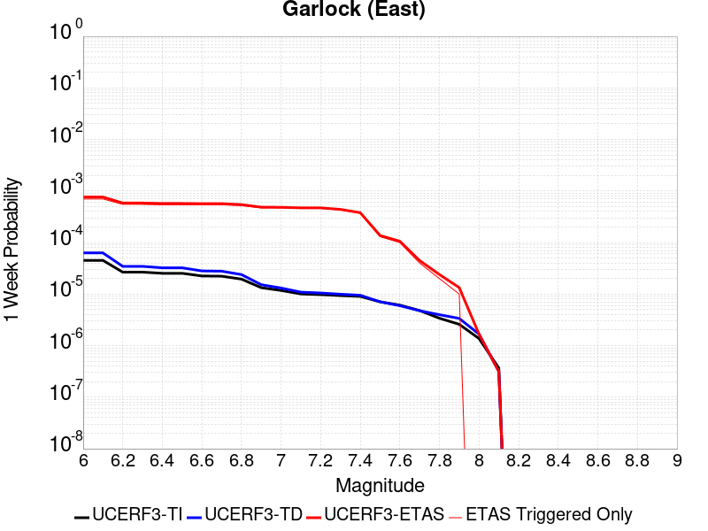 |  |  |  |

| Magnitude | 1 wk TI Prob | 1 wk TD Prob | 1 wk ETAS Prob | 1 wk ETAS/TD Gain | 1 wk ETAS Triggered Only | 1 mo TI Prob | 1 mo TD Prob | 1 mo ETAS Prob | 1 mo ETAS/TD Gain | 1 mo ETAS Triggered Only | 1 yr TI Prob | 1 yr TD Prob | 1 yr ETAS Prob | 1 yr ETAS/TD Gain | 1 yr ETAS Triggered Only | 10 yr TI Prob | 10 yr TD Prob | 10 yr ETAS Prob | 10 yr ETAS/TD Gain | 10 yr ETAS Triggered Only |
|-----|-----|-----|-----|-----|-----|-----|-----|-----|-----|-----|-----|-----|-----|-----|-----|-----|-----|-----|-----|-----|
| 6.0 | 4.5092507E-5 | 6.291034E-5 | 8.4374147E-4 | 13.41181 | 7.808803E-4 | 1.9323928E-4 | 2.6959038E-4 | 0.0027535395 | 10.21379 | 0.002484619 | 0.0023501497 | 0.0032777686 | 0.010306241 | 3.1442854 | 0.0070515852 | 0.023254504 | 0.03235544 | 0.045132194 | 1.3948874 | 0.013203976 |
| 6.1 | 4.5092507E-5 | 6.291034E-5 | 8.4374147E-4 | 13.41181 | 7.808803E-4 | 1.9323928E-4 | 2.6959038E-4 | 0.0027535395 | 10.21379 | 0.002484619 | 0.0023501497 | 0.0032777686 | 0.010306241 | 3.1442854 | 0.0070515852 | 0.023254504 | 0.03235544 | 0.045132194 | 1.3948874 | 0.013203976 |
| 6.2 | 2.6674514E-5 | 3.451529E-5 | 5.787464E-4 | 16.767826 | 5.442499E-4 | 1.1431433E-4 | 1.4791447E-4 | 0.002017018 | 13.63638 | 0.00186938 | 0.0013908884 | 0.0017994043 | 0.007090387 | 3.940408 | 0.0053005205 | 0.01382215 | 0.017893167 | 0.027421415 | 1.5325077 | 0.009701846 |
| 6.3 | 2.6674514E-5 | 3.451529E-5 | 5.787464E-4 | 16.767826 | 5.442499E-4 | 1.1431433E-4 | 1.4791447E-4 | 0.002017018 | 13.63638 | 0.00186938 | 0.0013908884 | 0.0017994043 | 0.007090387 | 3.940408 | 0.0053005205 | 0.01382215 | 0.017893167 | 0.027421415 | 1.5325077 | 0.009701846 |
| 6.4 | 2.5312667E-5 | 3.234442E-5 | 5.529144E-4 | 17.094585 | 5.2058685E-4 | 1.0847834E-4 | 1.3861175E-4 | 0.001960413 | 14.143196 | 0.0018220539 | 0.0013199237 | 0.001686321 | 0.0068361643 | 4.0538926 | 0.005158542 | 0.013121112 | 0.016781144 | 0.02604099 | 1.5518007 | 0.00941789 |
| 6.5 | 2.5312667E-5 | 3.234442E-5 | 5.529144E-4 | 17.094585 | 5.2058685E-4 | 1.0847834E-4 | 1.3861175E-4 | 0.001960413 | 14.143196 | 0.0018220539 | 0.0013199237 | 0.001686321 | 0.0068361643 | 4.0538926 | 0.005158542 | 0.013121112 | 0.016781144 | 0.02604099 | 1.5518007 | 0.00941789 |
| 6.6 | 2.246556E-5 | 2.8139062E-5 | 5.487113E-4 | 19.499985 | 5.2058685E-4 | 9.627742E-5 | 1.20590536E-4 | 0.0019187646 | 15.911403 | 0.0017983909 | 0.0011715472 | 0.0014672246 | 0.006381915 | 4.3496513 | 0.0049219117 | 0.011653901 | 0.014621371 | 0.023341948 | 1.5964268 | 0.008849977 |
| 6.7 | 2.2241198E-5 | 2.7808788E-5 | 5.483812E-4 | 19.719707 | 5.2058685E-4 | 9.531594E-5 | 1.1917521E-4 | 0.0019173519 | 16.088512 | 0.0017983909 | 0.0011598538 | 0.0014500159 | 0.0063175336 | 4.3568716 | 0.004874586 | 0.011538187 | 0.014451557 | 0.023080353 | 1.5970842 | 0.008755324 |
| 6.8 | 1.9528685E-5 | 2.3903114E-5 | 5.20815E-4 | 21.788586 | 4.969238E-4 | 8.369167E-5 | 1.02438E-4 | 0.0018533234 | 18.092148 | 0.0017510648 | 0.0010184698 | 0.0012464889 | 0.005878663 | 4.716178 | 0.0046379557 | 0.010138147 | 0.012438961 | 0.020641373 | 1.659413 | 0.008305727 |
| 6.9 | 1.3318621E-5 | 1.5203129E-5 | 5.121194E-4 | 33.68513 | 4.969238E-4 | 5.7078556E-5 | 6.515467E-5 | 0.0016268134 | 24.968485 | 0.0015617606 | 6.9470983E-4 | 7.9297513E-4 | 0.0050489446 | 6.36709 | 0.004259347 | 0.0069254204 | 0.007942084 | 0.015195891 | 1.9133381 | 0.0073118787 |
| 7.0 | 1.1760853E-5 | 1.3111888E-5 | 5.100292E-4 | 38.898228 | 4.969238E-4 | 5.0402683E-5 | 5.619262E-5 | 0.0016178654 | 28.79142 | 0.0015617606 | 6.134799E-4 | 6.839354E-4 | 0.004822135 | 7.0505705 | 0.0041410318 | 0.0061178906 | 0.006858643 | 0.013932367 | 2.031359 | 0.0071225744 |
| 7.1 | 1.0064758E-5 | 1.0906889E-5 | 5.078253E-4 | 46.560047 | 4.969238E-4 | 4.3133965E-5 | 4.6742993E-5 | 0.0016084305 | 34.41009 | 0.0015617606 | 5.2502943E-4 | 5.6895084E-4 | 0.004589379 | 8.066389 | 0.0040227165 | 0.005237907 | 0.0057150517 | 0.012561643 | 2.1979928 | 0.006885944 |
| 7.2 | 9.768808E-6 | 1.05027375E-5 | 5.074213E-4 | 48.313244 | 4.969238E-4 | 4.186565E-5 | 4.5010976E-5 | 0.0016067012 | 35.695766 | 0.0015617606 | 5.095951E-4 | 5.478743E-4 | 0.004544737 | 8.2952175 | 0.0039990535 | 0.0050842804 | 0.005505304 | 0.01228274 | 2.231074 | 0.0068149553 |
| 7.3 | 9.344516E-6 | 9.948323E-6 | 5.068672E-4 | 50.95001 | 4.969238E-4 | 4.004731E-5 | 4.2634994E-5 | 0.0015096809 | 35.409428 | 0.0014671084 | 4.8746695E-4 | 5.189609E-4 | 0.00423213 | 8.155007 | 0.003715097 | 0.0048639905 | 0.005216946 | 0.0115255555 | 2.2092535 | 0.0063416944 |
| 7.4 | 9.023491E-6 | 9.49444E-6 | 4.3542509E-4 | 45.861065 | 4.259347E-4 | 3.867153E-5 | 4.068984E-5 | 0.0013184419 | 32.40224 | 0.001277804 | 4.7072413E-4 | 4.952895E-4 | 0.003948382 | 7.9718666 | 0.0034548035 | 0.004697283 | 0.0049803588 | 0.010725385 | 2.1535366 | 0.0057737813 |
| 7.5 | 7.081253E-6 | 7.091033E-6 | 1.4906826E-4 | 21.02208 | 1.4197823E-4 | 3.0347876E-5 | 3.038979E-5 | 6.456101E-4 | 21.244308 | 6.1523897E-4 | 3.6942272E-4 | 3.6993364E-4 | 0.002049388 | 5.53988 | 0.0016800758 | 0.003688092 | 0.003726062 | 0.0064843213 | 1.7402613 | 0.0027685754 |
| 7.6 | 6.116396E-6 | 5.962439E-6 | 1.2427692E-4 | 20.843304 | 1.1831519E-4 | 2.6212863E-5 | 2.5553061E-5 | 4.5147687E-4 | 17.668211 | 4.259347E-4 | 3.1909486E-4 | 3.1106436E-4 | 0.0014938483 | 4.8023767 | 0.001183152 | 0.0031863707 | 0.0031374171 | 0.0050481097 | 1.6090018 | 0.0019167061 |
| 7.7 | 4.797145E-6 | 4.7603035E-6 | 4.7603035E-6 | 1.0 | 0.0 | 2.055903E-5 | 2.0401141E-5 | 1.8603903E-4 | 9.11905 | 1.6564126E-4 | 2.5027743E-4 | 2.4835573E-4 | 7.21499E-4 | 2.905103 | 4.7326076E-4 | 0.0024999576 | 0.0025109209 | 0.0033134439 | 1.3196131 | 8.045433E-4 |
| 7.8 | 3.4028885E-6 | 3.981157E-6 | 3.981157E-6 | 1.0 | 0.0 | 1.4583726E-5 | 1.7061991E-5 | 1.1171253E-4 | 6.5474496 | 9.4652154E-5 | 1.775424E-4 | 2.0771002E-4 | 5.152656E-4 | 2.480697 | 3.0761948E-4 | 0.0017740062 | 0.002102626 | 0.002669345 | 1.2695291 | 5.6791294E-4 |
| 7.9 | 2.5928412E-6 | 3.3747272E-6 | 3.3747272E-6 | 1.0 | 0.0 | 1.1112129E-5 | 1.4463037E-5 | 1.0911382E-4 | 7.544323 | 9.4652154E-5 | 1.3528178E-4 | 1.7607331E-4 | 4.8363864E-4 | 2.7468028 | 3.0761948E-4 | 0.0013519945 | 0.0017824261 | 0.0022548432 | 1.2650417 | 4.7326076E-4 |
| 8.0 | 1.3743648E-6 | 1.6745075E-6 | 1.6745075E-6 | 1.0 | 0.0 | 5.8901214E-6 | 7.1764416E-6 | 7.8165045E-5 | 10.891895 | 7.098912E-5 | 7.1709874E-5 | 8.73697E-5 | 1.8201358E-4 | 2.0832574 | 9.4652154E-5 | 7.1686733E-4 | 8.8426104E-4 | 0.0010497558 | 1.1871561 | 1.6564126E-4 |
| 8.1 | 3.6733252E-7 | 3.150841E-7 | 3.150841E-7 | 1.0 | 0.0 | 1.5742813E-6 | 1.3503599E-6 | 1.3503599E-6 | 1.0 | 0.0 | 1.9166706E-5 | 1.6440523E-5 | 4.0103172E-5 | 2.4392881 | 2.3663039E-5 | 1.9165053E-4 | 1.6648423E-4 | 2.1380243E-4 | 1.2842203 | 4.7326077E-5 |

## Ash Hill
*[(top)](#table-of-contents)*

| 1 Week | 1 Month | 1 Year | 10 Year |
|-----|-----|-----|-----|
|  |  |  |  |

| Magnitude | 1 wk TI Prob | 1 wk TD Prob | 1 wk ETAS Prob | 1 wk ETAS/TD Gain | 1 wk ETAS Triggered Only | 1 mo TI Prob | 1 mo TD Prob | 1 mo ETAS Prob | 1 mo ETAS/TD Gain | 1 mo ETAS Triggered Only | 1 yr TI Prob | 1 yr TD Prob | 1 yr ETAS Prob | 1 yr ETAS/TD Gain | 1 yr ETAS Triggered Only | 10 yr TI Prob | 10 yr TD Prob | 10 yr ETAS Prob | 10 yr ETAS/TD Gain | 10 yr ETAS Triggered Only |
|-----|-----|-----|-----|-----|-----|-----|-----|-----|-----|-----|-----|-----|-----|-----|-----|-----|-----|-----|-----|-----|
| 6.0 | 2.1545662E-5 | 2.3194918E-5 | 5.437697E-4 | 23.443483 | 5.2058685E-4 | 9.2335285E-5 | 9.9403456E-5 | 0.0013297591 | 13.377394 | 0.0012304779 | 0.0011236023 | 0.0012096452 | 0.005014786 | 4.145667 | 0.0038097491 | 0.011179381 | 0.012038592 | 0.018818261 | 1.5631613 | 0.006862281 |
| 6.1 | 2.1545662E-5 | 2.3194918E-5 | 5.437697E-4 | 23.443483 | 5.2058685E-4 | 9.2335285E-5 | 9.9403456E-5 | 0.0013297591 | 13.377394 | 0.0012304779 | 0.0011236023 | 0.0012096452 | 0.005014786 | 4.145667 | 0.0038097491 | 0.011179381 | 0.012038592 | 0.018818261 | 1.5631613 | 0.006862281 |
| 6.2 | 2.1545662E-5 | 2.3194918E-5 | 5.437697E-4 | 23.443483 | 5.2058685E-4 | 9.2335285E-5 | 9.9403456E-5 | 0.0013297591 | 13.377394 | 0.0012304779 | 0.0011236023 | 0.0012096452 | 0.005014786 | 4.145667 | 0.0038097491 | 0.011179381 | 0.012038592 | 0.018818261 | 1.5631613 | 0.006862281 |
| 6.3 | 1.0025529E-5 | 1.074714E-5 | 2.9470056E-4 | 27.4213 | 2.8395647E-4 | 4.2965847E-5 | 4.605843E-5 | 6.139452E-4 | 13.329703 | 5.6791294E-4 | 5.229836E-4 | 5.6063035E-4 | 0.0021924647 | 3.9107134 | 0.0016327497 | 0.005217545 | 0.0055934726 | 0.008299501 | 1.4837832 | 0.0027212494 |
| 6.4 | 1.0025529E-5 | 1.074714E-5 | 2.9470056E-4 | 27.4213 | 2.8395647E-4 | 4.2965847E-5 | 4.605843E-5 | 6.139452E-4 | 13.329703 | 5.6791294E-4 | 5.229836E-4 | 5.6063035E-4 | 0.0021924647 | 3.9107134 | 0.0016327497 | 0.005217545 | 0.0055934726 | 0.008299501 | 1.4837832 | 0.0027212494 |
| 6.5 | 6.9617327E-6 | 7.4567747E-6 | 1.730968E-4 | 23.213362 | 1.6564126E-4 | 2.9835655E-5 | 3.1957265E-5 | 3.3956693E-4 | 10.625657 | 3.0761948E-4 | 3.6318856E-4 | 3.8901888E-4 | 0.0014061338 | 3.6145642 | 0.0010175107 | 0.0036259557 | 0.0038842335 | 0.0055106413 | 1.4187204 | 0.0016327497 |
| 6.6 | 4.9919777E-6 | 5.346789E-6 | 1.4732426E-4 | 27.553782 | 1.4197823E-4 | 2.1394015E-5 | 2.2914646E-5 | 2.595396E-4 | 11.326363 | 2.3663038E-4 | 2.60441E-4 | 2.789568E-4 | 0.0010123063 | 3.6289 | 7.335542E-4 | 0.0026013597 | 0.002786725 | 0.0040609683 | 1.4572548 | 0.001277804 |
| 6.7 | 3.6630722E-6 | 3.924698E-6 | 9.857648E-5 | 25.116959 | 9.4652154E-5 | 1.5698786E-5 | 1.6820059E-5 | 1.587959E-4 | 9.4408655 | 1.4197823E-4 | 1.9111596E-4 | 2.0477071E-4 | 7.252509E-4 | 3.541771 | 5.2058685E-4 | 0.0019095168 | 0.0020463832 | 0.0029437386 | 1.4385079 | 8.9919544E-4 |
| 6.8 | 2.5599613E-6 | 2.7449778E-6 | 5.0070925E-5 | 18.240923 | 4.7326077E-5 | 1.0971216E-5 | 1.1764165E-5 | 8.275244E-5 | 7.0342813 | 7.098912E-5 | 1.3356637E-4 | 1.4322424E-4 | 5.2177865E-4 | 3.6430888 | 3.7860862E-4 | 0.0013348613 | 0.0014318044 | 0.0020461625 | 1.4290797 | 6.1523897E-4 |
| 6.9 | 1.7684905E-6 | 1.8969073E-6 | 2.55599E-5 | 13.474513 | 2.3663039E-5 | 7.579223E-6 | 8.129602E-6 | 5.5455293E-5 | 6.821403 | 4.7326077E-5 | 9.2273134E-5 | 9.897791E-5 | 2.6460277E-4 | 2.673352 | 1.6564126E-4 | 9.223483E-4 | 9.897791E-4 | 0.0013207337 | 1.3343723 | 3.3128253E-4 |

## Hunter Mountain-Saline Valley
*[(top)](#table-of-contents)*

| 1 Week | 1 Month | 1 Year | 10 Year |
|-----|-----|-----|-----|
|  |  |  |  |

| Magnitude | 1 wk TI Prob | 1 wk TD Prob | 1 wk ETAS Prob | 1 wk ETAS/TD Gain | 1 wk ETAS Triggered Only | 1 mo TI Prob | 1 mo TD Prob | 1 mo ETAS Prob | 1 mo ETAS/TD Gain | 1 mo ETAS Triggered Only | 1 yr TI Prob | 1 yr TD Prob | 1 yr ETAS Prob | 1 yr ETAS/TD Gain | 1 yr ETAS Triggered Only | 10 yr TI Prob | 10 yr TD Prob | 10 yr ETAS Prob | 10 yr ETAS/TD Gain | 10 yr ETAS Triggered Only |
|-----|-----|-----|-----|-----|-----|-----|-----|-----|-----|-----|-----|-----|-----|-----|-----|-----|-----|-----|-----|-----|
| 6.0 | 4.5103672E-5 | 5.4573724E-5 | 6.224557E-4 | 11.405775 | 5.6791294E-4 | 1.9328714E-4 | 2.3386456E-4 | 0.0015586847 | 6.664904 | 0.0013251301 | 0.002350731 | 0.0028436917 | 0.006854969 | 2.4105878 | 0.0040227165 | 0.023260195 | 0.028093647 | 0.03439517 | 1.2243042 | 0.0064836727 |
| 6.1 | 4.5103672E-5 | 5.4573724E-5 | 6.224557E-4 | 11.405775 | 5.6791294E-4 | 1.9328714E-4 | 2.3386456E-4 | 0.0015586847 | 6.664904 | 0.0013251301 | 0.002350731 | 0.0028436917 | 0.006854969 | 2.4105878 | 0.0040227165 | 0.023260195 | 0.028093647 | 0.03439517 | 1.2243042 | 0.0064836727 |
| 6.2 | 3.9363465E-5 | 4.70663E-5 | 6.1495247E-4 | 13.065664 | 5.6791294E-4 | 1.6868966E-4 | 2.0169491E-4 | 0.0015265578 | 7.568648 | 0.0013251301 | 0.002051862 | 0.002452966 | 0.006418605 | 2.6166708 | 0.0039753905 | 0.020330196 | 0.024274953 | 0.030531969 | 1.257756 | 0.0064126835 |
| 6.3 | 3.9363465E-5 | 4.70663E-5 | 6.1495247E-4 | 13.065664 | 5.6791294E-4 | 1.6868966E-4 | 2.0169491E-4 | 0.0015265578 | 7.568648 | 0.0013251301 | 0.002051862 | 0.002452966 | 0.006418605 | 2.6166708 | 0.0039753905 | 0.020330196 | 0.024274953 | 0.030531969 | 1.257756 | 0.0064126835 |
| 6.4 | 3.2311684E-5 | 3.7953207E-5 | 5.8218243E-4 | 15.3394785 | 5.442499E-4 | 1.384713E-4 | 1.6264687E-4 | 0.0014639023 | 9.000494 | 0.0013014671 | 0.0016845843 | 0.0019784998 | 0.0058751763 | 2.9695106 | 0.0039044013 | 0.016718714 | 0.019617606 | 0.025834892 | 1.3169237 | 0.0063416944 |
| 6.5 | 3.2311684E-5 | 3.7953207E-5 | 5.8218243E-4 | 15.3394785 | 5.442499E-4 | 1.384713E-4 | 1.6264687E-4 | 0.0014639023 | 9.000494 | 0.0013014671 | 0.0016845843 | 0.0019784998 | 0.0058751763 | 2.9695106 | 0.0039044013 | 0.016718714 | 0.019617606 | 0.025834892 | 1.3169237 | 0.0063416944 |
| 6.6 | 2.9305844E-5 | 3.4183795E-5 | 5.7841506E-4 | 16.920738 | 5.442499E-4 | 1.2559042E-4 | 1.464941E-4 | 0.0014477705 | 9.882791 | 0.0013014671 | 0.0015279909 | 0.0017821693 | 0.0056796125 | 3.1869094 | 0.0039044013 | 0.015175272 | 0.017686697 | 0.023916228 | 1.3522156 | 0.0063416944 |
| 6.7 | 2.7826512E-5 | 3.234612E-5 | 5.765784E-4 | 17.825272 | 5.442499E-4 | 1.19251024E-4 | 1.386192E-4 | 0.001439906 | 10.387492 | 0.0013014671 | 0.0014509142 | 0.0016864425 | 0.0055842595 | 3.3112657 | 0.0039044013 | 0.014414776 | 0.016744133 | 0.022979641 | 1.3723996 | 0.0063416944 |
| 6.8 | 2.3389874E-5 | 2.6868218E-5 | 5.474411E-4 | 20.375042 | 5.2058685E-4 | 1.0023846E-4 | 1.15144685E-4 | 0.0013928016 | 12.0961 | 0.001277804 | 0.00121972 | 0.0014010323 | 0.0052763335 | 3.7660327 | 0.0038807383 | 0.01213047 | 0.0139282085 | 0.02015824 | 1.447296 | 0.0063180313 |
| 6.9 | 2.069209E-5 | 2.3571341E-5 | 5.4414594E-4 | 23.085064 | 5.2058685E-4 | 8.867737E-5 | 1.01016325E-4 | 0.0013550307 | 13.413978 | 0.001254141 | 0.0010791123 | 0.001229216 | 0.00508155 | 4.1339765 | 0.0038570752 | 0.010738871 | 0.012229199 | 0.018446593 | 1.5084056 | 0.0062943683 |
| 7.0 | 1.7462342E-5 | 1.9634626E-5 | 5.402113E-4 | 27.513193 | 5.2058685E-4 | 7.483646E-5 | 8.414581E-5 | 0.0013381813 | 15.903125 | 0.001254141 | 9.1075303E-4 | 0.0010240164 | 0.004877142 | 4.762758 | 0.0038570752 | 0.009070295 | 0.010196611 | 0.016403377 | 1.6087086 | 0.0062707053 |
| 7.1 | 1.4807709E-5 | 1.6442658E-5 | 5.3702097E-4 | 32.660225 | 5.2058685E-4 | 6.3460066E-5 | 7.0466725E-5 | 0.001300858 | 18.4606 | 0.0012304779 | 7.723524E-4 | 8.576112E-4 | 0.004687736 | 5.4660387 | 0.0038334122 | 0.007696735 | 0.008546002 | 0.014716197 | 1.7219977 | 0.006223379 |
| 7.2 | 1.4180048E-5 | 1.5699208E-5 | 5.362779E-4 | 34.159546 | 5.2058685E-4 | 6.077022E-5 | 6.728068E-5 | 0.0012976759 | 19.287497 | 0.0012304779 | 7.396263E-4 | 8.1885065E-4 | 0.004649124 | 5.6776214 | 0.0038334122 | 0.0073716943 | 0.008161285 | 0.014310404 | 1.7534498 | 0.006199716 |
| 7.3 | 1.3730402E-5 | 1.5172925E-5 | 5.3575187E-4 | 35.30973 | 5.2058685E-4 | 5.8843252E-5 | 6.502529E-5 | 0.0012954233 | 19.921839 | 0.0012304779 | 7.161811E-4 | 7.9141144E-4 | 0.00462179 | 5.8399334 | 0.0038334122 | 0.007138774 | 0.007888863 | 0.01403967 | 1.7796824 | 0.006199716 |
| 7.4 | 1.2810095E-5 | 1.4110082E-5 | 5.110269E-4 | 36.217144 | 4.969238E-4 | 5.489925E-5 | 6.0470466E-5 | 0.0012672124 | 20.95589 | 0.001206815 | 6.681934E-4 | 7.35995E-4 | 0.0045192945 | 6.1403875 | 0.003786086 | 0.006661878 | 0.0073384703 | 0.013445711 | 1.8322226 | 0.00615239 |
| 7.5 | 1.1595659E-5 | 1.2801363E-5 | 4.8605606E-4 | 37.96909 | 4.7326076E-4 | 4.9694736E-5 | 5.4861917E-5 | 0.0012379489 | 22.564814 | 0.001183152 | 6.0486543E-4 | 6.6775485E-4 | 0.004404018 | 6.5952625 | 0.00373876 | 0.006032217 | 0.006660355 | 0.012677746 | 1.9034641 | 0.006057738 |
| 7.6 | 2.997694E-6 | 3.3254314E-6 | 2.3995503E-4 | 72.15756 | 2.3663038E-4 | 1.28471975E-5 | 1.4251812E-5 | 5.8215664E-4 | 40.847904 | 5.6791294E-4 | 1.564034E-4 | 1.7350928E-4 | 0.0016167042 | 9.317681 | 0.0014434453 | 0.0015629337 | 0.001735174 | 0.004144616 | 2.388588 | 0.00241363 |

## Blackwater
*[(top)](#table-of-contents)*

| 1 Week | 1 Month | 1 Year | 10 Year |
|-----|-----|-----|-----|
|  |  |  |  |

| Magnitude | 1 wk TI Prob | 1 wk TD Prob | 1 wk ETAS Prob | 1 wk ETAS/TD Gain | 1 wk ETAS Triggered Only | 1 mo TI Prob | 1 mo TD Prob | 1 mo ETAS Prob | 1 mo ETAS/TD Gain | 1 mo ETAS Triggered Only | 1 yr TI Prob | 1 yr TD Prob | 1 yr ETAS Prob | 1 yr ETAS/TD Gain | 1 yr ETAS Triggered Only | 10 yr TI Prob | 10 yr TD Prob | 10 yr ETAS Prob | 10 yr ETAS/TD Gain | 10 yr ETAS Triggered Only |
|-----|-----|-----|-----|-----|-----|-----|-----|-----|-----|-----|-----|-----|-----|-----|-----|-----|-----|-----|-----|-----|
| 6.0 | 3.0708583E-5 | 3.309653E-5 | 2.9338134E-4 | 8.864413 | 2.6029343E-4 | 1.3160157E-4 | 1.4183533E-4 | 7.569871E-4 | 5.337084 | 6.1523897E-4 | 0.0016010714 | 0.0017256141 | 0.003922479 | 2.2730918 | 0.0022006626 | 0.015895851 | 0.017135985 | 0.022043327 | 1.2863765 | 0.004992901 |
| 6.1 | 3.0708583E-5 | 3.309653E-5 | 2.9338134E-4 | 8.864413 | 2.6029343E-4 | 1.3160157E-4 | 1.4183533E-4 | 7.569871E-4 | 5.337084 | 6.1523897E-4 | 0.0016010714 | 0.0017256141 | 0.003922479 | 2.2730918 | 0.0022006626 | 0.015895851 | 0.017135985 | 0.022043327 | 1.2863765 | 0.004992901 |
| 6.2 | 1.1707779E-5 | 1.2545361E-5 | 5.9870843E-5 | 4.7723494 | 4.7326077E-5 | 5.017523E-5 | 5.3764776E-5 | 2.6672066E-4 | 4.960881 | 2.1296735E-4 | 6.107122E-4 | 6.5439916E-4 | 0.0016003012 | 2.4454513 | 9.465215E-4 | 0.006090366 | 0.006525693 | 0.008382874 | 1.2845953 | 0.00186938 |
| 6.3 | 1.1707779E-5 | 1.2545361E-5 | 5.9870843E-5 | 4.7723494 | 4.7326077E-5 | 5.017523E-5 | 5.3764776E-5 | 2.6672066E-4 | 4.960881 | 2.1296735E-4 | 6.107122E-4 | 6.5439916E-4 | 0.0016003012 | 2.4454513 | 9.465215E-4 | 0.006090366 | 0.006525693 | 0.008382874 | 1.2845953 | 0.00186938 |
| 6.4 | 7.929244E-6 | 8.480254E-6 | 5.580593E-5 | 6.5806904 | 4.7326077E-5 | 3.3982033E-5 | 3.6343463E-5 | 2.4930306E-4 | 6.8596396 | 2.1296735E-4 | 4.136527E-4 | 4.4239586E-4 | 0.0010573626 | 2.3900826 | 6.1523897E-4 | 0.0041288356 | 0.0044155573 | 0.0056641605 | 1.2827736 | 0.001254141 |
| 6.5 | 5.8832115E-6 | 6.286105E-6 | 6.286105E-6 | 1.0 | 0.0 | 2.521352E-5 | 2.6940186E-5 | 1.452522E-4 | 5.391655 | 1.1831519E-4 | 3.0693135E-4 | 3.2794994E-4 | 7.774002E-4 | 2.3704844 | 4.4959772E-4 | 0.0030650778 | 0.0032749132 | 0.0041239928 | 1.2592678 | 8.518694E-4 |
| 6.6 | 5.8832115E-6 | 6.286105E-6 | 6.286105E-6 | 1.0 | 0.0 | 2.521352E-5 | 2.6940186E-5 | 1.452522E-4 | 5.391655 | 1.1831519E-4 | 3.0693135E-4 | 3.2794994E-4 | 7.774002E-4 | 2.3704844 | 4.4959772E-4 | 0.0030650778 | 0.0032749132 | 0.0041239928 | 1.2592678 | 8.518694E-4 |
| 6.7 | 3.0715053E-6 | 3.2815258E-6 | 3.2815258E-6 | 1.0 | 0.0 | 1.3163528E-5 | 1.4063612E-5 | 8.505173E-5 | 6.0476446 | 7.098912E-5 | 1.6025416E-4 | 1.7121219E-4 | 4.0780206E-4 | 2.3818517 | 2.3663038E-4 | 0.0016013865 | 0.0017109173 | 0.0020888783 | 1.2209113 | 3.7860862E-4 |
| 6.8 | 2.2722281E-6 | 2.428798E-6 | 2.428798E-6 | 1.0 | 0.0 | 9.738084E-6 | 1.0409098E-5 | 5.7734684E-5 | 5.5465593 | 4.7326077E-5 | 1.1855473E-4 | 1.2672432E-4 | 1.9770443E-4 | 1.5601144 | 7.098912E-5 | 0.001184915 | 0.0012666107 | 0.0014556752 | 1.149268 | 1.8930431E-4 |
| 6.9 | 9.952399E-7 | 1.0653688E-6 | 1.0653688E-6 | 1.0 | 0.0 | 4.265307E-6 | 4.565861E-6 | 4.565861E-6 | 1.0 | 0.0 | 5.1928873E-5 | 5.5588458E-5 | 7.925018E-5 | 1.425659 | 2.3663039E-5 | 5.191674E-4 | 5.5579614E-4 | 6.267458E-4 | 1.1276541 | 7.098912E-5 |
| 7.0 | 4.7385504E-7 | 5.075655E-7 | 5.075655E-7 | 1.0 | 0.0 | 2.0308057E-6 | 2.1752808E-6 | 2.1752808E-6 | 1.0 | 0.0 | 2.4724779E-5 | 2.6484044E-5 | 2.6484044E-5 | 1.0 | 0.0 | 2.4722028E-4 | 2.6484043E-4 | 2.8849722E-4 | 1.0893246 | 2.3663039E-5 |

## Garlock (West)
*[(top)](#table-of-contents)*

| 1 Week | 1 Month | 1 Year | 10 Year |
|-----|-----|-----|-----|
|  |  | 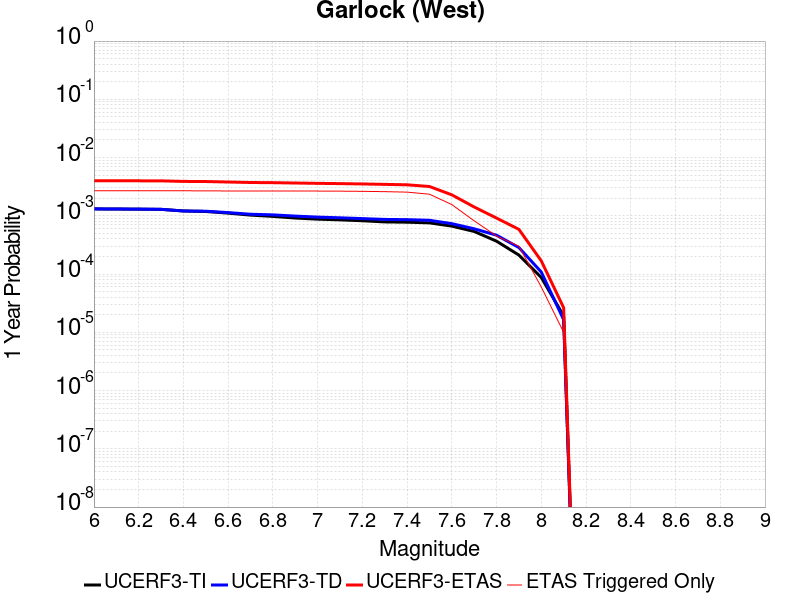 |  |

| Magnitude | 1 wk TI Prob | 1 wk TD Prob | 1 wk ETAS Prob | 1 wk ETAS/TD Gain | 1 wk ETAS Triggered Only | 1 mo TI Prob | 1 mo TD Prob | 1 mo ETAS Prob | 1 mo ETAS/TD Gain | 1 mo ETAS Triggered Only | 1 yr TI Prob | 1 yr TD Prob | 1 yr ETAS Prob | 1 yr ETAS/TD Gain | 1 yr ETAS Triggered Only | 10 yr TI Prob | 10 yr TD Prob | 10 yr ETAS Prob | 10 yr ETAS/TD Gain | 10 yr ETAS Triggered Only |
|-----|-----|-----|-----|-----|-----|-----|-----|-----|-----|-----|-----|-----|-----|-----|-----|-----|-----|-----|-----|-----|
| 6.0 | 2.5181727E-5 | 2.520697E-5 | 2.618314E-4 | 10.387261 | 2.3663038E-4 | 1.0791722E-4 | 1.0802542E-4 | 0.0011254261 | 10.41816 | 0.0010175107 | 0.0013131002 | 0.0013144194 | 0.0041266195 | 3.1395 | 0.0028159015 | 0.013053683 | 0.013146939 | 0.017817328 | 1.3552454 | 0.004732608 |
| 6.1 | 2.5077732E-5 | 2.5108038E-5 | 2.617325E-4 | 10.424251 | 2.3663038E-4 | 1.0747157E-4 | 1.0760146E-4 | 0.0011250026 | 10.455273 | 0.0010175107 | 0.001307681 | 0.0013092639 | 0.0041214786 | 3.1479359 | 0.0028159015 | 0.013000126 | 0.013095993 | 0.017766623 | 1.3566457 | 0.004732608 |
| 6.2 | 2.494612E-5 | 2.498971E-5 | 2.616142E-4 | 10.468876 | 2.3663038E-4 | 1.0690756E-4 | 1.07094376E-4 | 0.0011244961 | 10.500048 | 0.0010175107 | 0.0013008224 | 0.0013030976 | 0.0041153296 | 3.1581132 | 0.0028159015 | 0.012932341 | 0.013035054 | 0.017705971 | 1.3583351 | 0.004732608 |
| 6.3 | 2.4733758E-5 | 2.4809067E-5 | 2.6143357E-4 | 10.537824 | 2.3663038E-4 | 1.0599751E-4 | 1.0632026E-4 | 0.0011237228 | 10.569224 | 0.0010175107 | 0.0012897556 | 0.0012936839 | 0.004105943 | 3.1738377 | 0.0028159015 | 0.012822957 | 0.012942018 | 0.017613376 | 1.3609451 | 0.004732608 |
| 6.4 | 2.3237335E-5 | 2.318831E-5 | 2.598132E-4 | 11.204492 | 2.3663038E-4 | 9.958477E-5 | 9.9374694E-5 | 0.0011167843 | 11.238114 | 0.0010175107 | 0.0012117702 | 0.0012092182 | 0.004021715 | 3.32588 | 0.0028159015 | 0.012051838 | 0.012106836 | 0.016782148 | 1.3861711 | 0.004732608 |
| 6.5 | 2.2732203E-5 | 2.3002827E-5 | 2.5962776E-4 | 11.286776 | 2.3663038E-4 | 9.742009E-5 | 9.857984E-5 | 0.0011159902 | 11.320674 | 0.0010175107 | 0.0011854442 | 0.0011995515 | 0.0040120753 | 3.344646 | 0.0028159015 | 0.011791403 | 0.012011218 | 0.016686982 | 1.3892831 | 0.004732608 |
| 6.6 | 2.1319436E-5 | 2.1782947E-5 | 2.5840817E-4 | 11.862865 | 2.3663038E-4 | 9.136581E-5 | 9.335216E-5 | 0.001087107 | 11.645226 | 9.938476E-4 | 0.001111811 | 0.0011359722 | 0.003925039 | 3.4552243 | 0.0027922385 | 0.011062649 | 0.0113820825 | 0.01603743 | 1.4090066 | 0.004708945 |
| 6.7 | 1.970802E-5 | 2.0402744E-5 | 2.570283E-4 | 12.597733 | 2.3663038E-4 | 8.446021E-5 | 8.743741E-5 | 0.0010811981 | 12.365396 | 9.938476E-4 | 0.001027818 | 0.0010640323 | 0.0038532997 | 3.6214125 | 0.0027922385 | 0.010230771 | 0.0106697725 | 0.015328474 | 1.4366261 | 0.004708945 |
| 6.8 | 1.8744462E-5 | 1.9910338E-5 | 2.56536E-4 | 12.8845625 | 2.3663038E-4 | 8.033094E-5 | 8.532724E-5 | 0.00107909 | 12.646489 | 9.938476E-4 | 9.775903E-4 | 0.0010383658 | 0.0038277048 | 3.686278 | 0.0027922385 | 0.009733009 | 0.010415533 | 0.015052014 | 1.4451507 | 0.004685282 |
| 6.9 | 1.7559682E-5 | 1.8962646E-5 | 2.5558853E-4 | 13.478527 | 2.3663038E-4 | 7.5253614E-5 | 8.126596E-5 | 0.0010750327 | 13.228575 | 9.938476E-4 | 9.158276E-4 | 9.889654E-4 | 0.0037784425 | 3.8206015 | 0.0027922385 | 0.0091206245 | 0.009925983 | 0.014564759 | 1.4673367 | 0.004685282 |
| 7.0 | 1.6794445E-5 | 1.82254E-5 | 2.5485147E-4 | 13.983313 | 2.3663038E-4 | 7.197421E-5 | 7.810653E-5 | 0.0010718765 | 13.723264 | 9.938476E-4 | 8.759337E-4 | 9.505335E-4 | 0.003740118 | 3.9347565 | 0.0027922385 | 0.008724891 | 0.00954486 | 0.014138546 | 1.4812734 | 0.0046379557 |
| 7.1 | 1.6337795E-5 | 1.7726159E-5 | 2.5435234E-4 | 14.348983 | 2.3663038E-4 | 7.0017246E-5 | 7.5967044E-5 | 0.0010697391 | 14.081621 | 9.938476E-4 | 8.521265E-4 | 9.245077E-4 | 0.0037141647 | 4.0174513 | 0.0027922385 | 0.008488664 | 0.0092866905 | 0.013881574 | 1.4947817 | 0.0046379557 |
| 7.2 | 1.5780008E-5 | 1.7174763E-5 | 2.3013845E-4 | 13.399803 | 2.1296735E-4 | 6.762685E-5 | 7.360406E-5 | 0.0010437173 | 14.180158 | 9.7018457E-4 | 8.2304585E-4 | 8.9576235E-4 | 0.003638216 | 4.0615864 | 0.0027449124 | 0.008200042 | 0.009001516 | 0.013527372 | 1.5027883 | 0.0045669666 |
| 7.3 | 1.5058865E-5 | 1.6627771E-5 | 2.2959158E-4 | 13.807718 | 2.1296735E-4 | 6.45364E-5 | 7.1259936E-5 | 0.0010413753 | 14.613757 | 9.7018457E-4 | 7.854473E-4 | 8.6724554E-4 | 0.0035861349 | 4.135086 | 0.0027212494 | 0.00782677 | 0.008718181 | 0.013221876 | 1.5165864 | 0.0045433035 |
| 7.4 | 1.4887923E-5 | 1.6463711E-5 | 2.2942755E-4 | 13.9353485 | 2.1296735E-4 | 6.380382E-5 | 7.055686E-5 | 9.933503E-4 | 14.078719 | 9.228585E-4 | 7.7653467E-4 | 8.5869245E-4 | 0.0035303198 | 4.111274 | 0.0026739233 | 0.0077382675 | 0.008633028 | 0.013043273 | 1.5108573 | 0.0044486513 |
| 7.5 | 1.4509299E-5 | 1.6055668E-5 | 2.290196E-4 | 14.264096 | 2.1296735E-4 | 6.218123E-5 | 6.880819E-5 | 9.6794177E-4 | 14.0672455 | 8.9919544E-4 | 7.567935E-4 | 8.37419E-4 | 0.0033199573 | 3.9645116 | 0.002484619 | 0.0075422134 | 0.008421303 | 0.012433606 | 1.476447 | 0.0040463796 |
| 7.6 | 1.2756717E-5 | 1.4059411E-5 | 2.0336105E-4 | 14.464408 | 1.8930431E-4 | 5.4670498E-5 | 6.025323E-5 | 6.991168E-4 | 11.602976 | 6.38902E-4 | 6.6541E-4 | 7.3333684E-4 | 0.0024831176 | 3.386053 | 0.0017510648 | 0.006634211 | 0.0073861093 | 0.010228189 | 1.3847871 | 0.0028632276 |
| 7.7 | 1.0328985E-5 | 1.1468589E-5 | 3.5131354E-5 | 3.0632675 | 2.3663039E-5 | 4.4266326E-5 | 4.915017E-5 | 3.8041643E-4 | 7.73988 | 3.3128253E-4 | 5.388092E-4 | 5.982394E-4 | 0.0014495992 | 2.4231088 | 8.518694E-4 | 0.0053750467 | 0.00604267 | 0.007500913 | 1.2413243 | 0.0014671084 |
| 7.8 | 7.0306583E-6 | 8.906025E-6 | 8.906025E-6 | 1.0 | 0.0 | 3.0131043E-5 | 3.816812E-5 | 1.8014092E-4 | 4.71967 | 1.4197823E-4 | 3.667837E-4 | 4.6459792E-4 | 9.376388E-4 | 2.0181725 | 4.7326076E-4 | 0.003661789 | 0.0046986034 | 0.005593574 | 1.1904758 | 8.9919544E-4 |
| 7.9 | 4.060633E-6 | 5.4691627E-6 | 5.4691627E-6 | 1.0 | 0.0 | 1.7402595E-5 | 2.3439059E-5 | 1.18088996E-4 | 5.038129 | 9.4652154E-5 | 2.11856E-4 | 2.8533328E-4 | 6.6383387E-4 | 2.326521 | 3.7860862E-4 | 0.0021165414 | 0.0028861589 | 0.0035232168 | 1.2207286 | 6.38902E-4 |
| 8.0 | 1.6729537E-6 | 2.078796E-6 | 2.078796E-6 | 1.0 | 0.0 | 7.169782E-6 | 8.9090945E-6 | 7.9897574E-5 | 8.968092 | 7.098912E-5 | 8.7288594E-5 | 1.0846286E-4 | 2.0310475E-4 | 1.8725741 | 9.4652154E-5 | 8.7254314E-4 | 0.0010976003 | 0.0012630598 | 1.1507466 | 1.6564126E-4 |
| 8.1 | 3.6733252E-7 | 3.150841E-7 | 3.150841E-7 | 1.0 | 0.0 | 1.5742813E-6 | 1.3503599E-6 | 1.3503599E-6 | 1.0 | 0.0 | 1.9166706E-5 | 1.6440523E-5 | 4.0103172E-5 | 2.4392881 | 2.3663039E-5 | 1.9165053E-4 | 1.6648423E-4 | 2.1380243E-4 | 1.2842203 | 4.7326077E-5 |

## McLean Lake
*[(top)](#table-of-contents)*

| 1 Week | 1 Month | 1 Year | 10 Year |
|-----|-----|-----|-----|
|  |  |  |  |

| Magnitude | 1 wk TI Prob | 1 wk TD Prob | 1 wk ETAS Prob | 1 wk ETAS/TD Gain | 1 wk ETAS Triggered Only | 1 mo TI Prob | 1 mo TD Prob | 1 mo ETAS Prob | 1 mo ETAS/TD Gain | 1 mo ETAS Triggered Only | 1 yr TI Prob | 1 yr TD Prob | 1 yr ETAS Prob | 1 yr ETAS/TD Gain | 1 yr ETAS Triggered Only | 10 yr TI Prob | 10 yr TD Prob | 10 yr ETAS Prob | 10 yr ETAS/TD Gain | 10 yr ETAS Triggered Only |
|-----|-----|-----|-----|-----|-----|-----|-----|-----|-----|-----|-----|-----|-----|-----|-----|-----|-----|-----|-----|-----|
| 6.0 | 1.7360222E-5 | 1.850195E-5 | 1.3681495E-4 | 7.3946233 | 1.1831519E-4 | 7.439883E-5 | 7.929194E-5 | 4.3420936E-4 | 5.4760847 | 3.5494557E-4 | 9.0542925E-4 | 9.650004E-4 | 0.002430693 | 2.5188518 | 0.0014671084 | 0.009017491 | 0.009612942 | 0.013104841 | 1.3632498 | 0.0035257926 |
| 6.1 | 9.062689E-6 | 9.592342E-6 | 5.6917965E-5 | 5.9336877 | 4.7326077E-5 | 3.8839516E-5 | 4.110944E-5 | 2.7773008E-4 | 6.7558713 | 2.3663038E-4 | 4.727685E-4 | 5.0040137E-4 | 0.0011862861 | 2.3706691 | 6.862281E-4 | 0.0047176396 | 0.004993629 | 0.006877219 | 1.3771986 | 0.001893043 |
| 6.2 | 9.062689E-6 | 9.592342E-6 | 5.6917965E-5 | 5.9336877 | 4.7326077E-5 | 3.8839516E-5 | 4.110944E-5 | 2.7773008E-4 | 6.7558713 | 2.3663038E-4 | 4.727685E-4 | 5.0040137E-4 | 0.0011862861 | 2.3706691 | 6.862281E-4 | 0.0047176396 | 0.004993629 | 0.006877219 | 1.3771986 | 0.001893043 |
| 6.3 | 7.2575485E-6 | 7.667824E-6 | 3.133068E-5 | 4.085994 | 2.3663039E-5 | 3.110341E-5 | 3.286173E-5 | 2.4582207E-4 | 7.480497 | 2.1296735E-4 | 3.786182E-4 | 4.0002525E-4 | 0.0010386717 | 2.5965154 | 6.38902E-4 | 0.0037797375 | 0.0039937566 | 0.0055257115 | 1.3835874 | 0.0015380975 |
| 6.4 | 7.2575485E-6 | 7.667824E-6 | 3.133068E-5 | 4.085994 | 2.3663039E-5 | 3.110341E-5 | 3.286173E-5 | 2.4582207E-4 | 7.480497 | 2.1296735E-4 | 3.786182E-4 | 4.0002525E-4 | 0.0010386717 | 2.5965154 | 6.38902E-4 | 0.0037797375 | 0.0039937566 | 0.0055257115 | 1.3835874 | 0.0015380975 |
| 6.5 | 6.06582E-6 | 6.403972E-6 | 3.0066858E-5 | 4.695033 | 2.3663039E-5 | 2.5996113E-5 | 2.7445341E-5 | 1.4575728E-4 | 5.3108206 | 1.1831519E-4 | 3.164567E-4 | 3.3410228E-4 | 8.545152E-4 | 2.5576456 | 5.2058685E-4 | 0.0031600643 | 0.0033366384 | 0.0045630108 | 1.3675473 | 0.0012304779 |
| 6.6 | 5.598744E-6 | 5.9103495E-6 | 2.9573248E-5 | 5.003638 | 2.3663039E-5 | 2.3994397E-5 | 2.532986E-5 | 1.4364206E-4 | 5.670859 | 1.1831519E-4 | 2.9209262E-4 | 3.083538E-4 | 7.3415716E-4 | 2.3808923 | 4.259347E-4 | 0.0029170897 | 0.0030798884 | 0.0041650357 | 1.3523333 | 0.0010884998 |
| 6.7 | 5.246996E-6 | 5.539244E-6 | 2.920215E-5 | 5.271866 | 2.3663039E-5 | 2.2486933E-5 | 2.3739436E-5 | 1.4205182E-4 | 5.983791 | 1.1831519E-4 | 2.73744E-4 | 2.8899565E-4 | 7.1480725E-4 | 2.4734187 | 4.259347E-4 | 0.0027340704 | 0.0028868222 | 0.003948585 | 1.3677964 | 0.0010648367 |
| 6.8 | 4.02324E-6 | 4.246967E-6 | 4.246967E-6 | 1.0 | 0.0 | 1.7242342E-5 | 1.8201194E-5 | 1.1285162E-4 | 6.200232 | 9.4652154E-5 | 2.099053E-4 | 2.2158296E-4 | 5.291343E-4 | 2.3879738 | 3.0761948E-4 | 0.0020970714 | 0.0022142045 | 0.0030641877 | 1.3838774 | 8.518694E-4 |
| 6.9 | 6.835972E-7 | 7.1400126E-7 | 7.1400126E-7 | 1.0 | 0.0 | 2.9296991E-6 | 3.0600036E-6 | 3.0600036E-6 | 1.0 | 0.0 | 3.56685E-5 | 3.7255224E-5 | 3.7255224E-5 | 1.0 | 0.0 | 3.5662777E-4 | 3.7252106E-4 | 3.7252106E-4 | 1.0 | 0.0 |

## Gravel Hills-Harper Lk
*[(top)](#table-of-contents)*

| 1 Week | 1 Month | 1 Year | 10 Year |
|-----|-----|-----|-----|
|  |  |  |  |

| Magnitude | 1 wk TI Prob | 1 wk TD Prob | 1 wk ETAS Prob | 1 wk ETAS/TD Gain | 1 wk ETAS Triggered Only | 1 mo TI Prob | 1 mo TD Prob | 1 mo ETAS Prob | 1 mo ETAS/TD Gain | 1 mo ETAS Triggered Only | 1 yr TI Prob | 1 yr TD Prob | 1 yr ETAS Prob | 1 yr ETAS/TD Gain | 1 yr ETAS Triggered Only | 10 yr TI Prob | 10 yr TD Prob | 10 yr ETAS Prob | 10 yr ETAS/TD Gain | 10 yr ETAS Triggered Only |
|-----|-----|-----|-----|-----|-----|-----|-----|-----|-----|-----|-----|-----|-----|-----|-----|-----|-----|-----|-----|-----|
| 6.0 | 3.0679566E-5 | 3.1465726E-5 | 2.4442637E-4 | 7.7680197 | 2.1296735E-4 | 1.3147724E-4 | 1.3484736E-4 | 6.7902385E-4 | 5.0354996 | 5.442499E-4 | 0.0015995599 | 0.0016407467 | 0.0034598112 | 2.1086807 | 0.0018220539 | 0.015880952 | 0.016307894 | 0.019636527 | 1.2041117 | 0.0033838146 |
| 6.1 | 3.0679566E-5 | 3.1465726E-5 | 2.4442637E-4 | 7.7680197 | 2.1296735E-4 | 1.3147724E-4 | 1.3484736E-4 | 6.7902385E-4 | 5.0354996 | 5.442499E-4 | 0.0015995599 | 0.0016407467 | 0.0034598112 | 2.1086807 | 0.0018220539 | 0.015880952 | 0.016307894 | 0.019636527 | 1.2041117 | 0.0033838146 |
| 6.2 | 1.514536E-5 | 1.363558E-5 | 6.096101E-5 | 4.4707313 | 4.7326077E-5 | 6.490707E-5 | 5.8436955E-5 | 1.5308357E-4 | 2.6196363 | 9.4652154E-5 | 7.8995706E-4 | 7.112496E-4 | 0.0013969896 | 1.9641342 | 6.862281E-4 | 0.007871548 | 0.0070909336 | 0.008124725 | 1.1457905 | 0.0010411737 |
| 6.3 | 1.514536E-5 | 1.363558E-5 | 6.096101E-5 | 4.4707313 | 4.7326077E-5 | 6.490707E-5 | 5.8436955E-5 | 1.5308357E-4 | 2.6196363 | 9.4652154E-5 | 7.8995706E-4 | 7.112496E-4 | 0.0013969896 | 1.9641342 | 6.862281E-4 | 0.007871548 | 0.0070909336 | 0.008124725 | 1.1457905 | 0.0010411737 |
| 6.4 | 1.2532521E-5 | 1.0689963E-5 | 5.8015536E-5 | 5.427103 | 4.7326077E-5 | 5.37097E-5 | 4.5813358E-5 | 1.4046117E-4 | 3.0659437 | 9.4652154E-5 | 6.537194E-4 | 5.5764074E-4 | 9.360382E-4 | 1.6785686 | 3.7860862E-4 | 0.0065179965 | 0.0055630044 | 0.006127758 | 1.1015196 | 5.6791294E-4 |
| 6.5 | 1.1094058E-5 | 9.083887E-6 | 3.274671E-5 | 3.6049228 | 2.3663039E-5 | 4.7545094E-5 | 3.8930382E-5 | 1.09916735E-4 | 2.8234177 | 7.098912E-5 | 5.787078E-4 | 4.7387838E-4 | 7.3404843E-4 | 1.5490229 | 2.6029343E-4 | 0.0057720304 | 0.0047290865 | 0.0051059043 | 1.0796809 | 3.7860862E-4 |
| 6.6 | 9.688328E-6 | 7.5318753E-6 | 3.1194737E-5 | 4.1416955 | 2.3663039E-5 | 4.1520743E-5 | 3.227908E-5 | 5.5941357E-5 | 1.733053 | 2.3663039E-5 | 5.053978E-4 | 3.9292948E-4 | 5.348519E-4 | 1.3611906 | 1.4197823E-4 | 0.0050424994 | 0.003922604 | 0.0040875957 | 1.0420617 | 1.6564126E-4 |
| 6.7 | 8.974824E-6 | 6.749573E-6 | 3.0412451E-5 | 4.5058336 | 2.3663039E-5 | 3.8462964E-5 | 2.8926434E-5 | 5.2588788E-5 | 1.8180183 | 2.3663039E-5 | 4.6818596E-4 | 3.5212463E-4 | 4.7039814E-4 | 1.3358854 | 1.1831519E-4 | 0.004672008 | 0.0035158878 | 0.0036573668 | 1.0402399 | 1.4197823E-4 |
| 6.8 | 7.4780046E-6 | 5.116314E-6 | 5.116314E-6 | 1.0 | 0.0 | 3.20482E-5 | 2.1926882E-5 | 2.1926882E-5 | 1.0 | 0.0 | 3.9011694E-4 | 2.669285E-4 | 3.1424192E-4 | 1.1772513 | 4.7326077E-5 | 0.0038943281 | 0.0026662168 | 0.0027370166 | 1.0265545 | 7.098912E-5 |
| 6.9 | 6.3409307E-6 | 3.9075912E-6 | 3.9075912E-6 | 1.0 | 0.0 | 2.7175134E-5 | 1.6746717E-5 | 1.6746717E-5 | 1.0 | 0.0 | 3.3080703E-4 | 2.038732E-4 | 2.2753142E-4 | 1.1160438 | 2.3663039E-5 | 0.0033031502 | 0.0020369599 | 0.0020841896 | 1.0231863 | 4.7326077E-5 |
| 7.0 | 5.1239335E-6 | 2.605923E-6 | 2.605923E-6 | 1.0 | 0.0 | 2.195953E-5 | 1.1168196E-5 | 1.1168196E-5 | 1.0 | 0.0 | 2.6732447E-4 | 1.3596455E-4 | 1.3596455E-4 | 1.0 | 0.0 | 0.0026700313 | 0.001358839 | 0.0013824698 | 1.0173905 | 2.3663039E-5 |
| 7.1 | 4.438899E-6 | 2.098529E-6 | 2.098529E-6 | 1.0 | 0.0 | 1.9023713E-5 | 8.993666E-6 | 8.993666E-6 | 1.0 | 0.0 | 2.315891E-4 | 1.094926E-4 | 1.094926E-4 | 1.0 | 0.0 | 0.002313479 | 0.0010944083 | 0.0010944083 | 1.0 | 0.0 |
| 7.2 | 3.50367E-6 | 1.2616134E-6 | 1.2616134E-6 | 1.0 | 0.0 | 1.5015643E-5 | 5.4069037E-6 | 5.4069037E-6 | 1.0 | 0.0 | 1.8280011E-4 | 6.5827146E-5 | 6.5827146E-5 | 1.0 | 0.0 | 0.0018264982 | 6.580847E-4 | 6.580847E-4 | 1.0 | 0.0 |
| 7.3 | 2.561638E-6 | 7.1194825E-7 | 7.1194825E-7 | 1.0 | 0.0 | 1.0978401E-5 | 3.0512035E-6 | 3.0512035E-6 | 1.0 | 0.0 | 1.3365384E-4 | 3.7147787E-5 | 3.7147787E-5 | 1.0 | 0.0 | 0.0013357349 | 3.714178E-4 | 3.714178E-4 | 1.0 | 0.0 |
| 7.4 | 2.0368864E-6 | 5.305101E-7 | 5.305101E-7 | 1.0 | 0.0 | 8.729483E-6 | 2.2736126E-6 | 2.2736126E-6 | 1.0 | 0.0 | 1.06276275E-4 | 2.7680888E-5 | 2.7680888E-5 | 1.0 | 0.0 | 0.0010622547 | 2.7677492E-4 | 2.7677492E-4 | 1.0 | 0.0 |
| 7.5 | 1.1681728E-6 | 3.603199E-7 | 3.603199E-7 | 1.0 | 0.0 | 5.0064455E-6 | 1.5442272E-6 | 1.5442272E-6 | 1.0 | 0.0 | 6.0951766E-5 | 1.8800809E-5 | 1.8800809E-5 | 1.0 | 0.0 | 6.093505E-4 | 1.8799266E-4 | 1.8799266E-4 | 1.0 | 0.0 |
| 7.6 | 1.3154387E-7 | 7.119914E-8 | 7.119914E-8 | 1.0 | 0.0 | 5.6375933E-7 | 3.0513914E-7 | 3.0513914E-7 | 1.0 | 0.0 | 6.863748E-6 | 3.7150644E-6 | 3.7150644E-6 | 1.0 | 0.0 | 6.863536E-5 | 3.715018E-5 | 3.715018E-5 | 1.0 | 0.0 |

## Goldstone Lake
*[(top)](#table-of-contents)*

| 1 Week | 1 Month | 1 Year | 10 Year |
|-----|-----|-----|-----|
|  |  |  |  |

| Magnitude | 1 wk TI Prob | 1 wk TD Prob | 1 wk ETAS Prob | 1 wk ETAS/TD Gain | 1 wk ETAS Triggered Only | 1 mo TI Prob | 1 mo TD Prob | 1 mo ETAS Prob | 1 mo ETAS/TD Gain | 1 mo ETAS Triggered Only | 1 yr TI Prob | 1 yr TD Prob | 1 yr ETAS Prob | 1 yr ETAS/TD Gain | 1 yr ETAS Triggered Only | 10 yr TI Prob | 10 yr TD Prob | 10 yr ETAS Prob | 10 yr ETAS/TD Gain | 10 yr ETAS Triggered Only |
|-----|-----|-----|-----|-----|-----|-----|-----|-----|-----|-----|-----|-----|-----|-----|-----|-----|-----|-----|-----|-----|
| 6.0 | 2.671352E-5 | 3.0377167E-5 | 1.4868876E-4 | 4.8947544 | 1.1831519E-4 | 1.1448149E-4 | 1.3018247E-4 | 4.3776192E-4 | 3.3626795 | 3.0761948E-4 | 0.001392921 | 0.0015840156 | 0.0029542977 | 1.8650687 | 0.0013724562 | 0.013842222 | 0.01574675 | 0.018658053 | 1.1848828 | 0.0029578798 |
| 6.1 | 2.671352E-5 | 3.0377167E-5 | 1.4868876E-4 | 4.8947544 | 1.1831519E-4 | 1.1448149E-4 | 1.3018247E-4 | 4.3776192E-4 | 3.3626795 | 3.0761948E-4 | 0.001392921 | 0.0015840156 | 0.0029542977 | 1.8650687 | 0.0013724562 | 0.013842222 | 0.01574675 | 0.018658053 | 1.1848828 | 0.0029578798 |
| 6.2 | 1.4197047E-5 | 1.6096787E-5 | 8.708476E-5 | 5.410071 | 7.098912E-5 | 6.0843064E-5 | 6.898496E-5 | 2.3461481E-4 | 3.4009557 | 1.6564126E-4 | 7.4051257E-4 | 8.396669E-4 | 0.0016435346 | 1.957365 | 8.045433E-4 | 0.007380498 | 0.00837464 | 0.009852927 | 1.1765194 | 0.0014907714 |
| 6.3 | 1.4197047E-5 | 1.6096787E-5 | 8.708476E-5 | 5.410071 | 7.098912E-5 | 6.0843064E-5 | 6.898496E-5 | 2.3461481E-4 | 3.4009557 | 1.6564126E-4 | 7.4051257E-4 | 8.396669E-4 | 0.0016435346 | 1.957365 | 8.045433E-4 | 0.007380498 | 0.00837464 | 0.009852927 | 1.1765194 | 0.0014907714 |
| 6.4 | 1.3238931E-5 | 1.5008963E-5 | 8.599701E-5 | 5.7297106 | 7.098912E-5 | 5.6737044E-5 | 6.4323096E-5 | 2.0629218E-4 | 3.207125 | 1.4197823E-4 | 6.9055456E-4 | 7.8295026E-4 | 0.0014922856 | 1.9059775 | 7.0989114E-4 | 0.006884126 | 0.007811545 | 0.009149802 | 1.1713178 | 0.0013487932 |
| 6.5 | 1.3238931E-5 | 1.5008963E-5 | 8.599701E-5 | 5.7297106 | 7.098912E-5 | 5.6737044E-5 | 6.4323096E-5 | 2.0629218E-4 | 3.207125 | 1.4197823E-4 | 6.9055456E-4 | 7.8295026E-4 | 0.0014922856 | 1.9059775 | 7.0989114E-4 | 0.006884126 | 0.007811545 | 0.009149802 | 1.1713178 | 0.0013487932 |
| 6.6 | 1.1328278E-5 | 1.2855597E-5 | 8.38438E-5 | 6.521969 | 7.098912E-5 | 4.8548856E-5 | 5.5094788E-5 | 1.970652E-4 | 3.5768392 | 1.4197823E-4 | 5.90922E-4 | 6.706683E-4 | 0.001332789 | 1.9872551 | 6.6256506E-4 | 0.0058935313 | 0.0066958326 | 0.007941576 | 1.1860476 | 0.001254141 |
| 6.7 | 8.651175E-6 | 9.824889E-6 | 8.0813305E-5 | 8.225366 | 7.098912E-5 | 3.707594E-5 | 4.2106498E-5 | 1.604167E-4 | 3.8097851 | 1.1831519E-4 | 4.5130608E-4 | 5.126166E-4 | 0.0010565874 | 2.0611653 | 5.442499E-4 | 0.0045039062 | 0.0051232204 | 0.006111976 | 1.192995 | 9.938476E-4 |
| 6.8 | 1.0215377E-6 | 1.1754883E-6 | 1.1754883E-6 | 1.0 | 0.0 | 4.378012E-6 | 5.0377976E-6 | 2.8700717E-5 | 5.6970763 | 2.3663039E-5 | 5.3300988E-5 | 6.133357E-5 | 8.499516E-5 | 1.3857852 | 2.3663039E-5 | 5.3288206E-4 | 6.131777E-4 | 6.3682627E-4 | 1.0385672 | 2.3663039E-5 |
| 6.9 | 7.9360774E-7 | 9.283521E-7 | 9.283521E-7 | 1.0 | 0.0 | 3.4011714E-6 | 3.9786464E-6 | 2.764159E-5 | 6.9474864 | 2.3663039E-5 | 4.1408475E-5 | 4.843901E-5 | 7.2100906E-5 | 1.4884883 | 2.3663039E-5 | 4.140076E-4 | 4.8429155E-4 | 5.079431E-4 | 1.0488374 | 2.3663039E-5 |
| 7.0 | 7.4382757E-7 | 8.747442E-7 | 8.747442E-7 | 1.0 | 0.0 | 3.1878285E-6 | 3.7488987E-6 | 2.7411848E-5 | 7.3119736 | 2.3663039E-5 | 3.8811122E-5 | 4.5641955E-5 | 6.930391E-5 | 1.5184256 | 2.3663039E-5 | 3.8804344E-4 | 4.5633246E-4 | 4.7998468E-4 | 1.0518311 | 2.3663039E-5 |
| 7.1 | 6.4709513E-7 | 7.711394E-7 | 7.711394E-7 | 1.0 | 0.0 | 2.773262E-6 | 3.3048793E-6 | 2.696784E-5 | 8.160007 | 2.3663039E-5 | 3.376394E-5 | 4.0236224E-5 | 6.389831E-5 | 1.5880792 | 2.3663039E-5 | 3.375881E-4 | 4.0229535E-4 | 4.2594885E-4 | 1.0587964 | 2.3663039E-5 |
| 7.2 | 6.356704E-7 | 7.5884515E-7 | 7.5884515E-7 | 1.0 | 0.0 | 2.7242988E-6 | 3.2521898E-6 | 2.6915151E-5 | 8.276009 | 2.3663039E-5 | 3.3167835E-5 | 3.959475E-5 | 6.3256855E-5 | 1.597607 | 2.3663039E-5 | 3.3162883E-4 | 3.958829E-4 | 4.1953658E-4 | 1.0597491 | 2.3663039E-5 |
| 7.3 | 5.7695723E-7 | 6.89665E-7 | 6.89665E-7 | 1.0 | 0.0 | 2.4726714E-6 | 2.955704E-6 | 2.955704E-6 | 1.0 | 0.0 | 3.0104358E-5 | 3.5985162E-5 | 3.5985162E-5 | 1.0 | 0.0 | 3.0100282E-4 | 3.5979907E-4 | 3.5979907E-4 | 1.0 | 0.0 |
| 7.4 | 5.209647E-7 | 6.193585E-7 | 6.193585E-7 | 1.0 | 0.0 | 2.232704E-6 | 2.6543912E-6 | 2.6543912E-6 | 1.0 | 0.0 | 2.718283E-5 | 3.231679E-5 | 3.231679E-5 | 1.0 | 0.0 | 2.7179506E-4 | 3.2312647E-4 | 3.2312647E-4 | 1.0 | 0.0 |
| 7.5 | 4.512955E-7 | 5.3489435E-7 | 5.3489435E-7 | 1.0 | 0.0 | 1.934122E-6 | 2.2924028E-6 | 2.2924028E-6 | 1.0 | 0.0 | 2.3547682E-5 | 2.79097E-5 | 2.79097E-5 | 1.0 | 0.0 | 2.3545188E-4 | 2.7906726E-4 | 2.7906726E-4 | 1.0 | 0.0 |
| 7.6 | 2.21172E-7 | 2.6039865E-7 | 2.6039865E-7 | 1.0 | 0.0 | 9.478797E-7 | 1.115994E-6 | 1.115994E-6 | 1.0 | 0.0 | 1.1540374E-5 | 1.35871705E-5 | 1.35871705E-5 | 1.0 | 0.0 | 1.1539775E-4 | 1.3586621E-4 | 1.3586621E-4 | 1.0 | 0.0 |

## So Sierra Nevada
*[(top)](#table-of-contents)*

| 1 Week | 1 Month | 1 Year | 10 Year |
|-----|-----|-----|-----|
|  |  |  |  |

| Magnitude | 1 wk TI Prob | 1 wk TD Prob | 1 wk ETAS Prob | 1 wk ETAS/TD Gain | 1 wk ETAS Triggered Only | 1 mo TI Prob | 1 mo TD Prob | 1 mo ETAS Prob | 1 mo ETAS/TD Gain | 1 mo ETAS Triggered Only | 1 yr TI Prob | 1 yr TD Prob | 1 yr ETAS Prob | 1 yr ETAS/TD Gain | 1 yr ETAS Triggered Only | 10 yr TI Prob | 10 yr TD Prob | 10 yr ETAS Prob | 10 yr ETAS/TD Gain | 10 yr ETAS Triggered Only |
|-----|-----|-----|-----|-----|-----|-----|-----|-----|-----|-----|-----|-----|-----|-----|-----|-----|-----|-----|-----|-----|
| 6.0 | 1.15488665E-5 | 1.1079801E-5 | 1.2939368E-4 | 11.67834 | 1.1831519E-4 | 4.9494203E-5 | 4.7484067E-5 | 2.841032E-4 | 5.983127 | 2.3663038E-4 | 6.024253E-4 | 5.779779E-4 | 0.0017840954 | 3.0867882 | 0.001206815 | 0.006007948 | 0.005766016 | 0.007977516 | 1.3835404 | 0.0022243257 |
| 6.1 | 1.15488665E-5 | 1.1079801E-5 | 1.2939368E-4 | 11.67834 | 1.1831519E-4 | 4.9494203E-5 | 4.7484067E-5 | 2.841032E-4 | 5.983127 | 2.3663038E-4 | 6.024253E-4 | 5.779779E-4 | 0.0017840954 | 3.0867882 | 0.001206815 | 0.006007948 | 0.005766016 | 0.007977516 | 1.3835404 | 0.0022243257 |
| 6.2 | 1.15488665E-5 | 1.1079801E-5 | 1.2939368E-4 | 11.67834 | 1.1831519E-4 | 4.9494203E-5 | 4.7484067E-5 | 2.841032E-4 | 5.983127 | 2.3663038E-4 | 6.024253E-4 | 5.779779E-4 | 0.0017840954 | 3.0867882 | 0.001206815 | 0.006007948 | 0.005766016 | 0.007977516 | 1.3835404 | 0.0022243257 |
| 6.3 | 1.15488665E-5 | 1.1079801E-5 | 1.2939368E-4 | 11.67834 | 1.1831519E-4 | 4.9494203E-5 | 4.7484067E-5 | 2.841032E-4 | 5.983127 | 2.3663038E-4 | 6.024253E-4 | 5.779779E-4 | 0.0017840954 | 3.0867882 | 0.001206815 | 0.006007948 | 0.005766016 | 0.007977516 | 1.3835404 | 0.0022243257 |
| 6.4 | 1.15488665E-5 | 1.1079801E-5 | 1.2939368E-4 | 11.67834 | 1.1831519E-4 | 4.9494203E-5 | 4.7484067E-5 | 2.841032E-4 | 5.983127 | 2.3663038E-4 | 6.024253E-4 | 5.779779E-4 | 0.0017840954 | 3.0867882 | 0.001206815 | 0.006007948 | 0.005766016 | 0.007977516 | 1.3835404 | 0.0022243257 |
| 6.5 | 1.15488665E-5 | 1.1079801E-5 | 1.2939368E-4 | 11.67834 | 1.1831519E-4 | 4.9494203E-5 | 4.7484067E-5 | 2.841032E-4 | 5.983127 | 2.3663038E-4 | 6.024253E-4 | 5.779779E-4 | 0.0017840954 | 3.0867882 | 0.001206815 | 0.006007948 | 0.005766016 | 0.007977516 | 1.3835404 | 0.0022243257 |
| 6.6 | 7.587044E-6 | 6.9357425E-6 | 5.426149E-5 | 7.823458 | 4.7326077E-5 | 3.2515498E-5 | 2.972429E-5 | 1.716983E-4 | 5.7763634 | 1.4197823E-4 | 3.9580427E-4 | 3.6183605E-4 | 0.0012133972 | 3.3534448 | 8.518694E-4 | 0.003951 | 0.0036127607 | 0.0051217237 | 1.417676 | 0.0015144345 |
| 6.7 | 7.587044E-6 | 6.9357425E-6 | 5.426149E-5 | 7.823458 | 4.7326077E-5 | 3.2515498E-5 | 2.972429E-5 | 1.716983E-4 | 5.7763634 | 1.4197823E-4 | 3.9580427E-4 | 3.6183605E-4 | 0.0012133972 | 3.3534448 | 8.518694E-4 | 0.003951 | 0.0036127607 | 0.0051217237 | 1.417676 | 0.0015144345 |
| 6.8 | 5.9026956E-6 | 5.1794805E-6 | 2.8842396E-5 | 5.5685887 | 2.3663039E-5 | 2.5297022E-5 | 2.219759E-5 | 1.4051015E-4 | 6.329973 | 1.1831519E-4 | 3.0794772E-4 | 2.702233E-4 | 8.8529603E-4 | 3.2761645 | 6.1523897E-4 | 0.0030752132 | 0.0026990636 | 0.0037846253 | 1.4021994 | 0.0010884998 |
| 6.9 | 5.0118915E-6 | 4.252503E-6 | 2.7915441E-5 | 6.564473 | 2.3663039E-5 | 2.1479358E-5 | 1.822489E-5 | 1.1287532E-4 | 6.1934705 | 9.4652154E-5 | 2.614798E-4 | 2.2186617E-4 | 6.003908E-4 | 2.7060943 | 3.7860862E-4 | 0.0026117235 | 0.002216519 | 0.0029956687 | 1.3515193 | 7.808803E-4 |
| 7.0 | 4.4924795E-6 | 3.71399E-6 | 2.737694E-5 | 7.3713017 | 2.3663039E-5 | 1.925334E-5 | 1.5917007E-5 | 1.1056766E-4 | 6.946511 | 9.4652154E-5 | 2.3438422E-4 | 1.9377295E-4 | 5.0133286E-4 | 2.5872178 | 3.0761948E-4 | 0.0023413717 | 0.0019361029 | 0.002597385 | 1.3415533 | 6.6256506E-4 |
| 7.1 | 3.9118436E-6 | 3.1120435E-6 | 2.6775007E-5 | 8.603674 | 2.3663039E-5 | 1.6764936E-5 | 1.3337264E-5 | 8.432543E-5 | 6.322543 | 7.098912E-5 | 2.0409399E-4 | 1.6236966E-4 | 3.7530242E-4 | 2.3114073 | 2.1296735E-4 | 0.0020390663 | 0.0016225664 | 0.0021423085 | 1.3203211 | 5.2058685E-4 |
| 7.2 | 3.4200818E-6 | 2.6055152E-6 | 2.6268492E-5 | 10.081881 | 2.3663039E-5 | 1.4657411E-5 | 1.11664485E-5 | 8.215477E-5 | 7.3572874 | 7.098912E-5 | 1.7843937E-4 | 1.3594353E-4 | 2.7790247E-4 | 2.0442493 | 1.4197823E-4 | 0.0017829615 | 0.0013586534 | 0.0017603786 | 1.2956789 | 4.0227166E-4 |
| 7.3 | 2.6593618E-6 | 1.8284734E-6 | 2.5491468E-5 | 13.941394 | 2.3663039E-5 | 1.13972155E-5 | 7.836293E-6 | 7.882485E-5 | 10.058947 | 7.098912E-5 | 1.3875226E-4 | 9.540298E-5 | 2.1370688E-4 | 2.240044 | 1.1831519E-4 | 0.0013866565 | 9.5364917E-4 | 0.0012373348 | 1.2974738 | 2.8395647E-4 |
| 7.4 | 2.2577992E-6 | 1.4364865E-6 | 1.4364865E-6 | 1.0 | 0.0 | 9.676246E-6 | 6.1563574E-6 | 2.981925E-5 | 4.8436513 | 2.3663039E-5 | 1.1780193E-4 | 7.495133E-5 | 1.2227386E-4 | 1.6313767 | 4.7326077E-5 | 0.001177395 | 7.4928557E-4 | 9.148027E-4 | 1.2208999 | 1.6564126E-4 |
| 7.5 | 1.489319E-6 | 7.354316E-7 | 7.354316E-7 | 1.0 | 0.0 | 6.3827797E-6 | 3.1518462E-6 | 3.1518462E-6 | 1.0 | 0.0 | 7.770758E-5 | 3.8373055E-5 | 6.2035186E-5 | 1.616634 | 2.3663039E-5 | 7.7680405E-4 | 3.8366474E-4 | 4.7828056E-4 | 1.2466108 | 9.4652154E-5 |
| 7.6 | 1.0680322E-6 | 4.6599368E-7 | 4.6599368E-7 | 1.0 | 0.0 | 4.577273E-6 | 1.9971142E-6 | 1.9971142E-6 | 1.0 | 0.0 | 5.5726876E-5 | 2.4314597E-5 | 4.797706E-5 | 1.9731793 | 2.3663039E-5 | 5.5712904E-4 | 2.4311963E-4 | 2.904342E-4 | 1.1946144 | 4.7326077E-5 |
| 7.7 | 5.509146E-7 | 1.5581914E-7 | 1.5581914E-7 | 1.0 | 0.0 | 2.3610605E-6 | 6.6779614E-7 | 6.6779614E-7 | 1.0 | 0.0 | 2.8745531E-5 | 8.130389E-6 | 8.130389E-6 | 1.0 | 0.0 | 2.8741814E-4 | 8.130103E-5 | 8.130103E-5 | 1.0 | 0.0 |

## Coyote Canyon
*[(top)](#table-of-contents)*

| 1 Week | 1 Month | 1 Year | 10 Year |
|-----|-----|-----|-----|
|  |  |  |  |

| Magnitude | 1 wk TI Prob | 1 wk TD Prob | 1 wk ETAS Prob | 1 wk ETAS/TD Gain | 1 wk ETAS Triggered Only | 1 mo TI Prob | 1 mo TD Prob | 1 mo ETAS Prob | 1 mo ETAS/TD Gain | 1 mo ETAS Triggered Only | 1 yr TI Prob | 1 yr TD Prob | 1 yr ETAS Prob | 1 yr ETAS/TD Gain | 1 yr ETAS Triggered Only | 10 yr TI Prob | 10 yr TD Prob | 10 yr ETAS Prob | 10 yr ETAS/TD Gain | 10 yr ETAS Triggered Only |
|-----|-----|-----|-----|-----|-----|-----|-----|-----|-----|-----|-----|-----|-----|-----|-----|-----|-----|-----|-----|-----|
| 6.0 | 3.5090034E-5 | 4.0365936E-5 | 4.0365936E-5 | 1.0 | 0.0 | 1.503772E-4 | 1.7298684E-4 | 2.9128158E-4 | 1.6838366 | 1.1831519E-4 | 0.0018293047 | 0.0021043366 | 0.0029071867 | 1.3815218 | 8.045433E-4 | 0.018143194 | 0.020870026 | 0.022723561 | 1.0888133 | 0.001893043 |
| 6.1 | 3.5090034E-5 | 4.0365936E-5 | 4.0365936E-5 | 1.0 | 0.0 | 1.503772E-4 | 1.7298684E-4 | 2.9128158E-4 | 1.6838366 | 1.1831519E-4 | 0.0018293047 | 0.0021043366 | 0.0029071867 | 1.3815218 | 8.045433E-4 | 0.018143194 | 0.020870026 | 0.022723561 | 1.0888133 | 0.001893043 |
| 6.2 | 1.841879E-5 | 2.1060594E-5 | 2.1060594E-5 | 1.0 | 0.0 | 7.8935285E-5 | 9.025714E-5 | 1.3757894E-4 | 1.5242999 | 4.7326077E-5 | 9.606133E-4 | 0.0010984287 | 0.0015002586 | 1.3658223 | 4.0227166E-4 | 0.0095647145 | 0.010940081 | 0.011969864 | 1.0941294 | 0.0010411737 |
| 6.3 | 1.841879E-5 | 2.1060594E-5 | 2.1060594E-5 | 1.0 | 0.0 | 7.8935285E-5 | 9.025714E-5 | 1.3757894E-4 | 1.5242999 | 4.7326077E-5 | 9.606133E-4 | 0.0010984287 | 0.0015002586 | 1.3658223 | 4.0227166E-4 | 0.0095647145 | 0.010940081 | 0.011969864 | 1.0941294 | 0.0010411737 |
| 6.4 | 1.712201E-5 | 1.9565952E-5 | 1.9565952E-5 | 1.0 | 0.0 | 7.337798E-5 | 8.3851955E-5 | 1.07513006E-4 | 1.2821765 | 2.3663039E-5 | 8.930107E-4 | 0.00102052 | 0.0013514644 | 1.32429 | 3.3128253E-4 | 0.008894307 | 0.010168254 | 0.011105151 | 1.0921395 | 9.465215E-4 |
| 6.5 | 1.4744935E-5 | 1.6837605E-5 | 1.6837605E-5 | 1.0 | 0.0 | 6.3191044E-5 | 7.2159695E-5 | 9.582103E-5 | 1.3279023 | 2.3663039E-5 | 7.6907943E-4 | 8.782837E-4 | 0.001185633 | 1.349943 | 3.0761948E-4 | 0.007664232 | 0.008757323 | 0.009648644 | 1.10178 | 8.9919544E-4 |
| 6.6 | 1.2017839E-5 | 1.3724606E-5 | 1.3724606E-5 | 1.0 | 0.0 | 5.150401E-5 | 5.8818914E-5 | 8.248056E-5 | 1.4022795 | 2.3663039E-5 | 6.268809E-4 | 7.1597355E-4 | 9.760806E-4 | 1.3632914 | 2.6029343E-4 | 0.0062511545 | 0.0071453624 | 0.007920663 | 1.108504 | 7.808803E-4 |
| 6.7 | 1.00956095E-5 | 1.1533953E-5 | 1.1533953E-5 | 1.0 | 0.0 | 4.326618E-5 | 4.943078E-5 | 7.309265E-5 | 1.4786869 | 2.3663039E-5 | 5.266384E-4 | 6.0174055E-4 | 8.382285E-4 | 1.3930066 | 2.3663038E-4 | 0.005253921 | 0.0060096392 | 0.0066682226 | 1.1095878 | 6.6256506E-4 |

## Death Valley (So)
*[(top)](#table-of-contents)*

| 1 Week | 1 Month | 1 Year | 10 Year |
|-----|-----|-----|-----|
| 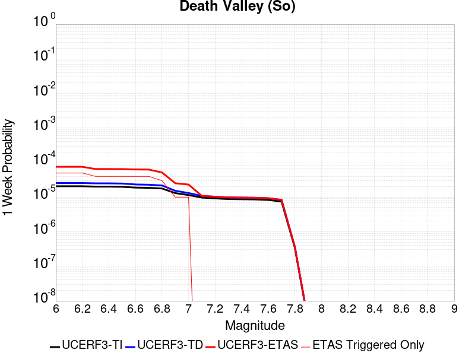 |  |  |  |

| Magnitude | 1 wk TI Prob | 1 wk TD Prob | 1 wk ETAS Prob | 1 wk ETAS/TD Gain | 1 wk ETAS Triggered Only | 1 mo TI Prob | 1 mo TD Prob | 1 mo ETAS Prob | 1 mo ETAS/TD Gain | 1 mo ETAS Triggered Only | 1 yr TI Prob | 1 yr TD Prob | 1 yr ETAS Prob | 1 yr ETAS/TD Gain | 1 yr ETAS Triggered Only | 10 yr TI Prob | 10 yr TD Prob | 10 yr ETAS Prob | 10 yr ETAS/TD Gain | 10 yr ETAS Triggered Only |
|-----|-----|-----|-----|-----|-----|-----|-----|-----|-----|-----|-----|-----|-----|-----|-----|-----|-----|-----|-----|-----|
| 6.0 | 2.0684236E-5 | 2.5619069E-5 | 7.2943934E-5 | 2.8472517 | 4.7326077E-5 | 8.864371E-5 | 1.0979148E-4 | 3.9371676E-4 | 3.586041 | 2.8395647E-4 | 0.0010787029 | 0.0013359085 | 0.0023284284 | 1.742955 | 9.938476E-4 | 0.010734817 | 0.013282061 | 0.015290053 | 1.1511807 | 0.0020350213 |
| 6.1 | 2.0684236E-5 | 2.5619069E-5 | 7.2943934E-5 | 2.8472517 | 4.7326077E-5 | 8.864371E-5 | 1.0979148E-4 | 3.9371676E-4 | 3.586041 | 2.8395647E-4 | 0.0010787029 | 0.0013359085 | 0.0023284284 | 1.742955 | 9.938476E-4 | 0.010734817 | 0.013282061 | 0.015290053 | 1.1511807 | 0.0020350213 |
| 6.2 | 2.0684236E-5 | 2.5619069E-5 | 7.2943934E-5 | 2.8472517 | 4.7326077E-5 | 8.864371E-5 | 1.0979148E-4 | 3.9371676E-4 | 3.586041 | 2.8395647E-4 | 0.0010787029 | 0.0013359085 | 0.0023284284 | 1.742955 | 9.938476E-4 | 0.010734817 | 0.013282061 | 0.015290053 | 1.1511807 | 0.0020350213 |
| 6.3 | 2.0240292E-5 | 2.5119136E-5 | 4.878158E-5 | 1.9420086 | 2.3663039E-5 | 8.6741224E-5 | 1.07649095E-4 | 3.679145E-4 | 3.4177203 | 2.6029343E-4 | 0.0010555626 | 0.0013098564 | 0.0022551382 | 1.7216681 | 9.465215E-4 | 0.010505628 | 0.013024611 | 0.014916354 | 1.1452436 | 0.0019167061 |
| 6.4 | 2.0240292E-5 | 2.5119136E-5 | 4.878158E-5 | 1.9420086 | 2.3663039E-5 | 8.6741224E-5 | 1.07649095E-4 | 3.679145E-4 | 3.4177203 | 2.6029343E-4 | 0.0010555626 | 0.0013098564 | 0.0022551382 | 1.7216681 | 9.465215E-4 | 0.010505628 | 0.013024611 | 0.014916354 | 1.1452436 | 0.0019167061 |
| 6.5 | 1.9962767E-5 | 2.480838E-5 | 4.847083E-5 | 1.9538088 | 2.3663039E-5 | 8.55519E-5 | 1.06317384E-4 | 3.6658315E-4 | 3.4480073 | 2.6029343E-4 | 0.0010410968 | 0.0012936622 | 0.0022389593 | 1.730714 | 9.465215E-4 | 0.010362327 | 0.012864553 | 0.014756602 | 1.1470746 | 0.0019167061 |
| 6.6 | 1.8937297E-5 | 2.3312172E-5 | 4.697466E-5 | 2.015027 | 2.3663039E-5 | 8.115732E-5 | 9.990556E-5 | 3.6017297E-4 | 3.6051342 | 2.6029343E-4 | 9.876423E-4 | 0.0012156861 | 0.0020901542 | 1.7193205 | 8.755324E-4 | 0.009832645 | 0.01209341 | 0.013870052 | 1.14691 | 0.0017983909 |
| 6.7 | 1.8621096E-5 | 2.2912802E-5 | 4.6575296E-5 | 2.0327196 | 2.3663039E-5 | 7.980225E-5 | 9.8194105E-5 | 3.5846196E-4 | 3.6505446 | 2.6029343E-4 | 9.711593E-4 | 0.0011948721 | 0.0020693582 | 1.731866 | 8.755324E-4 | 0.009669261 | 0.011887519 | 0.013617768 | 1.1455517 | 0.0017510648 |
| 6.8 | 1.7830353E-5 | 2.1806807E-5 | 2.1806807E-5 | 1.0 | 0.0 | 7.641356E-5 | 9.345448E-5 | 3.3006276E-4 | 3.5318024 | 2.3663038E-4 | 9.29938E-4 | 0.0011372284 | 0.001964493 | 1.7274392 | 8.2820636E-4 | 0.009260561 | 0.011316931 | 0.013001389 | 1.148844 | 0.0017037388 |
| 6.9 | 1.3135183E-5 | 1.5304558E-5 | 1.5304558E-5 | 1.0 | 0.0 | 5.6292425E-5 | 6.5589345E-5 | 1.3657381E-4 | 2.0822558 | 7.098912E-5 | 6.8514474E-4 | 7.982642E-4 | 0.0012475031 | 1.5627697 | 4.4959772E-4 | 0.006830362 | 0.007954976 | 0.008893968 | 1.1180383 | 9.465215E-4 |
| 7.0 | 1.1507512E-5 | 1.31546885E-5 | 1.31546885E-5 | 1.0 | 0.0 | 4.9316975E-5 | 5.637605E-5 | 1.0369946E-4 | 1.839424 | 4.7326077E-5 | 6.002687E-4 | 6.8616803E-4 | 9.2263607E-4 | 1.3446212 | 2.3663038E-4 | 0.0059864987 | 0.006841195 | 0.0074992273 | 1.0961868 | 6.6256506E-4 |
| 7.1 | 9.715903E-6 | 1.08656295E-5 | 1.08656295E-5 | 1.0 | 0.0 | 4.1638916E-5 | 4.6566176E-5 | 4.6566176E-5 | 1.0 | 0.0 | 5.068359E-4 | 5.668E-4 | 6.3774886E-4 | 1.1251744 | 7.098912E-5 | 0.0050568148 | 0.005653997 | 0.006030465 | 1.0665843 | 3.7860862E-4 |
| 7.2 | 9.233269E-6 | 1.0286636E-5 | 1.0286636E-5 | 1.0 | 0.0 | 3.9570554E-5 | 4.408486E-5 | 4.408486E-5 | 1.0 | 0.0 | 4.81665E-4 | 5.366052E-4 | 6.0755626E-4 | 1.132222 | 7.098912E-5 | 0.0048062233 | 0.0053535267 | 0.005659499 | 1.0571535 | 3.0761948E-4 |
| 7.3 | 8.8041315E-6 | 9.808462E-6 | 9.808462E-6 | 1.0 | 0.0 | 3.7731446E-5 | 4.2035612E-5 | 4.2035612E-5 | 1.0 | 0.0 | 4.592835E-4 | 5.1166763E-4 | 5.826204E-4 | 1.1386697 | 7.098912E-5 | 0.0045833546 | 0.005105322 | 0.0053878287 | 1.0553358 | 2.8395647E-4 |
| 7.4 | 8.708749E-6 | 9.707472E-6 | 9.707472E-6 | 1.0 | 0.0 | 3.7322676E-5 | 4.160281E-5 | 4.160281E-5 | 1.0 | 0.0 | 4.5430884E-4 | 5.064007E-4 | 5.773539E-4 | 1.1401126 | 7.098912E-5 | 0.004533812 | 0.0050528934 | 0.0053354152 | 1.0559129 | 2.8395647E-4 |
| 7.5 | 8.612678E-6 | 9.605112E-6 | 9.605112E-6 | 1.0 | 0.0 | 3.6910955E-5 | 4.116414E-5 | 4.116414E-5 | 1.0 | 0.0 | 4.492982E-4 | 5.010624E-4 | 5.720159E-4 | 1.1416062 | 7.098912E-5 | 0.004483909 | 0.0049997517 | 0.0052822884 | 1.0565102 | 2.8395647E-4 |
| 7.6 | 8.319024E-6 | 9.284203E-6 | 9.284203E-6 | 1.0 | 0.0 | 3.5652476E-5 | 3.9788858E-5 | 3.9788858E-5 | 1.0 | 0.0 | 4.3398244E-4 | 4.8432586E-4 | 5.552806E-4 | 1.146502 | 7.098912E-5 | 0.0043313587 | 0.0048331274 | 0.005115711 | 1.0584681 | 2.8395647E-4 |
| 7.7 | 7.4718328E-6 | 8.34543E-6 | 8.34543E-6 | 1.0 | 0.0 | 3.2021748E-5 | 3.5765657E-5 | 3.5765657E-5 | 1.0 | 0.0 | 3.8979502E-4 | 4.3536394E-4 | 4.8266942E-4 | 1.1086574 | 4.7326077E-5 | 0.00389112 | 0.0043455157 | 0.0045575574 | 1.0487956 | 2.1296735E-4 |
| 7.8 | 3.4586725E-7 | 3.6483146E-7 | 3.6483146E-7 | 1.0 | 0.0 | 1.4822873E-6 | 1.5635625E-6 | 1.5635625E-6 | 1.0 | 0.0 | 1.80467E-5 | 1.9036212E-5 | 4.26988E-5 | 2.2430303 | 2.3663039E-5 | 1.8045233E-4 | 1.9034625E-4 | 2.1400479E-4 | 1.1242921 | 2.3663039E-5 |
| 7.9 | 2.5591178E-9 | 2.6697022E-9 | 2.6697022E-9 | 1.0 | 0.0 | 1.0967647E-8 | 1.1441582E-8 | 1.1441582E-8 | 1.0 | 0.0 | 1.335311E-7 | 1.3930125E-7 | 1.3930125E-7 | 1.0 | 0.0 | 1.3353102E-6 | 1.3930126E-6 | 1.3930126E-6 | 1.0 | 0.0 |

## San Andreas (Mojave S)
*[(top)](#table-of-contents)*

| 1 Week | 1 Month | 1 Year | 10 Year |
|-----|-----|-----|-----|
|  |  |  |  |

| Magnitude | 1 wk TI Prob | 1 wk TD Prob | 1 wk ETAS Prob | 1 wk ETAS/TD Gain | 1 wk ETAS Triggered Only | 1 mo TI Prob | 1 mo TD Prob | 1 mo ETAS Prob | 1 mo ETAS/TD Gain | 1 mo ETAS Triggered Only | 1 yr TI Prob | 1 yr TD Prob | 1 yr ETAS Prob | 1 yr ETAS/TD Gain | 1 yr ETAS Triggered Only | 10 yr TI Prob | 10 yr TD Prob | 10 yr ETAS Prob | 10 yr ETAS/TD Gain | 10 yr ETAS Triggered Only |
|-----|-----|-----|-----|-----|-----|-----|-----|-----|-----|-----|-----|-----|-----|-----|-----|-----|-----|-----|-----|-----|
| 6.0 | 3.1064058E-4 | 6.7480345E-4 | 7.220976E-4 | 1.0700858 | 4.7326077E-5 | 0.0013306376 | 0.0028889377 | 0.0031720737 | 1.098007 | 2.8395647E-4 | 0.016080605 | 0.03463161 | 0.035499666 | 1.0250654 | 8.9919544E-4 | 0.1496549 | 0.2866709 | 0.28793687 | 1.0044161 | 0.0017747278 |
| 6.1 | 3.1064058E-4 | 6.7480345E-4 | 7.220976E-4 | 1.0700858 | 4.7326077E-5 | 0.0013306376 | 0.0028889377 | 0.0031720737 | 1.098007 | 2.8395647E-4 | 0.016080605 | 0.03463161 | 0.035499666 | 1.0250654 | 8.9919544E-4 | 0.1496549 | 0.2866709 | 0.28793687 | 1.0044161 | 0.0017747278 |
| 6.2 | 3.1064058E-4 | 6.7480345E-4 | 7.220976E-4 | 1.0700858 | 4.7326077E-5 | 0.0013306376 | 0.0028889377 | 0.0031720737 | 1.098007 | 2.8395647E-4 | 0.016080605 | 0.03463161 | 0.035499666 | 1.0250654 | 8.9919544E-4 | 0.1496549 | 0.2866709 | 0.28793687 | 1.0044161 | 0.0017747278 |
| 6.3 | 3.1064058E-4 | 6.7480345E-4 | 7.220976E-4 | 1.0700858 | 4.7326077E-5 | 0.0013306376 | 0.0028889377 | 0.0031720737 | 1.098007 | 2.8395647E-4 | 0.016080605 | 0.03463161 | 0.035499666 | 1.0250654 | 8.9919544E-4 | 0.1496549 | 0.2866709 | 0.28793687 | 1.0044161 | 0.0017747278 |
| 6.4 | 1.9872203E-4 | 4.3197922E-4 | 4.7928485E-4 | 1.109509 | 4.7326077E-5 | 8.5138786E-4 | 0.0018500541 | 0.0021334854 | 1.1532016 | 2.8395647E-4 | 0.010316478 | 0.022297915 | 0.02308452 | 1.035277 | 8.045433E-4 | 0.098504856 | 0.1970686 | 0.19834158 | 1.0064596 | 0.0015854236 |
| 6.5 | 1.291105E-4 | 2.8770286E-4 | 3.3501533E-4 | 1.1644491 | 4.7326077E-5 | 5.5321335E-4 | 0.0012324324 | 0.0015160389 | 1.2301193 | 2.8395647E-4 | 0.006714592 | 0.014902458 | 0.015648391 | 1.0500543 | 7.5721723E-4 | 0.065152965 | 0.13810734 | 0.13935144 | 1.0090082 | 0.0014434453 |
| 6.6 | 1.291105E-4 | 2.8770286E-4 | 3.3501533E-4 | 1.1644491 | 4.7326077E-5 | 5.5321335E-4 | 0.0012324324 | 0.0015160389 | 1.2301193 | 2.8395647E-4 | 0.006714592 | 0.014902458 | 0.015648391 | 1.0500543 | 7.5721723E-4 | 0.065152965 | 0.13810734 | 0.13935144 | 1.0090082 | 0.0014434453 |
| 6.7 | 1.08001186E-4 | 2.4351236E-4 | 2.9082692E-4 | 1.1943004 | 4.7326077E-5 | 4.6278012E-4 | 0.0010432076 | 0.0013032295 | 1.2492523 | 2.6029343E-4 | 0.0056198016 | 0.012627386 | 0.013328313 | 1.0555085 | 7.0989114E-4 | 0.054797906 | 0.11925044 | 0.12043839 | 1.0099618 | 0.0013487932 |
| 6.8 | 1.0624356E-4 | 2.3868853E-4 | 2.860033E-4 | 1.1982281 | 4.7326077E-5 | 4.5525006E-4 | 0.0010225503 | 0.0012825775 | 1.2542928 | 2.6029343E-4 | 0.0055285925 | 0.01237876 | 0.013079863 | 1.0566376 | 7.0989114E-4 | 0.053930566 | 0.11719959 | 0.11839031 | 1.0101597 | 0.0013487932 |
| 6.9 | 1.0393785E-4 | 2.323913E-4 | 2.7970638E-4 | 1.2036009 | 4.7326077E-5 | 4.4537184E-4 | 9.95583E-4 | 0.0012556174 | 1.2611879 | 2.6029343E-4 | 0.0054089287 | 0.012054106 | 0.012755441 | 1.0581821 | 7.0989114E-4 | 0.05279156 | 0.11449702 | 0.11569138 | 1.0104314 | 0.0013487932 |
| 7.0 | 1.0155622E-4 | 2.2608582E-4 | 2.7340118E-4 | 1.2092806 | 4.7326077E-5 | 4.3516833E-4 | 9.685798E-4 | 0.0012286211 | 1.268477 | 2.6029343E-4 | 0.005285311 | 0.011728923 | 0.012407102 | 1.0578212 | 6.862281E-4 | 0.05161361 | 0.111757115 | 0.11291313 | 1.010344 | 0.0013014671 |
| 7.1 | 9.885595E-5 | 2.1896887E-4 | 2.6628457E-4 | 1.2160842 | 4.7326077E-5 | 4.2359953E-4 | 9.381008E-4 | 0.0011981501 | 1.2772082 | 2.6029343E-4 | 0.0051451353 | 0.011361765 | 0.012040196 | 1.0597118 | 6.862281E-4 | 0.05027629 | 0.108641416 | 0.1097804 | 1.0104839 | 0.001277804 |
| 7.2 | 9.6411415E-5 | 2.125978E-4 | 2.5991382E-4 | 1.2225611 | 4.7326077E-5 | 4.1312634E-4 | 9.108156E-4 | 0.0011708719 | 1.2855203 | 2.6029343E-4 | 0.005018219 | 0.011032978 | 0.011711636 | 1.0615116 | 6.862281E-4 | 0.049064007 | 0.105831034 | 0.10697361 | 1.0107962 | 0.001277804 |
| 7.3 | 9.1180635E-5 | 1.9487667E-4 | 2.4219352E-4 | 1.242804 | 4.7326077E-5 | 3.907156E-4 | 8.3491846E-4 | 0.0010949946 | 1.3114988 | 2.6029343E-4 | 0.004746591 | 0.010117867 | 0.010797151 | 1.0671371 | 6.862281E-4 | 0.046464786 | 0.098022886 | 0.09917544 | 1.011758 | 0.001277804 |
| 7.4 | 8.887388E-5 | 1.8736067E-4 | 2.3467786E-4 | 1.2525461 | 4.7326077E-5 | 3.8083247E-4 | 8.0272724E-4 | 0.0010628117 | 1.3240011 | 2.6029343E-4 | 0.0046267817 | 0.009729506 | 0.010409058 | 1.0698444 | 6.862281E-4 | 0.045316286 | 0.094657235 | 0.09581409 | 1.0122215 | 0.001277804 |
| 7.5 | 8.6750515E-5 | 1.8067459E-4 | 2.2799212E-4 | 1.2618936 | 4.7326077E-5 | 3.7173493E-4 | 7.7408995E-4 | 0.0010341819 | 1.335997 | 2.6029343E-4 | 0.004516484 | 0.009383905 | 0.010063693 | 1.0724419 | 6.862281E-4 | 0.04425787 | 0.09162046 | 0.092781186 | 1.0126688 | 0.001277804 |
| 7.6 | 8.453092E-5 | 1.7454862E-4 | 2.2186644E-4 | 1.2710867 | 4.7326077E-5 | 3.6222505E-4 | 7.4785115E-4 | 9.843046E-4 | 1.3161771 | 2.3663038E-4 | 0.0044011753 | 0.009067151 | 0.009723708 | 1.0724106 | 6.6256506E-4 | 0.04315024 | 0.088778876 | 0.089921676 | 1.0128725 | 0.001254141 |
| 7.7 | 8.259102E-5 | 1.6976826E-4 | 2.170863E-4 | 1.2787213 | 4.7326077E-5 | 3.539135E-4 | 7.2737545E-4 | 9.638337E-4 | 1.3250842 | 2.3663038E-4 | 0.004300386 | 0.008819905 | 0.009476626 | 1.074459 | 6.6256506E-4 | 0.042181134 | 0.0865291 | 0.08767472 | 1.0132397 | 0.001254141 |
| 7.8 | 7.444844E-5 | 1.5297718E-4 | 1.766366E-4 | 1.1546597 | 2.3663039E-5 | 3.1902574E-4 | 6.554518E-4 | 8.4463204E-4 | 1.2886257 | 1.8930431E-4 | 0.0038772223 | 0.007950976 | 0.0085378485 | 1.0738114 | 5.91576E-4 | 0.03810269 | 0.078354426 | 0.07933582 | 1.0125252 | 0.0010648367 |
| 7.9 | 5.2586525E-5 | 1.0016126E-4 | 1.2382193E-4 | 1.2362257 | 2.3663039E-5 | 2.2535135E-4 | 4.2919195E-4 | 5.7110924E-4 | 1.3306615 | 1.4197823E-4 | 0.0027402006 | 0.0052129035 | 0.005707237 | 1.0948288 | 4.969238E-4 | 0.027066574 | 0.05224533 | 0.05300784 | 1.0145948 | 8.045433E-4 |
| 8.0 | 3.379877E-5 | 5.4130138E-5 | 7.77919E-5 | 1.4371272 | 2.3663039E-5 | 1.4484383E-4 | 2.3196569E-4 | 3.2659588E-4 | 1.4079491 | 9.4652154E-5 | 0.0017620471 | 0.0028205265 | 0.0029621043 | 1.0501955 | 1.4197823E-4 | 0.017481409 | 0.028862298 | 0.029115079 | 1.0087582 | 2.6029343E-4 |
| 8.1 | 1.8668277E-5 | 1.9335645E-5 | 1.9335645E-5 | 1.0 | 0.0 | 8.000444E-5 | 8.286442E-5 | 8.286442E-5 | 1.0 | 0.0 | 9.736188E-4 | 0.001008408 | 0.0010320472 | 1.023442 | 2.3663039E-5 | 0.009693642 | 0.010812608 | 0.010906236 | 1.0086592 | 9.4652154E-5 |
| 8.2 | 8.541571E-6 | 5.470761E-6 | 5.470761E-6 | 1.0 | 0.0 | 3.660622E-5 | 2.344591E-5 | 2.344591E-5 | 1.0 | 0.0 | 4.455896E-4 | 2.8541664E-4 | 2.8541664E-4 | 1.0 | 0.0 | 0.0044469717 | 0.0032462394 | 0.0032462394 | 1.0 | 0.0 |
| 8.3 | 1.983087E-6 | 7.676691E-7 | 7.676691E-7 | 1.0 | 0.0 | 8.498917E-6 | 3.2900064E-6 | 3.2900064E-6 | 1.0 | 0.0 | 1.034694E-4 | 4.005511E-5 | 4.005511E-5 | 1.0 | 0.0 | 0.0010342124 | 4.729315E-4 | 4.729315E-4 | 1.0 | 0.0 |

## Lenwood-Lockhart-Old Woman Springs
*[(top)](#table-of-contents)*

| 1 Week | 1 Month | 1 Year | 10 Year |
|-----|-----|-----|-----|
|  |  |  |  |

| Magnitude | 1 wk TI Prob | 1 wk TD Prob | 1 wk ETAS Prob | 1 wk ETAS/TD Gain | 1 wk ETAS Triggered Only | 1 mo TI Prob | 1 mo TD Prob | 1 mo ETAS Prob | 1 mo ETAS/TD Gain | 1 mo ETAS Triggered Only | 1 yr TI Prob | 1 yr TD Prob | 1 yr ETAS Prob | 1 yr ETAS/TD Gain | 1 yr ETAS Triggered Only | 10 yr TI Prob | 10 yr TD Prob | 10 yr ETAS Prob | 10 yr ETAS/TD Gain | 10 yr ETAS Triggered Only |
|-----|-----|-----|-----|-----|-----|-----|-----|-----|-----|-----|-----|-----|-----|-----|-----|-----|-----|-----|-----|-----|
| 6.0 | 3.744542E-5 | 4.3963413E-5 | 1.14949406E-4 | 2.6146607 | 7.098912E-5 | 1.604705E-4 | 1.8840199E-4 | 4.2498778E-4 | 2.25575 | 2.3663038E-4 | 0.0019519776 | 0.0022915532 | 0.0031178617 | 1.3605888 | 8.2820636E-4 | 0.019349206 | 0.022697244 | 0.024454817 | 1.0774355 | 0.0017983909 |
| 6.1 | 3.744542E-5 | 4.3963413E-5 | 1.14949406E-4 | 2.6146607 | 7.098912E-5 | 1.604705E-4 | 1.8840199E-4 | 4.2498778E-4 | 2.25575 | 2.3663038E-4 | 0.0019519776 | 0.0022915532 | 0.0031178617 | 1.3605888 | 8.2820636E-4 | 0.019349206 | 0.022697244 | 0.024454817 | 1.0774355 | 0.0017983909 |
| 6.2 | 3.744542E-5 | 4.3963413E-5 | 1.14949406E-4 | 2.6146607 | 7.098912E-5 | 1.604705E-4 | 1.8840199E-4 | 4.2498778E-4 | 2.25575 | 2.3663038E-4 | 0.0019519776 | 0.0022915532 | 0.0031178617 | 1.3605888 | 8.2820636E-4 | 0.019349206 | 0.022697244 | 0.024454817 | 1.0774355 | 0.0017983909 |
| 6.3 | 2.1079984E-5 | 2.535376E-5 | 4.90162E-5 | 1.9332911 | 2.3663039E-5 | 9.0339665E-5 | 1.0865455E-4 | 1.7963596E-4 | 1.6532758 | 7.098912E-5 | 0.0010993304 | 0.0013220864 | 0.001747458 | 1.3217427 | 4.259347E-4 | 0.010939079 | 0.013144425 | 0.013985097 | 1.0639565 | 8.518694E-4 |
| 6.4 | 2.1079984E-5 | 2.535376E-5 | 4.90162E-5 | 1.9332911 | 2.3663039E-5 | 9.0339665E-5 | 1.0865455E-4 | 1.7963596E-4 | 1.6532758 | 7.098912E-5 | 0.0010993304 | 0.0013220864 | 0.001747458 | 1.3217427 | 4.259347E-4 | 0.010939079 | 0.013144425 | 0.013985097 | 1.0639565 | 8.518694E-4 |
| 6.5 | 1.7397282E-5 | 2.0662661E-5 | 4.432521E-5 | 2.145184 | 2.3663039E-5 | 7.455765E-5 | 8.855132E-5 | 1.5953416E-4 | 1.8016009 | 7.098912E-5 | 9.073613E-4 | 0.0010775909 | 0.0013612413 | 1.2632265 | 2.8395647E-4 | 0.009036654 | 0.010724951 | 0.0113101825 | 1.0545672 | 5.91576E-4 |
| 6.6 | 1.52050325E-5 | 1.7679906E-5 | 4.1342526E-5 | 2.3383906 | 2.3663039E-5 | 6.51628E-5 | 7.576887E-5 | 1.467526E-4 | 1.9368457 | 7.098912E-5 | 7.9306826E-4 | 9.221034E-4 | 0.0011585156 | 1.2563835 | 2.3663038E-4 | 0.007902439 | 0.009183636 | 0.00965255 | 1.0510598 | 4.7326076E-4 |
| 6.7 | 1.332523E-5 | 1.526418E-5 | 3.8926857E-5 | 2.5502095 | 2.3663039E-5 | 5.7106878E-5 | 6.541631E-5 | 1.1273929E-4 | 1.7234126 | 4.7326077E-5 | 6.950544E-4 | 7.961584E-4 | 0.0010089561 | 1.2672807 | 2.1296735E-4 | 0.006928845 | 0.007933691 | 0.008332771 | 1.0503019 | 4.0227166E-4 |
| 6.8 | 1.1525329E-5 | 1.303112E-5 | 3.669385E-5 | 2.8158631 | 2.3663039E-5 | 4.9393333E-5 | 5.584649E-5 | 1.0316992E-4 | 1.8473842 | 4.7326077E-5 | 6.011979E-4 | 6.797231E-4 | 8.925457E-4 | 1.3131019 | 2.1296735E-4 | 0.00599574 | 0.0067768926 | 0.007152935 | 1.055489 | 3.7860862E-4 |
| 6.9 | 1.0253909E-5 | 1.1514558E-5 | 3.5177323E-5 | 3.0550303 | 2.3663039E-5 | 4.3944583E-5 | 4.934719E-5 | 9.6670934E-5 | 1.9589957 | 4.7326077E-5 | 5.3489394E-4 | 6.0064E-4 | 7.8983064E-4 | 1.3149817 | 1.8930431E-4 | 0.0053360825 | 0.0059905457 | 0.0063198437 | 1.0549697 | 3.3128253E-4 |
| 7.0 | 8.104563E-6 | 8.991363E-6 | 3.265419E-5 | 3.6317286 | 2.3663039E-5 | 3.4733377E-5 | 3.8533854E-5 | 8.5858104E-5 | 2.2281215 | 4.7326077E-5 | 4.2279682E-4 | 4.690511E-4 | 6.1096274E-4 | 1.3025504 | 1.4197823E-4 | 0.0042199334 | 0.004680859 | 0.0049399342 | 1.0553478 | 2.6029343E-4 |
| 7.1 | 6.7986157E-6 | 7.515881E-6 | 3.117874E-5 | 4.1483817 | 2.3663039E-5 | 2.91366E-5 | 3.2210533E-5 | 5.587281E-5 | 1.7346131 | 2.3663039E-5 | 3.5468035E-4 | 3.920948E-4 | 4.630561E-4 | 1.1809798 | 7.098912E-5 | 0.003541148 | 0.0039142463 | 0.0040792394 | 1.0421519 | 1.6564126E-4 |
| 7.2 | 5.6893327E-6 | 6.2800646E-6 | 2.9942954E-5 | 4.767937 | 2.3663039E-5 | 2.4382627E-5 | 2.6914295E-5 | 5.05767E-5 | 1.8791759 | 2.3663039E-5 | 2.9681803E-4 | 3.2763428E-4 | 3.9860012E-4 | 1.2166009 | 7.098912E-5 | 0.002964219 | 0.003271711 | 0.003389639 | 1.0360448 | 1.1831519E-4 |
| 7.3 | 4.253348E-6 | 4.7069434E-6 | 2.836987E-5 | 6.0272384 | 2.3663039E-5 | 1.8228506E-5 | 2.017247E-5 | 4.3835033E-5 | 2.1730125 | 2.3663039E-5 | 2.2190946E-4 | 2.4557396E-4 | 3.1654566E-4 | 1.2890033 | 7.098912E-5 | 0.00221688 | 0.002453207 | 0.002571232 | 1.0481105 | 1.1831519E-4 |
| 7.4 | 2.5448119E-6 | 2.8520617E-6 | 2.6515032E-5 | 9.296795 | 2.3663039E-5 | 1.0906291E-5 | 1.2223074E-5 | 3.5885823E-5 | 2.935908 | 2.3663039E-5 | 1.3277601E-4 | 1.4880742E-4 | 1.9612645E-4 | 1.3179884 | 4.7326077E-5 | 0.001326967 | 0.00148724 | 0.0015817513 | 1.0635482 | 9.4652154E-5 |
| 7.5 | 4.3706837E-8 | 4.5629623E-8 | 4.5629623E-8 | 1.0 | 0.0 | 1.8731501E-7 | 1.9555551E-7 | 1.9555551E-7 | 1.0 | 0.0 | 2.2805577E-6 | 2.3808864E-6 | 2.3808864E-6 | 1.0 | 0.0 | 2.2805343E-5 | 2.3808663E-5 | 2.3808663E-5 | 1.0 | 0.0 |

## San Andreas (Mojave N)
*[(top)](#table-of-contents)*

| 1 Week | 1 Month | 1 Year | 10 Year |
|-----|-----|-----|-----|
|  |  |  |  |

| Magnitude | 1 wk TI Prob | 1 wk TD Prob | 1 wk ETAS Prob | 1 wk ETAS/TD Gain | 1 wk ETAS Triggered Only | 1 mo TI Prob | 1 mo TD Prob | 1 mo ETAS Prob | 1 mo ETAS/TD Gain | 1 mo ETAS Triggered Only | 1 yr TI Prob | 1 yr TD Prob | 1 yr ETAS Prob | 1 yr ETAS/TD Gain | 1 yr ETAS Triggered Only | 10 yr TI Prob | 10 yr TD Prob | 10 yr ETAS Prob | 10 yr ETAS/TD Gain | 10 yr ETAS Triggered Only |
|-----|-----|-----|-----|-----|-----|-----|-----|-----|-----|-----|-----|-----|-----|-----|-----|-----|-----|-----|-----|-----|
| 6.0 | 9.877682E-5 | 1.9418082E-4 | 2.6515615E-4 | 1.3655115 | 7.098912E-5 | 4.2326056E-4 | 8.3193823E-4 | 0.0012575185 | 1.5115528 | 4.259347E-4 | 0.0051410277 | 0.010081935 | 0.011136035 | 1.1045535 | 0.0010648367 | 0.05023708 | 0.09839042 | 0.0999692 | 1.016046 | 0.0017510648 |
| 6.1 | 9.877682E-5 | 1.9418082E-4 | 2.6515615E-4 | 1.3655115 | 7.098912E-5 | 4.2326056E-4 | 8.3193823E-4 | 0.0012575185 | 1.5115528 | 4.259347E-4 | 0.0051410277 | 0.010081935 | 0.011136035 | 1.1045535 | 0.0010648367 | 0.05023708 | 0.09839042 | 0.0999692 | 1.016046 | 0.0017510648 |
| 6.2 | 9.877682E-5 | 1.9418082E-4 | 2.6515615E-4 | 1.3655115 | 7.098912E-5 | 4.2326056E-4 | 8.3193823E-4 | 0.0012575185 | 1.5115528 | 4.259347E-4 | 0.0051410277 | 0.010081935 | 0.011136035 | 1.1045535 | 0.0010648367 | 0.05023708 | 0.09839042 | 0.0999692 | 1.016046 | 0.0017510648 |
| 6.3 | 9.877682E-5 | 1.9418082E-4 | 2.6515615E-4 | 1.3655115 | 7.098912E-5 | 4.2326056E-4 | 8.3193823E-4 | 0.0012575185 | 1.5115528 | 4.259347E-4 | 0.0051410277 | 0.010081935 | 0.011136035 | 1.1045535 | 0.0010648367 | 0.05023708 | 0.09839042 | 0.0999692 | 1.016046 | 0.0017510648 |
| 6.4 | 9.877682E-5 | 1.9418082E-4 | 2.6515615E-4 | 1.3655115 | 7.098912E-5 | 4.2326056E-4 | 8.3193823E-4 | 0.0012575185 | 1.5115528 | 4.259347E-4 | 0.0051410277 | 0.010081935 | 0.011136035 | 1.1045535 | 0.0010648367 | 0.05023708 | 0.09839042 | 0.0999692 | 1.016046 | 0.0017510648 |
| 6.5 | 9.861474E-5 | 1.9391841E-4 | 2.6489378E-4 | 1.3660063 | 7.098912E-5 | 4.2256617E-4 | 8.308144E-4 | 0.0012563952 | 1.5122453 | 4.259347E-4 | 0.0051326132 | 0.010068378 | 0.011122494 | 1.1046957 | 0.0010648367 | 0.050156746 | 0.0982682 | 0.0998472 | 1.0160682 | 0.0017510648 |
| 6.6 | 9.861474E-5 | 1.9391841E-4 | 2.6489378E-4 | 1.3660063 | 7.098912E-5 | 4.2256617E-4 | 8.308144E-4 | 0.0012563952 | 1.5122453 | 4.259347E-4 | 0.0051326132 | 0.010068378 | 0.011122494 | 1.1046957 | 0.0010648367 | 0.050156746 | 0.0982682 | 0.0998472 | 1.0160682 | 0.0017510648 |
| 6.7 | 9.8552715E-5 | 1.9381793E-4 | 2.6479329E-4 | 1.366196 | 7.098912E-5 | 4.223004E-4 | 8.3038403E-4 | 0.001255965 | 1.512511 | 4.259347E-4 | 0.0051293927 | 0.010063187 | 0.011117308 | 1.1047503 | 0.0010648367 | 0.050125998 | 0.09822139 | 0.09980046 | 1.0160767 | 0.0017510648 |
| 6.8 | 9.8464974E-5 | 1.936695E-4 | 2.6464488E-4 | 1.3664768 | 7.098912E-5 | 4.219245E-4 | 8.2974834E-4 | 0.0012553296 | 1.512904 | 4.259347E-4 | 0.0051248376 | 0.010055519 | 0.011109648 | 1.1048309 | 0.0010648367 | 0.05008251 | 0.0981514 | 0.099730596 | 1.0160894 | 0.0017510648 |
| 6.9 | 9.825824E-5 | 1.9334951E-4 | 2.643249E-4 | 1.3670833 | 7.098912E-5 | 4.2103877E-4 | 8.283778E-4 | 0.0012539596 | 1.5137533 | 4.259347E-4 | 0.0051141046 | 0.010038987 | 0.011093133 | 1.1050053 | 0.0010648367 | 0.049980022 | 0.09800047 | 0.09957993 | 1.0161169 | 0.0017510648 |
| 7.0 | 9.781462E-5 | 1.9266298E-4 | 2.6363842E-4 | 1.3683918 | 7.098912E-5 | 4.1913814E-4 | 8.2543737E-4 | 0.0012510205 | 1.515585 | 4.259347E-4 | 0.005091073 | 0.0100035155 | 0.0110342745 | 1.1030396 | 0.0010411737 | 0.04976007 | 0.09767679 | 0.09923547 | 1.0159575 | 0.0017274017 |
| 7.1 | 9.7121134E-5 | 1.9167982E-4 | 2.6265532E-4 | 1.3702816 | 7.098912E-5 | 4.1616702E-4 | 8.212265E-4 | 0.0012468114 | 1.5182308 | 4.259347E-4 | 0.005055068 | 0.009952718 | 0.0109835295 | 1.1035708 | 0.0010411737 | 0.04941613 | 0.097213216 | 0.0987727 | 1.0160418 | 0.0017274017 |
| 7.2 | 9.663819E-5 | 1.9098747E-4 | 2.6196302E-4 | 1.3716241 | 7.098912E-5 | 4.1409794E-4 | 8.182612E-4 | 0.0012438473 | 1.5201105 | 4.259347E-4 | 0.0050299936 | 0.009916944 | 0.010947793 | 1.1039482 | 0.0010411737 | 0.049176537 | 0.09688642 | 0.09844646 | 1.0161017 | 0.0017274017 |
| 7.3 | 9.6277574E-5 | 1.9051235E-4 | 2.6148793E-4 | 1.3725511 | 7.098912E-5 | 4.125529E-4 | 8.1622624E-4 | 0.0012418133 | 1.5214082 | 4.259347E-4 | 0.0050112694 | 0.009892395 | 0.010923268 | 1.1042087 | 0.0010411737 | 0.04899759 | 0.09665979 | 0.098220214 | 1.0161436 | 0.0017274017 |
| 7.4 | 9.593308E-5 | 1.8990989E-4 | 2.608855E-4 | 1.3737332 | 7.098912E-5 | 4.1107697E-4 | 8.1364583E-4 | 0.001239234 | 1.5230631 | 4.259347E-4 | 0.0049933824 | 0.009861263 | 0.01089217 | 1.1045411 | 0.0010411737 | 0.04882661 | 0.09637787 | 0.09793879 | 1.0161958 | 0.0017274017 |
| 7.5 | 9.561707E-5 | 1.8937046E-4 | 2.6034613E-4 | 1.374798 | 7.098912E-5 | 4.0972308E-4 | 8.113354E-4 | 0.0012369246 | 1.5245539 | 4.259347E-4 | 0.0049769743 | 0.009833388 | 0.010864324 | 1.1048403 | 0.0010411737 | 0.048669744 | 0.09612396 | 0.09768532 | 1.0162432 | 0.0017274017 |
| 7.6 | 9.418194E-5 | 1.858917E-4 | 2.568676E-4 | 1.3818133 | 7.098912E-5 | 4.0357444E-4 | 7.9643563E-4 | 0.0011983869 | 1.5046877 | 4.0227166E-4 | 0.004902454 | 0.009653605 | 0.010661292 | 1.1043847 | 0.0010175107 | 0.047957025 | 0.094505794 | 0.09604852 | 1.0163242 | 0.0017037388 |
| 7.7 | 8.202141E-5 | 1.6036903E-4 | 2.0768752E-4 | 1.29506 | 4.7326077E-5 | 3.51473E-4 | 6.871149E-4 | 0.0010654634 | 1.5506334 | 3.7860862E-4 | 0.00427079 | 0.008333592 | 0.009295692 | 1.1154484 | 9.7018457E-4 | 0.04189639 | 0.08230197 | 0.08377862 | 1.017942 | 0.0016090866 |
| 7.8 | 7.2859846E-5 | 1.4530488E-4 | 1.6896447E-4 | 1.1628273 | 2.3663039E-5 | 3.1221908E-4 | 6.225866E-4 | 8.11773E-4 | 1.3038718 | 1.8930431E-4 | 0.003794643 | 0.0075536883 | 0.008140796 | 1.0777246 | 5.91576E-4 | 0.037304975 | 0.074787885 | 0.07577308 | 1.0131732 | 0.0010648367 |
| 7.9 | 5.3874453E-5 | 1.00554826E-4 | 1.2421548E-4 | 1.235301 | 2.3663039E-5 | 2.3087008E-4 | 4.308781E-4 | 5.7279516E-4 | 1.329367 | 1.4197823E-4 | 0.0028072202 | 0.005233334 | 0.005727657 | 1.0944567 | 4.969238E-4 | 0.02772022 | 0.052470244 | 0.053232573 | 1.0145288 | 8.045433E-4 |
| 8.0 | 3.468538E-5 | 5.4316755E-5 | 7.797851E-5 | 1.4356253 | 2.3663039E-5 | 1.4864317E-4 | 2.3276533E-4 | 3.2739545E-4 | 1.4065473 | 9.4652154E-5 | 0.0018082283 | 0.002830237 | 0.0029718133 | 1.0500228 | 1.4197823E-4 | 0.017935853 | 0.028975194 | 0.029227946 | 1.008723 | 2.6029343E-4 |
| 8.1 | 1.9152367E-5 | 1.9429131E-5 | 1.9429131E-5 | 1.0 | 0.0 | 8.207899E-5 | 8.3265055E-5 | 8.3265055E-5 | 1.0 | 0.0 | 9.988535E-4 | 0.0010132812 | 0.0010369202 | 1.0233293 | 2.3663039E-5 | 0.009943757 | 0.010870115 | 0.010963739 | 1.0086129 | 9.4652154E-5 |
| 8.2 | 8.643924E-6 | 5.4848397E-6 | 5.4848397E-6 | 1.0 | 0.0 | 3.704486E-5 | 2.3506243E-5 | 2.3506243E-5 | 1.0 | 0.0 | 4.5092785E-4 | 2.8615101E-4 | 2.8615101E-4 | 1.0 | 0.0 | 0.0045001395 | 0.0032541603 | 0.0032541603 | 1.0 | 0.0 |
| 8.3 | 1.983087E-6 | 7.676691E-7 | 7.676691E-7 | 1.0 | 0.0 | 8.498917E-6 | 3.2900064E-6 | 3.2900064E-6 | 1.0 | 0.0 | 1.034694E-4 | 4.005511E-5 | 4.005511E-5 | 1.0 | 0.0 | 0.0010342124 | 4.729315E-4 | 4.729315E-4 | 1.0 | 0.0 |

## Nelson Lake
*[(top)](#table-of-contents)*

| 1 Week | 1 Month | 1 Year | 10 Year |
|-----|-----|-----|-----|
|  |  |  |  |

| Magnitude | 1 wk TI Prob | 1 wk TD Prob | 1 wk ETAS Prob | 1 wk ETAS/TD Gain | 1 wk ETAS Triggered Only | 1 mo TI Prob | 1 mo TD Prob | 1 mo ETAS Prob | 1 mo ETAS/TD Gain | 1 mo ETAS Triggered Only | 1 yr TI Prob | 1 yr TD Prob | 1 yr ETAS Prob | 1 yr ETAS/TD Gain | 1 yr ETAS Triggered Only | 10 yr TI Prob | 10 yr TD Prob | 10 yr ETAS Prob | 10 yr ETAS/TD Gain | 10 yr ETAS Triggered Only |
|-----|-----|-----|-----|-----|-----|-----|-----|-----|-----|-----|-----|-----|-----|-----|-----|-----|-----|-----|-----|-----|
| 6.0 | 9.913453E-6 | 1.01923315E-5 | 8.1180726E-5 | 7.9648824 | 7.098912E-5 | 4.2485535E-5 | 4.3680746E-5 | 1.8565278E-4 | 4.25022 | 1.4197823E-4 | 5.1713863E-4 | 5.316937E-4 | 0.0013358092 | 2.5123663 | 8.045433E-4 | 0.0051593683 | 0.0053052437 | 0.006693956 | 1.2617623 | 0.0013961192 |
| 6.1 | 9.913453E-6 | 1.01923315E-5 | 8.1180726E-5 | 7.9648824 | 7.098912E-5 | 4.2485535E-5 | 4.3680746E-5 | 1.8565278E-4 | 4.25022 | 1.4197823E-4 | 5.1713863E-4 | 5.316937E-4 | 0.0013358092 | 2.5123663 | 8.045433E-4 | 0.0051593683 | 0.0053052437 | 0.006693956 | 1.2617623 | 0.0013961192 |
| 6.2 | 4.5596407E-6 | 4.6963505E-6 | 5.2022206E-5 | 11.077155 | 4.7326077E-5 | 1.954117E-5 | 2.0127069E-5 | 9.111475E-5 | 4.526976 | 7.098912E-5 | 2.3788778E-4 | 2.4502078E-4 | 6.2353665E-4 | 2.5448318 | 3.7860862E-4 | 0.0023763329 | 0.0024476324 | 0.0030613653 | 1.2507457 | 6.1523897E-4 |
| 6.3 | 4.5596407E-6 | 4.6963505E-6 | 5.2022206E-5 | 11.077155 | 4.7326077E-5 | 1.954117E-5 | 2.0127069E-5 | 9.111475E-5 | 4.526976 | 7.098912E-5 | 2.3788778E-4 | 2.4502078E-4 | 6.2353665E-4 | 2.5448318 | 3.7860862E-4 | 0.0023763329 | 0.0024476324 | 0.0030613653 | 1.2507457 | 6.1523897E-4 |
| 6.4 | 3.4025713E-6 | 3.5099267E-6 | 5.083584E-5 | 14.483447 | 4.7326077E-5 | 1.4582367E-5 | 1.5042461E-5 | 6.236783E-5 | 4.1461186 | 4.7326077E-5 | 1.7752586E-4 | 1.8312741E-4 | 4.906906E-4 | 2.6795037 | 3.0761948E-4 | 0.001773841 | 0.001829848 | 0.0023022427 | 1.2581607 | 4.7326076E-4 |
| 6.5 | 2.8352947E-6 | 2.9278815E-6 | 2.6590851E-5 | 9.081943 | 2.3663039E-5 | 1.2151207E-5 | 1.2548007E-5 | 3.621075E-5 | 2.8857768 | 2.3663039E-5 | 1.479309E-4 | 1.5276203E-4 | 3.8935625E-4 | 2.5487764 | 2.3663038E-4 | 0.0014783246 | 0.0015266441 | 0.0018810477 | 1.2321455 | 3.5494557E-4 |
| 6.6 | 2.251518E-6 | 2.3290888E-6 | 2.5992073E-5 | 11.1597595 | 2.3663039E-5 | 9.649328E-6 | 9.981775E-6 | 3.3644577E-5 | 3.3706007 | 2.3663039E-5 | 1.1747423E-4 | 1.2152196E-4 | 2.871431E-4 | 2.3628907 | 1.6564126E-4 | 0.0011741214 | 0.0012146168 | 0.0014509598 | 1.1945823 | 2.3663038E-4 |
| 6.7 | 1.8911853E-6 | 1.9591585E-6 | 1.9591585E-6 | 1.0 | 0.0 | 8.105055E-6 | 8.39637E-6 | 8.39637E-6 | 1.0 | 0.0 | 9.867457E-5 | 1.0222159E-4 | 2.441853E-4 | 2.3887842 | 1.4197823E-4 | 9.863076E-4 | 0.0010218031 | 0.0012109141 | 1.1850756 | 1.8930431E-4 |
| 6.8 | 1.4874814E-6 | 1.543846E-6 | 1.543846E-6 | 1.0 | 0.0 | 6.374905E-6 | 6.6164694E-6 | 6.6164694E-6 | 1.0 | 0.0 | 7.76117E-5 | 8.055306E-5 | 1.5153646E-4 | 1.8812006 | 7.098912E-5 | 7.75846E-4 | 8.0528966E-4 | 8.998656E-4 | 1.1174433 | 9.4652154E-5 |
| 6.9 | 6.835972E-7 | 7.1400126E-7 | 7.1400126E-7 | 1.0 | 0.0 | 2.9296991E-6 | 3.0600036E-6 | 3.0600036E-6 | 1.0 | 0.0 | 3.56685E-5 | 3.7255224E-5 | 3.7255224E-5 | 1.0 | 0.0 | 3.5662777E-4 | 3.7252106E-4 | 3.7252106E-4 | 1.0 | 0.0 |

## San Andreas (San Bernardino N)
*[(top)](#table-of-contents)*

| 1 Week | 1 Month | 1 Year | 10 Year |
|-----|-----|-----|-----|
|  |  |  |  |

| Magnitude | 1 wk TI Prob | 1 wk TD Prob | 1 wk ETAS Prob | 1 wk ETAS/TD Gain | 1 wk ETAS Triggered Only | 1 mo TI Prob | 1 mo TD Prob | 1 mo ETAS Prob | 1 mo ETAS/TD Gain | 1 mo ETAS Triggered Only | 1 yr TI Prob | 1 yr TD Prob | 1 yr ETAS Prob | 1 yr ETAS/TD Gain | 1 yr ETAS Triggered Only | 10 yr TI Prob | 10 yr TD Prob | 10 yr ETAS Prob | 10 yr ETAS/TD Gain | 10 yr ETAS Triggered Only |
|-----|-----|-----|-----|-----|-----|-----|-----|-----|-----|-----|-----|-----|-----|-----|-----|-----|-----|-----|-----|-----|
| 6.0 | 1.4273766E-4 | 3.162134E-4 | 3.3986897E-4 | 1.0748088 | 2.3663039E-5 | 6.115894E-4 | 0.0013545024 | 0.0015435503 | 1.13957 | 1.8930431E-4 | 0.0074207084 | 0.016367871 | 0.016949764 | 1.035551 | 5.91576E-4 | 0.07177748 | 0.15032761 | 0.15115194 | 1.0054836 | 9.7018457E-4 |
| 6.1 | 1.4273766E-4 | 3.162134E-4 | 3.3986897E-4 | 1.0748088 | 2.3663039E-5 | 6.115894E-4 | 0.0013545024 | 0.0015435503 | 1.13957 | 1.8930431E-4 | 0.0074207084 | 0.016367871 | 0.016949764 | 1.035551 | 5.91576E-4 | 0.07177748 | 0.15032761 | 0.15115194 | 1.0054836 | 9.7018457E-4 |
| 6.2 | 1.4273766E-4 | 3.162134E-4 | 3.3986897E-4 | 1.0748088 | 2.3663039E-5 | 6.115894E-4 | 0.0013545024 | 0.0015435503 | 1.13957 | 1.8930431E-4 | 0.0074207084 | 0.016367871 | 0.016949764 | 1.035551 | 5.91576E-4 | 0.07177748 | 0.15032761 | 0.15115194 | 1.0054836 | 9.7018457E-4 |
| 6.3 | 1.3730655E-4 | 3.052612E-4 | 3.2891703E-4 | 1.0774937 | 2.3663039E-5 | 5.883239E-4 | 0.001307612 | 0.0014966688 | 1.1445817 | 1.8930431E-4 | 0.0071393442 | 0.015805366 | 0.016387591 | 1.0368372 | 5.91576E-4 | 0.06914291 | 0.14562751 | 0.1464564 | 1.0056919 | 9.7018457E-4 |
| 6.4 | 1.3730655E-4 | 3.052612E-4 | 3.2891703E-4 | 1.0774937 | 2.3663039E-5 | 5.883239E-4 | 0.001307612 | 0.0014966688 | 1.1445817 | 1.8930431E-4 | 0.0071393442 | 0.015805366 | 0.016387591 | 1.0368372 | 5.91576E-4 | 0.06914291 | 0.14562751 | 0.1464564 | 1.0056919 | 9.7018457E-4 |
| 6.5 | 1.2942807E-4 | 2.894048E-4 | 3.1306097E-4 | 1.0817409 | 2.3663039E-5 | 5.545738E-4 | 0.0012397218 | 0.0014287914 | 1.1525097 | 1.8930431E-4 | 0.0067310524 | 0.014990403 | 0.015573111 | 1.0388721 | 5.91576E-4 | 0.06530788 | 0.13877022 | 0.13960578 | 1.0060211 | 9.7018457E-4 |
| 6.6 | 1.1125901E-4 | 2.5379105E-4 | 2.7744807E-4 | 1.0932146 | 2.3663039E-5 | 4.767372E-4 | 0.0010872248 | 0.001252686 | 1.1521868 | 1.6564126E-4 | 0.005788839 | 0.013157256 | 0.013717697 | 1.0425955 | 5.6791294E-4 | 0.056403454 | 0.12306005 | 0.12386934 | 1.0065764 | 9.228585E-4 |
| 6.7 | 1.02209575E-4 | 2.3513977E-4 | 2.5879726E-4 | 1.1006103 | 2.3663039E-5 | 4.3796748E-4 | 0.0010073541 | 0.0011728285 | 1.1642663 | 1.6564126E-4 | 0.0053192247 | 0.0121959895 | 0.012756976 | 1.0459976 | 5.6791294E-4 | 0.051936906 | 0.11485184 | 0.11564776 | 1.00693 | 8.9919544E-4 |
| 6.8 | 9.610582E-5 | 2.2039599E-4 | 2.4405381E-4 | 1.1073424 | 2.3663039E-5 | 4.1181705E-4 | 9.44213E-4 | 0.0011096979 | 1.1752622 | 1.6564126E-4 | 0.0050023515 | 0.011435465 | 0.011996884 | 1.0490946 | 5.6791294E-4 | 0.048912346 | 0.1082535 | 0.10905536 | 1.0074072 | 8.9919544E-4 |
| 6.9 | 9.3877505E-5 | 2.1495075E-4 | 2.3860871E-4 | 1.1100622 | 2.3663039E-5 | 4.0227012E-4 | 9.208929E-4 | 0.0010863817 | 1.1797047 | 1.6564126E-4 | 0.0048866454 | 0.011154479 | 0.011716058 | 1.0503455 | 5.6791294E-4 | 0.04780577 | 0.10584366 | 0.106647685 | 1.0075963 | 8.9919544E-4 |
| 7.0 | 9.1019785E-5 | 2.082188E-4 | 2.3187691E-4 | 1.1136214 | 2.3663039E-5 | 3.900265E-4 | 8.9206174E-4 | 0.0010575552 | 1.185518 | 1.6564126E-4 | 0.0047382377 | 0.010806991 | 0.011368766 | 1.0519826 | 5.6791294E-4 | 0.046384744 | 0.10281373 | 0.10362048 | 1.0078467 | 8.9919544E-4 |
| 7.1 | 8.771155E-5 | 1.999633E-4 | 2.236216E-4 | 1.1183132 | 2.3663039E-5 | 3.758525E-4 | 8.567046E-4 | 0.001022204 | 1.1931814 | 1.6564126E-4 | 0.0045664064 | 0.010380693 | 0.010942711 | 1.0541407 | 5.6791294E-4 | 0.044737056 | 0.09912506 | 0.099913806 | 1.0079571 | 8.755324E-4 |
| 7.2 | 8.0830236E-5 | 1.8401694E-4 | 2.0767562E-4 | 1.1285679 | 2.3663039E-5 | 3.4636928E-4 | 7.884058E-4 | 9.539165E-4 | 1.2099308 | 1.6564126E-4 | 0.0042088944 | 0.0095567005 | 0.010119186 | 1.0588577 | 5.6791294E-4 | 0.041300658 | 0.091855355 | 0.092650466 | 1.0086561 | 8.755324E-4 |
| 7.3 | 7.7668235E-5 | 1.7344984E-4 | 1.9710878E-4 | 1.1364021 | 2.3663039E-5 | 3.328214E-4 | 7.431448E-4 | 9.08663E-4 | 1.2227267 | 1.6564126E-4 | 0.0040445733 | 0.009010333 | 0.009573128 | 1.0624611 | 5.6791294E-4 | 0.03971748 | 0.08712171 | 0.087920964 | 1.009174 | 8.755324E-4 |
| 7.4 | 7.520177E-5 | 1.6564903E-4 | 1.8930815E-4 | 1.1428268 | 2.3663039E-5 | 3.2225347E-4 | 7.0973136E-4 | 8.752551E-4 | 1.2332202 | 1.6564126E-4 | 0.0039163795 | 0.00860681 | 0.009169836 | 1.0654162 | 5.6791294E-4 | 0.038480744 | 0.083577305 | 0.084379666 | 1.0096002 | 8.755324E-4 |
| 7.5 | 7.274697E-5 | 1.5852388E-4 | 1.8218317E-4 | 1.1492474 | 2.3663039E-5 | 3.1173544E-4 | 6.792112E-4 | 8.4473996E-4 | 1.2437073 | 1.6564126E-4 | 0.003788775 | 0.0082380995 | 0.008801334 | 1.0683695 | 5.6791294E-4 | 0.03724827 | 0.08029351 | 0.08109874 | 1.0100286 | 8.755324E-4 |
| 7.6 | 7.1185845E-5 | 1.5422139E-4 | 1.7788078E-4 | 1.1534119 | 2.3663039E-5 | 3.0504653E-4 | 6.6078146E-4 | 8.263133E-4 | 1.2505091 | 1.6564126E-4 | 0.0037076178 | 0.0080153905 | 0.008578751 | 1.0702848 | 5.6791294E-4 | 0.036463667 | 0.07828282 | 0.07908981 | 1.0103087 | 8.755324E-4 |
| 7.7 | 6.709961E-5 | 1.4330712E-4 | 1.6696677E-4 | 1.1650975 | 2.3663039E-5 | 2.8753807E-4 | 6.1402883E-4 | 7.795684E-4 | 1.2695957 | 1.6564126E-4 | 0.003495157 | 0.0074502146 | 0.008013897 | 1.0756599 | 5.6791294E-4 | 0.034406938 | 0.0731105 | 0.07392202 | 1.0110999 | 8.755324E-4 |
| 7.8 | 6.300812E-5 | 1.3214166E-4 | 1.5580158E-4 | 1.1790496 | 2.3663039E-5 | 2.7000686E-4 | 5.661985E-4 | 7.3174597E-4 | 1.2923841 | 1.6564126E-4 | 0.0032823787 | 0.0068717073 | 0.0074357176 | 1.0820771 | 5.6791294E-4 | 0.032343175 | 0.06776682 | 0.06858302 | 1.0120442 | 8.755324E-4 |
| 7.9 | 4.983037E-5 | 9.732745E-5 | 1.2098819E-4 | 1.2431045 | 2.3663039E-5 | 2.1354125E-4 | 4.17051E-4 | 5.5897E-4 | 1.3402917 | 1.4197823E-4 | 0.0025967648 | 0.0050657843 | 0.005560191 | 1.0975972 | 4.969238E-4 | 0.025666296 | 0.05069198 | 0.05145574 | 1.0150666 | 8.045433E-4 |
| 8.0 | 3.2211527E-5 | 5.3358806E-5 | 7.702058E-5 | 1.4434465 | 2.3663039E-5 | 1.380421E-4 | 2.2866056E-4 | 3.2329105E-4 | 1.4138471 | 9.4652154E-5 | 0.0016793669 | 0.00278039 | 0.0029219734 | 1.0509222 | 1.4197823E-4 | 0.016667323 | 0.028387805 | 0.02864071 | 1.0089089 | 2.6029343E-4 |
| 8.1 | 1.743376E-5 | 1.8849456E-5 | 1.8849456E-5 | 1.0 | 0.0 | 7.471398E-5 | 8.078089E-5 | 8.078089E-5 | 1.0 | 0.0 | 9.0926304E-4 | 9.830642E-4 | 0.0010067039 | 1.024047 | 2.3663039E-5 | 0.009055517 | 0.0104971165 | 0.010590775 | 1.0089223 | 9.4652154E-5 |
| 8.2 | 7.831616E-6 | 5.1643096E-6 | 5.1643096E-6 | 1.0 | 0.0 | 3.3563636E-5 | 2.2132566E-5 | 2.2132566E-5 | 1.0 | 0.0 | 4.0856065E-4 | 2.6943078E-4 | 2.6943078E-4 | 1.0 | 0.0 | 0.004078103 | 0.0030468171 | 0.0030468171 | 1.0 | 0.0 |
| 8.3 | 1.983087E-6 | 7.676691E-7 | 7.676691E-7 | 1.0 | 0.0 | 8.498917E-6 | 3.2900064E-6 | 3.2900064E-6 | 1.0 | 0.0 | 1.034694E-4 | 4.005511E-5 | 4.005511E-5 | 1.0 | 0.0 | 0.0010342124 | 4.729315E-4 | 4.729315E-4 | 1.0 | 0.0 |

## Paradise
*[(top)](#table-of-contents)*

| 1 Week | 1 Month | 1 Year | 10 Year |
|-----|-----|-----|-----|
|  |  |  |  |

| Magnitude | 1 wk TI Prob | 1 wk TD Prob | 1 wk ETAS Prob | 1 wk ETAS/TD Gain | 1 wk ETAS Triggered Only | 1 mo TI Prob | 1 mo TD Prob | 1 mo ETAS Prob | 1 mo ETAS/TD Gain | 1 mo ETAS Triggered Only | 1 yr TI Prob | 1 yr TD Prob | 1 yr ETAS Prob | 1 yr ETAS/TD Gain | 1 yr ETAS Triggered Only | 10 yr TI Prob | 10 yr TD Prob | 10 yr ETAS Prob | 10 yr ETAS/TD Gain | 10 yr ETAS Triggered Only |
|-----|-----|-----|-----|-----|-----|-----|-----|-----|-----|-----|-----|-----|-----|-----|-----|-----|-----|-----|-----|-----|
| 6.0 | 1.4851273E-5 | 1.6695016E-5 | 6.40203E-5 | 3.8346956 | 4.7326077E-5 | 6.364676E-5 | 7.154824E-5 | 2.3717765E-4 | 3.3149335 | 1.6564126E-4 | 7.7462377E-4 | 8.707753E-4 | 0.0013909088 | 1.5973223 | 5.2058685E-4 | 0.0077192914 | 0.008676012 | 0.009661238 | 1.1135573 | 9.938476E-4 |
| 6.1 | 1.4851273E-5 | 1.6695016E-5 | 6.40203E-5 | 3.8346956 | 4.7326077E-5 | 6.364676E-5 | 7.154824E-5 | 2.3717765E-4 | 3.3149335 | 1.6564126E-4 | 7.7462377E-4 | 8.707753E-4 | 0.0013909088 | 1.5973223 | 5.2058685E-4 | 0.0077192914 | 0.008676012 | 0.009661238 | 1.1135573 | 9.938476E-4 |
| 6.2 | 1.4851273E-5 | 1.6695016E-5 | 6.40203E-5 | 3.8346956 | 4.7326077E-5 | 6.364676E-5 | 7.154824E-5 | 2.3717765E-4 | 3.3149335 | 1.6564126E-4 | 7.7462377E-4 | 8.707753E-4 | 0.0013909088 | 1.5973223 | 5.2058685E-4 | 0.0077192914 | 0.008676012 | 0.009661238 | 1.1135573 | 9.938476E-4 |
| 6.3 | 1.0426831E-5 | 1.1888835E-5 | 3.555159E-5 | 2.9903345 | 2.3663039E-5 | 4.4685654E-5 | 5.095119E-5 | 1.4559852E-4 | 2.8576078 | 9.4652154E-5 | 5.43912E-4 | 6.201601E-4 | 8.3299534E-4 | 1.3431941 | 2.1296735E-4 | 0.0054258266 | 0.006184903 | 0.00656117 | 1.0608363 | 3.7860862E-4 |
| 6.4 | 1.0426831E-5 | 1.1888835E-5 | 3.555159E-5 | 2.9903345 | 2.3663039E-5 | 4.4685654E-5 | 5.095119E-5 | 1.4559852E-4 | 2.8576078 | 9.4652154E-5 | 5.43912E-4 | 6.201601E-4 | 8.3299534E-4 | 1.3431941 | 2.1296735E-4 | 0.0054258266 | 0.006184903 | 0.00656117 | 1.0608363 | 3.7860862E-4 |
| 6.5 | 9.25027E-6 | 1.0620148E-5 | 3.4282933E-5 | 3.2281034 | 2.3663039E-5 | 3.964341E-5 | 4.5514153E-5 | 1.40162E-4 | 3.0795255 | 9.4652154E-5 | 4.8255164E-4 | 5.539988E-4 | 7.195483E-4 | 1.2988265 | 1.6564126E-4 | 0.0048150513 | 0.005526677 | 0.005809064 | 1.0510952 | 2.8395647E-4 |
| 6.6 | 7.904275E-6 | 9.15968E-6 | 3.2822503E-5 | 3.5833676 | 2.3663039E-5 | 3.3875025E-5 | 3.9255203E-5 | 1.1024153E-4 | 2.808329 | 7.098912E-5 | 4.1235037E-4 | 4.7783123E-4 | 5.724382E-4 | 1.1979923 | 9.4652154E-5 | 0.0041158604 | 0.004768435 | 0.0049332865 | 1.0345714 | 1.6564126E-4 |
| 6.7 | 7.2061953E-6 | 8.407388E-6 | 8.407388E-6 | 1.0 | 0.0 | 3.088333E-5 | 3.6031186E-5 | 8.335556E-5 | 2.3134282 | 4.7326077E-5 | 3.7593965E-4 | 4.3859507E-4 | 5.0955307E-4 | 1.1617848 | 7.098912E-5 | 0.003753043 | 0.0043776636 | 0.00451902 | 1.0322905 | 1.4197823E-4 |
| 6.8 | 6.6948724E-6 | 7.8422945E-6 | 7.8422945E-6 | 1.0 | 0.0 | 2.8691995E-5 | 3.360942E-5 | 8.09339E-5 | 2.408072 | 4.7326077E-5 | 3.4926904E-4 | 4.0912145E-4 | 4.800815E-4 | 1.173445 | 7.098912E-5 | 0.003487206 | 0.00408404 | 0.0042254385 | 1.0346222 | 1.4197823E-4 |
| 6.9 | 6.0421025E-6 | 7.130736E-6 | 7.130736E-6 | 1.0 | 0.0 | 2.5894467E-5 | 3.0559957E-5 | 7.7884586E-5 | 2.548583 | 4.7326077E-5 | 3.1521954E-4 | 3.7200734E-4 | 4.4297005E-4 | 1.1907562 | 7.098912E-5 | 0.0031477278 | 0.0037141845 | 0.0038556354 | 1.038084 | 1.4197823E-4 |
| 7.0 | 4.134091E-6 | 5.0803887E-6 | 5.0803887E-6 | 1.0 | 0.0 | 1.7717413E-5 | 2.1772921E-5 | 4.5435445E-5 | 2.0867867 | 2.3663039E-5 | 2.1568815E-4 | 2.650546E-4 | 3.1236815E-4 | 1.1785048 | 4.7326077E-5 | 0.0021547892 | 0.002647538 | 0.0026947388 | 1.0178282 | 4.7326077E-5 |
| 7.1 | 3.7674888E-6 | 4.6319415E-6 | 4.6319415E-6 | 1.0 | 0.0 | 1.6146281E-5 | 1.9851035E-5 | 4.3513603E-5 | 2.1920068 | 2.3663039E-5 | 1.9656324E-4 | 2.4166107E-4 | 2.8897572E-4 | 1.1957892 | 4.7326077E-5 | 0.0019638946 | 0.0024141334 | 0.0024613452 | 1.0195564 | 4.7326077E-5 |
| 7.2 | 3.4065345E-6 | 4.1567873E-6 | 4.1567873E-6 | 1.0 | 0.0 | 1.4599351E-5 | 1.781469E-5 | 4.1477306E-5 | 2.3282642 | 2.3663039E-5 | 1.777326E-4 | 2.1687376E-4 | 2.6418958E-4 | 1.2181722 | 4.7326077E-5 | 0.0017759053 | 0.0021667692 | 0.0022139929 | 1.0217944 | 4.7326077E-5 |
| 7.3 | 2.9934936E-6 | 3.6293698E-6 | 3.6293698E-6 | 1.0 | 0.0 | 1.2829195E-5 | 1.5554358E-5 | 1.5554358E-5 | 1.0 | 0.0 | 1.5618425E-4 | 1.8935933E-4 | 1.8935933E-4 | 1.0 | 0.0 | 0.0015607453 | 0.0018921251 | 0.0018921251 | 1.0 | 0.0 |
| 7.4 | 2.4049796E-6 | 2.889023E-6 | 2.889023E-6 | 1.0 | 0.0 | 1.0307015E-5 | 1.2381477E-5 | 1.2381477E-5 | 1.0 | 0.0 | 1.2548068E-4 | 1.5073549E-4 | 1.5073549E-4 | 1.0 | 0.0 | 0.0012540985 | 0.001506474 | 0.001506474 | 1.0 | 0.0 |
| 7.5 | 1.2710091E-6 | 1.5134868E-6 | 1.5134868E-6 | 1.0 | 0.0 | 5.44717E-6 | 6.486363E-6 | 6.486363E-6 | 1.0 | 0.0 | 6.631728E-5 | 7.896985E-5 | 7.896985E-5 | 1.0 | 0.0 | 6.6297496E-4 | 7.895406E-4 | 7.895406E-4 | 1.0 | 0.0 |
| 7.6 | 2.21172E-7 | 2.6039865E-7 | 2.6039865E-7 | 1.0 | 0.0 | 9.478797E-7 | 1.115994E-6 | 1.115994E-6 | 1.0 | 0.0 | 1.1540374E-5 | 1.35871705E-5 | 1.35871705E-5 | 1.0 | 0.0 | 1.1539775E-4 | 1.3586621E-4 | 1.3586621E-4 | 1.0 | 0.0 |

## Bicycle Lake
*[(top)](#table-of-contents)*

| 1 Week | 1 Month | 1 Year | 10 Year |
|-----|-----|-----|-----|
|  |  |  |  |

| Magnitude | 1 wk TI Prob | 1 wk TD Prob | 1 wk ETAS Prob | 1 wk ETAS/TD Gain | 1 wk ETAS Triggered Only | 1 mo TI Prob | 1 mo TD Prob | 1 mo ETAS Prob | 1 mo ETAS/TD Gain | 1 mo ETAS Triggered Only | 1 yr TI Prob | 1 yr TD Prob | 1 yr ETAS Prob | 1 yr ETAS/TD Gain | 1 yr ETAS Triggered Only | 10 yr TI Prob | 10 yr TD Prob | 10 yr ETAS Prob | 10 yr ETAS/TD Gain | 10 yr ETAS Triggered Only |
|-----|-----|-----|-----|-----|-----|-----|-----|-----|-----|-----|-----|-----|-----|-----|-----|-----|-----|-----|-----|-----|
| 6.0 | 1.9621975E-5 | 2.2097818E-5 | 2.2097818E-5 | 1.0 | 0.0 | 8.4091465E-5 | 9.4702256E-5 | 1.1836305E-4 | 1.2498441 | 2.3663039E-5 | 0.0010233327 | 0.0011525251 | 0.0014125186 | 1.2255859 | 2.6029343E-4 | 0.01018633 | 0.01147879 | 0.012344273 | 1.0753984 | 8.755324E-4 |
| 6.1 | 1.9621975E-5 | 2.2097818E-5 | 2.2097818E-5 | 1.0 | 0.0 | 8.4091465E-5 | 9.4702256E-5 | 1.1836305E-4 | 1.2498441 | 2.3663039E-5 | 0.0010233327 | 0.0011525251 | 0.0014125186 | 1.2255859 | 2.6029343E-4 | 0.01018633 | 0.01147879 | 0.012344273 | 1.0753984 | 8.755324E-4 |
| 6.2 | 9.9971285E-6 | 1.1256016E-5 | 1.1256016E-5 | 1.0 | 0.0 | 4.2844134E-5 | 4.8239468E-5 | 4.8239468E-5 | 1.0 | 0.0 | 5.2150246E-4 | 5.8720924E-4 | 7.527533E-4 | 1.2819165 | 1.6564126E-4 | 0.0052028033 | 0.005861682 | 0.006355693 | 1.084278 | 4.969238E-4 |
| 6.3 | 9.589428E-6 | 1.0798707E-5 | 1.0798707E-5 | 1.0 | 0.0 | 4.10969E-5 | 4.6279645E-5 | 4.6279645E-5 | 1.0 | 0.0 | 5.002399E-4 | 5.6336087E-4 | 7.289088E-4 | 1.2938577 | 1.6564126E-4 | 0.0049911533 | 0.005624417 | 0.0061185462 | 1.0878543 | 4.969238E-4 |
| 6.4 | 9.589428E-6 | 1.0798707E-5 | 1.0798707E-5 | 1.0 | 0.0 | 4.10969E-5 | 4.6279645E-5 | 4.6279645E-5 | 1.0 | 0.0 | 5.002399E-4 | 5.6336087E-4 | 7.289088E-4 | 1.2938577 | 1.6564126E-4 | 0.0049911533 | 0.005624417 | 0.0061185462 | 1.0878543 | 4.969238E-4 |
| 6.5 | 5.557707E-6 | 6.28582E-6 | 6.28582E-6 | 1.0 | 0.0 | 2.3818526E-5 | 2.69391E-5 | 2.69391E-5 | 1.0 | 0.0 | 2.8995197E-4 | 3.2796108E-4 | 3.989269E-4 | 1.2163849 | 7.098912E-5 | 0.0028957394 | 0.0032774073 | 0.003560433 | 1.0863566 | 2.8395647E-4 |
| 6.6 | 4.8742945E-6 | 5.5134815E-6 | 5.5134815E-6 | 1.0 | 0.0 | 2.0889667E-5 | 2.362914E-5 | 2.362914E-5 | 1.0 | 0.0 | 2.54302E-4 | 2.87673E-4 | 3.586417E-4 | 1.2466992 | 7.098912E-5 | 0.002540112 | 0.002875575 | 0.00313512 | 1.0902585 | 2.6029343E-4 |
| 6.7 | 3.991108E-6 | 4.5160677E-6 | 4.5160677E-6 | 1.0 | 0.0 | 1.7104636E-5 | 1.9354577E-5 | 1.9354577E-5 | 1.0 | 0.0 | 2.0822904E-4 | 2.3564197E-4 | 3.0661435E-4 | 1.3011874 | 7.098912E-5 | 0.0020803404 | 0.0023564196 | 0.0026160998 | 1.1102011 | 2.6029343E-4 |

## Towne Pass
*[(top)](#table-of-contents)*

| 1 Week | 1 Month | 1 Year | 10 Year |
|-----|-----|-----|-----|
|  |  |  | 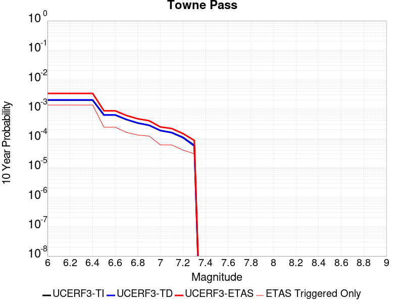 |

| Magnitude | 1 wk TI Prob | 1 wk TD Prob | 1 wk ETAS Prob | 1 wk ETAS/TD Gain | 1 wk ETAS Triggered Only | 1 mo TI Prob | 1 mo TD Prob | 1 mo ETAS Prob | 1 mo ETAS/TD Gain | 1 mo ETAS Triggered Only | 1 yr TI Prob | 1 yr TD Prob | 1 yr ETAS Prob | 1 yr ETAS/TD Gain | 1 yr ETAS Triggered Only | 10 yr TI Prob | 10 yr TD Prob | 10 yr ETAS Prob | 10 yr ETAS/TD Gain | 10 yr ETAS Triggered Only |
|-----|-----|-----|-----|-----|-----|-----|-----|-----|-----|-----|-----|-----|-----|-----|-----|-----|-----|-----|-----|-----|
| 6.0 | 3.849728E-6 | 3.8945577E-6 | 2.7557504E-5 | 7.0759006 | 2.3663039E-5 | 1.649873E-5 | 1.669088E-5 | 1.11341455E-4 | 6.670796 | 9.4652154E-5 | 2.0085352E-4 | 2.0319689E-4 | 6.763615E-4 | 3.3286016 | 4.7326076E-4 | 0.0020067208 | 0.00203054 | 0.0028806797 | 1.4186766 | 8.518694E-4 |
| 6.1 | 3.849728E-6 | 3.8945577E-6 | 2.7557504E-5 | 7.0759006 | 2.3663039E-5 | 1.649873E-5 | 1.669088E-5 | 1.11341455E-4 | 6.670796 | 9.4652154E-5 | 2.0085352E-4 | 2.0319689E-4 | 6.763615E-4 | 3.3286016 | 4.7326076E-4 | 0.0020067208 | 0.00203054 | 0.0028806797 | 1.4186766 | 8.518694E-4 |
| 6.2 | 3.849728E-6 | 3.8945577E-6 | 2.7557504E-5 | 7.0759006 | 2.3663039E-5 | 1.649873E-5 | 1.669088E-5 | 1.11341455E-4 | 6.670796 | 9.4652154E-5 | 2.0085352E-4 | 2.0319689E-4 | 6.763615E-4 | 3.3286016 | 4.7326076E-4 | 0.0020067208 | 0.00203054 | 0.0028806797 | 1.4186766 | 8.518694E-4 |
| 6.3 | 3.849728E-6 | 3.8945577E-6 | 2.7557504E-5 | 7.0759006 | 2.3663039E-5 | 1.649873E-5 | 1.669088E-5 | 1.11341455E-4 | 6.670796 | 9.4652154E-5 | 2.0085352E-4 | 2.0319689E-4 | 6.763615E-4 | 3.3286016 | 4.7326076E-4 | 0.0020067208 | 0.00203054 | 0.0028806797 | 1.4186766 | 8.518694E-4 |
| 6.4 | 3.849728E-6 | 3.8945577E-6 | 2.7557504E-5 | 7.0759006 | 2.3663039E-5 | 1.649873E-5 | 1.669088E-5 | 1.11341455E-4 | 6.670796 | 9.4652154E-5 | 2.0085352E-4 | 2.0319689E-4 | 6.763615E-4 | 3.3286016 | 4.7326076E-4 | 0.0020067208 | 0.00203054 | 0.0028806797 | 1.4186766 | 8.518694E-4 |
| 6.5 | 1.1953545E-6 | 1.2030586E-6 | 1.2030586E-6 | 1.0 | 0.0 | 5.1229376E-6 | 5.1559555E-6 | 5.1559555E-6 | 1.0 | 0.0 | 6.236998E-5 | 6.277207E-5 | 2.0474139E-4 | 3.2616637 | 1.4197823E-4 | 6.235248E-4 | 6.275551E-4 | 7.930924E-4 | 1.2637813 | 1.6564126E-4 |
| 6.6 | 1.1953545E-6 | 1.2030586E-6 | 1.2030586E-6 | 1.0 | 0.0 | 5.1229376E-6 | 5.1559555E-6 | 5.1559555E-6 | 1.0 | 0.0 | 6.236998E-5 | 6.277207E-5 | 2.0474139E-4 | 3.2616637 | 1.4197823E-4 | 6.235248E-4 | 6.275551E-4 | 7.930924E-4 | 1.2637813 | 1.6564126E-4 |
| 6.7 | 8.375951E-7 | 8.410724E-7 | 8.410724E-7 | 1.0 | 0.0 | 3.5896885E-6 | 3.6045915E-6 | 3.6045915E-6 | 1.0 | 0.0 | 4.370358E-5 | 4.3885073E-5 | 1.3853307E-4 | 3.1567242 | 9.4652154E-5 | 4.3694986E-4 | 4.3876978E-4 | 5.5703305E-4 | 1.2695338 | 1.1831519E-4 |
| 6.8 | 6.38041E-7 | 6.392204E-7 | 6.392204E-7 | 1.0 | 0.0 | 2.7344586E-6 | 2.7395133E-6 | 2.7395133E-6 | 1.0 | 0.0 | 3.3291526E-5 | 3.3353102E-5 | 1.0433985E-4 | 3.1283402 | 7.098912E-5 | 3.3286537E-4 | 3.334848E-4 | 4.2810538E-4 | 1.2837329 | 9.4652154E-5 |
| 6.9 | 5.3460053E-7 | 5.345377E-7 | 5.345377E-7 | 1.0 | 0.0 | 2.2911431E-6 | 2.2908741E-6 | 2.2908741E-6 | 1.0 | 0.0 | 2.789431E-5 | 2.789107E-5 | 9.8878205E-5 | 3.5451565 | 7.098912E-5 | 2.789081E-4 | 2.7887902E-4 | 3.7350476E-4 | 1.3393075 | 9.4652154E-5 |
| 7.0 | 3.557783E-7 | 3.53246E-7 | 3.53246E-7 | 1.0 | 0.0 | 1.5247632E-6 | 1.5139107E-6 | 1.5139107E-6 | 1.0 | 0.0 | 1.8563835E-5 | 1.8431714E-5 | 4.2094318E-5 | 2.2837982 | 2.3663039E-5 | 1.8562283E-4 | 1.843027E-4 | 2.3162006E-4 | 1.2567371 | 4.7326077E-5 |
| 7.1 | 3.037942E-7 | 3.000256E-7 | 3.000256E-7 | 1.0 | 0.0 | 1.3019744E-6 | 1.2858234E-6 | 1.2858234E-6 | 1.0 | 0.0 | 1.5851423E-5 | 1.5654796E-5 | 3.9317463E-5 | 2.5115285 | 2.3663039E-5 | 1.5850292E-4 | 1.5653767E-4 | 2.0385634E-4 | 1.3022829 | 4.7326077E-5 |
| 7.2 | 2.0808248E-7 | 2.021797E-7 | 2.021797E-7 | 1.0 | 0.0 | 8.917818E-7 | 8.664842E-7 | 8.664842E-7 | 1.0 | 0.0 | 1.0857389E-5 | 1.0549398E-5 | 1.0549398E-5 | 1.0 | 0.0 | 1.0856859E-4 | 1.0548944E-4 | 1.2914998E-4 | 1.224293 | 2.3663039E-5 |
| 7.3 | 1.1162073E-7 | 1.0637072E-7 | 1.0637072E-7 | 1.0 | 0.0 | 4.7837443E-7 | 4.5587444E-7 | 4.5587444E-7 | 1.0 | 0.0 | 5.8241935E-6 | 5.550259E-6 | 5.550259E-6 | 1.0 | 0.0 | 5.8240406E-5 | 5.550141E-5 | 5.550141E-5 | 1.0 | 0.0 |

## San Andreas (San Bernardino S)
*[(top)](#table-of-contents)*

| 1 Week | 1 Month | 1 Year | 10 Year |
|-----|-----|-----|-----|
|  |  |  |  |

| Magnitude | 1 wk TI Prob | 1 wk TD Prob | 1 wk ETAS Prob | 1 wk ETAS/TD Gain | 1 wk ETAS Triggered Only | 1 mo TI Prob | 1 mo TD Prob | 1 mo ETAS Prob | 1 mo ETAS/TD Gain | 1 mo ETAS Triggered Only | 1 yr TI Prob | 1 yr TD Prob | 1 yr ETAS Prob | 1 yr ETAS/TD Gain | 1 yr ETAS Triggered Only | 10 yr TI Prob | 10 yr TD Prob | 10 yr ETAS Prob | 10 yr ETAS/TD Gain | 10 yr ETAS Triggered Only |
|-----|-----|-----|-----|-----|-----|-----|-----|-----|-----|-----|-----|-----|-----|-----|-----|-----|-----|-----|-----|-----|
| 6.0 | 1.2336002E-4 | 3.001381E-4 | 3.2379403E-4 | 1.0788169 | 2.3663039E-5 | 5.2857865E-4 | 0.0012856981 | 0.0013802286 | 1.0735246 | 9.4652154E-5 | 0.006416472 | 0.015545984 | 0.015872115 | 1.0209786 | 3.3128253E-4 | 0.06234337 | 0.14287543 | 0.14340277 | 1.0036908 | 6.1523897E-4 |
| 6.1 | 1.2336002E-4 | 3.001381E-4 | 3.2379403E-4 | 1.0788169 | 2.3663039E-5 | 5.2857865E-4 | 0.0012856981 | 0.0013802286 | 1.0735246 | 9.4652154E-5 | 0.006416472 | 0.015545984 | 0.015872115 | 1.0209786 | 3.3128253E-4 | 0.06234337 | 0.14287543 | 0.14340277 | 1.0036908 | 6.1523897E-4 |
| 6.2 | 1.2336002E-4 | 3.001381E-4 | 3.2379403E-4 | 1.0788169 | 2.3663039E-5 | 5.2857865E-4 | 0.0012856981 | 0.0013802286 | 1.0735246 | 9.4652154E-5 | 0.006416472 | 0.015545984 | 0.015872115 | 1.0209786 | 3.3128253E-4 | 0.06234337 | 0.14287543 | 0.14340277 | 1.0036908 | 6.1523897E-4 |
| 6.3 | 1.1712257E-4 | 2.8802018E-4 | 3.1167638E-4 | 1.0821339 | 2.3663039E-5 | 5.018573E-4 | 0.0012338139 | 0.0013283492 | 1.0766205 | 9.4652154E-5 | 0.006093008 | 0.014923064 | 0.015249402 | 1.0218681 | 3.3128253E-4 | 0.059286322 | 0.13758378 | 0.13809396 | 1.0037081 | 5.91576E-4 |
| 6.4 | 1.1712257E-4 | 2.8802018E-4 | 3.1167638E-4 | 1.0821339 | 2.3663039E-5 | 5.018573E-4 | 0.0012338139 | 0.0013283492 | 1.0766205 | 9.4652154E-5 | 0.006093008 | 0.014923064 | 0.015249402 | 1.0218681 | 3.3128253E-4 | 0.059286322 | 0.13758378 | 0.13809396 | 1.0037081 | 5.91576E-4 |
| 6.5 | 1.0689076E-4 | 2.6814712E-4 | 2.9180382E-4 | 1.0882229 | 2.3663039E-5 | 4.5802278E-4 | 0.0011487206 | 0.001243264 | 1.0823033 | 9.4652154E-5 | 0.0055621783 | 0.013900606 | 0.01420395 | 1.0218223 | 3.0761948E-4 | 0.05425003 | 0.12883076 | 0.12932551 | 1.0038403 | 5.6791294E-4 |
| 6.6 | 9.7648895E-5 | 2.5059367E-4 | 2.7425078E-4 | 1.0944042 | 2.3663039E-5 | 4.1842813E-4 | 0.0010735545 | 0.001168105 | 1.0880724 | 9.4652154E-5 | 0.005082469 | 0.01299656 | 0.013300181 | 1.0233617 | 3.0761948E-4 | 0.049677886 | 0.120990366 | 0.12146877 | 1.003954 | 5.442499E-4 |
| 6.7 | 8.757013E-5 | 2.3130006E-4 | 2.5495762E-4 | 1.1022809 | 2.3663039E-5 | 3.7524657E-4 | 9.909316E-4 | 0.00108549 | 1.0954237 | 9.4652154E-5 | 0.00455906 | 0.012001941 | 0.012305868 | 1.0253232 | 3.0761948E-4 | 0.04466656 | 0.11229846 | 0.11276059 | 1.0041151 | 5.2058685E-4 |
| 6.8 | 8.562978E-5 | 2.2689818E-4 | 2.5055587E-4 | 1.1042656 | 2.3663039E-5 | 3.6693315E-4 | 9.720806E-4 | 0.0010666407 | 1.097276 | 9.4652154E-5 | 0.004458263 | 0.0117749255 | 0.012078922 | 1.0258174 | 3.0761948E-4 | 0.043698758 | 0.11030855 | 0.110771716 | 1.0041988 | 5.2058685E-4 |
| 6.9 | 6.124075E-5 | 1.7073889E-4 | 1.9439789E-4 | 1.1385683 | 2.3663039E-5 | 2.6243398E-4 | 7.3153374E-4 | 8.2611665E-4 | 1.129294 | 9.4652154E-5 | 0.0031904527 | 0.00887026 | 0.009151697 | 1.0317283 | 2.8395647E-4 | 0.031450346 | 0.08421729 | 0.08467236 | 1.0054035 | 4.969238E-4 |
| 7.0 | 5.8598747E-5 | 1.650282E-4 | 1.8868735E-4 | 1.1433642 | 2.3663039E-5 | 2.5111332E-4 | 7.0707285E-4 | 8.016581E-4 | 1.1337701 | 9.4652154E-5 | 0.0030530186 | 0.0085748285 | 0.00885635 | 1.0328312 | 2.8395647E-4 | 0.03011414 | 0.08153475 | 0.08199116 | 1.0055977 | 4.969238E-4 |
| 7.1 | 5.613814E-5 | 1.5921291E-4 | 1.8287219E-4 | 1.1486014 | 2.3663039E-5 | 2.4056983E-4 | 6.821634E-4 | 7.7675097E-4 | 1.1386583 | 9.4652154E-5 | 0.0029250039 | 0.008273893 | 0.0085555 | 1.0340356 | 2.8395647E-4 | 0.028868021 | 0.07883346 | 0.07929121 | 1.0058066 | 4.969238E-4 |
| 7.2 | 4.991222E-5 | 1.4527571E-4 | 1.6893532E-4 | 1.16286 | 2.3663039E-5 | 2.1389198E-4 | 6.224621E-4 | 7.170553E-4 | 1.1519662 | 9.4652154E-5 | 0.002601025 | 0.0075522447 | 0.007834056 | 1.037315 | 2.8395647E-4 | 0.025707912 | 0.072286695 | 0.0727477 | 1.0063775 | 4.969238E-4 |
| 7.3 | 4.7410045E-5 | 1.3721608E-4 | 1.6087586E-4 | 1.1724273 | 2.3663039E-5 | 2.0317009E-4 | 5.8793667E-4 | 6.825332E-4 | 1.1608957 | 9.4652154E-5 | 0.0024707897 | 0.007134721 | 0.0074166516 | 1.0395153 | 2.8395647E-4 | 0.024434982 | 0.06856856 | 0.0690314 | 1.0067502 | 4.969238E-4 |
| 7.4 | 4.5556746E-5 | 1.3129383E-4 | 1.5495377E-4 | 1.180206 | 2.3663039E-5 | 1.952286E-4 | 5.625668E-4 | 6.571657E-4 | 1.1681559 | 9.4652154E-5 | 0.002374317 | 0.00682782 | 0.0071098376 | 1.0413042 | 2.8395647E-4 | 0.023491086 | 0.06582052 | 0.06628474 | 1.0070528 | 4.969238E-4 |
| 7.5 | 4.3084514E-5 | 1.2364559E-4 | 1.473057E-4 | 1.1913543 | 2.3663039E-5 | 1.8463485E-4 | 5.2980235E-4 | 6.2440435E-4 | 1.178561 | 9.4652154E-5 | 0.0022456115 | 0.006431338 | 0.006713468 | 1.0438681 | 2.8395647E-4 | 0.022230545 | 0.062220756 | 0.06268676 | 1.0074896 | 4.969238E-4 |
| 7.6 | 3.408608E-5 | 9.842233E-5 | 1.2208303E-4 | 1.2403998 | 2.3663039E-5 | 1.4607502E-4 | 4.217419E-4 | 5.163541E-4 | 1.2243369 | 9.4652154E-5 | 0.0017770125 | 0.0051226444 | 0.005405146 | 1.0551476 | 2.8395647E-4 | 0.017628696 | 0.05005001 | 0.050522063 | 1.0094316 | 4.969238E-4 |
| 7.7 | 2.8315713E-5 | 8.254984E-5 | 1.0621093E-4 | 1.2866279 | 2.3663039E-5 | 1.2134742E-4 | 3.537371E-4 | 4.4835577E-4 | 1.267483 | 9.4652154E-5 | 0.0014764034 | 0.0042982535 | 0.0045809895 | 1.0657792 | 2.8395647E-4 | 0.01466633 | 0.04229954 | 0.04277544 | 1.0112509 | 4.969238E-4 |
| 7.8 | 2.6222975E-5 | 7.468984E-5 | 9.835111E-5 | 1.3167937 | 2.3663039E-5 | 1.1237934E-4 | 3.2006006E-4 | 4.146819E-4 | 1.2956378 | 9.4652154E-5 | 0.0013673597 | 0.003889775 | 0.004172627 | 1.0727168 | 2.8395647E-4 | 0.013589768 | 0.038463186 | 0.038918246 | 1.011831 | 4.7326076E-4 |
| 7.9 | 2.1469694E-5 | 5.7927857E-5 | 8.1589526E-5 | 1.4084679 | 2.3663039E-5 | 9.200973E-5 | 2.4823865E-4 | 3.4286728E-4 | 1.3812003 | 9.4652154E-5 | 0.0011196428 | 0.0030181198 | 0.0033012193 | 1.0938 | 2.8395647E-4 | 0.011140184 | 0.030174483 | 0.030633463 | 1.0152109 | 4.7326076E-4 |
| 8.0 | 1.2420249E-5 | 3.1346288E-5 | 5.5008586E-5 | 1.7548676 | 2.3663039E-5 | 5.322855E-5 | 1.3433433E-4 | 2.053139E-4 | 1.52838 | 7.098912E-5 | 6.478649E-4 | 0.0016342945 | 0.001728792 | 1.0578215 | 9.4652154E-5 | 0.0064597935 | 0.016535252 | 0.016698154 | 1.0098518 | 1.6564126E-4 |
| 8.1 | 4.9197724E-6 | 7.832194E-6 | 7.832194E-6 | 1.0 | 0.0 | 2.1084568E-5 | 3.3566113E-5 | 3.3566113E-5 | 1.0 | 0.0 | 2.566744E-4 | 4.0859092E-4 | 4.0859092E-4 | 1.0 | 0.0 | 0.002563781 | 0.004389317 | 0.004412876 | 1.0053674 | 2.3663039E-5 |
| 8.2 | 2.5634774E-6 | 2.9112718E-6 | 2.9112718E-6 | 1.0 | 0.0 | 1.0986286E-5 | 1.247682E-5 | 1.247682E-5 | 1.0 | 0.0 | 1.3374983E-4 | 1.5189474E-4 | 1.5189474E-4 | 1.0 | 0.0 | 0.0013366934 | 0.001707363 | 0.001707363 | 1.0 | 0.0 |
| 8.3 | 5.2850464E-7 | 3.2150157E-7 | 3.2150157E-7 | 1.0 | 0.0 | 2.2650179E-6 | 1.3778632E-6 | 1.3778632E-6 | 1.0 | 0.0 | 2.7576245E-5 | 1.6775368E-5 | 1.6775368E-5 | 1.0 | 0.0 | 2.7572823E-4 | 1.9904955E-4 | 1.9904955E-4 | 1.0 | 0.0 |

## Helendale-So Lockhart
*[(top)](#table-of-contents)*

| 1 Week | 1 Month | 1 Year | 10 Year |
|-----|-----|-----|-----|
|  | 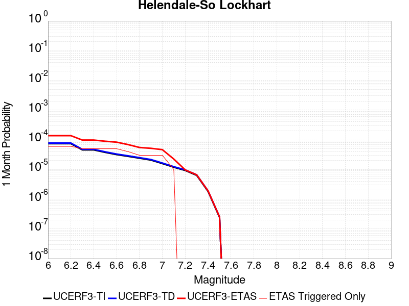 |  |  |

| Magnitude | 1 wk TI Prob | 1 wk TD Prob | 1 wk ETAS Prob | 1 wk ETAS/TD Gain | 1 wk ETAS Triggered Only | 1 mo TI Prob | 1 mo TD Prob | 1 mo ETAS Prob | 1 mo ETAS/TD Gain | 1 mo ETAS Triggered Only | 1 yr TI Prob | 1 yr TD Prob | 1 yr ETAS Prob | 1 yr ETAS/TD Gain | 1 yr ETAS Triggered Only | 10 yr TI Prob | 10 yr TD Prob | 10 yr ETAS Prob | 10 yr ETAS/TD Gain | 10 yr ETAS Triggered Only |
|-----|-----|-----|-----|-----|-----|-----|-----|-----|-----|-----|-----|-----|-----|-----|-----|-----|-----|-----|-----|-----|
| 6.0 | 1.7296055E-5 | 1.8103954E-5 | 1.8103954E-5 | 1.0 | 0.0 | 7.412385E-5 | 7.7586184E-5 | 1.2490859E-4 | 1.6099334 | 4.7326077E-5 | 9.0208417E-4 | 9.4422314E-4 | 0.0011806301 | 1.2503719 | 2.3663038E-4 | 0.008984311 | 0.009404233 | 0.009990245 | 1.0623137 | 5.91576E-4 |
| 6.1 | 1.7296055E-5 | 1.8103954E-5 | 1.8103954E-5 | 1.0 | 0.0 | 7.412385E-5 | 7.7586184E-5 | 1.2490859E-4 | 1.6099334 | 4.7326077E-5 | 9.0208417E-4 | 9.4422314E-4 | 0.0011806301 | 1.2503719 | 2.3663038E-4 | 0.008984311 | 0.009404233 | 0.009990245 | 1.0623137 | 5.91576E-4 |
| 6.2 | 1.7296055E-5 | 1.8103954E-5 | 1.8103954E-5 | 1.0 | 0.0 | 7.412385E-5 | 7.7586184E-5 | 1.2490859E-4 | 1.6099334 | 4.7326077E-5 | 9.0208417E-4 | 9.4422314E-4 | 0.0011806301 | 1.2503719 | 2.3663038E-4 | 0.008984311 | 0.009404233 | 0.009990245 | 1.0623137 | 5.91576E-4 |
| 6.3 | 1.0669118E-5 | 1.1135554E-5 | 1.1135554E-5 | 1.0 | 0.0 | 4.5723988E-5 | 4.7722944E-5 | 9.5046766E-5 | 1.9916366 | 4.7326077E-5 | 5.5654737E-4 | 5.8087474E-4 | 7.937184E-4 | 1.3664192 | 2.1296735E-4 | 0.0055515557 | 0.0057938606 | 0.0062173274 | 1.0730889 | 4.259347E-4 |
| 6.4 | 1.0669118E-5 | 1.1135554E-5 | 1.1135554E-5 | 1.0 | 0.0 | 4.5723988E-5 | 4.7722944E-5 | 9.5046766E-5 | 1.9916366 | 4.7326077E-5 | 5.5654737E-4 | 5.8087474E-4 | 7.937184E-4 | 1.3664192 | 2.1296735E-4 | 0.0055515557 | 0.0057938606 | 0.0062173274 | 1.0730889 | 4.259347E-4 |
| 6.5 | 8.790038E-6 | 9.170302E-6 | 9.170302E-6 | 1.0 | 0.0 | 3.767105E-5 | 3.930071E-5 | 8.662493E-5 | 2.2041566 | 4.7326077E-5 | 4.585485E-4 | 4.7838266E-4 | 6.439447E-4 | 1.346087 | 1.6564126E-4 | 0.0045760344 | 0.004773693 | 0.0051269443 | 1.0739995 | 3.5494557E-4 |
| 6.6 | 7.396949E-6 | 7.7156255E-6 | 7.7156255E-6 | 1.0 | 0.0 | 3.1700827E-5 | 3.3066553E-5 | 8.0391066E-5 | 2.4311898 | 4.7326077E-5 | 3.858892E-4 | 4.025119E-4 | 5.680865E-4 | 1.4113532 | 1.6564126E-4 | 0.003852198 | 0.0040179356 | 0.0043478874 | 1.0821197 | 3.3128253E-4 |
| 6.7 | 6.4600285E-6 | 6.738108E-6 | 6.738108E-6 | 1.0 | 0.0 | 2.7685543E-5 | 2.887729E-5 | 5.2539646E-5 | 1.8194104 | 2.3663039E-5 | 3.3701936E-4 | 3.515251E-4 | 4.697987E-4 | 1.3364584 | 1.1831519E-4 | 0.0033650869 | 0.003509772 | 0.0037691519 | 1.0739022 | 2.6029343E-4 |
| 6.8 | 5.600104E-6 | 5.8360747E-6 | 5.8360747E-6 | 1.0 | 0.0 | 2.4000226E-5 | 2.5011512E-5 | 4.867396E-5 | 1.9460622 | 2.3663039E-5 | 2.9216358E-4 | 3.0447321E-4 | 4.2275238E-4 | 1.3884715 | 1.1831519E-4 | 0.0029177975 | 0.003040622 | 0.003300124 | 1.085345 | 2.6029343E-4 |
| 6.9 | 4.839122E-6 | 5.0395647E-6 | 5.0395647E-6 | 1.0 | 0.0 | 2.0738931E-5 | 2.1597958E-5 | 4.5260484E-5 | 2.0955908 | 2.3663039E-5 | 2.5246723E-4 | 2.629239E-4 | 3.5755115E-4 | 1.3599037 | 9.4652154E-5 | 0.002521806 | 0.0026261755 | 0.0028385837 | 1.0808811 | 2.1296735E-4 |
| 7.0 | 3.6937633E-6 | 3.84525E-6 | 3.84525E-6 | 1.0 | 0.0 | 1.5830317E-5 | 1.647954E-5 | 4.014219E-5 | 2.4358804 | 2.3663039E-5 | 1.9271708E-4 | 2.0062024E-4 | 2.952534E-4 | 1.4717029 | 9.4652154E-5 | 0.0019255003 | 0.0020044227 | 0.0021933476 | 1.094254 | 1.8930431E-4 |
| 7.1 | 2.7858857E-6 | 2.8978848E-6 | 2.8978848E-6 | 1.0 | 0.0 | 1.1939455E-5 | 1.2419448E-5 | 1.2419448E-5 | 1.0 | 0.0 | 1.4535317E-4 | 1.5119651E-4 | 1.9851542E-4 | 1.312963 | 4.7326077E-5 | 0.0014525814 | 0.0015109578 | 0.0016527215 | 1.0938238 | 1.4197823E-4 |
| 7.2 | 2.1672065E-6 | 2.2540366E-6 | 2.2540366E-6 | 1.0 | 0.0 | 9.2879945E-6 | 9.6601225E-6 | 9.6601225E-6 | 1.0 | 0.0 | 1.1307546E-4 | 1.1760583E-4 | 1.6492634E-4 | 1.4023653 | 4.7326077E-5 | 0.0011301794 | 0.0011754541 | 0.001269995 | 1.0804292 | 9.4652154E-5 |
| 7.3 | 1.4823496E-6 | 1.5422268E-6 | 1.5422268E-6 | 1.0 | 0.0 | 6.3529114E-6 | 6.609527E-6 | 6.609527E-6 | 1.0 | 0.0 | 7.734395E-5 | 8.046818E-5 | 1.2779044E-4 | 1.5880867 | 4.7326077E-5 | 7.731704E-4 | 8.044055E-4 | 8.989815E-4 | 1.1175725 | 9.4652154E-5 |
| 7.4 | 4.2321457E-7 | 4.410926E-7 | 4.410926E-7 | 1.0 | 0.0 | 1.8137755E-6 | 1.8903958E-6 | 1.8903958E-6 | 1.0 | 0.0 | 2.2082493E-5 | 2.3015371E-5 | 2.3015371E-5 | 1.0 | 0.0 | 2.2080299E-4 | 2.301344E-4 | 2.5379198E-4 | 1.102799 | 2.3663039E-5 |
| 7.5 | 5.6942316E-8 | 5.941633E-8 | 5.941633E-8 | 1.0 | 0.0 | 2.440385E-7 | 2.546414E-7 | 2.546414E-7 | 1.0 | 0.0 | 2.9711643E-6 | 3.1002553E-6 | 3.1002553E-6 | 1.0 | 0.0 | 2.9711247E-5 | 3.10022E-5 | 3.10022E-5 | 1.0 | 0.0 |

## Garlic Springs
*[(top)](#table-of-contents)*

| 1 Week | 1 Month | 1 Year | 10 Year |
|-----|-----|-----|-----|
|  |  |  |  |

| Magnitude | 1 wk TI Prob | 1 wk TD Prob | 1 wk ETAS Prob | 1 wk ETAS/TD Gain | 1 wk ETAS Triggered Only | 1 mo TI Prob | 1 mo TD Prob | 1 mo ETAS Prob | 1 mo ETAS/TD Gain | 1 mo ETAS Triggered Only | 1 yr TI Prob | 1 yr TD Prob | 1 yr ETAS Prob | 1 yr ETAS/TD Gain | 1 yr ETAS Triggered Only | 10 yr TI Prob | 10 yr TD Prob | 10 yr ETAS Prob | 10 yr ETAS/TD Gain | 10 yr ETAS Triggered Only |
|-----|-----|-----|-----|-----|-----|-----|-----|-----|-----|-----|-----|-----|-----|-----|-----|-----|-----|-----|-----|-----|
| 6.0 | 1.6760017E-5 | 1.8777433E-5 | 1.8777433E-5 | 1.0 | 0.0 | 7.182667E-5 | 8.047289E-5 | 1.0413402E-4 | 1.2940261 | 2.3663039E-5 | 8.7413884E-4 | 9.794345E-4 | 0.0010976337 | 1.1206812 | 1.1831519E-4 | 0.008707083 | 0.009762724 | 0.010278228 | 1.0528034 | 5.2058685E-4 |
| 6.1 | 9.852767E-6 | 1.09739185E-5 | 1.09739185E-5 | 1.0 | 0.0 | 4.222546E-5 | 4.703063E-5 | 7.069256E-5 | 1.5031173 | 2.3663039E-5 | 5.139737E-4 | 5.7251845E-4 | 6.6711643E-4 | 1.1652313 | 9.4652154E-5 | 0.005127866 | 0.0057173935 | 0.0059997267 | 1.0493814 | 2.8395647E-4 |
| 6.2 | 9.852767E-6 | 1.09739185E-5 | 1.09739185E-5 | 1.0 | 0.0 | 4.222546E-5 | 4.703063E-5 | 7.069256E-5 | 1.5031173 | 2.3663039E-5 | 5.139737E-4 | 5.7251845E-4 | 6.6711643E-4 | 1.1652313 | 9.4652154E-5 | 0.005127866 | 0.0057173935 | 0.0059997267 | 1.0493814 | 2.8395647E-4 |
| 6.3 | 4.3167724E-6 | 4.778164E-6 | 4.778164E-6 | 1.0 | 0.0 | 1.8500323E-5 | 2.0477815E-5 | 2.0477815E-5 | 1.0 | 0.0 | 2.2521814E-4 | 2.493119E-4 | 2.7296905E-4 | 1.0948898 | 2.3663039E-5 | 0.0022499003 | 0.0024925806 | 0.0025397886 | 1.0189395 | 4.7326077E-5 |
| 6.4 | 4.3167724E-6 | 4.778164E-6 | 4.778164E-6 | 1.0 | 0.0 | 1.8500323E-5 | 2.0477815E-5 | 2.0477815E-5 | 1.0 | 0.0 | 2.2521814E-4 | 2.493119E-4 | 2.7296905E-4 | 1.0948898 | 2.3663039E-5 | 0.0022499003 | 0.0024925806 | 0.0025397886 | 1.0189395 | 4.7326077E-5 |
| 6.5 | 4.3167724E-6 | 4.778164E-6 | 4.778164E-6 | 1.0 | 0.0 | 1.8500323E-5 | 2.0477815E-5 | 2.0477815E-5 | 1.0 | 0.0 | 2.2521814E-4 | 2.493119E-4 | 2.7296905E-4 | 1.0948898 | 2.3663039E-5 | 0.0022499003 | 0.0024925806 | 0.0025397886 | 1.0189395 | 4.7326077E-5 |
| 6.6 | 4.301311E-6 | 4.761032E-6 | 4.761032E-6 | 1.0 | 0.0 | 1.8434059E-5 | 2.0404394E-5 | 2.0404394E-5 | 1.0 | 0.0 | 2.2441156E-4 | 2.484182E-4 | 2.7207535E-4 | 1.0952312 | 2.3663039E-5 | 0.0022418506 | 0.0024836634 | 0.002530872 | 1.0190076 | 4.7326077E-5 |
| 6.7 | 3.8599724E-6 | 4.2711804E-6 | 4.2711804E-6 | 1.0 | 0.0 | 1.6542634E-5 | 1.830506E-5 | 1.830506E-5 | 1.0 | 0.0 | 2.0138794E-4 | 2.228641E-4 | 2.4652187E-4 | 1.1061534 | 2.3663039E-5 | 0.0020120554 | 0.002228641 | 0.0022758616 | 1.021188 | 4.7326077E-5 |

## Death Valley (Black Mtns Frontal)
*[(top)](#table-of-contents)*

| 1 Week | 1 Month | 1 Year | 10 Year |
|-----|-----|-----|-----|
|  |  |  |  |

| Magnitude | 1 wk TI Prob | 1 wk TD Prob | 1 wk ETAS Prob | 1 wk ETAS/TD Gain | 1 wk ETAS Triggered Only | 1 mo TI Prob | 1 mo TD Prob | 1 mo ETAS Prob | 1 mo ETAS/TD Gain | 1 mo ETAS Triggered Only | 1 yr TI Prob | 1 yr TD Prob | 1 yr ETAS Prob | 1 yr ETAS/TD Gain | 1 yr ETAS Triggered Only | 10 yr TI Prob | 10 yr TD Prob | 10 yr ETAS Prob | 10 yr ETAS/TD Gain | 10 yr ETAS Triggered Only |
|-----|-----|-----|-----|-----|-----|-----|-----|-----|-----|-----|-----|-----|-----|-----|-----|-----|-----|-----|-----|-----|
| 6.0 | 1.6707214E-5 | 1.8670851E-5 | 1.8670851E-5 | 1.0 | 0.0 | 7.160038E-5 | 8.0015525E-5 | 1.5099897E-4 | 1.8871207 | 7.098912E-5 | 8.71386E-4 | 9.7376126E-4 | 0.0011865213 | 1.218493 | 2.1296735E-4 | 0.00867977 | 0.009695798 | 0.010211337 | 1.0531714 | 5.2058685E-4 |
| 6.1 | 1.6707214E-5 | 1.8670851E-5 | 1.8670851E-5 | 1.0 | 0.0 | 7.160038E-5 | 8.0015525E-5 | 1.5099897E-4 | 1.8871207 | 7.098912E-5 | 8.71386E-4 | 9.7376126E-4 | 0.0011865213 | 1.218493 | 2.1296735E-4 | 0.00867977 | 0.009695798 | 0.010211337 | 1.0531714 | 5.2058685E-4 |
| 6.2 | 1.6707214E-5 | 1.8670851E-5 | 1.8670851E-5 | 1.0 | 0.0 | 7.160038E-5 | 8.0015525E-5 | 1.5099897E-4 | 1.8871207 | 7.098912E-5 | 8.71386E-4 | 9.7376126E-4 | 0.0011865213 | 1.218493 | 2.1296735E-4 | 0.00867977 | 0.009695798 | 0.010211337 | 1.0531714 | 5.2058685E-4 |
| 6.3 | 1.6707214E-5 | 1.8670851E-5 | 1.8670851E-5 | 1.0 | 0.0 | 7.160038E-5 | 8.0015525E-5 | 1.5099897E-4 | 1.8871207 | 7.098912E-5 | 8.71386E-4 | 9.7376126E-4 | 0.0011865213 | 1.218493 | 2.1296735E-4 | 0.00867977 | 0.009695798 | 0.010211337 | 1.0531714 | 5.2058685E-4 |
| 6.4 | 1.5515609E-5 | 1.7338754E-5 | 1.7338754E-5 | 1.0 | 0.0 | 6.649377E-5 | 7.430687E-5 | 1.452907E-4 | 1.9552797 | 7.098912E-5 | 8.0926094E-4 | 9.043167E-4 | 0.0010934499 | 1.2091447 | 1.8930431E-4 | 0.008063202 | 0.009007053 | 0.009499501 | 1.0546736 | 4.969238E-4 |
| 6.5 | 1.5515609E-5 | 1.7338754E-5 | 1.7338754E-5 | 1.0 | 0.0 | 6.649377E-5 | 7.430687E-5 | 1.452907E-4 | 1.9552797 | 7.098912E-5 | 8.0926094E-4 | 9.043167E-4 | 0.0010934499 | 1.2091447 | 1.8930431E-4 | 0.008063202 | 0.009007053 | 0.009499501 | 1.0546736 | 4.969238E-4 |
| 6.6 | 1.5041828E-5 | 1.680967E-5 | 1.680967E-5 | 1.0 | 0.0 | 6.4463384E-5 | 7.203949E-5 | 1.4302348E-4 | 1.9853485 | 7.098912E-5 | 7.8455906E-4 | 8.7673374E-4 | 0.001065872 | 1.2157307 | 1.8930431E-4 | 0.00781795 | 0.008733404 | 0.009202532 | 1.0537164 | 4.7326076E-4 |
| 6.7 | 1.4634985E-5 | 1.6356527E-5 | 1.6356527E-5 | 1.0 | 0.0 | 6.271985E-5 | 7.009756E-5 | 1.4108169E-4 | 2.0126479 | 7.098912E-5 | 7.6334673E-4 | 8.5310935E-4 | 0.0010422522 | 1.22171 | 1.8930431E-4 | 0.007607299 | 0.008498981 | 0.008968219 | 1.0552112 | 4.7326076E-4 |
| 6.8 | 1.4209158E-5 | 1.5882546E-5 | 1.5882546E-5 | 1.0 | 0.0 | 6.089497E-5 | 6.806631E-5 | 1.390506E-4 | 2.0428696 | 7.098912E-5 | 7.4114406E-4 | 8.283978E-4 | 0.0010175453 | 1.2283293 | 1.8930431E-4 | 0.007386771 | 0.008253714 | 0.008723068 | 1.0568658 | 4.7326076E-4 |
| 6.9 | 1.3780098E-5 | 1.5405076E-5 | 1.5405076E-5 | 1.0 | 0.0 | 5.9056227E-5 | 6.602012E-5 | 1.3700455E-4 | 2.075194 | 7.098912E-5 | 7.1877235E-4 | 8.0350396E-4 | 9.926561E-4 | 1.2354091 | 1.8930431E-4 | 0.0071645193 | 0.008006583 | 0.008476054 | 1.0586357 | 4.7326076E-4 |
| 7.0 | 1.3585064E-5 | 1.51886325E-5 | 1.51886325E-5 | 1.0 | 0.0 | 5.8220405E-5 | 6.509254E-5 | 1.1241554E-4 | 1.727011 | 4.7326077E-5 | 7.086029E-4 | 7.92219E-4 | 9.340848E-4 | 1.1790739 | 1.4197823E-4 | 0.007063476 | 0.007894541 | 0.008317113 | 1.0535271 | 4.259347E-4 |
| 7.1 | 1.3398601E-5 | 1.4981811E-5 | 1.4981811E-5 | 1.0 | 0.0 | 5.742131E-5 | 6.420621E-5 | 8.786773E-5 | 1.3685238 | 2.3663039E-5 | 6.9888023E-4 | 7.814357E-4 | 8.760139E-4 | 1.1210313 | 9.4652154E-5 | 0.0069668638 | 0.007787468 | 0.008163128 | 1.0482391 | 3.7860862E-4 |
| 7.2 | 1.3126312E-5 | 1.4680023E-5 | 1.4680023E-5 | 1.0 | 0.0 | 5.6254412E-5 | 6.29129E-5 | 8.6574444E-5 | 1.3761002 | 2.3663039E-5 | 6.846822E-4 | 7.6570077E-4 | 8.602805E-4 | 1.1235204 | 9.4652154E-5 | 0.006825765 | 0.0076312097 | 0.007983446 | 1.0461574 | 3.5494557E-4 |
| 7.3 | 1.2922429E-5 | 1.4454244E-5 | 1.4454244E-5 | 1.0 | 0.0 | 5.5380664E-5 | 6.194532E-5 | 8.5606895E-5 | 1.3819752 | 2.3663039E-5 | 6.74051E-4 | 7.5392873E-4 | 8.4850955E-4 | 1.1254506 | 9.4652154E-5 | 0.006720101 | 0.007514291 | 0.007843084 | 1.0437558 | 3.3128253E-4 |
| 7.4 | 1.2768878E-5 | 1.4284223E-5 | 1.4284223E-5 | 1.0 | 0.0 | 5.4722615E-5 | 6.121669E-5 | 8.487828E-5 | 1.3865218 | 2.3663039E-5 | 6.660441E-4 | 7.4506376E-4 | 8.396454E-4 | 1.1269443 | 9.4652154E-5 | 0.0066405144 | 0.007426237 | 0.0077550593 | 1.0442785 | 3.3128253E-4 |
| 7.5 | 1.2521929E-5 | 1.4012458E-5 | 1.4012458E-5 | 1.0 | 0.0 | 5.366431E-5 | 6.0052043E-5 | 8.371366E-5 | 1.3940185 | 2.3663039E-5 | 6.531671E-4 | 7.308938E-4 | 8.254768E-4 | 1.1294073 | 9.4652154E-5 | 0.006512506 | 0.0072854757 | 0.0076143444 | 1.0451404 | 3.3128253E-4 |
| 7.6 | 1.1301089E-5 | 1.264855E-5 | 1.264855E-5 | 1.0 | 0.0 | 4.8432343E-5 | 5.4206976E-5 | 5.4206976E-5 | 1.0 | 0.0 | 5.895042E-4 | 6.597754E-4 | 7.307177E-4 | 1.1075249 | 7.098912E-5 | 0.0058794282 | 0.0065787183 | 0.006884314 | 1.0464522 | 3.0761948E-4 |
| 7.7 | 9.189108E-6 | 1.0283684E-5 | 1.0283684E-5 | 1.0 | 0.0 | 3.93813E-5 | 4.4072214E-5 | 4.4072214E-5 | 1.0 | 0.0 | 4.7936183E-4 | 5.3645216E-4 | 5.837529E-4 | 1.0881732 | 4.7326077E-5 | 0.004783291 | 0.005352083 | 0.005587447 | 1.0439762 | 2.3663038E-4 |
| 7.8 | 3.4586725E-7 | 3.6483146E-7 | 3.6483146E-7 | 1.0 | 0.0 | 1.4822873E-6 | 1.5635625E-6 | 1.5635625E-6 | 1.0 | 0.0 | 1.80467E-5 | 1.9036212E-5 | 4.26988E-5 | 2.2430303 | 2.3663039E-5 | 1.8045233E-4 | 1.9034625E-4 | 2.1400479E-4 | 1.1242921 | 2.3663039E-5 |
| 7.9 | 2.5591178E-9 | 2.6697022E-9 | 2.6697022E-9 | 1.0 | 0.0 | 1.0967647E-8 | 1.1441582E-8 | 1.1441582E-8 | 1.0 | 0.0 | 1.335311E-7 | 1.3930125E-7 | 1.3930125E-7 | 1.0 | 0.0 | 1.3353102E-6 | 1.3930126E-6 | 1.3930126E-6 | 1.0 | 0.0 |

## San Andreas (Big Bend)
*[(top)](#table-of-contents)*

| 1 Week | 1 Month | 1 Year | 10 Year |
|-----|-----|-----|-----|
|  |  |  |  |

| Magnitude | 1 wk TI Prob | 1 wk TD Prob | 1 wk ETAS Prob | 1 wk ETAS/TD Gain | 1 wk ETAS Triggered Only | 1 mo TI Prob | 1 mo TD Prob | 1 mo ETAS Prob | 1 mo ETAS/TD Gain | 1 mo ETAS Triggered Only | 1 yr TI Prob | 1 yr TD Prob | 1 yr ETAS Prob | 1 yr ETAS/TD Gain | 1 yr ETAS Triggered Only | 10 yr TI Prob | 10 yr TD Prob | 10 yr ETAS Prob | 10 yr ETAS/TD Gain | 10 yr ETAS Triggered Only |
|-----|-----|-----|-----|-----|-----|-----|-----|-----|-----|-----|-----|-----|-----|-----|-----|-----|-----|-----|-----|-----|
| 6.0 | 1.0179969E-4 | 2.0089281E-4 | 2.2455108E-4 | 1.1177657 | 2.3663039E-5 | 4.362114E-4 | 8.606861E-4 | 9.3161414E-4 | 1.0824087 | 7.098912E-5 | 0.0052979486 | 0.01042879 | 0.010592704 | 1.0157174 | 1.6564126E-4 | 0.051734097 | 0.101523116 | 0.10184202 | 1.0031413 | 3.5494557E-4 |
| 6.1 | 1.0179969E-4 | 2.0089281E-4 | 2.2455108E-4 | 1.1177657 | 2.3663039E-5 | 4.362114E-4 | 8.606861E-4 | 9.3161414E-4 | 1.0824087 | 7.098912E-5 | 0.0052979486 | 0.01042879 | 0.010592704 | 1.0157174 | 1.6564126E-4 | 0.051734097 | 0.101523116 | 0.10184202 | 1.0031413 | 3.5494557E-4 |
| 6.2 | 1.0179969E-4 | 2.0089281E-4 | 2.2455108E-4 | 1.1177657 | 2.3663039E-5 | 4.362114E-4 | 8.606861E-4 | 9.3161414E-4 | 1.0824087 | 7.098912E-5 | 0.0052979486 | 0.01042879 | 0.010592704 | 1.0157174 | 1.6564126E-4 | 0.051734097 | 0.101523116 | 0.10184202 | 1.0031413 | 3.5494557E-4 |
| 6.3 | 1.0179969E-4 | 2.0089281E-4 | 2.2455108E-4 | 1.1177657 | 2.3663039E-5 | 4.362114E-4 | 8.606861E-4 | 9.3161414E-4 | 1.0824087 | 7.098912E-5 | 0.0052979486 | 0.01042879 | 0.010592704 | 1.0157174 | 1.6564126E-4 | 0.051734097 | 0.101523116 | 0.10184202 | 1.0031413 | 3.5494557E-4 |
| 6.4 | 9.1639464E-5 | 1.8446219E-4 | 2.0812085E-4 | 1.1282576 | 2.3663039E-5 | 3.9268145E-4 | 7.9031294E-4 | 8.612459E-4 | 1.089753 | 7.098912E-5 | 0.0047704205 | 0.009579727 | 0.009720345 | 1.0146787 | 1.4197823E-4 | 0.046693064 | 0.093848534 | 0.09406296 | 1.0022848 | 2.3663038E-4 |
| 6.5 | 9.1639464E-5 | 1.8446219E-4 | 2.0812085E-4 | 1.1282576 | 2.3663039E-5 | 3.9268145E-4 | 7.9031294E-4 | 8.612459E-4 | 1.089753 | 7.098912E-5 | 0.0047704205 | 0.009579727 | 0.009720345 | 1.0146787 | 1.4197823E-4 | 0.046693064 | 0.093848534 | 0.09406296 | 1.0022848 | 2.3663038E-4 |
| 6.6 | 9.042622E-5 | 1.8253236E-4 | 2.0619106E-4 | 1.1296139 | 2.3663039E-5 | 3.8748336E-4 | 7.8204717E-4 | 8.5298077E-4 | 1.0907024 | 7.098912E-5 | 0.0047074095 | 0.00947997 | 0.009620601 | 1.0148346 | 1.4197823E-4 | 0.046089325 | 0.09294244 | 0.09315708 | 1.0023093 | 2.3663038E-4 |
| 6.7 | 8.9836685E-5 | 1.8167557E-4 | 2.053343E-4 | 1.1302252 | 2.3663039E-5 | 3.8495753E-4 | 7.7837746E-4 | 8.493113E-4 | 1.0911304 | 7.098912E-5 | 0.00467679 | 0.009435678 | 0.009576316 | 1.014905 | 1.4197823E-4 | 0.045795817 | 0.09253668 | 0.09275141 | 1.0023205 | 2.3663038E-4 |
| 6.8 | 8.9471854E-5 | 1.8114323E-4 | 2.0480198E-4 | 1.130608 | 2.3663039E-5 | 3.8339442E-4 | 7.7609735E-4 | 8.470314E-4 | 1.0913984 | 7.098912E-5 | 0.004657841 | 0.009408158 | 0.0095488 | 1.014949 | 1.4197823E-4 | 0.04561414 | 0.09228384 | 0.09249863 | 1.0023276 | 2.3663038E-4 |
| 6.9 | 8.858234E-5 | 1.7996269E-4 | 2.0362147E-4 | 1.131465 | 2.3663039E-5 | 3.7958333E-4 | 7.710409E-4 | 8.4197527E-4 | 1.0919982 | 7.098912E-5 | 0.004611638 | 0.009347125 | 0.009487776 | 1.0150476 | 1.4197823E-4 | 0.04517103 | 0.091723874 | 0.0919388 | 1.0023432 | 2.3663038E-4 |
| 7.0 | 8.7433385E-5 | 1.7835027E-4 | 2.0200909E-4 | 1.1326537 | 2.3663039E-5 | 3.746607E-4 | 7.641346E-4 | 8.114245E-4 | 1.0618869 | 4.7326077E-5 | 0.004551957 | 0.009263758 | 0.009380978 | 1.0126535 | 1.1831519E-4 | 0.044598386 | 0.090958185 | 0.09115178 | 1.0021284 | 2.1296735E-4 |
| 7.1 | 8.684964E-5 | 1.7746954E-4 | 2.0112838E-4 | 1.1333121 | 2.3663039E-5 | 3.7215967E-4 | 7.6036225E-4 | 8.076523E-4 | 1.0621941 | 4.7326077E-5 | 0.0045216335 | 0.00921822 | 0.009335444 | 1.0127167 | 1.1831519E-4 | 0.04430731 | 0.09053964 | 0.09073333 | 1.0021392 | 2.1296735E-4 |
| 7.2 | 8.606521E-5 | 1.7637543E-4 | 2.000343E-4 | 1.1341392 | 2.3663039E-5 | 3.6879873E-4 | 7.556759E-4 | 8.0296624E-4 | 1.0625801 | 4.7326077E-5 | 0.0044808835 | 0.009161645 | 0.009278876 | 1.0127959 | 1.1831519E-4 | 0.043916024 | 0.09002007 | 0.090213865 | 1.0021528 | 2.1296735E-4 |
| 7.3 | 8.568266E-5 | 1.7579518E-4 | 1.9945407E-4 | 1.134582 | 2.3663039E-5 | 3.6715972E-4 | 7.531906E-4 | 8.00481E-4 | 1.0627868 | 4.7326077E-5 | 0.0044610105 | 0.009131639 | 0.009248874 | 1.0128384 | 1.1831519E-4 | 0.043725148 | 0.08974111 | 0.08993497 | 1.0021602 | 2.1296735E-4 |
| 7.4 | 8.5432206E-5 | 1.7542086E-4 | 1.9907975E-4 | 1.1348693 | 2.3663039E-5 | 3.6608664E-4 | 7.515873E-4 | 7.988778E-4 | 1.0629208 | 4.7326077E-5 | 0.004447999 | 0.009112283 | 0.009229519 | 1.0128658 | 1.1831519E-4 | 0.043600157 | 0.08956122 | 0.08975511 | 1.002165 | 2.1296735E-4 |
| 7.5 | 8.4791965E-5 | 1.7411346E-4 | 1.9777239E-4 | 1.1358821 | 2.3663039E-5 | 3.633435E-4 | 7.4598734E-4 | 7.932781E-4 | 1.0633935 | 4.7326077E-5 | 0.0044147377 | 0.009044672 | 0.009161917 | 1.0129629 | 1.1831519E-4 | 0.043280575 | 0.088938616 | 0.08913264 | 1.0021815 | 2.1296735E-4 |
| 7.6 | 8.241105E-5 | 1.6856502E-4 | 1.9222408E-4 | 1.1403556 | 2.3663039E-5 | 3.531424E-4 | 7.222217E-4 | 7.695136E-4 | 1.0654812 | 4.7326077E-5 | 0.0042910352 | 0.008757687 | 0.008874966 | 1.0133915 | 1.1831519E-4 | 0.042091176 | 0.086314626 | 0.08650921 | 1.0022544 | 2.1296735E-4 |
| 7.7 | 7.00432E-5 | 1.4219029E-4 | 1.6584995E-4 | 1.1663945 | 2.3663039E-5 | 3.001506E-4 | 6.092446E-4 | 6.565419E-4 | 1.0776325 | 4.7326077E-5 | 0.0036482112 | 0.0073923655 | 0.007509806 | 1.0158868 | 1.1831519E-4 | 0.035888977 | 0.07358285 | 0.0737363 | 1.0020854 | 1.6564126E-4 |
| 7.8 | 6.415362E-5 | 1.2982021E-4 | 1.5348017E-4 | 1.1822518 | 2.3663039E-5 | 2.749151E-4 | 5.562537E-4 | 6.035535E-4 | 1.0850327 | 4.7326077E-5 | 0.0033419547 | 0.0067513892 | 0.0068689054 | 1.0174062 | 1.1831519E-4 | 0.03292141 | 0.06731172 | 0.067466214 | 1.0022951 | 1.6564126E-4 |
| 7.9 | 4.939911E-5 | 9.350515E-5 | 1.17165975E-4 | 1.253043 | 2.3663039E-5 | 2.116933E-4 | 4.0067482E-4 | 4.4798193E-4 | 1.1180686 | 4.7326077E-5 | 0.0025743195 | 0.0048673134 | 0.004985053 | 1.0241898 | 1.1831519E-4 | 0.025447013 | 0.048958268 | 0.0491158 | 1.0032177 | 1.6564126E-4 |
| 8.0 | 3.344983E-5 | 5.2282365E-5 | 7.594417E-5 | 1.4525771 | 2.3663039E-5 | 1.4334853E-4 | 2.2404804E-4 | 2.477058E-4 | 1.1055923 | 2.3663039E-5 | 0.0017438711 | 0.0027243744 | 0.0027715715 | 1.017324 | 4.7326077E-5 | 0.017302496 | 0.027949443 | 0.02804145 | 1.0032918 | 9.4652154E-5 |
| 8.1 | 1.9104898E-5 | 1.9199628E-5 | 1.9199628E-5 | 1.0 | 0.0 | 8.1875565E-5 | 8.228153E-5 | 8.228153E-5 | 1.0 | 0.0 | 9.963791E-4 | 0.0010013179 | 0.0010013179 | 1.0 | 0.0 | 0.009919235 | 0.010763723 | 0.01081054 | 1.0043495 | 4.7326077E-5 |
| 8.2 | 8.643924E-6 | 5.4848397E-6 | 5.4848397E-6 | 1.0 | 0.0 | 3.704486E-5 | 2.3506243E-5 | 2.3506243E-5 | 1.0 | 0.0 | 4.5092785E-4 | 2.8615101E-4 | 2.8615101E-4 | 1.0 | 0.0 | 0.0045001395 | 0.0032541603 | 0.0032541603 | 1.0 | 0.0 |
| 8.3 | 1.983087E-6 | 7.676691E-7 | 7.676691E-7 | 1.0 | 0.0 | 8.498917E-6 | 3.2900064E-6 | 3.2900064E-6 | 1.0 | 0.0 | 1.034694E-4 | 4.005511E-5 | 4.005511E-5 | 1.0 | 0.0 | 0.0010342124 | 4.729315E-4 | 4.729315E-4 | 1.0 | 0.0 |

## Death Valley (No)
*[(top)](#table-of-contents)*

| 1 Week | 1 Month | 1 Year | 10 Year |
|-----|-----|-----|-----|
|  |  |  |  |

| Magnitude | 1 wk TI Prob | 1 wk TD Prob | 1 wk ETAS Prob | 1 wk ETAS/TD Gain | 1 wk ETAS Triggered Only | 1 mo TI Prob | 1 mo TD Prob | 1 mo ETAS Prob | 1 mo ETAS/TD Gain | 1 mo ETAS Triggered Only | 1 yr TI Prob | 1 yr TD Prob | 1 yr ETAS Prob | 1 yr ETAS/TD Gain | 1 yr ETAS Triggered Only | 10 yr TI Prob | 10 yr TD Prob | 10 yr ETAS Prob | 10 yr ETAS/TD Gain | 10 yr ETAS Triggered Only |
|-----|-----|-----|-----|-----|-----|-----|-----|-----|-----|-----|-----|-----|-----|-----|-----|-----|-----|-----|-----|-----|
| 6.0 | 2.0074807E-5 | 2.2500808E-5 | 2.2500808E-5 | 1.0 | 0.0 | 8.603206E-5 | 9.6428514E-5 | 1.20089266E-4 | 1.245371 | 2.3663039E-5 | 0.001046937 | 0.0011733922 | 0.0012679333 | 1.0805707 | 9.4652154E-5 | 0.010420183 | 0.0116728805 | 0.011976909 | 1.0260457 | 3.0761948E-4 |
| 6.1 | 2.0074807E-5 | 2.2500808E-5 | 2.2500808E-5 | 1.0 | 0.0 | 8.603206E-5 | 9.6428514E-5 | 1.20089266E-4 | 1.245371 | 2.3663039E-5 | 0.001046937 | 0.0011733922 | 0.0012679333 | 1.0805707 | 9.4652154E-5 | 0.010420183 | 0.0116728805 | 0.011976909 | 1.0260457 | 3.0761948E-4 |
| 6.2 | 2.0074807E-5 | 2.2500808E-5 | 2.2500808E-5 | 1.0 | 0.0 | 8.603206E-5 | 9.6428514E-5 | 1.20089266E-4 | 1.245371 | 2.3663039E-5 | 0.001046937 | 0.0011733922 | 0.0012679333 | 1.0805707 | 9.4652154E-5 | 0.010420183 | 0.0116728805 | 0.011976909 | 1.0260457 | 3.0761948E-4 |
| 6.3 | 1.9050609E-5 | 2.133763E-5 | 2.133763E-5 | 1.0 | 0.0 | 8.164292E-5 | 9.144382E-5 | 1.1510469E-4 | 1.2587477 | 2.3663039E-5 | 9.935491E-4 | 0.0011127667 | 0.0012073135 | 1.0849656 | 9.4652154E-5 | 0.009891188 | 0.011072771 | 0.011376984 | 1.027474 | 3.0761948E-4 |
| 6.4 | 1.9050609E-5 | 2.133763E-5 | 2.133763E-5 | 1.0 | 0.0 | 8.164292E-5 | 9.144382E-5 | 1.1510469E-4 | 1.2587477 | 2.3663039E-5 | 9.935491E-4 | 0.0011127667 | 0.0012073135 | 1.0849656 | 9.4652154E-5 | 0.009891188 | 0.011072771 | 0.011376984 | 1.027474 | 3.0761948E-4 |
| 6.5 | 1.8367004E-5 | 2.0561663E-5 | 2.0561663E-5 | 1.0 | 0.0 | 7.8713354E-5 | 8.8118475E-5 | 1.1177942E-4 | 1.268513 | 2.3663039E-5 | 9.5791375E-4 | 0.001072321 | 0.0011668716 | 1.0881739 | 9.4652154E-5 | 0.009537951 | 0.010672254 | 0.01097659 | 1.0285167 | 3.0761948E-4 |
| 6.6 | 1.779439E-5 | 1.991156E-5 | 1.991156E-5 | 1.0 | 0.0 | 7.625944E-5 | 8.53325E-5 | 1.0899352E-4 | 1.2772803 | 2.3663039E-5 | 9.280632E-4 | 0.0010384344 | 0.0011329883 | 1.0910542 | 9.4652154E-5 | 0.009241969 | 0.010336579 | 0.010641019 | 1.0294527 | 3.0761948E-4 |
| 6.7 | 1.7025437E-5 | 1.9044028E-5 | 1.9044028E-5 | 1.0 | 0.0 | 7.296412E-5 | 8.1614744E-5 | 1.05275845E-4 | 1.2899122 | 2.3663039E-5 | 8.87976E-4 | 9.932127E-4 | 0.0010877708 | 1.0952044 | 9.4652154E-5 | 0.008844362 | 0.009888456 | 0.010193034 | 1.0308013 | 3.0761948E-4 |
| 6.8 | 1.6545107E-5 | 1.8513132E-5 | 1.8513132E-5 | 1.0 | 0.0 | 7.090568E-5 | 7.933962E-5 | 1.0300078E-4 | 1.2982264 | 2.3663039E-5 | 8.629347E-4 | 9.6553785E-4 | 0.0010600986 | 1.0979358 | 9.4652154E-5 | 0.008595915 | 0.009614132 | 0.009918794 | 1.0316889 | 3.0761948E-4 |
| 6.9 | 1.615478E-5 | 1.808817E-5 | 1.808817E-5 | 1.0 | 0.0 | 6.9232934E-5 | 7.751846E-5 | 1.0117966E-4 | 1.3052331 | 2.3663039E-5 | 8.4258494E-4 | 9.433847E-4 | 0.0010379476 | 1.1002378 | 9.4652154E-5 | 0.008393973 | 0.009394494 | 0.009699223 | 1.0324371 | 3.0761948E-4 |
| 7.0 | 1.5894311E-5 | 1.780612E-5 | 1.780612E-5 | 1.0 | 0.0 | 6.81167E-5 | 7.630974E-5 | 9.9970974E-5 | 1.3100682 | 2.3663039E-5 | 8.2900526E-4 | 9.286812E-4 | 0.0010232455 | 1.1018264 | 9.4652154E-5 | 0.008259195 | 0.009248693 | 0.009553467 | 1.0329533 | 3.0761948E-4 |
| 7.1 | 1.5602263E-5 | 1.7484064E-5 | 1.7484064E-5 | 1.0 | 0.0 | 6.6865134E-5 | 7.492959E-5 | 9.859085E-5 | 1.31578 | 2.3663039E-5 | 8.137789E-4 | 9.11892E-4 | 0.0010064578 | 1.1037029 | 9.4652154E-5 | 0.008108052 | 0.009082184 | 0.00938701 | 1.033563 | 3.0761948E-4 |
| 7.2 | 1.5323829E-5 | 1.7171182E-5 | 1.7171182E-5 | 1.0 | 0.0 | 6.56719E-5 | 7.358874E-5 | 9.725003E-5 | 1.3215343 | 2.3663039E-5 | 7.99262E-4 | 8.955806E-4 | 9.90148E-4 | 1.1055933 | 9.4652154E-5 | 0.007963934 | 0.008920391 | 0.009225267 | 1.0341773 | 3.0761948E-4 |
| 7.3 | 1.4556212E-5 | 1.6302976E-5 | 1.6302976E-5 | 1.0 | 0.0 | 6.238227E-5 | 6.986806E-5 | 9.3529445E-5 | 1.3386581 | 2.3663039E-5 | 7.592395E-4 | 8.503175E-4 | 9.4488915E-4 | 1.1112193 | 9.4652154E-5 | 0.0075665074 | 0.008471284 | 0.008776297 | 1.0360056 | 3.0761948E-4 |
| 7.4 | 1.411725E-5 | 1.5808464E-5 | 1.5808464E-5 | 1.0 | 0.0 | 6.0501097E-5 | 6.7748835E-5 | 9.141027E-5 | 1.3492523 | 2.3663039E-5 | 7.363519E-4 | 8.2453573E-4 | 9.191098E-4 | 1.1146998 | 9.4652154E-5 | 0.0073391674 | 0.008215399 | 0.008520491 | 1.0371367 | 3.0761948E-4 |
| 7.5 | 1.3503312E-5 | 1.5126773E-5 | 1.5126773E-5 | 1.0 | 0.0 | 5.7870053E-5 | 6.482745E-5 | 8.848895E-5 | 1.364992 | 2.3663039E-5 | 7.043401E-4 | 7.889942E-4 | 8.835716E-4 | 1.1198709 | 9.4652154E-5 | 0.007021119 | 0.007862555 | 0.008167756 | 1.038817 | 3.0761948E-4 |
| 7.6 | 1.1279839E-5 | 1.2626728E-5 | 1.2626728E-5 | 1.0 | 0.0 | 4.834127E-5 | 5.4113454E-5 | 5.4113454E-5 | 1.0 | 0.0 | 5.88396E-4 | 6.586375E-4 | 7.295798E-4 | 1.1077108 | 7.098912E-5 | 0.005868405 | 0.0065674065 | 0.006849498 | 1.0429533 | 2.8395647E-4 |
| 7.7 | 9.189108E-6 | 1.0283684E-5 | 1.0283684E-5 | 1.0 | 0.0 | 3.93813E-5 | 4.4072214E-5 | 4.4072214E-5 | 1.0 | 0.0 | 4.7936183E-4 | 5.3645216E-4 | 5.837529E-4 | 1.0881732 | 4.7326077E-5 | 0.004783291 | 0.005352083 | 0.005587447 | 1.0439762 | 2.3663038E-4 |
| 7.8 | 3.4586725E-7 | 3.6483146E-7 | 3.6483146E-7 | 1.0 | 0.0 | 1.4822873E-6 | 1.5635625E-6 | 1.5635625E-6 | 1.0 | 0.0 | 1.80467E-5 | 1.9036212E-5 | 4.26988E-5 | 2.2430303 | 2.3663039E-5 | 1.8045233E-4 | 1.9034625E-4 | 2.1400479E-4 | 1.1242921 | 2.3663039E-5 |
| 7.9 | 2.5591178E-9 | 2.6697022E-9 | 2.6697022E-9 | 1.0 | 0.0 | 1.0967647E-8 | 1.1441582E-8 | 1.1441582E-8 | 1.0 | 0.0 | 1.335311E-7 | 1.3930125E-7 | 1.3930125E-7 | 1.0 | 0.0 | 1.3353102E-6 | 1.3930126E-6 | 1.3930126E-6 | 1.0 | 0.0 |

## San Andreas (San Gorgonio Pass-Garnet HIll)
*[(top)](#table-of-contents)*

| 1 Week | 1 Month | 1 Year | 10 Year |
|-----|-----|-----|-----|
|  |  | 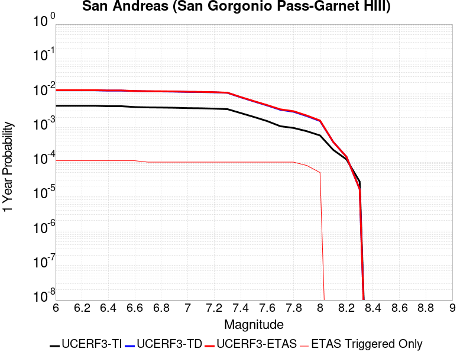 |  |

| Magnitude | 1 wk TI Prob | 1 wk TD Prob | 1 wk ETAS Prob | 1 wk ETAS/TD Gain | 1 wk ETAS Triggered Only | 1 mo TI Prob | 1 mo TD Prob | 1 mo ETAS Prob | 1 mo ETAS/TD Gain | 1 mo ETAS Triggered Only | 1 yr TI Prob | 1 yr TD Prob | 1 yr ETAS Prob | 1 yr ETAS/TD Gain | 1 yr ETAS Triggered Only | 10 yr TI Prob | 10 yr TD Prob | 10 yr ETAS Prob | 10 yr ETAS/TD Gain | 10 yr ETAS Triggered Only |
|-----|-----|-----|-----|-----|-----|-----|-----|-----|-----|-----|-----|-----|-----|-----|-----|-----|-----|-----|-----|-----|
| 6.0 | 8.31567E-5 | 2.3390418E-4 | 2.5756168E-4 | 1.1011418 | 2.3663039E-5 | 3.5633717E-4 | 0.0010020639 | 0.0010729819 | 1.0707719 | 7.098912E-5 | 0.004329778 | 0.01213195 | 0.01224883 | 1.009634 | 1.1831519E-4 | 0.042463828 | 0.11261114 | 0.112863116 | 1.0022376 | 2.8395647E-4 |
| 6.1 | 8.31567E-5 | 2.3390418E-4 | 2.5756168E-4 | 1.1011418 | 2.3663039E-5 | 3.5633717E-4 | 0.0010020639 | 0.0010729819 | 1.0707719 | 7.098912E-5 | 0.004329778 | 0.01213195 | 0.01224883 | 1.009634 | 1.1831519E-4 | 0.042463828 | 0.11261114 | 0.112863116 | 1.0022376 | 2.8395647E-4 |
| 6.2 | 8.31567E-5 | 2.3390418E-4 | 2.5756168E-4 | 1.1011418 | 2.3663039E-5 | 3.5633717E-4 | 0.0010020639 | 0.0010729819 | 1.0707719 | 7.098912E-5 | 0.004329778 | 0.01213195 | 0.01224883 | 1.009634 | 1.1831519E-4 | 0.042463828 | 0.11261114 | 0.112863116 | 1.0022376 | 2.8395647E-4 |
| 6.3 | 8.31567E-5 | 2.3390418E-4 | 2.5756168E-4 | 1.1011418 | 2.3663039E-5 | 3.5633717E-4 | 0.0010020639 | 0.0010729819 | 1.0707719 | 7.098912E-5 | 0.004329778 | 0.01213195 | 0.01224883 | 1.009634 | 1.1831519E-4 | 0.042463828 | 0.11261114 | 0.112863116 | 1.0022376 | 2.8395647E-4 |
| 6.4 | 8.059055E-5 | 2.2948666E-4 | 2.5314427E-4 | 1.1030892 | 2.3663039E-5 | 3.4534236E-4 | 9.83146E-4 | 0.0010540653 | 1.0721351 | 7.098912E-5 | 0.0041964394 | 0.011904163 | 0.012021069 | 1.0098207 | 1.1831519E-4 | 0.041180745 | 0.11059223 | 0.11084478 | 1.0022837 | 2.8395647E-4 |
| 6.5 | 8.059055E-5 | 2.2948666E-4 | 2.5314427E-4 | 1.1030892 | 2.3663039E-5 | 3.4534236E-4 | 9.83146E-4 | 0.0010540653 | 1.0721351 | 7.098912E-5 | 0.0041964394 | 0.011904163 | 0.012021069 | 1.0098207 | 1.1831519E-4 | 0.041180745 | 0.11059223 | 0.11084478 | 1.0022837 | 2.8395647E-4 |
| 6.6 | 7.619237E-5 | 2.2192899E-4 | 2.4558677E-4 | 1.1066008 | 2.3663039E-5 | 3.2649786E-4 | 9.507798E-4 | 0.0010217015 | 1.0745931 | 7.098912E-5 | 0.0039678677 | 0.011514857 | 0.01163181 | 1.0101566 | 1.1831519E-4 | 0.03897764 | 0.10712875 | 0.10738228 | 1.0023667 | 2.8395647E-4 |
| 6.7 | 7.440636E-5 | 2.1868707E-4 | 2.4234493E-4 | 1.1081814 | 2.3663039E-5 | 3.188454E-4 | 9.368959E-4 | 0.0010078185 | 1.0756996 | 7.098912E-5 | 0.0038750346 | 0.011347586 | 0.0114645595 | 1.0103081 | 1.1831519E-4 | 0.038081564 | 0.10563716 | 0.10589112 | 1.0024041 | 2.8395647E-4 |
| 6.8 | 7.3735864E-5 | 2.1715868E-4 | 2.4081657E-4 | 1.1089429 | 2.3663039E-5 | 3.1597257E-4 | 9.303504E-4 | 0.0010012734 | 1.0762327 | 7.098912E-5 | 0.0038401815 | 0.011268722 | 0.011385704 | 1.0103811 | 1.1831519E-4 | 0.03774495 | 0.1049387 | 0.105192855 | 1.002422 | 2.8395647E-4 |
| 6.9 | 7.27575E-5 | 2.1484829E-4 | 2.3850624E-4 | 1.1101147 | 2.3663039E-5 | 3.117806E-4 | 9.204557E-4 | 9.913795E-4 | 1.0770528 | 7.098912E-5 | 0.003789323 | 0.011149493 | 0.0112664895 | 1.0104934 | 1.1831519E-4 | 0.037253562 | 0.1038866 | 0.10414106 | 1.0024494 | 2.8395647E-4 |
| 7.0 | 7.102591E-5 | 2.1068838E-4 | 2.3434643E-4 | 1.1122893 | 2.3663039E-5 | 3.0436125E-4 | 9.0263993E-4 | 9.73565E-4 | 1.0785751 | 7.098912E-5 | 0.003699303 | 0.010934781 | 0.011051803 | 1.0107018 | 1.1831519E-4 | 0.03638325 | 0.101988725 | 0.10224372 | 1.0025003 | 2.8395647E-4 |
| 7.1 | 7.028513E-5 | 2.090447E-4 | 2.3270278E-4 | 1.1131724 | 2.3663039E-5 | 3.0118722E-4 | 8.956004E-4 | 9.66526E-4 | 1.0791932 | 7.098912E-5 | 0.0036607897 | 0.010849932 | 0.010966964 | 1.0107864 | 1.1831519E-4 | 0.036010686 | 0.101231724 | 0.101486936 | 1.002521 | 2.8395647E-4 |
| 7.2 | 6.8498244E-5 | 2.0512305E-4 | 2.2878125E-4 | 1.1153365 | 2.3663039E-5 | 2.9353087E-4 | 8.788049E-4 | 9.497316E-4 | 1.0807081 | 7.098912E-5 | 0.003567883 | 0.01064746 | 0.010764516 | 1.0109937 | 1.1831519E-4 | 0.035111405 | 0.09942366 | 0.09967938 | 1.0025721 | 2.8395647E-4 |
| 7.3 | 6.622592E-5 | 1.973951E-4 | 2.2105347E-4 | 1.1198529 | 2.3663039E-5 | 2.8379448E-4 | 8.457069E-4 | 9.16636E-4 | 1.0838696 | 7.098912E-5 | 0.0034497243 | 0.010248352 | 0.0103654545 | 1.0114264 | 1.1831519E-4 | 0.033966612 | 0.09591987 | 0.09617659 | 1.0026764 | 2.8395647E-4 |
| 7.4 | 5.1050705E-5 | 1.4695495E-4 | 1.706145E-4 | 1.1609987 | 2.3663039E-5 | 2.1877038E-4 | 6.296557E-4 | 7.0060015E-4 | 1.1126717 | 7.098912E-5 | 0.002660276 | 0.0076393057 | 0.007756717 | 1.0153694 | 1.1831519E-4 | 0.02628654 | 0.07289092 | 0.073154174 | 1.0036117 | 2.8395647E-4 |
| 7.5 | 3.9302922E-5 | 1.1135462E-4 | 1.3501503E-4 | 1.2124779 | 2.3663039E-5 | 1.6843023E-4 | 4.771471E-4 | 5.4810237E-4 | 1.1487073 | 7.098912E-5 | 0.0020487092 | 0.005793862 | 0.005911492 | 1.0203024 | 1.1831519E-4 | 0.020299247 | 0.05603429 | 0.056302335 | 1.0047836 | 2.8395647E-4 |
| 7.6 | 2.9851626E-5 | 8.49997E-5 | 1.0866073E-4 | 1.278366 | 2.3663039E-5 | 1.2792926E-4 | 3.642337E-4 | 4.3519697E-4 | 1.1948289 | 7.098912E-5 | 0.0015564259 | 0.004425554 | 0.0045433454 | 1.0266162 | 1.1831519E-4 | 0.0154556995 | 0.043216076 | 0.04348776 | 1.0062866 | 2.8395647E-4 |
| 7.7 | 2.1135214E-5 | 6.357336E-5 | 8.723489E-5 | 1.3721926 | 2.3663039E-5 | 9.0576345E-5 | 2.7242882E-4 | 3.433986E-4 | 1.2605076 | 7.098912E-5 | 0.0011022091 | 0.0033117817 | 0.003429705 | 1.0356072 | 1.1831519E-4 | 0.010967582 | 0.03260256 | 0.032877255 | 1.0084257 | 2.8395647E-4 |
| 7.8 | 1.883379E-5 | 5.5680954E-5 | 7.934267E-5 | 1.4249518 | 2.3663039E-5 | 8.0713755E-5 | 2.3861085E-4 | 3.0958303E-4 | 1.297439 | 7.098912E-5 | 9.822468E-4 | 0.0029012202 | 0.0030191923 | 1.0406629 | 1.1831519E-4 | 0.0097791655 | 0.028713608 | 0.028966427 | 1.0088049 | 2.6029343E-4 |
| 7.9 | 1.5156185E-5 | 4.1691877E-5 | 6.535393E-5 | 1.5675459 | 2.3663039E-5 | 6.495346E-5 | 1.7866725E-4 | 2.4964366E-4 | 1.3972548 | 7.098912E-5 | 7.9052144E-4 | 0.002173105 | 0.002291163 | 1.0543269 | 1.1831519E-4 | 0.007877152 | 0.021774774 | 0.0220294 | 1.0116936 | 2.6029343E-4 |
| 8.0 | 1.1405907E-5 | 2.9999417E-5 | 5.3661744E-5 | 1.7887596 | 2.3663039E-5 | 4.8881542E-5 | 1.2856259E-4 | 1.9954258E-4 | 1.5521045 | 7.098912E-5 | 5.9497025E-4 | 0.0015641268 | 0.0016586309 | 1.0604197 | 9.4652154E-5 | 0.005933798 | 0.015784537 | 0.015947564 | 1.0103283 | 1.6564126E-4 |
| 8.1 | 4.3511436E-6 | 7.378168E-6 | 7.378168E-6 | 1.0 | 0.0 | 1.8647626E-5 | 3.1620337E-5 | 3.1620337E-5 | 1.0 | 0.0 | 2.2701119E-4 | 3.8490974E-4 | 3.8490974E-4 | 1.0 | 0.0 | 0.0022677942 | 0.004120797 | 0.0041443626 | 1.0057187 | 2.3663039E-5 |
| 8.2 | 2.3042528E-6 | 2.7371211E-6 | 2.7371211E-6 | 1.0 | 0.0 | 9.875332E-6 | 1.1730467E-5 | 1.1730467E-5 | 1.0 | 0.0 | 1.2022553E-4 | 1.4280912E-4 | 1.4280912E-4 | 1.0 | 0.0 | 0.0012016051 | 0.0016001607 | 0.0016001607 | 1.0 | 0.0 |
| 8.3 | 5.202968E-7 | 3.1658746E-7 | 3.1658746E-7 | 1.0 | 0.0 | 2.2298414E-6 | 1.3568028E-6 | 1.3568028E-6 | 1.0 | 0.0 | 2.714798E-5 | 1.6518961E-5 | 1.6518961E-5 | 1.0 | 0.0 | 2.7144665E-4 | 1.959719E-4 | 1.959719E-4 | 1.0 | 0.0 |

## Red Pass
*[(top)](#table-of-contents)*

| 1 Week | 1 Month | 1 Year | 10 Year |
|-----|-----|-----|-----|
|  |  |  |  |

| Magnitude | 1 wk TI Prob | 1 wk TD Prob | 1 wk ETAS Prob | 1 wk ETAS/TD Gain | 1 wk ETAS Triggered Only | 1 mo TI Prob | 1 mo TD Prob | 1 mo ETAS Prob | 1 mo ETAS/TD Gain | 1 mo ETAS Triggered Only | 1 yr TI Prob | 1 yr TD Prob | 1 yr ETAS Prob | 1 yr ETAS/TD Gain | 1 yr ETAS Triggered Only | 10 yr TI Prob | 10 yr TD Prob | 10 yr ETAS Prob | 10 yr ETAS/TD Gain | 10 yr ETAS Triggered Only |
|-----|-----|-----|-----|-----|-----|-----|-----|-----|-----|-----|-----|-----|-----|-----|-----|-----|-----|-----|-----|-----|
| 6.0 | 8.258278E-6 | 8.551346E-6 | 8.551346E-6 | 1.0 | 0.0 | 3.539214E-5 | 3.664821E-5 | 6.031038E-5 | 1.645657 | 2.3663039E-5 | 4.308141E-4 | 4.4611847E-4 | 5.8803335E-4 | 1.3181103 | 1.4197823E-4 | 0.0042997985 | 0.004453987 | 0.004713121 | 1.0581802 | 2.6029343E-4 |
| 6.1 | 3.649988E-6 | 3.7753505E-6 | 3.7753505E-6 | 1.0 | 0.0 | 1.5642712E-5 | 1.618E-5 | 3.9842656E-5 | 2.4624631 | 2.3663039E-5 | 1.9043336E-4 | 1.9697845E-4 | 2.6795358E-4 | 1.3603193 | 7.098912E-5 | 0.0019027026 | 0.001968506 | 0.0021102047 | 1.0719829 | 1.4197823E-4 |
| 6.2 | 3.649988E-6 | 3.7753505E-6 | 3.7753505E-6 | 1.0 | 0.0 | 1.5642712E-5 | 1.618E-5 | 3.9842656E-5 | 2.4624631 | 2.3663039E-5 | 1.9043336E-4 | 1.9697845E-4 | 2.6795358E-4 | 1.3603193 | 7.098912E-5 | 0.0019027026 | 0.001968506 | 0.0021102047 | 1.0719829 | 1.4197823E-4 |
| 6.3 | 1.3924937E-6 | 1.4411299E-6 | 1.4411299E-6 | 1.0 | 0.0 | 5.9678164E-6 | 6.176265E-6 | 2.9839157E-5 | 4.8312626 | 2.3663039E-5 | 7.265574E-5 | 7.519485E-5 | 9.88561E-5 | 1.314666 | 2.3663039E-5 | 7.263199E-4 | 7.518328E-4 | 8.227685E-4 | 1.0943505 | 7.098912E-5 |
| 6.4 | 1.3924937E-6 | 1.4411299E-6 | 1.4411299E-6 | 1.0 | 0.0 | 5.9678164E-6 | 6.176265E-6 | 2.9839157E-5 | 4.8312626 | 2.3663039E-5 | 7.265574E-5 | 7.519485E-5 | 9.88561E-5 | 1.314666 | 2.3663039E-5 | 7.263199E-4 | 7.518328E-4 | 8.227685E-4 | 1.0943505 | 7.098912E-5 |
| 6.5 | 9.876812E-7 | 1.0222006E-6 | 1.0222006E-6 | 1.0 | 0.0 | 4.2329125E-6 | 4.38086E-6 | 2.8043794E-5 | 6.401436 | 2.3663039E-5 | 5.153449E-5 | 5.333697E-5 | 7.6998745E-5 | 1.4436281 | 2.3663039E-5 | 5.1522546E-4 | 5.333697E-4 | 5.8067054E-4 | 1.088683 | 4.7326077E-5 |

## Sierra Nevada  (No Extension)
*[(top)](#table-of-contents)*

| 1 Week | 1 Month | 1 Year | 10 Year |
|-----|-----|-----|-----|
|  |  |  |  |

| Magnitude | 1 wk TI Prob | 1 wk TD Prob | 1 wk ETAS Prob | 1 wk ETAS/TD Gain | 1 wk ETAS Triggered Only | 1 mo TI Prob | 1 mo TD Prob | 1 mo ETAS Prob | 1 mo ETAS/TD Gain | 1 mo ETAS Triggered Only | 1 yr TI Prob | 1 yr TD Prob | 1 yr ETAS Prob | 1 yr ETAS/TD Gain | 1 yr ETAS Triggered Only | 10 yr TI Prob | 10 yr TD Prob | 10 yr ETAS Prob | 10 yr ETAS/TD Gain | 10 yr ETAS Triggered Only |
|-----|-----|-----|-----|-----|-----|-----|-----|-----|-----|-----|-----|-----|-----|-----|-----|-----|-----|-----|-----|-----|
| 6.0 | 7.7690465E-6 | 6.9764446E-6 | 3.063932E-5 | 4.3918242 | 2.3663039E-5 | 3.329549E-5 | 2.9898909E-5 | 5.3561238E-5 | 1.7914112 | 2.3663039E-5 | 4.0529718E-4 | 3.6399424E-4 | 4.113031E-4 | 1.1299714 | 4.7326077E-5 | 0.004045588 | 0.0036374966 | 0.0038732663 | 1.0648165 | 2.3663038E-4 |
| 6.1 | 7.7690465E-6 | 6.9764446E-6 | 3.063932E-5 | 4.3918242 | 2.3663039E-5 | 3.329549E-5 | 2.9898909E-5 | 5.3561238E-5 | 1.7914112 | 2.3663039E-5 | 4.0529718E-4 | 3.6399424E-4 | 4.113031E-4 | 1.1299714 | 4.7326077E-5 | 0.004045588 | 0.0036374966 | 0.0038732663 | 1.0648165 | 2.3663038E-4 |
| 6.2 | 7.7690465E-6 | 6.9764446E-6 | 3.063932E-5 | 4.3918242 | 2.3663039E-5 | 3.329549E-5 | 2.9898909E-5 | 5.3561238E-5 | 1.7914112 | 2.3663039E-5 | 4.0529718E-4 | 3.6399424E-4 | 4.113031E-4 | 1.1299714 | 4.7326077E-5 | 0.004045588 | 0.0036374966 | 0.0038732663 | 1.0648165 | 2.3663038E-4 |
| 6.3 | 7.7690465E-6 | 6.9764446E-6 | 3.063932E-5 | 4.3918242 | 2.3663039E-5 | 3.329549E-5 | 2.9898909E-5 | 5.3561238E-5 | 1.7914112 | 2.3663039E-5 | 4.0529718E-4 | 3.6399424E-4 | 4.113031E-4 | 1.1299714 | 4.7326077E-5 | 0.004045588 | 0.0036374966 | 0.0038732663 | 1.0648165 | 2.3663038E-4 |
| 6.4 | 7.7690465E-6 | 6.9764446E-6 | 3.063932E-5 | 4.3918242 | 2.3663039E-5 | 3.329549E-5 | 2.9898909E-5 | 5.3561238E-5 | 1.7914112 | 2.3663039E-5 | 4.0529718E-4 | 3.6399424E-4 | 4.113031E-4 | 1.1299714 | 4.7326077E-5 | 0.004045588 | 0.0036374966 | 0.0038732663 | 1.0648165 | 2.3663038E-4 |
| 6.5 | 7.7690465E-6 | 6.9764446E-6 | 3.063932E-5 | 4.3918242 | 2.3663039E-5 | 3.329549E-5 | 2.9898909E-5 | 5.3561238E-5 | 1.7914112 | 2.3663039E-5 | 4.0529718E-4 | 3.6399424E-4 | 4.113031E-4 | 1.1299714 | 4.7326077E-5 | 0.004045588 | 0.0036374966 | 0.0038732663 | 1.0648165 | 2.3663038E-4 |
| 6.6 | 2.653E-6 | 1.6149087E-6 | 1.6149087E-6 | 1.0 | 0.0 | 1.136995E-5 | 6.921019E-6 | 6.921019E-6 | 1.0 | 0.0 | 1.3842035E-4 | 8.426019E-5 | 1.0792123E-4 | 1.2808093 | 2.3663039E-5 | 0.0013833415 | 8.422858E-4 | 0.0010077875 | 1.1964912 | 1.6564126E-4 |
| 6.7 | 2.5902466E-6 | 1.5502418E-6 | 1.5502418E-6 | 1.0 | 0.0 | 1.11010095E-5 | 6.6438765E-6 | 6.6438765E-6 | 1.0 | 0.0 | 1.351464E-4 | 8.0886224E-5 | 1.0454735E-4 | 1.2925235 | 2.3663039E-5 | 0.0013506424 | 8.085708E-4 | 9.7407814E-4 | 1.2046912 | 1.6564126E-4 |
| 6.8 | 2.5853892E-6 | 1.5470417E-6 | 1.5470417E-6 | 1.0 | 0.0 | 1.1080193E-5 | 6.6301623E-6 | 6.6301623E-6 | 1.0 | 0.0 | 1.34893E-4 | 8.071926E-5 | 1.0438039E-4 | 1.2931286 | 2.3663039E-5 | 0.0013481114 | 8.069024E-4 | 9.7241E-4 | 1.2051147 | 1.6564126E-4 |
| 6.9 | 2.458257E-6 | 1.4221148E-6 | 1.4221148E-6 | 1.0 | 0.0 | 1.0535345E-5 | 6.094763E-6 | 6.094763E-6 | 1.0 | 0.0 | 1.2826028E-4 | 7.4201234E-5 | 9.786252E-5 | 1.3188798 | 2.3663039E-5 | 0.0012818627 | 7.417666E-4 | 9.0728496E-4 | 1.2231408 | 1.6564126E-4 |
| 7.0 | 2.4341468E-6 | 1.3990783E-6 | 1.3990783E-6 | 1.0 | 0.0 | 1.0432016E-5 | 5.996036E-6 | 5.996036E-6 | 1.0 | 0.0 | 1.270024E-4 | 7.299932E-5 | 9.6660624E-5 | 1.3241305 | 2.3663039E-5 | 0.0012692984 | 7.2975527E-4 | 8.952757E-4 | 1.2268163 | 1.6564126E-4 |
| 7.1 | 2.3652476E-6 | 1.3340272E-6 | 1.3340272E-6 | 1.0 | 0.0 | 1.0136736E-5 | 5.717247E-6 | 5.717247E-6 | 1.0 | 0.0 | 1.2340778E-4 | 6.9605274E-5 | 9.3266666E-5 | 1.3399367 | 2.3663039E-5 | 0.0012333926 | 6.9583644E-4 | 8.6136244E-4 | 1.2378806 | 1.6564126E-4 |
| 7.2 | 2.272158E-6 | 1.2503327E-6 | 1.2503327E-6 | 1.0 | 0.0 | 9.737784E-6 | 5.3585577E-6 | 5.3585577E-6 | 1.0 | 0.0 | 1.1855107E-4 | 6.52385E-5 | 8.889999E-5 | 1.3626922 | 2.3663039E-5 | 0.0011848784 | 6.52195E-4 | 8.177282E-4 | 1.2538095 | 1.6564126E-4 |
| 7.3 | 2.1382127E-6 | 1.1420192E-6 | 1.1420192E-6 | 1.0 | 0.0 | 9.163737E-6 | 4.894359E-6 | 4.894359E-6 | 1.0 | 0.0 | 1.1156279E-4 | 5.9587204E-5 | 8.324883E-5 | 1.3970925 | 2.3663039E-5 | 0.001115068 | 5.9571344E-4 | 7.6125603E-4 | 1.2778896 | 1.6564126E-4 |
| 7.4 | 1.9048055E-6 | 9.575706E-7 | 9.575706E-7 | 1.0 | 0.0 | 8.163426E-6 | 4.1038675E-6 | 4.1038675E-6 | 1.0 | 0.0 | 9.9385186E-5 | 4.9963448E-5 | 7.3625306E-5 | 1.4735833 | 2.3663039E-5 | 9.934074E-4 | 4.9952284E-4 | 6.177789E-4 | 1.2367381 | 1.1831519E-4 |
| 7.5 | 1.5373403E-6 | 7.5604373E-7 | 7.5604373E-7 | 1.0 | 0.0 | 6.5885843E-6 | 3.2401833E-6 | 3.2401833E-6 | 1.0 | 0.0 | 8.021306E-5 | 3.944852E-5 | 6.311063E-5 | 1.5998223 | 2.3663039E-5 | 8.0184115E-4 | 3.9441566E-4 | 4.890305E-4 | 1.239886 | 9.4652154E-5 |
| 7.6 | 1.0680322E-6 | 4.6599368E-7 | 4.6599368E-7 | 1.0 | 0.0 | 4.577273E-6 | 1.9971142E-6 | 1.9971142E-6 | 1.0 | 0.0 | 5.5726876E-5 | 2.4314597E-5 | 4.797706E-5 | 1.9731793 | 2.3663039E-5 | 5.5712904E-4 | 2.4311963E-4 | 2.904342E-4 | 1.1946144 | 4.7326077E-5 |
| 7.7 | 5.509146E-7 | 1.5581914E-7 | 1.5581914E-7 | 1.0 | 0.0 | 2.3610605E-6 | 6.6779614E-7 | 6.6779614E-7 | 1.0 | 0.0 | 2.8745531E-5 | 8.130389E-6 | 8.130389E-6 | 1.0 | 0.0 | 2.8741814E-4 | 8.130103E-5 | 8.130103E-5 | 1.0 | 0.0 |

## San Andreas (Carrizo) rev
*[(top)](#table-of-contents)*

| 1 Week | 1 Month | 1 Year | 10 Year |
|-----|-----|-----|-----|
|  |  |  |  |

| Magnitude | 1 wk TI Prob | 1 wk TD Prob | 1 wk ETAS Prob | 1 wk ETAS/TD Gain | 1 wk ETAS Triggered Only | 1 mo TI Prob | 1 mo TD Prob | 1 mo ETAS Prob | 1 mo ETAS/TD Gain | 1 mo ETAS Triggered Only | 1 yr TI Prob | 1 yr TD Prob | 1 yr ETAS Prob | 1 yr ETAS/TD Gain | 1 yr ETAS Triggered Only | 10 yr TI Prob | 10 yr TD Prob | 10 yr ETAS Prob | 10 yr ETAS/TD Gain | 10 yr ETAS Triggered Only |
|-----|-----|-----|-----|-----|-----|-----|-----|-----|-----|-----|-----|-----|-----|-----|-----|-----|-----|-----|-----|-----|
| 6.0 | 1.1674632E-4 | 2.4342148E-4 | 2.6707875E-4 | 1.0971864 | 2.3663039E-5 | 5.002454E-4 | 0.0010428195 | 0.0010900962 | 1.0453355 | 4.7326077E-5 | 0.006073493 | 0.012622899 | 0.012763086 | 1.0111057 | 1.4197823E-4 | 0.0591016 | 0.120694615 | 0.12090269 | 1.0017239 | 2.3663038E-4 |
| 6.1 | 1.1674632E-4 | 2.4342148E-4 | 2.6707875E-4 | 1.0971864 | 2.3663039E-5 | 5.002454E-4 | 0.0010428195 | 0.0010900962 | 1.0453355 | 4.7326077E-5 | 0.006073493 | 0.012622899 | 0.012763086 | 1.0111057 | 1.4197823E-4 | 0.0591016 | 0.120694615 | 0.12090269 | 1.0017239 | 2.3663038E-4 |
| 6.2 | 1.1674632E-4 | 2.4342148E-4 | 2.6707875E-4 | 1.0971864 | 2.3663039E-5 | 5.002454E-4 | 0.0010428195 | 0.0010900962 | 1.0453355 | 4.7326077E-5 | 0.006073493 | 0.012622899 | 0.012763086 | 1.0111057 | 1.4197823E-4 | 0.0591016 | 0.120694615 | 0.12090269 | 1.0017239 | 2.3663038E-4 |
| 6.3 | 1.1674632E-4 | 2.4342148E-4 | 2.6707875E-4 | 1.0971864 | 2.3663039E-5 | 5.002454E-4 | 0.0010428195 | 0.0010900962 | 1.0453355 | 4.7326077E-5 | 0.006073493 | 0.012622899 | 0.012763086 | 1.0111057 | 1.4197823E-4 | 0.0591016 | 0.120694615 | 0.12090269 | 1.0017239 | 2.3663038E-4 |
| 6.4 | 1.1674632E-4 | 2.4342148E-4 | 2.6707875E-4 | 1.0971864 | 2.3663039E-5 | 5.002454E-4 | 0.0010428195 | 0.0010900962 | 1.0453355 | 4.7326077E-5 | 0.006073493 | 0.012622899 | 0.012763086 | 1.0111057 | 1.4197823E-4 | 0.0591016 | 0.120694615 | 0.12090269 | 1.0017239 | 2.3663038E-4 |
| 6.5 | 1.13136164E-4 | 2.3662073E-4 | 2.6027818E-4 | 1.0999804 | 2.3663039E-5 | 4.847792E-4 | 0.0010136963 | 0.0010609744 | 1.0466393 | 4.7326077E-5 | 0.0058862255 | 0.012272361 | 0.0124125965 | 1.0114269 | 1.4197823E-4 | 0.057327334 | 0.11766591 | 0.1178747 | 1.0017744 | 2.3663038E-4 |
| 6.6 | 1.13136164E-4 | 2.3662073E-4 | 2.6027818E-4 | 1.0999804 | 2.3663039E-5 | 4.847792E-4 | 0.0010136963 | 0.0010609744 | 1.0466393 | 4.7326077E-5 | 0.0058862255 | 0.012272361 | 0.0124125965 | 1.0114269 | 1.4197823E-4 | 0.057327334 | 0.11766591 | 0.1178747 | 1.0017744 | 2.3663038E-4 |
| 6.7 | 1.1149675E-4 | 2.3353257E-4 | 2.5719008E-4 | 1.1013029 | 2.3663039E-5 | 4.777557E-4 | 0.0010004715 | 0.0010477502 | 1.0472565 | 4.7326077E-5 | 0.0058011734 | 0.012113147 | 0.0122534055 | 1.011579 | 1.4197823E-4 | 0.05652051 | 0.11628742 | 0.116496526 | 1.0017983 | 2.3663038E-4 |
| 6.8 | 1.1103589E-4 | 2.3255392E-4 | 2.5621147E-4 | 1.1017293 | 2.3663039E-5 | 4.7578133E-4 | 9.962805E-4 | 0.0010435594 | 1.0474554 | 4.7326077E-5 | 0.005777263 | 0.012062688 | 0.012202954 | 1.011628 | 1.4197823E-4 | 0.056293584 | 0.11584766 | 0.11605688 | 1.001806 | 2.3663038E-4 |
| 6.9 | 1.1053259E-4 | 2.3147749E-4 | 2.5513506E-4 | 1.1022024 | 2.3663039E-5 | 4.7362508E-4 | 9.916708E-4 | 0.0010389499 | 1.0476762 | 4.7326077E-5 | 0.0057511497 | 0.012007184 | 0.012147457 | 1.0116825 | 1.4197823E-4 | 0.05604569 | 0.11536381 | 0.11557314 | 1.0018145 | 2.3663038E-4 |
| 7.0 | 1.1005377E-4 | 2.3048568E-4 | 2.5414326E-4 | 1.1026423 | 2.3663039E-5 | 4.7157376E-4 | 9.874234E-4 | 0.0010347026 | 1.0478815 | 4.7326077E-5 | 0.0057263062 | 0.011956041 | 0.012096321 | 1.011733 | 1.4197823E-4 | 0.055809796 | 0.114916064 | 0.1151255 | 1.0018225 | 2.3663038E-4 |
| 7.1 | 1.0308142E-4 | 2.1557917E-4 | 2.3923711E-4 | 1.1097413 | 2.3663039E-5 | 4.417027E-4 | 9.235847E-4 | 9.70867E-4 | 1.0511944 | 4.7326077E-5 | 0.0053644776 | 0.011186983 | 0.011327373 | 1.0125494 | 1.4197823E-4 | 0.052368138 | 0.10817159 | 0.10838262 | 1.0019509 | 2.3663038E-4 |
| 7.2 | 1.0027479E-4 | 2.0965667E-4 | 2.3331476E-4 | 1.112842 | 2.3663039E-5 | 4.296783E-4 | 8.9822017E-4 | 9.4550377E-4 | 1.0526414 | 4.7326077E-5 | 0.0052187922 | 0.0108812945 | 0.011021728 | 1.012906 | 1.4197823E-4 | 0.050979212 | 0.10547522 | 0.10568689 | 1.0020069 | 2.3663038E-4 |
| 7.3 | 9.816942E-5 | 2.044063E-4 | 2.2806451E-4 | 1.115741 | 2.3663039E-5 | 4.2065824E-4 | 8.757339E-4 | 9.2301855E-4 | 1.0539943 | 4.7326077E-5 | 0.005109493 | 0.010610223 | 0.010727283 | 1.0110327 | 1.1831519E-4 | 0.049935985 | 0.10305815 | 0.10324917 | 1.0018535 | 2.1296735E-4 |
| 7.4 | 9.5634205E-5 | 1.9809832E-4 | 2.2175667E-4 | 1.1194273 | 2.3663039E-5 | 4.0979648E-4 | 8.4871746E-4 | 8.960034E-4 | 1.0557145 | 4.7326077E-5 | 0.0049778637 | 0.0102844415 | 0.0104015395 | 1.0113859 | 1.1831519E-4 | 0.048678253 | 0.100143395 | 0.10033503 | 1.0019137 | 2.1296735E-4 |
| 7.5 | 8.052417E-5 | 1.612829E-4 | 1.8494212E-4 | 1.146694 | 2.3663039E-5 | 3.4505792E-4 | 6.910295E-4 | 7.3832285E-4 | 1.068439 | 4.7326077E-5 | 0.0041929903 | 0.00838091 | 0.008498234 | 1.0139989 | 1.1831519E-4 | 0.04114753 | 0.08288026 | 0.083075576 | 1.0023566 | 2.1296735E-4 |
| 7.6 | 7.897024E-5 | 1.5781343E-4 | 1.8147273E-4 | 1.1499195 | 2.3663039E-5 | 3.384E-4 | 6.761681E-4 | 7.234622E-4 | 1.0699443 | 4.7326077E-5 | 0.0041122385 | 0.0082013495 | 0.008318694 | 1.014308 | 1.1831519E-4 | 0.040369697 | 0.0812208 | 0.08141647 | 1.0024091 | 2.1296735E-4 |
| 7.7 | 6.707427E-5 | 1.3290055E-4 | 1.5656043E-4 | 1.178027 | 2.3663039E-5 | 2.8742946E-4 | 5.694495E-4 | 6.167486E-4 | 1.0830611 | 4.7326077E-5 | 0.003493839 | 0.0069110407 | 0.0070285383 | 1.0170014 | 1.1831519E-4 | 0.034394164 | 0.06911137 | 0.06926557 | 1.0022311 | 1.6564126E-4 |
| 7.8 | 6.147705E-5 | 1.2210102E-4 | 1.4576117E-4 | 1.1937752 | 2.3663039E-5 | 2.6344648E-4 | 5.231851E-4 | 5.704865E-4 | 1.0904102 | 4.7326077E-5 | 0.0032027436 | 0.0063512004 | 0.006468764 | 1.0185105 | 1.1831519E-4 | 0.031569764 | 0.063572146 | 0.06372725 | 1.00244 | 1.6564126E-4 |
| 7.9 | 4.7636717E-5 | 8.888838E-5 | 1.12549315E-4 | 1.2661871 | 2.3663039E-5 | 2.0414138E-4 | 3.808946E-4 | 4.2820265E-4 | 1.1242025 | 4.7326077E-5 | 0.0024825884 | 0.004627539 | 0.0047453064 | 1.0254493 | 1.1831519E-4 | 0.024550365 | 0.046670716 | 0.046828628 | 1.0033835 | 1.6564126E-4 |
| 8.0 | 3.3554235E-5 | 5.2192438E-5 | 7.5854245E-5 | 1.453357 | 2.3663039E-5 | 1.4379594E-4 | 2.236627E-4 | 2.4732045E-4 | 1.1057742 | 2.3663039E-5 | 0.0017493097 | 0.0027196947 | 0.002766892 | 1.0173539 | 4.7326077E-5 | 0.017356034 | 0.02790823 | 0.028000241 | 1.0032969 | 9.4652154E-5 |
| 8.1 | 1.9175432E-5 | 1.9211575E-5 | 1.9211575E-5 | 1.0 | 0.0 | 8.217783E-5 | 8.233273E-5 | 8.233273E-5 | 1.0 | 0.0 | 0.0010000558 | 0.0010019407 | 0.0010019407 | 1.0 | 0.0 | 0.009955673 | 0.010771971 | 0.010818788 | 1.0043461 | 4.7326077E-5 |
| 8.2 | 8.643924E-6 | 5.4848397E-6 | 5.4848397E-6 | 1.0 | 0.0 | 3.704486E-5 | 2.3506243E-5 | 2.3506243E-5 | 1.0 | 0.0 | 4.5092785E-4 | 2.8615101E-4 | 2.8615101E-4 | 1.0 | 0.0 | 0.0045001395 | 0.0032541603 | 0.0032541603 | 1.0 | 0.0 |
| 8.3 | 1.983087E-6 | 7.676691E-7 | 7.676691E-7 | 1.0 | 0.0 | 8.498917E-6 | 3.2900064E-6 | 3.2900064E-6 | 1.0 | 0.0 | 1.034694E-4 | 4.005511E-5 | 4.005511E-5 | 1.0 | 0.0 | 0.0010342124 | 4.729315E-4 | 4.729315E-4 | 1.0 | 0.0 |

## San Andreas (Cholame) rev
*[(top)](#table-of-contents)*

| 1 Week | 1 Month | 1 Year | 10 Year |
|-----|-----|-----|-----|
|  |  |  |  |

| Magnitude | 1 wk TI Prob | 1 wk TD Prob | 1 wk ETAS Prob | 1 wk ETAS/TD Gain | 1 wk ETAS Triggered Only | 1 mo TI Prob | 1 mo TD Prob | 1 mo ETAS Prob | 1 mo ETAS/TD Gain | 1 mo ETAS Triggered Only | 1 yr TI Prob | 1 yr TD Prob | 1 yr ETAS Prob | 1 yr ETAS/TD Gain | 1 yr ETAS Triggered Only | 10 yr TI Prob | 10 yr TD Prob | 10 yr ETAS Prob | 10 yr ETAS/TD Gain | 10 yr ETAS Triggered Only |
|-----|-----|-----|-----|-----|-----|-----|-----|-----|-----|-----|-----|-----|-----|-----|-----|-----|-----|-----|-----|-----|
| 6.0 | 1.2302514E-4 | 2.5223597E-4 | 2.7589305E-4 | 1.0937895 | 2.3663039E-5 | 5.27144E-4 | 0.0010805652 | 0.00112784 | 1.0437502 | 4.7326077E-5 | 0.0063991086 | 0.01307703 | 0.013217151 | 1.0107151 | 1.4197823E-4 | 0.06217949 | 0.124471135 | 0.124678314 | 1.0016644 | 2.3663038E-4 |
| 6.1 | 1.2302514E-4 | 2.5223597E-4 | 2.7589305E-4 | 1.0937895 | 2.3663039E-5 | 5.27144E-4 | 0.0010805652 | 0.00112784 | 1.0437502 | 4.7326077E-5 | 0.0063991086 | 0.01307703 | 0.013217151 | 1.0107151 | 1.4197823E-4 | 0.06217949 | 0.124471135 | 0.124678314 | 1.0016644 | 2.3663038E-4 |
| 6.2 | 1.2203569E-4 | 2.5040368E-4 | 2.7406082E-4 | 1.0944759 | 2.3663039E-5 | 5.2290526E-4 | 0.001072719 | 0.0011199942 | 1.0440706 | 4.7326077E-5 | 0.006347804 | 0.012982645 | 0.01312278 | 1.010794 | 1.4197823E-4 | 0.061695136 | 0.12365729 | 0.12386466 | 1.0016769 | 2.3663038E-4 |
| 6.3 | 1.2142645E-4 | 2.4926328E-4 | 2.729204E-4 | 1.0949082 | 2.3663039E-5 | 5.202953E-4 | 0.0010678354 | 0.0011151109 | 1.0442723 | 4.7326077E-5 | 0.006316212 | 0.012923895 | 0.013064038 | 1.0108438 | 1.4197823E-4 | 0.06139677 | 0.12315141 | 0.12335889 | 1.0016848 | 2.3663038E-4 |
| 6.4 | 1.1865206E-4 | 2.443175E-4 | 2.6797474E-4 | 1.09683 | 2.3663039E-5 | 5.0840975E-4 | 0.0010466564 | 0.0010939329 | 1.0451691 | 4.7326077E-5 | 0.006172335 | 0.012669064 | 0.012809244 | 1.0110648 | 1.4197823E-4 | 0.060036868 | 0.12094392 | 0.12115193 | 1.00172 | 2.3663038E-4 |
| 6.5 | 1.17443946E-4 | 2.4224987E-4 | 2.6590718E-4 | 1.0976566 | 2.3663039E-5 | 5.032341E-4 | 0.0010378022 | 0.0010850792 | 1.0455549 | 4.7326077E-5 | 0.006109677 | 0.012562509 | 0.0127027035 | 1.0111598 | 1.4197823E-4 | 0.059444077 | 0.12001792 | 0.12022615 | 1.001735 | 2.3663038E-4 |
| 6.6 | 1.13579066E-4 | 2.3533787E-4 | 2.5899534E-4 | 1.1005255 | 2.3663039E-5 | 4.866766E-4 | 0.0010082026 | 0.0010554809 | 1.0468937 | 4.7326077E-5 | 0.0059092017 | 0.012206224 | 0.012346469 | 1.0114896 | 1.4197823E-4 | 0.057545185 | 0.116931416 | 0.11714038 | 1.0017871 | 2.3663038E-4 |
| 6.7 | 1.1271412E-4 | 2.3378055E-4 | 2.5743805E-4 | 1.1011953 | 2.3663039E-5 | 4.829711E-4 | 0.0010015335 | 0.0010488121 | 1.0472063 | 4.7326077E-5 | 0.005864331 | 0.0121259345 | 0.012266192 | 1.0115666 | 1.4197823E-4 | 0.057119697 | 0.116234876 | 0.116444 | 1.0017991 | 2.3663038E-4 |
| 6.8 | 1.1217975E-4 | 2.3266436E-4 | 2.563219E-4 | 1.101681 | 2.3663039E-5 | 4.8068175E-4 | 9.967535E-4 | 0.0010440323 | 1.0474329 | 4.7326077E-5 | 0.005836608 | 0.012068384 | 0.012208649 | 1.0116225 | 1.4197823E-4 | 0.056856725 | 0.115733 | 0.11594224 | 1.001808 | 2.3663038E-4 |
| 6.9 | 1.1146753E-4 | 2.3115135E-4 | 2.5480893E-4 | 1.1023467 | 2.3663039E-5 | 4.7763053E-4 | 9.90274E-4 | 0.0010375533 | 1.0477436 | 4.7326077E-5 | 0.0057996577 | 0.011990369 | 0.012130645 | 1.0116991 | 1.4197823E-4 | 0.056506127 | 0.11505329 | 0.115262695 | 1.0018201 | 2.3663038E-4 |
| 7.0 | 1.0965793E-4 | 2.2738328E-4 | 2.5104094E-4 | 1.1040431 | 2.3663039E-5 | 4.698779E-4 | 9.7413734E-4 | 0.0010214173 | 1.0485352 | 4.7326077E-5 | 0.005705768 | 0.011796049 | 0.011936353 | 1.0118941 | 1.4197823E-4 | 0.055614736 | 0.11335443 | 0.11356423 | 1.0018508 | 2.3663038E-4 |
| 7.1 | 9.927982E-5 | 2.0556754E-4 | 2.2922573E-4 | 1.1150872 | 2.3663039E-5 | 4.2541555E-4 | 8.8070735E-4 | 9.2799176E-4 | 1.0536891 | 4.7326077E-5 | 0.0051671406 | 0.010670188 | 0.010810652 | 1.013164 | 1.4197823E-4 | 0.05048634 | 0.10344718 | 0.10365933 | 1.0020509 | 2.3663038E-4 |
| 7.2 | 9.696786E-5 | 2.0060889E-4 | 2.2426718E-4 | 1.1179324 | 2.3663039E-5 | 4.1551032E-4 | 8.594701E-4 | 9.067555E-4 | 1.0550169 | 4.7326077E-5 | 0.00504711 | 0.0104141245 | 0.010554624 | 1.0134913 | 1.4197823E-4 | 0.04934009 | 0.10118485 | 0.10139754 | 1.002102 | 2.3663038E-4 |
| 7.3 | 9.4727984E-5 | 1.9489892E-4 | 2.1855734E-4 | 1.1213882 | 2.3663039E-5 | 4.0591392E-4 | 8.350147E-4 | 8.8230125E-4 | 1.0566297 | 4.7326077E-5 | 0.0049308087 | 0.010119184 | 0.010236301 | 1.0115739 | 1.1831519E-4 | 0.048228268 | 0.09855488 | 0.09874686 | 1.0019479 | 2.1296735E-4 |
| 7.4 | 9.220358E-5 | 1.8860167E-4 | 2.1226023E-4 | 1.125442 | 2.3663039E-5 | 3.9509835E-4 | 8.0804335E-4 | 8.553312E-4 | 1.0585214 | 4.7326077E-5 | 0.004799717 | 0.009793798 | 0.009910955 | 1.0119623 | 1.1831519E-4 | 0.046973653 | 0.09563176 | 0.09582437 | 1.002014 | 2.1296735E-4 |
| 7.5 | 7.71631E-5 | 1.5192907E-4 | 1.7558852E-4 | 1.1557269 | 2.3663039E-5 | 3.306571E-4 | 6.509623E-4 | 6.982575E-4 | 1.0726544 | 4.7326077E-5 | 0.0040183207 | 0.007896737 | 0.008014117 | 1.0148644 | 1.1831519E-4 | 0.03946433 | 0.07835218 | 0.07854847 | 1.0025051 | 2.1296735E-4 |
| 7.6 | 7.5634416E-5 | 1.485219E-4 | 1.7218142E-4 | 1.1592999 | 2.3663039E-5 | 3.241072E-4 | 6.363673E-4 | 6.8366324E-4 | 1.0743217 | 4.7326077E-5 | 0.0039388672 | 0.007720316 | 0.007837717 | 1.0152068 | 1.1831519E-4 | 0.038697794 | 0.07671492 | 0.07691155 | 1.0025631 | 2.1296735E-4 |
| 7.7 | 6.3783E-5 | 1.2371938E-4 | 1.4737948E-4 | 1.1912402 | 2.3663039E-5 | 2.7332708E-4 | 5.301182E-4 | 5.774192E-4 | 1.0892272 | 4.7326077E-5 | 0.0033226798 | 0.0064351154 | 0.006552669 | 1.0182675 | 1.1831519E-4 | 0.032734364 | 0.064600654 | 0.064755596 | 1.0023985 | 1.6564126E-4 |
| 7.8 | 5.863422E-5 | 1.1428115E-4 | 1.3794149E-4 | 1.2070361 | 2.3663039E-5 | 2.512653E-4 | 4.8968446E-4 | 5.369874E-4 | 1.0965987 | 4.7326077E-5 | 0.003054864 | 0.005945632 | 0.0060632434 | 1.0197812 | 1.1831519E-4 | 0.030132094 | 0.05971428 | 0.05987003 | 1.0026083 | 1.6564126E-4 |
| 7.9 | 4.595283E-5 | 8.43508E-5 | 1.08011845E-4 | 1.2805076 | 2.3663039E-5 | 1.9692584E-4 | 3.6145336E-4 | 4.0876234E-4 | 1.1308854 | 4.7326077E-5 | 0.0023949358 | 0.0043918216 | 0.0045096176 | 1.0268216 | 1.1831519E-4 | 0.023692891 | 0.04440328 | 0.04456157 | 1.0035647 | 1.6564126E-4 |
| 8.0 | 3.2950178E-5 | 5.0827417E-5 | 7.448925E-5 | 1.4655329 | 2.3663039E-5 | 1.412074E-4 | 2.178136E-4 | 2.4147148E-4 | 1.1086153 | 2.3663039E-5 | 0.0017178444 | 0.0026486574 | 0.002695858 | 1.0178206 | 4.7326077E-5 | 0.017046256 | 0.027206937 | 0.027299013 | 1.0033844 | 9.4652154E-5 |
| 8.1 | 1.9177472E-5 | 1.9211746E-5 | 1.9211746E-5 | 1.0 | 0.0 | 8.218658E-5 | 8.2333456E-5 | 8.2333456E-5 | 1.0 | 0.0 | 0.0010001622 | 0.0010019495 | 0.0010019495 | 1.0 | 0.0 | 0.009956728 | 0.010772088 | 0.010818903 | 1.0043461 | 4.7326077E-5 |
| 8.2 | 8.643924E-6 | 5.4848397E-6 | 5.4848397E-6 | 1.0 | 0.0 | 3.704486E-5 | 2.3506243E-5 | 2.3506243E-5 | 1.0 | 0.0 | 4.5092785E-4 | 2.8615101E-4 | 2.8615101E-4 | 1.0 | 0.0 | 0.0045001395 | 0.0032541603 | 0.0032541603 | 1.0 | 0.0 |
| 8.3 | 1.983087E-6 | 7.676691E-7 | 7.676691E-7 | 1.0 | 0.0 | 8.498917E-6 | 3.2900064E-6 | 3.2900064E-6 | 1.0 | 0.0 | 1.034694E-4 | 4.005511E-5 | 4.005511E-5 | 1.0 | 0.0 | 0.0010342124 | 4.729315E-4 | 4.729315E-4 | 1.0 | 0.0 |

## San Andreas (Parkfield)
*[(top)](#table-of-contents)*

| 1 Week | 1 Month | 1 Year | 10 Year |
|-----|-----|-----|-----|
|  |  |  |  |

| Magnitude | 1 wk TI Prob | 1 wk TD Prob | 1 wk ETAS Prob | 1 wk ETAS/TD Gain | 1 wk ETAS Triggered Only | 1 mo TI Prob | 1 mo TD Prob | 1 mo ETAS Prob | 1 mo ETAS/TD Gain | 1 mo ETAS Triggered Only | 1 yr TI Prob | 1 yr TD Prob | 1 yr ETAS Prob | 1 yr ETAS/TD Gain | 1 yr ETAS Triggered Only | 10 yr TI Prob | 10 yr TD Prob | 10 yr ETAS Prob | 10 yr ETAS/TD Gain | 10 yr ETAS Triggered Only |
|-----|-----|-----|-----|-----|-----|-----|-----|-----|-----|-----|-----|-----|-----|-----|-----|-----|-----|-----|-----|-----|
| 6.0 | 5.556969E-4 | 7.798663E-4 | 7.798663E-4 | 1.0 | 0.0 | 0.0023793848 | 0.0033385542 | 0.0033621383 | 1.0070641 | 2.3663039E-5 | 0.028586963 | 0.040288743 | 0.04040229 | 1.0028183 | 1.1831519E-4 | 0.25176284 | 0.3374694 | 0.33761048 | 1.0004181 | 2.1296735E-4 |
| 6.1 | 1.925858E-4 | 3.0333296E-4 | 3.0333296E-4 | 1.0 | 0.0 | 8.2510663E-4 | 0.0012994452 | 0.0013230775 | 1.0181865 | 2.3663039E-5 | 0.0099994885 | 0.015806371 | 0.015922816 | 1.007367 | 1.1831519E-4 | 0.095613256 | 0.14986144 | 0.15004249 | 1.0012082 | 2.1296735E-4 |
| 6.2 | 9.4306815E-5 | 1.8258012E-4 | 1.8258012E-4 | 1.0 | 0.0 | 4.0410945E-4 | 7.822528E-4 | 8.0589735E-4 | 1.0302262 | 2.3663039E-5 | 0.0049089384 | 0.009482546 | 0.00959974 | 1.0123588 | 1.1831519E-4 | 0.048019063 | 0.09192004 | 0.09211343 | 1.0021039 | 2.1296735E-4 |
| 6.3 | 9.283051E-5 | 1.7954489E-4 | 1.7954489E-4 | 1.0 | 0.0 | 3.9778434E-4 | 7.692524E-4 | 7.9289725E-4 | 1.0307374 | 2.3663039E-5 | 0.0048322747 | 0.009325632 | 0.0094428435 | 1.0125688 | 1.1831519E-4 | 0.047285385 | 0.09057292 | 0.0907666 | 1.0021384 | 2.1296735E-4 |
| 6.4 | 9.138826E-5 | 1.7716596E-4 | 1.7716596E-4 | 1.0 | 0.0 | 3.916052E-4 | 7.5906294E-4 | 7.82708E-4 | 1.0311503 | 2.3663039E-5 | 0.0047573745 | 0.009202629 | 0.009319856 | 1.0127383 | 1.1831519E-4 | 0.046568092 | 0.089474835 | 0.08966875 | 1.0021672 | 2.1296735E-4 |
| 6.5 | 9.000255E-5 | 1.7474552E-4 | 1.7474552E-4 | 1.0 | 0.0 | 3.8566816E-4 | 7.486956E-4 | 7.723409E-4 | 1.031582 | 2.3663039E-5 | 0.0046854047 | 0.009077476 | 0.009194718 | 1.0129156 | 1.1831519E-4 | 0.045878403 | 0.08836034 | 0.088554494 | 1.0021973 | 2.1296735E-4 |
| 6.6 | 8.8109264E-5 | 1.7155531E-4 | 1.7155531E-4 | 1.0 | 0.0 | 3.7755648E-4 | 7.3503103E-4 | 7.586767E-4 | 1.0321696 | 2.3663039E-5 | 0.0045870654 | 0.008912498 | 0.009029759 | 1.0131569 | 1.1831519E-4 | 0.04493529 | 0.086891316 | 0.08708578 | 1.002238 | 2.1296735E-4 |
| 6.7 | 8.738073E-5 | 1.7022568E-4 | 1.7022568E-4 | 1.0 | 0.0 | 3.7443507E-4 | 7.293359E-4 | 7.5298164E-4 | 1.032421 | 2.3663039E-5 | 0.0045492216 | 0.0088437665 | 0.008961035 | 1.01326 | 1.1831519E-4 | 0.04457213 | 0.08629157 | 0.08648615 | 1.0022551 | 2.1296735E-4 |
| 6.8 | 8.710195E-5 | 1.6968038E-4 | 1.6968038E-4 | 1.0 | 0.0 | 3.7324068E-4 | 7.270001E-4 | 7.5064594E-4 | 1.0325252 | 2.3663039E-5 | 0.0045347405 | 0.008815567 | 0.008932839 | 1.0133028 | 1.1831519E-4 | 0.04443313 | 0.08603905 | 0.0862337 | 1.0022622 | 2.1296735E-4 |
| 6.9 | 8.6801556E-5 | 1.6908965E-4 | 1.6908965E-4 | 1.0 | 0.0 | 3.7195362E-4 | 7.2446984E-4 | 7.481157E-4 | 1.0326389 | 2.3663039E-5 | 0.0045191357 | 0.008785009 | 0.008902285 | 1.0133495 | 1.1831519E-4 | 0.044283327 | 0.08576502 | 0.085959725 | 1.0022702 | 2.1296735E-4 |
| 7.0 | 8.5571606E-5 | 1.6661684E-4 | 1.6661684E-4 | 1.0 | 0.0 | 3.6668387E-4 | 7.138779E-4 | 7.3752407E-4 | 1.0331235 | 2.3663039E-5 | 0.004455241 | 0.008657085 | 0.008774376 | 1.0135485 | 1.1831519E-4 | 0.043669727 | 0.08461303 | 0.08480798 | 1.002304 | 2.1296735E-4 |
| 7.1 | 7.82589E-5 | 1.514216E-4 | 1.514216E-4 | 1.0 | 0.0 | 3.3535215E-4 | 6.4878905E-4 | 6.724367E-4 | 1.036449 | 2.3663039E-5 | 0.0040752706 | 0.007870569 | 0.007987953 | 1.0149143 | 1.1831519E-4 | 0.040013418 | 0.07752336 | 0.077719815 | 1.0025342 | 2.1296735E-4 |
| 7.2 | 7.690929E-5 | 1.4879332E-4 | 1.4879332E-4 | 1.0 | 0.0 | 3.2956956E-4 | 6.375305E-4 | 6.611785E-4 | 1.037093 | 2.3663039E-5 | 0.004005129 | 0.0077344766 | 0.007851877 | 1.0151788 | 1.1831519E-4 | 0.0393371 | 0.07629627 | 0.07649299 | 1.0025784 | 2.1296735E-4 |
| 7.3 | 7.5543794E-5 | 1.4575745E-4 | 1.4575745E-4 | 1.0 | 0.0 | 3.2371894E-4 | 6.2452594E-4 | 6.481742E-4 | 1.0378659 | 2.3663039E-5 | 0.003934157 | 0.0075772577 | 0.0076711923 | 1.0123969 | 9.4652154E-5 | 0.038652334 | 0.07485874 | 0.07503387 | 1.0023395 | 1.8930431E-4 |
| 7.4 | 7.4214564E-5 | 1.4276539E-4 | 1.4276539E-4 | 1.0 | 0.0 | 3.1802364E-4 | 6.1170897E-4 | 6.353575E-4 | 1.0386598 | 2.3663039E-5 | 0.003865065 | 0.0074222833 | 0.0075162333 | 1.0126578 | 9.4652154E-5 | 0.03798529 | 0.07343194 | 0.07360734 | 1.0023886 | 1.8930431E-4 |
| 7.5 | 6.149578E-5 | 1.12024136E-4 | 1.12024136E-4 | 1.0 | 0.0 | 2.6352672E-4 | 4.800152E-4 | 5.036669E-4 | 1.0492728 | 2.3663039E-5 | 0.0032037178 | 0.0058285566 | 0.005922657 | 1.0161448 | 9.4652154E-5 | 0.03157923 | 0.05861135 | 0.058789555 | 1.0030406 | 1.8930431E-4 |
| 7.6 | 6.0643448E-5 | 1.1030965E-4 | 1.1030965E-4 | 1.0 | 0.0 | 2.598746E-4 | 4.726701E-4 | 4.9632194E-4 | 1.0500388 | 2.3663039E-5 | 0.0031593828 | 0.0057396046 | 0.0058337133 | 1.0163964 | 9.4652154E-5 | 0.031148417 | 0.057771955 | 0.05795032 | 1.0030874 | 1.8930431E-4 |
| 7.7 | 5.1652263E-5 | 9.185091E-5 | 9.185091E-5 | 1.0 | 0.0 | 2.2134806E-4 | 3.935874E-4 | 4.1724113E-4 | 1.0600978 | 2.3663039E-5 | 0.002691582 | 0.004781408 | 0.0048756073 | 1.0197012 | 9.4652154E-5 | 0.026592141 | 0.048584834 | 0.048719916 | 1.0027803 | 1.4197823E-4 |
| 7.8 | 4.8090482E-5 | 8.569196E-5 | 8.569196E-5 | 1.0 | 0.0 | 2.060858E-4 | 3.6719957E-4 | 3.908539E-4 | 1.0644182 | 2.3663039E-5 | 0.0025062072 | 0.0044614985 | 0.0045557283 | 1.0211207 | 9.4652154E-5 | 0.024781305 | 0.045347307 | 0.045482844 | 1.0029889 | 1.4197823E-4 |
| 7.9 | 3.970278E-5 | 6.75786E-5 | 6.75786E-5 | 1.0 | 0.0 | 1.7014367E-4 | 2.8959045E-4 | 3.1324662E-4 | 1.0816884 | 2.3663039E-5 | 0.002069531 | 0.0035200673 | 0.003614386 | 1.0267947 | 9.4652154E-5 | 0.020503636 | 0.03591693 | 0.036053807 | 1.003811 | 1.4197823E-4 |
| 8.0 | 2.8982335E-5 | 4.074487E-5 | 4.074487E-5 | 1.0 | 0.0 | 1.2420409E-4 | 1.746092E-4 | 1.746092E-4 | 1.0 | 0.0 | 0.0015111357 | 0.0021237954 | 0.0021474082 | 1.0111182 | 2.3663039E-5 | 0.015009012 | 0.022034096 | 0.022103522 | 1.0031508 | 7.098912E-5 |
| 8.1 | 1.8836186E-5 | 1.8707255E-5 | 1.8707255E-5 | 1.0 | 0.0 | 8.0724014E-5 | 8.0171485E-5 | 8.0171485E-5 | 1.0 | 0.0 | 9.823717E-4 | 9.756514E-4 | 9.756514E-4 | 1.0 | 0.0 | 0.009780403 | 0.010501816 | 0.010548646 | 1.0044591 | 4.7326077E-5 |
| 8.2 | 8.643924E-6 | 5.4848397E-6 | 5.4848397E-6 | 1.0 | 0.0 | 3.704486E-5 | 2.3506243E-5 | 2.3506243E-5 | 1.0 | 0.0 | 4.5092785E-4 | 2.8615101E-4 | 2.8615101E-4 | 1.0 | 0.0 | 0.0045001395 | 0.0032541603 | 0.0032541603 | 1.0 | 0.0 |
| 8.3 | 1.983087E-6 | 7.676691E-7 | 7.676691E-7 | 1.0 | 0.0 | 8.498917E-6 | 3.2900064E-6 | 3.2900064E-6 | 1.0 | 0.0 | 1.034694E-4 | 4.005511E-5 | 4.005511E-5 | 1.0 | 0.0 | 0.0010342124 | 4.729315E-4 | 4.729315E-4 | 1.0 | 0.0 |

## Coyote Lake
*[(top)](#table-of-contents)*

| 1 Week | 1 Month | 1 Year | 10 Year |
|-----|-----|-----|-----|
|  |  |  |  |

| Magnitude | 1 wk TI Prob | 1 wk TD Prob | 1 wk ETAS Prob | 1 wk ETAS/TD Gain | 1 wk ETAS Triggered Only | 1 mo TI Prob | 1 mo TD Prob | 1 mo ETAS Prob | 1 mo ETAS/TD Gain | 1 mo ETAS Triggered Only | 1 yr TI Prob | 1 yr TD Prob | 1 yr ETAS Prob | 1 yr ETAS/TD Gain | 1 yr ETAS Triggered Only | 10 yr TI Prob | 10 yr TD Prob | 10 yr ETAS Prob | 10 yr ETAS/TD Gain | 10 yr ETAS Triggered Only |
|-----|-----|-----|-----|-----|-----|-----|-----|-----|-----|-----|-----|-----|-----|-----|-----|-----|-----|-----|-----|-----|
| 6.0 | 1.980352E-5 | 2.1707297E-5 | 4.5369823E-5 | 2.0900724 | 2.3663039E-5 | 8.486947E-5 | 9.3028364E-5 | 1.166892E-4 | 1.25434 | 2.3663039E-5 | 0.0010327959 | 0.001132104 | 0.0012266489 | 1.0835127 | 9.4652154E-5 | 0.010280091 | 0.0112705445 | 0.011481111 | 1.018683 | 2.1296735E-4 |
| 6.1 | 1.980352E-5 | 2.1707297E-5 | 4.5369823E-5 | 2.0900724 | 2.3663039E-5 | 8.486947E-5 | 9.3028364E-5 | 1.166892E-4 | 1.25434 | 2.3663039E-5 | 0.0010327959 | 0.001132104 | 0.0012266489 | 1.0835127 | 9.4652154E-5 | 0.010280091 | 0.0112705445 | 0.011481111 | 1.018683 | 2.1296735E-4 |
| 6.2 | 1.980352E-5 | 2.1707297E-5 | 4.5369823E-5 | 2.0900724 | 2.3663039E-5 | 8.486947E-5 | 9.3028364E-5 | 1.166892E-4 | 1.25434 | 2.3663039E-5 | 0.0010327959 | 0.001132104 | 0.0012266489 | 1.0835127 | 9.4652154E-5 | 0.010280091 | 0.0112705445 | 0.011481111 | 1.018683 | 2.1296735E-4 |
| 6.3 | 1.5344787E-5 | 1.6821099E-5 | 4.0483737E-5 | 2.4067237 | 2.3663039E-5 | 6.576172E-5 | 7.208878E-5 | 9.575011E-5 | 1.3282249 | 2.3663039E-5 | 8.003548E-4 | 8.7738864E-4 | 9.483155E-4 | 1.0808386 | 7.098912E-5 | 0.007974784 | 0.008745291 | 0.008862572 | 1.0134107 | 1.1831519E-4 |
| 6.4 | 1.5344787E-5 | 1.6821099E-5 | 4.0483737E-5 | 2.4067237 | 2.3663039E-5 | 6.576172E-5 | 7.208878E-5 | 9.575011E-5 | 1.3282249 | 2.3663039E-5 | 8.003548E-4 | 8.7738864E-4 | 9.483155E-4 | 1.0808386 | 7.098912E-5 | 0.007974784 | 0.008745291 | 0.008862572 | 1.0134107 | 1.1831519E-4 |
| 6.5 | 1.4189697E-5 | 1.5558386E-5 | 3.9221057E-5 | 2.520895 | 2.3663039E-5 | 6.081157E-5 | 6.667743E-5 | 9.033889E-5 | 1.3548646 | 2.3663039E-5 | 7.401293E-4 | 8.1155566E-4 | 8.8248716E-4 | 1.0874019 | 7.098912E-5 | 0.0073766913 | 0.008091862 | 0.00820922 | 1.0145032 | 1.1831519E-4 |
| 6.6 | 1.3469301E-5 | 1.4771957E-5 | 3.8434646E-5 | 2.6018655 | 2.3663039E-5 | 5.7724297E-5 | 6.330718E-5 | 8.696873E-5 | 1.3737576 | 2.3663039E-5 | 7.025667E-4 | 7.7055243E-4 | 8.414868E-4 | 1.0920566 | 7.098912E-5 | 0.0070034964 | 0.007684711 | 0.0078021167 | 1.0152779 | 1.1831519E-4 |
| 6.7 | 1.3027966E-5 | 1.428211E-5 | 3.794481E-5 | 2.6568072 | 2.3663039E-5 | 5.5832945E-5 | 6.1207946E-5 | 8.4869534E-5 | 1.3865771 | 2.3663039E-5 | 6.7955407E-4 | 7.4501167E-4 | 8.159479E-4 | 1.095215 | 7.098912E-5 | 0.006774798 | 0.007431018 | 0.0075484538 | 1.0158035 | 1.1831519E-4 |
| 6.8 | 5.695434E-6 | 6.2245713E-6 | 2.9887462E-5 | 4.8015294 | 2.3663039E-5 | 2.4408775E-5 | 2.667663E-5 | 5.0339037E-5 | 1.8870089 | 2.3663039E-5 | 2.971363E-4 | 3.2476956E-4 | 3.7208025E-4 | 1.1456747 | 4.7326077E-5 | 0.0029673933 | 0.0032458904 | 0.003316649 | 1.0217994 | 7.098912E-5 |
| 6.9 | 4.385688E-6 | 4.7931735E-6 | 4.7931735E-6 | 1.0 | 0.0 | 1.879567E-5 | 2.0542171E-5 | 2.0542171E-5 | 1.0 | 0.0 | 2.2881327E-4 | 2.5010094E-4 | 2.5010094E-4 | 1.0 | 0.0 | 0.002285778 | 0.0025010095 | 0.0025010095 | 1.0 | 0.0 |

## Death Valley (Fish Lake Valley)
*[(top)](#table-of-contents)*

| 1 Week | 1 Month | 1 Year | 10 Year |
|-----|-----|-----|-----|
|  |  |  |  |

| Magnitude | 1 wk TI Prob | 1 wk TD Prob | 1 wk ETAS Prob | 1 wk ETAS/TD Gain | 1 wk ETAS Triggered Only | 1 mo TI Prob | 1 mo TD Prob | 1 mo ETAS Prob | 1 mo ETAS/TD Gain | 1 mo ETAS Triggered Only | 1 yr TI Prob | 1 yr TD Prob | 1 yr ETAS Prob | 1 yr ETAS/TD Gain | 1 yr ETAS Triggered Only | 10 yr TI Prob | 10 yr TD Prob | 10 yr ETAS Prob | 10 yr ETAS/TD Gain | 10 yr ETAS Triggered Only |
|-----|-----|-----|-----|-----|-----|-----|-----|-----|-----|-----|-----|-----|-----|-----|-----|-----|-----|-----|-----|-----|
| 6.0 | 3.872328E-5 | 4.7270314E-5 | 4.7270314E-5 | 1.0 | 0.0 | 1.6594635E-4 | 2.0257304E-4 | 2.0257304E-4 | 1.0 | 0.0 | 0.0020185246 | 0.0024636737 | 0.0025108831 | 1.0191622 | 4.7326077E-5 | 0.02000288 | 0.024389584 | 0.024597356 | 1.0085189 | 2.1296735E-4 |
| 6.1 | 3.872328E-5 | 4.7270314E-5 | 4.7270314E-5 | 1.0 | 0.0 | 1.6594635E-4 | 2.0257304E-4 | 2.0257304E-4 | 1.0 | 0.0 | 0.0020185246 | 0.0024636737 | 0.0025108831 | 1.0191622 | 4.7326077E-5 | 0.02000288 | 0.024389584 | 0.024597356 | 1.0085189 | 2.1296735E-4 |
| 6.2 | 3.872328E-5 | 4.7270314E-5 | 4.7270314E-5 | 1.0 | 0.0 | 1.6594635E-4 | 2.0257304E-4 | 2.0257304E-4 | 1.0 | 0.0 | 0.0020185246 | 0.0024636737 | 0.0025108831 | 1.0191622 | 4.7326077E-5 | 0.02000288 | 0.024389584 | 0.024597356 | 1.0085189 | 2.1296735E-4 |
| 6.3 | 2.8356371E-5 | 3.3611537E-5 | 3.3611537E-5 | 1.0 | 0.0 | 1.2152165E-4 | 1.4404193E-4 | 1.4404193E-4 | 1.0 | 0.0 | 0.0014785219 | 0.0017523789 | 0.001799622 | 1.0269594 | 4.7326077E-5 | 0.014687235 | 0.017392637 | 0.017601902 | 1.0120317 | 2.1296735E-4 |
| 6.4 | 2.8356371E-5 | 3.3611537E-5 | 3.3611537E-5 | 1.0 | 0.0 | 1.2152165E-4 | 1.4404193E-4 | 1.4404193E-4 | 1.0 | 0.0 | 0.0014785219 | 0.0017523789 | 0.001799622 | 1.0269594 | 4.7326077E-5 | 0.014687235 | 0.017392637 | 0.017601902 | 1.0120317 | 2.1296735E-4 |
| 6.5 | 2.4448687E-5 | 2.8608863E-5 | 2.8608863E-5 | 1.0 | 0.0 | 1.0477588E-4 | 1.2260395E-4 | 1.2260395E-4 | 1.0 | 0.0 | 0.0012748998 | 0.0014917315 | 0.0015389869 | 1.0316783 | 4.7326077E-5 | 0.012676105 | 0.014822047 | 0.015031858 | 1.0141553 | 2.1296735E-4 |
| 6.6 | 2.1298161E-5 | 2.4661129E-5 | 2.4661129E-5 | 1.0 | 0.0 | 9.127464E-5 | 1.05686464E-4 | 1.05686464E-4 | 1.0 | 0.0 | 0.0011107022 | 0.001286007 | 0.0013332722 | 1.0367534 | 4.7326077E-5 | 0.011051672 | 0.012789063 | 0.012999307 | 1.0164393 | 2.1296735E-4 |
| 6.7 | 1.8959729E-5 | 2.1781894E-5 | 2.1781894E-5 | 1.0 | 0.0 | 8.125345E-5 | 9.334778E-5 | 9.334778E-5 | 1.0 | 0.0 | 9.888117E-4 | 0.0011359422 | 0.0011832145 | 1.0416151 | 4.7326077E-5 | 0.009844234 | 0.011304018 | 0.011514578 | 1.018627 | 2.1296735E-4 |
| 6.8 | 1.6691629E-5 | 1.901906E-5 | 1.901906E-5 | 1.0 | 0.0 | 7.153359E-5 | 8.150781E-5 | 8.150781E-5 | 1.0 | 0.0 | 8.7057345E-4 | 9.919226E-4 | 0.0010392017 | 1.0476642 | 4.7326077E-5 | 0.008671708 | 0.009876709 | 0.010087574 | 1.0213497 | 2.1296735E-4 |
| 6.9 | 1.450505E-5 | 1.6390108E-5 | 1.6390108E-5 | 1.0 | 0.0 | 6.216302E-5 | 7.0241476E-5 | 7.0241476E-5 | 1.0 | 0.0 | 7.5657194E-4 | 8.548632E-4 | 9.0214884E-4 | 1.0553137 | 4.7326077E-5 | 0.007540013 | 0.0085166795 | 0.008727833 | 1.0247929 | 2.1296735E-4 |
| 7.0 | 1.2940855E-5 | 1.4538449E-5 | 1.4538449E-5 | 1.0 | 0.0 | 5.545963E-5 | 6.2306186E-5 | 6.2306186E-5 | 1.0 | 0.0 | 6.750118E-4 | 7.5831957E-4 | 8.0560974E-4 | 1.0623618 | 4.7326077E-5 | 0.006729651 | 0.007557937 | 0.007769295 | 1.027965 | 2.1296735E-4 |
| 7.1 | 1.2544658E-5 | 1.4078665E-5 | 1.4078665E-5 | 1.0 | 0.0 | 5.3761712E-5 | 6.0335773E-5 | 6.0335773E-5 | 1.0 | 0.0 | 6.5435225E-4 | 7.3434605E-4 | 7.816374E-4 | 1.0643992 | 4.7326077E-5 | 0.006524288 | 0.007319788 | 0.0075311963 | 1.0288818 | 2.1296735E-4 |
| 7.2 | 1.2489416E-5 | 1.401613E-5 | 1.401613E-5 | 1.0 | 0.0 | 5.3524967E-5 | 6.0067778E-5 | 6.0067778E-5 | 1.0 | 0.0 | 6.514716E-4 | 7.3108537E-4 | 7.783769E-4 | 1.0646867 | 4.7326077E-5 | 0.006495651 | 0.0072873957 | 0.007498811 | 1.0290111 | 2.1296735E-4 |
| 7.3 | 1.2368307E-5 | 1.3880263E-5 | 1.3880263E-5 | 1.0 | 0.0 | 5.3005948E-5 | 5.948552E-5 | 5.948552E-5 | 1.0 | 0.0 | 6.451563E-4 | 7.2400115E-4 | 7.7129295E-4 | 1.0653201 | 4.7326077E-5 | 0.0064328653 | 0.0072170156 | 0.007428446 | 1.029296 | 2.1296735E-4 |
| 7.4 | 1.2161707E-5 | 1.3648311E-5 | 1.3648311E-5 | 1.0 | 0.0 | 5.212056E-5 | 5.849148E-5 | 5.849148E-5 | 1.0 | 0.0 | 6.3438306E-4 | 7.119067E-4 | 7.591991E-4 | 1.0664306 | 4.7326077E-5 | 0.006325751 | 0.0070968503 | 0.007308306 | 1.0297958 | 2.1296735E-4 |
| 7.5 | 1.1707948E-5 | 1.3145944E-5 | 1.3145944E-5 | 1.0 | 0.0 | 5.0175953E-5 | 5.6338577E-5 | 5.6338577E-5 | 1.0 | 0.0 | 6.10721E-4 | 6.8571186E-4 | 7.3300547E-4 | 1.0689701 | 4.7326077E-5 | 0.0060904534 | 0.0068365433 | 0.007048055 | 1.0309384 | 2.1296735E-4 |
| 7.6 | 1.0319538E-5 | 1.1579998E-5 | 1.1579998E-5 | 1.0 | 0.0 | 4.4225842E-5 | 4.9627648E-5 | 4.9627648E-5 | 1.0 | 0.0 | 5.383166E-4 | 6.0405425E-4 | 6.5135176E-4 | 1.0783001 | 4.7326077E-5 | 0.0053701443 | 0.0060246554 | 0.0062363395 | 1.0351363 | 2.1296735E-4 |
| 7.7 | 8.937764E-6 | 1.0023103E-5 | 1.0023103E-5 | 1.0 | 0.0 | 3.830414E-5 | 4.2955475E-5 | 4.2955475E-5 | 1.0 | 0.0 | 4.6625308E-4 | 5.228624E-4 | 5.701638E-4 | 1.0904661 | 4.7326077E-5 | 0.0046527605 | 0.0052168323 | 0.0054286886 | 1.0406102 | 2.1296735E-4 |
| 7.8 | 3.108007E-7 | 3.2847038E-7 | 3.2847038E-7 | 1.0 | 0.0 | 1.3320023E-6 | 1.4077294E-6 | 1.4077294E-6 | 1.0 | 0.0 | 1.6217007E-5 | 1.7138975E-5 | 4.0801606E-5 | 2.3806329 | 2.3663039E-5 | 1.6215823E-4 | 1.7137692E-4 | 1.950359E-4 | 1.1380523 | 2.3663039E-5 |
| 7.9 | 2.5591178E-9 | 2.6697022E-9 | 2.6697022E-9 | 1.0 | 0.0 | 1.0967647E-8 | 1.1441582E-8 | 1.1441582E-8 | 1.0 | 0.0 | 1.335311E-7 | 1.3930125E-7 | 1.3930125E-7 | 1.0 | 0.0 | 1.3353102E-6 | 1.3930126E-6 | 1.3930126E-6 | 1.0 | 0.0 |

## Elsinore (Glen Ivy) rev
*[(top)](#table-of-contents)*

| 1 Week | 1 Month | 1 Year | 10 Year |
|-----|-----|-----|-----|
|  |  |  |  |

| Magnitude | 1 wk TI Prob | 1 wk TD Prob | 1 wk ETAS Prob | 1 wk ETAS/TD Gain | 1 wk ETAS Triggered Only | 1 mo TI Prob | 1 mo TD Prob | 1 mo ETAS Prob | 1 mo ETAS/TD Gain | 1 mo ETAS Triggered Only | 1 yr TI Prob | 1 yr TD Prob | 1 yr ETAS Prob | 1 yr ETAS/TD Gain | 1 yr ETAS Triggered Only | 10 yr TI Prob | 10 yr TD Prob | 10 yr ETAS Prob | 10 yr ETAS/TD Gain | 10 yr ETAS Triggered Only |
|-----|-----|-----|-----|-----|-----|-----|-----|-----|-----|-----|-----|-----|-----|-----|-----|-----|-----|-----|-----|-----|
| 6.0 | 1.6204086E-4 | 2.9363323E-4 | 2.9363323E-4 | 1.0 | 0.0 | 6.94276E-4 | 0.0012579759 | 0.0013052425 | 1.0375735 | 4.7326077E-5 | 0.008420097 | 0.015235834 | 0.015329044 | 1.0061178 | 9.4652154E-5 | 0.081081145 | 0.13969852 | 0.13986139 | 1.0011657 | 1.8930431E-4 |
| 6.1 | 1.6204086E-4 | 2.9363323E-4 | 2.9363323E-4 | 1.0 | 0.0 | 6.94276E-4 | 0.0012579759 | 0.0013052425 | 1.0375735 | 4.7326077E-5 | 0.008420097 | 0.015235834 | 0.015329044 | 1.0061178 | 9.4652154E-5 | 0.081081145 | 0.13969852 | 0.13986139 | 1.0011657 | 1.8930431E-4 |
| 6.2 | 1.6204086E-4 | 2.9363323E-4 | 2.9363323E-4 | 1.0 | 0.0 | 6.94276E-4 | 0.0012579759 | 0.0013052425 | 1.0375735 | 4.7326077E-5 | 0.008420097 | 0.015235834 | 0.015329044 | 1.0061178 | 9.4652154E-5 | 0.081081145 | 0.13969852 | 0.13986139 | 1.0011657 | 1.8930431E-4 |
| 6.3 | 1.0111737E-4 | 1.7704144E-4 | 1.7704144E-4 | 1.0 | 0.0 | 4.332882E-4 | 7.586451E-4 | 8.059353E-4 | 1.062335 | 4.7326077E-5 | 0.005262531 | 0.009218078 | 0.0092884125 | 1.0076301 | 7.098912E-5 | 0.0513964 | 0.0870225 | 0.087152116 | 1.0014895 | 1.4197823E-4 |
| 6.4 | 1.0111737E-4 | 1.7704144E-4 | 1.7704144E-4 | 1.0 | 0.0 | 4.332882E-4 | 7.586451E-4 | 8.059353E-4 | 1.062335 | 4.7326077E-5 | 0.005262531 | 0.009218078 | 0.0092884125 | 1.0076301 | 7.098912E-5 | 0.0513964 | 0.0870225 | 0.087152116 | 1.0014895 | 1.4197823E-4 |
| 6.5 | 3.6624708E-5 | 4.639482E-5 | 4.639482E-5 | 1.0 | 0.0 | 1.569536E-4 | 1.9882184E-4 | 1.9882184E-4 | 1.0 | 0.0 | 0.001909235 | 0.0024183316 | 0.0024183316 | 1.0 | 0.0 | 0.01892915 | 0.023741813 | 0.023764914 | 1.000973 | 2.3663039E-5 |
| 6.6 | 2.5051324E-5 | 2.6150326E-5 | 2.6150326E-5 | 1.0 | 0.0 | 1.073584E-4 | 1.12068265E-4 | 1.12068265E-4 | 1.0 | 0.0 | 0.0013063047 | 0.0013636217 | 0.0013636217 | 1.0 | 0.0 | 0.012986525 | 0.013565952 | 0.013589294 | 1.0017207 | 2.3663039E-5 |
| 6.7 | 2.2189772E-5 | 2.2075095E-5 | 2.2075095E-5 | 1.0 | 0.0 | 9.509556E-5 | 9.460433E-5 | 9.460433E-5 | 1.0 | 0.0 | 0.0011571734 | 0.0011512354 | 0.0011512354 | 1.0 | 0.0 | 0.011511663 | 0.011466569 | 0.011489961 | 1.00204 | 2.3663039E-5 |
| 6.8 | 1.6654378E-5 | 1.443907E-5 | 1.443907E-5 | 1.0 | 0.0 | 7.137396E-5 | 6.188029E-5 | 6.188029E-5 | 1.0 | 0.0 | 8.686314E-4 | 7.531372E-4 | 7.531372E-4 | 1.0 | 0.0 | 0.008652439 | 0.007511186 | 0.007511186 | 1.0 | 0.0 |
| 6.9 | 1.5042909E-5 | 1.2333212E-5 | 1.2333212E-5 | 1.0 | 0.0 | 6.446802E-5 | 5.285557E-5 | 5.285557E-5 | 1.0 | 0.0 | 7.8461546E-4 | 6.433297E-4 | 6.433297E-4 | 1.0 | 0.0 | 0.007818509 | 0.0064188964 | 0.0064188964 | 1.0 | 0.0 |
| 7.0 | 1.4361385E-5 | 1.1452447E-5 | 1.1452447E-5 | 1.0 | 0.0 | 6.154734E-5 | 4.908101E-5 | 4.908101E-5 | 1.0 | 0.0 | 7.490812E-4 | 5.9740036E-4 | 5.9740036E-4 | 1.0 | 0.0 | 0.007465612 | 0.0059619355 | 0.0059619355 | 1.0 | 0.0 |
| 7.1 | 1.3265571E-5 | 1.0245848E-5 | 1.0245848E-5 | 1.0 | 0.0 | 5.6851208E-5 | 4.391005E-5 | 4.391005E-5 | 1.0 | 0.0 | 6.919436E-4 | 5.344763E-4 | 5.344763E-4 | 1.0 | 0.0 | 0.006897931 | 0.005335265 | 0.005335265 | 1.0 | 0.0 |
| 7.2 | 1.1596403E-5 | 8.505811E-6 | 8.505811E-6 | 1.0 | 0.0 | 4.9697923E-5 | 3.6452977E-5 | 3.6452977E-5 | 1.0 | 0.0 | 6.049042E-4 | 4.437263E-4 | 4.437263E-4 | 1.0 | 0.0 | 0.006032603 | 0.004429818 | 0.004429818 | 1.0 | 0.0 |
| 7.3 | 1.0150827E-5 | 7.2393773E-6 | 7.2393773E-6 | 1.0 | 0.0 | 4.3502816E-5 | 3.1025542E-5 | 3.1025542E-5 | 1.0 | 0.0 | 5.2951806E-4 | 3.7767194E-4 | 3.7767194E-4 | 1.0 | 0.0 | 0.005282581 | 0.0037706876 | 0.0037706876 | 1.0 | 0.0 |
| 7.4 | 9.080705E-6 | 6.353049E-6 | 6.353049E-6 | 1.0 | 0.0 | 3.8916725E-5 | 2.7227075E-5 | 2.7227075E-5 | 1.0 | 0.0 | 4.7370812E-4 | 3.314406E-4 | 3.314406E-4 | 1.0 | 0.0 | 0.004726996 | 0.0033096136 | 0.0033096136 | 1.0 | 0.0 |
| 7.5 | 7.671649E-6 | 5.226064E-6 | 5.226064E-6 | 1.0 | 0.0 | 3.287808E-5 | 2.2397231E-5 | 2.2397231E-5 | 1.0 | 0.0 | 4.0021708E-4 | 2.7265341E-4 | 2.7265341E-4 | 1.0 | 0.0 | 0.0039949706 | 0.002723314 | 0.002723314 | 1.0 | 0.0 |
| 7.6 | 6.990086E-6 | 4.687931E-6 | 4.687931E-6 | 1.0 | 0.0 | 2.9957167E-5 | 2.0090984E-5 | 2.0090984E-5 | 1.0 | 0.0 | 3.6466747E-4 | 2.4458146E-4 | 2.4458146E-4 | 1.0 | 0.0 | 0.0036406964 | 0.0024432389 | 0.0024432389 | 1.0 | 0.0 |
| 7.7 | 4.163505E-6 | 2.3297607E-6 | 2.3297607E-6 | 1.0 | 0.0 | 1.7843471E-5 | 9.984655E-6 | 9.984655E-6 | 1.0 | 0.0 | 2.172226E-4 | 1.2155714E-4 | 1.2155714E-4 | 1.0 | 0.0 | 0.0021701038 | 0.0012149796 | 0.0012149796 | 1.0 | 0.0 |
| 7.8 | 2.2692414E-7 | 9.386416E-8 | 9.386416E-8 | 1.0 | 0.0 | 9.725317E-7 | 4.0227494E-7 | 4.0227494E-7 | 1.0 | 0.0 | 1.1840509E-5 | 4.8976895E-6 | 4.8976895E-6 | 1.0 | 0.0 | 1.1839878E-4 | 4.8976144E-5 | 4.8976144E-5 | 1.0 | 0.0 |
| 7.9 | 6.676829E-9 | 3.440101E-9 | 3.440101E-9 | 1.0 | 0.0 | 2.861498E-8 | 1.4743291E-8 | 1.4743291E-8 | 1.0 | 0.0 | 3.4838732E-7 | 1.7949955E-7 | 1.7949955E-7 | 1.0 | 0.0 | 3.4838679E-6 | 1.7949943E-6 | 1.7949943E-6 | 1.0 | 0.0 |

## Manix-Afton Hills
*[(top)](#table-of-contents)*

| 1 Week | 1 Month | 1 Year | 10 Year |
|-----|-----|-----|-----|
|  |  | 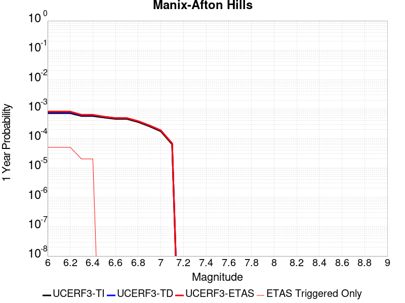 |  |

| Magnitude | 1 wk TI Prob | 1 wk TD Prob | 1 wk ETAS Prob | 1 wk ETAS/TD Gain | 1 wk ETAS Triggered Only | 1 mo TI Prob | 1 mo TD Prob | 1 mo ETAS Prob | 1 mo ETAS/TD Gain | 1 mo ETAS Triggered Only | 1 yr TI Prob | 1 yr TD Prob | 1 yr ETAS Prob | 1 yr ETAS/TD Gain | 1 yr ETAS Triggered Only | 10 yr TI Prob | 10 yr TD Prob | 10 yr ETAS Prob | 10 yr ETAS/TD Gain | 10 yr ETAS Triggered Only |
|-----|-----|-----|-----|-----|-----|-----|-----|-----|-----|-----|-----|-----|-----|-----|-----|-----|-----|-----|-----|-----|
| 6.0 | 1.3783202E-5 | 1.4711353E-5 | 1.4711353E-5 | 1.0 | 0.0 | 5.906953E-5 | 6.304723E-5 | 6.304723E-5 | 1.0 | 0.0 | 7.189342E-4 | 7.6734717E-4 | 8.855716E-4 | 1.154069 | 1.1831519E-4 | 0.0071661277 | 0.007648732 | 0.007836589 | 1.0245605 | 1.8930431E-4 |
| 6.1 | 1.3783202E-5 | 1.4711353E-5 | 1.4711353E-5 | 1.0 | 0.0 | 5.906953E-5 | 6.304723E-5 | 6.304723E-5 | 1.0 | 0.0 | 7.189342E-4 | 7.6734717E-4 | 8.855716E-4 | 1.154069 | 1.1831519E-4 | 0.0071661277 | 0.007648732 | 0.007836589 | 1.0245605 | 1.8930431E-4 |
| 6.2 | 1.3783202E-5 | 1.4711353E-5 | 1.4711353E-5 | 1.0 | 0.0 | 5.906953E-5 | 6.304723E-5 | 6.304723E-5 | 1.0 | 0.0 | 7.189342E-4 | 7.6734717E-4 | 8.855716E-4 | 1.154069 | 1.1831519E-4 | 0.0071661277 | 0.007648732 | 0.007836589 | 1.0245605 | 1.8930431E-4 |
| 6.3 | 1.10494875E-5 | 1.1793347E-5 | 1.1793347E-5 | 1.0 | 0.0 | 4.7354086E-5 | 5.0541992E-5 | 5.0541992E-5 | 1.0 | 0.0 | 5.763835E-4 | 6.151854E-4 | 6.624824E-4 | 1.0768825 | 4.7326077E-5 | 0.005748908 | 0.006135865 | 0.006229936 | 1.0153314 | 9.4652154E-5 |
| 6.4 | 1.10494875E-5 | 1.1793347E-5 | 1.1793347E-5 | 1.0 | 0.0 | 4.7354086E-5 | 5.0541992E-5 | 5.0541992E-5 | 1.0 | 0.0 | 5.763835E-4 | 6.151854E-4 | 6.624824E-4 | 1.0768825 | 4.7326077E-5 | 0.005748908 | 0.006135865 | 0.006229936 | 1.0153314 | 9.4652154E-5 |
| 6.5 | 9.788949E-6 | 1.0454509E-5 | 1.0454509E-5 | 1.0 | 0.0 | 4.1951964E-5 | 4.480432E-5 | 4.480432E-5 | 1.0 | 0.0 | 5.1064545E-4 | 5.453653E-4 | 5.453653E-4 | 1.0 | 0.0 | 0.0050947363 | 0.0054411967 | 0.0054882653 | 1.0086504 | 4.7326077E-5 |
| 6.6 | 8.810006E-6 | 9.4137995E-6 | 9.4137995E-6 | 1.0 | 0.0 | 3.775662E-5 | 4.0344283E-5 | 4.0344283E-5 | 1.0 | 0.0 | 4.5958988E-4 | 4.910898E-4 | 4.910898E-4 | 1.0 | 0.0 | 0.0045864056 | 0.004900928 | 0.0049480223 | 1.0096092 | 4.7326077E-5 |
| 6.7 | 8.80128E-6 | 9.404279E-6 | 9.404279E-6 | 1.0 | 0.0 | 3.7719226E-5 | 4.0303483E-5 | 4.0303483E-5 | 1.0 | 0.0 | 4.591348E-4 | 4.905933E-4 | 4.905933E-4 | 1.0 | 0.0 | 0.004581874 | 0.0048959847 | 0.0049430793 | 1.009619 | 4.7326077E-5 |
| 6.8 | 6.8994877E-6 | 7.3802125E-6 | 7.3802125E-6 | 1.0 | 0.0 | 2.9568899E-5 | 3.1629144E-5 | 3.1629144E-5 | 1.0 | 0.0 | 3.5994186E-4 | 3.8502496E-4 | 3.8502496E-4 | 1.0 | 0.0 | 0.003593594 | 0.0038443839 | 0.003867956 | 1.0061315 | 2.3663039E-5 |
| 6.9 | 4.9328037E-6 | 5.2710575E-6 | 5.2710575E-6 | 1.0 | 0.0 | 2.1140417E-5 | 2.2590086E-5 | 2.2590086E-5 | 1.0 | 0.0 | 2.5735417E-4 | 2.7500573E-4 | 2.7500573E-4 | 1.0 | 0.0 | 0.0025705635 | 0.0027472596 | 0.0027472596 | 1.0 | 0.0 |
| 7.0 | 3.347973E-6 | 3.5900991E-6 | 3.5900991E-6 | 1.0 | 0.0 | 1.4348378E-5 | 1.5386071E-5 | 1.5386071E-5 | 1.0 | 0.0 | 1.746775E-4 | 1.8731342E-4 | 1.8731342E-4 | 1.0 | 0.0 | 0.0017454025 | 0.0018719579 | 0.0018719579 | 1.0 | 0.0 |
| 7.1 | 1.2073567E-6 | 1.2935066E-6 | 1.2935066E-6 | 1.0 | 0.0 | 5.1743755E-6 | 5.5435967E-6 | 5.5435967E-6 | 1.0 | 0.0 | 6.29962E-5 | 6.749283E-5 | 6.749283E-5 | 1.0 | 0.0 | 6.297835E-4 | 6.7488354E-4 | 6.7488354E-4 | 1.0 | 0.0 |

## Ludlow
*[(top)](#table-of-contents)*

| 1 Week | 1 Month | 1 Year | 10 Year |
|-----|-----|-----|-----|
|  |  |  |  |

| Magnitude | 1 wk TI Prob | 1 wk TD Prob | 1 wk ETAS Prob | 1 wk ETAS/TD Gain | 1 wk ETAS Triggered Only | 1 mo TI Prob | 1 mo TD Prob | 1 mo ETAS Prob | 1 mo ETAS/TD Gain | 1 mo ETAS Triggered Only | 1 yr TI Prob | 1 yr TD Prob | 1 yr ETAS Prob | 1 yr ETAS/TD Gain | 1 yr ETAS Triggered Only | 10 yr TI Prob | 10 yr TD Prob | 10 yr ETAS Prob | 10 yr ETAS/TD Gain | 10 yr ETAS Triggered Only |
|-----|-----|-----|-----|-----|-----|-----|-----|-----|-----|-----|-----|-----|-----|-----|-----|-----|-----|-----|-----|-----|
| 6.0 | 2.2407607E-5 | 2.3657603E-5 | 4.732008E-5 | 2.000206 | 2.3663039E-5 | 9.602906E-5 | 1.0138604E-4 | 1.2504667E-4 | 1.2333717 | 2.3663039E-5 | 0.0011685267 | 0.0012337202 | 0.0013518895 | 1.0957829 | 1.1831519E-4 | 0.011624013 | 0.012273222 | 0.012436831 | 1.0133305 | 1.6564126E-4 |
| 6.1 | 2.2407607E-5 | 2.3657603E-5 | 4.732008E-5 | 2.000206 | 2.3663039E-5 | 9.602906E-5 | 1.0138604E-4 | 1.2504667E-4 | 1.2333717 | 2.3663039E-5 | 0.0011685267 | 0.0012337202 | 0.0013518895 | 1.0957829 | 1.1831519E-4 | 0.011624013 | 0.012273222 | 0.012436831 | 1.0133305 | 1.6564126E-4 |
| 6.2 | 1.0781252E-5 | 1.1365827E-5 | 1.1365827E-5 | 1.0 | 0.0 | 4.620455E-5 | 4.87098E-5 | 4.87098E-5 | 1.0 | 0.0 | 5.623952E-4 | 5.928845E-4 | 6.401825E-4 | 1.0797762 | 4.7326077E-5 | 0.00560974 | 0.005913446 | 0.0059840153 | 1.0119337 | 7.098912E-5 |
| 6.3 | 1.0781252E-5 | 1.1365827E-5 | 1.1365827E-5 | 1.0 | 0.0 | 4.620455E-5 | 4.87098E-5 | 4.87098E-5 | 1.0 | 0.0 | 5.623952E-4 | 5.928845E-4 | 6.401825E-4 | 1.0797762 | 4.7326077E-5 | 0.00560974 | 0.005913446 | 0.0059840153 | 1.0119337 | 7.098912E-5 |
| 6.4 | 7.814439E-6 | 8.237847E-6 | 8.237847E-6 | 1.0 | 0.0 | 3.3490025E-5 | 3.530459E-5 | 3.530459E-5 | 1.0 | 0.0 | 4.0766477E-4 | 4.2975E-4 | 4.7705576E-4 | 1.1100774 | 4.7326077E-5 | 0.0040691774 | 0.004289336 | 0.0043600206 | 1.0164791 | 7.098912E-5 |
| 6.5 | 6.4986366E-6 | 6.851018E-6 | 6.851018E-6 | 1.0 | 0.0 | 2.7851002E-5 | 2.9361181E-5 | 2.9361181E-5 | 1.0 | 0.0 | 3.390332E-4 | 3.5741468E-4 | 4.0472383E-4 | 1.1323649 | 4.7326077E-5 | 0.003385164 | 0.0035684945 | 0.0036392303 | 1.0198224 | 7.098912E-5 |
| 6.6 | 5.582177E-6 | 5.8860905E-6 | 5.8860905E-6 | 1.0 | 0.0 | 2.3923398E-5 | 2.5225863E-5 | 2.5225863E-5 | 1.0 | 0.0 | 2.9122844E-4 | 3.0708231E-4 | 3.3073808E-4 | 1.077034 | 2.3663039E-5 | 0.0029084706 | 0.0030666532 | 0.003113834 | 1.0153852 | 4.7326077E-5 |
| 6.7 | 4.6858763E-6 | 4.9404985E-6 | 4.9404985E-6 | 1.0 | 0.0 | 2.0082172E-5 | 2.1173397E-5 | 2.1173397E-5 | 1.0 | 0.0 | 2.4447302E-4 | 2.5775615E-4 | 2.814131E-4 | 1.0917803 | 2.3663039E-5 | 0.0024420423 | 0.0025746285 | 0.0026218325 | 1.0183344 | 4.7326077E-5 |
| 6.8 | 3.5584908E-6 | 3.7520724E-6 | 3.7520724E-6 | 1.0 | 0.0 | 1.5250586E-5 | 1.6080214E-5 | 1.6080214E-5 | 1.0 | 0.0 | 1.8566006E-4 | 1.9575942E-4 | 2.1941784E-4 | 1.1208545 | 2.3663039E-5 | 0.0018550502 | 0.0019559108 | 0.0019795278 | 1.0120746 | 2.3663039E-5 |
| 6.9 | 2.532834E-6 | 2.671042E-6 | 2.671042E-6 | 1.0 | 0.0 | 1.0854958E-5 | 1.1447275E-5 | 1.1447275E-5 | 1.0 | 0.0 | 1.3215111E-4 | 1.3936193E-4 | 1.6302167E-4 | 1.1697719 | 2.3663039E-5 | 0.0013207254 | 0.001392773 | 0.0014164031 | 1.0169662 | 2.3663039E-5 |
| 7.0 | 1.7083285E-6 | 1.80197E-6 | 1.80197E-6 | 1.0 | 0.0 | 7.3213873E-6 | 7.722707E-6 | 7.722707E-6 | 1.0 | 0.0 | 8.913424E-5 | 9.402007E-5 | 1.1768088E-4 | 1.251657 | 2.3663039E-5 | 8.9098496E-4 | 9.398194E-4 | 9.634602E-4 | 1.0251546 | 2.3663039E-5 |
| 7.1 | 1.0905424E-6 | 1.1497785E-6 | 1.1497785E-6 | 1.0 | 0.0 | 4.6737446E-6 | 4.9276136E-6 | 4.9276136E-6 | 1.0 | 0.0 | 5.6901354E-5 | 5.9992144E-5 | 8.365376E-5 | 1.3944119 | 2.3663039E-5 | 5.6886784E-4 | 5.9976924E-4 | 6.234181E-4 | 1.0394299 | 2.3663039E-5 |
| 7.2 | 6.06668E-7 | 6.387367E-7 | 6.387367E-7 | 1.0 | 0.0 | 2.600003E-6 | 2.7374406E-6 | 2.7374406E-6 | 1.0 | 0.0 | 3.1654577E-5 | 3.33279E-5 | 3.33279E-5 | 1.0 | 0.0 | 3.1650066E-4 | 3.3323586E-4 | 3.3323586E-4 | 1.0 | 0.0 |

## Cleghorn Pass
*[(top)](#table-of-contents)*

| 1 Week | 1 Month | 1 Year | 10 Year |
|-----|-----|-----|-----|
|  |  |  |  |

| Magnitude | 1 wk TI Prob | 1 wk TD Prob | 1 wk ETAS Prob | 1 wk ETAS/TD Gain | 1 wk ETAS Triggered Only | 1 mo TI Prob | 1 mo TD Prob | 1 mo ETAS Prob | 1 mo ETAS/TD Gain | 1 mo ETAS Triggered Only | 1 yr TI Prob | 1 yr TD Prob | 1 yr ETAS Prob | 1 yr ETAS/TD Gain | 1 yr ETAS Triggered Only | 10 yr TI Prob | 10 yr TD Prob | 10 yr ETAS Prob | 10 yr ETAS/TD Gain | 10 yr ETAS Triggered Only |
|-----|-----|-----|-----|-----|-----|-----|-----|-----|-----|-----|-----|-----|-----|-----|-----|-----|-----|-----|-----|-----|
| 6.0 | 1.0522846E-5 | 1.10407855E-5 | 1.10407855E-5 | 1.0 | 0.0 | 4.509713E-5 | 4.731709E-5 | 4.731709E-5 | 1.0 | 0.0 | 5.4891926E-4 | 5.7598593E-4 | 5.9963536E-4 | 1.041059 | 2.3663039E-5 | 0.0054756533 | 0.005750097 | 0.0058677318 | 1.0204579 | 1.1831519E-4 |
| 6.1 | 1.0522846E-5 | 1.10407855E-5 | 1.10407855E-5 | 1.0 | 0.0 | 4.509713E-5 | 4.731709E-5 | 4.731709E-5 | 1.0 | 0.0 | 5.4891926E-4 | 5.7598593E-4 | 5.9963536E-4 | 1.041059 | 2.3663039E-5 | 0.0054756533 | 0.005750097 | 0.0058677318 | 1.0204579 | 1.1831519E-4 |
| 6.2 | 2.1045846E-6 | 2.2082313E-6 | 2.2082313E-6 | 1.0 | 0.0 | 9.019617E-6 | 9.463838E-6 | 9.463838E-6 | 1.0 | 0.0 | 1.098083E-4 | 1.15220326E-4 | 1.15220326E-4 | 1.0 | 0.0 | 0.0010975406 | 0.0011520173 | 0.0011756531 | 1.0205169 | 2.3663039E-5 |
| 6.3 | 2.1045846E-6 | 2.2082313E-6 | 2.2082313E-6 | 1.0 | 0.0 | 9.019617E-6 | 9.463838E-6 | 9.463838E-6 | 1.0 | 0.0 | 1.098083E-4 | 1.15220326E-4 | 1.15220326E-4 | 1.0 | 0.0 | 0.0010975406 | 0.0011520173 | 0.0011756531 | 1.0205169 | 2.3663039E-5 |
| 6.4 | 1.7259927E-6 | 1.8109007E-6 | 1.8109007E-6 | 1.0 | 0.0 | 7.3970905E-6 | 7.761003E-6 | 7.761003E-6 | 1.0 | 0.0 | 9.005586E-5 | 9.449021E-5 | 9.449021E-5 | 1.0 | 0.0 | 9.001937E-4 | 9.4490213E-4 | 9.685428E-4 | 1.0250192 | 2.3663039E-5 |

## Lake Isabella (Seismicity)
*[(top)](#table-of-contents)*

| 1 Week | 1 Month | 1 Year | 10 Year |
|-----|-----|-----|-----|
|  |  |  |  |

| Magnitude | 1 wk TI Prob | 1 wk TD Prob | 1 wk ETAS Prob | 1 wk ETAS/TD Gain | 1 wk ETAS Triggered Only | 1 mo TI Prob | 1 mo TD Prob | 1 mo ETAS Prob | 1 mo ETAS/TD Gain | 1 mo ETAS Triggered Only | 1 yr TI Prob | 1 yr TD Prob | 1 yr ETAS Prob | 1 yr ETAS/TD Gain | 1 yr ETAS Triggered Only | 10 yr TI Prob | 10 yr TD Prob | 10 yr ETAS Prob | 10 yr ETAS/TD Gain | 10 yr ETAS Triggered Only |
|-----|-----|-----|-----|-----|-----|-----|-----|-----|-----|-----|-----|-----|-----|-----|-----|-----|-----|-----|-----|-----|
| 6.0 | 9.431637E-6 | 9.741737E-6 | 9.741737E-6 | 1.0 | 0.0 | 4.0420677E-5 | 4.1749707E-5 | 6.5411754E-5 | 1.5667597 | 2.3663039E-5 | 4.920106E-4 | 5.081972E-4 | 5.554992E-4 | 1.0930781 | 4.7326077E-5 | 0.004909227 | 0.005071643 | 0.005212901 | 1.0278525 | 1.4197823E-4 |
| 6.1 | 9.431637E-6 | 9.741737E-6 | 9.741737E-6 | 1.0 | 0.0 | 4.0420677E-5 | 4.1749707E-5 | 6.5411754E-5 | 1.5667597 | 2.3663039E-5 | 4.920106E-4 | 5.081972E-4 | 5.554992E-4 | 1.0930781 | 4.7326077E-5 | 0.004909227 | 0.005071643 | 0.005212901 | 1.0278525 | 1.4197823E-4 |
| 6.2 | 9.431637E-6 | 9.741737E-6 | 9.741737E-6 | 1.0 | 0.0 | 4.0420677E-5 | 4.1749707E-5 | 6.5411754E-5 | 1.5667597 | 2.3663039E-5 | 4.920106E-4 | 5.081972E-4 | 5.554992E-4 | 1.0930781 | 4.7326077E-5 | 0.004909227 | 0.005071643 | 0.005212901 | 1.0278525 | 1.4197823E-4 |
| 6.3 | 9.431637E-6 | 9.741737E-6 | 9.741737E-6 | 1.0 | 0.0 | 4.0420677E-5 | 4.1749707E-5 | 6.5411754E-5 | 1.5667597 | 2.3663039E-5 | 4.920106E-4 | 5.081972E-4 | 5.554992E-4 | 1.0930781 | 4.7326077E-5 | 0.004909227 | 0.005071643 | 0.005212901 | 1.0278525 | 1.4197823E-4 |
| 6.4 | 5.144063E-6 | 5.3001186E-6 | 5.3001186E-6 | 1.0 | 0.0 | 2.2045799E-5 | 2.2714617E-5 | 4.6377118E-5 | 2.0417302 | 2.3663039E-5 | 2.6837454E-4 | 2.765188E-4 | 3.001753E-4 | 1.0855511 | 2.3663039E-5 | 0.0026805066 | 0.0027620879 | 0.0028092833 | 1.0170869 | 4.7326077E-5 |
| 6.5 | 5.144063E-6 | 5.3001186E-6 | 5.3001186E-6 | 1.0 | 0.0 | 2.2045799E-5 | 2.2714617E-5 | 4.6377118E-5 | 2.0417302 | 2.3663039E-5 | 2.6837454E-4 | 2.765188E-4 | 3.001753E-4 | 1.0855511 | 2.3663039E-5 | 0.0026805066 | 0.0027620879 | 0.0028092833 | 1.0170869 | 4.7326077E-5 |
| 6.6 | 3.4009804E-6 | 3.498813E-6 | 3.498813E-6 | 1.0 | 0.0 | 1.4575549E-5 | 1.49948355E-5 | 3.865752E-5 | 2.5780556 | 2.3663039E-5 | 1.7744285E-4 | 1.8254842E-4 | 2.0620714E-4 | 1.1296024 | 2.3663039E-5 | 0.0017730123 | 0.0018241425 | 0.0018713822 | 1.0258969 | 4.7326077E-5 |
| 6.7 | 3.3880428E-6 | 3.4856794E-6 | 3.4856794E-6 | 1.0 | 0.0 | 1.4520103E-5 | 1.493855E-5 | 3.8601236E-5 | 2.5840015 | 2.3663039E-5 | 1.767679E-4 | 1.8186326E-4 | 2.05522E-4 | 1.1300908 | 2.3663039E-5 | 0.0017662736 | 0.0018173021 | 0.0018645421 | 1.0259947 | 4.7326077E-5 |
| 6.8 | 2.6582E-6 | 2.7337207E-6 | 2.7337207E-6 | 1.0 | 0.0 | 1.1392236E-5 | 1.1715902E-5 | 3.5378664E-5 | 3.0197132 | 2.3663039E-5 | 1.3869164E-4 | 1.426331E-4 | 1.6629277E-4 | 1.1658778 | 2.3663039E-5 | 0.0013860512 | 0.0014255476 | 0.0014728063 | 1.0331511 | 4.7326077E-5 |
| 6.9 | 2.406011E-6 | 2.4743474E-6 | 2.4743474E-6 | 1.0 | 0.0 | 1.0311434E-5 | 1.0604311E-5 | 3.4267097E-5 | 3.231431 | 2.3663039E-5 | 1.2553448E-4 | 1.2910116E-4 | 1.5276113E-4 | 1.183267 | 2.3663039E-5 | 0.0012546359 | 0.0012903912 | 0.0013376562 | 1.0366285 | 4.7326077E-5 |
| 7.0 | 1.6953097E-6 | 1.7429502E-6 | 1.7429502E-6 | 1.0 | 0.0 | 7.265593E-6 | 7.469771E-6 | 7.469771E-6 | 1.0 | 0.0 | 8.8455E-5 | 9.0941714E-5 | 9.0941714E-5 | 1.0 | 0.0 | 8.84198E-4 | 9.091477E-4 | 9.3278923E-4 | 1.0260041 | 2.3663039E-5 |
| 7.1 | 3.5013824E-7 | 3.5715013E-7 | 3.5715013E-7 | 1.0 | 0.0 | 1.5005916E-6 | 1.5306425E-6 | 1.5306425E-6 | 1.0 | 0.0 | 1.826955E-5 | 1.8635415E-5 | 1.8635415E-5 | 1.0 | 0.0 | 1.8268047E-4 | 1.8633879E-4 | 2.0999741E-4 | 1.1269656 | 2.3663039E-5 |
| 7.2 | 2.2321095E-7 | 2.2750689E-7 | 2.2750689E-7 | 1.0 | 0.0 | 9.56618E-7 | 9.750291E-7 | 9.750291E-7 | 1.0 | 0.0 | 1.1646762E-5 | 1.1870917E-5 | 1.1870917E-5 | 1.0 | 0.0 | 1.1646151E-4 | 1.1870293E-4 | 1.4236316E-4 | 1.199323 | 2.3663039E-5 |
| 7.3 | 1.5760406E-7 | 1.6061003E-7 | 1.6061003E-7 | 1.0 | 0.0 | 6.7544585E-7 | 6.8832856E-7 | 6.8832856E-7 | 1.0 | 0.0 | 8.223522E-6 | 8.380368E-6 | 8.380368E-6 | 1.0 | 0.0 | 8.2232174E-5 | 8.380059E-5 | 1.0746164E-4 | 1.2823495 | 2.3663039E-5 |
| 7.4 | 1.1216497E-7 | 1.1431764E-7 | 1.1431764E-7 | 1.0 | 0.0 | 4.8070694E-7 | 4.899327E-7 | 4.899327E-7 | 1.0 | 0.0 | 5.852591E-6 | 5.964914E-6 | 5.964914E-6 | 1.0 | 0.0 | 5.8524372E-5 | 5.9647587E-5 | 5.9647587E-5 | 1.0 | 0.0 |
| 7.5 | 4.885185E-8 | 4.978799E-8 | 4.978799E-8 | 1.0 | 0.0 | 2.0936506E-7 | 2.1337708E-7 | 2.1337708E-7 | 1.0 | 0.0 | 2.5490165E-6 | 2.5978632E-6 | 2.5978632E-6 | 1.0 | 0.0 | 2.5489873E-5 | 2.5978346E-5 | 2.5978346E-5 | 1.0 | 0.0 |
| 7.6 | 1.504641E-9 | 1.5317976E-9 | 1.5317976E-9 | 1.0 | 0.0 | 6.4484613E-9 | 6.564847E-9 | 6.564847E-9 | 1.0 | 0.0 | 7.851001E-8 | 7.992701E-8 | 7.992701E-8 | 1.0 | 0.0 | 7.8509987E-7 | 7.9927014E-7 | 7.9927014E-7 | 1.0 | 0.0 |

## Cleghorn Lake
*[(top)](#table-of-contents)*

| 1 Week | 1 Month | 1 Year | 10 Year |
|-----|-----|-----|-----|
|  |  |  |  |

| Magnitude | 1 wk TI Prob | 1 wk TD Prob | 1 wk ETAS Prob | 1 wk ETAS/TD Gain | 1 wk ETAS Triggered Only | 1 mo TI Prob | 1 mo TD Prob | 1 mo ETAS Prob | 1 mo ETAS/TD Gain | 1 mo ETAS Triggered Only | 1 yr TI Prob | 1 yr TD Prob | 1 yr ETAS Prob | 1 yr ETAS/TD Gain | 1 yr ETAS Triggered Only | 10 yr TI Prob | 10 yr TD Prob | 10 yr ETAS Prob | 10 yr ETAS/TD Gain | 10 yr ETAS Triggered Only |
|-----|-----|-----|-----|-----|-----|-----|-----|-----|-----|-----|-----|-----|-----|-----|-----|-----|-----|-----|-----|-----|
| 6.0 | 1.5467183E-5 | 1.6794587E-5 | 1.6794587E-5 | 1.0 | 0.0 | 6.6286244E-5 | 7.1975126E-5 | 7.1975126E-5 | 1.0 | 0.0 | 8.067362E-4 | 8.7599974E-4 | 9.70569E-4 | 1.1079558 | 9.4652154E-5 | 0.008038137 | 0.008730894 | 0.008871633 | 1.0161196 | 1.4197823E-4 |
| 6.1 | 1.5467183E-5 | 1.6794587E-5 | 1.6794587E-5 | 1.0 | 0.0 | 6.6286244E-5 | 7.1975126E-5 | 7.1975126E-5 | 1.0 | 0.0 | 8.067362E-4 | 8.7599974E-4 | 9.70569E-4 | 1.1079558 | 9.4652154E-5 | 0.008038137 | 0.008730894 | 0.008871633 | 1.0161196 | 1.4197823E-4 |
| 6.2 | 1.2624631E-5 | 1.368185E-5 | 1.368185E-5 | 1.0 | 0.0 | 5.410444E-5 | 5.8635454E-5 | 5.8635454E-5 | 1.0 | 0.0 | 6.585225E-4 | 7.1370153E-4 | 7.8463997E-4 | 1.0993952 | 7.098912E-5 | 0.0065657445 | 0.00711889 | 0.007236363 | 1.0165015 | 1.1831519E-4 |
| 6.3 | 1.2624631E-5 | 1.368185E-5 | 1.368185E-5 | 1.0 | 0.0 | 5.410444E-5 | 5.8635454E-5 | 5.8635454E-5 | 1.0 | 0.0 | 6.585225E-4 | 7.1370153E-4 | 7.8463997E-4 | 1.0993952 | 7.098912E-5 | 0.0065657445 | 0.00711889 | 0.007236363 | 1.0165015 | 1.1831519E-4 |
| 6.4 | 9.417684E-6 | 1.01703345E-5 | 1.01703345E-5 | 1.0 | 0.0 | 4.036088E-5 | 4.358665E-5 | 4.358665E-5 | 1.0 | 0.0 | 4.912829E-4 | 5.3057936E-4 | 6.015308E-4 | 1.1337245 | 7.098912E-5 | 0.004901982 | 0.0052971616 | 0.00541485 | 1.0222173 | 1.1831519E-4 |
| 6.5 | 9.368219E-6 | 1.011776E-5 | 1.011776E-5 | 1.0 | 0.0 | 4.014889E-5 | 4.336134E-5 | 4.336134E-5 | 1.0 | 0.0 | 4.8870314E-4 | 5.278375E-4 | 5.9878913E-4 | 1.1344194 | 7.098912E-5 | 0.004876298 | 0.0052698734 | 0.005387565 | 1.0223329 | 1.1831519E-4 |
| 6.6 | 7.803798E-6 | 8.442014E-6 | 8.442014E-6 | 1.0 | 0.0 | 3.3444423E-5 | 3.6179787E-5 | 3.6179787E-5 | 1.0 | 0.0 | 4.0710976E-4 | 4.404398E-4 | 4.6409242E-4 | 1.0537022 | 2.3663039E-5 | 0.0040636472 | 0.004399586 | 0.004446704 | 1.0107096 | 4.7326077E-5 |
| 6.7 | 2.3108669E-6 | 2.443871E-6 | 2.443871E-6 | 1.0 | 0.0 | 9.903678E-6 | 1.0473692E-5 | 1.0473692E-5 | 1.0 | 0.0 | 1.205706E-4 | 1.2750992E-4 | 1.5116994E-4 | 1.1855544 | 2.3663039E-5 | 0.001205052 | 0.0012743863 | 0.001321652 | 1.037089 | 4.7326077E-5 |
| 6.8 | 2.0882828E-6 | 2.2063152E-6 | 2.2063152E-6 | 1.0 | 0.0 | 8.949753E-6 | 9.4556035E-6 | 9.4556035E-6 | 1.0 | 0.0 | 1.08957785E-4 | 1.1511606E-4 | 1.3877638E-4 | 1.2055345 | 2.3663039E-5 | 0.0010890438 | 0.0011505812 | 0.001174217 | 1.0205425 | 2.3663039E-5 |
| 6.9 | 1.876935E-6 | 1.9810802E-6 | 1.9810802E-6 | 1.0 | 0.0 | 8.043982E-6 | 8.490317E-6 | 8.490317E-6 | 1.0 | 0.0 | 9.7931086E-5 | 1.03364866E-4 | 1.2702546E-4 | 1.2289037 | 2.3663039E-5 | 9.788794E-4 | 0.0010331839 | 0.0010568225 | 1.0228794 | 2.3663039E-5 |
| 7.0 | 1.5357559E-6 | 1.6203044E-6 | 1.6203044E-6 | 1.0 | 0.0 | 6.5817944E-6 | 6.944144E-6 | 6.944144E-6 | 1.0 | 0.0 | 8.01304E-5 | 8.4541796E-5 | 1.0820283E-4 | 1.2798738 | 2.3663039E-5 | 8.010151E-4 | 8.451088E-4 | 8.6875184E-4 | 1.0279763 | 2.3663039E-5 |
| 7.1 | 1.0905424E-6 | 1.1497785E-6 | 1.1497785E-6 | 1.0 | 0.0 | 4.6737446E-6 | 4.9276136E-6 | 4.9276136E-6 | 1.0 | 0.0 | 5.6901354E-5 | 5.9992144E-5 | 8.365376E-5 | 1.3944119 | 2.3663039E-5 | 5.6886784E-4 | 5.9976924E-4 | 6.234181E-4 | 1.0394299 | 2.3663039E-5 |
| 7.2 | 6.06668E-7 | 6.387367E-7 | 6.387367E-7 | 1.0 | 0.0 | 2.600003E-6 | 2.7374406E-6 | 2.7374406E-6 | 1.0 | 0.0 | 3.1654577E-5 | 3.33279E-5 | 3.33279E-5 | 1.0 | 0.0 | 3.1650066E-4 | 3.3323586E-4 | 3.3323586E-4 | 1.0 | 0.0 |

## Baker
*[(top)](#table-of-contents)*

| 1 Week | 1 Month | 1 Year | 10 Year |
|-----|-----|-----|-----|
|  |  |  |  |

| Magnitude | 1 wk TI Prob | 1 wk TD Prob | 1 wk ETAS Prob | 1 wk ETAS/TD Gain | 1 wk ETAS Triggered Only | 1 mo TI Prob | 1 mo TD Prob | 1 mo ETAS Prob | 1 mo ETAS/TD Gain | 1 mo ETAS Triggered Only | 1 yr TI Prob | 1 yr TD Prob | 1 yr ETAS Prob | 1 yr ETAS/TD Gain | 1 yr ETAS Triggered Only | 10 yr TI Prob | 10 yr TD Prob | 10 yr ETAS Prob | 10 yr ETAS/TD Gain | 10 yr ETAS Triggered Only |
|-----|-----|-----|-----|-----|-----|-----|-----|-----|-----|-----|-----|-----|-----|-----|-----|-----|-----|-----|-----|-----|
| 6.0 | 5.695525E-6 | 5.834875E-6 | 5.834875E-6 | 1.0 | 0.0 | 2.4409164E-5 | 2.5006391E-5 | 2.5006391E-5 | 1.0 | 0.0 | 2.9714106E-4 | 3.0441428E-4 | 3.753818E-4 | 1.2331281 | 7.098912E-5 | 0.0029674405 | 0.0030403684 | 0.003181915 | 1.0465558 | 1.4197823E-4 |
| 6.1 | 5.695525E-6 | 5.834875E-6 | 5.834875E-6 | 1.0 | 0.0 | 2.4409164E-5 | 2.5006391E-5 | 2.5006391E-5 | 1.0 | 0.0 | 2.9714106E-4 | 3.0441428E-4 | 3.753818E-4 | 1.2331281 | 7.098912E-5 | 0.0029674405 | 0.0030403684 | 0.003181915 | 1.0465558 | 1.4197823E-4 |
| 6.2 | 5.695525E-6 | 5.834875E-6 | 5.834875E-6 | 1.0 | 0.0 | 2.4409164E-5 | 2.5006391E-5 | 2.5006391E-5 | 1.0 | 0.0 | 2.9714106E-4 | 3.0441428E-4 | 3.753818E-4 | 1.2331281 | 7.098912E-5 | 0.0029674405 | 0.0030403684 | 0.003181915 | 1.0465558 | 1.4197823E-4 |
| 6.3 | 3.2995713E-6 | 3.3836902E-6 | 3.3836902E-6 | 1.0 | 0.0 | 1.4140943E-5 | 1.4501451E-5 | 1.4501451E-5 | 1.0 | 0.0 | 1.7215237E-4 | 1.7654135E-4 | 2.2385907E-4 | 1.2680264 | 4.7326077E-5 | 0.0017201907 | 0.001764058 | 0.0018821645 | 1.0669516 | 1.1831519E-4 |
| 6.4 | 3.2995713E-6 | 3.3836902E-6 | 3.3836902E-6 | 1.0 | 0.0 | 1.4140943E-5 | 1.4501451E-5 | 1.4501451E-5 | 1.0 | 0.0 | 1.7215237E-4 | 1.7654135E-4 | 2.2385907E-4 | 1.2680264 | 4.7326077E-5 | 0.0017201907 | 0.001764058 | 0.0018821645 | 1.0669516 | 1.1831519E-4 |
| 6.5 | 2.782202E-6 | 2.8558607E-6 | 2.8558607E-6 | 1.0 | 0.0 | 1.1923668E-5 | 1.2239348E-5 | 1.2239348E-5 | 1.0 | 0.0 | 1.4516099E-4 | 1.4900419E-4 | 1.9632322E-4 | 1.3175684 | 4.7326077E-5 | 0.001450662 | 0.0014890756 | 0.0016072147 | 1.0793371 | 1.1831519E-4 |
| 6.6 | 2.3163404E-6 | 2.3809378E-6 | 2.3809378E-6 | 1.0 | 0.0 | 9.927136E-6 | 1.020398E-5 | 1.020398E-5 | 1.0 | 0.0 | 1.20856166E-4 | 1.2422659E-4 | 1.7154678E-4 | 1.3809185 | 4.7326077E-5 | 0.0012079047 | 0.0012415916 | 0.0013597598 | 1.0951748 | 1.1831519E-4 |
| 6.7 | 2.037056E-6 | 2.096517E-6 | 2.096517E-6 | 1.0 | 0.0 | 8.7302105E-6 | 8.985042E-6 | 8.985042E-6 | 1.0 | 0.0 | 1.0628513E-4 | 1.0938756E-4 | 1.5670845E-4 | 1.4325986 | 4.7326077E-5 | 0.0010623431 | 0.0010933533 | 0.0012115391 | 1.1080948 | 1.1831519E-4 |
| 6.8 | 1.8356744E-6 | 1.8915441E-6 | 1.8915441E-6 | 1.0 | 0.0 | 7.867153E-6 | 8.106594E-6 | 8.106594E-6 | 1.0 | 0.0 | 9.577837E-5 | 9.869345E-5 | 1.4601485E-4 | 1.4794787 | 4.7326077E-5 | 9.57371E-4 | 9.865101E-4 | 0.0011047085 | 1.1198148 | 1.1831519E-4 |
| 6.9 | 1.6310546E-6 | 1.6832216E-6 | 1.6832216E-6 | 1.0 | 0.0 | 6.9902153E-6 | 7.2137877E-6 | 7.2137877E-6 | 1.0 | 0.0 | 8.510255E-5 | 8.782444E-5 | 1.3514636E-4 | 1.5388241 | 4.7326077E-5 | 8.5069967E-4 | 8.779086E-4 | 9.961199E-4 | 1.1346511 | 1.1831519E-4 |
| 7.0 | 1.2058036E-6 | 1.2508791E-6 | 1.2508791E-6 | 1.0 | 0.0 | 5.1677193E-6 | 5.360899E-6 | 5.360899E-6 | 1.0 | 0.0 | 6.291517E-5 | 6.526702E-5 | 1.1259001E-4 | 1.7250674 | 4.7326077E-5 | 6.289736E-4 | 6.524808E-4 | 7.707188E-4 | 1.181213 | 1.1831519E-4 |
| 7.1 | 1.052382E-6 | 1.0951728E-6 | 1.0951728E-6 | 1.0 | 0.0 | 4.5102006E-6 | 4.6935893E-6 | 4.6935893E-6 | 1.0 | 0.0 | 5.491031E-5 | 5.714296E-5 | 8.0804646E-5 | 1.4140788 | 2.3663039E-5 | 5.4896745E-4 | 5.712835E-4 | 6.658816E-4 | 1.1655886 | 9.4652154E-5 |
| 7.2 | 1.0067454E-6 | 1.0487828E-6 | 1.0487828E-6 | 1.0 | 0.0 | 4.3146156E-6 | 4.4947756E-6 | 4.4947756E-6 | 1.0 | 0.0 | 5.252918E-5 | 5.4722528E-5 | 7.838427E-5 | 1.432395 | 2.3663039E-5 | 5.251676E-4 | 5.4709136E-4 | 6.1804167E-4 | 1.1296864 | 7.098912E-5 |
| 7.3 | 9.3596316E-7 | 9.767837E-7 | 9.767837E-7 | 1.0 | 0.0 | 4.0112645E-6 | 4.186209E-6 | 4.186209E-6 | 1.0 | 0.0 | 4.8836053E-5 | 5.0965915E-5 | 7.4627744E-5 | 1.4642678 | 2.3663039E-5 | 4.8825322E-4 | 5.0954305E-4 | 5.80496E-4 | 1.1392481 | 7.098912E-5 |
| 7.4 | 8.8117395E-7 | 9.207774E-7 | 9.207774E-7 | 1.0 | 0.0 | 3.7764542E-6 | 3.946183E-6 | 3.946183E-6 | 1.0 | 0.0 | 4.5977362E-5 | 4.8043723E-5 | 7.1705625E-5 | 1.4925077 | 2.3663039E-5 | 4.596785E-4 | 4.8033413E-4 | 5.512892E-4 | 1.1477201 | 7.098912E-5 |
| 7.5 | 8.292386E-7 | 8.6747025E-7 | 8.6747025E-7 | 1.0 | 0.0 | 3.5538749E-6 | 3.7177244E-6 | 3.7177244E-6 | 1.0 | 0.0 | 4.326757E-5 | 4.526236E-5 | 6.892433E-5 | 1.5227736 | 2.3663039E-5 | 4.3259145E-4 | 4.5253217E-4 | 5.2348914E-4 | 1.1567999 | 7.098912E-5 |
| 7.6 | 7.553842E-7 | 7.914571E-7 | 7.914571E-7 | 1.0 | 0.0 | 3.2373566E-6 | 3.3919548E-6 | 3.3919548E-6 | 1.0 | 0.0 | 3.9414106E-5 | 4.1296273E-5 | 6.495834E-5 | 1.5729829 | 2.3663039E-5 | 3.9407116E-4 | 4.128867E-4 | 4.838465E-4 | 1.1718626 | 7.098912E-5 |
| 7.7 | 6.5285366E-7 | 6.8528874E-7 | 6.8528874E-7 | 1.0 | 0.0 | 2.797941E-6 | 2.9369485E-6 | 2.9369485E-6 | 1.0 | 0.0 | 3.40644E-5 | 3.575677E-5 | 5.9418962E-5 | 1.6617543 | 2.3663039E-5 | 3.405918E-4 | 3.575108E-4 | 4.0481996E-4 | 1.1323293 | 4.7326077E-5 |
| 7.8 | 3.4586725E-7 | 3.6483146E-7 | 3.6483146E-7 | 1.0 | 0.0 | 1.4822873E-6 | 1.5635625E-6 | 1.5635625E-6 | 1.0 | 0.0 | 1.80467E-5 | 1.9036212E-5 | 4.26988E-5 | 2.2430303 | 2.3663039E-5 | 1.8045233E-4 | 1.9034625E-4 | 2.1400479E-4 | 1.1242921 | 2.3663039E-5 |
| 7.9 | 2.5591178E-9 | 2.6697022E-9 | 2.6697022E-9 | 1.0 | 0.0 | 1.0967647E-8 | 1.1441582E-8 | 1.1441582E-8 | 1.0 | 0.0 | 1.335311E-7 | 1.3930125E-7 | 1.3930125E-7 | 1.0 | 0.0 | 1.3353102E-6 | 1.3930126E-6 | 1.3930126E-6 | 1.0 | 0.0 |

## Cady
*[(top)](#table-of-contents)*

| 1 Week | 1 Month | 1 Year | 10 Year |
|-----|-----|-----|-----|
|  |  |  |  |

| Magnitude | 1 wk TI Prob | 1 wk TD Prob | 1 wk ETAS Prob | 1 wk ETAS/TD Gain | 1 wk ETAS Triggered Only | 1 mo TI Prob | 1 mo TD Prob | 1 mo ETAS Prob | 1 mo ETAS/TD Gain | 1 mo ETAS Triggered Only | 1 yr TI Prob | 1 yr TD Prob | 1 yr ETAS Prob | 1 yr ETAS/TD Gain | 1 yr ETAS Triggered Only | 10 yr TI Prob | 10 yr TD Prob | 10 yr ETAS Prob | 10 yr ETAS/TD Gain | 10 yr ETAS Triggered Only |
|-----|-----|-----|-----|-----|-----|-----|-----|-----|-----|-----|-----|-----|-----|-----|-----|-----|-----|-----|-----|-----|
| 6.0 | 1.9892565E-5 | 2.1859303E-5 | 2.1859303E-5 | 1.0 | 0.0 | 8.525106E-5 | 9.3679875E-5 | 1.1734069E-4 | 1.252571 | 2.3663039E-5 | 0.0010374374 | 0.0011400466 | 0.0012109547 | 1.0621976 | 7.098912E-5 | 0.010326075 | 0.011350997 | 0.011467969 | 1.010305 | 1.1831519E-4 |
| 6.1 | 1.9892565E-5 | 2.1859303E-5 | 2.1859303E-5 | 1.0 | 0.0 | 8.525106E-5 | 9.3679875E-5 | 1.1734069E-4 | 1.252571 | 2.3663039E-5 | 0.0010374374 | 0.0011400466 | 0.0012109547 | 1.0621976 | 7.098912E-5 | 0.010326075 | 0.011350997 | 0.011467969 | 1.010305 | 1.1831519E-4 |
| 6.2 | 1.9892565E-5 | 2.1859303E-5 | 2.1859303E-5 | 1.0 | 0.0 | 8.525106E-5 | 9.3679875E-5 | 1.1734069E-4 | 1.252571 | 2.3663039E-5 | 0.0010374374 | 0.0011400466 | 0.0012109547 | 1.0621976 | 7.098912E-5 | 0.010326075 | 0.011350997 | 0.011467969 | 1.010305 | 1.1831519E-4 |
| 6.3 | 1.1117327E-5 | 1.2176892E-5 | 1.2176892E-5 | 1.0 | 0.0 | 4.764482E-5 | 5.2185813E-5 | 5.2185813E-5 | 1.0 | 0.0 | 5.7992124E-4 | 6.3520856E-4 | 6.3520856E-4 | 1.0 | 0.0 | 0.0057841022 | 0.0063370354 | 0.0063370354 | 1.0 | 0.0 |
| 6.4 | 1.1117327E-5 | 1.2176892E-5 | 1.2176892E-5 | 1.0 | 0.0 | 4.764482E-5 | 5.2185813E-5 | 5.2185813E-5 | 1.0 | 0.0 | 5.7992124E-4 | 6.3520856E-4 | 6.3520856E-4 | 1.0 | 0.0 | 0.0057841022 | 0.0063370354 | 0.0063370354 | 1.0 | 0.0 |
| 6.5 | 6.103093E-6 | 6.672186E-6 | 6.672186E-6 | 1.0 | 0.0 | 2.615585E-5 | 2.8594839E-5 | 2.8594839E-5 | 1.0 | 0.0 | 3.1840094E-4 | 3.480991E-4 | 3.480991E-4 | 1.0 | 0.0 | 0.0031794512 | 0.0034767727 | 0.0034767727 | 1.0 | 0.0 |
| 6.6 | 5.817237E-6 | 6.3658176E-6 | 6.3658176E-6 | 1.0 | 0.0 | 2.4930776E-5 | 2.7281862E-5 | 2.7281862E-5 | 1.0 | 0.0 | 3.034899E-4 | 3.3211848E-4 | 3.3211848E-4 | 1.0 | 0.0 | 0.0030307577 | 0.0033174434 | 0.0033174434 | 1.0 | 0.0 |
| 6.7 | 4.8846314E-6 | 5.3407007E-6 | 5.3407007E-6 | 1.0 | 0.0 | 2.0933967E-5 | 2.2888582E-5 | 2.2888582E-5 | 1.0 | 0.0 | 2.5484123E-4 | 2.7864464E-4 | 2.7864464E-4 | 1.0 | 0.0 | 0.0025454918 | 0.002784108 | 0.002784108 | 1.0 | 0.0 |
| 6.8 | 1.7788773E-6 | 1.9399545E-6 | 1.9399545E-6 | 1.0 | 0.0 | 7.6237375E-6 | 8.314073E-6 | 8.314073E-6 | 1.0 | 0.0 | 9.281505E-5 | 1.0122072E-4 | 1.0122072E-4 | 1.0 | 0.0 | 9.2776294E-4 | 0.0010119008 | 0.0010119008 | 1.0 | 0.0 |
| 6.9 | 7.5455404E-7 | 8.2973116E-7 | 8.2973116E-7 | 1.0 | 0.0 | 3.233799E-6 | 3.5559876E-6 | 3.5559876E-6 | 1.0 | 0.0 | 3.937079E-5 | 4.3293625E-5 | 4.3293625E-5 | 1.0 | 0.0 | 3.9363815E-4 | 4.3288487E-4 | 4.3288487E-4 | 1.0 | 0.0 |
| 7.0 | 6.8578805E-7 | 7.5420155E-7 | 7.5420155E-7 | 1.0 | 0.0 | 2.9390883E-6 | 3.2322903E-6 | 3.2322903E-6 | 1.0 | 0.0 | 3.578281E-5 | 3.9352755E-5 | 3.9352755E-5 | 1.0 | 0.0 | 3.577705E-4 | 3.9349034E-4 | 3.9349034E-4 | 1.0 | 0.0 |

## Independence rev 2011
*[(top)](#table-of-contents)*

| 1 Week | 1 Month | 1 Year | 10 Year |
|-----|-----|-----|-----|
|  |  |  |  |

| Magnitude | 1 wk TI Prob | 1 wk TD Prob | 1 wk ETAS Prob | 1 wk ETAS/TD Gain | 1 wk ETAS Triggered Only | 1 mo TI Prob | 1 mo TD Prob | 1 mo ETAS Prob | 1 mo ETAS/TD Gain | 1 mo ETAS Triggered Only | 1 yr TI Prob | 1 yr TD Prob | 1 yr ETAS Prob | 1 yr ETAS/TD Gain | 1 yr ETAS Triggered Only | 10 yr TI Prob | 10 yr TD Prob | 10 yr ETAS Prob | 10 yr ETAS/TD Gain | 10 yr ETAS Triggered Only |
|-----|-----|-----|-----|-----|-----|-----|-----|-----|-----|-----|-----|-----|-----|-----|-----|-----|-----|-----|-----|-----|
| 6.0 | 4.422171E-6 | 4.3262635E-6 | 4.3262635E-6 | 1.0 | 0.0 | 1.8952025E-5 | 1.8541015E-5 | 1.8541015E-5 | 1.0 | 0.0 | 2.3071647E-4 | 2.2571646E-4 | 2.7303185E-4 | 1.2096231 | 4.7326077E-5 | 0.0023047708 | 0.0022551655 | 0.0023732139 | 1.0523458 | 1.1831519E-4 |
| 6.1 | 4.422171E-6 | 4.3262635E-6 | 4.3262635E-6 | 1.0 | 0.0 | 1.8952025E-5 | 1.8541015E-5 | 1.8541015E-5 | 1.0 | 0.0 | 2.3071647E-4 | 2.2571646E-4 | 2.7303185E-4 | 1.2096231 | 4.7326077E-5 | 0.0023047708 | 0.0022551655 | 0.0023732139 | 1.0523458 | 1.1831519E-4 |
| 6.2 | 4.422171E-6 | 4.3262635E-6 | 4.3262635E-6 | 1.0 | 0.0 | 1.8952025E-5 | 1.8541015E-5 | 1.8541015E-5 | 1.0 | 0.0 | 2.3071647E-4 | 2.2571646E-4 | 2.7303185E-4 | 1.2096231 | 4.7326077E-5 | 0.0023047708 | 0.0022551655 | 0.0023732139 | 1.0523458 | 1.1831519E-4 |
| 6.3 | 4.422171E-6 | 4.3262635E-6 | 4.3262635E-6 | 1.0 | 0.0 | 1.8952025E-5 | 1.8541015E-5 | 1.8541015E-5 | 1.0 | 0.0 | 2.3071647E-4 | 2.2571646E-4 | 2.7303185E-4 | 1.2096231 | 4.7326077E-5 | 0.0023047708 | 0.0022551655 | 0.0023732139 | 1.0523458 | 1.1831519E-4 |
| 6.4 | 4.422171E-6 | 4.3262635E-6 | 4.3262635E-6 | 1.0 | 0.0 | 1.8952025E-5 | 1.8541015E-5 | 1.8541015E-5 | 1.0 | 0.0 | 2.3071647E-4 | 2.2571646E-4 | 2.7303185E-4 | 1.2096231 | 4.7326077E-5 | 0.0023047708 | 0.0022551655 | 0.0023732139 | 1.0523458 | 1.1831519E-4 |
| 6.5 | 4.422171E-6 | 4.3262635E-6 | 4.3262635E-6 | 1.0 | 0.0 | 1.8952025E-5 | 1.8541015E-5 | 1.8541015E-5 | 1.0 | 0.0 | 2.3071647E-4 | 2.2571646E-4 | 2.7303185E-4 | 1.2096231 | 4.7326077E-5 | 0.0023047708 | 0.0022551655 | 0.0023732139 | 1.0523458 | 1.1831519E-4 |
| 6.6 | 2.663744E-6 | 2.532013E-6 | 2.532013E-6 | 1.0 | 0.0 | 1.1415996E-5 | 1.0851442E-5 | 1.0851442E-5 | 1.0 | 0.0 | 1.3898089E-4 | 1.3210879E-4 | 1.794286E-4 | 1.3581883 | 4.7326077E-5 | 0.0013889399 | 0.0013203508 | 0.0014385098 | 1.0894907 | 1.1831519E-4 |
| 6.7 | 2.663744E-6 | 2.532013E-6 | 2.532013E-6 | 1.0 | 0.0 | 1.1415996E-5 | 1.0851442E-5 | 1.0851442E-5 | 1.0 | 0.0 | 1.3898089E-4 | 1.3210879E-4 | 1.794286E-4 | 1.3581883 | 4.7326077E-5 | 0.0013889399 | 0.0013203508 | 0.0014385098 | 1.0894907 | 1.1831519E-4 |
| 6.8 | 1.9716529E-6 | 1.8322814E-6 | 1.8322814E-6 | 1.0 | 0.0 | 8.449913E-6 | 7.852612E-6 | 7.852612E-6 | 1.0 | 0.0 | 1.0287284E-4 | 9.5601485E-5 | 1.4292303E-4 | 1.4949876 | 4.7326077E-5 | 0.0010282523 | 9.556165E-4 | 0.0010738187 | 1.123692 | 1.1831519E-4 |
| 6.9 | 1.8788617E-6 | 1.7430215E-6 | 1.7430215E-6 | 1.0 | 0.0 | 8.0522395E-6 | 7.470071E-6 | 7.470071E-6 | 1.0 | 0.0 | 9.80316E-5 | 9.094444E-5 | 1.3826622E-4 | 1.5203371 | 4.7326077E-5 | 9.798837E-4 | 9.090843E-4 | 0.0010272919 | 1.1300293 | 1.1831519E-4 |
| 7.0 | 1.5045488E-6 | 1.3849686E-6 | 1.3849686E-6 | 1.0 | 0.0 | 6.44805E-6 | 5.935567E-6 | 5.935567E-6 | 1.0 | 0.0 | 7.8502184E-5 | 7.226318E-5 | 9.592451E-5 | 1.3274328 | 2.3663039E-5 | 7.8474457E-4 | 7.2240195E-4 | 8.1698573E-4 | 1.1309296 | 9.4652154E-5 |
| 7.1 | 1.272341E-6 | 1.1625257E-6 | 1.1625257E-6 | 1.0 | 0.0 | 5.4528787E-6 | 4.9822434E-6 | 4.9822434E-6 | 1.0 | 0.0 | 6.6386776E-5 | 6.0657156E-5 | 8.431876E-5 | 1.3900876 | 2.3663039E-5 | 6.636695E-4 | 6.064092E-4 | 7.0100394E-4 | 1.1559917 | 9.4652154E-5 |
| 7.2 | 1.0416892E-6 | 9.410018E-7 | 9.410018E-7 | 1.0 | 0.0 | 4.464375E-6 | 4.0328587E-6 | 4.0328587E-6 | 1.0 | 0.0 | 5.4352407E-5 | 4.9098966E-5 | 7.276084E-5 | 1.481922 | 2.3663039E-5 | 5.4339116E-4 | 4.908831E-4 | 5.8548874E-4 | 1.1927255 | 9.4652154E-5 |
| 7.3 | 7.9450155E-7 | 7.235105E-7 | 7.235105E-7 | 1.0 | 0.0 | 3.4050022E-6 | 3.1007555E-6 | 3.1007555E-6 | 1.0 | 0.0 | 4.1455114E-5 | 3.7751055E-5 | 6.14132E-5 | 1.6267942 | 2.3663039E-5 | 4.144738E-4 | 3.7744755E-4 | 4.7206398E-4 | 1.2506744 | 9.4652154E-5 |
| 7.4 | 5.3893444E-7 | 5.0195763E-7 | 5.0195763E-7 | 1.0 | 0.0 | 2.309717E-6 | 2.151245E-6 | 2.151245E-6 | 1.0 | 0.0 | 2.8120441E-5 | 2.6191101E-5 | 4.985352E-5 | 1.9034526 | 2.3663039E-5 | 2.8116882E-4 | 2.618806E-4 | 3.328511E-4 | 1.2710034 | 7.098912E-5 |
| 7.5 | 3.8852085E-7 | 3.6825958E-7 | 3.6825958E-7 | 1.0 | 0.0 | 1.6650882E-6 | 1.5782543E-6 | 1.5782543E-6 | 1.0 | 0.0 | 2.027226E-5 | 1.921508E-5 | 4.2877662E-5 | 2.2314591 | 2.3663039E-5 | 2.0270412E-4 | 1.921344E-4 | 2.3945139E-4 | 1.2462702 | 4.7326077E-5 |
| 7.6 | 2.414929E-7 | 2.3457768E-7 | 2.3457768E-7 | 1.0 | 0.0 | 1.0349692E-6 | 1.0053326E-6 | 1.0053326E-6 | 1.0 | 0.0 | 1.2600677E-5 | 1.2239856E-5 | 3.5902605E-5 | 2.9332538 | 2.3663039E-5 | 1.2599962E-4 | 1.2239195E-4 | 1.6971224E-4 | 1.3866291 | 4.7326077E-5 |
| 7.7 | 6.8298014E-8 | 6.8590154E-8 | 6.8590154E-8 | 1.0 | 0.0 | 2.9270575E-7 | 2.9395778E-7 | 2.9395778E-7 | 1.0 | 0.0 | 3.5636867E-6 | 3.5789305E-6 | 3.5789305E-6 | 1.0 | 0.0 | 3.5636294E-5 | 3.5788777E-5 | 3.5788777E-5 | 1.0 | 0.0 |

## San Andreas (North Branch Mill Creek)
*[(top)](#table-of-contents)*

| 1 Week | 1 Month | 1 Year | 10 Year |
|-----|-----|-----|-----|
|  |  |  |  |

| Magnitude | 1 wk TI Prob | 1 wk TD Prob | 1 wk ETAS Prob | 1 wk ETAS/TD Gain | 1 wk ETAS Triggered Only | 1 mo TI Prob | 1 mo TD Prob | 1 mo ETAS Prob | 1 mo ETAS/TD Gain | 1 mo ETAS Triggered Only | 1 yr TI Prob | 1 yr TD Prob | 1 yr ETAS Prob | 1 yr ETAS/TD Gain | 1 yr ETAS Triggered Only | 10 yr TI Prob | 10 yr TD Prob | 10 yr ETAS Prob | 10 yr ETAS/TD Gain | 10 yr ETAS Triggered Only |
|-----|-----|-----|-----|-----|-----|-----|-----|-----|-----|-----|-----|-----|-----|-----|-----|-----|-----|-----|-----|-----|
| 6.0 | 1.3461156E-5 | 2.3513652E-5 | 2.3513652E-5 | 1.0 | 0.0 | 5.7689394E-5 | 1.0076892E-4 | 1.2442957E-4 | 1.234801 | 2.3663039E-5 | 7.02142E-4 | 0.0012261744 | 0.0012970765 | 1.0578238 | 7.098912E-5 | 0.0069992766 | 0.012236614 | 0.012353481 | 1.0095507 | 1.1831519E-4 |
| 6.1 | 1.3461156E-5 | 2.3513652E-5 | 2.3513652E-5 | 1.0 | 0.0 | 5.7689394E-5 | 1.0076892E-4 | 1.2442957E-4 | 1.234801 | 2.3663039E-5 | 7.02142E-4 | 0.0012261744 | 0.0012970765 | 1.0578238 | 7.098912E-5 | 0.0069992766 | 0.012236614 | 0.012353481 | 1.0095507 | 1.1831519E-4 |
| 6.2 | 1.3461156E-5 | 2.3513652E-5 | 2.3513652E-5 | 1.0 | 0.0 | 5.7689394E-5 | 1.0076892E-4 | 1.2442957E-4 | 1.234801 | 2.3663039E-5 | 7.02142E-4 | 0.0012261744 | 0.0012970765 | 1.0578238 | 7.098912E-5 | 0.0069992766 | 0.012236614 | 0.012353481 | 1.0095507 | 1.1831519E-4 |
| 6.3 | 1.3461156E-5 | 2.3513652E-5 | 2.3513652E-5 | 1.0 | 0.0 | 5.7689394E-5 | 1.0076892E-4 | 1.2442957E-4 | 1.234801 | 2.3663039E-5 | 7.02142E-4 | 0.0012261744 | 0.0012970765 | 1.0578238 | 7.098912E-5 | 0.0069992766 | 0.012236614 | 0.012353481 | 1.0095507 | 1.1831519E-4 |
| 6.4 | 1.3461156E-5 | 2.3513652E-5 | 2.3513652E-5 | 1.0 | 0.0 | 5.7689394E-5 | 1.0076892E-4 | 1.2442957E-4 | 1.234801 | 2.3663039E-5 | 7.02142E-4 | 0.0012261744 | 0.0012970765 | 1.0578238 | 7.098912E-5 | 0.0069992766 | 0.012236614 | 0.012353481 | 1.0095507 | 1.1831519E-4 |
| 6.5 | 1.3450706E-5 | 2.3502611E-5 | 2.3502611E-5 | 1.0 | 0.0 | 5.764461E-5 | 1.00721605E-4 | 1.2438226E-4 | 1.2349114 | 2.3663039E-5 | 7.0159714E-4 | 0.0012255991 | 0.0012965011 | 1.057851 | 7.098912E-5 | 0.006993862 | 0.012230923 | 0.012347791 | 1.0095551 | 1.1831519E-4 |
| 6.6 | 1.3074523E-5 | 2.3116889E-5 | 2.3116889E-5 | 1.0 | 0.0 | 5.6032466E-5 | 9.906864E-5 | 1.2272934E-4 | 1.2388313 | 2.3663039E-5 | 6.8198174E-4 | 0.0012054965 | 0.0012764 | 1.0588169 | 7.098912E-5 | 0.006798926 | 0.012032087 | 0.012148979 | 1.009715 | 1.1831519E-4 |
| 6.7 | 1.3050216E-5 | 2.3092185E-5 | 2.3092185E-5 | 1.0 | 0.0 | 5.59283E-5 | 9.896277E-5 | 1.2262346E-4 | 1.2390869 | 2.3663039E-5 | 6.8071426E-4 | 0.0012042089 | 0.0012751126 | 1.0588799 | 7.098912E-5 | 0.0067863287 | 0.012019351 | 0.012136244 | 1.0097255 | 1.1831519E-4 |
| 6.8 | 1.29049395E-5 | 2.294059E-5 | 2.294059E-5 | 1.0 | 0.0 | 5.530571E-5 | 9.831313E-5 | 1.2197384E-4 | 1.2406669 | 2.3663039E-5 | 6.73139E-4 | 0.0011963083 | 0.0012672126 | 1.0592692 | 7.098912E-5 | 0.0067110364 | 0.011941195 | 0.012058098 | 1.0097898 | 1.1831519E-4 |
| 6.9 | 1.2867369E-5 | 2.2899992E-5 | 2.2899992E-5 | 1.0 | 0.0 | 5.51447E-5 | 9.813915E-5 | 1.21799865E-4 | 1.2410935 | 2.3663039E-5 | 6.711799E-4 | 0.0011941924 | 0.0012650968 | 1.0593743 | 7.098912E-5 | 0.006691564 | 0.011920264 | 0.012037169 | 1.0098072 | 1.1831519E-4 |
| 7.0 | 1.2495996E-5 | 2.2299977E-5 | 2.2299977E-5 | 1.0 | 0.0 | 5.3553173E-5 | 9.556785E-5 | 1.1922862E-4 | 1.2475809 | 2.3663039E-5 | 6.518148E-4 | 0.0011629204 | 0.0012338269 | 1.0609728 | 7.098912E-5 | 0.0064990623 | 0.011610822 | 0.011727763 | 1.0100718 | 1.1831519E-4 |
| 7.1 | 1.2452067E-5 | 2.2245047E-5 | 2.2245047E-5 | 1.0 | 0.0 | 5.3364907E-5 | 9.533244E-5 | 1.1899323E-4 | 1.2481923 | 2.3663039E-5 | 6.4952404E-4 | 0.0011600574 | 0.0012309641 | 1.0611235 | 7.098912E-5 | 0.0064762887 | 0.011582491 | 0.011699436 | 1.0100967 | 1.1831519E-4 |
| 7.2 | 1.2002777E-5 | 2.1623538E-5 | 2.1623538E-5 | 1.0 | 0.0 | 5.143946E-5 | 9.2669026E-5 | 1.1632987E-4 | 1.2553264 | 2.3663039E-5 | 6.2609545E-4 | 0.0011276641 | 0.0011749369 | 1.0419209 | 4.7326077E-5 | 0.006243344 | 0.011261879 | 0.011355465 | 1.00831 | 9.4652154E-5 |
| 7.3 | 1.1923425E-5 | 2.1493353E-5 | 2.1493353E-5 | 1.0 | 0.0 | 5.109939E-5 | 9.211113E-5 | 1.1577199E-4 | 1.256873 | 2.3663039E-5 | 6.219575E-4 | 0.0011208787 | 0.0011681517 | 1.0421749 | 4.7326077E-5 | 0.0062021962 | 0.011194738 | 0.01128833 | 1.0083604 | 9.4652154E-5 |
| 7.4 | 1.16105175E-5 | 2.0867199E-5 | 2.0867199E-5 | 1.0 | 0.0 | 4.975841E-5 | 8.9427806E-5 | 1.13088725E-4 | 1.2645813 | 2.3663039E-5 | 6.0564023E-4 | 0.0010882423 | 0.0011355168 | 1.0434412 | 4.7326077E-5 | 0.006039923 | 0.01087228 | 0.010965903 | 1.0086112 | 9.4652154E-5 |
| 7.5 | 1.1037265E-5 | 1.9566864E-5 | 1.9566864E-5 | 1.0 | 0.0 | 4.7301706E-5 | 8.385531E-5 | 1.0751636E-4 | 1.2821653 | 2.3663039E-5 | 5.757461E-4 | 0.0010204624 | 0.0010677401 | 1.0463297 | 4.7326077E-5 | 0.005742567 | 0.010201546 | 0.010295233 | 1.0091835 | 9.4652154E-5 |
| 7.6 | 1.0720915E-5 | 1.9008614E-5 | 1.9008614E-5 | 1.0 | 0.0 | 4.5945973E-5 | 8.146295E-5 | 1.0512407E-4 | 1.2904524 | 2.3663039E-5 | 5.592486E-4 | 9.913624E-4 | 0.0010386416 | 1.0476911 | 4.7326077E-5 | 0.005578433 | 0.009913189 | 0.010006903 | 1.0094534 | 9.4652154E-5 |
| 7.7 | 9.276279E-6 | 1.6453832E-5 | 1.6453832E-5 | 1.0 | 0.0 | 3.9754876E-5 | 7.051453E-5 | 9.41759E-5 | 1.335553 | 2.3663039E-5 | 4.839081E-4 | 8.581779E-4 | 9.054634E-4 | 1.0550998 | 4.7326077E-5 | 0.0048285574 | 0.008592301 | 0.008686139 | 1.0109212 | 9.4652154E-5 |
| 7.8 | 5.8346777E-6 | 1.1164909E-5 | 1.1164909E-5 | 1.0 | 0.0 | 2.5005522E-5 | 4.784873E-5 | 7.1510636E-5 | 1.4945148 | 2.3663039E-5 | 3.043997E-4 | 5.824027E-4 | 6.2970124E-4 | 1.0812128 | 4.7326077E-5 | 0.0030398308 | 0.005852016 | 0.005946114 | 1.0160797 | 9.4652154E-5 |
| 7.9 | 4.690204E-6 | 8.51735E-6 | 8.51735E-6 | 1.0 | 0.0 | 2.0100719E-5 | 3.6502417E-5 | 6.016459E-5 | 1.6482358 | 2.3663039E-5 | 2.4469878E-4 | 4.443264E-4 | 4.9163145E-4 | 1.1064646 | 4.7326077E-5 | 0.002444295 | 0.004474998 | 0.0045692264 | 1.0210567 | 9.4652154E-5 |
| 8.0 | 2.9570454E-6 | 4.8519973E-6 | 4.8519973E-6 | 1.0 | 0.0 | 1.267299E-5 | 2.0794108E-5 | 4.4456654E-5 | 2.1379447 | 2.3663039E-5 | 1.5428272E-4 | 2.531389E-4 | 2.7679594E-4 | 1.0934548 | 2.3663039E-5 | 0.0015417566 | 0.002552271 | 0.0025758736 | 1.0092477 | 2.3663039E-5 |
| 8.1 | 1.6376824E-6 | 2.1995454E-6 | 2.1995454E-6 | 1.0 | 0.0 | 7.01862E-6 | 9.426589E-6 | 9.426589E-6 | 1.0 | 0.0 | 8.544835E-5 | 1.1476269E-4 | 1.1476269E-4 | 1.0 | 0.0 | 8.54155E-4 | 0.0011620459 | 0.0011620459 | 1.0 | 0.0 |
| 8.2 | 6.9631557E-7 | 4.5442795E-7 | 4.5442795E-7 | 1.0 | 0.0 | 2.984206E-6 | 1.947547E-6 | 1.947547E-6 | 1.0 | 0.0 | 3.63321E-5 | 2.3711127E-5 | 2.3711127E-5 | 1.0 | 0.0 | 3.6326164E-4 | 2.4559486E-4 | 2.4559486E-4 | 1.0 | 0.0 |
| 8.3 | 1.7876137E-7 | 8.377124E-8 | 8.377124E-8 | 1.0 | 0.0 | 7.661199E-7 | 3.5901954E-7 | 3.5901954E-7 | 1.0 | 0.0 | 9.32747E-6 | 4.3710543E-6 | 4.3710543E-6 | 1.0 | 0.0 | 9.3270784E-5 | 4.5906912E-5 | 4.5906912E-5 | 1.0 | 0.0 |

## San Jacinto (San Bernardino)
*[(top)](#table-of-contents)*

| 1 Week | 1 Month | 1 Year | 10 Year |
|-----|-----|-----|-----|
|  |  |  |  |

| Magnitude | 1 wk TI Prob | 1 wk TD Prob | 1 wk ETAS Prob | 1 wk ETAS/TD Gain | 1 wk ETAS Triggered Only | 1 mo TI Prob | 1 mo TD Prob | 1 mo ETAS Prob | 1 mo ETAS/TD Gain | 1 mo ETAS Triggered Only | 1 yr TI Prob | 1 yr TD Prob | 1 yr ETAS Prob | 1 yr ETAS/TD Gain | 1 yr ETAS Triggered Only | 10 yr TI Prob | 10 yr TD Prob | 10 yr ETAS Prob | 10 yr ETAS/TD Gain | 10 yr ETAS Triggered Only |
|-----|-----|-----|-----|-----|-----|-----|-----|-----|-----|-----|-----|-----|-----|-----|-----|-----|-----|-----|-----|-----|
| 6.0 | 3.409352E-5 | 3.6018435E-5 | 3.6018435E-5 | 1.0 | 0.0 | 1.461069E-4 | 1.543556E-4 | 1.543556E-4 | 1.0 | 0.0 | 0.0017774 | 0.0018776614 | 0.0019721359 | 1.0503149 | 9.4652154E-5 | 0.01763251 | 0.019366246 | 0.01948227 | 1.005991 | 1.1831519E-4 |
| 6.1 | 3.409352E-5 | 3.6018435E-5 | 3.6018435E-5 | 1.0 | 0.0 | 1.461069E-4 | 1.543556E-4 | 1.543556E-4 | 1.0 | 0.0 | 0.0017774 | 0.0018776614 | 0.0019721359 | 1.0503149 | 9.4652154E-5 | 0.01763251 | 0.019366246 | 0.01948227 | 1.005991 | 1.1831519E-4 |
| 6.2 | 3.409352E-5 | 3.6018435E-5 | 3.6018435E-5 | 1.0 | 0.0 | 1.461069E-4 | 1.543556E-4 | 1.543556E-4 | 1.0 | 0.0 | 0.0017774 | 0.0018776614 | 0.0019721359 | 1.0503149 | 9.4652154E-5 | 0.01763251 | 0.019366246 | 0.01948227 | 1.005991 | 1.1831519E-4 |
| 6.3 | 3.409352E-5 | 3.6018435E-5 | 3.6018435E-5 | 1.0 | 0.0 | 1.461069E-4 | 1.543556E-4 | 1.543556E-4 | 1.0 | 0.0 | 0.0017774 | 0.0018776614 | 0.0019721359 | 1.0503149 | 9.4652154E-5 | 0.01763251 | 0.019366246 | 0.01948227 | 1.005991 | 1.1831519E-4 |
| 6.4 | 3.400795E-5 | 3.5911093E-5 | 3.5911093E-5 | 1.0 | 0.0 | 1.4574021E-4 | 1.5389561E-4 | 1.5389561E-4 | 1.0 | 0.0 | 0.0017729428 | 0.0018720708 | 0.0019665458 | 1.0504655 | 9.4652154E-5 | 0.017588645 | 0.019311326 | 0.019427355 | 1.0060084 | 1.1831519E-4 |
| 6.5 | 3.341482E-5 | 3.517168E-5 | 3.517168E-5 | 1.0 | 0.0 | 1.4319851E-4 | 1.5072708E-4 | 1.5072708E-4 | 1.0 | 0.0 | 0.0017420477 | 0.001833559 | 0.0019280376 | 1.0515275 | 9.4652154E-5 | 0.017284546 | 0.01893285 | 0.019048924 | 1.0061309 | 1.1831519E-4 |
| 6.6 | 3.3364955E-5 | 3.5108897E-5 | 3.5108897E-5 | 1.0 | 0.0 | 1.4298483E-4 | 1.5045803E-4 | 1.5045803E-4 | 1.0 | 0.0 | 0.0017394501 | 0.0018302888 | 0.0019247677 | 1.0516196 | 9.4652154E-5 | 0.017258976 | 0.018900713 | 0.019016791 | 1.0061415 | 1.1831519E-4 |
| 6.7 | 3.335922E-5 | 3.509867E-5 | 3.509867E-5 | 1.0 | 0.0 | 1.4296026E-4 | 1.504142E-4 | 1.504142E-4 | 1.0 | 0.0 | 0.0017391514 | 0.0018297562 | 0.0019242351 | 1.0516347 | 9.4652154E-5 | 0.017256035 | 0.018895503 | 0.019011583 | 1.0061432 | 1.1831519E-4 |
| 6.8 | 3.327683E-5 | 3.499273E-5 | 3.499273E-5 | 1.0 | 0.0 | 1.4260718E-4 | 1.4996022E-4 | 1.4996022E-4 | 1.0 | 0.0 | 0.0017348597 | 0.0018242382 | 0.0019187176 | 1.0517912 | 9.4652154E-5 | 0.017213784 | 0.018841272 | 0.018957358 | 1.0061612 | 1.1831519E-4 |
| 6.9 | 3.3235785E-5 | 3.4933677E-5 | 3.4933677E-5 | 1.0 | 0.0 | 1.4243131E-4 | 1.4970718E-4 | 1.4970718E-4 | 1.0 | 0.0 | 0.0017327217 | 0.0018211625 | 0.0019156423 | 1.0518788 | 9.4652154E-5 | 0.017192734 | 0.018811138 | 0.01892723 | 1.0061713 | 1.1831519E-4 |
| 7.0 | 3.3197095E-5 | 3.4873603E-5 | 3.4873603E-5 | 1.0 | 0.0 | 1.422655E-4 | 1.4944974E-4 | 1.4944974E-4 | 1.0 | 0.0 | 0.0017307063 | 0.0018180334 | 0.0019125135 | 1.0519683 | 9.4652154E-5 | 0.017172894 | 0.018780515 | 0.018896608 | 1.0061816 | 1.1831519E-4 |
| 7.1 | 3.3129716E-5 | 3.47538E-5 | 3.47538E-5 | 1.0 | 0.0 | 1.4197677E-4 | 1.4893636E-4 | 1.4893636E-4 | 1.0 | 0.0 | 0.0017271966 | 0.0018117935 | 0.0019062742 | 1.0521476 | 9.4652154E-5 | 0.017138338 | 0.01871959 | 0.01883569 | 1.0062021 | 1.1831519E-4 |
| 7.2 | 3.3034008E-5 | 3.4621236E-5 | 3.4621236E-5 | 1.0 | 0.0 | 1.4156665E-4 | 1.483683E-4 | 1.483683E-4 | 1.0 | 0.0 | 0.0017222111 | 0.0018048888 | 0.0018993702 | 1.0523474 | 9.4652154E-5 | 0.017089253 | 0.018651977 | 0.018768085 | 1.006225 | 1.1831519E-4 |
| 7.3 | 3.2956614E-5 | 3.4488978E-5 | 3.4488978E-5 | 1.0 | 0.0 | 1.4123498E-4 | 1.4780153E-4 | 1.4780153E-4 | 1.0 | 0.0 | 0.0017181796 | 0.0017979998 | 0.0018924818 | 1.0525484 | 9.4652154E-5 | 0.017049557 | 0.018584717 | 0.018700834 | 1.006248 | 1.1831519E-4 |
| 7.4 | 3.2915937E-5 | 3.4410656E-5 | 3.4410656E-5 | 1.0 | 0.0 | 1.4106068E-4 | 1.4746592E-4 | 1.4746592E-4 | 1.0 | 0.0 | 0.0017160608 | 0.0017939204 | 0.0018884029 | 1.0526681 | 9.4652154E-5 | 0.017028693 | 0.018544978 | 0.018661099 | 1.0062616 | 1.1831519E-4 |
| 7.5 | 3.281791E-5 | 3.427555E-5 | 3.427555E-5 | 1.0 | 0.0 | 1.406406E-4 | 1.4688695E-4 | 1.4688695E-4 | 1.0 | 0.0 | 0.0017109542 | 0.0017868831 | 0.0018813661 | 1.0528759 | 9.4652154E-5 | 0.016978411 | 0.018475853 | 0.018591983 | 1.0062854 | 1.1831519E-4 |
| 7.6 | 3.2521442E-5 | 3.400044E-5 | 3.400044E-5 | 1.0 | 0.0 | 1.3937015E-4 | 1.4570804E-4 | 1.4570804E-4 | 1.0 | 0.0 | 0.0016955109 | 0.0017725533 | 0.0018670377 | 1.0533041 | 9.4652154E-5 | 0.016826328 | 0.018333454 | 0.018449599 | 1.0063351 | 1.1831519E-4 |
| 7.7 | 3.0287873E-5 | 3.2484106E-5 | 3.2484106E-5 | 1.0 | 0.0 | 1.297987E-4 | 1.3921017E-4 | 1.3921017E-4 | 1.0 | 0.0 | 0.0015791537 | 0.0016935674 | 0.0017880591 | 1.0557946 | 9.4652154E-5 | 0.01567979 | 0.017544134 | 0.017660374 | 1.0066255 | 1.1831519E-4 |
| 7.8 | 2.6316151E-5 | 2.9693794E-5 | 2.9693794E-5 | 1.0 | 0.0 | 1.1277862E-4 | 1.2725292E-4 | 1.2725292E-4 | 1.0 | 0.0 | 0.0013722149 | 0.0015482042 | 0.0016427098 | 1.0610421 | 9.4652154E-5 | 0.013637724 | 0.016085118 | 0.01620153 | 1.0072372 | 1.1831519E-4 |
| 7.9 | 2.0761147E-5 | 2.3444441E-5 | 2.3444441E-5 | 1.0 | 0.0 | 8.897331E-5 | 1.00472316E-4 | 1.00472316E-4 | 1.0 | 0.0 | 0.0010827117 | 0.0012225648 | 0.0012934671 | 1.0579947 | 7.098912E-5 | 0.010774517 | 0.01280678 | 0.01290022 | 1.0072961 | 9.4652154E-5 |
| 8.0 | 1.5738568E-5 | 1.6053358E-5 | 1.6053358E-5 | 1.0 | 0.0 | 6.744926E-5 | 6.87983E-5 | 6.87983E-5 | 1.0 | 0.0 | 8.2088535E-4 | 8.3729805E-4 | 8.6094125E-4 | 1.0282376 | 2.3663039E-5 | 0.008178596 | 0.00887633 | 0.008923236 | 1.0052844 | 4.7326077E-5 |
| 8.1 | 1.0105832E-5 | 8.341976E-6 | 8.341976E-6 | 1.0 | 0.0 | 4.3309992E-5 | 3.575084E-5 | 3.575084E-5 | 1.0 | 0.0 | 5.2717153E-4 | 4.3518006E-4 | 4.588328E-4 | 1.0543516 | 2.3663039E-5 | 0.005259227 | 0.004683402 | 0.0047305063 | 1.0100577 | 4.7326077E-5 |
| 8.2 | 4.189207E-6 | 1.5817745E-6 | 1.5817745E-6 | 1.0 | 0.0 | 1.7953622E-5 | 6.779016E-6 | 6.779016E-6 | 1.0 | 0.0 | 2.1856341E-4 | 8.253143E-5 | 8.253143E-5 | 1.0 | 0.0 | 0.0021834858 | 9.584939E-4 | 9.584939E-4 | 1.0 | 0.0 |
| 8.3 | 1.2758221E-6 | 3.6239646E-7 | 3.6239646E-7 | 1.0 | 0.0 | 5.4677976E-6 | 1.5531268E-6 | 1.5531268E-6 | 1.0 | 0.0 | 6.65684E-5 | 1.8909159E-5 | 1.8909159E-5 | 1.0 | 0.0 | 6.6548464E-4 | 2.2804004E-4 | 2.2804004E-4 | 1.0 | 0.0 |

## San Andreas (Coachella) rev
*[(top)](#table-of-contents)*

| 1 Week | 1 Month | 1 Year | 10 Year |
|-----|-----|-----|-----|
|  |  |  |  |

| Magnitude | 1 wk TI Prob | 1 wk TD Prob | 1 wk ETAS Prob | 1 wk ETAS/TD Gain | 1 wk ETAS Triggered Only | 1 mo TI Prob | 1 mo TD Prob | 1 mo ETAS Prob | 1 mo ETAS/TD Gain | 1 mo ETAS Triggered Only | 1 yr TI Prob | 1 yr TD Prob | 1 yr ETAS Prob | 1 yr ETAS/TD Gain | 1 yr ETAS Triggered Only | 10 yr TI Prob | 10 yr TD Prob | 10 yr ETAS Prob | 10 yr ETAS/TD Gain | 10 yr ETAS Triggered Only |
|-----|-----|-----|-----|-----|-----|-----|-----|-----|-----|-----|-----|-----|-----|-----|-----|-----|-----|-----|-----|-----|
| 6.0 | 1.1925945E-4 | 3.273821E-4 | 3.510374E-4 | 1.072256 | 2.3663039E-5 | 5.110118E-4 | 0.0014023164 | 0.0014495761 | 1.0337012 | 4.7326077E-5 | 0.0062038354 | 0.016940884 | 0.01701067 | 1.0041194 | 7.098912E-5 | 0.060334753 | 0.15268753 | 0.15278779 | 1.0006566 | 1.1831519E-4 |
| 6.1 | 1.1925945E-4 | 3.273821E-4 | 3.510374E-4 | 1.072256 | 2.3663039E-5 | 5.110118E-4 | 0.0014023164 | 0.0014495761 | 1.0337012 | 4.7326077E-5 | 0.0062038354 | 0.016940884 | 0.01701067 | 1.0041194 | 7.098912E-5 | 0.060334753 | 0.15268753 | 0.15278779 | 1.0006566 | 1.1831519E-4 |
| 6.2 | 1.07432395E-4 | 3.02389E-4 | 3.260449E-4 | 1.07823 | 2.3663039E-5 | 4.603433E-4 | 0.0012953132 | 0.001342578 | 1.036489 | 4.7326077E-5 | 0.005590286 | 0.015657501 | 0.015727378 | 1.0044628 | 7.098912E-5 | 0.05451731 | 0.1418587 | 0.14196023 | 1.0007157 | 1.1831519E-4 |
| 6.3 | 1.0718766E-4 | 3.0184205E-4 | 3.2549797E-4 | 1.0783718 | 2.3663039E-5 | 4.592948E-4 | 0.0012929715 | 0.0013402364 | 1.0365553 | 4.7326077E-5 | 0.005577586 | 0.015629401 | 0.01569928 | 1.0044711 | 7.098912E-5 | 0.054396555 | 0.14162697 | 0.14172852 | 1.000717 | 1.1831519E-4 |
| 6.4 | 1.0355944E-4 | 2.9392284E-4 | 3.1757893E-4 | 1.080484 | 2.3663039E-5 | 4.4375064E-4 | 0.0012590651 | 0.0013063316 | 1.0375409 | 4.7326077E-5 | 0.0053892885 | 0.01522243 | 0.015292338 | 1.0045924 | 7.098912E-5 | 0.052604496 | 0.1381871 | 0.13828906 | 1.0007379 | 1.1831519E-4 |
| 6.5 | 1.0227914E-4 | 2.9111715E-4 | 3.147733E-4 | 1.0812598 | 2.3663039E-5 | 4.382655E-4 | 0.0012470522 | 0.0012943193 | 1.0379031 | 4.7326077E-5 | 0.0053228354 | 0.015078207 | 0.015148126 | 1.0046371 | 7.098912E-5 | 0.051971316 | 0.1369663 | 0.1370684 | 1.0007455 | 1.1831519E-4 |
| 6.6 | 1.0116757E-4 | 2.887746E-4 | 3.124308E-4 | 1.0819193 | 2.3663039E-5 | 4.3350324E-4 | 0.0012370225 | 0.00128429 | 1.0382107 | 4.7326077E-5 | 0.0052651367 | 0.014957775 | 0.015027703 | 1.004675 | 7.098912E-5 | 0.051421247 | 0.1359445 | 0.13604674 | 1.000752 | 1.1831519E-4 |
| 6.7 | 1.0050676E-4 | 2.8736022E-4 | 3.1101645E-4 | 1.0823226 | 2.3663039E-5 | 4.3067214E-4 | 0.0012309664 | 0.0012782343 | 1.038399 | 4.7326077E-5 | 0.005230834 | 0.014885054 | 0.014954987 | 1.0046982 | 7.098912E-5 | 0.051094085 | 0.13532923 | 0.13543154 | 1.0007559 | 1.1831519E-4 |
| 6.8 | 9.976819E-5 | 2.853967E-4 | 3.0905296E-4 | 1.0828891 | 2.3663039E-5 | 4.2750788E-4 | 0.0012225593 | 0.0012698275 | 1.0386634 | 4.7326077E-5 | 0.0051924936 | 0.01478409 | 0.01485403 | 1.0047307 | 7.098912E-5 | 0.050728295 | 0.13448092 | 0.13458332 | 1.0007615 | 1.1831519E-4 |
| 6.9 | 9.77719E-5 | 2.8036523E-4 | 3.0402164E-4 | 1.084377 | 2.3663039E-5 | 4.1895514E-4 | 0.0012010159 | 0.001248285 | 1.0393577 | 4.7326077E-5 | 0.0050888555 | 0.014525326 | 0.014595284 | 1.0048163 | 7.098912E-5 | 0.049738888 | 0.13230929 | 0.13241194 | 1.0007759 | 1.1831519E-4 |
| 7.0 | 8.500761E-5 | 2.477065E-4 | 2.7136368E-4 | 1.0955049 | 2.3663039E-5 | 3.6426744E-4 | 0.0010611707 | 0.0011084465 | 1.0445507 | 4.7326077E-5 | 0.0044259406 | 0.0128439935 | 0.012914071 | 1.0054561 | 7.098912E-5 | 0.04338823 | 0.11816597 | 0.1182703 | 1.000883 | 1.1831519E-4 |
| 7.1 | 8.319876E-5 | 2.4373304E-4 | 2.673903E-4 | 1.0970622 | 2.3663039E-5 | 3.5651738E-4 | 0.0010441552 | 0.0010914318 | 1.0452775 | 4.7326077E-5 | 0.004331963 | 0.0126392525 | 0.012709344 | 1.0055456 | 7.098912E-5 | 0.042484846 | 0.11638594 | 0.11649048 | 1.0008982 | 1.1831519E-4 |
| 7.2 | 7.563917E-5 | 2.2421507E-4 | 2.4787278E-4 | 1.1055136 | 2.3663039E-5 | 3.2412758E-4 | 9.605709E-4 | 0.0010078514 | 1.0492214 | 4.7326077E-5 | 0.0039391145 | 0.011632929 | 0.011703092 | 1.0060314 | 7.098912E-5 | 0.03870018 | 0.107791536 | 0.107897095 | 1.0009793 | 1.1831519E-4 |
| 7.3 | 7.082985E-5 | 2.0737379E-4 | 2.3103191E-4 | 1.1140845 | 2.3663039E-5 | 3.0352117E-4 | 8.88445E-4 | 9.35729E-4 | 1.0532211 | 4.7326077E-5 | 0.0036891096 | 0.010763795 | 0.010834021 | 1.0065242 | 7.098912E-5 | 0.03628465 | 0.10031335 | 0.1004198 | 1.0010611 | 1.1831519E-4 |
| 7.4 | 5.146215E-5 | 1.4279918E-4 | 1.6645883E-4 | 1.1656848 | 2.3663039E-5 | 2.2053342E-4 | 6.1185384E-4 | 6.5915094E-4 | 1.0773014 | 4.7326077E-5 | 0.0026816884 | 0.0074240654 | 0.0074945274 | 1.0094911 | 7.098912E-5 | 0.02649557 | 0.070876285 | 0.07098622 | 1.001551 | 1.1831519E-4 |
| 7.5 | 4.0285166E-5 | 1.0946912E-4 | 1.3312956E-4 | 1.2161381 | 2.3663039E-5 | 1.7263928E-4 | 4.6906932E-4 | 5.163732E-4 | 1.1008463 | 4.7326077E-5 | 0.002099857 | 0.0056960345 | 0.005766619 | 1.0123919 | 7.098912E-5 | 0.020801254 | 0.05503479 | 0.055146594 | 1.0020316 | 1.1831519E-4 |
| 7.6 | 3.1168736E-5 | 8.44363E-5 | 1.08097345E-4 | 1.2802235 | 2.3663039E-5 | 1.3357346E-4 | 3.618198E-4 | 4.0912878E-4 | 1.1307528 | 4.7326077E-5 | 0.0016250437 | 0.004396285 | 0.004466962 | 1.0160766 | 7.098912E-5 | 0.016132116 | 0.042831328 | 0.042944577 | 1.0026441 | 1.1831519E-4 |
| 7.7 | 2.2100989E-5 | 6.2429055E-5 | 8.6090615E-5 | 1.3790152 | 2.3663039E-5 | 9.4715084E-5 | 2.675257E-4 | 3.1483913E-4 | 1.1768556 | 4.7326077E-5 | 0.001152546 | 0.0032522671 | 0.0033230253 | 1.0217565 | 7.098912E-5 | 0.011465867 | 0.031919047 | 0.032033585 | 1.0035884 | 1.1831519E-4 |
| 7.8 | 1.7484861E-5 | 5.1832718E-5 | 7.549453E-5 | 1.4565034 | 2.3663039E-5 | 7.493296E-5 | 2.2212132E-4 | 2.694369E-4 | 1.2130167 | 4.7326077E-5 | 9.1192697E-4 | 0.002700976 | 0.0027717736 | 1.0262117 | 7.098912E-5 | 0.009081938 | 0.026656965 | 0.026749093 | 1.0034561 | 9.4652154E-5 |
| 7.9 | 1.3967285E-5 | 3.8252856E-5 | 6.191499E-5 | 1.6185716 | 2.3663039E-5 | 5.985842E-5 | 1.6393051E-4 | 2.1124883E-4 | 1.2886486 | 4.7326077E-5 | 7.2853256E-4 | 0.0019940282 | 0.0020648758 | 1.0355299 | 7.098912E-5 | 0.0072614877 | 0.019923447 | 0.020016214 | 1.0046562 | 9.4652154E-5 |
| 8.0 | 1.1887396E-5 | 3.109123E-5 | 5.475353E-5 | 1.7610604 | 2.3663039E-5 | 5.094499E-5 | 1.3324132E-4 | 1.805611E-4 | 1.3551433 | 4.7326077E-5 | 6.200787E-4 | 0.0016210071 | 0.0016918811 | 1.0437223 | 7.098912E-5 | 0.006183513 | 0.016291393 | 0.016384503 | 1.0057153 | 9.4652154E-5 |
| 8.1 | 5.100864E-6 | 8.98391E-6 | 8.98391E-6 | 1.0 | 0.0 | 2.1860664E-5 | 3.8501905E-5 | 3.8501905E-5 | 1.0 | 0.0 | 2.6612106E-4 | 4.6866E-4 | 4.6866E-4 | 1.0 | 0.0 | 0.002658026 | 0.0049229623 | 0.0049465084 | 1.004783 | 2.3663039E-5 |
| 8.2 | 2.3004484E-6 | 2.7906688E-6 | 2.7906688E-6 | 1.0 | 0.0 | 9.859027E-6 | 1.1959954E-5 | 1.1959954E-5 | 1.0 | 0.0 | 1.2002704E-4 | 1.4560274E-4 | 1.4560274E-4 | 1.0 | 0.0 | 0.0011996223 | 0.0015995705 | 0.0015995705 | 1.0 | 0.0 |
| 8.3 | 1.0424446E-7 | 5.8277656E-8 | 5.8277656E-8 | 1.0 | 0.0 | 4.4676187E-7 | 2.4976137E-7 | 2.4976137E-7 | 1.0 | 0.0 | 5.439312E-6 | 3.0408405E-6 | 3.0408405E-6 | 1.0 | 0.0 | 5.4391792E-5 | 3.196925E-5 | 3.196925E-5 | 1.0 | 0.0 |

## San Andreas (Creeping Section) 2011 CFM
*[(top)](#table-of-contents)*

| 1 Week | 1 Month | 1 Year | 10 Year |
|-----|-----|-----|-----|
|  |  |  |  |

| Magnitude | 1 wk TI Prob | 1 wk TD Prob | 1 wk ETAS Prob | 1 wk ETAS/TD Gain | 1 wk ETAS Triggered Only | 1 mo TI Prob | 1 mo TD Prob | 1 mo ETAS Prob | 1 mo ETAS/TD Gain | 1 mo ETAS Triggered Only | 1 yr TI Prob | 1 yr TD Prob | 1 yr ETAS Prob | 1 yr ETAS/TD Gain | 1 yr ETAS Triggered Only | 10 yr TI Prob | 10 yr TD Prob | 10 yr ETAS Prob | 10 yr ETAS/TD Gain | 10 yr ETAS Triggered Only |
|-----|-----|-----|-----|-----|-----|-----|-----|-----|-----|-----|-----|-----|-----|-----|-----|-----|-----|-----|-----|-----|
| 6.0 | 5.986481E-4 | 0.0012280511 | 0.0012280511 | 1.0 | 0.0 | 0.0025631124 | 0.0052459883 | 0.0052695274 | 1.004487 | 2.3663039E-5 | 0.030762846 | 0.061217785 | 0.06124 | 1.0003629 | 2.3663039E-5 | 0.26835477 | 0.42601007 | 0.426078 | 1.0001594 | 1.1831519E-4 |
| 6.1 | 5.015945E-4 | 0.001022282 | 0.001022282 | 1.0 | 0.0 | 0.00214792 | 0.004367797 | 0.0043913573 | 1.005394 | 2.3663039E-5 | 0.025839351 | 0.051259354 | 0.051281806 | 1.000438 | 2.3663039E-5 | 0.23032776 | 0.37293026 | 0.37300444 | 1.000199 | 1.1831519E-4 |
| 6.2 | 4.073338E-4 | 8.1122696E-4 | 8.1122696E-4 | 1.0 | 0.0 | 0.0017445484 | 0.0034677165 | 0.0034912976 | 1.0068002 | 2.3663039E-5 | 0.021034058 | 0.04094444 | 0.040967133 | 1.0005543 | 2.3663039E-5 | 0.19150782 | 0.31311423 | 0.3131955 | 1.0002595 | 1.1831519E-4 |
| 6.3 | 3.464099E-4 | 6.742372E-4 | 6.742372E-4 | 1.0 | 0.0 | 0.0014837692 | 0.0028832946 | 0.0029068894 | 1.0081832 | 2.3663039E-5 | 0.017915873 | 0.03420035 | 0.034223206 | 1.0006683 | 2.3663039E-5 | 0.16538359 | 0.2714023 | 0.27148852 | 1.0003176 | 1.1831519E-4 |
| 6.4 | 2.935057E-4 | 5.547048E-4 | 5.547048E-4 | 1.0 | 0.0 | 0.0012572751 | 0.002372106 | 0.002395713 | 1.0099518 | 2.3663039E-5 | 0.015200248 | 0.028275466 | 0.028298458 | 1.0008132 | 2.3663039E-5 | 0.14201577 | 0.23307559 | 0.23316634 | 1.0003893 | 1.1831519E-4 |
| 6.5 | 2.3409708E-4 | 4.212275E-4 | 4.212275E-4 | 1.0 | 0.0 | 0.0010028875 | 0.0018021442 | 0.0018257647 | 1.0131068 | 2.3663039E-5 | 0.012141965 | 0.02159958 | 0.021622732 | 1.0010718 | 2.3663039E-5 | 0.11499573 | 0.18691993 | 0.18701613 | 1.0005146 | 1.1831519E-4 |
| 6.6 | 1.5842178E-4 | 2.5095858E-4 | 2.5095858E-4 | 1.0 | 0.0 | 6.7877385E-4 | 0.001075094 | 0.0010987316 | 1.0219865 | 2.3663039E-5 | 0.0082328 | 0.013009229 | 0.0130325835 | 1.0017953 | 2.3663039E-5 | 0.07934396 | 0.1232508 | 0.12335453 | 1.0008416 | 1.1831519E-4 |
| 6.7 | 1.5616413E-4 | 2.4632283E-4 | 2.4632283E-4 | 1.0 | 0.0 | 6.691031E-4 | 0.0010552427 | 0.0010788809 | 1.0224006 | 2.3663039E-5 | 0.0081159435 | 0.012771067 | 0.0127944285 | 1.0018291 | 2.3663039E-5 | 0.0782586 | 0.12127795 | 0.121381916 | 1.0008572 | 1.1831519E-4 |
| 6.8 | 1.5538467E-4 | 2.4456103E-4 | 2.4456103E-4 | 1.0 | 0.0 | 6.6576427E-4 | 0.0010476983 | 0.0010713366 | 1.022562 | 2.3663039E-5 | 0.008075596 | 0.01268043 | 0.012703793 | 1.0018425 | 2.3663039E-5 | 0.07788358 | 0.12050877 | 0.12061282 | 1.0008634 | 1.1831519E-4 |
| 6.9 | 1.5153569E-4 | 2.3565214E-4 | 2.3565214E-4 | 1.0 | 0.0 | 6.49277E-4 | 0.0010095489 | 0.0010331881 | 1.0234156 | 2.3663039E-5 | 0.007876333 | 0.012222517 | 0.012245891 | 1.0019124 | 2.3663039E-5 | 0.07602952 | 0.11657863 | 0.11668315 | 1.0008966 | 1.1831519E-4 |
| 7.0 | 1.4588932E-4 | 2.242227E-4 | 2.242227E-4 | 1.0 | 0.0 | 6.250901E-4 | 9.606025E-4 | 9.842428E-4 | 1.0246099 | 2.3663039E-5 | 0.0075839474 | 0.011633118 | 0.011656506 | 1.0020105 | 2.3663039E-5 | 0.073302895 | 0.11142479 | 0.111529924 | 1.0009435 | 1.1831519E-4 |
| 7.1 | 1.1565079E-4 | 1.6302502E-4 | 1.6302502E-4 | 1.0 | 0.0 | 4.955521E-4 | 6.9849245E-4 | 7.2213897E-4 | 1.0338537 | 2.3663039E-5 | 0.006016669 | 0.008471188 | 0.008494651 | 1.0027697 | 2.3663039E-5 | 0.058563538 | 0.08376011 | 0.08386851 | 1.0012943 | 1.1831519E-4 |
| 7.2 | 1.0393792E-4 | 1.463503E-4 | 1.463503E-4 | 1.0 | 0.0 | 4.4537216E-4 | 6.2706554E-4 | 6.5071374E-4 | 1.0377125 | 2.3663039E-5 | 0.005408933 | 0.007607968 | 0.0076314514 | 1.0030867 | 2.3663039E-5 | 0.052791595 | 0.07570439 | 0.07581374 | 1.0014446 | 1.1831519E-4 |
| 7.3 | 9.332884E-5 | 1.279767E-4 | 1.279767E-4 | 1.0 | 0.0 | 3.999194E-4 | 5.483569E-4 | 5.72007E-4 | 1.043129 | 2.3663039E-5 | 0.0048581534 | 0.0066559436 | 0.006679449 | 1.0035315 | 2.3663039E-5 | 0.047533102 | 0.06655922 | 0.06666966 | 1.0016593 | 1.1831519E-4 |
| 7.4 | 8.670252E-5 | 1.1716587E-4 | 1.1716587E-4 | 1.0 | 0.0 | 3.715293E-4 | 5.020434E-4 | 5.256946E-4 | 1.0471098 | 2.3663039E-5 | 0.004513991 | 0.006095369 | 0.0061188876 | 1.0038584 | 2.3663039E-5 | 0.044233937 | 0.06121244 | 0.061323512 | 1.0018146 | 1.1831519E-4 |
| 7.5 | 7.3036405E-5 | 9.0168665E-5 | 9.0168665E-5 | 1.0 | 0.0 | 3.129756E-4 | 3.8637998E-4 | 4.1003388E-4 | 1.0612192 | 2.3663039E-5 | 0.0038038217 | 0.004694051 | 0.004717603 | 1.0050174 | 2.3663039E-5 | 0.03739367 | 0.047929354 | 0.048042 | 1.0023502 | 1.1831519E-4 |
| 7.6 | 6.3935775E-5 | 8.289479E-5 | 8.289479E-5 | 1.0 | 0.0 | 2.7398168E-4 | 3.552151E-4 | 3.7886974E-4 | 1.0665925 | 2.3663039E-5 | 0.0033306254 | 0.0043161865 | 0.0043397476 | 1.0054587 | 2.3663039E-5 | 0.032811474 | 0.044034593 | 0.044147696 | 1.0025686 | 1.1831519E-4 |
| 7.7 | 5.5050095E-5 | 6.66987E-5 | 6.66987E-5 | 1.0 | 0.0 | 2.3590765E-4 | 2.8582028E-4 | 3.0947654E-4 | 1.0827663 | 2.3663039E-5 | 0.0028683927 | 0.0034743135 | 0.0034978944 | 1.0067872 | 2.3663039E-5 | 0.0283165 | 0.035834707 | 0.035903152 | 1.00191 | 7.098912E-5 |
| 7.8 | 5.027131E-5 | 6.1701845E-5 | 6.1701845E-5 | 1.0 | 0.0 | 2.1543067E-4 | 2.644097E-4 | 2.8806648E-4 | 1.0894701 | 2.3663039E-5 | 0.0026197135 | 0.0032144396 | 0.0032380265 | 1.0073378 | 2.3663039E-5 | 0.025890453 | 0.033161845 | 0.03323048 | 1.0020697 | 7.098912E-5 |
| 7.9 | 3.7271806E-5 | 5.0283532E-5 | 5.0283532E-5 | 1.0 | 0.0 | 1.5972654E-4 | 2.1548307E-4 | 2.3914101E-4 | 1.1097902 | 2.3663039E-5 | 0.0019429359 | 0.002620352 | 0.002643953 | 1.0090069 | 2.3663039E-5 | 0.019260362 | 0.027095705 | 0.027164772 | 1.0025489 | 7.098912E-5 |
| 8.0 | 2.7310243E-5 | 3.1467505E-5 | 3.1467505E-5 | 1.0 | 0.0 | 1.17038646E-4 | 1.3485376E-4 | 1.3485376E-4 | 1.0 | 0.0 | 0.0014240141 | 0.001640609 | 0.001640609 | 1.0 | 0.0 | 0.014149235 | 0.017233718 | 0.017280228 | 1.0026988 | 4.7326077E-5 |
| 8.1 | 1.7940547E-5 | 1.7425557E-5 | 1.7425557E-5 | 1.0 | 0.0 | 7.688579E-5 | 7.467882E-5 | 7.467882E-5 | 1.0 | 0.0 | 9.3568244E-4 | 9.0883597E-4 | 9.0883597E-4 | 1.0 | 0.0 | 0.009317525 | 0.009812082 | 0.0098589435 | 1.0047759 | 4.7326077E-5 |
| 8.2 | 8.643924E-6 | 5.4848397E-6 | 5.4848397E-6 | 1.0 | 0.0 | 3.704486E-5 | 2.3506243E-5 | 2.3506243E-5 | 1.0 | 0.0 | 4.5092785E-4 | 2.8615101E-4 | 2.8615101E-4 | 1.0 | 0.0 | 0.0045001395 | 0.0032541603 | 0.0032541603 | 1.0 | 0.0 |
| 8.3 | 1.983087E-6 | 7.676691E-7 | 7.676691E-7 | 1.0 | 0.0 | 8.498917E-6 | 3.2900064E-6 | 3.2900064E-6 | 1.0 | 0.0 | 1.034694E-4 | 4.005511E-5 | 4.005511E-5 | 1.0 | 0.0 | 0.0010342124 | 4.729315E-4 | 4.729315E-4 | 1.0 | 0.0 |

## Calico-Hidalgo
*[(top)](#table-of-contents)*

| 1 Week | 1 Month | 1 Year | 10 Year |
|-----|-----|-----|-----|
|  |  | 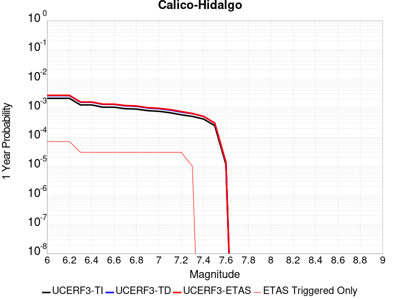 |  |

| Magnitude | 1 wk TI Prob | 1 wk TD Prob | 1 wk ETAS Prob | 1 wk ETAS/TD Gain | 1 wk ETAS Triggered Only | 1 mo TI Prob | 1 mo TD Prob | 1 mo ETAS Prob | 1 mo ETAS/TD Gain | 1 mo ETAS Triggered Only | 1 yr TI Prob | 1 yr TD Prob | 1 yr ETAS Prob | 1 yr ETAS/TD Gain | 1 yr ETAS Triggered Only | 10 yr TI Prob | 10 yr TD Prob | 10 yr ETAS Prob | 10 yr ETAS/TD Gain | 10 yr ETAS Triggered Only |
|-----|-----|-----|-----|-----|-----|-----|-----|-----|-----|-----|-----|-----|-----|-----|-----|-----|-----|-----|-----|-----|
| 6.0 | 4.0906612E-5 | 5.0705617E-5 | 5.0705617E-5 | 1.0 | 0.0 | 1.7530227E-4 | 2.1729397E-4 | 2.4095186E-4 | 1.108875 | 2.3663039E-5 | 0.0021322158 | 0.0026427484 | 0.0027135499 | 1.0267909 | 7.098912E-5 | 0.02111873 | 0.026153587 | 0.026268808 | 1.0044055 | 1.1831519E-4 |
| 6.1 | 4.0906612E-5 | 5.0705617E-5 | 5.0705617E-5 | 1.0 | 0.0 | 1.7530227E-4 | 2.1729397E-4 | 2.4095186E-4 | 1.108875 | 2.3663039E-5 | 0.0021322158 | 0.0026427484 | 0.0027135499 | 1.0267909 | 7.098912E-5 | 0.02111873 | 0.026153587 | 0.026268808 | 1.0044055 | 1.1831519E-4 |
| 6.2 | 4.0906612E-5 | 5.0705617E-5 | 5.0705617E-5 | 1.0 | 0.0 | 1.7530227E-4 | 2.1729397E-4 | 2.4095186E-4 | 1.108875 | 2.3663039E-5 | 0.0021322158 | 0.0026427484 | 0.0027135499 | 1.0267909 | 7.098912E-5 | 0.02111873 | 0.026153587 | 0.026268808 | 1.0044055 | 1.1831519E-4 |
| 6.3 | 2.4242801E-5 | 3.0091394E-5 | 3.0091394E-5 | 1.0 | 0.0 | 1.0389358E-4 | 1.2895693E-4 | 1.5261692E-4 | 1.183472 | 2.3663039E-5 | 0.0012641704 | 0.0015689528 | 0.0016162046 | 1.0301168 | 4.7326077E-5 | 0.01257003 | 0.015582433 | 0.015652316 | 1.0044848 | 7.098912E-5 |
| 6.4 | 2.4242801E-5 | 3.0091394E-5 | 3.0091394E-5 | 1.0 | 0.0 | 1.0389358E-4 | 1.2895693E-4 | 1.5261692E-4 | 1.183472 | 2.3663039E-5 | 0.0012641704 | 0.0015689528 | 0.0016162046 | 1.0301168 | 4.7326077E-5 | 0.01257003 | 0.015582433 | 0.015652316 | 1.0044848 | 7.098912E-5 |
| 6.5 | 2.0286952E-5 | 2.5316232E-5 | 2.5316232E-5 | 1.0 | 0.0 | 8.694118E-5 | 1.08493725E-4 | 1.321542E-4 | 1.2180815 | 2.3663039E-5 | 0.0010579949 | 0.0013201279 | 0.0013673914 | 1.0358022 | 4.7326077E-5 | 0.010529719 | 0.013124793 | 0.013171498 | 1.0035585 | 4.7326077E-5 |
| 6.6 | 2.0269223E-5 | 2.5297182E-5 | 2.5297182E-5 | 1.0 | 0.0 | 8.6865206E-5 | 1.0841208E-4 | 1.3207256E-4 | 1.2182457 | 2.3663039E-5 | 0.0010570707 | 0.0013191351 | 0.0013663986 | 1.0358293 | 4.7326077E-5 | 0.010520565 | 0.013114982 | 0.013161687 | 1.0035613 | 4.7326077E-5 |
| 6.7 | 1.799852E-5 | 2.2541E-5 | 2.2541E-5 | 1.0 | 0.0 | 7.713423E-5 | 9.6600794E-5 | 1.20261546E-4 | 1.2449334 | 2.3663039E-5 | 9.3870464E-4 | 0.0011754946 | 0.0012227651 | 1.0402132 | 4.7326077E-5 | 0.009347493 | 0.01169438 | 0.011741153 | 1.0039996 | 4.7326077E-5 |
| 6.8 | 1.7458793E-5 | 2.1842507E-5 | 2.1842507E-5 | 1.0 | 0.0 | 7.4821255E-5 | 9.3607465E-5 | 1.1726829E-4 | 1.2527664 | 2.3663039E-5 | 9.10568E-4 | 0.0011390895 | 0.0011863617 | 1.0415 | 4.7326077E-5 | 0.009068459 | 0.011334092 | 0.011380882 | 1.0041282 | 4.7326077E-5 |
| 6.9 | 1.542884E-5 | 1.9026247E-5 | 1.9026247E-5 | 1.0 | 0.0 | 6.612192E-5 | 8.153858E-5 | 1.05199695E-4 | 1.290183 | 2.3663039E-5 | 8.04737E-4 | 9.922932E-4 | 0.0010395724 | 1.0476463 | 4.7326077E-5 | 0.008018291 | 0.009880023 | 0.009926882 | 1.0047427 | 4.7326077E-5 |
| 7.0 | 1.468253E-5 | 1.8030894E-5 | 1.8030894E-5 | 1.0 | 0.0 | 6.292361E-5 | 7.727305E-5 | 1.0093426E-4 | 1.3062027 | 2.3663039E-5 | 7.658257E-4 | 9.404063E-4 | 9.876878E-4 | 1.0502778 | 4.7326077E-5 | 0.0076319184 | 0.009365634 | 0.009412517 | 1.0050058 | 4.7326077E-5 |
| 7.1 | 1.3139281E-5 | 1.6201197E-5 | 1.6201197E-5 | 1.0 | 0.0 | 5.6309986E-5 | 6.9431924E-5 | 9.309332E-5 | 1.3407855 | 2.3663039E-5 | 6.853584E-4 | 8.4501837E-4 | 8.9230447E-4 | 1.0559586 | 4.7326077E-5 | 0.0068324856 | 0.00841935 | 0.008466277 | 1.0055737 | 4.7326077E-5 |
| 7.2 | 1.1127404E-5 | 1.3866808E-5 | 1.3866808E-5 | 1.0 | 0.0 | 4.7688E-5 | 5.9427886E-5 | 8.3089515E-5 | 1.398157 | 2.3663039E-5 | 5.8044674E-4 | 7.233052E-4 | 7.705971E-4 | 1.065383 | 4.7326077E-5 | 0.0057893298 | 0.007210618 | 0.0072576026 | 1.0065161 | 4.7326077E-5 |
| 7.3 | 9.808154E-6 | 1.2176387E-5 | 1.2176387E-5 | 1.0 | 0.0 | 4.2034266E-5 | 5.2183535E-5 | 5.2183535E-5 | 1.0 | 0.0 | 5.11647E-4 | 6.3516E-4 | 6.3516E-4 | 1.0 | 0.0 | 0.0051047057 | 0.0063345223 | 0.0063345223 | 1.0 | 0.0 |
| 7.4 | 7.942452E-6 | 9.792272E-6 | 9.792272E-6 | 1.0 | 0.0 | 3.4038632E-5 | 4.1966257E-5 | 4.1966257E-5 | 1.0 | 0.0 | 4.1434157E-4 | 5.1082886E-4 | 5.1082886E-4 | 1.0 | 0.0 | 0.0041356985 | 0.005097488 | 0.005097488 | 1.0 | 0.0 |
| 7.5 | 4.7121216E-6 | 5.772906E-6 | 5.772906E-6 | 1.0 | 0.0 | 2.019465E-5 | 2.4740835E-5 | 2.4740835E-5 | 1.0 | 0.0 | 2.4584212E-4 | 3.0118568E-4 | 3.0118568E-4 | 1.0 | 0.0 | 0.0024557032 | 0.0030085274 | 0.0030085274 | 1.0 | 0.0 |
| 7.6 | 2.21172E-7 | 2.6039865E-7 | 2.6039865E-7 | 1.0 | 0.0 | 9.478797E-7 | 1.115994E-6 | 1.115994E-6 | 1.0 | 0.0 | 1.1540374E-5 | 1.35871705E-5 | 1.35871705E-5 | 1.0 | 0.0 | 1.1539775E-4 | 1.3586621E-4 | 1.3586621E-4 | 1.0 | 0.0 |

## Santa Ynez (West)
*[(top)](#table-of-contents)*

| 1 Week | 1 Month | 1 Year | 10 Year |
|-----|-----|-----|-----|
| 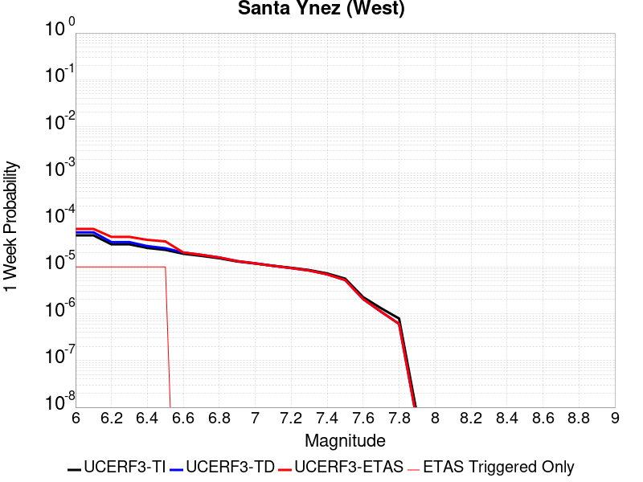 |  |  |  |

| Magnitude | 1 wk TI Prob | 1 wk TD Prob | 1 wk ETAS Prob | 1 wk ETAS/TD Gain | 1 wk ETAS Triggered Only | 1 mo TI Prob | 1 mo TD Prob | 1 mo ETAS Prob | 1 mo ETAS/TD Gain | 1 mo ETAS Triggered Only | 1 yr TI Prob | 1 yr TD Prob | 1 yr ETAS Prob | 1 yr ETAS/TD Gain | 1 yr ETAS Triggered Only | 10 yr TI Prob | 10 yr TD Prob | 10 yr ETAS Prob | 10 yr ETAS/TD Gain | 10 yr ETAS Triggered Only |
|-----|-----|-----|-----|-----|-----|-----|-----|-----|-----|-----|-----|-----|-----|-----|-----|-----|-----|-----|-----|-----|
| 6.0 | 4.7352758E-5 | 5.4974862E-5 | 7.86366E-5 | 1.4304101 | 2.3663039E-5 | 2.0292461E-4 | 2.3558694E-4 | 2.8290186E-4 | 1.2008384 | 4.7326077E-5 | 0.0024678076 | 0.0028646647 | 0.0029354505 | 1.0247099 | 7.098912E-5 | 0.024405818 | 0.028305776 | 0.028374756 | 1.002437 | 7.098912E-5 |
| 6.1 | 4.7352758E-5 | 5.4974862E-5 | 7.86366E-5 | 1.4304101 | 2.3663039E-5 | 2.0292461E-4 | 2.3558694E-4 | 2.8290186E-4 | 1.2008384 | 4.7326077E-5 | 0.0024678076 | 0.0028646647 | 0.0029118552 | 1.0164733 | 4.7326077E-5 | 0.024405818 | 0.028305776 | 0.028351763 | 1.0016246 | 4.7326077E-5 |
| 6.2 | 3.0415853E-5 | 3.3926462E-5 | 5.75887E-5 | 1.6974566 | 2.3663039E-5 | 1.3034715E-4 | 1.4539124E-4 | 1.6905084E-4 | 1.1627306 | 2.3663039E-5 | 0.0015858212 | 0.0017687364 | 0.0017923575 | 1.0133548 | 2.3663039E-5 | 0.015745522 | 0.017550496 | 0.017573744 | 1.0013247 | 2.3663039E-5 |
| 6.3 | 3.0415853E-5 | 3.3926462E-5 | 5.75887E-5 | 1.6974566 | 2.3663039E-5 | 1.3034715E-4 | 1.4539124E-4 | 1.6905084E-4 | 1.1627306 | 2.3663039E-5 | 0.0015858212 | 0.0017687364 | 0.0017923575 | 1.0133548 | 2.3663039E-5 | 0.015745522 | 0.017550496 | 0.017573744 | 1.0013247 | 2.3663039E-5 |
| 6.4 | 2.5452082E-5 | 2.7913433E-5 | 5.157581E-5 | 1.8477058 | 2.3663039E-5 | 1.09075794E-4 | 1.19623626E-4 | 1.4328383E-4 | 1.1977887 | 2.3663039E-5 | 0.0013271887 | 0.0014554613 | 0.0014790898 | 1.0162344 | 2.3663039E-5 | 0.013192902 | 0.01446147 | 0.01448479 | 1.0016127 | 2.3663039E-5 |
| 6.5 | 2.3143784E-5 | 2.5129113E-5 | 4.8791557E-5 | 1.9416347 | 2.3663039E-5 | 9.9183875E-5 | 1.07691834E-4 | 1.3135232E-4 | 1.2197055 | 2.3663039E-5 | 0.0012068948 | 0.0013103712 | 0.0013340032 | 1.0180346 | 2.3663039E-5 | 0.012003611 | 0.013028121 | 0.013051475 | 1.0017927 | 2.3663039E-5 |
| 6.6 | 1.9118515E-5 | 2.0354959E-5 | 2.0354959E-5 | 1.0 | 0.0 | 8.193392E-5 | 8.7232664E-5 | 8.7232664E-5 | 1.0 | 0.0 | 9.97089E-4 | 0.0010615482 | 0.0010615482 | 1.0 | 0.0 | 0.00992627 | 0.010565684 | 0.010589097 | 1.002216 | 2.3663039E-5 |
| 6.7 | 1.722807E-5 | 1.8146866E-5 | 1.8146866E-5 | 1.0 | 0.0 | 7.3832496E-5 | 7.777E-5 | 7.777E-5 | 1.0 | 0.0 | 8.985399E-4 | 9.46444E-4 | 9.46444E-4 | 1.0 | 0.0 | 0.008949154 | 0.009424779 | 0.009448218 | 1.0024871 | 2.3663039E-5 |
| 6.8 | 1.5317364E-5 | 1.5926908E-5 | 1.5926908E-5 | 1.0 | 0.0 | 6.56442E-5 | 6.825642E-5 | 6.825642E-5 | 1.0 | 0.0 | 7.98925E-4 | 8.3070935E-4 | 8.3070935E-4 | 1.0 | 0.0 | 0.007960589 | 0.008276529 | 0.008276529 | 1.0 | 0.0 |
| 6.9 | 1.3071226E-5 | 1.3329939E-5 | 1.3329939E-5 | 1.0 | 0.0 | 5.6018336E-5 | 5.7127072E-5 | 5.7127072E-5 | 1.0 | 0.0 | 6.8180985E-4 | 6.953024E-4 | 6.953024E-4 | 1.0 | 0.0 | 0.0067972173 | 0.0069315303 | 0.0069315303 | 1.0 | 0.0 |
| 7.0 | 1.1836986E-5 | 1.1933047E-5 | 1.1933047E-5 | 1.0 | 0.0 | 5.0728955E-5 | 5.114064E-5 | 5.114064E-5 | 1.0 | 0.0 | 6.1745E-4 | 6.224611E-4 | 6.224611E-4 | 1.0 | 0.0 | 0.006157372 | 0.006207369 | 0.006207369 | 1.0 | 0.0 |
| 7.1 | 1.0597169E-5 | 1.05424215E-5 | 1.05424215E-5 | 1.0 | 0.0 | 4.541565E-5 | 4.518103E-5 | 4.518103E-5 | 1.0 | 0.0 | 5.5279525E-4 | 5.499413E-4 | 5.499413E-4 | 1.0 | 0.0 | 0.0055142213 | 0.005485935 | 0.005485935 | 1.0 | 0.0 |
| 7.2 | 9.59113E-6 | 9.459342E-6 | 9.459342E-6 | 1.0 | 0.0 | 4.11042E-5 | 4.0539413E-5 | 4.0539413E-5 | 1.0 | 0.0 | 5.0032866E-4 | 4.9345667E-4 | 4.9345667E-4 | 1.0 | 0.0 | 0.004992037 | 0.0049237283 | 0.0049237283 | 1.0 | 0.0 |
| 7.3 | 8.586084E-6 | 8.37976E-6 | 8.37976E-6 | 1.0 | 0.0 | 3.679698E-5 | 3.591277E-5 | 3.591277E-5 | 1.0 | 0.0 | 4.4791115E-4 | 4.3715126E-4 | 4.3715126E-4 | 1.0 | 0.0 | 0.004470094 | 0.0043630246 | 0.0043630246 | 1.0 | 0.0 |
| 7.4 | 7.2622997E-6 | 6.9516886E-6 | 6.9516886E-6 | 1.0 | 0.0 | 3.112377E-5 | 2.9792616E-5 | 2.9792616E-5 | 1.0 | 0.0 | 3.78866E-4 | 3.626657E-4 | 3.626657E-4 | 1.0 | 0.0 | 0.0037822074 | 0.0036208387 | 0.0036208387 | 1.0 | 0.0 |
| 7.5 | 5.627296E-6 | 5.251695E-6 | 5.251695E-6 | 1.0 | 0.0 | 2.411676E-5 | 2.2507073E-5 | 2.2507073E-5 | 1.0 | 0.0 | 2.9358198E-4 | 2.7398986E-4 | 2.7398986E-4 | 1.0 | 0.0 | 0.0029319443 | 0.0027365927 | 0.0027365927 | 1.0 | 0.0 |
| 7.6 | 2.265244E-6 | 2.0608993E-6 | 2.0608993E-6 | 1.0 | 0.0 | 9.708152E-6 | 8.832396E-6 | 8.832396E-6 | 1.0 | 0.0 | 1.18190335E-4 | 1.07529195E-4 | 1.07529195E-4 | 1.0 | 0.0 | 0.001181275 | 0.0010747804 | 0.0010747804 | 1.0 | 0.0 |
| 7.7 | 1.3099874E-6 | 1.1016477E-6 | 1.1016477E-6 | 1.0 | 0.0 | 5.61422E-6 | 4.7213393E-6 | 4.7213393E-6 | 1.0 | 0.0 | 6.8350986E-5 | 5.748081E-5 | 5.748081E-5 | 1.0 | 0.0 | 6.832996E-4 | 5.746618E-4 | 5.746618E-4 | 1.0 | 0.0 |
| 7.8 | 7.903951E-7 | 6.07124E-7 | 6.07124E-7 | 1.0 | 0.0 | 3.3874032E-6 | 2.6019575E-6 | 2.6019575E-6 | 1.0 | 0.0 | 4.1240855E-5 | 3.1678384E-5 | 3.1678384E-5 | 1.0 | 0.0 | 4.12332E-4 | 3.1674E-4 | 3.1674E-4 | 1.0 | 0.0 |
| 7.9 | 7.0753297E-9 | 5.0900093E-9 | 5.0900093E-9 | 1.0 | 0.0 | 3.032284E-8 | 2.1814326E-8 | 2.1814326E-8 | 1.0 | 0.0 | 3.6918053E-7 | 2.655894E-7 | 2.655894E-7 | 1.0 | 0.0 | 3.691799E-6 | 2.6558916E-6 | 2.6558916E-6 | 1.0 | 0.0 |

## Owens Valley
*[(top)](#table-of-contents)*

| 1 Week | 1 Month | 1 Year | 10 Year |
|-----|-----|-----|-----|
|  |  |  |  |

| Magnitude | 1 wk TI Prob | 1 wk TD Prob | 1 wk ETAS Prob | 1 wk ETAS/TD Gain | 1 wk ETAS Triggered Only | 1 mo TI Prob | 1 mo TD Prob | 1 mo ETAS Prob | 1 mo ETAS/TD Gain | 1 mo ETAS Triggered Only | 1 yr TI Prob | 1 yr TD Prob | 1 yr ETAS Prob | 1 yr ETAS/TD Gain | 1 yr ETAS Triggered Only | 10 yr TI Prob | 10 yr TD Prob | 10 yr ETAS Prob | 10 yr ETAS/TD Gain | 10 yr ETAS Triggered Only |
|-----|-----|-----|-----|-----|-----|-----|-----|-----|-----|-----|-----|-----|-----|-----|-----|-----|-----|-----|-----|-----|
| 6.0 | 4.83821E-5 | 3.6282252E-6 | 3.6282252E-6 | 1.0 | 0.0 | 2.0733538E-4 | 1.5549449E-5 | 1.5549449E-5 | 1.0 | 0.0 | 0.002521386 | 1.8929908E-4 | 2.1295765E-4 | 1.1249797 | 2.3663039E-5 | 0.024929691 | 0.0019258651 | 0.002020335 | 1.0490532 | 9.4652154E-5 |
| 6.1 | 4.83821E-5 | 3.6282252E-6 | 3.6282252E-6 | 1.0 | 0.0 | 2.0733538E-4 | 1.5549449E-5 | 1.5549449E-5 | 1.0 | 0.0 | 0.002521386 | 1.8929908E-4 | 2.1295765E-4 | 1.1249797 | 2.3663039E-5 | 0.024929691 | 0.0019258651 | 0.002020335 | 1.0490532 | 9.4652154E-5 |
| 6.2 | 4.83821E-5 | 3.6282252E-6 | 3.6282252E-6 | 1.0 | 0.0 | 2.0733538E-4 | 1.5549449E-5 | 1.5549449E-5 | 1.0 | 0.0 | 0.002521386 | 1.8929908E-4 | 2.1295765E-4 | 1.1249797 | 2.3663039E-5 | 0.024929691 | 0.0019258651 | 0.002020335 | 1.0490532 | 9.4652154E-5 |
| 6.3 | 3.953008E-5 | 3.1562945E-6 | 3.1562945E-6 | 1.0 | 0.0 | 1.6940363E-4 | 1.352691E-5 | 1.352691E-5 | 1.0 | 0.0 | 0.002060538 | 1.6467842E-4 | 1.8833757E-4 | 1.1436688 | 2.3663039E-5 | 0.020415364 | 0.0016596789 | 0.0017541739 | 1.0569358 | 9.4652154E-5 |
| 6.4 | 3.953008E-5 | 3.1562945E-6 | 3.1562945E-6 | 1.0 | 0.0 | 1.6940363E-4 | 1.352691E-5 | 1.352691E-5 | 1.0 | 0.0 | 0.002060538 | 1.6467842E-4 | 1.8833757E-4 | 1.1436688 | 2.3663039E-5 | 0.020415364 | 0.0016596789 | 0.0017541739 | 1.0569358 | 9.4652154E-5 |
| 6.5 | 3.457342E-5 | 2.9721791E-6 | 2.9721791E-6 | 1.0 | 0.0 | 1.4816338E-4 | 1.2737853E-5 | 1.2737853E-5 | 1.0 | 0.0 | 0.0018023965 | 1.5507302E-4 | 1.7873239E-4 | 1.1525692 | 2.3663039E-5 | 0.017878477 | 0.0015560347 | 0.0016505395 | 1.0607344 | 9.4652154E-5 |
| 6.6 | 3.1127765E-5 | 2.8749025E-6 | 2.8749025E-6 | 1.0 | 0.0 | 1.3339789E-4 | 1.2320957E-5 | 1.2320957E-5 | 1.0 | 0.0 | 0.0016229092 | 1.49998E-4 | 1.7365749E-4 | 1.157732 | 2.3663039E-5 | 0.016111081 | 0.0015014741 | 0.0015959841 | 1.0629449 | 9.4652154E-5 |
| 6.7 | 2.806885E-5 | 2.8107188E-6 | 2.8107188E-6 | 1.0 | 0.0 | 1.2028952E-4 | 1.2045885E-5 | 1.2045885E-5 | 1.0 | 0.0 | 0.001463541 | 1.4664947E-4 | 1.7030904E-4 | 1.1613342 | 2.3663039E-5 | 0.014539397 | 0.0014659108 | 0.0015604242 | 1.0644742 | 9.4652154E-5 |
| 6.8 | 2.524524E-5 | 2.235633E-6 | 2.235633E-6 | 1.0 | 0.0 | 1.0818939E-4 | 9.581251E-6 | 9.581251E-6 | 1.0 | 0.0 | 0.0013164099 | 1.1664579E-4 | 1.4030606E-4 | 1.2028387 | 2.3663039E-5 | 0.01308639 | 0.001166119 | 0.0012606608 | 1.0810739 | 9.4652154E-5 |
| 6.9 | 2.2704568E-5 | 1.608363E-6 | 1.608363E-6 | 1.0 | 0.0 | 9.730166E-5 | 6.892966E-6 | 6.892966E-6 | 1.0 | 0.0 | 0.0011840039 | 8.391865E-5 | 1.07579704E-4 | 1.2819523 | 2.3663039E-5 | 0.011777153 | 8.3908177E-4 | 9.336545E-4 | 1.1127098 | 9.4652154E-5 |
| 7.0 | 2.0871712E-5 | 1.5397294E-6 | 1.5397294E-6 | 1.0 | 0.0 | 8.944713E-5 | 6.5988233E-6 | 6.5988233E-6 | 1.0 | 0.0 | 0.0010884746 | 8.033773E-5 | 1.0399887E-4 | 1.2945209 | 2.3663039E-5 | 0.010831586 | 8.0325926E-4 | 8.9783536E-4 | 1.1177405 | 9.4652154E-5 |
| 7.1 | 1.944928E-5 | 1.3865751E-6 | 1.3865751E-6 | 1.0 | 0.0 | 8.335139E-5 | 5.9424515E-6 | 5.9424515E-6 | 1.0 | 0.0 | 0.0010143308 | 7.234695E-5 | 9.6008276E-5 | 1.3270535 | 2.3663039E-5 | 0.010097133 | 7.2339235E-4 | 8.179761E-4 | 1.1307502 | 9.4652154E-5 |
| 7.2 | 1.7876306E-5 | 1.2490525E-6 | 1.2490525E-6 | 1.0 | 0.0 | 7.6610486E-5 | 5.353071E-6 | 5.353071E-6 | 1.0 | 0.0 | 9.3233347E-4 | 6.5171706E-5 | 8.88332E-5 | 1.3630639 | 2.3663039E-5 | 0.009284316 | 6.516637E-4 | 7.4625417E-4 | 1.1451523 | 9.4652154E-5 |
| 7.3 | 1.2618672E-5 | 1.1116495E-6 | 1.1116495E-6 | 1.0 | 0.0 | 5.40789E-5 | 4.764203E-6 | 4.764203E-6 | 1.0 | 0.0 | 6.582117E-4 | 5.8002635E-5 | 8.16643E-5 | 1.4079412 | 2.3663039E-5 | 0.0065626553 | 5.8000785E-4 | 6.7460514E-4 | 1.1630965 | 9.4652154E-5 |
| 7.4 | 7.4874442E-6 | 8.549725E-7 | 8.549725E-7 | 1.0 | 0.0 | 3.208865E-5 | 3.6641627E-6 | 3.6641627E-6 | 1.0 | 0.0 | 3.906093E-4 | 4.461027E-5 | 6.827225E-5 | 1.5304155 | 2.3663039E-5 | 0.003899234 | 4.4610567E-4 | 5.407156E-4 | 1.2120796 | 9.4652154E-5 |
| 7.5 | 2.4734156E-6 | 6.069335E-7 | 6.069335E-7 | 1.0 | 0.0 | 1.060031E-5 | 2.601141E-6 | 2.601141E-6 | 1.0 | 0.0 | 1.2905113E-4 | 3.1668435E-5 | 5.5330725E-5 | 1.7471884 | 2.3663039E-5 | 0.0012897621 | 3.1663955E-4 | 4.1126175E-4 | 1.2988325 | 9.4652154E-5 |
| 7.6 | 1.1328841E-6 | 3.1968878E-7 | 3.1968878E-7 | 1.0 | 0.0 | 4.8552088E-6 | 1.3700941E-6 | 1.3700941E-6 | 1.0 | 0.0 | 5.9110564E-5 | 1.668077E-5 | 4.0343413E-5 | 2.4185581 | 2.3663039E-5 | 5.9094845E-4 | 1.6679536E-4 | 2.1411355E-4 | 1.28369 | 4.7326077E-5 |
| 7.7 | 4.8613185E-7 | 8.9660794E-8 | 8.9660794E-8 | 1.0 | 0.0 | 2.0834207E-6 | 3.842605E-7 | 3.842605E-7 | 1.0 | 0.0 | 2.536535E-5 | 4.678362E-6 | 4.678362E-6 | 1.0 | 0.0 | 2.5362454E-4 | 4.6782705E-5 | 4.6782705E-5 | 1.0 | 0.0 |

## San Pedro Basin
*[(top)](#table-of-contents)*

| 1 Week | 1 Month | 1 Year | 10 Year |
|-----|-----|-----|-----|
|  |  |  |  |

| Magnitude | 1 wk TI Prob | 1 wk TD Prob | 1 wk ETAS Prob | 1 wk ETAS/TD Gain | 1 wk ETAS Triggered Only | 1 mo TI Prob | 1 mo TD Prob | 1 mo ETAS Prob | 1 mo ETAS/TD Gain | 1 mo ETAS Triggered Only | 1 yr TI Prob | 1 yr TD Prob | 1 yr ETAS Prob | 1 yr ETAS/TD Gain | 1 yr ETAS Triggered Only | 10 yr TI Prob | 10 yr TD Prob | 10 yr ETAS Prob | 10 yr ETAS/TD Gain | 10 yr ETAS Triggered Only |
|-----|-----|-----|-----|-----|-----|-----|-----|-----|-----|-----|-----|-----|-----|-----|-----|-----|-----|-----|-----|-----|
| 6.0 | 5.3449043E-5 | 6.337271E-5 | 6.337271E-5 | 1.0 | 0.0 | 2.2904722E-4 | 2.7157253E-4 | 2.7157253E-4 | 1.0 | 0.0 | 0.0027850836 | 0.0033019905 | 0.0033255753 | 1.0071427 | 2.3663039E-5 | 0.027504366 | 0.03259105 | 0.032682616 | 1.0028096 | 9.4652154E-5 |
| 6.1 | 5.3449043E-5 | 6.337271E-5 | 6.337271E-5 | 1.0 | 0.0 | 2.2904722E-4 | 2.7157253E-4 | 2.7157253E-4 | 1.0 | 0.0 | 0.0027850836 | 0.0033019905 | 0.0033255753 | 1.0071427 | 2.3663039E-5 | 0.027504366 | 0.03259105 | 0.032682616 | 1.0028096 | 9.4652154E-5 |
| 6.2 | 2.3189454E-5 | 2.6643871E-5 | 2.6643871E-5 | 1.0 | 0.0 | 9.9379584E-5 | 1.1418329E-4 | 1.1418329E-4 | 1.0 | 0.0 | 0.0012092749 | 0.0013893425 | 0.0014129726 | 1.0170082 | 2.3663039E-5 | 0.012027155 | 0.013811437 | 0.01385811 | 1.0033792 | 4.7326077E-5 |
| 6.3 | 2.3189454E-5 | 2.6643871E-5 | 2.6643871E-5 | 1.0 | 0.0 | 9.9379584E-5 | 1.1418329E-4 | 1.1418329E-4 | 1.0 | 0.0 | 0.0012092749 | 0.0013893425 | 0.0014129726 | 1.0170082 | 2.3663039E-5 | 0.012027155 | 0.013811437 | 0.01385811 | 1.0033792 | 4.7326077E-5 |
| 6.4 | 1.966056E-5 | 2.2464283E-5 | 2.2464283E-5 | 1.0 | 0.0 | 8.425682E-5 | 9.6272175E-5 | 9.6272175E-5 | 1.0 | 0.0 | 0.001025344 | 0.0011715237 | 0.001195159 | 1.0201749 | 2.3663039E-5 | 0.010206259 | 0.011657566 | 0.01170434 | 1.0040123 | 4.7326077E-5 |
| 6.5 | 1.7342953E-5 | 1.9745894E-5 | 1.9745894E-5 | 1.0 | 0.0 | 7.4324824E-5 | 8.462272E-5 | 8.462272E-5 | 1.0 | 0.0 | 9.04529E-4 | 0.0010298316 | 0.0010534703 | 1.0229539 | 2.3663039E-5 | 0.009008561 | 0.010254316 | 0.010301157 | 1.0045679 | 4.7326077E-5 |
| 6.6 | 1.439804E-5 | 1.6323314E-5 | 1.6323314E-5 | 1.0 | 0.0 | 6.170443E-5 | 6.9955364E-5 | 6.9955364E-5 | 1.0 | 0.0 | 7.509924E-4 | 8.514059E-4 | 8.7504875E-4 | 1.0277692 | 2.3663039E-5 | 0.0074845953 | 0.008484642 | 0.008531567 | 1.0055305 | 4.7326077E-5 |
| 6.7 | 1.2634884E-5 | 1.4285811E-5 | 1.4285811E-5 | 1.0 | 0.0 | 5.414838E-5 | 6.122364E-5 | 6.122364E-5 | 1.0 | 0.0 | 6.590571E-4 | 7.4517337E-4 | 7.688188E-4 | 1.0317314 | 2.3663039E-5 | 0.006571059 | 0.007429768 | 0.007476742 | 1.0063225 | 4.7326077E-5 |
| 6.8 | 1.146091E-5 | 1.2933651E-5 | 1.2933651E-5 | 1.0 | 0.0 | 4.911726E-5 | 5.542892E-5 | 5.542892E-5 | 1.0 | 0.0 | 5.9783855E-4 | 6.7466794E-4 | 6.9831504E-4 | 1.0350499 | 2.3663039E-5 | 0.0059623276 | 0.0067291376 | 0.006776145 | 1.0069857 | 4.7326077E-5 |
| 6.9 | 9.109035E-6 | 1.0235365E-5 | 1.0235365E-5 | 1.0 | 0.0 | 3.9038136E-5 | 4.386527E-5 | 4.386527E-5 | 1.0 | 0.0 | 4.7518566E-4 | 5.339568E-4 | 5.576072E-4 | 1.0442927 | 2.3663039E-5 | 0.0047417083 | 0.005329493 | 0.0053765667 | 1.0088327 | 4.7326077E-5 |
| 7.0 | 5.9351028E-6 | 6.5841723E-6 | 6.5841723E-6 | 1.0 | 0.0 | 2.5435906E-5 | 2.8217708E-5 | 2.8217708E-5 | 1.0 | 0.0 | 3.0963816E-4 | 3.4352005E-4 | 3.4352005E-4 | 1.0 | 0.0 | 0.0030920706 | 0.0034322077 | 0.0034557895 | 1.0068707 | 2.3663039E-5 |
| 7.1 | 2.1557585E-6 | 2.2096735E-6 | 2.2096735E-6 | 1.0 | 0.0 | 9.238933E-6 | 9.469995E-6 | 9.469995E-6 | 1.0 | 0.0 | 1.1247819E-4 | 1.1529125E-4 | 1.1529125E-4 | 1.0 | 0.0 | 0.0011242128 | 0.0011523297 | 0.0011523297 | 1.0 | 0.0 |
| 7.2 | 2.1251979E-6 | 2.1780195E-6 | 2.1780195E-6 | 1.0 | 0.0 | 9.107958E-6 | 9.334337E-6 | 9.334337E-6 | 1.0 | 0.0 | 1.1088375E-4 | 1.1363978E-4 | 1.1363978E-4 | 1.0 | 0.0 | 0.0011082845 | 0.0011358319 | 0.0011358319 | 1.0 | 0.0 |
| 7.3 | 1.7145798E-6 | 1.744306E-6 | 1.744306E-6 | 1.0 | 0.0 | 7.3481783E-6 | 7.4755762E-6 | 7.4755762E-6 | 1.0 | 0.0 | 8.94604E-5 | 9.101143E-5 | 9.101143E-5 | 1.0 | 0.0 | 8.9424395E-4 | 9.097507E-4 | 9.097507E-4 | 1.0 | 0.0 |
| 7.4 | 1.4467993E-6 | 1.4642019E-6 | 1.4642019E-6 | 1.0 | 0.0 | 6.200554E-6 | 6.275136E-6 | 6.275136E-6 | 1.0 | 0.0 | 7.548913E-5 | 7.639718E-5 | 7.639718E-5 | 1.0 | 0.0 | 7.546349E-4 | 7.637164E-4 | 7.637164E-4 | 1.0 | 0.0 |
| 7.5 | 1.2803735E-6 | 1.293163E-6 | 1.293163E-6 | 1.0 | 0.0 | 5.487303E-6 | 5.542116E-6 | 5.542116E-6 | 1.0 | 0.0 | 6.680587E-5 | 6.7473244E-5 | 6.7473244E-5 | 1.0 | 0.0 | 6.678579E-4 | 6.7453465E-4 | 6.7453465E-4 | 1.0 | 0.0 |
| 7.6 | 6.755009E-7 | 6.769536E-7 | 6.769536E-7 | 1.0 | 0.0 | 2.8950008E-6 | 2.901227E-6 | 2.901227E-6 | 1.0 | 0.0 | 3.5246063E-5 | 3.5321922E-5 | 3.5321922E-5 | 1.0 | 0.0 | 3.5240475E-4 | 3.531688E-4 | 3.531688E-4 | 1.0 | 0.0 |
| 7.7 | 6.211885E-8 | 4.5700194E-8 | 4.5700194E-8 | 1.0 | 0.0 | 2.6622362E-7 | 1.9585796E-7 | 1.9585796E-7 | 1.0 | 0.0 | 3.2412677E-6 | 2.3845682E-6 | 2.3845682E-6 | 1.0 | 0.0 | 3.2412205E-5 | 2.3845447E-5 | 2.3845447E-5 | 1.0 | 0.0 |
| 7.8 | 2.6580573E-9 | 1.51392E-9 | 1.51392E-9 | 1.0 | 0.0 | 1.1391674E-8 | 6.4882286E-9 | 6.4882286E-9 | 1.0 | 0.0 | 1.3869362E-7 | 7.8994184E-8 | 7.8994184E-8 | 1.0 | 0.0 | 1.3869354E-6 | 7.899418E-7 | 7.899418E-7 | 1.0 | 0.0 |

## Brawley (Seismic Zone) alt 1
*[(top)](#table-of-contents)*

| 1 Week | 1 Month | 1 Year | 10 Year |
|-----|-----|-----|-----|
|  |  |  | 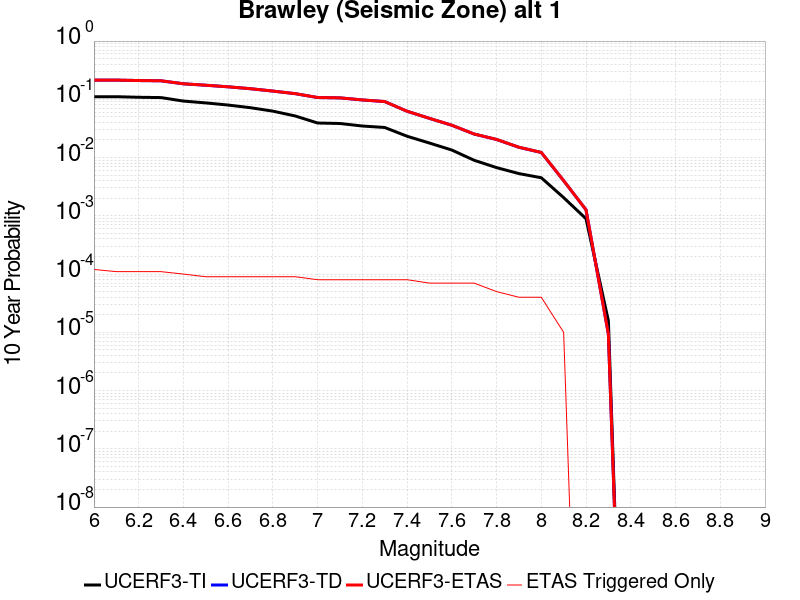 |

| Magnitude | 1 wk TI Prob | 1 wk TD Prob | 1 wk ETAS Prob | 1 wk ETAS/TD Gain | 1 wk ETAS Triggered Only | 1 mo TI Prob | 1 mo TD Prob | 1 mo ETAS Prob | 1 mo ETAS/TD Gain | 1 mo ETAS Triggered Only | 1 yr TI Prob | 1 yr TD Prob | 1 yr ETAS Prob | 1 yr ETAS/TD Gain | 1 yr ETAS Triggered Only | 10 yr TI Prob | 10 yr TD Prob | 10 yr ETAS Prob | 10 yr ETAS/TD Gain | 10 yr ETAS Triggered Only |
|-----|-----|-----|-----|-----|-----|-----|-----|-----|-----|-----|-----|-----|-----|-----|-----|-----|-----|-----|-----|-----|
| 6.0 | 2.2521618E-4 | 4.7650016E-4 | 5.0015195E-4 | 1.0496364 | 2.3663039E-5 | 9.6485513E-4 | 0.0020405825 | 0.0020641973 | 1.0115726 | 2.3663039E-5 | 0.011683988 | 0.02455514 | 0.024601303 | 1.00188 | 4.7326077E-5 | 0.11088423 | 0.21356027 | 0.21363471 | 1.0003486 | 9.4652154E-5 |
| 6.1 | 2.2521618E-4 | 4.7650016E-4 | 5.0015195E-4 | 1.0496364 | 2.3663039E-5 | 9.6485513E-4 | 0.0020405825 | 0.0020641973 | 1.0115726 | 2.3663039E-5 | 0.011683988 | 0.02455514 | 0.024601303 | 1.00188 | 4.7326077E-5 | 0.11088423 | 0.21356027 | 0.21363471 | 1.0003486 | 9.4652154E-5 |
| 6.2 | 2.198148E-4 | 4.6734224E-4 | 4.909942E-4 | 1.0506096 | 2.3663039E-5 | 9.417233E-4 | 0.0020013945 | 0.0020250103 | 1.0117996 | 2.3663039E-5 | 0.011405343 | 0.024089206 | 0.024135392 | 1.0019172 | 4.7326077E-5 | 0.10837428 | 0.20999599 | 0.21007076 | 1.0003561 | 9.4652154E-5 |
| 6.3 | 2.1704129E-4 | 4.6169842E-4 | 4.8535055E-4 | 1.0512285 | 2.3663039E-5 | 9.298453E-4 | 0.0019772437 | 0.00200086 | 1.011944 | 2.3663039E-5 | 0.011262234 | 0.023802334 | 0.023848534 | 1.001941 | 4.7326077E-5 | 0.107082725 | 0.20788695 | 0.20796192 | 1.0003606 | 9.4652154E-5 |
| 6.4 | 1.876142E-4 | 4.0061463E-4 | 4.242682E-4 | 1.0590432 | 2.3663039E-5 | 8.038131E-4 | 0.0017158045 | 0.001739427 | 1.0137676 | 2.3663039E-5 | 0.00974259 | 0.020688858 | 0.020735204 | 1.0022402 | 4.7326077E-5 | 0.093263686 | 0.18463784 | 0.18471502 | 1.000418 | 9.4652154E-5 |
| 6.5 | 1.7390939E-4 | 3.7493056E-4 | 3.9858473E-4 | 1.0630895 | 2.3663039E-5 | 7.45113E-4 | 0.0016058679 | 0.001629493 | 1.0147117 | 2.3663039E-5 | 0.009034078 | 0.019376898 | 0.019423308 | 1.002395 | 4.7326077E-5 | 0.086755216 | 0.174459 | 0.17453714 | 1.0004479 | 9.4652154E-5 |
| 6.6 | 1.591791E-4 | 3.4907137E-4 | 3.7272615E-4 | 1.0677649 | 2.3663039E-5 | 6.8201777E-4 | 0.0014951725 | 0.0015188002 | 1.0158026 | 2.3663039E-5 | 0.008271996 | 0.018053345 | 0.018099817 | 1.0025741 | 4.7326077E-5 | 0.07970774 | 0.16386543 | 0.16394457 | 1.0004829 | 9.4652154E-5 |
| 6.7 | 1.4268003E-4 | 3.207246E-4 | 3.4438004E-4 | 1.0737562 | 2.3663039E-5 | 6.1134255E-4 | 0.001373818 | 0.0013974486 | 1.0172006 | 2.3663039E-5 | 0.007417723 | 0.01659992 | 0.01664646 | 1.0028037 | 4.7326077E-5 | 0.07174956 | 0.15198784 | 0.1520681 | 1.0005281 | 9.4652154E-5 |
| 6.8 | 1.239713E-4 | 2.906574E-4 | 3.1431354E-4 | 1.0813885 | 2.3663039E-5 | 5.3119735E-4 | 0.001245086 | 0.0012687196 | 1.0189815 | 2.3663039E-5 | 0.0064481674 | 0.01505499 | 0.015101603 | 1.0030962 | 4.7326077E-5 | 0.06264243 | 0.13842559 | 0.13850713 | 1.0005891 | 9.4652154E-5 |
| 6.9 | 1.0180238E-4 | 2.6263754E-4 | 2.8629435E-4 | 1.0900741 | 2.3663039E-5 | 4.3622297E-4 | 0.0011251081 | 0.0011487445 | 1.0210081 | 2.3663039E-5 | 0.005298089 | 0.013613156 | 0.013659838 | 1.0034292 | 4.7326077E-5 | 0.05173543 | 0.12499963 | 0.12508245 | 1.0006626 | 9.4652154E-5 |
| 7.0 | 7.6619996E-5 | 2.2406445E-4 | 2.4772217E-4 | 1.1055845 | 2.3663039E-5 | 3.283301E-4 | 9.59926E-4 | 9.835663E-4 | 1.0246272 | 2.3663039E-5 | 0.0039900932 | 0.011625181 | 0.011671958 | 1.0040237 | 4.7326077E-5 | 0.039192066 | 0.10729616 | 0.10738066 | 1.0007875 | 9.4652154E-5 |
| 7.1 | 7.5127435E-5 | 2.2089518E-4 | 2.44553E-4 | 1.1070998 | 2.3663039E-5 | 3.2193496E-4 | 9.463533E-4 | 9.6999394E-4 | 1.0249808 | 2.3663039E-5 | 0.0039125155 | 0.011461684 | 0.011508468 | 1.0040817 | 4.7326077E-5 | 0.038443442 | 0.10585982 | 0.10594446 | 1.0007994 | 9.4652154E-5 |
| 7.2 | 6.788582E-5 | 2.0217002E-4 | 2.2582828E-4 | 1.1170216 | 2.3663039E-5 | 2.9090676E-4 | 8.661583E-4 | 8.8980084E-4 | 1.0272958 | 2.3663039E-5 | 0.0035360386 | 0.010495127 | 0.010541956 | 1.004462 | 4.7326077E-5 | 0.034803 | 0.0975296 | 0.09761502 | 1.0008758 | 9.4652154E-5 |
| 7.3 | 6.399602E-5 | 1.8847662E-4 | 2.121352E-4 | 1.1255252 | 2.3663039E-5 | 2.7423984E-4 | 8.075098E-4 | 8.311537E-4 | 1.0292801 | 2.3663039E-5 | 0.0033337586 | 0.009787704 | 0.009834566 | 1.0047879 | 4.7326077E-5 | 0.03284188 | 0.09142354 | 0.09150954 | 1.0009407 | 9.4652154E-5 |
| 7.4 | 4.506759E-5 | 1.2534359E-4 | 1.4900367E-4 | 1.1887617 | 2.3663039E-5 | 1.9313251E-4 | 5.3707714E-4 | 5.6072744E-4 | 1.0440353 | 2.3663039E-5 | 0.0023488526 | 0.006519484 | 0.006566501 | 1.0072118 | 4.7326077E-5 | 0.023241805 | 0.0623863 | 0.062475048 | 1.0014225 | 9.4652154E-5 |
| 7.5 | 3.43289E-5 | 9.339764E-5 | 1.17058466E-4 | 1.2533343 | 2.3663039E-5 | 1.4711556E-4 | 4.002145E-4 | 4.2386807E-4 | 1.0591022 | 2.3663039E-5 | 0.0017896603 | 0.0048617874 | 0.0049088835 | 1.009687 | 4.7326077E-5 | 0.01775316 | 0.04707467 | 0.04716487 | 1.001916 | 9.4652154E-5 |
| 7.6 | 2.5980507E-5 | 7.056894E-5 | 9.423031E-5 | 1.3352944 | 2.3663039E-5 | 1.1134028E-4 | 3.0240338E-4 | 3.2605926E-4 | 1.0782262 | 2.3663039E-5 | 0.001354725 | 0.0036755698 | 0.003722722 | 1.0128285 | 4.7326077E-5 | 0.013464959 | 0.035857998 | 0.035949256 | 1.002545 | 9.4652154E-5 |
| 7.7 | 1.7292105E-5 | 4.943965E-5 | 7.310152E-5 | 1.4786011 | 2.3663039E-5 | 7.4106916E-5 | 2.1186704E-4 | 2.3552506E-4 | 1.1116645 | 2.3663039E-5 | 9.018782E-4 | 0.0025764357 | 0.0026236398 | 1.0183215 | 4.7326077E-5 | 0.008982267 | 0.025305117 | 0.025397373 | 1.0036458 | 9.4652154E-5 |
| 7.8 | 1.2927471E-5 | 3.9721428E-5 | 6.338353E-5 | 1.5957011 | 2.3663039E-5 | 5.5402274E-5 | 1.702236E-4 | 1.9388262E-4 | 1.1389878 | 2.3663039E-5 | 6.743139E-4 | 0.002070505 | 0.002117733 | 1.02281 | 4.7326077E-5 | 0.0067227143 | 0.020444553 | 0.020514091 | 1.0034013 | 7.098912E-5 |
| 7.9 | 1.0200774E-5 | 2.876846E-5 | 5.2430816E-5 | 1.8225104 | 2.3663039E-5 | 4.371687E-5 | 1.2328758E-4 | 1.469477E-4 | 1.19191 | 2.3663039E-5 | 5.321229E-4 | 0.0014999938 | 0.0015472489 | 1.0315036 | 4.7326077E-5 | 0.005308505 | 0.015002176 | 0.015072101 | 1.004661 | 7.098912E-5 |
| 8.0 | 8.650396E-6 | 2.329689E-5 | 4.6959376E-5 | 2.015693 | 2.3663039E-5 | 3.70726E-5 | 9.984E-5 | 1.2350068E-4 | 1.2369859 | 2.3663039E-5 | 4.5126543E-4 | 0.001214875 | 0.0012621436 | 1.0389082 | 4.7326077E-5 | 0.0045035016 | 0.012220192 | 0.012290314 | 1.0057381 | 7.098912E-5 |
| 8.1 | 3.9368224E-6 | 7.336344E-6 | 7.336344E-6 | 1.0 | 0.0 | 1.6871985E-5 | 3.1441094E-5 | 3.1441094E-5 | 1.0 | 0.0 | 2.0539707E-4 | 3.8272823E-4 | 3.8272823E-4 | 1.0 | 0.0 | 0.0020520731 | 0.0040053325 | 0.0040289005 | 1.0058842 | 2.3663039E-5 |
| 8.2 | 1.7101195E-6 | 2.2211486E-6 | 2.2211486E-6 | 1.0 | 0.0 | 7.329063E-6 | 9.519174E-6 | 9.519174E-6 | 1.0 | 0.0 | 8.922769E-5 | 1.1588981E-4 | 1.1588981E-4 | 1.0 | 0.0 | 8.9191867E-4 | 0.0012683558 | 0.0012683558 | 1.0 | 0.0 |
| 8.3 | 3.0346666E-8 | 1.725032E-8 | 1.725032E-8 | 1.0 | 0.0 | 1.3005713E-7 | 7.392994E-8 | 7.392994E-8 | 1.0 | 0.0 | 1.5834444E-6 | 9.0009695E-7 | 9.0009695E-7 | 1.0 | 0.0 | 1.5834332E-5 | 9.386116E-6 | 9.386116E-6 | 1.0 | 0.0 |

## Palos Verdes
*[(top)](#table-of-contents)*

| 1 Week | 1 Month | 1 Year | 10 Year |
|-----|-----|-----|-----|
|  |  |  |  |

| Magnitude | 1 wk TI Prob | 1 wk TD Prob | 1 wk ETAS Prob | 1 wk ETAS/TD Gain | 1 wk ETAS Triggered Only | 1 mo TI Prob | 1 mo TD Prob | 1 mo ETAS Prob | 1 mo ETAS/TD Gain | 1 mo ETAS Triggered Only | 1 yr TI Prob | 1 yr TD Prob | 1 yr ETAS Prob | 1 yr ETAS/TD Gain | 1 yr ETAS Triggered Only | 10 yr TI Prob | 10 yr TD Prob | 10 yr ETAS Prob | 10 yr ETAS/TD Gain | 10 yr ETAS Triggered Only |
|-----|-----|-----|-----|-----|-----|-----|-----|-----|-----|-----|-----|-----|-----|-----|-----|-----|-----|-----|-----|-----|
| 6.0 | 6.126063E-5 | 7.623113E-5 | 9.9892364E-5 | 1.3103881 | 2.3663039E-5 | 2.6251914E-4 | 3.2666727E-4 | 3.503226E-4 | 1.072414 | 2.3663039E-5 | 0.0031914865 | 0.0039704246 | 0.0039939936 | 1.0059361 | 2.3663039E-5 | 0.031460393 | 0.03905135 | 0.039142307 | 1.0023291 | 9.4652154E-5 |
| 6.1 | 6.126063E-5 | 7.623113E-5 | 9.9892364E-5 | 1.3103881 | 2.3663039E-5 | 2.6251914E-4 | 3.2666727E-4 | 3.503226E-4 | 1.072414 | 2.3663039E-5 | 0.0031914865 | 0.0039704246 | 0.0039939936 | 1.0059361 | 2.3663039E-5 | 0.031460393 | 0.03905135 | 0.039142307 | 1.0023291 | 9.4652154E-5 |
| 6.2 | 6.126063E-5 | 7.623113E-5 | 9.9892364E-5 | 1.3103881 | 2.3663039E-5 | 2.6251914E-4 | 3.2666727E-4 | 3.503226E-4 | 1.072414 | 2.3663039E-5 | 0.0031914865 | 0.0039704246 | 0.0039939936 | 1.0059361 | 2.3663039E-5 | 0.031460393 | 0.03905135 | 0.039142307 | 1.0023291 | 9.4652154E-5 |
| 6.3 | 4.0838047E-5 | 4.975235E-5 | 7.341421E-5 | 1.4755929 | 2.3663039E-5 | 1.7500846E-4 | 2.132082E-4 | 2.368662E-4 | 1.1109619 | 2.3663039E-5 | 0.0021286458 | 0.002592929 | 0.0026165307 | 1.0091023 | 2.3663039E-5 | 0.021083709 | 0.025648147 | 0.025717316 | 1.0026969 | 7.098912E-5 |
| 6.4 | 4.0838047E-5 | 4.975235E-5 | 7.341421E-5 | 1.4755929 | 2.3663039E-5 | 1.7500846E-4 | 2.132082E-4 | 2.368662E-4 | 1.1109619 | 2.3663039E-5 | 0.0021286458 | 0.002592929 | 0.0026165307 | 1.0091023 | 2.3663039E-5 | 0.021083709 | 0.025648147 | 0.025717316 | 1.0026969 | 7.098912E-5 |
| 6.5 | 3.0512005E-5 | 3.6563564E-5 | 6.022574E-5 | 1.6471517 | 2.3663039E-5 | 1.3075917E-4 | 1.5669226E-4 | 1.8035158E-4 | 1.1509924 | 2.3663039E-5 | 0.0015908304 | 0.0019061773 | 0.0019297951 | 1.0123903 | 2.3663039E-5 | 0.015794903 | 0.018910145 | 0.018956576 | 1.0024554 | 4.7326077E-5 |
| 6.6 | 2.9255087E-5 | 3.5156318E-5 | 5.8818525E-5 | 1.6730571 | 2.3663039E-5 | 1.2537291E-4 | 1.5066189E-4 | 1.7432137E-4 | 1.1570369 | 2.3663039E-5 | 0.0015253464 | 0.0018328811 | 0.0018565007 | 1.0128866 | 2.3663039E-5 | 0.015149189 | 0.018189194 | 0.01823566 | 1.0025545 | 4.7326077E-5 |
| 6.7 | 2.287198E-5 | 2.7249673E-5 | 5.0912065E-5 | 1.8683552 | 2.3663039E-5 | 9.801909E-5 | 1.167796E-4 | 1.4043988E-4 | 1.2026062 | 2.3663039E-5 | 0.001192729 | 0.001420956 | 0.0014445854 | 1.0166292 | 2.3663039E-5 | 0.011863477 | 0.014127935 | 0.014174593 | 1.0033025 | 4.7326077E-5 |
| 6.8 | 2.1325764E-5 | 2.5433186E-5 | 4.9095623E-5 | 1.9303764 | 2.3663039E-5 | 9.139293E-5 | 1.0899533E-4 | 1.3265578E-4 | 1.2170777 | 2.3663039E-5 | 0.001112141 | 0.0013263006 | 0.0013499322 | 1.0178177 | 2.3663039E-5 | 0.011065915 | 0.0131928865 | 0.013239588 | 1.0035399 | 4.7326077E-5 |
| 6.9 | 1.9009392E-5 | 2.2614695E-5 | 4.6277197E-5 | 2.046333 | 2.3663039E-5 | 8.1466285E-5 | 9.6917014E-5 | 1.2057776E-4 | 1.2441341 | 2.3663039E-5 | 9.914007E-4 | 0.0011794133 | 0.0012030484 | 1.0200397 | 2.3663039E-5 | 0.009869894 | 0.011740225 | 0.011786995 | 1.0039837 | 4.7326077E-5 |
| 7.0 | 1.7098473E-5 | 2.032038E-5 | 4.398294E-5 | 2.1644742 | 2.3663039E-5 | 7.3277115E-5 | 8.708492E-5 | 1.10745896E-4 | 1.2717 | 2.3663039E-5 | 8.917837E-4 | 0.0010598284 | 0.0010834663 | 1.0223036 | 2.3663039E-5 | 0.008882134 | 0.010556176 | 0.010603003 | 1.0044359 | 4.7326077E-5 |
| 7.1 | 1.5982785E-5 | 1.8995719E-5 | 4.2658306E-5 | 2.24568 | 2.3663039E-5 | 6.849585E-5 | 8.140816E-5 | 1.0506927E-4 | 1.2906479 | 2.3663039E-5 | 8.336179E-4 | 9.907784E-4 | 0.001014418 | 1.0238596 | 2.3663039E-5 | 0.008304977 | 0.0098719755 | 0.009918835 | 1.0047467 | 4.7326077E-5 |
| 7.2 | 1.4468002E-5 | 1.7198105E-5 | 4.0860737E-5 | 2.375886 | 2.3663039E-5 | 6.200425E-5 | 7.3704556E-5 | 9.736585E-5 | 1.321029 | 2.3663039E-5 | 7.546402E-4 | 8.9706754E-4 | 9.2070934E-4 | 1.0263546 | 2.3663039E-5 | 0.007520827 | 0.008942734 | 0.008989637 | 1.0052449 | 4.7326077E-5 |
| 7.3 | 5.288233E-6 | 6.2039667E-6 | 6.2039667E-6 | 1.0 | 0.0 | 2.2663658E-5 | 2.6588355E-5 | 2.6588355E-5 | 1.0 | 0.0 | 2.7589512E-4 | 3.2370005E-4 | 3.2370005E-4 | 1.0 | 0.0 | 0.0027555283 | 0.0032357085 | 0.003259295 | 1.0072894 | 2.3663039E-5 |
| 7.4 | 8.279556E-7 | 8.4083814E-7 | 8.4083814E-7 | 1.0 | 0.0 | 3.5483763E-6 | 3.6035874E-6 | 3.6035874E-6 | 1.0 | 0.0 | 4.3200624E-5 | 4.3872868E-5 | 4.3872868E-5 | 1.0 | 0.0 | 4.3192226E-4 | 4.3864927E-4 | 4.3864927E-4 | 1.0 | 0.0 |
| 7.5 | 6.559831E-7 | 6.667258E-7 | 6.667258E-7 | 1.0 | 0.0 | 2.8113532E-6 | 2.8573934E-6 | 2.8573934E-6 | 1.0 | 0.0 | 3.4227687E-5 | 3.4788278E-5 | 3.4788278E-5 | 1.0 | 0.0 | 3.4222414E-4 | 3.4783495E-4 | 3.4783495E-4 | 1.0 | 0.0 |
| 7.6 | 3.5018968E-7 | 3.562019E-7 | 3.562019E-7 | 1.0 | 0.0 | 1.500812E-6 | 1.526579E-6 | 1.526579E-6 | 1.0 | 0.0 | 1.8272232E-5 | 1.8585988E-5 | 1.8585988E-5 | 1.0 | 0.0 | 1.8270731E-4 | 1.8584893E-4 | 1.8584893E-4 | 1.0 | 0.0 |
| 7.7 | 1.1986104E-7 | 1.2198434E-7 | 1.2198434E-7 | 1.0 | 0.0 | 5.1369005E-7 | 5.2278995E-7 | 5.2278995E-7 | 1.0 | 0.0 | 6.2541585E-6 | 6.364949E-6 | 6.364949E-6 | 1.0 | 0.0 | 6.2539824E-5 | 6.364771E-5 | 6.364771E-5 | 1.0 | 0.0 |
| 7.8 | 3.0445005E-8 | 3.1027742E-8 | 3.1027742E-8 | 1.0 | 0.0 | 1.3047858E-7 | 1.3297603E-7 | 1.3297603E-7 | 1.0 | 0.0 | 1.5885756E-6 | 1.6189822E-6 | 1.6189822E-6 | 1.0 | 0.0 | 1.5885644E-5 | 1.6189724E-5 | 1.6189724E-5 | 1.0 | 0.0 |

## Coronado Bank alt1
*[(top)](#table-of-contents)*

| 1 Week | 1 Month | 1 Year | 10 Year |
|-----|-----|-----|-----|
|  |  |  |  |

| Magnitude | 1 wk TI Prob | 1 wk TD Prob | 1 wk ETAS Prob | 1 wk ETAS/TD Gain | 1 wk ETAS Triggered Only | 1 mo TI Prob | 1 mo TD Prob | 1 mo ETAS Prob | 1 mo ETAS/TD Gain | 1 mo ETAS Triggered Only | 1 yr TI Prob | 1 yr TD Prob | 1 yr ETAS Prob | 1 yr ETAS/TD Gain | 1 yr ETAS Triggered Only | 10 yr TI Prob | 10 yr TD Prob | 10 yr ETAS Prob | 10 yr ETAS/TD Gain | 10 yr ETAS Triggered Only |
|-----|-----|-----|-----|-----|-----|-----|-----|-----|-----|-----|-----|-----|-----|-----|-----|-----|-----|-----|-----|-----|
| 6.0 | 7.533492E-5 | 9.395546E-5 | 9.395546E-5 | 1.0 | 0.0 | 3.22824E-4 | 4.026084E-4 | 4.026084E-4 | 1.0 | 0.0 | 0.0039233007 | 0.0048912824 | 0.0049619246 | 1.0144424 | 7.098912E-5 | 0.03854755 | 0.047906585 | 0.047996704 | 1.0018811 | 9.4652154E-5 |
| 6.1 | 4.1807285E-5 | 5.049567E-5 | 5.049567E-5 | 1.0 | 0.0 | 1.7916178E-4 | 2.1639265E-4 | 2.1639265E-4 | 1.0 | 0.0 | 0.0021791123 | 0.0026314945 | 0.0026550952 | 1.0089686 | 2.3663039E-5 | 0.021578677 | 0.026012467 | 0.026058562 | 1.001772 | 4.7326077E-5 |
| 6.2 | 4.1807285E-5 | 5.049567E-5 | 5.049567E-5 | 1.0 | 0.0 | 1.7916178E-4 | 2.1639265E-4 | 2.1639265E-4 | 1.0 | 0.0 | 0.0021791123 | 0.0026314945 | 0.0026550952 | 1.0089686 | 2.3663039E-5 | 0.021578677 | 0.026012467 | 0.026058562 | 1.001772 | 4.7326077E-5 |
| 6.3 | 3.1793104E-5 | 3.7713005E-5 | 3.7713005E-5 | 1.0 | 0.0 | 1.3624904E-4 | 1.6161737E-4 | 1.6161737E-4 | 1.0 | 0.0 | 0.0016575698 | 0.0019659458 | 0.0019895623 | 1.0120128 | 2.3663039E-5 | 0.016452603 | 0.019489426 | 0.019512627 | 1.0011905 | 2.3663039E-5 |
| 6.4 | 2.9878007E-5 | 3.533753E-5 | 3.533753E-5 | 1.0 | 0.0 | 1.2804232E-4 | 1.5143797E-4 | 1.5143797E-4 | 1.0 | 0.0 | 0.0015578003 | 0.0018422286 | 0.001865848 | 1.0128211 | 2.3663039E-5 | 0.015469253 | 0.018273327 | 0.018296557 | 1.0012712 | 2.3663039E-5 |
| 6.5 | 2.4512565E-5 | 2.8765384E-5 | 2.8765384E-5 | 1.0 | 0.0 | 1.0504962E-4 | 1.2327454E-4 | 1.2327454E-4 | 1.0 | 0.0 | 0.0012782287 | 0.001499862 | 0.0015234895 | 1.0157531 | 2.3663039E-5 | 0.012709012 | 0.014900371 | 0.0149236815 | 1.0015644 | 2.3663039E-5 |
| 6.6 | 2.1317413E-5 | 2.4907797E-5 | 2.4907797E-5 | 1.0 | 0.0 | 9.135714E-5 | 1.06743464E-4 | 1.06743464E-4 | 1.0 | 0.0 | 0.0011117056 | 0.0012988492 | 0.0013224815 | 1.0181948 | 2.3663039E-5 | 0.011061605 | 0.012914985 | 0.012938342 | 1.0018085 | 2.3663039E-5 |
| 6.7 | 1.8585655E-5 | 2.1635835E-5 | 2.1635835E-5 | 1.0 | 0.0 | 7.9650374E-5 | 9.272183E-5 | 9.272183E-5 | 1.0 | 0.0 | 9.6931186E-4 | 0.0011283241 | 0.0011519605 | 1.0209482 | 2.3663039E-5 | 0.0096509475 | 0.011228115 | 0.011251512 | 1.0020838 | 2.3663039E-5 |
| 6.8 | 1.5862879E-5 | 1.8420275E-5 | 1.8420275E-5 | 1.0 | 0.0 | 6.798199E-5 | 7.894175E-5 | 7.894175E-5 | 1.0 | 0.0 | 8.273665E-4 | 9.6071133E-4 | 9.843516E-4 | 1.0246071 | 2.3663039E-5 | 0.008242928 | 0.009567563 | 0.009591 | 1.0024496 | 2.3663039E-5 |
| 6.9 | 1.3021509E-5 | 1.5095914E-5 | 1.5095914E-5 | 1.0 | 0.0 | 5.5805274E-5 | 6.469527E-5 | 6.469527E-5 | 1.0 | 0.0 | 6.792174E-4 | 7.8739837E-4 | 8.110428E-4 | 1.0300285 | 2.3663039E-5 | 0.006771452 | 0.007847909 | 0.007871386 | 1.0029916 | 2.3663039E-5 |
| 7.0 | 1.0974371E-5 | 1.2720651E-5 | 1.2720651E-5 | 1.0 | 0.0 | 4.7032172E-5 | 5.4516036E-5 | 5.4516036E-5 | 1.0 | 0.0 | 5.7246623E-4 | 6.635482E-4 | 6.871955E-4 | 1.0356377 | 2.3663039E-5 | 0.0057099373 | 0.006617419 | 0.006640925 | 1.0035522 | 2.3663039E-5 |
| 7.1 | 8.766221E-6 | 1.0164273E-5 | 1.0164273E-5 | 1.0 | 0.0 | 3.7568978E-5 | 4.3560536E-5 | 4.3560536E-5 | 1.0 | 0.0 | 4.573063E-4 | 5.302377E-4 | 5.538882E-4 | 1.0446036 | 2.3663039E-5 | 0.0045636636 | 0.005291425 | 0.005314963 | 1.0044483 | 2.3663039E-5 |
| 7.2 | 8.026024E-7 | 8.3319094E-7 | 8.3319094E-7 | 1.0 | 0.0 | 3.43972E-6 | 3.5708135E-6 | 3.5708135E-6 | 1.0 | 0.0 | 4.1877785E-5 | 4.3473796E-5 | 4.3473796E-5 | 1.0 | 0.0 | 4.1869894E-4 | 4.34654E-4 | 4.34654E-4 | 1.0 | 0.0 |
| 7.3 | 3.7293114E-7 | 3.7001422E-7 | 3.7001422E-7 | 1.0 | 0.0 | 1.5982754E-6 | 1.5857743E-6 | 1.5857743E-6 | 1.0 | 0.0 | 1.9458828E-5 | 1.9306632E-5 | 1.9306632E-5 | 1.0 | 0.0 | 1.9457124E-4 | 1.9304961E-4 | 1.9304961E-4 | 1.0 | 0.0 |
| 7.4 | 2.0557036E-7 | 1.9674565E-7 | 1.9674565E-7 | 1.0 | 0.0 | 8.810155E-7 | 8.431953E-7 | 8.431953E-7 | 1.0 | 0.0 | 1.0726311E-5 | 1.0265855E-5 | 1.0265855E-5 | 1.0 | 0.0 | 1.0725793E-4 | 1.0265384E-4 | 1.0265384E-4 | 1.0 | 0.0 |
| 7.5 | 6.845446E-8 | 6.279407E-8 | 6.279407E-8 | 1.0 | 0.0 | 2.9337625E-7 | 2.691174E-7 | 2.691174E-7 | 1.0 | 0.0 | 3.5718497E-6 | 3.2764997E-6 | 3.2764997E-6 | 1.0 | 0.0 | 3.5717923E-5 | 3.2764525E-5 | 3.2764525E-5 | 1.0 | 0.0 |
| 7.6 | 6.0975145E-9 | 5.531872E-9 | 5.531872E-9 | 1.0 | 0.0 | 2.6132206E-8 | 2.3708022E-8 | 2.3708022E-8 | 1.0 | 0.0 | 3.1815955E-7 | 2.8864514E-7 | 2.8864514E-7 | 1.0 | 0.0 | 3.181591E-6 | 2.8864486E-6 | 2.8864486E-6 | 1.0 | 0.0 |

## Imperial
*[(top)](#table-of-contents)*

| 1 Week | 1 Month | 1 Year | 10 Year |
|-----|-----|-----|-----|
|  |  |  |  |

| Magnitude | 1 wk TI Prob | 1 wk TD Prob | 1 wk ETAS Prob | 1 wk ETAS/TD Gain | 1 wk ETAS Triggered Only | 1 mo TI Prob | 1 mo TD Prob | 1 mo ETAS Prob | 1 mo ETAS/TD Gain | 1 mo ETAS Triggered Only | 1 yr TI Prob | 1 yr TD Prob | 1 yr ETAS Prob | 1 yr ETAS/TD Gain | 1 yr ETAS Triggered Only | 10 yr TI Prob | 10 yr TD Prob | 10 yr ETAS Prob | 10 yr ETAS/TD Gain | 10 yr ETAS Triggered Only |
|-----|-----|-----|-----|-----|-----|-----|-----|-----|-----|-----|-----|-----|-----|-----|-----|-----|-----|-----|-----|-----|
| 6.0 | 2.7496446E-4 | 5.057827E-4 | 5.2943383E-4 | 1.0467613 | 2.3663039E-5 | 0.0011778869 | 0.002165879 | 0.0021894907 | 1.0109017 | 2.3663039E-5 | 0.0142467655 | 0.026051812 | 0.026097905 | 1.0017693 | 4.7326077E-5 | 0.13367249 | 0.22812897 | 0.22820203 | 1.0003202 | 9.4652154E-5 |
| 6.1 | 2.5356023E-4 | 4.8678988E-4 | 5.1044143E-4 | 1.0485867 | 2.3663039E-5 | 0.001086234 | 0.0020846126 | 0.0021082263 | 1.0113276 | 2.3663039E-5 | 0.013144928 | 0.025082607 | 0.025128746 | 1.0018395 | 4.7326077E-5 | 0.123940155 | 0.21955532 | 0.2196292 | 1.0003364 | 9.4652154E-5 |
| 6.2 | 2.4820742E-4 | 4.777401E-4 | 5.013918E-4 | 1.0495075 | 2.3663039E-5 | 0.0010633124 | 0.002045889 | 0.0020695035 | 1.0115424 | 2.3663039E-5 | 0.01286919 | 0.024622431 | 0.024668591 | 1.0018748 | 4.7326077E-5 | 0.12148927 | 0.21606027 | 0.21613447 | 1.0003434 | 9.4652154E-5 |
| 6.3 | 2.3205351E-4 | 4.5909933E-4 | 4.8275152E-4 | 1.0515187 | 2.3663039E-5 | 9.94136E-4 | 0.0019661218 | 0.0019897383 | 1.0120118 | 2.3663039E-5 | 0.012036599 | 0.02367121 | 0.023717415 | 1.0019519 | 4.7326077E-5 | 0.11405133 | 0.20800267 | 0.20807764 | 1.0003604 | 9.4652154E-5 |
| 6.4 | 2.0304754E-4 | 3.989547E-4 | 4.2260828E-4 | 1.059289 | 2.3663039E-5 | 8.6991355E-4 | 0.0017087 | 0.0017323226 | 1.0138249 | 2.3663039E-5 | 0.010539869 | 0.020605337 | 0.020651687 | 1.0022495 | 4.7326077E-5 | 0.100537635 | 0.18513547 | 0.1852126 | 1.0004166 | 9.4652154E-5 |
| 6.5 | 1.854992E-4 | 3.7006545E-4 | 3.937197E-4 | 1.0639192 | 2.3663039E-5 | 7.9475436E-4 | 0.001585043 | 0.0016086686 | 1.0149053 | 2.3663039E-5 | 0.009633281 | 0.019128485 | 0.019174905 | 1.0024267 | 4.7326077E-5 | 0.0922623 | 0.17336346 | 0.17344171 | 1.0004513 | 9.4652154E-5 |
| 6.6 | 1.6586106E-4 | 3.4051097E-4 | 3.6416596E-4 | 1.0694691 | 2.3663039E-5 | 7.106394E-4 | 0.0014585268 | 0.0014821553 | 1.0162003 | 2.3663039E-5 | 0.008617763 | 0.01761463 | 0.017661123 | 1.0026394 | 4.7326077E-5 | 0.08291132 | 0.16083635 | 0.16091578 | 1.0004939 | 9.4652154E-5 |
| 6.7 | 1.4224656E-4 | 3.0780918E-4 | 3.3146495E-4 | 1.076852 | 2.3663039E-5 | 6.094856E-4 | 0.0013185235 | 0.0013421554 | 1.017923 | 2.3663039E-5 | 0.0073952693 | 0.015936768 | 0.01598334 | 1.0029223 | 4.7326077E-5 | 0.07153955 | 0.14653869 | 0.14661947 | 1.0005512 | 9.4652154E-5 |
| 6.8 | 1.2317259E-4 | 2.7802997E-4 | 3.0168644E-4 | 1.085086 | 2.3663039E-5 | 5.2777573E-4 | 0.0011910191 | 0.001214654 | 1.0198442 | 2.3663039E-5 | 0.0064067547 | 0.01440563 | 0.014452274 | 1.003238 | 4.7326077E-5 | 0.06225166 | 0.13298422 | 0.1330663 | 1.0006171 | 9.4652154E-5 |
| 6.9 | 9.859898E-5 | 2.5023127E-4 | 2.7388838E-4 | 1.094541 | 2.3663039E-5 | 4.2249862E-4 | 0.0010719832 | 0.0010956209 | 1.0220504 | 2.3663039E-5 | 0.0051317946 | 0.012974257 | 0.013020968 | 1.0036004 | 4.7326077E-5 | 0.05014893 | 0.11944234 | 0.11952569 | 1.0006979 | 9.4652154E-5 |
| 7.0 | 7.3191884E-5 | 2.127335E-4 | 2.3639151E-4 | 1.1112096 | 2.3663039E-5 | 3.136418E-4 | 9.1139966E-4 | 9.350411E-4 | 1.0259397 | 2.3663039E-5 | 0.003811904 | 0.011040522 | 0.0110873245 | 1.0042392 | 4.7326077E-5 | 0.037471764 | 0.10209204 | 0.10217703 | 1.0008324 | 9.4652154E-5 |
| 7.1 | 7.1760296E-5 | 2.0974626E-4 | 2.3340434E-4 | 1.1127938 | 2.3663039E-5 | 3.0750787E-4 | 8.98606E-4 | 9.222478E-4 | 1.0263094 | 2.3663039E-5 | 0.003737482 | 0.0108863255 | 0.010933137 | 1.0043 | 4.7326077E-5 | 0.03675245 | 0.10072824 | 0.10081336 | 1.0008451 | 9.4652154E-5 |
| 7.2 | 6.46614E-5 | 1.9142927E-4 | 2.1508777E-4 | 1.1235888 | 2.3663039E-5 | 2.7709085E-4 | 8.201562E-4 | 8.4379985E-4 | 1.0288283 | 2.3663039E-5 | 0.0033683628 | 0.009940307 | 0.0099871615 | 1.0047137 | 4.7326077E-5 | 0.033177625 | 0.09253505 | 0.09262094 | 1.0009283 | 9.4652154E-5 |
| 7.3 | 6.088115E-5 | 1.781436E-4 | 2.0180242E-4 | 1.1328076 | 2.3663039E-5 | 2.6089314E-4 | 7.63252E-4 | 7.86897E-4 | 1.0309793 | 2.3663039E-5 | 0.0031717476 | 0.0092535755 | 0.009300464 | 1.005067 | 4.7326077E-5 | 0.031268585 | 0.086585045 | 0.0866715 | 1.0009985 | 9.4652154E-5 |
| 7.4 | 4.199346E-5 | 1.1514954E-4 | 1.3880985E-4 | 1.2054746 | 2.3663039E-5 | 1.7995955E-4 | 4.9340556E-4 | 5.170569E-4 | 1.0479349 | 2.3663039E-5 | 0.0021888057 | 0.005990836 | 0.0060378783 | 1.0078524 | 4.7326077E-5 | 0.02167372 | 0.057460066 | 0.05754928 | 1.0015526 | 9.4652154E-5 |
| 7.5 | 3.130448E-5 | 8.337072E-5 | 1.0703179E-4 | 1.2838055 | 2.3663039E-5 | 1.3415517E-4 | 3.572545E-4 | 3.8090907E-4 | 1.0662122 | 2.3663039E-5 | 0.0016321153 | 0.0043409583 | 0.004388079 | 1.0108548 | 4.7326077E-5 | 0.016201803 | 0.04214912 | 0.04223978 | 1.002151 | 9.4652154E-5 |
| 7.6 | 2.3074248E-5 | 6.0877E-5 | 8.4538595E-5 | 1.3886788 | 2.3663039E-5 | 9.888588E-5 | 2.6087547E-4 | 2.8453232E-4 | 1.0906826 | 2.3663039E-5 | 0.0012032706 | 0.0031715562 | 0.003218732 | 1.0148747 | 4.7326077E-5 | 0.011967761 | 0.03104116 | 0.031132873 | 1.0029546 | 9.4652154E-5 |
| 7.7 | 1.45864815E-5 | 4.0151528E-5 | 6.381362E-5 | 1.5893197 | 2.3663039E-5 | 6.2511994E-5 | 1.7206666E-4 | 1.9572563E-4 | 1.1374989 | 2.3663039E-5 | 7.608177E-4 | 0.0020929042 | 0.0021401313 | 1.0225654 | 4.7326077E-5 | 0.007582182 | 0.02064007 | 0.020732768 | 1.0044912 | 9.4652154E-5 |
| 7.8 | 1.0352979E-5 | 3.098372E-5 | 5.4646025E-5 | 1.7637012 | 2.3663039E-5 | 4.4369157E-5 | 1.3278062E-4 | 1.5644052E-4 | 1.1781878 | 2.3663039E-5 | 5.400606E-4 | 0.0016154076 | 0.0016626574 | 1.0292493 | 4.7326077E-5 | 0.0053875 | 0.016027302 | 0.016097153 | 1.0043583 | 7.098912E-5 |
| 7.9 | 8.137906E-6 | 2.2167435E-5 | 4.5829947E-5 | 2.0674448 | 2.3663039E-5 | 3.4876273E-5 | 9.499984E-5 | 1.1866063E-4 | 1.2490613 | 2.3663039E-5 | 4.2453592E-4 | 0.0011560103 | 0.0012032817 | 1.0408918 | 4.7326077E-5 | 0.004237258 | 0.011626446 | 0.011696609 | 1.0060349 | 7.098912E-5 |
| 8.0 | 6.93792E-6 | 1.8024533E-5 | 4.1687144E-5 | 2.3128002 | 2.3663039E-5 | 2.9733603E-5 | 7.724572E-5 | 1.0090693E-4 | 1.306311 | 2.3663039E-5 | 3.6194647E-4 | 9.400616E-4 | 9.873431E-4 | 1.0502963 | 4.7326077E-5 | 0.0036135751 | 0.009508948 | 0.009579263 | 1.0073946 | 7.098912E-5 |
| 8.1 | 3.4286315E-6 | 6.3871958E-6 | 6.3871958E-6 | 1.0 | 0.0 | 1.4694053E-5 | 2.737341E-5 | 2.737341E-5 | 1.0 | 0.0 | 1.7888541E-4 | 3.3322044E-4 | 3.3322044E-4 | 1.0 | 0.0 | 0.0017874148 | 0.0034896673 | 0.003513248 | 1.0067573 | 2.3663039E-5 |
| 8.2 | 1.4906886E-6 | 1.9395372E-6 | 1.9395372E-6 | 1.0 | 0.0 | 6.3886496E-6 | 8.312277E-6 | 8.312277E-6 | 1.0 | 0.0 | 7.7779034E-5 | 1.011973E-4 | 1.011973E-4 | 1.0 | 0.0 | 7.775182E-4 | 0.0011090065 | 0.0011090065 | 1.0 | 0.0 |
| 8.3 | 2.5758007E-8 | 1.4529296E-8 | 1.4529296E-8 | 1.0 | 0.0 | 1.10391454E-7 | 6.226841E-8 | 6.226841E-8 | 1.0 | 0.0 | 1.3440151E-6 | 7.581179E-7 | 7.581179E-7 | 1.0 | 0.0 | 1.344007E-5 | 7.903342E-6 | 7.903342E-6 | 1.0 | 0.0 |

## White Wolf (Extension)
*[(top)](#table-of-contents)*

| 1 Week | 1 Month | 1 Year | 10 Year |
|-----|-----|-----|-----|
|  |  |  |  |

| Magnitude | 1 wk TI Prob | 1 wk TD Prob | 1 wk ETAS Prob | 1 wk ETAS/TD Gain | 1 wk ETAS Triggered Only | 1 mo TI Prob | 1 mo TD Prob | 1 mo ETAS Prob | 1 mo ETAS/TD Gain | 1 mo ETAS Triggered Only | 1 yr TI Prob | 1 yr TD Prob | 1 yr ETAS Prob | 1 yr ETAS/TD Gain | 1 yr ETAS Triggered Only | 10 yr TI Prob | 10 yr TD Prob | 10 yr ETAS Prob | 10 yr ETAS/TD Gain | 10 yr ETAS Triggered Only |
|-----|-----|-----|-----|-----|-----|-----|-----|-----|-----|-----|-----|-----|-----|-----|-----|-----|-----|-----|-----|-----|
| 6.0 | 8.222555E-6 | 6.066746E-6 | 6.066746E-6 | 1.0 | 0.0 | 3.5239045E-5 | 2.6000118E-5 | 2.6000118E-5 | 1.0 | 0.0 | 4.289509E-4 | 3.1651207E-4 | 3.4016764E-4 | 1.0747383 | 2.3663039E-5 | 0.0042812387 | 0.0031612648 | 0.0032556178 | 1.0298465 | 9.4652154E-5 |
| 6.1 | 8.222555E-6 | 6.066746E-6 | 6.066746E-6 | 1.0 | 0.0 | 3.5239045E-5 | 2.6000118E-5 | 2.6000118E-5 | 1.0 | 0.0 | 4.289509E-4 | 3.1651207E-4 | 3.4016764E-4 | 1.0747383 | 2.3663039E-5 | 0.0042812387 | 0.0031612648 | 0.0032556178 | 1.0298465 | 9.4652154E-5 |
| 6.2 | 8.222555E-6 | 6.066746E-6 | 6.066746E-6 | 1.0 | 0.0 | 3.5239045E-5 | 2.6000118E-5 | 2.6000118E-5 | 1.0 | 0.0 | 4.289509E-4 | 3.1651207E-4 | 3.4016764E-4 | 1.0747383 | 2.3663039E-5 | 0.0042812387 | 0.0031612648 | 0.0032556178 | 1.0298465 | 9.4652154E-5 |
| 6.3 | 8.222555E-6 | 6.066746E-6 | 6.066746E-6 | 1.0 | 0.0 | 3.5239045E-5 | 2.6000118E-5 | 2.6000118E-5 | 1.0 | 0.0 | 4.289509E-4 | 3.1651207E-4 | 3.4016764E-4 | 1.0747383 | 2.3663039E-5 | 0.0042812387 | 0.0031612648 | 0.0032556178 | 1.0298465 | 9.4652154E-5 |
| 6.4 | 5.821773E-6 | 3.5572268E-6 | 3.5572268E-6 | 1.0 | 0.0 | 2.4950215E-5 | 1.5245175E-5 | 1.5245175E-5 | 1.0 | 0.0 | 3.0372653E-4 | 1.8559529E-4 | 2.0925394E-4 | 1.1274744 | 2.3663039E-5 | 0.0030331176 | 0.0018545112 | 0.0019017495 | 1.0254722 | 4.7326077E-5 |
| 6.5 | 5.766023E-6 | 3.4991601E-6 | 3.4991601E-6 | 1.0 | 0.0 | 2.4711293E-5 | 1.4996321E-5 | 1.4996321E-5 | 1.0 | 0.0 | 3.0081844E-4 | 1.82566E-4 | 2.0622472E-4 | 1.1295899 | 2.3663039E-5 | 0.0030041158 | 0.0018242685 | 0.0018715082 | 1.0258951 | 4.7326077E-5 |
| 6.6 | 4.643576E-6 | 2.3326616E-6 | 2.3326616E-6 | 1.0 | 0.0 | 1.9900888E-5 | 9.997085E-6 | 9.997085E-6 | 1.0 | 0.0 | 2.4226638E-4 | 1.21708144E-4 | 1.453683E-4 | 1.1944008 | 2.3663039E-5 | 0.0024200242 | 0.0012164573 | 0.0012400915 | 1.0194287 | 2.3663039E-5 |
| 6.7 | 3.9529173E-6 | 1.6483779E-6 | 1.6483779E-6 | 1.0 | 0.0 | 1.6940963E-5 | 7.0644587E-6 | 7.0644587E-6 | 1.0 | 0.0 | 2.0623671E-4 | 8.600658E-5 | 1.0966758E-4 | 1.2751069 | 2.3663039E-5 | 0.002060454 | 8.597514E-4 | 8.833941E-4 | 1.0274994 | 2.3663039E-5 |
| 6.8 | 3.4377522E-6 | 1.2245486E-6 | 1.2245486E-6 | 1.0 | 0.0 | 1.473314E-5 | 5.2480555E-6 | 5.2480555E-6 | 1.0 | 0.0 | 1.7936122E-4 | 6.389329E-5 | 8.755482E-5 | 1.3703288 | 2.3663039E-5 | 0.0017921652 | 6.3875836E-4 | 6.6240627E-4 | 1.0370218 | 2.3663039E-5 |
| 6.9 | 3.1367306E-6 | 1.0034003E-6 | 1.0034003E-6 | 1.0 | 0.0 | 1.3443062E-5 | 4.30028E-6 | 4.30028E-6 | 1.0 | 0.0 | 1.63657E-4 | 5.235473E-5 | 5.235473E-5 | 1.0 | 0.0 | 0.0016353652 | 5.234316E-4 | 5.234316E-4 | 1.0 | 0.0 |
| 7.0 | 2.8298145E-6 | 7.428855E-7 | 7.428855E-7 | 1.0 | 0.0 | 1.2127721E-5 | 3.1837913E-6 | 3.1837913E-6 | 1.0 | 0.0 | 1.47645E-4 | 3.876202E-5 | 3.876202E-5 | 1.0 | 0.0 | 0.0014754693 | 3.8755758E-4 | 3.8755758E-4 | 1.0 | 0.0 |
| 7.1 | 2.4091064E-6 | 5.422905E-7 | 5.422905E-7 | 1.0 | 0.0 | 1.03247E-5 | 2.3241003E-6 | 2.3241003E-6 | 1.0 | 0.0 | 1.2569598E-4 | 2.8295595E-5 | 2.8295595E-5 | 1.0 | 0.0 | 0.001256249 | 2.8292395E-4 | 2.8292395E-4 | 1.0 | 0.0 |
| 7.2 | 1.3875518E-6 | 1.07438126E-7 | 1.07438126E-7 | 1.0 | 0.0 | 5.9466374E-6 | 4.6044906E-7 | 4.6044906E-7 | 1.0 | 0.0 | 7.23979E-5 | 5.605954E-6 | 5.605954E-6 | 1.0 | 0.0 | 7.2374323E-4 | 5.6058238E-5 | 5.6058238E-5 | 1.0 | 0.0 |
| 7.3 | 7.056077E-7 | 5.002465E-8 | 5.002465E-8 | 1.0 | 0.0 | 3.0240296E-6 | 2.1439133E-7 | 2.1439133E-7 | 1.0 | 0.0 | 3.681694E-5 | 2.6102118E-6 | 2.6102118E-6 | 1.0 | 0.0 | 3.681084E-4 | 2.6101858E-5 | 2.6101858E-5 | 1.0 | 0.0 |
| 7.4 | 5.9334678E-8 | 4.8687716E-9 | 4.8687716E-9 | 1.0 | 0.0 | 2.5429145E-7 | 2.0866164E-8 | 2.0866164E-8 | 1.0 | 0.0 | 3.095994E-6 | 2.5404555E-7 | 2.5404555E-7 | 1.0 | 0.0 | 3.095951E-5 | 2.5404536E-6 | 2.5404536E-6 | 1.0 | 0.0 |

## Elysian Park (Upper)
*[(top)](#table-of-contents)*

| 1 Week | 1 Month | 1 Year | 10 Year |
|-----|-----|-----|-----|
|  |  |  |  |

| Magnitude | 1 wk TI Prob | 1 wk TD Prob | 1 wk ETAS Prob | 1 wk ETAS/TD Gain | 1 wk ETAS Triggered Only | 1 mo TI Prob | 1 mo TD Prob | 1 mo ETAS Prob | 1 mo ETAS/TD Gain | 1 mo ETAS Triggered Only | 1 yr TI Prob | 1 yr TD Prob | 1 yr ETAS Prob | 1 yr ETAS/TD Gain | 1 yr ETAS Triggered Only | 10 yr TI Prob | 10 yr TD Prob | 10 yr ETAS Prob | 10 yr ETAS/TD Gain | 10 yr ETAS Triggered Only |
|-----|-----|-----|-----|-----|-----|-----|-----|-----|-----|-----|-----|-----|-----|-----|-----|-----|-----|-----|-----|-----|
| 6.0 | 3.1876025E-5 | 3.7037524E-5 | 3.7037524E-5 | 1.0 | 0.0 | 1.3660437E-4 | 1.5872532E-4 | 1.823846E-4 | 1.149058 | 2.3663039E-5 | 0.0016618895 | 0.0019312092 | 0.001978444 | 1.0244586 | 4.7326077E-5 | 0.016495159 | 0.019190805 | 0.019260433 | 1.0036281 | 7.098912E-5 |
| 6.1 | 3.1876025E-5 | 3.7037524E-5 | 3.7037524E-5 | 1.0 | 0.0 | 1.3660437E-4 | 1.5872532E-4 | 1.823846E-4 | 1.149058 | 2.3663039E-5 | 0.0016618895 | 0.0019312092 | 0.001978444 | 1.0244586 | 4.7326077E-5 | 0.016495159 | 0.019190805 | 0.019260433 | 1.0036281 | 7.098912E-5 |
| 6.2 | 3.1876025E-5 | 3.7037524E-5 | 3.7037524E-5 | 1.0 | 0.0 | 1.3660437E-4 | 1.5872532E-4 | 1.823846E-4 | 1.149058 | 2.3663039E-5 | 0.0016618895 | 0.0019312092 | 0.001978444 | 1.0244586 | 4.7326077E-5 | 0.016495159 | 0.019190805 | 0.019260433 | 1.0036281 | 7.098912E-5 |
| 6.3 | 3.1876025E-5 | 3.7037524E-5 | 3.7037524E-5 | 1.0 | 0.0 | 1.3660437E-4 | 1.5872532E-4 | 1.823846E-4 | 1.149058 | 2.3663039E-5 | 0.0016618895 | 0.0019312092 | 0.001978444 | 1.0244586 | 4.7326077E-5 | 0.016495159 | 0.019190805 | 0.019260433 | 1.0036281 | 7.098912E-5 |
| 6.4 | 1.9273462E-5 | 2.1203196E-5 | 2.1203196E-5 | 1.0 | 0.0 | 8.259794E-5 | 9.0868656E-5 | 1.1452954E-4 | 1.2603856 | 2.3663039E-5 | 0.001005166 | 0.0011059378 | 0.0011295746 | 1.0213727 | 2.3663039E-5 | 0.010006315 | 0.011021204 | 0.011068009 | 1.0042467 | 4.7326077E-5 |
| 6.5 | 1.9273462E-5 | 2.1203196E-5 | 2.1203196E-5 | 1.0 | 0.0 | 8.259794E-5 | 9.0868656E-5 | 1.1452954E-4 | 1.2603856 | 2.3663039E-5 | 0.001005166 | 0.0011059378 | 0.0011295746 | 1.0213727 | 2.3663039E-5 | 0.010006315 | 0.011021204 | 0.011068009 | 1.0042467 | 4.7326077E-5 |
| 6.6 | 9.813258E-6 | 9.665857E-6 | 9.665857E-6 | 1.0 | 0.0 | 4.205614E-5 | 4.1424486E-5 | 4.1424486E-5 | 1.0 | 0.0 | 5.119132E-4 | 5.0423364E-4 | 5.0423364E-4 | 1.0 | 0.0 | 0.005107356 | 0.005031619 | 0.005031619 | 1.0 | 0.0 |
| 6.7 | 9.801478E-6 | 9.653426E-6 | 9.653426E-6 | 1.0 | 0.0 | 4.2005657E-5 | 4.137121E-5 | 4.137121E-5 | 1.0 | 0.0 | 5.112989E-4 | 5.035853E-4 | 5.035853E-4 | 1.0 | 0.0 | 0.0051012407 | 0.0050251656 | 0.0050251656 | 1.0 | 0.0 |
| 6.8 | 8.102489E-6 | 7.773209E-6 | 7.773209E-6 | 1.0 | 0.0 | 3.4724493E-5 | 3.3313354E-5 | 3.3313354E-5 | 1.0 | 0.0 | 4.2268867E-4 | 4.055196E-4 | 4.055196E-4 | 1.0 | 0.0 | 0.004218856 | 0.00404829 | 0.00404829 | 1.0 | 0.0 |
| 6.9 | 6.08275E-6 | 5.4815746E-6 | 5.4815746E-6 | 1.0 | 0.0 | 2.6068668E-5 | 2.3492254E-5 | 2.3492254E-5 | 1.0 | 0.0 | 3.173398E-4 | 2.8598143E-4 | 2.8598143E-4 | 1.0 | 0.0 | 0.0031688702 | 0.0028562117 | 0.0028562117 | 1.0 | 0.0 |
| 7.0 | 5.5995934E-6 | 4.9828914E-6 | 4.9828914E-6 | 1.0 | 0.0 | 2.3998036E-5 | 2.1355077E-5 | 2.1355077E-5 | 1.0 | 0.0 | 2.9213692E-4 | 2.5996772E-4 | 2.5996772E-4 | 1.0 | 0.0 | 0.0029175316 | 0.0025967034 | 0.0025967034 | 1.0 | 0.0 |
| 7.1 | 4.709881E-6 | 4.087492E-6 | 4.087492E-6 | 1.0 | 0.0 | 2.0185047E-5 | 1.7517707E-5 | 1.7517707E-5 | 1.0 | 0.0 | 2.4572524E-4 | 2.1325762E-4 | 2.1325762E-4 | 1.0 | 0.0 | 0.002454537 | 0.002130571 | 0.002130571 | 1.0 | 0.0 |
| 7.2 | 3.6063436E-6 | 2.9780188E-6 | 2.9780188E-6 | 1.0 | 0.0 | 1.5455667E-5 | 1.27628755E-5 | 1.27628755E-5 | 1.0 | 0.0 | 1.881565E-4 | 1.5537704E-4 | 1.5537704E-4 | 1.0 | 0.0 | 0.0018799726 | 0.0015526953 | 0.0015526953 | 1.0 | 0.0 |
| 7.3 | 2.471135E-6 | 2.0955067E-6 | 2.0955067E-6 | 1.0 | 0.0 | 1.0590536E-5 | 8.980713E-6 | 8.980713E-6 | 1.0 | 0.0 | 1.2893214E-4 | 1.0933477E-4 | 1.0933477E-4 | 1.0 | 0.0 | 0.0012885736 | 0.0010928169 | 0.0010928169 | 1.0 | 0.0 |
| 7.4 | 1.163943E-6 | 1.0275332E-6 | 1.0275332E-6 | 1.0 | 0.0 | 4.988318E-6 | 4.403707E-6 | 4.403707E-6 | 1.0 | 0.0 | 6.0731076E-5 | 5.3613843E-5 | 5.3613843E-5 | 1.0 | 0.0 | 6.071448E-4 | 5.3601206E-4 | 5.3601206E-4 | 1.0 | 0.0 |
| 7.5 | 4.99459E-7 | 4.9177174E-7 | 4.9177174E-7 | 1.0 | 0.0 | 2.140537E-6 | 2.1075914E-6 | 2.1075914E-6 | 1.0 | 0.0 | 2.6060725E-5 | 2.565964E-5 | 2.565964E-5 | 1.0 | 0.0 | 2.605767E-4 | 2.5656834E-4 | 2.5656834E-4 | 1.0 | 0.0 |
| 7.6 | 2.4667852E-7 | 2.4779015E-7 | 2.4779015E-7 | 1.0 | 0.0 | 1.0571932E-6 | 1.0619574E-6 | 1.0619574E-6 | 1.0 | 0.0 | 1.2871251E-5 | 1.29292575E-5 | 1.29292575E-5 | 1.0 | 0.0 | 1.2870505E-4 | 1.2928543E-4 | 1.2928543E-4 | 1.0 | 0.0 |
| 7.7 | 8.2312795E-8 | 7.386813E-8 | 7.386813E-8 | 1.0 | 0.0 | 3.527691E-7 | 3.1657765E-7 | 3.1657765E-7 | 1.0 | 0.0 | 4.294955E-6 | 3.8543276E-6 | 3.8543276E-6 | 1.0 | 0.0 | 4.2948723E-5 | 3.854272E-5 | 3.854272E-5 | 1.0 | 0.0 |
| 7.8 | 2.7819295E-8 | 1.756862E-8 | 1.756862E-8 | 1.0 | 0.0 | 1.1922555E-7 | 7.529408E-8 | 7.529408E-8 | 1.0 | 0.0 | 1.45157E-6 | 9.1670523E-7 | 9.1670523E-7 | 1.0 | 0.0 | 1.45156055E-5 | 9.16703E-6 | 9.16703E-6 | 1.0 | 0.0 |

## Lost Hills
*[(top)](#table-of-contents)*

| 1 Week | 1 Month | 1 Year | 10 Year |
|-----|-----|-----|-----|
|  |  |  |  |

| Magnitude | 1 wk TI Prob | 1 wk TD Prob | 1 wk ETAS Prob | 1 wk ETAS/TD Gain | 1 wk ETAS Triggered Only | 1 mo TI Prob | 1 mo TD Prob | 1 mo ETAS Prob | 1 mo ETAS/TD Gain | 1 mo ETAS Triggered Only | 1 yr TI Prob | 1 yr TD Prob | 1 yr ETAS Prob | 1 yr ETAS/TD Gain | 1 yr ETAS Triggered Only | 10 yr TI Prob | 10 yr TD Prob | 10 yr ETAS Prob | 10 yr ETAS/TD Gain | 10 yr ETAS Triggered Only |
|-----|-----|-----|-----|-----|-----|-----|-----|-----|-----|-----|-----|-----|-----|-----|-----|-----|-----|-----|-----|-----|
| 6.0 | 2.233523E-5 | 2.5107409E-5 | 2.5107409E-5 | 1.0 | 0.0 | 9.571891E-5 | 1.0759969E-4 | 1.0759969E-4 | 1.0 | 0.0 | 0.0011647546 | 0.0013094071 | 0.0013330391 | 1.0180479 | 2.3663039E-5 | 0.011586686 | 0.013033518 | 0.013103581 | 1.0053756 | 7.098912E-5 |
| 6.1 | 2.233523E-5 | 2.5107409E-5 | 2.5107409E-5 | 1.0 | 0.0 | 9.571891E-5 | 1.0759969E-4 | 1.0759969E-4 | 1.0 | 0.0 | 0.0011647546 | 0.0013094071 | 0.0013330391 | 1.0180479 | 2.3663039E-5 | 0.011586686 | 0.013033518 | 0.013103581 | 1.0053756 | 7.098912E-5 |
| 6.2 | 2.233523E-5 | 2.5107409E-5 | 2.5107409E-5 | 1.0 | 0.0 | 9.571891E-5 | 1.0759969E-4 | 1.0759969E-4 | 1.0 | 0.0 | 0.0011647546 | 0.0013094071 | 0.0013330391 | 1.0180479 | 2.3663039E-5 | 0.011586686 | 0.013033518 | 0.013103581 | 1.0053756 | 7.098912E-5 |
| 6.3 | 2.233523E-5 | 2.5107409E-5 | 2.5107409E-5 | 1.0 | 0.0 | 9.571891E-5 | 1.0759969E-4 | 1.0759969E-4 | 1.0 | 0.0 | 0.0011647546 | 0.0013094071 | 0.0013330391 | 1.0180479 | 2.3663039E-5 | 0.011586686 | 0.013033518 | 0.013103581 | 1.0053756 | 7.098912E-5 |
| 6.4 | 1.2288092E-5 | 1.3781551E-5 | 1.3781551E-5 | 1.0 | 0.0 | 5.2662188E-5 | 5.9062982E-5 | 5.9062982E-5 | 1.0 | 0.0 | 6.409735E-4 | 7.189484E-4 | 7.189484E-4 | 1.0 | 0.0 | 0.006391279 | 0.0071754316 | 0.0072224177 | 1.0065483 | 4.7326077E-5 |
| 6.5 | 1.2288092E-5 | 1.3781551E-5 | 1.3781551E-5 | 1.0 | 0.0 | 5.2662188E-5 | 5.9062982E-5 | 5.9062982E-5 | 1.0 | 0.0 | 6.409735E-4 | 7.189484E-4 | 7.189484E-4 | 1.0 | 0.0 | 0.006391279 | 0.0071754316 | 0.0072224177 | 1.0065483 | 4.7326077E-5 |
| 6.6 | 8.58281E-6 | 9.634083E-6 | 9.634083E-6 | 1.0 | 0.0 | 3.6782953E-5 | 4.1288742E-5 | 4.1288742E-5 | 1.0 | 0.0 | 4.4774043E-4 | 5.026577E-4 | 5.026577E-4 | 1.0 | 0.0 | 0.0044683935 | 0.005023368 | 0.0050704563 | 1.0093739 | 4.7326077E-5 |
| 6.7 | 7.205685E-6 | 8.088565E-6 | 8.088565E-6 | 1.0 | 0.0 | 3.088114E-5 | 3.4665278E-5 | 3.4665278E-5 | 1.0 | 0.0 | 3.7591302E-4 | 4.2204975E-4 | 4.2204975E-4 | 1.0 | 0.0 | 0.0037527776 | 0.0042204973 | 0.0042676236 | 1.0111661 | 4.7326077E-5 |

## San Diego Trough north alt1
*[(top)](#table-of-contents)*

| 1 Week | 1 Month | 1 Year | 10 Year |
|-----|-----|-----|-----|
|  |  |  |  |

| Magnitude | 1 wk TI Prob | 1 wk TD Prob | 1 wk ETAS Prob | 1 wk ETAS/TD Gain | 1 wk ETAS Triggered Only | 1 mo TI Prob | 1 mo TD Prob | 1 mo ETAS Prob | 1 mo ETAS/TD Gain | 1 mo ETAS Triggered Only | 1 yr TI Prob | 1 yr TD Prob | 1 yr ETAS Prob | 1 yr ETAS/TD Gain | 1 yr ETAS Triggered Only | 10 yr TI Prob | 10 yr TD Prob | 10 yr ETAS Prob | 10 yr ETAS/TD Gain | 10 yr ETAS Triggered Only |
|-----|-----|-----|-----|-----|-----|-----|-----|-----|-----|-----|-----|-----|-----|-----|-----|-----|-----|-----|-----|-----|
| 6.0 | 7.329252E-5 | 8.821585E-5 | 1.118768E-4 | 1.2682166 | 2.3663039E-5 | 3.14073E-4 | 3.780168E-4 | 4.4897906E-4 | 1.1877226 | 7.098912E-5 | 0.0038171355 | 0.0045932815 | 0.0046639447 | 1.015384 | 7.098912E-5 | 0.03752231 | 0.045047384 | 0.045115177 | 1.0015049 | 7.098912E-5 |
| 6.1 | 3.7940346E-5 | 4.488724E-5 | 6.854922E-5 | 1.5271426 | 2.3663039E-5 | 1.6259136E-4 | 1.9236025E-4 | 2.3967723E-4 | 1.245981 | 4.7326077E-5 | 0.0019777524 | 0.0023395587 | 0.0023867742 | 1.0201813 | 4.7326077E-5 | 0.019602431 | 0.02315781 | 0.02320404 | 1.0019963 | 4.7326077E-5 |
| 6.2 | 2.8645263E-5 | 3.329824E-5 | 5.6960493E-5 | 1.7106156 | 2.3663039E-5 | 1.2275964E-4 | 1.4269911E-4 | 1.9001843E-4 | 1.3316021 | 4.7326077E-5 | 0.0014935739 | 0.0017359941 | 0.001783238 | 1.0272143 | 4.7326077E-5 | 0.0148357535 | 0.017226992 | 0.017273502 | 1.0026999 | 4.7326077E-5 |
| 6.3 | 2.8645263E-5 | 3.329824E-5 | 5.6960493E-5 | 1.7106156 | 2.3663039E-5 | 1.2275964E-4 | 1.4269911E-4 | 1.9001843E-4 | 1.3316021 | 4.7326077E-5 | 0.0014935739 | 0.0017359941 | 0.001783238 | 1.0272143 | 4.7326077E-5 | 0.0148357535 | 0.017226992 | 0.017273502 | 1.0026999 | 4.7326077E-5 |
| 6.4 | 2.2204576E-5 | 2.5449317E-5 | 4.9111753E-5 | 1.9297867 | 2.3663039E-5 | 9.5159E-5 | 1.0906399E-4 | 1.3272445E-4 | 1.216941 | 2.3663039E-5 | 0.001157945 | 0.0013270554 | 0.001350687 | 1.0178076 | 2.3663039E-5 | 0.011519298 | 0.013192467 | 0.013215818 | 1.00177 | 2.3663039E-5 |
| 6.5 | 2.1004838E-5 | 2.4025621E-5 | 4.7688092E-5 | 1.9848849 | 2.3663039E-5 | 9.0017624E-5 | 1.02962935E-4 | 1.2662353E-4 | 1.2297972 | 2.3663039E-5 | 0.0010954136 | 0.0012528622 | 0.0012764955 | 1.0188636 | 2.3663039E-5 | 0.010900296 | 0.012459066 | 0.012482434 | 1.0018756 | 2.3663039E-5 |
| 6.6 | 1.820557E-5 | 2.0705547E-5 | 4.4368095E-5 | 2.142812 | 2.3663039E-5 | 7.802154E-5 | 8.8735076E-5 | 1.1239601E-4 | 1.266647 | 2.3663039E-5 | 9.4949827E-4 | 0.0010798195 | 0.0011034571 | 1.0218902 | 2.3663039E-5 | 0.009454516 | 0.010746397 | 0.010769806 | 1.0021783 | 2.3663039E-5 |
| 6.7 | 1.5884485E-5 | 1.7984283E-5 | 4.1646894E-5 | 2.3157384 | 2.3663039E-5 | 6.807459E-5 | 7.707324E-5 | 1.0073445E-4 | 1.3069965 | 2.3663039E-5 | 8.284929E-4 | 9.379654E-4 | 9.616062E-4 | 1.0252044 | 2.3663039E-5 | 0.008254109 | 0.0093404325 | 0.009363874 | 1.0025097 | 2.3663039E-5 |
| 6.8 | 1.4331171E-5 | 1.620163E-5 | 3.9864284E-5 | 2.4605107 | 2.3663039E-5 | 6.141786E-5 | 6.943372E-5 | 9.3095114E-5 | 1.3407767 | 2.3663039E-5 | 7.4750587E-4 | 8.4502966E-4 | 8.686727E-4 | 1.0279789 | 2.3663039E-5 | 0.0074499645 | 0.0084184315 | 0.008441895 | 1.0027872 | 2.3663039E-5 |
| 6.9 | 1.2574203E-5 | 1.4206327E-5 | 3.786903E-5 | 2.6656454 | 2.3663039E-5 | 5.3888325E-5 | 6.0882845E-5 | 8.4544445E-5 | 1.3886415 | 2.3663039E-5 | 6.558929E-4 | 7.4099796E-4 | 7.646435E-4 | 1.0319103 | 2.3663039E-5 | 0.0065396037 | 0.0073854583 | 0.0074089468 | 1.0031804 | 2.3663039E-5 |
| 7.0 | 1.0883844E-5 | 1.2289685E-5 | 3.595243E-5 | 2.9254153 | 2.3663039E-5 | 4.664421E-5 | 5.266902E-5 | 7.633081E-5 | 1.4492544 | 2.3663039E-5 | 5.677453E-4 | 6.410577E-4 | 6.647055E-4 | 1.0368888 | 2.3663039E-5 | 0.00566297 | 0.0063922126 | 0.0064157243 | 1.0036782 | 2.3663039E-5 |
| 7.1 | 9.393088E-6 | 1.0607386E-5 | 3.4270175E-5 | 3.230784 | 2.3663039E-5 | 4.025547E-5 | 4.5459437E-5 | 6.91214E-5 | 1.5205071 | 2.3663039E-5 | 4.900001E-4 | 5.533289E-4 | 5.7697884E-4 | 1.0427412 | 2.3663039E-5 | 0.0048892107 | 0.005519608 | 0.00554314 | 1.0042634 | 2.3663039E-5 |
| 7.2 | 8.190791E-6 | 9.258948E-6 | 3.292177E-5 | 3.5556703 | 2.3663039E-5 | 3.510292E-5 | 3.9680606E-5 | 6.3342704E-5 | 1.596314 | 2.3663039E-5 | 4.2729423E-4 | 4.83005E-4 | 5.066566E-4 | 1.0489676 | 2.3663039E-5 | 0.0042647356 | 0.004819632 | 0.004843181 | 1.004886 | 2.3663039E-5 |
| 7.3 | 6.268162E-6 | 7.0899637E-6 | 7.0899637E-6 | 1.0 | 0.0 | 2.6863276E-5 | 3.0385208E-5 | 3.0385208E-5 | 1.0 | 0.0 | 3.2701128E-4 | 3.6987753E-4 | 3.6987753E-4 | 1.0 | 0.0 | 0.003265305 | 0.003692665 | 0.003692665 | 1.0 | 0.0 |
| 7.4 | 4.985186E-6 | 5.6428803E-6 | 5.6428803E-6 | 1.0 | 0.0 | 2.1364907E-5 | 2.418355E-5 | 2.418355E-5 | 1.0 | 0.0 | 2.600867E-4 | 2.9439534E-4 | 2.9439534E-4 | 1.0 | 0.0 | 0.002597825 | 0.0029400948 | 0.0029400948 | 1.0 | 0.0 |
| 7.5 | 1.7489613E-6 | 1.9697447E-6 | 1.9697447E-6 | 1.0 | 0.0 | 7.495527E-6 | 8.441737E-6 | 8.441737E-6 | 1.0 | 0.0 | 9.125422E-5 | 1.0277352E-4 | 1.0277352E-4 | 1.0 | 0.0 | 9.1216754E-4 | 0.001027282 | 0.001027282 | 1.0 | 0.0 |
| 7.6 | 1.6988751E-7 | 1.7533972E-7 | 1.7533972E-7 | 1.0 | 0.0 | 7.2808916E-7 | 7.514558E-7 | 7.514558E-7 | 1.0 | 0.0 | 8.864449E-6 | 9.148937E-6 | 9.148937E-6 | 1.0 | 0.0 | 8.8640954E-5 | 9.14858E-5 | 9.14858E-5 | 1.0 | 0.0 |

## San Jacinto (Lytle Creek connector)
*[(top)](#table-of-contents)*

| 1 Week | 1 Month | 1 Year | 10 Year |
|-----|-----|-----|-----|
|  |  | 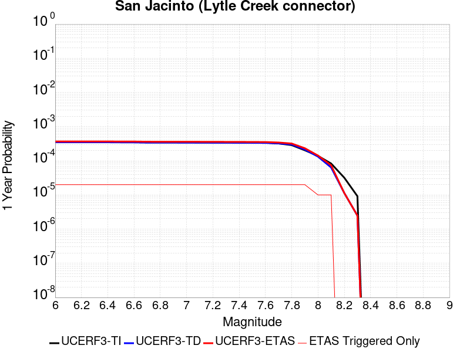 |  |

| Magnitude | 1 wk TI Prob | 1 wk TD Prob | 1 wk ETAS Prob | 1 wk ETAS/TD Gain | 1 wk ETAS Triggered Only | 1 mo TI Prob | 1 mo TD Prob | 1 mo ETAS Prob | 1 mo ETAS/TD Gain | 1 mo ETAS Triggered Only | 1 yr TI Prob | 1 yr TD Prob | 1 yr ETAS Prob | 1 yr ETAS/TD Gain | 1 yr ETAS Triggered Only | 10 yr TI Prob | 10 yr TD Prob | 10 yr ETAS Prob | 10 yr ETAS/TD Gain | 10 yr ETAS Triggered Only |
|-----|-----|-----|-----|-----|-----|-----|-----|-----|-----|-----|-----|-----|-----|-----|-----|-----|-----|-----|-----|-----|
| 6.0 | 6.693995E-6 | 6.6656444E-6 | 6.6656444E-6 | 1.0 | 0.0 | 2.8688235E-5 | 2.8566736E-5 | 5.2229097E-5 | 1.8283187 | 2.3663039E-5 | 3.492233E-4 | 3.477446E-4 | 3.950542E-4 | 1.136047 | 4.7326077E-5 | 0.00348675 | 0.0035522047 | 0.0036229414 | 1.0199136 | 7.098912E-5 |
| 6.1 | 6.693995E-6 | 6.6656444E-6 | 6.6656444E-6 | 1.0 | 0.0 | 2.8688235E-5 | 2.8566736E-5 | 5.2229097E-5 | 1.8283187 | 2.3663039E-5 | 3.492233E-4 | 3.477446E-4 | 3.950542E-4 | 1.136047 | 4.7326077E-5 | 0.00348675 | 0.0035522047 | 0.0036229414 | 1.0199136 | 7.098912E-5 |
| 6.2 | 6.693995E-6 | 6.6656444E-6 | 6.6656444E-6 | 1.0 | 0.0 | 2.8688235E-5 | 2.8566736E-5 | 5.2229097E-5 | 1.8283187 | 2.3663039E-5 | 3.492233E-4 | 3.477446E-4 | 3.950542E-4 | 1.136047 | 4.7326077E-5 | 0.00348675 | 0.0035522047 | 0.0036229414 | 1.0199136 | 7.098912E-5 |
| 6.3 | 6.693995E-6 | 6.6656444E-6 | 6.6656444E-6 | 1.0 | 0.0 | 2.8688235E-5 | 2.8566736E-5 | 5.2229097E-5 | 1.8283187 | 2.3663039E-5 | 3.492233E-4 | 3.477446E-4 | 3.950542E-4 | 1.136047 | 4.7326077E-5 | 0.00348675 | 0.0035522047 | 0.0036229414 | 1.0199136 | 7.098912E-5 |
| 6.4 | 6.693995E-6 | 6.6656444E-6 | 6.6656444E-6 | 1.0 | 0.0 | 2.8688235E-5 | 2.8566736E-5 | 5.2229097E-5 | 1.8283187 | 2.3663039E-5 | 3.492233E-4 | 3.477446E-4 | 3.950542E-4 | 1.136047 | 4.7326077E-5 | 0.00348675 | 0.0035522047 | 0.0036229414 | 1.0199136 | 7.098912E-5 |
| 6.5 | 6.6561875E-6 | 6.625862E-6 | 6.625862E-6 | 1.0 | 0.0 | 2.8526205E-5 | 2.8396244E-5 | 5.205861E-5 | 1.8332921 | 2.3663039E-5 | 3.472512E-4 | 3.4566948E-4 | 3.9297921E-4 | 1.1368641 | 4.7326077E-5 | 0.0034670907 | 0.0035315198 | 0.0036022584 | 1.0200306 | 7.098912E-5 |
| 6.6 | 6.6561875E-6 | 6.625862E-6 | 6.625862E-6 | 1.0 | 0.0 | 2.8526205E-5 | 2.8396244E-5 | 5.205861E-5 | 1.8332921 | 2.3663039E-5 | 3.472512E-4 | 3.4566948E-4 | 3.9297921E-4 | 1.1368641 | 4.7326077E-5 | 0.0034670907 | 0.0035315198 | 0.0036022584 | 1.0200306 | 7.098912E-5 |
| 6.7 | 6.5802237E-6 | 6.5450376E-6 | 6.5450376E-6 | 1.0 | 0.0 | 2.8200653E-5 | 2.8049859E-5 | 5.1712235E-5 | 1.8435826 | 2.3663039E-5 | 3.4328885E-4 | 3.414536E-4 | 3.8876352E-4 | 1.1385545 | 4.7326077E-5 | 0.0034275902 | 0.0034894939 | 0.0035602353 | 1.0202727 | 7.098912E-5 |
| 6.8 | 6.575632E-6 | 6.539527E-6 | 6.539527E-6 | 1.0 | 0.0 | 2.8180975E-5 | 2.8026243E-5 | 5.1688618E-5 | 1.8442935 | 2.3663039E-5 | 3.4304935E-4 | 3.4116616E-4 | 3.884761E-4 | 1.1386713 | 4.7326077E-5 | 0.0034252026 | 0.0034866284 | 0.00355737 | 1.0202894 | 7.098912E-5 |
| 6.9 | 6.570433E-6 | 6.53092E-6 | 6.53092E-6 | 1.0 | 0.0 | 2.8158694E-5 | 2.7989357E-5 | 5.1651736E-5 | 1.8454062 | 2.3663039E-5 | 3.4277816E-4 | 3.4071723E-4 | 3.8802717E-4 | 1.138854 | 4.7326077E-5 | 0.0034224992 | 0.0034821532 | 0.003552895 | 1.0203155 | 7.098912E-5 |
| 7.0 | 6.5643826E-6 | 6.52104E-6 | 6.52104E-6 | 1.0 | 0.0 | 2.8132765E-5 | 2.7947017E-5 | 5.1609393E-5 | 1.8466871 | 2.3663039E-5 | 3.424626E-4 | 3.402019E-4 | 3.8751186E-4 | 1.1390644 | 4.7326077E-5 | 0.0034193532 | 0.003477016 | 0.003547758 | 1.0203457 | 7.098912E-5 |
| 7.1 | 6.557402E-6 | 6.5097515E-6 | 6.5097515E-6 | 1.0 | 0.0 | 2.8102848E-5 | 2.7898635E-5 | 5.1561015E-5 | 1.8481554 | 2.3663039E-5 | 3.4209844E-4 | 3.3961303E-4 | 3.8692303E-4 | 1.1393056 | 4.7326077E-5 | 0.0034157229 | 0.0034711468 | 0.0035418896 | 1.0203803 | 7.098912E-5 |
| 7.2 | 6.546394E-6 | 6.4917162E-6 | 6.4917162E-6 | 1.0 | 0.0 | 2.8055672E-5 | 2.7821345E-5 | 5.1483723E-5 | 1.8505118 | 2.3663039E-5 | 3.4152428E-4 | 3.3867228E-4 | 3.8598233E-4 | 1.1396927 | 4.7326077E-5 | 0.0034099987 | 0.0034617733 | 0.0035325165 | 1.0204356 | 7.098912E-5 |
| 7.3 | 6.5364216E-6 | 6.4724986E-6 | 6.4724986E-6 | 1.0 | 0.0 | 2.8012933E-5 | 2.7738984E-5 | 5.1401366E-5 | 1.853037 | 2.3663039E-5 | 3.4100408E-4 | 3.376699E-4 | 3.8497997E-4 | 1.1401075 | 4.7326077E-5 | 0.003404813 | 0.0034517932 | 0.0035225372 | 1.0204948 | 7.098912E-5 |
| 7.4 | 6.5269523E-6 | 6.453582E-6 | 6.453582E-6 | 1.0 | 0.0 | 2.7972354E-5 | 2.7657916E-5 | 5.1320298E-5 | 1.8555375 | 2.3663039E-5 | 3.4051016E-4 | 3.3668315E-4 | 3.839933E-4 | 1.1405183 | 4.7326077E-5 | 0.0033998888 | 0.0034419734 | 0.003512718 | 1.0205536 | 7.098912E-5 |
| 7.5 | 6.5111835E-6 | 6.429852E-6 | 6.429852E-6 | 1.0 | 0.0 | 2.7904773E-5 | 2.7556218E-5 | 5.1218605E-5 | 1.858695 | 2.3663039E-5 | 3.3968766E-4 | 3.3544537E-4 | 3.8275556E-4 | 1.141037 | 4.7326077E-5 | 0.0033916887 | 0.0034296443 | 0.0035003899 | 1.0206277 | 7.098912E-5 |
| 7.6 | 6.4768806E-6 | 6.3889547E-6 | 6.3889547E-6 | 1.0 | 0.0 | 2.7757764E-5 | 2.7380947E-5 | 5.104334E-5 | 1.8641918 | 2.3663039E-5 | 3.3789838E-4 | 3.333121E-4 | 3.8062243E-4 | 1.14194 | 4.7326077E-5 | 0.0033738504 | 0.003408373 | 0.0034791203 | 1.0207568 | 7.098912E-5 |
| 7.7 | 6.1655364E-6 | 6.1813976E-6 | 6.1813976E-6 | 1.0 | 0.0 | 2.642346E-5 | 2.6491434E-5 | 5.0153845E-5 | 1.8932099 | 2.3663039E-5 | 3.2165812E-4 | 3.2248555E-4 | 3.6979635E-4 | 1.1467068 | 4.7326077E-5 | 0.0032119295 | 0.0032999665 | 0.0033707214 | 1.0214411 | 7.098912E-5 |
| 7.8 | 5.5043524E-6 | 5.742308E-6 | 5.742308E-6 | 1.0 | 0.0 | 2.3589868E-5 | 2.4609659E-5 | 4.8272115E-5 | 1.9615109 | 2.3663039E-5 | 2.871688E-4 | 2.9958147E-4 | 3.4689336E-4 | 1.1579267 | 4.7326077E-5 | 0.0028679797 | 0.0030699905 | 0.0031407617 | 1.0230526 | 7.098912E-5 |
| 7.9 | 3.889249E-6 | 4.081015E-6 | 4.081015E-6 | 1.0 | 0.0 | 1.6668104E-5 | 1.7489947E-5 | 4.1152573E-5 | 2.3529272 | 2.3663039E-5 | 2.0291525E-4 | 2.1291935E-4 | 2.6023533E-4 | 1.222225 | 4.7326077E-5 | 0.0020273007 | 0.002196554 | 0.0022673872 | 1.0322474 | 7.098912E-5 |
| 8.0 | 2.668535E-6 | 2.534446E-6 | 2.534446E-6 | 1.0 | 0.0 | 1.1436528E-5 | 1.0861866E-5 | 1.0861866E-5 | 1.0 | 0.0 | 1.3923083E-4 | 1.3223522E-4 | 1.5589512E-4 | 1.1789229 | 2.3663039E-5 | 0.0013914363 | 0.0013773474 | 0.0014246083 | 1.034313 | 4.7326077E-5 |
| 8.1 | 1.5911459E-6 | 1.2202424E-6 | 1.2202424E-6 | 1.0 | 0.0 | 6.8191785E-6 | 5.2296E-6 | 5.2296E-6 | 1.0 | 0.0 | 8.3020335E-5 | 6.366854E-5 | 8.7330074E-5 | 1.3716362 | 2.3663039E-5 | 8.298933E-4 | 6.70172E-4 | 7.1746635E-4 | 1.0705705 | 4.7326077E-5 |
| 8.2 | 6.1294963E-7 | 2.1858382E-7 | 2.1858382E-7 | 1.0 | 0.0 | 2.6269242E-6 | 9.3678744E-7 | 9.3678744E-7 | 1.0 | 0.0 | 3.1982334E-5 | 1.1405327E-5 | 1.1405327E-5 | 1.0 | 0.0 | 3.1977732E-4 | 1.2810447E-4 | 1.2810447E-4 | 1.0 | 0.0 |
| 8.3 | 1.762871E-7 | 4.7662454E-8 | 4.7662454E-8 | 1.0 | 0.0 | 7.5551594E-7 | 2.0426765E-7 | 2.0426765E-7 | 1.0 | 0.0 | 9.1983675E-6 | 2.486956E-6 | 2.486956E-6 | 1.0 | 0.0 | 9.197987E-5 | 2.8753902E-5 | 2.8753902E-5 | 1.0 | 0.0 |

## Big Pine (Central)
*[(top)](#table-of-contents)*

| 1 Week | 1 Month | 1 Year | 10 Year |
|-----|-----|-----|-----|
|  |  |  |  |

| Magnitude | 1 wk TI Prob | 1 wk TD Prob | 1 wk ETAS Prob | 1 wk ETAS/TD Gain | 1 wk ETAS Triggered Only | 1 mo TI Prob | 1 mo TD Prob | 1 mo ETAS Prob | 1 mo ETAS/TD Gain | 1 mo ETAS Triggered Only | 1 yr TI Prob | 1 yr TD Prob | 1 yr ETAS Prob | 1 yr ETAS/TD Gain | 1 yr ETAS Triggered Only | 10 yr TI Prob | 10 yr TD Prob | 10 yr ETAS Prob | 10 yr ETAS/TD Gain | 10 yr ETAS Triggered Only |
|-----|-----|-----|-----|-----|-----|-----|-----|-----|-----|-----|-----|-----|-----|-----|-----|-----|-----|-----|-----|-----|
| 6.0 | 1.2706755E-5 | 1.42514955E-5 | 1.42514955E-5 | 1.0 | 0.0 | 5.4456385E-5 | 6.1076615E-5 | 1.083998E-4 | 1.7748168 | 4.7326077E-5 | 6.628048E-4 | 7.4339064E-4 | 8.14327E-4 | 1.0954227 | 7.098912E-5 | 0.006608314 | 0.007414062 | 0.007484525 | 1.009504 | 7.098912E-5 |
| 6.1 | 8.342579E-6 | 9.511621E-6 | 9.511621E-6 | 1.0 | 0.0 | 3.5753423E-5 | 4.0763574E-5 | 8.808772E-5 | 2.160942 | 4.7326077E-5 | 4.3521097E-4 | 4.9620523E-4 | 5.435078E-4 | 1.0953287 | 4.7326077E-5 | 0.0043435963 | 0.0049545225 | 0.0050016143 | 1.0095048 | 4.7326077E-5 |
| 6.2 | 6.923899E-6 | 7.96797E-6 | 7.96797E-6 | 1.0 | 0.0 | 2.9673516E-5 | 3.4148106E-5 | 5.781034E-5 | 1.6929295 | 2.3663039E-5 | 3.6121515E-4 | 4.1569312E-4 | 4.3934633E-4 | 1.0569006 | 2.3663039E-5 | 0.003606286 | 0.0041524586 | 0.0041760234 | 1.0056748 | 2.3663039E-5 |
| 6.3 | 2.728396E-6 | 3.4250143E-6 | 3.4250143E-6 | 1.0 | 0.0 | 1.1693074E-5 | 1.4678555E-5 | 3.8341244E-5 | 2.6120586 | 2.3663039E-5 | 1.4235388E-4 | 1.7869762E-4 | 2.0235643E-4 | 1.1323957 | 2.3663039E-5 | 0.0014226272 | 0.0017870412 | 0.0018106619 | 1.0132178 | 2.3663039E-5 |
| 6.4 | 2.7136944E-6 | 3.4093073E-6 | 3.4093073E-6 | 1.0 | 0.0 | 1.1630066E-5 | 1.4611241E-5 | 3.8273934E-5 | 2.6194856 | 2.3663039E-5 | 1.4158686E-4 | 1.778782E-4 | 2.0153703E-4 | 1.1330057 | 2.3663039E-5 | 0.0014149669 | 0.0017788601 | 0.001802481 | 1.0132787 | 2.3663039E-5 |
| 6.5 | 2.6971882E-6 | 3.3916522E-6 | 3.3916522E-6 | 1.0 | 0.0 | 1.1559327E-5 | 1.4535576E-5 | 3.819827E-5 | 2.6279159 | 2.3663039E-5 | 1.4072572E-4 | 1.7695714E-4 | 2.0061599E-4 | 1.1336982 | 2.3663039E-5 | 0.0014063664 | 0.0017696641 | 0.0017932852 | 1.0133479 | 2.3663039E-5 |
| 6.6 | 2.669092E-6 | 3.361672E-6 | 3.361672E-6 | 1.0 | 0.0 | 1.1438916E-5 | 1.4407092E-5 | 3.806979E-5 | 2.6424341 | 2.3663039E-5 | 1.3925991E-4 | 1.7539308E-4 | 1.9905198E-4 | 1.1348907 | 2.3663039E-5 | 0.0013917267 | 0.0017540484 | 0.0017776699 | 1.0134668 | 2.3663039E-5 |
| 6.7 | 2.6408059E-6 | 3.3316971E-6 | 3.3316971E-6 | 1.0 | 0.0 | 1.1317691E-5 | 1.4278629E-5 | 3.794133E-5 | 2.6572108 | 2.3663039E-5 | 1.3778417E-4 | 1.738293E-4 | 1.9748823E-4 | 1.1361043 | 2.3663039E-5 | 0.0013769877 | 0.0017384351 | 0.0017620571 | 1.0135881 | 2.3663039E-5 |
| 6.8 | 2.1786943E-6 | 2.8551506E-6 | 2.8551506E-6 | 1.0 | 0.0 | 9.337228E-6 | 1.2236306E-5 | 3.5899055E-5 | 2.9338148 | 2.3663039E-5 | 1.1367482E-4 | 1.4896758E-4 | 1.7262709E-4 | 1.1588233 | 2.3663039E-5 | 0.0011361669 | 0.0014901655 | 0.0015137932 | 1.0158558 | 2.3663039E-5 |
| 6.9 | 1.4411696E-6 | 2.0691853E-6 | 2.0691853E-6 | 1.0 | 0.0 | 6.1764263E-6 | 8.867908E-6 | 3.2530737E-5 | 3.6683664 | 2.3663039E-5 | 7.51954E-5 | 1.079617E-4 | 1.3162219E-4 | 1.2191563 | 2.3663039E-5 | 7.5169955E-4 | 0.0010805362 | 0.0011041736 | 1.0218757 | 2.3663039E-5 |
| 7.0 | 1.0073411E-6 | 1.5548736E-6 | 1.5548736E-6 | 1.0 | 0.0 | 4.317169E-6 | 6.663728E-6 | 6.663728E-6 | 1.0 | 0.0 | 5.2560266E-5 | 8.1128026E-5 | 8.1128026E-5 | 1.0 | 0.0 | 5.2547833E-4 | 8.1241643E-4 | 8.1241643E-4 | 1.0 | 0.0 |
| 7.1 | 8.947104E-7 | 1.4308533E-6 | 1.4308533E-6 | 1.0 | 0.0 | 3.834468E-6 | 6.1322153E-6 | 6.1322153E-6 | 1.0 | 0.0 | 4.6683643E-5 | 7.465731E-5 | 7.465731E-5 | 1.0 | 0.0 | 4.6673836E-4 | 7.477545E-4 | 7.477545E-4 | 1.0 | 0.0 |
| 7.2 | 5.215166E-7 | 1.0117315E-6 | 1.0117315E-6 | 1.0 | 0.0 | 2.2350691E-6 | 4.335985E-6 | 4.335985E-6 | 1.0 | 0.0 | 2.7211627E-5 | 5.2789383E-5 | 5.2789383E-5 | 1.0 | 0.0 | 2.7208295E-4 | 5.2919047E-4 | 5.2919047E-4 | 1.0 | 0.0 |
| 7.3 | 4.4024807E-7 | 9.225058E-7 | 9.225058E-7 | 1.0 | 0.0 | 1.8867761E-6 | 3.9535903E-6 | 3.9535903E-6 | 1.0 | 0.0 | 2.2971257E-5 | 4.813394E-5 | 4.813394E-5 | 1.0 | 0.0 | 2.2968883E-4 | 4.8265705E-4 | 4.8265705E-4 | 1.0 | 0.0 |
| 7.4 | 3.6130905E-7 | 8.3638224E-7 | 8.3638224E-7 | 1.0 | 0.0 | 1.5484665E-6 | 3.5844905E-6 | 3.5844905E-6 | 1.0 | 0.0 | 1.8852415E-5 | 4.364034E-5 | 4.364034E-5 | 1.0 | 0.0 | 1.8850817E-4 | 4.3773E-4 | 4.3773E-4 | 1.0 | 0.0 |
| 7.5 | 3.408184E-7 | 8.1133305E-7 | 8.1133305E-7 | 1.0 | 0.0 | 1.4606494E-6 | 3.4771374E-6 | 3.4771374E-6 | 1.0 | 0.0 | 1.7783263E-5 | 4.2333362E-5 | 4.2333362E-5 | 1.0 | 0.0 | 1.778184E-4 | 4.2464386E-4 | 4.2464386E-4 | 1.0 | 0.0 |
| 7.6 | 3.1428627E-7 | 7.7365996E-7 | 7.7365996E-7 | 1.0 | 0.0 | 1.3469405E-6 | 3.3156816E-6 | 3.3156816E-6 | 1.0 | 0.0 | 1.6398877E-5 | 4.0367715E-5 | 4.0367715E-5 | 1.0 | 0.0 | 1.6397667E-4 | 4.0496574E-4 | 4.0496574E-4 | 1.0 | 0.0 |
| 7.7 | 1.7972785E-7 | 5.081573E-7 | 5.081573E-7 | 1.0 | 0.0 | 7.70262E-7 | 2.1778153E-6 | 2.1778153E-6 | 1.0 | 0.0 | 9.377899E-6 | 2.651459E-5 | 2.651459E-5 | 1.0 | 0.0 | 9.377503E-5 | 2.664834E-4 | 2.664834E-4 | 1.0 | 0.0 |
| 7.8 | 4.9230927E-8 | 1.1989805E-7 | 1.1989805E-7 | 1.0 | 0.0 | 2.1098968E-7 | 5.138487E-7 | 5.138487E-7 | 1.0 | 0.0 | 2.5687964E-6 | 6.2560916E-6 | 6.2560916E-6 | 1.0 | 0.0 | 2.5687666E-5 | 6.3000305E-5 | 6.3000305E-5 | 1.0 | 0.0 |
| 7.9 | 3.6805972E-9 | 4.108844E-9 | 4.108844E-9 | 1.0 | 0.0 | 1.5773987E-8 | 1.7609333E-8 | 1.7609333E-8 | 1.0 | 0.0 | 1.9204828E-7 | 2.143936E-7 | 2.143936E-7 | 1.0 | 0.0 | 1.920481E-6 | 2.191921E-6 | 2.191921E-6 | 1.0 | 0.0 |

## Santa Ynez (East)
*[(top)](#table-of-contents)*

| 1 Week | 1 Month | 1 Year | 10 Year |
|-----|-----|-----|-----|
|  |  | 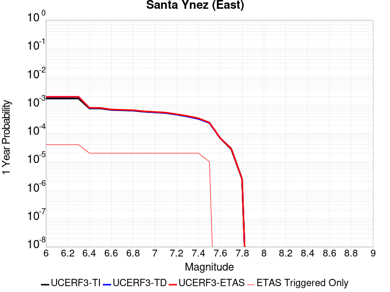 |  |

| Magnitude | 1 wk TI Prob | 1 wk TD Prob | 1 wk ETAS Prob | 1 wk ETAS/TD Gain | 1 wk ETAS Triggered Only | 1 mo TI Prob | 1 mo TD Prob | 1 mo ETAS Prob | 1 mo ETAS/TD Gain | 1 mo ETAS Triggered Only | 1 yr TI Prob | 1 yr TD Prob | 1 yr ETAS Prob | 1 yr ETAS/TD Gain | 1 yr ETAS Triggered Only | 10 yr TI Prob | 10 yr TD Prob | 10 yr ETAS Prob | 10 yr ETAS/TD Gain | 10 yr ETAS Triggered Only |
|-----|-----|-----|-----|-----|-----|-----|-----|-----|-----|-----|-----|-----|-----|-----|-----|-----|-----|-----|-----|-----|
| 6.0 | 3.2269712E-5 | 3.6752193E-5 | 3.6752193E-5 | 1.0 | 0.0 | 1.3829143E-4 | 1.5750321E-4 | 1.8116253E-4 | 1.1502148 | 2.3663039E-5 | 0.0016823979 | 0.0019165046 | 0.00196374 | 1.0246466 | 4.7326077E-5 | 0.016697178 | 0.01905731 | 0.019126944 | 1.003654 | 7.098912E-5 |
| 6.1 | 3.2269712E-5 | 3.6752193E-5 | 3.6752193E-5 | 1.0 | 0.0 | 1.3829143E-4 | 1.5750321E-4 | 1.8116253E-4 | 1.1502148 | 2.3663039E-5 | 0.0016823979 | 0.0019165046 | 0.00196374 | 1.0246466 | 4.7326077E-5 | 0.016697178 | 0.01905731 | 0.019126944 | 1.003654 | 7.098912E-5 |
| 6.2 | 3.2269712E-5 | 3.6752193E-5 | 3.6752193E-5 | 1.0 | 0.0 | 1.3829143E-4 | 1.5750321E-4 | 1.8116253E-4 | 1.1502148 | 2.3663039E-5 | 0.0016823979 | 0.0019165046 | 0.00196374 | 1.0246466 | 4.7326077E-5 | 0.016697178 | 0.01905731 | 0.019126944 | 1.003654 | 7.098912E-5 |
| 6.3 | 3.2269712E-5 | 3.6752193E-5 | 3.6752193E-5 | 1.0 | 0.0 | 1.3829143E-4 | 1.5750321E-4 | 1.8116253E-4 | 1.1502148 | 2.3663039E-5 | 0.0016823979 | 0.0019165046 | 0.00196374 | 1.0246466 | 4.7326077E-5 | 0.016697178 | 0.01905731 | 0.019126944 | 1.003654 | 7.098912E-5 |
| 6.4 | 1.4404779E-5 | 1.4849757E-5 | 1.4849757E-5 | 1.0 | 0.0 | 6.1733306E-5 | 6.364029E-5 | 6.364029E-5 | 1.0 | 0.0 | 7.513438E-4 | 7.745501E-4 | 7.745501E-4 | 1.0 | 0.0 | 0.0074880854 | 0.0077190557 | 0.0077190557 | 1.0 | 0.0 |
| 6.5 | 1.4404779E-5 | 1.4849757E-5 | 1.4849757E-5 | 1.0 | 0.0 | 6.1733306E-5 | 6.364029E-5 | 6.364029E-5 | 1.0 | 0.0 | 7.513438E-4 | 7.745501E-4 | 7.745501E-4 | 1.0 | 0.0 | 0.0074880854 | 0.0077190557 | 0.0077190557 | 1.0 | 0.0 |
| 6.6 | 1.280208E-5 | 1.301225E-5 | 1.301225E-5 | 1.0 | 0.0 | 5.4864904E-5 | 5.5765602E-5 | 5.5765602E-5 | 1.0 | 0.0 | 6.6777546E-4 | 6.787365E-4 | 6.787365E-4 | 1.0 | 0.0 | 0.006657724 | 0.0067668455 | 0.0067668455 | 1.0 | 0.0 |
| 6.7 | 1.2457027E-5 | 1.2628759E-5 | 1.2628759E-5 | 1.0 | 0.0 | 5.3386164E-5 | 5.4122138E-5 | 5.4122138E-5 | 1.0 | 0.0 | 6.497827E-4 | 6.587395E-4 | 6.587395E-4 | 1.0 | 0.0 | 0.00647886 | 0.006568066 | 0.006568066 | 1.0 | 0.0 |
| 6.8 | 1.2095134E-5 | 1.2231195E-5 | 1.2231195E-5 | 1.0 | 0.0 | 5.1835254E-5 | 5.2418363E-5 | 5.2418363E-5 | 1.0 | 0.0 | 6.309115E-4 | 6.380083E-4 | 6.380083E-4 | 1.0 | 0.0 | 0.0062912325 | 0.0063619544 | 0.0063619544 | 1.0 | 0.0 |
| 6.9 | 1.1104036E-5 | 1.1157604E-5 | 1.1157604E-5 | 1.0 | 0.0 | 4.758786E-5 | 4.7817433E-5 | 4.7817433E-5 | 1.0 | 0.0 | 5.7922816E-4 | 5.82023E-4 | 5.82023E-4 | 1.0 | 0.0 | 0.005777207 | 0.0058051324 | 0.0058051324 | 1.0 | 0.0 |
| 7.0 | 1.0577444E-5 | 1.0581923E-5 | 1.0581923E-5 | 1.0 | 0.0 | 4.5331115E-5 | 4.5350316E-5 | 4.5350316E-5 | 1.0 | 0.0 | 5.5176654E-4 | 5.520014E-4 | 5.520014E-4 | 1.0 | 0.0 | 0.0055039856 | 0.0055064415 | 0.0055064415 | 1.0 | 0.0 |
| 7.1 | 1.0021775E-5 | 9.981217E-6 | 9.981217E-6 | 1.0 | 0.0 | 4.294976E-5 | 4.2775948E-5 | 4.2775948E-5 | 1.0 | 0.0 | 5.2278786E-4 | 5.2067393E-4 | 5.2067393E-4 | 1.0 | 0.0 | 0.0052155964 | 0.0051946724 | 0.0051946724 | 1.0 | 0.0 |
| 7.2 | 8.874109E-6 | 8.748995E-6 | 8.748995E-6 | 1.0 | 0.0 | 3.8031343E-5 | 3.7495163E-5 | 3.7495163E-5 | 1.0 | 0.0 | 4.629332E-4 | 4.5640906E-4 | 4.5640906E-4 | 1.0 | 0.0 | 0.0046197 | 0.004554835 | 0.004554835 | 1.0 | 0.0 |
| 7.3 | 7.5504267E-6 | 7.5052803E-6 | 7.5052803E-6 | 1.0 | 0.0 | 3.235857E-5 | 3.2165095E-5 | 3.2165095E-5 | 1.0 | 0.0 | 3.9389438E-4 | 3.915407E-4 | 3.915407E-4 | 1.0 | 0.0 | 0.0039319694 | 0.0039086156 | 0.0039086156 | 1.0 | 0.0 |
| 7.4 | 6.309394E-6 | 6.1832875E-6 | 6.1832875E-6 | 1.0 | 0.0 | 2.703998E-5 | 2.649954E-5 | 2.649954E-5 | 1.0 | 0.0 | 3.2916202E-4 | 3.2258508E-4 | 3.2258508E-4 | 1.0 | 0.0 | 0.003286749 | 0.0032212655 | 0.0032212655 | 1.0 | 0.0 |
| 7.5 | 4.6103073E-6 | 4.4409794E-6 | 4.4409794E-6 | 1.0 | 0.0 | 1.975831E-5 | 1.9032634E-5 | 1.9032634E-5 | 1.0 | 0.0 | 2.4053088E-4 | 2.3169837E-4 | 2.3169837E-4 | 1.0 | 0.0 | 0.002402707 | 0.0023146376 | 0.0023146376 | 1.0 | 0.0 |
| 7.6 | 1.2858658E-6 | 1.3008363E-6 | 1.3008363E-6 | 1.0 | 0.0 | 5.5108417E-6 | 5.575001E-6 | 5.575001E-6 | 1.0 | 0.0 | 6.7092435E-5 | 6.7873596E-5 | 6.7873596E-5 | 1.0 | 0.0 | 6.707218E-4 | 6.7853555E-4 | 6.7853555E-4 | 1.0 | 0.0 |
| 7.7 | 5.3302307E-7 | 5.612217E-7 | 5.612217E-7 | 1.0 | 0.0 | 2.2843826E-6 | 2.405234E-6 | 2.405234E-6 | 1.0 | 0.0 | 2.7812002E-5 | 2.9283367E-5 | 2.9283367E-5 | 1.0 | 0.0 | 2.7808524E-4 | 2.9279865E-4 | 2.9279865E-4 | 1.0 | 0.0 |
| 7.8 | 4.613933E-8 | 4.803062E-8 | 4.803062E-8 | 1.0 | 0.0 | 1.9773998E-7 | 2.058455E-7 | 2.058455E-7 | 1.0 | 0.0 | 2.4074816E-6 | 2.506166E-6 | 2.506166E-6 | 1.0 | 0.0 | 2.4074554E-5 | 2.5061388E-5 | 2.5061388E-5 | 1.0 | 0.0 |

## Robinson Creek
*[(top)](#table-of-contents)*

| 1 Week | 1 Month | 1 Year | 10 Year |
|-----|-----|-----|-----|
|  |  |  |  |

| Magnitude | 1 wk TI Prob | 1 wk TD Prob | 1 wk ETAS Prob | 1 wk ETAS/TD Gain | 1 wk ETAS Triggered Only | 1 mo TI Prob | 1 mo TD Prob | 1 mo ETAS Prob | 1 mo ETAS/TD Gain | 1 mo ETAS Triggered Only | 1 yr TI Prob | 1 yr TD Prob | 1 yr ETAS Prob | 1 yr ETAS/TD Gain | 1 yr ETAS Triggered Only | 10 yr TI Prob | 10 yr TD Prob | 10 yr ETAS Prob | 10 yr ETAS/TD Gain | 10 yr ETAS Triggered Only |
|-----|-----|-----|-----|-----|-----|-----|-----|-----|-----|-----|-----|-----|-----|-----|-----|-----|-----|-----|-----|-----|
| 6.0 | 1.3705327E-5 | 1.5285481E-5 | 1.5285481E-5 | 1.0 | 0.0 | 5.8735794E-5 | 6.55092E-5 | 8.917069E-5 | 1.3611933 | 2.3663039E-5 | 7.1487366E-4 | 7.975745E-4 | 8.68507E-4 | 1.0889353 | 7.098912E-5 | 0.0071257832 | 0.007975745 | 0.008046168 | 1.0088296 | 7.098912E-5 |
| 6.1 | 1.3705327E-5 | 1.5285481E-5 | 1.5285481E-5 | 1.0 | 0.0 | 5.8735794E-5 | 6.55092E-5 | 8.917069E-5 | 1.3611933 | 2.3663039E-5 | 7.1487366E-4 | 7.975745E-4 | 8.68507E-4 | 1.0889353 | 7.098912E-5 | 0.0071257832 | 0.007975745 | 0.008046168 | 1.0088296 | 7.098912E-5 |
| 6.2 | 1.3705327E-5 | 1.5285481E-5 | 1.5285481E-5 | 1.0 | 0.0 | 5.8735794E-5 | 6.55092E-5 | 8.917069E-5 | 1.3611933 | 2.3663039E-5 | 7.1487366E-4 | 7.975745E-4 | 8.68507E-4 | 1.0889353 | 7.098912E-5 | 0.0071257832 | 0.007975745 | 0.008046168 | 1.0088296 | 7.098912E-5 |
| 6.3 | 1.3705327E-5 | 1.5285481E-5 | 1.5285481E-5 | 1.0 | 0.0 | 5.8735794E-5 | 6.55092E-5 | 8.917069E-5 | 1.3611933 | 2.3663039E-5 | 7.1487366E-4 | 7.975745E-4 | 8.68507E-4 | 1.0889353 | 7.098912E-5 | 0.0071257832 | 0.007975745 | 0.008046168 | 1.0088296 | 7.098912E-5 |
| 6.4 | 1.3705327E-5 | 1.5285481E-5 | 1.5285481E-5 | 1.0 | 0.0 | 5.8735794E-5 | 6.55092E-5 | 8.917069E-5 | 1.3611933 | 2.3663039E-5 | 7.1487366E-4 | 7.975745E-4 | 8.68507E-4 | 1.0889353 | 7.098912E-5 | 0.0071257832 | 0.007975745 | 0.008046168 | 1.0088296 | 7.098912E-5 |

## Scodie Lineament
*[(top)](#table-of-contents)*

| 1 Week | 1 Month | 1 Year | 10 Year |
|-----|-----|-----|-----|
|  |  |  |  |

| Magnitude | 1 wk TI Prob | 1 wk TD Prob | 1 wk ETAS Prob | 1 wk ETAS/TD Gain | 1 wk ETAS Triggered Only | 1 mo TI Prob | 1 mo TD Prob | 1 mo ETAS Prob | 1 mo ETAS/TD Gain | 1 mo ETAS Triggered Only | 1 yr TI Prob | 1 yr TD Prob | 1 yr ETAS Prob | 1 yr ETAS/TD Gain | 1 yr ETAS Triggered Only | 10 yr TI Prob | 10 yr TD Prob | 10 yr ETAS Prob | 10 yr ETAS/TD Gain | 10 yr ETAS Triggered Only |
|-----|-----|-----|-----|-----|-----|-----|-----|-----|-----|-----|-----|-----|-----|-----|-----|-----|-----|-----|-----|-----|
| 6.0 | 3.2919327E-6 | 3.0133708E-6 | 3.0133708E-6 | 1.0 | 0.0 | 1.4108206E-5 | 1.29144E-5 | 3.6577134E-5 | 2.8322752 | 2.3663039E-5 | 1.7175387E-4 | 1.5722465E-4 | 2.0454329E-4 | 1.300962 | 4.7326077E-5 | 0.0017162118 | 0.0015714457 | 0.0016423233 | 1.0451034 | 7.098912E-5 |
| 6.1 | 1.8663811E-6 | 1.5490679E-6 | 1.5490679E-6 | 1.0 | 0.0 | 7.998751E-6 | 6.6388484E-6 | 6.6388484E-6 | 1.0 | 0.0 | 9.738045E-5 | 8.082548E-5 | 1.044866E-4 | 1.2927434 | 2.3663039E-5 | 9.7337784E-4 | 8.080096E-4 | 8.3165354E-4 | 1.029262 | 2.3663039E-5 |
| 6.2 | 1.8663811E-6 | 1.5490679E-6 | 1.5490679E-6 | 1.0 | 0.0 | 7.998751E-6 | 6.6388484E-6 | 6.6388484E-6 | 1.0 | 0.0 | 9.738045E-5 | 8.082548E-5 | 1.044866E-4 | 1.2927434 | 2.3663039E-5 | 9.7337784E-4 | 8.080096E-4 | 8.3165354E-4 | 1.029262 | 2.3663039E-5 |
| 6.3 | 1.8663811E-6 | 1.5490679E-6 | 1.5490679E-6 | 1.0 | 0.0 | 7.998751E-6 | 6.6388484E-6 | 6.6388484E-6 | 1.0 | 0.0 | 9.738045E-5 | 8.082548E-5 | 1.044866E-4 | 1.2927434 | 2.3663039E-5 | 9.7337784E-4 | 8.080096E-4 | 8.3165354E-4 | 1.029262 | 2.3663039E-5 |
| 6.4 | 1.8663811E-6 | 1.5490679E-6 | 1.5490679E-6 | 1.0 | 0.0 | 7.998751E-6 | 6.6388484E-6 | 6.6388484E-6 | 1.0 | 0.0 | 9.738045E-5 | 8.082548E-5 | 1.044866E-4 | 1.2927434 | 2.3663039E-5 | 9.7337784E-4 | 8.080096E-4 | 8.3165354E-4 | 1.029262 | 2.3663039E-5 |
| 6.5 | 1.8106311E-6 | 1.4910013E-6 | 1.4910013E-6 | 1.0 | 0.0 | 7.759824E-6 | 6.3899924E-6 | 6.3899924E-6 | 1.0 | 0.0 | 9.447177E-5 | 7.779588E-5 | 1.0145707E-4 | 1.3041446 | 2.3663039E-5 | 9.4431615E-4 | 7.777351E-4 | 8.0137973E-4 | 1.030402 | 2.3663039E-5 |
| 6.6 | 1.2414679E-6 | 8.99767E-7 | 8.99767E-7 | 1.0 | 0.0 | 5.320566E-6 | 3.856139E-6 | 3.856139E-6 | 1.0 | 0.0 | 6.477596E-5 | 4.6947567E-5 | 7.0609494E-5 | 1.5040075 | 2.3663039E-5 | 6.475708E-4 | 4.6938515E-4 | 4.930371E-4 | 1.0503892 | 2.3663039E-5 |
| 6.7 | 1.1062215E-6 | 7.594409E-7 | 7.594409E-7 | 1.0 | 0.0 | 4.7409408E-6 | 3.2547432E-6 | 3.2547432E-6 | 1.0 | 0.0 | 5.7719422E-5 | 3.9625847E-5 | 6.3287946E-5 | 1.597138 | 2.3663039E-5 | 5.770443E-4 | 3.961948E-4 | 4.1984848E-4 | 1.0597022 | 2.3663039E-5 |
| 6.8 | 1.0006736E-6 | 6.5004843E-7 | 6.5004843E-7 | 1.0 | 0.0 | 4.288594E-6 | 2.7859192E-6 | 2.7859192E-6 | 1.0 | 0.0 | 5.221238E-5 | 3.39181E-5 | 5.7580335E-5 | 1.6976286 | 2.3663039E-5 | 5.220012E-4 | 3.3913532E-4 | 3.6279034E-4 | 1.0697509 | 2.3663039E-5 |
| 6.9 | 9.167364E-7 | 5.6317043E-7 | 5.6317043E-7 | 1.0 | 0.0 | 3.9288643E-6 | 2.4135857E-6 | 2.4135857E-6 | 1.0 | 0.0 | 4.7832873E-5 | 2.9385066E-5 | 2.9385066E-5 | 1.0 | 0.0 | 4.782258E-4 | 2.938175E-4 | 2.938175E-4 | 1.0 | 0.0 |
| 7.0 | 7.6987664E-7 | 4.113449E-7 | 4.113449E-7 | 1.0 | 0.0 | 3.2994672E-6 | 1.7629058E-6 | 1.7629058E-6 | 1.0 | 0.0 | 4.0170275E-5 | 2.1463205E-5 | 2.1463205E-5 | 1.0 | 0.0 | 4.0163012E-4 | 2.1461518E-4 | 2.1461518E-4 | 1.0 | 0.0 |
| 7.1 | 7.1038727E-7 | 3.52121E-7 | 3.52121E-7 | 1.0 | 0.0 | 3.0445133E-6 | 1.5090893E-6 | 1.5090893E-6 | 1.0 | 0.0 | 3.706632E-5 | 1.8373043E-5 | 1.8373043E-5 | 1.0 | 0.0 | 3.7060137E-4 | 1.8371873E-4 | 1.8371873E-4 | 1.0 | 0.0 |
| 7.2 | 2.0799602E-7 | 3.118852E-8 | 3.118852E-8 | 1.0 | 0.0 | 8.914113E-7 | 1.3366508E-7 | 1.3366508E-7 | 1.0 | 0.0 | 1.0852878E-5 | 1.6273711E-6 | 1.6273711E-6 | 1.0 | 0.0 | 1.08523476E-4 | 1.62736E-5 | 1.62736E-5 | 1.0 | 0.0 |
| 7.3 | 1.5048182E-7 | 1.594683E-8 | 1.594683E-8 | 1.0 | 0.0 | 6.449219E-7 | 6.834355E-8 | 6.834355E-8 | 1.0 | 0.0 | 7.851896E-6 | 8.3208243E-7 | 8.3208243E-7 | 1.0 | 0.0 | 7.851618E-5 | 8.320796E-6 | 8.320796E-6 | 1.0 | 0.0 |
| 7.4 | 5.9334678E-8 | 4.8687716E-9 | 4.8687716E-9 | 1.0 | 0.0 | 2.5429145E-7 | 2.0866164E-8 | 2.0866164E-8 | 1.0 | 0.0 | 3.095994E-6 | 2.5404555E-7 | 2.5404555E-7 | 1.0 | 0.0 | 3.095951E-5 | 2.5404536E-6 | 2.5404536E-6 | 1.0 | 0.0 |

## Ortigalita (North)
*[(top)](#table-of-contents)*

| 1 Week | 1 Month | 1 Year | 10 Year |
|-----|-----|-----|-----|
|  |  |  |  |

| Magnitude | 1 wk TI Prob | 1 wk TD Prob | 1 wk ETAS Prob | 1 wk ETAS/TD Gain | 1 wk ETAS Triggered Only | 1 mo TI Prob | 1 mo TD Prob | 1 mo ETAS Prob | 1 mo ETAS/TD Gain | 1 mo ETAS Triggered Only | 1 yr TI Prob | 1 yr TD Prob | 1 yr ETAS Prob | 1 yr ETAS/TD Gain | 1 yr ETAS Triggered Only | 10 yr TI Prob | 10 yr TD Prob | 10 yr ETAS Prob | 10 yr ETAS/TD Gain | 10 yr ETAS Triggered Only |
|-----|-----|-----|-----|-----|-----|-----|-----|-----|-----|-----|-----|-----|-----|-----|-----|-----|-----|-----|-----|-----|
| 6.0 | 7.711876E-5 | 1.0507549E-4 | 1.0507549E-4 | 1.0 | 0.0 | 3.3046713E-4 | 4.502567E-4 | 4.7390905E-4 | 1.0525309 | 2.3663039E-5 | 0.004016016 | 0.0054685385 | 0.005492072 | 1.0043035 | 2.3663039E-5 | 0.039442103 | 0.053459276 | 0.053481676 | 1.000419 | 2.3663039E-5 |
| 6.1 | 4.607858E-5 | 6.0244274E-5 | 6.0244274E-5 | 1.0 | 0.0 | 1.9746469E-4 | 2.58167E-4 | 2.8182394E-4 | 1.0916342 | 2.3663039E-5 | 0.0024014818 | 0.0031390057 | 0.0031625945 | 1.0075147 | 2.3663039E-5 | 0.023756953 | 0.030977463 | 0.031000394 | 1.0007402 | 2.3663039E-5 |
| 6.2 | 4.607858E-5 | 6.0244274E-5 | 6.0244274E-5 | 1.0 | 0.0 | 1.9746469E-4 | 2.58167E-4 | 2.8182394E-4 | 1.0916342 | 2.3663039E-5 | 0.0024014818 | 0.0031390057 | 0.0031625945 | 1.0075147 | 2.3663039E-5 | 0.023756953 | 0.030977463 | 0.031000394 | 1.0007402 | 2.3663039E-5 |
| 6.3 | 3.327423E-5 | 4.2478347E-5 | 4.2478347E-5 | 1.0 | 0.0 | 1.4259605E-4 | 1.820391E-4 | 2.0569783E-4 | 1.1299651 | 2.3663039E-5 | 0.0017347244 | 0.0022143624 | 0.002237973 | 1.0106626 | 2.3663039E-5 | 0.017212452 | 0.021947231 | 0.021970375 | 1.0010545 | 2.3663039E-5 |
| 6.4 | 2.7732503E-5 | 3.5001114E-5 | 3.5001114E-5 | 1.0 | 0.0 | 1.1884817E-4 | 1.4999765E-4 | 1.7365714E-4 | 1.1577324 | 2.3663039E-5 | 0.001446016 | 0.0018249385 | 0.0018485583 | 1.0129428 | 2.3663039E-5 | 0.014366428 | 0.018122489 | 0.018145723 | 1.0012821 | 2.3663039E-5 |
| 6.5 | 2.7689714E-5 | 3.4950925E-5 | 3.4950925E-5 | 1.0 | 0.0 | 1.186648E-4 | 1.4978259E-4 | 1.7344208E-4 | 1.1579589 | 2.3663039E-5 | 0.0014437864 | 0.0018223245 | 0.0018459443 | 1.0129614 | 2.3663039E-5 | 0.014344421 | 0.018096775 | 0.01812001 | 1.0012839 | 2.3663039E-5 |
| 6.6 | 2.2976905E-5 | 2.8720246E-5 | 2.8720246E-5 | 1.0 | 0.0 | 9.846873E-5 | 1.2308238E-4 | 1.4674252E-4 | 1.19223 | 2.3663039E-5 | 0.0011981975 | 0.0014977377 | 0.0015213653 | 1.0157756 | 2.3663039E-5 | 0.011917574 | 0.014899705 | 0.014923015 | 1.0015645 | 2.3663039E-5 |
| 6.7 | 1.9871539E-5 | 2.4906147E-5 | 2.4906147E-5 | 1.0 | 0.0 | 8.516096E-5 | 1.06737665E-4 | 1.3039818E-4 | 1.2216698 | 2.3663039E-5 | 0.0010363415 | 0.001299005 | 0.0013226373 | 1.0181926 | 2.3663039E-5 | 0.010315218 | 0.012937811 | 0.012961168 | 1.0018053 | 2.3663039E-5 |
| 6.8 | 6.5640475E-6 | 7.605813E-6 | 7.605813E-6 | 1.0 | 0.0 | 2.813133E-5 | 3.259595E-5 | 5.6258217E-5 | 1.7259266 | 2.3663039E-5 | 3.424451E-4 | 3.967863E-4 | 4.2043993E-4 | 1.0596131 | 2.3663039E-5 | 0.0034191788 | 0.003961066 | 0.0039846348 | 1.0059502 | 2.3663039E-5 |
| 6.9 | 5.6219683E-6 | 6.502108E-6 | 6.502108E-6 | 1.0 | 0.0 | 2.4093928E-5 | 2.7865894E-5 | 2.7865894E-5 | 1.0 | 0.0 | 2.933041E-4 | 3.3921702E-4 | 3.3921702E-4 | 1.0 | 0.0 | 0.0029291727 | 0.0033872493 | 0.0033872493 | 1.0 | 0.0 |
| 7.0 | 3.875591E-6 | 4.484942E-6 | 4.484942E-6 | 1.0 | 0.0 | 1.6609569E-5 | 1.922105E-5 | 1.922105E-5 | 1.0 | 0.0 | 2.0220275E-4 | 2.3399328E-4 | 2.3399328E-4 | 1.0 | 0.0 | 0.0020201886 | 0.0023376774 | 0.0023376774 | 1.0 | 0.0 |
| 7.1 | 1.6017933E-6 | 1.8571203E-6 | 1.8571203E-6 | 1.0 | 0.0 | 6.8648105E-6 | 7.959069E-6 | 7.959069E-6 | 1.0 | 0.0 | 8.357586E-5 | 9.6898424E-5 | 9.6898424E-5 | 1.0 | 0.0 | 8.3544437E-4 | 9.686664E-4 | 9.686664E-4 | 1.0 | 0.0 |

## Hayward (So) 2011 CFM
*[(top)](#table-of-contents)*

| 1 Week | 1 Month | 1 Year | 10 Year |
|-----|-----|-----|-----|
|  |  |  |  |

| Magnitude | 1 wk TI Prob | 1 wk TD Prob | 1 wk ETAS Prob | 1 wk ETAS/TD Gain | 1 wk ETAS Triggered Only | 1 mo TI Prob | 1 mo TD Prob | 1 mo ETAS Prob | 1 mo ETAS/TD Gain | 1 mo ETAS Triggered Only | 1 yr TI Prob | 1 yr TD Prob | 1 yr ETAS Prob | 1 yr ETAS/TD Gain | 1 yr ETAS Triggered Only | 10 yr TI Prob | 10 yr TD Prob | 10 yr ETAS Prob | 10 yr ETAS/TD Gain | 10 yr ETAS Triggered Only |
|-----|-----|-----|-----|-----|-----|-----|-----|-----|-----|-----|-----|-----|-----|-----|-----|-----|-----|-----|-----|-----|
| 6.0 | 1.8091932E-4 | 3.5712728E-4 | 3.5712728E-4 | 1.0 | 0.0 | 7.751381E-4 | 0.0015296576 | 0.0015532845 | 1.0154458 | 2.3663039E-5 | 0.00939654 | 0.018466959 | 0.018490186 | 1.0012577 | 2.3663039E-5 | 0.090090066 | 0.16675977 | 0.1667992 | 1.0002365 | 4.7326077E-5 |
| 6.1 | 1.8091932E-4 | 3.5712728E-4 | 3.5712728E-4 | 1.0 | 0.0 | 7.751381E-4 | 0.0015296576 | 0.0015532845 | 1.0154458 | 2.3663039E-5 | 0.00939654 | 0.018466959 | 0.018490186 | 1.0012577 | 2.3663039E-5 | 0.090090066 | 0.16675977 | 0.1667992 | 1.0002365 | 4.7326077E-5 |
| 6.2 | 1.8091932E-4 | 3.5712728E-4 | 3.5712728E-4 | 1.0 | 0.0 | 7.751381E-4 | 0.0015296576 | 0.0015532845 | 1.0154458 | 2.3663039E-5 | 0.00939654 | 0.018466959 | 0.018490186 | 1.0012577 | 2.3663039E-5 | 0.090090066 | 0.16675977 | 0.1667992 | 1.0002365 | 4.7326077E-5 |
| 6.3 | 1.7322872E-4 | 3.426947E-4 | 3.426947E-4 | 1.0 | 0.0 | 7.4219756E-4 | 0.0014678745 | 0.0014915029 | 1.016097 | 2.3663039E-5 | 0.0089988755 | 0.0177272 | 0.017750444 | 1.0013112 | 2.3663039E-5 | 0.08643075 | 0.16069497 | 0.16073468 | 1.0002472 | 4.7326077E-5 |
| 6.4 | 1.6334097E-4 | 3.235102E-4 | 3.235102E-4 | 1.0 | 0.0 | 6.998449E-4 | 0.0013857442 | 0.0014093745 | 1.0170524 | 2.3663039E-5 | 0.008487372 | 0.016742932 | 0.016766198 | 1.0013896 | 2.3663039E-5 | 0.081704415 | 0.15258306 | 0.15262316 | 1.0002629 | 4.7326077E-5 |
| 6.5 | 1.5600289E-4 | 3.1025545E-4 | 3.1025545E-4 | 1.0 | 0.0 | 6.684125E-4 | 0.001328997 | 0.0013526286 | 1.0177815 | 2.3663039E-5 | 0.008107598 | 0.016062386 | 0.01608567 | 1.0014496 | 2.3663039E-5 | 0.078181036 | 0.14685929 | 0.14687946 | 1.0001374 | 2.3663039E-5 |
| 6.6 | 1.4046066E-4 | 2.8039276E-4 | 2.8039276E-4 | 1.0 | 0.0 | 6.018354E-4 | 0.0012011366 | 0.0012247713 | 1.0196769 | 2.3663039E-5 | 0.0073027555 | 0.014527284 | 0.014550603 | 1.0016052 | 2.3663039E-5 | 0.07067384 | 0.13394552 | 0.13396601 | 1.000153 | 2.3663039E-5 |
| 6.7 | 1.14696966E-4 | 2.327723E-4 | 2.327723E-4 | 1.0 | 0.0 | 4.914658E-4 | 9.972192E-4 | 0.0010208588 | 1.0237054 | 2.3663039E-5 | 0.0059671924 | 0.01207462 | 0.012097998 | 1.0019361 | 2.3663039E-5 | 0.058094822 | 0.11277058 | 0.112791575 | 1.0001862 | 2.3663039E-5 |
| 6.8 | 9.3874296E-5 | 1.8866264E-4 | 1.8866264E-4 | 1.0 | 0.0 | 4.0225635E-4 | 8.083073E-4 | 8.083073E-4 | 1.0 | 0.0 | 0.0048864787 | 0.00979747 | 0.00979747 | 1.0 | 0.0 | 0.047804173 | 0.09261912 | 0.09261912 | 1.0 | 0.0 |
| 6.9 | 5.551852E-5 | 1.0732669E-4 | 1.0732669E-4 | 1.0 | 0.0 | 2.3791482E-4 | 4.5989105E-4 | 4.5989105E-4 | 1.0 | 0.0 | 0.0028927654 | 0.0055849175 | 0.0055849175 | 1.0 | 0.0 | 0.028553981 | 0.05426006 | 0.05426006 | 1.0 | 0.0 |
| 7.0 | 4.2662363E-5 | 8.249069E-5 | 8.249069E-5 | 1.0 | 0.0 | 1.8282588E-4 | 3.53484E-4 | 3.53484E-4 | 1.0 | 0.0 | 0.0022236328 | 0.0042952485 | 0.0042952485 | 1.0 | 0.0 | 0.022015138 | 0.042076755 | 0.042076755 | 1.0 | 0.0 |
| 7.1 | 3.305886E-5 | 6.304103E-5 | 6.304103E-5 | 1.0 | 0.0 | 1.4167312E-4 | 2.7014795E-4 | 2.7014795E-4 | 1.0 | 0.0 | 0.0017235056 | 0.0032841098 | 0.0032841098 | 1.0 | 0.0 | 0.017101998 | 0.032463335 | 0.032463335 | 1.0 | 0.0 |
| 7.2 | 2.9856887E-5 | 5.703456E-5 | 5.703456E-5 | 1.0 | 0.0 | 1.2795182E-4 | 2.4441103E-4 | 2.4441103E-4 | 1.0 | 0.0 | 0.0015567001 | 0.0029716603 | 0.0029716603 | 1.0 | 0.0 | 0.015458403 | 0.029463593 | 0.029463593 | 1.0 | 0.0 |
| 7.3 | 2.4559737E-5 | 4.6008925E-5 | 4.6008925E-5 | 1.0 | 0.0 | 1.0525176E-4 | 1.9716629E-4 | 1.9716629E-4 | 1.0 | 0.0 | 0.0012806869 | 0.0023978697 | 0.0023978697 | 1.0 | 0.0 | 0.012733313 | 0.023866206 | 0.023866206 | 1.0 | 0.0 |
| 7.4 | 1.9002231E-5 | 3.5064808E-5 | 3.5064808E-5 | 1.0 | 0.0 | 8.143559E-5 | 1.5026914E-4 | 1.5026914E-4 | 1.0 | 0.0 | 9.910273E-4 | 0.0018280015 | 0.0018280015 | 1.0 | 0.0 | 0.009866194 | 0.01826584 | 0.01826584 | 1.0 | 0.0 |
| 7.5 | 1.2783333E-5 | 2.3340559E-5 | 2.3340559E-5 | 1.0 | 0.0 | 5.4784563E-5 | 1.00027166E-4 | 1.00027166E-4 | 1.0 | 0.0 | 6.667979E-4 | 0.0012171562 | 0.0012171562 | 1.0 | 0.0 | 0.006648007 | 0.012214717 | 0.012214717 | 1.0 | 0.0 |
| 7.6 | 4.8149627E-6 | 8.894059E-6 | 8.894059E-6 | 1.0 | 0.0 | 2.063539E-5 | 3.8116847E-5 | 3.8116847E-5 | 1.0 | 0.0 | 2.5120692E-4 | 4.63975E-4 | 4.63975E-4 | 1.0 | 0.0 | 0.0025092314 | 0.004684447 | 0.004684447 | 1.0 | 0.0 |
| 7.7 | 6.0838227E-7 | 1.2068782E-6 | 1.2068782E-6 | 1.0 | 0.0 | 2.6073499E-6 | 5.172325E-6 | 5.172325E-6 | 1.0 | 0.0 | 3.174402E-5 | 6.297124E-5 | 6.297124E-5 | 1.0 | 0.0 | 3.1739488E-4 | 6.535205E-4 | 6.535205E-4 | 1.0 | 0.0 |
| 7.8 | 4.5542808E-7 | 9.802699E-7 | 9.802699E-7 | 1.0 | 0.0 | 1.9518332E-6 | 4.2011497E-6 | 4.2011497E-6 | 1.0 | 0.0 | 2.376331E-5 | 5.11478E-5 | 5.11478E-5 | 1.0 | 0.0 | 2.3760769E-4 | 5.3264626E-4 | 5.3264626E-4 | 1.0 | 0.0 |
| 7.9 | 3.3016747E-7 | 7.3940566E-7 | 7.3940566E-7 | 1.0 | 0.0 | 1.4150027E-6 | 3.1688776E-6 | 3.1688776E-6 | 1.0 | 0.0 | 1.7227521E-5 | 3.8580405E-5 | 3.8580405E-5 | 1.0 | 0.0 | 1.7226185E-4 | 3.9968E-4 | 3.9968E-4 | 1.0 | 0.0 |
| 8.0 | 2.347038E-7 | 5.4768105E-7 | 5.4768105E-7 | 1.0 | 0.0 | 1.0058731E-6 | 2.3472023E-6 | 2.3472023E-6 | 1.0 | 0.0 | 1.2246436E-5 | 2.8576816E-5 | 2.8576816E-5 | 1.0 | 0.0 | 1.2245761E-4 | 2.938083E-4 | 2.938083E-4 | 1.0 | 0.0 |
| 8.1 | 1.18822804E-7 | 2.6082148E-7 | 2.6082148E-7 | 1.0 | 0.0 | 5.092405E-7 | 1.1178059E-6 | 1.1178059E-6 | 1.0 | 0.0 | 6.1999854E-6 | 1.3609203E-5 | 1.3609203E-5 | 1.0 | 0.0 | 6.199812E-5 | 1.3929205E-4 | 1.3929205E-4 | 1.0 | 0.0 |

## Big Pine (East)
*[(top)](#table-of-contents)*

| 1 Week | 1 Month | 1 Year | 10 Year |
|-----|-----|-----|-----|
|  |  |  |  |

| Magnitude | 1 wk TI Prob | 1 wk TD Prob | 1 wk ETAS Prob | 1 wk ETAS/TD Gain | 1 wk ETAS Triggered Only | 1 mo TI Prob | 1 mo TD Prob | 1 mo ETAS Prob | 1 mo ETAS/TD Gain | 1 mo ETAS Triggered Only | 1 yr TI Prob | 1 yr TD Prob | 1 yr ETAS Prob | 1 yr ETAS/TD Gain | 1 yr ETAS Triggered Only | 10 yr TI Prob | 10 yr TD Prob | 10 yr ETAS Prob | 10 yr ETAS/TD Gain | 10 yr ETAS Triggered Only |
|-----|-----|-----|-----|-----|-----|-----|-----|-----|-----|-----|-----|-----|-----|-----|-----|-----|-----|-----|-----|-----|
| 6.0 | 9.916913E-6 | 1.2819477E-5 | 1.2819477E-5 | 1.0 | 0.0 | 4.250036E-5 | 5.4939585E-5 | 7.8601326E-5 | 1.4306865 | 2.3663039E-5 | 5.173191E-4 | 6.6870626E-4 | 6.9235347E-4 | 1.0353626 | 2.3663039E-5 | 0.0051611643 | 0.0066717123 | 0.0067187226 | 1.0070462 | 4.7326077E-5 |
| 6.1 | 9.916913E-6 | 1.2819477E-5 | 1.2819477E-5 | 1.0 | 0.0 | 4.250036E-5 | 5.4939585E-5 | 7.8601326E-5 | 1.4306865 | 2.3663039E-5 | 5.173191E-4 | 6.6870626E-4 | 6.9235347E-4 | 1.0353626 | 2.3663039E-5 | 0.0051611643 | 0.0066717123 | 0.0067187226 | 1.0070462 | 4.7326077E-5 |
| 6.2 | 9.916913E-6 | 1.2819477E-5 | 1.2819477E-5 | 1.0 | 0.0 | 4.250036E-5 | 5.4939585E-5 | 7.8601326E-5 | 1.4306865 | 2.3663039E-5 | 5.173191E-4 | 6.6870626E-4 | 6.9235347E-4 | 1.0353626 | 2.3663039E-5 | 0.0051611643 | 0.0066717123 | 0.0067187226 | 1.0070462 | 4.7326077E-5 |
| 6.3 | 5.479711E-6 | 8.115369E-6 | 8.115369E-6 | 1.0 | 0.0 | 2.3484265E-5 | 3.4779707E-5 | 5.8441925E-5 | 1.6803454 | 2.3663039E-5 | 2.858834E-4 | 4.2336388E-4 | 4.4701688E-4 | 1.0558692 | 2.3663039E-5 | 0.0028551589 | 0.0042284788 | 0.0042520417 | 1.0055724 | 2.3663039E-5 |
| 6.4 | 5.465009E-6 | 8.099662E-6 | 8.099662E-6 | 1.0 | 0.0 | 2.3421257E-5 | 3.4712393E-5 | 5.837461E-5 | 1.6816648 | 2.3663039E-5 | 2.851165E-4 | 4.2254463E-4 | 4.461977E-4 | 1.0559776 | 2.3663039E-5 | 0.0028475097 | 0.0042203176 | 0.0042438805 | 1.0055833 | 2.3663039E-5 |
| 6.5 | 4.826767E-6 | 7.424708E-6 | 7.424708E-6 | 1.0 | 0.0 | 2.068598E-5 | 3.1819807E-5 | 5.548209E-5 | 1.7436339 | 2.3663039E-5 | 2.518227E-4 | 3.8734006E-4 | 4.1099393E-4 | 1.0610675 | 2.3663039E-5 | 0.0025153751 | 0.0038695128 | 0.0038930844 | 1.0060916 | 2.3663039E-5 |
| 6.6 | 4.3146847E-6 | 6.8846366E-6 | 6.8846366E-6 | 1.0 | 0.0 | 1.8491375E-5 | 2.9505265E-5 | 5.3167605E-5 | 1.8019701 | 2.3663039E-5 | 2.2510924E-4 | 3.5916985E-4 | 3.828244E-4 | 1.065859 | 2.3663039E-5 | 0.0022488134 | 0.0035887246 | 0.003612303 | 1.0065701 | 2.3663039E-5 |
| 6.7 | 3.6968106E-6 | 5.9977306E-6 | 5.9977306E-6 | 1.0 | 0.0 | 1.5843378E-5 | 2.5704314E-5 | 4.9366743E-5 | 1.9205626 | 2.3663039E-5 | 1.9287605E-4 | 3.1290663E-4 | 3.3656225E-4 | 1.0755997 | 2.3663039E-5 | 0.0019270873 | 0.0031274015 | 0.0031509905 | 1.0075427 | 2.3663039E-5 |
| 6.8 | 3.4671132E-6 | 5.704374E-6 | 5.704374E-6 | 1.0 | 0.0 | 1.4858972E-5 | 2.4447096E-5 | 4.8109556E-5 | 1.9679048 | 2.3663039E-5 | 1.8089297E-4 | 2.976042E-4 | 3.212602E-4 | 1.0794882 | 2.3663039E-5 | 0.0018074579 | 0.0029747887 | 0.0029983814 | 1.0079309 | 2.3663039E-5 |
| 6.9 | 2.7686972E-6 | 4.8272514E-6 | 4.8272514E-6 | 1.0 | 0.0 | 1.1865792E-5 | 2.068806E-5 | 4.4350607E-5 | 2.143778 | 2.3663039E-5 | 1.4445644E-4 | 2.5184877E-4 | 2.7550585E-4 | 1.0939337 | 2.3663039E-5 | 0.0014436257 | 0.0025182979 | 0.0025419013 | 1.0093728 | 2.3663039E-5 |
| 7.0 | 2.1472624E-6 | 3.986883E-6 | 3.986883E-6 | 1.0 | 0.0 | 9.20252E-6 | 1.7086531E-5 | 1.7086531E-5 | 1.0 | 0.0 | 1.12034926E-4 | 2.0800921E-4 | 2.0800921E-4 | 1.0 | 0.0 | 0.0011197845 | 0.0020807774 | 0.0020807774 | 1.0 | 0.0 |
| 7.1 | 1.7018335E-6 | 3.3465526E-6 | 3.3465526E-6 | 1.0 | 0.0 | 7.293552E-6 | 1.4342291E-5 | 1.4342291E-5 | 1.0 | 0.0 | 8.879537E-5 | 1.7460376E-4 | 1.7460376E-4 | 1.0 | 0.0 | 8.87599E-4 | 0.0017472665 | 0.0017472665 | 1.0 | 0.0 |
| 7.2 | 1.25603E-6 | 2.796068E-6 | 2.796068E-6 | 1.0 | 0.0 | 5.3829745E-6 | 1.1983095E-5 | 1.1983095E-5 | 1.0 | 0.0 | 6.553574E-5 | 1.4588464E-4 | 1.4588464E-4 | 1.0 | 0.0 | 6.551642E-4 | 0.001460465 | 0.001460465 | 1.0 | 0.0 |
| 7.3 | 1.112297E-6 | 2.6118275E-6 | 2.6118275E-6 | 1.0 | 0.0 | 4.7669787E-6 | 1.11935E-5 | 1.11935E-5 | 1.0 | 0.0 | 5.803642E-5 | 1.3627256E-4 | 1.3627256E-4 | 1.0 | 0.0 | 5.802127E-4 | 0.0013642985 | 0.0013642985 | 1.0 | 0.0 |
| 7.4 | 1.0137181E-6 | 2.484923E-6 | 2.484923E-6 | 1.0 | 0.0 | 4.3444993E-6 | 1.0649628E-5 | 1.0649628E-5 | 1.0 | 0.0 | 5.2892992E-5 | 1.2965173E-4 | 1.2965173E-4 | 1.0 | 0.0 | 5.288041E-4 | 0.0012979534 | 0.0012979534 | 1.0 | 0.0 |
| 7.5 | 9.598608E-7 | 2.408537E-6 | 2.408537E-6 | 1.0 | 0.0 | 4.1136827E-6 | 1.0322262E-5 | 1.0322262E-5 | 1.0 | 0.0 | 5.0082934E-5 | 1.256665E-4 | 1.256665E-4 | 1.0 | 0.0 | 5.007165E-4 | 0.0012579551 | 0.0012579551 | 1.0 | 0.0 |
| 7.6 | 7.929459E-7 | 2.0460855E-6 | 2.0460855E-6 | 1.0 | 0.0 | 3.3983351E-6 | 8.768909E-6 | 8.768909E-6 | 1.0 | 0.0 | 4.1373947E-5 | 1.0675641E-4 | 1.0675641E-4 | 1.0 | 0.0 | 4.1366243E-4 | 0.0010691425 | 0.0010691425 | 1.0 | 0.0 |
| 7.7 | 4.155788E-7 | 1.1614285E-6 | 1.1614285E-6 | 1.0 | 0.0 | 1.7810507E-6 | 4.9775413E-6 | 4.9775413E-6 | 1.0 | 0.0 | 2.1684076E-5 | 6.059992E-5 | 6.059992E-5 | 1.0 | 0.0 | 2.1681961E-4 | 6.0901203E-4 | 6.0901203E-4 | 1.0 | 0.0 |
| 7.8 | 1.14666925E-7 | 2.5939678E-7 | 2.5939678E-7 | 1.0 | 0.0 | 4.914296E-7 | 1.1117E-6 | 1.1117E-6 | 1.0 | 0.0 | 5.9831386E-6 | 1.3534868E-5 | 1.3534868E-5 | 1.0 | 0.0 | 5.9829777E-5 | 1.364413E-4 | 1.364413E-4 | 1.0 | 0.0 |
| 7.9 | 2.9231824E-8 | 4.1496527E-8 | 4.1496527E-8 | 1.0 | 0.0 | 1.2527924E-7 | 1.7784224E-7 | 1.7784224E-7 | 1.0 | 0.0 | 1.5252737E-6 | 2.1652272E-6 | 2.1652272E-6 | 1.0 | 0.0 | 1.5252632E-5 | 2.198479E-5 | 2.198479E-5 | 1.0 | 0.0 |

## Deep Springs
*[(top)](#table-of-contents)*

| 1 Week | 1 Month | 1 Year | 10 Year |
|-----|-----|-----|-----|
|  |  |  |  |

| Magnitude | 1 wk TI Prob | 1 wk TD Prob | 1 wk ETAS Prob | 1 wk ETAS/TD Gain | 1 wk ETAS Triggered Only | 1 mo TI Prob | 1 mo TD Prob | 1 mo ETAS Prob | 1 mo ETAS/TD Gain | 1 mo ETAS Triggered Only | 1 yr TI Prob | 1 yr TD Prob | 1 yr ETAS Prob | 1 yr ETAS/TD Gain | 1 yr ETAS Triggered Only | 10 yr TI Prob | 10 yr TD Prob | 10 yr ETAS Prob | 10 yr ETAS/TD Gain | 10 yr ETAS Triggered Only |
|-----|-----|-----|-----|-----|-----|-----|-----|-----|-----|-----|-----|-----|-----|-----|-----|-----|-----|-----|-----|-----|
| 6.0 | 1.9810619E-5 | 2.3113542E-5 | 2.3113542E-5 | 1.0 | 0.0 | 8.489989E-5 | 9.9057135E-5 | 1.2271783E-4 | 1.238859 | 2.3663039E-5 | 0.001033166 | 0.0012058612 | 0.0012294957 | 1.0195997 | 2.3663039E-5 | 0.010283757 | 0.012042956 | 0.012089713 | 1.0038824 | 4.7326077E-5 |
| 6.1 | 1.9810619E-5 | 2.3113542E-5 | 2.3113542E-5 | 1.0 | 0.0 | 8.489989E-5 | 9.9057135E-5 | 1.2271783E-4 | 1.238859 | 2.3663039E-5 | 0.001033166 | 0.0012058612 | 0.0012294957 | 1.0195997 | 2.3663039E-5 | 0.010283757 | 0.012042956 | 0.012089713 | 1.0038824 | 4.7326077E-5 |
| 6.2 | 1.9810619E-5 | 2.3113542E-5 | 2.3113542E-5 | 1.0 | 0.0 | 8.489989E-5 | 9.9057135E-5 | 1.2271783E-4 | 1.238859 | 2.3663039E-5 | 0.001033166 | 0.0012058612 | 0.0012294957 | 1.0195997 | 2.3663039E-5 | 0.010283757 | 0.012042956 | 0.012089713 | 1.0038824 | 4.7326077E-5 |
| 6.3 | 1.9810619E-5 | 2.3113542E-5 | 2.3113542E-5 | 1.0 | 0.0 | 8.489989E-5 | 9.9057135E-5 | 1.2271783E-4 | 1.238859 | 2.3663039E-5 | 0.001033166 | 0.0012058612 | 0.0012294957 | 1.0195997 | 2.3663039E-5 | 0.010283757 | 0.012042956 | 0.012089713 | 1.0038824 | 4.7326077E-5 |
| 6.4 | 1.9810619E-5 | 2.3113542E-5 | 2.3113542E-5 | 1.0 | 0.0 | 8.489989E-5 | 9.9057135E-5 | 1.2271783E-4 | 1.238859 | 2.3663039E-5 | 0.001033166 | 0.0012058612 | 0.0012294957 | 1.0195997 | 2.3663039E-5 | 0.010283757 | 0.012042956 | 0.012089713 | 1.0038824 | 4.7326077E-5 |
| 6.5 | 1.7190405E-5 | 2.005144E-5 | 2.005144E-5 | 1.0 | 0.0 | 7.367108E-5 | 8.593474E-5 | 8.593474E-5 | 1.0 | 0.0 | 8.9657627E-4 | 0.0010462555 | 0.0010462555 | 1.0 | 0.0 | 0.008929676 | 0.010462518 | 0.010485933 | 1.002238 | 2.3663039E-5 |
| 6.6 | 1.7190405E-5 | 2.005144E-5 | 2.005144E-5 | 1.0 | 0.0 | 7.367108E-5 | 8.593474E-5 | 8.593474E-5 | 1.0 | 0.0 | 8.9657627E-4 | 0.0010462555 | 0.0010462555 | 1.0 | 0.0 | 0.008929676 | 0.010462518 | 0.010485933 | 1.002238 | 2.3663039E-5 |

## Great Valley 09 (Laguna Seca)
*[(top)](#table-of-contents)*

| 1 Week | 1 Month | 1 Year | 10 Year |
|-----|-----|-----|-----|
|  |  |  |  |

| Magnitude | 1 wk TI Prob | 1 wk TD Prob | 1 wk ETAS Prob | 1 wk ETAS/TD Gain | 1 wk ETAS Triggered Only | 1 mo TI Prob | 1 mo TD Prob | 1 mo ETAS Prob | 1 mo ETAS/TD Gain | 1 mo ETAS Triggered Only | 1 yr TI Prob | 1 yr TD Prob | 1 yr ETAS Prob | 1 yr ETAS/TD Gain | 1 yr ETAS Triggered Only | 10 yr TI Prob | 10 yr TD Prob | 10 yr ETAS Prob | 10 yr ETAS/TD Gain | 10 yr ETAS Triggered Only |
|-----|-----|-----|-----|-----|-----|-----|-----|-----|-----|-----|-----|-----|-----|-----|-----|-----|-----|-----|-----|-----|
| 6.0 | 5.4353277E-5 | 7.050752E-5 | 7.050752E-5 | 1.0 | 0.0 | 2.3292181E-4 | 3.0213883E-4 | 3.257947E-4 | 1.0782948 | 2.3663039E-5 | 0.0028321352 | 0.0036724764 | 0.0036960526 | 1.0064197 | 2.3663039E-5 | 0.02796312 | 0.03611835 | 0.036163967 | 1.001263 | 4.7326077E-5 |
| 6.1 | 4.5578287E-5 | 5.822518E-5 | 5.822518E-5 | 1.0 | 0.0 | 1.953209E-4 | 2.495107E-4 | 2.7316783E-4 | 1.0948141 | 2.3663039E-5 | 0.0023754383 | 0.0030336666 | 0.003057258 | 1.0077765 | 2.3663039E-5 | 0.023502063 | 0.029921863 | 0.029944818 | 1.0007671 | 2.3663039E-5 |
| 6.2 | 2.8536782E-5 | 3.4738863E-5 | 3.4738863E-5 | 1.0 | 0.0 | 1.2229476E-4 | 1.4886934E-4 | 1.7252885E-4 | 1.158928 | 2.3663039E-5 | 0.0014879217 | 0.0018109402 | 0.0018345604 | 1.013043 | 2.3663039E-5 | 0.014779986 | 0.017959375 | 0.017982613 | 1.0012939 | 2.3663039E-5 |
| 6.3 | 2.3698774E-5 | 2.8214268E-5 | 2.8214268E-5 | 1.0 | 0.0 | 1.01562226E-4 | 1.20909535E-4 | 1.4456971E-4 | 1.1956849 | 2.3663039E-5 | 0.0012358186 | 0.0014711232 | 0.0014947514 | 1.0160613 | 2.3663039E-5 | 0.012289686 | 0.01461232 | 0.014635637 | 1.0015957 | 2.3663039E-5 |
| 6.4 | 1.9191197E-5 | 2.2123577E-5 | 2.2123577E-5 | 1.0 | 0.0 | 8.2245395E-5 | 9.4808645E-5 | 1.1846944E-4 | 1.2495637 | 2.3663039E-5 | 0.0010008777 | 0.0011537144 | 0.0011773501 | 1.0204866 | 2.3663039E-5 | 0.009963818 | 0.011477661 | 0.011501052 | 1.002038 | 2.3663039E-5 |
| 6.5 | 1.5203241E-5 | 1.6802116E-5 | 1.6802116E-5 | 1.0 | 0.0 | 6.5155116E-5 | 7.200377E-5 | 9.5665106E-5 | 1.3286124 | 2.3663039E-5 | 7.9297484E-4 | 8.763123E-4 | 8.9995464E-4 | 1.0269793 | 2.3663039E-5 | 0.007901512 | 0.008730002 | 0.008753458 | 1.0026869 | 2.3663039E-5 |
| 6.6 | 1.0984925E-5 | 1.12430935E-5 | 1.12430935E-5 | 1.0 | 0.0 | 4.70774E-5 | 4.8183778E-5 | 4.8183778E-5 | 1.0 | 0.0 | 5.730166E-4 | 5.864824E-4 | 5.864824E-4 | 1.0 | 0.0 | 0.005715413 | 0.0058497433 | 0.0058497433 | 1.0 | 0.0 |
| 6.7 | 9.134616E-6 | 9.020273E-6 | 9.020273E-6 | 1.0 | 0.0 | 3.9147766E-5 | 3.8657752E-5 | 3.8657752E-5 | 1.0 | 0.0 | 4.7651984E-4 | 4.7055888E-4 | 4.7055888E-4 | 1.0 | 0.0 | 0.004754993 | 0.00469587 | 0.00469587 | 1.0 | 0.0 |
| 6.8 | 7.785589E-6 | 7.4522554E-6 | 7.4522554E-6 | 1.0 | 0.0 | 3.3366385E-5 | 3.193786E-5 | 3.193786E-5 | 1.0 | 0.0 | 4.0616E-4 | 3.8877607E-4 | 3.8877607E-4 | 1.0 | 0.0 | 0.0040541845 | 0.0038811632 | 0.0038811632 | 1.0 | 0.0 |
| 6.9 | 5.579095E-6 | 4.8986967E-6 | 4.8986967E-6 | 1.0 | 0.0 | 2.3910188E-5 | 2.0994254E-5 | 2.0994254E-5 | 1.0 | 0.0 | 2.9106764E-4 | 2.5557645E-4 | 2.5557645E-4 | 1.0 | 0.0 | 0.002906867 | 0.0025529626 | 0.0025529626 | 1.0 | 0.0 |
| 7.0 | 2.6816688E-6 | 1.5216688E-6 | 1.5216688E-6 | 1.0 | 0.0 | 1.1492816E-5 | 6.5214217E-6 | 6.5214217E-6 | 1.0 | 0.0 | 1.3991605E-4 | 7.9395504E-5 | 7.9395504E-5 | 1.0 | 0.0 | 0.0013982799 | 7.9368014E-4 | 7.9368014E-4 | 1.0 | 0.0 |
| 7.1 | 1.9951021E-6 | 7.4541185E-7 | 7.4541185E-7 | 1.0 | 0.0 | 8.55041E-6 | 3.1946186E-6 | 3.1946186E-6 | 1.0 | 0.0 | 1.0409627E-4 | 3.8893828E-5 | 3.8893828E-5 | 1.0 | 0.0 | 0.0010404752 | 3.8887435E-4 | 3.8887435E-4 | 1.0 | 0.0 |
| 7.2 | 1.9951021E-6 | 7.4541185E-7 | 7.4541185E-7 | 1.0 | 0.0 | 8.55041E-6 | 3.1946186E-6 | 3.1946186E-6 | 1.0 | 0.0 | 1.0409627E-4 | 3.8893828E-5 | 3.8893828E-5 | 1.0 | 0.0 | 0.0010404752 | 3.8887435E-4 | 3.8887435E-4 | 1.0 | 0.0 |
| 7.3 | 1.7087556E-6 | 6.579125E-7 | 6.579125E-7 | 1.0 | 0.0 | 7.3232177E-6 | 2.819622E-6 | 2.819622E-6 | 1.0 | 0.0 | 8.915652E-5 | 3.43284E-5 | 3.43284E-5 | 1.0 | 0.0 | 8.9120766E-4 | 3.43235E-4 | 3.43235E-4 | 1.0 | 0.0 |
| 7.4 | 1.3804846E-6 | 6.074053E-7 | 6.074053E-7 | 1.0 | 0.0 | 5.916349E-6 | 2.6031632E-6 | 2.6031632E-6 | 1.0 | 0.0 | 7.2029165E-5 | 3.1693093E-5 | 3.1693093E-5 | 1.0 | 0.0 | 7.200583E-4 | 3.1688975E-4 | 3.1688975E-4 | 1.0 | 0.0 |
| 7.5 | 1.3804846E-6 | 6.074053E-7 | 6.074053E-7 | 1.0 | 0.0 | 5.916349E-6 | 2.6031632E-6 | 2.6031632E-6 | 1.0 | 0.0 | 7.2029165E-5 | 3.1693093E-5 | 3.1693093E-5 | 1.0 | 0.0 | 7.200583E-4 | 3.1688975E-4 | 3.1688975E-4 | 1.0 | 0.0 |

## San Jacinto (Anza) rev
*[(top)](#table-of-contents)*

| 1 Week | 1 Month | 1 Year | 10 Year |
|-----|-----|-----|-----|
|  |  |  |  |

| Magnitude | 1 wk TI Prob | 1 wk TD Prob | 1 wk ETAS Prob | 1 wk ETAS/TD Gain | 1 wk ETAS Triggered Only | 1 mo TI Prob | 1 mo TD Prob | 1 mo ETAS Prob | 1 mo ETAS/TD Gain | 1 mo ETAS Triggered Only | 1 yr TI Prob | 1 yr TD Prob | 1 yr ETAS Prob | 1 yr ETAS/TD Gain | 1 yr ETAS Triggered Only | 10 yr TI Prob | 10 yr TD Prob | 10 yr ETAS Prob | 10 yr ETAS/TD Gain | 10 yr ETAS Triggered Only |
|-----|-----|-----|-----|-----|-----|-----|-----|-----|-----|-----|-----|-----|-----|-----|-----|-----|-----|-----|-----|-----|
| 6.0 | 6.3015636E-5 | 4.333665E-5 | 4.333665E-5 | 1.0 | 0.0 | 2.7003905E-4 | 1.8571535E-4 | 1.8571535E-4 | 1.0 | 0.0 | 0.0032827691 | 0.0022587518 | 0.0022823613 | 1.0104525 | 2.3663039E-5 | 0.032346968 | 0.023313757 | 0.023359979 | 1.0019827 | 4.7326077E-5 |
| 6.1 | 6.3015636E-5 | 4.333665E-5 | 4.333665E-5 | 1.0 | 0.0 | 2.7003905E-4 | 1.8571535E-4 | 1.8571535E-4 | 1.0 | 0.0 | 0.0032827691 | 0.0022587518 | 0.0022823613 | 1.0104525 | 2.3663039E-5 | 0.032346968 | 0.023313757 | 0.023359979 | 1.0019827 | 4.7326077E-5 |
| 6.2 | 6.3015636E-5 | 4.333665E-5 | 4.333665E-5 | 1.0 | 0.0 | 2.7003905E-4 | 1.8571535E-4 | 1.8571535E-4 | 1.0 | 0.0 | 0.0032827691 | 0.0022587518 | 0.0022823613 | 1.0104525 | 2.3663039E-5 | 0.032346968 | 0.023313757 | 0.023359979 | 1.0019827 | 4.7326077E-5 |
| 6.3 | 6.3015636E-5 | 4.333665E-5 | 4.333665E-5 | 1.0 | 0.0 | 2.7003905E-4 | 1.8571535E-4 | 1.8571535E-4 | 1.0 | 0.0 | 0.0032827691 | 0.0022587518 | 0.0022823613 | 1.0104525 | 2.3663039E-5 | 0.032346968 | 0.023313757 | 0.023359979 | 1.0019827 | 4.7326077E-5 |
| 6.4 | 6.3015636E-5 | 4.333665E-5 | 4.333665E-5 | 1.0 | 0.0 | 2.7003905E-4 | 1.8571535E-4 | 1.8571535E-4 | 1.0 | 0.0 | 0.0032827691 | 0.0022587518 | 0.0022823613 | 1.0104525 | 2.3663039E-5 | 0.032346968 | 0.023313757 | 0.023359979 | 1.0019827 | 4.7326077E-5 |
| 6.5 | 5.811017E-5 | 4.01148E-5 | 4.01148E-5 | 1.0 | 0.0 | 2.4901982E-4 | 1.7190928E-4 | 1.7190928E-4 | 1.0 | 0.0 | 0.0030276014 | 0.002090992 | 0.0021146056 | 1.0112929 | 2.3663039E-5 | 0.02986684 | 0.021610463 | 0.021656767 | 1.0021427 | 4.7326077E-5 |
| 6.6 | 5.811017E-5 | 4.01148E-5 | 4.01148E-5 | 1.0 | 0.0 | 2.4901982E-4 | 1.7190928E-4 | 1.7190928E-4 | 1.0 | 0.0 | 0.0030276014 | 0.002090992 | 0.0021146056 | 1.0112929 | 2.3663039E-5 | 0.02986684 | 0.021610463 | 0.021656767 | 1.0021427 | 4.7326077E-5 |
| 6.7 | 5.712442E-5 | 3.9537146E-5 | 3.9537146E-5 | 1.0 | 0.0 | 2.4479596E-4 | 1.6943393E-4 | 1.6943393E-4 | 1.0 | 0.0 | 0.0029763177 | 0.0020609119 | 0.0020845262 | 1.0114582 | 2.3663039E-5 | 0.029367693 | 0.02130211 | 0.021348428 | 1.0021744 | 4.7326077E-5 |
| 6.8 | 5.6967532E-5 | 3.93935E-5 | 3.93935E-5 | 1.0 | 0.0 | 2.4412372E-4 | 1.688184E-4 | 1.688184E-4 | 1.0 | 0.0 | 0.0029681553 | 0.002053432 | 0.0020770463 | 1.0115 | 2.3663039E-5 | 0.029288229 | 0.021226803 | 0.021273125 | 1.0021822 | 4.7326077E-5 |
| 6.9 | 5.6211324E-5 | 3.9098068E-5 | 3.9098068E-5 | 1.0 | 0.0 | 2.4088343E-4 | 1.6755243E-4 | 1.6755243E-4 | 1.0 | 0.0 | 0.0029288116 | 0.0020380476 | 0.0020616625 | 1.011587 | 2.3663039E-5 | 0.028905109 | 0.021066118 | 0.021112446 | 1.0021992 | 4.7326077E-5 |
| 7.0 | 5.4383527E-5 | 3.7957852E-5 | 3.7957852E-5 | 1.0 | 0.0 | 2.3305144E-4 | 1.6266639E-4 | 1.6266639E-4 | 1.0 | 0.0 | 0.0028337094 | 0.0019786693 | 0.0020022856 | 1.0119354 | 2.3663039E-5 | 0.027978465 | 0.020456703 | 0.02050306 | 1.0022662 | 4.7326077E-5 |
| 7.1 | 5.1393665E-5 | 3.6419628E-5 | 3.6419628E-5 | 1.0 | 0.0 | 2.2023996E-4 | 1.560748E-4 | 1.560748E-4 | 1.0 | 0.0 | 0.0026781242 | 0.0018985589 | 0.001922177 | 1.01244 | 2.3663039E-5 | 0.026460782 | 0.019629754 | 0.01967615 | 1.0023636 | 4.7326077E-5 |
| 7.2 | 4.785222E-5 | 3.4770273E-5 | 3.4770273E-5 | 1.0 | 0.0 | 2.0506482E-4 | 1.4900696E-4 | 1.4900696E-4 | 1.0 | 0.0 | 0.0024938055 | 0.0018126537 | 0.0018362738 | 1.0130306 | 2.3663039E-5 | 0.024660049 | 0.018743815 | 0.018790253 | 1.0024775 | 4.7326077E-5 |
| 7.3 | 4.2143256E-5 | 3.386394E-5 | 3.386394E-5 | 1.0 | 0.0 | 1.8060145E-4 | 1.4512311E-4 | 1.4512311E-4 | 1.0 | 0.0 | 0.002196605 | 0.0017654453 | 0.0017890667 | 1.0133798 | 2.3663039E-5 | 0.02175019 | 0.018251613 | 0.018298076 | 1.0025456 | 4.7326077E-5 |
| 7.4 | 4.0264713E-5 | 3.3501856E-5 | 3.3501856E-5 | 1.0 | 0.0 | 1.7255165E-4 | 1.435715E-4 | 1.435715E-4 | 1.0 | 0.0 | 0.002098792 | 0.0017465849 | 0.0017702066 | 1.0135245 | 2.3663039E-5 | 0.020790804 | 0.018056048 | 0.018102521 | 1.0025737 | 4.7326077E-5 |
| 7.5 | 3.694492E-5 | 3.2215252E-5 | 3.2215252E-5 | 1.0 | 0.0 | 1.5832575E-4 | 1.3805808E-4 | 1.3805808E-4 | 1.0 | 0.0 | 0.0019259118 | 0.0016795642 | 0.0017031876 | 1.0140651 | 2.3663039E-5 | 0.01909306 | 0.01737219 | 0.017418694 | 1.002677 | 4.7326077E-5 |
| 7.6 | 3.200565E-5 | 2.9530029E-5 | 2.9530029E-5 | 1.0 | 0.0 | 1.3715986E-4 | 1.2655114E-4 | 1.2655114E-4 | 1.0 | 0.0 | 0.001668642 | 0.0015396734 | 0.0015633 | 1.0153452 | 2.3663039E-5 | 0.01656168 | 0.01595979 | 0.016006362 | 1.002918 | 4.7326077E-5 |
| 7.7 | 2.731642E-5 | 2.6118E-5 | 2.6118E-5 | 1.0 | 0.0 | 1.1706512E-4 | 1.1192949E-4 | 1.1192949E-4 | 1.0 | 0.0 | 0.001424336 | 0.0013618907 | 0.0013855215 | 1.0173515 | 2.3663039E-5 | 0.014152412 | 0.014180151 | 0.014226805 | 1.0032902 | 4.7326077E-5 |
| 7.8 | 2.3466424E-5 | 2.3529019E-5 | 2.3529019E-5 | 1.0 | 0.0 | 1.0056651E-4 | 1.0083476E-4 | 1.0083476E-4 | 1.0 | 0.0 | 0.0012237094 | 0.0012269727 | 0.0012506066 | 1.0192621 | 2.3663039E-5 | 0.012169928 | 0.012821534 | 0.012868253 | 1.0036439 | 4.7326077E-5 |
| 7.9 | 1.8611925E-5 | 1.8929926E-5 | 1.8929926E-5 | 1.0 | 0.0 | 7.9762955E-5 | 8.112574E-5 | 8.112574E-5 | 1.0 | 0.0 | 9.7068126E-4 | 9.872591E-4 | 0.0010108987 | 1.0239447 | 2.3663039E-5 | 0.0096645225 | 0.010405261 | 0.010452095 | 1.004501 | 4.7326077E-5 |
| 8.0 | 1.5460775E-5 | 1.5760346E-5 | 1.5760346E-5 | 1.0 | 0.0 | 6.6258784E-5 | 6.75426E-5 | 6.75426E-5 | 1.0 | 0.0 | 8.0640207E-4 | 8.220215E-4 | 8.456651E-4 | 1.0287627 | 2.3663039E-5 | 0.008034821 | 0.008713083 | 0.008759997 | 1.0053843 | 4.7326077E-5 |
| 8.1 | 9.983884E-6 | 8.281292E-6 | 8.281292E-6 | 1.0 | 0.0 | 4.2787375E-5 | 3.549077E-5 | 3.549077E-5 | 1.0 | 0.0 | 5.2081177E-4 | 4.32015E-4 | 4.556678E-4 | 1.05475 | 2.3663039E-5 | 0.0051959283 | 0.004646114 | 0.00469322 | 1.0101389 | 4.7326077E-5 |
| 8.2 | 4.1226E-6 | 1.5562537E-6 | 1.5562537E-6 | 1.0 | 0.0 | 1.7668166E-5 | 6.669642E-6 | 6.669642E-6 | 1.0 | 0.0 | 2.1508869E-4 | 8.119989E-5 | 8.119989E-5 | 1.0 | 0.0 | 0.0021488064 | 9.4237167E-4 | 9.4237167E-4 | 1.0 | 0.0 |
| 8.3 | 1.2750878E-6 | 3.6210974E-7 | 3.6210974E-7 | 1.0 | 0.0 | 5.4646503E-6 | 1.551898E-6 | 1.551898E-6 | 1.0 | 0.0 | 6.653009E-5 | 1.88942E-5 | 1.88942E-5 | 1.0 | 0.0 | 6.6510175E-4 | 2.2786931E-4 | 2.2786931E-4 | 1.0 | 0.0 |

## San Jacinto (Stepovers Combined)
*[(top)](#table-of-contents)*

| 1 Week | 1 Month | 1 Year | 10 Year |
|-----|-----|-----|-----|
|  |  |  |  |

| Magnitude | 1 wk TI Prob | 1 wk TD Prob | 1 wk ETAS Prob | 1 wk ETAS/TD Gain | 1 wk ETAS Triggered Only | 1 mo TI Prob | 1 mo TD Prob | 1 mo ETAS Prob | 1 mo ETAS/TD Gain | 1 mo ETAS Triggered Only | 1 yr TI Prob | 1 yr TD Prob | 1 yr ETAS Prob | 1 yr ETAS/TD Gain | 1 yr ETAS Triggered Only | 10 yr TI Prob | 10 yr TD Prob | 10 yr ETAS Prob | 10 yr ETAS/TD Gain | 10 yr ETAS Triggered Only |
|-----|-----|-----|-----|-----|-----|-----|-----|-----|-----|-----|-----|-----|-----|-----|-----|-----|-----|-----|-----|-----|
| 6.0 | 4.0667746E-5 | 3.530169E-5 | 3.530169E-5 | 1.0 | 0.0 | 1.742787E-4 | 1.5128418E-4 | 1.5128418E-4 | 1.0 | 0.0 | 0.0021197782 | 0.0018403295 | 0.001863949 | 1.0128344 | 2.3663039E-5 | 0.020996714 | 0.01900186 | 0.019048288 | 1.0024433 | 4.7326077E-5 |
| 6.1 | 4.0667746E-5 | 3.530169E-5 | 3.530169E-5 | 1.0 | 0.0 | 1.742787E-4 | 1.5128418E-4 | 1.5128418E-4 | 1.0 | 0.0 | 0.0021197782 | 0.0018403295 | 0.001863949 | 1.0128344 | 2.3663039E-5 | 0.020996714 | 0.01900186 | 0.019048288 | 1.0024433 | 4.7326077E-5 |
| 6.2 | 4.0667746E-5 | 3.530169E-5 | 3.530169E-5 | 1.0 | 0.0 | 1.742787E-4 | 1.5128418E-4 | 1.5128418E-4 | 1.0 | 0.0 | 0.0021197782 | 0.0018403295 | 0.001863949 | 1.0128344 | 2.3663039E-5 | 0.020996714 | 0.01900186 | 0.019048288 | 1.0024433 | 4.7326077E-5 |
| 6.3 | 4.0667746E-5 | 3.530169E-5 | 3.530169E-5 | 1.0 | 0.0 | 1.742787E-4 | 1.5128418E-4 | 1.5128418E-4 | 1.0 | 0.0 | 0.0021197782 | 0.0018403295 | 0.001863949 | 1.0128344 | 2.3663039E-5 | 0.020996714 | 0.01900186 | 0.019048288 | 1.0024433 | 4.7326077E-5 |
| 6.4 | 4.0577226E-5 | 3.5173576E-5 | 3.5173576E-5 | 1.0 | 0.0 | 1.738908E-4 | 1.5073518E-4 | 1.5073518E-4 | 1.0 | 0.0 | 0.0021150648 | 0.0018336585 | 0.0018572782 | 1.0128812 | 2.3663039E-5 | 0.020950472 | 0.018936424 | 0.018982854 | 1.0024519 | 4.7326077E-5 |
| 6.5 | 4.0577226E-5 | 3.5173576E-5 | 3.5173576E-5 | 1.0 | 0.0 | 1.738908E-4 | 1.5073518E-4 | 1.5073518E-4 | 1.0 | 0.0 | 0.0021150648 | 0.0018336585 | 0.0018572782 | 1.0128812 | 2.3663039E-5 | 0.020950472 | 0.018936424 | 0.018982854 | 1.0024519 | 4.7326077E-5 |
| 6.6 | 4.053861E-5 | 3.5118916E-5 | 3.5118916E-5 | 1.0 | 0.0 | 1.7372532E-4 | 1.5050096E-4 | 1.5050096E-4 | 1.0 | 0.0 | 0.0021130538 | 0.0018308115 | 0.0018544312 | 1.0129012 | 2.3663039E-5 | 0.020930743 | 0.0189085 | 0.01895493 | 1.0024556 | 4.7326077E-5 |
| 6.7 | 4.0516545E-5 | 3.5087978E-5 | 3.5087978E-5 | 1.0 | 0.0 | 1.7363077E-4 | 1.5036839E-4 | 1.5036839E-4 | 1.0 | 0.0 | 0.002111905 | 0.0018292008 | 0.0018528205 | 1.0129126 | 2.3663039E-5 | 0.020919468 | 0.018892696 | 0.018939128 | 1.0024576 | 4.7326077E-5 |
| 6.8 | 4.049434E-5 | 3.5059536E-5 | 3.5059536E-5 | 1.0 | 0.0 | 1.7353562E-4 | 1.502465E-4 | 1.502465E-4 | 1.0 | 0.0 | 0.0021107488 | 0.0018277195 | 0.0018513392 | 1.0129231 | 2.3663039E-5 | 0.020908125 | 0.018878108 | 0.01892454 | 1.0024596 | 4.7326077E-5 |
| 6.9 | 4.046386E-5 | 3.5022094E-5 | 3.5022094E-5 | 1.0 | 0.0 | 1.73405E-4 | 1.5008605E-4 | 1.5008605E-4 | 1.0 | 0.0 | 0.0021091616 | 0.0018257692 | 0.001849389 | 1.012937 | 2.3663039E-5 | 0.020892553 | 0.018858878 | 0.018905312 | 1.0024621 | 4.7326077E-5 |
| 7.0 | 4.036382E-5 | 3.4902645E-5 | 3.4902645E-5 | 1.0 | 0.0 | 1.7297632E-4 | 1.4957422E-4 | 1.4957422E-4 | 1.0 | 0.0 | 0.0021039525 | 0.0018195482 | 0.0018431683 | 1.0129812 | 2.3663039E-5 | 0.02084144 | 0.018797487 | 0.018843923 | 1.0024704 | 4.7326077E-5 |
| 7.1 | 4.0343282E-5 | 3.4881108E-5 | 3.4881108E-5 | 1.0 | 0.0 | 1.7288832E-4 | 1.4948192E-4 | 1.4948192E-4 | 1.0 | 0.0 | 0.002102883 | 0.0018184263 | 0.0018420464 | 1.0129893 | 2.3663039E-5 | 0.020830948 | 0.018786363 | 0.018832799 | 1.0024718 | 4.7326077E-5 |
| 7.2 | 4.0257353E-5 | 3.4785597E-5 | 3.4785597E-5 | 1.0 | 0.0 | 1.725201E-4 | 1.4907263E-4 | 1.4907263E-4 | 1.0 | 0.0 | 0.0020984085 | 0.0018134515 | 0.0018370717 | 1.0130249 | 2.3663039E-5 | 0.020787042 | 0.018737096 | 0.018783536 | 1.0024785 | 4.7326077E-5 |
| 7.3 | 3.9940667E-5 | 3.4613182E-5 | 3.4613182E-5 | 1.0 | 0.0 | 1.7116306E-4 | 1.4833378E-4 | 1.4833378E-4 | 1.0 | 0.0 | 0.0020819185 | 0.0018044711 | 0.0018280916 | 1.0130899 | 2.3663039E-5 | 0.020625217 | 0.018645693 | 0.018692136 | 1.0024909 | 4.7326077E-5 |
| 7.4 | 3.9721202E-5 | 3.449852E-5 | 3.449852E-5 | 1.0 | 0.0 | 1.7022261E-4 | 1.4784244E-4 | 1.4784244E-4 | 1.0 | 0.0 | 0.0020704903 | 0.0017984989 | 0.0018221195 | 1.0131334 | 2.3663039E-5 | 0.020513052 | 0.01858479 | 0.018631237 | 1.0024992 | 4.7326077E-5 |
| 7.5 | 3.7036873E-5 | 3.356544E-5 | 3.356544E-5 | 1.0 | 0.0 | 1.5871979E-4 | 1.4384396E-4 | 1.4384396E-4 | 1.0 | 0.0 | 0.0019307006 | 0.0017498966 | 0.0017735182 | 1.0134989 | 2.3663039E-5 | 0.019140124 | 0.01808609 | 0.018132562 | 1.0025694 | 4.7326077E-5 |
| 7.6 | 3.2940967E-5 | 3.134552E-5 | 3.134552E-5 | 1.0 | 0.0 | 1.4116794E-4 | 1.3433104E-4 | 1.3433104E-4 | 1.0 | 0.0 | 0.0017173645 | 0.0016342559 | 0.0016578801 | 1.0144557 | 2.3663039E-5 | 0.01704153 | 0.016918624 | 0.016965149 | 1.0027499 | 4.7326077E-5 |
| 7.7 | 2.8236149E-5 | 2.7910712E-5 | 2.7910712E-5 | 1.0 | 0.0 | 1.2100645E-4 | 1.19611854E-4 | 1.19611854E-4 | 1.0 | 0.0 | 0.0014722579 | 0.0014553026 | 0.0014789312 | 1.0162362 | 2.3663039E-5 | 0.014625421 | 0.015129022 | 0.015175632 | 1.0030808 | 4.7326077E-5 |
| 7.8 | 2.4329287E-5 | 2.5233301E-5 | 2.5233301E-5 | 1.0 | 0.0 | 1.042642E-4 | 1.0813824E-4 | 1.0813824E-4 | 1.0 | 0.0 | 0.0012686774 | 0.0013157888 | 0.0013394207 | 1.0179603 | 2.3663039E-5 | 0.012614589 | 0.013725796 | 0.013772473 | 1.0034007 | 4.7326077E-5 |
| 7.9 | 1.9370926E-5 | 2.0444677E-5 | 2.0444677E-5 | 1.0 | 0.0 | 8.301561E-5 | 8.761711E-5 | 8.761711E-5 | 1.0 | 0.0 | 0.0010102465 | 0.0010662171 | 0.0010898549 | 1.0221698 | 2.3663039E-5 | 0.0100566605 | 0.0112116095 | 0.011258405 | 1.0041739 | 4.7326077E-5 |
| 8.0 | 1.5583017E-5 | 1.5906007E-5 | 1.5906007E-5 | 1.0 | 0.0 | 6.6782646E-5 | 6.8166824E-5 | 6.8166824E-5 | 1.0 | 0.0 | 8.127754E-4 | 8.2961575E-4 | 8.532592E-4 | 1.0284992 | 2.3663039E-5 | 0.008098091 | 0.00879209 | 0.008839 | 1.0053355 | 4.7326077E-5 |
| 8.1 | 1.0024873E-5 | 8.30379E-6 | 8.30379E-6 | 1.0 | 0.0 | 4.2963035E-5 | 3.558719E-5 | 3.558719E-5 | 1.0 | 0.0 | 5.229494E-4 | 4.3318843E-4 | 4.568412E-4 | 1.0546017 | 2.3663039E-5 | 0.0052172043 | 0.004659528 | 0.0047066337 | 1.0101095 | 4.7326077E-5 |
| 8.2 | 4.142796E-6 | 1.5642979E-6 | 1.5642979E-6 | 1.0 | 0.0 | 1.775472E-5 | 6.704117E-6 | 6.704117E-6 | 1.0 | 0.0 | 2.1614227E-4 | 8.16196E-5 | 8.16196E-5 | 1.0 | 0.0 | 0.0021593217 | 9.473458E-4 | 9.473458E-4 | 1.0 | 0.0 |
| 8.3 | 1.2750878E-6 | 3.6210974E-7 | 3.6210974E-7 | 1.0 | 0.0 | 5.4646503E-6 | 1.551898E-6 | 1.551898E-6 | 1.0 | 0.0 | 6.653009E-5 | 1.88942E-5 | 1.88942E-5 | 1.0 | 0.0 | 6.6510175E-4 | 2.2786931E-4 | 2.2786931E-4 | 1.0 | 0.0 |

## San Cayetano
*[(top)](#table-of-contents)*

| 1 Week | 1 Month | 1 Year | 10 Year |
|-----|-----|-----|-----|
|  |  |  |  |

| Magnitude | 1 wk TI Prob | 1 wk TD Prob | 1 wk ETAS Prob | 1 wk ETAS/TD Gain | 1 wk ETAS Triggered Only | 1 mo TI Prob | 1 mo TD Prob | 1 mo ETAS Prob | 1 mo ETAS/TD Gain | 1 mo ETAS Triggered Only | 1 yr TI Prob | 1 yr TD Prob | 1 yr ETAS Prob | 1 yr ETAS/TD Gain | 1 yr ETAS Triggered Only | 10 yr TI Prob | 10 yr TD Prob | 10 yr ETAS Prob | 10 yr ETAS/TD Gain | 10 yr ETAS Triggered Only |
|-----|-----|-----|-----|-----|-----|-----|-----|-----|-----|-----|-----|-----|-----|-----|-----|-----|-----|-----|-----|-----|
| 6.0 | 2.3476267E-5 | 1.8169987E-5 | 1.8169987E-5 | 1.0 | 0.0 | 1.0060869E-4 | 7.786907E-5 | 1.0153026E-4 | 1.3038588 | 2.3663039E-5 | 0.0012242225 | 9.476472E-4 | 9.949284E-4 | 1.0498933 | 4.7326077E-5 | 0.012175002 | 0.00943695 | 0.00948383 | 1.0049677 | 4.7326077E-5 |
| 6.1 | 2.3476267E-5 | 1.8169987E-5 | 1.8169987E-5 | 1.0 | 0.0 | 1.0060869E-4 | 7.786907E-5 | 1.0153026E-4 | 1.3038588 | 2.3663039E-5 | 0.0012242225 | 9.476472E-4 | 9.949284E-4 | 1.0498933 | 4.7326077E-5 | 0.012175002 | 0.00943695 | 0.00948383 | 1.0049677 | 4.7326077E-5 |
| 6.2 | 2.3476267E-5 | 1.8169987E-5 | 1.8169987E-5 | 1.0 | 0.0 | 1.0060869E-4 | 7.786907E-5 | 1.0153026E-4 | 1.3038588 | 2.3663039E-5 | 0.0012242225 | 9.476472E-4 | 9.949284E-4 | 1.0498933 | 4.7326077E-5 | 0.012175002 | 0.00943695 | 0.00948383 | 1.0049677 | 4.7326077E-5 |
| 6.3 | 2.3476267E-5 | 1.8169987E-5 | 1.8169987E-5 | 1.0 | 0.0 | 1.0060869E-4 | 7.786907E-5 | 1.0153026E-4 | 1.3038588 | 2.3663039E-5 | 0.0012242225 | 9.476472E-4 | 9.949284E-4 | 1.0498933 | 4.7326077E-5 | 0.012175002 | 0.00943695 | 0.00948383 | 1.0049677 | 4.7326077E-5 |
| 6.4 | 2.3476267E-5 | 1.8169987E-5 | 1.8169987E-5 | 1.0 | 0.0 | 1.0060869E-4 | 7.786907E-5 | 1.0153026E-4 | 1.3038588 | 2.3663039E-5 | 0.0012242225 | 9.476472E-4 | 9.949284E-4 | 1.0498933 | 4.7326077E-5 | 0.012175002 | 0.00943695 | 0.00948383 | 1.0049677 | 4.7326077E-5 |
| 6.5 | 2.3476267E-5 | 1.8169987E-5 | 1.8169987E-5 | 1.0 | 0.0 | 1.0060869E-4 | 7.786907E-5 | 1.0153026E-4 | 1.3038588 | 2.3663039E-5 | 0.0012242225 | 9.476472E-4 | 9.949284E-4 | 1.0498933 | 4.7326077E-5 | 0.012175002 | 0.00943695 | 0.00948383 | 1.0049677 | 4.7326077E-5 |
| 6.6 | 2.3476267E-5 | 1.8169987E-5 | 1.8169987E-5 | 1.0 | 0.0 | 1.0060869E-4 | 7.786907E-5 | 1.0153026E-4 | 1.3038588 | 2.3663039E-5 | 0.0012242225 | 9.476472E-4 | 9.949284E-4 | 1.0498933 | 4.7326077E-5 | 0.012175002 | 0.00943695 | 0.00948383 | 1.0049677 | 4.7326077E-5 |
| 6.7 | 2.3476267E-5 | 1.8169987E-5 | 1.8169987E-5 | 1.0 | 0.0 | 1.0060869E-4 | 7.786907E-5 | 1.0153026E-4 | 1.3038588 | 2.3663039E-5 | 0.0012242225 | 9.476472E-4 | 9.949284E-4 | 1.0498933 | 4.7326077E-5 | 0.012175002 | 0.00943695 | 0.00948383 | 1.0049677 | 4.7326077E-5 |
| 6.8 | 2.3241924E-5 | 1.7937682E-5 | 1.7937682E-5 | 1.0 | 0.0 | 9.960445E-5 | 7.687353E-5 | 1.0053476E-4 | 1.3077941 | 2.3663039E-5 | 0.0012120095 | 9.3553704E-4 | 9.828189E-4 | 1.0505397 | 4.7326077E-5 | 0.012054204 | 0.009316841 | 0.009363727 | 1.0050323 | 4.7326077E-5 |
| 6.9 | 2.2761007E-5 | 1.7433098E-5 | 1.7433098E-5 | 1.0 | 0.0 | 9.7543525E-5 | 7.4711155E-5 | 9.8372424E-5 | 1.3167033 | 2.3663039E-5 | 0.0011869454 | 9.092322E-4 | 9.5651526E-4 | 1.0520033 | 4.7326077E-5 | 0.011806256 | 0.009055952 | 0.009102849 | 1.0051787 | 4.7326077E-5 |
| 7.0 | 2.240283E-5 | 1.706683E-5 | 1.706683E-5 | 1.0 | 0.0 | 9.600859E-5 | 7.314153E-5 | 9.680283E-5 | 1.3235003 | 2.3663039E-5 | 0.0011682777 | 8.901377E-4 | 9.3742163E-4 | 1.0531198 | 4.7326077E-5 | 0.011621549 | 0.008866537 | 0.008913443 | 1.0052903 | 4.7326077E-5 |
| 7.1 | 2.1871154E-5 | 1.6586657E-5 | 1.6586657E-5 | 1.0 | 0.0 | 9.373015E-5 | 7.1083756E-5 | 9.474511E-5 | 1.3328658 | 2.3663039E-5 | 0.0011405671 | 8.6510443E-4 | 8.88747E-4 | 1.0273292 | 2.3663039E-5 | 0.011347309 | 0.0086181685 | 0.008641628 | 1.002722 | 2.3663039E-5 |
| 7.2 | 2.0714133E-5 | 1.5565152E-5 | 1.5565152E-5 | 1.0 | 0.0 | 8.8771834E-5 | 6.670611E-5 | 9.036757E-5 | 1.354712 | 2.3663039E-5 | 0.0010802611 | 8.1184757E-4 | 8.354914E-4 | 1.0291234 | 2.3663039E-5 | 0.010750249 | 0.008089592 | 0.008113064 | 1.0029014 | 2.3663039E-5 |
| 7.3 | 1.8408395E-5 | 1.3997363E-5 | 1.3997363E-5 | 1.0 | 0.0 | 7.8890735E-5 | 5.9987335E-5 | 8.3648956E-5 | 1.3944436 | 2.3663039E-5 | 9.600714E-4 | 7.3010405E-4 | 7.537498E-4 | 1.0323868 | 2.3663039E-5 | 0.009559342 | 0.007277773 | 0.007301264 | 1.0032277 | 2.3663039E-5 |
| 7.4 | 1.6856795E-5 | 1.28505235E-5 | 1.28505235E-5 | 1.0 | 0.0 | 7.2241404E-5 | 5.5072524E-5 | 7.873426E-5 | 1.4296468 | 2.3663039E-5 | 8.7918417E-4 | 6.703046E-4 | 6.9395173E-4 | 1.0352782 | 2.3663039E-5 | 0.00875714 | 0.0066835075 | 0.0067070127 | 1.0035168 | 2.3663039E-5 |
| 7.5 | 1.2822778E-5 | 9.577859E-6 | 9.577859E-6 | 1.0 | 0.0 | 5.495361E-5 | 4.104733E-5 | 4.104733E-5 | 1.0 | 0.0 | 6.688548E-4 | 4.9963826E-4 | 4.9963826E-4 | 1.0 | 0.0 | 0.006668452 | 0.00498532 | 0.00498532 | 1.0 | 0.0 |
| 7.6 | 5.6272684E-6 | 3.8550384E-6 | 3.8550384E-6 | 1.0 | 0.0 | 2.4116642E-5 | 1.6521488E-5 | 1.6521488E-5 | 1.0 | 0.0 | 2.9358055E-4 | 2.0113066E-4 | 2.0113066E-4 | 1.0 | 0.0 | 0.0029319301 | 0.002009497 | 0.002009497 | 1.0 | 0.0 |
| 7.7 | 3.5261346E-6 | 2.3407883E-6 | 2.3407883E-6 | 1.0 | 0.0 | 1.5111918E-5 | 1.0031911E-5 | 1.0031911E-5 | 1.0 | 0.0 | 1.8397206E-4 | 1.2213175E-4 | 1.2213175E-4 | 1.0 | 0.0 | 0.0018381984 | 0.0012206536 | 0.0012206536 | 1.0 | 0.0 |
| 7.8 | 1.4826929E-6 | 1.0564627E-6 | 1.0564627E-6 | 1.0 | 0.0 | 6.354383E-6 | 4.5276893E-6 | 4.5276893E-6 | 1.0 | 0.0 | 7.736187E-5 | 5.512324E-5 | 5.512324E-5 | 1.0 | 0.0 | 7.733494E-4 | 5.5109774E-4 | 5.5109774E-4 | 1.0 | 0.0 |
| 7.9 | 2.7568166E-7 | 1.6979098E-7 | 1.6979098E-7 | 1.0 | 0.0 | 1.1814923E-6 | 7.276754E-7 | 7.276754E-7 | 1.0 | 0.0 | 1.4384574E-5 | 8.859412E-6 | 8.859412E-6 | 1.0 | 0.0 | 1.4383643E-4 | 8.859063E-5 | 8.859063E-5 | 1.0 | 0.0 |
| 8.0 | 5.407832E-8 | 2.6890575E-8 | 2.6890575E-8 | 1.0 | 0.0 | 2.3176422E-7 | 1.15245314E-7 | 1.15245314E-7 | 1.0 | 0.0 | 2.8217257E-6 | 1.4031108E-6 | 1.4031108E-6 | 1.0 | 0.0 | 2.8216898E-5 | 1.4031024E-5 | 1.4031024E-5 | 1.0 | 0.0 |

## Kern Canyon (North Kern) 2011
*[(top)](#table-of-contents)*

| 1 Week | 1 Month | 1 Year | 10 Year |
|-----|-----|-----|-----|
|  |  |  |  |

| Magnitude | 1 wk TI Prob | 1 wk TD Prob | 1 wk ETAS Prob | 1 wk ETAS/TD Gain | 1 wk ETAS Triggered Only | 1 mo TI Prob | 1 mo TD Prob | 1 mo ETAS Prob | 1 mo ETAS/TD Gain | 1 mo ETAS Triggered Only | 1 yr TI Prob | 1 yr TD Prob | 1 yr ETAS Prob | 1 yr ETAS/TD Gain | 1 yr ETAS Triggered Only | 10 yr TI Prob | 10 yr TD Prob | 10 yr ETAS Prob | 10 yr ETAS/TD Gain | 10 yr ETAS Triggered Only |
|-----|-----|-----|-----|-----|-----|-----|-----|-----|-----|-----|-----|-----|-----|-----|-----|-----|-----|-----|-----|-----|
| 6.0 | 6.6264497E-6 | 6.757373E-6 | 6.757373E-6 | 1.0 | 0.0 | 2.8398761E-5 | 2.8959894E-5 | 2.8959894E-5 | 1.0 | 0.0 | 3.4570007E-4 | 3.5253767E-4 | 3.7619236E-4 | 1.0670984 | 2.3663039E-5 | 0.0034516277 | 0.0035205726 | 0.003567732 | 1.0133954 | 4.7326077E-5 |
| 6.1 | 6.6264497E-6 | 6.757373E-6 | 6.757373E-6 | 1.0 | 0.0 | 2.8398761E-5 | 2.8959894E-5 | 2.8959894E-5 | 1.0 | 0.0 | 3.4570007E-4 | 3.5253767E-4 | 3.7619236E-4 | 1.0670984 | 2.3663039E-5 | 0.0034516277 | 0.0035205726 | 0.003567732 | 1.0133954 | 4.7326077E-5 |
| 6.2 | 6.6264497E-6 | 6.757373E-6 | 6.757373E-6 | 1.0 | 0.0 | 2.8398761E-5 | 2.8959894E-5 | 2.8959894E-5 | 1.0 | 0.0 | 3.4570007E-4 | 3.5253767E-4 | 3.7619236E-4 | 1.0670984 | 2.3663039E-5 | 0.0034516277 | 0.0035205726 | 0.003567732 | 1.0133954 | 4.7326077E-5 |
| 6.3 | 6.6264497E-6 | 6.757373E-6 | 6.757373E-6 | 1.0 | 0.0 | 2.8398761E-5 | 2.8959894E-5 | 2.8959894E-5 | 1.0 | 0.0 | 3.4570007E-4 | 3.5253767E-4 | 3.7619236E-4 | 1.0670984 | 2.3663039E-5 | 0.0034516277 | 0.0035205726 | 0.003567732 | 1.0133954 | 4.7326077E-5 |
| 6.4 | 6.6264497E-6 | 6.757373E-6 | 6.757373E-6 | 1.0 | 0.0 | 2.8398761E-5 | 2.8959894E-5 | 2.8959894E-5 | 1.0 | 0.0 | 3.4570007E-4 | 3.5253767E-4 | 3.7619236E-4 | 1.0670984 | 2.3663039E-5 | 0.0034516277 | 0.0035205726 | 0.003567732 | 1.0133954 | 4.7326077E-5 |
| 6.5 | 3.2162225E-6 | 3.2571097E-6 | 3.2571097E-6 | 1.0 | 0.0 | 1.3783738E-5 | 1.3958972E-5 | 1.3958972E-5 | 1.0 | 0.0 | 1.6780409E-4 | 1.6993804E-4 | 1.9359705E-4 | 1.1392214 | 2.3663039E-5 | 0.0016767744 | 0.0016981605 | 0.0017217834 | 1.0139109 | 2.3663039E-5 |
| 6.6 | 3.2162225E-6 | 3.2571097E-6 | 3.2571097E-6 | 1.0 | 0.0 | 1.3783738E-5 | 1.3958972E-5 | 1.3958972E-5 | 1.0 | 0.0 | 1.6780409E-4 | 1.6993804E-4 | 1.9359705E-4 | 1.1392214 | 2.3663039E-5 | 0.0016767744 | 0.0016981605 | 0.0017217834 | 1.0139109 | 2.3663039E-5 |
| 6.7 | 2.1908265E-6 | 2.2071338E-6 | 2.2071338E-6 | 1.0 | 0.0 | 9.389223E-6 | 9.459111E-6 | 9.459111E-6 | 1.0 | 0.0 | 1.1430779E-4 | 1.1515879E-4 | 1.388191E-4 | 1.2054582 | 2.3663039E-5 | 0.0011424901 | 0.0011510106 | 0.0011746464 | 1.0205349 | 2.3663039E-5 |
| 6.8 | 1.7303895E-6 | 1.7365618E-6 | 1.7365618E-6 | 1.0 | 0.0 | 7.415934E-6 | 7.442387E-6 | 7.442387E-6 | 1.0 | 0.0 | 9.028525E-5 | 9.060739E-5 | 9.060739E-5 | 1.0 | 0.0 | 9.024858E-4 | 9.0571423E-4 | 9.0571423E-4 | 1.0 | 0.0 |
| 6.9 | 1.3700314E-6 | 1.3688691E-6 | 1.3688691E-6 | 1.0 | 0.0 | 5.87155E-6 | 5.866569E-6 | 5.866569E-6 | 1.0 | 0.0 | 7.148377E-5 | 7.142319E-5 | 7.142319E-5 | 1.0 | 0.0 | 7.146078E-4 | 7.1400683E-4 | 7.1400683E-4 | 1.0 | 0.0 |
| 7.0 | 1.1467797E-6 | 1.1413862E-6 | 1.1413862E-6 | 1.0 | 0.0 | 4.9147607E-6 | 4.8916463E-6 | 4.8916463E-6 | 1.0 | 0.0 | 5.983557E-5 | 5.9554197E-5 | 5.9554197E-5 | 1.0 | 0.0 | 5.981946E-4 | 5.953855E-4 | 5.953855E-4 | 1.0 | 0.0 |
| 7.1 | 9.3952065E-7 | 9.3027376E-7 | 9.3027376E-7 | 1.0 | 0.0 | 4.026511E-6 | 3.9868814E-6 | 3.9868814E-6 | 1.0 | 0.0 | 4.9021666E-5 | 4.853922E-5 | 4.853922E-5 | 1.0 | 0.0 | 4.901085E-4 | 4.8528795E-4 | 4.8528795E-4 | 1.0 | 0.0 |
| 7.2 | 6.858055E-7 | 6.7193355E-7 | 6.7193355E-7 | 1.0 | 0.0 | 2.939163E-6 | 2.879712E-6 | 2.879712E-6 | 1.0 | 0.0 | 3.5783723E-5 | 3.5059937E-5 | 3.5059937E-5 | 1.0 | 0.0 | 3.5777962E-4 | 3.5054496E-4 | 3.5054496E-4 | 1.0 | 0.0 |
| 7.3 | 5.1101983E-7 | 4.939326E-7 | 4.939326E-7 | 1.0 | 0.0 | 2.1900833E-6 | 2.1168523E-6 | 2.1168523E-6 | 1.0 | 0.0 | 2.6663936E-5 | 2.5772377E-5 | 2.5772377E-5 | 1.0 | 0.0 | 2.6660739E-4 | 2.5769437E-4 | 2.5769437E-4 | 1.0 | 0.0 |
| 7.4 | 3.4999414E-7 | 3.2996087E-7 | 3.2996087E-7 | 1.0 | 0.0 | 1.499974E-6 | 1.4141173E-6 | 1.4141173E-6 | 1.0 | 0.0 | 1.8262032E-5 | 1.7216744E-5 | 1.7216744E-5 | 1.0 | 0.0 | 1.826053E-4 | 1.7215434E-4 | 1.7215434E-4 | 1.0 | 0.0 |
| 7.5 | 1.7021522E-7 | 1.4750137E-7 | 1.4750137E-7 | 1.0 | 0.0 | 7.2949354E-7 | 6.3214856E-7 | 6.3214856E-7 | 1.0 | 0.0 | 8.881548E-6 | 7.696382E-6 | 7.696382E-6 | 1.0 | 0.0 | 8.8811925E-5 | 7.6961245E-5 | 7.6961245E-5 | 1.0 | 0.0 |
| 7.6 | 2.572245E-8 | 1.735272E-8 | 1.735272E-8 | 1.0 | 0.0 | 1.10239064E-7 | 7.43688E-8 | 7.43688E-8 | 1.0 | 0.0 | 1.3421597E-6 | 9.054398E-7 | 9.054398E-7 | 1.0 | 0.0 | 1.3421517E-5 | 9.054366E-6 | 9.054366E-6 | 1.0 | 0.0 |

## Sargent 2011 CFM
*[(top)](#table-of-contents)*

| 1 Week | 1 Month | 1 Year | 10 Year |
|-----|-----|-----|-----|
|  |  |  |  |

| Magnitude | 1 wk TI Prob | 1 wk TD Prob | 1 wk ETAS Prob | 1 wk ETAS/TD Gain | 1 wk ETAS Triggered Only | 1 mo TI Prob | 1 mo TD Prob | 1 mo ETAS Prob | 1 mo ETAS/TD Gain | 1 mo ETAS Triggered Only | 1 yr TI Prob | 1 yr TD Prob | 1 yr ETAS Prob | 1 yr ETAS/TD Gain | 1 yr ETAS Triggered Only | 10 yr TI Prob | 10 yr TD Prob | 10 yr ETAS Prob | 10 yr ETAS/TD Gain | 10 yr ETAS Triggered Only |
|-----|-----|-----|-----|-----|-----|-----|-----|-----|-----|-----|-----|-----|-----|-----|-----|-----|-----|-----|-----|-----|
| 6.0 | 3.7327867E-5 | 3.66527E-5 | 3.66527E-5 | 1.0 | 0.0 | 1.5996677E-4 | 1.5707633E-4 | 1.5707633E-4 | 1.0 | 0.0 | 0.0019458556 | 0.001911208 | 0.0019348258 | 1.0123575 | 2.3663039E-5 | 0.01928905 | 0.019019924 | 0.01906635 | 1.0024409 | 4.7326077E-5 |
| 6.1 | 2.3771476E-5 | 1.8481187E-5 | 1.8481187E-5 | 1.0 | 0.0 | 1.01873775E-4 | 7.920318E-5 | 7.920318E-5 | 1.0 | 0.0 | 0.0012396075 | 9.639475E-4 | 9.639475E-4 | 1.0 | 0.0 | 0.012327154 | 0.00963713 | 0.009660565 | 1.0024318 | 2.3663039E-5 |
| 6.2 | 2.3112721E-5 | 1.7712511E-5 | 1.7712511E-5 | 1.0 | 0.0 | 9.9050754E-5 | 7.590905E-5 | 7.590905E-5 | 1.0 | 0.0 | 0.0012052758 | 9.238756E-4 | 9.238756E-4 | 1.0 | 0.0 | 0.011987597 | 0.009239765 | 0.009263209 | 1.0025374 | 2.3663039E-5 |
| 6.3 | 1.728509E-5 | 1.0460333E-5 | 1.0460333E-5 | 1.0 | 0.0 | 7.407686E-5 | 4.4829496E-5 | 4.4829496E-5 | 1.0 | 0.0 | 9.015125E-4 | 5.457075E-4 | 5.457075E-4 | 1.0 | 0.0 | 0.008978641 | 0.0054799058 | 0.005503439 | 1.0042945 | 2.3663039E-5 |
| 6.4 | 1.48395575E-5 | 7.457206E-6 | 7.457206E-6 | 1.0 | 0.0 | 6.3596555E-5 | 3.1959276E-5 | 3.1959276E-5 | 1.0 | 0.0 | 7.7401294E-4 | 3.890703E-4 | 3.890703E-4 | 1.0 | 0.0 | 0.0077132257 | 0.0039193574 | 0.003942928 | 1.0060139 | 2.3663039E-5 |
| 6.5 | 1.4358964E-5 | 6.8959575E-6 | 6.8959575E-6 | 1.0 | 0.0 | 6.1536964E-5 | 2.9553983E-5 | 2.9553983E-5 | 1.0 | 0.0 | 7.48955E-4 | 3.5979573E-4 | 3.5979573E-4 | 1.0 | 0.0 | 0.0074643586 | 0.0036275939 | 0.0036275939 | 1.0 | 0.0 |
| 6.6 | 9.772591E-6 | 1.3745157E-6 | 1.3745157E-6 | 1.0 | 0.0 | 4.188186E-5 | 5.8907685E-6 | 5.8907685E-6 | 1.0 | 0.0 | 5.097923E-4 | 7.1717775E-5 | 7.1717775E-5 | 1.0 | 0.0 | 0.005086244 | 7.488351E-4 | 7.488351E-4 | 1.0 | 0.0 |
| 6.7 | 9.752745E-6 | 1.3532066E-6 | 1.3532066E-6 | 1.0 | 0.0 | 4.179681E-5 | 5.799444E-6 | 5.799444E-6 | 1.0 | 0.0 | 5.0875737E-4 | 7.060597E-5 | 7.060597E-5 | 1.0 | 0.0 | 0.005075942 | 7.3772453E-4 | 7.3772453E-4 | 1.0 | 0.0 |
| 6.8 | 9.608213E-6 | 1.2370549E-6 | 1.2370549E-6 | 1.0 | 0.0 | 4.1177405E-5 | 5.3016533E-6 | 5.3016533E-6 | 1.0 | 0.0 | 5.012196E-4 | 6.454574E-5 | 6.454574E-5 | 1.0 | 0.0 | 0.005000906 | 6.768572E-4 | 6.768572E-4 | 1.0 | 0.0 |
| 6.9 | 9.427164E-6 | 1.1217882E-6 | 1.1217882E-6 | 1.0 | 0.0 | 4.04015E-5 | 4.807655E-6 | 4.807655E-6 | 1.0 | 0.0 | 4.9177726E-4 | 5.8531645E-5 | 5.8531645E-5 | 1.0 | 0.0 | 0.004906904 | 6.160689E-4 | 6.160689E-4 | 1.0 | 0.0 |
| 7.0 | 9.247601E-6 | 9.882198E-7 | 9.882198E-7 | 1.0 | 0.0 | 3.9631974E-5 | 4.2352203E-6 | 4.2352203E-6 | 1.0 | 0.0 | 4.8241246E-4 | 5.1562605E-5 | 5.1562605E-5 | 1.0 | 0.0 | 0.0048136655 | 5.4590765E-4 | 5.4590765E-4 | 1.0 | 0.0 |
| 7.1 | 8.995454E-6 | 8.2788455E-7 | 8.2788455E-7 | 1.0 | 0.0 | 3.8551374E-5 | 3.5480718E-6 | 3.5480718E-6 | 1.0 | 0.0 | 4.6926187E-4 | 4.319693E-5 | 4.319693E-5 | 1.0 | 0.0 | 0.004682722 | 4.6136387E-4 | 4.6136387E-4 | 1.0 | 0.0 |
| 7.2 | 8.520861E-6 | 5.283442E-7 | 5.283442E-7 | 1.0 | 0.0 | 3.6517464E-5 | 2.2643303E-6 | 2.2643303E-6 | 1.0 | 0.0 | 4.445094E-4 | 2.756788E-5 | 2.756788E-5 | 1.0 | 0.0 | 0.004436213 | 3.0338025E-4 | 3.0338025E-4 | 1.0 | 0.0 |
| 7.3 | 8.043592E-6 | 3.462658E-7 | 3.462658E-7 | 1.0 | 0.0 | 3.4472083E-5 | 1.4839954E-6 | 1.4839954E-6 | 1.0 | 0.0 | 4.196168E-4 | 1.8067496E-5 | 1.8067496E-5 | 1.0 | 0.0 | 0.004188253 | 2.0707028E-4 | 2.0707028E-4 | 1.0 | 0.0 |
| 7.4 | 7.662316E-6 | 2.934612E-7 | 2.934612E-7 | 1.0 | 0.0 | 3.2838085E-5 | 1.2576902E-6 | 1.2576902E-6 | 1.0 | 0.0 | 3.9973034E-4 | 1.5312271E-5 | 1.5312271E-5 | 1.0 | 0.0 | 0.0039901207 | 1.7771032E-4 | 1.7771032E-4 | 1.0 | 0.0 |
| 7.5 | 6.961638E-6 | 2.3622324E-7 | 2.3622324E-7 | 1.0 | 0.0 | 2.9835252E-5 | 1.0123849E-6 | 1.0123849E-6 | 1.0 | 0.0 | 3.6318362E-4 | 1.2325718E-5 | 1.2325718E-5 | 1.0 | 0.0 | 0.0036259065 | 1.443878E-4 | 1.443878E-4 | 1.0 | 0.0 |
| 7.6 | 6.282332E-6 | 1.693028E-7 | 1.693028E-7 | 1.0 | 0.0 | 2.6924003E-5 | 7.255832E-7 | 7.255832E-7 | 1.0 | 0.0 | 3.2775043E-4 | 8.83394E-6 | 8.83394E-6 | 1.0 | 0.0 | 0.0032726745 | 1.0528327E-4 | 1.0528327E-4 | 1.0 | 0.0 |
| 7.7 | 4.934408E-6 | 5.0136514E-8 | 5.0136514E-8 | 1.0 | 0.0 | 2.114729E-5 | 2.1487075E-7 | 2.1487075E-7 | 1.0 | 0.0 | 2.5743784E-4 | 2.6160483E-6 | 2.6160483E-6 | 1.0 | 0.0 | 0.0025713982 | 3.2631593E-5 | 3.2631593E-5 | 1.0 | 0.0 |
| 7.8 | 2.373212E-6 | 3.5272727E-8 | 3.5272727E-8 | 1.0 | 0.0 | 1.0170869E-5 | 1.511688E-7 | 1.511688E-7 | 1.0 | 0.0 | 1.238233E-4 | 1.8404786E-6 | 1.8404786E-6 | 1.0 | 0.0 | 0.0012375432 | 2.4194595E-5 | 2.4194595E-5 | 1.0 | 0.0 |
| 7.9 | 1.8227792E-6 | 3.070829E-8 | 3.070829E-8 | 1.0 | 0.0 | 7.811887E-6 | 1.3160694E-7 | 1.3160694E-7 | 1.0 | 0.0 | 9.510558E-5 | 1.6023133E-6 | 1.6023133E-6 | 1.0 | 0.0 | 9.5064886E-4 | 2.1472444E-5 | 2.1472444E-5 | 1.0 | 0.0 |
| 8.0 | 1.9095137E-7 | 1.3291495E-8 | 1.3291495E-8 | 1.0 | 0.0 | 8.1836276E-7 | 5.6963547E-8 | 5.6963547E-8 | 1.0 | 0.0 | 9.963521E-6 | 6.93531E-7 | 6.93531E-7 | 1.0 | 0.0 | 9.963074E-5 | 8.479904E-6 | 8.479904E-6 | 1.0 | 0.0 |

## San Diego Trough south
*[(top)](#table-of-contents)*

| 1 Week | 1 Month | 1 Year | 10 Year |
|-----|-----|-----|-----|
|  |  |  |  |

| Magnitude | 1 wk TI Prob | 1 wk TD Prob | 1 wk ETAS Prob | 1 wk ETAS/TD Gain | 1 wk ETAS Triggered Only | 1 mo TI Prob | 1 mo TD Prob | 1 mo ETAS Prob | 1 mo ETAS/TD Gain | 1 mo ETAS Triggered Only | 1 yr TI Prob | 1 yr TD Prob | 1 yr ETAS Prob | 1 yr ETAS/TD Gain | 1 yr ETAS Triggered Only | 10 yr TI Prob | 10 yr TD Prob | 10 yr ETAS Prob | 10 yr ETAS/TD Gain | 10 yr ETAS Triggered Only |
|-----|-----|-----|-----|-----|-----|-----|-----|-----|-----|-----|-----|-----|-----|-----|-----|-----|-----|-----|-----|-----|
| 6.0 | 8.279495E-5 | 1.0424885E-4 | 1.0424885E-4 | 1.0 | 0.0 | 3.5478722E-4 | 4.4670925E-4 | 4.940142E-4 | 1.1058965 | 4.7326077E-5 | 0.004310982 | 0.005426004 | 0.005473073 | 1.0086747 | 4.7326077E-5 | 0.042283054 | 0.052995626 | 0.05304044 | 1.0008457 | 4.7326077E-5 |
| 6.1 | 4.6961468E-5 | 5.7733097E-5 | 5.7733097E-5 | 1.0 | 0.0 | 2.0124791E-4 | 2.4740506E-4 | 2.7106222E-4 | 1.0956212 | 2.3663039E-5 | 0.00244744 | 0.0030081612 | 0.003031753 | 1.0078427 | 2.3663039E-5 | 0.024206603 | 0.029681213 | 0.029704174 | 1.0007735 | 2.3663039E-5 |
| 6.2 | 3.5079658E-5 | 4.2143845E-5 | 4.2143845E-5 | 1.0 | 0.0 | 1.5033272E-4 | 1.8060423E-4 | 1.8060423E-4 | 1.0 | 0.0 | 0.0018287642 | 0.0021966828 | 0.0021966828 | 1.0 | 0.0 | 0.018137876 | 0.02175227 | 0.02175227 | 1.0 | 0.0 |
| 6.3 | 3.5079658E-5 | 4.2143845E-5 | 4.2143845E-5 | 1.0 | 0.0 | 1.5033272E-4 | 1.8060423E-4 | 1.8060423E-4 | 1.0 | 0.0 | 0.0018287642 | 0.0021966828 | 0.0021966828 | 1.0 | 0.0 | 0.018137876 | 0.02175227 | 0.02175227 | 1.0 | 0.0 |
| 6.4 | 2.7196904E-5 | 3.2088712E-5 | 3.2088712E-5 | 1.0 | 0.0 | 1.16552954E-4 | 1.375159E-4 | 1.375159E-4 | 1.0 | 0.0 | 0.0014181085 | 0.0016729845 | 0.0016729845 | 1.0 | 0.0 | 0.014090929 | 0.016605433 | 0.016605433 | 1.0 | 0.0 |
| 6.5 | 2.5584688E-5 | 3.0103067E-5 | 3.0103067E-5 | 1.0 | 0.0 | 1.0964406E-4 | 1.2900685E-4 | 1.2900685E-4 | 1.0 | 0.0 | 0.0013340989 | 0.0015695394 | 0.0015695394 | 1.0 | 0.0 | 0.013261181 | 0.015586043 | 0.015586043 | 1.0 | 0.0 |
| 6.6 | 2.2034688E-5 | 2.5743897E-5 | 2.5743897E-5 | 1.0 | 0.0 | 9.443096E-5 | 1.1032637E-4 | 1.1032637E-4 | 1.0 | 0.0 | 0.0011490905 | 0.0013424024 | 0.0013424024 | 1.0 | 0.0 | 0.011431668 | 0.0133439135 | 0.0133439135 | 1.0 | 0.0 |
| 6.7 | 1.9394853E-5 | 2.2542737E-5 | 2.2542737E-5 | 1.0 | 0.0 | 8.311815E-5 | 9.6608186E-5 | 9.6608186E-5 | 1.0 | 0.0 | 0.0010114936 | 0.0011755752 | 0.0011755752 | 1.0 | 0.0 | 0.01006902 | 0.011694269 | 0.011694269 | 1.0 | 0.0 |
| 6.8 | 1.7615313E-5 | 2.0404044E-5 | 2.0404044E-5 | 1.0 | 0.0 | 7.549201E-5 | 8.7443E-5 | 8.7443E-5 | 1.0 | 0.0 | 9.1872766E-4 | 0.0010641029 | 0.0010641029 | 1.0 | 0.0 | 0.009149387 | 0.010590643 | 0.010590643 | 1.0 | 0.0 |
| 6.9 | 1.5621423E-5 | 1.8026854E-5 | 1.8026854E-5 | 1.0 | 0.0 | 6.6947236E-5 | 7.725568E-5 | 7.725568E-5 | 1.0 | 0.0 | 8.147778E-4 | 9.4018556E-4 | 9.4018556E-4 | 1.0 | 0.0 | 0.008117969 | 0.009362524 | 0.009362524 | 1.0 | 0.0 |
| 7.0 | 1.3444376E-5 | 1.5448702E-5 | 1.5448702E-5 | 1.0 | 0.0 | 5.7617483E-5 | 6.620706E-5 | 6.620706E-5 | 1.0 | 0.0 | 7.0126704E-4 | 8.057756E-4 | 8.057756E-4 | 1.0 | 0.0 | 0.006990582 | 0.008028872 | 0.008028872 | 1.0 | 0.0 |
| 7.1 | 1.2268361E-5 | 1.4073581E-5 | 1.4073581E-5 | 1.0 | 0.0 | 5.2577634E-5 | 6.0313967E-5 | 6.0313967E-5 | 1.0 | 0.0 | 6.399447E-4 | 7.340778E-4 | 7.340778E-4 | 1.0 | 0.0 | 0.0063810493 | 0.0073168348 | 0.0073168348 | 1.0 | 0.0 |
| 7.2 | 1.0922655E-5 | 1.2514049E-5 | 1.2514049E-5 | 1.0 | 0.0 | 4.681054E-5 | 5.363055E-5 | 5.363055E-5 | 1.0 | 0.0 | 5.697693E-4 | 6.527588E-4 | 6.527588E-4 | 1.0 | 0.0 | 0.0056831064 | 0.0065086954 | 0.0065086954 | 1.0 | 0.0 |
| 7.3 | 6.1106753E-6 | 6.9291723E-6 | 6.9291723E-6 | 1.0 | 0.0 | 2.6188345E-5 | 2.9696117E-5 | 2.9696117E-5 | 1.0 | 0.0 | 3.1879646E-4 | 3.6149065E-4 | 3.6149065E-4 | 1.0 | 0.0 | 0.0031833951 | 0.0036090715 | 0.0036090715 | 1.0 | 0.0 |
| 7.4 | 4.933187E-6 | 5.589751E-6 | 5.589751E-6 | 1.0 | 0.0 | 2.114206E-5 | 2.3955858E-5 | 2.3955858E-5 | 1.0 | 0.0 | 2.5737417E-4 | 2.9162393E-4 | 2.9162393E-4 | 1.0 | 0.0 | 0.002570763 | 0.0029124536 | 0.0029124536 | 1.0 | 0.0 |
| 7.5 | 1.7489613E-6 | 1.9697447E-6 | 1.9697447E-6 | 1.0 | 0.0 | 7.495527E-6 | 8.441737E-6 | 8.441737E-6 | 1.0 | 0.0 | 9.125422E-5 | 1.0277352E-4 | 1.0277352E-4 | 1.0 | 0.0 | 9.1216754E-4 | 0.001027282 | 0.001027282 | 1.0 | 0.0 |
| 7.6 | 1.6988751E-7 | 1.7533972E-7 | 1.7533972E-7 | 1.0 | 0.0 | 7.2808916E-7 | 7.514558E-7 | 7.514558E-7 | 1.0 | 0.0 | 8.864449E-6 | 9.148937E-6 | 9.148937E-6 | 1.0 | 0.0 | 8.8640954E-5 | 9.14858E-5 | 9.14858E-5 | 1.0 | 0.0 |

## Whittier alt 1
*[(top)](#table-of-contents)*

| 1 Week | 1 Month | 1 Year | 10 Year |
|-----|-----|-----|-----|
|  |  |  |  |

| Magnitude | 1 wk TI Prob | 1 wk TD Prob | 1 wk ETAS Prob | 1 wk ETAS/TD Gain | 1 wk ETAS Triggered Only | 1 mo TI Prob | 1 mo TD Prob | 1 mo ETAS Prob | 1 mo ETAS/TD Gain | 1 mo ETAS Triggered Only | 1 yr TI Prob | 1 yr TD Prob | 1 yr ETAS Prob | 1 yr ETAS/TD Gain | 1 yr ETAS Triggered Only | 10 yr TI Prob | 10 yr TD Prob | 10 yr ETAS Prob | 10 yr ETAS/TD Gain | 10 yr ETAS Triggered Only |
|-----|-----|-----|-----|-----|-----|-----|-----|-----|-----|-----|-----|-----|-----|-----|-----|-----|-----|-----|-----|-----|
| 6.0 | 4.2554693E-5 | 4.725463E-5 | 4.725463E-5 | 1.0 | 0.0 | 1.8236451E-4 | 2.0250595E-4 | 2.261642E-4 | 1.1168274 | 2.3663039E-5 | 0.002218027 | 0.002463043 | 0.0024866476 | 1.0095836 | 2.3663039E-5 | 0.02196019 | 0.024391484 | 0.024437655 | 1.0018929 | 4.7326077E-5 |
| 6.1 | 4.2554693E-5 | 4.725463E-5 | 4.725463E-5 | 1.0 | 0.0 | 1.8236451E-4 | 2.0250595E-4 | 2.261642E-4 | 1.1168274 | 2.3663039E-5 | 0.002218027 | 0.002463043 | 0.0024866476 | 1.0095836 | 2.3663039E-5 | 0.02196019 | 0.024391484 | 0.024437655 | 1.0018929 | 4.7326077E-5 |
| 6.2 | 4.2554693E-5 | 4.725463E-5 | 4.725463E-5 | 1.0 | 0.0 | 1.8236451E-4 | 2.0250595E-4 | 2.261642E-4 | 1.1168274 | 2.3663039E-5 | 0.002218027 | 0.002463043 | 0.0024866476 | 1.0095836 | 2.3663039E-5 | 0.02196019 | 0.024391484 | 0.024437655 | 1.0018929 | 4.7326077E-5 |
| 6.3 | 1.9617712E-5 | 1.826992E-5 | 1.826992E-5 | 1.0 | 0.0 | 8.40732E-5 | 7.829742E-5 | 7.829742E-5 | 1.0 | 0.0 | 0.0010231105 | 9.528732E-4 | 9.528732E-4 | 1.0 | 0.0 | 0.01018413 | 0.00949116 | 0.009514598 | 1.0024695 | 2.3663039E-5 |
| 6.4 | 1.5611336E-5 | 1.36054E-5 | 1.36054E-5 | 1.0 | 0.0 | 6.690401E-5 | 5.830759E-5 | 5.830759E-5 | 1.0 | 0.0 | 8.142519E-4 | 7.0966966E-4 | 7.0966966E-4 | 1.0 | 0.0 | 0.008112748 | 0.0070759985 | 0.0070759985 | 1.0 | 0.0 |
| 6.5 | 1.5150166E-5 | 1.31020415E-5 | 1.31020415E-5 | 1.0 | 0.0 | 6.492767E-5 | 5.615043E-5 | 5.615043E-5 | 1.0 | 0.0 | 7.9020765E-4 | 6.8342296E-4 | 6.8342296E-4 | 1.0 | 0.0 | 0.007874036 | 0.0068151625 | 0.0068151625 | 1.0 | 0.0 |
| 6.6 | 1.295588E-5 | 1.0381657E-5 | 1.0381657E-5 | 1.0 | 0.0 | 5.552402E-5 | 4.449207E-5 | 4.449207E-5 | 1.0 | 0.0 | 6.7579525E-4 | 5.4155826E-4 | 5.4155826E-4 | 1.0 | 0.0 | 0.006737438 | 0.005403819 | 0.005403819 | 1.0 | 0.0 |
| 6.7 | 1.2542085E-5 | 9.900279E-6 | 9.900279E-6 | 1.0 | 0.0 | 5.3750682E-5 | 4.242909E-5 | 4.242909E-5 | 1.0 | 0.0 | 6.542181E-4 | 5.164536E-4 | 5.164536E-4 | 1.0 | 0.0 | 0.006522954 | 0.0051539517 | 0.0051539517 | 1.0 | 0.0 |
| 6.8 | 1.2195878E-5 | 9.496295E-6 | 9.496295E-6 | 1.0 | 0.0 | 5.2267E-5 | 4.069778E-5 | 4.069778E-5 | 1.0 | 0.0 | 6.36165E-4 | 4.9538474E-4 | 4.9538474E-4 | 1.0 | 0.0 | 0.0063434686 | 0.004944145 | 0.004944145 | 1.0 | 0.0 |
| 6.9 | 1.1580298E-5 | 8.773767E-6 | 8.773767E-6 | 1.0 | 0.0 | 4.9628903E-5 | 3.7601327E-5 | 3.7601327E-5 | 1.0 | 0.0 | 6.040644E-4 | 4.5770165E-4 | 4.5770165E-4 | 1.0 | 0.0 | 0.00602425 | 0.0045688488 | 0.0045688488 | 1.0 | 0.0 |
| 7.0 | 1.0964795E-5 | 8.084788E-6 | 8.084788E-6 | 1.0 | 0.0 | 4.6991136E-5 | 3.4648638E-5 | 3.4648638E-5 | 1.0 | 0.0 | 5.7196687E-4 | 4.2176704E-4 | 4.2176704E-4 | 1.0 | 0.0 | 0.0057049696 | 0.004210874 | 0.004210874 | 1.0 | 0.0 |
| 7.1 | 1.0230601E-5 | 7.3273063E-6 | 7.3273063E-6 | 1.0 | 0.0 | 4.3844695E-5 | 3.140237E-5 | 3.140237E-5 | 1.0 | 0.0 | 5.336784E-4 | 3.822581E-4 | 3.822581E-4 | 1.0 | 0.0 | 0.005323986 | 0.0038171692 | 0.0038171692 | 1.0 | 0.0 |
| 7.2 | 9.40865E-6 | 6.5438535E-6 | 6.5438535E-6 | 1.0 | 0.0 | 4.032216E-5 | 2.8044791E-5 | 2.8044791E-5 | 1.0 | 0.0 | 4.908117E-4 | 3.4139305E-4 | 3.4139305E-4 | 1.0 | 0.0 | 0.0048972913 | 0.0034097787 | 0.0034097787 | 1.0 | 0.0 |
| 7.3 | 8.237384E-6 | 5.598234E-6 | 5.598234E-6 | 1.0 | 0.0 | 3.5302593E-5 | 2.3992217E-5 | 2.3992217E-5 | 1.0 | 0.0 | 4.2972428E-4 | 2.9206712E-4 | 2.9206712E-4 | 1.0 | 0.0 | 0.0042889426 | 0.0029171538 | 0.0029171538 | 1.0 | 0.0 |
| 7.4 | 7.5316966E-6 | 5.0282547E-6 | 5.0282547E-6 | 1.0 | 0.0 | 3.2278298E-5 | 2.1549491E-5 | 2.1549491E-5 | 1.0 | 0.0 | 3.9291743E-4 | 2.6233448E-4 | 2.6233448E-4 | 1.0 | 0.0 | 0.0039222343 | 0.0026203599 | 0.0026203599 | 1.0 | 0.0 |
| 7.5 | 6.149649E-6 | 3.9341826E-6 | 3.9341826E-6 | 1.0 | 0.0 | 2.6355372E-5 | 1.6860678E-5 | 1.6860678E-5 | 1.0 | 0.0 | 3.208294E-4 | 2.0526032E-4 | 2.0526032E-4 | 1.0 | 0.0 | 0.003203666 | 0.0020507965 | 0.0020507965 | 1.0 | 0.0 |
| 7.6 | 5.457711E-6 | 3.3956767E-6 | 3.3956767E-6 | 1.0 | 0.0 | 2.338998E-5 | 1.4552824E-5 | 1.4552824E-5 | 1.0 | 0.0 | 2.8473578E-4 | 1.7716704E-4 | 1.7716704E-4 | 1.0 | 0.0 | 0.0028437122 | 0.0017703387 | 0.0017703387 | 1.0 | 0.0 |
| 7.7 | 4.1676276E-6 | 2.333422E-6 | 2.333422E-6 | 1.0 | 0.0 | 1.7861139E-5 | 1.0000345E-5 | 1.0000345E-5 | 1.0 | 0.0 | 2.1743766E-4 | 1.2174814E-4 | 1.2174814E-4 | 1.0 | 0.0 | 0.0021722503 | 0.0012168875 | 0.0012168875 | 1.0 | 0.0 |
| 7.8 | 2.2692414E-7 | 9.386416E-8 | 9.386416E-8 | 1.0 | 0.0 | 9.725317E-7 | 4.0227494E-7 | 4.0227494E-7 | 1.0 | 0.0 | 1.1840509E-5 | 4.8976895E-6 | 4.8976895E-6 | 1.0 | 0.0 | 1.1839878E-4 | 4.8976144E-5 | 4.8976144E-5 | 1.0 | 0.0 |
| 7.9 | 6.676829E-9 | 3.440101E-9 | 3.440101E-9 | 1.0 | 0.0 | 2.861498E-8 | 1.4743291E-8 | 1.4743291E-8 | 1.0 | 0.0 | 3.4838732E-7 | 1.7949955E-7 | 1.7949955E-7 | 1.0 | 0.0 | 3.4838679E-6 | 1.7949943E-6 | 1.7949943E-6 | 1.0 | 0.0 |

## San Jacinto (Borrego)
*[(top)](#table-of-contents)*

| 1 Week | 1 Month | 1 Year | 10 Year |
|-----|-----|-----|-----|
|  |  | 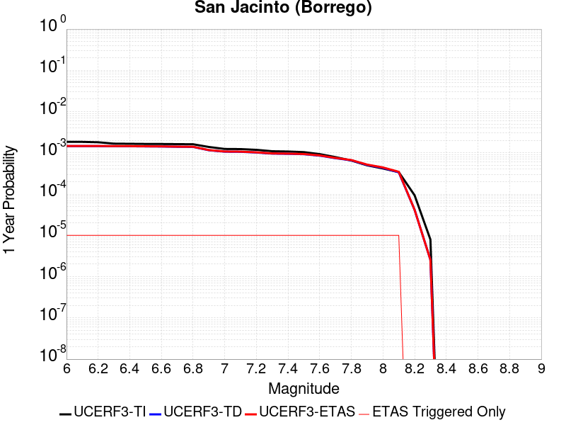 |  |

| Magnitude | 1 wk TI Prob | 1 wk TD Prob | 1 wk ETAS Prob | 1 wk ETAS/TD Gain | 1 wk ETAS Triggered Only | 1 mo TI Prob | 1 mo TD Prob | 1 mo ETAS Prob | 1 mo ETAS/TD Gain | 1 mo ETAS Triggered Only | 1 yr TI Prob | 1 yr TD Prob | 1 yr ETAS Prob | 1 yr ETAS/TD Gain | 1 yr ETAS Triggered Only | 10 yr TI Prob | 10 yr TD Prob | 10 yr ETAS Prob | 10 yr ETAS/TD Gain | 10 yr ETAS Triggered Only |
|-----|-----|-----|-----|-----|-----|-----|-----|-----|-----|-----|-----|-----|-----|-----|-----|-----|-----|-----|-----|-----|
| 6.0 | 3.543992E-5 | 2.7941607E-5 | 2.7941607E-5 | 1.0 | 0.0 | 1.5187653E-4 | 1.1974432E-4 | 1.1974432E-4 | 1.0 | 0.0 | 0.0018475284 | 0.0014569244 | 0.001480553 | 1.0162181 | 2.3663039E-5 | 0.018322436 | 0.01487749 | 0.014924112 | 1.0031338 | 4.7326077E-5 |
| 6.1 | 3.542281E-5 | 2.7941607E-5 | 2.7941607E-5 | 1.0 | 0.0 | 1.5180321E-4 | 1.1974432E-4 | 1.1974432E-4 | 1.0 | 0.0 | 0.0018466372 | 0.0014569244 | 0.001480553 | 1.0162181 | 2.3663039E-5 | 0.018313672 | 0.01487749 | 0.014924112 | 1.0031338 | 4.7326077E-5 |
| 6.2 | 3.4688688E-5 | 2.7941607E-5 | 2.7941607E-5 | 1.0 | 0.0 | 1.4865733E-4 | 1.1974432E-4 | 1.1974432E-4 | 1.0 | 0.0 | 0.0018084005 | 0.0014569244 | 0.001480553 | 1.0162181 | 2.3663039E-5 | 0.017937548 | 0.01487749 | 0.014924112 | 1.0031338 | 4.7326077E-5 |
| 6.3 | 3.2087122E-5 | 2.7786951E-5 | 2.7786951E-5 | 1.0 | 0.0 | 1.3750899E-4 | 1.1908157E-4 | 1.1908157E-4 | 1.0 | 0.0 | 0.0016728862 | 0.0014488661 | 0.0014724948 | 1.0163084 | 2.3663039E-5 | 0.016603488 | 0.014798521 | 0.014845147 | 1.0031507 | 4.7326077E-5 |
| 6.4 | 3.1828724E-5 | 2.7753935E-5 | 2.7753935E-5 | 1.0 | 0.0 | 1.364017E-4 | 1.1894008E-4 | 1.1894008E-4 | 1.0 | 0.0 | 0.0016594254 | 0.0014471457 | 0.0014707745 | 1.0163279 | 2.3663039E-5 | 0.016470885 | 0.014781598 | 0.014828225 | 1.0031544 | 4.7326077E-5 |
| 6.5 | 3.1563577E-5 | 2.7493628E-5 | 2.7493628E-5 | 1.0 | 0.0 | 1.3526545E-4 | 1.1782459E-4 | 1.1782459E-4 | 1.0 | 0.0 | 0.0016456128 | 0.0014335825 | 0.0014572117 | 1.0164826 | 2.3663039E-5 | 0.0163348 | 0.014648173 | 0.014694806 | 1.0031835 | 4.7326077E-5 |
| 6.6 | 3.1467625E-5 | 2.7337843E-5 | 2.7337843E-5 | 1.0 | 0.0 | 1.3485427E-4 | 1.1715699E-4 | 1.1715699E-4 | 1.0 | 0.0 | 0.0016406142 | 0.0014254652 | 0.0014490945 | 1.0165765 | 2.3663039E-5 | 0.016285548 | 0.014568415 | 0.014615051 | 1.0032012 | 4.7326077E-5 |
| 6.7 | 3.1223695E-5 | 2.695584E-5 | 2.695584E-5 | 1.0 | 0.0 | 1.3380898E-4 | 1.1551998E-4 | 1.1551998E-4 | 1.0 | 0.0 | 0.0016279068 | 0.0014055604 | 0.0014291903 | 1.0168116 | 2.3663039E-5 | 0.01616033 | 0.014372777 | 0.0144194225 | 1.0032455 | 4.7326077E-5 |
| 6.8 | 3.1015585E-5 | 2.6776821E-5 | 2.6776821E-5 | 1.0 | 0.0 | 1.3291716E-4 | 1.14752824E-4 | 1.14752824E-4 | 1.0 | 0.0 | 0.001617065 | 0.0013962323 | 0.0014198624 | 1.0169241 | 2.3663039E-5 | 0.016053487 | 0.0142800445 | 0.014326694 | 1.0032668 | 4.7326077E-5 |
| 6.9 | 2.6641965E-5 | 2.2198341E-5 | 2.2198341E-5 | 1.0 | 0.0 | 1.1417485E-4 | 9.51323E-5 | 9.51323E-5 | 1.0 | 0.0 | 0.0013891924 | 0.0011576243 | 0.0011812599 | 1.0204173 | 2.3663039E-5 | 0.0138054015 | 0.011889795 | 0.011936558 | 1.0039331 | 4.7326077E-5 |
| 7.0 | 2.3854353E-5 | 2.0492607E-5 | 2.0492607E-5 | 1.0 | 0.0 | 1.02228936E-4 | 8.782251E-5 | 8.782251E-5 | 1.0 | 0.0 | 0.0012439266 | 0.0010687172 | 0.001092355 | 1.0221179 | 2.3663039E-5 | 0.012369866 | 0.010989892 | 0.011036699 | 1.004259 | 4.7326077E-5 |
| 7.1 | 2.3672901E-5 | 2.032908E-5 | 2.032908E-5 | 1.0 | 0.0 | 1.0145135E-4 | 8.7121734E-5 | 8.7121734E-5 | 1.0 | 0.0 | 0.0012344702 | 0.0010601935 | 0.0010838314 | 1.0222958 | 2.3663039E-5 | 0.0122763505 | 0.010905062 | 0.010951872 | 1.0042925 | 4.7326077E-5 |
| 7.2 | 2.2717244E-5 | 1.9556348E-5 | 1.9556348E-5 | 1.0 | 0.0 | 9.735599E-5 | 8.3810235E-5 | 8.3810235E-5 | 1.0 | 0.0 | 0.0011846646 | 0.0010199143 | 0.0010435532 | 1.0231774 | 2.3663039E-5 | 0.01178369 | 0.010502371 | 0.0105492 | 1.0044589 | 4.7326077E-5 |
| 7.3 | 2.1016205E-5 | 1.839779E-5 | 1.839779E-5 | 1.0 | 0.0 | 9.006634E-5 | 7.8845296E-5 | 7.8845296E-5 | 1.0 | 0.0 | 0.001096006 | 9.595208E-4 | 9.831612E-4 | 1.0246377 | 2.3663039E-5 | 0.010906163 | 0.009897902 | 0.009944759 | 1.0047342 | 4.7326077E-5 |
| 7.4 | 2.0683625E-5 | 1.8200271E-5 | 1.8200271E-5 | 1.0 | 0.0 | 8.86411E-5 | 7.799884E-5 | 7.799884E-5 | 1.0 | 0.0 | 0.001078671 | 9.492242E-4 | 9.728648E-4 | 1.0249052 | 2.3663039E-5 | 0.010734501 | 0.009794607 | 0.009841469 | 1.0047846 | 4.7326077E-5 |
| 7.5 | 1.9993966E-5 | 1.779518E-5 | 1.779518E-5 | 1.0 | 0.0 | 8.568561E-5 | 7.626284E-5 | 7.626284E-5 | 1.0 | 0.0 | 0.001042723 | 9.281066E-4 | 9.517477E-4 | 1.0254724 | 2.3663039E-5 | 0.010378438 | 0.009581469 | 0.0096283415 | 1.004892 | 4.7326077E-5 |
| 7.6 | 1.788966E-5 | 1.6448063E-5 | 1.6448063E-5 | 1.0 | 0.0 | 7.666772E-5 | 7.0489805E-5 | 7.0489805E-5 | 1.0 | 0.0 | 9.3302975E-4 | 8.578772E-4 | 8.815199E-4 | 1.0275596 | 2.3663039E-5 | 0.00929122 | 0.008873172 | 0.008920078 | 1.0052863 | 4.7326077E-5 |
| 7.7 | 1.5125781E-5 | 1.4249754E-5 | 1.4249754E-5 | 1.0 | 0.0 | 6.4823165E-5 | 6.1068946E-5 | 6.1068946E-5 | 1.0 | 0.0 | 7.889362E-4 | 7.432616E-4 | 7.6690706E-4 | 1.0318131 | 2.3663039E-5 | 0.007861412 | 0.007720691 | 0.0077676517 | 1.0060824 | 4.7326077E-5 |
| 7.8 | 1.250089E-5 | 1.264242E-5 | 1.264242E-5 | 1.0 | 0.0 | 5.3574146E-5 | 5.418068E-5 | 5.418068E-5 | 1.0 | 0.0 | 6.5207E-4 | 6.594508E-4 | 6.830982E-4 | 1.0358592 | 2.3663039E-5 | 0.006501599 | 0.0068740193 | 0.00692102 | 1.0068375 | 4.7326077E-5 |
| 7.9 | 9.561E-6 | 9.7651555E-6 | 9.7651555E-6 | 1.0 | 0.0 | 4.0975072E-5 | 4.1849995E-5 | 4.1849995E-5 | 1.0 | 0.0 | 4.987573E-4 | 5.0940516E-4 | 5.3305615E-4 | 1.0464287 | 2.3663039E-5 | 0.0049763937 | 0.0053578936 | 0.005404966 | 1.0087856 | 4.7326077E-5 |
| 8.0 | 8.01699E-6 | 8.303067E-6 | 8.303067E-6 | 1.0 | 0.0 | 3.4358076E-5 | 3.5584093E-5 | 3.5584093E-5 | 1.0 | 0.0 | 4.1822926E-4 | 4.3315074E-4 | 4.5680354E-4 | 1.0546063 | 2.3663039E-5 | 0.0041744304 | 0.004578426 | 0.004625535 | 1.0102894 | 4.7326077E-5 |
| 8.1 | 6.541947E-6 | 6.4700785E-6 | 6.4700785E-6 | 1.0 | 0.0 | 2.8036617E-5 | 2.7728616E-5 | 2.7728616E-5 | 1.0 | 0.0 | 3.4129233E-4 | 3.375441E-4 | 3.6119914E-4 | 1.0700799 | 2.3663039E-5 | 0.0034076865 | 0.0035848522 | 0.0036320086 | 1.0131544 | 4.7326077E-5 |
| 8.2 | 1.7968189E-6 | 7.9862866E-7 | 7.9862866E-7 | 1.0 | 0.0 | 7.70063E-6 | 3.4226898E-6 | 3.4226898E-6 | 1.0 | 0.0 | 9.3751136E-5 | 4.1670475E-5 | 4.1670475E-5 | 1.0 | 0.0 | 9.371159E-4 | 4.720419E-4 | 4.720419E-4 | 1.0 | 0.0 |
| 8.3 | 1.5167889E-7 | 4.9083955E-8 | 4.9083955E-8 | 1.0 | 0.0 | 6.500522E-7 | 2.103598E-7 | 2.103598E-7 | 1.0 | 0.0 | 7.9143565E-6 | 2.561128E-6 | 2.561128E-6 | 1.0 | 0.0 | 7.914075E-5 | 2.9756291E-5 | 2.9756291E-5 | 1.0 | 0.0 |

## Pine Mtn
*[(top)](#table-of-contents)*

| 1 Week | 1 Month | 1 Year | 10 Year |
|-----|-----|-----|-----|
|  |  |  |  |

| Magnitude | 1 wk TI Prob | 1 wk TD Prob | 1 wk ETAS Prob | 1 wk ETAS/TD Gain | 1 wk ETAS Triggered Only | 1 mo TI Prob | 1 mo TD Prob | 1 mo ETAS Prob | 1 mo ETAS/TD Gain | 1 mo ETAS Triggered Only | 1 yr TI Prob | 1 yr TD Prob | 1 yr ETAS Prob | 1 yr ETAS/TD Gain | 1 yr ETAS Triggered Only | 10 yr TI Prob | 10 yr TD Prob | 10 yr ETAS Prob | 10 yr ETAS/TD Gain | 10 yr ETAS Triggered Only |
|-----|-----|-----|-----|-----|-----|-----|-----|-----|-----|-----|-----|-----|-----|-----|-----|-----|-----|-----|-----|-----|
| 6.0 | 6.894797E-6 | 7.2256657E-6 | 3.0888532E-5 | 4.2748356 | 2.3663039E-5 | 2.9548795E-5 | 3.096679E-5 | 5.4629094E-5 | 1.7641188 | 2.3663039E-5 | 3.596972E-4 | 3.769584E-4 | 4.2426665E-4 | 1.1254998 | 4.7326077E-5 | 0.0035911554 | 0.0037634873 | 0.0038106353 | 1.0125277 | 4.7326077E-5 |
| 6.1 | 6.894797E-6 | 7.2256657E-6 | 3.0888532E-5 | 4.2748356 | 2.3663039E-5 | 2.9548795E-5 | 3.096679E-5 | 5.4629094E-5 | 1.7641188 | 2.3663039E-5 | 3.596972E-4 | 3.769584E-4 | 4.2426665E-4 | 1.1254998 | 4.7326077E-5 | 0.0035911554 | 0.0037634873 | 0.0038106353 | 1.0125277 | 4.7326077E-5 |
| 6.2 | 6.894797E-6 | 7.2256657E-6 | 3.0888532E-5 | 4.2748356 | 2.3663039E-5 | 2.9548795E-5 | 3.096679E-5 | 5.4629094E-5 | 1.7641188 | 2.3663039E-5 | 3.596972E-4 | 3.769584E-4 | 4.2426665E-4 | 1.1254998 | 4.7326077E-5 | 0.0035911554 | 0.0037634873 | 0.0038106353 | 1.0125277 | 4.7326077E-5 |
| 6.3 | 6.894797E-6 | 7.2256657E-6 | 3.0888532E-5 | 4.2748356 | 2.3663039E-5 | 2.9548795E-5 | 3.096679E-5 | 5.4629094E-5 | 1.7641188 | 2.3663039E-5 | 3.596972E-4 | 3.769584E-4 | 4.2426665E-4 | 1.1254998 | 4.7326077E-5 | 0.0035911554 | 0.0037634873 | 0.0038106353 | 1.0125277 | 4.7326077E-5 |
| 6.4 | 6.894797E-6 | 7.2256657E-6 | 3.0888532E-5 | 4.2748356 | 2.3663039E-5 | 2.9548795E-5 | 3.096679E-5 | 5.4629094E-5 | 1.7641188 | 2.3663039E-5 | 3.596972E-4 | 3.769584E-4 | 4.2426665E-4 | 1.1254998 | 4.7326077E-5 | 0.0035911554 | 0.0037634873 | 0.0038106353 | 1.0125277 | 4.7326077E-5 |
| 6.5 | 6.894797E-6 | 7.2256657E-6 | 3.0888532E-5 | 4.2748356 | 2.3663039E-5 | 2.9548795E-5 | 3.096679E-5 | 5.4629094E-5 | 1.7641188 | 2.3663039E-5 | 3.596972E-4 | 3.769584E-4 | 4.2426665E-4 | 1.1254998 | 4.7326077E-5 | 0.0035911554 | 0.0037634873 | 0.0038106353 | 1.0125277 | 4.7326077E-5 |
| 6.6 | 6.894797E-6 | 7.2256657E-6 | 3.0888532E-5 | 4.2748356 | 2.3663039E-5 | 2.9548795E-5 | 3.096679E-5 | 5.4629094E-5 | 1.7641188 | 2.3663039E-5 | 3.596972E-4 | 3.769584E-4 | 4.2426665E-4 | 1.1254998 | 4.7326077E-5 | 0.0035911554 | 0.0037634873 | 0.0038106353 | 1.0125277 | 4.7326077E-5 |
| 6.7 | 6.0867933E-6 | 6.397312E-6 | 3.0060199E-5 | 4.6988797 | 2.3663039E-5 | 2.6085996E-5 | 2.7416776E-5 | 5.1079165E-5 | 1.8630624 | 2.3663039E-5 | 3.1755073E-4 | 3.3375033E-4 | 3.5740546E-4 | 1.0708767 | 2.3663039E-5 | 0.0031709734 | 0.00333271 | 0.003356294 | 1.0070766 | 2.3663039E-5 |
| 6.8 | 5.6530425E-6 | 5.950791E-6 | 2.9613688E-5 | 4.976429 | 2.3663039E-5 | 2.42271E-5 | 2.5503152E-5 | 4.916559E-5 | 1.9278239 | 2.3663039E-5 | 2.94925E-4 | 3.104587E-4 | 3.341144E-4 | 1.076196 | 2.3663039E-5 | 0.002945339 | 0.0031004546 | 0.0031240443 | 1.0076084 | 2.3663039E-5 |
| 6.9 | 4.6015225E-6 | 4.86402E-6 | 2.8526943E-5 | 5.8648906 | 2.3663039E-5 | 1.9720663E-5 | 2.084564E-5 | 4.4508186E-5 | 2.1351316 | 2.3663039E-5 | 2.4007261E-4 | 2.5376756E-4 | 2.774246E-4 | 1.0932232 | 2.3663039E-5 | 0.0023981342 | 0.0025349222 | 0.0025585252 | 1.0093112 | 2.3663039E-5 |
| 7.0 | 4.4875965E-6 | 4.7476583E-6 | 2.8410584E-5 | 5.9841256 | 2.3663039E-5 | 1.9232413E-5 | 2.0346955E-5 | 4.4009514E-5 | 2.1629531 | 2.3663039E-5 | 2.3412947E-4 | 2.476975E-4 | 2.7135466E-4 | 1.0955083 | 2.3663039E-5 | 0.0023388295 | 0.0024743578 | 0.0024979622 | 1.0095396 | 2.3663039E-5 |
| 7.1 | 3.203907E-6 | 3.4295854E-6 | 3.4295854E-6 | 1.0 | 0.0 | 1.3730958E-5 | 1.4698144E-5 | 1.4698144E-5 | 1.0 | 0.0 | 1.6716159E-4 | 1.7893588E-4 | 1.7893588E-4 | 1.0 | 0.0 | 0.0016703589 | 0.0017879842 | 0.0017879842 | 1.0 | 0.0 |
| 7.2 | 2.2060601E-6 | 2.3786254E-6 | 2.3786254E-6 | 1.0 | 0.0 | 9.4545085E-6 | 1.0194071E-5 | 1.0194071E-5 | 1.0 | 0.0 | 1.15102564E-4 | 1.241062E-4 | 1.241062E-4 | 1.0 | 0.0 | 0.0011504296 | 0.0012404138 | 0.0012404138 | 1.0 | 0.0 |
| 7.3 | 1.3765207E-6 | 1.5217773E-6 | 1.5217773E-6 | 1.0 | 0.0 | 5.899361E-6 | 6.5218874E-6 | 6.5218874E-6 | 1.0 | 0.0 | 7.182235E-5 | 7.940118E-5 | 7.940118E-5 | 1.0 | 0.0 | 7.1799144E-4 | 7.937372E-4 | 7.937372E-4 | 1.0 | 0.0 |
| 7.4 | 1.1245983E-6 | 1.2588239E-6 | 1.2588239E-6 | 1.0 | 0.0 | 4.819698E-6 | 5.394949E-6 | 5.394949E-6 | 1.0 | 0.0 | 5.8678244E-5 | 6.568161E-5 | 6.568161E-5 | 1.0 | 0.0 | 5.866275E-4 | 6.5663026E-4 | 6.5663026E-4 | 1.0 | 0.0 |
| 7.5 | 8.031682E-7 | 9.2780385E-7 | 9.2780385E-7 | 1.0 | 0.0 | 3.4421448E-6 | 3.9762967E-6 | 3.9762967E-6 | 1.0 | 0.0 | 4.1907308E-5 | 4.8410406E-5 | 4.8410406E-5 | 1.0 | 0.0 | 4.1899405E-4 | 4.8400534E-4 | 4.8400534E-4 | 1.0 | 0.0 |
| 7.6 | 4.8953444E-7 | 6.0039736E-7 | 6.0039736E-7 | 1.0 | 0.0 | 2.098003E-6 | 2.5731294E-6 | 2.5731294E-6 | 1.0 | 0.0 | 2.5542888E-5 | 3.132745E-5 | 3.132745E-5 | 1.0 | 0.0 | 2.5539953E-4 | 3.1323518E-4 | 3.1323518E-4 | 1.0 | 0.0 |
| 7.7 | 6.634529E-8 | 6.788868E-8 | 6.788868E-8 | 1.0 | 0.0 | 2.843369E-7 | 2.9095145E-7 | 2.9095145E-7 | 1.0 | 0.0 | 3.4617963E-6 | 3.5423286E-6 | 3.5423286E-6 | 1.0 | 0.0 | 3.4617424E-5 | 3.542277E-5 | 3.542277E-5 | 1.0 | 0.0 |
| 7.8 | 9.235578E-9 | 9.4886365E-9 | 9.4886365E-9 | 1.0 | 0.0 | 3.9581046E-8 | 4.0665583E-8 | 4.0665583E-8 | 1.0 | 0.0 | 4.818991E-7 | 4.951034E-7 | 4.951034E-7 | 1.0 | 0.0 | 4.8189804E-6 | 4.9510245E-6 | 4.9510245E-6 | 1.0 | 0.0 |

## Kern Canyon (South Kern) 2011
*[(top)](#table-of-contents)*

| 1 Week | 1 Month | 1 Year | 10 Year |
|-----|-----|-----|-----|
|  |  |  |  |

| Magnitude | 1 wk TI Prob | 1 wk TD Prob | 1 wk ETAS Prob | 1 wk ETAS/TD Gain | 1 wk ETAS Triggered Only | 1 mo TI Prob | 1 mo TD Prob | 1 mo ETAS Prob | 1 mo ETAS/TD Gain | 1 mo ETAS Triggered Only | 1 yr TI Prob | 1 yr TD Prob | 1 yr ETAS Prob | 1 yr ETAS/TD Gain | 1 yr ETAS Triggered Only | 10 yr TI Prob | 10 yr TD Prob | 10 yr ETAS Prob | 10 yr ETAS/TD Gain | 10 yr ETAS Triggered Only |
|-----|-----|-----|-----|-----|-----|-----|-----|-----|-----|-----|-----|-----|-----|-----|-----|-----|-----|-----|-----|-----|
| 6.0 | 4.105075E-6 | 4.113747E-6 | 4.113747E-6 | 1.0 | 0.0 | 1.7593058E-5 | 1.763023E-5 | 1.763023E-5 | 1.0 | 0.0 | 2.1417443E-4 | 2.1462754E-4 | 2.3828549E-4 | 1.110228 | 2.3663039E-5 | 0.0021396813 | 0.0021442664 | 0.002191491 | 1.0220237 | 4.7326077E-5 |
| 6.1 | 4.105075E-6 | 4.113747E-6 | 4.113747E-6 | 1.0 | 0.0 | 1.7593058E-5 | 1.763023E-5 | 1.763023E-5 | 1.0 | 0.0 | 2.1417443E-4 | 2.1462754E-4 | 2.3828549E-4 | 1.110228 | 2.3663039E-5 | 0.0021396813 | 0.0021442664 | 0.002191491 | 1.0220237 | 4.7326077E-5 |
| 6.2 | 4.105075E-6 | 4.113747E-6 | 4.113747E-6 | 1.0 | 0.0 | 1.7593058E-5 | 1.763023E-5 | 1.763023E-5 | 1.0 | 0.0 | 2.1417443E-4 | 2.1462754E-4 | 2.3828549E-4 | 1.110228 | 2.3663039E-5 | 0.0021396813 | 0.0021442664 | 0.002191491 | 1.0220237 | 4.7326077E-5 |
| 6.3 | 4.105075E-6 | 4.113747E-6 | 4.113747E-6 | 1.0 | 0.0 | 1.7593058E-5 | 1.763023E-5 | 1.763023E-5 | 1.0 | 0.0 | 2.1417443E-4 | 2.1462754E-4 | 2.3828549E-4 | 1.110228 | 2.3663039E-5 | 0.0021396813 | 0.0021442664 | 0.002191491 | 1.0220237 | 4.7326077E-5 |
| 6.4 | 4.105075E-6 | 4.113747E-6 | 4.113747E-6 | 1.0 | 0.0 | 1.7593058E-5 | 1.763023E-5 | 1.763023E-5 | 1.0 | 0.0 | 2.1417443E-4 | 2.1462754E-4 | 2.3828549E-4 | 1.110228 | 2.3663039E-5 | 0.0021396813 | 0.0021442664 | 0.002191491 | 1.0220237 | 4.7326077E-5 |
| 6.5 | 2.9849807E-6 | 2.9731698E-6 | 2.9731698E-6 | 1.0 | 0.0 | 1.2792712E-5 | 1.2742094E-5 | 1.2742094E-5 | 1.0 | 0.0 | 1.5574014E-4 | 1.5512411E-4 | 1.5512411E-4 | 1.0 | 0.0 | 0.0015563103 | 0.0015501734 | 0.0015737998 | 1.0152411 | 2.3663039E-5 |
| 6.6 | 2.9849807E-6 | 2.9731698E-6 | 2.9731698E-6 | 1.0 | 0.0 | 1.2792712E-5 | 1.2742094E-5 | 1.2742094E-5 | 1.0 | 0.0 | 1.5574014E-4 | 1.5512411E-4 | 1.5512411E-4 | 1.0 | 0.0 | 0.0015563103 | 0.0015501734 | 0.0015737998 | 1.0152411 | 2.3663039E-5 |
| 6.7 | 2.6756725E-6 | 2.6582343E-6 | 2.6582343E-6 | 1.0 | 0.0 | 1.1467117E-5 | 1.1392383E-5 | 1.1392383E-5 | 1.0 | 0.0 | 1.396032E-4 | 1.3869355E-4 | 1.3869355E-4 | 1.0 | 0.0 | 0.0013951553 | 0.0013860808 | 0.0014097111 | 1.0170482 | 2.3663039E-5 |
| 6.8 | 2.3283721E-6 | 2.3047905E-6 | 2.3047905E-6 | 1.0 | 0.0 | 9.9787E-6 | 9.877637E-6 | 9.877637E-6 | 1.0 | 0.0 | 1.214839E-4 | 1.2025367E-4 | 1.2025367E-4 | 1.0 | 0.0 | 0.001214175 | 0.0012018934 | 0.0012255281 | 1.0196645 | 2.3663039E-5 |
| 6.9 | 2.0972677E-6 | 2.0696518E-6 | 2.0696518E-6 | 1.0 | 0.0 | 8.988259E-6 | 8.869907E-6 | 8.869907E-6 | 1.0 | 0.0 | 1.0942656E-4 | 1.0798582E-4 | 1.0798582E-4 | 1.0 | 0.0 | 0.0010937268 | 0.0010793393 | 0.0011029769 | 1.0218999 | 2.3663039E-5 |
| 7.0 | 1.7132242E-6 | 1.6787125E-6 | 1.6787125E-6 | 1.0 | 0.0 | 7.3423685E-6 | 7.1944623E-6 | 7.1944623E-6 | 1.0 | 0.0 | 8.938967E-5 | 8.75891E-5 | 8.75891E-5 | 1.0 | 0.0 | 8.935372E-4 | 8.7554957E-4 | 8.991919E-4 | 1.0270028 | 2.3663039E-5 |
| 7.1 | 1.4215541E-6 | 1.3815826E-6 | 1.3815826E-6 | 1.0 | 0.0 | 6.0923603E-6 | 5.921055E-6 | 5.921055E-6 | 1.0 | 0.0 | 7.417196E-5 | 7.2086485E-5 | 7.2086485E-5 | 1.0 | 0.0 | 7.414721E-4 | 7.206337E-4 | 7.442797E-4 | 1.0328127 | 2.3663039E-5 |
| 7.2 | 9.097853E-7 | 8.603824E-7 | 8.603824E-7 | 1.0 | 0.0 | 3.899074E-6 | 3.687348E-6 | 3.687348E-6 | 1.0 | 0.0 | 4.7470192E-5 | 4.489255E-5 | 4.489255E-5 | 1.0 | 0.0 | 4.7460053E-4 | 4.4883587E-4 | 4.724883E-4 | 1.0526973 | 2.3663039E-5 |
| 7.3 | 6.144169E-7 | 5.6282397E-7 | 5.6282397E-7 | 1.0 | 0.0 | 2.6332125E-6 | 2.4121007E-6 | 2.4121007E-6 | 1.0 | 0.0 | 3.205889E-5 | 2.9366935E-5 | 2.9366935E-5 | 1.0 | 0.0 | 3.2054266E-4 | 2.9363105E-4 | 3.1728714E-4 | 1.080564 | 2.3663039E-5 |
| 7.4 | 4.049844E-7 | 3.5728542E-7 | 3.5728542E-7 | 1.0 | 0.0 | 1.7356463E-6 | 1.5312223E-6 | 1.5312223E-6 | 1.0 | 0.0 | 2.1131287E-5 | 1.8642475E-5 | 1.8642475E-5 | 1.0 | 0.0 | 2.1129279E-4 | 1.8640936E-4 | 1.8640936E-4 | 1.0 | 0.0 |
| 7.5 | 1.9871162E-7 | 1.5830561E-7 | 1.5830561E-7 | 1.0 | 0.0 | 8.5162094E-7 | 6.7845247E-7 | 6.7845247E-7 | 1.0 | 0.0 | 1.0368436E-5 | 8.260128E-6 | 8.260128E-6 | 1.0 | 0.0 | 1.0367952E-4 | 8.259829E-5 | 8.259829E-5 | 1.0 | 0.0 |
| 7.6 | 2.572245E-8 | 1.735272E-8 | 1.735272E-8 | 1.0 | 0.0 | 1.10239064E-7 | 7.43688E-8 | 7.43688E-8 | 1.0 | 0.0 | 1.3421597E-6 | 9.054398E-7 | 9.054398E-7 | 1.0 | 0.0 | 1.3421517E-5 | 9.054366E-6 | 9.054366E-6 | 1.0 | 0.0 |

## Cleghorn
*[(top)](#table-of-contents)*

| 1 Week | 1 Month | 1 Year | 10 Year |
|-----|-----|-----|-----|
|  |  |  |  |

| Magnitude | 1 wk TI Prob | 1 wk TD Prob | 1 wk ETAS Prob | 1 wk ETAS/TD Gain | 1 wk ETAS Triggered Only | 1 mo TI Prob | 1 mo TD Prob | 1 mo ETAS Prob | 1 mo ETAS/TD Gain | 1 mo ETAS Triggered Only | 1 yr TI Prob | 1 yr TD Prob | 1 yr ETAS Prob | 1 yr ETAS/TD Gain | 1 yr ETAS Triggered Only | 10 yr TI Prob | 10 yr TD Prob | 10 yr ETAS Prob | 10 yr ETAS/TD Gain | 10 yr ETAS Triggered Only |
|-----|-----|-----|-----|-----|-----|-----|-----|-----|-----|-----|-----|-----|-----|-----|-----|-----|-----|-----|-----|-----|
| 6.0 | 7.9267165E-6 | 9.836382E-6 | 9.836382E-6 | 1.0 | 0.0 | 3.39712E-5 | 4.21553E-5 | 4.21553E-5 | 1.0 | 0.0 | 4.1352084E-4 | 5.1313057E-4 | 5.1313057E-4 | 1.0 | 0.0 | 0.004127522 | 0.0051345266 | 0.0051816097 | 1.0091699 | 4.7326077E-5 |
| 6.1 | 7.9267165E-6 | 9.836382E-6 | 9.836382E-6 | 1.0 | 0.0 | 3.39712E-5 | 4.21553E-5 | 4.21553E-5 | 1.0 | 0.0 | 4.1352084E-4 | 5.1313057E-4 | 5.1313057E-4 | 1.0 | 0.0 | 0.004127522 | 0.0051345266 | 0.0051816097 | 1.0091699 | 4.7326077E-5 |
| 6.2 | 7.9267165E-6 | 9.836382E-6 | 9.836382E-6 | 1.0 | 0.0 | 3.39712E-5 | 4.21553E-5 | 4.21553E-5 | 1.0 | 0.0 | 4.1352084E-4 | 5.1313057E-4 | 5.1313057E-4 | 1.0 | 0.0 | 0.004127522 | 0.0051345266 | 0.0051816097 | 1.0091699 | 4.7326077E-5 |
| 6.3 | 7.9267165E-6 | 9.836382E-6 | 9.836382E-6 | 1.0 | 0.0 | 3.39712E-5 | 4.21553E-5 | 4.21553E-5 | 1.0 | 0.0 | 4.1352084E-4 | 5.1313057E-4 | 5.1313057E-4 | 1.0 | 0.0 | 0.004127522 | 0.0051345266 | 0.0051816097 | 1.0091699 | 4.7326077E-5 |
| 6.4 | 4.3445207E-6 | 6.096199E-6 | 6.096199E-6 | 1.0 | 0.0 | 1.8619241E-5 | 2.612631E-5 | 2.612631E-5 | 1.0 | 0.0 | 2.2666567E-4 | 3.180424E-4 | 3.180424E-4 | 1.0 | 0.0 | 0.0022643462 | 0.003190019 | 0.0032136065 | 1.0073942 | 2.3663039E-5 |
| 6.5 | 4.3445207E-6 | 6.096199E-6 | 6.096199E-6 | 1.0 | 0.0 | 1.8619241E-5 | 2.612631E-5 | 2.612631E-5 | 1.0 | 0.0 | 2.2666567E-4 | 3.180424E-4 | 3.180424E-4 | 1.0 | 0.0 | 0.0022643462 | 0.003190019 | 0.0032136065 | 1.0073942 | 2.3663039E-5 |
| 6.6 | 4.040109E-6 | 5.778603E-6 | 5.778603E-6 | 1.0 | 0.0 | 1.7314638E-5 | 2.4765211E-5 | 2.4765211E-5 | 1.0 | 0.0 | 2.1078532E-4 | 3.0147567E-4 | 3.0147567E-4 | 1.0 | 0.0 | 0.002105855 | 0.0030248072 | 0.0030483985 | 1.0077994 | 2.3663039E-5 |
| 6.7 | 3.3632055E-6 | 5.0720914E-6 | 5.0720914E-6 | 1.0 | 0.0 | 1.4413658E-5 | 2.1737356E-5 | 2.1737356E-5 | 1.0 | 0.0 | 1.7547216E-4 | 2.646205E-4 | 2.646205E-4 | 1.0 | 0.0 | 0.0017533366 | 0.002657138 | 0.002657138 | 1.0 | 0.0 |
| 6.8 | 3.2902772E-6 | 4.9939977E-6 | 4.9939977E-6 | 1.0 | 0.0 | 1.4101111E-5 | 2.1402673E-5 | 2.1402673E-5 | 1.0 | 0.0 | 1.716675E-4 | 2.6054672E-4 | 2.6054672E-4 | 1.0 | 0.0 | 0.0017153495 | 0.0026164963 | 0.0026164963 | 1.0 | 0.0 |
| 6.9 | 3.031547E-6 | 4.695545E-6 | 4.695545E-6 | 1.0 | 0.0 | 1.299228E-5 | 2.012361E-5 | 2.012361E-5 | 1.0 | 0.0 | 1.5816953E-4 | 2.449777E-4 | 2.449777E-4 | 1.0 | 0.0 | 0.00158057 | 0.0024611582 | 0.0024611582 | 1.0 | 0.0 |
| 7.0 | 2.8259715E-6 | 4.3745763E-6 | 4.3745763E-6 | 1.0 | 0.0 | 1.211125E-5 | 1.8748051E-5 | 1.8748051E-5 | 1.0 | 0.0 | 1.4744449E-4 | 2.2823385E-4 | 2.2823385E-4 | 1.0 | 0.0 | 0.001473467 | 0.002294075 | 0.002294075 | 1.0 | 0.0 |
| 7.1 | 2.5962665E-6 | 4.0695813E-6 | 4.0695813E-6 | 1.0 | 0.0 | 1.1126809E-5 | 1.7440947E-5 | 1.7440947E-5 | 1.0 | 0.0 | 1.3546048E-4 | 2.1232305E-4 | 2.1232305E-4 | 1.0 | 0.0 | 0.0013537793 | 0.0021352873 | 0.0021352873 | 1.0 | 0.0 |
| 7.2 | 2.3247253E-6 | 3.6798972E-6 | 3.6798972E-6 | 1.0 | 0.0 | 9.96307E-6 | 1.5770895E-5 | 1.5770895E-5 | 1.0 | 0.0 | 1.21293626E-4 | 1.919939E-4 | 1.919939E-4 | 1.0 | 0.0 | 0.0012122744 | 0.001932387 | 0.001932387 | 1.0 | 0.0 |
| 7.3 | 2.056928E-6 | 3.2381586E-6 | 3.2381586E-6 | 1.0 | 0.0 | 8.815376E-6 | 1.3877749E-5 | 1.3877749E-5 | 1.0 | 0.0 | 1.0732192E-4 | 1.6894865E-4 | 1.6894865E-4 | 1.0 | 0.0 | 0.001072701 | 0.0017023751 | 0.0017023751 | 1.0 | 0.0 |
| 7.4 | 1.8055999E-6 | 2.8281777E-6 | 2.8281777E-6 | 1.0 | 0.0 | 7.738263E-6 | 1.2120706E-5 | 1.2120706E-5 | 1.0 | 0.0 | 9.4209274E-5 | 1.4755974E-4 | 1.4755974E-4 | 1.0 | 0.0 | 9.4169343E-4 | 0.0014889282 | 0.0014889282 | 1.0 | 0.0 |
| 7.5 | 1.4683443E-6 | 2.4272497E-6 | 2.4272497E-6 | 1.0 | 0.0 | 6.292889E-6 | 1.0402458E-5 | 1.0402458E-5 | 1.0 | 0.0 | 7.661323E-5 | 1.2664266E-4 | 1.2664266E-4 | 1.0 | 0.0 | 7.658682E-4 | 0.0012800582 | 0.0012800582 | 1.0 | 0.0 |
| 7.6 | 9.804088E-7 | 1.9026955E-6 | 1.9026955E-6 | 1.0 | 0.0 | 4.201745E-6 | 8.154385E-6 | 8.154385E-6 | 1.0 | 0.0 | 5.1155046E-5 | 9.927515E-5 | 9.927515E-5 | 1.0 | 0.0 | 5.114327E-4 | 0.0010066963 | 0.0010066963 | 1.0 | 0.0 |
| 7.7 | 7.3434086E-7 | 1.6307837E-6 | 1.6307837E-6 | 1.0 | 0.0 | 3.1471714E-6 | 6.9890543E-6 | 6.9890543E-6 | 1.0 | 0.0 | 3.831614E-5 | 8.508844E-5 | 8.508844E-5 | 1.0 | 0.0 | 3.8309532E-4 | 8.649813E-4 | 8.649813E-4 | 1.0 | 0.0 |
| 7.8 | 6.434184E-7 | 1.5242053E-6 | 1.5242053E-6 | 1.0 | 0.0 | 2.7575045E-6 | 6.5322924E-6 | 6.5322924E-6 | 1.0 | 0.0 | 3.35721E-5 | 7.952779E-5 | 7.952779E-5 | 1.0 | 0.0 | 3.3567028E-4 | 8.0907624E-4 | 8.0907624E-4 | 1.0 | 0.0 |
| 7.9 | 3.4943926E-7 | 7.585602E-7 | 7.585602E-7 | 1.0 | 0.0 | 1.497596E-6 | 3.2509683E-6 | 3.2509683E-6 | 1.0 | 0.0 | 1.8233079E-5 | 3.957983E-5 | 3.957983E-5 | 1.0 | 0.0 | 1.8231584E-4 | 4.045744E-4 | 4.045744E-4 | 1.0 | 0.0 |
| 8.0 | 6.717524E-8 | 5.8493473E-8 | 5.8493473E-8 | 1.0 | 0.0 | 2.8789387E-7 | 2.506863E-7 | 2.506863E-7 | 1.0 | 0.0 | 3.505102E-6 | 3.0521014E-6 | 3.0521014E-6 | 1.0 | 0.0 | 3.5050467E-5 | 3.2791522E-5 | 3.2791522E-5 | 1.0 | 0.0 |
| 8.1 | 3.1984914E-8 | 1.2990346E-8 | 1.2990346E-8 | 1.0 | 0.0 | 1.370782E-7 | 5.5672913E-8 | 5.5672913E-8 | 1.0 | 0.0 | 1.6689258E-6 | 6.7781747E-7 | 6.7781747E-7 | 1.0 | 0.0 | 1.6689133E-5 | 7.763877E-6 | 7.763877E-6 | 1.0 | 0.0 |
| 8.2 | 1.21887656E-8 | 3.660091E-9 | 3.660091E-9 | 1.0 | 0.0 | 5.2237567E-8 | 1.5686105E-8 | 1.5686105E-8 | 1.0 | 0.0 | 6.359922E-7 | 1.9097831E-7 | 1.9097831E-7 | 1.0 | 0.0 | 6.3599036E-6 | 2.2531958E-6 | 2.2531958E-6 | 1.0 | 0.0 |

## Sheephole
*[(top)](#table-of-contents)*

| 1 Week | 1 Month | 1 Year | 10 Year |
|-----|-----|-----|-----|
|  |  |  |  |

| Magnitude | 1 wk TI Prob | 1 wk TD Prob | 1 wk ETAS Prob | 1 wk ETAS/TD Gain | 1 wk ETAS Triggered Only | 1 mo TI Prob | 1 mo TD Prob | 1 mo ETAS Prob | 1 mo ETAS/TD Gain | 1 mo ETAS Triggered Only | 1 yr TI Prob | 1 yr TD Prob | 1 yr ETAS Prob | 1 yr ETAS/TD Gain | 1 yr ETAS Triggered Only | 10 yr TI Prob | 10 yr TD Prob | 10 yr ETAS Prob | 10 yr ETAS/TD Gain | 10 yr ETAS Triggered Only |
|-----|-----|-----|-----|-----|-----|-----|-----|-----|-----|-----|-----|-----|-----|-----|-----|-----|-----|-----|-----|-----|
| 6.0 | 4.5579695E-6 | 4.741313E-6 | 4.741313E-6 | 1.0 | 0.0 | 1.9534009E-5 | 2.0319787E-5 | 2.0319787E-5 | 1.0 | 0.0 | 2.3780059E-4 | 2.4737086E-4 | 2.9468522E-4 | 1.1912689 | 4.7326077E-5 | 0.0023754628 | 0.0024714996 | 0.0025187086 | 1.0191014 | 4.7326077E-5 |
| 6.1 | 4.5579695E-6 | 4.741313E-6 | 4.741313E-6 | 1.0 | 0.0 | 1.9534009E-5 | 2.0319787E-5 | 2.0319787E-5 | 1.0 | 0.0 | 2.3780059E-4 | 2.4737086E-4 | 2.9468522E-4 | 1.1912689 | 4.7326077E-5 | 0.0023754628 | 0.0024714996 | 0.0025187086 | 1.0191014 | 4.7326077E-5 |
| 6.2 | 2.6677674E-6 | 2.7874275E-6 | 2.7874275E-6 | 1.0 | 0.0 | 1.1433239E-5 | 1.1946069E-5 | 1.1946069E-5 | 1.0 | 0.0 | 1.3919079E-4 | 1.4543477E-4 | 1.9275396E-4 | 1.3253638 | 4.7326077E-5 | 0.0013910364 | 0.0014535018 | 0.001500759 | 1.0325127 | 4.7326077E-5 |
| 6.3 | 2.6677674E-6 | 2.7874275E-6 | 2.7874275E-6 | 1.0 | 0.0 | 1.1433239E-5 | 1.1946069E-5 | 1.1946069E-5 | 1.0 | 0.0 | 1.3919079E-4 | 1.4543477E-4 | 1.9275396E-4 | 1.3253638 | 4.7326077E-5 | 0.0013910364 | 0.0014535018 | 0.001500759 | 1.0325127 | 4.7326077E-5 |
| 6.4 | 2.2159759E-6 | 2.3229084E-6 | 2.3229084E-6 | 1.0 | 0.0 | 9.497005E-6 | 9.955288E-6 | 9.955288E-6 | 1.0 | 0.0 | 1.156199E-4 | 1.211997E-4 | 1.6852004E-4 | 1.3904328 | 4.7326077E-5 | 0.0011555976 | 0.0012114154 | 0.0012586841 | 1.0390195 | 4.7326077E-5 |
| 6.5 | 2.1986082E-6 | 2.3047885E-6 | 2.3047885E-6 | 1.0 | 0.0 | 9.4225725E-6 | 9.877633E-6 | 9.877633E-6 | 1.0 | 0.0 | 1.1471378E-4 | 1.2025435E-4 | 1.6757473E-4 | 1.3935025 | 4.7326077E-5 | 0.0011465458 | 0.001201972 | 0.0012492413 | 1.0393263 | 4.7326077E-5 |
| 6.6 | 1.5232331E-6 | 1.6019138E-6 | 1.6019138E-6 | 1.0 | 0.0 | 6.5281256E-6 | 6.8653276E-6 | 6.8653276E-6 | 1.0 | 0.0 | 7.947703E-5 | 8.358235E-5 | 8.358235E-5 | 1.0 | 0.0 | 7.9448614E-4 | 8.3552784E-4 | 8.3552784E-4 | 1.0 | 0.0 |
| 6.7 | 1.3137362E-6 | 1.3828384E-6 | 1.3828384E-6 | 1.0 | 0.0 | 5.6302856E-6 | 5.926437E-6 | 5.926437E-6 | 1.0 | 0.0 | 6.854657E-5 | 7.215213E-5 | 7.215213E-5 | 1.0 | 0.0 | 6.8525434E-4 | 7.213009E-4 | 7.213009E-4 | 1.0 | 0.0 |
| 6.8 | 1.2275751E-6 | 1.2923027E-6 | 1.2923027E-6 | 1.0 | 0.0 | 5.2610258E-6 | 5.5384294E-6 | 5.5384294E-6 | 1.0 | 0.0 | 6.4051106E-5 | 6.7428424E-5 | 6.7428424E-5 | 1.0 | 0.0 | 6.4032647E-4 | 6.74093E-4 | 6.74093E-4 | 1.0 | 0.0 |
| 6.9 | 1.1837088E-6 | 1.2461194E-6 | 1.2461194E-6 | 1.0 | 0.0 | 5.0730278E-6 | 5.3405015E-6 | 5.3405015E-6 | 1.0 | 0.0 | 6.176237E-5 | 6.50188E-5 | 6.50188E-5 | 1.0 | 0.0 | 6.17452E-4 | 6.5001094E-4 | 6.5001094E-4 | 1.0 | 0.0 |
| 7.0 | 9.849371E-7 | 1.0366432E-6 | 1.0366432E-6 | 1.0 | 0.0 | 4.2211523E-6 | 4.4427497E-6 | 4.4427497E-6 | 1.0 | 0.0 | 5.1391315E-5 | 5.408924E-5 | 5.408924E-5 | 1.0 | 0.0 | 5.137943E-4 | 5.407708E-4 | 5.407708E-4 | 1.0 | 0.0 |
| 7.1 | 8.1643645E-7 | 8.5917884E-7 | 8.5917884E-7 | 1.0 | 0.0 | 3.4990085E-6 | 3.6821903E-6 | 3.6821903E-6 | 1.0 | 0.0 | 4.2599597E-5 | 4.482983E-5 | 4.482983E-5 | 1.0 | 0.0 | 4.259143E-4 | 4.482165E-4 | 4.482165E-4 | 1.0 | 0.0 |
| 7.2 | 5.7295756E-7 | 6.0295855E-7 | 6.0295855E-7 | 1.0 | 0.0 | 2.45553E-6 | 2.584106E-6 | 2.584106E-6 | 1.0 | 0.0 | 2.9895667E-5 | 3.1461102E-5 | 3.1461102E-5 | 1.0 | 0.0 | 2.9891645E-4 | 3.1457318E-4 | 3.1457318E-4 | 1.0 | 0.0 |

## San Jacinto (Coyote Creek)
*[(top)](#table-of-contents)*

| 1 Week | 1 Month | 1 Year | 10 Year |
|-----|-----|-----|-----|
|  |  |  |  |

| Magnitude | 1 wk TI Prob | 1 wk TD Prob | 1 wk ETAS Prob | 1 wk ETAS/TD Gain | 1 wk ETAS Triggered Only | 1 mo TI Prob | 1 mo TD Prob | 1 mo ETAS Prob | 1 mo ETAS/TD Gain | 1 mo ETAS Triggered Only | 1 yr TI Prob | 1 yr TD Prob | 1 yr ETAS Prob | 1 yr ETAS/TD Gain | 1 yr ETAS Triggered Only | 10 yr TI Prob | 10 yr TD Prob | 10 yr ETAS Prob | 10 yr ETAS/TD Gain | 10 yr ETAS Triggered Only |
|-----|-----|-----|-----|-----|-----|-----|-----|-----|-----|-----|-----|-----|-----|-----|-----|-----|-----|-----|-----|-----|
| 6.0 | 2.7374346E-5 | 2.4161187E-5 | 2.4161187E-5 | 1.0 | 0.0 | 1.1731335E-4 | 1.0354385E-4 | 1.0354385E-4 | 1.0 | 0.0 | 0.0014273542 | 0.0012599198 | 0.0012835531 | 1.0187577 | 2.3663039E-5 | 0.01418221 | 0.012936629 | 0.012983344 | 1.003611 | 4.7326077E-5 |
| 6.1 | 2.7374346E-5 | 2.4161187E-5 | 2.4161187E-5 | 1.0 | 0.0 | 1.1731335E-4 | 1.0354385E-4 | 1.0354385E-4 | 1.0 | 0.0 | 0.0014273542 | 0.0012599198 | 0.0012835531 | 1.0187577 | 2.3663039E-5 | 0.01418221 | 0.012936629 | 0.012983344 | 1.003611 | 4.7326077E-5 |
| 6.2 | 2.7374346E-5 | 2.4161187E-5 | 2.4161187E-5 | 1.0 | 0.0 | 1.1731335E-4 | 1.0354385E-4 | 1.0354385E-4 | 1.0 | 0.0 | 0.0014273542 | 0.0012599198 | 0.0012835531 | 1.0187577 | 2.3663039E-5 | 0.01418221 | 0.012936629 | 0.012983344 | 1.003611 | 4.7326077E-5 |
| 6.3 | 2.7374346E-5 | 2.4161187E-5 | 2.4161187E-5 | 1.0 | 0.0 | 1.1731335E-4 | 1.0354385E-4 | 1.0354385E-4 | 1.0 | 0.0 | 0.0014273542 | 0.0012599198 | 0.0012835531 | 1.0187577 | 2.3663039E-5 | 0.01418221 | 0.012936629 | 0.012983344 | 1.003611 | 4.7326077E-5 |
| 6.4 | 2.7374346E-5 | 2.4161187E-5 | 2.4161187E-5 | 1.0 | 0.0 | 1.1731335E-4 | 1.0354385E-4 | 1.0354385E-4 | 1.0 | 0.0 | 0.0014273542 | 0.0012599198 | 0.0012835531 | 1.0187577 | 2.3663039E-5 | 0.01418221 | 0.012936629 | 0.012983344 | 1.003611 | 4.7326077E-5 |
| 6.5 | 2.7282445E-5 | 2.4047258E-5 | 2.4047258E-5 | 1.0 | 0.0 | 1.16919524E-4 | 1.0305562E-4 | 1.0305562E-4 | 1.0 | 0.0 | 0.0014225657 | 0.0012539827 | 0.001277616 | 1.0188466 | 2.3663039E-5 | 0.014134934 | 0.012877954 | 0.01292467 | 1.0036277 | 4.7326077E-5 |
| 6.6 | 2.7282445E-5 | 2.4047258E-5 | 2.4047258E-5 | 1.0 | 0.0 | 1.16919524E-4 | 1.0305562E-4 | 1.0305562E-4 | 1.0 | 0.0 | 0.0014225657 | 0.0012539827 | 0.001277616 | 1.0188466 | 2.3663039E-5 | 0.014134934 | 0.012877954 | 0.01292467 | 1.0036277 | 4.7326077E-5 |
| 6.7 | 2.7216198E-5 | 2.3972374E-5 | 2.3972374E-5 | 1.0 | 0.0 | 1.1663563E-4 | 1.0273472E-4 | 1.0273472E-4 | 1.0 | 0.0 | 0.0014191137 | 0.0012500801 | 0.0012737135 | 1.0189055 | 2.3663039E-5 | 0.014100855 | 0.012839363 | 0.012886081 | 1.0036387 | 4.7326077E-5 |
| 6.8 | 2.7078617E-5 | 2.3889581E-5 | 2.3889581E-5 | 1.0 | 0.0 | 1.1604605E-4 | 1.0237992E-4 | 1.0237992E-4 | 1.0 | 0.0 | 0.001411945 | 0.0012457654 | 0.001269399 | 1.0189711 | 2.3663039E-5 | 0.014030075 | 0.012796501 | 0.0128432205 | 1.003651 | 4.7326077E-5 |
| 6.9 | 2.6982952E-5 | 2.3809083E-5 | 2.3809083E-5 | 1.0 | 0.0 | 1.15636096E-4 | 1.0203495E-4 | 1.0203495E-4 | 1.0 | 0.0 | 0.0014069602 | 0.0012415702 | 0.0012652039 | 1.0190353 | 2.3663039E-5 | 0.013980856 | 0.012754811 | 0.012801534 | 1.0036632 | 4.7326077E-5 |
| 7.0 | 2.6449972E-5 | 2.338607E-5 | 2.338607E-5 | 1.0 | 0.0 | 1.1335209E-4 | 1.00222176E-4 | 1.00222176E-4 | 1.0 | 0.0 | 0.001379188 | 0.0012195245 | 0.0012431587 | 1.0193799 | 2.3663039E-5 | 0.0137065975 | 0.012536157 | 0.01258289 | 1.0037278 | 4.7326077E-5 |
| 7.1 | 2.6257849E-5 | 2.321209E-5 | 2.321209E-5 | 1.0 | 0.0 | 1.1252879E-4 | 9.947661E-5 | 9.947661E-5 | 1.0 | 0.0 | 0.0013691769 | 0.0012104574 | 0.0012340918 | 1.0195252 | 2.3663039E-5 | 0.013607717 | 0.012446014 | 0.012492751 | 1.0037552 | 4.7326077E-5 |
| 7.2 | 2.5270041E-5 | 2.2406735E-5 | 2.2406735E-5 | 1.0 | 0.0 | 1.0829568E-4 | 9.6025346E-5 | 9.6025346E-5 | 1.0 | 0.0 | 0.0013177024 | 0.0011684839 | 0.0011921193 | 1.0202274 | 2.3663039E-5 | 0.013099162 | 0.012026992 | 0.012073748 | 1.0038877 | 4.7326077E-5 |
| 7.3 | 2.339701E-5 | 2.1138358E-5 | 2.1138358E-5 | 1.0 | 0.0 | 1.0026905E-4 | 9.058983E-5 | 9.058983E-5 | 1.0 | 0.0 | 0.001220092 | 0.0011023752 | 0.0011260122 | 1.0214418 | 2.3663039E-5 | 0.012134149 | 0.011365798 | 0.011412587 | 1.0041165 | 4.7326077E-5 |
| 7.4 | 2.296333E-5 | 2.0868656E-5 | 2.0868656E-5 | 1.0 | 0.0 | 9.841056E-5 | 8.943405E-5 | 8.943405E-5 | 1.0 | 0.0 | 0.0011974899 | 0.0010883177 | 0.0011119549 | 1.0217191 | 2.3663039E-5 | 0.011910575 | 0.011224884 | 0.011271679 | 1.0041689 | 4.7326077E-5 |
| 7.5 | 2.2188895E-5 | 2.0391453E-5 | 2.0391453E-5 | 1.0 | 0.0 | 9.50918E-5 | 8.7389024E-5 | 8.7389024E-5 | 1.0 | 0.0 | 0.0011571277 | 0.0010634441 | 0.001087082 | 1.0222276 | 2.3663039E-5 | 0.011511209 | 0.010974437 | 0.011021243 | 1.0042651 | 4.7326077E-5 |
| 7.6 | 2.0013189E-5 | 1.897738E-5 | 1.897738E-5 | 1.0 | 0.0 | 8.5767984E-5 | 8.13291E-5 | 8.13291E-5 | 1.0 | 0.0 | 0.001043725 | 9.897337E-4 | 0.0010133734 | 1.0238848 | 2.3663039E-5 | 0.010388365 | 0.01023227 | 0.010279112 | 1.0045779 | 4.7326077E-5 |
| 7.7 | 1.7230794E-5 | 1.6758324E-5 | 1.6758324E-5 | 1.0 | 0.0 | 7.384417E-5 | 7.181942E-5 | 7.181942E-5 | 1.0 | 0.0 | 8.986819E-4 | 8.740515E-4 | 8.976938E-4 | 1.0270492 | 2.3663039E-5 | 0.008950562 | 0.009070594 | 0.009117491 | 1.0051702 | 4.7326077E-5 |
| 7.8 | 1.4478809E-5 | 1.500508E-5 | 1.500508E-5 | 1.0 | 0.0 | 6.205057E-5 | 6.43059E-5 | 6.43059E-5 | 1.0 | 0.0 | 7.552038E-4 | 7.826438E-4 | 8.062883E-4 | 1.0302111 | 2.3663039E-5 | 0.0075264242 | 0.008148765 | 0.008195706 | 1.0057604 | 4.7326077E-5 |
| 7.9 | 1.1114467E-5 | 1.1657594E-5 | 1.1657594E-5 | 1.0 | 0.0 | 4.7632562E-5 | 4.9960163E-5 | 4.9960163E-5 | 1.0 | 0.0 | 5.797721E-4 | 6.080958E-4 | 6.3174445E-4 | 1.0388896 | 2.3663039E-5 | 0.0057826187 | 0.006386882 | 0.006433906 | 1.0073626 | 4.7326077E-5 |
| 8.0 | 9.327402E-6 | 9.910499E-6 | 9.910499E-6 | 1.0 | 0.0 | 3.9973966E-5 | 4.247288E-5 | 4.247288E-5 | 1.0 | 0.0 | 4.8657437E-4 | 5.1698514E-4 | 5.4063596E-4 | 1.0457475 | 2.3663039E-5 | 0.0048551033 | 0.005455918 | 0.005502986 | 1.0086269 | 4.7326077E-5 |
| 8.1 | 7.0235833E-6 | 6.8358813E-6 | 6.8358813E-6 | 1.0 | 0.0 | 3.0100724E-5 | 2.9296307E-5 | 2.9296307E-5 | 1.0 | 0.0 | 3.664147E-4 | 3.5662466E-4 | 3.8027926E-4 | 1.0663291 | 2.3663039E-5 | 0.003658111 | 0.0037920482 | 0.0038391948 | 1.012433 | 4.7326077E-5 |
| 8.2 | 2.0358202E-6 | 9.011531E-7 | 9.011531E-7 | 1.0 | 0.0 | 8.724915E-6 | 3.862079E-6 | 3.862079E-6 | 1.0 | 0.0 | 1.06220665E-4 | 4.701982E-5 | 4.701982E-5 | 1.0 | 0.0 | 0.001061699 | 5.3349446E-4 | 5.3349446E-4 | 1.0 | 0.0 |
| 8.3 | 2.0051264E-7 | 6.631698E-8 | 6.631698E-8 | 1.0 | 0.0 | 8.5933965E-7 | 2.842156E-7 | 2.842156E-7 | 1.0 | 0.0 | 1.046241E-5 | 3.4603197E-6 | 3.4603197E-6 | 1.0 | 0.0 | 1.0461917E-4 | 4.0221577E-5 | 4.0221577E-5 | 1.0 | 0.0 |

## Raymond
*[(top)](#table-of-contents)*

| 1 Week | 1 Month | 1 Year | 10 Year |
|-----|-----|-----|-----|
|  |  |  |  |

| Magnitude | 1 wk TI Prob | 1 wk TD Prob | 1 wk ETAS Prob | 1 wk ETAS/TD Gain | 1 wk ETAS Triggered Only | 1 mo TI Prob | 1 mo TD Prob | 1 mo ETAS Prob | 1 mo ETAS/TD Gain | 1 mo ETAS Triggered Only | 1 yr TI Prob | 1 yr TD Prob | 1 yr ETAS Prob | 1 yr ETAS/TD Gain | 1 yr ETAS Triggered Only | 10 yr TI Prob | 10 yr TD Prob | 10 yr ETAS Prob | 10 yr ETAS/TD Gain | 10 yr ETAS Triggered Only |
|-----|-----|-----|-----|-----|-----|-----|-----|-----|-----|-----|-----|-----|-----|-----|-----|-----|-----|-----|-----|-----|
| 6.0 | 1.5157413E-5 | 1.5810718E-5 | 1.5810718E-5 | 1.0 | 0.0 | 6.4958724E-5 | 6.77586E-5 | 6.77586E-5 | 1.0 | 0.0 | 7.905855E-4 | 8.246738E-4 | 8.4831734E-4 | 1.0286702 | 2.3663039E-5 | 0.007877788 | 0.0082186535 | 0.00826559 | 1.0057111 | 4.7326077E-5 |
| 6.1 | 1.5157413E-5 | 1.5810718E-5 | 1.5810718E-5 | 1.0 | 0.0 | 6.4958724E-5 | 6.77586E-5 | 6.77586E-5 | 1.0 | 0.0 | 7.905855E-4 | 8.246738E-4 | 8.4831734E-4 | 1.0286702 | 2.3663039E-5 | 0.007877788 | 0.0082186535 | 0.00826559 | 1.0057111 | 4.7326077E-5 |
| 6.2 | 1.5157413E-5 | 1.5810718E-5 | 1.5810718E-5 | 1.0 | 0.0 | 6.4958724E-5 | 6.77586E-5 | 6.77586E-5 | 1.0 | 0.0 | 7.905855E-4 | 8.246738E-4 | 8.4831734E-4 | 1.0286702 | 2.3663039E-5 | 0.007877788 | 0.0082186535 | 0.00826559 | 1.0057111 | 4.7326077E-5 |
| 6.3 | 1.5157413E-5 | 1.5810718E-5 | 1.5810718E-5 | 1.0 | 0.0 | 6.4958724E-5 | 6.77586E-5 | 6.77586E-5 | 1.0 | 0.0 | 7.905855E-4 | 8.246738E-4 | 8.4831734E-4 | 1.0286702 | 2.3663039E-5 | 0.007877788 | 0.0082186535 | 0.00826559 | 1.0057111 | 4.7326077E-5 |
| 6.4 | 1.3941944E-5 | 1.4455239E-5 | 1.4455239E-5 | 1.0 | 0.0 | 5.9749822E-5 | 6.1949686E-5 | 6.1949686E-5 | 1.0 | 0.0 | 7.2721124E-4 | 7.5399975E-4 | 7.776449E-4 | 1.0313597 | 2.3663039E-5 | 0.007248361 | 0.007516749 | 0.0075637195 | 1.0062487 | 4.7326077E-5 |
| 6.5 | 1.3941944E-5 | 1.4455239E-5 | 1.4455239E-5 | 1.0 | 0.0 | 5.9749822E-5 | 6.1949686E-5 | 6.1949686E-5 | 1.0 | 0.0 | 7.2721124E-4 | 7.5399975E-4 | 7.776449E-4 | 1.0313597 | 2.3663039E-5 | 0.007248361 | 0.007516749 | 0.0075637195 | 1.0062487 | 4.7326077E-5 |
| 6.6 | 1.0542609E-5 | 1.0671548E-5 | 1.0671548E-5 | 1.0 | 0.0 | 4.5181827E-5 | 4.5734436E-5 | 4.5734436E-5 | 1.0 | 0.0 | 5.499499E-4 | 5.5667997E-4 | 5.5667997E-4 | 1.0 | 0.0 | 0.005485909 | 0.005553416 | 0.005553416 | 1.0 | 0.0 |
| 6.7 | 1.0542609E-5 | 1.0671548E-5 | 1.0671548E-5 | 1.0 | 0.0 | 4.5181827E-5 | 4.5734436E-5 | 4.5734436E-5 | 1.0 | 0.0 | 5.499499E-4 | 5.5667997E-4 | 5.5667997E-4 | 1.0 | 0.0 | 0.005485909 | 0.005553416 | 0.005553416 | 1.0 | 0.0 |
| 6.8 | 1.0079132E-5 | 1.0177072E-5 | 1.0177072E-5 | 1.0 | 0.0 | 4.3195567E-5 | 4.3615324E-5 | 4.3615324E-5 | 1.0 | 0.0 | 5.257791E-4 | 5.308926E-4 | 5.308926E-4 | 1.0 | 0.0 | 0.0052453685 | 0.0052967924 | 0.0052967924 | 1.0 | 0.0 |
| 6.9 | 7.721598E-6 | 7.54925E-6 | 7.54925E-6 | 1.0 | 0.0 | 3.3092143E-5 | 3.2353535E-5 | 3.2353535E-5 | 1.0 | 0.0 | 4.0282236E-4 | 3.9383429E-4 | 3.9383429E-4 | 1.0 | 0.0 | 0.0040209293 | 0.003931497 | 0.003931497 | 1.0 | 0.0 |
| 7.0 | 7.137566E-6 | 6.9116354E-6 | 6.9116354E-6 | 1.0 | 0.0 | 3.058921E-5 | 2.9620964E-5 | 2.9620964E-5 | 1.0 | 0.0 | 3.7236E-4 | 3.6057664E-4 | 3.6057664E-4 | 1.0 | 0.0 | 0.0037173668 | 0.0036000342 | 0.0036000342 | 1.0 | 0.0 |
| 7.1 | 5.654976E-6 | 5.2998325E-6 | 5.2998325E-6 | 1.0 | 0.0 | 2.4235387E-5 | 2.2713371E-5 | 2.2713371E-5 | 1.0 | 0.0 | 2.9502588E-4 | 2.7650042E-4 | 2.7650042E-4 | 1.0 | 0.0 | 0.0029463451 | 0.002761595 | 0.002761595 | 1.0 | 0.0 |
| 7.2 | 4.9358455E-6 | 4.5269326E-6 | 4.5269326E-6 | 1.0 | 0.0 | 2.1153453E-5 | 1.9400997E-5 | 1.9400997E-5 | 1.0 | 0.0 | 2.5751285E-4 | 2.3618166E-4 | 2.3618166E-4 | 1.0 | 0.0 | 0.0025721465 | 0.0023593288 | 0.0023593288 | 1.0 | 0.0 |
| 7.3 | 4.2368597E-6 | 3.805877E-6 | 3.805877E-6 | 1.0 | 0.0 | 1.8157843E-5 | 1.63108E-5 | 1.63108E-5 | 1.0 | 0.0 | 2.2104931E-4 | 1.98566E-4 | 1.98566E-4 | 1.0 | 0.0 | 0.0022082955 | 0.0019839045 | 0.0019839045 | 1.0 | 0.0 |
| 7.4 | 3.4999923E-6 | 3.0439865E-6 | 3.0439865E-6 | 1.0 | 0.0 | 1.49998805E-5 | 1.3045592E-5 | 1.3045592E-5 | 1.0 | 0.0 | 1.8260824E-4 | 1.5881858E-4 | 1.5881858E-4 | 1.0 | 0.0 | 0.0018245826 | 0.0015870666 | 0.0015870666 | 1.0 | 0.0 |
| 7.5 | 2.738017E-6 | 2.302174E-6 | 2.302174E-6 | 1.0 | 0.0 | 1.1734306E-5 | 9.866423E-6 | 9.866423E-6 | 1.0 | 0.0 | 1.428558E-4 | 1.2011715E-4 | 1.2011715E-4 | 1.0 | 0.0 | 0.0014276401 | 0.0012005366 | 0.0012005366 | 1.0 | 0.0 |
| 7.6 | 1.8186392E-6 | 1.4424012E-6 | 1.4424012E-6 | 1.0 | 0.0 | 7.794145E-6 | 6.181705E-6 | 6.181705E-6 | 1.0 | 0.0 | 9.488958E-5 | 7.52597E-5 | 7.52597E-5 | 1.0 | 0.0 | 9.4849075E-4 | 7.5235363E-4 | 7.5235363E-4 | 1.0 | 0.0 |
| 7.7 | 1.0660348E-6 | 7.6445247E-7 | 7.6445247E-7 | 1.0 | 0.0 | 4.5687125E-6 | 3.276221E-6 | 3.276221E-6 | 1.0 | 0.0 | 5.5622655E-5 | 3.9887276E-5 | 3.9887276E-5 | 1.0 | 0.0 | 5.5608735E-4 | 3.9881028E-4 | 3.9881028E-4 | 1.0 | 0.0 |
| 7.8 | 6.913602E-7 | 4.3210147E-7 | 4.3210147E-7 | 1.0 | 0.0 | 2.962969E-6 | 1.8518622E-6 | 1.8518622E-6 | 1.0 | 0.0 | 3.607355E-5 | 2.2546195E-5 | 2.2546195E-5 | 1.0 | 0.0 | 3.6067693E-4 | 2.2544693E-4 | 2.2544693E-4 | 1.0 | 0.0 |
| 7.9 | 7.425201E-8 | 5.322821E-8 | 5.322821E-8 | 1.0 | 0.0 | 3.1822285E-7 | 2.2812088E-7 | 2.2812088E-7 | 1.0 | 0.0 | 3.874356E-6 | 2.7773694E-6 | 2.7773694E-6 | 1.0 | 0.0 | 3.8742884E-5 | 2.7773478E-5 | 2.7773478E-5 | 1.0 | 0.0 |

## Santa Rosa Island
*[(top)](#table-of-contents)*

| 1 Week | 1 Month | 1 Year | 10 Year |
|-----|-----|-----|-----|
|  |  |  |  |

| Magnitude | 1 wk TI Prob | 1 wk TD Prob | 1 wk ETAS Prob | 1 wk ETAS/TD Gain | 1 wk ETAS Triggered Only | 1 mo TI Prob | 1 mo TD Prob | 1 mo ETAS Prob | 1 mo ETAS/TD Gain | 1 mo ETAS Triggered Only | 1 yr TI Prob | 1 yr TD Prob | 1 yr ETAS Prob | 1 yr ETAS/TD Gain | 1 yr ETAS Triggered Only | 10 yr TI Prob | 10 yr TD Prob | 10 yr ETAS Prob | 10 yr ETAS/TD Gain | 10 yr ETAS Triggered Only |
|-----|-----|-----|-----|-----|-----|-----|-----|-----|-----|-----|-----|-----|-----|-----|-----|-----|-----|-----|-----|-----|
| 6.0 | 4.1143165E-5 | 4.709295E-5 | 4.709295E-5 | 1.0 | 0.0 | 1.7631594E-4 | 2.0181242E-4 | 2.0181242E-4 | 1.0 | 0.0 | 0.002144533 | 0.0024544946 | 0.0025017045 | 1.0192341 | 4.7326077E-5 | 0.021239553 | 0.024294477 | 0.024340654 | 1.0019007 | 4.7326077E-5 |
| 6.1 | 2.1061249E-5 | 2.3865807E-5 | 2.3865807E-5 | 1.0 | 0.0 | 9.0259375E-5 | 1.0227819E-4 | 1.0227819E-4 | 1.0 | 0.0 | 0.0010983539 | 0.0012445545 | 0.0012681881 | 1.0189896 | 2.3663039E-5 | 0.01092941 | 0.012378885 | 0.012402255 | 1.0018879 | 2.3663039E-5 |
| 6.2 | 2.1061249E-5 | 2.3865807E-5 | 2.3865807E-5 | 1.0 | 0.0 | 9.0259375E-5 | 1.0227819E-4 | 1.0227819E-4 | 1.0 | 0.0 | 0.0010983539 | 0.0012445545 | 0.0012681881 | 1.0189896 | 2.3663039E-5 | 0.01092941 | 0.012378885 | 0.012402255 | 1.0018879 | 2.3663039E-5 |
| 6.3 | 1.5158236E-5 | 1.7074995E-5 | 1.7074995E-5 | 1.0 | 0.0 | 6.496225E-5 | 7.317657E-5 | 7.317657E-5 | 1.0 | 0.0 | 7.906284E-4 | 8.9057244E-4 | 9.142144E-4 | 1.026547 | 2.3663039E-5 | 0.007878214 | 0.008871287 | 0.008894741 | 1.0026437 | 2.3663039E-5 |
| 6.4 | 1.2341918E-5 | 1.385337E-5 | 1.385337E-5 | 1.0 | 0.0 | 5.2892858E-5 | 5.937028E-5 | 5.937028E-5 | 1.0 | 0.0 | 6.437803E-4 | 7.2260154E-4 | 7.2260154E-4 | 1.0 | 0.0 | 0.006419184 | 0.007203356 | 0.007203356 | 1.0 | 0.0 |
| 6.5 | 9.061158E-6 | 1.0117346E-5 | 1.0117346E-5 | 1.0 | 0.0 | 3.883296E-5 | 4.3359363E-5 | 4.3359363E-5 | 1.0 | 0.0 | 4.726887E-4 | 5.277777E-4 | 5.277777E-4 | 1.0 | 0.0 | 0.004716845 | 0.005265781 | 0.005265781 | 1.0 | 0.0 |
| 6.6 | 7.5461685E-6 | 8.400988E-6 | 8.400988E-6 | 1.0 | 0.0 | 3.2340322E-5 | 3.6003763E-5 | 3.6003763E-5 | 1.0 | 0.0 | 3.936723E-4 | 4.3826195E-4 | 4.3826195E-4 | 1.0 | 0.0 | 0.003929756 | 0.004374406 | 0.004374406 | 1.0 | 0.0 |
| 6.7 | 5.5023775E-6 | 6.0875545E-6 | 6.0875545E-6 | 1.0 | 0.0 | 2.3581404E-5 | 2.6089278E-5 | 2.6089278E-5 | 1.0 | 0.0 | 2.8706578E-4 | 3.175939E-4 | 3.175939E-4 | 1.0 | 0.0 | 0.0028669522 | 0.003171722 | 0.003171722 | 1.0 | 0.0 |
| 6.8 | 3.7351679E-6 | 4.083243E-6 | 4.083243E-6 | 1.0 | 0.0 | 1.6007763E-5 | 1.749951E-5 | 1.749951E-5 | 1.0 | 0.0 | 1.948771E-4 | 2.1303819E-4 | 2.1303819E-4 | 1.0 | 0.0 | 0.0019470629 | 0.0021285848 | 0.0021285848 | 1.0 | 0.0 |
| 6.9 | 2.456366E-6 | 2.6293203E-6 | 2.6293203E-6 | 1.0 | 0.0 | 1.0527241E-5 | 1.1268467E-5 | 1.1268467E-5 | 1.0 | 0.0 | 1.2816161E-4 | 1.3718496E-4 | 1.3718496E-4 | 1.0 | 0.0 | 0.0012808773 | 0.0013710058 | 0.0013710058 | 1.0 | 0.0 |
| 7.0 | 2.3245157E-6 | 2.4828237E-6 | 2.4828237E-6 | 1.0 | 0.0 | 9.962172E-6 | 1.064063E-5 | 1.064063E-5 | 1.0 | 0.0 | 1.2128269E-4 | 1.2954198E-4 | 1.2954198E-4 | 1.0 | 0.0 | 0.0012121652 | 0.001294667 | 0.001294667 | 1.0 | 0.0 |
| 7.1 | 2.2248344E-6 | 2.3732923E-6 | 2.3732923E-6 | 1.0 | 0.0 | 9.53497E-6 | 1.0171214E-5 | 1.0171214E-5 | 1.0 | 0.0 | 1.1608207E-4 | 1.2382751E-4 | 1.2382751E-4 | 1.0 | 0.0 | 0.0011602144 | 0.0012375871 | 0.0012375871 | 1.0 | 0.0 |
| 7.2 | 2.1350402E-6 | 2.2761942E-6 | 2.2761942E-6 | 1.0 | 0.0 | 9.150141E-6 | 9.755082E-6 | 9.755082E-6 | 1.0 | 0.0 | 1.1139726E-4 | 1.18761665E-4 | 1.18761665E-4 | 1.0 | 0.0 | 0.0011134144 | 0.0011869839 | 0.0011869839 | 1.0 | 0.0 |
| 7.3 | 1.9793572E-6 | 2.108756E-6 | 2.108756E-6 | 1.0 | 0.0 | 8.482932E-6 | 9.037495E-6 | 9.037495E-6 | 1.0 | 0.0 | 1.032748E-4 | 1.1002596E-4 | 1.1002596E-4 | 1.0 | 0.0 | 0.0010322682 | 0.0010997166 | 0.0010997166 | 1.0 | 0.0 |
| 7.4 | 1.6951194E-6 | 1.8046047E-6 | 1.8046047E-6 | 1.0 | 0.0 | 7.264777E-6 | 7.733997E-6 | 7.733997E-6 | 1.0 | 0.0 | 8.844508E-5 | 9.415737E-5 | 9.415737E-5 | 1.0 | 0.0 | 8.840988E-4 | 9.411764E-4 | 9.411764E-4 | 1.0 | 0.0 |
| 7.5 | 8.987207E-7 | 9.512366E-7 | 9.512366E-7 | 1.0 | 0.0 | 3.8516546E-6 | 4.076722E-6 | 4.076722E-6 | 1.0 | 0.0 | 4.6892885E-5 | 4.963297E-5 | 4.963297E-5 | 1.0 | 0.0 | 4.688299E-4 | 4.9622E-4 | 4.9622E-4 | 1.0 | 0.0 |
| 7.6 | 3.8783037E-7 | 4.0529838E-7 | 4.0529838E-7 | 1.0 | 0.0 | 1.6621291E-6 | 1.736992E-6 | 1.736992E-6 | 1.0 | 0.0 | 2.0236233E-5 | 2.1147678E-5 | 2.1147678E-5 | 1.0 | 0.0 | 2.023439E-4 | 2.1145731E-4 | 2.1145731E-4 | 1.0 | 0.0 |
| 7.7 | 6.181804E-8 | 6.339098E-8 | 6.339098E-8 | 1.0 | 0.0 | 2.6493444E-7 | 2.716756E-7 | 2.716756E-7 | 1.0 | 0.0 | 3.225572E-6 | 3.3076453E-6 | 3.3076453E-6 | 1.0 | 0.0 | 3.225525E-5 | 3.307597E-5 | 3.307597E-5 | 1.0 | 0.0 |
| 7.8 | 1.3704449E-9 | 1.3964223E-9 | 1.3964223E-9 | 1.0 | 0.0 | 5.873335E-9 | 5.984667E-9 | 5.984667E-9 | 1.0 | 0.0 | 7.1507856E-8 | 7.286332E-8 | 7.286332E-8 | 1.0 | 0.0 | 7.1507833E-7 | 7.2863304E-7 | 7.2863304E-7 | 1.0 | 0.0 |

## San Jacinto (San Jacinto Valley) rev
*[(top)](#table-of-contents)*

| 1 Week | 1 Month | 1 Year | 10 Year |
|-----|-----|-----|-----|
|  |  |  |  |

| Magnitude | 1 wk TI Prob | 1 wk TD Prob | 1 wk ETAS Prob | 1 wk ETAS/TD Gain | 1 wk ETAS Triggered Only | 1 mo TI Prob | 1 mo TD Prob | 1 mo ETAS Prob | 1 mo ETAS/TD Gain | 1 mo ETAS Triggered Only | 1 yr TI Prob | 1 yr TD Prob | 1 yr ETAS Prob | 1 yr ETAS/TD Gain | 1 yr ETAS Triggered Only | 10 yr TI Prob | 10 yr TD Prob | 10 yr ETAS Prob | 10 yr ETAS/TD Gain | 10 yr ETAS Triggered Only |
|-----|-----|-----|-----|-----|-----|-----|-----|-----|-----|-----|-----|-----|-----|-----|-----|-----|-----|-----|-----|-----|
| 6.0 | 3.652694E-5 | 3.443176E-5 | 3.443176E-5 | 1.0 | 0.0 | 1.5653463E-4 | 1.4755632E-4 | 1.4755632E-4 | 1.0 | 0.0 | 0.0019041431 | 0.0017950195 | 0.00181864 | 1.0131589 | 2.3663039E-5 | 0.018879099 | 0.018541748 | 0.018588196 | 1.0025051 | 4.7326077E-5 |
| 6.1 | 3.652694E-5 | 3.443176E-5 | 3.443176E-5 | 1.0 | 0.0 | 1.5653463E-4 | 1.4755632E-4 | 1.4755632E-4 | 1.0 | 0.0 | 0.0019041431 | 0.0017950195 | 0.00181864 | 1.0131589 | 2.3663039E-5 | 0.018879099 | 0.018541748 | 0.018588196 | 1.0025051 | 4.7326077E-5 |
| 6.2 | 3.652694E-5 | 3.443176E-5 | 3.443176E-5 | 1.0 | 0.0 | 1.5653463E-4 | 1.4755632E-4 | 1.4755632E-4 | 1.0 | 0.0 | 0.0019041431 | 0.0017950195 | 0.00181864 | 1.0131589 | 2.3663039E-5 | 0.018879099 | 0.018541748 | 0.018588196 | 1.0025051 | 4.7326077E-5 |
| 6.3 | 3.652694E-5 | 3.443176E-5 | 3.443176E-5 | 1.0 | 0.0 | 1.5653463E-4 | 1.4755632E-4 | 1.4755632E-4 | 1.0 | 0.0 | 0.0019041431 | 0.0017950195 | 0.00181864 | 1.0131589 | 2.3663039E-5 | 0.018879099 | 0.018541748 | 0.018588196 | 1.0025051 | 4.7326077E-5 |
| 6.4 | 3.646941E-5 | 3.435333E-5 | 3.435333E-5 | 1.0 | 0.0 | 1.5628811E-4 | 1.4722023E-4 | 1.4722023E-4 | 1.0 | 0.0 | 0.0019011468 | 0.0017909348 | 0.0018145555 | 1.013189 | 2.3663039E-5 | 0.018849645 | 0.018501626 | 0.018548077 | 1.0025107 | 4.7326077E-5 |
| 6.5 | 3.646941E-5 | 3.435333E-5 | 3.435333E-5 | 1.0 | 0.0 | 1.5628811E-4 | 1.4722023E-4 | 1.4722023E-4 | 1.0 | 0.0 | 0.0019011468 | 0.0017909348 | 0.0018145555 | 1.013189 | 2.3663039E-5 | 0.018849645 | 0.018501626 | 0.018548077 | 1.0025107 | 4.7326077E-5 |
| 6.6 | 3.6442503E-5 | 3.431671E-5 | 3.431671E-5 | 1.0 | 0.0 | 1.561728E-4 | 1.4706331E-4 | 1.4706331E-4 | 1.0 | 0.0 | 0.0018997455 | 0.0017890275 | 0.0018126481 | 1.0132031 | 2.3663039E-5 | 0.018835869 | 0.018482894 | 0.018529346 | 1.0025132 | 4.7326077E-5 |
| 6.7 | 3.6432113E-5 | 3.430228E-5 | 3.430228E-5 | 1.0 | 0.0 | 1.5612828E-4 | 1.4700148E-4 | 1.4700148E-4 | 1.0 | 0.0 | 0.0018992044 | 0.0017882761 | 0.0018118969 | 1.0132086 | 2.3663039E-5 | 0.018830549 | 0.018475518 | 0.018521968 | 1.0025142 | 4.7326077E-5 |
| 6.8 | 3.6409598E-5 | 3.4271332E-5 | 3.4271332E-5 | 1.0 | 0.0 | 1.560318E-4 | 1.4686886E-4 | 1.4686886E-4 | 1.0 | 0.0 | 0.0018980318 | 0.0017866642 | 0.0018102849 | 1.0132205 | 2.3663039E-5 | 0.018819023 | 0.01845967 | 0.018506123 | 1.0025164 | 4.7326077E-5 |
| 6.9 | 3.638078E-5 | 3.423175E-5 | 3.423175E-5 | 1.0 | 0.0 | 1.5590832E-4 | 1.4669925E-4 | 1.4669925E-4 | 1.0 | 0.0 | 0.0018965311 | 0.0017846026 | 0.0018082234 | 1.0132359 | 2.3663039E-5 | 0.018804269 | 0.018439403 | 0.018485855 | 1.0025192 | 4.7326077E-5 |
| 7.0 | 3.6294874E-5 | 3.4113757E-5 | 3.4113757E-5 | 1.0 | 0.0 | 1.5554018E-4 | 1.4619363E-4 | 1.4619363E-4 | 1.0 | 0.0 | 0.0018920569 | 0.001778457 | 0.0018020779 | 1.0132817 | 2.3663039E-5 | 0.018760284 | 0.01837898 | 0.018425437 | 1.0025277 | 4.7326077E-5 |
| 7.1 | 3.6260717E-5 | 3.4070035E-5 | 3.4070035E-5 | 1.0 | 0.0 | 1.5539382E-4 | 1.4600628E-4 | 1.4600628E-4 | 1.0 | 0.0 | 0.001890278 | 0.0017761796 | 0.0017998007 | 1.0132987 | 2.3663039E-5 | 0.018742796 | 0.018356578 | 0.018403037 | 1.0025308 | 4.7326077E-5 |
| 7.2 | 3.6210204E-5 | 3.4004246E-5 | 3.4004246E-5 | 1.0 | 0.0 | 1.5517735E-4 | 1.4572436E-4 | 1.4572436E-4 | 1.0 | 0.0 | 0.001887647 | 0.001772753 | 0.0017963741 | 1.0133245 | 2.3663039E-5 | 0.01871693 | 0.018322857 | 0.018369315 | 1.0025356 | 4.7326077E-5 |
| 7.3 | 3.6119454E-5 | 3.389252E-5 | 3.389252E-5 | 1.0 | 0.0 | 1.5478847E-4 | 1.4524558E-4 | 1.4524558E-4 | 1.0 | 0.0 | 0.0018829206 | 0.0017669332 | 0.0017905545 | 1.0133685 | 2.3663039E-5 | 0.018670462 | 0.018265404 | 0.018311864 | 1.0025437 | 4.7326077E-5 |
| 7.4 | 3.607848E-5 | 3.384001E-5 | 3.384001E-5 | 1.0 | 0.0 | 1.5461289E-4 | 1.4502056E-4 | 1.4502056E-4 | 1.0 | 0.0 | 0.0018807866 | 0.0017641982 | 0.0017878194 | 1.0133892 | 2.3663039E-5 | 0.018649481 | 0.018238394 | 0.018284857 | 1.0025475 | 4.7326077E-5 |
| 7.5 | 3.5856774E-5 | 3.364974E-5 | 3.364974E-5 | 1.0 | 0.0 | 1.5366284E-4 | 1.442052E-4 | 1.442052E-4 | 1.0 | 0.0 | 0.0018692396 | 0.0017542872 | 0.0017779088 | 1.013465 | 2.3663039E-5 | 0.018535944 | 0.01813947 | 0.018185938 | 1.0025617 | 4.7326077E-5 |
| 7.6 | 3.286655E-5 | 3.217215E-5 | 3.217215E-5 | 1.0 | 0.0 | 1.4084904E-4 | 1.3787337E-4 | 1.3787337E-4 | 1.0 | 0.0 | 0.001713488 | 0.0016773179 | 0.0017009412 | 1.014084 | 2.3663039E-5 | 0.017003361 | 0.01735886 | 0.017405363 | 1.002679 | 4.7326077E-5 |
| 7.7 | 2.8882527E-5 | 2.9264393E-5 | 2.9264393E-5 | 1.0 | 0.0 | 1.237764E-4 | 1.254128E-4 | 1.254128E-4 | 1.0 | 0.0 | 0.0015059357 | 0.0015258325 | 0.0015494594 | 1.0154846 | 2.3663039E-5 | 0.014957713 | 0.015844999 | 0.015891574 | 1.0029395 | 4.7326077E-5 |
| 7.8 | 2.4950225E-5 | 2.6554231E-5 | 2.6554231E-5 | 1.0 | 0.0 | 1.0692515E-4 | 1.1379889E-4 | 1.1379889E-4 | 1.0 | 0.0 | 0.0013010362 | 0.0013846217 | 0.001408252 | 1.0170662 | 2.3663039E-5 | 0.012934455 | 0.01442576 | 0.014472404 | 1.0032333 | 4.7326077E-5 |
| 7.9 | 1.9881603E-5 | 2.1531732E-5 | 2.1531732E-5 | 1.0 | 0.0 | 8.520408E-5 | 9.227559E-5 | 9.227559E-5 | 1.0 | 0.0 | 0.001036866 | 0.0011228771 | 0.0011465136 | 1.0210499 | 2.3663039E-5 | 0.010320415 | 0.011789665 | 0.011836433 | 1.0039669 | 4.7326077E-5 |
| 8.0 | 1.563292E-5 | 1.5956964E-5 | 1.5956964E-5 | 1.0 | 0.0 | 6.6996516E-5 | 6.8385205E-5 | 6.8385205E-5 | 1.0 | 0.0 | 8.153773E-4 | 8.3227246E-4 | 8.5591583E-4 | 1.0284082 | 2.3663039E-5 | 0.00812392 | 0.008820829 | 0.008867737 | 1.0053179 | 4.7326077E-5 |
| 8.1 | 1.0045313E-5 | 8.313211E-6 | 8.313211E-6 | 1.0 | 0.0 | 4.305063E-5 | 3.5627563E-5 | 3.5627563E-5 | 1.0 | 0.0 | 5.2401534E-4 | 4.3367976E-4 | 4.5733253E-4 | 1.0545397 | 2.3663039E-5 | 0.0052278144 | 0.0046652434 | 0.004712349 | 1.010097 | 4.7326077E-5 |
| 8.2 | 4.1554413E-6 | 1.5688654E-6 | 1.5688654E-6 | 1.0 | 0.0 | 1.7808914E-5 | 6.723692E-6 | 6.723692E-6 | 1.0 | 0.0 | 2.1680194E-4 | 8.18579E-5 | 8.18579E-5 | 1.0 | 0.0 | 0.0021659054 | 9.501779E-4 | 9.501779E-4 | 1.0 | 0.0 |
| 8.3 | 1.2758221E-6 | 3.6239646E-7 | 3.6239646E-7 | 1.0 | 0.0 | 5.4677976E-6 | 1.5531268E-6 | 1.5531268E-6 | 1.0 | 0.0 | 6.65684E-5 | 1.8909159E-5 | 1.8909159E-5 | 1.0 | 0.0 | 6.6548464E-4 | 2.2804004E-4 | 2.2804004E-4 | 1.0 | 0.0 |

## San Andreas (Peninsula) 2011 CFM
*[(top)](#table-of-contents)*

| 1 Week | 1 Month | 1 Year | 10 Year |
|-----|-----|-----|-----|
|  |  |  |  |

| Magnitude | 1 wk TI Prob | 1 wk TD Prob | 1 wk ETAS Prob | 1 wk ETAS/TD Gain | 1 wk ETAS Triggered Only | 1 mo TI Prob | 1 mo TD Prob | 1 mo ETAS Prob | 1 mo ETAS/TD Gain | 1 mo ETAS Triggered Only | 1 yr TI Prob | 1 yr TD Prob | 1 yr ETAS Prob | 1 yr ETAS/TD Gain | 1 yr ETAS Triggered Only | 10 yr TI Prob | 10 yr TD Prob | 10 yr ETAS Prob | 10 yr ETAS/TD Gain | 10 yr ETAS Triggered Only |
|-----|-----|-----|-----|-----|-----|-----|-----|-----|-----|-----|-----|-----|-----|-----|-----|-----|-----|-----|-----|-----|
| 6.0 | 8.6200685E-5 | 2.5279105E-5 | 2.5279105E-5 | 1.0 | 0.0 | 3.6937918E-4 | 1.08334534E-4 | 1.08334534E-4 | 1.0 | 0.0 | 0.0044879215 | 0.0013181765 | 0.0013181765 | 1.0 | 0.0 | 0.043983612 | 0.014809495 | 0.01485612 | 1.0031483 | 4.7326077E-5 |
| 6.1 | 8.6200685E-5 | 2.5279105E-5 | 2.5279105E-5 | 1.0 | 0.0 | 3.6937918E-4 | 1.08334534E-4 | 1.08334534E-4 | 1.0 | 0.0 | 0.0044879215 | 0.0013181765 | 0.0013181765 | 1.0 | 0.0 | 0.043983612 | 0.014809495 | 0.01485612 | 1.0031483 | 4.7326077E-5 |
| 6.2 | 8.6200685E-5 | 2.5279105E-5 | 2.5279105E-5 | 1.0 | 0.0 | 3.6937918E-4 | 1.08334534E-4 | 1.08334534E-4 | 1.0 | 0.0 | 0.0044879215 | 0.0013181765 | 0.0013181765 | 1.0 | 0.0 | 0.043983612 | 0.014809495 | 0.01485612 | 1.0031483 | 4.7326077E-5 |
| 6.3 | 8.551163E-5 | 2.4970692E-5 | 2.4970692E-5 | 1.0 | 0.0 | 3.6642692E-4 | 1.0701287E-4 | 1.0701287E-4 | 1.0 | 0.0 | 0.004452125 | 0.0013021047 | 0.0013021047 | 1.0 | 0.0 | 0.043639794 | 0.01463631 | 0.014682943 | 1.0031861 | 4.7326077E-5 |
| 6.4 | 8.551163E-5 | 2.4970692E-5 | 2.4970692E-5 | 1.0 | 0.0 | 3.6642692E-4 | 1.0701287E-4 | 1.0701287E-4 | 1.0 | 0.0 | 0.004452125 | 0.0013021047 | 0.0013021047 | 1.0 | 0.0 | 0.043639794 | 0.01463631 | 0.014682943 | 1.0031861 | 4.7326077E-5 |
| 6.5 | 8.511146E-5 | 2.4791954E-5 | 2.4791954E-5 | 1.0 | 0.0 | 3.647124E-4 | 1.0624691E-4 | 1.0624691E-4 | 1.0 | 0.0 | 0.004431336 | 0.0012927902 | 0.0012927902 | 1.0 | 0.0 | 0.04344007 | 0.014535993 | 0.014582631 | 1.0032085 | 4.7326077E-5 |
| 6.6 | 8.4985084E-5 | 2.472253E-5 | 2.472253E-5 | 1.0 | 0.0 | 3.6417096E-4 | 1.0594941E-4 | 1.0594941E-4 | 1.0 | 0.0 | 0.0044247704 | 0.0012891723 | 0.0012891723 | 1.0 | 0.0 | 0.043376986 | 0.014498032 | 0.014544671 | 1.003217 | 4.7326077E-5 |
| 6.7 | 8.462618E-5 | 2.455087E-5 | 2.455087E-5 | 1.0 | 0.0 | 3.6263323E-4 | 1.0521379E-4 | 1.0521379E-4 | 1.0 | 0.0 | 0.004406125 | 0.0012802267 | 0.0012802267 | 1.0 | 0.0 | 0.043197807 | 0.014402757 | 0.014449402 | 1.0032386 | 4.7326077E-5 |
| 6.8 | 8.42337E-5 | 2.4446548E-5 | 2.4446548E-5 | 1.0 | 0.0 | 3.6095164E-4 | 1.04766725E-4 | 1.04766725E-4 | 1.0 | 0.0 | 0.004385734 | 0.0012747901 | 0.0012747901 | 1.0 | 0.0 | 0.043001823 | 0.0143433735 | 0.014390021 | 1.0032521 | 4.7326077E-5 |
| 6.9 | 8.365989E-5 | 2.4250969E-5 | 2.4250969E-5 | 1.0 | 0.0 | 3.5849313E-4 | 1.0392859E-4 | 1.0392859E-4 | 1.0 | 0.0 | 0.004355922 | 0.0012645978 | 0.0012645978 | 1.0 | 0.0 | 0.04271523 | 0.014235767 | 0.014282419 | 1.0032771 | 4.7326077E-5 |
| 7.0 | 8.30936E-5 | 2.4012294E-5 | 2.4012294E-5 | 1.0 | 0.0 | 3.560668E-4 | 1.02905775E-4 | 1.02905775E-4 | 1.0 | 0.0 | 0.004326499 | 0.0012521594 | 0.0012521594 | 1.0 | 0.0 | 0.042432297 | 0.014106668 | 0.014153326 | 1.0033076 | 4.7326077E-5 |
| 7.1 | 8.041264E-5 | 2.3698338E-5 | 2.3698338E-5 | 1.0 | 0.0 | 3.4458007E-4 | 1.01560356E-4 | 1.01560356E-4 | 1.0 | 0.0 | 0.0041871946 | 0.0012357977 | 0.0012357977 | 1.0 | 0.0 | 0.041091725 | 0.01392926 | 0.013975927 | 1.0033503 | 4.7326077E-5 |
| 7.2 | 7.8427016E-5 | 2.3121482E-5 | 2.3121482E-5 | 1.0 | 0.0 | 3.3607247E-4 | 9.908831E-5 | 9.908831E-5 | 1.0 | 0.0 | 0.004084008 | 0.0012057341 | 0.0012057341 | 1.0 | 0.0 | 0.040097635 | 0.013613057 | 0.013659739 | 1.0034292 | 4.7326077E-5 |
| 7.3 | 7.721087E-5 | 2.2906104E-5 | 2.2906104E-5 | 1.0 | 0.0 | 3.3086175E-4 | 9.8165336E-5 | 9.8165336E-5 | 1.0 | 0.0 | 0.004020803 | 0.0011945092 | 0.0011945092 | 1.0 | 0.0 | 0.03948827 | 0.0134966625 | 0.01354335 | 1.0034592 | 4.7326077E-5 |
| 7.4 | 7.3536525E-5 | 2.1016924E-5 | 2.1016924E-5 | 1.0 | 0.0 | 3.1511846E-4 | 9.006943E-5 | 9.006943E-5 | 1.0 | 0.0 | 0.0038298194 | 0.0010960449 | 0.0010960449 | 1.0 | 0.0 | 0.037644852 | 0.012450197 | 0.012496934 | 1.0037539 | 4.7326077E-5 |
| 7.5 | 6.806207E-5 | 1.8813871E-5 | 1.8813871E-5 | 1.0 | 0.0 | 2.9166197E-4 | 8.0628386E-5 | 8.0628386E-5 | 1.0 | 0.0 | 0.0035452035 | 9.812096E-4 | 9.812096E-4 | 1.0 | 0.0 | 0.034891766 | 0.011198469 | 0.011245266 | 1.0041788 | 4.7326077E-5 |
| 7.6 | 5.6731416E-5 | 1.420664E-5 | 1.420664E-5 | 1.0 | 0.0 | 2.43112E-4 | 6.088418E-5 | 6.088418E-5 | 1.0 | 0.0 | 0.0029558712 | 7.410129E-4 | 7.410129E-4 | 1.0 | 0.0 | 0.02916862 | 0.008501929 | 0.008548852 | 1.0055192 | 4.7326077E-5 |
| 7.7 | 4.946994E-5 | 1.3272084E-5 | 1.3272084E-5 | 1.0 | 0.0 | 2.1199681E-4 | 5.6879122E-5 | 5.6879122E-5 | 1.0 | 0.0 | 0.002578006 | 6.922834E-4 | 6.922834E-4 | 1.0 | 0.0 | 0.02548303 | 0.007922578 | 0.007969528 | 1.0059263 | 4.7326077E-5 |
| 7.8 | 3.9718198E-5 | 1.3007184E-5 | 1.3007184E-5 | 1.0 | 0.0 | 1.7020974E-4 | 5.574388E-5 | 5.574388E-5 | 1.0 | 0.0 | 0.0020703338 | 6.784706E-4 | 6.784706E-4 | 1.0 | 0.0 | 0.020511515 | 0.0077323024 | 0.0077792625 | 1.0060732 | 4.7326077E-5 |
| 7.9 | 2.4115114E-5 | 1.2207115E-5 | 1.2207115E-5 | 1.0 | 0.0 | 1.0334639E-4 | 5.2315158E-5 | 5.2315158E-5 | 1.0 | 0.0 | 0.001257516 | 6.3675107E-4 | 6.3675107E-4 | 1.0 | 0.0 | 0.012504238 | 0.0071707577 | 0.0072177444 | 1.0065526 | 4.7326077E-5 |
| 8.0 | 1.7756569E-5 | 1.1429554E-5 | 1.1429554E-5 | 1.0 | 0.0 | 7.6097356E-5 | 4.8982885E-5 | 4.8982885E-5 | 1.0 | 0.0 | 9.260915E-4 | 5.962036E-4 | 5.962036E-4 | 1.0 | 0.0 | 0.009222416 | 0.006670016 | 0.0067170262 | 1.007048 | 4.7326077E-5 |
| 8.1 | 1.3159258E-5 | 9.762734E-6 | 9.762734E-6 | 1.0 | 0.0 | 5.6395602E-5 | 4.183962E-5 | 4.183962E-5 | 1.0 | 0.0 | 6.864001E-4 | 5.0927844E-4 | 5.0927844E-4 | 1.0 | 0.0 | 0.0068428386 | 0.00569844 | 0.0057454966 | 1.0082577 | 4.7326077E-5 |
| 8.2 | 8.635426E-6 | 5.4768793E-6 | 5.4768793E-6 | 1.0 | 0.0 | 3.700844E-5 | 2.3472128E-5 | 2.3472128E-5 | 1.0 | 0.0 | 4.5048463E-4 | 2.857358E-4 | 2.857358E-4 | 1.0 | 0.0 | 0.004495725 | 0.0032499495 | 0.0032499495 | 1.0 | 0.0 |
| 8.3 | 1.983087E-6 | 7.676691E-7 | 7.676691E-7 | 1.0 | 0.0 | 8.498917E-6 | 3.2900064E-6 | 3.2900064E-6 | 1.0 | 0.0 | 1.034694E-4 | 4.005511E-5 | 4.005511E-5 | 1.0 | 0.0 | 0.0010342124 | 4.729315E-4 | 4.729315E-4 | 1.0 | 0.0 |

## Oceanic - West Huasna
*[(top)](#table-of-contents)*

| 1 Week | 1 Month | 1 Year | 10 Year |
|-----|-----|-----|-----|
|  |  |  |  |

| Magnitude | 1 wk TI Prob | 1 wk TD Prob | 1 wk ETAS Prob | 1 wk ETAS/TD Gain | 1 wk ETAS Triggered Only | 1 mo TI Prob | 1 mo TD Prob | 1 mo ETAS Prob | 1 mo ETAS/TD Gain | 1 mo ETAS Triggered Only | 1 yr TI Prob | 1 yr TD Prob | 1 yr ETAS Prob | 1 yr ETAS/TD Gain | 1 yr ETAS Triggered Only | 10 yr TI Prob | 10 yr TD Prob | 10 yr ETAS Prob | 10 yr ETAS/TD Gain | 10 yr ETAS Triggered Only |
|-----|-----|-----|-----|-----|-----|-----|-----|-----|-----|-----|-----|-----|-----|-----|-----|-----|-----|-----|-----|-----|
| 6.0 | 3.195567E-5 | 2.7927439E-5 | 5.1589817E-5 | 1.8472806 | 2.3663039E-5 | 1.3694567E-4 | 1.1968378E-4 | 1.4334399E-4 | 1.1976893 | 2.3663039E-5 | 0.0016660384 | 0.0014562191 | 0.0015034763 | 1.032452 | 4.7326077E-5 | 0.016536033 | 0.014471321 | 0.014517963 | 1.0032231 | 4.7326077E-5 |
| 6.1 | 2.1156782E-5 | 1.7573822E-5 | 1.7573822E-5 | 1.0 | 0.0 | 9.066878E-5 | 7.531426E-5 | 7.531426E-5 | 1.0 | 0.0 | 0.0011033333 | 9.1657473E-4 | 9.4021606E-4 | 1.0257932 | 2.3663039E-5 | 0.010978713 | 0.0091289515 | 0.009152398 | 1.0025685 | 2.3663039E-5 |
| 6.2 | 1.6195117E-5 | 1.3327386E-5 | 1.3327386E-5 | 1.0 | 0.0 | 6.9405796E-5 | 5.7116133E-5 | 5.7116133E-5 | 1.0 | 0.0 | 8.44688E-4 | 6.9516967E-4 | 7.1881624E-4 | 1.0340155 | 2.3663039E-5 | 0.008414844 | 0.006930244 | 0.0069537433 | 1.0033908 | 2.3663039E-5 |
| 6.3 | 1.3559345E-5 | 1.1179326E-5 | 1.1179326E-5 | 1.0 | 0.0 | 5.811018E-5 | 4.7910522E-5 | 4.7910522E-5 | 1.0 | 0.0 | 7.072618E-4 | 5.8315543E-4 | 6.068047E-4 | 1.0405539 | 2.3663039E-5 | 0.0070501505 | 0.0058163702 | 0.0058398955 | 1.0040447 | 2.3663039E-5 |
| 6.4 | 1.2120619E-5 | 1.0001135E-5 | 1.0001135E-5 | 1.0 | 0.0 | 5.1944477E-5 | 4.2861306E-5 | 4.2861306E-5 | 1.0 | 0.0 | 6.322405E-4 | 5.2171195E-4 | 5.4536265E-4 | 1.0453329 | 2.3663039E-5 | 0.006304447 | 0.0052049393 | 0.005228479 | 1.0045226 | 2.3663039E-5 |
| 6.5 | 1.13511915E-5 | 9.367619E-6 | 9.367619E-6 | 1.0 | 0.0 | 4.8647056E-5 | 4.0146326E-5 | 4.0146326E-5 | 1.0 | 0.0 | 5.9211696E-4 | 4.8867235E-4 | 5.123238E-4 | 1.0483994 | 2.3663039E-5 | 0.0059054173 | 0.0048760367 | 0.004899584 | 1.0048293 | 2.3663039E-5 |
| 6.6 | 9.850605E-6 | 8.135542E-6 | 8.135542E-6 | 1.0 | 0.0 | 4.2216197E-5 | 3.486614E-5 | 3.486614E-5 | 1.0 | 0.0 | 5.1386096E-4 | 4.2441284E-4 | 4.480658E-4 | 1.055731 | 2.3663039E-5 | 0.0051267436 | 0.004236055 | 0.004259618 | 1.0055624 | 2.3663039E-5 |
| 6.7 | 8.8558645E-6 | 7.3185433E-6 | 7.3185433E-6 | 1.0 | 0.0 | 3.7953152E-5 | 3.136481E-5 | 3.136481E-5 | 1.0 | 0.0 | 4.6198163E-4 | 3.8179982E-4 | 4.0545381E-4 | 1.0619539 | 2.3663039E-5 | 0.004610224 | 0.0038114642 | 0.0038350371 | 1.0061847 | 2.3663039E-5 |
| 6.8 | 7.67136E-6 | 6.3918524E-6 | 6.3918524E-6 | 1.0 | 0.0 | 3.2876844E-5 | 2.7393366E-5 | 2.7393366E-5 | 1.0 | 0.0 | 4.0020206E-4 | 3.3346334E-4 | 3.571185E-4 | 1.0709378 | 2.3663039E-5 | 0.003994821 | 0.0033296507 | 0.003353235 | 1.007083 | 2.3663039E-5 |
| 6.9 | 6.534529E-6 | 5.4584125E-6 | 5.4584125E-6 | 1.0 | 0.0 | 2.8004823E-5 | 2.3392988E-5 | 2.3392988E-5 | 1.0 | 0.0 | 3.4090536E-4 | 2.8477254E-4 | 3.0842883E-4 | 1.0830709 | 2.3663039E-5 | 0.0034038287 | 0.002844093 | 0.0028676887 | 1.0082964 | 2.3663039E-5 |
| 7.0 | 5.460525E-6 | 4.5700235E-6 | 4.5700235E-6 | 1.0 | 0.0 | 2.3402039E-5 | 1.9585668E-5 | 1.9585668E-5 | 1.0 | 0.0 | 2.8488258E-4 | 2.3842954E-4 | 2.6208692E-4 | 1.0992217 | 2.3663039E-5 | 0.0028451765 | 0.002381751 | 0.0024053578 | 1.0099115 | 2.3663039E-5 |
| 7.1 | 4.4825083E-6 | 3.7525074E-6 | 3.7525074E-6 | 1.0 | 0.0 | 1.9210609E-5 | 1.6082075E-5 | 1.6082075E-5 | 1.0 | 0.0 | 2.3386406E-4 | 1.9578177E-4 | 2.1944017E-4 | 1.1208407 | 2.3663039E-5 | 0.002336181 | 0.001956105 | 0.0019797217 | 1.0120734 | 2.3663039E-5 |
| 7.2 | 2.821708E-6 | 2.424985E-6 | 2.424985E-6 | 1.0 | 0.0 | 1.2092979E-5 | 1.0392751E-5 | 1.0392751E-5 | 1.0 | 0.0 | 1.4722206E-4 | 1.265244E-4 | 1.265244E-4 | 1.0 | 0.0 | 0.0014712457 | 0.0012645263 | 0.0012645263 | 1.0 | 0.0 |
| 7.3 | 2.0644757E-6 | 1.768787E-6 | 1.768787E-6 | 1.0 | 0.0 | 8.847723E-6 | 7.5804937E-6 | 7.5804937E-6 | 1.0 | 0.0 | 1.0771569E-4 | 9.22886E-5 | 9.22886E-5 | 1.0 | 0.0 | 0.001076635 | 9.225045E-4 | 9.225045E-4 | 1.0 | 0.0 |
| 7.4 | 1.6980367E-6 | 1.4380325E-6 | 1.4380325E-6 | 1.0 | 0.0 | 7.27728E-6 | 6.162982E-6 | 6.162982E-6 | 1.0 | 0.0 | 8.8597284E-5 | 7.503173E-5 | 7.503173E-5 | 1.0 | 0.0 | 8.8561967E-4 | 7.5006555E-4 | 7.5006555E-4 | 1.0 | 0.0 |
| 7.5 | 1.3637683E-6 | 1.1303049E-6 | 1.1303049E-6 | 1.0 | 0.0 | 5.844708E-6 | 4.844155E-6 | 4.844155E-6 | 1.0 | 0.0 | 7.1156996E-5 | 5.8975987E-5 | 5.8975987E-5 | 1.0 | 0.0 | 7.1134215E-4 | 5.896049E-4 | 5.896049E-4 | 1.0 | 0.0 |
| 7.6 | 9.802994E-7 | 7.677622E-7 | 7.677622E-7 | 1.0 | 0.0 | 4.2012766E-6 | 3.2904052E-6 | 3.2904052E-6 | 1.0 | 0.0 | 5.1149345E-5 | 4.0059946E-5 | 4.0059946E-5 | 1.0 | 0.0 | 5.113757E-4 | 4.005287E-4 | 4.005287E-4 | 1.0 | 0.0 |
| 7.7 | 5.986191E-7 | 4.0054078E-7 | 4.0054078E-7 | 1.0 | 0.0 | 2.5655079E-6 | 1.7166022E-6 | 1.7166022E-6 | 1.0 | 0.0 | 3.1234613E-5 | 2.0899432E-5 | 2.0899432E-5 | 1.0 | 0.0 | 3.123022E-4 | 2.0897601E-4 | 2.0897601E-4 | 1.0 | 0.0 |
| 7.8 | 2.9189815E-7 | 1.5288921E-7 | 1.5288921E-7 | 1.0 | 0.0 | 1.2509914E-6 | 6.5523926E-7 | 6.5523926E-7 | 1.0 | 0.0 | 1.5230714E-5 | 7.977509E-6 | 7.977509E-6 | 1.0 | 0.0 | 1.522967E-4 | 7.977354E-5 | 7.977354E-5 | 1.0 | 0.0 |
| 7.9 | 1.2057845E-7 | 4.622985E-8 | 4.622985E-8 | 1.0 | 0.0 | 5.1676466E-7 | 1.981279E-7 | 1.981279E-7 | 1.0 | 0.0 | 6.2915915E-6 | 2.4122046E-6 | 2.4122046E-6 | 1.0 | 0.0 | 6.2914136E-5 | 2.4123088E-5 | 2.4123088E-5 | 1.0 | 0.0 |
| 8.0 | 3.3806387E-9 | 9.0180974E-10 | 9.0180974E-10 | 1.0 | 0.0 | 1.4488451E-8 | 3.864901E-9 | 3.864901E-9 | 1.0 | 0.0 | 1.7639688E-7 | 4.7055163E-8 | 4.7055163E-8 | 1.0 | 0.0 | 1.7639674E-6 | 4.716459E-7 | 4.716459E-7 | 1.0 | 0.0 |

## San Andreas (Santa Cruz Mts) 2011 CFM
*[(top)](#table-of-contents)*

| 1 Week | 1 Month | 1 Year | 10 Year |
|-----|-----|-----|-----|
|  |  |  |  |

| Magnitude | 1 wk TI Prob | 1 wk TD Prob | 1 wk ETAS Prob | 1 wk ETAS/TD Gain | 1 wk ETAS Triggered Only | 1 mo TI Prob | 1 mo TD Prob | 1 mo ETAS Prob | 1 mo ETAS/TD Gain | 1 mo ETAS Triggered Only | 1 yr TI Prob | 1 yr TD Prob | 1 yr ETAS Prob | 1 yr ETAS/TD Gain | 1 yr ETAS Triggered Only | 10 yr TI Prob | 10 yr TD Prob | 10 yr ETAS Prob | 10 yr ETAS/TD Gain | 10 yr ETAS Triggered Only |
|-----|-----|-----|-----|-----|-----|-----|-----|-----|-----|-----|-----|-----|-----|-----|-----|-----|-----|-----|-----|-----|
| 6.0 | 1.7221631E-4 | 1.381117E-4 | 1.381117E-4 | 1.0 | 0.0 | 7.378611E-4 | 5.9177505E-4 | 5.9177505E-4 | 1.0 | 0.0 | 0.008946515 | 0.0071814503 | 0.0071814503 | 1.0 | 0.0 | 0.08594794 | 0.07063769 | 0.070681676 | 1.0006226 | 4.7326077E-5 |
| 6.1 | 1.7221631E-4 | 1.381117E-4 | 1.381117E-4 | 1.0 | 0.0 | 7.378611E-4 | 5.9177505E-4 | 5.9177505E-4 | 1.0 | 0.0 | 0.008946515 | 0.0071814503 | 0.0071814503 | 1.0 | 0.0 | 0.08594794 | 0.07063769 | 0.070681676 | 1.0006226 | 4.7326077E-5 |
| 6.2 | 1.7221631E-4 | 1.381117E-4 | 1.381117E-4 | 1.0 | 0.0 | 7.378611E-4 | 5.9177505E-4 | 5.9177505E-4 | 1.0 | 0.0 | 0.008946515 | 0.0071814503 | 0.0071814503 | 1.0 | 0.0 | 0.08594794 | 0.07063769 | 0.070681676 | 1.0006226 | 4.7326077E-5 |
| 6.3 | 1.716926E-4 | 1.3730582E-4 | 1.3730582E-4 | 1.0 | 0.0 | 7.3561794E-4 | 5.883228E-4 | 5.883228E-4 | 1.0 | 0.0 | 0.008919428 | 0.0071396944 | 0.0071396944 | 1.0 | 0.0 | 0.08569809 | 0.07024978 | 0.070293784 | 1.0006263 | 4.7326077E-5 |
| 6.4 | 1.6392978E-4 | 1.360619E-4 | 1.360619E-4 | 1.0 | 0.0 | 7.02367E-4 | 5.829942E-4 | 5.829942E-4 | 1.0 | 0.0 | 0.008517839 | 0.0070752404 | 0.0070752404 | 1.0 | 0.0 | 0.08198654 | 0.06948225 | 0.06952629 | 1.0006338 | 4.7326077E-5 |
| 6.5 | 1.5742714E-4 | 1.2665732E-4 | 1.2665732E-4 | 1.0 | 0.0 | 6.745133E-4 | 5.427059E-4 | 5.427059E-4 | 1.0 | 0.0 | 0.00818132 | 0.0065877517 | 0.0065877517 | 1.0 | 0.0 | 0.078865945 | 0.064942814 | 0.06498706 | 1.0006814 | 4.7326077E-5 |
| 6.6 | 1.3038084E-4 | 1.1604606E-4 | 1.1604606E-4 | 1.0 | 0.0 | 5.5865536E-4 | 4.9724674E-4 | 4.9724674E-4 | 1.0 | 0.0 | 0.006780438 | 0.0060374164 | 0.0060374164 | 1.0 | 0.0 | 0.0657725 | 0.059401643 | 0.05944616 | 1.0007493 | 4.7326077E-5 |
| 6.7 | 1.2867592E-4 | 1.133101E-4 | 1.133101E-4 | 1.0 | 0.0 | 5.5135164E-4 | 4.855256E-4 | 4.855256E-4 | 1.0 | 0.0 | 0.0066920654 | 0.0058954917 | 0.0058954917 | 1.0 | 0.0 | 0.06494093 | 0.058112424 | 0.058157 | 1.0007671 | 4.7326077E-5 |
| 6.8 | 1.2801298E-4 | 1.126855E-4 | 1.126855E-4 | 1.0 | 0.0 | 5.485117E-4 | 4.8284975E-4 | 4.8284975E-4 | 1.0 | 0.0 | 0.0066577005 | 0.005863089 | 0.005863089 | 1.0 | 0.0 | 0.06461738 | 0.057826214 | 0.057870805 | 1.000771 | 4.7326077E-5 |
| 6.9 | 1.269149E-4 | 1.1110668E-4 | 1.1110668E-4 | 1.0 | 0.0 | 5.4380763E-4 | 4.7608587E-4 | 4.7608587E-4 | 1.0 | 0.0 | 0.006600777 | 0.005781179 | 0.005781179 | 1.0 | 0.0 | 0.06408122 | 0.05709776 | 0.05714238 | 1.0007815 | 4.7326077E-5 |
| 7.0 | 1.2030331E-4 | 1.08405424E-4 | 1.08405424E-4 | 1.0 | 0.0 | 5.154837E-4 | 4.645132E-4 | 4.645132E-4 | 1.0 | 0.0 | 0.006257969 | 0.0056410194 | 0.0056410194 | 1.0 | 0.0 | 0.06084648 | 0.055769473 | 0.05581416 | 1.0008013 | 4.7326077E-5 |
| 7.1 | 8.049617E-5 | 5.403394E-5 | 5.403394E-5 | 1.0 | 0.0 | 3.4493793E-4 | 2.3155365E-4 | 2.3155365E-4 | 1.0 | 0.0 | 0.0041915346 | 0.0028155562 | 0.0028155562 | 1.0 | 0.0 | 0.041133516 | 0.02967129 | 0.029717213 | 1.0015477 | 4.7326077E-5 |
| 7.2 | 7.093979E-5 | 4.3030155E-5 | 4.3030155E-5 | 1.0 | 0.0 | 3.0399222E-4 | 1.8440204E-4 | 1.8440204E-4 | 1.0 | 0.0 | 0.0036948253 | 0.0022428061 | 0.0022428061 | 1.0 | 0.0 | 0.03633994 | 0.023987254 | 0.024033446 | 1.0019256 | 4.7326077E-5 |
| 7.3 | 6.193693E-5 | 2.8961713E-5 | 2.8961713E-5 | 1.0 | 0.0 | 2.6541698E-4 | 1.2411573E-4 | 1.2411573E-4 | 1.0 | 0.0 | 0.0032266637 | 0.0015100633 | 0.0015100633 | 1.0 | 0.0 | 0.031802133 | 0.01653441 | 0.016580954 | 1.002815 | 4.7326077E-5 |
| 7.4 | 5.906492E-5 | 2.708431E-5 | 2.708431E-5 | 1.0 | 0.0 | 2.5311083E-4 | 1.16070456E-4 | 1.16070456E-4 | 1.0 | 0.0 | 0.0030772698 | 0.0014122431 | 0.0014122431 | 1.0 | 0.0 | 0.030350044 | 0.015503098 | 0.01554969 | 1.0030054 | 4.7326077E-5 |
| 7.5 | 5.424296E-5 | 2.472983E-5 | 2.472983E-5 | 1.0 | 0.0 | 2.324491E-4 | 1.0598069E-4 | 1.0598069E-4 | 1.0 | 0.0 | 0.002826395 | 0.0012895523 | 0.0012895523 | 1.0 | 0.0 | 0.027907165 | 0.014190641 | 0.014237296 | 1.0032877 | 4.7326077E-5 |
| 7.6 | 4.43084E-5 | 1.9937785E-5 | 1.9937785E-5 | 1.0 | 0.0 | 1.8987931E-4 | 8.544485E-5 | 8.544485E-5 | 1.0 | 0.0 | 0.0023093296 | 0.0010397949 | 0.0010397949 | 1.0 | 0.0 | 0.022854783 | 0.011430768 | 0.011477553 | 1.0040929 | 4.7326077E-5 |
| 7.7 | 4.118098E-5 | 1.896772E-5 | 1.896772E-5 | 1.0 | 0.0 | 1.7647797E-4 | 8.12877E-5 | 8.12877E-5 | 1.0 | 0.0 | 0.002146502 | 9.892286E-4 | 9.892286E-4 | 1.0 | 0.0 | 0.021258866 | 0.010887381 | 0.010934192 | 1.0042995 | 4.7326077E-5 |
| 7.8 | 3.5408906E-5 | 1.8594681E-5 | 1.8594681E-5 | 1.0 | 0.0 | 1.5174363E-4 | 7.968905E-5 | 7.968905E-5 | 1.0 | 0.0 | 0.0018459131 | 9.697826E-4 | 9.697826E-4 | 1.0 | 0.0 | 0.018306552 | 0.0106682675 | 0.010715089 | 1.0043888 | 4.7326077E-5 |
| 7.9 | 2.5860836E-5 | 1.7343082E-5 | 1.7343082E-5 | 1.0 | 0.0 | 1.10827445E-4 | 7.432538E-5 | 7.432538E-5 | 1.0 | 0.0 | 0.001348489 | 9.04536E-4 | 9.04536E-4 | 1.0 | 0.0 | 0.013403354 | 0.009921942 | 0.009968799 | 1.0047225 | 4.7326077E-5 |
| 8.0 | 1.9777332E-5 | 1.4862934E-5 | 1.4862934E-5 | 1.0 | 0.0 | 8.4757245E-5 | 6.369673E-5 | 6.369673E-5 | 1.0 | 0.0 | 0.0010314309 | 7.75232E-4 | 7.75232E-4 | 1.0 | 0.0 | 0.010266567 | 0.008521339 | 0.008568262 | 1.0055065 | 4.7326077E-5 |
| 8.1 | 1.468494E-5 | 1.212653E-5 | 1.212653E-5 | 1.0 | 0.0 | 6.293394E-5 | 5.1969808E-5 | 5.1969808E-5 | 1.0 | 0.0 | 7.6595135E-4 | 6.3254894E-4 | 6.3254894E-4 | 1.0 | 0.0 | 0.0076331664 | 0.0069793463 | 0.0070263417 | 1.0067335 | 4.7326077E-5 |
| 8.2 | 8.63836E-6 | 5.479032E-6 | 5.479032E-6 | 1.0 | 0.0 | 3.7021015E-5 | 2.3481356E-5 | 2.3481356E-5 | 1.0 | 0.0 | 4.5063766E-4 | 2.8584807E-4 | 2.8584807E-4 | 1.0 | 0.0 | 0.004497249 | 0.00325114 | 0.00325114 | 1.0 | 0.0 |
| 8.3 | 1.983087E-6 | 7.676691E-7 | 7.676691E-7 | 1.0 | 0.0 | 8.498917E-6 | 3.2900064E-6 | 3.2900064E-6 | 1.0 | 0.0 | 1.034694E-4 | 4.005511E-5 | 4.005511E-5 | 1.0 | 0.0 | 0.0010342124 | 4.729315E-4 | 4.729315E-4 | 1.0 | 0.0 |

## Honey Lake 2011 CFM
*[(top)](#table-of-contents)*

| 1 Week | 1 Month | 1 Year | 10 Year |
|-----|-----|-----|-----|
|  |  |  |  |

| Magnitude | 1 wk TI Prob | 1 wk TD Prob | 1 wk ETAS Prob | 1 wk ETAS/TD Gain | 1 wk ETAS Triggered Only | 1 mo TI Prob | 1 mo TD Prob | 1 mo ETAS Prob | 1 mo ETAS/TD Gain | 1 mo ETAS Triggered Only | 1 yr TI Prob | 1 yr TD Prob | 1 yr ETAS Prob | 1 yr ETAS/TD Gain | 1 yr ETAS Triggered Only | 10 yr TI Prob | 10 yr TD Prob | 10 yr ETAS Prob | 10 yr ETAS/TD Gain | 10 yr ETAS Triggered Only |
|-----|-----|-----|-----|-----|-----|-----|-----|-----|-----|-----|-----|-----|-----|-----|-----|-----|-----|-----|-----|-----|
| 6.0 | 6.155506E-5 | 7.955289E-5 | 7.955289E-5 | 1.0 | 0.0 | 2.6378073E-4 | 3.4089969E-4 | 3.4089969E-4 | 1.0 | 0.0 | 0.0032068014 | 0.0041431137 | 0.004166679 | 1.0056877 | 2.3663039E-5 | 0.03160919 | 0.040705904 | 0.040751304 | 1.0011153 | 4.7326077E-5 |
| 6.1 | 6.155506E-5 | 7.955289E-5 | 7.955289E-5 | 1.0 | 0.0 | 2.6378073E-4 | 3.4089969E-4 | 3.4089969E-4 | 1.0 | 0.0 | 0.0032068014 | 0.0041431137 | 0.004166679 | 1.0056877 | 2.3663039E-5 | 0.03160919 | 0.040705904 | 0.040751304 | 1.0011153 | 4.7326077E-5 |
| 6.2 | 4.1335024E-5 | 5.25801E-5 | 5.25801E-5 | 1.0 | 0.0 | 1.7713808E-4 | 2.2532493E-4 | 2.2532493E-4 | 1.0 | 0.0 | 0.0021545228 | 0.0027400537 | 0.002763652 | 1.0086123 | 2.3663039E-5 | 0.021337535 | 0.027078604 | 0.027124649 | 1.0017004 | 4.7326077E-5 |
| 6.3 | 4.1335024E-5 | 5.25801E-5 | 5.25801E-5 | 1.0 | 0.0 | 1.7713808E-4 | 2.2532493E-4 | 2.2532493E-4 | 1.0 | 0.0 | 0.0021545228 | 0.0027400537 | 0.002763652 | 1.0086123 | 2.3663039E-5 | 0.021337535 | 0.027078604 | 0.027124649 | 1.0017004 | 4.7326077E-5 |
| 6.4 | 3.2393702E-5 | 4.0890296E-5 | 4.0890296E-5 | 1.0 | 0.0 | 1.3882275E-4 | 1.7523306E-4 | 1.7523306E-4 | 1.0 | 0.0 | 0.0016888566 | 0.0021314796 | 0.0021314796 | 1.0 | 0.0 | 0.016760793 | 0.02112126 | 0.021144424 | 1.0010967 | 2.3663039E-5 |
| 6.5 | 2.7205504E-5 | 3.4214027E-5 | 3.4214027E-5 | 1.0 | 0.0 | 1.1658981E-4 | 1.4662388E-4 | 1.4662388E-4 | 1.0 | 0.0 | 0.0014185566 | 0.0017837792 | 0.0017837792 | 1.0 | 0.0 | 0.014095354 | 0.017704122 | 0.017727366 | 1.001313 | 2.3663039E-5 |
| 6.6 | 2.069265E-5 | 2.5957059E-5 | 2.5957059E-5 | 1.0 | 0.0 | 8.867977E-5 | 1.1124028E-4 | 1.1124028E-4 | 1.0 | 0.0 | 0.0010791414 | 0.001353595 | 0.001353595 | 1.0 | 0.0 | 0.010739161 | 0.013461904 | 0.013485248 | 1.0017341 | 2.3663039E-5 |
| 6.7 | 1.8060919E-5 | 2.2658358E-5 | 2.2658358E-5 | 1.0 | 0.0 | 7.7401644E-5 | 9.710409E-5 | 9.710409E-5 | 1.0 | 0.0 | 9.419576E-4 | 0.0011816823 | 0.0011816823 | 1.0 | 0.0 | 0.009379748 | 0.011762028 | 0.011785412 | 1.0019882 | 2.3663039E-5 |
| 6.8 | 1.4474663E-5 | 1.8182507E-5 | 1.8182507E-5 | 1.0 | 0.0 | 6.203279E-5 | 7.7923134E-5 | 7.7923134E-5 | 1.0 | 0.0 | 7.5498753E-4 | 9.48378E-4 | 9.48378E-4 | 1.0 | 0.0 | 0.007524277 | 0.0094508305 | 0.00947427 | 1.0024801 | 2.3663039E-5 |
| 6.9 | 8.564552E-6 | 1.0803056E-5 | 1.0803056E-5 | 1.0 | 0.0 | 3.6704707E-5 | 4.6298366E-5 | 4.6298366E-5 | 1.0 | 0.0 | 4.4678818E-4 | 5.636035E-4 | 5.636035E-4 | 1.0 | 0.0 | 0.0044589094 | 0.005628237 | 0.005651767 | 1.0041807 | 2.3663039E-5 |

## San Luis Range 2011 CFM
*[(top)](#table-of-contents)*

| 1 Week | 1 Month | 1 Year | 10 Year |
|-----|-----|-----|-----|
|  |  |  | 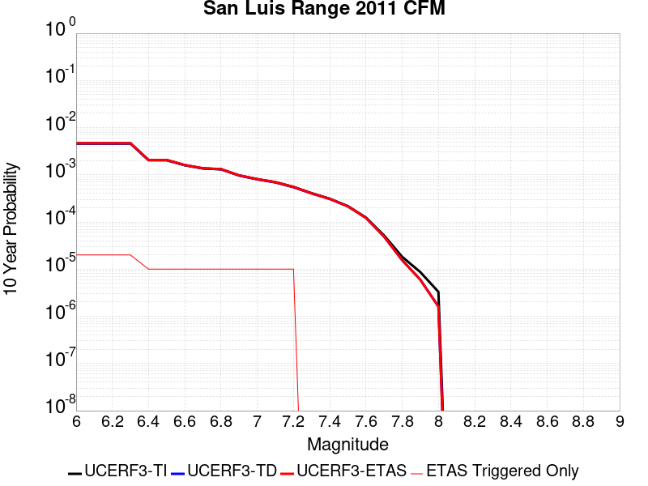 |

| Magnitude | 1 wk TI Prob | 1 wk TD Prob | 1 wk ETAS Prob | 1 wk ETAS/TD Gain | 1 wk ETAS Triggered Only | 1 mo TI Prob | 1 mo TD Prob | 1 mo ETAS Prob | 1 mo ETAS/TD Gain | 1 mo ETAS Triggered Only | 1 yr TI Prob | 1 yr TD Prob | 1 yr ETAS Prob | 1 yr ETAS/TD Gain | 1 yr ETAS Triggered Only | 10 yr TI Prob | 10 yr TD Prob | 10 yr ETAS Prob | 10 yr ETAS/TD Gain | 10 yr ETAS Triggered Only |
|-----|-----|-----|-----|-----|-----|-----|-----|-----|-----|-----|-----|-----|-----|-----|-----|-----|-----|-----|-----|-----|
| 6.0 | 8.8368415E-6 | 8.9655005E-6 | 8.9655005E-6 | 1.0 | 0.0 | 3.787163E-5 | 3.842305E-5 | 3.842305E-5 | 1.0 | 0.0 | 4.609895E-4 | 4.6770813E-4 | 4.6770813E-4 | 1.0 | 0.0 | 0.0046003438 | 0.0046680206 | 0.0046915733 | 1.0050455 | 2.3663039E-5 |
| 6.1 | 8.8368415E-6 | 8.9655005E-6 | 8.9655005E-6 | 1.0 | 0.0 | 3.787163E-5 | 3.842305E-5 | 3.842305E-5 | 1.0 | 0.0 | 4.609895E-4 | 4.6770813E-4 | 4.6770813E-4 | 1.0 | 0.0 | 0.0046003438 | 0.0046680206 | 0.0046915733 | 1.0050455 | 2.3663039E-5 |
| 6.2 | 8.8368415E-6 | 8.9655005E-6 | 8.9655005E-6 | 1.0 | 0.0 | 3.787163E-5 | 3.842305E-5 | 3.842305E-5 | 1.0 | 0.0 | 4.609895E-4 | 4.6770813E-4 | 4.6770813E-4 | 1.0 | 0.0 | 0.0046003438 | 0.0046680206 | 0.0046915733 | 1.0050455 | 2.3663039E-5 |
| 6.3 | 8.8368415E-6 | 8.9655005E-6 | 8.9655005E-6 | 1.0 | 0.0 | 3.787163E-5 | 3.842305E-5 | 3.842305E-5 | 1.0 | 0.0 | 4.609895E-4 | 4.6770813E-4 | 4.6770813E-4 | 1.0 | 0.0 | 0.0046003438 | 0.0046680206 | 0.0046915733 | 1.0050455 | 2.3663039E-5 |
| 6.4 | 3.9094193E-6 | 3.9412234E-6 | 3.9412234E-6 | 1.0 | 0.0 | 1.6754546E-5 | 1.689085E-5 | 1.689085E-5 | 1.0 | 0.0 | 2.039675E-4 | 2.0562697E-4 | 2.0562697E-4 | 1.0 | 0.0 | 0.0020378039 | 0.0020543959 | 0.0020543959 | 1.0 | 0.0 |
| 6.5 | 3.9094193E-6 | 3.9412234E-6 | 3.9412234E-6 | 1.0 | 0.0 | 1.6754546E-5 | 1.689085E-5 | 1.689085E-5 | 1.0 | 0.0 | 2.039675E-4 | 2.0562697E-4 | 2.0562697E-4 | 1.0 | 0.0 | 0.0020378039 | 0.0020543959 | 0.0020543959 | 1.0 | 0.0 |
| 6.6 | 3.0587726E-6 | 3.075405E-6 | 3.075405E-6 | 1.0 | 0.0 | 1.3108959E-5 | 1.3180241E-5 | 1.3180241E-5 | 1.0 | 0.0 | 1.595899E-4 | 1.6045774E-4 | 1.6045774E-4 | 1.0 | 0.0 | 0.0015947534 | 0.0016034308 | 0.0016034308 | 1.0 | 0.0 |
| 6.7 | 2.6160574E-6 | 2.625142E-6 | 2.625142E-6 | 1.0 | 0.0 | 1.1211626E-5 | 1.125056E-5 | 1.125056E-5 | 1.0 | 0.0 | 1.3649299E-4 | 1.3696702E-4 | 1.3696702E-4 | 1.0 | 0.0 | 0.0013640919 | 0.0013688322 | 0.0013688322 | 1.0 | 0.0 |
| 6.8 | 2.5110312E-6 | 2.5181544E-6 | 2.5181544E-6 | 1.0 | 0.0 | 1.0761518E-5 | 1.0792046E-5 | 1.0792046E-5 | 1.0 | 0.0 | 1.310136E-4 | 1.3138528E-4 | 1.3138528E-4 | 1.0 | 0.0 | 0.0013093639 | 0.0013130821 | 0.0013130821 | 1.0 | 0.0 |
| 6.9 | 1.8564405E-6 | 1.8524981E-6 | 1.8524981E-6 | 1.0 | 0.0 | 7.95615E-6 | 7.939254E-6 | 7.939254E-6 | 1.0 | 0.0 | 9.686181E-5 | 9.665615E-5 | 9.665615E-5 | 1.0 | 0.0 | 9.68196E-4 | 9.661431E-4 | 9.661431E-4 | 1.0 | 0.0 |
| 7.0 | 1.546127E-6 | 1.5369635E-6 | 1.5369635E-6 | 1.0 | 0.0 | 6.626242E-6 | 6.58697E-6 | 6.58697E-6 | 1.0 | 0.0 | 8.06715E-5 | 8.0193415E-5 | 8.0193415E-5 | 1.0 | 0.0 | 8.0642226E-4 | 8.0164545E-4 | 8.0164545E-4 | 1.0 | 0.0 |
| 7.1 | 1.3368208E-6 | 1.3235413E-6 | 1.3235413E-6 | 1.0 | 0.0 | 5.7292195E-6 | 5.6723075E-6 | 5.6723075E-6 | 1.0 | 0.0 | 6.975101E-5 | 6.905816E-5 | 6.905816E-5 | 1.0 | 0.0 | 6.972912E-4 | 6.903675E-4 | 6.903675E-4 | 1.0 | 0.0 |
| 7.2 | 1.0623363E-6 | 1.0454439E-6 | 1.0454439E-6 | 1.0 | 0.0 | 4.5528623E-6 | 4.4804665E-6 | 4.4804665E-6 | 1.0 | 0.0 | 5.5429686E-5 | 5.4548316E-5 | 5.4548316E-5 | 1.0 | 0.0 | 5.5415864E-4 | 5.4534955E-4 | 5.4534955E-4 | 1.0 | 0.0 |
| 7.3 | 7.831679E-7 | 7.727448E-7 | 7.727448E-7 | 1.0 | 0.0 | 3.3564295E-6 | 3.3117592E-6 | 3.3117592E-6 | 1.0 | 0.0 | 4.086376E-5 | 4.0319923E-5 | 4.0319923E-5 | 1.0 | 0.0 | 4.0856248E-4 | 4.031262E-4 | 4.031262E-4 | 1.0 | 0.0 |
| 7.4 | 5.9558846E-7 | 5.9106844E-7 | 5.9106844E-7 | 1.0 | 0.0 | 2.5525194E-6 | 2.5331478E-6 | 2.5331478E-6 | 1.0 | 0.0 | 3.107648E-5 | 3.084064E-5 | 3.084064E-5 | 1.0 | 0.0 | 3.1072134E-4 | 3.083637E-4 | 3.083637E-4 | 1.0 | 0.0 |
| 7.5 | 4.1616502E-7 | 4.11967E-7 | 4.11967E-7 | 1.0 | 0.0 | 1.7835631E-6 | 1.7655716E-6 | 1.7655716E-6 | 1.0 | 0.0 | 2.1714664E-5 | 2.1495624E-5 | 2.1495624E-5 | 1.0 | 0.0 | 2.1712543E-4 | 2.1493548E-4 | 2.1493548E-4 | 1.0 | 0.0 |
| 7.6 | 2.3816014E-7 | 2.3376846E-7 | 2.3376846E-7 | 1.0 | 0.0 | 1.0206859E-6 | 1.0018643E-6 | 1.0018643E-6 | 1.0 | 0.0 | 1.242678E-5 | 1.2197631E-5 | 1.2197631E-5 | 1.0 | 0.0 | 1.2426086E-4 | 1.21969635E-4 | 1.21969635E-4 | 1.0 | 0.0 |
| 7.7 | 9.918777E-8 | 9.386981E-8 | 9.386981E-8 | 1.0 | 0.0 | 4.2509038E-7 | 4.022991E-7 | 4.022991E-7 | 1.0 | 0.0 | 5.1754632E-6 | 4.8979805E-6 | 4.8979805E-6 | 1.0 | 0.0 | 5.1753424E-5 | 4.8978727E-5 | 4.8978727E-5 | 1.0 | 0.0 |
| 7.8 | 3.4982556E-8 | 2.968836E-8 | 2.968836E-8 | 1.0 | 0.0 | 1.4992524E-7 | 1.2723582E-7 | 1.2723582E-7 | 1.0 | 0.0 | 1.8253382E-6 | 1.549095E-6 | 1.549095E-6 | 1.0 | 0.0 | 1.8253233E-5 | 1.5490843E-5 | 1.5490843E-5 | 1.0 | 0.0 |
| 7.9 | 1.6624908E-8 | 1.147868E-8 | 1.147868E-8 | 1.0 | 0.0 | 7.12496E-8 | 4.9194345E-8 | 4.9194345E-8 | 1.0 | 0.0 | 8.6746354E-7 | 5.9894097E-7 | 5.9894097E-7 | 1.0 | 0.0 | 8.674601E-6 | 5.9893937E-6 | 5.9893937E-6 | 1.0 | 0.0 |
| 8.0 | 6.3352315E-9 | 3.089856E-9 | 3.089856E-9 | 1.0 | 0.0 | 2.715099E-8 | 1.32422375E-8 | 1.32422375E-8 | 1.0 | 0.0 | 3.3056327E-7 | 1.6122422E-7 | 1.6122422E-7 | 1.0 | 0.0 | 3.3056278E-6 | 1.6122411E-6 | 1.6122411E-6 | 1.0 | 0.0 |

## Los Alamos extension
*[(top)](#table-of-contents)*

| 1 Week | 1 Month | 1 Year | 10 Year |
|-----|-----|-----|-----|
|  |  |  |  |

| Magnitude | 1 wk TI Prob | 1 wk TD Prob | 1 wk ETAS Prob | 1 wk ETAS/TD Gain | 1 wk ETAS Triggered Only | 1 mo TI Prob | 1 mo TD Prob | 1 mo ETAS Prob | 1 mo ETAS/TD Gain | 1 mo ETAS Triggered Only | 1 yr TI Prob | 1 yr TD Prob | 1 yr ETAS Prob | 1 yr ETAS/TD Gain | 1 yr ETAS Triggered Only | 10 yr TI Prob | 10 yr TD Prob | 10 yr ETAS Prob | 10 yr ETAS/TD Gain | 10 yr ETAS Triggered Only |
|-----|-----|-----|-----|-----|-----|-----|-----|-----|-----|-----|-----|-----|-----|-----|-----|-----|-----|-----|-----|-----|
| 6.0 | 4.0146506E-6 | 4.086201E-6 | 4.086201E-6 | 1.0 | 0.0 | 1.7205533E-5 | 1.7512179E-5 | 1.7512179E-5 | 1.0 | 0.0 | 2.0945723E-4 | 2.1319102E-4 | 2.1319102E-4 | 1.0 | 0.0 | 0.0020925992 | 0.0021299743 | 0.0021535868 | 1.0110859 | 2.3663039E-5 |
| 6.1 | 4.0146506E-6 | 4.086201E-6 | 4.086201E-6 | 1.0 | 0.0 | 1.7205533E-5 | 1.7512179E-5 | 1.7512179E-5 | 1.0 | 0.0 | 2.0945723E-4 | 2.1319102E-4 | 2.1319102E-4 | 1.0 | 0.0 | 0.0020925992 | 0.0021299743 | 0.0021535868 | 1.0110859 | 2.3663039E-5 |
| 6.2 | 4.0146506E-6 | 4.086201E-6 | 4.086201E-6 | 1.0 | 0.0 | 1.7205533E-5 | 1.7512179E-5 | 1.7512179E-5 | 1.0 | 0.0 | 2.0945723E-4 | 2.1319102E-4 | 2.1319102E-4 | 1.0 | 0.0 | 0.0020925992 | 0.0021299743 | 0.0021535868 | 1.0110859 | 2.3663039E-5 |
| 6.3 | 4.0146506E-6 | 4.086201E-6 | 4.086201E-6 | 1.0 | 0.0 | 1.7205533E-5 | 1.7512179E-5 | 1.7512179E-5 | 1.0 | 0.0 | 2.0945723E-4 | 2.1319102E-4 | 2.1319102E-4 | 1.0 | 0.0 | 0.0020925992 | 0.0021299743 | 0.0021535868 | 1.0110859 | 2.3663039E-5 |
| 6.4 | 4.0146506E-6 | 4.086201E-6 | 4.086201E-6 | 1.0 | 0.0 | 1.7205533E-5 | 1.7512179E-5 | 1.7512179E-5 | 1.0 | 0.0 | 2.0945723E-4 | 2.1319102E-4 | 2.1319102E-4 | 1.0 | 0.0 | 0.0020925992 | 0.0021299743 | 0.0021535868 | 1.0110859 | 2.3663039E-5 |
| 6.5 | 4.0146506E-6 | 4.086201E-6 | 4.086201E-6 | 1.0 | 0.0 | 1.7205533E-5 | 1.7512179E-5 | 1.7512179E-5 | 1.0 | 0.0 | 2.0945723E-4 | 2.1319102E-4 | 2.1319102E-4 | 1.0 | 0.0 | 0.0020925992 | 0.0021299743 | 0.0021535868 | 1.0110859 | 2.3663039E-5 |
| 6.6 | 4.0146506E-6 | 4.086201E-6 | 4.086201E-6 | 1.0 | 0.0 | 1.7205533E-5 | 1.7512179E-5 | 1.7512179E-5 | 1.0 | 0.0 | 2.0945723E-4 | 2.1319102E-4 | 2.1319102E-4 | 1.0 | 0.0 | 0.0020925992 | 0.0021299743 | 0.0021535868 | 1.0110859 | 2.3663039E-5 |
| 6.7 | 4.0146506E-6 | 4.086201E-6 | 4.086201E-6 | 1.0 | 0.0 | 1.7205533E-5 | 1.7512179E-5 | 1.7512179E-5 | 1.0 | 0.0 | 2.0945723E-4 | 2.1319102E-4 | 2.1319102E-4 | 1.0 | 0.0 | 0.0020925992 | 0.0021299743 | 0.0021535868 | 1.0110859 | 2.3663039E-5 |
| 6.8 | 3.6584688E-6 | 3.7188972E-6 | 3.7188972E-6 | 1.0 | 0.0 | 1.5679057E-5 | 1.593804E-5 | 1.593804E-5 | 1.0 | 0.0 | 1.9087581E-4 | 1.9402929E-4 | 1.9402929E-4 | 1.0 | 0.0 | 0.0019071194 | 0.0019386911 | 0.0019386911 | 1.0 | 0.0 |
| 6.9 | 3.644631E-6 | 3.704607E-6 | 3.704607E-6 | 1.0 | 0.0 | 1.5619753E-5 | 1.5876796E-5 | 1.5876796E-5 | 1.0 | 0.0 | 1.901539E-4 | 1.9328378E-4 | 1.9328378E-4 | 1.0 | 0.0 | 0.0018999127 | 0.0019312492 | 0.0019312492 | 1.0 | 0.0 |
| 7.0 | 3.6318522E-6 | 3.6913675E-6 | 3.6913675E-6 | 1.0 | 0.0 | 1.5564989E-5 | 1.5820056E-5 | 1.5820056E-5 | 1.0 | 0.0 | 1.8948725E-4 | 1.9259308E-4 | 1.9259308E-4 | 1.0 | 0.0 | 0.0018932576 | 0.0019243542 | 0.0019243542 | 1.0 | 0.0 |
| 7.1 | 3.5001724E-6 | 3.555437E-6 | 3.555437E-6 | 1.0 | 0.0 | 1.5000653E-5 | 1.5237503E-5 | 1.5237503E-5 | 1.0 | 0.0 | 1.8261763E-4 | 1.8550173E-4 | 1.8550173E-4 | 1.0 | 0.0 | 0.0018246764 | 0.0018535595 | 0.0018535595 | 1.0 | 0.0 |
| 7.2 | 2.5204702E-6 | 2.5437225E-6 | 2.5437225E-6 | 1.0 | 0.0 | 1.080197E-5 | 1.0901623E-5 | 1.0901623E-5 | 1.0 | 0.0 | 1.3150605E-4 | 1.3271923E-4 | 1.3271923E-4 | 1.0 | 0.0 | 0.0013142825 | 0.0013264052 | 0.0013264052 | 1.0 | 0.0 |
| 7.3 | 2.1399692E-6 | 2.1501562E-6 | 2.1501562E-6 | 1.0 | 0.0 | 9.1712645E-6 | 9.214923E-6 | 9.214923E-6 | 1.0 | 0.0 | 1.1165442E-4 | 1.1218594E-4 | 1.1218594E-4 | 1.0 | 0.0 | 0.0011159834 | 0.0011212963 | 0.0011212963 | 1.0 | 0.0 |
| 7.4 | 1.9660122E-6 | 1.9702593E-6 | 1.9702593E-6 | 1.0 | 0.0 | 8.42574E-6 | 8.443942E-6 | 8.443942E-6 | 1.0 | 0.0 | 1.0257855E-4 | 1.02800164E-4 | 1.02800164E-4 | 1.0 | 0.0 | 0.0010253121 | 0.0010275292 | 0.0010275292 | 1.0 | 0.0 |
| 7.5 | 1.7204633E-6 | 1.7151186E-6 | 1.7151186E-6 | 1.0 | 0.0 | 7.373393E-6 | 7.350488E-6 | 7.350488E-6 | 1.0 | 0.0 | 8.976737E-5 | 8.9488545E-5 | 8.9488545E-5 | 1.0 | 0.0 | 8.9731114E-4 | 8.9452806E-4 | 8.9452806E-4 | 1.0 | 0.0 |
| 7.6 | 1.3717638E-6 | 1.353599E-6 | 1.353599E-6 | 1.0 | 0.0 | 5.878974E-6 | 5.801126E-6 | 5.801126E-6 | 1.0 | 0.0 | 7.157416E-5 | 7.062644E-5 | 7.062644E-5 | 1.0 | 0.0 | 7.1551115E-4 | 7.060426E-4 | 7.060426E-4 | 1.0 | 0.0 |
| 7.7 | 8.272564E-7 | 7.957738E-7 | 7.957738E-7 | 1.0 | 0.0 | 3.5453797E-6 | 3.4104548E-6 | 3.4104548E-6 | 1.0 | 0.0 | 4.3164142E-5 | 4.1521496E-5 | 4.1521496E-5 | 1.0 | 0.0 | 4.315576E-4 | 4.151376E-4 | 4.151376E-4 | 1.0 | 0.0 |
| 7.8 | 3.9708277E-7 | 3.6719533E-7 | 3.6719533E-7 | 1.0 | 0.0 | 1.7017821E-6 | 1.5736932E-6 | 1.5736932E-6 | 1.0 | 0.0 | 2.0719E-5 | 1.9159548E-5 | 1.9159548E-5 | 1.0 | 0.0 | 2.071707E-4 | 1.9157902E-4 | 1.9157902E-4 | 1.0 | 0.0 |
| 7.9 | 9.292528E-8 | 7.889202E-8 | 7.889202E-8 | 1.0 | 0.0 | 3.9825116E-7 | 3.3810863E-7 | 3.3810863E-7 | 1.0 | 0.0 | 4.848697E-6 | 4.116465E-6 | 4.116465E-6 | 1.0 | 0.0 | 4.8485912E-5 | 4.1163894E-5 | 4.1163894E-5 | 1.0 | 0.0 |
| 8.0 | 7.880441E-11 | 8.2354124E-11 | 8.2354124E-11 | 1.0 | 0.0 | 3.3773329E-10 | 3.5294623E-10 | 3.5294623E-10 | 1.0 | 0.0 | 4.1119033E-9 | 4.297121E-9 | 4.297121E-9 | 1.0 | 0.0 | 4.1119034E-8 | 4.297121E-8 | 4.297121E-8 | 1.0 | 0.0 |

## Mono Lake 2011 CFM
*[(top)](#table-of-contents)*

| 1 Week | 1 Month | 1 Year | 10 Year |
|-----|-----|-----|-----|
|  |  |  |  |

| Magnitude | 1 wk TI Prob | 1 wk TD Prob | 1 wk ETAS Prob | 1 wk ETAS/TD Gain | 1 wk ETAS Triggered Only | 1 mo TI Prob | 1 mo TD Prob | 1 mo ETAS Prob | 1 mo ETAS/TD Gain | 1 mo ETAS Triggered Only | 1 yr TI Prob | 1 yr TD Prob | 1 yr ETAS Prob | 1 yr ETAS/TD Gain | 1 yr ETAS Triggered Only | 10 yr TI Prob | 10 yr TD Prob | 10 yr ETAS Prob | 10 yr ETAS/TD Gain | 10 yr ETAS Triggered Only |
|-----|-----|-----|-----|-----|-----|-----|-----|-----|-----|-----|-----|-----|-----|-----|-----|-----|-----|-----|-----|-----|
| 6.0 | 2.0341662E-5 | 2.382925E-5 | 2.382925E-5 | 1.0 | 0.0 | 8.717564E-5 | 1.0212436E-4 | 1.0212436E-4 | 1.0 | 0.0 | 0.0010608466 | 0.0012431863 | 0.0012431863 | 1.0 | 0.0 | 0.010557966 | 0.012414398 | 0.012437767 | 1.0018824 | 2.3663039E-5 |
| 6.1 | 2.0341662E-5 | 2.382925E-5 | 2.382925E-5 | 1.0 | 0.0 | 8.717564E-5 | 1.0212436E-4 | 1.0212436E-4 | 1.0 | 0.0 | 0.0010608466 | 0.0012431863 | 0.0012431863 | 1.0 | 0.0 | 0.010557966 | 0.012414398 | 0.012437767 | 1.0018824 | 2.3663039E-5 |
| 6.2 | 2.0341662E-5 | 2.382925E-5 | 2.382925E-5 | 1.0 | 0.0 | 8.717564E-5 | 1.0212436E-4 | 1.0212436E-4 | 1.0 | 0.0 | 0.0010608466 | 0.0012431863 | 0.0012431863 | 1.0 | 0.0 | 0.010557966 | 0.012414398 | 0.012437767 | 1.0018824 | 2.3663039E-5 |
| 6.3 | 2.0341662E-5 | 2.382925E-5 | 2.382925E-5 | 1.0 | 0.0 | 8.717564E-5 | 1.0212436E-4 | 1.0212436E-4 | 1.0 | 0.0 | 0.0010608466 | 0.0012431863 | 0.0012431863 | 1.0 | 0.0 | 0.010557966 | 0.012414398 | 0.012437767 | 1.0018824 | 2.3663039E-5 |
| 6.4 | 1.749821E-5 | 2.0491914E-5 | 2.0491914E-5 | 1.0 | 0.0 | 7.499018E-5 | 8.782249E-5 | 8.782249E-5 | 1.0 | 0.0 | 9.1262296E-4 | 0.0010692389 | 0.0010692389 | 1.0 | 0.0 | 0.009088841 | 0.01069235 | 0.010715759 | 1.0021894 | 2.3663039E-5 |
| 6.5 | 1.749821E-5 | 2.0491914E-5 | 2.0491914E-5 | 1.0 | 0.0 | 7.499018E-5 | 8.782249E-5 | 8.782249E-5 | 1.0 | 0.0 | 9.1262296E-4 | 0.0010692389 | 0.0010692389 | 1.0 | 0.0 | 0.009088841 | 0.01069235 | 0.010715759 | 1.0021894 | 2.3663039E-5 |

## Monte Vista - Shannon 2011 CFM
*[(top)](#table-of-contents)*

| 1 Week | 1 Month | 1 Year | 10 Year |
|-----|-----|-----|-----|
|  |  |  |  |

| Magnitude | 1 wk TI Prob | 1 wk TD Prob | 1 wk ETAS Prob | 1 wk ETAS/TD Gain | 1 wk ETAS Triggered Only | 1 mo TI Prob | 1 mo TD Prob | 1 mo ETAS Prob | 1 mo ETAS/TD Gain | 1 mo ETAS Triggered Only | 1 yr TI Prob | 1 yr TD Prob | 1 yr ETAS Prob | 1 yr ETAS/TD Gain | 1 yr ETAS Triggered Only | 10 yr TI Prob | 10 yr TD Prob | 10 yr ETAS Prob | 10 yr ETAS/TD Gain | 10 yr ETAS Triggered Only |
|-----|-----|-----|-----|-----|-----|-----|-----|-----|-----|-----|-----|-----|-----|-----|-----|-----|-----|-----|-----|-----|
| 6.0 | 2.7907707E-5 | 2.758596E-5 | 2.758596E-5 | 1.0 | 0.0 | 1.19598975E-4 | 1.1822088E-4 | 1.1822088E-4 | 1.0 | 0.0 | 0.0014551448 | 0.0014385126 | 0.0014385126 | 1.0 | 0.0 | 0.014456532 | 0.014321105 | 0.014344429 | 1.0016286 | 2.3663039E-5 |
| 6.1 | 2.7907707E-5 | 2.758596E-5 | 2.758596E-5 | 1.0 | 0.0 | 1.19598975E-4 | 1.1822088E-4 | 1.1822088E-4 | 1.0 | 0.0 | 0.0014551448 | 0.0014385126 | 0.0014385126 | 1.0 | 0.0 | 0.014456532 | 0.014321105 | 0.014344429 | 1.0016286 | 2.3663039E-5 |
| 6.2 | 2.7907707E-5 | 2.758596E-5 | 2.758596E-5 | 1.0 | 0.0 | 1.19598975E-4 | 1.1822088E-4 | 1.1822088E-4 | 1.0 | 0.0 | 0.0014551448 | 0.0014385126 | 0.0014385126 | 1.0 | 0.0 | 0.014456532 | 0.014321105 | 0.014344429 | 1.0016286 | 2.3663039E-5 |
| 6.3 | 2.7907707E-5 | 2.758596E-5 | 2.758596E-5 | 1.0 | 0.0 | 1.19598975E-4 | 1.1822088E-4 | 1.1822088E-4 | 1.0 | 0.0 | 0.0014551448 | 0.0014385126 | 0.0014385126 | 1.0 | 0.0 | 0.014456532 | 0.014321105 | 0.014344429 | 1.0016286 | 2.3663039E-5 |
| 6.4 | 2.7907707E-5 | 2.758596E-5 | 2.758596E-5 | 1.0 | 0.0 | 1.19598975E-4 | 1.1822088E-4 | 1.1822088E-4 | 1.0 | 0.0 | 0.0014551448 | 0.0014385126 | 0.0014385126 | 1.0 | 0.0 | 0.014456532 | 0.014321105 | 0.014344429 | 1.0016286 | 2.3663039E-5 |
| 6.5 | 1.7990213E-5 | 1.6641334E-5 | 1.6641334E-5 | 1.0 | 0.0 | 7.709863E-5 | 7.131843E-5 | 7.131843E-5 | 1.0 | 0.0 | 9.382716E-4 | 8.680223E-4 | 8.680223E-4 | 1.0 | 0.0 | 0.0093431985 | 0.0086697 | 0.008693158 | 1.0027057 | 2.3663039E-5 |
| 6.6 | 9.650407E-6 | 7.458347E-6 | 7.458347E-6 | 1.0 | 0.0 | 4.135823E-5 | 3.1964E-5 | 3.1964E-5 | 1.0 | 0.0 | 5.0342013E-4 | 3.891E-4 | 3.891E-4 | 1.0 | 0.0 | 0.005022812 | 0.003901876 | 0.003901876 | 1.0 | 0.0 |
| 6.7 | 9.62828E-6 | 7.4362606E-6 | 7.4362606E-6 | 1.0 | 0.0 | 4.1263404E-5 | 3.1869342E-5 | 3.1869342E-5 | 1.0 | 0.0 | 5.022661E-4 | 3.87948E-4 | 3.87948E-4 | 1.0 | 0.0 | 0.0050113243 | 0.0038903963 | 0.0038903963 | 1.0 | 0.0 |
| 6.8 | 6.887523E-6 | 4.4627E-6 | 4.4627E-6 | 1.0 | 0.0 | 2.9517621E-5 | 1.912573E-5 | 1.912573E-5 | 1.0 | 0.0 | 3.5931775E-4 | 2.328331E-4 | 2.328331E-4 | 1.0 | 0.0 | 0.0035873733 | 0.0023430535 | 0.0023430535 | 1.0 | 0.0 |
| 6.9 | 6.2722347E-6 | 3.8045544E-6 | 3.8045544E-6 | 1.0 | 0.0 | 2.6880729E-5 | 1.6305143E-5 | 1.6305143E-5 | 1.0 | 0.0 | 3.2722374E-4 | 1.9849905E-4 | 1.9849905E-4 | 1.0 | 0.0 | 0.003267423 | 0.0020003652 | 0.0020003652 | 1.0 | 0.0 |
| 7.0 | 5.5320347E-6 | 3.0316808E-6 | 3.0316808E-6 | 1.0 | 0.0 | 2.3708504E-5 | 1.2992863E-5 | 1.2992863E-5 | 1.0 | 0.0 | 2.8861282E-4 | 1.5817846E-4 | 1.5817846E-4 | 1.0 | 0.0 | 0.0028823826 | 0.0015977925 | 0.0015977925 | 1.0 | 0.0 |
| 7.1 | 3.8794055E-6 | 1.2848252E-6 | 1.2848252E-6 | 1.0 | 0.0 | 1.6625918E-5 | 5.506382E-6 | 5.506382E-6 | 1.0 | 0.0 | 2.0240174E-4 | 6.7038156E-5 | 6.7038156E-5 | 1.0 | 0.0 | 0.002022175 | 6.871386E-4 | 6.871386E-4 | 1.0 | 0.0 |
| 7.2 | 3.4813652E-6 | 9.680938E-7 | 9.680938E-7 | 1.0 | 0.0 | 1.49200505E-5 | 4.1489666E-6 | 4.1489666E-6 | 1.0 | 0.0 | 1.8163648E-4 | 5.051251E-5 | 5.051251E-5 | 1.0 | 0.0 | 0.0018148809 | 5.219573E-4 | 5.219573E-4 | 1.0 | 0.0 |
| 7.3 | 3.1682148E-6 | 7.7286796E-7 | 7.7286796E-7 | 1.0 | 0.0 | 1.3577992E-5 | 3.312287E-6 | 3.312287E-6 | 1.0 | 0.0 | 1.6529951E-4 | 4.032635E-5 | 4.032635E-5 | 1.0 | 0.0 | 0.0016517661 | 4.2011242E-4 | 4.2011242E-4 | 1.0 | 0.0 |
| 7.4 | 2.9707667E-6 | 7.3550206E-7 | 7.3550206E-7 | 1.0 | 0.0 | 1.2731795E-5 | 3.1521477E-6 | 3.1521477E-6 | 1.0 | 0.0 | 1.5499859E-4 | 3.8376726E-5 | 3.8376726E-5 | 1.0 | 0.0 | 0.0015489052 | 4.0041478E-4 | 4.0041478E-4 | 1.0 | 0.0 |
| 7.5 | 2.3462758E-6 | 6.015835E-7 | 6.015835E-7 | 1.0 | 0.0 | 1.0055429E-5 | 2.5782126E-6 | 2.5782126E-6 | 1.0 | 0.0 | 1.2241797E-4 | 3.138929E-5 | 3.138929E-5 | 1.0 | 0.0 | 0.0012235056 | 3.288163E-4 | 3.288163E-4 | 1.0 | 0.0 |
| 7.6 | 2.112783E-6 | 5.259048E-7 | 5.259048E-7 | 1.0 | 0.0 | 9.054753E-6 | 2.2538757E-6 | 2.2538757E-6 | 1.0 | 0.0 | 1.1023604E-4 | 2.7440594E-5 | 2.7440594E-5 | 1.0 | 0.0 | 0.0011018137 | 2.8890927E-4 | 2.8890927E-4 | 1.0 | 0.0 |
| 7.7 | 1.7022471E-6 | 4.2381023E-7 | 4.2381023E-7 | 1.0 | 0.0 | 7.2953244E-6 | 1.8163282E-6 | 1.8163282E-6 | 1.0 | 0.0 | 8.881695E-5 | 2.2113574E-5 | 2.2113574E-5 | 1.0 | 0.0 | 8.878146E-4 | 2.343308E-4 | 2.343308E-4 | 1.0 | 0.0 |
| 7.8 | 7.230914E-7 | 3.7344674E-7 | 3.7344674E-7 | 1.0 | 0.0 | 3.0989595E-6 | 1.600485E-6 | 1.600485E-6 | 1.0 | 0.0 | 3.772918E-5 | 1.9485731E-5 | 1.9485731E-5 | 1.0 | 0.0 | 3.7722773E-4 | 2.0757897E-4 | 2.0757897E-4 | 1.0 | 0.0 |
| 7.9 | 4.3588446E-7 | 3.4357035E-7 | 3.4357035E-7 | 1.0 | 0.0 | 1.868075E-6 | 1.4724435E-6 | 1.4724435E-6 | 1.0 | 0.0 | 2.2743576E-5 | 1.7926854E-5 | 1.7926854E-5 | 1.0 | 0.0 | 2.2741247E-4 | 1.9022031E-4 | 1.9022031E-4 | 1.0 | 0.0 |
| 8.0 | 2.3317523E-7 | 3.1558574E-7 | 3.1558574E-7 | 1.0 | 0.0 | 9.99322E-7 | 1.3525097E-6 | 1.3525097E-6 | 1.0 | 0.0 | 1.2166677E-5 | 1.6466682E-5 | 1.6466682E-5 | 1.0 | 0.0 | 1.21660116E-4 | 1.7422701E-4 | 1.7422701E-4 | 1.0 | 0.0 |
| 8.1 | 1.4662456E-7 | 2.0334795E-7 | 2.0334795E-7 | 1.0 | 0.0 | 6.283908E-7 | 8.7149095E-7 | 8.7149095E-7 | 1.0 | 0.0 | 7.650631E-6 | 1.0610352E-5 | 1.0610352E-5 | 1.0 | 0.0 | 7.650368E-5 | 1.11462454E-4 | 1.11462454E-4 | 1.0 | 0.0 |
| 8.2 | 5.4931775E-9 | 5.0826516E-9 | 5.0826516E-9 | 1.0 | 0.0 | 2.3542189E-8 | 2.1782792E-8 | 2.1782792E-8 | 1.0 | 0.0 | 2.8662612E-7 | 2.6520547E-7 | 2.6520547E-7 | 1.0 | 0.0 | 2.8662573E-6 | 2.7575975E-6 | 2.7575975E-6 | 1.0 | 0.0 |

## Shoreline
*[(top)](#table-of-contents)*

| 1 Week | 1 Month | 1 Year | 10 Year |
|-----|-----|-----|-----|
|  |  |  |  |

| Magnitude | 1 wk TI Prob | 1 wk TD Prob | 1 wk ETAS Prob | 1 wk ETAS/TD Gain | 1 wk ETAS Triggered Only | 1 mo TI Prob | 1 mo TD Prob | 1 mo ETAS Prob | 1 mo ETAS/TD Gain | 1 mo ETAS Triggered Only | 1 yr TI Prob | 1 yr TD Prob | 1 yr ETAS Prob | 1 yr ETAS/TD Gain | 1 yr ETAS Triggered Only | 10 yr TI Prob | 10 yr TD Prob | 10 yr ETAS Prob | 10 yr ETAS/TD Gain | 10 yr ETAS Triggered Only |
|-----|-----|-----|-----|-----|-----|-----|-----|-----|-----|-----|-----|-----|-----|-----|-----|-----|-----|-----|-----|-----|
| 6.0 | 3.9888673E-6 | 4.047961E-6 | 4.047961E-6 | 1.0 | 0.0 | 1.7095033E-5 | 1.7348319E-5 | 1.7348319E-5 | 1.0 | 0.0 | 2.0811215E-4 | 2.1120091E-4 | 2.1120091E-4 | 1.0 | 0.0 | 0.0020791737 | 0.0021105506 | 0.0021341636 | 1.0111881 | 2.3663039E-5 |
| 6.1 | 3.9888673E-6 | 4.047961E-6 | 4.047961E-6 | 1.0 | 0.0 | 1.7095033E-5 | 1.7348319E-5 | 1.7348319E-5 | 1.0 | 0.0 | 2.0811215E-4 | 2.1120091E-4 | 2.1120091E-4 | 1.0 | 0.0 | 0.0020791737 | 0.0021105506 | 0.0021341636 | 1.0111881 | 2.3663039E-5 |
| 6.2 | 1.4039653E-6 | 1.4101064E-6 | 1.4101064E-6 | 1.0 | 0.0 | 6.0169805E-6 | 6.0432994E-6 | 6.0432994E-6 | 1.0 | 0.0 | 7.325427E-5 | 7.3574745E-5 | 7.3574745E-5 | 1.0 | 0.0 | 7.3230127E-4 | 7.355099E-4 | 7.355099E-4 | 1.0 | 0.0 |
| 6.3 | 1.4039653E-6 | 1.4101064E-6 | 1.4101064E-6 | 1.0 | 0.0 | 6.0169805E-6 | 6.0432994E-6 | 6.0432994E-6 | 1.0 | 0.0 | 7.325427E-5 | 7.3574745E-5 | 7.3574745E-5 | 1.0 | 0.0 | 7.3230127E-4 | 7.355099E-4 | 7.355099E-4 | 1.0 | 0.0 |
| 6.4 | 1.3314152E-6 | 1.3361774E-6 | 1.3361774E-6 | 1.0 | 0.0 | 5.7060524E-6 | 5.7264624E-6 | 5.7264624E-6 | 1.0 | 0.0 | 6.946897E-5 | 6.9717506E-5 | 6.9717506E-5 | 1.0 | 0.0 | 6.9447263E-4 | 6.969617E-4 | 6.969617E-4 | 1.0 | 0.0 |
| 6.5 | 1.1187026E-6 | 1.1203801E-6 | 1.1203801E-6 | 1.0 | 0.0 | 4.794431E-6 | 4.8016204E-6 | 4.8016204E-6 | 1.0 | 0.0 | 5.8370628E-5 | 5.8458183E-5 | 5.8458183E-5 | 1.0 | 0.0 | 5.83553E-4 | 5.844306E-4 | 5.844306E-4 | 1.0 | 0.0 |
| 6.6 | 9.793089E-7 | 9.785074E-7 | 9.785074E-7 | 1.0 | 0.0 | 4.1970316E-6 | 4.1935964E-6 | 4.1935964E-6 | 1.0 | 0.0 | 5.1097657E-5 | 5.1055853E-5 | 5.1055853E-5 | 1.0 | 0.0 | 5.108591E-4 | 5.1044254E-4 | 5.1044254E-4 | 1.0 | 0.0 |
| 6.7 | 8.995986E-7 | 8.97295E-7 | 8.97295E-7 | 1.0 | 0.0 | 3.8554167E-6 | 3.8455446E-6 | 3.8455446E-6 | 1.0 | 0.0 | 4.693869E-5 | 4.681851E-5 | 4.681851E-5 | 1.0 | 0.0 | 4.6928777E-4 | 4.680874E-4 | 4.680874E-4 | 1.0 | 0.0 |
| 6.8 | 7.931612E-7 | 7.8805454E-7 | 7.8805454E-7 | 1.0 | 0.0 | 3.3992578E-6 | 3.3773722E-6 | 3.3773722E-6 | 1.0 | 0.0 | 4.1385178E-5 | 4.1118736E-5 | 4.1118736E-5 | 1.0 | 0.0 | 4.1377472E-4 | 4.1111183E-4 | 4.1111183E-4 | 1.0 | 0.0 |
| 6.9 | 7.1465956E-7 | 7.0781437E-7 | 7.0781437E-7 | 1.0 | 0.0 | 3.062823E-6 | 3.0334868E-6 | 3.0334868E-6 | 1.0 | 0.0 | 3.7289232E-5 | 3.6932077E-5 | 3.6932077E-5 | 1.0 | 0.0 | 3.7282976E-4 | 3.6925977E-4 | 3.6925977E-4 | 1.0 | 0.0 |
| 7.0 | 6.389046E-7 | 6.2995906E-7 | 6.2995906E-7 | 1.0 | 0.0 | 2.7381598E-6 | 2.6998216E-6 | 2.6998216E-6 | 1.0 | 0.0 | 3.3336586E-5 | 3.2869837E-5 | 3.2869837E-5 | 1.0 | 0.0 | 3.3331584E-4 | 3.2864997E-4 | 3.2864997E-4 | 1.0 | 0.0 |
| 7.1 | 5.4300875E-7 | 5.311255E-7 | 5.311255E-7 | 1.0 | 0.0 | 2.3271782E-6 | 2.2762501E-6 | 2.2762501E-6 | 1.0 | 0.0 | 2.8333026E-5 | 2.7712995E-5 | 2.7712995E-5 | 1.0 | 0.0 | 2.8329415E-4 | 2.770955E-4 | 2.770955E-4 | 1.0 | 0.0 |
| 7.2 | 4.6768855E-7 | 4.5350131E-7 | 4.5350131E-7 | 1.0 | 0.0 | 2.0043778E-6 | 1.9435756E-6 | 1.9435756E-6 | 1.0 | 0.0 | 2.4403027E-5 | 2.3662777E-5 | 2.3662777E-5 | 1.0 | 0.0 | 2.4400349E-4 | 2.3660263E-4 | 2.3660263E-4 | 1.0 | 0.0 |
| 7.3 | 4.0966103E-7 | 3.93868E-7 | 3.93868E-7 | 1.0 | 0.0 | 1.7556889E-6 | 1.6880045E-6 | 1.6880045E-6 | 1.0 | 0.0 | 2.1375303E-5 | 2.055126E-5 | 2.055126E-5 | 1.0 | 0.0 | 2.1373246E-4 | 2.0549365E-4 | 2.0549365E-4 | 1.0 | 0.0 |
| 7.4 | 3.5105785E-7 | 3.3365063E-7 | 3.3365063E-7 | 1.0 | 0.0 | 1.5045327E-6 | 1.4299305E-6 | 1.4299305E-6 | 1.0 | 0.0 | 1.8317533E-5 | 1.7409266E-5 | 1.7409266E-5 | 1.0 | 0.0 | 1.8316023E-4 | 1.7407905E-4 | 1.7407905E-4 | 1.0 | 0.0 |
| 7.5 | 2.8737534E-7 | 2.682108E-7 | 2.682108E-7 | 1.0 | 0.0 | 1.2316079E-6 | 1.1494744E-6 | 1.1494744E-6 | 1.0 | 0.0 | 1.4994724E-5 | 1.3994761E-5 | 1.3994761E-5 | 1.0 | 0.0 | 1.4993713E-4 | 1.3993881E-4 | 1.3993881E-4 | 1.0 | 0.0 |
| 7.6 | 2.0924051E-7 | 1.8779967E-7 | 1.8779967E-7 | 1.0 | 0.0 | 8.967448E-7 | 8.0485546E-7 | 8.0485546E-7 | 1.0 | 0.0 | 1.0917813E-5 | 9.799071E-6 | 9.799071E-6 | 1.0 | 0.0 | 1.0917276E-4 | 9.7986405E-5 | 9.7986405E-5 | 1.0 | 0.0 |
| 7.7 | 1.392265E-7 | 1.1544305E-7 | 1.1544305E-7 | 1.0 | 0.0 | 5.9668486E-7 | 4.9475585E-7 | 4.9475585E-7 | 1.0 | 0.0 | 7.2646135E-6 | 6.0236357E-6 | 6.0236357E-6 | 1.0 | 0.0 | 7.2643765E-5 | 6.0234728E-5 | 6.0234728E-5 | 1.0 | 0.0 |
| 7.8 | 8.1080074E-8 | 5.5875784E-8 | 5.5875784E-8 | 1.0 | 0.0 | 3.4748598E-7 | 2.3946762E-7 | 2.3946762E-7 | 1.0 | 0.0 | 4.2306337E-6 | 2.9155144E-6 | 2.9155144E-6 | 1.0 | 0.0 | 4.230553E-5 | 2.9154762E-5 | 2.9154762E-5 | 1.0 | 0.0 |
| 7.9 | 5.0859036E-8 | 2.7252394E-8 | 2.7252394E-8 | 1.0 | 0.0 | 2.1796728E-7 | 1.16795974E-7 | 1.16795974E-7 | 1.0 | 0.0 | 2.6537484E-6 | 1.42199E-6 | 1.42199E-6 | 1.0 | 0.0 | 2.6537167E-5 | 1.421981E-5 | 1.421981E-5 | 1.0 | 0.0 |
| 8.0 | 3.1760536E-8 | 1.35833655E-8 | 1.35833655E-8 | 1.0 | 0.0 | 1.3611657E-7 | 5.821442E-8 | 5.821442E-8 | 1.0 | 0.0 | 1.6572179E-6 | 7.0876035E-7 | 7.0876035E-7 | 1.0 | 0.0 | 1.6572056E-5 | 7.0875813E-6 | 7.0875813E-6 | 1.0 | 0.0 |
| 8.1 | 1.2947896E-8 | 5.6655294E-9 | 5.6655294E-9 | 1.0 | 0.0 | 5.5490982E-8 | 2.4280842E-8 | 2.4280842E-8 | 1.0 | 0.0 | 6.756025E-7 | 2.956192E-7 | 2.956192E-7 | 1.0 | 0.0 | 6.7560045E-6 | 2.9561884E-6 | 2.9561884E-6 | 1.0 | 0.0 |

## Great Valley 10 (Panoche)
*[(top)](#table-of-contents)*

| 1 Week | 1 Month | 1 Year | 10 Year |
|-----|-----|-----|-----|
|  |  |  |  |

| Magnitude | 1 wk TI Prob | 1 wk TD Prob | 1 wk ETAS Prob | 1 wk ETAS/TD Gain | 1 wk ETAS Triggered Only | 1 mo TI Prob | 1 mo TD Prob | 1 mo ETAS Prob | 1 mo ETAS/TD Gain | 1 mo ETAS Triggered Only | 1 yr TI Prob | 1 yr TD Prob | 1 yr ETAS Prob | 1 yr ETAS/TD Gain | 1 yr ETAS Triggered Only | 10 yr TI Prob | 10 yr TD Prob | 10 yr ETAS Prob | 10 yr ETAS/TD Gain | 10 yr ETAS Triggered Only |
|-----|-----|-----|-----|-----|-----|-----|-----|-----|-----|-----|-----|-----|-----|-----|-----|-----|-----|-----|-----|-----|
| 6.0 | 1.6014626E-5 | 1.6576112E-5 | 1.6576112E-5 | 1.0 | 0.0 | 6.863231E-5 | 7.103854E-5 | 7.103854E-5 | 1.0 | 0.0 | 8.35278E-4 | 8.6455565E-4 | 8.881982E-4 | 1.0273465 | 2.3663039E-5 | 0.008321454 | 0.008612541 | 0.008636 | 1.0027238 | 2.3663039E-5 |
| 6.1 | 1.6014626E-5 | 1.6576112E-5 | 1.6576112E-5 | 1.0 | 0.0 | 6.863231E-5 | 7.103854E-5 | 7.103854E-5 | 1.0 | 0.0 | 8.35278E-4 | 8.6455565E-4 | 8.881982E-4 | 1.0273465 | 2.3663039E-5 | 0.008321454 | 0.008612541 | 0.008636 | 1.0027238 | 2.3663039E-5 |
| 6.2 | 1.56782E-5 | 1.6199148E-5 | 1.6199148E-5 | 1.0 | 0.0 | 6.719056E-5 | 6.942306E-5 | 6.942306E-5 | 1.0 | 0.0 | 8.17738E-4 | 8.4490253E-4 | 8.685456E-4 | 1.0279832 | 2.3663039E-5 | 0.008147354 | 0.0084175095 | 0.008440973 | 1.0027875 | 2.3663039E-5 |
| 6.3 | 1.5263338E-5 | 1.5724198E-5 | 1.5724198E-5 | 1.0 | 0.0 | 6.541267E-5 | 6.738767E-5 | 6.738767E-5 | 1.0 | 0.0 | 7.961082E-4 | 8.2014047E-4 | 8.4378413E-4 | 1.0288287 | 2.3663039E-5 | 0.007932622 | 0.00817173 | 0.0081952 | 1.0028721 | 2.3663039E-5 |
| 6.4 | 1.4720723E-5 | 1.5100035E-5 | 1.5100035E-5 | 1.0 | 0.0 | 6.308728E-5 | 6.471282E-5 | 6.471282E-5 | 1.0 | 0.0 | 7.67817E-4 | 7.875981E-4 | 8.112425E-4 | 1.030021 | 2.3663039E-5 | 0.007651695 | 0.007848644 | 0.0078721205 | 1.0029912 | 2.3663039E-5 |
| 6.5 | 1.408264E-5 | 1.4356596E-5 | 1.4356596E-5 | 1.0 | 0.0 | 6.0352773E-5 | 6.152681E-5 | 6.152681E-5 | 1.0 | 0.0 | 7.3454727E-4 | 7.488357E-4 | 7.7248097E-4 | 1.0315762 | 2.3663039E-5 | 0.0073212404 | 0.0074636796 | 0.007487166 | 1.0031468 | 2.3663039E-5 |
| 6.6 | 1.3197086E-5 | 1.33224685E-5 | 1.33224685E-5 | 1.0 | 0.0 | 5.6557717E-5 | 5.7095036E-5 | 5.7095036E-5 | 1.0 | 0.0 | 6.8837265E-4 | 6.949145E-4 | 6.949145E-4 | 1.0 | 0.0 | 0.006862442 | 0.0069279536 | 0.0069279536 | 1.0 | 0.0 |
| 6.7 | 1.017583E-5 | 9.745787E-6 | 9.745787E-6 | 1.0 | 0.0 | 4.360997E-5 | 4.1767E-5 | 4.1767E-5 | 1.0 | 0.0 | 5.30822E-4 | 5.08397E-4 | 5.08397E-4 | 1.0 | 0.0 | 0.0052955584 | 0.005072592 | 0.005072592 | 1.0 | 0.0 |
| 6.8 | 8.557912E-6 | 7.873034E-6 | 7.873034E-6 | 1.0 | 0.0 | 3.667625E-5 | 3.3741147E-5 | 3.3741147E-5 | 1.0 | 0.0 | 4.4644187E-4 | 4.1072306E-4 | 4.1072306E-4 | 1.0 | 0.0 | 0.0044554602 | 0.004099847 | 0.004099847 | 1.0 | 0.0 |
| 6.9 | 6.14664E-6 | 5.0922845E-6 | 5.0922845E-6 | 1.0 | 0.0 | 2.6342475E-5 | 2.1823902E-5 | 2.1823902E-5 | 1.0 | 0.0 | 3.2067244E-4 | 2.65675E-4 | 2.65675E-4 | 1.0 | 0.0 | 0.003202101 | 0.0026537122 | 0.0026537122 | 1.0 | 0.0 |
| 7.0 | 3.2310581E-6 | 1.695186E-6 | 1.695186E-6 | 1.0 | 0.0 | 1.3847319E-5 | 7.2650632E-6 | 7.2650632E-6 | 1.0 | 0.0 | 1.6857806E-4 | 8.844865E-5 | 8.844865E-5 | 1.0 | 0.0 | 0.0016845023 | 8.841438E-4 | 8.841438E-4 | 1.0 | 0.0 |
| 7.1 | 2.544492E-6 | 9.1892923E-7 | 9.1892923E-7 | 1.0 | 0.0 | 1.090492E-5 | 3.9382626E-6 | 3.9382626E-6 | 1.0 | 0.0 | 1.327593E-4 | 4.794734E-5 | 4.794734E-5 | 1.0 | 0.0 | 0.0013268003 | 4.7937472E-4 | 4.7937472E-4 | 1.0 | 0.0 |
| 7.2 | 2.4479045E-6 | 8.841656E-7 | 8.841656E-7 | 1.0 | 0.0 | 1.0490977E-5 | 3.789276E-6 | 3.789276E-6 | 1.0 | 0.0 | 1.2772017E-4 | 4.6133508E-5 | 4.6133508E-5 | 1.0 | 0.0 | 0.0012764678 | 4.6124402E-4 | 4.6124402E-4 | 1.0 | 0.0 |
| 7.3 | 2.0559578E-6 | 7.893082E-7 | 7.893082E-7 | 1.0 | 0.0 | 8.811218E-6 | 3.3827455E-6 | 3.3827455E-6 | 1.0 | 0.0 | 1.072713E-4 | 4.1184194E-5 | 4.1184194E-5 | 1.0 | 0.0 | 0.0010721954 | 4.1177025E-4 | 4.1177025E-4 | 1.0 | 0.0 |
| 7.4 | 1.727687E-6 | 7.388011E-7 | 7.388011E-7 | 1.0 | 0.0 | 7.404352E-6 | 3.1662867E-6 | 3.1662867E-6 | 1.0 | 0.0 | 9.0144255E-5 | 3.8548904E-5 | 3.8548904E-5 | 1.0 | 0.0 | 9.0107694E-4 | 3.8542677E-4 | 3.8542677E-4 | 1.0 | 0.0 |
| 7.5 | 1.5002679E-6 | 6.5463627E-7 | 6.5463627E-7 | 1.0 | 0.0 | 6.4297037E-6 | 2.8055813E-6 | 2.8055813E-6 | 1.0 | 0.0 | 7.827883E-5 | 3.415746E-5 | 3.415746E-5 | 1.0 | 0.0 | 7.825126E-4 | 3.4152623E-4 | 3.4152623E-4 | 1.0 | 0.0 |

## Los Osos 2011
*[(top)](#table-of-contents)*

| 1 Week | 1 Month | 1 Year | 10 Year |
|-----|-----|-----|-----|
|  |  |  |  |

| Magnitude | 1 wk TI Prob | 1 wk TD Prob | 1 wk ETAS Prob | 1 wk ETAS/TD Gain | 1 wk ETAS Triggered Only | 1 mo TI Prob | 1 mo TD Prob | 1 mo ETAS Prob | 1 mo ETAS/TD Gain | 1 mo ETAS Triggered Only | 1 yr TI Prob | 1 yr TD Prob | 1 yr ETAS Prob | 1 yr ETAS/TD Gain | 1 yr ETAS Triggered Only | 10 yr TI Prob | 10 yr TD Prob | 10 yr ETAS Prob | 10 yr ETAS/TD Gain | 10 yr ETAS Triggered Only |
|-----|-----|-----|-----|-----|-----|-----|-----|-----|-----|-----|-----|-----|-----|-----|-----|-----|-----|-----|-----|-----|
| 6.0 | 4.8871775E-6 | 4.981524E-6 | 4.981524E-6 | 1.0 | 0.0 | 2.0944879E-5 | 2.134923E-5 | 2.134923E-5 | 1.0 | 0.0 | 2.5497406E-4 | 2.5989866E-4 | 2.5989866E-4 | 1.0 | 0.0 | 0.002546817 | 0.0025962214 | 0.002619823 | 1.0090908 | 2.3663039E-5 |
| 6.1 | 4.8871775E-6 | 4.981524E-6 | 4.981524E-6 | 1.0 | 0.0 | 2.0944879E-5 | 2.134923E-5 | 2.134923E-5 | 1.0 | 0.0 | 2.5497406E-4 | 2.5989866E-4 | 2.5989866E-4 | 1.0 | 0.0 | 0.002546817 | 0.0025962214 | 0.002619823 | 1.0090908 | 2.3663039E-5 |
| 6.2 | 4.8871775E-6 | 4.981524E-6 | 4.981524E-6 | 1.0 | 0.0 | 2.0944879E-5 | 2.134923E-5 | 2.134923E-5 | 1.0 | 0.0 | 2.5497406E-4 | 2.5989866E-4 | 2.5989866E-4 | 1.0 | 0.0 | 0.002546817 | 0.0025962214 | 0.002619823 | 1.0090908 | 2.3663039E-5 |
| 6.3 | 4.8871775E-6 | 4.981524E-6 | 4.981524E-6 | 1.0 | 0.0 | 2.0944879E-5 | 2.134923E-5 | 2.134923E-5 | 1.0 | 0.0 | 2.5497406E-4 | 2.5989866E-4 | 2.5989866E-4 | 1.0 | 0.0 | 0.002546817 | 0.0025962214 | 0.002619823 | 1.0090908 | 2.3663039E-5 |
| 6.4 | 4.8871775E-6 | 4.981524E-6 | 4.981524E-6 | 1.0 | 0.0 | 2.0944879E-5 | 2.134923E-5 | 2.134923E-5 | 1.0 | 0.0 | 2.5497406E-4 | 2.5989866E-4 | 2.5989866E-4 | 1.0 | 0.0 | 0.002546817 | 0.0025962214 | 0.002619823 | 1.0090908 | 2.3663039E-5 |
| 6.5 | 3.1724062E-6 | 3.2234238E-6 | 3.2234238E-6 | 1.0 | 0.0 | 1.3595956E-5 | 1.3814601E-5 | 1.3814601E-5 | 1.0 | 0.0 | 1.6551818E-4 | 1.6817992E-4 | 1.6817992E-4 | 1.0 | 0.0 | 0.0016539496 | 0.0016805399 | 0.0016805399 | 1.0 | 0.0 |
| 6.6 | 3.1022591E-6 | 3.1511327E-6 | 3.1511327E-6 | 1.0 | 0.0 | 1.3295328E-5 | 1.3504785E-5 | 1.3504785E-5 | 1.0 | 0.0 | 1.618586E-4 | 1.6440848E-4 | 1.6440848E-4 | 1.0 | 0.0 | 0.0016174077 | 0.0016428813 | 0.0016428813 | 1.0 | 0.0 |
| 6.7 | 2.611518E-6 | 2.6492085E-6 | 2.6492085E-6 | 1.0 | 0.0 | 1.1192172E-5 | 1.1353702E-5 | 1.1353702E-5 | 1.0 | 0.0 | 1.3625617E-4 | 1.3822259E-4 | 1.3822259E-4 | 1.0 | 0.0 | 0.0013617266 | 0.0013813707 | 0.0013813707 | 1.0 | 0.0 |
| 6.8 | 2.4780884E-6 | 2.5121835E-6 | 2.5121835E-6 | 1.0 | 0.0 | 1.0620336E-5 | 1.0766456E-5 | 1.0766456E-5 | 1.0 | 0.0 | 1.2929492E-4 | 1.3107376E-4 | 1.3107376E-4 | 1.0 | 0.0 | 0.0012921972 | 0.0013099686 | 0.0013099686 | 1.0 | 0.0 |
| 6.9 | 2.1376322E-6 | 2.1635276E-6 | 2.1635276E-6 | 1.0 | 0.0 | 9.161248E-6 | 9.272228E-6 | 9.272228E-6 | 1.0 | 0.0 | 1.1153249E-4 | 1.1288355E-4 | 1.1288355E-4 | 1.0 | 0.0 | 0.0011147653 | 0.001128264 | 0.001128264 | 1.0 | 0.0 |
| 7.0 | 1.9282882E-6 | 1.9494794E-6 | 1.9494794E-6 | 1.0 | 0.0 | 8.264066E-6 | 8.354885E-6 | 8.354885E-6 | 1.0 | 0.0 | 1.0061036E-4 | 1.0171598E-4 | 1.0171598E-4 | 1.0 | 0.0 | 0.0010056482 | 0.0010166956 | 0.0010166956 | 1.0 | 0.0 |
| 7.1 | 1.6353226E-6 | 1.6501308E-6 | 1.6501308E-6 | 1.0 | 0.0 | 7.0085066E-6 | 7.0719702E-6 | 7.0719702E-6 | 1.0 | 0.0 | 8.532523E-5 | 8.609784E-5 | 8.609784E-5 | 1.0 | 0.0 | 8.529247E-4 | 8.606456E-4 | 8.606456E-4 | 1.0 | 0.0 |
| 7.2 | 1.4446276E-6 | 1.455352E-6 | 1.455352E-6 | 1.0 | 0.0 | 6.191247E-6 | 6.2372083E-6 | 6.2372083E-6 | 1.0 | 0.0 | 7.537582E-5 | 7.5935364E-5 | 7.5935364E-5 | 1.0 | 0.0 | 7.535026E-4 | 7.590948E-4 | 7.590948E-4 | 1.0 | 0.0 |
| 7.3 | 1.2014582E-6 | 1.2069238E-6 | 1.2069238E-6 | 1.0 | 0.0 | 5.149096E-6 | 5.17252E-6 | 5.17252E-6 | 1.0 | 0.0 | 6.268844E-5 | 6.297362E-5 | 6.297362E-5 | 1.0 | 0.0 | 6.267076E-4 | 6.295581E-4 | 6.295581E-4 | 1.0 | 0.0 |
| 7.4 | 9.707733E-7 | 9.709923E-7 | 9.709923E-7 | 1.0 | 0.0 | 4.16045E-6 | 4.1613894E-6 | 4.1613894E-6 | 1.0 | 0.0 | 5.0652303E-5 | 5.0663737E-5 | 5.0663737E-5 | 1.0 | 0.0 | 5.064076E-4 | 5.0652213E-4 | 5.0652213E-4 | 1.0 | 0.0 |
| 7.5 | 7.174908E-7 | 7.1150475E-7 | 7.1150475E-7 | 1.0 | 0.0 | 3.074957E-6 | 3.0493024E-6 | 3.0493024E-6 | 1.0 | 0.0 | 3.743696E-5 | 3.7124628E-5 | 3.7124628E-5 | 1.0 | 0.0 | 3.7430652E-4 | 3.7118443E-4 | 3.7118443E-4 | 1.0 | 0.0 |
| 7.6 | 4.5535776E-7 | 4.420906E-7 | 4.420906E-7 | 1.0 | 0.0 | 1.9515319E-6 | 1.8946727E-6 | 1.8946727E-6 | 1.0 | 0.0 | 2.3759641E-5 | 2.3067396E-5 | 2.3067396E-5 | 1.0 | 0.0 | 2.37571E-4 | 2.3065011E-4 | 2.3065011E-4 | 1.0 | 0.0 |
| 7.7 | 2.1173553E-7 | 1.9061721E-7 | 1.9061721E-7 | 1.0 | 0.0 | 9.0743765E-7 | 8.1693065E-7 | 8.1693065E-7 | 1.0 | 0.0 | 1.1047998E-5 | 9.946085E-6 | 9.946085E-6 | 1.0 | 0.0 | 1.1047449E-4 | 9.9456425E-5 | 9.9456425E-5 | 1.0 | 0.0 |
| 7.8 | 9.873608E-8 | 7.368371E-8 | 7.368371E-8 | 1.0 | 0.0 | 4.2315455E-7 | 3.1578728E-7 | 3.1578728E-7 | 1.0 | 0.0 | 5.1518946E-6 | 3.8447033E-6 | 3.8447033E-6 | 1.0 | 0.0 | 5.1517753E-5 | 3.8446375E-5 | 3.8446375E-5 | 1.0 | 0.0 |
| 7.9 | 5.4399106E-8 | 3.1887296E-8 | 3.1887296E-8 | 1.0 | 0.0 | 2.33139E-7 | 1.3665984E-7 | 1.3665984E-7 | 1.0 | 0.0 | 2.8384638E-6 | 1.6638322E-6 | 1.6638322E-6 | 1.0 | 0.0 | 2.8384275E-5 | 1.66382E-5 | 1.66382E-5 | 1.0 | 0.0 |
| 8.0 | 1.817203E-8 | 8.423749E-9 | 8.423749E-9 | 1.0 | 0.0 | 7.7880124E-8 | 3.610178E-8 | 3.610178E-8 | 1.0 | 0.0 | 9.481901E-7 | 4.3953912E-7 | 4.3953912E-7 | 1.0 | 0.0 | 9.481861E-6 | 4.395383E-6 | 4.395383E-6 | 1.0 | 0.0 |

## Pleito
*[(top)](#table-of-contents)*

| 1 Week | 1 Month | 1 Year | 10 Year |
|-----|-----|-----|-----|
|  |  |  |  |

| Magnitude | 1 wk TI Prob | 1 wk TD Prob | 1 wk ETAS Prob | 1 wk ETAS/TD Gain | 1 wk ETAS Triggered Only | 1 mo TI Prob | 1 mo TD Prob | 1 mo ETAS Prob | 1 mo ETAS/TD Gain | 1 mo ETAS Triggered Only | 1 yr TI Prob | 1 yr TD Prob | 1 yr ETAS Prob | 1 yr ETAS/TD Gain | 1 yr ETAS Triggered Only | 10 yr TI Prob | 10 yr TD Prob | 10 yr ETAS Prob | 10 yr ETAS/TD Gain | 10 yr ETAS Triggered Only |
|-----|-----|-----|-----|-----|-----|-----|-----|-----|-----|-----|-----|-----|-----|-----|-----|-----|-----|-----|-----|-----|
| 6.0 | 1.6763008E-5 | 2.477716E-5 | 2.477716E-5 | 1.0 | 0.0 | 7.183948E-5 | 1.06183914E-4 | 1.06183914E-4 | 1.0 | 0.0 | 8.742947E-4 | 0.0012920946 | 0.0012920946 | 1.0 | 0.0 | 0.00870863 | 0.012960616 | 0.012983972 | 1.0018021 | 2.3663039E-5 |
| 6.1 | 1.6763008E-5 | 2.477716E-5 | 2.477716E-5 | 1.0 | 0.0 | 7.183948E-5 | 1.06183914E-4 | 1.06183914E-4 | 1.0 | 0.0 | 8.742947E-4 | 0.0012920946 | 0.0012920946 | 1.0 | 0.0 | 0.00870863 | 0.012960616 | 0.012983972 | 1.0018021 | 2.3663039E-5 |
| 6.2 | 1.6763008E-5 | 2.477716E-5 | 2.477716E-5 | 1.0 | 0.0 | 7.183948E-5 | 1.06183914E-4 | 1.06183914E-4 | 1.0 | 0.0 | 8.742947E-4 | 0.0012920946 | 0.0012920946 | 1.0 | 0.0 | 0.00870863 | 0.012960616 | 0.012983972 | 1.0018021 | 2.3663039E-5 |
| 6.3 | 1.6763008E-5 | 2.477716E-5 | 2.477716E-5 | 1.0 | 0.0 | 7.183948E-5 | 1.06183914E-4 | 1.06183914E-4 | 1.0 | 0.0 | 8.742947E-4 | 0.0012920946 | 0.0012920946 | 1.0 | 0.0 | 0.00870863 | 0.012960616 | 0.012983972 | 1.0018021 | 2.3663039E-5 |
| 6.4 | 1.6763008E-5 | 2.477716E-5 | 2.477716E-5 | 1.0 | 0.0 | 7.183948E-5 | 1.06183914E-4 | 1.06183914E-4 | 1.0 | 0.0 | 8.742947E-4 | 0.0012920946 | 0.0012920946 | 1.0 | 0.0 | 0.00870863 | 0.012960616 | 0.012983972 | 1.0018021 | 2.3663039E-5 |
| 6.5 | 1.6763008E-5 | 2.477716E-5 | 2.477716E-5 | 1.0 | 0.0 | 7.183948E-5 | 1.06183914E-4 | 1.06183914E-4 | 1.0 | 0.0 | 8.742947E-4 | 0.0012920946 | 0.0012920946 | 1.0 | 0.0 | 0.00870863 | 0.012960616 | 0.012983972 | 1.0018021 | 2.3663039E-5 |
| 6.6 | 9.910213E-6 | 1.7227741E-5 | 1.7227741E-5 | 1.0 | 0.0 | 4.247165E-5 | 7.3831114E-5 | 7.3831114E-5 | 1.0 | 0.0 | 5.169696E-4 | 8.985268E-4 | 8.985268E-4 | 1.0 | 0.0 | 0.0051576863 | 0.009057349 | 0.009057349 | 1.0 | 0.0 |
| 6.7 | 9.910213E-6 | 1.7227741E-5 | 1.7227741E-5 | 1.0 | 0.0 | 4.247165E-5 | 7.3831114E-5 | 7.3831114E-5 | 1.0 | 0.0 | 5.169696E-4 | 8.985268E-4 | 8.985268E-4 | 1.0 | 0.0 | 0.0051576863 | 0.009057349 | 0.009057349 | 1.0 | 0.0 |
| 6.8 | 8.300162E-6 | 1.5487314E-5 | 1.5487314E-5 | 1.0 | 0.0 | 3.557164E-5 | 6.637252E-5 | 6.637252E-5 | 1.0 | 0.0 | 4.3299864E-4 | 8.077873E-4 | 8.077873E-4 | 1.0 | 0.0 | 0.004321559 | 0.008156772 | 0.008156772 | 1.0 | 0.0 |
| 6.9 | 8.183114E-6 | 1.5358522E-5 | 1.5358522E-5 | 1.0 | 0.0 | 3.5070017E-5 | 6.582059E-5 | 6.582059E-5 | 1.0 | 0.0 | 4.2689382E-4 | 8.0107246E-4 | 8.0107246E-4 | 1.0 | 0.0 | 0.0042607468 | 0.008090114 | 0.008090114 | 1.0 | 0.0 |
| 7.0 | 7.1748823E-6 | 1.414535E-5 | 1.414535E-5 | 1.0 | 0.0 | 3.0749135E-5 | 6.062152E-5 | 6.062152E-5 | 1.0 | 0.0 | 3.743064E-4 | 7.3781767E-4 | 7.3781767E-4 | 1.0 | 0.0 | 0.0037367654 | 0.0074614887 | 0.0074614887 | 1.0 | 0.0 |
| 7.1 | 7.1671807E-6 | 1.4135719E-5 | 1.4135719E-5 | 1.0 | 0.0 | 3.0716128E-5 | 6.058025E-5 | 6.058025E-5 | 1.0 | 0.0 | 3.7390468E-4 | 7.3731545E-4 | 7.3731545E-4 | 1.0 | 0.0 | 0.0037327618 | 0.0074565005 | 0.0074565005 | 1.0 | 0.0 |
| 7.2 | 7.0649667E-6 | 1.3982967E-5 | 1.3982967E-5 | 1.0 | 0.0 | 3.0278077E-5 | 5.992563E-5 | 5.992563E-5 | 1.0 | 0.0 | 3.6857324E-4 | 7.2935084E-4 | 7.2935084E-4 | 1.0 | 0.0 | 0.0036796255 | 0.0073772366 | 0.0073772366 | 1.0 | 0.0 |
| 7.3 | 7.02082E-6 | 1.39263975E-5 | 1.39263975E-5 | 1.0 | 0.0 | 3.008888E-5 | 5.96832E-5 | 5.96832E-5 | 1.0 | 0.0 | 3.6627054E-4 | 7.2640117E-4 | 7.2640117E-4 | 1.0 | 0.0 | 0.0036566744 | 0.0073477235 | 0.0073477235 | 1.0 | 0.0 |
| 7.4 | 6.987146E-6 | 1.3885945E-5 | 1.3885945E-5 | 1.0 | 0.0 | 2.9944567E-5 | 5.950984E-5 | 5.950984E-5 | 1.0 | 0.0 | 3.6451413E-4 | 7.2429195E-4 | 7.2429195E-4 | 1.0 | 0.0 | 0.0036391679 | 0.0073266514 | 0.0073266514 | 1.0 | 0.0 |
| 7.5 | 6.9494554E-6 | 1.384284E-5 | 1.384284E-5 | 1.0 | 0.0 | 2.9783041E-5 | 5.932511E-5 | 5.932511E-5 | 1.0 | 0.0 | 3.625482E-4 | 7.220444E-4 | 7.220444E-4 | 1.0 | 0.0 | 0.0036195726 | 0.0073042745 | 0.0073042745 | 1.0 | 0.0 |
| 7.6 | 6.92694E-6 | 1.3801934E-5 | 1.3801934E-5 | 1.0 | 0.0 | 2.9686547E-5 | 5.9149806E-5 | 5.9149806E-5 | 1.0 | 0.0 | 3.6137376E-4 | 7.199115E-4 | 7.199115E-4 | 1.0 | 0.0 | 0.0036078666 | 0.0072830175 | 0.0072830175 | 1.0 | 0.0 |
| 7.7 | 6.395867E-6 | 1.268047E-5 | 1.268047E-5 | 1.0 | 0.0 | 2.741057E-5 | 5.4343738E-5 | 5.4343738E-5 | 1.0 | 0.0 | 3.336726E-4 | 6.614345E-4 | 6.614345E-4 | 1.0 | 0.0 | 0.0033317201 | 0.0067014056 | 0.0067014056 | 1.0 | 0.0 |
| 7.8 | 5.8664327E-6 | 1.1547047E-5 | 1.1547047E-5 | 1.0 | 0.0 | 2.5141611E-5 | 4.9486407E-5 | 4.9486407E-5 | 1.0 | 0.0 | 3.060561E-4 | 6.0233066E-4 | 6.0233066E-4 | 1.0 | 0.0 | 0.0030563495 | 0.006106352 | 0.006106352 | 1.0 | 0.0 |
| 7.9 | 3.7167474E-6 | 7.1208597E-6 | 7.1208597E-6 | 1.0 | 0.0 | 1.592882E-5 | 3.0517615E-5 | 3.0517615E-5 | 1.0 | 0.0 | 1.9391612E-4 | 3.7148874E-4 | 3.7148874E-4 | 1.0 | 0.0 | 0.0019374699 | 0.003770937 | 0.003770937 | 1.0 | 0.0 |
| 8.0 | 1.0903841E-6 | 1.2894272E-6 | 1.2894272E-6 | 1.0 | 0.0 | 4.6730665E-6 | 5.5261053E-6 | 5.5261053E-6 | 1.0 | 0.0 | 5.68931E-5 | 6.727827E-5 | 6.727827E-5 | 1.0 | 0.0 | 5.6878536E-4 | 6.949765E-4 | 6.949765E-4 | 1.0 | 0.0 |
| 8.1 | 2.6894583E-7 | 1.1085482E-7 | 1.1085482E-7 | 1.0 | 0.0 | 1.1526245E-6 | 4.75092E-7 | 4.75092E-7 | 1.0 | 0.0 | 1.4033113E-5 | 5.78423E-6 | 5.78423E-6 | 1.0 | 0.0 | 1.4032227E-4 | 6.470951E-5 | 6.470951E-5 | 1.0 | 0.0 |
| 8.2 | 5.2967013E-9 | 2.4638371E-9 | 2.4638371E-9 | 1.0 | 0.0 | 2.2700148E-8 | 1.0559303E-8 | 1.0559303E-8 | 1.0 | 0.0 | 2.7637427E-7 | 1.285595E-7 | 1.285595E-7 | 1.0 | 0.0 | 2.7637393E-6 | 1.4626411E-6 | 1.4626411E-6 | 1.0 | 0.0 |

## San Clemente
*[(top)](#table-of-contents)*

| 1 Week | 1 Month | 1 Year | 10 Year |
|-----|-----|-----|-----|
|  |  |  | 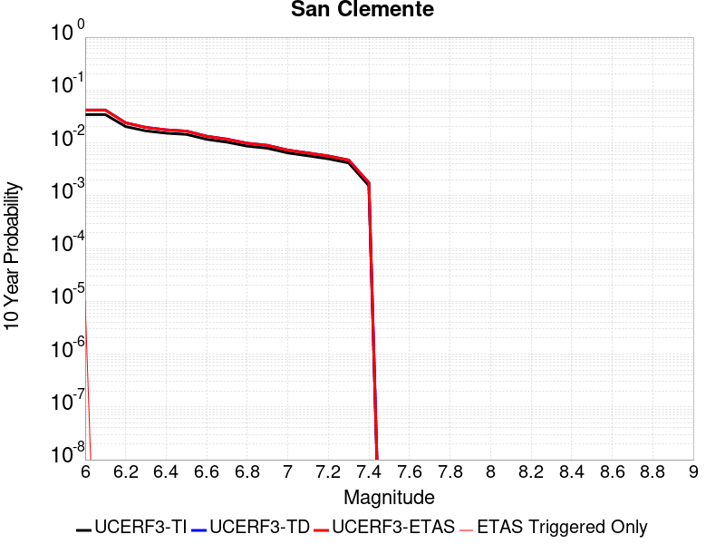 |

| Magnitude | 1 wk TI Prob | 1 wk TD Prob | 1 wk ETAS Prob | 1 wk ETAS/TD Gain | 1 wk ETAS Triggered Only | 1 mo TI Prob | 1 mo TD Prob | 1 mo ETAS Prob | 1 mo ETAS/TD Gain | 1 mo ETAS Triggered Only | 1 yr TI Prob | 1 yr TD Prob | 1 yr ETAS Prob | 1 yr ETAS/TD Gain | 1 yr ETAS Triggered Only | 10 yr TI Prob | 10 yr TD Prob | 10 yr ETAS Prob | 10 yr ETAS/TD Gain | 10 yr ETAS Triggered Only |
|-----|-----|-----|-----|-----|-----|-----|-----|-----|-----|-----|-----|-----|-----|-----|-----|-----|-----|-----|-----|-----|
| 6.0 | 6.681379E-5 | 8.163916E-5 | 8.163916E-5 | 1.0 | 0.0 | 2.8631336E-4 | 3.4983843E-4 | 3.7349318E-4 | 1.0676162 | 2.3663039E-5 | 0.003480294 | 0.004251544 | 0.0042751064 | 1.005542 | 2.3663039E-5 | 0.03426291 | 0.041758116 | 0.041780792 | 1.000543 | 2.3663039E-5 |
| 6.1 | 6.681379E-5 | 8.163916E-5 | 8.163916E-5 | 1.0 | 0.0 | 2.8631336E-4 | 3.4983843E-4 | 3.4983843E-4 | 1.0 | 0.0 | 0.003480294 | 0.004251544 | 0.004251544 | 1.0 | 0.0 | 0.03426291 | 0.041758116 | 0.041758116 | 1.0 | 0.0 |
| 6.2 | 3.9400576E-5 | 4.6454225E-5 | 4.6454225E-5 | 1.0 | 0.0 | 1.6884868E-4 | 1.9907467E-4 | 1.9907467E-4 | 1.0 | 0.0 | 0.0020537945 | 0.002421101 | 0.002421101 | 1.0 | 0.0 | 0.020349167 | 0.02395399 | 0.02395399 | 1.0 | 0.0 |
| 6.3 | 3.2590255E-5 | 3.793075E-5 | 3.793075E-5 | 1.0 | 0.0 | 1.3966505E-4 | 1.6255038E-4 | 1.6255038E-4 | 1.0 | 0.0 | 0.0016990956 | 0.0019772847 | 0.0019772847 | 1.0 | 0.0 | 0.01686163 | 0.019600714 | 0.019600714 | 1.0 | 0.0 |
| 6.4 | 2.9454652E-5 | 3.4099212E-5 | 3.4099212E-5 | 1.0 | 0.0 | 1.2622811E-4 | 1.4613141E-4 | 1.4613141E-4 | 1.0 | 0.0 | 0.0015357438 | 0.0017777226 | 0.0017777226 | 1.0 | 0.0 | 0.015251739 | 0.017638192 | 0.017638192 | 1.0 | 0.0 |
| 6.5 | 2.790836E-5 | 3.2248798E-5 | 3.2248798E-5 | 1.0 | 0.0 | 1.1960178E-4 | 1.3820194E-4 | 1.3820194E-4 | 1.0 | 0.0 | 0.001455179 | 0.0016813346 | 0.0016813346 | 1.0 | 0.0 | 0.014456868 | 0.01668916 | 0.01668916 | 1.0 | 0.0 |
| 6.6 | 2.2492153E-5 | 2.5763702E-5 | 2.5763702E-5 | 1.0 | 0.0 | 9.639138E-5 | 1.1041128E-4 | 1.1041128E-4 | 1.0 | 0.0 | 0.0011729331 | 0.0013434427 | 0.0013434427 | 1.0 | 0.0 | 0.011667615 | 0.013354928 | 0.013354928 | 1.0 | 0.0 |
| 6.7 | 1.9862755E-5 | 2.2667273E-5 | 2.2667273E-5 | 1.0 | 0.0 | 8.512331E-5 | 9.71419E-5 | 9.71419E-5 | 1.0 | 0.0 | 0.0010358836 | 0.0011820722 | 0.0011820722 | 1.0 | 0.0 | 0.010310682 | 0.01175914 | 0.01175914 | 1.0 | 0.0 |
| 6.8 | 1.6697575E-5 | 1.8978397E-5 | 1.8978397E-5 | 1.0 | 0.0 | 7.155907E-5 | 8.133351E-5 | 8.133351E-5 | 1.0 | 0.0 | 8.7088346E-4 | 9.89795E-4 | 9.89795E-4 | 1.0 | 0.0 | 0.008674784 | 0.009854892 | 0.009854892 | 1.0 | 0.0 |
| 6.9 | 1.5218415E-5 | 1.7270018E-5 | 1.7270018E-5 | 1.0 | 0.0 | 6.522015E-5 | 7.4012314E-5 | 7.4012314E-5 | 1.0 | 0.0 | 7.93766E-4 | 9.007362E-4 | 9.007362E-4 | 1.0 | 0.0 | 0.007909367 | 0.0089718 | 0.0089718 | 1.0 | 0.0 |
| 7.0 | 1.2392958E-5 | 1.4033508E-5 | 1.4033508E-5 | 1.0 | 0.0 | 5.3111595E-5 | 6.014226E-5 | 6.014226E-5 | 1.0 | 0.0 | 6.4644177E-4 | 7.3199364E-4 | 7.3199364E-4 | 1.0 | 0.0 | 0.0064456454 | 0.007296612 | 0.007296612 | 1.0 | 0.0 |
| 7.1 | 1.0934128E-5 | 1.2375571E-5 | 1.2375571E-5 | 1.0 | 0.0 | 4.6859706E-5 | 5.303712E-5 | 5.303712E-5 | 1.0 | 0.0 | 5.7036756E-4 | 6.45543E-4 | 6.45543E-4 | 1.0 | 0.0 | 0.0056890585 | 0.006437424 | 0.006437424 | 1.0 | 0.0 |
| 7.2 | 9.5798805E-6 | 1.0845315E-5 | 1.0845315E-5 | 1.0 | 0.0 | 4.1055984E-5 | 4.6479134E-5 | 4.6479134E-5 | 1.0 | 0.0 | 4.9974193E-4 | 5.657437E-4 | 5.657437E-4 | 1.0 | 0.0 | 0.0049861963 | 0.0056437585 | 0.0056437585 | 1.0 | 0.0 |
| 7.3 | 8.0167365E-6 | 9.084239E-6 | 9.084239E-6 | 1.0 | 0.0 | 3.4356988E-5 | 3.8931907E-5 | 3.8931907E-5 | 1.0 | 0.0 | 4.1821605E-4 | 4.7389997E-4 | 4.7389997E-4 | 1.0 | 0.0 | 0.0041742986 | 0.0047295964 | 0.0047295964 | 1.0 | 0.0 |
| 7.4 | 2.9581017E-6 | 3.362501E-6 | 3.362501E-6 | 1.0 | 0.0 | 1.2677518E-5 | 1.4410668E-5 | 1.4410668E-5 | 1.0 | 0.0 | 1.5433785E-4 | 1.754408E-4 | 1.754408E-4 | 1.0 | 0.0 | 0.001542307 | 0.0017535181 | 0.0017535181 | 1.0 | 0.0 |

## Malibu Coast alt 1
*[(top)](#table-of-contents)*

| 1 Week | 1 Month | 1 Year | 10 Year |
|-----|-----|-----|-----|
|  |  |  |  |

| Magnitude | 1 wk TI Prob | 1 wk TD Prob | 1 wk ETAS Prob | 1 wk ETAS/TD Gain | 1 wk ETAS Triggered Only | 1 mo TI Prob | 1 mo TD Prob | 1 mo ETAS Prob | 1 mo ETAS/TD Gain | 1 mo ETAS Triggered Only | 1 yr TI Prob | 1 yr TD Prob | 1 yr ETAS Prob | 1 yr ETAS/TD Gain | 1 yr ETAS Triggered Only | 10 yr TI Prob | 10 yr TD Prob | 10 yr ETAS Prob | 10 yr ETAS/TD Gain | 10 yr ETAS Triggered Only |
|-----|-----|-----|-----|-----|-----|-----|-----|-----|-----|-----|-----|-----|-----|-----|-----|-----|-----|-----|-----|-----|
| 6.0 | 1.6572556E-5 | 1.7598471E-5 | 4.1261093E-5 | 2.344584 | 2.3663039E-5 | 7.102331E-5 | 7.541994E-5 | 9.90812E-5 | 1.3137268 | 2.3663039E-5 | 8.6436566E-4 | 9.1786985E-4 | 9.415112E-4 | 1.0257567 | 2.3663039E-5 | 0.0086101135 | 0.009142722 | 0.009166168 | 1.0025645 | 2.3663039E-5 |
| 6.1 | 1.6572556E-5 | 1.7598471E-5 | 4.1261093E-5 | 2.344584 | 2.3663039E-5 | 7.102331E-5 | 7.541994E-5 | 9.90812E-5 | 1.3137268 | 2.3663039E-5 | 8.6436566E-4 | 9.1786985E-4 | 9.415112E-4 | 1.0257567 | 2.3663039E-5 | 0.0086101135 | 0.009142722 | 0.009166168 | 1.0025645 | 2.3663039E-5 |
| 6.2 | 1.1085717E-5 | 1.1557389E-5 | 1.1557389E-5 | 1.0 | 0.0 | 4.750935E-5 | 4.9530747E-5 | 4.9530747E-5 | 1.0 | 0.0 | 5.782728E-4 | 6.028735E-4 | 6.028735E-4 | 1.0 | 0.0 | 0.0057677035 | 0.0060127513 | 0.0060127513 | 1.0 | 0.0 |
| 6.3 | 1.0208568E-5 | 1.0592454E-5 | 1.0592454E-5 | 1.0 | 0.0 | 4.375027E-5 | 4.5395456E-5 | 4.5395456E-5 | 1.0 | 0.0 | 5.325294E-4 | 5.5255246E-4 | 5.5255246E-4 | 1.0 | 0.0 | 0.0053125503 | 0.005512094 | 0.005512094 | 1.0 | 0.0 |
| 6.4 | 9.0682315E-6 | 9.342822E-6 | 9.342822E-6 | 1.0 | 0.0 | 3.8863272E-5 | 4.004006E-5 | 4.004006E-5 | 1.0 | 0.0 | 4.730576E-4 | 4.8738075E-4 | 4.8738075E-4 | 1.0 | 0.0 | 0.0047205184 | 0.004863332 | 0.004863332 | 1.0 | 0.0 |
| 6.5 | 7.605796E-6 | 7.748734E-6 | 7.748734E-6 | 1.0 | 0.0 | 3.259586E-5 | 3.3208446E-5 | 3.3208446E-5 | 1.0 | 0.0 | 3.9678233E-4 | 4.0423914E-4 | 4.0423914E-4 | 1.0 | 0.0 | 0.0039607463 | 0.004035176 | 0.004035176 | 1.0 | 0.0 |
| 6.6 | 5.889873E-6 | 5.879641E-6 | 5.879641E-6 | 1.0 | 0.0 | 2.5242069E-5 | 2.5198216E-5 | 2.5198216E-5 | 1.0 | 0.0 | 3.0727885E-4 | 3.067452E-4 | 3.067452E-4 | 1.0 | 0.0 | 0.003068543 | 0.0030632308 | 0.0030632308 | 1.0 | 0.0 |
| 6.7 | 5.66586E-6 | 5.6417393E-6 | 5.6417393E-6 | 1.0 | 0.0 | 2.428203E-5 | 2.417866E-5 | 2.417866E-5 | 1.0 | 0.0 | 2.955936E-4 | 2.943355E-4 | 2.943355E-4 | 1.0 | 0.0 | 0.0029520073 | 0.0029394687 | 0.0029394687 | 1.0 | 0.0 |
| 6.8 | 5.521556E-6 | 5.489523E-6 | 5.489523E-6 | 1.0 | 0.0 | 2.3663597E-5 | 2.3526314E-5 | 2.3526314E-5 | 1.0 | 0.0 | 2.880662E-4 | 2.863953E-4 | 2.863953E-4 | 1.0 | 0.0 | 0.0028769306 | 0.002860274 | 0.002860274 | 1.0 | 0.0 |
| 6.9 | 5.29752E-6 | 5.250023E-6 | 5.250023E-6 | 1.0 | 0.0 | 2.270346E-5 | 2.2499906E-5 | 2.2499906E-5 | 1.0 | 0.0 | 2.7637955E-4 | 2.73902E-4 | 2.73902E-4 | 1.0 | 0.0 | 0.0027603607 | 0.0027356544 | 0.0027356544 | 1.0 | 0.0 |
| 7.0 | 5.106743E-6 | 5.047767E-6 | 5.047767E-6 | 1.0 | 0.0 | 2.1885859E-5 | 2.1633108E-5 | 2.1633108E-5 | 1.0 | 0.0 | 2.6642776E-4 | 2.6335134E-4 | 2.6335134E-4 | 1.0 | 0.0 | 0.0026610855 | 0.002630402 | 0.002630402 | 1.0 | 0.0 |
| 7.1 | 4.8469647E-6 | 4.770456E-6 | 4.770456E-6 | 1.0 | 0.0 | 2.0772539E-5 | 2.0444653E-5 | 2.0444653E-5 | 1.0 | 0.0 | 2.528763E-4 | 2.4888528E-4 | 2.4888528E-4 | 1.0 | 0.0 | 0.0025258875 | 0.0024860734 | 0.0024860734 | 1.0 | 0.0 |
| 7.2 | 4.545514E-6 | 4.448271E-6 | 4.448271E-6 | 1.0 | 0.0 | 1.9480629E-5 | 1.9063878E-5 | 1.9063878E-5 | 1.0 | 0.0 | 2.3715083E-4 | 2.3207806E-4 | 2.3207806E-4 | 1.0 | 0.0 | 0.0023689792 | 0.0023183646 | 0.0023183646 | 1.0 | 0.0 |
| 7.3 | 3.794097E-6 | 3.651996E-6 | 3.651996E-6 | 1.0 | 0.0 | 1.6260314E-5 | 1.5651318E-5 | 1.5651318E-5 | 1.0 | 0.0 | 1.9795135E-4 | 1.9053817E-4 | 1.9053817E-4 | 1.0 | 0.0 | 0.001977751 | 0.0019037527 | 0.0019037527 | 1.0 | 0.0 |
| 7.4 | 2.808217E-6 | 2.7191231E-6 | 2.7191231E-6 | 1.0 | 0.0 | 1.203516E-5 | 1.1653333E-5 | 1.1653333E-5 | 1.0 | 0.0 | 1.4651821E-4 | 1.4187011E-4 | 1.4187011E-4 | 1.0 | 0.0 | 0.0014642165 | 0.0014177981 | 0.0014177981 | 1.0 | 0.0 |
| 7.5 | 1.83809E-6 | 1.8191013E-6 | 1.8191013E-6 | 1.0 | 0.0 | 7.877505E-6 | 7.796125E-6 | 7.796125E-6 | 1.0 | 0.0 | 9.59044E-5 | 9.491371E-5 | 9.491371E-5 | 1.0 | 0.0 | 9.5863023E-4 | 9.487337E-4 | 9.487337E-4 | 1.0 | 0.0 |
| 7.6 | 1.1292672E-6 | 1.1001654E-6 | 1.1001654E-6 | 1.0 | 0.0 | 4.839708E-6 | 4.714986E-6 | 4.714986E-6 | 1.0 | 0.0 | 5.8921847E-5 | 5.7403457E-5 | 5.7403457E-5 | 1.0 | 0.0 | 5.890623E-4 | 5.7388796E-4 | 5.7388796E-4 | 1.0 | 0.0 |
| 7.7 | 5.065272E-7 | 4.609255E-7 | 4.609255E-7 | 1.0 | 0.0 | 2.170829E-6 | 1.9753936E-6 | 1.9753936E-6 | 1.0 | 0.0 | 2.6429525E-5 | 2.4050163E-5 | 2.4050163E-5 | 1.0 | 0.0 | 2.642638E-4 | 2.4047671E-4 | 2.4047671E-4 | 1.0 | 0.0 |
| 7.8 | 8.952991E-8 | 6.7082745E-8 | 6.7082745E-8 | 1.0 | 0.0 | 3.8369956E-7 | 2.8749744E-7 | 2.8749744E-7 | 1.0 | 0.0 | 4.671532E-6 | 3.500276E-6 | 3.500276E-6 | 1.0 | 0.0 | 4.671434E-5 | 3.5002227E-5 | 3.5002227E-5 | 1.0 | 0.0 |
| 7.9 | 8.007447E-10 | 6.160953E-10 | 6.160953E-10 | 1.0 | 0.0 | 3.4317629E-9 | 2.6404083E-9 | 2.6404083E-9 | 1.0 | 0.0 | 4.1781714E-8 | 3.214697E-8 | 3.214697E-8 | 1.0 | 0.0 | 4.1781706E-7 | 3.2146968E-7 | 3.2146968E-7 | 1.0 | 0.0 |

## Santa Susana alt 1
*[(top)](#table-of-contents)*

| 1 Week | 1 Month | 1 Year | 10 Year |
|-----|-----|-----|-----|
|  |  |  |  |

| Magnitude | 1 wk TI Prob | 1 wk TD Prob | 1 wk ETAS Prob | 1 wk ETAS/TD Gain | 1 wk ETAS Triggered Only | 1 mo TI Prob | 1 mo TD Prob | 1 mo ETAS Prob | 1 mo ETAS/TD Gain | 1 mo ETAS Triggered Only | 1 yr TI Prob | 1 yr TD Prob | 1 yr ETAS Prob | 1 yr ETAS/TD Gain | 1 yr ETAS Triggered Only | 10 yr TI Prob | 10 yr TD Prob | 10 yr ETAS Prob | 10 yr ETAS/TD Gain | 10 yr ETAS Triggered Only |
|-----|-----|-----|-----|-----|-----|-----|-----|-----|-----|-----|-----|-----|-----|-----|-----|-----|-----|-----|-----|-----|
| 6.0 | 2.674877E-5 | 2.7199343E-5 | 2.7199343E-5 | 1.0 | 0.0 | 1.1463255E-4 | 1.1656405E-4 | 1.4022432E-4 | 1.202981 | 2.3663039E-5 | 0.0013947578 | 0.001418357 | 0.0014419865 | 1.0166597 | 2.3663039E-5 | 0.013860362 | 0.014104809 | 0.014128138 | 1.001654 | 2.3663039E-5 |
| 6.1 | 2.674877E-5 | 2.7199343E-5 | 2.7199343E-5 | 1.0 | 0.0 | 1.1463255E-4 | 1.1656405E-4 | 1.4022432E-4 | 1.202981 | 2.3663039E-5 | 0.0013947578 | 0.001418357 | 0.0014419865 | 1.0166597 | 2.3663039E-5 | 0.013860362 | 0.014104809 | 0.014128138 | 1.001654 | 2.3663039E-5 |
| 6.2 | 2.674877E-5 | 2.7199343E-5 | 2.7199343E-5 | 1.0 | 0.0 | 1.1463255E-4 | 1.1656405E-4 | 1.4022432E-4 | 1.202981 | 2.3663039E-5 | 0.0013947578 | 0.001418357 | 0.0014419865 | 1.0166597 | 2.3663039E-5 | 0.013860362 | 0.014104809 | 0.014128138 | 1.001654 | 2.3663039E-5 |
| 6.3 | 2.674877E-5 | 2.7199343E-5 | 2.7199343E-5 | 1.0 | 0.0 | 1.1463255E-4 | 1.1656405E-4 | 1.4022432E-4 | 1.202981 | 2.3663039E-5 | 0.0013947578 | 0.001418357 | 0.0014419865 | 1.0166597 | 2.3663039E-5 | 0.013860362 | 0.014104809 | 0.014128138 | 1.001654 | 2.3663039E-5 |
| 6.4 | 2.674877E-5 | 2.7199343E-5 | 2.7199343E-5 | 1.0 | 0.0 | 1.1463255E-4 | 1.1656405E-4 | 1.4022432E-4 | 1.202981 | 2.3663039E-5 | 0.0013947578 | 0.001418357 | 0.0014419865 | 1.0166597 | 2.3663039E-5 | 0.013860362 | 0.014104809 | 0.014128138 | 1.001654 | 2.3663039E-5 |
| 6.5 | 2.674877E-5 | 2.7199343E-5 | 2.7199343E-5 | 1.0 | 0.0 | 1.1463255E-4 | 1.1656405E-4 | 1.4022432E-4 | 1.202981 | 2.3663039E-5 | 0.0013947578 | 0.001418357 | 0.0014419865 | 1.0166597 | 2.3663039E-5 | 0.013860362 | 0.014104809 | 0.014128138 | 1.001654 | 2.3663039E-5 |
| 6.6 | 2.6647976E-5 | 2.7075674E-5 | 2.7075674E-5 | 1.0 | 0.0 | 1.14200615E-4 | 1.16034076E-4 | 1.3969437E-4 | 1.2039081 | 2.3663039E-5 | 0.0013895056 | 0.0014119132 | 0.0014355428 | 1.0167359 | 2.3663039E-5 | 0.013808494 | 0.01404119 | 0.014064521 | 1.0016615 | 2.3663039E-5 |
| 6.7 | 2.6647976E-5 | 2.7075674E-5 | 2.7075674E-5 | 1.0 | 0.0 | 1.14200615E-4 | 1.16034076E-4 | 1.3969437E-4 | 1.2039081 | 2.3663039E-5 | 0.0013895056 | 0.0014119132 | 0.0014355428 | 1.0167359 | 2.3663039E-5 | 0.013808494 | 0.01404119 | 0.014064521 | 1.0016615 | 2.3663039E-5 |
| 6.8 | 1.9073179E-5 | 1.7637982E-5 | 1.7637982E-5 | 1.0 | 0.0 | 8.1739636E-5 | 7.558926E-5 | 9.925051E-5 | 1.3130239 | 2.3663039E-5 | 9.947256E-4 | 9.1992883E-4 | 9.435701E-4 | 1.025699 | 2.3663039E-5 | 0.009902848 | 0.009163462 | 0.009186908 | 1.0025587 | 2.3663039E-5 |
| 6.9 | 1.9041876E-5 | 1.7620112E-5 | 1.7620112E-5 | 1.0 | 0.0 | 8.160549E-5 | 7.551268E-5 | 9.917393E-5 | 1.3133414 | 2.3663039E-5 | 9.930939E-4 | 9.189973E-4 | 9.4263855E-4 | 1.0257251 | 2.3663039E-5 | 0.0098866755 | 0.009154223 | 0.009177669 | 1.0025612 | 2.3663039E-5 |
| 7.0 | 1.5917482E-5 | 1.3864347E-5 | 1.3864347E-5 | 1.0 | 0.0 | 6.8215995E-5 | 5.9417303E-5 | 8.3078936E-5 | 1.3982279 | 2.3663039E-5 | 8.302132E-4 | 7.2317023E-4 | 7.4681616E-4 | 1.0326976 | 2.3663039E-5 | 0.008271185 | 0.0072090644 | 0.0072325566 | 1.0032587 | 2.3663039E-5 |
| 7.1 | 1.577788E-5 | 1.374435E-5 | 1.374435E-5 | 1.0 | 0.0 | 6.761774E-5 | 5.8903053E-5 | 8.25647E-5 | 1.4017049 | 2.3663039E-5 | 8.2293496E-4 | 7.169134E-4 | 7.405594E-4 | 1.0329832 | 2.3663039E-5 | 0.008198941 | 0.0071468996 | 0.0071703936 | 1.0032873 | 2.3663039E-5 |
| 7.2 | 1.5416446E-5 | 1.3470412E-5 | 1.3470412E-5 | 1.0 | 0.0 | 6.606882E-5 | 5.772909E-5 | 8.139076E-5 | 1.4098743 | 2.3663039E-5 | 8.0409093E-4 | 7.026296E-4 | 7.26276E-4 | 1.0336542 | 2.3663039E-5 | 0.008011877 | 0.007004966 | 0.0070284633 | 1.0033544 | 2.3663039E-5 |
| 7.3 | 1.4534083E-5 | 1.2718311E-5 | 1.2718311E-5 | 1.0 | 0.0 | 6.228744E-5 | 5.4505934E-5 | 7.816768E-5 | 1.4341133 | 2.3663039E-5 | 7.580857E-4 | 6.6341215E-4 | 6.870595E-4 | 1.035645 | 2.3663039E-5 | 0.007555048 | 0.0066151684 | 0.006638675 | 1.0035534 | 2.3663039E-5 |
| 7.4 | 1.2858995E-5 | 1.1230016E-5 | 1.1230016E-5 | 1.0 | 0.0 | 5.5108816E-5 | 4.8127775E-5 | 7.178968E-5 | 1.4916475 | 2.3663039E-5 | 6.7074323E-4 | 5.858021E-4 | 6.094512E-4 | 1.0403706 | 2.3663039E-5 | 0.0066872234 | 0.0058433535 | 0.005866878 | 1.0040259 | 2.3663039E-5 |
| 7.5 | 8.827668E-6 | 7.805619E-6 | 7.805619E-6 | 1.0 | 0.0 | 3.7832317E-5 | 3.3452237E-5 | 3.3452237E-5 | 1.0 | 0.0 | 4.605111E-4 | 4.0720735E-4 | 4.0720735E-4 | 1.0 | 0.0 | 0.0045955796 | 0.0040648608 | 0.0040648608 | 1.0 | 0.0 |
| 7.6 | 3.2533426E-6 | 2.872028E-6 | 2.872028E-6 | 1.0 | 0.0 | 1.3942822E-5 | 1.2308636E-5 | 1.2308636E-5 | 1.0 | 0.0 | 1.6974064E-4 | 1.498477E-4 | 1.498477E-4 | 1.0 | 0.0 | 0.0016961104 | 0.0014975035 | 0.0014975035 | 1.0 | 0.0 |
| 7.7 | 1.2751709E-6 | 1.1491308E-6 | 1.1491308E-6 | 1.0 | 0.0 | 5.4650063E-6 | 4.924837E-6 | 4.924837E-6 | 1.0 | 0.0 | 6.653442E-5 | 5.9958333E-5 | 5.9958333E-5 | 1.0 | 0.0 | 6.6514505E-4 | 5.9943047E-4 | 5.9943047E-4 | 1.0 | 0.0 |
| 7.8 | 3.067544E-7 | 3.2401002E-7 | 3.2401002E-7 | 1.0 | 0.0 | 1.3146611E-6 | 1.3886137E-6 | 1.3886137E-6 | 1.0 | 0.0 | 1.600588E-5 | 1.6906251E-5 | 1.6906251E-5 | 1.0 | 0.0 | 1.6004729E-4 | 1.6905068E-4 | 1.6905068E-4 | 1.0 | 0.0 |
| 7.9 | 7.622999E-8 | 8.0881E-8 | 8.0881E-8 | 1.0 | 0.0 | 3.2669993E-7 | 3.4663285E-7 | 3.4663285E-7 | 1.0 | 0.0 | 3.977564E-6 | 4.2202487E-6 | 4.2202487E-6 | 1.0 | 0.0 | 3.977493E-5 | 4.2201897E-5 | 4.2201897E-5 | 1.0 | 0.0 |

## San Juan
*[(top)](#table-of-contents)*

| 1 Week | 1 Month | 1 Year | 10 Year |
|-----|-----|-----|-----|
|  |  |  |  |

| Magnitude | 1 wk TI Prob | 1 wk TD Prob | 1 wk ETAS Prob | 1 wk ETAS/TD Gain | 1 wk ETAS Triggered Only | 1 mo TI Prob | 1 mo TD Prob | 1 mo ETAS Prob | 1 mo ETAS/TD Gain | 1 mo ETAS Triggered Only | 1 yr TI Prob | 1 yr TD Prob | 1 yr ETAS Prob | 1 yr ETAS/TD Gain | 1 yr ETAS Triggered Only | 10 yr TI Prob | 10 yr TD Prob | 10 yr ETAS Prob | 10 yr ETAS/TD Gain | 10 yr ETAS Triggered Only |
|-----|-----|-----|-----|-----|-----|-----|-----|-----|-----|-----|-----|-----|-----|-----|-----|-----|-----|-----|-----|-----|
| 6.0 | 8.682808E-6 | 8.749955E-6 | 8.749955E-6 | 1.0 | 0.0 | 3.72115E-5 | 3.7499292E-5 | 3.7499292E-5 | 1.0 | 0.0 | 4.5295584E-4 | 4.5646308E-4 | 4.5646308E-4 | 1.0 | 0.0 | 0.004520337 | 0.004555796 | 0.0045793513 | 1.0051703 | 2.3663039E-5 |
| 6.1 | 8.682808E-6 | 8.749955E-6 | 8.749955E-6 | 1.0 | 0.0 | 3.72115E-5 | 3.7499292E-5 | 3.7499292E-5 | 1.0 | 0.0 | 4.5295584E-4 | 4.5646308E-4 | 4.5646308E-4 | 1.0 | 0.0 | 0.004520337 | 0.004555796 | 0.0045793513 | 1.0051703 | 2.3663039E-5 |
| 6.2 | 8.682808E-6 | 8.749955E-6 | 8.749955E-6 | 1.0 | 0.0 | 3.72115E-5 | 3.7499292E-5 | 3.7499292E-5 | 1.0 | 0.0 | 4.5295584E-4 | 4.5646308E-4 | 4.5646308E-4 | 1.0 | 0.0 | 0.004520337 | 0.004555796 | 0.0045793513 | 1.0051703 | 2.3663039E-5 |
| 6.3 | 6.3054235E-6 | 6.2833515E-6 | 6.2833515E-6 | 1.0 | 0.0 | 2.7022963E-5 | 2.692838E-5 | 2.692838E-5 | 1.0 | 0.0 | 3.2895492E-4 | 3.2780512E-4 | 3.2780512E-4 | 1.0 | 0.0 | 0.003284684 | 0.0032734156 | 0.0032734156 | 1.0 | 0.0 |
| 6.4 | 6.1490473E-6 | 6.115127E-6 | 6.115127E-6 | 1.0 | 0.0 | 2.6352795E-5 | 2.620743E-5 | 2.620743E-5 | 1.0 | 0.0 | 3.2079802E-4 | 3.1903014E-4 | 3.1903014E-4 | 1.0 | 0.0 | 0.0032033534 | 0.0031859176 | 0.0031859176 | 1.0 | 0.0 |
| 6.5 | 5.204848E-6 | 5.137873E-6 | 5.137873E-6 | 1.0 | 0.0 | 2.23063E-5 | 2.2019276E-5 | 2.2019276E-5 | 1.0 | 0.0 | 2.7154534E-4 | 2.6805265E-4 | 2.6805265E-4 | 1.0 | 0.0 | 0.0027121378 | 0.0026774474 | 0.0026774474 | 1.0 | 0.0 |
| 6.6 | 4.5179986E-6 | 4.4155086E-6 | 4.4155086E-6 | 1.0 | 0.0 | 1.9362706E-5 | 1.8923476E-5 | 1.8923476E-5 | 1.0 | 0.0 | 2.3571544E-4 | 2.3036974E-4 | 2.3036974E-4 | 1.0 | 0.0 | 0.0023546559 | 0.0023014464 | 0.0023014464 | 1.0 | 0.0 |
| 6.7 | 3.9442616E-6 | 3.8202556E-6 | 3.8202556E-6 | 1.0 | 0.0 | 1.6903869E-5 | 1.6372425E-5 | 1.6372425E-5 | 1.0 | 0.0 | 2.0578515E-4 | 1.9931671E-4 | 1.9931671E-4 | 1.0 | 0.0 | 0.002055947 | 0.0019915043 | 0.0019915043 | 1.0 | 0.0 |
| 6.8 | 3.4536245E-6 | 3.316745E-6 | 3.316745E-6 | 1.0 | 0.0 | 1.4801163E-5 | 1.4214547E-5 | 1.4214547E-5 | 1.0 | 0.0 | 1.8018926E-4 | 1.7304897E-4 | 1.7304897E-4 | 1.0 | 0.0 | 0.0018004322 | 0.0017292611 | 0.0017292611 | 1.0 | 0.0 |
| 6.9 | 3.059865E-6 | 2.9124226E-6 | 2.9124226E-6 | 1.0 | 0.0 | 1.3113641E-5 | 1.2481754E-5 | 1.2481754E-5 | 1.0 | 0.0 | 1.596469E-4 | 1.5195533E-4 | 1.5195533E-4 | 1.0 | 0.0 | 0.0015953224 | 0.001518629 | 0.001518629 | 1.0 | 0.0 |
| 7.0 | 2.6504351E-6 | 2.4923695E-6 | 2.4923695E-6 | 1.0 | 0.0 | 1.1358958E-5 | 1.0681543E-5 | 1.0681543E-5 | 1.0 | 0.0 | 1.3828653E-4 | 1.3004057E-4 | 1.3004057E-4 | 1.0 | 0.0 | 0.0013820052 | 0.0012997567 | 0.0012997567 | 1.0 | 0.0 |
| 7.1 | 2.2039317E-6 | 2.0341317E-6 | 2.0341317E-6 | 1.0 | 0.0 | 9.445387E-6 | 8.717681E-6 | 8.717681E-6 | 1.0 | 0.0 | 1.1499152E-4 | 1.0613313E-4 | 1.0613313E-4 | 1.0 | 0.0 | 0.0011493203 | 0.0010609344 | 0.0010609344 | 1.0 | 0.0 |
| 7.2 | 1.0786707E-6 | 8.772781E-7 | 8.772781E-7 | 1.0 | 0.0 | 4.622866E-6 | 3.7597579E-6 | 3.7597579E-6 | 1.0 | 0.0 | 5.628194E-5 | 4.5774104E-5 | 4.5774104E-5 | 1.0 | 0.0 | 5.6267687E-4 | 4.5770584E-4 | 4.5770584E-4 | 1.0 | 0.0 |
| 7.3 | 6.846433E-7 | 4.8704425E-7 | 4.8704425E-7 | 1.0 | 0.0 | 2.9341822E-6 | 2.0873308E-6 | 2.0873308E-6 | 1.0 | 0.0 | 3.5723086E-5 | 2.5412957E-5 | 2.5412957E-5 | 1.0 | 0.0 | 3.571734E-4 | 2.5413404E-4 | 2.5413404E-4 | 1.0 | 0.0 |
| 7.4 | 5.23043E-7 | 3.2640304E-7 | 3.2640304E-7 | 1.0 | 0.0 | 2.2416111E-6 | 1.3988695E-6 | 1.3988695E-6 | 1.0 | 0.0 | 2.7291273E-5 | 1.7031103E-5 | 1.7031103E-5 | 1.0 | 0.0 | 2.7287923E-4 | 1.7032993E-4 | 1.7032993E-4 | 1.0 | 0.0 |
| 7.5 | 4.648444E-7 | 2.7245397E-7 | 2.7245397E-7 | 1.0 | 0.0 | 1.9921886E-6 | 1.1676593E-6 | 1.1676593E-6 | 1.0 | 0.0 | 2.4254627E-5 | 1.4216161E-5 | 1.4216161E-5 | 1.0 | 0.0 | 2.425198E-4 | 1.4218215E-4 | 1.4218215E-4 | 1.0 | 0.0 |
| 7.6 | 3.9906567E-7 | 2.2091646E-7 | 2.2091646E-7 | 1.0 | 0.0 | 1.7102802E-6 | 9.467845E-7 | 9.467845E-7 | 1.0 | 0.0 | 2.0822463E-5 | 1.152704E-5 | 1.152704E-5 | 1.0 | 0.0 | 2.0820512E-4 | 1.1528905E-4 | 1.1528905E-4 | 1.0 | 0.0 |
| 7.7 | 1.8784601E-7 | 5.369796E-8 | 5.369796E-8 | 1.0 | 0.0 | 8.0505407E-7 | 2.301341E-7 | 2.301341E-7 | 1.0 | 0.0 | 9.80149E-6 | 2.801879E-6 | 2.801879E-6 | 1.0 | 0.0 | 9.801057E-5 | 2.8027504E-5 | 2.8027504E-5 | 1.0 | 0.0 |
| 7.8 | 1.00154914E-7 | 1.2425791E-8 | 1.2425791E-8 | 1.0 | 0.0 | 4.2923529E-7 | 5.3253387E-8 | 5.3253387E-8 | 1.0 | 0.0 | 5.225927E-6 | 6.483598E-7 | 6.483598E-7 | 1.0 | 0.0 | 5.225804E-5 | 6.4894875E-6 | 6.4894875E-6 | 1.0 | 0.0 |
| 7.9 | 6.171429E-8 | 4.301782E-9 | 4.301782E-9 | 1.0 | 0.0 | 2.6448978E-7 | 1.8436214E-8 | 1.8436214E-8 | 1.0 | 0.0 | 3.2201583E-6 | 2.2446086E-7 | 2.2446086E-7 | 1.0 | 0.0 | 3.2201115E-5 | 2.249913E-6 | 2.249913E-6 | 1.0 | 0.0 |
| 8.0 | 1.3974572E-8 | 3.388243E-10 | 3.388243E-10 | 1.0 | 0.0 | 5.989102E-8 | 1.4521105E-9 | 1.4521105E-9 | 1.0 | 0.0 | 7.2917294E-7 | 1.7679438E-8 | 1.7679438E-8 | 1.0 | 0.0 | 7.2917055E-6 | 1.8110795E-7 | 1.8110795E-7 | 1.0 | 0.0 |
| 8.1 | 1.8403477E-9 | 1.1326151E-10 | 1.1326151E-10 | 1.0 | 0.0 | 7.887204E-9 | 4.8540727E-10 | 4.8540727E-10 | 1.0 | 0.0 | 9.602671E-8 | 5.9098357E-9 | 5.9098357E-9 | 1.0 | 0.0 | 9.602667E-7 | 6.0343986E-8 | 6.0343986E-8 | 1.0 | 0.0 |

## Greenville (No) 2011 CFM
*[(top)](#table-of-contents)*

| 1 Week | 1 Month | 1 Year | 10 Year |
|-----|-----|-----|-----|
|  |  |  |  |

| Magnitude | 1 wk TI Prob | 1 wk TD Prob | 1 wk ETAS Prob | 1 wk ETAS/TD Gain | 1 wk ETAS Triggered Only | 1 mo TI Prob | 1 mo TD Prob | 1 mo ETAS Prob | 1 mo ETAS/TD Gain | 1 mo ETAS Triggered Only | 1 yr TI Prob | 1 yr TD Prob | 1 yr ETAS Prob | 1 yr ETAS/TD Gain | 1 yr ETAS Triggered Only | 10 yr TI Prob | 10 yr TD Prob | 10 yr ETAS Prob | 10 yr ETAS/TD Gain | 10 yr ETAS Triggered Only |
|-----|-----|-----|-----|-----|-----|-----|-----|-----|-----|-----|-----|-----|-----|-----|-----|-----|-----|-----|-----|-----|
| 6.0 | 3.286654E-5 | 4.0368323E-5 | 4.0368323E-5 | 1.0 | 0.0 | 1.4084899E-4 | 1.7299583E-4 | 1.7299583E-4 | 1.0 | 0.0 | 0.0017134876 | 0.002104228 | 0.002127841 | 1.0112218 | 2.3663039E-5 | 0.017003356 | 0.020847922 | 0.020871092 | 1.0011114 | 2.3663039E-5 |
| 6.1 | 3.286654E-5 | 4.0368323E-5 | 4.0368323E-5 | 1.0 | 0.0 | 1.4084899E-4 | 1.7299583E-4 | 1.7299583E-4 | 1.0 | 0.0 | 0.0017134876 | 0.002104228 | 0.002127841 | 1.0112218 | 2.3663039E-5 | 0.017003356 | 0.020847922 | 0.020871092 | 1.0011114 | 2.3663039E-5 |
| 6.2 | 3.1697953E-5 | 3.893114E-5 | 3.893114E-5 | 1.0 | 0.0 | 1.358413E-4 | 1.6683727E-4 | 1.6683727E-4 | 1.0 | 0.0 | 0.0016526132 | 0.0020293896 | 0.0020293896 | 1.0 | 0.0 | 0.01640377 | 0.020113273 | 0.020113273 | 1.0 | 0.0 |
| 6.3 | 3.1363317E-5 | 3.8519993E-5 | 3.8519993E-5 | 1.0 | 0.0 | 1.344073E-4 | 1.6507543E-4 | 1.6507543E-4 | 1.0 | 0.0 | 0.0016351803 | 0.0020079787 | 0.0020079787 | 1.0 | 0.0 | 0.016232004 | 0.019903028 | 0.019903028 | 1.0 | 0.0 |
| 6.4 | 3.0228604E-5 | 3.7127043E-5 | 3.7127043E-5 | 1.0 | 0.0 | 1.2954473E-4 | 1.5910638E-4 | 1.5910638E-4 | 1.0 | 0.0 | 0.0015760659 | 0.0019354363 | 0.0019354363 | 1.0 | 0.0 | 0.015649348 | 0.019190326 | 0.019190326 | 1.0 | 0.0 |
| 6.5 | 2.9537814E-5 | 3.6282447E-5 | 3.6282447E-5 | 1.0 | 0.0 | 1.2658449E-4 | 1.5548713E-4 | 1.5548713E-4 | 1.0 | 0.0 | 0.0015400766 | 0.001891449 | 0.001891449 | 1.0 | 0.0 | 0.01529447 | 0.018757964 | 0.018757964 | 1.0 | 0.0 |
| 6.6 | 2.7345395E-5 | 3.359162E-5 | 3.359162E-5 | 1.0 | 0.0 | 1.1718928E-4 | 1.4395629E-4 | 1.4395629E-4 | 1.0 | 0.0 | 0.0014258457 | 0.0017512899 | 0.0017512899 | 1.0 | 0.0 | 0.014167317 | 0.017378705 | 0.017378705 | 1.0 | 0.0 |
| 6.7 | 2.5615784E-5 | 3.156843E-5 | 3.156843E-5 | 1.0 | 0.0 | 1.09777306E-4 | 1.352864E-4 | 1.352864E-4 | 1.0 | 0.0 | 0.0013357193 | 0.0016458981 | 0.0016458981 | 1.0 | 0.0 | 0.013277191 | 0.016340753 | 0.016340753 | 1.0 | 0.0 |
| 6.8 | 2.0059057E-5 | 2.4712988E-5 | 2.4712988E-5 | 1.0 | 0.0 | 8.596455E-5 | 1.0590859E-4 | 1.0590859E-4 | 1.0 | 0.0 | 0.0010461159 | 0.0012886907 | 0.0012886907 | 1.0 | 0.0 | 0.0104120495 | 0.012814194 | 0.012814194 | 1.0 | 0.0 |
| 6.9 | 1.6321746E-5 | 2.0185327E-5 | 2.0185327E-5 | 1.0 | 0.0 | 6.9948466E-5 | 8.6505745E-5 | 8.6505745E-5 | 1.0 | 0.0 | 8.5128983E-4 | 0.0010527109 | 0.0010527109 | 1.0 | 0.0 | 0.008480361 | 0.010478771 | 0.010478771 | 1.0 | 0.0 |
| 7.0 | 1.22527645E-5 | 1.5136057E-5 | 1.5136057E-5 | 1.0 | 0.0 | 5.2510793E-5 | 6.486723E-5 | 6.486723E-5 | 1.0 | 0.0 | 6.3913135E-4 | 7.8947656E-4 | 7.8947656E-4 | 1.0 | 0.0 | 0.0063729626 | 0.007867357 | 0.007867357 | 1.0 | 0.0 |
| 7.1 | 8.996482E-6 | 1.1165205E-5 | 1.1165205E-5 | 1.0 | 0.0 | 3.8555783E-5 | 4.7850008E-5 | 4.7850008E-5 | 1.0 | 0.0 | 4.6931554E-4 | 5.8241934E-4 | 5.8241934E-4 | 1.0 | 0.0 | 0.004683256 | 0.0058092205 | 0.0058092205 | 1.0 | 0.0 |
| 7.2 | 6.0273087E-6 | 7.5696203E-6 | 7.5696203E-6 | 1.0 | 0.0 | 2.5831067E-5 | 3.2440832E-5 | 3.2440832E-5 | 1.0 | 0.0 | 3.1444785E-4 | 3.9489623E-4 | 3.9489623E-4 | 1.0 | 0.0 | 0.0031400328 | 0.003942142 | 0.003942142 | 1.0 | 0.0 |
| 7.3 | 3.1209995E-6 | 3.966436E-6 | 3.966436E-6 | 1.0 | 0.0 | 1.3375643E-5 | 1.6998902E-5 | 1.6998902E-5 | 1.0 | 0.0 | 1.6283628E-4 | 2.0694213E-4 | 2.0694213E-4 | 1.0 | 0.0 | 0.0016271701 | 0.0020675845 | 0.0020675845 | 1.0 | 0.0 |
| 7.4 | 2.0254208E-6 | 2.6096434E-6 | 2.6096434E-6 | 1.0 | 0.0 | 8.680347E-6 | 1.1184138E-5 | 1.1184138E-5 | 1.0 | 0.0 | 1.0567809E-4 | 1.3615844E-4 | 1.3615844E-4 | 1.0 | 0.0 | 0.0010562785 | 0.001360807 | 0.001360807 | 1.0 | 0.0 |
| 7.5 | 1.6763418E-6 | 2.1733672E-6 | 2.1733672E-6 | 1.0 | 0.0 | 7.184302E-6 | 9.314398E-6 | 9.314398E-6 | 1.0 | 0.0 | 8.746537E-5 | 1.13396956E-4 | 1.13396956E-4 | 1.0 | 0.0 | 8.743095E-4 | 0.0011334379 | 0.0011334379 | 1.0 | 0.0 |
| 7.6 | 1.1935462E-6 | 1.5458563E-6 | 1.5458563E-6 | 1.0 | 0.0 | 5.115188E-6 | 6.625082E-6 | 6.625082E-6 | 1.0 | 0.0 | 6.2275634E-5 | 8.065743E-5 | 8.065743E-5 | 1.0 | 0.0 | 6.2258187E-4 | 8.0631225E-4 | 8.0631225E-4 | 1.0 | 0.0 |
| 7.7 | 3.0464201E-7 | 3.9847114E-7 | 3.9847114E-7 | 1.0 | 0.0 | 1.3056081E-6 | 1.7077324E-6 | 1.7077324E-6 | 1.0 | 0.0 | 1.589566E-5 | 2.0791449E-5 | 2.0791449E-5 | 1.0 | 0.0 | 1.5894524E-4 | 2.0789975E-4 | 2.0789975E-4 | 1.0 | 0.0 |

## Sierra Madre
*[(top)](#table-of-contents)*

| 1 Week | 1 Month | 1 Year | 10 Year |
|-----|-----|-----|-----|
|  |  |  |  |

| Magnitude | 1 wk TI Prob | 1 wk TD Prob | 1 wk ETAS Prob | 1 wk ETAS/TD Gain | 1 wk ETAS Triggered Only | 1 mo TI Prob | 1 mo TD Prob | 1 mo ETAS Prob | 1 mo ETAS/TD Gain | 1 mo ETAS Triggered Only | 1 yr TI Prob | 1 yr TD Prob | 1 yr ETAS Prob | 1 yr ETAS/TD Gain | 1 yr ETAS Triggered Only | 10 yr TI Prob | 10 yr TD Prob | 10 yr ETAS Prob | 10 yr ETAS/TD Gain | 10 yr ETAS Triggered Only |
|-----|-----|-----|-----|-----|-----|-----|-----|-----|-----|-----|-----|-----|-----|-----|-----|-----|-----|-----|-----|-----|
| 6.0 | 1.3379373E-5 | 1.1001505E-5 | 1.1001505E-5 | 1.0 | 0.0 | 5.7338908E-5 | 4.7148464E-5 | 4.7148464E-5 | 1.0 | 0.0 | 6.978776E-4 | 5.7388283E-4 | 5.7388283E-4 | 1.0 | 0.0 | 0.0069569005 | 0.005724373 | 0.0057479003 | 1.0041101 | 2.3663039E-5 |
| 6.1 | 1.3379373E-5 | 1.1001505E-5 | 1.1001505E-5 | 1.0 | 0.0 | 5.7338908E-5 | 4.7148464E-5 | 4.7148464E-5 | 1.0 | 0.0 | 6.978776E-4 | 5.7388283E-4 | 5.7388283E-4 | 1.0 | 0.0 | 0.0069569005 | 0.005724373 | 0.0057479003 | 1.0041101 | 2.3663039E-5 |
| 6.2 | 1.3379373E-5 | 1.1001505E-5 | 1.1001505E-5 | 1.0 | 0.0 | 5.7338908E-5 | 4.7148464E-5 | 4.7148464E-5 | 1.0 | 0.0 | 6.978776E-4 | 5.7388283E-4 | 5.7388283E-4 | 1.0 | 0.0 | 0.0069569005 | 0.005724373 | 0.0057479003 | 1.0041101 | 2.3663039E-5 |
| 6.3 | 1.3379373E-5 | 1.1001505E-5 | 1.1001505E-5 | 1.0 | 0.0 | 5.7338908E-5 | 4.7148464E-5 | 4.7148464E-5 | 1.0 | 0.0 | 6.978776E-4 | 5.7388283E-4 | 5.7388283E-4 | 1.0 | 0.0 | 0.0069569005 | 0.005724373 | 0.0057479003 | 1.0041101 | 2.3663039E-5 |
| 6.4 | 1.3379373E-5 | 1.1001505E-5 | 1.1001505E-5 | 1.0 | 0.0 | 5.7338908E-5 | 4.7148464E-5 | 4.7148464E-5 | 1.0 | 0.0 | 6.978776E-4 | 5.7388283E-4 | 5.7388283E-4 | 1.0 | 0.0 | 0.0069569005 | 0.005724373 | 0.0057479003 | 1.0041101 | 2.3663039E-5 |
| 6.5 | 1.26563245E-5 | 1.0230948E-5 | 1.0230948E-5 | 1.0 | 0.0 | 5.4240263E-5 | 4.3846187E-5 | 4.3846187E-5 | 1.0 | 0.0 | 6.601751E-4 | 5.3369766E-4 | 5.3369766E-4 | 1.0 | 0.0 | 0.006582173 | 0.005324481 | 0.005324481 | 1.0 | 0.0 |
| 6.6 | 1.26563245E-5 | 1.0230948E-5 | 1.0230948E-5 | 1.0 | 0.0 | 5.4240263E-5 | 4.3846187E-5 | 4.3846187E-5 | 1.0 | 0.0 | 6.601751E-4 | 5.3369766E-4 | 5.3369766E-4 | 1.0 | 0.0 | 0.006582173 | 0.005324481 | 0.005324481 | 1.0 | 0.0 |
| 6.7 | 1.2502474E-5 | 1.0067089E-5 | 1.0067089E-5 | 1.0 | 0.0 | 5.3580934E-5 | 4.314396E-5 | 4.314396E-5 | 1.0 | 0.0 | 6.521526E-4 | 5.2515214E-4 | 5.2515214E-4 | 1.0 | 0.0 | 0.0065024206 | 0.005239431 | 0.005239431 | 1.0 | 0.0 |
| 6.8 | 1.2454966E-5 | 1.0019374E-5 | 1.0019374E-5 | 1.0 | 0.0 | 5.3377335E-5 | 4.293947E-5 | 4.293947E-5 | 1.0 | 0.0 | 6.4967526E-4 | 5.226637E-4 | 5.226637E-4 | 1.0 | 0.0 | 0.006477792 | 0.005214663 | 0.005214663 | 1.0 | 0.0 |
| 6.9 | 1.2225574E-5 | 9.793346E-6 | 9.793346E-6 | 1.0 | 0.0 | 5.2394265E-5 | 4.1970816E-5 | 4.1970816E-5 | 1.0 | 0.0 | 6.3771347E-4 | 5.108759E-4 | 5.108759E-4 | 1.0 | 0.0 | 0.006358865 | 0.005097331 | 0.005097331 | 1.0 | 0.0 |
| 7.0 | 1.182946E-5 | 9.399881E-6 | 9.399881E-6 | 1.0 | 0.0 | 5.06967E-5 | 4.0284587E-5 | 4.0284587E-5 | 1.0 | 0.0 | 6.1705755E-4 | 4.903555E-4 | 4.903555E-4 | 1.0 | 0.0 | 0.006153469 | 0.004893047 | 0.004893047 | 1.0 | 0.0 |
| 7.1 | 1.14369095E-5 | 8.98688E-6 | 8.98688E-6 | 1.0 | 0.0 | 4.9014405E-5 | 3.8514634E-5 | 3.8514634E-5 | 1.0 | 0.0 | 5.9658696E-4 | 4.6881576E-4 | 4.6881576E-4 | 1.0 | 0.0 | 0.005949879 | 0.0046785735 | 0.0046785735 | 1.0 | 0.0 |
| 7.2 | 1.0836419E-5 | 8.4002595E-6 | 8.4002595E-6 | 1.0 | 0.0 | 4.644097E-5 | 3.600062E-5 | 3.600062E-5 | 1.0 | 0.0 | 5.652721E-4 | 4.382203E-4 | 4.382203E-4 | 1.0 | 0.0 | 0.0056383642 | 0.004373859 | 0.004373859 | 1.0 | 0.0 |
| 7.3 | 1.0403439E-5 | 8.021512E-6 | 8.021512E-6 | 1.0 | 0.0 | 4.4585406E-5 | 3.437746E-5 | 3.437746E-5 | 1.0 | 0.0 | 5.426921E-4 | 4.184661E-4 | 4.184661E-4 | 1.0 | 0.0 | 0.005413687 | 0.0041770763 | 0.0041770763 | 1.0 | 0.0 |
| 7.4 | 9.768864E-6 | 7.4151226E-6 | 7.4151226E-6 | 1.0 | 0.0 | 4.186589E-5 | 3.1778713E-5 | 3.1778713E-5 | 1.0 | 0.0 | 5.09598E-4 | 3.8683804E-4 | 3.8683804E-4 | 1.0 | 0.0 | 0.0050843097 | 0.0038619386 | 0.0038619386 | 1.0 | 0.0 |
| 7.5 | 8.687089E-6 | 6.4507103E-6 | 6.4507103E-6 | 1.0 | 0.0 | 3.722985E-5 | 2.7645614E-5 | 2.7645614E-5 | 1.0 | 0.0 | 4.5317915E-4 | 3.3653423E-4 | 3.3653423E-4 | 1.0 | 0.0 | 0.004522561 | 0.0033605332 | 0.0033605332 | 1.0 | 0.0 |
| 7.6 | 6.3506063E-6 | 4.430822E-6 | 4.430822E-6 | 1.0 | 0.0 | 2.72166E-5 | 1.8989102E-5 | 1.8989102E-5 | 1.0 | 0.0 | 3.3131172E-4 | 2.3116804E-4 | 2.3116804E-4 | 1.0 | 0.0 | 0.003308182 | 0.0023095007 | 0.0023095007 | 1.0 | 0.0 |
| 7.7 | 4.62223E-6 | 2.933436E-6 | 2.933436E-6 | 1.0 | 0.0 | 1.9809406E-5 | 1.2571808E-5 | 1.2571808E-5 | 1.0 | 0.0 | 2.4115283E-4 | 1.5305103E-4 | 1.5305103E-4 | 1.0 | 0.0 | 0.0024089129 | 0.0015296573 | 0.0015296573 | 1.0 | 0.0 |
| 7.8 | 3.2145008E-6 | 1.9497845E-6 | 1.9497845E-6 | 1.0 | 0.0 | 1.3776359E-5 | 8.356193E-6 | 8.356193E-6 | 1.0 | 0.0 | 1.6771426E-4 | 1.01731915E-4 | 1.01731915E-4 | 1.0 | 0.0 | 0.0016758774 | 0.0010169978 | 0.0010169978 | 1.0 | 0.0 |
| 7.9 | 1.0391769E-6 | 5.6037356E-7 | 5.6037356E-7 | 1.0 | 0.0 | 4.4536077E-6 | 2.4015987E-6 | 2.4015987E-6 | 1.0 | 0.0 | 5.4221324E-5 | 2.9239078E-5 | 2.9239078E-5 | 1.0 | 0.0 | 5.4208096E-4 | 2.9235272E-4 | 2.9235272E-4 | 1.0 | 0.0 |
| 8.0 | 1.210983E-7 | 6.6145226E-8 | 6.6145226E-8 | 1.0 | 0.0 | 5.1899264E-7 | 2.834795E-7 | 2.834795E-7 | 1.0 | 0.0 | 6.3187167E-6 | 3.4513575E-6 | 3.4513575E-6 | 1.0 | 0.0 | 6.318537E-5 | 3.4513057E-5 | 3.4513057E-5 | 1.0 | 0.0 |

## Santa Cruz Island
*[(top)](#table-of-contents)*

| 1 Week | 1 Month | 1 Year | 10 Year |
|-----|-----|-----|-----|
|  |  |  |  |

| Magnitude | 1 wk TI Prob | 1 wk TD Prob | 1 wk ETAS Prob | 1 wk ETAS/TD Gain | 1 wk ETAS Triggered Only | 1 mo TI Prob | 1 mo TD Prob | 1 mo ETAS Prob | 1 mo ETAS/TD Gain | 1 mo ETAS Triggered Only | 1 yr TI Prob | 1 yr TD Prob | 1 yr ETAS Prob | 1 yr ETAS/TD Gain | 1 yr ETAS Triggered Only | 10 yr TI Prob | 10 yr TD Prob | 10 yr ETAS Prob | 10 yr ETAS/TD Gain | 10 yr ETAS Triggered Only |
|-----|-----|-----|-----|-----|-----|-----|-----|-----|-----|-----|-----|-----|-----|-----|-----|-----|-----|-----|-----|-----|
| 6.0 | 2.9164563E-5 | 3.1600448E-5 | 3.1600448E-5 | 1.0 | 0.0 | 1.2498499E-4 | 1.3542423E-4 | 1.3542423E-4 | 1.0 | 0.0 | 0.0015206301 | 0.0016476793 | 0.0016713033 | 1.0143378 | 2.3663039E-5 | 0.015102667 | 0.016368361 | 0.016391637 | 1.001422 | 2.3663039E-5 |
| 6.1 | 2.9164563E-5 | 3.1600448E-5 | 3.1600448E-5 | 1.0 | 0.0 | 1.2498499E-4 | 1.3542423E-4 | 1.3542423E-4 | 1.0 | 0.0 | 0.0015206301 | 0.0016476793 | 0.0016713033 | 1.0143378 | 2.3663039E-5 | 0.015102667 | 0.016368361 | 0.016391637 | 1.001422 | 2.3663039E-5 |
| 6.2 | 2.9164563E-5 | 3.1600448E-5 | 3.1600448E-5 | 1.0 | 0.0 | 1.2498499E-4 | 1.3542423E-4 | 1.3542423E-4 | 1.0 | 0.0 | 0.0015206301 | 0.0016476793 | 0.0016713033 | 1.0143378 | 2.3663039E-5 | 0.015102667 | 0.016368361 | 0.016391637 | 1.001422 | 2.3663039E-5 |
| 6.3 | 1.6635553E-5 | 1.7804694E-5 | 1.7804694E-5 | 1.0 | 0.0 | 7.1293274E-5 | 7.63037E-5 | 7.63037E-5 | 1.0 | 0.0 | 8.6765E-4 | 9.286198E-4 | 9.286198E-4 | 1.0 | 0.0 | 0.008642701 | 0.009249267 | 0.009249267 | 1.0 | 0.0 |
| 6.4 | 1.6635553E-5 | 1.7804694E-5 | 1.7804694E-5 | 1.0 | 0.0 | 7.1293274E-5 | 7.63037E-5 | 7.63037E-5 | 1.0 | 0.0 | 8.6765E-4 | 9.286198E-4 | 9.286198E-4 | 1.0 | 0.0 | 0.008642701 | 0.009249267 | 0.009249267 | 1.0 | 0.0 |
| 6.5 | 1.2238748E-5 | 1.3043225E-5 | 1.3043225E-5 | 1.0 | 0.0 | 5.2450723E-5 | 5.589836E-5 | 5.589836E-5 | 1.0 | 0.0 | 6.3840044E-4 | 6.803537E-4 | 6.803537E-4 | 1.0 | 0.0 | 0.0063656955 | 0.006783107 | 0.006783107 | 1.0 | 0.0 |
| 6.6 | 1.0489767E-5 | 1.1156826E-5 | 1.1156826E-5 | 1.0 | 0.0 | 4.495537E-5 | 4.781411E-5 | 4.781411E-5 | 1.0 | 0.0 | 5.4719415E-4 | 5.819835E-4 | 5.819835E-4 | 1.0 | 0.0 | 0.005458487 | 0.005804835 | 0.005804835 | 1.0 | 0.0 |
| 6.7 | 8.699222E-6 | 9.2369355E-6 | 9.2369355E-6 | 1.0 | 0.0 | 3.7281847E-5 | 3.958627E-5 | 3.958627E-5 | 1.0 | 0.0 | 4.5381195E-4 | 4.818568E-4 | 4.818568E-4 | 1.0 | 0.0 | 0.0045288634 | 0.004808188 | 0.004808188 | 1.0 | 0.0 |
| 6.8 | 8.307732E-6 | 8.81705E-6 | 8.81705E-6 | 1.0 | 0.0 | 3.560408E-5 | 3.7786813E-5 | 3.7786813E-5 | 1.0 | 0.0 | 4.3339343E-4 | 4.5995775E-4 | 4.5995775E-4 | 1.0 | 0.0 | 0.004325492 | 0.004590111 | 0.004590111 | 1.0 | 0.0 |
| 6.9 | 8.073121E-6 | 8.56508E-6 | 8.56508E-6 | 1.0 | 0.0 | 3.459863E-5 | 3.670697E-5 | 3.670697E-5 | 1.0 | 0.0 | 4.2115687E-4 | 4.4681615E-4 | 4.4681615E-4 | 1.0 | 0.0 | 0.004203596 | 0.0044592293 | 0.0044592293 | 1.0 | 0.0 |
| 7.0 | 7.617019E-6 | 8.074795E-6 | 8.074795E-6 | 1.0 | 0.0 | 3.264396E-5 | 3.4605808E-5 | 3.4605808E-5 | 1.0 | 0.0 | 3.9736772E-4 | 4.2124465E-4 | 4.2124465E-4 | 1.0 | 0.0 | 0.003966579 | 0.0042045093 | 0.0042045093 | 1.0 | 0.0 |
| 7.1 | 7.1224836E-6 | 7.545909E-6 | 7.545909E-6 | 1.0 | 0.0 | 3.052457E-5 | 3.2339212E-5 | 3.2339212E-5 | 1.0 | 0.0 | 3.715733E-4 | 3.936591E-4 | 3.936591E-4 | 1.0 | 0.0 | 0.003709526 | 0.0039296607 | 0.0039296607 | 1.0 | 0.0 |
| 7.2 | 6.441115E-6 | 6.827494E-6 | 6.827494E-6 | 1.0 | 0.0 | 2.7604487E-5 | 2.9260362E-5 | 2.9260362E-5 | 1.0 | 0.0 | 3.360328E-4 | 3.561869E-4 | 3.561869E-4 | 1.0 | 0.0 | 0.0033552512 | 0.0035561887 | 0.0035561887 | 1.0 | 0.0 |
| 7.3 | 5.494274E-6 | 5.820088E-6 | 5.820088E-6 | 1.0 | 0.0 | 2.3546674E-5 | 2.4942996E-5 | 2.4942996E-5 | 1.0 | 0.0 | 2.8664304E-4 | 3.0363887E-4 | 3.0363887E-4 | 1.0 | 0.0 | 0.002862736 | 0.0030322631 | 0.0030322631 | 1.0 | 0.0 |
| 7.4 | 4.0802624E-6 | 4.312323E-6 | 4.312323E-6 | 1.0 | 0.0 | 1.7486722E-5 | 1.8481254E-5 | 1.8481254E-5 | 1.0 | 0.0 | 2.1288003E-4 | 2.2498611E-4 | 2.2498611E-4 | 1.0 | 0.0 | 0.0021267622 | 0.0022475924 | 0.0022475924 | 1.0 | 0.0 |
| 7.5 | 2.3584746E-6 | 2.475344E-6 | 2.475344E-6 | 1.0 | 0.0 | 1.0107709E-5 | 1.0608574E-5 | 1.0608574E-5 | 1.0 | 0.0 | 1.2305441E-4 | 1.2915178E-4 | 1.2915178E-4 | 1.0 | 0.0 | 0.0012298629 | 0.0012907722 | 0.0012907722 | 1.0 | 0.0 |
| 7.6 | 9.4981914E-7 | 9.861046E-7 | 9.861046E-7 | 1.0 | 0.0 | 4.0706473E-6 | 4.226156E-6 | 4.226156E-6 | 1.0 | 0.0 | 4.9559E-5 | 5.1452243E-5 | 5.1452243E-5 | 1.0 | 0.0 | 4.954795E-4 | 5.144046E-4 | 5.144046E-4 | 1.0 | 0.0 |
| 7.7 | 2.6013532E-7 | 2.6416836E-7 | 2.6416836E-7 | 1.0 | 0.0 | 1.1148652E-6 | 1.1321496E-6 | 1.1321496E-6 | 1.0 | 0.0 | 1.3573399E-5 | 1.3783835E-5 | 1.3783835E-5 | 1.0 | 0.0 | 1.357257E-4 | 1.3782988E-4 | 1.3782988E-4 | 1.0 | 0.0 |
| 7.8 | 4.1522263E-8 | 3.9657046E-8 | 3.9657046E-8 | 1.0 | 0.0 | 1.7795254E-7 | 1.6995875E-7 | 1.6995875E-7 | 1.0 | 0.0 | 2.16657E-6 | 2.0692462E-6 | 2.0692462E-6 | 1.0 | 0.0 | 2.1665488E-5 | 2.069229E-5 | 2.069229E-5 | 1.0 | 0.0 |
| 7.9 | 7.7242046E-10 | 5.946882E-10 | 5.946882E-10 | 1.0 | 0.0 | 3.3103735E-9 | 2.5486635E-9 | 2.5486635E-9 | 1.0 | 0.0 | 4.0303796E-8 | 3.1029977E-8 | 3.1029977E-8 | 1.0 | 0.0 | 4.030379E-7 | 3.1029975E-7 | 3.1029975E-7 | 1.0 | 0.0 |

## Great Valley 07 (Orestimba)
*[(top)](#table-of-contents)*

| 1 Week | 1 Month | 1 Year | 10 Year |
|-----|-----|-----|-----|
|  |  |  | 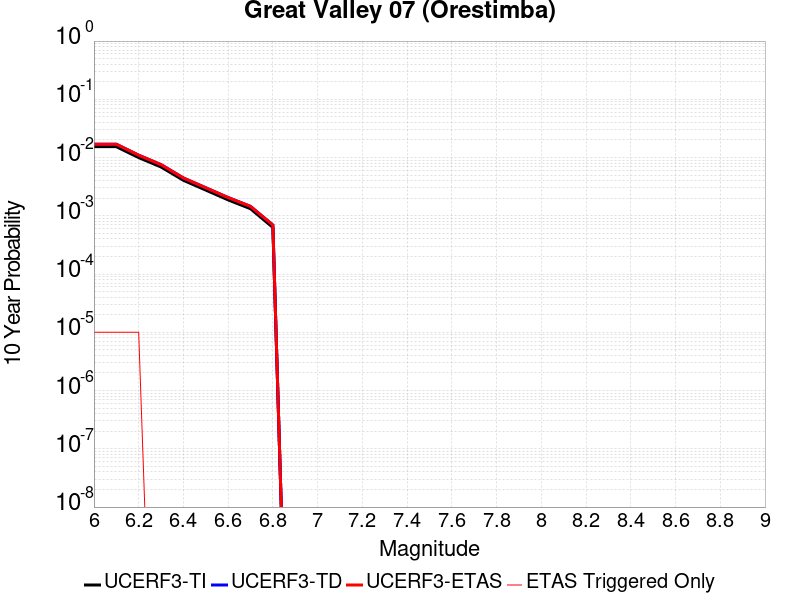 |

| Magnitude | 1 wk TI Prob | 1 wk TD Prob | 1 wk ETAS Prob | 1 wk ETAS/TD Gain | 1 wk ETAS Triggered Only | 1 mo TI Prob | 1 mo TD Prob | 1 mo ETAS Prob | 1 mo ETAS/TD Gain | 1 mo ETAS Triggered Only | 1 yr TI Prob | 1 yr TD Prob | 1 yr ETAS Prob | 1 yr ETAS/TD Gain | 1 yr ETAS Triggered Only | 10 yr TI Prob | 10 yr TD Prob | 10 yr ETAS Prob | 10 yr ETAS/TD Gain | 10 yr ETAS Triggered Only |
|-----|-----|-----|-----|-----|-----|-----|-----|-----|-----|-----|-----|-----|-----|-----|-----|-----|-----|-----|-----|-----|
| 6.0 | 2.9687902E-5 | 3.27584E-5 | 5.642066E-5 | 1.7223266 | 2.3663039E-5 | 1.2722766E-4 | 1.40386E-4 | 1.640457E-4 | 1.1685333 | 2.3663039E-5 | 0.0015478961 | 0.0017079313 | 0.0017315539 | 1.0138311 | 2.3663039E-5 | 0.015371585 | 0.016955597 | 0.01697886 | 1.001372 | 2.3663039E-5 |
| 6.1 | 2.9687902E-5 | 3.27584E-5 | 5.642066E-5 | 1.7223266 | 2.3663039E-5 | 1.2722766E-4 | 1.40386E-4 | 1.640457E-4 | 1.1685333 | 2.3663039E-5 | 0.0015478961 | 0.0017079313 | 0.0017315539 | 1.0138311 | 2.3663039E-5 | 0.015371585 | 0.016955597 | 0.01697886 | 1.001372 | 2.3663039E-5 |
| 6.2 | 1.9231524E-5 | 2.1159729E-5 | 4.4822267E-5 | 2.1182816 | 2.3663039E-5 | 8.2418206E-5 | 9.068153E-5 | 1.1434242E-4 | 1.2609229 | 2.3663039E-5 | 0.0010029797 | 0.0011035115 | 0.0011271485 | 1.0214198 | 2.3663039E-5 | 0.00998465 | 0.010982731 | 0.011006134 | 1.0021309 | 2.3663039E-5 |
| 6.3 | 1.324766E-5 | 1.4548912E-5 | 1.4548912E-5 | 1.0 | 0.0 | 5.6774446E-5 | 6.235104E-5 | 6.235104E-5 | 1.0 | 0.0 | 6.910097E-4 | 7.588687E-4 | 7.588687E-4 | 1.0 | 0.0 | 0.006888649 | 0.00756372 | 0.00756372 | 1.0 | 0.0 |
| 6.4 | 7.818645E-6 | 8.573059E-6 | 8.573059E-6 | 1.0 | 0.0 | 3.3508048E-5 | 3.6741185E-5 | 3.6741185E-5 | 1.0 | 0.0 | 4.078841E-4 | 4.4723548E-4 | 4.4723548E-4 | 1.0 | 0.0 | 0.004071363 | 0.0044636945 | 0.0044636945 | 1.0 | 0.0 |
| 6.5 | 5.3076565E-6 | 5.817949E-6 | 5.817949E-6 | 1.0 | 0.0 | 2.27469E-5 | 2.493384E-5 | 2.493384E-5 | 1.0 | 0.0 | 2.7690834E-4 | 3.0352935E-4 | 3.0352935E-4 | 1.0 | 0.0 | 0.0027656353 | 0.0030313572 | 0.0030313572 | 1.0 | 0.0 |
| 6.6 | 3.6003578E-6 | 3.9485967E-6 | 3.9485967E-6 | 1.0 | 0.0 | 1.5430012E-5 | 1.6922457E-5 | 1.6922457E-5 | 1.0 | 0.0 | 1.8784421E-4 | 2.0601299E-4 | 2.0601299E-4 | 1.0 | 0.0 | 0.0018768552 | 0.0020583742 | 0.0020583742 | 1.0 | 0.0 |
| 6.7 | 2.5361826E-6 | 2.78354E-6 | 2.78354E-6 | 1.0 | 0.0 | 1.0869308E-5 | 1.192941E-5 | 1.192941E-5 | 1.0 | 0.0 | 1.3232579E-4 | 1.452322E-4 | 1.452322E-4 | 1.0 | 0.0 | 0.0013224703 | 0.0014515029 | 0.0014515029 | 1.0 | 0.0 |
| 6.8 | 1.2115831E-6 | 1.3314148E-6 | 1.3314148E-6 | 1.0 | 0.0 | 5.1924885E-6 | 5.706056E-6 | 5.706056E-6 | 1.0 | 0.0 | 6.3216714E-5 | 6.9469985E-5 | 6.9469985E-5 | 1.0 | 0.0 | 6.3198735E-4 | 6.945778E-4 | 6.945778E-4 | 1.0 | 0.0 |

## Kern Canyon (Lake Isabella) 2011
*[(top)](#table-of-contents)*

| 1 Week | 1 Month | 1 Year | 10 Year |
|-----|-----|-----|-----|
|  |  |  |  |

| Magnitude | 1 wk TI Prob | 1 wk TD Prob | 1 wk ETAS Prob | 1 wk ETAS/TD Gain | 1 wk ETAS Triggered Only | 1 mo TI Prob | 1 mo TD Prob | 1 mo ETAS Prob | 1 mo ETAS/TD Gain | 1 mo ETAS Triggered Only | 1 yr TI Prob | 1 yr TD Prob | 1 yr ETAS Prob | 1 yr ETAS/TD Gain | 1 yr ETAS Triggered Only | 10 yr TI Prob | 10 yr TD Prob | 10 yr ETAS Prob | 10 yr ETAS/TD Gain | 10 yr ETAS Triggered Only |
|-----|-----|-----|-----|-----|-----|-----|-----|-----|-----|-----|-----|-----|-----|-----|-----|-----|-----|-----|-----|-----|
| 6.0 | 4.2387383E-6 | 4.0016625E-6 | 4.0016625E-6 | 1.0 | 0.0 | 1.8165894E-5 | 1.7149881E-5 | 1.7149881E-5 | 1.0 | 0.0 | 2.2114732E-4 | 2.0878165E-4 | 2.0878165E-4 | 1.0 | 0.0 | 0.0022092736 | 0.002086039 | 0.0021096526 | 1.0113199 | 2.3663039E-5 |
| 6.1 | 4.2387383E-6 | 4.0016625E-6 | 4.0016625E-6 | 1.0 | 0.0 | 1.8165894E-5 | 1.7149881E-5 | 1.7149881E-5 | 1.0 | 0.0 | 2.2114732E-4 | 2.0878165E-4 | 2.0878165E-4 | 1.0 | 0.0 | 0.0022092736 | 0.002086039 | 0.0021096526 | 1.0113199 | 2.3663039E-5 |
| 6.2 | 4.2387383E-6 | 4.0016625E-6 | 4.0016625E-6 | 1.0 | 0.0 | 1.8165894E-5 | 1.7149881E-5 | 1.7149881E-5 | 1.0 | 0.0 | 2.2114732E-4 | 2.0878165E-4 | 2.0878165E-4 | 1.0 | 0.0 | 0.0022092736 | 0.002086039 | 0.0021096526 | 1.0113199 | 2.3663039E-5 |
| 6.3 | 4.2387383E-6 | 4.0016625E-6 | 4.0016625E-6 | 1.0 | 0.0 | 1.8165894E-5 | 1.7149881E-5 | 1.7149881E-5 | 1.0 | 0.0 | 2.2114732E-4 | 2.0878165E-4 | 2.0878165E-4 | 1.0 | 0.0 | 0.0022092736 | 0.002086039 | 0.0021096526 | 1.0113199 | 2.3663039E-5 |
| 6.4 | 4.2387383E-6 | 4.0016625E-6 | 4.0016625E-6 | 1.0 | 0.0 | 1.8165894E-5 | 1.7149881E-5 | 1.7149881E-5 | 1.0 | 0.0 | 2.2114732E-4 | 2.0878165E-4 | 2.0878165E-4 | 1.0 | 0.0 | 0.0022092736 | 0.002086039 | 0.0021096526 | 1.0113199 | 2.3663039E-5 |
| 6.5 | 2.7857532E-6 | 2.5178826E-6 | 2.5178826E-6 | 1.0 | 0.0 | 1.1938888E-5 | 1.0790883E-5 | 1.0790883E-5 | 1.0 | 0.0 | 1.4534626E-4 | 1.313714E-4 | 1.313714E-4 | 1.0 | 0.0 | 0.0014525123 | 0.0013129702 | 0.0013366021 | 1.0179988 | 2.3663039E-5 |
| 6.6 | 2.2233348E-6 | 1.944136E-6 | 1.944136E-6 | 1.0 | 0.0 | 9.528543E-6 | 8.3319865E-6 | 8.3319865E-6 | 1.0 | 0.0 | 1.1600384E-4 | 1.014373E-4 | 1.014373E-4 | 1.0 | 0.0 | 0.001159433 | 0.0010139185 | 0.0010375576 | 1.0233146 | 2.3663039E-5 |
| 6.7 | 2.1635126E-6 | 1.883516E-6 | 1.883516E-6 | 1.0 | 0.0 | 9.272164E-6 | 8.072187E-6 | 8.072187E-6 | 1.0 | 0.0 | 1.1288274E-4 | 9.8274526E-5 | 9.8274526E-5 | 1.0 | 0.0 | 0.0011282542 | 9.823188E-4 | 0.0010059586 | 1.0240653 | 2.3663039E-5 |
| 6.8 | 1.8685711E-6 | 1.5831534E-6 | 1.5831534E-6 | 1.0 | 0.0 | 8.008137E-6 | 6.784926E-6 | 6.784926E-6 | 1.0 | 0.0 | 9.74947E-5 | 8.2603394E-5 | 8.2603394E-5 | 1.0 | 0.0 | 9.745194E-4 | 8.2573184E-4 | 8.493753E-4 | 1.0286334 | 2.3663039E-5 |
| 6.9 | 1.5815071E-6 | 1.3065022E-6 | 1.3065022E-6 | 1.0 | 0.0 | 6.77787E-6 | 5.599283E-6 | 5.599283E-6 | 1.0 | 0.0 | 8.251744E-5 | 6.816917E-5 | 6.816917E-5 | 1.0 | 0.0 | 8.248681E-4 | 6.814852E-4 | 7.0513214E-4 | 1.0346991 | 2.3663039E-5 |
| 7.0 | 1.3772564E-6 | 1.1210799E-6 | 1.1210799E-6 | 1.0 | 0.0 | 5.9025137E-6 | 4.8046195E-6 | 4.8046195E-6 | 1.0 | 0.0 | 7.186073E-5 | 5.8494694E-5 | 5.8494694E-5 | 1.0 | 0.0 | 7.18375E-4 | 5.84795E-4 | 6.084442E-4 | 1.0404402 | 2.3663039E-5 |
| 7.1 | 1.0916998E-6 | 8.763839E-7 | 8.763839E-7 | 1.0 | 0.0 | 4.678705E-6 | 3.7559257E-6 | 3.7559257E-6 | 1.0 | 0.0 | 5.6961744E-5 | 4.572745E-5 | 4.572745E-5 | 1.0 | 0.0 | 5.6947145E-4 | 4.5718174E-4 | 4.8083396E-4 | 1.0517348 | 2.3663039E-5 |
| 7.2 | 7.6277024E-7 | 5.901496E-7 | 5.901496E-7 | 1.0 | 0.0 | 3.2690114E-6 | 2.5292102E-6 | 2.5292102E-6 | 1.0 | 0.0 | 3.9799485E-5 | 3.0792704E-5 | 3.0792704E-5 | 1.0 | 0.0 | 3.9792358E-4 | 3.07885E-4 | 3.3154074E-4 | 1.0768331 | 2.3663039E-5 |
| 7.3 | 5.3265916E-7 | 4.382471E-7 | 4.382471E-7 | 1.0 | 0.0 | 2.282823E-6 | 1.8782006E-6 | 1.8782006E-6 | 1.0 | 0.0 | 2.7793016E-5 | 2.2866856E-5 | 2.2866856E-5 | 1.0 | 0.0 | 2.778954E-4 | 2.2864541E-4 | 2.5230303E-4 | 1.1034687 | 2.3663039E-5 |
| 7.4 | 3.4946007E-7 | 3.0065908E-7 | 3.0065908E-7 | 1.0 | 0.0 | 1.497685E-6 | 1.2885383E-6 | 1.2885383E-6 | 1.0 | 0.0 | 1.8234163E-5 | 1.5687843E-5 | 1.5687843E-5 | 1.0 | 0.0 | 1.8232666E-4 | 1.5686758E-4 | 1.5686758E-4 | 1.0 | 0.0 |
| 7.5 | 1.8317026E-7 | 1.4244924E-7 | 1.4244924E-7 | 1.0 | 0.0 | 7.850152E-7 | 6.104966E-7 | 6.104966E-7 | 1.0 | 0.0 | 9.557518E-6 | 7.432772E-6 | 7.432772E-6 | 1.0 | 0.0 | 9.5571064E-5 | 7.432531E-5 | 7.432531E-5 | 1.0 | 0.0 |
| 7.6 | 2.572245E-8 | 1.735272E-8 | 1.735272E-8 | 1.0 | 0.0 | 1.10239064E-7 | 7.43688E-8 | 7.43688E-8 | 1.0 | 0.0 | 1.3421597E-6 | 9.054398E-7 | 9.054398E-7 | 1.0 | 0.0 | 1.3421517E-5 | 9.054366E-6 | 9.054366E-6 | 1.0 | 0.0 |

## Bullion Mountains
*[(top)](#table-of-contents)*

| 1 Week | 1 Month | 1 Year | 10 Year |
|-----|-----|-----|-----|
| 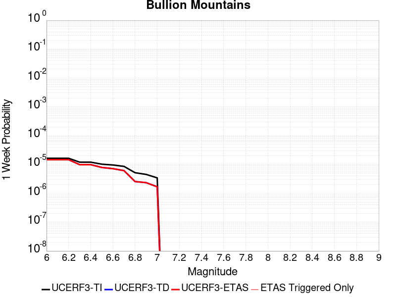 |  |  |  |

| Magnitude | 1 wk TI Prob | 1 wk TD Prob | 1 wk ETAS Prob | 1 wk ETAS/TD Gain | 1 wk ETAS Triggered Only | 1 mo TI Prob | 1 mo TD Prob | 1 mo ETAS Prob | 1 mo ETAS/TD Gain | 1 mo ETAS Triggered Only | 1 yr TI Prob | 1 yr TD Prob | 1 yr ETAS Prob | 1 yr ETAS/TD Gain | 1 yr ETAS Triggered Only | 10 yr TI Prob | 10 yr TD Prob | 10 yr ETAS Prob | 10 yr ETAS/TD Gain | 10 yr ETAS Triggered Only |
|-----|-----|-----|-----|-----|-----|-----|-----|-----|-----|-----|-----|-----|-----|-----|-----|-----|-----|-----|-----|-----|
| 6.0 | 1.6420427E-5 | 1.4692522E-5 | 1.4692522E-5 | 1.0 | 0.0 | 7.037136E-5 | 6.296665E-5 | 6.296665E-5 | 1.0 | 0.0 | 8.5643446E-4 | 7.663877E-4 | 7.663877E-4 | 1.0 | 0.0 | 0.008531413 | 0.0076412405 | 0.007664723 | 1.0030731 | 2.3663039E-5 |
| 6.1 | 1.6420427E-5 | 1.4692522E-5 | 1.4692522E-5 | 1.0 | 0.0 | 7.037136E-5 | 6.296665E-5 | 6.296665E-5 | 1.0 | 0.0 | 8.5643446E-4 | 7.663877E-4 | 7.663877E-4 | 1.0 | 0.0 | 0.008531413 | 0.0076412405 | 0.007664723 | 1.0030731 | 2.3663039E-5 |
| 6.2 | 1.6420427E-5 | 1.4692522E-5 | 1.4692522E-5 | 1.0 | 0.0 | 7.037136E-5 | 6.296665E-5 | 6.296665E-5 | 1.0 | 0.0 | 8.5643446E-4 | 7.663877E-4 | 7.663877E-4 | 1.0 | 0.0 | 0.008531413 | 0.0076412405 | 0.007664723 | 1.0030731 | 2.3663039E-5 |
| 6.3 | 1.2046778E-5 | 9.862634E-6 | 9.862634E-6 | 1.0 | 0.0 | 5.1628023E-5 | 4.226788E-5 | 4.226788E-5 | 1.0 | 0.0 | 6.283899E-4 | 5.145131E-4 | 5.145131E-4 | 1.0 | 0.0 | 0.0062661595 | 0.0051355003 | 0.0051355003 | 1.0 | 0.0 |
| 6.4 | 1.2046778E-5 | 9.862634E-6 | 9.862634E-6 | 1.0 | 0.0 | 5.1628023E-5 | 4.226788E-5 | 4.226788E-5 | 1.0 | 0.0 | 6.283899E-4 | 5.145131E-4 | 5.145131E-4 | 1.0 | 0.0 | 0.0062661595 | 0.0051355003 | 0.0051355003 | 1.0 | 0.0 |
| 6.5 | 1.0244343E-5 | 7.879705E-6 | 7.879705E-6 | 1.0 | 0.0 | 4.390359E-5 | 3.3769844E-5 | 3.3769844E-5 | 1.0 | 0.0 | 5.343951E-4 | 4.1109096E-4 | 4.1109096E-4 | 1.0 | 0.0 | 0.005331118 | 0.0041053365 | 0.0041053365 | 1.0 | 0.0 |
| 6.6 | 9.605408E-6 | 7.1777245E-6 | 7.1777245E-6 | 1.0 | 0.0 | 4.1165385E-5 | 3.076143E-5 | 3.076143E-5 | 1.0 | 0.0 | 5.010733E-4 | 3.744764E-4 | 3.744764E-4 | 1.0 | 0.0 | 0.00499945 | 0.0037404508 | 0.0037404508 | 1.0 | 0.0 |
| 6.7 | 8.60418E-6 | 6.124204E-6 | 6.124204E-6 | 1.0 | 0.0 | 3.687454E-5 | 2.6246435E-5 | 2.6246435E-5 | 1.0 | 0.0 | 4.48855E-4 | 3.1952298E-4 | 3.1952298E-4 | 1.0 | 0.0 | 0.004479495 | 0.0031925477 | 0.0031925477 | 1.0 | 0.0 |
| 6.8 | 5.187994E-6 | 2.5632721E-6 | 2.5632721E-6 | 1.0 | 0.0 | 2.223407E-5 | 1.0985429E-5 | 1.0985429E-5 | 1.0 | 0.0 | 2.7066618E-4 | 1.3374338E-4 | 1.3374338E-4 | 1.0 | 0.0 | 0.0027033675 | 0.0013370205 | 0.0013370205 | 1.0 | 0.0 |
| 6.9 | 4.5302368E-6 | 2.344408E-6 | 2.344408E-6 | 1.0 | 0.0 | 1.9415156E-5 | 1.0047446E-5 | 1.0047446E-5 | 1.0 | 0.0 | 2.3635388E-4 | 1.2232475E-4 | 1.2232475E-4 | 1.0 | 0.0 | 0.0023610266 | 0.0012229634 | 0.0012229634 | 1.0 | 0.0 |
| 7.0 | 3.431668E-6 | 1.6883112E-6 | 1.6883112E-6 | 1.0 | 0.0 | 1.4707065E-5 | 7.2356193E-6 | 7.2356193E-6 | 1.0 | 0.0 | 1.7904381E-4 | 8.8093664E-5 | 8.8093664E-5 | 1.0 | 0.0 | 0.0017889962 | 8.809366E-4 | 8.809366E-4 | 1.0 | 0.0 |

## Camp Rock 2011
*[(top)](#table-of-contents)*

| 1 Week | 1 Month | 1 Year | 10 Year |
|-----|-----|-----|-----|
|  |  |  |  |

| Magnitude | 1 wk TI Prob | 1 wk TD Prob | 1 wk ETAS Prob | 1 wk ETAS/TD Gain | 1 wk ETAS Triggered Only | 1 mo TI Prob | 1 mo TD Prob | 1 mo ETAS Prob | 1 mo ETAS/TD Gain | 1 mo ETAS Triggered Only | 1 yr TI Prob | 1 yr TD Prob | 1 yr ETAS Prob | 1 yr ETAS/TD Gain | 1 yr ETAS Triggered Only | 10 yr TI Prob | 10 yr TD Prob | 10 yr ETAS Prob | 10 yr ETAS/TD Gain | 10 yr ETAS Triggered Only |
|-----|-----|-----|-----|-----|-----|-----|-----|-----|-----|-----|-----|-----|-----|-----|-----|-----|-----|-----|-----|-----|
| 6.0 | 1.6710783E-5 | 4.250364E-6 | 4.250364E-6 | 1.0 | 0.0 | 7.161568E-5 | 1.821572E-5 | 1.821572E-5 | 1.0 | 0.0 | 8.7157206E-4 | 2.2175435E-4 | 2.2175435E-4 | 1.0 | 0.0 | 0.008681616 | 0.0022153836 | 0.0022389942 | 1.0106575 | 2.3663039E-5 |
| 6.1 | 1.6710783E-5 | 4.250364E-6 | 4.250364E-6 | 1.0 | 0.0 | 7.161568E-5 | 1.821572E-5 | 1.821572E-5 | 1.0 | 0.0 | 8.7157206E-4 | 2.2175435E-4 | 2.2175435E-4 | 1.0 | 0.0 | 0.008681616 | 0.0022153836 | 0.0022389942 | 1.0106575 | 2.3663039E-5 |
| 6.2 | 1.6710783E-5 | 4.250364E-6 | 4.250364E-6 | 1.0 | 0.0 | 7.161568E-5 | 1.821572E-5 | 1.821572E-5 | 1.0 | 0.0 | 8.7157206E-4 | 2.2175435E-4 | 2.2175435E-4 | 1.0 | 0.0 | 0.008681616 | 0.0022153836 | 0.0022389942 | 1.0106575 | 2.3663039E-5 |
| 6.3 | 1.6710783E-5 | 4.250364E-6 | 4.250364E-6 | 1.0 | 0.0 | 7.161568E-5 | 1.821572E-5 | 1.821572E-5 | 1.0 | 0.0 | 8.7157206E-4 | 2.2175435E-4 | 2.2175435E-4 | 1.0 | 0.0 | 0.008681616 | 0.0022153836 | 0.0022389942 | 1.0106575 | 2.3663039E-5 |
| 6.4 | 7.982846E-6 | 3.6821798E-6 | 3.6821798E-6 | 1.0 | 0.0 | 3.421175E-5 | 1.5780677E-5 | 1.5780677E-5 | 1.0 | 0.0 | 4.1644843E-4 | 1.9211315E-4 | 1.9211315E-4 | 1.0 | 0.0 | 0.0041566887 | 0.0019195057 | 0.0019431232 | 1.0123041 | 2.3663039E-5 |
| 6.5 | 7.982846E-6 | 3.6821798E-6 | 3.6821798E-6 | 1.0 | 0.0 | 3.421175E-5 | 1.5780677E-5 | 1.5780677E-5 | 1.0 | 0.0 | 4.1644843E-4 | 1.9211315E-4 | 1.9211315E-4 | 1.0 | 0.0 | 0.0041566887 | 0.0019195057 | 0.0019431232 | 1.0123041 | 2.3663039E-5 |
| 6.6 | 7.048869E-6 | 3.4244447E-6 | 3.4244447E-6 | 1.0 | 0.0 | 3.0209088E-5 | 1.467611E-5 | 1.467611E-5 | 1.0 | 0.0 | 3.677336E-4 | 1.7866731E-4 | 1.7866731E-4 | 1.0 | 0.0 | 0.0036712566 | 0.0017852683 | 0.0018088891 | 1.0132309 | 2.3663039E-5 |
| 6.7 | 6.987307E-6 | 3.3624212E-6 | 3.3624212E-6 | 1.0 | 0.0 | 2.9945259E-5 | 1.4410299E-5 | 1.4410299E-5 | 1.0 | 0.0 | 3.6452254E-4 | 1.7543157E-4 | 1.7543157E-4 | 1.0 | 0.0 | 0.0036392517 | 0.001752962 | 0.0017765836 | 1.0134752 | 2.3663039E-5 |
| 6.8 | 6.3737602E-6 | 3.1179893E-6 | 3.1179893E-6 | 1.0 | 0.0 | 2.731583E-5 | 1.33627445E-5 | 1.33627445E-5 | 1.0 | 0.0 | 3.3251947E-4 | 1.6267956E-4 | 1.6267956E-4 | 1.0 | 0.0 | 0.0033202237 | 0.0016256333 | 0.0016492578 | 1.0145326 | 2.3663039E-5 |
| 6.9 | 6.112211E-6 | 2.933194E-6 | 2.933194E-6 | 1.0 | 0.0 | 2.6194928E-5 | 1.2570772E-5 | 1.2570772E-5 | 1.0 | 0.0 | 3.1887658E-4 | 1.5303868E-4 | 1.5303868E-4 | 1.0 | 0.0 | 0.003184194 | 0.0015293608 | 0.0015529876 | 1.0154488 | 2.3663039E-5 |
| 7.0 | 5.5140117E-6 | 2.6419923E-6 | 2.6419923E-6 | 1.0 | 0.0 | 2.3631264E-5 | 1.1322776E-5 | 1.1322776E-5 | 1.0 | 0.0 | 2.8767265E-4 | 1.3784633E-4 | 1.3784633E-4 | 1.0 | 0.0 | 0.0028730053 | 0.0013776337 | 0.001401264 | 1.0171529 | 2.3663039E-5 |
| 7.1 | 4.8151105E-6 | 2.1343292E-6 | 2.1343292E-6 | 1.0 | 0.0 | 2.0636026E-5 | 9.147094E-6 | 9.147094E-6 | 1.0 | 0.0 | 2.5121463E-4 | 1.113604E-4 | 1.113604E-4 | 1.0 | 0.0 | 0.0025093083 | 0.0011130678 | 0.0011130678 | 1.0 | 0.0 |
| 7.2 | 3.818335E-6 | 1.2937865E-6 | 1.2937865E-6 | 1.0 | 0.0 | 1.6364189E-5 | 5.5447877E-6 | 5.5447877E-6 | 1.0 | 0.0 | 1.9921579E-4 | 6.750578E-5 | 6.750578E-5 | 1.0 | 0.0 | 0.0019903728 | 6.7486096E-4 | 6.7486096E-4 | 1.0 | 0.0 |
| 7.3 | 2.7166698E-6 | 7.3839175E-7 | 7.3839175E-7 | 1.0 | 0.0 | 1.1642818E-5 | 3.1645322E-6 | 3.1645322E-6 | 1.0 | 0.0 | 1.4174209E-4 | 3.852752E-5 | 3.852752E-5 | 1.0 | 0.0 | 0.0014165172 | 3.852104E-4 | 3.852104E-4 | 1.0 | 0.0 |
| 7.4 | 2.0893426E-6 | 5.4621097E-7 | 5.4621097E-7 | 1.0 | 0.0 | 8.954295E-6 | 2.3409023E-6 | 2.3409023E-6 | 1.0 | 0.0 | 1.0901308E-4 | 2.8500117E-5 | 2.8500117E-5 | 1.0 | 0.0 | 0.0010895962 | 2.8496515E-4 | 2.8496515E-4 | 1.0 | 0.0 |
| 7.5 | 1.1681728E-6 | 3.603199E-7 | 3.603199E-7 | 1.0 | 0.0 | 5.0064455E-6 | 1.5442272E-6 | 1.5442272E-6 | 1.0 | 0.0 | 6.0951766E-5 | 1.8800809E-5 | 1.8800809E-5 | 1.0 | 0.0 | 6.093505E-4 | 1.8799266E-4 | 1.8799266E-4 | 1.0 | 0.0 |
| 7.6 | 1.3154387E-7 | 7.119914E-8 | 7.119914E-8 | 1.0 | 0.0 | 5.6375933E-7 | 3.0513914E-7 | 3.0513914E-7 | 1.0 | 0.0 | 6.863748E-6 | 3.7150644E-6 | 3.7150644E-6 | 1.0 | 0.0 | 6.863536E-5 | 3.715018E-5 | 3.715018E-5 | 1.0 | 0.0 |

## Chino alt 1
*[(top)](#table-of-contents)*

| 1 Week | 1 Month | 1 Year | 10 Year |
|-----|-----|-----|-----|
|  |  | 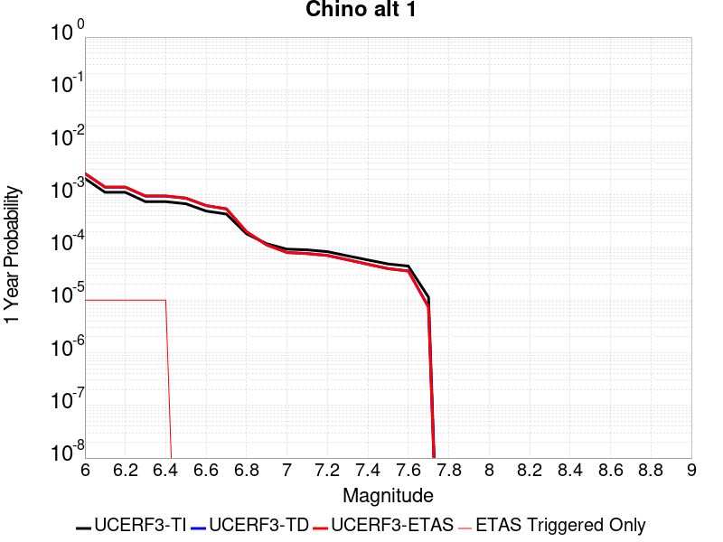 |  |

| Magnitude | 1 wk TI Prob | 1 wk TD Prob | 1 wk ETAS Prob | 1 wk ETAS/TD Gain | 1 wk ETAS Triggered Only | 1 mo TI Prob | 1 mo TD Prob | 1 mo ETAS Prob | 1 mo ETAS/TD Gain | 1 mo ETAS Triggered Only | 1 yr TI Prob | 1 yr TD Prob | 1 yr ETAS Prob | 1 yr ETAS/TD Gain | 1 yr ETAS Triggered Only | 10 yr TI Prob | 10 yr TD Prob | 10 yr ETAS Prob | 10 yr ETAS/TD Gain | 10 yr ETAS Triggered Only |
|-----|-----|-----|-----|-----|-----|-----|-----|-----|-----|-----|-----|-----|-----|-----|-----|-----|-----|-----|-----|-----|
| 6.0 | 3.939946E-5 | 4.8952163E-5 | 4.8952163E-5 | 1.0 | 0.0 | 1.6884391E-4 | 2.0978106E-4 | 2.0978106E-4 | 1.0 | 0.0 | 0.0020537362 | 0.0025515798 | 0.0025515798 | 1.0 | 0.0 | 0.020348595 | 0.025279671 | 0.025302734 | 1.0009124 | 2.3663039E-5 |
| 6.1 | 2.1505624E-5 | 2.6881262E-5 | 2.6881262E-5 | 1.0 | 0.0 | 9.2163704E-5 | 1.1520095E-4 | 1.1520095E-4 | 1.0 | 0.0 | 0.0011215154 | 0.0014017805 | 0.0014017805 | 1.0 | 0.0 | 0.011158722 | 0.013946284 | 0.013969617 | 1.0016731 | 2.3663039E-5 |
| 6.2 | 2.1505624E-5 | 2.6881262E-5 | 2.6881262E-5 | 1.0 | 0.0 | 9.2163704E-5 | 1.1520095E-4 | 1.1520095E-4 | 1.0 | 0.0 | 0.0011215154 | 0.0014017805 | 0.0014017805 | 1.0 | 0.0 | 0.011158722 | 0.013946284 | 0.013969617 | 1.0016731 | 2.3663039E-5 |
| 6.3 | 1.4290785E-5 | 1.8166884E-5 | 1.8166884E-5 | 1.0 | 0.0 | 6.1244784E-5 | 7.7856006E-5 | 7.7856006E-5 | 1.0 | 0.0 | 7.454001E-4 | 9.4753003E-4 | 9.4753003E-4 | 1.0 | 0.0 | 0.007429048 | 0.009445356 | 0.009468796 | 1.0024816 | 2.3663039E-5 |
| 6.4 | 1.4290785E-5 | 1.8166884E-5 | 1.8166884E-5 | 1.0 | 0.0 | 6.1244784E-5 | 7.7856006E-5 | 7.7856006E-5 | 1.0 | 0.0 | 7.454001E-4 | 9.4753003E-4 | 9.4753003E-4 | 1.0 | 0.0 | 0.007429048 | 0.009445356 | 0.009468796 | 1.0024816 | 2.3663039E-5 |
| 6.5 | 1.3017944E-5 | 1.6653768E-5 | 1.6653768E-5 | 1.0 | 0.0 | 5.5789995E-5 | 7.1371585E-5 | 7.1371585E-5 | 1.0 | 0.0 | 6.790315E-4 | 8.686464E-4 | 8.686464E-4 | 1.0 | 0.0 | 0.0067696036 | 0.00866281 | 0.008686268 | 1.002708 | 2.3663039E-5 |
| 6.6 | 9.470016E-6 | 1.204067E-5 | 1.204067E-5 | 1.0 | 0.0 | 4.058515E-5 | 5.1602045E-5 | 5.1602045E-5 | 1.0 | 0.0 | 4.940122E-4 | 6.2810775E-4 | 6.2810775E-4 | 1.0 | 0.0 | 0.004929154 | 0.00627254 | 0.0062960545 | 1.0037488 | 2.3663039E-5 |
| 6.7 | 8.314155E-6 | 1.040883E-5 | 1.040883E-5 | 1.0 | 0.0 | 3.5631605E-5 | 4.4608692E-5 | 4.4608692E-5 | 1.0 | 0.0 | 4.3372845E-4 | 5.4300774E-4 | 5.4300774E-4 | 1.0 | 0.0 | 0.004328829 | 0.005426339 | 0.0054498734 | 1.0043371 | 2.3663039E-5 |
| 6.8 | 3.4856364E-6 | 3.813685E-6 | 3.813685E-6 | 1.0 | 0.0 | 1.4938357E-5 | 1.6344273E-5 | 1.6344273E-5 | 1.0 | 0.0 | 1.8185932E-4 | 1.9897544E-4 | 1.9897544E-4 | 1.0 | 0.0 | 0.0018171056 | 0.0019896496 | 0.0019896496 | 1.0 | 0.0 |
| 6.9 | 2.2645952E-6 | 2.1530768E-6 | 2.1530768E-6 | 1.0 | 0.0 | 9.705372E-6 | 9.227441E-6 | 9.227441E-6 | 1.0 | 0.0 | 1.18156495E-4 | 1.12338515E-4 | 1.12338515E-4 | 1.0 | 0.0 | 0.0011809369 | 0.0011234334 | 0.0011234334 | 1.0 | 0.0 |
| 7.0 | 1.7864003E-6 | 1.5432176E-6 | 1.5432176E-6 | 1.0 | 0.0 | 7.655979E-6 | 6.6137736E-6 | 6.6137736E-6 | 1.0 | 0.0 | 9.3207556E-5 | 8.051978E-5 | 8.051978E-5 | 1.0 | 0.0 | 9.316847E-4 | 8.053531E-4 | 8.053531E-4 | 1.0 | 0.0 |
| 7.1 | 1.7315456E-6 | 1.4734859E-6 | 1.4734859E-6 | 1.0 | 0.0 | 7.420889E-6 | 6.3149246E-6 | 6.3149246E-6 | 1.0 | 0.0 | 9.034557E-5 | 7.688155E-5 | 7.688155E-5 | 1.0 | 0.0 | 9.0308854E-4 | 7.689874E-4 | 7.689874E-4 | 1.0 | 0.0 |
| 7.2 | 1.6008337E-6 | 1.3575291E-6 | 1.3575291E-6 | 1.0 | 0.0 | 6.860698E-6 | 5.8179694E-6 | 5.8179694E-6 | 1.0 | 0.0 | 8.352579E-5 | 7.083153E-5 | 7.083153E-5 | 1.0 | 0.0 | 8.34944E-4 | 7.085137E-4 | 7.085137E-4 | 1.0 | 0.0 |
| 7.3 | 1.3320939E-6 | 1.1218683E-6 | 1.1218683E-6 | 1.0 | 0.0 | 5.7089615E-6 | 4.8079983E-6 | 4.8079983E-6 | 1.0 | 0.0 | 6.9504385E-5 | 5.8535854E-5 | 5.8535854E-5 | 1.0 | 0.0 | 6.9482654E-4 | 5.8534887E-4 | 5.8534887E-4 | 1.0 | 0.0 |
| 7.4 | 1.114294E-6 | 9.237794E-7 | 9.237794E-7 | 1.0 | 0.0 | 4.775537E-6 | 3.9590486E-6 | 3.9590486E-6 | 1.0 | 0.0 | 5.8140613E-5 | 4.820039E-5 | 4.820039E-5 | 1.0 | 0.0 | 5.81254E-4 | 4.8191615E-4 | 4.8191615E-4 | 1.0 | 0.0 |
| 7.5 | 9.354081E-7 | 7.623971E-7 | 7.623971E-7 | 1.0 | 0.0 | 4.0088858E-6 | 3.2674122E-6 | 3.2674122E-6 | 1.0 | 0.0 | 4.8807087E-5 | 3.9780054E-5 | 3.9780054E-5 | 1.0 | 0.0 | 4.879637E-4 | 3.977327E-4 | 3.977327E-4 | 1.0 | 0.0 |
| 7.6 | 8.521771E-7 | 6.8811886E-7 | 6.8811886E-7 | 1.0 | 0.0 | 3.6521824E-6 | 2.9490777E-6 | 2.9490777E-6 | 1.0 | 0.0 | 4.4464414E-5 | 3.590446E-5 | 3.590446E-5 | 1.0 | 0.0 | 4.4455516E-4 | 3.5898978E-4 | 3.5898978E-4 | 1.0 | 0.0 |
| 7.7 | 2.1803626E-7 | 1.4187812E-7 | 1.4187812E-7 | 1.0 | 0.0 | 9.344408E-7 | 6.08049E-7 | 6.08049E-7 | 1.0 | 0.0 | 1.1376757E-5 | 7.402981E-6 | 7.402981E-6 | 1.0 | 0.0 | 1.13761744E-4 | 7.402831E-5 | 7.402831E-5 | 1.0 | 0.0 |

## Pisgah-Bullion Mtn-Mesquite Lk
*[(top)](#table-of-contents)*

| 1 Week | 1 Month | 1 Year | 10 Year |
|-----|-----|-----|-----|
|  |  |  |  |

| Magnitude | 1 wk TI Prob | 1 wk TD Prob | 1 wk ETAS Prob | 1 wk ETAS/TD Gain | 1 wk ETAS Triggered Only | 1 mo TI Prob | 1 mo TD Prob | 1 mo ETAS Prob | 1 mo ETAS/TD Gain | 1 mo ETAS Triggered Only | 1 yr TI Prob | 1 yr TD Prob | 1 yr ETAS Prob | 1 yr ETAS/TD Gain | 1 yr ETAS Triggered Only | 10 yr TI Prob | 10 yr TD Prob | 10 yr ETAS Prob | 10 yr ETAS/TD Gain | 10 yr ETAS Triggered Only |
|-----|-----|-----|-----|-----|-----|-----|-----|-----|-----|-----|-----|-----|-----|-----|-----|-----|-----|-----|-----|-----|
| 6.0 | 3.0240792E-5 | 2.4091878E-5 | 2.4091878E-5 | 1.0 | 0.0 | 1.2959696E-4 | 1.0324739E-4 | 1.2690798E-4 | 1.2291641 | 2.3663039E-5 | 0.0015767008 | 0.0012564125 | 0.0012800458 | 1.0188102 | 2.3663039E-5 | 0.015655609 | 0.0125031145 | 0.012526482 | 1.001869 | 2.3663039E-5 |
| 6.1 | 3.0240792E-5 | 2.4091878E-5 | 2.4091878E-5 | 1.0 | 0.0 | 1.2959696E-4 | 1.0324739E-4 | 1.2690798E-4 | 1.2291641 | 2.3663039E-5 | 0.0015767008 | 0.0012564125 | 0.0012800458 | 1.0188102 | 2.3663039E-5 | 0.015655609 | 0.0125031145 | 0.012526482 | 1.001869 | 2.3663039E-5 |
| 6.2 | 3.0240792E-5 | 2.4091878E-5 | 2.4091878E-5 | 1.0 | 0.0 | 1.2959696E-4 | 1.0324739E-4 | 1.2690798E-4 | 1.2291641 | 2.3663039E-5 | 0.0015767008 | 0.0012564125 | 0.0012800458 | 1.0188102 | 2.3663039E-5 | 0.015655609 | 0.0125031145 | 0.012526482 | 1.001869 | 2.3663039E-5 |
| 6.3 | 2.0498217E-5 | 1.3638439E-5 | 1.3638439E-5 | 1.0 | 0.0 | 8.784654E-5 | 5.8449234E-5 | 5.8449234E-5 | 1.0 | 0.0 | 0.0010690069 | 7.114033E-4 | 7.114033E-4 | 1.0 | 0.0 | 0.01063879 | 0.007092886 | 0.007092886 | 1.0 | 0.0 |
| 6.4 | 2.0498217E-5 | 1.3638439E-5 | 1.3638439E-5 | 1.0 | 0.0 | 8.784654E-5 | 5.8449234E-5 | 5.8449234E-5 | 1.0 | 0.0 | 0.0010690069 | 7.114033E-4 | 7.114033E-4 | 1.0 | 0.0 | 0.01063879 | 0.007092886 | 0.007092886 | 1.0 | 0.0 |
| 6.5 | 1.7316182E-5 | 1.0477313E-5 | 1.0477313E-5 | 1.0 | 0.0 | 7.42101E-5 | 4.490205E-5 | 4.490205E-5 | 1.0 | 0.0 | 9.0313336E-4 | 5.465553E-4 | 5.465553E-4 | 1.0 | 0.0 | 0.008994718 | 0.005453107 | 0.005453107 | 1.0 | 0.0 |
| 6.6 | 1.5251077E-5 | 8.414482E-6 | 8.414482E-6 | 1.0 | 0.0 | 6.536012E-5 | 3.606161E-5 | 3.606161E-5 | 1.0 | 0.0 | 7.9546886E-4 | 4.3896888E-4 | 4.3896888E-4 | 1.0 | 0.0 | 0.007926274 | 0.0043817353 | 0.0043817353 | 1.0 | 0.0 |
| 6.7 | 1.2997425E-5 | 6.41165E-6 | 6.41165E-6 | 1.0 | 0.0 | 5.570206E-5 | 2.7478236E-5 | 2.7478236E-5 | 1.0 | 0.0 | 6.7796157E-4 | 3.3450083E-4 | 3.3450083E-4 | 1.0 | 0.0 | 0.0067589693 | 0.0033404336 | 0.0033404336 | 1.0 | 0.0 |
| 6.8 | 1.035386E-5 | 4.3333466E-6 | 4.3333466E-6 | 1.0 | 0.0 | 4.437293E-5 | 1.8571358E-5 | 1.8571358E-5 | 1.0 | 0.0 | 5.401065E-4 | 2.2608369E-4 | 2.2608369E-4 | 1.0 | 0.0 | 0.0053879567 | 0.0022586237 | 0.0022586237 | 1.0 | 0.0 |
| 6.9 | 8.816252E-6 | 3.5807464E-6 | 3.5807464E-6 | 1.0 | 0.0 | 3.778339E-5 | 1.534597E-5 | 1.534597E-5 | 1.0 | 0.0 | 4.5991567E-4 | 1.8682174E-4 | 1.8682174E-4 | 1.0 | 0.0 | 0.00458965 | 0.0018667054 | 0.0018667054 | 1.0 | 0.0 |
| 7.0 | 6.8232207E-6 | 2.567667E-6 | 2.567667E-6 | 1.0 | 0.0 | 2.9242048E-5 | 1.1004243E-5 | 1.1004243E-5 | 1.0 | 0.0 | 3.5596377E-4 | 1.3396873E-4 | 1.3396873E-4 | 1.0 | 0.0 | 0.0035539411 | 0.0013389108 | 0.0013389108 | 1.0 | 0.0 |
| 7.1 | 5.837013E-6 | 2.2274512E-6 | 2.2274512E-6 | 1.0 | 0.0 | 2.501553E-5 | 9.546186E-6 | 9.546186E-6 | 1.0 | 0.0 | 3.045215E-4 | 1.16218915E-4 | 1.16218915E-4 | 1.0 | 0.0 | 0.0030410455 | 0.0011616104 | 0.0011616104 | 1.0 | 0.0 |
| 7.2 | 4.278052E-6 | 1.6276219E-6 | 1.6276219E-6 | 1.0 | 0.0 | 1.833438E-5 | 6.975505E-6 | 6.975505E-6 | 1.0 | 0.0 | 2.231982E-4 | 8.4923704E-5 | 8.4923704E-5 | 1.0 | 0.0 | 0.0022297418 | 8.489357E-4 | 8.489357E-4 | 1.0 | 0.0 |
| 7.3 | 1.8803692E-6 | 8.345151E-7 | 8.345151E-7 | 1.0 | 0.0 | 8.0587E-6 | 3.5764892E-6 | 3.5764892E-6 | 1.0 | 0.0 | 9.811026E-5 | 4.3543034E-5 | 4.3543034E-5 | 1.0 | 0.0 | 9.806695E-4 | 4.353595E-4 | 4.353595E-4 | 1.0 | 0.0 |

## Calaveras (So) 2011 CFM
*[(top)](#table-of-contents)*

| 1 Week | 1 Month | 1 Year | 10 Year |
|-----|-----|-----|-----|
|  |  |  |  |

| Magnitude | 1 wk TI Prob | 1 wk TD Prob | 1 wk ETAS Prob | 1 wk ETAS/TD Gain | 1 wk ETAS Triggered Only | 1 mo TI Prob | 1 mo TD Prob | 1 mo ETAS Prob | 1 mo ETAS/TD Gain | 1 mo ETAS Triggered Only | 1 yr TI Prob | 1 yr TD Prob | 1 yr ETAS Prob | 1 yr ETAS/TD Gain | 1 yr ETAS Triggered Only | 10 yr TI Prob | 10 yr TD Prob | 10 yr ETAS Prob | 10 yr ETAS/TD Gain | 10 yr ETAS Triggered Only |
|-----|-----|-----|-----|-----|-----|-----|-----|-----|-----|-----|-----|-----|-----|-----|-----|-----|-----|-----|-----|-----|
| 6.0 | 1.5950744E-4 | 3.0727786E-4 | 3.0727786E-4 | 1.0 | 0.0 | 6.834242E-4 | 0.0013162618 | 0.0013162618 | 1.0 | 0.0 | 0.00828899 | 0.01586346 | 0.01586346 | 1.0 | 0.0 | 0.079865426 | 0.14443964 | 0.14445989 | 1.0001402 | 2.3663039E-5 |
| 6.1 | 1.3584697E-4 | 2.6051197E-4 | 2.6051197E-4 | 1.0 | 0.0 | 5.8207137E-4 | 0.0011160214 | 0.0011160214 | 1.0 | 0.0 | 0.007063716 | 0.013466303 | 0.013466303 | 1.0 | 0.0 | 0.06843361 | 0.12406684 | 0.124087565 | 1.000167 | 2.3663039E-5 |
| 6.2 | 1.14676266E-4 | 2.1738415E-4 | 2.1738415E-4 | 1.0 | 0.0 | 4.9137714E-4 | 9.313295E-4 | 9.313295E-4 | 1.0 | 0.0 | 0.0059661185 | 0.011249501 | 0.011249501 | 1.0 | 0.0 | 0.058084648 | 0.105057 | 0.105078176 | 1.0002016 | 2.3663039E-5 |
| 6.3 | 8.691518E-5 | 1.5996095E-4 | 1.5996095E-4 | 1.0 | 0.0 | 3.7244044E-4 | 6.8536296E-4 | 6.8536296E-4 | 1.0 | 0.0 | 0.004525038 | 0.0083052125 | 0.0083052125 | 1.0 | 0.0 | 0.044339992 | 0.079372585 | 0.07939437 | 1.0002744 | 2.3663039E-5 |
| 6.4 | 8.50982E-5 | 1.5702473E-4 | 1.5702473E-4 | 1.0 | 0.0 | 3.646556E-4 | 6.727857E-4 | 6.727857E-4 | 1.0 | 0.0 | 0.0044306475 | 0.0081532365 | 0.0081532365 | 1.0 | 0.0 | 0.04343345 | 0.07797867 | 0.07800049 | 1.0002798 | 2.3663039E-5 |
| 6.5 | 8.4062965E-5 | 1.552701E-4 | 1.552701E-4 | 1.0 | 0.0 | 3.602201E-4 | 6.652697E-4 | 6.652697E-4 | 1.0 | 0.0 | 0.004376863 | 0.0080624325 | 0.0080624325 | 1.0 | 0.0 | 0.042916555 | 0.07714991 | 0.07717175 | 1.000283 | 2.3663039E-5 |
| 6.6 | 8.194716E-5 | 1.5162873E-4 | 1.5162873E-4 | 1.0 | 0.0 | 3.5115483E-4 | 6.4967165E-4 | 6.4967165E-4 | 1.0 | 0.0 | 0.0042669317 | 0.007874262 | 0.007874262 | 1.0 | 0.0 | 0.04185927 | 0.07543511 | 0.075456984 | 1.00029 | 2.3663039E-5 |
| 6.7 | 8.012326E-5 | 1.4830513E-4 | 1.4830513E-4 | 1.0 | 0.0 | 3.433402E-4 | 6.3543825E-4 | 6.3543825E-4 | 1.0 | 0.0 | 0.004172157 | 0.0077027446 | 0.0077027446 | 1.0 | 0.0 | 0.040946912 | 0.073877186 | 0.0738991 | 1.0002966 | 2.3663039E-5 |
| 6.8 | 7.119773E-5 | 1.2888704E-4 | 1.2888704E-4 | 1.0 | 0.0 | 3.0509746E-4 | 5.522555E-4 | 5.522555E-4 | 1.0 | 0.0 | 0.0037082357 | 0.0066999346 | 0.0066999346 | 1.0 | 0.0 | 0.036469642 | 0.06472007 | 0.06472007 | 1.0 | 0.0 |
| 6.9 | 5.7343088E-5 | 9.925659E-5 | 9.925659E-5 | 1.0 | 0.0 | 2.4573295E-4 | 4.2531648E-4 | 4.2531648E-4 | 1.0 | 0.0 | 0.0029876942 | 0.0051660156 | 0.0051660156 | 1.0 | 0.0 | 0.02947844 | 0.050540965 | 0.050540965 | 1.0 | 0.0 |
| 7.0 | 4.8746577E-5 | 8.291376E-5 | 8.291376E-5 | 1.0 | 0.0 | 2.0889717E-4 | 3.5529662E-4 | 3.5529662E-4 | 1.0 | 0.0 | 0.0025403565 | 0.004317223 | 0.004317223 | 1.0 | 0.0 | 0.025115121 | 0.042516556 | 0.042516556 | 1.0 | 0.0 |
| 7.1 | 4.2998014E-5 | 7.2698065E-5 | 7.2698065E-5 | 1.0 | 0.0 | 1.8426418E-4 | 3.1152627E-4 | 3.1152627E-4 | 1.0 | 0.0 | 0.002241108 | 0.0037862961 | 0.0037862961 | 1.0 | 0.0 | 0.022186412 | 0.03744698 | 0.03744698 | 1.0 | 0.0 |
| 7.2 | 3.221292E-5 | 5.3953165E-5 | 5.3953165E-5 | 1.0 | 0.0 | 1.3804805E-4 | 2.3120751E-4 | 2.3120751E-4 | 1.0 | 0.0 | 0.0016794393 | 0.0028113457 | 0.0028113457 | 1.0 | 0.0 | 0.016668037 | 0.028059289 | 0.028059289 | 1.0 | 0.0 |
| 7.3 | 2.3756531E-5 | 3.951658E-5 | 3.951658E-5 | 1.0 | 0.0 | 1.0180973E-4 | 1.6934588E-4 | 1.6934588E-4 | 1.0 | 0.0 | 0.0012388286 | 0.0020598534 | 0.0020598534 | 1.0 | 0.0 | 0.012319452 | 0.020665664 | 0.020665664 | 1.0 | 0.0 |
| 7.4 | 1.5997684E-5 | 2.7358523E-5 | 2.7358523E-5 | 1.0 | 0.0 | 6.8559704E-5 | 1.1724555E-4 | 1.1724555E-4 | 1.0 | 0.0 | 8.343947E-4 | 0.0014265324 | 0.0014265324 | 1.0 | 0.0 | 0.008312687 | 0.01438514 | 0.01438514 | 1.0 | 0.0 |
| 7.5 | 1.3814293E-5 | 2.4799807E-5 | 2.4799807E-5 | 1.0 | 0.0 | 5.9202768E-5 | 1.0628057E-4 | 1.0628057E-4 | 1.0 | 0.0 | 7.205553E-4 | 0.0012932003 | 0.0012932003 | 1.0 | 0.0 | 0.007182234 | 0.013064139 | 0.013064139 | 1.0 | 0.0 |
| 7.6 | 8.817309E-6 | 1.6444723E-5 | 1.6444723E-5 | 1.0 | 0.0 | 3.7787922E-5 | 7.0475486E-5 | 7.0475486E-5 | 1.0 | 0.0 | 4.5997082E-4 | 8.577026E-4 | 8.577026E-4 | 1.0 | 0.0 | 0.004590199 | 0.008727145 | 0.008727145 | 1.0 | 0.0 |
| 7.7 | 4.0352206E-6 | 7.715851E-6 | 7.715851E-6 | 1.0 | 0.0 | 1.7293689E-5 | 3.3067514E-5 | 3.3067514E-5 | 1.0 | 0.0 | 2.1053031E-4 | 4.0252268E-4 | 4.0252268E-4 | 1.0 | 0.0 | 0.0021033096 | 0.004169391 | 0.004169391 | 1.0 | 0.0 |
| 7.8 | 3.413169E-6 | 6.7946817E-6 | 6.7946817E-6 | 1.0 | 0.0 | 1.4627784E-5 | 2.911974E-5 | 2.911974E-5 | 1.0 | 0.0 | 1.7807873E-4 | 3.544752E-4 | 3.544752E-4 | 1.0 | 0.0 | 0.0017793609 | 0.0036701332 | 0.0036701332 | 1.0 | 0.0 |
| 7.9 | 2.4740732E-6 | 5.2845594E-6 | 5.2845594E-6 | 1.0 | 0.0 | 1.06031275E-5 | 2.2647915E-5 | 2.2647915E-5 | 1.0 | 0.0 | 1.2908543E-4 | 2.7570353E-4 | 2.7570353E-4 | 1.0 | 0.0 | 0.0012901047 | 0.0028374332 | 0.0028374332 | 1.0 | 0.0 |
| 8.0 | 1.5231818E-6 | 3.2921057E-6 | 3.2921057E-6 | 1.0 | 0.0 | 6.527906E-6 | 1.4108949E-5 | 1.4108949E-5 | 1.0 | 0.0 | 7.9474354E-5 | 1.7176295E-4 | 1.7176295E-4 | 1.0 | 0.0 | 7.944594E-4 | 0.0017580355 | 0.0017580355 | 1.0 | 0.0 |
| 8.1 | 1.0104524E-6 | 2.0477617E-6 | 2.0477617E-6 | 1.0 | 0.0 | 4.330503E-6 | 8.776092E-6 | 8.776092E-6 | 1.0 | 0.0 | 5.2722597E-5 | 1.0684371E-4 | 1.0684371E-4 | 1.0 | 0.0 | 5.271009E-4 | 0.0010939686 | 0.0010939686 | 1.0 | 0.0 |

## Ortigalita (South)
*[(top)](#table-of-contents)*

| 1 Week | 1 Month | 1 Year | 10 Year |
|-----|-----|-----|-----|
|  |  |  |  |

| Magnitude | 1 wk TI Prob | 1 wk TD Prob | 1 wk ETAS Prob | 1 wk ETAS/TD Gain | 1 wk ETAS Triggered Only | 1 mo TI Prob | 1 mo TD Prob | 1 mo ETAS Prob | 1 mo ETAS/TD Gain | 1 mo ETAS Triggered Only | 1 yr TI Prob | 1 yr TD Prob | 1 yr ETAS Prob | 1 yr ETAS/TD Gain | 1 yr ETAS Triggered Only | 10 yr TI Prob | 10 yr TD Prob | 10 yr ETAS Prob | 10 yr ETAS/TD Gain | 10 yr ETAS Triggered Only |
|-----|-----|-----|-----|-----|-----|-----|-----|-----|-----|-----|-----|-----|-----|-----|-----|-----|-----|-----|-----|-----|
| 6.0 | 3.72394E-5 | 4.325748E-5 | 4.325748E-5 | 1.0 | 0.0 | 1.5958765E-4 | 1.8537692E-4 | 2.0903557E-4 | 1.1276246 | 2.3663039E-5 | 0.0019412481 | 0.0022547843 | 0.002278394 | 1.010471 | 2.3663039E-5 | 0.019243775 | 0.022335447 | 0.022358581 | 1.0010358 | 2.3663039E-5 |
| 6.1 | 2.7299884E-5 | 3.1493328E-5 | 3.1493328E-5 | 1.0 | 0.0 | 1.16994255E-4 | 1.3496475E-4 | 1.5862459E-4 | 1.1753039 | 2.3663039E-5 | 0.0014234743 | 0.0016420127 | 0.0016656369 | 1.0143874 | 2.3663039E-5 | 0.014143906 | 0.016304731 | 0.016328009 | 1.0014277 | 2.3663039E-5 |
| 6.2 | 2.7299884E-5 | 3.1493328E-5 | 3.1493328E-5 | 1.0 | 0.0 | 1.16994255E-4 | 1.3496475E-4 | 1.5862459E-4 | 1.1753039 | 2.3663039E-5 | 0.0014234743 | 0.0016420127 | 0.0016656369 | 1.0143874 | 2.3663039E-5 | 0.014143906 | 0.016304731 | 0.016328009 | 1.0014277 | 2.3663039E-5 |
| 6.3 | 2.0546433E-5 | 2.3632394E-5 | 2.3632394E-5 | 1.0 | 0.0 | 8.805317E-5 | 1.0127787E-4 | 1.2493851E-4 | 1.233621 | 2.3663039E-5 | 0.00107152 | 0.0012323795 | 0.0012560134 | 1.0191774 | 2.3663039E-5 | 0.010663681 | 0.012257517 | 0.01228089 | 1.0019069 | 2.3663039E-5 |
| 6.4 | 2.0546433E-5 | 2.3632394E-5 | 2.3632394E-5 | 1.0 | 0.0 | 8.805317E-5 | 1.0127787E-4 | 1.2493851E-4 | 1.233621 | 2.3663039E-5 | 0.00107152 | 0.0012323795 | 0.0012560134 | 1.0191774 | 2.3663039E-5 | 0.010663681 | 0.012257517 | 0.01228089 | 1.0019069 | 2.3663039E-5 |
| 6.5 | 1.7779594E-5 | 2.0447791E-5 | 2.0447791E-5 | 1.0 | 0.0 | 7.619603E-5 | 8.763052E-5 | 1.1129148E-4 | 1.2700082 | 2.3663039E-5 | 9.272918E-4 | 0.001066393 | 0.0010900308 | 1.0221661 | 2.3663039E-5 | 0.009234319 | 0.010614225 | 0.010637636 | 1.0022057 | 2.3663039E-5 |
| 6.6 | 1.6272212E-5 | 1.8715715E-5 | 1.8715715E-5 | 1.0 | 0.0 | 6.973618E-5 | 8.0207814E-5 | 1.0386895E-4 | 1.2949979 | 2.3663039E-5 | 8.487073E-4 | 9.761048E-4 | 9.997447E-4 | 1.0242187 | 2.3663039E-5 | 0.008454733 | 0.009719477 | 0.00974291 | 1.0024109 | 2.3663039E-5 |
| 6.7 | 1.3051484E-5 | 1.5039368E-5 | 1.5039368E-5 | 1.0 | 0.0 | 5.593373E-5 | 6.445289E-5 | 8.811441E-5 | 1.3671132 | 2.3663039E-5 | 6.807804E-4 | 7.8444096E-4 | 8.0808543E-4 | 1.0301418 | 2.3663039E-5 | 0.006786986 | 0.007817703 | 0.007841181 | 1.0030032 | 2.3663039E-5 |
| 6.8 | 1.04277415E-5 | 1.1987711E-5 | 1.1987711E-5 | 1.0 | 0.0 | 4.4689557E-5 | 5.1374936E-5 | 7.503676E-5 | 1.4605713 | 2.3663039E-5 | 5.439595E-4 | 6.253178E-4 | 6.48966E-4 | 1.037818 | 2.3663039E-5 | 0.0054262993 | 0.006236337 | 0.0062598526 | 1.0037707 | 2.3663039E-5 |
| 6.9 | 7.639968E-6 | 8.791855E-6 | 8.791855E-6 | 1.0 | 0.0 | 3.274231E-5 | 3.767887E-5 | 3.767887E-5 | 1.0 | 0.0 | 3.9856473E-4 | 4.5864953E-4 | 4.5864953E-4 | 1.0 | 0.0 | 0.003978506 | 0.0045776158 | 0.0045776158 | 1.0 | 0.0 |
| 7.0 | 3.919831E-6 | 4.5335896E-6 | 4.5335896E-6 | 1.0 | 0.0 | 1.679917E-5 | 1.9429537E-5 | 1.9429537E-5 | 1.0 | 0.0 | 2.045107E-4 | 2.3653106E-4 | 2.3653106E-4 | 1.0 | 0.0 | 0.0020432258 | 0.0023630017 | 0.0023630017 | 1.0 | 0.0 |
| 7.1 | 1.6017933E-6 | 1.8571203E-6 | 1.8571203E-6 | 1.0 | 0.0 | 6.8648105E-6 | 7.959069E-6 | 7.959069E-6 | 1.0 | 0.0 | 8.357586E-5 | 9.6898424E-5 | 9.6898424E-5 | 1.0 | 0.0 | 8.3544437E-4 | 9.686664E-4 | 9.686664E-4 | 1.0 | 0.0 |

## San Andreas (North Coast) 2011 CFM
*[(top)](#table-of-contents)*

| 1 Week | 1 Month | 1 Year | 10 Year |
|-----|-----|-----|-----|
|  |  |  |  |

| Magnitude | 1 wk TI Prob | 1 wk TD Prob | 1 wk ETAS Prob | 1 wk ETAS/TD Gain | 1 wk ETAS Triggered Only | 1 mo TI Prob | 1 mo TD Prob | 1 mo ETAS Prob | 1 mo ETAS/TD Gain | 1 mo ETAS Triggered Only | 1 yr TI Prob | 1 yr TD Prob | 1 yr ETAS Prob | 1 yr ETAS/TD Gain | 1 yr ETAS Triggered Only | 10 yr TI Prob | 10 yr TD Prob | 10 yr ETAS Prob | 10 yr ETAS/TD Gain | 10 yr ETAS Triggered Only |
|-----|-----|-----|-----|-----|-----|-----|-----|-----|-----|-----|-----|-----|-----|-----|-----|-----|-----|-----|-----|-----|
| 6.0 | 1.5333705E-4 | 7.117681E-5 | 7.117681E-5 | 1.0 | 0.0 | 6.5699324E-4 | 3.0500797E-4 | 3.0500797E-4 | 1.0 | 0.0 | 0.007969595 | 0.0037071828 | 0.0037071828 | 1.0 | 0.0 | 0.0768977 | 0.03938947 | 0.0394122 | 1.0005771 | 2.3663039E-5 |
| 6.1 | 1.5333705E-4 | 7.117681E-5 | 7.117681E-5 | 1.0 | 0.0 | 6.5699324E-4 | 3.0500797E-4 | 3.0500797E-4 | 1.0 | 0.0 | 0.007969595 | 0.0037071828 | 0.0037071828 | 1.0 | 0.0 | 0.0768977 | 0.03938947 | 0.0394122 | 1.0005771 | 2.3663039E-5 |
| 6.2 | 1.3912938E-4 | 6.0564154E-5 | 6.0564154E-5 | 1.0 | 0.0 | 5.961325E-4 | 2.5953498E-4 | 2.5953498E-4 | 1.0 | 0.0 | 0.007233787 | 0.0031552871 | 0.0031552871 | 1.0 | 0.0 | 0.07002798 | 0.033725146 | 0.033748012 | 1.000678 | 2.3663039E-5 |
| 6.3 | 1.3912938E-4 | 6.0564154E-5 | 6.0564154E-5 | 1.0 | 0.0 | 5.961325E-4 | 2.5953498E-4 | 2.5953498E-4 | 1.0 | 0.0 | 0.007233787 | 0.0031552871 | 0.0031552871 | 1.0 | 0.0 | 0.07002798 | 0.033725146 | 0.033748012 | 1.000678 | 2.3663039E-5 |
| 6.4 | 1.2623647E-4 | 5.049653E-5 | 5.049653E-5 | 1.0 | 0.0 | 5.4090127E-4 | 2.1639584E-4 | 2.1639584E-4 | 1.0 | 0.0 | 0.0065656058 | 0.0026314561 | 0.0026314561 | 1.0 | 0.0 | 0.06374981 | 0.028332625 | 0.028355617 | 1.0008116 | 2.3663039E-5 |
| 6.5 | 1.1736096E-4 | 4.3573065E-5 | 4.3573065E-5 | 1.0 | 0.0 | 5.028786E-4 | 1.8672843E-4 | 1.8672843E-4 | 1.0 | 0.0 | 0.006105373 | 0.0022710646 | 0.0022710646 | 1.0 | 0.0 | 0.05940335 | 0.02460627 | 0.024629353 | 1.000938 | 2.3663039E-5 |
| 6.6 | 1.1586959E-4 | 4.247207E-5 | 4.247207E-5 | 1.0 | 0.0 | 4.964894E-4 | 1.8201055E-4 | 1.8201055E-4 | 1.0 | 0.0 | 0.006028018 | 0.0022137426 | 0.0022137426 | 1.0 | 0.0 | 0.058671024 | 0.024011537 | 0.02403463 | 1.0009618 | 2.3663039E-5 |
| 6.7 | 1.13693764E-4 | 4.0783096E-5 | 4.0783096E-5 | 1.0 | 0.0 | 4.87168E-4 | 1.7477307E-4 | 1.7477307E-4 | 1.0 | 0.0 | 0.005915152 | 0.0021258015 | 0.0021258015 | 1.0 | 0.0 | 0.057601593 | 0.02310235 | 0.023125468 | 1.0010006 | 2.3663039E-5 |
| 6.8 | 1.1204889E-4 | 3.999974E-5 | 3.999974E-5 | 1.0 | 0.0 | 4.8012115E-4 | 1.7141628E-4 | 1.7141628E-4 | 1.0 | 0.0 | 0.005829819 | 0.0020850115 | 0.0020850115 | 1.0 | 0.0 | 0.05679232 | 0.02266216 | 0.02268529 | 1.0010206 | 2.3663039E-5 |
| 6.9 | 1.1005794E-4 | 3.9054732E-5 | 3.9054732E-5 | 1.0 | 0.0 | 4.7159163E-4 | 1.6736679E-4 | 1.6736679E-4 | 1.0 | 0.0 | 0.0057265228 | 0.002035802 | 0.002035802 | 1.0 | 0.0 | 0.055811852 | 0.022127477 | 0.022150615 | 1.0010457 | 2.3663039E-5 |
| 7.0 | 1.0647948E-4 | 3.720934E-5 | 3.720934E-5 | 1.0 | 0.0 | 4.562608E-4 | 1.5945894E-4 | 1.5945894E-4 | 1.0 | 0.0 | 0.0055408357 | 0.0019396994 | 0.0019396994 | 1.0 | 0.0 | 0.054047033 | 0.02108612 | 0.021109283 | 1.0010985 | 2.3663039E-5 |
| 7.1 | 1.04795035E-4 | 3.625789E-5 | 3.625789E-5 | 1.0 | 0.0 | 4.4904428E-4 | 1.5538179E-4 | 1.5538179E-4 | 1.0 | 0.0 | 0.0054534175 | 0.0018901472 | 0.0018901472 | 1.0 | 0.0 | 0.053215165 | 0.020553624 | 0.020576801 | 1.0011276 | 2.3663039E-5 |
| 7.2 | 1.02724036E-4 | 3.5165274E-5 | 3.5165274E-5 | 1.0 | 0.0 | 4.401716E-4 | 1.506997E-4 | 1.506997E-4 | 1.0 | 0.0 | 0.0053459285 | 0.0018332403 | 0.0018332403 | 1.0 | 0.0 | 0.052191395 | 0.019941952 | 0.019965142 | 1.0011629 | 2.3663039E-5 |
| 7.3 | 1.00650694E-4 | 3.463176E-5 | 3.463176E-5 | 1.0 | 0.0 | 4.312888E-4 | 1.4841347E-4 | 1.4841347E-4 | 1.0 | 0.0 | 0.005238306 | 0.0018054518 | 0.0018054518 | 1.0 | 0.0 | 0.051165357 | 0.019618612 | 0.01964181 | 1.0011824 | 2.3663039E-5 |
| 7.4 | 9.672919E-5 | 3.3418924E-5 | 3.3418924E-5 | 1.0 | 0.0 | 4.144878E-4 | 1.4321618E-4 | 1.4321618E-4 | 1.0 | 0.0 | 0.005034718 | 0.0017422778 | 0.0017422778 | 1.0 | 0.0 | 0.049221683 | 0.0188908 | 0.018914016 | 1.0012289 | 2.3663039E-5 |
| 7.5 | 8.7600405E-5 | 2.2732094E-5 | 2.2732094E-5 | 1.0 | 0.0 | 3.753763E-4 | 9.741964E-5 | 9.741964E-5 | 1.0 | 0.0 | 0.0045606326 | 0.0011854405 | 0.0011854405 | 1.0 | 0.0 | 0.04468165 | 0.01314817 | 0.013171522 | 1.0017761 | 2.3663039E-5 |
| 7.6 | 7.9562284E-5 | 1.9254901E-5 | 1.9254901E-5 | 1.0 | 0.0 | 3.4093665E-4 | 8.25184E-5 | 8.25184E-5 | 1.0 | 0.0 | 0.0041430052 | 0.0010042 | 0.0010042 | 1.0 | 0.0 | 0.040666126 | 0.011238249 | 0.011261647 | 1.0020819 | 2.3663039E-5 |
| 7.7 | 6.3866544E-5 | 1.196388E-5 | 1.196388E-5 | 1.0 | 0.0 | 2.7368503E-4 | 5.1272764E-5 | 5.1272764E-5 | 1.0 | 0.0 | 0.0033270244 | 6.240674E-4 | 6.240674E-4 | 1.0 | 0.0 | 0.032776527 | 0.007223481 | 0.007246973 | 1.0032521 | 2.3663039E-5 |
| 7.8 | 4.2543215E-5 | 9.094366E-6 | 9.094366E-6 | 1.0 | 0.0 | 1.8231533E-4 | 3.897527E-5 | 3.897527E-5 | 1.0 | 0.0 | 0.0022174292 | 4.744207E-4 | 4.744207E-4 | 1.0 | 0.0 | 0.021954332 | 0.0055009755 | 0.005524508 | 1.004278 | 2.3663039E-5 |
| 7.9 | 2.2636612E-5 | 7.829011E-6 | 7.829011E-6 | 1.0 | 0.0 | 9.7010445E-5 | 3.3552475E-5 | 3.3552475E-5 | 1.0 | 0.0 | 0.0011804621 | 4.084249E-4 | 4.084249E-4 | 1.0 | 0.0 | 0.011742111 | 0.0046915384 | 0.0047150906 | 1.0050201 | 2.3663039E-5 |
| 8.0 | 1.5167874E-5 | 7.0627666E-6 | 7.0627666E-6 | 1.0 | 0.0 | 6.500356E-5 | 3.026865E-5 | 3.026865E-5 | 1.0 | 0.0 | 7.9113094E-4 | 3.6845857E-4 | 3.6845857E-4 | 1.0 | 0.0 | 0.007883203 | 0.0042229677 | 0.0042465306 | 1.0055797 | 2.3663039E-5 |
| 8.1 | 1.0681047E-5 | 6.399044E-6 | 6.399044E-6 | 1.0 | 0.0 | 4.5775112E-5 | 2.7424187E-5 | 2.7424187E-5 | 1.0 | 0.0 | 5.5716943E-4 | 3.338384E-4 | 3.338384E-4 | 1.0 | 0.0 | 0.0055577457 | 0.0038240266 | 0.003847599 | 1.0061643 | 2.3663039E-5 |
| 8.2 | 8.226114E-6 | 5.124488E-6 | 5.124488E-6 | 1.0 | 0.0 | 3.52543E-5 | 2.1961905E-5 | 2.1961905E-5 | 1.0 | 0.0 | 4.2913653E-4 | 2.6735346E-4 | 2.6735346E-4 | 1.0 | 0.0 | 0.004283088 | 0.003050258 | 0.003050258 | 1.0 | 0.0 |
| 8.3 | 1.983087E-6 | 7.676691E-7 | 7.676691E-7 | 1.0 | 0.0 | 8.498917E-6 | 3.2900064E-6 | 3.2900064E-6 | 1.0 | 0.0 | 1.034694E-4 | 4.005511E-5 | 4.005511E-5 | 1.0 | 0.0 | 0.0010342124 | 4.729315E-4 | 4.729315E-4 | 1.0 | 0.0 |

## Almanor 2011 CFM
*[(top)](#table-of-contents)*

| 1 Week | 1 Month | 1 Year | 10 Year |
|-----|-----|-----|-----|
|  |  |  |  |

| Magnitude | 1 wk TI Prob | 1 wk TD Prob | 1 wk ETAS Prob | 1 wk ETAS/TD Gain | 1 wk ETAS Triggered Only | 1 mo TI Prob | 1 mo TD Prob | 1 mo ETAS Prob | 1 mo ETAS/TD Gain | 1 mo ETAS Triggered Only | 1 yr TI Prob | 1 yr TD Prob | 1 yr ETAS Prob | 1 yr ETAS/TD Gain | 1 yr ETAS Triggered Only | 10 yr TI Prob | 10 yr TD Prob | 10 yr ETAS Prob | 10 yr ETAS/TD Gain | 10 yr ETAS Triggered Only |
|-----|-----|-----|-----|-----|-----|-----|-----|-----|-----|-----|-----|-----|-----|-----|-----|-----|-----|-----|-----|-----|
| 6.0 | 6.1479834E-5 | 8.328662E-5 | 8.328662E-5 | 1.0 | 0.0 | 2.6345838E-4 | 3.5689972E-4 | 3.5689972E-4 | 1.0 | 0.0 | 0.0032028882 | 0.0043369606 | 0.004360521 | 1.0054325 | 2.3663039E-5 | 0.031571172 | 0.042589366 | 0.04261202 | 1.0005319 | 2.3663039E-5 |
| 6.1 | 4.4387216E-5 | 5.9775994E-5 | 5.9775994E-5 | 1.0 | 0.0 | 1.9021705E-4 | 2.5616187E-4 | 2.5616187E-4 | 1.0 | 0.0 | 0.0023134327 | 0.003114681 | 0.003114681 | 1.0 | 0.0 | 0.022894967 | 0.030757606 | 0.030757606 | 1.0 | 0.0 |
| 6.2 | 4.4387216E-5 | 5.9775994E-5 | 5.9775994E-5 | 1.0 | 0.0 | 1.9021705E-4 | 2.5616187E-4 | 2.5616187E-4 | 1.0 | 0.0 | 0.0023134327 | 0.003114681 | 0.003114681 | 1.0 | 0.0 | 0.022894967 | 0.030757606 | 0.030757606 | 1.0 | 0.0 |
| 6.3 | 2.9523822E-5 | 3.9550785E-5 | 3.9550785E-5 | 1.0 | 0.0 | 1.2652454E-4 | 1.6949525E-4 | 1.6949525E-4 | 1.0 | 0.0 | 0.0015393476 | 0.0020620371 | 0.0020620371 | 1.0 | 0.0 | 0.015287281 | 0.020462489 | 0.020462489 | 1.0 | 0.0 |
| 6.4 | 2.0512744E-5 | 2.7434106E-5 | 2.7434106E-5 | 1.0 | 0.0 | 8.79088E-5 | 1.17571864E-4 | 1.17571864E-4 | 1.0 | 0.0 | 0.001069764 | 0.0014308526 | 0.0014308526 | 1.0 | 0.0 | 0.010646289 | 0.0142455865 | 0.0142455865 | 1.0 | 0.0 |
| 6.5 | 1.6750226E-5 | 2.239333E-5 | 2.239333E-5 | 1.0 | 0.0 | 7.178471E-5 | 9.597022E-5 | 9.597022E-5 | 1.0 | 0.0 | 8.7362836E-4 | 0.0011681512 | 0.0011681512 | 1.0 | 0.0 | 0.008702018 | 0.011649999 | 0.011649999 | 1.0 | 0.0 |
| 6.6 | 1.4745303E-5 | 1.9709738E-5 | 1.9709738E-5 | 1.0 | 0.0 | 6.319262E-5 | 8.446988E-5 | 8.446988E-5 | 1.0 | 0.0 | 7.690986E-4 | 0.0010282715 | 0.0010282715 | 1.0 | 0.0 | 0.0076644225 | 0.010265817 | 0.010265817 | 1.0 | 0.0 |
| 6.7 | 9.951145E-7 | 1.1616863E-6 | 1.1616863E-6 | 1.0 | 0.0 | 4.26477E-6 | 4.978647E-6 | 4.978647E-6 | 1.0 | 0.0 | 5.1922336E-5 | 6.0613518E-5 | 6.0613518E-5 | 1.0 | 0.0 | 5.1910203E-4 | 6.059871E-4 | 6.059871E-4 | 1.0 | 0.0 |
| 6.8 | 5.866312E-7 | 6.849689E-7 | 6.849689E-7 | 1.0 | 0.0 | 2.5141312E-6 | 2.9355783E-6 | 2.9355783E-6 | 1.0 | 0.0 | 3.0609117E-5 | 3.574021E-5 | 3.574021E-5 | 1.0 | 0.0 | 3.06049E-4 | 3.5735746E-4 | 3.5735746E-4 | 1.0 | 0.0 |

## Mission Creek
*[(top)](#table-of-contents)*

| 1 Week | 1 Month | 1 Year | 10 Year |
|-----|-----|-----|-----|
|  |  |  |  |

| Magnitude | 1 wk TI Prob | 1 wk TD Prob | 1 wk ETAS Prob | 1 wk ETAS/TD Gain | 1 wk ETAS Triggered Only | 1 mo TI Prob | 1 mo TD Prob | 1 mo ETAS Prob | 1 mo ETAS/TD Gain | 1 mo ETAS Triggered Only | 1 yr TI Prob | 1 yr TD Prob | 1 yr ETAS Prob | 1 yr ETAS/TD Gain | 1 yr ETAS Triggered Only | 10 yr TI Prob | 10 yr TD Prob | 10 yr ETAS Prob | 10 yr ETAS/TD Gain | 10 yr ETAS Triggered Only |
|-----|-----|-----|-----|-----|-----|-----|-----|-----|-----|-----|-----|-----|-----|-----|-----|-----|-----|-----|-----|-----|
| 6.0 | 1.1549387E-5 | 1.6327054E-5 | 1.6327054E-5 | 1.0 | 0.0 | 4.9496433E-5 | 6.99713E-5 | 6.99713E-5 | 1.0 | 0.0 | 6.0245243E-4 | 8.515826E-4 | 8.752255E-4 | 1.0277635 | 2.3663039E-5 | 0.006008218 | 0.008512369 | 0.008535831 | 1.0027562 | 2.3663039E-5 |
| 6.1 | 1.1549387E-5 | 1.6327054E-5 | 1.6327054E-5 | 1.0 | 0.0 | 4.9496433E-5 | 6.99713E-5 | 6.99713E-5 | 1.0 | 0.0 | 6.0245243E-4 | 8.515826E-4 | 8.752255E-4 | 1.0277635 | 2.3663039E-5 | 0.006008218 | 0.008512369 | 0.008535831 | 1.0027562 | 2.3663039E-5 |
| 6.2 | 1.1549387E-5 | 1.6327054E-5 | 1.6327054E-5 | 1.0 | 0.0 | 4.9496433E-5 | 6.99713E-5 | 6.99713E-5 | 1.0 | 0.0 | 6.0245243E-4 | 8.515826E-4 | 8.752255E-4 | 1.0277635 | 2.3663039E-5 | 0.006008218 | 0.008512369 | 0.008535831 | 1.0027562 | 2.3663039E-5 |
| 6.3 | 1.1549387E-5 | 1.6327054E-5 | 1.6327054E-5 | 1.0 | 0.0 | 4.9496433E-5 | 6.99713E-5 | 6.99713E-5 | 1.0 | 0.0 | 6.0245243E-4 | 8.515826E-4 | 8.752255E-4 | 1.0277635 | 2.3663039E-5 | 0.006008218 | 0.008512369 | 0.008535831 | 1.0027562 | 2.3663039E-5 |
| 6.4 | 1.1549387E-5 | 1.6327054E-5 | 1.6327054E-5 | 1.0 | 0.0 | 4.9496433E-5 | 6.99713E-5 | 6.99713E-5 | 1.0 | 0.0 | 6.0245243E-4 | 8.515826E-4 | 8.752255E-4 | 1.0277635 | 2.3663039E-5 | 0.006008218 | 0.008512369 | 0.008535831 | 1.0027562 | 2.3663039E-5 |
| 6.5 | 1.1549387E-5 | 1.6327054E-5 | 1.6327054E-5 | 1.0 | 0.0 | 4.9496433E-5 | 6.99713E-5 | 6.99713E-5 | 1.0 | 0.0 | 6.0245243E-4 | 8.515826E-4 | 8.752255E-4 | 1.0277635 | 2.3663039E-5 | 0.006008218 | 0.008512369 | 0.008535831 | 1.0027562 | 2.3663039E-5 |
| 6.6 | 9.202681E-6 | 1.3850295E-5 | 1.3850295E-5 | 1.0 | 0.0 | 3.9439463E-5 | 5.9357106E-5 | 5.9357106E-5 | 1.0 | 0.0 | 4.800697E-4 | 7.224422E-4 | 7.460881E-4 | 1.0327306 | 2.3663039E-5 | 0.004790339 | 0.0072295372 | 0.007253029 | 1.0032494 | 2.3663039E-5 |
| 6.7 | 9.019164E-6 | 1.3655961E-5 | 1.3655961E-5 | 1.0 | 0.0 | 3.8652986E-5 | 5.8524285E-5 | 5.8524285E-5 | 1.0 | 0.0 | 4.7049852E-4 | 7.1230927E-4 | 7.3595543E-4 | 1.0331966 | 2.3663039E-5 | 0.004695036 | 0.00712886 | 0.0071523543 | 1.0032957 | 2.3663039E-5 |
| 6.8 | 8.673558E-6 | 1.3278062E-5 | 1.3278062E-5 | 1.0 | 0.0 | 3.717186E-5 | 5.6904788E-5 | 5.6904788E-5 | 1.0 | 0.0 | 4.524734E-4 | 6.926044E-4 | 7.162511E-4 | 1.0341417 | 2.3663039E-5 | 0.0045155324 | 0.0069330437 | 0.006956543 | 1.0033894 | 2.3663039E-5 |
| 6.9 | 7.002255E-6 | 1.1482256E-5 | 1.1482256E-5 | 1.0 | 0.0 | 3.000932E-5 | 4.920878E-5 | 4.920878E-5 | 1.0 | 0.0 | 3.653022E-4 | 5.9895904E-4 | 6.226079E-4 | 1.0394833 | 2.3663039E-5 | 0.0036470229 | 0.0060018506 | 0.0060253716 | 1.003919 | 2.3663039E-5 |
| 7.0 | 5.84644E-6 | 9.679345E-6 | 9.679345E-6 | 1.0 | 0.0 | 2.5055931E-5 | 4.148227E-5 | 4.148227E-5 | 1.0 | 0.0 | 3.0501327E-4 | 5.0493417E-4 | 5.285853E-4 | 1.04684 | 2.3663039E-5 | 0.0030459496 | 0.0050660656 | 0.005089609 | 1.0046473 | 2.3663039E-5 |
| 7.1 | 5.54703E-6 | 9.333805E-6 | 9.333805E-6 | 1.0 | 0.0 | 2.377277E-5 | 4.0001432E-5 | 4.0001432E-5 | 1.0 | 0.0 | 2.8939504E-4 | 4.8691305E-4 | 5.105646E-4 | 1.0485744 | 2.3663039E-5 | 0.0028901845 | 0.004886652 | 0.0049101994 | 1.0048187 | 2.3663039E-5 |
| 7.2 | 4.384709E-6 | 7.685726E-6 | 7.685726E-6 | 1.0 | 0.0 | 1.8791474E-5 | 3.2938427E-5 | 3.2938427E-5 | 1.0 | 0.0 | 2.2876218E-4 | 4.0095524E-4 | 4.246088E-4 | 1.058993 | 2.3663039E-5 | 0.0022852682 | 0.0040304726 | 0.00405404 | 1.0058473 | 2.3663039E-5 |
| 7.3 | 3.7888456E-6 | 6.919525E-6 | 6.919525E-6 | 1.0 | 0.0 | 1.623781E-5 | 2.965479E-5 | 2.965479E-5 | 1.0 | 0.0 | 1.9767738E-4 | 3.6099058E-4 | 3.846451E-4 | 1.0655266 | 2.3663039E-5 | 0.0019750162 | 0.0036321802 | 0.0036557573 | 1.0064912 | 2.3663039E-5 |
| 7.4 | 2.1982462E-6 | 5.027729E-6 | 5.027729E-6 | 1.0 | 0.0 | 9.421021E-6 | 2.1547232E-5 | 2.1547232E-5 | 1.0 | 0.0 | 1.1469489E-4 | 2.6230616E-4 | 2.85963E-4 | 1.0901879 | 2.3663039E-5 | 0.0011463572 | 0.0026478888 | 0.002671489 | 1.0089129 | 2.3663039E-5 |
| 7.5 | 2.051923E-6 | 4.6188607E-6 | 4.6188607E-6 | 1.0 | 0.0 | 8.793926E-6 | 1.9794968E-5 | 1.9794968E-5 | 1.0 | 0.0 | 1.0706078E-4 | 2.4097723E-4 | 2.6463455E-4 | 1.0981725 | 2.3663039E-5 | 0.0010700922 | 0.0024354912 | 0.0024590965 | 1.0096923 | 2.3663039E-5 |
| 7.6 | 1.8733427E-6 | 4.1270882E-6 | 4.1270882E-6 | 1.0 | 0.0 | 8.028587E-6 | 1.76874E-5 | 1.76874E-5 | 1.0 | 0.0 | 9.774366E-5 | 2.153229E-4 | 2.3898085E-4 | 1.109872 | 2.3663039E-5 | 9.770069E-4 | 0.002179962 | 0.0022035735 | 1.0108311 | 2.3663039E-5 |
| 7.7 | 1.8411953E-6 | 4.046738E-6 | 4.046738E-6 | 1.0 | 0.0 | 7.890813E-6 | 1.7343047E-5 | 1.7343047E-5 | 1.0 | 0.0 | 9.606641E-5 | 2.1113124E-4 | 2.3478927E-4 | 1.1120538 | 2.3663039E-5 | 9.6024893E-4 | 0.0021382344 | 0.002161847 | 1.011043 | 2.3663039E-5 |
| 7.8 | 1.7194251E-6 | 3.713863E-6 | 3.713863E-6 | 1.0 | 0.0 | 7.368944E-6 | 1.591646E-5 | 1.591646E-5 | 1.0 | 0.0 | 8.97132E-5 | 1.9376572E-4 | 2.1742418E-4 | 1.1220982 | 2.3663039E-5 | 8.967699E-4 | 0.001964093 | 0.0019877097 | 1.0120242 | 2.3663039E-5 |
| 7.9 | 1.4035052E-6 | 2.9528794E-6 | 2.9528794E-6 | 1.0 | 0.0 | 6.0150082E-6 | 1.2655137E-5 | 1.2655137E-5 | 1.0 | 0.0 | 7.3230265E-5 | 1.5406546E-4 | 1.7772485E-4 | 1.1535672 | 2.3663039E-5 | 7.3206134E-4 | 0.0015645352 | 0.0015881612 | 1.015101 | 2.3663039E-5 |
| 8.0 | 3.9318823E-7 | 5.535372E-7 | 5.535372E-7 | 1.0 | 0.0 | 1.6850913E-6 | 2.3723E-6 | 2.3723E-6 | 1.0 | 0.0 | 2.0515794E-5 | 2.8882376E-5 | 2.8882376E-5 | 1.0 | 0.0 | 2.0513899E-4 | 2.9934838E-4 | 2.9934838E-4 | 1.0 | 0.0 |
| 8.1 | 1.596793E-7 | 1.14038066E-7 | 1.14038066E-7 | 1.0 | 0.0 | 6.8433974E-7 | 4.887345E-7 | 4.887345E-7 | 1.0 | 0.0 | 8.331805E-6 | 5.9503263E-6 | 5.9503263E-6 | 1.0 | 0.0 | 8.331492E-5 | 6.562903E-5 | 6.562903E-5 | 1.0 | 0.0 |
| 8.2 | 4.9003038E-8 | 2.5505308E-8 | 2.5505308E-8 | 1.0 | 0.0 | 2.10013E-7 | 1.0930846E-7 | 1.0930846E-7 | 1.0 | 0.0 | 2.5569052E-6 | 1.3308297E-6 | 1.3308297E-6 | 1.0 | 0.0 | 2.556876E-5 | 1.4989832E-5 | 1.4989832E-5 | 1.0 | 0.0 |

## Antelope Valley 2011
*[(top)](#table-of-contents)*

| 1 Week | 1 Month | 1 Year | 10 Year |
|-----|-----|-----|-----|
|  |  |  |  |

| Magnitude | 1 wk TI Prob | 1 wk TD Prob | 1 wk ETAS Prob | 1 wk ETAS/TD Gain | 1 wk ETAS Triggered Only | 1 mo TI Prob | 1 mo TD Prob | 1 mo ETAS Prob | 1 mo ETAS/TD Gain | 1 mo ETAS Triggered Only | 1 yr TI Prob | 1 yr TD Prob | 1 yr ETAS Prob | 1 yr ETAS/TD Gain | 1 yr ETAS Triggered Only | 10 yr TI Prob | 10 yr TD Prob | 10 yr ETAS Prob | 10 yr ETAS/TD Gain | 10 yr ETAS Triggered Only |
|-----|-----|-----|-----|-----|-----|-----|-----|-----|-----|-----|-----|-----|-----|-----|-----|-----|-----|-----|-----|-----|
| 6.0 | 3.1646934E-5 | 3.690603E-5 | 3.690603E-5 | 1.0 | 0.0 | 1.3562266E-4 | 1.581606E-4 | 1.818199E-4 | 1.1495904 | 2.3663039E-5 | 0.0016499552 | 0.0019241691 | 0.0019477867 | 1.0122741 | 2.3663039E-5 | 0.016377583 | 0.019101486 | 0.019124696 | 1.0012151 | 2.3663039E-5 |
| 6.1 | 3.1646934E-5 | 3.690603E-5 | 3.690603E-5 | 1.0 | 0.0 | 1.3562266E-4 | 1.581606E-4 | 1.818199E-4 | 1.1495904 | 2.3663039E-5 | 0.0016499552 | 0.0019241691 | 0.0019477867 | 1.0122741 | 2.3663039E-5 | 0.016377583 | 0.019101486 | 0.019124696 | 1.0012151 | 2.3663039E-5 |
| 6.2 | 3.1646934E-5 | 3.690603E-5 | 3.690603E-5 | 1.0 | 0.0 | 1.3562266E-4 | 1.581606E-4 | 1.818199E-4 | 1.1495904 | 2.3663039E-5 | 0.0016499552 | 0.0019241691 | 0.0019477867 | 1.0122741 | 2.3663039E-5 | 0.016377583 | 0.019101486 | 0.019124696 | 1.0012151 | 2.3663039E-5 |
| 6.3 | 3.1646934E-5 | 3.690603E-5 | 3.690603E-5 | 1.0 | 0.0 | 1.3562266E-4 | 1.581606E-4 | 1.818199E-4 | 1.1495904 | 2.3663039E-5 | 0.0016499552 | 0.0019241691 | 0.0019477867 | 1.0122741 | 2.3663039E-5 | 0.016377583 | 0.019101486 | 0.019124696 | 1.0012151 | 2.3663039E-5 |
| 6.4 | 3.1646934E-5 | 3.690603E-5 | 3.690603E-5 | 1.0 | 0.0 | 1.3562266E-4 | 1.581606E-4 | 1.818199E-4 | 1.1495904 | 2.3663039E-5 | 0.0016499552 | 0.0019241691 | 0.0019477867 | 1.0122741 | 2.3663039E-5 | 0.016377583 | 0.019101486 | 0.019124696 | 1.0012151 | 2.3663039E-5 |
| 6.5 | 1.8034107E-5 | 2.0941854E-5 | 2.0941854E-5 | 1.0 | 0.0 | 7.7286735E-5 | 8.9748406E-5 | 8.9748406E-5 | 1.0 | 0.0 | 9.405598E-4 | 0.0010922612 | 0.0010922612 | 1.0 | 0.0 | 0.009365888 | 0.010881005 | 0.010881005 | 1.0 | 0.0 |
| 6.6 | 1.8034107E-5 | 2.0941854E-5 | 2.0941854E-5 | 1.0 | 0.0 | 7.7286735E-5 | 8.9748406E-5 | 8.9748406E-5 | 1.0 | 0.0 | 9.405598E-4 | 0.0010922612 | 0.0010922612 | 1.0 | 0.0 | 0.009365888 | 0.010881005 | 0.010881005 | 1.0 | 0.0 |
| 6.7 | 1.3567667E-5 | 1.5750182E-5 | 1.5750182E-5 | 1.0 | 0.0 | 5.814585E-5 | 6.7499626E-5 | 6.7499626E-5 | 1.0 | 0.0 | 7.076958E-4 | 8.216044E-4 | 8.216044E-4 | 1.0 | 0.0 | 0.007054463 | 0.008196103 | 0.008196103 | 1.0 | 0.0 |
| 6.8 | 9.867387E-6 | 1.1468428E-5 | 1.1468428E-5 | 1.0 | 0.0 | 4.2288117E-5 | 4.9150018E-5 | 4.9150018E-5 | 1.0 | 0.0 | 5.1473617E-4 | 5.983321E-4 | 5.983321E-4 | 1.0 | 0.0 | 0.005135455 | 0.0059765247 | 0.0059765247 | 1.0 | 0.0 |
| 6.9 | 7.273233E-6 | 8.4552275E-6 | 8.4552275E-6 | 1.0 | 0.0 | 3.1170628E-5 | 3.623669E-5 | 3.623669E-5 | 1.0 | 0.0 | 3.794363E-4 | 4.411817E-4 | 4.411817E-4 | 1.0 | 0.0 | 0.0037878908 | 0.004411817 | 0.004411817 | 1.0 | 0.0 |

## Mission Ridge-Arroyo Parida-Santa Ana
*[(top)](#table-of-contents)*

| 1 Week | 1 Month | 1 Year | 10 Year |
|-----|-----|-----|-----|
|  |  |  |  |

| Magnitude | 1 wk TI Prob | 1 wk TD Prob | 1 wk ETAS Prob | 1 wk ETAS/TD Gain | 1 wk ETAS Triggered Only | 1 mo TI Prob | 1 mo TD Prob | 1 mo ETAS Prob | 1 mo ETAS/TD Gain | 1 mo ETAS Triggered Only | 1 yr TI Prob | 1 yr TD Prob | 1 yr ETAS Prob | 1 yr ETAS/TD Gain | 1 yr ETAS Triggered Only | 10 yr TI Prob | 10 yr TD Prob | 10 yr ETAS Prob | 10 yr ETAS/TD Gain | 10 yr ETAS Triggered Only |
|-----|-----|-----|-----|-----|-----|-----|-----|-----|-----|-----|-----|-----|-----|-----|-----|-----|-----|-----|-----|-----|
| 6.0 | 4.169034E-5 | 4.7140853E-5 | 4.7140853E-5 | 1.0 | 0.0 | 1.7866064E-4 | 2.0202145E-4 | 2.256797E-4 | 1.1171076 | 2.3663039E-5 | 0.0021730233 | 0.002457577 | 0.0024811819 | 1.0096049 | 2.3663039E-5 | 0.021518968 | 0.02438592 | 0.024409005 | 1.0009466 | 2.3663039E-5 |
| 6.1 | 1.73813E-5 | 1.68548E-5 | 1.68548E-5 | 1.0 | 0.0 | 7.4489166E-5 | 7.223291E-5 | 9.589424E-5 | 1.32757 | 2.3663039E-5 | 9.065282E-4 | 8.790917E-4 | 9.027339E-4 | 1.026894 | 2.3663039E-5 | 0.009028391 | 0.008757284 | 0.00878074 | 1.0026784 | 2.3663039E-5 |
| 6.2 | 1.4622182E-5 | 1.3673732E-5 | 1.3673732E-5 | 1.0 | 0.0 | 6.2664985E-5 | 5.860041E-5 | 8.2262064E-5 | 1.4037796 | 2.3663039E-5 | 7.6267915E-4 | 7.1323034E-4 | 7.368765E-4 | 1.0331537 | 2.3663039E-5 | 0.007600669 | 0.0071098562 | 0.007133351 | 1.0033045 | 2.3663039E-5 |
| 6.3 | 1.3552434E-5 | 1.24826065E-5 | 1.24826065E-5 | 1.0 | 0.0 | 5.8080568E-5 | 5.3495805E-5 | 7.715758E-5 | 1.4423108 | 2.3663039E-5 | 7.069015E-4 | 6.511199E-4 | 6.747676E-4 | 1.0363184 | 2.3663039E-5 | 0.00704657 | 0.0064924853 | 0.0065159947 | 1.003621 | 2.3663039E-5 |
| 6.4 | 1.30977305E-5 | 1.1979547E-5 | 1.1979547E-5 | 1.0 | 0.0 | 5.613192E-5 | 5.1339925E-5 | 7.500175E-5 | 1.4608854 | 2.3663039E-5 | 6.831918E-4 | 6.248873E-4 | 6.4853556E-4 | 1.0378441 | 2.3663039E-5 | 0.006810953 | 0.006231647 | 0.006255163 | 1.0037736 | 2.3663039E-5 |
| 6.5 | 1.225205E-5 | 1.1049169E-5 | 1.1049169E-5 | 1.0 | 0.0 | 5.2507727E-5 | 4.735274E-5 | 7.1014656E-5 | 1.4996948 | 2.3663039E-5 | 6.3909404E-4 | 5.763698E-4 | 6.000192E-4 | 1.0410316 | 2.3663039E-5 | 0.006372592 | 0.0057490594 | 0.005772586 | 1.0040923 | 2.3663039E-5 |
| 6.6 | 1.1352241E-5 | 1.0063876E-5 | 1.0063876E-5 | 1.0 | 0.0 | 4.8651553E-5 | 4.31302E-5 | 6.6792214E-5 | 1.5486183 | 2.3663039E-5 | 5.921717E-4 | 5.249858E-4 | 5.4863637E-4 | 1.04505 | 2.3663039E-5 | 0.0059059616 | 0.005237702 | 0.0052612405 | 1.0044942 | 2.3663039E-5 |
| 6.7 | 1.0864116E-5 | 9.517351E-6 | 9.517351E-6 | 1.0 | 0.0 | 4.6559664E-5 | 4.078802E-5 | 6.445009E-5 | 1.5801231 | 2.3663039E-5 | 5.667165E-4 | 4.96483E-4 | 5.201343E-4 | 1.0476377 | 2.3663039E-5 | 0.005652734 | 0.004953972 | 0.0049775178 | 1.0047529 | 2.3663039E-5 |
| 6.8 | 1.0666365E-5 | 9.300097E-6 | 9.300097E-6 | 1.0 | 0.0 | 4.571219E-5 | 3.985696E-5 | 6.351906E-5 | 1.5936754 | 2.3663039E-5 | 5.564038E-4 | 4.8515244E-4 | 5.08804E-4 | 1.0487508 | 2.3663039E-5 | 0.005550127 | 0.004841165 | 0.0048647136 | 1.0048642 | 2.3663039E-5 |
| 6.9 | 1.0038665E-5 | 8.592339E-6 | 8.592339E-6 | 1.0 | 0.0 | 4.302214E-5 | 3.6823803E-5 | 6.048597E-5 | 1.642578 | 2.3663039E-5 | 5.236687E-4 | 4.4823939E-4 | 4.718918E-4 | 1.0527674 | 2.3663039E-5 | 0.005224364 | 0.0044735637 | 0.004497121 | 1.0052658 | 2.3663039E-5 |
| 7.0 | 9.5379955E-6 | 8.025347E-6 | 8.025347E-6 | 1.0 | 0.0 | 4.0876483E-5 | 3.43939E-5 | 5.805612E-5 | 1.6879774 | 2.3663039E-5 | 4.975576E-4 | 4.1866695E-4 | 4.423201E-4 | 1.0564963 | 2.3663039E-5 | 0.00496445 | 0.0041789818 | 0.004202546 | 1.0056387 | 2.3663039E-5 |
| 7.1 | 9.207389E-6 | 7.652634E-6 | 7.652634E-6 | 1.0 | 0.0 | 3.945964E-5 | 3.27966E-5 | 5.6458863E-5 | 1.7214853 | 2.3663039E-5 | 4.803152E-4 | 3.9922714E-4 | 4.2288072E-4 | 1.0592484 | 2.3663039E-5 | 0.004792784 | 0.0039852955 | 0.0040088645 | 1.005914 | 2.3663039E-5 |
| 7.2 | 7.638091E-6 | 5.9313033E-6 | 5.9313033E-6 | 1.0 | 0.0 | 3.2734264E-5 | 2.5419626E-5 | 4.9082064E-5 | 1.9308727 | 2.3663039E-5 | 3.984668E-4 | 3.094403E-4 | 3.3309602E-4 | 1.0764468 | 2.3663039E-5 | 0.0039775306 | 0.0030901511 | 0.003113741 | 1.0076339 | 2.3663039E-5 |
| 7.3 | 7.2500147E-6 | 5.5963246E-6 | 5.5963246E-6 | 1.0 | 0.0 | 3.1071122E-5 | 2.3984028E-5 | 4.76465E-5 | 1.9865929 | 2.3663039E-5 | 3.7822526E-4 | 2.9196672E-4 | 3.1562286E-4 | 1.0810233 | 2.3663039E-5 | 0.0037758215 | 0.002915887 | 0.0029394808 | 1.0080916 | 2.3663039E-5 |
| 7.4 | 6.3899715E-6 | 4.9186388E-6 | 4.9186388E-6 | 1.0 | 0.0 | 2.7385306E-5 | 2.1079712E-5 | 4.474225E-5 | 2.1225266 | 2.3663039E-5 | 3.3336508E-4 | 2.5661546E-4 | 2.8027242E-4 | 1.0921884 | 2.3663039E-5 | 0.0033286542 | 0.0025632358 | 0.0025868383 | 1.0092081 | 2.3663039E-5 |
| 7.5 | 5.379025E-6 | 4.0839664E-6 | 4.0839664E-6 | 1.0 | 0.0 | 2.305276E-5 | 1.7502596E-5 | 1.7502596E-5 | 1.0 | 0.0 | 2.806312E-4 | 2.1307338E-4 | 2.1307338E-4 | 1.0 | 0.0 | 0.0028027708 | 0.0021287021 | 0.0021287021 | 1.0 | 0.0 |
| 7.6 | 4.1270696E-6 | 3.0884264E-6 | 3.0884264E-6 | 1.0 | 0.0 | 1.768732E-5 | 1.3236046E-5 | 1.3236046E-5 | 1.0 | 0.0 | 2.1532185E-4 | 1.6113702E-4 | 1.6113702E-4 | 1.0 | 0.0 | 0.0021511333 | 0.0016102099 | 0.0016102099 | 1.0 | 0.0 |
| 7.7 | 2.5406805E-6 | 1.8282518E-6 | 1.8282518E-6 | 1.0 | 0.0 | 1.0888585E-5 | 7.835341E-6 | 7.835341E-6 | 1.0 | 0.0 | 1.3256045E-4 | 9.5391166E-5 | 9.5391166E-5 | 1.0 | 0.0 | 0.0013248142 | 9.5350837E-4 | 9.5350837E-4 | 1.0 | 0.0 |
| 7.8 | 4.8608285E-7 | 3.5099728E-7 | 3.5099728E-7 | 1.0 | 0.0 | 2.0832106E-6 | 1.5042731E-6 | 1.5042731E-6 | 1.0 | 0.0 | 2.5362791E-5 | 1.8314373E-5 | 1.8314373E-5 | 1.0 | 0.0 | 2.5359896E-4 | 1.8312875E-4 | 1.8312875E-4 | 1.0 | 0.0 |
| 7.9 | 2.0472514E-8 | 1.2689404E-8 | 1.2689404E-8 | 1.0 | 0.0 | 8.7739345E-8 | 5.4383158E-8 | 5.4383158E-8 | 1.0 | 0.0 | 1.068226E-6 | 6.6211476E-7 | 6.6211476E-7 | 1.0 | 0.0 | 1.0682209E-5 | 6.6211287E-6 | 6.6211287E-6 | 1.0 | 0.0 |
| 8.0 | 4.443582E-9 | 2.032401E-9 | 2.032401E-9 | 1.0 | 0.0 | 1.9043922E-8 | 8.7102885E-9 | 8.7102885E-9 | 1.0 | 0.0 | 2.3185973E-7 | 1.06047764E-7 | 1.06047764E-7 | 1.0 | 0.0 | 2.3185949E-6 | 1.0604772E-6 | 1.0604772E-6 | 1.0 | 0.0 |

## Big Lagoon - Bald Mtn 2011 CFM
*[(top)](#table-of-contents)*

| 1 Week | 1 Month | 1 Year | 10 Year |
|-----|-----|-----|-----|
|  |  |  |  |

| Magnitude | 1 wk TI Prob | 1 wk TD Prob | 1 wk ETAS Prob | 1 wk ETAS/TD Gain | 1 wk ETAS Triggered Only | 1 mo TI Prob | 1 mo TD Prob | 1 mo ETAS Prob | 1 mo ETAS/TD Gain | 1 mo ETAS Triggered Only | 1 yr TI Prob | 1 yr TD Prob | 1 yr ETAS Prob | 1 yr ETAS/TD Gain | 1 yr ETAS Triggered Only | 10 yr TI Prob | 10 yr TD Prob | 10 yr ETAS Prob | 10 yr ETAS/TD Gain | 10 yr ETAS Triggered Only |
|-----|-----|-----|-----|-----|-----|-----|-----|-----|-----|-----|-----|-----|-----|-----|-----|-----|-----|-----|-----|-----|
| 6.0 | 1.8699735E-5 | 1.9850506E-5 | 1.9850506E-5 | 1.0 | 0.0 | 8.013926E-5 | 8.5071035E-5 | 8.5071035E-5 | 1.0 | 0.0 | 9.752587E-4 | 0.0010352855 | 0.0010589241 | 1.0228329 | 2.3663039E-5 | 0.009709897 | 0.010308442 | 0.010331862 | 1.0022719 | 2.3663039E-5 |
| 6.1 | 1.8699735E-5 | 1.9850506E-5 | 1.9850506E-5 | 1.0 | 0.0 | 8.013926E-5 | 8.5071035E-5 | 8.5071035E-5 | 1.0 | 0.0 | 9.752587E-4 | 0.0010352855 | 0.0010589241 | 1.0228329 | 2.3663039E-5 | 0.009709897 | 0.010308442 | 0.010331862 | 1.0022719 | 2.3663039E-5 |
| 6.2 | 1.8699735E-5 | 1.9850506E-5 | 1.9850506E-5 | 1.0 | 0.0 | 8.013926E-5 | 8.5071035E-5 | 8.5071035E-5 | 1.0 | 0.0 | 9.752587E-4 | 0.0010352855 | 0.0010589241 | 1.0228329 | 2.3663039E-5 | 0.009709897 | 0.010308442 | 0.010331862 | 1.0022719 | 2.3663039E-5 |
| 6.3 | 1.8699735E-5 | 1.9850506E-5 | 1.9850506E-5 | 1.0 | 0.0 | 8.013926E-5 | 8.5071035E-5 | 8.5071035E-5 | 1.0 | 0.0 | 9.752587E-4 | 0.0010352855 | 0.0010589241 | 1.0228329 | 2.3663039E-5 | 0.009709897 | 0.010308442 | 0.010331862 | 1.0022719 | 2.3663039E-5 |
| 6.4 | 1.8699735E-5 | 1.9850506E-5 | 1.9850506E-5 | 1.0 | 0.0 | 8.013926E-5 | 8.5071035E-5 | 8.5071035E-5 | 1.0 | 0.0 | 9.752587E-4 | 0.0010352855 | 0.0010589241 | 1.0228329 | 2.3663039E-5 | 0.009709897 | 0.010308442 | 0.010331862 | 1.0022719 | 2.3663039E-5 |
| 6.5 | 1.8699735E-5 | 1.9850506E-5 | 1.9850506E-5 | 1.0 | 0.0 | 8.013926E-5 | 8.5071035E-5 | 8.5071035E-5 | 1.0 | 0.0 | 9.752587E-4 | 0.0010352855 | 0.0010589241 | 1.0228329 | 2.3663039E-5 | 0.009709897 | 0.010308442 | 0.010331862 | 1.0022719 | 2.3663039E-5 |
| 6.6 | 1.8699735E-5 | 1.9850506E-5 | 1.9850506E-5 | 1.0 | 0.0 | 8.013926E-5 | 8.5071035E-5 | 8.5071035E-5 | 1.0 | 0.0 | 9.752587E-4 | 0.0010352855 | 0.0010589241 | 1.0228329 | 2.3663039E-5 | 0.009709897 | 0.010308442 | 0.010331862 | 1.0022719 | 2.3663039E-5 |
| 6.7 | 1.8699735E-5 | 1.9850506E-5 | 1.9850506E-5 | 1.0 | 0.0 | 8.013926E-5 | 8.5071035E-5 | 8.5071035E-5 | 1.0 | 0.0 | 9.752587E-4 | 0.0010352855 | 0.0010589241 | 1.0228329 | 2.3663039E-5 | 0.009709897 | 0.010308442 | 0.010331862 | 1.0022719 | 2.3663039E-5 |
| 6.8 | 1.18505095E-5 | 1.2499986E-5 | 1.2499986E-5 | 1.0 | 0.0 | 5.078691E-5 | 5.3570297E-5 | 5.3570297E-5 | 1.0 | 0.0 | 6.181552E-4 | 6.52028E-4 | 6.52028E-4 | 1.0 | 0.0 | 0.006164385 | 0.006501653 | 0.006501653 | 1.0 | 0.0 |
| 6.9 | 1.18505095E-5 | 1.2499986E-5 | 1.2499986E-5 | 1.0 | 0.0 | 5.078691E-5 | 5.3570297E-5 | 5.3570297E-5 | 1.0 | 0.0 | 6.181552E-4 | 6.52028E-4 | 6.52028E-4 | 1.0 | 0.0 | 0.006164385 | 0.006501653 | 0.006501653 | 1.0 | 0.0 |
| 7.0 | 9.719786E-6 | 1.0235632E-5 | 1.0235632E-5 | 1.0 | 0.0 | 4.1655563E-5 | 4.386627E-5 | 4.386627E-5 | 1.0 | 0.0 | 5.0703844E-4 | 5.339433E-4 | 5.339433E-4 | 1.0 | 0.0 | 0.005058831 | 0.0053268503 | 0.0053268503 | 1.0 | 0.0 |
| 7.1 | 8.523418E-6 | 8.969589E-6 | 8.969589E-6 | 1.0 | 0.0 | 3.652842E-5 | 3.8440536E-5 | 3.8440536E-5 | 1.0 | 0.0 | 4.4464276E-4 | 4.6791456E-4 | 4.6791456E-4 | 1.0 | 0.0 | 0.0044375416 | 0.004669457 | 0.004669457 | 1.0 | 0.0 |
| 7.2 | 7.378894E-6 | 7.761219E-6 | 7.761219E-6 | 1.0 | 0.0 | 3.162345E-5 | 3.326195E-5 | 3.326195E-5 | 1.0 | 0.0 | 3.8494746E-4 | 4.0488987E-4 | 4.0488987E-4 | 1.0 | 0.0 | 0.0038428132 | 0.0040416177 | 0.0040416177 | 1.0 | 0.0 |
| 7.3 | 6.4640294E-6 | 6.7925353E-6 | 6.7925353E-6 | 1.0 | 0.0 | 2.7702688E-5 | 2.9110544E-5 | 2.9110544E-5 | 1.0 | 0.0 | 3.3722803E-4 | 3.543639E-4 | 3.543639E-4 | 1.0 | 0.0 | 0.0033671674 | 0.0035380586 | 0.0035380586 | 1.0 | 0.0 |
| 7.4 | 5.9959093E-6 | 6.2988847E-6 | 6.2988847E-6 | 1.0 | 0.0 | 2.5696501E-5 | 2.6994943E-5 | 2.6994943E-5 | 1.0 | 0.0 | 3.1280998E-4 | 3.2861446E-4 | 3.2861446E-4 | 1.0 | 0.0 | 0.0031237002 | 0.0032813475 | 0.0032813475 | 1.0 | 0.0 |
| 7.5 | 4.929265E-6 | 5.176465E-6 | 5.176465E-6 | 1.0 | 0.0 | 2.112525E-5 | 2.2184664E-5 | 2.2184664E-5 | 1.0 | 0.0 | 2.5716957E-4 | 2.7006518E-4 | 2.7006518E-4 | 1.0 | 0.0 | 0.0025687215 | 0.0026974108 | 0.0026974108 | 1.0 | 0.0 |
| 7.6 | 3.8982403E-6 | 4.08898E-6 | 4.08898E-6 | 1.0 | 0.0 | 1.6706637E-5 | 1.7524084E-5 | 1.7524084E-5 | 1.0 | 0.0 | 2.0338432E-4 | 2.133351E-4 | 2.133351E-4 | 1.0 | 0.0 | 0.0020319829 | 0.0021313308 | 0.0021313308 | 1.0 | 0.0 |
| 7.7 | 2.820968E-6 | 2.9572495E-6 | 2.9572495E-6 | 1.0 | 0.0 | 1.2089806E-5 | 1.2673866E-5 | 1.2673866E-5 | 1.0 | 0.0 | 1.4718344E-4 | 1.5429356E-4 | 1.5429356E-4 | 1.0 | 0.0 | 0.00147086 | 0.0015418822 | 0.0015418822 | 1.0 | 0.0 |
| 7.8 | 1.9314455E-6 | 2.0260447E-6 | 2.0260447E-6 | 1.0 | 0.0 | 8.277597E-6 | 8.683021E-6 | 8.683021E-6 | 1.0 | 0.0 | 1.0077508E-4 | 1.0571078E-4 | 1.0571078E-4 | 1.0 | 0.0 | 0.0010072939 | 0.0010566178 | 0.0010566178 | 1.0 | 0.0 |
| 7.9 | 4.9586197E-7 | 5.218994E-7 | 5.218994E-7 | 1.0 | 0.0 | 2.125121E-6 | 2.2367099E-6 | 2.2367099E-6 | 1.0 | 0.0 | 2.5873042E-5 | 2.7231625E-5 | 2.7231625E-5 | 1.0 | 0.0 | 2.5870028E-4 | 2.7228496E-4 | 2.7228496E-4 | 1.0 | 0.0 |

## Santa Cruz Catalina Ridge alt1
*[(top)](#table-of-contents)*

| 1 Week | 1 Month | 1 Year | 10 Year |
|-----|-----|-----|-----|
|  |  |  |  |

| Magnitude | 1 wk TI Prob | 1 wk TD Prob | 1 wk ETAS Prob | 1 wk ETAS/TD Gain | 1 wk ETAS Triggered Only | 1 mo TI Prob | 1 mo TD Prob | 1 mo ETAS Prob | 1 mo ETAS/TD Gain | 1 mo ETAS Triggered Only | 1 yr TI Prob | 1 yr TD Prob | 1 yr ETAS Prob | 1 yr ETAS/TD Gain | 1 yr ETAS Triggered Only | 10 yr TI Prob | 10 yr TD Prob | 10 yr ETAS Prob | 10 yr ETAS/TD Gain | 10 yr ETAS Triggered Only |
|-----|-----|-----|-----|-----|-----|-----|-----|-----|-----|-----|-----|-----|-----|-----|-----|-----|-----|-----|-----|-----|
| 6.0 | 3.2833184E-5 | 3.6559515E-5 | 3.6559515E-5 | 1.0 | 0.0 | 1.4070606E-4 | 1.5667517E-4 | 1.5667517E-4 | 1.0 | 0.0 | 0.00171175 | 0.0019060178 | 0.0019060178 | 1.0 | 0.0 | 0.016986247 | 0.018913602 | 0.018936818 | 1.0012275 | 2.3663039E-5 |
| 6.1 | 1.9835548E-5 | 2.1660038E-5 | 2.1660038E-5 | 1.0 | 0.0 | 8.500672E-5 | 9.282555E-5 | 9.282555E-5 | 1.0 | 0.0 | 0.0010344655 | 0.0011295852 | 0.0011295852 | 1.0 | 0.0 | 0.010296632 | 0.011240571 | 0.011240571 | 1.0 | 0.0 |
| 6.2 | 1.9835548E-5 | 2.1660038E-5 | 2.1660038E-5 | 1.0 | 0.0 | 8.500672E-5 | 9.282555E-5 | 9.282555E-5 | 1.0 | 0.0 | 0.0010344655 | 0.0011295852 | 0.0011295852 | 1.0 | 0.0 | 0.010296632 | 0.011240571 | 0.011240571 | 1.0 | 0.0 |
| 6.3 | 1.5728183E-5 | 1.7034326E-5 | 1.7034326E-5 | 1.0 | 0.0 | 6.7404755E-5 | 7.3002244E-5 | 7.3002244E-5 | 1.0 | 0.0 | 8.2034385E-4 | 8.8844605E-4 | 8.8844605E-4 | 1.0 | 0.0 | 0.008173222 | 0.008849622 | 0.008849622 | 1.0 | 0.0 |
| 6.4 | 1.5728183E-5 | 1.7034326E-5 | 1.7034326E-5 | 1.0 | 0.0 | 6.7404755E-5 | 7.3002244E-5 | 7.3002244E-5 | 1.0 | 0.0 | 8.2034385E-4 | 8.8844605E-4 | 8.8844605E-4 | 1.0 | 0.0 | 0.008173222 | 0.008849622 | 0.008849622 | 1.0 | 0.0 |
| 6.5 | 1.3707734E-5 | 1.4794834E-5 | 1.4794834E-5 | 1.0 | 0.0 | 5.8746107E-5 | 6.3404914E-5 | 6.3404914E-5 | 1.0 | 0.0 | 7.1499916E-4 | 7.716849E-4 | 7.716849E-4 | 1.0 | 0.0 | 0.0071270303 | 0.007690451 | 0.007690451 | 1.0 | 0.0 |
| 6.6 | 1.2539813E-5 | 1.3510497E-5 | 1.3510497E-5 | 1.0 | 0.0 | 5.3740947E-5 | 5.7900863E-5 | 5.7900863E-5 | 1.0 | 0.0 | 6.540996E-4 | 7.0471765E-4 | 7.0471765E-4 | 1.0 | 0.0 | 0.0065217763 | 0.0070251324 | 0.0070251324 | 1.0 | 0.0 |
| 6.7 | 1.1504083E-5 | 1.2377624E-5 | 1.2377624E-5 | 1.0 | 0.0 | 4.930228E-5 | 5.3045896E-5 | 5.3045896E-5 | 1.0 | 0.0 | 6.0008996E-4 | 6.4564444E-4 | 6.4564444E-4 | 1.0 | 0.0 | 0.005984721 | 0.0064379154 | 0.0064379154 | 1.0 | 0.0 |
| 6.8 | 1.012739E-5 | 1.0877286E-5 | 1.0877286E-5 | 1.0 | 0.0 | 4.340238E-5 | 4.661611E-5 | 4.661611E-5 | 1.0 | 0.0 | 5.282958E-4 | 5.674049E-4 | 5.674049E-4 | 1.0 | 0.0 | 0.0052704164 | 0.0056597306 | 0.0056597306 | 1.0 | 0.0 |
| 6.9 | 8.9607865E-6 | 9.609302E-6 | 9.609302E-6 | 1.0 | 0.0 | 3.8402806E-5 | 4.118208E-5 | 4.118208E-5 | 1.0 | 0.0 | 4.6745385E-4 | 5.012775E-4 | 5.012775E-4 | 1.0 | 0.0 | 0.0046647177 | 0.005001588 | 0.005001588 | 1.0 | 0.0 |
| 7.0 | 8.046829E-6 | 8.619909E-6 | 8.619909E-6 | 1.0 | 0.0 | 3.4485955E-5 | 3.6941947E-5 | 3.6941947E-5 | 1.0 | 0.0 | 4.1978562E-4 | 4.496762E-4 | 4.496762E-4 | 1.0 | 0.0 | 0.004189935 | 0.0044877534 | 0.0044877534 | 1.0 | 0.0 |
| 7.1 | 7.136131E-6 | 7.637798E-6 | 7.637798E-6 | 1.0 | 0.0 | 3.0583058E-5 | 3.2733016E-5 | 3.2733016E-5 | 1.0 | 0.0 | 3.7228514E-4 | 3.984523E-4 | 3.984523E-4 | 1.0 | 0.0 | 0.0037166206 | 0.003977455 | 0.003977455 | 1.0 | 0.0 |
| 7.2 | 6.362014E-6 | 6.8050845E-6 | 6.8050845E-6 | 1.0 | 0.0 | 2.726549E-5 | 2.9164326E-5 | 2.9164326E-5 | 1.0 | 0.0 | 3.3190678E-4 | 3.5501845E-4 | 3.5501845E-4 | 1.0 | 0.0 | 0.0033141149 | 0.0035445816 | 0.0035445816 | 1.0 | 0.0 |
| 7.3 | 5.004101E-6 | 5.351814E-6 | 5.351814E-6 | 1.0 | 0.0 | 2.1445969E-5 | 2.2936147E-5 | 2.2936147E-5 | 1.0 | 0.0 | 2.6107338E-4 | 2.7921234E-4 | 2.7921234E-4 | 1.0 | 0.0 | 0.002607669 | 0.00278867 | 0.00278867 | 1.0 | 0.0 |
| 7.4 | 3.4901443E-6 | 3.7321213E-6 | 3.7321213E-6 | 1.0 | 0.0 | 1.4957676E-5 | 1.599471E-5 | 1.599471E-5 | 1.0 | 0.0 | 1.8209449E-4 | 1.9471857E-4 | 1.9471857E-4 | 1.0 | 0.0 | 0.0018194534 | 0.0019455182 | 0.0019455182 | 1.0 | 0.0 |
| 7.5 | 1.1215045E-6 | 1.1894062E-6 | 1.1894062E-6 | 1.0 | 0.0 | 4.806439E-6 | 5.0974454E-6 | 5.0974454E-6 | 1.0 | 0.0 | 5.851682E-5 | 6.205966E-5 | 6.205966E-5 | 1.0 | 0.0 | 5.850142E-4 | 6.204264E-4 | 6.204264E-4 | 1.0 | 0.0 |
| 7.6 | 2.8599047E-7 | 2.995237E-7 | 2.995237E-7 | 1.0 | 0.0 | 1.2256729E-6 | 1.2836723E-6 | 1.2836723E-6 | 1.0 | 0.0 | 1.4922465E-5 | 1.56286E-5 | 1.56286E-5 | 1.0 | 0.0 | 1.4921463E-4 | 1.5627514E-4 | 1.5627514E-4 | 1.0 | 0.0 |
| 7.7 | 2.0781519E-7 | 2.174459E-7 | 2.174459E-7 | 1.0 | 0.0 | 8.906362E-7 | 9.319107E-7 | 9.319107E-7 | 1.0 | 0.0 | 1.08434415E-5 | 1.1345955E-5 | 1.1345955E-5 | 1.0 | 0.0 | 1.0842913E-4 | 1.1345385E-4 | 1.1345385E-4 | 1.0 | 0.0 |
| 7.8 | 3.614776E-8 | 3.764143E-8 | 3.764143E-8 | 1.0 | 0.0 | 1.5491896E-7 | 1.613204E-7 | 1.613204E-7 | 1.0 | 0.0 | 1.8861368E-6 | 1.9640743E-6 | 1.9640743E-6 | 1.0 | 0.0 | 1.8861208E-5 | 1.9640582E-5 | 1.9640582E-5 | 1.0 | 0.0 |

## Great Valley 08 (Quinto)
*[(top)](#table-of-contents)*

| 1 Week | 1 Month | 1 Year | 10 Year |
|-----|-----|-----|-----|
|  |  |  |  |

| Magnitude | 1 wk TI Prob | 1 wk TD Prob | 1 wk ETAS Prob | 1 wk ETAS/TD Gain | 1 wk ETAS Triggered Only | 1 mo TI Prob | 1 mo TD Prob | 1 mo ETAS Prob | 1 mo ETAS/TD Gain | 1 mo ETAS Triggered Only | 1 yr TI Prob | 1 yr TD Prob | 1 yr ETAS Prob | 1 yr ETAS/TD Gain | 1 yr ETAS Triggered Only | 10 yr TI Prob | 10 yr TD Prob | 10 yr ETAS Prob | 10 yr ETAS/TD Gain | 10 yr ETAS Triggered Only |
|-----|-----|-----|-----|-----|-----|-----|-----|-----|-----|-----|-----|-----|-----|-----|-----|-----|-----|-----|-----|-----|
| 6.0 | 7.737697E-6 | 8.253184E-6 | 8.253184E-6 | 1.0 | 0.0 | 3.3161137E-5 | 3.5370416E-5 | 5.9032616E-5 | 1.6689829 | 2.3663039E-5 | 4.0366207E-4 | 4.305686E-4 | 4.5422144E-4 | 1.054934 | 2.3663039E-5 | 0.004029296 | 0.0042991964 | 0.004322758 | 1.0054804 | 2.3663039E-5 |
| 6.1 | 7.737697E-6 | 8.253184E-6 | 8.253184E-6 | 1.0 | 0.0 | 3.3161137E-5 | 3.5370416E-5 | 5.9032616E-5 | 1.6689829 | 2.3663039E-5 | 4.0366207E-4 | 4.305686E-4 | 4.5422144E-4 | 1.054934 | 2.3663039E-5 | 0.004029296 | 0.0042991964 | 0.004322758 | 1.0054804 | 2.3663039E-5 |
| 6.2 | 7.737697E-6 | 8.253184E-6 | 8.253184E-6 | 1.0 | 0.0 | 3.3161137E-5 | 3.5370416E-5 | 5.9032616E-5 | 1.6689829 | 2.3663039E-5 | 4.0366207E-4 | 4.305686E-4 | 4.5422144E-4 | 1.054934 | 2.3663039E-5 | 0.004029296 | 0.0042991964 | 0.004322758 | 1.0054804 | 2.3663039E-5 |
| 6.3 | 5.374012E-6 | 5.750681E-6 | 5.750681E-6 | 1.0 | 0.0 | 2.3031276E-5 | 2.4645606E-5 | 4.830806E-5 | 1.9601085 | 2.3663039E-5 | 2.803697E-4 | 3.0003005E-4 | 3.23686E-4 | 1.0788453 | 2.3663039E-5 | 0.0028001624 | 0.0029973432 | 0.0030209355 | 1.007871 | 2.3663039E-5 |
| 6.4 | 5.374012E-6 | 5.750681E-6 | 5.750681E-6 | 1.0 | 0.0 | 2.3031276E-5 | 2.4645606E-5 | 4.830806E-5 | 1.9601085 | 2.3663039E-5 | 2.803697E-4 | 3.0003005E-4 | 3.23686E-4 | 1.0788453 | 2.3663039E-5 | 0.0028001624 | 0.0029973432 | 0.0030209355 | 1.007871 | 2.3663039E-5 |
| 6.5 | 3.65427E-6 | 3.9414062E-6 | 3.9414062E-6 | 1.0 | 0.0 | 1.5661062E-5 | 1.689167E-5 | 4.055431E-5 | 2.4008465 | 2.3663039E-5 | 1.9065675E-4 | 2.0564374E-4 | 2.293019E-4 | 1.1150445 | 2.3663039E-5 | 0.0019049325 | 0.0020552261 | 0.0020788405 | 1.01149 | 2.3663039E-5 |
| 6.6 | 3.6143538E-6 | 3.898592E-6 | 3.898592E-6 | 1.0 | 0.0 | 1.5489995E-5 | 1.6708183E-5 | 4.0370825E-5 | 2.4162307 | 2.3663039E-5 | 1.8857437E-4 | 2.034102E-4 | 2.2706842E-4 | 1.116308 | 2.3663039E-5 | 0.0018841444 | 0.0020329317 | 0.0020565467 | 1.0116162 | 2.3663039E-5 |
| 6.7 | 2.4821015E-6 | 2.6857654E-6 | 2.6857654E-6 | 1.0 | 0.0 | 1.0637535E-5 | 1.1510404E-5 | 3.517317E-5 | 3.055772 | 2.3663039E-5 | 1.2950429E-4 | 1.4013582E-4 | 1.6379553E-4 | 1.1688342 | 2.3663039E-5 | 0.0012942884 | 0.0014010294 | 0.0014246593 | 1.0168661 | 2.3663039E-5 |
| 6.8 | 4.7110538E-7 | 5.193162E-7 | 5.193162E-7 | 1.0 | 0.0 | 2.0190216E-6 | 2.225639E-6 | 2.225639E-6 | 1.0 | 0.0 | 2.458131E-5 | 2.7096836E-5 | 2.7096836E-5 | 1.0 | 0.0 | 2.457859E-4 | 2.7093713E-4 | 2.7093713E-4 | 1.0 | 0.0 |
| 6.9 | 3.958685E-7 | 4.370466E-7 | 4.370466E-7 | 1.0 | 0.0 | 1.6965782E-6 | 1.8730556E-6 | 1.8730556E-6 | 1.0 | 0.0 | 2.0655643E-5 | 2.2804228E-5 | 2.2804228E-5 | 1.0 | 0.0 | 2.0653724E-4 | 2.2802051E-4 | 2.2802051E-4 | 1.0 | 0.0 |
| 7.0 | 2.70294E-7 | 2.9920858E-7 | 2.9920858E-7 | 1.0 | 0.0 | 1.1584025E-6 | 1.2823219E-6 | 1.2823219E-6 | 1.0 | 0.0 | 1.4103458E-5 | 1.561217E-5 | 1.561217E-5 | 1.0 | 0.0 | 1.4102564E-4 | 1.5611202E-4 | 1.5611202E-4 | 1.0 | 0.0 |
| 7.1 | 1.4828602E-7 | 1.646959E-7 | 1.646959E-7 | 1.0 | 0.0 | 6.3551136E-7 | 7.0583945E-7 | 7.0583945E-7 | 1.0 | 0.0 | 7.737323E-6 | 8.59357E-6 | 8.59357E-6 | 1.0 | 0.0 | 7.737054E-5 | 8.593317E-5 | 8.593317E-5 | 1.0 | 0.0 |

## Dry Mountain
*[(top)](#table-of-contents)*

| 1 Week | 1 Month | 1 Year | 10 Year |
|-----|-----|-----|-----|
|  |  |  | 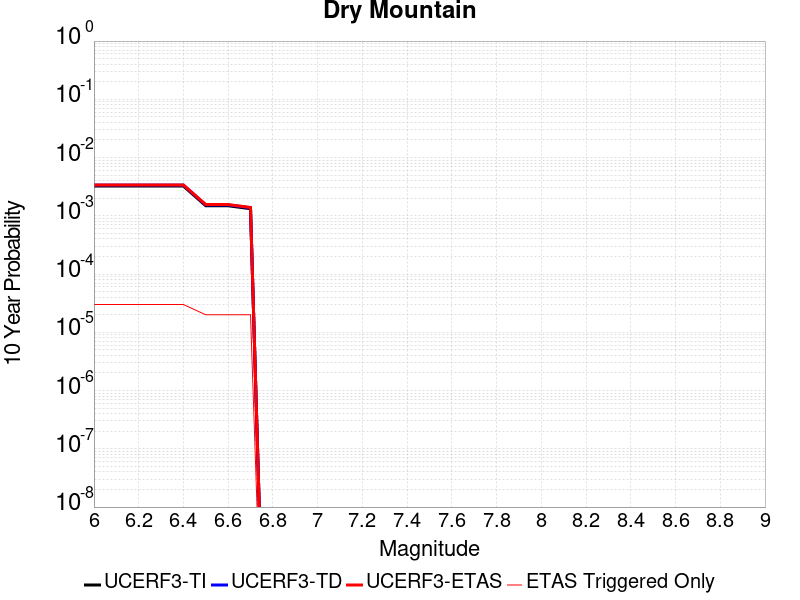 |

| Magnitude | 1 wk TI Prob | 1 wk TD Prob | 1 wk ETAS Prob | 1 wk ETAS/TD Gain | 1 wk ETAS Triggered Only | 1 mo TI Prob | 1 mo TD Prob | 1 mo ETAS Prob | 1 mo ETAS/TD Gain | 1 mo ETAS Triggered Only | 1 yr TI Prob | 1 yr TD Prob | 1 yr ETAS Prob | 1 yr ETAS/TD Gain | 1 yr ETAS Triggered Only | 10 yr TI Prob | 10 yr TD Prob | 10 yr ETAS Prob | 10 yr ETAS/TD Gain | 10 yr ETAS Triggered Only |
|-----|-----|-----|-----|-----|-----|-----|-----|-----|-----|-----|-----|-----|-----|-----|-----|-----|-----|-----|-----|-----|
| 6.0 | 6.222801E-6 | 6.4394408E-6 | 6.4394408E-6 | 1.0 | 0.0 | 2.6668875E-5 | 2.7597402E-5 | 5.1259787E-5 | 1.8574135 | 2.3663039E-5 | 3.2464517E-4 | 3.3596248E-4 | 3.5961755E-4 | 1.0704099 | 2.3663039E-5 | 0.0032417132 | 0.0033561077 | 0.0033796914 | 1.007027 | 2.3663039E-5 |
| 6.1 | 6.222801E-6 | 6.4394408E-6 | 6.4394408E-6 | 1.0 | 0.0 | 2.6668875E-5 | 2.7597402E-5 | 5.1259787E-5 | 1.8574135 | 2.3663039E-5 | 3.2464517E-4 | 3.3596248E-4 | 3.5961755E-4 | 1.0704099 | 2.3663039E-5 | 0.0032417132 | 0.0033561077 | 0.0033796914 | 1.007027 | 2.3663039E-5 |
| 6.2 | 6.222801E-6 | 6.4394408E-6 | 6.4394408E-6 | 1.0 | 0.0 | 2.6668875E-5 | 2.7597402E-5 | 5.1259787E-5 | 1.8574135 | 2.3663039E-5 | 3.2464517E-4 | 3.3596248E-4 | 3.5961755E-4 | 1.0704099 | 2.3663039E-5 | 0.0032417132 | 0.0033561077 | 0.0033796914 | 1.007027 | 2.3663039E-5 |
| 6.3 | 6.222801E-6 | 6.4394408E-6 | 6.4394408E-6 | 1.0 | 0.0 | 2.6668875E-5 | 2.7597402E-5 | 5.1259787E-5 | 1.8574135 | 2.3663039E-5 | 3.2464517E-4 | 3.3596248E-4 | 3.5961755E-4 | 1.0704099 | 2.3663039E-5 | 0.0032417132 | 0.0033561077 | 0.0033796914 | 1.007027 | 2.3663039E-5 |
| 6.4 | 6.222801E-6 | 6.4394408E-6 | 6.4394408E-6 | 1.0 | 0.0 | 2.6668875E-5 | 2.7597402E-5 | 5.1259787E-5 | 1.8574135 | 2.3663039E-5 | 3.2464517E-4 | 3.3596248E-4 | 3.5961755E-4 | 1.0704099 | 2.3663039E-5 | 0.0032417132 | 0.0033561077 | 0.0033796914 | 1.007027 | 2.3663039E-5 |
| 6.5 | 2.8528623E-6 | 2.9521957E-6 | 2.9521957E-6 | 1.0 | 0.0 | 1.22264955E-5 | 1.2652255E-5 | 1.2652255E-5 | 1.0 | 0.0 | 1.4884741E-4 | 1.5403902E-4 | 1.5403902E-4 | 1.0 | 0.0 | 0.0014874774 | 0.0015401759 | 0.0015401759 | 1.0 | 0.0 |
| 6.6 | 2.8528623E-6 | 2.9521957E-6 | 2.9521957E-6 | 1.0 | 0.0 | 1.22264955E-5 | 1.2652255E-5 | 1.2652255E-5 | 1.0 | 0.0 | 1.4884741E-4 | 1.5403902E-4 | 1.5403902E-4 | 1.0 | 0.0 | 0.0014874774 | 0.0015401759 | 0.0015401759 | 1.0 | 0.0 |
| 6.7 | 2.541E-6 | 2.6293822E-6 | 2.6293822E-6 | 1.0 | 0.0 | 1.0889954E-5 | 1.126878E-5 | 1.126878E-5 | 1.0 | 0.0 | 1.3257713E-4 | 1.371974E-4 | 1.371974E-4 | 1.0 | 0.0 | 0.0013249806 | 0.001371974 | 0.001371974 | 1.0 | 0.0 |

## Oak Ridge (Onshore)
*[(top)](#table-of-contents)*

| 1 Week | 1 Month | 1 Year | 10 Year |
|-----|-----|-----|-----|
|  |  |  |  |

| Magnitude | 1 wk TI Prob | 1 wk TD Prob | 1 wk ETAS Prob | 1 wk ETAS/TD Gain | 1 wk ETAS Triggered Only | 1 mo TI Prob | 1 mo TD Prob | 1 mo ETAS Prob | 1 mo ETAS/TD Gain | 1 mo ETAS Triggered Only | 1 yr TI Prob | 1 yr TD Prob | 1 yr ETAS Prob | 1 yr ETAS/TD Gain | 1 yr ETAS Triggered Only | 10 yr TI Prob | 10 yr TD Prob | 10 yr ETAS Prob | 10 yr ETAS/TD Gain | 10 yr ETAS Triggered Only |
|-----|-----|-----|-----|-----|-----|-----|-----|-----|-----|-----|-----|-----|-----|-----|-----|-----|-----|-----|-----|-----|
| 6.0 | 3.155064E-5 | 2.9526927E-5 | 2.9526927E-5 | 1.0 | 0.0 | 1.3521002E-4 | 1.2653806E-4 | 1.5019809E-4 | 1.1869797 | 2.3663039E-5 | 0.001644939 | 0.00153955 | 0.0015631766 | 1.0153464 | 2.3663039E-5 | 0.01632816 | 0.015293349 | 0.01531665 | 1.0015236 | 2.3663039E-5 |
| 6.1 | 3.155064E-5 | 2.9526927E-5 | 2.9526927E-5 | 1.0 | 0.0 | 1.3521002E-4 | 1.2653806E-4 | 1.5019809E-4 | 1.1869797 | 2.3663039E-5 | 0.001644939 | 0.00153955 | 0.0015631766 | 1.0153464 | 2.3663039E-5 | 0.01632816 | 0.015293349 | 0.01531665 | 1.0015236 | 2.3663039E-5 |
| 6.2 | 3.155064E-5 | 2.9526927E-5 | 2.9526927E-5 | 1.0 | 0.0 | 1.3521002E-4 | 1.2653806E-4 | 1.5019809E-4 | 1.1869797 | 2.3663039E-5 | 0.001644939 | 0.00153955 | 0.0015631766 | 1.0153464 | 2.3663039E-5 | 0.01632816 | 0.015293349 | 0.01531665 | 1.0015236 | 2.3663039E-5 |
| 6.3 | 3.155064E-5 | 2.9526927E-5 | 2.9526927E-5 | 1.0 | 0.0 | 1.3521002E-4 | 1.2653806E-4 | 1.5019809E-4 | 1.1869797 | 2.3663039E-5 | 0.001644939 | 0.00153955 | 0.0015631766 | 1.0153464 | 2.3663039E-5 | 0.01632816 | 0.015293349 | 0.01531665 | 1.0015236 | 2.3663039E-5 |
| 6.4 | 3.155064E-5 | 2.9526927E-5 | 2.9526927E-5 | 1.0 | 0.0 | 1.3521002E-4 | 1.2653806E-4 | 1.5019809E-4 | 1.1869797 | 2.3663039E-5 | 0.001644939 | 0.00153955 | 0.0015631766 | 1.0153464 | 2.3663039E-5 | 0.01632816 | 0.015293349 | 0.01531665 | 1.0015236 | 2.3663039E-5 |
| 6.5 | 3.155064E-5 | 2.9526927E-5 | 2.9526927E-5 | 1.0 | 0.0 | 1.3521002E-4 | 1.2653806E-4 | 1.5019809E-4 | 1.1869797 | 2.3663039E-5 | 0.001644939 | 0.00153955 | 0.0015631766 | 1.0153464 | 2.3663039E-5 | 0.01632816 | 0.015293349 | 0.01531665 | 1.0015236 | 2.3663039E-5 |
| 6.6 | 3.155064E-5 | 2.9526927E-5 | 2.9526927E-5 | 1.0 | 0.0 | 1.3521002E-4 | 1.2653806E-4 | 1.5019809E-4 | 1.1869797 | 2.3663039E-5 | 0.001644939 | 0.00153955 | 0.0015631766 | 1.0153464 | 2.3663039E-5 | 0.01632816 | 0.015293349 | 0.01531665 | 1.0015236 | 2.3663039E-5 |
| 6.7 | 3.098897E-5 | 2.8865095E-5 | 2.8865095E-5 | 1.0 | 0.0 | 1.328031E-4 | 1.237019E-4 | 1.47362E-4 | 1.1912671 | 2.3663039E-5 | 0.0016156785 | 0.0015050678 | 0.0015286953 | 1.0156986 | 2.3663039E-5 | 0.016039822 | 0.014953188 | 0.014976497 | 1.0015588 | 2.3663039E-5 |
| 6.8 | 3.0449872E-5 | 2.8240267E-5 | 2.8240267E-5 | 1.0 | 0.0 | 1.3049292E-4 | 1.2102431E-4 | 1.4468448E-4 | 1.1954993 | 2.3663039E-5 | 0.0015875935 | 0.0014725123 | 0.0014961405 | 1.0160462 | 2.3663039E-5 | 0.015762992 | 0.014631922 | 0.014655239 | 1.0015936 | 2.3663039E-5 |
| 6.9 | 2.697928E-5 | 2.4220499E-5 | 2.4220499E-5 | 1.0 | 0.0 | 1.15620365E-4 | 1.03798135E-4 | 1.2745871E-4 | 1.2279481 | 2.3663039E-5 | 0.0014067689 | 0.0012630312 | 0.0012866643 | 1.0187114 | 2.3663039E-5 | 0.0139789665 | 0.012561244 | 0.01258461 | 1.0018601 | 2.3663039E-5 |
| 7.0 | 2.4893961E-5 | 2.1862676E-5 | 2.1862676E-5 | 1.0 | 0.0 | 1.0668404E-4 | 9.369392E-5 | 1.17354735E-4 | 1.2525332 | 2.3663039E-5 | 0.0012981043 | 0.0011401442 | 0.0011637802 | 1.0207307 | 2.3663039E-5 | 0.012905477 | 0.011345232 | 0.011368627 | 1.0020621 | 2.3663039E-5 |
| 7.1 | 2.0945363E-5 | 1.7354947E-5 | 1.7354947E-5 | 1.0 | 0.0 | 8.976275E-5 | 7.437625E-5 | 9.803753E-5 | 1.3181294 | 2.3663039E-5 | 0.0010923136 | 9.051594E-4 | 9.28801E-4 | 1.0261188 | 2.3663039E-5 | 0.0108696 | 0.009015661 | 0.0090391105 | 1.002601 | 2.3663039E-5 |
| 7.2 | 2.0439404E-5 | 1.6809865E-5 | 1.6809865E-5 | 1.0 | 0.0 | 8.7594504E-5 | 7.204031E-5 | 9.5701645E-5 | 1.3284458 | 2.3663039E-5 | 0.0010659413 | 8.7674253E-4 | 9.0038485E-4 | 1.0269661 | 2.3663039E-5 | 0.010608427 | 0.008733754 | 0.00875721 | 1.0026857 | 2.3663039E-5 |
| 7.3 | 1.8463334E-5 | 1.5382195E-5 | 1.5382195E-5 | 1.0 | 0.0 | 7.912617E-5 | 6.592205E-5 | 8.9583526E-5 | 1.3589312 | 2.3663039E-5 | 9.6293533E-4 | 8.023098E-4 | 8.2595384E-4 | 1.02947 | 2.3663039E-5 | 0.009587734 | 0.007994995 | 0.008018469 | 1.0029361 | 2.3663039E-5 |
| 7.4 | 1.763139E-5 | 1.4517186E-5 | 1.4517186E-5 | 1.0 | 0.0 | 7.556091E-5 | 6.2215055E-5 | 8.587662E-5 | 1.380319 | 2.3663039E-5 | 9.1956573E-4 | 7.5720897E-4 | 7.808541E-4 | 1.0312266 | 2.3663039E-5 | 0.009157699 | 0.007547093 | 0.007570578 | 1.0031117 | 2.3663039E-5 |
| 7.5 | 1.3594944E-5 | 1.1163599E-5 | 1.1163599E-5 | 1.0 | 0.0 | 5.8262744E-5 | 4.7843132E-5 | 4.7843132E-5 | 1.0 | 0.0 | 7.0911803E-4 | 5.82337E-4 | 5.82337E-4 | 1.0 | 0.0 | 0.007068595 | 0.0058083814 | 0.0058083814 | 1.0 | 0.0 |
| 7.6 | 6.9889534E-6 | 5.636809E-6 | 5.636809E-6 | 1.0 | 0.0 | 2.9952313E-5 | 2.4157533E-5 | 2.4157533E-5 | 1.0 | 0.0 | 3.646084E-4 | 2.9407867E-4 | 2.9407867E-4 | 1.0 | 0.0 | 0.0036401073 | 0.0029369392 | 0.0029369392 | 1.0 | 0.0 |
| 7.7 | 4.0824193E-6 | 3.2833182E-6 | 3.2833182E-6 | 1.0 | 0.0 | 1.7495966E-5 | 1.4071288E-5 | 1.4071288E-5 | 1.0 | 0.0 | 2.1299256E-4 | 1.713046E-4 | 1.713046E-4 | 1.0 | 0.0 | 0.0021278851 | 0.0017117389 | 0.0017117389 | 1.0 | 0.0 |
| 7.8 | 1.7023609E-6 | 1.4370709E-6 | 1.4370709E-6 | 1.0 | 0.0 | 7.295812E-6 | 6.1588607E-6 | 6.1588607E-6 | 1.0 | 0.0 | 8.882289E-5 | 7.498157E-5 | 7.498157E-5 | 1.0 | 0.0 | 8.8787393E-4 | 7.4956554E-4 | 7.4956554E-4 | 1.0 | 0.0 |
| 7.9 | 2.721225E-7 | 2.2616932E-7 | 2.2616932E-7 | 1.0 | 0.0 | 1.1662388E-6 | 9.692967E-7 | 9.692967E-7 | 1.0 | 0.0 | 1.4198865E-5 | 1.1801127E-5 | 1.1801127E-5 | 1.0 | 0.0 | 1.4197957E-4 | 1.1800528E-4 | 1.1800528E-4 | 1.0 | 0.0 |
| 8.0 | 9.364255E-9 | 5.12118E-9 | 5.12118E-9 | 1.0 | 0.0 | 4.0132523E-8 | 2.1947914E-8 | 2.1947914E-8 | 1.0 | 0.0 | 4.8861335E-7 | 2.6721582E-7 | 2.6721582E-7 | 1.0 | 0.0 | 4.8861225E-6 | 2.6721555E-6 | 2.6721555E-6 | 1.0 | 0.0 |

## Thirty Mile Bank
*[(top)](#table-of-contents)*

| 1 Week | 1 Month | 1 Year | 10 Year |
|-----|-----|-----|-----|
|  |  |  |  |

| Magnitude | 1 wk TI Prob | 1 wk TD Prob | 1 wk ETAS Prob | 1 wk ETAS/TD Gain | 1 wk ETAS Triggered Only | 1 mo TI Prob | 1 mo TD Prob | 1 mo ETAS Prob | 1 mo ETAS/TD Gain | 1 mo ETAS Triggered Only | 1 yr TI Prob | 1 yr TD Prob | 1 yr ETAS Prob | 1 yr ETAS/TD Gain | 1 yr ETAS Triggered Only | 10 yr TI Prob | 10 yr TD Prob | 10 yr ETAS Prob | 10 yr ETAS/TD Gain | 10 yr ETAS Triggered Only |
|-----|-----|-----|-----|-----|-----|-----|-----|-----|-----|-----|-----|-----|-----|-----|-----|-----|-----|-----|-----|-----|
| 6.0 | 6.5124755E-6 | 6.6593043E-6 | 3.0322184E-5 | 4.553356 | 2.3663039E-5 | 2.791031E-5 | 2.8539587E-5 | 5.220195E-5 | 1.8291067 | 2.3663039E-5 | 3.3975503E-4 | 3.4741845E-4 | 3.7107326E-4 | 1.0680873 | 2.3663039E-5 | 0.0033923604 | 0.0034691847 | 0.0034927656 | 1.0067973 | 2.3663039E-5 |
| 6.1 | 6.5124755E-6 | 6.6593043E-6 | 3.0322184E-5 | 4.553356 | 2.3663039E-5 | 2.791031E-5 | 2.8539587E-5 | 5.220195E-5 | 1.8291067 | 2.3663039E-5 | 3.3975503E-4 | 3.4741845E-4 | 3.7107326E-4 | 1.0680873 | 2.3663039E-5 | 0.0033923604 | 0.0034691847 | 0.0034927656 | 1.0067973 | 2.3663039E-5 |
| 6.2 | 6.5124755E-6 | 6.6593043E-6 | 3.0322184E-5 | 4.553356 | 2.3663039E-5 | 2.791031E-5 | 2.8539587E-5 | 5.220195E-5 | 1.8291067 | 2.3663039E-5 | 3.3975503E-4 | 3.4741845E-4 | 3.7107326E-4 | 1.0680873 | 2.3663039E-5 | 0.0033923604 | 0.0034691847 | 0.0034927656 | 1.0067973 | 2.3663039E-5 |
| 6.3 | 6.5124755E-6 | 6.6593043E-6 | 3.0322184E-5 | 4.553356 | 2.3663039E-5 | 2.791031E-5 | 2.8539587E-5 | 5.220195E-5 | 1.8291067 | 2.3663039E-5 | 3.3975503E-4 | 3.4741845E-4 | 3.7107326E-4 | 1.0680873 | 2.3663039E-5 | 0.0033923604 | 0.0034691847 | 0.0034927656 | 1.0067973 | 2.3663039E-5 |
| 6.4 | 6.5124755E-6 | 6.6593043E-6 | 3.0322184E-5 | 4.553356 | 2.3663039E-5 | 2.791031E-5 | 2.8539587E-5 | 5.220195E-5 | 1.8291067 | 2.3663039E-5 | 3.3975503E-4 | 3.4741845E-4 | 3.7107326E-4 | 1.0680873 | 2.3663039E-5 | 0.0033923604 | 0.0034691847 | 0.0034927656 | 1.0067973 | 2.3663039E-5 |
| 6.5 | 6.5124755E-6 | 6.6593043E-6 | 3.0322184E-5 | 4.553356 | 2.3663039E-5 | 2.791031E-5 | 2.8539587E-5 | 5.220195E-5 | 1.8291067 | 2.3663039E-5 | 3.3975503E-4 | 3.4741845E-4 | 3.7107326E-4 | 1.0680873 | 2.3663039E-5 | 0.0033923604 | 0.0034691847 | 0.0034927656 | 1.0067973 | 2.3663039E-5 |
| 6.6 | 6.5124755E-6 | 6.6593043E-6 | 3.0322184E-5 | 4.553356 | 2.3663039E-5 | 2.791031E-5 | 2.8539587E-5 | 5.220195E-5 | 1.8291067 | 2.3663039E-5 | 3.3975503E-4 | 3.4741845E-4 | 3.7107326E-4 | 1.0680873 | 2.3663039E-5 | 0.0033923604 | 0.0034691847 | 0.0034927656 | 1.0067973 | 2.3663039E-5 |
| 6.7 | 3.5261137E-6 | 3.6099225E-6 | 2.7272876E-5 | 7.5549755 | 2.3663039E-5 | 1.5111828E-5 | 1.5471009E-5 | 3.913368E-5 | 2.5294847 | 2.3663039E-5 | 1.8397097E-4 | 1.883439E-4 | 2.1200247E-4 | 1.1256137 | 2.3663039E-5 | 0.0018381875 | 0.0018819077 | 0.0019055262 | 1.0125504 | 2.3663039E-5 |
| 6.8 | 3.370743E-6 | 3.4509574E-6 | 2.7113914E-5 | 7.856925 | 2.3663039E-5 | 1.4445961E-5 | 1.4789737E-5 | 3.8452425E-5 | 2.5999398 | 2.3663039E-5 | 1.7586538E-4 | 1.8005079E-4 | 2.0370957E-4 | 1.1314006 | 2.3663039E-5 | 0.0017572626 | 0.001799111 | 0.0018227315 | 1.013129 | 2.3663039E-5 |
| 6.9 | 2.2756835E-6 | 2.3331768E-6 | 2.599616E-5 | 11.141959 | 2.3663039E-5 | 9.752893E-6 | 9.999292E-6 | 3.3662094E-5 | 3.3664477 | 2.3663039E-5 | 1.18735006E-4 | 1.21734825E-4 | 1.4539498E-4 | 1.1943581 | 2.3663039E-5 | 0.0011867158 | 0.001216706 | 0.0012403403 | 1.0194248 | 2.3663039E-5 |
| 7.0 | 2.1617404E-6 | 2.2159948E-6 | 2.587898E-5 | 11.6782675 | 2.3663039E-5 | 9.264569E-6 | 9.497087E-6 | 3.31599E-5 | 3.4915864 | 2.3663039E-5 | 1.1279029E-4 | 1.15621144E-4 | 1.3928144E-4 | 1.2046365 | 2.3663039E-5 | 0.0011273306 | 0.001155634 | 0.0011792696 | 1.0204526 | 2.3663039E-5 |
| 7.1 | 1.5900777E-6 | 1.6327131E-6 | 2.5295712E-5 | 15.493054 | 2.3663039E-5 | 6.814601E-6 | 6.9973235E-6 | 3.0660198E-5 | 4.3817034 | 2.3663039E-5 | 8.296461E-5 | 8.518921E-5 | 1.0885024E-4 | 1.2777467 | 2.3663039E-5 | 8.293364E-4 | 8.515783E-4 | 8.752212E-4 | 1.0277636 | 2.3663039E-5 |
| 7.2 | 1.2971728E-6 | 1.3329089E-6 | 2.4995916E-5 | 18.752907 | 2.3663039E-5 | 5.5593005E-6 | 5.712455E-6 | 2.9375358E-5 | 5.1423354 | 2.3663039E-5 | 6.768238E-5 | 6.954702E-5 | 9.3208415E-5 | 1.3402215 | 2.3663039E-5 | 6.7661767E-4 | 6.952629E-4 | 7.189095E-4 | 1.034011 | 2.3663039E-5 |
| 7.3 | 8.2454284E-7 | 8.4489466E-7 | 8.4489466E-7 | 1.0 | 0.0 | 3.5337503E-6 | 3.6209724E-6 | 3.6209724E-6 | 1.0 | 0.0 | 4.302256E-5 | 4.4084507E-5 | 4.4084507E-5 | 1.0 | 0.0 | 4.301423E-4 | 4.407637E-4 | 4.407637E-4 | 1.0 | 0.0 |
| 7.4 | 4.2619024E-7 | 4.3863807E-7 | 4.3863807E-7 | 1.0 | 0.0 | 1.8265283E-6 | 1.8798761E-6 | 1.8798761E-6 | 1.0 | 0.0 | 2.2237757E-5 | 2.2887256E-5 | 2.2887256E-5 | 1.0 | 0.0 | 2.223553E-4 | 2.2884937E-4 | 2.2884937E-4 | 1.0 | 0.0 |
| 7.5 | 2.993922E-7 | 3.0864783E-7 | 3.0864783E-7 | 1.0 | 0.0 | 1.2831089E-6 | 1.3227758E-6 | 1.3227758E-6 | 1.0 | 0.0 | 1.5621737E-5 | 1.610468E-5 | 1.610468E-5 | 1.0 | 0.0 | 1.562064E-4 | 1.6103536E-4 | 1.6103536E-4 | 1.0 | 0.0 |
| 7.6 | 1.6988751E-7 | 1.7533972E-7 | 1.7533972E-7 | 1.0 | 0.0 | 7.2808916E-7 | 7.514558E-7 | 7.514558E-7 | 1.0 | 0.0 | 8.864449E-6 | 9.148937E-6 | 9.148937E-6 | 1.0 | 0.0 | 8.8640954E-5 | 9.14858E-5 | 9.14858E-5 | 1.0 | 0.0 |

## Calaveras (So) - Paicines extension 2011 CFM
*[(top)](#table-of-contents)*

| 1 Week | 1 Month | 1 Year | 10 Year |
|-----|-----|-----|-----|
|  |  |  |  |

| Magnitude | 1 wk TI Prob | 1 wk TD Prob | 1 wk ETAS Prob | 1 wk ETAS/TD Gain | 1 wk ETAS Triggered Only | 1 mo TI Prob | 1 mo TD Prob | 1 mo ETAS Prob | 1 mo ETAS/TD Gain | 1 mo ETAS Triggered Only | 1 yr TI Prob | 1 yr TD Prob | 1 yr ETAS Prob | 1 yr ETAS/TD Gain | 1 yr ETAS Triggered Only | 10 yr TI Prob | 10 yr TD Prob | 10 yr ETAS Prob | 10 yr ETAS/TD Gain | 10 yr ETAS Triggered Only |
|-----|-----|-----|-----|-----|-----|-----|-----|-----|-----|-----|-----|-----|-----|-----|-----|-----|-----|-----|-----|-----|
| 6.0 | 1.5183659E-4 | 3.0519612E-4 | 3.0519612E-4 | 1.0 | 0.0 | 6.5056595E-4 | 0.0013072831 | 0.0013072831 | 1.0 | 0.0 | 0.007891912 | 0.015700204 | 0.015700204 | 1.0 | 0.0 | 0.076174594 | 0.13852383 | 0.13854422 | 1.0001471 | 2.3663039E-5 |
| 6.1 | 1.5024997E-4 | 3.0213626E-4 | 3.0213626E-4 | 1.0 | 0.0 | 6.437695E-4 | 0.0012941824 | 0.0012941824 | 1.0 | 0.0 | 0.0078097614 | 0.015543589 | 0.015543589 | 1.0 | 0.0 | 0.075409345 | 0.1371934 | 0.13721381 | 1.0001488 | 2.3663039E-5 |
| 6.2 | 1.2743923E-4 | 2.5326986E-4 | 2.5326986E-4 | 1.0 | 0.0 | 5.460538E-4 | 0.0010849367 | 0.0010849367 | 1.0 | 0.0 | 0.0066279583 | 0.013051159 | 0.013051159 | 1.0 | 0.0 | 0.064337276 | 0.11729183 | 0.117312714 | 1.0001781 | 2.3663039E-5 |
| 6.3 | 1.1525114E-4 | 2.261221E-4 | 2.261221E-4 | 1.0 | 0.0 | 4.9383997E-4 | 9.687167E-4 | 9.687167E-4 | 1.0 | 0.0 | 0.0059959386 | 0.011672359 | 0.011672359 | 1.0 | 0.0 | 0.058367174 | 0.10640811 | 0.10642926 | 1.0001987 | 2.3663039E-5 |
| 6.4 | 1.07200925E-4 | 2.0851253E-4 | 2.0851253E-4 | 1.0 | 0.0 | 4.5935164E-4 | 8.9330005E-4 | 8.9330005E-4 | 1.0 | 0.0 | 0.0055782744 | 0.010777171 | 0.010777171 | 1.0 | 0.0 | 0.0544031 | 0.09923083 | 0.09925215 | 1.0002148 | 2.3663039E-5 |
| 6.5 | 9.69631E-5 | 1.8742446E-4 | 1.8742446E-4 | 1.0 | 0.0 | 4.1548995E-4 | 8.029804E-4 | 8.029804E-4 | 1.0 | 0.0 | 0.0050468626 | 0.009699007 | 0.009699007 | 1.0 | 0.0 | 0.04933773 | 0.09012252 | 0.09014405 | 1.0002389 | 2.3663039E-5 |
| 6.6 | 8.0552316E-5 | 1.5079568E-4 | 1.5079568E-4 | 1.0 | 0.0 | 3.4517853E-4 | 6.460856E-4 | 6.460856E-4 | 1.0 | 0.0 | 0.0041944524 | 0.007830652 | 0.007830652 | 1.0 | 0.0 | 0.04116161 | 0.07489272 | 0.07491461 | 1.0002923 | 2.3663039E-5 |
| 6.7 | 7.815757E-5 | 1.4619505E-4 | 1.4619505E-4 | 1.0 | 0.0 | 3.34918E-4 | 6.263994E-4 | 6.263994E-4 | 1.0 | 0.0 | 0.004070005 | 0.0075934716 | 0.0075934716 | 1.0 | 0.0 | 0.039962657 | 0.07274222 | 0.07276416 | 1.0003016 | 2.3663039E-5 |
| 6.8 | 6.965264E-5 | 1.2729822E-4 | 1.2729822E-4 | 1.0 | 0.0 | 2.9847719E-4 | 5.454492E-4 | 5.454492E-4 | 1.0 | 0.0 | 0.0036279052 | 0.0066175866 | 0.0066175866 | 1.0 | 0.0 | 0.03569247 | 0.063836016 | 0.063836016 | 1.0 | 0.0 |
| 6.9 | 5.8000453E-5 | 1.0150543E-4 | 1.0150543E-4 | 1.0 | 0.0 | 2.4854968E-4 | 4.349513E-4 | 4.349513E-4 | 1.0 | 0.0 | 0.0030218933 | 0.005282779 | 0.005282779 | 1.0 | 0.0 | 0.029811295 | 0.051534634 | 0.051534634 | 1.0 | 0.0 |
| 7.0 | 4.9865852E-5 | 8.574628E-5 | 8.574628E-5 | 1.0 | 0.0 | 2.1369329E-4 | 3.674328E-4 | 3.674328E-4 | 1.0 | 0.0 | 0.0025986114 | 0.0044644075 | 0.0044644075 | 1.0 | 0.0 | 0.025684336 | 0.04381456 | 0.04381456 | 1.0 | 0.0 |
| 7.1 | 4.283875E-5 | 7.117383E-5 | 7.117383E-5 | 1.0 | 0.0 | 1.8358172E-4 | 3.0499537E-4 | 3.0499537E-4 | 1.0 | 0.0 | 0.0022328163 | 0.0037070524 | 0.0037070524 | 1.0 | 0.0 | 0.022105146 | 0.036761142 | 0.036761142 | 1.0 | 0.0 |
| 7.2 | 3.450115E-5 | 5.582725E-5 | 5.582725E-5 | 1.0 | 0.0 | 1.478537E-4 | 2.3923787E-4 | 2.3923787E-4 | 1.0 | 0.0 | 0.0017986323 | 0.0029088596 | 0.0029088596 | 1.0 | 0.0 | 0.017841442 | 0.02910422 | 0.02910422 | 1.0 | 0.0 |
| 7.3 | 2.5709045E-5 | 4.063634E-5 | 4.063634E-5 | 1.0 | 0.0 | 1.1017697E-4 | 1.7414421E-4 | 1.7414421E-4 | 1.0 | 0.0 | 0.0013405791 | 0.0021181612 | 0.0021181612 | 1.0 | 0.0 | 0.013325208 | 0.021321056 | 0.021321056 | 1.0 | 0.0 |
| 7.4 | 1.8003093E-5 | 2.8530774E-5 | 2.8530774E-5 | 1.0 | 0.0 | 7.715383E-5 | 1.2226903E-4 | 1.2226903E-4 | 1.0 | 0.0 | 9.3894306E-4 | 0.0014876112 | 0.0014876112 | 1.0 | 0.0 | 0.009349857 | 0.015062336 | 0.015062336 | 1.0 | 0.0 |
| 7.5 | 1.5595824E-5 | 2.5842626E-5 | 2.5842626E-5 | 1.0 | 0.0 | 6.683753E-5 | 1.1074942E-4 | 1.1074942E-4 | 1.0 | 0.0 | 8.134431E-4 | 0.0013475424 | 0.0013475424 | 1.0 | 0.0 | 0.008104719 | 0.01366193 | 0.01366193 | 1.0 | 0.0 |
| 7.6 | 1.1110309E-5 | 1.9239924E-5 | 1.9239924E-5 | 1.0 | 0.0 | 4.761474E-5 | 8.245422E-5 | 8.245422E-5 | 1.0 | 0.0 | 5.795553E-4 | 0.0010034192 | 0.0010034192 | 1.0 | 0.0 | 0.0057804612 | 0.010212633 | 0.010212633 | 1.0 | 0.0 |
| 7.7 | 6.2140443E-6 | 1.0448902E-5 | 1.0448902E-5 | 1.0 | 0.0 | 2.6631347E-5 | 4.4780238E-5 | 4.4780238E-5 | 1.0 | 0.0 | 3.241884E-4 | 5.450631E-4 | 5.450631E-4 | 1.0 | 0.0 | 0.0032371588 | 0.005625615 | 0.005625615 | 1.0 | 0.0 |
| 7.8 | 5.305533E-6 | 9.443569E-6 | 9.443569E-6 | 1.0 | 0.0 | 2.27378E-5 | 4.047181E-5 | 4.047181E-5 | 1.0 | 0.0 | 2.7679754E-4 | 4.92633E-4 | 4.92633E-4 | 1.0 | 0.0 | 0.0027645302 | 0.0050794506 | 0.0050794506 | 1.0 | 0.0 |
| 7.9 | 3.363505E-6 | 7.392688E-6 | 7.392688E-6 | 1.0 | 0.0 | 1.4414942E-5 | 3.1682564E-5 | 3.1682564E-5 | 1.0 | 0.0 | 1.7548777E-4 | 3.8566702E-4 | 3.8566702E-4 | 1.0 | 0.0 | 0.0017534926 | 0.003952293 | 0.003952293 | 1.0 | 0.0 |
| 8.0 | 2.0271132E-6 | 4.4175663E-6 | 4.4175663E-6 | 1.0 | 0.0 | 8.687599E-6 | 1.893229E-5 | 1.893229E-5 | 1.0 | 0.0 | 1.05766376E-4 | 2.3047629E-4 | 2.3047629E-4 | 1.0 | 0.0 | 0.0010571606 | 0.0023532778 | 0.0023532778 | 1.0 | 0.0 |
| 8.1 | 1.2206116E-6 | 2.3775774E-6 | 2.3775774E-6 | 1.0 | 0.0 | 5.2311816E-6 | 1.0189578E-5 | 1.0189578E-5 | 1.0 | 0.0 | 6.3687774E-5 | 1.2405108E-4 | 1.2405108E-4 | 1.0 | 0.0 | 6.366953E-4 | 0.0012717688 | 0.0012717688 | 1.0 | 0.0 |

## Point Reyes 2011 CFM
*[(top)](#table-of-contents)*

| 1 Week | 1 Month | 1 Year | 10 Year |
|-----|-----|-----|-----|
|  |  |  |  |

| Magnitude | 1 wk TI Prob | 1 wk TD Prob | 1 wk ETAS Prob | 1 wk ETAS/TD Gain | 1 wk ETAS Triggered Only | 1 mo TI Prob | 1 mo TD Prob | 1 mo ETAS Prob | 1 mo ETAS/TD Gain | 1 mo ETAS Triggered Only | 1 yr TI Prob | 1 yr TD Prob | 1 yr ETAS Prob | 1 yr ETAS/TD Gain | 1 yr ETAS Triggered Only | 10 yr TI Prob | 10 yr TD Prob | 10 yr ETAS Prob | 10 yr ETAS/TD Gain | 10 yr ETAS Triggered Only |
|-----|-----|-----|-----|-----|-----|-----|-----|-----|-----|-----|-----|-----|-----|-----|-----|-----|-----|-----|-----|-----|
| 6.0 | 8.8644965E-6 | 8.967239E-6 | 8.967239E-6 | 1.0 | 0.0 | 3.7990147E-5 | 3.8430495E-5 | 3.8430495E-5 | 1.0 | 0.0 | 4.624319E-4 | 4.6779713E-4 | 4.6779713E-4 | 1.0 | 0.0 | 0.0046147075 | 0.0046687527 | 0.004692305 | 1.0050447 | 2.3663039E-5 |
| 6.1 | 4.526405E-6 | 4.5392703E-6 | 4.5392703E-6 | 1.0 | 0.0 | 1.9398734E-5 | 1.9453877E-5 | 1.9453877E-5 | 1.0 | 0.0 | 2.36154E-4 | 2.3682625E-4 | 2.3682625E-4 | 1.0 | 0.0 | 0.002359032 | 0.0023658448 | 0.002389452 | 1.0099783 | 2.3663039E-5 |
| 6.2 | 4.526405E-6 | 4.5392703E-6 | 4.5392703E-6 | 1.0 | 0.0 | 1.9398734E-5 | 1.9453877E-5 | 1.9453877E-5 | 1.0 | 0.0 | 2.36154E-4 | 2.3682625E-4 | 2.3682625E-4 | 1.0 | 0.0 | 0.002359032 | 0.0023658448 | 0.002389452 | 1.0099783 | 2.3663039E-5 |
| 6.3 | 2.6842322E-6 | 2.660718E-6 | 2.660718E-6 | 1.0 | 0.0 | 1.1503801E-5 | 1.1403029E-5 | 1.1403029E-5 | 1.0 | 0.0 | 1.4004979E-4 | 1.3882323E-4 | 1.3882323E-4 | 1.0 | 0.0 | 0.0013996155 | 0.0013873869 | 0.0013873869 | 1.0 | 0.0 |
| 6.4 | 2.6842322E-6 | 2.660718E-6 | 2.660718E-6 | 1.0 | 0.0 | 1.1503801E-5 | 1.1403029E-5 | 1.1403029E-5 | 1.0 | 0.0 | 1.4004979E-4 | 1.3882323E-4 | 1.3882323E-4 | 1.0 | 0.0 | 0.0013996155 | 0.0013873869 | 0.0013873869 | 1.0 | 0.0 |
| 6.5 | 1.9281833E-6 | 1.8906646E-6 | 1.8906646E-6 | 1.0 | 0.0 | 8.263617E-6 | 8.102824E-6 | 8.102824E-6 | 1.0 | 0.0 | 1.0060489E-4 | 9.86475E-5 | 9.86475E-5 | 1.0 | 0.0 | 0.0010055936 | 9.860479E-4 | 9.860479E-4 | 1.0 | 0.0 |
| 6.6 | 1.4726726E-6 | 1.4269938E-6 | 1.4269938E-6 | 1.0 | 0.0 | 6.3114385E-6 | 6.115674E-6 | 6.115674E-6 | 1.0 | 0.0 | 7.683905E-5 | 7.4455835E-5 | 7.4455835E-5 | 1.0 | 0.0 | 7.6812494E-4 | 7.44316E-4 | 7.44316E-4 | 1.0 | 0.0 |
| 6.7 | 8.572307E-7 | 8.007544E-7 | 8.007544E-7 | 1.0 | 0.0 | 3.6738406E-6 | 3.4318E-6 | 3.4318E-6 | 1.0 | 0.0 | 4.472809E-5 | 4.1781383E-5 | 4.1781383E-5 | 1.0 | 0.0 | 4.471909E-4 | 4.1773918E-4 | 4.1773918E-4 | 1.0 | 0.0 |
| 6.8 | 6.6745434E-7 | 6.077623E-7 | 6.077623E-7 | 1.0 | 0.0 | 2.8605155E-6 | 2.604693E-6 | 2.604693E-6 | 1.0 | 0.0 | 3.482622E-5 | 3.1711686E-5 | 3.1711686E-5 | 1.0 | 0.0 | 3.4820763E-4 | 3.170749E-4 | 3.170749E-4 | 1.0 | 0.0 |
| 6.9 | 4.291521E-7 | 3.653906E-7 | 3.653906E-7 | 1.0 | 0.0 | 1.839222E-6 | 1.5659588E-6 | 1.5659588E-6 | 1.0 | 0.0 | 2.2392298E-5 | 1.9065385E-5 | 1.9065385E-5 | 1.0 | 0.0 | 2.2390042E-4 | 1.9064014E-4 | 1.9064014E-4 | 1.0 | 0.0 |
| 7.0 | 2.6812808E-7 | 2.0190463E-7 | 2.0190463E-7 | 1.0 | 0.0 | 1.1491198E-6 | 8.6530525E-7 | 8.6530525E-7 | 1.0 | 0.0 | 1.3990444E-5 | 1.0535041E-5 | 1.0535041E-5 | 1.0 | 0.0 | 1.3989564E-4 | 1.0534777E-4 | 1.0534777E-4 | 1.0 | 0.0 |
| 7.1 | 1.9451231E-7 | 1.272851E-7 | 1.272851E-7 | 1.0 | 0.0 | 8.336239E-7 | 5.455075E-7 | 5.455075E-7 | 1.0 | 0.0 | 1.0149324E-5 | 6.6415328E-6 | 6.6415328E-6 | 1.0 | 0.0 | 1.014886E-4 | 6.6415625E-5 | 6.6415625E-5 | 1.0 | 0.0 |
| 7.2 | 1.6715143E-7 | 1.0045806E-7 | 1.0045806E-7 | 1.0 | 0.0 | 7.1636305E-7 | 4.3053447E-7 | 4.3053447E-7 | 1.0 | 0.0 | 8.721685E-6 | 5.2417445E-6 | 5.2417445E-6 | 1.0 | 0.0 | 8.721343E-5 | 5.241848E-5 | 5.241848E-5 | 1.0 | 0.0 |
| 7.3 | 1.5503173E-7 | 9.016024E-8 | 9.016024E-8 | 1.0 | 0.0 | 6.644215E-7 | 3.86401E-7 | 3.86401E-7 | 1.0 | 0.0 | 8.089301E-6 | 4.704422E-6 | 4.704422E-6 | 1.0 | 0.0 | 8.089007E-5 | 4.7045494E-5 | 4.7045494E-5 | 1.0 | 0.0 |
| 7.4 | 1.4251614E-7 | 8.100467E-8 | 8.100467E-8 | 1.0 | 0.0 | 6.1078333E-7 | 3.4716285E-7 | 3.4716285E-7 | 1.0 | 0.0 | 7.4362615E-6 | 4.2266993E-6 | 4.2266993E-6 | 1.0 | 0.0 | 7.436013E-5 | 4.226846E-5 | 4.226846E-5 | 1.0 | 0.0 |
| 7.5 | 1.2710186E-7 | 7.032371E-8 | 7.032371E-8 | 1.0 | 0.0 | 5.447221E-7 | 3.013873E-7 | 3.013873E-7 | 1.0 | 0.0 | 6.6319717E-6 | 3.6693843E-6 | 3.6693843E-6 | 1.0 | 0.0 | 6.6317734E-5 | 3.6695506E-5 | 3.6695506E-5 | 1.0 | 0.0 |
| 7.6 | 1.0144708E-7 | 5.497725E-8 | 5.497725E-8 | 1.0 | 0.0 | 4.347731E-7 | 2.356168E-7 | 2.356168E-7 | 1.0 | 0.0 | 5.2933497E-6 | 2.8686306E-6 | 2.8686306E-6 | 1.0 | 0.0 | 5.293224E-5 | 2.8688208E-5 | 2.8688208E-5 | 1.0 | 0.0 |
| 7.7 | 7.090527E-8 | 3.9843968E-8 | 3.9843968E-8 | 1.0 | 0.0 | 3.038797E-7 | 1.7075988E-7 | 1.7075988E-7 | 1.0 | 0.0 | 3.699729E-6 | 2.0789994E-6 | 2.0789994E-6 | 1.0 | 0.0 | 3.6996673E-5 | 2.0792071E-5 | 2.0792071E-5 | 1.0 | 0.0 |
| 7.8 | 3.8712045E-8 | 2.745785E-8 | 2.745785E-8 | 1.0 | 0.0 | 1.6590876E-7 | 1.1767651E-7 | 1.1767651E-7 | 1.0 | 0.0 | 2.0199373E-6 | 1.4327105E-6 | 1.4327105E-6 | 1.0 | 0.0 | 2.0199188E-5 | 1.4329284E-5 | 1.4329284E-5 | 1.0 | 0.0 |
| 7.9 | 1.7068782E-8 | 1.1848058E-8 | 1.1848058E-8 | 1.0 | 0.0 | 7.315192E-8 | 5.0777395E-8 | 5.0777395E-8 | 1.0 | 0.0 | 8.906242E-7 | 6.1821464E-7 | 6.1821464E-7 | 1.0 | 0.0 | 8.906207E-6 | 6.1844003E-6 | 6.1844003E-6 | 1.0 | 0.0 |
| 8.0 | 1.0172592E-8 | 7.040441E-9 | 7.040441E-9 | 1.0 | 0.0 | 4.359682E-8 | 3.017332E-8 | 3.017332E-8 | 1.0 | 0.0 | 5.3079117E-7 | 3.6736014E-7 | 3.6736014E-7 | 1.0 | 0.0 | 5.307899E-6 | 3.6758663E-6 | 3.6758663E-6 | 1.0 | 0.0 |
| 8.1 | 3.7861243E-9 | 3.5512078E-9 | 3.5512078E-9 | 1.0 | 0.0 | 1.6226247E-8 | 1.5219467E-8 | 1.5219467E-8 | 1.0 | 0.0 | 1.9755454E-7 | 1.85297E-7 | 1.85297E-7 | 1.0 | 0.0 | 1.9755437E-6 | 1.8549678E-6 | 1.8549678E-6 | 1.0 | 0.0 |

## Tin Mountain
*[(top)](#table-of-contents)*

| 1 Week | 1 Month | 1 Year | 10 Year |
|-----|-----|-----|-----|
|  |  |  |  |

| Magnitude | 1 wk TI Prob | 1 wk TD Prob | 1 wk ETAS Prob | 1 wk ETAS/TD Gain | 1 wk ETAS Triggered Only | 1 mo TI Prob | 1 mo TD Prob | 1 mo ETAS Prob | 1 mo ETAS/TD Gain | 1 mo ETAS Triggered Only | 1 yr TI Prob | 1 yr TD Prob | 1 yr ETAS Prob | 1 yr ETAS/TD Gain | 1 yr ETAS Triggered Only | 10 yr TI Prob | 10 yr TD Prob | 10 yr ETAS Prob | 10 yr ETAS/TD Gain | 10 yr ETAS Triggered Only |
|-----|-----|-----|-----|-----|-----|-----|-----|-----|-----|-----|-----|-----|-----|-----|-----|-----|-----|-----|-----|-----|
| 6.0 | 4.083776E-6 | 4.1815633E-6 | 4.1815633E-6 | 1.0 | 0.0 | 1.750178E-5 | 1.7920884E-5 | 4.15835E-5 | 2.3203933 | 2.3663039E-5 | 2.1306332E-4 | 2.1816863E-4 | 2.418265E-4 | 1.1084385 | 2.3663039E-5 | 0.0021285915 | 0.0021799102 | 0.0022035218 | 1.0108314 | 2.3663039E-5 |
| 6.1 | 4.083776E-6 | 4.1815633E-6 | 4.1815633E-6 | 1.0 | 0.0 | 1.750178E-5 | 1.7920884E-5 | 4.15835E-5 | 2.3203933 | 2.3663039E-5 | 2.1306332E-4 | 2.1816863E-4 | 2.418265E-4 | 1.1084385 | 2.3663039E-5 | 0.0021285915 | 0.0021799102 | 0.0022035218 | 1.0108314 | 2.3663039E-5 |
| 6.2 | 4.083776E-6 | 4.1815633E-6 | 4.1815633E-6 | 1.0 | 0.0 | 1.750178E-5 | 1.7920884E-5 | 4.15835E-5 | 2.3203933 | 2.3663039E-5 | 2.1306332E-4 | 2.1816863E-4 | 2.418265E-4 | 1.1084385 | 2.3663039E-5 | 0.0021285915 | 0.0021799102 | 0.0022035218 | 1.0108314 | 2.3663039E-5 |
| 6.3 | 4.083776E-6 | 4.1815633E-6 | 4.1815633E-6 | 1.0 | 0.0 | 1.750178E-5 | 1.7920884E-5 | 4.15835E-5 | 2.3203933 | 2.3663039E-5 | 2.1306332E-4 | 2.1816863E-4 | 2.418265E-4 | 1.1084385 | 2.3663039E-5 | 0.0021285915 | 0.0021799102 | 0.0022035218 | 1.0108314 | 2.3663039E-5 |
| 6.4 | 4.083776E-6 | 4.1815633E-6 | 4.1815633E-6 | 1.0 | 0.0 | 1.750178E-5 | 1.7920884E-5 | 4.15835E-5 | 2.3203933 | 2.3663039E-5 | 2.1306332E-4 | 2.1816863E-4 | 2.418265E-4 | 1.1084385 | 2.3663039E-5 | 0.0021285915 | 0.0021799102 | 0.0022035218 | 1.0108314 | 2.3663039E-5 |
| 6.5 | 2.3143427E-6 | 2.3731732E-6 | 2.3731732E-6 | 1.0 | 0.0 | 9.9185745E-6 | 1.0170707E-5 | 1.0170707E-5 | 1.0 | 0.0 | 1.2075195E-4 | 1.238221E-4 | 1.238221E-4 | 1.0 | 0.0 | 0.0012068636 | 0.001237607 | 0.001237607 | 1.0 | 0.0 |
| 6.6 | 2.3143427E-6 | 2.3731732E-6 | 2.3731732E-6 | 1.0 | 0.0 | 9.9185745E-6 | 1.0170707E-5 | 1.0170707E-5 | 1.0 | 0.0 | 1.2075195E-4 | 1.238221E-4 | 1.238221E-4 | 1.0 | 0.0 | 0.0012068636 | 0.001237607 | 0.001237607 | 1.0 | 0.0 |
| 6.7 | 1.7029532E-6 | 1.7498044E-6 | 1.7498044E-6 | 1.0 | 0.0 | 7.2983503E-6 | 7.499143E-6 | 7.499143E-6 | 1.0 | 0.0 | 8.885379E-5 | 9.1298774E-5 | 9.1298774E-5 | 1.0 | 0.0 | 8.881827E-4 | 9.1266533E-4 | 9.1266533E-4 | 1.0 | 0.0 |
| 6.8 | 1.2914646E-6 | 1.3299484E-6 | 1.3299484E-6 | 1.0 | 0.0 | 5.534837E-6 | 5.699769E-6 | 5.699769E-6 | 1.0 | 0.0 | 6.738455E-5 | 6.939292E-5 | 6.939292E-5 | 1.0 | 0.0 | 6.736412E-4 | 6.9375586E-4 | 6.9375586E-4 | 1.0 | 0.0 |
| 6.9 | 5.8708974E-7 | 6.117062E-7 | 6.117062E-7 | 1.0 | 0.0 | 2.5160964E-6 | 2.6215955E-6 | 2.6215955E-6 | 1.0 | 0.0 | 3.0633044E-5 | 3.19175E-5 | 3.19175E-5 | 1.0 | 0.0 | 3.0628822E-4 | 3.1913328E-4 | 3.1913328E-4 | 1.0 | 0.0 |
| 7.0 | 4.6248786E-7 | 4.8320726E-7 | 4.8320726E-7 | 1.0 | 0.0 | 1.9820893E-6 | 2.070887E-6 | 2.070887E-6 | 1.0 | 0.0 | 2.413167E-5 | 2.5212794E-5 | 2.5212794E-5 | 1.0 | 0.0 | 2.412905E-4 | 2.5210303E-4 | 2.5210303E-4 | 1.0 | 0.0 |
| 7.1 | 3.804606E-7 | 3.9871978E-7 | 3.9871978E-7 | 1.0 | 0.0 | 1.6305444E-6 | 1.7087981E-6 | 1.7087981E-6 | 1.0 | 0.0 | 1.9851697E-5 | 2.0804453E-5 | 2.0804453E-5 | 1.0 | 0.0 | 1.9849923E-4 | 2.0802842E-4 | 2.0802842E-4 | 1.0 | 0.0 |
| 7.2 | 3.5864858E-7 | 3.7617352E-7 | 3.7617352E-7 | 1.0 | 0.0 | 1.5370645E-6 | 1.6121713E-6 | 1.6121713E-6 | 1.0 | 0.0 | 1.87136E-5 | 1.9628043E-5 | 1.9628043E-5 | 1.0 | 0.0 | 1.8712023E-4 | 1.9626641E-4 | 1.9626641E-4 | 1.0 | 0.0 |
| 7.3 | 3.342063E-7 | 3.5063928E-7 | 3.5063928E-7 | 1.0 | 0.0 | 1.4323119E-6 | 1.5027391E-6 | 1.5027391E-6 | 1.0 | 0.0 | 1.7438259E-5 | 1.829573E-5 | 1.829573E-5 | 1.0 | 0.0 | 1.743689E-4 | 1.8294553E-4 | 1.8294553E-4 | 1.0 | 0.0 |
| 7.4 | 2.971242E-7 | 3.1166223E-7 | 3.1166223E-7 | 1.0 | 0.0 | 1.2733886E-6 | 1.3356947E-6 | 1.3356947E-6 | 1.0 | 0.0 | 1.5503398E-5 | 1.6261996E-5 | 1.6261996E-5 | 1.0 | 0.0 | 1.5502315E-4 | 1.6261134E-4 | 1.6261134E-4 | 1.0 | 0.0 |
| 7.5 | 1.4326713E-7 | 1.5012715E-7 | 1.5012715E-7 | 1.0 | 0.0 | 6.140018E-7 | 6.434021E-7 | 6.434021E-7 | 1.0 | 0.0 | 7.4754466E-6 | 7.83342E-6 | 7.83342E-6 | 1.0 | 0.0 | 7.475195E-5 | 7.8334204E-5 | 7.8334204E-5 | 1.0 | 0.0 |

## Blue Cut
*[(top)](#table-of-contents)*

| 1 Week | 1 Month | 1 Year | 10 Year |
|-----|-----|-----|-----|
|  |  |  |  |

| Magnitude | 1 wk TI Prob | 1 wk TD Prob | 1 wk ETAS Prob | 1 wk ETAS/TD Gain | 1 wk ETAS Triggered Only | 1 mo TI Prob | 1 mo TD Prob | 1 mo ETAS Prob | 1 mo ETAS/TD Gain | 1 mo ETAS Triggered Only | 1 yr TI Prob | 1 yr TD Prob | 1 yr ETAS Prob | 1 yr ETAS/TD Gain | 1 yr ETAS Triggered Only | 10 yr TI Prob | 10 yr TD Prob | 10 yr ETAS Prob | 10 yr ETAS/TD Gain | 10 yr ETAS Triggered Only |
|-----|-----|-----|-----|-----|-----|-----|-----|-----|-----|-----|-----|-----|-----|-----|-----|-----|-----|-----|-----|-----|
| 6.0 | 2.1227985E-5 | 2.2719998E-5 | 2.2719998E-5 | 1.0 | 0.0 | 9.097391E-5 | 9.7368116E-5 | 9.7368116E-5 | 1.0 | 0.0 | 0.0011070445 | 0.0011848703 | 0.0011848703 | 1.0 | 0.0 | 0.011015458 | 0.011791371 | 0.011814754 | 1.0019832 | 2.3663039E-5 |
| 6.1 | 2.1227985E-5 | 2.2719998E-5 | 2.2719998E-5 | 1.0 | 0.0 | 9.097391E-5 | 9.7368116E-5 | 9.7368116E-5 | 1.0 | 0.0 | 0.0011070445 | 0.0011848703 | 0.0011848703 | 1.0 | 0.0 | 0.011015458 | 0.011791371 | 0.011814754 | 1.0019832 | 2.3663039E-5 |
| 6.2 | 2.1227985E-5 | 2.2719998E-5 | 2.2719998E-5 | 1.0 | 0.0 | 9.097391E-5 | 9.7368116E-5 | 9.7368116E-5 | 1.0 | 0.0 | 0.0011070445 | 0.0011848703 | 0.0011848703 | 1.0 | 0.0 | 0.011015458 | 0.011791371 | 0.011814754 | 1.0019832 | 2.3663039E-5 |
| 6.3 | 1.1613981E-5 | 1.2353751E-5 | 1.2353751E-5 | 1.0 | 0.0 | 4.9773254E-5 | 5.294364E-5 | 5.294364E-5 | 1.0 | 0.0 | 6.0582085E-4 | 6.4441067E-4 | 6.4441067E-4 | 1.0 | 0.0 | 0.0060417196 | 0.0064266673 | 0.0064501786 | 1.0036583 | 2.3663039E-5 |
| 6.4 | 1.1613981E-5 | 1.2353751E-5 | 1.2353751E-5 | 1.0 | 0.0 | 4.9773254E-5 | 5.294364E-5 | 5.294364E-5 | 1.0 | 0.0 | 6.0582085E-4 | 6.4441067E-4 | 6.4441067E-4 | 1.0 | 0.0 | 0.0060417196 | 0.0064266673 | 0.0064501786 | 1.0036583 | 2.3663039E-5 |
| 6.5 | 8.931326E-6 | 9.481755E-6 | 9.481755E-6 | 1.0 | 0.0 | 3.8276554E-5 | 4.063551E-5 | 4.063551E-5 | 1.0 | 0.0 | 4.6591737E-4 | 4.946342E-4 | 4.946342E-4 | 1.0 | 0.0 | 0.0046494175 | 0.0049362415 | 0.0049362415 | 1.0 | 0.0 |
| 6.6 | 7.345353E-6 | 7.790404E-6 | 7.790404E-6 | 1.0 | 0.0 | 3.1479703E-5 | 3.3387067E-5 | 3.3387067E-5 | 1.0 | 0.0 | 3.83198E-4 | 4.064197E-4 | 4.064197E-4 | 1.0 | 0.0 | 0.0038253788 | 0.004057556 | 0.004057556 | 1.0 | 0.0 |
| 6.7 | 6.2775666E-6 | 6.655255E-6 | 6.655255E-6 | 1.0 | 0.0 | 2.690358E-5 | 2.8522252E-5 | 2.8522252E-5 | 1.0 | 0.0 | 3.2750185E-4 | 3.4721062E-4 | 3.4721062E-4 | 1.0 | 0.0 | 0.0032701963 | 0.0034674224 | 0.0034674224 | 1.0 | 0.0 |
| 6.8 | 5.5234095E-6 | 5.8552046E-6 | 5.8552046E-6 | 1.0 | 0.0 | 2.367154E-5 | 2.5093534E-5 | 2.5093534E-5 | 1.0 | 0.0 | 2.8816288E-4 | 3.0547823E-4 | 3.0547823E-4 | 1.0 | 0.0 | 0.002877895 | 0.0030512991 | 0.0030512991 | 1.0 | 0.0 |
| 6.9 | 4.7780054E-6 | 5.065501E-6 | 5.065501E-6 | 1.0 | 0.0 | 2.0477004E-5 | 2.1709151E-5 | 2.1709151E-5 | 1.0 | 0.0 | 2.4927902E-4 | 2.642839E-4 | 2.642839E-4 | 1.0 | 0.0 | 0.0024899957 | 0.0026403882 | 0.0026403882 | 1.0 | 0.0 |
| 7.0 | 3.883171E-6 | 4.1185535E-6 | 4.1185535E-6 | 1.0 | 0.0 | 1.6642054E-5 | 1.7650862E-5 | 1.7650862E-5 | 1.0 | 0.0 | 2.0259817E-4 | 2.1488495E-4 | 2.1488495E-4 | 1.0 | 0.0 | 0.0020241356 | 0.0021474473 | 0.0021474473 | 1.0 | 0.0 |
| 7.1 | 2.8358215E-6 | 3.009765E-6 | 3.009765E-6 | 1.0 | 0.0 | 1.2153464E-5 | 1.2898965E-5 | 1.2898965E-5 | 1.0 | 0.0 | 1.4795837E-4 | 1.5704017E-4 | 1.5704017E-4 | 1.0 | 0.0 | 0.001478599 | 0.0015699371 | 0.0015699371 | 1.0 | 0.0 |

## San Jose
*[(top)](#table-of-contents)*

| 1 Week | 1 Month | 1 Year | 10 Year |
|-----|-----|-----|-----|
|  |  |  |  |

| Magnitude | 1 wk TI Prob | 1 wk TD Prob | 1 wk ETAS Prob | 1 wk ETAS/TD Gain | 1 wk ETAS Triggered Only | 1 mo TI Prob | 1 mo TD Prob | 1 mo ETAS Prob | 1 mo ETAS/TD Gain | 1 mo ETAS Triggered Only | 1 yr TI Prob | 1 yr TD Prob | 1 yr ETAS Prob | 1 yr ETAS/TD Gain | 1 yr ETAS Triggered Only | 10 yr TI Prob | 10 yr TD Prob | 10 yr ETAS Prob | 10 yr ETAS/TD Gain | 10 yr ETAS Triggered Only |
|-----|-----|-----|-----|-----|-----|-----|-----|-----|-----|-----|-----|-----|-----|-----|-----|-----|-----|-----|-----|-----|
| 6.0 | 5.0851277E-6 | 4.125829E-6 | 4.125829E-6 | 1.0 | 0.0 | 2.1793223E-5 | 1.768202E-5 | 1.768202E-5 | 1.0 | 0.0 | 2.653002E-4 | 2.1525996E-4 | 2.389179E-4 | 1.109904 | 2.3663039E-5 | 0.0026498367 | 0.0021508057 | 0.0021744177 | 1.0109782 | 2.3663039E-5 |
| 6.1 | 5.0851277E-6 | 4.125829E-6 | 4.125829E-6 | 1.0 | 0.0 | 2.1793223E-5 | 1.768202E-5 | 1.768202E-5 | 1.0 | 0.0 | 2.653002E-4 | 2.1525996E-4 | 2.389179E-4 | 1.109904 | 2.3663039E-5 | 0.0026498367 | 0.0021508057 | 0.0021744177 | 1.0109782 | 2.3663039E-5 |
| 6.2 | 5.0851277E-6 | 4.125829E-6 | 4.125829E-6 | 1.0 | 0.0 | 2.1793223E-5 | 1.768202E-5 | 1.768202E-5 | 1.0 | 0.0 | 2.653002E-4 | 2.1525996E-4 | 2.389179E-4 | 1.109904 | 2.3663039E-5 | 0.0026498367 | 0.0021508057 | 0.0021744177 | 1.0109782 | 2.3663039E-5 |
| 6.3 | 5.0851277E-6 | 4.125829E-6 | 4.125829E-6 | 1.0 | 0.0 | 2.1793223E-5 | 1.768202E-5 | 1.768202E-5 | 1.0 | 0.0 | 2.653002E-4 | 2.1525996E-4 | 2.389179E-4 | 1.109904 | 2.3663039E-5 | 0.0026498367 | 0.0021508057 | 0.0021744177 | 1.0109782 | 2.3663039E-5 |
| 6.4 | 4.3115124E-6 | 3.3239319E-6 | 3.3239319E-6 | 1.0 | 0.0 | 1.8477778E-5 | 1.4245357E-5 | 1.4245357E-5 | 1.0 | 0.0 | 2.2494372E-4 | 1.7342564E-4 | 1.7342564E-4 | 1.0 | 0.0 | 0.0022471617 | 0.0017331527 | 0.0017331527 | 1.0 | 0.0 |
| 6.5 | 4.3115124E-6 | 3.3239319E-6 | 3.3239319E-6 | 1.0 | 0.0 | 1.8477778E-5 | 1.4245357E-5 | 1.4245357E-5 | 1.0 | 0.0 | 2.2494372E-4 | 1.7342564E-4 | 1.7342564E-4 | 1.0 | 0.0 | 0.0022471617 | 0.0017331527 | 0.0017331527 | 1.0 | 0.0 |
| 6.6 | 3.110396E-6 | 2.0801237E-6 | 2.0801237E-6 | 1.0 | 0.0 | 1.33302E-5 | 8.914787E-6 | 8.914787E-6 | 1.0 | 0.0 | 1.622831E-4 | 1.08532404E-4 | 1.08532404E-4 | 1.0 | 0.0 | 0.0016216465 | 0.001084854 | 0.001084854 | 1.0 | 0.0 |
| 6.7 | 3.110396E-6 | 2.0801237E-6 | 2.0801237E-6 | 1.0 | 0.0 | 1.33302E-5 | 8.914787E-6 | 8.914787E-6 | 1.0 | 0.0 | 1.622831E-4 | 1.08532404E-4 | 1.08532404E-4 | 1.0 | 0.0 | 0.0016216465 | 0.001084854 | 0.001084854 | 1.0 | 0.0 |
| 6.8 | 2.856651E-6 | 1.9025686E-6 | 1.9025686E-6 | 1.0 | 0.0 | 1.2242733E-5 | 8.153841E-6 | 8.153841E-6 | 1.0 | 0.0 | 1.4904508E-4 | 9.926874E-5 | 9.926874E-5 | 1.0 | 0.0 | 0.0014894515 | 9.92301E-4 | 9.92301E-4 | 1.0 | 0.0 |
| 6.9 | 2.1618725E-6 | 1.4187887E-6 | 1.4187887E-6 | 1.0 | 0.0 | 9.265135E-6 | 6.080509E-6 | 6.080509E-6 | 1.0 | 0.0 | 1.12797185E-4 | 7.4027776E-5 | 7.4027776E-5 | 1.0 | 0.0 | 0.0011273995 | 7.4007234E-4 | 7.4007234E-4 | 1.0 | 0.0 |
| 7.0 | 1.9684312E-6 | 1.3257552E-6 | 1.3257552E-6 | 1.0 | 0.0 | 8.436106E-6 | 5.681796E-6 | 5.681796E-6 | 1.0 | 0.0 | 1.02704755E-4 | 6.917376E-5 | 6.917376E-5 | 1.0 | 0.0 | 0.001026573 | 6.915629E-4 | 6.915629E-4 | 1.0 | 0.0 |
| 7.1 | 1.6070337E-6 | 1.1156246E-6 | 1.1156246E-6 | 1.0 | 0.0 | 6.887269E-6 | 4.78124E-6 | 4.78124E-6 | 1.0 | 0.0 | 8.384928E-5 | 5.8210106E-5 | 5.8210106E-5 | 1.0 | 0.0 | 8.3817646E-4 | 5.8198726E-4 | 5.8198726E-4 | 1.0 | 0.0 |
| 7.2 | 1.0631658E-6 | 6.4046236E-7 | 6.4046236E-7 | 1.0 | 0.0 | 4.556417E-6 | 2.744836E-6 | 2.744836E-6 | 1.0 | 0.0 | 5.5472963E-5 | 3.3417877E-5 | 3.3417877E-5 | 1.0 | 0.0 | 5.545912E-4 | 3.341624E-4 | 3.341624E-4 | 1.0 | 0.0 |
| 7.3 | 7.060711E-7 | 4.583165E-7 | 4.583165E-7 | 1.0 | 0.0 | 3.0260155E-6 | 1.964212E-6 | 1.964212E-6 | 1.0 | 0.0 | 3.6841117E-5 | 2.391403E-5 | 2.391403E-5 | 1.0 | 0.0 | 3.6835007E-4 | 2.3914794E-4 | 2.3914794E-4 | 1.0 | 0.0 |
| 7.4 | 3.3677085E-7 | 2.323812E-7 | 2.323812E-7 | 1.0 | 0.0 | 1.4433028E-6 | 9.959191E-7 | 9.959191E-7 | 1.0 | 0.0 | 1.757207E-5 | 1.2125251E-5 | 1.2125251E-5 | 1.0 | 0.0 | 1.7570681E-4 | 1.2127866E-4 | 1.2127866E-4 | 1.0 | 0.0 |
| 7.5 | 3.129161E-7 | 1.9535003E-7 | 1.9535003E-7 | 1.0 | 0.0 | 1.3410682E-6 | 8.3721415E-7 | 8.3721415E-7 | 1.0 | 0.0 | 1.6327383E-5 | 1.0193037E-5 | 1.0193037E-5 | 1.0 | 0.0 | 1.6326184E-4 | 1.01958416E-4 | 1.01958416E-4 | 1.0 | 0.0 |
| 7.6 | 2.8008668E-7 | 1.4245146E-7 | 1.4245146E-7 | 1.0 | 0.0 | 1.2003709E-6 | 6.105061E-7 | 6.105061E-7 | 1.0 | 0.0 | 1.46144175E-5 | 7.432888E-6 | 7.432888E-6 | 1.0 | 0.0 | 1.4613457E-4 | 7.4359006E-5 | 7.4359006E-5 | 1.0 | 0.0 |
| 7.7 | 2.7852005E-7 | 1.4019697E-7 | 1.4019697E-7 | 1.0 | 0.0 | 1.1936568E-6 | 6.0084403E-7 | 6.0084403E-7 | 1.0 | 0.0 | 1.4532674E-5 | 7.3152532E-6 | 7.3152532E-6 | 1.0 | 0.0 | 1.4531724E-4 | 7.318273E-5 | 7.318273E-5 | 1.0 | 0.0 |
| 7.8 | 1.1810797E-7 | 7.520163E-8 | 7.520163E-8 | 1.0 | 0.0 | 5.0617695E-7 | 3.2229266E-7 | 3.2229266E-7 | 1.0 | 0.0 | 6.1626865E-6 | 3.9239067E-6 | 3.9239067E-6 | 1.0 | 0.0 | 6.162516E-5 | 3.9256745E-5 | 3.9256745E-5 | 1.0 | 0.0 |

## Hartley Springs 2011 CFM
*[(top)](#table-of-contents)*

| 1 Week | 1 Month | 1 Year | 10 Year |
|-----|-----|-----|-----|
|  |  |  |  |

| Magnitude | 1 wk TI Prob | 1 wk TD Prob | 1 wk ETAS Prob | 1 wk ETAS/TD Gain | 1 wk ETAS Triggered Only | 1 mo TI Prob | 1 mo TD Prob | 1 mo ETAS Prob | 1 mo ETAS/TD Gain | 1 mo ETAS Triggered Only | 1 yr TI Prob | 1 yr TD Prob | 1 yr ETAS Prob | 1 yr ETAS/TD Gain | 1 yr ETAS Triggered Only | 10 yr TI Prob | 10 yr TD Prob | 10 yr ETAS Prob | 10 yr ETAS/TD Gain | 10 yr ETAS Triggered Only |
|-----|-----|-----|-----|-----|-----|-----|-----|-----|-----|-----|-----|-----|-----|-----|-----|-----|-----|-----|-----|-----|
| 6.0 | 1.4352418E-5 | 1.4434639E-5 | 1.4434639E-5 | 1.0 | 0.0 | 6.1508916E-5 | 6.186219E-5 | 6.186219E-5 | 1.0 | 0.0 | 7.486137E-4 | 7.5307634E-4 | 7.767216E-4 | 1.0313982 | 2.3663039E-5 | 0.007460968 | 0.007521366 | 0.007544851 | 1.0031224 | 2.3663039E-5 |
| 6.1 | 1.4352418E-5 | 1.4434639E-5 | 1.4434639E-5 | 1.0 | 0.0 | 6.1508916E-5 | 6.186219E-5 | 6.186219E-5 | 1.0 | 0.0 | 7.486137E-4 | 7.5307634E-4 | 7.767216E-4 | 1.0313982 | 2.3663039E-5 | 0.007460968 | 0.007521366 | 0.007544851 | 1.0031224 | 2.3663039E-5 |
| 6.2 | 1.4352418E-5 | 1.4434639E-5 | 1.4434639E-5 | 1.0 | 0.0 | 6.1508916E-5 | 6.186219E-5 | 6.186219E-5 | 1.0 | 0.0 | 7.486137E-4 | 7.5307634E-4 | 7.767216E-4 | 1.0313982 | 2.3663039E-5 | 0.007460968 | 0.007521366 | 0.007544851 | 1.0031224 | 2.3663039E-5 |
| 6.3 | 1.4352418E-5 | 1.4434639E-5 | 1.4434639E-5 | 1.0 | 0.0 | 6.1508916E-5 | 6.186219E-5 | 6.186219E-5 | 1.0 | 0.0 | 7.486137E-4 | 7.5307634E-4 | 7.767216E-4 | 1.0313982 | 2.3663039E-5 | 0.007460968 | 0.007521366 | 0.007544851 | 1.0031224 | 2.3663039E-5 |
| 6.4 | 1.4352418E-5 | 1.4434639E-5 | 1.4434639E-5 | 1.0 | 0.0 | 6.1508916E-5 | 6.186219E-5 | 6.186219E-5 | 1.0 | 0.0 | 7.486137E-4 | 7.5307634E-4 | 7.767216E-4 | 1.0313982 | 2.3663039E-5 | 0.007460968 | 0.007521366 | 0.007544851 | 1.0031224 | 2.3663039E-5 |
| 6.5 | 1.2279858E-5 | 1.2133495E-5 | 1.2133495E-5 | 1.0 | 0.0 | 5.26269E-5 | 5.200055E-5 | 5.200055E-5 | 1.0 | 0.0 | 6.4054417E-4 | 6.3308096E-4 | 6.5672904E-4 | 1.0373539 | 2.3663039E-5 | 0.0063870098 | 0.0063282875 | 0.006351801 | 1.0037156 | 2.3663039E-5 |
| 6.6 | 1.2279858E-5 | 1.2133495E-5 | 1.2133495E-5 | 1.0 | 0.0 | 5.26269E-5 | 5.200055E-5 | 5.200055E-5 | 1.0 | 0.0 | 6.4054417E-4 | 6.3308096E-4 | 6.5672904E-4 | 1.0373539 | 2.3663039E-5 | 0.0063870098 | 0.0063282875 | 0.006351801 | 1.0037156 | 2.3663039E-5 |
| 6.7 | 2.1282601E-6 | 8.895516E-7 | 8.895516E-7 | 1.0 | 0.0 | 9.121083E-6 | 3.8123599E-6 | 3.8123599E-6 | 1.0 | 0.0 | 1.11043526E-4 | 4.641475E-5 | 4.641475E-5 | 1.0 | 0.0 | 0.0011098806 | 4.6407589E-4 | 4.6407589E-4 | 1.0 | 0.0 |
| 6.8 | 2.00516E-6 | 8.518234E-7 | 8.518234E-7 | 1.0 | 0.0 | 8.593515E-6 | 3.650668E-6 | 3.650668E-6 | 1.0 | 0.0 | 1.04621024E-4 | 4.444623E-5 | 4.444623E-5 | 1.0 | 0.0 | 0.0010457177 | 4.4439858E-4 | 4.4439858E-4 | 1.0 | 0.0 |
| 6.9 | 2.00516E-6 | 8.518234E-7 | 8.518234E-7 | 1.0 | 0.0 | 8.593515E-6 | 3.650668E-6 | 3.650668E-6 | 1.0 | 0.0 | 1.04621024E-4 | 4.444623E-5 | 4.444623E-5 | 1.0 | 0.0 | 0.0010457177 | 4.4439858E-4 | 4.4439858E-4 | 1.0 | 0.0 |
| 7.0 | 1.8366732E-6 | 8.2378887E-7 | 8.2378887E-7 | 1.0 | 0.0 | 7.871433E-6 | 3.5305202E-6 | 3.5305202E-6 | 1.0 | 0.0 | 9.583048E-5 | 4.298349E-5 | 4.298349E-5 | 1.0 | 0.0 | 9.5789164E-4 | 4.2977685E-4 | 4.2977685E-4 | 1.0 | 0.0 |
| 7.1 | 1.5097997E-6 | 7.1907147E-7 | 7.1907147E-7 | 1.0 | 0.0 | 6.470554E-6 | 3.0817325E-6 | 3.0817325E-6 | 1.0 | 0.0 | 7.877615E-5 | 3.751969E-5 | 3.751969E-5 | 1.0 | 0.0 | 7.874823E-4 | 3.7515728E-4 | 3.7515728E-4 | 1.0 | 0.0 |
| 7.2 | 1.3490993E-6 | 6.40565E-7 | 6.40565E-7 | 1.0 | 0.0 | 5.7818415E-6 | 2.745277E-6 | 2.745277E-6 | 1.0 | 0.0 | 7.0391645E-5 | 3.342347E-5 | 3.342347E-5 | 1.0 | 0.0 | 7.0369354E-4 | 3.3420738E-4 | 3.3420738E-4 | 1.0 | 0.0 |
| 7.3 | 7.900015E-7 | 4.0891763E-7 | 4.0891763E-7 | 1.0 | 0.0 | 3.3857161E-6 | 1.7525041E-6 | 1.7525041E-6 | 1.0 | 0.0 | 4.1220315E-5 | 2.1336737E-5 | 2.1336737E-5 | 1.0 | 0.0 | 4.121267E-4 | 2.1336737E-4 | 2.1336737E-4 | 1.0 | 0.0 |

## Hayward (No) 2011 CFM
*[(top)](#table-of-contents)*

| 1 Week | 1 Month | 1 Year | 10 Year |
|-----|-----|-----|-----|
|  |  |  |  |

| Magnitude | 1 wk TI Prob | 1 wk TD Prob | 1 wk ETAS Prob | 1 wk ETAS/TD Gain | 1 wk ETAS Triggered Only | 1 mo TI Prob | 1 mo TD Prob | 1 mo ETAS Prob | 1 mo ETAS/TD Gain | 1 mo ETAS Triggered Only | 1 yr TI Prob | 1 yr TD Prob | 1 yr ETAS Prob | 1 yr ETAS/TD Gain | 1 yr ETAS Triggered Only | 10 yr TI Prob | 10 yr TD Prob | 10 yr ETAS Prob | 10 yr ETAS/TD Gain | 10 yr ETAS Triggered Only |
|-----|-----|-----|-----|-----|-----|-----|-----|-----|-----|-----|-----|-----|-----|-----|-----|-----|-----|-----|-----|-----|
| 6.0 | 9.3068506E-5 | 1.7399038E-4 | 1.7399038E-4 | 1.0 | 0.0 | 3.9880406E-4 | 7.454472E-4 | 7.690926E-4 | 1.0317198 | 2.3663039E-5 | 0.0048446343 | 0.009038033 | 0.009061482 | 1.0025945 | 2.3663039E-5 | 0.047403704 | 0.08638911 | 0.08641072 | 1.0002502 | 2.3663039E-5 |
| 6.1 | 9.055486E-5 | 1.6950177E-4 | 1.6950177E-4 | 1.0 | 0.0 | 3.880345E-4 | 7.262309E-4 | 7.498768E-4 | 1.0325596 | 2.3663039E-5 | 0.0047140904 | 0.008806113 | 0.008829568 | 1.0026635 | 2.3663039E-5 | 0.046153355 | 0.08428218 | 0.084303856 | 1.0002571 | 2.3663039E-5 |
| 6.2 | 9.006742E-5 | 1.687076E-4 | 1.687076E-4 | 1.0 | 0.0 | 3.859461E-4 | 7.228292E-4 | 7.464752E-4 | 1.032713 | 2.3663039E-5 | 0.0046887742 | 0.008765083 | 0.008788538 | 1.002676 | 2.3663039E-5 | 0.0459107 | 0.0839064 | 0.08392807 | 1.0002583 | 2.3663039E-5 |
| 6.3 | 8.8336754E-5 | 1.6550272E-4 | 1.6550272E-4 | 1.0 | 0.0 | 3.7853114E-4 | 7.0910534E-4 | 7.327516E-4 | 1.0333467 | 2.3663039E-5 | 0.004598882 | 0.00859935 | 0.00862281 | 1.0027281 | 2.3663039E-5 | 0.04504866 | 0.082399555 | 0.08242127 | 1.0002635 | 2.3663039E-5 |
| 6.4 | 8.526157E-5 | 1.5977255E-4 | 1.5977255E-4 | 1.0 | 0.0 | 3.6535555E-4 | 6.8456057E-4 | 7.0820743E-4 | 1.034543 | 2.3663039E-5 | 0.0044391346 | 0.008302832 | 0.008326299 | 1.0028263 | 2.3663039E-5 | 0.043514993 | 0.07969638 | 0.07971816 | 1.0002732 | 2.3663039E-5 |
| 6.5 | 8.152396E-5 | 1.530961E-4 | 1.530961E-4 | 1.0 | 0.0 | 3.493416E-4 | 6.5596186E-4 | 6.7960937E-4 | 1.0360501 | 2.3663039E-5 | 0.0042449418 | 0.00795724 | 0.007980715 | 1.0029501 | 2.3663039E-5 | 0.04164765 | 0.07652717 | 0.07654902 | 1.0002855 | 2.3663039E-5 |
| 6.6 | 7.987405E-5 | 1.5013812E-4 | 1.5013812E-4 | 1.0 | 0.0 | 3.4227243E-4 | 6.432911E-4 | 6.669389E-4 | 1.0367607 | 2.3663039E-5 | 0.0041592065 | 0.007804099 | 0.007827577 | 1.0030085 | 2.3663039E-5 | 0.04082218 | 0.07511968 | 0.075141564 | 1.0002913 | 2.3663039E-5 |
| 6.7 | 7.777665E-5 | 1.4653052E-4 | 1.4653052E-4 | 1.0 | 0.0 | 3.332859E-4 | 6.2783755E-4 | 6.514857E-4 | 1.0376661 | 2.3663039E-5 | 0.004050208 | 0.007617286 | 0.007640769 | 1.0030829 | 2.3663039E-5 | 0.039771806 | 0.073396005 | 0.07341793 | 1.0002987 | 2.3663039E-5 |
| 6.8 | 7.3284005E-5 | 1.3803577E-4 | 1.3803577E-4 | 1.0 | 0.0 | 3.140365E-4 | 5.914484E-4 | 5.914484E-4 | 1.0 | 0.0 | 0.0038166929 | 0.0071772463 | 0.0071772463 | 1.0 | 0.0 | 0.037518036 | 0.069309115 | 0.069309115 | 1.0 | 0.0 |
| 6.9 | 6.458263E-5 | 1.2134017E-4 | 1.2134017E-4 | 1.0 | 0.0 | 2.7675333E-4 | 5.1992614E-4 | 5.1992614E-4 | 1.0 | 0.0 | 0.0033642664 | 0.006311829 | 0.006311829 | 1.0 | 0.0 | 0.033137884 | 0.06123693 | 0.06123693 | 1.0 | 0.0 |
| 7.0 | 5.3853604E-5 | 1.0027352E-4 | 1.0027352E-4 | 1.0 | 0.0 | 2.3078074E-4 | 4.296732E-4 | 4.296732E-4 | 1.0 | 0.0 | 0.0028061352 | 0.0052187876 | 0.0052187876 | 1.0 | 0.0 | 0.027709642 | 0.050968632 | 0.050968632 | 1.0 | 0.0 |
| 7.1 | 4.4308683E-5 | 8.17271E-5 | 8.17271E-5 | 1.0 | 0.0 | 1.8988053E-4 | 3.502122E-4 | 3.502122E-4 | 1.0 | 0.0 | 0.0023093442 | 0.004255539 | 0.004255539 | 1.0 | 0.0 | 0.022854926 | 0.04183463 | 0.04183463 | 1.0 | 0.0 |
| 7.2 | 3.295973E-5 | 6.0790346E-5 | 6.0790346E-5 | 1.0 | 0.0 | 1.4124835E-4 | 2.6050417E-4 | 2.6050417E-4 | 1.0 | 0.0 | 0.0017183421 | 0.0031670483 | 0.0031670483 | 1.0 | 0.0 | 0.017051157 | 0.03137911 | 0.03137911 | 1.0 | 0.0 |
| 7.3 | 2.452256E-5 | 4.5197427E-5 | 4.5197427E-5 | 1.0 | 0.0 | 1.05092455E-4 | 1.9368895E-4 | 1.9368895E-4 | 1.0 | 0.0 | 0.0012787496 | 0.0023556263 | 0.0023556263 | 1.0 | 0.0 | 0.0127141625 | 0.023449399 | 0.023449399 | 1.0 | 0.0 |
| 7.4 | 1.8829967E-5 | 3.4617526E-5 | 3.4617526E-5 | 1.0 | 0.0 | 8.069736E-5 | 1.4835244E-4 | 1.4835244E-4 | 1.0 | 0.0 | 9.820475E-4 | 0.0018047044 | 0.0018047044 | 1.0 | 0.0 | 0.009777189 | 0.018026808 | 0.018026808 | 1.0 | 0.0 |
| 7.5 | 1.26374125E-5 | 2.2931094E-5 | 2.2931094E-5 | 1.0 | 0.0 | 5.4159216E-5 | 9.8272445E-5 | 9.8272445E-5 | 1.0 | 0.0 | 6.5918895E-4 | 0.0011958161 | 0.0011958161 | 1.0 | 0.0 | 0.00657237 | 0.011993729 | 0.011993729 | 1.0 | 0.0 |
| 7.6 | 4.666429E-6 | 8.48518E-6 | 8.48518E-6 | 1.0 | 0.0 | 1.9998828E-5 | 3.6364556E-5 | 3.6364556E-5 | 1.0 | 0.0 | 2.4345852E-4 | 4.4264976E-4 | 4.4264976E-4 | 1.0 | 0.0 | 0.0024319198 | 0.004462066 | 0.004462066 | 1.0 | 0.0 |
| 7.7 | 3.8399318E-7 | 7.14099E-7 | 7.14099E-7 | 1.0 | 0.0 | 1.6456839E-6 | 3.0604206E-6 | 3.0604206E-6 | 1.0 | 0.0 | 2.003602E-5 | 3.7259986E-5 | 3.7259986E-5 | 1.0 | 0.0 | 2.0034213E-4 | 3.864967E-4 | 3.864967E-4 | 1.0 | 0.0 |
| 7.8 | 2.5637698E-7 | 5.372332E-7 | 5.372332E-7 | 1.0 | 0.0 | 1.098758E-6 | 2.3024256E-6 | 2.3024256E-6 | 1.0 | 0.0 | 1.3377297E-5 | 2.8031674E-5 | 2.8031674E-5 | 1.0 | 0.0 | 1.3376492E-4 | 2.927407E-4 | 2.927407E-4 | 1.0 | 0.0 |
| 7.9 | 1.7141245E-7 | 3.7332893E-7 | 3.7332893E-7 | 1.0 | 0.0 | 7.3462456E-7 | 1.5999801E-6 | 1.5999801E-6 | 1.0 | 0.0 | 8.944017E-6 | 1.9479585E-5 | 1.9479585E-5 | 1.0 | 0.0 | 8.943657E-5 | 2.0265914E-4 | 2.0265914E-4 | 1.0 | 0.0 |
| 8.0 | 1.1808895E-7 | 2.753835E-7 | 2.753835E-7 | 1.0 | 0.0 | 5.060954E-7 | 1.1802146E-6 | 1.1802146E-6 | 1.0 | 0.0 | 6.161694E-6 | 1.4369018E-5 | 1.4369018E-5 | 1.0 | 0.0 | 6.161523E-5 | 1.4830135E-4 | 1.4830135E-4 | 1.0 | 0.0 |
| 8.1 | 5.138535E-8 | 1.1240365E-7 | 1.1240365E-7 | 1.0 | 0.0 | 2.2022292E-7 | 4.817298E-7 | 4.817298E-7 | 1.0 | 0.0 | 2.6812106E-6 | 5.865045E-6 | 5.865045E-6 | 1.0 | 0.0 | 2.6811784E-5 | 6.020997E-5 | 6.020997E-5 | 1.0 | 0.0 |

## Great Valley 11
*[(top)](#table-of-contents)*

| 1 Week | 1 Month | 1 Year | 10 Year |
|-----|-----|-----|-----|
|  |  |  |  |

| Magnitude | 1 wk TI Prob | 1 wk TD Prob | 1 wk ETAS Prob | 1 wk ETAS/TD Gain | 1 wk ETAS Triggered Only | 1 mo TI Prob | 1 mo TD Prob | 1 mo ETAS Prob | 1 mo ETAS/TD Gain | 1 mo ETAS Triggered Only | 1 yr TI Prob | 1 yr TD Prob | 1 yr ETAS Prob | 1 yr ETAS/TD Gain | 1 yr ETAS Triggered Only | 10 yr TI Prob | 10 yr TD Prob | 10 yr ETAS Prob | 10 yr ETAS/TD Gain | 10 yr ETAS Triggered Only |
|-----|-----|-----|-----|-----|-----|-----|-----|-----|-----|-----|-----|-----|-----|-----|-----|-----|-----|-----|-----|-----|
| 6.0 | 2.8099583E-5 | 2.983355E-5 | 2.983355E-5 | 1.0 | 0.0 | 1.20421224E-4 | 1.2785224E-4 | 1.2785224E-4 | 1.0 | 0.0 | 0.0014651422 | 0.0015555643 | 0.0015791906 | 1.0151882 | 2.3663039E-5 | 0.0145552 | 0.015454284 | 0.015477581 | 1.0015075 | 2.3663039E-5 |
| 6.1 | 2.483194E-5 | 2.590834E-5 | 2.590834E-5 | 1.0 | 0.0 | 1.0641825E-4 | 1.1103138E-4 | 1.1103138E-4 | 1.0 | 0.0 | 0.0012948721 | 0.0013510331 | 0.0013746643 | 1.0174911 | 2.3663039E-5 | 0.012873529 | 0.013434611 | 0.013457956 | 1.0017377 | 2.3663039E-5 |
| 6.2 | 2.483194E-5 | 2.590834E-5 | 2.590834E-5 | 1.0 | 0.0 | 1.0641825E-4 | 1.1103138E-4 | 1.1103138E-4 | 1.0 | 0.0 | 0.0012948721 | 0.0013510331 | 0.0013746643 | 1.0174911 | 2.3663039E-5 | 0.012873529 | 0.013434611 | 0.013457956 | 1.0017377 | 2.3663039E-5 |
| 6.3 | 2.0257901E-5 | 2.0399813E-5 | 2.0399813E-5 | 1.0 | 0.0 | 8.681669E-5 | 8.7425076E-5 | 8.7425076E-5 | 1.0 | 0.0 | 0.0010564806 | 0.0010639227 | 0.0010875604 | 1.0222176 | 2.3663039E-5 | 0.01051472 | 0.010592477 | 0.01061589 | 1.0022103 | 2.3663039E-5 |
| 6.4 | 1.8054898E-5 | 1.7781635E-5 | 1.7781635E-5 | 1.0 | 0.0 | 7.737584E-5 | 7.6205E-5 | 7.6205E-5 | 1.0 | 0.0 | 9.416436E-4 | 9.274388E-4 | 9.510799E-4 | 1.0254908 | 2.3663039E-5 | 0.009376635 | 0.009239434 | 0.009262878 | 1.0025374 | 2.3663039E-5 |
| 6.5 | 1.34804895E-5 | 1.2321545E-5 | 1.2321545E-5 | 1.0 | 0.0 | 5.777225E-5 | 5.2805575E-5 | 5.2805575E-5 | 1.0 | 0.0 | 7.031501E-4 | 6.427224E-4 | 6.6637027E-4 | 1.0367932 | 2.3663039E-5 | 0.007009294 | 0.006409073 | 0.006432584 | 1.0036684 | 2.3663039E-5 |
| 6.6 | 1.294883E-5 | 1.17327845E-5 | 1.17327845E-5 | 1.0 | 0.0 | 5.5493805E-5 | 5.028242E-5 | 5.028242E-5 | 1.0 | 0.0 | 6.754276E-4 | 6.1202055E-4 | 6.1202055E-4 | 1.0 | 0.0 | 0.006733784 | 0.0061037764 | 0.0061037764 | 1.0 | 0.0 |
| 6.7 | 1.1272237E-5 | 9.8122855E-6 | 9.8122855E-6 | 1.0 | 0.0 | 4.8308695E-5 | 4.2051986E-5 | 4.2051986E-5 | 1.0 | 0.0 | 5.879996E-4 | 5.118654E-4 | 5.118654E-4 | 1.0 | 0.0 | 0.005864462 | 0.0051071486 | 0.0051071486 | 1.0 | 0.0 |
| 6.8 | 9.8337505E-6 | 8.194115E-6 | 8.194115E-6 | 1.0 | 0.0 | 4.2143965E-5 | 3.5117177E-5 | 3.5117177E-5 | 1.0 | 0.0 | 5.1298196E-4 | 4.274698E-4 | 4.274698E-4 | 1.0 | 0.0 | 0.005117994 | 0.0042666853 | 0.0042666853 | 1.0 | 0.0 |
| 6.9 | 7.4224813E-6 | 5.413367E-6 | 5.413367E-6 | 1.0 | 0.0 | 3.1810247E-5 | 2.3199946E-5 | 2.3199946E-5 | 1.0 | 0.0 | 3.872209E-4 | 2.8242415E-4 | 2.8242415E-4 | 1.0 | 0.0 | 0.0038654688 | 0.002820793 | 0.002820793 | 1.0 | 0.0 |
| 7.0 | 4.4628923E-6 | 2.011162E-6 | 2.011162E-6 | 1.0 | 0.0 | 1.912654E-5 | 8.6192385E-6 | 8.6192385E-6 | 1.0 | 0.0 | 2.3284076E-4 | 1.0493429E-4 | 1.0493429E-4 | 1.0 | 0.0 | 0.0023259693 | 0.001048859 | 0.001048859 | 1.0 | 0.0 |
| 7.1 | 3.5546527E-6 | 1.1856353E-6 | 1.1856353E-6 | 1.0 | 0.0 | 1.5234136E-5 | 5.081284E-6 | 5.081284E-6 | 1.0 | 0.0 | 1.8545982E-4 | 6.186295E-5 | 6.186295E-5 | 1.0 | 0.0 | 0.0018530512 | 6.184641E-4 | 6.184641E-4 | 1.0 | 0.0 |
| 7.2 | 3.2039936E-6 | 1.1254593E-6 | 1.1254593E-6 | 1.0 | 0.0 | 1.3731329E-5 | 4.8233887E-6 | 4.8233887E-6 | 1.0 | 0.0 | 1.671661E-4 | 5.8723243E-5 | 5.8723243E-5 | 1.0 | 0.0 | 0.0016704041 | 5.87084E-4 | 5.87084E-4 | 1.0 | 0.0 |
| 7.3 | 2.8120473E-6 | 1.030602E-6 | 1.030602E-6 | 1.0 | 0.0 | 1.2051575E-5 | 4.4168587E-6 | 4.4168587E-6 | 1.0 | 0.0 | 1.4671806E-4 | 5.377399E-5 | 5.377399E-5 | 1.0 | 0.0 | 0.0014662122 | 5.3761643E-4 | 5.3761643E-4 | 1.0 | 0.0 |
| 7.4 | 2.4837766E-6 | 9.800948E-7 | 9.800948E-7 | 1.0 | 0.0 | 1.0644713E-5 | 4.2004E-6 | 4.2004E-6 | 1.0 | 0.0 | 1.2959167E-4 | 5.1138737E-5 | 5.1138737E-5 | 1.0 | 0.0 | 0.0012951613 | 5.1127624E-4 | 5.1127624E-4 | 1.0 | 0.0 |
| 7.5 | 1.5002679E-6 | 6.5463627E-7 | 6.5463627E-7 | 1.0 | 0.0 | 6.4297037E-6 | 2.8055813E-6 | 2.8055813E-6 | 1.0 | 0.0 | 7.827883E-5 | 3.415746E-5 | 3.415746E-5 | 1.0 | 0.0 | 7.825126E-4 | 3.4152623E-4 | 3.4152623E-4 | 1.0 | 0.0 |

## Santa Susana East (connector)
*[(top)](#table-of-contents)*

| 1 Week | 1 Month | 1 Year | 10 Year |
|-----|-----|-----|-----|
|  |  |  |  |

| Magnitude | 1 wk TI Prob | 1 wk TD Prob | 1 wk ETAS Prob | 1 wk ETAS/TD Gain | 1 wk ETAS Triggered Only | 1 mo TI Prob | 1 mo TD Prob | 1 mo ETAS Prob | 1 mo ETAS/TD Gain | 1 mo ETAS Triggered Only | 1 yr TI Prob | 1 yr TD Prob | 1 yr ETAS Prob | 1 yr ETAS/TD Gain | 1 yr ETAS Triggered Only | 10 yr TI Prob | 10 yr TD Prob | 10 yr ETAS Prob | 10 yr ETAS/TD Gain | 10 yr ETAS Triggered Only |
|-----|-----|-----|-----|-----|-----|-----|-----|-----|-----|-----|-----|-----|-----|-----|-----|-----|-----|-----|-----|-----|
| 6.0 | 2.858397E-5 | 3.202275E-5 | 3.202275E-5 | 1.0 | 0.0 | 1.2249697E-4 | 1.3723472E-4 | 1.6089452E-4 | 1.1724038 | 2.3663039E-5 | 0.0014903803 | 0.0016698339 | 0.0016934574 | 1.0141473 | 2.3663039E-5 | 0.014804244 | 0.016599987 | 0.016623257 | 1.0014018 | 2.3663039E-5 |
| 6.1 | 2.858397E-5 | 3.202275E-5 | 3.202275E-5 | 1.0 | 0.0 | 1.2249697E-4 | 1.3723472E-4 | 1.6089452E-4 | 1.1724038 | 2.3663039E-5 | 0.0014903803 | 0.0016698339 | 0.0016934574 | 1.0141473 | 2.3663039E-5 | 0.014804244 | 0.016599987 | 0.016623257 | 1.0014018 | 2.3663039E-5 |
| 6.2 | 2.858397E-5 | 3.202275E-5 | 3.202275E-5 | 1.0 | 0.0 | 1.2249697E-4 | 1.3723472E-4 | 1.6089452E-4 | 1.1724038 | 2.3663039E-5 | 0.0014903803 | 0.0016698339 | 0.0016934574 | 1.0141473 | 2.3663039E-5 | 0.014804244 | 0.016599987 | 0.016623257 | 1.0014018 | 2.3663039E-5 |
| 6.3 | 1.943582E-5 | 2.0368168E-5 | 2.0368168E-5 | 1.0 | 0.0 | 8.329371E-5 | 8.728987E-5 | 1.1095084E-4 | 1.2710621 | 2.3663039E-5 | 0.001013629 | 0.0010623483 | 0.0010859862 | 1.0222507 | 2.3663039E-5 | 0.010090181 | 0.010584131 | 0.010607543 | 1.002212 | 2.3663039E-5 |
| 6.4 | 1.943582E-5 | 2.0368168E-5 | 2.0368168E-5 | 1.0 | 0.0 | 8.329371E-5 | 8.728987E-5 | 1.1095084E-4 | 1.2710621 | 2.3663039E-5 | 0.001013629 | 0.0010623483 | 0.0010859862 | 1.0222507 | 2.3663039E-5 | 0.010090181 | 0.010584131 | 0.010607543 | 1.002212 | 2.3663039E-5 |
| 6.5 | 1.943582E-5 | 2.0368168E-5 | 2.0368168E-5 | 1.0 | 0.0 | 8.329371E-5 | 8.728987E-5 | 1.1095084E-4 | 1.2710621 | 2.3663039E-5 | 0.001013629 | 0.0010623483 | 0.0010859862 | 1.0222507 | 2.3663039E-5 | 0.010090181 | 0.010584131 | 0.010607543 | 1.002212 | 2.3663039E-5 |
| 6.6 | 1.943582E-5 | 2.0368168E-5 | 2.0368168E-5 | 1.0 | 0.0 | 8.329371E-5 | 8.728987E-5 | 1.1095084E-4 | 1.2710621 | 2.3663039E-5 | 0.001013629 | 0.0010623483 | 0.0010859862 | 1.0222507 | 2.3663039E-5 | 0.010090181 | 0.010584131 | 0.010607543 | 1.002212 | 2.3663039E-5 |
| 6.7 | 1.9404439E-5 | 2.035559E-5 | 2.035559E-5 | 1.0 | 0.0 | 8.3159226E-5 | 8.723595E-5 | 1.1089693E-4 | 1.2712296 | 2.3663039E-5 | 0.0010119933 | 0.0010616925 | 0.0010853304 | 1.0222644 | 2.3663039E-5 | 0.010073971 | 0.010577636 | 0.010601048 | 1.0022135 | 2.3663039E-5 |
| 6.8 | 1.2217526E-5 | 1.1593401E-5 | 1.1593401E-5 | 1.0 | 0.0 | 5.2359774E-5 | 4.9685153E-5 | 7.3347015E-5 | 1.4762361 | 2.3663039E-5 | 6.372938E-4 | 6.0476566E-4 | 6.284144E-4 | 1.039104 | 2.3663039E-5 | 0.0063546924 | 0.0060332464 | 0.0060567665 | 1.0038985 | 2.3663039E-5 |
| 6.9 | 1.2217526E-5 | 1.1593401E-5 | 1.1593401E-5 | 1.0 | 0.0 | 5.2359774E-5 | 4.9685153E-5 | 7.3347015E-5 | 1.4762361 | 2.3663039E-5 | 6.372938E-4 | 6.0476566E-4 | 6.284144E-4 | 1.039104 | 2.3663039E-5 | 0.0063546924 | 0.0060332464 | 0.0060567665 | 1.0038985 | 2.3663039E-5 |
| 7.0 | 9.276017E-6 | 8.059318E-6 | 8.059318E-6 | 1.0 | 0.0 | 3.9753755E-5 | 3.4539495E-5 | 5.8201716E-5 | 1.6850772 | 2.3663039E-5 | 4.8389446E-4 | 4.2044066E-4 | 4.4409375E-4 | 1.0562578 | 2.3663039E-5 | 0.0048284214 | 0.004197179 | 0.0042207427 | 1.0056142 | 2.3663039E-5 |
| 7.1 | 9.130355E-6 | 7.942487E-6 | 7.942487E-6 | 1.0 | 0.0 | 3.9129503E-5 | 3.4038807E-5 | 5.770104E-5 | 1.6951545 | 2.3663039E-5 | 4.7629757E-4 | 4.1434713E-4 | 4.3800037E-4 | 1.0570855 | 2.3663039E-5 | 0.00475278 | 0.0041364715 | 0.0041600363 | 1.0056969 | 2.3663039E-5 |
| 7.2 | 8.851015E-6 | 7.741643E-6 | 7.741643E-6 | 1.0 | 0.0 | 3.7932372E-5 | 3.3178065E-5 | 5.6840316E-5 | 1.7131897 | 2.3663039E-5 | 4.6172875E-4 | 4.0387147E-4 | 4.2752497E-4 | 1.0585668 | 2.3663039E-5 | 0.0046077054 | 0.0040320978 | 0.0040556653 | 1.005845 | 2.3663039E-5 |
| 7.3 | 8.573006E-6 | 7.550358E-6 | 7.550358E-6 | 1.0 | 0.0 | 3.6740938E-5 | 3.2358294E-5 | 5.6020566E-5 | 1.7312583 | 2.3663039E-5 | 4.472291E-4 | 3.9389444E-4 | 4.1754814E-4 | 1.060051 | 2.3663039E-5 | 0.004463301 | 0.00393268 | 0.0039562504 | 1.0059934 | 2.3663039E-5 |
| 7.4 | 7.852282E-6 | 6.817847E-6 | 6.817847E-6 | 1.0 | 0.0 | 3.36522E-5 | 2.9219034E-5 | 5.288138E-5 | 1.8098265 | 2.3663039E-5 | 4.096385E-4 | 3.556867E-4 | 3.793413E-4 | 1.0665041 | 2.3663039E-5 | 0.0040888423 | 0.0035518385 | 0.0035754174 | 1.0066385 | 2.3663039E-5 |
| 7.5 | 4.8869324E-6 | 4.2791435E-6 | 4.2791435E-6 | 1.0 | 0.0 | 2.0943828E-5 | 1.8339068E-5 | 1.8339068E-5 | 1.0 | 0.0 | 2.5496128E-4 | 2.2325692E-4 | 2.2325692E-4 | 1.0 | 0.0 | 0.0025466895 | 0.0022304908 | 0.0022304908 | 1.0 | 0.0 |
| 7.6 | 1.3894544E-6 | 1.1568333E-6 | 1.1568333E-6 | 1.0 | 0.0 | 5.954791E-6 | 4.9578484E-6 | 4.9578484E-6 | 1.0 | 0.0 | 7.249717E-5 | 6.036036E-5 | 6.036036E-5 | 1.0 | 0.0 | 7.247352E-4 | 6.0346146E-4 | 6.0346146E-4 | 1.0 | 0.0 |
| 7.7 | 2.9924632E-7 | 2.3719976E-7 | 2.3719976E-7 | 1.0 | 0.0 | 1.2824837E-6 | 1.0165701E-6 | 1.0165701E-6 | 1.0 | 0.0 | 1.5614127E-5 | 1.2376678E-5 | 1.2376678E-5 | 1.0 | 0.0 | 1.5613029E-4 | 1.237606E-4 | 1.237606E-4 | 1.0 | 0.0 |
| 7.8 | 4.8188564E-8 | 2.6325937E-8 | 2.6325937E-8 | 1.0 | 0.0 | 2.065224E-7 | 1.1282544E-7 | 1.1282544E-7 | 1.0 | 0.0 | 2.5144072E-6 | 1.373649E-6 | 1.373649E-6 | 1.0 | 0.0 | 2.5143789E-5 | 1.3736413E-5 | 1.3736413E-5 | 1.0 | 0.0 |
| 7.9 | 2.6127251E-9 | 2.7681537E-9 | 2.7681537E-9 | 1.0 | 0.0 | 1.1197393E-8 | 1.1863516E-8 | 1.1863516E-8 | 1.0 | 0.0 | 1.3632825E-7 | 1.4443832E-7 | 1.4443832E-7 | 1.0 | 0.0 | 1.3632817E-6 | 1.4443831E-6 | 1.4443831E-6 | 1.0 | 0.0 |

## Great Valley 04b Gordon Valley
*[(top)](#table-of-contents)*

| 1 Week | 1 Month | 1 Year | 10 Year |
|-----|-----|-----|-----|
|  |  |  |  |

| Magnitude | 1 wk TI Prob | 1 wk TD Prob | 1 wk ETAS Prob | 1 wk ETAS/TD Gain | 1 wk ETAS Triggered Only | 1 mo TI Prob | 1 mo TD Prob | 1 mo ETAS Prob | 1 mo ETAS/TD Gain | 1 mo ETAS Triggered Only | 1 yr TI Prob | 1 yr TD Prob | 1 yr ETAS Prob | 1 yr ETAS/TD Gain | 1 yr ETAS Triggered Only | 10 yr TI Prob | 10 yr TD Prob | 10 yr ETAS Prob | 10 yr ETAS/TD Gain | 10 yr ETAS Triggered Only |
|-----|-----|-----|-----|-----|-----|-----|-----|-----|-----|-----|-----|-----|-----|-----|-----|-----|-----|-----|-----|-----|
| 6.0 | 2.1181217E-5 | 2.3982797E-5 | 2.3982797E-5 | 1.0 | 0.0 | 9.077348E-5 | 1.0278031E-4 | 1.0278031E-4 | 1.0 | 0.0 | 0.0011046068 | 0.0012507986 | 0.001274432 | 1.0188947 | 2.3663039E-5 | 0.010991322 | 0.012454035 | 0.0124774035 | 1.0018764 | 2.3663039E-5 |
| 6.1 | 2.1181217E-5 | 2.3982797E-5 | 2.3982797E-5 | 1.0 | 0.0 | 9.077348E-5 | 1.0278031E-4 | 1.0278031E-4 | 1.0 | 0.0 | 0.0011046068 | 0.0012507986 | 0.001274432 | 1.0188947 | 2.3663039E-5 | 0.010991322 | 0.012454035 | 0.0124774035 | 1.0018764 | 2.3663039E-5 |
| 6.2 | 2.1181217E-5 | 2.3982797E-5 | 2.3982797E-5 | 1.0 | 0.0 | 9.077348E-5 | 1.0278031E-4 | 1.0278031E-4 | 1.0 | 0.0 | 0.0011046068 | 0.0012507986 | 0.001274432 | 1.0188947 | 2.3663039E-5 | 0.010991322 | 0.012454035 | 0.0124774035 | 1.0018764 | 2.3663039E-5 |
| 6.3 | 2.1181217E-5 | 2.3982797E-5 | 2.3982797E-5 | 1.0 | 0.0 | 9.077348E-5 | 1.0278031E-4 | 1.0278031E-4 | 1.0 | 0.0 | 0.0011046068 | 0.0012507986 | 0.001274432 | 1.0188947 | 2.3663039E-5 | 0.010991322 | 0.012454035 | 0.0124774035 | 1.0018764 | 2.3663039E-5 |
| 6.4 | 1.0988268E-5 | 1.2254874E-5 | 1.2254874E-5 | 1.0 | 0.0 | 4.7091726E-5 | 5.2519918E-5 | 5.2519918E-5 | 1.0 | 0.0 | 5.731909E-4 | 6.3925836E-4 | 6.6290627E-4 | 1.0369928 | 2.3663039E-5 | 0.005717147 | 0.0063757817 | 0.006399294 | 1.0036877 | 2.3663039E-5 |
| 6.5 | 1.0988268E-5 | 1.2254874E-5 | 1.2254874E-5 | 1.0 | 0.0 | 4.7091726E-5 | 5.2519918E-5 | 5.2519918E-5 | 1.0 | 0.0 | 5.731909E-4 | 6.3925836E-4 | 6.6290627E-4 | 1.0369928 | 2.3663039E-5 | 0.005717147 | 0.0063757817 | 0.006399294 | 1.0036877 | 2.3663039E-5 |
| 6.6 | 1.0517822E-5 | 1.1724419E-5 | 1.1724419E-5 | 1.0 | 0.0 | 4.5075605E-5 | 5.024663E-5 | 5.024663E-5 | 1.0 | 0.0 | 5.4865726E-4 | 6.115966E-4 | 6.115966E-4 | 1.0 | 0.0 | 0.0054730466 | 0.006100688 | 0.006100688 | 1.0 | 0.0 |
| 6.7 | 7.789219E-6 | 8.677907E-6 | 8.677907E-6 | 1.0 | 0.0 | 3.3381937E-5 | 3.719053E-5 | 3.719053E-5 | 1.0 | 0.0 | 4.063493E-4 | 4.527058E-4 | 4.527058E-4 | 1.0 | 0.0 | 0.004056071 | 0.004518353 | 0.004518353 | 1.0 | 0.0 |
| 6.8 | 7.5850853E-6 | 8.4526455E-6 | 8.4526455E-6 | 1.0 | 0.0 | 3.2507105E-5 | 3.622515E-5 | 3.622515E-5 | 1.0 | 0.0 | 3.957021E-4 | 4.4095708E-4 | 4.4095708E-4 | 1.0 | 0.0 | 0.0039499826 | 0.0044013336 | 0.0044013336 | 1.0 | 0.0 |
| 6.9 | 6.604105E-6 | 7.358772E-6 | 7.358772E-6 | 1.0 | 0.0 | 2.8303E-5 | 3.1537238E-5 | 3.1537238E-5 | 1.0 | 0.0 | 3.4453452E-4 | 3.8390208E-4 | 3.8390208E-4 | 1.0 | 0.0 | 0.0034400085 | 0.0038327754 | 0.0038327754 | 1.0 | 0.0 |
| 7.0 | 5.3701115E-6 | 5.9886015E-6 | 5.9886015E-6 | 1.0 | 0.0 | 2.301456E-5 | 2.5665198E-5 | 2.5665198E-5 | 1.0 | 0.0 | 2.8016625E-4 | 3.124319E-4 | 3.124319E-4 | 1.0 | 0.0 | 0.0027981328 | 0.0031202151 | 0.0031202151 | 1.0 | 0.0 |
| 7.1 | 4.4685607E-6 | 4.9866317E-6 | 4.9866317E-6 | 1.0 | 0.0 | 1.9150835E-5 | 2.1371117E-5 | 2.1371117E-5 | 1.0 | 0.0 | 2.3313647E-4 | 2.6016476E-4 | 2.6016476E-4 | 1.0 | 0.0 | 0.0023289204 | 0.0025988468 | 0.0025988468 | 1.0 | 0.0 |
| 7.2 | 2.833378E-6 | 3.1645172E-6 | 3.1645172E-6 | 1.0 | 0.0 | 1.2142991E-5 | 1.3562157E-5 | 1.3562157E-5 | 1.0 | 0.0 | 1.4783088E-4 | 1.6510849E-4 | 1.6510849E-4 | 1.0 | 0.0 | 0.0014773258 | 0.0016500301 | 0.0016500301 | 1.0 | 0.0 |
| 7.3 | 7.0087293E-7 | 7.773042E-7 | 7.773042E-7 | 1.0 | 0.0 | 3.0037377E-6 | 3.331302E-6 | 3.331302E-6 | 1.0 | 0.0 | 3.656989E-5 | 4.0558305E-5 | 4.0558305E-5 | 1.0 | 0.0 | 3.6563876E-4 | 4.0555402E-4 | 4.0555402E-4 | 1.0 | 0.0 |
| 7.4 | 3.112171E-8 | 3.2068627E-8 | 3.2068627E-8 | 1.0 | 0.0 | 1.3337875E-7 | 1.3743696E-7 | 1.3743696E-7 | 1.0 | 0.0 | 1.6238852E-6 | 1.6732937E-6 | 1.6732937E-6 | 1.0 | 0.0 | 1.6238733E-5 | 1.673282E-5 | 1.673282E-5 | 1.0 | 0.0 |

## Hosgri
*[(top)](#table-of-contents)*

| 1 Week | 1 Month | 1 Year | 10 Year |
|-----|-----|-----|-----|
|  |  |  |  |

| Magnitude | 1 wk TI Prob | 1 wk TD Prob | 1 wk ETAS Prob | 1 wk ETAS/TD Gain | 1 wk ETAS Triggered Only | 1 mo TI Prob | 1 mo TD Prob | 1 mo ETAS Prob | 1 mo ETAS/TD Gain | 1 mo ETAS Triggered Only | 1 yr TI Prob | 1 yr TD Prob | 1 yr ETAS Prob | 1 yr ETAS/TD Gain | 1 yr ETAS Triggered Only | 10 yr TI Prob | 10 yr TD Prob | 10 yr ETAS Prob | 10 yr ETAS/TD Gain | 10 yr ETAS Triggered Only |
|-----|-----|-----|-----|-----|-----|-----|-----|-----|-----|-----|-----|-----|-----|-----|-----|-----|-----|-----|-----|-----|
| 6.0 | 2.883978E-5 | 2.9129236E-5 | 2.9129236E-5 | 1.0 | 0.0 | 1.235932E-4 | 1.2483376E-4 | 1.2483376E-4 | 1.0 | 0.0 | 0.0015037085 | 0.0015188187 | 0.0015188187 | 1.0 | 0.0 | 0.01493574 | 0.015088161 | 0.015111468 | 1.0015447 | 2.3663039E-5 |
| 6.1 | 2.883978E-5 | 2.9129236E-5 | 2.9129236E-5 | 1.0 | 0.0 | 1.235932E-4 | 1.2483376E-4 | 1.2483376E-4 | 1.0 | 0.0 | 0.0015037085 | 0.0015188187 | 0.0015188187 | 1.0 | 0.0 | 0.01493574 | 0.015088161 | 0.015111468 | 1.0015447 | 2.3663039E-5 |
| 6.2 | 2.883978E-5 | 2.9129236E-5 | 2.9129236E-5 | 1.0 | 0.0 | 1.235932E-4 | 1.2483376E-4 | 1.2483376E-4 | 1.0 | 0.0 | 0.0015037085 | 0.0015188187 | 0.0015188187 | 1.0 | 0.0 | 0.01493574 | 0.015088161 | 0.015111468 | 1.0015447 | 2.3663039E-5 |
| 6.3 | 2.2914428E-5 | 2.2642625E-5 | 2.2642625E-5 | 1.0 | 0.0 | 9.8200995E-5 | 9.703624E-5 | 9.703624E-5 | 1.0 | 0.0 | 0.0011949413 | 0.0011807808 | 0.0011807808 | 1.0 | 0.0 | 0.011885363 | 0.011746472 | 0.011769856 | 1.0019908 | 2.3663039E-5 |
| 6.4 | 2.0195741E-5 | 1.969715E-5 | 1.969715E-5 | 1.0 | 0.0 | 8.65503E-5 | 8.441364E-5 | 8.441364E-5 | 1.0 | 0.0 | 0.0010532405 | 0.0010272535 | 0.0010272535 | 1.0 | 0.0 | 0.010482626 | 0.010226098 | 0.010226098 | 1.0 | 0.0 |
| 6.5 | 1.9924333E-5 | 1.9409566E-5 | 1.9409566E-5 | 1.0 | 0.0 | 8.53872E-5 | 8.3181214E-5 | 8.3181214E-5 | 1.0 | 0.0 | 0.0010390934 | 0.0010122628 | 0.0010122628 | 1.0 | 0.0 | 0.010342481 | 0.010077557 | 0.010077557 | 1.0 | 0.0 |
| 6.6 | 1.809694E-5 | 1.745885E-5 | 1.745885E-5 | 1.0 | 0.0 | 7.7556004E-5 | 7.48215E-5 | 7.48215E-5 | 1.0 | 0.0 | 9.438353E-4 | 9.1057236E-4 | 9.1057236E-4 | 1.0 | 0.0 | 0.009398366 | 0.009069357 | 0.009069357 | 1.0 | 0.0 |
| 6.7 | 1.675989E-5 | 1.6043288E-5 | 1.6043288E-5 | 1.0 | 0.0 | 7.182612E-5 | 6.8755144E-5 | 6.8755144E-5 | 1.0 | 0.0 | 8.7413215E-4 | 8.367735E-4 | 8.367735E-4 | 1.0 | 0.0 | 0.008707017 | 0.0083371345 | 0.0083371345 | 1.0 | 0.0 |
| 6.8 | 1.5401129E-5 | 1.461458E-5 | 1.461458E-5 | 1.0 | 0.0 | 6.6003166E-5 | 6.263242E-5 | 6.263242E-5 | 1.0 | 0.0 | 8.032922E-4 | 7.6228374E-4 | 7.6228374E-4 | 1.0 | 0.0 | 0.008003947 | 0.0075975545 | 0.0075975545 | 1.0 | 0.0 |
| 6.9 | 1.356559E-5 | 1.2690432E-5 | 1.2690432E-5 | 1.0 | 0.0 | 5.8136946E-5 | 5.4386433E-5 | 5.4386433E-5 | 1.0 | 0.0 | 7.0758746E-4 | 6.619541E-4 | 6.619541E-4 | 1.0 | 0.0 | 0.007053386 | 0.006600629 | 0.006600629 | 1.0 | 0.0 |
| 7.0 | 1.2030819E-5 | 1.1096399E-5 | 1.1096399E-5 | 1.0 | 0.0 | 5.155963E-5 | 4.755513E-5 | 4.755513E-5 | 1.0 | 0.0 | 6.275577E-4 | 5.7883E-4 | 5.7883E-4 | 1.0 | 0.0 | 0.006257884 | 0.0057739844 | 0.0057739844 | 1.0 | 0.0 |
| 7.1 | 1.0972698E-5 | 1.0022601E-5 | 1.0022601E-5 | 1.0 | 0.0 | 4.7025E-5 | 4.2953296E-5 | 4.2953296E-5 | 1.0 | 0.0 | 5.72379E-4 | 5.22831E-4 | 5.22831E-4 | 1.0 | 0.0 | 0.0057090693 | 0.0052167615 | 0.0052167615 | 1.0 | 0.0 |
| 7.2 | 9.961926E-6 | 9.035154E-6 | 9.035154E-6 | 1.0 | 0.0 | 4.2693267E-5 | 3.8721515E-5 | 3.8721515E-5 | 1.0 | 0.0 | 5.1966653E-4 | 4.7133252E-4 | 4.7133252E-4 | 1.0 | 0.0 | 0.00518453 | 0.004704075 | 0.004704075 | 1.0 | 0.0 |
| 7.3 | 8.700929E-6 | 7.828493E-6 | 7.828493E-6 | 1.0 | 0.0 | 3.7289166E-5 | 3.3550252E-5 | 3.3550252E-5 | 1.0 | 0.0 | 4.53901E-4 | 4.0839778E-4 | 4.0839778E-4 | 1.0 | 0.0 | 0.00452975 | 0.0040772124 | 0.0040772124 | 1.0 | 0.0 |
| 7.4 | 7.866285E-6 | 6.999122E-6 | 6.999122E-6 | 1.0 | 0.0 | 3.3712215E-5 | 2.9995892E-5 | 2.9995892E-5 | 1.0 | 0.0 | 4.103689E-4 | 3.651388E-4 | 3.651388E-4 | 1.0 | 0.0 | 0.004096119 | 0.0036461262 | 0.0036461262 | 1.0 | 0.0 |
| 7.5 | 6.8381305E-6 | 5.960066E-6 | 5.960066E-6 | 1.0 | 0.0 | 2.9305946E-5 | 2.554289E-5 | 2.554289E-5 | 1.0 | 0.0 | 3.5674145E-4 | 3.1094032E-4 | 3.1094032E-4 | 1.0 | 0.0 | 0.0035616932 | 0.0031057878 | 0.0031057878 | 1.0 | 0.0 |
| 7.6 | 5.503376E-6 | 4.5955962E-6 | 4.5955962E-6 | 1.0 | 0.0 | 2.3585684E-5 | 1.9695264E-5 | 1.9695264E-5 | 1.0 | 0.0 | 2.8711787E-4 | 2.3976347E-4 | 2.3976347E-4 | 1.0 | 0.0 | 0.002867472 | 0.0023957812 | 0.0023957812 | 1.0 | 0.0 |
| 7.7 | 3.6144982E-6 | 2.6525374E-6 | 2.6525374E-6 | 1.0 | 0.0 | 1.5490614E-5 | 1.1367967E-5 | 1.1367967E-5 | 1.0 | 0.0 | 1.8858191E-4 | 1.3839622E-4 | 1.3839622E-4 | 1.0 | 0.0 | 0.0018842196 | 0.0013838317 | 0.0013838317 | 1.0 | 0.0 |
| 7.8 | 1.9853494E-6 | 1.136388E-6 | 1.136388E-6 | 1.0 | 0.0 | 8.508612E-6 | 4.8702254E-6 | 4.8702254E-6 | 1.0 | 0.0 | 1.0358743E-4 | 5.929338E-5 | 5.929338E-5 | 1.0 | 0.0 | 0.0010353916 | 5.935057E-4 | 5.935057E-4 | 1.0 | 0.0 |
| 7.9 | 1.1818757E-6 | 5.2973536E-7 | 5.2973536E-7 | 1.0 | 0.0 | 5.0651715E-6 | 2.2702923E-6 | 2.2702923E-6 | 1.0 | 0.0 | 6.1666724E-5 | 2.7640457E-5 | 2.7640457E-5 | 1.0 | 0.0 | 6.1649614E-4 | 2.7705863E-4 | 2.7705863E-4 | 1.0 | 0.0 |
| 8.0 | 6.962958E-7 | 2.7154752E-7 | 2.7154752E-7 | 1.0 | 0.0 | 2.9841215E-6 | 1.1637745E-6 | 1.1637745E-6 | 1.0 | 0.0 | 3.6331072E-5 | 1.4168862E-5 | 1.4168862E-5 | 1.0 | 0.0 | 3.6325134E-4 | 1.4225018E-4 | 1.4225018E-4 | 1.0 | 0.0 |
| 8.1 | 1.5033264E-7 | 6.5307525E-8 | 6.5307525E-8 | 1.0 | 0.0 | 6.442826E-7 | 2.7988935E-7 | 2.7988935E-7 | 1.0 | 0.0 | 7.844113E-6 | 3.4076477E-6 | 3.4076477E-6 | 1.0 | 0.0 | 7.843835E-5 | 3.4093264E-5 | 3.4093264E-5 | 1.0 | 0.0 |

## Hunting Creek - Bartlett Springs connector 2011
*[(top)](#table-of-contents)*

| 1 Week | 1 Month | 1 Year | 10 Year |
|-----|-----|-----|-----|
|  |  |  |  |

| Magnitude | 1 wk TI Prob | 1 wk TD Prob | 1 wk ETAS Prob | 1 wk ETAS/TD Gain | 1 wk ETAS Triggered Only | 1 mo TI Prob | 1 mo TD Prob | 1 mo ETAS Prob | 1 mo ETAS/TD Gain | 1 mo ETAS Triggered Only | 1 yr TI Prob | 1 yr TD Prob | 1 yr ETAS Prob | 1 yr ETAS/TD Gain | 1 yr ETAS Triggered Only | 10 yr TI Prob | 10 yr TD Prob | 10 yr ETAS Prob | 10 yr ETAS/TD Gain | 10 yr ETAS Triggered Only |
|-----|-----|-----|-----|-----|-----|-----|-----|-----|-----|-----|-----|-----|-----|-----|-----|-----|-----|-----|-----|-----|
| 6.0 | 4.940016E-5 | 6.787419E-5 | 6.787419E-5 | 1.0 | 0.0 | 2.1169778E-4 | 2.9085786E-4 | 2.9085786E-4 | 1.0 | 0.0 | 0.002574374 | 0.0035354586 | 0.0035354586 | 1.0 | 0.0 | 0.025447546 | 0.034776557 | 0.0347994 | 1.0006567 | 2.3663039E-5 |
| 6.1 | 4.940016E-5 | 6.787419E-5 | 6.787419E-5 | 1.0 | 0.0 | 2.1169778E-4 | 2.9085786E-4 | 2.9085786E-4 | 1.0 | 0.0 | 0.002574374 | 0.0035354586 | 0.0035354586 | 1.0 | 0.0 | 0.025447546 | 0.034776557 | 0.0347994 | 1.0006567 | 2.3663039E-5 |
| 6.2 | 4.472471E-5 | 6.1007897E-5 | 6.1007897E-5 | 1.0 | 0.0 | 1.9166325E-4 | 2.6143694E-4 | 2.6143694E-4 | 1.0 | 0.0 | 0.0023310026 | 0.0031783623 | 0.0031783623 | 1.0 | 0.0 | 0.02306703 | 0.03131931 | 0.03134223 | 1.0007318 | 2.3663039E-5 |
| 6.3 | 4.472471E-5 | 6.1007897E-5 | 6.1007897E-5 | 1.0 | 0.0 | 1.9166325E-4 | 2.6143694E-4 | 2.6143694E-4 | 1.0 | 0.0 | 0.0023310026 | 0.0031783623 | 0.0031783623 | 1.0 | 0.0 | 0.02306703 | 0.03131931 | 0.03134223 | 1.0007318 | 2.3663039E-5 |
| 6.4 | 4.0001003E-5 | 5.410798E-5 | 5.410798E-5 | 1.0 | 0.0 | 1.714216E-4 | 2.3187116E-4 | 2.3187116E-4 | 1.0 | 0.0 | 0.0020850603 | 0.0028193349 | 0.0028193349 | 1.0 | 0.0 | 0.02065605 | 0.027830359 | 0.027830359 | 1.0 | 0.0 |
| 6.5 | 3.8033053E-5 | 5.127043E-5 | 5.127043E-5 | 1.0 | 0.0 | 1.6298861E-4 | 2.1971227E-4 | 2.1971227E-4 | 1.0 | 0.0 | 0.0019825802 | 0.002671667 | 0.002671667 | 1.0 | 0.0 | 0.019649856 | 0.026392357 | 0.026392357 | 1.0 | 0.0 |
| 6.6 | 3.653754E-5 | 4.91338E-5 | 4.91338E-5 | 1.0 | 0.0 | 1.5658008E-4 | 2.1055678E-4 | 2.1055678E-4 | 1.0 | 0.0 | 0.0019046954 | 0.002560465 | 0.002560465 | 1.0 | 0.0 | 0.018884527 | 0.025308214 | 0.025308214 | 1.0 | 0.0 |
| 6.7 | 3.372024E-5 | 4.5143326E-5 | 4.5143326E-5 | 1.0 | 0.0 | 1.4450731E-4 | 1.934573E-4 | 1.934573E-4 | 1.0 | 0.0 | 0.0017579567 | 0.0023528025 | 0.0023528025 | 1.0 | 0.0 | 0.017441148 | 0.023279706 | 0.023279706 | 1.0 | 0.0 |
| 6.8 | 2.9650024E-5 | 3.941397E-5 | 3.941397E-5 | 1.0 | 0.0 | 1.2706534E-4 | 1.6890612E-4 | 1.6890612E-4 | 1.0 | 0.0 | 0.0015459227 | 0.002054479 | 0.002054479 | 1.0 | 0.0 | 0.015352124 | 0.02035252 | 0.02035252 | 1.0 | 0.0 |
| 6.9 | 2.860775E-5 | 3.7814923E-5 | 3.7814923E-5 | 1.0 | 0.0 | 1.2259888E-4 | 1.6205397E-4 | 1.6205397E-4 | 1.0 | 0.0 | 0.0014916194 | 0.0019712308 | 0.0019712308 | 1.0 | 0.0 | 0.014816469 | 0.01953705 | 0.01953705 | 1.0 | 0.0 |
| 7.0 | 2.6696067E-5 | 3.5069414E-5 | 3.5069414E-5 | 1.0 | 0.0 | 1.144067E-4 | 1.5028889E-4 | 1.5028889E-4 | 1.0 | 0.0 | 0.0013920115 | 0.0018282424 | 0.0018282424 | 1.0 | 0.0 | 0.013833242 | 0.018132465 | 0.018132465 | 1.0 | 0.0 |
| 7.1 | 2.456087E-5 | 3.2015058E-5 | 3.2015058E-5 | 1.0 | 0.0 | 1.0525662E-4 | 1.3720023E-4 | 1.3720023E-4 | 1.0 | 0.0 | 0.001280746 | 0.0016691419 | 0.0016691419 | 1.0 | 0.0 | 0.012733897 | 0.016567376 | 0.016567376 | 1.0 | 0.0 |
| 7.2 | 2.295761E-5 | 2.9824756E-5 | 2.9824756E-5 | 1.0 | 0.0 | 9.8386045E-5 | 1.2781417E-4 | 1.2781417E-4 | 1.0 | 0.0 | 0.0011971919 | 0.0015550359 | 0.0015550359 | 1.0 | 0.0 | 0.011907627 | 0.015443027 | 0.015443027 | 1.0 | 0.0 |
| 7.3 | 2.1256936E-5 | 2.7543616E-5 | 2.7543616E-5 | 1.0 | 0.0 | 9.109797E-5 | 1.1803878E-4 | 1.1803878E-4 | 1.0 | 0.0 | 0.0011085535 | 0.0014361836 | 0.0014361836 | 1.0 | 0.0 | 0.011030397 | 0.0142703485 | 0.0142703485 | 1.0 | 0.0 |
| 7.4 | 1.8784336E-5 | 2.4308247E-5 | 2.4308247E-5 | 1.0 | 0.0 | 8.050181E-5 | 1.0417409E-4 | 1.0417409E-4 | 1.0 | 0.0 | 9.796688E-4 | 0.0012675892 | 0.0012675892 | 1.0 | 0.0 | 0.009753612 | 0.012604666 | 0.012604666 | 1.0 | 0.0 |
| 7.5 | 1.7248298E-5 | 2.227028E-5 | 2.227028E-5 | 1.0 | 0.0 | 7.391918E-5 | 9.5440606E-5 | 9.5440606E-5 | 1.0 | 0.0 | 8.9959445E-4 | 0.0011613775 | 0.0011613775 | 1.0 | 0.0 | 0.008959615 | 0.011554058 | 0.011554058 | 1.0 | 0.0 |
| 7.6 | 1.0653709E-5 | 1.3722778E-5 | 1.3722778E-5 | 1.0 | 0.0 | 4.5657955E-5 | 5.8810598E-5 | 5.8810598E-5 | 1.0 | 0.0 | 5.557438E-4 | 7.157865E-4 | 7.157865E-4 | 1.0 | 0.0 | 0.0055435603 | 0.0071351584 | 0.0071351584 | 1.0 | 0.0 |
| 7.7 | 3.286316E-6 | 4.090526E-6 | 4.090526E-6 | 1.0 | 0.0 | 1.4084137E-5 | 1.7530709E-5 | 1.7530709E-5 | 1.0 | 0.0 | 1.7146087E-4 | 2.1341564E-4 | 2.1341564E-4 | 1.0 | 0.0 | 0.0017132863 | 0.0021321226 | 0.0021321226 | 1.0 | 0.0 |
| 7.8 | 5.1855085E-7 | 5.972285E-7 | 5.972285E-7 | 1.0 | 0.0 | 2.222359E-6 | 2.5595482E-6 | 2.5595482E-6 | 1.0 | 0.0 | 2.7056883E-5 | 3.1162064E-5 | 3.1162064E-5 | 1.0 | 0.0 | 2.705359E-4 | 3.1157618E-4 | 3.1157618E-4 | 1.0 | 0.0 |

## Rinconada 2011 CFM
*[(top)](#table-of-contents)*

| 1 Week | 1 Month | 1 Year | 10 Year |
|-----|-----|-----|-----|
|  |  |  |  |

| Magnitude | 1 wk TI Prob | 1 wk TD Prob | 1 wk ETAS Prob | 1 wk ETAS/TD Gain | 1 wk ETAS Triggered Only | 1 mo TI Prob | 1 mo TD Prob | 1 mo ETAS Prob | 1 mo ETAS/TD Gain | 1 mo ETAS Triggered Only | 1 yr TI Prob | 1 yr TD Prob | 1 yr ETAS Prob | 1 yr ETAS/TD Gain | 1 yr ETAS Triggered Only | 10 yr TI Prob | 10 yr TD Prob | 10 yr ETAS Prob | 10 yr ETAS/TD Gain | 10 yr ETAS Triggered Only |
|-----|-----|-----|-----|-----|-----|-----|-----|-----|-----|-----|-----|-----|-----|-----|-----|-----|-----|-----|-----|-----|
| 6.0 | 1.5752368E-5 | 1.627486E-5 | 1.627486E-5 | 1.0 | 0.0 | 6.75084E-5 | 6.974755E-5 | 9.340894E-5 | 1.3392433 | 2.3663039E-5 | 8.2160486E-4 | 8.488487E-4 | 8.724917E-4 | 1.027853 | 2.3663039E-5 | 0.008185739 | 0.008456444 | 0.008479907 | 1.0027746 | 2.3663039E-5 |
| 6.1 | 1.0966133E-5 | 1.1323127E-5 | 1.1323127E-5 | 1.0 | 0.0 | 4.6996865E-5 | 4.852679E-5 | 7.218868E-5 | 1.4876047 | 2.3663039E-5 | 5.720366E-4 | 5.9065426E-4 | 6.143033E-4 | 1.0400387 | 2.3663039E-5 | 0.0057056635 | 0.00589094 | 0.0059144637 | 1.0039932 | 2.3663039E-5 |
| 6.2 | 1.0966133E-5 | 1.1323127E-5 | 1.1323127E-5 | 1.0 | 0.0 | 4.6996865E-5 | 4.852679E-5 | 7.218868E-5 | 1.4876047 | 2.3663039E-5 | 5.720366E-4 | 5.9065426E-4 | 6.143033E-4 | 1.0400387 | 2.3663039E-5 | 0.0057056635 | 0.00589094 | 0.0059144637 | 1.0039932 | 2.3663039E-5 |
| 6.3 | 8.926149E-6 | 9.21285E-6 | 9.21285E-6 | 1.0 | 0.0 | 3.8254362E-5 | 3.948305E-5 | 6.3145155E-5 | 1.5992978 | 2.3663039E-5 | 4.6564735E-4 | 4.8060043E-4 | 5.042521E-4 | 1.0492127 | 2.3663039E-5 | 0.0046467283 | 0.0047956556 | 0.004819205 | 1.0049106 | 2.3663039E-5 |
| 6.4 | 7.676955E-6 | 7.920258E-6 | 7.920258E-6 | 1.0 | 0.0 | 3.290082E-5 | 3.394352E-5 | 5.7605757E-5 | 1.697106 | 2.3663039E-5 | 4.0049385E-4 | 4.131842E-4 | 4.3683746E-4 | 1.0572463 | 2.3663039E-5 | 0.0039977287 | 0.004124186 | 0.0041477513 | 1.0057139 | 2.3663039E-5 |
| 6.5 | 6.1671026E-6 | 6.359008E-6 | 6.359008E-6 | 1.0 | 0.0 | 2.6430173E-5 | 2.7252607E-5 | 5.0915E-5 | 1.8682617 | 2.3663039E-5 | 3.2173982E-4 | 3.3175005E-4 | 3.5540524E-4 | 1.0713042 | 2.3663039E-5 | 0.003212744 | 0.00331256 | 0.0033361448 | 1.0071198 | 2.3663039E-5 |
| 6.6 | 5.553456E-6 | 5.72486E-6 | 5.72486E-6 | 1.0 | 0.0 | 2.3800309E-5 | 2.4534884E-5 | 2.4534884E-5 | 1.0 | 0.0 | 2.897302E-4 | 2.986713E-4 | 2.986713E-4 | 1.0 | 0.0 | 0.0028935277 | 0.002982708 | 0.002982708 | 1.0 | 0.0 |
| 6.7 | 4.787857E-6 | 4.93335E-6 | 4.93335E-6 | 1.0 | 0.0 | 2.0519226E-5 | 2.1142756E-5 | 2.1142756E-5 | 1.0 | 0.0 | 2.4979294E-4 | 2.573827E-4 | 2.573827E-4 | 1.0 | 0.0 | 0.0024951235 | 0.0025708517 | 0.0025708517 | 1.0 | 0.0 |
| 6.8 | 3.9955166E-6 | 4.113509E-6 | 4.113509E-6 | 1.0 | 0.0 | 1.7123532E-5 | 1.7629205E-5 | 1.7629205E-5 | 1.0 | 0.0 | 2.0845905E-4 | 2.1461445E-4 | 2.1461445E-4 | 1.0 | 0.0 | 0.002082636 | 0.0021440755 | 0.0021440755 | 1.0 | 0.0 |
| 6.9 | 3.4250072E-6 | 3.5224734E-6 | 3.5224734E-6 | 1.0 | 0.0 | 1.46785205E-5 | 1.5096228E-5 | 1.5096228E-5 | 1.0 | 0.0 | 1.7869633E-4 | 1.8378109E-4 | 1.8378109E-4 | 1.0 | 0.0 | 0.001785527 | 0.0018362935 | 0.0018362935 | 1.0 | 0.0 |
| 7.0 | 2.7712713E-6 | 2.846721E-6 | 2.846721E-6 | 1.0 | 0.0 | 1.1876823E-5 | 1.2200176E-5 | 1.2200176E-5 | 1.0 | 0.0 | 1.4459073E-4 | 1.4852703E-4 | 1.4852703E-4 | 1.0 | 0.0 | 0.0014449668 | 0.0014842792 | 0.0014842792 | 1.0 | 0.0 |
| 7.1 | 2.227358E-6 | 2.2857148E-6 | 2.2857148E-6 | 1.0 | 0.0 | 9.545785E-6 | 9.795884E-6 | 9.795884E-6 | 1.0 | 0.0 | 1.16213734E-4 | 1.1925837E-4 | 1.1925837E-4 | 1.0 | 0.0 | 0.0011615298 | 0.0011919448 | 0.0011919448 | 1.0 | 0.0 |
| 7.2 | 1.581796E-6 | 1.6209123E-6 | 1.6209123E-6 | 1.0 | 0.0 | 6.779108E-6 | 6.9467483E-6 | 6.9467483E-6 | 1.0 | 0.0 | 8.253252E-5 | 8.457338E-5 | 8.457338E-5 | 1.0 | 0.0 | 8.250187E-4 | 8.4541255E-4 | 8.4541255E-4 | 1.0 | 0.0 |
| 7.3 | 1.0306567E-6 | 1.0546547E-6 | 1.0546547E-6 | 1.0 | 0.0 | 4.4170924E-6 | 4.519941E-6 | 4.519941E-6 | 1.0 | 0.0 | 5.3776774E-5 | 5.5028893E-5 | 5.5028893E-5 | 1.0 | 0.0 | 5.376376E-4 | 5.501529E-4 | 5.501529E-4 | 1.0 | 0.0 |
| 7.4 | 6.535541E-7 | 6.6827863E-7 | 6.6827863E-7 | 1.0 | 0.0 | 2.800943E-6 | 2.8640482E-6 | 2.8640482E-6 | 1.0 | 0.0 | 3.4100947E-5 | 3.486923E-5 | 3.486923E-5 | 1.0 | 0.0 | 3.4095717E-4 | 3.4863772E-4 | 3.4863772E-4 | 1.0 | 0.0 |
| 7.5 | 3.2656962E-7 | 3.331691E-7 | 3.331691E-7 | 1.0 | 0.0 | 1.3995833E-6 | 1.4278669E-6 | 1.4278669E-6 | 1.0 | 0.0 | 1.7039794E-5 | 1.738414E-5 | 1.738414E-5 | 1.0 | 0.0 | 1.7038487E-4 | 1.7382785E-4 | 1.7382785E-4 | 1.0 | 0.0 |
| 7.6 | 9.754343E-8 | 9.821055E-8 | 9.821055E-8 | 1.0 | 0.0 | 4.180432E-7 | 4.2090227E-7 | 4.2090227E-7 | 1.0 | 0.0 | 5.089664E-6 | 5.124473E-6 | 5.124473E-6 | 1.0 | 0.0 | 5.0895473E-5 | 5.1243558E-5 | 5.1243558E-5 | 1.0 | 0.0 |
| 7.7 | 6.0001453E-9 | 5.849095E-9 | 5.849095E-9 | 1.0 | 0.0 | 2.5714908E-8 | 2.506755E-8 | 2.506755E-8 | 1.0 | 0.0 | 3.1307894E-7 | 3.0519737E-7 | 3.0519737E-7 | 1.0 | 0.0 | 3.1307852E-6 | 3.0519698E-6 | 3.0519698E-6 | 1.0 | 0.0 |
| 7.8 | 7.400003E-11 | 7.4654616E-11 | 7.4654616E-11 | 1.0 | 0.0 | 3.171432E-10 | 3.199484E-10 | 3.199484E-10 | 1.0 | 0.0 | 3.861218E-9 | 3.895372E-9 | 3.895372E-9 | 1.0 | 0.0 | 3.861218E-8 | 3.8953722E-8 | 3.8953722E-8 | 1.0 | 0.0 |

## Compton
*[(top)](#table-of-contents)*

| 1 Week | 1 Month | 1 Year | 10 Year |
|-----|-----|-----|-----|
|  |  |  |  |

| Magnitude | 1 wk TI Prob | 1 wk TD Prob | 1 wk ETAS Prob | 1 wk ETAS/TD Gain | 1 wk ETAS Triggered Only | 1 mo TI Prob | 1 mo TD Prob | 1 mo ETAS Prob | 1 mo ETAS/TD Gain | 1 mo ETAS Triggered Only | 1 yr TI Prob | 1 yr TD Prob | 1 yr ETAS Prob | 1 yr ETAS/TD Gain | 1 yr ETAS Triggered Only | 10 yr TI Prob | 10 yr TD Prob | 10 yr ETAS Prob | 10 yr ETAS/TD Gain | 10 yr ETAS Triggered Only |
|-----|-----|-----|-----|-----|-----|-----|-----|-----|-----|-----|-----|-----|-----|-----|-----|-----|-----|-----|-----|-----|
| 6.0 | 1.06050875E-5 | 6.3589177E-6 | 6.3589177E-6 | 1.0 | 0.0 | 4.5449582E-5 | 2.7252236E-5 | 2.7252236E-5 | 1.0 | 0.0 | 5.5320817E-4 | 3.317483E-4 | 3.554035E-4 | 1.0713047 | 2.3663039E-5 | 0.0055183303 | 0.0033128145 | 0.0033363993 | 1.0071192 | 2.3663039E-5 |
| 6.1 | 1.06050875E-5 | 6.3589177E-6 | 6.3589177E-6 | 1.0 | 0.0 | 4.5449582E-5 | 2.7252236E-5 | 2.7252236E-5 | 1.0 | 0.0 | 5.5320817E-4 | 3.317483E-4 | 3.554035E-4 | 1.0713047 | 2.3663039E-5 | 0.0055183303 | 0.0033128145 | 0.0033363993 | 1.0071192 | 2.3663039E-5 |
| 6.2 | 1.06050875E-5 | 6.3589177E-6 | 6.3589177E-6 | 1.0 | 0.0 | 4.5449582E-5 | 2.7252236E-5 | 2.7252236E-5 | 1.0 | 0.0 | 5.5320817E-4 | 3.317483E-4 | 3.554035E-4 | 1.0713047 | 2.3663039E-5 | 0.0055183303 | 0.0033128145 | 0.0033363993 | 1.0071192 | 2.3663039E-5 |
| 6.3 | 1.06050875E-5 | 6.3589177E-6 | 6.3589177E-6 | 1.0 | 0.0 | 4.5449582E-5 | 2.7252236E-5 | 2.7252236E-5 | 1.0 | 0.0 | 5.5320817E-4 | 3.317483E-4 | 3.554035E-4 | 1.0713047 | 2.3663039E-5 | 0.0055183303 | 0.0033128145 | 0.0033363993 | 1.0071192 | 2.3663039E-5 |
| 6.4 | 1.06050875E-5 | 6.3589177E-6 | 6.3589177E-6 | 1.0 | 0.0 | 4.5449582E-5 | 2.7252236E-5 | 2.7252236E-5 | 1.0 | 0.0 | 5.5320817E-4 | 3.317483E-4 | 3.554035E-4 | 1.0713047 | 2.3663039E-5 | 0.0055183303 | 0.0033128145 | 0.0033363993 | 1.0071192 | 2.3663039E-5 |
| 6.5 | 1.06050875E-5 | 6.3589177E-6 | 6.3589177E-6 | 1.0 | 0.0 | 4.5449582E-5 | 2.7252236E-5 | 2.7252236E-5 | 1.0 | 0.0 | 5.5320817E-4 | 3.317483E-4 | 3.554035E-4 | 1.0713047 | 2.3663039E-5 | 0.0055183303 | 0.0033128145 | 0.0033363993 | 1.0071192 | 2.3663039E-5 |
| 6.6 | 1.06050875E-5 | 6.3589177E-6 | 6.3589177E-6 | 1.0 | 0.0 | 4.5449582E-5 | 2.7252236E-5 | 2.7252236E-5 | 1.0 | 0.0 | 5.5320817E-4 | 3.317483E-4 | 3.554035E-4 | 1.0713047 | 2.3663039E-5 | 0.0055183303 | 0.0033128145 | 0.0033363993 | 1.0071192 | 2.3663039E-5 |
| 6.7 | 1.06050875E-5 | 6.3589177E-6 | 6.3589177E-6 | 1.0 | 0.0 | 4.5449582E-5 | 2.7252236E-5 | 2.7252236E-5 | 1.0 | 0.0 | 5.5320817E-4 | 3.317483E-4 | 3.554035E-4 | 1.0713047 | 2.3663039E-5 | 0.0055183303 | 0.0033128145 | 0.0033363993 | 1.0071192 | 2.3663039E-5 |
| 6.8 | 1.06050875E-5 | 6.3589177E-6 | 6.3589177E-6 | 1.0 | 0.0 | 4.5449582E-5 | 2.7252236E-5 | 2.7252236E-5 | 1.0 | 0.0 | 5.5320817E-4 | 3.317483E-4 | 3.554035E-4 | 1.0713047 | 2.3663039E-5 | 0.0055183303 | 0.0033128145 | 0.0033363993 | 1.0071192 | 2.3663039E-5 |
| 6.9 | 1.06050875E-5 | 6.3589177E-6 | 6.3589177E-6 | 1.0 | 0.0 | 4.5449582E-5 | 2.7252236E-5 | 2.7252236E-5 | 1.0 | 0.0 | 5.5320817E-4 | 3.317483E-4 | 3.554035E-4 | 1.0713047 | 2.3663039E-5 | 0.0055183303 | 0.0033128145 | 0.0033363993 | 1.0071192 | 2.3663039E-5 |
| 7.0 | 7.672486E-6 | 4.2722277E-6 | 4.2722277E-6 | 1.0 | 0.0 | 3.288167E-5 | 1.8309422E-5 | 1.8309422E-5 | 1.0 | 0.0 | 4.0026082E-4 | 2.2289503E-4 | 2.2289503E-4 | 1.0 | 0.0 | 0.0039954064 | 0.002226777 | 0.002226777 | 1.0 | 0.0 |
| 7.1 | 7.163992E-6 | 3.883928E-6 | 3.883928E-6 | 1.0 | 0.0 | 3.0702464E-5 | 1.6645303E-5 | 1.6645303E-5 | 1.0 | 0.0 | 3.7373835E-4 | 2.0263829E-4 | 2.0263829E-4 | 1.0 | 0.0 | 0.0037311043 | 0.0020245921 | 0.0020245921 | 1.0 | 0.0 |
| 7.2 | 6.3689185E-6 | 3.3103827E-6 | 3.3103827E-6 | 1.0 | 0.0 | 2.729508E-5 | 1.4187279E-5 | 1.4187279E-5 | 1.0 | 0.0 | 3.322669E-4 | 1.7271686E-4 | 1.7271686E-4 | 1.0 | 0.0 | 0.0033177056 | 0.001725868 | 0.001725868 | 1.0 | 0.0 |
| 7.3 | 4.4987873E-6 | 2.4481853E-6 | 2.4481853E-6 | 1.0 | 0.0 | 1.9280375E-5 | 1.0492182E-5 | 1.0492182E-5 | 1.0 | 0.0 | 2.3471327E-4 | 1.2773514E-4 | 1.2773514E-4 | 1.0 | 0.0 | 0.002344655 | 0.0012766473 | 0.0012766473 | 1.0 | 0.0 |
| 7.4 | 2.987296E-6 | 1.739488E-6 | 1.739488E-6 | 1.0 | 0.0 | 1.2802635E-5 | 7.4549275E-6 | 7.4549275E-6 | 1.0 | 0.0 | 1.5586092E-4 | 9.076002E-5 | 9.076002E-5 | 1.0 | 0.0 | 0.0015575165 | 9.072353E-4 | 9.072353E-4 | 1.0 | 0.0 |
| 7.5 | 2.4111696E-6 | 1.447256E-6 | 1.447256E-6 | 1.0 | 0.0 | 1.0333543E-5 | 6.202511E-6 | 6.202511E-6 | 1.0 | 0.0 | 1.2580362E-4 | 7.5513E-5 | 7.5513E-5 | 1.0 | 0.0 | 0.0012573242 | 7.548781E-4 | 7.548781E-4 | 1.0 | 0.0 |
| 7.6 | 1.8783096E-6 | 1.1360769E-6 | 1.1360769E-6 | 1.0 | 0.0 | 8.049874E-6 | 4.868892E-6 | 4.868892E-6 | 1.0 | 0.0 | 9.8002805E-5 | 5.9277187E-5 | 5.9277187E-5 | 1.0 | 0.0 | 9.795959E-4 | 5.926177E-4 | 5.926177E-4 | 1.0 | 0.0 |
| 7.7 | 6.6646817E-7 | 3.5603387E-7 | 3.5603387E-7 | 1.0 | 0.0 | 2.856289E-6 | 1.5258586E-6 | 1.5258586E-6 | 1.0 | 0.0 | 3.4774763E-5 | 1.8577184E-5 | 1.8577184E-5 | 1.0 | 0.0 | 3.4769322E-4 | 1.8575766E-4 | 1.8575766E-4 | 1.0 | 0.0 |
| 7.8 | 7.054689E-8 | 4.134483E-8 | 4.134483E-8 | 1.0 | 0.0 | 3.0234378E-7 | 1.771921E-7 | 1.771921E-7 | 1.0 | 0.0 | 3.6810293E-6 | 2.1573119E-6 | 2.1573119E-6 | 1.0 | 0.0 | 3.6809684E-5 | 2.157292E-5 | 2.157292E-5 | 1.0 | 0.0 |
| 7.9 | 7.420925E-9 | 4.0133825E-9 | 4.0133825E-9 | 1.0 | 0.0 | 3.1803964E-8 | 1.720021E-8 | 1.720021E-8 | 1.0 | 0.0 | 3.872132E-7 | 2.0941253E-7 | 2.0941253E-7 | 1.0 | 0.0 | 3.872125E-6 | 2.0941236E-6 | 2.0941236E-6 | 1.0 | 0.0 |

