# Parent Section Magnitude-Probability Distributions

Only fault sections with at least one triggered aftershock are plotted. Sections are sorted by total supraseismogenic trigger rate (decreasing)

## Table Of Contents

* [Garlock (Central)](#garlock-central)
* [Tank Canyon](#tank-canyon)
* [Little Lake](#little-lake)
* [Airport Lake](#airport-lake)
* [Owl Lake](#owl-lake)
* [Panamint Valley](#panamint-valley)
* [Garlock (East)](#garlock-east)
* [Ash Hill](#ash-hill)
* [Hunter Mountain-Saline Valley](#hunter-mountain-saline-valley)
* [Blackwater](#blackwater)
* [Garlock (West)](#garlock-west)
* [McLean Lake](#mclean-lake)
* [Goldstone Lake](#goldstone-lake)
* [Gravel Hills-Harper Lk](#gravel-hills-harper-lk)
* [Coyote Canyon](#coyote-canyon)
* [So Sierra Nevada](#so-sierra-nevada)
* [San Andreas (Mojave S)](#san-andreas-mojave-s)
* [Death Valley (So)](#death-valley-so)
* [San Andreas (Mojave N)](#san-andreas-mojave-n)
* [Nelson Lake](#nelson-lake)
* [Lenwood-Lockhart-Old Woman Springs](#lenwood-lockhart-old-woman-springs)
* [Towne Pass](#towne-pass)
* [Bicycle Lake](#bicycle-lake)
* [San Andreas (San Bernardino N)](#san-andreas-san-bernardino-n)
* [Paradise](#paradise)
* [Garlic Springs](#garlic-springs)
* [San Andreas (San Bernardino S)](#san-andreas-san-bernardino-s)
* [Helendale-So Lockhart](#helendale-so-lockhart)
* [Death Valley (Black Mtns Frontal)](#death-valley-black-mtns-frontal)
* [Coyote Lake](#coyote-lake)
* [San Andreas (Big Bend)](#san-andreas-big-bend)
* [Death Valley (No)](#death-valley-no)
* [Sierra Nevada  (No Extension)](#sierra-nevada--no-extension)
* [Elsinore (Glen Ivy) rev](#elsinore-glen-ivy-rev)
* [San Andreas (San Gorgonio Pass-Garnet HIll)](#san-andreas-san-gorgonio-pass-garnet-hill)
* [San Andreas (Parkfield)](#san-andreas-parkfield)
* [Red Pass](#red-pass)
* [San Andreas (Cholame) rev](#san-andreas-cholame-rev)
* [San Andreas (Carrizo) rev](#san-andreas-carrizo-rev)
* [Death Valley (Fish Lake Valley)](#death-valley-fish-lake-valley)
* [White Wolf (Extension)](#white-wolf-extension)
* [San Andreas (Coachella) rev](#san-andreas-coachella-rev)
* [Baker](#baker)
* [Ludlow](#ludlow)
* [Lake Isabella (Seismicity)](#lake-isabella-seismicity)
* [San Andreas (North Branch Mill Creek)](#san-andreas-north-branch-mill-creek)
* [San Jacinto (San Bernardino)](#san-jacinto-san-bernardino)
* [San Andreas (Creeping Section) 2011 CFM](#san-andreas-creeping-section-2011-cfm)
* [Cady](#cady)
* [Calico-Hidalgo](#calico-hidalgo)
* [Manix-Afton Hills](#manix-afton-hills)
* [Owens Valley](#owens-valley)
* [Brawley (Seismic Zone) alt 1](#brawley-seismic-zone-alt-1)
* [Imperial](#imperial)
* [Scodie Lineament](#scodie-lineament)
* [Cleghorn Lake](#cleghorn-lake)
* [Santa Ynez (East)](#santa-ynez-east)
* [Cleghorn Pass](#cleghorn-pass)
* [San Jacinto (San Jacinto Valley) rev](#san-jacinto-san-jacinto-valley-rev)
* [Ortigalita (North)](#ortigalita-north)
* [Independence rev 2011](#independence-rev-2011)
* [Deep Springs](#deep-springs)
* [Lost Hills](#lost-hills)
* [Pleito](#pleito)
* [Santa Rosa Island](#santa-rosa-island)
* [Santa Ynez (West)](#santa-ynez-west)
* [Oceanic - West Huasna](#oceanic---west-huasna)
* [Coronado Bank alt1](#coronado-bank-alt1)
* [San Diego Trough north alt1](#san-diego-trough-north-alt1)
* [Big Pine (Central)](#big-pine-central)
* [San Jacinto (Stepovers Combined)](#san-jacinto-stepovers-combined)
* [Sheephole](#sheephole)
* [San Pedro Basin](#san-pedro-basin)
* [San Jacinto (Lytle Creek connector)](#san-jacinto-lytle-creek-connector)
* [Palos Verdes](#palos-verdes)
* [Whittier alt 1](#whittier-alt-1)
* [Chino alt 1](#chino-alt-1)
* [Pisgah-Bullion Mtn-Mesquite Lk](#pisgah-bullion-mtn-mesquite-lk)
* [San Jacinto (Anza) rev](#san-jacinto-anza-rev)
* [San Diego Trough south](#san-diego-trough-south)
* [Elysian Park (Upper)](#elysian-park-upper)
* [Tin Mountain](#tin-mountain)
* [Bullion Mountains](#bullion-mountains)
* [White Mountains](#white-mountains)
* [Camp Rock 2011](#camp-rock-2011)
* [Big Pine (East)](#big-pine-east)
* [Kern Canyon (North Kern) 2011](#kern-canyon-north-kern-2011)
* [San Cayetano](#san-cayetano)
* [Rose Canyon](#rose-canyon)
* [Great Valley 09 (Laguna Seca)](#great-valley-09-laguna-seca)
* [Pine Mtn](#pine-mtn)
* [Hosgri](#hosgri)
* [Dry Mountain](#dry-mountain)
* [Malibu Coast alt 1](#malibu-coast-alt-1)
* [Mission Creek](#mission-creek)
* [Cleghorn](#cleghorn)
* [Mission Ridge-Arroyo Parida-Santa Ana](#mission-ridge-arroyo-parida-santa-ana)
* [San Jacinto (Coyote Creek)](#san-jacinto-coyote-creek)
* [Robinson Creek](#robinson-creek)
* [Hosgri (Extension)](#hosgri-extension)
* [Rinconada 2011 CFM](#rinconada-2011-cfm)
* [Blue Cut](#blue-cut)
* [Pinto Mtn](#pinto-mtn)
* [San Jacinto (Borrego)](#san-jacinto-borrego)
* [White Wolf](#white-wolf)
* [Santa Cruz Island](#santa-cruz-island)
* [Kern Canyon (South Kern) 2011](#kern-canyon-south-kern-2011)
* [San Andreas (Santa Cruz Mts) 2011 CFM](#san-andreas-santa-cruz-mts-2011-cfm)
* [Hunting Creek - Berryessa 2011 CFM](#hunting-creek---berryessa-2011-cfm)
* [San Luis Range 2011 CFM](#san-luis-range-2011-cfm)
* [San Jose](#san-jose)
* [Sargent 2011 CFM](#sargent-2011-cfm)
* [San Andreas (North Coast) 2011 CFM](#san-andreas-north-coast-2011-cfm)
* [San Andreas (Peninsula) 2011 CFM](#san-andreas-peninsula-2011-cfm)
* [Elsinore (Temecula) rev](#elsinore-temecula-rev)
* [Emerson-Copper Mtn 2011](#emerson-copper-mtn-2011)
* [Hayward (So) 2011 CFM](#hayward-so-2011-cfm)
* [Compton](#compton)
* [Johnson Valley (No) 2011 rev](#johnson-valley-no-2011-rev)
* [Elsinore (Stepovers Combined)](#elsinore-stepovers-combined)
* [Point Reyes 2011 CFM](#point-reyes-2011-cfm)
* [Hayward (No) 2011 CFM](#hayward-no-2011-cfm)
* [Honey Lake 2011 CFM](#honey-lake-2011-cfm)
* [Santa Ynez River](#santa-ynez-river)
* [Cedar Mtn-Mahogany Mtn](#cedar-mtn-mahogany-mtn)
* [Red Mountain](#red-mountain)
* [Thirty Mile Bank](#thirty-mile-bank)
* [Channel Islands Thrust](#channel-islands-thrust)
* [Kern Canyon (Lake Isabella) 2011](#kern-canyon-lake-isabella-2011)
* [Santa Cruz Catalina Ridge alt1](#santa-cruz-catalina-ridge-alt1)
* [Mono Lake 2011 CFM](#mono-lake-2011-cfm)
* [Newport-Inglewood (Offshore)](#newport-inglewood-offshore)
* [Raymond](#raymond)
* [Los Osos 2011](#los-osos-2011)
* [Malibu Coast (Extension) alt 1](#malibu-coast-extension-alt-1)
* [Great Valley 10 (Panoche)](#great-valley-10-panoche)
* [Elmore Ranch](#elmore-ranch)
* [Oak Ridge (Onshore)](#oak-ridge-onshore)
* [Elsinore (Julian)](#elsinore-julian)
* [Elsinore (Coyote Mountains)](#elsinore-coyote-mountains)
* [Almanor 2011 CFM](#almanor-2011-cfm)
* [Owens Valley Keough Hot Springs](#owens-valley-keough-hot-springs)
* [Great Valley 08 (Quinto)](#great-valley-08-quinto)
* [Fontana (Seismicity)](#fontana-seismicity)
* [Hector Mine](#hector-mine)
* [San Juan](#san-juan)
* [Santa Susana alt 1](#santa-susana-alt-1)
* [La Panza 2011](#la-panza-2011)
* [Big Lagoon - Bald Mtn 2011 CFM](#big-lagoon---bald-mtn-2011-cfm)
* [San Gorgonio Pass](#san-gorgonio-pass)
* [Monte Vista - Shannon 2011 CFM](#monte-vista---shannon-2011-cfm)
* [Hollywood](#hollywood)
* [Rodgers Creek - Healdsburg 2011 CFM](#rodgers-creek---healdsburg-2011-cfm)
* [Great Valley 11](#great-valley-11)
* [Cucamonga](#cucamonga)
* [Ventura-Pitas Point](#ventura-pitas-point)
* [Antelope Valley 2011](#antelope-valley-2011)
* [Earthquake Valley (So Extension)](#earthquake-valley-so-extension)
* [San Gregorio (North) 2011 CFM](#san-gregorio-north-2011-cfm)
* [San Jacinto (Clark) rev](#san-jacinto-clark-rev)
* [Ortigalita (South)](#ortigalita-south)
* [Great Valley 07 (Orestimba)](#great-valley-07-orestimba)
* [Calaveras (So) - Paicines extension 2011 CFM](#calaveras-so---paicines-extension-2011-cfm)
* [Great Valley 04b Gordon Valley](#great-valley-04b-gordon-valley)
* [Hunting Creek - Bartlett Springs connector 2011](#hunting-creek---bartlett-springs-connector-2011)
* [Bennett Valley 2011 CFM](#bennett-valley-2011-cfm)
* [San Jacinto (Superstition Mtn)](#san-jacinto-superstition-mtn)
* [Calaveras (So) 2011 CFM](#calaveras-so-2011-cfm)
* [Earthquake Valley](#earthquake-valley)
* [Greenville (No) 2011 CFM](#greenville-no-2011-cfm)
* [Los Alamos extension](#los-alamos-extension)
* [Santa Susana East (connector)](#santa-susana-east-connector)
* [Davis Creek](#davis-creek)
* [Round Valley](#round-valley)
* [Hartley Springs 2011 CFM](#hartley-springs-2011-cfm)
* [San Gregorio (South) 2011 CFM](#san-gregorio-south-2011-cfm)
* [Shoreline](#shoreline)
* [Anaheim](#anaheim)
* [Sierra Madre](#sierra-madre)
* [Lions Head 2011 CFM](#lions-head-2011-cfm)
* [Bartlett Springs 2011 CFM](#bartlett-springs-2011-cfm)
* [San Clemente](#san-clemente)

## Garlock (Central)
*[(top)](#table-of-contents)*

| 1 Week | 1 Month | 1 Year | 10 Year |
|-----|-----|-----|-----|
|  |  |  |  |

| Magnitude | 1 wk TI Prob | 1 wk TD Prob | 1 wk ETAS Prob | 1 wk ETAS/TD Gain | 1 wk ETAS Triggered Only | 1 mo TI Prob | 1 mo TD Prob | 1 mo ETAS Prob | 1 mo ETAS/TD Gain | 1 mo ETAS Triggered Only | 1 yr TI Prob | 1 yr TD Prob | 1 yr ETAS Prob | 1 yr ETAS/TD Gain | 1 yr ETAS Triggered Only | 10 yr TI Prob | 10 yr TD Prob | 10 yr ETAS Prob | 10 yr ETAS/TD Gain | 10 yr ETAS Triggered Only |
|-----|-----|-----|-----|-----|-----|-----|-----|-----|-----|-----|-----|-----|-----|-----|-----|-----|-----|-----|-----|-----|
| 6.0 | 5.5131142E-5 | 7.0259026E-5 | 0.004699934 | 66.89438 | 0.00463 | 2.3625491E-4 | 3.0107572E-4 | 0.013537089 | 44.96241 | 0.01324 | 0.0028726095 | 0.0036595012 | 0.04128132 | 11.280586 | 0.03776 | 0.028357591 | 0.036085956 | 0.097188465 | 2.6932492 | 0.06339 |
| 6.1 | 5.5131142E-5 | 7.0259026E-5 | 0.004699934 | 66.89438 | 0.00463 | 2.3625491E-4 | 3.0107572E-4 | 0.013537089 | 44.96241 | 0.01324 | 0.0028726095 | 0.0036595012 | 0.04128132 | 11.280586 | 0.03776 | 0.028357591 | 0.036085956 | 0.097188465 | 2.6932492 | 0.06339 |
| 6.2 | 4.216245E-5 | 5.1672545E-5 | 0.0028415283 | 54.99107 | 0.00279 | 1.806837E-4 | 2.2143514E-4 | 0.008289648 | 37.436012 | 0.00807 | 0.0021976046 | 0.0026926713 | 0.025810255 | 9.585371 | 0.02318 | 0.021759989 | 0.02669539 | 0.06479053 | 2.4270308 | 0.03914 |
| 6.3 | 4.216245E-5 | 5.1672545E-5 | 0.0028415283 | 54.99107 | 0.00279 | 1.806837E-4 | 2.2143514E-4 | 0.008289648 | 37.436012 | 0.00807 | 0.0021976046 | 0.0026926713 | 0.025810255 | 9.585371 | 0.02318 | 0.021759989 | 0.02669539 | 0.06479053 | 2.4270308 | 0.03914 |
| 6.4 | 3.6858168E-5 | 4.412114E-5 | 0.002294022 | 51.99371 | 0.00225 | 1.5795401E-4 | 1.8907705E-4 | 0.0068078255 | 36.00556 | 0.00662 | 0.0019213937 | 0.002299608 | 0.020757064 | 9.02635 | 0.0185 | 0.019048655 | 0.022854341 | 0.053487856 | 2.3403807 | 0.03135 |
| 6.5 | 3.39199E-5 | 4.0028488E-5 | 0.0020699473 | 51.71185 | 0.00203 | 1.453629E-4 | 1.715395E-4 | 0.006270493 | 36.554222 | 0.0061 | 0.0017683565 | 0.0020865148 | 0.018801566 | 9.010991 | 0.01675 | 0.017543508 | 0.020765178 | 0.04858524 | 2.339746 | 0.02841 |
| 6.6 | 3.3571985E-5 | 3.948265E-5 | 0.0020594029 | 52.15969 | 0.00202 | 1.4387199E-4 | 1.692005E-4 | 0.006248172 | 36.92762 | 0.00608 | 0.0017502342 | 0.0020580916 | 0.018753659 | 9.11216 | 0.01673 | 0.017365133 | 0.02048648 | 0.04825569 | 2.3554895 | 0.02835 |
| 6.7 | 3.2580007E-5 | 3.8099013E-5 | 0.0019880247 | 52.18048 | 0.00195 | 1.3962112E-4 | 1.6327138E-4 | 0.0060223145 | 36.885303 | 0.00586 | 0.0016985617 | 0.0019860382 | 0.01785446 | 8.989988 | 0.0159 | 0.016856372 | 0.019779084 | 0.046235245 | 2.3375828 | 0.02699 |
| 6.8 | 3.2185937E-5 | 3.752619E-5 | 0.0019574543 | 52.162346 | 0.00192 | 1.3793244E-4 | 1.6081674E-4 | 0.0058898954 | 36.62489 | 0.00573 | 0.0016780337 | 0.001956207 | 0.01753567 | 8.964118 | 0.01561 | 0.016654192 | 0.019485867 | 0.045538127 | 2.3369825 | 0.02657 |
| 6.9 | 3.165394E-5 | 3.673072E-5 | 0.001936661 | 52.725918 | 0.0019 | 1.3565269E-4 | 1.57408E-4 | 0.005776523 | 36.697777 | 0.00562 | 0.0016503202 | 0.0019147792 | 0.01725535 | 9.011665 | 0.01537 | 0.01638118 | 0.019078473 | 0.044680525 | 2.3419342 | 0.0261 |
| 7.0 | 3.0903822E-5 | 3.5635905E-5 | 0.0018755704 | 52.631477 | 0.00184 | 1.3243823E-4 | 1.5271649E-4 | 0.0055818874 | 36.55065 | 0.00543 | 0.0016112428 | 0.0018577588 | 0.016690152 | 8.984025 | 0.01486 | 0.015996104 | 0.018517604 | 0.04334911 | 2.3409674 | 0.0253 |
| 7.1 | 3.0069863E-5 | 3.4402125E-5 | 0.0017843419 | 51.8672 | 0.00175 | 1.2886449E-4 | 1.4742947E-4 | 0.0052466774 | 35.587715 | 0.0051 | 0.0015677959 | 0.001793497 | 0.015788352 | 8.80311 | 0.01402 | 0.01556781 | 0.017885225 | 0.041446157 | 2.3173406 | 0.02399 |
| 7.2 | 2.7957109E-5 | 3.129128E-5 | 0.001571243 | 50.213444 | 0.00154 | 1.1981068E-4 | 1.3409871E-4 | 0.00437353 | 32.614258 | 0.00424 | 0.0014577188 | 0.0016314486 | 0.013412197 | 8.221036 | 0.0118 | 0.014481937 | 0.016288739 | 0.0359728 | 2.208446 | 0.02001 |
| 7.3 | 2.4519275E-5 | 2.6724028E-5 | 0.0011066952 | 41.411987 | 0.00108 | 1.0507837E-4 | 1.1452661E-4 | 0.0030741876 | 26.842562 | 0.00296 | 0.0012785783 | 0.0013934843 | 0.0097118765 | 6.9694915 | 0.00833 | 0.012712469 | 0.013932804 | 0.028092729 | 2.0163012 | 0.01436 |
| 7.4 | 2.3225532E-5 | 2.5208445E-5 | 9.95184E-4 | 39.4782 | 9.7E-4 | 9.95342E-5 | 1.080318E-4 | 0.002817739 | 26.082497 | 0.00271 | 0.0012111551 | 0.001314508 | 0.0089944 | 6.8424077 | 0.00769 | 0.012045753 | 0.013150382 | 0.026166929 | 1.9898226 | 0.01319 |
| 7.5 | 2.097765E-5 | 2.2492284E-5 | 7.424761E-4 | 33.010258 | 7.2E-4 | 8.9901114E-5 | 9.6392E-5 | 0.0022061886 | 22.887672 | 0.00211 | 0.0010939965 | 0.0011729527 | 0.007095997 | 6.0496874 | 0.00593 | 0.010886264 | 0.011744797 | 0.021775587 | 1.8540624 | 0.01015 |
| 7.6 | 1.511254E-5 | 1.5999336E-5 | 4.359926E-4 | 27.25067 | 4.2E-4 | 6.476642E-5 | 6.856682E-5 | 0.0012684845 | 18.499975 | 0.0012 | 7.882459E-4 | 8.344892E-4 | 0.0040717856 | 4.879375 | 0.00324 | 0.007854558 | 0.008387699 | 0.013881231 | 1.6549511 | 0.00554 |
| 7.7 | 9.934069E-6 | 1.06862235E-5 | 8.068547E-5 | 7.5504203 | 7.0E-5 | 4.2573887E-5 | 4.5797296E-5 | 3.6578265E-4 | 7.986992 | 3.2E-4 | 5.182138E-4 | 5.574398E-4 | 0.0013769828 | 2.4701908 | 8.2E-4 | 0.00517007 | 0.005631538 | 0.007113147 | 1.2630913 | 0.00149 |
| 7.8 | 6.7562896E-6 | 8.434505E-6 | 2.8434335E-5 | 3.3711922 | 2.0E-5 | 2.8955206E-5 | 3.6147376E-5 | 2.0614124E-4 | 5.7027993 | 1.7E-4 | 3.5247262E-4 | 4.400056E-4 | 8.898076E-4 | 2.0222642 | 4.5E-4 | 0.0035191406 | 0.0044497973 | 0.0053457925 | 1.2013564 | 9.0E-4 |
| 7.9 | 3.975453E-6 | 5.3747294E-6 | 1.5374675E-5 | 2.8605487 | 1.0E-5 | 1.7037546E-5 | 2.3034352E-5 | 1.3303182E-4 | 5.7753663 | 1.1E-4 | 2.0741238E-4 | 2.8040723E-4 | 5.803231E-4 | 2.0695724 | 3.0E-4 | 0.002072189 | 0.0028355496 | 0.0034338483 | 1.2109991 | 6.0E-4 |
| 8.0 | 1.6729537E-6 | 2.078796E-6 | 2.078796E-6 | 1.0 | 0.0 | 7.169782E-6 | 8.9090945E-6 | 3.8908827E-5 | 4.367316 | 3.0E-5 | 8.7288594E-5 | 1.0846286E-4 | 1.6845636E-4 | 1.5531248 | 6.0E-5 | 8.7254314E-4 | 0.0010976003 | 0.0012674137 | 1.1547133 | 1.7E-4 |
| 8.1 | 3.6733252E-7 | 3.150841E-7 | 3.150841E-7 | 1.0 | 0.0 | 1.5742813E-6 | 1.3503599E-6 | 1.3503599E-6 | 1.0 | 0.0 | 1.9166706E-5 | 1.6440523E-5 | 2.6440359E-5 | 1.6082431 | 1.0E-5 | 1.9165053E-4 | 1.6648423E-4 | 1.9647923E-4 | 1.1801672 | 3.0E-5 |

## Tank Canyon
*[(top)](#table-of-contents)*

| 1 Week | 1 Month | 1 Year | 10 Year |
|-----|-----|-----|-----|
|  |  |  |  |

| Magnitude | 1 wk TI Prob | 1 wk TD Prob | 1 wk ETAS Prob | 1 wk ETAS/TD Gain | 1 wk ETAS Triggered Only | 1 mo TI Prob | 1 mo TD Prob | 1 mo ETAS Prob | 1 mo ETAS/TD Gain | 1 mo ETAS Triggered Only | 1 yr TI Prob | 1 yr TD Prob | 1 yr ETAS Prob | 1 yr ETAS/TD Gain | 1 yr ETAS Triggered Only | 10 yr TI Prob | 10 yr TD Prob | 10 yr ETAS Prob | 10 yr ETAS/TD Gain | 10 yr ETAS Triggered Only |
|-----|-----|-----|-----|-----|-----|-----|-----|-----|-----|-----|-----|-----|-----|-----|-----|-----|-----|-----|-----|-----|
| 6.0 | 4.8284557E-5 | 5.7967874E-5 | 0.0025078258 | 43.26234 | 0.00245 | 2.0691741E-4 | 2.4841394E-4 | 0.0076665706 | 30.86208 | 0.00742 | 0.0025163088 | 0.0030209143 | 0.027387083 | 9.065825 | 0.02444 | 0.02488006 | 0.029865172 | 0.074520476 | 2.4952302 | 0.04603 |
| 6.1 | 1.7796336E-5 | 2.0874211E-5 | 0.0010008537 | 47.9469 | 9.8E-4 | 7.626778E-5 | 8.945806E-5 | 0.0029791996 | 33.30275 | 0.00289 | 9.281647E-4 | 0.0010886447 | 0.010048879 | 9.230632 | 0.00897 | 0.009242975 | 0.010837206 | 0.02799918 | 2.5836163 | 0.01735 |
| 6.2 | 1.7796336E-5 | 2.0874211E-5 | 0.0010008537 | 47.9469 | 9.8E-4 | 7.626778E-5 | 8.945806E-5 | 0.0029791996 | 33.30275 | 0.00289 | 9.281647E-4 | 0.0010886447 | 0.010048879 | 9.230632 | 0.00897 | 0.009242975 | 0.010837206 | 0.02799918 | 2.5836163 | 0.01735 |
| 6.3 | 1.3515912E-5 | 1.5760197E-5 | 7.3574885E-4 | 46.68399 | 7.2E-4 | 5.792405E-5 | 6.754209E-5 | 0.0021574008 | 31.94158 | 0.00209 | 7.049971E-4 | 8.220387E-4 | 0.007326687 | 8.912826 | 0.00651 | 0.007027647 | 0.008192591 | 0.020540593 | 2.5072157 | 0.01245 |
| 6.4 | 1.0870146E-5 | 1.2618496E-5 | 5.426118E-4 | 43.001305 | 5.3E-4 | 4.658551E-5 | 5.407825E-5 | 0.0016239934 | 30.030436 | 0.00157 | 5.67031E-4 | 6.582217E-4 | 0.005425082 | 8.242028 | 0.00477 | 0.005655863 | 0.006564737 | 0.015903028 | 2.422493 | 0.0094 |
| 6.5 | 7.964826E-6 | 9.196408E-6 | 3.391934E-4 | 36.883244 | 3.3E-4 | 3.4134522E-5 | 3.9412644E-5 | 9.493768E-4 | 24.088127 | 9.1E-4 | 4.1550855E-4 | 4.7975397E-4 | 0.0033383819 | 6.958529 | 0.00286 | 0.0041473247 | 0.0047884844 | 0.010680136 | 2.2303793 | 0.00592 |
| 6.6 | 6.6317E-6 | 7.612538E-6 | 2.776105E-4 | 36.467533 | 2.7E-4 | 2.8421264E-5 | 3.2624805E-5 | 7.4260164E-4 | 22.761871 | 7.1E-4 | 3.4597394E-4 | 3.9714374E-4 | 0.0024763178 | 6.235318 | 0.00208 | 0.0034543579 | 0.0039654924 | 0.008417767 | 2.1227546 | 0.00447 |
| 6.7 | 4.793663E-6 | 5.430923E-6 | 1.5543011E-4 | 28.619465 | 1.5E-4 | 2.0544108E-5 | 2.32752E-5 | 4.3326567E-4 | 18.614904 | 4.1E-4 | 2.500958E-4 | 2.833431E-4 | 0.0014630088 | 5.163382 | 0.00118 | 0.0024981452 | 0.0028305112 | 0.005173859 | 1.8278887 | 0.00235 |
| 6.8 | 4.382823E-6 | 4.969375E-6 | 1.3496872E-4 | 27.160103 | 1.3E-4 | 1.8783392E-5 | 2.129717E-5 | 4.1128887E-4 | 19.311901 | 3.9E-4 | 2.286638E-4 | 2.5926647E-4 | 0.0013489838 | 5.2030787 | 0.00109 | 0.0022842865 | 0.0025903143 | 0.0047846157 | 1.8471178 | 0.0022 |
| 6.9 | 2.729601E-6 | 3.0735969E-6 | 5.3073443E-5 | 17.267536 | 5.0E-5 | 1.1698237E-5 | 1.3172498E-5 | 2.0317E-4 | 15.423801 | 1.9E-4 | 1.4241673E-4 | 1.603646E-4 | 6.602844E-4 | 4.1173954 | 5.0E-4 | 0.001423255 | 0.0016026546 | 0.0026909076 | 1.6790316 | 0.00109 |
| 7.0 | 1.8987357E-6 | 2.126969E-6 | 2.2126926E-5 | 10.403032 | 2.0E-5 | 8.137413E-6 | 9.115553E-6 | 6.9115005E-5 | 7.5820966 | 6.0E-5 | 9.90685E-5 | 1.1097691E-4 | 3.309525E-4 | 2.9821744 | 2.2E-4 | 9.902435E-4 | 0.0011092835 | 0.0016686624 | 1.5042703 | 5.6E-4 |
| 7.1 | 1.4928986E-6 | 1.6641478E-6 | 1.1664131E-5 | 7.009072 | 1.0E-5 | 6.398121E-6 | 7.1320455E-6 | 3.713183E-5 | 5.206337 | 3.0E-5 | 7.789434E-5 | 8.682979E-5 | 1.868211E-4 | 2.1515784 | 1.0E-4 | 7.786704E-4 | 8.6801645E-4 | 0.0012177126 | 1.4028682 | 3.5E-4 |
| 7.2 | 1.069082E-6 | 1.1828703E-6 | 1.11828585E-5 | 9.454002 | 1.0E-5 | 4.581772E-6 | 5.0694375E-6 | 1.5069387E-5 | 2.9725955 | 1.0E-5 | 5.5781646E-5 | 6.171918E-5 | 1.117161E-4 | 1.8100709 | 5.0E-5 | 5.576765E-4 | 6.170727E-4 | 7.9696166E-4 | 1.2915199 | 1.8E-4 |
| 7.3 | 8.776551E-7 | 9.7701E-7 | 1.0977E-5 | 11.2353 | 1.0E-5 | 3.7613736E-6 | 4.1871817E-6 | 1.418714E-5 | 3.388231 | 1.0E-5 | 4.579376E-5 | 5.0978266E-5 | 8.097674E-5 | 1.588456 | 3.0E-5 | 4.5784327E-4 | 5.0971675E-4 | 5.9967086E-4 | 1.1764786 | 9.0E-5 |
| 7.4 | 7.55721E-7 | 8.510323E-7 | 8.510323E-7 | 1.0 | 0.0 | 3.2388E-6 | 3.6472793E-6 | 3.6472793E-6 | 1.0 | 0.0 | 3.9431678E-5 | 4.440524E-5 | 6.440435E-5 | 1.4503773 | 2.0E-5 | 3.942468E-4 | 4.440145E-4 | 5.039879E-4 | 1.1350707 | 6.0E-5 |
| 7.5 | 5.587665E-7 | 6.305676E-7 | 6.305676E-7 | 1.0 | 0.0 | 2.3947114E-6 | 2.7024325E-6 | 2.7024325E-6 | 1.0 | 0.0 | 2.915522E-5 | 3.2902117E-5 | 5.2901458E-5 | 1.6078436 | 2.0E-5 | 2.9151395E-4 | 3.2902116E-4 | 3.590113E-4 | 1.0911496 | 3.0E-5 |

## Little Lake
*[(top)](#table-of-contents)*

| 1 Week | 1 Month | 1 Year | 10 Year |
|-----|-----|-----|-----|
|  |  |  |  |

| Magnitude | 1 wk TI Prob | 1 wk TD Prob | 1 wk ETAS Prob | 1 wk ETAS/TD Gain | 1 wk ETAS Triggered Only | 1 mo TI Prob | 1 mo TD Prob | 1 mo ETAS Prob | 1 mo ETAS/TD Gain | 1 mo ETAS Triggered Only | 1 yr TI Prob | 1 yr TD Prob | 1 yr ETAS Prob | 1 yr ETAS/TD Gain | 1 yr ETAS Triggered Only | 10 yr TI Prob | 10 yr TD Prob | 10 yr ETAS Prob | 10 yr ETAS/TD Gain | 10 yr ETAS Triggered Only |
|-----|-----|-----|-----|-----|-----|-----|-----|-----|-----|-----|-----|-----|-----|-----|-----|-----|-----|-----|-----|-----|
| 6.0 | 2.8424427E-5 | 3.12066E-5 | 0.0018411501 | 58.998745 | 0.00181 | 1.2181328E-4 | 1.3373647E-4 | 0.006082941 | 45.484535 | 0.00595 | 0.0014820677 | 0.0016271585 | 0.01905875 | 11.712902 | 0.01746 | 0.014722223 | 0.016165853 | 0.045513626 | 2.8154175 | 0.02983 |
| 6.1 | 2.8424427E-5 | 3.12066E-5 | 0.0018411501 | 58.998745 | 0.00181 | 1.2181328E-4 | 1.3373647E-4 | 0.006082941 | 45.484535 | 0.00595 | 0.0014820677 | 0.0016271585 | 0.01905875 | 11.712902 | 0.01746 | 0.014722223 | 0.016165853 | 0.045513626 | 2.8154175 | 0.02983 |
| 6.2 | 2.8424427E-5 | 3.12066E-5 | 0.0018411501 | 58.998745 | 0.00181 | 1.2181328E-4 | 1.3373647E-4 | 0.006082941 | 45.484535 | 0.00595 | 0.0014820677 | 0.0016271585 | 0.01905875 | 11.712902 | 0.01746 | 0.014722223 | 0.016165853 | 0.045513626 | 2.8154175 | 0.02983 |
| 6.3 | 1.48860645E-5 | 1.6081798E-5 | 0.0010360654 | 64.42473 | 0.00102 | 6.379586E-5 | 6.892033E-5 | 0.003978651 | 57.728264 | 0.00391 | 7.7643775E-4 | 8.3881017E-4 | 0.011879541 | 14.162372 | 0.01105 | 0.007737305 | 0.008359259 | 0.027101269 | 3.242066 | 0.0189 |
| 6.4 | 1.48860645E-5 | 1.6081798E-5 | 0.0010360654 | 64.42473 | 0.00102 | 6.379586E-5 | 6.892033E-5 | 0.003978651 | 57.728264 | 0.00391 | 7.7643775E-4 | 8.3881017E-4 | 0.011879541 | 14.162372 | 0.01105 | 0.007737305 | 0.008359259 | 0.027101269 | 3.242066 | 0.0189 |
| 6.5 | 1.2797581E-5 | 1.3765906E-5 | 9.737527E-4 | 70.73655 | 9.6E-4 | 5.4845623E-5 | 5.899555E-5 | 0.0036887813 | 62.526436 | 0.00363 | 6.675408E-4 | 7.1805983E-4 | 0.011010664 | 15.333909 | 0.0103 | 0.006655392 | 0.007159947 | 0.024375793 | 3.4044657 | 0.01734 |
| 6.6 | 9.661896E-6 | 1.0289278E-5 | 8.6028053E-4 | 83.60941 | 8.5E-4 | 4.1407468E-5 | 4.4096254E-5 | 0.0032039569 | 72.65826 | 0.00316 | 5.040193E-4 | 5.367559E-4 | 0.009342027 | 17.40461 | 0.00881 | 0.005028777 | 0.0053561996 | 0.019977463 | 3.7297833 | 0.0147 |
| 6.7 | 7.767871E-6 | 8.1998705E-6 | 7.0819416E-4 | 86.36651 | 7.0E-4 | 3.329045E-5 | 3.5141904E-5 | 0.0028250439 | 80.3896 | 0.00279 | 4.0523586E-4 | 4.2778242E-4 | 0.008244437 | 19.272501 | 0.00782 | 0.004044977 | 0.0042709415 | 0.017135762 | 4.012174 | 0.01292 |
| 6.8 | 6.4235196E-6 | 6.7358933E-6 | 6.1673176E-4 | 91.55902 | 6.1E-4 | 2.752908E-5 | 2.8867868E-5 | 0.0023188018 | 80.32466 | 0.00229 | 3.35115E-4 | 3.5142244E-4 | 0.006619219 | 18.835505 | 0.00627 | 0.003346101 | 0.0035099275 | 0.013773776 | 3.9242337 | 0.0103 |
| 6.9 | 3.1283696E-6 | 3.1122331E-6 | 4.03111E-4 | 129.52467 | 4.0E-4 | 1.3407229E-5 | 1.3338082E-5 | 0.0014633187 | 109.70983 | 0.00145 | 1.6322079E-4 | 1.6238056E-4 | 0.0040117553 | 24.705885 | 0.00385 | 0.0016310095 | 0.0016227674 | 0.0078027225 | 4.8082814 | 0.00619 |
| 7.0 | 2.290603E-6 | 2.2287213E-6 | 2.3222821E-4 | 104.19795 | 2.3E-4 | 9.816834E-6 | 9.551634E-6 | 9.195429E-4 | 96.270744 | 9.1E-4 | 1.19513395E-4 | 1.1628598E-4 | 0.0024960092 | 21.464403 | 0.00238 | 0.0011944914 | 0.0011623534 | 0.004888018 | 4.2052765 | 0.00373 |
| 7.1 | 1.293693E-6 | 1.1777075E-6 | 1.0117759E-4 | 85.91063 | 1.0E-4 | 5.5443866E-6 | 5.047312E-6 | 4.1504524E-4 | 82.23095 | 4.1E-4 | 6.750081E-5 | 6.144999E-5 | 0.0012613762 | 20.526875 | 0.0012 | 6.7480316E-4 | 6.1439845E-4 | 0.0023533294 | 3.8302984 | 0.00174 |
| 7.2 | 4.715842E-7 | 3.0919028E-7 | 1.0309187E-5 | 33.342533 | 1.0E-5 | 2.0210737E-6 | 1.3251006E-6 | 1.1325087E-5 | 8.546587 | 1.0E-5 | 2.4606294E-5 | 1.6132984E-5 | 4.61325E-5 | 2.8595142 | 3.0E-5 | 2.460357E-4 | 1.6131868E-4 | 2.313074E-4 | 1.4338537 | 7.0E-5 |
| 7.3 | 3.9430947E-7 | 2.3098563E-7 | 2.3098563E-7 | 1.0 | 0.0 | 1.6898966E-6 | 9.89938E-7 | 9.89938E-7 | 1.0 | 0.0 | 2.0574296E-5 | 1.205243E-5 | 3.205219E-5 | 2.6593964 | 2.0E-5 | 2.0572392E-4 | 1.20517834E-4 | 1.705118E-4 | 1.4148264 | 5.0E-5 |
| 7.4 | 3.547123E-7 | 1.9680134E-7 | 1.9680134E-7 | 1.0 | 0.0 | 1.5201948E-6 | 8.4343407E-7 | 8.4343407E-7 | 1.0 | 0.0 | 1.8508214E-5 | 1.0268762E-5 | 3.0268557E-5 | 2.9476345 | 2.0E-5 | 1.8506673E-4 | 1.02682934E-4 | 1.4267884E-4 | 1.3895086 | 4.0E-5 |
| 7.5 | 2.6354266E-7 | 1.4423837E-7 | 1.4423837E-7 | 1.0 | 0.0 | 1.129468E-6 | 6.181643E-7 | 6.181643E-7 | 1.0 | 0.0 | 1.3751187E-5 | 7.5261246E-6 | 1.752605E-5 | 2.328695 | 1.0E-5 | 1.3750336E-4 | 7.525875E-5 | 1.0525649E-4 | 1.3985947 | 3.0E-5 |
| 7.6 | 1.269913E-7 | 7.572853E-8 | 7.572853E-8 | 1.0 | 0.0 | 5.4424834E-7 | 3.245508E-7 | 3.245508E-7 | 1.0 | 0.0 | 6.6262032E-6 | 3.951399E-6 | 3.951399E-6 | 1.0 | 0.0 | 6.626006E-5 | 3.9513325E-5 | 4.9512928E-5 | 1.2530692 | 1.0E-5 |

## Airport Lake
*[(top)](#table-of-contents)*

| 1 Week | 1 Month | 1 Year | 10 Year |
|-----|-----|-----|-----|
|  |  |  |  |

| Magnitude | 1 wk TI Prob | 1 wk TD Prob | 1 wk ETAS Prob | 1 wk ETAS/TD Gain | 1 wk ETAS Triggered Only | 1 mo TI Prob | 1 mo TD Prob | 1 mo ETAS Prob | 1 mo ETAS/TD Gain | 1 mo ETAS Triggered Only | 1 yr TI Prob | 1 yr TD Prob | 1 yr ETAS Prob | 1 yr ETAS/TD Gain | 1 yr ETAS Triggered Only | 10 yr TI Prob | 10 yr TD Prob | 10 yr ETAS Prob | 10 yr ETAS/TD Gain | 10 yr ETAS Triggered Only |
|-----|-----|-----|-----|-----|-----|-----|-----|-----|-----|-----|-----|-----|-----|-----|-----|-----|-----|-----|-----|-----|
| 6.0 | 1.2387061E-5 | 1.3103358E-5 | 0.0016230822 | 123.86766 | 0.00161 | 5.3086325E-5 | 5.6156197E-5 | 0.0052358652 | 93.23753 | 0.00518 | 6.461343E-4 | 6.835157E-4 | 0.014933769 | 21.848467 | 0.01426 | 0.0064425888 | 0.0068169436 | 0.030335518 | 4.4500175 | 0.02368 |
| 6.1 | 1.2387061E-5 | 1.3103358E-5 | 0.0016230822 | 123.86766 | 0.00161 | 5.3086325E-5 | 5.6156197E-5 | 0.0052358652 | 93.23753 | 0.00518 | 6.461343E-4 | 6.835157E-4 | 0.014933769 | 21.848467 | 0.01426 | 0.0064425888 | 0.0068169436 | 0.030335518 | 4.4500175 | 0.02368 |
| 6.2 | 1.2387061E-5 | 1.3103358E-5 | 0.0016230822 | 123.86766 | 0.00161 | 5.3086325E-5 | 5.6156197E-5 | 0.0052358652 | 93.23753 | 0.00518 | 6.461343E-4 | 6.835157E-4 | 0.014933769 | 21.848467 | 0.01426 | 0.0064425888 | 0.0068169436 | 0.030335518 | 4.4500175 | 0.02368 |
| 6.3 | 1.2387061E-5 | 1.3103358E-5 | 0.0016230822 | 123.86766 | 0.00161 | 5.3086325E-5 | 5.6156197E-5 | 0.0052358652 | 93.23753 | 0.00518 | 6.461343E-4 | 6.835157E-4 | 0.014933769 | 21.848467 | 0.01426 | 0.0064425888 | 0.0068169436 | 0.030335518 | 4.4500175 | 0.02368 |
| 6.4 | 1.2387061E-5 | 1.3103358E-5 | 0.0016230822 | 123.86766 | 0.00161 | 5.3086325E-5 | 5.6156197E-5 | 0.0052358652 | 93.23753 | 0.00518 | 6.461343E-4 | 6.835157E-4 | 0.014933769 | 21.848467 | 0.01426 | 0.0064425888 | 0.0068169436 | 0.030335518 | 4.4500175 | 0.02368 |
| 6.5 | 6.9922594E-6 | 7.385035E-6 | 0.0011273768 | 152.65692 | 0.00112 | 2.996648E-5 | 3.1649797E-5 | 0.0039015273 | 123.2718 | 0.00387 | 3.6478083E-4 | 3.8527357E-4 | 0.011101143 | 28.813663 | 0.01072 | 0.003641826 | 0.003846594 | 0.02141874 | 5.5682354 | 0.01764 |
| 6.6 | 6.9922594E-6 | 7.385035E-6 | 0.0011273768 | 152.65692 | 0.00112 | 2.996648E-5 | 3.1649797E-5 | 0.0039015273 | 123.2718 | 0.00387 | 3.6478083E-4 | 3.8527357E-4 | 0.011101143 | 28.813663 | 0.01072 | 0.003641826 | 0.003846594 | 0.02141874 | 5.5682354 | 0.01764 |
| 6.7 | 5.477277E-6 | 5.786155E-6 | 9.2578086E-4 | 159.99931 | 9.2E-4 | 2.3473833E-5 | 2.4797593E-5 | 0.003274717 | 132.05786 | 0.00325 | 2.8575645E-4 | 3.0187276E-4 | 0.009439114 | 31.268517 | 0.00914 | 0.0028538927 | 0.0030150109 | 0.017969785 | 5.9601064 | 0.015 |
| 6.8 | 3.9950432E-6 | 4.21915E-6 | 7.54216E-4 | 178.76018 | 7.5E-4 | 1.7121502E-5 | 1.808196E-5 | 0.0025680359 | 142.02197 | 0.00255 | 2.0843433E-4 | 2.201284E-4 | 0.007248581 | 32.92888 | 0.00703 | 0.0020823893 | 0.0021993744 | 0.013694038 | 6.226333 | 0.01152 |
| 6.9 | 2.95695E-6 | 3.1230709E-6 | 5.4312136E-4 | 173.9062 | 5.4E-4 | 1.2672582E-5 | 1.3384533E-5 | 0.0018533599 | 138.47026 | 0.00184 | 1.5427776E-4 | 1.6294677E-4 | 0.0052521173 | 32.232105 | 0.00509 | 0.001541707 | 0.0016284954 | 0.00986506 | 6.057776 | 0.00825 |
| 7.0 | 1.456072E-6 | 1.5408358E-6 | 2.215405E-4 | 143.77943 | 2.2E-4 | 6.2402937E-6 | 6.603571E-6 | 8.765978E-4 | 132.74603 | 8.7E-4 | 7.597293E-5 | 8.0396516E-5 | 0.0023302156 | 28.984037 | 0.00225 | 7.594696E-4 | 8.0377323E-4 | 0.004310952 | 5.3633933 | 0.00351 |
| 7.1 | 6.995192E-7 | 7.4090906E-7 | 9.074084E-5 | 122.472305 | 9.0E-5 | 2.997936E-6 | 3.1753245E-6 | 4.0317405E-4 | 126.97098 | 4.0E-4 | 3.649926E-5 | 3.8659575E-5 | 0.0011786155 | 30.487026 | 0.00114 | 3.6493264E-4 | 3.8659576E-4 | 0.0020159655 | 5.21466 | 0.00163 |

## Owl Lake
*[(top)](#table-of-contents)*

| 1 Week | 1 Month | 1 Year | 10 Year |
|-----|-----|-----|-----|
|  |  |  |  |

| Magnitude | 1 wk TI Prob | 1 wk TD Prob | 1 wk ETAS Prob | 1 wk ETAS/TD Gain | 1 wk ETAS Triggered Only | 1 mo TI Prob | 1 mo TD Prob | 1 mo ETAS Prob | 1 mo ETAS/TD Gain | 1 mo ETAS Triggered Only | 1 yr TI Prob | 1 yr TD Prob | 1 yr ETAS Prob | 1 yr ETAS/TD Gain | 1 yr ETAS Triggered Only | 10 yr TI Prob | 10 yr TD Prob | 10 yr ETAS Prob | 10 yr ETAS/TD Gain | 10 yr ETAS Triggered Only |
|-----|-----|-----|-----|-----|-----|-----|-----|-----|-----|-----|-----|-----|-----|-----|-----|-----|-----|-----|-----|-----|
| 6.0 | 5.0320643E-5 | 6.636483E-5 | 0.0012162885 | 18.327305 | 0.00115 | 2.1564208E-4 | 2.84396E-4 | 0.0040333294 | 14.18209 | 0.00375 | 0.0026222812 | 0.0034580813 | 0.014310422 | 4.138255 | 0.01089 | 0.02591553 | 0.03414388 | 0.053229198 | 1.5589674 | 0.01976 |
| 6.1 | 5.0320643E-5 | 6.636483E-5 | 0.0012162885 | 18.327305 | 0.00115 | 2.1564208E-4 | 2.84396E-4 | 0.0040333294 | 14.18209 | 0.00375 | 0.0026222812 | 0.0034580813 | 0.014310422 | 4.138255 | 0.01089 | 0.02591553 | 0.03414388 | 0.053229198 | 1.5589674 | 0.01976 |
| 6.2 | 2.4125871E-5 | 3.0984345E-5 | 0.0010009543 | 32.30516 | 9.7E-4 | 1.0339249E-4 | 1.3278447E-4 | 0.00310239 | 23.364105 | 0.00297 | 0.0012580766 | 0.0016156066 | 0.010012019 | 6.197065 | 0.00841 | 0.012509781 | 0.016072132 | 0.030781852 | 1.9152316 | 0.01495 |
| 6.3 | 1.7433485E-5 | 2.2358157E-5 | 9.3233783E-4 | 41.70012 | 9.1E-4 | 7.471279E-5 | 9.581805E-5 | 0.0028055585 | 29.280062 | 0.00271 | 9.0924866E-4 | 0.0011661111 | 0.008647377 | 7.415569 | 0.00749 | 0.009055373 | 0.011630244 | 0.024627306 | 2.1175227 | 0.01315 |
| 6.4 | 1.7433485E-5 | 2.2358157E-5 | 9.3233783E-4 | 41.70012 | 9.1E-4 | 7.471279E-5 | 9.581805E-5 | 0.0028055585 | 29.280062 | 0.00271 | 9.0924866E-4 | 0.0011661111 | 0.008647377 | 7.415569 | 0.00749 | 0.009055373 | 0.011630244 | 0.024627306 | 2.1175227 | 0.01315 |
| 6.5 | 1.5182742E-5 | 1.943156E-5 | 8.7941485E-4 | 45.25704 | 8.6E-4 | 6.506727E-5 | 8.327631E-5 | 0.0027230564 | 32.69905 | 0.00264 | 7.919061E-4 | 0.0010135688 | 0.008176302 | 8.066844 | 0.00717 | 0.0078909 | 0.0101196645 | 0.022503067 | 2.223697 | 0.01251 |
| 6.6 | 6.7271576E-6 | 8.548953E-6 | 6.585434E-4 | 77.03205 | 6.5E-4 | 2.8830356E-5 | 3.6637888E-5 | 0.0021465605 | 58.588547 | 0.00211 | 3.5095305E-4 | 4.4598064E-4 | 0.0060734698 | 13.618237 | 0.00563 | 0.0035039932 | 0.004468639 | 0.01370717 | 3.067415 | 0.00928 |
| 6.7 | 6.682835E-6 | 8.481396E-6 | 6.584759E-4 | 77.63767 | 6.5E-4 | 2.8640408E-5 | 3.6348367E-5 | 0.0021462718 | 59.047264 | 0.00211 | 3.4864116E-4 | 4.4245718E-4 | 0.0060599707 | 13.696175 | 0.00562 | 0.003480947 | 0.004433564 | 0.013662465 | 3.0815985 | 0.00927 |
| 6.8 | 6.5774975E-6 | 8.327863E-6 | 6.583225E-4 | 79.05059 | 6.5E-4 | 2.8188972E-5 | 3.5690384E-5 | 0.0021456152 | 60.11746 | 0.00211 | 3.4314668E-4 | 4.344494E-4 | 0.006042012 | 13.907286 | 0.00561 | 0.0034261728 | 0.0043537063 | 0.013563435 | 3.1153767 | 0.00925 |
| 6.9 | 6.363419E-6 | 8.001017E-6 | 6.579958E-4 | 82.23902 | 6.5E-4 | 2.727151E-5 | 3.4289653E-5 | 0.002124218 | 61.94924 | 0.00209 | 3.3198006E-4 | 4.1740213E-4 | 0.005995073 | 14.362823 | 0.00558 | 0.0033148455 | 0.004183688 | 0.013325281 | 3.1850562 | 0.00918 |
| 7.0 | 6.1342453E-6 | 7.633193E-6 | 6.5762823E-4 | 86.15376 | 6.5E-4 | 2.6289357E-5 | 3.2713302E-5 | 0.0021026456 | 64.27494 | 0.00207 | 3.2002592E-4 | 3.9821718E-4 | 0.005906023 | 14.831161 | 0.00551 | 0.0031956544 | 0.003992369 | 0.013046078 | 3.2677536 | 0.00909 |
| 7.1 | 5.842926E-6 | 7.1437107E-6 | 6.0713943E-4 | 84.989365 | 6.0E-4 | 2.504087E-5 | 3.0615574E-5 | 0.0019505568 | 63.71126 | 0.00192 | 3.0482994E-4 | 3.7268628E-4 | 0.0054807817 | 14.706155 | 0.00511 | 0.0030441214 | 0.0037378124 | 0.012225966 | 3.270888 | 0.00852 |
| 7.2 | 4.77173E-6 | 5.3598433E-6 | 4.3535754E-4 | 81.22579 | 4.3E-4 | 2.045011E-5 | 2.2970578E-5 | 0.0012829417 | 55.851517 | 0.00126 | 2.4895166E-4 | 2.7963496E-4 | 0.0036886814 | 13.19106 | 0.00341 | 0.0024867293 | 0.0028093536 | 0.008373678 | 2.9806418 | 0.00558 |
| 7.3 | 3.0494948E-6 | 2.7114665E-6 | 9.271122E-5 | 34.19228 | 9.0E-5 | 1.3069198E-5 | 1.162052E-5 | 3.0161714E-4 | 25.955564 | 2.9E-4 | 1.5910587E-4 | 1.4147081E-4 | 9.4135763E-4 | 6.654077 | 8.0E-4 | 0.0015899199 | 0.0014237651 | 0.0027618571 | 1.9398265 | 0.00134 |
| 7.4 | 2.7263884E-6 | 2.3066186E-6 | 7.230646E-5 | 31.347383 | 7.0E-5 | 1.1684469E-5 | 9.885472E-6 | 2.498831E-4 | 25.277813 | 2.4E-4 | 1.4224913E-4 | 1.2034907E-4 | 7.2027685E-4 | 5.9848976 | 6.0E-4 | 0.0014215811 | 0.0012117156 | 0.0021505766 | 1.7748196 | 9.4E-4 |
| 7.5 | 2.6090431E-6 | 2.1665383E-6 | 7.216639E-5 | 33.309536 | 7.0E-5 | 1.1181565E-5 | 9.2851315E-6 | 2.3928299E-4 | 25.770555 | 2.3E-4 | 1.3612706E-4 | 1.130407E-4 | 6.429808E-4 | 5.6880465 | 5.3E-4 | 0.001360437 | 0.0011384635 | 0.0019375527 | 1.7019014 | 8.0E-4 |
| 7.6 | 2.3008756E-6 | 1.8736819E-6 | 5.1873587E-5 | 27.685375 | 5.0E-5 | 9.860858E-6 | 8.0300415E-6 | 1.5802884E-4 | 19.679705 | 1.5E-4 | 1.20049335E-4 | 9.776145E-5 | 4.777243E-4 | 4.886633 | 3.8E-4 | 0.001199845 | 9.854571E-4 | 0.0015648855 | 1.5879793 | 5.8E-4 |
| 7.7 | 1.7184348E-6 | 1.3427394E-6 | 2.1342712E-5 | 15.894903 | 2.0E-5 | 7.3646997E-6 | 5.754585E-6 | 1.0575401E-4 | 18.377348 | 1.0E-4 | 8.966153E-5 | 7.005986E-5 | 3.0004376E-4 | 4.2826767 | 2.3E-4 | 8.962536E-4 | 7.082645E-4 | 0.0010380307 | 1.4655976 | 3.3E-4 |
| 7.8 | 8.4612907E-7 | 8.411728E-7 | 8.411728E-7 | 1.0 | 0.0 | 3.6262625E-6 | 3.6050214E-6 | 2.360495E-5 | 6.547797 | 2.0E-5 | 4.4148852E-5 | 4.389027E-5 | 9.388808E-5 | 2.1391547 | 5.0E-5 | 4.414008E-4 | 4.442907E-4 | 5.442463E-4 | 1.2249779 | 1.0E-4 |
| 7.9 | 2.716738E-7 | 3.7706997E-7 | 3.7706997E-7 | 1.0 | 0.0 | 1.1643157E-6 | 1.6160132E-6 | 1.6160132E-6 | 1.0 | 0.0 | 1.4175452E-5 | 1.9674793E-5 | 2.9674597E-5 | 1.5082545 | 1.0E-5 | 1.4174548E-4 | 1.9850205E-4 | 2.1849808E-4 | 1.1007346 | 2.0E-5 |
| 8.0 | 2.1995428E-8 | 3.3871476E-8 | 3.3871476E-8 | 1.0 | 0.0 | 9.426611E-8 | 1.4516347E-7 | 1.4516347E-7 | 1.0 | 0.0 | 1.1476893E-6 | 1.7673646E-6 | 1.7673646E-6 | 1.0 | 0.0 | 1.14768345E-5 | 1.7974871E-5 | 1.7974871E-5 | 1.0 | 0.0 |

## Panamint Valley
*[(top)](#table-of-contents)*

| 1 Week | 1 Month | 1 Year | 10 Year |
|-----|-----|-----|-----|
|  |  | 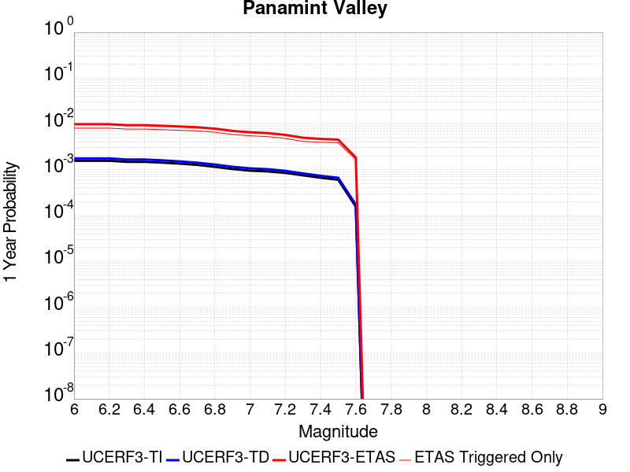 |  |

| Magnitude | 1 wk TI Prob | 1 wk TD Prob | 1 wk ETAS Prob | 1 wk ETAS/TD Gain | 1 wk ETAS Triggered Only | 1 mo TI Prob | 1 mo TD Prob | 1 mo ETAS Prob | 1 mo ETAS/TD Gain | 1 mo ETAS Triggered Only | 1 yr TI Prob | 1 yr TD Prob | 1 yr ETAS Prob | 1 yr ETAS/TD Gain | 1 yr ETAS Triggered Only | 10 yr TI Prob | 10 yr TD Prob | 10 yr ETAS Prob | 10 yr ETAS/TD Gain | 10 yr ETAS Triggered Only |
|-----|-----|-----|-----|-----|-----|-----|-----|-----|-----|-----|-----|-----|-----|-----|-----|-----|-----|-----|-----|-----|
| 6.0 | 3.0211835E-5 | 3.3986267E-5 | 0.0010539516 | 31.011103 | 0.00102 | 1.2947287E-4 | 1.4564747E-4 | 0.002915244 | 20.015755 | 0.00277 | 0.0015751923 | 0.0017718452 | 0.009857493 | 5.5634055 | 0.0081 | 0.015640736 | 0.017584037 | 0.032575704 | 1.8525726 | 0.01526 |
| 6.1 | 3.0211835E-5 | 3.3986267E-5 | 0.0010539516 | 31.011103 | 0.00102 | 1.2947287E-4 | 1.4564747E-4 | 0.002915244 | 20.015755 | 0.00277 | 0.0015751923 | 0.0017718452 | 0.009857493 | 5.5634055 | 0.0081 | 0.015640736 | 0.017584037 | 0.032575704 | 1.8525726 | 0.01526 |
| 6.2 | 3.0211835E-5 | 3.3986267E-5 | 0.0010539516 | 31.011103 | 0.00102 | 1.2947287E-4 | 1.4564747E-4 | 0.002915244 | 20.015755 | 0.00277 | 0.0015751923 | 0.0017718452 | 0.009857493 | 5.5634055 | 0.0081 | 0.015640736 | 0.017584037 | 0.032575704 | 1.8525726 | 0.01526 |
| 6.3 | 2.8573924E-5 | 3.2104348E-5 | 0.0010120729 | 31.52448 | 9.8E-4 | 1.2245393E-4 | 1.3758296E-4 | 0.0027772197 | 20.185783 | 0.00264 | 0.001489857 | 0.0016738133 | 0.009390875 | 5.6104674 | 0.00773 | 0.01479908 | 0.016618656 | 0.030671176 | 1.845587 | 0.01429 |
| 6.4 | 2.8573924E-5 | 3.2104348E-5 | 0.0010120729 | 31.52448 | 9.8E-4 | 1.2245393E-4 | 1.3758296E-4 | 0.0027772197 | 20.185783 | 0.00264 | 0.001489857 | 0.0016738133 | 0.009390875 | 5.6104674 | 0.00773 | 0.01479908 | 0.016618656 | 0.030671176 | 1.845587 | 0.01429 |
| 6.5 | 2.7468774E-5 | 3.083004E-5 | 0.0010107998 | 32.786198 | 9.8E-4 | 1.1771801E-4 | 1.3212221E-4 | 0.0027317787 | 20.676151 | 0.0026 | 0.0014322745 | 0.0016074283 | 0.009105356 | 5.6645494 | 0.00751 | 0.014230782 | 0.0159645 | 0.029554032 | 1.8512343 | 0.01381 |
| 6.6 | 2.6135967E-5 | 2.9254019E-5 | 9.992257E-4 | 34.156868 | 9.7E-4 | 1.1200648E-4 | 1.2536849E-4 | 0.0026350538 | 21.018469 | 0.00251 | 0.0013628257 | 0.0015253192 | 0.008794215 | 5.7654915 | 0.00728 | 0.013544982 | 0.015154834 | 0.02828282 | 1.8662573 | 0.01333 |
| 6.7 | 2.4498746E-5 | 2.7342825E-5 | 9.773169E-4 | 35.743084 | 9.5E-4 | 1.04990395E-4 | 1.1717841E-4 | 0.0025468937 | 21.735178 | 0.00243 | 0.0012775084 | 0.0014257386 | 0.008465687 | 5.9377556 | 0.00705 | 0.012701893 | 0.014172041 | 0.026692055 | 1.8834306 | 0.0127 |
| 6.8 | 2.2244329E-5 | 2.4936824E-5 | 9.249144E-4 | 37.090305 | 9.0E-4 | 9.532935E-5 | 1.0686785E-4 | 0.0024566166 | 22.987425 | 0.00235 | 0.0011600169 | 0.0013003612 | 0.007881792 | 6.0612326 | 0.00659 | 0.011539802 | 0.012933239 | 0.024501663 | 1.8944721 | 0.01172 |
| 6.9 | 1.9902658E-5 | 2.2291566E-5 | 8.1227394E-4 | 36.43862 | 7.9E-4 | 8.529431E-5 | 9.553189E-5 | 0.0022053304 | 23.084757 | 0.00211 | 0.0010379635 | 0.0011624986 | 0.0070456513 | 6.060783 | 0.00589 | 0.010331288 | 0.011569277 | 0.021868726 | 1.8902413 | 0.01042 |
| 7.0 | 1.8353881E-5 | 2.0567417E-5 | 7.805518E-4 | 37.950893 | 7.6E-4 | 7.865712E-5 | 8.814319E-5 | 0.0020579696 | 23.348026 | 0.00197 | 9.5722964E-4 | 0.0010726327 | 0.0065767225 | 6.1313834 | 0.00551 | 0.009531168 | 0.010679484 | 0.020285787 | 1.8995099 | 0.00971 |
| 7.1 | 1.7667631E-5 | 1.9773817E-5 | 7.497594E-4 | 37.916775 | 7.3E-4 | 7.571623E-5 | 8.474228E-5 | 0.0019845814 | 23.419022 | 0.0019 | 9.2145515E-4 | 0.0010312665 | 0.006315811 | 6.124325 | 0.00529 | 0.009176437 | 0.010269695 | 0.019493982 | 1.8982046 | 0.00932 |
| 7.2 | 1.6381597E-5 | 1.8159382E-5 | 7.181467E-4 | 39.546867 | 7.0E-4 | 7.020495E-5 | 7.78237E-5 | 0.0017876907 | 22.971031 | 0.00171 | 8.544101E-4 | 9.4710896E-4 | 0.005762544 | 6.0843515 | 0.00482 | 0.008511325 | 0.009435377 | 0.017558007 | 1.8608696 | 0.0082 |
| 7.3 | 1.4520491E-5 | 1.596737E-5 | 6.259576E-4 | 39.2023 | 6.1E-4 | 6.222919E-5 | 6.842988E-5 | 0.0015183307 | 22.188124 | 0.00145 | 7.57377E-4 | 8.3283155E-4 | 0.0049993587 | 6.002845 | 0.00417 | 0.0075480095 | 0.008300213 | 0.015291697 | 1.8423257 | 0.00705 |
| 7.4 | 1.2852287E-5 | 1.4146221E-5 | 5.6413846E-4 | 39.879093 | 5.5E-4 | 5.5080065E-5 | 6.0625338E-5 | 0.0014305423 | 23.596441 | 0.00137 | 6.7039346E-4 | 7.378793E-4 | 0.0047149425 | 6.389856 | 0.00398 | 0.0066837464 | 0.007357214 | 0.014047626 | 1.9093677 | 0.00674 |
| 7.5 | 1.1637851E-5 | 1.2837501E-5 | 5.428307E-4 | 42.284763 | 5.3E-4 | 4.987555E-5 | 5.501679E-5 | 0.0013849436 | 25.173107 | 0.00133 | 6.070656E-4 | 6.6963927E-4 | 0.004547041 | 6.7902846 | 0.00388 | 0.006054099 | 0.0066791116 | 0.013215163 | 1.978581 | 0.00658 |
| 7.6 | 3.0068115E-6 | 3.333306E-6 | 2.6333245E-4 | 79.00038 | 2.6E-4 | 1.2886271E-5 | 1.4285561E-5 | 6.4427656E-4 | 45.099846 | 6.3E-4 | 1.5687906E-4 | 1.739201E-4 | 0.0018536279 | 10.657928 | 0.00168 | 0.0015676835 | 0.0017392797 | 0.004544392 | 2.6128013 | 0.00281 |

## Garlock (East)
*[(top)](#table-of-contents)*

| 1 Week | 1 Month | 1 Year | 10 Year |
|-----|-----|-----|-----|
|  |  |  |  |

| Magnitude | 1 wk TI Prob | 1 wk TD Prob | 1 wk ETAS Prob | 1 wk ETAS/TD Gain | 1 wk ETAS Triggered Only | 1 mo TI Prob | 1 mo TD Prob | 1 mo ETAS Prob | 1 mo ETAS/TD Gain | 1 mo ETAS Triggered Only | 1 yr TI Prob | 1 yr TD Prob | 1 yr ETAS Prob | 1 yr ETAS/TD Gain | 1 yr ETAS Triggered Only | 10 yr TI Prob | 10 yr TD Prob | 10 yr ETAS Prob | 10 yr ETAS/TD Gain | 10 yr ETAS Triggered Only |
|-----|-----|-----|-----|-----|-----|-----|-----|-----|-----|-----|-----|-----|-----|-----|-----|-----|-----|-----|-----|-----|
| 6.0 | 4.5092507E-5 | 6.291034E-5 | 7.628663E-4 | 12.126247 | 7.0E-4 | 1.9323928E-4 | 2.6959038E-4 | 0.0024989892 | 9.269578 | 0.00223 | 0.0023501497 | 0.0032777686 | 0.010214956 | 3.1164358 | 0.00696 | 0.023254504 | 0.03235544 | 0.045099318 | 1.3938713 | 0.01317 |
| 6.1 | 4.5092507E-5 | 6.291034E-5 | 7.628663E-4 | 12.126247 | 7.0E-4 | 1.9323928E-4 | 2.6959038E-4 | 0.0024989892 | 9.269578 | 0.00223 | 0.0023501497 | 0.0032777686 | 0.010214956 | 3.1164358 | 0.00696 | 0.023254504 | 0.03235544 | 0.045099318 | 1.3938713 | 0.01317 |
| 6.2 | 2.6674514E-5 | 3.451529E-5 | 5.844963E-4 | 16.934416 | 5.5E-4 | 1.1431433E-4 | 1.4791447E-4 | 0.0018176675 | 12.288638 | 0.00167 | 0.0013908884 | 0.0017994043 | 0.0069201733 | 3.8458135 | 0.00513 | 0.01382215 | 0.017893167 | 0.02720354 | 1.5203311 | 0.00948 |
| 6.3 | 2.6674514E-5 | 3.451529E-5 | 5.844963E-4 | 16.934416 | 5.5E-4 | 1.1431433E-4 | 1.4791447E-4 | 0.0018176675 | 12.288638 | 0.00167 | 0.0013908884 | 0.0017994043 | 0.0069201733 | 3.8458135 | 0.00513 | 0.01382215 | 0.017893167 | 0.02720354 | 1.5203311 | 0.00948 |
| 6.4 | 2.5312667E-5 | 3.234442E-5 | 5.7232694E-4 | 17.694767 | 5.4E-4 | 1.0847834E-4 | 1.3861175E-4 | 0.001788383 | 12.902103 | 0.00165 | 0.0013199237 | 0.001686321 | 0.0066878726 | 3.9659545 | 0.00501 | 0.013121112 | 0.016781144 | 0.025866086 | 1.541378 | 0.00924 |
| 6.5 | 2.5312667E-5 | 3.234442E-5 | 5.7232694E-4 | 17.694767 | 5.4E-4 | 1.0847834E-4 | 1.3861175E-4 | 0.001788383 | 12.902103 | 0.00165 | 0.0013199237 | 0.001686321 | 0.0066878726 | 3.9659545 | 0.00501 | 0.013121112 | 0.016781144 | 0.025866086 | 1.541378 | 0.00924 |
| 6.6 | 2.246556E-5 | 2.8139062E-5 | 5.681239E-4 | 20.189865 | 5.4E-4 | 9.627742E-5 | 1.20590536E-4 | 0.0017403952 | 14.43227 | 0.00162 | 0.0011715472 | 0.0014672246 | 0.0062501966 | 4.259877 | 0.00479 | 0.011653901 | 0.014621371 | 0.023292704 | 1.5930587 | 0.0088 |
| 6.7 | 2.2241198E-5 | 2.7808788E-5 | 5.677938E-4 | 20.417782 | 5.4E-4 | 9.531594E-5 | 1.1917521E-4 | 0.0017389822 | 14.591811 | 0.00162 | 0.0011598538 | 0.0014500159 | 0.006213099 | 4.284849 | 0.00477 | 0.011538187 | 0.014451557 | 0.023075106 | 1.596721 | 0.00875 |
| 6.8 | 1.9528685E-5 | 2.3903114E-5 | 5.438907E-4 | 22.753967 | 5.2E-4 | 8.369167E-5 | 1.02438E-4 | 0.0016722772 | 16.324772 | 0.00157 | 0.0010184698 | 0.0012464889 | 0.005750867 | 4.613653 | 0.00451 | 0.010138147 | 0.012438961 | 0.020536961 | 1.6510191 | 0.0082 |
| 6.9 | 1.3318621E-5 | 1.5203129E-5 | 4.8519598E-4 | 31.914219 | 4.7E-4 | 5.7078556E-5 | 6.515467E-5 | 0.0014750628 | 22.639402 | 0.00141 | 6.9470983E-4 | 7.9297513E-4 | 0.00486974 | 6.1411 | 0.00408 | 0.0069254204 | 0.007942084 | 0.015134504 | 1.9056087 | 0.00725 |
| 7.0 | 1.1760853E-5 | 1.3111888E-5 | 4.8310572E-4 | 36.844864 | 4.7E-4 | 5.0402683E-5 | 5.619262E-5 | 0.001456114 | 25.912903 | 0.0014 | 6.134799E-4 | 6.839354E-4 | 0.0046712067 | 6.829894 | 0.00399 | 0.0061178906 | 0.006858643 | 0.0139000155 | 2.026642 | 0.00709 |
| 7.1 | 1.0064758E-5 | 1.0906889E-5 | 4.7090187E-4 | 43.17472 | 4.6E-4 | 4.3133965E-5 | 4.6742993E-5 | 0.001416679 | 30.307837 | 0.00137 | 5.2502943E-4 | 5.6895084E-4 | 0.0044167605 | 7.7629914 | 0.00385 | 0.005237907 | 0.0057150517 | 0.012416532 | 2.172602 | 0.00674 |
| 7.2 | 9.768808E-6 | 1.05027375E-5 | 4.704979E-4 | 44.797646 | 4.6E-4 | 4.186565E-5 | 4.5010976E-5 | 0.0013949502 | 30.991335 | 0.00135 | 5.095951E-4 | 5.478743E-4 | 0.004315809 | 7.87737 | 0.00377 | 0.0050842804 | 0.005505304 | 0.012098804 | 2.1976633 | 0.00663 |
| 7.3 | 9.344516E-6 | 9.948323E-6 | 4.3994404E-4 | 44.22293 | 4.3E-4 | 4.004731E-5 | 4.2634994E-5 | 0.0012925817 | 30.317389 | 0.00125 | 4.8746695E-4 | 5.189609E-4 | 0.003997155 | 7.7022276 | 0.00348 | 0.0048639905 | 0.005216946 | 0.011314966 | 2.168887 | 0.00613 |
| 7.4 | 9.023491E-6 | 9.49444E-6 | 3.7949093E-4 | 39.96981 | 3.7E-4 | 3.867153E-5 | 4.068984E-5 | 0.0011506446 | 28.278427 | 0.00111 | 4.7072413E-4 | 4.952895E-4 | 0.0037236898 | 7.518208 | 0.00323 | 0.004697283 | 0.0049803588 | 0.01060222 | 2.1288064 | 0.00565 |
| 7.5 | 7.081253E-6 | 7.091033E-6 | 1.3709012E-4 | 19.332884 | 1.3E-4 | 3.0347876E-5 | 3.038979E-5 | 5.703734E-4 | 18.768585 | 5.4E-4 | 3.6942272E-4 | 3.6993364E-4 | 0.0019293565 | 5.2154126 | 0.00156 | 0.003688092 | 0.003726062 | 0.0065056663 | 1.7459898 | 0.00279 |
| 7.6 | 6.116396E-6 | 5.962439E-6 | 1.05961844E-4 | 17.77156 | 1.0E-4 | 2.6212863E-5 | 2.5553061E-5 | 3.955436E-4 | 15.479304 | 3.7E-4 | 3.1909486E-4 | 3.1106436E-4 | 0.0013507409 | 4.3423195 | 0.00104 | 0.0031863707 | 0.0031374171 | 0.00493177 | 1.5719204 | 0.0018 |
| 7.7 | 4.797145E-6 | 4.7603035E-6 | 4.4760112E-5 | 9.402785 | 4.0E-5 | 2.055903E-5 | 2.0401141E-5 | 1.9039768E-4 | 9.332697 | 1.7E-4 | 2.5027743E-4 | 2.4835573E-4 | 7.082415E-4 | 2.851722 | 4.6E-4 | 0.0024999576 | 0.0025109209 | 0.0033488115 | 1.3336986 | 8.4E-4 |
| 7.8 | 3.4028885E-6 | 3.981157E-6 | 2.3981078E-5 | 6.023645 | 2.0E-5 | 1.4583726E-5 | 1.7061991E-5 | 1.3705995E-4 | 8.033056 | 1.2E-4 | 1.775424E-4 | 2.0771002E-4 | 5.076477E-4 | 2.4440212 | 3.0E-4 | 0.0017740062 | 0.002102626 | 0.0026714276 | 1.2705196 | 5.7E-4 |
| 7.9 | 2.5928412E-6 | 3.3747272E-6 | 1.33746935E-5 | 3.9631925 | 1.0E-5 | 1.1112129E-5 | 1.4463037E-5 | 1.1446159E-4 | 7.9140773 | 1.0E-4 | 1.3528178E-4 | 1.7607331E-4 | 4.260293E-4 | 2.4196131 | 2.5E-4 | 0.0013519945 | 0.0017824261 | 0.0022515883 | 1.2632155 | 4.7E-4 |
| 8.0 | 1.3743648E-6 | 1.6745075E-6 | 1.6745075E-6 | 1.0 | 0.0 | 5.8901214E-6 | 7.1764416E-6 | 3.7176225E-5 | 5.180315 | 3.0E-5 | 7.1709874E-5 | 8.73697E-5 | 1.3736534E-4 | 1.5722308 | 5.0E-5 | 7.1686733E-4 | 8.8426104E-4 | 0.0010341285 | 1.1694832 | 1.5E-4 |
| 8.1 | 3.6733252E-7 | 3.150841E-7 | 3.150841E-7 | 1.0 | 0.0 | 1.5742813E-6 | 1.3503599E-6 | 1.3503599E-6 | 1.0 | 0.0 | 1.9166706E-5 | 1.6440523E-5 | 2.6440359E-5 | 1.6082431 | 1.0E-5 | 1.9165053E-4 | 1.6648423E-4 | 1.9647923E-4 | 1.1801672 | 3.0E-5 |

## Ash Hill
*[(top)](#table-of-contents)*

| 1 Week | 1 Month | 1 Year | 10 Year |
|-----|-----|-----|-----|
|  |  |  |  |

| Magnitude | 1 wk TI Prob | 1 wk TD Prob | 1 wk ETAS Prob | 1 wk ETAS/TD Gain | 1 wk ETAS Triggered Only | 1 mo TI Prob | 1 mo TD Prob | 1 mo ETAS Prob | 1 mo ETAS/TD Gain | 1 mo ETAS Triggered Only | 1 yr TI Prob | 1 yr TD Prob | 1 yr ETAS Prob | 1 yr ETAS/TD Gain | 1 yr ETAS Triggered Only | 10 yr TI Prob | 10 yr TD Prob | 10 yr ETAS Prob | 10 yr ETAS/TD Gain | 10 yr ETAS Triggered Only |
|-----|-----|-----|-----|-----|-----|-----|-----|-----|-----|-----|-----|-----|-----|-----|-----|-----|-----|-----|-----|-----|
| 6.0 | 2.1545662E-5 | 2.3194918E-5 | 5.831819E-4 | 25.14266 | 5.6E-4 | 9.2335285E-5 | 9.9403456E-5 | 0.0016092533 | 16.18911 | 0.00151 | 0.0011236023 | 0.0012096452 | 0.0054445164 | 4.5009203 | 0.00424 | 0.011179381 | 0.012038592 | 0.019517459 | 1.6212411 | 0.00757 |
| 6.1 | 2.1545662E-5 | 2.3194918E-5 | 5.831819E-4 | 25.14266 | 5.6E-4 | 9.2335285E-5 | 9.9403456E-5 | 0.0016092533 | 16.18911 | 0.00151 | 0.0011236023 | 0.0012096452 | 0.0054445164 | 4.5009203 | 0.00424 | 0.011179381 | 0.012038592 | 0.019517459 | 1.6212411 | 0.00757 |
| 6.2 | 2.1545662E-5 | 2.3194918E-5 | 5.831819E-4 | 25.14266 | 5.6E-4 | 9.2335285E-5 | 9.9403456E-5 | 0.0016092533 | 16.18911 | 0.00151 | 0.0011236023 | 0.0012096452 | 0.0054445164 | 4.5009203 | 0.00424 | 0.011179381 | 0.012038592 | 0.019517459 | 1.6212411 | 0.00757 |
| 6.3 | 1.0025529E-5 | 1.074714E-5 | 2.3074477E-4 | 21.470343 | 2.2E-4 | 4.2965847E-5 | 4.605843E-5 | 6.6602987E-4 | 14.460542 | 6.2E-4 | 5.229836E-4 | 5.6063035E-4 | 0.0022097053 | 3.9414659 | 0.00165 | 0.005217545 | 0.0055934726 | 0.0085269725 | 1.5244504 | 0.00295 |
| 6.4 | 1.0025529E-5 | 1.074714E-5 | 2.3074477E-4 | 21.470343 | 2.2E-4 | 4.2965847E-5 | 4.605843E-5 | 6.6602987E-4 | 14.460542 | 6.2E-4 | 5.229836E-4 | 5.6063035E-4 | 0.0022097053 | 3.9414659 | 0.00165 | 0.005217545 | 0.0055934726 | 0.0085269725 | 1.5244504 | 0.00295 |
| 6.5 | 6.9617327E-6 | 7.4567747E-6 | 1.5745565E-4 | 21.115786 | 1.5E-4 | 2.9835655E-5 | 3.1957265E-5 | 4.6194353E-4 | 14.45504 | 4.3E-4 | 3.6318856E-4 | 3.8901888E-4 | 0.0015385716 | 3.9550047 | 0.00115 | 0.0036259557 | 0.0038842335 | 0.0058366205 | 1.5026441 | 0.00196 |
| 6.6 | 4.9919777E-6 | 5.346789E-6 | 1.153462E-4 | 21.572985 | 1.1E-4 | 2.1394015E-5 | 2.2914646E-5 | 3.3290754E-4 | 14.528155 | 3.1E-4 | 2.60441E-4 | 2.789568E-4 | 0.0010887309 | 3.9028654 | 8.1E-4 | 0.0026013597 | 0.002786725 | 0.00421274 | 1.5117171 | 0.00143 |
| 6.7 | 3.6630722E-6 | 3.924698E-6 | 9.392435E-5 | 23.93161 | 9.0E-5 | 1.5698786E-5 | 1.6820059E-5 | 2.168167E-4 | 12.890366 | 2.0E-4 | 1.9111596E-4 | 2.0477071E-4 | 7.4466015E-4 | 3.636556 | 5.4E-4 | 0.0019095168 | 0.0020463832 | 0.003064296 | 1.4974203 | 0.00102 |
| 6.8 | 2.5599613E-6 | 2.7449778E-6 | 5.274484E-5 | 19.215034 | 5.0E-5 | 1.0971216E-5 | 1.1764165E-5 | 1.4176263E-4 | 12.050378 | 1.3E-4 | 1.3356637E-4 | 1.4322424E-4 | 5.531655E-4 | 3.8622339 | 4.1E-4 | 0.0013348613 | 0.0014318044 | 0.0021707448 | 1.5160904 | 7.4E-4 |
| 6.9 | 1.7684905E-6 | 1.8969073E-6 | 3.189685E-5 | 16.815187 | 3.0E-5 | 7.579223E-6 | 8.129602E-6 | 8.812895E-5 | 10.8405 | 8.0E-5 | 9.2273134E-5 | 9.897791E-5 | 3.4895315E-4 | 3.525566 | 2.5E-4 | 9.223483E-4 | 9.897791E-4 | 0.0014493238 | 1.4642901 | 4.6E-4 |

## Hunter Mountain-Saline Valley
*[(top)](#table-of-contents)*

| 1 Week | 1 Month | 1 Year | 10 Year |
|-----|-----|-----|-----|
|  |  |  |  |

| Magnitude | 1 wk TI Prob | 1 wk TD Prob | 1 wk ETAS Prob | 1 wk ETAS/TD Gain | 1 wk ETAS Triggered Only | 1 mo TI Prob | 1 mo TD Prob | 1 mo ETAS Prob | 1 mo ETAS/TD Gain | 1 mo ETAS Triggered Only | 1 yr TI Prob | 1 yr TD Prob | 1 yr ETAS Prob | 1 yr ETAS/TD Gain | 1 yr ETAS Triggered Only | 10 yr TI Prob | 10 yr TD Prob | 10 yr ETAS Prob | 10 yr ETAS/TD Gain | 10 yr ETAS Triggered Only |
|-----|-----|-----|-----|-----|-----|-----|-----|-----|-----|-----|-----|-----|-----|-----|-----|-----|-----|-----|-----|-----|
| 6.0 | 4.5103672E-5 | 5.4573724E-5 | 6.445415E-4 | 11.810473 | 5.9E-4 | 1.9328714E-4 | 2.3386456E-4 | 0.0016735278 | 7.15597 | 0.00144 | 0.002350731 | 0.0028436917 | 0.0070018335 | 2.4622338 | 0.00417 | 0.023260195 | 0.028093647 | 0.034945585 | 1.2438964 | 0.00705 |
| 6.1 | 4.5103672E-5 | 5.4573724E-5 | 6.445415E-4 | 11.810473 | 5.9E-4 | 1.9328714E-4 | 2.3386456E-4 | 0.0016735278 | 7.15597 | 0.00144 | 0.002350731 | 0.0028436917 | 0.0070018335 | 2.4622338 | 0.00417 | 0.023260195 | 0.028093647 | 0.034945585 | 1.2438964 | 0.00705 |
| 6.2 | 3.9363465E-5 | 4.70663E-5 | 6.3703855E-4 | 13.534919 | 5.9E-4 | 1.6868966E-4 | 2.0169491E-4 | 0.0016414045 | 8.138056 | 0.00144 | 0.002051862 | 0.002452966 | 0.006582811 | 2.6836126 | 0.00414 | 0.020330196 | 0.024274953 | 0.03109527 | 1.2809612 | 0.00699 |
| 6.3 | 3.9363465E-5 | 4.70663E-5 | 6.3703855E-4 | 13.534919 | 5.9E-4 | 1.6868966E-4 | 2.0169491E-4 | 0.0016414045 | 8.138056 | 0.00144 | 0.002051862 | 0.002452966 | 0.006582811 | 2.6836126 | 0.00414 | 0.020330196 | 0.024274953 | 0.03109527 | 1.2809612 | 0.00699 |
| 6.4 | 3.2311684E-5 | 3.7953207E-5 | 6.179312E-4 | 16.281395 | 5.8E-4 | 1.384713E-4 | 1.6264687E-4 | 0.0015824159 | 9.729151 | 0.00142 | 0.0016845843 | 0.0019784998 | 0.0060504274 | 3.0580883 | 0.00408 | 0.016718714 | 0.019617606 | 0.026401853 | 1.3458244 | 0.00692 |
| 6.5 | 3.2311684E-5 | 3.7953207E-5 | 6.179312E-4 | 16.281395 | 5.8E-4 | 1.384713E-4 | 1.6264687E-4 | 0.0015824159 | 9.729151 | 0.00142 | 0.0016845843 | 0.0019784998 | 0.0060504274 | 3.0580883 | 0.00408 | 0.016718714 | 0.019617606 | 0.026401853 | 1.3458244 | 0.00692 |
| 6.6 | 2.9305844E-5 | 3.4183795E-5 | 6.14164E-4 | 17.966524 | 5.8E-4 | 1.2559042E-4 | 1.464941E-4 | 0.0015662861 | 10.691803 | 0.00142 | 0.0015279909 | 0.0017821693 | 0.005834934 | 3.2740626 | 0.00406 | 0.015175272 | 0.017686697 | 0.02446466 | 1.3832237 | 0.0069 |
| 6.7 | 2.7826512E-5 | 3.234612E-5 | 6.1232736E-4 | 18.930473 | 5.8E-4 | 1.19251024E-4 | 1.386192E-4 | 0.0015584223 | 11.242471 | 0.00142 | 0.0014509142 | 0.0016864425 | 0.0057395957 | 3.4033744 | 0.00406 | 0.014414776 | 0.016744133 | 0.023528598 | 1.4051846 | 0.0069 |
| 6.8 | 2.3389874E-5 | 2.6868218E-5 | 5.968529E-4 | 22.214087 | 5.7E-4 | 1.0023846E-4 | 1.15144685E-4 | 0.0015149835 | 13.157215 | 0.0014 | 0.00121972 | 0.0014010323 | 0.005425386 | 3.8724205 | 0.00403 | 0.01213047 | 0.0139282085 | 0.020692661 | 1.4856657 | 0.00686 |
| 6.9 | 2.069209E-5 | 2.3571341E-5 | 5.935579E-4 | 25.18134 | 5.7E-4 | 8.867737E-5 | 1.01016325E-4 | 0.001490876 | 14.758762 | 0.00139 | 0.0010791123 | 0.001229216 | 0.0052442746 | 4.2663574 | 0.00402 | 0.010738871 | 0.012229199 | 0.018995428 | 1.5532848 | 0.00685 |
| 7.0 | 1.7462342E-5 | 1.9634626E-5 | 5.896234E-4 | 30.029776 | 5.7E-4 | 7.483646E-5 | 8.414581E-5 | 0.0014740288 | 17.517555 | 0.00139 | 9.1075303E-4 | 0.0010240164 | 0.0050299102 | 4.911943 | 0.00401 | 0.009070295 | 0.010196611 | 0.01694707 | 1.6620296 | 0.00682 |
| 7.1 | 1.4807709E-5 | 1.6442658E-5 | 5.864333E-4 | 35.665356 | 5.7E-4 | 6.3460066E-5 | 7.0466725E-5 | 0.0014503695 | 20.58233 | 0.00138 | 7.723524E-4 | 8.576112E-4 | 0.004844189 | 5.648468 | 0.00399 | 0.007696735 | 0.008546002 | 0.015258146 | 1.7854133 | 0.00677 |
| 7.2 | 1.4180048E-5 | 1.5699208E-5 | 5.8569026E-4 | 37.30699 | 5.7E-4 | 6.077022E-5 | 6.728068E-5 | 0.0014471879 | 21.509708 | 0.00138 | 7.396263E-4 | 8.1885065E-4 | 0.0048055835 | 5.8686934 | 0.00399 | 0.0073716943 | 0.008161285 | 0.0148661155 | 1.821541 | 0.00676 |
| 7.3 | 1.3730402E-5 | 1.5172925E-5 | 5.851643E-4 | 38.56635 | 5.7E-4 | 5.8843252E-5 | 6.502529E-5 | 0.0014449356 | 22.221132 | 0.00138 | 7.161811E-4 | 7.9141144E-4 | 0.004778254 | 6.0376353 | 0.00399 | 0.007138774 | 0.007888863 | 0.014595534 | 1.8501443 | 0.00676 |
| 7.4 | 1.2810095E-5 | 1.4110082E-5 | 5.641023E-4 | 39.978672 | 5.5E-4 | 5.489925E-5 | 6.0470466E-5 | 0.0014203882 | 23.488958 | 0.00136 | 6.681934E-4 | 7.35995E-4 | 0.0046930807 | 6.376511 | 0.00396 | 0.006661878 | 0.0073384703 | 0.014009155 | 1.9090022 | 0.00672 |
| 7.5 | 1.1595659E-5 | 1.2801363E-5 | 5.427946E-4 | 42.401314 | 5.3E-4 | 4.9694736E-5 | 5.4861917E-5 | 0.0013747895 | 25.059086 | 0.00132 | 6.0486543E-4 | 6.6775485E-4 | 0.004525177 | 6.776705 | 0.00386 | 0.006032217 | 0.006660355 | 0.013176663 | 1.9783725 | 0.00656 |
| 7.6 | 2.997694E-6 | 3.3254314E-6 | 2.6332456E-4 | 79.18508 | 2.6E-4 | 1.28471975E-5 | 1.4251812E-5 | 6.4424286E-4 | 45.204273 | 6.3E-4 | 1.564034E-4 | 1.7350928E-4 | 0.0018532178 | 10.6807995 | 0.00168 | 0.0015629337 | 0.001735174 | 0.004540298 | 2.616624 | 0.00281 |

## Blackwater
*[(top)](#table-of-contents)*

| 1 Week | 1 Month | 1 Year | 10 Year |
|-----|-----|-----|-----|
|  |  |  |  |

| Magnitude | 1 wk TI Prob | 1 wk TD Prob | 1 wk ETAS Prob | 1 wk ETAS/TD Gain | 1 wk ETAS Triggered Only | 1 mo TI Prob | 1 mo TD Prob | 1 mo ETAS Prob | 1 mo ETAS/TD Gain | 1 mo ETAS Triggered Only | 1 yr TI Prob | 1 yr TD Prob | 1 yr ETAS Prob | 1 yr ETAS/TD Gain | 1 yr ETAS Triggered Only | 10 yr TI Prob | 10 yr TD Prob | 10 yr ETAS Prob | 10 yr ETAS/TD Gain | 10 yr ETAS Triggered Only |
|-----|-----|-----|-----|-----|-----|-----|-----|-----|-----|-----|-----|-----|-----|-----|-----|-----|-----|-----|-----|-----|
| 6.0 | 3.0708583E-5 | 3.309653E-5 | 3.4308629E-4 | 10.36623 | 3.1E-4 | 1.3160157E-4 | 1.4183533E-4 | 9.217247E-4 | 6.4985547 | 7.8E-4 | 0.0016010714 | 0.0017256141 | 0.0044708685 | 2.5908856 | 0.00275 | 0.015895851 | 0.017135985 | 0.022364821 | 1.3051378 | 0.00532 |
| 6.1 | 3.0708583E-5 | 3.309653E-5 | 3.4308629E-4 | 10.36623 | 3.1E-4 | 1.3160157E-4 | 1.4183533E-4 | 9.217247E-4 | 6.4985547 | 7.8E-4 | 0.0016010714 | 0.0017256141 | 0.0044708685 | 2.5908856 | 0.00275 | 0.015895851 | 0.017135985 | 0.022364821 | 1.3051378 | 0.00532 |
| 6.2 | 1.1707779E-5 | 1.2545361E-5 | 1.12544105E-4 | 8.970974 | 1.0E-4 | 5.017523E-5 | 5.3764776E-5 | 3.2375025E-4 | 6.0216055 | 2.7E-4 | 6.107122E-4 | 6.5439916E-4 | 0.0017336924 | 2.649289 | 0.00108 | 0.006090366 | 0.006525693 | 0.008453033 | 1.2953464 | 0.00194 |
| 6.3 | 1.1707779E-5 | 1.2545361E-5 | 1.12544105E-4 | 8.970974 | 1.0E-4 | 5.017523E-5 | 5.3764776E-5 | 3.2375025E-4 | 6.0216055 | 2.7E-4 | 6.107122E-4 | 6.5439916E-4 | 0.0017336924 | 2.649289 | 0.00108 | 0.006090366 | 0.006525693 | 0.008453033 | 1.2953464 | 0.00194 |
| 6.4 | 7.929244E-6 | 8.480254E-6 | 7.847966E-5 | 9.254399 | 7.0E-5 | 3.3982033E-5 | 3.6343463E-5 | 2.4633584E-4 | 6.7779956 | 2.1E-4 | 4.136527E-4 | 4.4239586E-4 | 0.0011620773 | 2.6267817 | 7.2E-4 | 0.0041288356 | 0.0044155573 | 0.005709817 | 1.2931136 | 0.0013 |
| 6.5 | 5.8832115E-6 | 6.286105E-6 | 2.628598E-5 | 4.1816006 | 2.0E-5 | 2.521352E-5 | 2.6940186E-5 | 1.3693722E-4 | 5.0830097 | 1.1E-4 | 3.0693135E-4 | 3.2794994E-4 | 8.1778923E-4 | 2.4936404 | 4.9E-4 | 0.0030650778 | 0.0032749132 | 0.0041320967 | 1.2617424 | 8.6E-4 |
| 6.6 | 5.8832115E-6 | 6.286105E-6 | 2.628598E-5 | 4.1816006 | 2.0E-5 | 2.521352E-5 | 2.6940186E-5 | 1.3693722E-4 | 5.0830097 | 1.1E-4 | 3.0693135E-4 | 3.2794994E-4 | 8.1778923E-4 | 2.4936404 | 4.9E-4 | 0.0030650778 | 0.0032749132 | 0.0041320967 | 1.2617424 | 8.6E-4 |
| 6.7 | 3.0715053E-6 | 3.2815258E-6 | 3.2815258E-6 | 1.0 | 0.0 | 1.3163528E-5 | 1.4063612E-5 | 7.4062766E-5 | 5.266269 | 6.0E-5 | 1.6025416E-4 | 1.7121219E-4 | 4.3116766E-4 | 2.5183234 | 2.6E-4 | 0.0016013865 | 0.0017109173 | 0.0021002502 | 1.2275579 | 3.9E-4 |
| 6.8 | 2.2722281E-6 | 2.428798E-6 | 2.428798E-6 | 1.0 | 0.0 | 9.738084E-6 | 1.0409098E-5 | 5.0408682E-5 | 4.842752 | 4.0E-5 | 1.1855473E-4 | 1.2672432E-4 | 2.467091E-4 | 1.9468174 | 1.2E-4 | 0.001184915 | 0.0012666107 | 0.0014963194 | 1.181357 | 2.3E-4 |
| 6.9 | 9.952399E-7 | 1.0653688E-6 | 1.0653688E-6 | 1.0 | 0.0 | 4.265307E-6 | 4.565861E-6 | 1.4565815E-5 | 3.1901574 | 1.0E-5 | 5.1928873E-5 | 5.5588458E-5 | 1.1558512E-4 | 2.0793009 | 6.0E-5 | 5.191674E-4 | 5.5579614E-4 | 6.357517E-4 | 1.1438577 | 8.0E-5 |
| 7.0 | 4.7385504E-7 | 5.075655E-7 | 5.075655E-7 | 1.0 | 0.0 | 2.0308057E-6 | 2.1752808E-6 | 2.1752808E-6 | 1.0 | 0.0 | 2.4724779E-5 | 2.6484044E-5 | 5.6483248E-5 | 2.1327276 | 3.0E-5 | 2.4722028E-4 | 2.6484043E-4 | 3.0482985E-4 | 1.1509943 | 4.0E-5 |

## Garlock (West)
*[(top)](#table-of-contents)*

| 1 Week | 1 Month | 1 Year | 10 Year |
|-----|-----|-----|-----|
|  |  |  |  |

| Magnitude | 1 wk TI Prob | 1 wk TD Prob | 1 wk ETAS Prob | 1 wk ETAS/TD Gain | 1 wk ETAS Triggered Only | 1 mo TI Prob | 1 mo TD Prob | 1 mo ETAS Prob | 1 mo ETAS/TD Gain | 1 mo ETAS Triggered Only | 1 yr TI Prob | 1 yr TD Prob | 1 yr ETAS Prob | 1 yr ETAS/TD Gain | 1 yr ETAS Triggered Only | 10 yr TI Prob | 10 yr TD Prob | 10 yr ETAS Prob | 10 yr ETAS/TD Gain | 10 yr ETAS Triggered Only |
|-----|-----|-----|-----|-----|-----|-----|-----|-----|-----|-----|-----|-----|-----|-----|-----|-----|-----|-----|-----|-----|
| 6.0 | 2.5181727E-5 | 2.520697E-5 | 2.652009E-4 | 10.520936 | 2.4E-4 | 1.0791722E-4 | 1.0802542E-4 | 0.0010679218 | 9.885838 | 9.6E-4 | 0.0013131002 | 0.0013144194 | 0.0040008835 | 3.043841 | 0.00269 | 0.013053683 | 0.013146939 | 0.01783449 | 1.3565508 | 0.00475 |
| 6.1 | 2.5077732E-5 | 2.5108038E-5 | 2.6510202E-4 | 10.558452 | 2.4E-4 | 1.0747157E-4 | 1.0760146E-4 | 0.0010674981 | 9.920852 | 9.6E-4 | 0.001307681 | 0.0013092639 | 0.003995742 | 3.0518997 | 0.00269 | 0.013000126 | 0.013095993 | 0.017783787 | 1.3579564 | 0.00475 |
| 6.2 | 2.494612E-5 | 2.498971E-5 | 2.649837E-4 | 10.603713 | 2.4E-4 | 1.0690756E-4 | 1.07094376E-4 | 0.0010669916 | 9.963096 | 9.6E-4 | 0.0013008224 | 0.0013030976 | 0.003989592 | 3.061622 | 0.00269 | 0.012932341 | 0.013035054 | 0.017723138 | 1.359652 | 0.00475 |
| 6.3 | 2.4733758E-5 | 2.4809067E-5 | 2.6480312E-4 | 10.673642 | 2.4E-4 | 1.0599751E-4 | 1.0632026E-4 | 0.0010662182 | 10.028363 | 9.6E-4 | 0.0012897556 | 0.0012936839 | 0.003980204 | 3.0766432 | 0.00269 | 0.012822957 | 0.012942018 | 0.017630544 | 1.3622715 | 0.00475 |
| 6.4 | 2.3237335E-5 | 2.318831E-5 | 2.6318274E-4 | 11.349803 | 2.4E-4 | 9.958477E-5 | 9.9374694E-5 | 0.0010592793 | 10.659447 | 9.6E-4 | 0.0012117702 | 0.0012092182 | 0.0038959654 | 3.2218878 | 0.00269 | 0.012051838 | 0.012106836 | 0.016799329 | 1.3875903 | 0.00475 |
| 6.5 | 2.2732203E-5 | 2.3002827E-5 | 2.6299732E-4 | 11.43326 | 2.4E-4 | 9.742009E-5 | 9.857984E-5 | 0.0010584852 | 10.73734 | 9.6E-4 | 0.0011854442 | 0.0011995515 | 0.0038763366 | 3.2314882 | 0.00268 | 0.011791403 | 0.012011218 | 0.016694285 | 1.389891 | 0.00474 |
| 6.6 | 2.1319436E-5 | 2.1782947E-5 | 2.6177772E-4 | 12.017553 | 2.4E-4 | 9.136581E-5 | 9.335216E-5 | 0.0010432635 | 11.175569 | 9.5E-4 | 0.001111811 | 0.0011359722 | 0.0038029393 | 3.3477395 | 0.00267 | 0.011062649 | 0.0113820825 | 0.016058246 | 1.4108354 | 0.00473 |
| 6.7 | 1.970802E-5 | 2.0402744E-5 | 2.6039785E-4 | 12.762884 | 2.4E-4 | 8.446021E-5 | 8.743741E-5 | 0.0010373543 | 11.863965 | 9.5E-4 | 0.001027818 | 0.0010640323 | 0.0037311914 | 3.5066524 | 0.00267 | 0.010230771 | 0.0106697725 | 0.015349304 | 1.4385784 | 0.00473 |
| 6.8 | 1.8744462E-5 | 1.9910338E-5 | 2.5990556E-4 | 13.053799 | 2.4E-4 | 8.033094E-5 | 8.532724E-5 | 0.0010352462 | 12.132657 | 9.5E-4 | 9.775903E-4 | 0.0010383658 | 0.0037055933 | 3.5686784 | 0.00267 | 0.009733009 | 0.010415533 | 0.015086371 | 1.4484494 | 0.00472 |
| 6.9 | 1.7559682E-5 | 1.8962646E-5 | 2.5895808E-4 | 13.656221 | 2.4E-4 | 7.5253614E-5 | 8.126596E-5 | 0.0010311888 | 12.689061 | 9.5E-4 | 9.158276E-4 | 9.889654E-4 | 0.003656325 | 3.6971211 | 0.00267 | 0.0091206245 | 0.009925983 | 0.014599132 | 1.4707997 | 0.00472 |
| 7.0 | 1.6794445E-5 | 1.82254E-5 | 2.5822103E-4 | 14.168195 | 2.4E-4 | 7.197421E-5 | 7.810653E-5 | 0.0010280323 | 13.161925 | 9.5E-4 | 8.759337E-4 | 9.505335E-4 | 0.0036080051 | 3.7957685 | 0.00266 | 0.008724891 | 0.00954486 | 0.014190094 | 1.486674 | 0.00469 |
| 7.1 | 1.6337795E-5 | 1.7726159E-5 | 2.577219E-4 | 14.539072 | 2.4E-4 | 7.0017246E-5 | 7.5967044E-5 | 0.0010258949 | 13.504472 | 9.5E-4 | 8.521265E-4 | 9.245077E-4 | 0.0035720577 | 3.8637404 | 0.00265 | 0.008488664 | 0.0092866905 | 0.013913321 | 1.4982002 | 0.00467 |
| 7.2 | 1.5780008E-5 | 1.7174763E-5 | 2.471708E-4 | 14.391512 | 2.3E-4 | 6.762685E-5 | 7.360406E-5 | 0.0010135348 | 13.770094 | 9.4E-4 | 8.2304585E-4 | 8.9576235E-4 | 0.0035234066 | 3.9334166 | 0.00263 | 0.008200042 | 0.009001516 | 0.013599749 | 1.5108287 | 0.00464 |
| 7.3 | 1.5058865E-5 | 1.6627771E-5 | 2.4662394E-4 | 14.832051 | 2.3E-4 | 6.45364E-5 | 7.1259936E-5 | 0.0010111929 | 14.190204 | 9.4E-4 | 7.854473E-4 | 8.6724554E-4 | 0.0034649908 | 3.9953976 | 0.0026 | 0.00782677 | 0.008718181 | 0.013278077 | 1.523033 | 0.0046 |
| 7.4 | 1.4887923E-5 | 1.6463711E-5 | 2.4645994E-4 | 14.969889 | 2.3E-4 | 6.380382E-5 | 7.055686E-5 | 9.90492E-4 | 14.038209 | 9.2E-4 | 7.7653467E-4 | 8.5869245E-4 | 0.0034065028 | 3.9670813 | 0.00255 | 0.0077382675 | 0.008633028 | 0.013114006 | 1.5190507 | 0.00452 |
| 7.5 | 1.4509299E-5 | 1.6055668E-5 | 2.2605229E-4 | 14.079284 | 2.1E-4 | 6.218123E-5 | 6.880819E-5 | 9.2874904E-4 | 13.497651 | 8.6E-4 | 7.567935E-4 | 8.37419E-4 | 0.003185451 | 3.8038917 | 0.00235 | 0.0075422134 | 0.008421303 | 0.012506607 | 1.4851155 | 0.00412 |
| 7.6 | 1.2756717E-5 | 1.4059411E-5 | 1.7405716E-4 | 12.380117 | 1.6E-4 | 5.4670498E-5 | 6.025323E-5 | 6.302189E-4 | 10.459503 | 5.7E-4 | 6.6541E-4 | 7.3333684E-4 | 0.0022921928 | 3.1257026 | 0.00156 | 0.006634211 | 0.0073861093 | 0.010095946 | 1.3668827 | 0.00273 |
| 7.7 | 1.0328985E-5 | 1.1468589E-5 | 8.1467784E-5 | 7.103558 | 7.0E-5 | 4.4266326E-5 | 4.915017E-5 | 3.6913445E-4 | 7.5103393 | 3.2E-4 | 5.388092E-4 | 5.982394E-4 | 0.0014177489 | 2.3698688 | 8.2E-4 | 0.0053750467 | 0.00604267 | 0.007523666 | 1.2450898 | 0.00149 |
| 7.8 | 7.0306583E-6 | 8.906025E-6 | 2.8905846E-5 | 3.2456508 | 2.0E-5 | 3.0131043E-5 | 3.816812E-5 | 2.0816163E-4 | 5.453809 | 1.7E-4 | 3.667837E-4 | 4.6459792E-4 | 9.1438886E-4 | 1.9681294 | 4.5E-4 | 0.003661789 | 0.0046986034 | 0.0055943746 | 1.1906463 | 9.0E-4 |
| 7.9 | 4.060633E-6 | 5.4691627E-6 | 1.5469108E-5 | 2.8284235 | 1.0E-5 | 1.7402595E-5 | 2.3439059E-5 | 1.3343648E-4 | 5.692911 | 1.1E-4 | 2.11856E-4 | 2.8533328E-4 | 5.8524765E-4 | 2.0511022 | 3.0E-4 | 0.0021165414 | 0.0028861589 | 0.0034844272 | 1.2072887 | 6.0E-4 |
| 8.0 | 1.6729537E-6 | 2.078796E-6 | 2.078796E-6 | 1.0 | 0.0 | 7.169782E-6 | 8.9090945E-6 | 3.8908827E-5 | 4.367316 | 3.0E-5 | 8.7288594E-5 | 1.0846286E-4 | 1.6845636E-4 | 1.5531248 | 6.0E-5 | 8.7254314E-4 | 0.0010976003 | 0.0012674137 | 1.1547133 | 1.7E-4 |
| 8.1 | 3.6733252E-7 | 3.150841E-7 | 3.150841E-7 | 1.0 | 0.0 | 1.5742813E-6 | 1.3503599E-6 | 1.3503599E-6 | 1.0 | 0.0 | 1.9166706E-5 | 1.6440523E-5 | 2.6440359E-5 | 1.6082431 | 1.0E-5 | 1.9165053E-4 | 1.6648423E-4 | 1.9647923E-4 | 1.1801672 | 3.0E-5 |

## McLean Lake
*[(top)](#table-of-contents)*

| 1 Week | 1 Month | 1 Year | 10 Year |
|-----|-----|-----|-----|
|  |  | 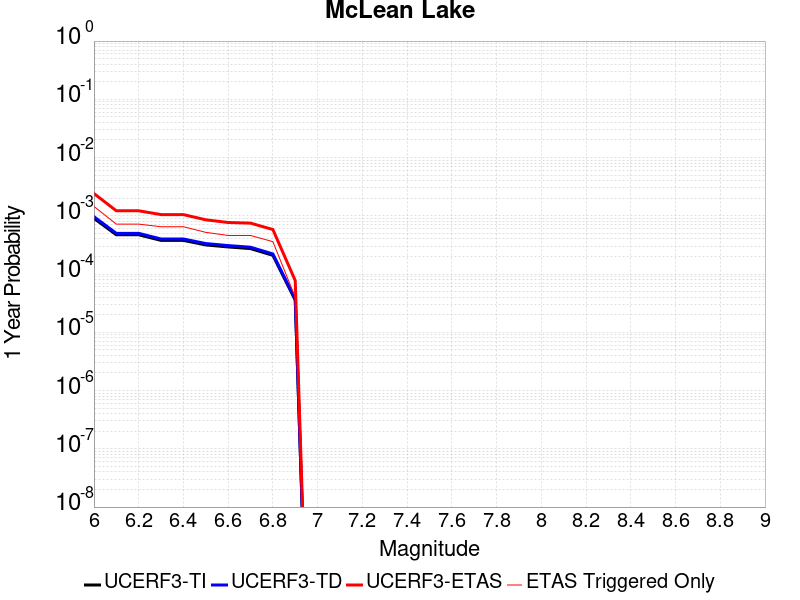 |  |

| Magnitude | 1 wk TI Prob | 1 wk TD Prob | 1 wk ETAS Prob | 1 wk ETAS/TD Gain | 1 wk ETAS Triggered Only | 1 mo TI Prob | 1 mo TD Prob | 1 mo ETAS Prob | 1 mo ETAS/TD Gain | 1 mo ETAS Triggered Only | 1 yr TI Prob | 1 yr TD Prob | 1 yr ETAS Prob | 1 yr ETAS/TD Gain | 1 yr ETAS Triggered Only | 10 yr TI Prob | 10 yr TD Prob | 10 yr ETAS Prob | 10 yr ETAS/TD Gain | 10 yr ETAS Triggered Only |
|-----|-----|-----|-----|-----|-----|-----|-----|-----|-----|-----|-----|-----|-----|-----|-----|-----|-----|-----|-----|-----|
| 6.0 | 1.7360222E-5 | 1.850195E-5 | 9.850047E-5 | 5.323788 | 8.0E-5 | 7.439883E-5 | 7.929194E-5 | 3.3927133E-4 | 4.278762 | 2.6E-4 | 9.0542925E-4 | 9.650004E-4 | 0.0024136011 | 2.50114 | 0.00145 | 0.009017491 | 0.009612942 | 0.01326747 | 1.3801675 | 0.00369 |
| 6.1 | 9.062689E-6 | 9.592342E-6 | 4.959196E-5 | 5.169953 | 4.0E-5 | 3.8839516E-5 | 4.110944E-5 | 1.9110327E-4 | 4.648647 | 1.5E-4 | 4.727685E-4 | 5.0040137E-4 | 0.0012200411 | 2.438125 | 7.2E-4 | 0.0047176396 | 0.004993629 | 0.0069537917 | 1.3925327 | 0.00197 |
| 6.2 | 9.062689E-6 | 9.592342E-6 | 4.959196E-5 | 5.169953 | 4.0E-5 | 3.8839516E-5 | 4.110944E-5 | 1.9110327E-4 | 4.648647 | 1.5E-4 | 4.727685E-4 | 5.0040137E-4 | 0.0012200411 | 2.438125 | 7.2E-4 | 0.0047176396 | 0.004993629 | 0.0069537917 | 1.3925327 | 0.00197 |
| 6.3 | 7.2575485E-6 | 7.667824E-6 | 2.7667671E-5 | 3.6082819 | 2.0E-5 | 3.110341E-5 | 3.286173E-5 | 1.6285745E-4 | 4.955839 | 1.3E-4 | 3.786182E-4 | 4.0002525E-4 | 0.0010497653 | 2.6242473 | 6.5E-4 | 0.0037797375 | 0.0039937566 | 0.005637167 | 1.4114949 | 0.00165 |
| 6.4 | 7.2575485E-6 | 7.667824E-6 | 2.7667671E-5 | 3.6082819 | 2.0E-5 | 3.110341E-5 | 3.286173E-5 | 1.6285745E-4 | 4.955839 | 1.3E-4 | 3.786182E-4 | 4.0002525E-4 | 0.0010497653 | 2.6242473 | 6.5E-4 | 0.0037797375 | 0.0039937566 | 0.005637167 | 1.4114949 | 0.00165 |
| 6.5 | 6.06582E-6 | 6.403972E-6 | 2.6403844E-5 | 4.1230416 | 2.0E-5 | 2.5996113E-5 | 2.7445341E-5 | 1.1744287E-4 | 4.2791553 | 9.0E-5 | 3.164567E-4 | 3.3410228E-4 | 8.5392856E-4 | 2.5558896 | 5.2E-4 | 0.0031600643 | 0.0033366384 | 0.004682134 | 1.4032488 | 0.00135 |
| 6.6 | 5.598744E-6 | 5.9103495E-6 | 2.591023E-5 | 4.3838744 | 2.0E-5 | 2.3994397E-5 | 2.532986E-5 | 1.0532783E-4 | 4.158248 | 8.0E-5 | 2.9209262E-4 | 3.083538E-4 | 7.6821196E-4 | 2.491333 | 4.6E-4 | 0.0029170897 | 0.0030798884 | 0.004296131 | 1.3948982 | 0.00122 |
| 6.7 | 5.246996E-6 | 5.539244E-6 | 2.5539133E-5 | 4.610581 | 2.0E-5 | 2.2486933E-5 | 2.3739436E-5 | 1.0373754E-4 | 4.36984 | 8.0E-5 | 2.73744E-4 | 2.8899565E-4 | 7.488627E-4 | 2.5912595 | 4.6E-4 | 0.0027340704 | 0.0028868222 | 0.004073387 | 1.411028 | 0.00119 |
| 6.8 | 4.02324E-6 | 4.246967E-6 | 1.4246924E-5 | 3.3546114 | 1.0E-5 | 1.7242342E-5 | 1.8201194E-5 | 8.819992E-5 | 4.8458314 | 7.0E-5 | 2.099053E-4 | 2.2158296E-4 | 5.815032E-4 | 2.6243136 | 3.6E-4 | 0.0020970714 | 0.0022142045 | 0.0031122118 | 1.4055665 | 9.0E-4 |
| 6.9 | 6.835972E-7 | 7.1400126E-7 | 1.0713994E-5 | 15.005568 | 1.0E-5 | 2.9296991E-6 | 3.0600036E-6 | 1.3059973E-5 | 4.26796 | 1.0E-5 | 3.56685E-5 | 3.7255224E-5 | 7.725373E-5 | 2.0736349 | 4.0E-5 | 3.5662777E-4 | 3.7252106E-4 | 4.8248007E-4 | 1.2951753 | 1.1E-4 |

## Goldstone Lake
*[(top)](#table-of-contents)*

| 1 Week | 1 Month | 1 Year | 10 Year |
|-----|-----|-----|-----|
|  |  |  |  |

| Magnitude | 1 wk TI Prob | 1 wk TD Prob | 1 wk ETAS Prob | 1 wk ETAS/TD Gain | 1 wk ETAS Triggered Only | 1 mo TI Prob | 1 mo TD Prob | 1 mo ETAS Prob | 1 mo ETAS/TD Gain | 1 mo ETAS Triggered Only | 1 yr TI Prob | 1 yr TD Prob | 1 yr ETAS Prob | 1 yr ETAS/TD Gain | 1 yr ETAS Triggered Only | 10 yr TI Prob | 10 yr TD Prob | 10 yr ETAS Prob | 10 yr ETAS/TD Gain | 10 yr ETAS Triggered Only |
|-----|-----|-----|-----|-----|-----|-----|-----|-----|-----|-----|-----|-----|-----|-----|-----|-----|-----|-----|-----|-----|
| 6.0 | 2.671352E-5 | 3.0377167E-5 | 9.0375346E-5 | 2.975108 | 6.0E-5 | 1.1448149E-4 | 1.3018247E-4 | 4.201447E-4 | 3.2273526 | 2.9E-4 | 0.001392921 | 0.0015840156 | 0.0029119088 | 1.8383082 | 0.00133 | 0.013842222 | 0.01574675 | 0.018669983 | 1.1856403 | 0.00297 |
| 6.1 | 2.671352E-5 | 3.0377167E-5 | 9.0375346E-5 | 2.975108 | 6.0E-5 | 1.1448149E-4 | 1.3018247E-4 | 4.201447E-4 | 3.2273526 | 2.9E-4 | 0.001392921 | 0.0015840156 | 0.0029119088 | 1.8383082 | 0.00133 | 0.013842222 | 0.01574675 | 0.018669983 | 1.1856403 | 0.00297 |
| 6.2 | 1.4197047E-5 | 1.6096787E-5 | 5.609614E-5 | 3.484928 | 4.0E-5 | 6.0843064E-5 | 6.898496E-5 | 2.4897253E-4 | 3.6090844 | 1.8E-4 | 7.4051257E-4 | 8.396669E-4 | 0.0016389951 | 1.9519588 | 8.0E-4 | 0.007380498 | 0.00837464 | 0.009961241 | 1.189453 | 0.0016 |
| 6.3 | 1.4197047E-5 | 1.6096787E-5 | 5.609614E-5 | 3.484928 | 4.0E-5 | 6.0843064E-5 | 6.898496E-5 | 2.4897253E-4 | 3.6090844 | 1.8E-4 | 7.4051257E-4 | 8.396669E-4 | 0.0016389951 | 1.9519588 | 8.0E-4 | 0.007380498 | 0.00837464 | 0.009961241 | 1.189453 | 0.0016 |
| 6.4 | 1.3238931E-5 | 1.5008963E-5 | 5.5008364E-5 | 3.6650343 | 4.0E-5 | 5.6737044E-5 | 6.4323096E-5 | 2.3431216E-4 | 3.6427376 | 1.7E-4 | 6.9055456E-4 | 7.8295026E-4 | 0.0015223708 | 1.944403 | 7.4E-4 | 0.006884126 | 0.007811545 | 0.009270062 | 1.186713 | 0.00147 |
| 6.5 | 1.3238931E-5 | 1.5008963E-5 | 5.5008364E-5 | 3.6650343 | 4.0E-5 | 5.6737044E-5 | 6.4323096E-5 | 2.3431216E-4 | 3.6427376 | 1.7E-4 | 6.9055456E-4 | 7.8295026E-4 | 0.0015223708 | 1.944403 | 7.4E-4 | 0.006884126 | 0.007811545 | 0.009270062 | 1.186713 | 0.00147 |
| 6.6 | 1.1328278E-5 | 1.2855597E-5 | 5.285508E-5 | 4.1114454 | 4.0E-5 | 4.8548856E-5 | 5.5094788E-5 | 2.1508598E-4 | 3.903926 | 1.6E-4 | 5.90922E-4 | 6.706683E-4 | 0.0013302256 | 1.983433 | 6.6E-4 | 0.0058935313 | 0.0066958326 | 0.007997061 | 1.194334 | 0.00131 |
| 6.7 | 8.651175E-6 | 9.824889E-6 | 4.9824495E-5 | 5.071253 | 4.0E-5 | 3.707594E-5 | 4.2106498E-5 | 1.821006E-4 | 4.3247623 | 1.4E-4 | 4.5130608E-4 | 5.126166E-4 | 0.0010223552 | 1.9943857 | 5.1E-4 | 0.0045039062 | 0.0051232204 | 0.006078302 | 1.1864221 | 9.6E-4 |
| 6.8 | 1.0215377E-6 | 1.1754883E-6 | 1.1754883E-6 | 1.0 | 0.0 | 4.378012E-6 | 5.0377976E-6 | 1.5037747E-5 | 2.9849844 | 1.0E-5 | 5.3300988E-5 | 6.133357E-5 | 8.133235E-5 | 1.3260657 | 2.0E-5 | 5.3288206E-4 | 6.131777E-4 | 6.331655E-4 | 1.032597 | 2.0E-5 |
| 6.9 | 7.9360774E-7 | 9.283521E-7 | 9.283521E-7 | 1.0 | 0.0 | 3.4011714E-6 | 3.9786464E-6 | 1.3978606E-5 | 3.5134077 | 1.0E-5 | 4.1408475E-5 | 4.843901E-5 | 5.8438527E-5 | 1.2064352 | 1.0E-5 | 4.140076E-4 | 4.8429155E-4 | 4.942867E-4 | 1.0206387 | 1.0E-5 |
| 7.0 | 7.4382757E-7 | 8.747442E-7 | 8.747442E-7 | 1.0 | 0.0 | 3.1878285E-6 | 3.7488987E-6 | 1.3748861E-5 | 3.66744 | 1.0E-5 | 3.8811122E-5 | 4.5641955E-5 | 5.56415E-5 | 1.2190866 | 1.0E-5 | 3.8804344E-4 | 4.5633246E-4 | 4.6632788E-4 | 1.0219039 | 1.0E-5 |
| 7.1 | 6.4709513E-7 | 7.711394E-7 | 7.711394E-7 | 1.0 | 0.0 | 2.773262E-6 | 3.3048793E-6 | 1.3304846E-5 | 4.0258193 | 1.0E-5 | 3.376394E-5 | 4.0236224E-5 | 5.023582E-5 | 1.2485223 | 1.0E-5 | 3.375881E-4 | 4.0229535E-4 | 4.1229132E-4 | 1.0248474 | 1.0E-5 |
| 7.2 | 6.356704E-7 | 7.5884515E-7 | 7.5884515E-7 | 1.0 | 0.0 | 2.7242988E-6 | 3.2521898E-6 | 1.3252157E-5 | 4.0748415 | 1.0E-5 | 3.3167835E-5 | 3.959475E-5 | 4.9594353E-5 | 1.2525487 | 1.0E-5 | 3.3162883E-4 | 3.958829E-4 | 4.0587893E-4 | 1.02525 | 1.0E-5 |
| 7.3 | 5.7695723E-7 | 6.89665E-7 | 6.89665E-7 | 1.0 | 0.0 | 2.4726714E-6 | 2.955704E-6 | 2.955704E-6 | 1.0 | 0.0 | 3.0104358E-5 | 3.5985162E-5 | 3.5985162E-5 | 1.0 | 0.0 | 3.0100282E-4 | 3.5979907E-4 | 3.5979907E-4 | 1.0 | 0.0 |
| 7.4 | 5.209647E-7 | 6.193585E-7 | 6.193585E-7 | 1.0 | 0.0 | 2.232704E-6 | 2.6543912E-6 | 2.6543912E-6 | 1.0 | 0.0 | 2.718283E-5 | 3.231679E-5 | 3.231679E-5 | 1.0 | 0.0 | 2.7179506E-4 | 3.2312647E-4 | 3.2312647E-4 | 1.0 | 0.0 |
| 7.5 | 4.512955E-7 | 5.3489435E-7 | 5.3489435E-7 | 1.0 | 0.0 | 1.934122E-6 | 2.2924028E-6 | 2.2924028E-6 | 1.0 | 0.0 | 2.3547682E-5 | 2.79097E-5 | 2.79097E-5 | 1.0 | 0.0 | 2.3545188E-4 | 2.7906726E-4 | 2.7906726E-4 | 1.0 | 0.0 |
| 7.6 | 2.21172E-7 | 2.6039865E-7 | 2.6039865E-7 | 1.0 | 0.0 | 9.478797E-7 | 1.115994E-6 | 1.115994E-6 | 1.0 | 0.0 | 1.1540374E-5 | 1.35871705E-5 | 1.35871705E-5 | 1.0 | 0.0 | 1.1539775E-4 | 1.3586621E-4 | 1.3586621E-4 | 1.0 | 0.0 |

## Gravel Hills-Harper Lk
*[(top)](#table-of-contents)*

| 1 Week | 1 Month | 1 Year | 10 Year |
|-----|-----|-----|-----|
|  | 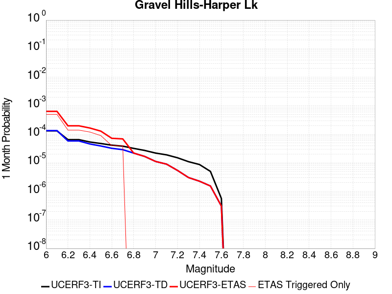 |  |  |

| Magnitude | 1 wk TI Prob | 1 wk TD Prob | 1 wk ETAS Prob | 1 wk ETAS/TD Gain | 1 wk ETAS Triggered Only | 1 mo TI Prob | 1 mo TD Prob | 1 mo ETAS Prob | 1 mo ETAS/TD Gain | 1 mo ETAS Triggered Only | 1 yr TI Prob | 1 yr TD Prob | 1 yr ETAS Prob | 1 yr ETAS/TD Gain | 1 yr ETAS Triggered Only | 10 yr TI Prob | 10 yr TD Prob | 10 yr ETAS Prob | 10 yr ETAS/TD Gain | 10 yr ETAS Triggered Only |
|-----|-----|-----|-----|-----|-----|-----|-----|-----|-----|-----|-----|-----|-----|-----|-----|-----|-----|-----|-----|-----|
| 6.0 | 3.0679566E-5 | 3.1465726E-5 | 1.9146068E-4 | 6.084738 | 1.6E-4 | 1.3147724E-4 | 1.3484736E-4 | 6.347799E-4 | 4.707396 | 5.0E-4 | 0.0015995599 | 0.0016407467 | 0.0032880395 | 2.0039897 | 0.00165 | 0.015880952 | 0.016307894 | 0.019416362 | 1.1906112 | 0.00316 |
| 6.1 | 3.0679566E-5 | 3.1465726E-5 | 1.9146068E-4 | 6.084738 | 1.6E-4 | 1.3147724E-4 | 1.3484736E-4 | 6.347799E-4 | 4.707396 | 5.0E-4 | 0.0015995599 | 0.0016407467 | 0.0032880395 | 2.0039897 | 0.00165 | 0.015880952 | 0.016307894 | 0.019416362 | 1.1906112 | 0.00316 |
| 6.2 | 1.514536E-5 | 1.363558E-5 | 7.3634765E-5 | 5.4001927 | 6.0E-5 | 6.490707E-5 | 5.8436955E-5 | 1.9842878E-4 | 3.3956041 | 1.4E-4 | 7.8995706E-4 | 7.112496E-4 | 0.0013108228 | 1.8429857 | 6.0E-4 | 0.007871548 | 0.0070909336 | 0.008063985 | 1.1372247 | 9.8E-4 |
| 6.3 | 1.514536E-5 | 1.363558E-5 | 7.3634765E-5 | 5.4001927 | 6.0E-5 | 6.490707E-5 | 5.8436955E-5 | 1.9842878E-4 | 3.3956041 | 1.4E-4 | 7.8995706E-4 | 7.112496E-4 | 0.0013108228 | 1.8429857 | 6.0E-4 | 0.007871548 | 0.0070909336 | 0.008063985 | 1.1372247 | 9.8E-4 |
| 6.4 | 1.2532521E-5 | 1.0689963E-5 | 6.068943E-5 | 5.677234 | 5.0E-5 | 5.37097E-5 | 4.5813358E-5 | 1.6580785E-4 | 3.6192033 | 1.2E-4 | 6.537194E-4 | 5.5764074E-4 | 9.0744556E-4 | 1.6272943 | 3.5E-4 | 0.0065179965 | 0.0055630044 | 0.0061497223 | 1.1054678 | 5.9E-4 |
| 6.5 | 1.1094058E-5 | 9.083887E-6 | 3.9083614E-5 | 4.302521 | 3.0E-5 | 4.7545094E-5 | 3.8930382E-5 | 1.2892688E-4 | 3.311729 | 9.0E-5 | 5.787078E-4 | 4.7387838E-4 | 7.5374567E-4 | 1.5905889 | 2.8E-4 | 0.0057720304 | 0.0047290865 | 0.005157053 | 1.0904967 | 4.3E-4 |
| 6.6 | 9.688328E-6 | 7.5318753E-6 | 2.7531725E-5 | 3.6553612 | 2.0E-5 | 4.1520743E-5 | 3.227908E-5 | 7.227779E-5 | 2.2391527 | 4.0E-5 | 5.053978E-4 | 3.9292948E-4 | 5.728588E-4 | 1.4579175 | 1.8E-4 | 0.0050424994 | 0.003922604 | 0.0041815843 | 1.0660225 | 2.6E-4 |
| 6.7 | 8.974824E-6 | 6.749573E-6 | 2.6749438E-5 | 3.9631305 | 2.0E-5 | 3.8462964E-5 | 2.8926434E-5 | 6.892528E-5 | 2.3827782 | 4.0E-5 | 4.6818596E-4 | 3.5212463E-4 | 4.8207885E-4 | 1.3690575 | 1.3E-4 | 0.004672008 | 0.0035158878 | 0.0037151845 | 1.0566846 | 2.0E-4 |
| 6.8 | 7.4780046E-6 | 5.116314E-6 | 5.116314E-6 | 1.0 | 0.0 | 3.20482E-5 | 2.1926882E-5 | 2.1926882E-5 | 1.0 | 0.0 | 3.9011694E-4 | 2.669285E-4 | 3.1691513E-4 | 1.1872661 | 5.0E-5 | 0.0038943281 | 0.0026662168 | 0.002755977 | 1.0336657 | 9.0E-5 |
| 6.9 | 6.3409307E-6 | 3.9075912E-6 | 3.9075912E-6 | 1.0 | 0.0 | 2.7175134E-5 | 1.6746717E-5 | 1.6746717E-5 | 1.0 | 0.0 | 3.3080703E-4 | 2.038732E-4 | 2.3386709E-4 | 1.1471202 | 3.0E-5 | 0.0033031502 | 0.0020369599 | 0.0020968376 | 1.0293957 | 6.0E-5 |
| 7.0 | 5.1239335E-6 | 2.605923E-6 | 2.605923E-6 | 1.0 | 0.0 | 2.195953E-5 | 1.1168196E-5 | 1.1168196E-5 | 1.0 | 0.0 | 2.6732447E-4 | 1.3596455E-4 | 1.5596184E-4 | 1.1470772 | 2.0E-5 | 0.0026700313 | 0.001358839 | 0.0013987846 | 1.0293969 | 4.0E-5 |
| 7.1 | 4.438899E-6 | 2.098529E-6 | 2.098529E-6 | 1.0 | 0.0 | 1.9023713E-5 | 8.993666E-6 | 8.993666E-6 | 1.0 | 0.0 | 2.315891E-4 | 1.094926E-4 | 1.294904E-4 | 1.1826408 | 2.0E-5 | 0.002313479 | 0.0010944083 | 0.0011243755 | 1.027382 | 3.0E-5 |
| 7.2 | 3.50367E-6 | 1.2616134E-6 | 1.2616134E-6 | 1.0 | 0.0 | 1.5015643E-5 | 5.4069037E-6 | 5.4069037E-6 | 1.0 | 0.0 | 1.8280011E-4 | 6.5827146E-5 | 7.582649E-5 | 1.151903 | 1.0E-5 | 0.0018264982 | 6.580847E-4 | 6.780715E-4 | 1.0303712 | 2.0E-5 |
| 7.3 | 2.561638E-6 | 7.1194825E-7 | 7.1194825E-7 | 1.0 | 0.0 | 1.0978401E-5 | 3.0512035E-6 | 3.0512035E-6 | 1.0 | 0.0 | 1.3365384E-4 | 3.7147787E-5 | 4.7147416E-5 | 1.2691851 | 1.0E-5 | 0.0013357349 | 3.714178E-4 | 3.8141408E-4 | 1.0269139 | 1.0E-5 |
| 7.4 | 2.0368864E-6 | 5.305101E-7 | 5.305101E-7 | 1.0 | 0.0 | 8.729483E-6 | 2.2736126E-6 | 2.2736126E-6 | 1.0 | 0.0 | 1.06276275E-4 | 2.7680888E-5 | 3.768061E-5 | 1.36125 | 1.0E-5 | 0.0010622547 | 2.7677492E-4 | 2.8677218E-4 | 1.0361204 | 1.0E-5 |
| 7.5 | 1.1681728E-6 | 3.603199E-7 | 3.603199E-7 | 1.0 | 0.0 | 5.0064455E-6 | 1.5442272E-6 | 1.5442272E-6 | 1.0 | 0.0 | 6.0951766E-5 | 1.8800809E-5 | 2.8800621E-5 | 1.531882 | 1.0E-5 | 6.093505E-4 | 1.8799266E-4 | 1.9799077E-4 | 1.0531836 | 1.0E-5 |
| 7.6 | 1.3154387E-7 | 7.119914E-8 | 7.119914E-8 | 1.0 | 0.0 | 5.6375933E-7 | 3.0513914E-7 | 3.0513914E-7 | 1.0 | 0.0 | 6.863748E-6 | 3.7150644E-6 | 3.7150644E-6 | 1.0 | 0.0 | 6.863536E-5 | 3.715018E-5 | 3.715018E-5 | 1.0 | 0.0 |

## Coyote Canyon
*[(top)](#table-of-contents)*

| 1 Week | 1 Month | 1 Year | 10 Year |
|-----|-----|-----|-----|
|  |  |  |  |

| Magnitude | 1 wk TI Prob | 1 wk TD Prob | 1 wk ETAS Prob | 1 wk ETAS/TD Gain | 1 wk ETAS Triggered Only | 1 mo TI Prob | 1 mo TD Prob | 1 mo ETAS Prob | 1 mo ETAS/TD Gain | 1 mo ETAS Triggered Only | 1 yr TI Prob | 1 yr TD Prob | 1 yr ETAS Prob | 1 yr ETAS/TD Gain | 1 yr ETAS Triggered Only | 10 yr TI Prob | 10 yr TD Prob | 10 yr ETAS Prob | 10 yr ETAS/TD Gain | 10 yr ETAS Triggered Only |
|-----|-----|-----|-----|-----|-----|-----|-----|-----|-----|-----|-----|-----|-----|-----|-----|-----|-----|-----|-----|-----|
| 6.0 | 3.5090034E-5 | 4.0365936E-5 | 7.0364724E-5 | 1.743171 | 3.0E-5 | 1.503772E-4 | 1.7298684E-4 | 3.62954E-4 | 2.0981593 | 1.9E-4 | 0.0018293047 | 0.0021043366 | 0.0030323796 | 1.4410145 | 9.3E-4 | 0.018143194 | 0.020870026 | 0.022838078 | 1.0943004 | 0.00201 |
| 6.1 | 3.5090034E-5 | 4.0365936E-5 | 7.0364724E-5 | 1.743171 | 3.0E-5 | 1.503772E-4 | 1.7298684E-4 | 3.62954E-4 | 2.0981593 | 1.9E-4 | 0.0018293047 | 0.0021043366 | 0.0030323796 | 1.4410145 | 9.3E-4 | 0.018143194 | 0.020870026 | 0.022838078 | 1.0943004 | 0.00201 |
| 6.2 | 1.841879E-5 | 2.1060594E-5 | 3.1060383E-5 | 1.4748104 | 1.0E-5 | 7.8935285E-5 | 9.025714E-5 | 1.7024993E-4 | 1.8862765 | 8.0E-5 | 9.606133E-4 | 0.0010984287 | 0.0015779015 | 1.4365078 | 4.8E-4 | 0.0095647145 | 0.010940081 | 0.012097281 | 1.1057762 | 0.00117 |
| 6.3 | 1.841879E-5 | 2.1060594E-5 | 3.1060383E-5 | 1.4748104 | 1.0E-5 | 7.8935285E-5 | 9.025714E-5 | 1.7024993E-4 | 1.8862765 | 8.0E-5 | 9.606133E-4 | 0.0010984287 | 0.0015779015 | 1.4365078 | 4.8E-4 | 0.0095647145 | 0.010940081 | 0.012097281 | 1.1057762 | 0.00117 |
| 6.4 | 1.712201E-5 | 1.9565952E-5 | 2.9565757E-5 | 1.5110819 | 1.0E-5 | 7.337798E-5 | 8.3851955E-5 | 1.5384608E-4 | 1.8347347 | 7.0E-5 | 8.930107E-4 | 0.00102052 | 0.0014700607 | 1.4405017 | 4.5E-4 | 0.008894307 | 0.010168254 | 0.011266967 | 1.1080533 | 0.00111 |
| 6.5 | 1.4744935E-5 | 1.6837605E-5 | 2.6837437E-5 | 1.5938987 | 1.0E-5 | 6.3191044E-5 | 7.2159695E-5 | 1.4215465E-4 | 1.9700006 | 7.0E-5 | 7.6907943E-4 | 8.782837E-4 | 0.0013178972 | 1.500537 | 4.4E-4 | 0.007664232 | 0.008757323 | 0.009788215 | 1.1177177 | 0.00104 |
| 6.6 | 1.2017839E-5 | 1.3724606E-5 | 1.3724606E-5 | 1.0 | 0.0 | 5.150401E-5 | 5.8818914E-5 | 9.881656E-5 | 1.6800133 | 4.0E-5 | 6.268809E-4 | 7.1597355E-4 | 0.0010757159 | 1.5024519 | 3.6E-4 | 0.0062511545 | 0.0071453624 | 0.008009146 | 1.1208873 | 8.7E-4 |
| 6.7 | 1.00956095E-5 | 1.1533953E-5 | 1.1533953E-5 | 1.0 | 0.0 | 4.326618E-5 | 4.943078E-5 | 7.9429294E-5 | 1.6068794 | 3.0E-5 | 5.266384E-4 | 6.0174055E-4 | 9.0156E-4 | 1.4982537 | 3.0E-4 | 0.005253921 | 0.0060096392 | 0.0067153727 | 1.1174335 | 7.1E-4 |

## So Sierra Nevada
*[(top)](#table-of-contents)*

| 1 Week | 1 Month | 1 Year | 10 Year |
|-----|-----|-----|-----|
|  |  |  |  |

| Magnitude | 1 wk TI Prob | 1 wk TD Prob | 1 wk ETAS Prob | 1 wk ETAS/TD Gain | 1 wk ETAS Triggered Only | 1 mo TI Prob | 1 mo TD Prob | 1 mo ETAS Prob | 1 mo ETAS/TD Gain | 1 mo ETAS Triggered Only | 1 yr TI Prob | 1 yr TD Prob | 1 yr ETAS Prob | 1 yr ETAS/TD Gain | 1 yr ETAS Triggered Only | 10 yr TI Prob | 10 yr TD Prob | 10 yr ETAS Prob | 10 yr ETAS/TD Gain | 10 yr ETAS Triggered Only |
|-----|-----|-----|-----|-----|-----|-----|-----|-----|-----|-----|-----|-----|-----|-----|-----|-----|-----|-----|-----|-----|
| 6.0 | 1.15488665E-5 | 1.1079801E-5 | 1.3107847E-4 | 11.8303995 | 1.2E-4 | 4.9494203E-5 | 4.7484067E-5 | 3.1747125E-4 | 6.6858478 | 2.7E-4 | 6.024253E-4 | 5.779779E-4 | 0.0017473017 | 3.0231287 | 0.00117 | 0.006007948 | 0.005766016 | 0.008003043 | 1.3879675 | 0.00225 |
| 6.1 | 1.15488665E-5 | 1.1079801E-5 | 1.3107847E-4 | 11.8303995 | 1.2E-4 | 4.9494203E-5 | 4.7484067E-5 | 3.1747125E-4 | 6.6858478 | 2.7E-4 | 6.024253E-4 | 5.779779E-4 | 0.0017473017 | 3.0231287 | 0.00117 | 0.006007948 | 0.005766016 | 0.008003043 | 1.3879675 | 0.00225 |
| 6.2 | 1.15488665E-5 | 1.1079801E-5 | 1.3107847E-4 | 11.8303995 | 1.2E-4 | 4.9494203E-5 | 4.7484067E-5 | 3.1747125E-4 | 6.6858478 | 2.7E-4 | 6.024253E-4 | 5.779779E-4 | 0.0017473017 | 3.0231287 | 0.00117 | 0.006007948 | 0.005766016 | 0.008003043 | 1.3879675 | 0.00225 |
| 6.3 | 1.15488665E-5 | 1.1079801E-5 | 1.3107847E-4 | 11.8303995 | 1.2E-4 | 4.9494203E-5 | 4.7484067E-5 | 3.1747125E-4 | 6.6858478 | 2.7E-4 | 6.024253E-4 | 5.779779E-4 | 0.0017473017 | 3.0231287 | 0.00117 | 0.006007948 | 0.005766016 | 0.008003043 | 1.3879675 | 0.00225 |
| 6.4 | 1.15488665E-5 | 1.1079801E-5 | 1.3107847E-4 | 11.8303995 | 1.2E-4 | 4.9494203E-5 | 4.7484067E-5 | 3.1747125E-4 | 6.6858478 | 2.7E-4 | 6.024253E-4 | 5.779779E-4 | 0.0017473017 | 3.0231287 | 0.00117 | 0.006007948 | 0.005766016 | 0.008003043 | 1.3879675 | 0.00225 |
| 6.5 | 1.15488665E-5 | 1.1079801E-5 | 1.3107847E-4 | 11.8303995 | 1.2E-4 | 4.9494203E-5 | 4.7484067E-5 | 3.1747125E-4 | 6.6858478 | 2.7E-4 | 6.024253E-4 | 5.779779E-4 | 0.0017473017 | 3.0231287 | 0.00117 | 0.006007948 | 0.005766016 | 0.008003043 | 1.3879675 | 0.00225 |
| 6.6 | 7.587044E-6 | 6.9357425E-6 | 6.6935325E-5 | 9.65078 | 6.0E-5 | 3.2515498E-5 | 2.972429E-5 | 1.8971953E-4 | 6.382643 | 1.6E-4 | 3.9580427E-4 | 3.6183605E-4 | 0.0011115647 | 3.072012 | 7.5E-4 | 0.003951 | 0.0036127607 | 0.004987775 | 1.3805994 | 0.00138 |
| 6.7 | 7.587044E-6 | 6.9357425E-6 | 6.6935325E-5 | 9.65078 | 6.0E-5 | 3.2515498E-5 | 2.972429E-5 | 1.8971953E-4 | 6.382643 | 1.6E-4 | 3.9580427E-4 | 3.6183605E-4 | 0.0011115647 | 3.072012 | 7.5E-4 | 0.003951 | 0.0036127607 | 0.004987775 | 1.3805994 | 0.00138 |
| 6.8 | 5.9026956E-6 | 5.1794805E-6 | 4.5179273E-5 | 8.722742 | 4.0E-5 | 2.5297022E-5 | 2.219759E-5 | 1.521947E-4 | 6.8563614 | 1.3E-4 | 3.0794772E-4 | 2.702233E-4 | 8.000801E-4 | 2.9608107 | 5.3E-4 | 0.0030752132 | 0.0026990636 | 0.0037063374 | 1.3731939 | 0.00101 |
| 6.9 | 5.0118915E-6 | 4.252503E-6 | 4.4252334E-5 | 10.406185 | 4.0E-5 | 2.1479358E-5 | 1.822489E-5 | 1.2822289E-4 | 7.035592 | 1.1E-4 | 2.614798E-4 | 2.2186617E-4 | 6.017819E-4 | 2.7123642 | 3.8E-4 | 0.0026117235 | 0.002216519 | 0.0030047682 | 1.3556247 | 7.9E-4 |
| 7.0 | 4.4924795E-6 | 3.71399E-6 | 4.371384E-5 | 11.770048 | 4.0E-5 | 1.925334E-5 | 1.5917007E-5 | 1.1591541E-4 | 7.2824883 | 1.0E-4 | 2.3438422E-4 | 1.9377295E-4 | 5.0371286E-4 | 2.5995004 | 3.1E-4 | 0.0023413717 | 0.0019361029 | 0.0025848444 | 1.335076 | 6.5E-4 |
| 7.1 | 3.9118436E-6 | 3.1120435E-6 | 4.311192E-5 | 13.8532505 | 4.0E-5 | 1.6764936E-5 | 1.3337264E-5 | 8.333633E-5 | 6.2483826 | 7.0E-5 | 2.0409399E-4 | 1.6236966E-4 | 3.8233394E-4 | 2.354713 | 2.2E-4 | 0.0020390663 | 0.0016225664 | 0.0021517065 | 1.326113 | 5.3E-4 |
| 7.2 | 3.4200818E-6 | 2.6055152E-6 | 4.260541E-5 | 16.35201 | 4.0E-5 | 1.4657411E-5 | 1.11664485E-5 | 8.1165665E-5 | 7.268709 | 7.0E-5 | 1.7843937E-4 | 1.3594353E-4 | 2.9592178E-4 | 2.1767993 | 1.6E-4 | 0.0017829615 | 0.0013586534 | 0.00175811 | 1.2940091 | 4.0E-4 |
| 7.3 | 2.6593618E-6 | 1.8284734E-6 | 2.1828437E-5 | 11.9380665 | 2.0E-5 | 1.13972155E-5 | 7.836293E-6 | 5.78359E-5 | 7.3805184 | 5.0E-5 | 1.3875226E-4 | 9.540298E-5 | 2.0539248E-4 | 2.1528938 | 1.1E-4 | 0.0013866565 | 9.5364917E-4 | 0.0011934203 | 1.2514249 | 2.4E-4 |
| 7.4 | 2.2577992E-6 | 1.4364865E-6 | 1.1436472E-5 | 7.96142 | 1.0E-5 | 9.676246E-6 | 6.1563574E-6 | 3.6156172E-5 | 5.8729815 | 3.0E-5 | 1.1780193E-4 | 7.495133E-5 | 1.5494533E-4 | 2.0672793 | 8.0E-5 | 0.001177395 | 7.4928557E-4 | 9.291507E-4 | 1.2400489 | 1.8E-4 |
| 7.5 | 1.489319E-6 | 7.354316E-7 | 1.0735424E-5 | 14.597446 | 1.0E-5 | 6.3827797E-6 | 3.1518462E-6 | 2.3151782E-5 | 7.3454676 | 2.0E-5 | 7.770758E-5 | 3.8373055E-5 | 8.837114E-5 | 2.3029475 | 5.0E-5 | 7.7680405E-4 | 3.8366474E-4 | 4.8362635E-4 | 1.2605442 | 1.0E-4 |
| 7.6 | 1.0680322E-6 | 4.6599368E-7 | 1.0465989E-5 | 22.459509 | 1.0E-5 | 4.577273E-6 | 1.9971142E-6 | 1.1997095E-5 | 6.007215 | 1.0E-5 | 5.5726876E-5 | 2.4314597E-5 | 4.431411E-5 | 1.8225311 | 2.0E-5 | 5.5712904E-4 | 2.4311963E-4 | 2.9310747E-4 | 1.20561 | 5.0E-5 |
| 7.7 | 5.509146E-7 | 1.5581914E-7 | 1.5581914E-7 | 1.0 | 0.0 | 2.3610605E-6 | 6.6779614E-7 | 6.6779614E-7 | 1.0 | 0.0 | 2.8745531E-5 | 8.130389E-6 | 8.130389E-6 | 1.0 | 0.0 | 2.8741814E-4 | 8.130103E-5 | 8.130103E-5 | 1.0 | 0.0 |

## San Andreas (Mojave S)
*[(top)](#table-of-contents)*

| 1 Week | 1 Month | 1 Year | 10 Year |
|-----|-----|-----|-----|
|  |  |  |  |

| Magnitude | 1 wk TI Prob | 1 wk TD Prob | 1 wk ETAS Prob | 1 wk ETAS/TD Gain | 1 wk ETAS Triggered Only | 1 mo TI Prob | 1 mo TD Prob | 1 mo ETAS Prob | 1 mo ETAS/TD Gain | 1 mo ETAS Triggered Only | 1 yr TI Prob | 1 yr TD Prob | 1 yr ETAS Prob | 1 yr ETAS/TD Gain | 1 yr ETAS Triggered Only | 10 yr TI Prob | 10 yr TD Prob | 10 yr ETAS Prob | 10 yr ETAS/TD Gain | 10 yr ETAS Triggered Only |
|-----|-----|-----|-----|-----|-----|-----|-----|-----|-----|-----|-----|-----|-----|-----|-----|-----|-----|-----|-----|-----|
| 6.0 | 3.1064058E-4 | 6.7480345E-4 | 7.447562E-4 | 1.1036639 | 7.0E-5 | 0.0013306376 | 0.0028889377 | 0.0032279554 | 1.1173503 | 3.4E-4 | 0.016080605 | 0.03463161 | 0.0355294 | 1.0259241 | 9.3E-4 | 0.1496549 | 0.2866709 | 0.28794062 | 1.0044292 | 0.00178 |
| 6.1 | 3.1064058E-4 | 6.7480345E-4 | 7.447562E-4 | 1.1036639 | 7.0E-5 | 0.0013306376 | 0.0028889377 | 0.0032279554 | 1.1173503 | 3.4E-4 | 0.016080605 | 0.03463161 | 0.0355294 | 1.0259241 | 9.3E-4 | 0.1496549 | 0.2866709 | 0.28794062 | 1.0044292 | 0.00178 |
| 6.2 | 3.1064058E-4 | 6.7480345E-4 | 7.447562E-4 | 1.1036639 | 7.0E-5 | 0.0013306376 | 0.0028889377 | 0.0032279554 | 1.1173503 | 3.4E-4 | 0.016080605 | 0.03463161 | 0.0355294 | 1.0259241 | 9.3E-4 | 0.1496549 | 0.2866709 | 0.28794062 | 1.0044292 | 0.00178 |
| 6.3 | 3.1064058E-4 | 6.7480345E-4 | 7.447562E-4 | 1.1036639 | 7.0E-5 | 0.0013306376 | 0.0028889377 | 0.0032279554 | 1.1173503 | 3.4E-4 | 0.016080605 | 0.03463161 | 0.0355294 | 1.0259241 | 9.3E-4 | 0.1496549 | 0.2866709 | 0.28794062 | 1.0044292 | 0.00178 |
| 6.4 | 1.9872203E-4 | 4.3197922E-4 | 5.01949E-4 | 1.1619748 | 7.0E-5 | 8.5138786E-4 | 0.0018500541 | 0.0021794436 | 1.1780431 | 3.3E-4 | 0.010316478 | 0.022297915 | 0.023089854 | 1.0355163 | 8.1E-4 | 0.098504856 | 0.1970686 | 0.1983292 | 1.0063968 | 0.00157 |
| 6.5 | 1.291105E-4 | 2.8770286E-4 | 3.476856E-4 | 1.2084885 | 6.0E-5 | 5.5321335E-4 | 0.0012324324 | 0.0015420504 | 1.2512251 | 3.1E-4 | 0.006714592 | 0.014902458 | 0.015641281 | 1.0495772 | 7.5E-4 | 0.065152965 | 0.13810734 | 0.13934848 | 1.0089867 | 0.00144 |
| 6.6 | 1.291105E-4 | 2.8770286E-4 | 3.476856E-4 | 1.2084885 | 6.0E-5 | 5.5321335E-4 | 0.0012324324 | 0.0015420504 | 1.2512251 | 3.1E-4 | 0.006714592 | 0.014902458 | 0.015641281 | 1.0495772 | 7.5E-4 | 0.065152965 | 0.13810734 | 0.13934848 | 1.0089867 | 0.00144 |
| 6.7 | 1.08001186E-4 | 2.4351236E-4 | 3.0349774E-4 | 1.2463341 | 6.0E-5 | 4.6278012E-4 | 0.0010432076 | 0.001332905 | 1.2776988 | 2.9E-4 | 0.0056198016 | 0.012627386 | 0.013338294 | 1.056299 | 7.2E-4 | 0.054797906 | 0.11925044 | 0.12045707 | 1.0101185 | 0.00137 |
| 6.8 | 1.0624356E-4 | 2.3868853E-4 | 2.9867422E-4 | 1.2513136 | 6.0E-5 | 4.5525006E-4 | 0.0010225503 | 0.0013122538 | 1.2833146 | 2.9E-4 | 0.0055285925 | 0.01237876 | 0.013089847 | 1.0574441 | 7.2E-4 | 0.053930566 | 0.11719959 | 0.11840903 | 1.0103195 | 0.00137 |
| 6.9 | 1.0393785E-4 | 2.323913E-4 | 2.9237737E-4 | 1.2581252 | 6.0E-5 | 4.4537184E-4 | 9.95583E-4 | 0.0012852943 | 1.2909966 | 2.9E-4 | 0.0054089287 | 0.012054106 | 0.012765427 | 1.0590106 | 7.2E-4 | 0.05279156 | 0.11449702 | 0.11571016 | 1.0105953 | 0.00137 |
| 7.0 | 1.0155622E-4 | 2.2608582E-4 | 2.8607226E-4 | 1.2653259 | 6.0E-5 | 4.3516833E-4 | 9.685798E-4 | 0.0012582989 | 1.2991174 | 2.9E-4 | 0.005285311 | 0.011728923 | 0.012430595 | 1.0598241 | 7.1E-4 | 0.05161361 | 0.111757115 | 0.11295624 | 1.0107298 | 0.00135 |
| 7.1 | 9.885595E-5 | 2.1896887E-4 | 2.7895573E-4 | 1.2739515 | 6.0E-5 | 4.2359953E-4 | 9.381008E-4 | 0.0012278288 | 1.3088452 | 2.9E-4 | 0.0051451353 | 0.011361765 | 0.012063698 | 1.0617803 | 7.1E-4 | 0.05027629 | 0.108641416 | 0.10983584 | 1.0109942 | 0.00134 |
| 7.2 | 9.6411415E-5 | 2.125978E-4 | 2.7258505E-4 | 1.282163 | 6.0E-5 | 4.1312634E-4 | 9.108156E-4 | 0.0012005515 | 1.3181059 | 2.9E-4 | 0.005018219 | 0.011032978 | 0.011735145 | 1.0636425 | 7.1E-4 | 0.049064007 | 0.105831034 | 0.10702922 | 1.0113217 | 0.00134 |
| 7.3 | 9.1180635E-5 | 1.9487667E-4 | 2.5486498E-4 | 1.307827 | 6.0E-5 | 3.907156E-4 | 8.3491846E-4 | 0.0011246763 | 1.3470494 | 2.9E-4 | 0.004746591 | 0.010117867 | 0.010810784 | 1.0684845 | 7.0E-4 | 0.046464786 | 0.098022886 | 0.099213496 | 1.0121462 | 0.00132 |
| 7.4 | 8.887388E-5 | 1.8736067E-4 | 2.473494E-4 | 1.320178 | 6.0E-5 | 3.8083247E-4 | 8.0272724E-4 | 0.0010924945 | 1.3609784 | 2.9E-4 | 0.0046267817 | 0.009729506 | 0.010422695 | 1.0712461 | 7.0E-4 | 0.045316286 | 0.094657235 | 0.095852286 | 1.0126251 | 0.00132 |
| 7.5 | 8.6750515E-5 | 1.8067459E-4 | 2.4066375E-4 | 1.3320287 | 6.0E-5 | 3.7173493E-4 | 7.7408995E-4 | 0.0010638655 | 1.3743435 | 2.9E-4 | 0.004516484 | 0.009383905 | 0.010077336 | 1.0738958 | 7.0E-4 | 0.04425787 | 0.09162046 | 0.09281044 | 1.0129881 | 0.00131 |
| 7.6 | 8.453092E-5 | 1.7454862E-4 | 2.3453815E-4 | 1.3436837 | 6.0E-5 | 3.6222505E-4 | 7.4785115E-4 | 0.0010276417 | 1.3741261 | 2.8E-4 | 0.0044011753 | 0.009067151 | 0.009750894 | 1.0754089 | 6.9E-4 | 0.04315024 | 0.088778876 | 0.089963466 | 1.0133431 | 0.0013 |
| 7.7 | 8.259102E-5 | 1.6976826E-4 | 2.2975808E-4 | 1.3533629 | 6.0E-5 | 3.539135E-4 | 7.2737545E-4 | 0.0010071718 | 1.3846656 | 2.8E-4 | 0.004300386 | 0.008819905 | 0.00950382 | 1.0775422 | 6.9E-4 | 0.042181134 | 0.0865291 | 0.08771662 | 1.0137239 | 0.0013 |
| 7.8 | 7.444844E-5 | 1.5297718E-4 | 1.829726E-4 | 1.1960777 | 3.0E-5 | 3.1902574E-4 | 6.554518E-4 | 8.6531416E-4 | 1.3201797 | 2.1E-4 | 0.0038772223 | 0.007950976 | 0.008496603 | 1.0686239 | 5.5E-4 | 0.03810269 | 0.078354426 | 0.07932215 | 1.0123507 | 0.00105 |
| 7.9 | 5.2586525E-5 | 1.0016126E-4 | 1.2015926E-4 | 1.199658 | 2.0E-5 | 2.2535135E-4 | 4.2919195E-4 | 5.791276E-4 | 1.349344 | 1.5E-4 | 0.0027402006 | 0.0052129035 | 0.0055909227 | 1.0725161 | 3.8E-4 | 0.027066574 | 0.05224533 | 0.052927714 | 1.0130612 | 7.2E-4 |
| 8.0 | 3.379877E-5 | 5.4130138E-5 | 6.41296E-5 | 1.1847299 | 1.0E-5 | 1.4484383E-4 | 2.3196569E-4 | 2.819541E-4 | 1.2154992 | 5.0E-5 | 0.0017620471 | 0.0028205265 | 0.0029102727 | 1.031819 | 9.0E-5 | 0.017481409 | 0.028862298 | 0.029075949 | 1.0074024 | 2.2E-4 |
| 8.1 | 1.8668277E-5 | 1.9335645E-5 | 1.9335645E-5 | 1.0 | 0.0 | 8.000444E-5 | 8.286442E-5 | 8.286442E-5 | 1.0 | 0.0 | 9.736188E-4 | 0.001008408 | 0.0010183979 | 1.0099066 | 1.0E-5 | 0.009693642 | 0.010812608 | 0.010862067 | 1.0045742 | 5.0E-5 |
| 8.2 | 8.541571E-6 | 5.470761E-6 | 5.470761E-6 | 1.0 | 0.0 | 3.660622E-5 | 2.344591E-5 | 2.344591E-5 | 1.0 | 0.0 | 4.455896E-4 | 2.8541664E-4 | 2.8541664E-4 | 1.0 | 0.0 | 0.0044469717 | 0.0032462394 | 0.0032462394 | 1.0 | 0.0 |
| 8.3 | 1.983087E-6 | 7.676691E-7 | 7.676691E-7 | 1.0 | 0.0 | 8.498917E-6 | 3.2900064E-6 | 3.2900064E-6 | 1.0 | 0.0 | 1.034694E-4 | 4.005511E-5 | 4.005511E-5 | 1.0 | 0.0 | 0.0010342124 | 4.729315E-4 | 4.729315E-4 | 1.0 | 0.0 |

## Death Valley (So)
*[(top)](#table-of-contents)*

| 1 Week | 1 Month | 1 Year | 10 Year |
|-----|-----|-----|-----|
|  | 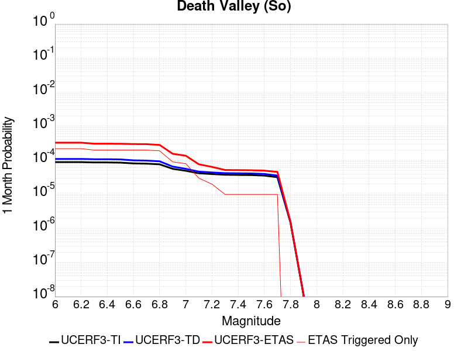 | 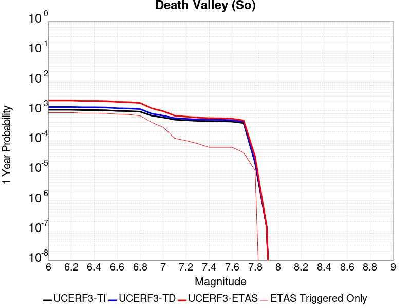 |  |

| Magnitude | 1 wk TI Prob | 1 wk TD Prob | 1 wk ETAS Prob | 1 wk ETAS/TD Gain | 1 wk ETAS Triggered Only | 1 mo TI Prob | 1 mo TD Prob | 1 mo ETAS Prob | 1 mo ETAS/TD Gain | 1 mo ETAS Triggered Only | 1 yr TI Prob | 1 yr TD Prob | 1 yr ETAS Prob | 1 yr ETAS/TD Gain | 1 yr ETAS Triggered Only | 10 yr TI Prob | 10 yr TD Prob | 10 yr ETAS Prob | 10 yr ETAS/TD Gain | 10 yr ETAS Triggered Only |
|-----|-----|-----|-----|-----|-----|-----|-----|-----|-----|-----|-----|-----|-----|-----|-----|-----|-----|-----|-----|-----|
| 6.0 | 2.0684236E-5 | 2.5619069E-5 | 7.561779E-5 | 2.9516213 | 5.0E-5 | 8.864371E-5 | 1.0979148E-4 | 3.2976732E-4 | 3.0035784 | 2.2E-4 | 0.0010787029 | 0.0013359085 | 0.0022047462 | 1.6503721 | 8.7E-4 | 0.010734817 | 0.013282061 | 0.015196294 | 1.1441216 | 0.00194 |
| 6.1 | 2.0684236E-5 | 2.5619069E-5 | 7.561779E-5 | 2.9516213 | 5.0E-5 | 8.864371E-5 | 1.0979148E-4 | 3.2976732E-4 | 3.0035784 | 2.2E-4 | 0.0010787029 | 0.0013359085 | 0.0022047462 | 1.6503721 | 8.7E-4 | 0.010734817 | 0.013282061 | 0.015196294 | 1.1441216 | 0.00194 |
| 6.2 | 2.0684236E-5 | 2.5619069E-5 | 7.561779E-5 | 2.9516213 | 5.0E-5 | 8.864371E-5 | 1.0979148E-4 | 3.2976732E-4 | 3.0035784 | 2.2E-4 | 0.0010787029 | 0.0013359085 | 0.0022047462 | 1.6503721 | 8.7E-4 | 0.010734817 | 0.013282061 | 0.015196294 | 1.1441216 | 0.00194 |
| 6.3 | 2.0240292E-5 | 2.5119136E-5 | 6.511813E-5 | 2.5923715 | 4.0E-5 | 8.6741224E-5 | 1.07649095E-4 | 3.0762758E-4 | 2.8576884 | 2.0E-4 | 0.0010555626 | 0.0013098564 | 0.0021387693 | 1.6328272 | 8.3E-4 | 0.010505628 | 0.013024611 | 0.014860386 | 1.1409465 | 0.00186 |
| 6.4 | 2.0240292E-5 | 2.5119136E-5 | 6.511813E-5 | 2.5923715 | 4.0E-5 | 8.6741224E-5 | 1.07649095E-4 | 3.0762758E-4 | 2.8576884 | 2.0E-4 | 0.0010555626 | 0.0013098564 | 0.0021387693 | 1.6328272 | 8.3E-4 | 0.010505628 | 0.013024611 | 0.014860386 | 1.1409465 | 0.00186 |
| 6.5 | 1.9962767E-5 | 2.480838E-5 | 6.4807384E-5 | 2.6123185 | 4.0E-5 | 8.55519E-5 | 1.06317384E-4 | 3.0629613E-4 | 2.8809597 | 2.0E-4 | 0.0010410968 | 0.0012936622 | 0.0021126014 | 1.6330394 | 8.2E-4 | 0.010362327 | 0.012864553 | 0.014680883 | 1.1411886 | 0.00184 |
| 6.6 | 1.8937297E-5 | 2.3312172E-5 | 6.331124E-5 | 2.7158017 | 4.0E-5 | 8.115732E-5 | 9.990556E-5 | 2.9988558E-4 | 3.0016904 | 2.0E-4 | 9.876423E-4 | 0.0012156861 | 0.00198475 | 1.6326172 | 7.7E-4 | 0.009832645 | 0.01209341 | 0.013802488 | 1.1413231 | 0.00173 |
| 6.7 | 1.8621096E-5 | 2.2912802E-5 | 6.291189E-5 | 2.745709 | 4.0E-5 | 7.980225E-5 | 9.8194105E-5 | 2.9817448E-4 | 3.0365822 | 2.0E-4 | 9.711593E-4 | 0.0011948721 | 0.0019439759 | 1.6269323 | 7.5E-4 | 0.009669261 | 0.011887519 | 0.013547548 | 1.1396447 | 0.00168 |
| 6.8 | 1.7830353E-5 | 2.1806807E-5 | 5.1806153E-5 | 2.3756871 | 3.0E-5 | 7.641356E-5 | 9.345448E-5 | 2.8343673E-4 | 3.0328853 | 1.9E-4 | 9.29938E-4 | 0.0011372284 | 0.001816455 | 1.597265 | 6.8E-4 | 0.009260561 | 0.011316931 | 0.012888937 | 1.1389074 | 0.00159 |
| 6.9 | 1.3135183E-5 | 1.5304558E-5 | 2.5304405E-5 | 1.6533902 | 1.0E-5 | 5.6292425E-5 | 6.5589345E-5 | 1.5558345E-4 | 2.372084 | 9.0E-5 | 6.8514474E-4 | 7.982642E-4 | 0.0012079369 | 1.5132045 | 4.1E-4 | 0.006830362 | 0.007954976 | 0.008867657 | 1.1147308 | 9.2E-4 |
| 7.0 | 1.1507512E-5 | 1.31546885E-5 | 2.3154556E-5 | 1.7601752 | 1.0E-5 | 4.9316975E-5 | 5.637605E-5 | 1.3637154E-4 | 2.4189622 | 8.0E-5 | 6.002687E-4 | 6.8616803E-4 | 9.659759E-4 | 1.4077833 | 2.8E-4 | 0.0059864987 | 0.006841195 | 0.0075562694 | 1.1045247 | 7.2E-4 |
| 7.1 | 9.715903E-6 | 1.08656295E-5 | 1.08656295E-5 | 1.0 | 0.0 | 4.1638916E-5 | 4.6566176E-5 | 7.656478E-5 | 1.6442144 | 3.0E-5 | 5.068359E-4 | 5.668E-4 | 6.8673195E-4 | 1.2115949 | 1.2E-4 | 0.0050568148 | 0.005653997 | 0.006002018 | 1.0615531 | 3.5E-4 |
| 7.2 | 9.233269E-6 | 1.0286636E-5 | 1.0286636E-5 | 1.0 | 0.0 | 3.9570554E-5 | 4.408486E-5 | 6.408398E-5 | 1.4536505 | 2.0E-5 | 4.81665E-4 | 5.366052E-4 | 6.3655153E-4 | 1.1862568 | 1.0E-4 | 0.0048062233 | 0.0053535267 | 0.005641974 | 1.0538799 | 2.9E-4 |
| 7.3 | 8.8041315E-6 | 9.808462E-6 | 9.808462E-6 | 1.0 | 0.0 | 3.7731446E-5 | 4.2035612E-5 | 5.2035193E-5 | 1.2378836 | 1.0E-5 | 4.592835E-4 | 5.1166763E-4 | 5.916267E-4 | 1.1562715 | 8.0E-5 | 0.0045833546 | 0.005105322 | 0.0053440966 | 1.0467697 | 2.4E-4 |
| 7.4 | 8.708749E-6 | 9.707472E-6 | 9.707472E-6 | 1.0 | 0.0 | 3.7322676E-5 | 4.160281E-5 | 5.1602394E-5 | 1.2403584 | 1.0E-5 | 4.5430884E-4 | 5.064007E-4 | 5.663703E-4 | 1.1184232 | 6.0E-5 | 0.004533812 | 0.0050528934 | 0.005271782 | 1.0433195 | 2.2E-4 |
| 7.5 | 8.612678E-6 | 9.605112E-6 | 9.605112E-6 | 1.0 | 0.0 | 3.6910955E-5 | 4.116414E-5 | 5.116373E-5 | 1.2429199 | 1.0E-5 | 4.492982E-4 | 5.010624E-4 | 5.6103227E-4 | 1.1196855 | 6.0E-5 | 0.004483909 | 0.0049997517 | 0.0052186516 | 1.0437822 | 2.2E-4 |
| 7.6 | 8.319024E-6 | 9.284203E-6 | 9.284203E-6 | 1.0 | 0.0 | 3.5652476E-5 | 3.9788858E-5 | 4.978846E-5 | 1.2513167 | 1.0E-5 | 4.3398244E-4 | 4.8432586E-4 | 5.442968E-4 | 1.1238235 | 6.0E-5 | 0.0043313587 | 0.0048331274 | 0.005032161 | 1.0411811 | 2.0E-4 |
| 7.7 | 7.4718328E-6 | 8.34543E-6 | 8.34543E-6 | 1.0 | 0.0 | 3.2021748E-5 | 3.5765657E-5 | 4.57653E-5 | 1.2795879 | 1.0E-5 | 3.8979502E-4 | 4.3536394E-4 | 4.7534652E-4 | 1.0918372 | 4.0E-5 | 0.00389112 | 0.0043455157 | 0.0044948636 | 1.0343684 | 1.5E-4 |
| 7.8 | 3.4586725E-7 | 3.6483146E-7 | 3.6483146E-7 | 1.0 | 0.0 | 1.4822873E-6 | 1.5635625E-6 | 1.5635625E-6 | 1.0 | 0.0 | 1.80467E-5 | 1.9036212E-5 | 2.9036022E-5 | 1.5253046 | 1.0E-5 | 1.8045233E-4 | 1.9034625E-4 | 2.0034435E-4 | 1.0525259 | 1.0E-5 |
| 7.9 | 2.5591178E-9 | 2.6697022E-9 | 2.6697022E-9 | 1.0 | 0.0 | 1.0967647E-8 | 1.1441582E-8 | 1.1441582E-8 | 1.0 | 0.0 | 1.335311E-7 | 1.3930125E-7 | 1.3930125E-7 | 1.0 | 0.0 | 1.3353102E-6 | 1.3930126E-6 | 1.3930126E-6 | 1.0 | 0.0 |

## San Andreas (Mojave N)
*[(top)](#table-of-contents)*

| 1 Week | 1 Month | 1 Year | 10 Year |
|-----|-----|-----|-----|
|  |  |  |  |

| Magnitude | 1 wk TI Prob | 1 wk TD Prob | 1 wk ETAS Prob | 1 wk ETAS/TD Gain | 1 wk ETAS Triggered Only | 1 mo TI Prob | 1 mo TD Prob | 1 mo ETAS Prob | 1 mo ETAS/TD Gain | 1 mo ETAS Triggered Only | 1 yr TI Prob | 1 yr TD Prob | 1 yr ETAS Prob | 1 yr ETAS/TD Gain | 1 yr ETAS Triggered Only | 10 yr TI Prob | 10 yr TD Prob | 10 yr ETAS Prob | 10 yr ETAS/TD Gain | 10 yr ETAS Triggered Only |
|-----|-----|-----|-----|-----|-----|-----|-----|-----|-----|-----|-----|-----|-----|-----|-----|-----|-----|-----|-----|-----|
| 6.0 | 9.877682E-5 | 1.9418082E-4 | 2.9416138E-4 | 1.514884 | 1.0E-4 | 4.2326056E-4 | 8.3193823E-4 | 0.0012415971 | 1.4924151 | 4.1E-4 | 0.0051410277 | 0.010081935 | 0.011081751 | 1.0991691 | 0.00101 | 0.05023708 | 0.09839042 | 0.09998627 | 1.0162195 | 0.00177 |
| 6.1 | 9.877682E-5 | 1.9418082E-4 | 2.9416138E-4 | 1.514884 | 1.0E-4 | 4.2326056E-4 | 8.3193823E-4 | 0.0012415971 | 1.4924151 | 4.1E-4 | 0.0051410277 | 0.010081935 | 0.011081751 | 1.0991691 | 0.00101 | 0.05023708 | 0.09839042 | 0.09998627 | 1.0162195 | 0.00177 |
| 6.2 | 9.877682E-5 | 1.9418082E-4 | 2.9416138E-4 | 1.514884 | 1.0E-4 | 4.2326056E-4 | 8.3193823E-4 | 0.0012415971 | 1.4924151 | 4.1E-4 | 0.0051410277 | 0.010081935 | 0.011081751 | 1.0991691 | 0.00101 | 0.05023708 | 0.09839042 | 0.09998627 | 1.0162195 | 0.00177 |
| 6.3 | 9.877682E-5 | 1.9418082E-4 | 2.9416138E-4 | 1.514884 | 1.0E-4 | 4.2326056E-4 | 8.3193823E-4 | 0.0012415971 | 1.4924151 | 4.1E-4 | 0.0051410277 | 0.010081935 | 0.011081751 | 1.0991691 | 0.00101 | 0.05023708 | 0.09839042 | 0.09998627 | 1.0162195 | 0.00177 |
| 6.4 | 9.877682E-5 | 1.9418082E-4 | 2.9416138E-4 | 1.514884 | 1.0E-4 | 4.2326056E-4 | 8.3193823E-4 | 0.0012415971 | 1.4924151 | 4.1E-4 | 0.0051410277 | 0.010081935 | 0.011081751 | 1.0991691 | 0.00101 | 0.05023708 | 0.09839042 | 0.09998627 | 1.0162195 | 0.00177 |
| 6.5 | 9.861474E-5 | 1.9391841E-4 | 2.9389904E-4 | 1.5155808 | 1.0E-4 | 4.2256617E-4 | 8.308144E-4 | 0.0012404738 | 1.4930817 | 4.1E-4 | 0.0051326132 | 0.010068378 | 0.01106821 | 1.0993041 | 0.00101 | 0.050156746 | 0.0982682 | 0.099864274 | 1.0162419 | 0.00177 |
| 6.6 | 9.861474E-5 | 1.9391841E-4 | 2.9389904E-4 | 1.5155808 | 1.0E-4 | 4.2256617E-4 | 8.308144E-4 | 0.0012404738 | 1.4930817 | 4.1E-4 | 0.0051326132 | 0.010068378 | 0.01106821 | 1.0993041 | 0.00101 | 0.050156746 | 0.0982682 | 0.099864274 | 1.0162419 | 0.00177 |
| 6.7 | 9.8552715E-5 | 1.9381793E-4 | 2.9379854E-4 | 1.5158482 | 1.0E-4 | 4.223004E-4 | 8.3038403E-4 | 0.0012400436 | 1.4933375 | 4.1E-4 | 0.0051293927 | 0.010063187 | 0.0110630235 | 1.0993558 | 0.00101 | 0.050125998 | 0.09822139 | 0.09981754 | 1.0162505 | 0.00177 |
| 6.8 | 9.8464974E-5 | 1.936695E-4 | 2.9365014E-4 | 1.5162436 | 1.0E-4 | 4.219245E-4 | 8.2974834E-4 | 0.0012394082 | 1.4937158 | 4.1E-4 | 0.0051248376 | 0.010055519 | 0.011055363 | 1.0994323 | 0.00101 | 0.05008251 | 0.0981514 | 0.09974767 | 1.0162634 | 0.00177 |
| 6.9 | 9.825824E-5 | 1.9334951E-4 | 2.9333017E-4 | 1.5170981 | 1.0E-4 | 4.2103877E-4 | 8.283778E-4 | 0.0012380382 | 1.4945333 | 4.1E-4 | 0.0051141046 | 0.010038987 | 0.011038847 | 1.0995978 | 0.00101 | 0.049980022 | 0.09800047 | 0.09959701 | 1.0162911 | 0.00177 |
| 7.0 | 9.781462E-5 | 1.9266298E-4 | 2.926437E-4 | 1.518941 | 1.0E-4 | 4.1913814E-4 | 8.2543737E-4 | 0.0012350989 | 1.4962964 | 4.1E-4 | 0.005091073 | 0.0100035155 | 0.010993512 | 1.0989648 | 0.001 | 0.04976007 | 0.09767679 | 0.09926488 | 1.0162586 | 0.00176 |
| 7.1 | 9.7121134E-5 | 1.9167982E-4 | 2.9166066E-4 | 1.5216033 | 1.0E-4 | 4.1616702E-4 | 8.212265E-4 | 0.0012308898 | 1.4988433 | 4.1E-4 | 0.005055068 | 0.009952718 | 0.0109427655 | 1.099475 | 0.001 | 0.04941613 | 0.097213216 | 0.09880213 | 1.0163445 | 0.00176 |
| 7.2 | 9.663819E-5 | 1.9098747E-4 | 2.9096837E-4 | 1.5234946 | 1.0E-4 | 4.1409794E-4 | 8.182612E-4 | 0.0012279256 | 1.5006526 | 4.1E-4 | 0.0050299936 | 0.009916944 | 0.010907028 | 1.0998375 | 0.001 | 0.049176537 | 0.09688642 | 0.0984759 | 1.0164056 | 0.00176 |
| 7.3 | 9.6277574E-5 | 1.9051235E-4 | 2.904933E-4 | 1.5248003 | 1.0E-4 | 4.125529E-4 | 8.1622624E-4 | 0.0012258915 | 1.5019017 | 4.1E-4 | 0.0050112694 | 0.009892395 | 0.010882502 | 1.1000878 | 0.001 | 0.04899759 | 0.09665979 | 0.09824967 | 1.0164481 | 0.00176 |
| 7.4 | 9.593308E-5 | 1.8990989E-4 | 2.898909E-4 | 1.5264655 | 1.0E-4 | 4.1107697E-4 | 8.1364583E-4 | 0.0012233122 | 1.5034947 | 4.1E-4 | 0.0049933824 | 0.009861263 | 0.010851402 | 1.1004069 | 0.001 | 0.04882661 | 0.09637787 | 0.09796824 | 1.0165014 | 0.00176 |
| 7.5 | 9.561707E-5 | 1.8937046E-4 | 2.8935153E-4 | 1.5279654 | 1.0E-4 | 4.0972308E-4 | 8.113354E-4 | 0.0012210028 | 1.5049297 | 4.1E-4 | 0.0049769743 | 0.009833388 | 0.010823555 | 1.1006943 | 0.001 | 0.048669744 | 0.09612396 | 0.09771478 | 1.0165497 | 0.00176 |
| 7.6 | 9.418194E-5 | 1.858917E-4 | 2.858731E-4 | 1.5378476 | 1.0E-4 | 4.0357444E-4 | 7.9643563E-4 | 0.001196117 | 1.5018377 | 4.0E-4 | 0.004902454 | 0.009653605 | 0.010634047 | 1.1015624 | 9.9E-4 | 0.047957025 | 0.094505794 | 0.09609041 | 1.0167674 | 0.00175 |
| 7.7 | 8.202141E-5 | 1.6036903E-4 | 2.4035621E-4 | 1.4987694 | 8.0E-5 | 3.51473E-4 | 6.871149E-4 | 0.0010468676 | 1.5235698 | 3.6E-4 | 0.00427079 | 0.008333592 | 0.009245926 | 1.1094766 | 9.2E-4 | 0.04189639 | 0.08230197 | 0.08379781 | 1.0181751 | 0.00163 |
| 7.8 | 7.2859846E-5 | 1.4530488E-4 | 1.753005E-4 | 1.2064325 | 3.0E-5 | 3.1221908E-4 | 6.225866E-4 | 8.324558E-4 | 1.3370925 | 2.1E-4 | 0.003794643 | 0.0075536883 | 0.008099534 | 1.0722622 | 5.5E-4 | 0.037304975 | 0.074787885 | 0.07575935 | 1.0129898 | 0.00105 |
| 7.9 | 5.3874453E-5 | 1.00554826E-4 | 1.2055282E-4 | 1.1988765 | 2.0E-5 | 2.3087008E-4 | 4.308781E-4 | 5.8081344E-4 | 1.3479763 | 1.5E-4 | 0.0028072202 | 0.005233334 | 0.005611345 | 1.0722314 | 3.8E-4 | 0.02772022 | 0.052470244 | 0.053152468 | 1.013002 | 7.2E-4 |
| 8.0 | 3.468538E-5 | 5.4316755E-5 | 6.431621E-5 | 1.1840953 | 1.0E-5 | 1.4864317E-4 | 2.3276533E-4 | 2.827537E-4 | 1.2147586 | 5.0E-5 | 0.0018082283 | 0.002830237 | 0.0029199822 | 1.0317094 | 9.0E-5 | 0.017935853 | 0.028975194 | 0.02918882 | 1.0073727 | 2.2E-4 |
| 8.1 | 1.9152367E-5 | 1.9429131E-5 | 1.9429131E-5 | 1.0 | 0.0 | 8.207899E-5 | 8.3265055E-5 | 8.3265055E-5 | 1.0 | 0.0 | 9.988535E-4 | 0.0010132812 | 0.001023271 | 1.009859 | 1.0E-5 | 0.009943757 | 0.010870115 | 0.010919572 | 1.0045497 | 5.0E-5 |
| 8.2 | 8.643924E-6 | 5.4848397E-6 | 5.4848397E-6 | 1.0 | 0.0 | 3.704486E-5 | 2.3506243E-5 | 2.3506243E-5 | 1.0 | 0.0 | 4.5092785E-4 | 2.8615101E-4 | 2.8615101E-4 | 1.0 | 0.0 | 0.0045001395 | 0.0032541603 | 0.0032541603 | 1.0 | 0.0 |
| 8.3 | 1.983087E-6 | 7.676691E-7 | 7.676691E-7 | 1.0 | 0.0 | 8.498917E-6 | 3.2900064E-6 | 3.2900064E-6 | 1.0 | 0.0 | 1.034694E-4 | 4.005511E-5 | 4.005511E-5 | 1.0 | 0.0 | 0.0010342124 | 4.729315E-4 | 4.729315E-4 | 1.0 | 0.0 |

## Nelson Lake
*[(top)](#table-of-contents)*

| 1 Week | 1 Month | 1 Year | 10 Year |
|-----|-----|-----|-----|
|  |  |  |  |

| Magnitude | 1 wk TI Prob | 1 wk TD Prob | 1 wk ETAS Prob | 1 wk ETAS/TD Gain | 1 wk ETAS Triggered Only | 1 mo TI Prob | 1 mo TD Prob | 1 mo ETAS Prob | 1 mo ETAS/TD Gain | 1 mo ETAS Triggered Only | 1 yr TI Prob | 1 yr TD Prob | 1 yr ETAS Prob | 1 yr ETAS/TD Gain | 1 yr ETAS Triggered Only | 10 yr TI Prob | 10 yr TD Prob | 10 yr ETAS Prob | 10 yr ETAS/TD Gain | 10 yr ETAS Triggered Only |
|-----|-----|-----|-----|-----|-----|-----|-----|-----|-----|-----|-----|-----|-----|-----|-----|-----|-----|-----|-----|-----|
| 6.0 | 9.913453E-6 | 1.01923315E-5 | 6.0191822E-5 | 5.905599 | 5.0E-5 | 4.2485535E-5 | 4.3680746E-5 | 2.0367376E-4 | 4.662781 | 1.6E-4 | 5.1713863E-4 | 5.316937E-4 | 0.0012413162 | 2.3346453 | 7.1E-4 | 0.0051593683 | 0.0053052437 | 0.0068470202 | 1.2906138 | 0.00155 |
| 6.1 | 9.913453E-6 | 1.01923315E-5 | 6.0191822E-5 | 5.905599 | 5.0E-5 | 4.2485535E-5 | 4.3680746E-5 | 2.0367376E-4 | 4.662781 | 1.6E-4 | 5.1713863E-4 | 5.316937E-4 | 0.0012413162 | 2.3346453 | 7.1E-4 | 0.0051593683 | 0.0053052437 | 0.0068470202 | 1.2906138 | 0.00155 |
| 6.2 | 4.5596407E-6 | 4.6963505E-6 | 3.4696208E-5 | 7.387909 | 3.0E-5 | 1.954117E-5 | 2.0127069E-5 | 1.1012526E-4 | 5.4715 | 9.0E-5 | 2.3788778E-4 | 2.4502078E-4 | 6.149301E-4 | 2.509706 | 3.7E-4 | 0.0023763329 | 0.0024476324 | 0.003225723 | 1.3178953 | 7.8E-4 |
| 6.3 | 4.5596407E-6 | 4.6963505E-6 | 3.4696208E-5 | 7.387909 | 3.0E-5 | 1.954117E-5 | 2.0127069E-5 | 1.1012526E-4 | 5.4715 | 9.0E-5 | 2.3788778E-4 | 2.4502078E-4 | 6.149301E-4 | 2.509706 | 3.7E-4 | 0.0023763329 | 0.0024476324 | 0.003225723 | 1.3178953 | 7.8E-4 |
| 6.4 | 3.4025713E-6 | 3.5099267E-6 | 3.3509823E-5 | 9.547157 | 3.0E-5 | 1.4582367E-5 | 1.5042461E-5 | 7.504156E-5 | 4.988649 | 6.0E-5 | 1.7752586E-4 | 1.8312741E-4 | 4.6307614E-4 | 2.5287101 | 2.8E-4 | 0.001773841 | 0.001829848 | 0.00242875 | 1.3272961 | 6.0E-4 |
| 6.5 | 2.8352947E-6 | 2.9278815E-6 | 2.2927823E-5 | 7.8308573 | 2.0E-5 | 1.2151207E-5 | 1.2548007E-5 | 6.254738E-5 | 4.9846463 | 5.0E-5 | 1.479309E-4 | 1.5276203E-4 | 3.9272537E-4 | 2.570831 | 2.4E-4 | 0.0014783246 | 0.0015266441 | 0.0020358656 | 1.333556 | 5.1E-4 |
| 6.6 | 2.251518E-6 | 2.3290888E-6 | 2.2329043E-5 | 9.5870285 | 2.0E-5 | 9.649328E-6 | 9.981775E-6 | 4.9981376E-5 | 5.007263 | 4.0E-5 | 1.1747423E-4 | 1.2152196E-4 | 3.0150008E-4 | 2.4810338 | 1.8E-4 | 0.0011741214 | 0.0012146168 | 0.0016041432 | 1.3206989 | 3.9E-4 |
| 6.7 | 1.8911853E-6 | 1.9591585E-6 | 1.1959139E-5 | 6.104223 | 1.0E-5 | 8.105055E-6 | 8.39637E-6 | 2.8396202E-5 | 3.3819618 | 2.0E-5 | 9.867457E-5 | 1.0222159E-4 | 2.6220523E-4 | 2.565067 | 1.6E-4 | 9.863076E-4 | 0.0010218031 | 0.0013614558 | 1.3324051 | 3.4E-4 |
| 6.8 | 1.4874814E-6 | 1.543846E-6 | 1.1543831E-5 | 7.4773197 | 1.0E-5 | 6.374905E-6 | 6.6164694E-6 | 2.6616337E-5 | 4.0227404 | 2.0E-5 | 7.76117E-5 | 8.055306E-5 | 2.1054258E-4 | 2.6137133 | 1.3E-4 | 7.75846E-4 | 8.0528966E-4 | 0.0010550884 | 1.3101974 | 2.5E-4 |
| 6.9 | 6.835972E-7 | 7.1400126E-7 | 1.0713994E-5 | 15.005568 | 1.0E-5 | 2.9296991E-6 | 3.0600036E-6 | 1.3059973E-5 | 4.26796 | 1.0E-5 | 3.56685E-5 | 3.7255224E-5 | 7.725373E-5 | 2.0736349 | 4.0E-5 | 3.5662777E-4 | 3.7252106E-4 | 4.8248007E-4 | 1.2951753 | 1.1E-4 |

## Lenwood-Lockhart-Old Woman Springs
*[(top)](#table-of-contents)*

| 1 Week | 1 Month | 1 Year | 10 Year |
|-----|-----|-----|-----|
|  |  |  |  |

| Magnitude | 1 wk TI Prob | 1 wk TD Prob | 1 wk ETAS Prob | 1 wk ETAS/TD Gain | 1 wk ETAS Triggered Only | 1 mo TI Prob | 1 mo TD Prob | 1 mo ETAS Prob | 1 mo ETAS/TD Gain | 1 mo ETAS Triggered Only | 1 yr TI Prob | 1 yr TD Prob | 1 yr ETAS Prob | 1 yr ETAS/TD Gain | 1 yr ETAS Triggered Only | 10 yr TI Prob | 10 yr TD Prob | 10 yr ETAS Prob | 10 yr ETAS/TD Gain | 10 yr ETAS Triggered Only |
|-----|-----|-----|-----|-----|-----|-----|-----|-----|-----|-----|-----|-----|-----|-----|-----|-----|-----|-----|-----|-----|
| 6.0 | 3.744542E-5 | 4.3963413E-5 | 1.13960334E-4 | 2.592163 | 7.0E-5 | 1.604705E-4 | 1.8840199E-4 | 4.3835488E-4 | 2.3267 | 2.5E-4 | 0.0019519776 | 0.0022915532 | 0.0029899492 | 1.3047696 | 7.0E-4 | 0.019349206 | 0.022697244 | 0.02430002 | 1.0706154 | 0.00164 |
| 6.1 | 3.744542E-5 | 4.3963413E-5 | 1.13960334E-4 | 2.592163 | 7.0E-5 | 1.604705E-4 | 1.8840199E-4 | 4.3835488E-4 | 2.3267 | 2.5E-4 | 0.0019519776 | 0.0022915532 | 0.0029899492 | 1.3047696 | 7.0E-4 | 0.019349206 | 0.022697244 | 0.02430002 | 1.0706154 | 0.00164 |
| 6.2 | 3.744542E-5 | 4.3963413E-5 | 1.13960334E-4 | 2.592163 | 7.0E-5 | 1.604705E-4 | 1.8840199E-4 | 4.3835488E-4 | 2.3267 | 2.5E-4 | 0.0019519776 | 0.0022915532 | 0.0029899492 | 1.3047696 | 7.0E-4 | 0.019349206 | 0.022697244 | 0.02430002 | 1.0706154 | 0.00164 |
| 6.3 | 2.1079984E-5 | 2.535376E-5 | 5.5352997E-5 | 2.1832266 | 3.0E-5 | 9.0339665E-5 | 1.0865455E-4 | 2.186426E-4 | 2.0122728 | 1.1E-4 | 0.0010993304 | 0.0013220864 | 0.0016616369 | 1.2568293 | 3.4E-4 | 0.010939079 | 0.013144425 | 0.013894435 | 1.0570592 | 7.6E-4 |
| 6.4 | 2.1079984E-5 | 2.535376E-5 | 5.5352997E-5 | 2.1832266 | 3.0E-5 | 9.0339665E-5 | 1.0865455E-4 | 2.186426E-4 | 2.0122728 | 1.1E-4 | 0.0010993304 | 0.0013220864 | 0.0016616369 | 1.2568293 | 3.4E-4 | 0.010939079 | 0.013144425 | 0.013894435 | 1.0570592 | 7.6E-4 |
| 6.5 | 1.7397282E-5 | 2.0662661E-5 | 4.066225E-5 | 1.9679096 | 2.0E-5 | 7.455765E-5 | 8.855132E-5 | 1.5854512E-4 | 1.790432 | 7.0E-5 | 9.073613E-4 | 0.0010775909 | 0.0012973539 | 1.2039391 | 2.2E-4 | 0.009036654 | 0.010724951 | 0.011249267 | 1.0488875 | 5.3E-4 |
| 6.6 | 1.52050325E-5 | 1.7679906E-5 | 3.767955E-5 | 2.1312077 | 2.0E-5 | 6.51628E-5 | 7.576887E-5 | 1.4576357E-4 | 1.9237924 | 7.0E-5 | 7.9306826E-4 | 9.221034E-4 | 0.001121919 | 1.2166954 | 2.0E-4 | 0.007902439 | 0.009183636 | 0.009619595 | 1.0474713 | 4.4E-4 |
| 6.7 | 1.332523E-5 | 1.526418E-5 | 3.5263874E-5 | 2.3102372 | 2.0E-5 | 5.7106878E-5 | 6.541631E-5 | 1.2541238E-4 | 1.9171425 | 6.0E-5 | 6.950544E-4 | 7.961584E-4 | 9.7601506E-4 | 1.2259057 | 1.8E-4 | 0.006928845 | 0.007933691 | 0.008290835 | 1.045016 | 3.6E-4 |
| 6.8 | 1.1525329E-5 | 1.303112E-5 | 3.303086E-5 | 2.5347674 | 2.0E-5 | 4.9393333E-5 | 5.584649E-5 | 1.058437E-4 | 1.8952614 | 5.0E-5 | 6.011979E-4 | 6.797231E-4 | 8.496076E-4 | 1.2499318 | 1.7E-4 | 0.00599574 | 0.0067768926 | 0.007104656 | 1.0483649 | 3.3E-4 |
| 6.9 | 1.0253909E-5 | 1.1514558E-5 | 3.1514326E-5 | 2.7369118 | 2.0E-5 | 4.3944583E-5 | 4.934719E-5 | 9.9344725E-5 | 2.0131788 | 5.0E-5 | 5.3489394E-4 | 6.0064E-4 | 7.5054995E-4 | 1.2495836 | 1.5E-4 | 0.0053360825 | 0.0059905457 | 0.006258928 | 1.044801 | 2.7E-4 |
| 7.0 | 8.104563E-6 | 8.991363E-6 | 2.8991182E-5 | 3.224337 | 2.0E-5 | 3.4733377E-5 | 3.8533854E-5 | 8.853193E-5 | 2.2975104 | 5.0E-5 | 4.2279682E-4 | 4.690511E-4 | 5.889948E-4 | 1.2557156 | 1.2E-4 | 0.0042199334 | 0.004680859 | 0.004889876 | 1.0446535 | 2.1E-4 |
| 7.1 | 6.7986157E-6 | 7.515881E-6 | 2.751573E-5 | 3.6610122 | 2.0E-5 | 2.91366E-5 | 3.2210533E-5 | 6.220957E-5 | 1.9313424 | 3.0E-5 | 3.5468035E-4 | 3.920948E-4 | 4.6206734E-4 | 1.1784582 | 7.0E-5 | 0.003541148 | 0.0039142463 | 0.0040536984 | 1.0356268 | 1.4E-4 |
| 7.2 | 5.6893327E-6 | 6.2800646E-6 | 2.6279939E-5 | 4.184661 | 2.0E-5 | 2.4382627E-5 | 2.6914295E-5 | 4.6913756E-5 | 1.7430795 | 2.0E-5 | 2.9681803E-4 | 3.2763428E-4 | 3.776179E-4 | 1.1525592 | 5.0E-5 | 0.002964219 | 0.003271711 | 0.0033713838 | 1.030465 | 1.0E-4 |
| 7.3 | 4.253348E-6 | 4.7069434E-6 | 2.470685E-5 | 5.2490215 | 2.0E-5 | 1.8228506E-5 | 2.017247E-5 | 4.0172068E-5 | 1.9914303 | 2.0E-5 | 2.2190946E-4 | 2.4557396E-4 | 2.8556414E-4 | 1.1628437 | 4.0E-5 | 0.00221688 | 0.002453207 | 0.0025330107 | 1.0325304 | 8.0E-5 |
| 7.4 | 2.5448119E-6 | 2.8520617E-6 | 2.2852004E-5 | 8.012451 | 2.0E-5 | 1.0906291E-5 | 1.2223074E-5 | 3.222283E-5 | 2.6362295 | 2.0E-5 | 1.3277601E-4 | 1.4880742E-4 | 1.7880295E-4 | 1.2015729 | 3.0E-5 | 0.001326967 | 0.00148724 | 0.0015371656 | 1.0335693 | 5.0E-5 |
| 7.5 | 4.3706837E-8 | 4.5629623E-8 | 4.5629623E-8 | 1.0 | 0.0 | 1.8731501E-7 | 1.9555551E-7 | 1.9555551E-7 | 1.0 | 0.0 | 2.2805577E-6 | 2.3808864E-6 | 2.3808864E-6 | 1.0 | 0.0 | 2.2805343E-5 | 2.3808663E-5 | 2.3808663E-5 | 1.0 | 0.0 |

## Towne Pass
*[(top)](#table-of-contents)*

| 1 Week | 1 Month | 1 Year | 10 Year |
|-----|-----|-----|-----|
|  |  |  |  |

| Magnitude | 1 wk TI Prob | 1 wk TD Prob | 1 wk ETAS Prob | 1 wk ETAS/TD Gain | 1 wk ETAS Triggered Only | 1 mo TI Prob | 1 mo TD Prob | 1 mo ETAS Prob | 1 mo ETAS/TD Gain | 1 mo ETAS Triggered Only | 1 yr TI Prob | 1 yr TD Prob | 1 yr ETAS Prob | 1 yr ETAS/TD Gain | 1 yr ETAS Triggered Only | 10 yr TI Prob | 10 yr TD Prob | 10 yr ETAS Prob | 10 yr ETAS/TD Gain | 10 yr ETAS Triggered Only |
|-----|-----|-----|-----|-----|-----|-----|-----|-----|-----|-----|-----|-----|-----|-----|-----|-----|-----|-----|-----|-----|
| 6.0 | 3.849728E-6 | 3.8945577E-6 | 7.389428E-5 | 18.973728 | 7.0E-5 | 1.649873E-5 | 1.669088E-5 | 2.2668738E-4 | 13.5815115 | 2.1E-4 | 2.0085352E-4 | 2.0319689E-4 | 8.03075E-4 | 3.9522011 | 6.0E-4 | 0.0020067208 | 0.00203054 | 0.0033877785 | 1.6684126 | 0.00136 |
| 6.1 | 3.849728E-6 | 3.8945577E-6 | 7.389428E-5 | 18.973728 | 7.0E-5 | 1.649873E-5 | 1.669088E-5 | 2.2668738E-4 | 13.5815115 | 2.1E-4 | 2.0085352E-4 | 2.0319689E-4 | 8.03075E-4 | 3.9522011 | 6.0E-4 | 0.0020067208 | 0.00203054 | 0.0033877785 | 1.6684126 | 0.00136 |
| 6.2 | 3.849728E-6 | 3.8945577E-6 | 7.389428E-5 | 18.973728 | 7.0E-5 | 1.649873E-5 | 1.669088E-5 | 2.2668738E-4 | 13.5815115 | 2.1E-4 | 2.0085352E-4 | 2.0319689E-4 | 8.03075E-4 | 3.9522011 | 6.0E-4 | 0.0020067208 | 0.00203054 | 0.0033877785 | 1.6684126 | 0.00136 |
| 6.3 | 3.849728E-6 | 3.8945577E-6 | 7.389428E-5 | 18.973728 | 7.0E-5 | 1.649873E-5 | 1.669088E-5 | 2.2668738E-4 | 13.5815115 | 2.1E-4 | 2.0085352E-4 | 2.0319689E-4 | 8.03075E-4 | 3.9522011 | 6.0E-4 | 0.0020067208 | 0.00203054 | 0.0033877785 | 1.6684126 | 0.00136 |
| 6.4 | 3.849728E-6 | 3.8945577E-6 | 7.389428E-5 | 18.973728 | 7.0E-5 | 1.649873E-5 | 1.669088E-5 | 2.2668738E-4 | 13.5815115 | 2.1E-4 | 2.0085352E-4 | 2.0319689E-4 | 8.03075E-4 | 3.9522011 | 6.0E-4 | 0.0020067208 | 0.00203054 | 0.0033877785 | 1.6684126 | 0.00136 |
| 6.5 | 1.1953545E-6 | 1.2030586E-6 | 3.120302E-5 | 25.936413 | 3.0E-5 | 5.1229376E-6 | 5.1559555E-6 | 4.515575E-5 | 8.757978 | 4.0E-5 | 6.236998E-5 | 6.277207E-5 | 1.9276391E-4 | 3.0708547 | 1.3E-4 | 6.235248E-4 | 6.275551E-4 | 8.674045E-4 | 1.3821965 | 2.4E-4 |
| 6.6 | 1.1953545E-6 | 1.2030586E-6 | 3.120302E-5 | 25.936413 | 3.0E-5 | 5.1229376E-6 | 5.1559555E-6 | 4.515575E-5 | 8.757978 | 4.0E-5 | 6.236998E-5 | 6.277207E-5 | 1.9276391E-4 | 3.0708547 | 1.3E-4 | 6.235248E-4 | 6.275551E-4 | 8.674045E-4 | 1.3821965 | 2.4E-4 |
| 6.7 | 8.375951E-7 | 8.410724E-7 | 2.0841055E-5 | 24.779146 | 2.0E-5 | 3.5896885E-6 | 3.6045915E-6 | 2.360452E-5 | 6.548459 | 2.0E-5 | 4.370358E-5 | 4.3885073E-5 | 1.0388244E-4 | 2.3671474 | 6.0E-5 | 4.3694986E-4 | 4.3876978E-4 | 5.986996E-4 | 1.3644959 | 1.6E-4 |
| 6.8 | 6.38041E-7 | 6.392204E-7 | 2.0639207E-5 | 32.288094 | 2.0E-5 | 2.7344586E-6 | 2.7395133E-6 | 2.273946E-5 | 8.300547 | 2.0E-5 | 3.3291526E-5 | 3.3353102E-5 | 8.3351435E-5 | 2.4990609 | 5.0E-5 | 3.3286537E-4 | 3.334848E-4 | 4.6344142E-4 | 1.3896929 | 1.3E-4 |
| 6.9 | 5.3460053E-7 | 5.345377E-7 | 2.0534528E-5 | 38.415485 | 2.0E-5 | 2.2911431E-6 | 2.2908741E-6 | 2.2290827E-5 | 9.730272 | 2.0E-5 | 2.789431E-5 | 2.789107E-5 | 7.788967E-5 | 2.7926385 | 5.0E-5 | 2.789081E-4 | 2.7887902E-4 | 3.9884556E-4 | 1.4301741 | 1.2E-4 |
| 7.0 | 3.557783E-7 | 3.53246E-7 | 1.0353242E-5 | 29.308872 | 1.0E-5 | 1.5247632E-6 | 1.5139107E-6 | 1.15138955E-5 | 7.6053996 | 1.0E-5 | 1.8563835E-5 | 1.8431714E-5 | 3.8431346E-5 | 2.0850663 | 2.0E-5 | 1.8562283E-4 | 1.843027E-4 | 2.4429164E-4 | 1.3254914 | 6.0E-5 |
| 7.1 | 3.037942E-7 | 3.000256E-7 | 1.0300023E-5 | 34.33048 | 1.0E-5 | 1.3019744E-6 | 1.2858234E-6 | 1.1285811E-5 | 8.777108 | 1.0E-5 | 1.5851423E-5 | 1.5654796E-5 | 3.565448E-5 | 2.2775438 | 2.0E-5 | 1.5850292E-4 | 1.5653767E-4 | 2.1652828E-4 | 1.3832343 | 6.0E-5 |
| 7.2 | 2.0808248E-7 | 2.021797E-7 | 1.0202178E-5 | 50.46094 | 1.0E-5 | 8.917818E-7 | 8.664842E-7 | 1.0866475E-5 | 12.540882 | 1.0E-5 | 1.0857389E-5 | 1.0549398E-5 | 2.0549292E-5 | 1.9479114 | 1.0E-5 | 1.0856859E-4 | 1.0548944E-4 | 1.4548522E-4 | 1.3791449 | 4.0E-5 |
| 7.3 | 1.1162073E-7 | 1.0637072E-7 | 1.010637E-5 | 95.01082 | 1.0E-5 | 4.7837443E-7 | 4.5587444E-7 | 1.045587E-5 | 22.935854 | 1.0E-5 | 5.8241935E-6 | 5.550259E-6 | 1.5550204E-5 | 2.8017075 | 1.0E-5 | 5.8240406E-5 | 5.550141E-5 | 8.549974E-5 | 1.5404968 | 3.0E-5 |

## Bicycle Lake
*[(top)](#table-of-contents)*

| 1 Week | 1 Month | 1 Year | 10 Year |
|-----|-----|-----|-----|
|  |  |  |  |

| Magnitude | 1 wk TI Prob | 1 wk TD Prob | 1 wk ETAS Prob | 1 wk ETAS/TD Gain | 1 wk ETAS Triggered Only | 1 mo TI Prob | 1 mo TD Prob | 1 mo ETAS Prob | 1 mo ETAS/TD Gain | 1 mo ETAS Triggered Only | 1 yr TI Prob | 1 yr TD Prob | 1 yr ETAS Prob | 1 yr ETAS/TD Gain | 1 yr ETAS Triggered Only | 10 yr TI Prob | 10 yr TD Prob | 10 yr ETAS Prob | 10 yr ETAS/TD Gain | 10 yr ETAS Triggered Only |
|-----|-----|-----|-----|-----|-----|-----|-----|-----|-----|-----|-----|-----|-----|-----|-----|-----|-----|-----|-----|-----|
| 6.0 | 1.9621975E-5 | 2.2097818E-5 | 2.2097818E-5 | 1.0 | 0.0 | 8.4091465E-5 | 9.4702256E-5 | 1.4469752E-4 | 1.5279205 | 5.0E-5 | 0.0010233327 | 0.0011525251 | 0.0014721563 | 1.2773312 | 3.2E-4 | 0.01018633 | 0.01147879 | 0.012477197 | 1.0869783 | 0.00101 |
| 6.1 | 1.9621975E-5 | 2.2097818E-5 | 2.2097818E-5 | 1.0 | 0.0 | 8.4091465E-5 | 9.4702256E-5 | 1.4469752E-4 | 1.5279205 | 5.0E-5 | 0.0010233327 | 0.0011525251 | 0.0014721563 | 1.2773312 | 3.2E-4 | 0.01018633 | 0.01147879 | 0.012477197 | 1.0869783 | 0.00101 |
| 6.2 | 9.9971285E-6 | 1.1256016E-5 | 1.1256016E-5 | 1.0 | 0.0 | 4.2844134E-5 | 4.8239468E-5 | 7.823802E-5 | 1.6218674 | 3.0E-5 | 5.2150246E-4 | 5.8720924E-4 | 8.2706835E-4 | 1.4084729 | 2.4E-4 | 0.0052028033 | 0.005861682 | 0.0064681065 | 1.1034557 | 6.1E-4 |
| 6.3 | 9.589428E-6 | 1.0798707E-5 | 1.0798707E-5 | 1.0 | 0.0 | 4.10969E-5 | 4.6279645E-5 | 7.627826E-5 | 1.6482031 | 3.0E-5 | 5.002399E-4 | 5.6336087E-4 | 7.932313E-4 | 1.4080341 | 2.3E-4 | 0.0049911533 | 0.005624417 | 0.006221043 | 1.1060777 | 6.0E-4 |
| 6.4 | 9.589428E-6 | 1.0798707E-5 | 1.0798707E-5 | 1.0 | 0.0 | 4.10969E-5 | 4.6279645E-5 | 7.627826E-5 | 1.6482031 | 3.0E-5 | 5.002399E-4 | 5.6336087E-4 | 7.932313E-4 | 1.4080341 | 2.3E-4 | 0.0049911533 | 0.005624417 | 0.006221043 | 1.1060777 | 6.0E-4 |
| 6.5 | 5.557707E-6 | 6.28582E-6 | 6.28582E-6 | 1.0 | 0.0 | 2.3818526E-5 | 2.69391E-5 | 5.6938294E-5 | 2.1135929 | 3.0E-5 | 2.8995197E-4 | 3.2796108E-4 | 4.879086E-4 | 1.4877027 | 1.6E-4 | 0.0028957394 | 0.0032774073 | 0.0036760962 | 1.1216477 | 4.0E-4 |
| 6.6 | 4.8742945E-6 | 5.5134815E-6 | 5.5134815E-6 | 1.0 | 0.0 | 2.0889667E-5 | 2.362914E-5 | 4.362867E-5 | 1.8463925 | 2.0E-5 | 2.54302E-4 | 2.87673E-4 | 4.3762985E-4 | 1.5212754 | 1.5E-4 | 0.002540112 | 0.002875575 | 0.0032345399 | 1.1248324 | 3.6E-4 |
| 6.7 | 3.991108E-6 | 4.5160677E-6 | 4.5160677E-6 | 1.0 | 0.0 | 1.7104636E-5 | 1.9354577E-5 | 2.9354384E-5 | 1.5166637 | 1.0E-5 | 2.0822904E-4 | 2.3564197E-4 | 3.4561605E-4 | 1.4666998 | 1.1E-4 | 0.0020803404 | 0.0023564196 | 0.0026656892 | 1.1312455 | 3.1E-4 |

## San Andreas (San Bernardino N)
*[(top)](#table-of-contents)*

| 1 Week | 1 Month | 1 Year | 10 Year |
|-----|-----|-----|-----|
|  |  |  |  |

| Magnitude | 1 wk TI Prob | 1 wk TD Prob | 1 wk ETAS Prob | 1 wk ETAS/TD Gain | 1 wk ETAS Triggered Only | 1 mo TI Prob | 1 mo TD Prob | 1 mo ETAS Prob | 1 mo ETAS/TD Gain | 1 mo ETAS Triggered Only | 1 yr TI Prob | 1 yr TD Prob | 1 yr ETAS Prob | 1 yr ETAS/TD Gain | 1 yr ETAS Triggered Only | 10 yr TI Prob | 10 yr TD Prob | 10 yr ETAS Prob | 10 yr ETAS/TD Gain | 10 yr ETAS Triggered Only |
|-----|-----|-----|-----|-----|-----|-----|-----|-----|-----|-----|-----|-----|-----|-----|-----|-----|-----|-----|-----|-----|
| 6.0 | 1.4273766E-4 | 3.162134E-4 | 3.3620707E-4 | 1.0632284 | 2.0E-5 | 6.115894E-4 | 0.0013545024 | 0.001544245 | 1.140083 | 1.9E-4 | 0.0074207084 | 0.016367871 | 0.016859686 | 1.0300477 | 5.0E-4 | 0.07177748 | 0.15032761 | 0.15113479 | 1.0053695 | 9.5E-4 |
| 6.1 | 1.4273766E-4 | 3.162134E-4 | 3.3620707E-4 | 1.0632284 | 2.0E-5 | 6.115894E-4 | 0.0013545024 | 0.001544245 | 1.140083 | 1.9E-4 | 0.0074207084 | 0.016367871 | 0.016859686 | 1.0300477 | 5.0E-4 | 0.07177748 | 0.15032761 | 0.15113479 | 1.0053695 | 9.5E-4 |
| 6.2 | 1.4273766E-4 | 3.162134E-4 | 3.3620707E-4 | 1.0632284 | 2.0E-5 | 6.115894E-4 | 0.0013545024 | 0.001544245 | 1.140083 | 1.9E-4 | 0.0074207084 | 0.016367871 | 0.016859686 | 1.0300477 | 5.0E-4 | 0.07177748 | 0.15032761 | 0.15113479 | 1.0053695 | 9.5E-4 |
| 6.3 | 1.3730655E-4 | 3.052612E-4 | 3.252551E-4 | 1.0654976 | 2.0E-5 | 5.883239E-4 | 0.001307612 | 0.0014973636 | 1.145113 | 1.9E-4 | 0.0071393442 | 0.015805366 | 0.016297463 | 1.0311348 | 5.0E-4 | 0.06914291 | 0.14562751 | 0.14643916 | 1.0055735 | 9.5E-4 |
| 6.4 | 1.3730655E-4 | 3.052612E-4 | 3.252551E-4 | 1.0654976 | 2.0E-5 | 5.883239E-4 | 0.001307612 | 0.0014973636 | 1.145113 | 1.9E-4 | 0.0071393442 | 0.015805366 | 0.016297463 | 1.0311348 | 5.0E-4 | 0.06914291 | 0.14562751 | 0.14643916 | 1.0055735 | 9.5E-4 |
| 6.5 | 1.2942807E-4 | 2.894048E-4 | 3.09399E-4 | 1.0690874 | 2.0E-5 | 5.545738E-4 | 0.0012397218 | 0.0014294863 | 1.1530702 | 1.9E-4 | 0.0067310524 | 0.014990403 | 0.015482908 | 1.0328547 | 5.0E-4 | 0.06530788 | 0.13877022 | 0.13958839 | 1.0058959 | 9.5E-4 |
| 6.6 | 1.1125901E-4 | 2.5379105E-4 | 2.7378596E-4 | 1.078785 | 2.0E-5 | 4.767372E-4 | 0.0010872248 | 0.0012670291 | 1.1653792 | 1.8E-4 | 0.005788839 | 0.013157256 | 0.013630941 | 1.0360018 | 4.8E-4 | 0.056403454 | 0.12306005 | 0.123866834 | 1.006556 | 9.2E-4 |
| 6.7 | 1.02209575E-4 | 2.3513977E-4 | 2.5513506E-4 | 1.0850358 | 2.0E-5 | 4.3796748E-4 | 0.0010073541 | 0.0011871727 | 1.1785059 | 1.8E-4 | 0.0053192247 | 0.0121959895 | 0.0126602575 | 1.0380672 | 4.7E-4 | 0.051936906 | 0.11485184 | 0.11563962 | 1.0068591 | 8.9E-4 |
| 6.8 | 9.610582E-5 | 2.2039599E-4 | 2.4039159E-4 | 1.0907258 | 2.0E-5 | 4.1181705E-4 | 9.44213E-4 | 0.001124043 | 1.190455 | 1.8E-4 | 0.0050023515 | 0.011435465 | 0.011900091 | 1.0406302 | 4.7E-4 | 0.048912346 | 0.1082535 | 0.10904716 | 1.0073315 | 8.9E-4 |
| 6.9 | 9.3877505E-5 | 2.1495075E-4 | 2.3494646E-4 | 1.0930246 | 2.0E-5 | 4.0227012E-4 | 9.208929E-4 | 0.0011007271 | 1.1952825 | 1.8E-4 | 0.0048866454 | 0.011154479 | 0.011619237 | 1.0416656 | 4.7E-4 | 0.04780577 | 0.10584366 | 0.10663946 | 1.0075186 | 8.9E-4 |
| 7.0 | 9.1019785E-5 | 2.082188E-4 | 2.2821463E-4 | 1.0960329 | 2.0E-5 | 3.900265E-4 | 8.9206174E-4 | 0.0010619101 | 1.1903998 | 1.7E-4 | 0.0047382377 | 0.010806991 | 0.01126202 | 1.0421051 | 4.6E-4 | 0.046384744 | 0.10281373 | 0.10360326 | 1.0076792 | 8.8E-4 |
| 7.1 | 8.771155E-5 | 1.999633E-4 | 2.1995929E-4 | 1.0999984 | 2.0E-5 | 3.758525E-4 | 8.567046E-4 | 0.0010265589 | 1.1982648 | 1.7E-4 | 0.0045664064 | 0.010380693 | 0.010835918 | 1.043853 | 4.6E-4 | 0.044737056 | 0.09912506 | 0.09990882 | 1.0079068 | 8.7E-4 |
| 7.2 | 8.0830236E-5 | 1.8401694E-4 | 2.0401325E-4 | 1.1086657 | 2.0E-5 | 3.4636928E-4 | 7.884058E-4 | 9.582718E-4 | 1.2154549 | 1.7E-4 | 0.0042088944 | 0.0095567005 | 0.010012304 | 1.0476738 | 4.6E-4 | 0.041300658 | 0.091855355 | 0.092645444 | 1.0086014 | 8.7E-4 |
| 7.3 | 7.7668235E-5 | 1.7344984E-4 | 1.9344638E-4 | 1.1152871 | 2.0E-5 | 3.328214E-4 | 7.431448E-4 | 9.130184E-4 | 1.2285876 | 1.7E-4 | 0.0040445733 | 0.009010333 | 0.009466187 | 1.0505925 | 4.6E-4 | 0.03971748 | 0.08712171 | 0.08791591 | 1.009116 | 8.7E-4 |
| 7.4 | 7.520177E-5 | 1.6564903E-4 | 1.8564572E-4 | 1.1207172 | 2.0E-5 | 3.2225347E-4 | 7.0973136E-4 | 8.796107E-4 | 1.2393572 | 1.7E-4 | 0.0039163795 | 0.00860681 | 0.009062852 | 1.052986 | 4.6E-4 | 0.038480744 | 0.083577305 | 0.0843746 | 1.0095395 | 8.7E-4 |
| 7.5 | 7.274697E-5 | 1.5852388E-4 | 1.7852071E-4 | 1.1261439 | 2.0E-5 | 3.1173544E-4 | 6.792112E-4 | 8.4909576E-4 | 1.2501203 | 1.7E-4 | 0.003788775 | 0.0082380995 | 0.00869431 | 1.0553781 | 4.6E-4 | 0.03724827 | 0.08029351 | 0.08108446 | 1.0098507 | 8.6E-4 |
| 7.6 | 7.1185845E-5 | 1.5422139E-4 | 1.7421831E-4 | 1.1296637 | 2.0E-5 | 3.0504653E-4 | 6.6078146E-4 | 8.3066913E-4 | 1.2571012 | 1.7E-4 | 0.0037076178 | 0.0080153905 | 0.008471703 | 1.0569296 | 4.6E-4 | 0.036463667 | 0.07828282 | 0.07907549 | 1.0101258 | 8.6E-4 |
| 7.7 | 6.709961E-5 | 1.4330712E-4 | 1.6330426E-4 | 1.1395404 | 2.0E-5 | 2.8753807E-4 | 6.1402883E-4 | 7.839244E-4 | 1.27669 | 1.7E-4 | 0.003495157 | 0.0074502146 | 0.007906787 | 1.0612832 | 4.6E-4 | 0.034406938 | 0.0731105 | 0.07390762 | 1.010903 | 8.6E-4 |
| 7.8 | 6.300812E-5 | 1.3214166E-4 | 1.5213902E-4 | 1.1513327 | 2.0E-5 | 2.7000686E-4 | 5.661985E-4 | 7.361023E-4 | 1.300078 | 1.7E-4 | 0.0032823787 | 0.0068717073 | 0.007328546 | 1.0664811 | 4.6E-4 | 0.032343175 | 0.06776682 | 0.068559214 | 1.011693 | 8.5E-4 |
| 7.9 | 4.983037E-5 | 9.732745E-5 | 1.1732551E-4 | 1.2054719 | 2.0E-5 | 2.1354125E-4 | 4.17051E-4 | 5.669884E-4 | 1.3595183 | 1.5E-4 | 0.0025967648 | 0.0050657843 | 0.0054438594 | 1.074633 | 3.8E-4 | 0.025666296 | 0.05069198 | 0.051375482 | 1.0134834 | 7.2E-4 |
| 8.0 | 3.2211527E-5 | 5.3358806E-5 | 6.3358275E-5 | 1.1874005 | 1.0E-5 | 1.380421E-4 | 2.2866056E-4 | 2.7864912E-4 | 1.2186147 | 5.0E-5 | 0.0016793669 | 0.00278039 | 0.0028701397 | 1.0322796 | 9.0E-5 | 0.016667323 | 0.028387805 | 0.028601559 | 1.0075299 | 2.2E-4 |
| 8.1 | 1.743376E-5 | 1.8849456E-5 | 1.8849456E-5 | 1.0 | 0.0 | 7.471398E-5 | 8.078089E-5 | 8.078089E-5 | 1.0 | 0.0 | 9.0926304E-4 | 9.830642E-4 | 9.930544E-4 | 1.0101622 | 1.0E-5 | 0.009055517 | 0.0104971165 | 0.010546592 | 1.0047132 | 5.0E-5 |
| 8.2 | 7.831616E-6 | 5.1643096E-6 | 5.1643096E-6 | 1.0 | 0.0 | 3.3563636E-5 | 2.2132566E-5 | 2.2132566E-5 | 1.0 | 0.0 | 4.0856065E-4 | 2.6943078E-4 | 2.6943078E-4 | 1.0 | 0.0 | 0.004078103 | 0.0030468171 | 0.0030468171 | 1.0 | 0.0 |
| 8.3 | 1.983087E-6 | 7.676691E-7 | 7.676691E-7 | 1.0 | 0.0 | 8.498917E-6 | 3.2900064E-6 | 3.2900064E-6 | 1.0 | 0.0 | 1.034694E-4 | 4.005511E-5 | 4.005511E-5 | 1.0 | 0.0 | 0.0010342124 | 4.729315E-4 | 4.729315E-4 | 1.0 | 0.0 |

## Paradise
*[(top)](#table-of-contents)*

| 1 Week | 1 Month | 1 Year | 10 Year |
|-----|-----|-----|-----|
|  | 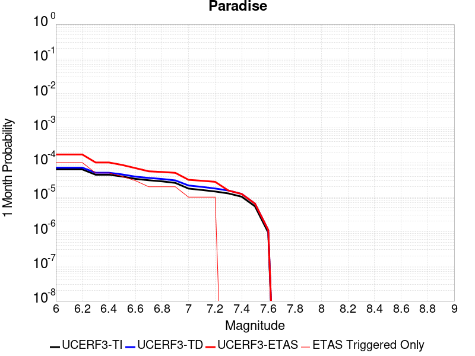 |  |  |

| Magnitude | 1 wk TI Prob | 1 wk TD Prob | 1 wk ETAS Prob | 1 wk ETAS/TD Gain | 1 wk ETAS Triggered Only | 1 mo TI Prob | 1 mo TD Prob | 1 mo ETAS Prob | 1 mo ETAS/TD Gain | 1 mo ETAS Triggered Only | 1 yr TI Prob | 1 yr TD Prob | 1 yr ETAS Prob | 1 yr ETAS/TD Gain | 1 yr ETAS Triggered Only | 10 yr TI Prob | 10 yr TD Prob | 10 yr ETAS Prob | 10 yr ETAS/TD Gain | 10 yr ETAS Triggered Only |
|-----|-----|-----|-----|-----|-----|-----|-----|-----|-----|-----|-----|-----|-----|-----|-----|-----|-----|-----|-----|-----|
| 6.0 | 1.4851273E-5 | 1.6695016E-5 | 3.669468E-5 | 2.1979423 | 2.0E-5 | 6.364676E-5 | 7.154824E-5 | 1.7154109E-4 | 2.3975585 | 1.0E-4 | 7.7462377E-4 | 8.707753E-4 | 0.0012804182 | 1.4704348 | 4.1E-4 | 0.0077192914 | 0.008676012 | 0.00964751 | 1.1119751 | 9.8E-4 |
| 6.1 | 1.4851273E-5 | 1.6695016E-5 | 3.669468E-5 | 2.1979423 | 2.0E-5 | 6.364676E-5 | 7.154824E-5 | 1.7154109E-4 | 2.3975585 | 1.0E-4 | 7.7462377E-4 | 8.707753E-4 | 0.0012804182 | 1.4704348 | 4.1E-4 | 0.0077192914 | 0.008676012 | 0.00964751 | 1.1119751 | 9.8E-4 |
| 6.2 | 1.4851273E-5 | 1.6695016E-5 | 3.669468E-5 | 2.1979423 | 2.0E-5 | 6.364676E-5 | 7.154824E-5 | 1.7154109E-4 | 2.3975585 | 1.0E-4 | 7.7462377E-4 | 8.707753E-4 | 0.0012804182 | 1.4704348 | 4.1E-4 | 0.0077192914 | 0.008676012 | 0.00964751 | 1.1119751 | 9.8E-4 |
| 6.3 | 1.0426831E-5 | 1.1888835E-5 | 2.1888716E-5 | 1.8411154 | 1.0E-5 | 4.4685654E-5 | 5.095119E-5 | 1.0094864E-4 | 1.9812814 | 5.0E-5 | 5.43912E-4 | 6.201601E-4 | 7.900547E-4 | 1.2739527 | 1.7E-4 | 0.0054258266 | 0.006184903 | 0.0065824287 | 1.0642736 | 4.0E-4 |
| 6.4 | 1.0426831E-5 | 1.1888835E-5 | 2.1888716E-5 | 1.8411154 | 1.0E-5 | 4.4685654E-5 | 5.095119E-5 | 1.0094864E-4 | 1.9812814 | 5.0E-5 | 5.43912E-4 | 6.201601E-4 | 7.900547E-4 | 1.2739527 | 1.7E-4 | 0.0054258266 | 0.006184903 | 0.0065824287 | 1.0642736 | 4.0E-4 |
| 6.5 | 9.25027E-6 | 1.0620148E-5 | 2.0620042E-5 | 1.9415965 | 1.0E-5 | 3.964341E-5 | 4.5514153E-5 | 8.5512336E-5 | 1.8788075 | 4.0E-5 | 4.8255164E-4 | 5.539988E-4 | 6.639379E-4 | 1.1984464 | 1.1E-4 | 0.0048150513 | 0.005526677 | 0.005795185 | 1.048584 | 2.7E-4 |
| 6.6 | 7.904275E-6 | 9.15968E-6 | 1.9159588E-5 | 2.091731 | 1.0E-5 | 3.3875025E-5 | 3.9255203E-5 | 6.925403E-5 | 1.7641999 | 3.0E-5 | 4.1235037E-4 | 4.7783123E-4 | 5.4779777E-4 | 1.1464252 | 7.0E-5 | 0.0041158604 | 0.004768435 | 0.0049376246 | 1.0354811 | 1.7E-4 |
| 6.7 | 7.2061953E-6 | 8.407388E-6 | 8.407388E-6 | 1.0 | 0.0 | 3.088333E-5 | 3.6031186E-5 | 5.6030465E-5 | 1.5550547 | 2.0E-5 | 3.7593965E-4 | 4.3859507E-4 | 4.885731E-4 | 1.1139504 | 5.0E-5 | 0.003753043 | 0.0043776636 | 0.0045070946 | 1.0295662 | 1.3E-4 |
| 6.8 | 6.6948724E-6 | 7.8422945E-6 | 7.8422945E-6 | 1.0 | 0.0 | 2.8691995E-5 | 3.360942E-5 | 5.360875E-5 | 1.5950513 | 2.0E-5 | 3.4926904E-4 | 4.0912145E-4 | 4.59101E-4 | 1.122163 | 5.0E-5 | 0.003487206 | 0.00408404 | 0.004193591 | 1.0268241 | 1.1E-4 |
| 6.9 | 6.0421025E-6 | 7.130736E-6 | 7.130736E-6 | 1.0 | 0.0 | 2.5894467E-5 | 3.0559957E-5 | 5.0559345E-5 | 1.6544312 | 2.0E-5 | 3.1521954E-4 | 3.7200734E-4 | 4.019962E-4 | 1.0806136 | 3.0E-5 | 0.0031477278 | 0.0037141845 | 0.0038038502 | 1.0241414 | 9.0E-5 |
| 7.0 | 4.134091E-6 | 5.0803887E-6 | 5.0803887E-6 | 1.0 | 0.0 | 1.7717413E-5 | 2.1772921E-5 | 3.1772703E-5 | 1.4592761 | 1.0E-5 | 2.1568815E-4 | 2.650546E-4 | 2.8504932E-4 | 1.0754361 | 2.0E-5 | 0.0021547892 | 0.002647538 | 0.002667485 | 1.0075341 | 2.0E-5 |
| 7.1 | 3.7674888E-6 | 4.6319415E-6 | 4.6319415E-6 | 1.0 | 0.0 | 1.6146281E-5 | 1.9851035E-5 | 2.9850837E-5 | 1.5037421 | 1.0E-5 | 1.9656324E-4 | 2.4166107E-4 | 2.6165624E-4 | 1.0827405 | 2.0E-5 | 0.0019638946 | 0.0024141334 | 0.0024340851 | 1.0082645 | 2.0E-5 |
| 7.2 | 3.4065345E-6 | 4.1567873E-6 | 4.1567873E-6 | 1.0 | 0.0 | 1.4599351E-5 | 1.781469E-5 | 2.781451E-5 | 1.5613245 | 1.0E-5 | 1.777326E-4 | 2.1687376E-4 | 2.3686943E-4 | 1.0921996 | 2.0E-5 | 0.0017759053 | 0.0021667692 | 0.002186726 | 1.0092103 | 2.0E-5 |
| 7.3 | 2.9934936E-6 | 3.6293698E-6 | 3.6293698E-6 | 1.0 | 0.0 | 1.2829195E-5 | 1.5554358E-5 | 1.5554358E-5 | 1.0 | 0.0 | 1.5618425E-4 | 1.8935933E-4 | 1.8935933E-4 | 1.0 | 0.0 | 0.0015607453 | 0.0018921251 | 0.0018921251 | 1.0 | 0.0 |
| 7.4 | 2.4049796E-6 | 2.889023E-6 | 2.889023E-6 | 1.0 | 0.0 | 1.0307015E-5 | 1.2381477E-5 | 1.2381477E-5 | 1.0 | 0.0 | 1.2548068E-4 | 1.5073549E-4 | 1.5073549E-4 | 1.0 | 0.0 | 0.0012540985 | 0.001506474 | 0.001506474 | 1.0 | 0.0 |
| 7.5 | 1.2710091E-6 | 1.5134868E-6 | 1.5134868E-6 | 1.0 | 0.0 | 5.44717E-6 | 6.486363E-6 | 6.486363E-6 | 1.0 | 0.0 | 6.631728E-5 | 7.896985E-5 | 7.896985E-5 | 1.0 | 0.0 | 6.6297496E-4 | 7.895406E-4 | 7.895406E-4 | 1.0 | 0.0 |
| 7.6 | 2.21172E-7 | 2.6039865E-7 | 2.6039865E-7 | 1.0 | 0.0 | 9.478797E-7 | 1.115994E-6 | 1.115994E-6 | 1.0 | 0.0 | 1.1540374E-5 | 1.35871705E-5 | 1.35871705E-5 | 1.0 | 0.0 | 1.1539775E-4 | 1.3586621E-4 | 1.3586621E-4 | 1.0 | 0.0 |

## Garlic Springs
*[(top)](#table-of-contents)*

| 1 Week | 1 Month | 1 Year | 10 Year |
|-----|-----|-----|-----|
|  |  |  |  |

| Magnitude | 1 wk TI Prob | 1 wk TD Prob | 1 wk ETAS Prob | 1 wk ETAS/TD Gain | 1 wk ETAS Triggered Only | 1 mo TI Prob | 1 mo TD Prob | 1 mo ETAS Prob | 1 mo ETAS/TD Gain | 1 mo ETAS Triggered Only | 1 yr TI Prob | 1 yr TD Prob | 1 yr ETAS Prob | 1 yr ETAS/TD Gain | 1 yr ETAS Triggered Only | 10 yr TI Prob | 10 yr TD Prob | 10 yr ETAS Prob | 10 yr ETAS/TD Gain | 10 yr ETAS Triggered Only |
|-----|-----|-----|-----|-----|-----|-----|-----|-----|-----|-----|-----|-----|-----|-----|-----|-----|-----|-----|-----|-----|
| 6.0 | 1.6760017E-5 | 1.8777433E-5 | 1.8777433E-5 | 1.0 | 0.0 | 7.182667E-5 | 8.047289E-5 | 1.1047047E-4 | 1.3727664 | 3.0E-5 | 8.7413884E-4 | 9.794345E-4 | 0.0011592582 | 1.1835995 | 1.8E-4 | 0.008707083 | 0.009762724 | 0.010465792 | 1.0720156 | 7.1E-4 |
| 6.1 | 9.852767E-6 | 1.09739185E-5 | 1.09739185E-5 | 1.0 | 0.0 | 4.222546E-5 | 4.703063E-5 | 6.702969E-5 | 1.4252348 | 2.0E-5 | 5.139737E-4 | 5.7251845E-4 | 7.02444E-4 | 1.2269369 | 1.3E-4 | 0.005127866 | 0.0057173935 | 0.0061349925 | 1.07304 | 4.2E-4 |
| 6.2 | 9.852767E-6 | 1.09739185E-5 | 1.09739185E-5 | 1.0 | 0.0 | 4.222546E-5 | 4.703063E-5 | 6.702969E-5 | 1.4252348 | 2.0E-5 | 5.139737E-4 | 5.7251845E-4 | 7.02444E-4 | 1.2269369 | 1.3E-4 | 0.005127866 | 0.0057173935 | 0.0061349925 | 1.07304 | 4.2E-4 |
| 6.3 | 4.3167724E-6 | 4.778164E-6 | 4.778164E-6 | 1.0 | 0.0 | 1.8500323E-5 | 2.0477815E-5 | 2.0477815E-5 | 1.0 | 0.0 | 2.2521814E-4 | 2.493119E-4 | 2.9929943E-4 | 1.200502 | 5.0E-5 | 0.0022499003 | 0.0024925806 | 0.002692082 | 1.0800381 | 2.0E-4 |
| 6.4 | 4.3167724E-6 | 4.778164E-6 | 4.778164E-6 | 1.0 | 0.0 | 1.8500323E-5 | 2.0477815E-5 | 2.0477815E-5 | 1.0 | 0.0 | 2.2521814E-4 | 2.493119E-4 | 2.9929943E-4 | 1.200502 | 5.0E-5 | 0.0022499003 | 0.0024925806 | 0.002692082 | 1.0800381 | 2.0E-4 |
| 6.5 | 4.3167724E-6 | 4.778164E-6 | 4.778164E-6 | 1.0 | 0.0 | 1.8500323E-5 | 2.0477815E-5 | 2.0477815E-5 | 1.0 | 0.0 | 2.2521814E-4 | 2.493119E-4 | 2.9929943E-4 | 1.200502 | 5.0E-5 | 0.0022499003 | 0.0024925806 | 0.002692082 | 1.0800381 | 2.0E-4 |
| 6.6 | 4.301311E-6 | 4.761032E-6 | 4.761032E-6 | 1.0 | 0.0 | 1.8434059E-5 | 2.0404394E-5 | 2.0404394E-5 | 1.0 | 0.0 | 2.2441156E-4 | 2.484182E-4 | 2.9840576E-4 | 1.2012235 | 5.0E-5 | 0.0022418506 | 0.0024836634 | 0.0026831666 | 1.0803262 | 2.0E-4 |
| 6.7 | 3.8599724E-6 | 4.2711804E-6 | 4.2711804E-6 | 1.0 | 0.0 | 1.6542634E-5 | 1.830506E-5 | 1.830506E-5 | 1.0 | 0.0 | 2.0138794E-4 | 2.228641E-4 | 2.7285295E-4 | 1.2243019 | 5.0E-5 | 0.0020120554 | 0.002228641 | 0.0024082398 | 1.0805867 | 1.8E-4 |

## San Andreas (San Bernardino S)
*[(top)](#table-of-contents)*

| 1 Week | 1 Month | 1 Year | 10 Year |
|-----|-----|-----|-----|
|  |  |  |  |

| Magnitude | 1 wk TI Prob | 1 wk TD Prob | 1 wk ETAS Prob | 1 wk ETAS/TD Gain | 1 wk ETAS Triggered Only | 1 mo TI Prob | 1 mo TD Prob | 1 mo ETAS Prob | 1 mo ETAS/TD Gain | 1 mo ETAS Triggered Only | 1 yr TI Prob | 1 yr TD Prob | 1 yr ETAS Prob | 1 yr ETAS/TD Gain | 1 yr ETAS Triggered Only | 10 yr TI Prob | 10 yr TD Prob | 10 yr ETAS Prob | 10 yr ETAS/TD Gain | 10 yr ETAS Triggered Only |
|-----|-----|-----|-----|-----|-----|-----|-----|-----|-----|-----|-----|-----|-----|-----|-----|-----|-----|-----|-----|-----|
| 6.0 | 1.2336002E-4 | 3.001381E-4 | 3.101351E-4 | 1.033308 | 1.0E-5 | 5.2857865E-4 | 0.0012856981 | 0.0013855696 | 1.0776788 | 1.0E-4 | 0.006416472 | 0.015545984 | 0.01584132 | 1.0189976 | 3.0E-4 | 0.06234337 | 0.14287543 | 0.143364 | 1.0034195 | 5.7E-4 |
| 6.1 | 1.2336002E-4 | 3.001381E-4 | 3.101351E-4 | 1.033308 | 1.0E-5 | 5.2857865E-4 | 0.0012856981 | 0.0013855696 | 1.0776788 | 1.0E-4 | 0.006416472 | 0.015545984 | 0.01584132 | 1.0189976 | 3.0E-4 | 0.06234337 | 0.14287543 | 0.143364 | 1.0034195 | 5.7E-4 |
| 6.2 | 1.2336002E-4 | 3.001381E-4 | 3.101351E-4 | 1.033308 | 1.0E-5 | 5.2857865E-4 | 0.0012856981 | 0.0013855696 | 1.0776788 | 1.0E-4 | 0.006416472 | 0.015545984 | 0.01584132 | 1.0189976 | 3.0E-4 | 0.06234337 | 0.14287543 | 0.143364 | 1.0034195 | 5.7E-4 |
| 6.3 | 1.1712257E-4 | 2.8802018E-4 | 2.980173E-4 | 1.0347098 | 1.0E-5 | 5.018573E-4 | 0.0012338139 | 0.0013336905 | 1.0809495 | 1.0E-4 | 0.006093008 | 0.014923064 | 0.015208736 | 1.019143 | 2.9E-4 | 0.059286322 | 0.13758378 | 0.13805811 | 1.0034475 | 5.5E-4 |
| 6.4 | 1.1712257E-4 | 2.8802018E-4 | 2.980173E-4 | 1.0347098 | 1.0E-5 | 5.018573E-4 | 0.0012338139 | 0.0013336905 | 1.0809495 | 1.0E-4 | 0.006093008 | 0.014923064 | 0.015208736 | 1.019143 | 2.9E-4 | 0.059286322 | 0.13758378 | 0.13805811 | 1.0034475 | 5.5E-4 |
| 6.5 | 1.0689076E-4 | 2.6814712E-4 | 2.7814443E-4 | 1.037283 | 1.0E-5 | 4.5802278E-4 | 0.0011487206 | 0.0012486057 | 1.0869534 | 1.0E-4 | 0.0055621783 | 0.013900606 | 0.014176714 | 1.019863 | 2.8E-4 | 0.05425003 | 0.12883076 | 0.12929247 | 1.0035839 | 5.3E-4 |
| 6.6 | 9.7648895E-5 | 2.5059367E-4 | 2.6059116E-4 | 1.0398953 | 1.0E-5 | 4.1842813E-4 | 0.0010735545 | 0.0011734471 | 1.0930485 | 1.0E-4 | 0.005082469 | 0.01299656 | 0.0132630505 | 1.0205047 | 2.7E-4 | 0.049677886 | 0.120990366 | 0.12143866 | 1.0037053 | 5.1E-4 |
| 6.7 | 8.757013E-5 | 2.3130006E-4 | 2.4129775E-4 | 1.0432239 | 1.0E-5 | 3.7524657E-4 | 9.909316E-4 | 0.0010908326 | 1.1008152 | 1.0E-4 | 0.00455906 | 0.012001941 | 0.01225882 | 1.0214032 | 2.6E-4 | 0.04466656 | 0.11229846 | 0.11273343 | 1.0038733 | 4.9E-4 |
| 6.8 | 8.562978E-5 | 2.2689818E-4 | 2.3689591E-4 | 1.0440626 | 1.0E-5 | 3.6693315E-4 | 9.720806E-4 | 0.0010719834 | 1.1027721 | 1.0E-4 | 0.004458263 | 0.0117749255 | 0.012021981 | 1.0209816 | 2.5E-4 | 0.043698758 | 0.11030855 | 0.1107356 | 1.0038714 | 4.8E-4 |
| 6.9 | 6.124075E-5 | 1.7073889E-4 | 1.8073719E-4 | 1.058559 | 1.0E-5 | 2.6243398E-4 | 7.3153374E-4 | 8.314606E-4 | 1.1365991 | 1.0E-4 | 0.0031904527 | 0.00887026 | 0.009108131 | 1.0268167 | 2.4E-4 | 0.031450346 | 0.08421729 | 0.08463854 | 1.005002 | 4.6E-4 |
| 7.0 | 5.8598747E-5 | 1.650282E-4 | 1.7502657E-4 | 1.0605857 | 1.0E-5 | 2.5111332E-4 | 7.0707285E-4 | 7.970092E-4 | 1.1271954 | 9.0E-5 | 0.0030530186 | 0.0085748285 | 0.008802856 | 1.0265927 | 2.3E-4 | 0.03011414 | 0.08153475 | 0.08194806 | 1.0050691 | 4.5E-4 |
| 7.1 | 5.613814E-5 | 1.5921291E-4 | 1.6921133E-4 | 1.062799 | 1.0E-5 | 2.4056983E-4 | 6.821634E-4 | 7.7210204E-4 | 1.1318432 | 9.0E-5 | 0.0029250039 | 0.008273893 | 0.00850199 | 1.0275682 | 2.3E-4 | 0.028868021 | 0.07883346 | 0.07923877 | 1.0051414 | 4.4E-4 |
| 7.2 | 4.991222E-5 | 1.4527571E-4 | 1.5527426E-4 | 1.0688246 | 1.0E-5 | 2.1389198E-4 | 6.224621E-4 | 7.12406E-4 | 1.1444972 | 9.0E-5 | 0.002601025 | 0.0075522447 | 0.0077805077 | 1.0302246 | 2.3E-4 | 0.025707912 | 0.072286695 | 0.07269489 | 1.0056468 | 4.4E-4 |
| 7.3 | 4.7410045E-5 | 1.3721608E-4 | 1.472147E-4 | 1.0728678 | 1.0E-5 | 2.0317009E-4 | 5.8793667E-4 | 6.7788374E-4 | 1.1529877 | 9.0E-5 | 0.0024707897 | 0.007134721 | 0.00736308 | 1.0320067 | 2.3E-4 | 0.024434982 | 0.06856856 | 0.068978384 | 1.0059769 | 4.4E-4 |
| 7.4 | 4.5556746E-5 | 1.3129383E-4 | 1.4129252E-4 | 1.0761551 | 1.0E-5 | 1.952286E-4 | 5.625668E-4 | 6.525162E-4 | 1.159891 | 9.0E-5 | 0.002374317 | 0.00682782 | 0.00705625 | 1.0334557 | 2.3E-4 | 0.023491086 | 0.06582052 | 0.06623156 | 1.0062449 | 4.4E-4 |
| 7.5 | 4.3084514E-5 | 1.2364559E-4 | 1.3364435E-4 | 1.0808663 | 1.0E-5 | 1.8463485E-4 | 5.2980235E-4 | 6.1975466E-4 | 1.1697847 | 9.0E-5 | 0.0022456115 | 0.006431338 | 0.006659859 | 1.0355324 | 2.3E-4 | 0.022230545 | 0.062220756 | 0.06263338 | 1.0066316 | 4.4E-4 |
| 7.6 | 3.408608E-5 | 9.842233E-5 | 1.0842134E-4 | 1.101593 | 1.0E-5 | 1.4607502E-4 | 4.217419E-4 | 5.117039E-4 | 1.2133107 | 9.0E-5 | 0.0017770125 | 0.0051226444 | 0.005351466 | 1.0446687 | 2.3E-4 | 0.017628696 | 0.05005001 | 0.05046799 | 1.0083512 | 4.4E-4 |
| 7.7 | 2.8315713E-5 | 8.254984E-5 | 9.254902E-5 | 1.1211289 | 1.0E-5 | 1.2134742E-4 | 3.537371E-4 | 4.4370527E-4 | 1.2543362 | 9.0E-5 | 0.0014764034 | 0.0042982535 | 0.0045272647 | 1.0532801 | 2.3E-4 | 0.01466633 | 0.04229954 | 0.042720925 | 1.009962 | 4.4E-4 |
| 7.8 | 2.6222975E-5 | 7.468984E-5 | 8.468909E-5 | 1.133877 | 1.0E-5 | 1.1237934E-4 | 3.2006006E-4 | 4.1003127E-4 | 1.2811072 | 9.0E-5 | 0.0013673597 | 0.003889775 | 0.0041188803 | 1.0588994 | 2.3E-4 | 0.013589768 | 0.038463186 | 0.03887665 | 1.0107496 | 4.3E-4 |
| 7.9 | 2.1469694E-5 | 5.7927857E-5 | 6.792728E-5 | 1.1726185 | 1.0E-5 | 9.200973E-5 | 2.4823865E-4 | 3.3821628E-4 | 1.3624643 | 9.0E-5 | 0.0011196428 | 0.0030181198 | 0.0032175162 | 1.0660664 | 2.0E-4 | 0.011140184 | 0.030174483 | 0.030552715 | 1.0125349 | 3.9E-4 |
| 8.0 | 1.2420249E-5 | 3.1346288E-5 | 4.1345975E-5 | 1.319007 | 1.0E-5 | 5.322855E-5 | 1.3433433E-4 | 1.7432896E-4 | 1.2977245 | 4.0E-5 | 6.478649E-4 | 0.0016342945 | 0.0016941964 | 1.036653 | 6.0E-5 | 0.0064597935 | 0.016535252 | 0.016663102 | 1.007732 | 1.3E-4 |
| 8.1 | 4.9197724E-6 | 7.832194E-6 | 7.832194E-6 | 1.0 | 0.0 | 2.1084568E-5 | 3.3566113E-5 | 3.3566113E-5 | 1.0 | 0.0 | 2.566744E-4 | 4.0859092E-4 | 4.0859092E-4 | 1.0 | 0.0 | 0.002563781 | 0.004389317 | 0.004399273 | 1.0022683 | 1.0E-5 |
| 8.2 | 2.5634774E-6 | 2.9112718E-6 | 2.9112718E-6 | 1.0 | 0.0 | 1.0986286E-5 | 1.247682E-5 | 1.247682E-5 | 1.0 | 0.0 | 1.3374983E-4 | 1.5189474E-4 | 1.5189474E-4 | 1.0 | 0.0 | 0.0013366934 | 0.001707363 | 0.001707363 | 1.0 | 0.0 |
| 8.3 | 5.2850464E-7 | 3.2150157E-7 | 3.2150157E-7 | 1.0 | 0.0 | 2.2650179E-6 | 1.3778632E-6 | 1.3778632E-6 | 1.0 | 0.0 | 2.7576245E-5 | 1.6775368E-5 | 1.6775368E-5 | 1.0 | 0.0 | 2.7572823E-4 | 1.9904955E-4 | 1.9904955E-4 | 1.0 | 0.0 |

## Helendale-So Lockhart
*[(top)](#table-of-contents)*

| 1 Week | 1 Month | 1 Year | 10 Year |
|-----|-----|-----|-----|
|  |  |  |  |

| Magnitude | 1 wk TI Prob | 1 wk TD Prob | 1 wk ETAS Prob | 1 wk ETAS/TD Gain | 1 wk ETAS Triggered Only | 1 mo TI Prob | 1 mo TD Prob | 1 mo ETAS Prob | 1 mo ETAS/TD Gain | 1 mo ETAS Triggered Only | 1 yr TI Prob | 1 yr TD Prob | 1 yr ETAS Prob | 1 yr ETAS/TD Gain | 1 yr ETAS Triggered Only | 10 yr TI Prob | 10 yr TD Prob | 10 yr ETAS Prob | 10 yr ETAS/TD Gain | 10 yr ETAS Triggered Only |
|-----|-----|-----|-----|-----|-----|-----|-----|-----|-----|-----|-----|-----|-----|-----|-----|-----|-----|-----|-----|-----|
| 6.0 | 1.7296055E-5 | 1.8103954E-5 | 2.8103774E-5 | 1.5523555 | 1.0E-5 | 7.412385E-5 | 7.7586184E-5 | 1.3758153E-4 | 1.7732736 | 6.0E-5 | 9.0208417E-4 | 9.4422314E-4 | 0.0011640154 | 1.2327758 | 2.2E-4 | 0.008984311 | 0.009404233 | 0.009909436 | 1.053721 | 5.1E-4 |
| 6.1 | 1.7296055E-5 | 1.8103954E-5 | 2.8103774E-5 | 1.5523555 | 1.0E-5 | 7.412385E-5 | 7.7586184E-5 | 1.3758153E-4 | 1.7732736 | 6.0E-5 | 9.0208417E-4 | 9.4422314E-4 | 0.0011640154 | 1.2327758 | 2.2E-4 | 0.008984311 | 0.009404233 | 0.009909436 | 1.053721 | 5.1E-4 |
| 6.2 | 1.7296055E-5 | 1.8103954E-5 | 2.8103774E-5 | 1.5523555 | 1.0E-5 | 7.412385E-5 | 7.7586184E-5 | 1.3758153E-4 | 1.7732736 | 6.0E-5 | 9.0208417E-4 | 9.4422314E-4 | 0.0011640154 | 1.2327758 | 2.2E-4 | 0.008984311 | 0.009404233 | 0.009909436 | 1.053721 | 5.1E-4 |
| 6.3 | 1.0669118E-5 | 1.1135554E-5 | 1.1135554E-5 | 1.0 | 0.0 | 4.5723988E-5 | 4.7722944E-5 | 9.772056E-5 | 2.0476642 | 5.0E-5 | 5.5654737E-4 | 5.8087474E-4 | 7.50776E-4 | 1.292492 | 1.7E-4 | 0.0055515557 | 0.0057938606 | 0.006121949 | 1.0566268 | 3.3E-4 |
| 6.4 | 1.0669118E-5 | 1.1135554E-5 | 1.1135554E-5 | 1.0 | 0.0 | 4.5723988E-5 | 4.7722944E-5 | 9.772056E-5 | 2.0476642 | 5.0E-5 | 5.5654737E-4 | 5.8087474E-4 | 7.50776E-4 | 1.292492 | 1.7E-4 | 0.0055515557 | 0.0057938606 | 0.006121949 | 1.0566268 | 3.3E-4 |
| 6.5 | 8.790038E-6 | 9.170302E-6 | 9.170302E-6 | 1.0 | 0.0 | 3.767105E-5 | 3.930071E-5 | 8.9298745E-5 | 2.2721915 | 5.0E-5 | 4.585485E-4 | 4.7838266E-4 | 6.0832046E-4 | 1.271619 | 1.3E-4 | 0.0045760344 | 0.004773693 | 0.0050424044 | 1.05629 | 2.7E-4 |
| 6.6 | 7.396949E-6 | 7.7156255E-6 | 7.7156255E-6 | 1.0 | 0.0 | 3.1700827E-5 | 3.3066553E-5 | 8.30649E-5 | 2.512052 | 5.0E-5 | 3.858892E-4 | 4.025119E-4 | 5.2246364E-4 | 1.2980078 | 1.2E-4 | 0.003852198 | 0.0040179356 | 0.004266931 | 1.061971 | 2.5E-4 |
| 6.7 | 6.4600285E-6 | 6.738108E-6 | 6.738108E-6 | 1.0 | 0.0 | 2.7685543E-5 | 2.887729E-5 | 6.8876136E-5 | 2.3851316 | 4.0E-5 | 3.3701936E-4 | 3.515251E-4 | 4.4149344E-4 | 1.2559372 | 9.0E-5 | 0.0033650869 | 0.003509772 | 0.0037090702 | 1.0567838 | 2.0E-4 |
| 6.8 | 5.600104E-6 | 5.8360747E-6 | 5.8360747E-6 | 1.0 | 0.0 | 2.4000226E-5 | 2.5011512E-5 | 5.501076E-5 | 2.1994176 | 3.0E-5 | 2.9216358E-4 | 3.0447321E-4 | 3.8444885E-4 | 1.2626688 | 8.0E-5 | 0.0029177975 | 0.003040622 | 0.0032300444 | 1.0622972 | 1.9E-4 |
| 6.9 | 4.839122E-6 | 5.0395647E-6 | 5.0395647E-6 | 1.0 | 0.0 | 2.0738931E-5 | 2.1597958E-5 | 5.159731E-5 | 2.3889902 | 3.0E-5 | 2.5246723E-4 | 2.629239E-4 | 3.3290547E-4 | 1.2661668 | 7.0E-5 | 0.002521806 | 0.0026261755 | 0.0027757818 | 1.0569673 | 1.5E-4 |
| 7.0 | 3.6937633E-6 | 3.84525E-6 | 3.84525E-6 | 1.0 | 0.0 | 1.5830317E-5 | 1.647954E-5 | 4.6479046E-5 | 2.820409 | 3.0E-5 | 1.9271708E-4 | 2.0062024E-4 | 2.706062E-4 | 1.348848 | 7.0E-5 | 0.0019255003 | 0.0020044227 | 0.002144142 | 1.0697055 | 1.4E-4 |
| 7.1 | 2.7858857E-6 | 2.8978848E-6 | 2.8978848E-6 | 1.0 | 0.0 | 1.1939455E-5 | 1.2419448E-5 | 2.2419325E-5 | 1.8051788 | 1.0E-5 | 1.4535317E-4 | 1.5119651E-4 | 1.9119045E-4 | 1.2645164 | 4.0E-5 | 0.0014525814 | 0.0015109578 | 0.0016008219 | 1.0594748 | 9.0E-5 |
| 7.2 | 2.1672065E-6 | 2.2540366E-6 | 2.2540366E-6 | 1.0 | 0.0 | 9.2879945E-6 | 9.6601225E-6 | 9.6601225E-6 | 1.0 | 0.0 | 1.1307546E-4 | 1.1760583E-4 | 1.3760348E-4 | 1.1700397 | 2.0E-5 | 0.0011301794 | 0.0011754541 | 0.0012253954 | 1.0424868 | 5.0E-5 |
| 7.3 | 1.4823496E-6 | 1.5422268E-6 | 1.5422268E-6 | 1.0 | 0.0 | 6.3529114E-6 | 6.609527E-6 | 6.609527E-6 | 1.0 | 0.0 | 7.734395E-5 | 8.046818E-5 | 1.0046657E-4 | 1.2485255 | 2.0E-5 | 7.731704E-4 | 8.044055E-4 | 8.543653E-4 | 1.0621077 | 5.0E-5 |
| 7.4 | 4.2321457E-7 | 4.410926E-7 | 4.410926E-7 | 1.0 | 0.0 | 1.8137755E-6 | 1.8903958E-6 | 1.8903958E-6 | 1.0 | 0.0 | 2.2082493E-5 | 2.3015371E-5 | 2.3015371E-5 | 1.0 | 0.0 | 2.2080299E-4 | 2.301344E-4 | 2.401321E-4 | 1.0434428 | 1.0E-5 |
| 7.5 | 5.6942316E-8 | 5.941633E-8 | 5.941633E-8 | 1.0 | 0.0 | 2.440385E-7 | 2.546414E-7 | 2.546414E-7 | 1.0 | 0.0 | 2.9711643E-6 | 3.1002553E-6 | 3.1002553E-6 | 1.0 | 0.0 | 2.9711247E-5 | 3.10022E-5 | 3.10022E-5 | 1.0 | 0.0 |

## Death Valley (Black Mtns Frontal)
*[(top)](#table-of-contents)*

| 1 Week | 1 Month | 1 Year | 10 Year |
|-----|-----|-----|-----|
|  | 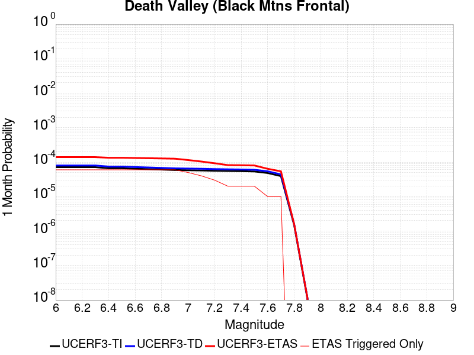 |  |  |

| Magnitude | 1 wk TI Prob | 1 wk TD Prob | 1 wk ETAS Prob | 1 wk ETAS/TD Gain | 1 wk ETAS Triggered Only | 1 mo TI Prob | 1 mo TD Prob | 1 mo ETAS Prob | 1 mo ETAS/TD Gain | 1 mo ETAS Triggered Only | 1 yr TI Prob | 1 yr TD Prob | 1 yr ETAS Prob | 1 yr ETAS/TD Gain | 1 yr ETAS Triggered Only | 10 yr TI Prob | 10 yr TD Prob | 10 yr ETAS Prob | 10 yr ETAS/TD Gain | 10 yr ETAS Triggered Only |
|-----|-----|-----|-----|-----|-----|-----|-----|-----|-----|-----|-----|-----|-----|-----|-----|-----|-----|-----|-----|-----|
| 6.0 | 1.6707214E-5 | 1.8670851E-5 | 1.8670851E-5 | 1.0 | 0.0 | 7.160038E-5 | 8.0015525E-5 | 1.4001073E-4 | 1.7497945 | 6.0E-5 | 8.71386E-4 | 9.7376126E-4 | 0.0011635763 | 1.1949297 | 1.9E-4 | 0.00867977 | 0.009695798 | 0.010171144 | 1.049026 | 4.8E-4 |
| 6.1 | 1.6707214E-5 | 1.8670851E-5 | 1.8670851E-5 | 1.0 | 0.0 | 7.160038E-5 | 8.0015525E-5 | 1.4001073E-4 | 1.7497945 | 6.0E-5 | 8.71386E-4 | 9.7376126E-4 | 0.0011635763 | 1.1949297 | 1.9E-4 | 0.00867977 | 0.009695798 | 0.010171144 | 1.049026 | 4.8E-4 |
| 6.2 | 1.6707214E-5 | 1.8670851E-5 | 1.8670851E-5 | 1.0 | 0.0 | 7.160038E-5 | 8.0015525E-5 | 1.4001073E-4 | 1.7497945 | 6.0E-5 | 8.71386E-4 | 9.7376126E-4 | 0.0011635763 | 1.1949297 | 1.9E-4 | 0.00867977 | 0.009695798 | 0.010171144 | 1.049026 | 4.8E-4 |
| 6.3 | 1.6707214E-5 | 1.8670851E-5 | 1.8670851E-5 | 1.0 | 0.0 | 7.160038E-5 | 8.0015525E-5 | 1.4001073E-4 | 1.7497945 | 6.0E-5 | 8.71386E-4 | 9.7376126E-4 | 0.0011635763 | 1.1949297 | 1.9E-4 | 0.00867977 | 0.009695798 | 0.010171144 | 1.049026 | 4.8E-4 |
| 6.4 | 1.5515609E-5 | 1.7338754E-5 | 1.7338754E-5 | 1.0 | 0.0 | 6.649377E-5 | 7.430687E-5 | 1.343024E-4 | 1.8074024 | 6.0E-5 | 8.0926094E-4 | 9.043167E-4 | 0.001064172 | 1.1767691 | 1.6E-4 | 0.008063202 | 0.009007053 | 0.00943318 | 1.0473104 | 4.3E-4 |
| 6.5 | 1.5515609E-5 | 1.7338754E-5 | 1.7338754E-5 | 1.0 | 0.0 | 6.649377E-5 | 7.430687E-5 | 1.343024E-4 | 1.8074024 | 6.0E-5 | 8.0926094E-4 | 9.043167E-4 | 0.001064172 | 1.1767691 | 1.6E-4 | 0.008063202 | 0.009007053 | 0.00943318 | 1.0473104 | 4.3E-4 |
| 6.6 | 1.5041828E-5 | 1.680967E-5 | 1.680967E-5 | 1.0 | 0.0 | 6.4463384E-5 | 7.203949E-5 | 1.3203516E-4 | 1.8328166 | 6.0E-5 | 7.8455906E-4 | 8.7673374E-4 | 0.0010365935 | 1.1823355 | 1.6E-4 | 0.00781795 | 0.008733404 | 0.009139824 | 1.0465362 | 4.1E-4 |
| 6.7 | 1.4634985E-5 | 1.6356527E-5 | 1.6356527E-5 | 1.0 | 0.0 | 6.271985E-5 | 7.009756E-5 | 1.3009335E-4 | 1.8558899 | 6.0E-5 | 7.6334673E-4 | 8.5310935E-4 | 0.0010129728 | 1.1873893 | 1.6E-4 | 0.007607299 | 0.008498981 | 0.008895581 | 1.0466645 | 4.0E-4 |
| 6.8 | 1.4209158E-5 | 1.5882546E-5 | 1.5882546E-5 | 1.0 | 0.0 | 6.089497E-5 | 6.806631E-5 | 1.2806222E-4 | 1.8814334 | 6.0E-5 | 7.4114406E-4 | 8.283978E-4 | 9.882653E-4 | 1.1929839 | 1.6E-4 | 0.007386771 | 0.008253714 | 0.008650413 | 1.048063 | 4.0E-4 |
| 6.9 | 1.3780098E-5 | 1.5405076E-5 | 1.5405076E-5 | 1.0 | 0.0 | 5.9056227E-5 | 6.602012E-5 | 1.2601615E-4 | 1.9087539 | 6.0E-5 | 7.1877235E-4 | 8.0350396E-4 | 9.633754E-4 | 1.1989678 | 1.6E-4 | 0.0071645193 | 0.008006583 | 0.00839346 | 1.0483199 | 3.9E-4 |
| 7.0 | 1.3585064E-5 | 1.51886325E-5 | 1.51886325E-5 | 1.0 | 0.0 | 5.8220405E-5 | 6.509254E-5 | 1.1508929E-4 | 1.7680871 | 5.0E-5 | 7.086029E-4 | 7.92219E-4 | 9.2211604E-4 | 1.1639661 | 1.3E-4 | 0.007063476 | 0.007894541 | 0.008241777 | 1.0439844 | 3.5E-4 |
| 7.1 | 1.3398601E-5 | 1.4981811E-5 | 1.4981811E-5 | 1.0 | 0.0 | 5.742131E-5 | 6.420621E-5 | 1.0420364E-4 | 1.6229527 | 4.0E-5 | 6.9888023E-4 | 7.814357E-4 | 8.9134974E-4 | 1.1406566 | 1.1E-4 | 0.0069668638 | 0.007787468 | 0.008114898 | 1.0420458 | 3.3E-4 |
| 7.2 | 1.3126312E-5 | 1.4680023E-5 | 1.4680023E-5 | 1.0 | 0.0 | 5.6254412E-5 | 6.29129E-5 | 9.291101E-5 | 1.4768198 | 3.0E-5 | 6.846822E-4 | 7.6570077E-4 | 8.656242E-4 | 1.1304994 | 1.0E-4 | 0.006825765 | 0.0076312097 | 0.00792892 | 1.0390122 | 3.0E-4 |
| 7.3 | 1.2922429E-5 | 1.4454244E-5 | 1.4454244E-5 | 1.0 | 0.0 | 5.5380664E-5 | 6.194532E-5 | 8.194408E-5 | 1.3228453 | 2.0E-5 | 6.74051E-4 | 7.5392873E-4 | 8.4386085E-4 | 1.1192846 | 9.0E-5 | 0.006720101 | 0.007514291 | 0.007782262 | 1.0356616 | 2.7E-4 |
| 7.4 | 1.2768878E-5 | 1.4284223E-5 | 1.4284223E-5 | 1.0 | 0.0 | 5.4722615E-5 | 6.121669E-5 | 8.121547E-5 | 1.3266883 | 2.0E-5 | 6.660441E-4 | 7.4506376E-4 | 8.250042E-4 | 1.1072934 | 8.0E-5 | 0.0066405144 | 0.007426237 | 0.0076843062 | 1.034751 | 2.6E-4 |
| 7.5 | 1.2521929E-5 | 1.4012458E-5 | 1.4012458E-5 | 1.0 | 0.0 | 5.366431E-5 | 6.0052043E-5 | 8.005084E-5 | 1.3330245 | 2.0E-5 | 6.531671E-4 | 7.308938E-4 | 8.1083534E-4 | 1.109375 | 8.0E-5 | 0.006512506 | 0.0072854757 | 0.0075435815 | 1.0354275 | 2.6E-4 |
| 7.6 | 1.1301089E-5 | 1.264855E-5 | 1.264855E-5 | 1.0 | 0.0 | 4.8432343E-5 | 5.4206976E-5 | 6.420643E-5 | 1.1844682 | 1.0E-5 | 5.895042E-4 | 6.597754E-4 | 7.297292E-4 | 1.1060268 | 7.0E-5 | 0.0058794282 | 0.0065787183 | 0.0068072053 | 1.0347313 | 2.3E-4 |
| 7.7 | 9.189108E-6 | 1.0283684E-5 | 1.0283684E-5 | 1.0 | 0.0 | 3.93813E-5 | 4.4072214E-5 | 5.4071774E-5 | 1.2268903 | 1.0E-5 | 4.7936183E-4 | 5.3645216E-4 | 5.764307E-4 | 1.0745239 | 4.0E-5 | 0.004783291 | 0.005352083 | 0.0055112266 | 1.0297348 | 1.6E-4 |
| 7.8 | 3.4586725E-7 | 3.6483146E-7 | 3.6483146E-7 | 1.0 | 0.0 | 1.4822873E-6 | 1.5635625E-6 | 1.5635625E-6 | 1.0 | 0.0 | 1.80467E-5 | 1.9036212E-5 | 2.9036022E-5 | 1.5253046 | 1.0E-5 | 1.8045233E-4 | 1.9034625E-4 | 2.0034435E-4 | 1.0525259 | 1.0E-5 |
| 7.9 | 2.5591178E-9 | 2.6697022E-9 | 2.6697022E-9 | 1.0 | 0.0 | 1.0967647E-8 | 1.1441582E-8 | 1.1441582E-8 | 1.0 | 0.0 | 1.335311E-7 | 1.3930125E-7 | 1.3930125E-7 | 1.0 | 0.0 | 1.3353102E-6 | 1.3930126E-6 | 1.3930126E-6 | 1.0 | 0.0 |

## Coyote Lake
*[(top)](#table-of-contents)*

| 1 Week | 1 Month | 1 Year | 10 Year |
|-----|-----|-----|-----|
|  |  | 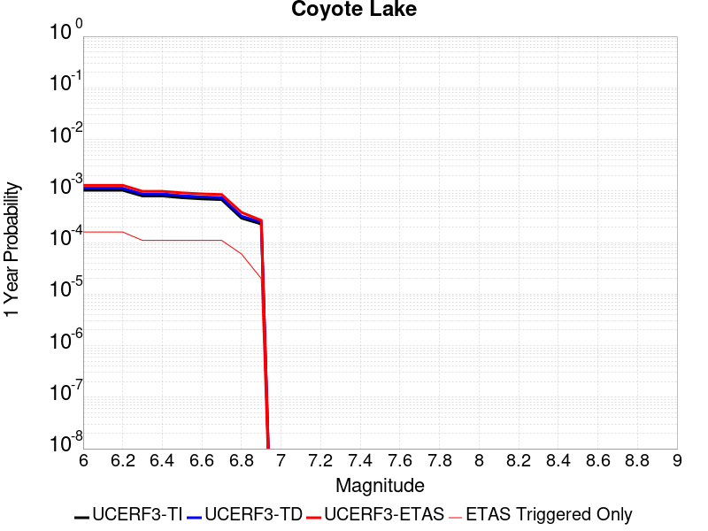 |  |

| Magnitude | 1 wk TI Prob | 1 wk TD Prob | 1 wk ETAS Prob | 1 wk ETAS/TD Gain | 1 wk ETAS Triggered Only | 1 mo TI Prob | 1 mo TD Prob | 1 mo ETAS Prob | 1 mo ETAS/TD Gain | 1 mo ETAS Triggered Only | 1 yr TI Prob | 1 yr TD Prob | 1 yr ETAS Prob | 1 yr ETAS/TD Gain | 1 yr ETAS Triggered Only | 10 yr TI Prob | 10 yr TD Prob | 10 yr ETAS Prob | 10 yr ETAS/TD Gain | 10 yr ETAS Triggered Only |
|-----|-----|-----|-----|-----|-----|-----|-----|-----|-----|-----|-----|-----|-----|-----|-----|-----|-----|-----|-----|-----|
| 6.0 | 1.980352E-5 | 2.1707297E-5 | 4.1706866E-5 | 1.9213291 | 2.0E-5 | 8.486947E-5 | 9.3028364E-5 | 1.1302651E-4 | 1.2149682 | 2.0E-5 | 0.0010327959 | 0.001132104 | 0.0012919228 | 1.1411698 | 1.6E-4 | 0.010280091 | 0.0112705445 | 0.011666036 | 1.0350908 | 4.0E-4 |
| 6.1 | 1.980352E-5 | 2.1707297E-5 | 4.1706866E-5 | 1.9213291 | 2.0E-5 | 8.486947E-5 | 9.3028364E-5 | 1.1302651E-4 | 1.2149682 | 2.0E-5 | 0.0010327959 | 0.001132104 | 0.0012919228 | 1.1411698 | 1.6E-4 | 0.010280091 | 0.0112705445 | 0.011666036 | 1.0350908 | 4.0E-4 |
| 6.2 | 1.980352E-5 | 2.1707297E-5 | 4.1706866E-5 | 1.9213291 | 2.0E-5 | 8.486947E-5 | 9.3028364E-5 | 1.1302651E-4 | 1.2149682 | 2.0E-5 | 0.0010327959 | 0.001132104 | 0.0012919228 | 1.1411698 | 1.6E-4 | 0.010280091 | 0.0112705445 | 0.011666036 | 1.0350908 | 4.0E-4 |
| 6.3 | 1.5344787E-5 | 1.6821099E-5 | 2.682093E-5 | 1.5944815 | 1.0E-5 | 6.576172E-5 | 7.208878E-5 | 8.208805E-5 | 1.1387079 | 1.0E-5 | 8.003548E-4 | 8.7738864E-4 | 9.872922E-4 | 1.125262 | 1.1E-4 | 0.007974784 | 0.008745291 | 0.009032755 | 1.0328707 | 2.9E-4 |
| 6.4 | 1.5344787E-5 | 1.6821099E-5 | 2.682093E-5 | 1.5944815 | 1.0E-5 | 6.576172E-5 | 7.208878E-5 | 8.208805E-5 | 1.1387079 | 1.0E-5 | 8.003548E-4 | 8.7738864E-4 | 9.872922E-4 | 1.125262 | 1.1E-4 | 0.007974784 | 0.008745291 | 0.009032755 | 1.0328707 | 2.9E-4 |
| 6.5 | 1.4189697E-5 | 1.5558386E-5 | 2.5558229E-5 | 1.6427302 | 1.0E-5 | 6.081157E-5 | 6.667743E-5 | 7.667676E-5 | 1.1499658 | 1.0E-5 | 7.401293E-4 | 8.1155566E-4 | 9.214664E-4 | 1.1354321 | 1.1E-4 | 0.0073766913 | 0.008091862 | 0.008379516 | 1.0355484 | 2.9E-4 |
| 6.6 | 1.3469301E-5 | 1.4771957E-5 | 2.4771809E-5 | 1.6769484 | 1.0E-5 | 5.7724297E-5 | 6.330718E-5 | 7.330655E-5 | 1.1579499 | 1.0E-5 | 7.025667E-4 | 7.7055243E-4 | 8.8046765E-4 | 1.1426448 | 1.1E-4 | 0.0070034964 | 0.007684711 | 0.007972483 | 1.0374472 | 2.9E-4 |
| 6.7 | 1.3027966E-5 | 1.428211E-5 | 2.4281966E-5 | 1.7001667 | 1.0E-5 | 5.5832945E-5 | 6.1207946E-5 | 7.120733E-5 | 1.1633675 | 1.0E-5 | 6.7955407E-4 | 7.4501167E-4 | 8.549297E-4 | 1.1475387 | 1.1E-4 | 0.006774798 | 0.007431018 | 0.0077089374 | 1.0373999 | 2.8E-4 |
| 6.8 | 5.695434E-6 | 6.2245713E-6 | 1.6224509E-5 | 2.6065264 | 1.0E-5 | 2.4408775E-5 | 2.667663E-5 | 3.6676363E-5 | 1.3748499 | 1.0E-5 | 2.971363E-4 | 3.2476956E-4 | 3.8475008E-4 | 1.1846864 | 6.0E-5 | 0.0029673933 | 0.0032458904 | 0.0033355982 | 1.0276374 | 9.0E-5 |
| 6.9 | 4.385688E-6 | 4.7931735E-6 | 4.7931735E-6 | 1.0 | 0.0 | 1.879567E-5 | 2.0542171E-5 | 2.0542171E-5 | 1.0 | 0.0 | 2.2881327E-4 | 2.5010094E-4 | 2.7009594E-4 | 1.0799477 | 2.0E-5 | 0.002285778 | 0.0025010095 | 0.0025409095 | 1.0159535 | 4.0E-5 |

## San Andreas (Big Bend)
*[(top)](#table-of-contents)*

| 1 Week | 1 Month | 1 Year | 10 Year |
|-----|-----|-----|-----|
|  |  |  |  |

| Magnitude | 1 wk TI Prob | 1 wk TD Prob | 1 wk ETAS Prob | 1 wk ETAS/TD Gain | 1 wk ETAS Triggered Only | 1 mo TI Prob | 1 mo TD Prob | 1 mo ETAS Prob | 1 mo ETAS/TD Gain | 1 mo ETAS Triggered Only | 1 yr TI Prob | 1 yr TD Prob | 1 yr ETAS Prob | 1 yr ETAS/TD Gain | 1 yr ETAS Triggered Only | 10 yr TI Prob | 10 yr TD Prob | 10 yr ETAS Prob | 10 yr ETAS/TD Gain | 10 yr ETAS Triggered Only |
|-----|-----|-----|-----|-----|-----|-----|-----|-----|-----|-----|-----|-----|-----|-----|-----|-----|-----|-----|-----|-----|
| 6.0 | 1.0179969E-4 | 2.0089281E-4 | 2.2088879E-4 | 1.0995356 | 2.0E-5 | 4.362114E-4 | 8.606861E-4 | 9.106431E-4 | 1.0580432 | 5.0E-5 | 0.0052979486 | 0.01042879 | 0.010597017 | 1.016131 | 1.7E-4 | 0.051734097 | 0.101523116 | 0.10183758 | 1.0030975 | 3.5E-4 |
| 6.1 | 1.0179969E-4 | 2.0089281E-4 | 2.2088879E-4 | 1.0995356 | 2.0E-5 | 4.362114E-4 | 8.606861E-4 | 9.106431E-4 | 1.0580432 | 5.0E-5 | 0.0052979486 | 0.01042879 | 0.010597017 | 1.016131 | 1.7E-4 | 0.051734097 | 0.101523116 | 0.10183758 | 1.0030975 | 3.5E-4 |
| 6.2 | 1.0179969E-4 | 2.0089281E-4 | 2.2088879E-4 | 1.0995356 | 2.0E-5 | 4.362114E-4 | 8.606861E-4 | 9.106431E-4 | 1.0580432 | 5.0E-5 | 0.0052979486 | 0.01042879 | 0.010597017 | 1.016131 | 1.7E-4 | 0.051734097 | 0.101523116 | 0.10183758 | 1.0030975 | 3.5E-4 |
| 6.3 | 1.0179969E-4 | 2.0089281E-4 | 2.2088879E-4 | 1.0995356 | 2.0E-5 | 4.362114E-4 | 8.606861E-4 | 9.106431E-4 | 1.0580432 | 5.0E-5 | 0.0052979486 | 0.01042879 | 0.010597017 | 1.016131 | 1.7E-4 | 0.051734097 | 0.101523116 | 0.10183758 | 1.0030975 | 3.5E-4 |
| 6.4 | 9.1639464E-5 | 1.8446219E-4 | 2.044585E-4 | 1.1084033 | 2.0E-5 | 3.9268145E-4 | 7.9031294E-4 | 8.402734E-4 | 1.0632161 | 5.0E-5 | 0.0047704205 | 0.009579727 | 0.009698577 | 1.0124065 | 1.2E-4 | 0.046693064 | 0.093848534 | 0.09404789 | 1.0021242 | 2.2E-4 |
| 6.5 | 9.1639464E-5 | 1.8446219E-4 | 2.044585E-4 | 1.1084033 | 2.0E-5 | 3.9268145E-4 | 7.9031294E-4 | 8.402734E-4 | 1.0632161 | 5.0E-5 | 0.0047704205 | 0.009579727 | 0.009698577 | 1.0124065 | 1.2E-4 | 0.046693064 | 0.093848534 | 0.09404789 | 1.0021242 | 2.2E-4 |
| 6.6 | 9.042622E-5 | 1.8253236E-4 | 2.025287E-4 | 1.1095496 | 2.0E-5 | 3.8748336E-4 | 7.8204717E-4 | 8.320081E-4 | 1.0638847 | 5.0E-5 | 0.0047074095 | 0.00947997 | 0.009588927 | 1.0114934 | 1.1E-4 | 0.046089325 | 0.09294244 | 0.09312385 | 1.0019518 | 2.0E-4 |
| 6.7 | 8.9836685E-5 | 1.8167557E-4 | 2.0167194E-4 | 1.1100663 | 2.0E-5 | 3.8495753E-4 | 7.7837746E-4 | 8.2833855E-4 | 1.0641862 | 5.0E-5 | 0.00467679 | 0.009435678 | 0.00954464 | 1.0115479 | 1.1E-4 | 0.045795817 | 0.09253668 | 0.09271818 | 1.0019614 | 2.0E-4 |
| 6.8 | 8.9471854E-5 | 1.8114323E-4 | 2.0113961E-4 | 1.1103898 | 2.0E-5 | 3.8339442E-4 | 7.7609735E-4 | 8.2605856E-4 | 1.0643749 | 5.0E-5 | 0.004657841 | 0.009408158 | 0.009517123 | 1.011582 | 1.1E-4 | 0.04561414 | 0.09228384 | 0.09246538 | 1.0019672 | 2.0E-4 |
| 6.9 | 8.858234E-5 | 1.7996269E-4 | 1.9995909E-4 | 1.1111141 | 2.0E-5 | 3.7958333E-4 | 7.710409E-4 | 8.2100235E-4 | 1.0647974 | 5.0E-5 | 0.004611638 | 0.009347125 | 0.009456096 | 1.0116583 | 1.1E-4 | 0.04517103 | 0.091723874 | 0.091896445 | 1.0018815 | 1.9E-4 |
| 7.0 | 8.7433385E-5 | 1.7835027E-4 | 1.8834848E-4 | 1.0560595 | 1.0E-5 | 3.746607E-4 | 7.641346E-4 | 7.9411163E-4 | 1.0392301 | 3.0E-5 | 0.004551957 | 0.009263758 | 0.009352924 | 1.0096253 | 9.0E-5 | 0.044598386 | 0.090958185 | 0.09111272 | 1.001699 | 1.7E-4 |
| 7.1 | 8.684964E-5 | 1.7746954E-4 | 1.8746777E-4 | 1.0563377 | 1.0E-5 | 3.7215967E-4 | 7.6036225E-4 | 7.903394E-4 | 1.0394249 | 3.0E-5 | 0.0045216335 | 0.00921822 | 0.00930739 | 1.0096732 | 9.0E-5 | 0.04430731 | 0.09053964 | 0.09069425 | 1.0017077 | 1.7E-4 |
| 7.2 | 8.606521E-5 | 1.7637543E-4 | 1.8637367E-4 | 1.0566872 | 1.0E-5 | 3.6879873E-4 | 7.556759E-4 | 7.8565325E-4 | 1.0396695 | 3.0E-5 | 0.0044808835 | 0.009161645 | 0.00925082 | 1.0097336 | 9.0E-5 | 0.043916024 | 0.09002007 | 0.09016567 | 1.0016174 | 1.6E-4 |
| 7.3 | 8.568266E-5 | 1.7579518E-4 | 1.8579343E-4 | 1.0568744 | 1.0E-5 | 3.6715972E-4 | 7.531906E-4 | 7.8316795E-4 | 1.0398005 | 3.0E-5 | 0.0044610105 | 0.009131639 | 0.009220818 | 1.0097659 | 9.0E-5 | 0.043725148 | 0.08974111 | 0.089886755 | 1.0016229 | 1.6E-4 |
| 7.4 | 8.5432206E-5 | 1.7542086E-4 | 1.854191E-4 | 1.0569957 | 1.0E-5 | 3.6608664E-4 | 7.515873E-4 | 7.8156474E-4 | 1.0398855 | 3.0E-5 | 0.004447999 | 0.009112283 | 0.009201462 | 1.0097867 | 9.0E-5 | 0.043600157 | 0.08956122 | 0.08970688 | 1.0016265 | 1.6E-4 |
| 7.5 | 8.4791965E-5 | 1.7411346E-4 | 1.8411172E-4 | 1.0574238 | 1.0E-5 | 3.633435E-4 | 7.4598734E-4 | 7.75965E-4 | 1.0401852 | 3.0E-5 | 0.0044147377 | 0.009044672 | 0.009133858 | 1.0098606 | 9.0E-5 | 0.043280575 | 0.088938616 | 0.08908438 | 1.001639 | 1.6E-4 |
| 7.6 | 8.241105E-5 | 1.6856502E-4 | 1.7856334E-4 | 1.0593143 | 1.0E-5 | 3.531424E-4 | 7.222217E-4 | 7.522E-4 | 1.0415084 | 3.0E-5 | 0.0042910352 | 0.008757687 | 0.008846899 | 1.0101867 | 9.0E-5 | 0.042091176 | 0.086314626 | 0.08646082 | 1.0016937 | 1.6E-4 |
| 7.7 | 7.00432E-5 | 1.4219029E-4 | 1.5218886E-4 | 1.0703183 | 1.0E-5 | 3.001506E-4 | 6.092446E-4 | 6.3922635E-4 | 1.0492113 | 3.0E-5 | 0.0036482112 | 0.0073923655 | 0.0074717742 | 1.010742 | 8.0E-5 | 0.035888977 | 0.07358285 | 0.07370328 | 1.0016367 | 1.3E-4 |
| 7.8 | 6.415362E-5 | 1.2982021E-4 | 1.398189E-4 | 1.0770196 | 1.0E-5 | 2.749151E-4 | 5.562537E-4 | 5.8623706E-4 | 1.0539023 | 3.0E-5 | 0.0033419547 | 0.0067513892 | 0.006830849 | 1.0117694 | 8.0E-5 | 0.03292141 | 0.06731172 | 0.06743297 | 1.0018014 | 1.3E-4 |
| 7.9 | 4.939911E-5 | 9.350515E-5 | 1.03504215E-4 | 1.106936 | 1.0E-5 | 2.116933E-4 | 4.0067482E-4 | 4.306628E-4 | 1.0748436 | 3.0E-5 | 0.0025743195 | 0.0048673134 | 0.004936973 | 1.0143117 | 7.0E-5 | 0.025447013 | 0.048958268 | 0.049062885 | 1.0021368 | 1.1E-4 |
| 8.0 | 3.344983E-5 | 5.2282365E-5 | 6.228184E-5 | 1.191259 | 1.0E-5 | 1.4334853E-4 | 2.2404804E-4 | 2.4404356E-4 | 1.0892465 | 2.0E-5 | 0.0017438711 | 0.0027243744 | 0.0027542927 | 1.0109817 | 3.0E-5 | 0.017302496 | 0.027949443 | 0.027998045 | 1.0017389 | 5.0E-5 |
| 8.1 | 1.9104898E-5 | 1.9199628E-5 | 1.9199628E-5 | 1.0 | 0.0 | 8.1875565E-5 | 8.228153E-5 | 8.228153E-5 | 1.0 | 0.0 | 9.963791E-4 | 0.0010013179 | 0.0010013179 | 1.0 | 0.0 | 0.009919235 | 0.010763723 | 0.0107835075 | 1.0018381 | 2.0E-5 |
| 8.2 | 8.643924E-6 | 5.4848397E-6 | 5.4848397E-6 | 1.0 | 0.0 | 3.704486E-5 | 2.3506243E-5 | 2.3506243E-5 | 1.0 | 0.0 | 4.5092785E-4 | 2.8615101E-4 | 2.8615101E-4 | 1.0 | 0.0 | 0.0045001395 | 0.0032541603 | 0.0032541603 | 1.0 | 0.0 |
| 8.3 | 1.983087E-6 | 7.676691E-7 | 7.676691E-7 | 1.0 | 0.0 | 8.498917E-6 | 3.2900064E-6 | 3.2900064E-6 | 1.0 | 0.0 | 1.034694E-4 | 4.005511E-5 | 4.005511E-5 | 1.0 | 0.0 | 0.0010342124 | 4.729315E-4 | 4.729315E-4 | 1.0 | 0.0 |

## Death Valley (No)
*[(top)](#table-of-contents)*

| 1 Week | 1 Month | 1 Year | 10 Year |
|-----|-----|-----|-----|
| 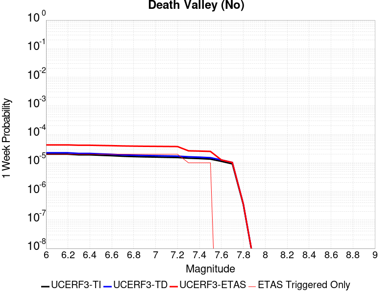 |  |  |  |

| Magnitude | 1 wk TI Prob | 1 wk TD Prob | 1 wk ETAS Prob | 1 wk ETAS/TD Gain | 1 wk ETAS Triggered Only | 1 mo TI Prob | 1 mo TD Prob | 1 mo ETAS Prob | 1 mo ETAS/TD Gain | 1 mo ETAS Triggered Only | 1 yr TI Prob | 1 yr TD Prob | 1 yr ETAS Prob | 1 yr ETAS/TD Gain | 1 yr ETAS Triggered Only | 10 yr TI Prob | 10 yr TD Prob | 10 yr ETAS Prob | 10 yr ETAS/TD Gain | 10 yr ETAS Triggered Only |
|-----|-----|-----|-----|-----|-----|-----|-----|-----|-----|-----|-----|-----|-----|-----|-----|-----|-----|-----|-----|-----|
| 6.0 | 2.0074807E-5 | 2.2500808E-5 | 4.2500356E-5 | 1.888837 | 2.0E-5 | 8.603206E-5 | 9.6428514E-5 | 1.4642368E-4 | 1.5184689 | 5.0E-5 | 0.001046937 | 0.0011733922 | 0.0012932514 | 1.1021476 | 1.2E-4 | 0.010420183 | 0.0116728805 | 0.011959495 | 1.0245539 | 2.9E-4 |
| 6.1 | 2.0074807E-5 | 2.2500808E-5 | 4.2500356E-5 | 1.888837 | 2.0E-5 | 8.603206E-5 | 9.6428514E-5 | 1.4642368E-4 | 1.5184689 | 5.0E-5 | 0.001046937 | 0.0011733922 | 0.0012932514 | 1.1021476 | 1.2E-4 | 0.010420183 | 0.0116728805 | 0.011959495 | 1.0245539 | 2.9E-4 |
| 6.2 | 2.0074807E-5 | 2.2500808E-5 | 4.2500356E-5 | 1.888837 | 2.0E-5 | 8.603206E-5 | 9.6428514E-5 | 1.4642368E-4 | 1.5184689 | 5.0E-5 | 0.001046937 | 0.0011733922 | 0.0012932514 | 1.1021476 | 1.2E-4 | 0.010420183 | 0.0116728805 | 0.011959495 | 1.0245539 | 2.9E-4 |
| 6.3 | 1.9050609E-5 | 2.133763E-5 | 4.1337204E-5 | 1.9372913 | 2.0E-5 | 8.164292E-5 | 9.144382E-5 | 1.4143925E-4 | 1.5467339 | 5.0E-5 | 9.935491E-4 | 0.0011127667 | 0.0012326331 | 1.1077193 | 1.2E-4 | 0.009891188 | 0.011072771 | 0.01135956 | 1.0259004 | 2.9E-4 |
| 6.4 | 1.9050609E-5 | 2.133763E-5 | 4.1337204E-5 | 1.9372913 | 2.0E-5 | 8.164292E-5 | 9.144382E-5 | 1.4143925E-4 | 1.5467339 | 5.0E-5 | 9.935491E-4 | 0.0011127667 | 0.0012326331 | 1.1077193 | 1.2E-4 | 0.009891188 | 0.011072771 | 0.01135956 | 1.0259004 | 2.9E-4 |
| 6.5 | 1.8367004E-5 | 2.0561663E-5 | 4.056125E-5 | 1.972664 | 2.0E-5 | 7.8713354E-5 | 8.8118475E-5 | 1.3811406E-4 | 1.5673679 | 5.0E-5 | 9.5791375E-4 | 0.001072321 | 0.001182203 | 1.1024712 | 1.1E-4 | 0.009537951 | 0.010672254 | 0.010949265 | 1.0259563 | 2.8E-4 |
| 6.6 | 1.779439E-5 | 1.991156E-5 | 3.991116E-5 | 2.0044217 | 2.0E-5 | 7.625944E-5 | 8.53325E-5 | 1.3532823E-4 | 1.5858933 | 5.0E-5 | 9.280632E-4 | 0.0010384344 | 0.0011483202 | 1.1058187 | 1.1E-4 | 0.009241969 | 0.010336579 | 0.010613685 | 1.0268083 | 2.8E-4 |
| 6.7 | 1.7025437E-5 | 1.9044028E-5 | 3.9043647E-5 | 2.050178 | 2.0E-5 | 7.296412E-5 | 8.1614744E-5 | 1.3161066E-4 | 1.6125845 | 5.0E-5 | 8.87976E-4 | 9.932127E-4 | 0.0011031034 | 1.1106417 | 1.1E-4 | 0.008844362 | 0.009888456 | 0.010165688 | 1.0280359 | 2.8E-4 |
| 6.8 | 1.6545107E-5 | 1.8513132E-5 | 3.851276E-5 | 2.0802941 | 2.0E-5 | 7.090568E-5 | 7.933962E-5 | 1.19336444E-4 | 1.5041218 | 4.0E-5 | 8.629347E-4 | 9.6553785E-4 | 0.0010654413 | 1.1034693 | 1.0E-4 | 0.008595915 | 0.009614132 | 0.0098815365 | 1.0278137 | 2.7E-4 |
| 6.9 | 1.615478E-5 | 1.808817E-5 | 3.808781E-5 | 2.105675 | 2.0E-5 | 6.9232934E-5 | 7.751846E-5 | 1.1751536E-4 | 1.5159662 | 4.0E-5 | 8.4258494E-4 | 9.433847E-4 | 0.0010432904 | 1.1059012 | 1.0E-4 | 0.008393973 | 0.009394494 | 0.009661957 | 1.0284703 | 2.7E-4 |
| 7.0 | 1.5894311E-5 | 1.780612E-5 | 3.7805763E-5 | 2.1231894 | 2.0E-5 | 6.81167E-5 | 7.630974E-5 | 1.1630669E-4 | 1.5241394 | 4.0E-5 | 8.2900526E-4 | 9.286812E-4 | 0.0010285884 | 1.1075796 | 1.0E-4 | 0.008259195 | 0.009248693 | 0.009516195 | 1.0289233 | 2.7E-4 |
| 7.1 | 1.5602263E-5 | 1.7484064E-5 | 3.7483715E-5 | 2.1438787 | 2.0E-5 | 6.6865134E-5 | 7.492959E-5 | 1.1492659E-4 | 1.5337945 | 4.0E-5 | 8.137789E-4 | 9.11892E-4 | 0.0010118008 | 1.1095622 | 1.0E-4 | 0.008108052 | 0.009082184 | 0.009349732 | 1.0294585 | 2.7E-4 |
| 7.2 | 1.5323829E-5 | 1.7171182E-5 | 3.7170837E-5 | 2.1647222 | 2.0E-5 | 6.56719E-5 | 7.358874E-5 | 1.1358579E-4 | 1.5435215 | 4.0E-5 | 7.99262E-4 | 8.955806E-4 | 9.95491E-4 | 1.1115594 | 1.0E-4 | 0.007963934 | 0.008920391 | 0.009187983 | 1.0299977 | 2.7E-4 |
| 7.3 | 1.4556212E-5 | 1.6302976E-5 | 2.6302812E-5 | 1.613375 | 1.0E-5 | 6.238227E-5 | 6.986806E-5 | 9.986596E-5 | 1.4293507 | 3.0E-5 | 7.592395E-4 | 8.503175E-4 | 9.40241E-4 | 1.1057528 | 9.0E-5 | 0.0075665074 | 0.008471284 | 0.008729082 | 1.0304319 | 2.6E-4 |
| 7.4 | 1.411725E-5 | 1.5808464E-5 | 2.5808306E-5 | 1.6325625 | 1.0E-5 | 6.0501097E-5 | 6.7748835E-5 | 9.77468E-5 | 1.442782 | 3.0E-5 | 7.363519E-4 | 8.2453573E-4 | 9.144615E-4 | 1.1090623 | 9.0E-5 | 0.0073391674 | 0.008215399 | 0.008473263 | 1.0313879 | 2.6E-4 |
| 7.5 | 1.3503312E-5 | 1.5126773E-5 | 2.5126621E-5 | 1.6610695 | 1.0E-5 | 5.7870053E-5 | 6.482745E-5 | 9.4825504E-5 | 1.462737 | 3.0E-5 | 7.043401E-4 | 7.889942E-4 | 8.7892317E-4 | 1.1139793 | 9.0E-5 | 0.007021119 | 0.007862555 | 0.008120511 | 1.0328082 | 2.6E-4 |
| 7.6 | 1.1279839E-5 | 1.2626728E-5 | 1.2626728E-5 | 1.0 | 0.0 | 4.834127E-5 | 5.4113454E-5 | 6.4112915E-5 | 1.1847869 | 1.0E-5 | 5.88396E-4 | 6.586375E-4 | 7.2859135E-4 | 1.10621 | 7.0E-5 | 0.005868405 | 0.0065674065 | 0.006785962 | 1.0332788 | 2.2E-4 |
| 7.7 | 9.189108E-6 | 1.0283684E-5 | 1.0283684E-5 | 1.0 | 0.0 | 3.93813E-5 | 4.4072214E-5 | 5.4071774E-5 | 1.2268903 | 1.0E-5 | 4.7936183E-4 | 5.3645216E-4 | 5.764307E-4 | 1.0745239 | 4.0E-5 | 0.004783291 | 0.005352083 | 0.0055112266 | 1.0297348 | 1.6E-4 |
| 7.8 | 3.4586725E-7 | 3.6483146E-7 | 3.6483146E-7 | 1.0 | 0.0 | 1.4822873E-6 | 1.5635625E-6 | 1.5635625E-6 | 1.0 | 0.0 | 1.80467E-5 | 1.9036212E-5 | 2.9036022E-5 | 1.5253046 | 1.0E-5 | 1.8045233E-4 | 1.9034625E-4 | 2.0034435E-4 | 1.0525259 | 1.0E-5 |
| 7.9 | 2.5591178E-9 | 2.6697022E-9 | 2.6697022E-9 | 1.0 | 0.0 | 1.0967647E-8 | 1.1441582E-8 | 1.1441582E-8 | 1.0 | 0.0 | 1.335311E-7 | 1.3930125E-7 | 1.3930125E-7 | 1.0 | 0.0 | 1.3353102E-6 | 1.3930126E-6 | 1.3930126E-6 | 1.0 | 0.0 |

## Sierra Nevada  (No Extension)
*[(top)](#table-of-contents)*

| 1 Week | 1 Month | 1 Year | 10 Year |
|-----|-----|-----|-----|
|  |  |  |  |

| Magnitude | 1 wk TI Prob | 1 wk TD Prob | 1 wk ETAS Prob | 1 wk ETAS/TD Gain | 1 wk ETAS Triggered Only | 1 mo TI Prob | 1 mo TD Prob | 1 mo ETAS Prob | 1 mo ETAS/TD Gain | 1 mo ETAS Triggered Only | 1 yr TI Prob | 1 yr TD Prob | 1 yr ETAS Prob | 1 yr ETAS/TD Gain | 1 yr ETAS Triggered Only | 10 yr TI Prob | 10 yr TD Prob | 10 yr ETAS Prob | 10 yr ETAS/TD Gain | 10 yr ETAS Triggered Only |
|-----|-----|-----|-----|-----|-----|-----|-----|-----|-----|-----|-----|-----|-----|-----|-----|-----|-----|-----|-----|-----|
| 6.0 | 7.7690465E-6 | 6.9764446E-6 | 2.6976306E-5 | 3.8667698 | 2.0E-5 | 3.329549E-5 | 2.9898909E-5 | 6.989771E-5 | 2.3378015 | 4.0E-5 | 4.0529718E-4 | 3.6399424E-4 | 4.539615E-4 | 1.2471666 | 9.0E-5 | 0.004045588 | 0.0036374966 | 0.0038766237 | 1.0657394 | 2.4E-4 |
| 6.1 | 7.7690465E-6 | 6.9764446E-6 | 2.6976306E-5 | 3.8667698 | 2.0E-5 | 3.329549E-5 | 2.9898909E-5 | 6.989771E-5 | 2.3378015 | 4.0E-5 | 4.0529718E-4 | 3.6399424E-4 | 4.539615E-4 | 1.2471666 | 9.0E-5 | 0.004045588 | 0.0036374966 | 0.0038766237 | 1.0657394 | 2.4E-4 |
| 6.2 | 7.7690465E-6 | 6.9764446E-6 | 2.6976306E-5 | 3.8667698 | 2.0E-5 | 3.329549E-5 | 2.9898909E-5 | 6.989771E-5 | 2.3378015 | 4.0E-5 | 4.0529718E-4 | 3.6399424E-4 | 4.539615E-4 | 1.2471666 | 9.0E-5 | 0.004045588 | 0.0036374966 | 0.0038766237 | 1.0657394 | 2.4E-4 |
| 6.3 | 7.7690465E-6 | 6.9764446E-6 | 2.6976306E-5 | 3.8667698 | 2.0E-5 | 3.329549E-5 | 2.9898909E-5 | 6.989771E-5 | 2.3378015 | 4.0E-5 | 4.0529718E-4 | 3.6399424E-4 | 4.539615E-4 | 1.2471666 | 9.0E-5 | 0.004045588 | 0.0036374966 | 0.0038766237 | 1.0657394 | 2.4E-4 |
| 6.4 | 7.7690465E-6 | 6.9764446E-6 | 2.6976306E-5 | 3.8667698 | 2.0E-5 | 3.329549E-5 | 2.9898909E-5 | 6.989771E-5 | 2.3378015 | 4.0E-5 | 4.0529718E-4 | 3.6399424E-4 | 4.539615E-4 | 1.2471666 | 9.0E-5 | 0.004045588 | 0.0036374966 | 0.0038766237 | 1.0657394 | 2.4E-4 |
| 6.5 | 7.7690465E-6 | 6.9764446E-6 | 2.6976306E-5 | 3.8667698 | 2.0E-5 | 3.329549E-5 | 2.9898909E-5 | 6.989771E-5 | 2.3378015 | 4.0E-5 | 4.0529718E-4 | 3.6399424E-4 | 4.539615E-4 | 1.2471666 | 9.0E-5 | 0.004045588 | 0.0036374966 | 0.0038766237 | 1.0657394 | 2.4E-4 |
| 6.6 | 2.653E-6 | 1.6149087E-6 | 1.1614892E-5 | 7.1922903 | 1.0E-5 | 1.136995E-5 | 6.921019E-6 | 2.6920881E-5 | 3.8897278 | 2.0E-5 | 1.3842035E-4 | 8.426019E-5 | 1.5425429E-4 | 1.8306901 | 7.0E-5 | 0.0013833415 | 8.422858E-4 | 0.0010221342 | 1.2135242 | 1.8E-4 |
| 6.7 | 2.5902466E-6 | 1.5502418E-6 | 1.1550226E-5 | 7.450597 | 1.0E-5 | 1.11010095E-5 | 6.6438765E-6 | 2.6643744E-5 | 4.0102706 | 2.0E-5 | 1.351464E-4 | 8.0886224E-5 | 1.5088056E-4 | 1.8653431 | 7.0E-5 | 0.0013506424 | 8.085708E-4 | 9.884252E-4 | 1.222435 | 1.8E-4 |
| 6.8 | 2.5853892E-6 | 1.5470417E-6 | 1.1547027E-5 | 7.4639397 | 1.0E-5 | 1.1080193E-5 | 6.6301623E-6 | 2.663003E-5 | 4.0164976 | 2.0E-5 | 1.34893E-4 | 8.071926E-5 | 1.5071362E-4 | 1.8671331 | 7.0E-5 | 0.0013481114 | 8.069024E-4 | 9.867572E-4 | 1.2228953 | 1.8E-4 |
| 6.9 | 2.458257E-6 | 1.4221148E-6 | 1.14221E-5 | 8.031772 | 1.0E-5 | 1.0535345E-5 | 6.094763E-6 | 2.6094642E-5 | 4.2814856 | 2.0E-5 | 1.2826028E-4 | 7.4201234E-5 | 1.4419605E-4 | 1.9433105 | 7.0E-5 | 0.0012818627 | 7.417666E-4 | 9.2163304E-4 | 1.242484 | 1.8E-4 |
| 7.0 | 2.4341468E-6 | 1.3990783E-6 | 1.13990645E-5 | 8.1475525 | 1.0E-5 | 1.0432016E-5 | 5.996036E-6 | 2.5995916E-5 | 4.335517 | 2.0E-5 | 1.270024E-4 | 7.299932E-5 | 1.429942E-4 | 1.9588431 | 7.0E-5 | 0.0012692984 | 7.2975527E-4 | 9.096239E-4 | 1.2464781 | 1.8E-4 |
| 7.1 | 2.3652476E-6 | 1.3340272E-6 | 1.1334014E-5 | 8.496089 | 1.0E-5 | 1.0136736E-5 | 5.717247E-6 | 2.5717132E-5 | 4.498167 | 2.0E-5 | 1.2340778E-4 | 6.9605274E-5 | 1.3960041E-4 | 2.005601 | 7.0E-5 | 0.0012333926 | 6.9583644E-4 | 8.757112E-4 | 1.2585015 | 1.8E-4 |
| 7.2 | 2.272158E-6 | 1.2503327E-6 | 1.125032E-5 | 8.997862 | 1.0E-5 | 9.737784E-6 | 5.3585577E-6 | 2.5358451E-5 | 4.7323275 | 2.0E-5 | 1.1855107E-4 | 6.52385E-5 | 1.3523393E-4 | 2.072916 | 7.0E-5 | 0.0011848784 | 6.52195E-4 | 8.3207764E-4 | 1.2758111 | 1.8E-4 |
| 7.3 | 2.1382127E-6 | 1.1420192E-6 | 1.1142008E-5 | 9.75641 | 1.0E-5 | 9.163737E-6 | 4.894359E-6 | 2.4894262E-5 | 5.086317 | 2.0E-5 | 1.1156279E-4 | 5.9587204E-5 | 1.2958303E-4 | 2.1746788 | 7.0E-5 | 0.001115068 | 5.9571344E-4 | 7.5561815E-4 | 1.2684255 | 1.6E-4 |
| 7.4 | 1.9048055E-6 | 9.575706E-7 | 1.0957561E-5 | 11.443085 | 1.0E-5 | 8.163426E-6 | 4.1038675E-6 | 2.4103785E-5 | 5.8734317 | 2.0E-5 | 9.9385186E-5 | 4.9963448E-5 | 1.1995995E-4 | 2.4009542 | 7.0E-5 | 9.934074E-4 | 4.9952284E-4 | 6.394529E-4 | 1.2801274 | 1.4E-4 |
| 7.5 | 1.5373403E-6 | 7.5604373E-7 | 1.0756036E-5 | 14.226739 | 1.0E-5 | 6.5885843E-6 | 3.2401833E-6 | 2.3240118E-5 | 7.17247 | 2.0E-5 | 8.021306E-5 | 3.944852E-5 | 8.944655E-5 | 2.2674246 | 5.0E-5 | 8.0184115E-4 | 3.9441566E-4 | 4.9437623E-4 | 1.2534397 | 1.0E-4 |
| 7.6 | 1.0680322E-6 | 4.6599368E-7 | 1.0465989E-5 | 22.459509 | 1.0E-5 | 4.577273E-6 | 1.9971142E-6 | 1.1997095E-5 | 6.007215 | 1.0E-5 | 5.5726876E-5 | 2.4314597E-5 | 4.431411E-5 | 1.8225311 | 2.0E-5 | 5.5712904E-4 | 2.4311963E-4 | 2.9310747E-4 | 1.20561 | 5.0E-5 |
| 7.7 | 5.509146E-7 | 1.5581914E-7 | 1.5581914E-7 | 1.0 | 0.0 | 2.3610605E-6 | 6.6779614E-7 | 6.6779614E-7 | 1.0 | 0.0 | 2.8745531E-5 | 8.130389E-6 | 8.130389E-6 | 1.0 | 0.0 | 2.8741814E-4 | 8.130103E-5 | 8.130103E-5 | 1.0 | 0.0 |

## Elsinore (Glen Ivy) rev
*[(top)](#table-of-contents)*

| 1 Week | 1 Month | 1 Year | 10 Year |
|-----|-----|-----|-----|
|  |  |  |  |

| Magnitude | 1 wk TI Prob | 1 wk TD Prob | 1 wk ETAS Prob | 1 wk ETAS/TD Gain | 1 wk ETAS Triggered Only | 1 mo TI Prob | 1 mo TD Prob | 1 mo ETAS Prob | 1 mo ETAS/TD Gain | 1 mo ETAS Triggered Only | 1 yr TI Prob | 1 yr TD Prob | 1 yr ETAS Prob | 1 yr ETAS/TD Gain | 1 yr ETAS Triggered Only | 10 yr TI Prob | 10 yr TD Prob | 10 yr ETAS Prob | 10 yr ETAS/TD Gain | 10 yr ETAS Triggered Only |
|-----|-----|-----|-----|-----|-----|-----|-----|-----|-----|-----|-----|-----|-----|-----|-----|-----|-----|-----|-----|-----|
| 6.0 | 1.6204086E-4 | 2.9363323E-4 | 2.9363323E-4 | 1.0 | 0.0 | 6.94276E-4 | 0.0012579759 | 0.0012979257 | 1.0317571 | 4.0E-5 | 0.008420097 | 0.015235834 | 0.015334311 | 1.0064635 | 1.0E-4 | 0.081081145 | 0.13969852 | 0.1398878 | 1.0013548 | 2.2E-4 |
| 6.1 | 1.6204086E-4 | 2.9363323E-4 | 2.9363323E-4 | 1.0 | 0.0 | 6.94276E-4 | 0.0012579759 | 0.0012979257 | 1.0317571 | 4.0E-5 | 0.008420097 | 0.015235834 | 0.015334311 | 1.0064635 | 1.0E-4 | 0.081081145 | 0.13969852 | 0.1398878 | 1.0013548 | 2.2E-4 |
| 6.2 | 1.6204086E-4 | 2.9363323E-4 | 2.9363323E-4 | 1.0 | 0.0 | 6.94276E-4 | 0.0012579759 | 0.0012979257 | 1.0317571 | 4.0E-5 | 0.008420097 | 0.015235834 | 0.015334311 | 1.0064635 | 1.0E-4 | 0.081081145 | 0.13969852 | 0.1398878 | 1.0013548 | 2.2E-4 |
| 6.3 | 1.0111737E-4 | 1.7704144E-4 | 1.7704144E-4 | 1.0 | 0.0 | 4.332882E-4 | 7.586451E-4 | 7.8862236E-4 | 1.0395142 | 3.0E-5 | 0.005262531 | 0.009218078 | 0.009287433 | 1.0075238 | 7.0E-5 | 0.0513964 | 0.0870225 | 0.087168574 | 1.0016786 | 1.6E-4 |
| 6.4 | 1.0111737E-4 | 1.7704144E-4 | 1.7704144E-4 | 1.0 | 0.0 | 4.332882E-4 | 7.586451E-4 | 7.8862236E-4 | 1.0395142 | 3.0E-5 | 0.005262531 | 0.009218078 | 0.009287433 | 1.0075238 | 7.0E-5 | 0.0513964 | 0.0870225 | 0.087168574 | 1.0016786 | 1.6E-4 |
| 6.5 | 3.6624708E-5 | 4.639482E-5 | 4.639482E-5 | 1.0 | 0.0 | 1.569536E-4 | 1.9882184E-4 | 1.9882184E-4 | 1.0 | 0.0 | 0.001909235 | 0.0024183316 | 0.0024382833 | 1.0082501 | 2.0E-5 | 0.01892915 | 0.023741813 | 0.023790626 | 1.002056 | 5.0E-5 |
| 6.6 | 2.5051324E-5 | 2.6150326E-5 | 2.6150326E-5 | 1.0 | 0.0 | 1.073584E-4 | 1.12068265E-4 | 1.12068265E-4 | 1.0 | 0.0 | 0.0013063047 | 0.0013636217 | 0.001373608 | 1.0073234 | 1.0E-5 | 0.012986525 | 0.013565952 | 0.013605409 | 1.0029086 | 4.0E-5 |
| 6.7 | 2.2189772E-5 | 2.2075095E-5 | 2.2075095E-5 | 1.0 | 0.0 | 9.509556E-5 | 9.460433E-5 | 9.460433E-5 | 1.0 | 0.0 | 0.0011571734 | 0.0011512354 | 0.001161224 | 1.0086763 | 1.0E-5 | 0.011511663 | 0.011466569 | 0.011496225 | 1.0025862 | 3.0E-5 |
| 6.8 | 1.6654378E-5 | 1.443907E-5 | 1.443907E-5 | 1.0 | 0.0 | 7.137396E-5 | 6.188029E-5 | 6.188029E-5 | 1.0 | 0.0 | 8.686314E-4 | 7.531372E-4 | 7.6312973E-4 | 1.0132678 | 1.0E-5 | 0.008652439 | 0.007511186 | 0.007531036 | 1.0026428 | 2.0E-5 |
| 6.9 | 1.5042909E-5 | 1.2333212E-5 | 1.2333212E-5 | 1.0 | 0.0 | 6.446802E-5 | 5.285557E-5 | 5.285557E-5 | 1.0 | 0.0 | 7.8461546E-4 | 6.433297E-4 | 6.5332325E-4 | 1.0155342 | 1.0E-5 | 0.007818509 | 0.0064188964 | 0.006438768 | 1.0030957 | 2.0E-5 |
| 7.0 | 1.4361385E-5 | 1.1452447E-5 | 1.1452447E-5 | 1.0 | 0.0 | 6.154734E-5 | 4.908101E-5 | 4.908101E-5 | 1.0 | 0.0 | 7.490812E-4 | 5.9740036E-4 | 6.073944E-4 | 1.0167292 | 1.0E-5 | 0.007465612 | 0.0059619355 | 0.0059818164 | 1.0033346 | 2.0E-5 |
| 7.1 | 1.3265571E-5 | 1.0245848E-5 | 1.0245848E-5 | 1.0 | 0.0 | 5.6851208E-5 | 4.391005E-5 | 4.391005E-5 | 1.0 | 0.0 | 6.919436E-4 | 5.344763E-4 | 5.4447097E-4 | 1.0186999 | 1.0E-5 | 0.006897931 | 0.005335265 | 0.0053551584 | 1.0037286 | 2.0E-5 |
| 7.2 | 1.1596403E-5 | 8.505811E-6 | 8.505811E-6 | 1.0 | 0.0 | 4.9697923E-5 | 3.6452977E-5 | 3.6452977E-5 | 1.0 | 0.0 | 6.049042E-4 | 4.437263E-4 | 4.437263E-4 | 1.0 | 0.0 | 0.006032603 | 0.004429818 | 0.004439774 | 1.0022475 | 1.0E-5 |
| 7.3 | 1.0150827E-5 | 7.2393773E-6 | 7.2393773E-6 | 1.0 | 0.0 | 4.3502816E-5 | 3.1025542E-5 | 3.1025542E-5 | 1.0 | 0.0 | 5.2951806E-4 | 3.7767194E-4 | 3.7767194E-4 | 1.0 | 0.0 | 0.005282581 | 0.0037706876 | 0.0037806497 | 1.002642 | 1.0E-5 |
| 7.4 | 9.080705E-6 | 6.353049E-6 | 6.353049E-6 | 1.0 | 0.0 | 3.8916725E-5 | 2.7227075E-5 | 2.7227075E-5 | 1.0 | 0.0 | 4.7370812E-4 | 3.314406E-4 | 3.314406E-4 | 1.0 | 0.0 | 0.004726996 | 0.0033096136 | 0.0033195803 | 1.0030115 | 1.0E-5 |
| 7.5 | 7.671649E-6 | 5.226064E-6 | 5.226064E-6 | 1.0 | 0.0 | 3.287808E-5 | 2.2397231E-5 | 2.2397231E-5 | 1.0 | 0.0 | 4.0021708E-4 | 2.7265341E-4 | 2.7265341E-4 | 1.0 | 0.0 | 0.0039949706 | 0.002723314 | 0.002733287 | 1.003662 | 1.0E-5 |
| 7.6 | 6.990086E-6 | 4.687931E-6 | 4.687931E-6 | 1.0 | 0.0 | 2.9957167E-5 | 2.0090984E-5 | 2.0090984E-5 | 1.0 | 0.0 | 3.6466747E-4 | 2.4458146E-4 | 2.4458146E-4 | 1.0 | 0.0 | 0.0036406964 | 0.0024432389 | 0.0024532145 | 1.0040829 | 1.0E-5 |
| 7.7 | 4.163505E-6 | 2.3297607E-6 | 2.3297607E-6 | 1.0 | 0.0 | 1.7843471E-5 | 9.984655E-6 | 9.984655E-6 | 1.0 | 0.0 | 2.172226E-4 | 1.2155714E-4 | 1.2155714E-4 | 1.0 | 0.0 | 0.0021701038 | 0.0012149796 | 0.0012149796 | 1.0 | 0.0 |
| 7.8 | 2.2692414E-7 | 9.386416E-8 | 9.386416E-8 | 1.0 | 0.0 | 9.725317E-7 | 4.0227494E-7 | 4.0227494E-7 | 1.0 | 0.0 | 1.1840509E-5 | 4.8976895E-6 | 4.8976895E-6 | 1.0 | 0.0 | 1.1839878E-4 | 4.8976144E-5 | 4.8976144E-5 | 1.0 | 0.0 |
| 7.9 | 6.676829E-9 | 3.440101E-9 | 3.440101E-9 | 1.0 | 0.0 | 2.861498E-8 | 1.4743291E-8 | 1.4743291E-8 | 1.0 | 0.0 | 3.4838732E-7 | 1.7949955E-7 | 1.7949955E-7 | 1.0 | 0.0 | 3.4838679E-6 | 1.7949943E-6 | 1.7949943E-6 | 1.0 | 0.0 |

## San Andreas (San Gorgonio Pass-Garnet HIll)
*[(top)](#table-of-contents)*

| 1 Week | 1 Month | 1 Year | 10 Year |
|-----|-----|-----|-----|
|  |  |  |  |

| Magnitude | 1 wk TI Prob | 1 wk TD Prob | 1 wk ETAS Prob | 1 wk ETAS/TD Gain | 1 wk ETAS Triggered Only | 1 mo TI Prob | 1 mo TD Prob | 1 mo ETAS Prob | 1 mo ETAS/TD Gain | 1 mo ETAS Triggered Only | 1 yr TI Prob | 1 yr TD Prob | 1 yr ETAS Prob | 1 yr ETAS/TD Gain | 1 yr ETAS Triggered Only | 10 yr TI Prob | 10 yr TD Prob | 10 yr ETAS Prob | 10 yr ETAS/TD Gain | 10 yr ETAS Triggered Only |
|-----|-----|-----|-----|-----|-----|-----|-----|-----|-----|-----|-----|-----|-----|-----|-----|-----|-----|-----|-----|-----|
| 6.0 | 8.31567E-5 | 2.3390418E-4 | 2.4390184E-4 | 1.0427425 | 1.0E-5 | 3.5633717E-4 | 0.0010020639 | 0.0010520138 | 1.049847 | 5.0E-5 | 0.004329778 | 0.01213195 | 0.012240616 | 1.0089569 | 1.1E-4 | 0.042463828 | 0.11261114 | 0.11284186 | 1.0020489 | 2.6E-4 |
| 6.1 | 8.31567E-5 | 2.3390418E-4 | 2.4390184E-4 | 1.0427425 | 1.0E-5 | 3.5633717E-4 | 0.0010020639 | 0.0010520138 | 1.049847 | 5.0E-5 | 0.004329778 | 0.01213195 | 0.012240616 | 1.0089569 | 1.1E-4 | 0.042463828 | 0.11261114 | 0.11284186 | 1.0020489 | 2.6E-4 |
| 6.2 | 8.31567E-5 | 2.3390418E-4 | 2.4390184E-4 | 1.0427425 | 1.0E-5 | 3.5633717E-4 | 0.0010020639 | 0.0010520138 | 1.049847 | 5.0E-5 | 0.004329778 | 0.01213195 | 0.012240616 | 1.0089569 | 1.1E-4 | 0.042463828 | 0.11261114 | 0.11284186 | 1.0020489 | 2.6E-4 |
| 6.3 | 8.31567E-5 | 2.3390418E-4 | 2.4390184E-4 | 1.0427425 | 1.0E-5 | 3.5633717E-4 | 0.0010020639 | 0.0010520138 | 1.049847 | 5.0E-5 | 0.004329778 | 0.01213195 | 0.012240616 | 1.0089569 | 1.1E-4 | 0.042463828 | 0.11261114 | 0.11284186 | 1.0020489 | 2.6E-4 |
| 6.4 | 8.059055E-5 | 2.2948666E-4 | 2.3948436E-4 | 1.0435655 | 1.0E-5 | 3.4534236E-4 | 9.83146E-4 | 0.0010330969 | 1.0508071 | 5.0E-5 | 0.0041964394 | 0.011904163 | 0.012012853 | 1.0091305 | 1.1E-4 | 0.041180745 | 0.11059223 | 0.110823475 | 1.0020909 | 2.6E-4 |
| 6.5 | 8.059055E-5 | 2.2948666E-4 | 2.3948436E-4 | 1.0435655 | 1.0E-5 | 3.4534236E-4 | 9.83146E-4 | 0.0010330969 | 1.0508071 | 5.0E-5 | 0.0041964394 | 0.011904163 | 0.012012853 | 1.0091305 | 1.1E-4 | 0.041180745 | 0.11059223 | 0.110823475 | 1.0020909 | 2.6E-4 |
| 6.6 | 7.619237E-5 | 2.2192899E-4 | 2.3192677E-4 | 1.0450494 | 1.0E-5 | 3.2649786E-4 | 9.507798E-4 | 0.0010007323 | 1.0525384 | 5.0E-5 | 0.0039678677 | 0.011514857 | 0.01162359 | 1.0094429 | 1.1E-4 | 0.03897764 | 0.10712875 | 0.10736089 | 1.002167 | 2.6E-4 |
| 6.7 | 7.440636E-5 | 2.1868707E-4 | 2.2868488E-4 | 1.0457175 | 1.0E-5 | 3.188454E-4 | 9.368959E-4 | 9.868491E-4 | 1.0533177 | 5.0E-5 | 0.0038750346 | 0.011347586 | 0.011446452 | 1.0087124 | 1.0E-4 | 0.038081564 | 0.10563716 | 0.105860755 | 1.0021166 | 2.5E-4 |
| 6.8 | 7.3735864E-5 | 2.1715868E-4 | 2.271565E-4 | 1.0460392 | 1.0E-5 | 3.1597257E-4 | 9.303504E-4 | 9.803039E-4 | 1.0536932 | 5.0E-5 | 0.0038401815 | 0.011268722 | 0.011367595 | 1.0087742 | 1.0E-4 | 0.03774495 | 0.1049387 | 0.105162464 | 1.0021323 | 2.5E-4 |
| 6.9 | 7.27575E-5 | 2.1484829E-4 | 2.2484614E-4 | 1.0465344 | 1.0E-5 | 3.117806E-4 | 9.204557E-4 | 9.7040966E-4 | 1.0542709 | 5.0E-5 | 0.003789323 | 0.011149493 | 0.011248378 | 1.008869 | 1.0E-4 | 0.037253562 | 0.1038866 | 0.10411063 | 1.0021565 | 2.5E-4 |
| 7.0 | 7.102591E-5 | 2.1068838E-4 | 2.2068627E-4 | 1.0474535 | 1.0E-5 | 3.0436125E-4 | 9.0263993E-4 | 9.525948E-4 | 1.055343 | 5.0E-5 | 0.003699303 | 0.010934781 | 0.011033688 | 1.0090451 | 1.0E-4 | 0.03638325 | 0.101988725 | 0.102213226 | 1.0022012 | 2.5E-4 |
| 7.1 | 7.028513E-5 | 2.090447E-4 | 2.190426E-4 | 1.0478266 | 1.0E-5 | 3.0118722E-4 | 8.956004E-4 | 9.455556E-4 | 1.0557785 | 5.0E-5 | 0.0036607897 | 0.010849932 | 0.010948847 | 1.0091166 | 1.0E-4 | 0.036010686 | 0.101231724 | 0.10145642 | 1.0022196 | 2.5E-4 |
| 7.2 | 6.8498244E-5 | 2.0512305E-4 | 2.15121E-4 | 1.0487412 | 1.0E-5 | 2.9353087E-4 | 8.788049E-4 | 9.287609E-4 | 1.0568454 | 5.0E-5 | 0.003567883 | 0.01064746 | 0.010746395 | 1.0092919 | 1.0E-4 | 0.035111405 | 0.09942366 | 0.0996488 | 1.0022645 | 2.5E-4 |
| 7.3 | 6.622592E-5 | 1.973951E-4 | 2.0739314E-4 | 1.0506498 | 1.0E-5 | 2.8379448E-4 | 8.457069E-4 | 8.956646E-4 | 1.0590721 | 5.0E-5 | 0.0034497243 | 0.010248352 | 0.010347327 | 1.0096576 | 1.0E-4 | 0.033966612 | 0.09591987 | 0.09614589 | 1.0023563 | 2.5E-4 |
| 7.4 | 5.1050705E-5 | 1.4695495E-4 | 1.5695347E-4 | 1.0680381 | 1.0E-5 | 2.1877038E-4 | 6.296557E-4 | 6.7962427E-4 | 1.0793585 | 5.0E-5 | 0.002660276 | 0.0076393057 | 0.007738542 | 1.0129902 | 1.0E-4 | 0.02628654 | 0.07289092 | 0.073122695 | 1.0031798 | 2.5E-4 |
| 7.5 | 3.9302922E-5 | 1.1135462E-4 | 1.2135351E-4 | 1.0897932 | 1.0E-5 | 1.6843023E-4 | 4.771471E-4 | 5.271233E-4 | 1.1047394 | 5.0E-5 | 0.0020487092 | 0.005793862 | 0.0058932826 | 1.0171597 | 1.0E-4 | 0.020299247 | 0.05603429 | 0.056260843 | 1.0040431 | 2.4E-4 |
| 7.6 | 2.9851626E-5 | 8.49997E-5 | 9.499885E-5 | 1.1176375 | 1.0E-5 | 1.2792926E-4 | 3.642337E-4 | 4.142155E-4 | 1.1372246 | 5.0E-5 | 0.0015564259 | 0.004425554 | 0.0045251115 | 1.022496 | 1.0E-4 | 0.0154556995 | 0.043216076 | 0.043445703 | 1.0053135 | 2.4E-4 |
| 7.7 | 2.1135214E-5 | 6.357336E-5 | 7.357272E-5 | 1.1572886 | 1.0E-5 | 9.0576345E-5 | 2.7242882E-4 | 3.224152E-4 | 1.1834842 | 5.0E-5 | 0.0011022091 | 0.0033117817 | 0.0034114507 | 1.0300952 | 1.0E-4 | 0.010967582 | 0.03260256 | 0.032834735 | 1.0071214 | 2.4E-4 |
| 7.8 | 1.883379E-5 | 5.5680954E-5 | 6.56804E-5 | 1.1795846 | 1.0E-5 | 8.0713755E-5 | 2.3861085E-4 | 2.885989E-4 | 1.2094963 | 5.0E-5 | 9.822468E-4 | 0.0029012202 | 0.0030009302 | 1.0343683 | 1.0E-4 | 0.0097791655 | 0.028713608 | 0.02892729 | 1.0074419 | 2.2E-4 |
| 7.9 | 1.5156185E-5 | 4.1691877E-5 | 5.1691462E-5 | 1.2398449 | 1.0E-5 | 6.495346E-5 | 1.7866725E-4 | 2.2865832E-4 | 1.2797998 | 5.0E-5 | 7.9052144E-4 | 0.002173105 | 0.002252931 | 1.0367336 | 8.0E-5 | 0.007877152 | 0.021774774 | 0.02197042 | 1.0089849 | 2.0E-4 |
| 8.0 | 1.1405907E-5 | 2.9999417E-5 | 3.9999115E-5 | 1.3333298 | 1.0E-5 | 4.8881542E-5 | 1.2856259E-4 | 1.6855745E-4 | 1.3110925 | 4.0E-5 | 5.9497025E-4 | 0.0015641268 | 0.0016140486 | 1.0319167 | 5.0E-5 | 0.005933798 | 0.015784537 | 0.015902642 | 1.0074824 | 1.2E-4 |
| 8.1 | 4.3511436E-6 | 7.378168E-6 | 7.378168E-6 | 1.0 | 0.0 | 1.8647626E-5 | 3.1620337E-5 | 3.1620337E-5 | 1.0 | 0.0 | 2.2701119E-4 | 3.8490974E-4 | 3.8490974E-4 | 1.0 | 0.0 | 0.0022677942 | 0.004120797 | 0.0041307556 | 1.0024167 | 1.0E-5 |
| 8.2 | 2.3042528E-6 | 2.7371211E-6 | 2.7371211E-6 | 1.0 | 0.0 | 9.875332E-6 | 1.1730467E-5 | 1.1730467E-5 | 1.0 | 0.0 | 1.2022553E-4 | 1.4280912E-4 | 1.4280912E-4 | 1.0 | 0.0 | 0.0012016051 | 0.0016001607 | 0.0016001607 | 1.0 | 0.0 |
| 8.3 | 5.202968E-7 | 3.1658746E-7 | 3.1658746E-7 | 1.0 | 0.0 | 2.2298414E-6 | 1.3568028E-6 | 1.3568028E-6 | 1.0 | 0.0 | 2.714798E-5 | 1.6518961E-5 | 1.6518961E-5 | 1.0 | 0.0 | 2.7144665E-4 | 1.959719E-4 | 1.959719E-4 | 1.0 | 0.0 |

## San Andreas (Parkfield)
*[(top)](#table-of-contents)*

| 1 Week | 1 Month | 1 Year | 10 Year |
|-----|-----|-----|-----|
|  |  |  |  |

| Magnitude | 1 wk TI Prob | 1 wk TD Prob | 1 wk ETAS Prob | 1 wk ETAS/TD Gain | 1 wk ETAS Triggered Only | 1 mo TI Prob | 1 mo TD Prob | 1 mo ETAS Prob | 1 mo ETAS/TD Gain | 1 mo ETAS Triggered Only | 1 yr TI Prob | 1 yr TD Prob | 1 yr ETAS Prob | 1 yr ETAS/TD Gain | 1 yr ETAS Triggered Only | 10 yr TI Prob | 10 yr TD Prob | 10 yr ETAS Prob | 10 yr ETAS/TD Gain | 10 yr ETAS Triggered Only |
|-----|-----|-----|-----|-----|-----|-----|-----|-----|-----|-----|-----|-----|-----|-----|-----|-----|-----|-----|-----|-----|
| 6.0 | 5.556969E-4 | 7.798663E-4 | 7.8985846E-4 | 1.0128127 | 1.0E-5 | 0.0023793848 | 0.0033385542 | 0.003398354 | 1.0179118 | 6.0E-5 | 0.028586963 | 0.040288743 | 0.040423103 | 1.0033349 | 1.4E-4 | 0.25176284 | 0.3374694 | 0.337635 | 1.0004908 | 2.5E-4 |
| 6.1 | 1.925858E-4 | 3.0333296E-4 | 3.0333296E-4 | 1.0 | 0.0 | 8.2510663E-4 | 0.0012994452 | 0.0013393932 | 1.0307424 | 4.0E-5 | 0.0099994885 | 0.015806371 | 0.015904792 | 1.0062265 | 1.0E-4 | 0.095613256 | 0.14986144 | 0.15001446 | 1.0010211 | 1.8E-4 |
| 6.2 | 9.4306815E-5 | 1.8258012E-4 | 1.8258012E-4 | 1.0 | 0.0 | 4.0410945E-4 | 7.822528E-4 | 8.222215E-4 | 1.0510944 | 4.0E-5 | 0.0049089384 | 0.009482546 | 0.0095815975 | 1.0104457 | 1.0E-4 | 0.048019063 | 0.09192004 | 0.09208349 | 1.0017782 | 1.8E-4 |
| 6.3 | 9.283051E-5 | 1.7954489E-4 | 1.7954489E-4 | 1.0 | 0.0 | 3.9778434E-4 | 7.692524E-4 | 8.0922164E-4 | 1.0519586 | 4.0E-5 | 0.0048322747 | 0.009325632 | 0.0094246995 | 1.0106231 | 1.0E-4 | 0.047285385 | 0.09057292 | 0.09073662 | 1.0018073 | 1.8E-4 |
| 6.4 | 9.138826E-5 | 1.7716596E-4 | 1.7716596E-4 | 1.0 | 0.0 | 3.916052E-4 | 7.5906294E-4 | 7.9903257E-4 | 1.0526565 | 4.0E-5 | 0.0047573745 | 0.009202629 | 0.00930171 | 1.0107665 | 1.0E-4 | 0.046568092 | 0.089474835 | 0.08963873 | 1.0018318 | 1.8E-4 |
| 6.5 | 9.000255E-5 | 1.7474552E-4 | 1.7474552E-4 | 1.0 | 0.0 | 3.8566816E-4 | 7.486956E-4 | 7.886656E-4 | 1.0533862 | 4.0E-5 | 0.0046854047 | 0.009077476 | 0.009176569 | 1.0109162 | 1.0E-4 | 0.045878403 | 0.08836034 | 0.08852444 | 1.0018572 | 1.8E-4 |
| 6.6 | 8.8109264E-5 | 1.7155531E-4 | 1.7155531E-4 | 1.0 | 0.0 | 3.7755648E-4 | 7.3503103E-4 | 7.750016E-4 | 1.0543795 | 4.0E-5 | 0.0045870654 | 0.008912498 | 0.009011607 | 1.0111202 | 1.0E-4 | 0.04493529 | 0.086891316 | 0.087055676 | 1.0018915 | 1.8E-4 |
| 6.7 | 8.738073E-5 | 1.7022568E-4 | 1.7022568E-4 | 1.0 | 0.0 | 3.7443507E-4 | 7.293359E-4 | 7.693067E-4 | 1.0548044 | 4.0E-5 | 0.0045492216 | 0.0088437665 | 0.008942882 | 1.0112073 | 1.0E-4 | 0.04457213 | 0.08629157 | 0.08645603 | 1.0019059 | 1.8E-4 |
| 6.8 | 8.710195E-5 | 1.6968038E-4 | 1.6968038E-4 | 1.0 | 0.0 | 3.7324068E-4 | 7.270001E-4 | 7.6697103E-4 | 1.0549806 | 4.0E-5 | 0.0045347405 | 0.008815567 | 0.008914686 | 1.0112436 | 1.0E-4 | 0.04443313 | 0.08603905 | 0.08620357 | 1.0019121 | 1.8E-4 |
| 6.9 | 8.6801556E-5 | 1.6908965E-4 | 1.6908965E-4 | 1.0 | 0.0 | 3.7195362E-4 | 7.2446984E-4 | 7.6444086E-4 | 1.0551728 | 4.0E-5 | 0.0045191357 | 0.008785009 | 0.008884131 | 1.011283 | 1.0E-4 | 0.044283327 | 0.08576502 | 0.08592958 | 1.0019188 | 1.8E-4 |
| 7.0 | 8.5571606E-5 | 1.6661684E-4 | 1.6661684E-4 | 1.0 | 0.0 | 3.6668387E-4 | 7.138779E-4 | 7.5384934E-4 | 1.055992 | 4.0E-5 | 0.004455241 | 0.008657085 | 0.0087562185 | 1.0114512 | 1.0E-4 | 0.043669727 | 0.08461303 | 0.0847778 | 1.0019473 | 1.8E-4 |
| 7.1 | 7.82589E-5 | 1.514216E-4 | 1.514216E-4 | 1.0 | 0.0 | 3.3535215E-4 | 6.4878905E-4 | 6.787696E-4 | 1.04621 | 3.0E-5 | 0.0040752706 | 0.007870569 | 0.00795986 | 1.011345 | 9.0E-5 | 0.040013418 | 0.07752336 | 0.07768018 | 1.0020229 | 1.7E-4 |
| 7.2 | 7.690929E-5 | 1.4879332E-4 | 1.4879332E-4 | 1.0 | 0.0 | 3.2956956E-4 | 6.375305E-4 | 6.675114E-4 | 1.0470265 | 3.0E-5 | 0.004005129 | 0.0077344766 | 0.007823781 | 1.0115463 | 9.0E-5 | 0.0393371 | 0.07629627 | 0.0764533 | 1.0020581 | 1.7E-4 |
| 7.3 | 7.5543794E-5 | 1.4575745E-4 | 1.4575745E-4 | 1.0 | 0.0 | 3.2371894E-4 | 6.2452594E-4 | 6.5450725E-4 | 1.0480064 | 3.0E-5 | 0.003934157 | 0.0075772577 | 0.0076566515 | 1.0104779 | 8.0E-5 | 0.038652334 | 0.07485874 | 0.07500676 | 1.0019773 | 1.6E-4 |
| 7.4 | 7.4214564E-5 | 1.4276539E-4 | 1.4276539E-4 | 1.0 | 0.0 | 3.1802364E-4 | 6.1170897E-4 | 6.4169057E-4 | 1.0490129 | 3.0E-5 | 0.003865065 | 0.0074222833 | 0.0075016897 | 1.0106983 | 8.0E-5 | 0.03798529 | 0.07343194 | 0.07358019 | 1.0020189 | 1.6E-4 |
| 7.5 | 6.149578E-5 | 1.12024136E-4 | 1.12024136E-4 | 1.0 | 0.0 | 2.6352672E-4 | 4.800152E-4 | 5.000056E-4 | 1.0416453 | 2.0E-5 | 0.0032037178 | 0.0058285566 | 0.005888207 | 1.0102341 | 6.0E-5 | 0.03157923 | 0.05861135 | 0.058724314 | 1.0019274 | 1.2E-4 |
| 7.6 | 6.0643448E-5 | 1.1030965E-4 | 1.1030965E-4 | 1.0 | 0.0 | 2.598746E-4 | 4.726701E-4 | 4.926606E-4 | 1.0422928 | 2.0E-5 | 0.0031593828 | 0.0057396046 | 0.0057992605 | 1.0103937 | 6.0E-5 | 0.031148417 | 0.057771955 | 0.05788502 | 1.0019572 | 1.2E-4 |
| 7.7 | 5.1652263E-5 | 9.185091E-5 | 9.185091E-5 | 1.0 | 0.0 | 2.2134806E-4 | 3.935874E-4 | 4.1357952E-4 | 1.0507946 | 2.0E-5 | 0.002691582 | 0.004781408 | 0.004841121 | 1.0124886 | 6.0E-5 | 0.026592141 | 0.048584834 | 0.048679978 | 1.0019583 | 1.0E-4 |
| 7.8 | 4.8090482E-5 | 8.569196E-5 | 8.569196E-5 | 1.0 | 0.0 | 2.060858E-4 | 3.6719957E-4 | 3.8719224E-4 | 1.0544463 | 2.0E-5 | 0.0025062072 | 0.0044614985 | 0.0045212307 | 1.0133884 | 6.0E-5 | 0.024781305 | 0.045347307 | 0.04544277 | 1.0021052 | 1.0E-4 |
| 7.9 | 3.970278E-5 | 6.75786E-5 | 6.75786E-5 | 1.0 | 0.0 | 1.7014367E-4 | 2.8959045E-4 | 3.0958463E-4 | 1.069043 | 2.0E-5 | 0.002069531 | 0.0035200673 | 0.0035798561 | 1.0169852 | 6.0E-5 | 0.020503636 | 0.03591693 | 0.036003694 | 1.0024158 | 9.0E-5 |
| 8.0 | 2.8982335E-5 | 4.074487E-5 | 4.074487E-5 | 1.0 | 0.0 | 1.2420409E-4 | 1.746092E-4 | 1.8460746E-4 | 1.0572608 | 1.0E-5 | 0.0015111357 | 0.0021237954 | 0.002143753 | 1.0093971 | 2.0E-5 | 0.015009012 | 0.022034096 | 0.022073215 | 1.0017754 | 4.0E-5 |
| 8.1 | 1.8836186E-5 | 1.8707255E-5 | 1.8707255E-5 | 1.0 | 0.0 | 8.0724014E-5 | 8.0171485E-5 | 8.0171485E-5 | 1.0 | 0.0 | 9.823717E-4 | 9.756514E-4 | 9.756514E-4 | 1.0 | 0.0 | 0.009780403 | 0.010501816 | 0.010521607 | 1.0018845 | 2.0E-5 |
| 8.2 | 8.643924E-6 | 5.4848397E-6 | 5.4848397E-6 | 1.0 | 0.0 | 3.704486E-5 | 2.3506243E-5 | 2.3506243E-5 | 1.0 | 0.0 | 4.5092785E-4 | 2.8615101E-4 | 2.8615101E-4 | 1.0 | 0.0 | 0.0045001395 | 0.0032541603 | 0.0032541603 | 1.0 | 0.0 |
| 8.3 | 1.983087E-6 | 7.676691E-7 | 7.676691E-7 | 1.0 | 0.0 | 8.498917E-6 | 3.2900064E-6 | 3.2900064E-6 | 1.0 | 0.0 | 1.034694E-4 | 4.005511E-5 | 4.005511E-5 | 1.0 | 0.0 | 0.0010342124 | 4.729315E-4 | 4.729315E-4 | 1.0 | 0.0 |

## Red Pass
*[(top)](#table-of-contents)*

| 1 Week | 1 Month | 1 Year | 10 Year |
|-----|-----|-----|-----|
|  |  |  |  |

| Magnitude | 1 wk TI Prob | 1 wk TD Prob | 1 wk ETAS Prob | 1 wk ETAS/TD Gain | 1 wk ETAS Triggered Only | 1 mo TI Prob | 1 mo TD Prob | 1 mo ETAS Prob | 1 mo ETAS/TD Gain | 1 mo ETAS Triggered Only | 1 yr TI Prob | 1 yr TD Prob | 1 yr ETAS Prob | 1 yr ETAS/TD Gain | 1 yr ETAS Triggered Only | 10 yr TI Prob | 10 yr TD Prob | 10 yr ETAS Prob | 10 yr ETAS/TD Gain | 10 yr ETAS Triggered Only |
|-----|-----|-----|-----|-----|-----|-----|-----|-----|-----|-----|-----|-----|-----|-----|-----|-----|-----|-----|-----|-----|
| 6.0 | 8.258278E-6 | 8.551346E-6 | 1.855126E-5 | 2.1693966 | 1.0E-5 | 3.539214E-5 | 3.664821E-5 | 5.6647477E-5 | 1.5457093 | 2.0E-5 | 4.308141E-4 | 4.4611847E-4 | 5.4607383E-4 | 1.2240556 | 1.0E-4 | 0.0042997985 | 0.004453987 | 0.0046929177 | 1.0536443 | 2.4E-4 |
| 6.1 | 3.649988E-6 | 3.7753505E-6 | 1.3775313E-5 | 3.6487508 | 1.0E-5 | 1.5642712E-5 | 1.618E-5 | 3.6179677E-5 | 2.236074 | 2.0E-5 | 1.9043336E-4 | 1.9697845E-4 | 2.5696662E-4 | 1.3045418 | 6.0E-5 | 0.0019027026 | 0.001968506 | 0.0021082303 | 1.07098 | 1.4E-4 |
| 6.2 | 3.649988E-6 | 3.7753505E-6 | 1.3775313E-5 | 3.6487508 | 1.0E-5 | 1.5642712E-5 | 1.618E-5 | 3.6179677E-5 | 2.236074 | 2.0E-5 | 1.9043336E-4 | 1.9697845E-4 | 2.5696662E-4 | 1.3045418 | 6.0E-5 | 0.0019027026 | 0.001968506 | 0.0021082303 | 1.07098 | 1.4E-4 |
| 6.3 | 1.3924937E-6 | 1.4411299E-6 | 1.1441116E-5 | 7.938989 | 1.0E-5 | 5.9678164E-6 | 6.176265E-6 | 2.6176142E-5 | 4.238183 | 2.0E-5 | 7.265574E-5 | 7.519485E-5 | 9.519334E-5 | 1.2659557 | 2.0E-5 | 7.263199E-4 | 7.518328E-4 | 8.117877E-4 | 1.0797449 | 6.0E-5 |
| 6.4 | 1.3924937E-6 | 1.4411299E-6 | 1.1441116E-5 | 7.938989 | 1.0E-5 | 5.9678164E-6 | 6.176265E-6 | 2.6176142E-5 | 4.238183 | 2.0E-5 | 7.265574E-5 | 7.519485E-5 | 9.519334E-5 | 1.2659557 | 2.0E-5 | 7.263199E-4 | 7.518328E-4 | 8.117877E-4 | 1.0797449 | 6.0E-5 |
| 6.5 | 9.876812E-7 | 1.0222006E-6 | 1.1022191E-5 | 10.7828045 | 1.0E-5 | 4.2329125E-6 | 4.38086E-6 | 2.4380772E-5 | 5.565294 | 2.0E-5 | 5.153449E-5 | 5.333697E-5 | 7.3335905E-5 | 1.3749545 | 2.0E-5 | 5.1522546E-4 | 5.333697E-4 | 5.7334837E-4 | 1.0749549 | 4.0E-5 |

## San Andreas (Cholame) rev
*[(top)](#table-of-contents)*

| 1 Week | 1 Month | 1 Year | 10 Year |
|-----|-----|-----|-----|
|  |  |  |  |

| Magnitude | 1 wk TI Prob | 1 wk TD Prob | 1 wk ETAS Prob | 1 wk ETAS/TD Gain | 1 wk ETAS Triggered Only | 1 mo TI Prob | 1 mo TD Prob | 1 mo ETAS Prob | 1 mo ETAS/TD Gain | 1 mo ETAS Triggered Only | 1 yr TI Prob | 1 yr TD Prob | 1 yr ETAS Prob | 1 yr ETAS/TD Gain | 1 yr ETAS Triggered Only | 10 yr TI Prob | 10 yr TD Prob | 10 yr ETAS Prob | 10 yr ETAS/TD Gain | 10 yr ETAS Triggered Only |
|-----|-----|-----|-----|-----|-----|-----|-----|-----|-----|-----|-----|-----|-----|-----|-----|-----|-----|-----|-----|-----|
| 6.0 | 1.2302514E-4 | 2.5223597E-4 | 2.6223346E-4 | 1.0396354 | 1.0E-5 | 5.27144E-4 | 0.0010805652 | 0.001130511 | 1.0462221 | 5.0E-5 | 0.0063991086 | 0.01307703 | 0.013195461 | 1.0090564 | 1.2E-4 | 0.06217949 | 0.124471135 | 0.124663755 | 1.0015475 | 2.2E-4 |
| 6.1 | 1.2302514E-4 | 2.5223597E-4 | 2.6223346E-4 | 1.0396354 | 1.0E-5 | 5.27144E-4 | 0.0010805652 | 0.001130511 | 1.0462221 | 5.0E-5 | 0.0063991086 | 0.01307703 | 0.013195461 | 1.0090564 | 1.2E-4 | 0.06217949 | 0.124471135 | 0.124663755 | 1.0015475 | 2.2E-4 |
| 6.2 | 1.2203569E-4 | 2.5040368E-4 | 2.604012E-4 | 1.0399255 | 1.0E-5 | 5.2290526E-4 | 0.001072719 | 0.0011226654 | 1.0465605 | 5.0E-5 | 0.006347804 | 0.012982645 | 0.013101087 | 1.0091231 | 1.2E-4 | 0.061695136 | 0.12365729 | 0.123850085 | 1.0015591 | 2.2E-4 |
| 6.3 | 1.2142645E-4 | 2.4926328E-4 | 2.5926076E-4 | 1.0401082 | 1.0E-5 | 5.202953E-4 | 0.0010678354 | 0.0011177821 | 1.0467737 | 5.0E-5 | 0.006316212 | 0.012923895 | 0.013042344 | 1.0091652 | 1.2E-4 | 0.06139677 | 0.12315141 | 0.12334431 | 1.0015664 | 2.2E-4 |
| 6.4 | 1.1865206E-4 | 2.443175E-4 | 2.5431506E-4 | 1.0409204 | 1.0E-5 | 5.0840975E-4 | 0.0010466564 | 0.001096604 | 1.0477211 | 5.0E-5 | 0.006172335 | 0.012669064 | 0.012787544 | 1.0093518 | 1.2E-4 | 0.060036868 | 0.12094392 | 0.12113731 | 1.0015991 | 2.2E-4 |
| 6.5 | 1.17443946E-4 | 2.4224987E-4 | 2.5224744E-4 | 1.0412697 | 1.0E-5 | 5.032341E-4 | 0.0010378022 | 0.0010877503 | 1.0481287 | 5.0E-5 | 0.006109677 | 0.012562509 | 0.012681002 | 1.0094322 | 1.2E-4 | 0.059444077 | 0.12001792 | 0.12021152 | 1.001613 | 2.2E-4 |
| 6.6 | 1.13579066E-4 | 2.3533787E-4 | 2.453355E-4 | 1.0424821 | 1.0E-5 | 4.866766E-4 | 0.0010082026 | 0.0010581521 | 1.0495433 | 5.0E-5 | 0.0059092017 | 0.012206224 | 0.012324759 | 1.009711 | 1.2E-4 | 0.057545185 | 0.116931416 | 0.11712569 | 1.0016614 | 2.2E-4 |
| 6.7 | 1.1271412E-4 | 2.3378055E-4 | 2.4377821E-4 | 1.0427651 | 1.0E-5 | 4.829711E-4 | 0.0010015335 | 0.0010514833 | 1.0498735 | 5.0E-5 | 0.005864331 | 0.0121259345 | 0.01224448 | 1.0097761 | 1.2E-4 | 0.057119697 | 0.116234876 | 0.1164293 | 1.0016727 | 2.2E-4 |
| 6.8 | 1.1217975E-4 | 2.3266436E-4 | 2.4266202E-4 | 1.0429704 | 1.0E-5 | 4.8068175E-4 | 9.967535E-4 | 0.0010467035 | 1.0501128 | 5.0E-5 | 0.005836608 | 0.012068384 | 0.012186936 | 1.0098233 | 1.2E-4 | 0.056856725 | 0.115733 | 0.11592754 | 1.001681 | 2.2E-4 |
| 6.9 | 1.1146753E-4 | 2.3115135E-4 | 2.4114904E-4 | 1.0432518 | 1.0E-5 | 4.7763053E-4 | 9.90274E-4 | 0.0010402246 | 1.050441 | 5.0E-5 | 0.0057996577 | 0.011990369 | 0.01210893 | 1.009888 | 1.2E-4 | 0.056506127 | 0.11505329 | 0.11524797 | 1.0016922 | 2.2E-4 |
| 7.0 | 1.0965793E-4 | 2.2738328E-4 | 2.3738101E-4 | 1.0439686 | 1.0E-5 | 4.698779E-4 | 9.7413734E-4 | 0.0010240886 | 1.0512775 | 5.0E-5 | 0.005705768 | 0.011796049 | 0.011914633 | 1.0100529 | 1.2E-4 | 0.055614736 | 0.11335443 | 0.113549486 | 1.0017208 | 2.2E-4 |
| 7.1 | 9.927982E-5 | 2.0556754E-4 | 2.155655E-4 | 1.0486358 | 1.0E-5 | 4.2541555E-4 | 8.8070735E-4 | 9.206721E-4 | 1.0453781 | 4.0E-5 | 0.0051671406 | 0.010670188 | 0.010779015 | 1.0101991 | 1.1E-4 | 0.05048634 | 0.10344718 | 0.10362649 | 1.0017333 | 2.0E-4 |
| 7.2 | 9.696786E-5 | 2.0060889E-4 | 2.1060687E-4 | 1.0498382 | 1.0E-5 | 4.1551032E-4 | 8.594701E-4 | 8.994357E-4 | 1.0465003 | 4.0E-5 | 0.00504711 | 0.0104141245 | 0.010522979 | 1.0104526 | 1.1E-4 | 0.04934009 | 0.10118485 | 0.10136461 | 1.0017766 | 2.0E-4 |
| 7.3 | 9.4727984E-5 | 1.9489892E-4 | 2.0489696E-4 | 1.0512986 | 1.0E-5 | 4.0591392E-4 | 8.350147E-4 | 8.749813E-4 | 1.0478634 | 4.0E-5 | 0.0049308087 | 0.010119184 | 0.010218171 | 1.0097822 | 1.0E-4 | 0.048228268 | 0.09855488 | 0.09872615 | 1.0017378 | 1.9E-4 |
| 7.4 | 9.220358E-5 | 1.8860167E-4 | 1.9859978E-4 | 1.0530118 | 1.0E-5 | 3.9509835E-4 | 8.0804335E-4 | 8.4801106E-4 | 1.0494623 | 4.0E-5 | 0.004799717 | 0.009793798 | 0.009892819 | 1.0101105 | 1.0E-4 | 0.046973653 | 0.09563176 | 0.095803596 | 1.0017968 | 1.9E-4 |
| 7.5 | 7.71631E-5 | 1.5192907E-4 | 1.6192756E-4 | 1.0658102 | 1.0E-5 | 3.306571E-4 | 6.509623E-4 | 6.809427E-4 | 1.0460557 | 3.0E-5 | 0.0040183207 | 0.007896737 | 0.007976105 | 1.0100508 | 8.0E-5 | 0.03946433 | 0.07835218 | 0.078490436 | 1.0017644 | 1.5E-4 |
| 7.6 | 7.5634416E-5 | 1.485219E-4 | 1.5852042E-4 | 1.0673201 | 1.0E-5 | 3.241072E-4 | 6.363673E-4 | 6.663482E-4 | 1.0471126 | 3.0E-5 | 0.0039388672 | 0.007720316 | 0.007799698 | 1.0102823 | 8.0E-5 | 0.038697794 | 0.07671492 | 0.07685341 | 1.0018053 | 1.5E-4 |
| 7.7 | 6.3783E-5 | 1.2371938E-4 | 1.3371813E-4 | 1.080818 | 1.0E-5 | 2.7332708E-4 | 5.301182E-4 | 5.601023E-4 | 1.0565611 | 3.0E-5 | 0.0033226798 | 0.0064351154 | 0.006504665 | 1.0108079 | 7.0E-5 | 0.032734364 | 0.064600654 | 0.064712904 | 1.0017376 | 1.2E-4 |
| 7.8 | 5.863422E-5 | 1.1428115E-4 | 1.2428E-4 | 1.0874935 | 1.0E-5 | 2.512653E-4 | 4.8968446E-4 | 5.196698E-4 | 1.061234 | 3.0E-5 | 0.003054864 | 0.005945632 | 0.0060152155 | 1.0117034 | 7.0E-5 | 0.030132094 | 0.05971428 | 0.059827115 | 1.0018896 | 1.2E-4 |
| 7.9 | 4.595283E-5 | 8.43508E-5 | 9.434996E-5 | 1.1185426 | 1.0E-5 | 1.9692584E-4 | 3.6145336E-4 | 3.9144253E-4 | 1.0829682 | 3.0E-5 | 0.0023949358 | 0.0043918216 | 0.0044615143 | 1.0158687 | 7.0E-5 | 0.023692891 | 0.04440328 | 0.044508398 | 1.0023673 | 1.1E-4 |
| 8.0 | 3.2950178E-5 | 5.0827417E-5 | 6.0826907E-5 | 1.1967342 | 1.0E-5 | 1.412074E-4 | 2.178136E-4 | 2.3780925E-4 | 1.0918016 | 2.0E-5 | 0.0017178444 | 0.0026486574 | 0.0026785778 | 1.0112965 | 3.0E-5 | 0.017046256 | 0.027206937 | 0.027255576 | 1.0017878 | 5.0E-5 |
| 8.1 | 1.9177472E-5 | 1.9211746E-5 | 1.9211746E-5 | 1.0 | 0.0 | 8.218658E-5 | 8.2333456E-5 | 8.2333456E-5 | 1.0 | 0.0 | 0.0010001622 | 0.0010019495 | 0.0010019495 | 1.0 | 0.0 | 0.009956728 | 0.010772088 | 0.010791872 | 1.0018367 | 2.0E-5 |
| 8.2 | 8.643924E-6 | 5.4848397E-6 | 5.4848397E-6 | 1.0 | 0.0 | 3.704486E-5 | 2.3506243E-5 | 2.3506243E-5 | 1.0 | 0.0 | 4.5092785E-4 | 2.8615101E-4 | 2.8615101E-4 | 1.0 | 0.0 | 0.0045001395 | 0.0032541603 | 0.0032541603 | 1.0 | 0.0 |
| 8.3 | 1.983087E-6 | 7.676691E-7 | 7.676691E-7 | 1.0 | 0.0 | 8.498917E-6 | 3.2900064E-6 | 3.2900064E-6 | 1.0 | 0.0 | 1.034694E-4 | 4.005511E-5 | 4.005511E-5 | 1.0 | 0.0 | 0.0010342124 | 4.729315E-4 | 4.729315E-4 | 1.0 | 0.0 |

## San Andreas (Carrizo) rev
*[(top)](#table-of-contents)*

| 1 Week | 1 Month | 1 Year | 10 Year |
|-----|-----|-----|-----|
|  |  |  |  |

| Magnitude | 1 wk TI Prob | 1 wk TD Prob | 1 wk ETAS Prob | 1 wk ETAS/TD Gain | 1 wk ETAS Triggered Only | 1 mo TI Prob | 1 mo TD Prob | 1 mo ETAS Prob | 1 mo ETAS/TD Gain | 1 mo ETAS Triggered Only | 1 yr TI Prob | 1 yr TD Prob | 1 yr ETAS Prob | 1 yr ETAS/TD Gain | 1 yr ETAS Triggered Only | 10 yr TI Prob | 10 yr TD Prob | 10 yr ETAS Prob | 10 yr ETAS/TD Gain | 10 yr ETAS Triggered Only |
|-----|-----|-----|-----|-----|-----|-----|-----|-----|-----|-----|-----|-----|-----|-----|-----|-----|-----|-----|-----|-----|
| 6.0 | 1.1674632E-4 | 2.4342148E-4 | 2.5341904E-4 | 1.041071 | 1.0E-5 | 5.002454E-4 | 0.0010428195 | 0.0010827777 | 1.0383176 | 4.0E-5 | 0.006073493 | 0.012622899 | 0.012741385 | 1.0093865 | 1.2E-4 | 0.0591016 | 0.120694615 | 0.12087927 | 1.0015299 | 2.1E-4 |
| 6.1 | 1.1674632E-4 | 2.4342148E-4 | 2.5341904E-4 | 1.041071 | 1.0E-5 | 5.002454E-4 | 0.0010428195 | 0.0010827777 | 1.0383176 | 4.0E-5 | 0.006073493 | 0.012622899 | 0.012741385 | 1.0093865 | 1.2E-4 | 0.0591016 | 0.120694615 | 0.12087927 | 1.0015299 | 2.1E-4 |
| 6.2 | 1.1674632E-4 | 2.4342148E-4 | 2.5341904E-4 | 1.041071 | 1.0E-5 | 5.002454E-4 | 0.0010428195 | 0.0010827777 | 1.0383176 | 4.0E-5 | 0.006073493 | 0.012622899 | 0.012741385 | 1.0093865 | 1.2E-4 | 0.0591016 | 0.120694615 | 0.12087927 | 1.0015299 | 2.1E-4 |
| 6.3 | 1.1674632E-4 | 2.4342148E-4 | 2.5341904E-4 | 1.041071 | 1.0E-5 | 5.002454E-4 | 0.0010428195 | 0.0010827777 | 1.0383176 | 4.0E-5 | 0.006073493 | 0.012622899 | 0.012741385 | 1.0093865 | 1.2E-4 | 0.0591016 | 0.120694615 | 0.12087927 | 1.0015299 | 2.1E-4 |
| 6.4 | 1.1674632E-4 | 2.4342148E-4 | 2.5341904E-4 | 1.041071 | 1.0E-5 | 5.002454E-4 | 0.0010428195 | 0.0010827777 | 1.0383176 | 4.0E-5 | 0.006073493 | 0.012622899 | 0.012741385 | 1.0093865 | 1.2E-4 | 0.0591016 | 0.120694615 | 0.12087927 | 1.0015299 | 2.1E-4 |
| 6.5 | 1.13136164E-4 | 2.3662073E-4 | 2.4661838E-4 | 1.0422517 | 1.0E-5 | 4.847792E-4 | 0.0010136963 | 0.0010536558 | 1.0394195 | 4.0E-5 | 0.0058862255 | 0.012272361 | 0.012390888 | 1.0096581 | 1.2E-4 | 0.057327334 | 0.11766591 | 0.1178512 | 1.0015748 | 2.1E-4 |
| 6.6 | 1.13136164E-4 | 2.3662073E-4 | 2.4661838E-4 | 1.0422517 | 1.0E-5 | 4.847792E-4 | 0.0010136963 | 0.0010536558 | 1.0394195 | 4.0E-5 | 0.0058862255 | 0.012272361 | 0.012390888 | 1.0096581 | 1.2E-4 | 0.057327334 | 0.11766591 | 0.1178512 | 1.0015748 | 2.1E-4 |
| 6.7 | 1.1149675E-4 | 2.3353257E-4 | 2.4353023E-4 | 1.0428106 | 1.0E-5 | 4.777557E-4 | 0.0010004715 | 0.0010404314 | 1.0399412 | 4.0E-5 | 0.0058011734 | 0.012113147 | 0.012231694 | 1.0097866 | 1.2E-4 | 0.05652051 | 0.11628742 | 0.116473 | 1.0015959 | 2.1E-4 |
| 6.8 | 1.1103589E-4 | 2.3255392E-4 | 2.425516E-4 | 1.0429908 | 1.0E-5 | 4.7578133E-4 | 9.962805E-4 | 0.0010362406 | 1.0401093 | 4.0E-5 | 0.005777263 | 0.012062688 | 0.01218124 | 1.0098281 | 1.2E-4 | 0.056293584 | 0.11584766 | 0.11603334 | 1.0016028 | 2.1E-4 |
| 6.9 | 1.1053259E-4 | 2.3147749E-4 | 2.4147518E-4 | 1.0431907 | 1.0E-5 | 4.7362508E-4 | 9.916708E-4 | 0.001031631 | 1.040296 | 4.0E-5 | 0.0057511497 | 0.012007184 | 0.012125744 | 1.009874 | 1.2E-4 | 0.05604569 | 0.11536381 | 0.11554958 | 1.0016103 | 2.1E-4 |
| 7.0 | 1.1005377E-4 | 2.3048568E-4 | 2.4048338E-4 | 1.0433767 | 1.0E-5 | 4.7157376E-4 | 9.874234E-4 | 0.0010273838 | 1.0404695 | 4.0E-5 | 0.0057263062 | 0.011956041 | 0.0120746065 | 1.0099168 | 1.2E-4 | 0.055809796 | 0.114916064 | 0.115101926 | 1.0016174 | 2.1E-4 |
| 7.1 | 1.0308142E-4 | 2.1557917E-4 | 2.2557702E-4 | 1.0463767 | 1.0E-5 | 4.417027E-4 | 9.235847E-4 | 9.6354773E-4 | 1.0432695 | 4.0E-5 | 0.0053644776 | 0.011186983 | 0.01130564 | 1.0106068 | 1.2E-4 | 0.052368138 | 0.10817159 | 0.108358875 | 1.0017314 | 2.1E-4 |
| 7.2 | 1.0027479E-4 | 2.0965667E-4 | 2.1965458E-4 | 1.047687 | 1.0E-5 | 4.296783E-4 | 8.9822017E-4 | 9.3818427E-4 | 1.0444925 | 4.0E-5 | 0.0052187922 | 0.0108812945 | 0.010999989 | 1.0109081 | 1.2E-4 | 0.050979212 | 0.10547522 | 0.10566307 | 1.001781 | 2.1E-4 |
| 7.3 | 9.816942E-5 | 2.044063E-4 | 2.1440427E-4 | 1.0489122 | 1.0E-5 | 4.2065824E-4 | 8.757339E-4 | 9.156989E-4 | 1.0456359 | 4.0E-5 | 0.005109493 | 0.010610223 | 0.010719055 | 1.0102574 | 1.1E-4 | 0.049935985 | 0.10305815 | 0.10323754 | 1.0017407 | 2.0E-4 |
| 7.4 | 9.5634205E-5 | 1.9809832E-4 | 2.0809635E-4 | 1.05047 | 1.0E-5 | 4.0979648E-4 | 8.4871746E-4 | 8.8868354E-4 | 1.0470899 | 4.0E-5 | 0.0049778637 | 0.0102844415 | 0.01039331 | 1.0105858 | 1.1E-4 | 0.048678253 | 0.100143395 | 0.100323364 | 1.0017971 | 2.0E-4 |
| 7.5 | 8.052417E-5 | 1.612829E-4 | 1.7128128E-4 | 1.0619929 | 1.0E-5 | 3.4505792E-4 | 6.910295E-4 | 7.2100875E-4 | 1.0433835 | 3.0E-5 | 0.0041929903 | 0.00838091 | 0.008470156 | 1.0106487 | 9.0E-5 | 0.04114753 | 0.08288026 | 0.083027 | 1.0017705 | 1.6E-4 |
| 7.6 | 7.897024E-5 | 1.5781343E-4 | 1.6781186E-4 | 1.0633559 | 1.0E-5 | 3.384E-4 | 6.761681E-4 | 7.0614787E-4 | 1.0443376 | 3.0E-5 | 0.0041122385 | 0.0082013495 | 0.008290611 | 1.0108838 | 9.0E-5 | 0.040369697 | 0.0812208 | 0.081367806 | 1.00181 | 1.6E-4 |
| 7.7 | 6.707427E-5 | 1.3290055E-4 | 1.4289921E-4 | 1.0752343 | 1.0E-5 | 2.8742946E-4 | 5.694495E-4 | 5.994324E-4 | 1.0526525 | 3.0E-5 | 0.003493839 | 0.0069110407 | 0.0069904877 | 1.0114957 | 8.0E-5 | 0.034394164 | 0.06911137 | 0.06923239 | 1.0017511 | 1.3E-4 |
| 7.8 | 6.147705E-5 | 1.2210102E-4 | 1.320998E-4 | 1.0818894 | 1.0E-5 | 2.6344648E-4 | 5.231851E-4 | 5.5316946E-4 | 1.057311 | 3.0E-5 | 0.0032027436 | 0.0063512004 | 0.006430692 | 1.012516 | 8.0E-5 | 0.031569764 | 0.063572146 | 0.06369388 | 1.001915 | 1.3E-4 |
| 7.9 | 4.7636717E-5 | 8.888838E-5 | 9.888749E-5 | 1.1124907 | 1.0E-5 | 2.0414138E-4 | 3.808946E-4 | 4.1088316E-4 | 1.0787319 | 3.0E-5 | 0.0024825884 | 0.004627539 | 0.004697215 | 1.0150568 | 7.0E-5 | 0.024550365 | 0.046670716 | 0.046775583 | 1.002247 | 1.1E-4 |
| 8.0 | 3.3554235E-5 | 5.2192438E-5 | 6.219192E-5 | 1.1915886 | 1.0E-5 | 1.4379594E-4 | 2.236627E-4 | 2.4365823E-4 | 1.0894004 | 2.0E-5 | 0.0017493097 | 0.0027196947 | 0.0027496133 | 1.0110006 | 3.0E-5 | 0.017356034 | 0.02790823 | 0.027956834 | 1.0017415 | 5.0E-5 |
| 8.1 | 1.9175432E-5 | 1.9211575E-5 | 1.9211575E-5 | 1.0 | 0.0 | 8.217783E-5 | 8.233273E-5 | 8.233273E-5 | 1.0 | 0.0 | 0.0010000558 | 0.0010019407 | 0.0010019407 | 1.0 | 0.0 | 0.009955673 | 0.010771971 | 0.010791756 | 1.0018367 | 2.0E-5 |
| 8.2 | 8.643924E-6 | 5.4848397E-6 | 5.4848397E-6 | 1.0 | 0.0 | 3.704486E-5 | 2.3506243E-5 | 2.3506243E-5 | 1.0 | 0.0 | 4.5092785E-4 | 2.8615101E-4 | 2.8615101E-4 | 1.0 | 0.0 | 0.0045001395 | 0.0032541603 | 0.0032541603 | 1.0 | 0.0 |
| 8.3 | 1.983087E-6 | 7.676691E-7 | 7.676691E-7 | 1.0 | 0.0 | 8.498917E-6 | 3.2900064E-6 | 3.2900064E-6 | 1.0 | 0.0 | 1.034694E-4 | 4.005511E-5 | 4.005511E-5 | 1.0 | 0.0 | 0.0010342124 | 4.729315E-4 | 4.729315E-4 | 1.0 | 0.0 |

## Death Valley (Fish Lake Valley)
*[(top)](#table-of-contents)*

| 1 Week | 1 Month | 1 Year | 10 Year |
|-----|-----|-----|-----|
|  |  |  |  |

| Magnitude | 1 wk TI Prob | 1 wk TD Prob | 1 wk ETAS Prob | 1 wk ETAS/TD Gain | 1 wk ETAS Triggered Only | 1 mo TI Prob | 1 mo TD Prob | 1 mo ETAS Prob | 1 mo ETAS/TD Gain | 1 mo ETAS Triggered Only | 1 yr TI Prob | 1 yr TD Prob | 1 yr ETAS Prob | 1 yr ETAS/TD Gain | 1 yr ETAS Triggered Only | 10 yr TI Prob | 10 yr TD Prob | 10 yr ETAS Prob | 10 yr ETAS/TD Gain | 10 yr ETAS Triggered Only |
|-----|-----|-----|-----|-----|-----|-----|-----|-----|-----|-----|-----|-----|-----|-----|-----|-----|-----|-----|-----|-----|
| 6.0 | 3.872328E-5 | 4.7270314E-5 | 5.7269845E-5 | 1.2115393 | 1.0E-5 | 1.6594635E-4 | 2.0257304E-4 | 2.2256898E-4 | 1.0987098 | 2.0E-5 | 0.0020185246 | 0.0024636737 | 0.0025235259 | 1.0242939 | 6.0E-5 | 0.02000288 | 0.024389584 | 0.024574948 | 1.0076002 | 1.9E-4 |
| 6.1 | 3.872328E-5 | 4.7270314E-5 | 5.7269845E-5 | 1.2115393 | 1.0E-5 | 1.6594635E-4 | 2.0257304E-4 | 2.2256898E-4 | 1.0987098 | 2.0E-5 | 0.0020185246 | 0.0024636737 | 0.0025235259 | 1.0242939 | 6.0E-5 | 0.02000288 | 0.024389584 | 0.024574948 | 1.0076002 | 1.9E-4 |
| 6.2 | 3.872328E-5 | 4.7270314E-5 | 5.7269845E-5 | 1.2115393 | 1.0E-5 | 1.6594635E-4 | 2.0257304E-4 | 2.2256898E-4 | 1.0987098 | 2.0E-5 | 0.0020185246 | 0.0024636737 | 0.0025235259 | 1.0242939 | 6.0E-5 | 0.02000288 | 0.024389584 | 0.024574948 | 1.0076002 | 1.9E-4 |
| 6.3 | 2.8356371E-5 | 3.3611537E-5 | 4.36112E-5 | 1.2975069 | 1.0E-5 | 1.2152165E-4 | 1.4404193E-4 | 1.6403905E-4 | 1.1388284 | 2.0E-5 | 0.0014785219 | 0.0017523789 | 0.0018122738 | 1.0341792 | 6.0E-5 | 0.014687235 | 0.017392637 | 0.017569507 | 1.0101691 | 1.8E-4 |
| 6.4 | 2.8356371E-5 | 3.3611537E-5 | 4.36112E-5 | 1.2975069 | 1.0E-5 | 1.2152165E-4 | 1.4404193E-4 | 1.6403905E-4 | 1.1388284 | 2.0E-5 | 0.0014785219 | 0.0017523789 | 0.0018122738 | 1.0341792 | 6.0E-5 | 0.014687235 | 0.017392637 | 0.017569507 | 1.0101691 | 1.8E-4 |
| 6.5 | 2.4448687E-5 | 2.8608863E-5 | 3.8608578E-5 | 1.349532 | 1.0E-5 | 1.0477588E-4 | 1.2260395E-4 | 1.426015E-4 | 1.1631069 | 2.0E-5 | 0.0012748998 | 0.0014917315 | 0.001551642 | 1.0401617 | 6.0E-5 | 0.012676105 | 0.014822047 | 0.014999379 | 1.0119641 | 1.8E-4 |
| 6.6 | 2.1298161E-5 | 2.4661129E-5 | 3.4660883E-5 | 1.4054865 | 1.0E-5 | 9.127464E-5 | 1.05686464E-4 | 1.2568435E-4 | 1.189219 | 2.0E-5 | 0.0011107022 | 0.001286007 | 0.0013459299 | 1.046596 | 6.0E-5 | 0.011051672 | 0.012789063 | 0.012966761 | 1.0138946 | 1.8E-4 |
| 6.7 | 1.8959729E-5 | 2.1781894E-5 | 3.1781678E-5 | 1.4590869 | 1.0E-5 | 8.125345E-5 | 9.334778E-5 | 1.13345915E-4 | 1.2142326 | 2.0E-5 | 9.888117E-4 | 0.0011359422 | 0.0011958741 | 1.0527596 | 6.0E-5 | 0.009844234 | 0.011304018 | 0.011481984 | 1.0157435 | 1.8E-4 |
| 6.8 | 1.6691629E-5 | 1.901906E-5 | 2.9018871E-5 | 1.5257783 | 1.0E-5 | 7.153359E-5 | 8.150781E-5 | 1.0150618E-4 | 1.2453552 | 2.0E-5 | 8.7057345E-4 | 9.919226E-4 | 0.0010518631 | 1.0604286 | 6.0E-5 | 0.008671708 | 0.009876709 | 0.010054932 | 1.0180447 | 1.8E-4 |
| 6.9 | 1.450505E-5 | 1.6390108E-5 | 2.6389944E-5 | 1.6101141 | 1.0E-5 | 6.216302E-5 | 7.0241476E-5 | 9.024007E-5 | 1.2847121 | 2.0E-5 | 7.5657194E-4 | 8.548632E-4 | 9.148119E-4 | 1.0701267 | 6.0E-5 | 0.007540013 | 0.0085166795 | 0.008695146 | 1.020955 | 1.8E-4 |
| 7.0 | 1.2940855E-5 | 1.4538449E-5 | 2.4538303E-5 | 1.6878213 | 1.0E-5 | 5.545963E-5 | 6.2306186E-5 | 8.2304934E-5 | 1.3209754 | 2.0E-5 | 6.750118E-4 | 7.5831957E-4 | 8.1827404E-4 | 1.0790623 | 6.0E-5 | 0.006729651 | 0.007557937 | 0.0077365767 | 1.023636 | 1.8E-4 |
| 7.1 | 1.2544658E-5 | 1.4078665E-5 | 2.4078525E-5 | 1.7102846 | 1.0E-5 | 5.3761712E-5 | 6.0335773E-5 | 8.033457E-5 | 1.3314583 | 2.0E-5 | 6.5435225E-4 | 7.3434605E-4 | 7.94302E-4 | 1.0816454 | 6.0E-5 | 0.006524288 | 0.007319788 | 0.0074984706 | 1.0244108 | 1.8E-4 |
| 7.2 | 1.2489416E-5 | 1.401613E-5 | 2.401599E-5 | 1.7134538 | 1.0E-5 | 5.3524967E-5 | 6.0067778E-5 | 8.006657E-5 | 1.3329372 | 2.0E-5 | 6.514716E-4 | 7.3108537E-4 | 7.9104153E-4 | 1.0820098 | 6.0E-5 | 0.006495651 | 0.0072873957 | 0.007466084 | 1.0245202 | 1.8E-4 |
| 7.3 | 1.2368307E-5 | 1.3880263E-5 | 2.3880124E-5 | 1.7204374 | 1.0E-5 | 5.3005948E-5 | 5.948552E-5 | 7.948433E-5 | 1.3361963 | 2.0E-5 | 6.451563E-4 | 7.2400115E-4 | 7.839577E-4 | 1.0828128 | 6.0E-5 | 0.0064328653 | 0.0072170156 | 0.0073957164 | 1.0247611 | 1.8E-4 |
| 7.4 | 1.2161707E-5 | 1.3648311E-5 | 2.3648176E-5 | 1.7326814 | 1.0E-5 | 5.212056E-5 | 5.849148E-5 | 7.849031E-5 | 1.3419101 | 2.0E-5 | 6.3438306E-4 | 7.119067E-4 | 7.71864E-4 | 1.0842206 | 6.0E-5 | 0.006325751 | 0.0070968503 | 0.007275573 | 1.0251833 | 1.8E-4 |
| 7.5 | 1.1707948E-5 | 1.3145944E-5 | 2.3145813E-5 | 1.7606809 | 1.0E-5 | 5.0175953E-5 | 5.6338577E-5 | 7.633745E-5 | 1.3549765 | 2.0E-5 | 6.10721E-4 | 6.8571186E-4 | 7.456707E-4 | 1.0874403 | 6.0E-5 | 0.0060904534 | 0.0068365433 | 0.007015313 | 1.0261492 | 1.8E-4 |
| 7.6 | 1.0319538E-5 | 1.1579998E-5 | 1.1579998E-5 | 1.0 | 0.0 | 4.4225842E-5 | 4.9627648E-5 | 5.962715E-5 | 1.2014906 | 1.0E-5 | 5.383166E-4 | 6.0405425E-4 | 6.540241E-4 | 1.082724 | 5.0E-5 | 0.0053701443 | 0.0060246554 | 0.006193631 | 1.0280473 | 1.7E-4 |
| 7.7 | 8.937764E-6 | 1.0023103E-5 | 1.0023103E-5 | 1.0 | 0.0 | 3.830414E-5 | 4.2955475E-5 | 5.2955045E-5 | 1.2327892 | 1.0E-5 | 4.6625308E-4 | 5.228624E-4 | 5.6284154E-4 | 1.0764619 | 4.0E-5 | 0.0046527605 | 0.0052168323 | 0.005356102 | 1.0266962 | 1.4E-4 |
| 7.8 | 3.108007E-7 | 3.2847038E-7 | 3.2847038E-7 | 1.0 | 0.0 | 1.3320023E-6 | 1.4077294E-6 | 1.4077294E-6 | 1.0 | 0.0 | 1.6217007E-5 | 1.7138975E-5 | 2.7138803E-5 | 1.5834554 | 1.0E-5 | 1.6215823E-4 | 1.7137692E-4 | 1.813752E-4 | 1.0583409 | 1.0E-5 |
| 7.9 | 2.5591178E-9 | 2.6697022E-9 | 2.6697022E-9 | 1.0 | 0.0 | 1.0967647E-8 | 1.1441582E-8 | 1.1441582E-8 | 1.0 | 0.0 | 1.335311E-7 | 1.3930125E-7 | 1.3930125E-7 | 1.0 | 0.0 | 1.3353102E-6 | 1.3930126E-6 | 1.3930126E-6 | 1.0 | 0.0 |

## White Wolf (Extension)
*[(top)](#table-of-contents)*

| 1 Week | 1 Month | 1 Year | 10 Year |
|-----|-----|-----|-----|
|  |  |  | 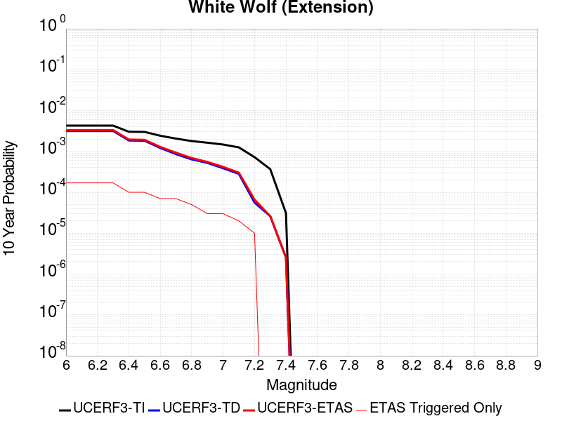 |

| Magnitude | 1 wk TI Prob | 1 wk TD Prob | 1 wk ETAS Prob | 1 wk ETAS/TD Gain | 1 wk ETAS Triggered Only | 1 mo TI Prob | 1 mo TD Prob | 1 mo ETAS Prob | 1 mo ETAS/TD Gain | 1 mo ETAS Triggered Only | 1 yr TI Prob | 1 yr TD Prob | 1 yr ETAS Prob | 1 yr ETAS/TD Gain | 1 yr ETAS Triggered Only | 10 yr TI Prob | 10 yr TD Prob | 10 yr ETAS Prob | 10 yr ETAS/TD Gain | 10 yr ETAS Triggered Only |
|-----|-----|-----|-----|-----|-----|-----|-----|-----|-----|-----|-----|-----|-----|-----|-----|-----|-----|-----|-----|-----|
| 6.0 | 8.222555E-6 | 6.066746E-6 | 2.6066626E-5 | 4.29664 | 2.0E-5 | 3.5239045E-5 | 2.6000118E-5 | 5.599934E-5 | 2.153811 | 3.0E-5 | 4.289509E-4 | 3.1651207E-4 | 3.8648993E-4 | 1.2210906 | 7.0E-5 | 0.0042812387 | 0.0031612648 | 0.0033307273 | 1.0536059 | 1.7E-4 |
| 6.1 | 8.222555E-6 | 6.066746E-6 | 2.6066626E-5 | 4.29664 | 2.0E-5 | 3.5239045E-5 | 2.6000118E-5 | 5.599934E-5 | 2.153811 | 3.0E-5 | 4.289509E-4 | 3.1651207E-4 | 3.8648993E-4 | 1.2210906 | 7.0E-5 | 0.0042812387 | 0.0031612648 | 0.0033307273 | 1.0536059 | 1.7E-4 |
| 6.2 | 8.222555E-6 | 6.066746E-6 | 2.6066626E-5 | 4.29664 | 2.0E-5 | 3.5239045E-5 | 2.6000118E-5 | 5.599934E-5 | 2.153811 | 3.0E-5 | 4.289509E-4 | 3.1651207E-4 | 3.8648993E-4 | 1.2210906 | 7.0E-5 | 0.0042812387 | 0.0031612648 | 0.0033307273 | 1.0536059 | 1.7E-4 |
| 6.3 | 8.222555E-6 | 6.066746E-6 | 2.6066626E-5 | 4.29664 | 2.0E-5 | 3.5239045E-5 | 2.6000118E-5 | 5.599934E-5 | 2.153811 | 3.0E-5 | 4.289509E-4 | 3.1651207E-4 | 3.8648993E-4 | 1.2210906 | 7.0E-5 | 0.0042812387 | 0.0031612648 | 0.0033307273 | 1.0536059 | 1.7E-4 |
| 6.4 | 5.821773E-6 | 3.5572268E-6 | 1.3557191E-5 | 3.8111687 | 1.0E-5 | 2.4950215E-5 | 1.5245175E-5 | 2.5245023E-5 | 1.6559353 | 1.0E-5 | 3.0372653E-4 | 1.8559529E-4 | 2.2558786E-4 | 1.2154827 | 4.0E-5 | 0.0030331176 | 0.0018545112 | 0.0019543257 | 1.0538225 | 1.0E-4 |
| 6.5 | 5.766023E-6 | 3.4991601E-6 | 1.3499125E-5 | 3.8578186 | 1.0E-5 | 2.4711293E-5 | 1.4996321E-5 | 2.499617E-5 | 1.6668202 | 1.0E-5 | 3.0081844E-4 | 1.82566E-4 | 2.2255871E-4 | 1.2190589 | 4.0E-5 | 0.0030041158 | 0.0018242685 | 0.001924086 | 1.0547165 | 1.0E-4 |
| 6.6 | 4.643576E-6 | 2.3326616E-6 | 1.2332638E-5 | 5.2869387 | 1.0E-5 | 1.9900888E-5 | 9.997085E-6 | 1.9996985E-5 | 2.0002816 | 1.0E-5 | 2.4226638E-4 | 1.21708144E-4 | 1.5170449E-4 | 1.2464613 | 3.0E-5 | 0.0024200242 | 0.0012164573 | 0.0012863722 | 1.0574741 | 7.0E-5 |
| 6.7 | 3.9529173E-6 | 1.6483779E-6 | 1.1648362E-5 | 7.0665603 | 1.0E-5 | 1.6940963E-5 | 7.0644587E-6 | 1.7064387E-5 | 2.4155266 | 1.0E-5 | 2.0623671E-4 | 8.600658E-5 | 1.16004E-4 | 1.3487805 | 3.0E-5 | 0.002060454 | 8.597514E-4 | 9.2969125E-4 | 1.0813489 | 7.0E-5 |
| 6.8 | 3.4377522E-6 | 1.2245486E-6 | 1.1224536E-5 | 9.166265 | 1.0E-5 | 1.473314E-5 | 5.2480555E-6 | 1.5248003E-5 | 2.9054577 | 1.0E-5 | 1.7936122E-4 | 6.389329E-5 | 9.389138E-5 | 1.4695028 | 3.0E-5 | 0.0017921652 | 6.3875836E-4 | 6.8872643E-4 | 1.0782268 | 5.0E-5 |
| 6.9 | 3.1367306E-6 | 1.0034003E-6 | 1.0034003E-6 | 1.0 | 0.0 | 1.3443062E-5 | 4.30028E-6 | 4.30028E-6 | 1.0 | 0.0 | 1.63657E-4 | 5.235473E-5 | 6.235421E-5 | 1.1909947 | 1.0E-5 | 0.0016353652 | 5.234316E-4 | 5.534159E-4 | 1.0572841 | 3.0E-5 |
| 7.0 | 2.8298145E-6 | 7.428855E-7 | 7.428855E-7 | 1.0 | 0.0 | 1.2127721E-5 | 3.1837913E-6 | 3.1837913E-6 | 1.0 | 0.0 | 1.47645E-4 | 3.876202E-5 | 4.8761634E-5 | 1.2579745 | 1.0E-5 | 0.0014754693 | 3.8755758E-4 | 4.1754596E-4 | 1.0773778 | 3.0E-5 |
| 7.1 | 2.4091064E-6 | 5.422905E-7 | 5.422905E-7 | 1.0 | 0.0 | 1.03247E-5 | 2.3241003E-6 | 2.3241003E-6 | 1.0 | 0.0 | 1.2569598E-4 | 2.8295595E-5 | 2.8295595E-5 | 1.0 | 0.0 | 0.001256249 | 2.8292395E-4 | 3.029183E-4 | 1.0706704 | 2.0E-5 |
| 7.2 | 1.3875518E-6 | 1.07438126E-7 | 1.07438126E-7 | 1.0 | 0.0 | 5.9466374E-6 | 4.6044906E-7 | 4.6044906E-7 | 1.0 | 0.0 | 7.23979E-5 | 5.605954E-6 | 5.605954E-6 | 1.0 | 0.0 | 7.2374323E-4 | 5.6058238E-5 | 6.605768E-5 | 1.178376 | 1.0E-5 |
| 7.3 | 7.056077E-7 | 5.002465E-8 | 5.002465E-8 | 1.0 | 0.0 | 3.0240296E-6 | 2.1439133E-7 | 2.1439133E-7 | 1.0 | 0.0 | 3.681694E-5 | 2.6102118E-6 | 2.6102118E-6 | 1.0 | 0.0 | 3.681084E-4 | 2.6101858E-5 | 2.6101858E-5 | 1.0 | 0.0 |
| 7.4 | 5.9334678E-8 | 4.8687716E-9 | 4.8687716E-9 | 1.0 | 0.0 | 2.5429145E-7 | 2.0866164E-8 | 2.0866164E-8 | 1.0 | 0.0 | 3.095994E-6 | 2.5404555E-7 | 2.5404555E-7 | 1.0 | 0.0 | 3.095951E-5 | 2.5404536E-6 | 2.5404536E-6 | 1.0 | 0.0 |

## San Andreas (Coachella) rev
*[(top)](#table-of-contents)*

| 1 Week | 1 Month | 1 Year | 10 Year |
|-----|-----|-----|-----|
|  | 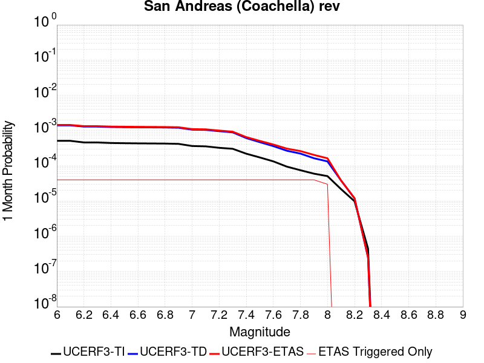 |  |  |

| Magnitude | 1 wk TI Prob | 1 wk TD Prob | 1 wk ETAS Prob | 1 wk ETAS/TD Gain | 1 wk ETAS Triggered Only | 1 mo TI Prob | 1 mo TD Prob | 1 mo ETAS Prob | 1 mo ETAS/TD Gain | 1 mo ETAS Triggered Only | 1 yr TI Prob | 1 yr TD Prob | 1 yr ETAS Prob | 1 yr ETAS/TD Gain | 1 yr ETAS Triggered Only | 10 yr TI Prob | 10 yr TD Prob | 10 yr ETAS Prob | 10 yr ETAS/TD Gain | 10 yr ETAS Triggered Only |
|-----|-----|-----|-----|-----|-----|-----|-----|-----|-----|-----|-----|-----|-----|-----|-----|-----|-----|-----|-----|-----|
| 6.0 | 1.1925945E-4 | 3.273821E-4 | 3.3737882E-4 | 1.0305353 | 1.0E-5 | 5.110118E-4 | 0.0014023164 | 0.0014422603 | 1.0284842 | 4.0E-5 | 0.0062038354 | 0.016940884 | 0.017009698 | 1.004062 | 7.0E-5 | 0.060334753 | 0.15268753 | 0.15281464 | 1.0008324 | 1.5E-4 |
| 6.1 | 1.1925945E-4 | 3.273821E-4 | 3.3737882E-4 | 1.0305353 | 1.0E-5 | 5.110118E-4 | 0.0014023164 | 0.0014422603 | 1.0284842 | 4.0E-5 | 0.0062038354 | 0.016940884 | 0.017009698 | 1.004062 | 7.0E-5 | 0.060334753 | 0.15268753 | 0.15281464 | 1.0008324 | 1.5E-4 |
| 6.2 | 1.07432395E-4 | 3.02389E-4 | 3.12386E-4 | 1.03306 | 1.0E-5 | 4.603433E-4 | 0.0012953132 | 0.0013352614 | 1.0308405 | 4.0E-5 | 0.005590286 | 0.015657501 | 0.015726406 | 1.0044007 | 7.0E-5 | 0.05451731 | 0.1418587 | 0.14198741 | 1.0009074 | 1.5E-4 |
| 6.3 | 1.0718766E-4 | 3.0184205E-4 | 3.1183905E-4 | 1.0331199 | 1.0E-5 | 4.592948E-4 | 0.0012929715 | 0.0013329198 | 1.0308965 | 4.0E-5 | 0.005577586 | 0.015629401 | 0.015698306 | 1.0044087 | 7.0E-5 | 0.054396555 | 0.14162697 | 0.14175572 | 1.0009091 | 1.5E-4 |
| 6.4 | 1.0355944E-4 | 2.9392284E-4 | 3.039199E-4 | 1.0340126 | 1.0E-5 | 4.4375064E-4 | 0.0012590651 | 0.0012990148 | 1.0317296 | 4.0E-5 | 0.0053892885 | 0.01522243 | 0.015291364 | 1.0045285 | 7.0E-5 | 0.052604496 | 0.1381871 | 0.13830775 | 1.0008731 | 1.4E-4 |
| 6.5 | 1.0227914E-4 | 2.9111715E-4 | 3.0111423E-4 | 1.0343404 | 1.0E-5 | 4.382655E-4 | 0.0012470522 | 0.0012870023 | 1.0320356 | 4.0E-5 | 0.0053228354 | 0.015078207 | 0.015147151 | 1.0045725 | 7.0E-5 | 0.051971316 | 0.1369663 | 0.13708712 | 1.0008821 | 1.4E-4 |
| 6.6 | 1.0116757E-4 | 2.887746E-4 | 2.9877172E-4 | 1.0346191 | 1.0E-5 | 4.3350324E-4 | 0.0012370225 | 0.0012769729 | 1.0322957 | 4.0E-5 | 0.0052651367 | 0.014957775 | 0.015026729 | 1.0046098 | 7.0E-5 | 0.051421247 | 0.1359445 | 0.13606547 | 1.0008898 | 1.4E-4 |
| 6.7 | 1.0050676E-4 | 2.8736022E-4 | 2.9735736E-4 | 1.0347896 | 1.0E-5 | 4.3067214E-4 | 0.0012309664 | 0.0012709172 | 1.0324548 | 4.0E-5 | 0.005230834 | 0.014885054 | 0.014954013 | 1.0046327 | 7.0E-5 | 0.051094085 | 0.13532923 | 0.13545029 | 1.0008945 | 1.4E-4 |
| 6.8 | 9.976819E-5 | 2.853967E-4 | 2.9539384E-4 | 1.0350289 | 1.0E-5 | 4.2750788E-4 | 0.0012225593 | 0.0012625103 | 1.0326782 | 4.0E-5 | 0.0051924936 | 0.01478409 | 0.014853056 | 1.0046648 | 7.0E-5 | 0.050728295 | 0.13448092 | 0.1346021 | 1.000901 | 1.4E-4 |
| 6.9 | 9.77719E-5 | 2.8036523E-4 | 2.9036243E-4 | 1.0356578 | 1.0E-5 | 4.1895514E-4 | 0.0012010159 | 0.0012409678 | 1.0332651 | 4.0E-5 | 0.0050888555 | 0.014525326 | 0.01459431 | 1.0047492 | 7.0E-5 | 0.049738888 | 0.13230929 | 0.13243076 | 1.0009181 | 1.4E-4 |
| 7.0 | 8.500761E-5 | 2.477065E-4 | 2.5770403E-4 | 1.0403603 | 1.0E-5 | 3.6426744E-4 | 0.0010611707 | 0.0011011282 | 1.0376542 | 4.0E-5 | 0.0044259406 | 0.0128439935 | 0.012903223 | 1.0046115 | 6.0E-5 | 0.04338823 | 0.11816597 | 0.118280604 | 1.0009701 | 1.3E-4 |
| 7.1 | 8.319876E-5 | 2.4373304E-4 | 2.537306E-4 | 1.0410185 | 1.0E-5 | 3.5651738E-4 | 0.0010441552 | 0.0010841135 | 1.0382684 | 4.0E-5 | 0.004331963 | 0.0126392525 | 0.012698494 | 1.0046871 | 6.0E-5 | 0.042484846 | 0.11638594 | 0.1165008 | 1.0009869 | 1.3E-4 |
| 7.2 | 7.563917E-5 | 2.2421507E-4 | 2.3421281E-4 | 1.04459 | 1.0E-5 | 3.2412758E-4 | 9.605709E-4 | 0.0010005324 | 1.0416019 | 4.0E-5 | 0.0039391145 | 0.011632929 | 0.011692231 | 1.0050977 | 6.0E-5 | 0.03870018 | 0.107791536 | 0.107907526 | 1.001076 | 1.3E-4 |
| 7.3 | 7.082985E-5 | 2.0737379E-4 | 2.1737171E-4 | 1.048212 | 1.0E-5 | 3.0352117E-4 | 8.88445E-4 | 9.2840946E-4 | 1.0449824 | 4.0E-5 | 0.0036891096 | 0.010763795 | 0.010823149 | 1.0055143 | 6.0E-5 | 0.03628465 | 0.10031335 | 0.10043031 | 1.001166 | 1.3E-4 |
| 7.4 | 5.146215E-5 | 1.4279918E-4 | 1.5279774E-4 | 1.0700184 | 1.0E-5 | 2.2053342E-4 | 6.1185384E-4 | 6.5182935E-4 | 1.065335 | 4.0E-5 | 0.0026816884 | 0.0074240654 | 0.0074836197 | 1.0080218 | 6.0E-5 | 0.02649557 | 0.070876285 | 0.070997074 | 1.0017042 | 1.3E-4 |
| 7.5 | 4.0285166E-5 | 1.0946912E-4 | 1.1946802E-4 | 1.09134 | 1.0E-5 | 1.7263928E-4 | 4.6906932E-4 | 5.0905056E-4 | 1.0852352 | 4.0E-5 | 0.002099857 | 0.0056960345 | 0.0057556927 | 1.0104736 | 6.0E-5 | 0.020801254 | 0.05503479 | 0.055148184 | 1.0020604 | 1.2E-4 |
| 7.6 | 3.1168736E-5 | 8.44363E-5 | 9.443546E-5 | 1.1184225 | 1.0E-5 | 1.3357346E-4 | 3.618198E-4 | 4.0180536E-4 | 1.1105123 | 4.0E-5 | 0.0016250437 | 0.004396285 | 0.0044560214 | 1.0135878 | 6.0E-5 | 0.016132116 | 0.042831328 | 0.04294619 | 1.0026817 | 1.2E-4 |
| 7.7 | 2.2100989E-5 | 6.2429055E-5 | 7.242843E-5 | 1.1601719 | 1.0E-5 | 9.4715084E-5 | 2.675257E-4 | 3.07515E-4 | 1.1494783 | 4.0E-5 | 0.001152546 | 0.0032522671 | 0.003312072 | 1.0183886 | 6.0E-5 | 0.011465867 | 0.031919047 | 0.032035217 | 1.0036395 | 1.2E-4 |
| 7.8 | 1.7484861E-5 | 5.1832718E-5 | 6.18322E-5 | 1.1929183 | 1.0E-5 | 7.493296E-5 | 2.2212132E-4 | 2.6211244E-4 | 1.1800418 | 4.0E-5 | 9.1192697E-4 | 0.002700976 | 0.002760814 | 1.0221542 | 6.0E-5 | 0.009081938 | 0.026656965 | 0.0267543 | 1.0036514 | 1.0E-4 |
| 7.9 | 1.3967285E-5 | 3.8252856E-5 | 4.8252474E-5 | 1.2614084 | 1.0E-5 | 5.985842E-5 | 1.6393051E-4 | 2.0392396E-4 | 1.2439659 | 4.0E-5 | 7.2853256E-4 | 0.0019940282 | 0.0020439285 | 1.0250249 | 5.0E-5 | 0.0072614877 | 0.019923447 | 0.020011654 | 1.0044273 | 9.0E-5 |
| 8.0 | 1.1887396E-5 | 3.109123E-5 | 4.109092E-5 | 1.3216242 | 1.0E-5 | 5.094499E-5 | 1.3324132E-4 | 1.6323733E-4 | 1.2251253 | 3.0E-5 | 6.200787E-4 | 0.0016210071 | 0.0016609422 | 1.024636 | 4.0E-5 | 0.006183513 | 0.016291393 | 0.01637009 | 1.0048306 | 8.0E-5 |
| 8.1 | 5.100864E-6 | 8.98391E-6 | 8.98391E-6 | 1.0 | 0.0 | 2.1860664E-5 | 3.8501905E-5 | 3.8501905E-5 | 1.0 | 0.0 | 2.6612106E-4 | 4.6866E-4 | 4.6866E-4 | 1.0 | 0.0 | 0.002658026 | 0.0049229623 | 0.004932913 | 1.0020213 | 1.0E-5 |
| 8.2 | 2.3004484E-6 | 2.7906688E-6 | 2.7906688E-6 | 1.0 | 0.0 | 9.859027E-6 | 1.1959954E-5 | 1.1959954E-5 | 1.0 | 0.0 | 1.2002704E-4 | 1.4560274E-4 | 1.4560274E-4 | 1.0 | 0.0 | 0.0011996223 | 0.0015995705 | 0.0015995705 | 1.0 | 0.0 |
| 8.3 | 1.0424446E-7 | 5.8277656E-8 | 5.8277656E-8 | 1.0 | 0.0 | 4.4676187E-7 | 2.4976137E-7 | 2.4976137E-7 | 1.0 | 0.0 | 5.439312E-6 | 3.0408405E-6 | 3.0408405E-6 | 1.0 | 0.0 | 5.4391792E-5 | 3.196925E-5 | 3.196925E-5 | 1.0 | 0.0 |

## Baker
*[(top)](#table-of-contents)*

| 1 Week | 1 Month | 1 Year | 10 Year |
|-----|-----|-----|-----|
|  |  |  |  |

| Magnitude | 1 wk TI Prob | 1 wk TD Prob | 1 wk ETAS Prob | 1 wk ETAS/TD Gain | 1 wk ETAS Triggered Only | 1 mo TI Prob | 1 mo TD Prob | 1 mo ETAS Prob | 1 mo ETAS/TD Gain | 1 mo ETAS Triggered Only | 1 yr TI Prob | 1 yr TD Prob | 1 yr ETAS Prob | 1 yr ETAS/TD Gain | 1 yr ETAS Triggered Only | 10 yr TI Prob | 10 yr TD Prob | 10 yr ETAS Prob | 10 yr ETAS/TD Gain | 10 yr ETAS Triggered Only |
|-----|-----|-----|-----|-----|-----|-----|-----|-----|-----|-----|-----|-----|-----|-----|-----|-----|-----|-----|-----|-----|
| 6.0 | 5.695525E-6 | 5.834875E-6 | 5.834875E-6 | 1.0 | 0.0 | 2.4409164E-5 | 2.5006391E-5 | 4.500589E-5 | 1.7997756 | 2.0E-5 | 2.9714106E-4 | 3.0441428E-4 | 4.0438384E-4 | 1.3283997 | 1.0E-4 | 0.0029674405 | 0.0030403684 | 0.003199882 | 1.0524652 | 1.6E-4 |
| 6.1 | 5.695525E-6 | 5.834875E-6 | 5.834875E-6 | 1.0 | 0.0 | 2.4409164E-5 | 2.5006391E-5 | 4.500589E-5 | 1.7997756 | 2.0E-5 | 2.9714106E-4 | 3.0441428E-4 | 4.0438384E-4 | 1.3283997 | 1.0E-4 | 0.0029674405 | 0.0030403684 | 0.003199882 | 1.0524652 | 1.6E-4 |
| 6.2 | 5.695525E-6 | 5.834875E-6 | 5.834875E-6 | 1.0 | 0.0 | 2.4409164E-5 | 2.5006391E-5 | 4.500589E-5 | 1.7997756 | 2.0E-5 | 2.9714106E-4 | 3.0441428E-4 | 4.0438384E-4 | 1.3283997 | 1.0E-4 | 0.0029674405 | 0.0030403684 | 0.003199882 | 1.0524652 | 1.6E-4 |
| 6.3 | 3.2995713E-6 | 3.3836902E-6 | 3.3836902E-6 | 1.0 | 0.0 | 1.4140943E-5 | 1.4501451E-5 | 1.4501451E-5 | 1.0 | 0.0 | 1.7215237E-4 | 1.7654135E-4 | 2.4652897E-4 | 1.3964376 | 7.0E-5 | 0.0017201907 | 0.001764058 | 0.0018838464 | 1.067905 | 1.2E-4 |
| 6.4 | 3.2995713E-6 | 3.3836902E-6 | 3.3836902E-6 | 1.0 | 0.0 | 1.4140943E-5 | 1.4501451E-5 | 1.4501451E-5 | 1.0 | 0.0 | 1.7215237E-4 | 1.7654135E-4 | 2.4652897E-4 | 1.3964376 | 7.0E-5 | 0.0017201907 | 0.001764058 | 0.0018838464 | 1.067905 | 1.2E-4 |
| 6.5 | 2.782202E-6 | 2.8558607E-6 | 2.8558607E-6 | 1.0 | 0.0 | 1.1923668E-5 | 1.2239348E-5 | 1.2239348E-5 | 1.0 | 0.0 | 1.4516099E-4 | 1.4900419E-4 | 2.1899377E-4 | 1.4697155 | 7.0E-5 | 0.001450662 | 0.0014890756 | 0.0016088969 | 1.0804669 | 1.2E-4 |
| 6.6 | 2.3163404E-6 | 2.3809378E-6 | 2.3809378E-6 | 1.0 | 0.0 | 9.927136E-6 | 1.020398E-5 | 1.020398E-5 | 1.0 | 0.0 | 1.20856166E-4 | 1.2422659E-4 | 1.8421913E-4 | 1.4829284 | 6.0E-5 | 0.0012079047 | 0.0012415916 | 0.001351455 | 1.088486 | 1.1E-4 |
| 6.7 | 2.037056E-6 | 2.096517E-6 | 2.096517E-6 | 1.0 | 0.0 | 8.7302105E-6 | 8.985042E-6 | 8.985042E-6 | 1.0 | 0.0 | 1.0628513E-4 | 1.0938756E-4 | 1.69381E-4 | 1.5484484 | 6.0E-5 | 0.0010623431 | 0.0010933533 | 0.001193244 | 1.0913618 | 1.0E-4 |
| 6.8 | 1.8356744E-6 | 1.8915441E-6 | 1.8915441E-6 | 1.0 | 0.0 | 7.867153E-6 | 8.106594E-6 | 8.106594E-6 | 1.0 | 0.0 | 9.577837E-5 | 9.869345E-5 | 1.4868852E-4 | 1.5065693 | 5.0E-5 | 9.57371E-4 | 9.865101E-4 | 0.0010764214 | 1.0911407 | 9.0E-5 |
| 6.9 | 1.6310546E-6 | 1.6832216E-6 | 1.6832216E-6 | 1.0 | 0.0 | 6.9902153E-6 | 7.2137877E-6 | 7.2137877E-6 | 1.0 | 0.0 | 8.510255E-5 | 8.782444E-5 | 1.2782092E-4 | 1.455414 | 4.0E-5 | 8.5069967E-4 | 8.779086E-4 | 9.578384E-4 | 1.0910456 | 8.0E-5 |
| 7.0 | 1.2058036E-6 | 1.2508791E-6 | 1.2508791E-6 | 1.0 | 0.0 | 5.1677193E-6 | 5.360899E-6 | 5.360899E-6 | 1.0 | 0.0 | 6.291517E-5 | 6.526702E-5 | 9.526506E-5 | 1.4596202 | 3.0E-5 | 6.289736E-4 | 6.524808E-4 | 7.224351E-4 | 1.1072129 | 7.0E-5 |
| 7.1 | 1.052382E-6 | 1.0951728E-6 | 1.0951728E-6 | 1.0 | 0.0 | 4.5102006E-6 | 4.6935893E-6 | 4.6935893E-6 | 1.0 | 0.0 | 5.491031E-5 | 5.714296E-5 | 7.714181E-5 | 1.3499794 | 2.0E-5 | 5.4896745E-4 | 5.712835E-4 | 6.312493E-4 | 1.1049666 | 6.0E-5 |
| 7.2 | 1.0067454E-6 | 1.0487828E-6 | 1.0487828E-6 | 1.0 | 0.0 | 4.3146156E-6 | 4.4947756E-6 | 4.4947756E-6 | 1.0 | 0.0 | 5.252918E-5 | 5.4722528E-5 | 7.4721436E-5 | 1.3654602 | 2.0E-5 | 5.251676E-4 | 5.4709136E-4 | 5.9706403E-4 | 1.0913424 | 5.0E-5 |
| 7.3 | 9.3596316E-7 | 9.767837E-7 | 9.767837E-7 | 1.0 | 0.0 | 4.0112645E-6 | 4.186209E-6 | 4.186209E-6 | 1.0 | 0.0 | 4.8836053E-5 | 5.0965915E-5 | 7.0964896E-5 | 1.3923992 | 2.0E-5 | 4.8825322E-4 | 5.0954305E-4 | 5.5951753E-4 | 1.0980772 | 5.0E-5 |
| 7.4 | 8.8117395E-7 | 9.207774E-7 | 9.207774E-7 | 1.0 | 0.0 | 3.7764542E-6 | 3.946183E-6 | 3.946183E-6 | 1.0 | 0.0 | 4.5977362E-5 | 4.8043723E-5 | 5.8043242E-5 | 1.2081337 | 1.0E-5 | 4.596785E-4 | 4.8033413E-4 | 5.203149E-4 | 1.0832354 | 4.0E-5 |
| 7.5 | 8.292386E-7 | 8.6747025E-7 | 8.6747025E-7 | 1.0 | 0.0 | 3.5538749E-6 | 3.7177244E-6 | 3.7177244E-6 | 1.0 | 0.0 | 4.326757E-5 | 4.526236E-5 | 5.526191E-5 | 1.2209241 | 1.0E-5 | 4.3259145E-4 | 4.5253217E-4 | 4.9251405E-4 | 1.0883515 | 4.0E-5 |
| 7.6 | 7.553842E-7 | 7.914571E-7 | 7.914571E-7 | 1.0 | 0.0 | 3.2373566E-6 | 3.3919548E-6 | 3.3919548E-6 | 1.0 | 0.0 | 3.9414106E-5 | 4.1296273E-5 | 5.129586E-5 | 1.2421426 | 1.0E-5 | 3.9407116E-4 | 4.128867E-4 | 4.5287018E-4 | 1.0968388 | 4.0E-5 |
| 7.7 | 6.5285366E-7 | 6.8528874E-7 | 6.8528874E-7 | 1.0 | 0.0 | 2.797941E-6 | 2.9369485E-6 | 2.9369485E-6 | 1.0 | 0.0 | 3.40644E-5 | 3.575677E-5 | 4.575641E-5 | 1.2796574 | 1.0E-5 | 3.405918E-4 | 3.575108E-4 | 3.875001E-4 | 1.0838835 | 3.0E-5 |
| 7.8 | 3.4586725E-7 | 3.6483146E-7 | 3.6483146E-7 | 1.0 | 0.0 | 1.4822873E-6 | 1.5635625E-6 | 1.5635625E-6 | 1.0 | 0.0 | 1.80467E-5 | 1.9036212E-5 | 2.9036022E-5 | 1.5253046 | 1.0E-5 | 1.8045233E-4 | 1.9034625E-4 | 2.0034435E-4 | 1.0525259 | 1.0E-5 |
| 7.9 | 2.5591178E-9 | 2.6697022E-9 | 2.6697022E-9 | 1.0 | 0.0 | 1.0967647E-8 | 1.1441582E-8 | 1.1441582E-8 | 1.0 | 0.0 | 1.335311E-7 | 1.3930125E-7 | 1.3930125E-7 | 1.0 | 0.0 | 1.3353102E-6 | 1.3930126E-6 | 1.3930126E-6 | 1.0 | 0.0 |

## Ludlow
*[(top)](#table-of-contents)*

| 1 Week | 1 Month | 1 Year | 10 Year |
|-----|-----|-----|-----|
|  |  |  |  |

| Magnitude | 1 wk TI Prob | 1 wk TD Prob | 1 wk ETAS Prob | 1 wk ETAS/TD Gain | 1 wk ETAS Triggered Only | 1 mo TI Prob | 1 mo TD Prob | 1 mo ETAS Prob | 1 mo ETAS/TD Gain | 1 mo ETAS Triggered Only | 1 yr TI Prob | 1 yr TD Prob | 1 yr ETAS Prob | 1 yr ETAS/TD Gain | 1 yr ETAS Triggered Only | 10 yr TI Prob | 10 yr TD Prob | 10 yr ETAS Prob | 10 yr ETAS/TD Gain | 10 yr ETAS Triggered Only |
|-----|-----|-----|-----|-----|-----|-----|-----|-----|-----|-----|-----|-----|-----|-----|-----|-----|-----|-----|-----|-----|
| 6.0 | 2.2407607E-5 | 2.3657603E-5 | 3.365737E-5 | 1.422687 | 1.0E-5 | 9.602906E-5 | 1.0138604E-4 | 1.1138502E-4 | 1.0986229 | 1.0E-5 | 0.0011685267 | 0.0012337202 | 0.0013036338 | 1.056669 | 7.0E-5 | 0.011624013 | 0.012273222 | 0.012421382 | 1.0120717 | 1.5E-4 |
| 6.1 | 2.2407607E-5 | 2.3657603E-5 | 3.365737E-5 | 1.422687 | 1.0E-5 | 9.602906E-5 | 1.0138604E-4 | 1.1138502E-4 | 1.0986229 | 1.0E-5 | 0.0011685267 | 0.0012337202 | 0.0013036338 | 1.056669 | 7.0E-5 | 0.011624013 | 0.012273222 | 0.012421382 | 1.0120717 | 1.5E-4 |
| 6.2 | 1.0781252E-5 | 1.1365827E-5 | 1.1365827E-5 | 1.0 | 0.0 | 4.620455E-5 | 4.87098E-5 | 4.87098E-5 | 1.0 | 0.0 | 5.623952E-4 | 5.928845E-4 | 6.228667E-4 | 1.0505701 | 3.0E-5 | 0.00560974 | 0.005913446 | 0.0059830323 | 1.0117674 | 7.0E-5 |
| 6.3 | 1.0781252E-5 | 1.1365827E-5 | 1.1365827E-5 | 1.0 | 0.0 | 4.620455E-5 | 4.87098E-5 | 4.87098E-5 | 1.0 | 0.0 | 5.623952E-4 | 5.928845E-4 | 6.228667E-4 | 1.0505701 | 3.0E-5 | 0.00560974 | 0.005913446 | 0.0059830323 | 1.0117674 | 7.0E-5 |
| 6.4 | 7.814439E-6 | 8.237847E-6 | 8.237847E-6 | 1.0 | 0.0 | 3.3490025E-5 | 3.530459E-5 | 3.530459E-5 | 1.0 | 0.0 | 4.0766477E-4 | 4.2975E-4 | 4.5973712E-4 | 1.0697781 | 3.0E-5 | 0.0040691774 | 0.004289336 | 0.0043490785 | 1.0139282 | 6.0E-5 |
| 6.5 | 6.4986366E-6 | 6.851018E-6 | 6.851018E-6 | 1.0 | 0.0 | 2.7851002E-5 | 2.9361181E-5 | 2.9361181E-5 | 1.0 | 0.0 | 3.390332E-4 | 3.5741468E-4 | 3.8740394E-4 | 1.0839062 | 3.0E-5 | 0.003385164 | 0.0035684945 | 0.0036282805 | 1.0167538 | 6.0E-5 |
| 6.6 | 5.582177E-6 | 5.8860905E-6 | 5.8860905E-6 | 1.0 | 0.0 | 2.3923398E-5 | 2.5225863E-5 | 2.5225863E-5 | 1.0 | 0.0 | 2.9122844E-4 | 3.0708231E-4 | 3.1707925E-4 | 1.0325545 | 1.0E-5 | 0.0029084706 | 0.0030666532 | 0.0031065305 | 1.0130036 | 4.0E-5 |
| 6.7 | 4.6858763E-6 | 4.9404985E-6 | 4.9404985E-6 | 1.0 | 0.0 | 2.0082172E-5 | 2.1173397E-5 | 2.1173397E-5 | 1.0 | 0.0 | 2.4447302E-4 | 2.5775615E-4 | 2.6775358E-4 | 1.0387864 | 1.0E-5 | 0.0024420423 | 0.0025746285 | 0.0026145254 | 1.0154963 | 4.0E-5 |
| 6.8 | 3.5584908E-6 | 3.7520724E-6 | 3.7520724E-6 | 1.0 | 0.0 | 1.5250586E-5 | 1.6080214E-5 | 1.6080214E-5 | 1.0 | 0.0 | 1.8566006E-4 | 1.9575942E-4 | 2.0575747E-4 | 1.0510731 | 1.0E-5 | 0.0018550502 | 0.0019559108 | 0.0019858521 | 1.0153081 | 3.0E-5 |
| 6.9 | 2.532834E-6 | 2.671042E-6 | 2.671042E-6 | 1.0 | 0.0 | 1.0854958E-5 | 1.1447275E-5 | 1.1447275E-5 | 1.0 | 0.0 | 1.3215111E-4 | 1.3936193E-4 | 1.4936054E-4 | 1.0717456 | 1.0E-5 | 0.0013207254 | 0.001392773 | 0.0014127451 | 1.0143398 | 2.0E-5 |
| 7.0 | 1.7083285E-6 | 1.80197E-6 | 1.80197E-6 | 1.0 | 0.0 | 7.3213873E-6 | 7.722707E-6 | 7.722707E-6 | 1.0 | 0.0 | 8.913424E-5 | 9.402007E-5 | 1.0401913E-4 | 1.1063503 | 1.0E-5 | 8.9098496E-4 | 9.398194E-4 | 9.598006E-4 | 1.0212607 | 2.0E-5 |
| 7.1 | 1.0905424E-6 | 1.1497785E-6 | 1.1497785E-6 | 1.0 | 0.0 | 4.6737446E-6 | 4.9276136E-6 | 4.9276136E-6 | 1.0 | 0.0 | 5.6901354E-5 | 5.9992144E-5 | 6.999154E-5 | 1.1666785 | 1.0E-5 | 5.6886784E-4 | 5.9976924E-4 | 6.197573E-4 | 1.0333261 | 2.0E-5 |
| 7.2 | 6.06668E-7 | 6.387367E-7 | 6.387367E-7 | 1.0 | 0.0 | 2.600003E-6 | 2.7374406E-6 | 2.7374406E-6 | 1.0 | 0.0 | 3.1654577E-5 | 3.33279E-5 | 3.33279E-5 | 1.0 | 0.0 | 3.1650066E-4 | 3.3323586E-4 | 3.3323586E-4 | 1.0 | 0.0 |

## Lake Isabella (Seismicity)
*[(top)](#table-of-contents)*

| 1 Week | 1 Month | 1 Year | 10 Year |
|-----|-----|-----|-----|
|  |  |  |  |

| Magnitude | 1 wk TI Prob | 1 wk TD Prob | 1 wk ETAS Prob | 1 wk ETAS/TD Gain | 1 wk ETAS Triggered Only | 1 mo TI Prob | 1 mo TD Prob | 1 mo ETAS Prob | 1 mo ETAS/TD Gain | 1 mo ETAS Triggered Only | 1 yr TI Prob | 1 yr TD Prob | 1 yr ETAS Prob | 1 yr ETAS/TD Gain | 1 yr ETAS Triggered Only | 10 yr TI Prob | 10 yr TD Prob | 10 yr ETAS Prob | 10 yr ETAS/TD Gain | 10 yr ETAS Triggered Only |
|-----|-----|-----|-----|-----|-----|-----|-----|-----|-----|-----|-----|-----|-----|-----|-----|-----|-----|-----|-----|-----|
| 6.0 | 9.431637E-6 | 9.741737E-6 | 9.741737E-6 | 1.0 | 0.0 | 4.0420677E-5 | 4.1749707E-5 | 6.174887E-5 | 1.4790252 | 2.0E-5 | 4.920106E-4 | 5.081972E-4 | 5.5817177E-4 | 1.098337 | 5.0E-5 | 0.004909227 | 0.005071643 | 0.0052009835 | 1.0255027 | 1.3E-4 |
| 6.1 | 9.431637E-6 | 9.741737E-6 | 9.741737E-6 | 1.0 | 0.0 | 4.0420677E-5 | 4.1749707E-5 | 6.174887E-5 | 1.4790252 | 2.0E-5 | 4.920106E-4 | 5.081972E-4 | 5.5817177E-4 | 1.098337 | 5.0E-5 | 0.004909227 | 0.005071643 | 0.0052009835 | 1.0255027 | 1.3E-4 |
| 6.2 | 9.431637E-6 | 9.741737E-6 | 9.741737E-6 | 1.0 | 0.0 | 4.0420677E-5 | 4.1749707E-5 | 6.174887E-5 | 1.4790252 | 2.0E-5 | 4.920106E-4 | 5.081972E-4 | 5.5817177E-4 | 1.098337 | 5.0E-5 | 0.004909227 | 0.005071643 | 0.0052009835 | 1.0255027 | 1.3E-4 |
| 6.3 | 9.431637E-6 | 9.741737E-6 | 9.741737E-6 | 1.0 | 0.0 | 4.0420677E-5 | 4.1749707E-5 | 6.174887E-5 | 1.4790252 | 2.0E-5 | 4.920106E-4 | 5.081972E-4 | 5.5817177E-4 | 1.098337 | 5.0E-5 | 0.004909227 | 0.005071643 | 0.0052009835 | 1.0255027 | 1.3E-4 |
| 6.4 | 5.144063E-6 | 5.3001186E-6 | 5.3001186E-6 | 1.0 | 0.0 | 2.2045799E-5 | 2.2714617E-5 | 3.271439E-5 | 1.4402351 | 1.0E-5 | 2.6837454E-4 | 2.765188E-4 | 2.965133E-4 | 1.0723078 | 2.0E-5 | 0.0026805066 | 0.0027620879 | 0.0028119497 | 1.0180522 | 5.0E-5 |
| 6.5 | 5.144063E-6 | 5.3001186E-6 | 5.3001186E-6 | 1.0 | 0.0 | 2.2045799E-5 | 2.2714617E-5 | 3.271439E-5 | 1.4402351 | 1.0E-5 | 2.6837454E-4 | 2.765188E-4 | 2.965133E-4 | 1.0723078 | 2.0E-5 | 0.0026805066 | 0.0027620879 | 0.0028119497 | 1.0180522 | 5.0E-5 |
| 6.6 | 3.4009804E-6 | 3.498813E-6 | 3.498813E-6 | 1.0 | 0.0 | 1.4575549E-5 | 1.49948355E-5 | 2.4994684E-5 | 1.6668863 | 1.0E-5 | 1.7744285E-4 | 1.8254842E-4 | 2.0254478E-4 | 1.10954 | 2.0E-5 | 0.0017730123 | 0.0018241425 | 0.0018540878 | 1.0164161 | 3.0E-5 |
| 6.7 | 3.3880428E-6 | 3.4856794E-6 | 3.4856794E-6 | 1.0 | 0.0 | 1.4520103E-5 | 1.493855E-5 | 2.4938401E-5 | 1.669399 | 1.0E-5 | 1.767679E-4 | 1.8186326E-4 | 2.0185963E-4 | 1.1099527 | 2.0E-5 | 0.0017662736 | 0.0018173021 | 0.0018472476 | 1.016478 | 3.0E-5 |
| 6.8 | 2.6582E-6 | 2.7337207E-6 | 2.7337207E-6 | 1.0 | 0.0 | 1.1392236E-5 | 1.1715902E-5 | 2.1715785E-5 | 1.8535308 | 1.0E-5 | 1.3869164E-4 | 1.426331E-4 | 1.6263025E-4 | 1.1401999 | 2.0E-5 | 0.0013860512 | 0.0014255476 | 0.0014555049 | 1.0210146 | 3.0E-5 |
| 6.9 | 2.406011E-6 | 2.4743474E-6 | 2.4743474E-6 | 1.0 | 0.0 | 1.0311434E-5 | 1.0604311E-5 | 2.0604204E-5 | 1.9430027 | 1.0E-5 | 1.2553448E-4 | 1.2910116E-4 | 1.4909857E-4 | 1.1548973 | 2.0E-5 | 0.0012546359 | 0.0012903912 | 0.0013203524 | 1.0232188 | 3.0E-5 |
| 7.0 | 1.6953097E-6 | 1.7429502E-6 | 1.7429502E-6 | 1.0 | 0.0 | 7.265593E-6 | 7.469771E-6 | 7.469771E-6 | 1.0 | 0.0 | 8.8455E-5 | 9.0941714E-5 | 1.009408E-4 | 1.1099505 | 1.0E-5 | 8.84198E-4 | 9.091477E-4 | 9.2912954E-4 | 1.0219786 | 2.0E-5 |
| 7.1 | 3.5013824E-7 | 3.5715013E-7 | 3.5715013E-7 | 1.0 | 0.0 | 1.5005916E-6 | 1.5306425E-6 | 1.5306425E-6 | 1.0 | 0.0 | 1.826955E-5 | 1.8635415E-5 | 1.8635415E-5 | 1.0 | 0.0 | 1.8268047E-4 | 1.8633879E-4 | 1.9633691E-4 | 1.0536557 | 1.0E-5 |
| 7.2 | 2.2321095E-7 | 2.2750689E-7 | 2.2750689E-7 | 1.0 | 0.0 | 9.56618E-7 | 9.750291E-7 | 9.750291E-7 | 1.0 | 0.0 | 1.1646762E-5 | 1.1870917E-5 | 1.1870917E-5 | 1.0 | 0.0 | 1.1646151E-4 | 1.1870293E-4 | 1.2870174E-4 | 1.0842339 | 1.0E-5 |
| 7.3 | 1.5760406E-7 | 1.6061003E-7 | 1.6061003E-7 | 1.0 | 0.0 | 6.7544585E-7 | 6.8832856E-7 | 6.8832856E-7 | 1.0 | 0.0 | 8.223522E-6 | 8.380368E-6 | 8.380368E-6 | 1.0 | 0.0 | 8.2232174E-5 | 8.380059E-5 | 9.379975E-5 | 1.1193209 | 1.0E-5 |
| 7.4 | 1.1216497E-7 | 1.1431764E-7 | 1.1431764E-7 | 1.0 | 0.0 | 4.8070694E-7 | 4.899327E-7 | 4.899327E-7 | 1.0 | 0.0 | 5.852591E-6 | 5.964914E-6 | 5.964914E-6 | 1.0 | 0.0 | 5.8524372E-5 | 5.9647587E-5 | 5.9647587E-5 | 1.0 | 0.0 |
| 7.5 | 4.885185E-8 | 4.978799E-8 | 4.978799E-8 | 1.0 | 0.0 | 2.0936506E-7 | 2.1337708E-7 | 2.1337708E-7 | 1.0 | 0.0 | 2.5490165E-6 | 2.5978632E-6 | 2.5978632E-6 | 1.0 | 0.0 | 2.5489873E-5 | 2.5978346E-5 | 2.5978346E-5 | 1.0 | 0.0 |
| 7.6 | 1.504641E-9 | 1.5317976E-9 | 1.5317976E-9 | 1.0 | 0.0 | 6.4484613E-9 | 6.564847E-9 | 6.564847E-9 | 1.0 | 0.0 | 7.851001E-8 | 7.992701E-8 | 7.992701E-8 | 1.0 | 0.0 | 7.8509987E-7 | 7.9927014E-7 | 7.9927014E-7 | 1.0 | 0.0 |

## San Andreas (North Branch Mill Creek)
*[(top)](#table-of-contents)*

| 1 Week | 1 Month | 1 Year | 10 Year |
|-----|-----|-----|-----|
|  |  |  |  |

| Magnitude | 1 wk TI Prob | 1 wk TD Prob | 1 wk ETAS Prob | 1 wk ETAS/TD Gain | 1 wk ETAS Triggered Only | 1 mo TI Prob | 1 mo TD Prob | 1 mo ETAS Prob | 1 mo ETAS/TD Gain | 1 mo ETAS Triggered Only | 1 yr TI Prob | 1 yr TD Prob | 1 yr ETAS Prob | 1 yr ETAS/TD Gain | 1 yr ETAS Triggered Only | 10 yr TI Prob | 10 yr TD Prob | 10 yr ETAS Prob | 10 yr ETAS/TD Gain | 10 yr ETAS Triggered Only |
|-----|-----|-----|-----|-----|-----|-----|-----|-----|-----|-----|-----|-----|-----|-----|-----|-----|-----|-----|-----|-----|
| 6.0 | 1.3461156E-5 | 2.3513652E-5 | 2.3513652E-5 | 1.0 | 0.0 | 5.7689394E-5 | 1.0076892E-4 | 1.20766905E-4 | 1.1984539 | 2.0E-5 | 7.02142E-4 | 0.0012261744 | 0.0012761131 | 1.0407273 | 5.0E-5 | 0.0069992766 | 0.012236614 | 0.012365023 | 1.0104939 | 1.3E-4 |
| 6.1 | 1.3461156E-5 | 2.3513652E-5 | 2.3513652E-5 | 1.0 | 0.0 | 5.7689394E-5 | 1.0076892E-4 | 1.20766905E-4 | 1.1984539 | 2.0E-5 | 7.02142E-4 | 0.0012261744 | 0.0012761131 | 1.0407273 | 5.0E-5 | 0.0069992766 | 0.012236614 | 0.012365023 | 1.0104939 | 1.3E-4 |
| 6.2 | 1.3461156E-5 | 2.3513652E-5 | 2.3513652E-5 | 1.0 | 0.0 | 5.7689394E-5 | 1.0076892E-4 | 1.20766905E-4 | 1.1984539 | 2.0E-5 | 7.02142E-4 | 0.0012261744 | 0.0012761131 | 1.0407273 | 5.0E-5 | 0.0069992766 | 0.012236614 | 0.012365023 | 1.0104939 | 1.3E-4 |
| 6.3 | 1.3461156E-5 | 2.3513652E-5 | 2.3513652E-5 | 1.0 | 0.0 | 5.7689394E-5 | 1.0076892E-4 | 1.20766905E-4 | 1.1984539 | 2.0E-5 | 7.02142E-4 | 0.0012261744 | 0.0012761131 | 1.0407273 | 5.0E-5 | 0.0069992766 | 0.012236614 | 0.012365023 | 1.0104939 | 1.3E-4 |
| 6.4 | 1.3461156E-5 | 2.3513652E-5 | 2.3513652E-5 | 1.0 | 0.0 | 5.7689394E-5 | 1.0076892E-4 | 1.20766905E-4 | 1.1984539 | 2.0E-5 | 7.02142E-4 | 0.0012261744 | 0.0012761131 | 1.0407273 | 5.0E-5 | 0.0069992766 | 0.012236614 | 0.012365023 | 1.0104939 | 1.3E-4 |
| 6.5 | 1.3450706E-5 | 2.3502611E-5 | 2.3502611E-5 | 1.0 | 0.0 | 5.764461E-5 | 1.00721605E-4 | 1.2071959E-4 | 1.1985471 | 2.0E-5 | 7.0159714E-4 | 0.0012255991 | 0.0012755378 | 1.0407463 | 5.0E-5 | 0.006993862 | 0.012230923 | 0.012359333 | 1.0104988 | 1.3E-4 |
| 6.6 | 1.3074523E-5 | 2.3116889E-5 | 2.3116889E-5 | 1.0 | 0.0 | 5.6032466E-5 | 9.906864E-5 | 1.1906666E-4 | 1.2018602 | 2.0E-5 | 6.8198174E-4 | 0.0012054965 | 0.0012554362 | 1.0414267 | 5.0E-5 | 0.006798926 | 0.012032087 | 0.012160523 | 1.0106745 | 1.3E-4 |
| 6.7 | 1.3050216E-5 | 2.3092185E-5 | 2.3092185E-5 | 1.0 | 0.0 | 5.59283E-5 | 9.896277E-5 | 1.18960794E-4 | 1.2020762 | 2.0E-5 | 6.8071426E-4 | 0.0012042089 | 0.0012541488 | 1.041471 | 5.0E-5 | 0.0067863287 | 0.012019351 | 0.012147789 | 1.0106859 | 1.3E-4 |
| 6.8 | 1.29049395E-5 | 2.294059E-5 | 2.294059E-5 | 1.0 | 0.0 | 5.530571E-5 | 9.831313E-5 | 1.1831117E-4 | 1.2034116 | 2.0E-5 | 6.73139E-4 | 0.0011963083 | 0.0012462485 | 1.0417452 | 5.0E-5 | 0.0067110364 | 0.011941195 | 0.0120696435 | 1.0107567 | 1.3E-4 |
| 6.9 | 1.2867369E-5 | 2.2899992E-5 | 2.2899992E-5 | 1.0 | 0.0 | 5.51447E-5 | 9.813915E-5 | 1.18137184E-4 | 1.2037723 | 2.0E-5 | 6.711799E-4 | 0.0011941924 | 0.0012441328 | 1.0418193 | 5.0E-5 | 0.006691564 | 0.011920264 | 0.012048714 | 1.0107758 | 1.3E-4 |
| 7.0 | 1.2495996E-5 | 2.2299977E-5 | 2.2299977E-5 | 1.0 | 0.0 | 5.3553173E-5 | 9.556785E-5 | 1.15565934E-4 | 1.2092555 | 2.0E-5 | 6.518148E-4 | 0.0011629204 | 0.0012128622 | 1.0429453 | 5.0E-5 | 0.0064990623 | 0.011610822 | 0.011739313 | 1.0110664 | 1.3E-4 |
| 7.1 | 1.2452067E-5 | 2.2245047E-5 | 2.2245047E-5 | 1.0 | 0.0 | 5.3364907E-5 | 9.533244E-5 | 1.15330535E-4 | 1.2097721 | 2.0E-5 | 6.4952404E-4 | 0.0011600574 | 0.0012099993 | 1.0430514 | 5.0E-5 | 0.0064762887 | 0.011582491 | 0.011710986 | 1.0110939 | 1.3E-4 |
| 7.2 | 1.2002777E-5 | 2.1623538E-5 | 2.1623538E-5 | 1.0 | 0.0 | 5.143946E-5 | 9.2669026E-5 | 1.1266718E-4 | 1.2158018 | 2.0E-5 | 6.2609545E-4 | 0.0011276641 | 0.001167619 | 1.0354315 | 4.0E-5 | 0.006243344 | 0.011261879 | 0.011380527 | 1.0105354 | 1.2E-4 |
| 7.3 | 1.1923425E-5 | 2.1493353E-5 | 2.1493353E-5 | 1.0 | 0.0 | 5.109939E-5 | 9.211113E-5 | 1.1210929E-4 | 1.217109 | 2.0E-5 | 6.219575E-4 | 0.0011208787 | 0.0011608339 | 1.0356463 | 4.0E-5 | 0.0062021962 | 0.011194738 | 0.011313394 | 1.0105994 | 1.2E-4 |
| 7.4 | 1.16105175E-5 | 2.0867199E-5 | 2.0867199E-5 | 1.0 | 0.0 | 4.975841E-5 | 8.9427806E-5 | 1.09426015E-4 | 1.2236241 | 2.0E-5 | 6.0564023E-4 | 0.0010882423 | 0.0011281987 | 1.0367166 | 4.0E-5 | 0.006039923 | 0.01087228 | 0.010990975 | 1.0109172 | 1.2E-4 |
| 7.5 | 1.1037265E-5 | 1.9566864E-5 | 1.9566864E-5 | 1.0 | 0.0 | 4.7301706E-5 | 8.385531E-5 | 1.0385363E-4 | 1.238486 | 2.0E-5 | 5.757461E-4 | 0.0010204624 | 0.0010604216 | 1.0391579 | 4.0E-5 | 0.005742567 | 0.010201546 | 0.010320322 | 1.0116429 | 1.2E-4 |
| 7.6 | 1.0720915E-5 | 1.9008614E-5 | 1.9008614E-5 | 1.0 | 0.0 | 4.5945973E-5 | 8.146295E-5 | 1.0146133E-4 | 1.2454903 | 2.0E-5 | 5.592486E-4 | 9.913624E-4 | 0.0010313228 | 1.0403085 | 4.0E-5 | 0.005578433 | 0.009913189 | 0.010031999 | 1.0119851 | 1.2E-4 |
| 7.7 | 9.276279E-6 | 1.6453832E-5 | 1.6453832E-5 | 1.0 | 0.0 | 3.9754876E-5 | 7.051453E-5 | 9.0513124E-5 | 1.2836095 | 2.0E-5 | 4.839081E-4 | 8.581779E-4 | 8.981436E-4 | 1.0465704 | 4.0E-5 | 0.0048285574 | 0.008592301 | 0.008711269 | 1.013846 | 1.2E-4 |
| 7.8 | 5.8346777E-6 | 1.1164909E-5 | 1.1164909E-5 | 1.0 | 0.0 | 2.5005522E-5 | 4.784873E-5 | 6.784777E-5 | 1.4179639 | 2.0E-5 | 3.043997E-4 | 5.824027E-4 | 6.123852E-4 | 1.0514808 | 3.0E-5 | 0.0030398308 | 0.005852016 | 0.0059514306 | 1.0169882 | 1.0E-4 |
| 7.9 | 4.690204E-6 | 8.51735E-6 | 8.51735E-6 | 1.0 | 0.0 | 2.0100719E-5 | 3.6502417E-5 | 5.650169E-5 | 1.5478889 | 2.0E-5 | 2.4469878E-4 | 4.443264E-4 | 4.7431307E-4 | 1.067488 | 3.0E-5 | 0.002444295 | 0.004474998 | 0.0045745503 | 1.0222464 | 1.0E-4 |
| 8.0 | 2.9570454E-6 | 4.8519973E-6 | 4.8519973E-6 | 1.0 | 0.0 | 1.267299E-5 | 2.0794108E-5 | 3.07939E-5 | 1.4808954 | 1.0E-5 | 1.5428272E-4 | 2.531389E-4 | 2.6313637E-4 | 1.039494 | 1.0E-5 | 0.0015417566 | 0.002552271 | 0.0025722198 | 1.0078162 | 2.0E-5 |
| 8.1 | 1.6376824E-6 | 2.1995454E-6 | 2.1995454E-6 | 1.0 | 0.0 | 7.01862E-6 | 9.426589E-6 | 9.426589E-6 | 1.0 | 0.0 | 8.544835E-5 | 1.1476269E-4 | 1.1476269E-4 | 1.0 | 0.0 | 8.54155E-4 | 0.0011620459 | 0.0011620459 | 1.0 | 0.0 |
| 8.2 | 6.9631557E-7 | 4.5442795E-7 | 4.5442795E-7 | 1.0 | 0.0 | 2.984206E-6 | 1.947547E-6 | 1.947547E-6 | 1.0 | 0.0 | 3.63321E-5 | 2.3711127E-5 | 2.3711127E-5 | 1.0 | 0.0 | 3.6326164E-4 | 2.4559486E-4 | 2.4559486E-4 | 1.0 | 0.0 |
| 8.3 | 1.7876137E-7 | 8.377124E-8 | 8.377124E-8 | 1.0 | 0.0 | 7.661199E-7 | 3.5901954E-7 | 3.5901954E-7 | 1.0 | 0.0 | 9.32747E-6 | 4.3710543E-6 | 4.3710543E-6 | 1.0 | 0.0 | 9.3270784E-5 | 4.5906912E-5 | 4.5906912E-5 | 1.0 | 0.0 |

## San Jacinto (San Bernardino)
*[(top)](#table-of-contents)*

| 1 Week | 1 Month | 1 Year | 10 Year |
|-----|-----|-----|-----|
|  |  |  |  |

| Magnitude | 1 wk TI Prob | 1 wk TD Prob | 1 wk ETAS Prob | 1 wk ETAS/TD Gain | 1 wk ETAS Triggered Only | 1 mo TI Prob | 1 mo TD Prob | 1 mo ETAS Prob | 1 mo ETAS/TD Gain | 1 mo ETAS Triggered Only | 1 yr TI Prob | 1 yr TD Prob | 1 yr ETAS Prob | 1 yr ETAS/TD Gain | 1 yr ETAS Triggered Only | 10 yr TI Prob | 10 yr TD Prob | 10 yr ETAS Prob | 10 yr ETAS/TD Gain | 10 yr ETAS Triggered Only |
|-----|-----|-----|-----|-----|-----|-----|-----|-----|-----|-----|-----|-----|-----|-----|-----|-----|-----|-----|-----|-----|
| 6.0 | 3.409352E-5 | 3.6018435E-5 | 3.6018435E-5 | 1.0 | 0.0 | 1.461069E-4 | 1.543556E-4 | 1.6435406E-4 | 1.0647755 | 1.0E-5 | 0.0017774 | 0.0018776614 | 0.0019475301 | 1.0372105 | 7.0E-5 | 0.01763251 | 0.019366246 | 0.019493729 | 1.0065827 | 1.3E-4 |
| 6.1 | 3.409352E-5 | 3.6018435E-5 | 3.6018435E-5 | 1.0 | 0.0 | 1.461069E-4 | 1.543556E-4 | 1.6435406E-4 | 1.0647755 | 1.0E-5 | 0.0017774 | 0.0018776614 | 0.0019475301 | 1.0372105 | 7.0E-5 | 0.01763251 | 0.019366246 | 0.019493729 | 1.0065827 | 1.3E-4 |
| 6.2 | 3.409352E-5 | 3.6018435E-5 | 3.6018435E-5 | 1.0 | 0.0 | 1.461069E-4 | 1.543556E-4 | 1.6435406E-4 | 1.0647755 | 1.0E-5 | 0.0017774 | 0.0018776614 | 0.0019475301 | 1.0372105 | 7.0E-5 | 0.01763251 | 0.019366246 | 0.019493729 | 1.0065827 | 1.3E-4 |
| 6.3 | 3.409352E-5 | 3.6018435E-5 | 3.6018435E-5 | 1.0 | 0.0 | 1.461069E-4 | 1.543556E-4 | 1.6435406E-4 | 1.0647755 | 1.0E-5 | 0.0017774 | 0.0018776614 | 0.0019475301 | 1.0372105 | 7.0E-5 | 0.01763251 | 0.019366246 | 0.019493729 | 1.0065827 | 1.3E-4 |
| 6.4 | 3.400795E-5 | 3.5911093E-5 | 3.5911093E-5 | 1.0 | 0.0 | 1.4574021E-4 | 1.5389561E-4 | 1.6389407E-4 | 1.0649691 | 1.0E-5 | 0.0017729428 | 0.0018720708 | 0.0019419398 | 1.0373218 | 7.0E-5 | 0.017588645 | 0.019311326 | 0.019438814 | 1.0066018 | 1.3E-4 |
| 6.5 | 3.341482E-5 | 3.517168E-5 | 3.517168E-5 | 1.0 | 0.0 | 1.4319851E-4 | 1.5072708E-4 | 1.6072557E-4 | 1.0663351 | 1.0E-5 | 0.0017420477 | 0.001833559 | 0.0019034306 | 1.0381072 | 7.0E-5 | 0.017284546 | 0.01893285 | 0.019060388 | 1.0067364 | 1.3E-4 |
| 6.6 | 3.3364955E-5 | 3.5108897E-5 | 3.5108897E-5 | 1.0 | 0.0 | 1.4298483E-4 | 1.5045803E-4 | 1.6045652E-4 | 1.0664537 | 1.0E-5 | 0.0017394501 | 0.0018302888 | 0.0019001607 | 1.0381753 | 7.0E-5 | 0.017258976 | 0.018900713 | 0.019028256 | 1.0067481 | 1.3E-4 |
| 6.7 | 3.335922E-5 | 3.509867E-5 | 3.509867E-5 | 1.0 | 0.0 | 1.4296026E-4 | 1.504142E-4 | 1.604127E-4 | 1.0664731 | 1.0E-5 | 0.0017391514 | 0.0018297562 | 0.0018996281 | 1.0381864 | 7.0E-5 | 0.017256035 | 0.018895503 | 0.019023048 | 1.00675 | 1.3E-4 |
| 6.8 | 3.327683E-5 | 3.499273E-5 | 3.499273E-5 | 1.0 | 0.0 | 1.4260718E-4 | 1.4996022E-4 | 1.5995873E-4 | 1.0666744 | 1.0E-5 | 0.0017348597 | 0.0018242382 | 0.0018941105 | 1.0383022 | 7.0E-5 | 0.017213784 | 0.018841272 | 0.018968822 | 1.0067698 | 1.3E-4 |
| 6.9 | 3.3235785E-5 | 3.4933677E-5 | 3.4933677E-5 | 1.0 | 0.0 | 1.4243131E-4 | 1.4970718E-4 | 1.5970568E-4 | 1.0667871 | 1.0E-5 | 0.0017327217 | 0.0018211625 | 0.001891035 | 1.038367 | 7.0E-5 | 0.017192734 | 0.018811138 | 0.018938694 | 1.0067807 | 1.3E-4 |
| 7.0 | 3.3197095E-5 | 3.4873603E-5 | 3.4873603E-5 | 1.0 | 0.0 | 1.422655E-4 | 1.4944974E-4 | 1.5944825E-4 | 1.0669022 | 1.0E-5 | 0.0017307063 | 0.0018180334 | 0.0018879062 | 1.0384332 | 7.0E-5 | 0.017172894 | 0.018780515 | 0.018908072 | 1.0067921 | 1.3E-4 |
| 7.1 | 3.3129716E-5 | 3.47538E-5 | 3.47538E-5 | 1.0 | 0.0 | 1.4197677E-4 | 1.4893636E-4 | 1.5893487E-4 | 1.0671327 | 1.0E-5 | 0.0017271966 | 0.0018117935 | 0.0018816667 | 1.0385658 | 7.0E-5 | 0.017138338 | 0.01871959 | 0.018847154 | 1.0068146 | 1.3E-4 |
| 7.2 | 3.3034008E-5 | 3.4621236E-5 | 3.4621236E-5 | 1.0 | 0.0 | 1.4156665E-4 | 1.483683E-4 | 1.5836682E-4 | 1.0673898 | 1.0E-5 | 0.0017222111 | 0.0018048888 | 0.0018747625 | 1.0387136 | 7.0E-5 | 0.017089253 | 0.018651977 | 0.018779553 | 1.0068398 | 1.3E-4 |
| 7.3 | 3.2956614E-5 | 3.4488978E-5 | 3.4488978E-5 | 1.0 | 0.0 | 1.4123498E-4 | 1.4780153E-4 | 1.5780005E-4 | 1.0676483 | 1.0E-5 | 0.0017181796 | 0.0017979998 | 0.001867874 | 1.0388621 | 7.0E-5 | 0.017049557 | 0.018584717 | 0.0187123 | 1.006865 | 1.3E-4 |
| 7.4 | 3.2915937E-5 | 3.4410656E-5 | 3.4410656E-5 | 1.0 | 0.0 | 1.4106068E-4 | 1.4746592E-4 | 1.5746444E-4 | 1.0678023 | 1.0E-5 | 0.0017160608 | 0.0017939204 | 0.0018637949 | 1.0389507 | 7.0E-5 | 0.017028693 | 0.018544978 | 0.018672565 | 1.0068799 | 1.3E-4 |
| 7.5 | 3.281791E-5 | 3.427555E-5 | 3.427555E-5 | 1.0 | 0.0 | 1.406406E-4 | 1.4688695E-4 | 1.5688548E-4 | 1.0680696 | 1.0E-5 | 0.0017109542 | 0.0017868831 | 0.001856758 | 1.0391043 | 7.0E-5 | 0.016978411 | 0.018475853 | 0.018603452 | 1.0069062 | 1.3E-4 |
| 7.6 | 3.2521442E-5 | 3.400044E-5 | 3.400044E-5 | 1.0 | 0.0 | 1.3937015E-4 | 1.4570804E-4 | 1.5570658E-4 | 1.0686204 | 1.0E-5 | 0.0016955109 | 0.0017725533 | 0.0018424293 | 1.0394211 | 7.0E-5 | 0.016826328 | 0.018333454 | 0.01846107 | 1.0069609 | 1.3E-4 |
| 7.7 | 3.0287873E-5 | 3.2484106E-5 | 3.2484106E-5 | 1.0 | 0.0 | 1.297987E-4 | 1.3921017E-4 | 1.4920878E-4 | 1.0718238 | 1.0E-5 | 0.0015791537 | 0.0016935674 | 0.0017634488 | 1.0412629 | 7.0E-5 | 0.01567979 | 0.017544134 | 0.017671853 | 1.0072799 | 1.3E-4 |
| 7.8 | 2.6316151E-5 | 2.9693794E-5 | 2.9693794E-5 | 1.0 | 0.0 | 1.1277862E-4 | 1.2725292E-4 | 1.3725164E-4 | 1.0785737 | 1.0E-5 | 0.0013722149 | 0.0015482042 | 0.0016180958 | 1.0451437 | 7.0E-5 | 0.013637724 | 0.016085118 | 0.016213026 | 1.007952 | 1.3E-4 |
| 7.9 | 2.0761147E-5 | 2.3444441E-5 | 2.3444441E-5 | 1.0 | 0.0 | 8.897331E-5 | 1.00472316E-4 | 1.1047131E-4 | 1.0995198 | 1.0E-5 | 0.0010827117 | 0.0012225648 | 0.0012824915 | 1.0490172 | 6.0E-5 | 0.010774517 | 0.01280678 | 0.012925243 | 1.00925 | 1.2E-4 |
| 8.0 | 1.5738568E-5 | 1.6053358E-5 | 1.6053358E-5 | 1.0 | 0.0 | 6.744926E-5 | 6.87983E-5 | 6.87983E-5 | 1.0 | 0.0 | 8.2088535E-4 | 8.3729805E-4 | 8.572813E-4 | 1.0238664 | 2.0E-5 | 0.008178596 | 0.00887633 | 0.008935798 | 1.0066996 | 6.0E-5 |
| 8.1 | 1.0105832E-5 | 8.341976E-6 | 8.341976E-6 | 1.0 | 0.0 | 4.3309992E-5 | 3.575084E-5 | 3.575084E-5 | 1.0 | 0.0 | 5.2717153E-4 | 4.3518006E-4 | 4.451757E-4 | 1.022969 | 1.0E-5 | 0.005259227 | 0.004683402 | 0.0047132615 | 1.0063756 | 3.0E-5 |
| 8.2 | 4.189207E-6 | 1.5817745E-6 | 1.5817745E-6 | 1.0 | 0.0 | 1.7953622E-5 | 6.779016E-6 | 6.779016E-6 | 1.0 | 0.0 | 2.1856341E-4 | 8.253143E-5 | 8.253143E-5 | 1.0 | 0.0 | 0.0021834858 | 9.584939E-4 | 9.584939E-4 | 1.0 | 0.0 |
| 8.3 | 1.2758221E-6 | 3.6239646E-7 | 3.6239646E-7 | 1.0 | 0.0 | 5.4677976E-6 | 1.5531268E-6 | 1.5531268E-6 | 1.0 | 0.0 | 6.65684E-5 | 1.8909159E-5 | 1.8909159E-5 | 1.0 | 0.0 | 6.6548464E-4 | 2.2804004E-4 | 2.2804004E-4 | 1.0 | 0.0 |

## San Andreas (Creeping Section) 2011 CFM
*[(top)](#table-of-contents)*

| 1 Week | 1 Month | 1 Year | 10 Year |
|-----|-----|-----|-----|
|  |  |  |  |

| Magnitude | 1 wk TI Prob | 1 wk TD Prob | 1 wk ETAS Prob | 1 wk ETAS/TD Gain | 1 wk ETAS Triggered Only | 1 mo TI Prob | 1 mo TD Prob | 1 mo ETAS Prob | 1 mo ETAS/TD Gain | 1 mo ETAS Triggered Only | 1 yr TI Prob | 1 yr TD Prob | 1 yr ETAS Prob | 1 yr ETAS/TD Gain | 1 yr ETAS Triggered Only | 10 yr TI Prob | 10 yr TD Prob | 10 yr ETAS Prob | 10 yr ETAS/TD Gain | 10 yr ETAS Triggered Only |
|-----|-----|-----|-----|-----|-----|-----|-----|-----|-----|-----|-----|-----|-----|-----|-----|-----|-----|-----|-----|-----|
| 6.0 | 5.986481E-4 | 0.0012280511 | 0.0012280511 | 1.0 | 0.0 | 0.0025631124 | 0.0052459883 | 0.005275831 | 1.0056887 | 3.0E-5 | 0.030762846 | 0.061217785 | 0.06127411 | 1.00092 | 6.0E-5 | 0.26835477 | 0.42601007 | 0.4260847 | 1.0001751 | 1.3E-4 |
| 6.1 | 5.015945E-4 | 0.001022282 | 0.001022282 | 1.0 | 0.0 | 0.00214792 | 0.004367797 | 0.0043976665 | 1.0068384 | 3.0E-5 | 0.025839351 | 0.051259354 | 0.051297303 | 1.0007403 | 4.0E-5 | 0.23032776 | 0.37293026 | 0.37299922 | 1.000185 | 1.1E-4 |
| 6.2 | 4.073338E-4 | 8.1122696E-4 | 8.1122696E-4 | 1.0 | 0.0 | 0.0017445484 | 0.0034677165 | 0.0034976124 | 1.0086212 | 3.0E-5 | 0.021034058 | 0.04094444 | 0.0409828 | 1.000937 | 4.0E-5 | 0.19150782 | 0.31311423 | 0.31318977 | 1.0002413 | 1.1E-4 |
| 6.3 | 3.464099E-4 | 6.742372E-4 | 6.742372E-4 | 1.0 | 0.0 | 0.0014837692 | 0.0028832946 | 0.0029132082 | 1.0103748 | 3.0E-5 | 0.017915873 | 0.03420035 | 0.034238983 | 1.0011296 | 4.0E-5 | 0.16538359 | 0.2714023 | 0.27148247 | 1.0002953 | 1.1E-4 |
| 6.4 | 2.935057E-4 | 5.547048E-4 | 5.547048E-4 | 1.0 | 0.0 | 0.0012572751 | 0.002372106 | 0.002402035 | 1.012617 | 3.0E-5 | 0.015200248 | 0.028275466 | 0.028314333 | 1.0013746 | 4.0E-5 | 0.14201577 | 0.23307559 | 0.23315996 | 1.0003619 | 1.1E-4 |
| 6.5 | 2.3409708E-4 | 4.212275E-4 | 4.212275E-4 | 1.0 | 0.0 | 0.0010028875 | 0.0018021442 | 0.0018320902 | 1.0166168 | 3.0E-5 | 0.012141965 | 0.02159958 | 0.021638716 | 1.0018119 | 4.0E-5 | 0.11499573 | 0.18691993 | 0.18700936 | 1.0004785 | 1.1E-4 |
| 6.6 | 1.5842178E-4 | 2.5095858E-4 | 2.5095858E-4 | 1.0 | 0.0 | 6.7877385E-4 | 0.001075094 | 0.0011050617 | 1.0278746 | 3.0E-5 | 0.0082328 | 0.013009229 | 0.013048708 | 1.0030347 | 4.0E-5 | 0.07934396 | 0.1232508 | 0.12334724 | 1.0007825 | 1.1E-4 |
| 6.7 | 1.5616413E-4 | 2.4632283E-4 | 2.4632283E-4 | 1.0 | 0.0 | 6.691031E-4 | 0.0010552427 | 0.001085211 | 1.0283995 | 3.0E-5 | 0.0081159435 | 0.012771067 | 0.012810556 | 1.003092 | 4.0E-5 | 0.0782586 | 0.12127795 | 0.12137461 | 1.000797 | 1.1E-4 |
| 6.8 | 1.5538467E-4 | 2.4456103E-4 | 2.4456103E-4 | 1.0 | 0.0 | 6.6576427E-4 | 0.0010476983 | 0.0010776669 | 1.0286041 | 3.0E-5 | 0.008075596 | 0.01268043 | 0.012719923 | 1.0031145 | 4.0E-5 | 0.07788358 | 0.12050877 | 0.12060551 | 1.0008028 | 1.1E-4 |
| 6.9 | 1.5153569E-4 | 2.3565214E-4 | 2.3565214E-4 | 1.0 | 0.0 | 6.49277E-4 | 0.0010095489 | 0.0010395186 | 1.0296862 | 3.0E-5 | 0.007876333 | 0.012222517 | 0.012262029 | 1.0032326 | 4.0E-5 | 0.07602952 | 0.11657863 | 0.1166758 | 1.0008335 | 1.1E-4 |
| 7.0 | 1.4588932E-4 | 2.242227E-4 | 2.242227E-4 | 1.0 | 0.0 | 6.250901E-4 | 9.606025E-4 | 9.905737E-4 | 1.0312004 | 3.0E-5 | 0.0075839474 | 0.011633118 | 0.011672652 | 1.0033984 | 4.0E-5 | 0.073302895 | 0.11142479 | 0.11152253 | 1.0008773 | 1.1E-4 |
| 7.1 | 1.1565079E-4 | 1.6302502E-4 | 1.6302502E-4 | 1.0 | 0.0 | 4.955521E-4 | 6.9849245E-4 | 7.284715E-4 | 1.0429196 | 3.0E-5 | 0.006016669 | 0.008471188 | 0.008510849 | 1.004682 | 4.0E-5 | 0.058563538 | 0.08376011 | 0.0838609 | 1.0012033 | 1.1E-4 |
| 7.2 | 1.0393792E-4 | 1.463503E-4 | 1.463503E-4 | 1.0 | 0.0 | 4.4537216E-4 | 6.2706554E-4 | 6.5704674E-4 | 1.0478119 | 3.0E-5 | 0.005408933 | 0.007607968 | 0.007647664 | 1.0052177 | 4.0E-5 | 0.052791595 | 0.07570439 | 0.07580606 | 1.001343 | 1.1E-4 |
| 7.3 | 9.332884E-5 | 1.279767E-4 | 1.279767E-4 | 1.0 | 0.0 | 3.999194E-4 | 5.483569E-4 | 5.783405E-4 | 1.0546789 | 3.0E-5 | 0.0048581534 | 0.0066559436 | 0.006695677 | 1.0059696 | 4.0E-5 | 0.047533102 | 0.06655922 | 0.066661894 | 1.0015427 | 1.1E-4 |
| 7.4 | 8.670252E-5 | 1.1716587E-4 | 1.1716587E-4 | 1.0 | 0.0 | 3.715293E-4 | 5.020434E-4 | 5.320283E-4 | 1.0597258 | 3.0E-5 | 0.004513991 | 0.006095369 | 0.0061351247 | 1.0065224 | 4.0E-5 | 0.044233937 | 0.06121244 | 0.061315708 | 1.001687 | 1.1E-4 |
| 7.5 | 7.3036405E-5 | 9.0168665E-5 | 9.0168665E-5 | 1.0 | 0.0 | 3.129756E-4 | 3.8637998E-4 | 4.0637227E-4 | 1.0517426 | 2.0E-5 | 0.0038038217 | 0.004694051 | 0.004713957 | 1.0042408 | 2.0E-5 | 0.03739367 | 0.047929354 | 0.047996 | 1.0013905 | 7.0E-5 |
| 7.6 | 6.3935775E-5 | 8.289479E-5 | 8.289479E-5 | 1.0 | 0.0 | 2.7398168E-4 | 3.552151E-4 | 3.7520798E-4 | 1.056284 | 2.0E-5 | 0.0033306254 | 0.0043161865 | 0.0043361 | 1.0046138 | 2.0E-5 | 0.032811474 | 0.044034593 | 0.04410151 | 1.0015197 | 7.0E-5 |
| 7.7 | 5.5050095E-5 | 6.66987E-5 | 6.66987E-5 | 1.0 | 0.0 | 2.3590765E-4 | 2.8582028E-4 | 3.0581455E-4 | 1.069954 | 2.0E-5 | 0.0028683927 | 0.0034743135 | 0.003494244 | 1.0057366 | 2.0E-5 | 0.0283165 | 0.035834707 | 0.035882916 | 1.0013453 | 5.0E-5 |
| 7.8 | 5.027131E-5 | 6.1701845E-5 | 6.1701845E-5 | 1.0 | 0.0 | 2.1543067E-4 | 2.644097E-4 | 2.844044E-4 | 1.0756202 | 2.0E-5 | 0.0026197135 | 0.0032144396 | 0.0032343753 | 1.006202 | 2.0E-5 | 0.025890453 | 0.033161845 | 0.033210184 | 1.0014578 | 5.0E-5 |
| 7.9 | 3.7271806E-5 | 5.0283532E-5 | 5.0283532E-5 | 1.0 | 0.0 | 1.5972654E-4 | 2.1548307E-4 | 2.3547876E-4 | 1.0927948 | 2.0E-5 | 0.0019429359 | 0.002620352 | 0.0026402995 | 1.0076126 | 2.0E-5 | 0.019260362 | 0.027095705 | 0.027144352 | 1.0017953 | 5.0E-5 |
| 8.0 | 2.7310243E-5 | 3.1467505E-5 | 3.1467505E-5 | 1.0 | 0.0 | 1.17038646E-4 | 1.3485376E-4 | 1.4485241E-4 | 1.0741444 | 1.0E-5 | 0.0014240141 | 0.001640609 | 0.0016505925 | 1.0060853 | 1.0E-5 | 0.014149235 | 0.017233718 | 0.0172632 | 1.0017108 | 3.0E-5 |
| 8.1 | 1.7940547E-5 | 1.7425557E-5 | 1.7425557E-5 | 1.0 | 0.0 | 7.688579E-5 | 7.467882E-5 | 7.467882E-5 | 1.0 | 0.0 | 9.3568244E-4 | 9.0883597E-4 | 9.0883597E-4 | 1.0 | 0.0 | 0.009317525 | 0.009812082 | 0.009831886 | 1.0020183 | 2.0E-5 |
| 8.2 | 8.643924E-6 | 5.4848397E-6 | 5.4848397E-6 | 1.0 | 0.0 | 3.704486E-5 | 2.3506243E-5 | 2.3506243E-5 | 1.0 | 0.0 | 4.5092785E-4 | 2.8615101E-4 | 2.8615101E-4 | 1.0 | 0.0 | 0.0045001395 | 0.0032541603 | 0.0032541603 | 1.0 | 0.0 |
| 8.3 | 1.983087E-6 | 7.676691E-7 | 7.676691E-7 | 1.0 | 0.0 | 8.498917E-6 | 3.2900064E-6 | 3.2900064E-6 | 1.0 | 0.0 | 1.034694E-4 | 4.005511E-5 | 4.005511E-5 | 1.0 | 0.0 | 0.0010342124 | 4.729315E-4 | 4.729315E-4 | 1.0 | 0.0 |

## Cady
*[(top)](#table-of-contents)*

| 1 Week | 1 Month | 1 Year | 10 Year |
|-----|-----|-----|-----|
|  |  | 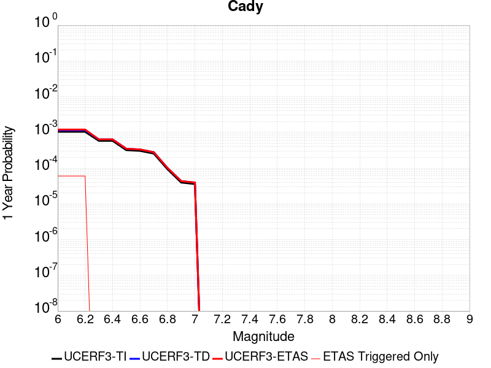 |  |

| Magnitude | 1 wk TI Prob | 1 wk TD Prob | 1 wk ETAS Prob | 1 wk ETAS/TD Gain | 1 wk ETAS Triggered Only | 1 mo TI Prob | 1 mo TD Prob | 1 mo ETAS Prob | 1 mo ETAS/TD Gain | 1 mo ETAS Triggered Only | 1 yr TI Prob | 1 yr TD Prob | 1 yr ETAS Prob | 1 yr ETAS/TD Gain | 1 yr ETAS Triggered Only | 10 yr TI Prob | 10 yr TD Prob | 10 yr ETAS Prob | 10 yr ETAS/TD Gain | 10 yr ETAS Triggered Only |
|-----|-----|-----|-----|-----|-----|-----|-----|-----|-----|-----|-----|-----|-----|-----|-----|-----|-----|-----|-----|-----|
| 6.0 | 1.9892565E-5 | 2.1859303E-5 | 2.1859303E-5 | 1.0 | 0.0 | 8.525106E-5 | 9.3679875E-5 | 1.0367894E-4 | 1.1067365 | 1.0E-5 | 0.0010374374 | 0.0011400466 | 0.0011999782 | 1.0525694 | 6.0E-5 | 0.010326075 | 0.011350997 | 0.011479521 | 1.0113227 | 1.3E-4 |
| 6.1 | 1.9892565E-5 | 2.1859303E-5 | 2.1859303E-5 | 1.0 | 0.0 | 8.525106E-5 | 9.3679875E-5 | 1.0367894E-4 | 1.1067365 | 1.0E-5 | 0.0010374374 | 0.0011400466 | 0.0011999782 | 1.0525694 | 6.0E-5 | 0.010326075 | 0.011350997 | 0.011479521 | 1.0113227 | 1.3E-4 |
| 6.2 | 1.9892565E-5 | 2.1859303E-5 | 2.1859303E-5 | 1.0 | 0.0 | 8.525106E-5 | 9.3679875E-5 | 1.0367894E-4 | 1.1067365 | 1.0E-5 | 0.0010374374 | 0.0011400466 | 0.0011999782 | 1.0525694 | 6.0E-5 | 0.010326075 | 0.011350997 | 0.011479521 | 1.0113227 | 1.3E-4 |
| 6.3 | 1.1117327E-5 | 1.2176892E-5 | 1.2176892E-5 | 1.0 | 0.0 | 4.764482E-5 | 5.2185813E-5 | 5.2185813E-5 | 1.0 | 0.0 | 5.7992124E-4 | 6.3520856E-4 | 6.3520856E-4 | 1.0 | 0.0 | 0.0057841022 | 0.0063370354 | 0.006366845 | 1.0047041 | 3.0E-5 |
| 6.4 | 1.1117327E-5 | 1.2176892E-5 | 1.2176892E-5 | 1.0 | 0.0 | 4.764482E-5 | 5.2185813E-5 | 5.2185813E-5 | 1.0 | 0.0 | 5.7992124E-4 | 6.3520856E-4 | 6.3520856E-4 | 1.0 | 0.0 | 0.0057841022 | 0.0063370354 | 0.006366845 | 1.0047041 | 3.0E-5 |
| 6.5 | 6.103093E-6 | 6.672186E-6 | 6.672186E-6 | 1.0 | 0.0 | 2.615585E-5 | 2.8594839E-5 | 2.8594839E-5 | 1.0 | 0.0 | 3.1840094E-4 | 3.480991E-4 | 3.480991E-4 | 1.0 | 0.0 | 0.0031794512 | 0.0034767727 | 0.0035066684 | 1.0085987 | 3.0E-5 |
| 6.6 | 5.817237E-6 | 6.3658176E-6 | 6.3658176E-6 | 1.0 | 0.0 | 2.4930776E-5 | 2.7281862E-5 | 2.7281862E-5 | 1.0 | 0.0 | 3.034899E-4 | 3.3211848E-4 | 3.3211848E-4 | 1.0 | 0.0 | 0.0030307577 | 0.0033174434 | 0.003347344 | 1.009013 | 3.0E-5 |
| 6.7 | 4.8846314E-6 | 5.3407007E-6 | 5.3407007E-6 | 1.0 | 0.0 | 2.0933967E-5 | 2.2888582E-5 | 2.2888582E-5 | 1.0 | 0.0 | 2.5484123E-4 | 2.7864464E-4 | 2.7864464E-4 | 1.0 | 0.0 | 0.0025454918 | 0.002784108 | 0.0027940802 | 1.0035818 | 1.0E-5 |
| 6.8 | 1.7788773E-6 | 1.9399545E-6 | 1.9399545E-6 | 1.0 | 0.0 | 7.6237375E-6 | 8.314073E-6 | 8.314073E-6 | 1.0 | 0.0 | 9.281505E-5 | 1.0122072E-4 | 1.0122072E-4 | 1.0 | 0.0 | 9.2776294E-4 | 0.0010119008 | 0.0010119008 | 1.0 | 0.0 |
| 6.9 | 7.5455404E-7 | 8.2973116E-7 | 8.2973116E-7 | 1.0 | 0.0 | 3.233799E-6 | 3.5559876E-6 | 3.5559876E-6 | 1.0 | 0.0 | 3.937079E-5 | 4.3293625E-5 | 4.3293625E-5 | 1.0 | 0.0 | 3.9363815E-4 | 4.3288487E-4 | 4.3288487E-4 | 1.0 | 0.0 |
| 7.0 | 6.8578805E-7 | 7.5420155E-7 | 7.5420155E-7 | 1.0 | 0.0 | 2.9390883E-6 | 3.2322903E-6 | 3.2322903E-6 | 1.0 | 0.0 | 3.578281E-5 | 3.9352755E-5 | 3.9352755E-5 | 1.0 | 0.0 | 3.577705E-4 | 3.9349034E-4 | 3.9349034E-4 | 1.0 | 0.0 |

## Calico-Hidalgo
*[(top)](#table-of-contents)*

| 1 Week | 1 Month | 1 Year | 10 Year |
|-----|-----|-----|-----|
|  |  |  |  |

| Magnitude | 1 wk TI Prob | 1 wk TD Prob | 1 wk ETAS Prob | 1 wk ETAS/TD Gain | 1 wk ETAS Triggered Only | 1 mo TI Prob | 1 mo TD Prob | 1 mo ETAS Prob | 1 mo ETAS/TD Gain | 1 mo ETAS Triggered Only | 1 yr TI Prob | 1 yr TD Prob | 1 yr ETAS Prob | 1 yr ETAS/TD Gain | 1 yr ETAS Triggered Only | 10 yr TI Prob | 10 yr TD Prob | 10 yr ETAS Prob | 10 yr ETAS/TD Gain | 10 yr ETAS Triggered Only |
|-----|-----|-----|-----|-----|-----|-----|-----|-----|-----|-----|-----|-----|-----|-----|-----|-----|-----|-----|-----|-----|
| 6.0 | 4.0906612E-5 | 5.0705617E-5 | 5.0705617E-5 | 1.0 | 0.0 | 1.7530227E-4 | 2.1729397E-4 | 2.2729179E-4 | 1.0460106 | 1.0E-5 | 0.0021322158 | 0.0026427484 | 0.0027125634 | 1.0264176 | 7.0E-5 | 0.02111873 | 0.026153587 | 0.026280187 | 1.0048406 | 1.3E-4 |
| 6.1 | 4.0906612E-5 | 5.0705617E-5 | 5.0705617E-5 | 1.0 | 0.0 | 1.7530227E-4 | 2.1729397E-4 | 2.2729179E-4 | 1.0460106 | 1.0E-5 | 0.0021322158 | 0.0026427484 | 0.0027125634 | 1.0264176 | 7.0E-5 | 0.02111873 | 0.026153587 | 0.026280187 | 1.0048406 | 1.3E-4 |
| 6.2 | 4.0906612E-5 | 5.0705617E-5 | 5.0705617E-5 | 1.0 | 0.0 | 1.7530227E-4 | 2.1729397E-4 | 2.2729179E-4 | 1.0460106 | 1.0E-5 | 0.0021322158 | 0.0026427484 | 0.0027125634 | 1.0264176 | 7.0E-5 | 0.02111873 | 0.026153587 | 0.026280187 | 1.0048406 | 1.3E-4 |
| 6.3 | 2.4242801E-5 | 3.0091394E-5 | 3.0091394E-5 | 1.0 | 0.0 | 1.0389358E-4 | 1.2895693E-4 | 1.3895564E-4 | 1.0775353 | 1.0E-5 | 0.0012641704 | 0.0015689528 | 0.0015989058 | 1.019091 | 3.0E-5 | 0.01257003 | 0.015582433 | 0.015651343 | 1.0044222 | 7.0E-5 |
| 6.4 | 2.4242801E-5 | 3.0091394E-5 | 3.0091394E-5 | 1.0 | 0.0 | 1.0389358E-4 | 1.2895693E-4 | 1.3895564E-4 | 1.0775353 | 1.0E-5 | 0.0012641704 | 0.0015689528 | 0.0015989058 | 1.019091 | 3.0E-5 | 0.01257003 | 0.015582433 | 0.015651343 | 1.0044222 | 7.0E-5 |
| 6.5 | 2.0286952E-5 | 2.5316232E-5 | 2.5316232E-5 | 1.0 | 0.0 | 8.694118E-5 | 1.08493725E-4 | 1.1849264E-4 | 1.0921612 | 1.0E-5 | 0.0010579949 | 0.0013201279 | 0.0013500882 | 1.0226951 | 3.0E-5 | 0.010529719 | 0.013124793 | 0.013184005 | 1.0045115 | 6.0E-5 |
| 6.6 | 2.0269223E-5 | 2.5297182E-5 | 2.5297182E-5 | 1.0 | 0.0 | 8.6865206E-5 | 1.0841208E-4 | 1.18411E-4 | 1.0922307 | 1.0E-5 | 0.0010570707 | 0.0013191351 | 0.0013490955 | 1.0227122 | 3.0E-5 | 0.010520565 | 0.013114982 | 0.013174195 | 1.0045149 | 6.0E-5 |
| 6.7 | 1.799852E-5 | 2.2541E-5 | 2.2541E-5 | 1.0 | 0.0 | 7.713423E-5 | 9.6600794E-5 | 1.0659983E-4 | 1.1035088 | 1.0E-5 | 9.3870464E-4 | 0.0011754946 | 0.0012054594 | 1.0254911 | 3.0E-5 | 0.009347493 | 0.01169438 | 0.011743795 | 1.0042256 | 5.0E-5 |
| 6.8 | 1.7458793E-5 | 2.1842507E-5 | 2.1842507E-5 | 1.0 | 0.0 | 7.4821255E-5 | 9.3607465E-5 | 1.0360653E-4 | 1.106819 | 1.0E-5 | 9.10568E-4 | 0.0011390895 | 0.0011690554 | 1.0263069 | 3.0E-5 | 0.009068459 | 0.011334092 | 0.011383526 | 1.0043615 | 5.0E-5 |
| 6.9 | 1.542884E-5 | 1.9026247E-5 | 1.9026247E-5 | 1.0 | 0.0 | 6.612192E-5 | 8.153858E-5 | 9.153777E-5 | 1.1226313 | 1.0E-5 | 8.04737E-4 | 9.922932E-4 | 0.0010222635 | 1.030203 | 3.0E-5 | 0.008018291 | 0.009880023 | 0.009929528 | 1.0050107 | 5.0E-5 |
| 7.0 | 1.468253E-5 | 1.8030894E-5 | 1.8030894E-5 | 1.0 | 0.0 | 6.292361E-5 | 7.727305E-5 | 8.7272274E-5 | 1.1294012 | 1.0E-5 | 7.658257E-4 | 9.404063E-4 | 9.703781E-4 | 1.0318711 | 3.0E-5 | 0.0076319184 | 0.009365634 | 0.00940526 | 1.004231 | 4.0E-5 |
| 7.1 | 1.3139281E-5 | 1.6201197E-5 | 1.6201197E-5 | 1.0 | 0.0 | 5.6309986E-5 | 6.9431924E-5 | 7.943123E-5 | 1.144016 | 1.0E-5 | 6.853584E-4 | 8.4501837E-4 | 8.7499304E-4 | 1.0354722 | 3.0E-5 | 0.0068324856 | 0.00841935 | 0.008459013 | 1.0047109 | 4.0E-5 |
| 7.2 | 1.1127404E-5 | 1.3866808E-5 | 1.3866808E-5 | 1.0 | 0.0 | 4.7688E-5 | 5.9427886E-5 | 6.942729E-5 | 1.1682612 | 1.0E-5 | 5.8044674E-4 | 7.233052E-4 | 7.532835E-4 | 1.0414462 | 3.0E-5 | 0.0057893298 | 0.007210618 | 0.0072404016 | 1.0041305 | 3.0E-5 |
| 7.3 | 9.808154E-6 | 1.2176387E-5 | 1.2176387E-5 | 1.0 | 0.0 | 4.2034266E-5 | 5.2183535E-5 | 5.2183535E-5 | 1.0 | 0.0 | 5.11647E-4 | 6.3516E-4 | 6.451537E-4 | 1.0157341 | 1.0E-5 | 0.0051047057 | 0.0063345223 | 0.006344459 | 1.0015687 | 1.0E-5 |
| 7.4 | 7.942452E-6 | 9.792272E-6 | 9.792272E-6 | 1.0 | 0.0 | 3.4038632E-5 | 4.1966257E-5 | 4.1966257E-5 | 1.0 | 0.0 | 4.1434157E-4 | 5.1082886E-4 | 5.1082886E-4 | 1.0 | 0.0 | 0.0041356985 | 0.005097488 | 0.005097488 | 1.0 | 0.0 |
| 7.5 | 4.7121216E-6 | 5.772906E-6 | 5.772906E-6 | 1.0 | 0.0 | 2.019465E-5 | 2.4740835E-5 | 2.4740835E-5 | 1.0 | 0.0 | 2.4584212E-4 | 3.0118568E-4 | 3.0118568E-4 | 1.0 | 0.0 | 0.0024557032 | 0.0030085274 | 0.0030085274 | 1.0 | 0.0 |
| 7.6 | 2.21172E-7 | 2.6039865E-7 | 2.6039865E-7 | 1.0 | 0.0 | 9.478797E-7 | 1.115994E-6 | 1.115994E-6 | 1.0 | 0.0 | 1.1540374E-5 | 1.35871705E-5 | 1.35871705E-5 | 1.0 | 0.0 | 1.1539775E-4 | 1.3586621E-4 | 1.3586621E-4 | 1.0 | 0.0 |

## Manix-Afton Hills
*[(top)](#table-of-contents)*

| 1 Week | 1 Month | 1 Year | 10 Year |
|-----|-----|-----|-----|
|  |  |  |  |

| Magnitude | 1 wk TI Prob | 1 wk TD Prob | 1 wk ETAS Prob | 1 wk ETAS/TD Gain | 1 wk ETAS Triggered Only | 1 mo TI Prob | 1 mo TD Prob | 1 mo ETAS Prob | 1 mo ETAS/TD Gain | 1 mo ETAS Triggered Only | 1 yr TI Prob | 1 yr TD Prob | 1 yr ETAS Prob | 1 yr ETAS/TD Gain | 1 yr ETAS Triggered Only | 10 yr TI Prob | 10 yr TD Prob | 10 yr ETAS Prob | 10 yr ETAS/TD Gain | 10 yr ETAS Triggered Only |
|-----|-----|-----|-----|-----|-----|-----|-----|-----|-----|-----|-----|-----|-----|-----|-----|-----|-----|-----|-----|-----|
| 6.0 | 1.3783202E-5 | 1.4711353E-5 | 1.4711353E-5 | 1.0 | 0.0 | 5.906953E-5 | 6.304723E-5 | 6.304723E-5 | 1.0 | 0.0 | 7.189342E-4 | 7.6734717E-4 | 8.173088E-4 | 1.0651096 | 5.0E-5 | 0.0071661277 | 0.007648732 | 0.007767814 | 1.0155689 | 1.2E-4 |
| 6.1 | 1.3783202E-5 | 1.4711353E-5 | 1.4711353E-5 | 1.0 | 0.0 | 5.906953E-5 | 6.304723E-5 | 6.304723E-5 | 1.0 | 0.0 | 7.189342E-4 | 7.6734717E-4 | 8.173088E-4 | 1.0651096 | 5.0E-5 | 0.0071661277 | 0.007648732 | 0.007767814 | 1.0155689 | 1.2E-4 |
| 6.2 | 1.3783202E-5 | 1.4711353E-5 | 1.4711353E-5 | 1.0 | 0.0 | 5.906953E-5 | 6.304723E-5 | 6.304723E-5 | 1.0 | 0.0 | 7.189342E-4 | 7.6734717E-4 | 8.173088E-4 | 1.0651096 | 5.0E-5 | 0.0071661277 | 0.007648732 | 0.007767814 | 1.0155689 | 1.2E-4 |
| 6.3 | 1.10494875E-5 | 1.1793347E-5 | 1.1793347E-5 | 1.0 | 0.0 | 4.7354086E-5 | 5.0541992E-5 | 5.0541992E-5 | 1.0 | 0.0 | 5.763835E-4 | 6.151854E-4 | 6.351731E-4 | 1.0324905 | 2.0E-5 | 0.005748908 | 0.006135865 | 0.006195497 | 1.0097185 | 6.0E-5 |
| 6.4 | 1.10494875E-5 | 1.1793347E-5 | 1.1793347E-5 | 1.0 | 0.0 | 4.7354086E-5 | 5.0541992E-5 | 5.0541992E-5 | 1.0 | 0.0 | 5.763835E-4 | 6.151854E-4 | 6.351731E-4 | 1.0324905 | 2.0E-5 | 0.005748908 | 0.006135865 | 0.006195497 | 1.0097185 | 6.0E-5 |
| 6.5 | 9.788949E-6 | 1.0454509E-5 | 1.0454509E-5 | 1.0 | 0.0 | 4.1951964E-5 | 4.480432E-5 | 4.480432E-5 | 1.0 | 0.0 | 5.1064545E-4 | 5.453653E-4 | 5.453653E-4 | 1.0 | 0.0 | 0.0050947363 | 0.0054411967 | 0.0054710335 | 1.0054835 | 3.0E-5 |
| 6.6 | 8.810006E-6 | 9.4137995E-6 | 9.4137995E-6 | 1.0 | 0.0 | 3.775662E-5 | 4.0344283E-5 | 4.0344283E-5 | 1.0 | 0.0 | 4.5958988E-4 | 4.910898E-4 | 4.910898E-4 | 1.0 | 0.0 | 0.0045864056 | 0.004900928 | 0.004930781 | 1.0060912 | 3.0E-5 |
| 6.7 | 8.80128E-6 | 9.404279E-6 | 9.404279E-6 | 1.0 | 0.0 | 3.7719226E-5 | 4.0303483E-5 | 4.0303483E-5 | 1.0 | 0.0 | 4.591348E-4 | 4.905933E-4 | 4.905933E-4 | 1.0 | 0.0 | 0.004581874 | 0.0048959847 | 0.004925838 | 1.0060974 | 3.0E-5 |
| 6.8 | 6.8994877E-6 | 7.3802125E-6 | 7.3802125E-6 | 1.0 | 0.0 | 2.9568899E-5 | 3.1629144E-5 | 3.1629144E-5 | 1.0 | 0.0 | 3.5994186E-4 | 3.8502496E-4 | 3.8502496E-4 | 1.0 | 0.0 | 0.003593594 | 0.0038443839 | 0.0038643072 | 1.0051824 | 2.0E-5 |
| 6.9 | 4.9328037E-6 | 5.2710575E-6 | 5.2710575E-6 | 1.0 | 0.0 | 2.1140417E-5 | 2.2590086E-5 | 2.2590086E-5 | 1.0 | 0.0 | 2.5735417E-4 | 2.7500573E-4 | 2.7500573E-4 | 1.0 | 0.0 | 0.0025705635 | 0.0027472596 | 0.002757232 | 1.00363 | 1.0E-5 |
| 7.0 | 3.347973E-6 | 3.5900991E-6 | 3.5900991E-6 | 1.0 | 0.0 | 1.4348378E-5 | 1.5386071E-5 | 1.5386071E-5 | 1.0 | 0.0 | 1.746775E-4 | 1.8731342E-4 | 1.8731342E-4 | 1.0 | 0.0 | 0.0017454025 | 0.0018719579 | 0.0018819392 | 1.005332 | 1.0E-5 |
| 7.1 | 1.2073567E-6 | 1.2935066E-6 | 1.2935066E-6 | 1.0 | 0.0 | 5.1743755E-6 | 5.5435967E-6 | 5.5435967E-6 | 1.0 | 0.0 | 6.29962E-5 | 6.749283E-5 | 6.749283E-5 | 1.0 | 0.0 | 6.297835E-4 | 6.7488354E-4 | 6.8487675E-4 | 1.0148073 | 1.0E-5 |

## Owens Valley
*[(top)](#table-of-contents)*

| 1 Week | 1 Month | 1 Year | 10 Year |
|-----|-----|-----|-----|
|  |  |  |  |

| Magnitude | 1 wk TI Prob | 1 wk TD Prob | 1 wk ETAS Prob | 1 wk ETAS/TD Gain | 1 wk ETAS Triggered Only | 1 mo TI Prob | 1 mo TD Prob | 1 mo ETAS Prob | 1 mo ETAS/TD Gain | 1 mo ETAS Triggered Only | 1 yr TI Prob | 1 yr TD Prob | 1 yr ETAS Prob | 1 yr ETAS/TD Gain | 1 yr ETAS Triggered Only | 10 yr TI Prob | 10 yr TD Prob | 10 yr ETAS Prob | 10 yr ETAS/TD Gain | 10 yr ETAS Triggered Only |
|-----|-----|-----|-----|-----|-----|-----|-----|-----|-----|-----|-----|-----|-----|-----|-----|-----|-----|-----|-----|-----|
| 6.0 | 4.83821E-5 | 3.6282252E-6 | 1.3628189E-5 | 3.7561586 | 1.0E-5 | 2.0733538E-4 | 1.5549449E-5 | 3.554914E-5 | 2.286199 | 2.0E-5 | 0.002521386 | 1.8929908E-4 | 2.4928772E-4 | 1.3168987 | 6.0E-5 | 0.024929691 | 0.0019258651 | 0.002045634 | 1.0621897 | 1.2E-4 |
| 6.1 | 4.83821E-5 | 3.6282252E-6 | 1.3628189E-5 | 3.7561586 | 1.0E-5 | 2.0733538E-4 | 1.5549449E-5 | 3.554914E-5 | 2.286199 | 2.0E-5 | 0.002521386 | 1.8929908E-4 | 2.4928772E-4 | 1.3168987 | 6.0E-5 | 0.024929691 | 0.0019258651 | 0.002045634 | 1.0621897 | 1.2E-4 |
| 6.2 | 4.83821E-5 | 3.6282252E-6 | 1.3628189E-5 | 3.7561586 | 1.0E-5 | 2.0733538E-4 | 1.5549449E-5 | 3.554914E-5 | 2.286199 | 2.0E-5 | 0.002521386 | 1.8929908E-4 | 2.4928772E-4 | 1.3168987 | 6.0E-5 | 0.024929691 | 0.0019258651 | 0.002045634 | 1.0621897 | 1.2E-4 |
| 6.3 | 3.953008E-5 | 3.1562945E-6 | 1.3156263E-5 | 4.168262 | 1.0E-5 | 1.6940363E-4 | 1.352691E-5 | 3.352664E-5 | 2.4785142 | 2.0E-5 | 0.002060538 | 1.6467842E-4 | 2.2466855E-4 | 1.3642864 | 6.0E-5 | 0.020415364 | 0.0016596789 | 0.0017794797 | 1.0721831 | 1.2E-4 |
| 6.4 | 3.953008E-5 | 3.1562945E-6 | 1.3156263E-5 | 4.168262 | 1.0E-5 | 1.6940363E-4 | 1.352691E-5 | 3.352664E-5 | 2.4785142 | 2.0E-5 | 0.002060538 | 1.6467842E-4 | 2.2466855E-4 | 1.3642864 | 6.0E-5 | 0.020415364 | 0.0016596789 | 0.0017794797 | 1.0721831 | 1.2E-4 |
| 6.5 | 3.457342E-5 | 2.9721791E-6 | 1.2972149E-5 | 4.364525 | 1.0E-5 | 1.4816338E-4 | 1.2737853E-5 | 3.2737596E-5 | 2.5701034 | 2.0E-5 | 0.0018023965 | 1.5507302E-4 | 2.1506372E-4 | 1.3868545 | 6.0E-5 | 0.017878477 | 0.0015560347 | 0.0016758479 | 1.0769991 | 1.2E-4 |
| 6.6 | 3.1127765E-5 | 2.8749025E-6 | 1.2874873E-5 | 4.4783688 | 1.0E-5 | 1.3339789E-4 | 1.2320957E-5 | 3.232071E-5 | 2.6232307 | 2.0E-5 | 0.0016229092 | 1.49998E-4 | 2.0998901E-4 | 1.3999454 | 6.0E-5 | 0.016111081 | 0.0015014741 | 0.0016212938 | 1.0798014 | 1.2E-4 |
| 6.7 | 2.806885E-5 | 2.8107188E-6 | 1.281069E-5 | 4.557799 | 1.0E-5 | 1.2028952E-4 | 1.2045885E-5 | 3.2045646E-5 | 2.6602979 | 2.0E-5 | 0.001463541 | 1.4664947E-4 | 2.0664067E-4 | 1.4090788 | 6.0E-5 | 0.014539397 | 0.0014659108 | 0.0015857349 | 1.0817404 | 1.2E-4 |
| 6.8 | 2.524524E-5 | 2.235633E-6 | 1.22356105E-5 | 5.472996 | 1.0E-5 | 1.0818939E-4 | 9.581251E-6 | 2.9581059E-5 | 3.0873902 | 2.0E-5 | 0.0013164099 | 1.1664579E-4 | 1.7663879E-4 | 1.5143178 | 6.0E-5 | 0.01308639 | 0.001166119 | 0.0012859792 | 1.1027855 | 1.2E-4 |
| 6.9 | 2.2704568E-5 | 1.608363E-6 | 1.16083465E-5 | 7.217492 | 1.0E-5 | 9.730166E-5 | 6.892966E-6 | 2.6892829E-5 | 3.9014885 | 2.0E-5 | 0.0011840039 | 8.391865E-5 | 1.4391361E-4 | 1.7149181 | 6.0E-5 | 0.011777153 | 8.3908177E-4 | 9.5898105E-4 | 1.1428934 | 1.2E-4 |
| 7.0 | 2.0871712E-5 | 1.5397294E-6 | 1.1539714E-5 | 7.494638 | 1.0E-5 | 8.944713E-5 | 6.5988233E-6 | 2.6598691E-5 | 4.030823 | 2.0E-5 | 0.0010884746 | 8.033773E-5 | 1.4033291E-4 | 1.7467871 | 6.0E-5 | 0.010831586 | 8.0325926E-4 | 9.2316285E-4 | 1.1492714 | 1.2E-4 |
| 7.1 | 1.944928E-5 | 1.3865751E-6 | 1.1386561E-5 | 8.212005 | 1.0E-5 | 8.335139E-5 | 5.9424515E-6 | 2.5942332E-5 | 4.3655944 | 2.0E-5 | 0.0010143308 | 7.234695E-5 | 1.3234261E-4 | 1.8292769 | 6.0E-5 | 0.010097133 | 7.2339235E-4 | 8.4330555E-4 | 1.165765 | 1.2E-4 |
| 7.2 | 1.7876306E-5 | 1.2490525E-6 | 1.124904E-5 | 9.006059 | 1.0E-5 | 7.6610486E-5 | 5.353071E-6 | 2.5352965E-5 | 4.7361526 | 2.0E-5 | 9.3233347E-4 | 6.5171706E-5 | 1.2516779E-4 | 1.9205849 | 6.0E-5 | 0.009284316 | 6.516637E-4 | 7.715855E-4 | 1.1840241 | 1.2E-4 |
| 7.3 | 1.2618672E-5 | 1.1116495E-6 | 1.1111639E-5 | 9.995632 | 1.0E-5 | 5.40789E-5 | 4.764203E-6 | 2.4764107E-5 | 5.1979537 | 2.0E-5 | 6.582117E-4 | 5.8002635E-5 | 1.1799915E-4 | 2.0343757 | 6.0E-5 | 0.0065626553 | 5.8000785E-4 | 6.899441E-4 | 1.1895427 | 1.1E-4 |
| 7.4 | 7.4874442E-6 | 8.549725E-7 | 1.0854964E-5 | 12.696273 | 1.0E-5 | 3.208865E-5 | 3.6641627E-6 | 2.366409E-5 | 6.458253 | 2.0E-5 | 3.906093E-4 | 4.461027E-5 | 1.0460759E-4 | 2.3449218 | 6.0E-5 | 0.003899234 | 4.4610567E-4 | 5.560566E-4 | 1.2464683 | 1.1E-4 |
| 7.5 | 2.4734156E-6 | 6.069335E-7 | 1.0606927E-5 | 17.47626 | 1.0E-5 | 1.060031E-5 | 2.601141E-6 | 2.2601089E-5 | 8.688913 | 2.0E-5 | 1.2905113E-4 | 3.1668435E-5 | 7.166717E-5 | 2.2630475 | 4.0E-5 | 0.0012897621 | 3.1663955E-4 | 4.0661104E-4 | 1.2841449 | 9.0E-5 |
| 7.6 | 1.1328841E-6 | 3.1968878E-7 | 1.0319685E-5 | 32.28041 | 1.0E-5 | 4.8552088E-6 | 1.3700941E-6 | 1.1370081E-5 | 8.2987585 | 1.0E-5 | 5.9110564E-5 | 1.668077E-5 | 3.6680438E-5 | 2.1989653 | 2.0E-5 | 5.9094845E-4 | 1.6679536E-4 | 2.1678703E-4 | 1.2997185 | 5.0E-5 |
| 7.7 | 4.8613185E-7 | 8.9660794E-8 | 8.9660794E-8 | 1.0 | 0.0 | 2.0834207E-6 | 3.842605E-7 | 3.842605E-7 | 1.0 | 0.0 | 2.536535E-5 | 4.678362E-6 | 4.678362E-6 | 1.0 | 0.0 | 2.5362454E-4 | 4.6782705E-5 | 4.6782705E-5 | 1.0 | 0.0 |

## Brawley (Seismic Zone) alt 1
*[(top)](#table-of-contents)*

| 1 Week | 1 Month | 1 Year | 10 Year |
|-----|-----|-----|-----|
|  |  |  |  |

| Magnitude | 1 wk TI Prob | 1 wk TD Prob | 1 wk ETAS Prob | 1 wk ETAS/TD Gain | 1 wk ETAS Triggered Only | 1 mo TI Prob | 1 mo TD Prob | 1 mo ETAS Prob | 1 mo ETAS/TD Gain | 1 mo ETAS Triggered Only | 1 yr TI Prob | 1 yr TD Prob | 1 yr ETAS Prob | 1 yr ETAS/TD Gain | 1 yr ETAS Triggered Only | 10 yr TI Prob | 10 yr TD Prob | 10 yr ETAS Prob | 10 yr ETAS/TD Gain | 10 yr ETAS Triggered Only |
|-----|-----|-----|-----|-----|-----|-----|-----|-----|-----|-----|-----|-----|-----|-----|-----|-----|-----|-----|-----|-----|
| 6.0 | 2.2521618E-4 | 4.7650016E-4 | 4.864954E-4 | 1.0209763 | 1.0E-5 | 9.6485513E-4 | 0.0020405825 | 0.0020705212 | 1.0146717 | 3.0E-5 | 0.011683988 | 0.02455514 | 0.02462342 | 1.0027807 | 7.0E-5 | 0.11088423 | 0.21356027 | 0.21365465 | 1.0004419 | 1.2E-4 |
| 6.1 | 2.2521618E-4 | 4.7650016E-4 | 4.864954E-4 | 1.0209763 | 1.0E-5 | 9.6485513E-4 | 0.0020405825 | 0.0020705212 | 1.0146717 | 3.0E-5 | 0.011683988 | 0.02455514 | 0.02462342 | 1.0027807 | 7.0E-5 | 0.11088423 | 0.21356027 | 0.21364678 | 1.0004051 | 1.1E-4 |
| 6.2 | 2.198148E-4 | 4.6734224E-4 | 4.7733754E-4 | 1.0213876 | 1.0E-5 | 9.417233E-4 | 0.0020013945 | 0.0020313344 | 1.0149596 | 3.0E-5 | 0.011405343 | 0.024089206 | 0.02415752 | 1.0028359 | 7.0E-5 | 0.10837428 | 0.20999599 | 0.21008289 | 1.0004138 | 1.1E-4 |
| 6.3 | 2.1704129E-4 | 4.6169842E-4 | 4.716938E-4 | 1.0216491 | 1.0E-5 | 9.298453E-4 | 0.0019772437 | 0.0020071843 | 1.0151427 | 3.0E-5 | 0.011262234 | 0.023802334 | 0.023870667 | 1.0028709 | 7.0E-5 | 0.107082725 | 0.20788695 | 0.20797408 | 1.0004191 | 1.1E-4 |
| 6.4 | 1.876142E-4 | 4.0061463E-4 | 4.1061064E-4 | 1.0249517 | 1.0E-5 | 8.038131E-4 | 0.0017158045 | 0.0017357701 | 1.0116364 | 2.0E-5 | 0.00974259 | 0.020688858 | 0.020747617 | 1.0028402 | 6.0E-5 | 0.093263686 | 0.18463784 | 0.18471938 | 1.0004416 | 1.0E-4 |
| 6.5 | 1.7390939E-4 | 3.7493056E-4 | 3.849268E-4 | 1.0266616 | 1.0E-5 | 7.45113E-4 | 0.0016058679 | 0.0016258358 | 1.0124344 | 2.0E-5 | 0.009034078 | 0.019376898 | 0.019435737 | 1.0030365 | 6.0E-5 | 0.086755216 | 0.174459 | 0.1745333 | 1.0004259 | 9.0E-5 |
| 6.6 | 1.591791E-4 | 3.4907137E-4 | 3.5906787E-4 | 1.0286374 | 1.0E-5 | 6.8201777E-4 | 0.0014951725 | 0.0015151426 | 1.0133563 | 2.0E-5 | 0.008271996 | 0.018053345 | 0.01811226 | 1.0032635 | 6.0E-5 | 0.07970774 | 0.16386543 | 0.16394068 | 1.0004592 | 9.0E-5 |
| 6.7 | 1.4268003E-4 | 3.207246E-4 | 3.3072138E-4 | 1.0311694 | 1.0E-5 | 6.1134255E-4 | 0.001373818 | 0.0013937906 | 1.0145379 | 2.0E-5 | 0.007417723 | 0.01659992 | 0.016658923 | 1.0035545 | 6.0E-5 | 0.07174956 | 0.15198784 | 0.15206414 | 1.0005021 | 9.0E-5 |
| 6.8 | 1.239713E-4 | 2.906574E-4 | 3.0065447E-4 | 1.0343947 | 1.0E-5 | 5.3119735E-4 | 0.001245086 | 0.0012650611 | 1.0160432 | 2.0E-5 | 0.0064481674 | 0.01505499 | 0.015114086 | 1.0039254 | 6.0E-5 | 0.06264243 | 0.13842559 | 0.13850312 | 1.0005602 | 9.0E-5 |
| 6.9 | 1.0180238E-4 | 2.6263754E-4 | 2.726349E-4 | 1.0380653 | 1.0E-5 | 4.3622297E-4 | 0.0011251081 | 0.0011450856 | 1.0177561 | 2.0E-5 | 0.005298089 | 0.013613156 | 0.013672339 | 1.0043474 | 6.0E-5 | 0.05173543 | 0.12499963 | 0.12507838 | 1.00063 | 9.0E-5 |
| 7.0 | 7.6619996E-5 | 2.2406445E-4 | 2.340622E-4 | 1.04462 | 1.0E-5 | 3.283301E-4 | 9.59926E-4 | 9.799068E-4 | 1.0208149 | 2.0E-5 | 0.0039900932 | 0.011625181 | 0.0116746 | 1.004251 | 5.0E-5 | 0.039192066 | 0.10729616 | 0.10736758 | 1.0006655 | 8.0E-5 |
| 7.1 | 7.5127435E-5 | 2.2089518E-4 | 2.3089297E-4 | 1.0452603 | 1.0E-5 | 3.2193496E-4 | 9.463533E-4 | 9.6633437E-4 | 1.0211138 | 2.0E-5 | 0.0039125155 | 0.011461684 | 0.011511111 | 1.0043124 | 5.0E-5 | 0.038443442 | 0.10585982 | 0.10593136 | 1.0006757 | 8.0E-5 |
| 7.2 | 6.788582E-5 | 2.0217002E-4 | 2.12168E-4 | 1.0494533 | 1.0E-5 | 2.9090676E-4 | 8.661583E-4 | 8.86141E-4 | 1.0230705 | 2.0E-5 | 0.0035360386 | 0.010495127 | 0.010544602 | 1.0047141 | 5.0E-5 | 0.034803 | 0.0975296 | 0.09760179 | 1.0007403 | 8.0E-5 |
| 7.3 | 6.399602E-5 | 1.8847662E-4 | 1.9847474E-4 | 1.053047 | 1.0E-5 | 2.7423984E-4 | 8.075098E-4 | 8.274936E-4 | 1.0247475 | 2.0E-5 | 0.0033337586 | 0.009787704 | 0.009837214 | 1.0050584 | 5.0E-5 | 0.03284188 | 0.09142354 | 0.09149623 | 1.000795 | 8.0E-5 |
| 7.4 | 4.506759E-5 | 1.2534359E-4 | 1.3534234E-4 | 1.0797707 | 1.0E-5 | 1.9313251E-4 | 5.3707714E-4 | 5.5706635E-4 | 1.0372186 | 2.0E-5 | 0.0023488526 | 0.006519484 | 0.006569158 | 1.0076193 | 5.0E-5 | 0.023241805 | 0.0623863 | 0.06246131 | 1.0012023 | 8.0E-5 |
| 7.5 | 3.43289E-5 | 9.339764E-5 | 1.03396706E-4 | 1.1070591 | 1.0E-5 | 1.4711556E-4 | 4.002145E-4 | 4.2020652E-4 | 1.0499532 | 2.0E-5 | 0.0017896603 | 0.0048617874 | 0.0049115443 | 1.0102342 | 5.0E-5 | 0.01775316 | 0.04707467 | 0.047141377 | 1.001417 | 7.0E-5 |
| 7.6 | 2.5980507E-5 | 7.056894E-5 | 8.0568236E-5 | 1.1416954 | 1.0E-5 | 1.1134028E-4 | 3.0240338E-4 | 3.2239733E-4 | 1.0661168 | 2.0E-5 | 0.001354725 | 0.0036755698 | 0.003725386 | 1.0135534 | 5.0E-5 | 0.013464959 | 0.035857998 | 0.035925485 | 1.0018822 | 7.0E-5 |
| 7.7 | 1.7292105E-5 | 4.943965E-5 | 5.9439157E-5 | 1.2022568 | 1.0E-5 | 7.4106916E-5 | 2.1186704E-4 | 2.3186281E-4 | 1.0943788 | 2.0E-5 | 9.018782E-4 | 0.0025764357 | 0.0026263068 | 1.0193566 | 5.0E-5 | 0.008982267 | 0.025305117 | 0.025373345 | 1.0026963 | 7.0E-5 |
| 7.8 | 1.2927471E-5 | 3.9721428E-5 | 4.972103E-5 | 1.2517433 | 1.0E-5 | 5.5402274E-5 | 1.702236E-4 | 1.902202E-4 | 1.1174725 | 2.0E-5 | 6.743139E-4 | 0.002070505 | 0.0021104221 | 1.019279 | 4.0E-5 | 0.0067227143 | 0.020444553 | 0.020493532 | 1.0023956 | 5.0E-5 |
| 7.9 | 1.0200774E-5 | 2.876846E-5 | 3.8768172E-5 | 1.347593 | 1.0E-5 | 4.371687E-5 | 1.2328758E-4 | 1.4328511E-4 | 1.1622024 | 2.0E-5 | 5.321229E-4 | 0.0014999938 | 0.0015299489 | 1.01997 | 3.0E-5 | 0.005308505 | 0.015002176 | 0.015041577 | 1.0026263 | 4.0E-5 |
| 8.0 | 8.650396E-6 | 2.329689E-5 | 3.3296656E-5 | 1.4292319 | 1.0E-5 | 3.70726E-5 | 9.984E-5 | 1.19838E-4 | 1.2003006 | 2.0E-5 | 4.5126543E-4 | 0.001214875 | 0.0012448386 | 1.0246639 | 3.0E-5 | 0.0045035016 | 0.012220192 | 0.012259703 | 1.0032333 | 4.0E-5 |
| 8.1 | 3.9368224E-6 | 7.336344E-6 | 7.336344E-6 | 1.0 | 0.0 | 1.6871985E-5 | 3.1441094E-5 | 3.1441094E-5 | 1.0 | 0.0 | 2.0539707E-4 | 3.8272823E-4 | 3.8272823E-4 | 1.0 | 0.0 | 0.0020520731 | 0.0040053325 | 0.004015292 | 1.0024867 | 1.0E-5 |
| 8.2 | 1.7101195E-6 | 2.2211486E-6 | 2.2211486E-6 | 1.0 | 0.0 | 7.329063E-6 | 9.519174E-6 | 9.519174E-6 | 1.0 | 0.0 | 8.922769E-5 | 1.1588981E-4 | 1.1588981E-4 | 1.0 | 0.0 | 8.9191867E-4 | 0.0012683558 | 0.0012683558 | 1.0 | 0.0 |
| 8.3 | 3.0346666E-8 | 1.725032E-8 | 1.725032E-8 | 1.0 | 0.0 | 1.3005713E-7 | 7.392994E-8 | 7.392994E-8 | 1.0 | 0.0 | 1.5834444E-6 | 9.0009695E-7 | 9.0009695E-7 | 1.0 | 0.0 | 1.5834332E-5 | 9.386116E-6 | 9.386116E-6 | 1.0 | 0.0 |

## Imperial
*[(top)](#table-of-contents)*

| 1 Week | 1 Month | 1 Year | 10 Year |
|-----|-----|-----|-----|
|  |  |  |  |

| Magnitude | 1 wk TI Prob | 1 wk TD Prob | 1 wk ETAS Prob | 1 wk ETAS/TD Gain | 1 wk ETAS Triggered Only | 1 mo TI Prob | 1 mo TD Prob | 1 mo ETAS Prob | 1 mo ETAS/TD Gain | 1 mo ETAS Triggered Only | 1 yr TI Prob | 1 yr TD Prob | 1 yr ETAS Prob | 1 yr ETAS/TD Gain | 1 yr ETAS Triggered Only | 10 yr TI Prob | 10 yr TD Prob | 10 yr ETAS Prob | 10 yr ETAS/TD Gain | 10 yr ETAS Triggered Only |
|-----|-----|-----|-----|-----|-----|-----|-----|-----|-----|-----|-----|-----|-----|-----|-----|-----|-----|-----|-----|-----|
| 6.0 | 2.7496446E-4 | 5.057827E-4 | 5.157777E-4 | 1.0197613 | 1.0E-5 | 0.0011778869 | 0.002165879 | 0.002195814 | 1.0138212 | 3.0E-5 | 0.0142467655 | 0.026051812 | 0.026119988 | 1.002617 | 7.0E-5 | 0.13367249 | 0.22812897 | 0.22821388 | 1.0003722 | 1.1E-4 |
| 6.1 | 2.5356023E-4 | 4.8678988E-4 | 4.9678504E-4 | 1.0205327 | 1.0E-5 | 0.001086234 | 0.0020846126 | 0.0021145502 | 1.0143611 | 3.0E-5 | 0.013144928 | 0.025082607 | 0.02515085 | 1.0027208 | 7.0E-5 | 0.123940155 | 0.21955532 | 0.21964118 | 1.000391 | 1.1E-4 |
| 6.2 | 2.4820742E-4 | 4.777401E-4 | 4.8773535E-4 | 1.0209218 | 1.0E-5 | 0.0010633124 | 0.002045889 | 0.0020758277 | 1.0146335 | 3.0E-5 | 0.01286919 | 0.024622431 | 0.024690706 | 1.0027729 | 7.0E-5 | 0.12148927 | 0.21606027 | 0.21614651 | 1.0003991 | 1.1E-4 |
| 6.3 | 2.3205351E-4 | 4.5909933E-4 | 4.6909475E-4 | 1.0217718 | 1.0E-5 | 9.94136E-4 | 0.0019661218 | 0.001996063 | 1.0152285 | 3.0E-5 | 0.012036599 | 0.02367121 | 0.023739552 | 1.0028871 | 7.0E-5 | 0.11405133 | 0.20800267 | 0.2080898 | 1.0004188 | 1.1E-4 |
| 6.4 | 2.0304754E-4 | 3.989547E-4 | 4.089507E-4 | 1.0250555 | 1.0E-5 | 8.6991355E-4 | 0.0017087 | 0.0017286659 | 1.0116848 | 2.0E-5 | 0.010539869 | 0.020605337 | 0.020664101 | 1.0028518 | 6.0E-5 | 0.100537635 | 0.18513547 | 0.18521695 | 1.0004401 | 1.0E-4 |
| 6.5 | 1.854992E-4 | 3.7006545E-4 | 3.8006174E-4 | 1.0270122 | 1.0E-5 | 7.9475436E-4 | 0.001585043 | 0.0016050114 | 1.0125979 | 2.0E-5 | 0.009633281 | 0.019128485 | 0.019187337 | 1.0030767 | 6.0E-5 | 0.0922623 | 0.17336346 | 0.17343786 | 1.0004292 | 9.0E-5 |
| 6.6 | 1.6586106E-4 | 3.4051097E-4 | 3.505076E-4 | 1.0293577 | 1.0E-5 | 7.106394E-4 | 0.0014585268 | 0.0014784976 | 1.0136925 | 2.0E-5 | 0.008617763 | 0.01761463 | 0.017673573 | 1.0033462 | 6.0E-5 | 0.08291132 | 0.16083635 | 0.16091187 | 1.0004696 | 9.0E-5 |
| 6.7 | 1.4224656E-4 | 3.0780918E-4 | 3.1780612E-4 | 1.0324776 | 1.0E-5 | 6.094856E-4 | 0.0013185235 | 0.0013384972 | 1.0151485 | 2.0E-5 | 0.0073952693 | 0.015936768 | 0.015995812 | 1.0037049 | 6.0E-5 | 0.07153955 | 0.14653869 | 0.1466155 | 1.0005242 | 9.0E-5 |
| 6.8 | 1.2317259E-4 | 2.7802997E-4 | 2.880272E-4 | 1.0359573 | 1.0E-5 | 5.2777573E-4 | 0.0011910191 | 0.0012109953 | 1.0167724 | 2.0E-5 | 0.0064067547 | 0.01440563 | 0.014464766 | 1.0041051 | 6.0E-5 | 0.06225166 | 0.13298422 | 0.13306226 | 1.0005867 | 9.0E-5 |
| 6.9 | 9.859898E-5 | 2.5023127E-4 | 2.6022876E-4 | 1.039953 | 1.0E-5 | 4.2249862E-4 | 0.0010719832 | 0.0010919617 | 1.0186371 | 2.0E-5 | 0.0051317946 | 0.012974257 | 0.013033478 | 1.0045645 | 6.0E-5 | 0.05014893 | 0.11944234 | 0.119521596 | 1.0006635 | 9.0E-5 |
| 7.0 | 7.3191884E-5 | 2.127335E-4 | 2.2273138E-4 | 1.0469972 | 1.0E-5 | 3.136418E-4 | 9.1139966E-4 | 9.313814E-4 | 1.0219243 | 2.0E-5 | 0.003811904 | 0.011040522 | 0.011089969 | 1.0044788 | 5.0E-5 | 0.037471764 | 0.10209204 | 0.10216387 | 1.0007036 | 8.0E-5 |
| 7.1 | 7.1760296E-5 | 2.0974626E-4 | 2.1974416E-4 | 1.0476667 | 1.0E-5 | 3.0750787E-4 | 8.98606E-4 | 9.185881E-4 | 1.0222367 | 2.0E-5 | 0.003737482 | 0.0108863255 | 0.0109357815 | 1.004543 | 5.0E-5 | 0.03675245 | 0.10072824 | 0.10080019 | 1.0007142 | 8.0E-5 |
| 7.2 | 6.46614E-5 | 1.9142927E-4 | 2.0142735E-4 | 1.0522286 | 1.0E-5 | 2.7709085E-4 | 8.201562E-4 | 8.401398E-4 | 1.0243655 | 2.0E-5 | 0.0033683628 | 0.009940307 | 0.009989809 | 1.00498 | 5.0E-5 | 0.033177625 | 0.09253505 | 0.09260765 | 1.0007845 | 8.0E-5 |
| 7.3 | 6.088115E-5 | 1.781436E-4 | 1.8814181E-4 | 1.0561244 | 1.0E-5 | 2.6089314E-4 | 7.63252E-4 | 7.8323676E-4 | 1.0261836 | 2.0E-5 | 0.0031717476 | 0.0092535755 | 0.009303113 | 1.0053533 | 5.0E-5 | 0.031268585 | 0.086585045 | 0.08665812 | 1.000844 | 8.0E-5 |
| 7.4 | 4.199346E-5 | 1.1514954E-4 | 1.2514839E-4 | 1.0868336 | 1.0E-5 | 1.7995955E-4 | 4.9340556E-4 | 5.133957E-4 | 1.0405146 | 2.0E-5 | 0.0021888057 | 0.005990836 | 0.0060405363 | 1.0082961 | 5.0E-5 | 0.02167372 | 0.057460066 | 0.05753547 | 1.0013123 | 8.0E-5 |
| 7.5 | 3.130448E-5 | 8.337072E-5 | 9.336989E-5 | 1.1199362 | 1.0E-5 | 1.3415517E-4 | 3.572545E-4 | 3.7724734E-4 | 1.0559624 | 2.0E-5 | 0.0016321153 | 0.0043409583 | 0.004390741 | 1.0114682 | 5.0E-5 | 0.016201803 | 0.04214912 | 0.042216167 | 1.0015907 | 7.0E-5 |
| 7.6 | 2.3074248E-5 | 6.0877E-5 | 7.087639E-5 | 1.1642556 | 1.0E-5 | 9.888588E-5 | 2.6087547E-4 | 2.8087024E-4 | 1.0766449 | 2.0E-5 | 0.0012032706 | 0.0031715562 | 0.0032213975 | 1.0157151 | 5.0E-5 | 0.011967761 | 0.03104116 | 0.031108987 | 1.0021851 | 7.0E-5 |
| 7.7 | 1.45864815E-5 | 4.0151528E-5 | 5.0151128E-5 | 1.2490466 | 1.0E-5 | 6.2511994E-5 | 1.7206666E-4 | 1.9206322E-4 | 1.116214 | 2.0E-5 | 7.608177E-4 | 0.0020929042 | 0.0021427996 | 1.0238402 | 5.0E-5 | 0.007582182 | 0.02064007 | 0.020708624 | 1.0033214 | 7.0E-5 |
| 7.8 | 1.0352979E-5 | 3.098372E-5 | 4.098341E-5 | 1.3227402 | 1.0E-5 | 4.4369157E-5 | 1.3278062E-4 | 1.5277797E-4 | 1.1506044 | 2.0E-5 | 5.400606E-4 | 0.0016154076 | 0.0016553431 | 1.0247215 | 4.0E-5 | 0.0053875 | 0.016027302 | 0.0160765 | 1.0030696 | 5.0E-5 |
| 7.9 | 8.137906E-6 | 2.2167435E-5 | 3.2167212E-5 | 1.4511021 | 1.0E-5 | 3.4876273E-5 | 9.499984E-5 | 1.14997936E-4 | 1.2105067 | 2.0E-5 | 4.2453592E-4 | 0.0011560103 | 0.0011859756 | 1.0259213 | 3.0E-5 | 0.004237258 | 0.011626446 | 0.01166598 | 1.0034004 | 4.0E-5 |
| 8.0 | 6.93792E-6 | 1.8024533E-5 | 2.8024353E-5 | 1.5547894 | 1.0E-5 | 2.9733603E-5 | 7.724572E-5 | 9.724418E-5 | 1.258894 | 2.0E-5 | 3.6194647E-4 | 9.400616E-4 | 9.700334E-4 | 1.0318828 | 3.0E-5 | 0.0036135751 | 0.009508948 | 0.009548568 | 1.0041666 | 4.0E-5 |
| 8.1 | 3.4286315E-6 | 6.3871958E-6 | 6.3871958E-6 | 1.0 | 0.0 | 1.4694053E-5 | 2.737341E-5 | 2.737341E-5 | 1.0 | 0.0 | 1.7888541E-4 | 3.3322044E-4 | 3.3322044E-4 | 1.0 | 0.0 | 0.0017874148 | 0.0034896673 | 0.0034996325 | 1.0028557 | 1.0E-5 |
| 8.2 | 1.4906886E-6 | 1.9395372E-6 | 1.9395372E-6 | 1.0 | 0.0 | 6.3886496E-6 | 8.312277E-6 | 8.312277E-6 | 1.0 | 0.0 | 7.7779034E-5 | 1.011973E-4 | 1.011973E-4 | 1.0 | 0.0 | 7.775182E-4 | 0.0011090065 | 0.0011090065 | 1.0 | 0.0 |
| 8.3 | 2.5758007E-8 | 1.4529296E-8 | 1.4529296E-8 | 1.0 | 0.0 | 1.10391454E-7 | 6.226841E-8 | 6.226841E-8 | 1.0 | 0.0 | 1.3440151E-6 | 7.581179E-7 | 7.581179E-7 | 1.0 | 0.0 | 1.344007E-5 | 7.903342E-6 | 7.903342E-6 | 1.0 | 0.0 |

## Scodie Lineament
*[(top)](#table-of-contents)*

| 1 Week | 1 Month | 1 Year | 10 Year |
|-----|-----|-----|-----|
|  |  |  |  |

| Magnitude | 1 wk TI Prob | 1 wk TD Prob | 1 wk ETAS Prob | 1 wk ETAS/TD Gain | 1 wk ETAS Triggered Only | 1 mo TI Prob | 1 mo TD Prob | 1 mo ETAS Prob | 1 mo ETAS/TD Gain | 1 mo ETAS Triggered Only | 1 yr TI Prob | 1 yr TD Prob | 1 yr ETAS Prob | 1 yr ETAS/TD Gain | 1 yr ETAS Triggered Only | 10 yr TI Prob | 10 yr TD Prob | 10 yr ETAS Prob | 10 yr ETAS/TD Gain | 10 yr ETAS Triggered Only |
|-----|-----|-----|-----|-----|-----|-----|-----|-----|-----|-----|-----|-----|-----|-----|-----|-----|-----|-----|-----|-----|
| 6.0 | 3.2919327E-6 | 3.0133708E-6 | 1.301334E-5 | 4.318533 | 1.0E-5 | 1.4108206E-5 | 1.29144E-5 | 3.291414E-5 | 2.5486388 | 2.0E-5 | 1.7175387E-4 | 1.5722465E-4 | 2.2721365E-4 | 1.4451528 | 7.0E-5 | 0.0017162118 | 0.0015714457 | 0.0016712886 | 1.0635357 | 1.0E-4 |
| 6.1 | 1.8663811E-6 | 1.5490679E-6 | 1.1549052E-5 | 7.455485 | 1.0E-5 | 7.998751E-6 | 6.6388484E-6 | 1.6638782E-5 | 2.5062754 | 1.0E-5 | 9.738045E-5 | 8.082548E-5 | 1.1082305E-4 | 1.3711401 | 3.0E-5 | 9.7337784E-4 | 8.080096E-4 | 8.579692E-4 | 1.0618304 | 5.0E-5 |
| 6.2 | 1.8663811E-6 | 1.5490679E-6 | 1.1549052E-5 | 7.455485 | 1.0E-5 | 7.998751E-6 | 6.6388484E-6 | 1.6638782E-5 | 2.5062754 | 1.0E-5 | 9.738045E-5 | 8.082548E-5 | 1.1082305E-4 | 1.3711401 | 3.0E-5 | 9.7337784E-4 | 8.080096E-4 | 8.579692E-4 | 1.0618304 | 5.0E-5 |
| 6.3 | 1.8663811E-6 | 1.5490679E-6 | 1.1549052E-5 | 7.455485 | 1.0E-5 | 7.998751E-6 | 6.6388484E-6 | 1.6638782E-5 | 2.5062754 | 1.0E-5 | 9.738045E-5 | 8.082548E-5 | 1.1082305E-4 | 1.3711401 | 3.0E-5 | 9.7337784E-4 | 8.080096E-4 | 8.579692E-4 | 1.0618304 | 5.0E-5 |
| 6.4 | 1.8663811E-6 | 1.5490679E-6 | 1.1549052E-5 | 7.455485 | 1.0E-5 | 7.998751E-6 | 6.6388484E-6 | 1.6638782E-5 | 2.5062754 | 1.0E-5 | 9.738045E-5 | 8.082548E-5 | 1.1082305E-4 | 1.3711401 | 3.0E-5 | 9.7337784E-4 | 8.080096E-4 | 8.579692E-4 | 1.0618304 | 5.0E-5 |
| 6.5 | 1.8106311E-6 | 1.4910013E-6 | 1.1490986E-5 | 7.7068925 | 1.0E-5 | 7.759824E-6 | 6.3899924E-6 | 1.638993E-5 | 2.564937 | 1.0E-5 | 9.447177E-5 | 7.779588E-5 | 1.07793545E-4 | 1.3855946 | 3.0E-5 | 9.4431615E-4 | 7.777351E-4 | 8.2769623E-4 | 1.0642393 | 5.0E-5 |
| 6.6 | 1.2414679E-6 | 8.99767E-7 | 1.0899758E-5 | 12.113978 | 1.0E-5 | 5.320566E-6 | 3.856139E-6 | 1.3856101E-5 | 3.5932574 | 1.0E-5 | 6.477596E-5 | 4.6947567E-5 | 7.694616E-5 | 1.6389807 | 3.0E-5 | 6.475708E-4 | 4.6938515E-4 | 5.193617E-4 | 1.1064724 | 5.0E-5 |
| 6.7 | 1.1062215E-6 | 7.594409E-7 | 1.0759433E-5 | 14.167571 | 1.0E-5 | 4.7409408E-6 | 3.2547432E-6 | 1.325471E-5 | 4.072429 | 1.0E-5 | 5.7719422E-5 | 3.9625847E-5 | 6.962466E-5 | 1.7570516 | 3.0E-5 | 5.770443E-4 | 3.961948E-4 | 4.46175E-4 | 1.1261505 | 5.0E-5 |
| 6.8 | 1.0006736E-6 | 6.5004843E-7 | 1.0650042E-5 | 16.38346 | 1.0E-5 | 4.288594E-6 | 2.7859192E-6 | 1.2785891E-5 | 4.5894694 | 1.0E-5 | 5.221238E-5 | 3.39181E-5 | 6.391708E-5 | 1.8844535 | 3.0E-5 | 5.220012E-4 | 3.3913532E-4 | 3.7912175E-4 | 1.117907 | 4.0E-5 |
| 6.9 | 9.167364E-7 | 5.6317043E-7 | 5.6317043E-7 | 1.0 | 0.0 | 3.9288643E-6 | 2.4135857E-6 | 2.4135857E-6 | 1.0 | 0.0 | 4.7832873E-5 | 2.9385066E-5 | 3.9384773E-5 | 1.3402989 | 1.0E-5 | 4.782258E-4 | 2.938175E-4 | 3.1381162E-4 | 1.0680494 | 2.0E-5 |
| 7.0 | 7.6987664E-7 | 4.113449E-7 | 4.113449E-7 | 1.0 | 0.0 | 3.2994672E-6 | 1.7629058E-6 | 1.7629058E-6 | 1.0 | 0.0 | 4.0170275E-5 | 2.1463205E-5 | 3.146299E-5 | 1.4659036 | 1.0E-5 | 4.0163012E-4 | 2.1461518E-4 | 2.3461088E-4 | 1.09317 | 2.0E-5 |
| 7.1 | 7.1038727E-7 | 3.52121E-7 | 3.52121E-7 | 1.0 | 0.0 | 3.0445133E-6 | 1.5090893E-6 | 1.5090893E-6 | 1.0 | 0.0 | 3.706632E-5 | 1.8373043E-5 | 1.8373043E-5 | 1.0 | 0.0 | 3.7060137E-4 | 1.8371873E-4 | 1.937169E-4 | 1.0544211 | 1.0E-5 |
| 7.2 | 2.0799602E-7 | 3.118852E-8 | 3.118852E-8 | 1.0 | 0.0 | 8.914113E-7 | 1.3366508E-7 | 1.3366508E-7 | 1.0 | 0.0 | 1.0852878E-5 | 1.6273711E-6 | 1.6273711E-6 | 1.0 | 0.0 | 1.08523476E-4 | 1.62736E-5 | 2.6273437E-5 | 1.6144822 | 1.0E-5 |
| 7.3 | 1.5048182E-7 | 1.594683E-8 | 1.594683E-8 | 1.0 | 0.0 | 6.449219E-7 | 6.834355E-8 | 6.834355E-8 | 1.0 | 0.0 | 7.851896E-6 | 8.3208243E-7 | 8.3208243E-7 | 1.0 | 0.0 | 7.851618E-5 | 8.320796E-6 | 8.320796E-6 | 1.0 | 0.0 |
| 7.4 | 5.9334678E-8 | 4.8687716E-9 | 4.8687716E-9 | 1.0 | 0.0 | 2.5429145E-7 | 2.0866164E-8 | 2.0866164E-8 | 1.0 | 0.0 | 3.095994E-6 | 2.5404555E-7 | 2.5404555E-7 | 1.0 | 0.0 | 3.095951E-5 | 2.5404536E-6 | 2.5404536E-6 | 1.0 | 0.0 |

## Cleghorn Lake
*[(top)](#table-of-contents)*

| 1 Week | 1 Month | 1 Year | 10 Year |
|-----|-----|-----|-----|
|  |  |  |  |

| Magnitude | 1 wk TI Prob | 1 wk TD Prob | 1 wk ETAS Prob | 1 wk ETAS/TD Gain | 1 wk ETAS Triggered Only | 1 mo TI Prob | 1 mo TD Prob | 1 mo ETAS Prob | 1 mo ETAS/TD Gain | 1 mo ETAS Triggered Only | 1 yr TI Prob | 1 yr TD Prob | 1 yr ETAS Prob | 1 yr ETAS/TD Gain | 1 yr ETAS Triggered Only | 10 yr TI Prob | 10 yr TD Prob | 10 yr ETAS Prob | 10 yr ETAS/TD Gain | 10 yr ETAS Triggered Only |
|-----|-----|-----|-----|-----|-----|-----|-----|-----|-----|-----|-----|-----|-----|-----|-----|-----|-----|-----|-----|-----|
| 6.0 | 1.5467183E-5 | 1.6794587E-5 | 1.6794587E-5 | 1.0 | 0.0 | 6.6286244E-5 | 7.1975126E-5 | 7.1975126E-5 | 1.0 | 0.0 | 8.067362E-4 | 8.7599974E-4 | 9.359472E-4 | 1.0684332 | 6.0E-5 | 0.008038137 | 0.008730894 | 0.008830021 | 1.0113536 | 1.0E-4 |
| 6.1 | 1.5467183E-5 | 1.6794587E-5 | 1.6794587E-5 | 1.0 | 0.0 | 6.6286244E-5 | 7.1975126E-5 | 7.1975126E-5 | 1.0 | 0.0 | 8.067362E-4 | 8.7599974E-4 | 9.359472E-4 | 1.0684332 | 6.0E-5 | 0.008038137 | 0.008730894 | 0.008830021 | 1.0113536 | 1.0E-4 |
| 6.2 | 1.2624631E-5 | 1.368185E-5 | 1.368185E-5 | 1.0 | 0.0 | 5.410444E-5 | 5.8635454E-5 | 5.8635454E-5 | 1.0 | 0.0 | 6.585225E-4 | 7.1370153E-4 | 7.436801E-4 | 1.0420043 | 3.0E-5 | 0.0065657445 | 0.00711889 | 0.007188392 | 1.009763 | 7.0E-5 |
| 6.3 | 1.2624631E-5 | 1.368185E-5 | 1.368185E-5 | 1.0 | 0.0 | 5.410444E-5 | 5.8635454E-5 | 5.8635454E-5 | 1.0 | 0.0 | 6.585225E-4 | 7.1370153E-4 | 7.436801E-4 | 1.0420043 | 3.0E-5 | 0.0065657445 | 0.00711889 | 0.007188392 | 1.009763 | 7.0E-5 |
| 6.4 | 9.417684E-6 | 1.01703345E-5 | 1.01703345E-5 | 1.0 | 0.0 | 4.036088E-5 | 4.358665E-5 | 4.358665E-5 | 1.0 | 0.0 | 4.912829E-4 | 5.3057936E-4 | 5.605634E-4 | 1.056512 | 3.0E-5 | 0.004901982 | 0.0052971616 | 0.005356844 | 1.0112668 | 6.0E-5 |
| 6.5 | 9.368219E-6 | 1.011776E-5 | 1.011776E-5 | 1.0 | 0.0 | 4.014889E-5 | 4.336134E-5 | 4.336134E-5 | 1.0 | 0.0 | 4.8870314E-4 | 5.278375E-4 | 5.578217E-4 | 1.0568057 | 3.0E-5 | 0.004876298 | 0.0052698734 | 0.005329557 | 1.0113255 | 6.0E-5 |
| 6.6 | 7.803798E-6 | 8.442014E-6 | 8.442014E-6 | 1.0 | 0.0 | 3.3444423E-5 | 3.6179787E-5 | 3.6179787E-5 | 1.0 | 0.0 | 4.0710976E-4 | 4.404398E-4 | 4.504354E-4 | 1.0226946 | 1.0E-5 | 0.0040636472 | 0.004399586 | 0.004429454 | 1.0067888 | 3.0E-5 |
| 6.7 | 2.3108669E-6 | 2.443871E-6 | 2.443871E-6 | 1.0 | 0.0 | 9.903678E-6 | 1.0473692E-5 | 1.0473692E-5 | 1.0 | 0.0 | 1.205706E-4 | 1.2750992E-4 | 1.3750864E-4 | 1.0784153 | 1.0E-5 | 0.001205052 | 0.0012743863 | 0.001304348 | 1.0235107 | 3.0E-5 |
| 6.8 | 2.0882828E-6 | 2.2063152E-6 | 2.2063152E-6 | 1.0 | 0.0 | 8.949753E-6 | 9.4556035E-6 | 9.4556035E-6 | 1.0 | 0.0 | 1.08957785E-4 | 1.1511606E-4 | 1.2511491E-4 | 1.0868589 | 1.0E-5 | 0.0010890438 | 0.0011505812 | 0.0011705582 | 1.0173625 | 2.0E-5 |
| 6.9 | 1.876935E-6 | 1.9810802E-6 | 1.9810802E-6 | 1.0 | 0.0 | 8.043982E-6 | 8.490317E-6 | 8.490317E-6 | 1.0 | 0.0 | 9.7931086E-5 | 1.03364866E-4 | 1.1336383E-4 | 1.0967346 | 1.0E-5 | 9.788794E-4 | 0.0010331839 | 0.0010531632 | 1.0193377 | 2.0E-5 |
| 7.0 | 1.5357559E-6 | 1.6203044E-6 | 1.6203044E-6 | 1.0 | 0.0 | 6.5817944E-6 | 6.944144E-6 | 6.944144E-6 | 1.0 | 0.0 | 8.01304E-5 | 8.4541796E-5 | 9.4540956E-5 | 1.1182747 | 1.0E-5 | 8.010151E-4 | 8.451088E-4 | 8.650919E-4 | 1.0236456 | 2.0E-5 |
| 7.1 | 1.0905424E-6 | 1.1497785E-6 | 1.1497785E-6 | 1.0 | 0.0 | 4.6737446E-6 | 4.9276136E-6 | 4.9276136E-6 | 1.0 | 0.0 | 5.6901354E-5 | 5.9992144E-5 | 6.999154E-5 | 1.1666785 | 1.0E-5 | 5.6886784E-4 | 5.9976924E-4 | 6.197573E-4 | 1.0333261 | 2.0E-5 |
| 7.2 | 6.06668E-7 | 6.387367E-7 | 6.387367E-7 | 1.0 | 0.0 | 2.600003E-6 | 2.7374406E-6 | 2.7374406E-6 | 1.0 | 0.0 | 3.1654577E-5 | 3.33279E-5 | 3.33279E-5 | 1.0 | 0.0 | 3.1650066E-4 | 3.3323586E-4 | 3.3323586E-4 | 1.0 | 0.0 |

## Santa Ynez (East)
*[(top)](#table-of-contents)*

| 1 Week | 1 Month | 1 Year | 10 Year |
|-----|-----|-----|-----|
|  |  |  |  |

| Magnitude | 1 wk TI Prob | 1 wk TD Prob | 1 wk ETAS Prob | 1 wk ETAS/TD Gain | 1 wk ETAS Triggered Only | 1 mo TI Prob | 1 mo TD Prob | 1 mo ETAS Prob | 1 mo ETAS/TD Gain | 1 mo ETAS Triggered Only | 1 yr TI Prob | 1 yr TD Prob | 1 yr ETAS Prob | 1 yr ETAS/TD Gain | 1 yr ETAS Triggered Only | 10 yr TI Prob | 10 yr TD Prob | 10 yr ETAS Prob | 10 yr ETAS/TD Gain | 10 yr ETAS Triggered Only |
|-----|-----|-----|-----|-----|-----|-----|-----|-----|-----|-----|-----|-----|-----|-----|-----|-----|-----|-----|-----|-----|
| 6.0 | 3.2269712E-5 | 3.6752193E-5 | 3.6752193E-5 | 1.0 | 0.0 | 1.3829143E-4 | 1.5750321E-4 | 1.6750164E-4 | 1.0634807 | 1.0E-5 | 0.0016823979 | 0.0019165046 | 0.001956428 | 1.0208313 | 4.0E-5 | 0.016697178 | 0.01905731 | 0.019116165 | 1.0030884 | 6.0E-5 |
| 6.1 | 3.2269712E-5 | 3.6752193E-5 | 3.6752193E-5 | 1.0 | 0.0 | 1.3829143E-4 | 1.5750321E-4 | 1.6750164E-4 | 1.0634807 | 1.0E-5 | 0.0016823979 | 0.0019165046 | 0.001956428 | 1.0208313 | 4.0E-5 | 0.016697178 | 0.01905731 | 0.019116165 | 1.0030884 | 6.0E-5 |
| 6.2 | 3.2269712E-5 | 3.6752193E-5 | 3.6752193E-5 | 1.0 | 0.0 | 1.3829143E-4 | 1.5750321E-4 | 1.6750164E-4 | 1.0634807 | 1.0E-5 | 0.0016823979 | 0.0019165046 | 0.001956428 | 1.0208313 | 4.0E-5 | 0.016697178 | 0.01905731 | 0.019116165 | 1.0030884 | 6.0E-5 |
| 6.3 | 3.2269712E-5 | 3.6752193E-5 | 3.6752193E-5 | 1.0 | 0.0 | 1.3829143E-4 | 1.5750321E-4 | 1.6750164E-4 | 1.0634807 | 1.0E-5 | 0.0016823979 | 0.0019165046 | 0.001956428 | 1.0208313 | 4.0E-5 | 0.016697178 | 0.01905731 | 0.019116165 | 1.0030884 | 6.0E-5 |
| 6.4 | 1.4404779E-5 | 1.4849757E-5 | 1.4849757E-5 | 1.0 | 0.0 | 6.1733306E-5 | 6.364029E-5 | 6.364029E-5 | 1.0 | 0.0 | 7.513438E-4 | 7.745501E-4 | 7.9453463E-4 | 1.0258014 | 2.0E-5 | 0.0074880854 | 0.0077190557 | 0.0077389013 | 1.002571 | 2.0E-5 |
| 6.5 | 1.4404779E-5 | 1.4849757E-5 | 1.4849757E-5 | 1.0 | 0.0 | 6.1733306E-5 | 6.364029E-5 | 6.364029E-5 | 1.0 | 0.0 | 7.513438E-4 | 7.745501E-4 | 7.9453463E-4 | 1.0258014 | 2.0E-5 | 0.0074880854 | 0.0077190557 | 0.0077389013 | 1.002571 | 2.0E-5 |
| 6.6 | 1.280208E-5 | 1.301225E-5 | 1.301225E-5 | 1.0 | 0.0 | 5.4864904E-5 | 5.5765602E-5 | 5.5765602E-5 | 1.0 | 0.0 | 6.6777546E-4 | 6.787365E-4 | 6.987229E-4 | 1.0294465 | 2.0E-5 | 0.006657724 | 0.0067668455 | 0.00678671 | 1.0029355 | 2.0E-5 |
| 6.7 | 1.2457027E-5 | 1.2628759E-5 | 1.2628759E-5 | 1.0 | 0.0 | 5.3386164E-5 | 5.4122138E-5 | 5.4122138E-5 | 1.0 | 0.0 | 6.497827E-4 | 6.587395E-4 | 6.787263E-4 | 1.030341 | 2.0E-5 | 0.00647886 | 0.006568066 | 0.0065879347 | 1.003025 | 2.0E-5 |
| 6.8 | 1.2095134E-5 | 1.2231195E-5 | 1.2231195E-5 | 1.0 | 0.0 | 5.1835254E-5 | 5.2418363E-5 | 5.2418363E-5 | 1.0 | 0.0 | 6.309115E-4 | 6.380083E-4 | 6.579955E-4 | 1.0313276 | 2.0E-5 | 0.0062912325 | 0.0063619544 | 0.0063818274 | 1.0031236 | 2.0E-5 |
| 6.9 | 1.1104036E-5 | 1.1157604E-5 | 1.1157604E-5 | 1.0 | 0.0 | 4.758786E-5 | 4.7817433E-5 | 4.7817433E-5 | 1.0 | 0.0 | 5.7922816E-4 | 5.82023E-4 | 6.0201134E-4 | 1.0343429 | 2.0E-5 | 0.005777207 | 0.0058051324 | 0.005825016 | 1.0034252 | 2.0E-5 |
| 7.0 | 1.0577444E-5 | 1.0581923E-5 | 1.0581923E-5 | 1.0 | 0.0 | 4.5331115E-5 | 4.5350316E-5 | 4.5350316E-5 | 1.0 | 0.0 | 5.5176654E-4 | 5.520014E-4 | 5.719904E-4 | 1.0362118 | 2.0E-5 | 0.0055039856 | 0.0055064415 | 0.0055263313 | 1.0036122 | 2.0E-5 |
| 7.1 | 1.0021775E-5 | 9.981217E-6 | 9.981217E-6 | 1.0 | 0.0 | 4.294976E-5 | 4.2775948E-5 | 4.2775948E-5 | 1.0 | 0.0 | 5.2278786E-4 | 5.2067393E-4 | 5.406635E-4 | 1.0383917 | 2.0E-5 | 0.0052155964 | 0.0051946724 | 0.0052145687 | 1.0038301 | 2.0E-5 |
| 7.2 | 8.874109E-6 | 8.748995E-6 | 8.748995E-6 | 1.0 | 0.0 | 3.8031343E-5 | 3.7495163E-5 | 3.7495163E-5 | 1.0 | 0.0 | 4.629332E-4 | 4.5640906E-4 | 4.7639993E-4 | 1.0438004 | 2.0E-5 | 0.0046197 | 0.004554835 | 0.004574744 | 1.0043709 | 2.0E-5 |
| 7.3 | 7.5504267E-6 | 7.5052803E-6 | 7.5052803E-6 | 1.0 | 0.0 | 3.235857E-5 | 3.2165095E-5 | 3.2165095E-5 | 1.0 | 0.0 | 3.9389438E-4 | 3.915407E-4 | 4.1153288E-4 | 1.0510602 | 2.0E-5 | 0.0039319694 | 0.0039086156 | 0.0039285375 | 1.0050969 | 2.0E-5 |
| 7.4 | 6.309394E-6 | 6.1832875E-6 | 6.1832875E-6 | 1.0 | 0.0 | 2.703998E-5 | 2.649954E-5 | 2.649954E-5 | 1.0 | 0.0 | 3.2916202E-4 | 3.2258508E-4 | 3.4257863E-4 | 1.0619792 | 2.0E-5 | 0.003286749 | 0.0032212655 | 0.0032412012 | 1.0061888 | 2.0E-5 |
| 7.5 | 4.6103073E-6 | 4.4409794E-6 | 4.4409794E-6 | 1.0 | 0.0 | 1.975831E-5 | 1.9032634E-5 | 1.9032634E-5 | 1.0 | 0.0 | 2.4053088E-4 | 2.3169837E-4 | 2.4169606E-4 | 1.0431496 | 1.0E-5 | 0.002402707 | 0.0023146376 | 0.0023246144 | 1.0043104 | 1.0E-5 |
| 7.6 | 1.2858658E-6 | 1.3008363E-6 | 1.3008363E-6 | 1.0 | 0.0 | 5.5108417E-6 | 5.575001E-6 | 5.575001E-6 | 1.0 | 0.0 | 6.7092435E-5 | 6.7873596E-5 | 6.7873596E-5 | 1.0 | 0.0 | 6.707218E-4 | 6.7853555E-4 | 6.7853555E-4 | 1.0 | 0.0 |
| 7.7 | 5.3302307E-7 | 5.612217E-7 | 5.612217E-7 | 1.0 | 0.0 | 2.2843826E-6 | 2.405234E-6 | 2.405234E-6 | 1.0 | 0.0 | 2.7812002E-5 | 2.9283367E-5 | 2.9283367E-5 | 1.0 | 0.0 | 2.7808524E-4 | 2.9279865E-4 | 2.9279865E-4 | 1.0 | 0.0 |
| 7.8 | 4.613933E-8 | 4.803062E-8 | 4.803062E-8 | 1.0 | 0.0 | 1.9773998E-7 | 2.058455E-7 | 2.058455E-7 | 1.0 | 0.0 | 2.4074816E-6 | 2.506166E-6 | 2.506166E-6 | 1.0 | 0.0 | 2.4074554E-5 | 2.5061388E-5 | 2.5061388E-5 | 1.0 | 0.0 |

## Cleghorn Pass
*[(top)](#table-of-contents)*

| 1 Week | 1 Month | 1 Year | 10 Year |
|-----|-----|-----|-----|
|  |  |  |  |

| Magnitude | 1 wk TI Prob | 1 wk TD Prob | 1 wk ETAS Prob | 1 wk ETAS/TD Gain | 1 wk ETAS Triggered Only | 1 mo TI Prob | 1 mo TD Prob | 1 mo ETAS Prob | 1 mo ETAS/TD Gain | 1 mo ETAS Triggered Only | 1 yr TI Prob | 1 yr TD Prob | 1 yr ETAS Prob | 1 yr ETAS/TD Gain | 1 yr ETAS Triggered Only | 10 yr TI Prob | 10 yr TD Prob | 10 yr ETAS Prob | 10 yr ETAS/TD Gain | 10 yr ETAS Triggered Only |
|-----|-----|-----|-----|-----|-----|-----|-----|-----|-----|-----|-----|-----|-----|-----|-----|-----|-----|-----|-----|-----|
| 6.0 | 1.0522846E-5 | 1.10407855E-5 | 1.10407855E-5 | 1.0 | 0.0 | 4.509713E-5 | 4.731709E-5 | 4.731709E-5 | 1.0 | 0.0 | 5.4891926E-4 | 5.7598593E-4 | 5.859802E-4 | 1.0173515 | 1.0E-5 | 0.0054756533 | 0.005750097 | 0.005819694 | 1.0121037 | 7.0E-5 |
| 6.1 | 1.0522846E-5 | 1.10407855E-5 | 1.10407855E-5 | 1.0 | 0.0 | 4.509713E-5 | 4.731709E-5 | 4.731709E-5 | 1.0 | 0.0 | 5.4891926E-4 | 5.7598593E-4 | 5.859802E-4 | 1.0173515 | 1.0E-5 | 0.0054756533 | 0.005750097 | 0.005819694 | 1.0121037 | 7.0E-5 |
| 6.2 | 2.1045846E-6 | 2.2082313E-6 | 2.2082313E-6 | 1.0 | 0.0 | 9.019617E-6 | 9.463838E-6 | 9.463838E-6 | 1.0 | 0.0 | 1.098083E-4 | 1.15220326E-4 | 1.15220326E-4 | 1.0 | 0.0 | 0.0010975406 | 0.0011520173 | 0.0011620058 | 1.0086704 | 1.0E-5 |
| 6.3 | 2.1045846E-6 | 2.2082313E-6 | 2.2082313E-6 | 1.0 | 0.0 | 9.019617E-6 | 9.463838E-6 | 9.463838E-6 | 1.0 | 0.0 | 1.098083E-4 | 1.15220326E-4 | 1.15220326E-4 | 1.0 | 0.0 | 0.0010975406 | 0.0011520173 | 0.0011620058 | 1.0086704 | 1.0E-5 |
| 6.4 | 1.7259927E-6 | 1.8109007E-6 | 1.8109007E-6 | 1.0 | 0.0 | 7.3970905E-6 | 7.761003E-6 | 7.761003E-6 | 1.0 | 0.0 | 9.005586E-5 | 9.449021E-5 | 9.449021E-5 | 1.0 | 0.0 | 9.001937E-4 | 9.4490213E-4 | 9.5489266E-4 | 1.0105731 | 1.0E-5 |

## San Jacinto (San Jacinto Valley) rev
*[(top)](#table-of-contents)*

| 1 Week | 1 Month | 1 Year | 10 Year |
|-----|-----|-----|-----|
|  |  |  |  |

| Magnitude | 1 wk TI Prob | 1 wk TD Prob | 1 wk ETAS Prob | 1 wk ETAS/TD Gain | 1 wk ETAS Triggered Only | 1 mo TI Prob | 1 mo TD Prob | 1 mo ETAS Prob | 1 mo ETAS/TD Gain | 1 mo ETAS Triggered Only | 1 yr TI Prob | 1 yr TD Prob | 1 yr ETAS Prob | 1 yr ETAS/TD Gain | 1 yr ETAS Triggered Only | 10 yr TI Prob | 10 yr TD Prob | 10 yr ETAS Prob | 10 yr ETAS/TD Gain | 10 yr ETAS Triggered Only |
|-----|-----|-----|-----|-----|-----|-----|-----|-----|-----|-----|-----|-----|-----|-----|-----|-----|-----|-----|-----|-----|
| 6.0 | 3.652694E-5 | 3.443176E-5 | 3.443176E-5 | 1.0 | 0.0 | 1.5653463E-4 | 1.4755632E-4 | 1.4755632E-4 | 1.0 | 0.0 | 0.0019041431 | 0.0017950195 | 0.0018149836 | 1.011122 | 2.0E-5 | 0.018879099 | 0.018541748 | 0.01861045 | 1.0037053 | 7.0E-5 |
| 6.1 | 3.652694E-5 | 3.443176E-5 | 3.443176E-5 | 1.0 | 0.0 | 1.5653463E-4 | 1.4755632E-4 | 1.4755632E-4 | 1.0 | 0.0 | 0.0019041431 | 0.0017950195 | 0.0018149836 | 1.011122 | 2.0E-5 | 0.018879099 | 0.018541748 | 0.01861045 | 1.0037053 | 7.0E-5 |
| 6.2 | 3.652694E-5 | 3.443176E-5 | 3.443176E-5 | 1.0 | 0.0 | 1.5653463E-4 | 1.4755632E-4 | 1.4755632E-4 | 1.0 | 0.0 | 0.0019041431 | 0.0017950195 | 0.0018149836 | 1.011122 | 2.0E-5 | 0.018879099 | 0.018541748 | 0.01861045 | 1.0037053 | 7.0E-5 |
| 6.3 | 3.652694E-5 | 3.443176E-5 | 3.443176E-5 | 1.0 | 0.0 | 1.5653463E-4 | 1.4755632E-4 | 1.4755632E-4 | 1.0 | 0.0 | 0.0019041431 | 0.0017950195 | 0.0018149836 | 1.011122 | 2.0E-5 | 0.018879099 | 0.018541748 | 0.01861045 | 1.0037053 | 7.0E-5 |
| 6.4 | 3.646941E-5 | 3.435333E-5 | 3.435333E-5 | 1.0 | 0.0 | 1.5628811E-4 | 1.4722023E-4 | 1.4722023E-4 | 1.0 | 0.0 | 0.0019011468 | 0.0017909348 | 0.001810899 | 1.0111474 | 2.0E-5 | 0.018849645 | 0.018501626 | 0.018570332 | 1.0037135 | 7.0E-5 |
| 6.5 | 3.646941E-5 | 3.435333E-5 | 3.435333E-5 | 1.0 | 0.0 | 1.5628811E-4 | 1.4722023E-4 | 1.4722023E-4 | 1.0 | 0.0 | 0.0019011468 | 0.0017909348 | 0.001810899 | 1.0111474 | 2.0E-5 | 0.018849645 | 0.018501626 | 0.018570332 | 1.0037135 | 7.0E-5 |
| 6.6 | 3.6442503E-5 | 3.431671E-5 | 3.431671E-5 | 1.0 | 0.0 | 1.561728E-4 | 1.4706331E-4 | 1.4706331E-4 | 1.0 | 0.0 | 0.0018997455 | 0.0017890275 | 0.0018089917 | 1.0111593 | 2.0E-5 | 0.018835869 | 0.018482894 | 0.018551601 | 1.0037173 | 7.0E-5 |
| 6.7 | 3.6432113E-5 | 3.430228E-5 | 3.430228E-5 | 1.0 | 0.0 | 1.5612828E-4 | 1.4700148E-4 | 1.4700148E-4 | 1.0 | 0.0 | 0.0018992044 | 0.0017882761 | 0.0018082404 | 1.011164 | 2.0E-5 | 0.018830549 | 0.018475518 | 0.018544223 | 1.0037189 | 7.0E-5 |
| 6.8 | 3.6409598E-5 | 3.4271332E-5 | 3.4271332E-5 | 1.0 | 0.0 | 1.560318E-4 | 1.4686886E-4 | 1.4686886E-4 | 1.0 | 0.0 | 0.0018980318 | 0.0017866642 | 0.0018066284 | 1.0111741 | 2.0E-5 | 0.018819023 | 0.01845967 | 0.018528378 | 1.0037221 | 7.0E-5 |
| 6.9 | 3.638078E-5 | 3.423175E-5 | 3.423175E-5 | 1.0 | 0.0 | 1.5590832E-4 | 1.4669925E-4 | 1.4669925E-4 | 1.0 | 0.0 | 0.0018965311 | 0.0017846026 | 0.001804567 | 1.011187 | 2.0E-5 | 0.018804269 | 0.018439403 | 0.018508112 | 1.0037262 | 7.0E-5 |
| 7.0 | 3.6294874E-5 | 3.4113757E-5 | 3.4113757E-5 | 1.0 | 0.0 | 1.5554018E-4 | 1.4619363E-4 | 1.4619363E-4 | 1.0 | 0.0 | 0.0018920569 | 0.001778457 | 0.0017984214 | 1.0112257 | 2.0E-5 | 0.018760284 | 0.01837898 | 0.018447693 | 1.0037386 | 7.0E-5 |
| 7.1 | 3.6260717E-5 | 3.4070035E-5 | 3.4070035E-5 | 1.0 | 0.0 | 1.5539382E-4 | 1.4600628E-4 | 1.4600628E-4 | 1.0 | 0.0 | 0.001890278 | 0.0017761796 | 0.0017961442 | 1.0112401 | 2.0E-5 | 0.018742796 | 0.018356578 | 0.018425293 | 1.0037433 | 7.0E-5 |
| 7.2 | 3.6210204E-5 | 3.4004246E-5 | 3.4004246E-5 | 1.0 | 0.0 | 1.5517735E-4 | 1.4572436E-4 | 1.4572436E-4 | 1.0 | 0.0 | 0.001887647 | 0.001772753 | 0.0017927176 | 1.0112619 | 2.0E-5 | 0.01871693 | 0.018322857 | 0.018391574 | 1.0037503 | 7.0E-5 |
| 7.3 | 3.6119454E-5 | 3.389252E-5 | 3.389252E-5 | 1.0 | 0.0 | 1.5478847E-4 | 1.4524558E-4 | 1.4524558E-4 | 1.0 | 0.0 | 0.0018829206 | 0.0017669332 | 0.0017868979 | 1.011299 | 2.0E-5 | 0.018670462 | 0.018265404 | 0.018334124 | 1.0037624 | 7.0E-5 |
| 7.4 | 3.607848E-5 | 3.384001E-5 | 3.384001E-5 | 1.0 | 0.0 | 1.5461289E-4 | 1.4502056E-4 | 1.4502056E-4 | 1.0 | 0.0 | 0.0018807866 | 0.0017641982 | 0.001784163 | 1.0113165 | 2.0E-5 | 0.018649481 | 0.018238394 | 0.018307118 | 1.0037681 | 7.0E-5 |
| 7.5 | 3.5856774E-5 | 3.364974E-5 | 3.364974E-5 | 1.0 | 0.0 | 1.5366284E-4 | 1.442052E-4 | 1.442052E-4 | 1.0 | 0.0 | 0.0018692396 | 0.0017542872 | 0.001774252 | 1.0113807 | 2.0E-5 | 0.018535944 | 0.01813947 | 0.018208202 | 1.003789 | 7.0E-5 |
| 7.6 | 3.286655E-5 | 3.217215E-5 | 3.217215E-5 | 1.0 | 0.0 | 1.4084904E-4 | 1.3787337E-4 | 1.3787337E-4 | 1.0 | 0.0 | 0.001713488 | 0.0016773179 | 0.0016972843 | 1.0119038 | 2.0E-5 | 0.017003361 | 0.01735886 | 0.017427644 | 1.0039625 | 7.0E-5 |
| 7.7 | 2.8882527E-5 | 2.9264393E-5 | 2.9264393E-5 | 1.0 | 0.0 | 1.237764E-4 | 1.254128E-4 | 1.254128E-4 | 1.0 | 0.0 | 0.0015059357 | 0.0015258325 | 0.001545802 | 1.0130876 | 2.0E-5 | 0.014957713 | 0.015844999 | 0.015913889 | 1.0043478 | 7.0E-5 |
| 7.8 | 2.4950225E-5 | 2.6554231E-5 | 2.6554231E-5 | 1.0 | 0.0 | 1.0692515E-4 | 1.1379889E-4 | 1.1379889E-4 | 1.0 | 0.0 | 0.0013010362 | 0.0013846217 | 0.001404594 | 1.0144243 | 2.0E-5 | 0.012934455 | 0.01442576 | 0.014494751 | 1.0047824 | 7.0E-5 |
| 7.9 | 1.9881603E-5 | 2.1531732E-5 | 2.1531732E-5 | 1.0 | 0.0 | 8.520408E-5 | 9.227559E-5 | 9.227559E-5 | 1.0 | 0.0 | 0.001036866 | 0.0011228771 | 0.0011428547 | 1.0177914 | 2.0E-5 | 0.010320415 | 0.011789665 | 0.01185884 | 1.0058674 | 7.0E-5 |
| 8.0 | 1.563292E-5 | 1.5956964E-5 | 1.5956964E-5 | 1.0 | 0.0 | 6.6996516E-5 | 6.8385205E-5 | 6.8385205E-5 | 1.0 | 0.0 | 8.153773E-4 | 8.3227246E-4 | 8.5225585E-4 | 1.0240105 | 2.0E-5 | 0.00812392 | 0.008820829 | 0.0088802995 | 1.0067421 | 6.0E-5 |
| 8.1 | 1.0045313E-5 | 8.313211E-6 | 8.313211E-6 | 1.0 | 0.0 | 4.305063E-5 | 3.5627563E-5 | 3.5627563E-5 | 1.0 | 0.0 | 5.2401534E-4 | 4.3367976E-4 | 4.436754E-4 | 1.0230485 | 1.0E-5 | 0.0052278144 | 0.0046652434 | 0.0046951035 | 1.0064006 | 3.0E-5 |
| 8.2 | 4.1554413E-6 | 1.5688654E-6 | 1.5688654E-6 | 1.0 | 0.0 | 1.7808914E-5 | 6.723692E-6 | 6.723692E-6 | 1.0 | 0.0 | 2.1680194E-4 | 8.18579E-5 | 8.18579E-5 | 1.0 | 0.0 | 0.0021659054 | 9.501779E-4 | 9.501779E-4 | 1.0 | 0.0 |
| 8.3 | 1.2758221E-6 | 3.6239646E-7 | 3.6239646E-7 | 1.0 | 0.0 | 5.4677976E-6 | 1.5531268E-6 | 1.5531268E-6 | 1.0 | 0.0 | 6.65684E-5 | 1.8909159E-5 | 1.8909159E-5 | 1.0 | 0.0 | 6.6548464E-4 | 2.2804004E-4 | 2.2804004E-4 | 1.0 | 0.0 |

## Ortigalita (North)
*[(top)](#table-of-contents)*

| 1 Week | 1 Month | 1 Year | 10 Year |
|-----|-----|-----|-----|
|  |  |  |  |

| Magnitude | 1 wk TI Prob | 1 wk TD Prob | 1 wk ETAS Prob | 1 wk ETAS/TD Gain | 1 wk ETAS Triggered Only | 1 mo TI Prob | 1 mo TD Prob | 1 mo ETAS Prob | 1 mo ETAS/TD Gain | 1 mo ETAS Triggered Only | 1 yr TI Prob | 1 yr TD Prob | 1 yr ETAS Prob | 1 yr ETAS/TD Gain | 1 yr ETAS Triggered Only | 10 yr TI Prob | 10 yr TD Prob | 10 yr ETAS Prob | 10 yr ETAS/TD Gain | 10 yr ETAS Triggered Only |
|-----|-----|-----|-----|-----|-----|-----|-----|-----|-----|-----|-----|-----|-----|-----|-----|-----|-----|-----|-----|-----|
| 6.0 | 7.711876E-5 | 1.0507549E-4 | 1.1507444E-4 | 1.0951596 | 1.0E-5 | 3.3046713E-4 | 4.502567E-4 | 4.8024318E-4 | 1.0665987 | 3.0E-5 | 0.004016016 | 0.0054685385 | 0.005498375 | 1.005456 | 3.0E-5 | 0.039442103 | 0.053459276 | 0.053506605 | 1.0008852 | 5.0E-5 |
| 6.1 | 4.607858E-5 | 6.0244274E-5 | 7.0243674E-5 | 1.1659808 | 1.0E-5 | 1.9746469E-4 | 2.58167E-4 | 2.8815927E-4 | 1.1161739 | 3.0E-5 | 0.0024014818 | 0.0031390057 | 0.0031689117 | 1.0095272 | 3.0E-5 | 0.023756953 | 0.030977463 | 0.031016225 | 1.0012512 | 4.0E-5 |
| 6.2 | 4.607858E-5 | 6.0244274E-5 | 7.0243674E-5 | 1.1659808 | 1.0E-5 | 1.9746469E-4 | 2.58167E-4 | 2.8815927E-4 | 1.1161739 | 3.0E-5 | 0.0024014818 | 0.0031390057 | 0.0031689117 | 1.0095272 | 3.0E-5 | 0.023756953 | 0.030977463 | 0.031016225 | 1.0012512 | 4.0E-5 |
| 6.3 | 3.327423E-5 | 4.2478347E-5 | 4.2478347E-5 | 1.0 | 0.0 | 1.4259605E-4 | 1.820391E-4 | 2.0203546E-4 | 1.1098465 | 2.0E-5 | 0.0017347244 | 0.0022143624 | 0.002234318 | 1.009012 | 2.0E-5 | 0.017212452 | 0.021947231 | 0.021976572 | 1.0013369 | 3.0E-5 |
| 6.4 | 2.7732503E-5 | 3.5001114E-5 | 3.5001114E-5 | 1.0 | 0.0 | 1.1884817E-4 | 1.4999765E-4 | 1.6999466E-4 | 1.1333154 | 2.0E-5 | 0.001446016 | 0.0018249385 | 0.001844902 | 1.0109392 | 2.0E-5 | 0.014366428 | 0.018122489 | 0.018151945 | 1.0016254 | 3.0E-5 |
| 6.5 | 2.7689714E-5 | 3.4950925E-5 | 3.4950925E-5 | 1.0 | 0.0 | 1.186648E-4 | 1.4978259E-4 | 1.697796E-4 | 1.1335069 | 2.0E-5 | 0.0014437864 | 0.0018223245 | 0.001842288 | 1.010955 | 2.0E-5 | 0.014344421 | 0.018096775 | 0.01812623 | 1.0016278 | 3.0E-5 |
| 6.6 | 2.2976905E-5 | 2.8720246E-5 | 2.8720246E-5 | 1.0 | 0.0 | 9.846873E-5 | 1.2308238E-4 | 1.3308116E-4 | 1.0812364 | 1.0E-5 | 0.0011981975 | 0.0014977377 | 0.0015077227 | 1.0066668 | 1.0E-5 | 0.011917574 | 0.014899705 | 0.014919407 | 1.0013223 | 2.0E-5 |
| 6.7 | 1.9871539E-5 | 2.4906147E-5 | 2.4906147E-5 | 1.0 | 0.0 | 8.516096E-5 | 1.06737665E-4 | 1.167366E-4 | 1.0936776 | 1.0E-5 | 0.0010363415 | 0.001299005 | 0.001308992 | 1.0076882 | 1.0E-5 | 0.010315218 | 0.012937811 | 0.012947681 | 1.0007629 | 1.0E-5 |
| 6.8 | 6.5640475E-6 | 7.605813E-6 | 7.605813E-6 | 1.0 | 0.0 | 2.813133E-5 | 3.259595E-5 | 4.2595624E-5 | 1.3067765 | 1.0E-5 | 3.424451E-4 | 3.967863E-4 | 4.0678232E-4 | 1.0251925 | 1.0E-5 | 0.0034191788 | 0.003961066 | 0.003971026 | 1.0025146 | 1.0E-5 |
| 6.9 | 5.6219683E-6 | 6.502108E-6 | 6.502108E-6 | 1.0 | 0.0 | 2.4093928E-5 | 2.7865894E-5 | 2.7865894E-5 | 1.0 | 0.0 | 2.933041E-4 | 3.3921702E-4 | 3.3921702E-4 | 1.0 | 0.0 | 0.0029291727 | 0.0033872493 | 0.0033872493 | 1.0 | 0.0 |
| 7.0 | 3.875591E-6 | 4.484942E-6 | 4.484942E-6 | 1.0 | 0.0 | 1.6609569E-5 | 1.922105E-5 | 1.922105E-5 | 1.0 | 0.0 | 2.0220275E-4 | 2.3399328E-4 | 2.3399328E-4 | 1.0 | 0.0 | 0.0020201886 | 0.0023376774 | 0.0023376774 | 1.0 | 0.0 |
| 7.1 | 1.6017933E-6 | 1.8571203E-6 | 1.8571203E-6 | 1.0 | 0.0 | 6.8648105E-6 | 7.959069E-6 | 7.959069E-6 | 1.0 | 0.0 | 8.357586E-5 | 9.6898424E-5 | 9.6898424E-5 | 1.0 | 0.0 | 8.3544437E-4 | 9.686664E-4 | 9.686664E-4 | 1.0 | 0.0 |

## Independence rev 2011
*[(top)](#table-of-contents)*

| 1 Week | 1 Month | 1 Year | 10 Year |
|-----|-----|-----|-----|
|  |  |  |  |

| Magnitude | 1 wk TI Prob | 1 wk TD Prob | 1 wk ETAS Prob | 1 wk ETAS/TD Gain | 1 wk ETAS Triggered Only | 1 mo TI Prob | 1 mo TD Prob | 1 mo ETAS Prob | 1 mo ETAS/TD Gain | 1 mo ETAS Triggered Only | 1 yr TI Prob | 1 yr TD Prob | 1 yr ETAS Prob | 1 yr ETAS/TD Gain | 1 yr ETAS Triggered Only | 10 yr TI Prob | 10 yr TD Prob | 10 yr ETAS Prob | 10 yr ETAS/TD Gain | 10 yr ETAS Triggered Only |
|-----|-----|-----|-----|-----|-----|-----|-----|-----|-----|-----|-----|-----|-----|-----|-----|-----|-----|-----|-----|-----|
| 6.0 | 4.422171E-6 | 4.3262635E-6 | 4.3262635E-6 | 1.0 | 0.0 | 1.8952025E-5 | 1.8541015E-5 | 1.8541015E-5 | 1.0 | 0.0 | 2.3071647E-4 | 2.2571646E-4 | 2.4571194E-4 | 1.0885867 | 2.0E-5 | 0.0023047708 | 0.0022551655 | 0.0023250077 | 1.0309699 | 7.0E-5 |
| 6.1 | 4.422171E-6 | 4.3262635E-6 | 4.3262635E-6 | 1.0 | 0.0 | 1.8952025E-5 | 1.8541015E-5 | 1.8541015E-5 | 1.0 | 0.0 | 2.3071647E-4 | 2.2571646E-4 | 2.4571194E-4 | 1.0885867 | 2.0E-5 | 0.0023047708 | 0.0022551655 | 0.0023250077 | 1.0309699 | 7.0E-5 |
| 6.2 | 4.422171E-6 | 4.3262635E-6 | 4.3262635E-6 | 1.0 | 0.0 | 1.8952025E-5 | 1.8541015E-5 | 1.8541015E-5 | 1.0 | 0.0 | 2.3071647E-4 | 2.2571646E-4 | 2.4571194E-4 | 1.0885867 | 2.0E-5 | 0.0023047708 | 0.0022551655 | 0.0023250077 | 1.0309699 | 7.0E-5 |
| 6.3 | 4.422171E-6 | 4.3262635E-6 | 4.3262635E-6 | 1.0 | 0.0 | 1.8952025E-5 | 1.8541015E-5 | 1.8541015E-5 | 1.0 | 0.0 | 2.3071647E-4 | 2.2571646E-4 | 2.4571194E-4 | 1.0885867 | 2.0E-5 | 0.0023047708 | 0.0022551655 | 0.0023250077 | 1.0309699 | 7.0E-5 |
| 6.4 | 4.422171E-6 | 4.3262635E-6 | 4.3262635E-6 | 1.0 | 0.0 | 1.8952025E-5 | 1.8541015E-5 | 1.8541015E-5 | 1.0 | 0.0 | 2.3071647E-4 | 2.2571646E-4 | 2.4571194E-4 | 1.0885867 | 2.0E-5 | 0.0023047708 | 0.0022551655 | 0.0023250077 | 1.0309699 | 7.0E-5 |
| 6.5 | 4.422171E-6 | 4.3262635E-6 | 4.3262635E-6 | 1.0 | 0.0 | 1.8952025E-5 | 1.8541015E-5 | 1.8541015E-5 | 1.0 | 0.0 | 2.3071647E-4 | 2.2571646E-4 | 2.4571194E-4 | 1.0885867 | 2.0E-5 | 0.0023047708 | 0.0022551655 | 0.0023250077 | 1.0309699 | 7.0E-5 |
| 6.6 | 2.663744E-6 | 2.532013E-6 | 2.532013E-6 | 1.0 | 0.0 | 1.1415996E-5 | 1.0851442E-5 | 1.0851442E-5 | 1.0 | 0.0 | 1.3898089E-4 | 1.3210879E-4 | 1.5210615E-4 | 1.1513704 | 2.0E-5 | 0.0013889399 | 0.0013203508 | 0.0013902583 | 1.0529462 | 7.0E-5 |
| 6.7 | 2.663744E-6 | 2.532013E-6 | 2.532013E-6 | 1.0 | 0.0 | 1.1415996E-5 | 1.0851442E-5 | 1.0851442E-5 | 1.0 | 0.0 | 1.3898089E-4 | 1.3210879E-4 | 1.5210615E-4 | 1.1513704 | 2.0E-5 | 0.0013889399 | 0.0013203508 | 0.0013902583 | 1.0529462 | 7.0E-5 |
| 6.8 | 1.9716529E-6 | 1.8322814E-6 | 1.8322814E-6 | 1.0 | 0.0 | 8.449913E-6 | 7.852612E-6 | 7.852612E-6 | 1.0 | 0.0 | 1.0287284E-4 | 9.5601485E-5 | 1.1559957E-4 | 1.2091818 | 2.0E-5 | 0.0010282523 | 9.556165E-4 | 0.0010155592 | 1.0627267 | 6.0E-5 |
| 6.9 | 1.8788617E-6 | 1.7430215E-6 | 1.7430215E-6 | 1.0 | 0.0 | 8.0522395E-6 | 7.470071E-6 | 7.470071E-6 | 1.0 | 0.0 | 9.80316E-5 | 9.094444E-5 | 1.1094262E-4 | 1.2198945 | 2.0E-5 | 9.798837E-4 | 9.090843E-4 | 9.6902973E-4 | 1.0659405 | 6.0E-5 |
| 7.0 | 1.5045488E-6 | 1.3849686E-6 | 1.3849686E-6 | 1.0 | 0.0 | 6.44805E-6 | 5.935567E-6 | 5.935567E-6 | 1.0 | 0.0 | 7.8502184E-5 | 7.226318E-5 | 8.226246E-5 | 1.138373 | 1.0E-5 | 7.8474457E-4 | 7.2240195E-4 | 7.7236583E-4 | 1.0691636 | 5.0E-5 |
| 7.1 | 1.272341E-6 | 1.1625257E-6 | 1.1625257E-6 | 1.0 | 0.0 | 5.4528787E-6 | 4.9822434E-6 | 4.9822434E-6 | 1.0 | 0.0 | 6.6386776E-5 | 6.0657156E-5 | 7.065655E-5 | 1.164851 | 1.0E-5 | 6.636695E-4 | 6.064092E-4 | 6.5637886E-4 | 1.0824026 | 5.0E-5 |
| 7.2 | 1.0416892E-6 | 9.410018E-7 | 9.410018E-7 | 1.0 | 0.0 | 4.464375E-6 | 4.0328587E-6 | 4.0328587E-6 | 1.0 | 0.0 | 5.4352407E-5 | 4.9098966E-5 | 5.9098475E-5 | 1.2036602 | 1.0E-5 | 5.4339116E-4 | 4.908831E-4 | 5.408585E-4 | 1.1018072 | 5.0E-5 |
| 7.3 | 7.9450155E-7 | 7.235105E-7 | 7.235105E-7 | 1.0 | 0.0 | 3.4050022E-6 | 3.1007555E-6 | 3.1007555E-6 | 1.0 | 0.0 | 4.1455114E-5 | 3.7751055E-5 | 4.7750676E-5 | 1.2648833 | 1.0E-5 | 4.144738E-4 | 3.7744755E-4 | 4.2742866E-4 | 1.1324188 | 5.0E-5 |
| 7.4 | 5.3893444E-7 | 5.0195763E-7 | 5.0195763E-7 | 1.0 | 0.0 | 2.309717E-6 | 2.151245E-6 | 2.151245E-6 | 1.0 | 0.0 | 2.8120441E-5 | 2.6191101E-5 | 3.619084E-5 | 1.3817991 | 1.0E-5 | 2.8116882E-4 | 2.618806E-4 | 3.018701E-4 | 1.1527014 | 4.0E-5 |
| 7.5 | 3.8852085E-7 | 3.6825958E-7 | 3.6825958E-7 | 1.0 | 0.0 | 1.6650882E-6 | 1.5782543E-6 | 1.5782543E-6 | 1.0 | 0.0 | 2.027226E-5 | 1.921508E-5 | 2.9214887E-5 | 1.5204146 | 1.0E-5 | 2.0270412E-4 | 1.921344E-4 | 2.1213056E-4 | 1.1040738 | 2.0E-5 |
| 7.6 | 2.414929E-7 | 2.3457768E-7 | 2.3457768E-7 | 1.0 | 0.0 | 1.0349692E-6 | 1.0053326E-6 | 1.0053326E-6 | 1.0 | 0.0 | 1.2600677E-5 | 1.2239856E-5 | 2.2239734E-5 | 1.816993 | 1.0E-5 | 1.2599962E-4 | 1.2239195E-4 | 1.423895E-4 | 1.1633894 | 2.0E-5 |
| 7.7 | 6.8298014E-8 | 6.8590154E-8 | 6.8590154E-8 | 1.0 | 0.0 | 2.9270575E-7 | 2.9395778E-7 | 2.9395778E-7 | 1.0 | 0.0 | 3.5636867E-6 | 3.5789305E-6 | 3.5789305E-6 | 1.0 | 0.0 | 3.5636294E-5 | 3.5788777E-5 | 3.5788777E-5 | 1.0 | 0.0 |

## Deep Springs
*[(top)](#table-of-contents)*

| 1 Week | 1 Month | 1 Year | 10 Year |
|-----|-----|-----|-----|
|  |  |  |  |

| Magnitude | 1 wk TI Prob | 1 wk TD Prob | 1 wk ETAS Prob | 1 wk ETAS/TD Gain | 1 wk ETAS Triggered Only | 1 mo TI Prob | 1 mo TD Prob | 1 mo ETAS Prob | 1 mo ETAS/TD Gain | 1 mo ETAS Triggered Only | 1 yr TI Prob | 1 yr TD Prob | 1 yr ETAS Prob | 1 yr ETAS/TD Gain | 1 yr ETAS Triggered Only | 10 yr TI Prob | 10 yr TD Prob | 10 yr ETAS Prob | 10 yr ETAS/TD Gain | 10 yr ETAS Triggered Only |
|-----|-----|-----|-----|-----|-----|-----|-----|-----|-----|-----|-----|-----|-----|-----|-----|-----|-----|-----|-----|-----|
| 6.0 | 1.9810619E-5 | 2.3113542E-5 | 2.3113542E-5 | 1.0 | 0.0 | 8.489989E-5 | 9.9057135E-5 | 1.19055156E-4 | 1.2018837 | 2.0E-5 | 0.001033166 | 0.0012058612 | 0.001235825 | 1.0248485 | 3.0E-5 | 0.010283757 | 0.012042956 | 0.012112113 | 1.0057425 | 7.0E-5 |
| 6.1 | 1.9810619E-5 | 2.3113542E-5 | 2.3113542E-5 | 1.0 | 0.0 | 8.489989E-5 | 9.9057135E-5 | 1.19055156E-4 | 1.2018837 | 2.0E-5 | 0.001033166 | 0.0012058612 | 0.001235825 | 1.0248485 | 3.0E-5 | 0.010283757 | 0.012042956 | 0.012112113 | 1.0057425 | 7.0E-5 |
| 6.2 | 1.9810619E-5 | 2.3113542E-5 | 2.3113542E-5 | 1.0 | 0.0 | 8.489989E-5 | 9.9057135E-5 | 1.19055156E-4 | 1.2018837 | 2.0E-5 | 0.001033166 | 0.0012058612 | 0.001235825 | 1.0248485 | 3.0E-5 | 0.010283757 | 0.012042956 | 0.012112113 | 1.0057425 | 7.0E-5 |
| 6.3 | 1.9810619E-5 | 2.3113542E-5 | 2.3113542E-5 | 1.0 | 0.0 | 8.489989E-5 | 9.9057135E-5 | 1.19055156E-4 | 1.2018837 | 2.0E-5 | 0.001033166 | 0.0012058612 | 0.001235825 | 1.0248485 | 3.0E-5 | 0.010283757 | 0.012042956 | 0.012112113 | 1.0057425 | 7.0E-5 |
| 6.4 | 1.9810619E-5 | 2.3113542E-5 | 2.3113542E-5 | 1.0 | 0.0 | 8.489989E-5 | 9.9057135E-5 | 1.19055156E-4 | 1.2018837 | 2.0E-5 | 0.001033166 | 0.0012058612 | 0.001235825 | 1.0248485 | 3.0E-5 | 0.010283757 | 0.012042956 | 0.012112113 | 1.0057425 | 7.0E-5 |
| 6.5 | 1.7190405E-5 | 2.005144E-5 | 2.005144E-5 | 1.0 | 0.0 | 7.367108E-5 | 8.593474E-5 | 9.593389E-5 | 1.1163573 | 1.0E-5 | 8.9657627E-4 | 0.0010462555 | 0.0010662345 | 1.0190958 | 2.0E-5 | 0.008929676 | 0.010462518 | 0.01052189 | 1.0056747 | 6.0E-5 |
| 6.6 | 1.7190405E-5 | 2.005144E-5 | 2.005144E-5 | 1.0 | 0.0 | 7.367108E-5 | 8.593474E-5 | 9.593389E-5 | 1.1163573 | 1.0E-5 | 8.9657627E-4 | 0.0010462555 | 0.0010662345 | 1.0190958 | 2.0E-5 | 0.008929676 | 0.010462518 | 0.01052189 | 1.0056747 | 6.0E-5 |

## Lost Hills
*[(top)](#table-of-contents)*

| 1 Week | 1 Month | 1 Year | 10 Year |
|-----|-----|-----|-----|
|  |  |  |  |

| Magnitude | 1 wk TI Prob | 1 wk TD Prob | 1 wk ETAS Prob | 1 wk ETAS/TD Gain | 1 wk ETAS Triggered Only | 1 mo TI Prob | 1 mo TD Prob | 1 mo ETAS Prob | 1 mo ETAS/TD Gain | 1 mo ETAS Triggered Only | 1 yr TI Prob | 1 yr TD Prob | 1 yr ETAS Prob | 1 yr ETAS/TD Gain | 1 yr ETAS Triggered Only | 10 yr TI Prob | 10 yr TD Prob | 10 yr ETAS Prob | 10 yr ETAS/TD Gain | 10 yr ETAS Triggered Only |
|-----|-----|-----|-----|-----|-----|-----|-----|-----|-----|-----|-----|-----|-----|-----|-----|-----|-----|-----|-----|-----|
| 6.0 | 2.233523E-5 | 2.5107409E-5 | 2.5107409E-5 | 1.0 | 0.0 | 9.571891E-5 | 1.0759969E-4 | 1.3759646E-4 | 1.2787812 | 3.0E-5 | 0.0011647546 | 0.0013094071 | 0.0013593417 | 1.0381352 | 5.0E-5 | 0.011586686 | 0.013033518 | 0.013102605 | 1.0053008 | 7.0E-5 |
| 6.1 | 2.233523E-5 | 2.5107409E-5 | 2.5107409E-5 | 1.0 | 0.0 | 9.571891E-5 | 1.0759969E-4 | 1.3759646E-4 | 1.2787812 | 3.0E-5 | 0.0011647546 | 0.0013094071 | 0.0013593417 | 1.0381352 | 5.0E-5 | 0.011586686 | 0.013033518 | 0.013102605 | 1.0053008 | 7.0E-5 |
| 6.2 | 2.233523E-5 | 2.5107409E-5 | 2.5107409E-5 | 1.0 | 0.0 | 9.571891E-5 | 1.0759969E-4 | 1.3759646E-4 | 1.2787812 | 3.0E-5 | 0.0011647546 | 0.0013094071 | 0.0013593417 | 1.0381352 | 5.0E-5 | 0.011586686 | 0.013033518 | 0.013102605 | 1.0053008 | 7.0E-5 |
| 6.3 | 2.233523E-5 | 2.5107409E-5 | 2.5107409E-5 | 1.0 | 0.0 | 9.571891E-5 | 1.0759969E-4 | 1.3759646E-4 | 1.2787812 | 3.0E-5 | 0.0011647546 | 0.0013094071 | 0.0013593417 | 1.0381352 | 5.0E-5 | 0.011586686 | 0.013033518 | 0.013102605 | 1.0053008 | 7.0E-5 |
| 6.4 | 1.2288092E-5 | 1.3781551E-5 | 1.3781551E-5 | 1.0 | 0.0 | 5.2662188E-5 | 5.9062982E-5 | 7.90618E-5 | 1.3386016 | 2.0E-5 | 6.409735E-4 | 7.189484E-4 | 7.3893403E-4 | 1.0277984 | 2.0E-5 | 0.006391279 | 0.0071754316 | 0.0072151446 | 1.0055345 | 4.0E-5 |
| 6.5 | 1.2288092E-5 | 1.3781551E-5 | 1.3781551E-5 | 1.0 | 0.0 | 5.2662188E-5 | 5.9062982E-5 | 7.90618E-5 | 1.3386016 | 2.0E-5 | 6.409735E-4 | 7.189484E-4 | 7.3893403E-4 | 1.0277984 | 2.0E-5 | 0.006391279 | 0.0071754316 | 0.0072151446 | 1.0055345 | 4.0E-5 |
| 6.6 | 8.58281E-6 | 9.634083E-6 | 9.634083E-6 | 1.0 | 0.0 | 3.6782953E-5 | 4.1288742E-5 | 6.1287916E-5 | 1.4843736 | 2.0E-5 | 4.4774043E-4 | 5.026577E-4 | 5.2264764E-4 | 1.0397685 | 2.0E-5 | 0.0044683935 | 0.005023368 | 0.0050631673 | 1.0079228 | 4.0E-5 |
| 6.7 | 7.205685E-6 | 8.088565E-6 | 8.088565E-6 | 1.0 | 0.0 | 3.088114E-5 | 3.4665278E-5 | 5.4664582E-5 | 1.5769262 | 2.0E-5 | 3.7591302E-4 | 4.2204975E-4 | 4.420413E-4 | 1.0473678 | 2.0E-5 | 0.0037527776 | 0.0042204973 | 0.0042603286 | 1.0094376 | 4.0E-5 |

## Pleito
*[(top)](#table-of-contents)*

| 1 Week | 1 Month | 1 Year | 10 Year |
|-----|-----|-----|-----|
|  |  |  |  |

| Magnitude | 1 wk TI Prob | 1 wk TD Prob | 1 wk ETAS Prob | 1 wk ETAS/TD Gain | 1 wk ETAS Triggered Only | 1 mo TI Prob | 1 mo TD Prob | 1 mo ETAS Prob | 1 mo ETAS/TD Gain | 1 mo ETAS Triggered Only | 1 yr TI Prob | 1 yr TD Prob | 1 yr ETAS Prob | 1 yr ETAS/TD Gain | 1 yr ETAS Triggered Only | 10 yr TI Prob | 10 yr TD Prob | 10 yr ETAS Prob | 10 yr ETAS/TD Gain | 10 yr ETAS Triggered Only |
|-----|-----|-----|-----|-----|-----|-----|-----|-----|-----|-----|-----|-----|-----|-----|-----|-----|-----|-----|-----|-----|
| 6.0 | 1.6763008E-5 | 2.477716E-5 | 3.4776913E-5 | 1.4035875 | 1.0E-5 | 7.183948E-5 | 1.06183914E-4 | 1.261818E-4 | 1.1883324 | 2.0E-5 | 8.742947E-4 | 0.0012920946 | 0.00134203 | 1.0386468 | 5.0E-5 | 0.00870863 | 0.012960616 | 0.0130297085 | 1.0053309 | 7.0E-5 |
| 6.1 | 1.6763008E-5 | 2.477716E-5 | 3.4776913E-5 | 1.4035875 | 1.0E-5 | 7.183948E-5 | 1.06183914E-4 | 1.261818E-4 | 1.1883324 | 2.0E-5 | 8.742947E-4 | 0.0012920946 | 0.00134203 | 1.0386468 | 5.0E-5 | 0.00870863 | 0.012960616 | 0.0130297085 | 1.0053309 | 7.0E-5 |
| 6.2 | 1.6763008E-5 | 2.477716E-5 | 3.4776913E-5 | 1.4035875 | 1.0E-5 | 7.183948E-5 | 1.06183914E-4 | 1.261818E-4 | 1.1883324 | 2.0E-5 | 8.742947E-4 | 0.0012920946 | 0.00134203 | 1.0386468 | 5.0E-5 | 0.00870863 | 0.012960616 | 0.0130297085 | 1.0053309 | 7.0E-5 |
| 6.3 | 1.6763008E-5 | 2.477716E-5 | 3.4776913E-5 | 1.4035875 | 1.0E-5 | 7.183948E-5 | 1.06183914E-4 | 1.261818E-4 | 1.1883324 | 2.0E-5 | 8.742947E-4 | 0.0012920946 | 0.00134203 | 1.0386468 | 5.0E-5 | 0.00870863 | 0.012960616 | 0.0130297085 | 1.0053309 | 7.0E-5 |
| 6.4 | 1.6763008E-5 | 2.477716E-5 | 3.4776913E-5 | 1.4035875 | 1.0E-5 | 7.183948E-5 | 1.06183914E-4 | 1.261818E-4 | 1.1883324 | 2.0E-5 | 8.742947E-4 | 0.0012920946 | 0.00134203 | 1.0386468 | 5.0E-5 | 0.00870863 | 0.012960616 | 0.0130297085 | 1.0053309 | 7.0E-5 |
| 6.5 | 1.6763008E-5 | 2.477716E-5 | 3.4776913E-5 | 1.4035875 | 1.0E-5 | 7.183948E-5 | 1.06183914E-4 | 1.261818E-4 | 1.1883324 | 2.0E-5 | 8.742947E-4 | 0.0012920946 | 0.00134203 | 1.0386468 | 5.0E-5 | 0.00870863 | 0.012960616 | 0.0130297085 | 1.0053309 | 7.0E-5 |
| 6.6 | 9.910213E-6 | 1.7227741E-5 | 2.722757E-5 | 1.5804491 | 1.0E-5 | 4.247165E-5 | 7.3831114E-5 | 9.3829636E-5 | 1.2708685 | 2.0E-5 | 5.169696E-4 | 8.985268E-4 | 9.3849085E-4 | 1.0444773 | 4.0E-5 | 0.0051576863 | 0.009057349 | 0.009106896 | 1.0054704 | 5.0E-5 |
| 6.7 | 9.910213E-6 | 1.7227741E-5 | 2.722757E-5 | 1.5804491 | 1.0E-5 | 4.247165E-5 | 7.3831114E-5 | 9.3829636E-5 | 1.2708685 | 2.0E-5 | 5.169696E-4 | 8.985268E-4 | 9.3849085E-4 | 1.0444773 | 4.0E-5 | 0.0051576863 | 0.009057349 | 0.009106896 | 1.0054704 | 5.0E-5 |
| 6.8 | 8.300162E-6 | 1.5487314E-5 | 2.548716E-5 | 1.6456797 | 1.0E-5 | 3.557164E-5 | 6.637252E-5 | 8.63712E-5 | 1.3013095 | 2.0E-5 | 4.3299864E-4 | 8.077873E-4 | 8.47755E-4 | 1.0494779 | 4.0E-5 | 0.004321559 | 0.008156772 | 0.008196445 | 1.0048639 | 4.0E-5 |
| 6.9 | 8.183114E-6 | 1.5358522E-5 | 2.535837E-5 | 1.6510943 | 1.0E-5 | 3.5070017E-5 | 6.582059E-5 | 8.581927E-5 | 1.3038363 | 2.0E-5 | 4.2689382E-4 | 8.0107246E-4 | 8.410404E-4 | 1.049893 | 4.0E-5 | 0.0042607468 | 0.008090114 | 0.00812979 | 1.0049043 | 4.0E-5 |
| 7.0 | 7.1748823E-6 | 1.414535E-5 | 1.414535E-5 | 1.0 | 0.0 | 3.0749135E-5 | 6.062152E-5 | 7.062092E-5 | 1.1649479 | 1.0E-5 | 3.743064E-4 | 7.3781767E-4 | 7.5780286E-4 | 1.027087 | 2.0E-5 | 0.0037367654 | 0.0074614887 | 0.0074813394 | 1.0026604 | 2.0E-5 |
| 7.1 | 7.1671807E-6 | 1.4135719E-5 | 1.4135719E-5 | 1.0 | 0.0 | 3.0716128E-5 | 6.058025E-5 | 7.057964E-5 | 1.1650603 | 1.0E-5 | 3.7390468E-4 | 7.3731545E-4 | 7.573007E-4 | 1.0271055 | 2.0E-5 | 0.0037327618 | 0.0074565005 | 0.0074763517 | 1.0026622 | 2.0E-5 |
| 7.2 | 7.0649667E-6 | 1.3982967E-5 | 1.3982967E-5 | 1.0 | 0.0 | 3.0278077E-5 | 5.992563E-5 | 6.992503E-5 | 1.1668636 | 1.0E-5 | 3.6857324E-4 | 7.2935084E-4 | 7.4933626E-4 | 1.0274017 | 2.0E-5 | 0.0036796255 | 0.0073772366 | 0.0073970887 | 1.002691 | 2.0E-5 |
| 7.3 | 7.02082E-6 | 1.39263975E-5 | 1.39263975E-5 | 1.0 | 0.0 | 3.008888E-5 | 5.96832E-5 | 6.96826E-5 | 1.1675414 | 1.0E-5 | 3.6627054E-4 | 7.2640117E-4 | 7.4638665E-4 | 1.027513 | 2.0E-5 | 0.0036566744 | 0.0073477235 | 0.0073675765 | 1.0027019 | 2.0E-5 |
| 7.4 | 6.987146E-6 | 1.3885945E-5 | 1.3885945E-5 | 1.0 | 0.0 | 2.9944567E-5 | 5.950984E-5 | 6.9509246E-5 | 1.1680294 | 1.0E-5 | 3.6451413E-4 | 7.2429195E-4 | 7.4427744E-4 | 1.0275931 | 2.0E-5 | 0.0036391679 | 0.0073266514 | 0.007346505 | 1.0027097 | 2.0E-5 |
| 7.5 | 6.9494554E-6 | 1.384284E-5 | 1.384284E-5 | 1.0 | 0.0 | 2.9783041E-5 | 5.932511E-5 | 6.932452E-5 | 1.1685526 | 1.0E-5 | 3.625482E-4 | 7.220444E-4 | 7.420299E-4 | 1.0276791 | 2.0E-5 | 0.0036195726 | 0.0073042745 | 0.0073241284 | 1.0027181 | 2.0E-5 |
| 7.6 | 6.92694E-6 | 1.3801934E-5 | 1.3801934E-5 | 1.0 | 0.0 | 2.9686547E-5 | 5.9149806E-5 | 6.914922E-5 | 1.1690522 | 1.0E-5 | 3.6137376E-4 | 7.199115E-4 | 7.398971E-4 | 1.0277612 | 2.0E-5 | 0.0036078666 | 0.0072830175 | 0.007302872 | 1.0027261 | 2.0E-5 |
| 7.7 | 6.395867E-6 | 1.268047E-5 | 1.268047E-5 | 1.0 | 0.0 | 2.741057E-5 | 5.4343738E-5 | 6.43432E-5 | 1.1840038 | 1.0E-5 | 3.336726E-4 | 6.614345E-4 | 6.714279E-4 | 1.0151087 | 1.0E-5 | 0.0033317201 | 0.0067014056 | 0.0067113386 | 1.0014822 | 1.0E-5 |
| 7.8 | 5.8664327E-6 | 1.1547047E-5 | 1.1547047E-5 | 1.0 | 0.0 | 2.5141611E-5 | 4.9486407E-5 | 5.9485912E-5 | 1.2020657 | 1.0E-5 | 3.060561E-4 | 6.0233066E-4 | 6.123246E-4 | 1.0165921 | 1.0E-5 | 0.0030563495 | 0.006106352 | 0.0061162906 | 1.0016277 | 1.0E-5 |
| 7.9 | 3.7167474E-6 | 7.1208597E-6 | 7.1208597E-6 | 1.0 | 0.0 | 1.592882E-5 | 3.0517615E-5 | 4.051731E-5 | 1.3276696 | 1.0E-5 | 1.9391612E-4 | 3.7148874E-4 | 3.8148504E-4 | 1.0269088 | 1.0E-5 | 0.0019374699 | 0.003770937 | 0.0037808993 | 1.0026419 | 1.0E-5 |
| 8.0 | 1.0903841E-6 | 1.2894272E-6 | 1.2894272E-6 | 1.0 | 0.0 | 4.6730665E-6 | 5.5261053E-6 | 5.5261053E-6 | 1.0 | 0.0 | 5.68931E-5 | 6.727827E-5 | 6.727827E-5 | 1.0 | 0.0 | 5.6878536E-4 | 6.949765E-4 | 6.949765E-4 | 1.0 | 0.0 |
| 8.1 | 2.6894583E-7 | 1.1085482E-7 | 1.1085482E-7 | 1.0 | 0.0 | 1.1526245E-6 | 4.75092E-7 | 4.75092E-7 | 1.0 | 0.0 | 1.4033113E-5 | 5.78423E-6 | 5.78423E-6 | 1.0 | 0.0 | 1.4032227E-4 | 6.470951E-5 | 6.470951E-5 | 1.0 | 0.0 |
| 8.2 | 5.2967013E-9 | 2.4638371E-9 | 2.4638371E-9 | 1.0 | 0.0 | 2.2700148E-8 | 1.0559303E-8 | 1.0559303E-8 | 1.0 | 0.0 | 2.7637427E-7 | 1.285595E-7 | 1.285595E-7 | 1.0 | 0.0 | 2.7637393E-6 | 1.4626411E-6 | 1.4626411E-6 | 1.0 | 0.0 |

## Santa Rosa Island
*[(top)](#table-of-contents)*

| 1 Week | 1 Month | 1 Year | 10 Year |
|-----|-----|-----|-----|
|  |  |  |  |

| Magnitude | 1 wk TI Prob | 1 wk TD Prob | 1 wk ETAS Prob | 1 wk ETAS/TD Gain | 1 wk ETAS Triggered Only | 1 mo TI Prob | 1 mo TD Prob | 1 mo ETAS Prob | 1 mo ETAS/TD Gain | 1 mo ETAS Triggered Only | 1 yr TI Prob | 1 yr TD Prob | 1 yr ETAS Prob | 1 yr ETAS/TD Gain | 1 yr ETAS Triggered Only | 10 yr TI Prob | 10 yr TD Prob | 10 yr ETAS Prob | 10 yr ETAS/TD Gain | 10 yr ETAS Triggered Only |
|-----|-----|-----|-----|-----|-----|-----|-----|-----|-----|-----|-----|-----|-----|-----|-----|-----|-----|-----|-----|-----|
| 6.0 | 4.1143165E-5 | 4.709295E-5 | 4.709295E-5 | 1.0 | 0.0 | 1.7631594E-4 | 2.0181242E-4 | 2.218084E-4 | 1.0990819 | 2.0E-5 | 0.002144533 | 0.0024544946 | 0.0024943964 | 1.0162567 | 4.0E-5 | 0.021239553 | 0.024294477 | 0.02435302 | 1.0024097 | 6.0E-5 |
| 6.1 | 2.1061249E-5 | 2.3865807E-5 | 2.3865807E-5 | 1.0 | 0.0 | 9.0259375E-5 | 1.0227819E-4 | 1.0227819E-4 | 1.0 | 0.0 | 0.0010983539 | 0.0012445545 | 0.001254542 | 1.008025 | 1.0E-5 | 0.01092941 | 0.012378885 | 0.012398638 | 1.0015956 | 2.0E-5 |
| 6.2 | 2.1061249E-5 | 2.3865807E-5 | 2.3865807E-5 | 1.0 | 0.0 | 9.0259375E-5 | 1.0227819E-4 | 1.0227819E-4 | 1.0 | 0.0 | 0.0010983539 | 0.0012445545 | 0.001254542 | 1.008025 | 1.0E-5 | 0.01092941 | 0.012378885 | 0.012398638 | 1.0015956 | 2.0E-5 |
| 6.3 | 1.5158236E-5 | 1.7074995E-5 | 1.7074995E-5 | 1.0 | 0.0 | 6.496225E-5 | 7.317657E-5 | 7.317657E-5 | 1.0 | 0.0 | 7.906284E-4 | 8.9057244E-4 | 9.0056355E-4 | 1.0112188 | 1.0E-5 | 0.007878214 | 0.008871287 | 0.00889111 | 1.0022345 | 2.0E-5 |
| 6.4 | 1.2341918E-5 | 1.385337E-5 | 1.385337E-5 | 1.0 | 0.0 | 5.2892858E-5 | 5.937028E-5 | 5.937028E-5 | 1.0 | 0.0 | 6.437803E-4 | 7.2260154E-4 | 7.2260154E-4 | 1.0 | 0.0 | 0.006419184 | 0.007203356 | 0.007213284 | 1.0013783 | 1.0E-5 |
| 6.5 | 9.061158E-6 | 1.0117346E-5 | 1.0117346E-5 | 1.0 | 0.0 | 3.883296E-5 | 4.3359363E-5 | 4.3359363E-5 | 1.0 | 0.0 | 4.726887E-4 | 5.277777E-4 | 5.277777E-4 | 1.0 | 0.0 | 0.004716845 | 0.005265781 | 0.005265781 | 1.0 | 0.0 |
| 6.6 | 7.5461685E-6 | 8.400988E-6 | 8.400988E-6 | 1.0 | 0.0 | 3.2340322E-5 | 3.6003763E-5 | 3.6003763E-5 | 1.0 | 0.0 | 3.936723E-4 | 4.3826195E-4 | 4.3826195E-4 | 1.0 | 0.0 | 0.003929756 | 0.004374406 | 0.004374406 | 1.0 | 0.0 |
| 6.7 | 5.5023775E-6 | 6.0875545E-6 | 6.0875545E-6 | 1.0 | 0.0 | 2.3581404E-5 | 2.6089278E-5 | 2.6089278E-5 | 1.0 | 0.0 | 2.8706578E-4 | 3.175939E-4 | 3.175939E-4 | 1.0 | 0.0 | 0.0028669522 | 0.003171722 | 0.003171722 | 1.0 | 0.0 |
| 6.8 | 3.7351679E-6 | 4.083243E-6 | 4.083243E-6 | 1.0 | 0.0 | 1.6007763E-5 | 1.749951E-5 | 1.749951E-5 | 1.0 | 0.0 | 1.948771E-4 | 2.1303819E-4 | 2.1303819E-4 | 1.0 | 0.0 | 0.0019470629 | 0.0021285848 | 0.0021285848 | 1.0 | 0.0 |
| 6.9 | 2.456366E-6 | 2.6293203E-6 | 2.6293203E-6 | 1.0 | 0.0 | 1.0527241E-5 | 1.1268467E-5 | 1.1268467E-5 | 1.0 | 0.0 | 1.2816161E-4 | 1.3718496E-4 | 1.3718496E-4 | 1.0 | 0.0 | 0.0012808773 | 0.0013710058 | 0.0013710058 | 1.0 | 0.0 |
| 7.0 | 2.3245157E-6 | 2.4828237E-6 | 2.4828237E-6 | 1.0 | 0.0 | 9.962172E-6 | 1.064063E-5 | 1.064063E-5 | 1.0 | 0.0 | 1.2128269E-4 | 1.2954198E-4 | 1.2954198E-4 | 1.0 | 0.0 | 0.0012121652 | 0.001294667 | 0.001294667 | 1.0 | 0.0 |
| 7.1 | 2.2248344E-6 | 2.3732923E-6 | 2.3732923E-6 | 1.0 | 0.0 | 9.53497E-6 | 1.0171214E-5 | 1.0171214E-5 | 1.0 | 0.0 | 1.1608207E-4 | 1.2382751E-4 | 1.2382751E-4 | 1.0 | 0.0 | 0.0011602144 | 0.0012375871 | 0.0012375871 | 1.0 | 0.0 |
| 7.2 | 2.1350402E-6 | 2.2761942E-6 | 2.2761942E-6 | 1.0 | 0.0 | 9.150141E-6 | 9.755082E-6 | 9.755082E-6 | 1.0 | 0.0 | 1.1139726E-4 | 1.18761665E-4 | 1.18761665E-4 | 1.0 | 0.0 | 0.0011134144 | 0.0011869839 | 0.0011869839 | 1.0 | 0.0 |
| 7.3 | 1.9793572E-6 | 2.108756E-6 | 2.108756E-6 | 1.0 | 0.0 | 8.482932E-6 | 9.037495E-6 | 9.037495E-6 | 1.0 | 0.0 | 1.032748E-4 | 1.1002596E-4 | 1.1002596E-4 | 1.0 | 0.0 | 0.0010322682 | 0.0010997166 | 0.0010997166 | 1.0 | 0.0 |
| 7.4 | 1.6951194E-6 | 1.8046047E-6 | 1.8046047E-6 | 1.0 | 0.0 | 7.264777E-6 | 7.733997E-6 | 7.733997E-6 | 1.0 | 0.0 | 8.844508E-5 | 9.415737E-5 | 9.415737E-5 | 1.0 | 0.0 | 8.840988E-4 | 9.411764E-4 | 9.411764E-4 | 1.0 | 0.0 |
| 7.5 | 8.987207E-7 | 9.512366E-7 | 9.512366E-7 | 1.0 | 0.0 | 3.8516546E-6 | 4.076722E-6 | 4.076722E-6 | 1.0 | 0.0 | 4.6892885E-5 | 4.963297E-5 | 4.963297E-5 | 1.0 | 0.0 | 4.688299E-4 | 4.9622E-4 | 4.9622E-4 | 1.0 | 0.0 |
| 7.6 | 3.8783037E-7 | 4.0529838E-7 | 4.0529838E-7 | 1.0 | 0.0 | 1.6621291E-6 | 1.736992E-6 | 1.736992E-6 | 1.0 | 0.0 | 2.0236233E-5 | 2.1147678E-5 | 2.1147678E-5 | 1.0 | 0.0 | 2.023439E-4 | 2.1145731E-4 | 2.1145731E-4 | 1.0 | 0.0 |
| 7.7 | 6.181804E-8 | 6.339098E-8 | 6.339098E-8 | 1.0 | 0.0 | 2.6493444E-7 | 2.716756E-7 | 2.716756E-7 | 1.0 | 0.0 | 3.225572E-6 | 3.3076453E-6 | 3.3076453E-6 | 1.0 | 0.0 | 3.225525E-5 | 3.307597E-5 | 3.307597E-5 | 1.0 | 0.0 |
| 7.8 | 1.3704449E-9 | 1.3964223E-9 | 1.3964223E-9 | 1.0 | 0.0 | 5.873335E-9 | 5.984667E-9 | 5.984667E-9 | 1.0 | 0.0 | 7.1507856E-8 | 7.286332E-8 | 7.286332E-8 | 1.0 | 0.0 | 7.1507833E-7 | 7.2863304E-7 | 7.2863304E-7 | 1.0 | 0.0 |

## Santa Ynez (West)
*[(top)](#table-of-contents)*

| 1 Week | 1 Month | 1 Year | 10 Year |
|-----|-----|-----|-----|
|  |  |  |  |

| Magnitude | 1 wk TI Prob | 1 wk TD Prob | 1 wk ETAS Prob | 1 wk ETAS/TD Gain | 1 wk ETAS Triggered Only | 1 mo TI Prob | 1 mo TD Prob | 1 mo ETAS Prob | 1 mo ETAS/TD Gain | 1 mo ETAS Triggered Only | 1 yr TI Prob | 1 yr TD Prob | 1 yr ETAS Prob | 1 yr ETAS/TD Gain | 1 yr ETAS Triggered Only | 10 yr TI Prob | 10 yr TD Prob | 10 yr ETAS Prob | 10 yr ETAS/TD Gain | 10 yr ETAS Triggered Only |
|-----|-----|-----|-----|-----|-----|-----|-----|-----|-----|-----|-----|-----|-----|-----|-----|-----|-----|-----|-----|-----|
| 6.0 | 4.7352758E-5 | 5.4974862E-5 | 6.497431E-5 | 1.1818913 | 1.0E-5 | 2.0292461E-4 | 2.3558694E-4 | 2.555822E-4 | 1.0848744 | 2.0E-5 | 0.0024678076 | 0.0028646647 | 0.0029145214 | 1.0174041 | 5.0E-5 | 0.024405818 | 0.028305776 | 0.02835436 | 1.0017164 | 5.0E-5 |
| 6.1 | 4.7352758E-5 | 5.4974862E-5 | 6.497431E-5 | 1.1818913 | 1.0E-5 | 2.0292461E-4 | 2.3558694E-4 | 2.555822E-4 | 1.0848744 | 2.0E-5 | 0.0024678076 | 0.0028646647 | 0.0029045502 | 1.0139233 | 4.0E-5 | 0.024405818 | 0.028305776 | 0.028344644 | 1.0013732 | 4.0E-5 |
| 6.2 | 3.0415853E-5 | 3.3926462E-5 | 4.3926124E-5 | 1.2947452 | 1.0E-5 | 1.3034715E-4 | 1.4539124E-4 | 1.5538979E-4 | 1.0687699 | 1.0E-5 | 0.0015858212 | 0.0017687364 | 0.0017986833 | 1.0169313 | 3.0E-5 | 0.015745522 | 0.017550496 | 0.01757997 | 1.0016793 | 3.0E-5 |
| 6.3 | 3.0415853E-5 | 3.3926462E-5 | 4.3926124E-5 | 1.2947452 | 1.0E-5 | 1.3034715E-4 | 1.4539124E-4 | 1.5538979E-4 | 1.0687699 | 1.0E-5 | 0.0015858212 | 0.0017687364 | 0.0017986833 | 1.0169313 | 3.0E-5 | 0.015745522 | 0.017550496 | 0.01757997 | 1.0016793 | 3.0E-5 |
| 6.4 | 2.5452082E-5 | 2.7913433E-5 | 3.7913152E-5 | 1.3582405 | 1.0E-5 | 1.09075794E-4 | 1.19623626E-4 | 1.2962242E-4 | 1.0835855 | 1.0E-5 | 0.0013271887 | 0.0014554613 | 0.0014854176 | 1.0205821 | 3.0E-5 | 0.013192902 | 0.01446147 | 0.014491036 | 1.0020444 | 3.0E-5 |
| 6.5 | 2.3143784E-5 | 2.5129113E-5 | 3.512886E-5 | 1.3979348 | 1.0E-5 | 9.9183875E-5 | 1.07691834E-4 | 1.1769076E-4 | 1.0928476 | 1.0E-5 | 0.0012068948 | 0.0013103712 | 0.0013403319 | 1.0228642 | 3.0E-5 | 0.012003611 | 0.013028121 | 0.013057729 | 1.0022727 | 3.0E-5 |
| 6.6 | 1.9118515E-5 | 2.0354959E-5 | 2.0354959E-5 | 1.0 | 0.0 | 8.193392E-5 | 8.7232664E-5 | 8.7232664E-5 | 1.0 | 0.0 | 9.97089E-4 | 0.0010615482 | 0.001081527 | 1.0188204 | 2.0E-5 | 0.00992627 | 0.010565684 | 0.010595367 | 1.0028094 | 3.0E-5 |
| 6.7 | 1.722807E-5 | 1.8146866E-5 | 1.8146866E-5 | 1.0 | 0.0 | 7.3832496E-5 | 7.777E-5 | 7.777E-5 | 1.0 | 0.0 | 8.985399E-4 | 9.46444E-4 | 9.6642505E-4 | 1.0211117 | 2.0E-5 | 0.008949154 | 0.009424779 | 0.009454495 | 1.0031531 | 3.0E-5 |
| 6.8 | 1.5317364E-5 | 1.5926908E-5 | 1.5926908E-5 | 1.0 | 0.0 | 6.56442E-5 | 6.825642E-5 | 6.825642E-5 | 1.0 | 0.0 | 7.98925E-4 | 8.3070935E-4 | 8.5069274E-4 | 1.0240558 | 2.0E-5 | 0.007960589 | 0.008276529 | 0.008296363 | 1.0023965 | 2.0E-5 |
| 6.9 | 1.3071226E-5 | 1.3329939E-5 | 1.3329939E-5 | 1.0 | 0.0 | 5.6018336E-5 | 5.7127072E-5 | 5.7127072E-5 | 1.0 | 0.0 | 6.8180985E-4 | 6.953024E-4 | 7.152885E-4 | 1.0287445 | 2.0E-5 | 0.0067972173 | 0.0069315303 | 0.0069513917 | 1.0028653 | 2.0E-5 |
| 7.0 | 1.1836986E-5 | 1.1933047E-5 | 1.1933047E-5 | 1.0 | 0.0 | 5.0728955E-5 | 5.114064E-5 | 5.114064E-5 | 1.0 | 0.0 | 6.1745E-4 | 6.224611E-4 | 6.424486E-4 | 1.0321106 | 2.0E-5 | 0.006157372 | 0.006207369 | 0.0062272446 | 1.003202 | 2.0E-5 |
| 7.1 | 1.0597169E-5 | 1.05424215E-5 | 1.05424215E-5 | 1.0 | 0.0 | 4.541565E-5 | 4.518103E-5 | 4.518103E-5 | 1.0 | 0.0 | 5.5279525E-4 | 5.499413E-4 | 5.6993036E-4 | 1.0363475 | 2.0E-5 | 0.0055142213 | 0.005485935 | 0.0055058254 | 1.0036256 | 2.0E-5 |
| 7.2 | 9.59113E-6 | 9.459342E-6 | 9.459342E-6 | 1.0 | 0.0 | 4.11042E-5 | 4.0539413E-5 | 4.0539413E-5 | 1.0 | 0.0 | 5.0032866E-4 | 4.9345667E-4 | 5.1344675E-4 | 1.0405104 | 2.0E-5 | 0.004992037 | 0.0049237283 | 0.0049436297 | 1.0040419 | 2.0E-5 |
| 7.3 | 8.586084E-6 | 8.37976E-6 | 8.37976E-6 | 1.0 | 0.0 | 3.679698E-5 | 3.591277E-5 | 3.591277E-5 | 1.0 | 0.0 | 4.4791115E-4 | 4.3715126E-4 | 4.5714254E-4 | 1.0457307 | 2.0E-5 | 0.004470094 | 0.0043630246 | 0.0043829377 | 1.0045639 | 2.0E-5 |
| 7.4 | 7.2622997E-6 | 6.9516886E-6 | 6.9516886E-6 | 1.0 | 0.0 | 3.112377E-5 | 2.9792616E-5 | 2.9792616E-5 | 1.0 | 0.0 | 3.78866E-4 | 3.626657E-4 | 3.8265844E-4 | 1.0551273 | 2.0E-5 | 0.0037822074 | 0.0036208387 | 0.0036407665 | 1.0055035 | 2.0E-5 |
| 7.5 | 5.627296E-6 | 5.251695E-6 | 5.251695E-6 | 1.0 | 0.0 | 2.411676E-5 | 2.2507073E-5 | 2.2507073E-5 | 1.0 | 0.0 | 2.9358198E-4 | 2.7398986E-4 | 2.8398714E-4 | 1.0364877 | 1.0E-5 | 0.0029319443 | 0.0027365927 | 0.0027465653 | 1.0036442 | 1.0E-5 |
| 7.6 | 2.265244E-6 | 2.0608993E-6 | 2.0608993E-6 | 1.0 | 0.0 | 9.708152E-6 | 8.832396E-6 | 8.832396E-6 | 1.0 | 0.0 | 1.18190335E-4 | 1.07529195E-4 | 1.07529195E-4 | 1.0 | 0.0 | 0.001181275 | 0.0010747804 | 0.0010747804 | 1.0 | 0.0 |
| 7.7 | 1.3099874E-6 | 1.1016477E-6 | 1.1016477E-6 | 1.0 | 0.0 | 5.61422E-6 | 4.7213393E-6 | 4.7213393E-6 | 1.0 | 0.0 | 6.8350986E-5 | 5.748081E-5 | 5.748081E-5 | 1.0 | 0.0 | 6.832996E-4 | 5.746618E-4 | 5.746618E-4 | 1.0 | 0.0 |
| 7.8 | 7.903951E-7 | 6.07124E-7 | 6.07124E-7 | 1.0 | 0.0 | 3.3874032E-6 | 2.6019575E-6 | 2.6019575E-6 | 1.0 | 0.0 | 4.1240855E-5 | 3.1678384E-5 | 3.1678384E-5 | 1.0 | 0.0 | 4.12332E-4 | 3.1674E-4 | 3.1674E-4 | 1.0 | 0.0 |
| 7.9 | 7.0753297E-9 | 5.0900093E-9 | 5.0900093E-9 | 1.0 | 0.0 | 3.032284E-8 | 2.1814326E-8 | 2.1814326E-8 | 1.0 | 0.0 | 3.6918053E-7 | 2.655894E-7 | 2.655894E-7 | 1.0 | 0.0 | 3.691799E-6 | 2.6558916E-6 | 2.6558916E-6 | 1.0 | 0.0 |

## Oceanic - West Huasna
*[(top)](#table-of-contents)*

| 1 Week | 1 Month | 1 Year | 10 Year |
|-----|-----|-----|-----|
|  |  |  |  |

| Magnitude | 1 wk TI Prob | 1 wk TD Prob | 1 wk ETAS Prob | 1 wk ETAS/TD Gain | 1 wk ETAS Triggered Only | 1 mo TI Prob | 1 mo TD Prob | 1 mo ETAS Prob | 1 mo ETAS/TD Gain | 1 mo ETAS Triggered Only | 1 yr TI Prob | 1 yr TD Prob | 1 yr ETAS Prob | 1 yr ETAS/TD Gain | 1 yr ETAS Triggered Only | 10 yr TI Prob | 10 yr TD Prob | 10 yr ETAS Prob | 10 yr ETAS/TD Gain | 10 yr ETAS Triggered Only |
|-----|-----|-----|-----|-----|-----|-----|-----|-----|-----|-----|-----|-----|-----|-----|-----|-----|-----|-----|-----|-----|
| 6.0 | 3.195567E-5 | 2.7927439E-5 | 3.792716E-5 | 1.3580608 | 1.0E-5 | 1.3694567E-4 | 1.1968378E-4 | 1.2968258E-4 | 1.0835435 | 1.0E-5 | 0.0016660384 | 0.0014562191 | 0.0014861755 | 1.0205714 | 3.0E-5 | 0.016536033 | 0.014471321 | 0.014530453 | 1.0040861 | 6.0E-5 |
| 6.1 | 2.1156782E-5 | 1.7573822E-5 | 1.7573822E-5 | 1.0 | 0.0 | 9.066878E-5 | 7.531426E-5 | 7.531426E-5 | 1.0 | 0.0 | 0.0011033333 | 9.1657473E-4 | 9.365564E-4 | 1.0218004 | 2.0E-5 | 0.010978713 | 0.0091289515 | 0.009168587 | 1.0043417 | 4.0E-5 |
| 6.2 | 1.6195117E-5 | 1.3327386E-5 | 1.3327386E-5 | 1.0 | 0.0 | 6.9405796E-5 | 5.7116133E-5 | 5.7116133E-5 | 1.0 | 0.0 | 8.44688E-4 | 6.9516967E-4 | 7.051627E-4 | 1.014375 | 1.0E-5 | 0.008414844 | 0.006930244 | 0.0069501055 | 1.0028659 | 2.0E-5 |
| 6.3 | 1.3559345E-5 | 1.1179326E-5 | 1.1179326E-5 | 1.0 | 0.0 | 5.811018E-5 | 4.7910522E-5 | 4.7910522E-5 | 1.0 | 0.0 | 7.072618E-4 | 5.8315543E-4 | 5.931496E-4 | 1.0171381 | 1.0E-5 | 0.0070501505 | 0.0058163702 | 0.005836254 | 1.0034186 | 2.0E-5 |
| 6.4 | 1.2120619E-5 | 1.0001135E-5 | 1.0001135E-5 | 1.0 | 0.0 | 5.1944477E-5 | 4.2861306E-5 | 4.2861306E-5 | 1.0 | 0.0 | 6.322405E-4 | 5.2171195E-4 | 5.317067E-4 | 1.0191576 | 1.0E-5 | 0.006304447 | 0.0052049393 | 0.005224835 | 1.0038224 | 2.0E-5 |
| 6.5 | 1.13511915E-5 | 9.367619E-6 | 9.367619E-6 | 1.0 | 0.0 | 4.8647056E-5 | 4.0146326E-5 | 4.0146326E-5 | 1.0 | 0.0 | 5.9211696E-4 | 4.8867235E-4 | 4.986674E-4 | 1.0204536 | 1.0E-5 | 0.0059054173 | 0.0048760367 | 0.004895939 | 1.0040817 | 2.0E-5 |
| 6.6 | 9.850605E-6 | 8.135542E-6 | 8.135542E-6 | 1.0 | 0.0 | 4.2216197E-5 | 3.486614E-5 | 3.486614E-5 | 1.0 | 0.0 | 5.1386096E-4 | 4.2441284E-4 | 4.3440858E-4 | 1.023552 | 1.0E-5 | 0.0051267436 | 0.004236055 | 0.0042559705 | 1.0047014 | 2.0E-5 |
| 6.7 | 8.8558645E-6 | 7.3185433E-6 | 7.3185433E-6 | 1.0 | 0.0 | 3.7953152E-5 | 3.136481E-5 | 3.136481E-5 | 1.0 | 0.0 | 4.6198163E-4 | 3.8179982E-4 | 3.91796E-4 | 1.0261817 | 1.0E-5 | 0.004610224 | 0.0038114642 | 0.003831388 | 1.0052273 | 2.0E-5 |
| 6.8 | 7.67136E-6 | 6.3918524E-6 | 6.3918524E-6 | 1.0 | 0.0 | 3.2876844E-5 | 2.7393366E-5 | 2.7393366E-5 | 1.0 | 0.0 | 4.0020206E-4 | 3.3346334E-4 | 3.4346E-4 | 1.0299783 | 1.0E-5 | 0.003994821 | 0.0033296507 | 0.003349584 | 1.0059867 | 2.0E-5 |
| 6.9 | 6.534529E-6 | 5.4584125E-6 | 5.4584125E-6 | 1.0 | 0.0 | 2.8004823E-5 | 2.3392988E-5 | 2.3392988E-5 | 1.0 | 0.0 | 3.4090536E-4 | 2.8477254E-4 | 2.9476968E-4 | 1.0351057 | 1.0E-5 | 0.0034038287 | 0.002844093 | 0.002864036 | 1.0070121 | 2.0E-5 |
| 7.0 | 5.460525E-6 | 4.5700235E-6 | 4.5700235E-6 | 1.0 | 0.0 | 2.3402039E-5 | 1.9585668E-5 | 1.9585668E-5 | 1.0 | 0.0 | 2.8488258E-4 | 2.3842954E-4 | 2.4842715E-4 | 1.0419312 | 1.0E-5 | 0.0028451765 | 0.002381751 | 0.0024017035 | 1.0083772 | 2.0E-5 |
| 7.1 | 4.4825083E-6 | 3.7525074E-6 | 3.7525074E-6 | 1.0 | 0.0 | 1.9210609E-5 | 1.6082075E-5 | 1.6082075E-5 | 1.0 | 0.0 | 2.3386406E-4 | 1.9578177E-4 | 2.0577981E-4 | 1.0510672 | 1.0E-5 | 0.002336181 | 0.001956105 | 0.0019760658 | 1.0102044 | 2.0E-5 |
| 7.2 | 2.821708E-6 | 2.424985E-6 | 2.424985E-6 | 1.0 | 0.0 | 1.2092979E-5 | 1.0392751E-5 | 1.0392751E-5 | 1.0 | 0.0 | 1.4722206E-4 | 1.265244E-4 | 1.265244E-4 | 1.0 | 0.0 | 0.0014712457 | 0.0012645263 | 0.0012745135 | 1.0078981 | 1.0E-5 |
| 7.3 | 2.0644757E-6 | 1.768787E-6 | 1.768787E-6 | 1.0 | 0.0 | 8.847723E-6 | 7.5804937E-6 | 7.5804937E-6 | 1.0 | 0.0 | 1.0771569E-4 | 9.22886E-5 | 9.22886E-5 | 1.0 | 0.0 | 0.001076635 | 9.225045E-4 | 9.225045E-4 | 1.0 | 0.0 |
| 7.4 | 1.6980367E-6 | 1.4380325E-6 | 1.4380325E-6 | 1.0 | 0.0 | 7.27728E-6 | 6.162982E-6 | 6.162982E-6 | 1.0 | 0.0 | 8.8597284E-5 | 7.503173E-5 | 7.503173E-5 | 1.0 | 0.0 | 8.8561967E-4 | 7.5006555E-4 | 7.5006555E-4 | 1.0 | 0.0 |
| 7.5 | 1.3637683E-6 | 1.1303049E-6 | 1.1303049E-6 | 1.0 | 0.0 | 5.844708E-6 | 4.844155E-6 | 4.844155E-6 | 1.0 | 0.0 | 7.1156996E-5 | 5.8975987E-5 | 5.8975987E-5 | 1.0 | 0.0 | 7.1134215E-4 | 5.896049E-4 | 5.896049E-4 | 1.0 | 0.0 |
| 7.6 | 9.802994E-7 | 7.677622E-7 | 7.677622E-7 | 1.0 | 0.0 | 4.2012766E-6 | 3.2904052E-6 | 3.2904052E-6 | 1.0 | 0.0 | 5.1149345E-5 | 4.0059946E-5 | 4.0059946E-5 | 1.0 | 0.0 | 5.113757E-4 | 4.005287E-4 | 4.005287E-4 | 1.0 | 0.0 |
| 7.7 | 5.986191E-7 | 4.0054078E-7 | 4.0054078E-7 | 1.0 | 0.0 | 2.5655079E-6 | 1.7166022E-6 | 1.7166022E-6 | 1.0 | 0.0 | 3.1234613E-5 | 2.0899432E-5 | 2.0899432E-5 | 1.0 | 0.0 | 3.123022E-4 | 2.0897601E-4 | 2.0897601E-4 | 1.0 | 0.0 |
| 7.8 | 2.9189815E-7 | 1.5288921E-7 | 1.5288921E-7 | 1.0 | 0.0 | 1.2509914E-6 | 6.5523926E-7 | 6.5523926E-7 | 1.0 | 0.0 | 1.5230714E-5 | 7.977509E-6 | 7.977509E-6 | 1.0 | 0.0 | 1.522967E-4 | 7.977354E-5 | 7.977354E-5 | 1.0 | 0.0 |
| 7.9 | 1.2057845E-7 | 4.622985E-8 | 4.622985E-8 | 1.0 | 0.0 | 5.1676466E-7 | 1.981279E-7 | 1.981279E-7 | 1.0 | 0.0 | 6.2915915E-6 | 2.4122046E-6 | 2.4122046E-6 | 1.0 | 0.0 | 6.2914136E-5 | 2.4123088E-5 | 2.4123088E-5 | 1.0 | 0.0 |
| 8.0 | 3.3806387E-9 | 9.0180974E-10 | 9.0180974E-10 | 1.0 | 0.0 | 1.4488451E-8 | 3.864901E-9 | 3.864901E-9 | 1.0 | 0.0 | 1.7639688E-7 | 4.7055163E-8 | 4.7055163E-8 | 1.0 | 0.0 | 1.7639674E-6 | 4.716459E-7 | 4.716459E-7 | 1.0 | 0.0 |

## Coronado Bank alt1
*[(top)](#table-of-contents)*

| 1 Week | 1 Month | 1 Year | 10 Year |
|-----|-----|-----|-----|
|  |  |  |  |

| Magnitude | 1 wk TI Prob | 1 wk TD Prob | 1 wk ETAS Prob | 1 wk ETAS/TD Gain | 1 wk ETAS Triggered Only | 1 mo TI Prob | 1 mo TD Prob | 1 mo ETAS Prob | 1 mo ETAS/TD Gain | 1 mo ETAS Triggered Only | 1 yr TI Prob | 1 yr TD Prob | 1 yr ETAS Prob | 1 yr ETAS/TD Gain | 1 yr ETAS Triggered Only | 10 yr TI Prob | 10 yr TD Prob | 10 yr ETAS Prob | 10 yr ETAS/TD Gain | 10 yr ETAS Triggered Only |
|-----|-----|-----|-----|-----|-----|-----|-----|-----|-----|-----|-----|-----|-----|-----|-----|-----|-----|-----|-----|-----|
| 6.0 | 7.533492E-5 | 9.395546E-5 | 9.395546E-5 | 1.0 | 0.0 | 3.22824E-4 | 4.026084E-4 | 4.026084E-4 | 1.0 | 0.0 | 0.0039233007 | 0.0048912824 | 0.004941038 | 1.0101722 | 5.0E-5 | 0.03854755 | 0.047906585 | 0.047963712 | 1.0011925 | 6.0E-5 |
| 6.1 | 4.1807285E-5 | 5.049567E-5 | 5.049567E-5 | 1.0 | 0.0 | 1.7916178E-4 | 2.1639265E-4 | 2.1639265E-4 | 1.0 | 0.0 | 0.0021791123 | 0.0026314945 | 0.0026514418 | 1.0075803 | 2.0E-5 | 0.021578677 | 0.026012467 | 0.026041687 | 1.0011233 | 3.0E-5 |
| 6.2 | 4.1807285E-5 | 5.049567E-5 | 5.049567E-5 | 1.0 | 0.0 | 1.7916178E-4 | 2.1639265E-4 | 2.1639265E-4 | 1.0 | 0.0 | 0.0021791123 | 0.0026314945 | 0.0026514418 | 1.0075803 | 2.0E-5 | 0.021578677 | 0.026012467 | 0.026041687 | 1.0011233 | 3.0E-5 |
| 6.3 | 3.1793104E-5 | 3.7713005E-5 | 3.7713005E-5 | 1.0 | 0.0 | 1.3624904E-4 | 1.6161737E-4 | 1.6161737E-4 | 1.0 | 0.0 | 0.0016575698 | 0.0019659458 | 0.0019859064 | 1.0101532 | 2.0E-5 | 0.016452603 | 0.019489426 | 0.019509036 | 1.0010062 | 2.0E-5 |
| 6.4 | 2.9878007E-5 | 3.533753E-5 | 3.533753E-5 | 1.0 | 0.0 | 1.2804232E-4 | 1.5143797E-4 | 1.5143797E-4 | 1.0 | 0.0 | 0.0015578003 | 0.0018422286 | 0.0018621917 | 1.0108364 | 2.0E-5 | 0.015469253 | 0.018273327 | 0.018292962 | 1.0010744 | 2.0E-5 |
| 6.5 | 2.4512565E-5 | 2.8765384E-5 | 2.8765384E-5 | 1.0 | 0.0 | 1.0504962E-4 | 1.2327454E-4 | 1.2327454E-4 | 1.0 | 0.0 | 0.0012782287 | 0.001499862 | 0.001519832 | 1.0133146 | 2.0E-5 | 0.012709012 | 0.014900371 | 0.014920074 | 1.0013223 | 2.0E-5 |
| 6.6 | 2.1317413E-5 | 2.4907797E-5 | 2.4907797E-5 | 1.0 | 0.0 | 9.135714E-5 | 1.06743464E-4 | 1.06743464E-4 | 1.0 | 0.0 | 0.0011117056 | 0.0012988492 | 0.0013188232 | 1.0153782 | 2.0E-5 | 0.011061605 | 0.012914985 | 0.012934727 | 1.0015286 | 2.0E-5 |
| 6.7 | 1.8585655E-5 | 2.1635835E-5 | 2.1635835E-5 | 1.0 | 0.0 | 7.9650374E-5 | 9.272183E-5 | 9.272183E-5 | 1.0 | 0.0 | 9.6931186E-4 | 0.0011283241 | 0.0011483015 | 1.0177054 | 2.0E-5 | 0.0096509475 | 0.011228115 | 0.01124789 | 1.0017612 | 2.0E-5 |
| 6.8 | 1.5862879E-5 | 1.8420275E-5 | 1.8420275E-5 | 1.0 | 0.0 | 6.798199E-5 | 7.894175E-5 | 7.894175E-5 | 1.0 | 0.0 | 8.273665E-4 | 9.6071133E-4 | 9.806921E-4 | 1.0207978 | 2.0E-5 | 0.008242928 | 0.009567563 | 0.009587372 | 1.0020704 | 2.0E-5 |
| 6.9 | 1.3021509E-5 | 1.5095914E-5 | 1.5095914E-5 | 1.0 | 0.0 | 5.5805274E-5 | 6.469527E-5 | 6.469527E-5 | 1.0 | 0.0 | 6.792174E-4 | 7.8739837E-4 | 7.973905E-4 | 1.0126901 | 1.0E-5 | 0.006771452 | 0.007847909 | 0.00785783 | 1.0012642 | 1.0E-5 |
| 7.0 | 1.0974371E-5 | 1.2720651E-5 | 1.2720651E-5 | 1.0 | 0.0 | 4.7032172E-5 | 5.4516036E-5 | 5.4516036E-5 | 1.0 | 0.0 | 5.7246623E-4 | 6.635482E-4 | 6.7354157E-4 | 1.0150605 | 1.0E-5 | 0.0057099373 | 0.006617419 | 0.0066273524 | 1.0015012 | 1.0E-5 |
| 7.1 | 8.766221E-6 | 1.0164273E-5 | 1.0164273E-5 | 1.0 | 0.0 | 3.7568978E-5 | 4.3560536E-5 | 4.3560536E-5 | 1.0 | 0.0 | 4.573063E-4 | 5.302377E-4 | 5.402324E-4 | 1.0188495 | 1.0E-5 | 0.0045636636 | 0.005291425 | 0.0053013726 | 1.0018798 | 1.0E-5 |
| 7.2 | 8.026024E-7 | 8.3319094E-7 | 8.3319094E-7 | 1.0 | 0.0 | 3.43972E-6 | 3.5708135E-6 | 3.5708135E-6 | 1.0 | 0.0 | 4.1877785E-5 | 4.3473796E-5 | 4.3473796E-5 | 1.0 | 0.0 | 4.1869894E-4 | 4.34654E-4 | 4.34654E-4 | 1.0 | 0.0 |
| 7.3 | 3.7293114E-7 | 3.7001422E-7 | 3.7001422E-7 | 1.0 | 0.0 | 1.5982754E-6 | 1.5857743E-6 | 1.5857743E-6 | 1.0 | 0.0 | 1.9458828E-5 | 1.9306632E-5 | 1.9306632E-5 | 1.0 | 0.0 | 1.9457124E-4 | 1.9304961E-4 | 1.9304961E-4 | 1.0 | 0.0 |
| 7.4 | 2.0557036E-7 | 1.9674565E-7 | 1.9674565E-7 | 1.0 | 0.0 | 8.810155E-7 | 8.431953E-7 | 8.431953E-7 | 1.0 | 0.0 | 1.0726311E-5 | 1.0265855E-5 | 1.0265855E-5 | 1.0 | 0.0 | 1.0725793E-4 | 1.0265384E-4 | 1.0265384E-4 | 1.0 | 0.0 |
| 7.5 | 6.845446E-8 | 6.279407E-8 | 6.279407E-8 | 1.0 | 0.0 | 2.9337625E-7 | 2.691174E-7 | 2.691174E-7 | 1.0 | 0.0 | 3.5718497E-6 | 3.2764997E-6 | 3.2764997E-6 | 1.0 | 0.0 | 3.5717923E-5 | 3.2764525E-5 | 3.2764525E-5 | 1.0 | 0.0 |
| 7.6 | 6.0975145E-9 | 5.531872E-9 | 5.531872E-9 | 1.0 | 0.0 | 2.6132206E-8 | 2.3708022E-8 | 2.3708022E-8 | 1.0 | 0.0 | 3.1815955E-7 | 2.8864514E-7 | 2.8864514E-7 | 1.0 | 0.0 | 3.181591E-6 | 2.8864486E-6 | 2.8864486E-6 | 1.0 | 0.0 |

## San Diego Trough north alt1
*[(top)](#table-of-contents)*

| 1 Week | 1 Month | 1 Year | 10 Year |
|-----|-----|-----|-----|
|  |  |  |  |

| Magnitude | 1 wk TI Prob | 1 wk TD Prob | 1 wk ETAS Prob | 1 wk ETAS/TD Gain | 1 wk ETAS Triggered Only | 1 mo TI Prob | 1 mo TD Prob | 1 mo ETAS Prob | 1 mo ETAS/TD Gain | 1 mo ETAS Triggered Only | 1 yr TI Prob | 1 yr TD Prob | 1 yr ETAS Prob | 1 yr ETAS/TD Gain | 1 yr ETAS Triggered Only | 10 yr TI Prob | 10 yr TD Prob | 10 yr ETAS Prob | 10 yr ETAS/TD Gain | 10 yr ETAS Triggered Only |
|-----|-----|-----|-----|-----|-----|-----|-----|-----|-----|-----|-----|-----|-----|-----|-----|-----|-----|-----|-----|-----|
| 6.0 | 7.329252E-5 | 8.821585E-5 | 1.0821409E-4 | 1.2266966 | 2.0E-5 | 3.14073E-4 | 3.780168E-4 | 4.1800167E-4 | 1.1057754 | 4.0E-5 | 0.0038171355 | 0.0045932815 | 0.004633098 | 1.0086684 | 4.0E-5 | 0.03752231 | 0.045047384 | 0.045104682 | 1.001272 | 6.0E-5 |
| 6.1 | 3.7940346E-5 | 4.488724E-5 | 5.4886794E-5 | 1.2227705 | 1.0E-5 | 1.6259136E-4 | 1.9236025E-4 | 2.1235642E-4 | 1.1039516 | 2.0E-5 | 0.0019777524 | 0.0023395587 | 0.002359512 | 1.0085286 | 2.0E-5 | 0.019602431 | 0.02315781 | 0.023187116 | 1.0012654 | 3.0E-5 |
| 6.2 | 2.8645263E-5 | 3.329824E-5 | 4.329791E-5 | 1.3003062 | 1.0E-5 | 1.2275964E-4 | 1.4269911E-4 | 1.6269625E-4 | 1.140135 | 2.0E-5 | 0.0014935739 | 0.0017359941 | 0.0017559594 | 1.0115008 | 2.0E-5 | 0.0148357535 | 0.017226992 | 0.017256476 | 1.0017115 | 3.0E-5 |
| 6.3 | 2.8645263E-5 | 3.329824E-5 | 4.329791E-5 | 1.3003062 | 1.0E-5 | 1.2275964E-4 | 1.4269911E-4 | 1.6269625E-4 | 1.140135 | 2.0E-5 | 0.0014935739 | 0.0017359941 | 0.0017559594 | 1.0115008 | 2.0E-5 | 0.0148357535 | 0.017226992 | 0.017256476 | 1.0017115 | 3.0E-5 |
| 6.4 | 2.2204576E-5 | 2.5449317E-5 | 3.5449062E-5 | 1.3929279 | 1.0E-5 | 9.5159E-5 | 1.0906399E-4 | 1.19062905E-4 | 1.0916793 | 1.0E-5 | 0.001157945 | 0.0013270554 | 0.0013370421 | 1.0075254 | 1.0E-5 | 0.011519298 | 0.013192467 | 0.013212204 | 1.001496 | 2.0E-5 |
| 6.5 | 2.1004838E-5 | 2.4025621E-5 | 3.402538E-5 | 1.4162123 | 1.0E-5 | 9.0017624E-5 | 1.02962935E-4 | 1.12961905E-4 | 1.0971123 | 1.0E-5 | 0.0010954136 | 0.0012528622 | 0.0012628495 | 1.0079718 | 1.0E-5 | 0.010900296 | 0.012459066 | 0.012478816 | 1.0015852 | 2.0E-5 |
| 6.6 | 1.820557E-5 | 2.0705547E-5 | 3.070534E-5 | 1.4829524 | 1.0E-5 | 7.802154E-5 | 8.8735076E-5 | 9.8734185E-5 | 1.112685 | 1.0E-5 | 9.4949827E-4 | 0.0010798195 | 0.0010898088 | 1.0092508 | 1.0E-5 | 0.009454516 | 0.010746397 | 0.010766182 | 1.0018411 | 2.0E-5 |
| 6.7 | 1.5884485E-5 | 1.7984283E-5 | 2.7984102E-5 | 1.5560311 | 1.0E-5 | 6.807459E-5 | 7.707324E-5 | 8.707246E-5 | 1.1297368 | 1.0E-5 | 8.284929E-4 | 9.379654E-4 | 9.47956E-4 | 1.0106514 | 1.0E-5 | 0.008254109 | 0.0093404325 | 0.009360245 | 1.0021212 | 2.0E-5 |
| 6.8 | 1.4331171E-5 | 1.620163E-5 | 2.6201467E-5 | 1.6172118 | 1.0E-5 | 6.141786E-5 | 6.943372E-5 | 7.9433026E-5 | 1.1440122 | 1.0E-5 | 7.4750587E-4 | 8.4502966E-4 | 8.5502124E-4 | 1.0118239 | 1.0E-5 | 0.0074499645 | 0.0084184315 | 0.008438263 | 1.0023557 | 2.0E-5 |
| 6.9 | 1.2574203E-5 | 1.4206327E-5 | 2.4206185E-5 | 1.7039016 | 1.0E-5 | 5.3888325E-5 | 6.0882845E-5 | 7.088224E-5 | 1.1642399 | 1.0E-5 | 6.558929E-4 | 7.4099796E-4 | 7.509906E-4 | 1.0134853 | 1.0E-5 | 0.0065396037 | 0.0073854583 | 0.0074053104 | 1.002688 | 2.0E-5 |
| 7.0 | 1.0883844E-5 | 1.2289685E-5 | 2.2289561E-5 | 1.8136805 | 1.0E-5 | 4.664421E-5 | 5.266902E-5 | 6.266849E-5 | 1.189855 | 1.0E-5 | 5.677453E-4 | 6.410577E-4 | 6.5105123E-4 | 1.0155892 | 1.0E-5 | 0.00566297 | 0.0063922126 | 0.0064120847 | 1.0031089 | 2.0E-5 |
| 7.1 | 9.393088E-6 | 1.0607386E-5 | 2.060728E-5 | 1.9427294 | 1.0E-5 | 4.025547E-5 | 4.5459437E-5 | 5.5458986E-5 | 1.2199663 | 1.0E-5 | 4.900001E-4 | 5.533289E-4 | 5.633234E-4 | 1.0180625 | 1.0E-5 | 0.0048892107 | 0.005519608 | 0.0055394974 | 1.0036035 | 2.0E-5 |
| 7.2 | 8.190791E-6 | 9.258948E-6 | 1.9258856E-5 | 2.0800264 | 1.0E-5 | 3.510292E-5 | 3.9680606E-5 | 4.968021E-5 | 1.2520022 | 1.0E-5 | 4.2729423E-4 | 4.83005E-4 | 4.9300015E-4 | 1.0206938 | 1.0E-5 | 0.0042647356 | 0.004819632 | 0.004839536 | 1.0041296 | 2.0E-5 |
| 7.3 | 6.268162E-6 | 7.0899637E-6 | 7.0899637E-6 | 1.0 | 0.0 | 2.6863276E-5 | 3.0385208E-5 | 3.0385208E-5 | 1.0 | 0.0 | 3.2701128E-4 | 3.6987753E-4 | 3.6987753E-4 | 1.0 | 0.0 | 0.003265305 | 0.003692665 | 0.003692665 | 1.0 | 0.0 |
| 7.4 | 4.985186E-6 | 5.6428803E-6 | 5.6428803E-6 | 1.0 | 0.0 | 2.1364907E-5 | 2.418355E-5 | 2.418355E-5 | 1.0 | 0.0 | 2.600867E-4 | 2.9439534E-4 | 2.9439534E-4 | 1.0 | 0.0 | 0.002597825 | 0.0029400948 | 0.0029400948 | 1.0 | 0.0 |
| 7.5 | 1.7489613E-6 | 1.9697447E-6 | 1.9697447E-6 | 1.0 | 0.0 | 7.495527E-6 | 8.441737E-6 | 8.441737E-6 | 1.0 | 0.0 | 9.125422E-5 | 1.0277352E-4 | 1.0277352E-4 | 1.0 | 0.0 | 9.1216754E-4 | 0.001027282 | 0.001027282 | 1.0 | 0.0 |
| 7.6 | 1.6988751E-7 | 1.7533972E-7 | 1.7533972E-7 | 1.0 | 0.0 | 7.2808916E-7 | 7.514558E-7 | 7.514558E-7 | 1.0 | 0.0 | 8.864449E-6 | 9.148937E-6 | 9.148937E-6 | 1.0 | 0.0 | 8.8640954E-5 | 9.14858E-5 | 9.14858E-5 | 1.0 | 0.0 |

## Big Pine (Central)
*[(top)](#table-of-contents)*

| 1 Week | 1 Month | 1 Year | 10 Year |
|-----|-----|-----|-----|
|  |  |  |  |

| Magnitude | 1 wk TI Prob | 1 wk TD Prob | 1 wk ETAS Prob | 1 wk ETAS/TD Gain | 1 wk ETAS Triggered Only | 1 mo TI Prob | 1 mo TD Prob | 1 mo ETAS Prob | 1 mo ETAS/TD Gain | 1 mo ETAS Triggered Only | 1 yr TI Prob | 1 yr TD Prob | 1 yr ETAS Prob | 1 yr ETAS/TD Gain | 1 yr ETAS Triggered Only | 10 yr TI Prob | 10 yr TD Prob | 10 yr ETAS Prob | 10 yr ETAS/TD Gain | 10 yr ETAS Triggered Only |
|-----|-----|-----|-----|-----|-----|-----|-----|-----|-----|-----|-----|-----|-----|-----|-----|-----|-----|-----|-----|-----|
| 6.0 | 1.2706755E-5 | 1.42514955E-5 | 1.42514955E-5 | 1.0 | 0.0 | 5.4456385E-5 | 6.1076615E-5 | 9.1074784E-5 | 1.4911563 | 3.0E-5 | 6.628048E-4 | 7.4339064E-4 | 7.933535E-4 | 1.0672094 | 5.0E-5 | 0.006608314 | 0.007414062 | 0.0074736173 | 1.0080327 | 6.0E-5 |
| 6.1 | 8.342579E-6 | 9.511621E-6 | 9.511621E-6 | 1.0 | 0.0 | 3.5753423E-5 | 4.0763574E-5 | 7.0762355E-5 | 1.7359211 | 3.0E-5 | 4.3521097E-4 | 4.9620523E-4 | 5.361854E-4 | 1.0805718 | 4.0E-5 | 0.0043435963 | 0.0049545225 | 0.0050042747 | 1.0100418 | 5.0E-5 |
| 6.2 | 6.923899E-6 | 7.96797E-6 | 7.96797E-6 | 1.0 | 0.0 | 2.9673516E-5 | 3.4148106E-5 | 4.4147764E-5 | 1.292832 | 1.0E-5 | 3.6121515E-4 | 4.1569312E-4 | 4.356848E-4 | 1.0480924 | 2.0E-5 | 0.003606286 | 0.0041524586 | 0.004182334 | 1.0071946 | 3.0E-5 |
| 6.3 | 2.728396E-6 | 3.4250143E-6 | 3.4250143E-6 | 1.0 | 0.0 | 1.1693074E-5 | 1.4678555E-5 | 2.4678407E-5 | 1.6812559 | 1.0E-5 | 1.4235388E-4 | 1.7869762E-4 | 1.8869583E-4 | 1.0559504 | 1.0E-5 | 0.0014226272 | 0.0017870412 | 0.0017970233 | 1.0055858 | 1.0E-5 |
| 6.4 | 2.7136944E-6 | 3.4093073E-6 | 3.4093073E-6 | 1.0 | 0.0 | 1.1630066E-5 | 1.4611241E-5 | 2.4611094E-5 | 1.6843946 | 1.0E-5 | 1.4158686E-4 | 1.778782E-4 | 1.8787642E-4 | 1.0562083 | 1.0E-5 | 0.0014149669 | 0.0017788601 | 0.0017888423 | 1.0056115 | 1.0E-5 |
| 6.5 | 2.6971882E-6 | 3.3916522E-6 | 3.3916522E-6 | 1.0 | 0.0 | 1.1559327E-5 | 1.4535576E-5 | 2.4535431E-5 | 1.6879573 | 1.0E-5 | 1.4072572E-4 | 1.7695714E-4 | 1.8695537E-4 | 1.0565009 | 1.0E-5 | 0.0014063664 | 0.0017696641 | 0.0017796464 | 1.0056407 | 1.0E-5 |
| 6.6 | 2.669092E-6 | 3.361672E-6 | 3.361672E-6 | 1.0 | 0.0 | 1.1438916E-5 | 1.4407092E-5 | 2.4406947E-5 | 1.6940926 | 1.0E-5 | 1.3925991E-4 | 1.7539308E-4 | 1.8539133E-4 | 1.0570048 | 1.0E-5 | 0.0013917267 | 0.0017540484 | 0.0017640309 | 1.005691 | 1.0E-5 |
| 6.7 | 2.6408059E-6 | 3.3316971E-6 | 3.3316971E-6 | 1.0 | 0.0 | 1.1317691E-5 | 1.4278629E-5 | 2.4278486E-5 | 1.7003373 | 1.0E-5 | 1.3778417E-4 | 1.738293E-4 | 1.8382758E-4 | 1.0575176 | 1.0E-5 | 0.0013769877 | 0.0017384351 | 0.0017484177 | 1.0057423 | 1.0E-5 |
| 6.8 | 2.1786943E-6 | 2.8551506E-6 | 2.8551506E-6 | 1.0 | 0.0 | 9.337228E-6 | 1.2236306E-5 | 2.2236183E-5 | 1.8172301 | 1.0E-5 | 1.1367482E-4 | 1.4896758E-4 | 1.5896608E-4 | 1.0671186 | 1.0E-5 | 0.0011361669 | 0.0014901655 | 0.0015001505 | 1.0067006 | 1.0E-5 |
| 6.9 | 1.4411696E-6 | 2.0691853E-6 | 2.0691853E-6 | 1.0 | 0.0 | 6.1764263E-6 | 8.867908E-6 | 1.8867819E-5 | 2.1276517 | 1.0E-5 | 7.51954E-5 | 1.079617E-4 | 1.1796062E-4 | 1.0926155 | 1.0E-5 | 7.5169955E-4 | 0.0010805362 | 0.0010905254 | 1.0092447 | 1.0E-5 |
| 7.0 | 1.0073411E-6 | 1.5548736E-6 | 1.5548736E-6 | 1.0 | 0.0 | 4.317169E-6 | 6.663728E-6 | 6.663728E-6 | 1.0 | 0.0 | 5.2560266E-5 | 8.1128026E-5 | 8.1128026E-5 | 1.0 | 0.0 | 5.2547833E-4 | 8.1241643E-4 | 8.1241643E-4 | 1.0 | 0.0 |
| 7.1 | 8.947104E-7 | 1.4308533E-6 | 1.4308533E-6 | 1.0 | 0.0 | 3.834468E-6 | 6.1322153E-6 | 6.1322153E-6 | 1.0 | 0.0 | 4.6683643E-5 | 7.465731E-5 | 7.465731E-5 | 1.0 | 0.0 | 4.6673836E-4 | 7.477545E-4 | 7.477545E-4 | 1.0 | 0.0 |
| 7.2 | 5.215166E-7 | 1.0117315E-6 | 1.0117315E-6 | 1.0 | 0.0 | 2.2350691E-6 | 4.335985E-6 | 4.335985E-6 | 1.0 | 0.0 | 2.7211627E-5 | 5.2789383E-5 | 5.2789383E-5 | 1.0 | 0.0 | 2.7208295E-4 | 5.2919047E-4 | 5.2919047E-4 | 1.0 | 0.0 |
| 7.3 | 4.4024807E-7 | 9.225058E-7 | 9.225058E-7 | 1.0 | 0.0 | 1.8867761E-6 | 3.9535903E-6 | 3.9535903E-6 | 1.0 | 0.0 | 2.2971257E-5 | 4.813394E-5 | 4.813394E-5 | 1.0 | 0.0 | 2.2968883E-4 | 4.8265705E-4 | 4.8265705E-4 | 1.0 | 0.0 |
| 7.4 | 3.6130905E-7 | 8.3638224E-7 | 8.3638224E-7 | 1.0 | 0.0 | 1.5484665E-6 | 3.5844905E-6 | 3.5844905E-6 | 1.0 | 0.0 | 1.8852415E-5 | 4.364034E-5 | 4.364034E-5 | 1.0 | 0.0 | 1.8850817E-4 | 4.3773E-4 | 4.3773E-4 | 1.0 | 0.0 |
| 7.5 | 3.408184E-7 | 8.1133305E-7 | 8.1133305E-7 | 1.0 | 0.0 | 1.4606494E-6 | 3.4771374E-6 | 3.4771374E-6 | 1.0 | 0.0 | 1.7783263E-5 | 4.2333362E-5 | 4.2333362E-5 | 1.0 | 0.0 | 1.778184E-4 | 4.2464386E-4 | 4.2464386E-4 | 1.0 | 0.0 |
| 7.6 | 3.1428627E-7 | 7.7365996E-7 | 7.7365996E-7 | 1.0 | 0.0 | 1.3469405E-6 | 3.3156816E-6 | 3.3156816E-6 | 1.0 | 0.0 | 1.6398877E-5 | 4.0367715E-5 | 4.0367715E-5 | 1.0 | 0.0 | 1.6397667E-4 | 4.0496574E-4 | 4.0496574E-4 | 1.0 | 0.0 |
| 7.7 | 1.7972785E-7 | 5.081573E-7 | 5.081573E-7 | 1.0 | 0.0 | 7.70262E-7 | 2.1778153E-6 | 2.1778153E-6 | 1.0 | 0.0 | 9.377899E-6 | 2.651459E-5 | 2.651459E-5 | 1.0 | 0.0 | 9.377503E-5 | 2.664834E-4 | 2.664834E-4 | 1.0 | 0.0 |
| 7.8 | 4.9230927E-8 | 1.1989805E-7 | 1.1989805E-7 | 1.0 | 0.0 | 2.1098968E-7 | 5.138487E-7 | 5.138487E-7 | 1.0 | 0.0 | 2.5687964E-6 | 6.2560916E-6 | 6.2560916E-6 | 1.0 | 0.0 | 2.5687666E-5 | 6.3000305E-5 | 6.3000305E-5 | 1.0 | 0.0 |
| 7.9 | 3.6805972E-9 | 4.108844E-9 | 4.108844E-9 | 1.0 | 0.0 | 1.5773987E-8 | 1.7609333E-8 | 1.7609333E-8 | 1.0 | 0.0 | 1.9204828E-7 | 2.143936E-7 | 2.143936E-7 | 1.0 | 0.0 | 1.920481E-6 | 2.191921E-6 | 2.191921E-6 | 1.0 | 0.0 |

## San Jacinto (Stepovers Combined)
*[(top)](#table-of-contents)*

| 1 Week | 1 Month | 1 Year | 10 Year |
|-----|-----|-----|-----|
|  |  |  |  |

| Magnitude | 1 wk TI Prob | 1 wk TD Prob | 1 wk ETAS Prob | 1 wk ETAS/TD Gain | 1 wk ETAS Triggered Only | 1 mo TI Prob | 1 mo TD Prob | 1 mo ETAS Prob | 1 mo ETAS/TD Gain | 1 mo ETAS Triggered Only | 1 yr TI Prob | 1 yr TD Prob | 1 yr ETAS Prob | 1 yr ETAS/TD Gain | 1 yr ETAS Triggered Only | 10 yr TI Prob | 10 yr TD Prob | 10 yr ETAS Prob | 10 yr ETAS/TD Gain | 10 yr ETAS Triggered Only |
|-----|-----|-----|-----|-----|-----|-----|-----|-----|-----|-----|-----|-----|-----|-----|-----|-----|-----|-----|-----|-----|
| 6.0 | 4.0667746E-5 | 3.530169E-5 | 3.530169E-5 | 1.0 | 0.0 | 1.742787E-4 | 1.5128418E-4 | 1.5128418E-4 | 1.0 | 0.0 | 0.0021197782 | 0.0018403295 | 0.0018602927 | 1.0108476 | 2.0E-5 | 0.020996714 | 0.01900186 | 0.019060722 | 1.0030975 | 6.0E-5 |
| 6.1 | 4.0667746E-5 | 3.530169E-5 | 3.530169E-5 | 1.0 | 0.0 | 1.742787E-4 | 1.5128418E-4 | 1.5128418E-4 | 1.0 | 0.0 | 0.0021197782 | 0.0018403295 | 0.0018602927 | 1.0108476 | 2.0E-5 | 0.020996714 | 0.01900186 | 0.019060722 | 1.0030975 | 6.0E-5 |
| 6.2 | 4.0667746E-5 | 3.530169E-5 | 3.530169E-5 | 1.0 | 0.0 | 1.742787E-4 | 1.5128418E-4 | 1.5128418E-4 | 1.0 | 0.0 | 0.0021197782 | 0.0018403295 | 0.0018602927 | 1.0108476 | 2.0E-5 | 0.020996714 | 0.01900186 | 0.019060722 | 1.0030975 | 6.0E-5 |
| 6.3 | 4.0667746E-5 | 3.530169E-5 | 3.530169E-5 | 1.0 | 0.0 | 1.742787E-4 | 1.5128418E-4 | 1.5128418E-4 | 1.0 | 0.0 | 0.0021197782 | 0.0018403295 | 0.0018602927 | 1.0108476 | 2.0E-5 | 0.020996714 | 0.01900186 | 0.019060722 | 1.0030975 | 6.0E-5 |
| 6.4 | 4.0577226E-5 | 3.5173576E-5 | 3.5173576E-5 | 1.0 | 0.0 | 1.738908E-4 | 1.5073518E-4 | 1.5073518E-4 | 1.0 | 0.0 | 0.0021150648 | 0.0018336585 | 0.0018536218 | 1.0108871 | 2.0E-5 | 0.020950472 | 0.018936424 | 0.018995289 | 1.0031085 | 6.0E-5 |
| 6.5 | 4.0577226E-5 | 3.5173576E-5 | 3.5173576E-5 | 1.0 | 0.0 | 1.738908E-4 | 1.5073518E-4 | 1.5073518E-4 | 1.0 | 0.0 | 0.0021150648 | 0.0018336585 | 0.0018536218 | 1.0108871 | 2.0E-5 | 0.020950472 | 0.018936424 | 0.018995289 | 1.0031085 | 6.0E-5 |
| 6.6 | 4.053861E-5 | 3.5118916E-5 | 3.5118916E-5 | 1.0 | 0.0 | 1.7372532E-4 | 1.5050096E-4 | 1.5050096E-4 | 1.0 | 0.0 | 0.0021130538 | 0.0018308115 | 0.0018507749 | 1.0109041 | 2.0E-5 | 0.020930743 | 0.0189085 | 0.018967366 | 1.0031132 | 6.0E-5 |
| 6.7 | 4.0516545E-5 | 3.5087978E-5 | 3.5087978E-5 | 1.0 | 0.0 | 1.7363077E-4 | 1.5036839E-4 | 1.5036839E-4 | 1.0 | 0.0 | 0.002111905 | 0.0018292008 | 0.0018491643 | 1.0109137 | 2.0E-5 | 0.020919468 | 0.018892696 | 0.018951561 | 1.0031158 | 6.0E-5 |
| 6.8 | 4.049434E-5 | 3.5059536E-5 | 3.5059536E-5 | 1.0 | 0.0 | 1.7353562E-4 | 1.502465E-4 | 1.502465E-4 | 1.0 | 0.0 | 0.0021107488 | 0.0018277195 | 0.0018476829 | 1.0109226 | 2.0E-5 | 0.020908125 | 0.018878108 | 0.018936975 | 1.0031183 | 6.0E-5 |
| 6.9 | 4.046386E-5 | 3.5022094E-5 | 3.5022094E-5 | 1.0 | 0.0 | 1.73405E-4 | 1.5008605E-4 | 1.5008605E-4 | 1.0 | 0.0 | 0.0021091616 | 0.0018257692 | 0.0018457327 | 1.0109342 | 2.0E-5 | 0.020892553 | 0.018858878 | 0.018917747 | 1.0031215 | 6.0E-5 |
| 7.0 | 4.036382E-5 | 3.4902645E-5 | 3.4902645E-5 | 1.0 | 0.0 | 1.7297632E-4 | 1.4957422E-4 | 1.4957422E-4 | 1.0 | 0.0 | 0.0021039525 | 0.0018195482 | 0.0018395119 | 1.0109718 | 2.0E-5 | 0.02084144 | 0.018797487 | 0.01885636 | 1.0031319 | 6.0E-5 |
| 7.1 | 4.0343282E-5 | 3.4881108E-5 | 3.4881108E-5 | 1.0 | 0.0 | 1.7288832E-4 | 1.4948192E-4 | 1.4948192E-4 | 1.0 | 0.0 | 0.002102883 | 0.0018184263 | 0.00183839 | 1.0109786 | 2.0E-5 | 0.020830948 | 0.018786363 | 0.018845236 | 1.0031338 | 6.0E-5 |
| 7.2 | 4.0257353E-5 | 3.4785597E-5 | 3.4785597E-5 | 1.0 | 0.0 | 1.725201E-4 | 1.4907263E-4 | 1.4907263E-4 | 1.0 | 0.0 | 0.0020984085 | 0.0018134515 | 0.0018334152 | 1.0110087 | 2.0E-5 | 0.020787042 | 0.018737096 | 0.01879597 | 1.0031422 | 6.0E-5 |
| 7.3 | 3.9940667E-5 | 3.4613182E-5 | 3.4613182E-5 | 1.0 | 0.0 | 1.7116306E-4 | 1.4833378E-4 | 1.4833378E-4 | 1.0 | 0.0 | 0.0020819185 | 0.0018044711 | 0.0018244351 | 1.0110636 | 2.0E-5 | 0.020625217 | 0.018645693 | 0.018704575 | 1.0031579 | 6.0E-5 |
| 7.4 | 3.9721202E-5 | 3.449852E-5 | 3.449852E-5 | 1.0 | 0.0 | 1.7022261E-4 | 1.4784244E-4 | 1.4784244E-4 | 1.0 | 0.0 | 0.0020704903 | 0.0017984989 | 0.001818463 | 1.0111004 | 2.0E-5 | 0.020513052 | 0.01858479 | 0.018643675 | 1.0031685 | 6.0E-5 |
| 7.5 | 3.7036873E-5 | 3.356544E-5 | 3.356544E-5 | 1.0 | 0.0 | 1.5871979E-4 | 1.4384396E-4 | 1.4384396E-4 | 1.0 | 0.0 | 0.0019307006 | 0.0017498966 | 0.0017698616 | 1.0114093 | 2.0E-5 | 0.019140124 | 0.01808609 | 0.018145006 | 1.0032575 | 6.0E-5 |
| 7.6 | 3.2940967E-5 | 3.134552E-5 | 3.134552E-5 | 1.0 | 0.0 | 1.4116794E-4 | 1.3433104E-4 | 1.3433104E-4 | 1.0 | 0.0 | 0.0017173645 | 0.0016342559 | 0.0016542232 | 1.012218 | 2.0E-5 | 0.01704153 | 0.016918624 | 0.016977608 | 1.0034864 | 6.0E-5 |
| 7.7 | 2.8236149E-5 | 2.7910712E-5 | 2.7910712E-5 | 1.0 | 0.0 | 1.2100645E-4 | 1.19611854E-4 | 1.19611854E-4 | 1.0 | 0.0 | 0.0014722579 | 0.0014553026 | 0.0014752734 | 1.0137229 | 2.0E-5 | 0.014625421 | 0.015129022 | 0.015188114 | 1.0039059 | 6.0E-5 |
| 7.8 | 2.4329287E-5 | 2.5233301E-5 | 2.5233301E-5 | 1.0 | 0.0 | 1.042642E-4 | 1.0813824E-4 | 1.0813824E-4 | 1.0 | 0.0 | 0.0012686774 | 0.0013157888 | 0.0013357624 | 1.01518 | 2.0E-5 | 0.012614589 | 0.013725796 | 0.013784972 | 1.0043113 | 6.0E-5 |
| 7.9 | 1.9370926E-5 | 2.0444677E-5 | 2.0444677E-5 | 1.0 | 0.0 | 8.301561E-5 | 8.761711E-5 | 8.761711E-5 | 1.0 | 0.0 | 0.0010102465 | 0.0010662171 | 0.0010861957 | 1.0187379 | 2.0E-5 | 0.0100566605 | 0.0112116095 | 0.011270937 | 1.0052916 | 6.0E-5 |
| 8.0 | 1.5583017E-5 | 1.5906007E-5 | 1.5906007E-5 | 1.0 | 0.0 | 6.6782646E-5 | 6.8166824E-5 | 6.8166824E-5 | 1.0 | 0.0 | 8.127754E-4 | 8.2961575E-4 | 8.495992E-4 | 1.0240875 | 2.0E-5 | 0.008098091 | 0.00879209 | 0.008851563 | 1.0067643 | 6.0E-5 |
| 8.1 | 1.0024873E-5 | 8.30379E-6 | 8.30379E-6 | 1.0 | 0.0 | 4.2963035E-5 | 3.558719E-5 | 3.558719E-5 | 1.0 | 0.0 | 5.229494E-4 | 4.3318843E-4 | 4.4318408E-4 | 1.0230746 | 1.0E-5 | 0.0052172043 | 0.004659528 | 0.0046893884 | 1.0064085 | 3.0E-5 |
| 8.2 | 4.142796E-6 | 1.5642979E-6 | 1.5642979E-6 | 1.0 | 0.0 | 1.775472E-5 | 6.704117E-6 | 6.704117E-6 | 1.0 | 0.0 | 2.1614227E-4 | 8.16196E-5 | 8.16196E-5 | 1.0 | 0.0 | 0.0021593217 | 9.473458E-4 | 9.473458E-4 | 1.0 | 0.0 |
| 8.3 | 1.2750878E-6 | 3.6210974E-7 | 3.6210974E-7 | 1.0 | 0.0 | 5.4646503E-6 | 1.551898E-6 | 1.551898E-6 | 1.0 | 0.0 | 6.653009E-5 | 1.88942E-5 | 1.88942E-5 | 1.0 | 0.0 | 6.6510175E-4 | 2.2786931E-4 | 2.2786931E-4 | 1.0 | 0.0 |

## Sheephole
*[(top)](#table-of-contents)*

| 1 Week | 1 Month | 1 Year | 10 Year |
|-----|-----|-----|-----|
|  |  |  |  |

| Magnitude | 1 wk TI Prob | 1 wk TD Prob | 1 wk ETAS Prob | 1 wk ETAS/TD Gain | 1 wk ETAS Triggered Only | 1 mo TI Prob | 1 mo TD Prob | 1 mo ETAS Prob | 1 mo ETAS/TD Gain | 1 mo ETAS Triggered Only | 1 yr TI Prob | 1 yr TD Prob | 1 yr ETAS Prob | 1 yr ETAS/TD Gain | 1 yr ETAS Triggered Only | 10 yr TI Prob | 10 yr TD Prob | 10 yr ETAS Prob | 10 yr ETAS/TD Gain | 10 yr ETAS Triggered Only |
|-----|-----|-----|-----|-----|-----|-----|-----|-----|-----|-----|-----|-----|-----|-----|-----|-----|-----|-----|-----|-----|
| 6.0 | 4.5579695E-6 | 4.741313E-6 | 4.741313E-6 | 1.0 | 0.0 | 1.9534009E-5 | 2.0319787E-5 | 3.0319583E-5 | 1.4921211 | 1.0E-5 | 2.3780059E-4 | 2.4737086E-4 | 2.7736343E-4 | 1.1212454 | 3.0E-5 | 0.0023754628 | 0.0024714996 | 0.002521376 | 1.0201806 | 5.0E-5 |
| 6.1 | 4.5579695E-6 | 4.741313E-6 | 4.741313E-6 | 1.0 | 0.0 | 1.9534009E-5 | 2.0319787E-5 | 3.0319583E-5 | 1.4921211 | 1.0E-5 | 2.3780059E-4 | 2.4737086E-4 | 2.7736343E-4 | 1.1212454 | 3.0E-5 | 0.0023754628 | 0.0024714996 | 0.002521376 | 1.0201806 | 5.0E-5 |
| 6.2 | 2.6677674E-6 | 2.7874275E-6 | 2.7874275E-6 | 1.0 | 0.0 | 1.1433239E-5 | 1.1946069E-5 | 1.1946069E-5 | 1.0 | 0.0 | 1.3919079E-4 | 1.4543477E-4 | 1.6543185E-4 | 1.1374987 | 2.0E-5 | 0.0013910364 | 0.0014535018 | 0.0014834581 | 1.0206099 | 3.0E-5 |
| 6.3 | 2.6677674E-6 | 2.7874275E-6 | 2.7874275E-6 | 1.0 | 0.0 | 1.1433239E-5 | 1.1946069E-5 | 1.1946069E-5 | 1.0 | 0.0 | 1.3919079E-4 | 1.4543477E-4 | 1.6543185E-4 | 1.1374987 | 2.0E-5 | 0.0013910364 | 0.0014535018 | 0.0014834581 | 1.0206099 | 3.0E-5 |
| 6.4 | 2.2159759E-6 | 2.3229084E-6 | 2.3229084E-6 | 1.0 | 0.0 | 9.497005E-6 | 9.955288E-6 | 9.955288E-6 | 1.0 | 0.0 | 1.156199E-4 | 1.211997E-4 | 1.4119728E-4 | 1.1649969 | 2.0E-5 | 0.0011555976 | 0.0012114154 | 0.0012313912 | 1.0164896 | 2.0E-5 |
| 6.5 | 2.1986082E-6 | 2.3047885E-6 | 2.3047885E-6 | 1.0 | 0.0 | 9.4225725E-6 | 9.877633E-6 | 9.877633E-6 | 1.0 | 0.0 | 1.1471378E-4 | 1.2025435E-4 | 1.4025194E-4 | 1.1662941 | 2.0E-5 | 0.0011465458 | 0.001201972 | 0.001221948 | 1.0166193 | 2.0E-5 |
| 6.6 | 1.5232331E-6 | 1.6019138E-6 | 1.6019138E-6 | 1.0 | 0.0 | 6.5281256E-6 | 6.8653276E-6 | 6.8653276E-6 | 1.0 | 0.0 | 7.947703E-5 | 8.358235E-5 | 8.358235E-5 | 1.0 | 0.0 | 7.9448614E-4 | 8.3552784E-4 | 8.3552784E-4 | 1.0 | 0.0 |
| 6.7 | 1.3137362E-6 | 1.3828384E-6 | 1.3828384E-6 | 1.0 | 0.0 | 5.6302856E-6 | 5.926437E-6 | 5.926437E-6 | 1.0 | 0.0 | 6.854657E-5 | 7.215213E-5 | 7.215213E-5 | 1.0 | 0.0 | 6.8525434E-4 | 7.213009E-4 | 7.213009E-4 | 1.0 | 0.0 |
| 6.8 | 1.2275751E-6 | 1.2923027E-6 | 1.2923027E-6 | 1.0 | 0.0 | 5.2610258E-6 | 5.5384294E-6 | 5.5384294E-6 | 1.0 | 0.0 | 6.4051106E-5 | 6.7428424E-5 | 6.7428424E-5 | 1.0 | 0.0 | 6.4032647E-4 | 6.74093E-4 | 6.74093E-4 | 1.0 | 0.0 |
| 6.9 | 1.1837088E-6 | 1.2461194E-6 | 1.2461194E-6 | 1.0 | 0.0 | 5.0730278E-6 | 5.3405015E-6 | 5.3405015E-6 | 1.0 | 0.0 | 6.176237E-5 | 6.50188E-5 | 6.50188E-5 | 1.0 | 0.0 | 6.17452E-4 | 6.5001094E-4 | 6.5001094E-4 | 1.0 | 0.0 |
| 7.0 | 9.849371E-7 | 1.0366432E-6 | 1.0366432E-6 | 1.0 | 0.0 | 4.2211523E-6 | 4.4427497E-6 | 4.4427497E-6 | 1.0 | 0.0 | 5.1391315E-5 | 5.408924E-5 | 5.408924E-5 | 1.0 | 0.0 | 5.137943E-4 | 5.407708E-4 | 5.407708E-4 | 1.0 | 0.0 |
| 7.1 | 8.1643645E-7 | 8.5917884E-7 | 8.5917884E-7 | 1.0 | 0.0 | 3.4990085E-6 | 3.6821903E-6 | 3.6821903E-6 | 1.0 | 0.0 | 4.2599597E-5 | 4.482983E-5 | 4.482983E-5 | 1.0 | 0.0 | 4.259143E-4 | 4.482165E-4 | 4.482165E-4 | 1.0 | 0.0 |
| 7.2 | 5.7295756E-7 | 6.0295855E-7 | 6.0295855E-7 | 1.0 | 0.0 | 2.45553E-6 | 2.584106E-6 | 2.584106E-6 | 1.0 | 0.0 | 2.9895667E-5 | 3.1461102E-5 | 3.1461102E-5 | 1.0 | 0.0 | 2.9891645E-4 | 3.1457318E-4 | 3.1457318E-4 | 1.0 | 0.0 |

## San Pedro Basin
*[(top)](#table-of-contents)*

| 1 Week | 1 Month | 1 Year | 10 Year |
|-----|-----|-----|-----|
|  |  |  |  |

| Magnitude | 1 wk TI Prob | 1 wk TD Prob | 1 wk ETAS Prob | 1 wk ETAS/TD Gain | 1 wk ETAS Triggered Only | 1 mo TI Prob | 1 mo TD Prob | 1 mo ETAS Prob | 1 mo ETAS/TD Gain | 1 mo ETAS Triggered Only | 1 yr TI Prob | 1 yr TD Prob | 1 yr ETAS Prob | 1 yr ETAS/TD Gain | 1 yr ETAS Triggered Only | 10 yr TI Prob | 10 yr TD Prob | 10 yr ETAS Prob | 10 yr ETAS/TD Gain | 10 yr ETAS Triggered Only |
|-----|-----|-----|-----|-----|-----|-----|-----|-----|-----|-----|-----|-----|-----|-----|-----|-----|-----|-----|-----|-----|
| 6.0 | 5.3449043E-5 | 6.337271E-5 | 6.337271E-5 | 1.0 | 0.0 | 2.2904722E-4 | 2.7157253E-4 | 2.7157253E-4 | 1.0 | 0.0 | 0.0027850836 | 0.0033019905 | 0.0033119572 | 1.0030185 | 1.0E-5 | 0.027504366 | 0.03259105 | 0.032639418 | 1.0014842 | 5.0E-5 |
| 6.1 | 5.3449043E-5 | 6.337271E-5 | 6.337271E-5 | 1.0 | 0.0 | 2.2904722E-4 | 2.7157253E-4 | 2.7157253E-4 | 1.0 | 0.0 | 0.0027850836 | 0.0033019905 | 0.0033119572 | 1.0030185 | 1.0E-5 | 0.027504366 | 0.03259105 | 0.032639418 | 1.0014842 | 5.0E-5 |
| 6.2 | 2.3189454E-5 | 2.6643871E-5 | 2.6643871E-5 | 1.0 | 0.0 | 9.9379584E-5 | 1.1418329E-4 | 1.1418329E-4 | 1.0 | 0.0 | 0.0012092749 | 0.0013893425 | 0.0013993286 | 1.0071876 | 1.0E-5 | 0.012027155 | 0.013811437 | 0.013831161 | 1.0014281 | 2.0E-5 |
| 6.3 | 2.3189454E-5 | 2.6643871E-5 | 2.6643871E-5 | 1.0 | 0.0 | 9.9379584E-5 | 1.1418329E-4 | 1.1418329E-4 | 1.0 | 0.0 | 0.0012092749 | 0.0013893425 | 0.0013993286 | 1.0071876 | 1.0E-5 | 0.012027155 | 0.013811437 | 0.013831161 | 1.0014281 | 2.0E-5 |
| 6.4 | 1.966056E-5 | 2.2464283E-5 | 2.2464283E-5 | 1.0 | 0.0 | 8.425682E-5 | 9.6272175E-5 | 9.6272175E-5 | 1.0 | 0.0 | 0.001025344 | 0.0011715237 | 0.001181512 | 1.0085258 | 1.0E-5 | 0.010206259 | 0.011657566 | 0.011677332 | 1.0016956 | 2.0E-5 |
| 6.5 | 1.7342953E-5 | 1.9745894E-5 | 1.9745894E-5 | 1.0 | 0.0 | 7.4324824E-5 | 8.462272E-5 | 8.462272E-5 | 1.0 | 0.0 | 9.04529E-4 | 0.0010298316 | 0.0010398213 | 1.0097003 | 1.0E-5 | 0.009008561 | 0.010254316 | 0.010274111 | 1.0019304 | 2.0E-5 |
| 6.6 | 1.439804E-5 | 1.6323314E-5 | 1.6323314E-5 | 1.0 | 0.0 | 6.170443E-5 | 6.9955364E-5 | 6.9955364E-5 | 1.0 | 0.0 | 7.509924E-4 | 8.514059E-4 | 8.6139736E-4 | 1.0117353 | 1.0E-5 | 0.0074845953 | 0.008484642 | 0.008504472 | 1.0023372 | 2.0E-5 |
| 6.7 | 1.2634884E-5 | 1.4285811E-5 | 1.4285811E-5 | 1.0 | 0.0 | 5.414838E-5 | 6.122364E-5 | 6.122364E-5 | 1.0 | 0.0 | 6.590571E-4 | 7.4517337E-4 | 7.551659E-4 | 1.0134097 | 1.0E-5 | 0.006571059 | 0.007429768 | 0.007449619 | 1.0026718 | 2.0E-5 |
| 6.8 | 1.146091E-5 | 1.2933651E-5 | 1.2933651E-5 | 1.0 | 0.0 | 4.911726E-5 | 5.542892E-5 | 5.542892E-5 | 1.0 | 0.0 | 5.9783855E-4 | 6.7466794E-4 | 6.846612E-4 | 1.0148121 | 1.0E-5 | 0.0059623276 | 0.0067291376 | 0.0067490027 | 1.0029521 | 2.0E-5 |
| 6.9 | 9.109035E-6 | 1.0235365E-5 | 1.0235365E-5 | 1.0 | 0.0 | 3.9038136E-5 | 4.386527E-5 | 4.386527E-5 | 1.0 | 0.0 | 4.7518566E-4 | 5.339568E-4 | 5.4395146E-4 | 1.0187181 | 1.0E-5 | 0.0047417083 | 0.005329493 | 0.0053493865 | 1.0037327 | 2.0E-5 |
| 7.0 | 5.9351028E-6 | 6.5841723E-6 | 6.5841723E-6 | 1.0 | 0.0 | 2.5435906E-5 | 2.8217708E-5 | 2.8217708E-5 | 1.0 | 0.0 | 3.0963816E-4 | 3.4352005E-4 | 3.4352005E-4 | 1.0 | 0.0 | 0.0030920706 | 0.0034322077 | 0.0034421734 | 1.0029036 | 1.0E-5 |
| 7.1 | 2.1557585E-6 | 2.2096735E-6 | 2.2096735E-6 | 1.0 | 0.0 | 9.238933E-6 | 9.469995E-6 | 9.469995E-6 | 1.0 | 0.0 | 1.1247819E-4 | 1.1529125E-4 | 1.1529125E-4 | 1.0 | 0.0 | 0.0011242128 | 0.0011523297 | 0.0011523297 | 1.0 | 0.0 |
| 7.2 | 2.1251979E-6 | 2.1780195E-6 | 2.1780195E-6 | 1.0 | 0.0 | 9.107958E-6 | 9.334337E-6 | 9.334337E-6 | 1.0 | 0.0 | 1.1088375E-4 | 1.1363978E-4 | 1.1363978E-4 | 1.0 | 0.0 | 0.0011082845 | 0.0011358319 | 0.0011358319 | 1.0 | 0.0 |
| 7.3 | 1.7145798E-6 | 1.744306E-6 | 1.744306E-6 | 1.0 | 0.0 | 7.3481783E-6 | 7.4755762E-6 | 7.4755762E-6 | 1.0 | 0.0 | 8.94604E-5 | 9.101143E-5 | 9.101143E-5 | 1.0 | 0.0 | 8.9424395E-4 | 9.097507E-4 | 9.097507E-4 | 1.0 | 0.0 |
| 7.4 | 1.4467993E-6 | 1.4642019E-6 | 1.4642019E-6 | 1.0 | 0.0 | 6.200554E-6 | 6.275136E-6 | 6.275136E-6 | 1.0 | 0.0 | 7.548913E-5 | 7.639718E-5 | 7.639718E-5 | 1.0 | 0.0 | 7.546349E-4 | 7.637164E-4 | 7.637164E-4 | 1.0 | 0.0 |
| 7.5 | 1.2803735E-6 | 1.293163E-6 | 1.293163E-6 | 1.0 | 0.0 | 5.487303E-6 | 5.542116E-6 | 5.542116E-6 | 1.0 | 0.0 | 6.680587E-5 | 6.7473244E-5 | 6.7473244E-5 | 1.0 | 0.0 | 6.678579E-4 | 6.7453465E-4 | 6.7453465E-4 | 1.0 | 0.0 |
| 7.6 | 6.755009E-7 | 6.769536E-7 | 6.769536E-7 | 1.0 | 0.0 | 2.8950008E-6 | 2.901227E-6 | 2.901227E-6 | 1.0 | 0.0 | 3.5246063E-5 | 3.5321922E-5 | 3.5321922E-5 | 1.0 | 0.0 | 3.5240475E-4 | 3.531688E-4 | 3.531688E-4 | 1.0 | 0.0 |
| 7.7 | 6.211885E-8 | 4.5700194E-8 | 4.5700194E-8 | 1.0 | 0.0 | 2.6622362E-7 | 1.9585796E-7 | 1.9585796E-7 | 1.0 | 0.0 | 3.2412677E-6 | 2.3845682E-6 | 2.3845682E-6 | 1.0 | 0.0 | 3.2412205E-5 | 2.3845447E-5 | 2.3845447E-5 | 1.0 | 0.0 |
| 7.8 | 2.6580573E-9 | 1.51392E-9 | 1.51392E-9 | 1.0 | 0.0 | 1.1391674E-8 | 6.4882286E-9 | 6.4882286E-9 | 1.0 | 0.0 | 1.3869362E-7 | 7.8994184E-8 | 7.8994184E-8 | 1.0 | 0.0 | 1.3869354E-6 | 7.899418E-7 | 7.899418E-7 | 1.0 | 0.0 |

## San Jacinto (Lytle Creek connector)
*[(top)](#table-of-contents)*

| 1 Week | 1 Month | 1 Year | 10 Year |
|-----|-----|-----|-----|
|  |  |  |  |

| Magnitude | 1 wk TI Prob | 1 wk TD Prob | 1 wk ETAS Prob | 1 wk ETAS/TD Gain | 1 wk ETAS Triggered Only | 1 mo TI Prob | 1 mo TD Prob | 1 mo ETAS Prob | 1 mo ETAS/TD Gain | 1 mo ETAS Triggered Only | 1 yr TI Prob | 1 yr TD Prob | 1 yr ETAS Prob | 1 yr ETAS/TD Gain | 1 yr ETAS Triggered Only | 10 yr TI Prob | 10 yr TD Prob | 10 yr ETAS Prob | 10 yr ETAS/TD Gain | 10 yr ETAS Triggered Only |
|-----|-----|-----|-----|-----|-----|-----|-----|-----|-----|-----|-----|-----|-----|-----|-----|-----|-----|-----|-----|-----|
| 6.0 | 6.693995E-6 | 6.6656444E-6 | 6.6656444E-6 | 1.0 | 0.0 | 2.8688235E-5 | 2.8566736E-5 | 3.856645E-5 | 1.3500475 | 1.0E-5 | 3.492233E-4 | 3.477446E-4 | 3.6773764E-4 | 1.0574934 | 2.0E-5 | 0.00348675 | 0.0035522047 | 0.003602027 | 1.0140258 | 5.0E-5 |
| 6.1 | 6.693995E-6 | 6.6656444E-6 | 6.6656444E-6 | 1.0 | 0.0 | 2.8688235E-5 | 2.8566736E-5 | 3.856645E-5 | 1.3500475 | 1.0E-5 | 3.492233E-4 | 3.477446E-4 | 3.6773764E-4 | 1.0574934 | 2.0E-5 | 0.00348675 | 0.0035522047 | 0.003602027 | 1.0140258 | 5.0E-5 |
| 6.2 | 6.693995E-6 | 6.6656444E-6 | 6.6656444E-6 | 1.0 | 0.0 | 2.8688235E-5 | 2.8566736E-5 | 3.856645E-5 | 1.3500475 | 1.0E-5 | 3.492233E-4 | 3.477446E-4 | 3.6773764E-4 | 1.0574934 | 2.0E-5 | 0.00348675 | 0.0035522047 | 0.003602027 | 1.0140258 | 5.0E-5 |
| 6.3 | 6.693995E-6 | 6.6656444E-6 | 6.6656444E-6 | 1.0 | 0.0 | 2.8688235E-5 | 2.8566736E-5 | 3.856645E-5 | 1.3500475 | 1.0E-5 | 3.492233E-4 | 3.477446E-4 | 3.6773764E-4 | 1.0574934 | 2.0E-5 | 0.00348675 | 0.0035522047 | 0.003602027 | 1.0140258 | 5.0E-5 |
| 6.4 | 6.693995E-6 | 6.6656444E-6 | 6.6656444E-6 | 1.0 | 0.0 | 2.8688235E-5 | 2.8566736E-5 | 3.856645E-5 | 1.3500475 | 1.0E-5 | 3.492233E-4 | 3.477446E-4 | 3.6773764E-4 | 1.0574934 | 2.0E-5 | 0.00348675 | 0.0035522047 | 0.003602027 | 1.0140258 | 5.0E-5 |
| 6.5 | 6.6561875E-6 | 6.625862E-6 | 6.625862E-6 | 1.0 | 0.0 | 2.8526205E-5 | 2.8396244E-5 | 3.839596E-5 | 1.3521492 | 1.0E-5 | 3.472512E-4 | 3.4566948E-4 | 3.6566256E-4 | 1.0578387 | 2.0E-5 | 0.0034670907 | 0.0035315198 | 0.0035813432 | 1.0141082 | 5.0E-5 |
| 6.6 | 6.6561875E-6 | 6.625862E-6 | 6.625862E-6 | 1.0 | 0.0 | 2.8526205E-5 | 2.8396244E-5 | 3.839596E-5 | 1.3521492 | 1.0E-5 | 3.472512E-4 | 3.4566948E-4 | 3.6566256E-4 | 1.0578387 | 2.0E-5 | 0.0034670907 | 0.0035315198 | 0.0035813432 | 1.0141082 | 5.0E-5 |
| 6.7 | 6.5802237E-6 | 6.5450376E-6 | 6.5450376E-6 | 1.0 | 0.0 | 2.8200653E-5 | 2.8049859E-5 | 3.804958E-5 | 1.356498 | 1.0E-5 | 3.4328885E-4 | 3.414536E-4 | 3.6144676E-4 | 1.0585531 | 2.0E-5 | 0.0034275902 | 0.0034894939 | 0.0035393194 | 1.0142788 | 5.0E-5 |
| 6.8 | 6.575632E-6 | 6.539527E-6 | 6.539527E-6 | 1.0 | 0.0 | 2.8180975E-5 | 2.8026243E-5 | 3.8025963E-5 | 1.3567984 | 1.0E-5 | 3.4304935E-4 | 3.4116616E-4 | 3.6115933E-4 | 1.0586025 | 2.0E-5 | 0.0034252026 | 0.0034866284 | 0.0035364542 | 1.0142905 | 5.0E-5 |
| 6.9 | 6.570433E-6 | 6.53092E-6 | 6.53092E-6 | 1.0 | 0.0 | 2.8158694E-5 | 2.7989357E-5 | 3.7989077E-5 | 1.3572687 | 1.0E-5 | 3.4277816E-4 | 3.4071723E-4 | 3.607104E-4 | 1.0586797 | 2.0E-5 | 0.0034224992 | 0.0034821532 | 0.0035319792 | 1.0143089 | 5.0E-5 |
| 7.0 | 6.5643826E-6 | 6.52104E-6 | 6.52104E-6 | 1.0 | 0.0 | 2.8132765E-5 | 2.7947017E-5 | 3.794674E-5 | 1.3578099 | 1.0E-5 | 3.424626E-4 | 3.402019E-4 | 3.601951E-4 | 1.0587686 | 2.0E-5 | 0.0034193532 | 0.003477016 | 0.003526842 | 1.0143301 | 5.0E-5 |
| 7.1 | 6.557402E-6 | 6.5097515E-6 | 6.5097515E-6 | 1.0 | 0.0 | 2.8102848E-5 | 2.7898635E-5 | 3.7898357E-5 | 1.3584305 | 1.0E-5 | 3.4209844E-4 | 3.3961303E-4 | 3.5960623E-4 | 1.0588706 | 2.0E-5 | 0.0034157229 | 0.0034711468 | 0.0035209733 | 1.0143545 | 5.0E-5 |
| 7.2 | 6.546394E-6 | 6.4917162E-6 | 6.4917162E-6 | 1.0 | 0.0 | 2.8055672E-5 | 2.7821345E-5 | 3.7821068E-5 | 1.3594263 | 1.0E-5 | 3.4152428E-4 | 3.3867228E-4 | 3.586655E-4 | 1.0590341 | 2.0E-5 | 0.0034099987 | 0.0034617733 | 0.0035116002 | 1.0143934 | 5.0E-5 |
| 7.3 | 6.5364216E-6 | 6.4724986E-6 | 6.4724986E-6 | 1.0 | 0.0 | 2.8012933E-5 | 2.7738984E-5 | 3.7738708E-5 | 1.3604934 | 1.0E-5 | 3.4100408E-4 | 3.376699E-4 | 3.5766314E-4 | 1.0592095 | 2.0E-5 | 0.003404813 | 0.0034517932 | 0.0035016206 | 1.0144352 | 5.0E-5 |
| 7.4 | 6.5269523E-6 | 6.453582E-6 | 6.453582E-6 | 1.0 | 0.0 | 2.7972354E-5 | 2.7657916E-5 | 3.765764E-5 | 1.3615501 | 1.0E-5 | 3.4051016E-4 | 3.3668315E-4 | 3.5667644E-4 | 1.059383 | 2.0E-5 | 0.0033998888 | 0.0034419734 | 0.0034918012 | 1.0144765 | 5.0E-5 |
| 7.5 | 6.5111835E-6 | 6.429852E-6 | 6.429852E-6 | 1.0 | 0.0 | 2.7904773E-5 | 2.7556218E-5 | 3.7555943E-5 | 1.3628845 | 1.0E-5 | 3.3968766E-4 | 3.3544537E-4 | 3.5543868E-4 | 1.0596023 | 2.0E-5 | 0.0033916887 | 0.0034296443 | 0.0034794728 | 1.0145288 | 5.0E-5 |
| 7.6 | 6.4768806E-6 | 6.3889547E-6 | 6.3889547E-6 | 1.0 | 0.0 | 2.7757764E-5 | 2.7380947E-5 | 3.7380672E-5 | 1.3652074 | 1.0E-5 | 3.3789838E-4 | 3.333121E-4 | 3.5330546E-4 | 1.0599838 | 2.0E-5 | 0.0033738504 | 0.003408373 | 0.0034582028 | 1.0146197 | 5.0E-5 |
| 7.7 | 6.1655364E-6 | 6.1813976E-6 | 6.1813976E-6 | 1.0 | 0.0 | 2.642346E-5 | 2.6491434E-5 | 3.649117E-5 | 1.3774705 | 1.0E-5 | 3.2165812E-4 | 3.2248555E-4 | 3.424791E-4 | 1.0619982 | 2.0E-5 | 0.0032119295 | 0.0032999665 | 0.0033498015 | 1.0151017 | 5.0E-5 |
| 7.8 | 5.5043524E-6 | 5.742308E-6 | 5.742308E-6 | 1.0 | 0.0 | 2.3589868E-5 | 2.4609659E-5 | 3.4609413E-5 | 1.4063345 | 1.0E-5 | 2.871688E-4 | 2.9958147E-4 | 3.1957548E-4 | 1.0667398 | 2.0E-5 | 0.0028679797 | 0.0030699905 | 0.003119837 | 1.0162367 | 5.0E-5 |
| 7.9 | 3.889249E-6 | 4.081015E-6 | 4.081015E-6 | 1.0 | 0.0 | 1.6668104E-5 | 1.7489947E-5 | 2.7489772E-5 | 1.5717471 | 1.0E-5 | 2.0291525E-4 | 2.1291935E-4 | 2.3291509E-4 | 1.0939122 | 2.0E-5 | 0.0020273007 | 0.002196554 | 0.0022464443 | 1.022713 | 5.0E-5 |
| 8.0 | 2.668535E-6 | 2.534446E-6 | 2.534446E-6 | 1.0 | 0.0 | 1.1436528E-5 | 1.0861866E-5 | 1.0861866E-5 | 1.0 | 0.0 | 1.3923083E-4 | 1.3223522E-4 | 1.422339E-4 | 1.0756128 | 1.0E-5 | 0.0013914363 | 0.0013773474 | 0.0014172923 | 1.0290014 | 4.0E-5 |
| 8.1 | 1.5911459E-6 | 1.2202424E-6 | 1.2202424E-6 | 1.0 | 0.0 | 6.8191785E-6 | 5.2296E-6 | 5.2296E-6 | 1.0 | 0.0 | 8.3020335E-5 | 6.366854E-5 | 7.366791E-5 | 1.1570535 | 1.0E-5 | 8.298933E-4 | 6.70172E-4 | 6.901586E-4 | 1.0298231 | 2.0E-5 |
| 8.2 | 6.1294963E-7 | 2.1858382E-7 | 2.1858382E-7 | 1.0 | 0.0 | 2.6269242E-6 | 9.3678744E-7 | 9.3678744E-7 | 1.0 | 0.0 | 3.1982334E-5 | 1.1405327E-5 | 1.1405327E-5 | 1.0 | 0.0 | 3.1977732E-4 | 1.2810447E-4 | 1.2810447E-4 | 1.0 | 0.0 |
| 8.3 | 1.762871E-7 | 4.7662454E-8 | 4.7662454E-8 | 1.0 | 0.0 | 7.5551594E-7 | 2.0426765E-7 | 2.0426765E-7 | 1.0 | 0.0 | 9.1983675E-6 | 2.486956E-6 | 2.486956E-6 | 1.0 | 0.0 | 9.197987E-5 | 2.8753902E-5 | 2.8753902E-5 | 1.0 | 0.0 |

## Palos Verdes
*[(top)](#table-of-contents)*

| 1 Week | 1 Month | 1 Year | 10 Year |
|-----|-----|-----|-----|
|  |  |  |  |

| Magnitude | 1 wk TI Prob | 1 wk TD Prob | 1 wk ETAS Prob | 1 wk ETAS/TD Gain | 1 wk ETAS Triggered Only | 1 mo TI Prob | 1 mo TD Prob | 1 mo ETAS Prob | 1 mo ETAS/TD Gain | 1 mo ETAS Triggered Only | 1 yr TI Prob | 1 yr TD Prob | 1 yr ETAS Prob | 1 yr ETAS/TD Gain | 1 yr ETAS Triggered Only | 10 yr TI Prob | 10 yr TD Prob | 10 yr ETAS Prob | 10 yr ETAS/TD Gain | 10 yr ETAS Triggered Only |
|-----|-----|-----|-----|-----|-----|-----|-----|-----|-----|-----|-----|-----|-----|-----|-----|-----|-----|-----|-----|-----|
| 6.0 | 6.126063E-5 | 7.623113E-5 | 8.6230364E-5 | 1.13117 | 1.0E-5 | 2.6251914E-4 | 3.2666727E-4 | 3.3666403E-4 | 1.0306022 | 1.0E-5 | 0.0031914865 | 0.0039704246 | 0.0039803847 | 1.0025086 | 1.0E-5 | 0.031460393 | 0.03905135 | 0.039099395 | 1.0012304 | 5.0E-5 |
| 6.1 | 6.126063E-5 | 7.623113E-5 | 8.6230364E-5 | 1.13117 | 1.0E-5 | 2.6251914E-4 | 3.2666727E-4 | 3.3666403E-4 | 1.0306022 | 1.0E-5 | 0.0031914865 | 0.0039704246 | 0.0039803847 | 1.0025086 | 1.0E-5 | 0.031460393 | 0.03905135 | 0.039099395 | 1.0012304 | 5.0E-5 |
| 6.2 | 6.126063E-5 | 7.623113E-5 | 8.6230364E-5 | 1.13117 | 1.0E-5 | 2.6251914E-4 | 3.2666727E-4 | 3.3666403E-4 | 1.0306022 | 1.0E-5 | 0.0031914865 | 0.0039704246 | 0.0039803847 | 1.0025086 | 1.0E-5 | 0.031460393 | 0.03905135 | 0.039099395 | 1.0012304 | 5.0E-5 |
| 6.3 | 4.0838047E-5 | 4.975235E-5 | 5.9751852E-5 | 1.2009856 | 1.0E-5 | 1.7500846E-4 | 2.132082E-4 | 2.2320607E-4 | 1.0468925 | 1.0E-5 | 0.0021286458 | 0.002592929 | 0.002602903 | 1.0038466 | 1.0E-5 | 0.021083709 | 0.025648147 | 0.025677377 | 1.0011396 | 3.0E-5 |
| 6.4 | 4.0838047E-5 | 4.975235E-5 | 5.9751852E-5 | 1.2009856 | 1.0E-5 | 1.7500846E-4 | 2.132082E-4 | 2.2320607E-4 | 1.0468925 | 1.0E-5 | 0.0021286458 | 0.002592929 | 0.002602903 | 1.0038466 | 1.0E-5 | 0.021083709 | 0.025648147 | 0.025677377 | 1.0011396 | 3.0E-5 |
| 6.5 | 3.0512005E-5 | 3.6563564E-5 | 4.65632E-5 | 1.2734863 | 1.0E-5 | 1.3075917E-4 | 1.5669226E-4 | 1.6669069E-4 | 1.0638094 | 1.0E-5 | 0.0015908304 | 0.0019061773 | 0.0019161581 | 1.0052361 | 1.0E-5 | 0.015794903 | 0.018910145 | 0.018929766 | 1.0010376 | 2.0E-5 |
| 6.6 | 2.9255087E-5 | 3.5156318E-5 | 4.5155964E-5 | 1.2844338 | 1.0E-5 | 1.2537291E-4 | 1.5066189E-4 | 1.6066038E-4 | 1.0663638 | 1.0E-5 | 0.0015253464 | 0.0018328811 | 0.0018428627 | 1.0054458 | 1.0E-5 | 0.015149189 | 0.018189194 | 0.01820883 | 1.0010796 | 2.0E-5 |
| 6.7 | 2.287198E-5 | 2.7249673E-5 | 3.72494E-5 | 1.3669668 | 1.0E-5 | 9.801909E-5 | 1.167796E-4 | 1.2677844E-4 | 1.0856214 | 1.0E-5 | 0.001192729 | 0.001420956 | 0.0014309419 | 1.0070275 | 1.0E-5 | 0.011863477 | 0.014127935 | 0.014147653 | 1.0013956 | 2.0E-5 |
| 6.8 | 2.1325764E-5 | 2.5433186E-5 | 3.543293E-5 | 1.393177 | 1.0E-5 | 9.139293E-5 | 1.0899533E-4 | 1.18994234E-4 | 1.091737 | 1.0E-5 | 0.001112141 | 0.0013263006 | 0.0013362872 | 1.0075297 | 1.0E-5 | 0.011065915 | 0.0131928865 | 0.013212622 | 1.001496 | 2.0E-5 |
| 6.9 | 1.9009392E-5 | 2.2614695E-5 | 3.261447E-5 | 1.4421804 | 1.0E-5 | 8.1466285E-5 | 9.6917014E-5 | 1.0691604E-4 | 1.1031711 | 1.0E-5 | 9.914007E-4 | 0.0011794133 | 0.0011894015 | 1.0084687 | 1.0E-5 | 0.009869894 | 0.011740225 | 0.01175999 | 1.0016836 | 2.0E-5 |
| 7.0 | 1.7098473E-5 | 2.032038E-5 | 3.0320178E-5 | 1.4921068 | 1.0E-5 | 7.3277115E-5 | 8.708492E-5 | 9.708405E-5 | 1.1148205 | 1.0E-5 | 8.917837E-4 | 0.0010598284 | 0.0010698178 | 1.0094255 | 1.0E-5 | 0.008882134 | 0.010556176 | 0.010575966 | 1.0018746 | 2.0E-5 |
| 7.1 | 1.5982785E-5 | 1.8995719E-5 | 2.899553E-5 | 1.5264244 | 1.0E-5 | 6.849585E-5 | 8.140816E-5 | 9.1407346E-5 | 1.1228278 | 1.0E-5 | 8.336179E-4 | 9.907784E-4 | 0.0010007685 | 1.0100831 | 1.0E-5 | 0.008304977 | 0.0098719755 | 0.009891778 | 1.0020059 | 2.0E-5 |
| 7.2 | 1.4468002E-5 | 1.7198105E-5 | 2.7197933E-5 | 1.5814494 | 1.0E-5 | 6.200425E-5 | 7.3704556E-5 | 8.370382E-5 | 1.1356668 | 1.0E-5 | 7.546402E-4 | 8.9706754E-4 | 9.070586E-4 | 1.0111375 | 1.0E-5 | 0.007520827 | 0.008942734 | 0.008962556 | 1.0022165 | 2.0E-5 |
| 7.3 | 5.288233E-6 | 6.2039667E-6 | 6.2039667E-6 | 1.0 | 0.0 | 2.2663658E-5 | 2.6588355E-5 | 2.6588355E-5 | 1.0 | 0.0 | 2.7589512E-4 | 3.2370005E-4 | 3.2370005E-4 | 1.0 | 0.0 | 0.0027555283 | 0.0032357085 | 0.0032456762 | 1.0030805 | 1.0E-5 |
| 7.4 | 8.279556E-7 | 8.4083814E-7 | 8.4083814E-7 | 1.0 | 0.0 | 3.5483763E-6 | 3.6035874E-6 | 3.6035874E-6 | 1.0 | 0.0 | 4.3200624E-5 | 4.3872868E-5 | 4.3872868E-5 | 1.0 | 0.0 | 4.3192226E-4 | 4.3864927E-4 | 4.3864927E-4 | 1.0 | 0.0 |
| 7.5 | 6.559831E-7 | 6.667258E-7 | 6.667258E-7 | 1.0 | 0.0 | 2.8113532E-6 | 2.8573934E-6 | 2.8573934E-6 | 1.0 | 0.0 | 3.4227687E-5 | 3.4788278E-5 | 3.4788278E-5 | 1.0 | 0.0 | 3.4222414E-4 | 3.4783495E-4 | 3.4783495E-4 | 1.0 | 0.0 |
| 7.6 | 3.5018968E-7 | 3.562019E-7 | 3.562019E-7 | 1.0 | 0.0 | 1.500812E-6 | 1.526579E-6 | 1.526579E-6 | 1.0 | 0.0 | 1.8272232E-5 | 1.8585988E-5 | 1.8585988E-5 | 1.0 | 0.0 | 1.8270731E-4 | 1.8584893E-4 | 1.8584893E-4 | 1.0 | 0.0 |
| 7.7 | 1.1986104E-7 | 1.2198434E-7 | 1.2198434E-7 | 1.0 | 0.0 | 5.1369005E-7 | 5.2278995E-7 | 5.2278995E-7 | 1.0 | 0.0 | 6.2541585E-6 | 6.364949E-6 | 6.364949E-6 | 1.0 | 0.0 | 6.2539824E-5 | 6.364771E-5 | 6.364771E-5 | 1.0 | 0.0 |
| 7.8 | 3.0445005E-8 | 3.1027742E-8 | 3.1027742E-8 | 1.0 | 0.0 | 1.3047858E-7 | 1.3297603E-7 | 1.3297603E-7 | 1.0 | 0.0 | 1.5885756E-6 | 1.6189822E-6 | 1.6189822E-6 | 1.0 | 0.0 | 1.5885644E-5 | 1.6189724E-5 | 1.6189724E-5 | 1.0 | 0.0 |

## Whittier alt 1
*[(top)](#table-of-contents)*

| 1 Week | 1 Month | 1 Year | 10 Year |
|-----|-----|-----|-----|
|  |  |  |  |

| Magnitude | 1 wk TI Prob | 1 wk TD Prob | 1 wk ETAS Prob | 1 wk ETAS/TD Gain | 1 wk ETAS Triggered Only | 1 mo TI Prob | 1 mo TD Prob | 1 mo ETAS Prob | 1 mo ETAS/TD Gain | 1 mo ETAS Triggered Only | 1 yr TI Prob | 1 yr TD Prob | 1 yr ETAS Prob | 1 yr ETAS/TD Gain | 1 yr ETAS Triggered Only | 10 yr TI Prob | 10 yr TD Prob | 10 yr ETAS Prob | 10 yr ETAS/TD Gain | 10 yr ETAS Triggered Only |
|-----|-----|-----|-----|-----|-----|-----|-----|-----|-----|-----|-----|-----|-----|-----|-----|-----|-----|-----|-----|-----|
| 6.0 | 4.2554693E-5 | 4.725463E-5 | 4.725463E-5 | 1.0 | 0.0 | 1.8236451E-4 | 2.0250595E-4 | 2.1250392E-4 | 1.0493712 | 1.0E-5 | 0.002218027 | 0.002463043 | 0.0024730184 | 1.00405 | 1.0E-5 | 0.02196019 | 0.024391484 | 0.024440264 | 1.0019999 | 5.0E-5 |
| 6.1 | 4.2554693E-5 | 4.725463E-5 | 4.725463E-5 | 1.0 | 0.0 | 1.8236451E-4 | 2.0250595E-4 | 2.1250392E-4 | 1.0493712 | 1.0E-5 | 0.002218027 | 0.002463043 | 0.0024730184 | 1.00405 | 1.0E-5 | 0.02196019 | 0.024391484 | 0.024440264 | 1.0019999 | 5.0E-5 |
| 6.2 | 4.2554693E-5 | 4.725463E-5 | 4.725463E-5 | 1.0 | 0.0 | 1.8236451E-4 | 2.0250595E-4 | 2.1250392E-4 | 1.0493712 | 1.0E-5 | 0.002218027 | 0.002463043 | 0.0024730184 | 1.00405 | 1.0E-5 | 0.02196019 | 0.024391484 | 0.024440264 | 1.0019999 | 5.0E-5 |
| 6.3 | 1.9617712E-5 | 1.826992E-5 | 1.826992E-5 | 1.0 | 0.0 | 8.40732E-5 | 7.829742E-5 | 7.829742E-5 | 1.0 | 0.0 | 0.0010231105 | 9.528732E-4 | 9.528732E-4 | 1.0 | 0.0 | 0.01018413 | 0.00949116 | 0.009520875 | 1.0031308 | 3.0E-5 |
| 6.4 | 1.5611336E-5 | 1.36054E-5 | 1.36054E-5 | 1.0 | 0.0 | 6.690401E-5 | 5.830759E-5 | 5.830759E-5 | 1.0 | 0.0 | 8.142519E-4 | 7.0966966E-4 | 7.0966966E-4 | 1.0 | 0.0 | 0.008112748 | 0.0070759985 | 0.007095857 | 1.0028064 | 2.0E-5 |
| 6.5 | 1.5150166E-5 | 1.31020415E-5 | 1.31020415E-5 | 1.0 | 0.0 | 6.492767E-5 | 5.615043E-5 | 5.615043E-5 | 1.0 | 0.0 | 7.9020765E-4 | 6.8342296E-4 | 6.8342296E-4 | 1.0 | 0.0 | 0.007874036 | 0.0068151625 | 0.006835026 | 1.0029147 | 2.0E-5 |
| 6.6 | 1.295588E-5 | 1.0381657E-5 | 1.0381657E-5 | 1.0 | 0.0 | 5.552402E-5 | 4.449207E-5 | 4.449207E-5 | 1.0 | 0.0 | 6.7579525E-4 | 5.4155826E-4 | 5.4155826E-4 | 1.0 | 0.0 | 0.006737438 | 0.005403819 | 0.005413765 | 1.0018406 | 1.0E-5 |
| 6.7 | 1.2542085E-5 | 9.900279E-6 | 9.900279E-6 | 1.0 | 0.0 | 5.3750682E-5 | 4.242909E-5 | 4.242909E-5 | 1.0 | 0.0 | 6.542181E-4 | 5.164536E-4 | 5.164536E-4 | 1.0 | 0.0 | 0.006522954 | 0.0051539517 | 0.0051639 | 1.0019302 | 1.0E-5 |
| 6.8 | 1.2195878E-5 | 9.496295E-6 | 9.496295E-6 | 1.0 | 0.0 | 5.2267E-5 | 4.069778E-5 | 4.069778E-5 | 1.0 | 0.0 | 6.36165E-4 | 4.9538474E-4 | 4.9538474E-4 | 1.0 | 0.0 | 0.0063434686 | 0.004944145 | 0.004954096 | 1.0020126 | 1.0E-5 |
| 6.9 | 1.1580298E-5 | 8.773767E-6 | 8.773767E-6 | 1.0 | 0.0 | 4.9628903E-5 | 3.7601327E-5 | 3.7601327E-5 | 1.0 | 0.0 | 6.040644E-4 | 4.5770165E-4 | 4.5770165E-4 | 1.0 | 0.0 | 0.00602425 | 0.0045688488 | 0.004578803 | 1.0021788 | 1.0E-5 |
| 7.0 | 1.0964795E-5 | 8.084788E-6 | 8.084788E-6 | 1.0 | 0.0 | 4.6991136E-5 | 3.4648638E-5 | 3.4648638E-5 | 1.0 | 0.0 | 5.7196687E-4 | 4.2176704E-4 | 4.2176704E-4 | 1.0 | 0.0 | 0.0057049696 | 0.004210874 | 0.004220832 | 1.0023648 | 1.0E-5 |
| 7.1 | 1.0230601E-5 | 7.3273063E-6 | 7.3273063E-6 | 1.0 | 0.0 | 4.3844695E-5 | 3.140237E-5 | 3.140237E-5 | 1.0 | 0.0 | 5.336784E-4 | 3.822581E-4 | 3.822581E-4 | 1.0 | 0.0 | 0.005323986 | 0.0038171692 | 0.003827131 | 1.0026097 | 1.0E-5 |
| 7.2 | 9.40865E-6 | 6.5438535E-6 | 6.5438535E-6 | 1.0 | 0.0 | 4.032216E-5 | 2.8044791E-5 | 2.8044791E-5 | 1.0 | 0.0 | 4.908117E-4 | 3.4139305E-4 | 3.4139305E-4 | 1.0 | 0.0 | 0.0048972913 | 0.0034097787 | 0.0034197445 | 1.0029228 | 1.0E-5 |
| 7.3 | 8.237384E-6 | 5.598234E-6 | 5.598234E-6 | 1.0 | 0.0 | 3.5302593E-5 | 2.3992217E-5 | 2.3992217E-5 | 1.0 | 0.0 | 4.2972428E-4 | 2.9206712E-4 | 2.9206712E-4 | 1.0 | 0.0 | 0.0042889426 | 0.0029171538 | 0.0029271245 | 1.003418 | 1.0E-5 |
| 7.4 | 7.5316966E-6 | 5.0282547E-6 | 5.0282547E-6 | 1.0 | 0.0 | 3.2278298E-5 | 2.1549491E-5 | 2.1549491E-5 | 1.0 | 0.0 | 3.9291743E-4 | 2.6233448E-4 | 2.6233448E-4 | 1.0 | 0.0 | 0.0039222343 | 0.0026203599 | 0.0026303336 | 1.0038062 | 1.0E-5 |
| 7.5 | 6.149649E-6 | 3.9341826E-6 | 3.9341826E-6 | 1.0 | 0.0 | 2.6355372E-5 | 1.6860678E-5 | 1.6860678E-5 | 1.0 | 0.0 | 3.208294E-4 | 2.0526032E-4 | 2.0526032E-4 | 1.0 | 0.0 | 0.003203666 | 0.0020507965 | 0.002060776 | 1.0048661 | 1.0E-5 |
| 7.6 | 5.457711E-6 | 3.3956767E-6 | 3.3956767E-6 | 1.0 | 0.0 | 2.338998E-5 | 1.4552824E-5 | 1.4552824E-5 | 1.0 | 0.0 | 2.8473578E-4 | 1.7716704E-4 | 1.7716704E-4 | 1.0 | 0.0 | 0.0028437122 | 0.0017703387 | 0.001780321 | 1.0056386 | 1.0E-5 |
| 7.7 | 4.1676276E-6 | 2.333422E-6 | 2.333422E-6 | 1.0 | 0.0 | 1.7861139E-5 | 1.0000345E-5 | 1.0000345E-5 | 1.0 | 0.0 | 2.1743766E-4 | 1.2174814E-4 | 1.2174814E-4 | 1.0 | 0.0 | 0.0021722503 | 0.0012168875 | 0.0012168875 | 1.0 | 0.0 |
| 7.8 | 2.2692414E-7 | 9.386416E-8 | 9.386416E-8 | 1.0 | 0.0 | 9.725317E-7 | 4.0227494E-7 | 4.0227494E-7 | 1.0 | 0.0 | 1.1840509E-5 | 4.8976895E-6 | 4.8976895E-6 | 1.0 | 0.0 | 1.1839878E-4 | 4.8976144E-5 | 4.8976144E-5 | 1.0 | 0.0 |
| 7.9 | 6.676829E-9 | 3.440101E-9 | 3.440101E-9 | 1.0 | 0.0 | 2.861498E-8 | 1.4743291E-8 | 1.4743291E-8 | 1.0 | 0.0 | 3.4838732E-7 | 1.7949955E-7 | 1.7949955E-7 | 1.0 | 0.0 | 3.4838679E-6 | 1.7949943E-6 | 1.7949943E-6 | 1.0 | 0.0 |

## Chino alt 1
*[(top)](#table-of-contents)*

| 1 Week | 1 Month | 1 Year | 10 Year |
|-----|-----|-----|-----|
|  |  |  |  |

| Magnitude | 1 wk TI Prob | 1 wk TD Prob | 1 wk ETAS Prob | 1 wk ETAS/TD Gain | 1 wk ETAS Triggered Only | 1 mo TI Prob | 1 mo TD Prob | 1 mo ETAS Prob | 1 mo ETAS/TD Gain | 1 mo ETAS Triggered Only | 1 yr TI Prob | 1 yr TD Prob | 1 yr ETAS Prob | 1 yr ETAS/TD Gain | 1 yr ETAS Triggered Only | 10 yr TI Prob | 10 yr TD Prob | 10 yr ETAS Prob | 10 yr ETAS/TD Gain | 10 yr ETAS Triggered Only |
|-----|-----|-----|-----|-----|-----|-----|-----|-----|-----|-----|-----|-----|-----|-----|-----|-----|-----|-----|-----|-----|
| 6.0 | 3.939946E-5 | 4.8952163E-5 | 4.8952163E-5 | 1.0 | 0.0 | 1.6884391E-4 | 2.0978106E-4 | 2.0978106E-4 | 1.0 | 0.0 | 0.0020537362 | 0.0025515798 | 0.0025615543 | 1.0039091 | 1.0E-5 | 0.020348595 | 0.025279671 | 0.025328407 | 1.0019279 | 5.0E-5 |
| 6.1 | 2.1505624E-5 | 2.6881262E-5 | 2.6881262E-5 | 1.0 | 0.0 | 9.2163704E-5 | 1.1520095E-4 | 1.1520095E-4 | 1.0 | 0.0 | 0.0011215154 | 0.0014017805 | 0.0014117665 | 1.0071238 | 1.0E-5 | 0.011158722 | 0.013946284 | 0.013975865 | 1.0021211 | 3.0E-5 |
| 6.2 | 2.1505624E-5 | 2.6881262E-5 | 2.6881262E-5 | 1.0 | 0.0 | 9.2163704E-5 | 1.1520095E-4 | 1.1520095E-4 | 1.0 | 0.0 | 0.0011215154 | 0.0014017805 | 0.0014117665 | 1.0071238 | 1.0E-5 | 0.011158722 | 0.013946284 | 0.013975865 | 1.0021211 | 3.0E-5 |
| 6.3 | 1.4290785E-5 | 1.8166884E-5 | 1.8166884E-5 | 1.0 | 0.0 | 6.1244784E-5 | 7.7856006E-5 | 7.7856006E-5 | 1.0 | 0.0 | 7.454001E-4 | 9.4753003E-4 | 9.5752056E-4 | 1.0105437 | 1.0E-5 | 0.007429048 | 0.009445356 | 0.009475073 | 1.0031462 | 3.0E-5 |
| 6.4 | 1.4290785E-5 | 1.8166884E-5 | 1.8166884E-5 | 1.0 | 0.0 | 6.1244784E-5 | 7.7856006E-5 | 7.7856006E-5 | 1.0 | 0.0 | 7.454001E-4 | 9.4753003E-4 | 9.5752056E-4 | 1.0105437 | 1.0E-5 | 0.007429048 | 0.009445356 | 0.009475073 | 1.0031462 | 3.0E-5 |
| 6.5 | 1.3017944E-5 | 1.6653768E-5 | 1.6653768E-5 | 1.0 | 0.0 | 5.5789995E-5 | 7.1371585E-5 | 7.1371585E-5 | 1.0 | 0.0 | 6.790315E-4 | 8.686464E-4 | 8.686464E-4 | 1.0 | 0.0 | 0.0067696036 | 0.00866281 | 0.008682637 | 1.0022887 | 2.0E-5 |
| 6.6 | 9.470016E-6 | 1.204067E-5 | 1.204067E-5 | 1.0 | 0.0 | 4.058515E-5 | 5.1602045E-5 | 5.1602045E-5 | 1.0 | 0.0 | 4.940122E-4 | 6.2810775E-4 | 6.2810775E-4 | 1.0 | 0.0 | 0.004929154 | 0.00627254 | 0.0062924144 | 1.0031685 | 2.0E-5 |
| 6.7 | 8.314155E-6 | 1.040883E-5 | 1.040883E-5 | 1.0 | 0.0 | 3.5631605E-5 | 4.4608692E-5 | 4.4608692E-5 | 1.0 | 0.0 | 4.3372845E-4 | 5.4300774E-4 | 5.4300774E-4 | 1.0 | 0.0 | 0.004328829 | 0.005426339 | 0.0054362845 | 1.0018328 | 1.0E-5 |
| 6.8 | 3.4856364E-6 | 3.813685E-6 | 3.813685E-6 | 1.0 | 0.0 | 1.4938357E-5 | 1.6344273E-5 | 1.6344273E-5 | 1.0 | 0.0 | 1.8185932E-4 | 1.9897544E-4 | 1.9897544E-4 | 1.0 | 0.0 | 0.0018171056 | 0.0019896496 | 0.0019896496 | 1.0 | 0.0 |
| 6.9 | 2.2645952E-6 | 2.1530768E-6 | 2.1530768E-6 | 1.0 | 0.0 | 9.705372E-6 | 9.227441E-6 | 9.227441E-6 | 1.0 | 0.0 | 1.18156495E-4 | 1.12338515E-4 | 1.12338515E-4 | 1.0 | 0.0 | 0.0011809369 | 0.0011234334 | 0.0011234334 | 1.0 | 0.0 |
| 7.0 | 1.7864003E-6 | 1.5432176E-6 | 1.5432176E-6 | 1.0 | 0.0 | 7.655979E-6 | 6.6137736E-6 | 6.6137736E-6 | 1.0 | 0.0 | 9.3207556E-5 | 8.051978E-5 | 8.051978E-5 | 1.0 | 0.0 | 9.316847E-4 | 8.053531E-4 | 8.053531E-4 | 1.0 | 0.0 |
| 7.1 | 1.7315456E-6 | 1.4734859E-6 | 1.4734859E-6 | 1.0 | 0.0 | 7.420889E-6 | 6.3149246E-6 | 6.3149246E-6 | 1.0 | 0.0 | 9.034557E-5 | 7.688155E-5 | 7.688155E-5 | 1.0 | 0.0 | 9.0308854E-4 | 7.689874E-4 | 7.689874E-4 | 1.0 | 0.0 |
| 7.2 | 1.6008337E-6 | 1.3575291E-6 | 1.3575291E-6 | 1.0 | 0.0 | 6.860698E-6 | 5.8179694E-6 | 5.8179694E-6 | 1.0 | 0.0 | 8.352579E-5 | 7.083153E-5 | 7.083153E-5 | 1.0 | 0.0 | 8.34944E-4 | 7.085137E-4 | 7.085137E-4 | 1.0 | 0.0 |
| 7.3 | 1.3320939E-6 | 1.1218683E-6 | 1.1218683E-6 | 1.0 | 0.0 | 5.7089615E-6 | 4.8079983E-6 | 4.8079983E-6 | 1.0 | 0.0 | 6.9504385E-5 | 5.8535854E-5 | 5.8535854E-5 | 1.0 | 0.0 | 6.9482654E-4 | 5.8534887E-4 | 5.8534887E-4 | 1.0 | 0.0 |
| 7.4 | 1.114294E-6 | 9.237794E-7 | 9.237794E-7 | 1.0 | 0.0 | 4.775537E-6 | 3.9590486E-6 | 3.9590486E-6 | 1.0 | 0.0 | 5.8140613E-5 | 4.820039E-5 | 4.820039E-5 | 1.0 | 0.0 | 5.81254E-4 | 4.8191615E-4 | 4.8191615E-4 | 1.0 | 0.0 |
| 7.5 | 9.354081E-7 | 7.623971E-7 | 7.623971E-7 | 1.0 | 0.0 | 4.0088858E-6 | 3.2674122E-6 | 3.2674122E-6 | 1.0 | 0.0 | 4.8807087E-5 | 3.9780054E-5 | 3.9780054E-5 | 1.0 | 0.0 | 4.879637E-4 | 3.977327E-4 | 3.977327E-4 | 1.0 | 0.0 |
| 7.6 | 8.521771E-7 | 6.8811886E-7 | 6.8811886E-7 | 1.0 | 0.0 | 3.6521824E-6 | 2.9490777E-6 | 2.9490777E-6 | 1.0 | 0.0 | 4.4464414E-5 | 3.590446E-5 | 3.590446E-5 | 1.0 | 0.0 | 4.4455516E-4 | 3.5898978E-4 | 3.5898978E-4 | 1.0 | 0.0 |
| 7.7 | 2.1803626E-7 | 1.4187812E-7 | 1.4187812E-7 | 1.0 | 0.0 | 9.344408E-7 | 6.08049E-7 | 6.08049E-7 | 1.0 | 0.0 | 1.1376757E-5 | 7.402981E-6 | 7.402981E-6 | 1.0 | 0.0 | 1.13761744E-4 | 7.402831E-5 | 7.402831E-5 | 1.0 | 0.0 |

## Pisgah-Bullion Mtn-Mesquite Lk
*[(top)](#table-of-contents)*

| 1 Week | 1 Month | 1 Year | 10 Year |
|-----|-----|-----|-----|
|  |  |  |  |

| Magnitude | 1 wk TI Prob | 1 wk TD Prob | 1 wk ETAS Prob | 1 wk ETAS/TD Gain | 1 wk ETAS Triggered Only | 1 mo TI Prob | 1 mo TD Prob | 1 mo ETAS Prob | 1 mo ETAS/TD Gain | 1 mo ETAS Triggered Only | 1 yr TI Prob | 1 yr TD Prob | 1 yr ETAS Prob | 1 yr ETAS/TD Gain | 1 yr ETAS Triggered Only | 10 yr TI Prob | 10 yr TD Prob | 10 yr ETAS Prob | 10 yr ETAS/TD Gain | 10 yr ETAS Triggered Only |
|-----|-----|-----|-----|-----|-----|-----|-----|-----|-----|-----|-----|-----|-----|-----|-----|-----|-----|-----|-----|-----|
| 6.0 | 3.0240792E-5 | 2.4091878E-5 | 2.4091878E-5 | 1.0 | 0.0 | 1.2959696E-4 | 1.0324739E-4 | 1.2324532E-4 | 1.1936895 | 2.0E-5 | 0.0015767008 | 0.0012564125 | 0.0012963623 | 1.0317967 | 4.0E-5 | 0.015655609 | 0.0125031145 | 0.0125524895 | 1.003949 | 5.0E-5 |
| 6.1 | 3.0240792E-5 | 2.4091878E-5 | 2.4091878E-5 | 1.0 | 0.0 | 1.2959696E-4 | 1.0324739E-4 | 1.2324532E-4 | 1.1936895 | 2.0E-5 | 0.0015767008 | 0.0012564125 | 0.0012963623 | 1.0317967 | 4.0E-5 | 0.015655609 | 0.0125031145 | 0.0125524895 | 1.003949 | 5.0E-5 |
| 6.2 | 3.0240792E-5 | 2.4091878E-5 | 2.4091878E-5 | 1.0 | 0.0 | 1.2959696E-4 | 1.0324739E-4 | 1.2324532E-4 | 1.1936895 | 2.0E-5 | 0.0015767008 | 0.0012564125 | 0.0012963623 | 1.0317967 | 4.0E-5 | 0.015655609 | 0.0125031145 | 0.0125524895 | 1.003949 | 5.0E-5 |
| 6.3 | 2.0498217E-5 | 1.3638439E-5 | 1.3638439E-5 | 1.0 | 0.0 | 8.784654E-5 | 5.8449234E-5 | 5.8449234E-5 | 1.0 | 0.0 | 0.0010690069 | 7.114033E-4 | 7.213962E-4 | 1.0140467 | 1.0E-5 | 0.01063879 | 0.007092886 | 0.0071127443 | 1.0027997 | 2.0E-5 |
| 6.4 | 2.0498217E-5 | 1.3638439E-5 | 1.3638439E-5 | 1.0 | 0.0 | 8.784654E-5 | 5.8449234E-5 | 5.8449234E-5 | 1.0 | 0.0 | 0.0010690069 | 7.114033E-4 | 7.213962E-4 | 1.0140467 | 1.0E-5 | 0.01063879 | 0.007092886 | 0.0071127443 | 1.0027997 | 2.0E-5 |
| 6.5 | 1.7316182E-5 | 1.0477313E-5 | 1.0477313E-5 | 1.0 | 0.0 | 7.42101E-5 | 4.490205E-5 | 4.490205E-5 | 1.0 | 0.0 | 9.0313336E-4 | 5.465553E-4 | 5.565499E-4 | 1.0182865 | 1.0E-5 | 0.008994718 | 0.005453107 | 0.005472998 | 1.0036477 | 2.0E-5 |
| 6.6 | 1.5251077E-5 | 8.414482E-6 | 8.414482E-6 | 1.0 | 0.0 | 6.536012E-5 | 3.606161E-5 | 3.606161E-5 | 1.0 | 0.0 | 7.9546886E-4 | 4.3896888E-4 | 4.4896448E-4 | 1.0227706 | 1.0E-5 | 0.007926274 | 0.0043817353 | 0.0044016475 | 1.0045444 | 2.0E-5 |
| 6.7 | 1.2997425E-5 | 6.41165E-6 | 6.41165E-6 | 1.0 | 0.0 | 5.570206E-5 | 2.7478236E-5 | 2.7478236E-5 | 1.0 | 0.0 | 6.7796157E-4 | 3.3450083E-4 | 3.4449747E-4 | 1.0298853 | 1.0E-5 | 0.0067589693 | 0.0033404336 | 0.0033603667 | 1.0059673 | 2.0E-5 |
| 6.8 | 1.035386E-5 | 4.3333466E-6 | 4.3333466E-6 | 1.0 | 0.0 | 4.437293E-5 | 1.8571358E-5 | 1.8571358E-5 | 1.0 | 0.0 | 5.401065E-4 | 2.2608369E-4 | 2.3608143E-4 | 1.0442214 | 1.0E-5 | 0.0053879567 | 0.0022586237 | 0.002268601 | 1.0044174 | 1.0E-5 |
| 6.9 | 8.816252E-6 | 3.5807464E-6 | 3.5807464E-6 | 1.0 | 0.0 | 3.778339E-5 | 1.534597E-5 | 1.534597E-5 | 1.0 | 0.0 | 4.5991567E-4 | 1.8682174E-4 | 1.9681988E-4 | 1.053517 | 1.0E-5 | 0.00458965 | 0.0018667054 | 0.0018766867 | 1.005347 | 1.0E-5 |
| 7.0 | 6.8232207E-6 | 2.567667E-6 | 2.567667E-6 | 1.0 | 0.0 | 2.9242048E-5 | 1.1004243E-5 | 1.1004243E-5 | 1.0 | 0.0 | 3.5596377E-4 | 1.3396873E-4 | 1.439674E-4 | 1.0746343 | 1.0E-5 | 0.0035539411 | 0.0013389108 | 0.0013488973 | 1.0074588 | 1.0E-5 |
| 7.1 | 5.837013E-6 | 2.2274512E-6 | 2.2274512E-6 | 1.0 | 0.0 | 2.501553E-5 | 9.546186E-6 | 9.546186E-6 | 1.0 | 0.0 | 3.045215E-4 | 1.16218915E-4 | 1.2621775E-4 | 1.0860345 | 1.0E-5 | 0.0030410455 | 0.0011616104 | 0.0011715988 | 1.0085987 | 1.0E-5 |
| 7.2 | 4.278052E-6 | 1.6276219E-6 | 1.6276219E-6 | 1.0 | 0.0 | 1.833438E-5 | 6.975505E-6 | 6.975505E-6 | 1.0 | 0.0 | 2.231982E-4 | 8.4923704E-5 | 8.4923704E-5 | 1.0 | 0.0 | 0.0022297418 | 8.489357E-4 | 8.489357E-4 | 1.0 | 0.0 |
| 7.3 | 1.8803692E-6 | 8.345151E-7 | 8.345151E-7 | 1.0 | 0.0 | 8.0587E-6 | 3.5764892E-6 | 3.5764892E-6 | 1.0 | 0.0 | 9.811026E-5 | 4.3543034E-5 | 4.3543034E-5 | 1.0 | 0.0 | 9.806695E-4 | 4.353595E-4 | 4.353595E-4 | 1.0 | 0.0 |

## San Jacinto (Anza) rev
*[(top)](#table-of-contents)*

| 1 Week | 1 Month | 1 Year | 10 Year |
|-----|-----|-----|-----|
|  |  |  |  |

| Magnitude | 1 wk TI Prob | 1 wk TD Prob | 1 wk ETAS Prob | 1 wk ETAS/TD Gain | 1 wk ETAS Triggered Only | 1 mo TI Prob | 1 mo TD Prob | 1 mo ETAS Prob | 1 mo ETAS/TD Gain | 1 mo ETAS Triggered Only | 1 yr TI Prob | 1 yr TD Prob | 1 yr ETAS Prob | 1 yr ETAS/TD Gain | 1 yr ETAS Triggered Only | 10 yr TI Prob | 10 yr TD Prob | 10 yr ETAS Prob | 10 yr ETAS/TD Gain | 10 yr ETAS Triggered Only |
|-----|-----|-----|-----|-----|-----|-----|-----|-----|-----|-----|-----|-----|-----|-----|-----|-----|-----|-----|-----|-----|
| 6.0 | 6.3015636E-5 | 4.333665E-5 | 4.333665E-5 | 1.0 | 0.0 | 2.7003905E-4 | 1.8571535E-4 | 1.8571535E-4 | 1.0 | 0.0 | 0.0032827691 | 0.0022587518 | 0.0022787065 | 1.0088345 | 2.0E-5 | 0.032346968 | 0.023313757 | 0.02336259 | 1.0020946 | 5.0E-5 |
| 6.1 | 6.3015636E-5 | 4.333665E-5 | 4.333665E-5 | 1.0 | 0.0 | 2.7003905E-4 | 1.8571535E-4 | 1.8571535E-4 | 1.0 | 0.0 | 0.0032827691 | 0.0022587518 | 0.0022787065 | 1.0088345 | 2.0E-5 | 0.032346968 | 0.023313757 | 0.02336259 | 1.0020946 | 5.0E-5 |
| 6.2 | 6.3015636E-5 | 4.333665E-5 | 4.333665E-5 | 1.0 | 0.0 | 2.7003905E-4 | 1.8571535E-4 | 1.8571535E-4 | 1.0 | 0.0 | 0.0032827691 | 0.0022587518 | 0.0022787065 | 1.0088345 | 2.0E-5 | 0.032346968 | 0.023313757 | 0.02336259 | 1.0020946 | 5.0E-5 |
| 6.3 | 6.3015636E-5 | 4.333665E-5 | 4.333665E-5 | 1.0 | 0.0 | 2.7003905E-4 | 1.8571535E-4 | 1.8571535E-4 | 1.0 | 0.0 | 0.0032827691 | 0.0022587518 | 0.0022787065 | 1.0088345 | 2.0E-5 | 0.032346968 | 0.023313757 | 0.02336259 | 1.0020946 | 5.0E-5 |
| 6.4 | 6.3015636E-5 | 4.333665E-5 | 4.333665E-5 | 1.0 | 0.0 | 2.7003905E-4 | 1.8571535E-4 | 1.8571535E-4 | 1.0 | 0.0 | 0.0032827691 | 0.0022587518 | 0.0022787065 | 1.0088345 | 2.0E-5 | 0.032346968 | 0.023313757 | 0.02336259 | 1.0020946 | 5.0E-5 |
| 6.5 | 5.811017E-5 | 4.01148E-5 | 4.01148E-5 | 1.0 | 0.0 | 2.4901982E-4 | 1.7190928E-4 | 1.7190928E-4 | 1.0 | 0.0 | 0.0030276014 | 0.002090992 | 0.0021109502 | 1.0095448 | 2.0E-5 | 0.02986684 | 0.021610463 | 0.021659384 | 1.0022637 | 5.0E-5 |
| 6.6 | 5.811017E-5 | 4.01148E-5 | 4.01148E-5 | 1.0 | 0.0 | 2.4901982E-4 | 1.7190928E-4 | 1.7190928E-4 | 1.0 | 0.0 | 0.0030276014 | 0.002090992 | 0.0021109502 | 1.0095448 | 2.0E-5 | 0.02986684 | 0.021610463 | 0.021659384 | 1.0022637 | 5.0E-5 |
| 6.7 | 5.712442E-5 | 3.9537146E-5 | 3.9537146E-5 | 1.0 | 0.0 | 2.4479596E-4 | 1.6943393E-4 | 1.6943393E-4 | 1.0 | 0.0 | 0.0029763177 | 0.0020609119 | 0.0020808708 | 1.0096844 | 2.0E-5 | 0.029367693 | 0.02130211 | 0.021351045 | 1.0022972 | 5.0E-5 |
| 6.8 | 5.6967532E-5 | 3.93935E-5 | 3.93935E-5 | 1.0 | 0.0 | 2.4412372E-4 | 1.688184E-4 | 1.688184E-4 | 1.0 | 0.0 | 0.0029681553 | 0.002053432 | 0.0020733909 | 1.0097198 | 2.0E-5 | 0.029288229 | 0.021226803 | 0.021275742 | 1.0023055 | 5.0E-5 |
| 6.9 | 5.6211324E-5 | 3.9098068E-5 | 3.9098068E-5 | 1.0 | 0.0 | 2.4088343E-4 | 1.6755243E-4 | 1.6755243E-4 | 1.0 | 0.0 | 0.0029288116 | 0.0020380476 | 0.0020580068 | 1.0097933 | 2.0E-5 | 0.028905109 | 0.021066118 | 0.021115065 | 1.0023235 | 5.0E-5 |
| 7.0 | 5.4383527E-5 | 3.7957852E-5 | 3.7957852E-5 | 1.0 | 0.0 | 2.3305144E-4 | 1.6266639E-4 | 1.6266639E-4 | 1.0 | 0.0 | 0.0028337094 | 0.0019786693 | 0.0019986297 | 1.0100878 | 2.0E-5 | 0.027978465 | 0.020456703 | 0.02050568 | 1.0023942 | 5.0E-5 |
| 7.1 | 5.1393665E-5 | 3.6419628E-5 | 3.6419628E-5 | 1.0 | 0.0 | 2.2023996E-4 | 1.560748E-4 | 1.560748E-4 | 1.0 | 0.0 | 0.0026781242 | 0.0018985589 | 0.0019185209 | 1.0105143 | 2.0E-5 | 0.026460782 | 0.019629754 | 0.019678771 | 1.0024972 | 5.0E-5 |
| 7.2 | 4.785222E-5 | 3.4770273E-5 | 3.4770273E-5 | 1.0 | 0.0 | 2.0506482E-4 | 1.4900696E-4 | 1.4900696E-4 | 1.0 | 0.0 | 0.0024938055 | 0.0018126537 | 0.0018326174 | 1.0110135 | 2.0E-5 | 0.024660049 | 0.018743815 | 0.018792877 | 1.0026176 | 5.0E-5 |
| 7.3 | 4.2143256E-5 | 3.386394E-5 | 3.386394E-5 | 1.0 | 0.0 | 1.8060145E-4 | 1.4512311E-4 | 1.4512311E-4 | 1.0 | 0.0 | 0.002196605 | 0.0017654453 | 0.0017854101 | 1.0113086 | 2.0E-5 | 0.02175019 | 0.018251613 | 0.018300701 | 1.0026895 | 5.0E-5 |
| 7.4 | 4.0264713E-5 | 3.3501856E-5 | 3.3501856E-5 | 1.0 | 0.0 | 1.7255165E-4 | 1.435715E-4 | 1.435715E-4 | 1.0 | 0.0 | 0.002098792 | 0.0017465849 | 0.00176655 | 1.0114309 | 2.0E-5 | 0.020790804 | 0.018056048 | 0.018105146 | 1.0027192 | 5.0E-5 |
| 7.5 | 3.694492E-5 | 3.2215252E-5 | 3.2215252E-5 | 1.0 | 0.0 | 1.5832575E-4 | 1.3805808E-4 | 1.3805808E-4 | 1.0 | 0.0 | 0.0019259118 | 0.0016795642 | 0.0016995308 | 1.0118879 | 2.0E-5 | 0.01909306 | 0.01737219 | 0.01742132 | 1.0028281 | 5.0E-5 |
| 7.6 | 3.200565E-5 | 2.9530029E-5 | 2.9530029E-5 | 1.0 | 0.0 | 1.3715986E-4 | 1.2655114E-4 | 1.2655114E-4 | 1.0 | 0.0 | 0.001668642 | 0.0015396734 | 0.0015596426 | 1.0129697 | 2.0E-5 | 0.01656168 | 0.01595979 | 0.016008992 | 1.0030829 | 5.0E-5 |
| 7.7 | 2.731642E-5 | 2.6118E-5 | 2.6118E-5 | 1.0 | 0.0 | 1.1706512E-4 | 1.1192949E-4 | 1.1192949E-4 | 1.0 | 0.0 | 0.001424336 | 0.0013618907 | 0.0013818634 | 1.0146655 | 2.0E-5 | 0.014152412 | 0.014180151 | 0.014229442 | 1.003476 | 5.0E-5 |
| 7.8 | 2.3466424E-5 | 2.3529019E-5 | 2.3529019E-5 | 1.0 | 0.0 | 1.0056651E-4 | 1.0083476E-4 | 1.0083476E-4 | 1.0 | 0.0 | 0.0012237094 | 0.0012269727 | 0.001246948 | 1.0162803 | 2.0E-5 | 0.012169928 | 0.012821534 | 0.012870892 | 1.0038497 | 5.0E-5 |
| 7.9 | 1.8611925E-5 | 1.8929926E-5 | 1.8929926E-5 | 1.0 | 0.0 | 7.9762955E-5 | 8.112574E-5 | 8.112574E-5 | 1.0 | 0.0 | 9.7068126E-4 | 9.872591E-4 | 0.0010072393 | 1.0202382 | 2.0E-5 | 0.0096645225 | 0.010405261 | 0.010454741 | 1.0047553 | 5.0E-5 |
| 8.0 | 1.5460775E-5 | 1.5760346E-5 | 1.5760346E-5 | 1.0 | 0.0 | 6.6258784E-5 | 6.75426E-5 | 6.75426E-5 | 1.0 | 0.0 | 8.0640207E-4 | 8.220215E-4 | 8.420051E-4 | 1.0243102 | 2.0E-5 | 0.008034821 | 0.008713083 | 0.008762647 | 1.0056885 | 5.0E-5 |
| 8.1 | 9.983884E-6 | 8.281292E-6 | 8.281292E-6 | 1.0 | 0.0 | 4.2787375E-5 | 3.549077E-5 | 3.549077E-5 | 1.0 | 0.0 | 5.2081177E-4 | 4.32015E-4 | 4.4201067E-4 | 1.0231373 | 1.0E-5 | 0.0051959283 | 0.004646114 | 0.0046759746 | 1.006427 | 3.0E-5 |
| 8.2 | 4.1226E-6 | 1.5562537E-6 | 1.5562537E-6 | 1.0 | 0.0 | 1.7668166E-5 | 6.669642E-6 | 6.669642E-6 | 1.0 | 0.0 | 2.1508869E-4 | 8.119989E-5 | 8.119989E-5 | 1.0 | 0.0 | 0.0021488064 | 9.4237167E-4 | 9.4237167E-4 | 1.0 | 0.0 |
| 8.3 | 1.2750878E-6 | 3.6210974E-7 | 3.6210974E-7 | 1.0 | 0.0 | 5.4646503E-6 | 1.551898E-6 | 1.551898E-6 | 1.0 | 0.0 | 6.653009E-5 | 1.88942E-5 | 1.88942E-5 | 1.0 | 0.0 | 6.6510175E-4 | 2.2786931E-4 | 2.2786931E-4 | 1.0 | 0.0 |

## San Diego Trough south
*[(top)](#table-of-contents)*

| 1 Week | 1 Month | 1 Year | 10 Year |
|-----|-----|-----|-----|
|  |  |  |  |

| Magnitude | 1 wk TI Prob | 1 wk TD Prob | 1 wk ETAS Prob | 1 wk ETAS/TD Gain | 1 wk ETAS Triggered Only | 1 mo TI Prob | 1 mo TD Prob | 1 mo ETAS Prob | 1 mo ETAS/TD Gain | 1 mo ETAS Triggered Only | 1 yr TI Prob | 1 yr TD Prob | 1 yr ETAS Prob | 1 yr ETAS/TD Gain | 1 yr ETAS Triggered Only | 10 yr TI Prob | 10 yr TD Prob | 10 yr ETAS Prob | 10 yr ETAS/TD Gain | 10 yr ETAS Triggered Only |
|-----|-----|-----|-----|-----|-----|-----|-----|-----|-----|-----|-----|-----|-----|-----|-----|-----|-----|-----|-----|-----|
| 6.0 | 8.279495E-5 | 1.0424885E-4 | 1.14247814E-4 | 1.0959144 | 1.0E-5 | 3.5478722E-4 | 4.4670925E-4 | 4.7669586E-4 | 1.0671278 | 3.0E-5 | 0.004310982 | 0.005426004 | 0.0054558413 | 1.0054989 | 3.0E-5 | 0.042283054 | 0.052995626 | 0.053042974 | 1.0008935 | 5.0E-5 |
| 6.1 | 4.6961468E-5 | 5.7733097E-5 | 5.7733097E-5 | 1.0 | 0.0 | 2.0124791E-4 | 2.4740506E-4 | 2.5740257E-4 | 1.0404096 | 1.0E-5 | 0.00244744 | 0.0030081612 | 0.0030181312 | 1.0033143 | 1.0E-5 | 0.024206603 | 0.029681213 | 0.02970062 | 1.0006539 | 2.0E-5 |
| 6.2 | 3.5079658E-5 | 4.2143845E-5 | 4.2143845E-5 | 1.0 | 0.0 | 1.5033272E-4 | 1.8060423E-4 | 1.8060423E-4 | 1.0 | 0.0 | 0.0018287642 | 0.0021966828 | 0.0021966828 | 1.0 | 0.0 | 0.018137876 | 0.02175227 | 0.021762053 | 1.0004498 | 1.0E-5 |
| 6.3 | 3.5079658E-5 | 4.2143845E-5 | 4.2143845E-5 | 1.0 | 0.0 | 1.5033272E-4 | 1.8060423E-4 | 1.8060423E-4 | 1.0 | 0.0 | 0.0018287642 | 0.0021966828 | 0.0021966828 | 1.0 | 0.0 | 0.018137876 | 0.02175227 | 0.021762053 | 1.0004498 | 1.0E-5 |
| 6.4 | 2.7196904E-5 | 3.2088712E-5 | 3.2088712E-5 | 1.0 | 0.0 | 1.16552954E-4 | 1.375159E-4 | 1.375159E-4 | 1.0 | 0.0 | 0.0014181085 | 0.0016729845 | 0.0016729845 | 1.0 | 0.0 | 0.014090929 | 0.016605433 | 0.016615266 | 1.0005922 | 1.0E-5 |
| 6.5 | 2.5584688E-5 | 3.0103067E-5 | 3.0103067E-5 | 1.0 | 0.0 | 1.0964406E-4 | 1.2900685E-4 | 1.2900685E-4 | 1.0 | 0.0 | 0.0013340989 | 0.0015695394 | 0.0015695394 | 1.0 | 0.0 | 0.013261181 | 0.015586043 | 0.015595887 | 1.0006316 | 1.0E-5 |
| 6.6 | 2.2034688E-5 | 2.5743897E-5 | 2.5743897E-5 | 1.0 | 0.0 | 9.443096E-5 | 1.1032637E-4 | 1.1032637E-4 | 1.0 | 0.0 | 0.0011490905 | 0.0013424024 | 0.0013424024 | 1.0 | 0.0 | 0.011431668 | 0.0133439135 | 0.01335378 | 1.0007395 | 1.0E-5 |
| 6.7 | 1.9394853E-5 | 2.2542737E-5 | 2.2542737E-5 | 1.0 | 0.0 | 8.311815E-5 | 9.6608186E-5 | 9.6608186E-5 | 1.0 | 0.0 | 0.0010114936 | 0.0011755752 | 0.0011755752 | 1.0 | 0.0 | 0.01006902 | 0.011694269 | 0.011704152 | 1.0008451 | 1.0E-5 |
| 6.8 | 1.7615313E-5 | 2.0404044E-5 | 2.0404044E-5 | 1.0 | 0.0 | 7.549201E-5 | 8.7443E-5 | 8.7443E-5 | 1.0 | 0.0 | 9.1872766E-4 | 0.0010641029 | 0.0010641029 | 1.0 | 0.0 | 0.009149387 | 0.010590643 | 0.010600537 | 1.0009342 | 1.0E-5 |
| 6.9 | 1.5621423E-5 | 1.8026854E-5 | 1.8026854E-5 | 1.0 | 0.0 | 6.6947236E-5 | 7.725568E-5 | 7.725568E-5 | 1.0 | 0.0 | 8.147778E-4 | 9.4018556E-4 | 9.4018556E-4 | 1.0 | 0.0 | 0.008117969 | 0.009362524 | 0.00937243 | 1.0010581 | 1.0E-5 |
| 7.0 | 1.3444376E-5 | 1.5448702E-5 | 1.5448702E-5 | 1.0 | 0.0 | 5.7617483E-5 | 6.620706E-5 | 6.620706E-5 | 1.0 | 0.0 | 7.0126704E-4 | 8.057756E-4 | 8.057756E-4 | 1.0 | 0.0 | 0.006990582 | 0.008028872 | 0.008038792 | 1.0012355 | 1.0E-5 |
| 7.1 | 1.2268361E-5 | 1.4073581E-5 | 1.4073581E-5 | 1.0 | 0.0 | 5.2577634E-5 | 6.0313967E-5 | 6.0313967E-5 | 1.0 | 0.0 | 6.399447E-4 | 7.340778E-4 | 7.340778E-4 | 1.0 | 0.0 | 0.0063810493 | 0.0073168348 | 0.0073267613 | 1.0013567 | 1.0E-5 |
| 7.2 | 1.0922655E-5 | 1.2514049E-5 | 1.2514049E-5 | 1.0 | 0.0 | 4.681054E-5 | 5.363055E-5 | 5.363055E-5 | 1.0 | 0.0 | 5.697693E-4 | 6.527588E-4 | 6.527588E-4 | 1.0 | 0.0 | 0.0056831064 | 0.0065086954 | 0.0065186303 | 1.0015264 | 1.0E-5 |
| 7.3 | 6.1106753E-6 | 6.9291723E-6 | 6.9291723E-6 | 1.0 | 0.0 | 2.6188345E-5 | 2.9696117E-5 | 2.9696117E-5 | 1.0 | 0.0 | 3.1879646E-4 | 3.6149065E-4 | 3.6149065E-4 | 1.0 | 0.0 | 0.0031833951 | 0.0036090715 | 0.0036090715 | 1.0 | 0.0 |
| 7.4 | 4.933187E-6 | 5.589751E-6 | 5.589751E-6 | 1.0 | 0.0 | 2.114206E-5 | 2.3955858E-5 | 2.3955858E-5 | 1.0 | 0.0 | 2.5737417E-4 | 2.9162393E-4 | 2.9162393E-4 | 1.0 | 0.0 | 0.002570763 | 0.0029124536 | 0.0029124536 | 1.0 | 0.0 |
| 7.5 | 1.7489613E-6 | 1.9697447E-6 | 1.9697447E-6 | 1.0 | 0.0 | 7.495527E-6 | 8.441737E-6 | 8.441737E-6 | 1.0 | 0.0 | 9.125422E-5 | 1.0277352E-4 | 1.0277352E-4 | 1.0 | 0.0 | 9.1216754E-4 | 0.001027282 | 0.001027282 | 1.0 | 0.0 |
| 7.6 | 1.6988751E-7 | 1.7533972E-7 | 1.7533972E-7 | 1.0 | 0.0 | 7.2808916E-7 | 7.514558E-7 | 7.514558E-7 | 1.0 | 0.0 | 8.864449E-6 | 9.148937E-6 | 9.148937E-6 | 1.0 | 0.0 | 8.8640954E-5 | 9.14858E-5 | 9.14858E-5 | 1.0 | 0.0 |

## Elysian Park (Upper)
*[(top)](#table-of-contents)*

| 1 Week | 1 Month | 1 Year | 10 Year |
|-----|-----|-----|-----|
|  |  |  |  |

| Magnitude | 1 wk TI Prob | 1 wk TD Prob | 1 wk ETAS Prob | 1 wk ETAS/TD Gain | 1 wk ETAS Triggered Only | 1 mo TI Prob | 1 mo TD Prob | 1 mo ETAS Prob | 1 mo ETAS/TD Gain | 1 mo ETAS Triggered Only | 1 yr TI Prob | 1 yr TD Prob | 1 yr ETAS Prob | 1 yr ETAS/TD Gain | 1 yr ETAS Triggered Only | 10 yr TI Prob | 10 yr TD Prob | 10 yr ETAS Prob | 10 yr ETAS/TD Gain | 10 yr ETAS Triggered Only |
|-----|-----|-----|-----|-----|-----|-----|-----|-----|-----|-----|-----|-----|-----|-----|-----|-----|-----|-----|-----|-----|
| 6.0 | 3.1876025E-5 | 3.7037524E-5 | 3.7037524E-5 | 1.0 | 0.0 | 1.3660437E-4 | 1.5872532E-4 | 1.6872372E-4 | 1.062992 | 1.0E-5 | 0.0016618895 | 0.0019312092 | 0.0019611514 | 1.0155044 | 3.0E-5 | 0.016495159 | 0.019190805 | 0.019230038 | 1.0020443 | 4.0E-5 |
| 6.1 | 3.1876025E-5 | 3.7037524E-5 | 3.7037524E-5 | 1.0 | 0.0 | 1.3660437E-4 | 1.5872532E-4 | 1.6872372E-4 | 1.062992 | 1.0E-5 | 0.0016618895 | 0.0019312092 | 0.0019611514 | 1.0155044 | 3.0E-5 | 0.016495159 | 0.019190805 | 0.019230038 | 1.0020443 | 4.0E-5 |
| 6.2 | 3.1876025E-5 | 3.7037524E-5 | 3.7037524E-5 | 1.0 | 0.0 | 1.3660437E-4 | 1.5872532E-4 | 1.6872372E-4 | 1.062992 | 1.0E-5 | 0.0016618895 | 0.0019312092 | 0.0019611514 | 1.0155044 | 3.0E-5 | 0.016495159 | 0.019190805 | 0.019230038 | 1.0020443 | 4.0E-5 |
| 6.3 | 3.1876025E-5 | 3.7037524E-5 | 3.7037524E-5 | 1.0 | 0.0 | 1.3660437E-4 | 1.5872532E-4 | 1.6872372E-4 | 1.062992 | 1.0E-5 | 0.0016618895 | 0.0019312092 | 0.0019611514 | 1.0155044 | 3.0E-5 | 0.016495159 | 0.019190805 | 0.019230038 | 1.0020443 | 4.0E-5 |
| 6.4 | 1.9273462E-5 | 2.1203196E-5 | 2.1203196E-5 | 1.0 | 0.0 | 8.259794E-5 | 9.0868656E-5 | 1.0086774E-4 | 1.110039 | 1.0E-5 | 0.001005166 | 0.0011059378 | 0.0011259157 | 1.0180641 | 2.0E-5 | 0.010006315 | 0.011021204 | 0.011050873 | 1.002692 | 3.0E-5 |
| 6.5 | 1.9273462E-5 | 2.1203196E-5 | 2.1203196E-5 | 1.0 | 0.0 | 8.259794E-5 | 9.0868656E-5 | 1.0086774E-4 | 1.110039 | 1.0E-5 | 0.001005166 | 0.0011059378 | 0.0011259157 | 1.0180641 | 2.0E-5 | 0.010006315 | 0.011021204 | 0.011050873 | 1.002692 | 3.0E-5 |
| 6.6 | 9.813258E-6 | 9.665857E-6 | 9.665857E-6 | 1.0 | 0.0 | 4.205614E-5 | 4.1424486E-5 | 4.1424486E-5 | 1.0 | 0.0 | 5.119132E-4 | 5.0423364E-4 | 5.142286E-4 | 1.0198221 | 1.0E-5 | 0.005107356 | 0.005031619 | 0.005041569 | 1.0019774 | 1.0E-5 |
| 6.7 | 9.801478E-6 | 9.653426E-6 | 9.653426E-6 | 1.0 | 0.0 | 4.2005657E-5 | 4.137121E-5 | 4.137121E-5 | 1.0 | 0.0 | 5.112989E-4 | 5.035853E-4 | 5.135803E-4 | 1.0198476 | 1.0E-5 | 0.0051012407 | 0.0050251656 | 0.0050351154 | 1.00198 | 1.0E-5 |
| 6.8 | 8.102489E-6 | 7.773209E-6 | 7.773209E-6 | 1.0 | 0.0 | 3.4724493E-5 | 3.3313354E-5 | 3.3313354E-5 | 1.0 | 0.0 | 4.2268867E-4 | 4.055196E-4 | 4.055196E-4 | 1.0 | 0.0 | 0.004218856 | 0.00404829 | 0.00404829 | 1.0 | 0.0 |
| 6.9 | 6.08275E-6 | 5.4815746E-6 | 5.4815746E-6 | 1.0 | 0.0 | 2.6068668E-5 | 2.3492254E-5 | 2.3492254E-5 | 1.0 | 0.0 | 3.173398E-4 | 2.8598143E-4 | 2.8598143E-4 | 1.0 | 0.0 | 0.0031688702 | 0.0028562117 | 0.0028562117 | 1.0 | 0.0 |
| 7.0 | 5.5995934E-6 | 4.9828914E-6 | 4.9828914E-6 | 1.0 | 0.0 | 2.3998036E-5 | 2.1355077E-5 | 2.1355077E-5 | 1.0 | 0.0 | 2.9213692E-4 | 2.5996772E-4 | 2.5996772E-4 | 1.0 | 0.0 | 0.0029175316 | 0.0025967034 | 0.0025967034 | 1.0 | 0.0 |
| 7.1 | 4.709881E-6 | 4.087492E-6 | 4.087492E-6 | 1.0 | 0.0 | 2.0185047E-5 | 1.7517707E-5 | 1.7517707E-5 | 1.0 | 0.0 | 2.4572524E-4 | 2.1325762E-4 | 2.1325762E-4 | 1.0 | 0.0 | 0.002454537 | 0.002130571 | 0.002130571 | 1.0 | 0.0 |
| 7.2 | 3.6063436E-6 | 2.9780188E-6 | 2.9780188E-6 | 1.0 | 0.0 | 1.5455667E-5 | 1.27628755E-5 | 1.27628755E-5 | 1.0 | 0.0 | 1.881565E-4 | 1.5537704E-4 | 1.5537704E-4 | 1.0 | 0.0 | 0.0018799726 | 0.0015526953 | 0.0015526953 | 1.0 | 0.0 |
| 7.3 | 2.471135E-6 | 2.0955067E-6 | 2.0955067E-6 | 1.0 | 0.0 | 1.0590536E-5 | 8.980713E-6 | 8.980713E-6 | 1.0 | 0.0 | 1.2893214E-4 | 1.0933477E-4 | 1.0933477E-4 | 1.0 | 0.0 | 0.0012885736 | 0.0010928169 | 0.0010928169 | 1.0 | 0.0 |
| 7.4 | 1.163943E-6 | 1.0275332E-6 | 1.0275332E-6 | 1.0 | 0.0 | 4.988318E-6 | 4.403707E-6 | 4.403707E-6 | 1.0 | 0.0 | 6.0731076E-5 | 5.3613843E-5 | 5.3613843E-5 | 1.0 | 0.0 | 6.071448E-4 | 5.3601206E-4 | 5.3601206E-4 | 1.0 | 0.0 |
| 7.5 | 4.99459E-7 | 4.9177174E-7 | 4.9177174E-7 | 1.0 | 0.0 | 2.140537E-6 | 2.1075914E-6 | 2.1075914E-6 | 1.0 | 0.0 | 2.6060725E-5 | 2.565964E-5 | 2.565964E-5 | 1.0 | 0.0 | 2.605767E-4 | 2.5656834E-4 | 2.5656834E-4 | 1.0 | 0.0 |
| 7.6 | 2.4667852E-7 | 2.4779015E-7 | 2.4779015E-7 | 1.0 | 0.0 | 1.0571932E-6 | 1.0619574E-6 | 1.0619574E-6 | 1.0 | 0.0 | 1.2871251E-5 | 1.29292575E-5 | 1.29292575E-5 | 1.0 | 0.0 | 1.2870505E-4 | 1.2928543E-4 | 1.2928543E-4 | 1.0 | 0.0 |
| 7.7 | 8.2312795E-8 | 7.386813E-8 | 7.386813E-8 | 1.0 | 0.0 | 3.527691E-7 | 3.1657765E-7 | 3.1657765E-7 | 1.0 | 0.0 | 4.294955E-6 | 3.8543276E-6 | 3.8543276E-6 | 1.0 | 0.0 | 4.2948723E-5 | 3.854272E-5 | 3.854272E-5 | 1.0 | 0.0 |
| 7.8 | 2.7819295E-8 | 1.756862E-8 | 1.756862E-8 | 1.0 | 0.0 | 1.1922555E-7 | 7.529408E-8 | 7.529408E-8 | 1.0 | 0.0 | 1.45157E-6 | 9.1670523E-7 | 9.1670523E-7 | 1.0 | 0.0 | 1.45156055E-5 | 9.16703E-6 | 9.16703E-6 | 1.0 | 0.0 |

## Tin Mountain
*[(top)](#table-of-contents)*

| 1 Week | 1 Month | 1 Year | 10 Year |
|-----|-----|-----|-----|
|  |  |  |  |

| Magnitude | 1 wk TI Prob | 1 wk TD Prob | 1 wk ETAS Prob | 1 wk ETAS/TD Gain | 1 wk ETAS Triggered Only | 1 mo TI Prob | 1 mo TD Prob | 1 mo ETAS Prob | 1 mo ETAS/TD Gain | 1 mo ETAS Triggered Only | 1 yr TI Prob | 1 yr TD Prob | 1 yr ETAS Prob | 1 yr ETAS/TD Gain | 1 yr ETAS Triggered Only | 10 yr TI Prob | 10 yr TD Prob | 10 yr ETAS Prob | 10 yr ETAS/TD Gain | 10 yr ETAS Triggered Only |
|-----|-----|-----|-----|-----|-----|-----|-----|-----|-----|-----|-----|-----|-----|-----|-----|-----|-----|-----|-----|-----|
| 6.0 | 4.083776E-6 | 4.1815633E-6 | 1.4181522E-5 | 3.3914402 | 1.0E-5 | 1.750178E-5 | 1.7920884E-5 | 3.7920527E-5 | 2.1159964 | 2.0E-5 | 2.1306332E-4 | 2.1816863E-4 | 2.3816427E-4 | 1.0916522 | 2.0E-5 | 0.0021285915 | 0.0021799102 | 0.002219823 | 1.0183094 | 4.0E-5 |
| 6.1 | 4.083776E-6 | 4.1815633E-6 | 1.4181522E-5 | 3.3914402 | 1.0E-5 | 1.750178E-5 | 1.7920884E-5 | 3.7920527E-5 | 2.1159964 | 2.0E-5 | 2.1306332E-4 | 2.1816863E-4 | 2.3816427E-4 | 1.0916522 | 2.0E-5 | 0.0021285915 | 0.0021799102 | 0.002219823 | 1.0183094 | 4.0E-5 |
| 6.2 | 4.083776E-6 | 4.1815633E-6 | 1.4181522E-5 | 3.3914402 | 1.0E-5 | 1.750178E-5 | 1.7920884E-5 | 3.7920527E-5 | 2.1159964 | 2.0E-5 | 2.1306332E-4 | 2.1816863E-4 | 2.3816427E-4 | 1.0916522 | 2.0E-5 | 0.0021285915 | 0.0021799102 | 0.002219823 | 1.0183094 | 4.0E-5 |
| 6.3 | 4.083776E-6 | 4.1815633E-6 | 1.4181522E-5 | 3.3914402 | 1.0E-5 | 1.750178E-5 | 1.7920884E-5 | 3.7920527E-5 | 2.1159964 | 2.0E-5 | 2.1306332E-4 | 2.1816863E-4 | 2.3816427E-4 | 1.0916522 | 2.0E-5 | 0.0021285915 | 0.0021799102 | 0.002219823 | 1.0183094 | 4.0E-5 |
| 6.4 | 4.083776E-6 | 4.1815633E-6 | 1.4181522E-5 | 3.3914402 | 1.0E-5 | 1.750178E-5 | 1.7920884E-5 | 3.7920527E-5 | 2.1159964 | 2.0E-5 | 2.1306332E-4 | 2.1816863E-4 | 2.3816427E-4 | 1.0916522 | 2.0E-5 | 0.0021285915 | 0.0021799102 | 0.002219823 | 1.0183094 | 4.0E-5 |
| 6.5 | 2.3143427E-6 | 2.3731732E-6 | 2.3731732E-6 | 1.0 | 0.0 | 9.9185745E-6 | 1.0170707E-5 | 1.0170707E-5 | 1.0 | 0.0 | 1.2075195E-4 | 1.238221E-4 | 1.238221E-4 | 1.0 | 0.0 | 0.0012068636 | 0.001237607 | 0.001237607 | 1.0 | 0.0 |
| 6.6 | 2.3143427E-6 | 2.3731732E-6 | 2.3731732E-6 | 1.0 | 0.0 | 9.9185745E-6 | 1.0170707E-5 | 1.0170707E-5 | 1.0 | 0.0 | 1.2075195E-4 | 1.238221E-4 | 1.238221E-4 | 1.0 | 0.0 | 0.0012068636 | 0.001237607 | 0.001237607 | 1.0 | 0.0 |
| 6.7 | 1.7029532E-6 | 1.7498044E-6 | 1.7498044E-6 | 1.0 | 0.0 | 7.2983503E-6 | 7.499143E-6 | 7.499143E-6 | 1.0 | 0.0 | 8.885379E-5 | 9.1298774E-5 | 9.1298774E-5 | 1.0 | 0.0 | 8.881827E-4 | 9.1266533E-4 | 9.1266533E-4 | 1.0 | 0.0 |
| 6.8 | 1.2914646E-6 | 1.3299484E-6 | 1.3299484E-6 | 1.0 | 0.0 | 5.534837E-6 | 5.699769E-6 | 5.699769E-6 | 1.0 | 0.0 | 6.738455E-5 | 6.939292E-5 | 6.939292E-5 | 1.0 | 0.0 | 6.736412E-4 | 6.9375586E-4 | 6.9375586E-4 | 1.0 | 0.0 |
| 6.9 | 5.8708974E-7 | 6.117062E-7 | 6.117062E-7 | 1.0 | 0.0 | 2.5160964E-6 | 2.6215955E-6 | 2.6215955E-6 | 1.0 | 0.0 | 3.0633044E-5 | 3.19175E-5 | 3.19175E-5 | 1.0 | 0.0 | 3.0628822E-4 | 3.1913328E-4 | 3.1913328E-4 | 1.0 | 0.0 |
| 7.0 | 4.6248786E-7 | 4.8320726E-7 | 4.8320726E-7 | 1.0 | 0.0 | 1.9820893E-6 | 2.070887E-6 | 2.070887E-6 | 1.0 | 0.0 | 2.413167E-5 | 2.5212794E-5 | 2.5212794E-5 | 1.0 | 0.0 | 2.412905E-4 | 2.5210303E-4 | 2.5210303E-4 | 1.0 | 0.0 |
| 7.1 | 3.804606E-7 | 3.9871978E-7 | 3.9871978E-7 | 1.0 | 0.0 | 1.6305444E-6 | 1.7087981E-6 | 1.7087981E-6 | 1.0 | 0.0 | 1.9851697E-5 | 2.0804453E-5 | 2.0804453E-5 | 1.0 | 0.0 | 1.9849923E-4 | 2.0802842E-4 | 2.0802842E-4 | 1.0 | 0.0 |
| 7.2 | 3.5864858E-7 | 3.7617352E-7 | 3.7617352E-7 | 1.0 | 0.0 | 1.5370645E-6 | 1.6121713E-6 | 1.6121713E-6 | 1.0 | 0.0 | 1.87136E-5 | 1.9628043E-5 | 1.9628043E-5 | 1.0 | 0.0 | 1.8712023E-4 | 1.9626641E-4 | 1.9626641E-4 | 1.0 | 0.0 |
| 7.3 | 3.342063E-7 | 3.5063928E-7 | 3.5063928E-7 | 1.0 | 0.0 | 1.4323119E-6 | 1.5027391E-6 | 1.5027391E-6 | 1.0 | 0.0 | 1.7438259E-5 | 1.829573E-5 | 1.829573E-5 | 1.0 | 0.0 | 1.743689E-4 | 1.8294553E-4 | 1.8294553E-4 | 1.0 | 0.0 |
| 7.4 | 2.971242E-7 | 3.1166223E-7 | 3.1166223E-7 | 1.0 | 0.0 | 1.2733886E-6 | 1.3356947E-6 | 1.3356947E-6 | 1.0 | 0.0 | 1.5503398E-5 | 1.6261996E-5 | 1.6261996E-5 | 1.0 | 0.0 | 1.5502315E-4 | 1.6261134E-4 | 1.6261134E-4 | 1.0 | 0.0 |
| 7.5 | 1.4326713E-7 | 1.5012715E-7 | 1.5012715E-7 | 1.0 | 0.0 | 6.140018E-7 | 6.434021E-7 | 6.434021E-7 | 1.0 | 0.0 | 7.4754466E-6 | 7.83342E-6 | 7.83342E-6 | 1.0 | 0.0 | 7.475195E-5 | 7.8334204E-5 | 7.8334204E-5 | 1.0 | 0.0 |

## Bullion Mountains
*[(top)](#table-of-contents)*

| 1 Week | 1 Month | 1 Year | 10 Year |
|-----|-----|-----|-----|
|  |  |  |  |

| Magnitude | 1 wk TI Prob | 1 wk TD Prob | 1 wk ETAS Prob | 1 wk ETAS/TD Gain | 1 wk ETAS Triggered Only | 1 mo TI Prob | 1 mo TD Prob | 1 mo ETAS Prob | 1 mo ETAS/TD Gain | 1 mo ETAS Triggered Only | 1 yr TI Prob | 1 yr TD Prob | 1 yr ETAS Prob | 1 yr ETAS/TD Gain | 1 yr ETAS Triggered Only | 10 yr TI Prob | 10 yr TD Prob | 10 yr ETAS Prob | 10 yr ETAS/TD Gain | 10 yr ETAS Triggered Only |
|-----|-----|-----|-----|-----|-----|-----|-----|-----|-----|-----|-----|-----|-----|-----|-----|-----|-----|-----|-----|-----|
| 6.0 | 1.6420427E-5 | 1.4692522E-5 | 1.4692522E-5 | 1.0 | 0.0 | 7.037136E-5 | 6.296665E-5 | 6.296665E-5 | 1.0 | 0.0 | 8.5643446E-4 | 7.663877E-4 | 7.7638E-4 | 1.0130383 | 1.0E-5 | 0.008531413 | 0.0076412405 | 0.007680935 | 1.0051948 | 4.0E-5 |
| 6.1 | 1.6420427E-5 | 1.4692522E-5 | 1.4692522E-5 | 1.0 | 0.0 | 7.037136E-5 | 6.296665E-5 | 6.296665E-5 | 1.0 | 0.0 | 8.5643446E-4 | 7.663877E-4 | 7.7638E-4 | 1.0130383 | 1.0E-5 | 0.008531413 | 0.0076412405 | 0.007680935 | 1.0051948 | 4.0E-5 |
| 6.2 | 1.6420427E-5 | 1.4692522E-5 | 1.4692522E-5 | 1.0 | 0.0 | 7.037136E-5 | 6.296665E-5 | 6.296665E-5 | 1.0 | 0.0 | 8.5643446E-4 | 7.663877E-4 | 7.7638E-4 | 1.0130383 | 1.0E-5 | 0.008531413 | 0.0076412405 | 0.007680935 | 1.0051948 | 4.0E-5 |
| 6.3 | 1.2046778E-5 | 9.862634E-6 | 9.862634E-6 | 1.0 | 0.0 | 5.1628023E-5 | 4.226788E-5 | 4.226788E-5 | 1.0 | 0.0 | 6.283899E-4 | 5.145131E-4 | 5.2450795E-4 | 1.0194259 | 1.0E-5 | 0.0062661595 | 0.0051355003 | 0.0051553976 | 1.0038744 | 2.0E-5 |
| 6.4 | 1.2046778E-5 | 9.862634E-6 | 9.862634E-6 | 1.0 | 0.0 | 5.1628023E-5 | 4.226788E-5 | 4.226788E-5 | 1.0 | 0.0 | 6.283899E-4 | 5.145131E-4 | 5.2450795E-4 | 1.0194259 | 1.0E-5 | 0.0062661595 | 0.0051355003 | 0.0051553976 | 1.0038744 | 2.0E-5 |
| 6.5 | 1.0244343E-5 | 7.879705E-6 | 7.879705E-6 | 1.0 | 0.0 | 4.390359E-5 | 3.3769844E-5 | 3.3769844E-5 | 1.0 | 0.0 | 5.343951E-4 | 4.1109096E-4 | 4.2108685E-4 | 1.0243155 | 1.0E-5 | 0.005331118 | 0.0041053365 | 0.004115295 | 1.0024259 | 1.0E-5 |
| 6.6 | 9.605408E-6 | 7.1777245E-6 | 7.1777245E-6 | 1.0 | 0.0 | 4.1165385E-5 | 3.076143E-5 | 3.076143E-5 | 1.0 | 0.0 | 5.010733E-4 | 3.744764E-4 | 3.8447263E-4 | 1.0266939 | 1.0E-5 | 0.00499945 | 0.0037404508 | 0.0037504134 | 1.0026635 | 1.0E-5 |
| 6.7 | 8.60418E-6 | 6.124204E-6 | 6.124204E-6 | 1.0 | 0.0 | 3.687454E-5 | 2.6246435E-5 | 2.6246435E-5 | 1.0 | 0.0 | 4.48855E-4 | 3.1952298E-4 | 3.2951977E-4 | 1.0312866 | 1.0E-5 | 0.004479495 | 0.0031925477 | 0.0032025157 | 1.0031223 | 1.0E-5 |
| 6.8 | 5.187994E-6 | 2.5632721E-6 | 2.5632721E-6 | 1.0 | 0.0 | 2.223407E-5 | 1.0985429E-5 | 1.0985429E-5 | 1.0 | 0.0 | 2.7066618E-4 | 1.3374338E-4 | 1.3374338E-4 | 1.0 | 0.0 | 0.0027033675 | 0.0013370205 | 0.0013370205 | 1.0 | 0.0 |
| 6.9 | 4.5302368E-6 | 2.344408E-6 | 2.344408E-6 | 1.0 | 0.0 | 1.9415156E-5 | 1.0047446E-5 | 1.0047446E-5 | 1.0 | 0.0 | 2.3635388E-4 | 1.2232475E-4 | 1.2232475E-4 | 1.0 | 0.0 | 0.0023610266 | 0.0012229634 | 0.0012229634 | 1.0 | 0.0 |
| 7.0 | 3.431668E-6 | 1.6883112E-6 | 1.6883112E-6 | 1.0 | 0.0 | 1.4707065E-5 | 7.2356193E-6 | 7.2356193E-6 | 1.0 | 0.0 | 1.7904381E-4 | 8.8093664E-5 | 8.8093664E-5 | 1.0 | 0.0 | 0.0017889962 | 8.809366E-4 | 8.809366E-4 | 1.0 | 0.0 |

## White Mountains
*[(top)](#table-of-contents)*

| 1 Week | 1 Month | 1 Year | 10 Year |
|-----|-----|-----|-----|
|  |  |  |  |

| Magnitude | 1 wk TI Prob | 1 wk TD Prob | 1 wk ETAS Prob | 1 wk ETAS/TD Gain | 1 wk ETAS Triggered Only | 1 mo TI Prob | 1 mo TD Prob | 1 mo ETAS Prob | 1 mo ETAS/TD Gain | 1 mo ETAS Triggered Only | 1 yr TI Prob | 1 yr TD Prob | 1 yr ETAS Prob | 1 yr ETAS/TD Gain | 1 yr ETAS Triggered Only | 10 yr TI Prob | 10 yr TD Prob | 10 yr ETAS Prob | 10 yr ETAS/TD Gain | 10 yr ETAS Triggered Only |
|-----|-----|-----|-----|-----|-----|-----|-----|-----|-----|-----|-----|-----|-----|-----|-----|-----|-----|-----|-----|-----|
| 6.0 | 3.503579E-5 | 3.37848E-5 | 3.37848E-5 | 1.0 | 0.0 | 1.5014476E-4 | 1.4478464E-4 | 1.4478464E-4 | 1.0 | 0.0 | 0.0018264796 | 0.0017614487 | 0.0017714311 | 1.0056671 | 1.0E-5 | 0.018115403 | 0.017487204 | 0.017526504 | 1.0022473 | 4.0E-5 |
| 6.1 | 3.503579E-5 | 3.37848E-5 | 3.37848E-5 | 1.0 | 0.0 | 1.5014476E-4 | 1.4478464E-4 | 1.4478464E-4 | 1.0 | 0.0 | 0.0018264796 | 0.0017614487 | 0.0017714311 | 1.0056671 | 1.0E-5 | 0.018115403 | 0.017487204 | 0.017526504 | 1.0022473 | 4.0E-5 |
| 6.2 | 3.503579E-5 | 3.37848E-5 | 3.37848E-5 | 1.0 | 0.0 | 1.5014476E-4 | 1.4478464E-4 | 1.4478464E-4 | 1.0 | 0.0 | 0.0018264796 | 0.0017614487 | 0.0017714311 | 1.0056671 | 1.0E-5 | 0.018115403 | 0.017487204 | 0.017526504 | 1.0022473 | 4.0E-5 |
| 6.3 | 1.7818425E-5 | 1.5916401E-5 | 1.5916401E-5 | 1.0 | 0.0 | 7.636245E-5 | 6.821144E-5 | 6.821144E-5 | 1.0 | 0.0 | 9.293162E-4 | 8.3017215E-4 | 8.4016385E-4 | 1.0120357 | 1.0E-5 | 0.009254395 | 0.008272167 | 0.008301919 | 1.0035967 | 3.0E-5 |
| 6.4 | 1.7818425E-5 | 1.5916401E-5 | 1.5916401E-5 | 1.0 | 0.0 | 7.636245E-5 | 6.821144E-5 | 6.821144E-5 | 1.0 | 0.0 | 9.293162E-4 | 8.3017215E-4 | 8.4016385E-4 | 1.0120357 | 1.0E-5 | 0.009254395 | 0.008272167 | 0.008301919 | 1.0035967 | 3.0E-5 |
| 6.5 | 1.3397557E-5 | 1.1336495E-5 | 1.1336495E-5 | 1.0 | 0.0 | 5.741684E-5 | 4.8584116E-5 | 4.8584116E-5 | 1.0 | 0.0 | 6.988258E-4 | 5.9135805E-4 | 6.0135213E-4 | 1.0169002 | 1.0E-5 | 0.006966323 | 0.0058985497 | 0.0059184316 | 1.0033706 | 2.0E-5 |
| 6.6 | 1.0818695E-5 | 8.625538E-6 | 8.625538E-6 | 1.0 | 0.0 | 4.6365014E-5 | 3.6966092E-5 | 3.6966092E-5 | 1.0 | 0.0 | 5.6434784E-4 | 4.499736E-4 | 4.499736E-4 | 1.0 | 0.0 | 0.005629168 | 0.0044910614 | 0.0045010163 | 1.0022167 | 1.0E-5 |
| 6.7 | 9.067908E-6 | 6.8025797E-6 | 6.8025797E-6 | 1.0 | 0.0 | 3.8861883E-5 | 2.9153605E-5 | 2.9153605E-5 | 1.0 | 0.0 | 4.7304068E-4 | 3.548905E-4 | 3.548905E-4 | 1.0 | 0.0 | 0.00472035 | 0.0035435548 | 0.0035535195 | 1.002812 | 1.0E-5 |
| 6.8 | 7.295947E-6 | 4.9364926E-6 | 4.9364926E-6 | 1.0 | 0.0 | 3.126797E-5 | 2.1156233E-5 | 2.1156233E-5 | 1.0 | 0.0 | 3.8062103E-4 | 2.5754783E-4 | 2.5754783E-4 | 1.0 | 0.0 | 0.0037996976 | 0.0025726063 | 0.0025825805 | 1.0038772 | 1.0E-5 |
| 6.9 | 6.2243444E-6 | 3.8322964E-6 | 3.8322964E-6 | 1.0 | 0.0 | 2.6675489E-5 | 1.6424028E-5 | 1.6424028E-5 | 1.0 | 0.0 | 3.2472567E-4 | 1.9994471E-4 | 1.9994471E-4 | 1.0 | 0.0 | 0.0032425157 | 0.001997701 | 0.001997701 | 1.0 | 0.0 |
| 7.0 | 4.9878413E-6 | 2.6796054E-6 | 2.6796054E-6 | 1.0 | 0.0 | 2.1376287E-5 | 1.1483973E-5 | 1.1483973E-5 | 1.0 | 0.0 | 2.602252E-4 | 1.3980868E-4 | 1.3980868E-4 | 1.0 | 0.0 | 0.002599207 | 0.0013972335 | 0.0013972335 | 1.0 | 0.0 |
| 7.1 | 4.0252844E-6 | 1.8858226E-6 | 1.8858226E-6 | 1.0 | 0.0 | 1.7251105E-5 | 8.082073E-6 | 8.082073E-6 | 1.0 | 0.0 | 2.1001195E-4 | 9.839492E-5 | 9.839492E-5 | 1.0 | 0.0 | 0.0020981359 | 9.835263E-4 | 9.835263E-4 | 1.0 | 0.0 |
| 7.2 | 3.3284066E-6 | 1.2820246E-6 | 1.2820246E-6 | 1.0 | 0.0 | 1.4264522E-5 | 5.4943803E-6 | 5.4943803E-6 | 1.0 | 0.0 | 1.736567E-4 | 6.689213E-5 | 6.689213E-5 | 1.0 | 0.0 | 0.0017352107 | 6.6873E-4 | 6.6873E-4 | 1.0 | 0.0 |
| 7.3 | 2.458226E-6 | 6.0577656E-7 | 6.0577656E-7 | 1.0 | 0.0 | 1.0535211E-5 | 2.5961829E-6 | 2.5961829E-6 | 1.0 | 0.0 | 1.2825865E-4 | 3.1608106E-5 | 3.1608106E-5 | 1.0 | 0.0 | 0.0012818464 | 3.1603983E-4 | 3.1603983E-4 | 1.0 | 0.0 |
| 7.4 | 1.965953E-6 | 3.1094032E-7 | 3.1094032E-7 | 1.0 | 0.0 | 8.425486E-6 | 1.3326007E-6 | 1.3326007E-6 | 1.0 | 0.0 | 1.0257547E-4 | 1.6224294E-5 | 1.6224294E-5 | 1.0 | 0.0 | 0.0010252813 | 1.6223123E-4 | 1.6223123E-4 | 1.0 | 0.0 |
| 7.5 | 1.2014192E-6 | 1.8247528E-7 | 1.8247528E-7 | 1.0 | 0.0 | 5.148929E-6 | 7.8203664E-7 | 7.8203664E-7 | 1.0 | 0.0 | 6.2686406E-5 | 9.521255E-6 | 9.521255E-6 | 1.0 | 0.0 | 6.266873E-4 | 9.520856E-5 | 9.520856E-5 | 1.0 | 0.0 |
| 7.6 | 2.5612175E-7 | 4.8955116E-8 | 4.8955116E-8 | 1.0 | 0.0 | 1.0976642E-6 | 2.0980761E-7 | 2.0980761E-7 | 1.0 | 0.0 | 1.3363979E-5 | 2.554405E-6 | 2.554405E-6 | 1.0 | 0.0 | 1.3363175E-4 | 2.5543794E-5 | 2.5543794E-5 | 1.0 | 0.0 |

## Camp Rock 2011
*[(top)](#table-of-contents)*

| 1 Week | 1 Month | 1 Year | 10 Year |
|-----|-----|-----|-----|
|  |  |  |  |

| Magnitude | 1 wk TI Prob | 1 wk TD Prob | 1 wk ETAS Prob | 1 wk ETAS/TD Gain | 1 wk ETAS Triggered Only | 1 mo TI Prob | 1 mo TD Prob | 1 mo ETAS Prob | 1 mo ETAS/TD Gain | 1 mo ETAS Triggered Only | 1 yr TI Prob | 1 yr TD Prob | 1 yr ETAS Prob | 1 yr ETAS/TD Gain | 1 yr ETAS Triggered Only | 10 yr TI Prob | 10 yr TD Prob | 10 yr ETAS Prob | 10 yr ETAS/TD Gain | 10 yr ETAS Triggered Only |
|-----|-----|-----|-----|-----|-----|-----|-----|-----|-----|-----|-----|-----|-----|-----|-----|-----|-----|-----|-----|-----|
| 6.0 | 1.6710783E-5 | 4.250364E-6 | 4.250364E-6 | 1.0 | 0.0 | 7.161568E-5 | 1.821572E-5 | 1.821572E-5 | 1.0 | 0.0 | 8.7157206E-4 | 2.2175435E-4 | 2.4174992E-4 | 1.0901699 | 2.0E-5 | 0.008681616 | 0.0022153836 | 0.002255295 | 1.0180156 | 4.0E-5 |
| 6.1 | 1.6710783E-5 | 4.250364E-6 | 4.250364E-6 | 1.0 | 0.0 | 7.161568E-5 | 1.821572E-5 | 1.821572E-5 | 1.0 | 0.0 | 8.7157206E-4 | 2.2175435E-4 | 2.4174992E-4 | 1.0901699 | 2.0E-5 | 0.008681616 | 0.0022153836 | 0.002255295 | 1.0180156 | 4.0E-5 |
| 6.2 | 1.6710783E-5 | 4.250364E-6 | 4.250364E-6 | 1.0 | 0.0 | 7.161568E-5 | 1.821572E-5 | 1.821572E-5 | 1.0 | 0.0 | 8.7157206E-4 | 2.2175435E-4 | 2.4174992E-4 | 1.0901699 | 2.0E-5 | 0.008681616 | 0.0022153836 | 0.002255295 | 1.0180156 | 4.0E-5 |
| 6.3 | 1.6710783E-5 | 4.250364E-6 | 4.250364E-6 | 1.0 | 0.0 | 7.161568E-5 | 1.821572E-5 | 1.821572E-5 | 1.0 | 0.0 | 8.7157206E-4 | 2.2175435E-4 | 2.4174992E-4 | 1.0901699 | 2.0E-5 | 0.008681616 | 0.0022153836 | 0.002255295 | 1.0180156 | 4.0E-5 |
| 6.4 | 7.982846E-6 | 3.6821798E-6 | 3.6821798E-6 | 1.0 | 0.0 | 3.421175E-5 | 1.5780677E-5 | 1.5780677E-5 | 1.0 | 0.0 | 4.1644843E-4 | 1.9211315E-4 | 2.1210931E-4 | 1.1040853 | 2.0E-5 | 0.0041566887 | 0.0019195057 | 0.001959429 | 1.0207987 | 4.0E-5 |
| 6.5 | 7.982846E-6 | 3.6821798E-6 | 3.6821798E-6 | 1.0 | 0.0 | 3.421175E-5 | 1.5780677E-5 | 1.5780677E-5 | 1.0 | 0.0 | 4.1644843E-4 | 1.9211315E-4 | 2.1210931E-4 | 1.1040853 | 2.0E-5 | 0.0041566887 | 0.0019195057 | 0.001959429 | 1.0207987 | 4.0E-5 |
| 6.6 | 7.048869E-6 | 3.4244447E-6 | 3.4244447E-6 | 1.0 | 0.0 | 3.0209088E-5 | 1.467611E-5 | 1.467611E-5 | 1.0 | 0.0 | 3.677336E-4 | 1.7866731E-4 | 1.9866374E-4 | 1.1119199 | 2.0E-5 | 0.0036712566 | 0.0017852683 | 0.0018251969 | 1.0223656 | 4.0E-5 |
| 6.7 | 6.987307E-6 | 3.3624212E-6 | 3.3624212E-6 | 1.0 | 0.0 | 2.9945259E-5 | 1.4410299E-5 | 1.4410299E-5 | 1.0 | 0.0 | 3.6452254E-4 | 1.7543157E-4 | 1.9542807E-4 | 1.1139846 | 2.0E-5 | 0.0036392517 | 0.001752962 | 0.0017928919 | 1.0227785 | 4.0E-5 |
| 6.8 | 6.3737602E-6 | 3.1179893E-6 | 3.1179893E-6 | 1.0 | 0.0 | 2.731583E-5 | 1.33627445E-5 | 1.33627445E-5 | 1.0 | 0.0 | 3.3251947E-4 | 1.6267956E-4 | 1.826763E-4 | 1.1229211 | 2.0E-5 | 0.0033202237 | 0.0016256333 | 0.0016655683 | 1.0245658 | 4.0E-5 |
| 6.9 | 6.112211E-6 | 2.933194E-6 | 2.933194E-6 | 1.0 | 0.0 | 2.6194928E-5 | 1.2570772E-5 | 1.2570772E-5 | 1.0 | 0.0 | 3.1887658E-4 | 1.5303868E-4 | 1.7303562E-4 | 1.1306659 | 2.0E-5 | 0.003184194 | 0.0015293608 | 0.0015692995 | 1.0261147 | 4.0E-5 |
| 7.0 | 5.5140117E-6 | 2.6419923E-6 | 2.6419923E-6 | 1.0 | 0.0 | 2.3631264E-5 | 1.1322776E-5 | 1.1322776E-5 | 1.0 | 0.0 | 2.8767265E-4 | 1.3784633E-4 | 1.5784358E-4 | 1.1450691 | 2.0E-5 | 0.0028730053 | 0.0013776337 | 0.0014175785 | 1.0289953 | 4.0E-5 |
| 7.1 | 4.8151105E-6 | 2.1343292E-6 | 2.1343292E-6 | 1.0 | 0.0 | 2.0636026E-5 | 9.147094E-6 | 9.147094E-6 | 1.0 | 0.0 | 2.5121463E-4 | 1.113604E-4 | 1.3135817E-4 | 1.1795771 | 2.0E-5 | 0.0025093083 | 0.0011130678 | 0.0011430344 | 1.0269226 | 3.0E-5 |
| 7.2 | 3.818335E-6 | 1.2937865E-6 | 1.2937865E-6 | 1.0 | 0.0 | 1.6364189E-5 | 5.5447877E-6 | 5.5447877E-6 | 1.0 | 0.0 | 1.9921579E-4 | 6.750578E-5 | 7.750511E-5 | 1.1481254 | 1.0E-5 | 0.0019903728 | 6.7486096E-4 | 6.948475E-4 | 1.0296158 | 2.0E-5 |
| 7.3 | 2.7166698E-6 | 7.3839175E-7 | 7.3839175E-7 | 1.0 | 0.0 | 1.1642818E-5 | 3.1645322E-6 | 3.1645322E-6 | 1.0 | 0.0 | 1.4174209E-4 | 3.852752E-5 | 4.8527134E-5 | 1.2595447 | 1.0E-5 | 0.0014165172 | 3.852104E-4 | 3.9520656E-4 | 1.0259498 | 1.0E-5 |
| 7.4 | 2.0893426E-6 | 5.4621097E-7 | 5.4621097E-7 | 1.0 | 0.0 | 8.954295E-6 | 2.3409023E-6 | 2.3409023E-6 | 1.0 | 0.0 | 1.0901308E-4 | 2.8500117E-5 | 3.849983E-5 | 1.3508657 | 1.0E-5 | 0.0010895962 | 2.8496515E-4 | 2.9496232E-4 | 1.035082 | 1.0E-5 |
| 7.5 | 1.1681728E-6 | 3.603199E-7 | 3.603199E-7 | 1.0 | 0.0 | 5.0064455E-6 | 1.5442272E-6 | 1.5442272E-6 | 1.0 | 0.0 | 6.0951766E-5 | 1.8800809E-5 | 2.8800621E-5 | 1.531882 | 1.0E-5 | 6.093505E-4 | 1.8799266E-4 | 1.9799077E-4 | 1.0531836 | 1.0E-5 |
| 7.6 | 1.3154387E-7 | 7.119914E-8 | 7.119914E-8 | 1.0 | 0.0 | 5.6375933E-7 | 3.0513914E-7 | 3.0513914E-7 | 1.0 | 0.0 | 6.863748E-6 | 3.7150644E-6 | 3.7150644E-6 | 1.0 | 0.0 | 6.863536E-5 | 3.715018E-5 | 3.715018E-5 | 1.0 | 0.0 |

## Big Pine (East)
*[(top)](#table-of-contents)*

| 1 Week | 1 Month | 1 Year | 10 Year |
|-----|-----|-----|-----|
| 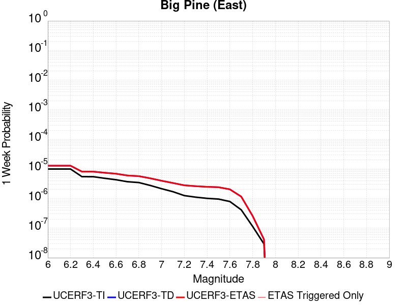 | 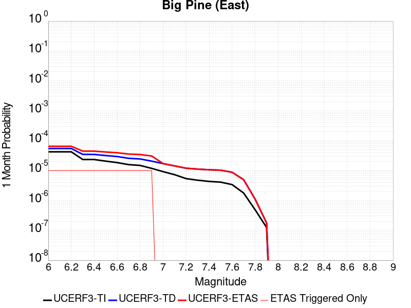 |  |  |

| Magnitude | 1 wk TI Prob | 1 wk TD Prob | 1 wk ETAS Prob | 1 wk ETAS/TD Gain | 1 wk ETAS Triggered Only | 1 mo TI Prob | 1 mo TD Prob | 1 mo ETAS Prob | 1 mo ETAS/TD Gain | 1 mo ETAS Triggered Only | 1 yr TI Prob | 1 yr TD Prob | 1 yr ETAS Prob | 1 yr ETAS/TD Gain | 1 yr ETAS Triggered Only | 10 yr TI Prob | 10 yr TD Prob | 10 yr ETAS Prob | 10 yr ETAS/TD Gain | 10 yr ETAS Triggered Only |
|-----|-----|-----|-----|-----|-----|-----|-----|-----|-----|-----|-----|-----|-----|-----|-----|-----|-----|-----|-----|-----|
| 6.0 | 9.916913E-6 | 1.2819477E-5 | 1.2819477E-5 | 1.0 | 0.0 | 4.250036E-5 | 5.4939585E-5 | 6.4939035E-5 | 1.1820081 | 1.0E-5 | 5.173191E-4 | 6.6870626E-4 | 6.786996E-4 | 1.0149442 | 1.0E-5 | 0.0051611643 | 0.0066717123 | 0.0067114453 | 1.0059555 | 4.0E-5 |
| 6.1 | 9.916913E-6 | 1.2819477E-5 | 1.2819477E-5 | 1.0 | 0.0 | 4.250036E-5 | 5.4939585E-5 | 6.4939035E-5 | 1.1820081 | 1.0E-5 | 5.173191E-4 | 6.6870626E-4 | 6.786996E-4 | 1.0149442 | 1.0E-5 | 0.0051611643 | 0.0066717123 | 0.0067114453 | 1.0059555 | 4.0E-5 |
| 6.2 | 9.916913E-6 | 1.2819477E-5 | 1.2819477E-5 | 1.0 | 0.0 | 4.250036E-5 | 5.4939585E-5 | 6.4939035E-5 | 1.1820081 | 1.0E-5 | 5.173191E-4 | 6.6870626E-4 | 6.786996E-4 | 1.0149442 | 1.0E-5 | 0.0051611643 | 0.0066717123 | 0.0067114453 | 1.0059555 | 4.0E-5 |
| 6.3 | 5.479711E-6 | 8.115369E-6 | 8.115369E-6 | 1.0 | 0.0 | 2.3484265E-5 | 3.4779707E-5 | 4.477936E-5 | 1.287514 | 1.0E-5 | 2.858834E-4 | 4.2336388E-4 | 4.3335962E-4 | 1.0236104 | 1.0E-5 | 0.0028551589 | 0.0042284788 | 0.004258352 | 1.0070647 | 3.0E-5 |
| 6.4 | 5.465009E-6 | 8.099662E-6 | 8.099662E-6 | 1.0 | 0.0 | 2.3421257E-5 | 3.4712393E-5 | 4.4712047E-5 | 1.2880715 | 1.0E-5 | 2.851165E-4 | 4.2254463E-4 | 4.3254043E-4 | 1.0236561 | 1.0E-5 | 0.0028475097 | 0.0042203176 | 0.004250191 | 1.0070785 | 3.0E-5 |
| 6.5 | 4.826767E-6 | 7.424708E-6 | 7.424708E-6 | 1.0 | 0.0 | 2.068598E-5 | 3.1819807E-5 | 4.1819487E-5 | 1.3142596 | 1.0E-5 | 2.518227E-4 | 3.8734006E-4 | 3.9733617E-4 | 1.0258071 | 1.0E-5 | 0.0025153751 | 0.0038695128 | 0.0038993969 | 1.0077229 | 3.0E-5 |
| 6.6 | 4.3146847E-6 | 6.8846366E-6 | 6.8846366E-6 | 1.0 | 0.0 | 1.8491375E-5 | 2.9505265E-5 | 3.9504972E-5 | 1.3389126 | 1.0E-5 | 2.2510924E-4 | 3.5916985E-4 | 3.6916626E-4 | 1.027832 | 1.0E-5 | 0.0022488134 | 0.0035887246 | 0.003618617 | 1.0083295 | 3.0E-5 |
| 6.7 | 3.6968106E-6 | 5.9977306E-6 | 5.9977306E-6 | 1.0 | 0.0 | 1.5843378E-5 | 2.5704314E-5 | 3.570406E-5 | 1.3890297 | 1.0E-5 | 1.9287605E-4 | 3.1290663E-4 | 3.229035E-4 | 1.0319484 | 1.0E-5 | 0.0019270873 | 0.0031274015 | 0.0031573076 | 1.0095626 | 3.0E-5 |
| 6.8 | 3.4671132E-6 | 5.704374E-6 | 5.704374E-6 | 1.0 | 0.0 | 1.4858972E-5 | 2.4447096E-5 | 3.444685E-5 | 1.4090365 | 1.0E-5 | 1.8089297E-4 | 2.976042E-4 | 3.076012E-4 | 1.0335916 | 1.0E-5 | 0.0018074579 | 0.0029747887 | 0.0030046995 | 1.0100547 | 3.0E-5 |
| 6.9 | 2.7686972E-6 | 4.8272514E-6 | 4.8272514E-6 | 1.0 | 0.0 | 1.1865792E-5 | 2.068806E-5 | 3.0687854E-5 | 1.4833606 | 1.0E-5 | 1.4445644E-4 | 2.5184877E-4 | 2.6184623E-4 | 1.0396963 | 1.0E-5 | 0.0014436257 | 0.0025182979 | 0.0025382475 | 1.0079218 | 2.0E-5 |
| 7.0 | 2.1472624E-6 | 3.986883E-6 | 3.986883E-6 | 1.0 | 0.0 | 9.20252E-6 | 1.7086531E-5 | 1.7086531E-5 | 1.0 | 0.0 | 1.12034926E-4 | 2.0800921E-4 | 2.0800921E-4 | 1.0 | 0.0 | 0.0011197845 | 0.0020807774 | 0.0020907565 | 1.0047959 | 1.0E-5 |
| 7.1 | 1.7018335E-6 | 3.3465526E-6 | 3.3465526E-6 | 1.0 | 0.0 | 7.293552E-6 | 1.4342291E-5 | 1.4342291E-5 | 1.0 | 0.0 | 8.879537E-5 | 1.7460376E-4 | 1.7460376E-4 | 1.0 | 0.0 | 8.87599E-4 | 0.0017472665 | 0.001757249 | 1.0057132 | 1.0E-5 |
| 7.2 | 1.25603E-6 | 2.796068E-6 | 2.796068E-6 | 1.0 | 0.0 | 5.3829745E-6 | 1.1983095E-5 | 1.1983095E-5 | 1.0 | 0.0 | 6.553574E-5 | 1.4588464E-4 | 1.4588464E-4 | 1.0 | 0.0 | 6.551642E-4 | 0.001460465 | 0.001460465 | 1.0 | 0.0 |
| 7.3 | 1.112297E-6 | 2.6118275E-6 | 2.6118275E-6 | 1.0 | 0.0 | 4.7669787E-6 | 1.11935E-5 | 1.11935E-5 | 1.0 | 0.0 | 5.803642E-5 | 1.3627256E-4 | 1.3627256E-4 | 1.0 | 0.0 | 5.802127E-4 | 0.0013642985 | 0.0013642985 | 1.0 | 0.0 |
| 7.4 | 1.0137181E-6 | 2.484923E-6 | 2.484923E-6 | 1.0 | 0.0 | 4.3444993E-6 | 1.0649628E-5 | 1.0649628E-5 | 1.0 | 0.0 | 5.2892992E-5 | 1.2965173E-4 | 1.2965173E-4 | 1.0 | 0.0 | 5.288041E-4 | 0.0012979534 | 0.0012979534 | 1.0 | 0.0 |
| 7.5 | 9.598608E-7 | 2.408537E-6 | 2.408537E-6 | 1.0 | 0.0 | 4.1136827E-6 | 1.0322262E-5 | 1.0322262E-5 | 1.0 | 0.0 | 5.0082934E-5 | 1.256665E-4 | 1.256665E-4 | 1.0 | 0.0 | 5.007165E-4 | 0.0012579551 | 0.0012579551 | 1.0 | 0.0 |
| 7.6 | 7.929459E-7 | 2.0460855E-6 | 2.0460855E-6 | 1.0 | 0.0 | 3.3983351E-6 | 8.768909E-6 | 8.768909E-6 | 1.0 | 0.0 | 4.1373947E-5 | 1.0675641E-4 | 1.0675641E-4 | 1.0 | 0.0 | 4.1366243E-4 | 0.0010691425 | 0.0010691425 | 1.0 | 0.0 |
| 7.7 | 4.155788E-7 | 1.1614285E-6 | 1.1614285E-6 | 1.0 | 0.0 | 1.7810507E-6 | 4.9775413E-6 | 4.9775413E-6 | 1.0 | 0.0 | 2.1684076E-5 | 6.059992E-5 | 6.059992E-5 | 1.0 | 0.0 | 2.1681961E-4 | 6.0901203E-4 | 6.0901203E-4 | 1.0 | 0.0 |
| 7.8 | 1.14666925E-7 | 2.5939678E-7 | 2.5939678E-7 | 1.0 | 0.0 | 4.914296E-7 | 1.1117E-6 | 1.1117E-6 | 1.0 | 0.0 | 5.9831386E-6 | 1.3534868E-5 | 1.3534868E-5 | 1.0 | 0.0 | 5.9829777E-5 | 1.364413E-4 | 1.364413E-4 | 1.0 | 0.0 |
| 7.9 | 2.9231824E-8 | 4.1496527E-8 | 4.1496527E-8 | 1.0 | 0.0 | 1.2527924E-7 | 1.7784224E-7 | 1.7784224E-7 | 1.0 | 0.0 | 1.5252737E-6 | 2.1652272E-6 | 2.1652272E-6 | 1.0 | 0.0 | 1.5252632E-5 | 2.198479E-5 | 2.198479E-5 | 1.0 | 0.0 |

## Kern Canyon (North Kern) 2011
*[(top)](#table-of-contents)*

| 1 Week | 1 Month | 1 Year | 10 Year |
|-----|-----|-----|-----|
|  |  |  |  |

| Magnitude | 1 wk TI Prob | 1 wk TD Prob | 1 wk ETAS Prob | 1 wk ETAS/TD Gain | 1 wk ETAS Triggered Only | 1 mo TI Prob | 1 mo TD Prob | 1 mo ETAS Prob | 1 mo ETAS/TD Gain | 1 mo ETAS Triggered Only | 1 yr TI Prob | 1 yr TD Prob | 1 yr ETAS Prob | 1 yr ETAS/TD Gain | 1 yr ETAS Triggered Only | 10 yr TI Prob | 10 yr TD Prob | 10 yr ETAS Prob | 10 yr ETAS/TD Gain | 10 yr ETAS Triggered Only |
|-----|-----|-----|-----|-----|-----|-----|-----|-----|-----|-----|-----|-----|-----|-----|-----|-----|-----|-----|-----|-----|
| 6.0 | 6.6264497E-6 | 6.757373E-6 | 6.757373E-6 | 1.0 | 0.0 | 2.8398761E-5 | 2.8959894E-5 | 2.8959894E-5 | 1.0 | 0.0 | 3.4570007E-4 | 3.5253767E-4 | 3.725306E-4 | 1.0567116 | 2.0E-5 | 0.0034516277 | 0.0035205726 | 0.0035604318 | 1.0113218 | 4.0E-5 |
| 6.1 | 6.6264497E-6 | 6.757373E-6 | 6.757373E-6 | 1.0 | 0.0 | 2.8398761E-5 | 2.8959894E-5 | 2.8959894E-5 | 1.0 | 0.0 | 3.4570007E-4 | 3.5253767E-4 | 3.725306E-4 | 1.0567116 | 2.0E-5 | 0.0034516277 | 0.0035205726 | 0.0035604318 | 1.0113218 | 4.0E-5 |
| 6.2 | 6.6264497E-6 | 6.757373E-6 | 6.757373E-6 | 1.0 | 0.0 | 2.8398761E-5 | 2.8959894E-5 | 2.8959894E-5 | 1.0 | 0.0 | 3.4570007E-4 | 3.5253767E-4 | 3.725306E-4 | 1.0567116 | 2.0E-5 | 0.0034516277 | 0.0035205726 | 0.0035604318 | 1.0113218 | 4.0E-5 |
| 6.3 | 6.6264497E-6 | 6.757373E-6 | 6.757373E-6 | 1.0 | 0.0 | 2.8398761E-5 | 2.8959894E-5 | 2.8959894E-5 | 1.0 | 0.0 | 3.4570007E-4 | 3.5253767E-4 | 3.725306E-4 | 1.0567116 | 2.0E-5 | 0.0034516277 | 0.0035205726 | 0.0035604318 | 1.0113218 | 4.0E-5 |
| 6.4 | 6.6264497E-6 | 6.757373E-6 | 6.757373E-6 | 1.0 | 0.0 | 2.8398761E-5 | 2.8959894E-5 | 2.8959894E-5 | 1.0 | 0.0 | 3.4570007E-4 | 3.5253767E-4 | 3.725306E-4 | 1.0567116 | 2.0E-5 | 0.0034516277 | 0.0035205726 | 0.0035604318 | 1.0113218 | 4.0E-5 |
| 6.5 | 3.2162225E-6 | 3.2571097E-6 | 3.2571097E-6 | 1.0 | 0.0 | 1.3783738E-5 | 1.3958972E-5 | 1.3958972E-5 | 1.0 | 0.0 | 1.6780409E-4 | 1.6993804E-4 | 1.7993634E-4 | 1.058835 | 1.0E-5 | 0.0016767744 | 0.0016981605 | 0.0017081435 | 1.0058787 | 1.0E-5 |
| 6.6 | 3.2162225E-6 | 3.2571097E-6 | 3.2571097E-6 | 1.0 | 0.0 | 1.3783738E-5 | 1.3958972E-5 | 1.3958972E-5 | 1.0 | 0.0 | 1.6780409E-4 | 1.6993804E-4 | 1.7993634E-4 | 1.058835 | 1.0E-5 | 0.0016767744 | 0.0016981605 | 0.0017081435 | 1.0058787 | 1.0E-5 |
| 6.7 | 2.1908265E-6 | 2.2071338E-6 | 2.2071338E-6 | 1.0 | 0.0 | 9.389223E-6 | 9.459111E-6 | 9.459111E-6 | 1.0 | 0.0 | 1.1430779E-4 | 1.1515879E-4 | 1.2515765E-4 | 1.0868266 | 1.0E-5 | 0.0011424901 | 0.0011510106 | 0.0011609991 | 1.008678 | 1.0E-5 |
| 6.8 | 1.7303895E-6 | 1.7365618E-6 | 1.7365618E-6 | 1.0 | 0.0 | 7.415934E-6 | 7.442387E-6 | 7.442387E-6 | 1.0 | 0.0 | 9.028525E-5 | 9.060739E-5 | 9.060739E-5 | 1.0 | 0.0 | 9.024858E-4 | 9.0571423E-4 | 9.0571423E-4 | 1.0 | 0.0 |
| 6.9 | 1.3700314E-6 | 1.3688691E-6 | 1.3688691E-6 | 1.0 | 0.0 | 5.87155E-6 | 5.866569E-6 | 5.866569E-6 | 1.0 | 0.0 | 7.148377E-5 | 7.142319E-5 | 7.142319E-5 | 1.0 | 0.0 | 7.146078E-4 | 7.1400683E-4 | 7.1400683E-4 | 1.0 | 0.0 |
| 7.0 | 1.1467797E-6 | 1.1413862E-6 | 1.1413862E-6 | 1.0 | 0.0 | 4.9147607E-6 | 4.8916463E-6 | 4.8916463E-6 | 1.0 | 0.0 | 5.983557E-5 | 5.9554197E-5 | 5.9554197E-5 | 1.0 | 0.0 | 5.981946E-4 | 5.953855E-4 | 5.953855E-4 | 1.0 | 0.0 |
| 7.1 | 9.3952065E-7 | 9.3027376E-7 | 9.3027376E-7 | 1.0 | 0.0 | 4.026511E-6 | 3.9868814E-6 | 3.9868814E-6 | 1.0 | 0.0 | 4.9021666E-5 | 4.853922E-5 | 4.853922E-5 | 1.0 | 0.0 | 4.901085E-4 | 4.8528795E-4 | 4.8528795E-4 | 1.0 | 0.0 |
| 7.2 | 6.858055E-7 | 6.7193355E-7 | 6.7193355E-7 | 1.0 | 0.0 | 2.939163E-6 | 2.879712E-6 | 2.879712E-6 | 1.0 | 0.0 | 3.5783723E-5 | 3.5059937E-5 | 3.5059937E-5 | 1.0 | 0.0 | 3.5777962E-4 | 3.5054496E-4 | 3.5054496E-4 | 1.0 | 0.0 |
| 7.3 | 5.1101983E-7 | 4.939326E-7 | 4.939326E-7 | 1.0 | 0.0 | 2.1900833E-6 | 2.1168523E-6 | 2.1168523E-6 | 1.0 | 0.0 | 2.6663936E-5 | 2.5772377E-5 | 2.5772377E-5 | 1.0 | 0.0 | 2.6660739E-4 | 2.5769437E-4 | 2.5769437E-4 | 1.0 | 0.0 |
| 7.4 | 3.4999414E-7 | 3.2996087E-7 | 3.2996087E-7 | 1.0 | 0.0 | 1.499974E-6 | 1.4141173E-6 | 1.4141173E-6 | 1.0 | 0.0 | 1.8262032E-5 | 1.7216744E-5 | 1.7216744E-5 | 1.0 | 0.0 | 1.826053E-4 | 1.7215434E-4 | 1.7215434E-4 | 1.0 | 0.0 |
| 7.5 | 1.7021522E-7 | 1.4750137E-7 | 1.4750137E-7 | 1.0 | 0.0 | 7.2949354E-7 | 6.3214856E-7 | 6.3214856E-7 | 1.0 | 0.0 | 8.881548E-6 | 7.696382E-6 | 7.696382E-6 | 1.0 | 0.0 | 8.8811925E-5 | 7.6961245E-5 | 7.6961245E-5 | 1.0 | 0.0 |
| 7.6 | 2.572245E-8 | 1.735272E-8 | 1.735272E-8 | 1.0 | 0.0 | 1.10239064E-7 | 7.43688E-8 | 7.43688E-8 | 1.0 | 0.0 | 1.3421597E-6 | 9.054398E-7 | 9.054398E-7 | 1.0 | 0.0 | 1.3421517E-5 | 9.054366E-6 | 9.054366E-6 | 1.0 | 0.0 |

## San Cayetano
*[(top)](#table-of-contents)*

| 1 Week | 1 Month | 1 Year | 10 Year |
|-----|-----|-----|-----|
|  |  |  |  |

| Magnitude | 1 wk TI Prob | 1 wk TD Prob | 1 wk ETAS Prob | 1 wk ETAS/TD Gain | 1 wk ETAS Triggered Only | 1 mo TI Prob | 1 mo TD Prob | 1 mo ETAS Prob | 1 mo ETAS/TD Gain | 1 mo ETAS Triggered Only | 1 yr TI Prob | 1 yr TD Prob | 1 yr ETAS Prob | 1 yr ETAS/TD Gain | 1 yr ETAS Triggered Only | 10 yr TI Prob | 10 yr TD Prob | 10 yr ETAS Prob | 10 yr ETAS/TD Gain | 10 yr ETAS Triggered Only |
|-----|-----|-----|-----|-----|-----|-----|-----|-----|-----|-----|-----|-----|-----|-----|-----|-----|-----|-----|-----|-----|
| 6.0 | 2.3476267E-5 | 1.8169987E-5 | 1.8169987E-5 | 1.0 | 0.0 | 1.0060869E-4 | 7.786907E-5 | 8.786829E-5 | 1.1284107 | 1.0E-5 | 0.0012242225 | 9.476472E-4 | 9.876093E-4 | 1.0421698 | 4.0E-5 | 0.012175002 | 0.00943695 | 0.009476572 | 1.0041987 | 4.0E-5 |
| 6.1 | 2.3476267E-5 | 1.8169987E-5 | 1.8169987E-5 | 1.0 | 0.0 | 1.0060869E-4 | 7.786907E-5 | 8.786829E-5 | 1.1284107 | 1.0E-5 | 0.0012242225 | 9.476472E-4 | 9.876093E-4 | 1.0421698 | 4.0E-5 | 0.012175002 | 0.00943695 | 0.009476572 | 1.0041987 | 4.0E-5 |
| 6.2 | 2.3476267E-5 | 1.8169987E-5 | 1.8169987E-5 | 1.0 | 0.0 | 1.0060869E-4 | 7.786907E-5 | 8.786829E-5 | 1.1284107 | 1.0E-5 | 0.0012242225 | 9.476472E-4 | 9.876093E-4 | 1.0421698 | 4.0E-5 | 0.012175002 | 0.00943695 | 0.009476572 | 1.0041987 | 4.0E-5 |
| 6.3 | 2.3476267E-5 | 1.8169987E-5 | 1.8169987E-5 | 1.0 | 0.0 | 1.0060869E-4 | 7.786907E-5 | 8.786829E-5 | 1.1284107 | 1.0E-5 | 0.0012242225 | 9.476472E-4 | 9.876093E-4 | 1.0421698 | 4.0E-5 | 0.012175002 | 0.00943695 | 0.009476572 | 1.0041987 | 4.0E-5 |
| 6.4 | 2.3476267E-5 | 1.8169987E-5 | 1.8169987E-5 | 1.0 | 0.0 | 1.0060869E-4 | 7.786907E-5 | 8.786829E-5 | 1.1284107 | 1.0E-5 | 0.0012242225 | 9.476472E-4 | 9.876093E-4 | 1.0421698 | 4.0E-5 | 0.012175002 | 0.00943695 | 0.009476572 | 1.0041987 | 4.0E-5 |
| 6.5 | 2.3476267E-5 | 1.8169987E-5 | 1.8169987E-5 | 1.0 | 0.0 | 1.0060869E-4 | 7.786907E-5 | 8.786829E-5 | 1.1284107 | 1.0E-5 | 0.0012242225 | 9.476472E-4 | 9.876093E-4 | 1.0421698 | 4.0E-5 | 0.012175002 | 0.00943695 | 0.009476572 | 1.0041987 | 4.0E-5 |
| 6.6 | 2.3476267E-5 | 1.8169987E-5 | 1.8169987E-5 | 1.0 | 0.0 | 1.0060869E-4 | 7.786907E-5 | 8.786829E-5 | 1.1284107 | 1.0E-5 | 0.0012242225 | 9.476472E-4 | 9.876093E-4 | 1.0421698 | 4.0E-5 | 0.012175002 | 0.00943695 | 0.009476572 | 1.0041987 | 4.0E-5 |
| 6.7 | 2.3476267E-5 | 1.8169987E-5 | 1.8169987E-5 | 1.0 | 0.0 | 1.0060869E-4 | 7.786907E-5 | 8.786829E-5 | 1.1284107 | 1.0E-5 | 0.0012242225 | 9.476472E-4 | 9.876093E-4 | 1.0421698 | 4.0E-5 | 0.012175002 | 0.00943695 | 0.009476572 | 1.0041987 | 4.0E-5 |
| 6.8 | 2.3241924E-5 | 1.7937682E-5 | 1.7937682E-5 | 1.0 | 0.0 | 9.960445E-5 | 7.687353E-5 | 8.6872766E-5 | 1.1300738 | 1.0E-5 | 0.0012120095 | 9.3553704E-4 | 9.754996E-4 | 1.0427161 | 4.0E-5 | 0.012054204 | 0.009316841 | 0.009356469 | 1.0042533 | 4.0E-5 |
| 6.9 | 2.2761007E-5 | 1.7433098E-5 | 1.7433098E-5 | 1.0 | 0.0 | 9.7543525E-5 | 7.4711155E-5 | 8.471041E-5 | 1.1338388 | 1.0E-5 | 0.0011869454 | 9.092322E-4 | 9.491958E-4 | 1.0439532 | 4.0E-5 | 0.011806256 | 0.009055952 | 0.00909559 | 1.004377 | 4.0E-5 |
| 7.0 | 2.240283E-5 | 1.706683E-5 | 1.706683E-5 | 1.0 | 0.0 | 9.600859E-5 | 7.314153E-5 | 8.3140796E-5 | 1.1367112 | 1.0E-5 | 0.0011682777 | 8.901377E-4 | 9.301021E-4 | 1.0448968 | 4.0E-5 | 0.011621549 | 0.008866537 | 0.008906183 | 1.0044713 | 4.0E-5 |
| 7.1 | 2.1871154E-5 | 1.6586657E-5 | 1.6586657E-5 | 1.0 | 0.0 | 9.373015E-5 | 7.1083756E-5 | 8.1083046E-5 | 1.1406691 | 1.0E-5 | 0.0011405671 | 8.6510443E-4 | 8.9507847E-4 | 1.034648 | 3.0E-5 | 0.011347309 | 0.0086181685 | 0.00864791 | 1.003451 | 3.0E-5 |
| 7.2 | 2.0714133E-5 | 1.5565152E-5 | 1.5565152E-5 | 1.0 | 0.0 | 8.8771834E-5 | 6.670611E-5 | 7.6705444E-5 | 1.1499013 | 1.0E-5 | 0.0010802611 | 8.1184757E-4 | 8.418232E-4 | 1.0369227 | 3.0E-5 | 0.010750249 | 0.008089592 | 0.008119349 | 1.0036784 | 3.0E-5 |
| 7.3 | 1.8408395E-5 | 1.3997363E-5 | 1.3997363E-5 | 1.0 | 0.0 | 7.8890735E-5 | 5.9987335E-5 | 6.998673E-5 | 1.1666919 | 1.0E-5 | 9.600714E-4 | 7.3010405E-4 | 7.6008216E-4 | 1.0410601 | 3.0E-5 | 0.009559342 | 0.007277773 | 0.007307555 | 1.0040921 | 3.0E-5 |
| 7.4 | 1.6856795E-5 | 1.28505235E-5 | 1.28505235E-5 | 1.0 | 0.0 | 7.2241404E-5 | 5.5072524E-5 | 6.5071974E-5 | 1.1815687 | 1.0E-5 | 8.7918417E-4 | 6.703046E-4 | 7.0028444E-4 | 1.0447258 | 3.0E-5 | 0.00875714 | 0.0066835075 | 0.006713307 | 1.0044587 | 3.0E-5 |
| 7.5 | 1.2822778E-5 | 9.577859E-6 | 9.577859E-6 | 1.0 | 0.0 | 5.495361E-5 | 4.104733E-5 | 4.104733E-5 | 1.0 | 0.0 | 6.688548E-4 | 4.9963826E-4 | 5.096332E-4 | 1.0200045 | 1.0E-5 | 0.006668452 | 0.00498532 | 0.00499527 | 1.0019959 | 1.0E-5 |
| 7.6 | 5.6272684E-6 | 3.8550384E-6 | 3.8550384E-6 | 1.0 | 0.0 | 2.4116642E-5 | 1.6521488E-5 | 1.6521488E-5 | 1.0 | 0.0 | 2.9358055E-4 | 2.0113066E-4 | 2.0113066E-4 | 1.0 | 0.0 | 0.0029319301 | 0.002009497 | 0.002009497 | 1.0 | 0.0 |
| 7.7 | 3.5261346E-6 | 2.3407883E-6 | 2.3407883E-6 | 1.0 | 0.0 | 1.5111918E-5 | 1.0031911E-5 | 1.0031911E-5 | 1.0 | 0.0 | 1.8397206E-4 | 1.2213175E-4 | 1.2213175E-4 | 1.0 | 0.0 | 0.0018381984 | 0.0012206536 | 0.0012206536 | 1.0 | 0.0 |
| 7.8 | 1.4826929E-6 | 1.0564627E-6 | 1.0564627E-6 | 1.0 | 0.0 | 6.354383E-6 | 4.5276893E-6 | 4.5276893E-6 | 1.0 | 0.0 | 7.736187E-5 | 5.512324E-5 | 5.512324E-5 | 1.0 | 0.0 | 7.733494E-4 | 5.5109774E-4 | 5.5109774E-4 | 1.0 | 0.0 |
| 7.9 | 2.7568166E-7 | 1.6979098E-7 | 1.6979098E-7 | 1.0 | 0.0 | 1.1814923E-6 | 7.276754E-7 | 7.276754E-7 | 1.0 | 0.0 | 1.4384574E-5 | 8.859412E-6 | 8.859412E-6 | 1.0 | 0.0 | 1.4383643E-4 | 8.859063E-5 | 8.859063E-5 | 1.0 | 0.0 |
| 8.0 | 5.407832E-8 | 2.6890575E-8 | 2.6890575E-8 | 1.0 | 0.0 | 2.3176422E-7 | 1.15245314E-7 | 1.15245314E-7 | 1.0 | 0.0 | 2.8217257E-6 | 1.4031108E-6 | 1.4031108E-6 | 1.0 | 0.0 | 2.8216898E-5 | 1.4031024E-5 | 1.4031024E-5 | 1.0 | 0.0 |

## Rose Canyon
*[(top)](#table-of-contents)*

| 1 Week | 1 Month | 1 Year | 10 Year |
|-----|-----|-----|-----|
|  |  |  |  |

| Magnitude | 1 wk TI Prob | 1 wk TD Prob | 1 wk ETAS Prob | 1 wk ETAS/TD Gain | 1 wk ETAS Triggered Only | 1 mo TI Prob | 1 mo TD Prob | 1 mo ETAS Prob | 1 mo ETAS/TD Gain | 1 mo ETAS Triggered Only | 1 yr TI Prob | 1 yr TD Prob | 1 yr ETAS Prob | 1 yr ETAS/TD Gain | 1 yr ETAS Triggered Only | 10 yr TI Prob | 10 yr TD Prob | 10 yr ETAS Prob | 10 yr ETAS/TD Gain | 10 yr ETAS Triggered Only |
|-----|-----|-----|-----|-----|-----|-----|-----|-----|-----|-----|-----|-----|-----|-----|-----|-----|-----|-----|-----|-----|
| 6.0 | 4.5923203E-5 | 4.9717608E-5 | 4.9717608E-5 | 1.0 | 0.0 | 1.9679888E-4 | 2.1305807E-4 | 2.1305807E-4 | 1.0 | 0.0 | 0.0023933933 | 0.0025910998 | 0.002601074 | 1.0038494 | 1.0E-5 | 0.023677798 | 0.02564165 | 0.025680624 | 1.0015199 | 4.0E-5 |
| 6.1 | 4.5923203E-5 | 4.9717608E-5 | 4.9717608E-5 | 1.0 | 0.0 | 1.9679888E-4 | 2.1305807E-4 | 2.1305807E-4 | 1.0 | 0.0 | 0.0023933933 | 0.0025910998 | 0.002601074 | 1.0038494 | 1.0E-5 | 0.023677798 | 0.02564165 | 0.02567088 | 1.00114 | 3.0E-5 |
| 6.2 | 2.8844734E-5 | 2.9670353E-5 | 2.9670353E-5 | 1.0 | 0.0 | 1.2361443E-4 | 1.2715132E-4 | 1.2715132E-4 | 1.0 | 0.0 | 0.0015039665 | 0.0015469771 | 0.0015469771 | 1.0 | 0.0 | 0.0149382865 | 0.015375099 | 0.015384946 | 1.0006404 | 1.0E-5 |
| 6.3 | 2.3171577E-5 | 2.3162325E-5 | 2.3162325E-5 | 1.0 | 0.0 | 9.9302975E-5 | 9.926341E-5 | 9.926341E-5 | 1.0 | 0.0 | 0.0012083431 | 0.0012078753 | 0.0012078753 | 1.0 | 0.0 | 0.012017938 | 0.012022995 | 0.012032875 | 1.0008217 | 1.0E-5 |
| 6.4 | 2.0066604E-5 | 1.9667965E-5 | 1.9667965E-5 | 1.0 | 0.0 | 8.599689E-5 | 8.428861E-5 | 8.428861E-5 | 1.0 | 0.0 | 0.0010465092 | 0.0010257406 | 0.0010257406 | 1.0 | 0.0 | 0.010415946 | 0.010218044 | 0.010218044 | 1.0 | 0.0 |
| 6.5 | 1.776989E-5 | 1.7114624E-5 | 1.7114624E-5 | 1.0 | 0.0 | 7.615444E-5 | 7.334637E-5 | 7.334637E-5 | 1.0 | 0.0 | 9.267859E-4 | 8.926331E-4 | 8.926331E-4 | 1.0 | 0.0 | 0.009229303 | 0.008896634 | 0.008896634 | 1.0 | 0.0 |
| 6.6 | 1.5227364E-5 | 1.4339751E-5 | 1.4339751E-5 | 1.0 | 0.0 | 6.52585E-5 | 6.145466E-5 | 6.145466E-5 | 1.0 | 0.0 | 7.942326E-4 | 7.479588E-4 | 7.479588E-4 | 1.0 | 0.0 | 0.007914 | 0.0074586133 | 0.0074586133 | 1.0 | 0.0 |
| 6.7 | 1.2703898E-5 | 1.1673627E-5 | 1.1673627E-5 | 1.0 | 0.0 | 5.4444143E-5 | 5.0028895E-5 | 5.0028895E-5 | 1.0 | 0.0 | 6.626558E-4 | 6.089358E-4 | 6.089358E-4 | 1.0 | 0.0 | 0.006606833 | 0.006075268 | 0.006075268 | 1.0 | 0.0 |
| 6.8 | 1.1554917E-5 | 1.0609633E-5 | 1.0609633E-5 | 1.0 | 0.0 | 4.9520135E-5 | 4.546909E-5 | 4.546909E-5 | 1.0 | 0.0 | 6.0274085E-4 | 5.5344956E-4 | 5.5344956E-4 | 1.0 | 0.0 | 0.0060110865 | 0.005522721 | 0.005522721 | 1.0 | 0.0 |
| 6.9 | 8.732078E-6 | 7.881539E-6 | 7.881539E-6 | 1.0 | 0.0 | 3.7422655E-5 | 3.3777604E-5 | 3.3777604E-5 | 1.0 | 0.0 | 4.5552556E-4 | 4.1116765E-4 | 4.1116765E-4 | 1.0 | 0.0 | 0.0045459294 | 0.0041049025 | 0.0041049025 | 1.0 | 0.0 |
| 7.0 | 5.9337494E-6 | 5.1075763E-6 | 5.1075763E-6 | 1.0 | 0.0 | 2.5430107E-5 | 2.1889431E-5 | 2.1889431E-5 | 1.0 | 0.0 | 3.0956755E-4 | 2.6647135E-4 | 2.6647135E-4 | 1.0 | 0.0 | 0.0030913667 | 0.0026615341 | 0.0026615341 | 1.0 | 0.0 |
| 7.1 | 5.013409E-6 | 4.1774556E-6 | 4.1774556E-6 | 1.0 | 0.0 | 2.1485863E-5 | 1.790326E-5 | 1.790326E-5 | 1.0 | 0.0 | 2.6155898E-4 | 2.1795048E-4 | 2.1795048E-4 | 1.0 | 0.0 | 0.0026125133 | 0.0021773789 | 0.0021773789 | 1.0 | 0.0 |
| 7.2 | 4.120763E-6 | 3.282197E-6 | 3.282197E-6 | 1.0 | 0.0 | 1.7660293E-5 | 1.4066483E-5 | 1.4066483E-5 | 1.0 | 0.0 | 2.1499286E-4 | 1.7124607E-4 | 1.7124607E-4 | 1.0 | 0.0 | 0.0021478499 | 0.0017111506 | 0.0017111506 | 1.0 | 0.0 |
| 7.3 | 3.2081239E-6 | 2.440582E-6 | 2.440582E-6 | 1.0 | 0.0 | 1.374903E-5 | 1.0459596E-5 | 1.0459596E-5 | 1.0 | 0.0 | 1.6738157E-4 | 1.2733821E-4 | 1.2733821E-4 | 1.0 | 0.0 | 0.0016725556 | 0.0012726594 | 0.0012726594 | 1.0 | 0.0 |
| 7.4 | 2.4194755E-6 | 1.7680974E-6 | 1.7680974E-6 | 1.0 | 0.0 | 1.0369139E-5 | 7.5775383E-6 | 7.5775383E-6 | 1.0 | 0.0 | 1.2623696E-4 | 9.2252674E-5 | 9.2252674E-5 | 1.0 | 0.0 | 0.0012616527 | 9.2214916E-4 | 9.2214916E-4 | 1.0 | 0.0 |
| 7.5 | 1.3842889E-6 | 9.3788475E-7 | 9.3788475E-7 | 1.0 | 0.0 | 5.9326535E-6 | 4.0195E-6 | 4.0195E-6 | 1.0 | 0.0 | 7.222766E-5 | 4.893635E-5 | 4.893635E-5 | 1.0 | 0.0 | 7.220419E-4 | 4.8925926E-4 | 4.8925926E-4 | 1.0 | 0.0 |
| 7.6 | 1.0021575E-6 | 6.411634E-7 | 6.411634E-7 | 1.0 | 0.0 | 4.2949537E-6 | 2.7478404E-6 | 2.7478404E-6 | 1.0 | 0.0 | 5.2289808E-5 | 3.3454464E-5 | 3.3454464E-5 | 1.0 | 0.0 | 5.2277505E-4 | 3.3449644E-4 | 3.3449644E-4 | 1.0 | 0.0 |
| 7.7 | 8.7620116E-8 | 6.449328E-8 | 6.449328E-8 | 1.0 | 0.0 | 3.7551473E-7 | 2.7639973E-7 | 2.7639973E-7 | 1.0 | 0.0 | 4.5718825E-6 | 3.3651618E-6 | 3.3651618E-6 | 1.0 | 0.0 | 4.5717883E-5 | 3.3651137E-5 | 3.3651137E-5 | 1.0 | 0.0 |

## Great Valley 09 (Laguna Seca)
*[(top)](#table-of-contents)*

| 1 Week | 1 Month | 1 Year | 10 Year |
|-----|-----|-----|-----|
|  |  |  |  |

| Magnitude | 1 wk TI Prob | 1 wk TD Prob | 1 wk ETAS Prob | 1 wk ETAS/TD Gain | 1 wk ETAS Triggered Only | 1 mo TI Prob | 1 mo TD Prob | 1 mo ETAS Prob | 1 mo ETAS/TD Gain | 1 mo ETAS Triggered Only | 1 yr TI Prob | 1 yr TD Prob | 1 yr ETAS Prob | 1 yr ETAS/TD Gain | 1 yr ETAS Triggered Only | 10 yr TI Prob | 10 yr TD Prob | 10 yr ETAS Prob | 10 yr ETAS/TD Gain | 10 yr ETAS Triggered Only |
|-----|-----|-----|-----|-----|-----|-----|-----|-----|-----|-----|-----|-----|-----|-----|-----|-----|-----|-----|-----|-----|
| 6.0 | 5.4353277E-5 | 7.050752E-5 | 7.050752E-5 | 1.0 | 0.0 | 2.3292181E-4 | 3.0213883E-4 | 3.121358E-4 | 1.0330874 | 1.0E-5 | 0.0028321352 | 0.0036724764 | 0.0036824397 | 1.002713 | 1.0E-5 | 0.02796312 | 0.03611835 | 0.036156908 | 1.0010675 | 4.0E-5 |
| 6.1 | 4.5578287E-5 | 5.822518E-5 | 5.822518E-5 | 1.0 | 0.0 | 1.953209E-4 | 2.495107E-4 | 2.595082E-4 | 1.0400684 | 1.0E-5 | 0.0023754383 | 0.0030336666 | 0.0030436364 | 1.0032864 | 1.0E-5 | 0.023502063 | 0.029921863 | 0.029950965 | 1.0009726 | 3.0E-5 |
| 6.2 | 2.8536782E-5 | 3.4738863E-5 | 3.4738863E-5 | 1.0 | 0.0 | 1.2229476E-4 | 1.4886934E-4 | 1.5886784E-4 | 1.067163 | 1.0E-5 | 0.0014879217 | 0.0018109402 | 0.0018209221 | 1.005512 | 1.0E-5 | 0.014779986 | 0.017959375 | 0.017979017 | 1.0010936 | 2.0E-5 |
| 6.3 | 2.3698774E-5 | 2.8214268E-5 | 2.8214268E-5 | 1.0 | 0.0 | 1.01562226E-4 | 1.20909535E-4 | 1.3090833E-4 | 1.0826964 | 1.0E-5 | 0.0012358186 | 0.0014711232 | 0.0014811085 | 1.0067875 | 1.0E-5 | 0.012289686 | 0.01461232 | 0.014632028 | 1.0013487 | 2.0E-5 |
| 6.4 | 1.9191197E-5 | 2.2123577E-5 | 2.2123577E-5 | 1.0 | 0.0 | 8.2245395E-5 | 9.4808645E-5 | 1.04807696E-4 | 1.1054657 | 1.0E-5 | 0.0010008777 | 0.0011537144 | 0.0011637028 | 1.0086577 | 1.0E-5 | 0.009963818 | 0.011477661 | 0.011497431 | 1.0017226 | 2.0E-5 |
| 6.5 | 1.5203241E-5 | 1.6802116E-5 | 1.6802116E-5 | 1.0 | 0.0 | 6.5155116E-5 | 7.200377E-5 | 8.2003055E-5 | 1.1388717 | 1.0E-5 | 7.9297484E-4 | 8.763123E-4 | 8.8630355E-4 | 1.0114014 | 1.0E-5 | 0.007901512 | 0.008730002 | 0.008739914 | 1.0011355 | 1.0E-5 |
| 6.6 | 1.0984925E-5 | 1.12430935E-5 | 1.12430935E-5 | 1.0 | 0.0 | 4.70774E-5 | 4.8183778E-5 | 4.8183778E-5 | 1.0 | 0.0 | 5.730166E-4 | 5.864824E-4 | 5.864824E-4 | 1.0 | 0.0 | 0.005715413 | 0.0058497433 | 0.0058497433 | 1.0 | 0.0 |
| 6.7 | 9.134616E-6 | 9.020273E-6 | 9.020273E-6 | 1.0 | 0.0 | 3.9147766E-5 | 3.8657752E-5 | 3.8657752E-5 | 1.0 | 0.0 | 4.7651984E-4 | 4.7055888E-4 | 4.7055888E-4 | 1.0 | 0.0 | 0.004754993 | 0.00469587 | 0.00469587 | 1.0 | 0.0 |
| 6.8 | 7.785589E-6 | 7.4522554E-6 | 7.4522554E-6 | 1.0 | 0.0 | 3.3366385E-5 | 3.193786E-5 | 3.193786E-5 | 1.0 | 0.0 | 4.0616E-4 | 3.8877607E-4 | 3.8877607E-4 | 1.0 | 0.0 | 0.0040541845 | 0.0038811632 | 0.0038811632 | 1.0 | 0.0 |
| 6.9 | 5.579095E-6 | 4.8986967E-6 | 4.8986967E-6 | 1.0 | 0.0 | 2.3910188E-5 | 2.0994254E-5 | 2.0994254E-5 | 1.0 | 0.0 | 2.9106764E-4 | 2.5557645E-4 | 2.5557645E-4 | 1.0 | 0.0 | 0.002906867 | 0.0025529626 | 0.0025529626 | 1.0 | 0.0 |
| 7.0 | 2.6816688E-6 | 1.5216688E-6 | 1.5216688E-6 | 1.0 | 0.0 | 1.1492816E-5 | 6.5214217E-6 | 6.5214217E-6 | 1.0 | 0.0 | 1.3991605E-4 | 7.9395504E-5 | 7.9395504E-5 | 1.0 | 0.0 | 0.0013982799 | 7.9368014E-4 | 7.9368014E-4 | 1.0 | 0.0 |
| 7.1 | 1.9951021E-6 | 7.4541185E-7 | 7.4541185E-7 | 1.0 | 0.0 | 8.55041E-6 | 3.1946186E-6 | 3.1946186E-6 | 1.0 | 0.0 | 1.0409627E-4 | 3.8893828E-5 | 3.8893828E-5 | 1.0 | 0.0 | 0.0010404752 | 3.8887435E-4 | 3.8887435E-4 | 1.0 | 0.0 |
| 7.2 | 1.9951021E-6 | 7.4541185E-7 | 7.4541185E-7 | 1.0 | 0.0 | 8.55041E-6 | 3.1946186E-6 | 3.1946186E-6 | 1.0 | 0.0 | 1.0409627E-4 | 3.8893828E-5 | 3.8893828E-5 | 1.0 | 0.0 | 0.0010404752 | 3.8887435E-4 | 3.8887435E-4 | 1.0 | 0.0 |
| 7.3 | 1.7087556E-6 | 6.579125E-7 | 6.579125E-7 | 1.0 | 0.0 | 7.3232177E-6 | 2.819622E-6 | 2.819622E-6 | 1.0 | 0.0 | 8.915652E-5 | 3.43284E-5 | 3.43284E-5 | 1.0 | 0.0 | 8.9120766E-4 | 3.43235E-4 | 3.43235E-4 | 1.0 | 0.0 |
| 7.4 | 1.3804846E-6 | 6.074053E-7 | 6.074053E-7 | 1.0 | 0.0 | 5.916349E-6 | 2.6031632E-6 | 2.6031632E-6 | 1.0 | 0.0 | 7.2029165E-5 | 3.1693093E-5 | 3.1693093E-5 | 1.0 | 0.0 | 7.200583E-4 | 3.1688975E-4 | 3.1688975E-4 | 1.0 | 0.0 |
| 7.5 | 1.3804846E-6 | 6.074053E-7 | 6.074053E-7 | 1.0 | 0.0 | 5.916349E-6 | 2.6031632E-6 | 2.6031632E-6 | 1.0 | 0.0 | 7.2029165E-5 | 3.1693093E-5 | 3.1693093E-5 | 1.0 | 0.0 | 7.200583E-4 | 3.1688975E-4 | 3.1688975E-4 | 1.0 | 0.0 |

## Pine Mtn
*[(top)](#table-of-contents)*

| 1 Week | 1 Month | 1 Year | 10 Year |
|-----|-----|-----|-----|
|  |  |  |  |

| Magnitude | 1 wk TI Prob | 1 wk TD Prob | 1 wk ETAS Prob | 1 wk ETAS/TD Gain | 1 wk ETAS Triggered Only | 1 mo TI Prob | 1 mo TD Prob | 1 mo ETAS Prob | 1 mo ETAS/TD Gain | 1 mo ETAS Triggered Only | 1 yr TI Prob | 1 yr TD Prob | 1 yr ETAS Prob | 1 yr ETAS/TD Gain | 1 yr ETAS Triggered Only | 10 yr TI Prob | 10 yr TD Prob | 10 yr ETAS Prob | 10 yr ETAS/TD Gain | 10 yr ETAS Triggered Only |
|-----|-----|-----|-----|-----|-----|-----|-----|-----|-----|-----|-----|-----|-----|-----|-----|-----|-----|-----|-----|-----|
| 6.0 | 6.894797E-6 | 7.2256657E-6 | 1.7225593E-5 | 2.3839455 | 1.0E-5 | 2.9548795E-5 | 3.096679E-5 | 4.096648E-5 | 1.3229166 | 1.0E-5 | 3.596972E-4 | 3.769584E-4 | 4.069471E-4 | 1.0795543 | 3.0E-5 | 0.0035911554 | 0.0037634873 | 0.0037933744 | 1.0079414 | 3.0E-5 |
| 6.1 | 6.894797E-6 | 7.2256657E-6 | 1.7225593E-5 | 2.3839455 | 1.0E-5 | 2.9548795E-5 | 3.096679E-5 | 4.096648E-5 | 1.3229166 | 1.0E-5 | 3.596972E-4 | 3.769584E-4 | 4.069471E-4 | 1.0795543 | 3.0E-5 | 0.0035911554 | 0.0037634873 | 0.0037933744 | 1.0079414 | 3.0E-5 |
| 6.2 | 6.894797E-6 | 7.2256657E-6 | 1.7225593E-5 | 2.3839455 | 1.0E-5 | 2.9548795E-5 | 3.096679E-5 | 4.096648E-5 | 1.3229166 | 1.0E-5 | 3.596972E-4 | 3.769584E-4 | 4.069471E-4 | 1.0795543 | 3.0E-5 | 0.0035911554 | 0.0037634873 | 0.0037933744 | 1.0079414 | 3.0E-5 |
| 6.3 | 6.894797E-6 | 7.2256657E-6 | 1.7225593E-5 | 2.3839455 | 1.0E-5 | 2.9548795E-5 | 3.096679E-5 | 4.096648E-5 | 1.3229166 | 1.0E-5 | 3.596972E-4 | 3.769584E-4 | 4.069471E-4 | 1.0795543 | 3.0E-5 | 0.0035911554 | 0.0037634873 | 0.0037933744 | 1.0079414 | 3.0E-5 |
| 6.4 | 6.894797E-6 | 7.2256657E-6 | 1.7225593E-5 | 2.3839455 | 1.0E-5 | 2.9548795E-5 | 3.096679E-5 | 4.096648E-5 | 1.3229166 | 1.0E-5 | 3.596972E-4 | 3.769584E-4 | 4.069471E-4 | 1.0795543 | 3.0E-5 | 0.0035911554 | 0.0037634873 | 0.0037933744 | 1.0079414 | 3.0E-5 |
| 6.5 | 6.894797E-6 | 7.2256657E-6 | 1.7225593E-5 | 2.3839455 | 1.0E-5 | 2.9548795E-5 | 3.096679E-5 | 4.096648E-5 | 1.3229166 | 1.0E-5 | 3.596972E-4 | 3.769584E-4 | 4.069471E-4 | 1.0795543 | 3.0E-5 | 0.0035911554 | 0.0037634873 | 0.0037933744 | 1.0079414 | 3.0E-5 |
| 6.6 | 6.894797E-6 | 7.2256657E-6 | 1.7225593E-5 | 2.3839455 | 1.0E-5 | 2.9548795E-5 | 3.096679E-5 | 4.096648E-5 | 1.3229166 | 1.0E-5 | 3.596972E-4 | 3.769584E-4 | 4.069471E-4 | 1.0795543 | 3.0E-5 | 0.0035911554 | 0.0037634873 | 0.0037933744 | 1.0079414 | 3.0E-5 |
| 6.7 | 6.0867933E-6 | 6.397312E-6 | 1.6397249E-5 | 2.5631466 | 1.0E-5 | 2.6085996E-5 | 2.7416776E-5 | 3.7416503E-5 | 1.3647302 | 1.0E-5 | 3.1755073E-4 | 3.3375033E-4 | 3.5374364E-4 | 1.059905 | 2.0E-5 | 0.0031709734 | 0.00333271 | 0.0033526432 | 1.0059811 | 2.0E-5 |
| 6.8 | 5.6530425E-6 | 5.950791E-6 | 1.595073E-5 | 2.6804388 | 1.0E-5 | 2.42271E-5 | 2.5503152E-5 | 3.5502897E-5 | 1.3920984 | 1.0E-5 | 2.94925E-4 | 3.104587E-4 | 3.304525E-4 | 1.0644008 | 2.0E-5 | 0.002945339 | 0.0031004546 | 0.0031203926 | 1.0064306 | 2.0E-5 |
| 6.9 | 4.6015225E-6 | 4.86402E-6 | 1.4863971E-5 | 3.0559027 | 1.0E-5 | 1.9720663E-5 | 2.084564E-5 | 3.0845433E-5 | 1.4797066 | 1.0E-5 | 2.4007261E-4 | 2.5376756E-4 | 2.737625E-4 | 1.0787923 | 2.0E-5 | 0.0023981342 | 0.0025349222 | 0.0025548714 | 1.0078698 | 2.0E-5 |
| 7.0 | 4.4875965E-6 | 4.7476583E-6 | 1.4747611E-5 | 3.1062915 | 1.0E-5 | 1.9232413E-5 | 2.0346955E-5 | 3.0346753E-5 | 1.491464 | 1.0E-5 | 2.3412947E-4 | 2.476975E-4 | 2.6769252E-4 | 1.0807236 | 2.0E-5 | 0.0023388295 | 0.0024743578 | 0.0024943084 | 1.008063 | 2.0E-5 |
| 7.1 | 3.203907E-6 | 3.4295854E-6 | 3.4295854E-6 | 1.0 | 0.0 | 1.3730958E-5 | 1.4698144E-5 | 1.4698144E-5 | 1.0 | 0.0 | 1.6716159E-4 | 1.7893588E-4 | 1.8893408E-4 | 1.0558759 | 1.0E-5 | 0.0016703589 | 0.0017879842 | 0.0017979662 | 1.0055829 | 1.0E-5 |
| 7.2 | 2.2060601E-6 | 2.3786254E-6 | 2.3786254E-6 | 1.0 | 0.0 | 9.4545085E-6 | 1.0194071E-5 | 1.0194071E-5 | 1.0 | 0.0 | 1.15102564E-4 | 1.241062E-4 | 1.3410496E-4 | 1.0805662 | 1.0E-5 | 0.0011504296 | 0.0012404138 | 0.0012504014 | 1.0080519 | 1.0E-5 |
| 7.3 | 1.3765207E-6 | 1.5217773E-6 | 1.5217773E-6 | 1.0 | 0.0 | 5.899361E-6 | 6.5218874E-6 | 6.5218874E-6 | 1.0 | 0.0 | 7.182235E-5 | 7.940118E-5 | 7.940118E-5 | 1.0 | 0.0 | 7.1799144E-4 | 7.937372E-4 | 7.937372E-4 | 1.0 | 0.0 |
| 7.4 | 1.1245983E-6 | 1.2588239E-6 | 1.2588239E-6 | 1.0 | 0.0 | 4.819698E-6 | 5.394949E-6 | 5.394949E-6 | 1.0 | 0.0 | 5.8678244E-5 | 6.568161E-5 | 6.568161E-5 | 1.0 | 0.0 | 5.866275E-4 | 6.5663026E-4 | 6.5663026E-4 | 1.0 | 0.0 |
| 7.5 | 8.031682E-7 | 9.2780385E-7 | 9.2780385E-7 | 1.0 | 0.0 | 3.4421448E-6 | 3.9762967E-6 | 3.9762967E-6 | 1.0 | 0.0 | 4.1907308E-5 | 4.8410406E-5 | 4.8410406E-5 | 1.0 | 0.0 | 4.1899405E-4 | 4.8400534E-4 | 4.8400534E-4 | 1.0 | 0.0 |
| 7.6 | 4.8953444E-7 | 6.0039736E-7 | 6.0039736E-7 | 1.0 | 0.0 | 2.098003E-6 | 2.5731294E-6 | 2.5731294E-6 | 1.0 | 0.0 | 2.5542888E-5 | 3.132745E-5 | 3.132745E-5 | 1.0 | 0.0 | 2.5539953E-4 | 3.1323518E-4 | 3.1323518E-4 | 1.0 | 0.0 |
| 7.7 | 6.634529E-8 | 6.788868E-8 | 6.788868E-8 | 1.0 | 0.0 | 2.843369E-7 | 2.9095145E-7 | 2.9095145E-7 | 1.0 | 0.0 | 3.4617963E-6 | 3.5423286E-6 | 3.5423286E-6 | 1.0 | 0.0 | 3.4617424E-5 | 3.542277E-5 | 3.542277E-5 | 1.0 | 0.0 |
| 7.8 | 9.235578E-9 | 9.4886365E-9 | 9.4886365E-9 | 1.0 | 0.0 | 3.9581046E-8 | 4.0665583E-8 | 4.0665583E-8 | 1.0 | 0.0 | 4.818991E-7 | 4.951034E-7 | 4.951034E-7 | 1.0 | 0.0 | 4.8189804E-6 | 4.9510245E-6 | 4.9510245E-6 | 1.0 | 0.0 |

## Hosgri
*[(top)](#table-of-contents)*

| 1 Week | 1 Month | 1 Year | 10 Year |
|-----|-----|-----|-----|
|  |  |  |  |

| Magnitude | 1 wk TI Prob | 1 wk TD Prob | 1 wk ETAS Prob | 1 wk ETAS/TD Gain | 1 wk ETAS Triggered Only | 1 mo TI Prob | 1 mo TD Prob | 1 mo ETAS Prob | 1 mo ETAS/TD Gain | 1 mo ETAS Triggered Only | 1 yr TI Prob | 1 yr TD Prob | 1 yr ETAS Prob | 1 yr ETAS/TD Gain | 1 yr ETAS Triggered Only | 10 yr TI Prob | 10 yr TD Prob | 10 yr ETAS Prob | 10 yr ETAS/TD Gain | 10 yr ETAS Triggered Only |
|-----|-----|-----|-----|-----|-----|-----|-----|-----|-----|-----|-----|-----|-----|-----|-----|-----|-----|-----|-----|-----|
| 6.0 | 2.883978E-5 | 2.9129236E-5 | 2.9129236E-5 | 1.0 | 0.0 | 1.235932E-4 | 1.2483376E-4 | 1.3483252E-4 | 1.0800965 | 1.0E-5 | 0.0015037085 | 0.0015188187 | 0.0015387883 | 1.0131482 | 2.0E-5 | 0.01493574 | 0.015088161 | 0.015117709 | 1.0019584 | 3.0E-5 |
| 6.1 | 2.883978E-5 | 2.9129236E-5 | 2.9129236E-5 | 1.0 | 0.0 | 1.235932E-4 | 1.2483376E-4 | 1.3483252E-4 | 1.0800965 | 1.0E-5 | 0.0015037085 | 0.0015188187 | 0.0015387883 | 1.0131482 | 2.0E-5 | 0.01493574 | 0.015088161 | 0.015117709 | 1.0019584 | 3.0E-5 |
| 6.2 | 2.883978E-5 | 2.9129236E-5 | 2.9129236E-5 | 1.0 | 0.0 | 1.235932E-4 | 1.2483376E-4 | 1.3483252E-4 | 1.0800965 | 1.0E-5 | 0.0015037085 | 0.0015188187 | 0.0015387883 | 1.0131482 | 2.0E-5 | 0.01493574 | 0.015088161 | 0.015117709 | 1.0019584 | 3.0E-5 |
| 6.3 | 2.2914428E-5 | 2.2642625E-5 | 2.2642625E-5 | 1.0 | 0.0 | 9.8200995E-5 | 9.703624E-5 | 1.07035274E-4 | 1.1030443 | 1.0E-5 | 0.0011949413 | 0.0011807808 | 0.0012007572 | 1.016918 | 2.0E-5 | 0.011885363 | 0.011746472 | 0.0117761195 | 1.0025239 | 3.0E-5 |
| 6.4 | 2.0195741E-5 | 1.969715E-5 | 1.969715E-5 | 1.0 | 0.0 | 8.65503E-5 | 8.441364E-5 | 9.44128E-5 | 1.1184542 | 1.0E-5 | 0.0010532405 | 0.0010272535 | 0.0010372432 | 1.0097247 | 1.0E-5 | 0.010482626 | 0.010226098 | 0.010235996 | 1.0009679 | 1.0E-5 |
| 6.5 | 1.9924333E-5 | 1.9409566E-5 | 1.9409566E-5 | 1.0 | 0.0 | 8.53872E-5 | 8.3181214E-5 | 9.318039E-5 | 1.1202095 | 1.0E-5 | 0.0010390934 | 0.0010122628 | 0.0010222526 | 1.0098689 | 1.0E-5 | 0.010342481 | 0.010077557 | 0.010087456 | 1.0009823 | 1.0E-5 |
| 6.6 | 1.809694E-5 | 1.745885E-5 | 1.745885E-5 | 1.0 | 0.0 | 7.7556004E-5 | 7.48215E-5 | 8.482075E-5 | 1.1336415 | 1.0E-5 | 9.438353E-4 | 9.1057236E-4 | 9.2056324E-4 | 1.0109721 | 1.0E-5 | 0.009398366 | 0.009069357 | 0.009079266 | 1.0010927 | 1.0E-5 |
| 6.7 | 1.675989E-5 | 1.6043288E-5 | 1.6043288E-5 | 1.0 | 0.0 | 7.182612E-5 | 6.8755144E-5 | 7.8754456E-5 | 1.1454337 | 1.0E-5 | 8.7413215E-4 | 8.367735E-4 | 8.467651E-4 | 1.0119407 | 1.0E-5 | 0.008707017 | 0.0083371345 | 0.008347051 | 1.0011895 | 1.0E-5 |
| 6.8 | 1.5401129E-5 | 1.461458E-5 | 1.461458E-5 | 1.0 | 0.0 | 6.6003166E-5 | 6.263242E-5 | 7.263179E-5 | 1.1596518 | 1.0E-5 | 8.032922E-4 | 7.6228374E-4 | 7.7227614E-4 | 1.0131085 | 1.0E-5 | 0.008003947 | 0.0075975545 | 0.0076074786 | 1.0013062 | 1.0E-5 |
| 6.9 | 1.356559E-5 | 1.2690432E-5 | 1.2690432E-5 | 1.0 | 0.0 | 5.8136946E-5 | 5.4386433E-5 | 6.438589E-5 | 1.1838593 | 1.0E-5 | 7.0758746E-4 | 6.619541E-4 | 6.719475E-4 | 1.0150968 | 1.0E-5 | 0.007053386 | 0.006600629 | 0.006610563 | 1.001505 | 1.0E-5 |
| 7.0 | 1.2030819E-5 | 1.1096399E-5 | 1.1096399E-5 | 1.0 | 0.0 | 5.155963E-5 | 4.755513E-5 | 5.7554655E-5 | 1.2102723 | 1.0E-5 | 6.275577E-4 | 5.7883E-4 | 5.888242E-4 | 1.0172663 | 1.0E-5 | 0.006257884 | 0.0057739844 | 0.0057839267 | 1.0017219 | 1.0E-5 |
| 7.1 | 1.0972698E-5 | 1.0022601E-5 | 1.0022601E-5 | 1.0 | 0.0 | 4.7025E-5 | 4.2953296E-5 | 5.2952866E-5 | 1.232801 | 1.0E-5 | 5.72379E-4 | 5.22831E-4 | 5.3282577E-4 | 1.0191166 | 1.0E-5 | 0.0057090693 | 0.0052167615 | 0.0052267094 | 1.0019069 | 1.0E-5 |
| 7.2 | 9.961926E-6 | 9.035154E-6 | 9.035154E-6 | 1.0 | 0.0 | 4.2693267E-5 | 3.8721515E-5 | 4.8721125E-5 | 1.2582444 | 1.0E-5 | 5.1966653E-4 | 4.7133252E-4 | 4.813278E-4 | 1.0212065 | 1.0E-5 | 0.00518453 | 0.004704075 | 0.004714028 | 1.0021158 | 1.0E-5 |
| 7.3 | 8.700929E-6 | 7.828493E-6 | 7.828493E-6 | 1.0 | 0.0 | 3.7289166E-5 | 3.3550252E-5 | 4.3549917E-5 | 1.2980504 | 1.0E-5 | 4.53901E-4 | 4.0839778E-4 | 4.183937E-4 | 1.0244759 | 1.0E-5 | 0.00452975 | 0.0040772124 | 0.004087172 | 1.0024426 | 1.0E-5 |
| 7.4 | 7.866285E-6 | 6.999122E-6 | 6.999122E-6 | 1.0 | 0.0 | 3.3712215E-5 | 2.9995892E-5 | 3.9995593E-5 | 1.333369 | 1.0E-5 | 4.103689E-4 | 3.651388E-4 | 3.7513516E-4 | 1.0273769 | 1.0E-5 | 0.004096119 | 0.0036461262 | 0.0036560898 | 1.0027326 | 1.0E-5 |
| 7.5 | 6.8381305E-6 | 5.960066E-6 | 5.960066E-6 | 1.0 | 0.0 | 2.9305946E-5 | 2.554289E-5 | 3.5542635E-5 | 1.3914884 | 1.0E-5 | 3.5674145E-4 | 3.1094032E-4 | 3.2093722E-4 | 1.0321505 | 1.0E-5 | 0.0035616932 | 0.0031057878 | 0.0031157567 | 1.0032098 | 1.0E-5 |
| 7.6 | 5.503376E-6 | 4.5955962E-6 | 4.5955962E-6 | 1.0 | 0.0 | 2.3585684E-5 | 1.9695264E-5 | 2.9695067E-5 | 1.5077263 | 1.0E-5 | 2.8711787E-4 | 2.3976347E-4 | 2.4976107E-4 | 1.0416977 | 1.0E-5 | 0.002867472 | 0.0023957812 | 0.0024057573 | 1.004164 | 1.0E-5 |
| 7.7 | 3.6144982E-6 | 2.6525374E-6 | 2.6525374E-6 | 1.0 | 0.0 | 1.5490614E-5 | 1.1367967E-5 | 2.1367854E-5 | 1.8796548 | 1.0E-5 | 1.8858191E-4 | 1.3839622E-4 | 1.4839483E-4 | 1.0722463 | 1.0E-5 | 0.0018842196 | 0.0013838317 | 0.0013938178 | 1.0072163 | 1.0E-5 |
| 7.8 | 1.9853494E-6 | 1.136388E-6 | 1.136388E-6 | 1.0 | 0.0 | 8.508612E-6 | 4.8702254E-6 | 1.48701765E-5 | 3.0532832 | 1.0E-5 | 1.0358743E-4 | 5.929338E-5 | 6.9292786E-5 | 1.1686429 | 1.0E-5 | 0.0010353916 | 5.935057E-4 | 6.0349976E-4 | 1.016839 | 1.0E-5 |
| 7.9 | 1.1818757E-6 | 5.2973536E-7 | 5.2973536E-7 | 1.0 | 0.0 | 5.0651715E-6 | 2.2702923E-6 | 2.2702923E-6 | 1.0 | 0.0 | 6.1666724E-5 | 2.7640457E-5 | 2.7640457E-5 | 1.0 | 0.0 | 6.1649614E-4 | 2.7705863E-4 | 2.7705863E-4 | 1.0 | 0.0 |
| 8.0 | 6.962958E-7 | 2.7154752E-7 | 2.7154752E-7 | 1.0 | 0.0 | 2.9841215E-6 | 1.1637745E-6 | 1.1637745E-6 | 1.0 | 0.0 | 3.6331072E-5 | 1.4168862E-5 | 1.4168862E-5 | 1.0 | 0.0 | 3.6325134E-4 | 1.4225018E-4 | 1.4225018E-4 | 1.0 | 0.0 |
| 8.1 | 1.5033264E-7 | 6.5307525E-8 | 6.5307525E-8 | 1.0 | 0.0 | 6.442826E-7 | 2.7988935E-7 | 2.7988935E-7 | 1.0 | 0.0 | 7.844113E-6 | 3.4076477E-6 | 3.4076477E-6 | 1.0 | 0.0 | 7.843835E-5 | 3.4093264E-5 | 3.4093264E-5 | 1.0 | 0.0 |

## Dry Mountain
*[(top)](#table-of-contents)*

| 1 Week | 1 Month | 1 Year | 10 Year |
|-----|-----|-----|-----|
|  |  |  |  |

| Magnitude | 1 wk TI Prob | 1 wk TD Prob | 1 wk ETAS Prob | 1 wk ETAS/TD Gain | 1 wk ETAS Triggered Only | 1 mo TI Prob | 1 mo TD Prob | 1 mo ETAS Prob | 1 mo ETAS/TD Gain | 1 mo ETAS Triggered Only | 1 yr TI Prob | 1 yr TD Prob | 1 yr ETAS Prob | 1 yr ETAS/TD Gain | 1 yr ETAS Triggered Only | 10 yr TI Prob | 10 yr TD Prob | 10 yr ETAS Prob | 10 yr ETAS/TD Gain | 10 yr ETAS Triggered Only |
|-----|-----|-----|-----|-----|-----|-----|-----|-----|-----|-----|-----|-----|-----|-----|-----|-----|-----|-----|-----|-----|
| 6.0 | 6.222801E-6 | 6.4394408E-6 | 6.4394408E-6 | 1.0 | 0.0 | 2.6668875E-5 | 2.7597402E-5 | 3.7597125E-5 | 1.362343 | 1.0E-5 | 3.2464517E-4 | 3.3596248E-4 | 3.5595577E-4 | 1.0595105 | 2.0E-5 | 0.0032417132 | 0.0033561077 | 0.0033860072 | 1.0089089 | 3.0E-5 |
| 6.1 | 6.222801E-6 | 6.4394408E-6 | 6.4394408E-6 | 1.0 | 0.0 | 2.6668875E-5 | 2.7597402E-5 | 3.7597125E-5 | 1.362343 | 1.0E-5 | 3.2464517E-4 | 3.3596248E-4 | 3.5595577E-4 | 1.0595105 | 2.0E-5 | 0.0032417132 | 0.0033561077 | 0.0033860072 | 1.0089089 | 3.0E-5 |
| 6.2 | 6.222801E-6 | 6.4394408E-6 | 6.4394408E-6 | 1.0 | 0.0 | 2.6668875E-5 | 2.7597402E-5 | 3.7597125E-5 | 1.362343 | 1.0E-5 | 3.2464517E-4 | 3.3596248E-4 | 3.5595577E-4 | 1.0595105 | 2.0E-5 | 0.0032417132 | 0.0033561077 | 0.0033860072 | 1.0089089 | 3.0E-5 |
| 6.3 | 6.222801E-6 | 6.4394408E-6 | 6.4394408E-6 | 1.0 | 0.0 | 2.6668875E-5 | 2.7597402E-5 | 3.7597125E-5 | 1.362343 | 1.0E-5 | 3.2464517E-4 | 3.3596248E-4 | 3.5595577E-4 | 1.0595105 | 2.0E-5 | 0.0032417132 | 0.0033561077 | 0.0033860072 | 1.0089089 | 3.0E-5 |
| 6.4 | 6.222801E-6 | 6.4394408E-6 | 6.4394408E-6 | 1.0 | 0.0 | 2.6668875E-5 | 2.7597402E-5 | 3.7597125E-5 | 1.362343 | 1.0E-5 | 3.2464517E-4 | 3.3596248E-4 | 3.5595577E-4 | 1.0595105 | 2.0E-5 | 0.0032417132 | 0.0033561077 | 0.0033860072 | 1.0089089 | 3.0E-5 |
| 6.5 | 2.8528623E-6 | 2.9521957E-6 | 2.9521957E-6 | 1.0 | 0.0 | 1.22264955E-5 | 1.2652255E-5 | 1.2652255E-5 | 1.0 | 0.0 | 1.4884741E-4 | 1.5403902E-4 | 1.6403747E-4 | 1.0649086 | 1.0E-5 | 0.0014874774 | 0.0015401759 | 0.001560145 | 1.0129656 | 2.0E-5 |
| 6.6 | 2.8528623E-6 | 2.9521957E-6 | 2.9521957E-6 | 1.0 | 0.0 | 1.22264955E-5 | 1.2652255E-5 | 1.2652255E-5 | 1.0 | 0.0 | 1.4884741E-4 | 1.5403902E-4 | 1.6403747E-4 | 1.0649086 | 1.0E-5 | 0.0014874774 | 0.0015401759 | 0.001560145 | 1.0129656 | 2.0E-5 |
| 6.7 | 2.541E-6 | 2.6293822E-6 | 2.6293822E-6 | 1.0 | 0.0 | 1.0889954E-5 | 1.126878E-5 | 1.126878E-5 | 1.0 | 0.0 | 1.3257713E-4 | 1.371974E-4 | 1.4719603E-4 | 1.0728776 | 1.0E-5 | 0.0013249806 | 0.001371974 | 0.0013919466 | 1.0145575 | 2.0E-5 |

## Malibu Coast alt 1
*[(top)](#table-of-contents)*

| 1 Week | 1 Month | 1 Year | 10 Year |
|-----|-----|-----|-----|
|  |  |  |  |

| Magnitude | 1 wk TI Prob | 1 wk TD Prob | 1 wk ETAS Prob | 1 wk ETAS/TD Gain | 1 wk ETAS Triggered Only | 1 mo TI Prob | 1 mo TD Prob | 1 mo ETAS Prob | 1 mo ETAS/TD Gain | 1 mo ETAS Triggered Only | 1 yr TI Prob | 1 yr TD Prob | 1 yr ETAS Prob | 1 yr ETAS/TD Gain | 1 yr ETAS Triggered Only | 10 yr TI Prob | 10 yr TD Prob | 10 yr ETAS Prob | 10 yr ETAS/TD Gain | 10 yr ETAS Triggered Only |
|-----|-----|-----|-----|-----|-----|-----|-----|-----|-----|-----|-----|-----|-----|-----|-----|-----|-----|-----|-----|-----|
| 6.0 | 1.6572556E-5 | 1.7598471E-5 | 2.7598295E-5 | 1.5682212 | 1.0E-5 | 7.102331E-5 | 7.541994E-5 | 8.541919E-5 | 1.1325809 | 1.0E-5 | 8.6436566E-4 | 9.1786985E-4 | 9.278607E-4 | 1.0108848 | 1.0E-5 | 0.0086101135 | 0.009142722 | 0.009172447 | 1.0032513 | 3.0E-5 |
| 6.1 | 1.6572556E-5 | 1.7598471E-5 | 2.7598295E-5 | 1.5682212 | 1.0E-5 | 7.102331E-5 | 7.541994E-5 | 8.541919E-5 | 1.1325809 | 1.0E-5 | 8.6436566E-4 | 9.1786985E-4 | 9.278607E-4 | 1.0108848 | 1.0E-5 | 0.0086101135 | 0.009142722 | 0.009162539 | 1.0021676 | 2.0E-5 |
| 6.2 | 1.1085717E-5 | 1.1557389E-5 | 1.1557389E-5 | 1.0 | 0.0 | 4.750935E-5 | 4.9530747E-5 | 4.9530747E-5 | 1.0 | 0.0 | 5.782728E-4 | 6.028735E-4 | 6.028735E-4 | 1.0 | 0.0 | 0.0057677035 | 0.0060127513 | 0.0060127513 | 1.0 | 0.0 |
| 6.3 | 1.0208568E-5 | 1.0592454E-5 | 1.0592454E-5 | 1.0 | 0.0 | 4.375027E-5 | 4.5395456E-5 | 4.5395456E-5 | 1.0 | 0.0 | 5.325294E-4 | 5.5255246E-4 | 5.5255246E-4 | 1.0 | 0.0 | 0.0053125503 | 0.005512094 | 0.005512094 | 1.0 | 0.0 |
| 6.4 | 9.0682315E-6 | 9.342822E-6 | 9.342822E-6 | 1.0 | 0.0 | 3.8863272E-5 | 4.004006E-5 | 4.004006E-5 | 1.0 | 0.0 | 4.730576E-4 | 4.8738075E-4 | 4.8738075E-4 | 1.0 | 0.0 | 0.0047205184 | 0.004863332 | 0.004863332 | 1.0 | 0.0 |
| 6.5 | 7.605796E-6 | 7.748734E-6 | 7.748734E-6 | 1.0 | 0.0 | 3.259586E-5 | 3.3208446E-5 | 3.3208446E-5 | 1.0 | 0.0 | 3.9678233E-4 | 4.0423914E-4 | 4.0423914E-4 | 1.0 | 0.0 | 0.0039607463 | 0.004035176 | 0.004035176 | 1.0 | 0.0 |
| 6.6 | 5.889873E-6 | 5.879641E-6 | 5.879641E-6 | 1.0 | 0.0 | 2.5242069E-5 | 2.5198216E-5 | 2.5198216E-5 | 1.0 | 0.0 | 3.0727885E-4 | 3.067452E-4 | 3.067452E-4 | 1.0 | 0.0 | 0.003068543 | 0.0030632308 | 0.0030632308 | 1.0 | 0.0 |
| 6.7 | 5.66586E-6 | 5.6417393E-6 | 5.6417393E-6 | 1.0 | 0.0 | 2.428203E-5 | 2.417866E-5 | 2.417866E-5 | 1.0 | 0.0 | 2.955936E-4 | 2.943355E-4 | 2.943355E-4 | 1.0 | 0.0 | 0.0029520073 | 0.0029394687 | 0.0029394687 | 1.0 | 0.0 |
| 6.8 | 5.521556E-6 | 5.489523E-6 | 5.489523E-6 | 1.0 | 0.0 | 2.3663597E-5 | 2.3526314E-5 | 2.3526314E-5 | 1.0 | 0.0 | 2.880662E-4 | 2.863953E-4 | 2.863953E-4 | 1.0 | 0.0 | 0.0028769306 | 0.002860274 | 0.002860274 | 1.0 | 0.0 |
| 6.9 | 5.29752E-6 | 5.250023E-6 | 5.250023E-6 | 1.0 | 0.0 | 2.270346E-5 | 2.2499906E-5 | 2.2499906E-5 | 1.0 | 0.0 | 2.7637955E-4 | 2.73902E-4 | 2.73902E-4 | 1.0 | 0.0 | 0.0027603607 | 0.0027356544 | 0.0027356544 | 1.0 | 0.0 |
| 7.0 | 5.106743E-6 | 5.047767E-6 | 5.047767E-6 | 1.0 | 0.0 | 2.1885859E-5 | 2.1633108E-5 | 2.1633108E-5 | 1.0 | 0.0 | 2.6642776E-4 | 2.6335134E-4 | 2.6335134E-4 | 1.0 | 0.0 | 0.0026610855 | 0.002630402 | 0.002630402 | 1.0 | 0.0 |
| 7.1 | 4.8469647E-6 | 4.770456E-6 | 4.770456E-6 | 1.0 | 0.0 | 2.0772539E-5 | 2.0444653E-5 | 2.0444653E-5 | 1.0 | 0.0 | 2.528763E-4 | 2.4888528E-4 | 2.4888528E-4 | 1.0 | 0.0 | 0.0025258875 | 0.0024860734 | 0.0024860734 | 1.0 | 0.0 |
| 7.2 | 4.545514E-6 | 4.448271E-6 | 4.448271E-6 | 1.0 | 0.0 | 1.9480629E-5 | 1.9063878E-5 | 1.9063878E-5 | 1.0 | 0.0 | 2.3715083E-4 | 2.3207806E-4 | 2.3207806E-4 | 1.0 | 0.0 | 0.0023689792 | 0.0023183646 | 0.0023183646 | 1.0 | 0.0 |
| 7.3 | 3.794097E-6 | 3.651996E-6 | 3.651996E-6 | 1.0 | 0.0 | 1.6260314E-5 | 1.5651318E-5 | 1.5651318E-5 | 1.0 | 0.0 | 1.9795135E-4 | 1.9053817E-4 | 1.9053817E-4 | 1.0 | 0.0 | 0.001977751 | 0.0019037527 | 0.0019037527 | 1.0 | 0.0 |
| 7.4 | 2.808217E-6 | 2.7191231E-6 | 2.7191231E-6 | 1.0 | 0.0 | 1.203516E-5 | 1.1653333E-5 | 1.1653333E-5 | 1.0 | 0.0 | 1.4651821E-4 | 1.4187011E-4 | 1.4187011E-4 | 1.0 | 0.0 | 0.0014642165 | 0.0014177981 | 0.0014177981 | 1.0 | 0.0 |
| 7.5 | 1.83809E-6 | 1.8191013E-6 | 1.8191013E-6 | 1.0 | 0.0 | 7.877505E-6 | 7.796125E-6 | 7.796125E-6 | 1.0 | 0.0 | 9.59044E-5 | 9.491371E-5 | 9.491371E-5 | 1.0 | 0.0 | 9.5863023E-4 | 9.487337E-4 | 9.487337E-4 | 1.0 | 0.0 |
| 7.6 | 1.1292672E-6 | 1.1001654E-6 | 1.1001654E-6 | 1.0 | 0.0 | 4.839708E-6 | 4.714986E-6 | 4.714986E-6 | 1.0 | 0.0 | 5.8921847E-5 | 5.7403457E-5 | 5.7403457E-5 | 1.0 | 0.0 | 5.890623E-4 | 5.7388796E-4 | 5.7388796E-4 | 1.0 | 0.0 |
| 7.7 | 5.065272E-7 | 4.609255E-7 | 4.609255E-7 | 1.0 | 0.0 | 2.170829E-6 | 1.9753936E-6 | 1.9753936E-6 | 1.0 | 0.0 | 2.6429525E-5 | 2.4050163E-5 | 2.4050163E-5 | 1.0 | 0.0 | 2.642638E-4 | 2.4047671E-4 | 2.4047671E-4 | 1.0 | 0.0 |
| 7.8 | 8.952991E-8 | 6.7082745E-8 | 6.7082745E-8 | 1.0 | 0.0 | 3.8369956E-7 | 2.8749744E-7 | 2.8749744E-7 | 1.0 | 0.0 | 4.671532E-6 | 3.500276E-6 | 3.500276E-6 | 1.0 | 0.0 | 4.671434E-5 | 3.5002227E-5 | 3.5002227E-5 | 1.0 | 0.0 |
| 7.9 | 8.007447E-10 | 6.160953E-10 | 6.160953E-10 | 1.0 | 0.0 | 3.4317629E-9 | 2.6404083E-9 | 2.6404083E-9 | 1.0 | 0.0 | 4.1781714E-8 | 3.214697E-8 | 3.214697E-8 | 1.0 | 0.0 | 4.1781706E-7 | 3.2146968E-7 | 3.2146968E-7 | 1.0 | 0.0 |

## Mission Creek
*[(top)](#table-of-contents)*

| 1 Week | 1 Month | 1 Year | 10 Year |
|-----|-----|-----|-----|
|  |  |  |  |

| Magnitude | 1 wk TI Prob | 1 wk TD Prob | 1 wk ETAS Prob | 1 wk ETAS/TD Gain | 1 wk ETAS Triggered Only | 1 mo TI Prob | 1 mo TD Prob | 1 mo ETAS Prob | 1 mo ETAS/TD Gain | 1 mo ETAS Triggered Only | 1 yr TI Prob | 1 yr TD Prob | 1 yr ETAS Prob | 1 yr ETAS/TD Gain | 1 yr ETAS Triggered Only | 10 yr TI Prob | 10 yr TD Prob | 10 yr ETAS Prob | 10 yr ETAS/TD Gain | 10 yr ETAS Triggered Only |
|-----|-----|-----|-----|-----|-----|-----|-----|-----|-----|-----|-----|-----|-----|-----|-----|-----|-----|-----|-----|-----|
| 6.0 | 1.1549387E-5 | 1.6327054E-5 | 1.6327054E-5 | 1.0 | 0.0 | 4.9496433E-5 | 6.99713E-5 | 6.99713E-5 | 1.0 | 0.0 | 6.0245243E-4 | 8.515826E-4 | 8.715656E-4 | 1.0234656 | 2.0E-5 | 0.006008218 | 0.008512369 | 0.008542114 | 1.0034943 | 3.0E-5 |
| 6.1 | 1.1549387E-5 | 1.6327054E-5 | 1.6327054E-5 | 1.0 | 0.0 | 4.9496433E-5 | 6.99713E-5 | 6.99713E-5 | 1.0 | 0.0 | 6.0245243E-4 | 8.515826E-4 | 8.715656E-4 | 1.0234656 | 2.0E-5 | 0.006008218 | 0.008512369 | 0.008542114 | 1.0034943 | 3.0E-5 |
| 6.2 | 1.1549387E-5 | 1.6327054E-5 | 1.6327054E-5 | 1.0 | 0.0 | 4.9496433E-5 | 6.99713E-5 | 6.99713E-5 | 1.0 | 0.0 | 6.0245243E-4 | 8.515826E-4 | 8.715656E-4 | 1.0234656 | 2.0E-5 | 0.006008218 | 0.008512369 | 0.008542114 | 1.0034943 | 3.0E-5 |
| 6.3 | 1.1549387E-5 | 1.6327054E-5 | 1.6327054E-5 | 1.0 | 0.0 | 4.9496433E-5 | 6.99713E-5 | 6.99713E-5 | 1.0 | 0.0 | 6.0245243E-4 | 8.515826E-4 | 8.715656E-4 | 1.0234656 | 2.0E-5 | 0.006008218 | 0.008512369 | 0.008542114 | 1.0034943 | 3.0E-5 |
| 6.4 | 1.1549387E-5 | 1.6327054E-5 | 1.6327054E-5 | 1.0 | 0.0 | 4.9496433E-5 | 6.99713E-5 | 6.99713E-5 | 1.0 | 0.0 | 6.0245243E-4 | 8.515826E-4 | 8.715656E-4 | 1.0234656 | 2.0E-5 | 0.006008218 | 0.008512369 | 0.008542114 | 1.0034943 | 3.0E-5 |
| 6.5 | 1.1549387E-5 | 1.6327054E-5 | 1.6327054E-5 | 1.0 | 0.0 | 4.9496433E-5 | 6.99713E-5 | 6.99713E-5 | 1.0 | 0.0 | 6.0245243E-4 | 8.515826E-4 | 8.715656E-4 | 1.0234656 | 2.0E-5 | 0.006008218 | 0.008512369 | 0.008542114 | 1.0034943 | 3.0E-5 |
| 6.6 | 9.202681E-6 | 1.3850295E-5 | 1.3850295E-5 | 1.0 | 0.0 | 3.9439463E-5 | 5.9357106E-5 | 5.9357106E-5 | 1.0 | 0.0 | 4.800697E-4 | 7.224422E-4 | 7.424277E-4 | 1.0276638 | 2.0E-5 | 0.004790339 | 0.0072295372 | 0.00725932 | 1.0041196 | 3.0E-5 |
| 6.7 | 9.019164E-6 | 1.3655961E-5 | 1.3655961E-5 | 1.0 | 0.0 | 3.8652986E-5 | 5.8524285E-5 | 5.8524285E-5 | 1.0 | 0.0 | 4.7049852E-4 | 7.1230927E-4 | 7.32295E-4 | 1.0280577 | 2.0E-5 | 0.004695036 | 0.00712886 | 0.0071586464 | 1.0041783 | 3.0E-5 |
| 6.8 | 8.673558E-6 | 1.3278062E-5 | 1.3278062E-5 | 1.0 | 0.0 | 3.717186E-5 | 5.6904788E-5 | 5.6904788E-5 | 1.0 | 0.0 | 4.524734E-4 | 6.926044E-4 | 7.125906E-4 | 1.0288565 | 2.0E-5 | 0.0045155324 | 0.0069330437 | 0.006962836 | 1.0042971 | 3.0E-5 |
| 6.9 | 7.002255E-6 | 1.1482256E-5 | 1.1482256E-5 | 1.0 | 0.0 | 3.000932E-5 | 4.920878E-5 | 4.920878E-5 | 1.0 | 0.0 | 3.653022E-4 | 5.9895904E-4 | 6.1894703E-4 | 1.0333712 | 2.0E-5 | 0.0036470229 | 0.0060018506 | 0.00603167 | 1.0049684 | 3.0E-5 |
| 7.0 | 5.84644E-6 | 9.679345E-6 | 9.679345E-6 | 1.0 | 0.0 | 2.5055931E-5 | 4.148227E-5 | 4.148227E-5 | 1.0 | 0.0 | 3.0501327E-4 | 5.0493417E-4 | 5.249241E-4 | 1.0395892 | 2.0E-5 | 0.0030459496 | 0.0050660656 | 0.0050959135 | 1.0058918 | 3.0E-5 |
| 7.1 | 5.54703E-6 | 9.333805E-6 | 9.333805E-6 | 1.0 | 0.0 | 2.377277E-5 | 4.0001432E-5 | 4.0001432E-5 | 1.0 | 0.0 | 2.8939504E-4 | 4.8691305E-4 | 5.0690334E-4 | 1.0410551 | 2.0E-5 | 0.0028901845 | 0.004886652 | 0.0049165054 | 1.0061091 | 3.0E-5 |
| 7.2 | 4.384709E-6 | 7.685726E-6 | 7.685726E-6 | 1.0 | 0.0 | 1.8791474E-5 | 3.2938427E-5 | 3.2938427E-5 | 1.0 | 0.0 | 2.2876218E-4 | 4.0095524E-4 | 4.209472E-4 | 1.0498608 | 2.0E-5 | 0.0022852682 | 0.0040304726 | 0.0040603518 | 1.0074133 | 3.0E-5 |
| 7.3 | 3.7888456E-6 | 6.919525E-6 | 6.919525E-6 | 1.0 | 0.0 | 1.623781E-5 | 2.965479E-5 | 2.965479E-5 | 1.0 | 0.0 | 1.9767738E-4 | 3.6099058E-4 | 3.8098337E-4 | 1.0553831 | 2.0E-5 | 0.0019750162 | 0.0036321802 | 0.0036620712 | 1.0082295 | 3.0E-5 |
| 7.4 | 2.1982462E-6 | 5.027729E-6 | 5.027729E-6 | 1.0 | 0.0 | 9.421021E-6 | 2.1547232E-5 | 2.1547232E-5 | 1.0 | 0.0 | 1.1469489E-4 | 2.6230616E-4 | 2.8230093E-4 | 1.0762268 | 2.0E-5 | 0.0011463572 | 0.0026478888 | 0.0026778092 | 1.0112997 | 3.0E-5 |
| 7.5 | 2.051923E-6 | 4.6188607E-6 | 4.6188607E-6 | 1.0 | 0.0 | 8.793926E-6 | 1.9794968E-5 | 1.9794968E-5 | 1.0 | 0.0 | 1.0706078E-4 | 2.4097723E-4 | 2.6097242E-4 | 1.0829754 | 2.0E-5 | 0.0010700922 | 0.0024354912 | 0.002465418 | 1.0122879 | 3.0E-5 |
| 7.6 | 1.8733427E-6 | 4.1270882E-6 | 4.1270882E-6 | 1.0 | 0.0 | 8.028587E-6 | 1.76874E-5 | 1.76874E-5 | 1.0 | 0.0 | 9.774366E-5 | 2.153229E-4 | 2.353186E-4 | 1.0928638 | 2.0E-5 | 9.770069E-4 | 0.002179962 | 0.0022098967 | 1.0137317 | 3.0E-5 |
| 7.7 | 1.8411953E-6 | 4.046738E-6 | 4.046738E-6 | 1.0 | 0.0 | 7.890813E-6 | 1.7343047E-5 | 1.7343047E-5 | 1.0 | 0.0 | 9.606641E-5 | 2.1113124E-4 | 2.3112701E-4 | 1.0947078 | 2.0E-5 | 9.6024893E-4 | 0.0021382344 | 0.0021681704 | 1.0140003 | 3.0E-5 |
| 7.8 | 1.7194251E-6 | 3.713863E-6 | 3.713863E-6 | 1.0 | 0.0 | 7.368944E-6 | 1.591646E-5 | 1.591646E-5 | 1.0 | 0.0 | 8.97132E-5 | 1.9376572E-4 | 2.1376186E-4 | 1.1031975 | 2.0E-5 | 8.967699E-4 | 0.001964093 | 0.001994034 | 1.0152442 | 3.0E-5 |
| 7.9 | 1.4035052E-6 | 2.9528794E-6 | 2.9528794E-6 | 1.0 | 0.0 | 6.0150082E-6 | 1.2655137E-5 | 1.2655137E-5 | 1.0 | 0.0 | 7.3230265E-5 | 1.5406546E-4 | 1.7406237E-4 | 1.129795 | 2.0E-5 | 7.3206134E-4 | 0.0015645352 | 0.0015944882 | 1.019145 | 3.0E-5 |
| 8.0 | 3.9318823E-7 | 5.535372E-7 | 5.535372E-7 | 1.0 | 0.0 | 1.6850913E-6 | 2.3723E-6 | 2.3723E-6 | 1.0 | 0.0 | 2.0515794E-5 | 2.8882376E-5 | 3.8882088E-5 | 1.3462219 | 1.0E-5 | 2.0513899E-4 | 2.9934838E-4 | 3.0934537E-4 | 1.0333959 | 1.0E-5 |
| 8.1 | 1.596793E-7 | 1.14038066E-7 | 1.14038066E-7 | 1.0 | 0.0 | 6.8433974E-7 | 4.887345E-7 | 4.887345E-7 | 1.0 | 0.0 | 8.331805E-6 | 5.9503263E-6 | 5.9503263E-6 | 1.0 | 0.0 | 8.331492E-5 | 6.562903E-5 | 6.562903E-5 | 1.0 | 0.0 |
| 8.2 | 4.9003038E-8 | 2.5505308E-8 | 2.5505308E-8 | 1.0 | 0.0 | 2.10013E-7 | 1.0930846E-7 | 1.0930846E-7 | 1.0 | 0.0 | 2.5569052E-6 | 1.3308297E-6 | 1.3308297E-6 | 1.0 | 0.0 | 2.556876E-5 | 1.4989832E-5 | 1.4989832E-5 | 1.0 | 0.0 |

## Cleghorn
*[(top)](#table-of-contents)*

| 1 Week | 1 Month | 1 Year | 10 Year |
|-----|-----|-----|-----|
|  |  |  |  |

| Magnitude | 1 wk TI Prob | 1 wk TD Prob | 1 wk ETAS Prob | 1 wk ETAS/TD Gain | 1 wk ETAS Triggered Only | 1 mo TI Prob | 1 mo TD Prob | 1 mo ETAS Prob | 1 mo ETAS/TD Gain | 1 mo ETAS Triggered Only | 1 yr TI Prob | 1 yr TD Prob | 1 yr ETAS Prob | 1 yr ETAS/TD Gain | 1 yr ETAS Triggered Only | 10 yr TI Prob | 10 yr TD Prob | 10 yr ETAS Prob | 10 yr ETAS/TD Gain | 10 yr ETAS Triggered Only |
|-----|-----|-----|-----|-----|-----|-----|-----|-----|-----|-----|-----|-----|-----|-----|-----|-----|-----|-----|-----|-----|
| 6.0 | 7.9267165E-6 | 9.836382E-6 | 9.836382E-6 | 1.0 | 0.0 | 3.39712E-5 | 4.21553E-5 | 5.215488E-5 | 1.2372081 | 1.0E-5 | 4.1352084E-4 | 5.1313057E-4 | 5.231254E-4 | 1.0194782 | 1.0E-5 | 0.004127522 | 0.0051345266 | 0.0051643727 | 1.0058128 | 3.0E-5 |
| 6.1 | 7.9267165E-6 | 9.836382E-6 | 9.836382E-6 | 1.0 | 0.0 | 3.39712E-5 | 4.21553E-5 | 5.215488E-5 | 1.2372081 | 1.0E-5 | 4.1352084E-4 | 5.1313057E-4 | 5.231254E-4 | 1.0194782 | 1.0E-5 | 0.004127522 | 0.0051345266 | 0.0051643727 | 1.0058128 | 3.0E-5 |
| 6.2 | 7.9267165E-6 | 9.836382E-6 | 9.836382E-6 | 1.0 | 0.0 | 3.39712E-5 | 4.21553E-5 | 5.215488E-5 | 1.2372081 | 1.0E-5 | 4.1352084E-4 | 5.1313057E-4 | 5.231254E-4 | 1.0194782 | 1.0E-5 | 0.004127522 | 0.0051345266 | 0.0051643727 | 1.0058128 | 3.0E-5 |
| 6.3 | 7.9267165E-6 | 9.836382E-6 | 9.836382E-6 | 1.0 | 0.0 | 3.39712E-5 | 4.21553E-5 | 5.215488E-5 | 1.2372081 | 1.0E-5 | 4.1352084E-4 | 5.1313057E-4 | 5.231254E-4 | 1.0194782 | 1.0E-5 | 0.004127522 | 0.0051345266 | 0.0051643727 | 1.0058128 | 3.0E-5 |
| 6.4 | 4.3445207E-6 | 6.096199E-6 | 6.096199E-6 | 1.0 | 0.0 | 1.8619241E-5 | 2.612631E-5 | 2.612631E-5 | 1.0 | 0.0 | 2.2666567E-4 | 3.180424E-4 | 3.180424E-4 | 1.0 | 0.0 | 0.0022643462 | 0.003190019 | 0.0031999869 | 1.0031248 | 1.0E-5 |
| 6.5 | 4.3445207E-6 | 6.096199E-6 | 6.096199E-6 | 1.0 | 0.0 | 1.8619241E-5 | 2.612631E-5 | 2.612631E-5 | 1.0 | 0.0 | 2.2666567E-4 | 3.180424E-4 | 3.180424E-4 | 1.0 | 0.0 | 0.0022643462 | 0.003190019 | 0.0031999869 | 1.0031248 | 1.0E-5 |
| 6.6 | 4.040109E-6 | 5.778603E-6 | 5.778603E-6 | 1.0 | 0.0 | 1.7314638E-5 | 2.4765211E-5 | 2.4765211E-5 | 1.0 | 0.0 | 2.1078532E-4 | 3.0147567E-4 | 3.0147567E-4 | 1.0 | 0.0 | 0.002105855 | 0.0030248072 | 0.0030347768 | 1.003296 | 1.0E-5 |
| 6.7 | 3.3632055E-6 | 5.0720914E-6 | 5.0720914E-6 | 1.0 | 0.0 | 1.4413658E-5 | 2.1737356E-5 | 2.1737356E-5 | 1.0 | 0.0 | 1.7547216E-4 | 2.646205E-4 | 2.646205E-4 | 1.0 | 0.0 | 0.0017533366 | 0.002657138 | 0.002657138 | 1.0 | 0.0 |
| 6.8 | 3.2902772E-6 | 4.9939977E-6 | 4.9939977E-6 | 1.0 | 0.0 | 1.4101111E-5 | 2.1402673E-5 | 2.1402673E-5 | 1.0 | 0.0 | 1.716675E-4 | 2.6054672E-4 | 2.6054672E-4 | 1.0 | 0.0 | 0.0017153495 | 0.0026164963 | 0.0026164963 | 1.0 | 0.0 |
| 6.9 | 3.031547E-6 | 4.695545E-6 | 4.695545E-6 | 1.0 | 0.0 | 1.299228E-5 | 2.012361E-5 | 2.012361E-5 | 1.0 | 0.0 | 1.5816953E-4 | 2.449777E-4 | 2.449777E-4 | 1.0 | 0.0 | 0.00158057 | 0.0024611582 | 0.0024611582 | 1.0 | 0.0 |
| 7.0 | 2.8259715E-6 | 4.3745763E-6 | 4.3745763E-6 | 1.0 | 0.0 | 1.211125E-5 | 1.8748051E-5 | 1.8748051E-5 | 1.0 | 0.0 | 1.4744449E-4 | 2.2823385E-4 | 2.2823385E-4 | 1.0 | 0.0 | 0.001473467 | 0.002294075 | 0.002294075 | 1.0 | 0.0 |
| 7.1 | 2.5962665E-6 | 4.0695813E-6 | 4.0695813E-6 | 1.0 | 0.0 | 1.1126809E-5 | 1.7440947E-5 | 1.7440947E-5 | 1.0 | 0.0 | 1.3546048E-4 | 2.1232305E-4 | 2.1232305E-4 | 1.0 | 0.0 | 0.0013537793 | 0.0021352873 | 0.0021352873 | 1.0 | 0.0 |
| 7.2 | 2.3247253E-6 | 3.6798972E-6 | 3.6798972E-6 | 1.0 | 0.0 | 9.96307E-6 | 1.5770895E-5 | 1.5770895E-5 | 1.0 | 0.0 | 1.21293626E-4 | 1.919939E-4 | 1.919939E-4 | 1.0 | 0.0 | 0.0012122744 | 0.001932387 | 0.001932387 | 1.0 | 0.0 |
| 7.3 | 2.056928E-6 | 3.2381586E-6 | 3.2381586E-6 | 1.0 | 0.0 | 8.815376E-6 | 1.3877749E-5 | 1.3877749E-5 | 1.0 | 0.0 | 1.0732192E-4 | 1.6894865E-4 | 1.6894865E-4 | 1.0 | 0.0 | 0.001072701 | 0.0017023751 | 0.0017023751 | 1.0 | 0.0 |
| 7.4 | 1.8055999E-6 | 2.8281777E-6 | 2.8281777E-6 | 1.0 | 0.0 | 7.738263E-6 | 1.2120706E-5 | 1.2120706E-5 | 1.0 | 0.0 | 9.4209274E-5 | 1.4755974E-4 | 1.4755974E-4 | 1.0 | 0.0 | 9.4169343E-4 | 0.0014889282 | 0.0014889282 | 1.0 | 0.0 |
| 7.5 | 1.4683443E-6 | 2.4272497E-6 | 2.4272497E-6 | 1.0 | 0.0 | 6.292889E-6 | 1.0402458E-5 | 1.0402458E-5 | 1.0 | 0.0 | 7.661323E-5 | 1.2664266E-4 | 1.2664266E-4 | 1.0 | 0.0 | 7.658682E-4 | 0.0012800582 | 0.0012800582 | 1.0 | 0.0 |
| 7.6 | 9.804088E-7 | 1.9026955E-6 | 1.9026955E-6 | 1.0 | 0.0 | 4.201745E-6 | 8.154385E-6 | 8.154385E-6 | 1.0 | 0.0 | 5.1155046E-5 | 9.927515E-5 | 9.927515E-5 | 1.0 | 0.0 | 5.114327E-4 | 0.0010066963 | 0.0010066963 | 1.0 | 0.0 |
| 7.7 | 7.3434086E-7 | 1.6307837E-6 | 1.6307837E-6 | 1.0 | 0.0 | 3.1471714E-6 | 6.9890543E-6 | 6.9890543E-6 | 1.0 | 0.0 | 3.831614E-5 | 8.508844E-5 | 8.508844E-5 | 1.0 | 0.0 | 3.8309532E-4 | 8.649813E-4 | 8.649813E-4 | 1.0 | 0.0 |
| 7.8 | 6.434184E-7 | 1.5242053E-6 | 1.5242053E-6 | 1.0 | 0.0 | 2.7575045E-6 | 6.5322924E-6 | 6.5322924E-6 | 1.0 | 0.0 | 3.35721E-5 | 7.952779E-5 | 7.952779E-5 | 1.0 | 0.0 | 3.3567028E-4 | 8.0907624E-4 | 8.0907624E-4 | 1.0 | 0.0 |
| 7.9 | 3.4943926E-7 | 7.585602E-7 | 7.585602E-7 | 1.0 | 0.0 | 1.497596E-6 | 3.2509683E-6 | 3.2509683E-6 | 1.0 | 0.0 | 1.8233079E-5 | 3.957983E-5 | 3.957983E-5 | 1.0 | 0.0 | 1.8231584E-4 | 4.045744E-4 | 4.045744E-4 | 1.0 | 0.0 |
| 8.0 | 6.717524E-8 | 5.8493473E-8 | 5.8493473E-8 | 1.0 | 0.0 | 2.8789387E-7 | 2.506863E-7 | 2.506863E-7 | 1.0 | 0.0 | 3.505102E-6 | 3.0521014E-6 | 3.0521014E-6 | 1.0 | 0.0 | 3.5050467E-5 | 3.2791522E-5 | 3.2791522E-5 | 1.0 | 0.0 |
| 8.1 | 3.1984914E-8 | 1.2990346E-8 | 1.2990346E-8 | 1.0 | 0.0 | 1.370782E-7 | 5.5672913E-8 | 5.5672913E-8 | 1.0 | 0.0 | 1.6689258E-6 | 6.7781747E-7 | 6.7781747E-7 | 1.0 | 0.0 | 1.6689133E-5 | 7.763877E-6 | 7.763877E-6 | 1.0 | 0.0 |
| 8.2 | 1.21887656E-8 | 3.660091E-9 | 3.660091E-9 | 1.0 | 0.0 | 5.2237567E-8 | 1.5686105E-8 | 1.5686105E-8 | 1.0 | 0.0 | 6.359922E-7 | 1.9097831E-7 | 1.9097831E-7 | 1.0 | 0.0 | 6.3599036E-6 | 2.2531958E-6 | 2.2531958E-6 | 1.0 | 0.0 |

## Mission Ridge-Arroyo Parida-Santa Ana
*[(top)](#table-of-contents)*

| 1 Week | 1 Month | 1 Year | 10 Year |
|-----|-----|-----|-----|
|  |  |  |  |

| Magnitude | 1 wk TI Prob | 1 wk TD Prob | 1 wk ETAS Prob | 1 wk ETAS/TD Gain | 1 wk ETAS Triggered Only | 1 mo TI Prob | 1 mo TD Prob | 1 mo ETAS Prob | 1 mo ETAS/TD Gain | 1 mo ETAS Triggered Only | 1 yr TI Prob | 1 yr TD Prob | 1 yr ETAS Prob | 1 yr ETAS/TD Gain | 1 yr ETAS Triggered Only | 10 yr TI Prob | 10 yr TD Prob | 10 yr ETAS Prob | 10 yr ETAS/TD Gain | 10 yr ETAS Triggered Only |
|-----|-----|-----|-----|-----|-----|-----|-----|-----|-----|-----|-----|-----|-----|-----|-----|-----|-----|-----|-----|-----|
| 6.0 | 4.169034E-5 | 4.7140853E-5 | 5.7140383E-5 | 1.2121202 | 1.0E-5 | 1.7866064E-4 | 2.0202145E-4 | 2.220174E-4 | 1.0989794 | 2.0E-5 | 0.0021730233 | 0.002457577 | 0.0024875032 | 1.0121771 | 3.0E-5 | 0.021518968 | 0.02438592 | 0.024415188 | 1.0012002 | 3.0E-5 |
| 6.1 | 1.73813E-5 | 1.68548E-5 | 1.68548E-5 | 1.0 | 0.0 | 7.4489166E-5 | 7.223291E-5 | 8.223219E-5 | 1.1384311 | 1.0E-5 | 9.065282E-4 | 8.790917E-4 | 8.990741E-4 | 1.0227307 | 2.0E-5 | 0.009028391 | 0.008757284 | 0.008777109 | 1.0022638 | 2.0E-5 |
| 6.2 | 1.4622182E-5 | 1.3673732E-5 | 1.3673732E-5 | 1.0 | 0.0 | 6.2664985E-5 | 5.860041E-5 | 6.8599824E-5 | 1.1706372 | 1.0E-5 | 7.6267915E-4 | 7.1323034E-4 | 7.3321606E-4 | 1.0280215 | 2.0E-5 | 0.007600669 | 0.0071098562 | 0.007129714 | 1.002793 | 2.0E-5 |
| 6.3 | 1.3552434E-5 | 1.24826065E-5 | 1.24826065E-5 | 1.0 | 0.0 | 5.8080568E-5 | 5.3495805E-5 | 6.349527E-5 | 1.1869205 | 1.0E-5 | 7.069015E-4 | 6.511199E-4 | 6.611134E-4 | 1.0153482 | 1.0E-5 | 0.00704657 | 0.0064924853 | 0.00650242 | 1.0015303 | 1.0E-5 |
| 6.4 | 1.30977305E-5 | 1.1979547E-5 | 1.1979547E-5 | 1.0 | 0.0 | 5.613192E-5 | 5.1339925E-5 | 6.133941E-5 | 1.1947702 | 1.0E-5 | 6.831918E-4 | 6.248873E-4 | 6.34881E-4 | 1.0159929 | 1.0E-5 | 0.006810953 | 0.006231647 | 0.0062415847 | 1.0015947 | 1.0E-5 |
| 6.5 | 1.225205E-5 | 1.1049169E-5 | 1.1049169E-5 | 1.0 | 0.0 | 5.2507727E-5 | 4.735274E-5 | 5.7352267E-5 | 1.211171 | 1.0E-5 | 6.3909404E-4 | 5.763698E-4 | 5.86364E-4 | 1.01734 | 1.0E-5 | 0.006372592 | 0.0057490594 | 0.0057590017 | 1.0017294 | 1.0E-5 |
| 6.6 | 1.1352241E-5 | 1.0063876E-5 | 1.0063876E-5 | 1.0 | 0.0 | 4.8651553E-5 | 4.31302E-5 | 5.3129766E-5 | 1.2318461 | 1.0E-5 | 5.921717E-4 | 5.249858E-4 | 5.349805E-4 | 1.0190381 | 1.0E-5 | 0.0059059616 | 0.005237702 | 0.0052476493 | 1.0018992 | 1.0E-5 |
| 6.7 | 1.0864116E-5 | 9.517351E-6 | 9.517351E-6 | 1.0 | 0.0 | 4.6559664E-5 | 4.078802E-5 | 5.0787614E-5 | 1.24516 | 1.0E-5 | 5.667165E-4 | 4.96483E-4 | 5.06478E-4 | 1.0201317 | 1.0E-5 | 0.005652734 | 0.004953972 | 0.0049639223 | 1.0020086 | 1.0E-5 |
| 6.8 | 1.0666365E-5 | 9.300097E-6 | 9.300097E-6 | 1.0 | 0.0 | 4.571219E-5 | 3.985696E-5 | 4.985656E-5 | 1.2508872 | 1.0E-5 | 5.564038E-4 | 4.8515244E-4 | 4.951476E-4 | 1.0206021 | 1.0E-5 | 0.005550127 | 0.004841165 | 0.004851117 | 1.0020556 | 1.0E-5 |
| 6.9 | 1.0038665E-5 | 8.592339E-6 | 8.592339E-6 | 1.0 | 0.0 | 4.302214E-5 | 3.6823803E-5 | 4.6823436E-5 | 1.2715535 | 1.0E-5 | 5.236687E-4 | 4.4823939E-4 | 4.582349E-4 | 1.0222995 | 1.0E-5 | 0.005224364 | 0.0044735637 | 0.004483519 | 1.0022254 | 1.0E-5 |
| 7.0 | 9.5379955E-6 | 8.025347E-6 | 8.025347E-6 | 1.0 | 0.0 | 4.0876483E-5 | 3.43939E-5 | 4.4393553E-5 | 1.2907393 | 1.0E-5 | 4.975576E-4 | 4.1866695E-4 | 4.2866278E-4 | 1.0238754 | 1.0E-5 | 0.00496445 | 0.0041789818 | 0.00418894 | 1.0023829 | 1.0E-5 |
| 7.1 | 9.207389E-6 | 7.652634E-6 | 7.652634E-6 | 1.0 | 0.0 | 3.945964E-5 | 3.27966E-5 | 4.2796273E-5 | 1.3048997 | 1.0E-5 | 4.803152E-4 | 3.9922714E-4 | 4.0922314E-4 | 1.0250384 | 1.0E-5 | 0.004792784 | 0.0039852955 | 0.003995256 | 1.0024992 | 1.0E-5 |
| 7.2 | 7.638091E-6 | 5.9313033E-6 | 5.9313033E-6 | 1.0 | 0.0 | 3.2734264E-5 | 2.5419626E-5 | 3.5419373E-5 | 1.3933868 | 1.0E-5 | 3.984668E-4 | 3.094403E-4 | 3.194372E-4 | 1.0323064 | 1.0E-5 | 0.0039775306 | 0.0030901511 | 0.0031001202 | 1.003226 | 1.0E-5 |
| 7.3 | 7.2500147E-6 | 5.5963246E-6 | 5.5963246E-6 | 1.0 | 0.0 | 3.1071122E-5 | 2.3984028E-5 | 3.398379E-5 | 1.4169341 | 1.0E-5 | 3.7822526E-4 | 2.9196672E-4 | 3.019638E-4 | 1.0342405 | 1.0E-5 | 0.0037758215 | 0.002915887 | 0.0029258577 | 1.0034195 | 1.0E-5 |
| 7.4 | 6.3899715E-6 | 4.9186388E-6 | 4.9186388E-6 | 1.0 | 0.0 | 2.7385306E-5 | 2.1079712E-5 | 3.10795E-5 | 1.4743798 | 1.0E-5 | 3.3336508E-4 | 2.5661546E-4 | 2.666129E-4 | 1.0389588 | 1.0E-5 | 0.0033286542 | 0.0025632358 | 0.0025732103 | 1.0038913 | 1.0E-5 |
| 7.5 | 5.379025E-6 | 4.0839664E-6 | 4.0839664E-6 | 1.0 | 0.0 | 2.305276E-5 | 1.7502596E-5 | 1.7502596E-5 | 1.0 | 0.0 | 2.806312E-4 | 2.1307338E-4 | 2.1307338E-4 | 1.0 | 0.0 | 0.0028027708 | 0.0021287021 | 0.0021287021 | 1.0 | 0.0 |
| 7.6 | 4.1270696E-6 | 3.0884264E-6 | 3.0884264E-6 | 1.0 | 0.0 | 1.768732E-5 | 1.3236046E-5 | 1.3236046E-5 | 1.0 | 0.0 | 2.1532185E-4 | 1.6113702E-4 | 1.6113702E-4 | 1.0 | 0.0 | 0.0021511333 | 0.0016102099 | 0.0016102099 | 1.0 | 0.0 |
| 7.7 | 2.5406805E-6 | 1.8282518E-6 | 1.8282518E-6 | 1.0 | 0.0 | 1.0888585E-5 | 7.835341E-6 | 7.835341E-6 | 1.0 | 0.0 | 1.3256045E-4 | 9.5391166E-5 | 9.5391166E-5 | 1.0 | 0.0 | 0.0013248142 | 9.5350837E-4 | 9.5350837E-4 | 1.0 | 0.0 |
| 7.8 | 4.8608285E-7 | 3.5099728E-7 | 3.5099728E-7 | 1.0 | 0.0 | 2.0832106E-6 | 1.5042731E-6 | 1.5042731E-6 | 1.0 | 0.0 | 2.5362791E-5 | 1.8314373E-5 | 1.8314373E-5 | 1.0 | 0.0 | 2.5359896E-4 | 1.8312875E-4 | 1.8312875E-4 | 1.0 | 0.0 |
| 7.9 | 2.0472514E-8 | 1.2689404E-8 | 1.2689404E-8 | 1.0 | 0.0 | 8.7739345E-8 | 5.4383158E-8 | 5.4383158E-8 | 1.0 | 0.0 | 1.068226E-6 | 6.6211476E-7 | 6.6211476E-7 | 1.0 | 0.0 | 1.0682209E-5 | 6.6211287E-6 | 6.6211287E-6 | 1.0 | 0.0 |
| 8.0 | 4.443582E-9 | 2.032401E-9 | 2.032401E-9 | 1.0 | 0.0 | 1.9043922E-8 | 8.7102885E-9 | 8.7102885E-9 | 1.0 | 0.0 | 2.3185973E-7 | 1.06047764E-7 | 1.06047764E-7 | 1.0 | 0.0 | 2.3185949E-6 | 1.0604772E-6 | 1.0604772E-6 | 1.0 | 0.0 |

## San Jacinto (Coyote Creek)
*[(top)](#table-of-contents)*

| 1 Week | 1 Month | 1 Year | 10 Year |
|-----|-----|-----|-----|
|  |  | 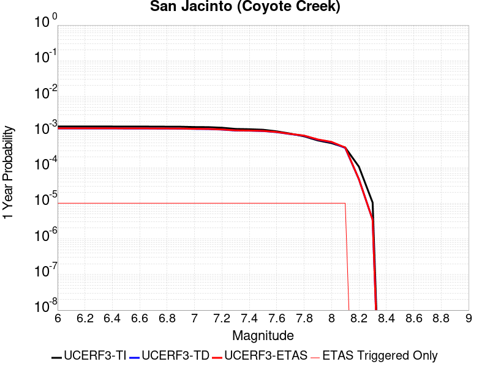 |  |

| Magnitude | 1 wk TI Prob | 1 wk TD Prob | 1 wk ETAS Prob | 1 wk ETAS/TD Gain | 1 wk ETAS Triggered Only | 1 mo TI Prob | 1 mo TD Prob | 1 mo ETAS Prob | 1 mo ETAS/TD Gain | 1 mo ETAS Triggered Only | 1 yr TI Prob | 1 yr TD Prob | 1 yr ETAS Prob | 1 yr ETAS/TD Gain | 1 yr ETAS Triggered Only | 10 yr TI Prob | 10 yr TD Prob | 10 yr ETAS Prob | 10 yr ETAS/TD Gain | 10 yr ETAS Triggered Only |
|-----|-----|-----|-----|-----|-----|-----|-----|-----|-----|-----|-----|-----|-----|-----|-----|-----|-----|-----|-----|-----|
| 6.0 | 2.7374346E-5 | 2.4161187E-5 | 2.4161187E-5 | 1.0 | 0.0 | 1.1731335E-4 | 1.0354385E-4 | 1.0354385E-4 | 1.0 | 0.0 | 0.0014273542 | 0.0012599198 | 0.0012699072 | 1.0079271 | 1.0E-5 | 0.01418221 | 0.012936629 | 0.012966242 | 1.0022889 | 3.0E-5 |
| 6.1 | 2.7374346E-5 | 2.4161187E-5 | 2.4161187E-5 | 1.0 | 0.0 | 1.1731335E-4 | 1.0354385E-4 | 1.0354385E-4 | 1.0 | 0.0 | 0.0014273542 | 0.0012599198 | 0.0012699072 | 1.0079271 | 1.0E-5 | 0.01418221 | 0.012936629 | 0.012966242 | 1.0022889 | 3.0E-5 |
| 6.2 | 2.7374346E-5 | 2.4161187E-5 | 2.4161187E-5 | 1.0 | 0.0 | 1.1731335E-4 | 1.0354385E-4 | 1.0354385E-4 | 1.0 | 0.0 | 0.0014273542 | 0.0012599198 | 0.0012699072 | 1.0079271 | 1.0E-5 | 0.01418221 | 0.012936629 | 0.012966242 | 1.0022889 | 3.0E-5 |
| 6.3 | 2.7374346E-5 | 2.4161187E-5 | 2.4161187E-5 | 1.0 | 0.0 | 1.1731335E-4 | 1.0354385E-4 | 1.0354385E-4 | 1.0 | 0.0 | 0.0014273542 | 0.0012599198 | 0.0012699072 | 1.0079271 | 1.0E-5 | 0.01418221 | 0.012936629 | 0.012966242 | 1.0022889 | 3.0E-5 |
| 6.4 | 2.7374346E-5 | 2.4161187E-5 | 2.4161187E-5 | 1.0 | 0.0 | 1.1731335E-4 | 1.0354385E-4 | 1.0354385E-4 | 1.0 | 0.0 | 0.0014273542 | 0.0012599198 | 0.0012699072 | 1.0079271 | 1.0E-5 | 0.01418221 | 0.012936629 | 0.012966242 | 1.0022889 | 3.0E-5 |
| 6.5 | 2.7282445E-5 | 2.4047258E-5 | 2.4047258E-5 | 1.0 | 0.0 | 1.16919524E-4 | 1.0305562E-4 | 1.0305562E-4 | 1.0 | 0.0 | 0.0014225657 | 0.0012539827 | 0.00126397 | 1.0079646 | 1.0E-5 | 0.014134934 | 0.012877954 | 0.012907567 | 1.0022995 | 3.0E-5 |
| 6.6 | 2.7282445E-5 | 2.4047258E-5 | 2.4047258E-5 | 1.0 | 0.0 | 1.16919524E-4 | 1.0305562E-4 | 1.0305562E-4 | 1.0 | 0.0 | 0.0014225657 | 0.0012539827 | 0.00126397 | 1.0079646 | 1.0E-5 | 0.014134934 | 0.012877954 | 0.012907567 | 1.0022995 | 3.0E-5 |
| 6.7 | 2.7216198E-5 | 2.3972374E-5 | 2.3972374E-5 | 1.0 | 0.0 | 1.1663563E-4 | 1.0273472E-4 | 1.0273472E-4 | 1.0 | 0.0 | 0.0014191137 | 0.0012500801 | 0.0012600676 | 1.0079895 | 1.0E-5 | 0.014100855 | 0.012839363 | 0.012868978 | 1.0023066 | 3.0E-5 |
| 6.8 | 2.7078617E-5 | 2.3889581E-5 | 2.3889581E-5 | 1.0 | 0.0 | 1.1604605E-4 | 1.0237992E-4 | 1.0237992E-4 | 1.0 | 0.0 | 0.001411945 | 0.0012457654 | 0.001255753 | 1.0080172 | 1.0E-5 | 0.014030075 | 0.012796501 | 0.012826117 | 1.0023144 | 3.0E-5 |
| 6.9 | 2.6982952E-5 | 2.3809083E-5 | 2.3809083E-5 | 1.0 | 0.0 | 1.15636096E-4 | 1.0203495E-4 | 1.0203495E-4 | 1.0 | 0.0 | 0.0014069602 | 0.0012415702 | 0.0012515578 | 1.0080444 | 1.0E-5 | 0.013980856 | 0.012754811 | 0.012784429 | 1.0023221 | 3.0E-5 |
| 7.0 | 2.6449972E-5 | 2.338607E-5 | 2.338607E-5 | 1.0 | 0.0 | 1.1335209E-4 | 1.00222176E-4 | 1.00222176E-4 | 1.0 | 0.0 | 0.001379188 | 0.0012195245 | 0.0012295124 | 1.0081899 | 1.0E-5 | 0.0137065975 | 0.012536157 | 0.01256578 | 1.0023631 | 3.0E-5 |
| 7.1 | 2.6257849E-5 | 2.321209E-5 | 2.321209E-5 | 1.0 | 0.0 | 1.1252879E-4 | 9.947661E-5 | 9.947661E-5 | 1.0 | 0.0 | 0.0013691769 | 0.0012104574 | 0.0012204453 | 1.0082513 | 1.0E-5 | 0.013607717 | 0.012446014 | 0.0124756405 | 1.0023804 | 3.0E-5 |
| 7.2 | 2.5270041E-5 | 2.2406735E-5 | 2.2406735E-5 | 1.0 | 0.0 | 1.0829568E-4 | 9.6025346E-5 | 9.6025346E-5 | 1.0 | 0.0 | 0.0013177024 | 0.0011684839 | 0.0011784722 | 1.0085481 | 1.0E-5 | 0.013099162 | 0.012026992 | 0.01205663 | 1.0024644 | 3.0E-5 |
| 7.3 | 2.339701E-5 | 2.1138358E-5 | 2.1138358E-5 | 1.0 | 0.0 | 1.0026905E-4 | 9.058983E-5 | 9.058983E-5 | 1.0 | 0.0 | 0.001220092 | 0.0011023752 | 0.0011123642 | 1.0090613 | 1.0E-5 | 0.012134149 | 0.011365798 | 0.011395458 | 1.0026095 | 3.0E-5 |
| 7.4 | 2.296333E-5 | 2.0868656E-5 | 2.0868656E-5 | 1.0 | 0.0 | 9.841056E-5 | 8.943405E-5 | 8.943405E-5 | 1.0 | 0.0 | 0.0011974899 | 0.0010883177 | 0.0010983068 | 1.0091785 | 1.0E-5 | 0.011910575 | 0.011224884 | 0.011254547 | 1.0026426 | 3.0E-5 |
| 7.5 | 2.2188895E-5 | 2.0391453E-5 | 2.0391453E-5 | 1.0 | 0.0 | 9.50918E-5 | 8.7389024E-5 | 8.7389024E-5 | 1.0 | 0.0 | 0.0011571277 | 0.0010634441 | 0.0010734334 | 1.0093935 | 1.0E-5 | 0.011511209 | 0.010974437 | 0.011004108 | 1.0027037 | 3.0E-5 |
| 7.6 | 2.0013189E-5 | 1.897738E-5 | 1.897738E-5 | 1.0 | 0.0 | 8.5767984E-5 | 8.13291E-5 | 8.13291E-5 | 1.0 | 0.0 | 0.001043725 | 9.897337E-4 | 9.997239E-4 | 1.0100937 | 1.0E-5 | 0.010388365 | 0.01023227 | 0.010261962 | 1.0029019 | 3.0E-5 |
| 7.7 | 1.7230794E-5 | 1.6758324E-5 | 1.6758324E-5 | 1.0 | 0.0 | 7.384417E-5 | 7.181942E-5 | 7.181942E-5 | 1.0 | 0.0 | 8.986819E-4 | 8.740515E-4 | 8.840427E-4 | 1.011431 | 1.0E-5 | 0.008950562 | 0.009070594 | 0.009100322 | 1.0032774 | 3.0E-5 |
| 7.8 | 1.4478809E-5 | 1.500508E-5 | 1.500508E-5 | 1.0 | 0.0 | 6.205057E-5 | 6.43059E-5 | 6.43059E-5 | 1.0 | 0.0 | 7.552038E-4 | 7.826438E-4 | 7.9263595E-4 | 1.0127672 | 1.0E-5 | 0.0075264242 | 0.008148765 | 0.008178521 | 1.0036515 | 3.0E-5 |
| 7.9 | 1.1114467E-5 | 1.1657594E-5 | 1.1657594E-5 | 1.0 | 0.0 | 4.7632562E-5 | 4.9960163E-5 | 4.9960163E-5 | 1.0 | 0.0 | 5.797721E-4 | 6.080958E-4 | 6.180897E-4 | 1.0164348 | 1.0E-5 | 0.0057826187 | 0.006386882 | 0.0064166905 | 1.0046672 | 3.0E-5 |
| 8.0 | 9.327402E-6 | 9.910499E-6 | 9.910499E-6 | 1.0 | 0.0 | 3.9973966E-5 | 4.247288E-5 | 4.247288E-5 | 1.0 | 0.0 | 4.8657437E-4 | 5.1698514E-4 | 5.2698E-4 | 1.0193329 | 1.0E-5 | 0.0048551033 | 0.005455918 | 0.0054857545 | 1.0054686 | 3.0E-5 |
| 8.1 | 7.0235833E-6 | 6.8358813E-6 | 6.8358813E-6 | 1.0 | 0.0 | 3.0100724E-5 | 2.9296307E-5 | 2.9296307E-5 | 1.0 | 0.0 | 3.664147E-4 | 3.5662466E-4 | 3.666211E-4 | 1.0280306 | 1.0E-5 | 0.003658111 | 0.0037920482 | 0.0038219346 | 1.0078813 | 3.0E-5 |
| 8.2 | 2.0358202E-6 | 9.011531E-7 | 9.011531E-7 | 1.0 | 0.0 | 8.724915E-6 | 3.862079E-6 | 3.862079E-6 | 1.0 | 0.0 | 1.06220665E-4 | 4.701982E-5 | 4.701982E-5 | 1.0 | 0.0 | 0.001061699 | 5.3349446E-4 | 5.3349446E-4 | 1.0 | 0.0 |
| 8.3 | 2.0051264E-7 | 6.631698E-8 | 6.631698E-8 | 1.0 | 0.0 | 8.5933965E-7 | 2.842156E-7 | 2.842156E-7 | 1.0 | 0.0 | 1.046241E-5 | 3.4603197E-6 | 3.4603197E-6 | 1.0 | 0.0 | 1.0461917E-4 | 4.0221577E-5 | 4.0221577E-5 | 1.0 | 0.0 |

## Robinson Creek
*[(top)](#table-of-contents)*

| 1 Week | 1 Month | 1 Year | 10 Year |
|-----|-----|-----|-----|
|  |  |  |  |

| Magnitude | 1 wk TI Prob | 1 wk TD Prob | 1 wk ETAS Prob | 1 wk ETAS/TD Gain | 1 wk ETAS Triggered Only | 1 mo TI Prob | 1 mo TD Prob | 1 mo ETAS Prob | 1 mo ETAS/TD Gain | 1 mo ETAS Triggered Only | 1 yr TI Prob | 1 yr TD Prob | 1 yr ETAS Prob | 1 yr ETAS/TD Gain | 1 yr ETAS Triggered Only | 10 yr TI Prob | 10 yr TD Prob | 10 yr ETAS Prob | 10 yr ETAS/TD Gain | 10 yr ETAS Triggered Only |
|-----|-----|-----|-----|-----|-----|-----|-----|-----|-----|-----|-----|-----|-----|-----|-----|-----|-----|-----|-----|-----|
| 6.0 | 1.3705327E-5 | 1.5285481E-5 | 1.5285481E-5 | 1.0 | 0.0 | 5.8735794E-5 | 6.55092E-5 | 7.550855E-5 | 1.1526403 | 1.0E-5 | 7.1487366E-4 | 7.975745E-4 | 8.275506E-4 | 1.0375841 | 3.0E-5 | 0.0071257832 | 0.007975745 | 0.008005506 | 1.0037314 | 3.0E-5 |
| 6.1 | 1.3705327E-5 | 1.5285481E-5 | 1.5285481E-5 | 1.0 | 0.0 | 5.8735794E-5 | 6.55092E-5 | 7.550855E-5 | 1.1526403 | 1.0E-5 | 7.1487366E-4 | 7.975745E-4 | 8.275506E-4 | 1.0375841 | 3.0E-5 | 0.0071257832 | 0.007975745 | 0.008005506 | 1.0037314 | 3.0E-5 |
| 6.2 | 1.3705327E-5 | 1.5285481E-5 | 1.5285481E-5 | 1.0 | 0.0 | 5.8735794E-5 | 6.55092E-5 | 7.550855E-5 | 1.1526403 | 1.0E-5 | 7.1487366E-4 | 7.975745E-4 | 8.275506E-4 | 1.0375841 | 3.0E-5 | 0.0071257832 | 0.007975745 | 0.008005506 | 1.0037314 | 3.0E-5 |
| 6.3 | 1.3705327E-5 | 1.5285481E-5 | 1.5285481E-5 | 1.0 | 0.0 | 5.8735794E-5 | 6.55092E-5 | 7.550855E-5 | 1.1526403 | 1.0E-5 | 7.1487366E-4 | 7.975745E-4 | 8.275506E-4 | 1.0375841 | 3.0E-5 | 0.0071257832 | 0.007975745 | 0.008005506 | 1.0037314 | 3.0E-5 |
| 6.4 | 1.3705327E-5 | 1.5285481E-5 | 1.5285481E-5 | 1.0 | 0.0 | 5.8735794E-5 | 6.55092E-5 | 7.550855E-5 | 1.1526403 | 1.0E-5 | 7.1487366E-4 | 7.975745E-4 | 8.275506E-4 | 1.0375841 | 3.0E-5 | 0.0071257832 | 0.007975745 | 0.008005506 | 1.0037314 | 3.0E-5 |

## Hosgri (Extension)
*[(top)](#table-of-contents)*

| 1 Week | 1 Month | 1 Year | 10 Year |
|-----|-----|-----|-----|
|  |  |  |  |

| Magnitude | 1 wk TI Prob | 1 wk TD Prob | 1 wk ETAS Prob | 1 wk ETAS/TD Gain | 1 wk ETAS Triggered Only | 1 mo TI Prob | 1 mo TD Prob | 1 mo ETAS Prob | 1 mo ETAS/TD Gain | 1 mo ETAS Triggered Only | 1 yr TI Prob | 1 yr TD Prob | 1 yr ETAS Prob | 1 yr ETAS/TD Gain | 1 yr ETAS Triggered Only | 10 yr TI Prob | 10 yr TD Prob | 10 yr ETAS Prob | 10 yr ETAS/TD Gain | 10 yr ETAS Triggered Only |
|-----|-----|-----|-----|-----|-----|-----|-----|-----|-----|-----|-----|-----|-----|-----|-----|-----|-----|-----|-----|-----|
| 6.0 | 1.1369135E-5 | 1.2083326E-5 | 2.2083204E-5 | 1.8275768 | 1.0E-5 | 4.8723956E-5 | 5.178478E-5 | 6.178426E-5 | 1.1930969 | 1.0E-5 | 5.9305265E-4 | 6.3032005E-4 | 6.403137E-4 | 1.015855 | 1.0E-5 | 0.005914725 | 0.0062875715 | 0.0063173827 | 1.0047413 | 3.0E-5 |
| 6.1 | 6.934979E-6 | 7.324716E-6 | 1.7324643E-5 | 2.3652306 | 1.0E-5 | 2.9721E-5 | 3.1391286E-5 | 4.1390973E-5 | 1.3185498 | 1.0E-5 | 3.617931E-4 | 3.8212602E-4 | 3.9212222E-4 | 1.0261594 | 1.0E-5 | 0.0036120464 | 0.0038151024 | 0.003825064 | 1.0026112 | 1.0E-5 |
| 6.2 | 6.934979E-6 | 7.324716E-6 | 1.7324643E-5 | 2.3652306 | 1.0E-5 | 2.9721E-5 | 3.1391286E-5 | 4.1390973E-5 | 1.3185498 | 1.0E-5 | 3.617931E-4 | 3.8212602E-4 | 3.9212222E-4 | 1.0261594 | 1.0E-5 | 0.0036120464 | 0.0038151024 | 0.003825064 | 1.0026112 | 1.0E-5 |
| 6.3 | 4.5484676E-6 | 4.7694434E-6 | 4.7694434E-6 | 1.0 | 0.0 | 1.9493287E-5 | 2.0440313E-5 | 2.0440313E-5 | 1.0 | 0.0 | 2.3730492E-4 | 2.4883283E-4 | 2.4883283E-4 | 1.0 | 0.0 | 0.0023705168 | 0.0024855847 | 0.0024855847 | 1.0 | 0.0 |
| 6.4 | 4.218095E-6 | 4.4169683E-6 | 4.4169683E-6 | 1.0 | 0.0 | 1.8077424E-5 | 1.892973E-5 | 1.892973E-5 | 1.0 | 0.0 | 2.2007042E-4 | 2.3044541E-4 | 2.3044541E-4 | 1.0 | 0.0 | 0.002198526 | 0.0023020979 | 0.0023020979 | 1.0 | 0.0 |
| 6.5 | 3.717374E-6 | 3.8839753E-6 | 3.8839753E-6 | 1.0 | 0.0 | 1.5931506E-5 | 1.6645505E-5 | 1.6645505E-5 | 1.0 | 0.0 | 1.9394881E-4 | 2.0264034E-4 | 2.0264034E-4 | 1.0 | 0.0 | 0.0019377962 | 0.0020245744 | 0.0020245744 | 1.0 | 0.0 |
| 6.6 | 3.4605036E-6 | 3.6083986E-6 | 3.6083986E-6 | 1.0 | 0.0 | 1.4830645E-5 | 1.5464475E-5 | 1.5464475E-5 | 1.0 | 0.0 | 1.8054814E-4 | 1.8826385E-4 | 1.8826385E-4 | 1.0 | 0.0 | 0.0018040152 | 0.0018810583 | 0.0018810583 | 1.0 | 0.0 |
| 6.7 | 3.123439E-6 | 3.2466542E-6 | 3.2466542E-6 | 1.0 | 0.0 | 1.33860985E-5 | 1.3914158E-5 | 1.3914158E-5 | 1.0 | 0.0 | 1.6296357E-4 | 1.6939182E-4 | 1.6939182E-4 | 1.0 | 0.0 | 0.001628441 | 0.0016926379 | 0.0016926379 | 1.0 | 0.0 |
| 6.8 | 2.8290783E-6 | 2.9306198E-6 | 2.9306198E-6 | 1.0 | 0.0 | 1.2124565E-5 | 1.2559739E-5 | 1.2559739E-5 | 1.0 | 0.0 | 1.4760658E-4 | 1.5290418E-4 | 1.5290418E-4 | 1.0 | 0.0 | 0.0014750857 | 0.0015279984 | 0.0015279984 | 1.0 | 0.0 |
| 6.9 | 2.454112E-6 | 2.5283912E-6 | 2.5283912E-6 | 1.0 | 0.0 | 1.0517581E-5 | 1.0835917E-5 | 1.0835917E-5 | 1.0 | 0.0 | 1.2804402E-4 | 1.3191937E-4 | 1.3191937E-4 | 1.0 | 0.0 | 0.0012797028 | 0.0013184167 | 0.0013184167 | 1.0 | 0.0 |
| 7.0 | 2.1008145E-6 | 2.1499347E-6 | 2.1499347E-6 | 1.0 | 0.0 | 9.003459E-6 | 9.2139735E-6 | 9.2139735E-6 | 1.0 | 0.0 | 1.096116E-4 | 1.1217439E-4 | 1.1217439E-4 | 1.0 | 0.0 | 0.0010955755 | 0.0011211814 | 0.0011211814 | 1.0 | 0.0 |
| 7.1 | 1.744384E-6 | 1.7686926E-6 | 1.7686926E-6 | 1.0 | 0.0 | 7.47591E-6 | 7.5800895E-6 | 7.5800895E-6 | 1.0 | 0.0 | 9.1015405E-5 | 9.228369E-5 | 9.228369E-5 | 1.0 | 0.0 | 9.097813E-4 | 9.2245545E-4 | 9.2245545E-4 | 1.0 | 0.0 |
| 7.2 | 1.5456587E-6 | 1.5563418E-6 | 1.5563418E-6 | 1.0 | 0.0 | 6.6242346E-6 | 6.670019E-6 | 6.670019E-6 | 1.0 | 0.0 | 8.064707E-5 | 8.120447E-5 | 8.120447E-5 | 1.0 | 0.0 | 8.0617814E-4 | 8.117492E-4 | 8.117492E-4 | 1.0 | 0.0 |
| 7.3 | 1.3775123E-6 | 1.3766585E-6 | 1.3766585E-6 | 1.0 | 0.0 | 5.9036106E-6 | 5.8999517E-6 | 5.8999517E-6 | 1.0 | 0.0 | 7.187409E-5 | 7.182955E-5 | 7.182955E-5 | 1.0 | 0.0 | 7.185085E-4 | 7.180644E-4 | 7.180644E-4 | 1.0 | 0.0 |
| 7.4 | 1.214491E-6 | 1.2023932E-6 | 1.2023932E-6 | 1.0 | 0.0 | 5.2049513E-6 | 5.1531033E-6 | 5.1531033E-6 | 1.0 | 0.0 | 6.336844E-5 | 6.2737236E-5 | 6.2737236E-5 | 1.0 | 0.0 | 6.335037E-4 | 6.2719604E-4 | 6.2719604E-4 | 1.0 | 0.0 |
| 7.5 | 1.0101123E-6 | 9.842677E-7 | 9.842677E-7 | 1.0 | 0.0 | 4.3290456E-6 | 4.2182833E-6 | 4.2182833E-6 | 1.0 | 0.0 | 5.2704854E-5 | 5.1356397E-5 | 5.1356397E-5 | 1.0 | 0.0 | 5.2692357E-4 | 5.134459E-4 | 5.134459E-4 | 1.0 | 0.0 |
| 7.6 | 8.1558215E-7 | 7.7663606E-7 | 7.7663606E-7 | 1.0 | 0.0 | 3.4953473E-6 | 3.3284362E-6 | 3.3284362E-6 | 1.0 | 0.0 | 4.255502E-5 | 4.0522962E-5 | 4.0522962E-5 | 1.0 | 0.0 | 4.2546875E-4 | 4.0515614E-4 | 4.0515614E-4 | 1.0 | 0.0 |
| 7.7 | 4.757816E-7 | 4.131216E-7 | 4.131216E-7 | 1.0 | 0.0 | 2.0390623E-6 | 1.7705199E-6 | 1.7705199E-6 | 1.0 | 0.0 | 2.4825302E-5 | 2.1555868E-5 | 2.1555868E-5 | 1.0 | 0.0 | 2.482253E-4 | 2.155379E-4 | 2.155379E-4 | 1.0 | 0.0 |
| 7.8 | 2.782787E-7 | 2.0050562E-7 | 2.0050562E-7 | 1.0 | 0.0 | 1.1926223E-6 | 8.593095E-7 | 8.593095E-7 | 1.0 | 0.0 | 1.452008E-5 | 1.0462044E-5 | 1.0462044E-5 | 1.0 | 0.0 | 1.4519131E-4 | 1.04615545E-4 | 1.04615545E-4 | 1.0 | 0.0 |
| 7.9 | 1.6948086E-7 | 9.246906E-8 | 9.246906E-8 | 1.0 | 0.0 | 7.2634634E-7 | 3.962959E-7 | 3.962959E-7 | 1.0 | 0.0 | 8.843231E-6 | 4.824892E-6 | 4.824892E-6 | 1.0 | 0.0 | 8.842879E-5 | 4.824788E-5 | 4.824788E-5 | 1.0 | 0.0 |
| 8.0 | 1.0225492E-7 | 4.4758195E-8 | 4.4758195E-8 | 1.0 | 0.0 | 4.382353E-7 | 1.9182083E-7 | 1.9182083E-7 | 1.0 | 0.0 | 5.335502E-6 | 2.335416E-6 | 2.335416E-6 | 1.0 | 0.0 | 5.335374E-5 | 2.3353918E-5 | 2.3353918E-5 | 1.0 | 0.0 |
| 8.1 | 1.43711345E-8 | 5.790717E-9 | 5.790717E-9 | 1.0 | 0.0 | 6.1590576E-8 | 2.4817359E-8 | 2.4817359E-8 | 1.0 | 0.0 | 7.4986497E-7 | 3.021513E-7 | 3.021513E-7 | 1.0 | 0.0 | 7.4986247E-6 | 3.0215094E-6 | 3.0215094E-6 | 1.0 | 0.0 |

## Rinconada 2011 CFM
*[(top)](#table-of-contents)*

| 1 Week | 1 Month | 1 Year | 10 Year |
|-----|-----|-----|-----|
|  | 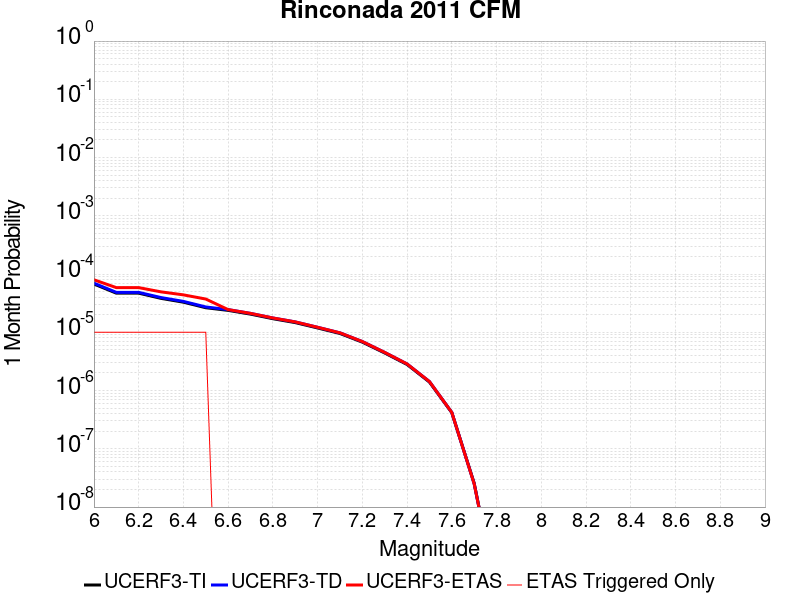 |  |  |

| Magnitude | 1 wk TI Prob | 1 wk TD Prob | 1 wk ETAS Prob | 1 wk ETAS/TD Gain | 1 wk ETAS Triggered Only | 1 mo TI Prob | 1 mo TD Prob | 1 mo ETAS Prob | 1 mo ETAS/TD Gain | 1 mo ETAS Triggered Only | 1 yr TI Prob | 1 yr TD Prob | 1 yr ETAS Prob | 1 yr ETAS/TD Gain | 1 yr ETAS Triggered Only | 10 yr TI Prob | 10 yr TD Prob | 10 yr ETAS Prob | 10 yr ETAS/TD Gain | 10 yr ETAS Triggered Only |
|-----|-----|-----|-----|-----|-----|-----|-----|-----|-----|-----|-----|-----|-----|-----|-----|-----|-----|-----|-----|-----|
| 6.0 | 1.5752368E-5 | 1.627486E-5 | 1.627486E-5 | 1.0 | 0.0 | 6.75084E-5 | 6.974755E-5 | 7.974685E-5 | 1.1433642 | 1.0E-5 | 8.2160486E-4 | 8.488487E-4 | 8.6883176E-4 | 1.0235413 | 2.0E-5 | 0.008185739 | 0.008456444 | 0.008486191 | 1.0035176 | 3.0E-5 |
| 6.1 | 1.0966133E-5 | 1.1323127E-5 | 1.1323127E-5 | 1.0 | 0.0 | 4.6996865E-5 | 4.852679E-5 | 5.8526304E-5 | 1.2060617 | 1.0E-5 | 5.720366E-4 | 5.9065426E-4 | 6.0064835E-4 | 1.0169203 | 1.0E-5 | 0.0057056635 | 0.00589094 | 0.005910822 | 1.003375 | 2.0E-5 |
| 6.2 | 1.0966133E-5 | 1.1323127E-5 | 1.1323127E-5 | 1.0 | 0.0 | 4.6996865E-5 | 4.852679E-5 | 5.8526304E-5 | 1.2060617 | 1.0E-5 | 5.720366E-4 | 5.9065426E-4 | 6.0064835E-4 | 1.0169203 | 1.0E-5 | 0.0057056635 | 0.00589094 | 0.005910822 | 1.003375 | 2.0E-5 |
| 6.3 | 8.926149E-6 | 9.21285E-6 | 9.21285E-6 | 1.0 | 0.0 | 3.8254362E-5 | 3.948305E-5 | 4.9482656E-5 | 1.2532632 | 1.0E-5 | 4.6564735E-4 | 4.8060043E-4 | 4.9059564E-4 | 1.0207973 | 1.0E-5 | 0.0046467283 | 0.0047956556 | 0.00481556 | 1.0041504 | 2.0E-5 |
| 6.4 | 7.676955E-6 | 7.920258E-6 | 7.920258E-6 | 1.0 | 0.0 | 3.290082E-5 | 3.394352E-5 | 4.3943182E-5 | 1.294597 | 1.0E-5 | 4.0049385E-4 | 4.131842E-4 | 4.2318006E-4 | 1.0241923 | 1.0E-5 | 0.0039977287 | 0.004124186 | 0.0041441037 | 1.0048294 | 2.0E-5 |
| 6.5 | 6.1671026E-6 | 6.359008E-6 | 6.359008E-6 | 1.0 | 0.0 | 2.6430173E-5 | 2.7252607E-5 | 3.7252335E-5 | 1.3669274 | 1.0E-5 | 3.2173982E-4 | 3.3175005E-4 | 3.4174672E-4 | 1.0301331 | 1.0E-5 | 0.003212744 | 0.00331256 | 0.0033324938 | 1.0060177 | 2.0E-5 |
| 6.6 | 5.553456E-6 | 5.72486E-6 | 5.72486E-6 | 1.0 | 0.0 | 2.3800309E-5 | 2.4534884E-5 | 2.4534884E-5 | 1.0 | 0.0 | 2.897302E-4 | 2.986713E-4 | 2.986713E-4 | 1.0 | 0.0 | 0.0028935277 | 0.002982708 | 0.002982708 | 1.0 | 0.0 |
| 6.7 | 4.787857E-6 | 4.93335E-6 | 4.93335E-6 | 1.0 | 0.0 | 2.0519226E-5 | 2.1142756E-5 | 2.1142756E-5 | 1.0 | 0.0 | 2.4979294E-4 | 2.573827E-4 | 2.573827E-4 | 1.0 | 0.0 | 0.0024951235 | 0.0025708517 | 0.0025708517 | 1.0 | 0.0 |
| 6.8 | 3.9955166E-6 | 4.113509E-6 | 4.113509E-6 | 1.0 | 0.0 | 1.7123532E-5 | 1.7629205E-5 | 1.7629205E-5 | 1.0 | 0.0 | 2.0845905E-4 | 2.1461445E-4 | 2.1461445E-4 | 1.0 | 0.0 | 0.002082636 | 0.0021440755 | 0.0021440755 | 1.0 | 0.0 |
| 6.9 | 3.4250072E-6 | 3.5224734E-6 | 3.5224734E-6 | 1.0 | 0.0 | 1.46785205E-5 | 1.5096228E-5 | 1.5096228E-5 | 1.0 | 0.0 | 1.7869633E-4 | 1.8378109E-4 | 1.8378109E-4 | 1.0 | 0.0 | 0.001785527 | 0.0018362935 | 0.0018362935 | 1.0 | 0.0 |
| 7.0 | 2.7712713E-6 | 2.846721E-6 | 2.846721E-6 | 1.0 | 0.0 | 1.1876823E-5 | 1.2200176E-5 | 1.2200176E-5 | 1.0 | 0.0 | 1.4459073E-4 | 1.4852703E-4 | 1.4852703E-4 | 1.0 | 0.0 | 0.0014449668 | 0.0014842792 | 0.0014842792 | 1.0 | 0.0 |
| 7.1 | 2.227358E-6 | 2.2857148E-6 | 2.2857148E-6 | 1.0 | 0.0 | 9.545785E-6 | 9.795884E-6 | 9.795884E-6 | 1.0 | 0.0 | 1.16213734E-4 | 1.1925837E-4 | 1.1925837E-4 | 1.0 | 0.0 | 0.0011615298 | 0.0011919448 | 0.0011919448 | 1.0 | 0.0 |
| 7.2 | 1.581796E-6 | 1.6209123E-6 | 1.6209123E-6 | 1.0 | 0.0 | 6.779108E-6 | 6.9467483E-6 | 6.9467483E-6 | 1.0 | 0.0 | 8.253252E-5 | 8.457338E-5 | 8.457338E-5 | 1.0 | 0.0 | 8.250187E-4 | 8.4541255E-4 | 8.4541255E-4 | 1.0 | 0.0 |
| 7.3 | 1.0306567E-6 | 1.0546547E-6 | 1.0546547E-6 | 1.0 | 0.0 | 4.4170924E-6 | 4.519941E-6 | 4.519941E-6 | 1.0 | 0.0 | 5.3776774E-5 | 5.5028893E-5 | 5.5028893E-5 | 1.0 | 0.0 | 5.376376E-4 | 5.501529E-4 | 5.501529E-4 | 1.0 | 0.0 |
| 7.4 | 6.535541E-7 | 6.6827863E-7 | 6.6827863E-7 | 1.0 | 0.0 | 2.800943E-6 | 2.8640482E-6 | 2.8640482E-6 | 1.0 | 0.0 | 3.4100947E-5 | 3.486923E-5 | 3.486923E-5 | 1.0 | 0.0 | 3.4095717E-4 | 3.4863772E-4 | 3.4863772E-4 | 1.0 | 0.0 |
| 7.5 | 3.2656962E-7 | 3.331691E-7 | 3.331691E-7 | 1.0 | 0.0 | 1.3995833E-6 | 1.4278669E-6 | 1.4278669E-6 | 1.0 | 0.0 | 1.7039794E-5 | 1.738414E-5 | 1.738414E-5 | 1.0 | 0.0 | 1.7038487E-4 | 1.7382785E-4 | 1.7382785E-4 | 1.0 | 0.0 |
| 7.6 | 9.754343E-8 | 9.821055E-8 | 9.821055E-8 | 1.0 | 0.0 | 4.180432E-7 | 4.2090227E-7 | 4.2090227E-7 | 1.0 | 0.0 | 5.089664E-6 | 5.124473E-6 | 5.124473E-6 | 1.0 | 0.0 | 5.0895473E-5 | 5.1243558E-5 | 5.1243558E-5 | 1.0 | 0.0 |
| 7.7 | 6.0001453E-9 | 5.849095E-9 | 5.849095E-9 | 1.0 | 0.0 | 2.5714908E-8 | 2.506755E-8 | 2.506755E-8 | 1.0 | 0.0 | 3.1307894E-7 | 3.0519737E-7 | 3.0519737E-7 | 1.0 | 0.0 | 3.1307852E-6 | 3.0519698E-6 | 3.0519698E-6 | 1.0 | 0.0 |
| 7.8 | 7.400003E-11 | 7.4654616E-11 | 7.4654616E-11 | 1.0 | 0.0 | 3.171432E-10 | 3.199484E-10 | 3.199484E-10 | 1.0 | 0.0 | 3.861218E-9 | 3.895372E-9 | 3.895372E-9 | 1.0 | 0.0 | 3.861218E-8 | 3.8953722E-8 | 3.8953722E-8 | 1.0 | 0.0 |

## Blue Cut
*[(top)](#table-of-contents)*

| 1 Week | 1 Month | 1 Year | 10 Year |
|-----|-----|-----|-----|
|  |  |  |  |

| Magnitude | 1 wk TI Prob | 1 wk TD Prob | 1 wk ETAS Prob | 1 wk ETAS/TD Gain | 1 wk ETAS Triggered Only | 1 mo TI Prob | 1 mo TD Prob | 1 mo ETAS Prob | 1 mo ETAS/TD Gain | 1 mo ETAS Triggered Only | 1 yr TI Prob | 1 yr TD Prob | 1 yr ETAS Prob | 1 yr ETAS/TD Gain | 1 yr ETAS Triggered Only | 10 yr TI Prob | 10 yr TD Prob | 10 yr ETAS Prob | 10 yr ETAS/TD Gain | 10 yr ETAS Triggered Only |
|-----|-----|-----|-----|-----|-----|-----|-----|-----|-----|-----|-----|-----|-----|-----|-----|-----|-----|-----|-----|-----|
| 6.0 | 2.1227985E-5 | 2.2719998E-5 | 3.271977E-5 | 1.4401308 | 1.0E-5 | 9.097391E-5 | 9.7368116E-5 | 1.07367145E-4 | 1.1026931 | 1.0E-5 | 0.0011070445 | 0.0011848703 | 0.0012048465 | 1.0168595 | 2.0E-5 | 0.011015458 | 0.011791371 | 0.011821017 | 1.0025142 | 3.0E-5 |
| 6.1 | 2.1227985E-5 | 2.2719998E-5 | 3.271977E-5 | 1.4401308 | 1.0E-5 | 9.097391E-5 | 9.7368116E-5 | 1.07367145E-4 | 1.1026931 | 1.0E-5 | 0.0011070445 | 0.0011848703 | 0.0012048465 | 1.0168595 | 2.0E-5 | 0.011015458 | 0.011791371 | 0.011821017 | 1.0025142 | 3.0E-5 |
| 6.2 | 2.1227985E-5 | 2.2719998E-5 | 3.271977E-5 | 1.4401308 | 1.0E-5 | 9.097391E-5 | 9.7368116E-5 | 1.07367145E-4 | 1.1026931 | 1.0E-5 | 0.0011070445 | 0.0011848703 | 0.0012048465 | 1.0168595 | 2.0E-5 | 0.011015458 | 0.011791371 | 0.011821017 | 1.0025142 | 3.0E-5 |
| 6.3 | 1.1613981E-5 | 1.2353751E-5 | 2.2353628E-5 | 1.8094608 | 1.0E-5 | 4.9773254E-5 | 5.294364E-5 | 6.294311E-5 | 1.1888701 | 1.0E-5 | 6.0582085E-4 | 6.4441067E-4 | 6.544042E-4 | 1.015508 | 1.0E-5 | 0.0060417196 | 0.0064266673 | 0.006446539 | 1.003092 | 2.0E-5 |
| 6.4 | 1.1613981E-5 | 1.2353751E-5 | 2.2353628E-5 | 1.8094608 | 1.0E-5 | 4.9773254E-5 | 5.294364E-5 | 6.294311E-5 | 1.1888701 | 1.0E-5 | 6.0582085E-4 | 6.4441067E-4 | 6.544042E-4 | 1.015508 | 1.0E-5 | 0.0060417196 | 0.0064266673 | 0.006446539 | 1.003092 | 2.0E-5 |
| 6.5 | 8.931326E-6 | 9.481755E-6 | 1.948166E-5 | 2.0546472 | 1.0E-5 | 3.8276554E-5 | 4.063551E-5 | 5.0635103E-5 | 1.2460802 | 1.0E-5 | 4.6591737E-4 | 4.946342E-4 | 5.046292E-4 | 1.0202069 | 1.0E-5 | 0.0046494175 | 0.0049362415 | 0.0049461923 | 1.0020158 | 1.0E-5 |
| 6.6 | 7.345353E-6 | 7.790404E-6 | 1.7790326E-5 | 2.2836204 | 1.0E-5 | 3.1479703E-5 | 3.3387067E-5 | 4.338673E-5 | 1.2995071 | 1.0E-5 | 3.83198E-4 | 4.064197E-4 | 4.1641566E-4 | 1.0245951 | 1.0E-5 | 0.0038253788 | 0.004057556 | 0.0040675155 | 1.0024545 | 1.0E-5 |
| 6.7 | 6.2775666E-6 | 6.655255E-6 | 1.6655189E-5 | 2.502562 | 1.0E-5 | 2.690358E-5 | 2.8522252E-5 | 3.852197E-5 | 1.3505934 | 1.0E-5 | 3.2750185E-4 | 3.4721062E-4 | 3.5720714E-4 | 1.028791 | 1.0E-5 | 0.0032701963 | 0.0034674224 | 0.0034773876 | 1.002874 | 1.0E-5 |
| 6.8 | 5.5234095E-6 | 5.8552046E-6 | 1.5855147E-5 | 2.7078724 | 1.0E-5 | 2.367154E-5 | 2.5093534E-5 | 3.5093282E-5 | 1.398499 | 1.0E-5 | 2.8816288E-4 | 3.0547823E-4 | 3.1547516E-4 | 1.0327256 | 1.0E-5 | 0.002877895 | 0.0030512991 | 0.0030612685 | 1.0032673 | 1.0E-5 |
| 6.9 | 4.7780054E-6 | 5.065501E-6 | 5.065501E-6 | 1.0 | 0.0 | 2.0477004E-5 | 2.1709151E-5 | 2.1709151E-5 | 1.0 | 0.0 | 2.4927902E-4 | 2.642839E-4 | 2.642839E-4 | 1.0 | 0.0 | 0.0024899957 | 0.0026403882 | 0.0026403882 | 1.0 | 0.0 |
| 7.0 | 3.883171E-6 | 4.1185535E-6 | 4.1185535E-6 | 1.0 | 0.0 | 1.6642054E-5 | 1.7650862E-5 | 1.7650862E-5 | 1.0 | 0.0 | 2.0259817E-4 | 2.1488495E-4 | 2.1488495E-4 | 1.0 | 0.0 | 0.0020241356 | 0.0021474473 | 0.0021474473 | 1.0 | 0.0 |
| 7.1 | 2.8358215E-6 | 3.009765E-6 | 3.009765E-6 | 1.0 | 0.0 | 1.2153464E-5 | 1.2898965E-5 | 1.2898965E-5 | 1.0 | 0.0 | 1.4795837E-4 | 1.5704017E-4 | 1.5704017E-4 | 1.0 | 0.0 | 0.001478599 | 0.0015699371 | 0.0015699371 | 1.0 | 0.0 |

## Pinto Mtn
*[(top)](#table-of-contents)*

| 1 Week | 1 Month | 1 Year | 10 Year |
|-----|-----|-----|-----|
|  |  |  |  |

| Magnitude | 1 wk TI Prob | 1 wk TD Prob | 1 wk ETAS Prob | 1 wk ETAS/TD Gain | 1 wk ETAS Triggered Only | 1 mo TI Prob | 1 mo TD Prob | 1 mo ETAS Prob | 1 mo ETAS/TD Gain | 1 mo ETAS Triggered Only | 1 yr TI Prob | 1 yr TD Prob | 1 yr ETAS Prob | 1 yr ETAS/TD Gain | 1 yr ETAS Triggered Only | 10 yr TI Prob | 10 yr TD Prob | 10 yr ETAS Prob | 10 yr ETAS/TD Gain | 10 yr ETAS Triggered Only |
|-----|-----|-----|-----|-----|-----|-----|-----|-----|-----|-----|-----|-----|-----|-----|-----|-----|-----|-----|-----|-----|
| 6.0 | 4.4194956E-5 | 4.785684E-5 | 4.785684E-5 | 1.0 | 0.0 | 1.893932E-4 | 2.0508554E-4 | 2.0508554E-4 | 1.0 | 0.0 | 0.0023034236 | 0.0024942218 | 0.002524147 | 1.0119978 | 3.0E-5 | 0.022796938 | 0.024679784 | 0.024709044 | 1.0011855 | 3.0E-5 |
| 6.1 | 4.4194956E-5 | 4.785684E-5 | 4.785684E-5 | 1.0 | 0.0 | 1.893932E-4 | 2.0508554E-4 | 2.0508554E-4 | 1.0 | 0.0 | 0.0023034236 | 0.0024942218 | 0.002524147 | 1.0119978 | 3.0E-5 | 0.022796938 | 0.024679784 | 0.024709044 | 1.0011855 | 3.0E-5 |
| 6.2 | 4.4194956E-5 | 4.785684E-5 | 4.785684E-5 | 1.0 | 0.0 | 1.893932E-4 | 2.0508554E-4 | 2.0508554E-4 | 1.0 | 0.0 | 0.0023034236 | 0.0024942218 | 0.002524147 | 1.0119978 | 3.0E-5 | 0.022796938 | 0.024679784 | 0.024709044 | 1.0011855 | 3.0E-5 |
| 6.3 | 4.4194956E-5 | 4.785684E-5 | 4.785684E-5 | 1.0 | 0.0 | 1.893932E-4 | 2.0508554E-4 | 2.0508554E-4 | 1.0 | 0.0 | 0.0023034236 | 0.0024942218 | 0.002524147 | 1.0119978 | 3.0E-5 | 0.022796938 | 0.024679784 | 0.024709044 | 1.0011855 | 3.0E-5 |
| 6.4 | 3.729929E-5 | 3.9605973E-5 | 3.9605973E-5 | 1.0 | 0.0 | 1.5984432E-4 | 1.6972938E-4 | 1.6972938E-4 | 1.0 | 0.0 | 0.0019443673 | 0.00206459 | 0.0020945282 | 1.0145007 | 3.0E-5 | 0.019274427 | 0.020464117 | 0.020493502 | 1.001436 | 3.0E-5 |
| 6.5 | 3.729929E-5 | 3.9605973E-5 | 3.9605973E-5 | 1.0 | 0.0 | 1.5984432E-4 | 1.6972938E-4 | 1.6972938E-4 | 1.0 | 0.0 | 0.0019443673 | 0.00206459 | 0.0020945282 | 1.0145007 | 3.0E-5 | 0.019274427 | 0.020464117 | 0.020493502 | 1.001436 | 3.0E-5 |
| 6.6 | 3.0204548E-5 | 3.1207677E-5 | 3.1207677E-5 | 1.0 | 0.0 | 1.2944164E-4 | 1.3374053E-4 | 1.3374053E-4 | 1.0 | 0.0 | 0.0015748127 | 0.0016271094 | 0.0016470768 | 1.0122718 | 2.0E-5 | 0.015636992 | 0.01615583 | 0.016175507 | 1.001218 | 2.0E-5 |
| 6.7 | 2.9857754E-5 | 3.081705E-5 | 3.081705E-5 | 1.0 | 0.0 | 1.2795553E-4 | 1.3206658E-4 | 1.3206658E-4 | 1.0 | 0.0 | 0.0015567453 | 0.0016067591 | 0.001626727 | 1.0124274 | 2.0E-5 | 0.015458848 | 0.015955264 | 0.015974944 | 1.0012335 | 2.0E-5 |
| 6.8 | 2.4819734E-5 | 2.5011494E-5 | 2.5011494E-5 | 1.0 | 0.0 | 1.0636595E-4 | 1.0718783E-4 | 1.0718783E-4 | 1.0 | 0.0 | 0.0012942362 | 0.0013042522 | 0.0013242261 | 1.0153145 | 2.0E-5 | 0.012867244 | 0.012968345 | 0.012988085 | 1.0015222 | 2.0E-5 |
| 6.9 | 2.331124E-5 | 2.3339724E-5 | 2.3339724E-5 | 1.0 | 0.0 | 9.990149E-5 | 1.00023666E-4 | 1.00023666E-4 | 1.0 | 0.0 | 0.001215622 | 0.0012171282 | 0.0012371038 | 1.0164121 | 2.0E-5 | 0.012089936 | 0.012106814 | 0.012126572 | 1.001632 | 2.0E-5 |
| 7.0 | 2.1818534E-5 | 2.1762813E-5 | 2.1762813E-5 | 1.0 | 0.0 | 9.3504656E-5 | 9.326598E-5 | 9.326598E-5 | 1.0 | 0.0 | 0.0011378246 | 0.0011349416 | 0.0011549189 | 1.0176021 | 2.0E-5 | 0.011320163 | 0.0112935575 | 0.011313331 | 1.001751 | 2.0E-5 |
| 7.1 | 2.066081E-5 | 2.054242E-5 | 2.054242E-5 | 1.0 | 0.0 | 8.854332E-5 | 8.803608E-5 | 8.803608E-5 | 1.0 | 0.0 | 0.0010774818 | 0.0010713319 | 0.0010913104 | 1.0186484 | 2.0E-5 | 0.010722724 | 0.010663723 | 0.0106835095 | 1.0018555 | 2.0E-5 |
| 7.2 | 1.8990233E-5 | 1.9055666E-5 | 1.9055666E-5 | 1.0 | 0.0 | 8.138417E-5 | 8.166469E-5 | 8.166469E-5 | 1.0 | 0.0 | 9.904018E-4 | 9.938334E-4 | 0.0010038235 | 1.0100521 | 1.0E-5 | 0.009859995 | 0.009895889 | 0.00990579 | 1.0010005 | 1.0E-5 |
| 7.3 | 1.3335872E-5 | 1.490818E-5 | 1.490818E-5 | 1.0 | 0.0 | 5.7152483E-5 | 6.389071E-5 | 6.389071E-5 | 1.0 | 0.0 | 6.956093E-4 | 7.776045E-4 | 7.8759674E-4 | 1.01285 | 1.0E-5 | 0.006934359 | 0.0077501354 | 0.007760058 | 1.0012803 | 1.0E-5 |
| 7.4 | 9.414066E-6 | 1.1862329E-5 | 1.1862329E-5 | 1.0 | 0.0 | 4.0345374E-5 | 5.0837618E-5 | 5.0837618E-5 | 1.0 | 0.0 | 4.910942E-4 | 6.1878166E-4 | 6.2877545E-4 | 1.0161508 | 1.0E-5 | 0.0049001034 | 0.0061715357 | 0.006181474 | 1.0016104 | 1.0E-5 |
| 7.5 | 7.2101157E-6 | 9.159571E-6 | 9.159571E-6 | 1.0 | 0.0 | 3.090013E-5 | 3.925476E-5 | 3.925476E-5 | 1.0 | 0.0 | 3.7614413E-4 | 4.778297E-4 | 4.878249E-4 | 1.020918 | 1.0E-5 | 0.0037550807 | 0.0047687986 | 0.0047787507 | 1.002087 | 1.0E-5 |
| 7.6 | 3.296375E-6 | 4.546926E-6 | 4.546926E-6 | 1.0 | 0.0 | 1.4127245E-5 | 1.9486688E-5 | 1.9486688E-5 | 1.0 | 0.0 | 1.7198564E-4 | 2.3722598E-4 | 2.472236E-4 | 1.042144 | 1.0E-5 | 0.0017185259 | 0.0023698648 | 0.0023798412 | 1.0042096 | 1.0E-5 |
| 7.7 | 2.5741092E-6 | 3.585766E-6 | 3.585766E-6 | 1.0 | 0.0 | 1.103185E-5 | 1.5367486E-5 | 1.5367486E-5 | 1.0 | 0.0 | 1.3430449E-4 | 1.870844E-4 | 1.9708253E-4 | 1.0534418 | 1.0E-5 | 0.0013422335 | 0.001869399 | 0.0018793803 | 1.0053393 | 1.0E-5 |

## San Jacinto (Borrego)
*[(top)](#table-of-contents)*

| 1 Week | 1 Month | 1 Year | 10 Year |
|-----|-----|-----|-----|
|  |  |  |  |

| Magnitude | 1 wk TI Prob | 1 wk TD Prob | 1 wk ETAS Prob | 1 wk ETAS/TD Gain | 1 wk ETAS Triggered Only | 1 mo TI Prob | 1 mo TD Prob | 1 mo ETAS Prob | 1 mo ETAS/TD Gain | 1 mo ETAS Triggered Only | 1 yr TI Prob | 1 yr TD Prob | 1 yr ETAS Prob | 1 yr ETAS/TD Gain | 1 yr ETAS Triggered Only | 10 yr TI Prob | 10 yr TD Prob | 10 yr ETAS Prob | 10 yr ETAS/TD Gain | 10 yr ETAS Triggered Only |
|-----|-----|-----|-----|-----|-----|-----|-----|-----|-----|-----|-----|-----|-----|-----|-----|-----|-----|-----|-----|-----|
| 6.0 | 3.543992E-5 | 2.7941607E-5 | 2.7941607E-5 | 1.0 | 0.0 | 1.5187653E-4 | 1.1974432E-4 | 1.1974432E-4 | 1.0 | 0.0 | 0.0018475284 | 0.0014569244 | 0.0014669098 | 1.0068538 | 1.0E-5 | 0.018322436 | 0.01487749 | 0.014907043 | 1.0019865 | 3.0E-5 |
| 6.1 | 3.542281E-5 | 2.7941607E-5 | 2.7941607E-5 | 1.0 | 0.0 | 1.5180321E-4 | 1.1974432E-4 | 1.1974432E-4 | 1.0 | 0.0 | 0.0018466372 | 0.0014569244 | 0.0014669098 | 1.0068538 | 1.0E-5 | 0.018313672 | 0.01487749 | 0.014907043 | 1.0019865 | 3.0E-5 |
| 6.2 | 3.4688688E-5 | 2.7941607E-5 | 2.7941607E-5 | 1.0 | 0.0 | 1.4865733E-4 | 1.1974432E-4 | 1.1974432E-4 | 1.0 | 0.0 | 0.0018084005 | 0.0014569244 | 0.0014669098 | 1.0068538 | 1.0E-5 | 0.017937548 | 0.01487749 | 0.014907043 | 1.0019865 | 3.0E-5 |
| 6.3 | 3.2087122E-5 | 2.7786951E-5 | 2.7786951E-5 | 1.0 | 0.0 | 1.3750899E-4 | 1.1908157E-4 | 1.1908157E-4 | 1.0 | 0.0 | 0.0016728862 | 0.0014488661 | 0.0014588516 | 1.006892 | 1.0E-5 | 0.016603488 | 0.014798521 | 0.0148280775 | 1.0019972 | 3.0E-5 |
| 6.4 | 3.1828724E-5 | 2.7753935E-5 | 2.7753935E-5 | 1.0 | 0.0 | 1.364017E-4 | 1.1894008E-4 | 1.1894008E-4 | 1.0 | 0.0 | 0.0016594254 | 0.0014471457 | 0.0014571312 | 1.0069002 | 1.0E-5 | 0.016470885 | 0.014781598 | 0.014811155 | 1.0019995 | 3.0E-5 |
| 6.5 | 3.1563577E-5 | 2.7493628E-5 | 2.7493628E-5 | 1.0 | 0.0 | 1.3526545E-4 | 1.1782459E-4 | 1.1782459E-4 | 1.0 | 0.0 | 0.0016456128 | 0.0014335825 | 0.0014435683 | 1.0069655 | 1.0E-5 | 0.0163348 | 0.014648173 | 0.014677734 | 1.0020181 | 3.0E-5 |
| 6.6 | 3.1467625E-5 | 2.7337843E-5 | 2.7337843E-5 | 1.0 | 0.0 | 1.3485427E-4 | 1.1715699E-4 | 1.1715699E-4 | 1.0 | 0.0 | 0.0016406142 | 0.0014254652 | 0.001435451 | 1.0070052 | 1.0E-5 | 0.016285548 | 0.014568415 | 0.0145979775 | 1.0020293 | 3.0E-5 |
| 6.7 | 3.1223695E-5 | 2.695584E-5 | 2.695584E-5 | 1.0 | 0.0 | 1.3380898E-4 | 1.1551998E-4 | 1.1551998E-4 | 1.0 | 0.0 | 0.0016279068 | 0.0014055604 | 0.0014155464 | 1.0071046 | 1.0E-5 | 0.01616033 | 0.014372777 | 0.014402346 | 1.0020573 | 3.0E-5 |
| 6.8 | 3.1015585E-5 | 2.6776821E-5 | 2.6776821E-5 | 1.0 | 0.0 | 1.3291716E-4 | 1.14752824E-4 | 1.14752824E-4 | 1.0 | 0.0 | 0.001617065 | 0.0013962323 | 0.0014062184 | 1.0071521 | 1.0E-5 | 0.016053487 | 0.0142800445 | 0.014309616 | 1.0020708 | 3.0E-5 |
| 6.9 | 2.6641965E-5 | 2.2198341E-5 | 2.2198341E-5 | 1.0 | 0.0 | 1.1417485E-4 | 9.51323E-5 | 9.51323E-5 | 1.0 | 0.0 | 0.0013891924 | 0.0011576243 | 0.0011676126 | 1.0086284 | 1.0E-5 | 0.0138054015 | 0.011889795 | 0.011919438 | 1.0024931 | 3.0E-5 |
| 7.0 | 2.3854353E-5 | 2.0492607E-5 | 2.0492607E-5 | 1.0 | 0.0 | 1.02228936E-4 | 8.782251E-5 | 8.782251E-5 | 1.0 | 0.0 | 0.0012439266 | 0.0010687172 | 0.0010787065 | 1.009347 | 1.0E-5 | 0.012369866 | 0.010989892 | 0.011019563 | 1.0026997 | 3.0E-5 |
| 7.1 | 2.3672901E-5 | 2.032908E-5 | 2.032908E-5 | 1.0 | 0.0 | 1.0145135E-4 | 8.7121734E-5 | 8.7121734E-5 | 1.0 | 0.0 | 0.0012344702 | 0.0010601935 | 0.0010701829 | 1.0094222 | 1.0E-5 | 0.0122763505 | 0.010905062 | 0.010934735 | 1.0027211 | 3.0E-5 |
| 7.2 | 2.2717244E-5 | 1.9556348E-5 | 1.9556348E-5 | 1.0 | 0.0 | 9.735599E-5 | 8.3810235E-5 | 8.3810235E-5 | 1.0 | 0.0 | 0.0011846646 | 0.0010199143 | 0.0010299041 | 1.0097947 | 1.0E-5 | 0.01178369 | 0.010502371 | 0.010532056 | 1.0028265 | 3.0E-5 |
| 7.3 | 2.1016205E-5 | 1.839779E-5 | 1.839779E-5 | 1.0 | 0.0 | 9.006634E-5 | 7.8845296E-5 | 7.8845296E-5 | 1.0 | 0.0 | 0.001096006 | 9.595208E-4 | 9.695112E-4 | 1.0104119 | 1.0E-5 | 0.010906163 | 0.009897902 | 0.009927604 | 1.003001 | 3.0E-5 |
| 7.4 | 2.0683625E-5 | 1.8200271E-5 | 1.8200271E-5 | 1.0 | 0.0 | 8.86411E-5 | 7.799884E-5 | 7.799884E-5 | 1.0 | 0.0 | 0.001078671 | 9.492242E-4 | 9.5921475E-4 | 1.0105249 | 1.0E-5 | 0.010734501 | 0.009794607 | 0.009824312 | 1.0030329 | 3.0E-5 |
| 7.5 | 1.9993966E-5 | 1.779518E-5 | 1.779518E-5 | 1.0 | 0.0 | 8.568561E-5 | 7.626284E-5 | 7.626284E-5 | 1.0 | 0.0 | 0.001042723 | 9.281066E-4 | 9.3809736E-4 | 1.0107646 | 1.0E-5 | 0.010378438 | 0.009581469 | 0.009611182 | 1.003101 | 3.0E-5 |
| 7.6 | 1.788966E-5 | 1.6448063E-5 | 1.6448063E-5 | 1.0 | 0.0 | 7.666772E-5 | 7.0489805E-5 | 7.0489805E-5 | 1.0 | 0.0 | 9.3302975E-4 | 8.578772E-4 | 8.678686E-4 | 1.0116466 | 1.0E-5 | 0.00929122 | 0.008873172 | 0.0089029055 | 1.003351 | 3.0E-5 |
| 7.7 | 1.5125781E-5 | 1.4249754E-5 | 1.4249754E-5 | 1.0 | 0.0 | 6.4823165E-5 | 6.1068946E-5 | 6.1068946E-5 | 1.0 | 0.0 | 7.889362E-4 | 7.432616E-4 | 7.5325416E-4 | 1.0134442 | 1.0E-5 | 0.007861412 | 0.007720691 | 0.0077504595 | 1.0038557 | 3.0E-5 |
| 7.8 | 1.250089E-5 | 1.264242E-5 | 1.264242E-5 | 1.0 | 0.0 | 5.3574146E-5 | 5.418068E-5 | 5.418068E-5 | 1.0 | 0.0 | 6.5207E-4 | 6.594508E-4 | 6.6944415E-4 | 1.0151541 | 1.0E-5 | 0.006501599 | 0.0068740193 | 0.0069038128 | 1.0043342 | 3.0E-5 |
| 7.9 | 9.561E-6 | 9.7651555E-6 | 9.7651555E-6 | 1.0 | 0.0 | 4.0975072E-5 | 4.1849995E-5 | 4.1849995E-5 | 1.0 | 0.0 | 4.987573E-4 | 5.0940516E-4 | 5.1940006E-4 | 1.0196208 | 1.0E-5 | 0.0049763937 | 0.0053578936 | 0.0053877328 | 1.0055692 | 3.0E-5 |
| 8.0 | 8.01699E-6 | 8.303067E-6 | 8.303067E-6 | 1.0 | 0.0 | 3.4358076E-5 | 3.5584093E-5 | 3.5584093E-5 | 1.0 | 0.0 | 4.1822926E-4 | 4.3315074E-4 | 4.4314642E-4 | 1.0230767 | 1.0E-5 | 0.0041744304 | 0.004578426 | 0.0046082884 | 1.0065224 | 3.0E-5 |
| 8.1 | 6.541947E-6 | 6.4700785E-6 | 6.4700785E-6 | 1.0 | 0.0 | 2.8036617E-5 | 2.7728616E-5 | 2.7728616E-5 | 1.0 | 0.0 | 3.4129233E-4 | 3.375441E-4 | 3.475407E-4 | 1.0296158 | 1.0E-5 | 0.0034076865 | 0.0035848522 | 0.0036147446 | 1.0083386 | 3.0E-5 |
| 8.2 | 1.7968189E-6 | 7.9862866E-7 | 7.9862866E-7 | 1.0 | 0.0 | 7.70063E-6 | 3.4226898E-6 | 3.4226898E-6 | 1.0 | 0.0 | 9.3751136E-5 | 4.1670475E-5 | 4.1670475E-5 | 1.0 | 0.0 | 9.371159E-4 | 4.720419E-4 | 4.720419E-4 | 1.0 | 0.0 |
| 8.3 | 1.5167889E-7 | 4.9083955E-8 | 4.9083955E-8 | 1.0 | 0.0 | 6.500522E-7 | 2.103598E-7 | 2.103598E-7 | 1.0 | 0.0 | 7.9143565E-6 | 2.561128E-6 | 2.561128E-6 | 1.0 | 0.0 | 7.914075E-5 | 2.9756291E-5 | 2.9756291E-5 | 1.0 | 0.0 |

## White Wolf
*[(top)](#table-of-contents)*

| 1 Week | 1 Month | 1 Year | 10 Year |
|-----|-----|-----|-----|
|  |  |  |  |

| Magnitude | 1 wk TI Prob | 1 wk TD Prob | 1 wk ETAS Prob | 1 wk ETAS/TD Gain | 1 wk ETAS Triggered Only | 1 mo TI Prob | 1 mo TD Prob | 1 mo ETAS Prob | 1 mo ETAS/TD Gain | 1 mo ETAS Triggered Only | 1 yr TI Prob | 1 yr TD Prob | 1 yr ETAS Prob | 1 yr ETAS/TD Gain | 1 yr ETAS Triggered Only | 10 yr TI Prob | 10 yr TD Prob | 10 yr ETAS Prob | 10 yr ETAS/TD Gain | 10 yr ETAS Triggered Only |
|-----|-----|-----|-----|-----|-----|-----|-----|-----|-----|-----|-----|-----|-----|-----|-----|-----|-----|-----|-----|-----|
| 6.0 | 2.0037822E-5 | 1.0469445E-6 | 1.0469445E-6 | 1.0 | 0.0 | 8.587355E-5 | 4.4868975E-6 | 4.4868975E-6 | 1.0 | 0.0 | 0.001045009 | 5.462666E-5 | 5.462666E-5 | 1.0 | 0.0 | 0.010401085 | 5.461374E-4 | 5.7612103E-4 | 1.0549012 | 3.0E-5 |
| 6.1 | 2.0037822E-5 | 1.0469445E-6 | 1.0469445E-6 | 1.0 | 0.0 | 8.587355E-5 | 4.4868975E-6 | 4.4868975E-6 | 1.0 | 0.0 | 0.001045009 | 5.462666E-5 | 5.462666E-5 | 1.0 | 0.0 | 0.010401085 | 5.461374E-4 | 5.7612103E-4 | 1.0549012 | 3.0E-5 |
| 6.2 | 2.0037822E-5 | 1.0469445E-6 | 1.0469445E-6 | 1.0 | 0.0 | 8.587355E-5 | 4.4868975E-6 | 4.4868975E-6 | 1.0 | 0.0 | 0.001045009 | 5.462666E-5 | 5.462666E-5 | 1.0 | 0.0 | 0.010401085 | 5.461374E-4 | 5.7612103E-4 | 1.0549012 | 3.0E-5 |
| 6.3 | 2.0037822E-5 | 1.0469445E-6 | 1.0469445E-6 | 1.0 | 0.0 | 8.587355E-5 | 4.4868975E-6 | 4.4868975E-6 | 1.0 | 0.0 | 0.001045009 | 5.462666E-5 | 5.462666E-5 | 1.0 | 0.0 | 0.010401085 | 5.461374E-4 | 5.7612103E-4 | 1.0549012 | 3.0E-5 |
| 6.4 | 1.132487E-5 | 1.0469445E-6 | 1.0469445E-6 | 1.0 | 0.0 | 4.8534253E-5 | 4.4868975E-6 | 4.4868975E-6 | 1.0 | 0.0 | 5.907443E-4 | 5.462666E-5 | 5.462666E-5 | 1.0 | 0.0 | 0.005891764 | 5.461374E-4 | 5.7612103E-4 | 1.0549012 | 3.0E-5 |
| 6.5 | 1.132487E-5 | 1.0469445E-6 | 1.0469445E-6 | 1.0 | 0.0 | 4.8534253E-5 | 4.4868975E-6 | 4.4868975E-6 | 1.0 | 0.0 | 5.907443E-4 | 5.462666E-5 | 5.462666E-5 | 1.0 | 0.0 | 0.005891764 | 5.461374E-4 | 5.7612103E-4 | 1.0549012 | 3.0E-5 |
| 6.6 | 9.347473E-6 | 1.0469445E-6 | 1.0469445E-6 | 1.0 | 0.0 | 4.0059982E-5 | 4.4868975E-6 | 4.4868975E-6 | 1.0 | 0.0 | 4.8762115E-4 | 5.462666E-5 | 5.462666E-5 | 1.0 | 0.0 | 0.0048655253 | 5.461374E-4 | 5.7612103E-4 | 1.0549012 | 3.0E-5 |
| 6.7 | 7.842647E-6 | 1.004861E-6 | 1.004861E-6 | 1.0 | 0.0 | 3.361091E-5 | 4.3065406E-6 | 4.3065406E-6 | 1.0 | 0.0 | 4.0913603E-4 | 5.243092E-5 | 5.243092E-5 | 1.0 | 0.0 | 0.004083836 | 5.2419043E-4 | 5.541747E-4 | 1.0572011 | 3.0E-5 |
| 6.8 | 6.26597E-6 | 9.735074E-7 | 9.735074E-7 | 1.0 | 0.0 | 2.685388E-5 | 4.1721682E-6 | 4.1721682E-6 | 1.0 | 0.0 | 3.2689696E-4 | 5.0795017E-5 | 5.0795017E-5 | 1.0 | 0.0 | 0.003264165 | 5.0783897E-4 | 5.278288E-4 | 1.0393625 | 2.0E-5 |
| 6.9 | 5.258436E-6 | 9.1834886E-7 | 9.1834886E-7 | 1.0 | 0.0 | 2.2535958E-5 | 3.935775E-6 | 3.935775E-6 | 1.0 | 0.0 | 2.7434074E-4 | 4.7917056E-5 | 4.7917056E-5 | 1.0 | 0.0 | 0.0027400232 | 4.7907204E-4 | 4.990625E-4 | 1.0417274 | 2.0E-5 |
| 7.0 | 4.675028E-6 | 8.6614006E-7 | 8.6614006E-7 | 1.0 | 0.0 | 2.003568E-5 | 3.712024E-6 | 3.712024E-6 | 1.0 | 0.0 | 2.4390711E-4 | 4.5193003E-5 | 4.5193003E-5 | 1.0 | 0.0 | 0.0024363957 | 4.5184282E-4 | 4.7183377E-4 | 1.0442432 | 2.0E-5 |
| 7.1 | 2.8270078E-6 | 6.874349E-7 | 6.874349E-7 | 1.0 | 0.0 | 1.2115692E-5 | 2.9461467E-6 | 2.9461467E-6 | 1.0 | 0.0 | 1.4749856E-4 | 3.5868787E-5 | 3.5868787E-5 | 1.0 | 0.0 | 0.001474007 | 3.5863408E-4 | 3.786269E-4 | 1.0557472 | 2.0E-5 |
| 7.2 | 1.6881406E-6 | 2.2707326E-7 | 2.2707326E-7 | 1.0 | 0.0 | 7.2348685E-6 | 9.731708E-7 | 9.731708E-7 | 1.0 | 0.0 | 8.808096E-5 | 1.1848291E-5 | 1.1848291E-5 | 1.0 | 0.0 | 8.8046055E-4 | 1.18476746E-4 | 1.2847557E-4 | 1.0843947 | 1.0E-5 |
| 7.3 | 9.086107E-7 | 1.5266953E-7 | 1.5266953E-7 | 1.0 | 0.0 | 3.8940398E-6 | 6.542978E-7 | 6.542978E-7 | 1.0 | 0.0 | 4.7408903E-5 | 7.966048E-6 | 7.966048E-6 | 1.0 | 0.0 | 4.739879E-4 | 7.96577E-5 | 7.96577E-5 | 1.0 | 0.0 |
| 7.4 | 1.9717383E-7 | 9.0040494E-8 | 9.0040494E-8 | 1.0 | 0.0 | 8.450304E-7 | 3.8588777E-7 | 3.8588777E-7 | 1.0 | 0.0 | 1.0288197E-5 | 4.698174E-6 | 4.698174E-6 | 1.0 | 0.0 | 1.028772E-4 | 4.6980775E-5 | 4.6980775E-5 | 1.0 | 0.0 |
| 7.5 | 1.086975E-7 | 6.659795E-8 | 6.659795E-8 | 1.0 | 0.0 | 4.6584634E-7 | 2.8541973E-7 | 2.8541973E-7 | 1.0 | 0.0 | 5.6716644E-6 | 3.47498E-6 | 3.47498E-6 | 1.0 | 0.0 | 5.6715195E-5 | 3.4749282E-5 | 3.4749282E-5 | 1.0 | 0.0 |
| 7.6 | 2.4217808E-8 | 1.5820921E-8 | 1.5820921E-8 | 1.0 | 0.0 | 1.03790605E-7 | 6.780395E-8 | 6.780395E-8 | 1.0 | 0.0 | 1.2636499E-6 | 8.255128E-7 | 8.255128E-7 | 1.0 | 0.0 | 1.2636427E-5 | 8.255102E-6 | 8.255102E-6 | 1.0 | 0.0 |

## Santa Cruz Island
*[(top)](#table-of-contents)*

| 1 Week | 1 Month | 1 Year | 10 Year |
|-----|-----|-----|-----|
|  |  |  |  |

| Magnitude | 1 wk TI Prob | 1 wk TD Prob | 1 wk ETAS Prob | 1 wk ETAS/TD Gain | 1 wk ETAS Triggered Only | 1 mo TI Prob | 1 mo TD Prob | 1 mo ETAS Prob | 1 mo ETAS/TD Gain | 1 mo ETAS Triggered Only | 1 yr TI Prob | 1 yr TD Prob | 1 yr ETAS Prob | 1 yr ETAS/TD Gain | 1 yr ETAS Triggered Only | 10 yr TI Prob | 10 yr TD Prob | 10 yr ETAS Prob | 10 yr ETAS/TD Gain | 10 yr ETAS Triggered Only |
|-----|-----|-----|-----|-----|-----|-----|-----|-----|-----|-----|-----|-----|-----|-----|-----|-----|-----|-----|-----|-----|
| 6.0 | 2.9164563E-5 | 3.1600448E-5 | 3.1600448E-5 | 1.0 | 0.0 | 1.2498499E-4 | 1.3542423E-4 | 1.3542423E-4 | 1.0 | 0.0 | 0.0015206301 | 0.0016476793 | 0.0016676463 | 1.0121183 | 2.0E-5 | 0.015102667 | 0.016368361 | 0.016397871 | 1.0018028 | 3.0E-5 |
| 6.1 | 2.9164563E-5 | 3.1600448E-5 | 3.1600448E-5 | 1.0 | 0.0 | 1.2498499E-4 | 1.3542423E-4 | 1.3542423E-4 | 1.0 | 0.0 | 0.0015206301 | 0.0016476793 | 0.0016676463 | 1.0121183 | 2.0E-5 | 0.015102667 | 0.016368361 | 0.016397871 | 1.0018028 | 3.0E-5 |
| 6.2 | 2.9164563E-5 | 3.1600448E-5 | 3.1600448E-5 | 1.0 | 0.0 | 1.2498499E-4 | 1.3542423E-4 | 1.3542423E-4 | 1.0 | 0.0 | 0.0015206301 | 0.0016476793 | 0.0016676463 | 1.0121183 | 2.0E-5 | 0.015102667 | 0.016368361 | 0.016397871 | 1.0018028 | 3.0E-5 |
| 6.3 | 1.6635553E-5 | 1.7804694E-5 | 1.7804694E-5 | 1.0 | 0.0 | 7.1293274E-5 | 7.63037E-5 | 7.63037E-5 | 1.0 | 0.0 | 8.6765E-4 | 9.286198E-4 | 9.386105E-4 | 1.0107586 | 1.0E-5 | 0.008642701 | 0.009249267 | 0.009269082 | 1.0021423 | 2.0E-5 |
| 6.4 | 1.6635553E-5 | 1.7804694E-5 | 1.7804694E-5 | 1.0 | 0.0 | 7.1293274E-5 | 7.63037E-5 | 7.63037E-5 | 1.0 | 0.0 | 8.6765E-4 | 9.286198E-4 | 9.386105E-4 | 1.0107586 | 1.0E-5 | 0.008642701 | 0.009249267 | 0.009269082 | 1.0021423 | 2.0E-5 |
| 6.5 | 1.2238748E-5 | 1.3043225E-5 | 1.3043225E-5 | 1.0 | 0.0 | 5.2450723E-5 | 5.589836E-5 | 5.589836E-5 | 1.0 | 0.0 | 6.3840044E-4 | 6.803537E-4 | 6.803537E-4 | 1.0 | 0.0 | 0.0063656955 | 0.006783107 | 0.0067930394 | 1.0014642 | 1.0E-5 |
| 6.6 | 1.0489767E-5 | 1.1156826E-5 | 1.1156826E-5 | 1.0 | 0.0 | 4.495537E-5 | 4.781411E-5 | 4.781411E-5 | 1.0 | 0.0 | 5.4719415E-4 | 5.819835E-4 | 5.819835E-4 | 1.0 | 0.0 | 0.005458487 | 0.005804835 | 0.0058147768 | 1.0017127 | 1.0E-5 |
| 6.7 | 8.699222E-6 | 9.2369355E-6 | 9.2369355E-6 | 1.0 | 0.0 | 3.7281847E-5 | 3.958627E-5 | 3.958627E-5 | 1.0 | 0.0 | 4.5381195E-4 | 4.818568E-4 | 4.818568E-4 | 1.0 | 0.0 | 0.0045288634 | 0.004808188 | 0.004808188 | 1.0 | 0.0 |
| 6.8 | 8.307732E-6 | 8.81705E-6 | 8.81705E-6 | 1.0 | 0.0 | 3.560408E-5 | 3.7786813E-5 | 3.7786813E-5 | 1.0 | 0.0 | 4.3339343E-4 | 4.5995775E-4 | 4.5995775E-4 | 1.0 | 0.0 | 0.004325492 | 0.004590111 | 0.004590111 | 1.0 | 0.0 |
| 6.9 | 8.073121E-6 | 8.56508E-6 | 8.56508E-6 | 1.0 | 0.0 | 3.459863E-5 | 3.670697E-5 | 3.670697E-5 | 1.0 | 0.0 | 4.2115687E-4 | 4.4681615E-4 | 4.4681615E-4 | 1.0 | 0.0 | 0.004203596 | 0.0044592293 | 0.0044592293 | 1.0 | 0.0 |
| 7.0 | 7.617019E-6 | 8.074795E-6 | 8.074795E-6 | 1.0 | 0.0 | 3.264396E-5 | 3.4605808E-5 | 3.4605808E-5 | 1.0 | 0.0 | 3.9736772E-4 | 4.2124465E-4 | 4.2124465E-4 | 1.0 | 0.0 | 0.003966579 | 0.0042045093 | 0.0042045093 | 1.0 | 0.0 |
| 7.1 | 7.1224836E-6 | 7.545909E-6 | 7.545909E-6 | 1.0 | 0.0 | 3.052457E-5 | 3.2339212E-5 | 3.2339212E-5 | 1.0 | 0.0 | 3.715733E-4 | 3.936591E-4 | 3.936591E-4 | 1.0 | 0.0 | 0.003709526 | 0.0039296607 | 0.0039296607 | 1.0 | 0.0 |
| 7.2 | 6.441115E-6 | 6.827494E-6 | 6.827494E-6 | 1.0 | 0.0 | 2.7604487E-5 | 2.9260362E-5 | 2.9260362E-5 | 1.0 | 0.0 | 3.360328E-4 | 3.561869E-4 | 3.561869E-4 | 1.0 | 0.0 | 0.0033552512 | 0.0035561887 | 0.0035561887 | 1.0 | 0.0 |
| 7.3 | 5.494274E-6 | 5.820088E-6 | 5.820088E-6 | 1.0 | 0.0 | 2.3546674E-5 | 2.4942996E-5 | 2.4942996E-5 | 1.0 | 0.0 | 2.8664304E-4 | 3.0363887E-4 | 3.0363887E-4 | 1.0 | 0.0 | 0.002862736 | 0.0030322631 | 0.0030322631 | 1.0 | 0.0 |
| 7.4 | 4.0802624E-6 | 4.312323E-6 | 4.312323E-6 | 1.0 | 0.0 | 1.7486722E-5 | 1.8481254E-5 | 1.8481254E-5 | 1.0 | 0.0 | 2.1288003E-4 | 2.2498611E-4 | 2.2498611E-4 | 1.0 | 0.0 | 0.0021267622 | 0.0022475924 | 0.0022475924 | 1.0 | 0.0 |
| 7.5 | 2.3584746E-6 | 2.475344E-6 | 2.475344E-6 | 1.0 | 0.0 | 1.0107709E-5 | 1.0608574E-5 | 1.0608574E-5 | 1.0 | 0.0 | 1.2305441E-4 | 1.2915178E-4 | 1.2915178E-4 | 1.0 | 0.0 | 0.0012298629 | 0.0012907722 | 0.0012907722 | 1.0 | 0.0 |
| 7.6 | 9.4981914E-7 | 9.861046E-7 | 9.861046E-7 | 1.0 | 0.0 | 4.0706473E-6 | 4.226156E-6 | 4.226156E-6 | 1.0 | 0.0 | 4.9559E-5 | 5.1452243E-5 | 5.1452243E-5 | 1.0 | 0.0 | 4.954795E-4 | 5.144046E-4 | 5.144046E-4 | 1.0 | 0.0 |
| 7.7 | 2.6013532E-7 | 2.6416836E-7 | 2.6416836E-7 | 1.0 | 0.0 | 1.1148652E-6 | 1.1321496E-6 | 1.1321496E-6 | 1.0 | 0.0 | 1.3573399E-5 | 1.3783835E-5 | 1.3783835E-5 | 1.0 | 0.0 | 1.357257E-4 | 1.3782988E-4 | 1.3782988E-4 | 1.0 | 0.0 |
| 7.8 | 4.1522263E-8 | 3.9657046E-8 | 3.9657046E-8 | 1.0 | 0.0 | 1.7795254E-7 | 1.6995875E-7 | 1.6995875E-7 | 1.0 | 0.0 | 2.16657E-6 | 2.0692462E-6 | 2.0692462E-6 | 1.0 | 0.0 | 2.1665488E-5 | 2.069229E-5 | 2.069229E-5 | 1.0 | 0.0 |
| 7.9 | 7.7242046E-10 | 5.946882E-10 | 5.946882E-10 | 1.0 | 0.0 | 3.3103735E-9 | 2.5486635E-9 | 2.5486635E-9 | 1.0 | 0.0 | 4.0303796E-8 | 3.1029977E-8 | 3.1029977E-8 | 1.0 | 0.0 | 4.030379E-7 | 3.1029975E-7 | 3.1029975E-7 | 1.0 | 0.0 |

## Kern Canyon (South Kern) 2011
*[(top)](#table-of-contents)*

| 1 Week | 1 Month | 1 Year | 10 Year |
|-----|-----|-----|-----|
|  |  |  |  |

| Magnitude | 1 wk TI Prob | 1 wk TD Prob | 1 wk ETAS Prob | 1 wk ETAS/TD Gain | 1 wk ETAS Triggered Only | 1 mo TI Prob | 1 mo TD Prob | 1 mo ETAS Prob | 1 mo ETAS/TD Gain | 1 mo ETAS Triggered Only | 1 yr TI Prob | 1 yr TD Prob | 1 yr ETAS Prob | 1 yr ETAS/TD Gain | 1 yr ETAS Triggered Only | 10 yr TI Prob | 10 yr TD Prob | 10 yr ETAS Prob | 10 yr ETAS/TD Gain | 10 yr ETAS Triggered Only |
|-----|-----|-----|-----|-----|-----|-----|-----|-----|-----|-----|-----|-----|-----|-----|-----|-----|-----|-----|-----|-----|
| 6.0 | 4.105075E-6 | 4.113747E-6 | 4.113747E-6 | 1.0 | 0.0 | 1.7593058E-5 | 1.763023E-5 | 1.763023E-5 | 1.0 | 0.0 | 2.1417443E-4 | 2.1462754E-4 | 2.2462539E-4 | 1.0465823 | 1.0E-5 | 0.0021396813 | 0.0021442664 | 0.0021742021 | 1.0139608 | 3.0E-5 |
| 6.1 | 4.105075E-6 | 4.113747E-6 | 4.113747E-6 | 1.0 | 0.0 | 1.7593058E-5 | 1.763023E-5 | 1.763023E-5 | 1.0 | 0.0 | 2.1417443E-4 | 2.1462754E-4 | 2.2462539E-4 | 1.0465823 | 1.0E-5 | 0.0021396813 | 0.0021442664 | 0.0021742021 | 1.0139608 | 3.0E-5 |
| 6.2 | 4.105075E-6 | 4.113747E-6 | 4.113747E-6 | 1.0 | 0.0 | 1.7593058E-5 | 1.763023E-5 | 1.763023E-5 | 1.0 | 0.0 | 2.1417443E-4 | 2.1462754E-4 | 2.2462539E-4 | 1.0465823 | 1.0E-5 | 0.0021396813 | 0.0021442664 | 0.0021742021 | 1.0139608 | 3.0E-5 |
| 6.3 | 4.105075E-6 | 4.113747E-6 | 4.113747E-6 | 1.0 | 0.0 | 1.7593058E-5 | 1.763023E-5 | 1.763023E-5 | 1.0 | 0.0 | 2.1417443E-4 | 2.1462754E-4 | 2.2462539E-4 | 1.0465823 | 1.0E-5 | 0.0021396813 | 0.0021442664 | 0.0021742021 | 1.0139608 | 3.0E-5 |
| 6.4 | 4.105075E-6 | 4.113747E-6 | 4.113747E-6 | 1.0 | 0.0 | 1.7593058E-5 | 1.763023E-5 | 1.763023E-5 | 1.0 | 0.0 | 2.1417443E-4 | 2.1462754E-4 | 2.2462539E-4 | 1.0465823 | 1.0E-5 | 0.0021396813 | 0.0021442664 | 0.0021742021 | 1.0139608 | 3.0E-5 |
| 6.5 | 2.9849807E-6 | 2.9731698E-6 | 2.9731698E-6 | 1.0 | 0.0 | 1.2792712E-5 | 1.2742094E-5 | 1.2742094E-5 | 1.0 | 0.0 | 1.5574014E-4 | 1.5512411E-4 | 1.5512411E-4 | 1.0 | 0.0 | 0.0015563103 | 0.0015501734 | 0.001560158 | 1.0064409 | 1.0E-5 |
| 6.6 | 2.9849807E-6 | 2.9731698E-6 | 2.9731698E-6 | 1.0 | 0.0 | 1.2792712E-5 | 1.2742094E-5 | 1.2742094E-5 | 1.0 | 0.0 | 1.5574014E-4 | 1.5512411E-4 | 1.5512411E-4 | 1.0 | 0.0 | 0.0015563103 | 0.0015501734 | 0.001560158 | 1.0064409 | 1.0E-5 |
| 6.7 | 2.6756725E-6 | 2.6582343E-6 | 2.6582343E-6 | 1.0 | 0.0 | 1.1467117E-5 | 1.1392383E-5 | 1.1392383E-5 | 1.0 | 0.0 | 1.396032E-4 | 1.3869355E-4 | 1.3869355E-4 | 1.0 | 0.0 | 0.0013951553 | 0.0013860808 | 0.001396067 | 1.0072045 | 1.0E-5 |
| 6.8 | 2.3283721E-6 | 2.3047905E-6 | 2.3047905E-6 | 1.0 | 0.0 | 9.9787E-6 | 9.877637E-6 | 9.877637E-6 | 1.0 | 0.0 | 1.214839E-4 | 1.2025367E-4 | 1.2025367E-4 | 1.0 | 0.0 | 0.001214175 | 0.0012018934 | 0.0012118814 | 1.0083102 | 1.0E-5 |
| 6.9 | 2.0972677E-6 | 2.0696518E-6 | 2.0696518E-6 | 1.0 | 0.0 | 8.988259E-6 | 8.869907E-6 | 8.869907E-6 | 1.0 | 0.0 | 1.0942656E-4 | 1.0798582E-4 | 1.0798582E-4 | 1.0 | 0.0 | 0.0010937268 | 0.0010793393 | 0.0010893286 | 1.0092549 | 1.0E-5 |
| 7.0 | 1.7132242E-6 | 1.6787125E-6 | 1.6787125E-6 | 1.0 | 0.0 | 7.3423685E-6 | 7.1944623E-6 | 7.1944623E-6 | 1.0 | 0.0 | 8.938967E-5 | 8.75891E-5 | 8.75891E-5 | 1.0 | 0.0 | 8.935372E-4 | 8.7554957E-4 | 8.855408E-4 | 1.0114114 | 1.0E-5 |
| 7.1 | 1.4215541E-6 | 1.3815826E-6 | 1.3815826E-6 | 1.0 | 0.0 | 6.0923603E-6 | 5.921055E-6 | 5.921055E-6 | 1.0 | 0.0 | 7.417196E-5 | 7.2086485E-5 | 7.2086485E-5 | 1.0 | 0.0 | 7.414721E-4 | 7.206337E-4 | 7.306265E-4 | 1.0138667 | 1.0E-5 |
| 7.2 | 9.097853E-7 | 8.603824E-7 | 8.603824E-7 | 1.0 | 0.0 | 3.899074E-6 | 3.687348E-6 | 3.687348E-6 | 1.0 | 0.0 | 4.7470192E-5 | 4.489255E-5 | 4.489255E-5 | 1.0 | 0.0 | 4.7460053E-4 | 4.4883587E-4 | 4.5883137E-4 | 1.0222698 | 1.0E-5 |
| 7.3 | 6.144169E-7 | 5.6282397E-7 | 5.6282397E-7 | 1.0 | 0.0 | 2.6332125E-6 | 2.4121007E-6 | 2.4121007E-6 | 1.0 | 0.0 | 3.205889E-5 | 2.9366935E-5 | 2.9366935E-5 | 1.0 | 0.0 | 3.2054266E-4 | 2.9363105E-4 | 3.036281E-4 | 1.0340463 | 1.0E-5 |
| 7.4 | 4.049844E-7 | 3.5728542E-7 | 3.5728542E-7 | 1.0 | 0.0 | 1.7356463E-6 | 1.5312223E-6 | 1.5312223E-6 | 1.0 | 0.0 | 2.1131287E-5 | 1.8642475E-5 | 1.8642475E-5 | 1.0 | 0.0 | 2.1129279E-4 | 1.8640936E-4 | 1.8640936E-4 | 1.0 | 0.0 |
| 7.5 | 1.9871162E-7 | 1.5830561E-7 | 1.5830561E-7 | 1.0 | 0.0 | 8.5162094E-7 | 6.7845247E-7 | 6.7845247E-7 | 1.0 | 0.0 | 1.0368436E-5 | 8.260128E-6 | 8.260128E-6 | 1.0 | 0.0 | 1.0367952E-4 | 8.259829E-5 | 8.259829E-5 | 1.0 | 0.0 |
| 7.6 | 2.572245E-8 | 1.735272E-8 | 1.735272E-8 | 1.0 | 0.0 | 1.10239064E-7 | 7.43688E-8 | 7.43688E-8 | 1.0 | 0.0 | 1.3421597E-6 | 9.054398E-7 | 9.054398E-7 | 1.0 | 0.0 | 1.3421517E-5 | 9.054366E-6 | 9.054366E-6 | 1.0 | 0.0 |

## San Andreas (Santa Cruz Mts) 2011 CFM
*[(top)](#table-of-contents)*

| 1 Week | 1 Month | 1 Year | 10 Year |
|-----|-----|-----|-----|
|  |  |  |  |

| Magnitude | 1 wk TI Prob | 1 wk TD Prob | 1 wk ETAS Prob | 1 wk ETAS/TD Gain | 1 wk ETAS Triggered Only | 1 mo TI Prob | 1 mo TD Prob | 1 mo ETAS Prob | 1 mo ETAS/TD Gain | 1 mo ETAS Triggered Only | 1 yr TI Prob | 1 yr TD Prob | 1 yr ETAS Prob | 1 yr ETAS/TD Gain | 1 yr ETAS Triggered Only | 10 yr TI Prob | 10 yr TD Prob | 10 yr ETAS Prob | 10 yr ETAS/TD Gain | 10 yr ETAS Triggered Only |
|-----|-----|-----|-----|-----|-----|-----|-----|-----|-----|-----|-----|-----|-----|-----|-----|-----|-----|-----|-----|-----|
| 6.0 | 1.7221631E-4 | 1.381117E-4 | 1.381117E-4 | 1.0 | 0.0 | 7.378611E-4 | 5.9177505E-4 | 5.9177505E-4 | 1.0 | 0.0 | 0.008946515 | 0.0071814503 | 0.0071814503 | 1.0 | 0.0 | 0.08594794 | 0.07063769 | 0.07065628 | 1.0002631 | 2.0E-5 |
| 6.1 | 1.7221631E-4 | 1.381117E-4 | 1.381117E-4 | 1.0 | 0.0 | 7.378611E-4 | 5.9177505E-4 | 5.9177505E-4 | 1.0 | 0.0 | 0.008946515 | 0.0071814503 | 0.0071814503 | 1.0 | 0.0 | 0.08594794 | 0.07063769 | 0.07065628 | 1.0002631 | 2.0E-5 |
| 6.2 | 1.7221631E-4 | 1.381117E-4 | 1.381117E-4 | 1.0 | 0.0 | 7.378611E-4 | 5.9177505E-4 | 5.9177505E-4 | 1.0 | 0.0 | 0.008946515 | 0.0071814503 | 0.0071814503 | 1.0 | 0.0 | 0.08594794 | 0.07063769 | 0.07065628 | 1.0002631 | 2.0E-5 |
| 6.3 | 1.716926E-4 | 1.3730582E-4 | 1.3730582E-4 | 1.0 | 0.0 | 7.3561794E-4 | 5.883228E-4 | 5.883228E-4 | 1.0 | 0.0 | 0.008919428 | 0.0071396944 | 0.0071396944 | 1.0 | 0.0 | 0.08569809 | 0.07024978 | 0.07026838 | 1.0002646 | 2.0E-5 |
| 6.4 | 1.6392978E-4 | 1.360619E-4 | 1.360619E-4 | 1.0 | 0.0 | 7.02367E-4 | 5.829942E-4 | 5.829942E-4 | 1.0 | 0.0 | 0.008517839 | 0.0070752404 | 0.0070752404 | 1.0 | 0.0 | 0.08198654 | 0.06948225 | 0.06950086 | 1.0002679 | 2.0E-5 |
| 6.5 | 1.5742714E-4 | 1.2665732E-4 | 1.2665732E-4 | 1.0 | 0.0 | 6.745133E-4 | 5.427059E-4 | 5.427059E-4 | 1.0 | 0.0 | 0.00818132 | 0.0065877517 | 0.0065877517 | 1.0 | 0.0 | 0.078865945 | 0.064942814 | 0.064961515 | 1.000288 | 2.0E-5 |
| 6.6 | 1.3038084E-4 | 1.1604606E-4 | 1.1604606E-4 | 1.0 | 0.0 | 5.5865536E-4 | 4.9724674E-4 | 4.9724674E-4 | 1.0 | 0.0 | 0.006780438 | 0.0060374164 | 0.0060374164 | 1.0 | 0.0 | 0.0657725 | 0.059401643 | 0.059420455 | 1.0003167 | 2.0E-5 |
| 6.7 | 1.2867592E-4 | 1.133101E-4 | 1.133101E-4 | 1.0 | 0.0 | 5.5135164E-4 | 4.855256E-4 | 4.855256E-4 | 1.0 | 0.0 | 0.0066920654 | 0.0058954917 | 0.0058954917 | 1.0 | 0.0 | 0.06494093 | 0.058112424 | 0.058131263 | 1.0003241 | 2.0E-5 |
| 6.8 | 1.2801298E-4 | 1.126855E-4 | 1.126855E-4 | 1.0 | 0.0 | 5.485117E-4 | 4.8284975E-4 | 4.8284975E-4 | 1.0 | 0.0 | 0.0066577005 | 0.005863089 | 0.005863089 | 1.0 | 0.0 | 0.06461738 | 0.057826214 | 0.05784506 | 1.0003259 | 2.0E-5 |
| 6.9 | 1.269149E-4 | 1.1110668E-4 | 1.1110668E-4 | 1.0 | 0.0 | 5.4380763E-4 | 4.7608587E-4 | 4.7608587E-4 | 1.0 | 0.0 | 0.006600777 | 0.005781179 | 0.005781179 | 1.0 | 0.0 | 0.06408122 | 0.05709776 | 0.057116617 | 1.0003303 | 2.0E-5 |
| 7.0 | 1.2030331E-4 | 1.08405424E-4 | 1.08405424E-4 | 1.0 | 0.0 | 5.154837E-4 | 4.645132E-4 | 4.645132E-4 | 1.0 | 0.0 | 0.006257969 | 0.0056410194 | 0.0056410194 | 1.0 | 0.0 | 0.06084648 | 0.055769473 | 0.055788357 | 1.0003387 | 2.0E-5 |
| 7.1 | 8.049617E-5 | 5.403394E-5 | 5.403394E-5 | 1.0 | 0.0 | 3.4493793E-4 | 2.3155365E-4 | 2.3155365E-4 | 1.0 | 0.0 | 0.0041915346 | 0.0028155562 | 0.0028155562 | 1.0 | 0.0 | 0.041133516 | 0.02967129 | 0.029690698 | 1.0006541 | 2.0E-5 |
| 7.2 | 7.093979E-5 | 4.3030155E-5 | 4.3030155E-5 | 1.0 | 0.0 | 3.0399222E-4 | 1.8440204E-4 | 1.8440204E-4 | 1.0 | 0.0 | 0.0036948253 | 0.0022428061 | 0.0022428061 | 1.0 | 0.0 | 0.03633994 | 0.023987254 | 0.024006775 | 1.0008137 | 2.0E-5 |
| 7.3 | 6.193693E-5 | 2.8961713E-5 | 2.8961713E-5 | 1.0 | 0.0 | 2.6541698E-4 | 1.2411573E-4 | 1.2411573E-4 | 1.0 | 0.0 | 0.0032266637 | 0.0015100633 | 0.0015100633 | 1.0 | 0.0 | 0.031802133 | 0.01653441 | 0.01655408 | 1.0011896 | 2.0E-5 |
| 7.4 | 5.906492E-5 | 2.708431E-5 | 2.708431E-5 | 1.0 | 0.0 | 2.5311083E-4 | 1.16070456E-4 | 1.16070456E-4 | 1.0 | 0.0 | 0.0030772698 | 0.0014122431 | 0.0014122431 | 1.0 | 0.0 | 0.030350044 | 0.015503098 | 0.015522788 | 1.00127 | 2.0E-5 |
| 7.5 | 5.424296E-5 | 2.472983E-5 | 2.472983E-5 | 1.0 | 0.0 | 2.324491E-4 | 1.0598069E-4 | 1.0598069E-4 | 1.0 | 0.0 | 0.002826395 | 0.0012895523 | 0.0012895523 | 1.0 | 0.0 | 0.027907165 | 0.014190641 | 0.014210357 | 1.0013894 | 2.0E-5 |
| 7.6 | 4.43084E-5 | 1.9937785E-5 | 1.9937785E-5 | 1.0 | 0.0 | 1.8987931E-4 | 8.544485E-5 | 8.544485E-5 | 1.0 | 0.0 | 0.0023093296 | 0.0010397949 | 0.0010397949 | 1.0 | 0.0 | 0.022854783 | 0.011430768 | 0.011450539 | 1.0017296 | 2.0E-5 |
| 7.7 | 4.118098E-5 | 1.896772E-5 | 1.896772E-5 | 1.0 | 0.0 | 1.7647797E-4 | 8.12877E-5 | 8.12877E-5 | 1.0 | 0.0 | 0.002146502 | 9.892286E-4 | 9.892286E-4 | 1.0 | 0.0 | 0.021258866 | 0.010887381 | 0.010907163 | 1.001817 | 2.0E-5 |
| 7.8 | 3.5408906E-5 | 1.8594681E-5 | 1.8594681E-5 | 1.0 | 0.0 | 1.5174363E-4 | 7.968905E-5 | 7.968905E-5 | 1.0 | 0.0 | 0.0018459131 | 9.697826E-4 | 9.697826E-4 | 1.0 | 0.0 | 0.018306552 | 0.0106682675 | 0.010688054 | 1.0018548 | 2.0E-5 |
| 7.9 | 2.5860836E-5 | 1.7343082E-5 | 1.7343082E-5 | 1.0 | 0.0 | 1.10827445E-4 | 7.432538E-5 | 7.432538E-5 | 1.0 | 0.0 | 0.001348489 | 9.04536E-4 | 9.04536E-4 | 1.0 | 0.0 | 0.013403354 | 0.009921942 | 0.009941744 | 1.0019957 | 2.0E-5 |
| 8.0 | 1.9777332E-5 | 1.4862934E-5 | 1.4862934E-5 | 1.0 | 0.0 | 8.4757245E-5 | 6.369673E-5 | 6.369673E-5 | 1.0 | 0.0 | 0.0010314309 | 7.75232E-4 | 7.75232E-4 | 1.0 | 0.0 | 0.010266567 | 0.008521339 | 0.008541169 | 1.0023271 | 2.0E-5 |
| 8.1 | 1.468494E-5 | 1.212653E-5 | 1.212653E-5 | 1.0 | 0.0 | 6.293394E-5 | 5.1969808E-5 | 5.1969808E-5 | 1.0 | 0.0 | 7.6595135E-4 | 6.3254894E-4 | 6.3254894E-4 | 1.0 | 0.0 | 0.0076331664 | 0.0069793463 | 0.0069992067 | 1.0028456 | 2.0E-5 |
| 8.2 | 8.63836E-6 | 5.479032E-6 | 5.479032E-6 | 1.0 | 0.0 | 3.7021015E-5 | 2.3481356E-5 | 2.3481356E-5 | 1.0 | 0.0 | 4.5063766E-4 | 2.8584807E-4 | 2.8584807E-4 | 1.0 | 0.0 | 0.004497249 | 0.00325114 | 0.00325114 | 1.0 | 0.0 |
| 8.3 | 1.983087E-6 | 7.676691E-7 | 7.676691E-7 | 1.0 | 0.0 | 8.498917E-6 | 3.2900064E-6 | 3.2900064E-6 | 1.0 | 0.0 | 1.034694E-4 | 4.005511E-5 | 4.005511E-5 | 1.0 | 0.0 | 0.0010342124 | 4.729315E-4 | 4.729315E-4 | 1.0 | 0.0 |

## Hunting Creek - Berryessa 2011 CFM
*[(top)](#table-of-contents)*

| 1 Week | 1 Month | 1 Year | 10 Year |
|-----|-----|-----|-----|
|  |  |  |  |

| Magnitude | 1 wk TI Prob | 1 wk TD Prob | 1 wk ETAS Prob | 1 wk ETAS/TD Gain | 1 wk ETAS Triggered Only | 1 mo TI Prob | 1 mo TD Prob | 1 mo ETAS Prob | 1 mo ETAS/TD Gain | 1 mo ETAS Triggered Only | 1 yr TI Prob | 1 yr TD Prob | 1 yr ETAS Prob | 1 yr ETAS/TD Gain | 1 yr ETAS Triggered Only | 10 yr TI Prob | 10 yr TD Prob | 10 yr ETAS Prob | 10 yr ETAS/TD Gain | 10 yr ETAS Triggered Only |
|-----|-----|-----|-----|-----|-----|-----|-----|-----|-----|-----|-----|-----|-----|-----|-----|-----|-----|-----|-----|-----|
| 6.0 | 1.1270982E-4 | 2.0016302E-4 | 2.0016302E-4 | 1.0 | 0.0 | 4.8295266E-4 | 8.5742376E-4 | 8.674152E-4 | 1.0116528 | 1.0E-5 | 0.0058641075 | 0.010387399 | 0.0103972955 | 1.0009527 | 1.0E-5 | 0.057117578 | 0.09804436 | 0.098062396 | 1.0001839 | 2.0E-5 |
| 6.1 | 1.1239393E-4 | 1.9964432E-4 | 1.9964432E-4 | 1.0 | 0.0 | 4.8159933E-4 | 8.5520226E-4 | 8.6519367E-4 | 1.0116831 | 1.0E-5 | 0.0058477195 | 0.010360633 | 0.01037053 | 1.0009552 | 1.0E-5 | 0.056962132 | 0.09780281 | 0.097820856 | 1.0001845 | 2.0E-5 |
| 6.2 | 7.596265E-5 | 1.2941923E-4 | 1.2941923E-4 | 1.0 | 0.0 | 3.2551357E-4 | 5.5436726E-4 | 5.643617E-4 | 1.0180286 | 1.0E-5 | 0.0039559277 | 0.0067214184 | 0.006731351 | 1.0014778 | 1.0E-5 | 0.038862433 | 0.064596176 | 0.064614885 | 1.0002896 | 2.0E-5 |
| 6.3 | 6.78794E-5 | 1.1452496E-4 | 1.1452496E-4 | 1.0 | 0.0 | 2.9087928E-4 | 4.906826E-4 | 5.0067774E-4 | 1.0203698 | 1.0E-5 | 0.003535705 | 0.0059530362 | 0.0059629767 | 1.0016698 | 1.0E-5 | 0.034799766 | 0.05746961 | 0.057479035 | 1.000164 | 1.0E-5 |
| 6.4 | 6.2165134E-5 | 1.0438001E-4 | 1.0438001E-4 | 1.0 | 0.0 | 2.6639478E-4 | 4.4726988E-4 | 4.572654E-4 | 1.0223478 | 1.0E-5 | 0.0032385332 | 0.0054279095 | 0.005437855 | 1.0018324 | 1.0E-5 | 0.03191742 | 0.05255445 | 0.052563924 | 1.0001802 | 1.0E-5 |
| 6.5 | 5.4368087E-5 | 9.07256E-5 | 9.07256E-5 | 1.0 | 0.0 | 2.3298527E-4 | 3.887695E-4 | 3.987656E-4 | 1.0257121 | 1.0E-5 | 0.0028329059 | 0.004720177 | 0.00473013 | 1.0021086 | 1.0E-5 | 0.027970633 | 0.0458836 | 0.04589314 | 1.0002079 | 1.0E-5 |
| 6.6 | 4.729947E-5 | 7.848526E-5 | 7.848526E-5 | 1.0 | 0.0 | 2.0269625E-4 | 3.3632512E-4 | 3.3632512E-4 | 1.0 | 0.0 | 0.002465034 | 0.004085234 | 0.004085234 | 1.0 | 0.0 | 0.02437869 | 0.039854597 | 0.039854597 | 1.0 | 0.0 |
| 6.7 | 3.6875328E-5 | 6.0458588E-5 | 6.0458588E-5 | 1.0 | 0.0 | 1.5802756E-4 | 2.5908503E-4 | 2.5908503E-4 | 1.0 | 0.0 | 0.0019222875 | 0.0031484377 | 0.0031484377 | 1.0 | 0.0 | 0.019057442 | 0.030894775 | 0.030894775 | 1.0 | 0.0 |
| 6.8 | 2.0292036E-5 | 2.8977776E-5 | 2.8977776E-5 | 1.0 | 0.0 | 8.6962966E-5 | 1.2418457E-4 | 1.2418457E-4 | 1.0 | 0.0 | 0.0010582599 | 0.0015108815 | 0.0015108815 | 1.0 | 0.0 | 0.010532344 | 0.0149792535 | 0.0149792535 | 1.0 | 0.0 |
| 6.9 | 1.7871042E-5 | 2.4473487E-5 | 2.4473487E-5 | 1.0 | 0.0 | 7.658793E-5 | 1.04882194E-4 | 1.04882194E-4 | 1.0 | 0.0 | 9.320591E-4 | 0.001276194 | 0.001276194 | 1.0 | 0.0 | 0.009281595 | 0.012680405 | 0.012680405 | 1.0 | 0.0 |
| 7.0 | 1.6415532E-5 | 2.1907415E-5 | 2.1907415E-5 | 1.0 | 0.0 | 7.035038E-5 | 9.388557E-5 | 9.388557E-5 | 1.0 | 0.0 | 8.561793E-4 | 0.0011424607 | 0.0011424607 | 1.0 | 0.0 | 0.008528882 | 0.011365104 | 0.011365104 | 1.0 | 0.0 |
| 7.1 | 1.5409885E-5 | 2.0347423E-5 | 2.0347423E-5 | 1.0 | 0.0 | 6.6040695E-5 | 8.7200344E-5 | 8.7200344E-5 | 1.0 | 0.0 | 8.0374884E-4 | 0.00106115 | 0.00106115 | 1.0 | 0.0 | 0.00800848 | 0.010561152 | 0.010561152 | 1.0 | 0.0 |
| 7.2 | 1.4497423E-5 | 1.9055977E-5 | 1.9055977E-5 | 1.0 | 0.0 | 6.213033E-5 | 8.166594E-5 | 8.166594E-5 | 1.0 | 0.0 | 7.5617427E-4 | 9.938324E-4 | 9.938324E-4 | 1.0 | 0.0 | 0.0075360634 | 0.009894452 | 0.009894452 | 1.0 | 0.0 |
| 7.3 | 1.3615175E-5 | 1.7827111E-5 | 1.7827111E-5 | 1.0 | 0.0 | 5.8349444E-5 | 7.639968E-5 | 7.639968E-5 | 1.0 | 0.0 | 7.101729E-4 | 9.2977216E-4 | 9.2977216E-4 | 1.0 | 0.0 | 0.0070790765 | 0.009259331 | 0.009259331 | 1.0 | 0.0 |
| 7.4 | 1.2252825E-5 | 1.6027141E-5 | 1.6027141E-5 | 1.0 | 0.0 | 5.251105E-5 | 6.868595E-5 | 6.868595E-5 | 1.0 | 0.0 | 6.391345E-4 | 8.3593343E-4 | 8.3593343E-4 | 1.0 | 0.0 | 0.0063729943 | 0.008328333 | 0.008328333 | 1.0 | 0.0 |
| 7.5 | 1.0913301E-5 | 1.4241938E-5 | 1.4241938E-5 | 1.0 | 0.0 | 4.6770452E-5 | 6.103546E-5 | 6.103546E-5 | 1.0 | 0.0 | 5.6928146E-4 | 7.428562E-4 | 7.428562E-4 | 1.0 | 0.0 | 0.0056782532 | 0.007404105 | 0.007404105 | 1.0 | 0.0 |
| 7.6 | 8.623192E-6 | 1.1235153E-5 | 1.1235153E-5 | 1.0 | 0.0 | 3.6956015E-5 | 4.814978E-5 | 4.814978E-5 | 1.0 | 0.0 | 4.4984656E-4 | 5.8606843E-4 | 5.8606843E-4 | 1.0 | 0.0 | 0.00448937 | 0.0058455435 | 0.0058455435 | 1.0 | 0.0 |
| 7.7 | 2.0993634E-6 | 2.662689E-6 | 2.662689E-6 | 1.0 | 0.0 | 8.997241E-6 | 1.1411475E-5 | 1.1411475E-5 | 1.0 | 0.0 | 1.09535904E-4 | 1.3892591E-4 | 1.3892591E-4 | 1.0 | 0.0 | 0.0010948193 | 0.0013883972 | 0.0013883972 | 1.0 | 0.0 |
| 7.8 | 1.8428308E-7 | 2.1675129E-7 | 2.1675129E-7 | 1.0 | 0.0 | 7.897844E-7 | 9.289338E-7 | 9.289338E-7 | 1.0 | 0.0 | 9.615583E-6 | 1.1309714E-5 | 1.1309714E-5 | 1.0 | 0.0 | 9.615166E-5 | 1.1308999E-4 | 1.1308999E-4 | 1.0 | 0.0 |

## San Luis Range 2011 CFM
*[(top)](#table-of-contents)*

| 1 Week | 1 Month | 1 Year | 10 Year |
|-----|-----|-----|-----|
|  |  |  |  |

| Magnitude | 1 wk TI Prob | 1 wk TD Prob | 1 wk ETAS Prob | 1 wk ETAS/TD Gain | 1 wk ETAS Triggered Only | 1 mo TI Prob | 1 mo TD Prob | 1 mo ETAS Prob | 1 mo ETAS/TD Gain | 1 mo ETAS Triggered Only | 1 yr TI Prob | 1 yr TD Prob | 1 yr ETAS Prob | 1 yr ETAS/TD Gain | 1 yr ETAS Triggered Only | 10 yr TI Prob | 10 yr TD Prob | 10 yr ETAS Prob | 10 yr ETAS/TD Gain | 10 yr ETAS Triggered Only |
|-----|-----|-----|-----|-----|-----|-----|-----|-----|-----|-----|-----|-----|-----|-----|-----|-----|-----|-----|-----|-----|
| 6.0 | 8.8368415E-6 | 8.9655005E-6 | 8.9655005E-6 | 1.0 | 0.0 | 3.787163E-5 | 3.842305E-5 | 3.842305E-5 | 1.0 | 0.0 | 4.609895E-4 | 4.6770813E-4 | 4.6770813E-4 | 1.0 | 0.0 | 0.0046003438 | 0.0046680206 | 0.004687927 | 1.0042645 | 2.0E-5 |
| 6.1 | 8.8368415E-6 | 8.9655005E-6 | 8.9655005E-6 | 1.0 | 0.0 | 3.787163E-5 | 3.842305E-5 | 3.842305E-5 | 1.0 | 0.0 | 4.609895E-4 | 4.6770813E-4 | 4.6770813E-4 | 1.0 | 0.0 | 0.0046003438 | 0.0046680206 | 0.004687927 | 1.0042645 | 2.0E-5 |
| 6.2 | 8.8368415E-6 | 8.9655005E-6 | 8.9655005E-6 | 1.0 | 0.0 | 3.787163E-5 | 3.842305E-5 | 3.842305E-5 | 1.0 | 0.0 | 4.609895E-4 | 4.6770813E-4 | 4.6770813E-4 | 1.0 | 0.0 | 0.0046003438 | 0.0046680206 | 0.004687927 | 1.0042645 | 2.0E-5 |
| 6.3 | 8.8368415E-6 | 8.9655005E-6 | 8.9655005E-6 | 1.0 | 0.0 | 3.787163E-5 | 3.842305E-5 | 3.842305E-5 | 1.0 | 0.0 | 4.609895E-4 | 4.6770813E-4 | 4.6770813E-4 | 1.0 | 0.0 | 0.0046003438 | 0.0046680206 | 0.004687927 | 1.0042645 | 2.0E-5 |
| 6.4 | 3.9094193E-6 | 3.9412234E-6 | 3.9412234E-6 | 1.0 | 0.0 | 1.6754546E-5 | 1.689085E-5 | 1.689085E-5 | 1.0 | 0.0 | 2.039675E-4 | 2.0562697E-4 | 2.0562697E-4 | 1.0 | 0.0 | 0.0020378039 | 0.0020543959 | 0.0020643754 | 1.0048577 | 1.0E-5 |
| 6.5 | 3.9094193E-6 | 3.9412234E-6 | 3.9412234E-6 | 1.0 | 0.0 | 1.6754546E-5 | 1.689085E-5 | 1.689085E-5 | 1.0 | 0.0 | 2.039675E-4 | 2.0562697E-4 | 2.0562697E-4 | 1.0 | 0.0 | 0.0020378039 | 0.0020543959 | 0.0020643754 | 1.0048577 | 1.0E-5 |
| 6.6 | 3.0587726E-6 | 3.075405E-6 | 3.075405E-6 | 1.0 | 0.0 | 1.3108959E-5 | 1.3180241E-5 | 1.3180241E-5 | 1.0 | 0.0 | 1.595899E-4 | 1.6045774E-4 | 1.6045774E-4 | 1.0 | 0.0 | 0.0015947534 | 0.0016034308 | 0.0016134147 | 1.0062267 | 1.0E-5 |
| 6.7 | 2.6160574E-6 | 2.625142E-6 | 2.625142E-6 | 1.0 | 0.0 | 1.1211626E-5 | 1.125056E-5 | 1.125056E-5 | 1.0 | 0.0 | 1.3649299E-4 | 1.3696702E-4 | 1.3696702E-4 | 1.0 | 0.0 | 0.0013640919 | 0.0013688322 | 0.0013788185 | 1.0072955 | 1.0E-5 |
| 6.8 | 2.5110312E-6 | 2.5181544E-6 | 2.5181544E-6 | 1.0 | 0.0 | 1.0761518E-5 | 1.0792046E-5 | 1.0792046E-5 | 1.0 | 0.0 | 1.310136E-4 | 1.3138528E-4 | 1.3138528E-4 | 1.0 | 0.0 | 0.0013093639 | 0.0013130821 | 0.0013230689 | 1.0076057 | 1.0E-5 |
| 6.9 | 1.8564405E-6 | 1.8524981E-6 | 1.8524981E-6 | 1.0 | 0.0 | 7.95615E-6 | 7.939254E-6 | 7.939254E-6 | 1.0 | 0.0 | 9.686181E-5 | 9.665615E-5 | 9.665615E-5 | 1.0 | 0.0 | 9.68196E-4 | 9.661431E-4 | 9.7613345E-4 | 1.0103405 | 1.0E-5 |
| 7.0 | 1.546127E-6 | 1.5369635E-6 | 1.5369635E-6 | 1.0 | 0.0 | 6.626242E-6 | 6.58697E-6 | 6.58697E-6 | 1.0 | 0.0 | 8.06715E-5 | 8.0193415E-5 | 8.0193415E-5 | 1.0 | 0.0 | 8.0642226E-4 | 8.0164545E-4 | 8.1163744E-4 | 1.0124643 | 1.0E-5 |
| 7.1 | 1.3368208E-6 | 1.3235413E-6 | 1.3235413E-6 | 1.0 | 0.0 | 5.7292195E-6 | 5.6723075E-6 | 5.6723075E-6 | 1.0 | 0.0 | 6.975101E-5 | 6.905816E-5 | 6.905816E-5 | 1.0 | 0.0 | 6.972912E-4 | 6.903675E-4 | 7.003606E-4 | 1.014475 | 1.0E-5 |
| 7.2 | 1.0623363E-6 | 1.0454439E-6 | 1.0454439E-6 | 1.0 | 0.0 | 4.5528623E-6 | 4.4804665E-6 | 4.4804665E-6 | 1.0 | 0.0 | 5.5429686E-5 | 5.4548316E-5 | 5.4548316E-5 | 1.0 | 0.0 | 5.5415864E-4 | 5.4534955E-4 | 5.553441E-4 | 1.0183269 | 1.0E-5 |
| 7.3 | 7.831679E-7 | 7.727448E-7 | 7.727448E-7 | 1.0 | 0.0 | 3.3564295E-6 | 3.3117592E-6 | 3.3117592E-6 | 1.0 | 0.0 | 4.086376E-5 | 4.0319923E-5 | 4.0319923E-5 | 1.0 | 0.0 | 4.0856248E-4 | 4.031262E-4 | 4.031262E-4 | 1.0 | 0.0 |
| 7.4 | 5.9558846E-7 | 5.9106844E-7 | 5.9106844E-7 | 1.0 | 0.0 | 2.5525194E-6 | 2.5331478E-6 | 2.5331478E-6 | 1.0 | 0.0 | 3.107648E-5 | 3.084064E-5 | 3.084064E-5 | 1.0 | 0.0 | 3.1072134E-4 | 3.083637E-4 | 3.083637E-4 | 1.0 | 0.0 |
| 7.5 | 4.1616502E-7 | 4.11967E-7 | 4.11967E-7 | 1.0 | 0.0 | 1.7835631E-6 | 1.7655716E-6 | 1.7655716E-6 | 1.0 | 0.0 | 2.1714664E-5 | 2.1495624E-5 | 2.1495624E-5 | 1.0 | 0.0 | 2.1712543E-4 | 2.1493548E-4 | 2.1493548E-4 | 1.0 | 0.0 |
| 7.6 | 2.3816014E-7 | 2.3376846E-7 | 2.3376846E-7 | 1.0 | 0.0 | 1.0206859E-6 | 1.0018643E-6 | 1.0018643E-6 | 1.0 | 0.0 | 1.242678E-5 | 1.2197631E-5 | 1.2197631E-5 | 1.0 | 0.0 | 1.2426086E-4 | 1.21969635E-4 | 1.21969635E-4 | 1.0 | 0.0 |
| 7.7 | 9.918777E-8 | 9.386981E-8 | 9.386981E-8 | 1.0 | 0.0 | 4.2509038E-7 | 4.022991E-7 | 4.022991E-7 | 1.0 | 0.0 | 5.1754632E-6 | 4.8979805E-6 | 4.8979805E-6 | 1.0 | 0.0 | 5.1753424E-5 | 4.8978727E-5 | 4.8978727E-5 | 1.0 | 0.0 |
| 7.8 | 3.4982556E-8 | 2.968836E-8 | 2.968836E-8 | 1.0 | 0.0 | 1.4992524E-7 | 1.2723582E-7 | 1.2723582E-7 | 1.0 | 0.0 | 1.8253382E-6 | 1.549095E-6 | 1.549095E-6 | 1.0 | 0.0 | 1.8253233E-5 | 1.5490843E-5 | 1.5490843E-5 | 1.0 | 0.0 |
| 7.9 | 1.6624908E-8 | 1.147868E-8 | 1.147868E-8 | 1.0 | 0.0 | 7.12496E-8 | 4.9194345E-8 | 4.9194345E-8 | 1.0 | 0.0 | 8.6746354E-7 | 5.9894097E-7 | 5.9894097E-7 | 1.0 | 0.0 | 8.674601E-6 | 5.9893937E-6 | 5.9893937E-6 | 1.0 | 0.0 |
| 8.0 | 6.3352315E-9 | 3.089856E-9 | 3.089856E-9 | 1.0 | 0.0 | 2.715099E-8 | 1.32422375E-8 | 1.32422375E-8 | 1.0 | 0.0 | 3.3056327E-7 | 1.6122422E-7 | 1.6122422E-7 | 1.0 | 0.0 | 3.3056278E-6 | 1.6122411E-6 | 1.6122411E-6 | 1.0 | 0.0 |

## San Jose
*[(top)](#table-of-contents)*

| 1 Week | 1 Month | 1 Year | 10 Year |
|-----|-----|-----|-----|
|  | 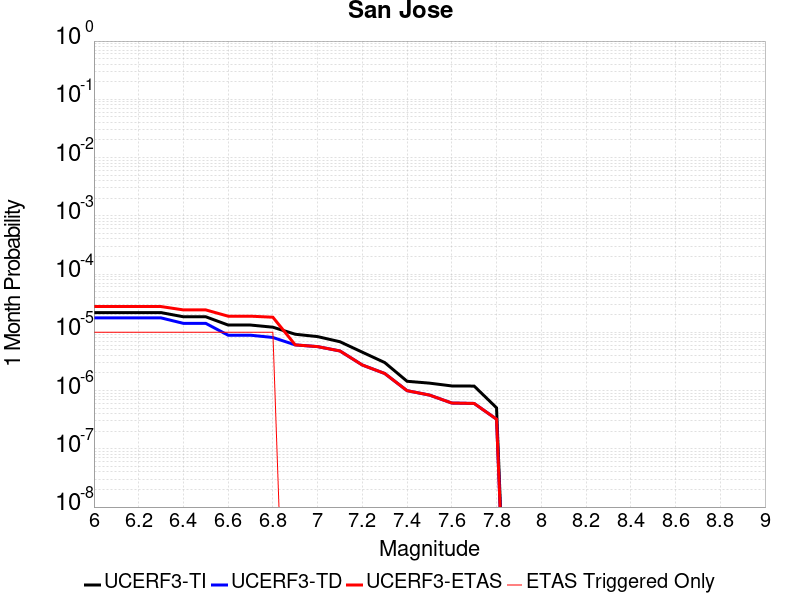 |  |  |

| Magnitude | 1 wk TI Prob | 1 wk TD Prob | 1 wk ETAS Prob | 1 wk ETAS/TD Gain | 1 wk ETAS Triggered Only | 1 mo TI Prob | 1 mo TD Prob | 1 mo ETAS Prob | 1 mo ETAS/TD Gain | 1 mo ETAS Triggered Only | 1 yr TI Prob | 1 yr TD Prob | 1 yr ETAS Prob | 1 yr ETAS/TD Gain | 1 yr ETAS Triggered Only | 10 yr TI Prob | 10 yr TD Prob | 10 yr ETAS Prob | 10 yr ETAS/TD Gain | 10 yr ETAS Triggered Only |
|-----|-----|-----|-----|-----|-----|-----|-----|-----|-----|-----|-----|-----|-----|-----|-----|-----|-----|-----|-----|-----|
| 6.0 | 5.0851277E-6 | 4.125829E-6 | 4.125829E-6 | 1.0 | 0.0 | 2.1793223E-5 | 1.768202E-5 | 2.7681843E-5 | 1.5655363 | 1.0E-5 | 2.653002E-4 | 2.1525996E-4 | 2.3525565E-4 | 1.0928909 | 2.0E-5 | 0.0026498367 | 0.0021508057 | 0.0021707625 | 1.0092789 | 2.0E-5 |
| 6.1 | 5.0851277E-6 | 4.125829E-6 | 4.125829E-6 | 1.0 | 0.0 | 2.1793223E-5 | 1.768202E-5 | 2.7681843E-5 | 1.5655363 | 1.0E-5 | 2.653002E-4 | 2.1525996E-4 | 2.3525565E-4 | 1.0928909 | 2.0E-5 | 0.0026498367 | 0.0021508057 | 0.0021707625 | 1.0092789 | 2.0E-5 |
| 6.2 | 5.0851277E-6 | 4.125829E-6 | 4.125829E-6 | 1.0 | 0.0 | 2.1793223E-5 | 1.768202E-5 | 2.7681843E-5 | 1.5655363 | 1.0E-5 | 2.653002E-4 | 2.1525996E-4 | 2.3525565E-4 | 1.0928909 | 2.0E-5 | 0.0026498367 | 0.0021508057 | 0.0021707625 | 1.0092789 | 2.0E-5 |
| 6.3 | 5.0851277E-6 | 4.125829E-6 | 4.125829E-6 | 1.0 | 0.0 | 2.1793223E-5 | 1.768202E-5 | 2.7681843E-5 | 1.5655363 | 1.0E-5 | 2.653002E-4 | 2.1525996E-4 | 2.3525565E-4 | 1.0928909 | 2.0E-5 | 0.0026498367 | 0.0021508057 | 0.0021707625 | 1.0092789 | 2.0E-5 |
| 6.4 | 4.3115124E-6 | 3.3239319E-6 | 3.3239319E-6 | 1.0 | 0.0 | 1.8477778E-5 | 1.4245357E-5 | 2.4245215E-5 | 1.7019731 | 1.0E-5 | 2.2494372E-4 | 1.7342564E-4 | 1.834239E-4 | 1.0576516 | 1.0E-5 | 0.0022471617 | 0.0017331527 | 0.0017431353 | 1.0057598 | 1.0E-5 |
| 6.5 | 4.3115124E-6 | 3.3239319E-6 | 3.3239319E-6 | 1.0 | 0.0 | 1.8477778E-5 | 1.4245357E-5 | 2.4245215E-5 | 1.7019731 | 1.0E-5 | 2.2494372E-4 | 1.7342564E-4 | 1.834239E-4 | 1.0576516 | 1.0E-5 | 0.0022471617 | 0.0017331527 | 0.0017431353 | 1.0057598 | 1.0E-5 |
| 6.6 | 3.110396E-6 | 2.0801237E-6 | 2.0801237E-6 | 1.0 | 0.0 | 1.33302E-5 | 8.914787E-6 | 1.8914698E-5 | 2.1217217 | 1.0E-5 | 1.622831E-4 | 1.08532404E-4 | 1.18531316E-4 | 1.0921284 | 1.0E-5 | 0.0016216465 | 0.001084854 | 0.0010948431 | 1.0092078 | 1.0E-5 |
| 6.7 | 3.110396E-6 | 2.0801237E-6 | 2.0801237E-6 | 1.0 | 0.0 | 1.33302E-5 | 8.914787E-6 | 1.8914698E-5 | 2.1217217 | 1.0E-5 | 1.622831E-4 | 1.08532404E-4 | 1.18531316E-4 | 1.0921284 | 1.0E-5 | 0.0016216465 | 0.001084854 | 0.0010948431 | 1.0092078 | 1.0E-5 |
| 6.8 | 2.856651E-6 | 1.9025686E-6 | 1.9025686E-6 | 1.0 | 0.0 | 1.2242733E-5 | 8.153841E-6 | 1.815376E-5 | 2.2264059 | 1.0E-5 | 1.4904508E-4 | 9.926874E-5 | 1.0926775E-4 | 1.1007266 | 1.0E-5 | 0.0014894515 | 9.92301E-4 | 0.0010022911 | 1.0100676 | 1.0E-5 |
| 6.9 | 2.1618725E-6 | 1.4187887E-6 | 1.4187887E-6 | 1.0 | 0.0 | 9.265135E-6 | 6.080509E-6 | 6.080509E-6 | 1.0 | 0.0 | 1.12797185E-4 | 7.4027776E-5 | 7.4027776E-5 | 1.0 | 0.0 | 0.0011273995 | 7.4007234E-4 | 7.4007234E-4 | 1.0 | 0.0 |
| 7.0 | 1.9684312E-6 | 1.3257552E-6 | 1.3257552E-6 | 1.0 | 0.0 | 8.436106E-6 | 5.681796E-6 | 5.681796E-6 | 1.0 | 0.0 | 1.02704755E-4 | 6.917376E-5 | 6.917376E-5 | 1.0 | 0.0 | 0.001026573 | 6.915629E-4 | 6.915629E-4 | 1.0 | 0.0 |
| 7.1 | 1.6070337E-6 | 1.1156246E-6 | 1.1156246E-6 | 1.0 | 0.0 | 6.887269E-6 | 4.78124E-6 | 4.78124E-6 | 1.0 | 0.0 | 8.384928E-5 | 5.8210106E-5 | 5.8210106E-5 | 1.0 | 0.0 | 8.3817646E-4 | 5.8198726E-4 | 5.8198726E-4 | 1.0 | 0.0 |
| 7.2 | 1.0631658E-6 | 6.4046236E-7 | 6.4046236E-7 | 1.0 | 0.0 | 4.556417E-6 | 2.744836E-6 | 2.744836E-6 | 1.0 | 0.0 | 5.5472963E-5 | 3.3417877E-5 | 3.3417877E-5 | 1.0 | 0.0 | 5.545912E-4 | 3.341624E-4 | 3.341624E-4 | 1.0 | 0.0 |
| 7.3 | 7.060711E-7 | 4.583165E-7 | 4.583165E-7 | 1.0 | 0.0 | 3.0260155E-6 | 1.964212E-6 | 1.964212E-6 | 1.0 | 0.0 | 3.6841117E-5 | 2.391403E-5 | 2.391403E-5 | 1.0 | 0.0 | 3.6835007E-4 | 2.3914794E-4 | 2.3914794E-4 | 1.0 | 0.0 |
| 7.4 | 3.3677085E-7 | 2.323812E-7 | 2.323812E-7 | 1.0 | 0.0 | 1.4433028E-6 | 9.959191E-7 | 9.959191E-7 | 1.0 | 0.0 | 1.757207E-5 | 1.2125251E-5 | 1.2125251E-5 | 1.0 | 0.0 | 1.7570681E-4 | 1.2127866E-4 | 1.2127866E-4 | 1.0 | 0.0 |
| 7.5 | 3.129161E-7 | 1.9535003E-7 | 1.9535003E-7 | 1.0 | 0.0 | 1.3410682E-6 | 8.3721415E-7 | 8.3721415E-7 | 1.0 | 0.0 | 1.6327383E-5 | 1.0193037E-5 | 1.0193037E-5 | 1.0 | 0.0 | 1.6326184E-4 | 1.01958416E-4 | 1.01958416E-4 | 1.0 | 0.0 |
| 7.6 | 2.8008668E-7 | 1.4245146E-7 | 1.4245146E-7 | 1.0 | 0.0 | 1.2003709E-6 | 6.105061E-7 | 6.105061E-7 | 1.0 | 0.0 | 1.46144175E-5 | 7.432888E-6 | 7.432888E-6 | 1.0 | 0.0 | 1.4613457E-4 | 7.4359006E-5 | 7.4359006E-5 | 1.0 | 0.0 |
| 7.7 | 2.7852005E-7 | 1.4019697E-7 | 1.4019697E-7 | 1.0 | 0.0 | 1.1936568E-6 | 6.0084403E-7 | 6.0084403E-7 | 1.0 | 0.0 | 1.4532674E-5 | 7.3152532E-6 | 7.3152532E-6 | 1.0 | 0.0 | 1.4531724E-4 | 7.318273E-5 | 7.318273E-5 | 1.0 | 0.0 |
| 7.8 | 1.1810797E-7 | 7.520163E-8 | 7.520163E-8 | 1.0 | 0.0 | 5.0617695E-7 | 3.2229266E-7 | 3.2229266E-7 | 1.0 | 0.0 | 6.1626865E-6 | 3.9239067E-6 | 3.9239067E-6 | 1.0 | 0.0 | 6.162516E-5 | 3.9256745E-5 | 3.9256745E-5 | 1.0 | 0.0 |

## Sargent 2011 CFM
*[(top)](#table-of-contents)*

| 1 Week | 1 Month | 1 Year | 10 Year |
|-----|-----|-----|-----|
|  |  |  |  |

| Magnitude | 1 wk TI Prob | 1 wk TD Prob | 1 wk ETAS Prob | 1 wk ETAS/TD Gain | 1 wk ETAS Triggered Only | 1 mo TI Prob | 1 mo TD Prob | 1 mo ETAS Prob | 1 mo ETAS/TD Gain | 1 mo ETAS Triggered Only | 1 yr TI Prob | 1 yr TD Prob | 1 yr ETAS Prob | 1 yr ETAS/TD Gain | 1 yr ETAS Triggered Only | 10 yr TI Prob | 10 yr TD Prob | 10 yr ETAS Prob | 10 yr ETAS/TD Gain | 10 yr ETAS Triggered Only |
|-----|-----|-----|-----|-----|-----|-----|-----|-----|-----|-----|-----|-----|-----|-----|-----|-----|-----|-----|-----|-----|
| 6.0 | 3.7327867E-5 | 3.66527E-5 | 3.66527E-5 | 1.0 | 0.0 | 1.5996677E-4 | 1.5707633E-4 | 1.5707633E-4 | 1.0 | 0.0 | 0.0019458556 | 0.001911208 | 0.0019211889 | 1.0052223 | 1.0E-5 | 0.01928905 | 0.019019924 | 0.019039543 | 1.0010315 | 2.0E-5 |
| 6.1 | 2.3771476E-5 | 1.8481187E-5 | 1.8481187E-5 | 1.0 | 0.0 | 1.01873775E-4 | 7.920318E-5 | 7.920318E-5 | 1.0 | 0.0 | 0.0012396075 | 9.639475E-4 | 9.639475E-4 | 1.0 | 0.0 | 0.012327154 | 0.00963713 | 0.009647034 | 1.0010277 | 1.0E-5 |
| 6.2 | 2.3112721E-5 | 1.7712511E-5 | 1.7712511E-5 | 1.0 | 0.0 | 9.9050754E-5 | 7.590905E-5 | 7.590905E-5 | 1.0 | 0.0 | 0.0012052758 | 9.238756E-4 | 9.238756E-4 | 1.0 | 0.0 | 0.011987597 | 0.009239765 | 0.009249672 | 1.0010723 | 1.0E-5 |
| 6.3 | 1.728509E-5 | 1.0460333E-5 | 1.0460333E-5 | 1.0 | 0.0 | 7.407686E-5 | 4.4829496E-5 | 4.4829496E-5 | 1.0 | 0.0 | 9.015125E-4 | 5.457075E-4 | 5.457075E-4 | 1.0 | 0.0 | 0.008978641 | 0.0054799058 | 0.005489851 | 1.0018148 | 1.0E-5 |
| 6.4 | 1.48395575E-5 | 7.457206E-6 | 7.457206E-6 | 1.0 | 0.0 | 6.3596555E-5 | 3.1959276E-5 | 3.1959276E-5 | 1.0 | 0.0 | 7.7401294E-4 | 3.890703E-4 | 3.890703E-4 | 1.0 | 0.0 | 0.0077132257 | 0.0039193574 | 0.0039293184 | 1.0025414 | 1.0E-5 |
| 6.5 | 1.4358964E-5 | 6.8959575E-6 | 6.8959575E-6 | 1.0 | 0.0 | 6.1536964E-5 | 2.9553983E-5 | 2.9553983E-5 | 1.0 | 0.0 | 7.48955E-4 | 3.5979573E-4 | 3.5979573E-4 | 1.0 | 0.0 | 0.0074643586 | 0.0036275939 | 0.0036275939 | 1.0 | 0.0 |
| 6.6 | 9.772591E-6 | 1.3745157E-6 | 1.3745157E-6 | 1.0 | 0.0 | 4.188186E-5 | 5.8907685E-6 | 5.8907685E-6 | 1.0 | 0.0 | 5.097923E-4 | 7.1717775E-5 | 7.1717775E-5 | 1.0 | 0.0 | 0.005086244 | 7.488351E-4 | 7.488351E-4 | 1.0 | 0.0 |
| 6.7 | 9.752745E-6 | 1.3532066E-6 | 1.3532066E-6 | 1.0 | 0.0 | 4.179681E-5 | 5.799444E-6 | 5.799444E-6 | 1.0 | 0.0 | 5.0875737E-4 | 7.060597E-5 | 7.060597E-5 | 1.0 | 0.0 | 0.005075942 | 7.3772453E-4 | 7.3772453E-4 | 1.0 | 0.0 |
| 6.8 | 9.608213E-6 | 1.2370549E-6 | 1.2370549E-6 | 1.0 | 0.0 | 4.1177405E-5 | 5.3016533E-6 | 5.3016533E-6 | 1.0 | 0.0 | 5.012196E-4 | 6.454574E-5 | 6.454574E-5 | 1.0 | 0.0 | 0.005000906 | 6.768572E-4 | 6.768572E-4 | 1.0 | 0.0 |
| 6.9 | 9.427164E-6 | 1.1217882E-6 | 1.1217882E-6 | 1.0 | 0.0 | 4.04015E-5 | 4.807655E-6 | 4.807655E-6 | 1.0 | 0.0 | 4.9177726E-4 | 5.8531645E-5 | 5.8531645E-5 | 1.0 | 0.0 | 0.004906904 | 6.160689E-4 | 6.160689E-4 | 1.0 | 0.0 |
| 7.0 | 9.247601E-6 | 9.882198E-7 | 9.882198E-7 | 1.0 | 0.0 | 3.9631974E-5 | 4.2352203E-6 | 4.2352203E-6 | 1.0 | 0.0 | 4.8241246E-4 | 5.1562605E-5 | 5.1562605E-5 | 1.0 | 0.0 | 0.0048136655 | 5.4590765E-4 | 5.4590765E-4 | 1.0 | 0.0 |
| 7.1 | 8.995454E-6 | 8.2788455E-7 | 8.2788455E-7 | 1.0 | 0.0 | 3.8551374E-5 | 3.5480718E-6 | 3.5480718E-6 | 1.0 | 0.0 | 4.6926187E-4 | 4.319693E-5 | 4.319693E-5 | 1.0 | 0.0 | 0.004682722 | 4.6136387E-4 | 4.6136387E-4 | 1.0 | 0.0 |
| 7.2 | 8.520861E-6 | 5.283442E-7 | 5.283442E-7 | 1.0 | 0.0 | 3.6517464E-5 | 2.2643303E-6 | 2.2643303E-6 | 1.0 | 0.0 | 4.445094E-4 | 2.756788E-5 | 2.756788E-5 | 1.0 | 0.0 | 0.004436213 | 3.0338025E-4 | 3.0338025E-4 | 1.0 | 0.0 |
| 7.3 | 8.043592E-6 | 3.462658E-7 | 3.462658E-7 | 1.0 | 0.0 | 3.4472083E-5 | 1.4839954E-6 | 1.4839954E-6 | 1.0 | 0.0 | 4.196168E-4 | 1.8067496E-5 | 1.8067496E-5 | 1.0 | 0.0 | 0.004188253 | 2.0707028E-4 | 2.0707028E-4 | 1.0 | 0.0 |
| 7.4 | 7.662316E-6 | 2.934612E-7 | 2.934612E-7 | 1.0 | 0.0 | 3.2838085E-5 | 1.2576902E-6 | 1.2576902E-6 | 1.0 | 0.0 | 3.9973034E-4 | 1.5312271E-5 | 1.5312271E-5 | 1.0 | 0.0 | 0.0039901207 | 1.7771032E-4 | 1.7771032E-4 | 1.0 | 0.0 |
| 7.5 | 6.961638E-6 | 2.3622324E-7 | 2.3622324E-7 | 1.0 | 0.0 | 2.9835252E-5 | 1.0123849E-6 | 1.0123849E-6 | 1.0 | 0.0 | 3.6318362E-4 | 1.2325718E-5 | 1.2325718E-5 | 1.0 | 0.0 | 0.0036259065 | 1.443878E-4 | 1.443878E-4 | 1.0 | 0.0 |
| 7.6 | 6.282332E-6 | 1.693028E-7 | 1.693028E-7 | 1.0 | 0.0 | 2.6924003E-5 | 7.255832E-7 | 7.255832E-7 | 1.0 | 0.0 | 3.2775043E-4 | 8.83394E-6 | 8.83394E-6 | 1.0 | 0.0 | 0.0032726745 | 1.0528327E-4 | 1.0528327E-4 | 1.0 | 0.0 |
| 7.7 | 4.934408E-6 | 5.0136514E-8 | 5.0136514E-8 | 1.0 | 0.0 | 2.114729E-5 | 2.1487075E-7 | 2.1487075E-7 | 1.0 | 0.0 | 2.5743784E-4 | 2.6160483E-6 | 2.6160483E-6 | 1.0 | 0.0 | 0.0025713982 | 3.2631593E-5 | 3.2631593E-5 | 1.0 | 0.0 |
| 7.8 | 2.373212E-6 | 3.5272727E-8 | 3.5272727E-8 | 1.0 | 0.0 | 1.0170869E-5 | 1.511688E-7 | 1.511688E-7 | 1.0 | 0.0 | 1.238233E-4 | 1.8404786E-6 | 1.8404786E-6 | 1.0 | 0.0 | 0.0012375432 | 2.4194595E-5 | 2.4194595E-5 | 1.0 | 0.0 |
| 7.9 | 1.8227792E-6 | 3.070829E-8 | 3.070829E-8 | 1.0 | 0.0 | 7.811887E-6 | 1.3160694E-7 | 1.3160694E-7 | 1.0 | 0.0 | 9.510558E-5 | 1.6023133E-6 | 1.6023133E-6 | 1.0 | 0.0 | 9.5064886E-4 | 2.1472444E-5 | 2.1472444E-5 | 1.0 | 0.0 |
| 8.0 | 1.9095137E-7 | 1.3291495E-8 | 1.3291495E-8 | 1.0 | 0.0 | 8.1836276E-7 | 5.6963547E-8 | 5.6963547E-8 | 1.0 | 0.0 | 9.963521E-6 | 6.93531E-7 | 6.93531E-7 | 1.0 | 0.0 | 9.963074E-5 | 8.479904E-6 | 8.479904E-6 | 1.0 | 0.0 |

## San Andreas (North Coast) 2011 CFM
*[(top)](#table-of-contents)*

| 1 Week | 1 Month | 1 Year | 10 Year |
|-----|-----|-----|-----|
|  |  |  |  |

| Magnitude | 1 wk TI Prob | 1 wk TD Prob | 1 wk ETAS Prob | 1 wk ETAS/TD Gain | 1 wk ETAS Triggered Only | 1 mo TI Prob | 1 mo TD Prob | 1 mo ETAS Prob | 1 mo ETAS/TD Gain | 1 mo ETAS Triggered Only | 1 yr TI Prob | 1 yr TD Prob | 1 yr ETAS Prob | 1 yr ETAS/TD Gain | 1 yr ETAS Triggered Only | 10 yr TI Prob | 10 yr TD Prob | 10 yr ETAS Prob | 10 yr ETAS/TD Gain | 10 yr ETAS Triggered Only |
|-----|-----|-----|-----|-----|-----|-----|-----|-----|-----|-----|-----|-----|-----|-----|-----|-----|-----|-----|-----|-----|
| 6.0 | 1.5333705E-4 | 7.117681E-5 | 7.117681E-5 | 1.0 | 0.0 | 6.5699324E-4 | 3.0500797E-4 | 3.1500493E-4 | 1.032776 | 1.0E-5 | 0.007969595 | 0.0037071828 | 0.0037171456 | 1.0026875 | 1.0E-5 | 0.0768977 | 0.03938947 | 0.039408684 | 1.0004878 | 2.0E-5 |
| 6.1 | 1.5333705E-4 | 7.117681E-5 | 7.117681E-5 | 1.0 | 0.0 | 6.5699324E-4 | 3.0500797E-4 | 3.1500493E-4 | 1.032776 | 1.0E-5 | 0.007969595 | 0.0037071828 | 0.0037171456 | 1.0026875 | 1.0E-5 | 0.0768977 | 0.03938947 | 0.039408684 | 1.0004878 | 2.0E-5 |
| 6.2 | 1.3912938E-4 | 6.0564154E-5 | 6.0564154E-5 | 1.0 | 0.0 | 5.961325E-4 | 2.5953498E-4 | 2.695324E-4 | 1.0385205 | 1.0E-5 | 0.007233787 | 0.0031552871 | 0.0031652555 | 1.0031593 | 1.0E-5 | 0.07002798 | 0.033725146 | 0.03374447 | 1.000573 | 2.0E-5 |
| 6.3 | 1.3912938E-4 | 6.0564154E-5 | 6.0564154E-5 | 1.0 | 0.0 | 5.961325E-4 | 2.5953498E-4 | 2.695324E-4 | 1.0385205 | 1.0E-5 | 0.007233787 | 0.0031552871 | 0.0031652555 | 1.0031593 | 1.0E-5 | 0.07002798 | 0.033725146 | 0.03374447 | 1.000573 | 2.0E-5 |
| 6.4 | 1.2623647E-4 | 5.049653E-5 | 5.049653E-5 | 1.0 | 0.0 | 5.4090127E-4 | 2.1639584E-4 | 2.2639368E-4 | 1.0462016 | 1.0E-5 | 0.0065656058 | 0.0026314561 | 0.00264143 | 1.0037901 | 1.0E-5 | 0.06374981 | 0.028332625 | 0.028352058 | 1.0006859 | 2.0E-5 |
| 6.5 | 1.1736096E-4 | 4.3573065E-5 | 4.3573065E-5 | 1.0 | 0.0 | 5.028786E-4 | 1.8672843E-4 | 1.9672656E-4 | 1.0535437 | 1.0E-5 | 0.006105373 | 0.0022710646 | 0.0022810418 | 1.0043932 | 1.0E-5 | 0.05940335 | 0.02460627 | 0.024625778 | 1.0007927 | 2.0E-5 |
| 6.6 | 1.1586959E-4 | 4.247207E-5 | 4.247207E-5 | 1.0 | 0.0 | 4.964894E-4 | 1.8201055E-4 | 1.9200872E-4 | 1.0549319 | 1.0E-5 | 0.006028018 | 0.0022137426 | 0.0022237203 | 1.0045072 | 1.0E-5 | 0.058671024 | 0.024011537 | 0.024031056 | 1.0008129 | 2.0E-5 |
| 6.7 | 1.13693764E-4 | 4.0783096E-5 | 4.0783096E-5 | 1.0 | 0.0 | 4.87168E-4 | 1.7477307E-4 | 1.8477133E-4 | 1.0572071 | 1.0E-5 | 0.005915152 | 0.0021258015 | 0.0021357804 | 1.0046941 | 1.0E-5 | 0.057601593 | 0.02310235 | 0.02312189 | 1.0008457 | 2.0E-5 |
| 6.8 | 1.1204889E-4 | 3.999974E-5 | 3.999974E-5 | 1.0 | 0.0 | 4.8012115E-4 | 1.7141628E-4 | 1.8141457E-4 | 1.0583276 | 1.0E-5 | 0.005829819 | 0.0020850115 | 0.0020949908 | 1.0047861 | 1.0E-5 | 0.05679232 | 0.02266216 | 0.02268171 | 1.0008625 | 2.0E-5 |
| 6.9 | 1.1005794E-4 | 3.9054732E-5 | 3.9054732E-5 | 1.0 | 0.0 | 4.7159163E-4 | 1.6736679E-4 | 1.773651E-4 | 1.059739 | 1.0E-5 | 0.0057265228 | 0.002035802 | 0.0020457816 | 1.0049021 | 1.0E-5 | 0.055811852 | 0.022127477 | 0.022147033 | 1.0008838 | 2.0E-5 |
| 7.0 | 1.0647948E-4 | 3.720934E-5 | 3.720934E-5 | 1.0 | 0.0 | 4.562608E-4 | 1.5945894E-4 | 1.6945734E-4 | 1.0627021 | 1.0E-5 | 0.0055408357 | 0.0019396994 | 0.00194968 | 1.0051454 | 1.0E-5 | 0.054047033 | 0.02108612 | 0.021105697 | 1.0009285 | 2.0E-5 |
| 7.1 | 1.04795035E-4 | 3.625789E-5 | 3.625789E-5 | 1.0 | 0.0 | 4.4904428E-4 | 1.5538179E-4 | 1.6538023E-4 | 1.0643476 | 1.0E-5 | 0.0054534175 | 0.0018901472 | 0.0019001283 | 1.0052806 | 1.0E-5 | 0.053215165 | 0.020553624 | 0.020573214 | 1.0009531 | 2.0E-5 |
| 7.2 | 1.02724036E-4 | 3.5165274E-5 | 3.5165274E-5 | 1.0 | 0.0 | 4.401716E-4 | 1.506997E-4 | 1.606982E-4 | 1.0663471 | 1.0E-5 | 0.0053459285 | 0.0018332403 | 0.001843222 | 1.0054448 | 1.0E-5 | 0.052191395 | 0.019941952 | 0.019961553 | 1.0009829 | 2.0E-5 |
| 7.3 | 1.00650694E-4 | 3.463176E-5 | 3.463176E-5 | 1.0 | 0.0 | 4.312888E-4 | 1.4841347E-4 | 1.5841199E-4 | 1.0673693 | 1.0E-5 | 0.005238306 | 0.0018054518 | 0.0018154337 | 1.0055288 | 1.0E-5 | 0.051165357 | 0.019618612 | 0.019638218 | 1.0009995 | 2.0E-5 |
| 7.4 | 9.672919E-5 | 3.3418924E-5 | 3.3418924E-5 | 1.0 | 0.0 | 4.144878E-4 | 1.4321618E-4 | 1.5321476E-4 | 1.0698146 | 1.0E-5 | 0.005034718 | 0.0017422778 | 0.0017522603 | 1.0057296 | 1.0E-5 | 0.049221683 | 0.0188908 | 0.018910423 | 1.0010387 | 2.0E-5 |
| 7.5 | 8.7600405E-5 | 2.2732094E-5 | 2.2732094E-5 | 1.0 | 0.0 | 3.753763E-4 | 9.741964E-5 | 1.0741866E-4 | 1.1026387 | 1.0E-5 | 0.0045606326 | 0.0011854405 | 0.0011954287 | 1.0084257 | 1.0E-5 | 0.04468165 | 0.01314817 | 0.0131679075 | 1.0015011 | 2.0E-5 |
| 7.6 | 7.9562284E-5 | 1.9254901E-5 | 1.9254901E-5 | 1.0 | 0.0 | 3.4093665E-4 | 8.25184E-5 | 9.251758E-5 | 1.121175 | 1.0E-5 | 0.0041430052 | 0.0010042 | 0.0010141899 | 1.0099481 | 1.0E-5 | 0.040666126 | 0.011238249 | 0.011258025 | 1.0017596 | 2.0E-5 |
| 7.7 | 6.3866544E-5 | 1.196388E-5 | 1.196388E-5 | 1.0 | 0.0 | 2.7368503E-4 | 5.1272764E-5 | 6.127225E-5 | 1.1950253 | 1.0E-5 | 0.0033270244 | 6.240674E-4 | 6.340611E-4 | 1.0160139 | 1.0E-5 | 0.032776527 | 0.007223481 | 0.007243336 | 1.0027487 | 2.0E-5 |
| 7.8 | 4.2543215E-5 | 9.094366E-6 | 9.094366E-6 | 1.0 | 0.0 | 1.8231533E-4 | 3.897527E-5 | 4.897488E-5 | 1.256563 | 1.0E-5 | 0.0022174292 | 4.744207E-4 | 4.8441594E-4 | 1.0210683 | 1.0E-5 | 0.021954332 | 0.0055009755 | 0.0055208653 | 1.0036157 | 2.0E-5 |
| 7.9 | 2.2636612E-5 | 7.829011E-6 | 7.829011E-6 | 1.0 | 0.0 | 9.7010445E-5 | 3.3552475E-5 | 3.3552475E-5 | 1.0 | 0.0 | 0.0011804621 | 4.084249E-4 | 4.084249E-4 | 1.0 | 0.0 | 0.011742111 | 0.0046915384 | 0.004701492 | 1.0021214 | 1.0E-5 |
| 8.0 | 1.5167874E-5 | 7.0627666E-6 | 7.0627666E-6 | 1.0 | 0.0 | 6.500356E-5 | 3.026865E-5 | 3.026865E-5 | 1.0 | 0.0 | 7.9113094E-4 | 3.6845857E-4 | 3.6845857E-4 | 1.0 | 0.0 | 0.007883203 | 0.0042229677 | 0.0042329254 | 1.002358 | 1.0E-5 |
| 8.1 | 1.0681047E-5 | 6.399044E-6 | 6.399044E-6 | 1.0 | 0.0 | 4.5775112E-5 | 2.7424187E-5 | 2.7424187E-5 | 1.0 | 0.0 | 5.5716943E-4 | 3.338384E-4 | 3.338384E-4 | 1.0 | 0.0 | 0.0055577457 | 0.0038240266 | 0.0038339882 | 1.0026051 | 1.0E-5 |
| 8.2 | 8.226114E-6 | 5.124488E-6 | 5.124488E-6 | 1.0 | 0.0 | 3.52543E-5 | 2.1961905E-5 | 2.1961905E-5 | 1.0 | 0.0 | 4.2913653E-4 | 2.6735346E-4 | 2.6735346E-4 | 1.0 | 0.0 | 0.004283088 | 0.003050258 | 0.003050258 | 1.0 | 0.0 |
| 8.3 | 1.983087E-6 | 7.676691E-7 | 7.676691E-7 | 1.0 | 0.0 | 8.498917E-6 | 3.2900064E-6 | 3.2900064E-6 | 1.0 | 0.0 | 1.034694E-4 | 4.005511E-5 | 4.005511E-5 | 1.0 | 0.0 | 0.0010342124 | 4.729315E-4 | 4.729315E-4 | 1.0 | 0.0 |

## San Andreas (Peninsula) 2011 CFM
*[(top)](#table-of-contents)*

| 1 Week | 1 Month | 1 Year | 10 Year |
|-----|-----|-----|-----|
|  |  |  |  |

| Magnitude | 1 wk TI Prob | 1 wk TD Prob | 1 wk ETAS Prob | 1 wk ETAS/TD Gain | 1 wk ETAS Triggered Only | 1 mo TI Prob | 1 mo TD Prob | 1 mo ETAS Prob | 1 mo ETAS/TD Gain | 1 mo ETAS Triggered Only | 1 yr TI Prob | 1 yr TD Prob | 1 yr ETAS Prob | 1 yr ETAS/TD Gain | 1 yr ETAS Triggered Only | 10 yr TI Prob | 10 yr TD Prob | 10 yr ETAS Prob | 10 yr ETAS/TD Gain | 10 yr ETAS Triggered Only |
|-----|-----|-----|-----|-----|-----|-----|-----|-----|-----|-----|-----|-----|-----|-----|-----|-----|-----|-----|-----|-----|
| 6.0 | 8.6200685E-5 | 2.5279105E-5 | 2.5279105E-5 | 1.0 | 0.0 | 3.6937918E-4 | 1.08334534E-4 | 1.08334534E-4 | 1.0 | 0.0 | 0.0044879215 | 0.0013181765 | 0.0013181765 | 1.0 | 0.0 | 0.043983612 | 0.014809495 | 0.014829198 | 1.0013305 | 2.0E-5 |
| 6.1 | 8.6200685E-5 | 2.5279105E-5 | 2.5279105E-5 | 1.0 | 0.0 | 3.6937918E-4 | 1.08334534E-4 | 1.08334534E-4 | 1.0 | 0.0 | 0.0044879215 | 0.0013181765 | 0.0013181765 | 1.0 | 0.0 | 0.043983612 | 0.014809495 | 0.014829198 | 1.0013305 | 2.0E-5 |
| 6.2 | 8.6200685E-5 | 2.5279105E-5 | 2.5279105E-5 | 1.0 | 0.0 | 3.6937918E-4 | 1.08334534E-4 | 1.08334534E-4 | 1.0 | 0.0 | 0.0044879215 | 0.0013181765 | 0.0013181765 | 1.0 | 0.0 | 0.043983612 | 0.014809495 | 0.014829198 | 1.0013305 | 2.0E-5 |
| 6.3 | 8.551163E-5 | 2.4970692E-5 | 2.4970692E-5 | 1.0 | 0.0 | 3.6642692E-4 | 1.0701287E-4 | 1.0701287E-4 | 1.0 | 0.0 | 0.004452125 | 0.0013021047 | 0.0013021047 | 1.0 | 0.0 | 0.043639794 | 0.01463631 | 0.014656018 | 1.0013465 | 2.0E-5 |
| 6.4 | 8.551163E-5 | 2.4970692E-5 | 2.4970692E-5 | 1.0 | 0.0 | 3.6642692E-4 | 1.0701287E-4 | 1.0701287E-4 | 1.0 | 0.0 | 0.004452125 | 0.0013021047 | 0.0013021047 | 1.0 | 0.0 | 0.043639794 | 0.01463631 | 0.014656018 | 1.0013465 | 2.0E-5 |
| 6.5 | 8.511146E-5 | 2.4791954E-5 | 2.4791954E-5 | 1.0 | 0.0 | 3.647124E-4 | 1.0624691E-4 | 1.0624691E-4 | 1.0 | 0.0 | 0.004431336 | 0.0012927902 | 0.0012927902 | 1.0 | 0.0 | 0.04344007 | 0.014535993 | 0.014555702 | 1.0013559 | 2.0E-5 |
| 6.6 | 8.4985084E-5 | 2.472253E-5 | 2.472253E-5 | 1.0 | 0.0 | 3.6417096E-4 | 1.0594941E-4 | 1.0594941E-4 | 1.0 | 0.0 | 0.0044247704 | 0.0012891723 | 0.0012891723 | 1.0 | 0.0 | 0.043376986 | 0.014498032 | 0.014517742 | 1.0013595 | 2.0E-5 |
| 6.7 | 8.462618E-5 | 2.455087E-5 | 2.455087E-5 | 1.0 | 0.0 | 3.6263323E-4 | 1.0521379E-4 | 1.0521379E-4 | 1.0 | 0.0 | 0.004406125 | 0.0012802267 | 0.0012802267 | 1.0 | 0.0 | 0.043197807 | 0.014402757 | 0.01442247 | 1.0013686 | 2.0E-5 |
| 6.8 | 8.42337E-5 | 2.4446548E-5 | 2.4446548E-5 | 1.0 | 0.0 | 3.6095164E-4 | 1.04766725E-4 | 1.04766725E-4 | 1.0 | 0.0 | 0.004385734 | 0.0012747901 | 0.0012747901 | 1.0 | 0.0 | 0.043001823 | 0.0143433735 | 0.014363087 | 1.0013744 | 2.0E-5 |
| 6.9 | 8.365989E-5 | 2.4250969E-5 | 2.4250969E-5 | 1.0 | 0.0 | 3.5849313E-4 | 1.0392859E-4 | 1.0392859E-4 | 1.0 | 0.0 | 0.004355922 | 0.0012645978 | 0.0012645978 | 1.0 | 0.0 | 0.04271523 | 0.014235767 | 0.014255482 | 1.0013849 | 2.0E-5 |
| 7.0 | 8.30936E-5 | 2.4012294E-5 | 2.4012294E-5 | 1.0 | 0.0 | 3.560668E-4 | 1.02905775E-4 | 1.02905775E-4 | 1.0 | 0.0 | 0.004326499 | 0.0012521594 | 0.0012521594 | 1.0 | 0.0 | 0.042432297 | 0.014106668 | 0.014126386 | 1.0013977 | 2.0E-5 |
| 7.1 | 8.041264E-5 | 2.3698338E-5 | 2.3698338E-5 | 1.0 | 0.0 | 3.4458007E-4 | 1.01560356E-4 | 1.01560356E-4 | 1.0 | 0.0 | 0.0041871946 | 0.0012357977 | 0.0012357977 | 1.0 | 0.0 | 0.041091725 | 0.01392926 | 0.013948982 | 1.0014158 | 2.0E-5 |
| 7.2 | 7.8427016E-5 | 2.3121482E-5 | 2.3121482E-5 | 1.0 | 0.0 | 3.3607247E-4 | 9.908831E-5 | 9.908831E-5 | 1.0 | 0.0 | 0.004084008 | 0.0012057341 | 0.0012057341 | 1.0 | 0.0 | 0.040097635 | 0.013613057 | 0.0136327855 | 1.0014492 | 2.0E-5 |
| 7.3 | 7.721087E-5 | 2.2906104E-5 | 2.2906104E-5 | 1.0 | 0.0 | 3.3086175E-4 | 9.8165336E-5 | 9.8165336E-5 | 1.0 | 0.0 | 0.004020803 | 0.0011945092 | 0.0011945092 | 1.0 | 0.0 | 0.03948827 | 0.0134966625 | 0.013516393 | 1.0014619 | 2.0E-5 |
| 7.4 | 7.3536525E-5 | 2.1016924E-5 | 2.1016924E-5 | 1.0 | 0.0 | 3.1511846E-4 | 9.006943E-5 | 9.006943E-5 | 1.0 | 0.0 | 0.0038298194 | 0.0010960449 | 0.0010960449 | 1.0 | 0.0 | 0.037644852 | 0.012450197 | 0.012469948 | 1.0015864 | 2.0E-5 |
| 7.5 | 6.806207E-5 | 1.8813871E-5 | 1.8813871E-5 | 1.0 | 0.0 | 2.9166197E-4 | 8.0628386E-5 | 8.0628386E-5 | 1.0 | 0.0 | 0.0035452035 | 9.812096E-4 | 9.812096E-4 | 1.0 | 0.0 | 0.034891766 | 0.011198469 | 0.011218246 | 1.001766 | 2.0E-5 |
| 7.6 | 5.6731416E-5 | 1.420664E-5 | 1.420664E-5 | 1.0 | 0.0 | 2.43112E-4 | 6.088418E-5 | 6.088418E-5 | 1.0 | 0.0 | 0.0029558712 | 7.410129E-4 | 7.410129E-4 | 1.0 | 0.0 | 0.02916862 | 0.008501929 | 0.008521759 | 1.0023324 | 2.0E-5 |
| 7.7 | 4.946994E-5 | 1.3272084E-5 | 1.3272084E-5 | 1.0 | 0.0 | 2.1199681E-4 | 5.6879122E-5 | 5.6879122E-5 | 1.0 | 0.0 | 0.002578006 | 6.922834E-4 | 6.922834E-4 | 1.0 | 0.0 | 0.02548303 | 0.007922578 | 0.007942419 | 1.0025045 | 2.0E-5 |
| 7.8 | 3.9718198E-5 | 1.3007184E-5 | 1.3007184E-5 | 1.0 | 0.0 | 1.7020974E-4 | 5.574388E-5 | 5.574388E-5 | 1.0 | 0.0 | 0.0020703338 | 6.784706E-4 | 6.784706E-4 | 1.0 | 0.0 | 0.020511515 | 0.0077323024 | 0.007752148 | 1.0025666 | 2.0E-5 |
| 7.9 | 2.4115114E-5 | 1.2207115E-5 | 1.2207115E-5 | 1.0 | 0.0 | 1.0334639E-4 | 5.2315158E-5 | 5.2315158E-5 | 1.0 | 0.0 | 0.001257516 | 6.3675107E-4 | 6.3675107E-4 | 1.0 | 0.0 | 0.012504238 | 0.0071707577 | 0.0071906145 | 1.0027691 | 2.0E-5 |
| 8.0 | 1.7756569E-5 | 1.1429554E-5 | 1.1429554E-5 | 1.0 | 0.0 | 7.6097356E-5 | 4.8982885E-5 | 4.8982885E-5 | 1.0 | 0.0 | 9.260915E-4 | 5.962036E-4 | 5.962036E-4 | 1.0 | 0.0 | 0.009222416 | 0.006670016 | 0.0066898824 | 1.0029784 | 2.0E-5 |
| 8.1 | 1.3159258E-5 | 9.762734E-6 | 9.762734E-6 | 1.0 | 0.0 | 5.6395602E-5 | 4.183962E-5 | 4.183962E-5 | 1.0 | 0.0 | 6.864001E-4 | 5.0927844E-4 | 5.0927844E-4 | 1.0 | 0.0 | 0.0068428386 | 0.00569844 | 0.005718326 | 1.0034897 | 2.0E-5 |
| 8.2 | 8.635426E-6 | 5.4768793E-6 | 5.4768793E-6 | 1.0 | 0.0 | 3.700844E-5 | 2.3472128E-5 | 2.3472128E-5 | 1.0 | 0.0 | 4.5048463E-4 | 2.857358E-4 | 2.857358E-4 | 1.0 | 0.0 | 0.004495725 | 0.0032499495 | 0.0032499495 | 1.0 | 0.0 |
| 8.3 | 1.983087E-6 | 7.676691E-7 | 7.676691E-7 | 1.0 | 0.0 | 8.498917E-6 | 3.2900064E-6 | 3.2900064E-6 | 1.0 | 0.0 | 1.034694E-4 | 4.005511E-5 | 4.005511E-5 | 1.0 | 0.0 | 0.0010342124 | 4.729315E-4 | 4.729315E-4 | 1.0 | 0.0 |

## Elsinore (Temecula) rev
*[(top)](#table-of-contents)*

| 1 Week | 1 Month | 1 Year | 10 Year |
|-----|-----|-----|-----|
|  |  |  |  |

| Magnitude | 1 wk TI Prob | 1 wk TD Prob | 1 wk ETAS Prob | 1 wk ETAS/TD Gain | 1 wk ETAS Triggered Only | 1 mo TI Prob | 1 mo TD Prob | 1 mo ETAS Prob | 1 mo ETAS/TD Gain | 1 mo ETAS Triggered Only | 1 yr TI Prob | 1 yr TD Prob | 1 yr ETAS Prob | 1 yr ETAS/TD Gain | 1 yr ETAS Triggered Only | 10 yr TI Prob | 10 yr TD Prob | 10 yr ETAS Prob | 10 yr ETAS/TD Gain | 10 yr ETAS Triggered Only |
|-----|-----|-----|-----|-----|-----|-----|-----|-----|-----|-----|-----|-----|-----|-----|-----|-----|-----|-----|-----|-----|
| 6.0 | 2.9514995E-5 | 2.2519549E-5 | 2.2519549E-5 | 1.0 | 0.0 | 1.264867E-4 | 9.650891E-5 | 9.650891E-5 | 1.0 | 0.0 | 0.0015388876 | 0.0011743848 | 0.001184373 | 1.0085051 | 1.0E-5 | 0.015282745 | 0.011698165 | 0.011717931 | 1.0016897 | 2.0E-5 |
| 6.1 | 2.9514995E-5 | 2.2519549E-5 | 2.2519549E-5 | 1.0 | 0.0 | 1.264867E-4 | 9.650891E-5 | 9.650891E-5 | 1.0 | 0.0 | 0.0015388876 | 0.0011743848 | 0.001184373 | 1.0085051 | 1.0E-5 | 0.015282745 | 0.011698165 | 0.011717931 | 1.0016897 | 2.0E-5 |
| 6.2 | 2.9514995E-5 | 2.2519549E-5 | 2.2519549E-5 | 1.0 | 0.0 | 1.264867E-4 | 9.650891E-5 | 9.650891E-5 | 1.0 | 0.0 | 0.0015388876 | 0.0011743848 | 0.001184373 | 1.0085051 | 1.0E-5 | 0.015282745 | 0.011698165 | 0.011717931 | 1.0016897 | 2.0E-5 |
| 6.3 | 2.3223649E-5 | 1.8408176E-5 | 1.8408176E-5 | 1.0 | 0.0 | 9.952613E-5 | 7.88899E-5 | 7.88899E-5 | 1.0 | 0.0 | 0.001211057 | 9.600786E-4 | 9.7006897E-4 | 1.0104058 | 1.0E-5 | 0.012044783 | 0.0095708165 | 0.009590625 | 1.0020697 | 2.0E-5 |
| 6.4 | 2.3223649E-5 | 1.8408176E-5 | 1.8408176E-5 | 1.0 | 0.0 | 9.952613E-5 | 7.88899E-5 | 7.88899E-5 | 1.0 | 0.0 | 0.001211057 | 9.600786E-4 | 9.7006897E-4 | 1.0104058 | 1.0E-5 | 0.012044783 | 0.0095708165 | 0.009590625 | 1.0020697 | 2.0E-5 |
| 6.5 | 1.8338875E-5 | 1.4751322E-5 | 1.4751322E-5 | 1.0 | 0.0 | 7.8592806E-5 | 6.321847E-5 | 6.321847E-5 | 1.0 | 0.0 | 9.5644733E-4 | 7.694218E-4 | 7.794141E-4 | 1.0129868 | 1.0E-5 | 0.009523412 | 0.0076745367 | 0.007694383 | 1.002586 | 2.0E-5 |
| 6.6 | 1.8223333E-5 | 1.4613871E-5 | 1.4613871E-5 | 1.0 | 0.0 | 7.809766E-5 | 6.262942E-5 | 6.262942E-5 | 1.0 | 0.0 | 9.504242E-4 | 7.622552E-4 | 7.7224756E-4 | 1.013109 | 1.0E-5 | 0.009463696 | 0.007603362 | 0.00762321 | 1.0026104 | 2.0E-5 |
| 6.7 | 1.7512752E-5 | 1.4028346E-5 | 1.4028346E-5 | 1.0 | 0.0 | 7.505249E-5 | 6.012015E-5 | 6.012015E-5 | 1.0 | 0.0 | 9.13381E-4 | 7.317256E-4 | 7.417183E-4 | 1.0136564 | 1.0E-5 | 0.00909636 | 0.007299509 | 0.007319363 | 1.0027199 | 2.0E-5 |
| 6.8 | 1.7417142E-5 | 1.39523245E-5 | 1.39523245E-5 | 1.0 | 0.0 | 7.4642754E-5 | 5.9794354E-5 | 5.9794354E-5 | 1.0 | 0.0 | 9.083966E-4 | 7.2776165E-4 | 7.377544E-4 | 1.0137308 | 1.0E-5 | 0.009046922 | 0.007260074 | 0.007279929 | 1.0027348 | 2.0E-5 |
| 6.9 | 1.6402591E-5 | 1.29897E-5 | 1.29897E-5 | 1.0 | 0.0 | 7.0294926E-5 | 5.5668996E-5 | 5.5668996E-5 | 1.0 | 0.0 | 8.5550465E-4 | 6.775669E-4 | 6.875602E-4 | 1.0147487 | 1.0E-5 | 0.008522186 | 0.0067607323 | 0.006780597 | 1.0029383 | 2.0E-5 |
| 7.0 | 1.3912486E-5 | 1.087919E-5 | 1.087919E-5 | 1.0 | 0.0 | 5.9623577E-5 | 4.6624282E-5 | 4.6624282E-5 | 1.0 | 0.0 | 7.2567526E-4 | 5.675055E-4 | 5.774998E-4 | 1.017611 | 1.0E-5 | 0.0072331014 | 0.005664482 | 0.0056843683 | 1.0035107 | 2.0E-5 |
| 7.1 | 1.3405147E-5 | 1.0328327E-5 | 1.0328327E-5 | 1.0 | 0.0 | 5.7449364E-5 | 4.426352E-5 | 4.426352E-5 | 1.0 | 0.0 | 6.9922156E-4 | 5.387777E-4 | 5.4877234E-4 | 1.0185505 | 1.0E-5 | 0.0069702556 | 0.005378047 | 0.0053979396 | 1.0036988 | 2.0E-5 |
| 7.2 | 1.21402E-5 | 8.9975E-6 | 8.9975E-6 | 1.0 | 0.0 | 5.202839E-5 | 3.8560152E-5 | 3.8560152E-5 | 1.0 | 0.0 | 6.332616E-4 | 4.693705E-4 | 4.693705E-4 | 1.0 | 0.0 | 0.0063146 | 0.004685217 | 0.00469517 | 1.0021244 | 1.0E-5 |
| 7.3 | 1.05047775E-5 | 7.572396E-6 | 7.572396E-6 | 1.0 | 0.0 | 4.5019697E-5 | 3.2452732E-5 | 3.2452732E-5 | 1.0 | 0.0 | 5.4797693E-4 | 3.9504183E-4 | 3.9504183E-4 | 1.0 | 0.0 | 0.005466277 | 0.003943785 | 0.0039537456 | 1.0025257 | 1.0E-5 |
| 7.4 | 9.624483E-6 | 6.787417E-6 | 6.787417E-6 | 1.0 | 0.0 | 4.124713E-5 | 2.9088613E-5 | 2.9088613E-5 | 1.0 | 0.0 | 5.0206814E-4 | 3.540977E-4 | 3.540977E-4 | 1.0 | 0.0 | 0.005009353 | 0.0035354889 | 0.0035454535 | 1.0028185 | 1.0E-5 |
| 7.5 | 8.215151E-6 | 5.635989E-6 | 5.635989E-6 | 1.0 | 0.0 | 3.5207315E-5 | 2.4154022E-5 | 2.4154022E-5 | 1.0 | 0.0 | 4.2856473E-4 | 2.940368E-4 | 2.940368E-4 | 1.0 | 0.0 | 0.004277392 | 0.0029366056 | 0.002946576 | 1.0033953 | 1.0E-5 |
| 7.6 | 6.975058E-6 | 4.6764308E-6 | 4.6764308E-6 | 1.0 | 0.0 | 2.9892764E-5 | 2.0041698E-5 | 2.0041698E-5 | 1.0 | 0.0 | 3.6388362E-4 | 2.4398153E-4 | 2.4398153E-4 | 1.0 | 0.0 | 0.0036328835 | 0.002437253 | 0.0024472286 | 1.0040929 | 1.0E-5 |
| 7.7 | 4.159604E-6 | 2.327219E-6 | 2.327219E-6 | 1.0 | 0.0 | 1.7826753E-5 | 9.973761E-6 | 9.973761E-6 | 1.0 | 0.0 | 2.1701909E-4 | 1.2142452E-4 | 1.2142452E-4 | 1.0 | 0.0 | 0.0021680726 | 0.0012136548 | 0.0012136548 | 1.0 | 0.0 |
| 7.8 | 2.2692414E-7 | 9.386416E-8 | 9.386416E-8 | 1.0 | 0.0 | 9.725317E-7 | 4.0227494E-7 | 4.0227494E-7 | 1.0 | 0.0 | 1.1840509E-5 | 4.8976895E-6 | 4.8976895E-6 | 1.0 | 0.0 | 1.1839878E-4 | 4.8976144E-5 | 4.8976144E-5 | 1.0 | 0.0 |
| 7.9 | 6.676829E-9 | 3.440101E-9 | 3.440101E-9 | 1.0 | 0.0 | 2.861498E-8 | 1.4743291E-8 | 1.4743291E-8 | 1.0 | 0.0 | 3.4838732E-7 | 1.7949955E-7 | 1.7949955E-7 | 1.0 | 0.0 | 3.4838679E-6 | 1.7949943E-6 | 1.7949943E-6 | 1.0 | 0.0 |

## Emerson-Copper Mtn 2011
*[(top)](#table-of-contents)*

| 1 Week | 1 Month | 1 Year | 10 Year |
|-----|-----|-----|-----|
|  |  |  |  |

| Magnitude | 1 wk TI Prob | 1 wk TD Prob | 1 wk ETAS Prob | 1 wk ETAS/TD Gain | 1 wk ETAS Triggered Only | 1 mo TI Prob | 1 mo TD Prob | 1 mo ETAS Prob | 1 mo ETAS/TD Gain | 1 mo ETAS Triggered Only | 1 yr TI Prob | 1 yr TD Prob | 1 yr ETAS Prob | 1 yr ETAS/TD Gain | 1 yr ETAS Triggered Only | 10 yr TI Prob | 10 yr TD Prob | 10 yr ETAS Prob | 10 yr ETAS/TD Gain | 10 yr ETAS Triggered Only |
|-----|-----|-----|-----|-----|-----|-----|-----|-----|-----|-----|-----|-----|-----|-----|-----|-----|-----|-----|-----|-----|
| 6.0 | 2.1364202E-5 | 9.968443E-6 | 9.968443E-6 | 1.0 | 0.0 | 9.1557646E-5 | 4.2721247E-5 | 4.2721247E-5 | 1.0 | 0.0 | 0.0011141442 | 5.200158E-4 | 5.300106E-4 | 1.0192202 | 1.0E-5 | 0.011085749 | 0.005188859 | 0.0052087554 | 1.0038344 | 2.0E-5 |
| 6.1 | 2.1364202E-5 | 9.968443E-6 | 9.968443E-6 | 1.0 | 0.0 | 9.1557646E-5 | 4.2721247E-5 | 4.2721247E-5 | 1.0 | 0.0 | 0.0011141442 | 5.200158E-4 | 5.300106E-4 | 1.0192202 | 1.0E-5 | 0.011085749 | 0.005188859 | 0.0052087554 | 1.0038344 | 2.0E-5 |
| 6.2 | 2.1364202E-5 | 9.968443E-6 | 9.968443E-6 | 1.0 | 0.0 | 9.1557646E-5 | 4.2721247E-5 | 4.2721247E-5 | 1.0 | 0.0 | 0.0011141442 | 5.200158E-4 | 5.300106E-4 | 1.0192202 | 1.0E-5 | 0.011085749 | 0.005188859 | 0.0052087554 | 1.0038344 | 2.0E-5 |
| 6.3 | 1.7751237E-5 | 8.089506E-6 | 8.089506E-6 | 1.0 | 0.0 | 7.607452E-5 | 3.4668887E-5 | 3.4668887E-5 | 1.0 | 0.0 | 9.258136E-4 | 4.2201823E-4 | 4.32014E-4 | 1.0236857 | 1.0E-5 | 0.00921966 | 0.0042127906 | 0.0042327065 | 1.0047275 | 2.0E-5 |
| 6.4 | 1.7751237E-5 | 8.089506E-6 | 8.089506E-6 | 1.0 | 0.0 | 7.607452E-5 | 3.4668887E-5 | 3.4668887E-5 | 1.0 | 0.0 | 9.258136E-4 | 4.2201823E-4 | 4.32014E-4 | 1.0236857 | 1.0E-5 | 0.00921966 | 0.0042127906 | 0.0042327065 | 1.0047275 | 2.0E-5 |
| 6.5 | 1.5886664E-5 | 6.6040543E-6 | 6.6040543E-6 | 1.0 | 0.0 | 6.808392E-5 | 2.830281E-5 | 2.830281E-5 | 1.0 | 0.0 | 8.286065E-4 | 3.4453694E-4 | 3.545335E-4 | 1.0290145 | 1.0E-5 | 0.008255237 | 0.003440492 | 0.0034504575 | 1.0028965 | 1.0E-5 |
| 6.6 | 1.5886664E-5 | 6.6040543E-6 | 6.6040543E-6 | 1.0 | 0.0 | 6.808392E-5 | 2.830281E-5 | 2.830281E-5 | 1.0 | 0.0 | 8.286065E-4 | 3.4453694E-4 | 3.545335E-4 | 1.0290145 | 1.0E-5 | 0.008255237 | 0.003440492 | 0.0034504575 | 1.0028965 | 1.0E-5 |
| 6.7 | 1.428471E-5 | 5.4706056E-6 | 5.4706056E-6 | 1.0 | 0.0 | 6.121875E-5 | 2.3445265E-5 | 2.3445265E-5 | 1.0 | 0.0 | 7.450834E-4 | 2.8541265E-4 | 2.954098E-4 | 1.035027 | 1.0E-5 | 0.007425902 | 0.002850849 | 0.0028608204 | 1.0034977 | 1.0E-5 |
| 6.8 | 1.3490684E-5 | 5.0738895E-6 | 5.0738895E-6 | 1.0 | 0.0 | 5.7815934E-5 | 2.1745082E-5 | 2.1745082E-5 | 1.0 | 0.0 | 7.0368167E-4 | 2.6471808E-4 | 2.7471542E-4 | 1.037766 | 1.0E-5 | 0.007014576 | 0.0026444085 | 0.002654382 | 1.0037715 | 1.0E-5 |
| 6.9 | 1.2235421E-5 | 4.289851E-6 | 4.289851E-6 | 1.0 | 0.0 | 5.2436466E-5 | 1.8384966E-5 | 1.8384966E-5 | 1.0 | 0.0 | 6.38227E-4 | 2.2381758E-4 | 2.3381534E-4 | 1.0446693 | 1.0E-5 | 0.0063639707 | 0.0022362762 | 0.0022462537 | 1.0044618 | 1.0E-5 |
| 7.0 | 1.1009851E-5 | 3.719148E-6 | 3.719148E-6 | 1.0 | 0.0 | 4.7184225E-5 | 1.5939127E-5 | 1.5939127E-5 | 1.0 | 0.0 | 5.743165E-4 | 1.9404505E-4 | 2.040431E-4 | 1.0515244 | 1.0E-5 | 0.005728345 | 0.0019390939 | 0.0019490746 | 1.0051471 | 1.0E-5 |
| 7.1 | 9.726373E-6 | 3.2119358E-6 | 3.2119358E-6 | 1.0 | 0.0 | 4.168379E-5 | 1.3765385E-5 | 1.3765385E-5 | 1.0 | 0.0 | 5.07382E-4 | 1.6758405E-4 | 1.7758238E-4 | 1.0596615 | 1.0E-5 | 0.0050622504 | 0.001674908 | 0.0016848913 | 1.0059605 | 1.0E-5 |
| 7.2 | 3.9335127E-6 | 1.1525302E-6 | 1.1525302E-6 | 1.0 | 0.0 | 1.6857803E-5 | 4.939406E-6 | 4.939406E-6 | 1.0 | 0.0 | 2.0522442E-4 | 6.013567E-5 | 7.0135065E-5 | 1.1662806 | 1.0E-5 | 0.00205035 | 6.011999E-4 | 6.111939E-4 | 1.0166234 | 1.0E-5 |
| 7.3 | 2.661632E-6 | 6.9118437E-7 | 6.9118437E-7 | 1.0 | 0.0 | 1.14069435E-5 | 2.9622154E-6 | 2.9622154E-6 | 1.0 | 0.0 | 1.3887069E-4 | 3.6064386E-5 | 4.6064026E-5 | 1.2772719 | 1.0E-5 | 0.0013878393 | 3.605864E-4 | 3.7058277E-4 | 1.0277226 | 1.0E-5 |
| 7.4 | 2.0893426E-6 | 5.4621097E-7 | 5.4621097E-7 | 1.0 | 0.0 | 8.954295E-6 | 2.3409023E-6 | 2.3409023E-6 | 1.0 | 0.0 | 1.0901308E-4 | 2.8500117E-5 | 3.849983E-5 | 1.3508657 | 1.0E-5 | 0.0010895962 | 2.8496515E-4 | 2.9496232E-4 | 1.035082 | 1.0E-5 |
| 7.5 | 1.1681728E-6 | 3.603199E-7 | 3.603199E-7 | 1.0 | 0.0 | 5.0064455E-6 | 1.5442272E-6 | 1.5442272E-6 | 1.0 | 0.0 | 6.0951766E-5 | 1.8800809E-5 | 2.8800621E-5 | 1.531882 | 1.0E-5 | 6.093505E-4 | 1.8799266E-4 | 1.9799077E-4 | 1.0531836 | 1.0E-5 |
| 7.6 | 1.3154387E-7 | 7.119914E-8 | 7.119914E-8 | 1.0 | 0.0 | 5.6375933E-7 | 3.0513914E-7 | 3.0513914E-7 | 1.0 | 0.0 | 6.863748E-6 | 3.7150644E-6 | 3.7150644E-6 | 1.0 | 0.0 | 6.863536E-5 | 3.715018E-5 | 3.715018E-5 | 1.0 | 0.0 |

## Hayward (So) 2011 CFM
*[(top)](#table-of-contents)*

| 1 Week | 1 Month | 1 Year | 10 Year |
|-----|-----|-----|-----|
|  |  |  |  |

| Magnitude | 1 wk TI Prob | 1 wk TD Prob | 1 wk ETAS Prob | 1 wk ETAS/TD Gain | 1 wk ETAS Triggered Only | 1 mo TI Prob | 1 mo TD Prob | 1 mo ETAS Prob | 1 mo ETAS/TD Gain | 1 mo ETAS Triggered Only | 1 yr TI Prob | 1 yr TD Prob | 1 yr ETAS Prob | 1 yr ETAS/TD Gain | 1 yr ETAS Triggered Only | 10 yr TI Prob | 10 yr TD Prob | 10 yr ETAS Prob | 10 yr ETAS/TD Gain | 10 yr ETAS Triggered Only |
|-----|-----|-----|-----|-----|-----|-----|-----|-----|-----|-----|-----|-----|-----|-----|-----|-----|-----|-----|-----|-----|
| 6.0 | 1.8091932E-4 | 3.5712728E-4 | 3.5712728E-4 | 1.0 | 0.0 | 7.751381E-4 | 0.0015296576 | 0.0015396423 | 1.0065274 | 1.0E-5 | 0.00939654 | 0.018466959 | 0.018476775 | 1.0005316 | 1.0E-5 | 0.090090066 | 0.16675977 | 0.16677643 | 1.0000999 | 2.0E-5 |
| 6.1 | 1.8091932E-4 | 3.5712728E-4 | 3.5712728E-4 | 1.0 | 0.0 | 7.751381E-4 | 0.0015296576 | 0.0015396423 | 1.0065274 | 1.0E-5 | 0.00939654 | 0.018466959 | 0.018476775 | 1.0005316 | 1.0E-5 | 0.090090066 | 0.16675977 | 0.16677643 | 1.0000999 | 2.0E-5 |
| 6.2 | 1.8091932E-4 | 3.5712728E-4 | 3.5712728E-4 | 1.0 | 0.0 | 7.751381E-4 | 0.0015296576 | 0.0015396423 | 1.0065274 | 1.0E-5 | 0.00939654 | 0.018466959 | 0.018476775 | 1.0005316 | 1.0E-5 | 0.090090066 | 0.16675977 | 0.16677643 | 1.0000999 | 2.0E-5 |
| 6.3 | 1.7322872E-4 | 3.426947E-4 | 3.426947E-4 | 1.0 | 0.0 | 7.4219756E-4 | 0.0014678745 | 0.0014778598 | 1.0068026 | 1.0E-5 | 0.0089988755 | 0.0177272 | 0.017737024 | 1.0005541 | 1.0E-5 | 0.08643075 | 0.16069497 | 0.16071175 | 1.0001044 | 2.0E-5 |
| 6.4 | 1.6334097E-4 | 3.235102E-4 | 3.235102E-4 | 1.0 | 0.0 | 6.998449E-4 | 0.0013857442 | 0.0013957304 | 1.0072063 | 1.0E-5 | 0.008487372 | 0.016742932 | 0.016752765 | 1.0005872 | 1.0E-5 | 0.081704415 | 0.15258306 | 0.1526 | 1.0001111 | 2.0E-5 |
| 6.5 | 1.5600289E-4 | 3.1025545E-4 | 3.1025545E-4 | 1.0 | 0.0 | 6.684125E-4 | 0.001328997 | 0.0013389838 | 1.0075145 | 1.0E-5 | 0.008107598 | 0.016062386 | 0.016072225 | 1.0006126 | 1.0E-5 | 0.078181036 | 0.14685929 | 0.14686781 | 1.000058 | 1.0E-5 |
| 6.6 | 1.4046066E-4 | 2.8039276E-4 | 2.8039276E-4 | 1.0 | 0.0 | 6.018354E-4 | 0.0012011366 | 0.0012111247 | 1.0083154 | 1.0E-5 | 0.0073027555 | 0.014527284 | 0.014537138 | 1.0006783 | 1.0E-5 | 0.07067384 | 0.13394552 | 0.13395418 | 1.0000646 | 1.0E-5 |
| 6.7 | 1.14696966E-4 | 2.327723E-4 | 2.327723E-4 | 1.0 | 0.0 | 4.914658E-4 | 9.972192E-4 | 0.0010072093 | 1.0100179 | 1.0E-5 | 0.0059671924 | 0.01207462 | 0.012084499 | 1.0008181 | 1.0E-5 | 0.058094822 | 0.11277058 | 0.11277945 | 1.0000787 | 1.0E-5 |
| 6.8 | 9.3874296E-5 | 1.8866264E-4 | 1.8866264E-4 | 1.0 | 0.0 | 4.0225635E-4 | 8.083073E-4 | 8.083073E-4 | 1.0 | 0.0 | 0.0048864787 | 0.00979747 | 0.00979747 | 1.0 | 0.0 | 0.047804173 | 0.09261912 | 0.09261912 | 1.0 | 0.0 |
| 6.9 | 5.551852E-5 | 1.0732669E-4 | 1.0732669E-4 | 1.0 | 0.0 | 2.3791482E-4 | 4.5989105E-4 | 4.5989105E-4 | 1.0 | 0.0 | 0.0028927654 | 0.0055849175 | 0.0055849175 | 1.0 | 0.0 | 0.028553981 | 0.05426006 | 0.05426006 | 1.0 | 0.0 |
| 7.0 | 4.2662363E-5 | 8.249069E-5 | 8.249069E-5 | 1.0 | 0.0 | 1.8282588E-4 | 3.53484E-4 | 3.53484E-4 | 1.0 | 0.0 | 0.0022236328 | 0.0042952485 | 0.0042952485 | 1.0 | 0.0 | 0.022015138 | 0.042076755 | 0.042076755 | 1.0 | 0.0 |
| 7.1 | 3.305886E-5 | 6.304103E-5 | 6.304103E-5 | 1.0 | 0.0 | 1.4167312E-4 | 2.7014795E-4 | 2.7014795E-4 | 1.0 | 0.0 | 0.0017235056 | 0.0032841098 | 0.0032841098 | 1.0 | 0.0 | 0.017101998 | 0.032463335 | 0.032463335 | 1.0 | 0.0 |
| 7.2 | 2.9856887E-5 | 5.703456E-5 | 5.703456E-5 | 1.0 | 0.0 | 1.2795182E-4 | 2.4441103E-4 | 2.4441103E-4 | 1.0 | 0.0 | 0.0015567001 | 0.0029716603 | 0.0029716603 | 1.0 | 0.0 | 0.015458403 | 0.029463593 | 0.029463593 | 1.0 | 0.0 |
| 7.3 | 2.4559737E-5 | 4.6008925E-5 | 4.6008925E-5 | 1.0 | 0.0 | 1.0525176E-4 | 1.9716629E-4 | 1.9716629E-4 | 1.0 | 0.0 | 0.0012806869 | 0.0023978697 | 0.0023978697 | 1.0 | 0.0 | 0.012733313 | 0.023866206 | 0.023866206 | 1.0 | 0.0 |
| 7.4 | 1.9002231E-5 | 3.5064808E-5 | 3.5064808E-5 | 1.0 | 0.0 | 8.143559E-5 | 1.5026914E-4 | 1.5026914E-4 | 1.0 | 0.0 | 9.910273E-4 | 0.0018280015 | 0.0018280015 | 1.0 | 0.0 | 0.009866194 | 0.01826584 | 0.01826584 | 1.0 | 0.0 |
| 7.5 | 1.2783333E-5 | 2.3340559E-5 | 2.3340559E-5 | 1.0 | 0.0 | 5.4784563E-5 | 1.00027166E-4 | 1.00027166E-4 | 1.0 | 0.0 | 6.667979E-4 | 0.0012171562 | 0.0012171562 | 1.0 | 0.0 | 0.006648007 | 0.012214717 | 0.012214717 | 1.0 | 0.0 |
| 7.6 | 4.8149627E-6 | 8.894059E-6 | 8.894059E-6 | 1.0 | 0.0 | 2.063539E-5 | 3.8116847E-5 | 3.8116847E-5 | 1.0 | 0.0 | 2.5120692E-4 | 4.63975E-4 | 4.63975E-4 | 1.0 | 0.0 | 0.0025092314 | 0.004684447 | 0.004684447 | 1.0 | 0.0 |
| 7.7 | 6.0838227E-7 | 1.2068782E-6 | 1.2068782E-6 | 1.0 | 0.0 | 2.6073499E-6 | 5.172325E-6 | 5.172325E-6 | 1.0 | 0.0 | 3.174402E-5 | 6.297124E-5 | 6.297124E-5 | 1.0 | 0.0 | 3.1739488E-4 | 6.535205E-4 | 6.535205E-4 | 1.0 | 0.0 |
| 7.8 | 4.5542808E-7 | 9.802699E-7 | 9.802699E-7 | 1.0 | 0.0 | 1.9518332E-6 | 4.2011497E-6 | 4.2011497E-6 | 1.0 | 0.0 | 2.376331E-5 | 5.11478E-5 | 5.11478E-5 | 1.0 | 0.0 | 2.3760769E-4 | 5.3264626E-4 | 5.3264626E-4 | 1.0 | 0.0 |
| 7.9 | 3.3016747E-7 | 7.3940566E-7 | 7.3940566E-7 | 1.0 | 0.0 | 1.4150027E-6 | 3.1688776E-6 | 3.1688776E-6 | 1.0 | 0.0 | 1.7227521E-5 | 3.8580405E-5 | 3.8580405E-5 | 1.0 | 0.0 | 1.7226185E-4 | 3.9968E-4 | 3.9968E-4 | 1.0 | 0.0 |
| 8.0 | 2.347038E-7 | 5.4768105E-7 | 5.4768105E-7 | 1.0 | 0.0 | 1.0058731E-6 | 2.3472023E-6 | 2.3472023E-6 | 1.0 | 0.0 | 1.2246436E-5 | 2.8576816E-5 | 2.8576816E-5 | 1.0 | 0.0 | 1.2245761E-4 | 2.938083E-4 | 2.938083E-4 | 1.0 | 0.0 |
| 8.1 | 1.18822804E-7 | 2.6082148E-7 | 2.6082148E-7 | 1.0 | 0.0 | 5.092405E-7 | 1.1178059E-6 | 1.1178059E-6 | 1.0 | 0.0 | 6.1999854E-6 | 1.3609203E-5 | 1.3609203E-5 | 1.0 | 0.0 | 6.199812E-5 | 1.3929205E-4 | 1.3929205E-4 | 1.0 | 0.0 |

## Compton
*[(top)](#table-of-contents)*

| 1 Week | 1 Month | 1 Year | 10 Year |
|-----|-----|-----|-----|
|  |  |  | 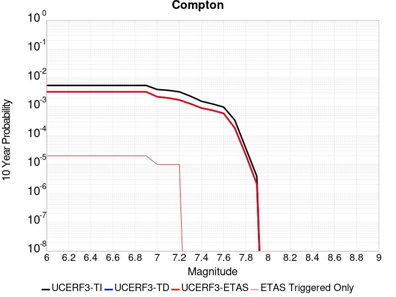 |

| Magnitude | 1 wk TI Prob | 1 wk TD Prob | 1 wk ETAS Prob | 1 wk ETAS/TD Gain | 1 wk ETAS Triggered Only | 1 mo TI Prob | 1 mo TD Prob | 1 mo ETAS Prob | 1 mo ETAS/TD Gain | 1 mo ETAS Triggered Only | 1 yr TI Prob | 1 yr TD Prob | 1 yr ETAS Prob | 1 yr ETAS/TD Gain | 1 yr ETAS Triggered Only | 10 yr TI Prob | 10 yr TD Prob | 10 yr ETAS Prob | 10 yr ETAS/TD Gain | 10 yr ETAS Triggered Only |
|-----|-----|-----|-----|-----|-----|-----|-----|-----|-----|-----|-----|-----|-----|-----|-----|-----|-----|-----|-----|-----|
| 6.0 | 1.06050875E-5 | 6.3589177E-6 | 6.3589177E-6 | 1.0 | 0.0 | 4.5449582E-5 | 2.7252236E-5 | 2.7252236E-5 | 1.0 | 0.0 | 5.5320817E-4 | 3.317483E-4 | 3.5174168E-4 | 1.0602666 | 2.0E-5 | 0.0055183303 | 0.0033128145 | 0.0033327483 | 1.0060172 | 2.0E-5 |
| 6.1 | 1.06050875E-5 | 6.3589177E-6 | 6.3589177E-6 | 1.0 | 0.0 | 4.5449582E-5 | 2.7252236E-5 | 2.7252236E-5 | 1.0 | 0.0 | 5.5320817E-4 | 3.317483E-4 | 3.5174168E-4 | 1.0602666 | 2.0E-5 | 0.0055183303 | 0.0033128145 | 0.0033327483 | 1.0060172 | 2.0E-5 |
| 6.2 | 1.06050875E-5 | 6.3589177E-6 | 6.3589177E-6 | 1.0 | 0.0 | 4.5449582E-5 | 2.7252236E-5 | 2.7252236E-5 | 1.0 | 0.0 | 5.5320817E-4 | 3.317483E-4 | 3.5174168E-4 | 1.0602666 | 2.0E-5 | 0.0055183303 | 0.0033128145 | 0.0033327483 | 1.0060172 | 2.0E-5 |
| 6.3 | 1.06050875E-5 | 6.3589177E-6 | 6.3589177E-6 | 1.0 | 0.0 | 4.5449582E-5 | 2.7252236E-5 | 2.7252236E-5 | 1.0 | 0.0 | 5.5320817E-4 | 3.317483E-4 | 3.5174168E-4 | 1.0602666 | 2.0E-5 | 0.0055183303 | 0.0033128145 | 0.0033327483 | 1.0060172 | 2.0E-5 |
| 6.4 | 1.06050875E-5 | 6.3589177E-6 | 6.3589177E-6 | 1.0 | 0.0 | 4.5449582E-5 | 2.7252236E-5 | 2.7252236E-5 | 1.0 | 0.0 | 5.5320817E-4 | 3.317483E-4 | 3.5174168E-4 | 1.0602666 | 2.0E-5 | 0.0055183303 | 0.0033128145 | 0.0033327483 | 1.0060172 | 2.0E-5 |
| 6.5 | 1.06050875E-5 | 6.3589177E-6 | 6.3589177E-6 | 1.0 | 0.0 | 4.5449582E-5 | 2.7252236E-5 | 2.7252236E-5 | 1.0 | 0.0 | 5.5320817E-4 | 3.317483E-4 | 3.5174168E-4 | 1.0602666 | 2.0E-5 | 0.0055183303 | 0.0033128145 | 0.0033327483 | 1.0060172 | 2.0E-5 |
| 6.6 | 1.06050875E-5 | 6.3589177E-6 | 6.3589177E-6 | 1.0 | 0.0 | 4.5449582E-5 | 2.7252236E-5 | 2.7252236E-5 | 1.0 | 0.0 | 5.5320817E-4 | 3.317483E-4 | 3.5174168E-4 | 1.0602666 | 2.0E-5 | 0.0055183303 | 0.0033128145 | 0.0033327483 | 1.0060172 | 2.0E-5 |
| 6.7 | 1.06050875E-5 | 6.3589177E-6 | 6.3589177E-6 | 1.0 | 0.0 | 4.5449582E-5 | 2.7252236E-5 | 2.7252236E-5 | 1.0 | 0.0 | 5.5320817E-4 | 3.317483E-4 | 3.5174168E-4 | 1.0602666 | 2.0E-5 | 0.0055183303 | 0.0033128145 | 0.0033327483 | 1.0060172 | 2.0E-5 |
| 6.8 | 1.06050875E-5 | 6.3589177E-6 | 6.3589177E-6 | 1.0 | 0.0 | 4.5449582E-5 | 2.7252236E-5 | 2.7252236E-5 | 1.0 | 0.0 | 5.5320817E-4 | 3.317483E-4 | 3.5174168E-4 | 1.0602666 | 2.0E-5 | 0.0055183303 | 0.0033128145 | 0.0033327483 | 1.0060172 | 2.0E-5 |
| 6.9 | 1.06050875E-5 | 6.3589177E-6 | 6.3589177E-6 | 1.0 | 0.0 | 4.5449582E-5 | 2.7252236E-5 | 2.7252236E-5 | 1.0 | 0.0 | 5.5320817E-4 | 3.317483E-4 | 3.5174168E-4 | 1.0602666 | 2.0E-5 | 0.0055183303 | 0.0033128145 | 0.0033327483 | 1.0060172 | 2.0E-5 |
| 7.0 | 7.672486E-6 | 4.2722277E-6 | 4.2722277E-6 | 1.0 | 0.0 | 3.288167E-5 | 1.8309422E-5 | 1.8309422E-5 | 1.0 | 0.0 | 4.0026082E-4 | 2.2289503E-4 | 2.328928E-4 | 1.0448542 | 1.0E-5 | 0.0039954064 | 0.002226777 | 0.0022367546 | 1.0044808 | 1.0E-5 |
| 7.1 | 7.163992E-6 | 3.883928E-6 | 3.883928E-6 | 1.0 | 0.0 | 3.0702464E-5 | 1.6645303E-5 | 1.6645303E-5 | 1.0 | 0.0 | 3.7373835E-4 | 2.0263829E-4 | 2.1263627E-4 | 1.049339 | 1.0E-5 | 0.0037311043 | 0.0020245921 | 0.002034572 | 1.0049293 | 1.0E-5 |
| 7.2 | 6.3689185E-6 | 3.3103827E-6 | 3.3103827E-6 | 1.0 | 0.0 | 2.729508E-5 | 1.4187279E-5 | 1.4187279E-5 | 1.0 | 0.0 | 3.322669E-4 | 1.7271686E-4 | 1.8271513E-4 | 1.0578883 | 1.0E-5 | 0.0033177056 | 0.001725868 | 0.0017358507 | 1.0057842 | 1.0E-5 |
| 7.3 | 4.4987873E-6 | 2.4481853E-6 | 2.4481853E-6 | 1.0 | 0.0 | 1.9280375E-5 | 1.0492182E-5 | 1.0492182E-5 | 1.0 | 0.0 | 2.3471327E-4 | 1.2773514E-4 | 1.2773514E-4 | 1.0 | 0.0 | 0.002344655 | 0.0012766473 | 0.0012766473 | 1.0 | 0.0 |
| 7.4 | 2.987296E-6 | 1.739488E-6 | 1.739488E-6 | 1.0 | 0.0 | 1.2802635E-5 | 7.4549275E-6 | 7.4549275E-6 | 1.0 | 0.0 | 1.5586092E-4 | 9.076002E-5 | 9.076002E-5 | 1.0 | 0.0 | 0.0015575165 | 9.072353E-4 | 9.072353E-4 | 1.0 | 0.0 |
| 7.5 | 2.4111696E-6 | 1.447256E-6 | 1.447256E-6 | 1.0 | 0.0 | 1.0333543E-5 | 6.202511E-6 | 6.202511E-6 | 1.0 | 0.0 | 1.2580362E-4 | 7.5513E-5 | 7.5513E-5 | 1.0 | 0.0 | 0.0012573242 | 7.548781E-4 | 7.548781E-4 | 1.0 | 0.0 |
| 7.6 | 1.8783096E-6 | 1.1360769E-6 | 1.1360769E-6 | 1.0 | 0.0 | 8.049874E-6 | 4.868892E-6 | 4.868892E-6 | 1.0 | 0.0 | 9.8002805E-5 | 5.9277187E-5 | 5.9277187E-5 | 1.0 | 0.0 | 9.795959E-4 | 5.926177E-4 | 5.926177E-4 | 1.0 | 0.0 |
| 7.7 | 6.6646817E-7 | 3.5603387E-7 | 3.5603387E-7 | 1.0 | 0.0 | 2.856289E-6 | 1.5258586E-6 | 1.5258586E-6 | 1.0 | 0.0 | 3.4774763E-5 | 1.8577184E-5 | 1.8577184E-5 | 1.0 | 0.0 | 3.4769322E-4 | 1.8575766E-4 | 1.8575766E-4 | 1.0 | 0.0 |
| 7.8 | 7.054689E-8 | 4.134483E-8 | 4.134483E-8 | 1.0 | 0.0 | 3.0234378E-7 | 1.771921E-7 | 1.771921E-7 | 1.0 | 0.0 | 3.6810293E-6 | 2.1573119E-6 | 2.1573119E-6 | 1.0 | 0.0 | 3.6809684E-5 | 2.157292E-5 | 2.157292E-5 | 1.0 | 0.0 |
| 7.9 | 7.420925E-9 | 4.0133825E-9 | 4.0133825E-9 | 1.0 | 0.0 | 3.1803964E-8 | 1.720021E-8 | 1.720021E-8 | 1.0 | 0.0 | 3.872132E-7 | 2.0941253E-7 | 2.0941253E-7 | 1.0 | 0.0 | 3.872125E-6 | 2.0941236E-6 | 2.0941236E-6 | 1.0 | 0.0 |

## Johnson Valley (No) 2011 rev
*[(top)](#table-of-contents)*

| 1 Week | 1 Month | 1 Year | 10 Year |
|-----|-----|-----|-----|
|  |  |  |  |

| Magnitude | 1 wk TI Prob | 1 wk TD Prob | 1 wk ETAS Prob | 1 wk ETAS/TD Gain | 1 wk ETAS Triggered Only | 1 mo TI Prob | 1 mo TD Prob | 1 mo ETAS Prob | 1 mo ETAS/TD Gain | 1 mo ETAS Triggered Only | 1 yr TI Prob | 1 yr TD Prob | 1 yr ETAS Prob | 1 yr ETAS/TD Gain | 1 yr ETAS Triggered Only | 10 yr TI Prob | 10 yr TD Prob | 10 yr ETAS Prob | 10 yr ETAS/TD Gain | 10 yr ETAS Triggered Only |
|-----|-----|-----|-----|-----|-----|-----|-----|-----|-----|-----|-----|-----|-----|-----|-----|-----|-----|-----|-----|-----|
| 6.0 | 2.577707E-5 | 1.2901362E-5 | 1.2901362E-5 | 1.0 | 0.0 | 1.1046848E-4 | 5.5290606E-5 | 5.5290606E-5 | 1.0 | 0.0 | 0.0013441239 | 6.729949E-4 | 6.729949E-4 | 1.0 | 0.0 | 0.013360229 | 0.0067134774 | 0.006733343 | 1.0029591 | 2.0E-5 |
| 6.1 | 2.577707E-5 | 1.2901362E-5 | 1.2901362E-5 | 1.0 | 0.0 | 1.1046848E-4 | 5.5290606E-5 | 5.5290606E-5 | 1.0 | 0.0 | 0.0013441239 | 6.729949E-4 | 6.729949E-4 | 1.0 | 0.0 | 0.013360229 | 0.0067134774 | 0.006733343 | 1.0029591 | 2.0E-5 |
| 6.2 | 2.577707E-5 | 1.2901362E-5 | 1.2901362E-5 | 1.0 | 0.0 | 1.1046848E-4 | 5.5290606E-5 | 5.5290606E-5 | 1.0 | 0.0 | 0.0013441239 | 6.729949E-4 | 6.729949E-4 | 1.0 | 0.0 | 0.013360229 | 0.0067134774 | 0.006733343 | 1.0029591 | 2.0E-5 |
| 6.3 | 2.577707E-5 | 1.2901362E-5 | 1.2901362E-5 | 1.0 | 0.0 | 1.1046848E-4 | 5.5290606E-5 | 5.5290606E-5 | 1.0 | 0.0 | 0.0013441239 | 6.729949E-4 | 6.729949E-4 | 1.0 | 0.0 | 0.013360229 | 0.0067134774 | 0.006733343 | 1.0029591 | 2.0E-5 |
| 6.4 | 1.5296591E-5 | 7.537011E-6 | 7.537011E-6 | 1.0 | 0.0 | 6.555518E-5 | 3.230118E-5 | 3.230118E-5 | 1.0 | 0.0 | 7.97842E-4 | 3.9321466E-4 | 3.9321466E-4 | 1.0 | 0.0 | 0.007949836 | 0.0039270306 | 0.003936991 | 1.0025364 | 1.0E-5 |
| 6.5 | 1.5296591E-5 | 7.537011E-6 | 7.537011E-6 | 1.0 | 0.0 | 6.555518E-5 | 3.230118E-5 | 3.230118E-5 | 1.0 | 0.0 | 7.97842E-4 | 3.9321466E-4 | 3.9321466E-4 | 1.0 | 0.0 | 0.007949836 | 0.0039270306 | 0.003936991 | 1.0025364 | 1.0E-5 |
| 6.6 | 1.3289383E-5 | 5.9919566E-6 | 5.9919566E-6 | 1.0 | 0.0 | 5.6953253E-5 | 2.5679657E-5 | 2.5679657E-5 | 1.0 | 0.0 | 6.9318525E-4 | 3.1262194E-4 | 3.1262194E-4 | 1.0 | 0.0 | 0.0069102696 | 0.003123486 | 0.0031334548 | 1.0031916 | 1.0E-5 |
| 6.7 | 1.3289383E-5 | 5.9919566E-6 | 5.9919566E-6 | 1.0 | 0.0 | 5.6953253E-5 | 2.5679657E-5 | 2.5679657E-5 | 1.0 | 0.0 | 6.9318525E-4 | 3.1262194E-4 | 3.1262194E-4 | 1.0 | 0.0 | 0.0069102696 | 0.003123486 | 0.0031334548 | 1.0031916 | 1.0E-5 |
| 6.8 | 8.330789E-6 | 2.9213259E-6 | 2.9213259E-6 | 1.0 | 0.0 | 3.570289E-5 | 1.251994E-5 | 1.251994E-5 | 1.0 | 0.0 | 4.34596E-4 | 1.5242532E-4 | 1.5242532E-4 | 1.0 | 0.0 | 0.0043374705 | 0.0015237676 | 0.0015337524 | 1.0065527 | 1.0E-5 |
| 6.9 | 7.2359003E-6 | 2.3014468E-6 | 2.3014468E-6 | 1.0 | 0.0 | 3.1010633E-5 | 9.863336E-6 | 9.863336E-6 | 1.0 | 0.0 | 3.7748902E-4 | 1.20084835E-4 | 1.20084835E-4 | 1.0 | 0.0 | 0.0037684843 | 0.0012007224 | 0.0012107104 | 1.0083183 | 1.0E-5 |
| 7.0 | 6.5149957E-6 | 2.0885946E-6 | 2.0885946E-6 | 1.0 | 0.0 | 2.792111E-5 | 8.951119E-6 | 8.951119E-6 | 1.0 | 0.0 | 3.398865E-4 | 1.08979715E-4 | 1.08979715E-4 | 1.0 | 0.0 | 0.003393671 | 0.0010897826 | 0.0010997717 | 1.0091661 | 1.0E-5 |
| 7.1 | 1.1662233E-6 | 2.8805689E-8 | 2.8805689E-8 | 1.0 | 0.0 | 4.9980904E-6 | 1.2345295E-7 | 1.2345295E-7 | 1.0 | 0.0 | 6.0850052E-5 | 1.5030388E-6 | 1.5030388E-6 | 1.0 | 0.0 | 6.083339E-4 | 1.5030302E-5 | 1.5030302E-5 | 1.0 | 0.0 |
| 7.2 | 5.413881E-7 | 2.8805689E-8 | 2.8805689E-8 | 1.0 | 0.0 | 2.3202326E-6 | 1.2345295E-7 | 1.2345295E-7 | 1.0 | 0.0 | 2.8248465E-5 | 1.5030388E-6 | 1.5030388E-6 | 1.0 | 0.0 | 2.8244875E-4 | 1.5030302E-5 | 1.5030302E-5 | 1.0 | 0.0 |
| 7.3 | 5.076821E-7 | 2.8805689E-8 | 2.8805689E-8 | 1.0 | 0.0 | 2.1757785E-6 | 1.2345295E-7 | 1.2345295E-7 | 1.0 | 0.0 | 2.648978E-5 | 1.5030388E-6 | 1.5030388E-6 | 1.0 | 0.0 | 2.6486625E-4 | 1.5030302E-5 | 1.5030302E-5 | 1.0 | 0.0 |
| 7.4 | 4.7568687E-7 | 2.8787607E-8 | 2.8787607E-8 | 1.0 | 0.0 | 2.0386565E-6 | 1.2337546E-7 | 1.2337546E-7 | 1.0 | 0.0 | 2.482036E-5 | 1.5020953E-6 | 1.5020953E-6 | 1.0 | 0.0 | 2.4817587E-4 | 1.5020867E-5 | 1.5020867E-5 | 1.0 | 0.0 |
| 7.5 | 3.435626E-7 | 2.5360762E-8 | 2.5360762E-8 | 1.0 | 0.0 | 1.4724103E-6 | 1.0868898E-7 | 1.0868898E-7 | 1.0 | 0.0 | 1.7926448E-5 | 1.3232876E-6 | 1.3232876E-6 | 1.0 | 0.0 | 1.7925001E-4 | 1.3232814E-5 | 1.3232814E-5 | 1.0 | 0.0 |

## Elsinore (Stepovers Combined)
*[(top)](#table-of-contents)*

| 1 Week | 1 Month | 1 Year | 10 Year |
|-----|-----|-----|-----|
|  |  |  |  |

| Magnitude | 1 wk TI Prob | 1 wk TD Prob | 1 wk ETAS Prob | 1 wk ETAS/TD Gain | 1 wk ETAS Triggered Only | 1 mo TI Prob | 1 mo TD Prob | 1 mo ETAS Prob | 1 mo ETAS/TD Gain | 1 mo ETAS Triggered Only | 1 yr TI Prob | 1 yr TD Prob | 1 yr ETAS Prob | 1 yr ETAS/TD Gain | 1 yr ETAS Triggered Only | 10 yr TI Prob | 10 yr TD Prob | 10 yr ETAS Prob | 10 yr ETAS/TD Gain | 10 yr ETAS Triggered Only |
|-----|-----|-----|-----|-----|-----|-----|-----|-----|-----|-----|-----|-----|-----|-----|-----|-----|-----|-----|-----|-----|
| 6.0 | 2.144392E-5 | 1.9761854E-5 | 1.9761854E-5 | 1.0 | 0.0 | 9.189928E-5 | 8.469103E-5 | 8.469103E-5 | 1.0 | 0.0 | 0.0011182994 | 0.0010306472 | 0.0010406369 | 1.0096927 | 1.0E-5 | 0.011126885 | 0.010265769 | 0.010285565 | 1.0019282 | 2.0E-5 |
| 6.1 | 2.144392E-5 | 1.9761854E-5 | 1.9761854E-5 | 1.0 | 0.0 | 9.189928E-5 | 8.469103E-5 | 8.469103E-5 | 1.0 | 0.0 | 0.0011182994 | 0.0010306472 | 0.0010406369 | 1.0096927 | 1.0E-5 | 0.011126885 | 0.010265769 | 0.010285565 | 1.0019282 | 2.0E-5 |
| 6.2 | 2.144392E-5 | 1.9761854E-5 | 1.9761854E-5 | 1.0 | 0.0 | 9.189928E-5 | 8.469103E-5 | 8.469103E-5 | 1.0 | 0.0 | 0.0011182994 | 0.0010306472 | 0.0010406369 | 1.0096927 | 1.0E-5 | 0.011126885 | 0.010265769 | 0.010285565 | 1.0019282 | 2.0E-5 |
| 6.3 | 1.9751555E-5 | 1.774301E-5 | 1.774301E-5 | 1.0 | 0.0 | 8.4646774E-5 | 7.6039345E-5 | 7.6039345E-5 | 1.0 | 0.0 | 0.0010300872 | 9.2540245E-4 | 9.353932E-4 | 1.0107961 | 1.0E-5 | 0.010253254 | 0.009222076 | 0.009241892 | 1.0021487 | 2.0E-5 |
| 6.4 | 1.9751555E-5 | 1.774301E-5 | 1.774301E-5 | 1.0 | 0.0 | 8.4646774E-5 | 7.6039345E-5 | 7.6039345E-5 | 1.0 | 0.0 | 0.0010300872 | 9.2540245E-4 | 9.353932E-4 | 1.0107961 | 1.0E-5 | 0.010253254 | 0.009222076 | 0.009241892 | 1.0021487 | 2.0E-5 |
| 6.5 | 1.9751555E-5 | 1.774301E-5 | 1.774301E-5 | 1.0 | 0.0 | 8.4646774E-5 | 7.6039345E-5 | 7.6039345E-5 | 1.0 | 0.0 | 0.0010300872 | 9.2540245E-4 | 9.353932E-4 | 1.0107961 | 1.0E-5 | 0.010253254 | 0.009222076 | 0.009241892 | 1.0021487 | 2.0E-5 |
| 6.6 | 1.9188685E-5 | 1.7004888E-5 | 1.7004888E-5 | 1.0 | 0.0 | 8.2234634E-5 | 7.287615E-5 | 7.287615E-5 | 1.0 | 0.0 | 0.0010007467 | 8.869221E-4 | 8.9691323E-4 | 1.0112649 | 1.0E-5 | 0.00996252 | 0.008840618 | 0.008860441 | 1.0022423 | 2.0E-5 |
| 6.7 | 1.7608272E-5 | 1.47339215E-5 | 1.47339215E-5 | 1.0 | 0.0 | 7.546184E-5 | 6.31439E-5 | 6.31439E-5 | 1.0 | 0.0 | 9.183606E-4 | 7.6851563E-4 | 7.7850797E-4 | 1.013002 | 1.0E-5 | 0.009145746 | 0.0076655857 | 0.007685432 | 1.0025891 | 2.0E-5 |
| 6.8 | 1.697165E-5 | 1.378458E-5 | 1.378458E-5 | 1.0 | 0.0 | 7.273361E-5 | 5.9075483E-5 | 5.9075483E-5 | 1.0 | 0.0 | 8.8517193E-4 | 7.190153E-4 | 7.290081E-4 | 1.0138979 | 1.0E-5 | 0.008816543 | 0.007173305 | 0.007193161 | 1.0027682 | 2.0E-5 |
| 6.9 | 1.600365E-5 | 1.2847845E-5 | 1.2847845E-5 | 1.0 | 0.0 | 6.858527E-5 | 5.5061075E-5 | 5.5061075E-5 | 1.0 | 0.0 | 8.347058E-4 | 6.701702E-4 | 6.8016344E-4 | 1.0149115 | 1.0E-5 | 0.008315775 | 0.006687375 | 0.006707241 | 1.0029707 | 2.0E-5 |
| 7.0 | 1.3314581E-5 | 1.04485725E-5 | 1.04485725E-5 | 1.0 | 0.0 | 5.7061243E-5 | 4.4778844E-5 | 4.4778844E-5 | 1.0 | 0.0 | 6.944992E-4 | 5.4504874E-4 | 5.550433E-4 | 1.018337 | 1.0E-5 | 0.006923327 | 0.005441047 | 0.005460938 | 1.0036558 | 2.0E-5 |
| 7.1 | 1.2865345E-5 | 9.93842E-6 | 9.93842E-6 | 1.0 | 0.0 | 5.5136024E-5 | 4.2592546E-5 | 4.2592546E-5 | 1.0 | 0.0 | 6.710743E-4 | 5.184434E-4 | 5.284382E-4 | 1.0192785 | 1.0E-5 | 0.0066905143 | 0.005175672 | 0.0051955683 | 1.0038443 | 2.0E-5 |
| 7.2 | 1.1650051E-5 | 8.6345535E-6 | 8.6345535E-6 | 1.0 | 0.0 | 4.9927836E-5 | 3.7004713E-5 | 3.7004713E-5 | 1.0 | 0.0 | 6.0770183E-4 | 4.50441E-4 | 4.50441E-4 | 1.0 | 0.0 | 0.0060604266 | 0.004496704 | 0.0045066588 | 1.0022138 | 1.0E-5 |
| 7.3 | 1.0008533E-5 | 7.2016487E-6 | 7.2016487E-6 | 1.0 | 0.0 | 4.2893007E-5 | 3.0863852E-5 | 3.0863852E-5 | 1.0 | 0.0 | 5.220972E-4 | 3.7570405E-4 | 3.7570405E-4 | 1.0 | 0.0 | 0.005208723 | 0.003751076 | 0.0037610386 | 1.0026559 | 1.0E-5 |
| 7.4 | 9.116759E-6 | 6.410596E-6 | 6.410596E-6 | 1.0 | 0.0 | 3.907124E-5 | 2.7473703E-5 | 2.7473703E-5 | 1.0 | 0.0 | 4.7558855E-4 | 3.3444236E-4 | 3.3444236E-4 | 1.0 | 0.0 | 0.00474572 | 0.0033395425 | 0.003349509 | 1.0029844 | 1.0E-5 |
| 7.5 | 7.870524E-6 | 5.382974E-6 | 5.382974E-6 | 1.0 | 0.0 | 3.3730383E-5 | 2.3069691E-5 | 2.3069691E-5 | 1.0 | 0.0 | 4.1059E-4 | 2.8083858E-4 | 2.8083858E-4 | 1.0 | 0.0 | 0.0040983222 | 0.0028049632 | 0.0028149353 | 1.003555 | 1.0E-5 |
| 7.6 | 6.9774537E-6 | 4.677993E-6 | 4.677993E-6 | 1.0 | 0.0 | 2.990303E-5 | 2.0048392E-5 | 2.0048392E-5 | 1.0 | 0.0 | 3.640086E-4 | 2.44063E-4 | 2.44063E-4 | 1.0 | 0.0 | 0.003634129 | 0.0024380658 | 0.0024480415 | 1.0040916 | 1.0E-5 |
| 7.7 | 4.1616954E-6 | 2.3285668E-6 | 2.3285668E-6 | 1.0 | 0.0 | 1.7835715E-5 | 9.979538E-6 | 9.979538E-6 | 1.0 | 0.0 | 2.171282E-4 | 1.2149484E-4 | 1.2149484E-4 | 1.0 | 0.0 | 0.0021691616 | 0.0012143572 | 0.0012143572 | 1.0 | 0.0 |
| 7.8 | 2.2692414E-7 | 9.386416E-8 | 9.386416E-8 | 1.0 | 0.0 | 9.725317E-7 | 4.0227494E-7 | 4.0227494E-7 | 1.0 | 0.0 | 1.1840509E-5 | 4.8976895E-6 | 4.8976895E-6 | 1.0 | 0.0 | 1.1839878E-4 | 4.8976144E-5 | 4.8976144E-5 | 1.0 | 0.0 |
| 7.9 | 6.676829E-9 | 3.440101E-9 | 3.440101E-9 | 1.0 | 0.0 | 2.861498E-8 | 1.4743291E-8 | 1.4743291E-8 | 1.0 | 0.0 | 3.4838732E-7 | 1.7949955E-7 | 1.7949955E-7 | 1.0 | 0.0 | 3.4838679E-6 | 1.7949943E-6 | 1.7949943E-6 | 1.0 | 0.0 |

## Point Reyes 2011 CFM
*[(top)](#table-of-contents)*

| 1 Week | 1 Month | 1 Year | 10 Year |
|-----|-----|-----|-----|
|  |  |  |  |

| Magnitude | 1 wk TI Prob | 1 wk TD Prob | 1 wk ETAS Prob | 1 wk ETAS/TD Gain | 1 wk ETAS Triggered Only | 1 mo TI Prob | 1 mo TD Prob | 1 mo ETAS Prob | 1 mo ETAS/TD Gain | 1 mo ETAS Triggered Only | 1 yr TI Prob | 1 yr TD Prob | 1 yr ETAS Prob | 1 yr ETAS/TD Gain | 1 yr ETAS Triggered Only | 10 yr TI Prob | 10 yr TD Prob | 10 yr ETAS Prob | 10 yr ETAS/TD Gain | 10 yr ETAS Triggered Only |
|-----|-----|-----|-----|-----|-----|-----|-----|-----|-----|-----|-----|-----|-----|-----|-----|-----|-----|-----|-----|-----|
| 6.0 | 8.8644965E-6 | 8.967239E-6 | 8.967239E-6 | 1.0 | 0.0 | 3.7990147E-5 | 3.8430495E-5 | 3.8430495E-5 | 1.0 | 0.0 | 4.624319E-4 | 4.6779713E-4 | 4.6779713E-4 | 1.0 | 0.0 | 0.0046147075 | 0.0046687527 | 0.004688659 | 1.0042638 | 2.0E-5 |
| 6.1 | 4.526405E-6 | 4.5392703E-6 | 4.5392703E-6 | 1.0 | 0.0 | 1.9398734E-5 | 1.9453877E-5 | 1.9453877E-5 | 1.0 | 0.0 | 2.36154E-4 | 2.3682625E-4 | 2.3682625E-4 | 1.0 | 0.0 | 0.002359032 | 0.0023658448 | 0.0023857974 | 1.0084336 | 2.0E-5 |
| 6.2 | 4.526405E-6 | 4.5392703E-6 | 4.5392703E-6 | 1.0 | 0.0 | 1.9398734E-5 | 1.9453877E-5 | 1.9453877E-5 | 1.0 | 0.0 | 2.36154E-4 | 2.3682625E-4 | 2.3682625E-4 | 1.0 | 0.0 | 0.002359032 | 0.0023658448 | 0.0023857974 | 1.0084336 | 2.0E-5 |
| 6.3 | 2.6842322E-6 | 2.660718E-6 | 2.660718E-6 | 1.0 | 0.0 | 1.1503801E-5 | 1.1403029E-5 | 1.1403029E-5 | 1.0 | 0.0 | 1.4004979E-4 | 1.3882323E-4 | 1.3882323E-4 | 1.0 | 0.0 | 0.0013996155 | 0.0013873869 | 0.001397373 | 1.0071977 | 1.0E-5 |
| 6.4 | 2.6842322E-6 | 2.660718E-6 | 2.660718E-6 | 1.0 | 0.0 | 1.1503801E-5 | 1.1403029E-5 | 1.1403029E-5 | 1.0 | 0.0 | 1.4004979E-4 | 1.3882323E-4 | 1.3882323E-4 | 1.0 | 0.0 | 0.0013996155 | 0.0013873869 | 0.001397373 | 1.0071977 | 1.0E-5 |
| 6.5 | 1.9281833E-6 | 1.8906646E-6 | 1.8906646E-6 | 1.0 | 0.0 | 8.263617E-6 | 8.102824E-6 | 8.102824E-6 | 1.0 | 0.0 | 1.0060489E-4 | 9.86475E-5 | 9.86475E-5 | 1.0 | 0.0 | 0.0010055936 | 9.860479E-4 | 9.96038E-4 | 1.0101315 | 1.0E-5 |
| 6.6 | 1.4726726E-6 | 1.4269938E-6 | 1.4269938E-6 | 1.0 | 0.0 | 6.3114385E-6 | 6.115674E-6 | 6.115674E-6 | 1.0 | 0.0 | 7.683905E-5 | 7.4455835E-5 | 7.4455835E-5 | 1.0 | 0.0 | 7.6812494E-4 | 7.44316E-4 | 7.5430854E-4 | 1.0134251 | 1.0E-5 |
| 6.7 | 8.572307E-7 | 8.007544E-7 | 8.007544E-7 | 1.0 | 0.0 | 3.6738406E-6 | 3.4318E-6 | 3.4318E-6 | 1.0 | 0.0 | 4.472809E-5 | 4.1781383E-5 | 4.1781383E-5 | 1.0 | 0.0 | 4.471909E-4 | 4.1773918E-4 | 4.1773918E-4 | 1.0 | 0.0 |
| 6.8 | 6.6745434E-7 | 6.077623E-7 | 6.077623E-7 | 1.0 | 0.0 | 2.8605155E-6 | 2.604693E-6 | 2.604693E-6 | 1.0 | 0.0 | 3.482622E-5 | 3.1711686E-5 | 3.1711686E-5 | 1.0 | 0.0 | 3.4820763E-4 | 3.170749E-4 | 3.170749E-4 | 1.0 | 0.0 |
| 6.9 | 4.291521E-7 | 3.653906E-7 | 3.653906E-7 | 1.0 | 0.0 | 1.839222E-6 | 1.5659588E-6 | 1.5659588E-6 | 1.0 | 0.0 | 2.2392298E-5 | 1.9065385E-5 | 1.9065385E-5 | 1.0 | 0.0 | 2.2390042E-4 | 1.9064014E-4 | 1.9064014E-4 | 1.0 | 0.0 |
| 7.0 | 2.6812808E-7 | 2.0190463E-7 | 2.0190463E-7 | 1.0 | 0.0 | 1.1491198E-6 | 8.6530525E-7 | 8.6530525E-7 | 1.0 | 0.0 | 1.3990444E-5 | 1.0535041E-5 | 1.0535041E-5 | 1.0 | 0.0 | 1.3989564E-4 | 1.0534777E-4 | 1.0534777E-4 | 1.0 | 0.0 |
| 7.1 | 1.9451231E-7 | 1.272851E-7 | 1.272851E-7 | 1.0 | 0.0 | 8.336239E-7 | 5.455075E-7 | 5.455075E-7 | 1.0 | 0.0 | 1.0149324E-5 | 6.6415328E-6 | 6.6415328E-6 | 1.0 | 0.0 | 1.014886E-4 | 6.6415625E-5 | 6.6415625E-5 | 1.0 | 0.0 |
| 7.2 | 1.6715143E-7 | 1.0045806E-7 | 1.0045806E-7 | 1.0 | 0.0 | 7.1636305E-7 | 4.3053447E-7 | 4.3053447E-7 | 1.0 | 0.0 | 8.721685E-6 | 5.2417445E-6 | 5.2417445E-6 | 1.0 | 0.0 | 8.721343E-5 | 5.241848E-5 | 5.241848E-5 | 1.0 | 0.0 |
| 7.3 | 1.5503173E-7 | 9.016024E-8 | 9.016024E-8 | 1.0 | 0.0 | 6.644215E-7 | 3.86401E-7 | 3.86401E-7 | 1.0 | 0.0 | 8.089301E-6 | 4.704422E-6 | 4.704422E-6 | 1.0 | 0.0 | 8.089007E-5 | 4.7045494E-5 | 4.7045494E-5 | 1.0 | 0.0 |
| 7.4 | 1.4251614E-7 | 8.100467E-8 | 8.100467E-8 | 1.0 | 0.0 | 6.1078333E-7 | 3.4716285E-7 | 3.4716285E-7 | 1.0 | 0.0 | 7.4362615E-6 | 4.2266993E-6 | 4.2266993E-6 | 1.0 | 0.0 | 7.436013E-5 | 4.226846E-5 | 4.226846E-5 | 1.0 | 0.0 |
| 7.5 | 1.2710186E-7 | 7.032371E-8 | 7.032371E-8 | 1.0 | 0.0 | 5.447221E-7 | 3.013873E-7 | 3.013873E-7 | 1.0 | 0.0 | 6.6319717E-6 | 3.6693843E-6 | 3.6693843E-6 | 1.0 | 0.0 | 6.6317734E-5 | 3.6695506E-5 | 3.6695506E-5 | 1.0 | 0.0 |
| 7.6 | 1.0144708E-7 | 5.497725E-8 | 5.497725E-8 | 1.0 | 0.0 | 4.347731E-7 | 2.356168E-7 | 2.356168E-7 | 1.0 | 0.0 | 5.2933497E-6 | 2.8686306E-6 | 2.8686306E-6 | 1.0 | 0.0 | 5.293224E-5 | 2.8688208E-5 | 2.8688208E-5 | 1.0 | 0.0 |
| 7.7 | 7.090527E-8 | 3.9843968E-8 | 3.9843968E-8 | 1.0 | 0.0 | 3.038797E-7 | 1.7075988E-7 | 1.7075988E-7 | 1.0 | 0.0 | 3.699729E-6 | 2.0789994E-6 | 2.0789994E-6 | 1.0 | 0.0 | 3.6996673E-5 | 2.0792071E-5 | 2.0792071E-5 | 1.0 | 0.0 |
| 7.8 | 3.8712045E-8 | 2.745785E-8 | 2.745785E-8 | 1.0 | 0.0 | 1.6590876E-7 | 1.1767651E-7 | 1.1767651E-7 | 1.0 | 0.0 | 2.0199373E-6 | 1.4327105E-6 | 1.4327105E-6 | 1.0 | 0.0 | 2.0199188E-5 | 1.4329284E-5 | 1.4329284E-5 | 1.0 | 0.0 |
| 7.9 | 1.7068782E-8 | 1.1848058E-8 | 1.1848058E-8 | 1.0 | 0.0 | 7.315192E-8 | 5.0777395E-8 | 5.0777395E-8 | 1.0 | 0.0 | 8.906242E-7 | 6.1821464E-7 | 6.1821464E-7 | 1.0 | 0.0 | 8.906207E-6 | 6.1844003E-6 | 6.1844003E-6 | 1.0 | 0.0 |
| 8.0 | 1.0172592E-8 | 7.040441E-9 | 7.040441E-9 | 1.0 | 0.0 | 4.359682E-8 | 3.017332E-8 | 3.017332E-8 | 1.0 | 0.0 | 5.3079117E-7 | 3.6736014E-7 | 3.6736014E-7 | 1.0 | 0.0 | 5.307899E-6 | 3.6758663E-6 | 3.6758663E-6 | 1.0 | 0.0 |
| 8.1 | 3.7861243E-9 | 3.5512078E-9 | 3.5512078E-9 | 1.0 | 0.0 | 1.6226247E-8 | 1.5219467E-8 | 1.5219467E-8 | 1.0 | 0.0 | 1.9755454E-7 | 1.85297E-7 | 1.85297E-7 | 1.0 | 0.0 | 1.9755437E-6 | 1.8549678E-6 | 1.8549678E-6 | 1.0 | 0.0 |

## Hayward (No) 2011 CFM
*[(top)](#table-of-contents)*

| 1 Week | 1 Month | 1 Year | 10 Year |
|-----|-----|-----|-----|
|  |  |  |  |

| Magnitude | 1 wk TI Prob | 1 wk TD Prob | 1 wk ETAS Prob | 1 wk ETAS/TD Gain | 1 wk ETAS Triggered Only | 1 mo TI Prob | 1 mo TD Prob | 1 mo ETAS Prob | 1 mo ETAS/TD Gain | 1 mo ETAS Triggered Only | 1 yr TI Prob | 1 yr TD Prob | 1 yr ETAS Prob | 1 yr ETAS/TD Gain | 1 yr ETAS Triggered Only | 10 yr TI Prob | 10 yr TD Prob | 10 yr ETAS Prob | 10 yr ETAS/TD Gain | 10 yr ETAS Triggered Only |
|-----|-----|-----|-----|-----|-----|-----|-----|-----|-----|-----|-----|-----|-----|-----|-----|-----|-----|-----|-----|-----|
| 6.0 | 9.3068506E-5 | 1.7399038E-4 | 1.7399038E-4 | 1.0 | 0.0 | 3.9880406E-4 | 7.454472E-4 | 7.5543975E-4 | 1.0134047 | 1.0E-5 | 0.0048446343 | 0.009038033 | 0.009047942 | 1.0010965 | 1.0E-5 | 0.047403704 | 0.08638911 | 0.08640738 | 1.0002115 | 2.0E-5 |
| 6.1 | 9.055486E-5 | 1.6950177E-4 | 1.6950177E-4 | 1.0 | 0.0 | 3.880345E-4 | 7.262309E-4 | 7.3622365E-4 | 1.0137597 | 1.0E-5 | 0.0047140904 | 0.008806113 | 0.008816025 | 1.0011256 | 1.0E-5 | 0.046153355 | 0.08428218 | 0.084300496 | 1.0002173 | 2.0E-5 |
| 6.2 | 9.006742E-5 | 1.687076E-4 | 1.687076E-4 | 1.0 | 0.0 | 3.859461E-4 | 7.228292E-4 | 7.32822E-4 | 1.0138246 | 1.0E-5 | 0.0046887742 | 0.008765083 | 0.008774995 | 1.0011309 | 1.0E-5 | 0.0459107 | 0.0839064 | 0.08392472 | 1.0002184 | 2.0E-5 |
| 6.3 | 8.8336754E-5 | 1.6550272E-4 | 1.6550272E-4 | 1.0 | 0.0 | 3.7853114E-4 | 7.0910534E-4 | 7.1909826E-4 | 1.0140923 | 1.0E-5 | 0.004598882 | 0.00859935 | 0.008609264 | 1.0011529 | 1.0E-5 | 0.04504866 | 0.082399555 | 0.08241791 | 1.0002227 | 2.0E-5 |
| 6.4 | 8.526157E-5 | 1.5977255E-4 | 1.5977255E-4 | 1.0 | 0.0 | 3.6535555E-4 | 6.8456057E-4 | 6.945537E-4 | 1.0145979 | 1.0E-5 | 0.0044391346 | 0.008302832 | 0.008312749 | 1.0011944 | 1.0E-5 | 0.043514993 | 0.07969638 | 0.07971479 | 1.0002309 | 2.0E-5 |
| 6.5 | 8.152396E-5 | 1.530961E-4 | 1.530961E-4 | 1.0 | 0.0 | 3.493416E-4 | 6.5596186E-4 | 6.659553E-4 | 1.0152348 | 1.0E-5 | 0.0042449418 | 0.00795724 | 0.00796716 | 1.0012467 | 1.0E-5 | 0.04164765 | 0.07652717 | 0.07654564 | 1.0002414 | 2.0E-5 |
| 6.6 | 7.987405E-5 | 1.5013812E-4 | 1.5013812E-4 | 1.0 | 0.0 | 3.4227243E-4 | 6.432911E-4 | 6.5328466E-4 | 1.0155351 | 1.0E-5 | 0.0041592065 | 0.007804099 | 0.007814021 | 1.0012714 | 1.0E-5 | 0.04082218 | 0.07511968 | 0.07513818 | 1.0002463 | 2.0E-5 |
| 6.7 | 7.777665E-5 | 1.4653052E-4 | 1.4653052E-4 | 1.0 | 0.0 | 3.332859E-4 | 6.2783755E-4 | 6.378312E-4 | 1.0159177 | 1.0E-5 | 0.004050208 | 0.007617286 | 0.00762721 | 1.0013028 | 1.0E-5 | 0.039771806 | 0.073396005 | 0.073414534 | 1.0002525 | 2.0E-5 |
| 6.8 | 7.3284005E-5 | 1.3803577E-4 | 1.3803577E-4 | 1.0 | 0.0 | 3.140365E-4 | 5.914484E-4 | 5.914484E-4 | 1.0 | 0.0 | 0.0038166929 | 0.0071772463 | 0.0071772463 | 1.0 | 0.0 | 0.037518036 | 0.069309115 | 0.06931842 | 1.0001342 | 1.0E-5 |
| 6.9 | 6.458263E-5 | 1.2134017E-4 | 1.2134017E-4 | 1.0 | 0.0 | 2.7675333E-4 | 5.1992614E-4 | 5.1992614E-4 | 1.0 | 0.0 | 0.0033642664 | 0.006311829 | 0.006311829 | 1.0 | 0.0 | 0.033137884 | 0.06123693 | 0.061246317 | 1.0001533 | 1.0E-5 |
| 7.0 | 5.3853604E-5 | 1.0027352E-4 | 1.0027352E-4 | 1.0 | 0.0 | 2.3078074E-4 | 4.296732E-4 | 4.296732E-4 | 1.0 | 0.0 | 0.0028061352 | 0.0052187876 | 0.0052187876 | 1.0 | 0.0 | 0.027709642 | 0.050968632 | 0.05097812 | 1.0001862 | 1.0E-5 |
| 7.1 | 4.4308683E-5 | 8.17271E-5 | 8.17271E-5 | 1.0 | 0.0 | 1.8988053E-4 | 3.502122E-4 | 3.502122E-4 | 1.0 | 0.0 | 0.0023093442 | 0.004255539 | 0.004255539 | 1.0 | 0.0 | 0.022854926 | 0.04183463 | 0.04184421 | 1.000229 | 1.0E-5 |
| 7.2 | 3.295973E-5 | 6.0790346E-5 | 6.0790346E-5 | 1.0 | 0.0 | 1.4124835E-4 | 2.6050417E-4 | 2.6050417E-4 | 1.0 | 0.0 | 0.0017183421 | 0.0031670483 | 0.0031670483 | 1.0 | 0.0 | 0.017051157 | 0.03137911 | 0.03137911 | 1.0 | 0.0 |
| 7.3 | 2.452256E-5 | 4.5197427E-5 | 4.5197427E-5 | 1.0 | 0.0 | 1.05092455E-4 | 1.9368895E-4 | 1.9368895E-4 | 1.0 | 0.0 | 0.0012787496 | 0.0023556263 | 0.0023556263 | 1.0 | 0.0 | 0.0127141625 | 0.023449399 | 0.023449399 | 1.0 | 0.0 |
| 7.4 | 1.8829967E-5 | 3.4617526E-5 | 3.4617526E-5 | 1.0 | 0.0 | 8.069736E-5 | 1.4835244E-4 | 1.4835244E-4 | 1.0 | 0.0 | 9.820475E-4 | 0.0018047044 | 0.0018047044 | 1.0 | 0.0 | 0.009777189 | 0.018026808 | 0.018026808 | 1.0 | 0.0 |
| 7.5 | 1.26374125E-5 | 2.2931094E-5 | 2.2931094E-5 | 1.0 | 0.0 | 5.4159216E-5 | 9.8272445E-5 | 9.8272445E-5 | 1.0 | 0.0 | 6.5918895E-4 | 0.0011958161 | 0.0011958161 | 1.0 | 0.0 | 0.00657237 | 0.011993729 | 0.011993729 | 1.0 | 0.0 |
| 7.6 | 4.666429E-6 | 8.48518E-6 | 8.48518E-6 | 1.0 | 0.0 | 1.9998828E-5 | 3.6364556E-5 | 3.6364556E-5 | 1.0 | 0.0 | 2.4345852E-4 | 4.4264976E-4 | 4.4264976E-4 | 1.0 | 0.0 | 0.0024319198 | 0.004462066 | 0.004462066 | 1.0 | 0.0 |
| 7.7 | 3.8399318E-7 | 7.14099E-7 | 7.14099E-7 | 1.0 | 0.0 | 1.6456839E-6 | 3.0604206E-6 | 3.0604206E-6 | 1.0 | 0.0 | 2.003602E-5 | 3.7259986E-5 | 3.7259986E-5 | 1.0 | 0.0 | 2.0034213E-4 | 3.864967E-4 | 3.864967E-4 | 1.0 | 0.0 |
| 7.8 | 2.5637698E-7 | 5.372332E-7 | 5.372332E-7 | 1.0 | 0.0 | 1.098758E-6 | 2.3024256E-6 | 2.3024256E-6 | 1.0 | 0.0 | 1.3377297E-5 | 2.8031674E-5 | 2.8031674E-5 | 1.0 | 0.0 | 1.3376492E-4 | 2.927407E-4 | 2.927407E-4 | 1.0 | 0.0 |
| 7.9 | 1.7141245E-7 | 3.7332893E-7 | 3.7332893E-7 | 1.0 | 0.0 | 7.3462456E-7 | 1.5999801E-6 | 1.5999801E-6 | 1.0 | 0.0 | 8.944017E-6 | 1.9479585E-5 | 1.9479585E-5 | 1.0 | 0.0 | 8.943657E-5 | 2.0265914E-4 | 2.0265914E-4 | 1.0 | 0.0 |
| 8.0 | 1.1808895E-7 | 2.753835E-7 | 2.753835E-7 | 1.0 | 0.0 | 5.060954E-7 | 1.1802146E-6 | 1.1802146E-6 | 1.0 | 0.0 | 6.161694E-6 | 1.4369018E-5 | 1.4369018E-5 | 1.0 | 0.0 | 6.161523E-5 | 1.4830135E-4 | 1.4830135E-4 | 1.0 | 0.0 |
| 8.1 | 5.138535E-8 | 1.1240365E-7 | 1.1240365E-7 | 1.0 | 0.0 | 2.2022292E-7 | 4.817298E-7 | 4.817298E-7 | 1.0 | 0.0 | 2.6812106E-6 | 5.865045E-6 | 5.865045E-6 | 1.0 | 0.0 | 2.6811784E-5 | 6.020997E-5 | 6.020997E-5 | 1.0 | 0.0 |

## Honey Lake 2011 CFM
*[(top)](#table-of-contents)*

| 1 Week | 1 Month | 1 Year | 10 Year |
|-----|-----|-----|-----|
|  |  |  |  |

| Magnitude | 1 wk TI Prob | 1 wk TD Prob | 1 wk ETAS Prob | 1 wk ETAS/TD Gain | 1 wk ETAS Triggered Only | 1 mo TI Prob | 1 mo TD Prob | 1 mo ETAS Prob | 1 mo ETAS/TD Gain | 1 mo ETAS Triggered Only | 1 yr TI Prob | 1 yr TD Prob | 1 yr ETAS Prob | 1 yr ETAS/TD Gain | 1 yr ETAS Triggered Only | 10 yr TI Prob | 10 yr TD Prob | 10 yr ETAS Prob | 10 yr ETAS/TD Gain | 10 yr ETAS Triggered Only |
|-----|-----|-----|-----|-----|-----|-----|-----|-----|-----|-----|-----|-----|-----|-----|-----|-----|-----|-----|-----|-----|
| 6.0 | 6.155506E-5 | 7.955289E-5 | 7.955289E-5 | 1.0 | 0.0 | 2.6378073E-4 | 3.4089969E-4 | 3.4089969E-4 | 1.0 | 0.0 | 0.0032068014 | 0.0041431137 | 0.0041530724 | 1.0024036 | 1.0E-5 | 0.03160919 | 0.040705904 | 0.04072509 | 1.0004714 | 2.0E-5 |
| 6.1 | 6.155506E-5 | 7.955289E-5 | 7.955289E-5 | 1.0 | 0.0 | 2.6378073E-4 | 3.4089969E-4 | 3.4089969E-4 | 1.0 | 0.0 | 0.0032068014 | 0.0041431137 | 0.0041530724 | 1.0024036 | 1.0E-5 | 0.03160919 | 0.040705904 | 0.04072509 | 1.0004714 | 2.0E-5 |
| 6.2 | 4.1335024E-5 | 5.25801E-5 | 5.25801E-5 | 1.0 | 0.0 | 1.7713808E-4 | 2.2532493E-4 | 2.2532493E-4 | 1.0 | 0.0 | 0.0021545228 | 0.0027400537 | 0.0027500263 | 1.0036396 | 1.0E-5 | 0.021337535 | 0.027078604 | 0.027098063 | 1.0007186 | 2.0E-5 |
| 6.3 | 4.1335024E-5 | 5.25801E-5 | 5.25801E-5 | 1.0 | 0.0 | 1.7713808E-4 | 2.2532493E-4 | 2.2532493E-4 | 1.0 | 0.0 | 0.0021545228 | 0.0027400537 | 0.0027500263 | 1.0036396 | 1.0E-5 | 0.021337535 | 0.027078604 | 0.027098063 | 1.0007186 | 2.0E-5 |
| 6.4 | 3.2393702E-5 | 4.0890296E-5 | 4.0890296E-5 | 1.0 | 0.0 | 1.3882275E-4 | 1.7523306E-4 | 1.7523306E-4 | 1.0 | 0.0 | 0.0016888566 | 0.0021314796 | 0.0021314796 | 1.0 | 0.0 | 0.016760793 | 0.02112126 | 0.021131048 | 1.0004635 | 1.0E-5 |
| 6.5 | 2.7205504E-5 | 3.4214027E-5 | 3.4214027E-5 | 1.0 | 0.0 | 1.1658981E-4 | 1.4662388E-4 | 1.4662388E-4 | 1.0 | 0.0 | 0.0014185566 | 0.0017837792 | 0.0017837792 | 1.0 | 0.0 | 0.014095354 | 0.017704122 | 0.017713945 | 1.0005548 | 1.0E-5 |
| 6.6 | 2.069265E-5 | 2.5957059E-5 | 2.5957059E-5 | 1.0 | 0.0 | 8.867977E-5 | 1.1124028E-4 | 1.1124028E-4 | 1.0 | 0.0 | 0.0010791414 | 0.001353595 | 0.001353595 | 1.0 | 0.0 | 0.010739161 | 0.013461904 | 0.013471769 | 1.0007328 | 1.0E-5 |
| 6.7 | 1.8060919E-5 | 2.2658358E-5 | 2.2658358E-5 | 1.0 | 0.0 | 7.7401644E-5 | 9.710409E-5 | 9.710409E-5 | 1.0 | 0.0 | 9.419576E-4 | 0.0011816823 | 0.0011816823 | 1.0 | 0.0 | 0.009379748 | 0.011762028 | 0.01177191 | 1.0008402 | 1.0E-5 |
| 6.8 | 1.4474663E-5 | 1.8182507E-5 | 1.8182507E-5 | 1.0 | 0.0 | 6.203279E-5 | 7.7923134E-5 | 7.7923134E-5 | 1.0 | 0.0 | 7.5498753E-4 | 9.48378E-4 | 9.48378E-4 | 1.0 | 0.0 | 0.007524277 | 0.0094508305 | 0.009460736 | 1.0010481 | 1.0E-5 |
| 6.9 | 8.564552E-6 | 1.0803056E-5 | 1.0803056E-5 | 1.0 | 0.0 | 3.6704707E-5 | 4.6298366E-5 | 4.6298366E-5 | 1.0 | 0.0 | 4.4678818E-4 | 5.636035E-4 | 5.636035E-4 | 1.0 | 0.0 | 0.0044589094 | 0.005628237 | 0.0056381808 | 1.0017668 | 1.0E-5 |

## Santa Ynez River
*[(top)](#table-of-contents)*

| 1 Week | 1 Month | 1 Year | 10 Year |
|-----|-----|-----|-----|
|  |  |  |  |

| Magnitude | 1 wk TI Prob | 1 wk TD Prob | 1 wk ETAS Prob | 1 wk ETAS/TD Gain | 1 wk ETAS Triggered Only | 1 mo TI Prob | 1 mo TD Prob | 1 mo ETAS Prob | 1 mo ETAS/TD Gain | 1 mo ETAS Triggered Only | 1 yr TI Prob | 1 yr TD Prob | 1 yr ETAS Prob | 1 yr ETAS/TD Gain | 1 yr ETAS Triggered Only | 10 yr TI Prob | 10 yr TD Prob | 10 yr ETAS Prob | 10 yr ETAS/TD Gain | 10 yr ETAS Triggered Only |
|-----|-----|-----|-----|-----|-----|-----|-----|-----|-----|-----|-----|-----|-----|-----|-----|-----|-----|-----|-----|-----|
| 6.0 | 1.6396456E-5 | 1.7209693E-5 | 2.7209522E-5 | 1.5810579 | 1.0E-5 | 7.026863E-5 | 7.3753945E-5 | 8.3753206E-5 | 1.135576 | 1.0E-5 | 8.551848E-4 | 8.976199E-4 | 9.076109E-4 | 1.0111306 | 1.0E-5 | 0.0085190125 | 0.008943492 | 0.008963313 | 1.0022162 | 2.0E-5 |
| 6.1 | 1.6396456E-5 | 1.7209693E-5 | 2.7209522E-5 | 1.5810579 | 1.0E-5 | 7.026863E-5 | 7.3753945E-5 | 8.3753206E-5 | 1.135576 | 1.0E-5 | 8.551848E-4 | 8.976199E-4 | 9.076109E-4 | 1.0111306 | 1.0E-5 | 0.0085190125 | 0.008943492 | 0.008963313 | 1.0022162 | 2.0E-5 |
| 6.2 | 1.6396456E-5 | 1.7209693E-5 | 2.7209522E-5 | 1.5810579 | 1.0E-5 | 7.026863E-5 | 7.3753945E-5 | 8.3753206E-5 | 1.135576 | 1.0E-5 | 8.551848E-4 | 8.976199E-4 | 9.076109E-4 | 1.0111306 | 1.0E-5 | 0.0085190125 | 0.008943492 | 0.008963313 | 1.0022162 | 2.0E-5 |
| 6.3 | 9.736976E-6 | 1.0122467E-5 | 2.0122367E-5 | 1.9878914 | 1.0E-5 | 4.172923E-5 | 4.338131E-5 | 5.3380874E-5 | 1.230504 | 1.0E-5 | 5.0793495E-4 | 5.280444E-4 | 5.3803914E-4 | 1.0189278 | 1.0E-5 | 0.005067755 | 0.0052684033 | 0.005288298 | 1.0037762 | 2.0E-5 |
| 6.4 | 9.736976E-6 | 1.0122467E-5 | 2.0122367E-5 | 1.9878914 | 1.0E-5 | 4.172923E-5 | 4.338131E-5 | 5.3380874E-5 | 1.230504 | 1.0E-5 | 5.0793495E-4 | 5.280444E-4 | 5.3803914E-4 | 1.0189278 | 1.0E-5 | 0.005067755 | 0.0052684033 | 0.005288298 | 1.0037762 | 2.0E-5 |
| 6.5 | 7.081964E-6 | 7.329995E-6 | 7.329995E-6 | 1.0 | 0.0 | 3.035092E-5 | 3.1413896E-5 | 3.1413896E-5 | 1.0 | 0.0 | 3.694598E-4 | 3.8239863E-4 | 3.8239863E-4 | 1.0 | 0.0 | 0.0036884616 | 0.003817568 | 0.003817568 | 1.0 | 0.0 |
| 6.6 | 5.873247E-6 | 6.0598245E-6 | 6.0598245E-6 | 1.0 | 0.0 | 2.5170815E-5 | 2.5970423E-5 | 2.5970423E-5 | 1.0 | 0.0 | 3.064116E-4 | 3.1614487E-4 | 3.1614487E-4 | 1.0 | 0.0 | 0.0030598943 | 0.0031570387 | 0.0031570387 | 1.0 | 0.0 |
| 6.7 | 4.973277E-6 | 5.1159705E-6 | 5.1159705E-6 | 1.0 | 0.0 | 2.1313872E-5 | 2.1925405E-5 | 2.1925405E-5 | 1.0 | 0.0 | 2.5946548E-4 | 2.669096E-4 | 2.669096E-4 | 1.0 | 0.0 | 0.0025916274 | 0.0026659393 | 0.0026659393 | 1.0 | 0.0 |
| 6.8 | 4.396492E-6 | 4.511039E-6 | 4.511039E-6 | 1.0 | 0.0 | 1.884197E-5 | 1.9332883E-5 | 1.9332883E-5 | 1.0 | 0.0 | 2.2937685E-4 | 2.3535278E-4 | 2.3535278E-4 | 1.0 | 0.0 | 0.0022914023 | 0.0023510708 | 0.0023510708 | 1.0 | 0.0 |
| 6.9 | 3.5255632E-6 | 3.601384E-6 | 3.601384E-6 | 1.0 | 0.0 | 1.5109469E-5 | 1.5434412E-5 | 1.5434412E-5 | 1.0 | 0.0 | 1.8394225E-4 | 1.8789792E-4 | 1.8789792E-4 | 1.0 | 0.0 | 0.0018379007 | 0.0018774067 | 0.0018774067 | 1.0 | 0.0 |
| 7.0 | 3.211603E-6 | 3.273701E-6 | 3.273701E-6 | 1.0 | 0.0 | 1.376394E-5 | 1.4030073E-5 | 1.4030073E-5 | 1.0 | 0.0 | 1.6756308E-4 | 1.7080287E-4 | 1.7080287E-4 | 1.0 | 0.0 | 0.0016743679 | 0.0017067302 | 0.0017067302 | 1.0 | 0.0 |
| 7.1 | 2.5094619E-6 | 2.5409588E-6 | 2.5409588E-6 | 1.0 | 0.0 | 1.0754793E-5 | 1.0889778E-5 | 1.0889778E-5 | 1.0 | 0.0 | 1.3093173E-4 | 1.3257505E-4 | 1.3257505E-4 | 1.0 | 0.0 | 0.0013085462 | 0.0013249656 | 0.0013249656 | 1.0 | 0.0 |
| 7.2 | 2.0515774E-6 | 2.06197E-6 | 2.06197E-6 | 1.0 | 0.0 | 8.792445E-6 | 8.836985E-6 | 8.836985E-6 | 1.0 | 0.0 | 1.0704277E-4 | 1.0758502E-4 | 1.0758502E-4 | 1.0 | 0.0 | 0.0010699122 | 0.0010753337 | 0.0010753337 | 1.0 | 0.0 |
| 7.3 | 1.6845745E-6 | 1.6774184E-6 | 1.6774184E-6 | 1.0 | 0.0 | 7.219585E-6 | 7.1889162E-6 | 7.1889162E-6 | 1.0 | 0.0 | 8.78949E-5 | 8.752156E-5 | 8.752156E-5 | 1.0 | 0.0 | 8.7860145E-4 | 8.7487383E-4 | 8.7487383E-4 | 1.0 | 0.0 |
| 7.4 | 1.3600285E-6 | 1.3333579E-6 | 1.3333579E-6 | 1.0 | 0.0 | 5.82868E-6 | 5.7143784E-6 | 5.7143784E-6 | 1.0 | 0.0 | 7.096187E-5 | 6.9570364E-5 | 6.9570364E-5 | 1.0 | 0.0 | 7.0939213E-4 | 6.9548807E-4 | 6.9548807E-4 | 1.0 | 0.0 |
| 7.5 | 9.735342E-7 | 9.290263E-7 | 9.290263E-7 | 1.0 | 0.0 | 4.172283E-6 | 3.9815354E-6 | 3.9815354E-6 | 1.0 | 0.0 | 5.079636E-5 | 4.8474132E-5 | 4.8474132E-5 | 1.0 | 0.0 | 5.0784746E-4 | 4.8463728E-4 | 4.8463728E-4 | 1.0 | 0.0 |
| 7.6 | 5.067187E-7 | 4.778643E-7 | 4.778643E-7 | 1.0 | 0.0 | 2.1716498E-6 | 2.0479883E-6 | 2.0479883E-6 | 1.0 | 0.0 | 2.6439517E-5 | 2.4933981E-5 | 2.4933981E-5 | 1.0 | 0.0 | 2.643637E-4 | 2.4931258E-4 | 2.4931258E-4 | 1.0 | 0.0 |
| 7.7 | 2.769089E-7 | 2.5759496E-7 | 2.5759496E-7 | 1.0 | 0.0 | 1.1867519E-6 | 1.1039779E-6 | 1.1039779E-6 | 1.0 | 0.0 | 1.4448608E-5 | 1.3440848E-5 | 1.3440848E-5 | 1.0 | 0.0 | 1.444767E-4 | 1.3440038E-4 | 1.3440038E-4 | 1.0 | 0.0 |
| 7.8 | 1.7044663E-7 | 1.5449238E-7 | 1.5449238E-7 | 1.0 | 0.0 | 7.3048534E-7 | 6.6211004E-7 | 6.6211004E-7 | 1.0 | 0.0 | 8.893623E-6 | 8.06116E-6 | 8.06116E-6 | 1.0 | 0.0 | 8.893267E-5 | 8.06087E-5 | 8.06087E-5 | 1.0 | 0.0 |
| 7.9 | 4.8344287E-8 | 4.091155E-8 | 4.091155E-8 | 1.0 | 0.0 | 2.0718979E-7 | 1.753352E-7 | 1.753352E-7 | 1.0 | 0.0 | 2.5225327E-6 | 2.1347041E-6 | 2.1347041E-6 | 1.0 | 0.0 | 2.5225041E-5 | 2.134684E-5 | 2.134684E-5 | 1.0 | 0.0 |

## Cedar Mtn-Mahogany Mtn
*[(top)](#table-of-contents)*

| 1 Week | 1 Month | 1 Year | 10 Year |
|-----|-----|-----|-----|
|  |  |  |  |

| Magnitude | 1 wk TI Prob | 1 wk TD Prob | 1 wk ETAS Prob | 1 wk ETAS/TD Gain | 1 wk ETAS Triggered Only | 1 mo TI Prob | 1 mo TD Prob | 1 mo ETAS Prob | 1 mo ETAS/TD Gain | 1 mo ETAS Triggered Only | 1 yr TI Prob | 1 yr TD Prob | 1 yr ETAS Prob | 1 yr ETAS/TD Gain | 1 yr ETAS Triggered Only | 10 yr TI Prob | 10 yr TD Prob | 10 yr ETAS Prob | 10 yr ETAS/TD Gain | 10 yr ETAS Triggered Only |
|-----|-----|-----|-----|-----|-----|-----|-----|-----|-----|-----|-----|-----|-----|-----|-----|-----|-----|-----|-----|-----|
| 6.0 | 2.7763876E-5 | 2.9589382E-5 | 2.9589382E-5 | 1.0 | 0.0 | 1.1898261E-4 | 1.2680587E-4 | 1.2680587E-4 | 1.0 | 0.0 | 0.0014476506 | 0.0015428382 | 0.0015428382 | 1.0 | 0.0 | 0.0143825635 | 0.015328491 | 0.015338338 | 1.0006424 | 1.0E-5 |
| 6.1 | 1.6162443E-5 | 1.7143242E-5 | 1.7143242E-5 | 1.0 | 0.0 | 6.926578E-5 | 7.346907E-5 | 7.346907E-5 | 1.0 | 0.0 | 8.4298453E-4 | 8.9413655E-4 | 8.9413655E-4 | 1.0 | 0.0 | 0.008397939 | 0.008907202 | 0.008907202 | 1.0 | 0.0 |
| 6.2 | 1.6162443E-5 | 1.7143242E-5 | 1.7143242E-5 | 1.0 | 0.0 | 6.926578E-5 | 7.346907E-5 | 7.346907E-5 | 1.0 | 0.0 | 8.4298453E-4 | 8.9413655E-4 | 8.9413655E-4 | 1.0 | 0.0 | 0.008397939 | 0.008907202 | 0.008907202 | 1.0 | 0.0 |
| 6.3 | 9.746053E-6 | 1.0303308E-5 | 1.0303308E-5 | 1.0 | 0.0 | 4.1768133E-5 | 4.415631E-5 | 4.415631E-5 | 1.0 | 0.0 | 5.0840835E-4 | 5.374746E-4 | 5.374746E-4 | 1.0 | 0.0 | 0.0050724675 | 0.0053621656 | 0.0053621656 | 1.0 | 0.0 |
| 6.4 | 9.746053E-6 | 1.0303308E-5 | 1.0303308E-5 | 1.0 | 0.0 | 4.1768133E-5 | 4.415631E-5 | 4.415631E-5 | 1.0 | 0.0 | 5.0840835E-4 | 5.374746E-4 | 5.374746E-4 | 1.0 | 0.0 | 0.0050724675 | 0.0053621656 | 0.0053621656 | 1.0 | 0.0 |
| 6.5 | 7.290083E-6 | 7.695438E-6 | 7.695438E-6 | 1.0 | 0.0 | 3.124284E-5 | 3.2980042E-5 | 3.2980042E-5 | 1.0 | 0.0 | 3.8031515E-4 | 4.0146022E-4 | 4.0146022E-4 | 1.0 | 0.0 | 0.0037966494 | 0.00400757 | 0.00400757 | 1.0 | 0.0 |
| 6.6 | 5.67907E-6 | 5.9892395E-6 | 5.9892395E-6 | 1.0 | 0.0 | 2.4338644E-5 | 2.5667925E-5 | 2.5667925E-5 | 1.0 | 0.0 | 2.962827E-4 | 3.1246353E-4 | 3.1246353E-4 | 1.0 | 0.0 | 0.0029588798 | 0.003120378 | 0.003120378 | 1.0 | 0.0 |
| 6.7 | 3.4853963E-6 | 3.6726833E-6 | 3.6726833E-6 | 1.0 | 0.0 | 1.4937327E-5 | 1.573998E-5 | 1.573998E-5 | 1.0 | 0.0 | 1.8184677E-4 | 1.9161803E-4 | 1.9161803E-4 | 1.0 | 0.0 | 0.0018169804 | 0.0019145901 | 0.0019145901 | 1.0 | 0.0 |
| 6.8 | 2.7535168E-6 | 2.9016178E-6 | 2.9016178E-6 | 1.0 | 0.0 | 1.1800733E-5 | 1.2435448E-5 | 1.2435448E-5 | 1.0 | 0.0 | 1.4366445E-4 | 1.5139153E-4 | 1.5139153E-4 | 1.0 | 0.0 | 0.0014357162 | 0.0015129313 | 0.0015129313 | 1.0 | 0.0 |
| 6.9 | 1.6594106E-6 | 1.7497239E-6 | 1.7497239E-6 | 1.0 | 0.0 | 7.1117406E-6 | 7.4987965E-6 | 7.4987965E-6 | 1.0 | 0.0 | 8.6582E-5 | 9.1294336E-5 | 9.1294336E-5 | 1.0 | 0.0 | 8.654827E-4 | 9.1259874E-4 | 9.1259874E-4 | 1.0 | 0.0 |
| 7.0 | 5.10215E-7 | 5.389334E-7 | 5.389334E-7 | 1.0 | 0.0 | 2.186634E-6 | 2.3097134E-6 | 2.3097134E-6 | 1.0 | 0.0 | 2.6621943E-5 | 2.8120525E-5 | 2.8120525E-5 | 1.0 | 0.0 | 2.6618753E-4 | 2.811822E-4 | 2.811822E-4 | 1.0 | 0.0 |

## Red Mountain
*[(top)](#table-of-contents)*

| 1 Week | 1 Month | 1 Year | 10 Year |
|-----|-----|-----|-----|
|  |  |  |  |

| Magnitude | 1 wk TI Prob | 1 wk TD Prob | 1 wk ETAS Prob | 1 wk ETAS/TD Gain | 1 wk ETAS Triggered Only | 1 mo TI Prob | 1 mo TD Prob | 1 mo ETAS Prob | 1 mo ETAS/TD Gain | 1 mo ETAS Triggered Only | 1 yr TI Prob | 1 yr TD Prob | 1 yr ETAS Prob | 1 yr ETAS/TD Gain | 1 yr ETAS Triggered Only | 10 yr TI Prob | 10 yr TD Prob | 10 yr ETAS Prob | 10 yr ETAS/TD Gain | 10 yr ETAS Triggered Only |
|-----|-----|-----|-----|-----|-----|-----|-----|-----|-----|-----|-----|-----|-----|-----|-----|-----|-----|-----|-----|-----|
| 6.0 | 4.1810763E-5 | 4.7592064E-5 | 4.7592064E-5 | 1.0 | 0.0 | 1.7917668E-4 | 2.0395097E-4 | 2.1394894E-4 | 1.0490214 | 1.0E-5 | 0.0021792934 | 0.0024804408 | 0.0025003913 | 1.008043 | 2.0E-5 | 0.021580452 | 0.02454517 | 0.02456468 | 1.0007948 | 2.0E-5 |
| 6.1 | 4.1810763E-5 | 4.7592064E-5 | 4.7592064E-5 | 1.0 | 0.0 | 1.7917668E-4 | 2.0395097E-4 | 2.1394894E-4 | 1.0490214 | 1.0E-5 | 0.0021792934 | 0.0024804408 | 0.0025003913 | 1.008043 | 2.0E-5 | 0.021580452 | 0.02454517 | 0.02456468 | 1.0007948 | 2.0E-5 |
| 6.2 | 4.1810763E-5 | 4.7592064E-5 | 4.7592064E-5 | 1.0 | 0.0 | 1.7917668E-4 | 2.0395097E-4 | 2.1394894E-4 | 1.0490214 | 1.0E-5 | 0.0021792934 | 0.0024804408 | 0.0025003913 | 1.008043 | 2.0E-5 | 0.021580452 | 0.02454517 | 0.02456468 | 1.0007948 | 2.0E-5 |
| 6.3 | 4.1810763E-5 | 4.7592064E-5 | 4.7592064E-5 | 1.0 | 0.0 | 1.7917668E-4 | 2.0395097E-4 | 2.1394894E-4 | 1.0490214 | 1.0E-5 | 0.0021792934 | 0.0024804408 | 0.0025003913 | 1.008043 | 2.0E-5 | 0.021580452 | 0.02454517 | 0.02456468 | 1.0007948 | 2.0E-5 |
| 6.4 | 4.1810763E-5 | 4.7592064E-5 | 4.7592064E-5 | 1.0 | 0.0 | 1.7917668E-4 | 2.0395097E-4 | 2.1394894E-4 | 1.0490214 | 1.0E-5 | 0.0021792934 | 0.0024804408 | 0.0025003913 | 1.008043 | 2.0E-5 | 0.021580452 | 0.02454517 | 0.02456468 | 1.0007948 | 2.0E-5 |
| 6.5 | 3.154503E-5 | 3.5361223E-5 | 3.5361223E-5 | 1.0 | 0.0 | 1.3518598E-4 | 1.5153982E-4 | 1.5153982E-4 | 1.0 | 0.0 | 0.0016446467 | 0.0018435281 | 0.0018435281 | 1.0 | 0.0 | 0.01632528 | 0.018292 | 0.018292 | 1.0 | 0.0 |
| 6.6 | 3.1535834E-5 | 3.5350608E-5 | 3.5350608E-5 | 1.0 | 0.0 | 1.3514658E-4 | 1.5149431E-4 | 1.5149431E-4 | 1.0 | 0.0 | 0.0016441676 | 0.001842975 | 0.001842975 | 1.0 | 0.0 | 0.01632056 | 0.018286562 | 0.018286562 | 1.0 | 0.0 |
| 6.7 | 2.8267326E-5 | 3.147064E-5 | 3.147064E-5 | 1.0 | 0.0 | 1.2114006E-4 | 1.3486769E-4 | 1.3486769E-4 | 1.0 | 0.0 | 0.0014738824 | 0.0016408624 | 0.0016408624 | 1.0 | 0.0 | 0.014641452 | 0.016296234 | 0.016296234 | 1.0 | 0.0 |
| 6.8 | 2.8212884E-5 | 3.1408526E-5 | 3.1408526E-5 | 1.0 | 0.0 | 1.20906756E-4 | 1.346015E-4 | 1.346015E-4 | 1.0 | 0.0 | 0.0014710457 | 0.0016376266 | 0.0016376266 | 1.0 | 0.0 | 0.014613459 | 0.01626435 | 0.01626435 | 1.0 | 0.0 |
| 6.9 | 2.4227871E-5 | 2.6708056E-5 | 2.6708056E-5 | 1.0 | 0.0 | 1.03829596E-4 | 1.14458504E-4 | 1.14458504E-4 | 1.0 | 0.0 | 0.0012633923 | 0.0013927174 | 0.0013927174 | 1.0 | 0.0 | 0.012562336 | 0.013847581 | 0.013847581 | 1.0 | 0.0 |
| 7.0 | 2.348524E-5 | 2.58368E-5 | 2.58368E-5 | 1.0 | 0.0 | 1.0064714E-4 | 1.1072487E-4 | 1.1072487E-4 | 1.0 | 0.0 | 0.0012246901 | 0.0013473172 | 0.0013473172 | 1.0 | 0.0 | 0.012179627 | 0.013399124 | 0.013399124 | 1.0 | 0.0 |
| 7.1 | 2.2311642E-5 | 2.4463803E-5 | 2.4463803E-5 | 1.0 | 0.0 | 9.561782E-5 | 1.04841085E-4 | 1.04841085E-4 | 1.0 | 0.0 | 0.0011635252 | 0.0012757676 | 0.0012757676 | 1.0 | 0.0 | 0.01157452 | 0.012691954 | 0.012691954 | 1.0 | 0.0 |
| 7.2 | 1.6533986E-5 | 1.7671005E-5 | 1.7671005E-5 | 1.0 | 0.0 | 7.085802E-5 | 7.573104E-5 | 7.573104E-5 | 1.0 | 0.0 | 8.623549E-4 | 9.216988E-4 | 9.216988E-4 | 1.0 | 0.0 | 0.008590161 | 0.009185039 | 0.009185039 | 1.0 | 0.0 |
| 7.3 | 1.4703092E-5 | 1.5560092E-5 | 1.5560092E-5 | 1.0 | 0.0 | 6.301173E-5 | 6.6684755E-5 | 6.6684755E-5 | 1.0 | 0.0 | 7.668978E-4 | 8.1164605E-4 | 8.1164605E-4 | 1.0 | 0.0 | 0.0076425658 | 0.008092892 | 0.008092892 | 1.0 | 0.0 |
| 7.4 | 6.1331984E-6 | 5.528989E-6 | 5.528989E-6 | 1.0 | 0.0 | 2.6284872E-5 | 2.3695455E-5 | 2.3695455E-5 | 1.0 | 0.0 | 3.199713E-4 | 2.884545E-4 | 2.884545E-4 | 1.0 | 0.0 | 0.0031951098 | 0.0028808552 | 0.0028808552 | 1.0 | 0.0 |
| 7.5 | 5.954766E-6 | 5.3386143E-6 | 5.3386143E-6 | 1.0 | 0.0 | 2.5520176E-5 | 2.2879578E-5 | 2.2879578E-5 | 1.0 | 0.0 | 3.1066386E-4 | 2.7852377E-4 | 2.7852377E-4 | 1.0 | 0.0 | 0.003102299 | 0.002781801 | 0.002781801 | 1.0 | 0.0 |
| 7.6 | 4.9726646E-6 | 4.3153864E-6 | 4.3153864E-6 | 1.0 | 0.0 | 2.1311245E-5 | 1.8494384E-5 | 1.8494384E-5 | 1.0 | 0.0 | 2.5943352E-4 | 2.251462E-4 | 2.251462E-4 | 1.0 | 0.0 | 0.0025913084 | 0.0022492157 | 0.0022492157 | 1.0 | 0.0 |
| 7.7 | 3.3613894E-6 | 2.8527243E-6 | 2.8527243E-6 | 1.0 | 0.0 | 1.4405875E-5 | 1.2225905E-5 | 1.2225905E-5 | 1.0 | 0.0 | 1.7537741E-4 | 1.488405E-4 | 1.488405E-4 | 1.0 | 0.0 | 0.0017523908 | 0.0014874344 | 0.0014874344 | 1.0 | 0.0 |
| 7.8 | 1.1828961E-6 | 1.0122934E-6 | 1.0122934E-6 | 1.0 | 0.0 | 5.069545E-6 | 4.338393E-6 | 4.338393E-6 | 1.0 | 0.0 | 6.171996E-5 | 5.2818687E-5 | 5.2818687E-5 | 1.0 | 0.0 | 6.170282E-4 | 5.2806427E-4 | 5.2806427E-4 | 1.0 | 0.0 |
| 7.9 | 2.2967266E-7 | 1.8619284E-7 | 1.8619284E-7 | 1.0 | 0.0 | 9.843111E-7 | 7.9796905E-7 | 7.9796905E-7 | 1.0 | 0.0 | 1.19839215E-5 | 9.715233E-6 | 9.715233E-6 | 1.0 | 0.0 | 1.1983275E-4 | 9.7148375E-5 | 9.7148375E-5 | 1.0 | 0.0 |

## Thirty Mile Bank
*[(top)](#table-of-contents)*

| 1 Week | 1 Month | 1 Year | 10 Year |
|-----|-----|-----|-----|
|  |  |  |  |

| Magnitude | 1 wk TI Prob | 1 wk TD Prob | 1 wk ETAS Prob | 1 wk ETAS/TD Gain | 1 wk ETAS Triggered Only | 1 mo TI Prob | 1 mo TD Prob | 1 mo ETAS Prob | 1 mo ETAS/TD Gain | 1 mo ETAS Triggered Only | 1 yr TI Prob | 1 yr TD Prob | 1 yr ETAS Prob | 1 yr ETAS/TD Gain | 1 yr ETAS Triggered Only | 10 yr TI Prob | 10 yr TD Prob | 10 yr ETAS Prob | 10 yr ETAS/TD Gain | 10 yr ETAS Triggered Only |
|-----|-----|-----|-----|-----|-----|-----|-----|-----|-----|-----|-----|-----|-----|-----|-----|-----|-----|-----|-----|-----|
| 6.0 | 6.5124755E-6 | 6.6593043E-6 | 1.6659238E-5 | 2.5016484 | 1.0E-5 | 2.791031E-5 | 2.8539587E-5 | 3.8539303E-5 | 1.3503805 | 1.0E-5 | 3.3975503E-4 | 3.4741845E-4 | 3.674115E-4 | 1.0575475 | 2.0E-5 | 0.0033923604 | 0.0034691847 | 0.0034891153 | 1.005745 | 2.0E-5 |
| 6.1 | 6.5124755E-6 | 6.6593043E-6 | 1.6659238E-5 | 2.5016484 | 1.0E-5 | 2.791031E-5 | 2.8539587E-5 | 3.8539303E-5 | 1.3503805 | 1.0E-5 | 3.3975503E-4 | 3.4741845E-4 | 3.674115E-4 | 1.0575475 | 2.0E-5 | 0.0033923604 | 0.0034691847 | 0.0034891153 | 1.005745 | 2.0E-5 |
| 6.2 | 6.5124755E-6 | 6.6593043E-6 | 1.6659238E-5 | 2.5016484 | 1.0E-5 | 2.791031E-5 | 2.8539587E-5 | 3.8539303E-5 | 1.3503805 | 1.0E-5 | 3.3975503E-4 | 3.4741845E-4 | 3.674115E-4 | 1.0575475 | 2.0E-5 | 0.0033923604 | 0.0034691847 | 0.0034891153 | 1.005745 | 2.0E-5 |
| 6.3 | 6.5124755E-6 | 6.6593043E-6 | 1.6659238E-5 | 2.5016484 | 1.0E-5 | 2.791031E-5 | 2.8539587E-5 | 3.8539303E-5 | 1.3503805 | 1.0E-5 | 3.3975503E-4 | 3.4741845E-4 | 3.674115E-4 | 1.0575475 | 2.0E-5 | 0.0033923604 | 0.0034691847 | 0.0034891153 | 1.005745 | 2.0E-5 |
| 6.4 | 6.5124755E-6 | 6.6593043E-6 | 1.6659238E-5 | 2.5016484 | 1.0E-5 | 2.791031E-5 | 2.8539587E-5 | 3.8539303E-5 | 1.3503805 | 1.0E-5 | 3.3975503E-4 | 3.4741845E-4 | 3.674115E-4 | 1.0575475 | 2.0E-5 | 0.0033923604 | 0.0034691847 | 0.0034891153 | 1.005745 | 2.0E-5 |
| 6.5 | 6.5124755E-6 | 6.6593043E-6 | 1.6659238E-5 | 2.5016484 | 1.0E-5 | 2.791031E-5 | 2.8539587E-5 | 3.8539303E-5 | 1.3503805 | 1.0E-5 | 3.3975503E-4 | 3.4741845E-4 | 3.674115E-4 | 1.0575475 | 2.0E-5 | 0.0033923604 | 0.0034691847 | 0.0034891153 | 1.005745 | 2.0E-5 |
| 6.6 | 6.5124755E-6 | 6.6593043E-6 | 1.6659238E-5 | 2.5016484 | 1.0E-5 | 2.791031E-5 | 2.8539587E-5 | 3.8539303E-5 | 1.3503805 | 1.0E-5 | 3.3975503E-4 | 3.4741845E-4 | 3.674115E-4 | 1.0575475 | 2.0E-5 | 0.0033923604 | 0.0034691847 | 0.0034891153 | 1.005745 | 2.0E-5 |
| 6.7 | 3.5261137E-6 | 3.6099225E-6 | 1.3609886E-5 | 3.7701325 | 1.0E-5 | 1.5111828E-5 | 1.5471009E-5 | 2.5470854E-5 | 1.6463603 | 1.0E-5 | 1.8397097E-4 | 1.883439E-4 | 2.0834013E-4 | 1.1061687 | 2.0E-5 | 0.0018381875 | 0.0018819077 | 0.00190187 | 1.0106075 | 2.0E-5 |
| 6.8 | 3.370743E-6 | 3.4509574E-6 | 1.3450923E-5 | 3.8977365 | 1.0E-5 | 1.4445961E-5 | 1.4789737E-5 | 2.478959E-5 | 1.6761346 | 1.0E-5 | 1.7586538E-4 | 1.8005079E-4 | 2.0004719E-4 | 1.1110598 | 2.0E-5 | 0.0017572626 | 0.001799111 | 0.001819075 | 1.0110966 | 2.0E-5 |
| 6.9 | 2.2756835E-6 | 2.3331768E-6 | 1.2333154E-5 | 5.2859917 | 1.0E-5 | 9.752893E-6 | 9.999292E-6 | 1.9999192E-5 | 2.0000608 | 1.0E-5 | 1.18735006E-4 | 1.21734825E-4 | 1.3173361E-4 | 1.0821358 | 1.0E-5 | 0.0011867158 | 0.001216706 | 0.0012266939 | 1.0082089 | 1.0E-5 |
| 7.0 | 2.1617404E-6 | 2.2159948E-6 | 1.2215973E-5 | 5.512636 | 1.0E-5 | 9.264569E-6 | 9.497087E-6 | 1.9496993E-5 | 2.0529444 | 1.0E-5 | 1.1279029E-4 | 1.15621144E-4 | 1.2561999E-4 | 1.0864794 | 1.0E-5 | 0.0011273306 | 0.001155634 | 0.0011656224 | 1.0086433 | 1.0E-5 |
| 7.1 | 1.5900777E-6 | 1.6327131E-6 | 1.1632696E-5 | 7.124765 | 1.0E-5 | 6.814601E-6 | 6.9973235E-6 | 1.6997254E-5 | 2.429108 | 1.0E-5 | 8.296461E-5 | 8.518921E-5 | 9.518836E-5 | 1.1173757 | 1.0E-5 | 8.293364E-4 | 8.515783E-4 | 8.6156983E-4 | 1.0117329 | 1.0E-5 |
| 7.2 | 1.2971728E-6 | 1.3329089E-6 | 1.1332895E-5 | 8.502378 | 1.0E-5 | 5.5593005E-6 | 5.712455E-6 | 1.5712398E-5 | 2.750551 | 1.0E-5 | 6.768238E-5 | 6.954702E-5 | 7.954633E-5 | 1.1437776 | 1.0E-5 | 6.7661767E-4 | 6.952629E-4 | 7.0525595E-4 | 1.0143731 | 1.0E-5 |
| 7.3 | 8.2454284E-7 | 8.4489466E-7 | 8.4489466E-7 | 1.0 | 0.0 | 3.5337503E-6 | 3.6209724E-6 | 3.6209724E-6 | 1.0 | 0.0 | 4.302256E-5 | 4.4084507E-5 | 4.4084507E-5 | 1.0 | 0.0 | 4.301423E-4 | 4.407637E-4 | 4.407637E-4 | 1.0 | 0.0 |
| 7.4 | 4.2619024E-7 | 4.3863807E-7 | 4.3863807E-7 | 1.0 | 0.0 | 1.8265283E-6 | 1.8798761E-6 | 1.8798761E-6 | 1.0 | 0.0 | 2.2237757E-5 | 2.2887256E-5 | 2.2887256E-5 | 1.0 | 0.0 | 2.223553E-4 | 2.2884937E-4 | 2.2884937E-4 | 1.0 | 0.0 |
| 7.5 | 2.993922E-7 | 3.0864783E-7 | 3.0864783E-7 | 1.0 | 0.0 | 1.2831089E-6 | 1.3227758E-6 | 1.3227758E-6 | 1.0 | 0.0 | 1.5621737E-5 | 1.610468E-5 | 1.610468E-5 | 1.0 | 0.0 | 1.562064E-4 | 1.6103536E-4 | 1.6103536E-4 | 1.0 | 0.0 |
| 7.6 | 1.6988751E-7 | 1.7533972E-7 | 1.7533972E-7 | 1.0 | 0.0 | 7.2808916E-7 | 7.514558E-7 | 7.514558E-7 | 1.0 | 0.0 | 8.864449E-6 | 9.148937E-6 | 9.148937E-6 | 1.0 | 0.0 | 8.8640954E-5 | 9.14858E-5 | 9.14858E-5 | 1.0 | 0.0 |

## Channel Islands Thrust
*[(top)](#table-of-contents)*

| 1 Week | 1 Month | 1 Year | 10 Year |
|-----|-----|-----|-----|
|  |  |  |  |

| Magnitude | 1 wk TI Prob | 1 wk TD Prob | 1 wk ETAS Prob | 1 wk ETAS/TD Gain | 1 wk ETAS Triggered Only | 1 mo TI Prob | 1 mo TD Prob | 1 mo ETAS Prob | 1 mo ETAS/TD Gain | 1 mo ETAS Triggered Only | 1 yr TI Prob | 1 yr TD Prob | 1 yr ETAS Prob | 1 yr ETAS/TD Gain | 1 yr ETAS Triggered Only | 10 yr TI Prob | 10 yr TD Prob | 10 yr ETAS Prob | 10 yr ETAS/TD Gain | 10 yr ETAS Triggered Only |
|-----|-----|-----|-----|-----|-----|-----|-----|-----|-----|-----|-----|-----|-----|-----|-----|-----|-----|-----|-----|-----|
| 6.0 | 2.2156251E-5 | 2.4092584E-5 | 2.4092584E-5 | 1.0 | 0.0 | 9.495191E-5 | 1.03250444E-4 | 1.03250444E-4 | 1.0 | 0.0 | 0.0011554264 | 0.0012564558 | 0.0012664433 | 1.0079489 | 1.0E-5 | 0.011494373 | 0.012504111 | 0.012513986 | 1.0007898 | 1.0E-5 |
| 6.1 | 2.2156251E-5 | 2.4092584E-5 | 2.4092584E-5 | 1.0 | 0.0 | 9.495191E-5 | 1.03250444E-4 | 1.03250444E-4 | 1.0 | 0.0 | 0.0011554264 | 0.0012564558 | 0.0012664433 | 1.0079489 | 1.0E-5 | 0.011494373 | 0.012504111 | 0.012513986 | 1.0007898 | 1.0E-5 |
| 6.2 | 2.2156251E-5 | 2.4092584E-5 | 2.4092584E-5 | 1.0 | 0.0 | 9.495191E-5 | 1.03250444E-4 | 1.03250444E-4 | 1.0 | 0.0 | 0.0011554264 | 0.0012564558 | 0.0012664433 | 1.0079489 | 1.0E-5 | 0.011494373 | 0.012504111 | 0.012513986 | 1.0007898 | 1.0E-5 |
| 6.3 | 2.2156251E-5 | 2.4092584E-5 | 2.4092584E-5 | 1.0 | 0.0 | 9.495191E-5 | 1.03250444E-4 | 1.03250444E-4 | 1.0 | 0.0 | 0.0011554264 | 0.0012564558 | 0.0012664433 | 1.0079489 | 1.0E-5 | 0.011494373 | 0.012504111 | 0.012513986 | 1.0007898 | 1.0E-5 |
| 6.4 | 2.2156251E-5 | 2.4092584E-5 | 2.4092584E-5 | 1.0 | 0.0 | 9.495191E-5 | 1.03250444E-4 | 1.03250444E-4 | 1.0 | 0.0 | 0.0011554264 | 0.0012564558 | 0.0012664433 | 1.0079489 | 1.0E-5 | 0.011494373 | 0.012504111 | 0.012513986 | 1.0007898 | 1.0E-5 |
| 6.5 | 2.2156251E-5 | 2.4092584E-5 | 2.4092584E-5 | 1.0 | 0.0 | 9.495191E-5 | 1.03250444E-4 | 1.03250444E-4 | 1.0 | 0.0 | 0.0011554264 | 0.0012564558 | 0.0012664433 | 1.0079489 | 1.0E-5 | 0.011494373 | 0.012504111 | 0.012513986 | 1.0007898 | 1.0E-5 |
| 6.6 | 2.2156251E-5 | 2.4092584E-5 | 2.4092584E-5 | 1.0 | 0.0 | 9.495191E-5 | 1.03250444E-4 | 1.03250444E-4 | 1.0 | 0.0 | 0.0011554264 | 0.0012564558 | 0.0012664433 | 1.0079489 | 1.0E-5 | 0.011494373 | 0.012504111 | 0.012513986 | 1.0007898 | 1.0E-5 |
| 6.7 | 1.0601296E-5 | 1.1379769E-5 | 1.1379769E-5 | 1.0 | 0.0 | 4.5433335E-5 | 4.876955E-5 | 4.876955E-5 | 1.0 | 0.0 | 5.5301044E-4 | 5.936124E-4 | 6.0360646E-4 | 1.016836 | 1.0E-5 | 0.005516363 | 0.0059207696 | 0.0059307106 | 1.001679 | 1.0E-5 |
| 6.8 | 1.0246747E-5 | 1.0996885E-5 | 1.0996885E-5 | 1.0 | 0.0 | 4.391389E-5 | 4.7128684E-5 | 4.7128684E-5 | 1.0 | 0.0 | 5.345204E-4 | 5.7364546E-4 | 5.836397E-4 | 1.0174223 | 1.0E-5 | 0.0053323656 | 0.005722137 | 0.00573208 | 1.0017376 | 1.0E-5 |
| 6.9 | 9.049551E-6 | 9.699832E-6 | 9.699832E-6 | 1.0 | 0.0 | 3.878322E-5 | 4.157007E-5 | 4.157007E-5 | 1.0 | 0.0 | 4.7208337E-4 | 5.0600216E-4 | 5.159971E-4 | 1.0197527 | 1.0E-5 | 0.0047108172 | 0.0050489176 | 0.0050588674 | 1.0019706 | 1.0E-5 |
| 7.0 | 8.6542195E-6 | 9.274782E-6 | 9.274782E-6 | 1.0 | 0.0 | 3.7088983E-5 | 3.9748484E-5 | 3.9748484E-5 | 1.0 | 0.0 | 4.5146482E-4 | 4.8383442E-4 | 4.938296E-4 | 1.0206583 | 1.0E-5 | 0.004505487 | 0.004828222 | 0.004838174 | 1.0020611 | 1.0E-5 |
| 7.1 | 8.391028E-6 | 8.993099E-6 | 8.993099E-6 | 1.0 | 0.0 | 3.5961057E-5 | 3.8541308E-5 | 3.8541308E-5 | 1.0 | 0.0 | 4.3773788E-4 | 4.6914344E-4 | 4.7913875E-4 | 1.0213054 | 1.0E-5 | 0.004368766 | 0.0046819407 | 0.0046918937 | 1.0021259 | 1.0E-5 |
| 7.2 | 5.965188E-6 | 6.3718135E-6 | 6.3718135E-6 | 1.0 | 0.0 | 2.556484E-5 | 2.7307487E-5 | 2.7307487E-5 | 1.0 | 0.0 | 3.1120746E-4 | 3.324185E-4 | 3.324185E-4 | 1.0 | 0.0 | 0.00310772 | 0.0033192707 | 0.0033192707 | 1.0 | 0.0 |
| 7.3 | 4.877518E-6 | 5.2061023E-6 | 5.2061023E-6 | 1.0 | 0.0 | 2.0903482E-5 | 2.2311679E-5 | 2.2311679E-5 | 1.0 | 0.0 | 2.5447016E-4 | 2.7161126E-4 | 2.7161126E-4 | 1.0 | 0.0 | 0.0025417898 | 0.0027128393 | 0.0027128393 | 1.0 | 0.0 |
| 7.4 | 3.8829853E-6 | 4.141939E-6 | 4.141939E-6 | 1.0 | 0.0 | 1.664126E-5 | 1.7751048E-5 | 1.7751048E-5 | 1.0 | 0.0 | 2.0258849E-4 | 2.16098E-4 | 2.16098E-4 | 1.0 | 0.0 | 0.002024039 | 0.0021589203 | 0.0021589203 | 1.0 | 0.0 |
| 7.5 | 1.3489616E-6 | 1.427815E-6 | 1.427815E-6 | 1.0 | 0.0 | 5.7812517E-6 | 6.119193E-6 | 6.119193E-6 | 1.0 | 0.0 | 7.038446E-5 | 7.4498676E-5 | 7.4498676E-5 | 1.0 | 0.0 | 7.036218E-4 | 7.4474094E-4 | 7.4474094E-4 | 1.0 | 0.0 |
| 7.6 | 6.058192E-7 | 6.353886E-7 | 6.353886E-7 | 1.0 | 0.0 | 2.5963652E-6 | 2.723091E-6 | 2.723091E-6 | 1.0 | 0.0 | 3.161029E-5 | 3.3153145E-5 | 3.3153145E-5 | 1.0 | 0.0 | 3.1605794E-4 | 3.314836E-4 | 3.314836E-4 | 1.0 | 0.0 |
| 7.7 | 2.2170494E-7 | 2.2608256E-7 | 2.2608256E-7 | 1.0 | 0.0 | 9.5016367E-7 | 9.68925E-7 | 9.68925E-7 | 1.0 | 0.0 | 1.1568181E-5 | 1.1796609E-5 | 1.1796609E-5 | 1.0 | 0.0 | 1.1567579E-4 | 1.1796094E-4 | 1.1796094E-4 | 1.0 | 0.0 |
| 7.8 | 2.1613102E-8 | 1.5466895E-8 | 1.5466895E-8 | 1.0 | 0.0 | 9.262757E-8 | 6.628669E-8 | 6.628669E-8 | 1.0 | 0.0 | 1.1277401E-6 | 8.0704024E-7 | 8.0704024E-7 | 1.0 | 0.0 | 1.1277344E-5 | 8.07038E-6 | 8.07038E-6 | 1.0 | 0.0 |

## Kern Canyon (Lake Isabella) 2011
*[(top)](#table-of-contents)*

| 1 Week | 1 Month | 1 Year | 10 Year |
|-----|-----|-----|-----|
|  |  |  |  |

| Magnitude | 1 wk TI Prob | 1 wk TD Prob | 1 wk ETAS Prob | 1 wk ETAS/TD Gain | 1 wk ETAS Triggered Only | 1 mo TI Prob | 1 mo TD Prob | 1 mo ETAS Prob | 1 mo ETAS/TD Gain | 1 mo ETAS Triggered Only | 1 yr TI Prob | 1 yr TD Prob | 1 yr ETAS Prob | 1 yr ETAS/TD Gain | 1 yr ETAS Triggered Only | 10 yr TI Prob | 10 yr TD Prob | 10 yr ETAS Prob | 10 yr ETAS/TD Gain | 10 yr ETAS Triggered Only |
|-----|-----|-----|-----|-----|-----|-----|-----|-----|-----|-----|-----|-----|-----|-----|-----|-----|-----|-----|-----|-----|
| 6.0 | 4.2387383E-6 | 4.0016625E-6 | 4.0016625E-6 | 1.0 | 0.0 | 1.8165894E-5 | 1.7149881E-5 | 2.714971E-5 | 1.5830845 | 1.0E-5 | 2.2114732E-4 | 2.0878165E-4 | 2.1877958E-4 | 1.047887 | 1.0E-5 | 0.0022092736 | 0.002086039 | 0.0021059974 | 1.0095675 | 2.0E-5 |
| 6.1 | 4.2387383E-6 | 4.0016625E-6 | 4.0016625E-6 | 1.0 | 0.0 | 1.8165894E-5 | 1.7149881E-5 | 2.714971E-5 | 1.5830845 | 1.0E-5 | 2.2114732E-4 | 2.0878165E-4 | 2.1877958E-4 | 1.047887 | 1.0E-5 | 0.0022092736 | 0.002086039 | 0.0021059974 | 1.0095675 | 2.0E-5 |
| 6.2 | 4.2387383E-6 | 4.0016625E-6 | 4.0016625E-6 | 1.0 | 0.0 | 1.8165894E-5 | 1.7149881E-5 | 2.714971E-5 | 1.5830845 | 1.0E-5 | 2.2114732E-4 | 2.0878165E-4 | 2.1877958E-4 | 1.047887 | 1.0E-5 | 0.0022092736 | 0.002086039 | 0.0021059974 | 1.0095675 | 2.0E-5 |
| 6.3 | 4.2387383E-6 | 4.0016625E-6 | 4.0016625E-6 | 1.0 | 0.0 | 1.8165894E-5 | 1.7149881E-5 | 2.714971E-5 | 1.5830845 | 1.0E-5 | 2.2114732E-4 | 2.0878165E-4 | 2.1877958E-4 | 1.047887 | 1.0E-5 | 0.0022092736 | 0.002086039 | 0.0021059974 | 1.0095675 | 2.0E-5 |
| 6.4 | 4.2387383E-6 | 4.0016625E-6 | 4.0016625E-6 | 1.0 | 0.0 | 1.8165894E-5 | 1.7149881E-5 | 2.714971E-5 | 1.5830845 | 1.0E-5 | 2.2114732E-4 | 2.0878165E-4 | 2.1877958E-4 | 1.047887 | 1.0E-5 | 0.0022092736 | 0.002086039 | 0.0021059974 | 1.0095675 | 2.0E-5 |
| 6.5 | 2.7857532E-6 | 2.5178826E-6 | 2.5178826E-6 | 1.0 | 0.0 | 1.1938888E-5 | 1.0790883E-5 | 1.0790883E-5 | 1.0 | 0.0 | 1.4534626E-4 | 1.313714E-4 | 1.313714E-4 | 1.0 | 0.0 | 0.0014525123 | 0.0013129702 | 0.0013229571 | 1.0076063 | 1.0E-5 |
| 6.6 | 2.2233348E-6 | 1.944136E-6 | 1.944136E-6 | 1.0 | 0.0 | 9.528543E-6 | 8.3319865E-6 | 8.3319865E-6 | 1.0 | 0.0 | 1.1600384E-4 | 1.014373E-4 | 1.014373E-4 | 1.0 | 0.0 | 0.001159433 | 0.0010139185 | 0.0010239085 | 1.0098528 | 1.0E-5 |
| 6.7 | 2.1635126E-6 | 1.883516E-6 | 1.883516E-6 | 1.0 | 0.0 | 9.272164E-6 | 8.072187E-6 | 8.072187E-6 | 1.0 | 0.0 | 1.1288274E-4 | 9.8274526E-5 | 9.8274526E-5 | 1.0 | 0.0 | 0.0011282542 | 9.823188E-4 | 9.92309E-4 | 1.01017 | 1.0E-5 |
| 6.8 | 1.8685711E-6 | 1.5831534E-6 | 1.5831534E-6 | 1.0 | 0.0 | 8.008137E-6 | 6.784926E-6 | 6.784926E-6 | 1.0 | 0.0 | 9.74947E-5 | 8.2603394E-5 | 8.2603394E-5 | 1.0 | 0.0 | 9.745194E-4 | 8.2573184E-4 | 8.3572353E-4 | 1.0121005 | 1.0E-5 |
| 6.9 | 1.5815071E-6 | 1.3065022E-6 | 1.3065022E-6 | 1.0 | 0.0 | 6.77787E-6 | 5.599283E-6 | 5.599283E-6 | 1.0 | 0.0 | 8.251744E-5 | 6.816917E-5 | 6.816917E-5 | 1.0 | 0.0 | 8.248681E-4 | 6.814852E-4 | 6.9147843E-4 | 1.0146638 | 1.0E-5 |
| 7.0 | 1.3772564E-6 | 1.1210799E-6 | 1.1210799E-6 | 1.0 | 0.0 | 5.9025137E-6 | 4.8046195E-6 | 4.8046195E-6 | 1.0 | 0.0 | 7.186073E-5 | 5.8494694E-5 | 5.8494694E-5 | 1.0 | 0.0 | 7.18375E-4 | 5.84795E-4 | 5.9478916E-4 | 1.01709 | 1.0E-5 |
| 7.1 | 1.0916998E-6 | 8.763839E-7 | 8.763839E-7 | 1.0 | 0.0 | 4.678705E-6 | 3.7559257E-6 | 3.7559257E-6 | 1.0 | 0.0 | 5.6961744E-5 | 4.572745E-5 | 4.572745E-5 | 1.0 | 0.0 | 5.6947145E-4 | 4.5718174E-4 | 4.6717716E-4 | 1.0218631 | 1.0E-5 |
| 7.2 | 7.6277024E-7 | 5.901496E-7 | 5.901496E-7 | 1.0 | 0.0 | 3.2690114E-6 | 2.5292102E-6 | 2.5292102E-6 | 1.0 | 0.0 | 3.9799485E-5 | 3.0792704E-5 | 3.0792704E-5 | 1.0 | 0.0 | 3.9792358E-4 | 3.07885E-4 | 3.178819E-4 | 1.0324696 | 1.0E-5 |
| 7.3 | 5.3265916E-7 | 4.382471E-7 | 4.382471E-7 | 1.0 | 0.0 | 2.282823E-6 | 1.8782006E-6 | 1.8782006E-6 | 1.0 | 0.0 | 2.7793016E-5 | 2.2866856E-5 | 2.2866856E-5 | 1.0 | 0.0 | 2.778954E-4 | 2.2864541E-4 | 2.3864313E-4 | 1.0437258 | 1.0E-5 |
| 7.4 | 3.4946007E-7 | 3.0065908E-7 | 3.0065908E-7 | 1.0 | 0.0 | 1.497685E-6 | 1.2885383E-6 | 1.2885383E-6 | 1.0 | 0.0 | 1.8234163E-5 | 1.5687843E-5 | 1.5687843E-5 | 1.0 | 0.0 | 1.8232666E-4 | 1.5686758E-4 | 1.5686758E-4 | 1.0 | 0.0 |
| 7.5 | 1.8317026E-7 | 1.4244924E-7 | 1.4244924E-7 | 1.0 | 0.0 | 7.850152E-7 | 6.104966E-7 | 6.104966E-7 | 1.0 | 0.0 | 9.557518E-6 | 7.432772E-6 | 7.432772E-6 | 1.0 | 0.0 | 9.5571064E-5 | 7.432531E-5 | 7.432531E-5 | 1.0 | 0.0 |
| 7.6 | 2.572245E-8 | 1.735272E-8 | 1.735272E-8 | 1.0 | 0.0 | 1.10239064E-7 | 7.43688E-8 | 7.43688E-8 | 1.0 | 0.0 | 1.3421597E-6 | 9.054398E-7 | 9.054398E-7 | 1.0 | 0.0 | 1.3421517E-5 | 9.054366E-6 | 9.054366E-6 | 1.0 | 0.0 |

## Santa Cruz Catalina Ridge alt1
*[(top)](#table-of-contents)*

| 1 Week | 1 Month | 1 Year | 10 Year |
|-----|-----|-----|-----|
|  |  | 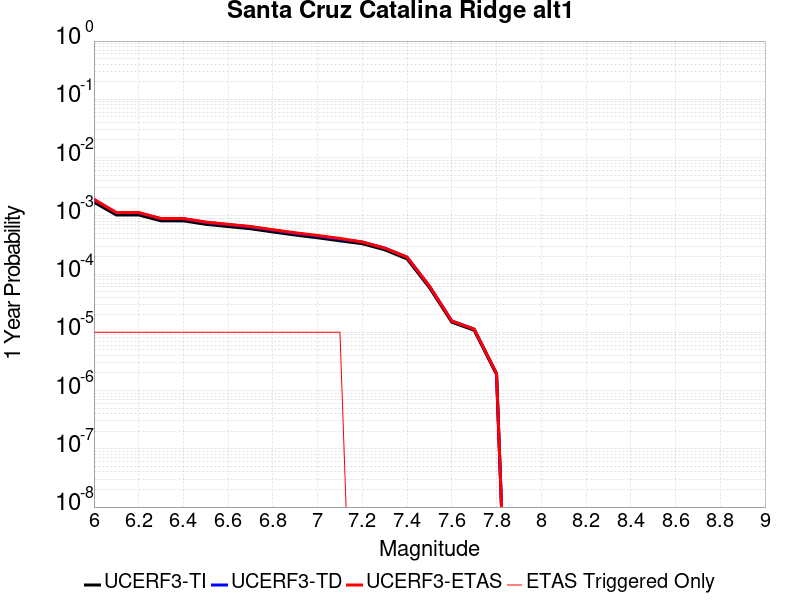 |  |

| Magnitude | 1 wk TI Prob | 1 wk TD Prob | 1 wk ETAS Prob | 1 wk ETAS/TD Gain | 1 wk ETAS Triggered Only | 1 mo TI Prob | 1 mo TD Prob | 1 mo ETAS Prob | 1 mo ETAS/TD Gain | 1 mo ETAS Triggered Only | 1 yr TI Prob | 1 yr TD Prob | 1 yr ETAS Prob | 1 yr ETAS/TD Gain | 1 yr ETAS Triggered Only | 10 yr TI Prob | 10 yr TD Prob | 10 yr ETAS Prob | 10 yr ETAS/TD Gain | 10 yr ETAS Triggered Only |
|-----|-----|-----|-----|-----|-----|-----|-----|-----|-----|-----|-----|-----|-----|-----|-----|-----|-----|-----|-----|-----|
| 6.0 | 3.2833184E-5 | 3.6559515E-5 | 3.6559515E-5 | 1.0 | 0.0 | 1.4070606E-4 | 1.5667517E-4 | 1.5667517E-4 | 1.0 | 0.0 | 0.00171175 | 0.0019060178 | 0.0019159986 | 1.0052365 | 1.0E-5 | 0.016986247 | 0.018913602 | 0.018933224 | 1.0010375 | 2.0E-5 |
| 6.1 | 1.9835548E-5 | 2.1660038E-5 | 2.1660038E-5 | 1.0 | 0.0 | 8.500672E-5 | 9.282555E-5 | 9.282555E-5 | 1.0 | 0.0 | 0.0010344655 | 0.0011295852 | 0.001139574 | 1.0088428 | 1.0E-5 | 0.010296632 | 0.011240571 | 0.011250458 | 1.0008796 | 1.0E-5 |
| 6.2 | 1.9835548E-5 | 2.1660038E-5 | 2.1660038E-5 | 1.0 | 0.0 | 8.500672E-5 | 9.282555E-5 | 9.282555E-5 | 1.0 | 0.0 | 0.0010344655 | 0.0011295852 | 0.001139574 | 1.0088428 | 1.0E-5 | 0.010296632 | 0.011240571 | 0.011250458 | 1.0008796 | 1.0E-5 |
| 6.3 | 1.5728183E-5 | 1.7034326E-5 | 1.7034326E-5 | 1.0 | 0.0 | 6.7404755E-5 | 7.3002244E-5 | 7.3002244E-5 | 1.0 | 0.0 | 8.2034385E-4 | 8.8844605E-4 | 8.9843717E-4 | 1.0112456 | 1.0E-5 | 0.008173222 | 0.008849622 | 0.008859533 | 1.00112 | 1.0E-5 |
| 6.4 | 1.5728183E-5 | 1.7034326E-5 | 1.7034326E-5 | 1.0 | 0.0 | 6.7404755E-5 | 7.3002244E-5 | 7.3002244E-5 | 1.0 | 0.0 | 8.2034385E-4 | 8.8844605E-4 | 8.9843717E-4 | 1.0112456 | 1.0E-5 | 0.008173222 | 0.008849622 | 0.008859533 | 1.00112 | 1.0E-5 |
| 6.5 | 1.3707734E-5 | 1.4794834E-5 | 1.4794834E-5 | 1.0 | 0.0 | 5.8746107E-5 | 6.3404914E-5 | 6.3404914E-5 | 1.0 | 0.0 | 7.1499916E-4 | 7.716849E-4 | 7.816772E-4 | 1.0129486 | 1.0E-5 | 0.0071270303 | 0.007690451 | 0.0077003743 | 1.0012903 | 1.0E-5 |
| 6.6 | 1.2539813E-5 | 1.3510497E-5 | 1.3510497E-5 | 1.0 | 0.0 | 5.3740947E-5 | 5.7900863E-5 | 5.7900863E-5 | 1.0 | 0.0 | 6.540996E-4 | 7.0471765E-4 | 7.147106E-4 | 1.0141801 | 1.0E-5 | 0.0065217763 | 0.0070251324 | 0.007035062 | 1.0014135 | 1.0E-5 |
| 6.7 | 1.1504083E-5 | 1.2377624E-5 | 1.2377624E-5 | 1.0 | 0.0 | 4.930228E-5 | 5.3045896E-5 | 5.3045896E-5 | 1.0 | 0.0 | 6.0008996E-4 | 6.4564444E-4 | 6.5563794E-4 | 1.0154784 | 1.0E-5 | 0.005984721 | 0.0064379154 | 0.006447851 | 1.0015433 | 1.0E-5 |
| 6.8 | 1.012739E-5 | 1.0877286E-5 | 1.0877286E-5 | 1.0 | 0.0 | 4.340238E-5 | 4.661611E-5 | 4.661611E-5 | 1.0 | 0.0 | 5.282958E-4 | 5.674049E-4 | 5.773992E-4 | 1.0176141 | 1.0E-5 | 0.0052704164 | 0.0056597306 | 0.005669674 | 1.0017569 | 1.0E-5 |
| 6.9 | 8.9607865E-6 | 9.609302E-6 | 9.609302E-6 | 1.0 | 0.0 | 3.8402806E-5 | 4.118208E-5 | 4.118208E-5 | 1.0 | 0.0 | 4.6745385E-4 | 5.012775E-4 | 5.112725E-4 | 1.0199391 | 1.0E-5 | 0.0046647177 | 0.005001588 | 0.0050115376 | 1.0019894 | 1.0E-5 |
| 7.0 | 8.046829E-6 | 8.619909E-6 | 8.619909E-6 | 1.0 | 0.0 | 3.4485955E-5 | 3.6941947E-5 | 3.6941947E-5 | 1.0 | 0.0 | 4.1978562E-4 | 4.496762E-4 | 4.5967172E-4 | 1.0222282 | 1.0E-5 | 0.004189935 | 0.0044877534 | 0.0044977088 | 1.0022182 | 1.0E-5 |
| 7.1 | 7.136131E-6 | 7.637798E-6 | 7.637798E-6 | 1.0 | 0.0 | 3.0583058E-5 | 3.2733016E-5 | 3.2733016E-5 | 1.0 | 0.0 | 3.7228514E-4 | 3.984523E-4 | 4.084483E-4 | 1.0250871 | 1.0E-5 | 0.0037166206 | 0.003977455 | 0.0039874157 | 1.0025042 | 1.0E-5 |
| 7.2 | 6.362014E-6 | 6.8050845E-6 | 6.8050845E-6 | 1.0 | 0.0 | 2.726549E-5 | 2.9164326E-5 | 2.9164326E-5 | 1.0 | 0.0 | 3.3190678E-4 | 3.5501845E-4 | 3.5501845E-4 | 1.0 | 0.0 | 0.0033141149 | 0.0035445816 | 0.0035445816 | 1.0 | 0.0 |
| 7.3 | 5.004101E-6 | 5.351814E-6 | 5.351814E-6 | 1.0 | 0.0 | 2.1445969E-5 | 2.2936147E-5 | 2.2936147E-5 | 1.0 | 0.0 | 2.6107338E-4 | 2.7921234E-4 | 2.7921234E-4 | 1.0 | 0.0 | 0.002607669 | 0.00278867 | 0.00278867 | 1.0 | 0.0 |
| 7.4 | 3.4901443E-6 | 3.7321213E-6 | 3.7321213E-6 | 1.0 | 0.0 | 1.4957676E-5 | 1.599471E-5 | 1.599471E-5 | 1.0 | 0.0 | 1.8209449E-4 | 1.9471857E-4 | 1.9471857E-4 | 1.0 | 0.0 | 0.0018194534 | 0.0019455182 | 0.0019455182 | 1.0 | 0.0 |
| 7.5 | 1.1215045E-6 | 1.1894062E-6 | 1.1894062E-6 | 1.0 | 0.0 | 4.806439E-6 | 5.0974454E-6 | 5.0974454E-6 | 1.0 | 0.0 | 5.851682E-5 | 6.205966E-5 | 6.205966E-5 | 1.0 | 0.0 | 5.850142E-4 | 6.204264E-4 | 6.204264E-4 | 1.0 | 0.0 |
| 7.6 | 2.8599047E-7 | 2.995237E-7 | 2.995237E-7 | 1.0 | 0.0 | 1.2256729E-6 | 1.2836723E-6 | 1.2836723E-6 | 1.0 | 0.0 | 1.4922465E-5 | 1.56286E-5 | 1.56286E-5 | 1.0 | 0.0 | 1.4921463E-4 | 1.5627514E-4 | 1.5627514E-4 | 1.0 | 0.0 |
| 7.7 | 2.0781519E-7 | 2.174459E-7 | 2.174459E-7 | 1.0 | 0.0 | 8.906362E-7 | 9.319107E-7 | 9.319107E-7 | 1.0 | 0.0 | 1.08434415E-5 | 1.1345955E-5 | 1.1345955E-5 | 1.0 | 0.0 | 1.0842913E-4 | 1.1345385E-4 | 1.1345385E-4 | 1.0 | 0.0 |
| 7.8 | 3.614776E-8 | 3.764143E-8 | 3.764143E-8 | 1.0 | 0.0 | 1.5491896E-7 | 1.613204E-7 | 1.613204E-7 | 1.0 | 0.0 | 1.8861368E-6 | 1.9640743E-6 | 1.9640743E-6 | 1.0 | 0.0 | 1.8861208E-5 | 1.9640582E-5 | 1.9640582E-5 | 1.0 | 0.0 |

## Mono Lake 2011 CFM
*[(top)](#table-of-contents)*

| 1 Week | 1 Month | 1 Year | 10 Year |
|-----|-----|-----|-----|
|  |  |  |  |

| Magnitude | 1 wk TI Prob | 1 wk TD Prob | 1 wk ETAS Prob | 1 wk ETAS/TD Gain | 1 wk ETAS Triggered Only | 1 mo TI Prob | 1 mo TD Prob | 1 mo ETAS Prob | 1 mo ETAS/TD Gain | 1 mo ETAS Triggered Only | 1 yr TI Prob | 1 yr TD Prob | 1 yr ETAS Prob | 1 yr ETAS/TD Gain | 1 yr ETAS Triggered Only | 10 yr TI Prob | 10 yr TD Prob | 10 yr ETAS Prob | 10 yr ETAS/TD Gain | 10 yr ETAS Triggered Only |
|-----|-----|-----|-----|-----|-----|-----|-----|-----|-----|-----|-----|-----|-----|-----|-----|-----|-----|-----|-----|-----|
| 6.0 | 2.0341662E-5 | 2.382925E-5 | 2.382925E-5 | 1.0 | 0.0 | 8.717564E-5 | 1.0212436E-4 | 1.0212436E-4 | 1.0 | 0.0 | 0.0010608466 | 0.0012431863 | 0.0012431863 | 1.0 | 0.0 | 0.010557966 | 0.012414398 | 0.01243415 | 1.0015911 | 2.0E-5 |
| 6.1 | 2.0341662E-5 | 2.382925E-5 | 2.382925E-5 | 1.0 | 0.0 | 8.717564E-5 | 1.0212436E-4 | 1.0212436E-4 | 1.0 | 0.0 | 0.0010608466 | 0.0012431863 | 0.0012431863 | 1.0 | 0.0 | 0.010557966 | 0.012414398 | 0.01243415 | 1.0015911 | 2.0E-5 |
| 6.2 | 2.0341662E-5 | 2.382925E-5 | 2.382925E-5 | 1.0 | 0.0 | 8.717564E-5 | 1.0212436E-4 | 1.0212436E-4 | 1.0 | 0.0 | 0.0010608466 | 0.0012431863 | 0.0012431863 | 1.0 | 0.0 | 0.010557966 | 0.012414398 | 0.01243415 | 1.0015911 | 2.0E-5 |
| 6.3 | 2.0341662E-5 | 2.382925E-5 | 2.382925E-5 | 1.0 | 0.0 | 8.717564E-5 | 1.0212436E-4 | 1.0212436E-4 | 1.0 | 0.0 | 0.0010608466 | 0.0012431863 | 0.0012431863 | 1.0 | 0.0 | 0.010557966 | 0.012414398 | 0.01243415 | 1.0015911 | 2.0E-5 |
| 6.4 | 1.749821E-5 | 2.0491914E-5 | 2.0491914E-5 | 1.0 | 0.0 | 7.499018E-5 | 8.782249E-5 | 8.782249E-5 | 1.0 | 0.0 | 9.1262296E-4 | 0.0010692389 | 0.0010692389 | 1.0 | 0.0 | 0.009088841 | 0.01069235 | 0.010712136 | 1.0018505 | 2.0E-5 |
| 6.5 | 1.749821E-5 | 2.0491914E-5 | 2.0491914E-5 | 1.0 | 0.0 | 7.499018E-5 | 8.782249E-5 | 8.782249E-5 | 1.0 | 0.0 | 9.1262296E-4 | 0.0010692389 | 0.0010692389 | 1.0 | 0.0 | 0.009088841 | 0.01069235 | 0.010712136 | 1.0018505 | 2.0E-5 |

## Newport-Inglewood (Offshore)
*[(top)](#table-of-contents)*

| 1 Week | 1 Month | 1 Year | 10 Year |
|-----|-----|-----|-----|
|  |  |  |  |

| Magnitude | 1 wk TI Prob | 1 wk TD Prob | 1 wk ETAS Prob | 1 wk ETAS/TD Gain | 1 wk ETAS Triggered Only | 1 mo TI Prob | 1 mo TD Prob | 1 mo ETAS Prob | 1 mo ETAS/TD Gain | 1 mo ETAS Triggered Only | 1 yr TI Prob | 1 yr TD Prob | 1 yr ETAS Prob | 1 yr ETAS/TD Gain | 1 yr ETAS Triggered Only | 10 yr TI Prob | 10 yr TD Prob | 10 yr ETAS Prob | 10 yr ETAS/TD Gain | 10 yr ETAS Triggered Only |
|-----|-----|-----|-----|-----|-----|-----|-----|-----|-----|-----|-----|-----|-----|-----|-----|-----|-----|-----|-----|-----|
| 6.0 | 1.9626508E-5 | 1.896577E-5 | 1.896577E-5 | 1.0 | 0.0 | 8.411089E-5 | 8.127941E-5 | 8.127941E-5 | 1.0 | 0.0 | 0.001023569 | 9.891401E-4 | 9.991302E-4 | 1.0100998 | 1.0E-5 | 0.010188672 | 0.009848718 | 0.00986852 | 1.0020107 | 2.0E-5 |
| 6.1 | 1.331886E-5 | 1.221838E-5 | 1.221838E-5 | 1.0 | 0.0 | 5.707958E-5 | 5.2363444E-5 | 5.2363444E-5 | 1.0 | 0.0 | 6.947222E-4 | 6.3733995E-4 | 6.3733995E-4 | 1.0 | 0.0 | 0.006925544 | 0.0063552987 | 0.0063552987 | 1.0 | 0.0 |
| 6.2 | 1.2250852E-5 | 1.1076297E-5 | 1.1076297E-5 | 1.0 | 0.0 | 5.2502597E-5 | 4.7468984E-5 | 4.7468984E-5 | 1.0 | 0.0 | 6.3903164E-4 | 5.7778263E-4 | 5.7778263E-4 | 1.0 | 0.0 | 0.006371971 | 0.0057629254 | 0.0057629254 | 1.0 | 0.0 |
| 6.3 | 1.2106258E-5 | 1.0919155E-5 | 1.0919155E-5 | 1.0 | 0.0 | 5.1882926E-5 | 4.6795543E-5 | 4.6795543E-5 | 1.0 | 0.0 | 6.3149154E-4 | 5.695878E-4 | 5.695878E-4 | 1.0 | 0.0 | 0.0062970007 | 0.005681396 | 0.005681396 | 1.0 | 0.0 |
| 6.4 | 1.1348758E-5 | 1.0109611E-5 | 1.0109611E-5 | 1.0 | 0.0 | 4.8636626E-5 | 4.332619E-5 | 4.332619E-5 | 1.0 | 0.0 | 5.919901E-4 | 5.273695E-4 | 5.273695E-4 | 1.0 | 0.0 | 0.005904155 | 0.005261276 | 0.005261276 | 1.0 | 0.0 |
| 6.5 | 1.100837E-5 | 9.7436305E-6 | 9.7436305E-6 | 1.0 | 0.0 | 4.7177873E-5 | 4.1757754E-5 | 4.1757754E-5 | 1.0 | 0.0 | 5.7423924E-4 | 5.082828E-4 | 5.082828E-4 | 1.0 | 0.0 | 0.005727576 | 0.005071294 | 0.005071294 | 1.0 | 0.0 |
| 6.6 | 1.0634696E-5 | 9.3457775E-6 | 9.3457775E-6 | 1.0 | 0.0 | 4.557647E-5 | 4.005272E-5 | 4.005272E-5 | 1.0 | 0.0 | 5.5475225E-4 | 4.8753349E-4 | 4.8753349E-4 | 1.0 | 0.0 | 0.0055336943 | 0.0048647257 | 0.0048647257 | 1.0 | 0.0 |
| 6.7 | 9.9780855E-6 | 8.668132E-6 | 8.668132E-6 | 1.0 | 0.0 | 4.276252E-5 | 3.714861E-5 | 3.714861E-5 | 1.0 | 0.0 | 5.205093E-4 | 4.5219116E-4 | 4.5219116E-4 | 1.0 | 0.0 | 0.0051929182 | 0.0045127897 | 0.0045127897 | 1.0 | 0.0 |
| 6.8 | 9.59546E-6 | 8.273165E-6 | 8.273165E-6 | 1.0 | 0.0 | 4.1122752E-5 | 3.545594E-5 | 3.545594E-5 | 1.0 | 0.0 | 5.0055445E-4 | 4.3159127E-4 | 4.3159127E-4 | 1.0 | 0.0 | 0.004994285 | 0.0043076063 | 0.0043076063 | 1.0 | 0.0 |
| 6.9 | 9.000614E-6 | 7.707041E-6 | 7.707041E-6 | 1.0 | 0.0 | 3.857349E-5 | 3.3029763E-5 | 3.3029763E-5 | 1.0 | 0.0 | 4.6953102E-4 | 4.020638E-4 | 4.020638E-4 | 1.0 | 0.0 | 0.004685402 | 0.0040134354 | 0.0040134354 | 1.0 | 0.0 |
| 7.0 | 7.4070194E-6 | 6.1490637E-6 | 6.1490637E-6 | 1.0 | 0.0 | 3.1743984E-5 | 2.6352865E-5 | 2.6352865E-5 | 1.0 | 0.0 | 3.8641447E-4 | 3.2079907E-4 | 3.2079907E-4 | 1.0 | 0.0 | 0.0038574322 | 0.0032033795 | 0.0032033795 | 1.0 | 0.0 |
| 7.1 | 6.299615E-6 | 5.056732E-6 | 5.056732E-6 | 1.0 | 0.0 | 2.699807E-5 | 2.1671529E-5 | 2.1671529E-5 | 1.0 | 0.0 | 3.2865192E-4 | 2.6381906E-4 | 2.6381906E-4 | 1.0 | 0.0 | 0.003281663 | 0.0026350734 | 0.0026350734 | 1.0 | 0.0 |
| 7.2 | 5.096653E-6 | 3.892892E-6 | 3.892892E-6 | 1.0 | 0.0 | 2.1842614E-5 | 1.6683716E-5 | 1.6683716E-5 | 1.0 | 0.0 | 2.6590136E-4 | 2.031054E-4 | 2.031054E-4 | 1.0 | 0.0 | 0.0026558342 | 0.002029209 | 0.002029209 | 1.0 | 0.0 |
| 7.3 | 3.9753018E-6 | 2.9099706E-6 | 2.9099706E-6 | 1.0 | 0.0 | 1.7036897E-5 | 1.2471243E-5 | 1.2471243E-5 | 1.0 | 0.0 | 2.0740448E-4 | 1.5182688E-4 | 1.5182688E-4 | 1.0 | 0.0 | 0.00207211 | 0.0015172397 | 0.0015172397 | 1.0 | 0.0 |
| 7.4 | 3.0568392E-6 | 2.1450442E-6 | 2.1450442E-6 | 1.0 | 0.0 | 1.3100675E-5 | 9.193015E-6 | 9.193015E-6 | 1.0 | 0.0 | 1.5948903E-4 | 1.1191927E-4 | 1.1191927E-4 | 1.0 | 0.0 | 0.0015937461 | 0.0011186353 | 0.0011186353 | 1.0 | 0.0 |
| 7.5 | 1.7279019E-6 | 1.147015E-6 | 1.147015E-6 | 1.0 | 0.0 | 7.405273E-6 | 4.9157698E-6 | 4.9157698E-6 | 1.0 | 0.0 | 9.015547E-5 | 5.984789E-5 | 5.984789E-5 | 1.0 | 0.0 | 9.01189E-4 | 5.983216E-4 | 5.983216E-4 | 1.0 | 0.0 |
| 7.6 | 1.1156416E-6 | 7.2231956E-7 | 7.2231956E-7 | 1.0 | 0.0 | 4.7813123E-6 | 3.0956517E-6 | 3.0956517E-6 | 1.0 | 0.0 | 5.821092E-5 | 3.768893E-5 | 3.768893E-5 | 1.0 | 0.0 | 5.8195676E-4 | 3.7682772E-4 | 3.7682772E-4 | 1.0 | 0.0 |
| 7.7 | 9.117973E-8 | 6.7342334E-8 | 6.7342334E-8 | 1.0 | 0.0 | 3.907702E-7 | 2.8860998E-7 | 2.8860998E-7 | 1.0 | 0.0 | 4.757617E-6 | 3.513821E-6 | 3.513821E-6 | 1.0 | 0.0 | 4.7575148E-5 | 3.5137684E-5 | 3.5137684E-5 | 1.0 | 0.0 |

## Raymond
*[(top)](#table-of-contents)*

| 1 Week | 1 Month | 1 Year | 10 Year |
|-----|-----|-----|-----|
|  |  |  |  |

| Magnitude | 1 wk TI Prob | 1 wk TD Prob | 1 wk ETAS Prob | 1 wk ETAS/TD Gain | 1 wk ETAS Triggered Only | 1 mo TI Prob | 1 mo TD Prob | 1 mo ETAS Prob | 1 mo ETAS/TD Gain | 1 mo ETAS Triggered Only | 1 yr TI Prob | 1 yr TD Prob | 1 yr ETAS Prob | 1 yr ETAS/TD Gain | 1 yr ETAS Triggered Only | 10 yr TI Prob | 10 yr TD Prob | 10 yr ETAS Prob | 10 yr ETAS/TD Gain | 10 yr ETAS Triggered Only |
|-----|-----|-----|-----|-----|-----|-----|-----|-----|-----|-----|-----|-----|-----|-----|-----|-----|-----|-----|-----|-----|
| 6.0 | 1.5157413E-5 | 1.5810718E-5 | 1.5810718E-5 | 1.0 | 0.0 | 6.4958724E-5 | 6.77586E-5 | 6.77586E-5 | 1.0 | 0.0 | 7.905855E-4 | 8.246738E-4 | 8.3466555E-4 | 1.012116 | 1.0E-5 | 0.007877788 | 0.0082186535 | 0.008238489 | 1.0024135 | 2.0E-5 |
| 6.1 | 1.5157413E-5 | 1.5810718E-5 | 1.5810718E-5 | 1.0 | 0.0 | 6.4958724E-5 | 6.77586E-5 | 6.77586E-5 | 1.0 | 0.0 | 7.905855E-4 | 8.246738E-4 | 8.3466555E-4 | 1.012116 | 1.0E-5 | 0.007877788 | 0.0082186535 | 0.008238489 | 1.0024135 | 2.0E-5 |
| 6.2 | 1.5157413E-5 | 1.5810718E-5 | 1.5810718E-5 | 1.0 | 0.0 | 6.4958724E-5 | 6.77586E-5 | 6.77586E-5 | 1.0 | 0.0 | 7.905855E-4 | 8.246738E-4 | 8.3466555E-4 | 1.012116 | 1.0E-5 | 0.007877788 | 0.0082186535 | 0.008238489 | 1.0024135 | 2.0E-5 |
| 6.3 | 1.5157413E-5 | 1.5810718E-5 | 1.5810718E-5 | 1.0 | 0.0 | 6.4958724E-5 | 6.77586E-5 | 6.77586E-5 | 1.0 | 0.0 | 7.905855E-4 | 8.246738E-4 | 8.3466555E-4 | 1.012116 | 1.0E-5 | 0.007877788 | 0.0082186535 | 0.008238489 | 1.0024135 | 2.0E-5 |
| 6.4 | 1.3941944E-5 | 1.4455239E-5 | 1.4455239E-5 | 1.0 | 0.0 | 5.9749822E-5 | 6.1949686E-5 | 6.1949686E-5 | 1.0 | 0.0 | 7.2721124E-4 | 7.5399975E-4 | 7.639922E-4 | 1.0132526 | 1.0E-5 | 0.007248361 | 0.007516749 | 0.0075365985 | 1.0026407 | 2.0E-5 |
| 6.5 | 1.3941944E-5 | 1.4455239E-5 | 1.4455239E-5 | 1.0 | 0.0 | 5.9749822E-5 | 6.1949686E-5 | 6.1949686E-5 | 1.0 | 0.0 | 7.2721124E-4 | 7.5399975E-4 | 7.639922E-4 | 1.0132526 | 1.0E-5 | 0.007248361 | 0.007516749 | 0.0075365985 | 1.0026407 | 2.0E-5 |
| 6.6 | 1.0542609E-5 | 1.0671548E-5 | 1.0671548E-5 | 1.0 | 0.0 | 4.5181827E-5 | 4.5734436E-5 | 4.5734436E-5 | 1.0 | 0.0 | 5.499499E-4 | 5.5667997E-4 | 5.5667997E-4 | 1.0 | 0.0 | 0.005485909 | 0.005553416 | 0.005553416 | 1.0 | 0.0 |
| 6.7 | 1.0542609E-5 | 1.0671548E-5 | 1.0671548E-5 | 1.0 | 0.0 | 4.5181827E-5 | 4.5734436E-5 | 4.5734436E-5 | 1.0 | 0.0 | 5.499499E-4 | 5.5667997E-4 | 5.5667997E-4 | 1.0 | 0.0 | 0.005485909 | 0.005553416 | 0.005553416 | 1.0 | 0.0 |
| 6.8 | 1.0079132E-5 | 1.0177072E-5 | 1.0177072E-5 | 1.0 | 0.0 | 4.3195567E-5 | 4.3615324E-5 | 4.3615324E-5 | 1.0 | 0.0 | 5.257791E-4 | 5.308926E-4 | 5.308926E-4 | 1.0 | 0.0 | 0.0052453685 | 0.0052967924 | 0.0052967924 | 1.0 | 0.0 |
| 6.9 | 7.721598E-6 | 7.54925E-6 | 7.54925E-6 | 1.0 | 0.0 | 3.3092143E-5 | 3.2353535E-5 | 3.2353535E-5 | 1.0 | 0.0 | 4.0282236E-4 | 3.9383429E-4 | 3.9383429E-4 | 1.0 | 0.0 | 0.0040209293 | 0.003931497 | 0.003931497 | 1.0 | 0.0 |
| 7.0 | 7.137566E-6 | 6.9116354E-6 | 6.9116354E-6 | 1.0 | 0.0 | 3.058921E-5 | 2.9620964E-5 | 2.9620964E-5 | 1.0 | 0.0 | 3.7236E-4 | 3.6057664E-4 | 3.6057664E-4 | 1.0 | 0.0 | 0.0037173668 | 0.0036000342 | 0.0036000342 | 1.0 | 0.0 |
| 7.1 | 5.654976E-6 | 5.2998325E-6 | 5.2998325E-6 | 1.0 | 0.0 | 2.4235387E-5 | 2.2713371E-5 | 2.2713371E-5 | 1.0 | 0.0 | 2.9502588E-4 | 2.7650042E-4 | 2.7650042E-4 | 1.0 | 0.0 | 0.0029463451 | 0.002761595 | 0.002761595 | 1.0 | 0.0 |
| 7.2 | 4.9358455E-6 | 4.5269326E-6 | 4.5269326E-6 | 1.0 | 0.0 | 2.1153453E-5 | 1.9400997E-5 | 1.9400997E-5 | 1.0 | 0.0 | 2.5751285E-4 | 2.3618166E-4 | 2.3618166E-4 | 1.0 | 0.0 | 0.0025721465 | 0.0023593288 | 0.0023593288 | 1.0 | 0.0 |
| 7.3 | 4.2368597E-6 | 3.805877E-6 | 3.805877E-6 | 1.0 | 0.0 | 1.8157843E-5 | 1.63108E-5 | 1.63108E-5 | 1.0 | 0.0 | 2.2104931E-4 | 1.98566E-4 | 1.98566E-4 | 1.0 | 0.0 | 0.0022082955 | 0.0019839045 | 0.0019839045 | 1.0 | 0.0 |
| 7.4 | 3.4999923E-6 | 3.0439865E-6 | 3.0439865E-6 | 1.0 | 0.0 | 1.49998805E-5 | 1.3045592E-5 | 1.3045592E-5 | 1.0 | 0.0 | 1.8260824E-4 | 1.5881858E-4 | 1.5881858E-4 | 1.0 | 0.0 | 0.0018245826 | 0.0015870666 | 0.0015870666 | 1.0 | 0.0 |
| 7.5 | 2.738017E-6 | 2.302174E-6 | 2.302174E-6 | 1.0 | 0.0 | 1.1734306E-5 | 9.866423E-6 | 9.866423E-6 | 1.0 | 0.0 | 1.428558E-4 | 1.2011715E-4 | 1.2011715E-4 | 1.0 | 0.0 | 0.0014276401 | 0.0012005366 | 0.0012005366 | 1.0 | 0.0 |
| 7.6 | 1.8186392E-6 | 1.4424012E-6 | 1.4424012E-6 | 1.0 | 0.0 | 7.794145E-6 | 6.181705E-6 | 6.181705E-6 | 1.0 | 0.0 | 9.488958E-5 | 7.52597E-5 | 7.52597E-5 | 1.0 | 0.0 | 9.4849075E-4 | 7.5235363E-4 | 7.5235363E-4 | 1.0 | 0.0 |
| 7.7 | 1.0660348E-6 | 7.6445247E-7 | 7.6445247E-7 | 1.0 | 0.0 | 4.5687125E-6 | 3.276221E-6 | 3.276221E-6 | 1.0 | 0.0 | 5.5622655E-5 | 3.9887276E-5 | 3.9887276E-5 | 1.0 | 0.0 | 5.5608735E-4 | 3.9881028E-4 | 3.9881028E-4 | 1.0 | 0.0 |
| 7.8 | 6.913602E-7 | 4.3210147E-7 | 4.3210147E-7 | 1.0 | 0.0 | 2.962969E-6 | 1.8518622E-6 | 1.8518622E-6 | 1.0 | 0.0 | 3.607355E-5 | 2.2546195E-5 | 2.2546195E-5 | 1.0 | 0.0 | 3.6067693E-4 | 2.2544693E-4 | 2.2544693E-4 | 1.0 | 0.0 |
| 7.9 | 7.425201E-8 | 5.322821E-8 | 5.322821E-8 | 1.0 | 0.0 | 3.1822285E-7 | 2.2812088E-7 | 2.2812088E-7 | 1.0 | 0.0 | 3.874356E-6 | 2.7773694E-6 | 2.7773694E-6 | 1.0 | 0.0 | 3.8742884E-5 | 2.7773478E-5 | 2.7773478E-5 | 1.0 | 0.0 |

## Los Osos 2011
*[(top)](#table-of-contents)*

| 1 Week | 1 Month | 1 Year | 10 Year |
|-----|-----|-----|-----|
|  |  |  |  |

| Magnitude | 1 wk TI Prob | 1 wk TD Prob | 1 wk ETAS Prob | 1 wk ETAS/TD Gain | 1 wk ETAS Triggered Only | 1 mo TI Prob | 1 mo TD Prob | 1 mo ETAS Prob | 1 mo ETAS/TD Gain | 1 mo ETAS Triggered Only | 1 yr TI Prob | 1 yr TD Prob | 1 yr ETAS Prob | 1 yr ETAS/TD Gain | 1 yr ETAS Triggered Only | 10 yr TI Prob | 10 yr TD Prob | 10 yr ETAS Prob | 10 yr ETAS/TD Gain | 10 yr ETAS Triggered Only |
|-----|-----|-----|-----|-----|-----|-----|-----|-----|-----|-----|-----|-----|-----|-----|-----|-----|-----|-----|-----|-----|
| 6.0 | 4.8871775E-6 | 4.981524E-6 | 4.981524E-6 | 1.0 | 0.0 | 2.0944879E-5 | 2.134923E-5 | 2.134923E-5 | 1.0 | 0.0 | 2.5497406E-4 | 2.5989866E-4 | 2.5989866E-4 | 1.0 | 0.0 | 0.002546817 | 0.0025962214 | 0.0026161696 | 1.0076835 | 2.0E-5 |
| 6.1 | 4.8871775E-6 | 4.981524E-6 | 4.981524E-6 | 1.0 | 0.0 | 2.0944879E-5 | 2.134923E-5 | 2.134923E-5 | 1.0 | 0.0 | 2.5497406E-4 | 2.5989866E-4 | 2.5989866E-4 | 1.0 | 0.0 | 0.002546817 | 0.0025962214 | 0.0026161696 | 1.0076835 | 2.0E-5 |
| 6.2 | 4.8871775E-6 | 4.981524E-6 | 4.981524E-6 | 1.0 | 0.0 | 2.0944879E-5 | 2.134923E-5 | 2.134923E-5 | 1.0 | 0.0 | 2.5497406E-4 | 2.5989866E-4 | 2.5989866E-4 | 1.0 | 0.0 | 0.002546817 | 0.0025962214 | 0.0026161696 | 1.0076835 | 2.0E-5 |
| 6.3 | 4.8871775E-6 | 4.981524E-6 | 4.981524E-6 | 1.0 | 0.0 | 2.0944879E-5 | 2.134923E-5 | 2.134923E-5 | 1.0 | 0.0 | 2.5497406E-4 | 2.5989866E-4 | 2.5989866E-4 | 1.0 | 0.0 | 0.002546817 | 0.0025962214 | 0.0026161696 | 1.0076835 | 2.0E-5 |
| 6.4 | 4.8871775E-6 | 4.981524E-6 | 4.981524E-6 | 1.0 | 0.0 | 2.0944879E-5 | 2.134923E-5 | 2.134923E-5 | 1.0 | 0.0 | 2.5497406E-4 | 2.5989866E-4 | 2.5989866E-4 | 1.0 | 0.0 | 0.002546817 | 0.0025962214 | 0.0026161696 | 1.0076835 | 2.0E-5 |
| 6.5 | 3.1724062E-6 | 3.2234238E-6 | 3.2234238E-6 | 1.0 | 0.0 | 1.3595956E-5 | 1.3814601E-5 | 1.3814601E-5 | 1.0 | 0.0 | 1.6551818E-4 | 1.6817992E-4 | 1.6817992E-4 | 1.0 | 0.0 | 0.0016539496 | 0.0016805399 | 0.0016905231 | 1.0059404 | 1.0E-5 |
| 6.6 | 3.1022591E-6 | 3.1511327E-6 | 3.1511327E-6 | 1.0 | 0.0 | 1.3295328E-5 | 1.3504785E-5 | 1.3504785E-5 | 1.0 | 0.0 | 1.618586E-4 | 1.6440848E-4 | 1.6440848E-4 | 1.0 | 0.0 | 0.0016174077 | 0.0016428813 | 0.0016528649 | 1.0060768 | 1.0E-5 |
| 6.7 | 2.611518E-6 | 2.6492085E-6 | 2.6492085E-6 | 1.0 | 0.0 | 1.1192172E-5 | 1.1353702E-5 | 1.1353702E-5 | 1.0 | 0.0 | 1.3625617E-4 | 1.3822259E-4 | 1.3822259E-4 | 1.0 | 0.0 | 0.0013617266 | 0.0013813707 | 0.0013913569 | 1.0072292 | 1.0E-5 |
| 6.8 | 2.4780884E-6 | 2.5121835E-6 | 2.5121835E-6 | 1.0 | 0.0 | 1.0620336E-5 | 1.0766456E-5 | 1.0766456E-5 | 1.0 | 0.0 | 1.2929492E-4 | 1.3107376E-4 | 1.3107376E-4 | 1.0 | 0.0 | 0.0012921972 | 0.0013099686 | 0.0013199556 | 1.0076238 | 1.0E-5 |
| 6.9 | 2.1376322E-6 | 2.1635276E-6 | 2.1635276E-6 | 1.0 | 0.0 | 9.161248E-6 | 9.272228E-6 | 9.272228E-6 | 1.0 | 0.0 | 1.1153249E-4 | 1.1288355E-4 | 1.1288355E-4 | 1.0 | 0.0 | 0.0011147653 | 0.001128264 | 0.0011382527 | 1.0088532 | 1.0E-5 |
| 7.0 | 1.9282882E-6 | 1.9494794E-6 | 1.9494794E-6 | 1.0 | 0.0 | 8.264066E-6 | 8.354885E-6 | 8.354885E-6 | 1.0 | 0.0 | 1.0061036E-4 | 1.0171598E-4 | 1.0171598E-4 | 1.0 | 0.0 | 0.0010056482 | 0.0010166956 | 0.0010266855 | 1.0098258 | 1.0E-5 |
| 7.1 | 1.6353226E-6 | 1.6501308E-6 | 1.6501308E-6 | 1.0 | 0.0 | 7.0085066E-6 | 7.0719702E-6 | 7.0719702E-6 | 1.0 | 0.0 | 8.532523E-5 | 8.609784E-5 | 8.609784E-5 | 1.0 | 0.0 | 8.529247E-4 | 8.606456E-4 | 8.70637E-4 | 1.0116092 | 1.0E-5 |
| 7.2 | 1.4446276E-6 | 1.455352E-6 | 1.455352E-6 | 1.0 | 0.0 | 6.191247E-6 | 6.2372083E-6 | 6.2372083E-6 | 1.0 | 0.0 | 7.537582E-5 | 7.5935364E-5 | 7.5935364E-5 | 1.0 | 0.0 | 7.535026E-4 | 7.590948E-4 | 7.690872E-4 | 1.0131636 | 1.0E-5 |
| 7.3 | 1.2014582E-6 | 1.2069238E-6 | 1.2069238E-6 | 1.0 | 0.0 | 5.149096E-6 | 5.17252E-6 | 5.17252E-6 | 1.0 | 0.0 | 6.268844E-5 | 6.297362E-5 | 6.297362E-5 | 1.0 | 0.0 | 6.267076E-4 | 6.295581E-4 | 6.295581E-4 | 1.0 | 0.0 |
| 7.4 | 9.707733E-7 | 9.709923E-7 | 9.709923E-7 | 1.0 | 0.0 | 4.16045E-6 | 4.1613894E-6 | 4.1613894E-6 | 1.0 | 0.0 | 5.0652303E-5 | 5.0663737E-5 | 5.0663737E-5 | 1.0 | 0.0 | 5.064076E-4 | 5.0652213E-4 | 5.0652213E-4 | 1.0 | 0.0 |
| 7.5 | 7.174908E-7 | 7.1150475E-7 | 7.1150475E-7 | 1.0 | 0.0 | 3.074957E-6 | 3.0493024E-6 | 3.0493024E-6 | 1.0 | 0.0 | 3.743696E-5 | 3.7124628E-5 | 3.7124628E-5 | 1.0 | 0.0 | 3.7430652E-4 | 3.7118443E-4 | 3.7118443E-4 | 1.0 | 0.0 |
| 7.6 | 4.5535776E-7 | 4.420906E-7 | 4.420906E-7 | 1.0 | 0.0 | 1.9515319E-6 | 1.8946727E-6 | 1.8946727E-6 | 1.0 | 0.0 | 2.3759641E-5 | 2.3067396E-5 | 2.3067396E-5 | 1.0 | 0.0 | 2.37571E-4 | 2.3065011E-4 | 2.3065011E-4 | 1.0 | 0.0 |
| 7.7 | 2.1173553E-7 | 1.9061721E-7 | 1.9061721E-7 | 1.0 | 0.0 | 9.0743765E-7 | 8.1693065E-7 | 8.1693065E-7 | 1.0 | 0.0 | 1.1047998E-5 | 9.946085E-6 | 9.946085E-6 | 1.0 | 0.0 | 1.1047449E-4 | 9.9456425E-5 | 9.9456425E-5 | 1.0 | 0.0 |
| 7.8 | 9.873608E-8 | 7.368371E-8 | 7.368371E-8 | 1.0 | 0.0 | 4.2315455E-7 | 3.1578728E-7 | 3.1578728E-7 | 1.0 | 0.0 | 5.1518946E-6 | 3.8447033E-6 | 3.8447033E-6 | 1.0 | 0.0 | 5.1517753E-5 | 3.8446375E-5 | 3.8446375E-5 | 1.0 | 0.0 |
| 7.9 | 5.4399106E-8 | 3.1887296E-8 | 3.1887296E-8 | 1.0 | 0.0 | 2.33139E-7 | 1.3665984E-7 | 1.3665984E-7 | 1.0 | 0.0 | 2.8384638E-6 | 1.6638322E-6 | 1.6638322E-6 | 1.0 | 0.0 | 2.8384275E-5 | 1.66382E-5 | 1.66382E-5 | 1.0 | 0.0 |
| 8.0 | 1.817203E-8 | 8.423749E-9 | 8.423749E-9 | 1.0 | 0.0 | 7.7880124E-8 | 3.610178E-8 | 3.610178E-8 | 1.0 | 0.0 | 9.481901E-7 | 4.3953912E-7 | 4.3953912E-7 | 1.0 | 0.0 | 9.481861E-6 | 4.395383E-6 | 4.395383E-6 | 1.0 | 0.0 |

## Malibu Coast (Extension) alt 1
*[(top)](#table-of-contents)*

| 1 Week | 1 Month | 1 Year | 10 Year |
|-----|-----|-----|-----|
|  |  |  |  |

| Magnitude | 1 wk TI Prob | 1 wk TD Prob | 1 wk ETAS Prob | 1 wk ETAS/TD Gain | 1 wk ETAS Triggered Only | 1 mo TI Prob | 1 mo TD Prob | 1 mo ETAS Prob | 1 mo ETAS/TD Gain | 1 mo ETAS Triggered Only | 1 yr TI Prob | 1 yr TD Prob | 1 yr ETAS Prob | 1 yr ETAS/TD Gain | 1 yr ETAS Triggered Only | 10 yr TI Prob | 10 yr TD Prob | 10 yr ETAS Prob | 10 yr ETAS/TD Gain | 10 yr ETAS Triggered Only |
|-----|-----|-----|-----|-----|-----|-----|-----|-----|-----|-----|-----|-----|-----|-----|-----|-----|-----|-----|-----|-----|
| 6.0 | 8.930738E-6 | 9.329415E-6 | 9.329415E-6 | 1.0 | 0.0 | 3.827403E-5 | 3.9982606E-5 | 3.9982606E-5 | 1.0 | 0.0 | 4.6588664E-4 | 4.866812E-4 | 4.866812E-4 | 1.0 | 0.0 | 0.0046491115 | 0.0048563364 | 0.004866288 | 1.0020492 | 1.0E-5 |
| 6.1 | 7.199952E-6 | 7.530417E-6 | 7.530417E-6 | 1.0 | 0.0 | 3.0856572E-5 | 3.227282E-5 | 3.227282E-5 | 1.0 | 0.0 | 3.75614E-4 | 3.9285133E-4 | 3.9285133E-4 | 1.0 | 0.0 | 0.0037497976 | 0.003921635 | 0.003931596 | 1.00254 | 1.0E-5 |
| 6.2 | 6.3721413E-6 | 6.666902E-6 | 6.666902E-6 | 1.0 | 0.0 | 2.7308892E-5 | 2.8572127E-5 | 2.8572127E-5 | 1.0 | 0.0 | 3.3243504E-4 | 3.4781048E-4 | 3.4781048E-4 | 1.0 | 0.0 | 0.0033193815 | 0.0034727012 | 0.0034727012 | 1.0 | 0.0 |
| 6.3 | 6.016345E-6 | 6.2952645E-6 | 6.2952645E-6 | 1.0 | 0.0 | 2.578408E-5 | 2.6979427E-5 | 2.6979427E-5 | 1.0 | 0.0 | 3.1387596E-4 | 3.2842535E-4 | 3.2842535E-4 | 1.0 | 0.0 | 0.00313433 | 0.003279436 | 0.003279436 | 1.0 | 0.0 |
| 6.4 | 5.8104883E-6 | 6.0796483E-6 | 6.0796483E-6 | 1.0 | 0.0 | 2.4901856E-5 | 2.6055377E-5 | 2.6055377E-5 | 1.0 | 0.0 | 3.031379E-4 | 3.1717835E-4 | 3.1717835E-4 | 1.0 | 0.0 | 0.0030272473 | 0.0031672912 | 0.0031672912 | 1.0 | 0.0 |
| 6.5 | 5.476925E-6 | 5.7276116E-6 | 5.7276116E-6 | 1.0 | 0.0 | 2.3472323E-5 | 2.4546678E-5 | 2.4546678E-5 | 1.0 | 0.0 | 2.8573806E-4 | 2.988151E-4 | 2.988151E-4 | 1.0 | 0.0 | 0.0028537093 | 0.0029841652 | 0.0029841652 | 1.0 | 0.0 |
| 6.6 | 5.222387E-6 | 5.458674E-6 | 5.458674E-6 | 1.0 | 0.0 | 2.2381464E-5 | 2.339411E-5 | 2.339411E-5 | 1.0 | 0.0 | 2.7246025E-4 | 2.8478634E-4 | 2.8478634E-4 | 1.0 | 0.0 | 0.0027212645 | 0.0028442447 | 0.0028442447 | 1.0 | 0.0 |
| 6.7 | 5.0337076E-6 | 5.2591945E-6 | 5.2591945E-6 | 1.0 | 0.0 | 2.1572854E-5 | 2.2539212E-5 | 2.2539212E-5 | 1.0 | 0.0 | 2.6261783E-4 | 2.7438064E-4 | 2.7438064E-4 | 1.0 | 0.0 | 0.002623077 | 0.0027404486 | 0.0027404486 | 1.0 | 0.0 |
| 6.8 | 4.5675624E-6 | 4.7587982E-6 | 4.7587982E-6 | 1.0 | 0.0 | 1.9575122E-5 | 2.0394691E-5 | 2.0394691E-5 | 1.0 | 0.0 | 2.3830103E-4 | 2.4827724E-4 | 2.4827724E-4 | 1.0 | 0.0 | 0.0023804565 | 0.0024800184 | 0.0024800184 | 1.0 | 0.0 |
| 6.9 | 4.2802412E-6 | 4.4520966E-6 | 4.4520966E-6 | 1.0 | 0.0 | 1.8343762E-5 | 1.9080275E-5 | 1.9080275E-5 | 1.0 | 0.0 | 2.2331243E-4 | 2.3227774E-4 | 2.3227774E-4 | 1.0 | 0.0 | 0.0022308815 | 0.0023203664 | 0.0023203664 | 1.0 | 0.0 |
| 7.0 | 3.9794063E-6 | 4.130169E-6 | 4.130169E-6 | 1.0 | 0.0 | 1.7054486E-5 | 1.7700606E-5 | 1.7700606E-5 | 1.0 | 0.0 | 2.0761859E-4 | 2.1548368E-4 | 2.1548368E-4 | 1.0 | 0.0 | 0.0020742472 | 0.002152761 | 0.002152761 | 1.0 | 0.0 |
| 7.1 | 3.7730424E-6 | 3.911284E-6 | 3.911284E-6 | 1.0 | 0.0 | 1.6170083E-5 | 1.6762537E-5 | 1.6762537E-5 | 1.0 | 0.0 | 1.9685295E-4 | 2.040649E-4 | 2.040649E-4 | 1.0 | 0.0 | 0.0019667868 | 0.002038788 | 0.002038788 | 1.0 | 0.0 |
| 7.2 | 3.424985E-6 | 3.5413975E-6 | 3.5413975E-6 | 1.0 | 0.0 | 1.4678424E-5 | 1.517733E-5 | 1.517733E-5 | 1.0 | 0.0 | 1.7869516E-4 | 1.8476843E-4 | 1.8476843E-4 | 1.0 | 0.0 | 0.0017855153 | 0.0018461603 | 0.0018461603 | 1.0 | 0.0 |
| 7.3 | 2.6966375E-6 | 2.7596984E-6 | 2.7596984E-6 | 1.0 | 0.0 | 1.15569665E-5 | 1.18272255E-5 | 1.18272255E-5 | 1.0 | 0.0 | 1.4069698E-4 | 1.43987E-4 | 1.43987E-4 | 1.0 | 0.0 | 0.0014060794 | 0.0014389412 | 0.0014389412 | 1.0 | 0.0 |
| 7.4 | 2.215957E-6 | 2.2494144E-6 | 2.2494144E-6 | 1.0 | 0.0 | 9.496924E-6 | 9.640312E-6 | 9.640312E-6 | 1.0 | 0.0 | 1.1561892E-4 | 1.17364514E-4 | 1.17364514E-4 | 1.0 | 0.0 | 0.0011555878 | 0.001173029 | 0.001173029 | 1.0 | 0.0 |
| 7.5 | 1.2040218E-6 | 1.2219273E-6 | 1.2219273E-6 | 1.0 | 0.0 | 5.160083E-6 | 5.236821E-6 | 5.236821E-6 | 1.0 | 0.0 | 6.2822204E-5 | 6.3756444E-5 | 6.3756444E-5 | 1.0 | 0.0 | 6.280445E-4 | 6.3738343E-4 | 6.3738343E-4 | 1.0 | 0.0 |
| 7.6 | 6.6157446E-7 | 6.679092E-7 | 6.679092E-7 | 1.0 | 0.0 | 2.835316E-6 | 2.862465E-6 | 2.862465E-6 | 1.0 | 0.0 | 3.4519428E-5 | 3.4849967E-5 | 3.4849967E-5 | 1.0 | 0.0 | 3.4514067E-4 | 3.4844657E-4 | 3.4844657E-4 | 1.0 | 0.0 |
| 7.7 | 2.6012302E-7 | 2.4357996E-7 | 2.4357996E-7 | 1.0 | 0.0 | 1.1148124E-6 | 1.0439137E-6 | 1.0439137E-6 | 1.0 | 0.0 | 1.3572758E-5 | 1.2709586E-5 | 1.2709586E-5 | 1.0 | 0.0 | 1.3571928E-4 | 1.2708966E-4 | 1.2708966E-4 | 1.0 | 0.0 |
| 7.8 | 2.8323132E-8 | 2.0267011E-8 | 2.0267011E-8 | 1.0 | 0.0 | 1.2138484E-7 | 8.685861E-8 | 8.685861E-8 | 1.0 | 0.0 | 1.4778595E-6 | 1.0575031E-6 | 1.0575031E-6 | 1.0 | 0.0 | 1.4778497E-5 | 1.057499E-5 | 1.057499E-5 | 1.0 | 0.0 |

## Great Valley 10 (Panoche)
*[(top)](#table-of-contents)*

| 1 Week | 1 Month | 1 Year | 10 Year |
|-----|-----|-----|-----|
|  |  |  |  |

| Magnitude | 1 wk TI Prob | 1 wk TD Prob | 1 wk ETAS Prob | 1 wk ETAS/TD Gain | 1 wk ETAS Triggered Only | 1 mo TI Prob | 1 mo TD Prob | 1 mo ETAS Prob | 1 mo ETAS/TD Gain | 1 mo ETAS Triggered Only | 1 yr TI Prob | 1 yr TD Prob | 1 yr ETAS Prob | 1 yr ETAS/TD Gain | 1 yr ETAS Triggered Only | 10 yr TI Prob | 10 yr TD Prob | 10 yr ETAS Prob | 10 yr ETAS/TD Gain | 10 yr ETAS Triggered Only |
|-----|-----|-----|-----|-----|-----|-----|-----|-----|-----|-----|-----|-----|-----|-----|-----|-----|-----|-----|-----|-----|
| 6.0 | 1.6014626E-5 | 1.6576112E-5 | 1.6576112E-5 | 1.0 | 0.0 | 6.863231E-5 | 7.103854E-5 | 7.103854E-5 | 1.0 | 0.0 | 8.35278E-4 | 8.6455565E-4 | 8.74547E-4 | 1.0115566 | 1.0E-5 | 0.008321454 | 0.008612541 | 0.0086224545 | 1.0011511 | 1.0E-5 |
| 6.1 | 1.6014626E-5 | 1.6576112E-5 | 1.6576112E-5 | 1.0 | 0.0 | 6.863231E-5 | 7.103854E-5 | 7.103854E-5 | 1.0 | 0.0 | 8.35278E-4 | 8.6455565E-4 | 8.74547E-4 | 1.0115566 | 1.0E-5 | 0.008321454 | 0.008612541 | 0.0086224545 | 1.0011511 | 1.0E-5 |
| 6.2 | 1.56782E-5 | 1.6199148E-5 | 1.6199148E-5 | 1.0 | 0.0 | 6.719056E-5 | 6.942306E-5 | 6.942306E-5 | 1.0 | 0.0 | 8.17738E-4 | 8.4490253E-4 | 8.548941E-4 | 1.0118257 | 1.0E-5 | 0.008147354 | 0.0084175095 | 0.008427425 | 1.001178 | 1.0E-5 |
| 6.3 | 1.5263338E-5 | 1.5724198E-5 | 1.5724198E-5 | 1.0 | 0.0 | 6.541267E-5 | 6.738767E-5 | 6.738767E-5 | 1.0 | 0.0 | 7.961082E-4 | 8.2014047E-4 | 8.301323E-4 | 1.0121831 | 1.0E-5 | 0.007932622 | 0.00817173 | 0.008181648 | 1.0012138 | 1.0E-5 |
| 6.4 | 1.4720723E-5 | 1.5100035E-5 | 1.5100035E-5 | 1.0 | 0.0 | 6.308728E-5 | 6.471282E-5 | 6.471282E-5 | 1.0 | 0.0 | 7.67817E-4 | 7.875981E-4 | 7.9759024E-4 | 1.0126868 | 1.0E-5 | 0.007651695 | 0.007848644 | 0.007858565 | 1.0012641 | 1.0E-5 |
| 6.5 | 1.408264E-5 | 1.4356596E-5 | 1.4356596E-5 | 1.0 | 0.0 | 6.0352773E-5 | 6.152681E-5 | 6.152681E-5 | 1.0 | 0.0 | 7.3454727E-4 | 7.488357E-4 | 7.588282E-4 | 1.013344 | 1.0E-5 | 0.0073212404 | 0.0074636796 | 0.007473605 | 1.0013298 | 1.0E-5 |
| 6.6 | 1.3197086E-5 | 1.33224685E-5 | 1.33224685E-5 | 1.0 | 0.0 | 5.6557717E-5 | 5.7095036E-5 | 5.7095036E-5 | 1.0 | 0.0 | 6.8837265E-4 | 6.949145E-4 | 6.949145E-4 | 1.0 | 0.0 | 0.006862442 | 0.0069279536 | 0.0069279536 | 1.0 | 0.0 |
| 6.7 | 1.017583E-5 | 9.745787E-6 | 9.745787E-6 | 1.0 | 0.0 | 4.360997E-5 | 4.1767E-5 | 4.1767E-5 | 1.0 | 0.0 | 5.30822E-4 | 5.08397E-4 | 5.08397E-4 | 1.0 | 0.0 | 0.0052955584 | 0.005072592 | 0.005072592 | 1.0 | 0.0 |
| 6.8 | 8.557912E-6 | 7.873034E-6 | 7.873034E-6 | 1.0 | 0.0 | 3.667625E-5 | 3.3741147E-5 | 3.3741147E-5 | 1.0 | 0.0 | 4.4644187E-4 | 4.1072306E-4 | 4.1072306E-4 | 1.0 | 0.0 | 0.0044554602 | 0.004099847 | 0.004099847 | 1.0 | 0.0 |
| 6.9 | 6.14664E-6 | 5.0922845E-6 | 5.0922845E-6 | 1.0 | 0.0 | 2.6342475E-5 | 2.1823902E-5 | 2.1823902E-5 | 1.0 | 0.0 | 3.2067244E-4 | 2.65675E-4 | 2.65675E-4 | 1.0 | 0.0 | 0.003202101 | 0.0026537122 | 0.0026537122 | 1.0 | 0.0 |
| 7.0 | 3.2310581E-6 | 1.695186E-6 | 1.695186E-6 | 1.0 | 0.0 | 1.3847319E-5 | 7.2650632E-6 | 7.2650632E-6 | 1.0 | 0.0 | 1.6857806E-4 | 8.844865E-5 | 8.844865E-5 | 1.0 | 0.0 | 0.0016845023 | 8.841438E-4 | 8.841438E-4 | 1.0 | 0.0 |
| 7.1 | 2.544492E-6 | 9.1892923E-7 | 9.1892923E-7 | 1.0 | 0.0 | 1.090492E-5 | 3.9382626E-6 | 3.9382626E-6 | 1.0 | 0.0 | 1.327593E-4 | 4.794734E-5 | 4.794734E-5 | 1.0 | 0.0 | 0.0013268003 | 4.7937472E-4 | 4.7937472E-4 | 1.0 | 0.0 |
| 7.2 | 2.4479045E-6 | 8.841656E-7 | 8.841656E-7 | 1.0 | 0.0 | 1.0490977E-5 | 3.789276E-6 | 3.789276E-6 | 1.0 | 0.0 | 1.2772017E-4 | 4.6133508E-5 | 4.6133508E-5 | 1.0 | 0.0 | 0.0012764678 | 4.6124402E-4 | 4.6124402E-4 | 1.0 | 0.0 |
| 7.3 | 2.0559578E-6 | 7.893082E-7 | 7.893082E-7 | 1.0 | 0.0 | 8.811218E-6 | 3.3827455E-6 | 3.3827455E-6 | 1.0 | 0.0 | 1.072713E-4 | 4.1184194E-5 | 4.1184194E-5 | 1.0 | 0.0 | 0.0010721954 | 4.1177025E-4 | 4.1177025E-4 | 1.0 | 0.0 |
| 7.4 | 1.727687E-6 | 7.388011E-7 | 7.388011E-7 | 1.0 | 0.0 | 7.404352E-6 | 3.1662867E-6 | 3.1662867E-6 | 1.0 | 0.0 | 9.0144255E-5 | 3.8548904E-5 | 3.8548904E-5 | 1.0 | 0.0 | 9.0107694E-4 | 3.8542677E-4 | 3.8542677E-4 | 1.0 | 0.0 |
| 7.5 | 1.5002679E-6 | 6.5463627E-7 | 6.5463627E-7 | 1.0 | 0.0 | 6.4297037E-6 | 2.8055813E-6 | 2.8055813E-6 | 1.0 | 0.0 | 7.827883E-5 | 3.415746E-5 | 3.415746E-5 | 1.0 | 0.0 | 7.825126E-4 | 3.4152623E-4 | 3.4152623E-4 | 1.0 | 0.0 |

## Elmore Ranch
*[(top)](#table-of-contents)*

| 1 Week | 1 Month | 1 Year | 10 Year |
|-----|-----|-----|-----|
|  |  |  |  |

| Magnitude | 1 wk TI Prob | 1 wk TD Prob | 1 wk ETAS Prob | 1 wk ETAS/TD Gain | 1 wk ETAS Triggered Only | 1 mo TI Prob | 1 mo TD Prob | 1 mo ETAS Prob | 1 mo ETAS/TD Gain | 1 mo ETAS Triggered Only | 1 yr TI Prob | 1 yr TD Prob | 1 yr ETAS Prob | 1 yr ETAS/TD Gain | 1 yr ETAS Triggered Only | 10 yr TI Prob | 10 yr TD Prob | 10 yr ETAS Prob | 10 yr ETAS/TD Gain | 10 yr ETAS Triggered Only |
|-----|-----|-----|-----|-----|-----|-----|-----|-----|-----|-----|-----|-----|-----|-----|-----|-----|-----|-----|-----|-----|
| 6.0 | 9.102099E-5 | 8.953259E-5 | 8.953259E-5 | 1.0 | 0.0 | 3.9003167E-4 | 3.8366782E-4 | 3.8366782E-4 | 1.0 | 0.0 | 0.0047383 | 0.0046626064 | 0.00467256 | 1.0021347 | 1.0E-5 | 0.046385348 | 0.0458758 | 0.04588534 | 1.000208 | 1.0E-5 |
| 6.1 | 3.8306698E-5 | 4.150335E-5 | 4.150335E-5 | 1.0 | 0.0 | 1.6416123E-4 | 1.7786345E-4 | 1.7786345E-4 | 1.0 | 0.0 | 0.0019968306 | 0.0021633503 | 0.0021633503 | 1.0 | 0.0 | 0.019789828 | 0.021630472 | 0.021630472 | 1.0 | 0.0 |
| 6.2 | 3.8306698E-5 | 4.150335E-5 | 4.150335E-5 | 1.0 | 0.0 | 1.6416123E-4 | 1.7786345E-4 | 1.7786345E-4 | 1.0 | 0.0 | 0.0019968306 | 0.0021633503 | 0.0021633503 | 1.0 | 0.0 | 0.019789828 | 0.021630472 | 0.021630472 | 1.0 | 0.0 |
| 6.3 | 3.3197924E-5 | 3.655812E-5 | 3.655812E-5 | 1.0 | 0.0 | 1.4226905E-4 | 1.5667223E-4 | 1.5667223E-4 | 1.0 | 0.0 | 0.0017307495 | 0.0019060915 | 0.0019060915 | 1.0 | 0.0 | 0.017173318 | 0.019091787 | 0.019091787 | 1.0 | 0.0 |
| 6.4 | 2.5148964E-5 | 2.7422826E-5 | 2.7422826E-5 | 1.0 | 0.0 | 1.0777682E-4 | 1.1752476E-4 | 1.1752476E-4 | 1.0 | 0.0 | 0.0013113929 | 0.0014305728 | 0.0014305728 | 1.0 | 0.0 | 0.01303681 | 0.014388404 | 0.014388404 | 1.0 | 0.0 |
| 6.5 | 2.5148964E-5 | 2.7422826E-5 | 2.7422826E-5 | 1.0 | 0.0 | 1.0777682E-4 | 1.1752476E-4 | 1.1752476E-4 | 1.0 | 0.0 | 0.0013113929 | 0.0014305728 | 0.0014305728 | 1.0 | 0.0 | 0.01303681 | 0.014388404 | 0.014388404 | 1.0 | 0.0 |

## Oak Ridge (Onshore)
*[(top)](#table-of-contents)*

| 1 Week | 1 Month | 1 Year | 10 Year |
|-----|-----|-----|-----|
|  |  |  |  |

| Magnitude | 1 wk TI Prob | 1 wk TD Prob | 1 wk ETAS Prob | 1 wk ETAS/TD Gain | 1 wk ETAS Triggered Only | 1 mo TI Prob | 1 mo TD Prob | 1 mo ETAS Prob | 1 mo ETAS/TD Gain | 1 mo ETAS Triggered Only | 1 yr TI Prob | 1 yr TD Prob | 1 yr ETAS Prob | 1 yr ETAS/TD Gain | 1 yr ETAS Triggered Only | 10 yr TI Prob | 10 yr TD Prob | 10 yr ETAS Prob | 10 yr ETAS/TD Gain | 10 yr ETAS Triggered Only |
|-----|-----|-----|-----|-----|-----|-----|-----|-----|-----|-----|-----|-----|-----|-----|-----|-----|-----|-----|-----|-----|
| 6.0 | 3.155064E-5 | 2.9526927E-5 | 2.9526927E-5 | 1.0 | 0.0 | 1.3521002E-4 | 1.2653806E-4 | 1.3653678E-4 | 1.0790176 | 1.0E-5 | 0.001644939 | 0.00153955 | 0.0015495347 | 1.0064855 | 1.0E-5 | 0.01632816 | 0.015293349 | 0.015303195 | 1.0006438 | 1.0E-5 |
| 6.1 | 3.155064E-5 | 2.9526927E-5 | 2.9526927E-5 | 1.0 | 0.0 | 1.3521002E-4 | 1.2653806E-4 | 1.3653678E-4 | 1.0790176 | 1.0E-5 | 0.001644939 | 0.00153955 | 0.0015495347 | 1.0064855 | 1.0E-5 | 0.01632816 | 0.015293349 | 0.015303195 | 1.0006438 | 1.0E-5 |
| 6.2 | 3.155064E-5 | 2.9526927E-5 | 2.9526927E-5 | 1.0 | 0.0 | 1.3521002E-4 | 1.2653806E-4 | 1.3653678E-4 | 1.0790176 | 1.0E-5 | 0.001644939 | 0.00153955 | 0.0015495347 | 1.0064855 | 1.0E-5 | 0.01632816 | 0.015293349 | 0.015303195 | 1.0006438 | 1.0E-5 |
| 6.3 | 3.155064E-5 | 2.9526927E-5 | 2.9526927E-5 | 1.0 | 0.0 | 1.3521002E-4 | 1.2653806E-4 | 1.3653678E-4 | 1.0790176 | 1.0E-5 | 0.001644939 | 0.00153955 | 0.0015495347 | 1.0064855 | 1.0E-5 | 0.01632816 | 0.015293349 | 0.015303195 | 1.0006438 | 1.0E-5 |
| 6.4 | 3.155064E-5 | 2.9526927E-5 | 2.9526927E-5 | 1.0 | 0.0 | 1.3521002E-4 | 1.2653806E-4 | 1.3653678E-4 | 1.0790176 | 1.0E-5 | 0.001644939 | 0.00153955 | 0.0015495347 | 1.0064855 | 1.0E-5 | 0.01632816 | 0.015293349 | 0.015303195 | 1.0006438 | 1.0E-5 |
| 6.5 | 3.155064E-5 | 2.9526927E-5 | 2.9526927E-5 | 1.0 | 0.0 | 1.3521002E-4 | 1.2653806E-4 | 1.3653678E-4 | 1.0790176 | 1.0E-5 | 0.001644939 | 0.00153955 | 0.0015495347 | 1.0064855 | 1.0E-5 | 0.01632816 | 0.015293349 | 0.015303195 | 1.0006438 | 1.0E-5 |
| 6.6 | 3.155064E-5 | 2.9526927E-5 | 2.9526927E-5 | 1.0 | 0.0 | 1.3521002E-4 | 1.2653806E-4 | 1.3653678E-4 | 1.0790176 | 1.0E-5 | 0.001644939 | 0.00153955 | 0.0015495347 | 1.0064855 | 1.0E-5 | 0.01632816 | 0.015293349 | 0.015303195 | 1.0006438 | 1.0E-5 |
| 6.7 | 3.098897E-5 | 2.8865095E-5 | 2.8865095E-5 | 1.0 | 0.0 | 1.328031E-4 | 1.237019E-4 | 1.3370067E-4 | 1.0808295 | 1.0E-5 | 0.0016156785 | 0.0015050678 | 0.0015150529 | 1.0066342 | 1.0E-5 | 0.016039822 | 0.014953188 | 0.014963038 | 1.0006588 | 1.0E-5 |
| 6.8 | 3.0449872E-5 | 2.8240267E-5 | 2.8240267E-5 | 1.0 | 0.0 | 1.3049292E-4 | 1.2102431E-4 | 1.310231E-4 | 1.082618 | 1.0E-5 | 0.0015875935 | 0.0014725123 | 0.0014824976 | 1.0067811 | 1.0E-5 | 0.015762992 | 0.014631922 | 0.014641776 | 1.0006734 | 1.0E-5 |
| 6.9 | 2.697928E-5 | 2.4220499E-5 | 2.4220499E-5 | 1.0 | 0.0 | 1.15620365E-4 | 1.03798135E-4 | 1.1379709E-4 | 1.0963309 | 1.0E-5 | 0.0014067689 | 0.0012630312 | 0.0012730185 | 1.0079075 | 1.0E-5 | 0.0139789665 | 0.012561244 | 0.012571119 | 1.0007861 | 1.0E-5 |
| 7.0 | 2.4893961E-5 | 2.1862676E-5 | 2.1862676E-5 | 1.0 | 0.0 | 1.0668404E-4 | 9.369392E-5 | 1.03692975E-4 | 1.1067206 | 1.0E-5 | 0.0012981043 | 0.0011401442 | 0.0011501327 | 1.0087608 | 1.0E-5 | 0.012905477 | 0.011345232 | 0.011355119 | 1.0008714 | 1.0E-5 |
| 7.1 | 2.0945363E-5 | 1.7354947E-5 | 1.7354947E-5 | 1.0 | 0.0 | 8.976275E-5 | 7.437625E-5 | 8.437551E-5 | 1.1344415 | 1.0E-5 | 0.0010923136 | 9.051594E-4 | 9.151504E-4 | 1.0110378 | 1.0E-5 | 0.0108696 | 0.009015661 | 0.009025571 | 1.0010992 | 1.0E-5 |
| 7.2 | 2.0439404E-5 | 1.6809865E-5 | 1.6809865E-5 | 1.0 | 0.0 | 8.7594504E-5 | 7.204031E-5 | 8.2039594E-5 | 1.1388012 | 1.0E-5 | 0.0010659413 | 8.7674253E-4 | 8.867338E-4 | 1.0113958 | 1.0E-5 | 0.010608427 | 0.008733754 | 0.008743667 | 1.001135 | 1.0E-5 |
| 7.3 | 1.8463334E-5 | 1.5382195E-5 | 1.5382195E-5 | 1.0 | 0.0 | 7.912617E-5 | 6.592205E-5 | 7.5921394E-5 | 1.1516843 | 1.0E-5 | 9.6293533E-4 | 8.023098E-4 | 8.1230176E-4 | 1.012454 | 1.0E-5 | 0.009587734 | 0.007994995 | 0.008004916 | 1.0012407 | 1.0E-5 |
| 7.4 | 1.763139E-5 | 1.4517186E-5 | 1.4517186E-5 | 1.0 | 0.0 | 7.556091E-5 | 6.2215055E-5 | 7.221443E-5 | 1.1607229 | 1.0E-5 | 9.1956573E-4 | 7.5720897E-4 | 7.672014E-4 | 1.0131963 | 1.0E-5 | 0.009157699 | 0.007547093 | 0.0075570177 | 1.001315 | 1.0E-5 |
| 7.5 | 1.3594944E-5 | 1.1163599E-5 | 1.1163599E-5 | 1.0 | 0.0 | 5.8262744E-5 | 4.7843132E-5 | 4.7843132E-5 | 1.0 | 0.0 | 7.0911803E-4 | 5.82337E-4 | 5.82337E-4 | 1.0 | 0.0 | 0.007068595 | 0.0058083814 | 0.0058083814 | 1.0 | 0.0 |
| 7.6 | 6.9889534E-6 | 5.636809E-6 | 5.636809E-6 | 1.0 | 0.0 | 2.9952313E-5 | 2.4157533E-5 | 2.4157533E-5 | 1.0 | 0.0 | 3.646084E-4 | 2.9407867E-4 | 2.9407867E-4 | 1.0 | 0.0 | 0.0036401073 | 0.0029369392 | 0.0029369392 | 1.0 | 0.0 |
| 7.7 | 4.0824193E-6 | 3.2833182E-6 | 3.2833182E-6 | 1.0 | 0.0 | 1.7495966E-5 | 1.4071288E-5 | 1.4071288E-5 | 1.0 | 0.0 | 2.1299256E-4 | 1.713046E-4 | 1.713046E-4 | 1.0 | 0.0 | 0.0021278851 | 0.0017117389 | 0.0017117389 | 1.0 | 0.0 |
| 7.8 | 1.7023609E-6 | 1.4370709E-6 | 1.4370709E-6 | 1.0 | 0.0 | 7.295812E-6 | 6.1588607E-6 | 6.1588607E-6 | 1.0 | 0.0 | 8.882289E-5 | 7.498157E-5 | 7.498157E-5 | 1.0 | 0.0 | 8.8787393E-4 | 7.4956554E-4 | 7.4956554E-4 | 1.0 | 0.0 |
| 7.9 | 2.721225E-7 | 2.2616932E-7 | 2.2616932E-7 | 1.0 | 0.0 | 1.1662388E-6 | 9.692967E-7 | 9.692967E-7 | 1.0 | 0.0 | 1.4198865E-5 | 1.1801127E-5 | 1.1801127E-5 | 1.0 | 0.0 | 1.4197957E-4 | 1.1800528E-4 | 1.1800528E-4 | 1.0 | 0.0 |
| 8.0 | 9.364255E-9 | 5.12118E-9 | 5.12118E-9 | 1.0 | 0.0 | 4.0132523E-8 | 2.1947914E-8 | 2.1947914E-8 | 1.0 | 0.0 | 4.8861335E-7 | 2.6721582E-7 | 2.6721582E-7 | 1.0 | 0.0 | 4.8861225E-6 | 2.6721555E-6 | 2.6721555E-6 | 1.0 | 0.0 |

## Elsinore (Julian)
*[(top)](#table-of-contents)*

| 1 Week | 1 Month | 1 Year | 10 Year |
|-----|-----|-----|-----|
|  |  |  |  |

| Magnitude | 1 wk TI Prob | 1 wk TD Prob | 1 wk ETAS Prob | 1 wk ETAS/TD Gain | 1 wk ETAS Triggered Only | 1 mo TI Prob | 1 mo TD Prob | 1 mo ETAS Prob | 1 mo ETAS/TD Gain | 1 mo ETAS Triggered Only | 1 yr TI Prob | 1 yr TD Prob | 1 yr ETAS Prob | 1 yr ETAS/TD Gain | 1 yr ETAS Triggered Only | 10 yr TI Prob | 10 yr TD Prob | 10 yr ETAS Prob | 10 yr ETAS/TD Gain | 10 yr ETAS Triggered Only |
|-----|-----|-----|-----|-----|-----|-----|-----|-----|-----|-----|-----|-----|-----|-----|-----|-----|-----|-----|-----|-----|
| 6.0 | 1.1710231E-5 | 8.846168E-6 | 8.846168E-6 | 1.0 | 0.0 | 5.0185736E-5 | 3.791161E-5 | 3.791161E-5 | 1.0 | 0.0 | 6.1084004E-4 | 4.614778E-4 | 4.614778E-4 | 1.0 | 0.0 | 0.006091637 | 0.0046053994 | 0.0046153534 | 1.0021614 | 1.0E-5 |
| 6.1 | 1.1710231E-5 | 8.846168E-6 | 8.846168E-6 | 1.0 | 0.0 | 5.0185736E-5 | 3.791161E-5 | 3.791161E-5 | 1.0 | 0.0 | 6.1084004E-4 | 4.614778E-4 | 4.614778E-4 | 1.0 | 0.0 | 0.006091637 | 0.0046053994 | 0.0046153534 | 1.0021614 | 1.0E-5 |
| 6.2 | 1.1710231E-5 | 8.846168E-6 | 8.846168E-6 | 1.0 | 0.0 | 5.0185736E-5 | 3.791161E-5 | 3.791161E-5 | 1.0 | 0.0 | 6.1084004E-4 | 4.614778E-4 | 4.614778E-4 | 1.0 | 0.0 | 0.006091637 | 0.0046053994 | 0.0046153534 | 1.0021614 | 1.0E-5 |
| 6.3 | 1.1710231E-5 | 8.846168E-6 | 8.846168E-6 | 1.0 | 0.0 | 5.0185736E-5 | 3.791161E-5 | 3.791161E-5 | 1.0 | 0.0 | 6.1084004E-4 | 4.614778E-4 | 4.614778E-4 | 1.0 | 0.0 | 0.006091637 | 0.0046053994 | 0.0046153534 | 1.0021614 | 1.0E-5 |
| 6.4 | 1.1710231E-5 | 8.846168E-6 | 8.846168E-6 | 1.0 | 0.0 | 5.0185736E-5 | 3.791161E-5 | 3.791161E-5 | 1.0 | 0.0 | 6.1084004E-4 | 4.614778E-4 | 4.614778E-4 | 1.0 | 0.0 | 0.006091637 | 0.0046053994 | 0.0046153534 | 1.0021614 | 1.0E-5 |
| 6.5 | 1.1710231E-5 | 8.846168E-6 | 8.846168E-6 | 1.0 | 0.0 | 5.0185736E-5 | 3.791161E-5 | 3.791161E-5 | 1.0 | 0.0 | 6.1084004E-4 | 4.614778E-4 | 4.614778E-4 | 1.0 | 0.0 | 0.006091637 | 0.0046053994 | 0.0046153534 | 1.0021614 | 1.0E-5 |
| 6.6 | 1.1650619E-5 | 8.778539E-6 | 8.778539E-6 | 1.0 | 0.0 | 4.993027E-5 | 3.7621776E-5 | 3.7621776E-5 | 1.0 | 0.0 | 6.0773146E-4 | 4.5795055E-4 | 4.5795055E-4 | 1.0 | 0.0 | 0.0060607214 | 0.0045702728 | 0.0045802267 | 1.0021781 | 1.0E-5 |
| 6.7 | 1.1650619E-5 | 8.778539E-6 | 8.778539E-6 | 1.0 | 0.0 | 4.993027E-5 | 3.7621776E-5 | 3.7621776E-5 | 1.0 | 0.0 | 6.0773146E-4 | 4.5795055E-4 | 4.5795055E-4 | 1.0 | 0.0 | 0.0060607214 | 0.0045702728 | 0.0045802267 | 1.0021781 | 1.0E-5 |
| 6.8 | 1.1442698E-5 | 8.561693E-6 | 8.561693E-6 | 1.0 | 0.0 | 4.9039216E-5 | 3.6692465E-5 | 3.6692465E-5 | 1.0 | 0.0 | 5.968889E-4 | 4.4664086E-4 | 4.4664086E-4 | 1.0 | 0.0 | 0.0059528816 | 0.004457634 | 0.0044675893 | 1.0022334 | 1.0E-5 |
| 6.9 | 1.1300589E-5 | 8.409555E-6 | 8.409555E-6 | 1.0 | 0.0 | 4.8430196E-5 | 3.6040463E-5 | 3.6040463E-5 | 1.0 | 0.0 | 5.894781E-4 | 4.3870596E-4 | 4.3870596E-4 | 1.0 | 0.0 | 0.005879169 | 0.004378599 | 0.0043885554 | 1.0022738 | 1.0E-5 |
| 7.0 | 1.1117729E-5 | 8.226728E-6 | 8.226728E-6 | 1.0 | 0.0 | 4.764654E-5 | 3.525694E-5 | 3.525694E-5 | 1.0 | 0.0 | 5.799422E-4 | 4.2917035E-4 | 4.2917035E-4 | 1.0 | 0.0 | 0.0057843104 | 0.004283614 | 0.004293571 | 1.0023245 | 1.0E-5 |
| 7.1 | 1.08053955E-5 | 7.912386E-6 | 7.912386E-6 | 1.0 | 0.0 | 4.6308014E-5 | 3.3909793E-5 | 3.3909793E-5 | 1.0 | 0.0 | 5.6365423E-4 | 4.1277515E-4 | 4.1277515E-4 | 1.0 | 0.0 | 0.005622267 | 0.00412028 | 0.0041302387 | 1.002417 | 1.0E-5 |
| 7.2 | 1.032804E-5 | 7.433641E-6 | 7.433641E-6 | 1.0 | 0.0 | 4.4262277E-5 | 3.1858082E-5 | 3.1858082E-5 | 1.0 | 0.0 | 5.387599E-4 | 3.8780467E-4 | 3.8780467E-4 | 1.0 | 0.0 | 0.0053745564 | 0.0038714667 | 0.0038814282 | 1.002573 | 1.0E-5 |
| 7.3 | 9.622426E-6 | 6.8984123E-6 | 6.8984123E-6 | 1.0 | 0.0 | 4.1238312E-5 | 2.9564297E-5 | 2.9564297E-5 | 1.0 | 0.0 | 5.019608E-4 | 3.598873E-4 | 3.598873E-4 | 1.0 | 0.0 | 0.005008285 | 0.0035932164 | 0.0036031806 | 1.002773 | 1.0E-5 |
| 7.4 | 9.144434E-6 | 6.496915E-6 | 6.496915E-6 | 1.0 | 0.0 | 3.9189843E-5 | 2.7843631E-5 | 2.7843631E-5 | 1.0 | 0.0 | 4.7703186E-4 | 3.3894487E-4 | 3.3894487E-4 | 1.0 | 0.0 | 0.0047600917 | 0.0033844225 | 0.0033943888 | 1.0029447 | 1.0E-5 |
| 7.5 | 7.988981E-6 | 5.4987704E-6 | 5.4987704E-6 | 1.0 | 0.0 | 3.4238044E-5 | 2.3565954E-5 | 2.3565954E-5 | 1.0 | 0.0 | 4.1676845E-4 | 2.86879E-4 | 2.86879E-4 | 1.0 | 0.0 | 0.0041598766 | 0.002865214 | 0.002875185 | 1.0034802 | 1.0E-5 |
| 7.6 | 6.9554876E-6 | 4.6629193E-6 | 4.6629193E-6 | 1.0 | 0.0 | 2.9808893E-5 | 1.9983794E-5 | 1.9983794E-5 | 1.0 | 0.0 | 3.6286283E-4 | 2.4327669E-4 | 2.4327669E-4 | 1.0 | 0.0 | 0.0036227088 | 0.00243022 | 0.0024401958 | 1.0041049 | 1.0E-5 |
| 7.7 | 4.1557314E-6 | 2.3248724E-6 | 2.3248724E-6 | 1.0 | 0.0 | 1.7810156E-5 | 9.963705E-6 | 9.963705E-6 | 1.0 | 0.0 | 2.1681708E-4 | 1.213021E-4 | 1.213021E-4 | 1.0 | 0.0 | 0.0021660565 | 0.0012124319 | 0.0012124319 | 1.0 | 0.0 |
| 7.8 | 2.2597293E-7 | 9.333857E-8 | 9.333857E-8 | 1.0 | 0.0 | 9.684551E-7 | 4.0002243E-7 | 4.0002243E-7 | 1.0 | 0.0 | 1.1790877E-5 | 4.8702655E-6 | 4.8702655E-6 | 1.0 | 0.0 | 1.17902506E-4 | 4.8701913E-5 | 4.8701913E-5 | 1.0 | 0.0 |
| 7.9 | 6.676829E-9 | 3.440101E-9 | 3.440101E-9 | 1.0 | 0.0 | 2.861498E-8 | 1.4743291E-8 | 1.4743291E-8 | 1.0 | 0.0 | 3.4838732E-7 | 1.7949955E-7 | 1.7949955E-7 | 1.0 | 0.0 | 3.4838679E-6 | 1.7949943E-6 | 1.7949943E-6 | 1.0 | 0.0 |

## Elsinore (Coyote Mountains)
*[(top)](#table-of-contents)*

| 1 Week | 1 Month | 1 Year | 10 Year |
|-----|-----|-----|-----|
|  |  |  |  |

| Magnitude | 1 wk TI Prob | 1 wk TD Prob | 1 wk ETAS Prob | 1 wk ETAS/TD Gain | 1 wk ETAS Triggered Only | 1 mo TI Prob | 1 mo TD Prob | 1 mo ETAS Prob | 1 mo ETAS/TD Gain | 1 mo ETAS Triggered Only | 1 yr TI Prob | 1 yr TD Prob | 1 yr ETAS Prob | 1 yr ETAS/TD Gain | 1 yr ETAS Triggered Only | 10 yr TI Prob | 10 yr TD Prob | 10 yr ETAS Prob | 10 yr ETAS/TD Gain | 10 yr ETAS Triggered Only |
|-----|-----|-----|-----|-----|-----|-----|-----|-----|-----|-----|-----|-----|-----|-----|-----|-----|-----|-----|-----|-----|
| 6.0 | 4.20513E-5 | 4.863524E-5 | 4.863524E-5 | 1.0 | 0.0 | 1.8020741E-4 | 2.0842334E-4 | 2.0842334E-4 | 1.0 | 0.0 | 0.0021918174 | 0.0025351748 | 0.0025351748 | 1.0 | 0.0 | 0.021703249 | 0.025112951 | 0.0251227 | 1.0003881 | 1.0E-5 |
| 6.1 | 4.20513E-5 | 4.863524E-5 | 4.863524E-5 | 1.0 | 0.0 | 1.8020741E-4 | 2.0842334E-4 | 2.0842334E-4 | 1.0 | 0.0 | 0.0021918174 | 0.0025351748 | 0.0025351748 | 1.0 | 0.0 | 0.021703249 | 0.025112951 | 0.0251227 | 1.0003881 | 1.0E-5 |
| 6.2 | 2.3413893E-5 | 2.4697181E-5 | 2.4697181E-5 | 1.0 | 0.0 | 1.0034139E-4 | 1.0584131E-4 | 1.0584131E-4 | 1.0 | 0.0 | 0.0012209718 | 0.0012879499 | 0.0012879499 | 1.0 | 0.0 | 0.012142851 | 0.012813417 | 0.012823289 | 1.0007704 | 1.0E-5 |
| 6.3 | 2.3413893E-5 | 2.4697181E-5 | 2.4697181E-5 | 1.0 | 0.0 | 1.0034139E-4 | 1.0584131E-4 | 1.0584131E-4 | 1.0 | 0.0 | 0.0012209718 | 0.0012879499 | 0.0012879499 | 1.0 | 0.0 | 0.012142851 | 0.012813417 | 0.012823289 | 1.0007704 | 1.0E-5 |
| 6.4 | 1.6894814E-5 | 1.6569345E-5 | 1.6569345E-5 | 1.0 | 0.0 | 7.240433E-5 | 7.100977E-5 | 7.100977E-5 | 1.0 | 0.0 | 8.811662E-4 | 8.642378E-4 | 8.642378E-4 | 1.0 | 0.0 | 0.0087768035 | 0.008612448 | 0.008622362 | 1.0011511 | 1.0E-5 |
| 6.5 | 1.6894814E-5 | 1.6569345E-5 | 1.6569345E-5 | 1.0 | 0.0 | 7.240433E-5 | 7.100977E-5 | 7.100977E-5 | 1.0 | 0.0 | 8.811662E-4 | 8.642378E-4 | 8.642378E-4 | 1.0 | 0.0 | 0.0087768035 | 0.008612448 | 0.008622362 | 1.0011511 | 1.0E-5 |
| 6.6 | 1.1910969E-5 | 1.05314175E-5 | 1.05314175E-5 | 1.0 | 0.0 | 5.1046012E-5 | 4.513394E-5 | 4.513394E-5 | 1.0 | 0.0 | 6.21308E-4 | 5.4937863E-4 | 5.4937863E-4 | 1.0 | 0.0 | 0.0061957375 | 0.005481508 | 0.005491453 | 1.0018144 | 1.0E-5 |
| 6.7 | 9.1486E-6 | 7.203322E-6 | 7.203322E-6 | 1.0 | 0.0 | 3.9207694E-5 | 3.0871037E-5 | 3.0871037E-5 | 1.0 | 0.0 | 4.7724912E-4 | 3.7579387E-4 | 3.7579387E-4 | 1.0 | 0.0 | 0.0047622547 | 0.0037519636 | 0.003761926 | 1.0026553 | 1.0E-5 |
| 6.8 | 7.90441E-6 | 5.7294183E-6 | 5.7294183E-6 | 1.0 | 0.0 | 3.3875604E-5 | 2.4554425E-5 | 2.4554425E-5 | 1.0 | 0.0 | 4.1235742E-4 | 2.989104E-4 | 2.989104E-4 | 1.0 | 0.0 | 0.0041159308 | 0.0029852123 | 0.0029951823 | 1.0033399 | 1.0E-5 |
| 6.9 | 7.77015E-6 | 5.5833693E-6 | 5.5833693E-6 | 1.0 | 0.0 | 3.3300217E-5 | 2.3928513E-5 | 2.3928513E-5 | 1.0 | 0.0 | 4.0535472E-4 | 2.9129197E-4 | 2.9129197E-4 | 1.0 | 0.0 | 0.004046161 | 0.0029092287 | 0.0029191994 | 1.0034274 | 1.0E-5 |
| 7.0 | 7.675798E-6 | 5.4802254E-6 | 5.4802254E-6 | 1.0 | 0.0 | 3.289586E-5 | 2.3486475E-5 | 2.3486475E-5 | 1.0 | 0.0 | 4.004335E-4 | 2.8591158E-4 | 2.8591158E-4 | 1.0 | 0.0 | 0.003997127 | 0.002855564 | 0.0028655354 | 1.0034919 | 1.0E-5 |
| 7.1 | 7.447814E-6 | 5.239095E-6 | 5.239095E-6 | 1.0 | 0.0 | 3.191881E-5 | 2.2453078E-5 | 2.2453078E-5 | 1.0 | 0.0 | 3.8854225E-4 | 2.733332E-4 | 2.733332E-4 | 1.0 | 0.0 | 0.003878636 | 0.0027300944 | 0.002740067 | 1.0036529 | 1.0E-5 |
| 7.2 | 7.128185E-6 | 4.9057508E-6 | 4.9057508E-6 | 1.0 | 0.0 | 3.0549007E-5 | 2.1024483E-5 | 2.1024483E-5 | 1.0 | 0.0 | 3.7187067E-4 | 2.559442E-4 | 2.559442E-4 | 1.0 | 0.0 | 0.00371249 | 0.0025566127 | 0.0025665872 | 1.0039015 | 1.0E-5 |
| 7.3 | 7.0913875E-6 | 4.874425E-6 | 4.874425E-6 | 1.0 | 0.0 | 3.0391306E-5 | 2.0890233E-5 | 2.0890233E-5 | 1.0 | 0.0 | 3.6995133E-4 | 2.5431009E-4 | 2.5431009E-4 | 1.0 | 0.0 | 0.0036933604 | 0.002540309 | 0.0025502837 | 1.0039265 | 1.0E-5 |
| 7.4 | 7.051521E-6 | 4.838276E-6 | 4.838276E-6 | 1.0 | 0.0 | 3.0220453E-5 | 2.073531E-5 | 2.073531E-5 | 1.0 | 0.0 | 3.6787192E-4 | 2.5242436E-4 | 2.5242436E-4 | 1.0 | 0.0 | 0.0036726352 | 0.0025214946 | 0.0025314693 | 1.003956 | 1.0E-5 |
| 7.5 | 6.910666E-6 | 4.7338203E-6 | 4.7338203E-6 | 1.0 | 0.0 | 2.9616802E-5 | 2.0287649E-5 | 2.0287649E-5 | 1.0 | 0.0 | 3.605249E-4 | 2.4697534E-4 | 2.4697534E-4 | 1.0 | 0.0 | 0.0035994058 | 0.0024671266 | 0.002477102 | 1.0040433 | 1.0E-5 |
| 7.6 | 6.341753E-6 | 4.306907E-6 | 4.306907E-6 | 1.0 | 0.0 | 2.7178658E-5 | 1.845805E-5 | 1.845805E-5 | 1.0 | 0.0 | 3.3084993E-4 | 2.2470475E-4 | 2.2470475E-4 | 1.0 | 0.0 | 0.0033035777 | 0.0022448907 | 0.0022548684 | 1.0044446 | 1.0E-5 |
| 7.7 | 3.9205916E-6 | 2.2441577E-6 | 2.2441577E-6 | 1.0 | 0.0 | 1.6802427E-5 | 9.617787E-6 | 9.617787E-6 | 1.0 | 0.0 | 2.0455034E-4 | 1.1709101E-4 | 1.1709101E-4 | 1.0 | 0.0 | 0.0020436216 | 0.0011703662 | 0.0011703662 | 1.0 | 0.0 |
| 7.8 | 2.0846227E-7 | 8.487288E-8 | 8.487288E-8 | 1.0 | 0.0 | 8.9340944E-7 | 3.6374087E-7 | 3.6374087E-7 | 1.0 | 0.0 | 1.0877206E-5 | 4.4285393E-6 | 4.4285393E-6 | 1.0 | 0.0 | 1.0876673E-4 | 4.428484E-5 | 4.428484E-5 | 1.0 | 0.0 |
| 7.9 | 4.4969806E-9 | 2.2693514E-9 | 2.2693514E-9 | 1.0 | 0.0 | 1.9272775E-8 | 9.725792E-9 | 9.725792E-9 | 1.0 | 0.0 | 2.3464601E-7 | 1.18411506E-7 | 1.18411506E-7 | 1.0 | 0.0 | 2.3464577E-6 | 1.1841146E-6 | 1.1841146E-6 | 1.0 | 0.0 |

## Almanor 2011 CFM
*[(top)](#table-of-contents)*

| 1 Week | 1 Month | 1 Year | 10 Year |
|-----|-----|-----|-----|
|  |  |  |  |

| Magnitude | 1 wk TI Prob | 1 wk TD Prob | 1 wk ETAS Prob | 1 wk ETAS/TD Gain | 1 wk ETAS Triggered Only | 1 mo TI Prob | 1 mo TD Prob | 1 mo ETAS Prob | 1 mo ETAS/TD Gain | 1 mo ETAS Triggered Only | 1 yr TI Prob | 1 yr TD Prob | 1 yr ETAS Prob | 1 yr ETAS/TD Gain | 1 yr ETAS Triggered Only | 10 yr TI Prob | 10 yr TD Prob | 10 yr ETAS Prob | 10 yr ETAS/TD Gain | 10 yr ETAS Triggered Only |
|-----|-----|-----|-----|-----|-----|-----|-----|-----|-----|-----|-----|-----|-----|-----|-----|-----|-----|-----|-----|-----|
| 6.0 | 6.1479834E-5 | 8.328662E-5 | 8.328662E-5 | 1.0 | 0.0 | 2.6345838E-4 | 3.5689972E-4 | 3.5689972E-4 | 1.0 | 0.0 | 0.0032028882 | 0.0043369606 | 0.0043469174 | 1.0022957 | 1.0E-5 | 0.031571172 | 0.042589366 | 0.04259894 | 1.0002248 | 1.0E-5 |
| 6.1 | 4.4387216E-5 | 5.9775994E-5 | 5.9775994E-5 | 1.0 | 0.0 | 1.9021705E-4 | 2.5616187E-4 | 2.5616187E-4 | 1.0 | 0.0 | 0.0023134327 | 0.003114681 | 0.003114681 | 1.0 | 0.0 | 0.022894967 | 0.030757606 | 0.030757606 | 1.0 | 0.0 |
| 6.2 | 4.4387216E-5 | 5.9775994E-5 | 5.9775994E-5 | 1.0 | 0.0 | 1.9021705E-4 | 2.5616187E-4 | 2.5616187E-4 | 1.0 | 0.0 | 0.0023134327 | 0.003114681 | 0.003114681 | 1.0 | 0.0 | 0.022894967 | 0.030757606 | 0.030757606 | 1.0 | 0.0 |
| 6.3 | 2.9523822E-5 | 3.9550785E-5 | 3.9550785E-5 | 1.0 | 0.0 | 1.2652454E-4 | 1.6949525E-4 | 1.6949525E-4 | 1.0 | 0.0 | 0.0015393476 | 0.0020620371 | 0.0020620371 | 1.0 | 0.0 | 0.015287281 | 0.020462489 | 0.020462489 | 1.0 | 0.0 |
| 6.4 | 2.0512744E-5 | 2.7434106E-5 | 2.7434106E-5 | 1.0 | 0.0 | 8.79088E-5 | 1.17571864E-4 | 1.17571864E-4 | 1.0 | 0.0 | 0.001069764 | 0.0014308526 | 0.0014308526 | 1.0 | 0.0 | 0.010646289 | 0.0142455865 | 0.0142455865 | 1.0 | 0.0 |
| 6.5 | 1.6750226E-5 | 2.239333E-5 | 2.239333E-5 | 1.0 | 0.0 | 7.178471E-5 | 9.597022E-5 | 9.597022E-5 | 1.0 | 0.0 | 8.7362836E-4 | 0.0011681512 | 0.0011681512 | 1.0 | 0.0 | 0.008702018 | 0.011649999 | 0.011649999 | 1.0 | 0.0 |
| 6.6 | 1.4745303E-5 | 1.9709738E-5 | 1.9709738E-5 | 1.0 | 0.0 | 6.319262E-5 | 8.446988E-5 | 8.446988E-5 | 1.0 | 0.0 | 7.690986E-4 | 0.0010282715 | 0.0010282715 | 1.0 | 0.0 | 0.0076644225 | 0.010265817 | 0.010265817 | 1.0 | 0.0 |
| 6.7 | 9.951145E-7 | 1.1616863E-6 | 1.1616863E-6 | 1.0 | 0.0 | 4.26477E-6 | 4.978647E-6 | 4.978647E-6 | 1.0 | 0.0 | 5.1922336E-5 | 6.0613518E-5 | 6.0613518E-5 | 1.0 | 0.0 | 5.1910203E-4 | 6.059871E-4 | 6.059871E-4 | 1.0 | 0.0 |
| 6.8 | 5.866312E-7 | 6.849689E-7 | 6.849689E-7 | 1.0 | 0.0 | 2.5141312E-6 | 2.9355783E-6 | 2.9355783E-6 | 1.0 | 0.0 | 3.0609117E-5 | 3.574021E-5 | 3.574021E-5 | 1.0 | 0.0 | 3.06049E-4 | 3.5735746E-4 | 3.5735746E-4 | 1.0 | 0.0 |

## Owens Valley Keough Hot Springs
*[(top)](#table-of-contents)*

| 1 Week | 1 Month | 1 Year | 10 Year |
|-----|-----|-----|-----|
|  |  |  |  |

| Magnitude | 1 wk TI Prob | 1 wk TD Prob | 1 wk ETAS Prob | 1 wk ETAS/TD Gain | 1 wk ETAS Triggered Only | 1 mo TI Prob | 1 mo TD Prob | 1 mo ETAS Prob | 1 mo ETAS/TD Gain | 1 mo ETAS Triggered Only | 1 yr TI Prob | 1 yr TD Prob | 1 yr ETAS Prob | 1 yr ETAS/TD Gain | 1 yr ETAS Triggered Only | 10 yr TI Prob | 10 yr TD Prob | 10 yr ETAS Prob | 10 yr ETAS/TD Gain | 10 yr ETAS Triggered Only |
|-----|-----|-----|-----|-----|-----|-----|-----|-----|-----|-----|-----|-----|-----|-----|-----|-----|-----|-----|-----|-----|
| 6.0 | 1.5708529E-5 | 4.950993E-6 | 4.950993E-6 | 1.0 | 0.0 | 6.7320536E-5 | 2.1218399E-5 | 2.1218399E-5 | 1.0 | 0.0 | 8.193192E-4 | 2.583085E-4 | 2.583085E-4 | 1.0 | 0.0 | 0.008163051 | 0.0025807412 | 0.0025907152 | 1.0038649 | 1.0E-5 |
| 6.1 | 1.5708529E-5 | 4.950993E-6 | 4.950993E-6 | 1.0 | 0.0 | 6.7320536E-5 | 2.1218399E-5 | 2.1218399E-5 | 1.0 | 0.0 | 8.193192E-4 | 2.583085E-4 | 2.583085E-4 | 1.0 | 0.0 | 0.008163051 | 0.0025807412 | 0.0025907152 | 1.0038649 | 1.0E-5 |
| 6.2 | 1.5708529E-5 | 4.950993E-6 | 4.950993E-6 | 1.0 | 0.0 | 6.7320536E-5 | 2.1218399E-5 | 2.1218399E-5 | 1.0 | 0.0 | 8.193192E-4 | 2.583085E-4 | 2.583085E-4 | 1.0 | 0.0 | 0.008163051 | 0.0025807412 | 0.0025907152 | 1.0038649 | 1.0E-5 |
| 6.3 | 1.5708529E-5 | 4.950993E-6 | 4.950993E-6 | 1.0 | 0.0 | 6.7320536E-5 | 2.1218399E-5 | 2.1218399E-5 | 1.0 | 0.0 | 8.193192E-4 | 2.583085E-4 | 2.583085E-4 | 1.0 | 0.0 | 0.008163051 | 0.0025807412 | 0.0025907152 | 1.0038649 | 1.0E-5 |
| 6.4 | 1.4622509E-5 | 3.7268162E-6 | 3.7268162E-6 | 1.0 | 0.0 | 6.266639E-5 | 1.5971991E-5 | 1.5971991E-5 | 1.0 | 0.0 | 7.626962E-4 | 1.9444493E-4 | 1.9444493E-4 | 1.0 | 0.0 | 0.007600839 | 0.0019432276 | 0.0019432276 | 1.0 | 0.0 |
| 6.5 | 1.3335527E-5 | 2.2779645E-6 | 2.2779645E-6 | 1.0 | 0.0 | 5.7151006E-5 | 9.762673E-6 | 9.762673E-6 | 1.0 | 0.0 | 6.955913E-4 | 1.1885474E-4 | 1.1885474E-4 | 1.0 | 0.0 | 0.0069341804 | 0.0011881341 | 0.0011881341 | 1.0 | 0.0 |
| 6.6 | 1.3332855E-5 | 2.2751137E-6 | 2.2751137E-6 | 1.0 | 0.0 | 5.7139558E-5 | 9.750454E-6 | 9.750454E-6 | 1.0 | 0.0 | 6.9545204E-4 | 1.18706004E-4 | 1.18706004E-4 | 1.0 | 0.0 | 0.0069327964 | 0.0011866484 | 0.0011866484 | 1.0 | 0.0 |
| 6.7 | 1.3318214E-5 | 2.2643433E-6 | 2.2643433E-6 | 1.0 | 0.0 | 5.707681E-5 | 9.704297E-6 | 9.704297E-6 | 1.0 | 0.0 | 6.946886E-4 | 1.1814408E-4 | 1.1814408E-4 | 1.0 | 0.0 | 0.0069252094 | 0.0011810351 | 0.0011810351 | 1.0 | 0.0 |
| 6.8 | 1.2441338E-5 | 1.6779965E-6 | 1.6779965E-6 | 1.0 | 0.0 | 5.331893E-5 | 7.1913955E-6 | 7.1913955E-6 | 1.0 | 0.0 | 6.489646E-4 | 8.755202E-5 | 8.755202E-5 | 1.0 | 0.0 | 0.0064707273 | 8.7536E-4 | 8.7536E-4 | 1.0 | 0.0 |
| 6.9 | 1.1130476E-5 | 1.0305301E-6 | 1.0305301E-6 | 1.0 | 0.0 | 4.7701167E-5 | 4.4165504E-6 | 4.4165504E-6 | 1.0 | 0.0 | 5.806069E-4 | 5.377019E-5 | 5.377019E-5 | 1.0 | 0.0 | 0.0057909233 | 5.377263E-4 | 5.377263E-4 | 1.0 | 0.0 |
| 7.0 | 1.0986073E-5 | 9.580789E-7 | 9.580789E-7 | 1.0 | 0.0 | 4.7082318E-5 | 4.1060457E-6 | 4.1060457E-6 | 1.0 | 0.0 | 5.730765E-4 | 4.9989972E-5 | 4.9989972E-5 | 1.0 | 0.0 | 0.0057160086 | 4.999407E-4 | 4.999407E-4 | 1.0 | 0.0 |
| 7.1 | 1.0451338E-5 | 8.001397E-7 | 8.001397E-7 | 1.0 | 0.0 | 4.4790682E-5 | 3.4291654E-6 | 3.4291654E-6 | 1.0 | 0.0 | 5.451901E-4 | 4.1749296E-5 | 4.1749296E-5 | 1.0 | 0.0 | 0.005438545 | 4.1756406E-4 | 4.1756406E-4 | 1.0 | 0.0 |
| 7.2 | 9.989061E-6 | 6.5459216E-7 | 6.5459216E-7 | 1.0 | 0.0 | 4.280956E-5 | 2.8053921E-6 | 2.8053921E-6 | 1.0 | 0.0 | 5.2108173E-4 | 3.4155117E-5 | 3.4155117E-5 | 1.0 | 0.0 | 0.0051986156 | 3.4163598E-4 | 3.4163598E-4 | 1.0 | 0.0 |
| 7.3 | 9.465365E-6 | 5.460947E-7 | 5.460947E-7 | 1.0 | 0.0 | 4.056522E-5 | 2.3404039E-6 | 2.3404039E-6 | 1.0 | 0.0 | 4.937696E-4 | 2.8494049E-5 | 2.8494049E-5 | 1.0 | 0.0 | 0.0049267393 | 2.850364E-4 | 2.850364E-4 | 1.0 | 0.0 |
| 7.4 | 6.3824805E-6 | 4.0170787E-7 | 4.0170787E-7 | 1.0 | 0.0 | 2.73532E-5 | 1.721604E-6 | 1.721604E-6 | 1.0 | 0.0 | 3.3297433E-4 | 2.096033E-5 | 2.096033E-5 | 1.0 | 0.0 | 0.0033247585 | 2.096758E-4 | 2.096758E-4 | 1.0 | 0.0 |
| 7.5 | 1.6192645E-6 | 2.5165747E-7 | 2.5165747E-7 | 1.0 | 0.0 | 6.9396865E-6 | 1.0785316E-6 | 1.0785316E-6 | 1.0 | 0.0 | 8.448741E-5 | 1.31310435E-5 | 1.31310435E-5 | 1.0 | 0.0 | 8.4455294E-4 | 1.313028E-4 | 1.313028E-4 | 1.0 | 0.0 |
| 7.6 | 5.7062545E-7 | 1.0794215E-7 | 1.0794215E-7 | 1.0 | 0.0 | 2.4455355E-6 | 4.6260914E-7 | 4.6260914E-7 | 1.0 | 0.0 | 2.9773988E-5 | 5.6322524E-6 | 5.6322524E-6 | 1.0 | 0.0 | 2.977E-4 | 5.632118E-5 | 5.632118E-5 | 1.0 | 0.0 |
| 7.7 | 2.5988817E-7 | 4.5465356E-8 | 4.5465356E-8 | 1.0 | 0.0 | 1.113806E-6 | 1.9485152E-7 | 1.9485152E-7 | 1.0 | 0.0 | 1.3560503E-5 | 2.372315E-6 | 2.372315E-6 | 1.0 | 0.0 | 1.3559677E-4 | 2.3722941E-5 | 2.3722941E-5 | 1.0 | 0.0 |

## Great Valley 08 (Quinto)
*[(top)](#table-of-contents)*

| 1 Week | 1 Month | 1 Year | 10 Year |
|-----|-----|-----|-----|
|  |  |  |  |

| Magnitude | 1 wk TI Prob | 1 wk TD Prob | 1 wk ETAS Prob | 1 wk ETAS/TD Gain | 1 wk ETAS Triggered Only | 1 mo TI Prob | 1 mo TD Prob | 1 mo ETAS Prob | 1 mo ETAS/TD Gain | 1 mo ETAS Triggered Only | 1 yr TI Prob | 1 yr TD Prob | 1 yr ETAS Prob | 1 yr ETAS/TD Gain | 1 yr ETAS Triggered Only | 10 yr TI Prob | 10 yr TD Prob | 10 yr ETAS Prob | 10 yr ETAS/TD Gain | 10 yr ETAS Triggered Only |
|-----|-----|-----|-----|-----|-----|-----|-----|-----|-----|-----|-----|-----|-----|-----|-----|-----|-----|-----|-----|-----|
| 6.0 | 7.737697E-6 | 8.253184E-6 | 8.253184E-6 | 1.0 | 0.0 | 3.3161137E-5 | 3.5370416E-5 | 4.5370063E-5 | 1.2827121 | 1.0E-5 | 4.0366207E-4 | 4.305686E-4 | 4.4056427E-4 | 1.023215 | 1.0E-5 | 0.004029296 | 0.0042991964 | 0.0043091536 | 1.002316 | 1.0E-5 |
| 6.1 | 7.737697E-6 | 8.253184E-6 | 8.253184E-6 | 1.0 | 0.0 | 3.3161137E-5 | 3.5370416E-5 | 4.5370063E-5 | 1.2827121 | 1.0E-5 | 4.0366207E-4 | 4.305686E-4 | 4.4056427E-4 | 1.023215 | 1.0E-5 | 0.004029296 | 0.0042991964 | 0.0043091536 | 1.002316 | 1.0E-5 |
| 6.2 | 7.737697E-6 | 8.253184E-6 | 8.253184E-6 | 1.0 | 0.0 | 3.3161137E-5 | 3.5370416E-5 | 4.5370063E-5 | 1.2827121 | 1.0E-5 | 4.0366207E-4 | 4.305686E-4 | 4.4056427E-4 | 1.023215 | 1.0E-5 | 0.004029296 | 0.0042991964 | 0.0043091536 | 1.002316 | 1.0E-5 |
| 6.3 | 5.374012E-6 | 5.750681E-6 | 5.750681E-6 | 1.0 | 0.0 | 2.3031276E-5 | 2.4645606E-5 | 3.464536E-5 | 1.4057418 | 1.0E-5 | 2.803697E-4 | 3.0003005E-4 | 3.1002707E-4 | 1.03332 | 1.0E-5 | 0.0028001624 | 0.0029973432 | 0.0030073132 | 1.0033263 | 1.0E-5 |
| 6.4 | 5.374012E-6 | 5.750681E-6 | 5.750681E-6 | 1.0 | 0.0 | 2.3031276E-5 | 2.4645606E-5 | 3.464536E-5 | 1.4057418 | 1.0E-5 | 2.803697E-4 | 3.0003005E-4 | 3.1002707E-4 | 1.03332 | 1.0E-5 | 0.0028001624 | 0.0029973432 | 0.0030073132 | 1.0033263 | 1.0E-5 |
| 6.5 | 3.65427E-6 | 3.9414062E-6 | 3.9414062E-6 | 1.0 | 0.0 | 1.5661062E-5 | 1.689167E-5 | 2.6891503E-5 | 1.5919977 | 1.0E-5 | 1.9065675E-4 | 2.0564374E-4 | 2.1564167E-4 | 1.0486178 | 1.0E-5 | 0.0019049325 | 0.0020552261 | 0.0020652055 | 1.0048556 | 1.0E-5 |
| 6.6 | 3.6143538E-6 | 3.898592E-6 | 3.898592E-6 | 1.0 | 0.0 | 1.5489995E-5 | 1.6708183E-5 | 2.6708018E-5 | 1.5984991 | 1.0E-5 | 1.8857437E-4 | 2.034102E-4 | 2.1340817E-4 | 1.0491518 | 1.0E-5 | 0.0018841444 | 0.0020329317 | 0.0020429115 | 1.004909 | 1.0E-5 |
| 6.7 | 2.4821015E-6 | 2.6857654E-6 | 2.6857654E-6 | 1.0 | 0.0 | 1.0637535E-5 | 1.1510404E-5 | 2.1510288E-5 | 1.8687693 | 1.0E-5 | 1.2950429E-4 | 1.4013582E-4 | 1.5013441E-4 | 1.0713494 | 1.0E-5 | 0.0012942884 | 0.0014010294 | 0.0014110154 | 1.0071276 | 1.0E-5 |
| 6.8 | 4.7110538E-7 | 5.193162E-7 | 5.193162E-7 | 1.0 | 0.0 | 2.0190216E-6 | 2.225639E-6 | 2.225639E-6 | 1.0 | 0.0 | 2.458131E-5 | 2.7096836E-5 | 2.7096836E-5 | 1.0 | 0.0 | 2.457859E-4 | 2.7093713E-4 | 2.7093713E-4 | 1.0 | 0.0 |
| 6.9 | 3.958685E-7 | 4.370466E-7 | 4.370466E-7 | 1.0 | 0.0 | 1.6965782E-6 | 1.8730556E-6 | 1.8730556E-6 | 1.0 | 0.0 | 2.0655643E-5 | 2.2804228E-5 | 2.2804228E-5 | 1.0 | 0.0 | 2.0653724E-4 | 2.2802051E-4 | 2.2802051E-4 | 1.0 | 0.0 |
| 7.0 | 2.70294E-7 | 2.9920858E-7 | 2.9920858E-7 | 1.0 | 0.0 | 1.1584025E-6 | 1.2823219E-6 | 1.2823219E-6 | 1.0 | 0.0 | 1.4103458E-5 | 1.561217E-5 | 1.561217E-5 | 1.0 | 0.0 | 1.4102564E-4 | 1.5611202E-4 | 1.5611202E-4 | 1.0 | 0.0 |
| 7.1 | 1.4828602E-7 | 1.646959E-7 | 1.646959E-7 | 1.0 | 0.0 | 6.3551136E-7 | 7.0583945E-7 | 7.0583945E-7 | 1.0 | 0.0 | 7.737323E-6 | 8.59357E-6 | 8.59357E-6 | 1.0 | 0.0 | 7.737054E-5 | 8.593317E-5 | 8.593317E-5 | 1.0 | 0.0 |

## Fontana (Seismicity)
*[(top)](#table-of-contents)*

| 1 Week | 1 Month | 1 Year | 10 Year |
|-----|-----|-----|-----|
|  |  |  |  |

| Magnitude | 1 wk TI Prob | 1 wk TD Prob | 1 wk ETAS Prob | 1 wk ETAS/TD Gain | 1 wk ETAS Triggered Only | 1 mo TI Prob | 1 mo TD Prob | 1 mo ETAS Prob | 1 mo ETAS/TD Gain | 1 mo ETAS Triggered Only | 1 yr TI Prob | 1 yr TD Prob | 1 yr ETAS Prob | 1 yr ETAS/TD Gain | 1 yr ETAS Triggered Only | 10 yr TI Prob | 10 yr TD Prob | 10 yr ETAS Prob | 10 yr ETAS/TD Gain | 10 yr ETAS Triggered Only |
|-----|-----|-----|-----|-----|-----|-----|-----|-----|-----|-----|-----|-----|-----|-----|-----|-----|-----|-----|-----|-----|
| 6.0 | 7.1789214E-6 | 7.5521048E-6 | 7.5521048E-6 | 1.0 | 0.0 | 3.076644E-5 | 3.236599E-5 | 3.236599E-5 | 1.0 | 0.0 | 3.7451705E-4 | 3.940255E-4 | 3.940255E-4 | 1.0 | 0.0 | 0.003738865 | 0.003937268 | 0.003947229 | 1.0025299 | 1.0E-5 |
| 6.1 | 7.1789214E-6 | 7.5521048E-6 | 7.5521048E-6 | 1.0 | 0.0 | 3.076644E-5 | 3.236599E-5 | 3.236599E-5 | 1.0 | 0.0 | 3.7451705E-4 | 3.940255E-4 | 3.940255E-4 | 1.0 | 0.0 | 0.003738865 | 0.003937268 | 0.003947229 | 1.0025299 | 1.0E-5 |
| 6.2 | 7.1789214E-6 | 7.5521048E-6 | 7.5521048E-6 | 1.0 | 0.0 | 3.076644E-5 | 3.236599E-5 | 3.236599E-5 | 1.0 | 0.0 | 3.7451705E-4 | 3.940255E-4 | 3.940255E-4 | 1.0 | 0.0 | 0.003738865 | 0.003937268 | 0.003947229 | 1.0025299 | 1.0E-5 |
| 6.3 | 7.1789214E-6 | 7.5521048E-6 | 7.5521048E-6 | 1.0 | 0.0 | 3.076644E-5 | 3.236599E-5 | 3.236599E-5 | 1.0 | 0.0 | 3.7451705E-4 | 3.940255E-4 | 3.940255E-4 | 1.0 | 0.0 | 0.003738865 | 0.003937268 | 0.003947229 | 1.0025299 | 1.0E-5 |
| 6.4 | 7.1789214E-6 | 7.5521048E-6 | 7.5521048E-6 | 1.0 | 0.0 | 3.076644E-5 | 3.236599E-5 | 3.236599E-5 | 1.0 | 0.0 | 3.7451705E-4 | 3.940255E-4 | 3.940255E-4 | 1.0 | 0.0 | 0.003738865 | 0.003937268 | 0.003947229 | 1.0025299 | 1.0E-5 |
| 6.5 | 5.2611317E-6 | 5.5328014E-6 | 5.5328014E-6 | 1.0 | 0.0 | 2.2547512E-5 | 2.3712006E-5 | 2.3712006E-5 | 1.0 | 0.0 | 2.744814E-4 | 2.8869367E-4 | 2.8869367E-4 | 1.0 | 0.0 | 0.002741426 | 0.0028869368 | 0.002896908 | 1.0034539 | 1.0E-5 |
| 6.6 | 5.2611317E-6 | 5.5328014E-6 | 5.5328014E-6 | 1.0 | 0.0 | 2.2547512E-5 | 2.3712006E-5 | 2.3712006E-5 | 1.0 | 0.0 | 2.744814E-4 | 2.8869367E-4 | 2.8869367E-4 | 1.0 | 0.0 | 0.002741426 | 0.0028869368 | 0.002896908 | 1.0034539 | 1.0E-5 |

## Hector Mine
*[(top)](#table-of-contents)*

| 1 Week | 1 Month | 1 Year | 10 Year |
|-----|-----|-----|-----|
|  |  |  |  |

| Magnitude | 1 wk TI Prob | 1 wk TD Prob | 1 wk ETAS Prob | 1 wk ETAS/TD Gain | 1 wk ETAS Triggered Only | 1 mo TI Prob | 1 mo TD Prob | 1 mo ETAS Prob | 1 mo ETAS/TD Gain | 1 mo ETAS Triggered Only | 1 yr TI Prob | 1 yr TD Prob | 1 yr ETAS Prob | 1 yr ETAS/TD Gain | 1 yr ETAS Triggered Only | 10 yr TI Prob | 10 yr TD Prob | 10 yr ETAS Prob | 10 yr ETAS/TD Gain | 10 yr ETAS Triggered Only |
|-----|-----|-----|-----|-----|-----|-----|-----|-----|-----|-----|-----|-----|-----|-----|-----|-----|-----|-----|-----|-----|
| 6.0 | 1.8760093E-5 | 2.7965082E-6 | 2.7965082E-6 | 1.0 | 0.0 | 8.039792E-5 | 1.1985002E-5 | 1.1985002E-5 | 1.0 | 0.0 | 9.78405E-4 | 1.4591163E-4 | 1.5591017E-4 | 1.0685246 | 1.0E-5 | 0.009741086 | 0.0014585506 | 0.001468536 | 1.0068461 | 1.0E-5 |
| 6.1 | 1.8760093E-5 | 2.7965082E-6 | 2.7965082E-6 | 1.0 | 0.0 | 8.039792E-5 | 1.1985002E-5 | 1.1985002E-5 | 1.0 | 0.0 | 9.78405E-4 | 1.4591163E-4 | 1.5591017E-4 | 1.0685246 | 1.0E-5 | 0.009741086 | 0.0014585506 | 0.001468536 | 1.0068461 | 1.0E-5 |
| 6.2 | 1.8760093E-5 | 2.7965082E-6 | 2.7965082E-6 | 1.0 | 0.0 | 8.039792E-5 | 1.1985002E-5 | 1.1985002E-5 | 1.0 | 0.0 | 9.78405E-4 | 1.4591163E-4 | 1.5591017E-4 | 1.0685246 | 1.0E-5 | 0.009741086 | 0.0014585506 | 0.001468536 | 1.0068461 | 1.0E-5 |
| 6.3 | 1.8760093E-5 | 2.7965082E-6 | 2.7965082E-6 | 1.0 | 0.0 | 8.039792E-5 | 1.1985002E-5 | 1.1985002E-5 | 1.0 | 0.0 | 9.78405E-4 | 1.4591163E-4 | 1.5591017E-4 | 1.0685246 | 1.0E-5 | 0.009741086 | 0.0014585506 | 0.001468536 | 1.0068461 | 1.0E-5 |
| 6.4 | 1.0888055E-5 | 2.7965082E-6 | 2.7965082E-6 | 1.0 | 0.0 | 4.666226E-5 | 1.1985002E-5 | 1.1985002E-5 | 1.0 | 0.0 | 5.679649E-4 | 1.4591163E-4 | 1.5591017E-4 | 1.0685246 | 1.0E-5 | 0.0056651547 | 0.0014585506 | 0.001468536 | 1.0068461 | 1.0E-5 |
| 6.5 | 1.0888055E-5 | 2.7965082E-6 | 2.7965082E-6 | 1.0 | 0.0 | 4.666226E-5 | 1.1985002E-5 | 1.1985002E-5 | 1.0 | 0.0 | 5.679649E-4 | 1.4591163E-4 | 1.5591017E-4 | 1.0685246 | 1.0E-5 | 0.0056651547 | 0.0014585506 | 0.001468536 | 1.0068461 | 1.0E-5 |
| 6.6 | 1.0730738E-5 | 2.7965082E-6 | 2.7965082E-6 | 1.0 | 0.0 | 4.5988065E-5 | 1.1985002E-5 | 1.1985002E-5 | 1.0 | 0.0 | 5.5976084E-4 | 1.4591163E-4 | 1.5591017E-4 | 1.0685246 | 1.0E-5 | 0.0055835294 | 0.0014585506 | 0.001468536 | 1.0068461 | 1.0E-5 |
| 6.7 | 7.881326E-6 | 2.771187E-6 | 2.771187E-6 | 1.0 | 0.0 | 3.3776672E-5 | 1.1876484E-5 | 1.1876484E-5 | 1.0 | 0.0 | 4.111534E-4 | 1.445906E-4 | 1.5458916E-4 | 1.0691508 | 1.0E-5 | 0.0041039353 | 0.0014453573 | 0.0014553429 | 1.0069087 | 1.0E-5 |
| 6.8 | 7.5683483E-6 | 2.7329347E-6 | 2.7329347E-6 | 1.0 | 0.0 | 3.2435375E-5 | 1.1712547E-5 | 1.1712547E-5 | 1.0 | 0.0 | 3.9482914E-4 | 1.4259493E-4 | 1.5259351E-4 | 1.0701187 | 1.0E-5 | 0.0039412836 | 0.0014254263 | 0.0014354121 | 1.0070055 | 1.0E-5 |
| 6.9 | 6.473048E-6 | 2.5140014E-6 | 2.5140014E-6 | 1.0 | 0.0 | 2.7741338E-5 | 1.0774269E-5 | 1.0774269E-5 | 1.0 | 0.0 | 3.3769844E-4 | 1.311728E-4 | 1.4117149E-4 | 1.0762253 | 1.0E-5 | 0.0033718573 | 0.0013113433 | 0.0013213302 | 1.0076158 | 1.0E-5 |
| 7.0 | 4.9959954E-6 | 1.8565984E-6 | 1.8565984E-6 | 1.0 | 0.0 | 2.1411232E-5 | 7.956846E-6 | 7.956846E-6 | 1.0 | 0.0 | 2.6065056E-4 | 9.687386E-5 | 1.0687289E-4 | 1.103217 | 1.0E-5 | 0.0026034506 | 9.6866593E-4 | 9.786562E-4 | 1.0103135 | 1.0E-5 |
| 7.1 | 1.2997541E-6 | 1.5603523E-7 | 1.5603523E-7 | 1.0 | 0.0 | 5.5703626E-6 | 6.6872224E-7 | 6.6872224E-7 | 1.0 | 0.0 | 6.7817055E-5 | 8.141667E-6 | 1.8141585E-5 | 2.2282398 | 1.0E-5 | 6.779636E-4 | 8.141408E-5 | 9.141327E-5 | 1.1228188 | 1.0E-5 |
| 7.2 | 8.392699E-7 | 9.7284634E-8 | 9.7284634E-8 | 1.0 | 0.0 | 3.596866E-6 | 4.1693409E-7 | 4.1693409E-7 | 1.0 | 0.0 | 4.3790962E-5 | 5.076163E-6 | 5.076163E-6 | 1.0 | 0.0 | 4.3782333E-4 | 5.076066E-5 | 5.076066E-5 | 1.0 | 0.0 |
| 7.3 | 3.13015E-7 | 4.8296382E-8 | 4.8296382E-8 | 1.0 | 0.0 | 1.3414921E-6 | 2.0698448E-7 | 2.0698448E-7 | 1.0 | 0.0 | 1.6332544E-5 | 2.520034E-6 | 2.520034E-6 | 1.0 | 0.0 | 1.6331344E-4 | 2.520014E-5 | 2.520014E-5 | 1.0 | 0.0 |

## San Juan
*[(top)](#table-of-contents)*

| 1 Week | 1 Month | 1 Year | 10 Year |
|-----|-----|-----|-----|
|  |  |  |  |

| Magnitude | 1 wk TI Prob | 1 wk TD Prob | 1 wk ETAS Prob | 1 wk ETAS/TD Gain | 1 wk ETAS Triggered Only | 1 mo TI Prob | 1 mo TD Prob | 1 mo ETAS Prob | 1 mo ETAS/TD Gain | 1 mo ETAS Triggered Only | 1 yr TI Prob | 1 yr TD Prob | 1 yr ETAS Prob | 1 yr ETAS/TD Gain | 1 yr ETAS Triggered Only | 10 yr TI Prob | 10 yr TD Prob | 10 yr ETAS Prob | 10 yr ETAS/TD Gain | 10 yr ETAS Triggered Only |
|-----|-----|-----|-----|-----|-----|-----|-----|-----|-----|-----|-----|-----|-----|-----|-----|-----|-----|-----|-----|-----|
| 6.0 | 8.682808E-6 | 8.749955E-6 | 8.749955E-6 | 1.0 | 0.0 | 3.72115E-5 | 3.7499292E-5 | 3.7499292E-5 | 1.0 | 0.0 | 4.5295584E-4 | 4.5646308E-4 | 4.5646308E-4 | 1.0 | 0.0 | 0.004520337 | 0.004555796 | 0.0045657502 | 1.002185 | 1.0E-5 |
| 6.1 | 8.682808E-6 | 8.749955E-6 | 8.749955E-6 | 1.0 | 0.0 | 3.72115E-5 | 3.7499292E-5 | 3.7499292E-5 | 1.0 | 0.0 | 4.5295584E-4 | 4.5646308E-4 | 4.5646308E-4 | 1.0 | 0.0 | 0.004520337 | 0.004555796 | 0.0045657502 | 1.002185 | 1.0E-5 |
| 6.2 | 8.682808E-6 | 8.749955E-6 | 8.749955E-6 | 1.0 | 0.0 | 3.72115E-5 | 3.7499292E-5 | 3.7499292E-5 | 1.0 | 0.0 | 4.5295584E-4 | 4.5646308E-4 | 4.5646308E-4 | 1.0 | 0.0 | 0.004520337 | 0.004555796 | 0.0045657502 | 1.002185 | 1.0E-5 |
| 6.3 | 6.3054235E-6 | 6.2833515E-6 | 6.2833515E-6 | 1.0 | 0.0 | 2.7022963E-5 | 2.692838E-5 | 2.692838E-5 | 1.0 | 0.0 | 3.2895492E-4 | 3.2780512E-4 | 3.2780512E-4 | 1.0 | 0.0 | 0.003284684 | 0.0032734156 | 0.0032734156 | 1.0 | 0.0 |
| 6.4 | 6.1490473E-6 | 6.115127E-6 | 6.115127E-6 | 1.0 | 0.0 | 2.6352795E-5 | 2.620743E-5 | 2.620743E-5 | 1.0 | 0.0 | 3.2079802E-4 | 3.1903014E-4 | 3.1903014E-4 | 1.0 | 0.0 | 0.0032033534 | 0.0031859176 | 0.0031859176 | 1.0 | 0.0 |
| 6.5 | 5.204848E-6 | 5.137873E-6 | 5.137873E-6 | 1.0 | 0.0 | 2.23063E-5 | 2.2019276E-5 | 2.2019276E-5 | 1.0 | 0.0 | 2.7154534E-4 | 2.6805265E-4 | 2.6805265E-4 | 1.0 | 0.0 | 0.0027121378 | 0.0026774474 | 0.0026774474 | 1.0 | 0.0 |
| 6.6 | 4.5179986E-6 | 4.4155086E-6 | 4.4155086E-6 | 1.0 | 0.0 | 1.9362706E-5 | 1.8923476E-5 | 1.8923476E-5 | 1.0 | 0.0 | 2.3571544E-4 | 2.3036974E-4 | 2.3036974E-4 | 1.0 | 0.0 | 0.0023546559 | 0.0023014464 | 0.0023014464 | 1.0 | 0.0 |
| 6.7 | 3.9442616E-6 | 3.8202556E-6 | 3.8202556E-6 | 1.0 | 0.0 | 1.6903869E-5 | 1.6372425E-5 | 1.6372425E-5 | 1.0 | 0.0 | 2.0578515E-4 | 1.9931671E-4 | 1.9931671E-4 | 1.0 | 0.0 | 0.002055947 | 0.0019915043 | 0.0019915043 | 1.0 | 0.0 |
| 6.8 | 3.4536245E-6 | 3.316745E-6 | 3.316745E-6 | 1.0 | 0.0 | 1.4801163E-5 | 1.4214547E-5 | 1.4214547E-5 | 1.0 | 0.0 | 1.8018926E-4 | 1.7304897E-4 | 1.7304897E-4 | 1.0 | 0.0 | 0.0018004322 | 0.0017292611 | 0.0017292611 | 1.0 | 0.0 |
| 6.9 | 3.059865E-6 | 2.9124226E-6 | 2.9124226E-6 | 1.0 | 0.0 | 1.3113641E-5 | 1.2481754E-5 | 1.2481754E-5 | 1.0 | 0.0 | 1.596469E-4 | 1.5195533E-4 | 1.5195533E-4 | 1.0 | 0.0 | 0.0015953224 | 0.001518629 | 0.001518629 | 1.0 | 0.0 |
| 7.0 | 2.6504351E-6 | 2.4923695E-6 | 2.4923695E-6 | 1.0 | 0.0 | 1.1358958E-5 | 1.0681543E-5 | 1.0681543E-5 | 1.0 | 0.0 | 1.3828653E-4 | 1.3004057E-4 | 1.3004057E-4 | 1.0 | 0.0 | 0.0013820052 | 0.0012997567 | 0.0012997567 | 1.0 | 0.0 |
| 7.1 | 2.2039317E-6 | 2.0341317E-6 | 2.0341317E-6 | 1.0 | 0.0 | 9.445387E-6 | 8.717681E-6 | 8.717681E-6 | 1.0 | 0.0 | 1.1499152E-4 | 1.0613313E-4 | 1.0613313E-4 | 1.0 | 0.0 | 0.0011493203 | 0.0010609344 | 0.0010609344 | 1.0 | 0.0 |
| 7.2 | 1.0786707E-6 | 8.772781E-7 | 8.772781E-7 | 1.0 | 0.0 | 4.622866E-6 | 3.7597579E-6 | 3.7597579E-6 | 1.0 | 0.0 | 5.628194E-5 | 4.5774104E-5 | 4.5774104E-5 | 1.0 | 0.0 | 5.6267687E-4 | 4.5770584E-4 | 4.5770584E-4 | 1.0 | 0.0 |
| 7.3 | 6.846433E-7 | 4.8704425E-7 | 4.8704425E-7 | 1.0 | 0.0 | 2.9341822E-6 | 2.0873308E-6 | 2.0873308E-6 | 1.0 | 0.0 | 3.5723086E-5 | 2.5412957E-5 | 2.5412957E-5 | 1.0 | 0.0 | 3.571734E-4 | 2.5413404E-4 | 2.5413404E-4 | 1.0 | 0.0 |
| 7.4 | 5.23043E-7 | 3.2640304E-7 | 3.2640304E-7 | 1.0 | 0.0 | 2.2416111E-6 | 1.3988695E-6 | 1.3988695E-6 | 1.0 | 0.0 | 2.7291273E-5 | 1.7031103E-5 | 1.7031103E-5 | 1.0 | 0.0 | 2.7287923E-4 | 1.7032993E-4 | 1.7032993E-4 | 1.0 | 0.0 |
| 7.5 | 4.648444E-7 | 2.7245397E-7 | 2.7245397E-7 | 1.0 | 0.0 | 1.9921886E-6 | 1.1676593E-6 | 1.1676593E-6 | 1.0 | 0.0 | 2.4254627E-5 | 1.4216161E-5 | 1.4216161E-5 | 1.0 | 0.0 | 2.425198E-4 | 1.4218215E-4 | 1.4218215E-4 | 1.0 | 0.0 |
| 7.6 | 3.9906567E-7 | 2.2091646E-7 | 2.2091646E-7 | 1.0 | 0.0 | 1.7102802E-6 | 9.467845E-7 | 9.467845E-7 | 1.0 | 0.0 | 2.0822463E-5 | 1.152704E-5 | 1.152704E-5 | 1.0 | 0.0 | 2.0820512E-4 | 1.1528905E-4 | 1.1528905E-4 | 1.0 | 0.0 |
| 7.7 | 1.8784601E-7 | 5.369796E-8 | 5.369796E-8 | 1.0 | 0.0 | 8.0505407E-7 | 2.301341E-7 | 2.301341E-7 | 1.0 | 0.0 | 9.80149E-6 | 2.801879E-6 | 2.801879E-6 | 1.0 | 0.0 | 9.801057E-5 | 2.8027504E-5 | 2.8027504E-5 | 1.0 | 0.0 |
| 7.8 | 1.00154914E-7 | 1.2425791E-8 | 1.2425791E-8 | 1.0 | 0.0 | 4.2923529E-7 | 5.3253387E-8 | 5.3253387E-8 | 1.0 | 0.0 | 5.225927E-6 | 6.483598E-7 | 6.483598E-7 | 1.0 | 0.0 | 5.225804E-5 | 6.4894875E-6 | 6.4894875E-6 | 1.0 | 0.0 |
| 7.9 | 6.171429E-8 | 4.301782E-9 | 4.301782E-9 | 1.0 | 0.0 | 2.6448978E-7 | 1.8436214E-8 | 1.8436214E-8 | 1.0 | 0.0 | 3.2201583E-6 | 2.2446086E-7 | 2.2446086E-7 | 1.0 | 0.0 | 3.2201115E-5 | 2.249913E-6 | 2.249913E-6 | 1.0 | 0.0 |
| 8.0 | 1.3974572E-8 | 3.388243E-10 | 3.388243E-10 | 1.0 | 0.0 | 5.989102E-8 | 1.4521105E-9 | 1.4521105E-9 | 1.0 | 0.0 | 7.2917294E-7 | 1.7679438E-8 | 1.7679438E-8 | 1.0 | 0.0 | 7.2917055E-6 | 1.8110795E-7 | 1.8110795E-7 | 1.0 | 0.0 |
| 8.1 | 1.8403477E-9 | 1.1326151E-10 | 1.1326151E-10 | 1.0 | 0.0 | 7.887204E-9 | 4.8540727E-10 | 4.8540727E-10 | 1.0 | 0.0 | 9.602671E-8 | 5.9098357E-9 | 5.9098357E-9 | 1.0 | 0.0 | 9.602667E-7 | 6.0343986E-8 | 6.0343986E-8 | 1.0 | 0.0 |

## Santa Susana alt 1
*[(top)](#table-of-contents)*

| 1 Week | 1 Month | 1 Year | 10 Year |
|-----|-----|-----|-----|
|  |  |  |  |

| Magnitude | 1 wk TI Prob | 1 wk TD Prob | 1 wk ETAS Prob | 1 wk ETAS/TD Gain | 1 wk ETAS Triggered Only | 1 mo TI Prob | 1 mo TD Prob | 1 mo ETAS Prob | 1 mo ETAS/TD Gain | 1 mo ETAS Triggered Only | 1 yr TI Prob | 1 yr TD Prob | 1 yr ETAS Prob | 1 yr ETAS/TD Gain | 1 yr ETAS Triggered Only | 10 yr TI Prob | 10 yr TD Prob | 10 yr ETAS Prob | 10 yr ETAS/TD Gain | 10 yr ETAS Triggered Only |
|-----|-----|-----|-----|-----|-----|-----|-----|-----|-----|-----|-----|-----|-----|-----|-----|-----|-----|-----|-----|-----|
| 6.0 | 2.674877E-5 | 2.7199343E-5 | 2.7199343E-5 | 1.0 | 0.0 | 1.1463255E-4 | 1.1656405E-4 | 1.2656288E-4 | 1.0857798 | 1.0E-5 | 0.0013947578 | 0.001418357 | 0.0014283429 | 1.0070404 | 1.0E-5 | 0.013860362 | 0.014104809 | 0.014114668 | 1.0006989 | 1.0E-5 |
| 6.1 | 2.674877E-5 | 2.7199343E-5 | 2.7199343E-5 | 1.0 | 0.0 | 1.1463255E-4 | 1.1656405E-4 | 1.2656288E-4 | 1.0857798 | 1.0E-5 | 0.0013947578 | 0.001418357 | 0.0014283429 | 1.0070404 | 1.0E-5 | 0.013860362 | 0.014104809 | 0.014114668 | 1.0006989 | 1.0E-5 |
| 6.2 | 2.674877E-5 | 2.7199343E-5 | 2.7199343E-5 | 1.0 | 0.0 | 1.1463255E-4 | 1.1656405E-4 | 1.2656288E-4 | 1.0857798 | 1.0E-5 | 0.0013947578 | 0.001418357 | 0.0014283429 | 1.0070404 | 1.0E-5 | 0.013860362 | 0.014104809 | 0.014114668 | 1.0006989 | 1.0E-5 |
| 6.3 | 2.674877E-5 | 2.7199343E-5 | 2.7199343E-5 | 1.0 | 0.0 | 1.1463255E-4 | 1.1656405E-4 | 1.2656288E-4 | 1.0857798 | 1.0E-5 | 0.0013947578 | 0.001418357 | 0.0014283429 | 1.0070404 | 1.0E-5 | 0.013860362 | 0.014104809 | 0.014114668 | 1.0006989 | 1.0E-5 |
| 6.4 | 2.674877E-5 | 2.7199343E-5 | 2.7199343E-5 | 1.0 | 0.0 | 1.1463255E-4 | 1.1656405E-4 | 1.2656288E-4 | 1.0857798 | 1.0E-5 | 0.0013947578 | 0.001418357 | 0.0014283429 | 1.0070404 | 1.0E-5 | 0.013860362 | 0.014104809 | 0.014114668 | 1.0006989 | 1.0E-5 |
| 6.5 | 2.674877E-5 | 2.7199343E-5 | 2.7199343E-5 | 1.0 | 0.0 | 1.1463255E-4 | 1.1656405E-4 | 1.2656288E-4 | 1.0857798 | 1.0E-5 | 0.0013947578 | 0.001418357 | 0.0014283429 | 1.0070404 | 1.0E-5 | 0.013860362 | 0.014104809 | 0.014114668 | 1.0006989 | 1.0E-5 |
| 6.6 | 2.6647976E-5 | 2.7075674E-5 | 2.7075674E-5 | 1.0 | 0.0 | 1.14200615E-4 | 1.16034076E-4 | 1.2603292E-4 | 1.0861716 | 1.0E-5 | 0.0013895056 | 0.0014119132 | 0.0014218992 | 1.0070726 | 1.0E-5 | 0.013808494 | 0.01404119 | 0.01405105 | 1.0007021 | 1.0E-5 |
| 6.7 | 2.6647976E-5 | 2.7075674E-5 | 2.7075674E-5 | 1.0 | 0.0 | 1.14200615E-4 | 1.16034076E-4 | 1.2603292E-4 | 1.0861716 | 1.0E-5 | 0.0013895056 | 0.0014119132 | 0.0014218992 | 1.0070726 | 1.0E-5 | 0.013808494 | 0.01404119 | 0.01405105 | 1.0007021 | 1.0E-5 |
| 6.8 | 1.9073179E-5 | 1.7637982E-5 | 1.7637982E-5 | 1.0 | 0.0 | 8.1739636E-5 | 7.558926E-5 | 8.55885E-5 | 1.1322839 | 1.0E-5 | 9.947256E-4 | 9.1992883E-4 | 9.2991965E-4 | 1.0108604 | 1.0E-5 | 0.009902848 | 0.009163462 | 0.00917337 | 1.0010813 | 1.0E-5 |
| 6.9 | 1.9041876E-5 | 1.7620112E-5 | 1.7620112E-5 | 1.0 | 0.0 | 8.160549E-5 | 7.551268E-5 | 8.551193E-5 | 1.132418 | 1.0E-5 | 9.930939E-4 | 9.189973E-4 | 9.289881E-4 | 1.0108714 | 1.0E-5 | 0.0098866755 | 0.009154223 | 0.009164131 | 1.0010824 | 1.0E-5 |
| 7.0 | 1.5917482E-5 | 1.3864347E-5 | 1.3864347E-5 | 1.0 | 0.0 | 6.8215995E-5 | 5.9417303E-5 | 6.941671E-5 | 1.1682911 | 1.0E-5 | 8.302132E-4 | 7.2317023E-4 | 7.33163E-4 | 1.013818 | 1.0E-5 | 0.008271185 | 0.0072090644 | 0.0072189923 | 1.0013771 | 1.0E-5 |
| 7.1 | 1.577788E-5 | 1.374435E-5 | 1.374435E-5 | 1.0 | 0.0 | 6.761774E-5 | 5.8903053E-5 | 6.890247E-5 | 1.1697605 | 1.0E-5 | 8.2293496E-4 | 7.169134E-4 | 7.269062E-4 | 1.0139387 | 1.0E-5 | 0.008198941 | 0.0071468996 | 0.0071568284 | 1.0013893 | 1.0E-5 |
| 7.2 | 1.5416446E-5 | 1.3470412E-5 | 1.3470412E-5 | 1.0 | 0.0 | 6.606882E-5 | 5.772909E-5 | 6.772851E-5 | 1.1732129 | 1.0E-5 | 8.0409093E-4 | 7.026296E-4 | 7.126226E-4 | 1.0142223 | 1.0E-5 | 0.008011877 | 0.007004966 | 0.0070148963 | 1.0014175 | 1.0E-5 |
| 7.3 | 1.4534083E-5 | 1.2718311E-5 | 1.2718311E-5 | 1.0 | 0.0 | 6.228744E-5 | 5.4505934E-5 | 6.450539E-5 | 1.1834563 | 1.0E-5 | 7.580857E-4 | 6.6341215E-4 | 6.7340554E-4 | 1.0150636 | 1.0E-5 | 0.007555048 | 0.0066151684 | 0.0066251024 | 1.0015017 | 1.0E-5 |
| 7.4 | 1.2858995E-5 | 1.1230016E-5 | 1.1230016E-5 | 1.0 | 0.0 | 5.5108816E-5 | 4.8127775E-5 | 5.812729E-5 | 1.2077702 | 1.0E-5 | 6.7074323E-4 | 5.858021E-4 | 5.957962E-4 | 1.0170606 | 1.0E-5 | 0.0066872234 | 0.0058433535 | 0.0058532953 | 1.0017014 | 1.0E-5 |
| 7.5 | 8.827668E-6 | 7.805619E-6 | 7.805619E-6 | 1.0 | 0.0 | 3.7832317E-5 | 3.3452237E-5 | 3.3452237E-5 | 1.0 | 0.0 | 4.605111E-4 | 4.0720735E-4 | 4.0720735E-4 | 1.0 | 0.0 | 0.0045955796 | 0.0040648608 | 0.0040648608 | 1.0 | 0.0 |
| 7.6 | 3.2533426E-6 | 2.872028E-6 | 2.872028E-6 | 1.0 | 0.0 | 1.3942822E-5 | 1.2308636E-5 | 1.2308636E-5 | 1.0 | 0.0 | 1.6974064E-4 | 1.498477E-4 | 1.498477E-4 | 1.0 | 0.0 | 0.0016961104 | 0.0014975035 | 0.0014975035 | 1.0 | 0.0 |
| 7.7 | 1.2751709E-6 | 1.1491308E-6 | 1.1491308E-6 | 1.0 | 0.0 | 5.4650063E-6 | 4.924837E-6 | 4.924837E-6 | 1.0 | 0.0 | 6.653442E-5 | 5.9958333E-5 | 5.9958333E-5 | 1.0 | 0.0 | 6.6514505E-4 | 5.9943047E-4 | 5.9943047E-4 | 1.0 | 0.0 |
| 7.8 | 3.067544E-7 | 3.2401002E-7 | 3.2401002E-7 | 1.0 | 0.0 | 1.3146611E-6 | 1.3886137E-6 | 1.3886137E-6 | 1.0 | 0.0 | 1.600588E-5 | 1.6906251E-5 | 1.6906251E-5 | 1.0 | 0.0 | 1.6004729E-4 | 1.6905068E-4 | 1.6905068E-4 | 1.0 | 0.0 |
| 7.9 | 7.622999E-8 | 8.0881E-8 | 8.0881E-8 | 1.0 | 0.0 | 3.2669993E-7 | 3.4663285E-7 | 3.4663285E-7 | 1.0 | 0.0 | 3.977564E-6 | 4.2202487E-6 | 4.2202487E-6 | 1.0 | 0.0 | 3.977493E-5 | 4.2201897E-5 | 4.2201897E-5 | 1.0 | 0.0 |

## La Panza 2011
*[(top)](#table-of-contents)*

| 1 Week | 1 Month | 1 Year | 10 Year |
|-----|-----|-----|-----|
|  |  |  |  |

| Magnitude | 1 wk TI Prob | 1 wk TD Prob | 1 wk ETAS Prob | 1 wk ETAS/TD Gain | 1 wk ETAS Triggered Only | 1 mo TI Prob | 1 mo TD Prob | 1 mo ETAS Prob | 1 mo ETAS/TD Gain | 1 mo ETAS Triggered Only | 1 yr TI Prob | 1 yr TD Prob | 1 yr ETAS Prob | 1 yr ETAS/TD Gain | 1 yr ETAS Triggered Only | 10 yr TI Prob | 10 yr TD Prob | 10 yr ETAS Prob | 10 yr ETAS/TD Gain | 10 yr ETAS Triggered Only |
|-----|-----|-----|-----|-----|-----|-----|-----|-----|-----|-----|-----|-----|-----|-----|-----|-----|-----|-----|-----|-----|
| 6.0 | 4.6754544E-6 | 4.717629E-6 | 4.717629E-6 | 1.0 | 0.0 | 2.0037509E-5 | 2.0218265E-5 | 2.0218265E-5 | 1.0 | 0.0 | 2.4392935E-4 | 2.4613153E-4 | 2.4613153E-4 | 1.0 | 0.0 | 0.0024366176 | 0.0024587838 | 0.0024687592 | 1.004057 | 1.0E-5 |
| 6.1 | 4.6754544E-6 | 4.717629E-6 | 4.717629E-6 | 1.0 | 0.0 | 2.0037509E-5 | 2.0218265E-5 | 2.0218265E-5 | 1.0 | 0.0 | 2.4392935E-4 | 2.4613153E-4 | 2.4613153E-4 | 1.0 | 0.0 | 0.0024366176 | 0.0024587838 | 0.0024687592 | 1.004057 | 1.0E-5 |
| 6.2 | 4.6754544E-6 | 4.717629E-6 | 4.717629E-6 | 1.0 | 0.0 | 2.0037509E-5 | 2.0218265E-5 | 2.0218265E-5 | 1.0 | 0.0 | 2.4392935E-4 | 2.4613153E-4 | 2.4613153E-4 | 1.0 | 0.0 | 0.0024366176 | 0.0024587838 | 0.0024687592 | 1.004057 | 1.0E-5 |
| 6.3 | 4.6754544E-6 | 4.717629E-6 | 4.717629E-6 | 1.0 | 0.0 | 2.0037509E-5 | 2.0218265E-5 | 2.0218265E-5 | 1.0 | 0.0 | 2.4392935E-4 | 2.4613153E-4 | 2.4613153E-4 | 1.0 | 0.0 | 0.0024366176 | 0.0024587838 | 0.0024687592 | 1.004057 | 1.0E-5 |
| 6.4 | 4.6754544E-6 | 4.717629E-6 | 4.717629E-6 | 1.0 | 0.0 | 2.0037509E-5 | 2.0218265E-5 | 2.0218265E-5 | 1.0 | 0.0 | 2.4392935E-4 | 2.4613153E-4 | 2.4613153E-4 | 1.0 | 0.0 | 0.0024366176 | 0.0024587838 | 0.0024687592 | 1.004057 | 1.0E-5 |
| 6.5 | 2.485343E-6 | 2.5006339E-6 | 2.5006339E-6 | 1.0 | 0.0 | 1.0651426E-5 | 1.0716961E-5 | 1.0716961E-5 | 1.0 | 0.0 | 1.296734E-4 | 1.3047157E-4 | 1.3047157E-4 | 1.0 | 0.0 | 0.0012959775 | 0.0013039882 | 0.0013039882 | 1.0 | 0.0 |
| 6.6 | 2.485343E-6 | 2.5006339E-6 | 2.5006339E-6 | 1.0 | 0.0 | 1.0651426E-5 | 1.0716961E-5 | 1.0716961E-5 | 1.0 | 0.0 | 1.296734E-4 | 1.3047157E-4 | 1.3047157E-4 | 1.0 | 0.0 | 0.0012959775 | 0.0013039882 | 0.0013039882 | 1.0 | 0.0 |
| 6.7 | 1.5108508E-6 | 1.5146694E-6 | 1.5146694E-6 | 1.0 | 0.0 | 6.4750584E-6 | 6.4914248E-6 | 6.4914248E-6 | 1.0 | 0.0 | 7.8830984E-5 | 7.903034E-5 | 7.903034E-5 | 1.0 | 0.0 | 7.880303E-4 | 7.9003314E-4 | 7.9003314E-4 | 1.0 | 0.0 |
| 6.8 | 1.3865837E-6 | 1.3885416E-6 | 1.3885416E-6 | 1.0 | 0.0 | 5.942488E-6 | 5.9508793E-6 | 5.9508793E-6 | 1.0 | 0.0 | 7.234739E-5 | 7.244965E-5 | 7.244965E-5 | 1.0 | 0.0 | 7.232384E-4 | 7.242701E-4 | 7.242701E-4 | 1.0 | 0.0 |
| 6.9 | 9.826583E-7 | 9.796587E-7 | 9.796587E-7 | 1.0 | 0.0 | 4.2113857E-6 | 4.198531E-6 | 4.198531E-6 | 1.0 | 0.0 | 5.1272415E-5 | 5.111597E-5 | 5.111597E-5 | 1.0 | 0.0 | 5.126059E-4 | 5.110475E-4 | 5.110475E-4 | 1.0 | 0.0 |
| 7.0 | 6.7797646E-7 | 6.710505E-7 | 6.710505E-7 | 1.0 | 0.0 | 2.9056102E-6 | 2.8759277E-6 | 2.8759277E-6 | 1.0 | 0.0 | 3.537523E-5 | 3.5013887E-5 | 3.5013887E-5 | 1.0 | 0.0 | 3.5369597E-4 | 3.500868E-4 | 3.500868E-4 | 1.0 | 0.0 |
| 7.1 | 3.4979826E-7 | 3.387667E-7 | 3.387667E-7 | 1.0 | 0.0 | 1.4991346E-6 | 1.4518566E-6 | 1.4518566E-6 | 1.0 | 0.0 | 1.825181E-5 | 1.7676222E-5 | 1.7676222E-5 | 1.0 | 0.0 | 1.825031E-4 | 1.7674934E-4 | 1.7674934E-4 | 1.0 | 0.0 |
| 7.2 | 2.5088332E-7 | 2.383465E-7 | 2.383465E-7 | 1.0 | 0.0 | 1.0752137E-6 | 1.0214846E-6 | 1.0214846E-6 | 1.0 | 0.0 | 1.3090649E-5 | 1.2436513E-5 | 1.2436513E-5 | 1.0 | 0.0 | 1.3089878E-4 | 1.2435902E-4 | 1.2435902E-4 | 1.0 | 0.0 |
| 7.3 | 1.0159086E-7 | 8.647302E-8 | 8.647302E-8 | 1.0 | 0.0 | 4.3538932E-7 | 3.705986E-7 | 3.705986E-7 | 1.0 | 0.0 | 5.300852E-6 | 4.512029E-6 | 4.512029E-6 | 1.0 | 0.0 | 5.3007258E-5 | 4.5119414E-5 | 4.5119414E-5 | 1.0 | 0.0 |
| 7.4 | 3.5006252E-8 | 1.9412933E-8 | 1.9412933E-8 | 1.0 | 0.0 | 1.5002678E-7 | 8.319828E-8 | 8.319828E-8 | 1.0 | 0.0 | 1.8265745E-6 | 1.0129386E-6 | 1.0129386E-6 | 1.0 | 0.0 | 1.8265595E-5 | 1.0129343E-5 | 1.0129343E-5 | 1.0 | 0.0 |
| 7.5 | 2.592274E-8 | 1.0245519E-8 | 1.0245519E-8 | 1.0 | 0.0 | 1.1109746E-7 | 4.390937E-8 | 4.390937E-8 | 1.0 | 0.0 | 1.3526106E-6 | 5.3459644E-7 | 5.3459644E-7 | 1.0 | 0.0 | 1.3526024E-5 | 5.3459526E-6 | 5.3459526E-6 | 1.0 | 0.0 |
| 7.6 | 1.9016717E-8 | 5.2489284E-9 | 5.2489284E-9 | 1.0 | 0.0 | 8.150022E-8 | 2.2495408E-8 | 2.2495408E-8 | 1.0 | 0.0 | 9.922647E-7 | 2.7388157E-7 | 2.7388157E-7 | 1.0 | 0.0 | 9.922603E-6 | 2.7388123E-6 | 2.7388123E-6 | 1.0 | 0.0 |
| 7.7 | 1.17738495E-8 | 1.2415982E-9 | 1.2415982E-9 | 1.0 | 0.0 | 5.0459356E-8 | 5.3211364E-9 | 5.3211364E-9 | 1.0 | 0.0 | 6.1434247E-7 | 6.478483E-8 | 6.478483E-8 | 1.0 | 0.0 | 6.143408E-6 | 6.4784814E-7 | 6.4784814E-7 | 1.0 | 0.0 |
| 7.8 | 5.489079E-9 | 2.0158608E-10 | 2.0158608E-10 | 1.0 | 0.0 | 2.3524624E-8 | 8.6394136E-10 | 8.6394136E-10 | 1.0 | 0.0 | 2.8641225E-7 | 1.05184865E-8 | 1.05184865E-8 | 1.0 | 0.0 | 2.8641189E-6 | 1.0518486E-7 | 1.0518486E-7 | 1.0 | 0.0 |
| 7.9 | 2.5081048E-9 | 6.701639E-11 | 6.701639E-11 | 1.0 | 0.0 | 1.0749021E-8 | 2.872137E-10 | 2.872137E-10 | 1.0 | 0.0 | 1.3086932E-7 | 3.4968268E-9 | 3.4968268E-9 | 1.0 | 0.0 | 1.3086925E-6 | 3.4968267E-8 | 3.4968267E-8 | 1.0 | 0.0 |

## Big Lagoon - Bald Mtn 2011 CFM
*[(top)](#table-of-contents)*

| 1 Week | 1 Month | 1 Year | 10 Year |
|-----|-----|-----|-----|
|  |  |  |  |

| Magnitude | 1 wk TI Prob | 1 wk TD Prob | 1 wk ETAS Prob | 1 wk ETAS/TD Gain | 1 wk ETAS Triggered Only | 1 mo TI Prob | 1 mo TD Prob | 1 mo ETAS Prob | 1 mo ETAS/TD Gain | 1 mo ETAS Triggered Only | 1 yr TI Prob | 1 yr TD Prob | 1 yr ETAS Prob | 1 yr ETAS/TD Gain | 1 yr ETAS Triggered Only | 10 yr TI Prob | 10 yr TD Prob | 10 yr ETAS Prob | 10 yr ETAS/TD Gain | 10 yr ETAS Triggered Only |
|-----|-----|-----|-----|-----|-----|-----|-----|-----|-----|-----|-----|-----|-----|-----|-----|-----|-----|-----|-----|-----|
| 6.0 | 1.8699735E-5 | 1.9850506E-5 | 1.9850506E-5 | 1.0 | 0.0 | 8.013926E-5 | 8.5071035E-5 | 8.5071035E-5 | 1.0 | 0.0 | 9.752587E-4 | 0.0010352855 | 0.0010452752 | 1.0096492 | 1.0E-5 | 0.009709897 | 0.010308442 | 0.010318339 | 1.0009601 | 1.0E-5 |
| 6.1 | 1.8699735E-5 | 1.9850506E-5 | 1.9850506E-5 | 1.0 | 0.0 | 8.013926E-5 | 8.5071035E-5 | 8.5071035E-5 | 1.0 | 0.0 | 9.752587E-4 | 0.0010352855 | 0.0010452752 | 1.0096492 | 1.0E-5 | 0.009709897 | 0.010308442 | 0.010318339 | 1.0009601 | 1.0E-5 |
| 6.2 | 1.8699735E-5 | 1.9850506E-5 | 1.9850506E-5 | 1.0 | 0.0 | 8.013926E-5 | 8.5071035E-5 | 8.5071035E-5 | 1.0 | 0.0 | 9.752587E-4 | 0.0010352855 | 0.0010452752 | 1.0096492 | 1.0E-5 | 0.009709897 | 0.010308442 | 0.010318339 | 1.0009601 | 1.0E-5 |
| 6.3 | 1.8699735E-5 | 1.9850506E-5 | 1.9850506E-5 | 1.0 | 0.0 | 8.013926E-5 | 8.5071035E-5 | 8.5071035E-5 | 1.0 | 0.0 | 9.752587E-4 | 0.0010352855 | 0.0010452752 | 1.0096492 | 1.0E-5 | 0.009709897 | 0.010308442 | 0.010318339 | 1.0009601 | 1.0E-5 |
| 6.4 | 1.8699735E-5 | 1.9850506E-5 | 1.9850506E-5 | 1.0 | 0.0 | 8.013926E-5 | 8.5071035E-5 | 8.5071035E-5 | 1.0 | 0.0 | 9.752587E-4 | 0.0010352855 | 0.0010452752 | 1.0096492 | 1.0E-5 | 0.009709897 | 0.010308442 | 0.010318339 | 1.0009601 | 1.0E-5 |
| 6.5 | 1.8699735E-5 | 1.9850506E-5 | 1.9850506E-5 | 1.0 | 0.0 | 8.013926E-5 | 8.5071035E-5 | 8.5071035E-5 | 1.0 | 0.0 | 9.752587E-4 | 0.0010352855 | 0.0010452752 | 1.0096492 | 1.0E-5 | 0.009709897 | 0.010308442 | 0.010318339 | 1.0009601 | 1.0E-5 |
| 6.6 | 1.8699735E-5 | 1.9850506E-5 | 1.9850506E-5 | 1.0 | 0.0 | 8.013926E-5 | 8.5071035E-5 | 8.5071035E-5 | 1.0 | 0.0 | 9.752587E-4 | 0.0010352855 | 0.0010452752 | 1.0096492 | 1.0E-5 | 0.009709897 | 0.010308442 | 0.010318339 | 1.0009601 | 1.0E-5 |
| 6.7 | 1.8699735E-5 | 1.9850506E-5 | 1.9850506E-5 | 1.0 | 0.0 | 8.013926E-5 | 8.5071035E-5 | 8.5071035E-5 | 1.0 | 0.0 | 9.752587E-4 | 0.0010352855 | 0.0010452752 | 1.0096492 | 1.0E-5 | 0.009709897 | 0.010308442 | 0.010318339 | 1.0009601 | 1.0E-5 |
| 6.8 | 1.18505095E-5 | 1.2499986E-5 | 1.2499986E-5 | 1.0 | 0.0 | 5.078691E-5 | 5.3570297E-5 | 5.3570297E-5 | 1.0 | 0.0 | 6.181552E-4 | 6.52028E-4 | 6.52028E-4 | 1.0 | 0.0 | 0.006164385 | 0.006501653 | 0.006501653 | 1.0 | 0.0 |
| 6.9 | 1.18505095E-5 | 1.2499986E-5 | 1.2499986E-5 | 1.0 | 0.0 | 5.078691E-5 | 5.3570297E-5 | 5.3570297E-5 | 1.0 | 0.0 | 6.181552E-4 | 6.52028E-4 | 6.52028E-4 | 1.0 | 0.0 | 0.006164385 | 0.006501653 | 0.006501653 | 1.0 | 0.0 |
| 7.0 | 9.719786E-6 | 1.0235632E-5 | 1.0235632E-5 | 1.0 | 0.0 | 4.1655563E-5 | 4.386627E-5 | 4.386627E-5 | 1.0 | 0.0 | 5.0703844E-4 | 5.339433E-4 | 5.339433E-4 | 1.0 | 0.0 | 0.005058831 | 0.0053268503 | 0.0053268503 | 1.0 | 0.0 |
| 7.1 | 8.523418E-6 | 8.969589E-6 | 8.969589E-6 | 1.0 | 0.0 | 3.652842E-5 | 3.8440536E-5 | 3.8440536E-5 | 1.0 | 0.0 | 4.4464276E-4 | 4.6791456E-4 | 4.6791456E-4 | 1.0 | 0.0 | 0.0044375416 | 0.004669457 | 0.004669457 | 1.0 | 0.0 |
| 7.2 | 7.378894E-6 | 7.761219E-6 | 7.761219E-6 | 1.0 | 0.0 | 3.162345E-5 | 3.326195E-5 | 3.326195E-5 | 1.0 | 0.0 | 3.8494746E-4 | 4.0488987E-4 | 4.0488987E-4 | 1.0 | 0.0 | 0.0038428132 | 0.0040416177 | 0.0040416177 | 1.0 | 0.0 |
| 7.3 | 6.4640294E-6 | 6.7925353E-6 | 6.7925353E-6 | 1.0 | 0.0 | 2.7702688E-5 | 2.9110544E-5 | 2.9110544E-5 | 1.0 | 0.0 | 3.3722803E-4 | 3.543639E-4 | 3.543639E-4 | 1.0 | 0.0 | 0.0033671674 | 0.0035380586 | 0.0035380586 | 1.0 | 0.0 |
| 7.4 | 5.9959093E-6 | 6.2988847E-6 | 6.2988847E-6 | 1.0 | 0.0 | 2.5696501E-5 | 2.6994943E-5 | 2.6994943E-5 | 1.0 | 0.0 | 3.1280998E-4 | 3.2861446E-4 | 3.2861446E-4 | 1.0 | 0.0 | 0.0031237002 | 0.0032813475 | 0.0032813475 | 1.0 | 0.0 |
| 7.5 | 4.929265E-6 | 5.176465E-6 | 5.176465E-6 | 1.0 | 0.0 | 2.112525E-5 | 2.2184664E-5 | 2.2184664E-5 | 1.0 | 0.0 | 2.5716957E-4 | 2.7006518E-4 | 2.7006518E-4 | 1.0 | 0.0 | 0.0025687215 | 0.0026974108 | 0.0026974108 | 1.0 | 0.0 |
| 7.6 | 3.8982403E-6 | 4.08898E-6 | 4.08898E-6 | 1.0 | 0.0 | 1.6706637E-5 | 1.7524084E-5 | 1.7524084E-5 | 1.0 | 0.0 | 2.0338432E-4 | 2.133351E-4 | 2.133351E-4 | 1.0 | 0.0 | 0.0020319829 | 0.0021313308 | 0.0021313308 | 1.0 | 0.0 |
| 7.7 | 2.820968E-6 | 2.9572495E-6 | 2.9572495E-6 | 1.0 | 0.0 | 1.2089806E-5 | 1.2673866E-5 | 1.2673866E-5 | 1.0 | 0.0 | 1.4718344E-4 | 1.5429356E-4 | 1.5429356E-4 | 1.0 | 0.0 | 0.00147086 | 0.0015418822 | 0.0015418822 | 1.0 | 0.0 |
| 7.8 | 1.9314455E-6 | 2.0260447E-6 | 2.0260447E-6 | 1.0 | 0.0 | 8.277597E-6 | 8.683021E-6 | 8.683021E-6 | 1.0 | 0.0 | 1.0077508E-4 | 1.0571078E-4 | 1.0571078E-4 | 1.0 | 0.0 | 0.0010072939 | 0.0010566178 | 0.0010566178 | 1.0 | 0.0 |
| 7.9 | 4.9586197E-7 | 5.218994E-7 | 5.218994E-7 | 1.0 | 0.0 | 2.125121E-6 | 2.2367099E-6 | 2.2367099E-6 | 1.0 | 0.0 | 2.5873042E-5 | 2.7231625E-5 | 2.7231625E-5 | 1.0 | 0.0 | 2.5870028E-4 | 2.7228496E-4 | 2.7228496E-4 | 1.0 | 0.0 |

## San Gorgonio Pass
*[(top)](#table-of-contents)*

| 1 Week | 1 Month | 1 Year | 10 Year |
|-----|-----|-----|-----|
|  |  |  |  |

| Magnitude | 1 wk TI Prob | 1 wk TD Prob | 1 wk ETAS Prob | 1 wk ETAS/TD Gain | 1 wk ETAS Triggered Only | 1 mo TI Prob | 1 mo TD Prob | 1 mo ETAS Prob | 1 mo ETAS/TD Gain | 1 mo ETAS Triggered Only | 1 yr TI Prob | 1 yr TD Prob | 1 yr ETAS Prob | 1 yr ETAS/TD Gain | 1 yr ETAS Triggered Only | 10 yr TI Prob | 10 yr TD Prob | 10 yr ETAS Prob | 10 yr ETAS/TD Gain | 10 yr ETAS Triggered Only |
|-----|-----|-----|-----|-----|-----|-----|-----|-----|-----|-----|-----|-----|-----|-----|-----|-----|-----|-----|-----|-----|
| 6.0 | 7.644328E-6 | 1.3318369E-5 | 1.3318369E-5 | 1.0 | 0.0 | 3.2760996E-5 | 5.7077526E-5 | 5.7077526E-5 | 1.0 | 0.0 | 3.987921E-4 | 6.947059E-4 | 6.947059E-4 | 1.0 | 0.0 | 0.003980772 | 0.0069321133 | 0.006942044 | 1.0014325 | 1.0E-5 |
| 6.1 | 7.644328E-6 | 1.3318369E-5 | 1.3318369E-5 | 1.0 | 0.0 | 3.2760996E-5 | 5.7077526E-5 | 5.7077526E-5 | 1.0 | 0.0 | 3.987921E-4 | 6.947059E-4 | 6.947059E-4 | 1.0 | 0.0 | 0.003980772 | 0.0069321133 | 0.006942044 | 1.0014325 | 1.0E-5 |
| 6.2 | 7.644328E-6 | 1.3318369E-5 | 1.3318369E-5 | 1.0 | 0.0 | 3.2760996E-5 | 5.7077526E-5 | 5.7077526E-5 | 1.0 | 0.0 | 3.987921E-4 | 6.947059E-4 | 6.947059E-4 | 1.0 | 0.0 | 0.003980772 | 0.0069321133 | 0.006942044 | 1.0014325 | 1.0E-5 |
| 6.3 | 7.644328E-6 | 1.3318369E-5 | 1.3318369E-5 | 1.0 | 0.0 | 3.2760996E-5 | 5.7077526E-5 | 5.7077526E-5 | 1.0 | 0.0 | 3.987921E-4 | 6.947059E-4 | 6.947059E-4 | 1.0 | 0.0 | 0.003980772 | 0.0069321133 | 0.006942044 | 1.0014325 | 1.0E-5 |
| 6.4 | 7.644328E-6 | 1.3318369E-5 | 1.3318369E-5 | 1.0 | 0.0 | 3.2760996E-5 | 5.7077526E-5 | 5.7077526E-5 | 1.0 | 0.0 | 3.987921E-4 | 6.947059E-4 | 6.947059E-4 | 1.0 | 0.0 | 0.003980772 | 0.0069321133 | 0.006942044 | 1.0014325 | 1.0E-5 |
| 6.5 | 7.644328E-6 | 1.3318369E-5 | 1.3318369E-5 | 1.0 | 0.0 | 3.2760996E-5 | 5.7077526E-5 | 5.7077526E-5 | 1.0 | 0.0 | 3.987921E-4 | 6.947059E-4 | 6.947059E-4 | 1.0 | 0.0 | 0.003980772 | 0.0069321133 | 0.006942044 | 1.0014325 | 1.0E-5 |
| 6.6 | 7.644328E-6 | 1.3318369E-5 | 1.3318369E-5 | 1.0 | 0.0 | 3.2760996E-5 | 5.7077526E-5 | 5.7077526E-5 | 1.0 | 0.0 | 3.987921E-4 | 6.947059E-4 | 6.947059E-4 | 1.0 | 0.0 | 0.003980772 | 0.0069321133 | 0.006942044 | 1.0014325 | 1.0E-5 |
| 6.7 | 6.987586E-6 | 1.2622632E-5 | 1.2622632E-5 | 1.0 | 0.0 | 2.9946454E-5 | 5.409592E-5 | 5.409592E-5 | 1.0 | 0.0 | 3.645371E-4 | 6.584269E-4 | 6.584269E-4 | 1.0 | 0.0 | 0.0036393967 | 0.0065714847 | 0.0065814187 | 1.0015117 | 1.0E-5 |
| 6.8 | 6.987586E-6 | 1.2622632E-5 | 1.2622632E-5 | 1.0 | 0.0 | 2.9946454E-5 | 5.409592E-5 | 5.409592E-5 | 1.0 | 0.0 | 3.645371E-4 | 6.584269E-4 | 6.584269E-4 | 1.0 | 0.0 | 0.0036393967 | 0.0065714847 | 0.0065814187 | 1.0015117 | 1.0E-5 |
| 6.9 | 5.504702E-6 | 1.1053471E-5 | 1.1053471E-5 | 1.0 | 0.0 | 2.3591367E-5 | 4.7371188E-5 | 4.7371188E-5 | 1.0 | 0.0 | 2.8718702E-4 | 5.7659665E-4 | 5.7659665E-4 | 1.0 | 0.0 | 0.0028681618 | 0.005757426 | 0.0057673687 | 1.0017269 | 1.0E-5 |
| 7.0 | 5.4825764E-6 | 1.10298115E-5 | 1.10298115E-5 | 1.0 | 0.0 | 2.3496545E-5 | 4.7269794E-5 | 4.7269794E-5 | 1.0 | 0.0 | 2.8603288E-4 | 5.753628E-4 | 5.753628E-4 | 1.0 | 0.0 | 0.00285665 | 0.0057451515 | 0.0057550943 | 1.0017306 | 1.0E-5 |
| 7.1 | 5.4692787E-6 | 1.10155215E-5 | 1.10155215E-5 | 1.0 | 0.0 | 2.3439556E-5 | 4.7208552E-5 | 4.7208552E-5 | 1.0 | 0.0 | 2.8533922E-4 | 5.746176E-4 | 5.746176E-4 | 1.0 | 0.0 | 0.0028497311 | 0.005737738 | 0.0057476806 | 1.0017328 | 1.0E-5 |
| 7.2 | 5.453661E-6 | 1.0998548E-5 | 1.0998548E-5 | 1.0 | 0.0 | 2.3372622E-5 | 4.713581E-5 | 4.713581E-5 | 1.0 | 0.0 | 2.8452452E-4 | 5.737324E-4 | 5.737324E-4 | 1.0 | 0.0 | 0.002841605 | 0.005728932 | 0.0057388744 | 1.0017356 | 1.0E-5 |
| 7.3 | 5.4422303E-6 | 1.098547E-5 | 1.098547E-5 | 1.0 | 0.0 | 2.3323635E-5 | 4.7079764E-5 | 4.7079764E-5 | 1.0 | 0.0 | 2.8392827E-4 | 5.7305046E-4 | 5.7305046E-4 | 1.0 | 0.0 | 0.0028356577 | 0.0057221474 | 0.00573209 | 1.0017376 | 1.0E-5 |
| 7.4 | 5.398595E-6 | 1.0932833E-5 | 1.0932833E-5 | 1.0 | 0.0 | 2.313663E-5 | 4.6854184E-5 | 4.6854184E-5 | 1.0 | 0.0 | 2.8165206E-4 | 5.7030545E-4 | 5.7030545E-4 | 1.0 | 0.0 | 0.0028129534 | 0.0056948382 | 0.0057047815 | 1.0017459 | 1.0E-5 |
| 7.5 | 5.3578788E-6 | 1.0859371E-5 | 1.0859371E-5 | 1.0 | 0.0 | 2.2962136E-5 | 4.6539364E-5 | 4.6539364E-5 | 1.0 | 0.0 | 2.7952815E-4 | 5.664745E-4 | 5.664745E-4 | 1.0 | 0.0 | 0.002791768 | 0.0056567485 | 0.0056666923 | 1.0017577 | 1.0E-5 |
| 7.6 | 4.8091474E-6 | 9.607543E-6 | 9.607543E-6 | 1.0 | 0.0 | 2.0610469E-5 | 4.117456E-5 | 4.117456E-5 | 1.0 | 0.0 | 2.5090357E-4 | 5.011898E-4 | 5.011898E-4 | 1.0 | 0.0 | 0.0025062046 | 0.0050072977 | 0.005017248 | 1.0019871 | 1.0E-5 |
| 7.7 | 1.5991155E-6 | 3.3549568E-6 | 3.3549568E-6 | 1.0 | 0.0 | 6.853334E-6 | 1.4378308E-5 | 1.4378308E-5 | 1.0 | 0.0 | 8.343615E-5 | 1.7504209E-4 | 1.7504209E-4 | 1.0 | 0.0 | 8.340483E-4 | 0.0017544907 | 0.0017644732 | 1.0056896 | 1.0E-5 |
| 7.8 | 9.258398E-7 | 2.059555E-6 | 2.059555E-6 | 1.0 | 0.0 | 3.967879E-6 | 8.826634E-6 | 8.826634E-6 | 1.0 | 0.0 | 4.8307855E-5 | 1.07458996E-4 | 1.07458996E-4 | 1.0 | 0.0 | 4.8297356E-4 | 0.0010794947 | 0.0010794947 | 1.0 | 0.0 |
| 7.9 | 5.975575E-7 | 1.2303095E-6 | 1.2303095E-6 | 1.0 | 0.0 | 2.5609581E-6 | 5.2727446E-6 | 5.2727446E-6 | 1.0 | 0.0 | 3.117922E-5 | 6.419378E-5 | 6.419378E-5 | 1.0 | 0.0 | 3.1174847E-4 | 6.4689404E-4 | 6.4689404E-4 | 1.0 | 0.0 |
| 8.0 | 3.4413725E-7 | 6.721621E-7 | 6.721621E-7 | 1.0 | 0.0 | 1.4748731E-6 | 2.8806917E-6 | 2.8806917E-6 | 1.0 | 0.0 | 1.7956432E-5 | 3.5071862E-5 | 3.5071862E-5 | 1.0 | 0.0 | 1.7954981E-4 | 3.5408954E-4 | 3.5408954E-4 | 1.0 | 0.0 |
| 8.1 | 1.1787731E-8 | 9.651651E-9 | 9.651651E-9 | 1.0 | 0.0 | 5.0518846E-8 | 4.1364217E-8 | 4.1364217E-8 | 1.0 | 0.0 | 6.1506677E-7 | 5.036093E-7 | 5.036093E-7 | 1.0 | 0.0 | 6.1506507E-6 | 5.251684E-6 | 5.251684E-6 | 1.0 | 0.0 |

## Monte Vista - Shannon 2011 CFM
*[(top)](#table-of-contents)*

| 1 Week | 1 Month | 1 Year | 10 Year |
|-----|-----|-----|-----|
|  |  |  |  |

| Magnitude | 1 wk TI Prob | 1 wk TD Prob | 1 wk ETAS Prob | 1 wk ETAS/TD Gain | 1 wk ETAS Triggered Only | 1 mo TI Prob | 1 mo TD Prob | 1 mo ETAS Prob | 1 mo ETAS/TD Gain | 1 mo ETAS Triggered Only | 1 yr TI Prob | 1 yr TD Prob | 1 yr ETAS Prob | 1 yr ETAS/TD Gain | 1 yr ETAS Triggered Only | 10 yr TI Prob | 10 yr TD Prob | 10 yr ETAS Prob | 10 yr ETAS/TD Gain | 10 yr ETAS Triggered Only |
|-----|-----|-----|-----|-----|-----|-----|-----|-----|-----|-----|-----|-----|-----|-----|-----|-----|-----|-----|-----|-----|
| 6.0 | 2.7907707E-5 | 2.758596E-5 | 2.758596E-5 | 1.0 | 0.0 | 1.19598975E-4 | 1.1822088E-4 | 1.1822088E-4 | 1.0 | 0.0 | 0.0014551448 | 0.0014385126 | 0.0014385126 | 1.0 | 0.0 | 0.014456532 | 0.014321105 | 0.014330962 | 1.0006883 | 1.0E-5 |
| 6.1 | 2.7907707E-5 | 2.758596E-5 | 2.758596E-5 | 1.0 | 0.0 | 1.19598975E-4 | 1.1822088E-4 | 1.1822088E-4 | 1.0 | 0.0 | 0.0014551448 | 0.0014385126 | 0.0014385126 | 1.0 | 0.0 | 0.014456532 | 0.014321105 | 0.014330962 | 1.0006883 | 1.0E-5 |
| 6.2 | 2.7907707E-5 | 2.758596E-5 | 2.758596E-5 | 1.0 | 0.0 | 1.19598975E-4 | 1.1822088E-4 | 1.1822088E-4 | 1.0 | 0.0 | 0.0014551448 | 0.0014385126 | 0.0014385126 | 1.0 | 0.0 | 0.014456532 | 0.014321105 | 0.014330962 | 1.0006883 | 1.0E-5 |
| 6.3 | 2.7907707E-5 | 2.758596E-5 | 2.758596E-5 | 1.0 | 0.0 | 1.19598975E-4 | 1.1822088E-4 | 1.1822088E-4 | 1.0 | 0.0 | 0.0014551448 | 0.0014385126 | 0.0014385126 | 1.0 | 0.0 | 0.014456532 | 0.014321105 | 0.014330962 | 1.0006883 | 1.0E-5 |
| 6.4 | 2.7907707E-5 | 2.758596E-5 | 2.758596E-5 | 1.0 | 0.0 | 1.19598975E-4 | 1.1822088E-4 | 1.1822088E-4 | 1.0 | 0.0 | 0.0014551448 | 0.0014385126 | 0.0014385126 | 1.0 | 0.0 | 0.014456532 | 0.014321105 | 0.014330962 | 1.0006883 | 1.0E-5 |
| 6.5 | 1.7990213E-5 | 1.6641334E-5 | 1.6641334E-5 | 1.0 | 0.0 | 7.709863E-5 | 7.131843E-5 | 7.131843E-5 | 1.0 | 0.0 | 9.382716E-4 | 8.680223E-4 | 8.680223E-4 | 1.0 | 0.0 | 0.0093431985 | 0.0086697 | 0.0086796135 | 1.0011435 | 1.0E-5 |
| 6.6 | 9.650407E-6 | 7.458347E-6 | 7.458347E-6 | 1.0 | 0.0 | 4.135823E-5 | 3.1964E-5 | 3.1964E-5 | 1.0 | 0.0 | 5.0342013E-4 | 3.891E-4 | 3.891E-4 | 1.0 | 0.0 | 0.005022812 | 0.003901876 | 0.003901876 | 1.0 | 0.0 |
| 6.7 | 9.62828E-6 | 7.4362606E-6 | 7.4362606E-6 | 1.0 | 0.0 | 4.1263404E-5 | 3.1869342E-5 | 3.1869342E-5 | 1.0 | 0.0 | 5.022661E-4 | 3.87948E-4 | 3.87948E-4 | 1.0 | 0.0 | 0.0050113243 | 0.0038903963 | 0.0038903963 | 1.0 | 0.0 |
| 6.8 | 6.887523E-6 | 4.4627E-6 | 4.4627E-6 | 1.0 | 0.0 | 2.9517621E-5 | 1.912573E-5 | 1.912573E-5 | 1.0 | 0.0 | 3.5931775E-4 | 2.328331E-4 | 2.328331E-4 | 1.0 | 0.0 | 0.0035873733 | 0.0023430535 | 0.0023430535 | 1.0 | 0.0 |
| 6.9 | 6.2722347E-6 | 3.8045544E-6 | 3.8045544E-6 | 1.0 | 0.0 | 2.6880729E-5 | 1.6305143E-5 | 1.6305143E-5 | 1.0 | 0.0 | 3.2722374E-4 | 1.9849905E-4 | 1.9849905E-4 | 1.0 | 0.0 | 0.003267423 | 0.0020003652 | 0.0020003652 | 1.0 | 0.0 |
| 7.0 | 5.5320347E-6 | 3.0316808E-6 | 3.0316808E-6 | 1.0 | 0.0 | 2.3708504E-5 | 1.2992863E-5 | 1.2992863E-5 | 1.0 | 0.0 | 2.8861282E-4 | 1.5817846E-4 | 1.5817846E-4 | 1.0 | 0.0 | 0.0028823826 | 0.0015977925 | 0.0015977925 | 1.0 | 0.0 |
| 7.1 | 3.8794055E-6 | 1.2848252E-6 | 1.2848252E-6 | 1.0 | 0.0 | 1.6625918E-5 | 5.506382E-6 | 5.506382E-6 | 1.0 | 0.0 | 2.0240174E-4 | 6.7038156E-5 | 6.7038156E-5 | 1.0 | 0.0 | 0.002022175 | 6.871386E-4 | 6.871386E-4 | 1.0 | 0.0 |
| 7.2 | 3.4813652E-6 | 9.680938E-7 | 9.680938E-7 | 1.0 | 0.0 | 1.49200505E-5 | 4.1489666E-6 | 4.1489666E-6 | 1.0 | 0.0 | 1.8163648E-4 | 5.051251E-5 | 5.051251E-5 | 1.0 | 0.0 | 0.0018148809 | 5.219573E-4 | 5.219573E-4 | 1.0 | 0.0 |
| 7.3 | 3.1682148E-6 | 7.7286796E-7 | 7.7286796E-7 | 1.0 | 0.0 | 1.3577992E-5 | 3.312287E-6 | 3.312287E-6 | 1.0 | 0.0 | 1.6529951E-4 | 4.032635E-5 | 4.032635E-5 | 1.0 | 0.0 | 0.0016517661 | 4.2011242E-4 | 4.2011242E-4 | 1.0 | 0.0 |
| 7.4 | 2.9707667E-6 | 7.3550206E-7 | 7.3550206E-7 | 1.0 | 0.0 | 1.2731795E-5 | 3.1521477E-6 | 3.1521477E-6 | 1.0 | 0.0 | 1.5499859E-4 | 3.8376726E-5 | 3.8376726E-5 | 1.0 | 0.0 | 0.0015489052 | 4.0041478E-4 | 4.0041478E-4 | 1.0 | 0.0 |
| 7.5 | 2.3462758E-6 | 6.015835E-7 | 6.015835E-7 | 1.0 | 0.0 | 1.0055429E-5 | 2.5782126E-6 | 2.5782126E-6 | 1.0 | 0.0 | 1.2241797E-4 | 3.138929E-5 | 3.138929E-5 | 1.0 | 0.0 | 0.0012235056 | 3.288163E-4 | 3.288163E-4 | 1.0 | 0.0 |
| 7.6 | 2.112783E-6 | 5.259048E-7 | 5.259048E-7 | 1.0 | 0.0 | 9.054753E-6 | 2.2538757E-6 | 2.2538757E-6 | 1.0 | 0.0 | 1.1023604E-4 | 2.7440594E-5 | 2.7440594E-5 | 1.0 | 0.0 | 0.0011018137 | 2.8890927E-4 | 2.8890927E-4 | 1.0 | 0.0 |
| 7.7 | 1.7022471E-6 | 4.2381023E-7 | 4.2381023E-7 | 1.0 | 0.0 | 7.2953244E-6 | 1.8163282E-6 | 1.8163282E-6 | 1.0 | 0.0 | 8.881695E-5 | 2.2113574E-5 | 2.2113574E-5 | 1.0 | 0.0 | 8.878146E-4 | 2.343308E-4 | 2.343308E-4 | 1.0 | 0.0 |
| 7.8 | 7.230914E-7 | 3.7344674E-7 | 3.7344674E-7 | 1.0 | 0.0 | 3.0989595E-6 | 1.600485E-6 | 1.600485E-6 | 1.0 | 0.0 | 3.772918E-5 | 1.9485731E-5 | 1.9485731E-5 | 1.0 | 0.0 | 3.7722773E-4 | 2.0757897E-4 | 2.0757897E-4 | 1.0 | 0.0 |
| 7.9 | 4.3588446E-7 | 3.4357035E-7 | 3.4357035E-7 | 1.0 | 0.0 | 1.868075E-6 | 1.4724435E-6 | 1.4724435E-6 | 1.0 | 0.0 | 2.2743576E-5 | 1.7926854E-5 | 1.7926854E-5 | 1.0 | 0.0 | 2.2741247E-4 | 1.9022031E-4 | 1.9022031E-4 | 1.0 | 0.0 |
| 8.0 | 2.3317523E-7 | 3.1558574E-7 | 3.1558574E-7 | 1.0 | 0.0 | 9.99322E-7 | 1.3525097E-6 | 1.3525097E-6 | 1.0 | 0.0 | 1.2166677E-5 | 1.6466682E-5 | 1.6466682E-5 | 1.0 | 0.0 | 1.21660116E-4 | 1.7422701E-4 | 1.7422701E-4 | 1.0 | 0.0 |
| 8.1 | 1.4662456E-7 | 2.0334795E-7 | 2.0334795E-7 | 1.0 | 0.0 | 6.283908E-7 | 8.7149095E-7 | 8.7149095E-7 | 1.0 | 0.0 | 7.650631E-6 | 1.0610352E-5 | 1.0610352E-5 | 1.0 | 0.0 | 7.650368E-5 | 1.11462454E-4 | 1.11462454E-4 | 1.0 | 0.0 |
| 8.2 | 5.4931775E-9 | 5.0826516E-9 | 5.0826516E-9 | 1.0 | 0.0 | 2.3542189E-8 | 2.1782792E-8 | 2.1782792E-8 | 1.0 | 0.0 | 2.8662612E-7 | 2.6520547E-7 | 2.6520547E-7 | 1.0 | 0.0 | 2.8662573E-6 | 2.7575975E-6 | 2.7575975E-6 | 1.0 | 0.0 |

## Hollywood
*[(top)](#table-of-contents)*

| 1 Week | 1 Month | 1 Year | 10 Year |
|-----|-----|-----|-----|
|  |  |  |  |

| Magnitude | 1 wk TI Prob | 1 wk TD Prob | 1 wk ETAS Prob | 1 wk ETAS/TD Gain | 1 wk ETAS Triggered Only | 1 mo TI Prob | 1 mo TD Prob | 1 mo ETAS Prob | 1 mo ETAS/TD Gain | 1 mo ETAS Triggered Only | 1 yr TI Prob | 1 yr TD Prob | 1 yr ETAS Prob | 1 yr ETAS/TD Gain | 1 yr ETAS Triggered Only | 10 yr TI Prob | 10 yr TD Prob | 10 yr ETAS Prob | 10 yr ETAS/TD Gain | 10 yr ETAS Triggered Only |
|-----|-----|-----|-----|-----|-----|-----|-----|-----|-----|-----|-----|-----|-----|-----|-----|-----|-----|-----|-----|-----|
| 6.0 | 1.24487615E-5 | 1.2593537E-5 | 1.2593537E-5 | 1.0 | 0.0 | 5.3350745E-5 | 5.3971213E-5 | 5.3971213E-5 | 1.0 | 0.0 | 6.4935174E-4 | 6.5690605E-4 | 6.668995E-4 | 1.0152129 | 1.0E-5 | 0.0064745755 | 0.0065501304 | 0.006560065 | 1.0015167 | 1.0E-5 |
| 6.1 | 1.24487615E-5 | 1.2593537E-5 | 1.2593537E-5 | 1.0 | 0.0 | 5.3350745E-5 | 5.3971213E-5 | 5.3971213E-5 | 1.0 | 0.0 | 6.4935174E-4 | 6.5690605E-4 | 6.668995E-4 | 1.0152129 | 1.0E-5 | 0.0064745755 | 0.0065501304 | 0.006560065 | 1.0015167 | 1.0E-5 |
| 6.2 | 1.24487615E-5 | 1.2593537E-5 | 1.2593537E-5 | 1.0 | 0.0 | 5.3350745E-5 | 5.3971213E-5 | 5.3971213E-5 | 1.0 | 0.0 | 6.4935174E-4 | 6.5690605E-4 | 6.668995E-4 | 1.0152129 | 1.0E-5 | 0.0064745755 | 0.0065501304 | 0.006560065 | 1.0015167 | 1.0E-5 |
| 6.3 | 1.24487615E-5 | 1.2593537E-5 | 1.2593537E-5 | 1.0 | 0.0 | 5.3350745E-5 | 5.3971213E-5 | 5.3971213E-5 | 1.0 | 0.0 | 6.4935174E-4 | 6.5690605E-4 | 6.668995E-4 | 1.0152129 | 1.0E-5 | 0.0064745755 | 0.0065501304 | 0.006560065 | 1.0015167 | 1.0E-5 |
| 6.4 | 1.2431024E-5 | 1.257415E-5 | 1.257415E-5 | 1.0 | 0.0 | 5.327473E-5 | 5.388813E-5 | 5.388813E-5 | 1.0 | 0.0 | 6.4842677E-4 | 6.558951E-4 | 6.6588854E-4 | 1.0152364 | 1.0E-5 | 0.0064653796 | 0.0065400805 | 0.006550015 | 1.0015191 | 1.0E-5 |
| 6.5 | 1.1242222E-5 | 1.1318092E-5 | 1.1318092E-5 | 1.0 | 0.0 | 4.8180063E-5 | 4.8505222E-5 | 4.8505222E-5 | 1.0 | 0.0 | 5.864344E-4 | 5.903937E-4 | 6.0038787E-4 | 1.0169278 | 1.0E-5 | 0.0058488925 | 0.0058885394 | 0.0058984803 | 1.0016882 | 1.0E-5 |
| 6.6 | 1.1234066E-5 | 1.1309206E-5 | 1.1309206E-5 | 1.0 | 0.0 | 4.8145106E-5 | 4.846714E-5 | 4.846714E-5 | 1.0 | 0.0 | 5.86009E-4 | 5.8993034E-4 | 5.999244E-4 | 1.0169412 | 1.0E-5 | 0.005844661 | 0.00588393 | 0.005893871 | 1.0016896 | 1.0E-5 |
| 6.7 | 1.12294E-5 | 1.1303949E-5 | 1.1303949E-5 | 1.0 | 0.0 | 4.812511E-5 | 4.844461E-5 | 4.844461E-5 | 1.0 | 0.0 | 5.857657E-4 | 5.8965624E-4 | 5.996503E-4 | 1.016949 | 1.0E-5 | 0.0058422405 | 0.005881203 | 0.0058911443 | 1.0016904 | 1.0E-5 |
| 6.8 | 1.0252819E-5 | 1.0218704E-5 | 1.0218704E-5 | 1.0 | 0.0 | 4.3939912E-5 | 4.3793723E-5 | 4.3793723E-5 | 1.0 | 0.0 | 5.3483713E-4 | 5.330602E-4 | 5.330602E-4 | 1.0 | 0.0 | 0.005335517 | 0.0053180424 | 0.0053180424 | 1.0 | 0.0 |
| 6.9 | 9.252289E-6 | 9.110534E-6 | 9.110534E-6 | 1.0 | 0.0 | 3.9652066E-5 | 3.9044568E-5 | 3.9044568E-5 | 1.0 | 0.0 | 4.8265693E-4 | 4.7526558E-4 | 4.7526558E-4 | 1.0 | 0.0 | 0.0048161 | 0.004742665 | 0.004742665 | 1.0 | 0.0 |
| 7.0 | 8.474604E-6 | 8.258463E-6 | 8.258463E-6 | 1.0 | 0.0 | 3.6319227E-5 | 3.539294E-5 | 3.539294E-5 | 1.0 | 0.0 | 4.4209688E-4 | 4.3082528E-4 | 4.3082528E-4 | 1.0 | 0.0 | 0.004412184 | 0.004300051 | 0.004300051 | 1.0 | 0.0 |
| 7.1 | 6.643643E-6 | 6.2685235E-6 | 6.2685235E-6 | 1.0 | 0.0 | 2.8472443E-5 | 2.6864827E-5 | 2.6864827E-5 | 1.0 | 0.0 | 3.4659685E-4 | 3.270306E-4 | 3.270306E-4 | 1.0 | 0.0 | 0.0034605677 | 0.0032655396 | 0.0032655396 | 1.0 | 0.0 |
| 7.2 | 5.549002E-6 | 5.1088396E-6 | 5.1088396E-6 | 1.0 | 0.0 | 2.378122E-5 | 2.1894843E-5 | 2.1894843E-5 | 1.0 | 0.0 | 2.8949787E-4 | 2.6653724E-4 | 2.6653724E-4 | 1.0 | 0.0 | 0.0028912104 | 0.002662192 | 0.002662192 | 1.0 | 0.0 |
| 7.3 | 4.3059727E-6 | 3.959996E-6 | 3.959996E-6 | 1.0 | 0.0 | 1.8454039E-5 | 1.6971302E-5 | 1.6971302E-5 | 1.0 | 0.0 | 2.2465475E-4 | 2.066061E-4 | 2.066061E-4 | 1.0 | 0.0 | 0.0022442779 | 0.0020641503 | 0.0020641503 | 1.0 | 0.0 |
| 7.4 | 2.8550733E-6 | 2.7013814E-6 | 2.7013814E-6 | 1.0 | 0.0 | 1.2235971E-5 | 1.1577297E-5 | 1.1577297E-5 | 1.0 | 0.0 | 1.4896276E-4 | 1.4094452E-4 | 1.4094452E-4 | 1.0 | 0.0 | 0.0014886294 | 0.0014085565 | 0.0014085565 | 1.0 | 0.0 |
| 7.5 | 1.9927045E-6 | 1.8977038E-6 | 1.8977038E-6 | 1.0 | 0.0 | 8.540134E-6 | 8.132991E-6 | 8.132991E-6 | 1.0 | 0.0 | 1.0397117E-4 | 9.90147E-5 | 9.90147E-5 | 1.0 | 0.0 | 0.0010392254 | 9.897095E-4 | 9.897095E-4 | 1.0 | 0.0 |
| 7.6 | 1.345084E-6 | 1.2216473E-6 | 1.2216473E-6 | 1.0 | 0.0 | 5.764633E-6 | 5.235621E-6 | 5.235621E-6 | 1.0 | 0.0 | 7.018215E-5 | 6.374184E-5 | 6.374184E-5 | 1.0 | 0.0 | 7.0159987E-4 | 6.3723756E-4 | 6.3723756E-4 | 1.0 | 0.0 |
| 7.7 | 7.6835164E-7 | 6.278046E-7 | 6.278046E-7 | 1.0 | 0.0 | 3.2929315E-6 | 2.6905884E-6 | 2.6905884E-6 | 1.0 | 0.0 | 4.00907E-5 | 3.2757438E-5 | 3.2757438E-5 | 1.0 | 0.0 | 4.0083472E-4 | 3.2752755E-4 | 3.2752755E-4 | 1.0 | 0.0 |
| 7.8 | 3.6562128E-7 | 2.4537667E-7 | 2.4537667E-7 | 1.0 | 0.0 | 1.5669474E-6 | 1.0516139E-6 | 1.0516139E-6 | 1.0 | 0.0 | 1.9077417E-5 | 1.2803328E-5 | 1.2803328E-5 | 1.0 | 0.0 | 1.907578E-4 | 1.2802628E-4 | 1.2802628E-4 | 1.0 | 0.0 |
| 7.9 | 7.5024424E-8 | 5.3822895E-8 | 5.3822895E-8 | 1.0 | 0.0 | 3.215332E-7 | 2.3066954E-7 | 2.3066954E-7 | 1.0 | 0.0 | 3.91466E-6 | 2.8083994E-6 | 2.8083994E-6 | 1.0 | 0.0 | 3.9145907E-5 | 2.8083768E-5 | 2.8083768E-5 | 1.0 | 0.0 |

## Rodgers Creek - Healdsburg 2011 CFM
*[(top)](#table-of-contents)*

| 1 Week | 1 Month | 1 Year | 10 Year |
|-----|-----|-----|-----|
|  |  |  |  |

| Magnitude | 1 wk TI Prob | 1 wk TD Prob | 1 wk ETAS Prob | 1 wk ETAS/TD Gain | 1 wk ETAS Triggered Only | 1 mo TI Prob | 1 mo TD Prob | 1 mo ETAS Prob | 1 mo ETAS/TD Gain | 1 mo ETAS Triggered Only | 1 yr TI Prob | 1 yr TD Prob | 1 yr ETAS Prob | 1 yr ETAS/TD Gain | 1 yr ETAS Triggered Only | 10 yr TI Prob | 10 yr TD Prob | 10 yr ETAS Prob | 10 yr ETAS/TD Gain | 10 yr ETAS Triggered Only |
|-----|-----|-----|-----|-----|-----|-----|-----|-----|-----|-----|-----|-----|-----|-----|-----|-----|-----|-----|-----|-----|
| 6.0 | 7.390182E-5 | 1.313967E-4 | 1.313967E-4 | 1.0 | 0.0 | 3.1668364E-4 | 5.6300435E-4 | 5.6300435E-4 | 1.0 | 0.0 | 0.0038488081 | 0.0068330523 | 0.0068330523 | 1.0 | 0.0 | 0.037828278 | 0.06620558 | 0.06621493 | 1.000141 | 1.0E-5 |
| 6.1 | 7.318768E-5 | 1.3037625E-4 | 1.3037625E-4 | 1.0 | 0.0 | 3.1362378E-4 | 5.5863615E-4 | 5.5863615E-4 | 1.0 | 0.0 | 0.0038116854 | 0.00678022 | 0.00678022 | 1.0 | 0.0 | 0.037469655 | 0.06571016 | 0.0657195 | 1.0001422 | 1.0E-5 |
| 6.2 | 7.1379836E-5 | 1.2730462E-4 | 1.2730462E-4 | 1.0 | 0.0 | 3.058777E-4 | 5.454776E-4 | 5.454776E-4 | 1.0 | 0.0 | 0.003717703 | 0.006620997 | 0.006620997 | 1.0 | 0.0 | 0.0365612 | 0.0642283 | 0.064237654 | 1.0001457 | 1.0E-5 |
| 6.3 | 6.9255926E-5 | 1.2384987E-4 | 1.2384987E-4 | 1.0 | 0.0 | 2.9677735E-4 | 5.306776E-4 | 5.306776E-4 | 1.0 | 0.0 | 0.0036072785 | 0.006441888 | 0.006441888 | 1.0 | 0.0 | 0.035492823 | 0.06255453 | 0.0625639 | 1.0001498 | 1.0E-5 |
| 6.4 | 6.6757144E-5 | 1.1961641E-4 | 1.1961641E-4 | 1.0 | 0.0 | 2.8607066E-4 | 5.1254145E-4 | 5.1254145E-4 | 1.0 | 0.0 | 0.0034773487 | 0.0062224073 | 0.0062224073 | 1.0 | 0.0 | 0.034234364 | 0.06050368 | 0.060513075 | 1.0001553 | 1.0E-5 |
| 6.5 | 6.5735134E-5 | 1.1810679E-4 | 1.1810679E-4 | 1.0 | 0.0 | 2.8169158E-4 | 5.0607417E-4 | 5.0607417E-4 | 1.0 | 0.0 | 0.003424202 | 0.006144133 | 0.006144133 | 1.0 | 0.0 | 0.03371918 | 0.05976742 | 0.05977682 | 1.0001574 | 1.0E-5 |
| 6.6 | 6.289601E-5 | 1.1346013E-4 | 1.1346013E-4 | 1.0 | 0.0 | 2.6952647E-4 | 4.861675E-4 | 4.861675E-4 | 1.0 | 0.0 | 0.0032765474 | 0.0059031057 | 0.0059031057 | 1.0 | 0.0 | 0.032286562 | 0.057504848 | 0.057514273 | 1.0001639 | 1.0E-5 |
| 6.7 | 6.115274E-5 | 1.1062958E-4 | 1.1062958E-4 | 1.0 | 0.0 | 2.6205686E-4 | 4.74041E-4 | 4.74041E-4 | 1.0 | 0.0 | 0.0031858748 | 0.0057562552 | 0.0057562552 | 1.0 | 0.0 | 0.031405866 | 0.056122676 | 0.056132115 | 1.0001682 | 1.0E-5 |
| 6.8 | 5.9232367E-5 | 1.0730283E-4 | 1.0730283E-4 | 1.0 | 0.0 | 2.538283E-4 | 4.597886E-4 | 4.597886E-4 | 1.0 | 0.0 | 0.0030859804 | 0.0055836346 | 0.0055836346 | 1.0 | 0.0 | 0.030434765 | 0.054489344 | 0.0544988 | 1.0001736 | 1.0E-5 |
| 6.9 | 5.4030377E-5 | 9.824426E-5 | 9.824426E-5 | 1.0 | 0.0 | 2.315382E-4 | 4.2097922E-4 | 4.2097922E-4 | 1.0 | 0.0 | 0.0028153337 | 0.005113443 | 0.005113443 | 1.0 | 0.0 | 0.027799325 | 0.05002454 | 0.05003404 | 1.0001899 | 1.0E-5 |
| 7.0 | 4.8260714E-5 | 8.7424414E-5 | 8.7424414E-5 | 1.0 | 0.0 | 2.0681522E-4 | 3.7462256E-4 | 3.7462256E-4 | 1.0 | 0.0 | 0.0025150678 | 0.0045515453 | 0.0045515453 | 1.0 | 0.0 | 0.024867928 | 0.044676784 | 0.04468634 | 1.0002139 | 1.0E-5 |
| 7.1 | 4.0294493E-5 | 7.390879E-5 | 7.390879E-5 | 1.0 | 0.0 | 1.7267925E-4 | 3.167137E-4 | 3.167137E-4 | 1.0 | 0.0 | 0.0021003427 | 0.0038492098 | 0.0038492098 | 1.0 | 0.0 | 0.02080602 | 0.03793219 | 0.03794181 | 1.0002537 | 1.0E-5 |
| 7.2 | 3.096388E-5 | 5.6995006E-5 | 5.6995006E-5 | 1.0 | 0.0 | 1.326956E-4 | 2.4424156E-4 | 2.4424156E-4 | 1.0 | 0.0 | 0.0016143717 | 0.0029696082 | 0.0029696082 | 1.0 | 0.0 | 0.01602694 | 0.029445441 | 0.029445441 | 1.0 | 0.0 |
| 7.3 | 2.3615226E-5 | 4.3644057E-5 | 4.3644057E-5 | 1.0 | 0.0 | 1.0120418E-4 | 1.8703264E-4 | 1.8703264E-4 | 1.0 | 0.0 | 0.0012314644 | 0.002274758 | 0.002274758 | 1.0 | 0.0 | 0.0122466255 | 0.022644797 | 0.022644797 | 1.0 | 0.0 |
| 7.4 | 1.8251132E-5 | 3.355523E-5 | 3.355523E-5 | 1.0 | 0.0 | 7.821679E-5 | 1.4380025E-4 | 1.4380025E-4 | 1.0 | 0.0 | 9.518733E-4 | 0.0017493719 | 0.0017493719 | 1.0 | 0.0 | 0.009478063 | 0.017472474 | 0.017472474 | 1.0 | 0.0 |
| 7.5 | 1.2411432E-5 | 2.246945E-5 | 2.246945E-5 | 1.0 | 0.0 | 5.3190768E-5 | 9.629412E-5 | 9.629412E-5 | 1.0 | 0.0 | 6.4740516E-4 | 0.0011717562 | 0.0011717562 | 1.0 | 0.0 | 0.006455223 | 0.01174791 | 0.01174791 | 1.0 | 0.0 |
| 7.6 | 4.4771446E-6 | 8.089504E-6 | 8.089504E-6 | 1.0 | 0.0 | 1.918762E-5 | 3.466885E-5 | 3.466885E-5 | 1.0 | 0.0 | 2.3358424E-4 | 4.2201273E-4 | 4.2201273E-4 | 1.0 | 0.0 | 0.0023333887 | 0.00424879 | 0.00424879 | 1.0 | 0.0 |
| 7.7 | 2.157941E-7 | 3.537383E-7 | 3.537383E-7 | 1.0 | 0.0 | 9.248315E-7 | 1.5160203E-6 | 1.5160203E-6 | 1.0 | 0.0 | 1.1259765E-5 | 1.8457391E-5 | 1.8457391E-5 | 1.0 | 0.0 | 1.1259195E-4 | 1.9081288E-4 | 1.9081288E-4 | 1.0 | 0.0 |
| 7.8 | 9.9623286E-8 | 1.991813E-7 | 1.991813E-7 | 1.0 | 0.0 | 4.269569E-7 | 8.536339E-7 | 8.536339E-7 | 1.0 | 0.0 | 5.1981874E-6 | 1.0392942E-5 | 1.0392942E-5 | 1.0 | 0.0 | 5.198066E-5 | 1.09108645E-4 | 1.09108645E-4 | 1.0 | 0.0 |
| 7.9 | 5.6745257E-8 | 1.1785425E-7 | 1.1785425E-7 | 1.0 | 0.0 | 2.4319394E-7 | 5.0508953E-7 | 5.0508953E-7 | 1.0 | 0.0 | 2.960882E-6 | 6.1494475E-6 | 6.1494475E-6 | 1.0 | 0.0 | 2.9608427E-5 | 6.4765256E-5 | 6.4765256E-5 | 1.0 | 0.0 |
| 8.0 | 2.8614323E-8 | 6.584643E-8 | 6.584643E-8 | 1.0 | 0.0 | 1.2263281E-7 | 2.8219893E-7 | 2.8219893E-7 | 1.0 | 0.0 | 1.4930534E-6 | 3.4357665E-6 | 3.4357665E-6 | 1.0 | 0.0 | 1.4930434E-5 | 3.5855606E-5 | 3.5855606E-5 | 1.0 | 0.0 |
| 8.1 | 3.5045191E-9 | 8.973606E-9 | 8.973606E-9 | 1.0 | 0.0 | 1.5019367E-8 | 3.845831E-8 | 3.845831E-8 | 1.0 | 0.0 | 1.8286079E-7 | 4.682298E-7 | 4.682298E-7 | 1.0 | 0.0 | 1.8286064E-6 | 4.836493E-6 | 4.836493E-6 | 1.0 | 0.0 |

## Great Valley 11
*[(top)](#table-of-contents)*

| 1 Week | 1 Month | 1 Year | 10 Year |
|-----|-----|-----|-----|
|  |  |  |  |

| Magnitude | 1 wk TI Prob | 1 wk TD Prob | 1 wk ETAS Prob | 1 wk ETAS/TD Gain | 1 wk ETAS Triggered Only | 1 mo TI Prob | 1 mo TD Prob | 1 mo ETAS Prob | 1 mo ETAS/TD Gain | 1 mo ETAS Triggered Only | 1 yr TI Prob | 1 yr TD Prob | 1 yr ETAS Prob | 1 yr ETAS/TD Gain | 1 yr ETAS Triggered Only | 10 yr TI Prob | 10 yr TD Prob | 10 yr ETAS Prob | 10 yr ETAS/TD Gain | 10 yr ETAS Triggered Only |
|-----|-----|-----|-----|-----|-----|-----|-----|-----|-----|-----|-----|-----|-----|-----|-----|-----|-----|-----|-----|-----|
| 6.0 | 2.8099583E-5 | 2.983355E-5 | 2.983355E-5 | 1.0 | 0.0 | 1.20421224E-4 | 1.2785224E-4 | 1.2785224E-4 | 1.0 | 0.0 | 0.0014651422 | 0.0015555643 | 0.0015655488 | 1.0064186 | 1.0E-5 | 0.0145552 | 0.015454284 | 0.01546413 | 1.000637 | 1.0E-5 |
| 6.1 | 2.483194E-5 | 2.590834E-5 | 2.590834E-5 | 1.0 | 0.0 | 1.0641825E-4 | 1.1103138E-4 | 1.1103138E-4 | 1.0 | 0.0 | 0.0012948721 | 0.0013510331 | 0.0013610197 | 1.0073917 | 1.0E-5 | 0.012873529 | 0.013434611 | 0.013444477 | 1.0007343 | 1.0E-5 |
| 6.2 | 2.483194E-5 | 2.590834E-5 | 2.590834E-5 | 1.0 | 0.0 | 1.0641825E-4 | 1.1103138E-4 | 1.1103138E-4 | 1.0 | 0.0 | 0.0012948721 | 0.0013510331 | 0.0013610197 | 1.0073917 | 1.0E-5 | 0.012873529 | 0.013434611 | 0.013444477 | 1.0007343 | 1.0E-5 |
| 6.3 | 2.0257901E-5 | 2.0399813E-5 | 2.0399813E-5 | 1.0 | 0.0 | 8.681669E-5 | 8.7425076E-5 | 8.7425076E-5 | 1.0 | 0.0 | 0.0010564806 | 0.0010639227 | 0.0010739119 | 1.0093892 | 1.0E-5 | 0.01051472 | 0.010592477 | 0.010602372 | 1.0009341 | 1.0E-5 |
| 6.4 | 1.8054898E-5 | 1.7781635E-5 | 1.7781635E-5 | 1.0 | 0.0 | 7.737584E-5 | 7.6205E-5 | 7.6205E-5 | 1.0 | 0.0 | 9.416436E-4 | 9.274388E-4 | 9.374295E-4 | 1.0107723 | 1.0E-5 | 0.009376635 | 0.009239434 | 0.009249342 | 1.0010723 | 1.0E-5 |
| 6.5 | 1.34804895E-5 | 1.2321545E-5 | 1.2321545E-5 | 1.0 | 0.0 | 5.777225E-5 | 5.2805575E-5 | 5.2805575E-5 | 1.0 | 0.0 | 7.031501E-4 | 6.427224E-4 | 6.52716E-4 | 1.0155488 | 1.0E-5 | 0.007009294 | 0.006409073 | 0.0064190086 | 1.0015503 | 1.0E-5 |
| 6.6 | 1.294883E-5 | 1.17327845E-5 | 1.17327845E-5 | 1.0 | 0.0 | 5.5493805E-5 | 5.028242E-5 | 5.028242E-5 | 1.0 | 0.0 | 6.754276E-4 | 6.1202055E-4 | 6.1202055E-4 | 1.0 | 0.0 | 0.006733784 | 0.0061037764 | 0.0061037764 | 1.0 | 0.0 |
| 6.7 | 1.1272237E-5 | 9.8122855E-6 | 9.8122855E-6 | 1.0 | 0.0 | 4.8308695E-5 | 4.2051986E-5 | 4.2051986E-5 | 1.0 | 0.0 | 5.879996E-4 | 5.118654E-4 | 5.118654E-4 | 1.0 | 0.0 | 0.005864462 | 0.0051071486 | 0.0051071486 | 1.0 | 0.0 |
| 6.8 | 9.8337505E-6 | 8.194115E-6 | 8.194115E-6 | 1.0 | 0.0 | 4.2143965E-5 | 3.5117177E-5 | 3.5117177E-5 | 1.0 | 0.0 | 5.1298196E-4 | 4.274698E-4 | 4.274698E-4 | 1.0 | 0.0 | 0.005117994 | 0.0042666853 | 0.0042666853 | 1.0 | 0.0 |
| 6.9 | 7.4224813E-6 | 5.413367E-6 | 5.413367E-6 | 1.0 | 0.0 | 3.1810247E-5 | 2.3199946E-5 | 2.3199946E-5 | 1.0 | 0.0 | 3.872209E-4 | 2.8242415E-4 | 2.8242415E-4 | 1.0 | 0.0 | 0.0038654688 | 0.002820793 | 0.002820793 | 1.0 | 0.0 |
| 7.0 | 4.4628923E-6 | 2.011162E-6 | 2.011162E-6 | 1.0 | 0.0 | 1.912654E-5 | 8.6192385E-6 | 8.6192385E-6 | 1.0 | 0.0 | 2.3284076E-4 | 1.0493429E-4 | 1.0493429E-4 | 1.0 | 0.0 | 0.0023259693 | 0.001048859 | 0.001048859 | 1.0 | 0.0 |
| 7.1 | 3.5546527E-6 | 1.1856353E-6 | 1.1856353E-6 | 1.0 | 0.0 | 1.5234136E-5 | 5.081284E-6 | 5.081284E-6 | 1.0 | 0.0 | 1.8545982E-4 | 6.186295E-5 | 6.186295E-5 | 1.0 | 0.0 | 0.0018530512 | 6.184641E-4 | 6.184641E-4 | 1.0 | 0.0 |
| 7.2 | 3.2039936E-6 | 1.1254593E-6 | 1.1254593E-6 | 1.0 | 0.0 | 1.3731329E-5 | 4.8233887E-6 | 4.8233887E-6 | 1.0 | 0.0 | 1.671661E-4 | 5.8723243E-5 | 5.8723243E-5 | 1.0 | 0.0 | 0.0016704041 | 5.87084E-4 | 5.87084E-4 | 1.0 | 0.0 |
| 7.3 | 2.8120473E-6 | 1.030602E-6 | 1.030602E-6 | 1.0 | 0.0 | 1.2051575E-5 | 4.4168587E-6 | 4.4168587E-6 | 1.0 | 0.0 | 1.4671806E-4 | 5.377399E-5 | 5.377399E-5 | 1.0 | 0.0 | 0.0014662122 | 5.3761643E-4 | 5.3761643E-4 | 1.0 | 0.0 |
| 7.4 | 2.4837766E-6 | 9.800948E-7 | 9.800948E-7 | 1.0 | 0.0 | 1.0644713E-5 | 4.2004E-6 | 4.2004E-6 | 1.0 | 0.0 | 1.2959167E-4 | 5.1138737E-5 | 5.1138737E-5 | 1.0 | 0.0 | 0.0012951613 | 5.1127624E-4 | 5.1127624E-4 | 1.0 | 0.0 |
| 7.5 | 1.5002679E-6 | 6.5463627E-7 | 6.5463627E-7 | 1.0 | 0.0 | 6.4297037E-6 | 2.8055813E-6 | 2.8055813E-6 | 1.0 | 0.0 | 7.827883E-5 | 3.415746E-5 | 3.415746E-5 | 1.0 | 0.0 | 7.825126E-4 | 3.4152623E-4 | 3.4152623E-4 | 1.0 | 0.0 |

## Cucamonga
*[(top)](#table-of-contents)*

| 1 Week | 1 Month | 1 Year | 10 Year |
|-----|-----|-----|-----|
|  |  |  |  |

| Magnitude | 1 wk TI Prob | 1 wk TD Prob | 1 wk ETAS Prob | 1 wk ETAS/TD Gain | 1 wk ETAS Triggered Only | 1 mo TI Prob | 1 mo TD Prob | 1 mo ETAS Prob | 1 mo ETAS/TD Gain | 1 mo ETAS Triggered Only | 1 yr TI Prob | 1 yr TD Prob | 1 yr ETAS Prob | 1 yr ETAS/TD Gain | 1 yr ETAS Triggered Only | 10 yr TI Prob | 10 yr TD Prob | 10 yr ETAS Prob | 10 yr ETAS/TD Gain | 10 yr ETAS Triggered Only |
|-----|-----|-----|-----|-----|-----|-----|-----|-----|-----|-----|-----|-----|-----|-----|-----|-----|-----|-----|-----|-----|
| 6.0 | 1.1848348E-5 | 1.1738395E-5 | 1.1738395E-5 | 1.0 | 0.0 | 5.0777642E-5 | 5.030645E-5 | 6.030595E-5 | 1.1987717 | 1.0E-5 | 6.180424E-4 | 6.1231165E-4 | 6.2230555E-4 | 1.0163215 | 1.0E-5 | 0.0061632637 | 0.006107419 | 0.006117358 | 1.0016273 | 1.0E-5 |
| 6.1 | 1.1848348E-5 | 1.1738395E-5 | 1.1738395E-5 | 1.0 | 0.0 | 5.0777642E-5 | 5.030645E-5 | 6.030595E-5 | 1.1987717 | 1.0E-5 | 6.180424E-4 | 6.1231165E-4 | 6.2230555E-4 | 1.0163215 | 1.0E-5 | 0.0061632637 | 0.006107419 | 0.006117358 | 1.0016273 | 1.0E-5 |
| 6.2 | 1.1848348E-5 | 1.1738395E-5 | 1.1738395E-5 | 1.0 | 0.0 | 5.0777642E-5 | 5.030645E-5 | 6.030595E-5 | 1.1987717 | 1.0E-5 | 6.180424E-4 | 6.1231165E-4 | 6.2230555E-4 | 1.0163215 | 1.0E-5 | 0.0061632637 | 0.006107419 | 0.006117358 | 1.0016273 | 1.0E-5 |
| 6.3 | 1.1848348E-5 | 1.1738395E-5 | 1.1738395E-5 | 1.0 | 0.0 | 5.0777642E-5 | 5.030645E-5 | 6.030595E-5 | 1.1987717 | 1.0E-5 | 6.180424E-4 | 6.1231165E-4 | 6.2230555E-4 | 1.0163215 | 1.0E-5 | 0.0061632637 | 0.006107419 | 0.006117358 | 1.0016273 | 1.0E-5 |
| 6.4 | 1.1848348E-5 | 1.1738395E-5 | 1.1738395E-5 | 1.0 | 0.0 | 5.0777642E-5 | 5.030645E-5 | 6.030595E-5 | 1.1987717 | 1.0E-5 | 6.180424E-4 | 6.1231165E-4 | 6.2230555E-4 | 1.0163215 | 1.0E-5 | 0.0061632637 | 0.006107419 | 0.006117358 | 1.0016273 | 1.0E-5 |
| 6.5 | 1.16988695E-5 | 1.1577423E-5 | 1.1577423E-5 | 1.0 | 0.0 | 5.013705E-5 | 4.9616596E-5 | 5.96161E-5 | 1.2015355 | 1.0E-5 | 6.102476E-4 | 6.0391735E-4 | 6.1391125E-4 | 1.0165485 | 1.0E-5 | 0.006085745 | 0.0060239313 | 0.0060338713 | 1.0016501 | 1.0E-5 |
| 6.6 | 1.16988695E-5 | 1.1577423E-5 | 1.1577423E-5 | 1.0 | 0.0 | 5.013705E-5 | 4.9616596E-5 | 5.96161E-5 | 1.2015355 | 1.0E-5 | 6.102476E-4 | 6.0391735E-4 | 6.1391125E-4 | 1.0165485 | 1.0E-5 | 0.006085745 | 0.0060239313 | 0.0060338713 | 1.0016501 | 1.0E-5 |
| 6.7 | 1.1397107E-5 | 1.1116297E-5 | 1.1116297E-5 | 1.0 | 0.0 | 4.884383E-5 | 4.7640417E-5 | 5.763994E-5 | 1.2098958 | 1.0E-5 | 5.9451134E-4 | 5.798702E-4 | 5.898644E-4 | 1.0172353 | 1.0E-5 | 0.005929234 | 0.00578472 | 0.0057946625 | 1.0017186 | 1.0E-5 |
| 6.8 | 1.058387E-5 | 9.786182E-6 | 9.786182E-6 | 1.0 | 0.0 | 4.5358654E-5 | 4.194011E-5 | 5.1939693E-5 | 1.2384253 | 1.0E-5 | 5.521017E-4 | 5.105023E-4 | 5.204972E-4 | 1.0195786 | 1.0E-5 | 0.00550732 | 0.0050943033 | 0.0051042526 | 1.001953 | 1.0E-5 |
| 6.9 | 9.690046E-6 | 8.580567E-6 | 8.580567E-6 | 1.0 | 0.0 | 4.1528107E-5 | 3.677334E-5 | 3.677334E-5 | 1.0 | 0.0 | 5.054874E-4 | 4.4762387E-4 | 4.4762387E-4 | 1.0 | 0.0 | 0.005043391 | 0.004468156 | 0.004468156 | 1.0 | 0.0 |
| 7.0 | 9.381461E-6 | 8.18816E-6 | 8.18816E-6 | 1.0 | 0.0 | 4.020564E-5 | 3.5091645E-5 | 3.5091645E-5 | 1.0 | 0.0 | 4.893937E-4 | 4.2715739E-4 | 4.2715739E-4 | 1.0 | 0.0 | 0.0048831734 | 0.004264295 | 0.004264295 | 1.0 | 0.0 |
| 7.1 | 8.946492E-6 | 7.7829245E-6 | 7.7829245E-6 | 1.0 | 0.0 | 3.8341543E-5 | 3.3354965E-5 | 3.3354965E-5 | 1.0 | 0.0 | 4.667083E-4 | 4.0602137E-4 | 4.0602137E-4 | 1.0 | 0.0 | 0.0046572937 | 0.0040537296 | 0.0040537296 | 1.0 | 0.0 |
| 7.2 | 8.251016E-6 | 6.9762505E-6 | 6.9762505E-6 | 1.0 | 0.0 | 3.5361016E-5 | 2.9897874E-5 | 2.9897874E-5 | 1.0 | 0.0 | 4.3043532E-4 | 3.6394605E-4 | 3.6394605E-4 | 1.0 | 0.0 | 0.0042960253 | 0.0036344314 | 0.0036344314 | 1.0 | 0.0 |
| 7.3 | 7.717881E-6 | 6.487291E-6 | 6.487291E-6 | 1.0 | 0.0 | 3.3076216E-5 | 2.780238E-5 | 2.780238E-5 | 1.0 | 0.0 | 4.026285E-4 | 3.3844163E-4 | 3.3844163E-4 | 1.0 | 0.0 | 0.004018998 | 0.0033801969 | 0.0033801969 | 1.0 | 0.0 |
| 7.4 | 7.275623E-6 | 6.0329016E-6 | 6.0329016E-6 | 1.0 | 0.0 | 3.118087E-5 | 2.5855037E-5 | 2.5855037E-5 | 1.0 | 0.0 | 3.7956095E-4 | 3.1473982E-4 | 3.1473982E-4 | 1.0 | 0.0 | 0.0037891332 | 0.0031438745 | 0.0031438745 | 1.0 | 0.0 |
| 7.5 | 6.5109502E-6 | 5.101408E-6 | 5.101408E-6 | 1.0 | 0.0 | 2.7903774E-5 | 2.1862994E-5 | 2.1862994E-5 | 1.0 | 0.0 | 3.3967546E-4 | 2.6614958E-4 | 2.6614958E-4 | 1.0 | 0.0 | 0.0033915674 | 0.0026592305 | 0.0026592305 | 1.0 | 0.0 |
| 7.6 | 5.4495326E-6 | 3.90929E-6 | 3.90929E-6 | 1.0 | 0.0 | 2.335493E-5 | 1.6753993E-5 | 1.6753993E-5 | 1.0 | 0.0 | 2.8430918E-4 | 2.0396084E-4 | 2.0396084E-4 | 1.0 | 0.0 | 0.0028394572 | 0.0020386549 | 0.0020386549 | 1.0 | 0.0 |
| 7.7 | 4.7997164E-6 | 3.200906E-6 | 3.200906E-6 | 1.0 | 0.0 | 2.057005E-5 | 1.3718097E-5 | 1.3718097E-5 | 1.0 | 0.0 | 2.504116E-4 | 1.6700506E-4 | 1.6700506E-4 | 1.0 | 0.0 | 0.002501296 | 0.0016697248 | 0.0016697248 | 1.0 | 0.0 |
| 7.8 | 3.3941733E-6 | 2.0645798E-6 | 2.0645798E-6 | 1.0 | 0.0 | 1.4546376E-5 | 8.848169E-6 | 8.848169E-6 | 1.0 | 0.0 | 1.7708774E-4 | 1.0772115E-4 | 1.0772115E-4 | 1.0 | 0.0 | 0.0017694668 | 0.0010769264 | 0.0010769264 | 1.0 | 0.0 |
| 7.9 | 9.750552E-7 | 5.1570385E-7 | 5.1570385E-7 | 1.0 | 0.0 | 4.178801E-6 | 2.2101576E-6 | 2.2101576E-6 | 1.0 | 0.0 | 5.0875715E-5 | 2.690834E-5 | 2.690834E-5 | 1.0 | 0.0 | 5.086407E-4 | 2.6905123E-4 | 2.6905123E-4 | 1.0 | 0.0 |
| 8.0 | 1.133857E-7 | 6.054397E-8 | 6.054397E-8 | 1.0 | 0.0 | 4.8593864E-7 | 2.5947412E-7 | 2.5947412E-7 | 1.0 | 0.0 | 5.9162867E-6 | 3.159093E-6 | 3.159093E-6 | 1.0 | 0.0 | 5.916129E-5 | 3.1590498E-5 | 3.1590498E-5 | 1.0 | 0.0 |

## Ventura-Pitas Point
*[(top)](#table-of-contents)*

| 1 Week | 1 Month | 1 Year | 10 Year |
|-----|-----|-----|-----|
|  |  |  |  |

| Magnitude | 1 wk TI Prob | 1 wk TD Prob | 1 wk ETAS Prob | 1 wk ETAS/TD Gain | 1 wk ETAS Triggered Only | 1 mo TI Prob | 1 mo TD Prob | 1 mo ETAS Prob | 1 mo ETAS/TD Gain | 1 mo ETAS Triggered Only | 1 yr TI Prob | 1 yr TD Prob | 1 yr ETAS Prob | 1 yr ETAS/TD Gain | 1 yr ETAS Triggered Only | 10 yr TI Prob | 10 yr TD Prob | 10 yr ETAS Prob | 10 yr ETAS/TD Gain | 10 yr ETAS Triggered Only |
|-----|-----|-----|-----|-----|-----|-----|-----|-----|-----|-----|-----|-----|-----|-----|-----|-----|-----|-----|-----|-----|
| 6.0 | 3.3179622E-5 | 3.3736433E-5 | 3.3736433E-5 | 1.0 | 0.0 | 1.4219063E-4 | 1.4457815E-4 | 1.4457815E-4 | 1.0 | 0.0 | 0.0017297962 | 0.0017590746 | 0.001769057 | 1.0056748 | 1.0E-5 | 0.017163932 | 0.017477043 | 0.017486868 | 1.0005622 | 1.0E-5 |
| 6.1 | 3.3179622E-5 | 3.3736433E-5 | 3.3736433E-5 | 1.0 | 0.0 | 1.4219063E-4 | 1.4457815E-4 | 1.4457815E-4 | 1.0 | 0.0 | 0.0017297962 | 0.0017590746 | 0.001769057 | 1.0056748 | 1.0E-5 | 0.017163932 | 0.017477043 | 0.017486868 | 1.0005622 | 1.0E-5 |
| 6.2 | 3.3179622E-5 | 3.3736433E-5 | 3.3736433E-5 | 1.0 | 0.0 | 1.4219063E-4 | 1.4457815E-4 | 1.4457815E-4 | 1.0 | 0.0 | 0.0017297962 | 0.0017590746 | 0.001769057 | 1.0056748 | 1.0E-5 | 0.017163932 | 0.017477043 | 0.017486868 | 1.0005622 | 1.0E-5 |
| 6.3 | 3.3179622E-5 | 3.3736433E-5 | 3.3736433E-5 | 1.0 | 0.0 | 1.4219063E-4 | 1.4457815E-4 | 1.4457815E-4 | 1.0 | 0.0 | 0.0017297962 | 0.0017590746 | 0.001769057 | 1.0056748 | 1.0E-5 | 0.017163932 | 0.017477043 | 0.017486868 | 1.0005622 | 1.0E-5 |
| 6.4 | 1.8754668E-5 | 1.7020153E-5 | 1.7020153E-5 | 1.0 | 0.0 | 8.037467E-5 | 7.2941606E-5 | 7.2941606E-5 | 1.0 | 0.0 | 9.781223E-4 | 8.8772527E-4 | 8.8772527E-4 | 1.0 | 0.0 | 0.009738282 | 0.008844129 | 0.008844129 | 1.0 | 0.0 |
| 6.5 | 1.8754668E-5 | 1.7020153E-5 | 1.7020153E-5 | 1.0 | 0.0 | 8.037467E-5 | 7.2941606E-5 | 7.2941606E-5 | 1.0 | 0.0 | 9.781223E-4 | 8.8772527E-4 | 8.8772527E-4 | 1.0 | 0.0 | 0.009738282 | 0.008844129 | 0.008844129 | 1.0 | 0.0 |
| 6.6 | 1.4361558E-5 | 1.2122668E-5 | 1.2122668E-5 | 1.0 | 0.0 | 6.154808E-5 | 5.195327E-5 | 5.195327E-5 | 1.0 | 0.0 | 7.490902E-4 | 6.3234975E-4 | 6.3234975E-4 | 1.0 | 0.0 | 0.0074657016 | 0.006305761 | 0.006305761 | 1.0 | 0.0 |
| 6.7 | 1.4361558E-5 | 1.2122668E-5 | 1.2122668E-5 | 1.0 | 0.0 | 6.154808E-5 | 5.195327E-5 | 5.195327E-5 | 1.0 | 0.0 | 7.490902E-4 | 6.3234975E-4 | 6.3234975E-4 | 1.0 | 0.0 | 0.0074657016 | 0.006305761 | 0.006305761 | 1.0 | 0.0 |
| 6.8 | 1.3663846E-5 | 1.1344788E-5 | 1.1344788E-5 | 1.0 | 0.0 | 5.8558027E-5 | 4.8619622E-5 | 4.8619622E-5 | 1.0 | 0.0 | 7.127108E-4 | 5.9178506E-4 | 5.9178506E-4 | 1.0 | 0.0 | 0.007104293 | 0.0059023076 | 0.0059023076 | 1.0 | 0.0 |
| 6.9 | 1.3644157E-5 | 1.1322887E-5 | 1.1322887E-5 | 1.0 | 0.0 | 5.8473648E-5 | 4.852577E-5 | 4.852577E-5 | 1.0 | 0.0 | 7.116841E-4 | 5.9064303E-4 | 5.9064303E-4 | 1.0 | 0.0 | 0.007094092 | 0.0058909478 | 0.0058909478 | 1.0 | 0.0 |
| 7.0 | 1.3568845E-5 | 1.1242451E-5 | 1.1242451E-5 | 1.0 | 0.0 | 5.8150898E-5 | 4.8181053E-5 | 4.8181053E-5 | 1.0 | 0.0 | 7.077572E-4 | 5.864484E-4 | 5.864484E-4 | 1.0 | 0.0 | 0.007055073 | 0.005849223 | 0.005849223 | 1.0 | 0.0 |
| 7.1 | 1.306572E-5 | 1.0720887E-5 | 1.0720887E-5 | 1.0 | 0.0 | 5.599474E-5 | 4.594586E-5 | 4.594586E-5 | 1.0 | 0.0 | 6.815227E-4 | 5.5924914E-4 | 5.5924914E-4 | 1.0 | 0.0 | 0.0067943637 | 0.0055786227 | 0.0055786227 | 1.0 | 0.0 |
| 7.2 | 1.232604E-5 | 9.995458E-6 | 9.995458E-6 | 1.0 | 0.0 | 5.2824813E-5 | 4.2836982E-5 | 4.2836982E-5 | 1.0 | 0.0 | 6.429523E-4 | 5.214172E-4 | 5.214172E-4 | 1.0 | 0.0 | 0.0064109527 | 0.00520213 | 0.00520213 | 1.0 | 0.0 |
| 7.3 | 1.0917261E-5 | 8.844098E-6 | 8.844098E-6 | 1.0 | 0.0 | 4.678742E-5 | 3.7902737E-5 | 3.7902737E-5 | 1.0 | 0.0 | 5.69488E-4 | 4.6136967E-4 | 4.6136967E-4 | 1.0 | 0.0 | 0.0056803077 | 0.004604284 | 0.004604284 | 1.0 | 0.0 |
| 7.4 | 1.039959E-5 | 8.423802E-6 | 8.423802E-6 | 1.0 | 0.0 | 4.456891E-5 | 3.6101515E-5 | 3.6101515E-5 | 1.0 | 0.0 | 5.424914E-4 | 4.3944884E-4 | 4.3944884E-4 | 1.0 | 0.0 | 0.0054116896 | 0.0043859603 | 0.0043859603 | 1.0 | 0.0 |
| 7.5 | 9.015877E-6 | 7.2977377E-6 | 7.2977377E-6 | 1.0 | 0.0 | 3.86389E-5 | 3.1275653E-5 | 3.1275653E-5 | 1.0 | 0.0 | 4.7032707E-4 | 3.8071594E-4 | 3.8071594E-4 | 1.0 | 0.0 | 0.004693329 | 0.0038007821 | 0.0038007821 | 1.0 | 0.0 |
| 7.6 | 4.900162E-6 | 3.8741923E-6 | 3.8741923E-6 | 1.0 | 0.0 | 2.1000526E-5 | 1.6603575E-5 | 1.6603575E-5 | 1.0 | 0.0 | 2.556514E-4 | 2.0212992E-4 | 2.0212992E-4 | 1.0 | 0.0 | 0.0025535747 | 0.0020194743 | 0.0020194743 | 1.0 | 0.0 |
| 7.7 | 3.8850626E-6 | 3.1267905E-6 | 3.1267905E-6 | 1.0 | 0.0 | 1.6650163E-5 | 1.3400462E-5 | 1.3400462E-5 | 1.0 | 0.0 | 2.0269687E-4 | 1.631385E-4 | 1.631385E-4 | 1.0 | 0.0 | 0.002025121 | 0.0016301967 | 0.0016301967 | 1.0 | 0.0 |
| 7.8 | 2.4654719E-6 | 2.0299087E-6 | 2.0299087E-6 | 1.0 | 0.0 | 1.0566265E-5 | 8.69958E-6 | 8.69958E-6 | 1.0 | 0.0 | 1.2863669E-4 | 1.0591228E-4 | 1.0591228E-4 | 1.0 | 0.0 | 0.0012856225 | 0.0010586227 | 0.0010586227 | 1.0 | 0.0 |
| 7.9 | 4.095894E-7 | 3.276533E-7 | 3.276533E-7 | 1.0 | 0.0 | 1.7553821E-6 | 1.4042278E-6 | 1.4042278E-6 | 1.0 | 0.0 | 2.1371567E-5 | 1.7096341E-5 | 1.7096341E-5 | 1.0 | 0.0 | 2.1369511E-4 | 1.7095057E-4 | 1.7095057E-4 | 1.0 | 0.0 |
| 8.0 | 7.791402E-9 | 5.683609E-9 | 5.683609E-9 | 1.0 | 0.0 | 3.3391725E-8 | 2.4358325E-8 | 2.4358325E-8 | 1.0 | 0.0 | 4.0654416E-7 | 2.965626E-7 | 2.965626E-7 | 1.0 | 0.0 | 4.065434E-6 | 2.965624E-6 | 2.965624E-6 | 1.0 | 0.0 |

## Antelope Valley 2011
*[(top)](#table-of-contents)*

| 1 Week | 1 Month | 1 Year | 10 Year |
|-----|-----|-----|-----|
|  |  |  |  |

| Magnitude | 1 wk TI Prob | 1 wk TD Prob | 1 wk ETAS Prob | 1 wk ETAS/TD Gain | 1 wk ETAS Triggered Only | 1 mo TI Prob | 1 mo TD Prob | 1 mo ETAS Prob | 1 mo ETAS/TD Gain | 1 mo ETAS Triggered Only | 1 yr TI Prob | 1 yr TD Prob | 1 yr ETAS Prob | 1 yr ETAS/TD Gain | 1 yr ETAS Triggered Only | 10 yr TI Prob | 10 yr TD Prob | 10 yr ETAS Prob | 10 yr ETAS/TD Gain | 10 yr ETAS Triggered Only |
|-----|-----|-----|-----|-----|-----|-----|-----|-----|-----|-----|-----|-----|-----|-----|-----|-----|-----|-----|-----|-----|
| 6.0 | 3.1646934E-5 | 3.690603E-5 | 3.690603E-5 | 1.0 | 0.0 | 1.3562266E-4 | 1.581606E-4 | 1.6815902E-4 | 1.0632169 | 1.0E-5 | 0.0016499552 | 0.0019241691 | 0.0019341499 | 1.005187 | 1.0E-5 | 0.016377583 | 0.019101486 | 0.019111294 | 1.0005136 | 1.0E-5 |
| 6.1 | 3.1646934E-5 | 3.690603E-5 | 3.690603E-5 | 1.0 | 0.0 | 1.3562266E-4 | 1.581606E-4 | 1.6815902E-4 | 1.0632169 | 1.0E-5 | 0.0016499552 | 0.0019241691 | 0.0019341499 | 1.005187 | 1.0E-5 | 0.016377583 | 0.019101486 | 0.019111294 | 1.0005136 | 1.0E-5 |
| 6.2 | 3.1646934E-5 | 3.690603E-5 | 3.690603E-5 | 1.0 | 0.0 | 1.3562266E-4 | 1.581606E-4 | 1.6815902E-4 | 1.0632169 | 1.0E-5 | 0.0016499552 | 0.0019241691 | 0.0019341499 | 1.005187 | 1.0E-5 | 0.016377583 | 0.019101486 | 0.019111294 | 1.0005136 | 1.0E-5 |
| 6.3 | 3.1646934E-5 | 3.690603E-5 | 3.690603E-5 | 1.0 | 0.0 | 1.3562266E-4 | 1.581606E-4 | 1.6815902E-4 | 1.0632169 | 1.0E-5 | 0.0016499552 | 0.0019241691 | 0.0019341499 | 1.005187 | 1.0E-5 | 0.016377583 | 0.019101486 | 0.019111294 | 1.0005136 | 1.0E-5 |
| 6.4 | 3.1646934E-5 | 3.690603E-5 | 3.690603E-5 | 1.0 | 0.0 | 1.3562266E-4 | 1.581606E-4 | 1.6815902E-4 | 1.0632169 | 1.0E-5 | 0.0016499552 | 0.0019241691 | 0.0019341499 | 1.005187 | 1.0E-5 | 0.016377583 | 0.019101486 | 0.019111294 | 1.0005136 | 1.0E-5 |
| 6.5 | 1.8034107E-5 | 2.0941854E-5 | 2.0941854E-5 | 1.0 | 0.0 | 7.7286735E-5 | 8.9748406E-5 | 8.9748406E-5 | 1.0 | 0.0 | 9.405598E-4 | 0.0010922612 | 0.0010922612 | 1.0 | 0.0 | 0.009365888 | 0.010881005 | 0.010881005 | 1.0 | 0.0 |
| 6.6 | 1.8034107E-5 | 2.0941854E-5 | 2.0941854E-5 | 1.0 | 0.0 | 7.7286735E-5 | 8.9748406E-5 | 8.9748406E-5 | 1.0 | 0.0 | 9.405598E-4 | 0.0010922612 | 0.0010922612 | 1.0 | 0.0 | 0.009365888 | 0.010881005 | 0.010881005 | 1.0 | 0.0 |
| 6.7 | 1.3567667E-5 | 1.5750182E-5 | 1.5750182E-5 | 1.0 | 0.0 | 5.814585E-5 | 6.7499626E-5 | 6.7499626E-5 | 1.0 | 0.0 | 7.076958E-4 | 8.216044E-4 | 8.216044E-4 | 1.0 | 0.0 | 0.007054463 | 0.008196103 | 0.008196103 | 1.0 | 0.0 |
| 6.8 | 9.867387E-6 | 1.1468428E-5 | 1.1468428E-5 | 1.0 | 0.0 | 4.2288117E-5 | 4.9150018E-5 | 4.9150018E-5 | 1.0 | 0.0 | 5.1473617E-4 | 5.983321E-4 | 5.983321E-4 | 1.0 | 0.0 | 0.005135455 | 0.0059765247 | 0.0059765247 | 1.0 | 0.0 |
| 6.9 | 7.273233E-6 | 8.4552275E-6 | 8.4552275E-6 | 1.0 | 0.0 | 3.1170628E-5 | 3.623669E-5 | 3.623669E-5 | 1.0 | 0.0 | 3.794363E-4 | 4.411817E-4 | 4.411817E-4 | 1.0 | 0.0 | 0.0037878908 | 0.004411817 | 0.004411817 | 1.0 | 0.0 |

## Earthquake Valley (So Extension)
*[(top)](#table-of-contents)*

| 1 Week | 1 Month | 1 Year | 10 Year |
|-----|-----|-----|-----|
|  |  |  |  |

| Magnitude | 1 wk TI Prob | 1 wk TD Prob | 1 wk ETAS Prob | 1 wk ETAS/TD Gain | 1 wk ETAS Triggered Only | 1 mo TI Prob | 1 mo TD Prob | 1 mo ETAS Prob | 1 mo ETAS/TD Gain | 1 mo ETAS Triggered Only | 1 yr TI Prob | 1 yr TD Prob | 1 yr ETAS Prob | 1 yr ETAS/TD Gain | 1 yr ETAS Triggered Only | 10 yr TI Prob | 10 yr TD Prob | 10 yr ETAS Prob | 10 yr ETAS/TD Gain | 10 yr ETAS Triggered Only |
|-----|-----|-----|-----|-----|-----|-----|-----|-----|-----|-----|-----|-----|-----|-----|-----|-----|-----|-----|-----|-----|
| 6.0 | 3.0194888E-5 | 3.707441E-5 | 3.707441E-5 | 1.0 | 0.0 | 1.2940024E-4 | 1.5888372E-4 | 1.5888372E-4 | 1.0 | 0.0 | 0.0015743093 | 0.0019332371 | 0.0019332371 | 1.0 | 0.0 | 0.01563203 | 0.019214174 | 0.019223982 | 1.0005105 | 1.0E-5 |
| 6.1 | 3.0194888E-5 | 3.707441E-5 | 3.707441E-5 | 1.0 | 0.0 | 1.2940024E-4 | 1.5888372E-4 | 1.5888372E-4 | 1.0 | 0.0 | 0.0015743093 | 0.0019332371 | 0.0019332371 | 1.0 | 0.0 | 0.01563203 | 0.019214174 | 0.019223982 | 1.0005105 | 1.0E-5 |
| 6.2 | 3.0194888E-5 | 3.707441E-5 | 3.707441E-5 | 1.0 | 0.0 | 1.2940024E-4 | 1.5888372E-4 | 1.5888372E-4 | 1.0 | 0.0 | 0.0015743093 | 0.0019332371 | 0.0019332371 | 1.0 | 0.0 | 0.01563203 | 0.019214174 | 0.019223982 | 1.0005105 | 1.0E-5 |
| 6.3 | 1.5795305E-5 | 1.8447421E-5 | 1.8447421E-5 | 1.0 | 0.0 | 6.769241E-5 | 7.905861E-5 | 7.905861E-5 | 1.0 | 0.0 | 8.238434E-4 | 9.6222485E-4 | 9.6222485E-4 | 1.0 | 0.0 | 0.008207959 | 0.009591497 | 0.0096014 | 1.0010326 | 1.0E-5 |
| 6.4 | 1.5795305E-5 | 1.8447421E-5 | 1.8447421E-5 | 1.0 | 0.0 | 6.769241E-5 | 7.905861E-5 | 7.905861E-5 | 1.0 | 0.0 | 8.238434E-4 | 9.6222485E-4 | 9.6222485E-4 | 1.0 | 0.0 | 0.008207959 | 0.009591497 | 0.0096014 | 1.0010326 | 1.0E-5 |
| 6.5 | 1.5795305E-5 | 1.8447421E-5 | 1.8447421E-5 | 1.0 | 0.0 | 6.769241E-5 | 7.905861E-5 | 7.905861E-5 | 1.0 | 0.0 | 8.238434E-4 | 9.6222485E-4 | 9.6222485E-4 | 1.0 | 0.0 | 0.008207959 | 0.009591497 | 0.0096014 | 1.0010326 | 1.0E-5 |
| 6.6 | 1.5795305E-5 | 1.8447421E-5 | 1.8447421E-5 | 1.0 | 0.0 | 6.769241E-5 | 7.905861E-5 | 7.905861E-5 | 1.0 | 0.0 | 8.238434E-4 | 9.6222485E-4 | 9.6222485E-4 | 1.0 | 0.0 | 0.008207959 | 0.009591497 | 0.0096014 | 1.0010326 | 1.0E-5 |
| 6.7 | 1.1363076E-5 | 1.3138857E-5 | 1.3138857E-5 | 1.0 | 0.0 | 4.8697988E-5 | 5.63086E-5 | 5.63086E-5 | 1.0 | 0.0 | 5.927367E-4 | 6.8541773E-4 | 6.8541773E-4 | 1.0 | 0.0 | 0.0059115817 | 0.0068405108 | 0.0068405108 | 1.0 | 0.0 |
| 6.8 | 1.0049611E-5 | 1.1594825E-5 | 1.1594825E-5 | 1.0 | 0.0 | 4.306905E-5 | 4.969157E-5 | 4.969157E-5 | 1.0 | 0.0 | 5.242395E-4 | 6.049001E-4 | 6.049001E-4 | 1.0 | 0.0 | 0.0052300454 | 0.0060397135 | 0.0060397135 | 1.0 | 0.0 |
| 6.9 | 1.0049611E-5 | 1.1594825E-5 | 1.1594825E-5 | 1.0 | 0.0 | 4.306905E-5 | 4.969157E-5 | 4.969157E-5 | 1.0 | 0.0 | 5.242395E-4 | 6.049001E-4 | 6.049001E-4 | 1.0 | 0.0 | 0.0052300454 | 0.0060397135 | 0.0060397135 | 1.0 | 0.0 |
| 7.0 | 1.0049611E-5 | 1.1594825E-5 | 1.1594825E-5 | 1.0 | 0.0 | 4.306905E-5 | 4.969157E-5 | 4.969157E-5 | 1.0 | 0.0 | 5.242395E-4 | 6.049001E-4 | 6.049001E-4 | 1.0 | 0.0 | 0.0052300454 | 0.0060397135 | 0.0060397135 | 1.0 | 0.0 |
| 7.1 | 8.140254E-6 | 9.383856E-6 | 9.383856E-6 | 1.0 | 0.0 | 3.4886336E-5 | 4.0216284E-5 | 4.0216284E-5 | 1.0 | 0.0 | 4.2465836E-4 | 4.8959034E-4 | 4.8959034E-4 | 1.0 | 0.0 | 0.0042384774 | 0.004891694 | 0.004891694 | 1.0 | 0.0 |
| 7.2 | 1.673835E-7 | 1.4154939E-7 | 1.4154939E-7 | 1.0 | 0.0 | 7.173577E-7 | 6.066401E-7 | 6.066401E-7 | 1.0 | 0.0 | 8.733795E-6 | 7.3858223E-6 | 7.3858223E-6 | 1.0 | 0.0 | 8.733451E-5 | 7.385612E-5 | 7.385612E-5 | 1.0 | 0.0 |
| 7.3 | 1.6632116E-7 | 1.4053165E-7 | 1.4053165E-7 | 1.0 | 0.0 | 7.1280476E-7 | 6.022784E-7 | 6.022784E-7 | 1.0 | 0.0 | 8.678364E-6 | 7.3327187E-6 | 7.3327187E-6 | 1.0 | 0.0 | 8.6780245E-5 | 7.332512E-5 | 7.332512E-5 | 1.0 | 0.0 |
| 7.4 | 1.6569169E-7 | 1.3997793E-7 | 1.3997793E-7 | 1.0 | 0.0 | 7.1010703E-7 | 5.9990526E-7 | 5.9990526E-7 | 1.0 | 0.0 | 8.645519E-6 | 7.303826E-6 | 7.303826E-6 | 1.0 | 0.0 | 8.645182E-5 | 7.3036215E-5 | 7.3036215E-5 | 1.0 | 0.0 |
| 7.5 | 1.1764555E-7 | 1.00965465E-7 | 1.00965465E-7 | 1.0 | 0.0 | 5.041951E-7 | 4.3270907E-7 | 4.3270907E-7 | 1.0 | 0.0 | 6.138558E-6 | 5.268222E-6 | 5.268222E-6 | 1.0 | 0.0 | 6.1383886E-5 | 5.268119E-5 | 5.268119E-5 | 1.0 | 0.0 |
| 7.6 | 1.07927605E-7 | 9.261328E-8 | 9.261328E-8 | 1.0 | 0.0 | 4.6254678E-7 | 3.96914E-7 | 3.96914E-7 | 1.0 | 0.0 | 5.6314925E-6 | 4.8324196E-6 | 4.8324196E-6 | 1.0 | 0.0 | 5.63135E-5 | 4.8323353E-5 | 4.8323353E-5 | 1.0 | 0.0 |
| 7.7 | 2.1826905E-8 | 1.1181635E-8 | 1.1181635E-8 | 1.0 | 0.0 | 9.3543875E-8 | 4.792129E-8 | 4.792129E-8 | 1.0 | 0.0 | 1.1388961E-6 | 5.834416E-7 | 5.834416E-7 | 1.0 | 0.0 | 1.1388902E-5 | 5.8344062E-6 | 5.8344062E-6 | 1.0 | 0.0 |
| 7.8 | 2.6169649E-9 | 1.1970643E-9 | 1.1970643E-9 | 1.0 | 0.0 | 1.1215564E-8 | 5.1302758E-9 | 5.1302758E-9 | 1.0 | 0.0 | 1.3654947E-7 | 6.246111E-8 | 6.246111E-8 | 1.0 | 0.0 | 1.365494E-6 | 6.2461106E-7 | 6.2461106E-7 | 1.0 | 0.0 |

## San Gregorio (North) 2011 CFM
*[(top)](#table-of-contents)*

| 1 Week | 1 Month | 1 Year | 10 Year |
|-----|-----|-----|-----|
|  |  |  |  |

| Magnitude | 1 wk TI Prob | 1 wk TD Prob | 1 wk ETAS Prob | 1 wk ETAS/TD Gain | 1 wk ETAS Triggered Only | 1 mo TI Prob | 1 mo TD Prob | 1 mo ETAS Prob | 1 mo ETAS/TD Gain | 1 mo ETAS Triggered Only | 1 yr TI Prob | 1 yr TD Prob | 1 yr ETAS Prob | 1 yr ETAS/TD Gain | 1 yr ETAS Triggered Only | 10 yr TI Prob | 10 yr TD Prob | 10 yr ETAS Prob | 10 yr ETAS/TD Gain | 10 yr ETAS Triggered Only |
|-----|-----|-----|-----|-----|-----|-----|-----|-----|-----|-----|-----|-----|-----|-----|-----|-----|-----|-----|-----|-----|
| 6.0 | 5.0283932E-5 | 4.3063825E-5 | 4.3063825E-5 | 1.0 | 0.0 | 2.1548476E-4 | 1.8454614E-4 | 1.945443E-4 | 1.054177 | 1.0E-5 | 0.0026203706 | 0.0022445493 | 0.0022545268 | 1.0044452 | 1.0E-5 | 0.02589687 | 0.02229629 | 0.022306068 | 1.0004385 | 1.0E-5 |
| 6.1 | 5.0283932E-5 | 4.3063825E-5 | 4.3063825E-5 | 1.0 | 0.0 | 2.1548476E-4 | 1.8454614E-4 | 1.945443E-4 | 1.054177 | 1.0E-5 | 0.0026203706 | 0.0022445493 | 0.0022545268 | 1.0044452 | 1.0E-5 | 0.02589687 | 0.02229629 | 0.022306068 | 1.0004385 | 1.0E-5 |
| 6.2 | 4.2998647E-5 | 3.4446937E-5 | 3.4446937E-5 | 1.0 | 0.0 | 1.842669E-4 | 1.4762128E-4 | 1.5761981E-4 | 1.0677309 | 1.0E-5 | 0.0022411412 | 0.0017958196 | 0.0018058016 | 1.0055585 | 1.0E-5 | 0.022186736 | 0.017889326 | 0.017899148 | 1.000549 | 1.0E-5 |
| 6.3 | 4.2998647E-5 | 3.4446937E-5 | 3.4446937E-5 | 1.0 | 0.0 | 1.842669E-4 | 1.4762128E-4 | 1.5761981E-4 | 1.0677309 | 1.0E-5 | 0.0022411412 | 0.0017958196 | 0.0018058016 | 1.0055585 | 1.0E-5 | 0.022186736 | 0.017889326 | 0.017899148 | 1.000549 | 1.0E-5 |
| 6.4 | 4.1101295E-5 | 3.233208E-5 | 3.233208E-5 | 1.0 | 0.0 | 1.7613651E-4 | 1.3855858E-4 | 1.485572E-4 | 1.0721617 | 1.0E-5 | 0.0021423528 | 0.0016856578 | 0.001695641 | 1.0059224 | 1.0E-5 | 0.02121817 | 0.01680462 | 0.016814454 | 1.0005851 | 1.0E-5 |
| 6.5 | 4.1032585E-5 | 3.2250107E-5 | 3.2250107E-5 | 1.0 | 0.0 | 1.7584208E-4 | 1.3820732E-4 | 1.4820595E-4 | 1.072345 | 1.0E-5 | 0.0021387753 | 0.0016813878 | 0.001691371 | 1.0059375 | 1.0E-5 | 0.021183075 | 0.016762573 | 0.016772404 | 1.0005865 | 1.0E-5 |
| 6.6 | 4.011629E-5 | 3.127168E-5 | 3.127168E-5 | 1.0 | 0.0 | 1.7191563E-4 | 1.340145E-4 | 1.4401316E-4 | 1.0746088 | 1.0E-5 | 0.0020910634 | 0.0016304184 | 0.001640402 | 1.0061234 | 1.0E-5 | 0.020714961 | 0.016260106 | 0.016269943 | 1.000605 | 1.0E-5 |
| 6.7 | 3.8583938E-5 | 2.9458584E-5 | 2.9458584E-5 | 1.0 | 0.0 | 1.6534925E-4 | 1.2624505E-4 | 1.3624379E-4 | 1.079201 | 1.0E-5 | 0.0020112682 | 0.001535964 | 0.0015459486 | 1.0065006 | 1.0E-5 | 0.019931622 | 0.015328585 | 0.015338432 | 1.0006424 | 1.0E-5 |
| 6.8 | 3.44341E-5 | 2.4455516E-5 | 2.4455516E-5 | 1.0 | 0.0 | 1.4756636E-4 | 1.0480521E-4 | 1.14804156E-4 | 1.0954051 | 1.0E-5 | 0.0017951399 | 0.0012752668 | 0.0012852539 | 1.0078315 | 1.0E-5 | 0.017807078 | 0.012753599 | 0.012763471 | 1.0007741 | 1.0E-5 |
| 6.9 | 3.221199E-5 | 2.1782515E-5 | 2.1782515E-5 | 1.0 | 0.0 | 1.3804408E-4 | 9.335034E-5 | 1.03349405E-4 | 1.1071134 | 1.0E-5 | 0.0016793909 | 0.001135956 | 0.0011459447 | 1.0087931 | 1.0E-5 | 0.01666756 | 0.0113749625 | 0.011384849 | 1.0008692 | 1.0E-5 |
| 7.0 | 2.9186718E-5 | 1.8151117E-5 | 1.8151117E-5 | 1.0 | 0.0 | 1.2507994E-4 | 7.778821E-5 | 8.7787426E-5 | 1.1285442 | 1.0E-5 | 0.0015217843 | 9.4666425E-4 | 9.566548E-4 | 1.0105534 | 1.0E-5 | 0.015114053 | 0.009499057 | 0.009508963 | 1.0010427 | 1.0E-5 |
| 7.1 | 2.6840138E-5 | 1.5288531E-5 | 1.5288531E-5 | 1.0 | 0.0 | 1.1502409E-4 | 6.5520646E-5 | 7.551999E-5 | 1.1526136 | 1.0E-5 | 0.0013995186 | 7.974238E-4 | 8.0741587E-4 | 1.0125303 | 1.0E-5 | 0.013907375 | 0.0080178715 | 0.008027792 | 1.0012373 | 1.0E-5 |
| 7.2 | 2.453002E-5 | 1.2610588E-5 | 1.2610588E-5 | 1.0 | 0.0 | 1.05124425E-4 | 5.404426E-5 | 6.404372E-5 | 1.1850235 | 1.0E-5 | 0.0012791384 | 6.577908E-4 | 6.6778425E-4 | 1.0151924 | 1.0E-5 | 0.012718005 | 0.0066297264 | 0.0066396603 | 1.0014983 | 1.0E-5 |
| 7.3 | 2.3330727E-5 | 1.14925315E-5 | 1.14925315E-5 | 1.0 | 0.0 | 9.9985E-5 | 4.925278E-5 | 5.9252285E-5 | 1.2030243 | 1.0E-5 | 0.0012166376 | 5.9948803E-4 | 6.0948206E-4 | 1.016671 | 1.0E-5 | 0.012099981 | 0.00604863 | 0.0060585695 | 1.0016433 | 1.0E-5 |
| 7.4 | 2.2136466E-5 | 1.0372744E-5 | 1.0372744E-5 | 1.0 | 0.0 | 9.486712E-5 | 4.4453864E-5 | 5.4453416E-5 | 1.2249423 | 1.0E-5 | 0.0011543952 | 5.410916E-4 | 5.510862E-4 | 1.0184711 | 1.0E-5 | 0.011484168 | 0.0054662684 | 0.0054762135 | 1.0018194 | 1.0E-5 |
| 7.5 | 2.0994974E-5 | 9.430862E-6 | 9.430862E-6 | 1.0 | 0.0 | 8.997535E-5 | 4.041735E-5 | 5.0416947E-5 | 1.2474085 | 1.0E-5 | 0.0010948994 | 4.919704E-4 | 5.0196546E-4 | 1.0203165 | 1.0E-5 | 0.010895205 | 0.004975315 | 0.0049852654 | 1.002 | 1.0E-5 |
| 7.6 | 1.7091823E-5 | 6.8967292E-6 | 6.8967292E-6 | 1.0 | 0.0 | 7.3248615E-5 | 2.9557075E-5 | 3.955678E-5 | 1.3383185 | 1.0E-5 | 8.9143694E-4 | 3.5979808E-4 | 3.697945E-4 | 1.0277834 | 1.0E-5 | 0.008878695 | 0.003649887 | 0.0036598505 | 1.0027298 | 1.0E-5 |
| 7.7 | 1.2772179E-5 | 4.0230016E-6 | 4.0230016E-6 | 1.0 | 0.0 | 5.473676E-5 | 1.724132E-5 | 2.7241149E-5 | 1.5799919 | 1.0E-5 | 6.6621625E-4 | 2.098929E-4 | 2.1989079E-4 | 1.0476333 | 1.0E-5 | 0.006642225 | 0.002138085 | 0.0021480636 | 1.004667 | 1.0E-5 |
| 7.8 | 7.041923E-6 | 1.9420231E-6 | 1.9420231E-6 | 1.0 | 0.0 | 3.017932E-5 | 8.322929E-6 | 1.8322846E-5 | 2.2014902 | 1.0E-5 | 3.6737128E-4 | 1.0132695E-4 | 1.11325935E-4 | 1.0986804 | 1.0E-5 | 0.0036676454 | 0.001038664 | 0.0010486536 | 1.0096178 | 1.0E-5 |
| 7.9 | 2.946768E-6 | 1.0041819E-6 | 1.0041819E-6 | 1.0 | 0.0 | 1.2628945E-5 | 4.3036293E-6 | 4.3036293E-6 | 1.0 | 0.0 | 1.5374656E-4 | 5.2395426E-5 | 5.2395426E-5 | 1.0 | 0.0 | 0.0015364023 | 5.3444365E-4 | 5.3444365E-4 | 1.0 | 0.0 |
| 8.0 | 1.1433375E-6 | 5.1862156E-7 | 5.1862156E-7 | 1.0 | 0.0 | 4.9000087E-6 | 2.222662E-6 | 2.222662E-6 | 1.0 | 0.0 | 5.965597E-5 | 2.7060574E-5 | 2.7060574E-5 | 1.0 | 0.0 | 5.963996E-4 | 2.7423425E-4 | 2.7423425E-4 | 1.0 | 0.0 |
| 8.1 | 2.6675295E-7 | 1.6307858E-7 | 1.6307858E-7 | 1.0 | 0.0 | 1.1432264E-6 | 6.98908E-7 | 6.98908E-7 | 1.0 | 0.0 | 1.3918692E-5 | 8.509172E-6 | 8.509172E-6 | 1.0 | 0.0 | 1.391782E-4 | 8.647424E-5 | 8.647424E-5 | 1.0 | 0.0 |
| 8.2 | 1.2704569E-8 | 9.447621E-9 | 9.447621E-9 | 1.0 | 0.0 | 5.444815E-8 | 4.048981E-8 | 4.048981E-8 | 1.0 | 0.0 | 6.629061E-7 | 4.929633E-7 | 4.929633E-7 | 1.0 | 0.0 | 6.629041E-6 | 5.120781E-6 | 5.120781E-6 | 1.0 | 0.0 |

## San Jacinto (Clark) rev
*[(top)](#table-of-contents)*

| 1 Week | 1 Month | 1 Year | 10 Year |
|-----|-----|-----|-----|
|  |  |  |  |

| Magnitude | 1 wk TI Prob | 1 wk TD Prob | 1 wk ETAS Prob | 1 wk ETAS/TD Gain | 1 wk ETAS Triggered Only | 1 mo TI Prob | 1 mo TD Prob | 1 mo ETAS Prob | 1 mo ETAS/TD Gain | 1 mo ETAS Triggered Only | 1 yr TI Prob | 1 yr TD Prob | 1 yr ETAS Prob | 1 yr ETAS/TD Gain | 1 yr ETAS Triggered Only | 10 yr TI Prob | 10 yr TD Prob | 10 yr ETAS Prob | 10 yr ETAS/TD Gain | 10 yr ETAS Triggered Only |
|-----|-----|-----|-----|-----|-----|-----|-----|-----|-----|-----|-----|-----|-----|-----|-----|-----|-----|-----|-----|-----|
| 6.0 | 4.482615E-5 | 2.1171594E-5 | 2.1171594E-5 | 1.0 | 0.0 | 1.9209793E-4 | 9.07323E-5 | 9.07323E-5 | 1.0 | 0.0 | 0.0023362834 | 0.0011041152 | 0.0011041152 | 1.0 | 0.0 | 0.02311874 | 0.011513072 | 0.011522957 | 1.0008585 | 1.0E-5 |
| 6.1 | 4.482615E-5 | 2.1171594E-5 | 2.1171594E-5 | 1.0 | 0.0 | 1.9209793E-4 | 9.07323E-5 | 9.07323E-5 | 1.0 | 0.0 | 0.0023362834 | 0.0011041152 | 0.0011041152 | 1.0 | 0.0 | 0.02311874 | 0.011513072 | 0.011522957 | 1.0008585 | 1.0E-5 |
| 6.2 | 4.482615E-5 | 2.1171594E-5 | 2.1171594E-5 | 1.0 | 0.0 | 1.9209793E-4 | 9.07323E-5 | 9.07323E-5 | 1.0 | 0.0 | 0.0023362834 | 0.0011041152 | 0.0011041152 | 1.0 | 0.0 | 0.02311874 | 0.011513072 | 0.011522957 | 1.0008585 | 1.0E-5 |
| 6.3 | 4.482615E-5 | 2.1171594E-5 | 2.1171594E-5 | 1.0 | 0.0 | 1.9209793E-4 | 9.07323E-5 | 9.07323E-5 | 1.0 | 0.0 | 0.0023362834 | 0.0011041152 | 0.0011041152 | 1.0 | 0.0 | 0.02311874 | 0.011513072 | 0.011522957 | 1.0008585 | 1.0E-5 |
| 6.4 | 4.482615E-5 | 2.1171594E-5 | 2.1171594E-5 | 1.0 | 0.0 | 1.9209793E-4 | 9.07323E-5 | 9.07323E-5 | 1.0 | 0.0 | 0.0023362834 | 0.0011041152 | 0.0011041152 | 1.0 | 0.0 | 0.02311874 | 0.011513072 | 0.011522957 | 1.0008585 | 1.0E-5 |
| 6.5 | 3.7294863E-5 | 1.7371625E-5 | 1.7371625E-5 | 1.0 | 0.0 | 1.5982533E-4 | 7.444772E-5 | 7.444772E-5 | 1.0 | 0.0 | 0.0019441366 | 9.060286E-4 | 9.060286E-4 | 1.0 | 0.0 | 0.01927216 | 0.009502326 | 0.009512231 | 1.0010424 | 1.0E-5 |
| 6.6 | 3.7294863E-5 | 1.7371625E-5 | 1.7371625E-5 | 1.0 | 0.0 | 1.5982533E-4 | 7.444772E-5 | 7.444772E-5 | 1.0 | 0.0 | 0.0019441366 | 9.060286E-4 | 9.060286E-4 | 1.0 | 0.0 | 0.01927216 | 0.009502326 | 0.009512231 | 1.0010424 | 1.0E-5 |
| 6.7 | 3.6039248E-5 | 1.6619506E-5 | 1.6619506E-5 | 1.0 | 0.0 | 1.5444479E-4 | 7.122454E-5 | 7.122454E-5 | 1.0 | 0.0 | 0.0018787434 | 8.668179E-4 | 8.668179E-4 | 1.0 | 0.0 | 0.01862939 | 0.009104093 | 0.009114002 | 1.0010884 | 1.0E-5 |
| 6.8 | 3.5031844E-5 | 1.624787E-5 | 1.624787E-5 | 1.0 | 0.0 | 1.5012783E-4 | 6.963189E-5 | 6.963189E-5 | 1.0 | 0.0 | 0.0018262739 | 8.474426E-4 | 8.474426E-4 | 1.0 | 0.0 | 0.01811338 | 0.008903887 | 0.008913797 | 1.001113 | 1.0E-5 |
| 6.9 | 3.435112E-5 | 1.6077982E-5 | 1.6077982E-5 | 1.0 | 0.0 | 1.4721078E-4 | 6.890384E-5 | 6.890384E-5 | 1.0 | 0.0 | 0.0017908178 | 8.3858543E-4 | 8.3858543E-4 | 1.0 | 0.0 | 0.017764548 | 0.008812013 | 0.008821925 | 1.0011249 | 1.0E-5 |
| 7.0 | 2.8959772E-5 | 1.4350158E-5 | 1.4350158E-5 | 1.0 | 0.0 | 1.241074E-4 | 6.1499246E-5 | 6.1499246E-5 | 1.0 | 0.0 | 0.0015099603 | 7.4849883E-4 | 7.4849883E-4 | 1.0 | 0.0 | 0.014997416 | 0.007875156 | 0.007885077 | 1.0012598 | 1.0E-5 |
| 7.1 | 2.6002877E-5 | 1.2841256E-5 | 1.2841256E-5 | 1.0 | 0.0 | 1.11436144E-4 | 5.5032804E-5 | 5.5032804E-5 | 1.0 | 0.0 | 0.0013558907 | 6.698205E-4 | 6.698205E-4 | 1.0 | 0.0 | 0.013476475 | 0.007053063 | 0.007062992 | 1.0014079 | 1.0E-5 |
| 7.2 | 2.2544838E-5 | 1.1273571E-5 | 1.1273571E-5 | 1.0 | 0.0 | 9.661716E-5 | 4.8314418E-5 | 4.8314418E-5 | 1.0 | 0.0 | 0.001175679 | 5.880707E-4 | 5.880707E-4 | 1.0 | 0.0 | 0.011694785 | 0.006198645 | 0.0062085832 | 1.0016032 | 1.0E-5 |
| 7.3 | 1.75334E-5 | 1.08220365E-5 | 1.08220365E-5 | 1.0 | 0.0 | 7.514098E-5 | 4.637934E-5 | 4.637934E-5 | 1.0 | 0.0 | 9.144575E-4 | 5.6452357E-4 | 5.6452357E-4 | 1.0 | 0.0 | 0.009107036 | 0.005939264 | 0.005949205 | 1.0016737 | 1.0E-5 |
| 7.4 | 1.5924552E-5 | 1.0621612E-5 | 1.0621612E-5 | 1.0 | 0.0 | 6.82463E-5 | 4.552041E-5 | 4.552041E-5 | 1.0 | 0.0 | 8.305819E-4 | 5.540714E-4 | 5.540714E-4 | 1.0 | 0.0 | 0.008274844 | 0.0058263983 | 0.0058363397 | 1.0017064 | 1.0E-5 |
| 7.5 | 1.3428931E-5 | 9.861524E-6 | 9.861524E-6 | 1.0 | 0.0 | 5.7551293E-5 | 4.2262996E-5 | 4.2262996E-5 | 1.0 | 0.0 | 7.004617E-4 | 5.1443157E-4 | 5.1443157E-4 | 1.0 | 0.0 | 0.006982579 | 0.0054117166 | 0.0054216622 | 1.0018378 | 1.0E-5 |
| 7.6 | 1.0688787E-5 | 8.623952E-6 | 8.623952E-6 | 1.0 | 0.0 | 4.5808283E-5 | 3.6959274E-5 | 3.6959274E-5 | 1.0 | 0.0 | 5.5757316E-4 | 4.4988672E-4 | 4.4988672E-4 | 1.0 | 0.0 | 0.005561762 | 0.004746499 | 0.0047564516 | 1.0020968 | 1.0E-5 |
| 7.7 | 8.81236E-6 | 7.47684E-6 | 7.47684E-6 | 1.0 | 0.0 | 3.776671E-5 | 3.204321E-5 | 3.204321E-5 | 1.0 | 0.0 | 4.597127E-4 | 3.900564E-4 | 3.900564E-4 | 1.0 | 0.0 | 0.0045876284 | 0.0041393456 | 0.0041493042 | 1.0024059 | 1.0E-5 |
| 7.8 | 7.780431E-6 | 6.704914E-6 | 6.704914E-6 | 1.0 | 0.0 | 3.3344273E-5 | 2.873503E-5 | 2.873503E-5 | 1.0 | 0.0 | 4.0589093E-4 | 3.49793E-4 | 3.49793E-4 | 1.0 | 0.0 | 0.0040515037 | 0.0037272347 | 0.0037371973 | 1.0026729 | 1.0E-5 |
| 7.9 | 6.5437994E-6 | 5.788175E-6 | 5.788175E-6 | 1.0 | 0.0 | 2.8044553E-5 | 2.480623E-5 | 2.480623E-5 | 1.0 | 0.0 | 3.4138895E-4 | 3.0197416E-4 | 3.0197416E-4 | 1.0 | 0.0 | 0.0034086495 | 0.003238647 | 0.0032486147 | 1.0030777 | 1.0E-5 |
| 8.0 | 5.4488164E-6 | 4.820288E-6 | 4.820288E-6 | 1.0 | 0.0 | 2.3351862E-5 | 2.0658214E-5 | 2.0658214E-5 | 1.0 | 0.0 | 2.8427184E-4 | 2.514849E-4 | 2.514849E-4 | 1.0 | 0.0 | 0.0028390845 | 0.0027145594 | 0.0027245323 | 1.0036738 | 1.0E-5 |
| 8.1 | 2.8397242E-6 | 1.3698578E-6 | 1.3698578E-6 | 1.0 | 0.0 | 1.217019E-5 | 5.870806E-6 | 5.870806E-6 | 1.0 | 0.0 | 1.4816198E-4 | 7.147473E-5 | 7.147473E-5 | 1.0 | 0.0 | 0.0014806325 | 8.1311975E-4 | 8.1311975E-4 | 1.0 | 0.0 |
| 8.2 | 2.030244E-6 | 6.334224E-7 | 6.334224E-7 | 1.0 | 0.0 | 8.701017E-6 | 2.7146646E-6 | 2.7146646E-6 | 1.0 | 0.0 | 1.05929736E-4 | 3.3050546E-5 | 3.3050546E-5 | 1.0 | 0.0 | 0.0010587925 | 3.957557E-4 | 3.957557E-4 | 1.0 | 0.0 |
| 8.3 | 1.0659804E-6 | 2.9324687E-7 | 2.9324687E-7 | 1.0 | 0.0 | 4.568479E-6 | 1.2567717E-6 | 1.2567717E-6 | 1.0 | 0.0 | 5.5619817E-5 | 1.5301091E-5 | 1.5301091E-5 | 1.0 | 0.0 | 5.5605895E-4 | 1.8610274E-4 | 1.8610274E-4 | 1.0 | 0.0 |

## Ortigalita (South)
*[(top)](#table-of-contents)*

| 1 Week | 1 Month | 1 Year | 10 Year |
|-----|-----|-----|-----|
|  |  |  |  |

| Magnitude | 1 wk TI Prob | 1 wk TD Prob | 1 wk ETAS Prob | 1 wk ETAS/TD Gain | 1 wk ETAS Triggered Only | 1 mo TI Prob | 1 mo TD Prob | 1 mo ETAS Prob | 1 mo ETAS/TD Gain | 1 mo ETAS Triggered Only | 1 yr TI Prob | 1 yr TD Prob | 1 yr ETAS Prob | 1 yr ETAS/TD Gain | 1 yr ETAS Triggered Only | 10 yr TI Prob | 10 yr TD Prob | 10 yr ETAS Prob | 10 yr ETAS/TD Gain | 10 yr ETAS Triggered Only |
|-----|-----|-----|-----|-----|-----|-----|-----|-----|-----|-----|-----|-----|-----|-----|-----|-----|-----|-----|-----|-----|
| 6.0 | 3.72394E-5 | 4.325748E-5 | 4.325748E-5 | 1.0 | 0.0 | 1.5958765E-4 | 1.8537692E-4 | 1.9537506E-4 | 1.0539341 | 1.0E-5 | 0.0019412481 | 0.0022547843 | 0.0022647618 | 1.004425 | 1.0E-5 | 0.019243775 | 0.022335447 | 0.022345224 | 1.0004377 | 1.0E-5 |
| 6.1 | 2.7299884E-5 | 3.1493328E-5 | 3.1493328E-5 | 1.0 | 0.0 | 1.16994255E-4 | 1.3496475E-4 | 1.449634E-4 | 1.0740834 | 1.0E-5 | 0.0014234743 | 0.0016420127 | 0.0016519963 | 1.00608 | 1.0E-5 | 0.014143906 | 0.016304731 | 0.016314568 | 1.0006033 | 1.0E-5 |
| 6.2 | 2.7299884E-5 | 3.1493328E-5 | 3.1493328E-5 | 1.0 | 0.0 | 1.16994255E-4 | 1.3496475E-4 | 1.449634E-4 | 1.0740834 | 1.0E-5 | 0.0014234743 | 0.0016420127 | 0.0016519963 | 1.00608 | 1.0E-5 | 0.014143906 | 0.016304731 | 0.016314568 | 1.0006033 | 1.0E-5 |
| 6.3 | 2.0546433E-5 | 2.3632394E-5 | 2.3632394E-5 | 1.0 | 0.0 | 8.805317E-5 | 1.0127787E-4 | 1.1127685E-4 | 1.0987283 | 1.0E-5 | 0.00107152 | 0.0012323795 | 0.0012423672 | 1.0081043 | 1.0E-5 | 0.010663681 | 0.012257517 | 0.012267394 | 1.0008059 | 1.0E-5 |
| 6.4 | 2.0546433E-5 | 2.3632394E-5 | 2.3632394E-5 | 1.0 | 0.0 | 8.805317E-5 | 1.0127787E-4 | 1.1127685E-4 | 1.0987283 | 1.0E-5 | 0.00107152 | 0.0012323795 | 0.0012423672 | 1.0081043 | 1.0E-5 | 0.010663681 | 0.012257517 | 0.012267394 | 1.0008059 | 1.0E-5 |
| 6.5 | 1.7779594E-5 | 2.0447791E-5 | 2.0447791E-5 | 1.0 | 0.0 | 7.619603E-5 | 8.763052E-5 | 9.762964E-5 | 1.1141055 | 1.0E-5 | 9.272918E-4 | 0.001066393 | 0.0010763824 | 1.0093673 | 1.0E-5 | 0.009234319 | 0.010614225 | 0.010624119 | 1.0009321 | 1.0E-5 |
| 6.6 | 1.6272212E-5 | 1.8715715E-5 | 1.8715715E-5 | 1.0 | 0.0 | 6.973618E-5 | 8.0207814E-5 | 9.020701E-5 | 1.1246661 | 1.0E-5 | 8.487073E-4 | 9.761048E-4 | 9.86095E-4 | 1.0102348 | 1.0E-5 | 0.008454733 | 0.009719477 | 0.00972938 | 1.0010189 | 1.0E-5 |
| 6.7 | 1.3051484E-5 | 1.5039368E-5 | 1.5039368E-5 | 1.0 | 0.0 | 5.593373E-5 | 6.445289E-5 | 7.445225E-5 | 1.1551421 | 1.0E-5 | 6.807804E-4 | 7.8444096E-4 | 7.944331E-4 | 1.012738 | 1.0E-5 | 0.006786986 | 0.007817703 | 0.007827626 | 1.0012691 | 1.0E-5 |
| 6.8 | 1.04277415E-5 | 1.1987711E-5 | 1.1987711E-5 | 1.0 | 0.0 | 4.4689557E-5 | 5.1374936E-5 | 6.137443E-5 | 1.1946374 | 1.0E-5 | 5.439595E-4 | 6.253178E-4 | 6.3531153E-4 | 1.0159819 | 1.0E-5 | 0.0054262993 | 0.006236337 | 0.006246275 | 1.0015935 | 1.0E-5 |
| 6.9 | 7.639968E-6 | 8.791855E-6 | 8.791855E-6 | 1.0 | 0.0 | 3.274231E-5 | 3.767887E-5 | 3.767887E-5 | 1.0 | 0.0 | 3.9856473E-4 | 4.5864953E-4 | 4.5864953E-4 | 1.0 | 0.0 | 0.003978506 | 0.0045776158 | 0.0045776158 | 1.0 | 0.0 |
| 7.0 | 3.919831E-6 | 4.5335896E-6 | 4.5335896E-6 | 1.0 | 0.0 | 1.679917E-5 | 1.9429537E-5 | 1.9429537E-5 | 1.0 | 0.0 | 2.045107E-4 | 2.3653106E-4 | 2.3653106E-4 | 1.0 | 0.0 | 0.0020432258 | 0.0023630017 | 0.0023630017 | 1.0 | 0.0 |
| 7.1 | 1.6017933E-6 | 1.8571203E-6 | 1.8571203E-6 | 1.0 | 0.0 | 6.8648105E-6 | 7.959069E-6 | 7.959069E-6 | 1.0 | 0.0 | 8.357586E-5 | 9.6898424E-5 | 9.6898424E-5 | 1.0 | 0.0 | 8.3544437E-4 | 9.686664E-4 | 9.686664E-4 | 1.0 | 0.0 |

## Great Valley 07 (Orestimba)
*[(top)](#table-of-contents)*

| 1 Week | 1 Month | 1 Year | 10 Year |
|-----|-----|-----|-----|
|  |  |  |  |

| Magnitude | 1 wk TI Prob | 1 wk TD Prob | 1 wk ETAS Prob | 1 wk ETAS/TD Gain | 1 wk ETAS Triggered Only | 1 mo TI Prob | 1 mo TD Prob | 1 mo ETAS Prob | 1 mo ETAS/TD Gain | 1 mo ETAS Triggered Only | 1 yr TI Prob | 1 yr TD Prob | 1 yr ETAS Prob | 1 yr ETAS/TD Gain | 1 yr ETAS Triggered Only | 10 yr TI Prob | 10 yr TD Prob | 10 yr ETAS Prob | 10 yr ETAS/TD Gain | 10 yr ETAS Triggered Only |
|-----|-----|-----|-----|-----|-----|-----|-----|-----|-----|-----|-----|-----|-----|-----|-----|-----|-----|-----|-----|-----|
| 6.0 | 2.9687902E-5 | 3.27584E-5 | 4.275807E-5 | 1.3052552 | 1.0E-5 | 1.2722766E-4 | 1.40386E-4 | 1.5038459E-4 | 1.0712222 | 1.0E-5 | 0.0015478961 | 0.0017079313 | 0.0017179141 | 1.0058451 | 1.0E-5 | 0.015371585 | 0.016955597 | 0.016965428 | 1.0005798 | 1.0E-5 |
| 6.1 | 2.9687902E-5 | 3.27584E-5 | 4.275807E-5 | 1.3052552 | 1.0E-5 | 1.2722766E-4 | 1.40386E-4 | 1.5038459E-4 | 1.0712222 | 1.0E-5 | 0.0015478961 | 0.0017079313 | 0.0017179141 | 1.0058451 | 1.0E-5 | 0.015371585 | 0.016955597 | 0.016965428 | 1.0005798 | 1.0E-5 |
| 6.2 | 1.9231524E-5 | 2.1159729E-5 | 3.1159518E-5 | 1.4725858 | 1.0E-5 | 8.2418206E-5 | 9.068153E-5 | 1.0068063E-4 | 1.1102661 | 1.0E-5 | 0.0010029797 | 0.0011035115 | 0.0011135006 | 1.009052 | 1.0E-5 | 0.00998465 | 0.010982731 | 0.010992621 | 1.0009005 | 1.0E-5 |
| 6.3 | 1.324766E-5 | 1.4548912E-5 | 1.4548912E-5 | 1.0 | 0.0 | 5.6774446E-5 | 6.235104E-5 | 6.235104E-5 | 1.0 | 0.0 | 6.910097E-4 | 7.588687E-4 | 7.588687E-4 | 1.0 | 0.0 | 0.006888649 | 0.00756372 | 0.00756372 | 1.0 | 0.0 |
| 6.4 | 7.818645E-6 | 8.573059E-6 | 8.573059E-6 | 1.0 | 0.0 | 3.3508048E-5 | 3.6741185E-5 | 3.6741185E-5 | 1.0 | 0.0 | 4.078841E-4 | 4.4723548E-4 | 4.4723548E-4 | 1.0 | 0.0 | 0.004071363 | 0.0044636945 | 0.0044636945 | 1.0 | 0.0 |
| 6.5 | 5.3076565E-6 | 5.817949E-6 | 5.817949E-6 | 1.0 | 0.0 | 2.27469E-5 | 2.493384E-5 | 2.493384E-5 | 1.0 | 0.0 | 2.7690834E-4 | 3.0352935E-4 | 3.0352935E-4 | 1.0 | 0.0 | 0.0027656353 | 0.0030313572 | 0.0030313572 | 1.0 | 0.0 |
| 6.6 | 3.6003578E-6 | 3.9485967E-6 | 3.9485967E-6 | 1.0 | 0.0 | 1.5430012E-5 | 1.6922457E-5 | 1.6922457E-5 | 1.0 | 0.0 | 1.8784421E-4 | 2.0601299E-4 | 2.0601299E-4 | 1.0 | 0.0 | 0.0018768552 | 0.0020583742 | 0.0020583742 | 1.0 | 0.0 |
| 6.7 | 2.5361826E-6 | 2.78354E-6 | 2.78354E-6 | 1.0 | 0.0 | 1.0869308E-5 | 1.192941E-5 | 1.192941E-5 | 1.0 | 0.0 | 1.3232579E-4 | 1.452322E-4 | 1.452322E-4 | 1.0 | 0.0 | 0.0013224703 | 0.0014515029 | 0.0014515029 | 1.0 | 0.0 |
| 6.8 | 1.2115831E-6 | 1.3314148E-6 | 1.3314148E-6 | 1.0 | 0.0 | 5.1924885E-6 | 5.706056E-6 | 5.706056E-6 | 1.0 | 0.0 | 6.3216714E-5 | 6.9469985E-5 | 6.9469985E-5 | 1.0 | 0.0 | 6.3198735E-4 | 6.945778E-4 | 6.945778E-4 | 1.0 | 0.0 |

## Calaveras (So) - Paicines extension 2011 CFM
*[(top)](#table-of-contents)*

| 1 Week | 1 Month | 1 Year | 10 Year |
|-----|-----|-----|-----|
|  |  |  |  |

| Magnitude | 1 wk TI Prob | 1 wk TD Prob | 1 wk ETAS Prob | 1 wk ETAS/TD Gain | 1 wk ETAS Triggered Only | 1 mo TI Prob | 1 mo TD Prob | 1 mo ETAS Prob | 1 mo ETAS/TD Gain | 1 mo ETAS Triggered Only | 1 yr TI Prob | 1 yr TD Prob | 1 yr ETAS Prob | 1 yr ETAS/TD Gain | 1 yr ETAS Triggered Only | 10 yr TI Prob | 10 yr TD Prob | 10 yr ETAS Prob | 10 yr ETAS/TD Gain | 10 yr ETAS Triggered Only |
|-----|-----|-----|-----|-----|-----|-----|-----|-----|-----|-----|-----|-----|-----|-----|-----|-----|-----|-----|-----|-----|
| 6.0 | 1.5183659E-4 | 3.0519612E-4 | 3.0519612E-4 | 1.0 | 0.0 | 6.5056595E-4 | 0.0013072831 | 0.0013072831 | 1.0 | 0.0 | 0.007891912 | 0.015700204 | 0.015700204 | 1.0 | 0.0 | 0.076174594 | 0.13852383 | 0.13853246 | 1.0000622 | 1.0E-5 |
| 6.1 | 1.5024997E-4 | 3.0213626E-4 | 3.0213626E-4 | 1.0 | 0.0 | 6.437695E-4 | 0.0012941824 | 0.0012941824 | 1.0 | 0.0 | 0.0078097614 | 0.015543589 | 0.015543589 | 1.0 | 0.0 | 0.075409345 | 0.1371934 | 0.13720202 | 1.000063 | 1.0E-5 |
| 6.2 | 1.2743923E-4 | 2.5326986E-4 | 2.5326986E-4 | 1.0 | 0.0 | 5.460538E-4 | 0.0010849367 | 0.0010849367 | 1.0 | 0.0 | 0.0066279583 | 0.013051159 | 0.013051159 | 1.0 | 0.0 | 0.064337276 | 0.11729183 | 0.11730065 | 1.0000752 | 1.0E-5 |
| 6.3 | 1.1525114E-4 | 2.261221E-4 | 2.261221E-4 | 1.0 | 0.0 | 4.9383997E-4 | 9.687167E-4 | 9.687167E-4 | 1.0 | 0.0 | 0.0059959386 | 0.011672359 | 0.011672359 | 1.0 | 0.0 | 0.058367174 | 0.10640811 | 0.106417045 | 1.0000839 | 1.0E-5 |
| 6.4 | 1.07200925E-4 | 2.0851253E-4 | 2.0851253E-4 | 1.0 | 0.0 | 4.5935164E-4 | 8.9330005E-4 | 8.9330005E-4 | 1.0 | 0.0 | 0.0055782744 | 0.010777171 | 0.010777171 | 1.0 | 0.0 | 0.0544031 | 0.09923083 | 0.09923984 | 1.0000907 | 1.0E-5 |
| 6.5 | 9.69631E-5 | 1.8742446E-4 | 1.8742446E-4 | 1.0 | 0.0 | 4.1548995E-4 | 8.029804E-4 | 8.029804E-4 | 1.0 | 0.0 | 0.0050468626 | 0.009699007 | 0.009699007 | 1.0 | 0.0 | 0.04933773 | 0.09012252 | 0.090131626 | 1.000101 | 1.0E-5 |
| 6.6 | 8.0552316E-5 | 1.5079568E-4 | 1.5079568E-4 | 1.0 | 0.0 | 3.4517853E-4 | 6.460856E-4 | 6.460856E-4 | 1.0 | 0.0 | 0.0041944524 | 0.007830652 | 0.007830652 | 1.0 | 0.0 | 0.04116161 | 0.07489272 | 0.07490197 | 1.0001235 | 1.0E-5 |
| 6.7 | 7.815757E-5 | 1.4619505E-4 | 1.4619505E-4 | 1.0 | 0.0 | 3.34918E-4 | 6.263994E-4 | 6.263994E-4 | 1.0 | 0.0 | 0.004070005 | 0.0075934716 | 0.0075934716 | 1.0 | 0.0 | 0.039962657 | 0.07274222 | 0.072751485 | 1.0001274 | 1.0E-5 |
| 6.8 | 6.965264E-5 | 1.2729822E-4 | 1.2729822E-4 | 1.0 | 0.0 | 2.9847719E-4 | 5.454492E-4 | 5.454492E-4 | 1.0 | 0.0 | 0.0036279052 | 0.0066175866 | 0.0066175866 | 1.0 | 0.0 | 0.03569247 | 0.063836016 | 0.063836016 | 1.0 | 0.0 |
| 6.9 | 5.8000453E-5 | 1.0150543E-4 | 1.0150543E-4 | 1.0 | 0.0 | 2.4854968E-4 | 4.349513E-4 | 4.349513E-4 | 1.0 | 0.0 | 0.0030218933 | 0.005282779 | 0.005282779 | 1.0 | 0.0 | 0.029811295 | 0.051534634 | 0.051534634 | 1.0 | 0.0 |
| 7.0 | 4.9865852E-5 | 8.574628E-5 | 8.574628E-5 | 1.0 | 0.0 | 2.1369329E-4 | 3.674328E-4 | 3.674328E-4 | 1.0 | 0.0 | 0.0025986114 | 0.0044644075 | 0.0044644075 | 1.0 | 0.0 | 0.025684336 | 0.04381456 | 0.04381456 | 1.0 | 0.0 |
| 7.1 | 4.283875E-5 | 7.117383E-5 | 7.117383E-5 | 1.0 | 0.0 | 1.8358172E-4 | 3.0499537E-4 | 3.0499537E-4 | 1.0 | 0.0 | 0.0022328163 | 0.0037070524 | 0.0037070524 | 1.0 | 0.0 | 0.022105146 | 0.036761142 | 0.036761142 | 1.0 | 0.0 |
| 7.2 | 3.450115E-5 | 5.582725E-5 | 5.582725E-5 | 1.0 | 0.0 | 1.478537E-4 | 2.3923787E-4 | 2.3923787E-4 | 1.0 | 0.0 | 0.0017986323 | 0.0029088596 | 0.0029088596 | 1.0 | 0.0 | 0.017841442 | 0.02910422 | 0.02910422 | 1.0 | 0.0 |
| 7.3 | 2.5709045E-5 | 4.063634E-5 | 4.063634E-5 | 1.0 | 0.0 | 1.1017697E-4 | 1.7414421E-4 | 1.7414421E-4 | 1.0 | 0.0 | 0.0013405791 | 0.0021181612 | 0.0021181612 | 1.0 | 0.0 | 0.013325208 | 0.021321056 | 0.021321056 | 1.0 | 0.0 |
| 7.4 | 1.8003093E-5 | 2.8530774E-5 | 2.8530774E-5 | 1.0 | 0.0 | 7.715383E-5 | 1.2226903E-4 | 1.2226903E-4 | 1.0 | 0.0 | 9.3894306E-4 | 0.0014876112 | 0.0014876112 | 1.0 | 0.0 | 0.009349857 | 0.015062336 | 0.015062336 | 1.0 | 0.0 |
| 7.5 | 1.5595824E-5 | 2.5842626E-5 | 2.5842626E-5 | 1.0 | 0.0 | 6.683753E-5 | 1.1074942E-4 | 1.1074942E-4 | 1.0 | 0.0 | 8.134431E-4 | 0.0013475424 | 0.0013475424 | 1.0 | 0.0 | 0.008104719 | 0.01366193 | 0.01366193 | 1.0 | 0.0 |
| 7.6 | 1.1110309E-5 | 1.9239924E-5 | 1.9239924E-5 | 1.0 | 0.0 | 4.761474E-5 | 8.245422E-5 | 8.245422E-5 | 1.0 | 0.0 | 5.795553E-4 | 0.0010034192 | 0.0010034192 | 1.0 | 0.0 | 0.0057804612 | 0.010212633 | 0.010212633 | 1.0 | 0.0 |
| 7.7 | 6.2140443E-6 | 1.0448902E-5 | 1.0448902E-5 | 1.0 | 0.0 | 2.6631347E-5 | 4.4780238E-5 | 4.4780238E-5 | 1.0 | 0.0 | 3.241884E-4 | 5.450631E-4 | 5.450631E-4 | 1.0 | 0.0 | 0.0032371588 | 0.005625615 | 0.005625615 | 1.0 | 0.0 |
| 7.8 | 5.305533E-6 | 9.443569E-6 | 9.443569E-6 | 1.0 | 0.0 | 2.27378E-5 | 4.047181E-5 | 4.047181E-5 | 1.0 | 0.0 | 2.7679754E-4 | 4.92633E-4 | 4.92633E-4 | 1.0 | 0.0 | 0.0027645302 | 0.0050794506 | 0.0050794506 | 1.0 | 0.0 |
| 7.9 | 3.363505E-6 | 7.392688E-6 | 7.392688E-6 | 1.0 | 0.0 | 1.4414942E-5 | 3.1682564E-5 | 3.1682564E-5 | 1.0 | 0.0 | 1.7548777E-4 | 3.8566702E-4 | 3.8566702E-4 | 1.0 | 0.0 | 0.0017534926 | 0.003952293 | 0.003952293 | 1.0 | 0.0 |
| 8.0 | 2.0271132E-6 | 4.4175663E-6 | 4.4175663E-6 | 1.0 | 0.0 | 8.687599E-6 | 1.893229E-5 | 1.893229E-5 | 1.0 | 0.0 | 1.05766376E-4 | 2.3047629E-4 | 2.3047629E-4 | 1.0 | 0.0 | 0.0010571606 | 0.0023532778 | 0.0023532778 | 1.0 | 0.0 |
| 8.1 | 1.2206116E-6 | 2.3775774E-6 | 2.3775774E-6 | 1.0 | 0.0 | 5.2311816E-6 | 1.0189578E-5 | 1.0189578E-5 | 1.0 | 0.0 | 6.3687774E-5 | 1.2405108E-4 | 1.2405108E-4 | 1.0 | 0.0 | 6.366953E-4 | 0.0012717688 | 0.0012717688 | 1.0 | 0.0 |

## Great Valley 04b Gordon Valley
*[(top)](#table-of-contents)*

| 1 Week | 1 Month | 1 Year | 10 Year |
|-----|-----|-----|-----|
|  |  |  |  |

| Magnitude | 1 wk TI Prob | 1 wk TD Prob | 1 wk ETAS Prob | 1 wk ETAS/TD Gain | 1 wk ETAS Triggered Only | 1 mo TI Prob | 1 mo TD Prob | 1 mo ETAS Prob | 1 mo ETAS/TD Gain | 1 mo ETAS Triggered Only | 1 yr TI Prob | 1 yr TD Prob | 1 yr ETAS Prob | 1 yr ETAS/TD Gain | 1 yr ETAS Triggered Only | 10 yr TI Prob | 10 yr TD Prob | 10 yr ETAS Prob | 10 yr ETAS/TD Gain | 10 yr ETAS Triggered Only |
|-----|-----|-----|-----|-----|-----|-----|-----|-----|-----|-----|-----|-----|-----|-----|-----|-----|-----|-----|-----|-----|
| 6.0 | 2.1181217E-5 | 2.3982797E-5 | 2.3982797E-5 | 1.0 | 0.0 | 9.077348E-5 | 1.0278031E-4 | 1.0278031E-4 | 1.0 | 0.0 | 0.0011046068 | 0.0012507986 | 0.0012607861 | 1.0079849 | 1.0E-5 | 0.010991322 | 0.012454035 | 0.0124639105 | 1.000793 | 1.0E-5 |
| 6.1 | 2.1181217E-5 | 2.3982797E-5 | 2.3982797E-5 | 1.0 | 0.0 | 9.077348E-5 | 1.0278031E-4 | 1.0278031E-4 | 1.0 | 0.0 | 0.0011046068 | 0.0012507986 | 0.0012607861 | 1.0079849 | 1.0E-5 | 0.010991322 | 0.012454035 | 0.0124639105 | 1.000793 | 1.0E-5 |
| 6.2 | 2.1181217E-5 | 2.3982797E-5 | 2.3982797E-5 | 1.0 | 0.0 | 9.077348E-5 | 1.0278031E-4 | 1.0278031E-4 | 1.0 | 0.0 | 0.0011046068 | 0.0012507986 | 0.0012607861 | 1.0079849 | 1.0E-5 | 0.010991322 | 0.012454035 | 0.0124639105 | 1.000793 | 1.0E-5 |
| 6.3 | 2.1181217E-5 | 2.3982797E-5 | 2.3982797E-5 | 1.0 | 0.0 | 9.077348E-5 | 1.0278031E-4 | 1.0278031E-4 | 1.0 | 0.0 | 0.0011046068 | 0.0012507986 | 0.0012607861 | 1.0079849 | 1.0E-5 | 0.010991322 | 0.012454035 | 0.0124639105 | 1.000793 | 1.0E-5 |
| 6.4 | 1.0988268E-5 | 1.2254874E-5 | 1.2254874E-5 | 1.0 | 0.0 | 4.7091726E-5 | 5.2519918E-5 | 5.2519918E-5 | 1.0 | 0.0 | 5.731909E-4 | 6.3925836E-4 | 6.49252E-4 | 1.0156331 | 1.0E-5 | 0.005717147 | 0.0063757817 | 0.006385718 | 1.0015584 | 1.0E-5 |
| 6.5 | 1.0988268E-5 | 1.2254874E-5 | 1.2254874E-5 | 1.0 | 0.0 | 4.7091726E-5 | 5.2519918E-5 | 5.2519918E-5 | 1.0 | 0.0 | 5.731909E-4 | 6.3925836E-4 | 6.49252E-4 | 1.0156331 | 1.0E-5 | 0.005717147 | 0.0063757817 | 0.006385718 | 1.0015584 | 1.0E-5 |
| 6.6 | 1.0517822E-5 | 1.1724419E-5 | 1.1724419E-5 | 1.0 | 0.0 | 4.5075605E-5 | 5.024663E-5 | 5.024663E-5 | 1.0 | 0.0 | 5.4865726E-4 | 6.115966E-4 | 6.115966E-4 | 1.0 | 0.0 | 0.0054730466 | 0.006100688 | 0.006100688 | 1.0 | 0.0 |
| 6.7 | 7.789219E-6 | 8.677907E-6 | 8.677907E-6 | 1.0 | 0.0 | 3.3381937E-5 | 3.719053E-5 | 3.719053E-5 | 1.0 | 0.0 | 4.063493E-4 | 4.527058E-4 | 4.527058E-4 | 1.0 | 0.0 | 0.004056071 | 0.004518353 | 0.004518353 | 1.0 | 0.0 |
| 6.8 | 7.5850853E-6 | 8.4526455E-6 | 8.4526455E-6 | 1.0 | 0.0 | 3.2507105E-5 | 3.622515E-5 | 3.622515E-5 | 1.0 | 0.0 | 3.957021E-4 | 4.4095708E-4 | 4.4095708E-4 | 1.0 | 0.0 | 0.0039499826 | 0.0044013336 | 0.0044013336 | 1.0 | 0.0 |
| 6.9 | 6.604105E-6 | 7.358772E-6 | 7.358772E-6 | 1.0 | 0.0 | 2.8303E-5 | 3.1537238E-5 | 3.1537238E-5 | 1.0 | 0.0 | 3.4453452E-4 | 3.8390208E-4 | 3.8390208E-4 | 1.0 | 0.0 | 0.0034400085 | 0.0038327754 | 0.0038327754 | 1.0 | 0.0 |
| 7.0 | 5.3701115E-6 | 5.9886015E-6 | 5.9886015E-6 | 1.0 | 0.0 | 2.301456E-5 | 2.5665198E-5 | 2.5665198E-5 | 1.0 | 0.0 | 2.8016625E-4 | 3.124319E-4 | 3.124319E-4 | 1.0 | 0.0 | 0.0027981328 | 0.0031202151 | 0.0031202151 | 1.0 | 0.0 |
| 7.1 | 4.4685607E-6 | 4.9866317E-6 | 4.9866317E-6 | 1.0 | 0.0 | 1.9150835E-5 | 2.1371117E-5 | 2.1371117E-5 | 1.0 | 0.0 | 2.3313647E-4 | 2.6016476E-4 | 2.6016476E-4 | 1.0 | 0.0 | 0.0023289204 | 0.0025988468 | 0.0025988468 | 1.0 | 0.0 |
| 7.2 | 2.833378E-6 | 3.1645172E-6 | 3.1645172E-6 | 1.0 | 0.0 | 1.2142991E-5 | 1.3562157E-5 | 1.3562157E-5 | 1.0 | 0.0 | 1.4783088E-4 | 1.6510849E-4 | 1.6510849E-4 | 1.0 | 0.0 | 0.0014773258 | 0.0016500301 | 0.0016500301 | 1.0 | 0.0 |
| 7.3 | 7.0087293E-7 | 7.773042E-7 | 7.773042E-7 | 1.0 | 0.0 | 3.0037377E-6 | 3.331302E-6 | 3.331302E-6 | 1.0 | 0.0 | 3.656989E-5 | 4.0558305E-5 | 4.0558305E-5 | 1.0 | 0.0 | 3.6563876E-4 | 4.0555402E-4 | 4.0555402E-4 | 1.0 | 0.0 |
| 7.4 | 3.112171E-8 | 3.2068627E-8 | 3.2068627E-8 | 1.0 | 0.0 | 1.3337875E-7 | 1.3743696E-7 | 1.3743696E-7 | 1.0 | 0.0 | 1.6238852E-6 | 1.6732937E-6 | 1.6732937E-6 | 1.0 | 0.0 | 1.6238733E-5 | 1.673282E-5 | 1.673282E-5 | 1.0 | 0.0 |

## Hunting Creek - Bartlett Springs connector 2011
*[(top)](#table-of-contents)*

| 1 Week | 1 Month | 1 Year | 10 Year |
|-----|-----|-----|-----|
|  |  |  |  |

| Magnitude | 1 wk TI Prob | 1 wk TD Prob | 1 wk ETAS Prob | 1 wk ETAS/TD Gain | 1 wk ETAS Triggered Only | 1 mo TI Prob | 1 mo TD Prob | 1 mo ETAS Prob | 1 mo ETAS/TD Gain | 1 mo ETAS Triggered Only | 1 yr TI Prob | 1 yr TD Prob | 1 yr ETAS Prob | 1 yr ETAS/TD Gain | 1 yr ETAS Triggered Only | 10 yr TI Prob | 10 yr TD Prob | 10 yr ETAS Prob | 10 yr ETAS/TD Gain | 10 yr ETAS Triggered Only |
|-----|-----|-----|-----|-----|-----|-----|-----|-----|-----|-----|-----|-----|-----|-----|-----|-----|-----|-----|-----|-----|
| 6.0 | 4.940016E-5 | 6.787419E-5 | 6.787419E-5 | 1.0 | 0.0 | 2.1169778E-4 | 2.9085786E-4 | 2.9085786E-4 | 1.0 | 0.0 | 0.002574374 | 0.0035354586 | 0.0035354586 | 1.0 | 0.0 | 0.025447546 | 0.034776557 | 0.03478621 | 1.0002775 | 1.0E-5 |
| 6.1 | 4.940016E-5 | 6.787419E-5 | 6.787419E-5 | 1.0 | 0.0 | 2.1169778E-4 | 2.9085786E-4 | 2.9085786E-4 | 1.0 | 0.0 | 0.002574374 | 0.0035354586 | 0.0035354586 | 1.0 | 0.0 | 0.025447546 | 0.034776557 | 0.03478621 | 1.0002775 | 1.0E-5 |
| 6.2 | 4.472471E-5 | 6.1007897E-5 | 6.1007897E-5 | 1.0 | 0.0 | 1.9166325E-4 | 2.6143694E-4 | 2.6143694E-4 | 1.0 | 0.0 | 0.0023310026 | 0.0031783623 | 0.0031783623 | 1.0 | 0.0 | 0.02306703 | 0.03131931 | 0.031328995 | 1.0003093 | 1.0E-5 |
| 6.3 | 4.472471E-5 | 6.1007897E-5 | 6.1007897E-5 | 1.0 | 0.0 | 1.9166325E-4 | 2.6143694E-4 | 2.6143694E-4 | 1.0 | 0.0 | 0.0023310026 | 0.0031783623 | 0.0031783623 | 1.0 | 0.0 | 0.02306703 | 0.03131931 | 0.031328995 | 1.0003093 | 1.0E-5 |
| 6.4 | 4.0001003E-5 | 5.410798E-5 | 5.410798E-5 | 1.0 | 0.0 | 1.714216E-4 | 2.3187116E-4 | 2.3187116E-4 | 1.0 | 0.0 | 0.0020850603 | 0.0028193349 | 0.0028193349 | 1.0 | 0.0 | 0.02065605 | 0.027830359 | 0.027830359 | 1.0 | 0.0 |
| 6.5 | 3.8033053E-5 | 5.127043E-5 | 5.127043E-5 | 1.0 | 0.0 | 1.6298861E-4 | 2.1971227E-4 | 2.1971227E-4 | 1.0 | 0.0 | 0.0019825802 | 0.002671667 | 0.002671667 | 1.0 | 0.0 | 0.019649856 | 0.026392357 | 0.026392357 | 1.0 | 0.0 |
| 6.6 | 3.653754E-5 | 4.91338E-5 | 4.91338E-5 | 1.0 | 0.0 | 1.5658008E-4 | 2.1055678E-4 | 2.1055678E-4 | 1.0 | 0.0 | 0.0019046954 | 0.002560465 | 0.002560465 | 1.0 | 0.0 | 0.018884527 | 0.025308214 | 0.025308214 | 1.0 | 0.0 |
| 6.7 | 3.372024E-5 | 4.5143326E-5 | 4.5143326E-5 | 1.0 | 0.0 | 1.4450731E-4 | 1.934573E-4 | 1.934573E-4 | 1.0 | 0.0 | 0.0017579567 | 0.0023528025 | 0.0023528025 | 1.0 | 0.0 | 0.017441148 | 0.023279706 | 0.023279706 | 1.0 | 0.0 |
| 6.8 | 2.9650024E-5 | 3.941397E-5 | 3.941397E-5 | 1.0 | 0.0 | 1.2706534E-4 | 1.6890612E-4 | 1.6890612E-4 | 1.0 | 0.0 | 0.0015459227 | 0.002054479 | 0.002054479 | 1.0 | 0.0 | 0.015352124 | 0.02035252 | 0.02035252 | 1.0 | 0.0 |
| 6.9 | 2.860775E-5 | 3.7814923E-5 | 3.7814923E-5 | 1.0 | 0.0 | 1.2259888E-4 | 1.6205397E-4 | 1.6205397E-4 | 1.0 | 0.0 | 0.0014916194 | 0.0019712308 | 0.0019712308 | 1.0 | 0.0 | 0.014816469 | 0.01953705 | 0.01953705 | 1.0 | 0.0 |
| 7.0 | 2.6696067E-5 | 3.5069414E-5 | 3.5069414E-5 | 1.0 | 0.0 | 1.144067E-4 | 1.5028889E-4 | 1.5028889E-4 | 1.0 | 0.0 | 0.0013920115 | 0.0018282424 | 0.0018282424 | 1.0 | 0.0 | 0.013833242 | 0.018132465 | 0.018132465 | 1.0 | 0.0 |
| 7.1 | 2.456087E-5 | 3.2015058E-5 | 3.2015058E-5 | 1.0 | 0.0 | 1.0525662E-4 | 1.3720023E-4 | 1.3720023E-4 | 1.0 | 0.0 | 0.001280746 | 0.0016691419 | 0.0016691419 | 1.0 | 0.0 | 0.012733897 | 0.016567376 | 0.016567376 | 1.0 | 0.0 |
| 7.2 | 2.295761E-5 | 2.9824756E-5 | 2.9824756E-5 | 1.0 | 0.0 | 9.8386045E-5 | 1.2781417E-4 | 1.2781417E-4 | 1.0 | 0.0 | 0.0011971919 | 0.0015550359 | 0.0015550359 | 1.0 | 0.0 | 0.011907627 | 0.015443027 | 0.015443027 | 1.0 | 0.0 |
| 7.3 | 2.1256936E-5 | 2.7543616E-5 | 2.7543616E-5 | 1.0 | 0.0 | 9.109797E-5 | 1.1803878E-4 | 1.1803878E-4 | 1.0 | 0.0 | 0.0011085535 | 0.0014361836 | 0.0014361836 | 1.0 | 0.0 | 0.011030397 | 0.0142703485 | 0.0142703485 | 1.0 | 0.0 |
| 7.4 | 1.8784336E-5 | 2.4308247E-5 | 2.4308247E-5 | 1.0 | 0.0 | 8.050181E-5 | 1.0417409E-4 | 1.0417409E-4 | 1.0 | 0.0 | 9.796688E-4 | 0.0012675892 | 0.0012675892 | 1.0 | 0.0 | 0.009753612 | 0.012604666 | 0.012604666 | 1.0 | 0.0 |
| 7.5 | 1.7248298E-5 | 2.227028E-5 | 2.227028E-5 | 1.0 | 0.0 | 7.391918E-5 | 9.5440606E-5 | 9.5440606E-5 | 1.0 | 0.0 | 8.9959445E-4 | 0.0011613775 | 0.0011613775 | 1.0 | 0.0 | 0.008959615 | 0.011554058 | 0.011554058 | 1.0 | 0.0 |
| 7.6 | 1.0653709E-5 | 1.3722778E-5 | 1.3722778E-5 | 1.0 | 0.0 | 4.5657955E-5 | 5.8810598E-5 | 5.8810598E-5 | 1.0 | 0.0 | 5.557438E-4 | 7.157865E-4 | 7.157865E-4 | 1.0 | 0.0 | 0.0055435603 | 0.0071351584 | 0.0071351584 | 1.0 | 0.0 |
| 7.7 | 3.286316E-6 | 4.090526E-6 | 4.090526E-6 | 1.0 | 0.0 | 1.4084137E-5 | 1.7530709E-5 | 1.7530709E-5 | 1.0 | 0.0 | 1.7146087E-4 | 2.1341564E-4 | 2.1341564E-4 | 1.0 | 0.0 | 0.0017132863 | 0.0021321226 | 0.0021321226 | 1.0 | 0.0 |
| 7.8 | 5.1855085E-7 | 5.972285E-7 | 5.972285E-7 | 1.0 | 0.0 | 2.222359E-6 | 2.5595482E-6 | 2.5595482E-6 | 1.0 | 0.0 | 2.7056883E-5 | 3.1162064E-5 | 3.1162064E-5 | 1.0 | 0.0 | 2.705359E-4 | 3.1157618E-4 | 3.1157618E-4 | 1.0 | 0.0 |

## Bennett Valley 2011 CFM
*[(top)](#table-of-contents)*

| 1 Week | 1 Month | 1 Year | 10 Year |
|-----|-----|-----|-----|
|  |  |  |  |

| Magnitude | 1 wk TI Prob | 1 wk TD Prob | 1 wk ETAS Prob | 1 wk ETAS/TD Gain | 1 wk ETAS Triggered Only | 1 mo TI Prob | 1 mo TD Prob | 1 mo ETAS Prob | 1 mo ETAS/TD Gain | 1 mo ETAS Triggered Only | 1 yr TI Prob | 1 yr TD Prob | 1 yr ETAS Prob | 1 yr ETAS/TD Gain | 1 yr ETAS Triggered Only | 10 yr TI Prob | 10 yr TD Prob | 10 yr ETAS Prob | 10 yr ETAS/TD Gain | 10 yr ETAS Triggered Only |
|-----|-----|-----|-----|-----|-----|-----|-----|-----|-----|-----|-----|-----|-----|-----|-----|-----|-----|-----|-----|-----|
| 6.0 | 2.3893934E-5 | 2.8240302E-5 | 2.8240302E-5 | 1.0 | 0.0 | 1.0239855E-4 | 1.21025296E-4 | 1.21025296E-4 | 1.0 | 0.0 | 0.0012459893 | 0.001472672 | 0.001472672 | 1.0 | 0.0 | 0.012390262 | 0.014651785 | 0.014661638 | 1.0006725 | 1.0E-5 |
| 6.1 | 2.3893934E-5 | 2.8240302E-5 | 2.8240302E-5 | 1.0 | 0.0 | 1.0239855E-4 | 1.21025296E-4 | 1.21025296E-4 | 1.0 | 0.0 | 0.0012459893 | 0.001472672 | 0.001472672 | 1.0 | 0.0 | 0.012390262 | 0.014651785 | 0.014661638 | 1.0006725 | 1.0E-5 |
| 6.2 | 1.6657146E-5 | 1.9854835E-5 | 1.9854835E-5 | 1.0 | 0.0 | 7.138582E-5 | 8.509017E-5 | 8.509017E-5 | 1.0 | 0.0 | 8.6877577E-4 | 0.0010356221 | 0.0010356221 | 1.0 | 0.0 | 0.008653872 | 0.010326232 | 0.010336129 | 1.0009584 | 1.0E-5 |
| 6.3 | 1.6657146E-5 | 1.9854835E-5 | 1.9854835E-5 | 1.0 | 0.0 | 7.138582E-5 | 8.509017E-5 | 8.509017E-5 | 1.0 | 0.0 | 8.6877577E-4 | 0.0010356221 | 0.0010356221 | 1.0 | 0.0 | 0.008653872 | 0.010326232 | 0.010336129 | 1.0009584 | 1.0E-5 |
| 6.4 | 1.29418495E-5 | 1.556838E-5 | 1.556838E-5 | 1.0 | 0.0 | 5.546389E-5 | 6.6720655E-5 | 6.6720655E-5 | 1.0 | 0.0 | 6.7506364E-4 | 8.121515E-4 | 8.121515E-4 | 1.0 | 0.0 | 0.0067301663 | 0.008108982 | 0.008118901 | 1.0012232 | 1.0E-5 |
| 6.5 | 1.2582504E-5 | 1.51353925E-5 | 1.51353925E-5 | 1.0 | 0.0 | 5.39239E-5 | 6.486509E-5 | 6.486509E-5 | 1.0 | 0.0 | 6.563257E-4 | 7.8957656E-4 | 7.8957656E-4 | 1.0 | 0.0 | 0.006543907 | 0.007884876 | 0.007894797 | 1.0012583 | 1.0E-5 |
| 6.6 | 1.0846706E-5 | 1.3037552E-5 | 1.3037552E-5 | 1.0 | 0.0 | 4.6485053E-5 | 5.5874752E-5 | 5.5874752E-5 | 1.0 | 0.0 | 5.6580856E-4 | 6.8019115E-4 | 6.8019115E-4 | 1.0 | 0.0 | 0.005643701 | 0.0067980867 | 0.006808019 | 1.001461 | 1.0E-5 |
| 6.7 | 1.6803231E-6 | 2.3781947E-6 | 2.3781947E-6 | 1.0 | 0.0 | 7.2013645E-6 | 1.0192223E-5 | 1.0192223E-5 | 1.0 | 0.0 | 8.7673085E-5 | 1.2408338E-4 | 1.2408338E-4 | 1.0 | 0.0 | 8.76385E-4 | 0.0012445789 | 0.0012445789 | 1.0 | 0.0 |
| 6.8 | 1.4609833E-6 | 2.0942562E-6 | 2.0942562E-6 | 1.0 | 0.0 | 6.261342E-6 | 8.975353E-6 | 8.975353E-6 | 1.0 | 0.0 | 7.6229175E-5 | 1.0926951E-4 | 1.0926951E-4 | 1.0 | 0.0 | 7.620303E-4 | 0.0010965522 | 0.0010965522 | 1.0 | 0.0 |
| 6.9 | 1.3492396E-6 | 1.9461925E-6 | 1.9461925E-6 | 1.0 | 0.0 | 5.7824427E-6 | 8.340799E-6 | 8.340799E-6 | 1.0 | 0.0 | 7.0398964E-5 | 1.0154455E-4 | 1.0154455E-4 | 1.0 | 0.0 | 7.037667E-4 | 0.0010193462 | 0.0010193462 | 1.0 | 0.0 |
| 7.0 | 1.2347921E-6 | 1.7891767E-6 | 1.7891767E-6 | 1.0 | 0.0 | 5.291955E-6 | 7.667878E-6 | 7.667878E-6 | 1.0 | 0.0 | 6.442765E-5 | 9.335247E-5 | 9.335247E-5 | 1.0 | 0.0 | 6.440897E-4 | 9.3748217E-4 | 9.3748217E-4 | 1.0 | 0.0 |
| 7.1 | 1.1262973E-6 | 1.6361918E-6 | 1.6361918E-6 | 1.0 | 0.0 | 4.8269794E-6 | 7.012232E-6 | 7.012232E-6 | 1.0 | 0.0 | 5.876689E-5 | 8.537063E-5 | 8.537063E-5 | 1.0 | 0.0 | 5.875135E-4 | 8.5770484E-4 | 8.5770484E-4 | 1.0 | 0.0 |
| 7.2 | 9.351744E-7 | 1.3614449E-6 | 1.3614449E-6 | 1.0 | 0.0 | 4.007884E-6 | 5.834751E-6 | 5.834751E-6 | 1.0 | 0.0 | 4.8794896E-5 | 7.10358E-5 | 7.10358E-5 | 1.0 | 0.0 | 4.878418E-4 | 7.1440457E-4 | 7.1440457E-4 | 1.0 | 0.0 |
| 7.3 | 8.5039534E-7 | 1.2389263E-6 | 1.2389263E-6 | 1.0 | 0.0 | 3.6445463E-6 | 5.3096737E-6 | 5.3096737E-6 | 1.0 | 0.0 | 4.437145E-5 | 6.464338E-5 | 6.464338E-5 | 1.0 | 0.0 | 4.436259E-4 | 6.5023015E-4 | 6.5023015E-4 | 1.0 | 0.0 |
| 7.4 | 6.7875015E-7 | 9.602571E-7 | 9.602571E-7 | 1.0 | 0.0 | 2.908926E-6 | 4.115381E-6 | 4.115381E-6 | 1.0 | 0.0 | 3.54156E-5 | 5.0103627E-5 | 5.0103627E-5 | 1.0 | 0.0 | 3.5409955E-4 | 5.042093E-4 | 5.042093E-4 | 1.0 | 0.0 |
| 7.5 | 5.826867E-7 | 8.1900146E-7 | 8.1900146E-7 | 1.0 | 0.0 | 2.4972264E-6 | 3.5100013E-6 | 3.5100013E-6 | 1.0 | 0.0 | 3.0403306E-5 | 4.2733438E-5 | 4.2733438E-5 | 1.0 | 0.0 | 3.0399146E-4 | 4.30114E-4 | 4.30114E-4 | 1.0 | 0.0 |
| 7.6 | 2.7734902E-7 | 3.6830914E-7 | 3.6830914E-7 | 1.0 | 0.0 | 1.1886381E-6 | 1.5784668E-6 | 1.5784668E-6 | 1.0 | 0.0 | 1.4471572E-5 | 1.9217665E-5 | 1.9217665E-5 | 1.0 | 0.0 | 1.447063E-4 | 1.931686E-4 | 1.931686E-4 | 1.0 | 0.0 |
| 7.7 | 1.0530888E-7 | 1.3753592E-7 | 1.3753592E-7 | 1.0 | 0.0 | 4.513237E-7 | 5.8943954E-7 | 5.8943954E-7 | 1.0 | 0.0 | 5.4948523E-6 | 7.176403E-6 | 7.176403E-6 | 1.0 | 0.0 | 5.4947162E-5 | 7.258701E-5 | 7.258701E-5 | 1.0 | 0.0 |
| 7.8 | 1.2714258E-8 | 1.9646949E-8 | 1.9646949E-8 | 1.0 | 0.0 | 5.448968E-8 | 8.4201204E-8 | 8.4201204E-8 | 1.0 | 0.0 | 6.6341164E-7 | 1.0251492E-6 | 1.0251492E-6 | 1.0 | 0.0 | 6.6340967E-6 | 1.0665283E-5 | 1.0665283E-5 | 1.0 | 0.0 |
| 7.9 | 4.075888E-9 | 7.567886E-9 | 7.567886E-9 | 1.0 | 0.0 | 1.7468091E-8 | 3.2433796E-8 | 3.2433796E-8 | 1.0 | 0.0 | 2.12674E-7 | 3.948814E-7 | 3.948814E-7 | 1.0 | 0.0 | 2.1267379E-6 | 4.198887E-6 | 4.198887E-6 | 1.0 | 0.0 |
| 8.0 | 1.9126138E-9 | 3.999669E-9 | 3.999669E-9 | 1.0 | 0.0 | 8.196917E-9 | 1.7141438E-8 | 1.7141438E-8 | 1.0 | 0.0 | 9.9797454E-8 | 2.08697E-7 | 2.08697E-7 | 1.0 | 0.0 | 9.979741E-7 | 2.2000154E-6 | 2.2000154E-6 | 1.0 | 0.0 |

## San Jacinto (Superstition Mtn)
*[(top)](#table-of-contents)*

| 1 Week | 1 Month | 1 Year | 10 Year |
|-----|-----|-----|-----|
|  | 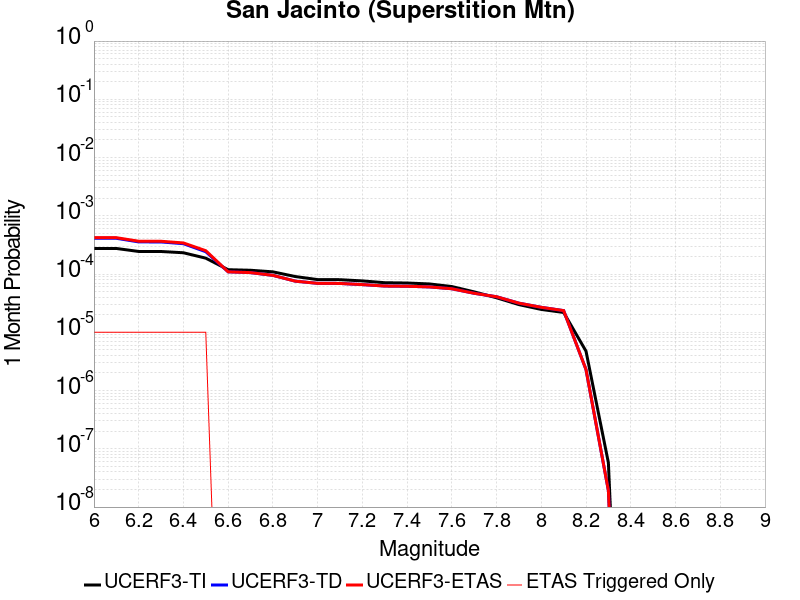 |  |  |

| Magnitude | 1 wk TI Prob | 1 wk TD Prob | 1 wk ETAS Prob | 1 wk ETAS/TD Gain | 1 wk ETAS Triggered Only | 1 mo TI Prob | 1 mo TD Prob | 1 mo ETAS Prob | 1 mo ETAS/TD Gain | 1 mo ETAS Triggered Only | 1 yr TI Prob | 1 yr TD Prob | 1 yr ETAS Prob | 1 yr ETAS/TD Gain | 1 yr ETAS Triggered Only | 10 yr TI Prob | 10 yr TD Prob | 10 yr ETAS Prob | 10 yr ETAS/TD Gain | 10 yr ETAS Triggered Only |
|-----|-----|-----|-----|-----|-----|-----|-----|-----|-----|-----|-----|-----|-----|-----|-----|-----|-----|-----|-----|-----|
| 6.0 | 6.4193904E-5 | 9.600831E-5 | 1.0600735E-4 | 1.1041477 | 1.0E-5 | 2.7508775E-4 | 4.114091E-4 | 4.2140498E-4 | 1.0242968 | 1.0E-5 | 0.0033440501 | 0.004998817 | 0.005008767 | 1.0019904 | 1.0E-5 | 0.03294174 | 0.04883098 | 0.04884049 | 1.0001948 | 1.0E-5 |
| 6.1 | 6.4193904E-5 | 9.600831E-5 | 1.0600735E-4 | 1.1041477 | 1.0E-5 | 2.7508775E-4 | 4.114091E-4 | 4.2140498E-4 | 1.0242968 | 1.0E-5 | 0.0033440501 | 0.004998817 | 0.005008767 | 1.0019904 | 1.0E-5 | 0.03294174 | 0.04883098 | 0.04884049 | 1.0001948 | 1.0E-5 |
| 6.2 | 5.7023593E-5 | 8.3157676E-5 | 9.315685E-5 | 1.1202434 | 1.0E-5 | 2.4436394E-4 | 3.563508E-4 | 3.6634723E-4 | 1.0280522 | 1.0E-5 | 0.002971072 | 0.004331579 | 0.0043415357 | 1.0022986 | 1.0E-5 | 0.029316625 | 0.04251064 | 0.042520214 | 1.0002252 | 1.0E-5 |
| 6.3 | 5.6940098E-5 | 8.300303E-5 | 9.30022E-5 | 1.1204675 | 1.0E-5 | 2.4400617E-4 | 3.556882E-4 | 3.6568462E-4 | 1.0281045 | 1.0E-5 | 0.002966728 | 0.004323544 | 0.0043335008 | 1.0023029 | 1.0E-5 | 0.029274331 | 0.042433888 | 0.042443465 | 1.0002257 | 1.0E-5 |
| 6.4 | 5.4171585E-5 | 7.7496596E-5 | 8.749582E-5 | 1.129028 | 1.0E-5 | 2.3214328E-4 | 3.3209528E-4 | 3.4209198E-4 | 1.0301019 | 1.0E-5 | 0.0028226813 | 0.004037413 | 0.0040473724 | 1.0024668 | 1.0E-5 | 0.02787096 | 0.039723083 | 0.039732683 | 1.0002418 | 1.0E-5 |
| 6.5 | 4.375144E-5 | 5.6433983E-5 | 6.643342E-5 | 1.1771882 | 1.0E-5 | 1.874927E-4 | 2.4184414E-4 | 2.5184173E-4 | 1.0413389 | 1.0E-5 | 0.0022803338 | 0.0029416524 | 0.002951623 | 1.0033895 | 1.0E-5 | 0.022570757 | 0.029243244 | 0.029252952 | 1.000332 | 1.0E-5 |
| 6.6 | 2.772192E-5 | 2.5500396E-5 | 2.5500396E-5 | 1.0 | 0.0 | 1.1880282E-4 | 1.0928294E-4 | 1.0928294E-4 | 1.0 | 0.0 | 0.0014454646 | 0.0013297271 | 0.0013297271 | 1.0 | 0.0 | 0.014360986 | 0.013546736 | 0.013546736 | 1.0 | 0.0 |
| 6.7 | 2.7124124E-5 | 2.4711368E-5 | 2.4711368E-5 | 1.0 | 0.0 | 1.1624106E-4 | 1.0590167E-4 | 1.0590167E-4 | 1.0 | 0.0 | 0.0014143161 | 0.0012886095 | 0.0012886095 | 1.0 | 0.0 | 0.014053487 | 0.013140163 | 0.013140163 | 1.0 | 0.0 |
| 6.8 | 2.5475807E-5 | 2.217615E-5 | 2.217615E-5 | 1.0 | 0.0 | 1.0917746E-4 | 9.503725E-5 | 9.503725E-5 | 1.0 | 0.0 | 0.001328425 | 0.0011564762 | 0.0011564762 | 1.0 | 0.0 | 0.0132051185 | 0.011828263 | 0.011828263 | 1.0 | 0.0 |
| 6.9 | 2.1162023E-5 | 1.7637032E-5 | 1.7637032E-5 | 1.0 | 0.0 | 9.069123E-5 | 7.558511E-5 | 7.558511E-5 | 1.0 | 0.0 | 0.0011036064 | 9.19864E-4 | 9.19864E-4 | 1.0 | 0.0 | 0.010981417 | 0.009452515 | 0.009452515 | 1.0 | 0.0 |
| 7.0 | 1.8754288E-5 | 1.6171856E-5 | 1.6171856E-5 | 1.0 | 0.0 | 8.037304E-5 | 6.930612E-5 | 6.930612E-5 | 1.0 | 0.0 | 9.781026E-4 | 8.434779E-4 | 8.434779E-4 | 1.0 | 0.0 | 0.009738087 | 0.008675421 | 0.008675421 | 1.0 | 0.0 |
| 7.1 | 1.8678527E-5 | 1.6096988E-5 | 1.6096988E-5 | 1.0 | 0.0 | 8.0048376E-5 | 6.898528E-5 | 6.898528E-5 | 1.0 | 0.0 | 9.7415317E-4 | 8.3957467E-4 | 8.3957467E-4 | 1.0 | 0.0 | 0.009698939 | 0.008636372 | 0.008636372 | 1.0 | 0.0 |
| 7.2 | 1.7804578E-5 | 1.5391457E-5 | 1.5391457E-5 | 1.0 | 0.0 | 7.6303106E-5 | 6.5961736E-5 | 6.5961736E-5 | 1.0 | 0.0 | 9.285943E-4 | 8.0279046E-4 | 8.0279046E-4 | 1.0 | 0.0 | 0.009247236 | 0.00826763 | 0.00826763 | 1.0 | 0.0 |
| 7.3 | 1.6583685E-5 | 1.4540444E-5 | 1.4540444E-5 | 1.0 | 0.0 | 7.1070994E-5 | 6.231471E-5 | 6.231471E-5 | 1.0 | 0.0 | 8.649459E-4 | 7.584195E-4 | 7.584195E-4 | 1.0 | 0.0 | 0.00861587 | 0.007822882 | 0.007822882 | 1.0 | 0.0 |
| 7.4 | 1.6387552E-5 | 1.4405309E-5 | 1.4405309E-5 | 1.0 | 0.0 | 7.023047E-5 | 6.173559E-5 | 6.173559E-5 | 1.0 | 0.0 | 8.5472054E-4 | 7.5137365E-4 | 7.5137365E-4 | 1.0 | 0.0 | 0.008514405 | 0.007752254 | 0.007752254 | 1.0 | 0.0 |
| 7.5 | 1.5790754E-5 | 1.4045893E-5 | 1.4045893E-5 | 1.0 | 0.0 | 6.767291E-5 | 6.0195307E-5 | 6.0195307E-5 | 1.0 | 0.0 | 8.236062E-4 | 7.326334E-4 | 7.326334E-4 | 1.0 | 0.0 | 0.008205604 | 0.007562764 | 0.007562764 | 1.0 | 0.0 |
| 7.6 | 1.4248672E-5 | 1.3064601E-5 | 1.3064601E-5 | 1.0 | 0.0 | 6.106431E-5 | 5.5989956E-5 | 5.5989956E-5 | 1.0 | 0.0 | 7.432043E-4 | 6.8146625E-4 | 6.8146625E-4 | 1.0 | 0.0 | 0.007407237 | 0.007045218 | 0.007045218 | 1.0 | 0.0 |
| 7.7 | 1.15449975E-5 | 1.091296E-5 | 1.091296E-5 | 1.0 | 0.0 | 4.947762E-5 | 4.676899E-5 | 4.676899E-5 | 1.0 | 0.0 | 6.022235E-4 | 5.6926446E-4 | 5.6926446E-4 | 1.0 | 0.0 | 0.006005941 | 0.0059150453 | 0.0059150453 | 1.0 | 0.0 |
| 7.8 | 9.1391985E-6 | 9.523217E-6 | 9.523217E-6 | 1.0 | 0.0 | 3.9167408E-5 | 4.0813153E-5 | 4.0813153E-5 | 1.0 | 0.0 | 4.767588E-4 | 4.967874E-4 | 4.967874E-4 | 1.0 | 0.0 | 0.0047573727 | 0.0051813642 | 0.0051813642 | 1.0 | 0.0 |
| 7.9 | 6.973017E-6 | 7.390076E-6 | 7.390076E-6 | 1.0 | 0.0 | 2.9884017E-5 | 3.167137E-5 | 3.167137E-5 | 1.0 | 0.0 | 3.6377716E-4 | 3.8553125E-4 | 3.8553125E-4 | 1.0 | 0.0 | 0.0036318225 | 0.004055946 | 0.004055946 | 1.0 | 0.0 |
| 8.0 | 5.7638235E-6 | 6.267176E-6 | 6.267176E-6 | 1.0 | 0.0 | 2.4701867E-5 | 2.6859052E-5 | 2.6859052E-5 | 1.0 | 0.0 | 3.0070372E-4 | 3.269604E-4 | 3.269604E-4 | 1.0 | 0.0 | 0.0030029714 | 0.003457241 | 0.003457241 | 1.0 | 0.0 |
| 8.1 | 5.1124434E-6 | 5.5022297E-6 | 5.5022297E-6 | 1.0 | 0.0 | 2.1910288E-5 | 2.3580775E-5 | 2.3580775E-5 | 1.0 | 0.0 | 2.6672508E-4 | 2.870586E-4 | 2.870586E-4 | 1.0 | 0.0 | 0.0026640517 | 0.0030437924 | 0.0030437924 | 1.0 | 0.0 |
| 8.2 | 1.1075938E-6 | 5.346179E-7 | 5.346179E-7 | 1.0 | 0.0 | 4.7468216E-6 | 2.291218E-6 | 2.291218E-6 | 1.0 | 0.0 | 5.779102E-5 | 2.7895241E-5 | 2.7895241E-5 | 1.0 | 0.0 | 5.777599E-4 | 3.14E-4 | 3.14E-4 | 1.0 | 0.0 |
| 8.3 | 1.3584393E-8 | 4.4830157E-9 | 4.4830157E-9 | 1.0 | 0.0 | 5.8218827E-8 | 1.9212925E-8 | 1.9212925E-8 | 1.0 | 0.0 | 7.0881396E-7 | 2.3391735E-7 | 2.3391735E-7 | 1.0 | 0.0 | 7.0881174E-6 | 2.6214518E-6 | 2.6214518E-6 | 1.0 | 0.0 |

## Calaveras (So) 2011 CFM
*[(top)](#table-of-contents)*

| 1 Week | 1 Month | 1 Year | 10 Year |
|-----|-----|-----|-----|
|  |  |  |  |

| Magnitude | 1 wk TI Prob | 1 wk TD Prob | 1 wk ETAS Prob | 1 wk ETAS/TD Gain | 1 wk ETAS Triggered Only | 1 mo TI Prob | 1 mo TD Prob | 1 mo ETAS Prob | 1 mo ETAS/TD Gain | 1 mo ETAS Triggered Only | 1 yr TI Prob | 1 yr TD Prob | 1 yr ETAS Prob | 1 yr ETAS/TD Gain | 1 yr ETAS Triggered Only | 10 yr TI Prob | 10 yr TD Prob | 10 yr ETAS Prob | 10 yr ETAS/TD Gain | 10 yr ETAS Triggered Only |
|-----|-----|-----|-----|-----|-----|-----|-----|-----|-----|-----|-----|-----|-----|-----|-----|-----|-----|-----|-----|-----|
| 6.0 | 1.5950744E-4 | 3.0727786E-4 | 3.0727786E-4 | 1.0 | 0.0 | 6.834242E-4 | 0.0013162618 | 0.0013162618 | 1.0 | 0.0 | 0.00828899 | 0.01586346 | 0.01586346 | 1.0 | 0.0 | 0.079865426 | 0.14443964 | 0.14444819 | 1.0000592 | 1.0E-5 |
| 6.1 | 1.3584697E-4 | 2.6051197E-4 | 2.6051197E-4 | 1.0 | 0.0 | 5.8207137E-4 | 0.0011160214 | 0.0011160214 | 1.0 | 0.0 | 0.007063716 | 0.013466303 | 0.013466303 | 1.0 | 0.0 | 0.06843361 | 0.12406684 | 0.1240756 | 1.0000706 | 1.0E-5 |
| 6.2 | 1.14676266E-4 | 2.1738415E-4 | 2.1738415E-4 | 1.0 | 0.0 | 4.9137714E-4 | 9.313295E-4 | 9.313295E-4 | 1.0 | 0.0 | 0.0059661185 | 0.011249501 | 0.011249501 | 1.0 | 0.0 | 0.058084648 | 0.105057 | 0.10506595 | 1.0000852 | 1.0E-5 |
| 6.3 | 8.691518E-5 | 1.5996095E-4 | 1.5996095E-4 | 1.0 | 0.0 | 3.7244044E-4 | 6.8536296E-4 | 6.8536296E-4 | 1.0 | 0.0 | 0.004525038 | 0.0083052125 | 0.0083052125 | 1.0 | 0.0 | 0.044339992 | 0.079372585 | 0.079381794 | 1.000116 | 1.0E-5 |
| 6.4 | 8.50982E-5 | 1.5702473E-4 | 1.5702473E-4 | 1.0 | 0.0 | 3.646556E-4 | 6.727857E-4 | 6.727857E-4 | 1.0 | 0.0 | 0.0044306475 | 0.0081532365 | 0.0081532365 | 1.0 | 0.0 | 0.04343345 | 0.07797867 | 0.077987894 | 1.0001183 | 1.0E-5 |
| 6.5 | 8.4062965E-5 | 1.552701E-4 | 1.552701E-4 | 1.0 | 0.0 | 3.602201E-4 | 6.652697E-4 | 6.652697E-4 | 1.0 | 0.0 | 0.004376863 | 0.0080624325 | 0.0080624325 | 1.0 | 0.0 | 0.042916555 | 0.07714991 | 0.077159144 | 1.0001196 | 1.0E-5 |
| 6.6 | 8.194716E-5 | 1.5162873E-4 | 1.5162873E-4 | 1.0 | 0.0 | 3.5115483E-4 | 6.4967165E-4 | 6.4967165E-4 | 1.0 | 0.0 | 0.0042669317 | 0.007874262 | 0.007874262 | 1.0 | 0.0 | 0.04185927 | 0.07543511 | 0.07544435 | 1.0001225 | 1.0E-5 |
| 6.7 | 8.012326E-5 | 1.4830513E-4 | 1.4830513E-4 | 1.0 | 0.0 | 3.433402E-4 | 6.3543825E-4 | 6.3543825E-4 | 1.0 | 0.0 | 0.004172157 | 0.0077027446 | 0.0077027446 | 1.0 | 0.0 | 0.040946912 | 0.073877186 | 0.07388645 | 1.0001254 | 1.0E-5 |
| 6.8 | 7.119773E-5 | 1.2888704E-4 | 1.2888704E-4 | 1.0 | 0.0 | 3.0509746E-4 | 5.522555E-4 | 5.522555E-4 | 1.0 | 0.0 | 0.0037082357 | 0.0066999346 | 0.0066999346 | 1.0 | 0.0 | 0.036469642 | 0.06472007 | 0.06472007 | 1.0 | 0.0 |
| 6.9 | 5.7343088E-5 | 9.925659E-5 | 9.925659E-5 | 1.0 | 0.0 | 2.4573295E-4 | 4.2531648E-4 | 4.2531648E-4 | 1.0 | 0.0 | 0.0029876942 | 0.0051660156 | 0.0051660156 | 1.0 | 0.0 | 0.02947844 | 0.050540965 | 0.050540965 | 1.0 | 0.0 |
| 7.0 | 4.8746577E-5 | 8.291376E-5 | 8.291376E-5 | 1.0 | 0.0 | 2.0889717E-4 | 3.5529662E-4 | 3.5529662E-4 | 1.0 | 0.0 | 0.0025403565 | 0.004317223 | 0.004317223 | 1.0 | 0.0 | 0.025115121 | 0.042516556 | 0.042516556 | 1.0 | 0.0 |
| 7.1 | 4.2998014E-5 | 7.2698065E-5 | 7.2698065E-5 | 1.0 | 0.0 | 1.8426418E-4 | 3.1152627E-4 | 3.1152627E-4 | 1.0 | 0.0 | 0.002241108 | 0.0037862961 | 0.0037862961 | 1.0 | 0.0 | 0.022186412 | 0.03744698 | 0.03744698 | 1.0 | 0.0 |
| 7.2 | 3.221292E-5 | 5.3953165E-5 | 5.3953165E-5 | 1.0 | 0.0 | 1.3804805E-4 | 2.3120751E-4 | 2.3120751E-4 | 1.0 | 0.0 | 0.0016794393 | 0.0028113457 | 0.0028113457 | 1.0 | 0.0 | 0.016668037 | 0.028059289 | 0.028059289 | 1.0 | 0.0 |
| 7.3 | 2.3756531E-5 | 3.951658E-5 | 3.951658E-5 | 1.0 | 0.0 | 1.0180973E-4 | 1.6934588E-4 | 1.6934588E-4 | 1.0 | 0.0 | 0.0012388286 | 0.0020598534 | 0.0020598534 | 1.0 | 0.0 | 0.012319452 | 0.020665664 | 0.020665664 | 1.0 | 0.0 |
| 7.4 | 1.5997684E-5 | 2.7358523E-5 | 2.7358523E-5 | 1.0 | 0.0 | 6.8559704E-5 | 1.1724555E-4 | 1.1724555E-4 | 1.0 | 0.0 | 8.343947E-4 | 0.0014265324 | 0.0014265324 | 1.0 | 0.0 | 0.008312687 | 0.01438514 | 0.01438514 | 1.0 | 0.0 |
| 7.5 | 1.3814293E-5 | 2.4799807E-5 | 2.4799807E-5 | 1.0 | 0.0 | 5.9202768E-5 | 1.0628057E-4 | 1.0628057E-4 | 1.0 | 0.0 | 7.205553E-4 | 0.0012932003 | 0.0012932003 | 1.0 | 0.0 | 0.007182234 | 0.013064139 | 0.013064139 | 1.0 | 0.0 |
| 7.6 | 8.817309E-6 | 1.6444723E-5 | 1.6444723E-5 | 1.0 | 0.0 | 3.7787922E-5 | 7.0475486E-5 | 7.0475486E-5 | 1.0 | 0.0 | 4.5997082E-4 | 8.577026E-4 | 8.577026E-4 | 1.0 | 0.0 | 0.004590199 | 0.008727145 | 0.008727145 | 1.0 | 0.0 |
| 7.7 | 4.0352206E-6 | 7.715851E-6 | 7.715851E-6 | 1.0 | 0.0 | 1.7293689E-5 | 3.3067514E-5 | 3.3067514E-5 | 1.0 | 0.0 | 2.1053031E-4 | 4.0252268E-4 | 4.0252268E-4 | 1.0 | 0.0 | 0.0021033096 | 0.004169391 | 0.004169391 | 1.0 | 0.0 |
| 7.8 | 3.413169E-6 | 6.7946817E-6 | 6.7946817E-6 | 1.0 | 0.0 | 1.4627784E-5 | 2.911974E-5 | 2.911974E-5 | 1.0 | 0.0 | 1.7807873E-4 | 3.544752E-4 | 3.544752E-4 | 1.0 | 0.0 | 0.0017793609 | 0.0036701332 | 0.0036701332 | 1.0 | 0.0 |
| 7.9 | 2.4740732E-6 | 5.2845594E-6 | 5.2845594E-6 | 1.0 | 0.0 | 1.06031275E-5 | 2.2647915E-5 | 2.2647915E-5 | 1.0 | 0.0 | 1.2908543E-4 | 2.7570353E-4 | 2.7570353E-4 | 1.0 | 0.0 | 0.0012901047 | 0.0028374332 | 0.0028374332 | 1.0 | 0.0 |
| 8.0 | 1.5231818E-6 | 3.2921057E-6 | 3.2921057E-6 | 1.0 | 0.0 | 6.527906E-6 | 1.4108949E-5 | 1.4108949E-5 | 1.0 | 0.0 | 7.9474354E-5 | 1.7176295E-4 | 1.7176295E-4 | 1.0 | 0.0 | 7.944594E-4 | 0.0017580355 | 0.0017580355 | 1.0 | 0.0 |
| 8.1 | 1.0104524E-6 | 2.0477617E-6 | 2.0477617E-6 | 1.0 | 0.0 | 4.330503E-6 | 8.776092E-6 | 8.776092E-6 | 1.0 | 0.0 | 5.2722597E-5 | 1.0684371E-4 | 1.0684371E-4 | 1.0 | 0.0 | 5.271009E-4 | 0.0010939686 | 0.0010939686 | 1.0 | 0.0 |

## Earthquake Valley
*[(top)](#table-of-contents)*

| 1 Week | 1 Month | 1 Year | 10 Year |
|-----|-----|-----|-----|
|  |  |  |  |

| Magnitude | 1 wk TI Prob | 1 wk TD Prob | 1 wk ETAS Prob | 1 wk ETAS/TD Gain | 1 wk ETAS Triggered Only | 1 mo TI Prob | 1 mo TD Prob | 1 mo ETAS Prob | 1 mo ETAS/TD Gain | 1 mo ETAS Triggered Only | 1 yr TI Prob | 1 yr TD Prob | 1 yr ETAS Prob | 1 yr ETAS/TD Gain | 1 yr ETAS Triggered Only | 10 yr TI Prob | 10 yr TD Prob | 10 yr ETAS Prob | 10 yr ETAS/TD Gain | 10 yr ETAS Triggered Only |
|-----|-----|-----|-----|-----|-----|-----|-----|-----|-----|-----|-----|-----|-----|-----|-----|-----|-----|-----|-----|-----|
| 6.0 | 1.9416384E-5 | 2.2585084E-5 | 2.2585084E-5 | 1.0 | 0.0 | 8.321042E-5 | 9.67903E-5 | 9.67903E-5 | 1.0 | 0.0 | 0.001012616 | 0.0011779051 | 0.0011779051 | 1.0 | 0.0 | 0.010080142 | 0.011728462 | 0.011738345 | 1.0008426 | 1.0E-5 |
| 6.1 | 1.9416384E-5 | 2.2585084E-5 | 2.2585084E-5 | 1.0 | 0.0 | 8.321042E-5 | 9.67903E-5 | 9.67903E-5 | 1.0 | 0.0 | 0.001012616 | 0.0011779051 | 0.0011779051 | 1.0 | 0.0 | 0.010080142 | 0.011728462 | 0.011738345 | 1.0008426 | 1.0E-5 |
| 6.2 | 1.9416384E-5 | 2.2585084E-5 | 2.2585084E-5 | 1.0 | 0.0 | 8.321042E-5 | 9.67903E-5 | 9.67903E-5 | 1.0 | 0.0 | 0.001012616 | 0.0011779051 | 0.0011779051 | 1.0 | 0.0 | 0.010080142 | 0.011728462 | 0.011738345 | 1.0008426 | 1.0E-5 |
| 6.3 | 1.9416384E-5 | 2.2585084E-5 | 2.2585084E-5 | 1.0 | 0.0 | 8.321042E-5 | 9.67903E-5 | 9.67903E-5 | 1.0 | 0.0 | 0.001012616 | 0.0011779051 | 0.0011779051 | 1.0 | 0.0 | 0.010080142 | 0.011728462 | 0.011738345 | 1.0008426 | 1.0E-5 |
| 6.4 | 1.9416384E-5 | 2.2585084E-5 | 2.2585084E-5 | 1.0 | 0.0 | 8.321042E-5 | 9.67903E-5 | 9.67903E-5 | 1.0 | 0.0 | 0.001012616 | 0.0011779051 | 0.0011779051 | 1.0 | 0.0 | 0.010080142 | 0.011728462 | 0.011738345 | 1.0008426 | 1.0E-5 |
| 6.5 | 1.9389157E-5 | 2.2553671E-5 | 2.2553671E-5 | 1.0 | 0.0 | 8.309374E-5 | 9.665569E-5 | 9.665569E-5 | 1.0 | 0.0 | 0.0010111968 | 0.001176268 | 0.001176268 | 1.0 | 0.0 | 0.010066078 | 0.011712263 | 0.0117221465 | 1.0008438 | 1.0E-5 |
| 6.6 | 1.9389157E-5 | 2.2553671E-5 | 2.2553671E-5 | 1.0 | 0.0 | 8.309374E-5 | 9.665569E-5 | 9.665569E-5 | 1.0 | 0.0 | 0.0010111968 | 0.001176268 | 0.001176268 | 1.0 | 0.0 | 0.010066078 | 0.011712263 | 0.0117221465 | 1.0008438 | 1.0E-5 |
| 6.7 | 1.4925434E-5 | 1.7208951E-5 | 1.7208951E-5 | 1.0 | 0.0 | 6.396457E-5 | 7.375104E-5 | 7.375104E-5 | 1.0 | 0.0 | 7.7849044E-4 | 8.9763413E-4 | 8.9763413E-4 | 1.0 | 0.0 | 0.007757689 | 0.00894846 | 0.00894846 | 1.0 | 0.0 |
| 6.8 | 1.3570335E-5 | 1.5617494E-5 | 1.5617494E-5 | 1.0 | 0.0 | 5.8157282E-5 | 6.6930865E-5 | 6.6930865E-5 | 1.0 | 0.0 | 7.0783484E-4 | 8.146607E-4 | 8.146607E-4 | 1.0 | 0.0 | 0.0070558446 | 0.008124814 | 0.008124814 | 1.0 | 0.0 |
| 6.9 | 1.3570335E-5 | 1.5617494E-5 | 1.5617494E-5 | 1.0 | 0.0 | 5.8157282E-5 | 6.6930865E-5 | 6.6930865E-5 | 1.0 | 0.0 | 7.0783484E-4 | 8.146607E-4 | 8.146607E-4 | 1.0 | 0.0 | 0.0070558446 | 0.008124814 | 0.008124814 | 1.0 | 0.0 |
| 7.0 | 1.3433392E-5 | 1.5461032E-5 | 1.5461032E-5 | 1.0 | 0.0 | 5.757041E-5 | 6.626034E-5 | 6.626034E-5 | 1.0 | 0.0 | 7.0069433E-4 | 8.065032E-4 | 8.065032E-4 | 1.0 | 0.0 | 0.006984891 | 0.008043831 | 0.008043831 | 1.0 | 0.0 |
| 7.1 | 8.181609E-6 | 9.417254E-6 | 9.417254E-6 | 1.0 | 0.0 | 3.5063567E-5 | 4.0359413E-5 | 4.0359413E-5 | 1.0 | 0.0 | 4.268153E-4 | 4.9133215E-4 | 4.9133215E-4 | 1.0 | 0.0 | 0.0042599645 | 0.0049090353 | 0.0049090353 | 1.0 | 0.0 |
| 7.2 | 2.0663983E-7 | 1.7264212E-7 | 1.7264212E-7 | 1.0 | 0.0 | 8.855989E-7 | 7.3989463E-7 | 7.3989463E-7 | 1.0 | 0.0 | 1.0782113E-5 | 9.008183E-6 | 9.008183E-6 | 1.0 | 0.0 | 1.07815904E-4 | 9.007854E-5 | 9.007854E-5 | 1.0 | 0.0 |
| 7.3 | 2.0462376E-7 | 1.70797E-7 | 1.70797E-7 | 1.0 | 0.0 | 8.7695867E-7 | 7.319869E-7 | 7.319869E-7 | 1.0 | 0.0 | 1.0676919E-5 | 8.911908E-6 | 8.911908E-6 | 1.0 | 0.0 | 1.0676406E-4 | 8.911586E-5 | 8.911586E-5 | 1.0 | 0.0 |
| 7.4 | 2.0171088E-7 | 1.6862165E-7 | 1.6862165E-7 | 1.0 | 0.0 | 8.644749E-7 | 7.226641E-7 | 7.226641E-7 | 1.0 | 0.0 | 1.0524931E-5 | 8.7984035E-6 | 8.7984035E-6 | 1.0 | 0.0 | 1.05244326E-4 | 8.798091E-5 | 8.798091E-5 | 1.0 | 0.0 |
| 7.5 | 1.4847944E-7 | 1.2560325E-7 | 1.2560325E-7 | 1.0 | 0.0 | 6.363403E-7 | 5.3829956E-7 | 5.3829956E-7 | 1.0 | 0.0 | 7.747416E-6 | 6.5537797E-6 | 6.5537797E-6 | 1.0 | 0.0 | 7.747146E-5 | 6.553608E-5 | 6.553608E-5 | 1.0 | 0.0 |
| 7.6 | 1.3185847E-7 | 1.11241825E-7 | 1.11241825E-7 | 1.0 | 0.0 | 5.6510765E-7 | 4.767506E-7 | 4.767506E-7 | 1.0 | 0.0 | 6.8801637E-6 | 5.804425E-6 | 5.804425E-6 | 1.0 | 0.0 | 6.8799505E-5 | 5.8042948E-5 | 5.8042948E-5 | 1.0 | 0.0 |
| 7.7 | 2.8609954E-8 | 1.4172374E-8 | 1.4172374E-8 | 1.0 | 0.0 | 1.2261408E-7 | 6.073875E-8 | 6.073875E-8 | 1.0 | 0.0 | 1.4928254E-6 | 7.3949406E-7 | 7.3949406E-7 | 1.0 | 0.0 | 1.4928154E-5 | 7.3949213E-6 | 7.3949213E-6 | 1.0 | 0.0 |
| 7.8 | 6.527266E-9 | 2.9236933E-9 | 2.9236933E-9 | 1.0 | 0.0 | 2.7973995E-8 | 1.2530115E-8 | 1.2530115E-8 | 1.0 | 0.0 | 3.4058334E-7 | 1.5255414E-7 | 1.5255414E-7 | 1.0 | 0.0 | 3.4058282E-6 | 1.5255406E-6 | 1.5255406E-6 | 1.0 | 0.0 |
| 7.9 | 1.2898267E-9 | 7.128167E-10 | 7.128167E-10 | 1.0 | 0.0 | 5.527829E-9 | 3.0549288E-9 | 3.0549288E-9 | 1.0 | 0.0 | 6.7301315E-8 | 3.7193757E-8 | 3.7193757E-8 | 1.0 | 0.0 | 6.7301295E-7 | 3.7193757E-7 | 3.7193757E-7 | 1.0 | 0.0 |

## Greenville (No) 2011 CFM
*[(top)](#table-of-contents)*

| 1 Week | 1 Month | 1 Year | 10 Year |
|-----|-----|-----|-----|
|  |  |  |  |

| Magnitude | 1 wk TI Prob | 1 wk TD Prob | 1 wk ETAS Prob | 1 wk ETAS/TD Gain | 1 wk ETAS Triggered Only | 1 mo TI Prob | 1 mo TD Prob | 1 mo ETAS Prob | 1 mo ETAS/TD Gain | 1 mo ETAS Triggered Only | 1 yr TI Prob | 1 yr TD Prob | 1 yr ETAS Prob | 1 yr ETAS/TD Gain | 1 yr ETAS Triggered Only | 10 yr TI Prob | 10 yr TD Prob | 10 yr ETAS Prob | 10 yr ETAS/TD Gain | 10 yr ETAS Triggered Only |
|-----|-----|-----|-----|-----|-----|-----|-----|-----|-----|-----|-----|-----|-----|-----|-----|-----|-----|-----|-----|-----|
| 6.0 | 3.286654E-5 | 4.0368323E-5 | 4.0368323E-5 | 1.0 | 0.0 | 1.4084899E-4 | 1.7299583E-4 | 1.7299583E-4 | 1.0 | 0.0 | 0.0017134876 | 0.002104228 | 0.002114207 | 1.0047424 | 1.0E-5 | 0.017003356 | 0.020847922 | 0.020857712 | 1.0004697 | 1.0E-5 |
| 6.1 | 3.286654E-5 | 4.0368323E-5 | 4.0368323E-5 | 1.0 | 0.0 | 1.4084899E-4 | 1.7299583E-4 | 1.7299583E-4 | 1.0 | 0.0 | 0.0017134876 | 0.002104228 | 0.002114207 | 1.0047424 | 1.0E-5 | 0.017003356 | 0.020847922 | 0.020857712 | 1.0004697 | 1.0E-5 |
| 6.2 | 3.1697953E-5 | 3.893114E-5 | 3.893114E-5 | 1.0 | 0.0 | 1.358413E-4 | 1.6683727E-4 | 1.6683727E-4 | 1.0 | 0.0 | 0.0016526132 | 0.0020293896 | 0.0020293896 | 1.0 | 0.0 | 0.01640377 | 0.020113273 | 0.020113273 | 1.0 | 0.0 |
| 6.3 | 3.1363317E-5 | 3.8519993E-5 | 3.8519993E-5 | 1.0 | 0.0 | 1.344073E-4 | 1.6507543E-4 | 1.6507543E-4 | 1.0 | 0.0 | 0.0016351803 | 0.0020079787 | 0.0020079787 | 1.0 | 0.0 | 0.016232004 | 0.019903028 | 0.019903028 | 1.0 | 0.0 |
| 6.4 | 3.0228604E-5 | 3.7127043E-5 | 3.7127043E-5 | 1.0 | 0.0 | 1.2954473E-4 | 1.5910638E-4 | 1.5910638E-4 | 1.0 | 0.0 | 0.0015760659 | 0.0019354363 | 0.0019354363 | 1.0 | 0.0 | 0.015649348 | 0.019190326 | 0.019190326 | 1.0 | 0.0 |
| 6.5 | 2.9537814E-5 | 3.6282447E-5 | 3.6282447E-5 | 1.0 | 0.0 | 1.2658449E-4 | 1.5548713E-4 | 1.5548713E-4 | 1.0 | 0.0 | 0.0015400766 | 0.001891449 | 0.001891449 | 1.0 | 0.0 | 0.01529447 | 0.018757964 | 0.018757964 | 1.0 | 0.0 |
| 6.6 | 2.7345395E-5 | 3.359162E-5 | 3.359162E-5 | 1.0 | 0.0 | 1.1718928E-4 | 1.4395629E-4 | 1.4395629E-4 | 1.0 | 0.0 | 0.0014258457 | 0.0017512899 | 0.0017512899 | 1.0 | 0.0 | 0.014167317 | 0.017378705 | 0.017378705 | 1.0 | 0.0 |
| 6.7 | 2.5615784E-5 | 3.156843E-5 | 3.156843E-5 | 1.0 | 0.0 | 1.09777306E-4 | 1.352864E-4 | 1.352864E-4 | 1.0 | 0.0 | 0.0013357193 | 0.0016458981 | 0.0016458981 | 1.0 | 0.0 | 0.013277191 | 0.016340753 | 0.016340753 | 1.0 | 0.0 |
| 6.8 | 2.0059057E-5 | 2.4712988E-5 | 2.4712988E-5 | 1.0 | 0.0 | 8.596455E-5 | 1.0590859E-4 | 1.0590859E-4 | 1.0 | 0.0 | 0.0010461159 | 0.0012886907 | 0.0012886907 | 1.0 | 0.0 | 0.0104120495 | 0.012814194 | 0.012814194 | 1.0 | 0.0 |
| 6.9 | 1.6321746E-5 | 2.0185327E-5 | 2.0185327E-5 | 1.0 | 0.0 | 6.9948466E-5 | 8.6505745E-5 | 8.6505745E-5 | 1.0 | 0.0 | 8.5128983E-4 | 0.0010527109 | 0.0010527109 | 1.0 | 0.0 | 0.008480361 | 0.010478771 | 0.010478771 | 1.0 | 0.0 |
| 7.0 | 1.22527645E-5 | 1.5136057E-5 | 1.5136057E-5 | 1.0 | 0.0 | 5.2510793E-5 | 6.486723E-5 | 6.486723E-5 | 1.0 | 0.0 | 6.3913135E-4 | 7.8947656E-4 | 7.8947656E-4 | 1.0 | 0.0 | 0.0063729626 | 0.007867357 | 0.007867357 | 1.0 | 0.0 |
| 7.1 | 8.996482E-6 | 1.1165205E-5 | 1.1165205E-5 | 1.0 | 0.0 | 3.8555783E-5 | 4.7850008E-5 | 4.7850008E-5 | 1.0 | 0.0 | 4.6931554E-4 | 5.8241934E-4 | 5.8241934E-4 | 1.0 | 0.0 | 0.004683256 | 0.0058092205 | 0.0058092205 | 1.0 | 0.0 |
| 7.2 | 6.0273087E-6 | 7.5696203E-6 | 7.5696203E-6 | 1.0 | 0.0 | 2.5831067E-5 | 3.2440832E-5 | 3.2440832E-5 | 1.0 | 0.0 | 3.1444785E-4 | 3.9489623E-4 | 3.9489623E-4 | 1.0 | 0.0 | 0.0031400328 | 0.003942142 | 0.003942142 | 1.0 | 0.0 |
| 7.3 | 3.1209995E-6 | 3.966436E-6 | 3.966436E-6 | 1.0 | 0.0 | 1.3375643E-5 | 1.6998902E-5 | 1.6998902E-5 | 1.0 | 0.0 | 1.6283628E-4 | 2.0694213E-4 | 2.0694213E-4 | 1.0 | 0.0 | 0.0016271701 | 0.0020675845 | 0.0020675845 | 1.0 | 0.0 |
| 7.4 | 2.0254208E-6 | 2.6096434E-6 | 2.6096434E-6 | 1.0 | 0.0 | 8.680347E-6 | 1.1184138E-5 | 1.1184138E-5 | 1.0 | 0.0 | 1.0567809E-4 | 1.3615844E-4 | 1.3615844E-4 | 1.0 | 0.0 | 0.0010562785 | 0.001360807 | 0.001360807 | 1.0 | 0.0 |
| 7.5 | 1.6763418E-6 | 2.1733672E-6 | 2.1733672E-6 | 1.0 | 0.0 | 7.184302E-6 | 9.314398E-6 | 9.314398E-6 | 1.0 | 0.0 | 8.746537E-5 | 1.13396956E-4 | 1.13396956E-4 | 1.0 | 0.0 | 8.743095E-4 | 0.0011334379 | 0.0011334379 | 1.0 | 0.0 |
| 7.6 | 1.1935462E-6 | 1.5458563E-6 | 1.5458563E-6 | 1.0 | 0.0 | 5.115188E-6 | 6.625082E-6 | 6.625082E-6 | 1.0 | 0.0 | 6.2275634E-5 | 8.065743E-5 | 8.065743E-5 | 1.0 | 0.0 | 6.2258187E-4 | 8.0631225E-4 | 8.0631225E-4 | 1.0 | 0.0 |
| 7.7 | 3.0464201E-7 | 3.9847114E-7 | 3.9847114E-7 | 1.0 | 0.0 | 1.3056081E-6 | 1.7077324E-6 | 1.7077324E-6 | 1.0 | 0.0 | 1.589566E-5 | 2.0791449E-5 | 2.0791449E-5 | 1.0 | 0.0 | 1.5894524E-4 | 2.0789975E-4 | 2.0789975E-4 | 1.0 | 0.0 |

## Los Alamos extension
*[(top)](#table-of-contents)*

| 1 Week | 1 Month | 1 Year | 10 Year |
|-----|-----|-----|-----|
|  |  |  |  |

| Magnitude | 1 wk TI Prob | 1 wk TD Prob | 1 wk ETAS Prob | 1 wk ETAS/TD Gain | 1 wk ETAS Triggered Only | 1 mo TI Prob | 1 mo TD Prob | 1 mo ETAS Prob | 1 mo ETAS/TD Gain | 1 mo ETAS Triggered Only | 1 yr TI Prob | 1 yr TD Prob | 1 yr ETAS Prob | 1 yr ETAS/TD Gain | 1 yr ETAS Triggered Only | 10 yr TI Prob | 10 yr TD Prob | 10 yr ETAS Prob | 10 yr ETAS/TD Gain | 10 yr ETAS Triggered Only |
|-----|-----|-----|-----|-----|-----|-----|-----|-----|-----|-----|-----|-----|-----|-----|-----|-----|-----|-----|-----|-----|
| 6.0 | 4.0146506E-6 | 4.086201E-6 | 4.086201E-6 | 1.0 | 0.0 | 1.7205533E-5 | 1.7512179E-5 | 1.7512179E-5 | 1.0 | 0.0 | 2.0945723E-4 | 2.1319102E-4 | 2.1319102E-4 | 1.0 | 0.0 | 0.0020925992 | 0.0021299743 | 0.002139953 | 1.0046849 | 1.0E-5 |
| 6.1 | 4.0146506E-6 | 4.086201E-6 | 4.086201E-6 | 1.0 | 0.0 | 1.7205533E-5 | 1.7512179E-5 | 1.7512179E-5 | 1.0 | 0.0 | 2.0945723E-4 | 2.1319102E-4 | 2.1319102E-4 | 1.0 | 0.0 | 0.0020925992 | 0.0021299743 | 0.002139953 | 1.0046849 | 1.0E-5 |
| 6.2 | 4.0146506E-6 | 4.086201E-6 | 4.086201E-6 | 1.0 | 0.0 | 1.7205533E-5 | 1.7512179E-5 | 1.7512179E-5 | 1.0 | 0.0 | 2.0945723E-4 | 2.1319102E-4 | 2.1319102E-4 | 1.0 | 0.0 | 0.0020925992 | 0.0021299743 | 0.002139953 | 1.0046849 | 1.0E-5 |
| 6.3 | 4.0146506E-6 | 4.086201E-6 | 4.086201E-6 | 1.0 | 0.0 | 1.7205533E-5 | 1.7512179E-5 | 1.7512179E-5 | 1.0 | 0.0 | 2.0945723E-4 | 2.1319102E-4 | 2.1319102E-4 | 1.0 | 0.0 | 0.0020925992 | 0.0021299743 | 0.002139953 | 1.0046849 | 1.0E-5 |
| 6.4 | 4.0146506E-6 | 4.086201E-6 | 4.086201E-6 | 1.0 | 0.0 | 1.7205533E-5 | 1.7512179E-5 | 1.7512179E-5 | 1.0 | 0.0 | 2.0945723E-4 | 2.1319102E-4 | 2.1319102E-4 | 1.0 | 0.0 | 0.0020925992 | 0.0021299743 | 0.002139953 | 1.0046849 | 1.0E-5 |
| 6.5 | 4.0146506E-6 | 4.086201E-6 | 4.086201E-6 | 1.0 | 0.0 | 1.7205533E-5 | 1.7512179E-5 | 1.7512179E-5 | 1.0 | 0.0 | 2.0945723E-4 | 2.1319102E-4 | 2.1319102E-4 | 1.0 | 0.0 | 0.0020925992 | 0.0021299743 | 0.002139953 | 1.0046849 | 1.0E-5 |
| 6.6 | 4.0146506E-6 | 4.086201E-6 | 4.086201E-6 | 1.0 | 0.0 | 1.7205533E-5 | 1.7512179E-5 | 1.7512179E-5 | 1.0 | 0.0 | 2.0945723E-4 | 2.1319102E-4 | 2.1319102E-4 | 1.0 | 0.0 | 0.0020925992 | 0.0021299743 | 0.002139953 | 1.0046849 | 1.0E-5 |
| 6.7 | 4.0146506E-6 | 4.086201E-6 | 4.086201E-6 | 1.0 | 0.0 | 1.7205533E-5 | 1.7512179E-5 | 1.7512179E-5 | 1.0 | 0.0 | 2.0945723E-4 | 2.1319102E-4 | 2.1319102E-4 | 1.0 | 0.0 | 0.0020925992 | 0.0021299743 | 0.002139953 | 1.0046849 | 1.0E-5 |
| 6.8 | 3.6584688E-6 | 3.7188972E-6 | 3.7188972E-6 | 1.0 | 0.0 | 1.5679057E-5 | 1.593804E-5 | 1.593804E-5 | 1.0 | 0.0 | 1.9087581E-4 | 1.9402929E-4 | 1.9402929E-4 | 1.0 | 0.0 | 0.0019071194 | 0.0019386911 | 0.0019386911 | 1.0 | 0.0 |
| 6.9 | 3.644631E-6 | 3.704607E-6 | 3.704607E-6 | 1.0 | 0.0 | 1.5619753E-5 | 1.5876796E-5 | 1.5876796E-5 | 1.0 | 0.0 | 1.901539E-4 | 1.9328378E-4 | 1.9328378E-4 | 1.0 | 0.0 | 0.0018999127 | 0.0019312492 | 0.0019312492 | 1.0 | 0.0 |
| 7.0 | 3.6318522E-6 | 3.6913675E-6 | 3.6913675E-6 | 1.0 | 0.0 | 1.5564989E-5 | 1.5820056E-5 | 1.5820056E-5 | 1.0 | 0.0 | 1.8948725E-4 | 1.9259308E-4 | 1.9259308E-4 | 1.0 | 0.0 | 0.0018932576 | 0.0019243542 | 0.0019243542 | 1.0 | 0.0 |
| 7.1 | 3.5001724E-6 | 3.555437E-6 | 3.555437E-6 | 1.0 | 0.0 | 1.5000653E-5 | 1.5237503E-5 | 1.5237503E-5 | 1.0 | 0.0 | 1.8261763E-4 | 1.8550173E-4 | 1.8550173E-4 | 1.0 | 0.0 | 0.0018246764 | 0.0018535595 | 0.0018535595 | 1.0 | 0.0 |
| 7.2 | 2.5204702E-6 | 2.5437225E-6 | 2.5437225E-6 | 1.0 | 0.0 | 1.080197E-5 | 1.0901623E-5 | 1.0901623E-5 | 1.0 | 0.0 | 1.3150605E-4 | 1.3271923E-4 | 1.3271923E-4 | 1.0 | 0.0 | 0.0013142825 | 0.0013264052 | 0.0013264052 | 1.0 | 0.0 |
| 7.3 | 2.1399692E-6 | 2.1501562E-6 | 2.1501562E-6 | 1.0 | 0.0 | 9.1712645E-6 | 9.214923E-6 | 9.214923E-6 | 1.0 | 0.0 | 1.1165442E-4 | 1.1218594E-4 | 1.1218594E-4 | 1.0 | 0.0 | 0.0011159834 | 0.0011212963 | 0.0011212963 | 1.0 | 0.0 |
| 7.4 | 1.9660122E-6 | 1.9702593E-6 | 1.9702593E-6 | 1.0 | 0.0 | 8.42574E-6 | 8.443942E-6 | 8.443942E-6 | 1.0 | 0.0 | 1.0257855E-4 | 1.02800164E-4 | 1.02800164E-4 | 1.0 | 0.0 | 0.0010253121 | 0.0010275292 | 0.0010275292 | 1.0 | 0.0 |
| 7.5 | 1.7204633E-6 | 1.7151186E-6 | 1.7151186E-6 | 1.0 | 0.0 | 7.373393E-6 | 7.350488E-6 | 7.350488E-6 | 1.0 | 0.0 | 8.976737E-5 | 8.9488545E-5 | 8.9488545E-5 | 1.0 | 0.0 | 8.9731114E-4 | 8.9452806E-4 | 8.9452806E-4 | 1.0 | 0.0 |
| 7.6 | 1.3717638E-6 | 1.353599E-6 | 1.353599E-6 | 1.0 | 0.0 | 5.878974E-6 | 5.801126E-6 | 5.801126E-6 | 1.0 | 0.0 | 7.157416E-5 | 7.062644E-5 | 7.062644E-5 | 1.0 | 0.0 | 7.1551115E-4 | 7.060426E-4 | 7.060426E-4 | 1.0 | 0.0 |
| 7.7 | 8.272564E-7 | 7.957738E-7 | 7.957738E-7 | 1.0 | 0.0 | 3.5453797E-6 | 3.4104548E-6 | 3.4104548E-6 | 1.0 | 0.0 | 4.3164142E-5 | 4.1521496E-5 | 4.1521496E-5 | 1.0 | 0.0 | 4.315576E-4 | 4.151376E-4 | 4.151376E-4 | 1.0 | 0.0 |
| 7.8 | 3.9708277E-7 | 3.6719533E-7 | 3.6719533E-7 | 1.0 | 0.0 | 1.7017821E-6 | 1.5736932E-6 | 1.5736932E-6 | 1.0 | 0.0 | 2.0719E-5 | 1.9159548E-5 | 1.9159548E-5 | 1.0 | 0.0 | 2.071707E-4 | 1.9157902E-4 | 1.9157902E-4 | 1.0 | 0.0 |
| 7.9 | 9.292528E-8 | 7.889202E-8 | 7.889202E-8 | 1.0 | 0.0 | 3.9825116E-7 | 3.3810863E-7 | 3.3810863E-7 | 1.0 | 0.0 | 4.848697E-6 | 4.116465E-6 | 4.116465E-6 | 1.0 | 0.0 | 4.8485912E-5 | 4.1163894E-5 | 4.1163894E-5 | 1.0 | 0.0 |
| 8.0 | 7.880441E-11 | 8.2354124E-11 | 8.2354124E-11 | 1.0 | 0.0 | 3.3773329E-10 | 3.5294623E-10 | 3.5294623E-10 | 1.0 | 0.0 | 4.1119033E-9 | 4.297121E-9 | 4.297121E-9 | 1.0 | 0.0 | 4.1119034E-8 | 4.297121E-8 | 4.297121E-8 | 1.0 | 0.0 |

## Santa Susana East (connector)
*[(top)](#table-of-contents)*

| 1 Week | 1 Month | 1 Year | 10 Year |
|-----|-----|-----|-----|
|  |  |  |  |

| Magnitude | 1 wk TI Prob | 1 wk TD Prob | 1 wk ETAS Prob | 1 wk ETAS/TD Gain | 1 wk ETAS Triggered Only | 1 mo TI Prob | 1 mo TD Prob | 1 mo ETAS Prob | 1 mo ETAS/TD Gain | 1 mo ETAS Triggered Only | 1 yr TI Prob | 1 yr TD Prob | 1 yr ETAS Prob | 1 yr ETAS/TD Gain | 1 yr ETAS Triggered Only | 10 yr TI Prob | 10 yr TD Prob | 10 yr ETAS Prob | 10 yr ETAS/TD Gain | 10 yr ETAS Triggered Only |
|-----|-----|-----|-----|-----|-----|-----|-----|-----|-----|-----|-----|-----|-----|-----|-----|-----|-----|-----|-----|-----|
| 6.0 | 2.858397E-5 | 3.202275E-5 | 3.202275E-5 | 1.0 | 0.0 | 1.2249697E-4 | 1.3723472E-4 | 1.4723335E-4 | 1.0728579 | 1.0E-5 | 0.0014903803 | 0.0016698339 | 0.0016798172 | 1.0059786 | 1.0E-5 | 0.014804244 | 0.016599987 | 0.016609821 | 1.0005924 | 1.0E-5 |
| 6.1 | 2.858397E-5 | 3.202275E-5 | 3.202275E-5 | 1.0 | 0.0 | 1.2249697E-4 | 1.3723472E-4 | 1.4723335E-4 | 1.0728579 | 1.0E-5 | 0.0014903803 | 0.0016698339 | 0.0016798172 | 1.0059786 | 1.0E-5 | 0.014804244 | 0.016599987 | 0.016609821 | 1.0005924 | 1.0E-5 |
| 6.2 | 2.858397E-5 | 3.202275E-5 | 3.202275E-5 | 1.0 | 0.0 | 1.2249697E-4 | 1.3723472E-4 | 1.4723335E-4 | 1.0728579 | 1.0E-5 | 0.0014903803 | 0.0016698339 | 0.0016798172 | 1.0059786 | 1.0E-5 | 0.014804244 | 0.016599987 | 0.016609821 | 1.0005924 | 1.0E-5 |
| 6.3 | 1.943582E-5 | 2.0368168E-5 | 2.0368168E-5 | 1.0 | 0.0 | 8.329371E-5 | 8.728987E-5 | 9.728899E-5 | 1.1145508 | 1.0E-5 | 0.001013629 | 0.0010623483 | 0.0010723376 | 1.0094031 | 1.0E-5 | 0.010090181 | 0.010584131 | 0.010594024 | 1.0009348 | 1.0E-5 |
| 6.4 | 1.943582E-5 | 2.0368168E-5 | 2.0368168E-5 | 1.0 | 0.0 | 8.329371E-5 | 8.728987E-5 | 9.728899E-5 | 1.1145508 | 1.0E-5 | 0.001013629 | 0.0010623483 | 0.0010723376 | 1.0094031 | 1.0E-5 | 0.010090181 | 0.010584131 | 0.010594024 | 1.0009348 | 1.0E-5 |
| 6.5 | 1.943582E-5 | 2.0368168E-5 | 2.0368168E-5 | 1.0 | 0.0 | 8.329371E-5 | 8.728987E-5 | 9.728899E-5 | 1.1145508 | 1.0E-5 | 0.001013629 | 0.0010623483 | 0.0010723376 | 1.0094031 | 1.0E-5 | 0.010090181 | 0.010584131 | 0.010594024 | 1.0009348 | 1.0E-5 |
| 6.6 | 1.943582E-5 | 2.0368168E-5 | 2.0368168E-5 | 1.0 | 0.0 | 8.329371E-5 | 8.728987E-5 | 9.728899E-5 | 1.1145508 | 1.0E-5 | 0.001013629 | 0.0010623483 | 0.0010723376 | 1.0094031 | 1.0E-5 | 0.010090181 | 0.010584131 | 0.010594024 | 1.0009348 | 1.0E-5 |
| 6.7 | 1.9404439E-5 | 2.035559E-5 | 2.035559E-5 | 1.0 | 0.0 | 8.3159226E-5 | 8.723595E-5 | 9.723508E-5 | 1.1146216 | 1.0E-5 | 0.0010119933 | 0.0010616925 | 0.0010716819 | 1.009409 | 1.0E-5 | 0.010073971 | 0.010577636 | 0.01058753 | 1.0009354 | 1.0E-5 |
| 6.8 | 1.2217526E-5 | 1.1593401E-5 | 1.1593401E-5 | 1.0 | 0.0 | 5.2359774E-5 | 4.9685153E-5 | 5.9684655E-5 | 1.2012573 | 1.0E-5 | 6.372938E-4 | 6.0476566E-4 | 6.147596E-4 | 1.0165254 | 1.0E-5 | 0.0063546924 | 0.0060332464 | 0.006043186 | 1.0016475 | 1.0E-5 |
| 6.9 | 1.2217526E-5 | 1.1593401E-5 | 1.1593401E-5 | 1.0 | 0.0 | 5.2359774E-5 | 4.9685153E-5 | 5.9684655E-5 | 1.2012573 | 1.0E-5 | 6.372938E-4 | 6.0476566E-4 | 6.147596E-4 | 1.0165254 | 1.0E-5 | 0.0063546924 | 0.0060332464 | 0.006043186 | 1.0016475 | 1.0E-5 |
| 7.0 | 9.276017E-6 | 8.059318E-6 | 8.059318E-6 | 1.0 | 0.0 | 3.9753755E-5 | 3.4539495E-5 | 4.4539152E-5 | 1.2895136 | 1.0E-5 | 4.8389446E-4 | 4.2044066E-4 | 4.3043646E-4 | 1.0237746 | 1.0E-5 | 0.0048284214 | 0.004197179 | 0.004207137 | 1.0023725 | 1.0E-5 |
| 7.1 | 9.130355E-6 | 7.942487E-6 | 7.942487E-6 | 1.0 | 0.0 | 3.9129503E-5 | 3.4038807E-5 | 4.403847E-5 | 1.2937723 | 1.0E-5 | 4.7629757E-4 | 4.1434713E-4 | 4.24343E-4 | 1.0241244 | 1.0E-5 | 0.00475278 | 0.0041364715 | 0.00414643 | 1.0024076 | 1.0E-5 |
| 7.2 | 8.851015E-6 | 7.741643E-6 | 7.741643E-6 | 1.0 | 0.0 | 3.7932372E-5 | 3.3178065E-5 | 4.3177733E-5 | 1.301394 | 1.0E-5 | 4.6172875E-4 | 4.0387147E-4 | 4.1386744E-4 | 1.0247504 | 1.0E-5 | 0.0046077054 | 0.0040320978 | 0.0040420573 | 1.0024701 | 1.0E-5 |
| 7.3 | 8.573006E-6 | 7.550358E-6 | 7.550358E-6 | 1.0 | 0.0 | 3.6740938E-5 | 3.2358294E-5 | 4.2357973E-5 | 1.3090298 | 1.0E-5 | 4.472291E-4 | 3.9389444E-4 | 4.038905E-4 | 1.0253775 | 1.0E-5 | 0.004463301 | 0.00393268 | 0.003942641 | 1.0025328 | 1.0E-5 |
| 7.4 | 7.852282E-6 | 6.817847E-6 | 6.817847E-6 | 1.0 | 0.0 | 3.36522E-5 | 2.9219034E-5 | 3.9218743E-5 | 1.3422327 | 1.0E-5 | 4.096385E-4 | 3.556867E-4 | 3.6568314E-4 | 1.0281047 | 1.0E-5 | 0.0040888423 | 0.0035518385 | 0.0035618031 | 1.0028055 | 1.0E-5 |
| 7.5 | 4.8869324E-6 | 4.2791435E-6 | 4.2791435E-6 | 1.0 | 0.0 | 2.0943828E-5 | 1.8339068E-5 | 1.8339068E-5 | 1.0 | 0.0 | 2.5496128E-4 | 2.2325692E-4 | 2.2325692E-4 | 1.0 | 0.0 | 0.0025466895 | 0.0022304908 | 0.0022304908 | 1.0 | 0.0 |
| 7.6 | 1.3894544E-6 | 1.1568333E-6 | 1.1568333E-6 | 1.0 | 0.0 | 5.954791E-6 | 4.9578484E-6 | 4.9578484E-6 | 1.0 | 0.0 | 7.249717E-5 | 6.036036E-5 | 6.036036E-5 | 1.0 | 0.0 | 7.247352E-4 | 6.0346146E-4 | 6.0346146E-4 | 1.0 | 0.0 |
| 7.7 | 2.9924632E-7 | 2.3719976E-7 | 2.3719976E-7 | 1.0 | 0.0 | 1.2824837E-6 | 1.0165701E-6 | 1.0165701E-6 | 1.0 | 0.0 | 1.5614127E-5 | 1.2376678E-5 | 1.2376678E-5 | 1.0 | 0.0 | 1.5613029E-4 | 1.237606E-4 | 1.237606E-4 | 1.0 | 0.0 |
| 7.8 | 4.8188564E-8 | 2.6325937E-8 | 2.6325937E-8 | 1.0 | 0.0 | 2.065224E-7 | 1.1282544E-7 | 1.1282544E-7 | 1.0 | 0.0 | 2.5144072E-6 | 1.373649E-6 | 1.373649E-6 | 1.0 | 0.0 | 2.5143789E-5 | 1.3736413E-5 | 1.3736413E-5 | 1.0 | 0.0 |
| 7.9 | 2.6127251E-9 | 2.7681537E-9 | 2.7681537E-9 | 1.0 | 0.0 | 1.1197393E-8 | 1.1863516E-8 | 1.1863516E-8 | 1.0 | 0.0 | 1.3632825E-7 | 1.4443832E-7 | 1.4443832E-7 | 1.0 | 0.0 | 1.3632817E-6 | 1.4443831E-6 | 1.4443831E-6 | 1.0 | 0.0 |

## Davis Creek
*[(top)](#table-of-contents)*

| 1 Week | 1 Month | 1 Year | 10 Year |
|-----|-----|-----|-----|
|  |  |  |  |

| Magnitude | 1 wk TI Prob | 1 wk TD Prob | 1 wk ETAS Prob | 1 wk ETAS/TD Gain | 1 wk ETAS Triggered Only | 1 mo TI Prob | 1 mo TD Prob | 1 mo ETAS Prob | 1 mo ETAS/TD Gain | 1 mo ETAS Triggered Only | 1 yr TI Prob | 1 yr TD Prob | 1 yr ETAS Prob | 1 yr ETAS/TD Gain | 1 yr ETAS Triggered Only | 10 yr TI Prob | 10 yr TD Prob | 10 yr ETAS Prob | 10 yr ETAS/TD Gain | 10 yr ETAS Triggered Only |
|-----|-----|-----|-----|-----|-----|-----|-----|-----|-----|-----|-----|-----|-----|-----|-----|-----|-----|-----|-----|-----|
| 6.0 | 2.331472E-5 | 2.5417821E-5 | 2.5417821E-5 | 1.0 | 0.0 | 9.99164E-5 | 1.0892964E-4 | 1.0892964E-4 | 1.0 | 0.0 | 0.0012158032 | 0.00132553 | 0.0013355168 | 1.0075341 | 1.0E-5 | 0.01209173 | 0.0131880175 | 0.013197886 | 1.0007483 | 1.0E-5 |
| 6.1 | 1.0407654E-5 | 1.1317249E-5 | 1.1317249E-5 | 1.0 | 0.0 | 4.4603472E-5 | 4.8501748E-5 | 4.8501748E-5 | 1.0 | 0.0 | 5.4291193E-4 | 5.903759E-4 | 6.0037E-4 | 1.0169283 | 1.0E-5 | 0.0054158745 | 0.0058907475 | 0.0059006885 | 1.0016875 | 1.0E-5 |
| 6.2 | 1.0407654E-5 | 1.1317249E-5 | 1.1317249E-5 | 1.0 | 0.0 | 4.4603472E-5 | 4.8501748E-5 | 4.8501748E-5 | 1.0 | 0.0 | 5.4291193E-4 | 5.903759E-4 | 6.0037E-4 | 1.0169283 | 1.0E-5 | 0.0054158745 | 0.0058907475 | 0.0059006885 | 1.0016875 | 1.0E-5 |
| 6.3 | 5.1323277E-6 | 5.568682E-6 | 5.568682E-6 | 1.0 | 0.0 | 2.1995505E-5 | 2.386561E-5 | 2.386561E-5 | 1.0 | 0.0 | 2.6776237E-4 | 2.9053367E-4 | 3.0053078E-4 | 1.0344094 | 1.0E-5 | 0.0026743996 | 0.0029023846 | 0.0029123556 | 1.0034355 | 1.0E-5 |
| 6.4 | 2.4985154E-6 | 2.7045976E-6 | 2.7045976E-6 | 1.0 | 0.0 | 1.07078795E-5 | 1.1591102E-5 | 1.1591102E-5 | 1.0 | 0.0 | 1.3036063E-4 | 1.4111614E-4 | 1.4111614E-4 | 1.0 | 0.0 | 0.0013028418 | 0.00141062 | 0.00141062 | 1.0 | 0.0 |
| 6.5 | 2.4846438E-6 | 2.6905318E-6 | 2.6905318E-6 | 1.0 | 0.0 | 1.064843E-5 | 1.1530819E-5 | 1.1530819E-5 | 1.0 | 0.0 | 1.2963692E-4 | 1.403823E-4 | 1.403823E-4 | 1.0 | 0.0 | 0.0012956132 | 0.0014032909 | 0.0014032909 | 1.0 | 0.0 |
| 6.6 | 2.072566E-7 | 2.1018165E-7 | 2.1018165E-7 | 1.0 | 0.0 | 8.882423E-7 | 9.007782E-7 | 9.007782E-7 | 1.0 | 0.0 | 1.0814296E-5 | 1.0966922E-5 | 1.0966922E-5 | 1.0 | 0.0 | 1.081377E-4 | 1.0966399E-4 | 1.0966399E-4 | 1.0 | 0.0 |
| 6.7 | 1.7544528E-7 | 1.7790892E-7 | 1.7790892E-7 | 1.0 | 0.0 | 7.5190815E-7 | 7.624666E-7 | 7.624666E-7 | 1.0 | 0.0 | 9.154443E-6 | 9.282992E-6 | 9.282992E-6 | 1.0 | 0.0 | 9.1540656E-5 | 9.282621E-5 | 9.282621E-5 | 1.0 | 0.0 |
| 6.8 | 1.2320395E-7 | 1.248118E-7 | 1.248118E-7 | 1.0 | 0.0 | 5.280168E-7 | 5.3490766E-7 | 5.3490766E-7 | 1.0 | 0.0 | 6.428586E-6 | 6.5124823E-6 | 6.5124823E-6 | 1.0 | 0.0 | 6.4284E-5 | 6.512303E-5 | 6.512303E-5 | 1.0 | 0.0 |
| 6.9 | 6.399997E-8 | 6.486081E-8 | 6.486081E-8 | 1.0 | 0.0 | 2.7428555E-7 | 2.7797486E-7 | 2.7797486E-7 | 1.0 | 0.0 | 3.3394215E-6 | 3.3843394E-6 | 3.3843394E-6 | 1.0 | 0.0 | 3.3393713E-5 | 3.3842945E-5 | 3.3842945E-5 | 1.0 | 0.0 |
| 7.0 | 6.4455685E-9 | 6.5352883E-9 | 6.5352883E-9 | 1.0 | 0.0 | 2.7623864E-8 | 2.8008378E-8 | 2.8008378E-8 | 1.0 | 0.0 | 3.3632048E-7 | 3.41002E-7 | 3.41002E-7 | 1.0 | 0.0 | 3.3631998E-6 | 3.41002E-6 | 3.41002E-6 | 1.0 | 0.0 |

## Round Valley
*[(top)](#table-of-contents)*

| 1 Week | 1 Month | 1 Year | 10 Year |
|-----|-----|-----|-----|
|  |  |  |  |

| Magnitude | 1 wk TI Prob | 1 wk TD Prob | 1 wk ETAS Prob | 1 wk ETAS/TD Gain | 1 wk ETAS Triggered Only | 1 mo TI Prob | 1 mo TD Prob | 1 mo ETAS Prob | 1 mo ETAS/TD Gain | 1 mo ETAS Triggered Only | 1 yr TI Prob | 1 yr TD Prob | 1 yr ETAS Prob | 1 yr ETAS/TD Gain | 1 yr ETAS Triggered Only | 10 yr TI Prob | 10 yr TD Prob | 10 yr ETAS Prob | 10 yr ETAS/TD Gain | 10 yr ETAS Triggered Only |
|-----|-----|-----|-----|-----|-----|-----|-----|-----|-----|-----|-----|-----|-----|-----|-----|-----|-----|-----|-----|-----|
| 6.0 | 1.588152E-5 | 1.3671143E-5 | 1.3671143E-5 | 1.0 | 0.0 | 6.806188E-5 | 5.858952E-5 | 5.858952E-5 | 1.0 | 0.0 | 8.283384E-4 | 7.1313337E-4 | 7.1313337E-4 | 1.0 | 0.0 | 0.008252576 | 0.007112337 | 0.007122266 | 1.0013961 | 1.0E-5 |
| 6.1 | 1.588152E-5 | 1.3671143E-5 | 1.3671143E-5 | 1.0 | 0.0 | 6.806188E-5 | 5.858952E-5 | 5.858952E-5 | 1.0 | 0.0 | 8.283384E-4 | 7.1313337E-4 | 7.1313337E-4 | 1.0 | 0.0 | 0.008252576 | 0.007112337 | 0.007122266 | 1.0013961 | 1.0E-5 |
| 6.2 | 1.588152E-5 | 1.3671143E-5 | 1.3671143E-5 | 1.0 | 0.0 | 6.806188E-5 | 5.858952E-5 | 5.858952E-5 | 1.0 | 0.0 | 8.283384E-4 | 7.1313337E-4 | 7.1313337E-4 | 1.0 | 0.0 | 0.008252576 | 0.007112337 | 0.007122266 | 1.0013961 | 1.0E-5 |
| 6.3 | 1.588152E-5 | 1.3671143E-5 | 1.3671143E-5 | 1.0 | 0.0 | 6.806188E-5 | 5.858952E-5 | 5.858952E-5 | 1.0 | 0.0 | 8.283384E-4 | 7.1313337E-4 | 7.1313337E-4 | 1.0 | 0.0 | 0.008252576 | 0.007112337 | 0.007122266 | 1.0013961 | 1.0E-5 |
| 6.4 | 1.588152E-5 | 1.3671143E-5 | 1.3671143E-5 | 1.0 | 0.0 | 6.806188E-5 | 5.858952E-5 | 5.858952E-5 | 1.0 | 0.0 | 8.283384E-4 | 7.1313337E-4 | 7.1313337E-4 | 1.0 | 0.0 | 0.008252576 | 0.007112337 | 0.007122266 | 1.0013961 | 1.0E-5 |
| 6.5 | 1.0646776E-5 | 7.953326E-6 | 7.953326E-6 | 1.0 | 0.0 | 4.5628243E-5 | 3.4085282E-5 | 3.4085282E-5 | 1.0 | 0.0 | 5.553823E-4 | 4.1491768E-4 | 4.1491768E-4 | 1.0 | 0.0 | 0.005539963 | 0.004142259 | 0.004142259 | 1.0 | 0.0 |
| 6.6 | 8.632956E-6 | 5.7689813E-6 | 5.7689813E-6 | 1.0 | 0.0 | 3.6997862E-5 | 2.4723993E-5 | 2.4723993E-5 | 1.0 | 0.0 | 4.5035584E-4 | 3.0097686E-4 | 3.0097686E-4 | 1.0 | 0.0 | 0.0044944426 | 0.0030060704 | 0.0030060704 | 1.0 | 0.0 |
| 6.7 | 8.632956E-6 | 5.7689813E-6 | 5.7689813E-6 | 1.0 | 0.0 | 3.6997862E-5 | 2.4723993E-5 | 2.4723993E-5 | 1.0 | 0.0 | 4.5035584E-4 | 3.0097686E-4 | 3.0097686E-4 | 1.0 | 0.0 | 0.0044944426 | 0.0030060704 | 0.0030060704 | 1.0 | 0.0 |
| 6.8 | 7.143895E-6 | 4.2020397E-6 | 4.2020397E-6 | 1.0 | 0.0 | 3.0616335E-5 | 1.8008626E-5 | 1.8008626E-5 | 1.0 | 0.0 | 3.726901E-4 | 2.1923463E-4 | 2.1923463E-4 | 1.0 | 0.0 | 0.0037206567 | 0.0021903485 | 0.0021903485 | 1.0 | 0.0 |
| 6.9 | 6.5120694E-6 | 3.6646575E-6 | 3.6646575E-6 | 1.0 | 0.0 | 2.790857E-5 | 1.570559E-5 | 1.570559E-5 | 1.0 | 0.0 | 3.3973387E-4 | 1.9120028E-4 | 1.9120028E-4 | 1.0 | 0.0 | 0.0033921495 | 0.0019105067 | 0.0019105067 | 1.0 | 0.0 |
| 7.0 | 5.0614435E-6 | 2.6838156E-6 | 2.6838156E-6 | 1.0 | 0.0 | 2.169172E-5 | 1.1502022E-5 | 1.1502022E-5 | 1.0 | 0.0 | 2.6406467E-4 | 1.4002915E-4 | 1.4002915E-4 | 1.0 | 0.0 | 0.0026375111 | 0.0013995105 | 0.0013995105 | 1.0 | 0.0 |
| 7.1 | 4.41728E-6 | 2.3576342E-6 | 2.3576342E-6 | 1.0 | 0.0 | 1.8931061E-5 | 1.0104113E-5 | 1.0104113E-5 | 1.0 | 0.0 | 2.304613E-4 | 1.2301162E-4 | 1.2301162E-4 | 1.0 | 0.0 | 0.0023022245 | 0.0012295318 | 0.0012295318 | 1.0 | 0.0 |
| 7.2 | 2.535495E-6 | 1.1209152E-6 | 1.1209152E-6 | 1.0 | 0.0 | 1.0866362E-5 | 4.803916E-6 | 4.803916E-6 | 1.0 | 0.0 | 1.3228992E-4 | 5.8486632E-5 | 5.8486632E-5 | 1.0 | 0.0 | 0.0013221119 | 5.847636E-4 | 5.847636E-4 | 1.0 | 0.0 |
| 7.3 | 7.900015E-7 | 4.0891763E-7 | 4.0891763E-7 | 1.0 | 0.0 | 3.3857161E-6 | 1.7525041E-6 | 1.7525041E-6 | 1.0 | 0.0 | 4.1220315E-5 | 2.1336737E-5 | 2.1336737E-5 | 1.0 | 0.0 | 4.121267E-4 | 2.1336737E-4 | 2.1336737E-4 | 1.0 | 0.0 |

## Hartley Springs 2011 CFM
*[(top)](#table-of-contents)*

| 1 Week | 1 Month | 1 Year | 10 Year |
|-----|-----|-----|-----|
|  |  |  |  |

| Magnitude | 1 wk TI Prob | 1 wk TD Prob | 1 wk ETAS Prob | 1 wk ETAS/TD Gain | 1 wk ETAS Triggered Only | 1 mo TI Prob | 1 mo TD Prob | 1 mo ETAS Prob | 1 mo ETAS/TD Gain | 1 mo ETAS Triggered Only | 1 yr TI Prob | 1 yr TD Prob | 1 yr ETAS Prob | 1 yr ETAS/TD Gain | 1 yr ETAS Triggered Only | 10 yr TI Prob | 10 yr TD Prob | 10 yr ETAS Prob | 10 yr ETAS/TD Gain | 10 yr ETAS Triggered Only |
|-----|-----|-----|-----|-----|-----|-----|-----|-----|-----|-----|-----|-----|-----|-----|-----|-----|-----|-----|-----|-----|
| 6.0 | 1.4352418E-5 | 1.4434639E-5 | 1.4434639E-5 | 1.0 | 0.0 | 6.1508916E-5 | 6.186219E-5 | 6.186219E-5 | 1.0 | 0.0 | 7.486137E-4 | 7.5307634E-4 | 7.630688E-4 | 1.0132688 | 1.0E-5 | 0.007460968 | 0.007521366 | 0.007531291 | 1.0013195 | 1.0E-5 |
| 6.1 | 1.4352418E-5 | 1.4434639E-5 | 1.4434639E-5 | 1.0 | 0.0 | 6.1508916E-5 | 6.186219E-5 | 6.186219E-5 | 1.0 | 0.0 | 7.486137E-4 | 7.5307634E-4 | 7.630688E-4 | 1.0132688 | 1.0E-5 | 0.007460968 | 0.007521366 | 0.007531291 | 1.0013195 | 1.0E-5 |
| 6.2 | 1.4352418E-5 | 1.4434639E-5 | 1.4434639E-5 | 1.0 | 0.0 | 6.1508916E-5 | 6.186219E-5 | 6.186219E-5 | 1.0 | 0.0 | 7.486137E-4 | 7.5307634E-4 | 7.630688E-4 | 1.0132688 | 1.0E-5 | 0.007460968 | 0.007521366 | 0.007531291 | 1.0013195 | 1.0E-5 |
| 6.3 | 1.4352418E-5 | 1.4434639E-5 | 1.4434639E-5 | 1.0 | 0.0 | 6.1508916E-5 | 6.186219E-5 | 6.186219E-5 | 1.0 | 0.0 | 7.486137E-4 | 7.5307634E-4 | 7.630688E-4 | 1.0132688 | 1.0E-5 | 0.007460968 | 0.007521366 | 0.007531291 | 1.0013195 | 1.0E-5 |
| 6.4 | 1.4352418E-5 | 1.4434639E-5 | 1.4434639E-5 | 1.0 | 0.0 | 6.1508916E-5 | 6.186219E-5 | 6.186219E-5 | 1.0 | 0.0 | 7.486137E-4 | 7.5307634E-4 | 7.630688E-4 | 1.0132688 | 1.0E-5 | 0.007460968 | 0.007521366 | 0.007531291 | 1.0013195 | 1.0E-5 |
| 6.5 | 1.2279858E-5 | 1.2133495E-5 | 1.2133495E-5 | 1.0 | 0.0 | 5.26269E-5 | 5.200055E-5 | 5.200055E-5 | 1.0 | 0.0 | 6.4054417E-4 | 6.3308096E-4 | 6.430746E-4 | 1.0157858 | 1.0E-5 | 0.0063870098 | 0.0063282875 | 0.0063382243 | 1.0015702 | 1.0E-5 |
| 6.6 | 1.2279858E-5 | 1.2133495E-5 | 1.2133495E-5 | 1.0 | 0.0 | 5.26269E-5 | 5.200055E-5 | 5.200055E-5 | 1.0 | 0.0 | 6.4054417E-4 | 6.3308096E-4 | 6.430746E-4 | 1.0157858 | 1.0E-5 | 0.0063870098 | 0.0063282875 | 0.0063382243 | 1.0015702 | 1.0E-5 |
| 6.7 | 2.1282601E-6 | 8.895516E-7 | 8.895516E-7 | 1.0 | 0.0 | 9.121083E-6 | 3.8123599E-6 | 3.8123599E-6 | 1.0 | 0.0 | 1.11043526E-4 | 4.641475E-5 | 4.641475E-5 | 1.0 | 0.0 | 0.0011098806 | 4.6407589E-4 | 4.6407589E-4 | 1.0 | 0.0 |
| 6.8 | 2.00516E-6 | 8.518234E-7 | 8.518234E-7 | 1.0 | 0.0 | 8.593515E-6 | 3.650668E-6 | 3.650668E-6 | 1.0 | 0.0 | 1.04621024E-4 | 4.444623E-5 | 4.444623E-5 | 1.0 | 0.0 | 0.0010457177 | 4.4439858E-4 | 4.4439858E-4 | 1.0 | 0.0 |
| 6.9 | 2.00516E-6 | 8.518234E-7 | 8.518234E-7 | 1.0 | 0.0 | 8.593515E-6 | 3.650668E-6 | 3.650668E-6 | 1.0 | 0.0 | 1.04621024E-4 | 4.444623E-5 | 4.444623E-5 | 1.0 | 0.0 | 0.0010457177 | 4.4439858E-4 | 4.4439858E-4 | 1.0 | 0.0 |
| 7.0 | 1.8366732E-6 | 8.2378887E-7 | 8.2378887E-7 | 1.0 | 0.0 | 7.871433E-6 | 3.5305202E-6 | 3.5305202E-6 | 1.0 | 0.0 | 9.583048E-5 | 4.298349E-5 | 4.298349E-5 | 1.0 | 0.0 | 9.5789164E-4 | 4.2977685E-4 | 4.2977685E-4 | 1.0 | 0.0 |
| 7.1 | 1.5097997E-6 | 7.1907147E-7 | 7.1907147E-7 | 1.0 | 0.0 | 6.470554E-6 | 3.0817325E-6 | 3.0817325E-6 | 1.0 | 0.0 | 7.877615E-5 | 3.751969E-5 | 3.751969E-5 | 1.0 | 0.0 | 7.874823E-4 | 3.7515728E-4 | 3.7515728E-4 | 1.0 | 0.0 |
| 7.2 | 1.3490993E-6 | 6.40565E-7 | 6.40565E-7 | 1.0 | 0.0 | 5.7818415E-6 | 2.745277E-6 | 2.745277E-6 | 1.0 | 0.0 | 7.0391645E-5 | 3.342347E-5 | 3.342347E-5 | 1.0 | 0.0 | 7.0369354E-4 | 3.3420738E-4 | 3.3420738E-4 | 1.0 | 0.0 |
| 7.3 | 7.900015E-7 | 4.0891763E-7 | 4.0891763E-7 | 1.0 | 0.0 | 3.3857161E-6 | 1.7525041E-6 | 1.7525041E-6 | 1.0 | 0.0 | 4.1220315E-5 | 2.1336737E-5 | 2.1336737E-5 | 1.0 | 0.0 | 4.121267E-4 | 2.1336737E-4 | 2.1336737E-4 | 1.0 | 0.0 |

## San Gregorio (South) 2011 CFM
*[(top)](#table-of-contents)*

| 1 Week | 1 Month | 1 Year | 10 Year |
|-----|-----|-----|-----|
|  |  |  |  |

| Magnitude | 1 wk TI Prob | 1 wk TD Prob | 1 wk ETAS Prob | 1 wk ETAS/TD Gain | 1 wk ETAS Triggered Only | 1 mo TI Prob | 1 mo TD Prob | 1 mo ETAS Prob | 1 mo ETAS/TD Gain | 1 mo ETAS Triggered Only | 1 yr TI Prob | 1 yr TD Prob | 1 yr ETAS Prob | 1 yr ETAS/TD Gain | 1 yr ETAS Triggered Only | 10 yr TI Prob | 10 yr TD Prob | 10 yr ETAS Prob | 10 yr ETAS/TD Gain | 10 yr ETAS Triggered Only |
|-----|-----|-----|-----|-----|-----|-----|-----|-----|-----|-----|-----|-----|-----|-----|-----|-----|-----|-----|-----|-----|
| 6.0 | 1.8770423E-5 | 1.6281077E-5 | 1.6281077E-5 | 1.0 | 0.0 | 8.044219E-5 | 6.97742E-5 | 7.9773505E-5 | 1.1433095 | 1.0E-5 | 9.789435E-4 | 8.491736E-4 | 8.591651E-4 | 1.0117662 | 1.0E-5 | 0.009746423 | 0.008472004 | 0.00848192 | 1.0011704 | 1.0E-5 |
| 6.1 | 1.8770423E-5 | 1.6281077E-5 | 1.6281077E-5 | 1.0 | 0.0 | 8.044219E-5 | 6.97742E-5 | 7.9773505E-5 | 1.1433095 | 1.0E-5 | 9.789435E-4 | 8.491736E-4 | 8.591651E-4 | 1.0117662 | 1.0E-5 | 0.009746423 | 0.008472004 | 0.00848192 | 1.0011704 | 1.0E-5 |
| 6.2 | 1.7508692E-5 | 1.4900548E-5 | 1.4900548E-5 | 1.0 | 0.0 | 7.5035096E-5 | 6.3857944E-5 | 7.385731E-5 | 1.1565876 | 1.0E-5 | 9.1316935E-4 | 7.771962E-4 | 7.871884E-4 | 1.0128567 | 1.0E-5 | 0.00909426 | 0.007757415 | 0.0077673374 | 1.0012791 | 1.0E-5 |
| 6.3 | 1.7508692E-5 | 1.4900548E-5 | 1.4900548E-5 | 1.0 | 0.0 | 7.5035096E-5 | 6.3857944E-5 | 7.385731E-5 | 1.1565876 | 1.0E-5 | 9.1316935E-4 | 7.771962E-4 | 7.871884E-4 | 1.0128567 | 1.0E-5 | 0.00909426 | 0.007757415 | 0.0077673374 | 1.0012791 | 1.0E-5 |
| 6.4 | 1.6004591E-5 | 1.3250343E-5 | 1.3250343E-5 | 1.0 | 0.0 | 6.85893E-5 | 5.6785953E-5 | 6.678539E-5 | 1.1760899 | 1.0E-5 | 8.347548E-4 | 6.911507E-4 | 7.011438E-4 | 1.0144587 | 1.0E-5 | 0.008316261 | 0.0069024446 | 0.006912376 | 1.0014387 | 1.0E-5 |
| 6.5 | 1.6004591E-5 | 1.3250343E-5 | 1.3250343E-5 | 1.0 | 0.0 | 6.85893E-5 | 5.6785953E-5 | 6.678539E-5 | 1.1760899 | 1.0E-5 | 8.347548E-4 | 6.911507E-4 | 7.011438E-4 | 1.0144587 | 1.0E-5 | 0.008316261 | 0.0069024446 | 0.006912376 | 1.0014387 | 1.0E-5 |
| 6.6 | 1.5442201E-5 | 1.2634959E-5 | 1.2634959E-5 | 1.0 | 0.0 | 6.617918E-5 | 5.4148702E-5 | 6.414816E-5 | 1.1846666 | 1.0E-5 | 8.0543366E-4 | 6.590619E-4 | 6.690553E-4 | 1.0151631 | 1.0E-5 | 0.008025207 | 0.0065834885 | 0.0065934225 | 1.001509 | 1.0E-5 |
| 6.7 | 1.489921E-5 | 1.2043453E-5 | 1.2043453E-5 | 1.0 | 0.0 | 6.3852196E-5 | 5.1613784E-5 | 6.161327E-5 | 1.1937367 | 1.0E-5 | 7.7712315E-4 | 6.2821736E-4 | 6.382111E-4 | 1.015908 | 1.0E-5 | 0.0077441116 | 0.0062768147 | 0.006286752 | 1.0015832 | 1.0E-5 |
| 6.8 | 1.3876024E-5 | 1.0922376E-5 | 1.0922376E-5 | 1.0 | 0.0 | 5.9467322E-5 | 4.6809342E-5 | 5.6808873E-5 | 1.2136226 | 1.0E-5 | 7.237741E-4 | 5.697551E-4 | 5.797494E-4 | 1.0175414 | 1.0E-5 | 0.0072142133 | 0.005695309 | 0.0057052523 | 1.0017458 | 1.0E-5 |
| 6.9 | 1.33922495E-5 | 1.0393865E-5 | 1.0393865E-5 | 1.0 | 0.0 | 5.7394092E-5 | 4.4544377E-5 | 5.454393E-5 | 1.2244853 | 1.0E-5 | 6.9854903E-4 | 5.4219307E-4 | 5.521877E-4 | 1.0184336 | 1.0E-5 | 0.0069635725 | 0.00542106 | 0.0054310057 | 1.0018346 | 1.0E-5 |
| 7.0 | 1.2807324E-5 | 9.75381E-6 | 9.75381E-6 | 1.0 | 0.0 | 5.4887376E-5 | 4.1801373E-5 | 5.180096E-5 | 1.2392166 | 1.0E-5 | 6.680489E-4 | 5.088131E-4 | 5.1880797E-4 | 1.0196435 | 1.0E-5 | 0.006660442 | 0.0050888304 | 0.005098779 | 1.001955 | 1.0E-5 |
| 7.1 | 1.2191438E-5 | 9.062675E-6 | 9.062675E-6 | 1.0 | 0.0 | 5.224797E-5 | 3.883946E-5 | 4.883907E-5 | 1.2574601 | 1.0E-5 | 6.3593336E-4 | 4.727679E-4 | 4.8276316E-4 | 1.021142 | 1.0E-5 | 0.0063411663 | 0.0047299624 | 0.004739915 | 1.0021042 | 1.0E-5 |
| 7.2 | 1.1769438E-5 | 8.582852E-6 | 8.582852E-6 | 1.0 | 0.0 | 5.0439474E-5 | 3.6783134E-5 | 4.6782767E-5 | 1.2718537 | 1.0E-5 | 6.1392755E-4 | 4.477427E-4 | 4.577382E-4 | 1.0223242 | 1.0E-5 | 0.0061223423 | 0.004480746 | 0.004490701 | 1.0022218 | 1.0E-5 |
| 7.3 | 1.150374E-5 | 8.298275E-6 | 8.298275E-6 | 1.0 | 0.0 | 4.9300812E-5 | 3.556355E-5 | 4.5563196E-5 | 1.2811768 | 1.0E-5 | 6.0007203E-4 | 4.3290027E-4 | 4.4289595E-4 | 1.02309 | 1.0E-5 | 0.0059845424 | 0.004332892 | 0.004342849 | 1.0022979 | 1.0E-5 |
| 7.4 | 1.12514E-5 | 8.04399E-6 | 8.04399E-6 | 1.0 | 0.0 | 4.8219394E-5 | 3.447379E-5 | 4.4473443E-5 | 1.2900654 | 1.0E-5 | 5.8691297E-4 | 4.196376E-4 | 4.296334E-4 | 1.02382 | 1.0E-5 | 0.005853653 | 0.0042007607 | 0.0042107184 | 1.0023705 | 1.0E-5 |
| 7.5 | 1.059696E-5 | 7.394266E-6 | 7.394266E-6 | 1.0 | 0.0 | 4.5414752E-5 | 3.1689327E-5 | 4.168901E-5 | 1.3155537 | 1.0E-5 | 5.5278436E-4 | 3.857493E-4 | 3.9574545E-4 | 1.0259136 | 1.0E-5 | 0.0055141128 | 0.0038630415 | 0.003873003 | 1.0025786 | 1.0E-5 |
| 7.6 | 9.018592E-6 | 5.8379833E-6 | 5.8379833E-6 | 1.0 | 0.0 | 3.8650534E-5 | 2.501969E-5 | 3.501944E-5 | 1.3996753 | 1.0E-5 | 4.7046866E-4 | 3.0457217E-4 | 3.1456913E-4 | 1.032823 | 1.0E-5 | 0.004694739 | 0.0030534135 | 0.0030633828 | 1.003265 | 1.0E-5 |
| 7.7 | 6.243489E-6 | 3.2403825E-6 | 3.2403825E-6 | 1.0 | 0.0 | 2.6757538E-5 | 1.3887279E-5 | 2.388714E-5 | 1.7200735 | 1.0E-5 | 3.257243E-4 | 1.6906451E-4 | 1.7906283E-4 | 1.059139 | 1.0E-5 | 0.003252473 | 0.0016995507 | 0.0017095336 | 1.0058739 | 1.0E-5 |
| 7.8 | 3.1941963E-6 | 1.3815176E-6 | 1.3815176E-6 | 1.0 | 0.0 | 1.368934E-5 | 5.920776E-6 | 1.5920717E-5 | 2.6889577 | 1.0E-5 | 1.6665498E-4 | 7.2083065E-5 | 8.208235E-5 | 1.1387188 | 1.0E-5 | 0.0016653005 | 7.2659284E-4 | 7.365856E-4 | 1.0137528 | 1.0E-5 |
| 7.9 | 2.0098398E-6 | 6.9200183E-7 | 6.9200183E-7 | 1.0 | 0.0 | 8.6135715E-6 | 2.9657185E-6 | 2.9657185E-6 | 1.0 | 0.0 | 1.0486518E-4 | 3.6107027E-5 | 3.6107027E-5 | 1.0 | 0.0 | 0.0010481571 | 3.6593003E-4 | 3.6593003E-4 | 1.0 | 0.0 |
| 8.0 | 8.353119E-7 | 3.164161E-7 | 3.164161E-7 | 1.0 | 0.0 | 3.579903E-6 | 1.3560683E-6 | 1.3560683E-6 | 1.0 | 0.0 | 4.358445E-5 | 1.6510006E-5 | 1.6510006E-5 | 1.0 | 0.0 | 4.3575902E-4 | 1.6628817E-4 | 1.6628817E-4 | 1.0 | 0.0 |
| 8.1 | 1.5033264E-7 | 6.5307525E-8 | 6.5307525E-8 | 1.0 | 0.0 | 6.442826E-7 | 2.7988935E-7 | 2.7988935E-7 | 1.0 | 0.0 | 7.844113E-6 | 3.4076477E-6 | 3.4076477E-6 | 1.0 | 0.0 | 7.843835E-5 | 3.4093264E-5 | 3.4093264E-5 | 1.0 | 0.0 |

## Shoreline
*[(top)](#table-of-contents)*

| 1 Week | 1 Month | 1 Year | 10 Year |
|-----|-----|-----|-----|
|  |  |  | 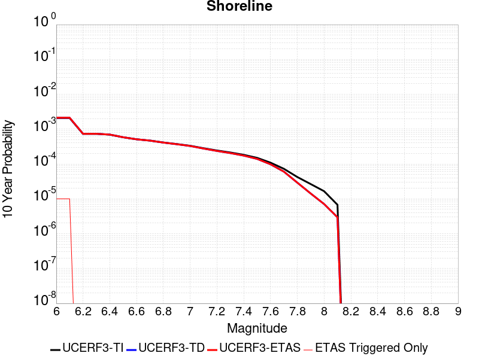 |

| Magnitude | 1 wk TI Prob | 1 wk TD Prob | 1 wk ETAS Prob | 1 wk ETAS/TD Gain | 1 wk ETAS Triggered Only | 1 mo TI Prob | 1 mo TD Prob | 1 mo ETAS Prob | 1 mo ETAS/TD Gain | 1 mo ETAS Triggered Only | 1 yr TI Prob | 1 yr TD Prob | 1 yr ETAS Prob | 1 yr ETAS/TD Gain | 1 yr ETAS Triggered Only | 10 yr TI Prob | 10 yr TD Prob | 10 yr ETAS Prob | 10 yr ETAS/TD Gain | 10 yr ETAS Triggered Only |
|-----|-----|-----|-----|-----|-----|-----|-----|-----|-----|-----|-----|-----|-----|-----|-----|-----|-----|-----|-----|-----|
| 6.0 | 3.9888673E-6 | 4.047961E-6 | 4.047961E-6 | 1.0 | 0.0 | 1.7095033E-5 | 1.7348319E-5 | 1.7348319E-5 | 1.0 | 0.0 | 2.0811215E-4 | 2.1120091E-4 | 2.1120091E-4 | 1.0 | 0.0 | 0.0020791737 | 0.0021105506 | 0.0021205295 | 1.0047281 | 1.0E-5 |
| 6.1 | 3.9888673E-6 | 4.047961E-6 | 4.047961E-6 | 1.0 | 0.0 | 1.7095033E-5 | 1.7348319E-5 | 1.7348319E-5 | 1.0 | 0.0 | 2.0811215E-4 | 2.1120091E-4 | 2.1120091E-4 | 1.0 | 0.0 | 0.0020791737 | 0.0021105506 | 0.0021205295 | 1.0047281 | 1.0E-5 |
| 6.2 | 1.4039653E-6 | 1.4101064E-6 | 1.4101064E-6 | 1.0 | 0.0 | 6.0169805E-6 | 6.0432994E-6 | 6.0432994E-6 | 1.0 | 0.0 | 7.325427E-5 | 7.3574745E-5 | 7.3574745E-5 | 1.0 | 0.0 | 7.3230127E-4 | 7.355099E-4 | 7.355099E-4 | 1.0 | 0.0 |
| 6.3 | 1.4039653E-6 | 1.4101064E-6 | 1.4101064E-6 | 1.0 | 0.0 | 6.0169805E-6 | 6.0432994E-6 | 6.0432994E-6 | 1.0 | 0.0 | 7.325427E-5 | 7.3574745E-5 | 7.3574745E-5 | 1.0 | 0.0 | 7.3230127E-4 | 7.355099E-4 | 7.355099E-4 | 1.0 | 0.0 |
| 6.4 | 1.3314152E-6 | 1.3361774E-6 | 1.3361774E-6 | 1.0 | 0.0 | 5.7060524E-6 | 5.7264624E-6 | 5.7264624E-6 | 1.0 | 0.0 | 6.946897E-5 | 6.9717506E-5 | 6.9717506E-5 | 1.0 | 0.0 | 6.9447263E-4 | 6.969617E-4 | 6.969617E-4 | 1.0 | 0.0 |
| 6.5 | 1.1187026E-6 | 1.1203801E-6 | 1.1203801E-6 | 1.0 | 0.0 | 4.794431E-6 | 4.8016204E-6 | 4.8016204E-6 | 1.0 | 0.0 | 5.8370628E-5 | 5.8458183E-5 | 5.8458183E-5 | 1.0 | 0.0 | 5.83553E-4 | 5.844306E-4 | 5.844306E-4 | 1.0 | 0.0 |
| 6.6 | 9.793089E-7 | 9.785074E-7 | 9.785074E-7 | 1.0 | 0.0 | 4.1970316E-6 | 4.1935964E-6 | 4.1935964E-6 | 1.0 | 0.0 | 5.1097657E-5 | 5.1055853E-5 | 5.1055853E-5 | 1.0 | 0.0 | 5.108591E-4 | 5.1044254E-4 | 5.1044254E-4 | 1.0 | 0.0 |
| 6.7 | 8.995986E-7 | 8.97295E-7 | 8.97295E-7 | 1.0 | 0.0 | 3.8554167E-6 | 3.8455446E-6 | 3.8455446E-6 | 1.0 | 0.0 | 4.693869E-5 | 4.681851E-5 | 4.681851E-5 | 1.0 | 0.0 | 4.6928777E-4 | 4.680874E-4 | 4.680874E-4 | 1.0 | 0.0 |
| 6.8 | 7.931612E-7 | 7.8805454E-7 | 7.8805454E-7 | 1.0 | 0.0 | 3.3992578E-6 | 3.3773722E-6 | 3.3773722E-6 | 1.0 | 0.0 | 4.1385178E-5 | 4.1118736E-5 | 4.1118736E-5 | 1.0 | 0.0 | 4.1377472E-4 | 4.1111183E-4 | 4.1111183E-4 | 1.0 | 0.0 |
| 6.9 | 7.1465956E-7 | 7.0781437E-7 | 7.0781437E-7 | 1.0 | 0.0 | 3.062823E-6 | 3.0334868E-6 | 3.0334868E-6 | 1.0 | 0.0 | 3.7289232E-5 | 3.6932077E-5 | 3.6932077E-5 | 1.0 | 0.0 | 3.7282976E-4 | 3.6925977E-4 | 3.6925977E-4 | 1.0 | 0.0 |
| 7.0 | 6.389046E-7 | 6.2995906E-7 | 6.2995906E-7 | 1.0 | 0.0 | 2.7381598E-6 | 2.6998216E-6 | 2.6998216E-6 | 1.0 | 0.0 | 3.3336586E-5 | 3.2869837E-5 | 3.2869837E-5 | 1.0 | 0.0 | 3.3331584E-4 | 3.2864997E-4 | 3.2864997E-4 | 1.0 | 0.0 |
| 7.1 | 5.4300875E-7 | 5.311255E-7 | 5.311255E-7 | 1.0 | 0.0 | 2.3271782E-6 | 2.2762501E-6 | 2.2762501E-6 | 1.0 | 0.0 | 2.8333026E-5 | 2.7712995E-5 | 2.7712995E-5 | 1.0 | 0.0 | 2.8329415E-4 | 2.770955E-4 | 2.770955E-4 | 1.0 | 0.0 |
| 7.2 | 4.6768855E-7 | 4.5350131E-7 | 4.5350131E-7 | 1.0 | 0.0 | 2.0043778E-6 | 1.9435756E-6 | 1.9435756E-6 | 1.0 | 0.0 | 2.4403027E-5 | 2.3662777E-5 | 2.3662777E-5 | 1.0 | 0.0 | 2.4400349E-4 | 2.3660263E-4 | 2.3660263E-4 | 1.0 | 0.0 |
| 7.3 | 4.0966103E-7 | 3.93868E-7 | 3.93868E-7 | 1.0 | 0.0 | 1.7556889E-6 | 1.6880045E-6 | 1.6880045E-6 | 1.0 | 0.0 | 2.1375303E-5 | 2.055126E-5 | 2.055126E-5 | 1.0 | 0.0 | 2.1373246E-4 | 2.0549365E-4 | 2.0549365E-4 | 1.0 | 0.0 |
| 7.4 | 3.5105785E-7 | 3.3365063E-7 | 3.3365063E-7 | 1.0 | 0.0 | 1.5045327E-6 | 1.4299305E-6 | 1.4299305E-6 | 1.0 | 0.0 | 1.8317533E-5 | 1.7409266E-5 | 1.7409266E-5 | 1.0 | 0.0 | 1.8316023E-4 | 1.7407905E-4 | 1.7407905E-4 | 1.0 | 0.0 |
| 7.5 | 2.8737534E-7 | 2.682108E-7 | 2.682108E-7 | 1.0 | 0.0 | 1.2316079E-6 | 1.1494744E-6 | 1.1494744E-6 | 1.0 | 0.0 | 1.4994724E-5 | 1.3994761E-5 | 1.3994761E-5 | 1.0 | 0.0 | 1.4993713E-4 | 1.3993881E-4 | 1.3993881E-4 | 1.0 | 0.0 |
| 7.6 | 2.0924051E-7 | 1.8779967E-7 | 1.8779967E-7 | 1.0 | 0.0 | 8.967448E-7 | 8.0485546E-7 | 8.0485546E-7 | 1.0 | 0.0 | 1.0917813E-5 | 9.799071E-6 | 9.799071E-6 | 1.0 | 0.0 | 1.0917276E-4 | 9.7986405E-5 | 9.7986405E-5 | 1.0 | 0.0 |
| 7.7 | 1.392265E-7 | 1.1544305E-7 | 1.1544305E-7 | 1.0 | 0.0 | 5.9668486E-7 | 4.9475585E-7 | 4.9475585E-7 | 1.0 | 0.0 | 7.2646135E-6 | 6.0236357E-6 | 6.0236357E-6 | 1.0 | 0.0 | 7.2643765E-5 | 6.0234728E-5 | 6.0234728E-5 | 1.0 | 0.0 |
| 7.8 | 8.1080074E-8 | 5.5875784E-8 | 5.5875784E-8 | 1.0 | 0.0 | 3.4748598E-7 | 2.3946762E-7 | 2.3946762E-7 | 1.0 | 0.0 | 4.2306337E-6 | 2.9155144E-6 | 2.9155144E-6 | 1.0 | 0.0 | 4.230553E-5 | 2.9154762E-5 | 2.9154762E-5 | 1.0 | 0.0 |
| 7.9 | 5.0859036E-8 | 2.7252394E-8 | 2.7252394E-8 | 1.0 | 0.0 | 2.1796728E-7 | 1.16795974E-7 | 1.16795974E-7 | 1.0 | 0.0 | 2.6537484E-6 | 1.42199E-6 | 1.42199E-6 | 1.0 | 0.0 | 2.6537167E-5 | 1.421981E-5 | 1.421981E-5 | 1.0 | 0.0 |
| 8.0 | 3.1760536E-8 | 1.35833655E-8 | 1.35833655E-8 | 1.0 | 0.0 | 1.3611657E-7 | 5.821442E-8 | 5.821442E-8 | 1.0 | 0.0 | 1.6572179E-6 | 7.0876035E-7 | 7.0876035E-7 | 1.0 | 0.0 | 1.6572056E-5 | 7.0875813E-6 | 7.0875813E-6 | 1.0 | 0.0 |
| 8.1 | 1.2947896E-8 | 5.6655294E-9 | 5.6655294E-9 | 1.0 | 0.0 | 5.5490982E-8 | 2.4280842E-8 | 2.4280842E-8 | 1.0 | 0.0 | 6.756025E-7 | 2.956192E-7 | 2.956192E-7 | 1.0 | 0.0 | 6.7560045E-6 | 2.9561884E-6 | 2.9561884E-6 | 1.0 | 0.0 |

## Anaheim
*[(top)](#table-of-contents)*

| 1 Week | 1 Month | 1 Year | 10 Year |
|-----|-----|-----|-----|
|  |  |  |  |

| Magnitude | 1 wk TI Prob | 1 wk TD Prob | 1 wk ETAS Prob | 1 wk ETAS/TD Gain | 1 wk ETAS Triggered Only | 1 mo TI Prob | 1 mo TD Prob | 1 mo ETAS Prob | 1 mo ETAS/TD Gain | 1 mo ETAS Triggered Only | 1 yr TI Prob | 1 yr TD Prob | 1 yr ETAS Prob | 1 yr ETAS/TD Gain | 1 yr ETAS Triggered Only | 10 yr TI Prob | 10 yr TD Prob | 10 yr ETAS Prob | 10 yr ETAS/TD Gain | 10 yr ETAS Triggered Only |
|-----|-----|-----|-----|-----|-----|-----|-----|-----|-----|-----|-----|-----|-----|-----|-----|-----|-----|-----|-----|-----|
| 6.0 | 2.9254998E-6 | 2.512319E-6 | 2.512319E-6 | 1.0 | 0.0 | 1.25377965E-5 | 1.076705E-5 | 1.076705E-5 | 1.0 | 0.0 | 1.5263697E-4 | 1.3108329E-4 | 1.4108198E-4 | 1.0762774 | 1.0E-5 | 0.0015253217 | 0.00131029 | 0.0013202769 | 1.0076219 | 1.0E-5 |
| 6.1 | 1.6729715E-6 | 1.2337605E-6 | 1.2337605E-6 | 1.0 | 0.0 | 7.1698582E-6 | 5.2875366E-6 | 5.2875366E-6 | 1.0 | 0.0 | 8.7289525E-5 | 6.4374275E-5 | 7.437363E-5 | 1.1553316 | 1.0E-5 | 8.7255245E-4 | 6.435972E-4 | 6.535908E-4 | 1.0155277 | 1.0E-5 |
| 6.2 | 1.6729715E-6 | 1.2337605E-6 | 1.2337605E-6 | 1.0 | 0.0 | 7.1698582E-6 | 5.2875366E-6 | 5.2875366E-6 | 1.0 | 0.0 | 8.7289525E-5 | 6.4374275E-5 | 7.437363E-5 | 1.1553316 | 1.0E-5 | 8.7255245E-4 | 6.435972E-4 | 6.535908E-4 | 1.0155277 | 1.0E-5 |
| 6.3 | 1.1444064E-6 | 6.959899E-7 | 6.959899E-7 | 1.0 | 0.0 | 4.9045893E-6 | 2.9828109E-6 | 2.9828109E-6 | 1.0 | 0.0 | 5.971174E-5 | 3.6315174E-5 | 4.631481E-5 | 1.275357 | 1.0E-5 | 5.96957E-4 | 3.630979E-4 | 3.7309426E-4 | 1.0275308 | 1.0E-5 |
| 6.4 | 1.1444064E-6 | 6.959899E-7 | 6.959899E-7 | 1.0 | 0.0 | 4.9045893E-6 | 2.9828109E-6 | 2.9828109E-6 | 1.0 | 0.0 | 5.971174E-5 | 3.6315174E-5 | 4.631481E-5 | 1.275357 | 1.0E-5 | 5.96957E-4 | 3.630979E-4 | 3.7309426E-4 | 1.0275308 | 1.0E-5 |
| 6.5 | 1.1385318E-6 | 6.9005824E-7 | 6.9005824E-7 | 1.0 | 0.0 | 4.879413E-6 | 2.9573896E-6 | 2.9573896E-6 | 1.0 | 0.0 | 5.9405233E-5 | 3.600568E-5 | 4.600532E-5 | 1.2777239 | 1.0E-5 | 5.938936E-4 | 3.6000396E-4 | 3.7000034E-4 | 1.0277674 | 1.0E-5 |
| 6.6 | 1.1165511E-6 | 6.678453E-7 | 6.678453E-7 | 1.0 | 0.0 | 4.78521E-6 | 2.8621914E-6 | 2.8621914E-6 | 1.0 | 0.0 | 5.8258374E-5 | 3.484668E-5 | 4.484633E-5 | 1.2869614 | 1.0E-5 | 5.8243104E-4 | 3.4841758E-4 | 3.584141E-4 | 1.0286912 | 1.0E-5 |
| 6.7 | 1.1098243E-6 | 6.6106475E-7 | 6.6106475E-7 | 1.0 | 0.0 | 4.7563813E-6 | 2.833132E-6 | 2.833132E-6 | 1.0 | 0.0 | 5.7907404E-5 | 3.449289E-5 | 4.4492546E-5 | 1.2899048 | 1.0E-5 | 5.7892315E-4 | 3.448808E-4 | 3.5487735E-4 | 1.0289855 | 1.0E-5 |
| 6.8 | 1.1077587E-6 | 6.58985E-7 | 6.58985E-7 | 1.0 | 0.0 | 4.7475287E-6 | 2.8242189E-6 | 2.8242189E-6 | 1.0 | 0.0 | 5.779963E-5 | 3.438438E-5 | 4.4384033E-5 | 1.2908198 | 1.0E-5 | 5.77846E-4 | 3.43796E-4 | 3.5379257E-4 | 1.029077 | 1.0E-5 |
| 6.9 | 1.1024468E-6 | 6.5364276E-7 | 6.5364276E-7 | 1.0 | 0.0 | 4.7247636E-6 | 2.8013233E-6 | 2.8013233E-6 | 1.0 | 0.0 | 5.752248E-5 | 3.4105633E-5 | 4.410529E-5 | 1.2931967 | 1.0E-5 | 5.750759E-4 | 3.4100944E-4 | 3.5100602E-4 | 1.0293148 | 1.0E-5 |
| 7.0 | 1.0993066E-6 | 6.510534E-7 | 6.510534E-7 | 1.0 | 0.0 | 4.7113053E-6 | 2.7902263E-6 | 2.7902263E-6 | 1.0 | 0.0 | 5.7358633E-5 | 3.397053E-5 | 4.397019E-5 | 1.2943628 | 1.0E-5 | 5.734383E-4 | 3.396588E-4 | 3.4965543E-4 | 1.0294313 | 1.0E-5 |
| 7.1 | 8.334877E-7 | 4.405108E-7 | 4.405108E-7 | 1.0 | 0.0 | 3.5720855E-6 | 1.8879023E-6 | 1.8879023E-6 | 1.0 | 0.0 | 4.348927E-5 | 2.298499E-5 | 3.298476E-5 | 1.4350566 | 1.0E-5 | 4.3480762E-4 | 2.2982837E-4 | 2.3982607E-4 | 1.0435008 | 1.0E-5 |
| 7.2 | 7.794411E-7 | 3.9978232E-7 | 3.9978232E-7 | 1.0 | 0.0 | 3.3404576E-6 | 1.7133518E-6 | 1.7133518E-6 | 1.0 | 0.0 | 4.0669314E-5 | 2.085988E-5 | 3.0859672E-5 | 1.4793792 | 1.0E-5 | 4.066187E-4 | 2.0858126E-4 | 2.1857917E-4 | 1.047933 | 1.0E-5 |
| 7.3 | 5.01704E-7 | 2.5574514E-7 | 2.5574514E-7 | 1.0 | 0.0 | 2.150158E-6 | 1.0960501E-6 | 1.0960501E-6 | 1.0 | 0.0 | 2.617786E-5 | 1.3344341E-5 | 1.3344341E-5 | 1.0 | 0.0 | 2.6174777E-4 | 1.3343664E-4 | 1.3343664E-4 | 1.0 | 0.0 |
| 7.4 | 2.4008182E-7 | 1.2368378E-7 | 1.2368378E-7 | 1.0 | 0.0 | 1.0289217E-6 | 5.300733E-7 | 5.300733E-7 | 1.0 | 0.0 | 1.252705E-5 | 6.4536307E-6 | 6.4536307E-6 | 1.0 | 0.0 | 1.2526344E-4 | 6.45352E-5 | 6.45352E-5 | 1.0 | 0.0 |
| 7.5 | 2.0263876E-8 | 1.6121087E-8 | 1.6121087E-8 | 1.0 | 0.0 | 8.684518E-8 | 6.909037E-8 | 6.909037E-8 | 1.0 | 0.0 | 1.0573395E-6 | 8.41175E-7 | 8.41175E-7 | 1.0 | 0.0 | 1.0573345E-5 | 8.411727E-6 | 8.411727E-6 | 1.0 | 0.0 |
| 7.6 | 1.4871431E-9 | 1.5084237E-9 | 1.5084237E-9 | 1.0 | 0.0 | 6.37347E-9 | 6.4646724E-9 | 6.4646724E-9 | 1.0 | 0.0 | 7.7596994E-8 | 7.870739E-8 | 7.870739E-8 | 1.0 | 0.0 | 7.759697E-7 | 7.8707365E-7 | 7.8707365E-7 | 1.0 | 0.0 |
| 7.7 | 1.5093293E-10 | 1.5333601E-10 | 1.5333601E-10 | 1.0 | 0.0 | 6.4685546E-10 | 6.571539E-10 | 6.571539E-10 | 1.0 | 0.0 | 7.875465E-9 | 8.000846E-9 | 8.000846E-9 | 1.0 | 0.0 | 7.8754645E-8 | 8.000846E-8 | 8.000846E-8 | 1.0 | 0.0 |

## Sierra Madre
*[(top)](#table-of-contents)*

| 1 Week | 1 Month | 1 Year | 10 Year |
|-----|-----|-----|-----|
|  |  |  |  |

| Magnitude | 1 wk TI Prob | 1 wk TD Prob | 1 wk ETAS Prob | 1 wk ETAS/TD Gain | 1 wk ETAS Triggered Only | 1 mo TI Prob | 1 mo TD Prob | 1 mo ETAS Prob | 1 mo ETAS/TD Gain | 1 mo ETAS Triggered Only | 1 yr TI Prob | 1 yr TD Prob | 1 yr ETAS Prob | 1 yr ETAS/TD Gain | 1 yr ETAS Triggered Only | 10 yr TI Prob | 10 yr TD Prob | 10 yr ETAS Prob | 10 yr ETAS/TD Gain | 10 yr ETAS Triggered Only |
|-----|-----|-----|-----|-----|-----|-----|-----|-----|-----|-----|-----|-----|-----|-----|-----|-----|-----|-----|-----|-----|
| 6.0 | 1.3379373E-5 | 1.1001505E-5 | 1.1001505E-5 | 1.0 | 0.0 | 5.7338908E-5 | 4.7148464E-5 | 4.7148464E-5 | 1.0 | 0.0 | 6.978776E-4 | 5.7388283E-4 | 5.7388283E-4 | 1.0 | 0.0 | 0.0069569005 | 0.005724373 | 0.005734315 | 1.0017369 | 1.0E-5 |
| 6.1 | 1.3379373E-5 | 1.1001505E-5 | 1.1001505E-5 | 1.0 | 0.0 | 5.7338908E-5 | 4.7148464E-5 | 4.7148464E-5 | 1.0 | 0.0 | 6.978776E-4 | 5.7388283E-4 | 5.7388283E-4 | 1.0 | 0.0 | 0.0069569005 | 0.005724373 | 0.005734315 | 1.0017369 | 1.0E-5 |
| 6.2 | 1.3379373E-5 | 1.1001505E-5 | 1.1001505E-5 | 1.0 | 0.0 | 5.7338908E-5 | 4.7148464E-5 | 4.7148464E-5 | 1.0 | 0.0 | 6.978776E-4 | 5.7388283E-4 | 5.7388283E-4 | 1.0 | 0.0 | 0.0069569005 | 0.005724373 | 0.005734315 | 1.0017369 | 1.0E-5 |
| 6.3 | 1.3379373E-5 | 1.1001505E-5 | 1.1001505E-5 | 1.0 | 0.0 | 5.7338908E-5 | 4.7148464E-5 | 4.7148464E-5 | 1.0 | 0.0 | 6.978776E-4 | 5.7388283E-4 | 5.7388283E-4 | 1.0 | 0.0 | 0.0069569005 | 0.005724373 | 0.005734315 | 1.0017369 | 1.0E-5 |
| 6.4 | 1.3379373E-5 | 1.1001505E-5 | 1.1001505E-5 | 1.0 | 0.0 | 5.7338908E-5 | 4.7148464E-5 | 4.7148464E-5 | 1.0 | 0.0 | 6.978776E-4 | 5.7388283E-4 | 5.7388283E-4 | 1.0 | 0.0 | 0.0069569005 | 0.005724373 | 0.005734315 | 1.0017369 | 1.0E-5 |
| 6.5 | 1.26563245E-5 | 1.0230948E-5 | 1.0230948E-5 | 1.0 | 0.0 | 5.4240263E-5 | 4.3846187E-5 | 4.3846187E-5 | 1.0 | 0.0 | 6.601751E-4 | 5.3369766E-4 | 5.3369766E-4 | 1.0 | 0.0 | 0.006582173 | 0.005324481 | 0.005324481 | 1.0 | 0.0 |
| 6.6 | 1.26563245E-5 | 1.0230948E-5 | 1.0230948E-5 | 1.0 | 0.0 | 5.4240263E-5 | 4.3846187E-5 | 4.3846187E-5 | 1.0 | 0.0 | 6.601751E-4 | 5.3369766E-4 | 5.3369766E-4 | 1.0 | 0.0 | 0.006582173 | 0.005324481 | 0.005324481 | 1.0 | 0.0 |
| 6.7 | 1.2502474E-5 | 1.0067089E-5 | 1.0067089E-5 | 1.0 | 0.0 | 5.3580934E-5 | 4.314396E-5 | 4.314396E-5 | 1.0 | 0.0 | 6.521526E-4 | 5.2515214E-4 | 5.2515214E-4 | 1.0 | 0.0 | 0.0065024206 | 0.005239431 | 0.005239431 | 1.0 | 0.0 |
| 6.8 | 1.2454966E-5 | 1.0019374E-5 | 1.0019374E-5 | 1.0 | 0.0 | 5.3377335E-5 | 4.293947E-5 | 4.293947E-5 | 1.0 | 0.0 | 6.4967526E-4 | 5.226637E-4 | 5.226637E-4 | 1.0 | 0.0 | 0.006477792 | 0.005214663 | 0.005214663 | 1.0 | 0.0 |
| 6.9 | 1.2225574E-5 | 9.793346E-6 | 9.793346E-6 | 1.0 | 0.0 | 5.2394265E-5 | 4.1970816E-5 | 4.1970816E-5 | 1.0 | 0.0 | 6.3771347E-4 | 5.108759E-4 | 5.108759E-4 | 1.0 | 0.0 | 0.006358865 | 0.005097331 | 0.005097331 | 1.0 | 0.0 |
| 7.0 | 1.182946E-5 | 9.399881E-6 | 9.399881E-6 | 1.0 | 0.0 | 5.06967E-5 | 4.0284587E-5 | 4.0284587E-5 | 1.0 | 0.0 | 6.1705755E-4 | 4.903555E-4 | 4.903555E-4 | 1.0 | 0.0 | 0.006153469 | 0.004893047 | 0.004893047 | 1.0 | 0.0 |
| 7.1 | 1.14369095E-5 | 8.98688E-6 | 8.98688E-6 | 1.0 | 0.0 | 4.9014405E-5 | 3.8514634E-5 | 3.8514634E-5 | 1.0 | 0.0 | 5.9658696E-4 | 4.6881576E-4 | 4.6881576E-4 | 1.0 | 0.0 | 0.005949879 | 0.0046785735 | 0.0046785735 | 1.0 | 0.0 |
| 7.2 | 1.0836419E-5 | 8.4002595E-6 | 8.4002595E-6 | 1.0 | 0.0 | 4.644097E-5 | 3.600062E-5 | 3.600062E-5 | 1.0 | 0.0 | 5.652721E-4 | 4.382203E-4 | 4.382203E-4 | 1.0 | 0.0 | 0.0056383642 | 0.004373859 | 0.004373859 | 1.0 | 0.0 |
| 7.3 | 1.0403439E-5 | 8.021512E-6 | 8.021512E-6 | 1.0 | 0.0 | 4.4585406E-5 | 3.437746E-5 | 3.437746E-5 | 1.0 | 0.0 | 5.426921E-4 | 4.184661E-4 | 4.184661E-4 | 1.0 | 0.0 | 0.005413687 | 0.0041770763 | 0.0041770763 | 1.0 | 0.0 |
| 7.4 | 9.768864E-6 | 7.4151226E-6 | 7.4151226E-6 | 1.0 | 0.0 | 4.186589E-5 | 3.1778713E-5 | 3.1778713E-5 | 1.0 | 0.0 | 5.09598E-4 | 3.8683804E-4 | 3.8683804E-4 | 1.0 | 0.0 | 0.0050843097 | 0.0038619386 | 0.0038619386 | 1.0 | 0.0 |
| 7.5 | 8.687089E-6 | 6.4507103E-6 | 6.4507103E-6 | 1.0 | 0.0 | 3.722985E-5 | 2.7645614E-5 | 2.7645614E-5 | 1.0 | 0.0 | 4.5317915E-4 | 3.3653423E-4 | 3.3653423E-4 | 1.0 | 0.0 | 0.004522561 | 0.0033605332 | 0.0033605332 | 1.0 | 0.0 |
| 7.6 | 6.3506063E-6 | 4.430822E-6 | 4.430822E-6 | 1.0 | 0.0 | 2.72166E-5 | 1.8989102E-5 | 1.8989102E-5 | 1.0 | 0.0 | 3.3131172E-4 | 2.3116804E-4 | 2.3116804E-4 | 1.0 | 0.0 | 0.003308182 | 0.0023095007 | 0.0023095007 | 1.0 | 0.0 |
| 7.7 | 4.62223E-6 | 2.933436E-6 | 2.933436E-6 | 1.0 | 0.0 | 1.9809406E-5 | 1.2571808E-5 | 1.2571808E-5 | 1.0 | 0.0 | 2.4115283E-4 | 1.5305103E-4 | 1.5305103E-4 | 1.0 | 0.0 | 0.0024089129 | 0.0015296573 | 0.0015296573 | 1.0 | 0.0 |
| 7.8 | 3.2145008E-6 | 1.9497845E-6 | 1.9497845E-6 | 1.0 | 0.0 | 1.3776359E-5 | 8.356193E-6 | 8.356193E-6 | 1.0 | 0.0 | 1.6771426E-4 | 1.01731915E-4 | 1.01731915E-4 | 1.0 | 0.0 | 0.0016758774 | 0.0010169978 | 0.0010169978 | 1.0 | 0.0 |
| 7.9 | 1.0391769E-6 | 5.6037356E-7 | 5.6037356E-7 | 1.0 | 0.0 | 4.4536077E-6 | 2.4015987E-6 | 2.4015987E-6 | 1.0 | 0.0 | 5.4221324E-5 | 2.9239078E-5 | 2.9239078E-5 | 1.0 | 0.0 | 5.4208096E-4 | 2.9235272E-4 | 2.9235272E-4 | 1.0 | 0.0 |
| 8.0 | 1.210983E-7 | 6.6145226E-8 | 6.6145226E-8 | 1.0 | 0.0 | 5.1899264E-7 | 2.834795E-7 | 2.834795E-7 | 1.0 | 0.0 | 6.3187167E-6 | 3.4513575E-6 | 3.4513575E-6 | 1.0 | 0.0 | 6.318537E-5 | 3.4513057E-5 | 3.4513057E-5 | 1.0 | 0.0 |

## Lions Head 2011 CFM
*[(top)](#table-of-contents)*

| 1 Week | 1 Month | 1 Year | 10 Year |
|-----|-----|-----|-----|
|  |  |  |  |

| Magnitude | 1 wk TI Prob | 1 wk TD Prob | 1 wk ETAS Prob | 1 wk ETAS/TD Gain | 1 wk ETAS Triggered Only | 1 mo TI Prob | 1 mo TD Prob | 1 mo ETAS Prob | 1 mo ETAS/TD Gain | 1 mo ETAS Triggered Only | 1 yr TI Prob | 1 yr TD Prob | 1 yr ETAS Prob | 1 yr ETAS/TD Gain | 1 yr ETAS Triggered Only | 10 yr TI Prob | 10 yr TD Prob | 10 yr ETAS Prob | 10 yr ETAS/TD Gain | 10 yr ETAS Triggered Only |
|-----|-----|-----|-----|-----|-----|-----|-----|-----|-----|-----|-----|-----|-----|-----|-----|-----|-----|-----|-----|-----|
| 6.0 | 8.889363E-7 | 8.8914464E-7 | 8.8914464E-7 | 1.0 | 0.0 | 3.8097214E-6 | 3.8106145E-6 | 1.3810576E-5 | 3.6242385 | 1.0E-5 | 4.638237E-5 | 4.639331E-5 | 5.6392844E-5 | 1.2155384 | 1.0E-5 | 4.637269E-4 | 4.6384253E-4 | 4.738379E-4 | 1.021549 | 1.0E-5 |
| 6.1 | 8.889363E-7 | 8.8914464E-7 | 8.8914464E-7 | 1.0 | 0.0 | 3.8097214E-6 | 3.8106145E-6 | 1.3810576E-5 | 3.6242385 | 1.0E-5 | 4.638237E-5 | 4.639331E-5 | 5.6392844E-5 | 1.2155384 | 1.0E-5 | 4.637269E-4 | 4.6384253E-4 | 4.738379E-4 | 1.021549 | 1.0E-5 |
| 6.2 | 5.7435483E-7 | 5.7360904E-7 | 5.7360904E-7 | 1.0 | 0.0 | 2.4615185E-6 | 2.4583221E-6 | 1.24582975E-5 | 5.0678053 | 1.0E-5 | 2.9968574E-5 | 2.9929675E-5 | 3.9929375E-5 | 1.3341066 | 1.0E-5 | 2.9964533E-4 | 2.992579E-4 | 3.0925492E-4 | 1.033406 | 1.0E-5 |
| 6.3 | 5.7435483E-7 | 5.7360904E-7 | 5.7360904E-7 | 1.0 | 0.0 | 2.4615185E-6 | 2.4583221E-6 | 1.24582975E-5 | 5.0678053 | 1.0E-5 | 2.9968574E-5 | 2.9929675E-5 | 3.9929375E-5 | 1.3341066 | 1.0E-5 | 2.9964533E-4 | 2.992579E-4 | 3.0925492E-4 | 1.033406 | 1.0E-5 |
| 6.4 | 4.1835764E-7 | 4.171559E-7 | 4.171559E-7 | 1.0 | 0.0 | 1.7929601E-6 | 1.7878097E-6 | 1.1787792E-5 | 6.5934267 | 1.0E-5 | 2.1829072E-5 | 2.1766367E-5 | 3.176615E-5 | 1.4594144 | 1.0E-5 | 2.1826927E-4 | 2.1764259E-4 | 2.2764041E-4 | 1.045937 | 1.0E-5 |
| 6.5 | 4.1835764E-7 | 4.171559E-7 | 4.171559E-7 | 1.0 | 0.0 | 1.7929601E-6 | 1.7878097E-6 | 1.1787792E-5 | 6.5934267 | 1.0E-5 | 2.1829072E-5 | 2.1766367E-5 | 3.176615E-5 | 1.4594144 | 1.0E-5 | 2.1826927E-4 | 2.1764259E-4 | 2.2764041E-4 | 1.045937 | 1.0E-5 |
| 6.6 | 3.6896213E-7 | 3.676206E-7 | 3.676206E-7 | 1.0 | 0.0 | 1.5812653E-6 | 1.5755159E-6 | 1.15755E-5 | 7.3471174 | 1.0E-5 | 1.9251736E-5 | 1.9181738E-5 | 2.9181547E-5 | 1.5213192 | 1.0E-5 | 1.9250068E-4 | 1.9180095E-4 | 2.0179903E-4 | 1.0521274 | 1.0E-5 |
| 6.7 | 3.3283942E-7 | 3.3139995E-7 | 3.3139995E-7 | 1.0 | 0.0 | 1.4264539E-6 | 1.4202847E-6 | 1.142027E-5 | 8.040832 | 1.0E-5 | 1.7366938E-5 | 1.729183E-5 | 2.7291657E-5 | 1.5782979 | 1.0E-5 | 1.736558E-4 | 1.7290491E-4 | 1.8290318E-4 | 1.0578252 | 1.0E-5 |
| 6.8 | 2.9684807E-7 | 2.953162E-7 | 2.953162E-7 | 1.0 | 0.0 | 1.2722054E-6 | 1.2656401E-6 | 1.1265627E-5 | 8.90113 | 1.0E-5 | 1.5488991E-5 | 1.540906E-5 | 2.5408906E-5 | 1.6489588 | 1.0E-5 | 1.5487912E-4 | 1.5407994E-4 | 1.640784E-4 | 1.0648913 | 1.0E-5 |
| 6.9 | 2.8254823E-7 | 2.8096818E-7 | 2.8096818E-7 | 1.0 | 0.0 | 1.2109203E-6 | 1.2041487E-6 | 1.1204137E-5 | 9.304612 | 1.0E-5 | 1.4742856E-5 | 1.46604125E-5 | 2.4660265E-5 | 1.6820991 | 1.0E-5 | 1.4741877E-4 | 1.4659448E-4 | 1.5659301E-4 | 1.0682054 | 1.0E-5 |
| 7.0 | 2.5794475E-7 | 2.5627315E-7 | 2.5627315E-7 | 1.0 | 0.0 | 1.105477E-6 | 1.098313E-6 | 1.1098302E-5 | 10.104863 | 1.0E-5 | 1.34591E-5 | 1.3371879E-5 | 2.3371746E-5 | 1.7478281 | 1.0E-5 | 1.3458285E-4 | 1.3371077E-4 | 1.4370942E-4 | 1.0747783 | 1.0E-5 |
| 7.1 | 2.2678832E-7 | 2.2496293E-7 | 2.2496293E-7 | 1.0 | 0.0 | 9.719496E-7 | 9.641265E-7 | 1.0964117E-5 | 11.372073 | 1.0E-5 | 1.1833421E-5 | 1.1738176E-5 | 2.1738058E-5 | 1.8519111 | 1.0E-5 | 1.1832791E-4 | 1.1737558E-4 | 1.273744E-4 | 1.0851866 | 1.0E-5 |
| 7.2 | 1.968546E-7 | 1.9488095E-7 | 1.9488095E-7 | 1.0 | 0.0 | 8.436623E-7 | 8.3520376E-7 | 1.0835195E-5 | 12.973116 | 1.0E-5 | 1.027154E-5 | 1.0168559E-5 | 2.0168458E-5 | 1.9834136 | 1.0E-5 | 1.0271065E-4 | 1.0168095E-4 | 1.1167993E-4 | 1.0983368 | 1.0E-5 |
| 7.3 | 1.6101195E-7 | 1.588061E-7 | 1.588061E-7 | 1.0 | 0.0 | 6.90051E-7 | 6.805974E-7 | 1.0680591E-5 | 15.692965 | 1.0E-5 | 8.401339E-6 | 8.286242E-6 | 1.8286159E-5 | 2.2068098 | 1.0E-5 | 8.4010215E-5 | 8.285933E-5 | 9.285851E-5 | 1.1206765 | 1.0E-5 |
| 7.4 | 1.304744E-7 | 1.2803534E-7 | 1.2803534E-7 | 1.0 | 0.0 | 5.591759E-7 | 5.4872277E-7 | 1.0548717E-5 | 19.224129 | 1.0E-5 | 6.807945E-6 | 6.6806792E-6 | 1.6680613E-5 | 2.4968438 | 1.0E-5 | 6.807737E-5 | 6.680479E-5 | 7.680412E-5 | 1.1496799 | 1.0E-5 |
| 7.5 | 9.410614E-8 | 9.132735E-8 | 9.132735E-8 | 1.0 | 0.0 | 4.0331196E-7 | 3.9140286E-7 | 1.0391399E-5 | 26.549114 | 1.0E-5 | 4.910312E-6 | 4.7653193E-6 | 1.4765272E-5 | 3.0984852 | 1.0E-5 | 4.9102036E-5 | 4.7652175E-5 | 5.7651698E-5 | 1.209844 | 1.0E-5 |
| 7.6 | 6.6360826E-8 | 6.327183E-8 | 6.327183E-8 | 1.0 | 0.0 | 2.844035E-7 | 2.7116496E-7 | 1.0271162E-5 | 37.87791 | 1.0E-5 | 3.462607E-6 | 3.3014283E-6 | 1.33013955E-5 | 4.028982 | 1.0E-5 | 3.4625533E-5 | 3.3013795E-5 | 4.3013464E-5 | 1.3028936 | 1.0E-5 |
| 7.7 | 3.9100893E-8 | 3.561907E-8 | 3.561907E-8 | 1.0 | 0.0 | 1.6757524E-7 | 1.5265314E-7 | 1.0152652E-5 | 66.50797 | 1.0E-5 | 2.0402267E-6 | 1.8585505E-6 | 1.1858532E-5 | 6.380527 | 1.0E-5 | 2.040208E-5 | 1.858535E-5 | 2.8585164E-5 | 1.5380481 | 1.0E-5 |
| 7.8 | 1.9858547E-8 | 1.6060167E-8 | 1.6060167E-8 | 1.0 | 0.0 | 8.5108056E-8 | 6.882928E-8 | 1.00688285E-5 | 146.28699 | 1.0E-5 | 1.0361902E-6 | 8.379962E-7 | 1.0837988E-5 | 12.933219 | 1.0E-5 | 1.0361853E-5 | 8.3799305E-6 | 1.8379847E-5 | 2.1933174 | 1.0E-5 |
| 7.9 | 9.717722E-9 | 6.4458563E-9 | 6.4458563E-9 | 1.0 | 0.0 | 4.1647375E-8 | 2.7625095E-8 | 2.7625095E-8 | 1.0 | 0.0 | 5.070567E-7 | 3.363355E-7 | 3.363355E-7 | 1.0 | 0.0 | 5.0705553E-6 | 3.3633498E-6 | 3.3633498E-6 | 1.0 | 0.0 |
| 8.0 | 3.8397716E-9 | 1.909501E-9 | 1.909501E-9 | 1.0 | 0.0 | 1.6456164E-8 | 8.183575E-9 | 8.183575E-9 | 1.0 | 0.0 | 2.0035378E-7 | 9.963503E-8 | 9.963503E-8 | 1.0 | 0.0 | 2.0035359E-6 | 9.963499E-7 | 9.963499E-7 | 1.0 | 0.0 |

## Bartlett Springs 2011 CFM
*[(top)](#table-of-contents)*

| 1 Week | 1 Month | 1 Year | 10 Year |
|-----|-----|-----|-----|
|  |  |  |  |

| Magnitude | 1 wk TI Prob | 1 wk TD Prob | 1 wk ETAS Prob | 1 wk ETAS/TD Gain | 1 wk ETAS Triggered Only | 1 mo TI Prob | 1 mo TD Prob | 1 mo ETAS Prob | 1 mo ETAS/TD Gain | 1 mo ETAS Triggered Only | 1 yr TI Prob | 1 yr TD Prob | 1 yr ETAS Prob | 1 yr ETAS/TD Gain | 1 yr ETAS Triggered Only | 10 yr TI Prob | 10 yr TD Prob | 10 yr ETAS Prob | 10 yr ETAS/TD Gain | 10 yr ETAS Triggered Only |
|-----|-----|-----|-----|-----|-----|-----|-----|-----|-----|-----|-----|-----|-----|-----|-----|-----|-----|-----|-----|-----|
| 6.0 | 6.2326144E-5 | 8.061187E-5 | 8.061187E-5 | 1.0 | 0.0 | 2.6708472E-4 | 3.454345E-4 | 3.454345E-4 | 1.0 | 0.0 | 0.003246908 | 0.0041976925 | 0.0041976925 | 1.0 | 0.0 | 0.031998757 | 0.041200534 | 0.041210122 | 1.0002327 | 1.0E-5 |
| 6.1 | 6.227657E-5 | 8.054936E-5 | 8.054936E-5 | 1.0 | 0.0 | 2.668723E-4 | 3.4516669E-4 | 3.4516669E-4 | 1.0 | 0.0 | 0.0032443295 | 0.0041944445 | 0.0041944445 | 1.0 | 0.0 | 0.031973712 | 0.041169267 | 0.041178852 | 1.0002329 | 1.0E-5 |
| 6.2 | 6.22452E-5 | 8.050996E-5 | 8.050996E-5 | 1.0 | 0.0 | 2.6673786E-4 | 3.4499788E-4 | 3.4499788E-4 | 1.0 | 0.0 | 0.0032426978 | 0.0041923975 | 0.0041923975 | 1.0 | 0.0 | 0.03195787 | 0.041149557 | 0.041159146 | 1.000233 | 1.0E-5 |
| 6.3 | 6.219006E-5 | 8.043979E-5 | 8.043979E-5 | 1.0 | 0.0 | 2.6650162E-4 | 3.4469724E-4 | 3.4469724E-4 | 1.0 | 0.0 | 0.00323983 | 0.0041887513 | 0.0041887513 | 1.0 | 0.0 | 0.031930014 | 0.041114453 | 0.041124042 | 1.0002332 | 1.0E-5 |
| 6.4 | 5.2175856E-5 | 6.7258035E-5 | 6.7258035E-5 | 1.0 | 0.0 | 2.2359163E-4 | 2.882172E-4 | 2.882172E-4 | 1.0 | 0.0 | 0.0027188298 | 0.003503451 | 0.003503451 | 1.0 | 0.0 | 0.026858058 | 0.03449153 | 0.034501188 | 1.0002799 | 1.0E-5 |
| 6.5 | 5.205166E-5 | 6.710069E-5 | 6.710069E-5 | 1.0 | 0.0 | 2.2305945E-4 | 2.8754305E-4 | 2.8754305E-4 | 1.0 | 0.0 | 0.0027123666 | 0.0034952695 | 0.0034952695 | 1.0 | 0.0 | 0.026794989 | 0.034412272 | 0.03442193 | 1.0002806 | 1.0E-5 |
| 6.6 | 5.0085426E-5 | 6.4497144E-5 | 6.4497144E-5 | 1.0 | 0.0 | 2.1463417E-4 | 2.7638738E-4 | 2.7638738E-4 | 1.0 | 0.0 | 0.0026100394 | 0.0033598726 | 0.0033598726 | 1.0 | 0.0 | 0.025795965 | 0.033099774 | 0.03310944 | 1.0002921 | 1.0E-5 |
| 6.7 | 4.8930866E-5 | 6.302166E-5 | 6.302166E-5 | 1.0 | 0.0 | 2.0968684E-4 | 2.7006518E-4 | 2.7006518E-4 | 1.0 | 0.0 | 0.0025499484 | 0.0032831393 | 0.0032831393 | 1.0 | 0.0 | 0.025208864 | 0.03235509 | 0.032364763 | 1.0002991 | 1.0E-5 |
| 6.8 | 4.5679535E-5 | 5.8745765E-5 | 5.8745765E-5 | 1.0 | 0.0 | 1.9575475E-4 | 2.517435E-4 | 2.517435E-4 | 1.0 | 0.0 | 0.002380709 | 0.0030607097 | 0.0030607097 | 1.0 | 0.0 | 0.023553653 | 0.030192394 | 0.030202093 | 1.0003211 | 1.0E-5 |
| 6.9 | 4.1439176E-5 | 5.322356E-5 | 5.322356E-5 | 1.0 | 0.0 | 1.7758438E-4 | 2.2808119E-4 | 2.2808119E-4 | 1.0 | 0.0 | 0.002159946 | 0.0027733794 | 0.0027733794 | 1.0 | 0.0 | 0.021390721 | 0.027392529 | 0.027402254 | 1.000355 | 1.0E-5 |
| 7.0 | 3.5920104E-5 | 4.6011588E-5 | 4.6011588E-5 | 1.0 | 0.0 | 1.5393422E-4 | 1.9717771E-4 | 1.9717771E-4 | 1.0 | 0.0 | 0.001872538 | 0.0023980124 | 0.0023980124 | 1.0 | 0.0 | 0.018568378 | 0.023724468 | 0.023734232 | 1.0004115 | 1.0E-5 |
| 7.1 | 3.338812E-5 | 4.2692183E-5 | 4.2692183E-5 | 1.0 | 0.0 | 1.430841E-4 | 1.8295377E-4 | 1.8295377E-4 | 1.0 | 0.0 | 0.0017406568 | 0.002225201 | 0.002225201 | 1.0 | 0.0 | 0.017270854 | 0.022031868 | 0.022041647 | 1.0004439 | 1.0E-5 |
| 7.2 | 2.8619615E-5 | 3.640378E-5 | 3.640378E-5 | 1.0 | 0.0 | 1.2264973E-4 | 1.5600694E-4 | 1.5600694E-4 | 1.0 | 0.0 | 0.0014922376 | 0.0018977394 | 0.0018977394 | 1.0 | 0.0 | 0.014822568 | 0.01881722 | 0.01881722 | 1.0 | 0.0 |
| 7.3 | 2.6376783E-5 | 3.3424712E-5 | 3.3424712E-5 | 1.0 | 0.0 | 1.13038455E-4 | 1.4324095E-4 | 1.4324095E-4 | 1.0 | 0.0 | 0.0013753743 | 0.0017425729 | 0.0017425729 | 1.0 | 0.0 | 0.01366893 | 0.017290723 | 0.017290723 | 1.0 | 0.0 |
| 7.4 | 2.3738676E-5 | 2.9980692E-5 | 2.9980692E-5 | 1.0 | 0.0 | 1.0173322E-4 | 1.284824E-4 | 1.284824E-4 | 1.0 | 0.0 | 0.0012378981 | 0.0015631588 | 0.0015631588 | 1.0 | 0.0 | 0.012310251 | 0.015522956 | 0.015522956 | 1.0 | 0.0 |
| 7.5 | 2.1789481E-5 | 2.7440981E-5 | 2.7440981E-5 | 1.0 | 0.0 | 9.338015E-5 | 1.17598946E-4 | 1.17598946E-4 | 1.0 | 0.0 | 0.0011363103 | 0.0014308346 | 0.0014308346 | 1.0 | 0.0 | 0.011305175 | 0.014217394 | 0.014217394 | 1.0 | 0.0 |
| 7.6 | 1.3895281E-5 | 1.7369208E-5 | 1.7369208E-5 | 1.0 | 0.0 | 5.9549846E-5 | 7.4437354E-5 | 7.4437354E-5 | 1.0 | 0.0 | 7.2477816E-4 | 9.0590084E-4 | 9.0590084E-4 | 1.0 | 0.0 | 0.0072241887 | 0.009022489 | 0.009022489 | 1.0 | 0.0 |
| 7.7 | 4.245981E-6 | 5.1626835E-6 | 5.1626835E-6 | 1.0 | 0.0 | 1.8196934E-5 | 2.21256E-5 | 2.21256E-5 | 1.0 | 0.0 | 2.2152514E-4 | 2.6934606E-4 | 2.6934606E-4 | 1.0 | 0.0 | 0.0022130446 | 0.0026902156 | 0.0026902156 | 1.0 | 0.0 |
| 7.8 | 6.145192E-7 | 7.047256E-7 | 7.047256E-7 | 1.0 | 0.0 | 2.633651E-6 | 3.020249E-6 | 3.020249E-6 | 1.0 | 0.0 | 3.206423E-5 | 3.6770925E-5 | 3.6770925E-5 | 1.0 | 0.0 | 3.2059604E-4 | 3.6764782E-4 | 3.6764782E-4 | 1.0 | 0.0 |

## San Clemente
*[(top)](#table-of-contents)*

| 1 Week | 1 Month | 1 Year | 10 Year |
|-----|-----|-----|-----|
|  |  |  |  |

| Magnitude | 1 wk TI Prob | 1 wk TD Prob | 1 wk ETAS Prob | 1 wk ETAS/TD Gain | 1 wk ETAS Triggered Only | 1 mo TI Prob | 1 mo TD Prob | 1 mo ETAS Prob | 1 mo ETAS/TD Gain | 1 mo ETAS Triggered Only | 1 yr TI Prob | 1 yr TD Prob | 1 yr ETAS Prob | 1 yr ETAS/TD Gain | 1 yr ETAS Triggered Only | 10 yr TI Prob | 10 yr TD Prob | 10 yr ETAS Prob | 10 yr ETAS/TD Gain | 10 yr ETAS Triggered Only |
|-----|-----|-----|-----|-----|-----|-----|-----|-----|-----|-----|-----|-----|-----|-----|-----|-----|-----|-----|-----|-----|
| 6.0 | 6.681379E-5 | 8.163916E-5 | 8.163916E-5 | 1.0 | 0.0 | 2.8631336E-4 | 3.4983843E-4 | 3.5983493E-4 | 1.0285746 | 1.0E-5 | 0.003480294 | 0.004251544 | 0.004261501 | 1.0023421 | 1.0E-5 | 0.03426291 | 0.041758116 | 0.041767698 | 1.0002295 | 1.0E-5 |
| 6.1 | 6.681379E-5 | 8.163916E-5 | 8.163916E-5 | 1.0 | 0.0 | 2.8631336E-4 | 3.4983843E-4 | 3.4983843E-4 | 1.0 | 0.0 | 0.003480294 | 0.004251544 | 0.004251544 | 1.0 | 0.0 | 0.03426291 | 0.041758116 | 0.041758116 | 1.0 | 0.0 |
| 6.2 | 3.9400576E-5 | 4.6454225E-5 | 4.6454225E-5 | 1.0 | 0.0 | 1.6884868E-4 | 1.9907467E-4 | 1.9907467E-4 | 1.0 | 0.0 | 0.0020537945 | 0.002421101 | 0.002421101 | 1.0 | 0.0 | 0.020349167 | 0.02395399 | 0.02395399 | 1.0 | 0.0 |
| 6.3 | 3.2590255E-5 | 3.793075E-5 | 3.793075E-5 | 1.0 | 0.0 | 1.3966505E-4 | 1.6255038E-4 | 1.6255038E-4 | 1.0 | 0.0 | 0.0016990956 | 0.0019772847 | 0.0019772847 | 1.0 | 0.0 | 0.01686163 | 0.019600714 | 0.019600714 | 1.0 | 0.0 |
| 6.4 | 2.9454652E-5 | 3.4099212E-5 | 3.4099212E-5 | 1.0 | 0.0 | 1.2622811E-4 | 1.4613141E-4 | 1.4613141E-4 | 1.0 | 0.0 | 0.0015357438 | 0.0017777226 | 0.0017777226 | 1.0 | 0.0 | 0.015251739 | 0.017638192 | 0.017638192 | 1.0 | 0.0 |
| 6.5 | 2.790836E-5 | 3.2248798E-5 | 3.2248798E-5 | 1.0 | 0.0 | 1.1960178E-4 | 1.3820194E-4 | 1.3820194E-4 | 1.0 | 0.0 | 0.001455179 | 0.0016813346 | 0.0016813346 | 1.0 | 0.0 | 0.014456868 | 0.01668916 | 0.01668916 | 1.0 | 0.0 |
| 6.6 | 2.2492153E-5 | 2.5763702E-5 | 2.5763702E-5 | 1.0 | 0.0 | 9.639138E-5 | 1.1041128E-4 | 1.1041128E-4 | 1.0 | 0.0 | 0.0011729331 | 0.0013434427 | 0.0013434427 | 1.0 | 0.0 | 0.011667615 | 0.013354928 | 0.013354928 | 1.0 | 0.0 |
| 6.7 | 1.9862755E-5 | 2.2667273E-5 | 2.2667273E-5 | 1.0 | 0.0 | 8.512331E-5 | 9.71419E-5 | 9.71419E-5 | 1.0 | 0.0 | 0.0010358836 | 0.0011820722 | 0.0011820722 | 1.0 | 0.0 | 0.010310682 | 0.01175914 | 0.01175914 | 1.0 | 0.0 |
| 6.8 | 1.6697575E-5 | 1.8978397E-5 | 1.8978397E-5 | 1.0 | 0.0 | 7.155907E-5 | 8.133351E-5 | 8.133351E-5 | 1.0 | 0.0 | 8.7088346E-4 | 9.89795E-4 | 9.89795E-4 | 1.0 | 0.0 | 0.008674784 | 0.009854892 | 0.009854892 | 1.0 | 0.0 |
| 6.9 | 1.5218415E-5 | 1.7270018E-5 | 1.7270018E-5 | 1.0 | 0.0 | 6.522015E-5 | 7.4012314E-5 | 7.4012314E-5 | 1.0 | 0.0 | 7.93766E-4 | 9.007362E-4 | 9.007362E-4 | 1.0 | 0.0 | 0.007909367 | 0.0089718 | 0.0089718 | 1.0 | 0.0 |
| 7.0 | 1.2392958E-5 | 1.4033508E-5 | 1.4033508E-5 | 1.0 | 0.0 | 5.3111595E-5 | 6.014226E-5 | 6.014226E-5 | 1.0 | 0.0 | 6.4644177E-4 | 7.3199364E-4 | 7.3199364E-4 | 1.0 | 0.0 | 0.0064456454 | 0.007296612 | 0.007296612 | 1.0 | 0.0 |
| 7.1 | 1.0934128E-5 | 1.2375571E-5 | 1.2375571E-5 | 1.0 | 0.0 | 4.6859706E-5 | 5.303712E-5 | 5.303712E-5 | 1.0 | 0.0 | 5.7036756E-4 | 6.45543E-4 | 6.45543E-4 | 1.0 | 0.0 | 0.0056890585 | 0.006437424 | 0.006437424 | 1.0 | 0.0 |
| 7.2 | 9.5798805E-6 | 1.0845315E-5 | 1.0845315E-5 | 1.0 | 0.0 | 4.1055984E-5 | 4.6479134E-5 | 4.6479134E-5 | 1.0 | 0.0 | 4.9974193E-4 | 5.657437E-4 | 5.657437E-4 | 1.0 | 0.0 | 0.0049861963 | 0.0056437585 | 0.0056437585 | 1.0 | 0.0 |
| 7.3 | 8.0167365E-6 | 9.084239E-6 | 9.084239E-6 | 1.0 | 0.0 | 3.4356988E-5 | 3.8931907E-5 | 3.8931907E-5 | 1.0 | 0.0 | 4.1821605E-4 | 4.7389997E-4 | 4.7389997E-4 | 1.0 | 0.0 | 0.0041742986 | 0.0047295964 | 0.0047295964 | 1.0 | 0.0 |
| 7.4 | 2.9581017E-6 | 3.362501E-6 | 3.362501E-6 | 1.0 | 0.0 | 1.2677518E-5 | 1.4410668E-5 | 1.4410668E-5 | 1.0 | 0.0 | 1.5433785E-4 | 1.754408E-4 | 1.754408E-4 | 1.0 | 0.0 | 0.001542307 | 0.0017535181 | 0.0017535181 | 1.0 | 0.0 |

