# Parent Section Magnitude-Probability Distributions

Only fault sections with at least one triggered aftershock are plotted. Sections are sorted by total supraseismogenic trigger rate (decreasing)

## Table Of Contents

* [Garlock (Central)](#garlock-central)
* [Tank Canyon](#tank-canyon)
* [Little Lake](#little-lake)
* [Owl Lake](#owl-lake)
* [Airport Lake](#airport-lake)
* [Panamint Valley](#panamint-valley)
* [Garlock (East)](#garlock-east)
* [Ash Hill](#ash-hill)
* [Hunter Mountain-Saline Valley](#hunter-mountain-saline-valley)
* [Blackwater](#blackwater)
* [Garlock (West)](#garlock-west)
* [McLean Lake](#mclean-lake)
* [Goldstone Lake](#goldstone-lake)
* [Gravel Hills-Harper Lk](#gravel-hills-harper-lk)
* [San Andreas (Mojave S)](#san-andreas-mojave-s)
* [Coyote Canyon](#coyote-canyon)
* [Death Valley (So)](#death-valley-so)
* [Lenwood-Lockhart-Old Woman Springs](#lenwood-lockhart-old-woman-springs)
* [San Andreas (Mojave N)](#san-andreas-mojave-n)
* [So Sierra Nevada](#so-sierra-nevada)
* [Nelson Lake](#nelson-lake)
* [San Andreas (San Bernardino N)](#san-andreas-san-bernardino-n)
* [Paradise](#paradise)
* [Bicycle Lake](#bicycle-lake)
* [Towne Pass](#towne-pass)
* [Garlic Springs](#garlic-springs)
* [San Andreas (San Bernardino S)](#san-andreas-san-bernardino-s)
* [Helendale-So Lockhart](#helendale-so-lockhart)
* [Death Valley (Black Mtns Frontal)](#death-valley-black-mtns-frontal)
* [San Andreas (Big Bend)](#san-andreas-big-bend)
* [Red Pass](#red-pass)
* [San Andreas (San Gorgonio Pass-Garnet HIll)](#san-andreas-san-gorgonio-pass-garnet-hill)
* [Coyote Lake](#coyote-lake)
* [Sierra Nevada  (No Extension)](#sierra-nevada--no-extension)
* [Death Valley (No)](#death-valley-no)
* [San Andreas (Carrizo) rev](#san-andreas-carrizo-rev)
* [San Andreas (Cholame) rev](#san-andreas-cholame-rev)
* [San Andreas (Parkfield)](#san-andreas-parkfield)
* [Ludlow](#ludlow)
* [Death Valley (Fish Lake Valley)](#death-valley-fish-lake-valley)
* [Cleghorn Pass](#cleghorn-pass)
* [Elsinore (Glen Ivy) rev](#elsinore-glen-ivy-rev)
* [San Jacinto (San Bernardino)](#san-jacinto-san-bernardino)
* [San Andreas (Creeping Section) 2011 CFM](#san-andreas-creeping-section-2011-cfm)
* [White Wolf (Extension)](#white-wolf-extension)
* [Lake Isabella (Seismicity)](#lake-isabella-seismicity)
* [Cady](#cady)
* [San Pedro Basin](#san-pedro-basin)
* [Independence rev 2011](#independence-rev-2011)
* [Cleghorn Lake](#cleghorn-lake)
* [Palos Verdes](#palos-verdes)
* [San Andreas (Coachella) rev](#san-andreas-coachella-rev)
* [San Jacinto (Lytle Creek connector)](#san-jacinto-lytle-creek-connector)
* [Calico-Hidalgo](#calico-hidalgo)
* [Deep Springs](#deep-springs)
* [San Andreas (North Branch Mill Creek)](#san-andreas-north-branch-mill-creek)
* [Big Pine (East)](#big-pine-east)
* [Lost Hills](#lost-hills)
* [Scodie Lineament](#scodie-lineament)
* [Coronado Bank alt1](#coronado-bank-alt1)
* [Santa Susana alt 1](#santa-susana-alt-1)
* [Big Pine (Central)](#big-pine-central)
* [Hartley Springs 2011 CFM](#hartley-springs-2011-cfm)
* [Brawley (Seismic Zone) alt 1](#brawley-seismic-zone-alt-1)
* [Hosgri](#hosgri)
* [Santa Cruz Catalina Ridge alt1](#santa-cruz-catalina-ridge-alt1)
* [Santa Rosa Island](#santa-rosa-island)
* [San Jacinto (Stepovers Combined)](#san-jacinto-stepovers-combined)
* [Great Valley 11](#great-valley-11)
* [Great Valley 04b Gordon Valley](#great-valley-04b-gordon-valley)
* [Bullion Mountains](#bullion-mountains)
* [Almanor 2011 CFM](#almanor-2011-cfm)
* [Great Valley 09 (Laguna Seca)](#great-valley-09-laguna-seca)
* [Greenville (No) 2011 CFM](#greenville-no-2011-cfm)
* [Hayward (So) 2011 CFM](#hayward-so-2011-cfm)
* [San Jacinto (Anza) rev](#san-jacinto-anza-rev)
* [Oceanic - West Huasna](#oceanic---west-huasna)
* [Whittier alt 1](#whittier-alt-1)
* [Chino alt 1](#chino-alt-1)
* [Robinson Creek](#robinson-creek)
* [Great Valley 10 (Panoche)](#great-valley-10-panoche)
* [Blue Cut](#blue-cut)
* [Manix-Afton Hills](#manix-afton-hills)
* [Mission Ridge-Arroyo Parida-Santa Ana](#mission-ridge-arroyo-parida-santa-ana)
* [San Juan](#san-juan)
* [Cleghorn](#cleghorn)
* [Big Lagoon - Bald Mtn 2011 CFM](#big-lagoon---bald-mtn-2011-cfm)
* [San Andreas (Peninsula) 2011 CFM](#san-andreas-peninsula-2011-cfm)
* [Owens Valley](#owens-valley)
* [Kern Canyon (North Kern) 2011](#kern-canyon-north-kern-2011)
* [San Andreas (Santa Cruz Mts) 2011 CFM](#san-andreas-santa-cruz-mts-2011-cfm)
* [San Diego Trough north alt1](#san-diego-trough-north-alt1)
* [San Cayetano](#san-cayetano)
* [Santa Susana East (connector)](#santa-susana-east-connector)
* [Mono Lake 2011 CFM](#mono-lake-2011-cfm)
* [Sargent 2011 CFM](#sargent-2011-cfm)
* [San Jacinto (Borrego)](#san-jacinto-borrego)
* [San Jacinto (Coyote Creek)](#san-jacinto-coyote-creek)
* [Mission Creek](#mission-creek)
* [Elysian Park (Upper)](#elysian-park-upper)
* [Honey Lake 2011 CFM](#honey-lake-2011-cfm)
* [Camp Rock 2011](#camp-rock-2011)
* [Santa Ynez (East)](#santa-ynez-east)
* [Santa Cruz Island](#santa-cruz-island)
* [San Jacinto (San Jacinto Valley) rev](#san-jacinto-san-jacinto-valley-rev)
* [Compton](#compton)
* [Imperial](#imperial)
* [Baker](#baker)
* [Tin Mountain](#tin-mountain)
* [Oak Ridge (Onshore)](#oak-ridge-onshore)

## Garlock (Central)
*[(top)](#table-of-contents)*

| 1 Week | 1 Month | 1 Year | 10 Year |
|-----|-----|-----|-----|
|  |  |  |  |

| Magnitude | 1 wk TI Prob | 1 wk TD Prob | 1 wk ETAS Prob | 1 wk ETAS/TD Gain | 1 wk ETAS Triggered Only | 1 mo TI Prob | 1 mo TD Prob | 1 mo ETAS Prob | 1 mo ETAS/TD Gain | 1 mo ETAS Triggered Only | 1 yr TI Prob | 1 yr TD Prob | 1 yr ETAS Prob | 1 yr ETAS/TD Gain | 1 yr ETAS Triggered Only | 10 yr TI Prob | 10 yr TD Prob | 10 yr ETAS Prob | 10 yr ETAS/TD Gain | 10 yr ETAS Triggered Only |
|-----|-----|-----|-----|-----|-----|-----|-----|-----|-----|-----|-----|-----|-----|-----|-----|-----|-----|-----|-----|-----|
| 6.0 | 5.5131142E-5 | 7.0259026E-5 | 0.0049936394 | 71.0747 | 0.0049237264 | 2.3625491E-4 | 3.0107572E-4 | 0.01309012 | 43.477833 | 0.012792896 | 0.0028726095 | 0.0036595012 | 0.039006878 | 10.659069 | 0.035477206 | 0.028357591 | 0.036085956 | 0.09562344 | 2.6498797 | 0.061766386 |
| 6.1 | 5.5131142E-5 | 7.0259026E-5 | 0.0049936394 | 71.0747 | 0.0049237264 | 2.3625491E-4 | 3.0107572E-4 | 0.01309012 | 43.477833 | 0.012792896 | 0.0028726095 | 0.0036595012 | 0.039006878 | 10.659069 | 0.035477206 | 0.028357591 | 0.036085956 | 0.09562344 | 2.6498797 | 0.061766386 |
| 6.2 | 4.216245E-5 | 5.1672545E-5 | 0.0033046806 | 63.95429 | 0.0032531763 | 1.806837E-4 | 2.2143514E-4 | 0.008440479 | 38.11716 | 0.008220864 | 0.0021976046 | 0.0026926713 | 0.0243075 | 9.027281 | 0.021673188 | 0.021759989 | 0.02669539 | 0.063236564 | 2.3688197 | 0.037543412 |
| 6.3 | 4.216245E-5 | 5.1672545E-5 | 0.0033046806 | 63.95429 | 0.0032531763 | 1.806837E-4 | 2.2143514E-4 | 0.008440479 | 38.11716 | 0.008220864 | 0.0021976046 | 0.0026926713 | 0.0243075 | 9.027281 | 0.021673188 | 0.021759989 | 0.02669539 | 0.063236564 | 2.3688197 | 0.037543412 |
| 6.4 | 3.6858168E-5 | 4.412114E-5 | 0.0026377554 | 59.784386 | 0.0025937487 | 1.5795401E-4 | 1.8907705E-4 | 0.0070458273 | 37.26432 | 0.006858047 | 0.0019213937 | 0.002299608 | 0.020019349 | 8.705549 | 0.017760584 | 0.019048655 | 0.022854341 | 0.052666582 | 2.3044455 | 0.030509518 |
| 6.5 | 3.39199E-5 | 4.0028488E-5 | 0.002457833 | 61.402092 | 0.0024179013 | 1.453629E-4 | 1.715395E-4 | 0.006500959 | 37.897736 | 0.006330505 | 0.0017683565 | 0.0020865148 | 0.018406197 | 8.821504 | 0.016353805 | 0.017543508 | 0.020765178 | 0.04814432 | 2.3185122 | 0.02795973 |
| 6.6 | 3.3571985E-5 | 3.948265E-5 | 0.0024572886 | 62.23717 | 0.0024179013 | 1.4387199E-4 | 1.692005E-4 | 0.0064986343 | 38.40789 | 0.006330505 | 0.0017502342 | 0.0020580916 | 0.01837824 | 8.929748 | 0.016353805 | 0.017365133 | 0.02048648 | 0.04778729 | 2.3326259 | 0.027871808 |
| 6.7 | 3.2580007E-5 | 3.8099013E-5 | 0.0023679878 | 62.153522 | 0.0023299777 | 1.3962112E-4 | 1.6327138E-4 | 0.00627297 | 38.42051 | 0.006110696 | 0.0016985617 | 0.0019860382 | 0.017429873 | 8.776202 | 0.015474568 | 0.016856372 | 0.019779084 | 0.045806844 | 2.3159235 | 0.026552953 |
| 6.8 | 3.2185937E-5 | 3.752619E-5 | 0.0023674164 | 63.08704 | 0.0023299777 | 1.3793244E-4 | 1.6081674E-4 | 0.006226575 | 38.718452 | 0.006066734 | 0.0016780337 | 0.001956207 | 0.017312752 | 8.850163 | 0.015386645 | 0.016654192 | 0.019485867 | 0.0454352 | 2.3317003 | 0.026465029 |
| 6.9 | 3.165394E-5 | 3.673072E-5 | 0.0023666227 | 64.4317 | 0.0023299777 | 1.3565269E-4 | 1.57408E-4 | 0.0062231873 | 39.535393 | 0.006066734 | 0.0016503202 | 0.0019147792 | 0.017228084 | 8.997426 | 0.015342683 | 0.01638118 | 0.019078473 | 0.044866096 | 2.351661 | 0.026289182 |
| 7.0 | 3.0903822E-5 | 3.5635905E-5 | 0.00227761 | 63.91334 | 0.0022420539 | 1.3243823E-4 | 1.5271649E-4 | 0.0060427035 | 39.568115 | 0.0058908868 | 0.0016112428 | 0.0018577588 | 0.016645376 | 8.959923 | 0.0148151405 | 0.015996104 | 0.018517604 | 0.04341387 | 2.3444648 | 0.025365982 |
| 7.1 | 3.0069863E-5 | 3.4402125E-5 | 0.0021444978 | 62.336205 | 0.0021101683 | 1.2886449E-4 | 1.4742947E-4 | 0.0056418492 | 38.268127 | 0.00549523 | 0.0015677959 | 0.001793497 | 0.015660524 | 8.731837 | 0.013891942 | 0.01556781 | 0.017885225 | 0.041459087 | 2.3180635 | 0.024003165 |
| 7.2 | 2.7957109E-5 | 3.129128E-5 | 0.0019215913 | 61.409798 | 0.0018903592 | 1.1981068E-4 | 1.3409871E-4 | 0.0049252966 | 36.72889 | 0.004791841 | 0.0014577188 | 0.0016314486 | 0.013525671 | 8.290589 | 0.011913659 | 0.014481937 | 0.016288739 | 0.036138542 | 2.2186213 | 0.020178486 |
| 7.3 | 2.4519275E-5 | 2.6724028E-5 | 0.001345544 | 50.349594 | 0.0013188552 | 1.0507837E-4 | 1.1452661E-4 | 0.0033233734 | 29.018353 | 0.0032092144 | 0.0012785783 | 0.0013934843 | 0.009997998 | 7.1748195 | 0.008616521 | 0.012712469 | 0.013932804 | 0.027891288 | 2.0018432 | 0.014155713 |
| 7.4 | 2.3225532E-5 | 2.5208445E-5 | 0.001256109 | 49.828896 | 0.0012309316 | 9.95342E-5 | 1.080318E-4 | 0.0030091999 | 27.85476 | 0.0029014815 | 0.0012111551 | 0.001314508 | 0.009392854 | 7.145528 | 0.008088979 | 0.012045753 | 0.013150382 | 0.026122116 | 1.986415 | 0.013144591 |
| 7.5 | 2.097765E-5 | 2.2492284E-5 | 9.017093E-4 | 40.089718 | 8.7923685E-4 | 8.9901114E-5 | 9.6392E-5 | 0.0022942722 | 23.801477 | 0.002198092 | 0.0010939965 | 0.0011729527 | 0.007276481 | 6.203559 | 0.006110696 | 0.010886264 | 0.011744797 | 0.021433147 | 1.8249058 | 0.009803491 |
| 7.6 | 1.511254E-5 | 1.5999336E-5 | 5.43533E-4 | 33.97222 | 5.275421E-4 | 6.476642E-5 | 6.856682E-5 | 0.0013873316 | 20.233278 | 0.0013188552 | 7.882459E-4 | 8.344892E-4 | 0.0039971005 | 4.789877 | 0.0031652525 | 0.007854558 | 0.008387699 | 0.013706057 | 1.6340665 | 0.0053633447 |
| 7.7 | 9.934069E-6 | 1.06862235E-5 | 5.4647593E-5 | 5.1138363 | 4.396184E-5 | 4.2573887E-5 | 4.5797296E-5 | 4.4143575E-4 | 9.638904 | 3.9565656E-4 | 5.182138E-4 | 5.574398E-4 | 0.0014801238 | 2.6552172 | 9.2319865E-4 | 0.00517007 | 0.005631538 | 0.007380109 | 1.3104961 | 0.0017584737 |
| 7.8 | 6.7562896E-6 | 8.434505E-6 | 8.434505E-6 | 1.0 | 0.0 | 2.8955206E-5 | 3.6147376E-5 | 2.1198839E-4 | 5.8645577 | 1.7584737E-4 | 3.5247262E-4 | 4.400056E-4 | 0.0010112581 | 2.2982845 | 5.7150394E-4 | 0.0035191406 | 0.0044497973 | 0.005587719 | 1.2557244 | 0.0011430079 |
| 7.9 | 3.975453E-6 | 5.3747294E-6 | 5.3747294E-6 | 1.0 | 0.0 | 1.7037546E-5 | 2.3034352E-5 | 1.5491684E-4 | 6.7254696 | 1.3188552E-4 | 2.0741238E-4 | 2.8040723E-4 | 7.199024E-4 | 2.5673459 | 4.3961842E-4 | 0.002072189 | 0.0028355496 | 0.0035369447 | 1.2473577 | 7.0338947E-4 |
| 8.0 | 1.6729537E-6 | 2.078796E-6 | 2.078796E-6 | 1.0 | 0.0 | 7.169782E-6 | 8.9090945E-6 | 9.6831995E-5 | 10.868893 | 8.792368E-5 | 8.7288594E-5 | 1.0846286E-4 | 2.4033408E-4 | 2.2158191 | 1.3188552E-4 | 8.7254314E-4 | 0.0010976003 | 0.0012732547 | 1.1600349 | 1.7584737E-4 |
| 8.1 | 3.6733252E-7 | 3.150841E-7 | 3.150841E-7 | 1.0 | 0.0 | 1.5742813E-6 | 1.3503599E-6 | 1.3503599E-6 | 1.0 | 0.0 | 1.9166706E-5 | 1.6440523E-5 | 6.0401642E-5 | 3.6739488 | 4.396184E-5 | 1.9165053E-4 | 1.6648423E-4 | 2.1043875E-4 | 1.2640162 | 4.396184E-5 |

## Tank Canyon
*[(top)](#table-of-contents)*

| 1 Week | 1 Month | 1 Year | 10 Year |
|-----|-----|-----|-----|
|  |  |  |  |

| Magnitude | 1 wk TI Prob | 1 wk TD Prob | 1 wk ETAS Prob | 1 wk ETAS/TD Gain | 1 wk ETAS Triggered Only | 1 mo TI Prob | 1 mo TD Prob | 1 mo ETAS Prob | 1 mo ETAS/TD Gain | 1 mo ETAS Triggered Only | 1 yr TI Prob | 1 yr TD Prob | 1 yr ETAS Prob | 1 yr ETAS/TD Gain | 1 yr ETAS Triggered Only | 10 yr TI Prob | 10 yr TD Prob | 10 yr ETAS Prob | 10 yr ETAS/TD Gain | 10 yr ETAS Triggered Only |
|-----|-----|-----|-----|-----|-----|-----|-----|-----|-----|-----|-----|-----|-----|-----|-----|-----|-----|-----|-----|-----|
| 6.0 | 4.8284557E-5 | 5.7967874E-5 | 0.0019482175 | 33.608574 | 0.0018903592 | 2.0691741E-4 | 2.4841394E-4 | 0.006885003 | 27.715849 | 0.006638238 | 0.0025163088 | 0.0030209143 | 0.026732422 | 8.849116 | 0.023783356 | 0.02488006 | 0.029865172 | 0.07268468 | 2.4337606 | 0.04413769 |
| 6.1 | 1.7796336E-5 | 2.0874211E-5 | 6.8028807E-4 | 32.58988 | 6.594276E-4 | 7.626778E-5 | 8.945806E-5 | 0.0026390168 | 29.500044 | 0.0025497868 | 9.281647E-4 | 0.0010886447 | 0.010134925 | 9.309671 | 0.009056139 | 0.009242975 | 0.010837206 | 0.027840003 | 2.5689282 | 0.01718908 |
| 6.2 | 1.7796336E-5 | 2.0874211E-5 | 6.8028807E-4 | 32.58988 | 6.594276E-4 | 7.626778E-5 | 8.945806E-5 | 0.0026390168 | 29.500044 | 0.0025497868 | 9.281647E-4 | 0.0010886447 | 0.010134925 | 9.309671 | 0.009056139 | 0.009242975 | 0.010837206 | 0.027840003 | 2.5689282 | 0.01718908 |
| 6.3 | 1.3515912E-5 | 1.5760197E-5 | 3.674494E-4 | 23.315025 | 3.5169473E-4 | 5.792405E-5 | 6.754209E-5 | 0.0018258969 | 27.03347 | 0.0017584737 | 7.049971E-4 | 8.220387E-4 | 0.0074987453 | 9.122132 | 0.0066822 | 0.007027647 | 0.008192591 | 0.020749874 | 2.5327609 | 0.01266101 |
| 6.4 | 1.0870146E-5 | 1.2618496E-5 | 2.763862E-4 | 21.903261 | 2.6377104E-4 | 4.658551E-5 | 5.407825E-5 | 0.0012849432 | 23.760815 | 0.0012309316 | 5.67031E-4 | 6.582217E-4 | 0.0053151096 | 8.074953 | 0.0046599554 | 0.005655863 | 0.006564737 | 0.015736118 | 2.3970675 | 0.0092319865 |
| 6.5 | 7.964826E-6 | 9.196408E-6 | 1.4108072E-4 | 15.340849 | 1.3188552E-4 | 3.4134522E-5 | 3.9412644E-5 | 6.548542E-4 | 16.615332 | 6.154658E-4 | 4.1550855E-4 | 4.7975397E-4 | 0.003116199 | 6.4954104 | 0.0026377104 | 0.0041473247 | 0.0047884844 | 0.010651163 | 2.2243285 | 0.0058908868 |
| 6.6 | 6.6317E-6 | 7.612538E-6 | 1.3949706E-4 | 18.324646 | 1.3188552E-4 | 2.8421264E-5 | 3.2624805E-5 | 4.2826848E-4 | 13.127081 | 3.9565656E-4 | 3.4597394E-4 | 3.9714374E-4 | 0.0022428078 | 5.647345 | 0.0018463973 | 0.0034543579 | 0.0039654924 | 0.0086507555 | 2.1815088 | 0.004703917 |
| 6.7 | 4.793663E-6 | 5.430923E-6 | 9.335413E-5 | 17.189367 | 8.792368E-5 | 2.0544108E-5 | 2.32752E-5 | 3.3100092E-4 | 14.221184 | 3.077329E-4 | 2.500958E-4 | 2.833431E-4 | 0.001645774 | 5.808414 | 0.0013628171 | 0.0024981452 | 0.0028305112 | 0.0055922675 | 1.9757096 | 0.002769596 |
| 6.8 | 4.382823E-6 | 4.969375E-6 | 4.8930997E-5 | 9.84651 | 4.396184E-5 | 1.8783392E-5 | 2.129717E-5 | 2.850626E-4 | 13.384998 | 2.6377104E-4 | 2.286638E-4 | 2.5926647E-4 | 0.0015338294 | 5.916034 | 0.0012748934 | 0.0022842865 | 0.0025903143 | 0.005133496 | 1.9818045 | 0.0025497868 |
| 6.9 | 2.729601E-6 | 3.0735969E-6 | 3.0735969E-6 | 1.0 | 0.0 | 1.1698237E-5 | 1.3172498E-5 | 1.4505628E-4 | 11.012055 | 1.3188552E-4 | 1.4241673E-4 | 1.603646E-4 | 7.757317E-4 | 4.8373003 | 6.154658E-4 | 0.001423255 | 0.0016026546 | 0.0028316134 | 1.766827 | 0.0012309316 |
| 7.0 | 1.8987357E-6 | 2.126969E-6 | 2.126969E-6 | 1.0 | 0.0 | 8.137413E-6 | 9.115553E-6 | 5.3076994E-5 | 5.822685 | 4.396184E-5 | 9.90685E-5 | 1.1097691E-4 | 4.626326E-4 | 4.1687284 | 3.5169473E-4 | 9.902435E-4 | 0.0011092835 | 0.0017679797 | 1.5938032 | 6.594276E-4 |
| 7.1 | 1.4928986E-6 | 1.6641478E-6 | 1.6641478E-6 | 1.0 | 0.0 | 6.398121E-6 | 7.1320455E-6 | 7.1320455E-6 | 1.0 | 0.0 | 7.789434E-5 | 8.682979E-5 | 2.1870386E-4 | 2.5187654 | 1.3188552E-4 | 7.786704E-4 | 8.6801645E-4 | 0.0012633296 | 1.4554212 | 3.9565656E-4 |
| 7.2 | 1.069082E-6 | 1.1828703E-6 | 1.1828703E-6 | 1.0 | 0.0 | 4.581772E-6 | 5.0694375E-6 | 5.0694375E-6 | 1.0 | 0.0 | 5.5781646E-5 | 6.171918E-5 | 1.05678315E-4 | 1.7122442 | 4.396184E-5 | 5.576765E-4 | 6.170727E-4 | 7.9281157E-4 | 1.2847944 | 1.7584737E-4 |
| 7.3 | 8.776551E-7 | 9.7701E-7 | 9.7701E-7 | 1.0 | 0.0 | 3.7613736E-6 | 4.1871817E-6 | 4.1871817E-6 | 1.0 | 0.0 | 4.579376E-5 | 5.0978266E-5 | 9.493787E-5 | 1.8623204 | 4.396184E-5 | 4.5784327E-4 | 5.0971675E-4 | 5.975956E-4 | 1.1724073 | 8.792368E-5 |
| 7.4 | 7.55721E-7 | 8.510323E-7 | 8.510323E-7 | 1.0 | 0.0 | 3.2388E-6 | 3.6472793E-6 | 3.6472793E-6 | 1.0 | 0.0 | 3.9431678E-5 | 4.440524E-5 | 8.836513E-5 | 1.9899708 | 4.396184E-5 | 3.942468E-4 | 4.440145E-4 | 5.3189916E-4 | 1.1979319 | 8.792368E-5 |
| 7.5 | 5.587665E-7 | 6.305676E-7 | 6.305676E-7 | 1.0 | 0.0 | 2.3947114E-6 | 2.7024325E-6 | 2.7024325E-6 | 1.0 | 0.0 | 2.915522E-5 | 3.2902117E-5 | 7.686251E-5 | 2.3360963 | 4.396184E-5 | 2.9151395E-4 | 3.2902116E-4 | 4.1691592E-4 | 1.2671402 | 8.792368E-5 |

## Little Lake
*[(top)](#table-of-contents)*

| 1 Week | 1 Month | 1 Year | 10 Year |
|-----|-----|-----|-----|
|  |  | 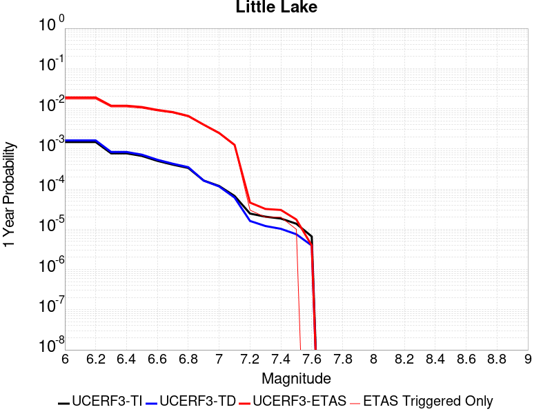 |  |

| Magnitude | 1 wk TI Prob | 1 wk TD Prob | 1 wk ETAS Prob | 1 wk ETAS/TD Gain | 1 wk ETAS Triggered Only | 1 mo TI Prob | 1 mo TD Prob | 1 mo ETAS Prob | 1 mo ETAS/TD Gain | 1 mo ETAS Triggered Only | 1 yr TI Prob | 1 yr TD Prob | 1 yr ETAS Prob | 1 yr ETAS/TD Gain | 1 yr ETAS Triggered Only | 10 yr TI Prob | 10 yr TD Prob | 10 yr ETAS Prob | 10 yr ETAS/TD Gain | 10 yr ETAS Triggered Only |
|-----|-----|-----|-----|-----|-----|-----|-----|-----|-----|-----|-----|-----|-----|-----|-----|-----|-----|-----|-----|-----|
| 6.0 | 2.8424427E-5 | 3.12066E-5 | 0.0017896254 | 57.34766 | 0.0017584737 | 1.2181328E-4 | 1.3373647E-4 | 0.006287571 | 47.014637 | 0.006154658 | 0.0014820677 | 0.0016271585 | 0.0204561 | 12.571671 | 0.01885963 | 0.014722223 | 0.016165853 | 0.04631191 | 2.8647985 | 0.030641403 |
| 6.1 | 2.8424427E-5 | 3.12066E-5 | 0.0017896254 | 57.34766 | 0.0017584737 | 1.2181328E-4 | 1.3373647E-4 | 0.006287571 | 47.014637 | 0.006154658 | 0.0014820677 | 0.0016271585 | 0.0204561 | 12.571671 | 0.01885963 | 0.014722223 | 0.016165853 | 0.04631191 | 2.8647985 | 0.030641403 |
| 6.2 | 2.8424427E-5 | 3.12066E-5 | 0.0017896254 | 57.34766 | 0.0017584737 | 1.2181328E-4 | 1.3373647E-4 | 0.006287571 | 47.014637 | 0.006154658 | 0.0014820677 | 0.0016271585 | 0.0204561 | 12.571671 | 0.01885963 | 0.014722223 | 0.016165853 | 0.04631191 | 2.8647985 | 0.030641403 |
| 6.3 | 1.48860645E-5 | 1.6081798E-5 | 9.392656E-4 | 58.405514 | 9.2319865E-4 | 6.379586E-5 | 6.892033E-5 | 0.0042010485 | 60.955147 | 0.004132413 | 7.7643775E-4 | 8.3881017E-4 | 0.013006026 | 15.505327 | 0.01217743 | 0.007737305 | 0.008359259 | 0.027758745 | 3.3207185 | 0.01956302 |
| 6.4 | 1.48860645E-5 | 1.6081798E-5 | 9.392656E-4 | 58.405514 | 9.2319865E-4 | 6.379586E-5 | 6.892033E-5 | 0.0042010485 | 60.955147 | 0.004132413 | 7.7643775E-4 | 8.3881017E-4 | 0.013006026 | 15.505327 | 0.01217743 | 0.007737305 | 0.008359259 | 0.027758745 | 3.3207185 | 0.01956302 |
| 6.5 | 1.2797581E-5 | 1.3765906E-5 | 9.3695184E-4 | 68.06322 | 9.2319865E-4 | 5.4845623E-5 | 5.899555E-5 | 0.00388345 | 65.82615 | 0.00382468 | 6.675408E-4 | 7.1805983E-4 | 0.01205207 | 16.784216 | 0.011342155 | 0.006655392 | 0.007159947 | 0.024967954 | 3.4871702 | 0.01793643 |
| 6.6 | 9.661896E-6 | 1.0289278E-5 | 8.455557E-4 | 82.17832 | 8.35275E-4 | 4.1407468E-5 | 4.4096254E-5 | 0.0035608883 | 80.75263 | 0.0035169474 | 5.040193E-4 | 5.367559E-4 | 0.010466799 | 19.50011 | 0.009935376 | 0.005028777 | 0.0053561996 | 0.020616703 | 3.8491292 | 0.015342683 |
| 6.7 | 7.767871E-6 | 8.1998705E-6 | 6.236606E-4 | 76.05737 | 6.154658E-4 | 3.329045E-5 | 3.5141904E-5 | 0.0029804818 | 84.81275 | 0.0029454434 | 4.0523586E-4 | 4.2778242E-4 | 0.008864845 | 20.72279 | 0.008440673 | 0.004044977 | 0.0042709415 | 0.017184297 | 4.023538 | 0.012968743 |
| 6.8 | 6.4235196E-6 | 6.7358933E-6 | 5.7823595E-4 | 85.843994 | 5.7150394E-4 | 2.752908E-5 | 2.8867868E-5 | 0.00249066 | 86.27793 | 0.0024618632 | 3.35115E-4 | 3.5142244E-4 | 0.0069433814 | 19.757935 | 0.006594276 | 0.003346101 | 0.0035099275 | 0.013322816 | 3.7957525 | 0.009847453 |
| 6.9 | 3.1283696E-6 | 3.1122331E-6 | 3.1084416E-4 | 99.878174 | 3.077329E-4 | 1.3407229E-5 | 1.3338082E-5 | 0.001376137 | 103.17353 | 0.0013628171 | 1.6322079E-4 | 1.6238056E-4 | 0.003942485 | 24.279291 | 0.0037807184 | 0.0016310095 | 0.0016227674 | 0.0069774087 | 4.2996974 | 0.0053633447 |
| 7.0 | 2.290603E-6 | 2.2287213E-6 | 2.2203743E-4 | 99.62548 | 2.1980921E-4 | 9.816834E-6 | 9.551634E-6 | 7.568958E-4 | 79.242546 | 7.473513E-4 | 1.19513395E-4 | 1.1628598E-4 | 0.0024459925 | 21.034286 | 0.0023299777 | 0.0011944914 | 0.0011623534 | 0.0045434805 | 3.908863 | 0.0033850619 |
| 7.1 | 1.293693E-6 | 1.1777075E-6 | 4.5139495E-5 | 38.328274 | 4.396184E-5 | 5.5443866E-6 | 5.047312E-6 | 2.6881704E-4 | 53.25944 | 2.6377104E-4 | 6.750081E-5 | 6.144999E-5 | 0.0010725101 | 17.453382 | 0.0010111224 | 6.7480316E-4 | 6.1439845E-4 | 0.002020313 | 3.288278 | 0.0014067789 |
| 7.2 | 4.715842E-7 | 3.0919028E-7 | 3.0919028E-7 | 1.0 | 0.0 | 2.0210737E-6 | 1.3251006E-6 | 1.3251006E-6 | 1.0 | 0.0 | 2.4606294E-5 | 1.6132984E-5 | 1.6132984E-5 | 1.0 | 0.0 | 2.460357E-4 | 1.6131868E-4 | 2.0527343E-4 | 1.2724715 | 4.396184E-5 |
| 7.3 | 3.9430947E-7 | 2.3098563E-7 | 2.3098563E-7 | 1.0 | 0.0 | 1.6898966E-6 | 9.89938E-7 | 9.89938E-7 | 1.0 | 0.0 | 2.0574296E-5 | 1.205243E-5 | 1.205243E-5 | 1.0 | 0.0 | 2.0572392E-4 | 1.20517834E-4 | 1.6447438E-4 | 1.3647306 | 4.396184E-5 |
| 7.4 | 3.547123E-7 | 1.9680134E-7 | 1.9680134E-7 | 1.0 | 0.0 | 1.5201948E-6 | 8.4343407E-7 | 8.4343407E-7 | 1.0 | 0.0 | 1.8508214E-5 | 1.0268762E-5 | 1.0268762E-5 | 1.0 | 0.0 | 1.8506673E-4 | 1.02682934E-4 | 1.02682934E-4 | 1.0 | 0.0 |
| 7.5 | 2.6354266E-7 | 1.4423837E-7 | 1.4423837E-7 | 1.0 | 0.0 | 1.129468E-6 | 6.181643E-7 | 6.181643E-7 | 1.0 | 0.0 | 1.3751187E-5 | 7.5261246E-6 | 7.5261246E-6 | 1.0 | 0.0 | 1.3750336E-4 | 7.525875E-5 | 7.525875E-5 | 1.0 | 0.0 |
| 7.6 | 1.269913E-7 | 7.572853E-8 | 7.572853E-8 | 1.0 | 0.0 | 5.4424834E-7 | 3.245508E-7 | 3.245508E-7 | 1.0 | 0.0 | 6.6262032E-6 | 3.951399E-6 | 3.951399E-6 | 1.0 | 0.0 | 6.626006E-5 | 3.9513325E-5 | 3.9513325E-5 | 1.0 | 0.0 |

## Owl Lake
*[(top)](#table-of-contents)*

| 1 Week | 1 Month | 1 Year | 10 Year |
|-----|-----|-----|-----|
|  |  |  |  |

| Magnitude | 1 wk TI Prob | 1 wk TD Prob | 1 wk ETAS Prob | 1 wk ETAS/TD Gain | 1 wk ETAS Triggered Only | 1 mo TI Prob | 1 mo TD Prob | 1 mo ETAS Prob | 1 mo ETAS/TD Gain | 1 mo ETAS Triggered Only | 1 yr TI Prob | 1 yr TD Prob | 1 yr ETAS Prob | 1 yr ETAS/TD Gain | 1 yr ETAS Triggered Only | 10 yr TI Prob | 10 yr TD Prob | 10 yr ETAS Prob | 10 yr ETAS/TD Gain | 10 yr ETAS Triggered Only |
|-----|-----|-----|-----|-----|-----|-----|-----|-----|-----|-----|-----|-----|-----|-----|-----|-----|-----|-----|-----|-----|
| 6.0 | 5.0320643E-5 | 6.636483E-5 | 0.0013411737 | 20.2091 | 0.0012748934 | 2.1564208E-4 | 2.84396E-4 | 0.004283786 | 15.062751 | 0.0040005273 | 0.0026222812 | 0.0034580813 | 0.014454345 | 4.1798744 | 0.011034423 | 0.02591553 | 0.03414388 | 0.054185387 | 1.586972 | 0.02074999 |
| 6.1 | 5.0320643E-5 | 6.636483E-5 | 0.0013411737 | 20.2091 | 0.0012748934 | 2.1564208E-4 | 2.84396E-4 | 0.004283786 | 15.062751 | 0.0040005273 | 0.0026222812 | 0.0034580813 | 0.014454345 | 4.1798744 | 0.011034423 | 0.02591553 | 0.03414388 | 0.054185387 | 1.586972 | 0.02074999 |
| 6.2 | 2.4125871E-5 | 3.0984345E-5 | 0.0012618777 | 40.7263 | 0.0012309316 | 1.0339249E-4 | 1.3278447E-4 | 0.0032536606 | 24.503325 | 0.0031212908 | 0.0012580766 | 0.0016156066 | 0.0096476255 | 5.971519 | 0.008045017 | 0.012509781 | 0.016072132 | 0.031211479 | 1.9419627 | 0.015386645 |
| 6.3 | 1.7433485E-5 | 2.2358157E-5 | 0.0012532622 | 56.05391 | 0.0012309316 | 7.471279E-5 | 9.581805E-5 | 0.0030409792 | 31.737019 | 0.0029454434 | 9.0924866E-4 | 0.0011661111 | 0.008411356 | 7.213169 | 0.0072537037 | 0.009055373 | 0.011630244 | 0.024926113 | 2.143215 | 0.013452323 |
| 6.4 | 1.7433485E-5 | 2.2358157E-5 | 0.0012532622 | 56.05391 | 0.0012309316 | 7.471279E-5 | 9.581805E-5 | 0.0030409792 | 31.737019 | 0.0029454434 | 9.0924866E-4 | 0.0011661111 | 0.008411356 | 7.213169 | 0.0072537037 | 0.009055373 | 0.011630244 | 0.024926113 | 2.143215 | 0.013452323 |
| 6.5 | 1.5182742E-5 | 1.943156E-5 | 0.0012063782 | 62.083447 | 0.0011869697 | 6.506727E-5 | 8.327631E-5 | 0.002984516 | 35.83872 | 0.0029014815 | 7.919061E-4 | 0.0010135688 | 0.007820748 | 7.71605 | 0.0068140854 | 0.0078909 | 0.0101196645 | 0.022739584 | 2.247069 | 0.012748934 |
| 6.6 | 6.7271576E-6 | 8.548953E-6 | 7.558939E-4 | 88.419464 | 7.473513E-4 | 2.8830356E-5 | 3.6637888E-5 | 0.002190689 | 59.793 | 0.0021541303 | 3.5095305E-4 | 4.4598064E-4 | 0.005499338 | 12.330889 | 0.005055612 | 0.0035039932 | 0.004468639 | 0.013659371 | 3.0567183 | 0.0092319865 |
| 6.7 | 6.682835E-6 | 8.481396E-6 | 7.5582636E-4 | 89.11579 | 7.473513E-4 | 2.8640408E-5 | 3.6348367E-5 | 0.0021904004 | 60.26131 | 0.0021541303 | 3.4864116E-4 | 4.4245718E-4 | 0.005495832 | 12.421162 | 0.005055612 | 0.003480947 | 0.004433564 | 0.01362462 | 3.0730627 | 0.0092319865 |
| 6.8 | 6.5774975E-6 | 8.327863E-6 | 7.556729E-4 | 90.740326 | 7.473513E-4 | 2.8188972E-5 | 3.5690384E-5 | 0.0021897438 | 61.35389 | 0.0021541303 | 3.4314668E-4 | 4.344494E-4 | 0.005487865 | 12.631769 | 0.005055612 | 0.0034261728 | 0.0043537063 | 0.013545499 | 3.111257 | 0.0092319865 |
| 6.9 | 6.363419E-6 | 8.001017E-6 | 7.553463E-4 | 94.406296 | 7.473513E-4 | 2.727151E-5 | 3.4289653E-5 | 0.002188346 | 63.819427 | 0.0021541303 | 3.3198006E-4 | 4.1740213E-4 | 0.00542696 | 13.001755 | 0.00501165 | 0.0033148455 | 0.004183688 | 0.013289495 | 3.1765025 | 0.009144063 |
| 7.0 | 6.1342453E-6 | 7.633193E-6 | 7.549788E-4 | 98.90734 | 7.473513E-4 | 2.6289357E-5 | 3.2713302E-5 | 0.002186773 | 66.8466 | 0.0021541303 | 3.2002592E-4 | 3.9821718E-4 | 0.005407871 | 13.580206 | 0.00501165 | 0.0031956544 | 0.003992369 | 0.013099926 | 3.2812412 | 0.009144063 |
| 7.1 | 5.842926E-6 | 7.1437107E-6 | 7.1052817E-4 | 99.46206 | 7.0338947E-4 | 2.504087E-5 | 3.0615574E-5 | 0.0020088379 | 65.6149 | 0.0019782828 | 3.0482994E-4 | 3.7268628E-4 | 0.004855123 | 13.027372 | 0.0044841077 | 0.0030441214 | 0.0037378124 | 0.012146936 | 3.2497447 | 0.008440673 |
| 7.2 | 4.77173E-6 | 5.3598433E-6 | 4.889375E-4 | 91.22235 | 4.8358025E-4 | 2.045011E-5 | 2.2970578E-5 | 0.001473678 | 64.15502 | 0.0014507407 | 2.4895166E-4 | 2.7963496E-4 | 0.003400053 | 12.158897 | 0.0031212908 | 0.0024867293 | 0.0028093536 | 0.008596014 | 3.0597835 | 0.005802963 |
| 7.3 | 3.0494948E-6 | 2.7114665E-6 | 1.3459663E-4 | 49.63979 | 1.3188552E-4 | 1.3069198E-5 | 1.162052E-5 | 3.6331115E-4 | 31.264622 | 3.5169473E-4 | 1.5910587E-4 | 1.4147081E-4 | 0.0010205832 | 7.214091 | 8.7923685E-4 | 0.0015899199 | 0.0014237651 | 0.0026968434 | 1.8941631 | 0.0012748934 |
| 7.4 | 2.7263884E-6 | 2.3066186E-6 | 1.3419184E-4 | 58.176865 | 1.3188552E-4 | 1.1684469E-5 | 9.885472E-6 | 3.176153E-4 | 32.129505 | 3.077329E-4 | 1.4224913E-4 | 1.2034907E-4 | 8.6761045E-4 | 7.2091165 | 7.473513E-4 | 0.0014215811 | 0.0012117156 | 0.0022655213 | 1.8696808 | 0.0010550842 |
| 7.5 | 2.6090431E-6 | 2.1665383E-6 | 1.3405178E-4 | 61.87372 | 1.3188552E-4 | 1.1181565E-5 | 9.2851315E-6 | 3.1701516E-4 | 34.14224 | 3.077329E-4 | 1.3612706E-4 | 1.130407E-4 | 8.163506E-4 | 7.2217407 | 7.0338947E-4 | 0.001360437 | 0.0011384635 | 0.002104523 | 1.8485643 | 9.671605E-4 |
| 7.6 | 2.3008756E-6 | 1.8736819E-6 | 1.3375896E-4 | 71.3883 | 1.3188552E-4 | 9.860858E-6 | 8.0300415E-6 | 2.7179896E-4 | 33.847767 | 2.6377104E-4 | 1.20049335E-4 | 9.776145E-5 | 5.812944E-4 | 5.9460497 | 4.8358025E-4 | 0.001199845 | 9.854571E-4 | 0.0017320719 | 1.757633 | 7.473513E-4 |
| 7.7 | 1.7184348E-6 | 1.3427394E-6 | 4.530452E-5 | 33.740368 | 4.396184E-5 | 7.3646997E-6 | 5.754585E-6 | 1.8160093E-4 | 31.557608 | 1.7584737E-4 | 8.966153E-5 | 7.005986E-5 | 3.3381244E-4 | 4.7646747 | 2.6377104E-4 | 8.962536E-4 | 7.082645E-4 | 0.0011036409 | 1.5582327 | 3.9565656E-4 |
| 7.8 | 8.4612907E-7 | 8.411728E-7 | 8.411728E-7 | 1.0 | 0.0 | 3.6262625E-6 | 3.6050214E-6 | 3.6050214E-6 | 1.0 | 0.0 | 4.4148852E-5 | 4.389027E-5 | 4.389027E-5 | 1.0 | 0.0 | 4.414008E-4 | 4.442907E-4 | 5.321753E-4 | 1.1978089 | 8.792368E-5 |
| 7.9 | 2.716738E-7 | 3.7706997E-7 | 3.7706997E-7 | 1.0 | 0.0 | 1.1643157E-6 | 1.6160132E-6 | 1.6160132E-6 | 1.0 | 0.0 | 1.4175452E-5 | 1.9674793E-5 | 1.9674793E-5 | 1.0 | 0.0 | 1.4174548E-4 | 1.9850205E-4 | 1.9850205E-4 | 1.0 | 0.0 |
| 8.0 | 2.1995428E-8 | 3.3871476E-8 | 3.3871476E-8 | 1.0 | 0.0 | 9.426611E-8 | 1.4516347E-7 | 1.4516347E-7 | 1.0 | 0.0 | 1.1476893E-6 | 1.7673646E-6 | 1.7673646E-6 | 1.0 | 0.0 | 1.14768345E-5 | 1.7974871E-5 | 1.7974871E-5 | 1.0 | 0.0 |

## Airport Lake
*[(top)](#table-of-contents)*

| 1 Week | 1 Month | 1 Year | 10 Year |
|-----|-----|-----|-----|
|  |  |  |  |

| Magnitude | 1 wk TI Prob | 1 wk TD Prob | 1 wk ETAS Prob | 1 wk ETAS/TD Gain | 1 wk ETAS Triggered Only | 1 mo TI Prob | 1 mo TD Prob | 1 mo ETAS Prob | 1 mo ETAS/TD Gain | 1 mo ETAS Triggered Only | 1 yr TI Prob | 1 yr TD Prob | 1 yr ETAS Prob | 1 yr ETAS/TD Gain | 1 yr ETAS Triggered Only | 10 yr TI Prob | 10 yr TD Prob | 10 yr ETAS Prob | 10 yr ETAS/TD Gain | 10 yr ETAS Triggered Only |
|-----|-----|-----|-----|-----|-----|-----|-----|-----|-----|-----|-----|-----|-----|-----|-----|-----|-----|-----|-----|-----|
| 6.0 | 1.2387061E-5 | 1.3103358E-5 | 0.0014638251 | 111.71374 | 0.0014507407 | 5.3086325E-5 | 5.6156197E-5 | 0.005331281 | 94.93664 | 0.005275421 | 6.461343E-4 | 6.835157E-4 | 0.015312803 | 22.403002 | 0.014639293 | 0.0064425888 | 0.0068169436 | 0.030307183 | 4.445861 | 0.023651471 |
| 6.1 | 1.2387061E-5 | 1.3103358E-5 | 0.0014638251 | 111.71374 | 0.0014507407 | 5.3086325E-5 | 5.6156197E-5 | 0.005331281 | 94.93664 | 0.005275421 | 6.461343E-4 | 6.835157E-4 | 0.015312803 | 22.403002 | 0.014639293 | 0.0064425888 | 0.0068169436 | 0.030307183 | 4.445861 | 0.023651471 |
| 6.2 | 1.2387061E-5 | 1.3103358E-5 | 0.0014638251 | 111.71374 | 0.0014507407 | 5.3086325E-5 | 5.6156197E-5 | 0.005331281 | 94.93664 | 0.005275421 | 6.461343E-4 | 6.835157E-4 | 0.015312803 | 22.403002 | 0.014639293 | 0.0064425888 | 0.0068169436 | 0.030307183 | 4.445861 | 0.023651471 |
| 6.3 | 1.2387061E-5 | 1.3103358E-5 | 0.0014638251 | 111.71374 | 0.0014507407 | 5.3086325E-5 | 5.6156197E-5 | 0.005331281 | 94.93664 | 0.005275421 | 6.461343E-4 | 6.835157E-4 | 0.015312803 | 22.403002 | 0.014639293 | 0.0064425888 | 0.0068169436 | 0.030307183 | 4.445861 | 0.023651471 |
| 6.4 | 1.2387061E-5 | 1.3103358E-5 | 0.0014638251 | 111.71374 | 0.0014507407 | 5.3086325E-5 | 5.6156197E-5 | 0.005331281 | 94.93664 | 0.005275421 | 6.461343E-4 | 6.835157E-4 | 0.015312803 | 22.403002 | 0.014639293 | 0.0064425888 | 0.0068169436 | 0.030307183 | 4.445861 | 0.023651471 |
| 6.5 | 6.9922594E-6 | 7.385035E-6 | 0.0010185 | 137.91402 | 0.0010111224 | 2.996648E-5 | 3.1649797E-5 | 0.0040320507 | 127.39578 | 0.0040005273 | 3.6478083E-4 | 3.8527357E-4 | 0.011767004 | 30.541943 | 0.011386117 | 0.003641826 | 0.003846594 | 0.021363689 | 5.5539236 | 0.017584736 |
| 6.6 | 6.9922594E-6 | 7.385035E-6 | 0.0010185 | 137.91402 | 0.0010111224 | 2.996648E-5 | 3.1649797E-5 | 0.0040320507 | 127.39578 | 0.0040005273 | 3.6478083E-4 | 3.8527357E-4 | 0.011767004 | 30.541943 | 0.011386117 | 0.003641826 | 0.003846594 | 0.021363689 | 5.5539236 | 0.017584736 |
| 6.7 | 5.477277E-6 | 5.786155E-6 | 7.970947E-4 | 137.75896 | 7.913131E-4 | 2.3473833E-5 | 2.4797593E-5 | 0.0033658147 | 135.7315 | 0.0033411 | 2.8575645E-4 | 3.0187276E-4 | 0.00961897 | 31.864317 | 0.009319911 | 0.0028538927 | 0.0030150109 | 0.01730336 | 5.739071 | 0.014331561 |
| 6.8 | 3.9950432E-6 | 4.21915E-6 | 6.63644E-4 | 157.29329 | 6.594276E-4 | 1.7121502E-5 | 1.808196E-5 | 0.0026557448 | 146.8726 | 0.0026377104 | 2.0843433E-4 | 2.201284E-4 | 0.0072964267 | 33.146233 | 0.0070778565 | 0.0020823893 | 0.0021993744 | 0.012814742 | 5.826539 | 0.010638766 |
| 6.9 | 2.95695E-6 | 3.1230709E-6 | 4.427401E-4 | 141.76434 | 4.3961842E-4 | 1.2672582E-5 | 1.3384533E-5 | 0.0017718347 | 132.37926 | 0.0017584737 | 1.5427776E-4 | 1.6294677E-4 | 0.0052616894 | 32.290848 | 0.0050995736 | 0.001541707 | 0.0016284954 | 0.009177619 | 5.635643 | 0.007561437 |
| 7.0 | 1.456072E-6 | 1.5408358E-6 | 2.213497E-4 | 143.65561 | 2.1980921E-4 | 6.2402937E-6 | 6.603571E-6 | 7.539499E-4 | 114.173065 | 7.473513E-4 | 7.597293E-5 | 8.0396516E-5 | 0.0023662285 | 29.431976 | 0.0022860158 | 7.594696E-4 | 8.0377323E-4 | 0.0040982612 | 5.098778 | 0.003297138 |
| 7.1 | 6.995192E-7 | 7.4090906E-7 | 4.4702716E-5 | 60.334957 | 4.396184E-5 | 2.997936E-6 | 3.1753245E-6 | 2.6694554E-4 | 84.06874 | 2.6377104E-4 | 3.649926E-5 | 3.8659575E-5 | 0.0010057827 | 26.016392 | 9.671605E-4 | 3.6493264E-4 | 3.8659576E-4 | 0.0017049412 | 4.410139 | 0.0013188552 |

## Panamint Valley
*[(top)](#table-of-contents)*

| 1 Week | 1 Month | 1 Year | 10 Year |
|-----|-----|-----|-----|
|  |  |  |  |

| Magnitude | 1 wk TI Prob | 1 wk TD Prob | 1 wk ETAS Prob | 1 wk ETAS/TD Gain | 1 wk ETAS Triggered Only | 1 mo TI Prob | 1 mo TD Prob | 1 mo ETAS Prob | 1 mo ETAS/TD Gain | 1 mo ETAS Triggered Only | 1 yr TI Prob | 1 yr TD Prob | 1 yr ETAS Prob | 1 yr ETAS/TD Gain | 1 yr ETAS Triggered Only | 10 yr TI Prob | 10 yr TD Prob | 10 yr ETAS Prob | 10 yr ETAS/TD Gain | 10 yr ETAS Triggered Only |
|-----|-----|-----|-----|-----|-----|-----|-----|-----|-----|-----|-----|-----|-----|-----|-----|-----|-----|-----|-----|-----|
| 6.0 | 3.0211835E-5 | 3.3986267E-5 | 0.0010890346 | 32.043373 | 0.0010550842 | 1.2947287E-4 | 1.4564747E-4 | 0.0026511075 | 18.20222 | 0.002505825 | 0.0015751923 | 0.0017718452 | 0.00971484 | 5.4828944 | 0.007957093 | 0.015640736 | 0.017584037 | 0.03231142 | 1.8375429 | 0.014990988 |
| 6.1 | 3.0211835E-5 | 3.3986267E-5 | 0.0010890346 | 32.043373 | 0.0010550842 | 1.2947287E-4 | 1.4564747E-4 | 0.0026511075 | 18.20222 | 0.002505825 | 0.0015751923 | 0.0017718452 | 0.00971484 | 5.4828944 | 0.007957093 | 0.015640736 | 0.017584037 | 0.03231142 | 1.8375429 | 0.014990988 |
| 6.2 | 3.0211835E-5 | 3.3986267E-5 | 0.0010890346 | 32.043373 | 0.0010550842 | 1.2947287E-4 | 1.4564747E-4 | 0.0026511075 | 18.20222 | 0.002505825 | 0.0015751923 | 0.0017718452 | 0.00971484 | 5.4828944 | 0.007957093 | 0.015640736 | 0.017584037 | 0.03231142 | 1.8375429 | 0.014990988 |
| 6.3 | 2.8573924E-5 | 3.2104348E-5 | 0.0010431942 | 32.493862 | 0.0010111224 | 1.2245393E-4 | 1.3758296E-4 | 0.0025111958 | 18.25223 | 0.0023739394 | 0.001489857 | 0.0016738133 | 0.009442035 | 5.641032 | 0.0077812457 | 0.01479908 | 0.016618656 | 0.030582352 | 1.8402421 | 0.014199675 |
| 6.4 | 2.8573924E-5 | 3.2104348E-5 | 0.0010431942 | 32.493862 | 0.0010111224 | 1.2245393E-4 | 1.3758296E-4 | 0.0025111958 | 18.25223 | 0.0023739394 | 0.001489857 | 0.0016738133 | 0.009442035 | 5.641032 | 0.0077812457 | 0.01479908 | 0.016618656 | 0.030582352 | 1.8402421 | 0.014199675 |
| 6.5 | 2.7468774E-5 | 3.083004E-5 | 0.0010419212 | 33.79565 | 0.0010111224 | 1.1771801E-4 | 1.3212221E-4 | 0.002505748 | 18.965382 | 0.0023739394 | 0.0014322745 | 0.0016074283 | 0.009200602 | 5.723802 | 0.0076053985 | 0.014230782 | 0.0159645 | 0.029591404 | 1.8535753 | 0.01384798 |
| 6.6 | 2.6135967E-5 | 2.9254019E-5 | 0.0010403468 | 35.562527 | 0.0010111224 | 1.1200648E-4 | 1.2536849E-4 | 0.0023671412 | 18.88147 | 0.0022420539 | 0.0013628257 | 0.0015253192 | 0.008855748 | 5.805833 | 0.0073416275 | 0.013544982 | 0.015154834 | 0.028316699 | 1.8684928 | 0.0133644 |
| 6.7 | 2.4498746E-5 | 2.7342825E-5 | 0.0010384375 | 37.978428 | 0.0010111224 | 1.04990395E-4 | 1.1717841E-4 | 0.0023589695 | 20.131435 | 0.0022420539 | 0.0012775084 | 0.0014257386 | 0.008669101 | 6.0804276 | 0.0072537037 | 0.012701893 | 0.014172041 | 0.027087007 | 1.911299 | 0.013100629 |
| 6.8 | 2.2244329E-5 | 2.4936824E-5 | 9.4811246E-4 | 38.020576 | 9.2319865E-4 | 9.532935E-5 | 1.0686785E-4 | 0.0023047249 | 21.566122 | 0.002198092 | 0.0011600169 | 0.0013003612 | 0.008149491 | 6.2670975 | 0.006858047 | 0.011539802 | 0.012933239 | 0.024779603 | 1.9159626 | 0.012001582 |
| 6.9 | 1.9902658E-5 | 2.2291566E-5 | 9.015088E-4 | 40.4417 | 8.7923685E-4 | 8.529431E-5 | 9.553189E-5 | 0.0021175833 | 22.166246 | 0.0020222447 | 0.0010379635 | 0.0011624986 | 0.007090448 | 6.099317 | 0.0059348485 | 0.010331288 | 0.011569277 | 0.021737333 | 1.8788843 | 0.010287071 |
| 7.0 | 1.8353881E-5 | 2.0567417E-5 | 8.9978613E-4 | 43.74814 | 8.7923685E-4 | 7.865712E-5 | 8.814319E-5 | 0.0020222936 | 22.943277 | 0.001934321 | 9.5722964E-4 | 0.0010726327 | 0.0065619685 | 6.1176286 | 0.00549523 | 0.009531168 | 0.010679484 | 0.019899862 | 1.863373 | 0.009319911 |
| 7.1 | 1.7667631E-5 | 1.9773817E-5 | 8.989933E-4 | 45.463818 | 8.7923685E-4 | 7.571623E-5 | 8.474228E-5 | 0.0019309832 | 22.786537 | 0.0018463973 | 9.2145515E-4 | 0.0010312665 | 0.0062573305 | 6.0676174 | 0.005231459 | 0.009176437 | 0.010269695 | 0.01918932 | 1.8685385 | 0.009012178 |
| 7.2 | 1.6381597E-5 | 1.8159382E-5 | 8.9738023E-4 | 49.416893 | 8.7923685E-4 | 7.020495E-5 | 7.78237E-5 | 0.0017922021 | 23.029001 | 0.0017145118 | 8.544101E-4 | 9.4710896E-4 | 0.005602651 | 5.9155293 | 0.0046599554 | 0.008511325 | 0.009435377 | 0.01705611 | 1.8076766 | 0.0076933224 |
| 7.3 | 1.4520491E-5 | 1.596737E-5 | 6.753845E-4 | 42.29779 | 6.594276E-4 | 6.222919E-5 | 6.842988E-5 | 0.0013871948 | 20.27177 | 0.0013188552 | 7.57377E-4 | 8.3283155E-4 | 0.0047421767 | 5.694041 | 0.003912604 | 0.0075480095 | 0.008300213 | 0.014708965 | 1.7721188 | 0.0064623905 |
| 7.4 | 1.2852287E-5 | 1.4146221E-5 | 5.8564206E-4 | 41.399193 | 5.7150394E-4 | 5.5080065E-5 | 6.0625338E-5 | 0.0012475231 | 20.577585 | 0.0011869697 | 6.7039346E-4 | 7.378793E-4 | 0.0044718785 | 6.0604467 | 0.0037367565 | 0.0066837464 | 0.007357214 | 0.013510229 | 1.8363241 | 0.0061986195 |
| 7.5 | 1.1637851E-5 | 1.2837501E-5 | 5.843341E-4 | 45.517742 | 5.7150394E-4 | 4.987555E-5 | 5.501679E-5 | 0.0012419212 | 22.573494 | 0.0011869697 | 6.070656E-4 | 6.6963927E-4 | 0.0044038934 | 6.576516 | 0.0037367565 | 0.006054099 | 0.0066791116 | 0.01283633 | 1.9218619 | 0.0061986195 |
| 7.6 | 3.0068115E-6 | 3.333306E-6 | 2.2314177E-4 | 66.943085 | 2.1980921E-4 | 1.2886271E-5 | 1.4285561E-5 | 5.4182013E-4 | 37.92782 | 5.275421E-4 | 1.5687906E-4 | 1.739201E-4 | 0.0014485917 | 8.329065 | 0.0012748934 | 0.0015676835 | 0.0017392797 | 0.003933549 | 2.2615964 | 0.002198092 |

## Garlock (East)
*[(top)](#table-of-contents)*

| 1 Week | 1 Month | 1 Year | 10 Year |
|-----|-----|-----|-----|
|  |  |  |  |

| Magnitude | 1 wk TI Prob | 1 wk TD Prob | 1 wk ETAS Prob | 1 wk ETAS/TD Gain | 1 wk ETAS Triggered Only | 1 mo TI Prob | 1 mo TD Prob | 1 mo ETAS Prob | 1 mo ETAS/TD Gain | 1 mo ETAS Triggered Only | 1 yr TI Prob | 1 yr TD Prob | 1 yr ETAS Prob | 1 yr ETAS/TD Gain | 1 yr ETAS Triggered Only | 10 yr TI Prob | 10 yr TD Prob | 10 yr ETAS Prob | 10 yr ETAS/TD Gain | 10 yr ETAS Triggered Only |
|-----|-----|-----|-----|-----|-----|-----|-----|-----|-----|-----|-----|-----|-----|-----|-----|-----|-----|-----|-----|-----|
| 6.0 | 4.5092507E-5 | 6.291034E-5 | 0.00103001 | 16.372667 | 9.671605E-4 | 1.9323928E-4 | 2.6959038E-4 | 0.0030823897 | 11.433604 | 0.0028135579 | 0.0023501497 | 0.0032777686 | 0.010420061 | 3.1790104 | 0.0071657803 | 0.023254504 | 0.03235544 | 0.04520235 | 1.3970556 | 0.013276476 |
| 6.1 | 4.5092507E-5 | 6.291034E-5 | 0.00103001 | 16.372667 | 9.671605E-4 | 1.9323928E-4 | 2.6959038E-4 | 0.0030823897 | 11.433604 | 0.0028135579 | 0.0023501497 | 0.0032777686 | 0.010420061 | 3.1790104 | 0.0071657803 | 0.023254504 | 0.03235544 | 0.04520235 | 1.3970556 | 0.013276476 |
| 6.2 | 2.6674514E-5 | 3.451529E-5 | 6.4995984E-4 | 18.831068 | 6.154658E-4 | 1.1431433E-4 | 1.4791447E-4 | 0.0020819493 | 14.075359 | 0.001934321 | 0.0013908884 | 0.0017994043 | 0.0070653325 | 3.9264843 | 0.005275421 | 0.01382215 | 0.017893167 | 0.027391717 | 1.5308479 | 0.009671605 |
| 6.3 | 2.6674514E-5 | 3.451529E-5 | 6.4995984E-4 | 18.831068 | 6.154658E-4 | 1.1431433E-4 | 1.4791447E-4 | 0.0020819493 | 14.075359 | 0.001934321 | 0.0013908884 | 0.0017994043 | 0.0070653325 | 3.9264843 | 0.005275421 | 0.01382215 | 0.017893167 | 0.027391717 | 1.5308479 | 0.009671605 |
| 6.4 | 2.5312667E-5 | 3.234442E-5 | 6.4779026E-4 | 20.027884 | 6.154658E-4 | 1.0847834E-4 | 1.3861175E-4 | 0.0020287088 | 14.635909 | 0.0018903592 | 0.0013199237 | 0.001686321 | 0.0068650707 | 4.071034 | 0.0051874975 | 0.013121112 | 0.016781144 | 0.025987878 | 1.5486357 | 0.009363872 |
| 6.5 | 2.5312667E-5 | 3.234442E-5 | 6.4779026E-4 | 20.027884 | 6.154658E-4 | 1.0847834E-4 | 1.3861175E-4 | 0.0020287088 | 14.635909 | 0.0018903592 | 0.0013199237 | 0.001686321 | 0.0068650707 | 4.071034 | 0.0051874975 | 0.013121112 | 0.016781144 | 0.025987878 | 1.5486357 | 0.009363872 |
| 6.6 | 2.246556E-5 | 2.8139062E-5 | 6.435875E-4 | 22.871677 | 6.154658E-4 | 9.627742E-5 | 1.20590536E-4 | 0.0019667652 | 16.309448 | 0.0018463973 | 0.0011715472 | 0.0014672246 | 0.0063837264 | 4.350886 | 0.0049237264 | 0.011653901 | 0.014621371 | 0.023241865 | 1.5895817 | 0.008748407 |
| 6.7 | 2.2241198E-5 | 2.7808788E-5 | 6.4325746E-4 | 23.131445 | 6.154658E-4 | 9.531594E-5 | 1.1917521E-4 | 0.0019653526 | 16.491285 | 0.0018463973 | 0.0011598538 | 0.0014500159 | 0.0063666026 | 4.3907123 | 0.0049237264 | 0.011538187 | 0.014451557 | 0.023030208 | 1.5936143 | 0.008704444 |
| 6.8 | 1.9528685E-5 | 2.3903114E-5 | 5.953934E-4 | 24.908611 | 5.7150394E-4 | 8.369167E-5 | 1.02438E-4 | 0.0019046889 | 18.593576 | 0.0018024355 | 0.0010184698 | 0.0012464889 | 0.0059884493 | 4.8042545 | 0.0047478788 | 0.010138147 | 0.012438961 | 0.020731226 | 1.6666365 | 0.008396711 |
| 6.9 | 1.3318621E-5 | 1.5203129E-5 | 5.8669836E-4 | 38.590633 | 5.7150394E-4 | 5.7078556E-5 | 6.515467E-5 | 0.0016476779 | 25.288713 | 0.0015826263 | 6.9470983E-4 | 7.9297513E-4 | 0.0051417463 | 6.4841204 | 0.004352222 | 0.0069254204 | 0.007942084 | 0.015312629 | 1.9280367 | 0.0074295513 |
| 7.0 | 1.1760853E-5 | 1.3111888E-5 | 5.8460835E-4 | 44.586132 | 5.7150394E-4 | 5.0402683E-5 | 5.619262E-5 | 0.0016387299 | 29.162725 | 0.0015826263 | 6.134799E-4 | 6.839354E-4 | 0.004901386 | 7.1664453 | 0.0042203367 | 0.0061178906 | 0.006858643 | 0.014018936 | 2.0439808 | 0.007209742 |
| 7.1 | 1.0064758E-5 | 1.0906889E-5 | 5.824046E-4 | 53.397865 | 5.7150394E-4 | 4.3133965E-5 | 4.6742993E-5 | 0.0016292953 | 34.85646 | 0.0015826263 | 5.2502943E-4 | 5.6895084E-4 | 0.0046990127 | 8.259084 | 0.004132413 | 0.005237907 | 0.0057150517 | 0.012665036 | 2.2160842 | 0.0069899326 |
| 7.2 | 9.768808E-6 | 1.05027375E-5 | 5.8200065E-4 | 55.41419 | 5.7150394E-4 | 4.186565E-5 | 4.5010976E-5 | 0.0016275661 | 36.159313 | 0.0015826263 | 5.095951E-4 | 5.478743E-4 | 0.0046340856 | 8.458301 | 0.004088451 | 0.0050842804 | 0.005505304 | 0.012325595 | 2.2388582 | 0.006858047 |
| 7.3 | 9.344516E-6 | 9.948323E-6 | 5.8144657E-4 | 58.44669 | 5.7150394E-4 | 4.004731E-5 | 4.2634994E-5 | 0.0014933139 | 35.025543 | 0.0014507407 | 4.8746695E-4 | 5.189609E-4 | 0.004253778 | 8.196722 | 0.0037367565 | 0.0048639905 | 0.005216946 | 0.011514425 | 2.20712 | 0.006330505 |
| 7.4 | 9.023491E-6 | 9.49444E-6 | 5.370315E-4 | 56.56274 | 5.275421E-4 | 3.867153E-5 | 4.068984E-5 | 0.0013594914 | 33.41108 | 0.0013188552 | 4.7072413E-4 | 4.952895E-4 | 0.004054435 | 8.185989 | 0.003560909 | 0.004697283 | 0.0049803588 | 0.010798164 | 2.1681497 | 0.005846925 |
| 7.5 | 7.081253E-6 | 7.091033E-6 | 1.8293715E-4 | 25.798378 | 1.7584737E-4 | 3.0347876E-5 | 3.038979E-5 | 6.458369E-4 | 21.25177 | 6.154658E-4 | 3.6942272E-4 | 3.6993364E-4 | 0.0020398656 | 5.514139 | 0.00167055 | 0.003688092 | 0.003726062 | 0.006353944 | 1.7052706 | 0.0026377104 |
| 7.6 | 6.116396E-6 | 5.962439E-6 | 1.8180876E-4 | 30.492346 | 1.7584737E-4 | 2.6212863E-5 | 2.5553061E-5 | 5.0912093E-4 | 19.924068 | 4.8358025E-4 | 3.1909486E-4 | 3.1106436E-4 | 0.0015855612 | 5.0972123 | 0.0012748934 | 0.0031863707 | 0.0031374171 | 0.005153317 | 1.642535 | 0.0020222447 |
| 7.7 | 4.797145E-6 | 4.7603035E-6 | 4.7603035E-6 | 1.0 | 0.0 | 2.055903E-5 | 2.0401141E-5 | 1.9624492E-4 | 9.61931 | 1.7584737E-4 | 2.5027743E-4 | 2.4835573E-4 | 7.757668E-4 | 3.1236115 | 5.275421E-4 | 0.0024999576 | 0.0025109209 | 0.0034756528 | 1.3842144 | 9.671605E-4 |
| 7.8 | 3.4028885E-6 | 3.981157E-6 | 3.981157E-6 | 1.0 | 0.0 | 1.4583726E-5 | 1.7061991E-5 | 1.4894527E-4 | 8.729653 | 1.3188552E-4 | 1.775424E-4 | 2.0771002E-4 | 6.472371E-4 | 3.1160612 | 4.3961842E-4 | 0.0017740062 | 0.002102626 | 0.0028922753 | 1.3755538 | 7.913131E-4 |
| 7.9 | 2.5928412E-6 | 3.3747272E-6 | 3.3747272E-6 | 1.0 | 0.0 | 1.1112129E-5 | 1.4463037E-5 | 1.4634665E-4 | 10.118667 | 1.3188552E-4 | 1.3528178E-4 | 1.7607331E-4 | 6.156143E-4 | 3.4963522 | 4.3961842E-4 | 0.0013519945 | 0.0017824261 | 0.0023967947 | 1.3446811 | 6.154658E-4 |
| 8.0 | 1.3743648E-6 | 1.6745075E-6 | 1.6745075E-6 | 1.0 | 0.0 | 5.8901214E-6 | 7.1764416E-6 | 9.5099495E-5 | 13.251622 | 8.792368E-5 | 7.1709874E-5 | 8.73697E-5 | 2.192437E-4 | 2.5093791 | 1.3188552E-4 | 7.1686733E-4 | 8.8426104E-4 | 0.0010599529 | 1.1986878 | 1.7584737E-4 |
| 8.1 | 3.6733252E-7 | 3.150841E-7 | 3.150841E-7 | 1.0 | 0.0 | 1.5742813E-6 | 1.3503599E-6 | 1.3503599E-6 | 1.0 | 0.0 | 1.9166706E-5 | 1.6440523E-5 | 6.0401642E-5 | 3.6739488 | 4.396184E-5 | 1.9165053E-4 | 1.6648423E-4 | 2.1043875E-4 | 1.2640162 | 4.396184E-5 |

## Ash Hill
*[(top)](#table-of-contents)*

| 1 Week | 1 Month | 1 Year | 10 Year |
|-----|-----|-----|-----|
|  |  |  |  |

| Magnitude | 1 wk TI Prob | 1 wk TD Prob | 1 wk ETAS Prob | 1 wk ETAS/TD Gain | 1 wk ETAS Triggered Only | 1 mo TI Prob | 1 mo TD Prob | 1 mo ETAS Prob | 1 mo ETAS/TD Gain | 1 mo ETAS Triggered Only | 1 yr TI Prob | 1 yr TD Prob | 1 yr ETAS Prob | 1 yr ETAS/TD Gain | 1 yr ETAS Triggered Only | 10 yr TI Prob | 10 yr TD Prob | 10 yr ETAS Prob | 10 yr ETAS/TD Gain | 10 yr ETAS Triggered Only |
|-----|-----|-----|-----|-----|-----|-----|-----|-----|-----|-----|-----|-----|-----|-----|-----|-----|-----|-----|-----|-----|
| 6.0 | 2.1545662E-5 | 2.3194918E-5 | 4.6280315E-4 | 19.952782 | 4.3961842E-4 | 9.2335285E-5 | 9.9403456E-5 | 0.0010664678 | 10.72868 | 9.671605E-4 | 0.0011236023 | 0.0012096452 | 0.004722338 | 3.9039037 | 0.0035169474 | 0.011179381 | 0.012038592 | 0.018423185 | 1.5303438 | 0.0064623905 |
| 6.1 | 2.1545662E-5 | 2.3194918E-5 | 4.6280315E-4 | 19.952782 | 4.3961842E-4 | 9.2335285E-5 | 9.9403456E-5 | 0.0010664678 | 10.72868 | 9.671605E-4 | 0.0011236023 | 0.0012096452 | 0.004722338 | 3.9039037 | 0.0035169474 | 0.011179381 | 0.012038592 | 0.018423185 | 1.5303438 | 0.0064623905 |
| 6.2 | 2.1545662E-5 | 2.3194918E-5 | 4.6280315E-4 | 19.952782 | 4.3961842E-4 | 9.2335285E-5 | 9.9403456E-5 | 0.0010664678 | 10.72868 | 9.671605E-4 | 0.0011236023 | 0.0012096452 | 0.004722338 | 3.9039037 | 0.0035169474 | 0.011179381 | 0.012038592 | 0.018423185 | 1.5303438 | 0.0064623905 |
| 6.3 | 1.0025529E-5 | 1.074714E-5 | 3.624381E-4 | 33.724144 | 3.5169473E-4 | 4.2965847E-5 | 4.605843E-5 | 6.17536E-4 | 13.407666 | 5.7150394E-4 | 5.229836E-4 | 5.6063035E-4 | 0.002274181 | 4.0564713 | 0.0017145118 | 0.005217545 | 0.0055934726 | 0.008478725 | 1.5158248 | 0.0029014815 |
| 6.4 | 1.0025529E-5 | 1.074714E-5 | 3.624381E-4 | 33.724144 | 3.5169473E-4 | 4.2965847E-5 | 4.605843E-5 | 6.17536E-4 | 13.407666 | 5.7150394E-4 | 5.229836E-4 | 5.6063035E-4 | 0.002274181 | 4.0564713 | 0.0017145118 | 0.005217545 | 0.0055934726 | 0.008478725 | 1.5158248 | 0.0029014815 |
| 6.5 | 6.9617327E-6 | 7.4567747E-6 | 2.2726435E-4 | 30.477566 | 2.1980921E-4 | 2.9835655E-5 | 3.1957265E-5 | 4.276012E-4 | 13.380407 | 3.9565656E-4 | 3.6318856E-4 | 3.8901888E-4 | 0.0017073611 | 4.38889 | 0.0013188552 | 0.0036259557 | 0.0038842335 | 0.0059862053 | 1.5411549 | 0.0021101683 |
| 6.6 | 4.9919777E-6 | 5.346789E-6 | 2.2515481E-4 | 42.110287 | 2.1980921E-4 | 2.1394015E-5 | 2.2914646E-5 | 4.1856215E-4 | 18.26614 | 3.9565656E-4 | 2.60441E-4 | 2.789568E-4 | 0.0013776963 | 4.938744 | 0.001099046 | 0.0026013597 | 0.002786725 | 0.004584138 | 1.644991 | 0.0018024355 |
| 6.7 | 3.6630722E-6 | 3.924698E-6 | 1.358097E-4 | 34.60386 | 1.3188552E-4 | 1.5698786E-5 | 1.6820059E-5 | 2.3662556E-4 | 14.068059 | 2.1980921E-4 | 1.9111596E-4 | 2.0477071E-4 | 9.080161E-4 | 4.4343066 | 7.0338947E-4 | 0.0019095168 | 0.0020463832 | 0.0032747958 | 1.6002847 | 0.0012309316 |
| 6.8 | 2.5599613E-6 | 2.7449778E-6 | 4.6706697E-5 | 17.01533 | 4.396184E-5 | 1.0971216E-5 | 1.1764165E-5 | 9.968681E-5 | 8.473768 | 8.792368E-5 | 1.3356637E-4 | 1.4322424E-4 | 6.706908E-4 | 4.682802 | 5.275421E-4 | 0.0013348613 | 0.0014318044 | 0.0022219846 | 1.5518771 | 7.913131E-4 |
| 6.9 | 1.7684905E-6 | 1.8969073E-6 | 4.5858666E-5 | 24.175491 | 4.396184E-5 | 7.579223E-6 | 8.129602E-6 | 9.605257E-5 | 11.815162 | 8.792368E-5 | 9.2273134E-5 | 9.897791E-5 | 3.6272284E-4 | 3.6646848 | 2.6377104E-4 | 9.223483E-4 | 9.897791E-4 | 0.0014289623 | 1.4437184 | 4.3961842E-4 |

## Hunter Mountain-Saline Valley
*[(top)](#table-of-contents)*

| 1 Week | 1 Month | 1 Year | 10 Year |
|-----|-----|-----|-----|
|  |  |  |  |

| Magnitude | 1 wk TI Prob | 1 wk TD Prob | 1 wk ETAS Prob | 1 wk ETAS/TD Gain | 1 wk ETAS Triggered Only | 1 mo TI Prob | 1 mo TD Prob | 1 mo ETAS Prob | 1 mo ETAS/TD Gain | 1 mo ETAS Triggered Only | 1 yr TI Prob | 1 yr TD Prob | 1 yr ETAS Prob | 1 yr ETAS/TD Gain | 1 yr ETAS Triggered Only | 10 yr TI Prob | 10 yr TD Prob | 10 yr ETAS Prob | 10 yr ETAS/TD Gain | 10 yr ETAS Triggered Only |
|-----|-----|-----|-----|-----|-----|-----|-----|-----|-----|-----|-----|-----|-----|-----|-----|-----|-----|-----|-----|-----|
| 6.0 | 4.5103672E-5 | 5.4573724E-5 | 7.1396533E-4 | 13.082584 | 6.594276E-4 | 1.9328714E-4 | 2.3386456E-4 | 0.0015524114 | 6.6380787 | 0.0013188552 | 0.002350731 | 0.0028436917 | 0.0068766796 | 2.4182227 | 0.0040444895 | 0.023260195 | 0.028093647 | 0.03454539 | 1.2296515 | 0.006638238 |
| 6.1 | 4.5103672E-5 | 5.4573724E-5 | 7.1396533E-4 | 13.082584 | 6.594276E-4 | 1.9328714E-4 | 2.3386456E-4 | 0.0015524114 | 6.6380787 | 0.0013188552 | 0.002350731 | 0.0028436917 | 0.0068766796 | 2.4182227 | 0.0040444895 | 0.023260195 | 0.028093647 | 0.03454539 | 1.2296515 | 0.006638238 |
| 6.2 | 3.9363465E-5 | 4.70663E-5 | 7.064629E-4 | 15.009952 | 6.594276E-4 | 1.6868966E-4 | 2.0169491E-4 | 0.0015202841 | 7.5375433 | 0.0013188552 | 0.002051862 | 0.002452966 | 0.0063998266 | 2.6090155 | 0.0039565656 | 0.020330196 | 0.024274953 | 0.030623363 | 1.2615211 | 0.0065063527 |
| 6.3 | 3.9363465E-5 | 4.70663E-5 | 7.064629E-4 | 15.009952 | 6.594276E-4 | 1.6868966E-4 | 2.0169491E-4 | 0.0015202841 | 7.5375433 | 0.0013188552 | 0.002051862 | 0.002452966 | 0.0063998266 | 2.6090155 | 0.0039565656 | 0.020330196 | 0.024274953 | 0.030623363 | 1.2615211 | 0.0065063527 |
| 6.4 | 3.2311684E-5 | 3.7953207E-5 | 6.973558E-4 | 18.374094 | 6.594276E-4 | 1.384713E-4 | 1.6264687E-4 | 0.0014812876 | 9.107385 | 0.0013188552 | 0.0016845843 | 0.0019784998 | 0.005839488 | 2.9514723 | 0.003868642 | 0.016718714 | 0.019617606 | 0.02591012 | 1.3207586 | 0.006418429 |
| 6.5 | 3.2311684E-5 | 3.7953207E-5 | 6.973558E-4 | 18.374094 | 6.594276E-4 | 1.384713E-4 | 1.6264687E-4 | 0.0014812876 | 9.107385 | 0.0013188552 | 0.0016845843 | 0.0019784998 | 0.005839488 | 2.9514723 | 0.003868642 | 0.016718714 | 0.019617606 | 0.02591012 | 1.3207586 | 0.006418429 |
| 6.6 | 2.9305844E-5 | 3.4183795E-5 | 6.9358887E-4 | 20.289991 | 6.594276E-4 | 1.2559042E-4 | 1.464941E-4 | 0.0014651561 | 10.001469 | 0.0013188552 | 0.0015279909 | 0.0017821693 | 0.005643917 | 3.1668804 | 0.003868642 | 0.015175272 | 0.017686697 | 0.023991605 | 1.3564774 | 0.006418429 |
| 6.7 | 2.7826512E-5 | 3.234612E-5 | 6.917524E-4 | 21.385946 | 6.594276E-4 | 1.19251024E-4 | 1.386192E-4 | 0.0014572917 | 10.512913 | 0.0013188552 | 0.0014509142 | 0.0016864425 | 0.0055485605 | 3.2900975 | 0.003868642 | 0.014414776 | 0.016744133 | 0.023055092 | 1.3769056 | 0.006418429 |
| 6.8 | 2.3389874E-5 | 2.6868218E-5 | 6.4231746E-4 | 23.906218 | 6.154658E-4 | 1.0023846E-4 | 1.15144685E-4 | 0.0013898913 | 12.070825 | 0.0012748934 | 0.00121972 | 0.0014010323 | 0.005220354 | 3.7260768 | 0.00382468 | 0.01213047 | 0.0139282085 | 0.02021389 | 1.4512916 | 0.006374467 |
| 6.9 | 2.069209E-5 | 2.3571341E-5 | 6.390226E-4 | 27.110151 | 6.154658E-4 | 8.867737E-5 | 1.01016325E-4 | 0.0013318235 | 13.18424 | 0.0012309316 | 0.0010791123 | 0.001229216 | 0.005005287 | 4.0719347 | 0.0037807184 | 0.010738871 | 0.012229199 | 0.018482286 | 1.5113244 | 0.006330505 |
| 7.0 | 1.7462342E-5 | 1.9634626E-5 | 6.350883E-4 | 32.34532 | 6.154658E-4 | 7.483646E-5 | 8.414581E-5 | 0.0013149738 | 15.627323 | 0.0012309316 | 9.1075303E-4 | 0.0010240164 | 0.004800863 | 4.6882677 | 0.0037807184 | 0.009070295 | 0.010196611 | 0.016419053 | 1.6102461 | 0.0062865433 |
| 7.1 | 1.4807709E-5 | 1.6442658E-5 | 6.318983E-4 | 38.430424 | 6.154658E-4 | 6.3460066E-5 | 7.0466725E-5 | 0.0013013115 | 18.467035 | 0.0012309316 | 7.723524E-4 | 8.576112E-4 | 0.004635087 | 5.404649 | 0.0037807184 | 0.007696735 | 0.008546002 | 0.014778821 | 1.7293257 | 0.0062865433 |
| 7.2 | 1.4180048E-5 | 1.5699208E-5 | 6.3115533E-4 | 40.203003 | 6.154658E-4 | 6.077022E-5 | 6.728068E-5 | 0.0012981294 | 19.294237 | 0.0012309316 | 7.396263E-4 | 8.1885065E-4 | 0.004596473 | 5.6133227 | 0.0037807184 | 0.0073716943 | 0.008161285 | 0.0143529195 | 1.7586591 | 0.0062425816 |
| 7.3 | 1.3730402E-5 | 1.5172925E-5 | 6.3062937E-4 | 41.56281 | 6.154658E-4 | 5.8843252E-5 | 6.502529E-5 | 0.0012958768 | 19.928812 | 0.0012309316 | 7.161811E-4 | 7.9141144E-4 | 0.0045691375 | 5.7734036 | 0.0037807184 | 0.007138774 | 0.007888863 | 0.014082197 | 1.7850732 | 0.0062425816 |
| 7.4 | 1.2810095E-5 | 1.4110082E-5 | 5.85606E-4 | 41.502663 | 5.7150394E-4 | 5.489925E-5 | 6.0470466E-5 | 0.0012473684 | 20.62773 | 0.0011869697 | 6.681934E-4 | 7.35995E-4 | 0.0044700014 | 6.0734124 | 0.0037367565 | 0.006661878 | 0.0073384703 | 0.013491602 | 1.8384761 | 0.0061986195 |
| 7.5 | 1.1595659E-5 | 1.2801363E-5 | 5.84298E-4 | 45.64342 | 5.7150394E-4 | 4.9694736E-5 | 5.4861917E-5 | 0.0012417665 | 22.634398 | 0.0011869697 | 6.0486543E-4 | 6.6775485E-4 | 0.0044020163 | 6.592264 | 0.0037367565 | 0.006032217 | 0.006660355 | 0.012817689 | 1.9244754 | 0.0061986195 |
| 7.6 | 2.997694E-6 | 3.3254314E-6 | 2.231339E-4 | 67.099236 | 2.1980921E-4 | 1.28471975E-5 | 1.4251812E-5 | 5.417864E-4 | 38.015263 | 5.275421E-4 | 1.564034E-4 | 1.7350928E-4 | 0.0014481815 | 8.346421 | 0.0012748934 | 0.0015629337 | 0.001735174 | 0.003929452 | 2.2645867 | 0.002198092 |

## Blackwater
*[(top)](#table-of-contents)*

| 1 Week | 1 Month | 1 Year | 10 Year |
|-----|-----|-----|-----|
|  |  |  | 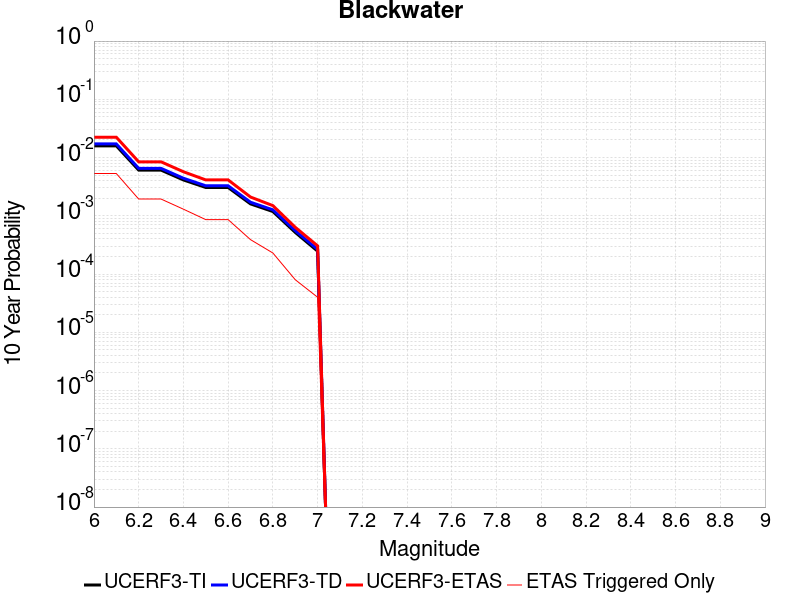 |

| Magnitude | 1 wk TI Prob | 1 wk TD Prob | 1 wk ETAS Prob | 1 wk ETAS/TD Gain | 1 wk ETAS Triggered Only | 1 mo TI Prob | 1 mo TD Prob | 1 mo ETAS Prob | 1 mo ETAS/TD Gain | 1 mo ETAS Triggered Only | 1 yr TI Prob | 1 yr TD Prob | 1 yr ETAS Prob | 1 yr ETAS/TD Gain | 1 yr ETAS Triggered Only | 10 yr TI Prob | 10 yr TD Prob | 10 yr ETAS Prob | 10 yr ETAS/TD Gain | 10 yr ETAS Triggered Only |
|-----|-----|-----|-----|-----|-----|-----|-----|-----|-----|-----|-----|-----|-----|-----|-----|-----|-----|-----|-----|-----|
| 6.0 | 3.0708583E-5 | 3.309653E-5 | 2.9685884E-4 | 8.969485 | 2.6377104E-4 | 1.3160157E-4 | 1.4183533E-4 | 8.45125E-4 | 5.958494 | 7.0338947E-4 | 0.0016010714 | 0.0017256141 | 0.0040515712 | 2.347901 | 0.0023299777 | 0.015895851 | 0.017135985 | 0.022407424 | 1.3076239 | 0.0053633447 |
| 6.1 | 3.0708583E-5 | 3.309653E-5 | 2.9685884E-4 | 8.969485 | 2.6377104E-4 | 1.3160157E-4 | 1.4183533E-4 | 8.45125E-4 | 5.958494 | 7.0338947E-4 | 0.0016010714 | 0.0017256141 | 0.0040515712 | 2.347901 | 0.0023299777 | 0.015895851 | 0.017135985 | 0.022407424 | 1.3076239 | 0.0053633447 |
| 6.2 | 1.1707779E-5 | 1.2545361E-5 | 5.650665E-5 | 4.504187 | 4.396184E-5 | 5.017523E-5 | 5.3764776E-5 | 2.7356215E-4 | 5.08813 | 2.1980921E-4 | 6.107122E-4 | 6.5439916E-4 | 0.0015769937 | 2.4098344 | 9.2319865E-4 | 0.006090366 | 0.006525693 | 0.008447391 | 1.2944819 | 0.001934321 |
| 6.3 | 1.1707779E-5 | 1.2545361E-5 | 5.650665E-5 | 4.504187 | 4.396184E-5 | 5.017523E-5 | 5.3764776E-5 | 2.7356215E-4 | 5.08813 | 2.1980921E-4 | 6.107122E-4 | 6.5439916E-4 | 0.0015769937 | 2.4098344 | 9.2319865E-4 | 0.006090366 | 0.006525693 | 0.008447391 | 1.2944819 | 0.001934321 |
| 6.4 | 7.929244E-6 | 8.480254E-6 | 5.2441723E-5 | 6.18398 | 4.396184E-5 | 3.3982033E-5 | 3.6343463E-5 | 2.5614467E-4 | 7.0478888 | 2.1980921E-4 | 4.136527E-4 | 4.4239586E-4 | 0.0011015318 | 2.4899232 | 6.594276E-4 | 0.0041288356 | 0.0044155573 | 0.00590366 | 1.3370136 | 0.0014947027 |
| 6.5 | 5.8832115E-6 | 6.286105E-6 | 6.286105E-6 | 1.0 | 0.0 | 2.521352E-5 | 2.6940186E-5 | 1.148615E-4 | 4.2635746 | 8.792368E-5 | 3.0693135E-4 | 3.2794994E-4 | 8.113716E-4 | 2.4740715 | 4.8358025E-4 | 0.0030650778 | 0.0032749132 | 0.004326542 | 1.3211166 | 0.0010550842 |
| 6.6 | 5.8832115E-6 | 6.286105E-6 | 6.286105E-6 | 1.0 | 0.0 | 2.521352E-5 | 2.6940186E-5 | 1.148615E-4 | 4.2635746 | 8.792368E-5 | 3.0693135E-4 | 3.2794994E-4 | 8.113716E-4 | 2.4740715 | 4.8358025E-4 | 0.0030650778 | 0.0032749132 | 0.004326542 | 1.3211166 | 0.0010550842 |
| 6.7 | 3.0715053E-6 | 3.2815258E-6 | 3.2815258E-6 | 1.0 | 0.0 | 1.3163528E-5 | 1.4063612E-5 | 5.8024834E-5 | 4.125884 | 4.396184E-5 | 1.6025416E-4 | 1.7121219E-4 | 4.7889238E-4 | 2.7970695 | 3.077329E-4 | 0.0016013865 | 0.0017109173 | 0.0021936703 | 1.2821603 | 4.8358025E-4 |
| 6.8 | 2.2722281E-6 | 2.428798E-6 | 2.428798E-6 | 1.0 | 0.0 | 9.738084E-6 | 1.0409098E-5 | 1.0409098E-5 | 1.0 | 0.0 | 1.1855473E-4 | 1.2672432E-4 | 1.7068059E-4 | 1.3468653 | 4.396184E-5 | 0.001184915 | 0.0012666107 | 0.0014861415 | 1.1733215 | 2.1980921E-4 |
| 6.9 | 9.952399E-7 | 1.0653688E-6 | 1.0653688E-6 | 1.0 | 0.0 | 4.265307E-6 | 4.565861E-6 | 4.565861E-6 | 1.0 | 0.0 | 5.1928873E-5 | 5.5588458E-5 | 9.9547855E-5 | 1.7908008 | 4.396184E-5 | 5.191674E-4 | 5.5579614E-4 | 6.4367097E-4 | 1.1581062 | 8.792368E-5 |
| 7.0 | 4.7385504E-7 | 5.075655E-7 | 5.075655E-7 | 1.0 | 0.0 | 2.0308057E-6 | 2.1752808E-6 | 2.1752808E-6 | 1.0 | 0.0 | 2.4724779E-5 | 2.6484044E-5 | 2.6484044E-5 | 1.0 | 0.0 | 2.4722028E-4 | 2.6484043E-4 | 2.6484043E-4 | 1.0 | 0.0 |

## Garlock (West)
*[(top)](#table-of-contents)*

| 1 Week | 1 Month | 1 Year | 10 Year |
|-----|-----|-----|-----|
|  |  |  |  |

| Magnitude | 1 wk TI Prob | 1 wk TD Prob | 1 wk ETAS Prob | 1 wk ETAS/TD Gain | 1 wk ETAS Triggered Only | 1 mo TI Prob | 1 mo TD Prob | 1 mo ETAS Prob | 1 mo ETAS/TD Gain | 1 mo ETAS Triggered Only | 1 yr TI Prob | 1 yr TD Prob | 1 yr ETAS Prob | 1 yr ETAS/TD Gain | 1 yr ETAS Triggered Only | 10 yr TI Prob | 10 yr TD Prob | 10 yr ETAS Prob | 10 yr ETAS/TD Gain | 10 yr ETAS Triggered Only |
|-----|-----|-----|-----|-----|-----|-----|-----|-----|-----|-----|-----|-----|-----|-----|-----|-----|-----|-----|-----|-----|
| 6.0 | 2.5181727E-5 | 2.520697E-5 | 3.329321E-4 | 13.207938 | 3.077329E-4 | 1.0791722E-4 | 1.0802542E-4 | 0.0012069527 | 11.172858 | 0.001099046 | 0.0013131002 | 0.0013144194 | 0.0042559914 | 3.2379248 | 0.0029454434 | 0.013053683 | 0.013146939 | 0.017832398 | 1.3563917 | 0.0047478788 |
| 6.1 | 2.5077732E-5 | 2.5108038E-5 | 3.328332E-4 | 13.256042 | 3.077329E-4 | 1.0747157E-4 | 1.0760146E-4 | 0.0012065292 | 11.212945 | 0.001099046 | 0.001307681 | 0.0013092639 | 0.004250851 | 3.2467487 | 0.0029454434 | 0.013000126 | 0.013095993 | 0.017781693 | 1.3577965 | 0.0047478788 |
| 6.2 | 2.494612E-5 | 2.498971E-5 | 3.327149E-4 | 13.314076 | 3.077329E-4 | 1.0690756E-4 | 1.07094376E-4 | 0.0012060227 | 11.261308 | 0.001099046 | 0.0013008224 | 0.0013030976 | 0.004244703 | 3.2573943 | 0.0029454434 | 0.012932341 | 0.013035054 | 0.017721044 | 1.3594913 | 0.0047478788 |
| 6.3 | 2.4733758E-5 | 2.4809067E-5 | 3.325343E-4 | 13.403742 | 3.077329E-4 | 1.0599751E-4 | 1.0632026E-4 | 0.0012052495 | 11.336028 | 0.001099046 | 0.0012897556 | 0.0012936839 | 0.004235317 | 3.273842 | 0.0029454434 | 0.012822957 | 0.012942018 | 0.01762845 | 1.3621098 | 0.0047478788 |
| 6.4 | 2.3237335E-5 | 2.318831E-5 | 3.3091407E-4 | 14.270728 | 3.077329E-4 | 9.958477E-5 | 9.9374694E-5 | 0.0011983115 | 12.058517 | 0.001099046 | 0.0012117702 | 0.0012092182 | 0.0041511 | 3.432879 | 0.0029454434 | 0.012051838 | 0.012106836 | 0.016797233 | 1.3874172 | 0.0047478788 |
| 6.5 | 2.2732203E-5 | 2.3002827E-5 | 3.3072862E-4 | 14.377738 | 3.077329E-4 | 9.742009E-5 | 9.857984E-5 | 0.0011975175 | 12.147692 | 0.001099046 | 0.0011854442 | 0.0011995515 | 0.0041414616 | 3.4525084 | 0.0029454434 | 0.011791403 | 0.012011218 | 0.016702069 | 1.3905392 | 0.0047478788 |
| 6.6 | 2.1319436E-5 | 2.1782947E-5 | 3.2950914E-4 | 15.126931 | 3.077329E-4 | 9.136581E-5 | 9.335216E-5 | 0.0011922956 | 12.772019 | 0.001099046 | 0.001111811 | 0.0011359722 | 0.0040780697 | 3.5899377 | 0.0029454434 | 0.011062649 | 0.0113820825 | 0.01607592 | 1.4123883 | 0.0047478788 |
| 6.7 | 1.970802E-5 | 2.0402744E-5 | 3.2812936E-4 | 16.08261 | 3.077329E-4 | 8.446021E-5 | 8.743741E-5 | 0.0011863874 | 13.5684185 | 0.001099046 | 0.001027818 | 0.0010640323 | 0.0040063416 | 3.7652445 | 0.0029454434 | 0.010230771 | 0.0106697725 | 0.015366993 | 1.4402362 | 0.0047478788 |
| 6.8 | 1.8744462E-5 | 1.9910338E-5 | 3.276371E-4 | 16.455627 | 3.077329E-4 | 8.033094E-5 | 8.532724E-5 | 0.0011842794 | 13.879266 | 0.001099046 | 9.775903E-4 | 0.0010383658 | 0.0039807507 | 3.8336692 | 0.0029454434 | 0.009733009 | 0.010415533 | 0.015070456 | 1.4469213 | 0.004703917 |
| 6.9 | 1.7559682E-5 | 1.8962646E-5 | 3.266897E-4 | 17.228065 | 3.077329E-4 | 7.5253614E-5 | 8.126596E-5 | 0.0011802227 | 14.522965 | 0.001099046 | 9.158276E-4 | 9.889654E-4 | 0.003931496 | 3.9753623 | 0.0029454434 | 0.0091206245 | 0.009925983 | 0.0145832095 | 1.4691955 | 0.004703917 |
| 7.0 | 1.6794445E-5 | 1.82254E-5 | 3.259527E-4 | 17.884527 | 3.077329E-4 | 7.197421E-5 | 7.810653E-5 | 0.0011770667 | 15.070017 | 0.001099046 | 8.759337E-4 | 9.505335E-4 | 0.003893177 | 4.095781 | 0.0029454434 | 0.008724891 | 0.00954486 | 0.014116794 | 1.4789944 | 0.0046159932 |
| 7.1 | 1.6337795E-5 | 1.7726159E-5 | 3.2545358E-4 | 18.360075 | 3.077329E-4 | 7.0017246E-5 | 7.5967044E-5 | 0.0011749296 | 15.466306 | 0.001099046 | 8.521265E-4 | 9.245077E-4 | 0.003867228 | 4.1830134 | 0.0029454434 | 0.008488664 | 0.0092866905 | 0.013859817 | 1.4924387 | 0.0046159932 |
| 7.2 | 1.5780008E-5 | 1.7174763E-5 | 3.2490236E-4 | 18.917429 | 3.077329E-4 | 6.762685E-5 | 7.360406E-5 | 0.0011725692 | 15.930767 | 0.001099046 | 8.2304585E-4 | 8.9576235E-4 | 0.0037946447 | 4.2362185 | 0.0029014815 | 0.008200042 | 0.009001516 | 0.013532392 | 1.503346 | 0.0045720316 |
| 7.3 | 1.5058865E-5 | 1.6627771E-5 | 3.2435555E-4 | 19.506857 | 3.077329E-4 | 6.45364E-5 | 7.1259936E-5 | 0.0011702277 | 16.421959 | 0.001099046 | 7.854473E-4 | 8.6724554E-4 | 0.003722287 | 4.29208 | 0.0028575198 | 0.00782677 | 0.008718181 | 0.013206774 | 1.5148543 | 0.0045280694 |
| 7.4 | 1.4887923E-5 | 1.6463711E-5 | 3.2419153E-4 | 19.691278 | 3.077329E-4 | 6.380382E-5 | 7.055686E-5 | 0.0011255667 | 15.952618 | 0.0010550842 | 7.7653467E-4 | 8.5869245E-4 | 0.0036698342 | 4.273747 | 0.0028135579 | 0.0077382675 | 0.008633028 | 0.013034842 | 1.5098807 | 0.004440146 |
| 7.5 | 1.4509299E-5 | 1.6055668E-5 | 3.237836E-4 | 20.166313 | 3.077329E-4 | 6.218123E-5 | 6.880819E-5 | 0.001079861 | 15.693784 | 0.0010111224 | 7.567935E-4 | 8.37419E-4 | 0.0034729205 | 4.147172 | 0.0026377104 | 0.0075422134 | 0.008421303 | 0.012518915 | 1.486577 | 0.004132413 |
| 7.6 | 1.2756717E-5 | 1.4059411E-5 | 3.21788E-4 | 22.887728 | 3.077329E-4 | 5.4670498E-5 | 6.025323E-5 | 8.515187E-4 | 14.132333 | 7.913131E-4 | 6.6541E-4 | 7.3333684E-4 | 0.0026223098 | 3.5758598 | 0.0018903592 | 0.006634211 | 0.0073861093 | 0.010527983 | 1.425376 | 0.0031652525 |
| 7.7 | 1.0328985E-5 | 1.1468589E-5 | 5.5429926E-5 | 4.833195 | 4.396184E-5 | 4.4266326E-5 | 4.915017E-5 | 4.447873E-4 | 9.049558 | 3.9565656E-4 | 5.388092E-4 | 5.982394E-4 | 0.0015208857 | 2.5422695 | 9.2319865E-4 | 0.0053750467 | 0.00604267 | 0.0077905175 | 1.289251 | 0.0017584737 |
| 7.8 | 7.0306583E-6 | 8.906025E-6 | 8.906025E-6 | 1.0 | 0.0 | 3.0131043E-5 | 3.816812E-5 | 2.1400877E-4 | 5.607003 | 1.7584737E-4 | 3.667837E-4 | 4.6459792E-4 | 0.0010358363 | 2.2295327 | 5.7150394E-4 | 0.003661789 | 0.0046986034 | 0.005836241 | 1.2421224 | 0.0011430079 |
| 7.9 | 4.060633E-6 | 5.4691627E-6 | 5.4691627E-6 | 1.0 | 0.0 | 1.7402595E-5 | 2.3439059E-5 | 1.553215E-4 | 6.6266093 | 1.3188552E-4 | 2.11856E-4 | 2.8533328E-4 | 7.2482624E-4 | 2.5402794 | 4.3961842E-4 | 0.0021165414 | 0.0028861589 | 0.0035875181 | 1.2430079 | 7.0338947E-4 |
| 8.0 | 1.6729537E-6 | 2.078796E-6 | 2.078796E-6 | 1.0 | 0.0 | 7.169782E-6 | 8.9090945E-6 | 9.6831995E-5 | 10.868893 | 8.792368E-5 | 8.7288594E-5 | 1.0846286E-4 | 2.4033408E-4 | 2.2158191 | 1.3188552E-4 | 8.7254314E-4 | 0.0010976003 | 0.0012732547 | 1.1600349 | 1.7584737E-4 |
| 8.1 | 3.6733252E-7 | 3.150841E-7 | 3.150841E-7 | 1.0 | 0.0 | 1.5742813E-6 | 1.3503599E-6 | 1.3503599E-6 | 1.0 | 0.0 | 1.9166706E-5 | 1.6440523E-5 | 6.0401642E-5 | 3.6739488 | 4.396184E-5 | 1.9165053E-4 | 1.6648423E-4 | 2.1043875E-4 | 1.2640162 | 4.396184E-5 |

## McLean Lake
*[(top)](#table-of-contents)*

| 1 Week | 1 Month | 1 Year | 10 Year |
|-----|-----|-----|-----|
|  |  |  |  |

| Magnitude | 1 wk TI Prob | 1 wk TD Prob | 1 wk ETAS Prob | 1 wk ETAS/TD Gain | 1 wk ETAS Triggered Only | 1 mo TI Prob | 1 mo TD Prob | 1 mo ETAS Prob | 1 mo ETAS/TD Gain | 1 mo ETAS Triggered Only | 1 yr TI Prob | 1 yr TD Prob | 1 yr ETAS Prob | 1 yr ETAS/TD Gain | 1 yr ETAS Triggered Only | 10 yr TI Prob | 10 yr TD Prob | 10 yr ETAS Prob | 10 yr ETAS/TD Gain | 10 yr ETAS Triggered Only |
|-----|-----|-----|-----|-----|-----|-----|-----|-----|-----|-----|-----|-----|-----|-----|-----|-----|-----|-----|-----|-----|
| 6.0 | 1.7360222E-5 | 1.850195E-5 | 1.5038504E-4 | 8.128064 | 1.3188552E-4 | 7.439883E-5 | 7.929194E-5 | 5.188755E-4 | 6.543862 | 4.3961842E-4 | 9.0542925E-4 | 9.650004E-4 | 0.0027217772 | 2.8204932 | 0.0017584737 | 0.009017491 | 0.009612942 | 0.013618552 | 1.4166893 | 0.0040444895 |
| 6.1 | 9.062689E-6 | 9.592342E-6 | 9.751518E-5 | 10.16594 | 8.792368E-5 | 3.8839516E-5 | 4.110944E-5 | 3.0486964E-4 | 7.4160495 | 2.6377104E-4 | 4.727685E-4 | 5.0040137E-4 | 0.0012473786 | 2.4927564 | 7.473513E-4 | 0.0047176396 | 0.004993629 | 0.0069182906 | 1.3854234 | 0.001934321 |
| 6.2 | 9.062689E-6 | 9.592342E-6 | 9.751518E-5 | 10.16594 | 8.792368E-5 | 3.8839516E-5 | 4.110944E-5 | 3.0486964E-4 | 7.4160495 | 2.6377104E-4 | 4.727685E-4 | 5.0040137E-4 | 0.0012473786 | 2.4927564 | 7.473513E-4 | 0.0047176396 | 0.004993629 | 0.0069182906 | 1.3854234 | 0.001934321 |
| 6.3 | 7.2575485E-6 | 7.667824E-6 | 5.162933E-5 | 6.7332435 | 4.396184E-5 | 3.110341E-5 | 3.286173E-5 | 2.526637E-4 | 7.6886916 | 2.1980921E-4 | 3.786182E-4 | 4.0002525E-4 | 0.0011470775 | 2.867513 | 7.473513E-4 | 0.0037797375 | 0.0039937566 | 0.0056138486 | 1.4056561 | 0.0016265882 |
| 6.4 | 7.2575485E-6 | 7.667824E-6 | 5.162933E-5 | 6.7332435 | 4.396184E-5 | 3.110341E-5 | 3.286173E-5 | 2.526637E-4 | 7.6886916 | 2.1980921E-4 | 3.786182E-4 | 4.0002525E-4 | 0.0011470775 | 2.867513 | 7.473513E-4 | 0.0037797375 | 0.0039937566 | 0.0056138486 | 1.4056561 | 0.0016265882 |
| 6.5 | 6.06582E-6 | 6.403972E-6 | 5.0365532E-5 | 7.864733 | 4.396184E-5 | 2.5996113E-5 | 2.7445341E-5 | 1.5932725E-4 | 5.8052564 | 1.3188552E-4 | 3.164567E-4 | 3.3410228E-4 | 9.493624E-4 | 2.8415322 | 6.154658E-4 | 0.0031600643 | 0.0033366384 | 0.0046510934 | 1.3939458 | 0.0013188552 |
| 6.6 | 5.598744E-6 | 5.9103495E-6 | 4.987193E-5 | 8.438068 | 4.396184E-5 | 2.3994397E-5 | 2.532986E-5 | 1.5721204E-4 | 6.2065897 | 1.3188552E-4 | 2.9209262E-4 | 3.083538E-4 | 8.357332E-4 | 2.7103062 | 5.275421E-4 | 0.0029170897 | 0.0030798884 | 0.004307029 | 1.3984367 | 0.0012309316 |
| 6.7 | 5.246996E-6 | 5.539244E-6 | 4.9500843E-5 | 8.93639 | 4.396184E-5 | 2.2486933E-5 | 2.3739436E-5 | 1.5562183E-4 | 6.5554137 | 1.3188552E-4 | 2.73744E-4 | 2.8899565E-4 | 8.1638526E-4 | 2.8249052 | 5.275421E-4 | 0.0027340704 | 0.0028868222 | 0.0041142004 | 1.4251658 | 0.0012309316 |
| 6.8 | 4.02324E-6 | 4.246967E-6 | 4.246967E-6 | 1.0 | 0.0 | 1.7242342E-5 | 1.8201194E-5 | 1.06123276E-4 | 5.830567 | 8.792368E-5 | 2.099053E-4 | 2.2158296E-4 | 6.61104E-4 | 2.9835505 | 4.3961842E-4 | 0.0020970714 | 0.0022142045 | 0.0031353591 | 1.4160205 | 9.2319865E-4 |
| 6.9 | 6.835972E-7 | 7.1400126E-7 | 7.1400126E-7 | 1.0 | 0.0 | 2.9296991E-6 | 3.0600036E-6 | 3.0600036E-6 | 1.0 | 0.0 | 3.56685E-5 | 3.7255224E-5 | 3.7255224E-5 | 1.0 | 0.0 | 3.5662777E-4 | 3.7252106E-4 | 3.7252106E-4 | 1.0 | 0.0 |

## Goldstone Lake
*[(top)](#table-of-contents)*

| 1 Week | 1 Month | 1 Year | 10 Year |
|-----|-----|-----|-----|
|  |  |  |  |

| Magnitude | 1 wk TI Prob | 1 wk TD Prob | 1 wk ETAS Prob | 1 wk ETAS/TD Gain | 1 wk ETAS Triggered Only | 1 mo TI Prob | 1 mo TD Prob | 1 mo ETAS Prob | 1 mo ETAS/TD Gain | 1 mo ETAS Triggered Only | 1 yr TI Prob | 1 yr TD Prob | 1 yr ETAS Prob | 1 yr ETAS/TD Gain | 1 yr ETAS Triggered Only | 10 yr TI Prob | 10 yr TD Prob | 10 yr ETAS Prob | 10 yr ETAS/TD Gain | 10 yr ETAS Triggered Only |
|-----|-----|-----|-----|-----|-----|-----|-----|-----|-----|-----|-----|-----|-----|-----|-----|-----|-----|-----|-----|-----|
| 6.0 | 2.671352E-5 | 3.0377167E-5 | 1.1829818E-4 | 3.8943126 | 8.792368E-5 | 1.1448149E-4 | 1.3018247E-4 | 3.9391918E-4 | 3.0259004 | 2.6377104E-4 | 0.001392921 | 0.0015840156 | 0.0029885662 | 1.8867025 | 0.0014067789 | 0.013842222 | 0.01574675 | 0.018775621 | 1.192349 | 0.003077329 |
| 6.1 | 2.671352E-5 | 3.0377167E-5 | 1.1829818E-4 | 3.8943126 | 8.792368E-5 | 1.1448149E-4 | 1.3018247E-4 | 3.9391918E-4 | 3.0259004 | 2.6377104E-4 | 0.001392921 | 0.0015840156 | 0.0029885662 | 1.8867025 | 0.0014067789 | 0.013842222 | 0.01574675 | 0.018775621 | 1.192349 | 0.003077329 |
| 6.2 | 1.4197047E-5 | 1.6096787E-5 | 6.005792E-5 | 3.7310503 | 4.396184E-5 | 6.0843064E-5 | 6.898496E-5 | 2.448202E-4 | 3.5488923 | 1.7584737E-4 | 7.4051257E-4 | 8.396669E-4 | 0.0016742406 | 1.9939342 | 8.35275E-4 | 0.007380498 | 0.00837464 | 0.009900419 | 1.1821903 | 0.0015386645 |
| 6.3 | 1.4197047E-5 | 1.6096787E-5 | 6.005792E-5 | 3.7310503 | 4.396184E-5 | 6.0843064E-5 | 6.898496E-5 | 2.448202E-4 | 3.5488923 | 1.7584737E-4 | 7.4051257E-4 | 8.396669E-4 | 0.0016742406 | 1.9939342 | 8.35275E-4 | 0.007380498 | 0.00837464 | 0.009900419 | 1.1821903 | 0.0015386645 |
| 6.4 | 1.3238931E-5 | 1.5008963E-5 | 5.8970145E-5 | 3.9289954 | 4.396184E-5 | 5.6737044E-5 | 6.4323096E-5 | 1.9620013E-4 | 3.0502286 | 1.3188552E-4 | 6.9055456E-4 | 7.8295026E-4 | 0.001485789 | 1.8976799 | 7.0338947E-4 | 0.006884126 | 0.007811545 | 0.009163716 | 1.173099 | 0.0013628171 |
| 6.5 | 1.3238931E-5 | 1.5008963E-5 | 5.8970145E-5 | 3.9289954 | 4.396184E-5 | 5.6737044E-5 | 6.4323096E-5 | 1.9620013E-4 | 3.0502286 | 1.3188552E-4 | 6.9055456E-4 | 7.8295026E-4 | 0.001485789 | 1.8976799 | 7.0338947E-4 | 0.006884126 | 0.007811545 | 0.009163716 | 1.173099 | 0.0013628171 |
| 6.6 | 1.1328278E-5 | 1.2855597E-5 | 5.6816873E-5 | 4.4196215 | 4.396184E-5 | 4.8548856E-5 | 5.5094788E-5 | 1.8697305E-4 | 3.3936613 | 1.3188552E-4 | 5.90922E-4 | 6.706683E-4 | 0.0013296537 | 1.9825802 | 6.594276E-4 | 0.0058935313 | 0.0066958326 | 0.007918522 | 1.1826046 | 0.0012309316 |
| 6.7 | 8.651175E-6 | 9.824889E-6 | 5.3786298E-5 | 5.474494 | 4.396184E-5 | 3.707594E-5 | 4.2106498E-5 | 1.3002648E-4 | 3.0880382 | 8.792368E-5 | 4.5130608E-4 | 5.126166E-4 | 0.0010398882 | 2.0285888 | 5.275421E-4 | 0.0045039062 | 0.0051232204 | 0.0060854256 | 1.1878127 | 9.671605E-4 |
| 6.8 | 1.0215377E-6 | 1.1754883E-6 | 1.1754883E-6 | 1.0 | 0.0 | 4.378012E-6 | 5.0377976E-6 | 4.8999416E-5 | 9.7263565 | 4.396184E-5 | 5.3300988E-5 | 6.133357E-5 | 1.0529272E-4 | 1.7167224 | 4.396184E-5 | 5.3288206E-4 | 6.131777E-4 | 6.571126E-4 | 1.0716511 | 4.396184E-5 |
| 6.9 | 7.9360774E-7 | 9.283521E-7 | 9.283521E-7 | 1.0 | 0.0 | 3.4011714E-6 | 3.9786464E-6 | 4.7940313E-5 | 12.049403 | 4.396184E-5 | 4.1408475E-5 | 4.843901E-5 | 9.2398725E-5 | 1.907527 | 4.396184E-5 | 4.140076E-4 | 4.8429155E-4 | 5.282321E-4 | 1.0907316 | 4.396184E-5 |
| 7.0 | 7.4382757E-7 | 8.747442E-7 | 8.747442E-7 | 1.0 | 0.0 | 3.1878285E-6 | 3.7488987E-6 | 4.7710575E-5 | 12.726557 | 4.396184E-5 | 3.8811122E-5 | 4.5641955E-5 | 8.960179E-5 | 1.9631453 | 4.396184E-5 | 3.8804344E-4 | 4.5633246E-4 | 5.0027424E-4 | 1.0962933 | 4.396184E-5 |
| 7.1 | 6.4709513E-7 | 7.711394E-7 | 7.711394E-7 | 1.0 | 0.0 | 2.773262E-6 | 3.3048793E-6 | 4.7266574E-5 | 14.302057 | 4.396184E-5 | 3.376394E-5 | 4.0236224E-5 | 8.41963E-5 | 2.0925496 | 4.396184E-5 | 3.375881E-4 | 4.0229535E-4 | 4.462395E-4 | 1.1092336 | 4.396184E-5 |
| 7.2 | 6.356704E-7 | 7.5884515E-7 | 7.5884515E-7 | 1.0 | 0.0 | 2.7242988E-6 | 3.2521898E-6 | 4.721389E-5 | 14.517569 | 4.396184E-5 | 3.3167835E-5 | 3.959475E-5 | 8.355485E-5 | 2.1102507 | 4.396184E-5 | 3.3162883E-4 | 3.958829E-4 | 4.3982733E-4 | 1.1110036 | 4.396184E-5 |
| 7.3 | 5.7695723E-7 | 6.89665E-7 | 6.89665E-7 | 1.0 | 0.0 | 2.4726714E-6 | 2.955704E-6 | 2.955704E-6 | 1.0 | 0.0 | 3.0104358E-5 | 3.5985162E-5 | 3.5985162E-5 | 1.0 | 0.0 | 3.0100282E-4 | 3.5979907E-4 | 3.5979907E-4 | 1.0 | 0.0 |
| 7.4 | 5.209647E-7 | 6.193585E-7 | 6.193585E-7 | 1.0 | 0.0 | 2.232704E-6 | 2.6543912E-6 | 2.6543912E-6 | 1.0 | 0.0 | 2.718283E-5 | 3.231679E-5 | 3.231679E-5 | 1.0 | 0.0 | 2.7179506E-4 | 3.2312647E-4 | 3.2312647E-4 | 1.0 | 0.0 |
| 7.5 | 4.512955E-7 | 5.3489435E-7 | 5.3489435E-7 | 1.0 | 0.0 | 1.934122E-6 | 2.2924028E-6 | 2.2924028E-6 | 1.0 | 0.0 | 2.3547682E-5 | 2.79097E-5 | 2.79097E-5 | 1.0 | 0.0 | 2.3545188E-4 | 2.7906726E-4 | 2.7906726E-4 | 1.0 | 0.0 |
| 7.6 | 2.21172E-7 | 2.6039865E-7 | 2.6039865E-7 | 1.0 | 0.0 | 9.478797E-7 | 1.115994E-6 | 1.115994E-6 | 1.0 | 0.0 | 1.1540374E-5 | 1.35871705E-5 | 1.35871705E-5 | 1.0 | 0.0 | 1.1539775E-4 | 1.3586621E-4 | 1.3586621E-4 | 1.0 | 0.0 |

## Gravel Hills-Harper Lk
*[(top)](#table-of-contents)*

| 1 Week | 1 Month | 1 Year | 10 Year |
|-----|-----|-----|-----|
|  |  |  |  |

| Magnitude | 1 wk TI Prob | 1 wk TD Prob | 1 wk ETAS Prob | 1 wk ETAS/TD Gain | 1 wk ETAS Triggered Only | 1 mo TI Prob | 1 mo TD Prob | 1 mo ETAS Prob | 1 mo ETAS/TD Gain | 1 mo ETAS Triggered Only | 1 yr TI Prob | 1 yr TD Prob | 1 yr ETAS Prob | 1 yr ETAS/TD Gain | 1 yr ETAS Triggered Only | 10 yr TI Prob | 10 yr TD Prob | 10 yr ETAS Prob | 10 yr ETAS/TD Gain | 10 yr ETAS Triggered Only |
|-----|-----|-----|-----|-----|-----|-----|-----|-----|-----|-----|-----|-----|-----|-----|-----|-----|-----|-----|-----|-----|
| 6.0 | 3.0679566E-5 | 3.1465726E-5 | 2.0730756E-4 | 6.588361 | 1.7584737E-4 | 1.3147724E-4 | 1.3484736E-4 | 6.183624E-4 | 4.585647 | 4.8358025E-4 | 0.0015995599 | 0.0016407467 | 0.0033085558 | 2.0164938 | 0.00167055 | 0.015880952 | 0.016307894 | 0.019551262 | 1.1988833 | 0.003297138 |
| 6.1 | 3.0679566E-5 | 3.1465726E-5 | 2.0730756E-4 | 6.588361 | 1.7584737E-4 | 1.3147724E-4 | 1.3484736E-4 | 6.183624E-4 | 4.585647 | 4.8358025E-4 | 0.0015995599 | 0.0016407467 | 0.0033085558 | 2.0164938 | 0.00167055 | 0.015880952 | 0.016307894 | 0.019551262 | 1.1988833 | 0.003297138 |
| 6.2 | 1.514536E-5 | 1.363558E-5 | 5.7596822E-5 | 4.2240095 | 4.396184E-5 | 6.490707E-5 | 5.8436955E-5 | 1.463555E-4 | 2.5045025 | 8.792368E-5 | 7.8995706E-4 | 7.112496E-4 | 0.001282347 | 1.8029494 | 5.7150394E-4 | 0.007871548 | 0.0070909336 | 0.008094886 | 1.1415826 | 0.0010111224 |
| 6.3 | 1.514536E-5 | 1.363558E-5 | 5.7596822E-5 | 4.2240095 | 4.396184E-5 | 6.490707E-5 | 5.8436955E-5 | 1.463555E-4 | 2.5045025 | 8.792368E-5 | 7.8995706E-4 | 7.112496E-4 | 0.001282347 | 1.8029494 | 5.7150394E-4 | 0.007871548 | 0.0070909336 | 0.008094886 | 1.1415826 | 0.0010111224 |
| 6.4 | 1.2532521E-5 | 1.0689963E-5 | 5.4651337E-5 | 5.1123967 | 4.396184E-5 | 5.37097E-5 | 4.5813358E-5 | 1.3373302E-4 | 2.9190834 | 8.792368E-5 | 6.537194E-4 | 5.5764074E-4 | 8.212647E-4 | 1.4727488 | 2.6377104E-4 | 0.0065179965 | 0.0055630044 | 0.006087612 | 1.0943029 | 5.275421E-4 |
| 6.5 | 1.1094058E-5 | 9.083887E-6 | 5.304533E-5 | 5.839497 | 4.396184E-5 | 4.7545094E-5 | 3.8930382E-5 | 1.2685065E-4 | 3.2583969 | 8.792368E-5 | 5.787078E-4 | 4.7387838E-4 | 6.9358345E-4 | 1.4636317 | 2.1980921E-4 | 0.0057720304 | 0.0047290865 | 0.005122872 | 1.0832689 | 3.9565656E-4 |
| 6.6 | 9.688328E-6 | 7.5318753E-6 | 5.1493385E-5 | 6.8367286 | 4.396184E-5 | 4.1520743E-5 | 3.227908E-5 | 7.62395E-5 | 2.3618858 | 4.396184E-5 | 5.053978E-4 | 3.9292948E-4 | 5.6870776E-4 | 1.4473532 | 1.7584737E-4 | 0.0050424994 | 0.003922604 | 0.004141551 | 1.0558168 | 2.1980921E-4 |
| 6.7 | 8.974824E-6 | 6.749573E-6 | 5.0711118E-5 | 7.513233 | 4.396184E-5 | 3.8462964E-5 | 2.8926434E-5 | 7.2887E-5 | 2.519737 | 4.396184E-5 | 4.6818596E-4 | 3.5212463E-4 | 5.279101E-4 | 1.4992137 | 1.7584737E-4 | 0.004672008 | 0.0035158878 | 0.0037349241 | 1.062299 | 2.1980921E-4 |
| 6.8 | 7.4780046E-6 | 5.116314E-6 | 5.116314E-6 | 1.0 | 0.0 | 3.20482E-5 | 2.1926882E-5 | 2.1926882E-5 | 1.0 | 0.0 | 3.9011694E-4 | 2.669285E-4 | 3.548287E-4 | 1.3293024 | 8.792368E-5 | 0.0038943281 | 0.0026662168 | 0.0027977508 | 1.0493336 | 1.3188552E-4 |
| 6.9 | 6.3409307E-6 | 3.9075912E-6 | 3.9075912E-6 | 1.0 | 0.0 | 2.7175134E-5 | 1.6746717E-5 | 1.6746717E-5 | 1.0 | 0.0 | 3.3080703E-4 | 2.038732E-4 | 2.4782607E-4 | 1.2155893 | 4.396184E-5 | 0.0033031502 | 0.0020369599 | 0.0021247044 | 1.0430763 | 8.792368E-5 |
| 7.0 | 5.1239335E-6 | 2.605923E-6 | 2.605923E-6 | 1.0 | 0.0 | 2.195953E-5 | 1.1168196E-5 | 1.1168196E-5 | 1.0 | 0.0 | 2.6732447E-4 | 1.3596455E-4 | 1.3596455E-4 | 1.0 | 0.0 | 0.0026700313 | 0.001358839 | 0.0014027411 | 1.0323086 | 4.396184E-5 |
| 7.1 | 4.438899E-6 | 2.098529E-6 | 2.098529E-6 | 1.0 | 0.0 | 1.9023713E-5 | 8.993666E-6 | 8.993666E-6 | 1.0 | 0.0 | 2.315891E-4 | 1.094926E-4 | 1.094926E-4 | 1.0 | 0.0 | 0.002313479 | 0.0010944083 | 0.0010944083 | 1.0 | 0.0 |
| 7.2 | 3.50367E-6 | 1.2616134E-6 | 1.2616134E-6 | 1.0 | 0.0 | 1.5015643E-5 | 5.4069037E-6 | 5.4069037E-6 | 1.0 | 0.0 | 1.8280011E-4 | 6.5827146E-5 | 6.5827146E-5 | 1.0 | 0.0 | 0.0018264982 | 6.580847E-4 | 6.580847E-4 | 1.0 | 0.0 |
| 7.3 | 2.561638E-6 | 7.1194825E-7 | 7.1194825E-7 | 1.0 | 0.0 | 1.0978401E-5 | 3.0512035E-6 | 3.0512035E-6 | 1.0 | 0.0 | 1.3365384E-4 | 3.7147787E-5 | 3.7147787E-5 | 1.0 | 0.0 | 0.0013357349 | 3.714178E-4 | 3.714178E-4 | 1.0 | 0.0 |
| 7.4 | 2.0368864E-6 | 5.305101E-7 | 5.305101E-7 | 1.0 | 0.0 | 8.729483E-6 | 2.2736126E-6 | 2.2736126E-6 | 1.0 | 0.0 | 1.06276275E-4 | 2.7680888E-5 | 2.7680888E-5 | 1.0 | 0.0 | 0.0010622547 | 2.7677492E-4 | 2.7677492E-4 | 1.0 | 0.0 |
| 7.5 | 1.1681728E-6 | 3.603199E-7 | 3.603199E-7 | 1.0 | 0.0 | 5.0064455E-6 | 1.5442272E-6 | 1.5442272E-6 | 1.0 | 0.0 | 6.0951766E-5 | 1.8800809E-5 | 1.8800809E-5 | 1.0 | 0.0 | 6.093505E-4 | 1.8799266E-4 | 1.8799266E-4 | 1.0 | 0.0 |
| 7.6 | 1.3154387E-7 | 7.119914E-8 | 7.119914E-8 | 1.0 | 0.0 | 5.6375933E-7 | 3.0513914E-7 | 3.0513914E-7 | 1.0 | 0.0 | 6.863748E-6 | 3.7150644E-6 | 3.7150644E-6 | 1.0 | 0.0 | 6.863536E-5 | 3.715018E-5 | 3.715018E-5 | 1.0 | 0.0 |

## San Andreas (Mojave S)
*[(top)](#table-of-contents)*

| 1 Week | 1 Month | 1 Year | 10 Year |
|-----|-----|-----|-----|
|  |  |  |  |

| Magnitude | 1 wk TI Prob | 1 wk TD Prob | 1 wk ETAS Prob | 1 wk ETAS/TD Gain | 1 wk ETAS Triggered Only | 1 mo TI Prob | 1 mo TD Prob | 1 mo ETAS Prob | 1 mo ETAS/TD Gain | 1 mo ETAS Triggered Only | 1 yr TI Prob | 1 yr TD Prob | 1 yr ETAS Prob | 1 yr ETAS/TD Gain | 1 yr ETAS Triggered Only | 10 yr TI Prob | 10 yr TD Prob | 10 yr ETAS Prob | 10 yr ETAS/TD Gain | 10 yr ETAS Triggered Only |
|-----|-----|-----|-----|-----|-----|-----|-----|-----|-----|-----|-----|-----|-----|-----|-----|-----|-----|-----|-----|-----|
| 6.0 | 3.1064058E-4 | 6.7480345E-4 | 7.187356E-4 | 1.0651037 | 4.396184E-5 | 0.0013306376 | 0.0028889377 | 0.0032396165 | 1.1213868 | 3.5169473E-4 | 0.016080605 | 0.03463161 | 0.035650156 | 1.0294108 | 0.0010550842 | 0.1496549 | 0.2866709 | 0.2881448 | 1.0051414 | 0.0020662064 |
| 6.1 | 3.1064058E-4 | 6.7480345E-4 | 7.187356E-4 | 1.0651037 | 4.396184E-5 | 0.0013306376 | 0.0028889377 | 0.0032396165 | 1.1213868 | 3.5169473E-4 | 0.016080605 | 0.03463161 | 0.035650156 | 1.0294108 | 0.0010550842 | 0.1496549 | 0.2866709 | 0.2881448 | 1.0051414 | 0.0020662064 |
| 6.2 | 3.1064058E-4 | 6.7480345E-4 | 7.187356E-4 | 1.0651037 | 4.396184E-5 | 0.0013306376 | 0.0028889377 | 0.0032396165 | 1.1213868 | 3.5169473E-4 | 0.016080605 | 0.03463161 | 0.035650156 | 1.0294108 | 0.0010550842 | 0.1496549 | 0.2866709 | 0.2881448 | 1.0051414 | 0.0020662064 |
| 6.3 | 3.1064058E-4 | 6.7480345E-4 | 7.187356E-4 | 1.0651037 | 4.396184E-5 | 0.0013306376 | 0.0028889377 | 0.0032396165 | 1.1213868 | 3.5169473E-4 | 0.016080605 | 0.03463161 | 0.035650156 | 1.0294108 | 0.0010550842 | 0.1496549 | 0.2866709 | 0.2881448 | 1.0051414 | 0.0020662064 |
| 6.4 | 1.9872203E-4 | 4.3197922E-4 | 4.7592208E-4 | 1.1017245 | 4.396184E-5 | 8.5138786E-4 | 0.0018500541 | 0.0022010983 | 1.189748 | 3.5169473E-4 | 0.010316478 | 0.022297915 | 0.023200529 | 1.0404797 | 9.2319865E-4 | 0.098504856 | 0.1970686 | 0.19848053 | 1.0071647 | 0.0017584737 |
| 6.5 | 1.291105E-4 | 2.8770286E-4 | 3.3165206E-4 | 1.152759 | 4.396184E-5 | 5.5321335E-4 | 0.0012324324 | 0.0015836937 | 1.2850146 | 3.5169473E-4 | 0.006714592 | 0.014902458 | 0.015768591 | 1.0581203 | 8.7923685E-4 | 0.065152965 | 0.13810734 | 0.13954718 | 1.0104254 | 0.00167055 |
| 6.6 | 1.291105E-4 | 2.8770286E-4 | 3.3165206E-4 | 1.152759 | 4.396184E-5 | 5.5321335E-4 | 0.0012324324 | 0.0015836937 | 1.2850146 | 3.5169473E-4 | 0.006714592 | 0.014902458 | 0.015768591 | 1.0581203 | 8.7923685E-4 | 0.065152965 | 0.13810734 | 0.13954718 | 1.0104254 | 0.00167055 |
| 6.7 | 1.08001186E-4 | 2.4351236E-4 | 2.874635E-4 | 1.1804883 | 4.396184E-5 | 4.6278012E-4 | 0.0010432076 | 0.0013945354 | 1.3367765 | 3.5169473E-4 | 0.0056198016 | 0.012627386 | 0.013495521 | 1.0687501 | 8.7923685E-4 | 0.054797906 | 0.11925044 | 0.12072177 | 1.0123382 | 0.00167055 |
| 6.8 | 1.0624356E-4 | 2.3868853E-4 | 2.8263987E-4 | 1.1841369 | 4.396184E-5 | 4.5525006E-4 | 0.0010225503 | 0.0013738854 | 1.3435872 | 3.5169473E-4 | 0.0055285925 | 0.01237876 | 0.013247113 | 1.0701486 | 8.7923685E-4 | 0.053930566 | 0.11719959 | 0.11867435 | 1.0125834 | 0.00167055 |
| 6.9 | 1.0393785E-4 | 2.323913E-4 | 2.7634294E-4 | 1.1891277 | 4.396184E-5 | 4.4537184E-4 | 9.95583E-4 | 0.0013469276 | 1.3529034 | 3.5169473E-4 | 0.0054089287 | 0.012054106 | 0.012922745 | 1.0720617 | 8.7923685E-4 | 0.05279156 | 0.11449702 | 0.1159763 | 1.0129198 | 0.00167055 |
| 7.0 | 1.0155622E-4 | 2.2608582E-4 | 2.700377E-4 | 1.1944036 | 4.396184E-5 | 4.3516833E-4 | 9.685798E-4 | 0.0013199339 | 1.3627518 | 3.5169473E-4 | 0.005285311 | 0.011728923 | 0.012554401 | 1.0703797 | 8.35275E-4 | 0.05161361 | 0.111757115 | 0.11316287 | 1.0125787 | 0.0015826263 |
| 7.1 | 9.885595E-5 | 2.1896887E-4 | 2.6292106E-4 | 1.2007235 | 4.396184E-5 | 4.2359953E-4 | 9.381008E-4 | 0.0012894656 | 1.374549 | 3.5169473E-4 | 0.0051451353 | 0.011361765 | 0.01218755 | 1.0726811 | 8.35275E-4 | 0.05027629 | 0.108641416 | 0.11005211 | 1.0129848 | 0.0015826263 |
| 7.2 | 9.6411415E-5 | 2.125978E-4 | 2.565503E-4 | 1.2067401 | 4.396184E-5 | 4.1312634E-4 | 9.108156E-4 | 0.00126219 | 1.38578 | 3.5169473E-4 | 0.005018219 | 0.011032978 | 0.011859038 | 1.0748719 | 8.35275E-4 | 0.049064007 | 0.105831034 | 0.10724617 | 1.0133717 | 0.0015826263 |
| 7.3 | 9.1180635E-5 | 1.9487667E-4 | 2.3882995E-4 | 1.2255441 | 4.396184E-5 | 3.907156E-4 | 8.3491846E-4 | 0.0011863196 | 1.4208807 | 3.5169473E-4 | 0.004746591 | 0.010117867 | 0.010944691 | 1.0817192 | 8.35275E-4 | 0.046464786 | 0.098022886 | 0.09945038 | 1.0145628 | 0.0015826263 |
| 7.4 | 8.887388E-5 | 1.8736067E-4 | 2.3131426E-4 | 1.2345935 | 4.396184E-5 | 3.8083247E-4 | 8.0272724E-4 | 0.0011541396 | 1.4377731 | 3.5169473E-4 | 0.0046267817 | 0.009729506 | 0.010556654 | 1.0850145 | 8.35275E-4 | 0.045316286 | 0.094657235 | 0.09609005 | 1.015137 | 0.0015826263 |
| 7.5 | 8.6750515E-5 | 1.8067459E-4 | 2.2462849E-4 | 1.2432766 | 4.396184E-5 | 3.7173493E-4 | 7.7408995E-4 | 0.0011255124 | 1.4539814 | 3.5169473E-4 | 0.004516484 | 0.009383905 | 0.010211342 | 1.0881761 | 8.35275E-4 | 0.04425787 | 0.09162046 | 0.09305808 | 1.015691 | 0.0015826263 |
| 7.6 | 8.453092E-5 | 1.7454862E-4 | 2.185028E-4 | 1.2518162 | 4.396184E-5 | 3.6222505E-4 | 7.4785115E-4 | 0.0010553539 | 1.4111818 | 3.077329E-4 | 0.0044011753 | 0.009067151 | 0.009851289 | 1.0864812 | 7.913131E-4 | 0.04315024 | 0.088778876 | 0.09018094 | 1.0157927 | 0.0015386645 |
| 7.7 | 8.259102E-5 | 1.6976826E-4 | 2.1372264E-4 | 1.2589082 | 4.396184E-5 | 3.539135E-4 | 7.2737545E-4 | 0.0010348845 | 1.4227653 | 3.077329E-4 | 0.004300386 | 0.008819905 | 0.009604239 | 1.0889277 | 7.913131E-4 | 0.042181134 | 0.0865291 | 0.08793463 | 1.0162433 | 0.0015386645 |
| 7.8 | 7.444844E-5 | 1.5297718E-4 | 1.5297718E-4 | 1.0 | 0.0 | 3.1902574E-4 | 6.554518E-4 | 8.751169E-4 | 1.3351355 | 2.1980921E-4 | 0.0038772223 | 0.007950976 | 0.008605161 | 1.0822773 | 6.594276E-4 | 0.03810269 | 0.078354426 | 0.07952943 | 1.0149959 | 0.0012748934 |
| 7.9 | 5.2586525E-5 | 1.0016126E-4 | 1.0016126E-4 | 1.0 | 0.0 | 2.2535135E-4 | 4.2919195E-4 | 6.0496386E-4 | 1.4095415 | 1.7584737E-4 | 0.0027402006 | 0.0052129035 | 0.0057376954 | 1.1006718 | 5.275421E-4 | 0.027066574 | 0.05224533 | 0.053036965 | 1.0151523 | 8.35275E-4 |
| 8.0 | 3.379877E-5 | 5.4130138E-5 | 5.4130138E-5 | 1.0 | 0.0 | 1.4484383E-4 | 2.3196569E-4 | 3.1986897E-4 | 1.3789495 | 8.792368E-5 | 0.0017620471 | 0.0028205265 | 0.00295204 | 1.0466273 | 1.3188552E-4 | 0.017481409 | 0.028862298 | 0.029075762 | 1.007396 | 2.1980921E-4 |
| 8.1 | 1.8668277E-5 | 1.9335645E-5 | 1.9335645E-5 | 1.0 | 0.0 | 8.000444E-5 | 8.286442E-5 | 8.286442E-5 | 1.0 | 0.0 | 9.736188E-4 | 0.001008408 | 0.0010523255 | 1.0435513 | 4.396184E-5 | 0.009693642 | 0.010812608 | 0.010899581 | 1.0080436 | 8.792368E-5 |
| 8.2 | 8.541571E-6 | 5.470761E-6 | 5.470761E-6 | 1.0 | 0.0 | 3.660622E-5 | 2.344591E-5 | 2.344591E-5 | 1.0 | 0.0 | 4.455896E-4 | 2.8541664E-4 | 2.8541664E-4 | 1.0 | 0.0 | 0.0044469717 | 0.0032462394 | 0.0032462394 | 1.0 | 0.0 |
| 8.3 | 1.983087E-6 | 7.676691E-7 | 7.676691E-7 | 1.0 | 0.0 | 8.498917E-6 | 3.2900064E-6 | 3.2900064E-6 | 1.0 | 0.0 | 1.034694E-4 | 4.005511E-5 | 4.005511E-5 | 1.0 | 0.0 | 0.0010342124 | 4.729315E-4 | 4.729315E-4 | 1.0 | 0.0 |

## Coyote Canyon
*[(top)](#table-of-contents)*

| 1 Week | 1 Month | 1 Year | 10 Year |
|-----|-----|-----|-----|
|  |  |  |  |

| Magnitude | 1 wk TI Prob | 1 wk TD Prob | 1 wk ETAS Prob | 1 wk ETAS/TD Gain | 1 wk ETAS Triggered Only | 1 mo TI Prob | 1 mo TD Prob | 1 mo ETAS Prob | 1 mo ETAS/TD Gain | 1 mo ETAS Triggered Only | 1 yr TI Prob | 1 yr TD Prob | 1 yr ETAS Prob | 1 yr ETAS/TD Gain | 1 yr ETAS Triggered Only | 10 yr TI Prob | 10 yr TD Prob | 10 yr ETAS Prob | 10 yr ETAS/TD Gain | 10 yr ETAS Triggered Only |
|-----|-----|-----|-----|-----|-----|-----|-----|-----|-----|-----|-----|-----|-----|-----|-----|-----|-----|-----|-----|-----|
| 6.0 | 3.5090034E-5 | 4.0365936E-5 | 4.0365936E-5 | 1.0 | 0.0 | 1.503772E-4 | 1.7298684E-4 | 1.7298684E-4 | 1.0 | 0.0 | 0.0018293047 | 0.0021043366 | 0.0028062458 | 1.3335537 | 7.0338947E-4 | 0.018143194 | 0.020870026 | 0.02267789 | 1.0866249 | 0.0018463973 |
| 6.1 | 3.5090034E-5 | 4.0365936E-5 | 4.0365936E-5 | 1.0 | 0.0 | 1.503772E-4 | 1.7298684E-4 | 1.7298684E-4 | 1.0 | 0.0 | 0.0018293047 | 0.0021043366 | 0.0028062458 | 1.3335537 | 7.0338947E-4 | 0.018143194 | 0.020870026 | 0.02267789 | 1.0866249 | 0.0018463973 |
| 6.2 | 1.841879E-5 | 2.1060594E-5 | 2.1060594E-5 | 1.0 | 0.0 | 7.8935285E-5 | 9.025714E-5 | 9.025714E-5 | 1.0 | 0.0 | 9.606133E-4 | 0.0010984287 | 0.0014497371 | 1.3198282 | 3.5169473E-4 | 0.0095647145 | 0.010940081 | 0.0118966615 | 1.0874381 | 9.671605E-4 |
| 6.3 | 1.841879E-5 | 2.1060594E-5 | 2.1060594E-5 | 1.0 | 0.0 | 7.8935285E-5 | 9.025714E-5 | 9.025714E-5 | 1.0 | 0.0 | 9.606133E-4 | 0.0010984287 | 0.0014497371 | 1.3198282 | 3.5169473E-4 | 0.0095647145 | 0.010940081 | 0.0118966615 | 1.0874381 | 9.671605E-4 |
| 6.4 | 1.712201E-5 | 1.9565952E-5 | 1.9565952E-5 | 1.0 | 0.0 | 7.337798E-5 | 8.3851955E-5 | 8.3851955E-5 | 1.0 | 0.0 | 8.930107E-4 | 0.00102052 | 0.0013279387 | 1.3012375 | 3.077329E-4 | 0.008894307 | 0.010168254 | 0.01103855 | 1.0855895 | 8.7923685E-4 |
| 6.5 | 1.4744935E-5 | 1.6837605E-5 | 1.6837605E-5 | 1.0 | 0.0 | 6.3191044E-5 | 7.2159695E-5 | 7.2159695E-5 | 1.0 | 0.0 | 7.6907943E-4 | 8.782837E-4 | 0.0011418231 | 1.3000618 | 2.6377104E-4 | 0.007664232 | 0.008757323 | 0.009541706 | 1.0895689 | 7.913131E-4 |
| 6.6 | 1.2017839E-5 | 1.3724606E-5 | 1.3724606E-5 | 1.0 | 0.0 | 5.150401E-5 | 5.8818914E-5 | 5.8818914E-5 | 1.0 | 0.0 | 6.268809E-4 | 7.1597355E-4 | 9.356254E-4 | 1.3067876 | 2.1980921E-4 | 0.0062511545 | 0.0071453624 | 0.007843725 | 1.0977366 | 7.0338947E-4 |
| 6.7 | 1.00956095E-5 | 1.1533953E-5 | 1.1533953E-5 | 1.0 | 0.0 | 4.326618E-5 | 4.943078E-5 | 4.943078E-5 | 1.0 | 0.0 | 5.266384E-4 | 6.0174055E-4 | 7.7748206E-4 | 1.2920554 | 1.7584737E-4 | 0.005253921 | 0.0060096392 | 0.0066214064 | 1.1017976 | 6.154658E-4 |

## Death Valley (So)
*[(top)](#table-of-contents)*

| 1 Week | 1 Month | 1 Year | 10 Year |
|-----|-----|-----|-----|
|  |  |  |  |

| Magnitude | 1 wk TI Prob | 1 wk TD Prob | 1 wk ETAS Prob | 1 wk ETAS/TD Gain | 1 wk ETAS Triggered Only | 1 mo TI Prob | 1 mo TD Prob | 1 mo ETAS Prob | 1 mo ETAS/TD Gain | 1 mo ETAS Triggered Only | 1 yr TI Prob | 1 yr TD Prob | 1 yr ETAS Prob | 1 yr ETAS/TD Gain | 1 yr ETAS Triggered Only | 10 yr TI Prob | 10 yr TD Prob | 10 yr ETAS Prob | 10 yr ETAS/TD Gain | 10 yr ETAS Triggered Only |
|-----|-----|-----|-----|-----|-----|-----|-----|-----|-----|-----|-----|-----|-----|-----|-----|-----|-----|-----|-----|-----|
| 6.0 | 2.0684236E-5 | 2.5619069E-5 | 6.9579786E-5 | 2.7159374 | 4.396184E-5 | 8.864371E-5 | 1.0979148E-4 | 4.614476E-4 | 4.202945 | 3.5169473E-4 | 0.0010787029 | 0.0013359085 | 0.00234568 | 1.7558688 | 0.0010111224 | 0.010734817 | 0.013282061 | 0.0153208235 | 1.1534975 | 0.0020662064 |
| 6.1 | 2.0684236E-5 | 2.5619069E-5 | 6.9579786E-5 | 2.7159374 | 4.396184E-5 | 8.864371E-5 | 1.0979148E-4 | 4.614476E-4 | 4.202945 | 3.5169473E-4 | 0.0010787029 | 0.0013359085 | 0.00234568 | 1.7558688 | 0.0010111224 | 0.010734817 | 0.013282061 | 0.0153208235 | 1.1534975 | 0.0020662064 |
| 6.2 | 2.0684236E-5 | 2.5619069E-5 | 6.9579786E-5 | 2.7159374 | 4.396184E-5 | 8.864371E-5 | 1.0979148E-4 | 4.614476E-4 | 4.202945 | 3.5169473E-4 | 0.0010787029 | 0.0013359085 | 0.00234568 | 1.7558688 | 0.0010111224 | 0.010734817 | 0.013282061 | 0.0153208235 | 1.1534975 | 0.0020662064 |
| 6.3 | 2.0240292E-5 | 2.5119136E-5 | 6.907987E-5 | 2.7500894 | 4.396184E-5 | 8.6741224E-5 | 1.07649095E-4 | 4.5930597E-4 | 4.266696 | 3.5169473E-4 | 0.0010555626 | 0.0013098564 | 0.00227575 | 1.7374042 | 9.671605E-4 | 0.010505628 | 0.013024611 | 0.014933739 | 1.1465784 | 0.001934321 |
| 6.4 | 2.0240292E-5 | 2.5119136E-5 | 6.907987E-5 | 2.7500894 | 4.396184E-5 | 8.6741224E-5 | 1.07649095E-4 | 4.5930597E-4 | 4.266696 | 3.5169473E-4 | 0.0010555626 | 0.0013098564 | 0.00227575 | 1.7374042 | 9.671605E-4 | 0.010505628 | 0.013024611 | 0.014933739 | 1.1465784 | 0.001934321 |
| 6.5 | 1.9962767E-5 | 2.480838E-5 | 6.876913E-5 | 2.7720122 | 4.396184E-5 | 8.55519E-5 | 1.06317384E-4 | 4.5797473E-4 | 4.307618 | 3.5169473E-4 | 0.0010410968 | 0.0012936622 | 0.0022595716 | 1.7466472 | 9.671605E-4 | 0.010362327 | 0.012864553 | 0.01477399 | 1.1484262 | 0.001934321 |
| 6.6 | 1.8937297E-5 | 2.3312172E-5 | 6.727299E-5 | 2.885745 | 4.396184E-5 | 8.115732E-5 | 9.990556E-5 | 4.5156517E-4 | 4.51992 | 3.5169473E-4 | 9.876423E-4 | 0.0012156861 | 0.0021377625 | 1.7584822 | 9.2319865E-4 | 0.009832645 | 0.01209341 | 0.013917478 | 1.1508316 | 0.0018463973 |
| 6.7 | 1.8621096E-5 | 2.2912802E-5 | 6.687363E-5 | 2.9186146 | 4.396184E-5 | 7.980225E-5 | 9.8194105E-5 | 4.498543E-4 | 4.581276 | 3.5169473E-4 | 9.711593E-4 | 0.0011948721 | 0.0021169677 | 1.7717108 | 9.2319865E-4 | 0.009669261 | 0.011887519 | 0.013668528 | 1.1498218 | 0.0018024355 |
| 6.8 | 1.7830353E-5 | 2.1806807E-5 | 2.1806807E-5 | 1.0 | 0.0 | 7.641356E-5 | 9.345448E-5 | 4.011586E-4 | 4.2925563 | 3.077329E-4 | 9.29938E-4 | 0.0011372284 | 0.0019715535 | 1.7336478 | 8.35275E-4 | 0.009260561 | 0.011316931 | 0.0130120395 | 1.1497852 | 0.0017145118 |
| 6.9 | 1.3135183E-5 | 1.5304558E-5 | 1.5304558E-5 | 1.0 | 0.0 | 5.6292425E-5 | 6.5589345E-5 | 1.9746622E-4 | 3.0106447 | 1.3188552E-4 | 6.8514474E-4 | 7.982642E-4 | 0.0012814584 | 1.6053061 | 4.8358025E-4 | 0.006830362 | 0.007954976 | 0.008958055 | 1.1260946 | 0.0010111224 |
| 7.0 | 1.1507512E-5 | 1.31546885E-5 | 1.31546885E-5 | 1.0 | 0.0 | 4.9316975E-5 | 5.637605E-5 | 1.4429478E-4 | 2.5595047 | 8.792368E-5 | 6.002687E-4 | 6.8616803E-4 | 8.6189475E-4 | 1.2560986 | 1.7584737E-4 | 0.0059864987 | 0.006841195 | 0.00745245 | 1.0893492 | 6.154658E-4 |
| 7.1 | 9.715903E-6 | 1.08656295E-5 | 1.08656295E-5 | 1.0 | 0.0 | 4.1638916E-5 | 4.6566176E-5 | 4.6566176E-5 | 1.0 | 0.0 | 5.068359E-4 | 5.668E-4 | 6.107369E-4 | 1.0775175 | 4.396184E-5 | 0.0050568148 | 0.005653997 | 0.00595999 | 1.0541197 | 3.077329E-4 |
| 7.2 | 9.233269E-6 | 1.0286636E-5 | 1.0286636E-5 | 1.0 | 0.0 | 3.9570554E-5 | 4.408486E-5 | 4.408486E-5 | 1.0 | 0.0 | 4.81665E-4 | 5.366052E-4 | 5.805435E-4 | 1.0818819 | 4.396184E-5 | 0.0048062233 | 0.0053535267 | 0.005572159 | 1.040839 | 2.1980921E-4 |
| 7.3 | 8.8041315E-6 | 9.808462E-6 | 9.808462E-6 | 1.0 | 0.0 | 3.7731446E-5 | 4.2035612E-5 | 4.2035612E-5 | 1.0 | 0.0 | 4.592835E-4 | 5.1166763E-4 | 5.5560697E-4 | 1.0858748 | 4.396184E-5 | 0.0045833546 | 0.005105322 | 0.005324009 | 1.0428351 | 2.1980921E-4 |
| 7.4 | 8.708749E-6 | 9.707472E-6 | 9.707472E-6 | 1.0 | 0.0 | 3.7322676E-5 | 4.160281E-5 | 4.160281E-5 | 1.0 | 0.0 | 4.5430884E-4 | 5.064007E-4 | 5.503403E-4 | 1.0867684 | 4.396184E-5 | 0.004533812 | 0.0050528934 | 0.005271592 | 1.0432818 | 2.1980921E-4 |
| 7.5 | 8.612678E-6 | 9.605112E-6 | 9.605112E-6 | 1.0 | 0.0 | 3.6910955E-5 | 4.116414E-5 | 4.116414E-5 | 1.0 | 0.0 | 4.492982E-4 | 5.010624E-4 | 5.4500217E-4 | 1.0876933 | 4.396184E-5 | 0.004483909 | 0.0049997517 | 0.005218462 | 1.0437442 | 2.1980921E-4 |
| 7.6 | 8.319024E-6 | 9.284203E-6 | 9.284203E-6 | 1.0 | 0.0 | 3.5652476E-5 | 3.9788858E-5 | 3.9788858E-5 | 1.0 | 0.0 | 4.3398244E-4 | 4.8432586E-4 | 5.282664E-4 | 1.0907252 | 4.396184E-5 | 0.0043313587 | 0.0048331274 | 0.005051874 | 1.04526 | 2.1980921E-4 |
| 7.7 | 7.4718328E-6 | 8.34543E-6 | 8.34543E-6 | 1.0 | 0.0 | 3.2021748E-5 | 3.5765657E-5 | 3.5765657E-5 | 1.0 | 0.0 | 3.8979502E-4 | 4.3536394E-4 | 4.7930665E-4 | 1.1009333 | 4.396184E-5 | 0.00389112 | 0.0043455157 | 0.0045643696 | 1.0503632 | 2.1980921E-4 |
| 7.8 | 3.4586725E-7 | 3.6483146E-7 | 3.6483146E-7 | 1.0 | 0.0 | 1.4822873E-6 | 1.5635625E-6 | 1.5635625E-6 | 1.0 | 0.0 | 1.80467E-5 | 1.9036212E-5 | 1.9036212E-5 | 1.0 | 0.0 | 1.8045233E-4 | 1.9034625E-4 | 1.9034625E-4 | 1.0 | 0.0 |
| 7.9 | 2.5591178E-9 | 2.6697022E-9 | 2.6697022E-9 | 1.0 | 0.0 | 1.0967647E-8 | 1.1441582E-8 | 1.1441582E-8 | 1.0 | 0.0 | 1.335311E-7 | 1.3930125E-7 | 1.3930125E-7 | 1.0 | 0.0 | 1.3353102E-6 | 1.3930126E-6 | 1.3930126E-6 | 1.0 | 0.0 |

## Lenwood-Lockhart-Old Woman Springs
*[(top)](#table-of-contents)*

| 1 Week | 1 Month | 1 Year | 10 Year |
|-----|-----|-----|-----|
|  |  |  |  |

| Magnitude | 1 wk TI Prob | 1 wk TD Prob | 1 wk ETAS Prob | 1 wk ETAS/TD Gain | 1 wk ETAS Triggered Only | 1 mo TI Prob | 1 mo TD Prob | 1 mo ETAS Prob | 1 mo ETAS/TD Gain | 1 mo ETAS Triggered Only | 1 yr TI Prob | 1 yr TD Prob | 1 yr ETAS Prob | 1 yr ETAS/TD Gain | 1 yr ETAS Triggered Only | 10 yr TI Prob | 10 yr TD Prob | 10 yr ETAS Prob | 10 yr ETAS/TD Gain | 10 yr ETAS Triggered Only |
|-----|-----|-----|-----|-----|-----|-----|-----|-----|-----|-----|-----|-----|-----|-----|-----|-----|-----|-----|-----|-----|
| 6.0 | 3.744542E-5 | 4.3963413E-5 | 1.7584313E-4 | 3.9997609 | 1.3188552E-4 | 1.604705E-4 | 1.8840199E-4 | 5.83984E-4 | 3.0996702 | 3.9565656E-4 | 0.0019519776 | 0.0022915532 | 0.0033442196 | 1.4593681 | 0.0010550842 | 0.019349206 | 0.022697244 | 0.024630625 | 1.0851814 | 0.0019782828 |
| 6.1 | 3.744542E-5 | 4.3963413E-5 | 1.7584313E-4 | 3.9997609 | 1.3188552E-4 | 1.604705E-4 | 1.8840199E-4 | 5.83984E-4 | 3.0996702 | 3.9565656E-4 | 0.0019519776 | 0.0022915532 | 0.0033442196 | 1.4593681 | 0.0010550842 | 0.019349206 | 0.022697244 | 0.024630625 | 1.0851814 | 0.0019782828 |
| 6.2 | 3.744542E-5 | 4.3963413E-5 | 1.7584313E-4 | 3.9997609 | 1.3188552E-4 | 1.604705E-4 | 1.8840199E-4 | 5.83984E-4 | 3.0996702 | 3.9565656E-4 | 0.0019519776 | 0.0022915532 | 0.0033442196 | 1.4593681 | 0.0010550842 | 0.019349206 | 0.022697244 | 0.024630625 | 1.0851814 | 0.0019782828 |
| 6.3 | 2.1079984E-5 | 2.535376E-5 | 6.931448E-5 | 2.7338939 | 4.396184E-5 | 9.0339665E-5 | 1.0865455E-4 | 2.4052575E-4 | 2.2136738 | 1.3188552E-4 | 0.0010993304 | 0.0013220864 | 0.0019367385 | 1.4649106 | 6.154658E-4 | 0.010939079 | 0.013144425 | 0.014142257 | 1.075913 | 0.0010111224 |
| 6.4 | 2.1079984E-5 | 2.535376E-5 | 6.931448E-5 | 2.7338939 | 4.396184E-5 | 9.0339665E-5 | 1.0865455E-4 | 2.4052575E-4 | 2.2136738 | 1.3188552E-4 | 0.0010993304 | 0.0013220864 | 0.0019367385 | 1.4649106 | 6.154658E-4 | 0.010939079 | 0.013144425 | 0.014142257 | 1.075913 | 0.0010111224 |
| 6.5 | 1.7397282E-5 | 2.0662661E-5 | 6.462359E-5 | 3.1275542 | 4.396184E-5 | 7.455765E-5 | 8.855132E-5 | 2.2042517E-4 | 2.4892364 | 1.3188552E-4 | 9.073613E-4 | 0.0010775909 | 0.0015606501 | 1.448277 | 4.8358025E-4 | 0.009036654 | 0.010724951 | 0.0115077775 | 1.0729911 | 7.913131E-4 |
| 6.6 | 1.52050325E-5 | 1.7679906E-5 | 6.164097E-5 | 3.4864988 | 4.396184E-5 | 6.51628E-5 | 7.576887E-5 | 2.0764439E-4 | 2.7404976 | 1.3188552E-4 | 7.9306826E-4 | 9.221034E-4 | 0.0013173951 | 1.4286848 | 3.9565656E-4 | 0.007902439 | 0.009183636 | 0.009793449 | 1.0664022 | 6.154658E-4 |
| 6.7 | 1.332523E-5 | 1.526418E-5 | 5.922535E-5 | 3.8800216 | 4.396184E-5 | 5.7106878E-5 | 6.541631E-5 | 1.5333424E-4 | 2.3439758 | 8.792368E-5 | 6.950544E-4 | 7.961584E-4 | 0.0011475731 | 1.441388 | 3.5169473E-4 | 0.006928845 | 0.007933691 | 0.008457048 | 1.0659664 | 5.275421E-4 |
| 6.8 | 1.1525329E-5 | 1.303112E-5 | 5.699239E-5 | 4.37356 | 4.396184E-5 | 4.9393333E-5 | 5.584649E-5 | 1.4376525E-4 | 2.5742936 | 8.792368E-5 | 6.011979E-4 | 6.797231E-4 | 0.0010311787 | 1.5170571 | 3.5169473E-4 | 0.00599574 | 0.0067768926 | 0.0072571957 | 1.0708736 | 4.8358025E-4 |
| 6.9 | 1.0253909E-5 | 1.1514558E-5 | 5.547589E-5 | 4.817892 | 4.396184E-5 | 4.3944583E-5 | 4.934719E-5 | 1.3726653E-4 | 2.7816484 | 8.792368E-5 | 5.3489394E-4 | 6.0064E-4 | 9.081881E-4 | 1.5120339 | 3.077329E-4 | 0.0053360825 | 0.0059905457 | 0.0064275307 | 1.0729457 | 4.3961842E-4 |
| 7.0 | 8.104563E-6 | 8.991363E-6 | 5.2952808E-5 | 5.8892975 | 4.396184E-5 | 3.4733377E-5 | 3.8533854E-5 | 1.2645415E-4 | 3.2816377 | 8.792368E-5 | 4.2279682E-4 | 4.690511E-4 | 7.326984E-4 | 1.5620866 | 2.6377104E-4 | 0.0042199334 | 0.004680859 | 0.0050746636 | 1.0841309 | 3.9565656E-4 |
| 7.1 | 6.7986157E-6 | 7.515881E-6 | 5.1477393E-5 | 6.849149 | 4.396184E-5 | 2.91366E-5 | 3.2210533E-5 | 7.617096E-5 | 2.3647842 | 4.396184E-5 | 3.5468035E-4 | 3.920948E-4 | 5.239286E-4 | 1.3362294 | 1.3188552E-4 | 0.003541148 | 0.0039142463 | 0.004176985 | 1.0671237 | 2.6377104E-4 |
| 7.2 | 5.6893327E-6 | 6.2800646E-6 | 5.024163E-5 | 8.000177 | 4.396184E-5 | 2.4382627E-5 | 2.6914295E-5 | 7.087495E-5 | 2.6333573 | 4.396184E-5 | 2.9681803E-4 | 3.2763428E-4 | 4.5947658E-4 | 1.4024069 | 1.3188552E-4 | 0.002964219 | 0.003271711 | 0.003446983 | 1.0535719 | 1.7584737E-4 |
| 7.3 | 4.253348E-6 | 4.7069434E-6 | 4.866858E-5 | 10.339741 | 4.396184E-5 | 1.8228506E-5 | 2.017247E-5 | 6.4133426E-5 | 3.179255 | 4.396184E-5 | 2.2190946E-4 | 2.4557396E-4 | 3.7742712E-4 | 1.5369182 | 1.3188552E-4 | 0.00221688 | 0.002453207 | 0.002628623 | 1.0715047 | 1.7584737E-4 |
| 7.4 | 2.5448119E-6 | 2.8520617E-6 | 4.6813777E-5 | 16.414013 | 4.396184E-5 | 1.0906291E-5 | 1.2223074E-5 | 5.6184377E-5 | 4.5965834 | 4.396184E-5 | 1.3277601E-4 | 1.4880742E-4 | 2.3671801E-4 | 1.5907676 | 8.792368E-5 | 0.001326967 | 0.00148724 | 0.0016189293 | 1.0885462 | 1.3188552E-4 |
| 7.5 | 4.3706837E-8 | 4.5629623E-8 | 4.5629623E-8 | 1.0 | 0.0 | 1.8731501E-7 | 1.9555551E-7 | 1.9555551E-7 | 1.0 | 0.0 | 2.2805577E-6 | 2.3808864E-6 | 2.3808864E-6 | 1.0 | 0.0 | 2.2805343E-5 | 2.3808663E-5 | 2.3808663E-5 | 1.0 | 0.0 |

## San Andreas (Mojave N)
*[(top)](#table-of-contents)*

| 1 Week | 1 Month | 1 Year | 10 Year |
|-----|-----|-----|-----|
|  |  |  |  |

| Magnitude | 1 wk TI Prob | 1 wk TD Prob | 1 wk ETAS Prob | 1 wk ETAS/TD Gain | 1 wk ETAS Triggered Only | 1 mo TI Prob | 1 mo TD Prob | 1 mo ETAS Prob | 1 mo ETAS/TD Gain | 1 mo ETAS Triggered Only | 1 yr TI Prob | 1 yr TD Prob | 1 yr ETAS Prob | 1 yr ETAS/TD Gain | 1 yr ETAS Triggered Only | 10 yr TI Prob | 10 yr TD Prob | 10 yr ETAS Prob | 10 yr ETAS/TD Gain | 10 yr ETAS Triggered Only |
|-----|-----|-----|-----|-----|-----|-----|-----|-----|-----|-----|-----|-----|-----|-----|-----|-----|-----|-----|-----|-----|
| 6.0 | 9.877682E-5 | 1.9418082E-4 | 2.8208742E-4 | 1.4527049 | 8.792368E-5 | 4.2326056E-4 | 8.3193823E-4 | 0.0013590414 | 1.6335845 | 5.275421E-4 | 0.0051410277 | 0.010081935 | 0.011213419 | 1.1122289 | 0.0011430079 | 0.05023708 | 0.09839042 | 0.1002137 | 1.018531 | 0.0020222447 |
| 6.1 | 9.877682E-5 | 1.9418082E-4 | 2.8208742E-4 | 1.4527049 | 8.792368E-5 | 4.2326056E-4 | 8.3193823E-4 | 0.0013590414 | 1.6335845 | 5.275421E-4 | 0.0051410277 | 0.010081935 | 0.011213419 | 1.1122289 | 0.0011430079 | 0.05023708 | 0.09839042 | 0.1002137 | 1.018531 | 0.0020222447 |
| 6.2 | 9.877682E-5 | 1.9418082E-4 | 2.8208742E-4 | 1.4527049 | 8.792368E-5 | 4.2326056E-4 | 8.3193823E-4 | 0.0013590414 | 1.6335845 | 5.275421E-4 | 0.0051410277 | 0.010081935 | 0.011213419 | 1.1122289 | 0.0011430079 | 0.05023708 | 0.09839042 | 0.1002137 | 1.018531 | 0.0020222447 |
| 6.3 | 9.877682E-5 | 1.9418082E-4 | 2.8208742E-4 | 1.4527049 | 8.792368E-5 | 4.2326056E-4 | 8.3193823E-4 | 0.0013590414 | 1.6335845 | 5.275421E-4 | 0.0051410277 | 0.010081935 | 0.011213419 | 1.1122289 | 0.0011430079 | 0.05023708 | 0.09839042 | 0.1002137 | 1.018531 | 0.0020222447 |
| 6.4 | 9.877682E-5 | 1.9418082E-4 | 2.8208742E-4 | 1.4527049 | 8.792368E-5 | 4.2326056E-4 | 8.3193823E-4 | 0.0013590414 | 1.6335845 | 5.275421E-4 | 0.0051410277 | 0.010081935 | 0.011213419 | 1.1122289 | 0.0011430079 | 0.05023708 | 0.09839042 | 0.1002137 | 1.018531 | 0.0020222447 |
| 6.5 | 9.861474E-5 | 1.9391841E-4 | 2.8182505E-4 | 1.4533176 | 8.792368E-5 | 4.2256617E-4 | 8.308144E-4 | 0.0013579183 | 1.6344423 | 5.275421E-4 | 0.0051326132 | 0.010068378 | 0.0111998785 | 1.1123815 | 0.0011430079 | 0.050156746 | 0.0982682 | 0.100091726 | 1.0185566 | 0.0020222447 |
| 6.6 | 9.861474E-5 | 1.9391841E-4 | 2.8182505E-4 | 1.4533176 | 8.792368E-5 | 4.2256617E-4 | 8.308144E-4 | 0.0013579183 | 1.6344423 | 5.275421E-4 | 0.0051326132 | 0.010068378 | 0.0111998785 | 1.1123815 | 0.0011430079 | 0.050156746 | 0.0982682 | 0.100091726 | 1.0185566 | 0.0020222447 |
| 6.7 | 9.8552715E-5 | 1.9381793E-4 | 2.8172458E-4 | 1.4535527 | 8.792368E-5 | 4.223004E-4 | 8.3038403E-4 | 0.0013574881 | 1.6347713 | 5.275421E-4 | 0.0051293927 | 0.010063187 | 0.011194693 | 1.1124401 | 0.0011430079 | 0.050125998 | 0.09822139 | 0.100045 | 1.0185664 | 0.0020222447 |
| 6.8 | 9.8464974E-5 | 1.936695E-4 | 2.8157615E-4 | 1.4539003 | 8.792368E-5 | 4.219245E-4 | 8.2974834E-4 | 0.0013568527 | 1.6352581 | 5.275421E-4 | 0.0051248376 | 0.010055519 | 0.011187034 | 1.1125267 | 0.0011430079 | 0.05008251 | 0.0981514 | 0.099975154 | 1.018581 | 0.0020222447 |
| 6.9 | 9.825824E-5 | 1.9334951E-4 | 2.812562E-4 | 1.4546517 | 8.792368E-5 | 4.2103877E-4 | 8.283778E-4 | 0.0013554828 | 1.63631 | 5.275421E-4 | 0.0051141046 | 0.010038987 | 0.0111705195 | 1.1127139 | 0.0011430079 | 0.049980022 | 0.09800047 | 0.09982453 | 1.0186129 | 0.0020222447 |
| 7.0 | 9.781462E-5 | 1.9266298E-4 | 2.8056971E-4 | 1.4562721 | 8.792368E-5 | 4.1913814E-4 | 8.2543737E-4 | 0.001352544 | 1.6385787 | 5.275421E-4 | 0.005091073 | 0.0100035155 | 0.011091568 | 1.1087669 | 0.001099046 | 0.04976007 | 0.09767679 | 0.099461846 | 1.018275 | 0.0019782828 |
| 7.1 | 9.7121134E-5 | 1.9167982E-4 | 2.7958665E-4 | 1.4586129 | 8.792368E-5 | 4.1616702E-4 | 8.212265E-4 | 0.0013483353 | 1.6418556 | 5.275421E-4 | 0.005055068 | 0.009952718 | 0.011040825 | 1.1093277 | 0.001099046 | 0.04941613 | 0.097213216 | 0.09899919 | 1.0183717 | 0.0019782828 |
| 7.2 | 9.663819E-5 | 1.9098747E-4 | 2.7889435E-4 | 1.4602757 | 8.792368E-5 | 4.1409794E-4 | 8.182612E-4 | 0.0013453716 | 1.6441836 | 5.275421E-4 | 0.0050299936 | 0.009916944 | 0.0110050915 | 1.1097261 | 0.001099046 | 0.049176537 | 0.09688642 | 0.09867303 | 1.0184402 | 0.0019782828 |
| 7.3 | 9.6277574E-5 | 1.9051235E-4 | 2.784193E-4 | 1.4614238 | 8.792368E-5 | 4.125529E-4 | 8.1622624E-4 | 0.0013433377 | 1.6457909 | 5.275421E-4 | 0.0050112694 | 0.009892395 | 0.010980568 | 1.1100011 | 0.001099046 | 0.04899759 | 0.09665979 | 0.098446846 | 1.0184882 | 0.0019782828 |
| 7.4 | 9.593308E-5 | 1.8990989E-4 | 2.7781687E-4 | 1.4628879 | 8.792368E-5 | 4.1107697E-4 | 8.1364583E-4 | 0.0013407588 | 1.6478406 | 5.275421E-4 | 0.0049933824 | 0.009861263 | 0.010949471 | 1.1103518 | 0.001099046 | 0.04882661 | 0.09637787 | 0.09816549 | 1.018548 | 0.0019782828 |
| 7.5 | 9.561707E-5 | 1.8937046E-4 | 2.772775E-4 | 1.4642067 | 8.792368E-5 | 4.0972308E-4 | 8.113354E-4 | 0.0013384495 | 1.649687 | 5.275421E-4 | 0.0049769743 | 0.009833388 | 0.010921627 | 1.1106677 | 0.001099046 | 0.048669744 | 0.09612396 | 0.09791209 | 1.0186023 | 0.0019782828 |
| 7.6 | 9.418194E-5 | 1.858917E-4 | 2.7379903E-4 | 1.4728955 | 8.792368E-5 | 4.0357444E-4 | 7.9643563E-4 | 0.0012796307 | 1.606697 | 4.8358025E-4 | 0.004902454 | 0.009653605 | 0.010698503 | 1.1082393 | 0.0010550842 | 0.047957025 | 0.094505794 | 0.096257314 | 1.0185335 | 0.001934321 |
| 7.7 | 8.202141E-5 | 1.6036903E-4 | 2.0432383E-4 | 1.2740853 | 4.396184E-5 | 3.51473E-4 | 6.871149E-4 | 0.0011264313 | 1.6393638 | 4.3961842E-4 | 0.00427079 | 0.008333592 | 0.009336288 | 1.1203198 | 0.0010111224 | 0.04189639 | 0.08230197 | 0.0839964 | 1.020588 | 0.0018463973 |
| 7.8 | 7.2859846E-5 | 1.4530488E-4 | 1.4530488E-4 | 1.0 | 0.0 | 3.1221908E-4 | 6.225866E-4 | 8.422589E-4 | 1.3528383 | 2.1980921E-4 | 0.003794643 | 0.0075536883 | 0.008208135 | 1.0866393 | 6.594276E-4 | 0.037304975 | 0.074787885 | 0.07596743 | 1.0157719 | 0.0012748934 |
| 7.9 | 5.3874453E-5 | 1.00554826E-4 | 1.00554826E-4 | 1.0 | 0.0 | 2.3087008E-4 | 4.308781E-4 | 6.066497E-4 | 1.4079381 | 1.7584737E-4 | 0.0028072202 | 0.005233334 | 0.005758115 | 1.1002767 | 5.275421E-4 | 0.02772022 | 0.052470244 | 0.053261694 | 1.0150838 | 8.35275E-4 |
| 8.0 | 3.468538E-5 | 5.4316755E-5 | 5.4316755E-5 | 1.0 | 0.0 | 1.4864317E-4 | 2.3276533E-4 | 3.2066857E-4 | 1.3776474 | 8.792368E-5 | 0.0018082283 | 0.002830237 | 0.0029617492 | 1.0464668 | 1.3188552E-4 | 0.017935853 | 0.028975194 | 0.029188635 | 1.0073663 | 2.1980921E-4 |
| 8.1 | 1.9152367E-5 | 1.9429131E-5 | 1.9429131E-5 | 1.0 | 0.0 | 8.207899E-5 | 8.3265055E-5 | 8.3265055E-5 | 1.0 | 0.0 | 9.988535E-4 | 0.0010132812 | 0.0010571985 | 1.0433416 | 4.396184E-5 | 0.009943757 | 0.010870115 | 0.010957084 | 1.0080006 | 8.792368E-5 |
| 8.2 | 8.643924E-6 | 5.4848397E-6 | 5.4848397E-6 | 1.0 | 0.0 | 3.704486E-5 | 2.3506243E-5 | 2.3506243E-5 | 1.0 | 0.0 | 4.5092785E-4 | 2.8615101E-4 | 2.8615101E-4 | 1.0 | 0.0 | 0.0045001395 | 0.0032541603 | 0.0032541603 | 1.0 | 0.0 |
| 8.3 | 1.983087E-6 | 7.676691E-7 | 7.676691E-7 | 1.0 | 0.0 | 8.498917E-6 | 3.2900064E-6 | 3.2900064E-6 | 1.0 | 0.0 | 1.034694E-4 | 4.005511E-5 | 4.005511E-5 | 1.0 | 0.0 | 0.0010342124 | 4.729315E-4 | 4.729315E-4 | 1.0 | 0.0 |

## So Sierra Nevada
*[(top)](#table-of-contents)*

| 1 Week | 1 Month | 1 Year | 10 Year |
|-----|-----|-----|-----|
|  |  |  |  |

| Magnitude | 1 wk TI Prob | 1 wk TD Prob | 1 wk ETAS Prob | 1 wk ETAS/TD Gain | 1 wk ETAS Triggered Only | 1 mo TI Prob | 1 mo TD Prob | 1 mo ETAS Prob | 1 mo ETAS/TD Gain | 1 mo ETAS Triggered Only | 1 yr TI Prob | 1 yr TD Prob | 1 yr ETAS Prob | 1 yr ETAS/TD Gain | 1 yr ETAS Triggered Only | 10 yr TI Prob | 10 yr TD Prob | 10 yr ETAS Prob | 10 yr ETAS/TD Gain | 10 yr ETAS Triggered Only |
|-----|-----|-----|-----|-----|-----|-----|-----|-----|-----|-----|-----|-----|-----|-----|-----|-----|-----|-----|-----|-----|
| 6.0 | 1.15488665E-5 | 1.1079801E-5 | 1.8692522E-4 | 16.870811 | 1.7584737E-4 | 4.9494203E-5 | 4.7484067E-5 | 3.112426E-4 | 6.554674 | 2.6377104E-4 | 6.024253E-4 | 5.779779E-4 | 0.0016763888 | 2.9004374 | 0.001099046 | 0.006007948 | 0.005766016 | 0.007820309 | 1.3562759 | 0.0020662064 |
| 6.1 | 1.15488665E-5 | 1.1079801E-5 | 1.8692522E-4 | 16.870811 | 1.7584737E-4 | 4.9494203E-5 | 4.7484067E-5 | 3.112426E-4 | 6.554674 | 2.6377104E-4 | 6.024253E-4 | 5.779779E-4 | 0.0016763888 | 2.9004374 | 0.001099046 | 0.006007948 | 0.005766016 | 0.007820309 | 1.3562759 | 0.0020662064 |
| 6.2 | 1.15488665E-5 | 1.1079801E-5 | 1.8692522E-4 | 16.870811 | 1.7584737E-4 | 4.9494203E-5 | 4.7484067E-5 | 3.112426E-4 | 6.554674 | 2.6377104E-4 | 6.024253E-4 | 5.779779E-4 | 0.0016763888 | 2.9004374 | 0.001099046 | 0.006007948 | 0.005766016 | 0.007820309 | 1.3562759 | 0.0020662064 |
| 6.3 | 1.15488665E-5 | 1.1079801E-5 | 1.8692522E-4 | 16.870811 | 1.7584737E-4 | 4.9494203E-5 | 4.7484067E-5 | 3.112426E-4 | 6.554674 | 2.6377104E-4 | 6.024253E-4 | 5.779779E-4 | 0.0016763888 | 2.9004374 | 0.001099046 | 0.006007948 | 0.005766016 | 0.007820309 | 1.3562759 | 0.0020662064 |
| 6.4 | 1.15488665E-5 | 1.1079801E-5 | 1.8692522E-4 | 16.870811 | 1.7584737E-4 | 4.9494203E-5 | 4.7484067E-5 | 3.112426E-4 | 6.554674 | 2.6377104E-4 | 6.024253E-4 | 5.779779E-4 | 0.0016763888 | 2.9004374 | 0.001099046 | 0.006007948 | 0.005766016 | 0.007820309 | 1.3562759 | 0.0020662064 |
| 6.5 | 1.15488665E-5 | 1.1079801E-5 | 1.8692522E-4 | 16.870811 | 1.7584737E-4 | 4.9494203E-5 | 4.7484067E-5 | 3.112426E-4 | 6.554674 | 2.6377104E-4 | 6.024253E-4 | 5.779779E-4 | 0.0016763888 | 2.9004374 | 0.001099046 | 0.006007948 | 0.005766016 | 0.007820309 | 1.3562759 | 0.0020662064 |
| 6.6 | 7.587044E-6 | 6.9357425E-6 | 9.485881E-5 | 13.676807 | 8.792368E-5 | 3.2515498E-5 | 2.972429E-5 | 1.6160589E-4 | 5.4368296 | 1.3188552E-4 | 3.9580427E-4 | 3.6183605E-4 | 0.001064971 | 2.9432418 | 7.0338947E-4 | 0.003951 | 0.0036127607 | 0.004926851 | 1.3637358 | 0.0013188552 |
| 6.7 | 7.587044E-6 | 6.9357425E-6 | 9.485881E-5 | 13.676807 | 8.792368E-5 | 3.2515498E-5 | 2.972429E-5 | 1.6160589E-4 | 5.4368296 | 1.3188552E-4 | 3.9580427E-4 | 3.6183605E-4 | 0.001064971 | 2.9432418 | 7.0338947E-4 | 0.003951 | 0.0036127607 | 0.004926851 | 1.3637358 | 0.0013188552 |
| 6.8 | 5.9026956E-6 | 5.1794805E-6 | 4.9141094E-5 | 9.48765 | 4.396184E-5 | 2.5297022E-5 | 2.219759E-5 | 1.1011932E-4 | 4.9608684 | 8.792368E-5 | 3.0794772E-4 | 2.702233E-4 | 8.415728E-4 | 3.1143606 | 5.7150394E-4 | 0.0030752132 | 0.0026990636 | 0.0037513 | 1.3898524 | 0.0010550842 |
| 6.9 | 5.0118915E-6 | 4.252503E-6 | 4.821416E-5 | 11.337831 | 4.396184E-5 | 2.1479358E-5 | 1.822489E-5 | 1.0614697E-4 | 5.824286 | 8.792368E-5 | 2.614798E-4 | 2.2186617E-4 | 5.734829E-4 | 2.5848145 | 3.5169473E-4 | 0.0026117235 | 0.002216519 | 0.002962214 | 1.336426 | 7.473513E-4 |
| 7.0 | 4.4924795E-6 | 3.71399E-6 | 4.767567E-5 | 12.836779 | 4.396184E-5 | 1.925334E-5 | 1.5917007E-5 | 1.0383929E-4 | 6.523795 | 8.792368E-5 | 2.3438422E-4 | 1.9377295E-4 | 5.014462E-4 | 2.587803 | 3.077329E-4 | 0.0023413717 | 0.0019361029 | 0.0025942537 | 1.3399359 | 6.594276E-4 |
| 7.1 | 3.9118436E-6 | 3.1120435E-6 | 4.7073747E-5 | 15.126314 | 4.396184E-5 | 1.6764936E-5 | 1.3337264E-5 | 1.0125977E-4 | 7.5922446 | 8.792368E-5 | 2.0409399E-4 | 1.6236966E-4 | 4.260979E-4 | 2.6242456 | 2.6377104E-4 | 0.0020390663 | 0.0016225664 | 0.0022370336 | 1.3787007 | 6.154658E-4 |
| 7.2 | 3.4200818E-6 | 2.6055152E-6 | 4.6567242E-5 | 17.872566 | 4.396184E-5 | 1.4657411E-5 | 1.11664485E-5 | 9.908915E-5 | 8.873829 | 8.792368E-5 | 1.7843937E-4 | 1.3594353E-4 | 3.1176698E-4 | 2.2933567 | 1.7584737E-4 | 0.0017829615 | 0.0013586534 | 0.0018415767 | 1.3554425 | 4.8358025E-4 |
| 7.3 | 2.6593618E-6 | 1.8284734E-6 | 4.5790235E-5 | 25.042877 | 4.396184E-5 | 1.13972155E-5 | 7.836293E-6 | 9.5759286E-5 | 12.219974 | 8.792368E-5 | 1.3875226E-4 | 9.540298E-5 | 2.2727592E-4 | 2.3822727 | 1.3188552E-4 | 0.0013866565 | 9.5364917E-4 | 0.0013050085 | 1.3684367 | 3.5169473E-4 |
| 7.4 | 2.2577992E-6 | 1.4364865E-6 | 1.4364865E-6 | 1.0 | 0.0 | 9.676246E-6 | 6.1563574E-6 | 5.0117927E-5 | 8.1408415 | 4.396184E-5 | 1.1780193E-4 | 7.495133E-5 | 1.1890988E-4 | 1.5864946 | 4.396184E-5 | 0.001177395 | 7.4928557E-4 | 9.2500116E-4 | 1.2345109 | 1.7584737E-4 |
| 7.5 | 1.489319E-6 | 7.354316E-7 | 7.354316E-7 | 1.0 | 0.0 | 6.3827797E-6 | 3.1518462E-6 | 3.1518462E-6 | 1.0 | 0.0 | 7.770758E-5 | 3.8373055E-5 | 3.8373055E-5 | 1.0 | 0.0 | 7.7680405E-4 | 3.8366474E-4 | 4.2760972E-4 | 1.1145401 | 4.396184E-5 |
| 7.6 | 1.0680322E-6 | 4.6599368E-7 | 4.6599368E-7 | 1.0 | 0.0 | 4.577273E-6 | 1.9971142E-6 | 1.9971142E-6 | 1.0 | 0.0 | 5.5726876E-5 | 2.4314597E-5 | 2.4314597E-5 | 1.0 | 0.0 | 5.5712904E-4 | 2.4311963E-4 | 2.4311963E-4 | 1.0 | 0.0 |
| 7.7 | 5.509146E-7 | 1.5581914E-7 | 1.5581914E-7 | 1.0 | 0.0 | 2.3610605E-6 | 6.6779614E-7 | 6.6779614E-7 | 1.0 | 0.0 | 2.8745531E-5 | 8.130389E-6 | 8.130389E-6 | 1.0 | 0.0 | 2.8741814E-4 | 8.130103E-5 | 8.130103E-5 | 1.0 | 0.0 |

## Nelson Lake
*[(top)](#table-of-contents)*

| 1 Week | 1 Month | 1 Year | 10 Year |
|-----|-----|-----|-----|
|  |  |  |  |

| Magnitude | 1 wk TI Prob | 1 wk TD Prob | 1 wk ETAS Prob | 1 wk ETAS/TD Gain | 1 wk ETAS Triggered Only | 1 mo TI Prob | 1 mo TD Prob | 1 mo ETAS Prob | 1 mo ETAS/TD Gain | 1 mo ETAS Triggered Only | 1 yr TI Prob | 1 yr TD Prob | 1 yr ETAS Prob | 1 yr ETAS/TD Gain | 1 yr ETAS Triggered Only | 10 yr TI Prob | 10 yr TD Prob | 10 yr ETAS Prob | 10 yr ETAS/TD Gain | 10 yr ETAS Triggered Only |
|-----|-----|-----|-----|-----|-----|-----|-----|-----|-----|-----|-----|-----|-----|-----|-----|-----|-----|-----|-----|-----|
| 6.0 | 9.913453E-6 | 1.01923315E-5 | 9.811512E-5 | 9.626367 | 8.792368E-5 | 4.2485535E-5 | 4.3680746E-5 | 2.1952043E-4 | 5.0255647 | 1.7584737E-4 | 5.1713863E-4 | 5.316937E-4 | 0.0014544015 | 2.7354124 | 9.2319865E-4 | 0.0051593683 | 0.0053052437 | 0.0067920163 | 1.2802459 | 0.0014947027 |
| 6.1 | 9.913453E-6 | 1.01923315E-5 | 9.811512E-5 | 9.626367 | 8.792368E-5 | 4.2485535E-5 | 4.3680746E-5 | 2.1952043E-4 | 5.0255647 | 1.7584737E-4 | 5.1713863E-4 | 5.316937E-4 | 0.0014544015 | 2.7354124 | 9.2319865E-4 | 0.0051593683 | 0.0053052437 | 0.0067920163 | 1.2802459 | 0.0014947027 |
| 6.2 | 4.5596407E-6 | 4.6963505E-6 | 9.261962E-5 | 19.721615 | 8.792368E-5 | 1.954117E-5 | 2.0127069E-5 | 1.0804898E-4 | 5.368342 | 8.792368E-5 | 2.3788778E-4 | 2.4502078E-4 | 6.8453146E-4 | 2.7937691 | 4.3961842E-4 | 0.0023763329 | 0.0024476324 | 0.0029738832 | 1.2150041 | 5.275421E-4 |
| 6.3 | 4.5596407E-6 | 4.6963505E-6 | 9.261962E-5 | 19.721615 | 8.792368E-5 | 1.954117E-5 | 2.0127069E-5 | 1.0804898E-4 | 5.368342 | 8.792368E-5 | 2.3788778E-4 | 2.4502078E-4 | 6.8453146E-4 | 2.7937691 | 4.3961842E-4 | 0.0023763329 | 0.0024476324 | 0.0029738832 | 1.2150041 | 5.275421E-4 |
| 6.4 | 3.4025713E-6 | 3.5099267E-6 | 9.14333E-5 | 26.049917 | 8.792368E-5 | 1.4582367E-5 | 1.5042461E-5 | 1.0296482E-4 | 6.8449454 | 8.792368E-5 | 1.7752586E-4 | 1.8312741E-4 | 5.3475774E-4 | 2.9201403 | 3.5169473E-4 | 0.001773841 | 0.001829848 | 0.0022247806 | 1.2158281 | 3.9565656E-4 |
| 6.5 | 2.8352947E-6 | 2.9278815E-6 | 4.6889592E-5 | 16.014854 | 4.396184E-5 | 1.2151207E-5 | 1.2548007E-5 | 5.6509296E-5 | 4.503448 | 4.396184E-5 | 1.479309E-4 | 1.5276203E-4 | 4.1649278E-4 | 2.7264156 | 2.6377104E-4 | 0.0014783246 | 0.0015266441 | 0.0018339072 | 1.201267 | 3.077329E-4 |
| 6.6 | 2.251518E-6 | 2.3290888E-6 | 4.629083E-5 | 19.87508 | 4.396184E-5 | 9.649328E-6 | 9.981775E-6 | 5.394318E-5 | 5.4041667 | 4.396184E-5 | 1.1747423E-4 | 1.2152196E-4 | 3.8526097E-4 | 3.170299 | 2.6377104E-4 | 0.0011741214 | 0.0012146168 | 0.001521976 | 1.2530502 | 3.077329E-4 |
| 6.7 | 1.8911853E-6 | 1.9591585E-6 | 1.9591585E-6 | 1.0 | 0.0 | 8.105055E-6 | 8.39637E-6 | 8.39637E-6 | 1.0 | 0.0 | 9.867457E-5 | 1.0222159E-4 | 3.2200833E-4 | 3.150101 | 2.1980921E-4 | 9.863076E-4 | 0.0010218031 | 0.0012853047 | 1.2578789 | 2.6377104E-4 |
| 6.8 | 1.4874814E-6 | 1.543846E-6 | 1.543846E-6 | 1.0 | 0.0 | 6.374905E-6 | 6.6164694E-6 | 6.6164694E-6 | 1.0 | 0.0 | 7.76117E-5 | 8.055306E-5 | 1.6846965E-4 | 2.0914123 | 8.792368E-5 | 7.75846E-4 | 8.0528966E-4 | 8.9314254E-4 | 1.1090947 | 8.792368E-5 |
| 6.9 | 6.835972E-7 | 7.1400126E-7 | 7.1400126E-7 | 1.0 | 0.0 | 2.9296991E-6 | 3.0600036E-6 | 3.0600036E-6 | 1.0 | 0.0 | 3.56685E-5 | 3.7255224E-5 | 3.7255224E-5 | 1.0 | 0.0 | 3.5662777E-4 | 3.7252106E-4 | 3.7252106E-4 | 1.0 | 0.0 |

## San Andreas (San Bernardino N)
*[(top)](#table-of-contents)*

| 1 Week | 1 Month | 1 Year | 10 Year |
|-----|-----|-----|-----|
|  |  |  |  |

| Magnitude | 1 wk TI Prob | 1 wk TD Prob | 1 wk ETAS Prob | 1 wk ETAS/TD Gain | 1 wk ETAS Triggered Only | 1 mo TI Prob | 1 mo TD Prob | 1 mo ETAS Prob | 1 mo ETAS/TD Gain | 1 mo ETAS Triggered Only | 1 yr TI Prob | 1 yr TD Prob | 1 yr ETAS Prob | 1 yr ETAS/TD Gain | 1 yr ETAS Triggered Only | 10 yr TI Prob | 10 yr TD Prob | 10 yr ETAS Prob | 10 yr ETAS/TD Gain | 10 yr ETAS Triggered Only |
|-----|-----|-----|-----|-----|-----|-----|-----|-----|-----|-----|-----|-----|-----|-----|-----|-----|-----|-----|-----|-----|
| 6.0 | 1.4273766E-4 | 3.162134E-4 | 3.162134E-4 | 1.0 | 0.0 | 6.115894E-4 | 0.0013545024 | 0.0016179162 | 1.1944727 | 2.6377104E-4 | 0.0074207084 | 0.016367871 | 0.017059747 | 1.0422704 | 7.0338947E-4 | 0.07177748 | 0.15032761 | 0.15122408 | 1.0059634 | 0.0010550842 |
| 6.1 | 1.4273766E-4 | 3.162134E-4 | 3.162134E-4 | 1.0 | 0.0 | 6.115894E-4 | 0.0013545024 | 0.0016179162 | 1.1944727 | 2.6377104E-4 | 0.0074207084 | 0.016367871 | 0.017059747 | 1.0422704 | 7.0338947E-4 | 0.07177748 | 0.15032761 | 0.15122408 | 1.0059634 | 0.0010550842 |
| 6.2 | 1.4273766E-4 | 3.162134E-4 | 3.162134E-4 | 1.0 | 0.0 | 6.115894E-4 | 0.0013545024 | 0.0016179162 | 1.1944727 | 2.6377104E-4 | 0.0074207084 | 0.016367871 | 0.017059747 | 1.0422704 | 7.0338947E-4 | 0.07177748 | 0.15032761 | 0.15122408 | 1.0059634 | 0.0010550842 |
| 6.3 | 1.3730655E-4 | 3.052612E-4 | 3.052612E-4 | 1.0 | 0.0 | 5.883239E-4 | 0.001307612 | 0.0015710382 | 1.2014558 | 2.6377104E-4 | 0.0071393442 | 0.015805366 | 0.016497638 | 1.0437998 | 7.0338947E-4 | 0.06914291 | 0.14562751 | 0.14652894 | 1.0061901 | 0.0010550842 |
| 6.4 | 1.3730655E-4 | 3.052612E-4 | 3.052612E-4 | 1.0 | 0.0 | 5.883239E-4 | 0.001307612 | 0.0015710382 | 1.2014558 | 2.6377104E-4 | 0.0071393442 | 0.015805366 | 0.016497638 | 1.0437998 | 7.0338947E-4 | 0.06914291 | 0.14562751 | 0.14652894 | 1.0061901 | 0.0010550842 |
| 6.5 | 1.2942807E-4 | 2.894048E-4 | 2.894048E-4 | 1.0 | 0.0 | 5.545738E-4 | 0.0012397218 | 0.0015031658 | 1.2125026 | 2.6377104E-4 | 0.0067310524 | 0.014990403 | 0.015683249 | 1.0462192 | 7.0338947E-4 | 0.06530788 | 0.13877022 | 0.1396789 | 1.006548 | 0.0010550842 |
| 6.6 | 1.1125901E-4 | 2.5379105E-4 | 2.5379105E-4 | 1.0 | 0.0 | 4.767372E-4 | 0.0010872248 | 0.001306795 | 1.2019547 | 2.1980921E-4 | 0.005788839 | 0.013157256 | 0.013808007 | 1.0494595 | 6.594276E-4 | 0.056403454 | 0.12306005 | 0.12390819 | 1.0068921 | 9.671605E-4 |
| 6.7 | 1.02209575E-4 | 2.3513977E-4 | 2.3513977E-4 | 1.0 | 0.0 | 4.3796748E-4 | 0.0010073541 | 0.0012269418 | 1.2179847 | 2.1980921E-4 | 0.0053192247 | 0.0121959895 | 0.012847374 | 1.0534098 | 6.594276E-4 | 0.051936906 | 0.11485184 | 0.11570792 | 1.0074538 | 9.671605E-4 |
| 6.8 | 9.610582E-5 | 2.2039599E-4 | 2.2039599E-4 | 1.0 | 0.0 | 4.1181705E-4 | 9.44213E-4 | 0.0011638147 | 1.2325764 | 2.1980921E-4 | 0.0050023515 | 0.011435465 | 0.012087352 | 1.0570058 | 6.594276E-4 | 0.048912346 | 0.1082535 | 0.109115966 | 1.0079671 | 9.671605E-4 |
| 6.9 | 9.3877505E-5 | 2.1495075E-4 | 2.1495075E-4 | 1.0 | 0.0 | 4.0227012E-4 | 9.208929E-4 | 0.0011404997 | 1.2384716 | 2.1980921E-4 | 0.0048866454 | 0.011154479 | 0.011806551 | 1.0584583 | 6.594276E-4 | 0.04780577 | 0.10584366 | 0.10670846 | 1.0081705 | 9.671605E-4 |
| 7.0 | 9.1019785E-5 | 2.082188E-4 | 2.082188E-4 | 1.0 | 0.0 | 3.900265E-4 | 8.9206174E-4 | 0.0011116748 | 1.246186 | 2.1980921E-4 | 0.0047382377 | 0.010806991 | 0.011459292 | 1.0603592 | 6.594276E-4 | 0.046384744 | 0.10281373 | 0.10368145 | 1.0084398 | 9.671605E-4 |
| 7.1 | 8.771155E-5 | 1.999633E-4 | 1.999633E-4 | 1.0 | 0.0 | 3.758525E-4 | 8.567046E-4 | 0.0010763255 | 1.2563554 | 2.1980921E-4 | 0.0045664064 | 0.010380693 | 0.011033275 | 1.062865 | 6.594276E-4 | 0.044737056 | 0.09912506 | 0.09999635 | 1.0087898 | 9.671605E-4 |
| 7.2 | 8.0830236E-5 | 1.8401694E-4 | 1.8401694E-4 | 1.0 | 0.0 | 3.4636928E-4 | 7.884058E-4 | 0.0010080418 | 1.2785823 | 2.1980921E-4 | 0.0042088944 | 0.0095567005 | 0.010209827 | 1.0683422 | 6.594276E-4 | 0.041300658 | 0.091855355 | 0.092733674 | 1.009562 | 9.671605E-4 |
| 7.3 | 7.7668235E-5 | 1.7344984E-4 | 1.7344984E-4 | 1.0 | 0.0 | 3.328214E-4 | 7.431448E-4 | 9.627906E-4 | 1.2955626 | 2.1980921E-4 | 0.0040445733 | 0.009010333 | 0.009663818 | 1.0725263 | 6.594276E-4 | 0.03971748 | 0.08712171 | 0.08800461 | 1.0101341 | 9.671605E-4 |
| 7.4 | 7.520177E-5 | 1.6564903E-4 | 1.6564903E-4 | 1.0 | 0.0 | 3.2225347E-4 | 7.0973136E-4 | 9.2938455E-4 | 1.3094878 | 2.1980921E-4 | 0.0039163795 | 0.00860681 | 0.009260562 | 1.0759575 | 6.594276E-4 | 0.038480744 | 0.083577305 | 0.08446363 | 1.0106049 | 9.671605E-4 |
| 7.5 | 7.274697E-5 | 1.5852388E-4 | 1.5852388E-4 | 1.0 | 0.0 | 3.1173544E-4 | 6.792112E-4 | 8.988711E-4 | 1.3234044 | 2.1980921E-4 | 0.003788775 | 0.0082380995 | 0.008892095 | 1.0793867 | 6.594276E-4 | 0.03724827 | 0.08029351 | 0.08118302 | 1.0110781 | 9.671605E-4 |
| 7.6 | 7.1185845E-5 | 1.5422139E-4 | 1.5422139E-4 | 1.0 | 0.0 | 3.0504653E-4 | 6.6078146E-4 | 8.804454E-4 | 1.3324306 | 2.1980921E-4 | 0.0037076178 | 0.0080153905 | 0.008669533 | 1.0816108 | 6.594276E-4 | 0.036463667 | 0.07828282 | 0.079174265 | 1.0113876 | 9.671605E-4 |
| 7.7 | 6.709961E-5 | 1.4330712E-4 | 1.4330712E-4 | 1.0 | 0.0 | 2.8753807E-4 | 6.1402883E-4 | 8.337031E-4 | 1.3577589 | 2.1980921E-4 | 0.003495157 | 0.0074502146 | 0.0081047295 | 1.0878518 | 6.594276E-4 | 0.034406938 | 0.0731105 | 0.07400695 | 1.0122616 | 9.671605E-4 |
| 7.8 | 6.300812E-5 | 1.3214166E-4 | 1.3214166E-4 | 1.0 | 0.0 | 2.7000686E-4 | 5.661985E-4 | 7.858833E-4 | 1.3879995 | 2.1980921E-4 | 0.0032823787 | 0.0068717073 | 0.0075266035 | 1.0953033 | 6.594276E-4 | 0.032343175 | 0.06776682 | 0.06866844 | 1.0133047 | 9.671605E-4 |
| 7.9 | 4.983037E-5 | 9.732745E-5 | 9.732745E-5 | 1.0 | 0.0 | 2.1354125E-4 | 4.17051E-4 | 5.92825E-4 | 1.421469 | 1.7584737E-4 | 0.0025967648 | 0.0050657843 | 0.005590654 | 1.1036108 | 5.275421E-4 | 0.025666296 | 0.05069198 | 0.051484916 | 1.0156422 | 8.35275E-4 |
| 8.0 | 3.2211527E-5 | 5.3358806E-5 | 5.3358806E-5 | 1.0 | 0.0 | 1.380421E-4 | 2.2866056E-4 | 3.1656414E-4 | 1.3844283 | 8.792368E-5 | 0.0016793669 | 0.00278039 | 0.0029119088 | 1.0473022 | 1.3188552E-4 | 0.016667323 | 0.028387805 | 0.028601374 | 1.0075233 | 2.1980921E-4 |
| 8.1 | 1.743376E-5 | 1.8849456E-5 | 1.8849456E-5 | 1.0 | 0.0 | 7.471398E-5 | 8.078089E-5 | 8.078089E-5 | 1.0 | 0.0 | 9.0926304E-4 | 9.830642E-4 | 0.0010269828 | 1.0446752 | 4.396184E-5 | 0.009055517 | 0.0104971165 | 0.010584118 | 1.008288 | 8.792368E-5 |
| 8.2 | 7.831616E-6 | 5.1643096E-6 | 5.1643096E-6 | 1.0 | 0.0 | 3.3563636E-5 | 2.2132566E-5 | 2.2132566E-5 | 1.0 | 0.0 | 4.0856065E-4 | 2.6943078E-4 | 2.6943078E-4 | 1.0 | 0.0 | 0.004078103 | 0.0030468171 | 0.0030468171 | 1.0 | 0.0 |
| 8.3 | 1.983087E-6 | 7.676691E-7 | 7.676691E-7 | 1.0 | 0.0 | 8.498917E-6 | 3.2900064E-6 | 3.2900064E-6 | 1.0 | 0.0 | 1.034694E-4 | 4.005511E-5 | 4.005511E-5 | 1.0 | 0.0 | 0.0010342124 | 4.729315E-4 | 4.729315E-4 | 1.0 | 0.0 |

## Paradise
*[(top)](#table-of-contents)*

| 1 Week | 1 Month | 1 Year | 10 Year |
|-----|-----|-----|-----|
|  |  |  |  |

| Magnitude | 1 wk TI Prob | 1 wk TD Prob | 1 wk ETAS Prob | 1 wk ETAS/TD Gain | 1 wk ETAS Triggered Only | 1 mo TI Prob | 1 mo TD Prob | 1 mo ETAS Prob | 1 mo ETAS/TD Gain | 1 mo ETAS Triggered Only | 1 yr TI Prob | 1 yr TD Prob | 1 yr ETAS Prob | 1 yr ETAS/TD Gain | 1 yr ETAS Triggered Only | 10 yr TI Prob | 10 yr TD Prob | 10 yr ETAS Prob | 10 yr ETAS/TD Gain | 10 yr ETAS Triggered Only |
|-----|-----|-----|-----|-----|-----|-----|-----|-----|-----|-----|-----|-----|-----|-----|-----|-----|-----|-----|-----|-----|
| 6.0 | 1.4851273E-5 | 1.6695016E-5 | 6.0656123E-5 | 3.6331875 | 4.396184E-5 | 6.364676E-5 | 7.154824E-5 | 2.4738302E-4 | 3.4575696 | 1.7584737E-4 | 7.7462377E-4 | 8.707753E-4 | 0.0014417815 | 1.6557447 | 5.7150394E-4 | 0.0077192914 | 0.008676012 | 0.0097655235 | 1.1255773 | 0.001099046 |
| 6.1 | 1.4851273E-5 | 1.6695016E-5 | 6.0656123E-5 | 3.6331875 | 4.396184E-5 | 6.364676E-5 | 7.154824E-5 | 2.4738302E-4 | 3.4575696 | 1.7584737E-4 | 7.7462377E-4 | 8.707753E-4 | 0.0014417815 | 1.6557447 | 5.7150394E-4 | 0.0077192914 | 0.008676012 | 0.0097655235 | 1.1255773 | 0.001099046 |
| 6.2 | 1.4851273E-5 | 1.6695016E-5 | 6.0656123E-5 | 3.6331875 | 4.396184E-5 | 6.364676E-5 | 7.154824E-5 | 2.4738302E-4 | 3.4575696 | 1.7584737E-4 | 7.7462377E-4 | 8.707753E-4 | 0.0014417815 | 1.6557447 | 5.7150394E-4 | 0.0077192914 | 0.008676012 | 0.0097655235 | 1.1255773 | 0.001099046 |
| 6.3 | 1.0426831E-5 | 1.1888835E-5 | 1.1888835E-5 | 1.0 | 0.0 | 4.4685654E-5 | 5.095119E-5 | 1.8282999E-4 | 3.5883362 | 1.3188552E-4 | 5.43912E-4 | 6.201601E-4 | 7.958984E-4 | 1.2833757 | 1.7584737E-4 | 0.0054258266 | 0.006184903 | 0.0065781125 | 1.0635757 | 3.9565656E-4 |
| 6.4 | 1.0426831E-5 | 1.1888835E-5 | 1.1888835E-5 | 1.0 | 0.0 | 4.4685654E-5 | 5.095119E-5 | 1.8282999E-4 | 3.5883362 | 1.3188552E-4 | 5.43912E-4 | 6.201601E-4 | 7.958984E-4 | 1.2833757 | 1.7584737E-4 | 0.0054258266 | 0.006184903 | 0.0065781125 | 1.0635757 | 3.9565656E-4 |
| 6.5 | 9.25027E-6 | 1.0620148E-5 | 1.0620148E-5 | 1.0 | 0.0 | 3.964341E-5 | 4.5514153E-5 | 1.7739367E-4 | 3.8975496 | 1.3188552E-4 | 4.8255164E-4 | 5.539988E-4 | 6.858113E-4 | 1.2379291 | 1.3188552E-4 | 0.0048150513 | 0.005526677 | 0.0057889903 | 1.047463 | 2.6377104E-4 |
| 6.6 | 7.904275E-6 | 9.15968E-6 | 9.15968E-6 | 1.0 | 0.0 | 3.3875025E-5 | 3.9255203E-5 | 1.2717543E-4 | 3.239709 | 8.792368E-5 | 4.1235037E-4 | 4.7783123E-4 | 5.657129E-4 | 1.1839178 | 8.792368E-5 | 0.0041158604 | 0.004768435 | 0.004899692 | 1.0275261 | 1.3188552E-4 |
| 6.7 | 7.2061953E-6 | 8.407388E-6 | 8.407388E-6 | 1.0 | 0.0 | 3.088333E-5 | 3.6031186E-5 | 1.239517E-4 | 3.4401226 | 8.792368E-5 | 3.7593965E-4 | 4.3859507E-4 | 5.264802E-4 | 1.2003788 | 8.792368E-5 | 0.003753043 | 0.0043776636 | 0.0045089717 | 1.0299951 | 1.3188552E-4 |
| 6.8 | 6.6948724E-6 | 7.8422945E-6 | 7.8422945E-6 | 1.0 | 0.0 | 2.8691995E-5 | 3.360942E-5 | 1.21530145E-4 | 3.6159549 | 8.792368E-5 | 3.4926904E-4 | 4.0912145E-4 | 4.9700914E-4 | 1.2148206 | 8.792368E-5 | 0.003487206 | 0.00408404 | 0.004215387 | 1.032161 | 1.3188552E-4 |
| 6.9 | 6.0421025E-6 | 7.130736E-6 | 7.130736E-6 | 1.0 | 0.0 | 2.5894467E-5 | 3.0559957E-5 | 1.1848095E-4 | 3.8769999 | 8.792368E-5 | 3.1521954E-4 | 3.7200734E-4 | 4.5989832E-4 | 1.2362614 | 8.792368E-5 | 0.0031477278 | 0.0037141845 | 0.0038455802 | 1.0353767 | 1.3188552E-4 |
| 7.0 | 4.134091E-6 | 5.0803887E-6 | 5.0803887E-6 | 1.0 | 0.0 | 1.7717413E-5 | 2.1772921E-5 | 6.57338E-5 | 3.0190623 | 4.396184E-5 | 2.1568815E-4 | 2.650546E-4 | 3.090048E-4 | 1.1658156 | 4.396184E-5 | 0.0021547892 | 0.002647538 | 0.0026913835 | 1.0165608 | 4.396184E-5 |
| 7.1 | 3.7674888E-6 | 4.6319415E-6 | 4.6319415E-6 | 1.0 | 0.0 | 1.6146281E-5 | 1.9851035E-5 | 6.3812004E-5 | 3.2145429 | 4.396184E-5 | 1.9656324E-4 | 2.4166107E-4 | 2.8561227E-4 | 1.1818713 | 4.396184E-5 | 0.0019638946 | 0.0024141334 | 0.0024579891 | 1.0181662 | 4.396184E-5 |
| 7.2 | 3.4065345E-6 | 4.1567873E-6 | 4.1567873E-6 | 1.0 | 0.0 | 1.4599351E-5 | 1.781469E-5 | 6.177575E-5 | 3.467686 | 4.396184E-5 | 1.777326E-4 | 2.1687376E-4 | 2.6082605E-4 | 1.2026631 | 4.396184E-5 | 0.0017759053 | 0.0021667692 | 0.002210636 | 1.0202452 | 4.396184E-5 |
| 7.3 | 2.9934936E-6 | 3.6293698E-6 | 3.6293698E-6 | 1.0 | 0.0 | 1.2829195E-5 | 1.5554358E-5 | 1.5554358E-5 | 1.0 | 0.0 | 1.5618425E-4 | 1.8935933E-4 | 1.8935933E-4 | 1.0 | 0.0 | 0.0015607453 | 0.0018921251 | 0.0018921251 | 1.0 | 0.0 |
| 7.4 | 2.4049796E-6 | 2.889023E-6 | 2.889023E-6 | 1.0 | 0.0 | 1.0307015E-5 | 1.2381477E-5 | 1.2381477E-5 | 1.0 | 0.0 | 1.2548068E-4 | 1.5073549E-4 | 1.5073549E-4 | 1.0 | 0.0 | 0.0012540985 | 0.001506474 | 0.001506474 | 1.0 | 0.0 |
| 7.5 | 1.2710091E-6 | 1.5134868E-6 | 1.5134868E-6 | 1.0 | 0.0 | 5.44717E-6 | 6.486363E-6 | 6.486363E-6 | 1.0 | 0.0 | 6.631728E-5 | 7.896985E-5 | 7.896985E-5 | 1.0 | 0.0 | 6.6297496E-4 | 7.895406E-4 | 7.895406E-4 | 1.0 | 0.0 |
| 7.6 | 2.21172E-7 | 2.6039865E-7 | 2.6039865E-7 | 1.0 | 0.0 | 9.478797E-7 | 1.115994E-6 | 1.115994E-6 | 1.0 | 0.0 | 1.1540374E-5 | 1.35871705E-5 | 1.35871705E-5 | 1.0 | 0.0 | 1.1539775E-4 | 1.3586621E-4 | 1.3586621E-4 | 1.0 | 0.0 |

## Bicycle Lake
*[(top)](#table-of-contents)*

| 1 Week | 1 Month | 1 Year | 10 Year |
|-----|-----|-----|-----|
|  |  |  |  |

| Magnitude | 1 wk TI Prob | 1 wk TD Prob | 1 wk ETAS Prob | 1 wk ETAS/TD Gain | 1 wk ETAS Triggered Only | 1 mo TI Prob | 1 mo TD Prob | 1 mo ETAS Prob | 1 mo ETAS/TD Gain | 1 mo ETAS Triggered Only | 1 yr TI Prob | 1 yr TD Prob | 1 yr ETAS Prob | 1 yr ETAS/TD Gain | 1 yr ETAS Triggered Only | 10 yr TI Prob | 10 yr TD Prob | 10 yr ETAS Prob | 10 yr ETAS/TD Gain | 10 yr ETAS Triggered Only |
|-----|-----|-----|-----|-----|-----|-----|-----|-----|-----|-----|-----|-----|-----|-----|-----|-----|-----|-----|-----|-----|
| 6.0 | 1.9621975E-5 | 2.2097818E-5 | 2.2097818E-5 | 1.0 | 0.0 | 8.4091465E-5 | 9.4702256E-5 | 9.4702256E-5 | 1.0 | 0.0 | 0.0010233327 | 0.0011525251 | 0.001372081 | 1.1904999 | 2.1980921E-4 | 0.01018633 | 0.01147879 | 0.0124348495 | 1.0832891 | 9.671605E-4 |
| 6.1 | 1.9621975E-5 | 2.2097818E-5 | 2.2097818E-5 | 1.0 | 0.0 | 8.4091465E-5 | 9.4702256E-5 | 9.4702256E-5 | 1.0 | 0.0 | 0.0010233327 | 0.0011525251 | 0.001372081 | 1.1904999 | 2.1980921E-4 | 0.01018633 | 0.01147879 | 0.0124348495 | 1.0832891 | 9.671605E-4 |
| 6.2 | 9.9971285E-6 | 1.1256016E-5 | 1.1256016E-5 | 1.0 | 0.0 | 4.2844134E-5 | 4.8239468E-5 | 4.8239468E-5 | 1.0 | 0.0 | 5.2150246E-4 | 5.8720924E-4 | 7.1901735E-4 | 1.2244653 | 1.3188552E-4 | 0.0052028033 | 0.005861682 | 0.006429836 | 1.0969268 | 5.7150394E-4 |
| 6.3 | 9.589428E-6 | 1.0798707E-5 | 1.0798707E-5 | 1.0 | 0.0 | 4.10969E-5 | 4.6279645E-5 | 4.6279645E-5 | 1.0 | 0.0 | 5.002399E-4 | 5.6336087E-4 | 6.951721E-4 | 1.233973 | 1.3188552E-4 | 0.0049911533 | 0.005624417 | 0.006192707 | 1.1010398 | 5.7150394E-4 |
| 6.4 | 9.589428E-6 | 1.0798707E-5 | 1.0798707E-5 | 1.0 | 0.0 | 4.10969E-5 | 4.6279645E-5 | 4.6279645E-5 | 1.0 | 0.0 | 5.002399E-4 | 5.6336087E-4 | 6.951721E-4 | 1.233973 | 1.3188552E-4 | 0.0049911533 | 0.005624417 | 0.006192707 | 1.1010398 | 5.7150394E-4 |
| 6.5 | 5.557707E-6 | 6.28582E-6 | 6.28582E-6 | 1.0 | 0.0 | 2.3818526E-5 | 2.69391E-5 | 2.69391E-5 | 1.0 | 0.0 | 2.8995197E-4 | 3.2796108E-4 | 3.719085E-4 | 1.134002 | 4.396184E-5 | 0.0028957394 | 0.0032774073 | 0.0035841316 | 1.0935875 | 3.077329E-4 |
| 6.6 | 4.8742945E-6 | 5.5134815E-6 | 5.5134815E-6 | 1.0 | 0.0 | 2.0889667E-5 | 2.362914E-5 | 2.362914E-5 | 1.0 | 0.0 | 2.54302E-4 | 2.87673E-4 | 3.316222E-4 | 1.1527748 | 4.396184E-5 | 0.002540112 | 0.002875575 | 0.0031385878 | 1.0914643 | 2.6377104E-4 |
| 6.7 | 3.991108E-6 | 4.5160677E-6 | 4.5160677E-6 | 1.0 | 0.0 | 1.7104636E-5 | 1.9354577E-5 | 1.9354577E-5 | 1.0 | 0.0 | 2.0822904E-4 | 2.3564197E-4 | 2.7959346E-4 | 1.1865181 | 4.396184E-5 | 0.0020803404 | 0.0023564196 | 0.0026195692 | 1.1116735 | 2.6377104E-4 |

## Towne Pass
*[(top)](#table-of-contents)*

| 1 Week | 1 Month | 1 Year | 10 Year |
|-----|-----|-----|-----|
|  |  |  |  |

| Magnitude | 1 wk TI Prob | 1 wk TD Prob | 1 wk ETAS Prob | 1 wk ETAS/TD Gain | 1 wk ETAS Triggered Only | 1 mo TI Prob | 1 mo TD Prob | 1 mo ETAS Prob | 1 mo ETAS/TD Gain | 1 mo ETAS Triggered Only | 1 yr TI Prob | 1 yr TD Prob | 1 yr ETAS Prob | 1 yr ETAS/TD Gain | 1 yr ETAS Triggered Only | 10 yr TI Prob | 10 yr TD Prob | 10 yr ETAS Prob | 10 yr ETAS/TD Gain | 10 yr ETAS Triggered Only |
|-----|-----|-----|-----|-----|-----|-----|-----|-----|-----|-----|-----|-----|-----|-----|-----|-----|-----|-----|-----|-----|
| 6.0 | 3.849728E-6 | 3.8945577E-6 | 3.8945577E-6 | 1.0 | 0.0 | 1.649873E-5 | 1.669088E-5 | 1.0461309E-4 | 6.26768 | 8.792368E-5 | 2.0085352E-4 | 2.0319689E-4 | 6.8667886E-4 | 3.379377 | 4.8358025E-4 | 0.0020067208 | 0.00203054 | 0.0030396092 | 1.4969462 | 0.0010111224 |
| 6.1 | 3.849728E-6 | 3.8945577E-6 | 3.8945577E-6 | 1.0 | 0.0 | 1.649873E-5 | 1.669088E-5 | 1.0461309E-4 | 6.26768 | 8.792368E-5 | 2.0085352E-4 | 2.0319689E-4 | 6.8667886E-4 | 3.379377 | 4.8358025E-4 | 0.0020067208 | 0.00203054 | 0.0030396092 | 1.4969462 | 0.0010111224 |
| 6.2 | 3.849728E-6 | 3.8945577E-6 | 3.8945577E-6 | 1.0 | 0.0 | 1.649873E-5 | 1.669088E-5 | 1.0461309E-4 | 6.26768 | 8.792368E-5 | 2.0085352E-4 | 2.0319689E-4 | 6.8667886E-4 | 3.379377 | 4.8358025E-4 | 0.0020067208 | 0.00203054 | 0.0030396092 | 1.4969462 | 0.0010111224 |
| 6.3 | 3.849728E-6 | 3.8945577E-6 | 3.8945577E-6 | 1.0 | 0.0 | 1.649873E-5 | 1.669088E-5 | 1.0461309E-4 | 6.26768 | 8.792368E-5 | 2.0085352E-4 | 2.0319689E-4 | 6.8667886E-4 | 3.379377 | 4.8358025E-4 | 0.0020067208 | 0.00203054 | 0.0030396092 | 1.4969462 | 0.0010111224 |
| 6.4 | 3.849728E-6 | 3.8945577E-6 | 3.8945577E-6 | 1.0 | 0.0 | 1.649873E-5 | 1.669088E-5 | 1.0461309E-4 | 6.26768 | 8.792368E-5 | 2.0085352E-4 | 2.0319689E-4 | 6.8667886E-4 | 3.379377 | 4.8358025E-4 | 0.0020067208 | 0.00203054 | 0.0030396092 | 1.4969462 | 0.0010111224 |
| 6.5 | 1.1953545E-6 | 1.2030586E-6 | 1.2030586E-6 | 1.0 | 0.0 | 5.1229376E-6 | 5.1559555E-6 | 5.1559555E-6 | 1.0 | 0.0 | 6.236998E-5 | 6.277207E-5 | 1.9464931E-4 | 3.1008904 | 1.3188552E-4 | 6.235248E-4 | 6.275551E-4 | 8.0329215E-4 | 1.2800344 | 1.7584737E-4 |
| 6.6 | 1.1953545E-6 | 1.2030586E-6 | 1.2030586E-6 | 1.0 | 0.0 | 5.1229376E-6 | 5.1559555E-6 | 5.1559555E-6 | 1.0 | 0.0 | 6.236998E-5 | 6.277207E-5 | 1.9464931E-4 | 3.1008904 | 1.3188552E-4 | 6.235248E-4 | 6.275551E-4 | 8.0329215E-4 | 1.2800344 | 1.7584737E-4 |
| 6.7 | 8.375951E-7 | 8.410724E-7 | 8.410724E-7 | 1.0 | 0.0 | 3.5896885E-6 | 3.6045915E-6 | 3.6045915E-6 | 1.0 | 0.0 | 4.370358E-5 | 4.3885073E-5 | 8.784499E-5 | 2.0017054 | 4.396184E-5 | 4.3694986E-4 | 4.3876978E-4 | 5.266549E-4 | 1.2002989 | 8.792368E-5 |
| 6.8 | 6.38041E-7 | 6.392204E-7 | 6.392204E-7 | 1.0 | 0.0 | 2.7344586E-6 | 2.7395133E-6 | 2.7395133E-6 | 1.0 | 0.0 | 3.3291526E-5 | 3.3353102E-5 | 7.7313474E-5 | 2.3180296 | 4.396184E-5 | 3.3286537E-4 | 3.334848E-4 | 4.2137914E-4 | 1.2635633 | 8.792368E-5 |
| 6.9 | 5.3460053E-7 | 5.345377E-7 | 5.345377E-7 | 1.0 | 0.0 | 2.2911431E-6 | 2.2908741E-6 | 2.2908741E-6 | 1.0 | 0.0 | 2.789431E-5 | 2.789107E-5 | 7.185168E-5 | 2.5761538 | 4.396184E-5 | 2.789081E-4 | 2.7887902E-4 | 3.6677817E-4 | 1.3151875 | 8.792368E-5 |
| 7.0 | 3.557783E-7 | 3.53246E-7 | 3.53246E-7 | 1.0 | 0.0 | 1.5247632E-6 | 1.5139107E-6 | 1.5139107E-6 | 1.0 | 0.0 | 1.8563835E-5 | 1.8431714E-5 | 1.8431714E-5 | 1.0 | 0.0 | 1.8562283E-4 | 1.843027E-4 | 2.2825644E-4 | 1.2384866 | 4.396184E-5 |
| 7.1 | 3.037942E-7 | 3.000256E-7 | 3.000256E-7 | 1.0 | 0.0 | 1.3019744E-6 | 1.2858234E-6 | 1.2858234E-6 | 1.0 | 0.0 | 1.5851423E-5 | 1.5654796E-5 | 1.5654796E-5 | 1.0 | 0.0 | 1.5850292E-4 | 1.5653767E-4 | 2.0049264E-4 | 1.2807947 | 4.396184E-5 |
| 7.2 | 2.0808248E-7 | 2.021797E-7 | 2.021797E-7 | 1.0 | 0.0 | 8.917818E-7 | 8.664842E-7 | 8.664842E-7 | 1.0 | 0.0 | 1.0857389E-5 | 1.0549398E-5 | 1.0549398E-5 | 1.0 | 0.0 | 1.0856859E-4 | 1.0548944E-4 | 1.4944664E-4 | 1.4166976 | 4.396184E-5 |
| 7.3 | 1.1162073E-7 | 1.0637072E-7 | 1.0637072E-7 | 1.0 | 0.0 | 4.7837443E-7 | 4.5587444E-7 | 4.5587444E-7 | 1.0 | 0.0 | 5.8241935E-6 | 5.550259E-6 | 5.550259E-6 | 1.0 | 0.0 | 5.8240406E-5 | 5.550141E-5 | 5.550141E-5 | 1.0 | 0.0 |

## Garlic Springs
*[(top)](#table-of-contents)*

| 1 Week | 1 Month | 1 Year | 10 Year |
|-----|-----|-----|-----|
|  |  |  | 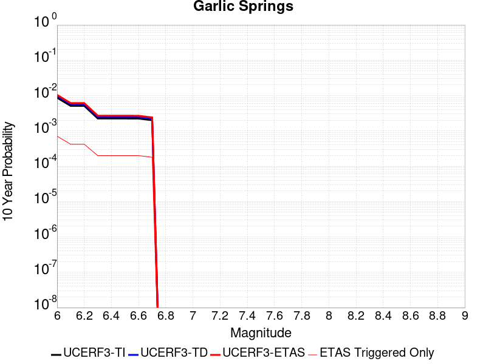 |

| Magnitude | 1 wk TI Prob | 1 wk TD Prob | 1 wk ETAS Prob | 1 wk ETAS/TD Gain | 1 wk ETAS Triggered Only | 1 mo TI Prob | 1 mo TD Prob | 1 mo ETAS Prob | 1 mo ETAS/TD Gain | 1 mo ETAS Triggered Only | 1 yr TI Prob | 1 yr TD Prob | 1 yr ETAS Prob | 1 yr ETAS/TD Gain | 1 yr ETAS Triggered Only | 10 yr TI Prob | 10 yr TD Prob | 10 yr ETAS Prob | 10 yr ETAS/TD Gain | 10 yr ETAS Triggered Only |
|-----|-----|-----|-----|-----|-----|-----|-----|-----|-----|-----|-----|-----|-----|-----|-----|-----|-----|-----|-----|-----|
| 6.0 | 1.6760017E-5 | 1.8777433E-5 | 1.8777433E-5 | 1.0 | 0.0 | 7.182667E-5 | 8.047289E-5 | 8.047289E-5 | 1.0 | 0.0 | 8.7413884E-4 | 9.794345E-4 | 0.0011551096 | 1.1793638 | 1.7584737E-4 | 0.008707083 | 0.009762724 | 0.010459246 | 1.0713451 | 7.0338947E-4 |
| 6.1 | 9.852767E-6 | 1.09739185E-5 | 1.09739185E-5 | 1.0 | 0.0 | 4.222546E-5 | 4.703063E-5 | 4.703063E-5 | 1.0 | 0.0 | 5.139737E-4 | 5.7251845E-4 | 7.043285E-4 | 1.2302284 | 1.3188552E-4 | 0.005127866 | 0.0057173935 | 0.0060670776 | 1.0611614 | 3.5169473E-4 |
| 6.2 | 9.852767E-6 | 1.09739185E-5 | 1.09739185E-5 | 1.0 | 0.0 | 4.222546E-5 | 4.703063E-5 | 4.703063E-5 | 1.0 | 0.0 | 5.139737E-4 | 5.7251845E-4 | 7.043285E-4 | 1.2302284 | 1.3188552E-4 | 0.005127866 | 0.0057173935 | 0.0060670776 | 1.0611614 | 3.5169473E-4 |
| 6.3 | 4.3167724E-6 | 4.778164E-6 | 4.778164E-6 | 1.0 | 0.0 | 1.8500323E-5 | 2.0477815E-5 | 2.0477815E-5 | 1.0 | 0.0 | 2.2521814E-4 | 2.493119E-4 | 2.932628E-4 | 1.1762887 | 4.396184E-5 | 0.0022499003 | 0.0024925806 | 0.002580285 | 1.0351863 | 8.792368E-5 |
| 6.4 | 4.3167724E-6 | 4.778164E-6 | 4.778164E-6 | 1.0 | 0.0 | 1.8500323E-5 | 2.0477815E-5 | 2.0477815E-5 | 1.0 | 0.0 | 2.2521814E-4 | 2.493119E-4 | 2.932628E-4 | 1.1762887 | 4.396184E-5 | 0.0022499003 | 0.0024925806 | 0.002580285 | 1.0351863 | 8.792368E-5 |
| 6.5 | 4.3167724E-6 | 4.778164E-6 | 4.778164E-6 | 1.0 | 0.0 | 1.8500323E-5 | 2.0477815E-5 | 2.0477815E-5 | 1.0 | 0.0 | 2.2521814E-4 | 2.493119E-4 | 2.932628E-4 | 1.1762887 | 4.396184E-5 | 0.0022499003 | 0.0024925806 | 0.002580285 | 1.0351863 | 8.792368E-5 |
| 6.6 | 4.301311E-6 | 4.761032E-6 | 4.761032E-6 | 1.0 | 0.0 | 1.8434059E-5 | 2.0404394E-5 | 2.0404394E-5 | 1.0 | 0.0 | 2.2441156E-4 | 2.484182E-4 | 2.923691E-4 | 1.1769232 | 4.396184E-5 | 0.0022418506 | 0.0024836634 | 0.0025713688 | 1.0353129 | 8.792368E-5 |
| 6.7 | 3.8599724E-6 | 4.2711804E-6 | 4.2711804E-6 | 1.0 | 0.0 | 1.6542634E-5 | 1.830506E-5 | 1.830506E-5 | 1.0 | 0.0 | 2.0138794E-4 | 2.228641E-4 | 2.6681615E-4 | 1.1972146 | 4.396184E-5 | 0.0020120554 | 0.002228641 | 0.0023163687 | 1.0393637 | 8.792368E-5 |

## San Andreas (San Bernardino S)
*[(top)](#table-of-contents)*

| 1 Week | 1 Month | 1 Year | 10 Year |
|-----|-----|-----|-----|
|  |  |  |  |

| Magnitude | 1 wk TI Prob | 1 wk TD Prob | 1 wk ETAS Prob | 1 wk ETAS/TD Gain | 1 wk ETAS Triggered Only | 1 mo TI Prob | 1 mo TD Prob | 1 mo ETAS Prob | 1 mo ETAS/TD Gain | 1 mo ETAS Triggered Only | 1 yr TI Prob | 1 yr TD Prob | 1 yr ETAS Prob | 1 yr ETAS/TD Gain | 1 yr ETAS Triggered Only | 10 yr TI Prob | 10 yr TD Prob | 10 yr ETAS Prob | 10 yr ETAS/TD Gain | 10 yr ETAS Triggered Only |
|-----|-----|-----|-----|-----|-----|-----|-----|-----|-----|-----|-----|-----|-----|-----|-----|-----|-----|-----|-----|-----|
| 6.0 | 1.2336002E-4 | 3.001381E-4 | 3.001381E-4 | 1.0 | 0.0 | 5.2857865E-4 | 0.0012856981 | 0.001417414 | 1.102447 | 1.3188552E-4 | 0.006416472 | 0.015545984 | 0.015848933 | 1.0194873 | 3.077329E-4 | 0.06234337 | 0.14287543 | 0.14340296 | 1.0036923 | 6.154658E-4 |
| 6.1 | 1.2336002E-4 | 3.001381E-4 | 3.001381E-4 | 1.0 | 0.0 | 5.2857865E-4 | 0.0012856981 | 0.001417414 | 1.102447 | 1.3188552E-4 | 0.006416472 | 0.015545984 | 0.015848933 | 1.0194873 | 3.077329E-4 | 0.06234337 | 0.14287543 | 0.14340296 | 1.0036923 | 6.154658E-4 |
| 6.2 | 1.2336002E-4 | 3.001381E-4 | 3.001381E-4 | 1.0 | 0.0 | 5.2857865E-4 | 0.0012856981 | 0.001417414 | 1.102447 | 1.3188552E-4 | 0.006416472 | 0.015545984 | 0.015848933 | 1.0194873 | 3.077329E-4 | 0.06234337 | 0.14287543 | 0.14340296 | 1.0036923 | 6.154658E-4 |
| 6.3 | 1.1712257E-4 | 2.8802018E-4 | 2.8802018E-4 | 1.0 | 0.0 | 5.018573E-4 | 0.0012338139 | 0.0013655367 | 1.1067606 | 1.3188552E-4 | 0.006093008 | 0.014923064 | 0.015226205 | 1.0203136 | 3.077329E-4 | 0.059286322 | 0.13758378 | 0.13807665 | 1.0035824 | 5.7150394E-4 |
| 6.4 | 1.1712257E-4 | 2.8802018E-4 | 2.8802018E-4 | 1.0 | 0.0 | 5.018573E-4 | 0.0012338139 | 0.0013655367 | 1.1067606 | 1.3188552E-4 | 0.006093008 | 0.014923064 | 0.015226205 | 1.0203136 | 3.077329E-4 | 0.059286322 | 0.13758378 | 0.13807665 | 1.0035824 | 5.7150394E-4 |
| 6.5 | 1.0689076E-4 | 2.6814712E-4 | 2.6814712E-4 | 1.0 | 0.0 | 4.5802278E-4 | 0.0011487206 | 0.0012804546 | 1.1146789 | 1.3188552E-4 | 0.0055621783 | 0.013900606 | 0.01416071 | 1.0187117 | 2.6377104E-4 | 0.05425003 | 0.12883076 | 0.12929033 | 1.0035673 | 5.275421E-4 |
| 6.6 | 9.7648895E-5 | 2.5059367E-4 | 2.5059367E-4 | 1.0 | 0.0 | 4.1842813E-4 | 0.0010735545 | 0.0012052984 | 1.1227175 | 1.3188552E-4 | 0.005082469 | 0.01299656 | 0.013256903 | 1.0200317 | 2.6377104E-4 | 0.049677886 | 0.120990366 | 0.121415436 | 1.0035132 | 4.8358025E-4 |
| 6.7 | 8.757013E-5 | 2.3130006E-4 | 2.3130006E-4 | 1.0 | 0.0 | 3.7524657E-4 | 9.909316E-4 | 0.0011226865 | 1.1329606 | 1.3188552E-4 | 0.00455906 | 0.012001941 | 0.012262546 | 1.0217136 | 2.6377104E-4 | 0.04466656 | 0.11229846 | 0.11272773 | 1.0038227 | 4.8358025E-4 |
| 6.8 | 8.562978E-5 | 2.2689818E-4 | 2.2689818E-4 | 1.0 | 0.0 | 3.6693315E-4 | 9.720806E-4 | 0.001103838 | 1.1355416 | 1.3188552E-4 | 0.004458263 | 0.0117749255 | 0.012035591 | 1.0221373 | 2.6377104E-4 | 0.043698758 | 0.11030855 | 0.11073879 | 1.0039003 | 4.8358025E-4 |
| 6.9 | 6.124075E-5 | 1.7073889E-4 | 1.7073889E-4 | 1.0 | 0.0 | 2.6243398E-4 | 7.3153374E-4 | 8.633228E-4 | 1.1801544 | 1.3188552E-4 | 0.0031904527 | 0.00887026 | 0.009131691 | 1.0294728 | 2.6377104E-4 | 0.031450346 | 0.08421729 | 0.084660135 | 1.0052584 | 4.8358025E-4 |
| 7.0 | 5.8598747E-5 | 1.650282E-4 | 1.650282E-4 | 1.0 | 0.0 | 2.5111332E-4 | 7.0707285E-4 | 8.388651E-4 | 1.1863914 | 1.3188552E-4 | 0.0030530186 | 0.0085748285 | 0.008836337 | 1.0304973 | 2.6377104E-4 | 0.03011414 | 0.08153475 | 0.0819789 | 1.0054474 | 4.8358025E-4 |
| 7.1 | 5.613814E-5 | 1.5921291E-4 | 1.5921291E-4 | 1.0 | 0.0 | 2.4056983E-4 | 6.821634E-4 | 8.1395893E-4 | 1.1932024 | 1.3188552E-4 | 0.0029250039 | 0.008273893 | 0.008535482 | 1.0316161 | 2.6377104E-4 | 0.028868021 | 0.07883346 | 0.079278916 | 1.0056506 | 4.8358025E-4 |
| 7.2 | 4.991222E-5 | 1.4527571E-4 | 1.4527571E-4 | 1.0 | 0.0 | 2.1389198E-4 | 6.224621E-4 | 7.5426546E-4 | 1.2117454 | 1.3188552E-4 | 0.002601025 | 0.0075522447 | 0.007814024 | 1.0346624 | 2.6377104E-4 | 0.025707912 | 0.072286695 | 0.072735325 | 1.0062062 | 4.8358025E-4 |
| 7.3 | 4.7410045E-5 | 1.3721608E-4 | 1.3721608E-4 | 1.0 | 0.0 | 2.0317009E-4 | 5.8793667E-4 | 7.1974465E-4 | 1.2241874 | 1.3188552E-4 | 0.0024707897 | 0.007134721 | 0.00739661 | 1.0367063 | 2.6377104E-4 | 0.024434982 | 0.06856856 | 0.069018975 | 1.0065689 | 4.8358025E-4 |
| 7.4 | 4.5556746E-5 | 1.3129383E-4 | 1.3129383E-4 | 1.0 | 0.0 | 1.952286E-4 | 5.625668E-4 | 6.9437816E-4 | 1.2343035 | 1.3188552E-4 | 0.002374317 | 0.00682782 | 0.00708979 | 1.038368 | 2.6377104E-4 | 0.023491086 | 0.06582052 | 0.06627227 | 1.0068634 | 4.8358025E-4 |
| 7.5 | 4.3084514E-5 | 1.2364559E-4 | 1.2364559E-4 | 1.0 | 0.0 | 1.8463485E-4 | 5.2980235E-4 | 6.61618E-4 | 1.2488016 | 1.3188552E-4 | 0.0022456115 | 0.006431338 | 0.0066934125 | 1.0407497 | 2.6377104E-4 | 0.022230545 | 0.062220756 | 0.06267425 | 1.0072885 | 4.8358025E-4 |
| 7.6 | 3.408608E-5 | 9.842233E-5 | 9.842233E-5 | 1.0 | 0.0 | 1.4607502E-4 | 4.217419E-4 | 5.535718E-4 | 1.3125843 | 1.3188552E-4 | 0.0017770125 | 0.0051226444 | 0.005385064 | 1.0512275 | 2.6377104E-4 | 0.017628696 | 0.05005001 | 0.050509386 | 1.0091784 | 4.8358025E-4 |
| 7.7 | 2.8315713E-5 | 8.254984E-5 | 8.254984E-5 | 1.0 | 0.0 | 1.2134742E-4 | 3.537371E-4 | 4.8557596E-4 | 1.372703 | 1.3188552E-4 | 0.0014764034 | 0.0042982535 | 0.0045608906 | 1.0611032 | 2.6377104E-4 | 0.01466633 | 0.04229954 | 0.042762663 | 1.0109487 | 4.8358025E-4 |
| 7.8 | 2.6222975E-5 | 7.468984E-5 | 7.468984E-5 | 1.0 | 0.0 | 1.1237934E-4 | 3.2006006E-4 | 4.5190338E-4 | 1.4119331 | 1.3188552E-4 | 0.0013673597 | 0.003889775 | 0.00415252 | 1.0675477 | 2.6377104E-4 | 0.013589768 | 0.038463186 | 0.03892817 | 1.012089 | 4.8358025E-4 |
| 7.9 | 2.1469694E-5 | 5.7927857E-5 | 5.7927857E-5 | 1.0 | 0.0 | 9.200973E-5 | 2.4823865E-4 | 3.8009143E-4 | 1.5311533 | 1.3188552E-4 | 0.0011196428 | 0.0030181198 | 0.0032810948 | 1.0871321 | 2.6377104E-4 | 0.011140184 | 0.030174483 | 0.03064347 | 1.0155425 | 4.8358025E-4 |
| 8.0 | 1.2420249E-5 | 3.1346288E-5 | 3.1346288E-5 | 1.0 | 0.0 | 5.322855E-5 | 1.3433433E-4 | 2.222462E-4 | 1.654426 | 8.792368E-5 | 6.478649E-4 | 0.0016342945 | 0.0017220745 | 1.0537113 | 8.792368E-5 | 0.0064597935 | 0.016535252 | 0.016708191 | 1.0104588 | 1.7584737E-4 |
| 8.1 | 4.9197724E-6 | 7.832194E-6 | 7.832194E-6 | 1.0 | 0.0 | 2.1084568E-5 | 3.3566113E-5 | 3.3566113E-5 | 1.0 | 0.0 | 2.566744E-4 | 4.0859092E-4 | 4.0859092E-4 | 1.0 | 0.0 | 0.002563781 | 0.004389317 | 0.0044330857 | 1.0099717 | 4.396184E-5 |
| 8.2 | 2.5634774E-6 | 2.9112718E-6 | 2.9112718E-6 | 1.0 | 0.0 | 1.0986286E-5 | 1.247682E-5 | 1.247682E-5 | 1.0 | 0.0 | 1.3374983E-4 | 1.5189474E-4 | 1.5189474E-4 | 1.0 | 0.0 | 0.0013366934 | 0.001707363 | 0.001707363 | 1.0 | 0.0 |
| 8.3 | 5.2850464E-7 | 3.2150157E-7 | 3.2150157E-7 | 1.0 | 0.0 | 2.2650179E-6 | 1.3778632E-6 | 1.3778632E-6 | 1.0 | 0.0 | 2.7576245E-5 | 1.6775368E-5 | 1.6775368E-5 | 1.0 | 0.0 | 2.7572823E-4 | 1.9904955E-4 | 1.9904955E-4 | 1.0 | 0.0 |

## Helendale-So Lockhart
*[(top)](#table-of-contents)*

| 1 Week | 1 Month | 1 Year | 10 Year |
|-----|-----|-----|-----|
|  |  |  | 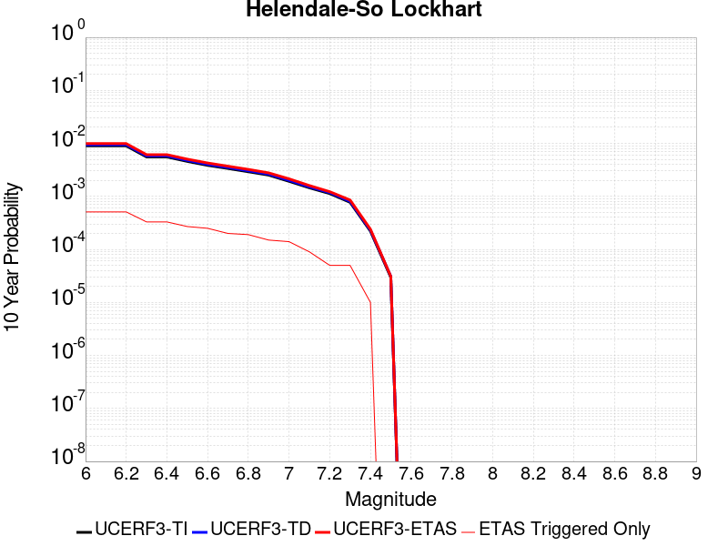 |

| Magnitude | 1 wk TI Prob | 1 wk TD Prob | 1 wk ETAS Prob | 1 wk ETAS/TD Gain | 1 wk ETAS Triggered Only | 1 mo TI Prob | 1 mo TD Prob | 1 mo ETAS Prob | 1 mo ETAS/TD Gain | 1 mo ETAS Triggered Only | 1 yr TI Prob | 1 yr TD Prob | 1 yr ETAS Prob | 1 yr ETAS/TD Gain | 1 yr ETAS Triggered Only | 10 yr TI Prob | 10 yr TD Prob | 10 yr ETAS Prob | 10 yr ETAS/TD Gain | 10 yr ETAS Triggered Only |
|-----|-----|-----|-----|-----|-----|-----|-----|-----|-----|-----|-----|-----|-----|-----|-----|-----|-----|-----|-----|-----|
| 6.0 | 1.7296055E-5 | 1.8103954E-5 | 1.8103954E-5 | 1.0 | 0.0 | 7.412385E-5 | 7.7586184E-5 | 1.2154462E-4 | 1.5665755 | 4.396184E-5 | 9.0208417E-4 | 9.4422314E-4 | 0.0012516655 | 1.3256035 | 3.077329E-4 | 0.008984311 | 0.009404233 | 0.01001391 | 1.0648302 | 6.154658E-4 |
| 6.1 | 1.7296055E-5 | 1.8103954E-5 | 1.8103954E-5 | 1.0 | 0.0 | 7.412385E-5 | 7.7586184E-5 | 1.2154462E-4 | 1.5665755 | 4.396184E-5 | 9.0208417E-4 | 9.4422314E-4 | 0.0012516655 | 1.3256035 | 3.077329E-4 | 0.008984311 | 0.009404233 | 0.01001391 | 1.0648302 | 6.154658E-4 |
| 6.2 | 1.7296055E-5 | 1.8103954E-5 | 1.8103954E-5 | 1.0 | 0.0 | 7.412385E-5 | 7.7586184E-5 | 1.2154462E-4 | 1.5665755 | 4.396184E-5 | 9.0208417E-4 | 9.4422314E-4 | 0.0012516655 | 1.3256035 | 3.077329E-4 | 0.008984311 | 0.009404233 | 0.01001391 | 1.0648302 | 6.154658E-4 |
| 6.3 | 1.0669118E-5 | 1.1135554E-5 | 1.1135554E-5 | 1.0 | 0.0 | 4.5723988E-5 | 4.7722944E-5 | 9.168269E-5 | 1.9211448 | 4.396184E-5 | 5.5654737E-4 | 5.8087474E-4 | 8.444926E-4 | 1.453829 | 2.6377104E-4 | 0.0055515557 | 0.0057938606 | 0.006318346 | 1.0905243 | 5.275421E-4 |
| 6.4 | 1.0669118E-5 | 1.1135554E-5 | 1.1135554E-5 | 1.0 | 0.0 | 4.5723988E-5 | 4.7722944E-5 | 9.168269E-5 | 1.9211448 | 4.396184E-5 | 5.5654737E-4 | 5.8087474E-4 | 8.444926E-4 | 1.453829 | 2.6377104E-4 | 0.0055515557 | 0.0057938606 | 0.006318346 | 1.0905243 | 5.275421E-4 |
| 6.5 | 8.790038E-6 | 9.170302E-6 | 9.170302E-6 | 1.0 | 0.0 | 3.767105E-5 | 3.930071E-5 | 8.326083E-5 | 2.1185577 | 4.396184E-5 | 4.585485E-4 | 4.7838266E-4 | 6.980867E-4 | 1.4592643 | 2.1980921E-4 | 0.0045760344 | 0.004773693 | 0.0052112127 | 1.0916523 | 4.3961842E-4 |
| 6.6 | 7.396949E-6 | 7.7156255E-6 | 7.7156255E-6 | 1.0 | 0.0 | 3.1700827E-5 | 3.3066553E-5 | 7.702694E-5 | 2.3294518 | 4.396184E-5 | 3.858892E-4 | 4.025119E-4 | 6.222326E-4 | 1.5458739 | 2.1980921E-4 | 0.003852198 | 0.0040179356 | 0.0044120024 | 1.0980769 | 3.9565656E-4 |
| 6.7 | 6.4600285E-6 | 6.738108E-6 | 6.738108E-6 | 1.0 | 0.0 | 2.7685543E-5 | 2.887729E-5 | 7.2837865E-5 | 2.5223234 | 4.396184E-5 | 3.3701936E-4 | 3.515251E-4 | 5.2731065E-4 | 1.5000654 | 1.7584737E-4 | 0.0033650869 | 0.003509772 | 0.0038602324 | 1.0998528 | 3.5169473E-4 |
| 6.8 | 5.600104E-6 | 5.8360747E-6 | 5.8360747E-6 | 1.0 | 0.0 | 2.4000226E-5 | 2.5011512E-5 | 6.897225E-5 | 2.7576203 | 4.396184E-5 | 2.9216358E-4 | 3.0447321E-4 | 4.8026702E-4 | 1.5773704 | 1.7584737E-4 | 0.0029177975 | 0.003040622 | 0.0033912475 | 1.1153136 | 3.5169473E-4 |
| 6.9 | 4.839122E-6 | 5.0395647E-6 | 5.0395647E-6 | 1.0 | 0.0 | 2.0738931E-5 | 2.1597958E-5 | 6.555885E-5 | 3.035419 | 4.396184E-5 | 2.5246723E-4 | 2.629239E-4 | 3.9477472E-4 | 1.5014791 | 1.3188552E-4 | 0.002521806 | 0.0026261755 | 0.0029331003 | 1.1168714 | 3.077329E-4 |
| 7.0 | 3.6937633E-6 | 3.84525E-6 | 3.84525E-6 | 1.0 | 0.0 | 1.5830317E-5 | 1.647954E-5 | 6.0440656E-5 | 3.667618 | 4.396184E-5 | 1.9271708E-4 | 2.0062024E-4 | 3.324793E-4 | 1.6572571 | 1.3188552E-4 | 0.0019255003 | 0.0020044227 | 0.002267665 | 1.1313307 | 2.6377104E-4 |
| 7.1 | 2.7858857E-6 | 2.8978848E-6 | 2.8978848E-6 | 1.0 | 0.0 | 1.1939455E-5 | 1.2419448E-5 | 1.2419448E-5 | 1.0 | 0.0 | 1.4535317E-4 | 1.5119651E-4 | 1.9515169E-4 | 1.2907157 | 4.396184E-5 | 0.0014525814 | 0.0015109578 | 0.0016865395 | 1.1162056 | 1.7584737E-4 |
| 7.2 | 2.1672065E-6 | 2.2540366E-6 | 2.2540366E-6 | 1.0 | 0.0 | 9.2879945E-6 | 9.6601225E-6 | 9.6601225E-6 | 1.0 | 0.0 | 1.1307546E-4 | 1.1760583E-4 | 1.6156251E-4 | 1.3737627 | 4.396184E-5 | 0.0011301794 | 0.0011754541 | 0.0012632745 | 1.0747118 | 8.792368E-5 |
| 7.3 | 1.4823496E-6 | 1.5422268E-6 | 1.5422268E-6 | 1.0 | 0.0 | 6.3529114E-6 | 6.609527E-6 | 6.609527E-6 | 1.0 | 0.0 | 7.734395E-5 | 8.046818E-5 | 1.2442649E-4 | 1.5462818 | 4.396184E-5 | 7.731704E-4 | 8.044055E-4 | 8.922584E-4 | 1.1092148 | 8.792368E-5 |
| 7.4 | 4.2321457E-7 | 4.410926E-7 | 4.410926E-7 | 1.0 | 0.0 | 1.8137755E-6 | 1.8903958E-6 | 1.8903958E-6 | 1.0 | 0.0 | 2.2082493E-5 | 2.3015371E-5 | 2.3015371E-5 | 1.0 | 0.0 | 2.2080299E-4 | 2.301344E-4 | 2.301344E-4 | 1.0 | 0.0 |
| 7.5 | 5.6942316E-8 | 5.941633E-8 | 5.941633E-8 | 1.0 | 0.0 | 2.440385E-7 | 2.546414E-7 | 2.546414E-7 | 1.0 | 0.0 | 2.9711643E-6 | 3.1002553E-6 | 3.1002553E-6 | 1.0 | 0.0 | 2.9711247E-5 | 3.10022E-5 | 3.10022E-5 | 1.0 | 0.0 |

## Death Valley (Black Mtns Frontal)
*[(top)](#table-of-contents)*

| 1 Week | 1 Month | 1 Year | 10 Year |
|-----|-----|-----|-----|
|  |  |  |  |

| Magnitude | 1 wk TI Prob | 1 wk TD Prob | 1 wk ETAS Prob | 1 wk ETAS/TD Gain | 1 wk ETAS Triggered Only | 1 mo TI Prob | 1 mo TD Prob | 1 mo ETAS Prob | 1 mo ETAS/TD Gain | 1 mo ETAS Triggered Only | 1 yr TI Prob | 1 yr TD Prob | 1 yr ETAS Prob | 1 yr ETAS/TD Gain | 1 yr ETAS Triggered Only | 10 yr TI Prob | 10 yr TD Prob | 10 yr ETAS Prob | 10 yr ETAS/TD Gain | 10 yr ETAS Triggered Only |
|-----|-----|-----|-----|-----|-----|-----|-----|-----|-----|-----|-----|-----|-----|-----|-----|-----|-----|-----|-----|-----|
| 6.0 | 1.6707214E-5 | 1.8670851E-5 | 1.8670851E-5 | 1.0 | 0.0 | 7.160038E-5 | 8.0015525E-5 | 2.118905E-4 | 2.6481173 | 1.3188552E-4 | 8.71386E-4 | 9.7376126E-4 | 0.0012372754 | 1.2706147 | 2.6377104E-4 | 0.00867977 | 0.009695798 | 0.01017469 | 1.0493916 | 4.8358025E-4 |
| 6.1 | 1.6707214E-5 | 1.8670851E-5 | 1.8670851E-5 | 1.0 | 0.0 | 7.160038E-5 | 8.0015525E-5 | 2.118905E-4 | 2.6481173 | 1.3188552E-4 | 8.71386E-4 | 9.7376126E-4 | 0.0012372754 | 1.2706147 | 2.6377104E-4 | 0.00867977 | 0.009695798 | 0.01017469 | 1.0493916 | 4.8358025E-4 |
| 6.2 | 1.6707214E-5 | 1.8670851E-5 | 1.8670851E-5 | 1.0 | 0.0 | 7.160038E-5 | 8.0015525E-5 | 2.118905E-4 | 2.6481173 | 1.3188552E-4 | 8.71386E-4 | 9.7376126E-4 | 0.0012372754 | 1.2706147 | 2.6377104E-4 | 0.00867977 | 0.009695798 | 0.01017469 | 1.0493916 | 4.8358025E-4 |
| 6.3 | 1.6707214E-5 | 1.8670851E-5 | 1.8670851E-5 | 1.0 | 0.0 | 7.160038E-5 | 8.0015525E-5 | 2.118905E-4 | 2.6481173 | 1.3188552E-4 | 8.71386E-4 | 9.7376126E-4 | 0.0012372754 | 1.2706147 | 2.6377104E-4 | 0.00867977 | 0.009695798 | 0.01017469 | 1.0493916 | 4.8358025E-4 |
| 6.4 | 1.5515609E-5 | 1.7338754E-5 | 1.7338754E-5 | 1.0 | 0.0 | 6.649377E-5 | 7.430687E-5 | 2.061826E-4 | 2.7747447 | 1.3188552E-4 | 8.0926094E-4 | 9.043167E-4 | 0.0011239272 | 1.2428468 | 2.1980921E-4 | 0.008063202 | 0.009007053 | 0.009442712 | 1.0483686 | 4.3961842E-4 |
| 6.5 | 1.5515609E-5 | 1.7338754E-5 | 1.7338754E-5 | 1.0 | 0.0 | 6.649377E-5 | 7.430687E-5 | 2.061826E-4 | 2.7747447 | 1.3188552E-4 | 8.0926094E-4 | 9.043167E-4 | 0.0011239272 | 1.2428468 | 2.1980921E-4 | 0.008063202 | 0.009007053 | 0.009442712 | 1.0483686 | 4.3961842E-4 |
| 6.6 | 1.5041828E-5 | 1.680967E-5 | 1.680967E-5 | 1.0 | 0.0 | 6.4463384E-5 | 7.203949E-5 | 2.0391551E-4 | 2.8306074 | 1.3188552E-4 | 7.8455906E-4 | 8.7673374E-4 | 0.0010963503 | 1.250494 | 2.1980921E-4 | 0.00781795 | 0.008733404 | 0.009125605 | 1.0449082 | 3.9565656E-4 |
| 6.7 | 1.4634985E-5 | 1.6356527E-5 | 1.6356527E-5 | 1.0 | 0.0 | 6.271985E-5 | 7.009756E-5 | 2.0197383E-4 | 2.881325 | 1.3188552E-4 | 7.6334673E-4 | 8.5310935E-4 | 0.001072731 | 1.2574368 | 2.1980921E-4 | 0.007607299 | 0.008498981 | 0.008891274 | 1.0461577 | 3.9565656E-4 |
| 6.8 | 1.4209158E-5 | 1.5882546E-5 | 1.5882546E-5 | 1.0 | 0.0 | 6.089497E-5 | 6.806631E-5 | 1.9994285E-4 | 2.9374719 | 1.3188552E-4 | 7.4114406E-4 | 8.283978E-4 | 0.001048025 | 1.2651228 | 2.1980921E-4 | 0.007386771 | 0.008253714 | 0.0086461045 | 1.0475411 | 3.9565656E-4 |
| 6.9 | 1.3780098E-5 | 1.5405076E-5 | 1.5405076E-5 | 1.0 | 0.0 | 5.9056227E-5 | 6.602012E-5 | 1.9789694E-4 | 2.9975247 | 1.3188552E-4 | 7.1877235E-4 | 8.0350396E-4 | 0.0010231365 | 1.2733436 | 2.1980921E-4 | 0.0071645193 | 0.008006583 | 0.008399071 | 1.0490208 | 3.9565656E-4 |
| 7.0 | 1.3585064E-5 | 1.51886325E-5 | 1.51886325E-5 | 1.0 | 0.0 | 5.8220405E-5 | 6.509254E-5 | 1.5301051E-4 | 2.350661 | 8.792368E-5 | 7.086029E-4 | 7.92219E-4 | 9.240001E-4 | 1.1663442 | 1.3188552E-4 | 0.007063476 | 0.007894541 | 0.0081998445 | 1.0386727 | 3.077329E-4 |
| 7.1 | 1.3398601E-5 | 1.4981811E-5 | 1.4981811E-5 | 1.0 | 0.0 | 5.742131E-5 | 6.420621E-5 | 1.0816523E-4 | 1.6846536 | 4.396184E-5 | 6.9888023E-4 | 7.814357E-4 | 8.6929067E-4 | 1.1124276 | 8.792368E-5 | 0.0069668638 | 0.007787468 | 0.008049184 | 1.0336075 | 2.6377104E-4 |
| 7.2 | 1.3126312E-5 | 1.4680023E-5 | 1.4680023E-5 | 1.0 | 0.0 | 5.6254412E-5 | 6.29129E-5 | 1.0687197E-4 | 1.6987292 | 4.396184E-5 | 6.846822E-4 | 7.6570077E-4 | 8.5355714E-4 | 1.1147398 | 8.792368E-5 | 0.006825765 | 0.0076312097 | 0.007892967 | 1.034301 | 2.6377104E-4 |
| 7.3 | 1.2922429E-5 | 1.4454244E-5 | 1.4454244E-5 | 1.0 | 0.0 | 5.5380664E-5 | 6.194532E-5 | 1.0590444E-4 | 1.709644 | 4.396184E-5 | 6.74051E-4 | 7.5392873E-4 | 8.417861E-4 | 1.1165328 | 8.792368E-5 | 0.006720101 | 0.007514291 | 0.0077760797 | 1.0348388 | 2.6377104E-4 |
| 7.4 | 1.2768878E-5 | 1.4284223E-5 | 1.4284223E-5 | 1.0 | 0.0 | 5.4722615E-5 | 6.121669E-5 | 1.0517584E-4 | 1.7180909 | 4.396184E-5 | 6.660441E-4 | 7.4506376E-4 | 8.3292194E-4 | 1.1179204 | 8.792368E-5 | 0.0066405144 | 0.007426237 | 0.007688049 | 1.0352551 | 2.6377104E-4 |
| 7.5 | 1.2521929E-5 | 1.4012458E-5 | 1.4012458E-5 | 1.0 | 0.0 | 5.366431E-5 | 6.0052043E-5 | 1.0401125E-4 | 1.7320185 | 4.396184E-5 | 6.531671E-4 | 7.308938E-4 | 8.187532E-4 | 1.1202081 | 8.792368E-5 | 0.006512506 | 0.0072854757 | 0.007547325 | 1.0359412 | 2.6377104E-4 |
| 7.6 | 1.1301089E-5 | 1.264855E-5 | 1.264855E-5 | 1.0 | 0.0 | 4.8432343E-5 | 5.4206976E-5 | 5.4206976E-5 | 1.0 | 0.0 | 5.895042E-4 | 6.597754E-4 | 7.037082E-4 | 1.0665876 | 4.396184E-5 | 0.0058794282 | 0.0065787183 | 0.0067970813 | 1.0331924 | 2.1980921E-4 |
| 7.7 | 9.189108E-6 | 1.0283684E-5 | 1.0283684E-5 | 1.0 | 0.0 | 3.93813E-5 | 4.4072214E-5 | 4.4072214E-5 | 1.0 | 0.0 | 4.7936183E-4 | 5.3645216E-4 | 5.8039045E-4 | 1.0819052 | 4.396184E-5 | 0.004783291 | 0.005352083 | 0.0055707158 | 1.04085 | 2.1980921E-4 |
| 7.8 | 3.4586725E-7 | 3.6483146E-7 | 3.6483146E-7 | 1.0 | 0.0 | 1.4822873E-6 | 1.5635625E-6 | 1.5635625E-6 | 1.0 | 0.0 | 1.80467E-5 | 1.9036212E-5 | 1.9036212E-5 | 1.0 | 0.0 | 1.8045233E-4 | 1.9034625E-4 | 1.9034625E-4 | 1.0 | 0.0 |
| 7.9 | 2.5591178E-9 | 2.6697022E-9 | 2.6697022E-9 | 1.0 | 0.0 | 1.0967647E-8 | 1.1441582E-8 | 1.1441582E-8 | 1.0 | 0.0 | 1.335311E-7 | 1.3930125E-7 | 1.3930125E-7 | 1.0 | 0.0 | 1.3353102E-6 | 1.3930126E-6 | 1.3930126E-6 | 1.0 | 0.0 |

## San Andreas (Big Bend)
*[(top)](#table-of-contents)*

| 1 Week | 1 Month | 1 Year | 10 Year |
|-----|-----|-----|-----|
|  |  |  |  |

| Magnitude | 1 wk TI Prob | 1 wk TD Prob | 1 wk ETAS Prob | 1 wk ETAS/TD Gain | 1 wk ETAS Triggered Only | 1 mo TI Prob | 1 mo TD Prob | 1 mo ETAS Prob | 1 mo ETAS/TD Gain | 1 mo ETAS Triggered Only | 1 yr TI Prob | 1 yr TD Prob | 1 yr ETAS Prob | 1 yr ETAS/TD Gain | 1 yr ETAS Triggered Only | 10 yr TI Prob | 10 yr TD Prob | 10 yr ETAS Prob | 10 yr ETAS/TD Gain | 10 yr ETAS Triggered Only |
|-----|-----|-----|-----|-----|-----|-----|-----|-----|-----|-----|-----|-----|-----|-----|-----|-----|-----|-----|-----|-----|
| 6.0 | 1.0179969E-4 | 2.0089281E-4 | 2.0089281E-4 | 1.0 | 0.0 | 4.362114E-4 | 8.606861E-4 | 9.485341E-4 | 1.1020675 | 8.792368E-5 | 0.0052979486 | 0.01042879 | 0.0105593 | 1.0125144 | 1.3188552E-4 | 0.051734097 | 0.101523116 | 0.101878606 | 1.0035015 | 3.9565656E-4 |
| 6.1 | 1.0179969E-4 | 2.0089281E-4 | 2.0089281E-4 | 1.0 | 0.0 | 4.362114E-4 | 8.606861E-4 | 9.485341E-4 | 1.1020675 | 8.792368E-5 | 0.0052979486 | 0.01042879 | 0.0105593 | 1.0125144 | 1.3188552E-4 | 0.051734097 | 0.101523116 | 0.101878606 | 1.0035015 | 3.9565656E-4 |
| 6.2 | 1.0179969E-4 | 2.0089281E-4 | 2.0089281E-4 | 1.0 | 0.0 | 4.362114E-4 | 8.606861E-4 | 9.485341E-4 | 1.1020675 | 8.792368E-5 | 0.0052979486 | 0.01042879 | 0.0105593 | 1.0125144 | 1.3188552E-4 | 0.051734097 | 0.101523116 | 0.101878606 | 1.0035015 | 3.9565656E-4 |
| 6.3 | 1.0179969E-4 | 2.0089281E-4 | 2.0089281E-4 | 1.0 | 0.0 | 4.362114E-4 | 8.606861E-4 | 9.485341E-4 | 1.1020675 | 8.792368E-5 | 0.0052979486 | 0.01042879 | 0.0105593 | 1.0125144 | 1.3188552E-4 | 0.051734097 | 0.101523116 | 0.101878606 | 1.0035015 | 3.9565656E-4 |
| 6.4 | 9.1639464E-5 | 1.8446219E-4 | 1.8446219E-4 | 1.0 | 0.0 | 3.9268145E-4 | 7.9031294E-4 | 8.781671E-4 | 1.1111639 | 8.792368E-5 | 0.0047704205 | 0.009579727 | 0.009710349 | 1.0136353 | 1.3188552E-4 | 0.046693064 | 0.093848534 | 0.094087556 | 1.0025468 | 2.6377104E-4 |
| 6.5 | 9.1639464E-5 | 1.8446219E-4 | 1.8446219E-4 | 1.0 | 0.0 | 3.9268145E-4 | 7.9031294E-4 | 8.781671E-4 | 1.1111639 | 8.792368E-5 | 0.0047704205 | 0.009579727 | 0.009710349 | 1.0136353 | 1.3188552E-4 | 0.046693064 | 0.093848534 | 0.094087556 | 1.0025468 | 2.6377104E-4 |
| 6.6 | 9.042622E-5 | 1.8253236E-4 | 1.8253236E-4 | 1.0 | 0.0 | 3.8748336E-4 | 7.8204717E-4 | 8.699021E-4 | 1.1123396 | 8.792368E-5 | 0.0047074095 | 0.00947997 | 0.0096106045 | 1.0137801 | 1.3188552E-4 | 0.046089325 | 0.09294244 | 0.0931817 | 1.0025742 | 2.6377104E-4 |
| 6.7 | 8.9836685E-5 | 1.8167557E-4 | 1.8167557E-4 | 1.0 | 0.0 | 3.8495753E-4 | 7.7837746E-4 | 8.662327E-4 | 1.1128697 | 8.792368E-5 | 0.00467679 | 0.009435678 | 0.009566319 | 1.0138454 | 1.3188552E-4 | 0.045795817 | 0.09253668 | 0.092776045 | 1.0025867 | 2.6377104E-4 |
| 6.8 | 8.9471854E-5 | 1.8114323E-4 | 1.8114323E-4 | 1.0 | 0.0 | 3.8339442E-4 | 7.7609735E-4 | 8.6395285E-4 | 1.1132016 | 8.792368E-5 | 0.004657841 | 0.009408158 | 0.009538802 | 1.0138863 | 1.3188552E-4 | 0.04561414 | 0.09228384 | 0.09252327 | 1.0025945 | 2.6377104E-4 |
| 6.9 | 8.858234E-5 | 1.7996269E-4 | 1.7996269E-4 | 1.0 | 0.0 | 3.7958333E-4 | 7.710409E-4 | 8.588968E-4 | 1.1139445 | 8.792368E-5 | 0.004611638 | 0.009347125 | 0.009477777 | 1.0139779 | 1.3188552E-4 | 0.04517103 | 0.091723874 | 0.09196345 | 1.002612 | 2.6377104E-4 |
| 7.0 | 8.7433385E-5 | 1.7835027E-4 | 1.7835027E-4 | 1.0 | 0.0 | 3.746607E-4 | 7.641346E-4 | 8.0806285E-4 | 1.0574876 | 4.396184E-5 | 0.004551957 | 0.009263758 | 0.009350867 | 1.0094032 | 8.792368E-5 | 0.044598386 | 0.090958185 | 0.091158 | 1.0021968 | 2.1980921E-4 |
| 7.1 | 8.684964E-5 | 1.7746954E-4 | 1.7746954E-4 | 1.0 | 0.0 | 3.7215967E-4 | 7.6036225E-4 | 8.0429064E-4 | 1.057773 | 4.396184E-5 | 0.0045216335 | 0.00921822 | 0.009305333 | 1.0094501 | 8.792368E-5 | 0.04430731 | 0.09053964 | 0.09073955 | 1.002208 | 2.1980921E-4 |
| 7.2 | 8.606521E-5 | 1.7637543E-4 | 1.7637543E-4 | 1.0 | 0.0 | 3.6879873E-4 | 7.556759E-4 | 7.996045E-4 | 1.0581316 | 4.396184E-5 | 0.0044808835 | 0.009161645 | 0.009248762 | 1.009509 | 8.792368E-5 | 0.043916024 | 0.09002007 | 0.090220094 | 1.002222 | 2.1980921E-4 |
| 7.3 | 8.568266E-5 | 1.7579518E-4 | 1.7579518E-4 | 1.0 | 0.0 | 3.6715972E-4 | 7.531906E-4 | 7.971193E-4 | 1.0583235 | 4.396184E-5 | 0.0044610105 | 0.009131639 | 0.009218761 | 1.0095406 | 8.792368E-5 | 0.043725148 | 0.08974111 | 0.089941196 | 1.0022296 | 2.1980921E-4 |
| 7.4 | 8.5432206E-5 | 1.7542086E-4 | 1.7542086E-4 | 1.0 | 0.0 | 3.6608664E-4 | 7.515873E-4 | 7.9551607E-4 | 1.0584481 | 4.396184E-5 | 0.004447999 | 0.009112283 | 0.009199405 | 1.009561 | 8.792368E-5 | 0.043600157 | 0.08956122 | 0.08976134 | 1.0022345 | 2.1980921E-4 |
| 7.5 | 8.4791965E-5 | 1.7411346E-4 | 1.7411346E-4 | 1.0 | 0.0 | 3.633435E-4 | 7.4598734E-4 | 7.899164E-4 | 1.0588871 | 4.396184E-5 | 0.0044147377 | 0.009044672 | 0.0091318 | 1.0096331 | 8.792368E-5 | 0.043280575 | 0.088938616 | 0.08913887 | 1.0022516 | 2.1980921E-4 |
| 7.6 | 8.241105E-5 | 1.6856502E-4 | 1.6856502E-4 | 1.0 | 0.0 | 3.531424E-4 | 7.222217E-4 | 7.661518E-4 | 1.0608263 | 4.396184E-5 | 0.0042910352 | 0.008757687 | 0.00884484 | 1.0099517 | 8.792368E-5 | 0.042091176 | 0.086314626 | 0.086515464 | 1.0023268 | 2.1980921E-4 |
| 7.7 | 7.00432E-5 | 1.4219029E-4 | 1.4219029E-4 | 1.0 | 0.0 | 3.001506E-4 | 6.092446E-4 | 6.531797E-4 | 1.072114 | 4.396184E-5 | 0.0036482112 | 0.0073923655 | 0.0074796393 | 1.0118059 | 8.792368E-5 | 0.035888977 | 0.07358285 | 0.07370503 | 1.0016605 | 1.3188552E-4 |
| 7.8 | 6.415362E-5 | 1.2982021E-4 | 1.2982021E-4 | 1.0 | 0.0 | 2.749151E-4 | 5.562537E-4 | 6.001911E-4 | 1.0789881 | 4.396184E-5 | 0.0033419547 | 0.0067513892 | 0.0068387194 | 1.0129352 | 8.792368E-5 | 0.03292141 | 0.06731172 | 0.06743473 | 1.0018275 | 1.3188552E-4 |
| 7.9 | 4.939911E-5 | 9.350515E-5 | 9.350515E-5 | 1.0 | 0.0 | 2.116933E-4 | 4.0067482E-4 | 4.4461904E-4 | 1.1096755 | 4.396184E-5 | 0.0025743195 | 0.0048673134 | 0.0049548093 | 1.0179762 | 8.792368E-5 | 0.025447013 | 0.048958268 | 0.0490837 | 1.0025619 | 1.3188552E-4 |
| 8.0 | 3.344983E-5 | 5.2282365E-5 | 5.2282365E-5 | 1.0 | 0.0 | 1.4334853E-4 | 2.2404804E-4 | 2.2404804E-4 | 1.0 | 0.0 | 0.0017438711 | 0.0027243744 | 0.0027243744 | 1.0 | 0.0 | 0.017302496 | 0.027949443 | 0.027992176 | 1.001529 | 4.396184E-5 |
| 8.1 | 1.9104898E-5 | 1.9199628E-5 | 1.9199628E-5 | 1.0 | 0.0 | 8.1875565E-5 | 8.228153E-5 | 8.228153E-5 | 1.0 | 0.0 | 9.963791E-4 | 0.0010013179 | 0.0010013179 | 1.0 | 0.0 | 0.009919235 | 0.010763723 | 0.0108072115 | 1.0040402 | 4.396184E-5 |
| 8.2 | 8.643924E-6 | 5.4848397E-6 | 5.4848397E-6 | 1.0 | 0.0 | 3.704486E-5 | 2.3506243E-5 | 2.3506243E-5 | 1.0 | 0.0 | 4.5092785E-4 | 2.8615101E-4 | 2.8615101E-4 | 1.0 | 0.0 | 0.0045001395 | 0.0032541603 | 0.0032541603 | 1.0 | 0.0 |
| 8.3 | 1.983087E-6 | 7.676691E-7 | 7.676691E-7 | 1.0 | 0.0 | 8.498917E-6 | 3.2900064E-6 | 3.2900064E-6 | 1.0 | 0.0 | 1.034694E-4 | 4.005511E-5 | 4.005511E-5 | 1.0 | 0.0 | 0.0010342124 | 4.729315E-4 | 4.729315E-4 | 1.0 | 0.0 |

## Red Pass
*[(top)](#table-of-contents)*

| 1 Week | 1 Month | 1 Year | 10 Year |
|-----|-----|-----|-----|
|  |  |  |  |

| Magnitude | 1 wk TI Prob | 1 wk TD Prob | 1 wk ETAS Prob | 1 wk ETAS/TD Gain | 1 wk ETAS Triggered Only | 1 mo TI Prob | 1 mo TD Prob | 1 mo ETAS Prob | 1 mo ETAS/TD Gain | 1 mo ETAS Triggered Only | 1 yr TI Prob | 1 yr TD Prob | 1 yr ETAS Prob | 1 yr ETAS/TD Gain | 1 yr ETAS Triggered Only | 10 yr TI Prob | 10 yr TD Prob | 10 yr ETAS Prob | 10 yr ETAS/TD Gain | 10 yr ETAS Triggered Only |
|-----|-----|-----|-----|-----|-----|-----|-----|-----|-----|-----|-----|-----|-----|-----|-----|-----|-----|-----|-----|-----|
| 6.0 | 8.258278E-6 | 8.551346E-6 | 8.551346E-6 | 1.0 | 0.0 | 3.539214E-5 | 3.664821E-5 | 3.664821E-5 | 1.0 | 0.0 | 4.308141E-4 | 4.4611847E-4 | 6.6582963E-4 | 1.4924951 | 2.1980921E-4 | 0.0042997985 | 0.004453987 | 0.004804115 | 1.0786101 | 3.5169473E-4 |
| 6.1 | 3.649988E-6 | 3.7753505E-6 | 3.7753505E-6 | 1.0 | 0.0 | 1.5642712E-5 | 1.618E-5 | 1.618E-5 | 1.0 | 0.0 | 1.9043336E-4 | 1.9697845E-4 | 2.8488482E-4 | 1.446274 | 8.792368E-5 | 0.0019027026 | 0.001968506 | 0.002144007 | 1.0891545 | 1.7584737E-4 |
| 6.2 | 3.649988E-6 | 3.7753505E-6 | 3.7753505E-6 | 1.0 | 0.0 | 1.5642712E-5 | 1.618E-5 | 1.618E-5 | 1.0 | 0.0 | 1.9043336E-4 | 1.9697845E-4 | 2.8488482E-4 | 1.446274 | 8.792368E-5 | 0.0019027026 | 0.001968506 | 0.002144007 | 1.0891545 | 1.7584737E-4 |
| 6.3 | 1.3924937E-6 | 1.4411299E-6 | 1.4411299E-6 | 1.0 | 0.0 | 5.9678164E-6 | 6.176265E-6 | 6.176265E-6 | 1.0 | 0.0 | 7.265574E-5 | 7.519485E-5 | 7.519485E-5 | 1.0 | 0.0 | 7.263199E-4 | 7.518328E-4 | 7.9576153E-4 | 1.0584289 | 4.396184E-5 |
| 6.4 | 1.3924937E-6 | 1.4411299E-6 | 1.4411299E-6 | 1.0 | 0.0 | 5.9678164E-6 | 6.176265E-6 | 6.176265E-6 | 1.0 | 0.0 | 7.265574E-5 | 7.519485E-5 | 7.519485E-5 | 1.0 | 0.0 | 7.263199E-4 | 7.518328E-4 | 7.9576153E-4 | 1.0584289 | 4.396184E-5 |
| 6.5 | 9.876812E-7 | 1.0222006E-6 | 1.0222006E-6 | 1.0 | 0.0 | 4.2329125E-6 | 4.38086E-6 | 4.38086E-6 | 1.0 | 0.0 | 5.153449E-5 | 5.333697E-5 | 5.333697E-5 | 1.0 | 0.0 | 5.1522546E-4 | 5.333697E-4 | 5.333697E-4 | 1.0 | 0.0 |

## San Andreas (San Gorgonio Pass-Garnet HIll)
*[(top)](#table-of-contents)*

| 1 Week | 1 Month | 1 Year | 10 Year |
|-----|-----|-----|-----|
|  |  |  |  |

| Magnitude | 1 wk TI Prob | 1 wk TD Prob | 1 wk ETAS Prob | 1 wk ETAS/TD Gain | 1 wk ETAS Triggered Only | 1 mo TI Prob | 1 mo TD Prob | 1 mo ETAS Prob | 1 mo ETAS/TD Gain | 1 mo ETAS Triggered Only | 1 yr TI Prob | 1 yr TD Prob | 1 yr ETAS Prob | 1 yr ETAS/TD Gain | 1 yr ETAS Triggered Only | 10 yr TI Prob | 10 yr TD Prob | 10 yr ETAS Prob | 10 yr ETAS/TD Gain | 10 yr ETAS Triggered Only |
|-----|-----|-----|-----|-----|-----|-----|-----|-----|-----|-----|-----|-----|-----|-----|-----|-----|-----|-----|-----|-----|
| 6.0 | 8.31567E-5 | 2.3390418E-4 | 2.3390418E-4 | 1.0 | 0.0 | 3.5633717E-4 | 0.0010020639 | 0.0010898995 | 1.0876547 | 8.792368E-5 | 0.004329778 | 0.01213195 | 0.012262235 | 1.0107391 | 1.3188552E-4 | 0.042463828 | 0.11261114 | 0.11292323 | 1.0027714 | 3.5169473E-4 |
| 6.1 | 8.31567E-5 | 2.3390418E-4 | 2.3390418E-4 | 1.0 | 0.0 | 3.5633717E-4 | 0.0010020639 | 0.0010898995 | 1.0876547 | 8.792368E-5 | 0.004329778 | 0.01213195 | 0.012262235 | 1.0107391 | 1.3188552E-4 | 0.042463828 | 0.11261114 | 0.11292323 | 1.0027714 | 3.5169473E-4 |
| 6.2 | 8.31567E-5 | 2.3390418E-4 | 2.3390418E-4 | 1.0 | 0.0 | 3.5633717E-4 | 0.0010020639 | 0.0010898995 | 1.0876547 | 8.792368E-5 | 0.004329778 | 0.01213195 | 0.012262235 | 1.0107391 | 1.3188552E-4 | 0.042463828 | 0.11261114 | 0.11292323 | 1.0027714 | 3.5169473E-4 |
| 6.3 | 8.31567E-5 | 2.3390418E-4 | 2.3390418E-4 | 1.0 | 0.0 | 3.5633717E-4 | 0.0010020639 | 0.0010898995 | 1.0876547 | 8.792368E-5 | 0.004329778 | 0.01213195 | 0.012262235 | 1.0107391 | 1.3188552E-4 | 0.042463828 | 0.11261114 | 0.11292323 | 1.0027714 | 3.5169473E-4 |
| 6.4 | 8.059055E-5 | 2.2948666E-4 | 2.2948666E-4 | 1.0 | 0.0 | 3.4534236E-4 | 9.83146E-4 | 0.0010709832 | 1.0893431 | 8.792368E-5 | 0.0041964394 | 0.011904163 | 0.012034479 | 1.0109471 | 1.3188552E-4 | 0.041180745 | 0.11059223 | 0.11090503 | 1.0028284 | 3.5169473E-4 |
| 6.5 | 8.059055E-5 | 2.2948666E-4 | 2.2948666E-4 | 1.0 | 0.0 | 3.4534236E-4 | 9.83146E-4 | 0.0010709832 | 1.0893431 | 8.792368E-5 | 0.0041964394 | 0.011904163 | 0.012034479 | 1.0109471 | 1.3188552E-4 | 0.041180745 | 0.11059223 | 0.11090503 | 1.0028284 | 3.5169473E-4 |
| 6.6 | 7.619237E-5 | 2.2192899E-4 | 2.2192899E-4 | 1.0 | 0.0 | 3.2649786E-4 | 9.507798E-4 | 0.0010386199 | 1.0923874 | 8.792368E-5 | 0.0039678677 | 0.011514857 | 0.011645224 | 1.0113217 | 1.3188552E-4 | 0.03897764 | 0.10712875 | 0.10744276 | 1.0029312 | 3.5169473E-4 |
| 6.7 | 7.440636E-5 | 2.1868707E-4 | 2.1868707E-4 | 1.0 | 0.0 | 3.188454E-4 | 9.368959E-4 | 0.0010247373 | 1.0937577 | 8.792368E-5 | 0.0038750346 | 0.011347586 | 0.011477975 | 1.0114905 | 1.3188552E-4 | 0.038081564 | 0.10563716 | 0.10595171 | 1.0029776 | 3.5169473E-4 |
| 6.8 | 7.3735864E-5 | 2.1715868E-4 | 2.1715868E-4 | 1.0 | 0.0 | 3.1597257E-4 | 9.303504E-4 | 0.0010181923 | 1.094418 | 8.792368E-5 | 0.0038401815 | 0.011268722 | 0.011399121 | 1.0115718 | 1.3188552E-4 | 0.03774495 | 0.1049387 | 0.10525349 | 1.0029998 | 3.5169473E-4 |
| 6.9 | 7.27575E-5 | 2.1484829E-4 | 2.1484829E-4 | 1.0 | 0.0 | 3.117806E-4 | 9.204557E-4 | 0.0010082985 | 1.095434 | 8.792368E-5 | 0.003789323 | 0.011149493 | 0.011279908 | 1.0116969 | 1.3188552E-4 | 0.037253562 | 0.1038866 | 0.10420176 | 1.0030336 | 3.5169473E-4 |
| 7.0 | 7.102591E-5 | 2.1068838E-4 | 2.1068838E-4 | 1.0 | 0.0 | 3.0436125E-4 | 9.0263993E-4 | 9.904843E-4 | 1.0973194 | 8.792368E-5 | 0.003699303 | 0.010934781 | 0.011065225 | 1.0119293 | 1.3188552E-4 | 0.03638325 | 0.101988725 | 0.10230455 | 1.0030967 | 3.5169473E-4 |
| 7.1 | 7.028513E-5 | 2.090447E-4 | 2.090447E-4 | 1.0 | 0.0 | 3.0118722E-4 | 8.956004E-4 | 9.834453E-4 | 1.0980849 | 8.792368E-5 | 0.0036607897 | 0.010849932 | 0.010980387 | 1.0120236 | 1.3188552E-4 | 0.036010686 | 0.101231724 | 0.101547815 | 1.0031224 | 3.5169473E-4 |
| 7.2 | 6.8498244E-5 | 2.0512305E-4 | 2.0512305E-4 | 1.0 | 0.0 | 2.9353087E-4 | 8.788049E-4 | 9.666513E-4 | 1.0999613 | 8.792368E-5 | 0.003567883 | 0.01064746 | 0.010777942 | 1.0122547 | 1.3188552E-4 | 0.035111405 | 0.09942366 | 0.099740386 | 1.0031856 | 3.5169473E-4 |
| 7.3 | 6.622592E-5 | 1.973951E-4 | 1.973951E-4 | 1.0 | 0.0 | 2.8379448E-4 | 8.457069E-4 | 9.3355624E-4 | 1.1038768 | 8.792368E-5 | 0.0034497243 | 0.010248352 | 0.010378886 | 1.012737 | 1.3188552E-4 | 0.033966612 | 0.09591987 | 0.09623783 | 1.0033149 | 3.5169473E-4 |
| 7.4 | 5.1050705E-5 | 1.4695495E-4 | 1.4695495E-4 | 1.0 | 0.0 | 2.1877038E-4 | 6.296557E-4 | 7.175241E-4 | 1.1395497 | 8.792368E-5 | 0.002660276 | 0.0076393057 | 0.0077701835 | 1.0171322 | 1.3188552E-4 | 0.02628654 | 0.07289092 | 0.073216975 | 1.0044732 | 3.5169473E-4 |
| 7.5 | 3.9302922E-5 | 1.1135462E-4 | 1.1135462E-4 | 1.0 | 0.0 | 1.6843023E-4 | 4.771471E-4 | 5.6502887E-4 | 1.1841816 | 8.792368E-5 | 0.0020487092 | 0.005793862 | 0.0059249834 | 1.022631 | 1.3188552E-4 | 0.020299247 | 0.05603429 | 0.05636628 | 1.0059247 | 3.5169473E-4 |
| 7.6 | 2.9851626E-5 | 8.49997E-5 | 8.49997E-5 | 1.0 | 0.0 | 1.2792926E-4 | 3.642337E-4 | 4.5212536E-4 | 1.2413057 | 8.792368E-5 | 0.0015564259 | 0.004425554 | 0.0045568557 | 1.029669 | 1.3188552E-4 | 0.0154556995 | 0.043216076 | 0.04355257 | 1.0077864 | 3.5169473E-4 |
| 7.7 | 2.1135214E-5 | 6.357336E-5 | 6.357336E-5 | 1.0 | 0.0 | 9.0576345E-5 | 2.7242882E-4 | 3.6032856E-4 | 1.3226521 | 8.792368E-5 | 0.0011022091 | 0.0033117817 | 0.0034432304 | 1.0396912 | 1.3188552E-4 | 0.010967582 | 0.03260256 | 0.032942787 | 1.0104356 | 3.5169473E-4 |
| 7.8 | 1.883379E-5 | 5.5680954E-5 | 5.5680954E-5 | 1.0 | 0.0 | 8.0713755E-5 | 2.3861085E-4 | 3.2651355E-4 | 1.3683935 | 8.792368E-5 | 9.822468E-4 | 0.0029012202 | 0.0030327232 | 1.0453267 | 1.3188552E-4 | 0.0097791655 | 0.028713608 | 0.029055204 | 1.0118966 | 3.5169473E-4 |
| 7.9 | 1.5156185E-5 | 4.1691877E-5 | 4.1691877E-5 | 1.0 | 0.0 | 6.495346E-5 | 1.7866725E-4 | 2.6657523E-4 | 1.4920206 | 8.792368E-5 | 7.9052144E-4 | 0.002173105 | 0.002304704 | 1.060558 | 1.3188552E-4 | 0.007877152 | 0.021774774 | 0.02211881 | 1.0157998 | 3.5169473E-4 |
| 8.0 | 1.1405907E-5 | 2.9999417E-5 | 2.9999417E-5 | 1.0 | 0.0 | 4.8881542E-5 | 1.2856259E-4 | 2.1647497E-4 | 1.6838099 | 8.792368E-5 | 5.9497025E-4 | 0.0015641268 | 0.0016519129 | 1.0561247 | 8.792368E-5 | 0.005933798 | 0.015784537 | 0.015957609 | 1.0109646 | 1.7584737E-4 |
| 8.1 | 4.3511436E-6 | 7.378168E-6 | 7.378168E-6 | 1.0 | 0.0 | 1.8647626E-5 | 3.1620337E-5 | 3.1620337E-5 | 1.0 | 0.0 | 2.2701119E-4 | 3.8490974E-4 | 3.8490974E-4 | 1.0 | 0.0 | 0.0022677942 | 0.004120797 | 0.0041645775 | 1.0106243 | 4.396184E-5 |
| 8.2 | 2.3042528E-6 | 2.7371211E-6 | 2.7371211E-6 | 1.0 | 0.0 | 9.875332E-6 | 1.1730467E-5 | 1.1730467E-5 | 1.0 | 0.0 | 1.2022553E-4 | 1.4280912E-4 | 1.4280912E-4 | 1.0 | 0.0 | 0.0012016051 | 0.0016001607 | 0.0016001607 | 1.0 | 0.0 |
| 8.3 | 5.202968E-7 | 3.1658746E-7 | 3.1658746E-7 | 1.0 | 0.0 | 2.2298414E-6 | 1.3568028E-6 | 1.3568028E-6 | 1.0 | 0.0 | 2.714798E-5 | 1.6518961E-5 | 1.6518961E-5 | 1.0 | 0.0 | 2.7144665E-4 | 1.959719E-4 | 1.959719E-4 | 1.0 | 0.0 |

## Coyote Lake
*[(top)](#table-of-contents)*

| 1 Week | 1 Month | 1 Year | 10 Year |
|-----|-----|-----|-----|
|  |  |  |  |

| Magnitude | 1 wk TI Prob | 1 wk TD Prob | 1 wk ETAS Prob | 1 wk ETAS/TD Gain | 1 wk ETAS Triggered Only | 1 mo TI Prob | 1 mo TD Prob | 1 mo ETAS Prob | 1 mo ETAS/TD Gain | 1 mo ETAS Triggered Only | 1 yr TI Prob | 1 yr TD Prob | 1 yr ETAS Prob | 1 yr ETAS/TD Gain | 1 yr ETAS Triggered Only | 10 yr TI Prob | 10 yr TD Prob | 10 yr ETAS Prob | 10 yr ETAS/TD Gain | 10 yr ETAS Triggered Only |
|-----|-----|-----|-----|-----|-----|-----|-----|-----|-----|-----|-----|-----|-----|-----|-----|-----|-----|-----|-----|-----|
| 6.0 | 1.980352E-5 | 2.1707297E-5 | 2.1707297E-5 | 1.0 | 0.0 | 8.486947E-5 | 9.3028364E-5 | 9.3028364E-5 | 1.0 | 0.0 | 0.0010327959 | 0.001132104 | 0.001219928 | 1.077576 | 8.792368E-5 | 0.010280091 | 0.0112705445 | 0.0115748085 | 1.0269965 | 3.077329E-4 |
| 6.1 | 1.980352E-5 | 2.1707297E-5 | 2.1707297E-5 | 1.0 | 0.0 | 8.486947E-5 | 9.3028364E-5 | 9.3028364E-5 | 1.0 | 0.0 | 0.0010327959 | 0.001132104 | 0.001219928 | 1.077576 | 8.792368E-5 | 0.010280091 | 0.0112705445 | 0.0115748085 | 1.0269965 | 3.077329E-4 |
| 6.2 | 1.980352E-5 | 2.1707297E-5 | 2.1707297E-5 | 1.0 | 0.0 | 8.486947E-5 | 9.3028364E-5 | 9.3028364E-5 | 1.0 | 0.0 | 0.0010327959 | 0.001132104 | 0.001219928 | 1.077576 | 8.792368E-5 | 0.010280091 | 0.0112705445 | 0.0115748085 | 1.0269965 | 3.077329E-4 |
| 6.3 | 1.5344787E-5 | 1.6821099E-5 | 1.6821099E-5 | 1.0 | 0.0 | 6.576172E-5 | 7.208878E-5 | 7.208878E-5 | 1.0 | 0.0 | 8.003548E-4 | 8.7738864E-4 | 9.213119E-4 | 1.0500613 | 4.396184E-5 | 0.007974784 | 0.008745291 | 0.008876024 | 1.0149488 | 1.3188552E-4 |
| 6.4 | 1.5344787E-5 | 1.6821099E-5 | 1.6821099E-5 | 1.0 | 0.0 | 6.576172E-5 | 7.208878E-5 | 7.208878E-5 | 1.0 | 0.0 | 8.003548E-4 | 8.7738864E-4 | 9.213119E-4 | 1.0500613 | 4.396184E-5 | 0.007974784 | 0.008745291 | 0.008876024 | 1.0149488 | 1.3188552E-4 |
| 6.5 | 1.4189697E-5 | 1.5558386E-5 | 1.5558386E-5 | 1.0 | 0.0 | 6.081157E-5 | 6.667743E-5 | 6.667743E-5 | 1.0 | 0.0 | 7.401293E-4 | 8.1155566E-4 | 8.554818E-4 | 1.0541259 | 4.396184E-5 | 0.0073766913 | 0.008091862 | 0.008222681 | 1.0161667 | 1.3188552E-4 |
| 6.6 | 1.3469301E-5 | 1.4771957E-5 | 1.4771957E-5 | 1.0 | 0.0 | 5.7724297E-5 | 6.330718E-5 | 6.330718E-5 | 1.0 | 0.0 | 7.025667E-4 | 7.7055243E-4 | 8.1448036E-4 | 1.0570084 | 4.396184E-5 | 0.0070034964 | 0.007684711 | 0.007815583 | 1.0170302 | 1.3188552E-4 |
| 6.7 | 1.3027966E-5 | 1.428211E-5 | 1.428211E-5 | 1.0 | 0.0 | 5.5832945E-5 | 6.1207946E-5 | 6.1207946E-5 | 1.0 | 0.0 | 6.7955407E-4 | 7.4501167E-4 | 7.8894076E-4 | 1.0589643 | 4.396184E-5 | 0.006774798 | 0.007431018 | 0.0075619235 | 1.017616 | 1.3188552E-4 |
| 6.8 | 5.695434E-6 | 6.2245713E-6 | 6.2245713E-6 | 1.0 | 0.0 | 2.4408775E-5 | 2.667663E-5 | 2.667663E-5 | 1.0 | 0.0 | 2.971363E-4 | 3.2476956E-4 | 3.2476956E-4 | 1.0 | 0.0 | 0.0029673933 | 0.0032458904 | 0.0032897096 | 1.0134999 | 4.396184E-5 |
| 6.9 | 4.385688E-6 | 4.7931735E-6 | 4.7931735E-6 | 1.0 | 0.0 | 1.879567E-5 | 2.0542171E-5 | 2.0542171E-5 | 1.0 | 0.0 | 2.2881327E-4 | 2.5010094E-4 | 2.5010094E-4 | 1.0 | 0.0 | 0.002285778 | 0.0025010095 | 0.0025010095 | 1.0 | 0.0 |

## Sierra Nevada  (No Extension)
*[(top)](#table-of-contents)*

| 1 Week | 1 Month | 1 Year | 10 Year |
|-----|-----|-----|-----|
|  |  |  |  |

| Magnitude | 1 wk TI Prob | 1 wk TD Prob | 1 wk ETAS Prob | 1 wk ETAS/TD Gain | 1 wk ETAS Triggered Only | 1 mo TI Prob | 1 mo TD Prob | 1 mo ETAS Prob | 1 mo ETAS/TD Gain | 1 mo ETAS Triggered Only | 1 yr TI Prob | 1 yr TD Prob | 1 yr ETAS Prob | 1 yr ETAS/TD Gain | 1 yr ETAS Triggered Only | 10 yr TI Prob | 10 yr TD Prob | 10 yr ETAS Prob | 10 yr ETAS/TD Gain | 10 yr ETAS Triggered Only |
|-----|-----|-----|-----|-----|-----|-----|-----|-----|-----|-----|-----|-----|-----|-----|-----|-----|-----|-----|-----|-----|
| 6.0 | 7.7690465E-6 | 6.9764446E-6 | 5.093798E-5 | 7.3014235 | 4.396184E-5 | 3.329549E-5 | 2.9898909E-5 | 7.385943E-5 | 2.4703054 | 4.396184E-5 | 4.0529718E-4 | 3.6399424E-4 | 4.079401E-4 | 1.1207322 | 4.396184E-5 | 0.004045588 | 0.0036374966 | 0.00394411 | 1.0842924 | 3.077329E-4 |
| 6.1 | 7.7690465E-6 | 6.9764446E-6 | 5.093798E-5 | 7.3014235 | 4.396184E-5 | 3.329549E-5 | 2.9898909E-5 | 7.385943E-5 | 2.4703054 | 4.396184E-5 | 4.0529718E-4 | 3.6399424E-4 | 4.079401E-4 | 1.1207322 | 4.396184E-5 | 0.004045588 | 0.0036374966 | 0.00394411 | 1.0842924 | 3.077329E-4 |
| 6.2 | 7.7690465E-6 | 6.9764446E-6 | 5.093798E-5 | 7.3014235 | 4.396184E-5 | 3.329549E-5 | 2.9898909E-5 | 7.385943E-5 | 2.4703054 | 4.396184E-5 | 4.0529718E-4 | 3.6399424E-4 | 4.079401E-4 | 1.1207322 | 4.396184E-5 | 0.004045588 | 0.0036374966 | 0.00394411 | 1.0842924 | 3.077329E-4 |
| 6.3 | 7.7690465E-6 | 6.9764446E-6 | 5.093798E-5 | 7.3014235 | 4.396184E-5 | 3.329549E-5 | 2.9898909E-5 | 7.385943E-5 | 2.4703054 | 4.396184E-5 | 4.0529718E-4 | 3.6399424E-4 | 4.079401E-4 | 1.1207322 | 4.396184E-5 | 0.004045588 | 0.0036374966 | 0.00394411 | 1.0842924 | 3.077329E-4 |
| 6.4 | 7.7690465E-6 | 6.9764446E-6 | 5.093798E-5 | 7.3014235 | 4.396184E-5 | 3.329549E-5 | 2.9898909E-5 | 7.385943E-5 | 2.4703054 | 4.396184E-5 | 4.0529718E-4 | 3.6399424E-4 | 4.079401E-4 | 1.1207322 | 4.396184E-5 | 0.004045588 | 0.0036374966 | 0.00394411 | 1.0842924 | 3.077329E-4 |
| 6.5 | 7.7690465E-6 | 6.9764446E-6 | 5.093798E-5 | 7.3014235 | 4.396184E-5 | 3.329549E-5 | 2.9898909E-5 | 7.385943E-5 | 2.4703054 | 4.396184E-5 | 4.0529718E-4 | 3.6399424E-4 | 4.079401E-4 | 1.1207322 | 4.396184E-5 | 0.004045588 | 0.0036374966 | 0.00394411 | 1.0842924 | 3.077329E-4 |
| 6.6 | 2.653E-6 | 1.6149087E-6 | 1.6149087E-6 | 1.0 | 0.0 | 1.136995E-5 | 6.921019E-6 | 6.921019E-6 | 1.0 | 0.0 | 1.3842035E-4 | 8.426019E-5 | 8.426019E-5 | 1.0 | 0.0 | 0.0013833415 | 8.422858E-4 | 0.001017985 | 1.2085981 | 1.7584737E-4 |
| 6.7 | 2.5902466E-6 | 1.5502418E-6 | 1.5502418E-6 | 1.0 | 0.0 | 1.11010095E-5 | 6.6438765E-6 | 6.6438765E-6 | 1.0 | 0.0 | 1.351464E-4 | 8.0886224E-5 | 8.0886224E-5 | 1.0 | 0.0 | 0.0013506424 | 8.085708E-4 | 9.84276E-4 | 1.2173034 | 1.7584737E-4 |
| 6.8 | 2.5853892E-6 | 1.5470417E-6 | 1.5470417E-6 | 1.0 | 0.0 | 1.1080193E-5 | 6.6301623E-6 | 6.6301623E-6 | 1.0 | 0.0 | 1.34893E-4 | 8.071926E-5 | 8.071926E-5 | 1.0 | 0.0 | 0.0013481114 | 8.069024E-4 | 9.82608E-4 | 1.217753 | 1.7584737E-4 |
| 6.9 | 2.458257E-6 | 1.4221148E-6 | 1.4221148E-6 | 1.0 | 0.0 | 1.0535345E-5 | 6.094763E-6 | 6.094763E-6 | 1.0 | 0.0 | 1.2826028E-4 | 7.4201234E-5 | 7.4201234E-5 | 1.0 | 0.0 | 0.0012818627 | 7.417666E-4 | 9.1748347E-4 | 1.2368898 | 1.7584737E-4 |
| 7.0 | 2.4341468E-6 | 1.3990783E-6 | 1.3990783E-6 | 1.0 | 0.0 | 1.0432016E-5 | 5.996036E-6 | 5.996036E-6 | 1.0 | 0.0 | 1.270024E-4 | 7.299932E-5 | 7.299932E-5 | 1.0 | 0.0 | 0.0012692984 | 7.2975527E-4 | 9.054743E-4 | 1.2407917 | 1.7584737E-4 |
| 7.1 | 2.3652476E-6 | 1.3340272E-6 | 1.3340272E-6 | 1.0 | 0.0 | 1.0136736E-5 | 5.717247E-6 | 5.717247E-6 | 1.0 | 0.0 | 1.2340778E-4 | 6.9605274E-5 | 6.9605274E-5 | 1.0 | 0.0 | 0.0012333926 | 6.9583644E-4 | 8.7156147E-4 | 1.2525378 | 1.7584737E-4 |
| 7.2 | 2.272158E-6 | 1.2503327E-6 | 1.2503327E-6 | 1.0 | 0.0 | 9.737784E-6 | 5.3585577E-6 | 5.3585577E-6 | 1.0 | 0.0 | 1.1855107E-4 | 6.52385E-5 | 6.52385E-5 | 1.0 | 0.0 | 0.0011848784 | 6.52195E-4 | 8.2792767E-4 | 1.269448 | 1.7584737E-4 |
| 7.3 | 2.1382127E-6 | 1.1420192E-6 | 1.1420192E-6 | 1.0 | 0.0 | 9.163737E-6 | 4.894359E-6 | 4.894359E-6 | 1.0 | 0.0 | 1.1156279E-4 | 5.9587204E-5 | 5.9587204E-5 | 1.0 | 0.0 | 0.001115068 | 5.9571344E-4 | 7.7145605E-4 | 1.295012 | 1.7584737E-4 |
| 7.4 | 1.9048055E-6 | 9.575706E-7 | 9.575706E-7 | 1.0 | 0.0 | 8.163426E-6 | 4.1038675E-6 | 4.1038675E-6 | 1.0 | 0.0 | 9.9385186E-5 | 4.9963448E-5 | 4.9963448E-5 | 1.0 | 0.0 | 9.934074E-4 | 4.9952284E-4 | 5.874026E-4 | 1.1759274 | 8.792368E-5 |
| 7.5 | 1.5373403E-6 | 7.5604373E-7 | 7.5604373E-7 | 1.0 | 0.0 | 6.5885843E-6 | 3.2401833E-6 | 3.2401833E-6 | 1.0 | 0.0 | 8.021306E-5 | 3.944852E-5 | 3.944852E-5 | 1.0 | 0.0 | 8.0184115E-4 | 3.9441566E-4 | 4.3836018E-4 | 1.1114167 | 4.396184E-5 |
| 7.6 | 1.0680322E-6 | 4.6599368E-7 | 4.6599368E-7 | 1.0 | 0.0 | 4.577273E-6 | 1.9971142E-6 | 1.9971142E-6 | 1.0 | 0.0 | 5.5726876E-5 | 2.4314597E-5 | 2.4314597E-5 | 1.0 | 0.0 | 5.5712904E-4 | 2.4311963E-4 | 2.4311963E-4 | 1.0 | 0.0 |
| 7.7 | 5.509146E-7 | 1.5581914E-7 | 1.5581914E-7 | 1.0 | 0.0 | 2.3610605E-6 | 6.6779614E-7 | 6.6779614E-7 | 1.0 | 0.0 | 2.8745531E-5 | 8.130389E-6 | 8.130389E-6 | 1.0 | 0.0 | 2.8741814E-4 | 8.130103E-5 | 8.130103E-5 | 1.0 | 0.0 |

## Death Valley (No)
*[(top)](#table-of-contents)*

| 1 Week | 1 Month | 1 Year | 10 Year |
|-----|-----|-----|-----|
|  |  |  |  |

| Magnitude | 1 wk TI Prob | 1 wk TD Prob | 1 wk ETAS Prob | 1 wk ETAS/TD Gain | 1 wk ETAS Triggered Only | 1 mo TI Prob | 1 mo TD Prob | 1 mo ETAS Prob | 1 mo ETAS/TD Gain | 1 mo ETAS Triggered Only | 1 yr TI Prob | 1 yr TD Prob | 1 yr ETAS Prob | 1 yr ETAS/TD Gain | 1 yr ETAS Triggered Only | 10 yr TI Prob | 10 yr TD Prob | 10 yr ETAS Prob | 10 yr ETAS/TD Gain | 10 yr ETAS Triggered Only |
|-----|-----|-----|-----|-----|-----|-----|-----|-----|-----|-----|-----|-----|-----|-----|-----|-----|-----|-----|-----|-----|
| 6.0 | 2.0074807E-5 | 2.2500808E-5 | 2.2500808E-5 | 1.0 | 0.0 | 8.603206E-5 | 9.6428514E-5 | 1.4038611E-4 | 1.4558569 | 4.396184E-5 | 0.001046937 | 0.0011733922 | 0.0012612127 | 1.0748433 | 8.792368E-5 | 0.010420183 | 0.0116728805 | 0.011933573 | 1.0223331 | 2.6377104E-4 |
| 6.1 | 2.0074807E-5 | 2.2500808E-5 | 2.2500808E-5 | 1.0 | 0.0 | 8.603206E-5 | 9.6428514E-5 | 1.4038611E-4 | 1.4558569 | 4.396184E-5 | 0.001046937 | 0.0011733922 | 0.0012612127 | 1.0748433 | 8.792368E-5 | 0.010420183 | 0.0116728805 | 0.011933573 | 1.0223331 | 2.6377104E-4 |
| 6.2 | 2.0074807E-5 | 2.2500808E-5 | 2.2500808E-5 | 1.0 | 0.0 | 8.603206E-5 | 9.6428514E-5 | 1.4038611E-4 | 1.4558569 | 4.396184E-5 | 0.001046937 | 0.0011733922 | 0.0012612127 | 1.0748433 | 8.792368E-5 | 0.010420183 | 0.0116728805 | 0.011933573 | 1.0223331 | 2.6377104E-4 |
| 6.3 | 1.9050609E-5 | 2.133763E-5 | 2.133763E-5 | 1.0 | 0.0 | 8.164292E-5 | 9.144382E-5 | 1.3540164E-4 | 1.4807085 | 4.396184E-5 | 9.935491E-4 | 0.0011127667 | 0.0012005925 | 1.0789256 | 8.792368E-5 | 0.009891188 | 0.011072771 | 0.011333621 | 1.0235578 | 2.6377104E-4 |
| 6.4 | 1.9050609E-5 | 2.133763E-5 | 2.133763E-5 | 1.0 | 0.0 | 8.164292E-5 | 9.144382E-5 | 1.3540164E-4 | 1.4807085 | 4.396184E-5 | 9.935491E-4 | 0.0011127667 | 0.0012005925 | 1.0789256 | 8.792368E-5 | 0.009891188 | 0.011072771 | 0.011333621 | 1.0235578 | 2.6377104E-4 |
| 6.5 | 1.8367004E-5 | 2.0561663E-5 | 2.0561663E-5 | 1.0 | 0.0 | 7.8713354E-5 | 8.8118475E-5 | 1.3207644E-4 | 1.4988507 | 4.396184E-5 | 9.5791375E-4 | 0.001072321 | 0.0011601504 | 1.0819058 | 8.792368E-5 | 0.009537951 | 0.010672254 | 0.010933209 | 1.0244519 | 2.6377104E-4 |
| 6.6 | 1.779439E-5 | 1.991156E-5 | 1.991156E-5 | 1.0 | 0.0 | 7.625944E-5 | 8.53325E-5 | 1.292906E-4 | 1.5151389 | 4.396184E-5 | 9.280632E-4 | 0.0010384344 | 0.0011262668 | 1.0845815 | 8.792368E-5 | 0.009241969 | 0.010336579 | 0.010597623 | 1.0252545 | 2.6377104E-4 |
| 6.7 | 1.7025437E-5 | 1.9044028E-5 | 1.9044028E-5 | 1.0 | 0.0 | 7.296412E-5 | 8.1614744E-5 | 1.2557299E-4 | 1.5386068 | 4.396184E-5 | 8.87976E-4 | 9.932127E-4 | 0.001081049 | 1.0884366 | 8.792368E-5 | 0.008844362 | 0.009888456 | 0.010149619 | 1.0264108 | 2.6377104E-4 |
| 6.8 | 1.6545107E-5 | 1.8513132E-5 | 1.8513132E-5 | 1.0 | 0.0 | 7.090568E-5 | 7.933962E-5 | 1.2329797E-4 | 1.5540531 | 4.396184E-5 | 8.629347E-4 | 9.6553785E-4 | 0.0010533767 | 1.090974 | 8.792368E-5 | 0.008595915 | 0.009614132 | 0.009875367 | 1.027172 | 2.6377104E-4 |
| 6.9 | 1.615478E-5 | 1.808817E-5 | 1.808817E-5 | 1.0 | 0.0 | 6.9232934E-5 | 7.751846E-5 | 1.2147689E-4 | 1.5670705 | 4.396184E-5 | 8.4258494E-4 | 9.433847E-4 | 0.0010312254 | 1.0931123 | 8.792368E-5 | 0.008393973 | 0.009394494 | 0.009655787 | 1.0278134 | 2.6377104E-4 |
| 7.0 | 1.5894311E-5 | 1.780612E-5 | 1.780612E-5 | 1.0 | 0.0 | 6.81167E-5 | 7.630974E-5 | 1.2026823E-4 | 1.5760534 | 4.396184E-5 | 8.2900526E-4 | 9.286812E-4 | 0.0010165232 | 1.0945879 | 8.792368E-5 | 0.008259195 | 0.009248693 | 0.0095100235 | 1.028256 | 2.6377104E-4 |
| 7.1 | 1.5602263E-5 | 1.7484064E-5 | 1.7484064E-5 | 1.0 | 0.0 | 6.6865134E-5 | 7.492959E-5 | 1.18888136E-4 | 1.5866648 | 4.396184E-5 | 8.137789E-4 | 9.11892E-4 | 9.997354E-4 | 1.096331 | 8.792368E-5 | 0.008108052 | 0.009082184 | 0.00934356 | 1.0287789 | 2.6377104E-4 |
| 7.2 | 1.5323829E-5 | 1.7171182E-5 | 1.7171182E-5 | 1.0 | 0.0 | 6.56719E-5 | 7.358874E-5 | 1.1754734E-4 | 1.5973551 | 4.396184E-5 | 7.99262E-4 | 8.955806E-4 | 9.834255E-4 | 1.0980872 | 8.792368E-5 | 0.007963934 | 0.008920391 | 0.00918181 | 1.0293057 | 2.6377104E-4 |
| 7.3 | 1.4556212E-5 | 1.6302976E-5 | 1.6302976E-5 | 1.0 | 0.0 | 6.238227E-5 | 6.986806E-5 | 1.1382683E-4 | 1.6291683 | 4.396184E-5 | 7.592395E-4 | 8.503175E-4 | 9.381664E-4 | 1.1033131 | 8.792368E-5 | 0.0075665074 | 0.008471284 | 0.00873282 | 1.0308733 | 2.6377104E-4 |
| 7.4 | 1.411725E-5 | 1.5808464E-5 | 1.5808464E-5 | 1.0 | 0.0 | 6.0501097E-5 | 6.7748835E-5 | 1.117077E-4 | 1.6488504 | 4.396184E-5 | 7.363519E-4 | 8.2453573E-4 | 9.123869E-4 | 1.1065463 | 8.792368E-5 | 0.0073391674 | 0.008215399 | 0.008477003 | 1.0318432 | 2.6377104E-4 |
| 7.5 | 1.3503312E-5 | 1.5126773E-5 | 1.5126773E-5 | 1.0 | 0.0 | 5.7870053E-5 | 6.482745E-5 | 1.0878644E-4 | 1.6780922 | 4.396184E-5 | 7.043401E-4 | 7.889942E-4 | 8.7684847E-4 | 1.1113497 | 8.792368E-5 | 0.007021119 | 0.007862555 | 0.008124252 | 1.033284 | 2.6377104E-4 |
| 7.6 | 1.1279839E-5 | 1.2626728E-5 | 1.2626728E-5 | 1.0 | 0.0 | 4.834127E-5 | 5.4113454E-5 | 5.4113454E-5 | 1.0 | 0.0 | 5.88396E-4 | 6.586375E-4 | 7.0257037E-4 | 1.0667027 | 4.396184E-5 | 0.005868405 | 0.0065674065 | 0.0067857723 | 1.0332499 | 2.1980921E-4 |
| 7.7 | 9.189108E-6 | 1.0283684E-5 | 1.0283684E-5 | 1.0 | 0.0 | 3.93813E-5 | 4.4072214E-5 | 4.4072214E-5 | 1.0 | 0.0 | 4.7936183E-4 | 5.3645216E-4 | 5.8039045E-4 | 1.0819052 | 4.396184E-5 | 0.004783291 | 0.005352083 | 0.0055707158 | 1.04085 | 2.1980921E-4 |
| 7.8 | 3.4586725E-7 | 3.6483146E-7 | 3.6483146E-7 | 1.0 | 0.0 | 1.4822873E-6 | 1.5635625E-6 | 1.5635625E-6 | 1.0 | 0.0 | 1.80467E-5 | 1.9036212E-5 | 1.9036212E-5 | 1.0 | 0.0 | 1.8045233E-4 | 1.9034625E-4 | 1.9034625E-4 | 1.0 | 0.0 |
| 7.9 | 2.5591178E-9 | 2.6697022E-9 | 2.6697022E-9 | 1.0 | 0.0 | 1.0967647E-8 | 1.1441582E-8 | 1.1441582E-8 | 1.0 | 0.0 | 1.335311E-7 | 1.3930125E-7 | 1.3930125E-7 | 1.0 | 0.0 | 1.3353102E-6 | 1.3930126E-6 | 1.3930126E-6 | 1.0 | 0.0 |

## San Andreas (Carrizo) rev
*[(top)](#table-of-contents)*

| 1 Week | 1 Month | 1 Year | 10 Year |
|-----|-----|-----|-----|
|  |  |  | 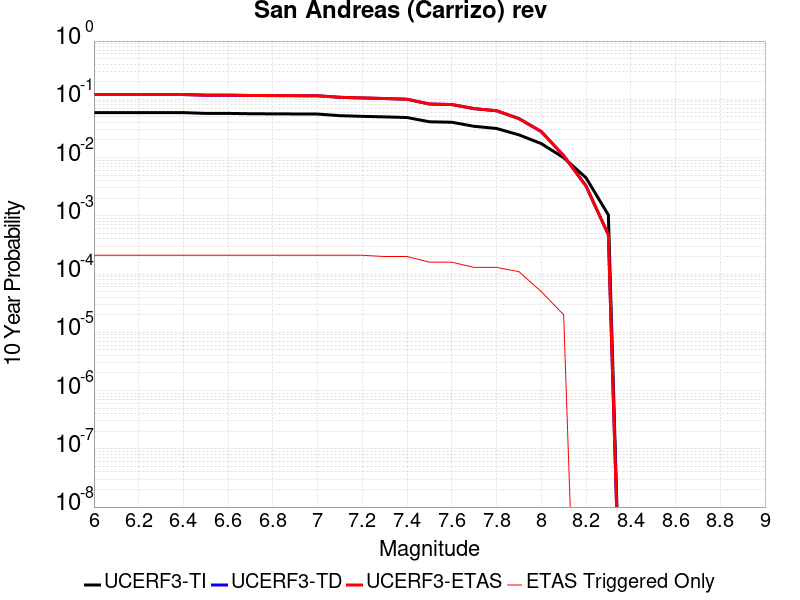 |

| Magnitude | 1 wk TI Prob | 1 wk TD Prob | 1 wk ETAS Prob | 1 wk ETAS/TD Gain | 1 wk ETAS Triggered Only | 1 mo TI Prob | 1 mo TD Prob | 1 mo ETAS Prob | 1 mo ETAS/TD Gain | 1 mo ETAS Triggered Only | 1 yr TI Prob | 1 yr TD Prob | 1 yr ETAS Prob | 1 yr ETAS/TD Gain | 1 yr ETAS Triggered Only | 10 yr TI Prob | 10 yr TD Prob | 10 yr ETAS Prob | 10 yr ETAS/TD Gain | 10 yr ETAS Triggered Only |
|-----|-----|-----|-----|-----|-----|-----|-----|-----|-----|-----|-----|-----|-----|-----|-----|-----|-----|-----|-----|-----|
| 6.0 | 1.1674632E-4 | 2.4342148E-4 | 2.4342148E-4 | 1.0 | 0.0 | 5.002454E-4 | 0.0010428195 | 0.0010867354 | 1.0421127 | 4.396184E-5 | 0.006073493 | 0.012622899 | 0.012753121 | 1.0103163 | 1.3188552E-4 | 0.0591016 | 0.120694615 | 0.12092655 | 1.0019217 | 2.6377104E-4 |
| 6.1 | 1.1674632E-4 | 2.4342148E-4 | 2.4342148E-4 | 1.0 | 0.0 | 5.002454E-4 | 0.0010428195 | 0.0010867354 | 1.0421127 | 4.396184E-5 | 0.006073493 | 0.012622899 | 0.012753121 | 1.0103163 | 1.3188552E-4 | 0.0591016 | 0.120694615 | 0.12092655 | 1.0019217 | 2.6377104E-4 |
| 6.2 | 1.1674632E-4 | 2.4342148E-4 | 2.4342148E-4 | 1.0 | 0.0 | 5.002454E-4 | 0.0010428195 | 0.0010867354 | 1.0421127 | 4.396184E-5 | 0.006073493 | 0.012622899 | 0.012753121 | 1.0103163 | 1.3188552E-4 | 0.0591016 | 0.120694615 | 0.12092655 | 1.0019217 | 2.6377104E-4 |
| 6.3 | 1.1674632E-4 | 2.4342148E-4 | 2.4342148E-4 | 1.0 | 0.0 | 5.002454E-4 | 0.0010428195 | 0.0010867354 | 1.0421127 | 4.396184E-5 | 0.006073493 | 0.012622899 | 0.012753121 | 1.0103163 | 1.3188552E-4 | 0.0591016 | 0.120694615 | 0.12092655 | 1.0019217 | 2.6377104E-4 |
| 6.4 | 1.1674632E-4 | 2.4342148E-4 | 2.4342148E-4 | 1.0 | 0.0 | 5.002454E-4 | 0.0010428195 | 0.0010867354 | 1.0421127 | 4.396184E-5 | 0.006073493 | 0.012622899 | 0.012753121 | 1.0103163 | 1.3188552E-4 | 0.0591016 | 0.120694615 | 0.12092655 | 1.0019217 | 2.6377104E-4 |
| 6.5 | 1.13136164E-4 | 2.3662073E-4 | 2.3662073E-4 | 1.0 | 0.0 | 4.847792E-4 | 0.0010136963 | 0.0010576135 | 1.0433239 | 4.396184E-5 | 0.0058862255 | 0.012272361 | 0.012402628 | 1.0106146 | 1.3188552E-4 | 0.057327334 | 0.11766591 | 0.11789864 | 1.0019779 | 2.6377104E-4 |
| 6.6 | 1.13136164E-4 | 2.3662073E-4 | 2.3662073E-4 | 1.0 | 0.0 | 4.847792E-4 | 0.0010136963 | 0.0010576135 | 1.0433239 | 4.396184E-5 | 0.0058862255 | 0.012272361 | 0.012402628 | 1.0106146 | 1.3188552E-4 | 0.057327334 | 0.11766591 | 0.11789864 | 1.0019779 | 2.6377104E-4 |
| 6.7 | 1.1149675E-4 | 2.3353257E-4 | 2.3353257E-4 | 1.0 | 0.0 | 4.777557E-4 | 0.0010004715 | 0.0010443893 | 1.0438972 | 4.396184E-5 | 0.0058011734 | 0.012113147 | 0.012243435 | 1.0107559 | 1.3188552E-4 | 0.05652051 | 0.11628742 | 0.11652052 | 1.0020045 | 2.6377104E-4 |
| 6.8 | 1.1103589E-4 | 2.3255392E-4 | 2.3255392E-4 | 1.0 | 0.0 | 4.7578133E-4 | 9.962805E-4 | 0.0010401985 | 1.044082 | 4.396184E-5 | 0.005777263 | 0.012062688 | 0.012192982 | 1.0108014 | 1.3188552E-4 | 0.056293584 | 0.11584766 | 0.11608088 | 1.0020131 | 2.6377104E-4 |
| 6.9 | 1.1053259E-4 | 2.3147749E-4 | 2.3147749E-4 | 1.0 | 0.0 | 4.7362508E-4 | 9.916708E-4 | 0.001035589 | 1.0442871 | 4.396184E-5 | 0.0057511497 | 0.012007184 | 0.012137487 | 1.010852 | 1.3188552E-4 | 0.05604569 | 0.11536381 | 0.115597144 | 1.0020226 | 2.6377104E-4 |
| 7.0 | 1.1005377E-4 | 2.3048568E-4 | 2.3048568E-4 | 1.0 | 0.0 | 4.7157376E-4 | 9.874234E-4 | 0.0010313417 | 1.0444778 | 4.396184E-5 | 0.0057263062 | 0.011956041 | 0.01208635 | 1.010899 | 1.3188552E-4 | 0.055809796 | 0.114916064 | 0.11514952 | 1.0020316 | 2.6377104E-4 |
| 7.1 | 1.0308142E-4 | 2.1557917E-4 | 2.1557917E-4 | 1.0 | 0.0 | 4.417027E-4 | 9.235847E-4 | 9.675059E-4 | 1.0475552 | 4.396184E-5 | 0.0053644776 | 0.011186983 | 0.011317393 | 1.0116574 | 1.3188552E-4 | 0.052368138 | 0.10817159 | 0.10840683 | 1.0021747 | 2.6377104E-4 |
| 7.2 | 1.0027479E-4 | 2.0965667E-4 | 2.0965667E-4 | 1.0 | 0.0 | 4.296783E-4 | 8.9822017E-4 | 9.4214256E-4 | 1.0488993 | 4.396184E-5 | 0.0052187922 | 0.0108812945 | 0.011011745 | 1.0119885 | 1.3188552E-4 | 0.050979212 | 0.10547522 | 0.10571117 | 1.002237 | 2.6377104E-4 |
| 7.3 | 9.816942E-5 | 2.044063E-4 | 2.044063E-4 | 1.0 | 0.0 | 4.2065824E-4 | 8.757339E-4 | 9.1965724E-4 | 1.050156 | 4.396184E-5 | 0.005109493 | 0.010610223 | 0.010697213 | 1.0081987 | 8.792368E-5 | 0.049935985 | 0.10305815 | 0.1032553 | 1.0019131 | 2.1980921E-4 |
| 7.4 | 9.5634205E-5 | 1.9809832E-4 | 1.9809832E-4 | 1.0 | 0.0 | 4.0979648E-4 | 8.4871746E-4 | 8.92642E-4 | 1.051754 | 4.396184E-5 | 0.0049778637 | 0.0102844415 | 0.010371461 | 1.0084612 | 8.792368E-5 | 0.048678253 | 0.100143395 | 0.10034119 | 1.0019752 | 2.1980921E-4 |
| 7.5 | 8.052417E-5 | 1.612829E-4 | 1.612829E-4 | 1.0 | 0.0 | 3.4505792E-4 | 6.910295E-4 | 7.3496095E-4 | 1.063574 | 4.396184E-5 | 0.0041929903 | 0.00838091 | 0.008468097 | 1.010403 | 8.792368E-5 | 0.04114753 | 0.08288026 | 0.08308185 | 1.0024323 | 2.1980921E-4 |
| 7.6 | 7.897024E-5 | 1.5781343E-4 | 1.5781343E-4 | 1.0 | 0.0 | 3.384E-4 | 6.761681E-4 | 7.2010024E-4 | 1.0649722 | 4.396184E-5 | 0.0041122385 | 0.0082013495 | 0.008288552 | 1.0106328 | 8.792368E-5 | 0.040369697 | 0.0812208 | 0.08142275 | 1.0024865 | 2.1980921E-4 |
| 7.7 | 6.707427E-5 | 1.3290055E-4 | 1.3290055E-4 | 1.0 | 0.0 | 2.8742946E-4 | 5.694495E-4 | 6.133863E-4 | 1.0771567 | 4.396184E-5 | 0.003493839 | 0.0069110407 | 0.0069983564 | 1.0126343 | 8.792368E-5 | 0.034394164 | 0.06911137 | 0.06923414 | 1.0017765 | 1.3188552E-4 |
| 7.8 | 6.147705E-5 | 1.2210102E-4 | 1.2210102E-4 | 1.0 | 0.0 | 2.6344648E-4 | 5.231851E-4 | 5.67124E-4 | 1.0839833 | 4.396184E-5 | 0.0032027436 | 0.0063512004 | 0.0064385654 | 1.0137557 | 8.792368E-5 | 0.031569764 | 0.063572146 | 0.06369565 | 1.0019428 | 1.3188552E-4 |
| 7.9 | 4.7636717E-5 | 8.888838E-5 | 8.888838E-5 | 1.0 | 0.0 | 2.0414138E-4 | 3.808946E-4 | 4.248397E-4 | 1.1153734 | 4.396184E-5 | 0.0024825884 | 0.004627539 | 0.0047150557 | 1.0189122 | 8.792368E-5 | 0.024550365 | 0.046670716 | 0.046796445 | 1.002694 | 1.3188552E-4 |
| 8.0 | 3.3554235E-5 | 5.2192438E-5 | 5.2192438E-5 | 1.0 | 0.0 | 1.4379594E-4 | 2.236627E-4 | 2.236627E-4 | 1.0 | 0.0 | 0.0017493097 | 0.0027196947 | 0.0027196947 | 1.0 | 0.0 | 0.017356034 | 0.02790823 | 0.027950965 | 1.0015312 | 4.396184E-5 |
| 8.1 | 1.9175432E-5 | 1.9211575E-5 | 1.9211575E-5 | 1.0 | 0.0 | 8.217783E-5 | 8.233273E-5 | 8.233273E-5 | 1.0 | 0.0 | 0.0010000558 | 0.0010019407 | 0.0010019407 | 1.0 | 0.0 | 0.009955673 | 0.010771971 | 0.010815459 | 1.0040371 | 4.396184E-5 |
| 8.2 | 8.643924E-6 | 5.4848397E-6 | 5.4848397E-6 | 1.0 | 0.0 | 3.704486E-5 | 2.3506243E-5 | 2.3506243E-5 | 1.0 | 0.0 | 4.5092785E-4 | 2.8615101E-4 | 2.8615101E-4 | 1.0 | 0.0 | 0.0045001395 | 0.0032541603 | 0.0032541603 | 1.0 | 0.0 |
| 8.3 | 1.983087E-6 | 7.676691E-7 | 7.676691E-7 | 1.0 | 0.0 | 8.498917E-6 | 3.2900064E-6 | 3.2900064E-6 | 1.0 | 0.0 | 1.034694E-4 | 4.005511E-5 | 4.005511E-5 | 1.0 | 0.0 | 0.0010342124 | 4.729315E-4 | 4.729315E-4 | 1.0 | 0.0 |

## San Andreas (Cholame) rev
*[(top)](#table-of-contents)*

| 1 Week | 1 Month | 1 Year | 10 Year |
|-----|-----|-----|-----|
|  |  |  |  |

| Magnitude | 1 wk TI Prob | 1 wk TD Prob | 1 wk ETAS Prob | 1 wk ETAS/TD Gain | 1 wk ETAS Triggered Only | 1 mo TI Prob | 1 mo TD Prob | 1 mo ETAS Prob | 1 mo ETAS/TD Gain | 1 mo ETAS Triggered Only | 1 yr TI Prob | 1 yr TD Prob | 1 yr ETAS Prob | 1 yr ETAS/TD Gain | 1 yr ETAS Triggered Only | 10 yr TI Prob | 10 yr TD Prob | 10 yr ETAS Prob | 10 yr ETAS/TD Gain | 10 yr ETAS Triggered Only |
|-----|-----|-----|-----|-----|-----|-----|-----|-----|-----|-----|-----|-----|-----|-----|-----|-----|-----|-----|-----|-----|
| 6.0 | 1.2302514E-4 | 2.5223597E-4 | 2.5223597E-4 | 1.0 | 0.0 | 5.27144E-4 | 0.0010805652 | 0.0011244795 | 1.0406401 | 4.396184E-5 | 0.0063991086 | 0.01307703 | 0.013207191 | 1.0099534 | 1.3188552E-4 | 0.06217949 | 0.124471135 | 0.12470207 | 1.0018554 | 2.6377104E-4 |
| 6.1 | 1.2302514E-4 | 2.5223597E-4 | 2.5223597E-4 | 1.0 | 0.0 | 5.27144E-4 | 0.0010805652 | 0.0011244795 | 1.0406401 | 4.396184E-5 | 0.0063991086 | 0.01307703 | 0.013207191 | 1.0099534 | 1.3188552E-4 | 0.06217949 | 0.124471135 | 0.12470207 | 1.0018554 | 2.6377104E-4 |
| 6.2 | 1.2203569E-4 | 2.5040368E-4 | 2.5040368E-4 | 1.0 | 0.0 | 5.2290526E-4 | 0.001072719 | 0.0011166336 | 1.0409378 | 4.396184E-5 | 0.006347804 | 0.012982645 | 0.013112818 | 1.0100267 | 1.3188552E-4 | 0.061695136 | 0.12365729 | 0.12388845 | 1.0018693 | 2.6377104E-4 |
| 6.3 | 1.2142645E-4 | 2.4926328E-4 | 2.4926328E-4 | 1.0 | 0.0 | 5.202953E-4 | 0.0010678354 | 0.0011117504 | 1.0411252 | 4.396184E-5 | 0.006316212 | 0.012923895 | 0.013054076 | 1.010073 | 1.3188552E-4 | 0.06139677 | 0.12315141 | 0.12338269 | 1.001878 | 2.6377104E-4 |
| 6.4 | 1.1865206E-4 | 2.443175E-4 | 2.443175E-4 | 1.0 | 0.0 | 5.0840975E-4 | 0.0010466564 | 0.0010905722 | 1.0419582 | 4.396184E-5 | 0.006172335 | 0.012669064 | 0.012799279 | 1.0102781 | 1.3188552E-4 | 0.060036868 | 0.12094392 | 0.12117579 | 1.0019171 | 2.6377104E-4 |
| 6.5 | 1.17443946E-4 | 2.4224987E-4 | 2.4224987E-4 | 1.0 | 0.0 | 5.032341E-4 | 0.0010378022 | 0.0010817184 | 1.0423166 | 4.396184E-5 | 0.006109677 | 0.012562509 | 0.012692737 | 1.0103664 | 1.3188552E-4 | 0.059444077 | 0.12001792 | 0.12025004 | 1.001934 | 2.6377104E-4 |
| 6.6 | 1.13579066E-4 | 2.3533787E-4 | 2.3533787E-4 | 1.0 | 0.0 | 4.866766E-4 | 0.0010082026 | 0.00105212 | 1.0435603 | 4.396184E-5 | 0.0059092017 | 0.012206224 | 0.012336499 | 1.0106729 | 1.3188552E-4 | 0.057545185 | 0.116931416 | 0.11716434 | 1.001992 | 2.6377104E-4 |
| 6.7 | 1.1271412E-4 | 2.3378055E-4 | 2.3378055E-4 | 1.0 | 0.0 | 4.829711E-4 | 0.0010015335 | 0.0010454513 | 1.0438505 | 4.396184E-5 | 0.005864331 | 0.0121259345 | 0.012256221 | 1.0107445 | 1.3188552E-4 | 0.057119697 | 0.116234876 | 0.11646798 | 1.0020056 | 2.6377104E-4 |
| 6.8 | 1.1217975E-4 | 2.3266436E-4 | 2.3266436E-4 | 1.0 | 0.0 | 4.8068175E-4 | 9.967535E-4 | 0.0010406715 | 1.0440611 | 4.396184E-5 | 0.005836608 | 0.012068384 | 0.012198678 | 1.0107963 | 1.3188552E-4 | 0.056856725 | 0.115733 | 0.11596624 | 1.0020154 | 2.6377104E-4 |
| 6.9 | 1.1146753E-4 | 2.3115135E-4 | 2.3115135E-4 | 1.0 | 0.0 | 4.7763053E-4 | 9.90274E-4 | 0.0010341924 | 1.0443497 | 4.396184E-5 | 0.0057996577 | 0.011990369 | 0.012120673 | 1.0108674 | 1.3188552E-4 | 0.056506127 | 0.11505329 | 0.11528671 | 1.0020288 | 2.6377104E-4 |
| 7.0 | 1.0965793E-4 | 2.2738328E-4 | 2.2738328E-4 | 1.0 | 0.0 | 4.698779E-4 | 9.7413734E-4 | 0.0010180564 | 1.0450851 | 4.396184E-5 | 0.005705768 | 0.011796049 | 0.011926379 | 1.0110486 | 1.3188552E-4 | 0.055614736 | 0.11335443 | 0.113588296 | 1.0020632 | 2.6377104E-4 |
| 7.1 | 9.927982E-5 | 2.0556754E-4 | 2.0556754E-4 | 1.0 | 0.0 | 4.2541555E-4 | 8.8070735E-4 | 9.2463044E-4 | 1.0498725 | 4.396184E-5 | 0.0051671406 | 0.010670188 | 0.010800666 | 1.0122283 | 1.3188552E-4 | 0.05048634 | 0.10344718 | 0.103683665 | 1.0022861 | 2.6377104E-4 |
| 7.2 | 9.696786E-5 | 2.0060889E-4 | 2.0060889E-4 | 1.0 | 0.0 | 4.1551032E-4 | 8.594701E-4 | 9.0339413E-4 | 1.051106 | 4.396184E-5 | 0.00504711 | 0.0104141245 | 0.010544636 | 1.0125322 | 1.3188552E-4 | 0.04934009 | 0.10118485 | 0.10142193 | 1.002343 | 2.6377104E-4 |
| 7.3 | 9.4727984E-5 | 1.9489892E-4 | 1.9489892E-4 | 1.0 | 0.0 | 4.0591392E-4 | 8.350147E-4 | 8.789398E-4 | 1.0526041 | 4.396184E-5 | 0.0049308087 | 0.010119184 | 0.010206218 | 1.0086008 | 8.792368E-5 | 0.048228268 | 0.09855488 | 0.09875303 | 1.0020105 | 2.1980921E-4 |
| 7.4 | 9.220358E-5 | 1.8860167E-4 | 1.8860167E-4 | 1.0 | 0.0 | 3.9509835E-4 | 8.0804335E-4 | 8.519697E-4 | 1.0543613 | 4.396184E-5 | 0.004799717 | 0.009793798 | 0.009880861 | 1.0088896 | 8.792368E-5 | 0.046973653 | 0.09563176 | 0.09583055 | 1.0020787 | 2.1980921E-4 |
| 7.5 | 7.71631E-5 | 1.5192907E-4 | 1.5192907E-4 | 1.0 | 0.0 | 3.306571E-4 | 6.509623E-4 | 6.948955E-4 | 1.0674896 | 4.396184E-5 | 0.0040183207 | 0.007896737 | 0.007983966 | 1.0110463 | 8.792368E-5 | 0.03946433 | 0.07835218 | 0.07855477 | 1.0025856 | 2.1980921E-4 |
| 7.6 | 7.5634416E-5 | 1.485219E-4 | 1.485219E-4 | 1.0 | 0.0 | 3.241072E-4 | 6.363673E-4 | 6.8030116E-4 | 1.0690385 | 4.396184E-5 | 0.0039388672 | 0.007720316 | 0.0078075607 | 1.0113007 | 8.792368E-5 | 0.038697794 | 0.07671492 | 0.076917864 | 1.0026455 | 2.1980921E-4 |
| 7.7 | 6.3783E-5 | 1.2371938E-4 | 1.2371938E-4 | 1.0 | 0.0 | 2.7332708E-4 | 5.301182E-4 | 5.740567E-4 | 1.0828844 | 4.396184E-5 | 0.0033226798 | 0.0064351154 | 0.0065224734 | 1.0135752 | 8.792368E-5 | 0.032734364 | 0.064600654 | 0.06472402 | 1.0019096 | 1.3188552E-4 |
| 7.8 | 5.863422E-5 | 1.1428115E-4 | 1.1428115E-4 | 1.0 | 0.0 | 2.512653E-4 | 4.8968446E-4 | 5.336248E-4 | 1.0897319 | 4.396184E-5 | 0.003054864 | 0.005945632 | 0.0060330327 | 1.0147 | 8.792368E-5 | 0.030132094 | 0.05971428 | 0.05983829 | 1.0020767 | 1.3188552E-4 |
| 7.9 | 4.595283E-5 | 8.43508E-5 | 8.43508E-5 | 1.0 | 0.0 | 1.9692584E-4 | 3.6145336E-4 | 4.0539933E-4 | 1.1215812 | 4.396184E-5 | 0.0023949358 | 0.0043918216 | 0.0044793594 | 1.0199319 | 8.792368E-5 | 0.023692891 | 0.04440328 | 0.04452931 | 1.0028383 | 1.3188552E-4 |
| 8.0 | 3.2950178E-5 | 5.0827417E-5 | 5.0827417E-5 | 1.0 | 0.0 | 1.412074E-4 | 2.178136E-4 | 2.178136E-4 | 1.0 | 0.0 | 0.0017178444 | 0.0026486574 | 0.0026486574 | 1.0 | 0.0 | 0.017046256 | 0.027206937 | 0.027249701 | 1.0015719 | 4.396184E-5 |
| 8.1 | 1.9177472E-5 | 1.9211746E-5 | 1.9211746E-5 | 1.0 | 0.0 | 8.218658E-5 | 8.2333456E-5 | 8.2333456E-5 | 1.0 | 0.0 | 0.0010001622 | 0.0010019495 | 0.0010019495 | 1.0 | 0.0 | 0.009956728 | 0.010772088 | 0.010815576 | 1.0040371 | 4.396184E-5 |
| 8.2 | 8.643924E-6 | 5.4848397E-6 | 5.4848397E-6 | 1.0 | 0.0 | 3.704486E-5 | 2.3506243E-5 | 2.3506243E-5 | 1.0 | 0.0 | 4.5092785E-4 | 2.8615101E-4 | 2.8615101E-4 | 1.0 | 0.0 | 0.0045001395 | 0.0032541603 | 0.0032541603 | 1.0 | 0.0 |
| 8.3 | 1.983087E-6 | 7.676691E-7 | 7.676691E-7 | 1.0 | 0.0 | 8.498917E-6 | 3.2900064E-6 | 3.2900064E-6 | 1.0 | 0.0 | 1.034694E-4 | 4.005511E-5 | 4.005511E-5 | 1.0 | 0.0 | 0.0010342124 | 4.729315E-4 | 4.729315E-4 | 1.0 | 0.0 |

## San Andreas (Parkfield)
*[(top)](#table-of-contents)*

| 1 Week | 1 Month | 1 Year | 10 Year |
|-----|-----|-----|-----|
|  |  |  |  |

| Magnitude | 1 wk TI Prob | 1 wk TD Prob | 1 wk ETAS Prob | 1 wk ETAS/TD Gain | 1 wk ETAS Triggered Only | 1 mo TI Prob | 1 mo TD Prob | 1 mo ETAS Prob | 1 mo ETAS/TD Gain | 1 mo ETAS Triggered Only | 1 yr TI Prob | 1 yr TD Prob | 1 yr ETAS Prob | 1 yr ETAS/TD Gain | 1 yr ETAS Triggered Only | 10 yr TI Prob | 10 yr TD Prob | 10 yr ETAS Prob | 10 yr ETAS/TD Gain | 10 yr ETAS Triggered Only |
|-----|-----|-----|-----|-----|-----|-----|-----|-----|-----|-----|-----|-----|-----|-----|-----|-----|-----|-----|-----|-----|
| 6.0 | 5.556969E-4 | 7.798663E-4 | 7.798663E-4 | 1.0 | 0.0 | 0.0023793848 | 0.0033385542 | 0.0033823694 | 1.013124 | 4.396184E-5 | 0.028586963 | 0.040288743 | 0.040415313 | 1.0031416 | 1.3188552E-4 | 0.25176284 | 0.3374694 | 0.33764413 | 1.0005178 | 2.6377104E-4 |
| 6.1 | 1.925858E-4 | 3.0333296E-4 | 3.0333296E-4 | 1.0 | 0.0 | 8.2510663E-4 | 0.0012994452 | 0.0013433498 | 1.0337873 | 4.396184E-5 | 0.0099994885 | 0.015806371 | 0.015936172 | 1.008212 | 1.3188552E-4 | 0.095613256 | 0.14986144 | 0.15008567 | 1.0014963 | 2.6377104E-4 |
| 6.2 | 9.4306815E-5 | 1.8258012E-4 | 1.8258012E-4 | 1.0 | 0.0 | 4.0410945E-4 | 7.822528E-4 | 8.261803E-4 | 1.0561551 | 4.396184E-5 | 0.0049089384 | 0.009482546 | 0.009613181 | 1.0137763 | 1.3188552E-4 | 0.048019063 | 0.09192004 | 0.09215956 | 1.0026058 | 2.6377104E-4 |
| 6.3 | 9.283051E-5 | 1.7954489E-4 | 1.7954489E-4 | 1.0 | 0.0 | 3.9778434E-4 | 7.692524E-4 | 8.1318046E-4 | 1.0571048 | 4.396184E-5 | 0.0048322747 | 0.009325632 | 0.009456287 | 1.0140104 | 1.3188552E-4 | 0.047285385 | 0.09057292 | 0.0908128 | 1.0026485 | 2.6377104E-4 |
| 6.4 | 9.138826E-5 | 1.7716596E-4 | 1.7716596E-4 | 1.0 | 0.0 | 3.916052E-4 | 7.5906294E-4 | 8.029914E-4 | 1.0578719 | 4.396184E-5 | 0.0047573745 | 0.009202629 | 0.009333301 | 1.0141994 | 1.3188552E-4 | 0.046568092 | 0.089474835 | 0.08971501 | 1.0026842 | 2.6377104E-4 |
| 6.5 | 9.000255E-5 | 1.7474552E-4 | 1.7474552E-4 | 1.0 | 0.0 | 3.8566816E-4 | 7.486956E-4 | 7.926245E-4 | 1.058674 | 4.396184E-5 | 0.0046854047 | 0.009077476 | 0.009208165 | 1.014397 | 1.3188552E-4 | 0.045878403 | 0.08836034 | 0.08860081 | 1.0027214 | 2.6377104E-4 |
| 6.6 | 8.8109264E-5 | 1.7155531E-4 | 1.7155531E-4 | 1.0 | 0.0 | 3.7755648E-4 | 7.3503103E-4 | 7.7896053E-4 | 1.0597656 | 4.396184E-5 | 0.0045870654 | 0.008912498 | 0.009043208 | 1.014666 | 1.3188552E-4 | 0.04493529 | 0.086891316 | 0.08713217 | 1.0027719 | 2.6377104E-4 |
| 6.7 | 8.738073E-5 | 1.7022568E-4 | 1.7022568E-4 | 1.0 | 0.0 | 3.7443507E-4 | 7.293359E-4 | 7.732656E-4 | 1.0602325 | 4.396184E-5 | 0.0045492216 | 0.0088437665 | 0.008974485 | 1.0147809 | 1.3188552E-4 | 0.04457213 | 0.08629157 | 0.08653258 | 1.002793 | 2.6377104E-4 |
| 6.8 | 8.710195E-5 | 1.6968038E-4 | 1.6968038E-4 | 1.0 | 0.0 | 3.7324068E-4 | 7.270001E-4 | 7.7093E-4 | 1.0604262 | 4.396184E-5 | 0.0045347405 | 0.008815567 | 0.00894629 | 1.0148287 | 1.3188552E-4 | 0.04443313 | 0.08603905 | 0.08628013 | 1.0028019 | 2.6377104E-4 |
| 6.9 | 8.6801556E-5 | 1.6908965E-4 | 1.6908965E-4 | 1.0 | 0.0 | 3.7195362E-4 | 7.2446984E-4 | 7.683998E-4 | 1.0606375 | 4.396184E-5 | 0.0045191357 | 0.008785009 | 0.008915736 | 1.0148807 | 1.3188552E-4 | 0.044283327 | 0.08576502 | 0.08600617 | 1.0028118 | 2.6377104E-4 |
| 7.0 | 8.5571606E-5 | 1.6661684E-4 | 1.6661684E-4 | 1.0 | 0.0 | 3.6668387E-4 | 7.138779E-4 | 7.5780833E-4 | 1.0615377 | 4.396184E-5 | 0.004455241 | 0.008657085 | 0.0087878285 | 1.0151025 | 1.3188552E-4 | 0.043669727 | 0.08461303 | 0.08485448 | 1.0028536 | 2.6377104E-4 |
| 7.1 | 7.82589E-5 | 1.514216E-4 | 1.514216E-4 | 1.0 | 0.0 | 3.3535215E-4 | 6.4878905E-4 | 6.927224E-4 | 1.0677159 | 4.396184E-5 | 0.0040752706 | 0.007870569 | 0.008001416 | 1.0166249 | 1.3188552E-4 | 0.040013418 | 0.07752336 | 0.07776668 | 1.0031387 | 2.6377104E-4 |
| 7.2 | 7.690929E-5 | 1.4879332E-4 | 1.4879332E-4 | 1.0 | 0.0 | 3.2956956E-4 | 6.375305E-4 | 6.814643E-4 | 1.0689125 | 4.396184E-5 | 0.004005129 | 0.0077344766 | 0.007865342 | 1.0169197 | 1.3188552E-4 | 0.0393371 | 0.07629627 | 0.07653991 | 1.0031934 | 2.6377104E-4 |
| 7.3 | 7.5543794E-5 | 1.4575745E-4 | 1.4575745E-4 | 1.0 | 0.0 | 3.2371894E-4 | 6.2452594E-4 | 6.684603E-4 | 1.0703484 | 4.396184E-5 | 0.003934157 | 0.0075772577 | 0.007664515 | 1.0115157 | 8.792368E-5 | 0.038652334 | 0.07485874 | 0.075062096 | 1.0027165 | 2.1980921E-4 |
| 7.4 | 7.4214564E-5 | 1.4276539E-4 | 1.4276539E-4 | 1.0 | 0.0 | 3.1802364E-4 | 6.1170897E-4 | 6.556439E-4 | 1.0718232 | 4.396184E-5 | 0.003865065 | 0.0074222833 | 0.0075095547 | 1.011758 | 8.792368E-5 | 0.03798529 | 0.07343194 | 0.07363561 | 1.0027735 | 2.1980921E-4 |
| 7.5 | 6.149578E-5 | 1.12024136E-4 | 1.12024136E-4 | 1.0 | 0.0 | 2.6352672E-4 | 4.800152E-4 | 5.239559E-4 | 1.0915403 | 4.396184E-5 | 0.0032037178 | 0.0058285566 | 0.0059159677 | 1.014997 | 8.792368E-5 | 0.03157923 | 0.05861135 | 0.058818273 | 1.0035305 | 2.1980921E-4 |
| 7.6 | 6.0643448E-5 | 1.1030965E-4 | 1.1030965E-4 | 1.0 | 0.0 | 2.598746E-4 | 4.726701E-4 | 5.1661115E-4 | 1.0929635 | 4.396184E-5 | 0.0031593828 | 0.0057396046 | 0.0058270236 | 1.0152309 | 8.792368E-5 | 0.031148417 | 0.057771955 | 0.057979066 | 1.003585 | 2.1980921E-4 |
| 7.7 | 5.1652263E-5 | 9.185091E-5 | 9.185091E-5 | 1.0 | 0.0 | 2.2134806E-4 | 3.935874E-4 | 4.3753194E-4 | 1.1116513 | 4.396184E-5 | 0.002691582 | 0.004781408 | 0.004868911 | 1.0183008 | 8.792368E-5 | 0.026592141 | 0.048584834 | 0.048710313 | 1.0025827 | 1.3188552E-4 |
| 7.8 | 4.8090482E-5 | 8.569196E-5 | 8.569196E-5 | 1.0 | 0.0 | 2.060858E-4 | 3.6719957E-4 | 4.1114527E-4 | 1.119678 | 4.396184E-5 | 0.0025062072 | 0.0044614985 | 0.0045490297 | 1.0196192 | 8.792368E-5 | 0.024781305 | 0.045347307 | 0.04547321 | 1.0027765 | 1.3188552E-4 |
| 7.9 | 3.970278E-5 | 6.75786E-5 | 6.75786E-5 | 1.0 | 0.0 | 1.7014367E-4 | 2.8959045E-4 | 3.3353956E-4 | 1.151763 | 4.396184E-5 | 0.002069531 | 0.0035200673 | 0.0036076815 | 1.02489 | 8.792368E-5 | 0.020503636 | 0.03591693 | 0.036044076 | 1.00354 | 1.3188552E-4 |
| 8.0 | 2.8982335E-5 | 4.074487E-5 | 4.074487E-5 | 1.0 | 0.0 | 1.2420409E-4 | 1.746092E-4 | 1.746092E-4 | 1.0 | 0.0 | 0.0015111357 | 0.0021237954 | 0.0021237954 | 1.0 | 0.0 | 0.015009012 | 0.022034096 | 0.02207709 | 1.0019512 | 4.396184E-5 |
| 8.1 | 1.8836186E-5 | 1.8707255E-5 | 1.8707255E-5 | 1.0 | 0.0 | 8.0724014E-5 | 8.0171485E-5 | 8.0171485E-5 | 1.0 | 0.0 | 9.823717E-4 | 9.756514E-4 | 9.756514E-4 | 1.0 | 0.0 | 0.009780403 | 0.010501816 | 0.010545316 | 1.0041422 | 4.396184E-5 |
| 8.2 | 8.643924E-6 | 5.4848397E-6 | 5.4848397E-6 | 1.0 | 0.0 | 3.704486E-5 | 2.3506243E-5 | 2.3506243E-5 | 1.0 | 0.0 | 4.5092785E-4 | 2.8615101E-4 | 2.8615101E-4 | 1.0 | 0.0 | 0.0045001395 | 0.0032541603 | 0.0032541603 | 1.0 | 0.0 |
| 8.3 | 1.983087E-6 | 7.676691E-7 | 7.676691E-7 | 1.0 | 0.0 | 8.498917E-6 | 3.2900064E-6 | 3.2900064E-6 | 1.0 | 0.0 | 1.034694E-4 | 4.005511E-5 | 4.005511E-5 | 1.0 | 0.0 | 0.0010342124 | 4.729315E-4 | 4.729315E-4 | 1.0 | 0.0 |

## Ludlow
*[(top)](#table-of-contents)*

| 1 Week | 1 Month | 1 Year | 10 Year |
|-----|-----|-----|-----|
| 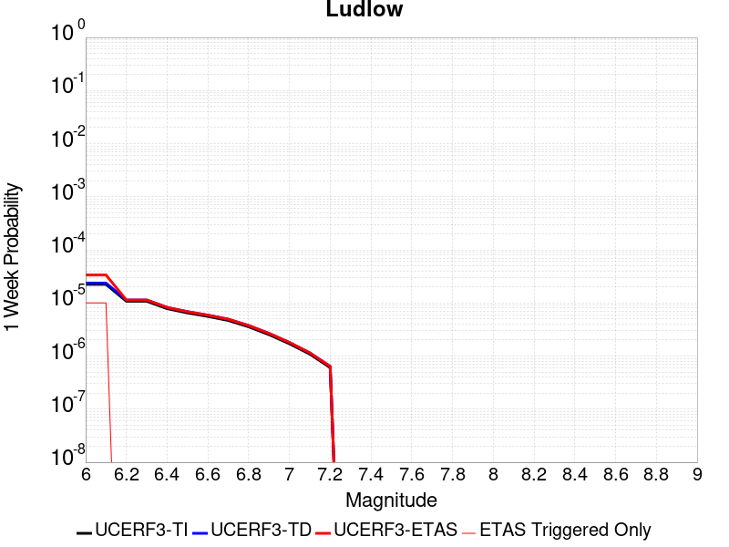 |  |  |  |

| Magnitude | 1 wk TI Prob | 1 wk TD Prob | 1 wk ETAS Prob | 1 wk ETAS/TD Gain | 1 wk ETAS Triggered Only | 1 mo TI Prob | 1 mo TD Prob | 1 mo ETAS Prob | 1 mo ETAS/TD Gain | 1 mo ETAS Triggered Only | 1 yr TI Prob | 1 yr TD Prob | 1 yr ETAS Prob | 1 yr ETAS/TD Gain | 1 yr ETAS Triggered Only | 10 yr TI Prob | 10 yr TD Prob | 10 yr ETAS Prob | 10 yr ETAS/TD Gain | 10 yr ETAS Triggered Only |
|-----|-----|-----|-----|-----|-----|-----|-----|-----|-----|-----|-----|-----|-----|-----|-----|-----|-----|-----|-----|-----|
| 6.0 | 2.2407607E-5 | 2.3657603E-5 | 6.7618406E-5 | 2.8582103 | 4.396184E-5 | 9.602906E-5 | 1.0138604E-4 | 1.4534342E-4 | 1.4335644 | 4.396184E-5 | 0.0011685267 | 0.0012337202 | 0.001365443 | 1.1067688 | 1.3188552E-4 | 0.011624013 | 0.012273222 | 0.012490334 | 1.0176898 | 2.1980921E-4 |
| 6.1 | 2.2407607E-5 | 2.3657603E-5 | 6.7618406E-5 | 2.8582103 | 4.396184E-5 | 9.602906E-5 | 1.0138604E-4 | 1.4534342E-4 | 1.4335644 | 4.396184E-5 | 0.0011685267 | 0.0012337202 | 0.001365443 | 1.1067688 | 1.3188552E-4 | 0.011624013 | 0.012273222 | 0.012490334 | 1.0176898 | 2.1980921E-4 |
| 6.2 | 1.0781252E-5 | 1.1365827E-5 | 1.1365827E-5 | 1.0 | 0.0 | 4.620455E-5 | 4.87098E-5 | 4.87098E-5 | 1.0 | 0.0 | 5.623952E-4 | 5.928845E-4 | 6.368203E-4 | 1.0741051 | 4.396184E-5 | 0.00560974 | 0.005913446 | 0.00600085 | 1.0147805 | 8.792368E-5 |
| 6.3 | 1.0781252E-5 | 1.1365827E-5 | 1.1365827E-5 | 1.0 | 0.0 | 4.620455E-5 | 4.87098E-5 | 4.87098E-5 | 1.0 | 0.0 | 5.623952E-4 | 5.928845E-4 | 6.368203E-4 | 1.0741051 | 4.396184E-5 | 0.00560974 | 0.005913446 | 0.00600085 | 1.0147805 | 8.792368E-5 |
| 6.4 | 7.814439E-6 | 8.237847E-6 | 8.237847E-6 | 1.0 | 0.0 | 3.3490025E-5 | 3.530459E-5 | 3.530459E-5 | 1.0 | 0.0 | 4.0766477E-4 | 4.2975E-4 | 4.7369295E-4 | 1.1022524 | 4.396184E-5 | 0.0040691774 | 0.004289336 | 0.0043768827 | 1.0204103 | 8.792368E-5 |
| 6.5 | 6.4986366E-6 | 6.851018E-6 | 6.851018E-6 | 1.0 | 0.0 | 2.7851002E-5 | 2.9361181E-5 | 2.9361181E-5 | 1.0 | 0.0 | 3.390332E-4 | 3.5741468E-4 | 4.013608E-4 | 1.1229556 | 4.396184E-5 | 0.003385164 | 0.0035684945 | 0.0036561044 | 1.0245509 | 8.792368E-5 |
| 6.6 | 5.582177E-6 | 5.8860905E-6 | 5.8860905E-6 | 1.0 | 0.0 | 2.3923398E-5 | 2.5225863E-5 | 2.5225863E-5 | 1.0 | 0.0 | 2.9122844E-4 | 3.0708231E-4 | 3.0708231E-4 | 1.0 | 0.0 | 0.0029084706 | 0.0030666532 | 0.00311048 | 1.0142915 | 4.396184E-5 |
| 6.7 | 4.6858763E-6 | 4.9404985E-6 | 4.9404985E-6 | 1.0 | 0.0 | 2.0082172E-5 | 2.1173397E-5 | 2.1173397E-5 | 1.0 | 0.0 | 2.4447302E-4 | 2.5775615E-4 | 2.5775615E-4 | 1.0 | 0.0 | 0.0024420423 | 0.0025746285 | 0.002618477 | 1.0170311 | 4.396184E-5 |
| 6.8 | 3.5584908E-6 | 3.7520724E-6 | 3.7520724E-6 | 1.0 | 0.0 | 1.5250586E-5 | 1.6080214E-5 | 1.6080214E-5 | 1.0 | 0.0 | 1.8566006E-4 | 1.9575942E-4 | 1.9575942E-4 | 1.0 | 0.0 | 0.0018550502 | 0.0019559108 | 0.0019559108 | 1.0 | 0.0 |
| 6.9 | 2.532834E-6 | 2.671042E-6 | 2.671042E-6 | 1.0 | 0.0 | 1.0854958E-5 | 1.1447275E-5 | 1.1447275E-5 | 1.0 | 0.0 | 1.3215111E-4 | 1.3936193E-4 | 1.3936193E-4 | 1.0 | 0.0 | 0.0013207254 | 0.001392773 | 0.001392773 | 1.0 | 0.0 |
| 7.0 | 1.7083285E-6 | 1.80197E-6 | 1.80197E-6 | 1.0 | 0.0 | 7.3213873E-6 | 7.722707E-6 | 7.722707E-6 | 1.0 | 0.0 | 8.913424E-5 | 9.402007E-5 | 9.402007E-5 | 1.0 | 0.0 | 8.9098496E-4 | 9.398194E-4 | 9.398194E-4 | 1.0 | 0.0 |
| 7.1 | 1.0905424E-6 | 1.1497785E-6 | 1.1497785E-6 | 1.0 | 0.0 | 4.6737446E-6 | 4.9276136E-6 | 4.9276136E-6 | 1.0 | 0.0 | 5.6901354E-5 | 5.9992144E-5 | 5.9992144E-5 | 1.0 | 0.0 | 5.6886784E-4 | 5.9976924E-4 | 5.9976924E-4 | 1.0 | 0.0 |
| 7.2 | 6.06668E-7 | 6.387367E-7 | 6.387367E-7 | 1.0 | 0.0 | 2.600003E-6 | 2.7374406E-6 | 2.7374406E-6 | 1.0 | 0.0 | 3.1654577E-5 | 3.33279E-5 | 3.33279E-5 | 1.0 | 0.0 | 3.1650066E-4 | 3.3323586E-4 | 3.3323586E-4 | 1.0 | 0.0 |

## Death Valley (Fish Lake Valley)
*[(top)](#table-of-contents)*

| 1 Week | 1 Month | 1 Year | 10 Year |
|-----|-----|-----|-----|
|  | 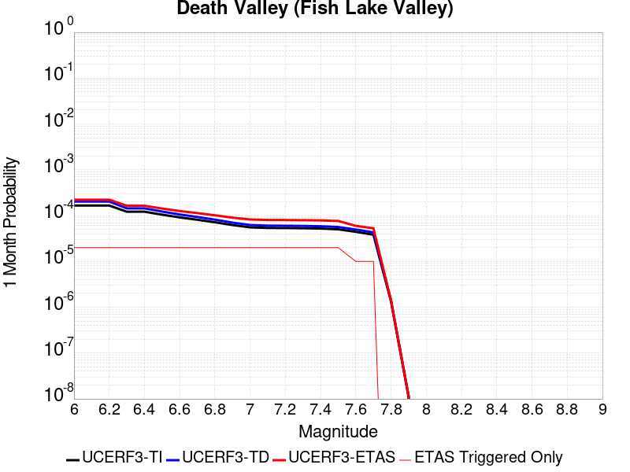 |  |  |

| Magnitude | 1 wk TI Prob | 1 wk TD Prob | 1 wk ETAS Prob | 1 wk ETAS/TD Gain | 1 wk ETAS Triggered Only | 1 mo TI Prob | 1 mo TD Prob | 1 mo ETAS Prob | 1 mo ETAS/TD Gain | 1 mo ETAS Triggered Only | 1 yr TI Prob | 1 yr TD Prob | 1 yr ETAS Prob | 1 yr ETAS/TD Gain | 1 yr ETAS Triggered Only | 10 yr TI Prob | 10 yr TD Prob | 10 yr ETAS Prob | 10 yr ETAS/TD Gain | 10 yr ETAS Triggered Only |
|-----|-----|-----|-----|-----|-----|-----|-----|-----|-----|-----|-----|-----|-----|-----|-----|-----|-----|-----|-----|-----|
| 6.0 | 3.872328E-5 | 4.7270314E-5 | 4.7270314E-5 | 1.0 | 0.0 | 1.6594635E-4 | 2.0257304E-4 | 2.0257304E-4 | 1.0 | 0.0 | 0.0020185246 | 0.0024636737 | 0.0025075271 | 1.0178001 | 4.396184E-5 | 0.02000288 | 0.024389584 | 0.024604032 | 1.0087926 | 2.1980921E-4 |
| 6.1 | 3.872328E-5 | 4.7270314E-5 | 4.7270314E-5 | 1.0 | 0.0 | 1.6594635E-4 | 2.0257304E-4 | 2.0257304E-4 | 1.0 | 0.0 | 0.0020185246 | 0.0024636737 | 0.0025075271 | 1.0178001 | 4.396184E-5 | 0.02000288 | 0.024389584 | 0.024604032 | 1.0087926 | 2.1980921E-4 |
| 6.2 | 3.872328E-5 | 4.7270314E-5 | 4.7270314E-5 | 1.0 | 0.0 | 1.6594635E-4 | 2.0257304E-4 | 2.0257304E-4 | 1.0 | 0.0 | 0.0020185246 | 0.0024636737 | 0.0025075271 | 1.0178001 | 4.396184E-5 | 0.02000288 | 0.024389584 | 0.024604032 | 1.0087926 | 2.1980921E-4 |
| 6.3 | 2.8356371E-5 | 3.3611537E-5 | 3.3611537E-5 | 1.0 | 0.0 | 1.2152165E-4 | 1.4404193E-4 | 1.4404193E-4 | 1.0 | 0.0 | 0.0014785219 | 0.0017523789 | 0.0017962637 | 1.025043 | 4.396184E-5 | 0.014687235 | 0.017392637 | 0.017608624 | 1.0124183 | 2.1980921E-4 |
| 6.4 | 2.8356371E-5 | 3.3611537E-5 | 3.3611537E-5 | 1.0 | 0.0 | 1.2152165E-4 | 1.4404193E-4 | 1.4404193E-4 | 1.0 | 0.0 | 0.0014785219 | 0.0017523789 | 0.0017962637 | 1.025043 | 4.396184E-5 | 0.014687235 | 0.017392637 | 0.017608624 | 1.0124183 | 2.1980921E-4 |
| 6.5 | 2.4448687E-5 | 2.8608863E-5 | 2.8608863E-5 | 1.0 | 0.0 | 1.0477588E-4 | 1.2260395E-4 | 1.2260395E-4 | 1.0 | 0.0 | 0.0012748998 | 0.0014917315 | 0.0015356278 | 1.0294263 | 4.396184E-5 | 0.012676105 | 0.014822047 | 0.015038598 | 1.01461 | 2.1980921E-4 |
| 6.6 | 2.1298161E-5 | 2.4661129E-5 | 2.4661129E-5 | 1.0 | 0.0 | 9.127464E-5 | 1.05686464E-4 | 1.05686464E-4 | 1.0 | 0.0 | 0.0011107022 | 0.001286007 | 0.0013299123 | 1.0341408 | 4.396184E-5 | 0.011051672 | 0.012789063 | 0.013006061 | 1.0169674 | 2.1980921E-4 |
| 6.7 | 1.8959729E-5 | 2.1781894E-5 | 2.1781894E-5 | 1.0 | 0.0 | 8.125345E-5 | 9.334778E-5 | 9.334778E-5 | 1.0 | 0.0 | 9.888117E-4 | 0.0011359422 | 0.0011798542 | 1.0386568 | 4.396184E-5 | 0.009844234 | 0.011304018 | 0.011521343 | 1.0192254 | 2.1980921E-4 |
| 6.8 | 1.6691629E-5 | 1.901906E-5 | 1.901906E-5 | 1.0 | 0.0 | 7.153359E-5 | 8.150781E-5 | 8.150781E-5 | 1.0 | 0.0 | 8.7057345E-4 | 9.919226E-4 | 0.0010358408 | 1.0442759 | 4.396184E-5 | 0.008671708 | 0.009876709 | 0.010094348 | 1.0220355 | 2.1980921E-4 |
| 6.9 | 1.450505E-5 | 1.6390108E-5 | 1.6390108E-5 | 1.0 | 0.0 | 6.216302E-5 | 7.0241476E-5 | 7.0241476E-5 | 1.0 | 0.0 | 7.5657194E-4 | 8.548632E-4 | 8.9878746E-4 | 1.0513816 | 4.396184E-5 | 0.007540013 | 0.0085166795 | 0.008734616 | 1.0255895 | 2.1980921E-4 |
| 7.0 | 1.2940855E-5 | 1.4538449E-5 | 1.4538449E-5 | 1.0 | 0.0 | 5.545963E-5 | 6.2306186E-5 | 6.2306186E-5 | 1.0 | 0.0 | 6.750118E-4 | 7.5831957E-4 | 8.022481E-4 | 1.0579288 | 4.396184E-5 | 0.006729651 | 0.007557937 | 0.007776085 | 1.0288634 | 2.1980921E-4 |
| 7.1 | 1.2544658E-5 | 1.4078665E-5 | 1.4078665E-5 | 1.0 | 0.0 | 5.3761712E-5 | 6.0335773E-5 | 6.0335773E-5 | 1.0 | 0.0 | 6.5435225E-4 | 7.3434605E-4 | 7.782756E-4 | 1.0598214 | 4.396184E-5 | 0.006524288 | 0.007319788 | 0.0075379885 | 1.0298096 | 2.1980921E-4 |
| 7.2 | 1.2489416E-5 | 1.401613E-5 | 1.401613E-5 | 1.0 | 0.0 | 5.3524967E-5 | 6.0067778E-5 | 6.0067778E-5 | 1.0 | 0.0 | 6.514716E-4 | 7.3108537E-4 | 7.750151E-4 | 1.0600883 | 4.396184E-5 | 0.006495651 | 0.0072873957 | 0.007505603 | 1.0299431 | 2.1980921E-4 |
| 7.3 | 1.2368307E-5 | 1.3880263E-5 | 1.3880263E-5 | 1.0 | 0.0 | 5.3005948E-5 | 5.948552E-5 | 5.948552E-5 | 1.0 | 0.0 | 6.451563E-4 | 7.2400115E-4 | 7.6793117E-4 | 1.0606767 | 4.396184E-5 | 0.0064328653 | 0.0072170156 | 0.0074352385 | 1.0302373 | 2.1980921E-4 |
| 7.4 | 1.2161707E-5 | 1.3648311E-5 | 1.3648311E-5 | 1.0 | 0.0 | 5.212056E-5 | 5.849148E-5 | 5.849148E-5 | 1.0 | 0.0 | 6.3438306E-4 | 7.119067E-4 | 7.5583725E-4 | 1.0617083 | 4.396184E-5 | 0.006325751 | 0.0070968503 | 0.0073150997 | 1.030753 | 2.1980921E-4 |
| 7.5 | 1.1707948E-5 | 1.3145944E-5 | 1.3145944E-5 | 1.0 | 0.0 | 5.0175953E-5 | 5.6338577E-5 | 5.6338577E-5 | 1.0 | 0.0 | 6.10721E-4 | 6.8571186E-4 | 7.2964357E-4 | 1.0640672 | 4.396184E-5 | 0.0060904534 | 0.0068365433 | 0.00705485 | 1.0319322 | 2.1980921E-4 |
| 7.6 | 1.0319538E-5 | 1.1579998E-5 | 1.1579998E-5 | 1.0 | 0.0 | 4.4225842E-5 | 4.9627648E-5 | 4.9627648E-5 | 1.0 | 0.0 | 5.383166E-4 | 6.0405425E-4 | 6.4798957E-4 | 1.072734 | 4.396184E-5 | 0.0053701443 | 0.0060246554 | 0.00624314 | 1.0362651 | 2.1980921E-4 |
| 7.7 | 8.937764E-6 | 1.0023103E-5 | 1.0023103E-5 | 1.0 | 0.0 | 3.830414E-5 | 4.2955475E-5 | 4.2955475E-5 | 1.0 | 0.0 | 4.6625308E-4 | 5.228624E-4 | 5.668013E-4 | 1.0840352 | 4.396184E-5 | 0.0046527605 | 0.0052168323 | 0.0054354947 | 1.0419148 | 2.1980921E-4 |
| 7.8 | 3.108007E-7 | 3.2847038E-7 | 3.2847038E-7 | 1.0 | 0.0 | 1.3320023E-6 | 1.4077294E-6 | 1.4077294E-6 | 1.0 | 0.0 | 1.6217007E-5 | 1.7138975E-5 | 1.7138975E-5 | 1.0 | 0.0 | 1.6215823E-4 | 1.7137692E-4 | 1.7137692E-4 | 1.0 | 0.0 |
| 7.9 | 2.5591178E-9 | 2.6697022E-9 | 2.6697022E-9 | 1.0 | 0.0 | 1.0967647E-8 | 1.1441582E-8 | 1.1441582E-8 | 1.0 | 0.0 | 1.335311E-7 | 1.3930125E-7 | 1.3930125E-7 | 1.0 | 0.0 | 1.3353102E-6 | 1.3930126E-6 | 1.3930126E-6 | 1.0 | 0.0 |

## Cleghorn Pass
*[(top)](#table-of-contents)*

| 1 Week | 1 Month | 1 Year | 10 Year |
|-----|-----|-----|-----|
|  |  |  |  |

| Magnitude | 1 wk TI Prob | 1 wk TD Prob | 1 wk ETAS Prob | 1 wk ETAS/TD Gain | 1 wk ETAS Triggered Only | 1 mo TI Prob | 1 mo TD Prob | 1 mo ETAS Prob | 1 mo ETAS/TD Gain | 1 mo ETAS Triggered Only | 1 yr TI Prob | 1 yr TD Prob | 1 yr ETAS Prob | 1 yr ETAS/TD Gain | 1 yr ETAS Triggered Only | 10 yr TI Prob | 10 yr TD Prob | 10 yr ETAS Prob | 10 yr ETAS/TD Gain | 10 yr ETAS Triggered Only |
|-----|-----|-----|-----|-----|-----|-----|-----|-----|-----|-----|-----|-----|-----|-----|-----|-----|-----|-----|-----|-----|
| 6.0 | 1.0522846E-5 | 1.10407855E-5 | 1.10407855E-5 | 1.0 | 0.0 | 4.509713E-5 | 4.731709E-5 | 4.731709E-5 | 1.0 | 0.0 | 5.4891926E-4 | 5.7598593E-4 | 6.199225E-4 | 1.0762806 | 4.396184E-5 | 0.0054756533 | 0.005750097 | 0.005924933 | 1.0304058 | 1.7584737E-4 |
| 6.1 | 1.0522846E-5 | 1.10407855E-5 | 1.10407855E-5 | 1.0 | 0.0 | 4.509713E-5 | 4.731709E-5 | 4.731709E-5 | 1.0 | 0.0 | 5.4891926E-4 | 5.7598593E-4 | 6.199225E-4 | 1.0762806 | 4.396184E-5 | 0.0054756533 | 0.005750097 | 0.005924933 | 1.0304058 | 1.7584737E-4 |
| 6.2 | 2.1045846E-6 | 2.2082313E-6 | 2.2082313E-6 | 1.0 | 0.0 | 9.019617E-6 | 9.463838E-6 | 9.463838E-6 | 1.0 | 0.0 | 1.098083E-4 | 1.15220326E-4 | 1.15220326E-4 | 1.0 | 0.0 | 0.0010975406 | 0.0011520173 | 0.0011959285 | 1.0381168 | 4.396184E-5 |
| 6.3 | 2.1045846E-6 | 2.2082313E-6 | 2.2082313E-6 | 1.0 | 0.0 | 9.019617E-6 | 9.463838E-6 | 9.463838E-6 | 1.0 | 0.0 | 1.098083E-4 | 1.15220326E-4 | 1.15220326E-4 | 1.0 | 0.0 | 0.0010975406 | 0.0011520173 | 0.0011959285 | 1.0381168 | 4.396184E-5 |
| 6.4 | 1.7259927E-6 | 1.8109007E-6 | 1.8109007E-6 | 1.0 | 0.0 | 7.3970905E-6 | 7.761003E-6 | 7.761003E-6 | 1.0 | 0.0 | 9.005586E-5 | 9.449021E-5 | 9.449021E-5 | 1.0 | 0.0 | 9.001937E-4 | 9.4490213E-4 | 9.888224E-4 | 1.0464814 | 4.396184E-5 |

## Elsinore (Glen Ivy) rev
*[(top)](#table-of-contents)*

| 1 Week | 1 Month | 1 Year | 10 Year |
|-----|-----|-----|-----|
|  |  |  |  |

| Magnitude | 1 wk TI Prob | 1 wk TD Prob | 1 wk ETAS Prob | 1 wk ETAS/TD Gain | 1 wk ETAS Triggered Only | 1 mo TI Prob | 1 mo TD Prob | 1 mo ETAS Prob | 1 mo ETAS/TD Gain | 1 mo ETAS Triggered Only | 1 yr TI Prob | 1 yr TD Prob | 1 yr ETAS Prob | 1 yr ETAS/TD Gain | 1 yr ETAS Triggered Only | 10 yr TI Prob | 10 yr TD Prob | 10 yr ETAS Prob | 10 yr ETAS/TD Gain | 10 yr ETAS Triggered Only |
|-----|-----|-----|-----|-----|-----|-----|-----|-----|-----|-----|-----|-----|-----|-----|-----|-----|-----|-----|-----|-----|
| 6.0 | 1.6204086E-4 | 2.9363323E-4 | 2.9363323E-4 | 1.0 | 0.0 | 6.94276E-4 | 0.0012579759 | 0.0013018826 | 1.0349026 | 4.396184E-5 | 0.008420097 | 0.015235834 | 0.015279126 | 1.0028415 | 4.396184E-5 | 0.081081145 | 0.13969852 | 0.139812 | 1.0008122 | 1.3188552E-4 |
| 6.1 | 1.6204086E-4 | 2.9363323E-4 | 2.9363323E-4 | 1.0 | 0.0 | 6.94276E-4 | 0.0012579759 | 0.0013018826 | 1.0349026 | 4.396184E-5 | 0.008420097 | 0.015235834 | 0.015279126 | 1.0028415 | 4.396184E-5 | 0.081081145 | 0.13969852 | 0.139812 | 1.0008122 | 1.3188552E-4 |
| 6.2 | 1.6204086E-4 | 2.9363323E-4 | 2.9363323E-4 | 1.0 | 0.0 | 6.94276E-4 | 0.0012579759 | 0.0013018826 | 1.0349026 | 4.396184E-5 | 0.008420097 | 0.015235834 | 0.015279126 | 1.0028415 | 4.396184E-5 | 0.081081145 | 0.13969852 | 0.139812 | 1.0008122 | 1.3188552E-4 |
| 6.3 | 1.0111737E-4 | 1.7704144E-4 | 1.7704144E-4 | 1.0 | 0.0 | 4.332882E-4 | 7.586451E-4 | 8.025736E-4 | 1.0579039 | 4.396184E-5 | 0.005262531 | 0.009218078 | 0.009261634 | 1.0047251 | 4.396184E-5 | 0.0513964 | 0.0870225 | 0.08710277 | 1.0009224 | 8.792368E-5 |
| 6.4 | 1.0111737E-4 | 1.7704144E-4 | 1.7704144E-4 | 1.0 | 0.0 | 4.332882E-4 | 7.586451E-4 | 8.025736E-4 | 1.0579039 | 4.396184E-5 | 0.005262531 | 0.009218078 | 0.009261634 | 1.0047251 | 4.396184E-5 | 0.0513964 | 0.0870225 | 0.08710277 | 1.0009224 | 8.792368E-5 |
| 6.5 | 3.6624708E-5 | 4.639482E-5 | 4.639482E-5 | 1.0 | 0.0 | 1.569536E-4 | 1.9882184E-4 | 1.9882184E-4 | 1.0 | 0.0 | 0.001909235 | 0.0024183316 | 0.0024183316 | 1.0 | 0.0 | 0.01892915 | 0.023741813 | 0.02378473 | 1.0018077 | 4.396184E-5 |
| 6.6 | 2.5051324E-5 | 2.6150326E-5 | 2.6150326E-5 | 1.0 | 0.0 | 1.073584E-4 | 1.12068265E-4 | 1.12068265E-4 | 1.0 | 0.0 | 0.0013063047 | 0.0013636217 | 0.0013636217 | 1.0 | 0.0 | 0.012986525 | 0.013565952 | 0.013609317 | 1.0031966 | 4.396184E-5 |
| 6.7 | 2.2189772E-5 | 2.2075095E-5 | 2.2075095E-5 | 1.0 | 0.0 | 9.509556E-5 | 9.460433E-5 | 9.460433E-5 | 1.0 | 0.0 | 0.0011571734 | 0.0011512354 | 0.0011512354 | 1.0 | 0.0 | 0.011511663 | 0.011466569 | 0.011510028 | 1.0037899 | 4.396184E-5 |
| 6.8 | 1.6654378E-5 | 1.443907E-5 | 1.443907E-5 | 1.0 | 0.0 | 7.137396E-5 | 6.188029E-5 | 6.188029E-5 | 1.0 | 0.0 | 8.686314E-4 | 7.531372E-4 | 7.531372E-4 | 1.0 | 0.0 | 0.008652439 | 0.007511186 | 0.007511186 | 1.0 | 0.0 |
| 6.9 | 1.5042909E-5 | 1.2333212E-5 | 1.2333212E-5 | 1.0 | 0.0 | 6.446802E-5 | 5.285557E-5 | 5.285557E-5 | 1.0 | 0.0 | 7.8461546E-4 | 6.433297E-4 | 6.433297E-4 | 1.0 | 0.0 | 0.007818509 | 0.0064188964 | 0.0064188964 | 1.0 | 0.0 |
| 7.0 | 1.4361385E-5 | 1.1452447E-5 | 1.1452447E-5 | 1.0 | 0.0 | 6.154734E-5 | 4.908101E-5 | 4.908101E-5 | 1.0 | 0.0 | 7.490812E-4 | 5.9740036E-4 | 5.9740036E-4 | 1.0 | 0.0 | 0.007465612 | 0.0059619355 | 0.0059619355 | 1.0 | 0.0 |
| 7.1 | 1.3265571E-5 | 1.0245848E-5 | 1.0245848E-5 | 1.0 | 0.0 | 5.6851208E-5 | 4.391005E-5 | 4.391005E-5 | 1.0 | 0.0 | 6.919436E-4 | 5.344763E-4 | 5.344763E-4 | 1.0 | 0.0 | 0.006897931 | 0.005335265 | 0.005335265 | 1.0 | 0.0 |
| 7.2 | 1.1596403E-5 | 8.505811E-6 | 8.505811E-6 | 1.0 | 0.0 | 4.9697923E-5 | 3.6452977E-5 | 3.6452977E-5 | 1.0 | 0.0 | 6.049042E-4 | 4.437263E-4 | 4.437263E-4 | 1.0 | 0.0 | 0.006032603 | 0.004429818 | 0.004429818 | 1.0 | 0.0 |
| 7.3 | 1.0150827E-5 | 7.2393773E-6 | 7.2393773E-6 | 1.0 | 0.0 | 4.3502816E-5 | 3.1025542E-5 | 3.1025542E-5 | 1.0 | 0.0 | 5.2951806E-4 | 3.7767194E-4 | 3.7767194E-4 | 1.0 | 0.0 | 0.005282581 | 0.0037706876 | 0.0037706876 | 1.0 | 0.0 |
| 7.4 | 9.080705E-6 | 6.353049E-6 | 6.353049E-6 | 1.0 | 0.0 | 3.8916725E-5 | 2.7227075E-5 | 2.7227075E-5 | 1.0 | 0.0 | 4.7370812E-4 | 3.314406E-4 | 3.314406E-4 | 1.0 | 0.0 | 0.004726996 | 0.0033096136 | 0.0033096136 | 1.0 | 0.0 |
| 7.5 | 7.671649E-6 | 5.226064E-6 | 5.226064E-6 | 1.0 | 0.0 | 3.287808E-5 | 2.2397231E-5 | 2.2397231E-5 | 1.0 | 0.0 | 4.0021708E-4 | 2.7265341E-4 | 2.7265341E-4 | 1.0 | 0.0 | 0.0039949706 | 0.002723314 | 0.002723314 | 1.0 | 0.0 |
| 7.6 | 6.990086E-6 | 4.687931E-6 | 4.687931E-6 | 1.0 | 0.0 | 2.9957167E-5 | 2.0090984E-5 | 2.0090984E-5 | 1.0 | 0.0 | 3.6466747E-4 | 2.4458146E-4 | 2.4458146E-4 | 1.0 | 0.0 | 0.0036406964 | 0.0024432389 | 0.0024432389 | 1.0 | 0.0 |
| 7.7 | 4.163505E-6 | 2.3297607E-6 | 2.3297607E-6 | 1.0 | 0.0 | 1.7843471E-5 | 9.984655E-6 | 9.984655E-6 | 1.0 | 0.0 | 2.172226E-4 | 1.2155714E-4 | 1.2155714E-4 | 1.0 | 0.0 | 0.0021701038 | 0.0012149796 | 0.0012149796 | 1.0 | 0.0 |
| 7.8 | 2.2692414E-7 | 9.386416E-8 | 9.386416E-8 | 1.0 | 0.0 | 9.725317E-7 | 4.0227494E-7 | 4.0227494E-7 | 1.0 | 0.0 | 1.1840509E-5 | 4.8976895E-6 | 4.8976895E-6 | 1.0 | 0.0 | 1.1839878E-4 | 4.8976144E-5 | 4.8976144E-5 | 1.0 | 0.0 |
| 7.9 | 6.676829E-9 | 3.440101E-9 | 3.440101E-9 | 1.0 | 0.0 | 2.861498E-8 | 1.4743291E-8 | 1.4743291E-8 | 1.0 | 0.0 | 3.4838732E-7 | 1.7949955E-7 | 1.7949955E-7 | 1.0 | 0.0 | 3.4838679E-6 | 1.7949943E-6 | 1.7949943E-6 | 1.0 | 0.0 |

## San Jacinto (San Bernardino)
*[(top)](#table-of-contents)*

| 1 Week | 1 Month | 1 Year | 10 Year |
|-----|-----|-----|-----|
|  |  |  |  |

| Magnitude | 1 wk TI Prob | 1 wk TD Prob | 1 wk ETAS Prob | 1 wk ETAS/TD Gain | 1 wk ETAS Triggered Only | 1 mo TI Prob | 1 mo TD Prob | 1 mo ETAS Prob | 1 mo ETAS/TD Gain | 1 mo ETAS Triggered Only | 1 yr TI Prob | 1 yr TD Prob | 1 yr ETAS Prob | 1 yr ETAS/TD Gain | 1 yr ETAS Triggered Only | 10 yr TI Prob | 10 yr TD Prob | 10 yr ETAS Prob | 10 yr ETAS/TD Gain | 10 yr ETAS Triggered Only |
|-----|-----|-----|-----|-----|-----|-----|-----|-----|-----|-----|-----|-----|-----|-----|-----|-----|-----|-----|-----|-----|
| 6.0 | 3.409352E-5 | 3.6018435E-5 | 3.6018435E-5 | 1.0 | 0.0 | 1.461069E-4 | 1.543556E-4 | 1.543556E-4 | 1.0 | 0.0 | 0.0017774 | 0.0018776614 | 0.0020531786 | 1.0934765 | 1.7584737E-4 | 0.01763251 | 0.019366246 | 0.019538688 | 1.0089042 | 1.7584737E-4 |
| 6.1 | 3.409352E-5 | 3.6018435E-5 | 3.6018435E-5 | 1.0 | 0.0 | 1.461069E-4 | 1.543556E-4 | 1.543556E-4 | 1.0 | 0.0 | 0.0017774 | 0.0018776614 | 0.0020531786 | 1.0934765 | 1.7584737E-4 | 0.01763251 | 0.019366246 | 0.019538688 | 1.0089042 | 1.7584737E-4 |
| 6.2 | 3.409352E-5 | 3.6018435E-5 | 3.6018435E-5 | 1.0 | 0.0 | 1.461069E-4 | 1.543556E-4 | 1.543556E-4 | 1.0 | 0.0 | 0.0017774 | 0.0018776614 | 0.0020531786 | 1.0934765 | 1.7584737E-4 | 0.01763251 | 0.019366246 | 0.019538688 | 1.0089042 | 1.7584737E-4 |
| 6.3 | 3.409352E-5 | 3.6018435E-5 | 3.6018435E-5 | 1.0 | 0.0 | 1.461069E-4 | 1.543556E-4 | 1.543556E-4 | 1.0 | 0.0 | 0.0017774 | 0.0018776614 | 0.0020531786 | 1.0934765 | 1.7584737E-4 | 0.01763251 | 0.019366246 | 0.019538688 | 1.0089042 | 1.7584737E-4 |
| 6.4 | 3.400795E-5 | 3.5911093E-5 | 3.5911093E-5 | 1.0 | 0.0 | 1.4574021E-4 | 1.5389561E-4 | 1.5389561E-4 | 1.0 | 0.0 | 0.0017729428 | 0.0018720708 | 0.002047589 | 1.0937562 | 1.7584737E-4 | 0.017588645 | 0.019311326 | 0.019483777 | 1.0089301 | 1.7584737E-4 |
| 6.5 | 3.341482E-5 | 3.517168E-5 | 3.517168E-5 | 1.0 | 0.0 | 1.4319851E-4 | 1.5072708E-4 | 1.5072708E-4 | 1.0 | 0.0 | 0.0017420477 | 0.001833559 | 0.002009084 | 1.0957291 | 1.7584737E-4 | 0.017284546 | 0.01893285 | 0.019105367 | 1.0091121 | 1.7584737E-4 |
| 6.6 | 3.3364955E-5 | 3.5108897E-5 | 3.5108897E-5 | 1.0 | 0.0 | 1.4298483E-4 | 1.5045803E-4 | 1.5045803E-4 | 1.0 | 0.0 | 0.0017394501 | 0.0018302888 | 0.0020058143 | 1.0959004 | 1.7584737E-4 | 0.017258976 | 0.018900713 | 0.019073237 | 1.0091279 | 1.7584737E-4 |
| 6.7 | 3.335922E-5 | 3.509867E-5 | 3.509867E-5 | 1.0 | 0.0 | 1.4296026E-4 | 1.504142E-4 | 1.504142E-4 | 1.0 | 0.0 | 0.0017391514 | 0.0018297562 | 0.0020052819 | 1.0959284 | 1.7584737E-4 | 0.017256035 | 0.018895503 | 0.019068029 | 1.0091305 | 1.7584737E-4 |
| 6.8 | 3.327683E-5 | 3.499273E-5 | 3.499273E-5 | 1.0 | 0.0 | 1.4260718E-4 | 1.4996022E-4 | 1.4996022E-4 | 1.0 | 0.0 | 0.0017348597 | 0.0018242382 | 0.0019997647 | 1.0962191 | 1.7584737E-4 | 0.017213784 | 0.018841272 | 0.019013807 | 1.0091573 | 1.7584737E-4 |
| 6.9 | 3.3235785E-5 | 3.4933677E-5 | 3.4933677E-5 | 1.0 | 0.0 | 1.4243131E-4 | 1.4970718E-4 | 1.4970718E-4 | 1.0 | 0.0 | 0.0017327217 | 0.0018211625 | 0.0019966897 | 1.0963819 | 1.7584737E-4 | 0.017192734 | 0.018811138 | 0.018983679 | 1.0091722 | 1.7584737E-4 |
| 7.0 | 3.3197095E-5 | 3.4873603E-5 | 3.4873603E-5 | 1.0 | 0.0 | 1.422655E-4 | 1.4944974E-4 | 1.4944974E-4 | 1.0 | 0.0 | 0.0017307063 | 0.0018180334 | 0.0019935612 | 1.0965481 | 1.7584737E-4 | 0.017172894 | 0.018780515 | 0.018953059 | 1.0091875 | 1.7584737E-4 |
| 7.1 | 3.3129716E-5 | 3.47538E-5 | 3.47538E-5 | 1.0 | 0.0 | 1.4197677E-4 | 1.4893636E-4 | 1.4893636E-4 | 1.0 | 0.0 | 0.0017271966 | 0.0018117935 | 0.0019873222 | 1.0968813 | 1.7584737E-4 | 0.017138338 | 0.01871959 | 0.018892145 | 1.0092179 | 1.7584737E-4 |
| 7.2 | 3.3034008E-5 | 3.4621236E-5 | 3.4621236E-5 | 1.0 | 0.0 | 1.4156665E-4 | 1.483683E-4 | 1.483683E-4 | 1.0 | 0.0 | 0.0017222111 | 0.0018048888 | 0.0019804188 | 1.0972525 | 1.7584737E-4 | 0.017089253 | 0.018651977 | 0.018824546 | 1.009252 | 1.7584737E-4 |
| 7.3 | 3.2956614E-5 | 3.4488978E-5 | 3.4488978E-5 | 1.0 | 0.0 | 1.4123498E-4 | 1.4780153E-4 | 1.4780153E-4 | 1.0 | 0.0 | 0.0017181796 | 0.0017979998 | 0.001973531 | 1.0976259 | 1.7584737E-4 | 0.017049557 | 0.018584717 | 0.018757297 | 1.009286 | 1.7584737E-4 |
| 7.4 | 3.2915937E-5 | 3.4410656E-5 | 3.4410656E-5 | 1.0 | 0.0 | 1.4106068E-4 | 1.4746592E-4 | 1.4746592E-4 | 1.0 | 0.0 | 0.0017160608 | 0.0017939204 | 0.0019694525 | 1.0978482 | 1.7584737E-4 | 0.017028693 | 0.018544978 | 0.018717563 | 1.0093063 | 1.7584737E-4 |
| 7.5 | 3.281791E-5 | 3.427555E-5 | 3.427555E-5 | 1.0 | 0.0 | 1.406406E-4 | 1.4688695E-4 | 1.4688695E-4 | 1.0 | 0.0 | 0.0017109542 | 0.0017868831 | 0.0019624163 | 1.0982343 | 1.7584737E-4 | 0.016978411 | 0.018475853 | 0.018648451 | 1.0093418 | 1.7584737E-4 |
| 7.6 | 3.2521442E-5 | 3.400044E-5 | 3.400044E-5 | 1.0 | 0.0 | 1.3937015E-4 | 1.4570804E-4 | 1.4570804E-4 | 1.0 | 0.0 | 0.0016955109 | 0.0017725533 | 0.001948089 | 1.0990298 | 1.7584737E-4 | 0.016826328 | 0.018333454 | 0.018506076 | 1.0094157 | 1.7584737E-4 |
| 7.7 | 3.0287873E-5 | 3.2484106E-5 | 3.2484106E-5 | 1.0 | 0.0 | 1.297987E-4 | 1.3921017E-4 | 1.3921017E-4 | 1.0 | 0.0 | 0.0015791537 | 0.0016935674 | 0.0018691169 | 1.1036566 | 1.7584737E-4 | 0.01567979 | 0.017544134 | 0.017716896 | 1.0098473 | 1.7584737E-4 |
| 7.8 | 2.6316151E-5 | 2.9693794E-5 | 2.9693794E-5 | 1.0 | 0.0 | 1.1277862E-4 | 1.2725292E-4 | 1.2725292E-4 | 1.0 | 0.0 | 0.0013722149 | 0.0015482042 | 0.0017237794 | 1.1134057 | 1.7584737E-4 | 0.013637724 | 0.016085118 | 0.016258135 | 1.0107565 | 1.7584737E-4 |
| 7.9 | 2.0761147E-5 | 2.3444441E-5 | 2.3444441E-5 | 1.0 | 0.0 | 8.897331E-5 | 1.00472316E-4 | 1.00472316E-4 | 1.0 | 0.0 | 0.0010827117 | 0.0012225648 | 0.0013542891 | 1.1077442 | 1.3188552E-4 | 0.010774517 | 0.01280678 | 0.012936977 | 1.0101662 | 1.3188552E-4 |
| 8.0 | 1.5738568E-5 | 1.6053358E-5 | 1.6053358E-5 | 1.0 | 0.0 | 6.744926E-5 | 6.87983E-5 | 6.87983E-5 | 1.0 | 0.0 | 8.2088535E-4 | 8.3729805E-4 | 8.8122307E-4 | 1.0524604 | 4.396184E-5 | 0.008178596 | 0.00887633 | 0.008919902 | 1.0049088 | 4.396184E-5 |
| 8.1 | 1.0105832E-5 | 8.341976E-6 | 8.341976E-6 | 1.0 | 0.0 | 4.3309992E-5 | 3.575084E-5 | 3.575084E-5 | 1.0 | 0.0 | 5.2717153E-4 | 4.3518006E-4 | 4.7912277E-4 | 1.1009759 | 4.396184E-5 | 0.005259227 | 0.004683402 | 0.0047271578 | 1.0093428 | 4.396184E-5 |
| 8.2 | 4.189207E-6 | 1.5817745E-6 | 1.5817745E-6 | 1.0 | 0.0 | 1.7953622E-5 | 6.779016E-6 | 6.779016E-6 | 1.0 | 0.0 | 2.1856341E-4 | 8.253143E-5 | 8.253143E-5 | 1.0 | 0.0 | 0.0021834858 | 9.584939E-4 | 9.584939E-4 | 1.0 | 0.0 |
| 8.3 | 1.2758221E-6 | 3.6239646E-7 | 3.6239646E-7 | 1.0 | 0.0 | 5.4677976E-6 | 1.5531268E-6 | 1.5531268E-6 | 1.0 | 0.0 | 6.65684E-5 | 1.8909159E-5 | 1.8909159E-5 | 1.0 | 0.0 | 6.6548464E-4 | 2.2804004E-4 | 2.2804004E-4 | 1.0 | 0.0 |

## San Andreas (Creeping Section) 2011 CFM
*[(top)](#table-of-contents)*

| 1 Week | 1 Month | 1 Year | 10 Year |
|-----|-----|-----|-----|
|  |  |  |  |

| Magnitude | 1 wk TI Prob | 1 wk TD Prob | 1 wk ETAS Prob | 1 wk ETAS/TD Gain | 1 wk ETAS Triggered Only | 1 mo TI Prob | 1 mo TD Prob | 1 mo ETAS Prob | 1 mo ETAS/TD Gain | 1 mo ETAS Triggered Only | 1 yr TI Prob | 1 yr TD Prob | 1 yr ETAS Prob | 1 yr ETAS/TD Gain | 1 yr ETAS Triggered Only | 10 yr TI Prob | 10 yr TD Prob | 10 yr ETAS Prob | 10 yr ETAS/TD Gain | 10 yr ETAS Triggered Only |
|-----|-----|-----|-----|-----|-----|-----|-----|-----|-----|-----|-----|-----|-----|-----|-----|-----|-----|-----|-----|-----|
| 6.0 | 5.986481E-4 | 0.0012280511 | 0.0012280511 | 1.0 | 0.0 | 0.0025631124 | 0.0052459883 | 0.0052897194 | 1.0083361 | 4.396184E-5 | 0.030762846 | 0.061217785 | 0.061259057 | 1.0006741 | 4.396184E-5 | 0.26835477 | 0.42601007 | 0.426111 | 1.000237 | 1.7584737E-4 |
| 6.1 | 5.015945E-4 | 0.001022282 | 0.001022282 | 1.0 | 0.0 | 0.00214792 | 0.004367797 | 0.004411567 | 1.010021 | 4.396184E-5 | 0.025839351 | 0.051259354 | 0.051301062 | 1.0008137 | 4.396184E-5 | 0.23032776 | 0.37293026 | 0.37304053 | 1.0002956 | 1.7584737E-4 |
| 6.2 | 4.073338E-4 | 8.1122696E-4 | 8.1122696E-4 | 1.0 | 0.0 | 0.0017445484 | 0.0034677165 | 0.003511526 | 1.0126334 | 4.396184E-5 | 0.021034058 | 0.04094444 | 0.0409866 | 1.0010297 | 4.396184E-5 | 0.19150782 | 0.31311423 | 0.313235 | 1.0003858 | 1.7584737E-4 |
| 6.3 | 3.464099E-4 | 6.742372E-4 | 6.742372E-4 | 1.0 | 0.0 | 0.0014837692 | 0.0028832946 | 0.0029271296 | 1.0152031 | 4.396184E-5 | 0.017915873 | 0.03420035 | 0.03424281 | 1.0012414 | 4.396184E-5 | 0.16538359 | 0.2714023 | 0.27153042 | 1.0004721 | 1.7584737E-4 |
| 6.4 | 2.935057E-4 | 5.547048E-4 | 5.547048E-4 | 1.0 | 0.0 | 0.0012572751 | 0.002372106 | 0.0024159637 | 1.0184889 | 4.396184E-5 | 0.015200248 | 0.028275466 | 0.028318183 | 1.0015109 | 4.396184E-5 | 0.14201577 | 0.23307559 | 0.23321046 | 1.0005786 | 1.7584737E-4 |
| 6.5 | 2.3409708E-4 | 4.212275E-4 | 4.212275E-4 | 1.0 | 0.0 | 0.0010028875 | 0.0018021442 | 0.0018460269 | 1.0243502 | 4.396184E-5 | 0.012141965 | 0.02159958 | 0.021642592 | 1.0019914 | 4.396184E-5 | 0.11499573 | 0.18691993 | 0.1870629 | 1.000765 | 1.7584737E-4 |
| 6.6 | 1.5842178E-4 | 2.5095858E-4 | 2.5095858E-4 | 1.0 | 0.0 | 6.7877385E-4 | 0.001075094 | 0.0011190086 | 1.0408472 | 4.396184E-5 | 0.0082328 | 0.013009229 | 0.013052618 | 1.0033354 | 4.396184E-5 | 0.07934396 | 0.1232508 | 0.12340497 | 1.0012509 | 1.7584737E-4 |
| 6.7 | 1.5616413E-4 | 2.4632283E-4 | 2.4632283E-4 | 1.0 | 0.0 | 6.691031E-4 | 0.0010552427 | 0.0010991582 | 1.0416164 | 4.396184E-5 | 0.0081159435 | 0.012771067 | 0.012814468 | 1.0033983 | 4.396184E-5 | 0.0782586 | 0.12127795 | 0.12143247 | 1.0012741 | 1.7584737E-4 |
| 6.8 | 1.5538467E-4 | 2.4456103E-4 | 2.4456103E-4 | 1.0 | 0.0 | 6.6576427E-4 | 0.0010476983 | 0.0010916141 | 1.0419165 | 4.396184E-5 | 0.008075596 | 0.01268043 | 0.012723834 | 1.003423 | 4.396184E-5 | 0.07788358 | 0.12050877 | 0.12066343 | 1.0012834 | 1.7584737E-4 |
| 6.9 | 1.5153569E-4 | 2.3565214E-4 | 2.3565214E-4 | 1.0 | 0.0 | 6.49277E-4 | 0.0010095489 | 0.0010534663 | 1.0435021 | 4.396184E-5 | 0.007876333 | 0.012222517 | 0.012265942 | 1.0035528 | 4.396184E-5 | 0.07602952 | 0.11657863 | 0.116733976 | 1.0013325 | 1.7584737E-4 |
| 7.0 | 1.4588932E-4 | 2.242227E-4 | 2.242227E-4 | 1.0 | 0.0 | 6.250901E-4 | 9.606025E-4 | 0.0010045221 | 1.0457209 | 4.396184E-5 | 0.0075839474 | 0.011633118 | 0.011676569 | 1.0037351 | 4.396184E-5 | 0.073302895 | 0.11142479 | 0.11158104 | 1.0014024 | 1.7584737E-4 |
| 7.1 | 1.1565079E-4 | 1.6302502E-4 | 1.6302502E-4 | 1.0 | 0.0 | 4.955521E-4 | 6.9849245E-4 | 7.424236E-4 | 1.0628942 | 4.396184E-5 | 0.006016669 | 0.008471188 | 0.008514778 | 1.0051457 | 4.396184E-5 | 0.058563538 | 0.08376011 | 0.08392123 | 1.0019236 | 1.7584737E-4 |
| 7.2 | 1.0393792E-4 | 1.463503E-4 | 1.463503E-4 | 1.0 | 0.0 | 4.4537216E-4 | 6.2706554E-4 | 6.709998E-4 | 1.0700632 | 4.396184E-5 | 0.005408933 | 0.007607968 | 0.007651596 | 1.0057344 | 4.396184E-5 | 0.052791595 | 0.07570439 | 0.07586692 | 1.002147 | 1.7584737E-4 |
| 7.3 | 9.332884E-5 | 1.279767E-4 | 1.279767E-4 | 1.0 | 0.0 | 3.999194E-4 | 5.483569E-4 | 5.922947E-4 | 1.0801262 | 4.396184E-5 | 0.0048581534 | 0.0066559436 | 0.006699613 | 1.0065609 | 4.396184E-5 | 0.047533102 | 0.06655922 | 0.06672336 | 1.0024661 | 1.7584737E-4 |
| 7.4 | 8.670252E-5 | 1.1716587E-4 | 1.1716587E-4 | 1.0 | 0.0 | 3.715293E-4 | 5.020434E-4 | 5.459832E-4 | 1.0875219 | 4.396184E-5 | 0.004513991 | 0.006095369 | 0.006139063 | 1.0071684 | 4.396184E-5 | 0.044233937 | 0.06121244 | 0.06137752 | 1.0026969 | 1.7584737E-4 |
| 7.5 | 7.3036405E-5 | 9.0168665E-5 | 9.0168665E-5 | 1.0 | 0.0 | 3.129756E-4 | 3.8637998E-4 | 4.3032484E-4 | 1.1137348 | 4.396184E-5 | 0.0038038217 | 0.004694051 | 0.0047378065 | 1.0093215 | 4.396184E-5 | 0.03739367 | 0.047929354 | 0.048096772 | 1.0034931 | 1.7584737E-4 |
| 7.6 | 6.3935775E-5 | 8.289479E-5 | 8.289479E-5 | 1.0 | 0.0 | 2.7398168E-4 | 3.552151E-4 | 3.9916133E-4 | 1.1237172 | 4.396184E-5 | 0.0033306254 | 0.0043161865 | 0.0043599587 | 1.0101414 | 4.396184E-5 | 0.032811474 | 0.044034593 | 0.044202697 | 1.0038176 | 1.7584737E-4 |
| 7.7 | 5.5050095E-5 | 6.66987E-5 | 6.66987E-5 | 1.0 | 0.0 | 2.3590765E-4 | 2.8582028E-4 | 3.2976957E-4 | 1.1537654 | 4.396184E-5 | 0.0028683927 | 0.0034743135 | 0.0035181225 | 1.0126095 | 4.396184E-5 | 0.0283165 | 0.035834707 | 0.03591948 | 1.0023657 | 8.792368E-5 |
| 7.8 | 5.027131E-5 | 6.1701845E-5 | 6.1701845E-5 | 1.0 | 0.0 | 2.1543067E-4 | 2.644097E-4 | 3.0835991E-4 | 1.1662202 | 4.396184E-5 | 0.0026197135 | 0.0032144396 | 0.00325826 | 1.0136324 | 4.396184E-5 | 0.025890453 | 0.033161845 | 0.033246852 | 1.0025635 | 8.792368E-5 |
| 7.9 | 3.7271806E-5 | 5.0283532E-5 | 5.0283532E-5 | 1.0 | 0.0 | 1.5972654E-4 | 2.1548307E-4 | 2.5943544E-4 | 1.2039714 | 4.396184E-5 | 0.0019429359 | 0.002620352 | 0.0026641986 | 1.0167332 | 4.396184E-5 | 0.019260362 | 0.027095705 | 0.027181247 | 1.003157 | 8.792368E-5 |
| 8.0 | 2.7310243E-5 | 3.1467505E-5 | 3.1467505E-5 | 1.0 | 0.0 | 1.17038646E-4 | 1.3485376E-4 | 1.3485376E-4 | 1.0 | 0.0 | 0.0014240141 | 0.001640609 | 0.001640609 | 1.0 | 0.0 | 0.014149235 | 0.017233718 | 0.017276922 | 1.002507 | 4.396184E-5 |
| 8.1 | 1.7940547E-5 | 1.7425557E-5 | 1.7425557E-5 | 1.0 | 0.0 | 7.688579E-5 | 7.467882E-5 | 7.467882E-5 | 1.0 | 0.0 | 9.3568244E-4 | 9.0883597E-4 | 9.0883597E-4 | 1.0 | 0.0 | 0.009317525 | 0.009812082 | 0.009855612 | 1.0044364 | 4.396184E-5 |
| 8.2 | 8.643924E-6 | 5.4848397E-6 | 5.4848397E-6 | 1.0 | 0.0 | 3.704486E-5 | 2.3506243E-5 | 2.3506243E-5 | 1.0 | 0.0 | 4.5092785E-4 | 2.8615101E-4 | 2.8615101E-4 | 1.0 | 0.0 | 0.0045001395 | 0.0032541603 | 0.0032541603 | 1.0 | 0.0 |
| 8.3 | 1.983087E-6 | 7.676691E-7 | 7.676691E-7 | 1.0 | 0.0 | 8.498917E-6 | 3.2900064E-6 | 3.2900064E-6 | 1.0 | 0.0 | 1.034694E-4 | 4.005511E-5 | 4.005511E-5 | 1.0 | 0.0 | 0.0010342124 | 4.729315E-4 | 4.729315E-4 | 1.0 | 0.0 |

## White Wolf (Extension)
*[(top)](#table-of-contents)*

| 1 Week | 1 Month | 1 Year | 10 Year |
|-----|-----|-----|-----|
|  |  |  |  |

| Magnitude | 1 wk TI Prob | 1 wk TD Prob | 1 wk ETAS Prob | 1 wk ETAS/TD Gain | 1 wk ETAS Triggered Only | 1 mo TI Prob | 1 mo TD Prob | 1 mo ETAS Prob | 1 mo ETAS/TD Gain | 1 mo ETAS Triggered Only | 1 yr TI Prob | 1 yr TD Prob | 1 yr ETAS Prob | 1 yr ETAS/TD Gain | 1 yr ETAS Triggered Only | 10 yr TI Prob | 10 yr TD Prob | 10 yr ETAS Prob | 10 yr ETAS/TD Gain | 10 yr ETAS Triggered Only |
|-----|-----|-----|-----|-----|-----|-----|-----|-----|-----|-----|-----|-----|-----|-----|-----|-----|-----|-----|-----|-----|
| 6.0 | 8.222555E-6 | 6.066746E-6 | 6.066746E-6 | 1.0 | 0.0 | 3.5239045E-5 | 2.6000118E-5 | 2.6000118E-5 | 1.0 | 0.0 | 4.289509E-4 | 3.1651207E-4 | 3.1651207E-4 | 1.0 | 0.0 | 0.0042812387 | 0.0031612648 | 0.0032927336 | 1.0415874 | 1.3188552E-4 |
| 6.1 | 8.222555E-6 | 6.066746E-6 | 6.066746E-6 | 1.0 | 0.0 | 3.5239045E-5 | 2.6000118E-5 | 2.6000118E-5 | 1.0 | 0.0 | 4.289509E-4 | 3.1651207E-4 | 3.1651207E-4 | 1.0 | 0.0 | 0.0042812387 | 0.0031612648 | 0.0032927336 | 1.0415874 | 1.3188552E-4 |
| 6.2 | 8.222555E-6 | 6.066746E-6 | 6.066746E-6 | 1.0 | 0.0 | 3.5239045E-5 | 2.6000118E-5 | 2.6000118E-5 | 1.0 | 0.0 | 4.289509E-4 | 3.1651207E-4 | 3.1651207E-4 | 1.0 | 0.0 | 0.0042812387 | 0.0031612648 | 0.0032927336 | 1.0415874 | 1.3188552E-4 |
| 6.3 | 8.222555E-6 | 6.066746E-6 | 6.066746E-6 | 1.0 | 0.0 | 3.5239045E-5 | 2.6000118E-5 | 2.6000118E-5 | 1.0 | 0.0 | 4.289509E-4 | 3.1651207E-4 | 3.1651207E-4 | 1.0 | 0.0 | 0.0042812387 | 0.0031612648 | 0.0032927336 | 1.0415874 | 1.3188552E-4 |
| 6.4 | 5.821773E-6 | 3.5572268E-6 | 3.5572268E-6 | 1.0 | 0.0 | 2.4950215E-5 | 1.5245175E-5 | 1.5245175E-5 | 1.0 | 0.0 | 3.0372653E-4 | 1.8559529E-4 | 1.8559529E-4 | 1.0 | 0.0 | 0.0030331176 | 0.0018545112 | 0.0018983915 | 1.0236614 | 4.396184E-5 |
| 6.5 | 5.766023E-6 | 3.4991601E-6 | 3.4991601E-6 | 1.0 | 0.0 | 2.4711293E-5 | 1.4996321E-5 | 1.4996321E-5 | 1.0 | 0.0 | 3.0081844E-4 | 1.82566E-4 | 1.82566E-4 | 1.0 | 0.0 | 0.0030041158 | 0.0018242685 | 0.0018681501 | 1.0240544 | 4.396184E-5 |
| 6.6 | 4.643576E-6 | 2.3326616E-6 | 2.3326616E-6 | 1.0 | 0.0 | 1.9900888E-5 | 9.997085E-6 | 9.997085E-6 | 1.0 | 0.0 | 2.4226638E-4 | 1.21708144E-4 | 1.21708144E-4 | 1.0 | 0.0 | 0.0024200242 | 0.0012164573 | 0.0012164573 | 1.0 | 0.0 |
| 6.7 | 3.9529173E-6 | 1.6483779E-6 | 1.6483779E-6 | 1.0 | 0.0 | 1.6940963E-5 | 7.0644587E-6 | 7.0644587E-6 | 1.0 | 0.0 | 2.0623671E-4 | 8.600658E-5 | 8.600658E-5 | 1.0 | 0.0 | 0.002060454 | 8.597514E-4 | 8.597514E-4 | 1.0 | 0.0 |
| 6.8 | 3.4377522E-6 | 1.2245486E-6 | 1.2245486E-6 | 1.0 | 0.0 | 1.473314E-5 | 5.2480555E-6 | 5.2480555E-6 | 1.0 | 0.0 | 1.7936122E-4 | 6.389329E-5 | 6.389329E-5 | 1.0 | 0.0 | 0.0017921652 | 6.3875836E-4 | 6.3875836E-4 | 1.0 | 0.0 |
| 6.9 | 3.1367306E-6 | 1.0034003E-6 | 1.0034003E-6 | 1.0 | 0.0 | 1.3443062E-5 | 4.30028E-6 | 4.30028E-6 | 1.0 | 0.0 | 1.63657E-4 | 5.235473E-5 | 5.235473E-5 | 1.0 | 0.0 | 0.0016353652 | 5.234316E-4 | 5.234316E-4 | 1.0 | 0.0 |
| 7.0 | 2.8298145E-6 | 7.428855E-7 | 7.428855E-7 | 1.0 | 0.0 | 1.2127721E-5 | 3.1837913E-6 | 3.1837913E-6 | 1.0 | 0.0 | 1.47645E-4 | 3.876202E-5 | 3.876202E-5 | 1.0 | 0.0 | 0.0014754693 | 3.8755758E-4 | 3.8755758E-4 | 1.0 | 0.0 |
| 7.1 | 2.4091064E-6 | 5.422905E-7 | 5.422905E-7 | 1.0 | 0.0 | 1.03247E-5 | 2.3241003E-6 | 2.3241003E-6 | 1.0 | 0.0 | 1.2569598E-4 | 2.8295595E-5 | 2.8295595E-5 | 1.0 | 0.0 | 0.001256249 | 2.8292395E-4 | 2.8292395E-4 | 1.0 | 0.0 |
| 7.2 | 1.3875518E-6 | 1.07438126E-7 | 1.07438126E-7 | 1.0 | 0.0 | 5.9466374E-6 | 4.6044906E-7 | 4.6044906E-7 | 1.0 | 0.0 | 7.23979E-5 | 5.605954E-6 | 5.605954E-6 | 1.0 | 0.0 | 7.2374323E-4 | 5.6058238E-5 | 5.6058238E-5 | 1.0 | 0.0 |
| 7.3 | 7.056077E-7 | 5.002465E-8 | 5.002465E-8 | 1.0 | 0.0 | 3.0240296E-6 | 2.1439133E-7 | 2.1439133E-7 | 1.0 | 0.0 | 3.681694E-5 | 2.6102118E-6 | 2.6102118E-6 | 1.0 | 0.0 | 3.681084E-4 | 2.6101858E-5 | 2.6101858E-5 | 1.0 | 0.0 |
| 7.4 | 5.9334678E-8 | 4.8687716E-9 | 4.8687716E-9 | 1.0 | 0.0 | 2.5429145E-7 | 2.0866164E-8 | 2.0866164E-8 | 1.0 | 0.0 | 3.095994E-6 | 2.5404555E-7 | 2.5404555E-7 | 1.0 | 0.0 | 3.095951E-5 | 2.5404536E-6 | 2.5404536E-6 | 1.0 | 0.0 |

## Lake Isabella (Seismicity)
*[(top)](#table-of-contents)*

| 1 Week | 1 Month | 1 Year | 10 Year |
|-----|-----|-----|-----|
|  |  |  |  |

| Magnitude | 1 wk TI Prob | 1 wk TD Prob | 1 wk ETAS Prob | 1 wk ETAS/TD Gain | 1 wk ETAS Triggered Only | 1 mo TI Prob | 1 mo TD Prob | 1 mo ETAS Prob | 1 mo ETAS/TD Gain | 1 mo ETAS Triggered Only | 1 yr TI Prob | 1 yr TD Prob | 1 yr ETAS Prob | 1 yr ETAS/TD Gain | 1 yr ETAS Triggered Only | 10 yr TI Prob | 10 yr TD Prob | 10 yr ETAS Prob | 10 yr ETAS/TD Gain | 10 yr ETAS Triggered Only |
|-----|-----|-----|-----|-----|-----|-----|-----|-----|-----|-----|-----|-----|-----|-----|-----|-----|-----|-----|-----|-----|
| 6.0 | 9.431637E-6 | 9.741737E-6 | 9.741737E-6 | 1.0 | 0.0 | 4.0420677E-5 | 4.1749707E-5 | 4.1749707E-5 | 1.0 | 0.0 | 4.920106E-4 | 5.081972E-4 | 5.521367E-4 | 1.0864615 | 4.396184E-5 | 0.004909227 | 0.005071643 | 0.0052028596 | 1.0258726 | 1.3188552E-4 |
| 6.1 | 9.431637E-6 | 9.741737E-6 | 9.741737E-6 | 1.0 | 0.0 | 4.0420677E-5 | 4.1749707E-5 | 4.1749707E-5 | 1.0 | 0.0 | 4.920106E-4 | 5.081972E-4 | 5.521367E-4 | 1.0864615 | 4.396184E-5 | 0.004909227 | 0.005071643 | 0.0052028596 | 1.0258726 | 1.3188552E-4 |
| 6.2 | 9.431637E-6 | 9.741737E-6 | 9.741737E-6 | 1.0 | 0.0 | 4.0420677E-5 | 4.1749707E-5 | 4.1749707E-5 | 1.0 | 0.0 | 4.920106E-4 | 5.081972E-4 | 5.521367E-4 | 1.0864615 | 4.396184E-5 | 0.004909227 | 0.005071643 | 0.0052028596 | 1.0258726 | 1.3188552E-4 |
| 6.3 | 9.431637E-6 | 9.741737E-6 | 9.741737E-6 | 1.0 | 0.0 | 4.0420677E-5 | 4.1749707E-5 | 4.1749707E-5 | 1.0 | 0.0 | 4.920106E-4 | 5.081972E-4 | 5.521367E-4 | 1.0864615 | 4.396184E-5 | 0.004909227 | 0.005071643 | 0.0052028596 | 1.0258726 | 1.3188552E-4 |
| 6.4 | 5.144063E-6 | 5.3001186E-6 | 5.3001186E-6 | 1.0 | 0.0 | 2.2045799E-5 | 2.2714617E-5 | 2.2714617E-5 | 1.0 | 0.0 | 2.6837454E-4 | 2.765188E-4 | 2.765188E-4 | 1.0 | 0.0 | 0.0026805066 | 0.0027620879 | 0.0027620879 | 1.0 | 0.0 |
| 6.5 | 5.144063E-6 | 5.3001186E-6 | 5.3001186E-6 | 1.0 | 0.0 | 2.2045799E-5 | 2.2714617E-5 | 2.2714617E-5 | 1.0 | 0.0 | 2.6837454E-4 | 2.765188E-4 | 2.765188E-4 | 1.0 | 0.0 | 0.0026805066 | 0.0027620879 | 0.0027620879 | 1.0 | 0.0 |
| 6.6 | 3.4009804E-6 | 3.498813E-6 | 3.498813E-6 | 1.0 | 0.0 | 1.4575549E-5 | 1.49948355E-5 | 1.49948355E-5 | 1.0 | 0.0 | 1.7744285E-4 | 1.8254842E-4 | 1.8254842E-4 | 1.0 | 0.0 | 0.0017730123 | 0.0018241425 | 0.0018241425 | 1.0 | 0.0 |
| 6.7 | 3.3880428E-6 | 3.4856794E-6 | 3.4856794E-6 | 1.0 | 0.0 | 1.4520103E-5 | 1.493855E-5 | 1.493855E-5 | 1.0 | 0.0 | 1.767679E-4 | 1.8186326E-4 | 1.8186326E-4 | 1.0 | 0.0 | 0.0017662736 | 0.0018173021 | 0.0018173021 | 1.0 | 0.0 |
| 6.8 | 2.6582E-6 | 2.7337207E-6 | 2.7337207E-6 | 1.0 | 0.0 | 1.1392236E-5 | 1.1715902E-5 | 1.1715902E-5 | 1.0 | 0.0 | 1.3869164E-4 | 1.426331E-4 | 1.426331E-4 | 1.0 | 0.0 | 0.0013860512 | 0.0014255476 | 0.0014255476 | 1.0 | 0.0 |
| 6.9 | 2.406011E-6 | 2.4743474E-6 | 2.4743474E-6 | 1.0 | 0.0 | 1.0311434E-5 | 1.0604311E-5 | 1.0604311E-5 | 1.0 | 0.0 | 1.2553448E-4 | 1.2910116E-4 | 1.2910116E-4 | 1.0 | 0.0 | 0.0012546359 | 0.0012903912 | 0.0012903912 | 1.0 | 0.0 |
| 7.0 | 1.6953097E-6 | 1.7429502E-6 | 1.7429502E-6 | 1.0 | 0.0 | 7.265593E-6 | 7.469771E-6 | 7.469771E-6 | 1.0 | 0.0 | 8.8455E-5 | 9.0941714E-5 | 9.0941714E-5 | 1.0 | 0.0 | 8.84198E-4 | 9.091477E-4 | 9.091477E-4 | 1.0 | 0.0 |
| 7.1 | 3.5013824E-7 | 3.5715013E-7 | 3.5715013E-7 | 1.0 | 0.0 | 1.5005916E-6 | 1.5306425E-6 | 1.5306425E-6 | 1.0 | 0.0 | 1.826955E-5 | 1.8635415E-5 | 1.8635415E-5 | 1.0 | 0.0 | 1.8268047E-4 | 1.8633879E-4 | 1.8633879E-4 | 1.0 | 0.0 |
| 7.2 | 2.2321095E-7 | 2.2750689E-7 | 2.2750689E-7 | 1.0 | 0.0 | 9.56618E-7 | 9.750291E-7 | 9.750291E-7 | 1.0 | 0.0 | 1.1646762E-5 | 1.1870917E-5 | 1.1870917E-5 | 1.0 | 0.0 | 1.1646151E-4 | 1.1870293E-4 | 1.1870293E-4 | 1.0 | 0.0 |
| 7.3 | 1.5760406E-7 | 1.6061003E-7 | 1.6061003E-7 | 1.0 | 0.0 | 6.7544585E-7 | 6.8832856E-7 | 6.8832856E-7 | 1.0 | 0.0 | 8.223522E-6 | 8.380368E-6 | 8.380368E-6 | 1.0 | 0.0 | 8.2232174E-5 | 8.380059E-5 | 8.380059E-5 | 1.0 | 0.0 |
| 7.4 | 1.1216497E-7 | 1.1431764E-7 | 1.1431764E-7 | 1.0 | 0.0 | 4.8070694E-7 | 4.899327E-7 | 4.899327E-7 | 1.0 | 0.0 | 5.852591E-6 | 5.964914E-6 | 5.964914E-6 | 1.0 | 0.0 | 5.8524372E-5 | 5.9647587E-5 | 5.9647587E-5 | 1.0 | 0.0 |
| 7.5 | 4.885185E-8 | 4.978799E-8 | 4.978799E-8 | 1.0 | 0.0 | 2.0936506E-7 | 2.1337708E-7 | 2.1337708E-7 | 1.0 | 0.0 | 2.5490165E-6 | 2.5978632E-6 | 2.5978632E-6 | 1.0 | 0.0 | 2.5489873E-5 | 2.5978346E-5 | 2.5978346E-5 | 1.0 | 0.0 |
| 7.6 | 1.504641E-9 | 1.5317976E-9 | 1.5317976E-9 | 1.0 | 0.0 | 6.4484613E-9 | 6.564847E-9 | 6.564847E-9 | 1.0 | 0.0 | 7.851001E-8 | 7.992701E-8 | 7.992701E-8 | 1.0 | 0.0 | 7.8509987E-7 | 7.9927014E-7 | 7.9927014E-7 | 1.0 | 0.0 |

## Cady
*[(top)](#table-of-contents)*

| 1 Week | 1 Month | 1 Year | 10 Year |
|-----|-----|-----|-----|
|  |  |  |  |

| Magnitude | 1 wk TI Prob | 1 wk TD Prob | 1 wk ETAS Prob | 1 wk ETAS/TD Gain | 1 wk ETAS Triggered Only | 1 mo TI Prob | 1 mo TD Prob | 1 mo ETAS Prob | 1 mo ETAS/TD Gain | 1 mo ETAS Triggered Only | 1 yr TI Prob | 1 yr TD Prob | 1 yr ETAS Prob | 1 yr ETAS/TD Gain | 1 yr ETAS Triggered Only | 10 yr TI Prob | 10 yr TD Prob | 10 yr ETAS Prob | 10 yr ETAS/TD Gain | 10 yr ETAS Triggered Only |
|-----|-----|-----|-----|-----|-----|-----|-----|-----|-----|-----|-----|-----|-----|-----|-----|-----|-----|-----|-----|-----|
| 6.0 | 1.9892565E-5 | 2.1859303E-5 | 2.1859303E-5 | 1.0 | 0.0 | 8.525106E-5 | 9.3679875E-5 | 9.3679875E-5 | 1.0 | 0.0 | 0.0010374374 | 0.0011400466 | 0.0011839584 | 1.0385175 | 4.396184E-5 | 0.010326075 | 0.011350997 | 0.011481386 | 1.011487 | 1.3188552E-4 |
| 6.1 | 1.9892565E-5 | 2.1859303E-5 | 2.1859303E-5 | 1.0 | 0.0 | 8.525106E-5 | 9.3679875E-5 | 9.3679875E-5 | 1.0 | 0.0 | 0.0010374374 | 0.0011400466 | 0.0011839584 | 1.0385175 | 4.396184E-5 | 0.010326075 | 0.011350997 | 0.011481386 | 1.011487 | 1.3188552E-4 |
| 6.2 | 1.9892565E-5 | 2.1859303E-5 | 2.1859303E-5 | 1.0 | 0.0 | 8.525106E-5 | 9.3679875E-5 | 9.3679875E-5 | 1.0 | 0.0 | 0.0010374374 | 0.0011400466 | 0.0011839584 | 1.0385175 | 4.396184E-5 | 0.010326075 | 0.011350997 | 0.011481386 | 1.011487 | 1.3188552E-4 |
| 6.3 | 1.1117327E-5 | 1.2176892E-5 | 1.2176892E-5 | 1.0 | 0.0 | 4.764482E-5 | 5.2185813E-5 | 5.2185813E-5 | 1.0 | 0.0 | 5.7992124E-4 | 6.3520856E-4 | 6.3520856E-4 | 1.0 | 0.0 | 0.0057841022 | 0.0063370354 | 0.0063370354 | 1.0 | 0.0 |
| 6.4 | 1.1117327E-5 | 1.2176892E-5 | 1.2176892E-5 | 1.0 | 0.0 | 4.764482E-5 | 5.2185813E-5 | 5.2185813E-5 | 1.0 | 0.0 | 5.7992124E-4 | 6.3520856E-4 | 6.3520856E-4 | 1.0 | 0.0 | 0.0057841022 | 0.0063370354 | 0.0063370354 | 1.0 | 0.0 |
| 6.5 | 6.103093E-6 | 6.672186E-6 | 6.672186E-6 | 1.0 | 0.0 | 2.615585E-5 | 2.8594839E-5 | 2.8594839E-5 | 1.0 | 0.0 | 3.1840094E-4 | 3.480991E-4 | 3.480991E-4 | 1.0 | 0.0 | 0.0031794512 | 0.0034767727 | 0.0034767727 | 1.0 | 0.0 |
| 6.6 | 5.817237E-6 | 6.3658176E-6 | 6.3658176E-6 | 1.0 | 0.0 | 2.4930776E-5 | 2.7281862E-5 | 2.7281862E-5 | 1.0 | 0.0 | 3.034899E-4 | 3.3211848E-4 | 3.3211848E-4 | 1.0 | 0.0 | 0.0030307577 | 0.0033174434 | 0.0033174434 | 1.0 | 0.0 |
| 6.7 | 4.8846314E-6 | 5.3407007E-6 | 5.3407007E-6 | 1.0 | 0.0 | 2.0933967E-5 | 2.2888582E-5 | 2.2888582E-5 | 1.0 | 0.0 | 2.5484123E-4 | 2.7864464E-4 | 2.7864464E-4 | 1.0 | 0.0 | 0.0025454918 | 0.002784108 | 0.002784108 | 1.0 | 0.0 |
| 6.8 | 1.7788773E-6 | 1.9399545E-6 | 1.9399545E-6 | 1.0 | 0.0 | 7.6237375E-6 | 8.314073E-6 | 8.314073E-6 | 1.0 | 0.0 | 9.281505E-5 | 1.0122072E-4 | 1.0122072E-4 | 1.0 | 0.0 | 9.2776294E-4 | 0.0010119008 | 0.0010119008 | 1.0 | 0.0 |
| 6.9 | 7.5455404E-7 | 8.2973116E-7 | 8.2973116E-7 | 1.0 | 0.0 | 3.233799E-6 | 3.5559876E-6 | 3.5559876E-6 | 1.0 | 0.0 | 3.937079E-5 | 4.3293625E-5 | 4.3293625E-5 | 1.0 | 0.0 | 3.9363815E-4 | 4.3288487E-4 | 4.3288487E-4 | 1.0 | 0.0 |
| 7.0 | 6.8578805E-7 | 7.5420155E-7 | 7.5420155E-7 | 1.0 | 0.0 | 2.9390883E-6 | 3.2322903E-6 | 3.2322903E-6 | 1.0 | 0.0 | 3.578281E-5 | 3.9352755E-5 | 3.9352755E-5 | 1.0 | 0.0 | 3.577705E-4 | 3.9349034E-4 | 3.9349034E-4 | 1.0 | 0.0 |

## San Pedro Basin
*[(top)](#table-of-contents)*

| 1 Week | 1 Month | 1 Year | 10 Year |
|-----|-----|-----|-----|
|  |  |  |  |

| Magnitude | 1 wk TI Prob | 1 wk TD Prob | 1 wk ETAS Prob | 1 wk ETAS/TD Gain | 1 wk ETAS Triggered Only | 1 mo TI Prob | 1 mo TD Prob | 1 mo ETAS Prob | 1 mo ETAS/TD Gain | 1 mo ETAS Triggered Only | 1 yr TI Prob | 1 yr TD Prob | 1 yr ETAS Prob | 1 yr ETAS/TD Gain | 1 yr ETAS Triggered Only | 10 yr TI Prob | 10 yr TD Prob | 10 yr ETAS Prob | 10 yr ETAS/TD Gain | 10 yr ETAS Triggered Only |
|-----|-----|-----|-----|-----|-----|-----|-----|-----|-----|-----|-----|-----|-----|-----|-----|-----|-----|-----|-----|-----|
| 6.0 | 5.3449043E-5 | 6.337271E-5 | 6.337271E-5 | 1.0 | 0.0 | 2.2904722E-4 | 2.7157253E-4 | 2.7157253E-4 | 1.0 | 0.0 | 0.0027850836 | 0.0033019905 | 0.003345807 | 1.0132698 | 4.396184E-5 | 0.027504366 | 0.03259105 | 0.032718636 | 1.0039148 | 1.3188552E-4 |
| 6.1 | 5.3449043E-5 | 6.337271E-5 | 6.337271E-5 | 1.0 | 0.0 | 2.2904722E-4 | 2.7157253E-4 | 2.7157253E-4 | 1.0 | 0.0 | 0.0027850836 | 0.0033019905 | 0.003345807 | 1.0132698 | 4.396184E-5 | 0.027504366 | 0.03259105 | 0.032718636 | 1.0039148 | 1.3188552E-4 |
| 6.2 | 2.3189454E-5 | 2.6643871E-5 | 2.6643871E-5 | 1.0 | 0.0 | 9.9379584E-5 | 1.1418329E-4 | 1.1418329E-4 | 1.0 | 0.0 | 0.0012092749 | 0.0013893425 | 0.0014332432 | 1.0315982 | 4.396184E-5 | 0.012027155 | 0.013811437 | 0.013898146 | 1.006278 | 8.792368E-5 |
| 6.3 | 2.3189454E-5 | 2.6643871E-5 | 2.6643871E-5 | 1.0 | 0.0 | 9.9379584E-5 | 1.1418329E-4 | 1.1418329E-4 | 1.0 | 0.0 | 0.0012092749 | 0.0013893425 | 0.0014332432 | 1.0315982 | 4.396184E-5 | 0.012027155 | 0.013811437 | 0.013898146 | 1.006278 | 8.792368E-5 |
| 6.4 | 1.966056E-5 | 2.2464283E-5 | 2.2464283E-5 | 1.0 | 0.0 | 8.425682E-5 | 9.6272175E-5 | 9.6272175E-5 | 1.0 | 0.0 | 0.001025344 | 0.0011715237 | 0.001215434 | 1.0374814 | 4.396184E-5 | 0.010206259 | 0.011657566 | 0.011744464 | 1.0074543 | 8.792368E-5 |
| 6.5 | 1.7342953E-5 | 1.9745894E-5 | 1.9745894E-5 | 1.0 | 0.0 | 7.4324824E-5 | 8.462272E-5 | 8.462272E-5 | 1.0 | 0.0 | 9.04529E-4 | 0.0010298316 | 0.0010737482 | 1.0426444 | 4.396184E-5 | 0.009008561 | 0.010254316 | 0.010341339 | 1.0084864 | 8.792368E-5 |
| 6.6 | 1.439804E-5 | 1.6323314E-5 | 1.6323314E-5 | 1.0 | 0.0 | 6.170443E-5 | 6.9955364E-5 | 6.9955364E-5 | 1.0 | 0.0 | 7.509924E-4 | 8.514059E-4 | 8.953303E-4 | 1.0515904 | 4.396184E-5 | 0.0074845953 | 0.008484642 | 0.008571819 | 1.0102748 | 8.792368E-5 |
| 6.7 | 1.2634884E-5 | 1.4285811E-5 | 1.4285811E-5 | 1.0 | 0.0 | 5.414838E-5 | 6.122364E-5 | 6.122364E-5 | 1.0 | 0.0 | 6.590571E-4 | 7.4517337E-4 | 7.891024E-4 | 1.0589515 | 4.396184E-5 | 0.006571059 | 0.007429768 | 0.007517038 | 1.011746 | 8.792368E-5 |
| 6.8 | 1.146091E-5 | 1.2933651E-5 | 1.2933651E-5 | 1.0 | 0.0 | 4.911726E-5 | 5.542892E-5 | 5.542892E-5 | 1.0 | 0.0 | 5.9783855E-4 | 6.7466794E-4 | 7.186001E-4 | 1.0651168 | 4.396184E-5 | 0.0059623276 | 0.0067291376 | 0.0068164696 | 1.0129782 | 8.792368E-5 |
| 6.9 | 9.109035E-6 | 1.0235365E-5 | 1.0235365E-5 | 1.0 | 0.0 | 3.9038136E-5 | 4.386527E-5 | 4.386527E-5 | 1.0 | 0.0 | 4.7518566E-4 | 5.339568E-4 | 5.778952E-4 | 1.0822883 | 4.396184E-5 | 0.0047417083 | 0.005329493 | 0.005416948 | 1.0164096 | 8.792368E-5 |
| 7.0 | 5.9351028E-6 | 6.5841723E-6 | 6.5841723E-6 | 1.0 | 0.0 | 2.5435906E-5 | 2.8217708E-5 | 2.8217708E-5 | 1.0 | 0.0 | 3.0963816E-4 | 3.4352005E-4 | 3.4352005E-4 | 1.0 | 0.0 | 0.0030920706 | 0.0034322077 | 0.0034760186 | 1.0127647 | 4.396184E-5 |
| 7.1 | 2.1557585E-6 | 2.2096735E-6 | 2.2096735E-6 | 1.0 | 0.0 | 9.238933E-6 | 9.469995E-6 | 9.469995E-6 | 1.0 | 0.0 | 1.1247819E-4 | 1.1529125E-4 | 1.1529125E-4 | 1.0 | 0.0 | 0.0011242128 | 0.0011523297 | 0.0011523297 | 1.0 | 0.0 |
| 7.2 | 2.1251979E-6 | 2.1780195E-6 | 2.1780195E-6 | 1.0 | 0.0 | 9.107958E-6 | 9.334337E-6 | 9.334337E-6 | 1.0 | 0.0 | 1.1088375E-4 | 1.1363978E-4 | 1.1363978E-4 | 1.0 | 0.0 | 0.0011082845 | 0.0011358319 | 0.0011358319 | 1.0 | 0.0 |
| 7.3 | 1.7145798E-6 | 1.744306E-6 | 1.744306E-6 | 1.0 | 0.0 | 7.3481783E-6 | 7.4755762E-6 | 7.4755762E-6 | 1.0 | 0.0 | 8.94604E-5 | 9.101143E-5 | 9.101143E-5 | 1.0 | 0.0 | 8.9424395E-4 | 9.097507E-4 | 9.097507E-4 | 1.0 | 0.0 |
| 7.4 | 1.4467993E-6 | 1.4642019E-6 | 1.4642019E-6 | 1.0 | 0.0 | 6.200554E-6 | 6.275136E-6 | 6.275136E-6 | 1.0 | 0.0 | 7.548913E-5 | 7.639718E-5 | 7.639718E-5 | 1.0 | 0.0 | 7.546349E-4 | 7.637164E-4 | 7.637164E-4 | 1.0 | 0.0 |
| 7.5 | 1.2803735E-6 | 1.293163E-6 | 1.293163E-6 | 1.0 | 0.0 | 5.487303E-6 | 5.542116E-6 | 5.542116E-6 | 1.0 | 0.0 | 6.680587E-5 | 6.7473244E-5 | 6.7473244E-5 | 1.0 | 0.0 | 6.678579E-4 | 6.7453465E-4 | 6.7453465E-4 | 1.0 | 0.0 |
| 7.6 | 6.755009E-7 | 6.769536E-7 | 6.769536E-7 | 1.0 | 0.0 | 2.8950008E-6 | 2.901227E-6 | 2.901227E-6 | 1.0 | 0.0 | 3.5246063E-5 | 3.5321922E-5 | 3.5321922E-5 | 1.0 | 0.0 | 3.5240475E-4 | 3.531688E-4 | 3.531688E-4 | 1.0 | 0.0 |
| 7.7 | 6.211885E-8 | 4.5700194E-8 | 4.5700194E-8 | 1.0 | 0.0 | 2.6622362E-7 | 1.9585796E-7 | 1.9585796E-7 | 1.0 | 0.0 | 3.2412677E-6 | 2.3845682E-6 | 2.3845682E-6 | 1.0 | 0.0 | 3.2412205E-5 | 2.3845447E-5 | 2.3845447E-5 | 1.0 | 0.0 |
| 7.8 | 2.6580573E-9 | 1.51392E-9 | 1.51392E-9 | 1.0 | 0.0 | 1.1391674E-8 | 6.4882286E-9 | 6.4882286E-9 | 1.0 | 0.0 | 1.3869362E-7 | 7.8994184E-8 | 7.8994184E-8 | 1.0 | 0.0 | 1.3869354E-6 | 7.899418E-7 | 7.899418E-7 | 1.0 | 0.0 |

## Independence rev 2011
*[(top)](#table-of-contents)*

| 1 Week | 1 Month | 1 Year | 10 Year |
|-----|-----|-----|-----|
|  |  |  |  |

| Magnitude | 1 wk TI Prob | 1 wk TD Prob | 1 wk ETAS Prob | 1 wk ETAS/TD Gain | 1 wk ETAS Triggered Only | 1 mo TI Prob | 1 mo TD Prob | 1 mo ETAS Prob | 1 mo ETAS/TD Gain | 1 mo ETAS Triggered Only | 1 yr TI Prob | 1 yr TD Prob | 1 yr ETAS Prob | 1 yr ETAS/TD Gain | 1 yr ETAS Triggered Only | 10 yr TI Prob | 10 yr TD Prob | 10 yr ETAS Prob | 10 yr ETAS/TD Gain | 10 yr ETAS Triggered Only |
|-----|-----|-----|-----|-----|-----|-----|-----|-----|-----|-----|-----|-----|-----|-----|-----|-----|-----|-----|-----|-----|
| 6.0 | 4.422171E-6 | 4.3262635E-6 | 4.3262635E-6 | 1.0 | 0.0 | 1.8952025E-5 | 1.8541015E-5 | 1.8541015E-5 | 1.0 | 0.0 | 2.3071647E-4 | 2.2571646E-4 | 2.6966838E-4 | 1.1947218 | 4.396184E-5 | 0.0023047708 | 0.0022551655 | 0.0023867537 | 1.0583496 | 1.3188552E-4 |
| 6.1 | 4.422171E-6 | 4.3262635E-6 | 4.3262635E-6 | 1.0 | 0.0 | 1.8952025E-5 | 1.8541015E-5 | 1.8541015E-5 | 1.0 | 0.0 | 2.3071647E-4 | 2.2571646E-4 | 2.6966838E-4 | 1.1947218 | 4.396184E-5 | 0.0023047708 | 0.0022551655 | 0.0023867537 | 1.0583496 | 1.3188552E-4 |
| 6.2 | 4.422171E-6 | 4.3262635E-6 | 4.3262635E-6 | 1.0 | 0.0 | 1.8952025E-5 | 1.8541015E-5 | 1.8541015E-5 | 1.0 | 0.0 | 2.3071647E-4 | 2.2571646E-4 | 2.6966838E-4 | 1.1947218 | 4.396184E-5 | 0.0023047708 | 0.0022551655 | 0.0023867537 | 1.0583496 | 1.3188552E-4 |
| 6.3 | 4.422171E-6 | 4.3262635E-6 | 4.3262635E-6 | 1.0 | 0.0 | 1.8952025E-5 | 1.8541015E-5 | 1.8541015E-5 | 1.0 | 0.0 | 2.3071647E-4 | 2.2571646E-4 | 2.6966838E-4 | 1.1947218 | 4.396184E-5 | 0.0023047708 | 0.0022551655 | 0.0023867537 | 1.0583496 | 1.3188552E-4 |
| 6.4 | 4.422171E-6 | 4.3262635E-6 | 4.3262635E-6 | 1.0 | 0.0 | 1.8952025E-5 | 1.8541015E-5 | 1.8541015E-5 | 1.0 | 0.0 | 2.3071647E-4 | 2.2571646E-4 | 2.6966838E-4 | 1.1947218 | 4.396184E-5 | 0.0023047708 | 0.0022551655 | 0.0023867537 | 1.0583496 | 1.3188552E-4 |
| 6.5 | 4.422171E-6 | 4.3262635E-6 | 4.3262635E-6 | 1.0 | 0.0 | 1.8952025E-5 | 1.8541015E-5 | 1.8541015E-5 | 1.0 | 0.0 | 2.3071647E-4 | 2.2571646E-4 | 2.6966838E-4 | 1.1947218 | 4.396184E-5 | 0.0023047708 | 0.0022551655 | 0.0023867537 | 1.0583496 | 1.3188552E-4 |
| 6.6 | 2.663744E-6 | 2.532013E-6 | 2.532013E-6 | 1.0 | 0.0 | 1.1415996E-5 | 1.0851442E-5 | 1.0851442E-5 | 1.0 | 0.0 | 1.3898089E-4 | 1.3210879E-4 | 1.7606482E-4 | 1.332726 | 4.396184E-5 | 0.0013889399 | 0.0013203508 | 0.0014520622 | 1.0997548 | 1.3188552E-4 |
| 6.7 | 2.663744E-6 | 2.532013E-6 | 2.532013E-6 | 1.0 | 0.0 | 1.1415996E-5 | 1.0851442E-5 | 1.0851442E-5 | 1.0 | 0.0 | 1.3898089E-4 | 1.3210879E-4 | 1.7606482E-4 | 1.332726 | 4.396184E-5 | 0.0013889399 | 0.0013203508 | 0.0014520622 | 1.0997548 | 1.3188552E-4 |
| 6.8 | 1.9716529E-6 | 1.8322814E-6 | 1.8322814E-6 | 1.0 | 0.0 | 8.449913E-6 | 7.852612E-6 | 7.852612E-6 | 1.0 | 0.0 | 1.0287284E-4 | 9.5601485E-5 | 1.3955912E-4 | 1.4598008 | 4.396184E-5 | 0.0010282523 | 9.556165E-4 | 0.0010873759 | 1.137879 | 1.3188552E-4 |
| 6.9 | 1.8788617E-6 | 1.7430215E-6 | 1.7430215E-6 | 1.0 | 0.0 | 8.0522395E-6 | 7.470071E-6 | 7.470071E-6 | 1.0 | 0.0 | 9.80316E-5 | 9.094444E-5 | 1.3490228E-4 | 1.4833484 | 4.396184E-5 | 9.798837E-4 | 9.090843E-4 | 0.00104085 | 1.1449432 | 1.3188552E-4 |
| 7.0 | 1.5045488E-6 | 1.3849686E-6 | 1.3849686E-6 | 1.0 | 0.0 | 6.44805E-6 | 5.935567E-6 | 5.935567E-6 | 1.0 | 0.0 | 7.8502184E-5 | 7.226318E-5 | 7.226318E-5 | 1.0 | 0.0 | 7.8474457E-4 | 7.2240195E-4 | 8.1026217E-4 | 1.1216223 | 8.792368E-5 |
| 7.1 | 1.272341E-6 | 1.1625257E-6 | 1.1625257E-6 | 1.0 | 0.0 | 5.4528787E-6 | 4.9822434E-6 | 4.9822434E-6 | 1.0 | 0.0 | 6.6386776E-5 | 6.0657156E-5 | 6.0657156E-5 | 1.0 | 0.0 | 6.636695E-4 | 6.064092E-4 | 6.9427956E-4 | 1.1449027 | 8.792368E-5 |
| 7.2 | 1.0416892E-6 | 9.410018E-7 | 9.410018E-7 | 1.0 | 0.0 | 4.464375E-6 | 4.0328587E-6 | 4.0328587E-6 | 1.0 | 0.0 | 5.4352407E-5 | 4.9098966E-5 | 4.9098966E-5 | 1.0 | 0.0 | 5.4339116E-4 | 4.908831E-4 | 5.7876355E-4 | 1.1790254 | 8.792368E-5 |
| 7.3 | 7.9450155E-7 | 7.235105E-7 | 7.235105E-7 | 1.0 | 0.0 | 3.4050022E-6 | 3.1007555E-6 | 3.1007555E-6 | 1.0 | 0.0 | 4.1455114E-5 | 3.7751055E-5 | 3.7751055E-5 | 1.0 | 0.0 | 4.144738E-4 | 3.7744755E-4 | 4.6533803E-4 | 1.2328548 | 8.792368E-5 |
| 7.4 | 5.3893444E-7 | 5.0195763E-7 | 5.0195763E-7 | 1.0 | 0.0 | 2.309717E-6 | 2.151245E-6 | 2.151245E-6 | 1.0 | 0.0 | 2.8120441E-5 | 2.6191101E-5 | 2.6191101E-5 | 1.0 | 0.0 | 2.8116882E-4 | 2.618806E-4 | 3.058309E-4 | 1.1678258 | 4.396184E-5 |
| 7.5 | 3.8852085E-7 | 3.6825958E-7 | 3.6825958E-7 | 1.0 | 0.0 | 1.6650882E-6 | 1.5782543E-6 | 1.5782543E-6 | 1.0 | 0.0 | 2.027226E-5 | 1.921508E-5 | 1.921508E-5 | 1.0 | 0.0 | 2.0270412E-4 | 1.921344E-4 | 1.921344E-4 | 1.0 | 0.0 |
| 7.6 | 2.414929E-7 | 2.3457768E-7 | 2.3457768E-7 | 1.0 | 0.0 | 1.0349692E-6 | 1.0053326E-6 | 1.0053326E-6 | 1.0 | 0.0 | 1.2600677E-5 | 1.2239856E-5 | 1.2239856E-5 | 1.0 | 0.0 | 1.2599962E-4 | 1.2239195E-4 | 1.2239195E-4 | 1.0 | 0.0 |
| 7.7 | 6.8298014E-8 | 6.8590154E-8 | 6.8590154E-8 | 1.0 | 0.0 | 2.9270575E-7 | 2.9395778E-7 | 2.9395778E-7 | 1.0 | 0.0 | 3.5636867E-6 | 3.5789305E-6 | 3.5789305E-6 | 1.0 | 0.0 | 3.5636294E-5 | 3.5788777E-5 | 3.5788777E-5 | 1.0 | 0.0 |

## Cleghorn Lake
*[(top)](#table-of-contents)*

| 1 Week | 1 Month | 1 Year | 10 Year |
|-----|-----|-----|-----|
|  |  |  |  |

| Magnitude | 1 wk TI Prob | 1 wk TD Prob | 1 wk ETAS Prob | 1 wk ETAS/TD Gain | 1 wk ETAS Triggered Only | 1 mo TI Prob | 1 mo TD Prob | 1 mo ETAS Prob | 1 mo ETAS/TD Gain | 1 mo ETAS Triggered Only | 1 yr TI Prob | 1 yr TD Prob | 1 yr ETAS Prob | 1 yr ETAS/TD Gain | 1 yr ETAS Triggered Only | 10 yr TI Prob | 10 yr TD Prob | 10 yr ETAS Prob | 10 yr ETAS/TD Gain | 10 yr ETAS Triggered Only |
|-----|-----|-----|-----|-----|-----|-----|-----|-----|-----|-----|-----|-----|-----|-----|-----|-----|-----|-----|-----|-----|
| 6.0 | 1.5467183E-5 | 1.6794587E-5 | 1.6794587E-5 | 1.0 | 0.0 | 6.6286244E-5 | 7.1975126E-5 | 7.1975126E-5 | 1.0 | 0.0 | 8.067362E-4 | 8.7599974E-4 | 8.7599974E-4 | 1.0 | 0.0 | 0.008038137 | 0.008730894 | 0.00881805 | 1.0099825 | 8.792368E-5 |
| 6.1 | 1.5467183E-5 | 1.6794587E-5 | 1.6794587E-5 | 1.0 | 0.0 | 6.6286244E-5 | 7.1975126E-5 | 7.1975126E-5 | 1.0 | 0.0 | 8.067362E-4 | 8.7599974E-4 | 8.7599974E-4 | 1.0 | 0.0 | 0.008038137 | 0.008730894 | 0.00881805 | 1.0099825 | 8.792368E-5 |
| 6.2 | 1.2624631E-5 | 1.368185E-5 | 1.368185E-5 | 1.0 | 0.0 | 5.410444E-5 | 5.8635454E-5 | 5.8635454E-5 | 1.0 | 0.0 | 6.585225E-4 | 7.1370153E-4 | 7.1370153E-4 | 1.0 | 0.0 | 0.0065657445 | 0.00711889 | 0.0072061876 | 1.0122628 | 8.792368E-5 |
| 6.3 | 1.2624631E-5 | 1.368185E-5 | 1.368185E-5 | 1.0 | 0.0 | 5.410444E-5 | 5.8635454E-5 | 5.8635454E-5 | 1.0 | 0.0 | 6.585225E-4 | 7.1370153E-4 | 7.1370153E-4 | 1.0 | 0.0 | 0.0065657445 | 0.00711889 | 0.0072061876 | 1.0122628 | 8.792368E-5 |
| 6.4 | 9.417684E-6 | 1.01703345E-5 | 1.01703345E-5 | 1.0 | 0.0 | 4.036088E-5 | 4.358665E-5 | 4.358665E-5 | 1.0 | 0.0 | 4.912829E-4 | 5.3057936E-4 | 5.3057936E-4 | 1.0 | 0.0 | 0.004901982 | 0.0052971616 | 0.00538462 | 1.0165104 | 8.792368E-5 |
| 6.5 | 9.368219E-6 | 1.011776E-5 | 1.011776E-5 | 1.0 | 0.0 | 4.014889E-5 | 4.336134E-5 | 4.336134E-5 | 1.0 | 0.0 | 4.8870314E-4 | 5.278375E-4 | 5.278375E-4 | 1.0 | 0.0 | 0.004876298 | 0.0052698734 | 0.005357334 | 1.0165963 | 8.792368E-5 |
| 6.6 | 7.803798E-6 | 8.442014E-6 | 8.442014E-6 | 1.0 | 0.0 | 3.3444423E-5 | 3.6179787E-5 | 3.6179787E-5 | 1.0 | 0.0 | 4.0710976E-4 | 4.404398E-4 | 4.404398E-4 | 1.0 | 0.0 | 0.0040636472 | 0.004399586 | 0.0044433544 | 1.0099483 | 4.396184E-5 |
| 6.7 | 2.3108669E-6 | 2.443871E-6 | 2.443871E-6 | 1.0 | 0.0 | 9.903678E-6 | 1.0473692E-5 | 1.0473692E-5 | 1.0 | 0.0 | 1.205706E-4 | 1.2750992E-4 | 1.2750992E-4 | 1.0 | 0.0 | 0.001205052 | 0.0012743863 | 0.0013182921 | 1.0344526 | 4.396184E-5 |
| 6.8 | 2.0882828E-6 | 2.2063152E-6 | 2.2063152E-6 | 1.0 | 0.0 | 8.949753E-6 | 9.4556035E-6 | 9.4556035E-6 | 1.0 | 0.0 | 1.08957785E-4 | 1.1511606E-4 | 1.1511606E-4 | 1.0 | 0.0 | 0.0010890438 | 0.0011505812 | 0.0011505812 | 1.0 | 0.0 |
| 6.9 | 1.876935E-6 | 1.9810802E-6 | 1.9810802E-6 | 1.0 | 0.0 | 8.043982E-6 | 8.490317E-6 | 8.490317E-6 | 1.0 | 0.0 | 9.7931086E-5 | 1.03364866E-4 | 1.03364866E-4 | 1.0 | 0.0 | 9.788794E-4 | 0.0010331839 | 0.0010331839 | 1.0 | 0.0 |
| 7.0 | 1.5357559E-6 | 1.6203044E-6 | 1.6203044E-6 | 1.0 | 0.0 | 6.5817944E-6 | 6.944144E-6 | 6.944144E-6 | 1.0 | 0.0 | 8.01304E-5 | 8.4541796E-5 | 8.4541796E-5 | 1.0 | 0.0 | 8.010151E-4 | 8.451088E-4 | 8.451088E-4 | 1.0 | 0.0 |
| 7.1 | 1.0905424E-6 | 1.1497785E-6 | 1.1497785E-6 | 1.0 | 0.0 | 4.6737446E-6 | 4.9276136E-6 | 4.9276136E-6 | 1.0 | 0.0 | 5.6901354E-5 | 5.9992144E-5 | 5.9992144E-5 | 1.0 | 0.0 | 5.6886784E-4 | 5.9976924E-4 | 5.9976924E-4 | 1.0 | 0.0 |
| 7.2 | 6.06668E-7 | 6.387367E-7 | 6.387367E-7 | 1.0 | 0.0 | 2.600003E-6 | 2.7374406E-6 | 2.7374406E-6 | 1.0 | 0.0 | 3.1654577E-5 | 3.33279E-5 | 3.33279E-5 | 1.0 | 0.0 | 3.1650066E-4 | 3.3323586E-4 | 3.3323586E-4 | 1.0 | 0.0 |

## Palos Verdes
*[(top)](#table-of-contents)*

| 1 Week | 1 Month | 1 Year | 10 Year |
|-----|-----|-----|-----|
|  |  |  |  |

| Magnitude | 1 wk TI Prob | 1 wk TD Prob | 1 wk ETAS Prob | 1 wk ETAS/TD Gain | 1 wk ETAS Triggered Only | 1 mo TI Prob | 1 mo TD Prob | 1 mo ETAS Prob | 1 mo ETAS/TD Gain | 1 mo ETAS Triggered Only | 1 yr TI Prob | 1 yr TD Prob | 1 yr ETAS Prob | 1 yr ETAS/TD Gain | 1 yr ETAS Triggered Only | 10 yr TI Prob | 10 yr TD Prob | 10 yr ETAS Prob | 10 yr ETAS/TD Gain | 10 yr ETAS Triggered Only |
|-----|-----|-----|-----|-----|-----|-----|-----|-----|-----|-----|-----|-----|-----|-----|-----|-----|-----|-----|-----|-----|
| 6.0 | 6.126063E-5 | 7.623113E-5 | 7.623113E-5 | 1.0 | 0.0 | 2.6251914E-4 | 3.2666727E-4 | 3.2666727E-4 | 1.0 | 0.0 | 0.0031914865 | 0.0039704246 | 0.0039704246 | 1.0 | 0.0 | 0.031460393 | 0.03905135 | 0.03913584 | 1.0021635 | 8.792368E-5 |
| 6.1 | 6.126063E-5 | 7.623113E-5 | 7.623113E-5 | 1.0 | 0.0 | 2.6251914E-4 | 3.2666727E-4 | 3.2666727E-4 | 1.0 | 0.0 | 0.0031914865 | 0.0039704246 | 0.0039704246 | 1.0 | 0.0 | 0.031460393 | 0.03905135 | 0.03913584 | 1.0021635 | 8.792368E-5 |
| 6.2 | 6.126063E-5 | 7.623113E-5 | 7.623113E-5 | 1.0 | 0.0 | 2.6251914E-4 | 3.2666727E-4 | 3.2666727E-4 | 1.0 | 0.0 | 0.0031914865 | 0.0039704246 | 0.0039704246 | 1.0 | 0.0 | 0.031460393 | 0.03905135 | 0.03913584 | 1.0021635 | 8.792368E-5 |
| 6.3 | 4.0838047E-5 | 4.975235E-5 | 4.975235E-5 | 1.0 | 0.0 | 1.7500846E-4 | 2.132082E-4 | 2.132082E-4 | 1.0 | 0.0 | 0.0021286458 | 0.002592929 | 0.002592929 | 1.0 | 0.0 | 0.021083709 | 0.025648147 | 0.025690982 | 1.0016701 | 4.396184E-5 |
| 6.4 | 4.0838047E-5 | 4.975235E-5 | 4.975235E-5 | 1.0 | 0.0 | 1.7500846E-4 | 2.132082E-4 | 2.132082E-4 | 1.0 | 0.0 | 0.0021286458 | 0.002592929 | 0.002592929 | 1.0 | 0.0 | 0.021083709 | 0.025648147 | 0.025690982 | 1.0016701 | 4.396184E-5 |
| 6.5 | 3.0512005E-5 | 3.6563564E-5 | 3.6563564E-5 | 1.0 | 0.0 | 1.3075917E-4 | 1.5669226E-4 | 1.5669226E-4 | 1.0 | 0.0 | 0.0015908304 | 0.0019061773 | 0.0019061773 | 1.0 | 0.0 | 0.015794903 | 0.018910145 | 0.018953275 | 1.0022808 | 4.396184E-5 |
| 6.6 | 2.9255087E-5 | 3.5156318E-5 | 3.5156318E-5 | 1.0 | 0.0 | 1.2537291E-4 | 1.5066189E-4 | 1.5066189E-4 | 1.0 | 0.0 | 0.0015253464 | 0.0018328811 | 0.0018328811 | 1.0 | 0.0 | 0.015149189 | 0.018189194 | 0.018232357 | 1.002373 | 4.396184E-5 |
| 6.7 | 2.287198E-5 | 2.7249673E-5 | 2.7249673E-5 | 1.0 | 0.0 | 9.801909E-5 | 1.167796E-4 | 1.167796E-4 | 1.0 | 0.0 | 0.001192729 | 0.001420956 | 0.001420956 | 1.0 | 0.0 | 0.011863477 | 0.014127935 | 0.014171276 | 1.0030677 | 4.396184E-5 |
| 6.8 | 2.1325764E-5 | 2.5433186E-5 | 2.5433186E-5 | 1.0 | 0.0 | 9.139293E-5 | 1.0899533E-4 | 1.0899533E-4 | 1.0 | 0.0 | 0.001112141 | 0.0013263006 | 0.0013263006 | 1.0 | 0.0 | 0.011065915 | 0.0131928865 | 0.013236268 | 1.0032883 | 4.396184E-5 |
| 6.9 | 1.9009392E-5 | 2.2614695E-5 | 2.2614695E-5 | 1.0 | 0.0 | 8.1466285E-5 | 9.6917014E-5 | 9.6917014E-5 | 1.0 | 0.0 | 9.914007E-4 | 0.0011794133 | 0.0011794133 | 1.0 | 0.0 | 0.009869894 | 0.011740225 | 0.011783671 | 1.0037006 | 4.396184E-5 |
| 7.0 | 1.7098473E-5 | 2.032038E-5 | 2.032038E-5 | 1.0 | 0.0 | 7.3277115E-5 | 8.708492E-5 | 8.708492E-5 | 1.0 | 0.0 | 8.917837E-4 | 0.0010598284 | 0.0010598284 | 1.0 | 0.0 | 0.008882134 | 0.010556176 | 0.010599675 | 1.0041206 | 4.396184E-5 |
| 7.1 | 1.5982785E-5 | 1.8995719E-5 | 1.8995719E-5 | 1.0 | 0.0 | 6.849585E-5 | 8.140816E-5 | 8.140816E-5 | 1.0 | 0.0 | 8.336179E-4 | 9.907784E-4 | 9.907784E-4 | 1.0 | 0.0 | 0.008304977 | 0.0098719755 | 0.009915504 | 1.0044092 | 4.396184E-5 |
| 7.2 | 1.4468002E-5 | 1.7198105E-5 | 1.7198105E-5 | 1.0 | 0.0 | 6.200425E-5 | 7.3704556E-5 | 7.3704556E-5 | 1.0 | 0.0 | 7.546402E-4 | 8.9706754E-4 | 8.9706754E-4 | 1.0 | 0.0 | 0.007520827 | 0.008942734 | 0.008986303 | 1.004872 | 4.396184E-5 |
| 7.3 | 5.288233E-6 | 6.2039667E-6 | 6.2039667E-6 | 1.0 | 0.0 | 2.2663658E-5 | 2.6588355E-5 | 2.6588355E-5 | 1.0 | 0.0 | 2.7589512E-4 | 3.2370005E-4 | 3.2370005E-4 | 1.0 | 0.0 | 0.0027555283 | 0.0032357085 | 0.003279528 | 1.0135425 | 4.396184E-5 |
| 7.4 | 8.279556E-7 | 8.4083814E-7 | 8.4083814E-7 | 1.0 | 0.0 | 3.5483763E-6 | 3.6035874E-6 | 3.6035874E-6 | 1.0 | 0.0 | 4.3200624E-5 | 4.3872868E-5 | 4.3872868E-5 | 1.0 | 0.0 | 4.3192226E-4 | 4.3864927E-4 | 4.3864927E-4 | 1.0 | 0.0 |
| 7.5 | 6.559831E-7 | 6.667258E-7 | 6.667258E-7 | 1.0 | 0.0 | 2.8113532E-6 | 2.8573934E-6 | 2.8573934E-6 | 1.0 | 0.0 | 3.4227687E-5 | 3.4788278E-5 | 3.4788278E-5 | 1.0 | 0.0 | 3.4222414E-4 | 3.4783495E-4 | 3.4783495E-4 | 1.0 | 0.0 |
| 7.6 | 3.5018968E-7 | 3.562019E-7 | 3.562019E-7 | 1.0 | 0.0 | 1.500812E-6 | 1.526579E-6 | 1.526579E-6 | 1.0 | 0.0 | 1.8272232E-5 | 1.8585988E-5 | 1.8585988E-5 | 1.0 | 0.0 | 1.8270731E-4 | 1.8584893E-4 | 1.8584893E-4 | 1.0 | 0.0 |
| 7.7 | 1.1986104E-7 | 1.2198434E-7 | 1.2198434E-7 | 1.0 | 0.0 | 5.1369005E-7 | 5.2278995E-7 | 5.2278995E-7 | 1.0 | 0.0 | 6.2541585E-6 | 6.364949E-6 | 6.364949E-6 | 1.0 | 0.0 | 6.2539824E-5 | 6.364771E-5 | 6.364771E-5 | 1.0 | 0.0 |
| 7.8 | 3.0445005E-8 | 3.1027742E-8 | 3.1027742E-8 | 1.0 | 0.0 | 1.3047858E-7 | 1.3297603E-7 | 1.3297603E-7 | 1.0 | 0.0 | 1.5885756E-6 | 1.6189822E-6 | 1.6189822E-6 | 1.0 | 0.0 | 1.5885644E-5 | 1.6189724E-5 | 1.6189724E-5 | 1.0 | 0.0 |

## San Andreas (Coachella) rev
*[(top)](#table-of-contents)*

| 1 Week | 1 Month | 1 Year | 10 Year |
|-----|-----|-----|-----|
|  |  |  |  |

| Magnitude | 1 wk TI Prob | 1 wk TD Prob | 1 wk ETAS Prob | 1 wk ETAS/TD Gain | 1 wk ETAS Triggered Only | 1 mo TI Prob | 1 mo TD Prob | 1 mo ETAS Prob | 1 mo ETAS/TD Gain | 1 mo ETAS Triggered Only | 1 yr TI Prob | 1 yr TD Prob | 1 yr ETAS Prob | 1 yr ETAS/TD Gain | 1 yr ETAS Triggered Only | 10 yr TI Prob | 10 yr TD Prob | 10 yr ETAS Prob | 10 yr ETAS/TD Gain | 10 yr ETAS Triggered Only |
|-----|-----|-----|-----|-----|-----|-----|-----|-----|-----|-----|-----|-----|-----|-----|-----|-----|-----|-----|-----|-----|
| 6.0 | 1.1925945E-4 | 3.273821E-4 | 3.273821E-4 | 1.0 | 0.0 | 5.110118E-4 | 0.0014023164 | 0.0014462166 | 1.0313054 | 4.396184E-5 | 0.0062038354 | 0.016940884 | 0.016984101 | 1.0025511 | 4.396184E-5 | 0.060334753 | 0.15268753 | 0.15276204 | 1.0004879 | 8.792368E-5 |
| 6.1 | 1.1925945E-4 | 3.273821E-4 | 3.273821E-4 | 1.0 | 0.0 | 5.110118E-4 | 0.0014023164 | 0.0014462166 | 1.0313054 | 4.396184E-5 | 0.0062038354 | 0.016940884 | 0.016984101 | 1.0025511 | 4.396184E-5 | 0.060334753 | 0.15268753 | 0.15276204 | 1.0004879 | 8.792368E-5 |
| 6.2 | 1.07432395E-4 | 3.02389E-4 | 3.02389E-4 | 1.0 | 0.0 | 4.603433E-4 | 0.0012953132 | 0.0013392181 | 1.0338953 | 4.396184E-5 | 0.005590286 | 0.015657501 | 0.015700774 | 1.0027637 | 4.396184E-5 | 0.05451731 | 0.1418587 | 0.14193414 | 1.0005319 | 8.792368E-5 |
| 6.3 | 1.0718766E-4 | 3.0184205E-4 | 3.0184205E-4 | 1.0 | 0.0 | 4.592948E-4 | 0.0012929715 | 0.0013368765 | 1.0339566 | 4.396184E-5 | 0.005577586 | 0.015629401 | 0.015672676 | 1.0027688 | 4.396184E-5 | 0.054396555 | 0.14162697 | 0.14170243 | 1.0005329 | 8.792368E-5 |
| 6.4 | 1.0355944E-4 | 2.9392284E-4 | 2.9392284E-4 | 1.0 | 0.0 | 4.4375064E-4 | 0.0012590651 | 0.0013029716 | 1.0348723 | 4.396184E-5 | 0.0053892885 | 0.01522243 | 0.015265723 | 1.002844 | 4.396184E-5 | 0.052604496 | 0.1381871 | 0.13826287 | 1.0005484 | 8.792368E-5 |
| 6.5 | 1.0227914E-4 | 2.9111715E-4 | 2.9111715E-4 | 1.0 | 0.0 | 4.382655E-4 | 0.0012470522 | 0.0012909593 | 1.0352087 | 4.396184E-5 | 0.0053228354 | 0.015078207 | 0.015121506 | 1.0028716 | 4.396184E-5 | 0.051971316 | 0.1369663 | 0.13704218 | 1.000554 | 8.792368E-5 |
| 6.6 | 1.0116757E-4 | 2.887746E-4 | 2.887746E-4 | 1.0 | 0.0 | 4.3350324E-4 | 0.0012370225 | 0.0012809299 | 1.0354944 | 4.396184E-5 | 0.0052651367 | 0.014957775 | 0.01500108 | 1.0028951 | 4.396184E-5 | 0.051421247 | 0.1359445 | 0.13602047 | 1.0005589 | 8.792368E-5 |
| 6.7 | 1.0050676E-4 | 2.8736022E-4 | 2.8736022E-4 | 1.0 | 0.0 | 4.3067214E-4 | 0.0012309664 | 0.0012748742 | 1.0356693 | 4.396184E-5 | 0.005230834 | 0.014885054 | 0.014928361 | 1.0029094 | 4.396184E-5 | 0.051094085 | 0.13532923 | 0.13540526 | 1.0005618 | 8.792368E-5 |
| 6.8 | 9.976819E-5 | 2.853967E-4 | 2.853967E-4 | 1.0 | 0.0 | 4.2750788E-4 | 0.0012225593 | 0.0012664674 | 1.0359149 | 4.396184E-5 | 0.0051924936 | 0.01478409 | 0.014827402 | 1.0029297 | 4.396184E-5 | 0.050728295 | 0.13448092 | 0.13455702 | 1.0005659 | 8.792368E-5 |
| 6.9 | 9.77719E-5 | 2.8036523E-4 | 2.8036523E-4 | 1.0 | 0.0 | 4.1895514E-4 | 0.0012010159 | 0.0012449248 | 1.0365599 | 4.396184E-5 | 0.0050888555 | 0.014525326 | 0.01456865 | 1.0029826 | 4.396184E-5 | 0.049738888 | 0.13230929 | 0.13238558 | 1.0005766 | 8.792368E-5 |
| 7.0 | 8.500761E-5 | 2.477065E-4 | 2.477065E-4 | 1.0 | 0.0 | 3.6426744E-4 | 0.0010611707 | 0.0011050858 | 1.0413837 | 4.396184E-5 | 0.0044259406 | 0.0128439935 | 0.01288739 | 1.0033787 | 4.396184E-5 | 0.04338823 | 0.11816597 | 0.1182435 | 1.0006561 | 8.792368E-5 |
| 7.1 | 8.319876E-5 | 2.4373304E-4 | 2.4373304E-4 | 1.0 | 0.0 | 3.5651738E-4 | 0.0010441552 | 0.0010880711 | 1.0420588 | 4.396184E-5 | 0.004331963 | 0.0126392525 | 0.012682659 | 1.0034342 | 4.396184E-5 | 0.042484846 | 0.11638594 | 0.116463624 | 1.0006676 | 8.792368E-5 |
| 7.2 | 7.563917E-5 | 2.2421507E-4 | 2.2421507E-4 | 1.0 | 0.0 | 3.2412758E-4 | 9.605709E-4 | 0.0010044905 | 1.0457224 | 4.396184E-5 | 0.0039391145 | 0.011632929 | 0.0116763795 | 1.0037351 | 4.396184E-5 | 0.03870018 | 0.107791536 | 0.10786998 | 1.0007278 | 8.792368E-5 |
| 7.3 | 7.082985E-5 | 2.0737379E-4 | 2.0737379E-4 | 1.0 | 0.0 | 3.0352117E-4 | 8.88445E-4 | 9.3236775E-4 | 1.0494378 | 4.396184E-5 | 0.0036891096 | 0.010763795 | 0.010807284 | 1.0040402 | 4.396184E-5 | 0.03628465 | 0.10031335 | 0.10039245 | 1.0007886 | 8.792368E-5 |
| 7.4 | 5.146215E-5 | 1.4279918E-4 | 1.4279918E-4 | 1.0 | 0.0 | 2.2053342E-4 | 6.1185384E-4 | 6.5578875E-4 | 1.0718063 | 4.396184E-5 | 0.0026816884 | 0.0074240654 | 0.0074677006 | 1.0058776 | 4.396184E-5 | 0.02649557 | 0.070876285 | 0.07095798 | 1.0011526 | 8.792368E-5 |
| 7.5 | 4.0285166E-5 | 1.0946912E-4 | 1.0946912E-4 | 1.0 | 0.0 | 1.7263928E-4 | 4.6906932E-4 | 5.1301054E-4 | 1.0936774 | 4.396184E-5 | 0.002099857 | 0.0056960345 | 0.0057397457 | 1.007674 | 4.396184E-5 | 0.020801254 | 0.05503479 | 0.055117875 | 1.0015097 | 8.792368E-5 |
| 7.6 | 3.1168736E-5 | 8.44363E-5 | 8.44363E-5 | 1.0 | 0.0 | 1.3357346E-4 | 3.618198E-4 | 4.0576575E-4 | 1.121458 | 4.396184E-5 | 0.0016250437 | 0.004396285 | 0.004440054 | 1.0099558 | 4.396184E-5 | 0.016132116 | 0.042831328 | 0.042915486 | 1.0019648 | 8.792368E-5 |
| 7.7 | 2.2100989E-5 | 6.2429055E-5 | 6.2429055E-5 | 1.0 | 0.0 | 9.4715084E-5 | 2.675257E-4 | 3.1147577E-4 | 1.1642836 | 4.396184E-5 | 0.001152546 | 0.0032522671 | 0.003296086 | 1.0134733 | 4.396184E-5 | 0.011465867 | 0.031919047 | 0.032004163 | 1.0026667 | 8.792368E-5 |
| 7.8 | 1.7484861E-5 | 5.1832718E-5 | 5.1832718E-5 | 1.0 | 0.0 | 7.493296E-5 | 2.2212132E-4 | 2.660734E-4 | 1.1978742 | 4.396184E-5 | 9.1192697E-4 | 0.002700976 | 0.0027448193 | 1.0162324 | 4.396184E-5 | 0.009081938 | 0.026656965 | 0.026742544 | 1.0032104 | 8.792368E-5 |
| 7.9 | 1.3967285E-5 | 3.8252856E-5 | 3.8252856E-5 | 1.0 | 0.0 | 5.985842E-5 | 1.6393051E-4 | 2.0788515E-4 | 1.2681297 | 4.396184E-5 | 7.2853256E-4 | 0.0019940282 | 0.0020379024 | 1.0220028 | 4.396184E-5 | 0.0072614877 | 0.019923447 | 0.020009618 | 1.0043252 | 8.792368E-5 |
| 8.0 | 1.1887396E-5 | 3.109123E-5 | 3.109123E-5 | 1.0 | 0.0 | 5.094499E-5 | 1.3324132E-4 | 1.7719732E-4 | 1.3298975 | 4.396184E-5 | 6.200787E-4 | 0.0016210071 | 0.0016648977 | 1.0270761 | 4.396184E-5 | 0.006183513 | 0.016291393 | 0.016377885 | 1.005309 | 8.792368E-5 |
| 8.1 | 5.100864E-6 | 8.98391E-6 | 8.98391E-6 | 1.0 | 0.0 | 2.1860664E-5 | 3.8501905E-5 | 3.8501905E-5 | 1.0 | 0.0 | 2.6612106E-4 | 4.6866E-4 | 4.6866E-4 | 1.0 | 0.0 | 0.002658026 | 0.0049229623 | 0.0049667074 | 1.008886 | 4.396184E-5 |
| 8.2 | 2.3004484E-6 | 2.7906688E-6 | 2.7906688E-6 | 1.0 | 0.0 | 9.859027E-6 | 1.1959954E-5 | 1.1959954E-5 | 1.0 | 0.0 | 1.2002704E-4 | 1.4560274E-4 | 1.4560274E-4 | 1.0 | 0.0 | 0.0011996223 | 0.0015995705 | 0.0015995705 | 1.0 | 0.0 |
| 8.3 | 1.0424446E-7 | 5.8277656E-8 | 5.8277656E-8 | 1.0 | 0.0 | 4.4676187E-7 | 2.4976137E-7 | 2.4976137E-7 | 1.0 | 0.0 | 5.439312E-6 | 3.0408405E-6 | 3.0408405E-6 | 1.0 | 0.0 | 5.4391792E-5 | 3.196925E-5 | 3.196925E-5 | 1.0 | 0.0 |

## San Jacinto (Lytle Creek connector)
*[(top)](#table-of-contents)*

| 1 Week | 1 Month | 1 Year | 10 Year |
|-----|-----|-----|-----|
|  |  |  |  |

| Magnitude | 1 wk TI Prob | 1 wk TD Prob | 1 wk ETAS Prob | 1 wk ETAS/TD Gain | 1 wk ETAS Triggered Only | 1 mo TI Prob | 1 mo TD Prob | 1 mo ETAS Prob | 1 mo ETAS/TD Gain | 1 mo ETAS Triggered Only | 1 yr TI Prob | 1 yr TD Prob | 1 yr ETAS Prob | 1 yr ETAS/TD Gain | 1 yr ETAS Triggered Only | 10 yr TI Prob | 10 yr TD Prob | 10 yr ETAS Prob | 10 yr ETAS/TD Gain | 10 yr ETAS Triggered Only |
|-----|-----|-----|-----|-----|-----|-----|-----|-----|-----|-----|-----|-----|-----|-----|-----|-----|-----|-----|-----|-----|
| 6.0 | 6.693995E-6 | 6.6656444E-6 | 6.6656444E-6 | 1.0 | 0.0 | 2.8688235E-5 | 2.8566736E-5 | 7.252732E-5 | 2.5388732 | 4.396184E-5 | 3.492233E-4 | 3.477446E-4 | 4.356377E-4 | 1.252752 | 8.792368E-5 | 0.00348675 | 0.0035522047 | 0.0036398158 | 1.0246639 | 8.792368E-5 |
| 6.1 | 6.693995E-6 | 6.6656444E-6 | 6.6656444E-6 | 1.0 | 0.0 | 2.8688235E-5 | 2.8566736E-5 | 7.252732E-5 | 2.5388732 | 4.396184E-5 | 3.492233E-4 | 3.477446E-4 | 4.356377E-4 | 1.252752 | 8.792368E-5 | 0.00348675 | 0.0035522047 | 0.0036398158 | 1.0246639 | 8.792368E-5 |
| 6.2 | 6.693995E-6 | 6.6656444E-6 | 6.6656444E-6 | 1.0 | 0.0 | 2.8688235E-5 | 2.8566736E-5 | 7.252732E-5 | 2.5388732 | 4.396184E-5 | 3.492233E-4 | 3.477446E-4 | 4.356377E-4 | 1.252752 | 8.792368E-5 | 0.00348675 | 0.0035522047 | 0.0036398158 | 1.0246639 | 8.792368E-5 |
| 6.3 | 6.693995E-6 | 6.6656444E-6 | 6.6656444E-6 | 1.0 | 0.0 | 2.8688235E-5 | 2.8566736E-5 | 7.252732E-5 | 2.5388732 | 4.396184E-5 | 3.492233E-4 | 3.477446E-4 | 4.356377E-4 | 1.252752 | 8.792368E-5 | 0.00348675 | 0.0035522047 | 0.0036398158 | 1.0246639 | 8.792368E-5 |
| 6.4 | 6.693995E-6 | 6.6656444E-6 | 6.6656444E-6 | 1.0 | 0.0 | 2.8688235E-5 | 2.8566736E-5 | 7.252732E-5 | 2.5388732 | 4.396184E-5 | 3.492233E-4 | 3.477446E-4 | 4.356377E-4 | 1.252752 | 8.792368E-5 | 0.00348675 | 0.0035522047 | 0.0036398158 | 1.0246639 | 8.792368E-5 |
| 6.5 | 6.6561875E-6 | 6.625862E-6 | 6.625862E-6 | 1.0 | 0.0 | 2.8526205E-5 | 2.8396244E-5 | 7.235684E-5 | 2.548113 | 4.396184E-5 | 3.472512E-4 | 3.4566948E-4 | 4.335628E-4 | 1.2542697 | 8.792368E-5 | 0.0034670907 | 0.0035315198 | 0.003619133 | 1.0248089 | 8.792368E-5 |
| 6.6 | 6.6561875E-6 | 6.625862E-6 | 6.625862E-6 | 1.0 | 0.0 | 2.8526205E-5 | 2.8396244E-5 | 7.235684E-5 | 2.548113 | 4.396184E-5 | 3.472512E-4 | 3.4566948E-4 | 4.335628E-4 | 1.2542697 | 8.792368E-5 | 0.0034670907 | 0.0035315198 | 0.003619133 | 1.0248089 | 8.792368E-5 |
| 6.7 | 6.5802237E-6 | 6.5450376E-6 | 6.5450376E-6 | 1.0 | 0.0 | 2.8200653E-5 | 2.8049859E-5 | 7.2010465E-5 | 2.567231 | 4.396184E-5 | 3.4328885E-4 | 3.414536E-4 | 4.2934724E-4 | 1.2574103 | 8.792368E-5 | 0.0034275902 | 0.0034894939 | 0.0035771106 | 1.0251088 | 8.792368E-5 |
| 6.8 | 6.575632E-6 | 6.539527E-6 | 6.539527E-6 | 1.0 | 0.0 | 2.8180975E-5 | 2.8026243E-5 | 7.1986855E-5 | 2.5685515 | 4.396184E-5 | 3.4304935E-4 | 3.4116616E-4 | 4.2905984E-4 | 1.2576272 | 8.792368E-5 | 0.0034252026 | 0.0034866284 | 0.0035742456 | 1.0251294 | 8.792368E-5 |
| 6.9 | 6.570433E-6 | 6.53092E-6 | 6.53092E-6 | 1.0 | 0.0 | 2.8158694E-5 | 2.7989357E-5 | 7.1949966E-5 | 2.5706189 | 4.396184E-5 | 3.4277816E-4 | 3.4071723E-4 | 4.2861095E-4 | 1.2579668 | 8.792368E-5 | 0.0034224992 | 0.0034821532 | 0.0035697706 | 1.0251619 | 8.792368E-5 |
| 7.0 | 6.5643826E-6 | 6.52104E-6 | 6.52104E-6 | 1.0 | 0.0 | 2.8132765E-5 | 2.7947017E-5 | 7.190763E-5 | 2.5729983 | 4.396184E-5 | 3.424626E-4 | 3.402019E-4 | 4.2809566E-4 | 1.2583576 | 8.792368E-5 | 0.0034193532 | 0.003477016 | 0.003564634 | 1.0251992 | 8.792368E-5 |
| 7.1 | 6.557402E-6 | 6.5097515E-6 | 6.5097515E-6 | 1.0 | 0.0 | 2.8102848E-5 | 2.7898635E-5 | 7.185925E-5 | 2.5757263 | 4.396184E-5 | 3.4209844E-4 | 3.3961303E-4 | 4.2750686E-4 | 1.2588058 | 8.792368E-5 | 0.0034157229 | 0.0034711468 | 0.0035587654 | 1.025242 | 8.792368E-5 |
| 7.2 | 6.546394E-6 | 6.4917162E-6 | 6.4917162E-6 | 1.0 | 0.0 | 2.8055672E-5 | 2.7821345E-5 | 7.1781964E-5 | 2.580104 | 4.396184E-5 | 3.4152428E-4 | 3.3867228E-4 | 4.265662E-4 | 1.259525 | 8.792368E-5 | 0.0034099987 | 0.0034617733 | 0.0035493926 | 1.0253105 | 8.792368E-5 |
| 7.3 | 6.5364216E-6 | 6.4724986E-6 | 6.4724986E-6 | 1.0 | 0.0 | 2.8012933E-5 | 2.7738984E-5 | 7.169961E-5 | 2.5847955 | 4.396184E-5 | 3.4100408E-4 | 3.376699E-4 | 4.2556386E-4 | 1.2602956 | 8.792368E-5 | 0.003404813 | 0.0034517932 | 0.0035394132 | 1.025384 | 8.792368E-5 |
| 7.4 | 6.5269523E-6 | 6.453582E-6 | 6.453582E-6 | 1.0 | 0.0 | 2.7972354E-5 | 2.7657916E-5 | 7.161854E-5 | 2.589441 | 4.396184E-5 | 3.4051016E-4 | 3.3668315E-4 | 4.2457724E-4 | 1.2610587 | 8.792368E-5 | 0.0033998888 | 0.0034419734 | 0.0035295943 | 1.0254567 | 8.792368E-5 |
| 7.5 | 6.5111835E-6 | 6.429852E-6 | 6.429852E-6 | 1.0 | 0.0 | 2.7904773E-5 | 2.7556218E-5 | 7.151685E-5 | 2.595307 | 4.396184E-5 | 3.3968766E-4 | 3.3544537E-4 | 4.2333957E-4 | 1.2620224 | 8.792368E-5 | 0.0033916887 | 0.0034296443 | 0.0035172664 | 1.0255485 | 8.792368E-5 |
| 7.6 | 6.4768806E-6 | 6.3889547E-6 | 6.3889547E-6 | 1.0 | 0.0 | 2.7757764E-5 | 2.7380947E-5 | 7.134159E-5 | 2.6055193 | 4.396184E-5 | 3.3789838E-4 | 3.333121E-4 | 4.212065E-4 | 1.2636999 | 8.792368E-5 | 0.0033738504 | 0.003408373 | 0.0034959973 | 1.0257084 | 8.792368E-5 |
| 7.7 | 6.1655364E-6 | 6.1813976E-6 | 6.1813976E-6 | 1.0 | 0.0 | 2.642346E-5 | 2.6491434E-5 | 7.045211E-5 | 2.6594298 | 4.396184E-5 | 3.2165812E-4 | 3.2248555E-4 | 4.103809E-4 | 1.2725558 | 8.792368E-5 | 0.0032119295 | 0.0032999665 | 0.0033876 | 1.0265559 | 8.792368E-5 |
| 7.8 | 5.5043524E-6 | 5.742308E-6 | 5.742308E-6 | 1.0 | 0.0 | 2.3589868E-5 | 2.4609659E-5 | 6.857042E-5 | 2.7863214 | 4.396184E-5 | 2.871688E-4 | 2.9958147E-4 | 3.874788E-4 | 1.2934005 | 8.792368E-5 | 0.0028679797 | 0.0030699905 | 0.0031576443 | 1.0285518 | 8.792368E-5 |
| 7.9 | 3.889249E-6 | 4.081015E-6 | 4.081015E-6 | 1.0 | 0.0 | 1.6668104E-5 | 1.7489947E-5 | 6.145102E-5 | 3.5135052 | 4.396184E-5 | 2.0291525E-4 | 2.1291935E-4 | 3.008243E-4 | 1.4128557 | 8.792368E-5 | 0.0020273007 | 0.002196554 | 0.0022842847 | 1.0399401 | 8.792368E-5 |
| 8.0 | 2.668535E-6 | 2.534446E-6 | 2.534446E-6 | 1.0 | 0.0 | 1.1436528E-5 | 1.0861866E-5 | 1.0861866E-5 | 1.0 | 0.0 | 1.3923083E-4 | 1.3223522E-4 | 1.7619124E-4 | 1.3324078 | 4.396184E-5 | 0.0013914363 | 0.0013773474 | 0.0014212488 | 1.0318738 | 4.396184E-5 |
| 8.1 | 1.5911459E-6 | 1.2202424E-6 | 1.2202424E-6 | 1.0 | 0.0 | 6.8191785E-6 | 5.2296E-6 | 5.2296E-6 | 1.0 | 0.0 | 8.3020335E-5 | 6.366854E-5 | 1.0762758E-4 | 1.6904359 | 4.396184E-5 | 8.298933E-4 | 6.70172E-4 | 7.1410433E-4 | 1.0655539 | 4.396184E-5 |
| 8.2 | 6.1294963E-7 | 2.1858382E-7 | 2.1858382E-7 | 1.0 | 0.0 | 2.6269242E-6 | 9.3678744E-7 | 9.3678744E-7 | 1.0 | 0.0 | 3.1982334E-5 | 1.1405327E-5 | 1.1405327E-5 | 1.0 | 0.0 | 3.1977732E-4 | 1.2810447E-4 | 1.2810447E-4 | 1.0 | 0.0 |
| 8.3 | 1.762871E-7 | 4.7662454E-8 | 4.7662454E-8 | 1.0 | 0.0 | 7.5551594E-7 | 2.0426765E-7 | 2.0426765E-7 | 1.0 | 0.0 | 9.1983675E-6 | 2.486956E-6 | 2.486956E-6 | 1.0 | 0.0 | 9.197987E-5 | 2.8753902E-5 | 2.8753902E-5 | 1.0 | 0.0 |

## Calico-Hidalgo
*[(top)](#table-of-contents)*

| 1 Week | 1 Month | 1 Year | 10 Year |
|-----|-----|-----|-----|
|  |  |  |  |

| Magnitude | 1 wk TI Prob | 1 wk TD Prob | 1 wk ETAS Prob | 1 wk ETAS/TD Gain | 1 wk ETAS Triggered Only | 1 mo TI Prob | 1 mo TD Prob | 1 mo ETAS Prob | 1 mo ETAS/TD Gain | 1 mo ETAS Triggered Only | 1 yr TI Prob | 1 yr TD Prob | 1 yr ETAS Prob | 1 yr ETAS/TD Gain | 1 yr ETAS Triggered Only | 10 yr TI Prob | 10 yr TD Prob | 10 yr ETAS Prob | 10 yr ETAS/TD Gain | 10 yr ETAS Triggered Only |
|-----|-----|-----|-----|-----|-----|-----|-----|-----|-----|-----|-----|-----|-----|-----|-----|-----|-----|-----|-----|-----|
| 6.0 | 4.0906612E-5 | 5.0705617E-5 | 5.0705617E-5 | 1.0 | 0.0 | 1.7530227E-4 | 2.1729397E-4 | 2.6124626E-4 | 1.2022711 | 4.396184E-5 | 0.0021322158 | 0.0026427484 | 0.0027304396 | 1.0331819 | 8.792368E-5 | 0.02111873 | 0.026153587 | 0.02623921 | 1.0032738 | 8.792368E-5 |
| 6.1 | 4.0906612E-5 | 5.0705617E-5 | 5.0705617E-5 | 1.0 | 0.0 | 1.7530227E-4 | 2.1729397E-4 | 2.6124626E-4 | 1.2022711 | 4.396184E-5 | 0.0021322158 | 0.0026427484 | 0.0027304396 | 1.0331819 | 8.792368E-5 | 0.02111873 | 0.026153587 | 0.02623921 | 1.0032738 | 8.792368E-5 |
| 6.2 | 4.0906612E-5 | 5.0705617E-5 | 5.0705617E-5 | 1.0 | 0.0 | 1.7530227E-4 | 2.1729397E-4 | 2.6124626E-4 | 1.2022711 | 4.396184E-5 | 0.0021322158 | 0.0026427484 | 0.0027304396 | 1.0331819 | 8.792368E-5 | 0.02111873 | 0.026153587 | 0.02623921 | 1.0032738 | 8.792368E-5 |
| 6.3 | 2.4242801E-5 | 3.0091394E-5 | 3.0091394E-5 | 1.0 | 0.0 | 1.0389358E-4 | 1.2895693E-4 | 1.729131E-4 | 1.3408593 | 4.396184E-5 | 0.0012641704 | 0.0015689528 | 0.0016128457 | 1.0279759 | 4.396184E-5 | 0.01257003 | 0.015582433 | 0.01562571 | 1.0027773 | 4.396184E-5 |
| 6.4 | 2.4242801E-5 | 3.0091394E-5 | 3.0091394E-5 | 1.0 | 0.0 | 1.0389358E-4 | 1.2895693E-4 | 1.729131E-4 | 1.3408593 | 4.396184E-5 | 0.0012641704 | 0.0015689528 | 0.0016128457 | 1.0279759 | 4.396184E-5 | 0.01257003 | 0.015582433 | 0.01562571 | 1.0027773 | 4.396184E-5 |
| 6.5 | 2.0286952E-5 | 2.5316232E-5 | 2.5316232E-5 | 1.0 | 0.0 | 8.694118E-5 | 1.08493725E-4 | 1.524508E-4 | 1.4051577 | 4.396184E-5 | 0.0010579949 | 0.0013201279 | 0.0013640316 | 1.0332572 | 4.396184E-5 | 0.010529719 | 0.013124793 | 0.013168178 | 1.0033056 | 4.396184E-5 |
| 6.6 | 2.0269223E-5 | 2.5297182E-5 | 2.5297182E-5 | 1.0 | 0.0 | 8.6865206E-5 | 1.0841208E-4 | 1.5236916E-4 | 1.4054629 | 4.396184E-5 | 0.0010570707 | 0.0013191351 | 0.0013630389 | 1.0332823 | 4.396184E-5 | 0.010520565 | 0.013114982 | 0.013158367 | 1.003308 | 4.396184E-5 |
| 6.7 | 1.799852E-5 | 2.2541E-5 | 2.2541E-5 | 1.0 | 0.0 | 7.713423E-5 | 9.6600794E-5 | 1.4055839E-4 | 1.4550438 | 4.396184E-5 | 9.3870464E-4 | 0.0011754946 | 0.0012194049 | 1.0373546 | 4.396184E-5 | 0.009347493 | 0.01169438 | 0.011737828 | 1.0037153 | 4.396184E-5 |
| 6.8 | 1.7458793E-5 | 2.1842507E-5 | 2.1842507E-5 | 1.0 | 0.0 | 7.4821255E-5 | 9.3607465E-5 | 1.3756519E-4 | 1.4695964 | 4.396184E-5 | 9.10568E-4 | 0.0011390895 | 0.0011830012 | 1.0385499 | 4.396184E-5 | 0.009068459 | 0.011334092 | 0.011377556 | 1.0038347 | 4.396184E-5 |
| 6.9 | 1.542884E-5 | 1.9026247E-5 | 1.9026247E-5 | 1.0 | 0.0 | 6.612192E-5 | 8.153858E-5 | 1.2549684E-4 | 1.53911 | 4.396184E-5 | 8.04737E-4 | 9.922932E-4 | 0.0010362115 | 1.0442593 | 4.396184E-5 | 0.008018291 | 0.009880023 | 0.00992355 | 1.0044056 | 4.396184E-5 |
| 7.0 | 1.468253E-5 | 1.8030894E-5 | 1.8030894E-5 | 1.0 | 0.0 | 6.292361E-5 | 7.727305E-5 | 1.2123149E-4 | 1.5688716 | 4.396184E-5 | 7.658257E-4 | 9.404063E-4 | 9.843268E-4 | 1.0467037 | 4.396184E-5 | 0.0076319184 | 0.009365634 | 0.009409185 | 1.00465 | 4.396184E-5 |
| 7.1 | 1.3139281E-5 | 1.6201197E-5 | 1.6201197E-5 | 1.0 | 0.0 | 5.6309986E-5 | 6.9431924E-5 | 1.1339071E-4 | 1.6331208 | 4.396184E-5 | 6.853584E-4 | 8.4501837E-4 | 8.889431E-4 | 1.0519807 | 4.396184E-5 | 0.0068324856 | 0.00841935 | 0.008462941 | 1.0051776 | 4.396184E-5 |
| 7.2 | 1.1127404E-5 | 1.3866808E-5 | 1.3866808E-5 | 1.0 | 0.0 | 4.7688E-5 | 5.9427886E-5 | 1.03387116E-4 | 1.7397071 | 4.396184E-5 | 5.8044674E-4 | 7.233052E-4 | 7.6723524E-4 | 1.0607351 | 4.396184E-5 | 0.0057893298 | 0.007210618 | 0.007254263 | 1.0060529 | 4.396184E-5 |
| 7.3 | 9.808154E-6 | 1.2176387E-5 | 1.2176387E-5 | 1.0 | 0.0 | 4.2034266E-5 | 5.2183535E-5 | 5.2183535E-5 | 1.0 | 0.0 | 5.11647E-4 | 6.3516E-4 | 6.3516E-4 | 1.0 | 0.0 | 0.0051047057 | 0.0063345223 | 0.0063345223 | 1.0 | 0.0 |
| 7.4 | 7.942452E-6 | 9.792272E-6 | 9.792272E-6 | 1.0 | 0.0 | 3.4038632E-5 | 4.1966257E-5 | 4.1966257E-5 | 1.0 | 0.0 | 4.1434157E-4 | 5.1082886E-4 | 5.1082886E-4 | 1.0 | 0.0 | 0.0041356985 | 0.005097488 | 0.005097488 | 1.0 | 0.0 |
| 7.5 | 4.7121216E-6 | 5.772906E-6 | 5.772906E-6 | 1.0 | 0.0 | 2.019465E-5 | 2.4740835E-5 | 2.4740835E-5 | 1.0 | 0.0 | 2.4584212E-4 | 3.0118568E-4 | 3.0118568E-4 | 1.0 | 0.0 | 0.0024557032 | 0.0030085274 | 0.0030085274 | 1.0 | 0.0 |
| 7.6 | 2.21172E-7 | 2.6039865E-7 | 2.6039865E-7 | 1.0 | 0.0 | 9.478797E-7 | 1.115994E-6 | 1.115994E-6 | 1.0 | 0.0 | 1.1540374E-5 | 1.35871705E-5 | 1.35871705E-5 | 1.0 | 0.0 | 1.1539775E-4 | 1.3586621E-4 | 1.3586621E-4 | 1.0 | 0.0 |

## Deep Springs
*[(top)](#table-of-contents)*

| 1 Week | 1 Month | 1 Year | 10 Year |
|-----|-----|-----|-----|
|  |  |  |  |

| Magnitude | 1 wk TI Prob | 1 wk TD Prob | 1 wk ETAS Prob | 1 wk ETAS/TD Gain | 1 wk ETAS Triggered Only | 1 mo TI Prob | 1 mo TD Prob | 1 mo ETAS Prob | 1 mo ETAS/TD Gain | 1 mo ETAS Triggered Only | 1 yr TI Prob | 1 yr TD Prob | 1 yr ETAS Prob | 1 yr ETAS/TD Gain | 1 yr ETAS Triggered Only | 10 yr TI Prob | 10 yr TD Prob | 10 yr ETAS Prob | 10 yr ETAS/TD Gain | 10 yr ETAS Triggered Only |
|-----|-----|-----|-----|-----|-----|-----|-----|-----|-----|-----|-----|-----|-----|-----|-----|-----|-----|-----|-----|-----|
| 6.0 | 1.9810619E-5 | 2.3113542E-5 | 2.3113542E-5 | 1.0 | 0.0 | 8.489989E-5 | 9.9057135E-5 | 1.4301462E-4 | 1.4437588 | 4.396184E-5 | 0.001033166 | 0.0012058612 | 0.00124977 | 1.0364128 | 4.396184E-5 | 0.010283757 | 0.012042956 | 0.012129821 | 1.0072129 | 8.792368E-5 |
| 6.1 | 1.9810619E-5 | 2.3113542E-5 | 2.3113542E-5 | 1.0 | 0.0 | 8.489989E-5 | 9.9057135E-5 | 1.4301462E-4 | 1.4437588 | 4.396184E-5 | 0.001033166 | 0.0012058612 | 0.00124977 | 1.0364128 | 4.396184E-5 | 0.010283757 | 0.012042956 | 0.012129821 | 1.0072129 | 8.792368E-5 |
| 6.2 | 1.9810619E-5 | 2.3113542E-5 | 2.3113542E-5 | 1.0 | 0.0 | 8.489989E-5 | 9.9057135E-5 | 1.4301462E-4 | 1.4437588 | 4.396184E-5 | 0.001033166 | 0.0012058612 | 0.00124977 | 1.0364128 | 4.396184E-5 | 0.010283757 | 0.012042956 | 0.012129821 | 1.0072129 | 8.792368E-5 |
| 6.3 | 1.9810619E-5 | 2.3113542E-5 | 2.3113542E-5 | 1.0 | 0.0 | 8.489989E-5 | 9.9057135E-5 | 1.4301462E-4 | 1.4437588 | 4.396184E-5 | 0.001033166 | 0.0012058612 | 0.00124977 | 1.0364128 | 4.396184E-5 | 0.010283757 | 0.012042956 | 0.012129821 | 1.0072129 | 8.792368E-5 |
| 6.4 | 1.9810619E-5 | 2.3113542E-5 | 2.3113542E-5 | 1.0 | 0.0 | 8.489989E-5 | 9.9057135E-5 | 1.4301462E-4 | 1.4437588 | 4.396184E-5 | 0.001033166 | 0.0012058612 | 0.00124977 | 1.0364128 | 4.396184E-5 | 0.010283757 | 0.012042956 | 0.012129821 | 1.0072129 | 8.792368E-5 |
| 6.5 | 1.7190405E-5 | 2.005144E-5 | 2.005144E-5 | 1.0 | 0.0 | 7.367108E-5 | 8.593474E-5 | 8.593474E-5 | 1.0 | 0.0 | 8.9657627E-4 | 0.0010462555 | 0.0010462555 | 1.0 | 0.0 | 0.008929676 | 0.010462518 | 0.01050602 | 1.0041579 | 4.396184E-5 |
| 6.6 | 1.7190405E-5 | 2.005144E-5 | 2.005144E-5 | 1.0 | 0.0 | 7.367108E-5 | 8.593474E-5 | 8.593474E-5 | 1.0 | 0.0 | 8.9657627E-4 | 0.0010462555 | 0.0010462555 | 1.0 | 0.0 | 0.008929676 | 0.010462518 | 0.01050602 | 1.0041579 | 4.396184E-5 |

## San Andreas (North Branch Mill Creek)
*[(top)](#table-of-contents)*

| 1 Week | 1 Month | 1 Year | 10 Year |
|-----|-----|-----|-----|
|  |  |  |  |

| Magnitude | 1 wk TI Prob | 1 wk TD Prob | 1 wk ETAS Prob | 1 wk ETAS/TD Gain | 1 wk ETAS Triggered Only | 1 mo TI Prob | 1 mo TD Prob | 1 mo ETAS Prob | 1 mo ETAS/TD Gain | 1 mo ETAS Triggered Only | 1 yr TI Prob | 1 yr TD Prob | 1 yr ETAS Prob | 1 yr ETAS/TD Gain | 1 yr ETAS Triggered Only | 10 yr TI Prob | 10 yr TD Prob | 10 yr ETAS Prob | 10 yr ETAS/TD Gain | 10 yr ETAS Triggered Only |
|-----|-----|-----|-----|-----|-----|-----|-----|-----|-----|-----|-----|-----|-----|-----|-----|-----|-----|-----|-----|-----|
| 6.0 | 1.3461156E-5 | 2.3513652E-5 | 2.3513652E-5 | 1.0 | 0.0 | 5.7689394E-5 | 1.0076892E-4 | 1.0076892E-4 | 1.0 | 0.0 | 7.02142E-4 | 0.0012261744 | 0.0012700823 | 1.0358089 | 4.396184E-5 | 0.0069992766 | 0.012236614 | 0.0123234615 | 1.0070974 | 8.792368E-5 |
| 6.1 | 1.3461156E-5 | 2.3513652E-5 | 2.3513652E-5 | 1.0 | 0.0 | 5.7689394E-5 | 1.0076892E-4 | 1.0076892E-4 | 1.0 | 0.0 | 7.02142E-4 | 0.0012261744 | 0.0012700823 | 1.0358089 | 4.396184E-5 | 0.0069992766 | 0.012236614 | 0.0123234615 | 1.0070974 | 8.792368E-5 |
| 6.2 | 1.3461156E-5 | 2.3513652E-5 | 2.3513652E-5 | 1.0 | 0.0 | 5.7689394E-5 | 1.0076892E-4 | 1.0076892E-4 | 1.0 | 0.0 | 7.02142E-4 | 0.0012261744 | 0.0012700823 | 1.0358089 | 4.396184E-5 | 0.0069992766 | 0.012236614 | 0.0123234615 | 1.0070974 | 8.792368E-5 |
| 6.3 | 1.3461156E-5 | 2.3513652E-5 | 2.3513652E-5 | 1.0 | 0.0 | 5.7689394E-5 | 1.0076892E-4 | 1.0076892E-4 | 1.0 | 0.0 | 7.02142E-4 | 0.0012261744 | 0.0012700823 | 1.0358089 | 4.396184E-5 | 0.0069992766 | 0.012236614 | 0.0123234615 | 1.0070974 | 8.792368E-5 |
| 6.4 | 1.3461156E-5 | 2.3513652E-5 | 2.3513652E-5 | 1.0 | 0.0 | 5.7689394E-5 | 1.0076892E-4 | 1.0076892E-4 | 1.0 | 0.0 | 7.02142E-4 | 0.0012261744 | 0.0012700823 | 1.0358089 | 4.396184E-5 | 0.0069992766 | 0.012236614 | 0.0123234615 | 1.0070974 | 8.792368E-5 |
| 6.5 | 1.3450706E-5 | 2.3502611E-5 | 2.3502611E-5 | 1.0 | 0.0 | 5.764461E-5 | 1.00721605E-4 | 1.00721605E-4 | 1.0 | 0.0 | 7.0159714E-4 | 0.0012255991 | 0.001269507 | 1.0358257 | 4.396184E-5 | 0.006993862 | 0.012230923 | 0.012317772 | 1.0071007 | 8.792368E-5 |
| 6.6 | 1.3074523E-5 | 2.3116889E-5 | 2.3116889E-5 | 1.0 | 0.0 | 5.6032466E-5 | 9.906864E-5 | 9.906864E-5 | 1.0 | 0.0 | 6.8198174E-4 | 0.0012054965 | 0.0012494053 | 1.0364239 | 4.396184E-5 | 0.006798926 | 0.012032087 | 0.012118953 | 1.0072196 | 8.792368E-5 |
| 6.7 | 1.3050216E-5 | 2.3092185E-5 | 2.3092185E-5 | 1.0 | 0.0 | 5.59283E-5 | 9.896277E-5 | 9.896277E-5 | 1.0 | 0.0 | 6.8071426E-4 | 0.0012042089 | 0.0012481179 | 1.0364629 | 4.396184E-5 | 0.0067863287 | 0.012019351 | 0.012106218 | 1.0072273 | 8.792368E-5 |
| 6.8 | 1.29049395E-5 | 2.294059E-5 | 2.294059E-5 | 1.0 | 0.0 | 5.530571E-5 | 9.831313E-5 | 9.831313E-5 | 1.0 | 0.0 | 6.73139E-4 | 0.0011963083 | 0.0012402176 | 1.036704 | 4.396184E-5 | 0.0067110364 | 0.011941195 | 0.012028069 | 1.0072751 | 8.792368E-5 |
| 6.9 | 1.2867369E-5 | 2.2899992E-5 | 2.2899992E-5 | 1.0 | 0.0 | 5.51447E-5 | 9.813915E-5 | 9.813915E-5 | 1.0 | 0.0 | 6.711799E-4 | 0.0011941924 | 0.0012381017 | 1.036769 | 4.396184E-5 | 0.006691564 | 0.011920264 | 0.01200714 | 1.0072881 | 8.792368E-5 |
| 7.0 | 1.2495996E-5 | 2.2299977E-5 | 2.2299977E-5 | 1.0 | 0.0 | 5.3553173E-5 | 9.556785E-5 | 9.556785E-5 | 1.0 | 0.0 | 6.518148E-4 | 0.0011629204 | 0.0012068311 | 1.0377591 | 4.396184E-5 | 0.0064990623 | 0.011610822 | 0.011697724 | 1.0074847 | 8.792368E-5 |
| 7.1 | 1.2452067E-5 | 2.2245047E-5 | 2.2245047E-5 | 1.0 | 0.0 | 5.3364907E-5 | 9.533244E-5 | 9.533244E-5 | 1.0 | 0.0 | 6.4952404E-4 | 0.0011600574 | 0.0012039682 | 1.0378523 | 4.396184E-5 | 0.0064762887 | 0.011582491 | 0.011669396 | 1.0075032 | 8.792368E-5 |
| 7.2 | 1.2002777E-5 | 2.1623538E-5 | 2.1623538E-5 | 1.0 | 0.0 | 5.143946E-5 | 9.2669026E-5 | 9.2669026E-5 | 1.0 | 0.0 | 6.2609545E-4 | 0.0011276641 | 0.0011276641 | 1.0 | 0.0 | 0.006243344 | 0.011261879 | 0.011305345 | 1.0038596 | 4.396184E-5 |
| 7.3 | 1.1923425E-5 | 2.1493353E-5 | 2.1493353E-5 | 1.0 | 0.0 | 5.109939E-5 | 9.211113E-5 | 9.211113E-5 | 1.0 | 0.0 | 6.219575E-4 | 0.0011208787 | 0.0011208787 | 1.0 | 0.0 | 0.0062021962 | 0.011194738 | 0.011238207 | 1.003883 | 4.396184E-5 |
| 7.4 | 1.16105175E-5 | 2.0867199E-5 | 2.0867199E-5 | 1.0 | 0.0 | 4.975841E-5 | 8.9427806E-5 | 8.9427806E-5 | 1.0 | 0.0 | 6.0564023E-4 | 0.0010882423 | 0.0010882423 | 1.0 | 0.0 | 0.006039923 | 0.01087228 | 0.010915764 | 1.0039995 | 4.396184E-5 |
| 7.5 | 1.1037265E-5 | 1.9566864E-5 | 1.9566864E-5 | 1.0 | 0.0 | 4.7301706E-5 | 8.385531E-5 | 8.385531E-5 | 1.0 | 0.0 | 5.757461E-4 | 0.0010204624 | 0.0010204624 | 1.0 | 0.0 | 0.005742567 | 0.010201546 | 0.01024506 | 1.0042654 | 4.396184E-5 |
| 7.6 | 1.0720915E-5 | 1.9008614E-5 | 1.9008614E-5 | 1.0 | 0.0 | 4.5945973E-5 | 8.146295E-5 | 8.146295E-5 | 1.0 | 0.0 | 5.592486E-4 | 9.913624E-4 | 9.913624E-4 | 1.0 | 0.0 | 0.005578433 | 0.009913189 | 0.009956715 | 1.0043907 | 4.396184E-5 |
| 7.7 | 9.276279E-6 | 1.6453832E-5 | 1.6453832E-5 | 1.0 | 0.0 | 3.9754876E-5 | 7.051453E-5 | 7.051453E-5 | 1.0 | 0.0 | 4.839081E-4 | 8.581779E-4 | 8.581779E-4 | 1.0 | 0.0 | 0.0048285574 | 0.008592301 | 0.008635885 | 1.0050725 | 4.396184E-5 |
| 7.8 | 5.8346777E-6 | 1.1164909E-5 | 1.1164909E-5 | 1.0 | 0.0 | 2.5005522E-5 | 4.784873E-5 | 4.784873E-5 | 1.0 | 0.0 | 3.043997E-4 | 5.824027E-4 | 5.824027E-4 | 1.0 | 0.0 | 0.0030398308 | 0.005852016 | 0.005895721 | 1.0074683 | 4.396184E-5 |
| 7.9 | 4.690204E-6 | 8.51735E-6 | 8.51735E-6 | 1.0 | 0.0 | 2.0100719E-5 | 3.6502417E-5 | 3.6502417E-5 | 1.0 | 0.0 | 2.4469878E-4 | 4.443264E-4 | 4.443264E-4 | 1.0 | 0.0 | 0.002444295 | 0.004474998 | 0.004518763 | 1.0097799 | 4.396184E-5 |
| 8.0 | 2.9570454E-6 | 4.8519973E-6 | 4.8519973E-6 | 1.0 | 0.0 | 1.267299E-5 | 2.0794108E-5 | 2.0794108E-5 | 1.0 | 0.0 | 1.5428272E-4 | 2.531389E-4 | 2.531389E-4 | 1.0 | 0.0 | 0.0015417566 | 0.002552271 | 0.002552271 | 1.0 | 0.0 |
| 8.1 | 1.6376824E-6 | 2.1995454E-6 | 2.1995454E-6 | 1.0 | 0.0 | 7.01862E-6 | 9.426589E-6 | 9.426589E-6 | 1.0 | 0.0 | 8.544835E-5 | 1.1476269E-4 | 1.1476269E-4 | 1.0 | 0.0 | 8.54155E-4 | 0.0011620459 | 0.0011620459 | 1.0 | 0.0 |
| 8.2 | 6.9631557E-7 | 4.5442795E-7 | 4.5442795E-7 | 1.0 | 0.0 | 2.984206E-6 | 1.947547E-6 | 1.947547E-6 | 1.0 | 0.0 | 3.63321E-5 | 2.3711127E-5 | 2.3711127E-5 | 1.0 | 0.0 | 3.6326164E-4 | 2.4559486E-4 | 2.4559486E-4 | 1.0 | 0.0 |
| 8.3 | 1.7876137E-7 | 8.377124E-8 | 8.377124E-8 | 1.0 | 0.0 | 7.661199E-7 | 3.5901954E-7 | 3.5901954E-7 | 1.0 | 0.0 | 9.32747E-6 | 4.3710543E-6 | 4.3710543E-6 | 1.0 | 0.0 | 9.3270784E-5 | 4.5906912E-5 | 4.5906912E-5 | 1.0 | 0.0 |

## Big Pine (East)
*[(top)](#table-of-contents)*

| 1 Week | 1 Month | 1 Year | 10 Year |
|-----|-----|-----|-----|
|  |  | 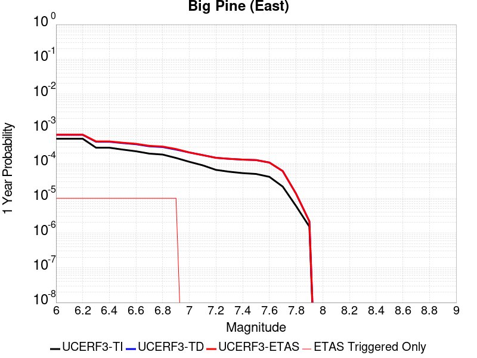 |  |

| Magnitude | 1 wk TI Prob | 1 wk TD Prob | 1 wk ETAS Prob | 1 wk ETAS/TD Gain | 1 wk ETAS Triggered Only | 1 mo TI Prob | 1 mo TD Prob | 1 mo ETAS Prob | 1 mo ETAS/TD Gain | 1 mo ETAS Triggered Only | 1 yr TI Prob | 1 yr TD Prob | 1 yr ETAS Prob | 1 yr ETAS/TD Gain | 1 yr ETAS Triggered Only | 10 yr TI Prob | 10 yr TD Prob | 10 yr ETAS Prob | 10 yr ETAS/TD Gain | 10 yr ETAS Triggered Only |
|-----|-----|-----|-----|-----|-----|-----|-----|-----|-----|-----|-----|-----|-----|-----|-----|-----|-----|-----|-----|-----|
| 6.0 | 9.916913E-6 | 1.2819477E-5 | 1.2819477E-5 | 1.0 | 0.0 | 4.250036E-5 | 5.4939585E-5 | 9.889901E-5 | 1.8001412 | 4.396184E-5 | 5.173191E-4 | 6.6870626E-4 | 7.126387E-4 | 1.0656977 | 4.396184E-5 | 0.0051611643 | 0.0066717123 | 0.0067590494 | 1.0130906 | 8.792368E-5 |
| 6.1 | 9.916913E-6 | 1.2819477E-5 | 1.2819477E-5 | 1.0 | 0.0 | 4.250036E-5 | 5.4939585E-5 | 9.889901E-5 | 1.8001412 | 4.396184E-5 | 5.173191E-4 | 6.6870626E-4 | 7.126387E-4 | 1.0656977 | 4.396184E-5 | 0.0051611643 | 0.0066717123 | 0.0067590494 | 1.0130906 | 8.792368E-5 |
| 6.2 | 9.916913E-6 | 1.2819477E-5 | 1.2819477E-5 | 1.0 | 0.0 | 4.250036E-5 | 5.4939585E-5 | 9.889901E-5 | 1.8001412 | 4.396184E-5 | 5.173191E-4 | 6.6870626E-4 | 7.126387E-4 | 1.0656977 | 4.396184E-5 | 0.0051611643 | 0.0066717123 | 0.0067590494 | 1.0130906 | 8.792368E-5 |
| 6.3 | 5.479711E-6 | 8.115369E-6 | 8.115369E-6 | 1.0 | 0.0 | 2.3484265E-5 | 3.4779707E-5 | 7.874002E-5 | 2.2639644 | 4.396184E-5 | 2.858834E-4 | 4.2336388E-4 | 4.6730708E-4 | 1.1037954 | 4.396184E-5 | 0.0028551589 | 0.0042284788 | 0.0042722546 | 1.0103526 | 4.396184E-5 |
| 6.4 | 5.465009E-6 | 8.099662E-6 | 8.099662E-6 | 1.0 | 0.0 | 2.3421257E-5 | 3.4712393E-5 | 7.867271E-5 | 2.2664156 | 4.396184E-5 | 2.851165E-4 | 4.2254463E-4 | 4.664879E-4 | 1.1039968 | 4.396184E-5 | 0.0028475097 | 0.0042203176 | 0.004264094 | 1.0103728 | 4.396184E-5 |
| 6.5 | 4.826767E-6 | 7.424708E-6 | 7.424708E-6 | 1.0 | 0.0 | 2.068598E-5 | 3.1819807E-5 | 7.578025E-5 | 2.3815434 | 4.396184E-5 | 2.518227E-4 | 3.8734006E-4 | 4.3128486E-4 | 1.1134528 | 4.396184E-5 | 0.0025153751 | 0.0038695128 | 0.003913305 | 1.0113171 | 4.396184E-5 |
| 6.6 | 4.3146847E-6 | 6.8846366E-6 | 6.8846366E-6 | 1.0 | 0.0 | 1.8491375E-5 | 2.9505265E-5 | 7.346581E-5 | 2.489922 | 4.396184E-5 | 2.2510924E-4 | 3.5916985E-4 | 4.031159E-4 | 1.1223545 | 4.396184E-5 | 0.0022488134 | 0.0035887246 | 0.0036325287 | 1.0122061 | 4.396184E-5 |
| 6.7 | 3.6968106E-6 | 5.9977306E-6 | 5.9977306E-6 | 1.0 | 0.0 | 1.5843378E-5 | 2.5704314E-5 | 6.9665024E-5 | 2.7102463 | 4.396184E-5 | 1.9287605E-4 | 3.1290663E-4 | 3.568547E-4 | 1.1404511 | 4.396184E-5 | 0.0019270873 | 0.0031274015 | 0.0031712258 | 1.014013 | 4.396184E-5 |
| 6.8 | 3.4671132E-6 | 5.704374E-6 | 5.704374E-6 | 1.0 | 0.0 | 1.4858972E-5 | 2.4447096E-5 | 6.840786E-5 | 2.7982 | 4.396184E-5 | 1.8089297E-4 | 2.976042E-4 | 3.4155295E-4 | 1.1476752 | 4.396184E-5 | 0.0018074579 | 0.0029747887 | 0.0030186197 | 1.0147341 | 4.396184E-5 |
| 6.9 | 2.7686972E-6 | 4.8272514E-6 | 4.8272514E-6 | 1.0 | 0.0 | 1.1865792E-5 | 2.068806E-5 | 6.464899E-5 | 3.1249423 | 4.396184E-5 | 1.4445644E-4 | 2.5184877E-4 | 2.9579955E-4 | 1.1745125 | 4.396184E-5 | 0.0014436257 | 0.0025182979 | 0.0025621492 | 1.017413 | 4.396184E-5 |
| 7.0 | 2.1472624E-6 | 3.986883E-6 | 3.986883E-6 | 1.0 | 0.0 | 9.20252E-6 | 1.7086531E-5 | 1.7086531E-5 | 1.0 | 0.0 | 1.12034926E-4 | 2.0800921E-4 | 2.0800921E-4 | 1.0 | 0.0 | 0.0011197845 | 0.0020807774 | 0.0020807774 | 1.0 | 0.0 |
| 7.1 | 1.7018335E-6 | 3.3465526E-6 | 3.3465526E-6 | 1.0 | 0.0 | 7.293552E-6 | 1.4342291E-5 | 1.4342291E-5 | 1.0 | 0.0 | 8.879537E-5 | 1.7460376E-4 | 1.7460376E-4 | 1.0 | 0.0 | 8.87599E-4 | 0.0017472665 | 0.0017472665 | 1.0 | 0.0 |
| 7.2 | 1.25603E-6 | 2.796068E-6 | 2.796068E-6 | 1.0 | 0.0 | 5.3829745E-6 | 1.1983095E-5 | 1.1983095E-5 | 1.0 | 0.0 | 6.553574E-5 | 1.4588464E-4 | 1.4588464E-4 | 1.0 | 0.0 | 6.551642E-4 | 0.001460465 | 0.001460465 | 1.0 | 0.0 |
| 7.3 | 1.112297E-6 | 2.6118275E-6 | 2.6118275E-6 | 1.0 | 0.0 | 4.7669787E-6 | 1.11935E-5 | 1.11935E-5 | 1.0 | 0.0 | 5.803642E-5 | 1.3627256E-4 | 1.3627256E-4 | 1.0 | 0.0 | 5.802127E-4 | 0.0013642985 | 0.0013642985 | 1.0 | 0.0 |
| 7.4 | 1.0137181E-6 | 2.484923E-6 | 2.484923E-6 | 1.0 | 0.0 | 4.3444993E-6 | 1.0649628E-5 | 1.0649628E-5 | 1.0 | 0.0 | 5.2892992E-5 | 1.2965173E-4 | 1.2965173E-4 | 1.0 | 0.0 | 5.288041E-4 | 0.0012979534 | 0.0012979534 | 1.0 | 0.0 |
| 7.5 | 9.598608E-7 | 2.408537E-6 | 2.408537E-6 | 1.0 | 0.0 | 4.1136827E-6 | 1.0322262E-5 | 1.0322262E-5 | 1.0 | 0.0 | 5.0082934E-5 | 1.256665E-4 | 1.256665E-4 | 1.0 | 0.0 | 5.007165E-4 | 0.0012579551 | 0.0012579551 | 1.0 | 0.0 |
| 7.6 | 7.929459E-7 | 2.0460855E-6 | 2.0460855E-6 | 1.0 | 0.0 | 3.3983351E-6 | 8.768909E-6 | 8.768909E-6 | 1.0 | 0.0 | 4.1373947E-5 | 1.0675641E-4 | 1.0675641E-4 | 1.0 | 0.0 | 4.1366243E-4 | 0.0010691425 | 0.0010691425 | 1.0 | 0.0 |
| 7.7 | 4.155788E-7 | 1.1614285E-6 | 1.1614285E-6 | 1.0 | 0.0 | 1.7810507E-6 | 4.9775413E-6 | 4.9775413E-6 | 1.0 | 0.0 | 2.1684076E-5 | 6.059992E-5 | 6.059992E-5 | 1.0 | 0.0 | 2.1681961E-4 | 6.0901203E-4 | 6.0901203E-4 | 1.0 | 0.0 |
| 7.8 | 1.14666925E-7 | 2.5939678E-7 | 2.5939678E-7 | 1.0 | 0.0 | 4.914296E-7 | 1.1117E-6 | 1.1117E-6 | 1.0 | 0.0 | 5.9831386E-6 | 1.3534868E-5 | 1.3534868E-5 | 1.0 | 0.0 | 5.9829777E-5 | 1.364413E-4 | 1.364413E-4 | 1.0 | 0.0 |
| 7.9 | 2.9231824E-8 | 4.1496527E-8 | 4.1496527E-8 | 1.0 | 0.0 | 1.2527924E-7 | 1.7784224E-7 | 1.7784224E-7 | 1.0 | 0.0 | 1.5252737E-6 | 2.1652272E-6 | 2.1652272E-6 | 1.0 | 0.0 | 1.5252632E-5 | 2.198479E-5 | 2.198479E-5 | 1.0 | 0.0 |

## Lost Hills
*[(top)](#table-of-contents)*

| 1 Week | 1 Month | 1 Year | 10 Year |
|-----|-----|-----|-----|
|  |  |  |  |

| Magnitude | 1 wk TI Prob | 1 wk TD Prob | 1 wk ETAS Prob | 1 wk ETAS/TD Gain | 1 wk ETAS Triggered Only | 1 mo TI Prob | 1 mo TD Prob | 1 mo ETAS Prob | 1 mo ETAS/TD Gain | 1 mo ETAS Triggered Only | 1 yr TI Prob | 1 yr TD Prob | 1 yr ETAS Prob | 1 yr ETAS/TD Gain | 1 yr ETAS Triggered Only | 10 yr TI Prob | 10 yr TD Prob | 10 yr ETAS Prob | 10 yr ETAS/TD Gain | 10 yr ETAS Triggered Only |
|-----|-----|-----|-----|-----|-----|-----|-----|-----|-----|-----|-----|-----|-----|-----|-----|-----|-----|-----|-----|-----|
| 6.0 | 2.233523E-5 | 2.5107409E-5 | 2.5107409E-5 | 1.0 | 0.0 | 9.571891E-5 | 1.0759969E-4 | 1.0759969E-4 | 1.0 | 0.0 | 0.0011647546 | 0.0013094071 | 0.0013533114 | 1.0335299 | 4.396184E-5 | 0.011586686 | 0.013033518 | 0.0131202955 | 1.0066581 | 8.792368E-5 |
| 6.1 | 2.233523E-5 | 2.5107409E-5 | 2.5107409E-5 | 1.0 | 0.0 | 9.571891E-5 | 1.0759969E-4 | 1.0759969E-4 | 1.0 | 0.0 | 0.0011647546 | 0.0013094071 | 0.0013533114 | 1.0335299 | 4.396184E-5 | 0.011586686 | 0.013033518 | 0.0131202955 | 1.0066581 | 8.792368E-5 |
| 6.2 | 2.233523E-5 | 2.5107409E-5 | 2.5107409E-5 | 1.0 | 0.0 | 9.571891E-5 | 1.0759969E-4 | 1.0759969E-4 | 1.0 | 0.0 | 0.0011647546 | 0.0013094071 | 0.0013533114 | 1.0335299 | 4.396184E-5 | 0.011586686 | 0.013033518 | 0.0131202955 | 1.0066581 | 8.792368E-5 |
| 6.3 | 2.233523E-5 | 2.5107409E-5 | 2.5107409E-5 | 1.0 | 0.0 | 9.571891E-5 | 1.0759969E-4 | 1.0759969E-4 | 1.0 | 0.0 | 0.0011647546 | 0.0013094071 | 0.0013533114 | 1.0335299 | 4.396184E-5 | 0.011586686 | 0.013033518 | 0.0131202955 | 1.0066581 | 8.792368E-5 |
| 6.4 | 1.2288092E-5 | 1.3781551E-5 | 1.3781551E-5 | 1.0 | 0.0 | 5.2662188E-5 | 5.9062982E-5 | 5.9062982E-5 | 1.0 | 0.0 | 6.409735E-4 | 7.189484E-4 | 7.189484E-4 | 1.0 | 0.0 | 0.006391279 | 0.0071754316 | 0.007219078 | 1.0060828 | 4.396184E-5 |
| 6.5 | 1.2288092E-5 | 1.3781551E-5 | 1.3781551E-5 | 1.0 | 0.0 | 5.2662188E-5 | 5.9062982E-5 | 5.9062982E-5 | 1.0 | 0.0 | 6.409735E-4 | 7.189484E-4 | 7.189484E-4 | 1.0 | 0.0 | 0.006391279 | 0.0071754316 | 0.007219078 | 1.0060828 | 4.396184E-5 |
| 6.6 | 8.58281E-6 | 9.634083E-6 | 9.634083E-6 | 1.0 | 0.0 | 3.6782953E-5 | 4.1288742E-5 | 4.1288742E-5 | 1.0 | 0.0 | 4.4774043E-4 | 5.026577E-4 | 5.026577E-4 | 1.0 | 0.0 | 0.0044683935 | 0.005023368 | 0.005067109 | 1.0087075 | 4.396184E-5 |
| 6.7 | 7.205685E-6 | 8.088565E-6 | 8.088565E-6 | 1.0 | 0.0 | 3.088114E-5 | 3.4665278E-5 | 3.4665278E-5 | 1.0 | 0.0 | 3.7591302E-4 | 4.2204975E-4 | 4.2204975E-4 | 1.0 | 0.0 | 0.0037527776 | 0.0042204973 | 0.0042642737 | 1.0103723 | 4.396184E-5 |

## Scodie Lineament
*[(top)](#table-of-contents)*

| 1 Week | 1 Month | 1 Year | 10 Year |
|-----|-----|-----|-----|
|  |  |  | 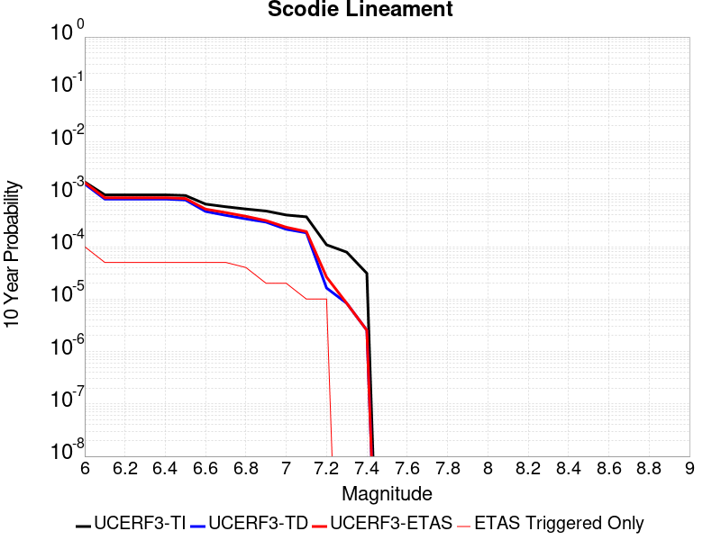 |

| Magnitude | 1 wk TI Prob | 1 wk TD Prob | 1 wk ETAS Prob | 1 wk ETAS/TD Gain | 1 wk ETAS Triggered Only | 1 mo TI Prob | 1 mo TD Prob | 1 mo ETAS Prob | 1 mo ETAS/TD Gain | 1 mo ETAS Triggered Only | 1 yr TI Prob | 1 yr TD Prob | 1 yr ETAS Prob | 1 yr ETAS/TD Gain | 1 yr ETAS Triggered Only | 10 yr TI Prob | 10 yr TD Prob | 10 yr ETAS Prob | 10 yr ETAS/TD Gain | 10 yr ETAS Triggered Only |
|-----|-----|-----|-----|-----|-----|-----|-----|-----|-----|-----|-----|-----|-----|-----|-----|-----|-----|-----|-----|-----|
| 6.0 | 3.2919327E-6 | 3.0133708E-6 | 3.0133708E-6 | 1.0 | 0.0 | 1.4108206E-5 | 1.29144E-5 | 5.6875673E-5 | 4.404051 | 4.396184E-5 | 1.7175387E-4 | 1.5722465E-4 | 2.0117957E-4 | 1.2795677 | 4.396184E-5 | 0.0017162118 | 0.0015714457 | 0.0016592313 | 1.0558629 | 8.792368E-5 |
| 6.1 | 1.8663811E-6 | 1.5490679E-6 | 1.5490679E-6 | 1.0 | 0.0 | 7.998751E-6 | 6.6388484E-6 | 6.6388484E-6 | 1.0 | 0.0 | 9.738045E-5 | 8.082548E-5 | 8.082548E-5 | 1.0 | 0.0 | 9.7337784E-4 | 8.080096E-4 | 8.080096E-4 | 1.0 | 0.0 |
| 6.2 | 1.8663811E-6 | 1.5490679E-6 | 1.5490679E-6 | 1.0 | 0.0 | 7.998751E-6 | 6.6388484E-6 | 6.6388484E-6 | 1.0 | 0.0 | 9.738045E-5 | 8.082548E-5 | 8.082548E-5 | 1.0 | 0.0 | 9.7337784E-4 | 8.080096E-4 | 8.080096E-4 | 1.0 | 0.0 |
| 6.3 | 1.8663811E-6 | 1.5490679E-6 | 1.5490679E-6 | 1.0 | 0.0 | 7.998751E-6 | 6.6388484E-6 | 6.6388484E-6 | 1.0 | 0.0 | 9.738045E-5 | 8.082548E-5 | 8.082548E-5 | 1.0 | 0.0 | 9.7337784E-4 | 8.080096E-4 | 8.080096E-4 | 1.0 | 0.0 |
| 6.4 | 1.8663811E-6 | 1.5490679E-6 | 1.5490679E-6 | 1.0 | 0.0 | 7.998751E-6 | 6.6388484E-6 | 6.6388484E-6 | 1.0 | 0.0 | 9.738045E-5 | 8.082548E-5 | 8.082548E-5 | 1.0 | 0.0 | 9.7337784E-4 | 8.080096E-4 | 8.080096E-4 | 1.0 | 0.0 |
| 6.5 | 1.8106311E-6 | 1.4910013E-6 | 1.4910013E-6 | 1.0 | 0.0 | 7.759824E-6 | 6.3899924E-6 | 6.3899924E-6 | 1.0 | 0.0 | 9.447177E-5 | 7.779588E-5 | 7.779588E-5 | 1.0 | 0.0 | 9.4431615E-4 | 7.777351E-4 | 7.777351E-4 | 1.0 | 0.0 |
| 6.6 | 1.2414679E-6 | 8.99767E-7 | 8.99767E-7 | 1.0 | 0.0 | 5.320566E-6 | 3.856139E-6 | 3.856139E-6 | 1.0 | 0.0 | 6.477596E-5 | 4.6947567E-5 | 4.6947567E-5 | 1.0 | 0.0 | 6.475708E-4 | 4.6938515E-4 | 4.6938515E-4 | 1.0 | 0.0 |
| 6.7 | 1.1062215E-6 | 7.594409E-7 | 7.594409E-7 | 1.0 | 0.0 | 4.7409408E-6 | 3.2547432E-6 | 3.2547432E-6 | 1.0 | 0.0 | 5.7719422E-5 | 3.9625847E-5 | 3.9625847E-5 | 1.0 | 0.0 | 5.770443E-4 | 3.961948E-4 | 3.961948E-4 | 1.0 | 0.0 |
| 6.8 | 1.0006736E-6 | 6.5004843E-7 | 6.5004843E-7 | 1.0 | 0.0 | 4.288594E-6 | 2.7859192E-6 | 2.7859192E-6 | 1.0 | 0.0 | 5.221238E-5 | 3.39181E-5 | 3.39181E-5 | 1.0 | 0.0 | 5.220012E-4 | 3.3913532E-4 | 3.3913532E-4 | 1.0 | 0.0 |
| 6.9 | 9.167364E-7 | 5.6317043E-7 | 5.6317043E-7 | 1.0 | 0.0 | 3.9288643E-6 | 2.4135857E-6 | 2.4135857E-6 | 1.0 | 0.0 | 4.7832873E-5 | 2.9385066E-5 | 2.9385066E-5 | 1.0 | 0.0 | 4.782258E-4 | 2.938175E-4 | 2.938175E-4 | 1.0 | 0.0 |
| 7.0 | 7.6987664E-7 | 4.113449E-7 | 4.113449E-7 | 1.0 | 0.0 | 3.2994672E-6 | 1.7629058E-6 | 1.7629058E-6 | 1.0 | 0.0 | 4.0170275E-5 | 2.1463205E-5 | 2.1463205E-5 | 1.0 | 0.0 | 4.0163012E-4 | 2.1461518E-4 | 2.1461518E-4 | 1.0 | 0.0 |
| 7.1 | 7.1038727E-7 | 3.52121E-7 | 3.52121E-7 | 1.0 | 0.0 | 3.0445133E-6 | 1.5090893E-6 | 1.5090893E-6 | 1.0 | 0.0 | 3.706632E-5 | 1.8373043E-5 | 1.8373043E-5 | 1.0 | 0.0 | 3.7060137E-4 | 1.8371873E-4 | 1.8371873E-4 | 1.0 | 0.0 |
| 7.2 | 2.0799602E-7 | 3.118852E-8 | 3.118852E-8 | 1.0 | 0.0 | 8.914113E-7 | 1.3366508E-7 | 1.3366508E-7 | 1.0 | 0.0 | 1.0852878E-5 | 1.6273711E-6 | 1.6273711E-6 | 1.0 | 0.0 | 1.08523476E-4 | 1.62736E-5 | 1.62736E-5 | 1.0 | 0.0 |
| 7.3 | 1.5048182E-7 | 1.594683E-8 | 1.594683E-8 | 1.0 | 0.0 | 6.449219E-7 | 6.834355E-8 | 6.834355E-8 | 1.0 | 0.0 | 7.851896E-6 | 8.3208243E-7 | 8.3208243E-7 | 1.0 | 0.0 | 7.851618E-5 | 8.320796E-6 | 8.320796E-6 | 1.0 | 0.0 |
| 7.4 | 5.9334678E-8 | 4.8687716E-9 | 4.8687716E-9 | 1.0 | 0.0 | 2.5429145E-7 | 2.0866164E-8 | 2.0866164E-8 | 1.0 | 0.0 | 3.095994E-6 | 2.5404555E-7 | 2.5404555E-7 | 1.0 | 0.0 | 3.095951E-5 | 2.5404536E-6 | 2.5404536E-6 | 1.0 | 0.0 |

## Coronado Bank alt1
*[(top)](#table-of-contents)*

| 1 Week | 1 Month | 1 Year | 10 Year |
|-----|-----|-----|-----|
|  |  |  |  |

| Magnitude | 1 wk TI Prob | 1 wk TD Prob | 1 wk ETAS Prob | 1 wk ETAS/TD Gain | 1 wk ETAS Triggered Only | 1 mo TI Prob | 1 mo TD Prob | 1 mo ETAS Prob | 1 mo ETAS/TD Gain | 1 mo ETAS Triggered Only | 1 yr TI Prob | 1 yr TD Prob | 1 yr ETAS Prob | 1 yr ETAS/TD Gain | 1 yr ETAS Triggered Only | 10 yr TI Prob | 10 yr TD Prob | 10 yr ETAS Prob | 10 yr ETAS/TD Gain | 10 yr ETAS Triggered Only |
|-----|-----|-----|-----|-----|-----|-----|-----|-----|-----|-----|-----|-----|-----|-----|-----|-----|-----|-----|-----|-----|
| 6.0 | 7.533492E-5 | 9.395546E-5 | 9.395546E-5 | 1.0 | 0.0 | 3.22824E-4 | 4.026084E-4 | 4.026084E-4 | 1.0 | 0.0 | 0.0039233007 | 0.0048912824 | 0.004978776 | 1.0178877 | 8.792368E-5 | 0.03854755 | 0.047906585 | 0.047990296 | 1.0017474 | 8.792368E-5 |
| 6.1 | 4.1807285E-5 | 5.049567E-5 | 5.049567E-5 | 1.0 | 0.0 | 1.7916178E-4 | 2.1639265E-4 | 2.1639265E-4 | 1.0 | 0.0 | 0.0021791123 | 0.0026314945 | 0.0026314945 | 1.0 | 0.0 | 0.021578677 | 0.026012467 | 0.026012467 | 1.0 | 0.0 |
| 6.2 | 4.1807285E-5 | 5.049567E-5 | 5.049567E-5 | 1.0 | 0.0 | 1.7916178E-4 | 2.1639265E-4 | 2.1639265E-4 | 1.0 | 0.0 | 0.0021791123 | 0.0026314945 | 0.0026314945 | 1.0 | 0.0 | 0.021578677 | 0.026012467 | 0.026012467 | 1.0 | 0.0 |
| 6.3 | 3.1793104E-5 | 3.7713005E-5 | 3.7713005E-5 | 1.0 | 0.0 | 1.3624904E-4 | 1.6161737E-4 | 1.6161737E-4 | 1.0 | 0.0 | 0.0016575698 | 0.0019659458 | 0.0019659458 | 1.0 | 0.0 | 0.016452603 | 0.019489426 | 0.019489426 | 1.0 | 0.0 |
| 6.4 | 2.9878007E-5 | 3.533753E-5 | 3.533753E-5 | 1.0 | 0.0 | 1.2804232E-4 | 1.5143797E-4 | 1.5143797E-4 | 1.0 | 0.0 | 0.0015578003 | 0.0018422286 | 0.0018422286 | 1.0 | 0.0 | 0.015469253 | 0.018273327 | 0.018273327 | 1.0 | 0.0 |
| 6.5 | 2.4512565E-5 | 2.8765384E-5 | 2.8765384E-5 | 1.0 | 0.0 | 1.0504962E-4 | 1.2327454E-4 | 1.2327454E-4 | 1.0 | 0.0 | 0.0012782287 | 0.001499862 | 0.001499862 | 1.0 | 0.0 | 0.012709012 | 0.014900371 | 0.014900371 | 1.0 | 0.0 |
| 6.6 | 2.1317413E-5 | 2.4907797E-5 | 2.4907797E-5 | 1.0 | 0.0 | 9.135714E-5 | 1.06743464E-4 | 1.06743464E-4 | 1.0 | 0.0 | 0.0011117056 | 0.0012988492 | 0.0012988492 | 1.0 | 0.0 | 0.011061605 | 0.012914985 | 0.012914985 | 1.0 | 0.0 |
| 6.7 | 1.8585655E-5 | 2.1635835E-5 | 2.1635835E-5 | 1.0 | 0.0 | 7.9650374E-5 | 9.272183E-5 | 9.272183E-5 | 1.0 | 0.0 | 9.6931186E-4 | 0.0011283241 | 0.0011283241 | 1.0 | 0.0 | 0.0096509475 | 0.011228115 | 0.011228115 | 1.0 | 0.0 |
| 6.8 | 1.5862879E-5 | 1.8420275E-5 | 1.8420275E-5 | 1.0 | 0.0 | 6.798199E-5 | 7.894175E-5 | 7.894175E-5 | 1.0 | 0.0 | 8.273665E-4 | 9.6071133E-4 | 9.6071133E-4 | 1.0 | 0.0 | 0.008242928 | 0.009567563 | 0.009567563 | 1.0 | 0.0 |
| 6.9 | 1.3021509E-5 | 1.5095914E-5 | 1.5095914E-5 | 1.0 | 0.0 | 5.5805274E-5 | 6.469527E-5 | 6.469527E-5 | 1.0 | 0.0 | 6.792174E-4 | 7.8739837E-4 | 7.8739837E-4 | 1.0 | 0.0 | 0.006771452 | 0.007847909 | 0.007847909 | 1.0 | 0.0 |
| 7.0 | 1.0974371E-5 | 1.2720651E-5 | 1.2720651E-5 | 1.0 | 0.0 | 4.7032172E-5 | 5.4516036E-5 | 5.4516036E-5 | 1.0 | 0.0 | 5.7246623E-4 | 6.635482E-4 | 6.635482E-4 | 1.0 | 0.0 | 0.0057099373 | 0.006617419 | 0.006617419 | 1.0 | 0.0 |
| 7.1 | 8.766221E-6 | 1.0164273E-5 | 1.0164273E-5 | 1.0 | 0.0 | 3.7568978E-5 | 4.3560536E-5 | 4.3560536E-5 | 1.0 | 0.0 | 4.573063E-4 | 5.302377E-4 | 5.302377E-4 | 1.0 | 0.0 | 0.0045636636 | 0.005291425 | 0.005291425 | 1.0 | 0.0 |
| 7.2 | 8.026024E-7 | 8.3319094E-7 | 8.3319094E-7 | 1.0 | 0.0 | 3.43972E-6 | 3.5708135E-6 | 3.5708135E-6 | 1.0 | 0.0 | 4.1877785E-5 | 4.3473796E-5 | 4.3473796E-5 | 1.0 | 0.0 | 4.1869894E-4 | 4.34654E-4 | 4.34654E-4 | 1.0 | 0.0 |
| 7.3 | 3.7293114E-7 | 3.7001422E-7 | 3.7001422E-7 | 1.0 | 0.0 | 1.5982754E-6 | 1.5857743E-6 | 1.5857743E-6 | 1.0 | 0.0 | 1.9458828E-5 | 1.9306632E-5 | 1.9306632E-5 | 1.0 | 0.0 | 1.9457124E-4 | 1.9304961E-4 | 1.9304961E-4 | 1.0 | 0.0 |
| 7.4 | 2.0557036E-7 | 1.9674565E-7 | 1.9674565E-7 | 1.0 | 0.0 | 8.810155E-7 | 8.431953E-7 | 8.431953E-7 | 1.0 | 0.0 | 1.0726311E-5 | 1.0265855E-5 | 1.0265855E-5 | 1.0 | 0.0 | 1.0725793E-4 | 1.0265384E-4 | 1.0265384E-4 | 1.0 | 0.0 |
| 7.5 | 6.845446E-8 | 6.279407E-8 | 6.279407E-8 | 1.0 | 0.0 | 2.9337625E-7 | 2.691174E-7 | 2.691174E-7 | 1.0 | 0.0 | 3.5718497E-6 | 3.2764997E-6 | 3.2764997E-6 | 1.0 | 0.0 | 3.5717923E-5 | 3.2764525E-5 | 3.2764525E-5 | 1.0 | 0.0 |
| 7.6 | 6.0975145E-9 | 5.531872E-9 | 5.531872E-9 | 1.0 | 0.0 | 2.6132206E-8 | 2.3708022E-8 | 2.3708022E-8 | 1.0 | 0.0 | 3.1815955E-7 | 2.8864514E-7 | 2.8864514E-7 | 1.0 | 0.0 | 3.181591E-6 | 2.8864486E-6 | 2.8864486E-6 | 1.0 | 0.0 |

## Santa Susana alt 1
*[(top)](#table-of-contents)*

| 1 Week | 1 Month | 1 Year | 10 Year |
|-----|-----|-----|-----|
|  |  |  |  |

| Magnitude | 1 wk TI Prob | 1 wk TD Prob | 1 wk ETAS Prob | 1 wk ETAS/TD Gain | 1 wk ETAS Triggered Only | 1 mo TI Prob | 1 mo TD Prob | 1 mo ETAS Prob | 1 mo ETAS/TD Gain | 1 mo ETAS Triggered Only | 1 yr TI Prob | 1 yr TD Prob | 1 yr ETAS Prob | 1 yr ETAS/TD Gain | 1 yr ETAS Triggered Only | 10 yr TI Prob | 10 yr TD Prob | 10 yr ETAS Prob | 10 yr ETAS/TD Gain | 10 yr ETAS Triggered Only |
|-----|-----|-----|-----|-----|-----|-----|-----|-----|-----|-----|-----|-----|-----|-----|-----|-----|-----|-----|-----|-----|
| 6.0 | 2.674877E-5 | 2.7199343E-5 | 2.7199343E-5 | 1.0 | 0.0 | 1.1463255E-4 | 1.1656405E-4 | 1.6052077E-4 | 1.3771036 | 4.396184E-5 | 0.0013947578 | 0.001418357 | 0.0014622565 | 1.0309509 | 4.396184E-5 | 0.013860362 | 0.014104809 | 0.014148151 | 1.0030729 | 4.396184E-5 |
| 6.1 | 2.674877E-5 | 2.7199343E-5 | 2.7199343E-5 | 1.0 | 0.0 | 1.1463255E-4 | 1.1656405E-4 | 1.6052077E-4 | 1.3771036 | 4.396184E-5 | 0.0013947578 | 0.001418357 | 0.0014622565 | 1.0309509 | 4.396184E-5 | 0.013860362 | 0.014104809 | 0.014148151 | 1.0030729 | 4.396184E-5 |
| 6.2 | 2.674877E-5 | 2.7199343E-5 | 2.7199343E-5 | 1.0 | 0.0 | 1.1463255E-4 | 1.1656405E-4 | 1.6052077E-4 | 1.3771036 | 4.396184E-5 | 0.0013947578 | 0.001418357 | 0.0014622565 | 1.0309509 | 4.396184E-5 | 0.013860362 | 0.014104809 | 0.014148151 | 1.0030729 | 4.396184E-5 |
| 6.3 | 2.674877E-5 | 2.7199343E-5 | 2.7199343E-5 | 1.0 | 0.0 | 1.1463255E-4 | 1.1656405E-4 | 1.6052077E-4 | 1.3771036 | 4.396184E-5 | 0.0013947578 | 0.001418357 | 0.0014622565 | 1.0309509 | 4.396184E-5 | 0.013860362 | 0.014104809 | 0.014148151 | 1.0030729 | 4.396184E-5 |
| 6.4 | 2.674877E-5 | 2.7199343E-5 | 2.7199343E-5 | 1.0 | 0.0 | 1.1463255E-4 | 1.1656405E-4 | 1.6052077E-4 | 1.3771036 | 4.396184E-5 | 0.0013947578 | 0.001418357 | 0.0014622565 | 1.0309509 | 4.396184E-5 | 0.013860362 | 0.014104809 | 0.014148151 | 1.0030729 | 4.396184E-5 |
| 6.5 | 2.674877E-5 | 2.7199343E-5 | 2.7199343E-5 | 1.0 | 0.0 | 1.1463255E-4 | 1.1656405E-4 | 1.6052077E-4 | 1.3771036 | 4.396184E-5 | 0.0013947578 | 0.001418357 | 0.0014622565 | 1.0309509 | 4.396184E-5 | 0.013860362 | 0.014104809 | 0.014148151 | 1.0030729 | 4.396184E-5 |
| 6.6 | 2.6647976E-5 | 2.7075674E-5 | 2.7075674E-5 | 1.0 | 0.0 | 1.14200615E-4 | 1.16034076E-4 | 1.5999081E-4 | 1.3788261 | 4.396184E-5 | 0.0013895056 | 0.0014119132 | 0.0014558131 | 1.0310924 | 4.396184E-5 | 0.013808494 | 0.01404119 | 0.014084535 | 1.0030869 | 4.396184E-5 |
| 6.7 | 2.6647976E-5 | 2.7075674E-5 | 2.7075674E-5 | 1.0 | 0.0 | 1.14200615E-4 | 1.16034076E-4 | 1.5999081E-4 | 1.3788261 | 4.396184E-5 | 0.0013895056 | 0.0014119132 | 0.0014558131 | 1.0310924 | 4.396184E-5 | 0.013808494 | 0.01404119 | 0.014084535 | 1.0030869 | 4.396184E-5 |
| 6.8 | 1.9073179E-5 | 1.7637982E-5 | 1.7637982E-5 | 1.0 | 0.0 | 8.1739636E-5 | 7.558926E-5 | 1.1954778E-4 | 1.5815445 | 4.396184E-5 | 9.947256E-4 | 9.1992883E-4 | 9.6385024E-4 | 1.0477444 | 4.396184E-5 | 0.009902848 | 0.009163462 | 0.0092070205 | 1.0047536 | 4.396184E-5 |
| 6.9 | 1.9041876E-5 | 1.7620112E-5 | 1.7620112E-5 | 1.0 | 0.0 | 8.160549E-5 | 7.551268E-5 | 1.194712E-4 | 1.5821342 | 4.396184E-5 | 9.930939E-4 | 9.189973E-4 | 9.629187E-4 | 1.0477928 | 4.396184E-5 | 0.0098866755 | 0.009154223 | 0.009197783 | 1.0047584 | 4.396184E-5 |
| 7.0 | 1.5917482E-5 | 1.3864347E-5 | 1.3864347E-5 | 1.0 | 0.0 | 6.8215995E-5 | 5.9417303E-5 | 1.0337653E-4 | 1.7398388 | 4.396184E-5 | 8.302132E-4 | 7.2317023E-4 | 7.6710025E-4 | 1.0607464 | 4.396184E-5 | 0.008271185 | 0.0072090644 | 0.0072527095 | 1.0060542 | 4.396184E-5 |
| 7.1 | 1.577788E-5 | 1.374435E-5 | 1.374435E-5 | 1.0 | 0.0 | 6.761774E-5 | 5.8903053E-5 | 1.0286231E-4 | 1.7462983 | 4.396184E-5 | 8.2293496E-4 | 7.169134E-4 | 7.608437E-4 | 1.061277 | 4.396184E-5 | 0.008198941 | 0.0071468996 | 0.0071905474 | 1.0061072 | 4.396184E-5 |
| 7.2 | 1.5416446E-5 | 1.3470412E-5 | 1.3470412E-5 | 1.0 | 0.0 | 6.606882E-5 | 5.772909E-5 | 1.0168839E-4 | 1.7614758 | 4.396184E-5 | 8.0409093E-4 | 7.026296E-4 | 7.465606E-4 | 1.0625236 | 4.396184E-5 | 0.008011877 | 0.007004966 | 0.00704862 | 1.0062319 | 4.396184E-5 |
| 7.3 | 1.4534083E-5 | 1.2718311E-5 | 1.2718311E-5 | 1.0 | 0.0 | 6.228744E-5 | 5.4505934E-5 | 9.846538E-5 | 1.8065075 | 4.396184E-5 | 7.580857E-4 | 6.6341215E-4 | 7.073448E-4 | 1.0662223 | 4.396184E-5 | 0.007555048 | 0.0066151684 | 0.0066588395 | 1.0066017 | 4.396184E-5 |
| 7.4 | 1.2858995E-5 | 1.1230016E-5 | 1.1230016E-5 | 1.0 | 0.0 | 5.5108816E-5 | 4.8127775E-5 | 9.2087495E-5 | 1.9133962 | 4.396184E-5 | 6.7074323E-4 | 5.858021E-4 | 6.2973815E-4 | 1.0750016 | 4.396184E-5 | 0.0066872234 | 0.0058433535 | 0.0058870586 | 1.0074794 | 4.396184E-5 |
| 7.5 | 8.827668E-6 | 7.805619E-6 | 7.805619E-6 | 1.0 | 0.0 | 3.7832317E-5 | 3.3452237E-5 | 3.3452237E-5 | 1.0 | 0.0 | 4.605111E-4 | 4.0720735E-4 | 4.0720735E-4 | 1.0 | 0.0 | 0.0045955796 | 0.0040648608 | 0.0040648608 | 1.0 | 0.0 |
| 7.6 | 3.2533426E-6 | 2.872028E-6 | 2.872028E-6 | 1.0 | 0.0 | 1.3942822E-5 | 1.2308636E-5 | 1.2308636E-5 | 1.0 | 0.0 | 1.6974064E-4 | 1.498477E-4 | 1.498477E-4 | 1.0 | 0.0 | 0.0016961104 | 0.0014975035 | 0.0014975035 | 1.0 | 0.0 |
| 7.7 | 1.2751709E-6 | 1.1491308E-6 | 1.1491308E-6 | 1.0 | 0.0 | 5.4650063E-6 | 4.924837E-6 | 4.924837E-6 | 1.0 | 0.0 | 6.653442E-5 | 5.9958333E-5 | 5.9958333E-5 | 1.0 | 0.0 | 6.6514505E-4 | 5.9943047E-4 | 5.9943047E-4 | 1.0 | 0.0 |
| 7.8 | 3.067544E-7 | 3.2401002E-7 | 3.2401002E-7 | 1.0 | 0.0 | 1.3146611E-6 | 1.3886137E-6 | 1.3886137E-6 | 1.0 | 0.0 | 1.600588E-5 | 1.6906251E-5 | 1.6906251E-5 | 1.0 | 0.0 | 1.6004729E-4 | 1.6905068E-4 | 1.6905068E-4 | 1.0 | 0.0 |
| 7.9 | 7.622999E-8 | 8.0881E-8 | 8.0881E-8 | 1.0 | 0.0 | 3.2669993E-7 | 3.4663285E-7 | 3.4663285E-7 | 1.0 | 0.0 | 3.977564E-6 | 4.2202487E-6 | 4.2202487E-6 | 1.0 | 0.0 | 3.977493E-5 | 4.2201897E-5 | 4.2201897E-5 | 1.0 | 0.0 |

## Big Pine (Central)
*[(top)](#table-of-contents)*

| 1 Week | 1 Month | 1 Year | 10 Year |
|-----|-----|-----|-----|
|  |  |  | 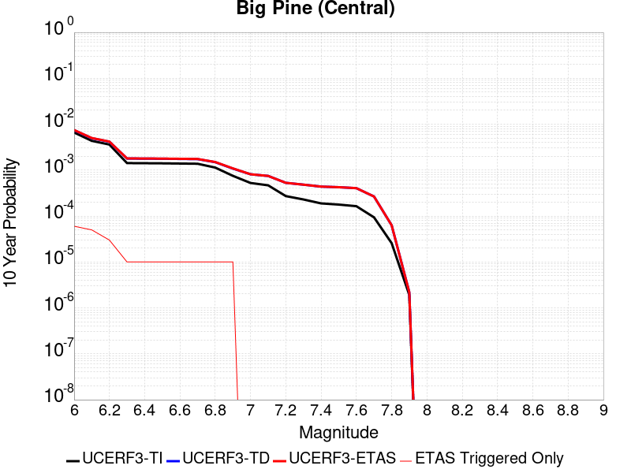 |

| Magnitude | 1 wk TI Prob | 1 wk TD Prob | 1 wk ETAS Prob | 1 wk ETAS/TD Gain | 1 wk ETAS Triggered Only | 1 mo TI Prob | 1 mo TD Prob | 1 mo ETAS Prob | 1 mo ETAS/TD Gain | 1 mo ETAS Triggered Only | 1 yr TI Prob | 1 yr TD Prob | 1 yr ETAS Prob | 1 yr ETAS/TD Gain | 1 yr ETAS Triggered Only | 10 yr TI Prob | 10 yr TD Prob | 10 yr ETAS Prob | 10 yr ETAS/TD Gain | 10 yr ETAS Triggered Only |
|-----|-----|-----|-----|-----|-----|-----|-----|-----|-----|-----|-----|-----|-----|-----|-----|-----|-----|-----|-----|-----|
| 6.0 | 1.2706755E-5 | 1.42514955E-5 | 1.42514955E-5 | 1.0 | 0.0 | 5.4456385E-5 | 6.1076615E-5 | 1.05035775E-4 | 1.7197379 | 4.396184E-5 | 6.628048E-4 | 7.4339064E-4 | 7.8731985E-4 | 1.059093 | 4.396184E-5 | 0.006608314 | 0.007414062 | 0.0074576978 | 1.0058856 | 4.396184E-5 |
| 6.1 | 8.342579E-6 | 9.511621E-6 | 9.511621E-6 | 1.0 | 0.0 | 3.5753423E-5 | 4.0763574E-5 | 8.472362E-5 | 2.078415 | 4.396184E-5 | 4.3521097E-4 | 4.9620523E-4 | 5.4014527E-4 | 1.0885521 | 4.396184E-5 | 0.0043435963 | 0.0049545225 | 0.0049982667 | 1.0088291 | 4.396184E-5 |
| 6.2 | 6.923899E-6 | 7.96797E-6 | 7.96797E-6 | 1.0 | 0.0 | 2.9673516E-5 | 3.4148106E-5 | 7.8108445E-5 | 2.2873435 | 4.396184E-5 | 3.6121515E-4 | 4.1569312E-4 | 4.596367E-4 | 1.1057116 | 4.396184E-5 | 0.003606286 | 0.0041524586 | 0.004196238 | 1.010543 | 4.396184E-5 |
| 6.3 | 2.728396E-6 | 3.4250143E-6 | 3.4250143E-6 | 1.0 | 0.0 | 1.1693074E-5 | 1.4678555E-5 | 5.863975E-5 | 3.9949267 | 4.396184E-5 | 1.4235388E-4 | 1.7869762E-4 | 2.2265161E-4 | 1.2459685 | 4.396184E-5 | 0.0014226272 | 0.0017870412 | 0.0018309244 | 1.0245564 | 4.396184E-5 |
| 6.4 | 2.7136944E-6 | 3.4093073E-6 | 3.4093073E-6 | 1.0 | 0.0 | 1.1630066E-5 | 1.4611241E-5 | 5.8572437E-5 | 4.0087247 | 4.396184E-5 | 1.4158686E-4 | 1.778782E-4 | 2.2183222E-4 | 1.2471018 | 4.396184E-5 | 0.0014149669 | 0.0017788601 | 0.0018227437 | 1.0246695 | 4.396184E-5 |
| 6.5 | 2.6971882E-6 | 3.3916522E-6 | 3.3916522E-6 | 1.0 | 0.0 | 1.1559327E-5 | 1.4535576E-5 | 5.849678E-5 | 4.024387 | 4.396184E-5 | 1.4072572E-4 | 1.7695714E-4 | 2.209112E-4 | 1.2483882 | 4.396184E-5 | 0.0014063664 | 0.0017696641 | 0.0018135482 | 1.0247979 | 4.396184E-5 |
| 6.6 | 2.669092E-6 | 3.361672E-6 | 3.361672E-6 | 1.0 | 0.0 | 1.1438916E-5 | 1.4407092E-5 | 5.83683E-5 | 4.051359 | 4.396184E-5 | 1.3925991E-4 | 1.7539308E-4 | 2.1934722E-4 | 1.2506036 | 4.396184E-5 | 0.0013917267 | 0.0017540484 | 0.0017979331 | 1.0250192 | 4.396184E-5 |
| 6.7 | 2.6408059E-6 | 3.3316971E-6 | 3.3316971E-6 | 1.0 | 0.0 | 1.1317691E-5 | 1.4278629E-5 | 5.8239842E-5 | 4.078812 | 4.396184E-5 | 1.3778417E-4 | 1.738293E-4 | 2.1778351E-4 | 1.2528584 | 4.396184E-5 | 0.0013769877 | 0.0017384351 | 0.0017823206 | 1.0252442 | 4.396184E-5 |
| 6.8 | 2.1786943E-6 | 2.8551506E-6 | 2.8551506E-6 | 1.0 | 0.0 | 9.337228E-6 | 1.2236306E-5 | 5.619761E-5 | 4.592694 | 4.396184E-5 | 1.1367482E-4 | 1.4896758E-4 | 1.9292287E-4 | 1.2950661 | 4.396184E-5 | 0.0011361669 | 0.0014901655 | 0.0015340617 | 1.0294573 | 4.396184E-5 |
| 6.9 | 1.4411696E-6 | 2.0691853E-6 | 2.0691853E-6 | 1.0 | 0.0 | 6.1764263E-6 | 8.867908E-6 | 5.282936E-5 | 5.9573646 | 4.396184E-5 | 7.51954E-5 | 1.079617E-4 | 1.519188E-4 | 1.4071546 | 4.396184E-5 | 7.5169955E-4 | 0.0010805362 | 0.0011244505 | 1.0406413 | 4.396184E-5 |
| 7.0 | 1.0073411E-6 | 1.5548736E-6 | 1.5548736E-6 | 1.0 | 0.0 | 4.317169E-6 | 6.663728E-6 | 6.663728E-6 | 1.0 | 0.0 | 5.2560266E-5 | 8.1128026E-5 | 8.1128026E-5 | 1.0 | 0.0 | 5.2547833E-4 | 8.1241643E-4 | 8.1241643E-4 | 1.0 | 0.0 |
| 7.1 | 8.947104E-7 | 1.4308533E-6 | 1.4308533E-6 | 1.0 | 0.0 | 3.834468E-6 | 6.1322153E-6 | 6.1322153E-6 | 1.0 | 0.0 | 4.6683643E-5 | 7.465731E-5 | 7.465731E-5 | 1.0 | 0.0 | 4.6673836E-4 | 7.477545E-4 | 7.477545E-4 | 1.0 | 0.0 |
| 7.2 | 5.215166E-7 | 1.0117315E-6 | 1.0117315E-6 | 1.0 | 0.0 | 2.2350691E-6 | 4.335985E-6 | 4.335985E-6 | 1.0 | 0.0 | 2.7211627E-5 | 5.2789383E-5 | 5.2789383E-5 | 1.0 | 0.0 | 2.7208295E-4 | 5.2919047E-4 | 5.2919047E-4 | 1.0 | 0.0 |
| 7.3 | 4.4024807E-7 | 9.225058E-7 | 9.225058E-7 | 1.0 | 0.0 | 1.8867761E-6 | 3.9535903E-6 | 3.9535903E-6 | 1.0 | 0.0 | 2.2971257E-5 | 4.813394E-5 | 4.813394E-5 | 1.0 | 0.0 | 2.2968883E-4 | 4.8265705E-4 | 4.8265705E-4 | 1.0 | 0.0 |
| 7.4 | 3.6130905E-7 | 8.3638224E-7 | 8.3638224E-7 | 1.0 | 0.0 | 1.5484665E-6 | 3.5844905E-6 | 3.5844905E-6 | 1.0 | 0.0 | 1.8852415E-5 | 4.364034E-5 | 4.364034E-5 | 1.0 | 0.0 | 1.8850817E-4 | 4.3773E-4 | 4.3773E-4 | 1.0 | 0.0 |
| 7.5 | 3.408184E-7 | 8.1133305E-7 | 8.1133305E-7 | 1.0 | 0.0 | 1.4606494E-6 | 3.4771374E-6 | 3.4771374E-6 | 1.0 | 0.0 | 1.7783263E-5 | 4.2333362E-5 | 4.2333362E-5 | 1.0 | 0.0 | 1.778184E-4 | 4.2464386E-4 | 4.2464386E-4 | 1.0 | 0.0 |
| 7.6 | 3.1428627E-7 | 7.7365996E-7 | 7.7365996E-7 | 1.0 | 0.0 | 1.3469405E-6 | 3.3156816E-6 | 3.3156816E-6 | 1.0 | 0.0 | 1.6398877E-5 | 4.0367715E-5 | 4.0367715E-5 | 1.0 | 0.0 | 1.6397667E-4 | 4.0496574E-4 | 4.0496574E-4 | 1.0 | 0.0 |
| 7.7 | 1.7972785E-7 | 5.081573E-7 | 5.081573E-7 | 1.0 | 0.0 | 7.70262E-7 | 2.1778153E-6 | 2.1778153E-6 | 1.0 | 0.0 | 9.377899E-6 | 2.651459E-5 | 2.651459E-5 | 1.0 | 0.0 | 9.377503E-5 | 2.664834E-4 | 2.664834E-4 | 1.0 | 0.0 |
| 7.8 | 4.9230927E-8 | 1.1989805E-7 | 1.1989805E-7 | 1.0 | 0.0 | 2.1098968E-7 | 5.138487E-7 | 5.138487E-7 | 1.0 | 0.0 | 2.5687964E-6 | 6.2560916E-6 | 6.2560916E-6 | 1.0 | 0.0 | 2.5687666E-5 | 6.3000305E-5 | 6.3000305E-5 | 1.0 | 0.0 |
| 7.9 | 3.6805972E-9 | 4.108844E-9 | 4.108844E-9 | 1.0 | 0.0 | 1.5773987E-8 | 1.7609333E-8 | 1.7609333E-8 | 1.0 | 0.0 | 1.9204828E-7 | 2.143936E-7 | 2.143936E-7 | 1.0 | 0.0 | 1.920481E-6 | 2.191921E-6 | 2.191921E-6 | 1.0 | 0.0 |

## Hartley Springs 2011 CFM
*[(top)](#table-of-contents)*

| 1 Week | 1 Month | 1 Year | 10 Year |
|-----|-----|-----|-----|
|  |  |  |  |

| Magnitude | 1 wk TI Prob | 1 wk TD Prob | 1 wk ETAS Prob | 1 wk ETAS/TD Gain | 1 wk ETAS Triggered Only | 1 mo TI Prob | 1 mo TD Prob | 1 mo ETAS Prob | 1 mo ETAS/TD Gain | 1 mo ETAS Triggered Only | 1 yr TI Prob | 1 yr TD Prob | 1 yr ETAS Prob | 1 yr ETAS/TD Gain | 1 yr ETAS Triggered Only | 10 yr TI Prob | 10 yr TD Prob | 10 yr ETAS Prob | 10 yr ETAS/TD Gain | 10 yr ETAS Triggered Only |
|-----|-----|-----|-----|-----|-----|-----|-----|-----|-----|-----|-----|-----|-----|-----|-----|-----|-----|-----|-----|-----|
| 6.0 | 1.4352418E-5 | 1.4434639E-5 | 1.4434639E-5 | 1.0 | 0.0 | 6.1508916E-5 | 6.186219E-5 | 6.186219E-5 | 1.0 | 0.0 | 7.486137E-4 | 7.5307634E-4 | 7.970051E-4 | 1.0583323 | 4.396184E-5 | 0.007460968 | 0.007521366 | 0.0075649973 | 1.005801 | 4.396184E-5 |
| 6.1 | 1.4352418E-5 | 1.4434639E-5 | 1.4434639E-5 | 1.0 | 0.0 | 6.1508916E-5 | 6.186219E-5 | 6.186219E-5 | 1.0 | 0.0 | 7.486137E-4 | 7.5307634E-4 | 7.970051E-4 | 1.0583323 | 4.396184E-5 | 0.007460968 | 0.007521366 | 0.0075649973 | 1.005801 | 4.396184E-5 |
| 6.2 | 1.4352418E-5 | 1.4434639E-5 | 1.4434639E-5 | 1.0 | 0.0 | 6.1508916E-5 | 6.186219E-5 | 6.186219E-5 | 1.0 | 0.0 | 7.486137E-4 | 7.5307634E-4 | 7.970051E-4 | 1.0583323 | 4.396184E-5 | 0.007460968 | 0.007521366 | 0.0075649973 | 1.005801 | 4.396184E-5 |
| 6.3 | 1.4352418E-5 | 1.4434639E-5 | 1.4434639E-5 | 1.0 | 0.0 | 6.1508916E-5 | 6.186219E-5 | 6.186219E-5 | 1.0 | 0.0 | 7.486137E-4 | 7.5307634E-4 | 7.970051E-4 | 1.0583323 | 4.396184E-5 | 0.007460968 | 0.007521366 | 0.0075649973 | 1.005801 | 4.396184E-5 |
| 6.4 | 1.4352418E-5 | 1.4434639E-5 | 1.4434639E-5 | 1.0 | 0.0 | 6.1508916E-5 | 6.186219E-5 | 6.186219E-5 | 1.0 | 0.0 | 7.486137E-4 | 7.5307634E-4 | 7.970051E-4 | 1.0583323 | 4.396184E-5 | 0.007460968 | 0.007521366 | 0.0075649973 | 1.005801 | 4.396184E-5 |
| 6.5 | 1.2279858E-5 | 1.2133495E-5 | 1.2133495E-5 | 1.0 | 0.0 | 5.26269E-5 | 5.200055E-5 | 5.200055E-5 | 1.0 | 0.0 | 6.4054417E-4 | 6.3308096E-4 | 6.77015E-4 | 1.0693971 | 4.396184E-5 | 0.0063870098 | 0.0063282875 | 0.006371971 | 1.0069029 | 4.396184E-5 |
| 6.6 | 1.2279858E-5 | 1.2133495E-5 | 1.2133495E-5 | 1.0 | 0.0 | 5.26269E-5 | 5.200055E-5 | 5.200055E-5 | 1.0 | 0.0 | 6.4054417E-4 | 6.3308096E-4 | 6.77015E-4 | 1.0693971 | 4.396184E-5 | 0.0063870098 | 0.0063282875 | 0.006371971 | 1.0069029 | 4.396184E-5 |
| 6.7 | 2.1282601E-6 | 8.895516E-7 | 8.895516E-7 | 1.0 | 0.0 | 9.121083E-6 | 3.8123599E-6 | 3.8123599E-6 | 1.0 | 0.0 | 1.11043526E-4 | 4.641475E-5 | 4.641475E-5 | 1.0 | 0.0 | 0.0011098806 | 4.6407589E-4 | 4.6407589E-4 | 1.0 | 0.0 |
| 6.8 | 2.00516E-6 | 8.518234E-7 | 8.518234E-7 | 1.0 | 0.0 | 8.593515E-6 | 3.650668E-6 | 3.650668E-6 | 1.0 | 0.0 | 1.04621024E-4 | 4.444623E-5 | 4.444623E-5 | 1.0 | 0.0 | 0.0010457177 | 4.4439858E-4 | 4.4439858E-4 | 1.0 | 0.0 |
| 6.9 | 2.00516E-6 | 8.518234E-7 | 8.518234E-7 | 1.0 | 0.0 | 8.593515E-6 | 3.650668E-6 | 3.650668E-6 | 1.0 | 0.0 | 1.04621024E-4 | 4.444623E-5 | 4.444623E-5 | 1.0 | 0.0 | 0.0010457177 | 4.4439858E-4 | 4.4439858E-4 | 1.0 | 0.0 |
| 7.0 | 1.8366732E-6 | 8.2378887E-7 | 8.2378887E-7 | 1.0 | 0.0 | 7.871433E-6 | 3.5305202E-6 | 3.5305202E-6 | 1.0 | 0.0 | 9.583048E-5 | 4.298349E-5 | 4.298349E-5 | 1.0 | 0.0 | 9.5789164E-4 | 4.2977685E-4 | 4.2977685E-4 | 1.0 | 0.0 |
| 7.1 | 1.5097997E-6 | 7.1907147E-7 | 7.1907147E-7 | 1.0 | 0.0 | 6.470554E-6 | 3.0817325E-6 | 3.0817325E-6 | 1.0 | 0.0 | 7.877615E-5 | 3.751969E-5 | 3.751969E-5 | 1.0 | 0.0 | 7.874823E-4 | 3.7515728E-4 | 3.7515728E-4 | 1.0 | 0.0 |
| 7.2 | 1.3490993E-6 | 6.40565E-7 | 6.40565E-7 | 1.0 | 0.0 | 5.7818415E-6 | 2.745277E-6 | 2.745277E-6 | 1.0 | 0.0 | 7.0391645E-5 | 3.342347E-5 | 3.342347E-5 | 1.0 | 0.0 | 7.0369354E-4 | 3.3420738E-4 | 3.3420738E-4 | 1.0 | 0.0 |
| 7.3 | 7.900015E-7 | 4.0891763E-7 | 4.0891763E-7 | 1.0 | 0.0 | 3.3857161E-6 | 1.7525041E-6 | 1.7525041E-6 | 1.0 | 0.0 | 4.1220315E-5 | 2.1336737E-5 | 2.1336737E-5 | 1.0 | 0.0 | 4.121267E-4 | 2.1336737E-4 | 2.1336737E-4 | 1.0 | 0.0 |

## Brawley (Seismic Zone) alt 1
*[(top)](#table-of-contents)*

| 1 Week | 1 Month | 1 Year | 10 Year |
|-----|-----|-----|-----|
|  |  |  |  |

| Magnitude | 1 wk TI Prob | 1 wk TD Prob | 1 wk ETAS Prob | 1 wk ETAS/TD Gain | 1 wk ETAS Triggered Only | 1 mo TI Prob | 1 mo TD Prob | 1 mo ETAS Prob | 1 mo ETAS/TD Gain | 1 mo ETAS Triggered Only | 1 yr TI Prob | 1 yr TD Prob | 1 yr ETAS Prob | 1 yr ETAS/TD Gain | 1 yr ETAS Triggered Only | 10 yr TI Prob | 10 yr TD Prob | 10 yr ETAS Prob | 10 yr ETAS/TD Gain | 10 yr ETAS Triggered Only |
|-----|-----|-----|-----|-----|-----|-----|-----|-----|-----|-----|-----|-----|-----|-----|-----|-----|-----|-----|-----|-----|
| 6.0 | 2.2521618E-4 | 4.7650016E-4 | 4.7650016E-4 | 1.0 | 0.0 | 9.6485513E-4 | 0.0020405825 | 0.0020405825 | 1.0 | 0.0 | 0.011683988 | 0.02455514 | 0.02455514 | 1.0 | 0.0 | 0.11088423 | 0.21356027 | 0.21359484 | 1.0001619 | 4.396184E-5 |
| 6.1 | 2.2521618E-4 | 4.7650016E-4 | 4.7650016E-4 | 1.0 | 0.0 | 9.6485513E-4 | 0.0020405825 | 0.0020405825 | 1.0 | 0.0 | 0.011683988 | 0.02455514 | 0.02455514 | 1.0 | 0.0 | 0.11088423 | 0.21356027 | 0.21359484 | 1.0001619 | 4.396184E-5 |
| 6.2 | 2.198148E-4 | 4.6734224E-4 | 4.6734224E-4 | 1.0 | 0.0 | 9.417233E-4 | 0.0020013945 | 0.0020013945 | 1.0 | 0.0 | 0.011405343 | 0.024089206 | 0.024089206 | 1.0 | 0.0 | 0.10837428 | 0.20999599 | 0.21003072 | 1.0001653 | 4.396184E-5 |
| 6.3 | 2.1704129E-4 | 4.6169842E-4 | 4.6169842E-4 | 1.0 | 0.0 | 9.298453E-4 | 0.0019772437 | 0.0019772437 | 1.0 | 0.0 | 0.011262234 | 0.023802334 | 0.023802334 | 1.0 | 0.0 | 0.107082725 | 0.20788695 | 0.20792176 | 1.0001675 | 4.396184E-5 |
| 6.4 | 1.876142E-4 | 4.0061463E-4 | 4.0061463E-4 | 1.0 | 0.0 | 8.038131E-4 | 0.0017158045 | 0.0017158045 | 1.0 | 0.0 | 0.00974259 | 0.020688858 | 0.020688858 | 1.0 | 0.0 | 0.093263686 | 0.18463784 | 0.18467368 | 1.0001942 | 4.396184E-5 |
| 6.5 | 1.7390939E-4 | 3.7493056E-4 | 3.7493056E-4 | 1.0 | 0.0 | 7.45113E-4 | 0.0016058679 | 0.0016058679 | 1.0 | 0.0 | 0.009034078 | 0.019376898 | 0.019376898 | 1.0 | 0.0 | 0.086755216 | 0.174459 | 0.1744953 | 1.000208 | 4.396184E-5 |
| 6.6 | 1.591791E-4 | 3.4907137E-4 | 3.4907137E-4 | 1.0 | 0.0 | 6.8201777E-4 | 0.0014951725 | 0.0014951725 | 1.0 | 0.0 | 0.008271996 | 0.018053345 | 0.018053345 | 1.0 | 0.0 | 0.07970774 | 0.16386543 | 0.1639022 | 1.0002244 | 4.396184E-5 |
| 6.7 | 1.4268003E-4 | 3.207246E-4 | 3.207246E-4 | 1.0 | 0.0 | 6.1134255E-4 | 0.001373818 | 0.001373818 | 1.0 | 0.0 | 0.007417723 | 0.01659992 | 0.01659992 | 1.0 | 0.0 | 0.07174956 | 0.15198784 | 0.1520251 | 1.0002453 | 4.396184E-5 |
| 6.8 | 1.239713E-4 | 2.906574E-4 | 2.906574E-4 | 1.0 | 0.0 | 5.3119735E-4 | 0.001245086 | 0.001245086 | 1.0 | 0.0 | 0.0064481674 | 0.01505499 | 0.01505499 | 1.0 | 0.0 | 0.06264243 | 0.13842559 | 0.13846345 | 1.0002736 | 4.396184E-5 |
| 6.9 | 1.0180238E-4 | 2.6263754E-4 | 2.6263754E-4 | 1.0 | 0.0 | 4.3622297E-4 | 0.0011251081 | 0.0011251081 | 1.0 | 0.0 | 0.005298089 | 0.013613156 | 0.013613156 | 1.0 | 0.0 | 0.05173543 | 0.12499963 | 0.12503809 | 1.0003077 | 4.396184E-5 |
| 7.0 | 7.6619996E-5 | 2.2406445E-4 | 2.2406445E-4 | 1.0 | 0.0 | 3.283301E-4 | 9.59926E-4 | 9.59926E-4 | 1.0 | 0.0 | 0.0039900932 | 0.011625181 | 0.011625181 | 1.0 | 0.0 | 0.039192066 | 0.10729616 | 0.10733541 | 1.0003657 | 4.396184E-5 |
| 7.1 | 7.5127435E-5 | 2.2089518E-4 | 2.2089518E-4 | 1.0 | 0.0 | 3.2193496E-4 | 9.463533E-4 | 9.463533E-4 | 1.0 | 0.0 | 0.0039125155 | 0.011461684 | 0.011461684 | 1.0 | 0.0 | 0.038443442 | 0.10585982 | 0.10589913 | 1.0003713 | 4.396184E-5 |
| 7.2 | 6.788582E-5 | 2.0217002E-4 | 2.0217002E-4 | 1.0 | 0.0 | 2.9090676E-4 | 8.661583E-4 | 8.661583E-4 | 1.0 | 0.0 | 0.0035360386 | 0.010495127 | 0.010495127 | 1.0 | 0.0 | 0.034803 | 0.0975296 | 0.09756927 | 1.0004067 | 4.396184E-5 |
| 7.3 | 6.399602E-5 | 1.8847662E-4 | 1.8847662E-4 | 1.0 | 0.0 | 2.7423984E-4 | 8.075098E-4 | 8.075098E-4 | 1.0 | 0.0 | 0.0033337586 | 0.009787704 | 0.009787704 | 1.0 | 0.0 | 0.03284188 | 0.09142354 | 0.091463484 | 1.0004369 | 4.396184E-5 |
| 7.4 | 4.506759E-5 | 1.2534359E-4 | 1.2534359E-4 | 1.0 | 0.0 | 1.9313251E-4 | 5.3707714E-4 | 5.3707714E-4 | 1.0 | 0.0 | 0.0023488526 | 0.006519484 | 0.006519484 | 1.0 | 0.0 | 0.023241805 | 0.0623863 | 0.06242752 | 1.0006607 | 4.396184E-5 |
| 7.5 | 3.43289E-5 | 9.339764E-5 | 9.339764E-5 | 1.0 | 0.0 | 1.4711556E-4 | 4.002145E-4 | 4.002145E-4 | 1.0 | 0.0 | 0.0017896603 | 0.0048617874 | 0.0048617874 | 1.0 | 0.0 | 0.01775316 | 0.04707467 | 0.047116566 | 1.0008899 | 4.396184E-5 |
| 7.6 | 2.5980507E-5 | 7.056894E-5 | 7.056894E-5 | 1.0 | 0.0 | 1.1134028E-4 | 3.0240338E-4 | 3.0240338E-4 | 1.0 | 0.0 | 0.001354725 | 0.0036755698 | 0.0036755698 | 1.0 | 0.0 | 0.013464959 | 0.035857998 | 0.03590038 | 1.0011821 | 4.396184E-5 |
| 7.7 | 1.7292105E-5 | 4.943965E-5 | 4.943965E-5 | 1.0 | 0.0 | 7.4106916E-5 | 2.1186704E-4 | 2.1186704E-4 | 1.0 | 0.0 | 9.018782E-4 | 0.0025764357 | 0.0025764357 | 1.0 | 0.0 | 0.008982267 | 0.025305117 | 0.025347967 | 1.0016934 | 4.396184E-5 |
| 7.8 | 1.2927471E-5 | 3.9721428E-5 | 3.9721428E-5 | 1.0 | 0.0 | 5.5402274E-5 | 1.702236E-4 | 1.702236E-4 | 1.0 | 0.0 | 6.743139E-4 | 0.002070505 | 0.002070505 | 1.0 | 0.0 | 0.0067227143 | 0.020444553 | 0.020487616 | 1.0021063 | 4.396184E-5 |
| 7.9 | 1.0200774E-5 | 2.876846E-5 | 2.876846E-5 | 1.0 | 0.0 | 4.371687E-5 | 1.2328758E-4 | 1.2328758E-4 | 1.0 | 0.0 | 5.321229E-4 | 0.0014999938 | 0.0014999938 | 1.0 | 0.0 | 0.005308505 | 0.015002176 | 0.015045479 | 1.0028864 | 4.396184E-5 |
| 8.0 | 8.650396E-6 | 2.329689E-5 | 2.329689E-5 | 1.0 | 0.0 | 3.70726E-5 | 9.984E-5 | 9.984E-5 | 1.0 | 0.0 | 4.5126543E-4 | 0.001214875 | 0.001214875 | 1.0 | 0.0 | 0.0045035016 | 0.012220192 | 0.012263617 | 1.0035535 | 4.396184E-5 |
| 8.1 | 3.9368224E-6 | 7.336344E-6 | 7.336344E-6 | 1.0 | 0.0 | 1.6871985E-5 | 3.1441094E-5 | 3.1441094E-5 | 1.0 | 0.0 | 2.0539707E-4 | 3.8272823E-4 | 3.8272823E-4 | 1.0 | 0.0 | 0.0020520731 | 0.0040053325 | 0.004049118 | 1.0109318 | 4.396184E-5 |
| 8.2 | 1.7101195E-6 | 2.2211486E-6 | 2.2211486E-6 | 1.0 | 0.0 | 7.329063E-6 | 9.519174E-6 | 9.519174E-6 | 1.0 | 0.0 | 8.922769E-5 | 1.1588981E-4 | 1.1588981E-4 | 1.0 | 0.0 | 8.9191867E-4 | 0.0012683558 | 0.0012683558 | 1.0 | 0.0 |
| 8.3 | 3.0346666E-8 | 1.725032E-8 | 1.725032E-8 | 1.0 | 0.0 | 1.3005713E-7 | 7.392994E-8 | 7.392994E-8 | 1.0 | 0.0 | 1.5834444E-6 | 9.0009695E-7 | 9.0009695E-7 | 1.0 | 0.0 | 1.5834332E-5 | 9.386116E-6 | 9.386116E-6 | 1.0 | 0.0 |

## Hosgri
*[(top)](#table-of-contents)*

| 1 Week | 1 Month | 1 Year | 10 Year |
|-----|-----|-----|-----|
|  |  |  |  |

| Magnitude | 1 wk TI Prob | 1 wk TD Prob | 1 wk ETAS Prob | 1 wk ETAS/TD Gain | 1 wk ETAS Triggered Only | 1 mo TI Prob | 1 mo TD Prob | 1 mo ETAS Prob | 1 mo ETAS/TD Gain | 1 mo ETAS Triggered Only | 1 yr TI Prob | 1 yr TD Prob | 1 yr ETAS Prob | 1 yr ETAS/TD Gain | 1 yr ETAS Triggered Only | 10 yr TI Prob | 10 yr TD Prob | 10 yr ETAS Prob | 10 yr ETAS/TD Gain | 10 yr ETAS Triggered Only |
|-----|-----|-----|-----|-----|-----|-----|-----|-----|-----|-----|-----|-----|-----|-----|-----|-----|-----|-----|-----|-----|
| 6.0 | 2.883978E-5 | 2.9129236E-5 | 2.9129236E-5 | 1.0 | 0.0 | 1.235932E-4 | 1.2483376E-4 | 1.2483376E-4 | 1.0 | 0.0 | 0.0015037085 | 0.0015188187 | 0.0015188187 | 1.0 | 0.0 | 0.01493574 | 0.015088161 | 0.01513146 | 1.0028697 | 4.396184E-5 |
| 6.1 | 2.883978E-5 | 2.9129236E-5 | 2.9129236E-5 | 1.0 | 0.0 | 1.235932E-4 | 1.2483376E-4 | 1.2483376E-4 | 1.0 | 0.0 | 0.0015037085 | 0.0015188187 | 0.0015188187 | 1.0 | 0.0 | 0.01493574 | 0.015088161 | 0.01513146 | 1.0028697 | 4.396184E-5 |
| 6.2 | 2.883978E-5 | 2.9129236E-5 | 2.9129236E-5 | 1.0 | 0.0 | 1.235932E-4 | 1.2483376E-4 | 1.2483376E-4 | 1.0 | 0.0 | 0.0015037085 | 0.0015188187 | 0.0015188187 | 1.0 | 0.0 | 0.01493574 | 0.015088161 | 0.01513146 | 1.0028697 | 4.396184E-5 |
| 6.3 | 2.2914428E-5 | 2.2642625E-5 | 2.2642625E-5 | 1.0 | 0.0 | 9.8200995E-5 | 9.703624E-5 | 9.703624E-5 | 1.0 | 0.0 | 0.0011949413 | 0.0011807808 | 0.0011807808 | 1.0 | 0.0 | 0.011885363 | 0.011746472 | 0.011789917 | 1.0036986 | 4.396184E-5 |
| 6.4 | 2.0195741E-5 | 1.969715E-5 | 1.969715E-5 | 1.0 | 0.0 | 8.65503E-5 | 8.441364E-5 | 8.441364E-5 | 1.0 | 0.0 | 0.0010532405 | 0.0010272535 | 0.0010272535 | 1.0 | 0.0 | 0.010482626 | 0.010226098 | 0.010226098 | 1.0 | 0.0 |
| 6.5 | 1.9924333E-5 | 1.9409566E-5 | 1.9409566E-5 | 1.0 | 0.0 | 8.53872E-5 | 8.3181214E-5 | 8.3181214E-5 | 1.0 | 0.0 | 0.0010390934 | 0.0010122628 | 0.0010122628 | 1.0 | 0.0 | 0.010342481 | 0.010077557 | 0.010077557 | 1.0 | 0.0 |
| 6.6 | 1.809694E-5 | 1.745885E-5 | 1.745885E-5 | 1.0 | 0.0 | 7.7556004E-5 | 7.48215E-5 | 7.48215E-5 | 1.0 | 0.0 | 9.438353E-4 | 9.1057236E-4 | 9.1057236E-4 | 1.0 | 0.0 | 0.009398366 | 0.009069357 | 0.009069357 | 1.0 | 0.0 |
| 6.7 | 1.675989E-5 | 1.6043288E-5 | 1.6043288E-5 | 1.0 | 0.0 | 7.182612E-5 | 6.8755144E-5 | 6.8755144E-5 | 1.0 | 0.0 | 8.7413215E-4 | 8.367735E-4 | 8.367735E-4 | 1.0 | 0.0 | 0.008707017 | 0.0083371345 | 0.0083371345 | 1.0 | 0.0 |
| 6.8 | 1.5401129E-5 | 1.461458E-5 | 1.461458E-5 | 1.0 | 0.0 | 6.6003166E-5 | 6.263242E-5 | 6.263242E-5 | 1.0 | 0.0 | 8.032922E-4 | 7.6228374E-4 | 7.6228374E-4 | 1.0 | 0.0 | 0.008003947 | 0.0075975545 | 0.0075975545 | 1.0 | 0.0 |
| 6.9 | 1.356559E-5 | 1.2690432E-5 | 1.2690432E-5 | 1.0 | 0.0 | 5.8136946E-5 | 5.4386433E-5 | 5.4386433E-5 | 1.0 | 0.0 | 7.0758746E-4 | 6.619541E-4 | 6.619541E-4 | 1.0 | 0.0 | 0.007053386 | 0.006600629 | 0.006600629 | 1.0 | 0.0 |
| 7.0 | 1.2030819E-5 | 1.1096399E-5 | 1.1096399E-5 | 1.0 | 0.0 | 5.155963E-5 | 4.755513E-5 | 4.755513E-5 | 1.0 | 0.0 | 6.275577E-4 | 5.7883E-4 | 5.7883E-4 | 1.0 | 0.0 | 0.006257884 | 0.0057739844 | 0.0057739844 | 1.0 | 0.0 |
| 7.1 | 1.0972698E-5 | 1.0022601E-5 | 1.0022601E-5 | 1.0 | 0.0 | 4.7025E-5 | 4.2953296E-5 | 4.2953296E-5 | 1.0 | 0.0 | 5.72379E-4 | 5.22831E-4 | 5.22831E-4 | 1.0 | 0.0 | 0.0057090693 | 0.0052167615 | 0.0052167615 | 1.0 | 0.0 |
| 7.2 | 9.961926E-6 | 9.035154E-6 | 9.035154E-6 | 1.0 | 0.0 | 4.2693267E-5 | 3.8721515E-5 | 3.8721515E-5 | 1.0 | 0.0 | 5.1966653E-4 | 4.7133252E-4 | 4.7133252E-4 | 1.0 | 0.0 | 0.00518453 | 0.004704075 | 0.004704075 | 1.0 | 0.0 |
| 7.3 | 8.700929E-6 | 7.828493E-6 | 7.828493E-6 | 1.0 | 0.0 | 3.7289166E-5 | 3.3550252E-5 | 3.3550252E-5 | 1.0 | 0.0 | 4.53901E-4 | 4.0839778E-4 | 4.0839778E-4 | 1.0 | 0.0 | 0.00452975 | 0.0040772124 | 0.0040772124 | 1.0 | 0.0 |
| 7.4 | 7.866285E-6 | 6.999122E-6 | 6.999122E-6 | 1.0 | 0.0 | 3.3712215E-5 | 2.9995892E-5 | 2.9995892E-5 | 1.0 | 0.0 | 4.103689E-4 | 3.651388E-4 | 3.651388E-4 | 1.0 | 0.0 | 0.004096119 | 0.0036461262 | 0.0036461262 | 1.0 | 0.0 |
| 7.5 | 6.8381305E-6 | 5.960066E-6 | 5.960066E-6 | 1.0 | 0.0 | 2.9305946E-5 | 2.554289E-5 | 2.554289E-5 | 1.0 | 0.0 | 3.5674145E-4 | 3.1094032E-4 | 3.1094032E-4 | 1.0 | 0.0 | 0.0035616932 | 0.0031057878 | 0.0031057878 | 1.0 | 0.0 |
| 7.6 | 5.503376E-6 | 4.5955962E-6 | 4.5955962E-6 | 1.0 | 0.0 | 2.3585684E-5 | 1.9695264E-5 | 1.9695264E-5 | 1.0 | 0.0 | 2.8711787E-4 | 2.3976347E-4 | 2.3976347E-4 | 1.0 | 0.0 | 0.002867472 | 0.0023957812 | 0.0023957812 | 1.0 | 0.0 |
| 7.7 | 3.6144982E-6 | 2.6525374E-6 | 2.6525374E-6 | 1.0 | 0.0 | 1.5490614E-5 | 1.1367967E-5 | 1.1367967E-5 | 1.0 | 0.0 | 1.8858191E-4 | 1.3839622E-4 | 1.3839622E-4 | 1.0 | 0.0 | 0.0018842196 | 0.0013838317 | 0.0013838317 | 1.0 | 0.0 |
| 7.8 | 1.9853494E-6 | 1.136388E-6 | 1.136388E-6 | 1.0 | 0.0 | 8.508612E-6 | 4.8702254E-6 | 4.8702254E-6 | 1.0 | 0.0 | 1.0358743E-4 | 5.929338E-5 | 5.929338E-5 | 1.0 | 0.0 | 0.0010353916 | 5.935057E-4 | 5.935057E-4 | 1.0 | 0.0 |
| 7.9 | 1.1818757E-6 | 5.2973536E-7 | 5.2973536E-7 | 1.0 | 0.0 | 5.0651715E-6 | 2.2702923E-6 | 2.2702923E-6 | 1.0 | 0.0 | 6.1666724E-5 | 2.7640457E-5 | 2.7640457E-5 | 1.0 | 0.0 | 6.1649614E-4 | 2.7705863E-4 | 2.7705863E-4 | 1.0 | 0.0 |
| 8.0 | 6.962958E-7 | 2.7154752E-7 | 2.7154752E-7 | 1.0 | 0.0 | 2.9841215E-6 | 1.1637745E-6 | 1.1637745E-6 | 1.0 | 0.0 | 3.6331072E-5 | 1.4168862E-5 | 1.4168862E-5 | 1.0 | 0.0 | 3.6325134E-4 | 1.4225018E-4 | 1.4225018E-4 | 1.0 | 0.0 |
| 8.1 | 1.5033264E-7 | 6.5307525E-8 | 6.5307525E-8 | 1.0 | 0.0 | 6.442826E-7 | 2.7988935E-7 | 2.7988935E-7 | 1.0 | 0.0 | 7.844113E-6 | 3.4076477E-6 | 3.4076477E-6 | 1.0 | 0.0 | 7.843835E-5 | 3.4093264E-5 | 3.4093264E-5 | 1.0 | 0.0 |

## Santa Cruz Catalina Ridge alt1
*[(top)](#table-of-contents)*

| 1 Week | 1 Month | 1 Year | 10 Year |
|-----|-----|-----|-----|
|  |  |  |  |

| Magnitude | 1 wk TI Prob | 1 wk TD Prob | 1 wk ETAS Prob | 1 wk ETAS/TD Gain | 1 wk ETAS Triggered Only | 1 mo TI Prob | 1 mo TD Prob | 1 mo ETAS Prob | 1 mo ETAS/TD Gain | 1 mo ETAS Triggered Only | 1 yr TI Prob | 1 yr TD Prob | 1 yr ETAS Prob | 1 yr ETAS/TD Gain | 1 yr ETAS Triggered Only | 10 yr TI Prob | 10 yr TD Prob | 10 yr ETAS Prob | 10 yr ETAS/TD Gain | 10 yr ETAS Triggered Only |
|-----|-----|-----|-----|-----|-----|-----|-----|-----|-----|-----|-----|-----|-----|-----|-----|-----|-----|-----|-----|-----|
| 6.0 | 3.2833184E-5 | 3.6559515E-5 | 3.6559515E-5 | 1.0 | 0.0 | 1.4070606E-4 | 1.5667517E-4 | 1.5667517E-4 | 1.0 | 0.0 | 0.00171175 | 0.0019060178 | 0.0019060178 | 1.0 | 0.0 | 0.016986247 | 0.018913602 | 0.018956734 | 1.0022804 | 4.396184E-5 |
| 6.1 | 1.9835548E-5 | 2.1660038E-5 | 2.1660038E-5 | 1.0 | 0.0 | 8.500672E-5 | 9.282555E-5 | 9.282555E-5 | 1.0 | 0.0 | 0.0010344655 | 0.0011295852 | 0.0011295852 | 1.0 | 0.0 | 0.010296632 | 0.011240571 | 0.011240571 | 1.0 | 0.0 |
| 6.2 | 1.9835548E-5 | 2.1660038E-5 | 2.1660038E-5 | 1.0 | 0.0 | 8.500672E-5 | 9.282555E-5 | 9.282555E-5 | 1.0 | 0.0 | 0.0010344655 | 0.0011295852 | 0.0011295852 | 1.0 | 0.0 | 0.010296632 | 0.011240571 | 0.011240571 | 1.0 | 0.0 |
| 6.3 | 1.5728183E-5 | 1.7034326E-5 | 1.7034326E-5 | 1.0 | 0.0 | 6.7404755E-5 | 7.3002244E-5 | 7.3002244E-5 | 1.0 | 0.0 | 8.2034385E-4 | 8.8844605E-4 | 8.8844605E-4 | 1.0 | 0.0 | 0.008173222 | 0.008849622 | 0.008849622 | 1.0 | 0.0 |
| 6.4 | 1.5728183E-5 | 1.7034326E-5 | 1.7034326E-5 | 1.0 | 0.0 | 6.7404755E-5 | 7.3002244E-5 | 7.3002244E-5 | 1.0 | 0.0 | 8.2034385E-4 | 8.8844605E-4 | 8.8844605E-4 | 1.0 | 0.0 | 0.008173222 | 0.008849622 | 0.008849622 | 1.0 | 0.0 |
| 6.5 | 1.3707734E-5 | 1.4794834E-5 | 1.4794834E-5 | 1.0 | 0.0 | 5.8746107E-5 | 6.3404914E-5 | 6.3404914E-5 | 1.0 | 0.0 | 7.1499916E-4 | 7.716849E-4 | 7.716849E-4 | 1.0 | 0.0 | 0.0071270303 | 0.007690451 | 0.007690451 | 1.0 | 0.0 |
| 6.6 | 1.2539813E-5 | 1.3510497E-5 | 1.3510497E-5 | 1.0 | 0.0 | 5.3740947E-5 | 5.7900863E-5 | 5.7900863E-5 | 1.0 | 0.0 | 6.540996E-4 | 7.0471765E-4 | 7.0471765E-4 | 1.0 | 0.0 | 0.0065217763 | 0.0070251324 | 0.0070251324 | 1.0 | 0.0 |
| 6.7 | 1.1504083E-5 | 1.2377624E-5 | 1.2377624E-5 | 1.0 | 0.0 | 4.930228E-5 | 5.3045896E-5 | 5.3045896E-5 | 1.0 | 0.0 | 6.0008996E-4 | 6.4564444E-4 | 6.4564444E-4 | 1.0 | 0.0 | 0.005984721 | 0.0064379154 | 0.0064379154 | 1.0 | 0.0 |
| 6.8 | 1.012739E-5 | 1.0877286E-5 | 1.0877286E-5 | 1.0 | 0.0 | 4.340238E-5 | 4.661611E-5 | 4.661611E-5 | 1.0 | 0.0 | 5.282958E-4 | 5.674049E-4 | 5.674049E-4 | 1.0 | 0.0 | 0.0052704164 | 0.0056597306 | 0.0056597306 | 1.0 | 0.0 |
| 6.9 | 8.9607865E-6 | 9.609302E-6 | 9.609302E-6 | 1.0 | 0.0 | 3.8402806E-5 | 4.118208E-5 | 4.118208E-5 | 1.0 | 0.0 | 4.6745385E-4 | 5.012775E-4 | 5.012775E-4 | 1.0 | 0.0 | 0.0046647177 | 0.005001588 | 0.005001588 | 1.0 | 0.0 |
| 7.0 | 8.046829E-6 | 8.619909E-6 | 8.619909E-6 | 1.0 | 0.0 | 3.4485955E-5 | 3.6941947E-5 | 3.6941947E-5 | 1.0 | 0.0 | 4.1978562E-4 | 4.496762E-4 | 4.496762E-4 | 1.0 | 0.0 | 0.004189935 | 0.0044877534 | 0.0044877534 | 1.0 | 0.0 |
| 7.1 | 7.136131E-6 | 7.637798E-6 | 7.637798E-6 | 1.0 | 0.0 | 3.0583058E-5 | 3.2733016E-5 | 3.2733016E-5 | 1.0 | 0.0 | 3.7228514E-4 | 3.984523E-4 | 3.984523E-4 | 1.0 | 0.0 | 0.0037166206 | 0.003977455 | 0.003977455 | 1.0 | 0.0 |
| 7.2 | 6.362014E-6 | 6.8050845E-6 | 6.8050845E-6 | 1.0 | 0.0 | 2.726549E-5 | 2.9164326E-5 | 2.9164326E-5 | 1.0 | 0.0 | 3.3190678E-4 | 3.5501845E-4 | 3.5501845E-4 | 1.0 | 0.0 | 0.0033141149 | 0.0035445816 | 0.0035445816 | 1.0 | 0.0 |
| 7.3 | 5.004101E-6 | 5.351814E-6 | 5.351814E-6 | 1.0 | 0.0 | 2.1445969E-5 | 2.2936147E-5 | 2.2936147E-5 | 1.0 | 0.0 | 2.6107338E-4 | 2.7921234E-4 | 2.7921234E-4 | 1.0 | 0.0 | 0.002607669 | 0.00278867 | 0.00278867 | 1.0 | 0.0 |
| 7.4 | 3.4901443E-6 | 3.7321213E-6 | 3.7321213E-6 | 1.0 | 0.0 | 1.4957676E-5 | 1.599471E-5 | 1.599471E-5 | 1.0 | 0.0 | 1.8209449E-4 | 1.9471857E-4 | 1.9471857E-4 | 1.0 | 0.0 | 0.0018194534 | 0.0019455182 | 0.0019455182 | 1.0 | 0.0 |
| 7.5 | 1.1215045E-6 | 1.1894062E-6 | 1.1894062E-6 | 1.0 | 0.0 | 4.806439E-6 | 5.0974454E-6 | 5.0974454E-6 | 1.0 | 0.0 | 5.851682E-5 | 6.205966E-5 | 6.205966E-5 | 1.0 | 0.0 | 5.850142E-4 | 6.204264E-4 | 6.204264E-4 | 1.0 | 0.0 |
| 7.6 | 2.8599047E-7 | 2.995237E-7 | 2.995237E-7 | 1.0 | 0.0 | 1.2256729E-6 | 1.2836723E-6 | 1.2836723E-6 | 1.0 | 0.0 | 1.4922465E-5 | 1.56286E-5 | 1.56286E-5 | 1.0 | 0.0 | 1.4921463E-4 | 1.5627514E-4 | 1.5627514E-4 | 1.0 | 0.0 |
| 7.7 | 2.0781519E-7 | 2.174459E-7 | 2.174459E-7 | 1.0 | 0.0 | 8.906362E-7 | 9.319107E-7 | 9.319107E-7 | 1.0 | 0.0 | 1.08434415E-5 | 1.1345955E-5 | 1.1345955E-5 | 1.0 | 0.0 | 1.0842913E-4 | 1.1345385E-4 | 1.1345385E-4 | 1.0 | 0.0 |
| 7.8 | 3.614776E-8 | 3.764143E-8 | 3.764143E-8 | 1.0 | 0.0 | 1.5491896E-7 | 1.613204E-7 | 1.613204E-7 | 1.0 | 0.0 | 1.8861368E-6 | 1.9640743E-6 | 1.9640743E-6 | 1.0 | 0.0 | 1.8861208E-5 | 1.9640582E-5 | 1.9640582E-5 | 1.0 | 0.0 |

## Santa Rosa Island
*[(top)](#table-of-contents)*

| 1 Week | 1 Month | 1 Year | 10 Year |
|-----|-----|-----|-----|
|  |  |  |  |

| Magnitude | 1 wk TI Prob | 1 wk TD Prob | 1 wk ETAS Prob | 1 wk ETAS/TD Gain | 1 wk ETAS Triggered Only | 1 mo TI Prob | 1 mo TD Prob | 1 mo ETAS Prob | 1 mo ETAS/TD Gain | 1 mo ETAS Triggered Only | 1 yr TI Prob | 1 yr TD Prob | 1 yr ETAS Prob | 1 yr ETAS/TD Gain | 1 yr ETAS Triggered Only | 10 yr TI Prob | 10 yr TD Prob | 10 yr ETAS Prob | 10 yr ETAS/TD Gain | 10 yr ETAS Triggered Only |
|-----|-----|-----|-----|-----|-----|-----|-----|-----|-----|-----|-----|-----|-----|-----|-----|-----|-----|-----|-----|-----|
| 6.0 | 4.1143165E-5 | 4.709295E-5 | 4.709295E-5 | 1.0 | 0.0 | 1.7631594E-4 | 2.0181242E-4 | 2.0181242E-4 | 1.0 | 0.0 | 0.002144533 | 0.0024544946 | 0.0024983485 | 1.0178667 | 4.396184E-5 | 0.021239553 | 0.024294477 | 0.024337372 | 1.0017656 | 4.396184E-5 |
| 6.1 | 2.1061249E-5 | 2.3865807E-5 | 2.3865807E-5 | 1.0 | 0.0 | 9.0259375E-5 | 1.0227819E-4 | 1.0227819E-4 | 1.0 | 0.0 | 0.0010983539 | 0.0012445545 | 0.0012884616 | 1.0352794 | 4.396184E-5 | 0.01092941 | 0.012378885 | 0.012422303 | 1.0035074 | 4.396184E-5 |
| 6.2 | 2.1061249E-5 | 2.3865807E-5 | 2.3865807E-5 | 1.0 | 0.0 | 9.0259375E-5 | 1.0227819E-4 | 1.0227819E-4 | 1.0 | 0.0 | 0.0010983539 | 0.0012445545 | 0.0012884616 | 1.0352794 | 4.396184E-5 | 0.01092941 | 0.012378885 | 0.012422303 | 1.0035074 | 4.396184E-5 |
| 6.3 | 1.5158236E-5 | 1.7074995E-5 | 1.7074995E-5 | 1.0 | 0.0 | 6.496225E-5 | 7.317657E-5 | 7.317657E-5 | 1.0 | 0.0 | 7.906284E-4 | 8.9057244E-4 | 9.344951E-4 | 1.0493196 | 4.396184E-5 | 0.007878214 | 0.008871287 | 0.008914859 | 1.0049115 | 4.396184E-5 |
| 6.4 | 1.2341918E-5 | 1.385337E-5 | 1.385337E-5 | 1.0 | 0.0 | 5.2892858E-5 | 5.937028E-5 | 5.937028E-5 | 1.0 | 0.0 | 6.437803E-4 | 7.2260154E-4 | 7.2260154E-4 | 1.0 | 0.0 | 0.006419184 | 0.007203356 | 0.007203356 | 1.0 | 0.0 |
| 6.5 | 9.061158E-6 | 1.0117346E-5 | 1.0117346E-5 | 1.0 | 0.0 | 3.883296E-5 | 4.3359363E-5 | 4.3359363E-5 | 1.0 | 0.0 | 4.726887E-4 | 5.277777E-4 | 5.277777E-4 | 1.0 | 0.0 | 0.004716845 | 0.005265781 | 0.005265781 | 1.0 | 0.0 |
| 6.6 | 7.5461685E-6 | 8.400988E-6 | 8.400988E-6 | 1.0 | 0.0 | 3.2340322E-5 | 3.6003763E-5 | 3.6003763E-5 | 1.0 | 0.0 | 3.936723E-4 | 4.3826195E-4 | 4.3826195E-4 | 1.0 | 0.0 | 0.003929756 | 0.004374406 | 0.004374406 | 1.0 | 0.0 |
| 6.7 | 5.5023775E-6 | 6.0875545E-6 | 6.0875545E-6 | 1.0 | 0.0 | 2.3581404E-5 | 2.6089278E-5 | 2.6089278E-5 | 1.0 | 0.0 | 2.8706578E-4 | 3.175939E-4 | 3.175939E-4 | 1.0 | 0.0 | 0.0028669522 | 0.003171722 | 0.003171722 | 1.0 | 0.0 |
| 6.8 | 3.7351679E-6 | 4.083243E-6 | 4.083243E-6 | 1.0 | 0.0 | 1.6007763E-5 | 1.749951E-5 | 1.749951E-5 | 1.0 | 0.0 | 1.948771E-4 | 2.1303819E-4 | 2.1303819E-4 | 1.0 | 0.0 | 0.0019470629 | 0.0021285848 | 0.0021285848 | 1.0 | 0.0 |
| 6.9 | 2.456366E-6 | 2.6293203E-6 | 2.6293203E-6 | 1.0 | 0.0 | 1.0527241E-5 | 1.1268467E-5 | 1.1268467E-5 | 1.0 | 0.0 | 1.2816161E-4 | 1.3718496E-4 | 1.3718496E-4 | 1.0 | 0.0 | 0.0012808773 | 0.0013710058 | 0.0013710058 | 1.0 | 0.0 |
| 7.0 | 2.3245157E-6 | 2.4828237E-6 | 2.4828237E-6 | 1.0 | 0.0 | 9.962172E-6 | 1.064063E-5 | 1.064063E-5 | 1.0 | 0.0 | 1.2128269E-4 | 1.2954198E-4 | 1.2954198E-4 | 1.0 | 0.0 | 0.0012121652 | 0.001294667 | 0.001294667 | 1.0 | 0.0 |
| 7.1 | 2.2248344E-6 | 2.3732923E-6 | 2.3732923E-6 | 1.0 | 0.0 | 9.53497E-6 | 1.0171214E-5 | 1.0171214E-5 | 1.0 | 0.0 | 1.1608207E-4 | 1.2382751E-4 | 1.2382751E-4 | 1.0 | 0.0 | 0.0011602144 | 0.0012375871 | 0.0012375871 | 1.0 | 0.0 |
| 7.2 | 2.1350402E-6 | 2.2761942E-6 | 2.2761942E-6 | 1.0 | 0.0 | 9.150141E-6 | 9.755082E-6 | 9.755082E-6 | 1.0 | 0.0 | 1.1139726E-4 | 1.18761665E-4 | 1.18761665E-4 | 1.0 | 0.0 | 0.0011134144 | 0.0011869839 | 0.0011869839 | 1.0 | 0.0 |
| 7.3 | 1.9793572E-6 | 2.108756E-6 | 2.108756E-6 | 1.0 | 0.0 | 8.482932E-6 | 9.037495E-6 | 9.037495E-6 | 1.0 | 0.0 | 1.032748E-4 | 1.1002596E-4 | 1.1002596E-4 | 1.0 | 0.0 | 0.0010322682 | 0.0010997166 | 0.0010997166 | 1.0 | 0.0 |
| 7.4 | 1.6951194E-6 | 1.8046047E-6 | 1.8046047E-6 | 1.0 | 0.0 | 7.264777E-6 | 7.733997E-6 | 7.733997E-6 | 1.0 | 0.0 | 8.844508E-5 | 9.415737E-5 | 9.415737E-5 | 1.0 | 0.0 | 8.840988E-4 | 9.411764E-4 | 9.411764E-4 | 1.0 | 0.0 |
| 7.5 | 8.987207E-7 | 9.512366E-7 | 9.512366E-7 | 1.0 | 0.0 | 3.8516546E-6 | 4.076722E-6 | 4.076722E-6 | 1.0 | 0.0 | 4.6892885E-5 | 4.963297E-5 | 4.963297E-5 | 1.0 | 0.0 | 4.688299E-4 | 4.9622E-4 | 4.9622E-4 | 1.0 | 0.0 |
| 7.6 | 3.8783037E-7 | 4.0529838E-7 | 4.0529838E-7 | 1.0 | 0.0 | 1.6621291E-6 | 1.736992E-6 | 1.736992E-6 | 1.0 | 0.0 | 2.0236233E-5 | 2.1147678E-5 | 2.1147678E-5 | 1.0 | 0.0 | 2.023439E-4 | 2.1145731E-4 | 2.1145731E-4 | 1.0 | 0.0 |
| 7.7 | 6.181804E-8 | 6.339098E-8 | 6.339098E-8 | 1.0 | 0.0 | 2.6493444E-7 | 2.716756E-7 | 2.716756E-7 | 1.0 | 0.0 | 3.225572E-6 | 3.3076453E-6 | 3.3076453E-6 | 1.0 | 0.0 | 3.225525E-5 | 3.307597E-5 | 3.307597E-5 | 1.0 | 0.0 |
| 7.8 | 1.3704449E-9 | 1.3964223E-9 | 1.3964223E-9 | 1.0 | 0.0 | 5.873335E-9 | 5.984667E-9 | 5.984667E-9 | 1.0 | 0.0 | 7.1507856E-8 | 7.286332E-8 | 7.286332E-8 | 1.0 | 0.0 | 7.1507833E-7 | 7.2863304E-7 | 7.2863304E-7 | 1.0 | 0.0 |

## San Jacinto (Stepovers Combined)
*[(top)](#table-of-contents)*

| 1 Week | 1 Month | 1 Year | 10 Year |
|-----|-----|-----|-----|
|  |  |  |  |

| Magnitude | 1 wk TI Prob | 1 wk TD Prob | 1 wk ETAS Prob | 1 wk ETAS/TD Gain | 1 wk ETAS Triggered Only | 1 mo TI Prob | 1 mo TD Prob | 1 mo ETAS Prob | 1 mo ETAS/TD Gain | 1 mo ETAS Triggered Only | 1 yr TI Prob | 1 yr TD Prob | 1 yr ETAS Prob | 1 yr ETAS/TD Gain | 1 yr ETAS Triggered Only | 10 yr TI Prob | 10 yr TD Prob | 10 yr ETAS Prob | 10 yr ETAS/TD Gain | 10 yr ETAS Triggered Only |
|-----|-----|-----|-----|-----|-----|-----|-----|-----|-----|-----|-----|-----|-----|-----|-----|-----|-----|-----|-----|-----|
| 6.0 | 4.0667746E-5 | 3.530169E-5 | 3.530169E-5 | 1.0 | 0.0 | 1.742787E-4 | 1.5128418E-4 | 1.5128418E-4 | 1.0 | 0.0 | 0.0021197782 | 0.0018403295 | 0.0018842104 | 1.0238441 | 4.396184E-5 | 0.020996714 | 0.01900186 | 0.019044988 | 1.0022696 | 4.396184E-5 |
| 6.1 | 4.0667746E-5 | 3.530169E-5 | 3.530169E-5 | 1.0 | 0.0 | 1.742787E-4 | 1.5128418E-4 | 1.5128418E-4 | 1.0 | 0.0 | 0.0021197782 | 0.0018403295 | 0.0018842104 | 1.0238441 | 4.396184E-5 | 0.020996714 | 0.01900186 | 0.019044988 | 1.0022696 | 4.396184E-5 |
| 6.2 | 4.0667746E-5 | 3.530169E-5 | 3.530169E-5 | 1.0 | 0.0 | 1.742787E-4 | 1.5128418E-4 | 1.5128418E-4 | 1.0 | 0.0 | 0.0021197782 | 0.0018403295 | 0.0018842104 | 1.0238441 | 4.396184E-5 | 0.020996714 | 0.01900186 | 0.019044988 | 1.0022696 | 4.396184E-5 |
| 6.3 | 4.0667746E-5 | 3.530169E-5 | 3.530169E-5 | 1.0 | 0.0 | 1.742787E-4 | 1.5128418E-4 | 1.5128418E-4 | 1.0 | 0.0 | 0.0021197782 | 0.0018403295 | 0.0018842104 | 1.0238441 | 4.396184E-5 | 0.020996714 | 0.01900186 | 0.019044988 | 1.0022696 | 4.396184E-5 |
| 6.4 | 4.0577226E-5 | 3.5173576E-5 | 3.5173576E-5 | 1.0 | 0.0 | 1.738908E-4 | 1.5073518E-4 | 1.5073518E-4 | 1.0 | 0.0 | 0.0021150648 | 0.0018336585 | 0.0018775397 | 1.023931 | 4.396184E-5 | 0.020950472 | 0.018936424 | 0.018979553 | 1.0022776 | 4.396184E-5 |
| 6.5 | 4.0577226E-5 | 3.5173576E-5 | 3.5173576E-5 | 1.0 | 0.0 | 1.738908E-4 | 1.5073518E-4 | 1.5073518E-4 | 1.0 | 0.0 | 0.0021150648 | 0.0018336585 | 0.0018775397 | 1.023931 | 4.396184E-5 | 0.020950472 | 0.018936424 | 0.018979553 | 1.0022776 | 4.396184E-5 |
| 6.6 | 4.053861E-5 | 3.5118916E-5 | 3.5118916E-5 | 1.0 | 0.0 | 1.7372532E-4 | 1.5050096E-4 | 1.5050096E-4 | 1.0 | 0.0 | 0.0021130538 | 0.0018308115 | 0.0018746929 | 1.0239682 | 4.396184E-5 | 0.020930743 | 0.0189085 | 0.01895163 | 1.0022811 | 4.396184E-5 |
| 6.7 | 4.0516545E-5 | 3.5087978E-5 | 3.5087978E-5 | 1.0 | 0.0 | 1.7363077E-4 | 1.5036839E-4 | 1.5036839E-4 | 1.0 | 0.0 | 0.002111905 | 0.0018292008 | 0.0018730822 | 1.0239894 | 4.396184E-5 | 0.020919468 | 0.018892696 | 0.018935828 | 1.002283 | 4.396184E-5 |
| 6.8 | 4.049434E-5 | 3.5059536E-5 | 3.5059536E-5 | 1.0 | 0.0 | 1.7353562E-4 | 1.502465E-4 | 1.502465E-4 | 1.0 | 0.0 | 0.0021107488 | 0.0018277195 | 0.001871601 | 1.0240089 | 4.396184E-5 | 0.020908125 | 0.018878108 | 0.01892124 | 1.0022848 | 4.396184E-5 |
| 6.9 | 4.046386E-5 | 3.5022094E-5 | 3.5022094E-5 | 1.0 | 0.0 | 1.73405E-4 | 1.5008605E-4 | 1.5008605E-4 | 1.0 | 0.0 | 0.0021091616 | 0.0018257692 | 0.0018696508 | 1.0240346 | 4.396184E-5 | 0.020892553 | 0.018858878 | 0.018902011 | 1.0022871 | 4.396184E-5 |
| 7.0 | 4.036382E-5 | 3.4902645E-5 | 3.4902645E-5 | 1.0 | 0.0 | 1.7297632E-4 | 1.4957422E-4 | 1.4957422E-4 | 1.0 | 0.0 | 0.0021039525 | 0.0018195482 | 0.0018634301 | 1.0241169 | 4.396184E-5 | 0.02084144 | 0.018797487 | 0.018840622 | 1.0022948 | 4.396184E-5 |
| 7.1 | 4.0343282E-5 | 3.4881108E-5 | 3.4881108E-5 | 1.0 | 0.0 | 1.7288832E-4 | 1.4948192E-4 | 1.4948192E-4 | 1.0 | 0.0 | 0.002102883 | 0.0018184263 | 0.0018623082 | 1.0241318 | 4.396184E-5 | 0.020830948 | 0.018786363 | 0.018829498 | 1.0022961 | 4.396184E-5 |
| 7.2 | 4.0257353E-5 | 3.4785597E-5 | 3.4785597E-5 | 1.0 | 0.0 | 1.725201E-4 | 1.4907263E-4 | 1.4907263E-4 | 1.0 | 0.0 | 0.0020984085 | 0.0018134515 | 0.0018573337 | 1.0241982 | 4.396184E-5 | 0.020787042 | 0.018737096 | 0.018780233 | 1.0023023 | 4.396184E-5 |
| 7.3 | 3.9940667E-5 | 3.4613182E-5 | 3.4613182E-5 | 1.0 | 0.0 | 1.7116306E-4 | 1.4833378E-4 | 1.4833378E-4 | 1.0 | 0.0 | 0.0020819185 | 0.0018044711 | 0.0018483537 | 1.0243188 | 4.396184E-5 | 0.020625217 | 0.018645693 | 0.018688835 | 1.0023137 | 4.396184E-5 |
| 7.4 | 3.9721202E-5 | 3.449852E-5 | 3.449852E-5 | 1.0 | 0.0 | 1.7022261E-4 | 1.4784244E-4 | 1.4784244E-4 | 1.0 | 0.0 | 0.0020704903 | 0.0017984989 | 0.0018423817 | 1.0243996 | 4.396184E-5 | 0.020513052 | 0.01858479 | 0.018627934 | 1.0023215 | 4.396184E-5 |
| 7.5 | 3.7036873E-5 | 3.356544E-5 | 3.356544E-5 | 1.0 | 0.0 | 1.5871979E-4 | 1.4384396E-4 | 1.4384396E-4 | 1.0 | 0.0 | 0.0019307006 | 0.0017498966 | 0.0017937814 | 1.0250785 | 4.396184E-5 | 0.019140124 | 0.01808609 | 0.018129257 | 1.0023867 | 4.396184E-5 |
| 7.6 | 3.2940967E-5 | 3.134552E-5 | 3.134552E-5 | 1.0 | 0.0 | 1.4116794E-4 | 1.3433104E-4 | 1.3433104E-4 | 1.0 | 0.0 | 0.0017173645 | 0.0016342559 | 0.0016781458 | 1.0268563 | 4.396184E-5 | 0.01704153 | 0.016918624 | 0.016961843 | 1.0025544 | 4.396184E-5 |
| 7.7 | 2.8236149E-5 | 2.7910712E-5 | 2.7910712E-5 | 1.0 | 0.0 | 1.2100645E-4 | 1.19611854E-4 | 1.19611854E-4 | 1.0 | 0.0 | 0.0014722579 | 0.0014553026 | 0.0014992005 | 1.0301641 | 4.396184E-5 | 0.014625421 | 0.015129022 | 0.015172319 | 1.0028619 | 4.396184E-5 |
| 7.8 | 2.4329287E-5 | 2.5233301E-5 | 2.5233301E-5 | 1.0 | 0.0 | 1.042642E-4 | 1.0813824E-4 | 1.0813824E-4 | 1.0 | 0.0 | 0.0012686774 | 0.0013157888 | 0.0013596928 | 1.033367 | 4.396184E-5 | 0.012614589 | 0.013725796 | 0.013769154 | 1.0031589 | 4.396184E-5 |
| 7.9 | 1.9370926E-5 | 2.0444677E-5 | 2.0444677E-5 | 1.0 | 0.0 | 8.301561E-5 | 8.761711E-5 | 8.761711E-5 | 1.0 | 0.0 | 0.0010102465 | 0.0010662171 | 0.001110132 | 1.0411876 | 4.396184E-5 | 0.0100566605 | 0.0112116095 | 0.011255078 | 1.0038772 | 4.396184E-5 |
| 8.0 | 1.5583017E-5 | 1.5906007E-5 | 1.5906007E-5 | 1.0 | 0.0 | 6.6782646E-5 | 6.8166824E-5 | 6.8166824E-5 | 1.0 | 0.0 | 8.127754E-4 | 8.2961575E-4 | 8.7354117E-4 | 1.0529467 | 4.396184E-5 | 0.008098091 | 0.00879209 | 0.008835666 | 1.0049562 | 4.396184E-5 |
| 8.1 | 1.0024873E-5 | 8.30379E-6 | 8.30379E-6 | 1.0 | 0.0 | 4.2963035E-5 | 3.558719E-5 | 3.558719E-5 | 1.0 | 0.0 | 5.229494E-4 | 4.3318843E-4 | 4.7713122E-4 | 1.1014404 | 4.396184E-5 | 0.0052172043 | 0.004659528 | 0.004703285 | 1.0093908 | 4.396184E-5 |
| 8.2 | 4.142796E-6 | 1.5642979E-6 | 1.5642979E-6 | 1.0 | 0.0 | 1.775472E-5 | 6.704117E-6 | 6.704117E-6 | 1.0 | 0.0 | 2.1614227E-4 | 8.16196E-5 | 8.16196E-5 | 1.0 | 0.0 | 0.0021593217 | 9.473458E-4 | 9.473458E-4 | 1.0 | 0.0 |
| 8.3 | 1.2750878E-6 | 3.6210974E-7 | 3.6210974E-7 | 1.0 | 0.0 | 5.4646503E-6 | 1.551898E-6 | 1.551898E-6 | 1.0 | 0.0 | 6.653009E-5 | 1.88942E-5 | 1.88942E-5 | 1.0 | 0.0 | 6.6510175E-4 | 2.2786931E-4 | 2.2786931E-4 | 1.0 | 0.0 |

## Great Valley 11
*[(top)](#table-of-contents)*

| 1 Week | 1 Month | 1 Year | 10 Year |
|-----|-----|-----|-----|
|  |  |  |  |

| Magnitude | 1 wk TI Prob | 1 wk TD Prob | 1 wk ETAS Prob | 1 wk ETAS/TD Gain | 1 wk ETAS Triggered Only | 1 mo TI Prob | 1 mo TD Prob | 1 mo ETAS Prob | 1 mo ETAS/TD Gain | 1 mo ETAS Triggered Only | 1 yr TI Prob | 1 yr TD Prob | 1 yr ETAS Prob | 1 yr ETAS/TD Gain | 1 yr ETAS Triggered Only | 10 yr TI Prob | 10 yr TD Prob | 10 yr ETAS Prob | 10 yr ETAS/TD Gain | 10 yr ETAS Triggered Only |
|-----|-----|-----|-----|-----|-----|-----|-----|-----|-----|-----|-----|-----|-----|-----|-----|-----|-----|-----|-----|-----|
| 6.0 | 2.8099583E-5 | 2.983355E-5 | 2.983355E-5 | 1.0 | 0.0 | 1.20421224E-4 | 1.2785224E-4 | 1.2785224E-4 | 1.0 | 0.0 | 0.0014651422 | 0.0015555643 | 0.0015994578 | 1.0282171 | 4.396184E-5 | 0.0145552 | 0.015454284 | 0.015497566 | 1.0028007 | 4.396184E-5 |
| 6.1 | 2.483194E-5 | 2.590834E-5 | 2.590834E-5 | 1.0 | 0.0 | 1.0641825E-4 | 1.1103138E-4 | 1.1103138E-4 | 1.0 | 0.0 | 0.0012948721 | 0.0013510331 | 0.0013949355 | 1.0324955 | 4.396184E-5 | 0.012873529 | 0.013434611 | 0.013477982 | 1.0032283 | 4.396184E-5 |
| 6.2 | 2.483194E-5 | 2.590834E-5 | 2.590834E-5 | 1.0 | 0.0 | 1.0641825E-4 | 1.1103138E-4 | 1.1103138E-4 | 1.0 | 0.0 | 0.0012948721 | 0.0013510331 | 0.0013949355 | 1.0324955 | 4.396184E-5 | 0.012873529 | 0.013434611 | 0.013477982 | 1.0032283 | 4.396184E-5 |
| 6.3 | 2.0257901E-5 | 2.0399813E-5 | 2.0399813E-5 | 1.0 | 0.0 | 8.681669E-5 | 8.7425076E-5 | 8.7425076E-5 | 1.0 | 0.0 | 0.0010564806 | 0.0010639227 | 0.0011078377 | 1.0412766 | 4.396184E-5 | 0.01051472 | 0.010592477 | 0.010635974 | 1.0041063 | 4.396184E-5 |
| 6.4 | 1.8054898E-5 | 1.7781635E-5 | 1.7781635E-5 | 1.0 | 0.0 | 7.737584E-5 | 7.6205E-5 | 7.6205E-5 | 1.0 | 0.0 | 9.416436E-4 | 9.274388E-4 | 9.7135984E-4 | 1.0473573 | 4.396184E-5 | 0.009376635 | 0.009239434 | 0.009282989 | 1.0047141 | 4.396184E-5 |
| 6.5 | 1.34804895E-5 | 1.2321545E-5 | 1.2321545E-5 | 1.0 | 0.0 | 5.777225E-5 | 5.2805575E-5 | 5.2805575E-5 | 1.0 | 0.0 | 7.031501E-4 | 6.427224E-4 | 6.86656E-4 | 1.0683554 | 4.396184E-5 | 0.007009294 | 0.006409073 | 0.0064527527 | 1.0068153 | 4.396184E-5 |
| 6.6 | 1.294883E-5 | 1.17327845E-5 | 1.17327845E-5 | 1.0 | 0.0 | 5.5493805E-5 | 5.028242E-5 | 5.028242E-5 | 1.0 | 0.0 | 6.754276E-4 | 6.1202055E-4 | 6.1202055E-4 | 1.0 | 0.0 | 0.006733784 | 0.0061037764 | 0.0061037764 | 1.0 | 0.0 |
| 6.7 | 1.1272237E-5 | 9.8122855E-6 | 9.8122855E-6 | 1.0 | 0.0 | 4.8308695E-5 | 4.2051986E-5 | 4.2051986E-5 | 1.0 | 0.0 | 5.879996E-4 | 5.118654E-4 | 5.118654E-4 | 1.0 | 0.0 | 0.005864462 | 0.0051071486 | 0.0051071486 | 1.0 | 0.0 |
| 6.8 | 9.8337505E-6 | 8.194115E-6 | 8.194115E-6 | 1.0 | 0.0 | 4.2143965E-5 | 3.5117177E-5 | 3.5117177E-5 | 1.0 | 0.0 | 5.1298196E-4 | 4.274698E-4 | 4.274698E-4 | 1.0 | 0.0 | 0.005117994 | 0.0042666853 | 0.0042666853 | 1.0 | 0.0 |
| 6.9 | 7.4224813E-6 | 5.413367E-6 | 5.413367E-6 | 1.0 | 0.0 | 3.1810247E-5 | 2.3199946E-5 | 2.3199946E-5 | 1.0 | 0.0 | 3.872209E-4 | 2.8242415E-4 | 2.8242415E-4 | 1.0 | 0.0 | 0.0038654688 | 0.002820793 | 0.002820793 | 1.0 | 0.0 |
| 7.0 | 4.4628923E-6 | 2.011162E-6 | 2.011162E-6 | 1.0 | 0.0 | 1.912654E-5 | 8.6192385E-6 | 8.6192385E-6 | 1.0 | 0.0 | 2.3284076E-4 | 1.0493429E-4 | 1.0493429E-4 | 1.0 | 0.0 | 0.0023259693 | 0.001048859 | 0.001048859 | 1.0 | 0.0 |
| 7.1 | 3.5546527E-6 | 1.1856353E-6 | 1.1856353E-6 | 1.0 | 0.0 | 1.5234136E-5 | 5.081284E-6 | 5.081284E-6 | 1.0 | 0.0 | 1.8545982E-4 | 6.186295E-5 | 6.186295E-5 | 1.0 | 0.0 | 0.0018530512 | 6.184641E-4 | 6.184641E-4 | 1.0 | 0.0 |
| 7.2 | 3.2039936E-6 | 1.1254593E-6 | 1.1254593E-6 | 1.0 | 0.0 | 1.3731329E-5 | 4.8233887E-6 | 4.8233887E-6 | 1.0 | 0.0 | 1.671661E-4 | 5.8723243E-5 | 5.8723243E-5 | 1.0 | 0.0 | 0.0016704041 | 5.87084E-4 | 5.87084E-4 | 1.0 | 0.0 |
| 7.3 | 2.8120473E-6 | 1.030602E-6 | 1.030602E-6 | 1.0 | 0.0 | 1.2051575E-5 | 4.4168587E-6 | 4.4168587E-6 | 1.0 | 0.0 | 1.4671806E-4 | 5.377399E-5 | 5.377399E-5 | 1.0 | 0.0 | 0.0014662122 | 5.3761643E-4 | 5.3761643E-4 | 1.0 | 0.0 |
| 7.4 | 2.4837766E-6 | 9.800948E-7 | 9.800948E-7 | 1.0 | 0.0 | 1.0644713E-5 | 4.2004E-6 | 4.2004E-6 | 1.0 | 0.0 | 1.2959167E-4 | 5.1138737E-5 | 5.1138737E-5 | 1.0 | 0.0 | 0.0012951613 | 5.1127624E-4 | 5.1127624E-4 | 1.0 | 0.0 |
| 7.5 | 1.5002679E-6 | 6.5463627E-7 | 6.5463627E-7 | 1.0 | 0.0 | 6.4297037E-6 | 2.8055813E-6 | 2.8055813E-6 | 1.0 | 0.0 | 7.827883E-5 | 3.415746E-5 | 3.415746E-5 | 1.0 | 0.0 | 7.825126E-4 | 3.4152623E-4 | 3.4152623E-4 | 1.0 | 0.0 |

## Great Valley 04b Gordon Valley
*[(top)](#table-of-contents)*

| 1 Week | 1 Month | 1 Year | 10 Year |
|-----|-----|-----|-----|
|  |  |  |  |

| Magnitude | 1 wk TI Prob | 1 wk TD Prob | 1 wk ETAS Prob | 1 wk ETAS/TD Gain | 1 wk ETAS Triggered Only | 1 mo TI Prob | 1 mo TD Prob | 1 mo ETAS Prob | 1 mo ETAS/TD Gain | 1 mo ETAS Triggered Only | 1 yr TI Prob | 1 yr TD Prob | 1 yr ETAS Prob | 1 yr ETAS/TD Gain | 1 yr ETAS Triggered Only | 10 yr TI Prob | 10 yr TD Prob | 10 yr ETAS Prob | 10 yr ETAS/TD Gain | 10 yr ETAS Triggered Only |
|-----|-----|-----|-----|-----|-----|-----|-----|-----|-----|-----|-----|-----|-----|-----|-----|-----|-----|-----|-----|-----|
| 6.0 | 2.1181217E-5 | 2.3982797E-5 | 2.3982797E-5 | 1.0 | 0.0 | 9.077348E-5 | 1.0278031E-4 | 1.0278031E-4 | 1.0 | 0.0 | 0.0011046068 | 0.0012507986 | 0.0012947054 | 1.0351031 | 4.396184E-5 | 0.010991322 | 0.012454035 | 0.012497449 | 1.0034859 | 4.396184E-5 |
| 6.1 | 2.1181217E-5 | 2.3982797E-5 | 2.3982797E-5 | 1.0 | 0.0 | 9.077348E-5 | 1.0278031E-4 | 1.0278031E-4 | 1.0 | 0.0 | 0.0011046068 | 0.0012507986 | 0.0012947054 | 1.0351031 | 4.396184E-5 | 0.010991322 | 0.012454035 | 0.012497449 | 1.0034859 | 4.396184E-5 |
| 6.2 | 2.1181217E-5 | 2.3982797E-5 | 2.3982797E-5 | 1.0 | 0.0 | 9.077348E-5 | 1.0278031E-4 | 1.0278031E-4 | 1.0 | 0.0 | 0.0011046068 | 0.0012507986 | 0.0012947054 | 1.0351031 | 4.396184E-5 | 0.010991322 | 0.012454035 | 0.012497449 | 1.0034859 | 4.396184E-5 |
| 6.3 | 2.1181217E-5 | 2.3982797E-5 | 2.3982797E-5 | 1.0 | 0.0 | 9.077348E-5 | 1.0278031E-4 | 1.0278031E-4 | 1.0 | 0.0 | 0.0011046068 | 0.0012507986 | 0.0012947054 | 1.0351031 | 4.396184E-5 | 0.010991322 | 0.012454035 | 0.012497449 | 1.0034859 | 4.396184E-5 |
| 6.4 | 1.0988268E-5 | 1.2254874E-5 | 1.2254874E-5 | 1.0 | 0.0 | 4.7091726E-5 | 5.2519918E-5 | 5.2519918E-5 | 1.0 | 0.0 | 5.731909E-4 | 6.3925836E-4 | 6.831921E-4 | 1.0687261 | 4.396184E-5 | 0.005717147 | 0.0063757817 | 0.0064194635 | 1.0068512 | 4.396184E-5 |
| 6.5 | 1.0988268E-5 | 1.2254874E-5 | 1.2254874E-5 | 1.0 | 0.0 | 4.7091726E-5 | 5.2519918E-5 | 5.2519918E-5 | 1.0 | 0.0 | 5.731909E-4 | 6.3925836E-4 | 6.831921E-4 | 1.0687261 | 4.396184E-5 | 0.005717147 | 0.0063757817 | 0.0064194635 | 1.0068512 | 4.396184E-5 |
| 6.6 | 1.0517822E-5 | 1.1724419E-5 | 1.1724419E-5 | 1.0 | 0.0 | 4.5075605E-5 | 5.024663E-5 | 5.024663E-5 | 1.0 | 0.0 | 5.4865726E-4 | 6.115966E-4 | 6.115966E-4 | 1.0 | 0.0 | 0.0054730466 | 0.006100688 | 0.006100688 | 1.0 | 0.0 |
| 6.7 | 7.789219E-6 | 8.677907E-6 | 8.677907E-6 | 1.0 | 0.0 | 3.3381937E-5 | 3.719053E-5 | 3.719053E-5 | 1.0 | 0.0 | 4.063493E-4 | 4.527058E-4 | 4.527058E-4 | 1.0 | 0.0 | 0.004056071 | 0.004518353 | 0.004518353 | 1.0 | 0.0 |
| 6.8 | 7.5850853E-6 | 8.4526455E-6 | 8.4526455E-6 | 1.0 | 0.0 | 3.2507105E-5 | 3.622515E-5 | 3.622515E-5 | 1.0 | 0.0 | 3.957021E-4 | 4.4095708E-4 | 4.4095708E-4 | 1.0 | 0.0 | 0.0039499826 | 0.0044013336 | 0.0044013336 | 1.0 | 0.0 |
| 6.9 | 6.604105E-6 | 7.358772E-6 | 7.358772E-6 | 1.0 | 0.0 | 2.8303E-5 | 3.1537238E-5 | 3.1537238E-5 | 1.0 | 0.0 | 3.4453452E-4 | 3.8390208E-4 | 3.8390208E-4 | 1.0 | 0.0 | 0.0034400085 | 0.0038327754 | 0.0038327754 | 1.0 | 0.0 |
| 7.0 | 5.3701115E-6 | 5.9886015E-6 | 5.9886015E-6 | 1.0 | 0.0 | 2.301456E-5 | 2.5665198E-5 | 2.5665198E-5 | 1.0 | 0.0 | 2.8016625E-4 | 3.124319E-4 | 3.124319E-4 | 1.0 | 0.0 | 0.0027981328 | 0.0031202151 | 0.0031202151 | 1.0 | 0.0 |
| 7.1 | 4.4685607E-6 | 4.9866317E-6 | 4.9866317E-6 | 1.0 | 0.0 | 1.9150835E-5 | 2.1371117E-5 | 2.1371117E-5 | 1.0 | 0.0 | 2.3313647E-4 | 2.6016476E-4 | 2.6016476E-4 | 1.0 | 0.0 | 0.0023289204 | 0.0025988468 | 0.0025988468 | 1.0 | 0.0 |
| 7.2 | 2.833378E-6 | 3.1645172E-6 | 3.1645172E-6 | 1.0 | 0.0 | 1.2142991E-5 | 1.3562157E-5 | 1.3562157E-5 | 1.0 | 0.0 | 1.4783088E-4 | 1.6510849E-4 | 1.6510849E-4 | 1.0 | 0.0 | 0.0014773258 | 0.0016500301 | 0.0016500301 | 1.0 | 0.0 |
| 7.3 | 7.0087293E-7 | 7.773042E-7 | 7.773042E-7 | 1.0 | 0.0 | 3.0037377E-6 | 3.331302E-6 | 3.331302E-6 | 1.0 | 0.0 | 3.656989E-5 | 4.0558305E-5 | 4.0558305E-5 | 1.0 | 0.0 | 3.6563876E-4 | 4.0555402E-4 | 4.0555402E-4 | 1.0 | 0.0 |
| 7.4 | 3.112171E-8 | 3.2068627E-8 | 3.2068627E-8 | 1.0 | 0.0 | 1.3337875E-7 | 1.3743696E-7 | 1.3743696E-7 | 1.0 | 0.0 | 1.6238852E-6 | 1.6732937E-6 | 1.6732937E-6 | 1.0 | 0.0 | 1.6238733E-5 | 1.673282E-5 | 1.673282E-5 | 1.0 | 0.0 |

## Bullion Mountains
*[(top)](#table-of-contents)*

| 1 Week | 1 Month | 1 Year | 10 Year |
|-----|-----|-----|-----|
|  |  |  |  |

| Magnitude | 1 wk TI Prob | 1 wk TD Prob | 1 wk ETAS Prob | 1 wk ETAS/TD Gain | 1 wk ETAS Triggered Only | 1 mo TI Prob | 1 mo TD Prob | 1 mo ETAS Prob | 1 mo ETAS/TD Gain | 1 mo ETAS Triggered Only | 1 yr TI Prob | 1 yr TD Prob | 1 yr ETAS Prob | 1 yr ETAS/TD Gain | 1 yr ETAS Triggered Only | 10 yr TI Prob | 10 yr TD Prob | 10 yr ETAS Prob | 10 yr ETAS/TD Gain | 10 yr ETAS Triggered Only |
|-----|-----|-----|-----|-----|-----|-----|-----|-----|-----|-----|-----|-----|-----|-----|-----|-----|-----|-----|-----|-----|
| 6.0 | 1.6420427E-5 | 1.4692522E-5 | 1.4692522E-5 | 1.0 | 0.0 | 7.037136E-5 | 6.296665E-5 | 6.296665E-5 | 1.0 | 0.0 | 8.5643446E-4 | 7.663877E-4 | 7.663877E-4 | 1.0 | 0.0 | 0.008531413 | 0.0076412405 | 0.0076848664 | 1.0057093 | 4.396184E-5 |
| 6.1 | 1.6420427E-5 | 1.4692522E-5 | 1.4692522E-5 | 1.0 | 0.0 | 7.037136E-5 | 6.296665E-5 | 6.296665E-5 | 1.0 | 0.0 | 8.5643446E-4 | 7.663877E-4 | 7.663877E-4 | 1.0 | 0.0 | 0.008531413 | 0.0076412405 | 0.0076848664 | 1.0057093 | 4.396184E-5 |
| 6.2 | 1.6420427E-5 | 1.4692522E-5 | 1.4692522E-5 | 1.0 | 0.0 | 7.037136E-5 | 6.296665E-5 | 6.296665E-5 | 1.0 | 0.0 | 8.5643446E-4 | 7.663877E-4 | 7.663877E-4 | 1.0 | 0.0 | 0.008531413 | 0.0076412405 | 0.0076848664 | 1.0057093 | 4.396184E-5 |
| 6.3 | 1.2046778E-5 | 9.862634E-6 | 9.862634E-6 | 1.0 | 0.0 | 5.1628023E-5 | 4.226788E-5 | 4.226788E-5 | 1.0 | 0.0 | 6.283899E-4 | 5.145131E-4 | 5.145131E-4 | 1.0 | 0.0 | 0.0062661595 | 0.0051355003 | 0.0051355003 | 1.0 | 0.0 |
| 6.4 | 1.2046778E-5 | 9.862634E-6 | 9.862634E-6 | 1.0 | 0.0 | 5.1628023E-5 | 4.226788E-5 | 4.226788E-5 | 1.0 | 0.0 | 6.283899E-4 | 5.145131E-4 | 5.145131E-4 | 1.0 | 0.0 | 0.0062661595 | 0.0051355003 | 0.0051355003 | 1.0 | 0.0 |
| 6.5 | 1.0244343E-5 | 7.879705E-6 | 7.879705E-6 | 1.0 | 0.0 | 4.390359E-5 | 3.3769844E-5 | 3.3769844E-5 | 1.0 | 0.0 | 5.343951E-4 | 4.1109096E-4 | 4.1109096E-4 | 1.0 | 0.0 | 0.005331118 | 0.0041053365 | 0.0041053365 | 1.0 | 0.0 |
| 6.6 | 9.605408E-6 | 7.1777245E-6 | 7.1777245E-6 | 1.0 | 0.0 | 4.1165385E-5 | 3.076143E-5 | 3.076143E-5 | 1.0 | 0.0 | 5.010733E-4 | 3.744764E-4 | 3.744764E-4 | 1.0 | 0.0 | 0.00499945 | 0.0037404508 | 0.0037404508 | 1.0 | 0.0 |
| 6.7 | 8.60418E-6 | 6.124204E-6 | 6.124204E-6 | 1.0 | 0.0 | 3.687454E-5 | 2.6246435E-5 | 2.6246435E-5 | 1.0 | 0.0 | 4.48855E-4 | 3.1952298E-4 | 3.1952298E-4 | 1.0 | 0.0 | 0.004479495 | 0.0031925477 | 0.0031925477 | 1.0 | 0.0 |
| 6.8 | 5.187994E-6 | 2.5632721E-6 | 2.5632721E-6 | 1.0 | 0.0 | 2.223407E-5 | 1.0985429E-5 | 1.0985429E-5 | 1.0 | 0.0 | 2.7066618E-4 | 1.3374338E-4 | 1.3374338E-4 | 1.0 | 0.0 | 0.0027033675 | 0.0013370205 | 0.0013370205 | 1.0 | 0.0 |
| 6.9 | 4.5302368E-6 | 2.344408E-6 | 2.344408E-6 | 1.0 | 0.0 | 1.9415156E-5 | 1.0047446E-5 | 1.0047446E-5 | 1.0 | 0.0 | 2.3635388E-4 | 1.2232475E-4 | 1.2232475E-4 | 1.0 | 0.0 | 0.0023610266 | 0.0012229634 | 0.0012229634 | 1.0 | 0.0 |
| 7.0 | 3.431668E-6 | 1.6883112E-6 | 1.6883112E-6 | 1.0 | 0.0 | 1.4707065E-5 | 7.2356193E-6 | 7.2356193E-6 | 1.0 | 0.0 | 1.7904381E-4 | 8.8093664E-5 | 8.8093664E-5 | 1.0 | 0.0 | 0.0017889962 | 8.809366E-4 | 8.809366E-4 | 1.0 | 0.0 |

## Almanor 2011 CFM
*[(top)](#table-of-contents)*

| 1 Week | 1 Month | 1 Year | 10 Year |
|-----|-----|-----|-----|
|  |  |  |  |

| Magnitude | 1 wk TI Prob | 1 wk TD Prob | 1 wk ETAS Prob | 1 wk ETAS/TD Gain | 1 wk ETAS Triggered Only | 1 mo TI Prob | 1 mo TD Prob | 1 mo ETAS Prob | 1 mo ETAS/TD Gain | 1 mo ETAS Triggered Only | 1 yr TI Prob | 1 yr TD Prob | 1 yr ETAS Prob | 1 yr ETAS/TD Gain | 1 yr ETAS Triggered Only | 10 yr TI Prob | 10 yr TD Prob | 10 yr ETAS Prob | 10 yr ETAS/TD Gain | 10 yr ETAS Triggered Only |
|-----|-----|-----|-----|-----|-----|-----|-----|-----|-----|-----|-----|-----|-----|-----|-----|-----|-----|-----|-----|-----|
| 6.0 | 6.1479834E-5 | 8.328662E-5 | 8.328662E-5 | 1.0 | 0.0 | 2.6345838E-4 | 3.5689972E-4 | 3.5689972E-4 | 1.0 | 0.0 | 0.0032028882 | 0.0043369606 | 0.004380732 | 1.0100926 | 4.396184E-5 | 0.031571172 | 0.042589366 | 0.042631455 | 1.0009882 | 4.396184E-5 |
| 6.1 | 4.4387216E-5 | 5.9775994E-5 | 5.9775994E-5 | 1.0 | 0.0 | 1.9021705E-4 | 2.5616187E-4 | 2.5616187E-4 | 1.0 | 0.0 | 0.0023134327 | 0.003114681 | 0.003114681 | 1.0 | 0.0 | 0.022894967 | 0.030757606 | 0.030757606 | 1.0 | 0.0 |
| 6.2 | 4.4387216E-5 | 5.9775994E-5 | 5.9775994E-5 | 1.0 | 0.0 | 1.9021705E-4 | 2.5616187E-4 | 2.5616187E-4 | 1.0 | 0.0 | 0.0023134327 | 0.003114681 | 0.003114681 | 1.0 | 0.0 | 0.022894967 | 0.030757606 | 0.030757606 | 1.0 | 0.0 |
| 6.3 | 2.9523822E-5 | 3.9550785E-5 | 3.9550785E-5 | 1.0 | 0.0 | 1.2652454E-4 | 1.6949525E-4 | 1.6949525E-4 | 1.0 | 0.0 | 0.0015393476 | 0.0020620371 | 0.0020620371 | 1.0 | 0.0 | 0.015287281 | 0.020462489 | 0.020462489 | 1.0 | 0.0 |
| 6.4 | 2.0512744E-5 | 2.7434106E-5 | 2.7434106E-5 | 1.0 | 0.0 | 8.79088E-5 | 1.17571864E-4 | 1.17571864E-4 | 1.0 | 0.0 | 0.001069764 | 0.0014308526 | 0.0014308526 | 1.0 | 0.0 | 0.010646289 | 0.0142455865 | 0.0142455865 | 1.0 | 0.0 |
| 6.5 | 1.6750226E-5 | 2.239333E-5 | 2.239333E-5 | 1.0 | 0.0 | 7.178471E-5 | 9.597022E-5 | 9.597022E-5 | 1.0 | 0.0 | 8.7362836E-4 | 0.0011681512 | 0.0011681512 | 1.0 | 0.0 | 0.008702018 | 0.011649999 | 0.011649999 | 1.0 | 0.0 |
| 6.6 | 1.4745303E-5 | 1.9709738E-5 | 1.9709738E-5 | 1.0 | 0.0 | 6.319262E-5 | 8.446988E-5 | 8.446988E-5 | 1.0 | 0.0 | 7.690986E-4 | 0.0010282715 | 0.0010282715 | 1.0 | 0.0 | 0.0076644225 | 0.010265817 | 0.010265817 | 1.0 | 0.0 |
| 6.7 | 9.951145E-7 | 1.1616863E-6 | 1.1616863E-6 | 1.0 | 0.0 | 4.26477E-6 | 4.978647E-6 | 4.978647E-6 | 1.0 | 0.0 | 5.1922336E-5 | 6.0613518E-5 | 6.0613518E-5 | 1.0 | 0.0 | 5.1910203E-4 | 6.059871E-4 | 6.059871E-4 | 1.0 | 0.0 |
| 6.8 | 5.866312E-7 | 6.849689E-7 | 6.849689E-7 | 1.0 | 0.0 | 2.5141312E-6 | 2.9355783E-6 | 2.9355783E-6 | 1.0 | 0.0 | 3.0609117E-5 | 3.574021E-5 | 3.574021E-5 | 1.0 | 0.0 | 3.06049E-4 | 3.5735746E-4 | 3.5735746E-4 | 1.0 | 0.0 |

## Great Valley 09 (Laguna Seca)
*[(top)](#table-of-contents)*

| 1 Week | 1 Month | 1 Year | 10 Year |
|-----|-----|-----|-----|
|  |  |  |  |

| Magnitude | 1 wk TI Prob | 1 wk TD Prob | 1 wk ETAS Prob | 1 wk ETAS/TD Gain | 1 wk ETAS Triggered Only | 1 mo TI Prob | 1 mo TD Prob | 1 mo ETAS Prob | 1 mo ETAS/TD Gain | 1 mo ETAS Triggered Only | 1 yr TI Prob | 1 yr TD Prob | 1 yr ETAS Prob | 1 yr ETAS/TD Gain | 1 yr ETAS Triggered Only | 10 yr TI Prob | 10 yr TD Prob | 10 yr ETAS Prob | 10 yr ETAS/TD Gain | 10 yr ETAS Triggered Only |
|-----|-----|-----|-----|-----|-----|-----|-----|-----|-----|-----|-----|-----|-----|-----|-----|-----|-----|-----|-----|-----|
| 6.0 | 5.4353277E-5 | 7.050752E-5 | 7.050752E-5 | 1.0 | 0.0 | 2.3292181E-4 | 3.0213883E-4 | 3.4608738E-4 | 1.1454582 | 4.396184E-5 | 0.0028321352 | 0.0036724764 | 0.0037162767 | 1.0119267 | 4.396184E-5 | 0.02796312 | 0.03611835 | 0.036160726 | 1.0011733 | 4.396184E-5 |
| 6.1 | 4.5578287E-5 | 5.822518E-5 | 5.822518E-5 | 1.0 | 0.0 | 1.953209E-4 | 2.495107E-4 | 2.9346158E-4 | 1.1761483 | 4.396184E-5 | 0.0023754383 | 0.0030336666 | 0.0030774951 | 1.0144473 | 4.396184E-5 | 0.023502063 | 0.029921863 | 0.029964508 | 1.0014253 | 4.396184E-5 |
| 6.2 | 2.8536782E-5 | 3.4738863E-5 | 3.4738863E-5 | 1.0 | 0.0 | 1.2229476E-4 | 1.4886934E-4 | 1.9282463E-4 | 1.2952609 | 4.396184E-5 | 0.0014879217 | 0.0018109402 | 0.0018548225 | 1.0242318 | 4.396184E-5 | 0.014779986 | 0.017959375 | 0.018002547 | 1.0024039 | 4.396184E-5 |
| 6.3 | 2.3698774E-5 | 2.8214268E-5 | 2.8214268E-5 | 1.0 | 0.0 | 1.01562226E-4 | 1.20909535E-4 | 1.6486605E-4 | 1.3635489 | 4.396184E-5 | 0.0012358186 | 0.0014711232 | 0.0015150204 | 1.0298393 | 4.396184E-5 | 0.012289686 | 0.01461232 | 0.014655639 | 1.0029646 | 4.396184E-5 |
| 6.4 | 1.9191197E-5 | 2.2123577E-5 | 2.2123577E-5 | 1.0 | 0.0 | 8.2245395E-5 | 9.4808645E-5 | 1.3876632E-4 | 1.4636463 | 4.396184E-5 | 0.0010008777 | 0.0011537144 | 0.0011976254 | 1.0380607 | 4.396184E-5 | 0.009963818 | 0.011477661 | 0.011521119 | 1.0037862 | 4.396184E-5 |
| 6.5 | 1.5203241E-5 | 1.6802116E-5 | 1.6802116E-5 | 1.0 | 0.0 | 6.5155116E-5 | 7.200377E-5 | 1.1596245E-4 | 1.6105052 | 4.396184E-5 | 7.9297484E-4 | 8.763123E-4 | 9.2023565E-4 | 1.0501229 | 4.396184E-5 | 0.007901512 | 0.008730002 | 0.008773579 | 1.0049918 | 4.396184E-5 |
| 6.6 | 1.0984925E-5 | 1.12430935E-5 | 1.12430935E-5 | 1.0 | 0.0 | 4.70774E-5 | 4.8183778E-5 | 4.8183778E-5 | 1.0 | 0.0 | 5.730166E-4 | 5.864824E-4 | 5.864824E-4 | 1.0 | 0.0 | 0.005715413 | 0.0058497433 | 0.0058497433 | 1.0 | 0.0 |
| 6.7 | 9.134616E-6 | 9.020273E-6 | 9.020273E-6 | 1.0 | 0.0 | 3.9147766E-5 | 3.8657752E-5 | 3.8657752E-5 | 1.0 | 0.0 | 4.7651984E-4 | 4.7055888E-4 | 4.7055888E-4 | 1.0 | 0.0 | 0.004754993 | 0.00469587 | 0.00469587 | 1.0 | 0.0 |
| 6.8 | 7.785589E-6 | 7.4522554E-6 | 7.4522554E-6 | 1.0 | 0.0 | 3.3366385E-5 | 3.193786E-5 | 3.193786E-5 | 1.0 | 0.0 | 4.0616E-4 | 3.8877607E-4 | 3.8877607E-4 | 1.0 | 0.0 | 0.0040541845 | 0.0038811632 | 0.0038811632 | 1.0 | 0.0 |
| 6.9 | 5.579095E-6 | 4.8986967E-6 | 4.8986967E-6 | 1.0 | 0.0 | 2.3910188E-5 | 2.0994254E-5 | 2.0994254E-5 | 1.0 | 0.0 | 2.9106764E-4 | 2.5557645E-4 | 2.5557645E-4 | 1.0 | 0.0 | 0.002906867 | 0.0025529626 | 0.0025529626 | 1.0 | 0.0 |
| 7.0 | 2.6816688E-6 | 1.5216688E-6 | 1.5216688E-6 | 1.0 | 0.0 | 1.1492816E-5 | 6.5214217E-6 | 6.5214217E-6 | 1.0 | 0.0 | 1.3991605E-4 | 7.9395504E-5 | 7.9395504E-5 | 1.0 | 0.0 | 0.0013982799 | 7.9368014E-4 | 7.9368014E-4 | 1.0 | 0.0 |
| 7.1 | 1.9951021E-6 | 7.4541185E-7 | 7.4541185E-7 | 1.0 | 0.0 | 8.55041E-6 | 3.1946186E-6 | 3.1946186E-6 | 1.0 | 0.0 | 1.0409627E-4 | 3.8893828E-5 | 3.8893828E-5 | 1.0 | 0.0 | 0.0010404752 | 3.8887435E-4 | 3.8887435E-4 | 1.0 | 0.0 |
| 7.2 | 1.9951021E-6 | 7.4541185E-7 | 7.4541185E-7 | 1.0 | 0.0 | 8.55041E-6 | 3.1946186E-6 | 3.1946186E-6 | 1.0 | 0.0 | 1.0409627E-4 | 3.8893828E-5 | 3.8893828E-5 | 1.0 | 0.0 | 0.0010404752 | 3.8887435E-4 | 3.8887435E-4 | 1.0 | 0.0 |
| 7.3 | 1.7087556E-6 | 6.579125E-7 | 6.579125E-7 | 1.0 | 0.0 | 7.3232177E-6 | 2.819622E-6 | 2.819622E-6 | 1.0 | 0.0 | 8.915652E-5 | 3.43284E-5 | 3.43284E-5 | 1.0 | 0.0 | 8.9120766E-4 | 3.43235E-4 | 3.43235E-4 | 1.0 | 0.0 |
| 7.4 | 1.3804846E-6 | 6.074053E-7 | 6.074053E-7 | 1.0 | 0.0 | 5.916349E-6 | 2.6031632E-6 | 2.6031632E-6 | 1.0 | 0.0 | 7.2029165E-5 | 3.1693093E-5 | 3.1693093E-5 | 1.0 | 0.0 | 7.200583E-4 | 3.1688975E-4 | 3.1688975E-4 | 1.0 | 0.0 |
| 7.5 | 1.3804846E-6 | 6.074053E-7 | 6.074053E-7 | 1.0 | 0.0 | 5.916349E-6 | 2.6031632E-6 | 2.6031632E-6 | 1.0 | 0.0 | 7.2029165E-5 | 3.1693093E-5 | 3.1693093E-5 | 1.0 | 0.0 | 7.200583E-4 | 3.1688975E-4 | 3.1688975E-4 | 1.0 | 0.0 |

## Greenville (No) 2011 CFM
*[(top)](#table-of-contents)*

| 1 Week | 1 Month | 1 Year | 10 Year |
|-----|-----|-----|-----|
|  |  |  |  |

| Magnitude | 1 wk TI Prob | 1 wk TD Prob | 1 wk ETAS Prob | 1 wk ETAS/TD Gain | 1 wk ETAS Triggered Only | 1 mo TI Prob | 1 mo TD Prob | 1 mo ETAS Prob | 1 mo ETAS/TD Gain | 1 mo ETAS Triggered Only | 1 yr TI Prob | 1 yr TD Prob | 1 yr ETAS Prob | 1 yr ETAS/TD Gain | 1 yr ETAS Triggered Only | 10 yr TI Prob | 10 yr TD Prob | 10 yr ETAS Prob | 10 yr ETAS/TD Gain | 10 yr ETAS Triggered Only |
|-----|-----|-----|-----|-----|-----|-----|-----|-----|-----|-----|-----|-----|-----|-----|-----|-----|-----|-----|-----|-----|
| 6.0 | 3.286654E-5 | 4.0368323E-5 | 4.0368323E-5 | 1.0 | 0.0 | 1.4084899E-4 | 1.7299583E-4 | 1.7299583E-4 | 1.0 | 0.0 | 0.0017134876 | 0.002104228 | 0.0021480974 | 1.0208482 | 4.396184E-5 | 0.017003356 | 0.020847922 | 0.020890966 | 1.0020647 | 4.396184E-5 |
| 6.1 | 3.286654E-5 | 4.0368323E-5 | 4.0368323E-5 | 1.0 | 0.0 | 1.4084899E-4 | 1.7299583E-4 | 1.7299583E-4 | 1.0 | 0.0 | 0.0017134876 | 0.002104228 | 0.0021480974 | 1.0208482 | 4.396184E-5 | 0.017003356 | 0.020847922 | 0.020890966 | 1.0020647 | 4.396184E-5 |
| 6.2 | 3.1697953E-5 | 3.893114E-5 | 3.893114E-5 | 1.0 | 0.0 | 1.358413E-4 | 1.6683727E-4 | 1.6683727E-4 | 1.0 | 0.0 | 0.0016526132 | 0.0020293896 | 0.0020293896 | 1.0 | 0.0 | 0.01640377 | 0.020113273 | 0.020113273 | 1.0 | 0.0 |
| 6.3 | 3.1363317E-5 | 3.8519993E-5 | 3.8519993E-5 | 1.0 | 0.0 | 1.344073E-4 | 1.6507543E-4 | 1.6507543E-4 | 1.0 | 0.0 | 0.0016351803 | 0.0020079787 | 0.0020079787 | 1.0 | 0.0 | 0.016232004 | 0.019903028 | 0.019903028 | 1.0 | 0.0 |
| 6.4 | 3.0228604E-5 | 3.7127043E-5 | 3.7127043E-5 | 1.0 | 0.0 | 1.2954473E-4 | 1.5910638E-4 | 1.5910638E-4 | 1.0 | 0.0 | 0.0015760659 | 0.0019354363 | 0.0019354363 | 1.0 | 0.0 | 0.015649348 | 0.019190326 | 0.019190326 | 1.0 | 0.0 |
| 6.5 | 2.9537814E-5 | 3.6282447E-5 | 3.6282447E-5 | 1.0 | 0.0 | 1.2658449E-4 | 1.5548713E-4 | 1.5548713E-4 | 1.0 | 0.0 | 0.0015400766 | 0.001891449 | 0.001891449 | 1.0 | 0.0 | 0.01529447 | 0.018757964 | 0.018757964 | 1.0 | 0.0 |
| 6.6 | 2.7345395E-5 | 3.359162E-5 | 3.359162E-5 | 1.0 | 0.0 | 1.1718928E-4 | 1.4395629E-4 | 1.4395629E-4 | 1.0 | 0.0 | 0.0014258457 | 0.0017512899 | 0.0017512899 | 1.0 | 0.0 | 0.014167317 | 0.017378705 | 0.017378705 | 1.0 | 0.0 |
| 6.7 | 2.5615784E-5 | 3.156843E-5 | 3.156843E-5 | 1.0 | 0.0 | 1.09777306E-4 | 1.352864E-4 | 1.352864E-4 | 1.0 | 0.0 | 0.0013357193 | 0.0016458981 | 0.0016458981 | 1.0 | 0.0 | 0.013277191 | 0.016340753 | 0.016340753 | 1.0 | 0.0 |
| 6.8 | 2.0059057E-5 | 2.4712988E-5 | 2.4712988E-5 | 1.0 | 0.0 | 8.596455E-5 | 1.0590859E-4 | 1.0590859E-4 | 1.0 | 0.0 | 0.0010461159 | 0.0012886907 | 0.0012886907 | 1.0 | 0.0 | 0.0104120495 | 0.012814194 | 0.012814194 | 1.0 | 0.0 |
| 6.9 | 1.6321746E-5 | 2.0185327E-5 | 2.0185327E-5 | 1.0 | 0.0 | 6.9948466E-5 | 8.6505745E-5 | 8.6505745E-5 | 1.0 | 0.0 | 8.5128983E-4 | 0.0010527109 | 0.0010527109 | 1.0 | 0.0 | 0.008480361 | 0.010478771 | 0.010478771 | 1.0 | 0.0 |
| 7.0 | 1.22527645E-5 | 1.5136057E-5 | 1.5136057E-5 | 1.0 | 0.0 | 5.2510793E-5 | 6.486723E-5 | 6.486723E-5 | 1.0 | 0.0 | 6.3913135E-4 | 7.8947656E-4 | 7.8947656E-4 | 1.0 | 0.0 | 0.0063729626 | 0.007867357 | 0.007867357 | 1.0 | 0.0 |
| 7.1 | 8.996482E-6 | 1.1165205E-5 | 1.1165205E-5 | 1.0 | 0.0 | 3.8555783E-5 | 4.7850008E-5 | 4.7850008E-5 | 1.0 | 0.0 | 4.6931554E-4 | 5.8241934E-4 | 5.8241934E-4 | 1.0 | 0.0 | 0.004683256 | 0.0058092205 | 0.0058092205 | 1.0 | 0.0 |
| 7.2 | 6.0273087E-6 | 7.5696203E-6 | 7.5696203E-6 | 1.0 | 0.0 | 2.5831067E-5 | 3.2440832E-5 | 3.2440832E-5 | 1.0 | 0.0 | 3.1444785E-4 | 3.9489623E-4 | 3.9489623E-4 | 1.0 | 0.0 | 0.0031400328 | 0.003942142 | 0.003942142 | 1.0 | 0.0 |
| 7.3 | 3.1209995E-6 | 3.966436E-6 | 3.966436E-6 | 1.0 | 0.0 | 1.3375643E-5 | 1.6998902E-5 | 1.6998902E-5 | 1.0 | 0.0 | 1.6283628E-4 | 2.0694213E-4 | 2.0694213E-4 | 1.0 | 0.0 | 0.0016271701 | 0.0020675845 | 0.0020675845 | 1.0 | 0.0 |
| 7.4 | 2.0254208E-6 | 2.6096434E-6 | 2.6096434E-6 | 1.0 | 0.0 | 8.680347E-6 | 1.1184138E-5 | 1.1184138E-5 | 1.0 | 0.0 | 1.0567809E-4 | 1.3615844E-4 | 1.3615844E-4 | 1.0 | 0.0 | 0.0010562785 | 0.001360807 | 0.001360807 | 1.0 | 0.0 |
| 7.5 | 1.6763418E-6 | 2.1733672E-6 | 2.1733672E-6 | 1.0 | 0.0 | 7.184302E-6 | 9.314398E-6 | 9.314398E-6 | 1.0 | 0.0 | 8.746537E-5 | 1.13396956E-4 | 1.13396956E-4 | 1.0 | 0.0 | 8.743095E-4 | 0.0011334379 | 0.0011334379 | 1.0 | 0.0 |
| 7.6 | 1.1935462E-6 | 1.5458563E-6 | 1.5458563E-6 | 1.0 | 0.0 | 5.115188E-6 | 6.625082E-6 | 6.625082E-6 | 1.0 | 0.0 | 6.2275634E-5 | 8.065743E-5 | 8.065743E-5 | 1.0 | 0.0 | 6.2258187E-4 | 8.0631225E-4 | 8.0631225E-4 | 1.0 | 0.0 |
| 7.7 | 3.0464201E-7 | 3.9847114E-7 | 3.9847114E-7 | 1.0 | 0.0 | 1.3056081E-6 | 1.7077324E-6 | 1.7077324E-6 | 1.0 | 0.0 | 1.589566E-5 | 2.0791449E-5 | 2.0791449E-5 | 1.0 | 0.0 | 1.5894524E-4 | 2.0789975E-4 | 2.0789975E-4 | 1.0 | 0.0 |

## Hayward (So) 2011 CFM
*[(top)](#table-of-contents)*

| 1 Week | 1 Month | 1 Year | 10 Year |
|-----|-----|-----|-----|
|  |  |  |  |

| Magnitude | 1 wk TI Prob | 1 wk TD Prob | 1 wk ETAS Prob | 1 wk ETAS/TD Gain | 1 wk ETAS Triggered Only | 1 mo TI Prob | 1 mo TD Prob | 1 mo ETAS Prob | 1 mo ETAS/TD Gain | 1 mo ETAS Triggered Only | 1 yr TI Prob | 1 yr TD Prob | 1 yr ETAS Prob | 1 yr ETAS/TD Gain | 1 yr ETAS Triggered Only | 10 yr TI Prob | 10 yr TD Prob | 10 yr ETAS Prob | 10 yr ETAS/TD Gain | 10 yr ETAS Triggered Only |
|-----|-----|-----|-----|-----|-----|-----|-----|-----|-----|-----|-----|-----|-----|-----|-----|-----|-----|-----|-----|-----|
| 6.0 | 1.8091932E-4 | 3.5712728E-4 | 3.5712728E-4 | 1.0 | 0.0 | 7.751381E-4 | 0.0015296576 | 0.0015296576 | 1.0 | 0.0 | 0.00939654 | 0.018466959 | 0.018466959 | 1.0 | 0.0 | 0.090090066 | 0.16675977 | 0.1667964 | 1.0002197 | 4.396184E-5 |
| 6.1 | 1.8091932E-4 | 3.5712728E-4 | 3.5712728E-4 | 1.0 | 0.0 | 7.751381E-4 | 0.0015296576 | 0.0015296576 | 1.0 | 0.0 | 0.00939654 | 0.018466959 | 0.018466959 | 1.0 | 0.0 | 0.090090066 | 0.16675977 | 0.1667964 | 1.0002197 | 4.396184E-5 |
| 6.2 | 1.8091932E-4 | 3.5712728E-4 | 3.5712728E-4 | 1.0 | 0.0 | 7.751381E-4 | 0.0015296576 | 0.0015296576 | 1.0 | 0.0 | 0.00939654 | 0.018466959 | 0.018466959 | 1.0 | 0.0 | 0.090090066 | 0.16675977 | 0.1667964 | 1.0002197 | 4.396184E-5 |
| 6.3 | 1.7322872E-4 | 3.426947E-4 | 3.426947E-4 | 1.0 | 0.0 | 7.4219756E-4 | 0.0014678745 | 0.0014678745 | 1.0 | 0.0 | 0.0089988755 | 0.0177272 | 0.0177272 | 1.0 | 0.0 | 0.08643075 | 0.16069497 | 0.16073187 | 1.0002296 | 4.396184E-5 |
| 6.4 | 1.6334097E-4 | 3.235102E-4 | 3.235102E-4 | 1.0 | 0.0 | 6.998449E-4 | 0.0013857442 | 0.0013857442 | 1.0 | 0.0 | 0.008487372 | 0.016742932 | 0.016742932 | 1.0 | 0.0 | 0.081704415 | 0.15258306 | 0.15262032 | 1.0002441 | 4.396184E-5 |
| 6.5 | 1.5600289E-4 | 3.1025545E-4 | 3.1025545E-4 | 1.0 | 0.0 | 6.684125E-4 | 0.001328997 | 0.001328997 | 1.0 | 0.0 | 0.008107598 | 0.016062386 | 0.016062386 | 1.0 | 0.0 | 0.078181036 | 0.14685929 | 0.14685929 | 1.0 | 0.0 |
| 6.6 | 1.4046066E-4 | 2.8039276E-4 | 2.8039276E-4 | 1.0 | 0.0 | 6.018354E-4 | 0.0012011366 | 0.0012011366 | 1.0 | 0.0 | 0.0073027555 | 0.014527284 | 0.014527284 | 1.0 | 0.0 | 0.07067384 | 0.13394552 | 0.13394552 | 1.0 | 0.0 |
| 6.7 | 1.14696966E-4 | 2.327723E-4 | 2.327723E-4 | 1.0 | 0.0 | 4.914658E-4 | 9.972192E-4 | 9.972192E-4 | 1.0 | 0.0 | 0.0059671924 | 0.01207462 | 0.01207462 | 1.0 | 0.0 | 0.058094822 | 0.11277058 | 0.11277058 | 1.0 | 0.0 |
| 6.8 | 9.3874296E-5 | 1.8866264E-4 | 1.8866264E-4 | 1.0 | 0.0 | 4.0225635E-4 | 8.083073E-4 | 8.083073E-4 | 1.0 | 0.0 | 0.0048864787 | 0.00979747 | 0.00979747 | 1.0 | 0.0 | 0.047804173 | 0.09261912 | 0.09261912 | 1.0 | 0.0 |
| 6.9 | 5.551852E-5 | 1.0732669E-4 | 1.0732669E-4 | 1.0 | 0.0 | 2.3791482E-4 | 4.5989105E-4 | 4.5989105E-4 | 1.0 | 0.0 | 0.0028927654 | 0.0055849175 | 0.0055849175 | 1.0 | 0.0 | 0.028553981 | 0.05426006 | 0.05426006 | 1.0 | 0.0 |
| 7.0 | 4.2662363E-5 | 8.249069E-5 | 8.249069E-5 | 1.0 | 0.0 | 1.8282588E-4 | 3.53484E-4 | 3.53484E-4 | 1.0 | 0.0 | 0.0022236328 | 0.0042952485 | 0.0042952485 | 1.0 | 0.0 | 0.022015138 | 0.042076755 | 0.042076755 | 1.0 | 0.0 |
| 7.1 | 3.305886E-5 | 6.304103E-5 | 6.304103E-5 | 1.0 | 0.0 | 1.4167312E-4 | 2.7014795E-4 | 2.7014795E-4 | 1.0 | 0.0 | 0.0017235056 | 0.0032841098 | 0.0032841098 | 1.0 | 0.0 | 0.017101998 | 0.032463335 | 0.032463335 | 1.0 | 0.0 |
| 7.2 | 2.9856887E-5 | 5.703456E-5 | 5.703456E-5 | 1.0 | 0.0 | 1.2795182E-4 | 2.4441103E-4 | 2.4441103E-4 | 1.0 | 0.0 | 0.0015567001 | 0.0029716603 | 0.0029716603 | 1.0 | 0.0 | 0.015458403 | 0.029463593 | 0.029463593 | 1.0 | 0.0 |
| 7.3 | 2.4559737E-5 | 4.6008925E-5 | 4.6008925E-5 | 1.0 | 0.0 | 1.0525176E-4 | 1.9716629E-4 | 1.9716629E-4 | 1.0 | 0.0 | 0.0012806869 | 0.0023978697 | 0.0023978697 | 1.0 | 0.0 | 0.012733313 | 0.023866206 | 0.023866206 | 1.0 | 0.0 |
| 7.4 | 1.9002231E-5 | 3.5064808E-5 | 3.5064808E-5 | 1.0 | 0.0 | 8.143559E-5 | 1.5026914E-4 | 1.5026914E-4 | 1.0 | 0.0 | 9.910273E-4 | 0.0018280015 | 0.0018280015 | 1.0 | 0.0 | 0.009866194 | 0.01826584 | 0.01826584 | 1.0 | 0.0 |
| 7.5 | 1.2783333E-5 | 2.3340559E-5 | 2.3340559E-5 | 1.0 | 0.0 | 5.4784563E-5 | 1.00027166E-4 | 1.00027166E-4 | 1.0 | 0.0 | 6.667979E-4 | 0.0012171562 | 0.0012171562 | 1.0 | 0.0 | 0.006648007 | 0.012214717 | 0.012214717 | 1.0 | 0.0 |
| 7.6 | 4.8149627E-6 | 8.894059E-6 | 8.894059E-6 | 1.0 | 0.0 | 2.063539E-5 | 3.8116847E-5 | 3.8116847E-5 | 1.0 | 0.0 | 2.5120692E-4 | 4.63975E-4 | 4.63975E-4 | 1.0 | 0.0 | 0.0025092314 | 0.004684447 | 0.004684447 | 1.0 | 0.0 |
| 7.7 | 6.0838227E-7 | 1.2068782E-6 | 1.2068782E-6 | 1.0 | 0.0 | 2.6073499E-6 | 5.172325E-6 | 5.172325E-6 | 1.0 | 0.0 | 3.174402E-5 | 6.297124E-5 | 6.297124E-5 | 1.0 | 0.0 | 3.1739488E-4 | 6.535205E-4 | 6.535205E-4 | 1.0 | 0.0 |
| 7.8 | 4.5542808E-7 | 9.802699E-7 | 9.802699E-7 | 1.0 | 0.0 | 1.9518332E-6 | 4.2011497E-6 | 4.2011497E-6 | 1.0 | 0.0 | 2.376331E-5 | 5.11478E-5 | 5.11478E-5 | 1.0 | 0.0 | 2.3760769E-4 | 5.3264626E-4 | 5.3264626E-4 | 1.0 | 0.0 |
| 7.9 | 3.3016747E-7 | 7.3940566E-7 | 7.3940566E-7 | 1.0 | 0.0 | 1.4150027E-6 | 3.1688776E-6 | 3.1688776E-6 | 1.0 | 0.0 | 1.7227521E-5 | 3.8580405E-5 | 3.8580405E-5 | 1.0 | 0.0 | 1.7226185E-4 | 3.9968E-4 | 3.9968E-4 | 1.0 | 0.0 |
| 8.0 | 2.347038E-7 | 5.4768105E-7 | 5.4768105E-7 | 1.0 | 0.0 | 1.0058731E-6 | 2.3472023E-6 | 2.3472023E-6 | 1.0 | 0.0 | 1.2246436E-5 | 2.8576816E-5 | 2.8576816E-5 | 1.0 | 0.0 | 1.2245761E-4 | 2.938083E-4 | 2.938083E-4 | 1.0 | 0.0 |
| 8.1 | 1.18822804E-7 | 2.6082148E-7 | 2.6082148E-7 | 1.0 | 0.0 | 5.092405E-7 | 1.1178059E-6 | 1.1178059E-6 | 1.0 | 0.0 | 6.1999854E-6 | 1.3609203E-5 | 1.3609203E-5 | 1.0 | 0.0 | 6.199812E-5 | 1.3929205E-4 | 1.3929205E-4 | 1.0 | 0.0 |

## San Jacinto (Anza) rev
*[(top)](#table-of-contents)*

| 1 Week | 1 Month | 1 Year | 10 Year |
|-----|-----|-----|-----|
|  |  |  |  |

| Magnitude | 1 wk TI Prob | 1 wk TD Prob | 1 wk ETAS Prob | 1 wk ETAS/TD Gain | 1 wk ETAS Triggered Only | 1 mo TI Prob | 1 mo TD Prob | 1 mo ETAS Prob | 1 mo ETAS/TD Gain | 1 mo ETAS Triggered Only | 1 yr TI Prob | 1 yr TD Prob | 1 yr ETAS Prob | 1 yr ETAS/TD Gain | 1 yr ETAS Triggered Only | 10 yr TI Prob | 10 yr TD Prob | 10 yr ETAS Prob | 10 yr ETAS/TD Gain | 10 yr ETAS Triggered Only |
|-----|-----|-----|-----|-----|-----|-----|-----|-----|-----|-----|-----|-----|-----|-----|-----|-----|-----|-----|-----|-----|
| 6.0 | 6.3015636E-5 | 4.333665E-5 | 4.333665E-5 | 1.0 | 0.0 | 2.7003905E-4 | 1.8571535E-4 | 1.8571535E-4 | 1.0 | 0.0 | 0.0032827691 | 0.0022587518 | 0.0023026143 | 1.019419 | 4.396184E-5 | 0.032346968 | 0.023313757 | 0.023356693 | 1.0018417 | 4.396184E-5 |
| 6.1 | 6.3015636E-5 | 4.333665E-5 | 4.333665E-5 | 1.0 | 0.0 | 2.7003905E-4 | 1.8571535E-4 | 1.8571535E-4 | 1.0 | 0.0 | 0.0032827691 | 0.0022587518 | 0.0023026143 | 1.019419 | 4.396184E-5 | 0.032346968 | 0.023313757 | 0.023356693 | 1.0018417 | 4.396184E-5 |
| 6.2 | 6.3015636E-5 | 4.333665E-5 | 4.333665E-5 | 1.0 | 0.0 | 2.7003905E-4 | 1.8571535E-4 | 1.8571535E-4 | 1.0 | 0.0 | 0.0032827691 | 0.0022587518 | 0.0023026143 | 1.019419 | 4.396184E-5 | 0.032346968 | 0.023313757 | 0.023356693 | 1.0018417 | 4.396184E-5 |
| 6.3 | 6.3015636E-5 | 4.333665E-5 | 4.333665E-5 | 1.0 | 0.0 | 2.7003905E-4 | 1.8571535E-4 | 1.8571535E-4 | 1.0 | 0.0 | 0.0032827691 | 0.0022587518 | 0.0023026143 | 1.019419 | 4.396184E-5 | 0.032346968 | 0.023313757 | 0.023356693 | 1.0018417 | 4.396184E-5 |
| 6.4 | 6.3015636E-5 | 4.333665E-5 | 4.333665E-5 | 1.0 | 0.0 | 2.7003905E-4 | 1.8571535E-4 | 1.8571535E-4 | 1.0 | 0.0 | 0.0032827691 | 0.0022587518 | 0.0023026143 | 1.019419 | 4.396184E-5 | 0.032346968 | 0.023313757 | 0.023356693 | 1.0018417 | 4.396184E-5 |
| 6.5 | 5.811017E-5 | 4.01148E-5 | 4.01148E-5 | 1.0 | 0.0 | 2.4901982E-4 | 1.7190928E-4 | 1.7190928E-4 | 1.0 | 0.0 | 0.0030276014 | 0.002090992 | 0.002134862 | 1.0209805 | 4.396184E-5 | 0.02986684 | 0.021610463 | 0.021653475 | 1.0019903 | 4.396184E-5 |
| 6.6 | 5.811017E-5 | 4.01148E-5 | 4.01148E-5 | 1.0 | 0.0 | 2.4901982E-4 | 1.7190928E-4 | 1.7190928E-4 | 1.0 | 0.0 | 0.0030276014 | 0.002090992 | 0.002134862 | 1.0209805 | 4.396184E-5 | 0.02986684 | 0.021610463 | 0.021653475 | 1.0019903 | 4.396184E-5 |
| 6.7 | 5.712442E-5 | 3.9537146E-5 | 3.9537146E-5 | 1.0 | 0.0 | 2.4479596E-4 | 1.6943393E-4 | 1.6943393E-4 | 1.0 | 0.0 | 0.0029763177 | 0.0020609119 | 0.0021047832 | 1.0212873 | 4.396184E-5 | 0.029367693 | 0.02130211 | 0.021345135 | 1.0020198 | 4.396184E-5 |
| 6.8 | 5.6967532E-5 | 3.93935E-5 | 3.93935E-5 | 1.0 | 0.0 | 2.4412372E-4 | 1.688184E-4 | 1.688184E-4 | 1.0 | 0.0 | 0.0029681553 | 0.002053432 | 0.0020973035 | 1.021365 | 4.396184E-5 | 0.029288229 | 0.021226803 | 0.021269832 | 1.002027 | 4.396184E-5 |
| 6.9 | 5.6211324E-5 | 3.9098068E-5 | 3.9098068E-5 | 1.0 | 0.0 | 2.4088343E-4 | 1.6755243E-4 | 1.6755243E-4 | 1.0 | 0.0 | 0.0029288116 | 0.0020380476 | 0.00208192 | 1.0215266 | 4.396184E-5 | 0.028905109 | 0.021066118 | 0.021109153 | 1.0020429 | 4.396184E-5 |
| 7.0 | 5.4383527E-5 | 3.7957852E-5 | 3.7957852E-5 | 1.0 | 0.0 | 2.3305144E-4 | 1.6266639E-4 | 1.6266639E-4 | 1.0 | 0.0 | 0.0028337094 | 0.0019786693 | 0.0020225442 | 1.0221739 | 4.396184E-5 | 0.027978465 | 0.020456703 | 0.020499766 | 1.002105 | 4.396184E-5 |
| 7.1 | 5.1393665E-5 | 3.6419628E-5 | 3.6419628E-5 | 1.0 | 0.0 | 2.2023996E-4 | 1.560748E-4 | 1.560748E-4 | 1.0 | 0.0 | 0.0026781242 | 0.0018985589 | 0.0019424373 | 1.0231115 | 4.396184E-5 | 0.026460782 | 0.019629754 | 0.019672852 | 1.0021956 | 4.396184E-5 |
| 7.2 | 4.785222E-5 | 3.4770273E-5 | 3.4770273E-5 | 1.0 | 0.0 | 2.0506482E-4 | 1.4900696E-4 | 1.4900696E-4 | 1.0 | 0.0 | 0.0024938055 | 0.0018126537 | 0.0018565358 | 1.0242088 | 4.396184E-5 | 0.024660049 | 0.018743815 | 0.018786952 | 1.0023015 | 4.396184E-5 |
| 7.3 | 4.2143256E-5 | 3.386394E-5 | 3.386394E-5 | 1.0 | 0.0 | 1.8060145E-4 | 1.4512311E-4 | 1.4512311E-4 | 1.0 | 0.0 | 0.002196605 | 0.0017654453 | 0.0018093296 | 1.0248573 | 4.396184E-5 | 0.02175019 | 0.018251613 | 0.018294772 | 1.0023646 | 4.396184E-5 |
| 7.4 | 4.0264713E-5 | 3.3501856E-5 | 3.3501856E-5 | 1.0 | 0.0 | 1.7255165E-4 | 1.435715E-4 | 1.435715E-4 | 1.0 | 0.0 | 0.002098792 | 0.0017465849 | 0.00179047 | 1.0251262 | 4.396184E-5 | 0.020790804 | 0.018056048 | 0.018099217 | 1.0023907 | 4.396184E-5 |
| 7.5 | 3.694492E-5 | 3.2215252E-5 | 3.2215252E-5 | 1.0 | 0.0 | 1.5832575E-4 | 1.3805808E-4 | 1.3805808E-4 | 1.0 | 0.0 | 0.0019259118 | 0.0016795642 | 0.0017234522 | 1.0261306 | 4.396184E-5 | 0.01909306 | 0.01737219 | 0.017415388 | 1.0024866 | 4.396184E-5 |
| 7.6 | 3.200565E-5 | 2.9530029E-5 | 2.9530029E-5 | 1.0 | 0.0 | 1.3715986E-4 | 1.2655114E-4 | 1.2655114E-4 | 1.0 | 0.0 | 0.001668642 | 0.0015396734 | 0.0015835676 | 1.0285088 | 4.396184E-5 | 0.01656168 | 0.01595979 | 0.01600305 | 1.0027106 | 4.396184E-5 |
| 7.7 | 2.731642E-5 | 2.6118E-5 | 2.6118E-5 | 1.0 | 0.0 | 1.1706512E-4 | 1.1192949E-4 | 1.1192949E-4 | 1.0 | 0.0 | 0.001424336 | 0.0013618907 | 0.0014057927 | 1.0322361 | 4.396184E-5 | 0.014152412 | 0.014180151 | 0.014223489 | 1.0030563 | 4.396184E-5 |
| 7.8 | 2.3466424E-5 | 2.3529019E-5 | 2.3529019E-5 | 1.0 | 0.0 | 1.0056651E-4 | 1.0083476E-4 | 1.0083476E-4 | 1.0 | 0.0 | 0.0012237094 | 0.0012269727 | 0.0012708806 | 1.0357856 | 4.396184E-5 | 0.012169928 | 0.012821534 | 0.0128649315 | 1.0033848 | 4.396184E-5 |
| 7.9 | 1.8611925E-5 | 1.8929926E-5 | 1.8929926E-5 | 1.0 | 0.0 | 7.9762955E-5 | 8.112574E-5 | 8.112574E-5 | 1.0 | 0.0 | 9.7068126E-4 | 9.872591E-4 | 0.0010311775 | 1.0444852 | 4.396184E-5 | 0.0096645225 | 0.010405261 | 0.010448766 | 1.004181 | 4.396184E-5 |
| 8.0 | 1.5460775E-5 | 1.5760346E-5 | 1.5760346E-5 | 1.0 | 0.0 | 6.6258784E-5 | 6.75426E-5 | 6.75426E-5 | 1.0 | 0.0 | 8.0640207E-4 | 8.220215E-4 | 8.659472E-4 | 1.0534362 | 4.396184E-5 | 0.008034821 | 0.008713083 | 0.008756662 | 1.0050015 | 4.396184E-5 |
| 8.1 | 9.983884E-6 | 8.281292E-6 | 8.281292E-6 | 1.0 | 0.0 | 4.2787375E-5 | 3.549077E-5 | 3.549077E-5 | 1.0 | 0.0 | 5.2081177E-4 | 4.32015E-4 | 4.7595782E-4 | 1.101716 | 4.396184E-5 | 0.0051959283 | 0.004646114 | 0.0046898713 | 1.0094181 | 4.396184E-5 |
| 8.2 | 4.1226E-6 | 1.5562537E-6 | 1.5562537E-6 | 1.0 | 0.0 | 1.7668166E-5 | 6.669642E-6 | 6.669642E-6 | 1.0 | 0.0 | 2.1508869E-4 | 8.119989E-5 | 8.119989E-5 | 1.0 | 0.0 | 0.0021488064 | 9.4237167E-4 | 9.4237167E-4 | 1.0 | 0.0 |
| 8.3 | 1.2750878E-6 | 3.6210974E-7 | 3.6210974E-7 | 1.0 | 0.0 | 5.4646503E-6 | 1.551898E-6 | 1.551898E-6 | 1.0 | 0.0 | 6.653009E-5 | 1.88942E-5 | 1.88942E-5 | 1.0 | 0.0 | 6.6510175E-4 | 2.2786931E-4 | 2.2786931E-4 | 1.0 | 0.0 |

## Oceanic - West Huasna
*[(top)](#table-of-contents)*

| 1 Week | 1 Month | 1 Year | 10 Year |
|-----|-----|-----|-----|
|  |  |  |  |

| Magnitude | 1 wk TI Prob | 1 wk TD Prob | 1 wk ETAS Prob | 1 wk ETAS/TD Gain | 1 wk ETAS Triggered Only | 1 mo TI Prob | 1 mo TD Prob | 1 mo ETAS Prob | 1 mo ETAS/TD Gain | 1 mo ETAS Triggered Only | 1 yr TI Prob | 1 yr TD Prob | 1 yr ETAS Prob | 1 yr ETAS/TD Gain | 1 yr ETAS Triggered Only | 10 yr TI Prob | 10 yr TD Prob | 10 yr ETAS Prob | 10 yr ETAS/TD Gain | 10 yr ETAS Triggered Only |
|-----|-----|-----|-----|-----|-----|-----|-----|-----|-----|-----|-----|-----|-----|-----|-----|-----|-----|-----|-----|-----|
| 6.0 | 3.195567E-5 | 2.7927439E-5 | 2.7927439E-5 | 1.0 | 0.0 | 1.3694567E-4 | 1.1968378E-4 | 1.1968378E-4 | 1.0 | 0.0 | 0.0016660384 | 0.0014562191 | 0.001500117 | 1.030145 | 4.396184E-5 | 0.016536033 | 0.014471321 | 0.014514647 | 1.002994 | 4.396184E-5 |
| 6.1 | 2.1156782E-5 | 1.7573822E-5 | 1.7573822E-5 | 1.0 | 0.0 | 9.066878E-5 | 7.531426E-5 | 7.531426E-5 | 1.0 | 0.0 | 0.0011033333 | 9.1657473E-4 | 9.6049625E-4 | 1.0479193 | 4.396184E-5 | 0.010978713 | 0.0091289515 | 0.009172512 | 1.0047717 | 4.396184E-5 |
| 6.2 | 1.6195117E-5 | 1.3327386E-5 | 1.3327386E-5 | 1.0 | 0.0 | 6.9405796E-5 | 5.7116133E-5 | 5.7116133E-5 | 1.0 | 0.0 | 8.44688E-4 | 6.9516967E-4 | 7.391009E-4 | 1.063195 | 4.396184E-5 | 0.008414844 | 0.006930244 | 0.0069739013 | 1.0062995 | 4.396184E-5 |
| 6.3 | 1.3559345E-5 | 1.1179326E-5 | 1.1179326E-5 | 1.0 | 0.0 | 5.811018E-5 | 4.7910522E-5 | 4.7910522E-5 | 1.0 | 0.0 | 7.072618E-4 | 5.8315543E-4 | 6.270916E-4 | 1.0753422 | 4.396184E-5 | 0.0070501505 | 0.0058163702 | 0.0058600763 | 1.0075144 | 4.396184E-5 |
| 6.4 | 1.2120619E-5 | 1.0001135E-5 | 1.0001135E-5 | 1.0 | 0.0 | 5.1944477E-5 | 4.2861306E-5 | 4.2861306E-5 | 1.0 | 0.0 | 6.322405E-4 | 5.2171195E-4 | 5.656509E-4 | 1.0842206 | 4.396184E-5 | 0.006304447 | 0.0052049393 | 0.0052486723 | 1.0084022 | 4.396184E-5 |
| 6.5 | 1.13511915E-5 | 9.367619E-6 | 9.367619E-6 | 1.0 | 0.0 | 4.8647056E-5 | 4.0146326E-5 | 4.0146326E-5 | 1.0 | 0.0 | 5.9211696E-4 | 4.8867235E-4 | 5.3261267E-4 | 1.0899178 | 4.396184E-5 | 0.0059054173 | 0.0048760367 | 0.004919784 | 1.0089719 | 4.396184E-5 |
| 6.6 | 9.850605E-6 | 8.135542E-6 | 8.135542E-6 | 1.0 | 0.0 | 4.2216197E-5 | 3.486614E-5 | 3.486614E-5 | 1.0 | 0.0 | 5.1386096E-4 | 4.2441284E-4 | 4.68356E-4 | 1.1035388 | 4.396184E-5 | 0.0051267436 | 0.004236055 | 0.004279831 | 1.010334 | 4.396184E-5 |
| 6.7 | 8.8558645E-6 | 7.3185433E-6 | 7.3185433E-6 | 1.0 | 0.0 | 3.7953152E-5 | 3.136481E-5 | 3.136481E-5 | 1.0 | 0.0 | 4.6198163E-4 | 3.8179982E-4 | 4.2574486E-4 | 1.1150998 | 4.396184E-5 | 0.004610224 | 0.0038114642 | 0.0038552585 | 1.0114901 | 4.396184E-5 |
| 6.8 | 7.67136E-6 | 6.3918524E-6 | 6.3918524E-6 | 1.0 | 0.0 | 3.2876844E-5 | 2.7393366E-5 | 2.7393366E-5 | 1.0 | 0.0 | 4.0020206E-4 | 3.3346334E-4 | 3.7741053E-4 | 1.1317902 | 4.396184E-5 | 0.003994821 | 0.0033296507 | 0.0033734662 | 1.0131592 | 4.396184E-5 |
| 6.9 | 6.534529E-6 | 5.4584125E-6 | 5.4584125E-6 | 1.0 | 0.0 | 2.8004823E-5 | 2.3392988E-5 | 2.3392988E-5 | 1.0 | 0.0 | 3.4090536E-4 | 2.8477254E-4 | 3.2872186E-4 | 1.1543313 | 4.396184E-5 | 0.0034038287 | 0.002844093 | 0.0028879298 | 1.0154133 | 4.396184E-5 |
| 7.0 | 5.460525E-6 | 4.5700235E-6 | 4.5700235E-6 | 1.0 | 0.0 | 2.3402039E-5 | 1.9585668E-5 | 1.9585668E-5 | 1.0 | 0.0 | 2.8488258E-4 | 2.3842954E-4 | 2.823809E-4 | 1.1843369 | 4.396184E-5 | 0.0028451765 | 0.002381751 | 0.0024256082 | 1.0184138 | 4.396184E-5 |
| 7.1 | 4.4825083E-6 | 3.7525074E-6 | 3.7525074E-6 | 1.0 | 0.0 | 1.9210609E-5 | 1.6082075E-5 | 1.6082075E-5 | 1.0 | 0.0 | 2.3386406E-4 | 1.9578177E-4 | 2.39735E-4 | 1.2245011 | 4.396184E-5 | 0.002336181 | 0.001956105 | 0.0019999808 | 1.0224302 | 4.396184E-5 |
| 7.2 | 2.821708E-6 | 2.424985E-6 | 2.424985E-6 | 1.0 | 0.0 | 1.2092979E-5 | 1.0392751E-5 | 1.0392751E-5 | 1.0 | 0.0 | 1.4722206E-4 | 1.265244E-4 | 1.265244E-4 | 1.0 | 0.0 | 0.0014712457 | 0.0012645263 | 0.0012645263 | 1.0 | 0.0 |
| 7.3 | 2.0644757E-6 | 1.768787E-6 | 1.768787E-6 | 1.0 | 0.0 | 8.847723E-6 | 7.5804937E-6 | 7.5804937E-6 | 1.0 | 0.0 | 1.0771569E-4 | 9.22886E-5 | 9.22886E-5 | 1.0 | 0.0 | 0.001076635 | 9.225045E-4 | 9.225045E-4 | 1.0 | 0.0 |
| 7.4 | 1.6980367E-6 | 1.4380325E-6 | 1.4380325E-6 | 1.0 | 0.0 | 7.27728E-6 | 6.162982E-6 | 6.162982E-6 | 1.0 | 0.0 | 8.8597284E-5 | 7.503173E-5 | 7.503173E-5 | 1.0 | 0.0 | 8.8561967E-4 | 7.5006555E-4 | 7.5006555E-4 | 1.0 | 0.0 |
| 7.5 | 1.3637683E-6 | 1.1303049E-6 | 1.1303049E-6 | 1.0 | 0.0 | 5.844708E-6 | 4.844155E-6 | 4.844155E-6 | 1.0 | 0.0 | 7.1156996E-5 | 5.8975987E-5 | 5.8975987E-5 | 1.0 | 0.0 | 7.1134215E-4 | 5.896049E-4 | 5.896049E-4 | 1.0 | 0.0 |
| 7.6 | 9.802994E-7 | 7.677622E-7 | 7.677622E-7 | 1.0 | 0.0 | 4.2012766E-6 | 3.2904052E-6 | 3.2904052E-6 | 1.0 | 0.0 | 5.1149345E-5 | 4.0059946E-5 | 4.0059946E-5 | 1.0 | 0.0 | 5.113757E-4 | 4.005287E-4 | 4.005287E-4 | 1.0 | 0.0 |
| 7.7 | 5.986191E-7 | 4.0054078E-7 | 4.0054078E-7 | 1.0 | 0.0 | 2.5655079E-6 | 1.7166022E-6 | 1.7166022E-6 | 1.0 | 0.0 | 3.1234613E-5 | 2.0899432E-5 | 2.0899432E-5 | 1.0 | 0.0 | 3.123022E-4 | 2.0897601E-4 | 2.0897601E-4 | 1.0 | 0.0 |
| 7.8 | 2.9189815E-7 | 1.5288921E-7 | 1.5288921E-7 | 1.0 | 0.0 | 1.2509914E-6 | 6.5523926E-7 | 6.5523926E-7 | 1.0 | 0.0 | 1.5230714E-5 | 7.977509E-6 | 7.977509E-6 | 1.0 | 0.0 | 1.522967E-4 | 7.977354E-5 | 7.977354E-5 | 1.0 | 0.0 |
| 7.9 | 1.2057845E-7 | 4.622985E-8 | 4.622985E-8 | 1.0 | 0.0 | 5.1676466E-7 | 1.981279E-7 | 1.981279E-7 | 1.0 | 0.0 | 6.2915915E-6 | 2.4122046E-6 | 2.4122046E-6 | 1.0 | 0.0 | 6.2914136E-5 | 2.4123088E-5 | 2.4123088E-5 | 1.0 | 0.0 |
| 8.0 | 3.3806387E-9 | 9.0180974E-10 | 9.0180974E-10 | 1.0 | 0.0 | 1.4488451E-8 | 3.864901E-9 | 3.864901E-9 | 1.0 | 0.0 | 1.7639688E-7 | 4.7055163E-8 | 4.7055163E-8 | 1.0 | 0.0 | 1.7639674E-6 | 4.716459E-7 | 4.716459E-7 | 1.0 | 0.0 |

## Whittier alt 1
*[(top)](#table-of-contents)*

| 1 Week | 1 Month | 1 Year | 10 Year |
|-----|-----|-----|-----|
|  |  |  |  |

| Magnitude | 1 wk TI Prob | 1 wk TD Prob | 1 wk ETAS Prob | 1 wk ETAS/TD Gain | 1 wk ETAS Triggered Only | 1 mo TI Prob | 1 mo TD Prob | 1 mo ETAS Prob | 1 mo ETAS/TD Gain | 1 mo ETAS Triggered Only | 1 yr TI Prob | 1 yr TD Prob | 1 yr ETAS Prob | 1 yr ETAS/TD Gain | 1 yr ETAS Triggered Only | 10 yr TI Prob | 10 yr TD Prob | 10 yr ETAS Prob | 10 yr ETAS/TD Gain | 10 yr ETAS Triggered Only |
|-----|-----|-----|-----|-----|-----|-----|-----|-----|-----|-----|-----|-----|-----|-----|-----|-----|-----|-----|-----|-----|
| 6.0 | 4.2554693E-5 | 4.725463E-5 | 4.725463E-5 | 1.0 | 0.0 | 1.8236451E-4 | 2.0250595E-4 | 2.0250595E-4 | 1.0 | 0.0 | 0.002218027 | 0.002463043 | 0.002463043 | 1.0 | 0.0 | 0.02196019 | 0.024391484 | 0.024434373 | 1.0017583 | 4.396184E-5 |
| 6.1 | 4.2554693E-5 | 4.725463E-5 | 4.725463E-5 | 1.0 | 0.0 | 1.8236451E-4 | 2.0250595E-4 | 2.0250595E-4 | 1.0 | 0.0 | 0.002218027 | 0.002463043 | 0.002463043 | 1.0 | 0.0 | 0.02196019 | 0.024391484 | 0.024434373 | 1.0017583 | 4.396184E-5 |
| 6.2 | 4.2554693E-5 | 4.725463E-5 | 4.725463E-5 | 1.0 | 0.0 | 1.8236451E-4 | 2.0250595E-4 | 2.0250595E-4 | 1.0 | 0.0 | 0.002218027 | 0.002463043 | 0.002463043 | 1.0 | 0.0 | 0.02196019 | 0.024391484 | 0.024434373 | 1.0017583 | 4.396184E-5 |
| 6.3 | 1.9617712E-5 | 1.826992E-5 | 1.826992E-5 | 1.0 | 0.0 | 8.40732E-5 | 7.829742E-5 | 7.829742E-5 | 1.0 | 0.0 | 0.0010231105 | 9.528732E-4 | 9.528732E-4 | 1.0 | 0.0 | 0.01018413 | 0.00949116 | 0.0095347045 | 1.0045879 | 4.396184E-5 |
| 6.4 | 1.5611336E-5 | 1.36054E-5 | 1.36054E-5 | 1.0 | 0.0 | 6.690401E-5 | 5.830759E-5 | 5.830759E-5 | 1.0 | 0.0 | 8.142519E-4 | 7.0966966E-4 | 7.0966966E-4 | 1.0 | 0.0 | 0.008112748 | 0.0070759985 | 0.0070759985 | 1.0 | 0.0 |
| 6.5 | 1.5150166E-5 | 1.31020415E-5 | 1.31020415E-5 | 1.0 | 0.0 | 6.492767E-5 | 5.615043E-5 | 5.615043E-5 | 1.0 | 0.0 | 7.9020765E-4 | 6.8342296E-4 | 6.8342296E-4 | 1.0 | 0.0 | 0.007874036 | 0.0068151625 | 0.0068151625 | 1.0 | 0.0 |
| 6.6 | 1.295588E-5 | 1.0381657E-5 | 1.0381657E-5 | 1.0 | 0.0 | 5.552402E-5 | 4.449207E-5 | 4.449207E-5 | 1.0 | 0.0 | 6.7579525E-4 | 5.4155826E-4 | 5.4155826E-4 | 1.0 | 0.0 | 0.006737438 | 0.005403819 | 0.005403819 | 1.0 | 0.0 |
| 6.7 | 1.2542085E-5 | 9.900279E-6 | 9.900279E-6 | 1.0 | 0.0 | 5.3750682E-5 | 4.242909E-5 | 4.242909E-5 | 1.0 | 0.0 | 6.542181E-4 | 5.164536E-4 | 5.164536E-4 | 1.0 | 0.0 | 0.006522954 | 0.0051539517 | 0.0051539517 | 1.0 | 0.0 |
| 6.8 | 1.2195878E-5 | 9.496295E-6 | 9.496295E-6 | 1.0 | 0.0 | 5.2267E-5 | 4.069778E-5 | 4.069778E-5 | 1.0 | 0.0 | 6.36165E-4 | 4.9538474E-4 | 4.9538474E-4 | 1.0 | 0.0 | 0.0063434686 | 0.004944145 | 0.004944145 | 1.0 | 0.0 |
| 6.9 | 1.1580298E-5 | 8.773767E-6 | 8.773767E-6 | 1.0 | 0.0 | 4.9628903E-5 | 3.7601327E-5 | 3.7601327E-5 | 1.0 | 0.0 | 6.040644E-4 | 4.5770165E-4 | 4.5770165E-4 | 1.0 | 0.0 | 0.00602425 | 0.0045688488 | 0.0045688488 | 1.0 | 0.0 |
| 7.0 | 1.0964795E-5 | 8.084788E-6 | 8.084788E-6 | 1.0 | 0.0 | 4.6991136E-5 | 3.4648638E-5 | 3.4648638E-5 | 1.0 | 0.0 | 5.7196687E-4 | 4.2176704E-4 | 4.2176704E-4 | 1.0 | 0.0 | 0.0057049696 | 0.004210874 | 0.004210874 | 1.0 | 0.0 |
| 7.1 | 1.0230601E-5 | 7.3273063E-6 | 7.3273063E-6 | 1.0 | 0.0 | 4.3844695E-5 | 3.140237E-5 | 3.140237E-5 | 1.0 | 0.0 | 5.336784E-4 | 3.822581E-4 | 3.822581E-4 | 1.0 | 0.0 | 0.005323986 | 0.0038171692 | 0.0038171692 | 1.0 | 0.0 |
| 7.2 | 9.40865E-6 | 6.5438535E-6 | 6.5438535E-6 | 1.0 | 0.0 | 4.032216E-5 | 2.8044791E-5 | 2.8044791E-5 | 1.0 | 0.0 | 4.908117E-4 | 3.4139305E-4 | 3.4139305E-4 | 1.0 | 0.0 | 0.0048972913 | 0.0034097787 | 0.0034097787 | 1.0 | 0.0 |
| 7.3 | 8.237384E-6 | 5.598234E-6 | 5.598234E-6 | 1.0 | 0.0 | 3.5302593E-5 | 2.3992217E-5 | 2.3992217E-5 | 1.0 | 0.0 | 4.2972428E-4 | 2.9206712E-4 | 2.9206712E-4 | 1.0 | 0.0 | 0.0042889426 | 0.0029171538 | 0.0029171538 | 1.0 | 0.0 |
| 7.4 | 7.5316966E-6 | 5.0282547E-6 | 5.0282547E-6 | 1.0 | 0.0 | 3.2278298E-5 | 2.1549491E-5 | 2.1549491E-5 | 1.0 | 0.0 | 3.9291743E-4 | 2.6233448E-4 | 2.6233448E-4 | 1.0 | 0.0 | 0.0039222343 | 0.0026203599 | 0.0026203599 | 1.0 | 0.0 |
| 7.5 | 6.149649E-6 | 3.9341826E-6 | 3.9341826E-6 | 1.0 | 0.0 | 2.6355372E-5 | 1.6860678E-5 | 1.6860678E-5 | 1.0 | 0.0 | 3.208294E-4 | 2.0526032E-4 | 2.0526032E-4 | 1.0 | 0.0 | 0.003203666 | 0.0020507965 | 0.0020507965 | 1.0 | 0.0 |
| 7.6 | 5.457711E-6 | 3.3956767E-6 | 3.3956767E-6 | 1.0 | 0.0 | 2.338998E-5 | 1.4552824E-5 | 1.4552824E-5 | 1.0 | 0.0 | 2.8473578E-4 | 1.7716704E-4 | 1.7716704E-4 | 1.0 | 0.0 | 0.0028437122 | 0.0017703387 | 0.0017703387 | 1.0 | 0.0 |
| 7.7 | 4.1676276E-6 | 2.333422E-6 | 2.333422E-6 | 1.0 | 0.0 | 1.7861139E-5 | 1.0000345E-5 | 1.0000345E-5 | 1.0 | 0.0 | 2.1743766E-4 | 1.2174814E-4 | 1.2174814E-4 | 1.0 | 0.0 | 0.0021722503 | 0.0012168875 | 0.0012168875 | 1.0 | 0.0 |
| 7.8 | 2.2692414E-7 | 9.386416E-8 | 9.386416E-8 | 1.0 | 0.0 | 9.725317E-7 | 4.0227494E-7 | 4.0227494E-7 | 1.0 | 0.0 | 1.1840509E-5 | 4.8976895E-6 | 4.8976895E-6 | 1.0 | 0.0 | 1.1839878E-4 | 4.8976144E-5 | 4.8976144E-5 | 1.0 | 0.0 |
| 7.9 | 6.676829E-9 | 3.440101E-9 | 3.440101E-9 | 1.0 | 0.0 | 2.861498E-8 | 1.4743291E-8 | 1.4743291E-8 | 1.0 | 0.0 | 3.4838732E-7 | 1.7949955E-7 | 1.7949955E-7 | 1.0 | 0.0 | 3.4838679E-6 | 1.7949943E-6 | 1.7949943E-6 | 1.0 | 0.0 |

## Chino alt 1
*[(top)](#table-of-contents)*

| 1 Week | 1 Month | 1 Year | 10 Year |
|-----|-----|-----|-----|
|  |  |  |  |

| Magnitude | 1 wk TI Prob | 1 wk TD Prob | 1 wk ETAS Prob | 1 wk ETAS/TD Gain | 1 wk ETAS Triggered Only | 1 mo TI Prob | 1 mo TD Prob | 1 mo ETAS Prob | 1 mo ETAS/TD Gain | 1 mo ETAS Triggered Only | 1 yr TI Prob | 1 yr TD Prob | 1 yr ETAS Prob | 1 yr ETAS/TD Gain | 1 yr ETAS Triggered Only | 10 yr TI Prob | 10 yr TD Prob | 10 yr ETAS Prob | 10 yr ETAS/TD Gain | 10 yr ETAS Triggered Only |
|-----|-----|-----|-----|-----|-----|-----|-----|-----|-----|-----|-----|-----|-----|-----|-----|-----|-----|-----|-----|-----|
| 6.0 | 3.939946E-5 | 4.8952163E-5 | 4.8952163E-5 | 1.0 | 0.0 | 1.6884391E-4 | 2.0978106E-4 | 2.0978106E-4 | 1.0 | 0.0 | 0.0020537362 | 0.0025515798 | 0.0025515798 | 1.0 | 0.0 | 0.020348595 | 0.025279671 | 0.025322521 | 1.001695 | 4.396184E-5 |
| 6.1 | 2.1505624E-5 | 2.6881262E-5 | 2.6881262E-5 | 1.0 | 0.0 | 9.2163704E-5 | 1.1520095E-4 | 1.1520095E-4 | 1.0 | 0.0 | 0.0011215154 | 0.0014017805 | 0.0014017805 | 1.0 | 0.0 | 0.011158722 | 0.013946284 | 0.013989632 | 1.0031083 | 4.396184E-5 |
| 6.2 | 2.1505624E-5 | 2.6881262E-5 | 2.6881262E-5 | 1.0 | 0.0 | 9.2163704E-5 | 1.1520095E-4 | 1.1520095E-4 | 1.0 | 0.0 | 0.0011215154 | 0.0014017805 | 0.0014017805 | 1.0 | 0.0 | 0.011158722 | 0.013946284 | 0.013989632 | 1.0031083 | 4.396184E-5 |
| 6.3 | 1.4290785E-5 | 1.8166884E-5 | 1.8166884E-5 | 1.0 | 0.0 | 6.1244784E-5 | 7.7856006E-5 | 7.7856006E-5 | 1.0 | 0.0 | 7.454001E-4 | 9.4753003E-4 | 9.4753003E-4 | 1.0 | 0.0 | 0.007429048 | 0.009445356 | 0.009488903 | 1.0046104 | 4.396184E-5 |
| 6.4 | 1.4290785E-5 | 1.8166884E-5 | 1.8166884E-5 | 1.0 | 0.0 | 6.1244784E-5 | 7.7856006E-5 | 7.7856006E-5 | 1.0 | 0.0 | 7.454001E-4 | 9.4753003E-4 | 9.4753003E-4 | 1.0 | 0.0 | 0.007429048 | 0.009445356 | 0.009488903 | 1.0046104 | 4.396184E-5 |
| 6.5 | 1.3017944E-5 | 1.6653768E-5 | 1.6653768E-5 | 1.0 | 0.0 | 5.5789995E-5 | 7.1371585E-5 | 7.1371585E-5 | 1.0 | 0.0 | 6.790315E-4 | 8.686464E-4 | 8.686464E-4 | 1.0 | 0.0 | 0.0067696036 | 0.00866281 | 0.008706391 | 1.0050309 | 4.396184E-5 |
| 6.6 | 9.470016E-6 | 1.204067E-5 | 1.204067E-5 | 1.0 | 0.0 | 4.058515E-5 | 5.1602045E-5 | 5.1602045E-5 | 1.0 | 0.0 | 4.940122E-4 | 6.2810775E-4 | 6.2810775E-4 | 1.0 | 0.0 | 0.004929154 | 0.00627254 | 0.006316226 | 1.0069647 | 4.396184E-5 |
| 6.7 | 8.314155E-6 | 1.040883E-5 | 1.040883E-5 | 1.0 | 0.0 | 3.5631605E-5 | 4.4608692E-5 | 4.4608692E-5 | 1.0 | 0.0 | 4.3372845E-4 | 5.4300774E-4 | 5.4300774E-4 | 1.0 | 0.0 | 0.004328829 | 0.005426339 | 0.005470062 | 1.0080576 | 4.396184E-5 |
| 6.8 | 3.4856364E-6 | 3.813685E-6 | 3.813685E-6 | 1.0 | 0.0 | 1.4938357E-5 | 1.6344273E-5 | 1.6344273E-5 | 1.0 | 0.0 | 1.8185932E-4 | 1.9897544E-4 | 1.9897544E-4 | 1.0 | 0.0 | 0.0018171056 | 0.0019896496 | 0.0019896496 | 1.0 | 0.0 |
| 6.9 | 2.2645952E-6 | 2.1530768E-6 | 2.1530768E-6 | 1.0 | 0.0 | 9.705372E-6 | 9.227441E-6 | 9.227441E-6 | 1.0 | 0.0 | 1.18156495E-4 | 1.12338515E-4 | 1.12338515E-4 | 1.0 | 0.0 | 0.0011809369 | 0.0011234334 | 0.0011234334 | 1.0 | 0.0 |
| 7.0 | 1.7864003E-6 | 1.5432176E-6 | 1.5432176E-6 | 1.0 | 0.0 | 7.655979E-6 | 6.6137736E-6 | 6.6137736E-6 | 1.0 | 0.0 | 9.3207556E-5 | 8.051978E-5 | 8.051978E-5 | 1.0 | 0.0 | 9.316847E-4 | 8.053531E-4 | 8.053531E-4 | 1.0 | 0.0 |
| 7.1 | 1.7315456E-6 | 1.4734859E-6 | 1.4734859E-6 | 1.0 | 0.0 | 7.420889E-6 | 6.3149246E-6 | 6.3149246E-6 | 1.0 | 0.0 | 9.034557E-5 | 7.688155E-5 | 7.688155E-5 | 1.0 | 0.0 | 9.0308854E-4 | 7.689874E-4 | 7.689874E-4 | 1.0 | 0.0 |
| 7.2 | 1.6008337E-6 | 1.3575291E-6 | 1.3575291E-6 | 1.0 | 0.0 | 6.860698E-6 | 5.8179694E-6 | 5.8179694E-6 | 1.0 | 0.0 | 8.352579E-5 | 7.083153E-5 | 7.083153E-5 | 1.0 | 0.0 | 8.34944E-4 | 7.085137E-4 | 7.085137E-4 | 1.0 | 0.0 |
| 7.3 | 1.3320939E-6 | 1.1218683E-6 | 1.1218683E-6 | 1.0 | 0.0 | 5.7089615E-6 | 4.8079983E-6 | 4.8079983E-6 | 1.0 | 0.0 | 6.9504385E-5 | 5.8535854E-5 | 5.8535854E-5 | 1.0 | 0.0 | 6.9482654E-4 | 5.8534887E-4 | 5.8534887E-4 | 1.0 | 0.0 |
| 7.4 | 1.114294E-6 | 9.237794E-7 | 9.237794E-7 | 1.0 | 0.0 | 4.775537E-6 | 3.9590486E-6 | 3.9590486E-6 | 1.0 | 0.0 | 5.8140613E-5 | 4.820039E-5 | 4.820039E-5 | 1.0 | 0.0 | 5.81254E-4 | 4.8191615E-4 | 4.8191615E-4 | 1.0 | 0.0 |
| 7.5 | 9.354081E-7 | 7.623971E-7 | 7.623971E-7 | 1.0 | 0.0 | 4.0088858E-6 | 3.2674122E-6 | 3.2674122E-6 | 1.0 | 0.0 | 4.8807087E-5 | 3.9780054E-5 | 3.9780054E-5 | 1.0 | 0.0 | 4.879637E-4 | 3.977327E-4 | 3.977327E-4 | 1.0 | 0.0 |
| 7.6 | 8.521771E-7 | 6.8811886E-7 | 6.8811886E-7 | 1.0 | 0.0 | 3.6521824E-6 | 2.9490777E-6 | 2.9490777E-6 | 1.0 | 0.0 | 4.4464414E-5 | 3.590446E-5 | 3.590446E-5 | 1.0 | 0.0 | 4.4455516E-4 | 3.5898978E-4 | 3.5898978E-4 | 1.0 | 0.0 |
| 7.7 | 2.1803626E-7 | 1.4187812E-7 | 1.4187812E-7 | 1.0 | 0.0 | 9.344408E-7 | 6.08049E-7 | 6.08049E-7 | 1.0 | 0.0 | 1.1376757E-5 | 7.402981E-6 | 7.402981E-6 | 1.0 | 0.0 | 1.13761744E-4 | 7.402831E-5 | 7.402831E-5 | 1.0 | 0.0 |

## Robinson Creek
*[(top)](#table-of-contents)*

| 1 Week | 1 Month | 1 Year | 10 Year |
|-----|-----|-----|-----|
|  | 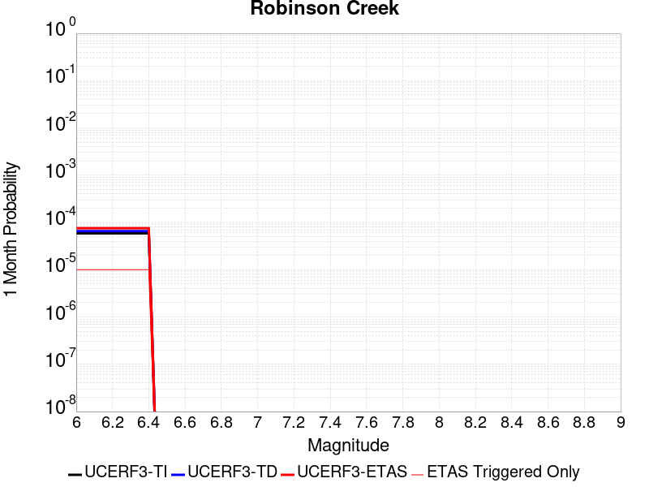 |  |  |

| Magnitude | 1 wk TI Prob | 1 wk TD Prob | 1 wk ETAS Prob | 1 wk ETAS/TD Gain | 1 wk ETAS Triggered Only | 1 mo TI Prob | 1 mo TD Prob | 1 mo ETAS Prob | 1 mo ETAS/TD Gain | 1 mo ETAS Triggered Only | 1 yr TI Prob | 1 yr TD Prob | 1 yr ETAS Prob | 1 yr ETAS/TD Gain | 1 yr ETAS Triggered Only | 10 yr TI Prob | 10 yr TD Prob | 10 yr ETAS Prob | 10 yr ETAS/TD Gain | 10 yr ETAS Triggered Only |
|-----|-----|-----|-----|-----|-----|-----|-----|-----|-----|-----|-----|-----|-----|-----|-----|-----|-----|-----|-----|-----|
| 6.0 | 1.3705327E-5 | 1.5285481E-5 | 1.5285481E-5 | 1.0 | 0.0 | 5.8735794E-5 | 6.55092E-5 | 6.55092E-5 | 1.0 | 0.0 | 7.1487366E-4 | 7.975745E-4 | 8.4150134E-4 | 1.0550754 | 4.396184E-5 | 0.0071257832 | 0.007975745 | 0.008019356 | 1.005468 | 4.396184E-5 |
| 6.1 | 1.3705327E-5 | 1.5285481E-5 | 1.5285481E-5 | 1.0 | 0.0 | 5.8735794E-5 | 6.55092E-5 | 6.55092E-5 | 1.0 | 0.0 | 7.1487366E-4 | 7.975745E-4 | 8.4150134E-4 | 1.0550754 | 4.396184E-5 | 0.0071257832 | 0.007975745 | 0.008019356 | 1.005468 | 4.396184E-5 |
| 6.2 | 1.3705327E-5 | 1.5285481E-5 | 1.5285481E-5 | 1.0 | 0.0 | 5.8735794E-5 | 6.55092E-5 | 6.55092E-5 | 1.0 | 0.0 | 7.1487366E-4 | 7.975745E-4 | 8.4150134E-4 | 1.0550754 | 4.396184E-5 | 0.0071257832 | 0.007975745 | 0.008019356 | 1.005468 | 4.396184E-5 |
| 6.3 | 1.3705327E-5 | 1.5285481E-5 | 1.5285481E-5 | 1.0 | 0.0 | 5.8735794E-5 | 6.55092E-5 | 6.55092E-5 | 1.0 | 0.0 | 7.1487366E-4 | 7.975745E-4 | 8.4150134E-4 | 1.0550754 | 4.396184E-5 | 0.0071257832 | 0.007975745 | 0.008019356 | 1.005468 | 4.396184E-5 |
| 6.4 | 1.3705327E-5 | 1.5285481E-5 | 1.5285481E-5 | 1.0 | 0.0 | 5.8735794E-5 | 6.55092E-5 | 6.55092E-5 | 1.0 | 0.0 | 7.1487366E-4 | 7.975745E-4 | 8.4150134E-4 | 1.0550754 | 4.396184E-5 | 0.0071257832 | 0.007975745 | 0.008019356 | 1.005468 | 4.396184E-5 |

## Great Valley 10 (Panoche)
*[(top)](#table-of-contents)*

| 1 Week | 1 Month | 1 Year | 10 Year |
|-----|-----|-----|-----|
|  |  |  |  |

| Magnitude | 1 wk TI Prob | 1 wk TD Prob | 1 wk ETAS Prob | 1 wk ETAS/TD Gain | 1 wk ETAS Triggered Only | 1 mo TI Prob | 1 mo TD Prob | 1 mo ETAS Prob | 1 mo ETAS/TD Gain | 1 mo ETAS Triggered Only | 1 yr TI Prob | 1 yr TD Prob | 1 yr ETAS Prob | 1 yr ETAS/TD Gain | 1 yr ETAS Triggered Only | 10 yr TI Prob | 10 yr TD Prob | 10 yr ETAS Prob | 10 yr ETAS/TD Gain | 10 yr ETAS Triggered Only |
|-----|-----|-----|-----|-----|-----|-----|-----|-----|-----|-----|-----|-----|-----|-----|-----|-----|-----|-----|-----|-----|
| 6.0 | 1.6014626E-5 | 1.6576112E-5 | 1.6576112E-5 | 1.0 | 0.0 | 6.863231E-5 | 7.103854E-5 | 7.103854E-5 | 1.0 | 0.0 | 8.35278E-4 | 8.6455565E-4 | 9.0847944E-4 | 1.0508051 | 4.396184E-5 | 0.008321454 | 0.008612541 | 0.008656124 | 1.0050604 | 4.396184E-5 |
| 6.1 | 1.6014626E-5 | 1.6576112E-5 | 1.6576112E-5 | 1.0 | 0.0 | 6.863231E-5 | 7.103854E-5 | 7.103854E-5 | 1.0 | 0.0 | 8.35278E-4 | 8.6455565E-4 | 9.0847944E-4 | 1.0508051 | 4.396184E-5 | 0.008321454 | 0.008612541 | 0.008656124 | 1.0050604 | 4.396184E-5 |
| 6.2 | 1.56782E-5 | 1.6199148E-5 | 1.6199148E-5 | 1.0 | 0.0 | 6.719056E-5 | 6.942306E-5 | 6.942306E-5 | 1.0 | 0.0 | 8.17738E-4 | 8.4490253E-4 | 8.8882726E-4 | 1.0519879 | 4.396184E-5 | 0.008147354 | 0.0084175095 | 0.008461102 | 1.0051787 | 4.396184E-5 |
| 6.3 | 1.5263338E-5 | 1.5724198E-5 | 1.5724198E-5 | 1.0 | 0.0 | 6.541267E-5 | 6.738767E-5 | 6.738767E-5 | 1.0 | 0.0 | 7.961082E-4 | 8.2014047E-4 | 8.640663E-4 | 1.0535588 | 4.396184E-5 | 0.007932622 | 0.00817173 | 0.008215332 | 1.0053358 | 4.396184E-5 |
| 6.4 | 1.4720723E-5 | 1.5100035E-5 | 1.5100035E-5 | 1.0 | 0.0 | 6.308728E-5 | 6.471282E-5 | 6.471282E-5 | 1.0 | 0.0 | 7.67817E-4 | 7.875981E-4 | 8.315253E-4 | 1.0557736 | 4.396184E-5 | 0.007651695 | 0.007848644 | 0.00789226 | 1.0055573 | 4.396184E-5 |
| 6.5 | 1.408264E-5 | 1.4356596E-5 | 1.4356596E-5 | 1.0 | 0.0 | 6.0352773E-5 | 6.152681E-5 | 6.152681E-5 | 1.0 | 0.0 | 7.3454727E-4 | 7.488357E-4 | 7.927646E-4 | 1.058663 | 4.396184E-5 | 0.0073212404 | 0.0074636796 | 0.0075073135 | 1.0058461 | 4.396184E-5 |
| 6.6 | 1.3197086E-5 | 1.33224685E-5 | 1.33224685E-5 | 1.0 | 0.0 | 5.6557717E-5 | 5.7095036E-5 | 5.7095036E-5 | 1.0 | 0.0 | 6.8837265E-4 | 6.949145E-4 | 6.949145E-4 | 1.0 | 0.0 | 0.006862442 | 0.0069279536 | 0.0069279536 | 1.0 | 0.0 |
| 6.7 | 1.017583E-5 | 9.745787E-6 | 9.745787E-6 | 1.0 | 0.0 | 4.360997E-5 | 4.1767E-5 | 4.1767E-5 | 1.0 | 0.0 | 5.30822E-4 | 5.08397E-4 | 5.08397E-4 | 1.0 | 0.0 | 0.0052955584 | 0.005072592 | 0.005072592 | 1.0 | 0.0 |
| 6.8 | 8.557912E-6 | 7.873034E-6 | 7.873034E-6 | 1.0 | 0.0 | 3.667625E-5 | 3.3741147E-5 | 3.3741147E-5 | 1.0 | 0.0 | 4.4644187E-4 | 4.1072306E-4 | 4.1072306E-4 | 1.0 | 0.0 | 0.0044554602 | 0.004099847 | 0.004099847 | 1.0 | 0.0 |
| 6.9 | 6.14664E-6 | 5.0922845E-6 | 5.0922845E-6 | 1.0 | 0.0 | 2.6342475E-5 | 2.1823902E-5 | 2.1823902E-5 | 1.0 | 0.0 | 3.2067244E-4 | 2.65675E-4 | 2.65675E-4 | 1.0 | 0.0 | 0.003202101 | 0.0026537122 | 0.0026537122 | 1.0 | 0.0 |
| 7.0 | 3.2310581E-6 | 1.695186E-6 | 1.695186E-6 | 1.0 | 0.0 | 1.3847319E-5 | 7.2650632E-6 | 7.2650632E-6 | 1.0 | 0.0 | 1.6857806E-4 | 8.844865E-5 | 8.844865E-5 | 1.0 | 0.0 | 0.0016845023 | 8.841438E-4 | 8.841438E-4 | 1.0 | 0.0 |
| 7.1 | 2.544492E-6 | 9.1892923E-7 | 9.1892923E-7 | 1.0 | 0.0 | 1.090492E-5 | 3.9382626E-6 | 3.9382626E-6 | 1.0 | 0.0 | 1.327593E-4 | 4.794734E-5 | 4.794734E-5 | 1.0 | 0.0 | 0.0013268003 | 4.7937472E-4 | 4.7937472E-4 | 1.0 | 0.0 |
| 7.2 | 2.4479045E-6 | 8.841656E-7 | 8.841656E-7 | 1.0 | 0.0 | 1.0490977E-5 | 3.789276E-6 | 3.789276E-6 | 1.0 | 0.0 | 1.2772017E-4 | 4.6133508E-5 | 4.6133508E-5 | 1.0 | 0.0 | 0.0012764678 | 4.6124402E-4 | 4.6124402E-4 | 1.0 | 0.0 |
| 7.3 | 2.0559578E-6 | 7.893082E-7 | 7.893082E-7 | 1.0 | 0.0 | 8.811218E-6 | 3.3827455E-6 | 3.3827455E-6 | 1.0 | 0.0 | 1.072713E-4 | 4.1184194E-5 | 4.1184194E-5 | 1.0 | 0.0 | 0.0010721954 | 4.1177025E-4 | 4.1177025E-4 | 1.0 | 0.0 |
| 7.4 | 1.727687E-6 | 7.388011E-7 | 7.388011E-7 | 1.0 | 0.0 | 7.404352E-6 | 3.1662867E-6 | 3.1662867E-6 | 1.0 | 0.0 | 9.0144255E-5 | 3.8548904E-5 | 3.8548904E-5 | 1.0 | 0.0 | 9.0107694E-4 | 3.8542677E-4 | 3.8542677E-4 | 1.0 | 0.0 |
| 7.5 | 1.5002679E-6 | 6.5463627E-7 | 6.5463627E-7 | 1.0 | 0.0 | 6.4297037E-6 | 2.8055813E-6 | 2.8055813E-6 | 1.0 | 0.0 | 7.827883E-5 | 3.415746E-5 | 3.415746E-5 | 1.0 | 0.0 | 7.825126E-4 | 3.4152623E-4 | 3.4152623E-4 | 1.0 | 0.0 |

## Blue Cut
*[(top)](#table-of-contents)*

| 1 Week | 1 Month | 1 Year | 10 Year |
|-----|-----|-----|-----|
|  |  |  |  |

| Magnitude | 1 wk TI Prob | 1 wk TD Prob | 1 wk ETAS Prob | 1 wk ETAS/TD Gain | 1 wk ETAS Triggered Only | 1 mo TI Prob | 1 mo TD Prob | 1 mo ETAS Prob | 1 mo ETAS/TD Gain | 1 mo ETAS Triggered Only | 1 yr TI Prob | 1 yr TD Prob | 1 yr ETAS Prob | 1 yr ETAS/TD Gain | 1 yr ETAS Triggered Only | 10 yr TI Prob | 10 yr TD Prob | 10 yr ETAS Prob | 10 yr ETAS/TD Gain | 10 yr ETAS Triggered Only |
|-----|-----|-----|-----|-----|-----|-----|-----|-----|-----|-----|-----|-----|-----|-----|-----|-----|-----|-----|-----|-----|
| 6.0 | 2.1227985E-5 | 2.2719998E-5 | 2.2719998E-5 | 1.0 | 0.0 | 9.097391E-5 | 9.7368116E-5 | 9.7368116E-5 | 1.0 | 0.0 | 0.0011070445 | 0.0011848703 | 0.0011848703 | 1.0 | 0.0 | 0.011015458 | 0.011791371 | 0.011834814 | 1.0036844 | 4.396184E-5 |
| 6.1 | 2.1227985E-5 | 2.2719998E-5 | 2.2719998E-5 | 1.0 | 0.0 | 9.097391E-5 | 9.7368116E-5 | 9.7368116E-5 | 1.0 | 0.0 | 0.0011070445 | 0.0011848703 | 0.0011848703 | 1.0 | 0.0 | 0.011015458 | 0.011791371 | 0.011834814 | 1.0036844 | 4.396184E-5 |
| 6.2 | 2.1227985E-5 | 2.2719998E-5 | 2.2719998E-5 | 1.0 | 0.0 | 9.097391E-5 | 9.7368116E-5 | 9.7368116E-5 | 1.0 | 0.0 | 0.0011070445 | 0.0011848703 | 0.0011848703 | 1.0 | 0.0 | 0.011015458 | 0.011791371 | 0.011834814 | 1.0036844 | 4.396184E-5 |
| 6.3 | 1.1613981E-5 | 1.2353751E-5 | 1.2353751E-5 | 1.0 | 0.0 | 4.9773254E-5 | 5.294364E-5 | 5.294364E-5 | 1.0 | 0.0 | 6.0582085E-4 | 6.4441067E-4 | 6.4441067E-4 | 1.0 | 0.0 | 0.0060417196 | 0.0064266673 | 0.006470347 | 1.0067966 | 4.396184E-5 |
| 6.4 | 1.1613981E-5 | 1.2353751E-5 | 1.2353751E-5 | 1.0 | 0.0 | 4.9773254E-5 | 5.294364E-5 | 5.294364E-5 | 1.0 | 0.0 | 6.0582085E-4 | 6.4441067E-4 | 6.4441067E-4 | 1.0 | 0.0 | 0.0060417196 | 0.0064266673 | 0.006470347 | 1.0067966 | 4.396184E-5 |
| 6.5 | 8.931326E-6 | 9.481755E-6 | 9.481755E-6 | 1.0 | 0.0 | 3.8276554E-5 | 4.063551E-5 | 4.063551E-5 | 1.0 | 0.0 | 4.6591737E-4 | 4.946342E-4 | 4.946342E-4 | 1.0 | 0.0 | 0.0046494175 | 0.0049362415 | 0.0049362415 | 1.0 | 0.0 |
| 6.6 | 7.345353E-6 | 7.790404E-6 | 7.790404E-6 | 1.0 | 0.0 | 3.1479703E-5 | 3.3387067E-5 | 3.3387067E-5 | 1.0 | 0.0 | 3.83198E-4 | 4.064197E-4 | 4.064197E-4 | 1.0 | 0.0 | 0.0038253788 | 0.004057556 | 0.004057556 | 1.0 | 0.0 |
| 6.7 | 6.2775666E-6 | 6.655255E-6 | 6.655255E-6 | 1.0 | 0.0 | 2.690358E-5 | 2.8522252E-5 | 2.8522252E-5 | 1.0 | 0.0 | 3.2750185E-4 | 3.4721062E-4 | 3.4721062E-4 | 1.0 | 0.0 | 0.0032701963 | 0.0034674224 | 0.0034674224 | 1.0 | 0.0 |
| 6.8 | 5.5234095E-6 | 5.8552046E-6 | 5.8552046E-6 | 1.0 | 0.0 | 2.367154E-5 | 2.5093534E-5 | 2.5093534E-5 | 1.0 | 0.0 | 2.8816288E-4 | 3.0547823E-4 | 3.0547823E-4 | 1.0 | 0.0 | 0.002877895 | 0.0030512991 | 0.0030512991 | 1.0 | 0.0 |
| 6.9 | 4.7780054E-6 | 5.065501E-6 | 5.065501E-6 | 1.0 | 0.0 | 2.0477004E-5 | 2.1709151E-5 | 2.1709151E-5 | 1.0 | 0.0 | 2.4927902E-4 | 2.642839E-4 | 2.642839E-4 | 1.0 | 0.0 | 0.0024899957 | 0.0026403882 | 0.0026403882 | 1.0 | 0.0 |
| 7.0 | 3.883171E-6 | 4.1185535E-6 | 4.1185535E-6 | 1.0 | 0.0 | 1.6642054E-5 | 1.7650862E-5 | 1.7650862E-5 | 1.0 | 0.0 | 2.0259817E-4 | 2.1488495E-4 | 2.1488495E-4 | 1.0 | 0.0 | 0.0020241356 | 0.0021474473 | 0.0021474473 | 1.0 | 0.0 |
| 7.1 | 2.8358215E-6 | 3.009765E-6 | 3.009765E-6 | 1.0 | 0.0 | 1.2153464E-5 | 1.2898965E-5 | 1.2898965E-5 | 1.0 | 0.0 | 1.4795837E-4 | 1.5704017E-4 | 1.5704017E-4 | 1.0 | 0.0 | 0.001478599 | 0.0015699371 | 0.0015699371 | 1.0 | 0.0 |

## Manix-Afton Hills
*[(top)](#table-of-contents)*

| 1 Week | 1 Month | 1 Year | 10 Year |
|-----|-----|-----|-----|
|  |  |  |  |

| Magnitude | 1 wk TI Prob | 1 wk TD Prob | 1 wk ETAS Prob | 1 wk ETAS/TD Gain | 1 wk ETAS Triggered Only | 1 mo TI Prob | 1 mo TD Prob | 1 mo ETAS Prob | 1 mo ETAS/TD Gain | 1 mo ETAS Triggered Only | 1 yr TI Prob | 1 yr TD Prob | 1 yr ETAS Prob | 1 yr ETAS/TD Gain | 1 yr ETAS Triggered Only | 10 yr TI Prob | 10 yr TD Prob | 10 yr ETAS Prob | 10 yr ETAS/TD Gain | 10 yr ETAS Triggered Only |
|-----|-----|-----|-----|-----|-----|-----|-----|-----|-----|-----|-----|-----|-----|-----|-----|-----|-----|-----|-----|-----|
| 6.0 | 1.3783202E-5 | 1.4711353E-5 | 1.4711353E-5 | 1.0 | 0.0 | 5.906953E-5 | 6.304723E-5 | 6.304723E-5 | 1.0 | 0.0 | 7.189342E-4 | 7.6734717E-4 | 8.1127527E-4 | 1.0572467 | 4.396184E-5 | 0.0071661277 | 0.007648732 | 0.007692358 | 1.0057037 | 4.396184E-5 |
| 6.1 | 1.3783202E-5 | 1.4711353E-5 | 1.4711353E-5 | 1.0 | 0.0 | 5.906953E-5 | 6.304723E-5 | 6.304723E-5 | 1.0 | 0.0 | 7.189342E-4 | 7.6734717E-4 | 8.1127527E-4 | 1.0572467 | 4.396184E-5 | 0.0071661277 | 0.007648732 | 0.007692358 | 1.0057037 | 4.396184E-5 |
| 6.2 | 1.3783202E-5 | 1.4711353E-5 | 1.4711353E-5 | 1.0 | 0.0 | 5.906953E-5 | 6.304723E-5 | 6.304723E-5 | 1.0 | 0.0 | 7.189342E-4 | 7.6734717E-4 | 8.1127527E-4 | 1.0572467 | 4.396184E-5 | 0.0071661277 | 0.007648732 | 0.007692358 | 1.0057037 | 4.396184E-5 |
| 6.3 | 1.10494875E-5 | 1.1793347E-5 | 1.1793347E-5 | 1.0 | 0.0 | 4.7354086E-5 | 5.0541992E-5 | 5.0541992E-5 | 1.0 | 0.0 | 5.763835E-4 | 6.151854E-4 | 6.151854E-4 | 1.0 | 0.0 | 0.005748908 | 0.006135865 | 0.006135865 | 1.0 | 0.0 |
| 6.4 | 1.10494875E-5 | 1.1793347E-5 | 1.1793347E-5 | 1.0 | 0.0 | 4.7354086E-5 | 5.0541992E-5 | 5.0541992E-5 | 1.0 | 0.0 | 5.763835E-4 | 6.151854E-4 | 6.151854E-4 | 1.0 | 0.0 | 0.005748908 | 0.006135865 | 0.006135865 | 1.0 | 0.0 |
| 6.5 | 9.788949E-6 | 1.0454509E-5 | 1.0454509E-5 | 1.0 | 0.0 | 4.1951964E-5 | 4.480432E-5 | 4.480432E-5 | 1.0 | 0.0 | 5.1064545E-4 | 5.453653E-4 | 5.453653E-4 | 1.0 | 0.0 | 0.0050947363 | 0.0054411967 | 0.0054411967 | 1.0 | 0.0 |
| 6.6 | 8.810006E-6 | 9.4137995E-6 | 9.4137995E-6 | 1.0 | 0.0 | 3.775662E-5 | 4.0344283E-5 | 4.0344283E-5 | 1.0 | 0.0 | 4.5958988E-4 | 4.910898E-4 | 4.910898E-4 | 1.0 | 0.0 | 0.0045864056 | 0.004900928 | 0.004900928 | 1.0 | 0.0 |
| 6.7 | 8.80128E-6 | 9.404279E-6 | 9.404279E-6 | 1.0 | 0.0 | 3.7719226E-5 | 4.0303483E-5 | 4.0303483E-5 | 1.0 | 0.0 | 4.591348E-4 | 4.905933E-4 | 4.905933E-4 | 1.0 | 0.0 | 0.004581874 | 0.0048959847 | 0.0048959847 | 1.0 | 0.0 |
| 6.8 | 6.8994877E-6 | 7.3802125E-6 | 7.3802125E-6 | 1.0 | 0.0 | 2.9568899E-5 | 3.1629144E-5 | 3.1629144E-5 | 1.0 | 0.0 | 3.5994186E-4 | 3.8502496E-4 | 3.8502496E-4 | 1.0 | 0.0 | 0.003593594 | 0.0038443839 | 0.0038443839 | 1.0 | 0.0 |
| 6.9 | 4.9328037E-6 | 5.2710575E-6 | 5.2710575E-6 | 1.0 | 0.0 | 2.1140417E-5 | 2.2590086E-5 | 2.2590086E-5 | 1.0 | 0.0 | 2.5735417E-4 | 2.7500573E-4 | 2.7500573E-4 | 1.0 | 0.0 | 0.0025705635 | 0.0027472596 | 0.0027472596 | 1.0 | 0.0 |
| 7.0 | 3.347973E-6 | 3.5900991E-6 | 3.5900991E-6 | 1.0 | 0.0 | 1.4348378E-5 | 1.5386071E-5 | 1.5386071E-5 | 1.0 | 0.0 | 1.746775E-4 | 1.8731342E-4 | 1.8731342E-4 | 1.0 | 0.0 | 0.0017454025 | 0.0018719579 | 0.0018719579 | 1.0 | 0.0 |
| 7.1 | 1.2073567E-6 | 1.2935066E-6 | 1.2935066E-6 | 1.0 | 0.0 | 5.1743755E-6 | 5.5435967E-6 | 5.5435967E-6 | 1.0 | 0.0 | 6.29962E-5 | 6.749283E-5 | 6.749283E-5 | 1.0 | 0.0 | 6.297835E-4 | 6.7488354E-4 | 6.7488354E-4 | 1.0 | 0.0 |

## Mission Ridge-Arroyo Parida-Santa Ana
*[(top)](#table-of-contents)*

| 1 Week | 1 Month | 1 Year | 10 Year |
|-----|-----|-----|-----|
|  |  |  |  |

| Magnitude | 1 wk TI Prob | 1 wk TD Prob | 1 wk ETAS Prob | 1 wk ETAS/TD Gain | 1 wk ETAS Triggered Only | 1 mo TI Prob | 1 mo TD Prob | 1 mo ETAS Prob | 1 mo ETAS/TD Gain | 1 mo ETAS Triggered Only | 1 yr TI Prob | 1 yr TD Prob | 1 yr ETAS Prob | 1 yr ETAS/TD Gain | 1 yr ETAS Triggered Only | 10 yr TI Prob | 10 yr TD Prob | 10 yr ETAS Prob | 10 yr ETAS/TD Gain | 10 yr ETAS Triggered Only |
|-----|-----|-----|-----|-----|-----|-----|-----|-----|-----|-----|-----|-----|-----|-----|-----|-----|-----|-----|-----|-----|
| 6.0 | 4.169034E-5 | 4.7140853E-5 | 4.7140853E-5 | 1.0 | 0.0 | 1.7866064E-4 | 2.0202145E-4 | 2.459744E-4 | 1.2175658 | 4.396184E-5 | 0.0021730233 | 0.002457577 | 0.0025014307 | 1.0178443 | 4.396184E-5 | 0.021518968 | 0.02438592 | 0.024428809 | 1.0017588 | 4.396184E-5 |
| 6.1 | 1.73813E-5 | 1.68548E-5 | 1.68548E-5 | 1.0 | 0.0 | 7.4489166E-5 | 7.223291E-5 | 1.1619158E-4 | 1.6085683 | 4.396184E-5 | 9.065282E-4 | 8.790917E-4 | 9.230149E-4 | 1.0499643 | 4.396184E-5 | 0.009028391 | 0.008757284 | 0.008800861 | 1.004976 | 4.396184E-5 |
| 6.2 | 1.4622182E-5 | 1.3673732E-5 | 1.3673732E-5 | 1.0 | 0.0 | 6.2664985E-5 | 5.860041E-5 | 1.0255968E-4 | 1.7501528 | 4.396184E-5 | 7.6267915E-4 | 7.1323034E-4 | 7.5716083E-4 | 1.0615937 | 4.396184E-5 | 0.007600669 | 0.0071098562 | 0.0071535055 | 1.0061393 | 4.396184E-5 |
| 6.3 | 1.3552434E-5 | 1.24826065E-5 | 1.24826065E-5 | 1.0 | 0.0 | 5.8080568E-5 | 5.3495805E-5 | 9.74553E-5 | 1.8217372 | 4.396184E-5 | 7.069015E-4 | 6.511199E-4 | 6.9505314E-4 | 1.0674733 | 4.396184E-5 | 0.00704657 | 0.0064924853 | 0.0065361615 | 1.0067272 | 4.396184E-5 |
| 6.4 | 1.30977305E-5 | 1.1979547E-5 | 1.1979547E-5 | 1.0 | 0.0 | 5.613192E-5 | 5.1339925E-5 | 9.529951E-5 | 1.8562456 | 4.396184E-5 | 6.831918E-4 | 6.248873E-4 | 6.688217E-4 | 1.0703076 | 4.396184E-5 | 0.006810953 | 0.006231647 | 0.006275335 | 1.0070107 | 4.396184E-5 |
| 6.5 | 1.225205E-5 | 1.1049169E-5 | 1.1049169E-5 | 1.0 | 0.0 | 5.2507727E-5 | 4.735274E-5 | 9.13125E-5 | 1.9283468 | 4.396184E-5 | 6.3909404E-4 | 5.763698E-4 | 6.203063E-4 | 1.0762297 | 4.396184E-5 | 0.006372592 | 0.0057490594 | 0.005792768 | 1.0076028 | 4.396184E-5 |
| 6.6 | 1.1352241E-5 | 1.0063876E-5 | 1.0063876E-5 | 1.0 | 0.0 | 4.8651553E-5 | 4.31302E-5 | 8.709014E-5 | 2.0192382 | 4.396184E-5 | 5.921717E-4 | 5.249858E-4 | 5.6892453E-4 | 1.0836952 | 4.396184E-5 | 0.0059059616 | 0.005237702 | 0.0052814335 | 1.0083494 | 4.396184E-5 |
| 6.7 | 1.0864116E-5 | 9.517351E-6 | 9.517351E-6 | 1.0 | 0.0 | 4.6559664E-5 | 4.078802E-5 | 8.474807E-5 | 2.0777686 | 4.396184E-5 | 5.667165E-4 | 4.96483E-4 | 5.4042303E-4 | 1.0885025 | 4.396184E-5 | 0.005652734 | 0.004953972 | 0.0049977163 | 1.0088301 | 4.396184E-5 |
| 6.8 | 1.0666365E-5 | 9.300097E-6 | 9.300097E-6 | 1.0 | 0.0 | 4.571219E-5 | 3.985696E-5 | 8.381705E-5 | 2.1029463 | 4.396184E-5 | 5.564038E-4 | 4.8515244E-4 | 5.2909297E-4 | 1.0905706 | 4.396184E-5 | 0.005550127 | 0.004841165 | 0.0048849145 | 1.0090369 | 4.396184E-5 |
| 6.9 | 1.0038665E-5 | 8.592339E-6 | 8.592339E-6 | 1.0 | 0.0 | 4.302214E-5 | 3.6823803E-5 | 8.0784026E-5 | 2.193799 | 4.396184E-5 | 5.236687E-4 | 4.4823939E-4 | 4.921815E-4 | 1.0980327 | 4.396184E-5 | 0.005224364 | 0.0044735637 | 0.004517329 | 1.009783 | 4.396184E-5 |
| 7.0 | 9.5379955E-6 | 8.025347E-6 | 8.025347E-6 | 1.0 | 0.0 | 4.0876483E-5 | 3.43939E-5 | 7.835423E-5 | 2.2781432 | 4.396184E-5 | 4.975576E-4 | 4.1866695E-4 | 4.626104E-4 | 1.1049603 | 4.396184E-5 | 0.00496445 | 0.0041789818 | 0.00422276 | 1.0104758 | 4.396184E-5 |
| 7.1 | 9.207389E-6 | 7.652634E-6 | 7.652634E-6 | 1.0 | 0.0 | 3.945964E-5 | 3.27966E-5 | 7.6757E-5 | 2.340395 | 4.396184E-5 | 4.803152E-4 | 3.9922714E-4 | 4.4317142E-4 | 1.1100734 | 4.396184E-5 | 0.004792784 | 0.0039852955 | 0.004029082 | 1.010987 | 4.396184E-5 |
| 7.2 | 7.638091E-6 | 5.9313033E-6 | 5.9313033E-6 | 1.0 | 0.0 | 3.2734264E-5 | 2.5419626E-5 | 6.938035E-5 | 2.7294009 | 4.396184E-5 | 3.984668E-4 | 3.094403E-4 | 3.5338855E-4 | 1.1420249 | 4.396184E-5 | 0.0039775306 | 0.0030901511 | 0.003133977 | 1.0141824 | 4.396184E-5 |
| 7.3 | 7.2500147E-6 | 5.5963246E-6 | 5.5963246E-6 | 1.0 | 0.0 | 3.1071122E-5 | 2.3984028E-5 | 6.794481E-5 | 2.8329191 | 4.396184E-5 | 3.7822526E-4 | 2.9196672E-4 | 3.3591574E-4 | 1.1505275 | 4.396184E-5 | 0.0037758215 | 0.002915887 | 0.0029597206 | 1.0150326 | 4.396184E-5 |
| 7.4 | 6.3899715E-6 | 4.9186388E-6 | 4.9186388E-6 | 1.0 | 0.0 | 2.7385306E-5 | 2.1079712E-5 | 6.504063E-5 | 3.085461 | 4.396184E-5 | 3.3336508E-4 | 2.5661546E-4 | 3.0056603E-4 | 1.1712701 | 4.396184E-5 | 0.0033286542 | 0.0025632358 | 0.002607085 | 1.017107 | 4.396184E-5 |
| 7.5 | 5.379025E-6 | 4.0839664E-6 | 4.0839664E-6 | 1.0 | 0.0 | 2.305276E-5 | 1.7502596E-5 | 1.7502596E-5 | 1.0 | 0.0 | 2.806312E-4 | 2.1307338E-4 | 2.1307338E-4 | 1.0 | 0.0 | 0.0028027708 | 0.0021287021 | 0.0021287021 | 1.0 | 0.0 |
| 7.6 | 4.1270696E-6 | 3.0884264E-6 | 3.0884264E-6 | 1.0 | 0.0 | 1.768732E-5 | 1.3236046E-5 | 1.3236046E-5 | 1.0 | 0.0 | 2.1532185E-4 | 1.6113702E-4 | 1.6113702E-4 | 1.0 | 0.0 | 0.0021511333 | 0.0016102099 | 0.0016102099 | 1.0 | 0.0 |
| 7.7 | 2.5406805E-6 | 1.8282518E-6 | 1.8282518E-6 | 1.0 | 0.0 | 1.0888585E-5 | 7.835341E-6 | 7.835341E-6 | 1.0 | 0.0 | 1.3256045E-4 | 9.5391166E-5 | 9.5391166E-5 | 1.0 | 0.0 | 0.0013248142 | 9.5350837E-4 | 9.5350837E-4 | 1.0 | 0.0 |
| 7.8 | 4.8608285E-7 | 3.5099728E-7 | 3.5099728E-7 | 1.0 | 0.0 | 2.0832106E-6 | 1.5042731E-6 | 1.5042731E-6 | 1.0 | 0.0 | 2.5362791E-5 | 1.8314373E-5 | 1.8314373E-5 | 1.0 | 0.0 | 2.5359896E-4 | 1.8312875E-4 | 1.8312875E-4 | 1.0 | 0.0 |
| 7.9 | 2.0472514E-8 | 1.2689404E-8 | 1.2689404E-8 | 1.0 | 0.0 | 8.7739345E-8 | 5.4383158E-8 | 5.4383158E-8 | 1.0 | 0.0 | 1.068226E-6 | 6.6211476E-7 | 6.6211476E-7 | 1.0 | 0.0 | 1.0682209E-5 | 6.6211287E-6 | 6.6211287E-6 | 1.0 | 0.0 |
| 8.0 | 4.443582E-9 | 2.032401E-9 | 2.032401E-9 | 1.0 | 0.0 | 1.9043922E-8 | 8.7102885E-9 | 8.7102885E-9 | 1.0 | 0.0 | 2.3185973E-7 | 1.06047764E-7 | 1.06047764E-7 | 1.0 | 0.0 | 2.3185949E-6 | 1.0604772E-6 | 1.0604772E-6 | 1.0 | 0.0 |

## San Juan
*[(top)](#table-of-contents)*

| 1 Week | 1 Month | 1 Year | 10 Year |
|-----|-----|-----|-----|
|  |  |  |  |

| Magnitude | 1 wk TI Prob | 1 wk TD Prob | 1 wk ETAS Prob | 1 wk ETAS/TD Gain | 1 wk ETAS Triggered Only | 1 mo TI Prob | 1 mo TD Prob | 1 mo ETAS Prob | 1 mo ETAS/TD Gain | 1 mo ETAS Triggered Only | 1 yr TI Prob | 1 yr TD Prob | 1 yr ETAS Prob | 1 yr ETAS/TD Gain | 1 yr ETAS Triggered Only | 10 yr TI Prob | 10 yr TD Prob | 10 yr ETAS Prob | 10 yr ETAS/TD Gain | 10 yr ETAS Triggered Only |
|-----|-----|-----|-----|-----|-----|-----|-----|-----|-----|-----|-----|-----|-----|-----|-----|-----|-----|-----|-----|-----|
| 6.0 | 8.682808E-6 | 8.749955E-6 | 8.749955E-6 | 1.0 | 0.0 | 3.72115E-5 | 3.7499292E-5 | 3.7499292E-5 | 1.0 | 0.0 | 4.5295584E-4 | 4.5646308E-4 | 4.5646308E-4 | 1.0 | 0.0 | 0.004520337 | 0.004555796 | 0.0045995577 | 1.0096056 | 4.396184E-5 |
| 6.1 | 8.682808E-6 | 8.749955E-6 | 8.749955E-6 | 1.0 | 0.0 | 3.72115E-5 | 3.7499292E-5 | 3.7499292E-5 | 1.0 | 0.0 | 4.5295584E-4 | 4.5646308E-4 | 4.5646308E-4 | 1.0 | 0.0 | 0.004520337 | 0.004555796 | 0.0045995577 | 1.0096056 | 4.396184E-5 |
| 6.2 | 8.682808E-6 | 8.749955E-6 | 8.749955E-6 | 1.0 | 0.0 | 3.72115E-5 | 3.7499292E-5 | 3.7499292E-5 | 1.0 | 0.0 | 4.5295584E-4 | 4.5646308E-4 | 4.5646308E-4 | 1.0 | 0.0 | 0.004520337 | 0.004555796 | 0.0045995577 | 1.0096056 | 4.396184E-5 |
| 6.3 | 6.3054235E-6 | 6.2833515E-6 | 6.2833515E-6 | 1.0 | 0.0 | 2.7022963E-5 | 2.692838E-5 | 2.692838E-5 | 1.0 | 0.0 | 3.2895492E-4 | 3.2780512E-4 | 3.2780512E-4 | 1.0 | 0.0 | 0.003284684 | 0.0032734156 | 0.0032734156 | 1.0 | 0.0 |
| 6.4 | 6.1490473E-6 | 6.115127E-6 | 6.115127E-6 | 1.0 | 0.0 | 2.6352795E-5 | 2.620743E-5 | 2.620743E-5 | 1.0 | 0.0 | 3.2079802E-4 | 3.1903014E-4 | 3.1903014E-4 | 1.0 | 0.0 | 0.0032033534 | 0.0031859176 | 0.0031859176 | 1.0 | 0.0 |
| 6.5 | 5.204848E-6 | 5.137873E-6 | 5.137873E-6 | 1.0 | 0.0 | 2.23063E-5 | 2.2019276E-5 | 2.2019276E-5 | 1.0 | 0.0 | 2.7154534E-4 | 2.6805265E-4 | 2.6805265E-4 | 1.0 | 0.0 | 0.0027121378 | 0.0026774474 | 0.0026774474 | 1.0 | 0.0 |
| 6.6 | 4.5179986E-6 | 4.4155086E-6 | 4.4155086E-6 | 1.0 | 0.0 | 1.9362706E-5 | 1.8923476E-5 | 1.8923476E-5 | 1.0 | 0.0 | 2.3571544E-4 | 2.3036974E-4 | 2.3036974E-4 | 1.0 | 0.0 | 0.0023546559 | 0.0023014464 | 0.0023014464 | 1.0 | 0.0 |
| 6.7 | 3.9442616E-6 | 3.8202556E-6 | 3.8202556E-6 | 1.0 | 0.0 | 1.6903869E-5 | 1.6372425E-5 | 1.6372425E-5 | 1.0 | 0.0 | 2.0578515E-4 | 1.9931671E-4 | 1.9931671E-4 | 1.0 | 0.0 | 0.002055947 | 0.0019915043 | 0.0019915043 | 1.0 | 0.0 |
| 6.8 | 3.4536245E-6 | 3.316745E-6 | 3.316745E-6 | 1.0 | 0.0 | 1.4801163E-5 | 1.4214547E-5 | 1.4214547E-5 | 1.0 | 0.0 | 1.8018926E-4 | 1.7304897E-4 | 1.7304897E-4 | 1.0 | 0.0 | 0.0018004322 | 0.0017292611 | 0.0017292611 | 1.0 | 0.0 |
| 6.9 | 3.059865E-6 | 2.9124226E-6 | 2.9124226E-6 | 1.0 | 0.0 | 1.3113641E-5 | 1.2481754E-5 | 1.2481754E-5 | 1.0 | 0.0 | 1.596469E-4 | 1.5195533E-4 | 1.5195533E-4 | 1.0 | 0.0 | 0.0015953224 | 0.001518629 | 0.001518629 | 1.0 | 0.0 |
| 7.0 | 2.6504351E-6 | 2.4923695E-6 | 2.4923695E-6 | 1.0 | 0.0 | 1.1358958E-5 | 1.0681543E-5 | 1.0681543E-5 | 1.0 | 0.0 | 1.3828653E-4 | 1.3004057E-4 | 1.3004057E-4 | 1.0 | 0.0 | 0.0013820052 | 0.0012997567 | 0.0012997567 | 1.0 | 0.0 |
| 7.1 | 2.2039317E-6 | 2.0341317E-6 | 2.0341317E-6 | 1.0 | 0.0 | 9.445387E-6 | 8.717681E-6 | 8.717681E-6 | 1.0 | 0.0 | 1.1499152E-4 | 1.0613313E-4 | 1.0613313E-4 | 1.0 | 0.0 | 0.0011493203 | 0.0010609344 | 0.0010609344 | 1.0 | 0.0 |
| 7.2 | 1.0786707E-6 | 8.772781E-7 | 8.772781E-7 | 1.0 | 0.0 | 4.622866E-6 | 3.7597579E-6 | 3.7597579E-6 | 1.0 | 0.0 | 5.628194E-5 | 4.5774104E-5 | 4.5774104E-5 | 1.0 | 0.0 | 5.6267687E-4 | 4.5770584E-4 | 4.5770584E-4 | 1.0 | 0.0 |
| 7.3 | 6.846433E-7 | 4.8704425E-7 | 4.8704425E-7 | 1.0 | 0.0 | 2.9341822E-6 | 2.0873308E-6 | 2.0873308E-6 | 1.0 | 0.0 | 3.5723086E-5 | 2.5412957E-5 | 2.5412957E-5 | 1.0 | 0.0 | 3.571734E-4 | 2.5413404E-4 | 2.5413404E-4 | 1.0 | 0.0 |
| 7.4 | 5.23043E-7 | 3.2640304E-7 | 3.2640304E-7 | 1.0 | 0.0 | 2.2416111E-6 | 1.3988695E-6 | 1.3988695E-6 | 1.0 | 0.0 | 2.7291273E-5 | 1.7031103E-5 | 1.7031103E-5 | 1.0 | 0.0 | 2.7287923E-4 | 1.7032993E-4 | 1.7032993E-4 | 1.0 | 0.0 |
| 7.5 | 4.648444E-7 | 2.7245397E-7 | 2.7245397E-7 | 1.0 | 0.0 | 1.9921886E-6 | 1.1676593E-6 | 1.1676593E-6 | 1.0 | 0.0 | 2.4254627E-5 | 1.4216161E-5 | 1.4216161E-5 | 1.0 | 0.0 | 2.425198E-4 | 1.4218215E-4 | 1.4218215E-4 | 1.0 | 0.0 |
| 7.6 | 3.9906567E-7 | 2.2091646E-7 | 2.2091646E-7 | 1.0 | 0.0 | 1.7102802E-6 | 9.467845E-7 | 9.467845E-7 | 1.0 | 0.0 | 2.0822463E-5 | 1.152704E-5 | 1.152704E-5 | 1.0 | 0.0 | 2.0820512E-4 | 1.1528905E-4 | 1.1528905E-4 | 1.0 | 0.0 |
| 7.7 | 1.8784601E-7 | 5.369796E-8 | 5.369796E-8 | 1.0 | 0.0 | 8.0505407E-7 | 2.301341E-7 | 2.301341E-7 | 1.0 | 0.0 | 9.80149E-6 | 2.801879E-6 | 2.801879E-6 | 1.0 | 0.0 | 9.801057E-5 | 2.8027504E-5 | 2.8027504E-5 | 1.0 | 0.0 |
| 7.8 | 1.00154914E-7 | 1.2425791E-8 | 1.2425791E-8 | 1.0 | 0.0 | 4.2923529E-7 | 5.3253387E-8 | 5.3253387E-8 | 1.0 | 0.0 | 5.225927E-6 | 6.483598E-7 | 6.483598E-7 | 1.0 | 0.0 | 5.225804E-5 | 6.4894875E-6 | 6.4894875E-6 | 1.0 | 0.0 |
| 7.9 | 6.171429E-8 | 4.301782E-9 | 4.301782E-9 | 1.0 | 0.0 | 2.6448978E-7 | 1.8436214E-8 | 1.8436214E-8 | 1.0 | 0.0 | 3.2201583E-6 | 2.2446086E-7 | 2.2446086E-7 | 1.0 | 0.0 | 3.2201115E-5 | 2.249913E-6 | 2.249913E-6 | 1.0 | 0.0 |
| 8.0 | 1.3974572E-8 | 3.388243E-10 | 3.388243E-10 | 1.0 | 0.0 | 5.989102E-8 | 1.4521105E-9 | 1.4521105E-9 | 1.0 | 0.0 | 7.2917294E-7 | 1.7679438E-8 | 1.7679438E-8 | 1.0 | 0.0 | 7.2917055E-6 | 1.8110795E-7 | 1.8110795E-7 | 1.0 | 0.0 |
| 8.1 | 1.8403477E-9 | 1.1326151E-10 | 1.1326151E-10 | 1.0 | 0.0 | 7.887204E-9 | 4.8540727E-10 | 4.8540727E-10 | 1.0 | 0.0 | 9.602671E-8 | 5.9098357E-9 | 5.9098357E-9 | 1.0 | 0.0 | 9.602667E-7 | 6.0343986E-8 | 6.0343986E-8 | 1.0 | 0.0 |

## Cleghorn
*[(top)](#table-of-contents)*

| 1 Week | 1 Month | 1 Year | 10 Year |
|-----|-----|-----|-----|
|  |  |  |  |

| Magnitude | 1 wk TI Prob | 1 wk TD Prob | 1 wk ETAS Prob | 1 wk ETAS/TD Gain | 1 wk ETAS Triggered Only | 1 mo TI Prob | 1 mo TD Prob | 1 mo ETAS Prob | 1 mo ETAS/TD Gain | 1 mo ETAS Triggered Only | 1 yr TI Prob | 1 yr TD Prob | 1 yr ETAS Prob | 1 yr ETAS/TD Gain | 1 yr ETAS Triggered Only | 10 yr TI Prob | 10 yr TD Prob | 10 yr ETAS Prob | 10 yr ETAS/TD Gain | 10 yr ETAS Triggered Only |
|-----|-----|-----|-----|-----|-----|-----|-----|-----|-----|-----|-----|-----|-----|-----|-----|-----|-----|-----|-----|-----|
| 6.0 | 7.9267165E-6 | 9.836382E-6 | 9.836382E-6 | 1.0 | 0.0 | 3.39712E-5 | 4.21553E-5 | 4.21553E-5 | 1.0 | 0.0 | 4.1352084E-4 | 5.1313057E-4 | 5.1313057E-4 | 1.0 | 0.0 | 0.004127522 | 0.0051345266 | 0.005178263 | 1.0085181 | 4.396184E-5 |
| 6.1 | 7.9267165E-6 | 9.836382E-6 | 9.836382E-6 | 1.0 | 0.0 | 3.39712E-5 | 4.21553E-5 | 4.21553E-5 | 1.0 | 0.0 | 4.1352084E-4 | 5.1313057E-4 | 5.1313057E-4 | 1.0 | 0.0 | 0.004127522 | 0.0051345266 | 0.005178263 | 1.0085181 | 4.396184E-5 |
| 6.2 | 7.9267165E-6 | 9.836382E-6 | 9.836382E-6 | 1.0 | 0.0 | 3.39712E-5 | 4.21553E-5 | 4.21553E-5 | 1.0 | 0.0 | 4.1352084E-4 | 5.1313057E-4 | 5.1313057E-4 | 1.0 | 0.0 | 0.004127522 | 0.0051345266 | 0.005178263 | 1.0085181 | 4.396184E-5 |
| 6.3 | 7.9267165E-6 | 9.836382E-6 | 9.836382E-6 | 1.0 | 0.0 | 3.39712E-5 | 4.21553E-5 | 4.21553E-5 | 1.0 | 0.0 | 4.1352084E-4 | 5.1313057E-4 | 5.1313057E-4 | 1.0 | 0.0 | 0.004127522 | 0.0051345266 | 0.005178263 | 1.0085181 | 4.396184E-5 |
| 6.4 | 4.3445207E-6 | 6.096199E-6 | 6.096199E-6 | 1.0 | 0.0 | 1.8619241E-5 | 2.612631E-5 | 2.612631E-5 | 1.0 | 0.0 | 2.2666567E-4 | 3.180424E-4 | 3.180424E-4 | 1.0 | 0.0 | 0.0022643462 | 0.003190019 | 0.0032338405 | 1.0137371 | 4.396184E-5 |
| 6.5 | 4.3445207E-6 | 6.096199E-6 | 6.096199E-6 | 1.0 | 0.0 | 1.8619241E-5 | 2.612631E-5 | 2.612631E-5 | 1.0 | 0.0 | 2.2666567E-4 | 3.180424E-4 | 3.180424E-4 | 1.0 | 0.0 | 0.0022643462 | 0.003190019 | 0.0032338405 | 1.0137371 | 4.396184E-5 |
| 6.6 | 4.040109E-6 | 5.778603E-6 | 5.778603E-6 | 1.0 | 0.0 | 1.7314638E-5 | 2.4765211E-5 | 2.4765211E-5 | 1.0 | 0.0 | 2.1078532E-4 | 3.0147567E-4 | 3.0147567E-4 | 1.0 | 0.0 | 0.002105855 | 0.0030248072 | 0.003068636 | 1.0144898 | 4.396184E-5 |
| 6.7 | 3.3632055E-6 | 5.0720914E-6 | 5.0720914E-6 | 1.0 | 0.0 | 1.4413658E-5 | 2.1737356E-5 | 2.1737356E-5 | 1.0 | 0.0 | 1.7547216E-4 | 2.646205E-4 | 2.646205E-4 | 1.0 | 0.0 | 0.0017533366 | 0.002657138 | 0.002657138 | 1.0 | 0.0 |
| 6.8 | 3.2902772E-6 | 4.9939977E-6 | 4.9939977E-6 | 1.0 | 0.0 | 1.4101111E-5 | 2.1402673E-5 | 2.1402673E-5 | 1.0 | 0.0 | 1.716675E-4 | 2.6054672E-4 | 2.6054672E-4 | 1.0 | 0.0 | 0.0017153495 | 0.0026164963 | 0.0026164963 | 1.0 | 0.0 |
| 6.9 | 3.031547E-6 | 4.695545E-6 | 4.695545E-6 | 1.0 | 0.0 | 1.299228E-5 | 2.012361E-5 | 2.012361E-5 | 1.0 | 0.0 | 1.5816953E-4 | 2.449777E-4 | 2.449777E-4 | 1.0 | 0.0 | 0.00158057 | 0.0024611582 | 0.0024611582 | 1.0 | 0.0 |
| 7.0 | 2.8259715E-6 | 4.3745763E-6 | 4.3745763E-6 | 1.0 | 0.0 | 1.211125E-5 | 1.8748051E-5 | 1.8748051E-5 | 1.0 | 0.0 | 1.4744449E-4 | 2.2823385E-4 | 2.2823385E-4 | 1.0 | 0.0 | 0.001473467 | 0.002294075 | 0.002294075 | 1.0 | 0.0 |
| 7.1 | 2.5962665E-6 | 4.0695813E-6 | 4.0695813E-6 | 1.0 | 0.0 | 1.1126809E-5 | 1.7440947E-5 | 1.7440947E-5 | 1.0 | 0.0 | 1.3546048E-4 | 2.1232305E-4 | 2.1232305E-4 | 1.0 | 0.0 | 0.0013537793 | 0.0021352873 | 0.0021352873 | 1.0 | 0.0 |
| 7.2 | 2.3247253E-6 | 3.6798972E-6 | 3.6798972E-6 | 1.0 | 0.0 | 9.96307E-6 | 1.5770895E-5 | 1.5770895E-5 | 1.0 | 0.0 | 1.21293626E-4 | 1.919939E-4 | 1.919939E-4 | 1.0 | 0.0 | 0.0012122744 | 0.001932387 | 0.001932387 | 1.0 | 0.0 |
| 7.3 | 2.056928E-6 | 3.2381586E-6 | 3.2381586E-6 | 1.0 | 0.0 | 8.815376E-6 | 1.3877749E-5 | 1.3877749E-5 | 1.0 | 0.0 | 1.0732192E-4 | 1.6894865E-4 | 1.6894865E-4 | 1.0 | 0.0 | 0.001072701 | 0.0017023751 | 0.0017023751 | 1.0 | 0.0 |
| 7.4 | 1.8055999E-6 | 2.8281777E-6 | 2.8281777E-6 | 1.0 | 0.0 | 7.738263E-6 | 1.2120706E-5 | 1.2120706E-5 | 1.0 | 0.0 | 9.4209274E-5 | 1.4755974E-4 | 1.4755974E-4 | 1.0 | 0.0 | 9.4169343E-4 | 0.0014889282 | 0.0014889282 | 1.0 | 0.0 |
| 7.5 | 1.4683443E-6 | 2.4272497E-6 | 2.4272497E-6 | 1.0 | 0.0 | 6.292889E-6 | 1.0402458E-5 | 1.0402458E-5 | 1.0 | 0.0 | 7.661323E-5 | 1.2664266E-4 | 1.2664266E-4 | 1.0 | 0.0 | 7.658682E-4 | 0.0012800582 | 0.0012800582 | 1.0 | 0.0 |
| 7.6 | 9.804088E-7 | 1.9026955E-6 | 1.9026955E-6 | 1.0 | 0.0 | 4.201745E-6 | 8.154385E-6 | 8.154385E-6 | 1.0 | 0.0 | 5.1155046E-5 | 9.927515E-5 | 9.927515E-5 | 1.0 | 0.0 | 5.114327E-4 | 0.0010066963 | 0.0010066963 | 1.0 | 0.0 |
| 7.7 | 7.3434086E-7 | 1.6307837E-6 | 1.6307837E-6 | 1.0 | 0.0 | 3.1471714E-6 | 6.9890543E-6 | 6.9890543E-6 | 1.0 | 0.0 | 3.831614E-5 | 8.508844E-5 | 8.508844E-5 | 1.0 | 0.0 | 3.8309532E-4 | 8.649813E-4 | 8.649813E-4 | 1.0 | 0.0 |
| 7.8 | 6.434184E-7 | 1.5242053E-6 | 1.5242053E-6 | 1.0 | 0.0 | 2.7575045E-6 | 6.5322924E-6 | 6.5322924E-6 | 1.0 | 0.0 | 3.35721E-5 | 7.952779E-5 | 7.952779E-5 | 1.0 | 0.0 | 3.3567028E-4 | 8.0907624E-4 | 8.0907624E-4 | 1.0 | 0.0 |
| 7.9 | 3.4943926E-7 | 7.585602E-7 | 7.585602E-7 | 1.0 | 0.0 | 1.497596E-6 | 3.2509683E-6 | 3.2509683E-6 | 1.0 | 0.0 | 1.8233079E-5 | 3.957983E-5 | 3.957983E-5 | 1.0 | 0.0 | 1.8231584E-4 | 4.045744E-4 | 4.045744E-4 | 1.0 | 0.0 |
| 8.0 | 6.717524E-8 | 5.8493473E-8 | 5.8493473E-8 | 1.0 | 0.0 | 2.8789387E-7 | 2.506863E-7 | 2.506863E-7 | 1.0 | 0.0 | 3.505102E-6 | 3.0521014E-6 | 3.0521014E-6 | 1.0 | 0.0 | 3.5050467E-5 | 3.2791522E-5 | 3.2791522E-5 | 1.0 | 0.0 |
| 8.1 | 3.1984914E-8 | 1.2990346E-8 | 1.2990346E-8 | 1.0 | 0.0 | 1.370782E-7 | 5.5672913E-8 | 5.5672913E-8 | 1.0 | 0.0 | 1.6689258E-6 | 6.7781747E-7 | 6.7781747E-7 | 1.0 | 0.0 | 1.6689133E-5 | 7.763877E-6 | 7.763877E-6 | 1.0 | 0.0 |
| 8.2 | 1.21887656E-8 | 3.660091E-9 | 3.660091E-9 | 1.0 | 0.0 | 5.2237567E-8 | 1.5686105E-8 | 1.5686105E-8 | 1.0 | 0.0 | 6.359922E-7 | 1.9097831E-7 | 1.9097831E-7 | 1.0 | 0.0 | 6.3599036E-6 | 2.2531958E-6 | 2.2531958E-6 | 1.0 | 0.0 |

## Big Lagoon - Bald Mtn 2011 CFM
*[(top)](#table-of-contents)*

| 1 Week | 1 Month | 1 Year | 10 Year |
|-----|-----|-----|-----|
|  |  |  |  |

| Magnitude | 1 wk TI Prob | 1 wk TD Prob | 1 wk ETAS Prob | 1 wk ETAS/TD Gain | 1 wk ETAS Triggered Only | 1 mo TI Prob | 1 mo TD Prob | 1 mo ETAS Prob | 1 mo ETAS/TD Gain | 1 mo ETAS Triggered Only | 1 yr TI Prob | 1 yr TD Prob | 1 yr ETAS Prob | 1 yr ETAS/TD Gain | 1 yr ETAS Triggered Only | 10 yr TI Prob | 10 yr TD Prob | 10 yr ETAS Prob | 10 yr ETAS/TD Gain | 10 yr ETAS Triggered Only |
|-----|-----|-----|-----|-----|-----|-----|-----|-----|-----|-----|-----|-----|-----|-----|-----|-----|-----|-----|-----|-----|
| 6.0 | 1.8699735E-5 | 1.9850506E-5 | 1.9850506E-5 | 1.0 | 0.0 | 8.013926E-5 | 8.5071035E-5 | 8.5071035E-5 | 1.0 | 0.0 | 9.752587E-4 | 0.0010352855 | 0.0010792019 | 1.0424196 | 4.396184E-5 | 0.009709897 | 0.010308442 | 0.010351951 | 1.0042207 | 4.396184E-5 |
| 6.1 | 1.8699735E-5 | 1.9850506E-5 | 1.9850506E-5 | 1.0 | 0.0 | 8.013926E-5 | 8.5071035E-5 | 8.5071035E-5 | 1.0 | 0.0 | 9.752587E-4 | 0.0010352855 | 0.0010792019 | 1.0424196 | 4.396184E-5 | 0.009709897 | 0.010308442 | 0.010351951 | 1.0042207 | 4.396184E-5 |
| 6.2 | 1.8699735E-5 | 1.9850506E-5 | 1.9850506E-5 | 1.0 | 0.0 | 8.013926E-5 | 8.5071035E-5 | 8.5071035E-5 | 1.0 | 0.0 | 9.752587E-4 | 0.0010352855 | 0.0010792019 | 1.0424196 | 4.396184E-5 | 0.009709897 | 0.010308442 | 0.010351951 | 1.0042207 | 4.396184E-5 |
| 6.3 | 1.8699735E-5 | 1.9850506E-5 | 1.9850506E-5 | 1.0 | 0.0 | 8.013926E-5 | 8.5071035E-5 | 8.5071035E-5 | 1.0 | 0.0 | 9.752587E-4 | 0.0010352855 | 0.0010792019 | 1.0424196 | 4.396184E-5 | 0.009709897 | 0.010308442 | 0.010351951 | 1.0042207 | 4.396184E-5 |
| 6.4 | 1.8699735E-5 | 1.9850506E-5 | 1.9850506E-5 | 1.0 | 0.0 | 8.013926E-5 | 8.5071035E-5 | 8.5071035E-5 | 1.0 | 0.0 | 9.752587E-4 | 0.0010352855 | 0.0010792019 | 1.0424196 | 4.396184E-5 | 0.009709897 | 0.010308442 | 0.010351951 | 1.0042207 | 4.396184E-5 |
| 6.5 | 1.8699735E-5 | 1.9850506E-5 | 1.9850506E-5 | 1.0 | 0.0 | 8.013926E-5 | 8.5071035E-5 | 8.5071035E-5 | 1.0 | 0.0 | 9.752587E-4 | 0.0010352855 | 0.0010792019 | 1.0424196 | 4.396184E-5 | 0.009709897 | 0.010308442 | 0.010351951 | 1.0042207 | 4.396184E-5 |
| 6.6 | 1.8699735E-5 | 1.9850506E-5 | 1.9850506E-5 | 1.0 | 0.0 | 8.013926E-5 | 8.5071035E-5 | 8.5071035E-5 | 1.0 | 0.0 | 9.752587E-4 | 0.0010352855 | 0.0010792019 | 1.0424196 | 4.396184E-5 | 0.009709897 | 0.010308442 | 0.010351951 | 1.0042207 | 4.396184E-5 |
| 6.7 | 1.8699735E-5 | 1.9850506E-5 | 1.9850506E-5 | 1.0 | 0.0 | 8.013926E-5 | 8.5071035E-5 | 8.5071035E-5 | 1.0 | 0.0 | 9.752587E-4 | 0.0010352855 | 0.0010792019 | 1.0424196 | 4.396184E-5 | 0.009709897 | 0.010308442 | 0.010351951 | 1.0042207 | 4.396184E-5 |
| 6.8 | 1.18505095E-5 | 1.2499986E-5 | 1.2499986E-5 | 1.0 | 0.0 | 5.078691E-5 | 5.3570297E-5 | 5.3570297E-5 | 1.0 | 0.0 | 6.181552E-4 | 6.52028E-4 | 6.52028E-4 | 1.0 | 0.0 | 0.006164385 | 0.006501653 | 0.006501653 | 1.0 | 0.0 |
| 6.9 | 1.18505095E-5 | 1.2499986E-5 | 1.2499986E-5 | 1.0 | 0.0 | 5.078691E-5 | 5.3570297E-5 | 5.3570297E-5 | 1.0 | 0.0 | 6.181552E-4 | 6.52028E-4 | 6.52028E-4 | 1.0 | 0.0 | 0.006164385 | 0.006501653 | 0.006501653 | 1.0 | 0.0 |
| 7.0 | 9.719786E-6 | 1.0235632E-5 | 1.0235632E-5 | 1.0 | 0.0 | 4.1655563E-5 | 4.386627E-5 | 4.386627E-5 | 1.0 | 0.0 | 5.0703844E-4 | 5.339433E-4 | 5.339433E-4 | 1.0 | 0.0 | 0.005058831 | 0.0053268503 | 0.0053268503 | 1.0 | 0.0 |
| 7.1 | 8.523418E-6 | 8.969589E-6 | 8.969589E-6 | 1.0 | 0.0 | 3.652842E-5 | 3.8440536E-5 | 3.8440536E-5 | 1.0 | 0.0 | 4.4464276E-4 | 4.6791456E-4 | 4.6791456E-4 | 1.0 | 0.0 | 0.0044375416 | 0.004669457 | 0.004669457 | 1.0 | 0.0 |
| 7.2 | 7.378894E-6 | 7.761219E-6 | 7.761219E-6 | 1.0 | 0.0 | 3.162345E-5 | 3.326195E-5 | 3.326195E-5 | 1.0 | 0.0 | 3.8494746E-4 | 4.0488987E-4 | 4.0488987E-4 | 1.0 | 0.0 | 0.0038428132 | 0.0040416177 | 0.0040416177 | 1.0 | 0.0 |
| 7.3 | 6.4640294E-6 | 6.7925353E-6 | 6.7925353E-6 | 1.0 | 0.0 | 2.7702688E-5 | 2.9110544E-5 | 2.9110544E-5 | 1.0 | 0.0 | 3.3722803E-4 | 3.543639E-4 | 3.543639E-4 | 1.0 | 0.0 | 0.0033671674 | 0.0035380586 | 0.0035380586 | 1.0 | 0.0 |
| 7.4 | 5.9959093E-6 | 6.2988847E-6 | 6.2988847E-6 | 1.0 | 0.0 | 2.5696501E-5 | 2.6994943E-5 | 2.6994943E-5 | 1.0 | 0.0 | 3.1280998E-4 | 3.2861446E-4 | 3.2861446E-4 | 1.0 | 0.0 | 0.0031237002 | 0.0032813475 | 0.0032813475 | 1.0 | 0.0 |
| 7.5 | 4.929265E-6 | 5.176465E-6 | 5.176465E-6 | 1.0 | 0.0 | 2.112525E-5 | 2.2184664E-5 | 2.2184664E-5 | 1.0 | 0.0 | 2.5716957E-4 | 2.7006518E-4 | 2.7006518E-4 | 1.0 | 0.0 | 0.0025687215 | 0.0026974108 | 0.0026974108 | 1.0 | 0.0 |
| 7.6 | 3.8982403E-6 | 4.08898E-6 | 4.08898E-6 | 1.0 | 0.0 | 1.6706637E-5 | 1.7524084E-5 | 1.7524084E-5 | 1.0 | 0.0 | 2.0338432E-4 | 2.133351E-4 | 2.133351E-4 | 1.0 | 0.0 | 0.0020319829 | 0.0021313308 | 0.0021313308 | 1.0 | 0.0 |
| 7.7 | 2.820968E-6 | 2.9572495E-6 | 2.9572495E-6 | 1.0 | 0.0 | 1.2089806E-5 | 1.2673866E-5 | 1.2673866E-5 | 1.0 | 0.0 | 1.4718344E-4 | 1.5429356E-4 | 1.5429356E-4 | 1.0 | 0.0 | 0.00147086 | 0.0015418822 | 0.0015418822 | 1.0 | 0.0 |
| 7.8 | 1.9314455E-6 | 2.0260447E-6 | 2.0260447E-6 | 1.0 | 0.0 | 8.277597E-6 | 8.683021E-6 | 8.683021E-6 | 1.0 | 0.0 | 1.0077508E-4 | 1.0571078E-4 | 1.0571078E-4 | 1.0 | 0.0 | 0.0010072939 | 0.0010566178 | 0.0010566178 | 1.0 | 0.0 |
| 7.9 | 4.9586197E-7 | 5.218994E-7 | 5.218994E-7 | 1.0 | 0.0 | 2.125121E-6 | 2.2367099E-6 | 2.2367099E-6 | 1.0 | 0.0 | 2.5873042E-5 | 2.7231625E-5 | 2.7231625E-5 | 1.0 | 0.0 | 2.5870028E-4 | 2.7228496E-4 | 2.7228496E-4 | 1.0 | 0.0 |

## San Andreas (Peninsula) 2011 CFM
*[(top)](#table-of-contents)*

| 1 Week | 1 Month | 1 Year | 10 Year |
|-----|-----|-----|-----|
|  |  |  |  |

| Magnitude | 1 wk TI Prob | 1 wk TD Prob | 1 wk ETAS Prob | 1 wk ETAS/TD Gain | 1 wk ETAS Triggered Only | 1 mo TI Prob | 1 mo TD Prob | 1 mo ETAS Prob | 1 mo ETAS/TD Gain | 1 mo ETAS Triggered Only | 1 yr TI Prob | 1 yr TD Prob | 1 yr ETAS Prob | 1 yr ETAS/TD Gain | 1 yr ETAS Triggered Only | 10 yr TI Prob | 10 yr TD Prob | 10 yr ETAS Prob | 10 yr ETAS/TD Gain | 10 yr ETAS Triggered Only |
|-----|-----|-----|-----|-----|-----|-----|-----|-----|-----|-----|-----|-----|-----|-----|-----|-----|-----|-----|-----|-----|
| 6.0 | 8.6200685E-5 | 2.5279105E-5 | 2.5279105E-5 | 1.0 | 0.0 | 3.6937918E-4 | 1.08334534E-4 | 1.08334534E-4 | 1.0 | 0.0 | 0.0044879215 | 0.0013181765 | 0.0013181765 | 1.0 | 0.0 | 0.043983612 | 0.014809495 | 0.014852805 | 1.0029246 | 4.396184E-5 |
| 6.1 | 8.6200685E-5 | 2.5279105E-5 | 2.5279105E-5 | 1.0 | 0.0 | 3.6937918E-4 | 1.08334534E-4 | 1.08334534E-4 | 1.0 | 0.0 | 0.0044879215 | 0.0013181765 | 0.0013181765 | 1.0 | 0.0 | 0.043983612 | 0.014809495 | 0.014852805 | 1.0029246 | 4.396184E-5 |
| 6.2 | 8.6200685E-5 | 2.5279105E-5 | 2.5279105E-5 | 1.0 | 0.0 | 3.6937918E-4 | 1.08334534E-4 | 1.08334534E-4 | 1.0 | 0.0 | 0.0044879215 | 0.0013181765 | 0.0013181765 | 1.0 | 0.0 | 0.043983612 | 0.014809495 | 0.014852805 | 1.0029246 | 4.396184E-5 |
| 6.3 | 8.551163E-5 | 2.4970692E-5 | 2.4970692E-5 | 1.0 | 0.0 | 3.6642692E-4 | 1.0701287E-4 | 1.0701287E-4 | 1.0 | 0.0 | 0.004452125 | 0.0013021047 | 0.0013021047 | 1.0 | 0.0 | 0.043639794 | 0.01463631 | 0.014679628 | 1.0029596 | 4.396184E-5 |
| 6.4 | 8.551163E-5 | 2.4970692E-5 | 2.4970692E-5 | 1.0 | 0.0 | 3.6642692E-4 | 1.0701287E-4 | 1.0701287E-4 | 1.0 | 0.0 | 0.004452125 | 0.0013021047 | 0.0013021047 | 1.0 | 0.0 | 0.043639794 | 0.01463631 | 0.014679628 | 1.0029596 | 4.396184E-5 |
| 6.5 | 8.511146E-5 | 2.4791954E-5 | 2.4791954E-5 | 1.0 | 0.0 | 3.647124E-4 | 1.0624691E-4 | 1.0624691E-4 | 1.0 | 0.0 | 0.004431336 | 0.0012927902 | 0.0012927902 | 1.0 | 0.0 | 0.04344007 | 0.014535993 | 0.014579316 | 1.0029804 | 4.396184E-5 |
| 6.6 | 8.4985084E-5 | 2.472253E-5 | 2.472253E-5 | 1.0 | 0.0 | 3.6417096E-4 | 1.0594941E-4 | 1.0594941E-4 | 1.0 | 0.0 | 0.0044247704 | 0.0012891723 | 0.0012891723 | 1.0 | 0.0 | 0.043376986 | 0.014498032 | 0.014541357 | 1.0029883 | 4.396184E-5 |
| 6.7 | 8.462618E-5 | 2.455087E-5 | 2.455087E-5 | 1.0 | 0.0 | 3.6263323E-4 | 1.0521379E-4 | 1.0521379E-4 | 1.0 | 0.0 | 0.004406125 | 0.0012802267 | 0.0012802267 | 1.0 | 0.0 | 0.043197807 | 0.014402757 | 0.014446086 | 1.0030084 | 4.396184E-5 |
| 6.8 | 8.42337E-5 | 2.4446548E-5 | 2.4446548E-5 | 1.0 | 0.0 | 3.6095164E-4 | 1.04766725E-4 | 1.04766725E-4 | 1.0 | 0.0 | 0.004385734 | 0.0012747901 | 0.0012747901 | 1.0 | 0.0 | 0.043001823 | 0.0143433735 | 0.014386705 | 1.003021 | 4.396184E-5 |
| 6.9 | 8.365989E-5 | 2.4250969E-5 | 2.4250969E-5 | 1.0 | 0.0 | 3.5849313E-4 | 1.0392859E-4 | 1.0392859E-4 | 1.0 | 0.0 | 0.004355922 | 0.0012645978 | 0.0012645978 | 1.0 | 0.0 | 0.04271523 | 0.014235767 | 0.014279103 | 1.0030441 | 4.396184E-5 |
| 7.0 | 8.30936E-5 | 2.4012294E-5 | 2.4012294E-5 | 1.0 | 0.0 | 3.560668E-4 | 1.02905775E-4 | 1.02905775E-4 | 1.0 | 0.0 | 0.004326499 | 0.0012521594 | 0.0012521594 | 1.0 | 0.0 | 0.042432297 | 0.014106668 | 0.0141500095 | 1.0030724 | 4.396184E-5 |
| 7.1 | 8.041264E-5 | 2.3698338E-5 | 2.3698338E-5 | 1.0 | 0.0 | 3.4458007E-4 | 1.01560356E-4 | 1.01560356E-4 | 1.0 | 0.0 | 0.0041871946 | 0.0012357977 | 0.0012357977 | 1.0 | 0.0 | 0.041091725 | 0.01392926 | 0.013972609 | 1.0031121 | 4.396184E-5 |
| 7.2 | 7.8427016E-5 | 2.3121482E-5 | 2.3121482E-5 | 1.0 | 0.0 | 3.3607247E-4 | 9.908831E-5 | 9.908831E-5 | 1.0 | 0.0 | 0.004084008 | 0.0012057341 | 0.0012057341 | 1.0 | 0.0 | 0.040097635 | 0.013613057 | 0.013656421 | 1.0031854 | 4.396184E-5 |
| 7.3 | 7.721087E-5 | 2.2906104E-5 | 2.2906104E-5 | 1.0 | 0.0 | 3.3086175E-4 | 9.8165336E-5 | 9.8165336E-5 | 1.0 | 0.0 | 0.004020803 | 0.0011945092 | 0.0011945092 | 1.0 | 0.0 | 0.03948827 | 0.0134966625 | 0.01354003 | 1.0032133 | 4.396184E-5 |
| 7.4 | 7.3536525E-5 | 2.1016924E-5 | 2.1016924E-5 | 1.0 | 0.0 | 3.1511846E-4 | 9.006943E-5 | 9.006943E-5 | 1.0 | 0.0 | 0.0038298194 | 0.0010960449 | 0.0010960449 | 1.0 | 0.0 | 0.037644852 | 0.012450197 | 0.012493611 | 1.0034871 | 4.396184E-5 |
| 7.5 | 6.806207E-5 | 1.8813871E-5 | 1.8813871E-5 | 1.0 | 0.0 | 2.9166197E-4 | 8.0628386E-5 | 8.0628386E-5 | 1.0 | 0.0 | 0.0035452035 | 9.812096E-4 | 9.812096E-4 | 1.0 | 0.0 | 0.034891766 | 0.011198469 | 0.01124194 | 1.0038817 | 4.396184E-5 |
| 7.6 | 5.6731416E-5 | 1.420664E-5 | 1.420664E-5 | 1.0 | 0.0 | 2.43112E-4 | 6.088418E-5 | 6.088418E-5 | 1.0 | 0.0 | 0.0029558712 | 7.410129E-4 | 7.410129E-4 | 1.0 | 0.0 | 0.02916862 | 0.008501929 | 0.008545517 | 1.0051268 | 4.396184E-5 |
| 7.7 | 4.946994E-5 | 1.3272084E-5 | 1.3272084E-5 | 1.0 | 0.0 | 2.1199681E-4 | 5.6879122E-5 | 5.6879122E-5 | 1.0 | 0.0 | 0.002578006 | 6.922834E-4 | 6.922834E-4 | 1.0 | 0.0 | 0.02548303 | 0.007922578 | 0.007966191 | 1.005505 | 4.396184E-5 |
| 7.8 | 3.9718198E-5 | 1.3007184E-5 | 1.3007184E-5 | 1.0 | 0.0 | 1.7020974E-4 | 5.574388E-5 | 5.574388E-5 | 1.0 | 0.0 | 0.0020703338 | 6.784706E-4 | 6.784706E-4 | 1.0 | 0.0 | 0.020511515 | 0.0077323024 | 0.0077759246 | 1.0056415 | 4.396184E-5 |
| 7.9 | 2.4115114E-5 | 1.2207115E-5 | 1.2207115E-5 | 1.0 | 0.0 | 1.0334639E-4 | 5.2315158E-5 | 5.2315158E-5 | 1.0 | 0.0 | 0.001257516 | 6.3675107E-4 | 6.3675107E-4 | 1.0 | 0.0 | 0.012504238 | 0.0071707577 | 0.007214404 | 1.0060867 | 4.396184E-5 |
| 8.0 | 1.7756569E-5 | 1.1429554E-5 | 1.1429554E-5 | 1.0 | 0.0 | 7.6097356E-5 | 4.8982885E-5 | 4.8982885E-5 | 1.0 | 0.0 | 9.260915E-4 | 5.962036E-4 | 5.962036E-4 | 1.0 | 0.0 | 0.009222416 | 0.006670016 | 0.006713684 | 1.006547 | 4.396184E-5 |
| 8.1 | 1.3159258E-5 | 9.762734E-6 | 9.762734E-6 | 1.0 | 0.0 | 5.6395602E-5 | 4.183962E-5 | 4.183962E-5 | 1.0 | 0.0 | 6.864001E-4 | 5.0927844E-4 | 5.0927844E-4 | 1.0 | 0.0 | 0.0068428386 | 0.00569844 | 0.0057421513 | 1.0076708 | 4.396184E-5 |
| 8.2 | 8.635426E-6 | 5.4768793E-6 | 5.4768793E-6 | 1.0 | 0.0 | 3.700844E-5 | 2.3472128E-5 | 2.3472128E-5 | 1.0 | 0.0 | 4.5048463E-4 | 2.857358E-4 | 2.857358E-4 | 1.0 | 0.0 | 0.004495725 | 0.0032499495 | 0.0032499495 | 1.0 | 0.0 |
| 8.3 | 1.983087E-6 | 7.676691E-7 | 7.676691E-7 | 1.0 | 0.0 | 8.498917E-6 | 3.2900064E-6 | 3.2900064E-6 | 1.0 | 0.0 | 1.034694E-4 | 4.005511E-5 | 4.005511E-5 | 1.0 | 0.0 | 0.0010342124 | 4.729315E-4 | 4.729315E-4 | 1.0 | 0.0 |

## Owens Valley
*[(top)](#table-of-contents)*

| 1 Week | 1 Month | 1 Year | 10 Year |
|-----|-----|-----|-----|
|  |  | 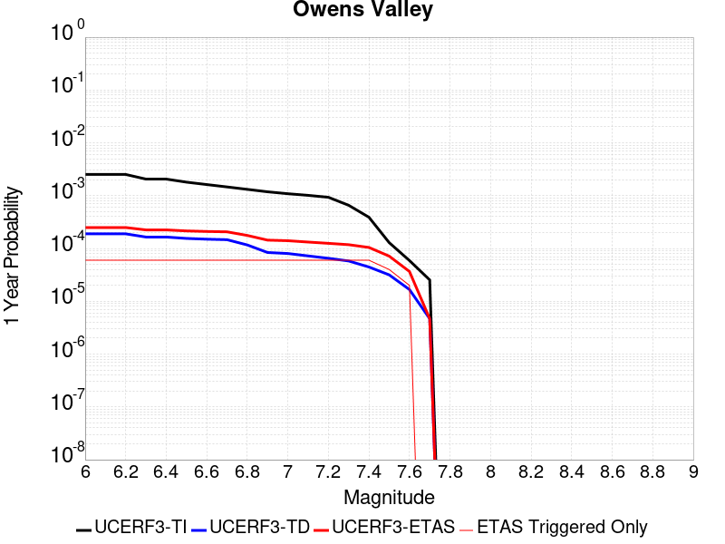 |  |

| Magnitude | 1 wk TI Prob | 1 wk TD Prob | 1 wk ETAS Prob | 1 wk ETAS/TD Gain | 1 wk ETAS Triggered Only | 1 mo TI Prob | 1 mo TD Prob | 1 mo ETAS Prob | 1 mo ETAS/TD Gain | 1 mo ETAS Triggered Only | 1 yr TI Prob | 1 yr TD Prob | 1 yr ETAS Prob | 1 yr ETAS/TD Gain | 1 yr ETAS Triggered Only | 10 yr TI Prob | 10 yr TD Prob | 10 yr ETAS Prob | 10 yr ETAS/TD Gain | 10 yr ETAS Triggered Only |
|-----|-----|-----|-----|-----|-----|-----|-----|-----|-----|-----|-----|-----|-----|-----|-----|-----|-----|-----|-----|-----|
| 6.0 | 4.83821E-5 | 3.6282252E-6 | 3.6282252E-6 | 1.0 | 0.0 | 2.0733538E-4 | 1.5549449E-5 | 1.5549449E-5 | 1.0 | 0.0 | 0.002521386 | 1.8929908E-4 | 1.8929908E-4 | 1.0 | 0.0 | 0.024929691 | 0.0019258651 | 0.0019697424 | 1.022783 | 4.396184E-5 |
| 6.1 | 4.83821E-5 | 3.6282252E-6 | 3.6282252E-6 | 1.0 | 0.0 | 2.0733538E-4 | 1.5549449E-5 | 1.5549449E-5 | 1.0 | 0.0 | 0.002521386 | 1.8929908E-4 | 1.8929908E-4 | 1.0 | 0.0 | 0.024929691 | 0.0019258651 | 0.0019697424 | 1.022783 | 4.396184E-5 |
| 6.2 | 4.83821E-5 | 3.6282252E-6 | 3.6282252E-6 | 1.0 | 0.0 | 2.0733538E-4 | 1.5549449E-5 | 1.5549449E-5 | 1.0 | 0.0 | 0.002521386 | 1.8929908E-4 | 1.8929908E-4 | 1.0 | 0.0 | 0.024929691 | 0.0019258651 | 0.0019697424 | 1.022783 | 4.396184E-5 |
| 6.3 | 3.953008E-5 | 3.1562945E-6 | 3.1562945E-6 | 1.0 | 0.0 | 1.6940363E-4 | 1.352691E-5 | 1.352691E-5 | 1.0 | 0.0 | 0.002060538 | 1.6467842E-4 | 1.6467842E-4 | 1.0 | 0.0 | 0.020415364 | 0.0016596789 | 0.0017035678 | 1.0264442 | 4.396184E-5 |
| 6.4 | 3.953008E-5 | 3.1562945E-6 | 3.1562945E-6 | 1.0 | 0.0 | 1.6940363E-4 | 1.352691E-5 | 1.352691E-5 | 1.0 | 0.0 | 0.002060538 | 1.6467842E-4 | 1.6467842E-4 | 1.0 | 0.0 | 0.020415364 | 0.0016596789 | 0.0017035678 | 1.0264442 | 4.396184E-5 |
| 6.5 | 3.457342E-5 | 2.9721791E-6 | 2.9721791E-6 | 1.0 | 0.0 | 1.4816338E-4 | 1.2737853E-5 | 1.2737853E-5 | 1.0 | 0.0 | 0.0018023965 | 1.5507302E-4 | 1.5507302E-4 | 1.0 | 0.0 | 0.017878477 | 0.0015560347 | 0.001599928 | 1.0282085 | 4.396184E-5 |
| 6.6 | 3.1127765E-5 | 2.8749025E-6 | 2.8749025E-6 | 1.0 | 0.0 | 1.3339789E-4 | 1.2320957E-5 | 1.2320957E-5 | 1.0 | 0.0 | 0.0016229092 | 1.49998E-4 | 1.49998E-4 | 1.0 | 0.0 | 0.016111081 | 0.0015014741 | 0.0015453699 | 1.0292351 | 4.396184E-5 |
| 6.7 | 2.806885E-5 | 2.8107188E-6 | 2.8107188E-6 | 1.0 | 0.0 | 1.2028952E-4 | 1.2045885E-5 | 1.2045885E-5 | 1.0 | 0.0 | 0.001463541 | 1.4664947E-4 | 1.4664947E-4 | 1.0 | 0.0 | 0.014539397 | 0.0014659108 | 0.0015098082 | 1.0299455 | 4.396184E-5 |
| 6.8 | 2.524524E-5 | 2.235633E-6 | 2.235633E-6 | 1.0 | 0.0 | 1.0818939E-4 | 9.581251E-6 | 9.581251E-6 | 1.0 | 0.0 | 0.0013164099 | 1.1664579E-4 | 1.1664579E-4 | 1.0 | 0.0 | 0.01308639 | 0.001166119 | 0.0012100296 | 1.0376554 | 4.396184E-5 |
| 6.9 | 2.2704568E-5 | 1.608363E-6 | 1.608363E-6 | 1.0 | 0.0 | 9.730166E-5 | 6.892966E-6 | 6.892966E-6 | 1.0 | 0.0 | 0.0011840039 | 8.391865E-5 | 8.391865E-5 | 1.0 | 0.0 | 0.011777153 | 8.3908177E-4 | 8.830067E-4 | 1.0523489 | 4.396184E-5 |
| 7.0 | 2.0871712E-5 | 1.5397294E-6 | 1.5397294E-6 | 1.0 | 0.0 | 8.944713E-5 | 6.5988233E-6 | 6.5988233E-6 | 1.0 | 0.0 | 0.0010884746 | 8.033773E-5 | 8.033773E-5 | 1.0 | 0.0 | 0.010831586 | 8.0325926E-4 | 8.471858E-4 | 1.0546854 | 4.396184E-5 |
| 7.1 | 1.944928E-5 | 1.3865751E-6 | 1.3865751E-6 | 1.0 | 0.0 | 8.335139E-5 | 5.9424515E-6 | 5.9424515E-6 | 1.0 | 0.0 | 0.0010143308 | 7.234695E-5 | 7.234695E-5 | 1.0 | 0.0 | 0.010097133 | 7.2339235E-4 | 7.6732243E-4 | 1.0607278 | 4.396184E-5 |
| 7.2 | 1.7876306E-5 | 1.2490525E-6 | 1.2490525E-6 | 1.0 | 0.0 | 7.6610486E-5 | 5.353071E-6 | 5.353071E-6 | 1.0 | 0.0 | 9.3233347E-4 | 6.5171706E-5 | 6.5171706E-5 | 1.0 | 0.0 | 0.009284316 | 6.516637E-4 | 6.955969E-4 | 1.067417 | 4.396184E-5 |
| 7.3 | 1.2618672E-5 | 1.1116495E-6 | 1.1116495E-6 | 1.0 | 0.0 | 5.40789E-5 | 4.764203E-6 | 4.764203E-6 | 1.0 | 0.0 | 6.582117E-4 | 5.8002635E-5 | 5.8002635E-5 | 1.0 | 0.0 | 0.0065626553 | 5.8000785E-4 | 6.239442E-4 | 1.0757513 | 4.396184E-5 |
| 7.4 | 7.4874442E-6 | 8.549725E-7 | 8.549725E-7 | 1.0 | 0.0 | 3.208865E-5 | 3.6641627E-6 | 3.6641627E-6 | 1.0 | 0.0 | 3.906093E-4 | 4.461027E-5 | 4.461027E-5 | 1.0 | 0.0 | 0.003899234 | 4.4610567E-4 | 4.900479E-4 | 1.0985018 | 4.396184E-5 |
| 7.5 | 2.4734156E-6 | 6.069335E-7 | 6.069335E-7 | 1.0 | 0.0 | 1.060031E-5 | 2.601141E-6 | 2.601141E-6 | 1.0 | 0.0 | 1.2905113E-4 | 3.1668435E-5 | 3.1668435E-5 | 1.0 | 0.0 | 0.0012897621 | 3.1663955E-4 | 3.6058747E-4 | 1.1387948 | 4.396184E-5 |
| 7.6 | 1.1328841E-6 | 3.1968878E-7 | 3.1968878E-7 | 1.0 | 0.0 | 4.8552088E-6 | 1.3700941E-6 | 1.3700941E-6 | 1.0 | 0.0 | 5.9110564E-5 | 1.668077E-5 | 1.668077E-5 | 1.0 | 0.0 | 5.9094845E-4 | 1.6679536E-4 | 1.6679536E-4 | 1.0 | 0.0 |
| 7.7 | 4.8613185E-7 | 8.9660794E-8 | 8.9660794E-8 | 1.0 | 0.0 | 2.0834207E-6 | 3.842605E-7 | 3.842605E-7 | 1.0 | 0.0 | 2.536535E-5 | 4.678362E-6 | 4.678362E-6 | 1.0 | 0.0 | 2.5362454E-4 | 4.6782705E-5 | 4.6782705E-5 | 1.0 | 0.0 |

## Kern Canyon (North Kern) 2011
*[(top)](#table-of-contents)*

| 1 Week | 1 Month | 1 Year | 10 Year |
|-----|-----|-----|-----|
|  |  |  |  |

| Magnitude | 1 wk TI Prob | 1 wk TD Prob | 1 wk ETAS Prob | 1 wk ETAS/TD Gain | 1 wk ETAS Triggered Only | 1 mo TI Prob | 1 mo TD Prob | 1 mo ETAS Prob | 1 mo ETAS/TD Gain | 1 mo ETAS Triggered Only | 1 yr TI Prob | 1 yr TD Prob | 1 yr ETAS Prob | 1 yr ETAS/TD Gain | 1 yr ETAS Triggered Only | 10 yr TI Prob | 10 yr TD Prob | 10 yr ETAS Prob | 10 yr ETAS/TD Gain | 10 yr ETAS Triggered Only |
|-----|-----|-----|-----|-----|-----|-----|-----|-----|-----|-----|-----|-----|-----|-----|-----|-----|-----|-----|-----|-----|
| 6.0 | 6.6264497E-6 | 6.757373E-6 | 6.757373E-6 | 1.0 | 0.0 | 2.8398761E-5 | 2.8959894E-5 | 2.8959894E-5 | 1.0 | 0.0 | 3.4570007E-4 | 3.5253767E-4 | 3.5253767E-4 | 1.0 | 0.0 | 0.0034516277 | 0.0035205726 | 0.0035643796 | 1.0124432 | 4.396184E-5 |
| 6.1 | 6.6264497E-6 | 6.757373E-6 | 6.757373E-6 | 1.0 | 0.0 | 2.8398761E-5 | 2.8959894E-5 | 2.8959894E-5 | 1.0 | 0.0 | 3.4570007E-4 | 3.5253767E-4 | 3.5253767E-4 | 1.0 | 0.0 | 0.0034516277 | 0.0035205726 | 0.0035643796 | 1.0124432 | 4.396184E-5 |
| 6.2 | 6.6264497E-6 | 6.757373E-6 | 6.757373E-6 | 1.0 | 0.0 | 2.8398761E-5 | 2.8959894E-5 | 2.8959894E-5 | 1.0 | 0.0 | 3.4570007E-4 | 3.5253767E-4 | 3.5253767E-4 | 1.0 | 0.0 | 0.0034516277 | 0.0035205726 | 0.0035643796 | 1.0124432 | 4.396184E-5 |
| 6.3 | 6.6264497E-6 | 6.757373E-6 | 6.757373E-6 | 1.0 | 0.0 | 2.8398761E-5 | 2.8959894E-5 | 2.8959894E-5 | 1.0 | 0.0 | 3.4570007E-4 | 3.5253767E-4 | 3.5253767E-4 | 1.0 | 0.0 | 0.0034516277 | 0.0035205726 | 0.0035643796 | 1.0124432 | 4.396184E-5 |
| 6.4 | 6.6264497E-6 | 6.757373E-6 | 6.757373E-6 | 1.0 | 0.0 | 2.8398761E-5 | 2.8959894E-5 | 2.8959894E-5 | 1.0 | 0.0 | 3.4570007E-4 | 3.5253767E-4 | 3.5253767E-4 | 1.0 | 0.0 | 0.0034516277 | 0.0035205726 | 0.0035643796 | 1.0124432 | 4.396184E-5 |
| 6.5 | 3.2162225E-6 | 3.2571097E-6 | 3.2571097E-6 | 1.0 | 0.0 | 1.3783738E-5 | 1.3958972E-5 | 1.3958972E-5 | 1.0 | 0.0 | 1.6780409E-4 | 1.6993804E-4 | 1.6993804E-4 | 1.0 | 0.0 | 0.0016767744 | 0.0016981605 | 0.0016981605 | 1.0 | 0.0 |
| 6.6 | 3.2162225E-6 | 3.2571097E-6 | 3.2571097E-6 | 1.0 | 0.0 | 1.3783738E-5 | 1.3958972E-5 | 1.3958972E-5 | 1.0 | 0.0 | 1.6780409E-4 | 1.6993804E-4 | 1.6993804E-4 | 1.0 | 0.0 | 0.0016767744 | 0.0016981605 | 0.0016981605 | 1.0 | 0.0 |
| 6.7 | 2.1908265E-6 | 2.2071338E-6 | 2.2071338E-6 | 1.0 | 0.0 | 9.389223E-6 | 9.459111E-6 | 9.459111E-6 | 1.0 | 0.0 | 1.1430779E-4 | 1.1515879E-4 | 1.1515879E-4 | 1.0 | 0.0 | 0.0011424901 | 0.0011510106 | 0.0011510106 | 1.0 | 0.0 |
| 6.8 | 1.7303895E-6 | 1.7365618E-6 | 1.7365618E-6 | 1.0 | 0.0 | 7.415934E-6 | 7.442387E-6 | 7.442387E-6 | 1.0 | 0.0 | 9.028525E-5 | 9.060739E-5 | 9.060739E-5 | 1.0 | 0.0 | 9.024858E-4 | 9.0571423E-4 | 9.0571423E-4 | 1.0 | 0.0 |
| 6.9 | 1.3700314E-6 | 1.3688691E-6 | 1.3688691E-6 | 1.0 | 0.0 | 5.87155E-6 | 5.866569E-6 | 5.866569E-6 | 1.0 | 0.0 | 7.148377E-5 | 7.142319E-5 | 7.142319E-5 | 1.0 | 0.0 | 7.146078E-4 | 7.1400683E-4 | 7.1400683E-4 | 1.0 | 0.0 |
| 7.0 | 1.1467797E-6 | 1.1413862E-6 | 1.1413862E-6 | 1.0 | 0.0 | 4.9147607E-6 | 4.8916463E-6 | 4.8916463E-6 | 1.0 | 0.0 | 5.983557E-5 | 5.9554197E-5 | 5.9554197E-5 | 1.0 | 0.0 | 5.981946E-4 | 5.953855E-4 | 5.953855E-4 | 1.0 | 0.0 |
| 7.1 | 9.3952065E-7 | 9.3027376E-7 | 9.3027376E-7 | 1.0 | 0.0 | 4.026511E-6 | 3.9868814E-6 | 3.9868814E-6 | 1.0 | 0.0 | 4.9021666E-5 | 4.853922E-5 | 4.853922E-5 | 1.0 | 0.0 | 4.901085E-4 | 4.8528795E-4 | 4.8528795E-4 | 1.0 | 0.0 |
| 7.2 | 6.858055E-7 | 6.7193355E-7 | 6.7193355E-7 | 1.0 | 0.0 | 2.939163E-6 | 2.879712E-6 | 2.879712E-6 | 1.0 | 0.0 | 3.5783723E-5 | 3.5059937E-5 | 3.5059937E-5 | 1.0 | 0.0 | 3.5777962E-4 | 3.5054496E-4 | 3.5054496E-4 | 1.0 | 0.0 |
| 7.3 | 5.1101983E-7 | 4.939326E-7 | 4.939326E-7 | 1.0 | 0.0 | 2.1900833E-6 | 2.1168523E-6 | 2.1168523E-6 | 1.0 | 0.0 | 2.6663936E-5 | 2.5772377E-5 | 2.5772377E-5 | 1.0 | 0.0 | 2.6660739E-4 | 2.5769437E-4 | 2.5769437E-4 | 1.0 | 0.0 |
| 7.4 | 3.4999414E-7 | 3.2996087E-7 | 3.2996087E-7 | 1.0 | 0.0 | 1.499974E-6 | 1.4141173E-6 | 1.4141173E-6 | 1.0 | 0.0 | 1.8262032E-5 | 1.7216744E-5 | 1.7216744E-5 | 1.0 | 0.0 | 1.826053E-4 | 1.7215434E-4 | 1.7215434E-4 | 1.0 | 0.0 |
| 7.5 | 1.7021522E-7 | 1.4750137E-7 | 1.4750137E-7 | 1.0 | 0.0 | 7.2949354E-7 | 6.3214856E-7 | 6.3214856E-7 | 1.0 | 0.0 | 8.881548E-6 | 7.696382E-6 | 7.696382E-6 | 1.0 | 0.0 | 8.8811925E-5 | 7.6961245E-5 | 7.6961245E-5 | 1.0 | 0.0 |
| 7.6 | 2.572245E-8 | 1.735272E-8 | 1.735272E-8 | 1.0 | 0.0 | 1.10239064E-7 | 7.43688E-8 | 7.43688E-8 | 1.0 | 0.0 | 1.3421597E-6 | 9.054398E-7 | 9.054398E-7 | 1.0 | 0.0 | 1.3421517E-5 | 9.054366E-6 | 9.054366E-6 | 1.0 | 0.0 |

## San Andreas (Santa Cruz Mts) 2011 CFM
*[(top)](#table-of-contents)*

| 1 Week | 1 Month | 1 Year | 10 Year |
|-----|-----|-----|-----|
|  |  |  |  |

| Magnitude | 1 wk TI Prob | 1 wk TD Prob | 1 wk ETAS Prob | 1 wk ETAS/TD Gain | 1 wk ETAS Triggered Only | 1 mo TI Prob | 1 mo TD Prob | 1 mo ETAS Prob | 1 mo ETAS/TD Gain | 1 mo ETAS Triggered Only | 1 yr TI Prob | 1 yr TD Prob | 1 yr ETAS Prob | 1 yr ETAS/TD Gain | 1 yr ETAS Triggered Only | 10 yr TI Prob | 10 yr TD Prob | 10 yr ETAS Prob | 10 yr ETAS/TD Gain | 10 yr ETAS Triggered Only |
|-----|-----|-----|-----|-----|-----|-----|-----|-----|-----|-----|-----|-----|-----|-----|-----|-----|-----|-----|-----|-----|
| 6.0 | 1.7221631E-4 | 1.381117E-4 | 1.381117E-4 | 1.0 | 0.0 | 7.378611E-4 | 5.9177505E-4 | 5.9177505E-4 | 1.0 | 0.0 | 0.008946515 | 0.0071814503 | 0.0071814503 | 1.0 | 0.0 | 0.08594794 | 0.07063769 | 0.07067855 | 1.0005784 | 4.396184E-5 |
| 6.1 | 1.7221631E-4 | 1.381117E-4 | 1.381117E-4 | 1.0 | 0.0 | 7.378611E-4 | 5.9177505E-4 | 5.9177505E-4 | 1.0 | 0.0 | 0.008946515 | 0.0071814503 | 0.0071814503 | 1.0 | 0.0 | 0.08594794 | 0.07063769 | 0.07067855 | 1.0005784 | 4.396184E-5 |
| 6.2 | 1.7221631E-4 | 1.381117E-4 | 1.381117E-4 | 1.0 | 0.0 | 7.378611E-4 | 5.9177505E-4 | 5.9177505E-4 | 1.0 | 0.0 | 0.008946515 | 0.0071814503 | 0.0071814503 | 1.0 | 0.0 | 0.08594794 | 0.07063769 | 0.07067855 | 1.0005784 | 4.396184E-5 |
| 6.3 | 1.716926E-4 | 1.3730582E-4 | 1.3730582E-4 | 1.0 | 0.0 | 7.3561794E-4 | 5.883228E-4 | 5.883228E-4 | 1.0 | 0.0 | 0.008919428 | 0.0071396944 | 0.0071396944 | 1.0 | 0.0 | 0.08569809 | 0.07024978 | 0.070290655 | 1.0005819 | 4.396184E-5 |
| 6.4 | 1.6392978E-4 | 1.360619E-4 | 1.360619E-4 | 1.0 | 0.0 | 7.02367E-4 | 5.829942E-4 | 5.829942E-4 | 1.0 | 0.0 | 0.008517839 | 0.0070752404 | 0.0070752404 | 1.0 | 0.0 | 0.08198654 | 0.06948225 | 0.06952316 | 1.0005888 | 4.396184E-5 |
| 6.5 | 1.5742714E-4 | 1.2665732E-4 | 1.2665732E-4 | 1.0 | 0.0 | 6.745133E-4 | 5.427059E-4 | 5.427059E-4 | 1.0 | 0.0 | 0.00818132 | 0.0065877517 | 0.0065877517 | 1.0 | 0.0 | 0.078865945 | 0.064942814 | 0.06498392 | 1.000633 | 4.396184E-5 |
| 6.6 | 1.3038084E-4 | 1.1604606E-4 | 1.1604606E-4 | 1.0 | 0.0 | 5.5865536E-4 | 4.9724674E-4 | 4.9724674E-4 | 1.0 | 0.0 | 0.006780438 | 0.0060374164 | 0.0060374164 | 1.0 | 0.0 | 0.0657725 | 0.059401643 | 0.059442993 | 1.0006961 | 4.396184E-5 |
| 6.7 | 1.2867592E-4 | 1.133101E-4 | 1.133101E-4 | 1.0 | 0.0 | 5.5135164E-4 | 4.855256E-4 | 4.855256E-4 | 1.0 | 0.0 | 0.0066920654 | 0.0058954917 | 0.0058954917 | 1.0 | 0.0 | 0.06494093 | 0.058112424 | 0.05815383 | 1.0007125 | 4.396184E-5 |
| 6.8 | 1.2801298E-4 | 1.126855E-4 | 1.126855E-4 | 1.0 | 0.0 | 5.485117E-4 | 4.8284975E-4 | 4.8284975E-4 | 1.0 | 0.0 | 0.0066577005 | 0.005863089 | 0.005863089 | 1.0 | 0.0 | 0.06461738 | 0.057826214 | 0.057867635 | 1.0007163 | 4.396184E-5 |
| 6.9 | 1.269149E-4 | 1.1110668E-4 | 1.1110668E-4 | 1.0 | 0.0 | 5.4380763E-4 | 4.7608587E-4 | 4.7608587E-4 | 1.0 | 0.0 | 0.006600777 | 0.005781179 | 0.005781179 | 1.0 | 0.0 | 0.06408122 | 0.05709776 | 0.05713921 | 1.000726 | 4.396184E-5 |
| 7.0 | 1.2030331E-4 | 1.08405424E-4 | 1.08405424E-4 | 1.0 | 0.0 | 5.154837E-4 | 4.645132E-4 | 4.645132E-4 | 1.0 | 0.0 | 0.006257969 | 0.0056410194 | 0.0056410194 | 1.0 | 0.0 | 0.06084648 | 0.055769473 | 0.055810984 | 1.0007443 | 4.396184E-5 |
| 7.1 | 8.049617E-5 | 5.403394E-5 | 5.403394E-5 | 1.0 | 0.0 | 3.4493793E-4 | 2.3155365E-4 | 2.3155365E-4 | 1.0 | 0.0 | 0.0041915346 | 0.0028155562 | 0.0028155562 | 1.0 | 0.0 | 0.041133516 | 0.02967129 | 0.02971395 | 1.0014377 | 4.396184E-5 |
| 7.2 | 7.093979E-5 | 4.3030155E-5 | 4.3030155E-5 | 1.0 | 0.0 | 3.0399222E-4 | 1.8440204E-4 | 1.8440204E-4 | 1.0 | 0.0 | 0.0036948253 | 0.0022428061 | 0.0022428061 | 1.0 | 0.0 | 0.03633994 | 0.023987254 | 0.024030162 | 1.0017887 | 4.396184E-5 |
| 7.3 | 6.193693E-5 | 2.8961713E-5 | 2.8961713E-5 | 1.0 | 0.0 | 2.6541698E-4 | 1.2411573E-4 | 1.2411573E-4 | 1.0 | 0.0 | 0.0032266637 | 0.0015100633 | 0.0015100633 | 1.0 | 0.0 | 0.031802133 | 0.01653441 | 0.016577646 | 1.0026149 | 4.396184E-5 |
| 7.4 | 5.906492E-5 | 2.708431E-5 | 2.708431E-5 | 1.0 | 0.0 | 2.5311083E-4 | 1.16070456E-4 | 1.16070456E-4 | 1.0 | 0.0 | 0.0030772698 | 0.0014122431 | 0.0014122431 | 1.0 | 0.0 | 0.030350044 | 0.015503098 | 0.015546379 | 1.0027918 | 4.396184E-5 |
| 7.5 | 5.424296E-5 | 2.472983E-5 | 2.472983E-5 | 1.0 | 0.0 | 2.324491E-4 | 1.0598069E-4 | 1.0598069E-4 | 1.0 | 0.0 | 0.002826395 | 0.0012895523 | 0.0012895523 | 1.0 | 0.0 | 0.027907165 | 0.014190641 | 0.014233979 | 1.003054 | 4.396184E-5 |
| 7.6 | 4.43084E-5 | 1.9937785E-5 | 1.9937785E-5 | 1.0 | 0.0 | 1.8987931E-4 | 8.544485E-5 | 8.544485E-5 | 1.0 | 0.0 | 0.0023093296 | 0.0010397949 | 0.0010397949 | 1.0 | 0.0 | 0.022854783 | 0.011430768 | 0.0114742275 | 1.003802 | 4.396184E-5 |
| 7.7 | 4.118098E-5 | 1.896772E-5 | 1.896772E-5 | 1.0 | 0.0 | 1.7647797E-4 | 8.12877E-5 | 8.12877E-5 | 1.0 | 0.0 | 0.002146502 | 9.892286E-4 | 9.892286E-4 | 1.0 | 0.0 | 0.021258866 | 0.010887381 | 0.010930864 | 1.0039939 | 4.396184E-5 |
| 7.8 | 3.5408906E-5 | 1.8594681E-5 | 1.8594681E-5 | 1.0 | 0.0 | 1.5174363E-4 | 7.968905E-5 | 7.968905E-5 | 1.0 | 0.0 | 0.0018459131 | 9.697826E-4 | 9.697826E-4 | 1.0 | 0.0 | 0.018306552 | 0.0106682675 | 0.010711761 | 1.0040768 | 4.396184E-5 |
| 7.9 | 2.5860836E-5 | 1.7343082E-5 | 1.7343082E-5 | 1.0 | 0.0 | 1.10827445E-4 | 7.432538E-5 | 7.432538E-5 | 1.0 | 0.0 | 0.001348489 | 9.04536E-4 | 9.04536E-4 | 1.0 | 0.0 | 0.013403354 | 0.009921942 | 0.009965467 | 1.0043868 | 4.396184E-5 |
| 8.0 | 1.9777332E-5 | 1.4862934E-5 | 1.4862934E-5 | 1.0 | 0.0 | 8.4757245E-5 | 6.369673E-5 | 6.369673E-5 | 1.0 | 0.0 | 0.0010314309 | 7.75232E-4 | 7.75232E-4 | 1.0 | 0.0 | 0.010266567 | 0.008521339 | 0.008564927 | 1.005115 | 4.396184E-5 |
| 8.1 | 1.468494E-5 | 1.212653E-5 | 1.212653E-5 | 1.0 | 0.0 | 6.293394E-5 | 5.1969808E-5 | 5.1969808E-5 | 1.0 | 0.0 | 7.6595135E-4 | 6.3254894E-4 | 6.3254894E-4 | 1.0 | 0.0 | 0.0076331664 | 0.0069793463 | 0.007023001 | 1.0062549 | 4.396184E-5 |
| 8.2 | 8.63836E-6 | 5.479032E-6 | 5.479032E-6 | 1.0 | 0.0 | 3.7021015E-5 | 2.3481356E-5 | 2.3481356E-5 | 1.0 | 0.0 | 4.5063766E-4 | 2.8584807E-4 | 2.8584807E-4 | 1.0 | 0.0 | 0.004497249 | 0.00325114 | 0.00325114 | 1.0 | 0.0 |
| 8.3 | 1.983087E-6 | 7.676691E-7 | 7.676691E-7 | 1.0 | 0.0 | 8.498917E-6 | 3.2900064E-6 | 3.2900064E-6 | 1.0 | 0.0 | 1.034694E-4 | 4.005511E-5 | 4.005511E-5 | 1.0 | 0.0 | 0.0010342124 | 4.729315E-4 | 4.729315E-4 | 1.0 | 0.0 |

## San Diego Trough north alt1
*[(top)](#table-of-contents)*

| 1 Week | 1 Month | 1 Year | 10 Year |
|-----|-----|-----|-----|
|  |  |  |  |

| Magnitude | 1 wk TI Prob | 1 wk TD Prob | 1 wk ETAS Prob | 1 wk ETAS/TD Gain | 1 wk ETAS Triggered Only | 1 mo TI Prob | 1 mo TD Prob | 1 mo ETAS Prob | 1 mo ETAS/TD Gain | 1 mo ETAS Triggered Only | 1 yr TI Prob | 1 yr TD Prob | 1 yr ETAS Prob | 1 yr ETAS/TD Gain | 1 yr ETAS Triggered Only | 10 yr TI Prob | 10 yr TD Prob | 10 yr ETAS Prob | 10 yr ETAS/TD Gain | 10 yr ETAS Triggered Only |
|-----|-----|-----|-----|-----|-----|-----|-----|-----|-----|-----|-----|-----|-----|-----|-----|-----|-----|-----|-----|-----|
| 6.0 | 7.329252E-5 | 8.821585E-5 | 8.821585E-5 | 1.0 | 0.0 | 3.14073E-4 | 3.780168E-4 | 4.21962E-4 | 1.1162521 | 4.396184E-5 | 0.0038171355 | 0.0045932815 | 0.0046370416 | 1.009527 | 4.396184E-5 | 0.03752231 | 0.045047384 | 0.045089368 | 1.000932 | 4.396184E-5 |
| 6.1 | 3.7940346E-5 | 4.488724E-5 | 4.488724E-5 | 1.0 | 0.0 | 1.6259136E-4 | 1.9236025E-4 | 1.9236025E-4 | 1.0 | 0.0 | 0.0019777524 | 0.0023395587 | 0.0023395587 | 1.0 | 0.0 | 0.019602431 | 0.02315781 | 0.02315781 | 1.0 | 0.0 |
| 6.2 | 2.8645263E-5 | 3.329824E-5 | 3.329824E-5 | 1.0 | 0.0 | 1.2275964E-4 | 1.4269911E-4 | 1.4269911E-4 | 1.0 | 0.0 | 0.0014935739 | 0.0017359941 | 0.0017359941 | 1.0 | 0.0 | 0.0148357535 | 0.017226992 | 0.017226992 | 1.0 | 0.0 |
| 6.3 | 2.8645263E-5 | 3.329824E-5 | 3.329824E-5 | 1.0 | 0.0 | 1.2275964E-4 | 1.4269911E-4 | 1.4269911E-4 | 1.0 | 0.0 | 0.0014935739 | 0.0017359941 | 0.0017359941 | 1.0 | 0.0 | 0.0148357535 | 0.017226992 | 0.017226992 | 1.0 | 0.0 |
| 6.4 | 2.2204576E-5 | 2.5449317E-5 | 2.5449317E-5 | 1.0 | 0.0 | 9.5159E-5 | 1.0906399E-4 | 1.0906399E-4 | 1.0 | 0.0 | 0.001157945 | 0.0013270554 | 0.0013270554 | 1.0 | 0.0 | 0.011519298 | 0.013192467 | 0.013192467 | 1.0 | 0.0 |
| 6.5 | 2.1004838E-5 | 2.4025621E-5 | 2.4025621E-5 | 1.0 | 0.0 | 9.0017624E-5 | 1.02962935E-4 | 1.02962935E-4 | 1.0 | 0.0 | 0.0010954136 | 0.0012528622 | 0.0012528622 | 1.0 | 0.0 | 0.010900296 | 0.012459066 | 0.012459066 | 1.0 | 0.0 |
| 6.6 | 1.820557E-5 | 2.0705547E-5 | 2.0705547E-5 | 1.0 | 0.0 | 7.802154E-5 | 8.8735076E-5 | 8.8735076E-5 | 1.0 | 0.0 | 9.4949827E-4 | 0.0010798195 | 0.0010798195 | 1.0 | 0.0 | 0.009454516 | 0.010746397 | 0.010746397 | 1.0 | 0.0 |
| 6.7 | 1.5884485E-5 | 1.7984283E-5 | 1.7984283E-5 | 1.0 | 0.0 | 6.807459E-5 | 7.707324E-5 | 7.707324E-5 | 1.0 | 0.0 | 8.284929E-4 | 9.379654E-4 | 9.379654E-4 | 1.0 | 0.0 | 0.008254109 | 0.0093404325 | 0.0093404325 | 1.0 | 0.0 |
| 6.8 | 1.4331171E-5 | 1.620163E-5 | 1.620163E-5 | 1.0 | 0.0 | 6.141786E-5 | 6.943372E-5 | 6.943372E-5 | 1.0 | 0.0 | 7.4750587E-4 | 8.4502966E-4 | 8.4502966E-4 | 1.0 | 0.0 | 0.0074499645 | 0.0084184315 | 0.0084184315 | 1.0 | 0.0 |
| 6.9 | 1.2574203E-5 | 1.4206327E-5 | 1.4206327E-5 | 1.0 | 0.0 | 5.3888325E-5 | 6.0882845E-5 | 6.0882845E-5 | 1.0 | 0.0 | 6.558929E-4 | 7.4099796E-4 | 7.4099796E-4 | 1.0 | 0.0 | 0.0065396037 | 0.0073854583 | 0.0073854583 | 1.0 | 0.0 |
| 7.0 | 1.0883844E-5 | 1.2289685E-5 | 1.2289685E-5 | 1.0 | 0.0 | 4.664421E-5 | 5.266902E-5 | 5.266902E-5 | 1.0 | 0.0 | 5.677453E-4 | 6.410577E-4 | 6.410577E-4 | 1.0 | 0.0 | 0.00566297 | 0.0063922126 | 0.0063922126 | 1.0 | 0.0 |
| 7.1 | 9.393088E-6 | 1.0607386E-5 | 1.0607386E-5 | 1.0 | 0.0 | 4.025547E-5 | 4.5459437E-5 | 4.5459437E-5 | 1.0 | 0.0 | 4.900001E-4 | 5.533289E-4 | 5.533289E-4 | 1.0 | 0.0 | 0.0048892107 | 0.005519608 | 0.005519608 | 1.0 | 0.0 |
| 7.2 | 8.190791E-6 | 9.258948E-6 | 9.258948E-6 | 1.0 | 0.0 | 3.510292E-5 | 3.9680606E-5 | 3.9680606E-5 | 1.0 | 0.0 | 4.2729423E-4 | 4.83005E-4 | 4.83005E-4 | 1.0 | 0.0 | 0.0042647356 | 0.004819632 | 0.004819632 | 1.0 | 0.0 |
| 7.3 | 6.268162E-6 | 7.0899637E-6 | 7.0899637E-6 | 1.0 | 0.0 | 2.6863276E-5 | 3.0385208E-5 | 3.0385208E-5 | 1.0 | 0.0 | 3.2701128E-4 | 3.6987753E-4 | 3.6987753E-4 | 1.0 | 0.0 | 0.003265305 | 0.003692665 | 0.003692665 | 1.0 | 0.0 |
| 7.4 | 4.985186E-6 | 5.6428803E-6 | 5.6428803E-6 | 1.0 | 0.0 | 2.1364907E-5 | 2.418355E-5 | 2.418355E-5 | 1.0 | 0.0 | 2.600867E-4 | 2.9439534E-4 | 2.9439534E-4 | 1.0 | 0.0 | 0.002597825 | 0.0029400948 | 0.0029400948 | 1.0 | 0.0 |
| 7.5 | 1.7489613E-6 | 1.9697447E-6 | 1.9697447E-6 | 1.0 | 0.0 | 7.495527E-6 | 8.441737E-6 | 8.441737E-6 | 1.0 | 0.0 | 9.125422E-5 | 1.0277352E-4 | 1.0277352E-4 | 1.0 | 0.0 | 9.1216754E-4 | 0.001027282 | 0.001027282 | 1.0 | 0.0 |
| 7.6 | 1.6988751E-7 | 1.7533972E-7 | 1.7533972E-7 | 1.0 | 0.0 | 7.2808916E-7 | 7.514558E-7 | 7.514558E-7 | 1.0 | 0.0 | 8.864449E-6 | 9.148937E-6 | 9.148937E-6 | 1.0 | 0.0 | 8.8640954E-5 | 9.14858E-5 | 9.14858E-5 | 1.0 | 0.0 |

## San Cayetano
*[(top)](#table-of-contents)*

| 1 Week | 1 Month | 1 Year | 10 Year |
|-----|-----|-----|-----|
|  |  |  |  |

| Magnitude | 1 wk TI Prob | 1 wk TD Prob | 1 wk ETAS Prob | 1 wk ETAS/TD Gain | 1 wk ETAS Triggered Only | 1 mo TI Prob | 1 mo TD Prob | 1 mo ETAS Prob | 1 mo ETAS/TD Gain | 1 mo ETAS Triggered Only | 1 yr TI Prob | 1 yr TD Prob | 1 yr ETAS Prob | 1 yr ETAS/TD Gain | 1 yr ETAS Triggered Only | 10 yr TI Prob | 10 yr TD Prob | 10 yr ETAS Prob | 10 yr ETAS/TD Gain | 10 yr ETAS Triggered Only |
|-----|-----|-----|-----|-----|-----|-----|-----|-----|-----|-----|-----|-----|-----|-----|-----|-----|-----|-----|-----|-----|
| 6.0 | 2.3476267E-5 | 1.8169987E-5 | 1.8169987E-5 | 1.0 | 0.0 | 1.0060869E-4 | 7.786907E-5 | 1.21827485E-4 | 1.564517 | 4.396184E-5 | 0.0012242225 | 9.476472E-4 | 9.915674E-4 | 1.0463465 | 4.396184E-5 | 0.012175002 | 0.00943695 | 0.009480497 | 1.0046145 | 4.396184E-5 |
| 6.1 | 2.3476267E-5 | 1.8169987E-5 | 1.8169987E-5 | 1.0 | 0.0 | 1.0060869E-4 | 7.786907E-5 | 1.21827485E-4 | 1.564517 | 4.396184E-5 | 0.0012242225 | 9.476472E-4 | 9.915674E-4 | 1.0463465 | 4.396184E-5 | 0.012175002 | 0.00943695 | 0.009480497 | 1.0046145 | 4.396184E-5 |
| 6.2 | 2.3476267E-5 | 1.8169987E-5 | 1.8169987E-5 | 1.0 | 0.0 | 1.0060869E-4 | 7.786907E-5 | 1.21827485E-4 | 1.564517 | 4.396184E-5 | 0.0012242225 | 9.476472E-4 | 9.915674E-4 | 1.0463465 | 4.396184E-5 | 0.012175002 | 0.00943695 | 0.009480497 | 1.0046145 | 4.396184E-5 |
| 6.3 | 2.3476267E-5 | 1.8169987E-5 | 1.8169987E-5 | 1.0 | 0.0 | 1.0060869E-4 | 7.786907E-5 | 1.21827485E-4 | 1.564517 | 4.396184E-5 | 0.0012242225 | 9.476472E-4 | 9.915674E-4 | 1.0463465 | 4.396184E-5 | 0.012175002 | 0.00943695 | 0.009480497 | 1.0046145 | 4.396184E-5 |
| 6.4 | 2.3476267E-5 | 1.8169987E-5 | 1.8169987E-5 | 1.0 | 0.0 | 1.0060869E-4 | 7.786907E-5 | 1.21827485E-4 | 1.564517 | 4.396184E-5 | 0.0012242225 | 9.476472E-4 | 9.915674E-4 | 1.0463465 | 4.396184E-5 | 0.012175002 | 0.00943695 | 0.009480497 | 1.0046145 | 4.396184E-5 |
| 6.5 | 2.3476267E-5 | 1.8169987E-5 | 1.8169987E-5 | 1.0 | 0.0 | 1.0060869E-4 | 7.786907E-5 | 1.21827485E-4 | 1.564517 | 4.396184E-5 | 0.0012242225 | 9.476472E-4 | 9.915674E-4 | 1.0463465 | 4.396184E-5 | 0.012175002 | 0.00943695 | 0.009480497 | 1.0046145 | 4.396184E-5 |
| 6.6 | 2.3476267E-5 | 1.8169987E-5 | 1.8169987E-5 | 1.0 | 0.0 | 1.0060869E-4 | 7.786907E-5 | 1.21827485E-4 | 1.564517 | 4.396184E-5 | 0.0012242225 | 9.476472E-4 | 9.915674E-4 | 1.0463465 | 4.396184E-5 | 0.012175002 | 0.00943695 | 0.009480497 | 1.0046145 | 4.396184E-5 |
| 6.7 | 2.3476267E-5 | 1.8169987E-5 | 1.8169987E-5 | 1.0 | 0.0 | 1.0060869E-4 | 7.786907E-5 | 1.21827485E-4 | 1.564517 | 4.396184E-5 | 0.0012242225 | 9.476472E-4 | 9.915674E-4 | 1.0463465 | 4.396184E-5 | 0.012175002 | 0.00943695 | 0.009480497 | 1.0046145 | 4.396184E-5 |
| 6.8 | 2.3241924E-5 | 1.7937682E-5 | 1.7937682E-5 | 1.0 | 0.0 | 9.960445E-5 | 7.687353E-5 | 1.20831995E-4 | 1.5718282 | 4.396184E-5 | 0.0012120095 | 9.3553704E-4 | 9.794577E-4 | 1.046947 | 4.396184E-5 | 0.012054204 | 0.009316841 | 0.0093603935 | 1.0046746 | 4.396184E-5 |
| 6.9 | 2.2761007E-5 | 1.7433098E-5 | 1.7433098E-5 | 1.0 | 0.0 | 9.7543525E-5 | 7.4711155E-5 | 1.1866971E-4 | 1.5883801 | 4.396184E-5 | 0.0011869454 | 9.092322E-4 | 9.5315406E-4 | 1.0483066 | 4.396184E-5 | 0.011806256 | 0.009055952 | 0.009099515 | 1.0048105 | 4.396184E-5 |
| 7.0 | 2.240283E-5 | 1.706683E-5 | 1.706683E-5 | 1.0 | 0.0 | 9.600859E-5 | 7.314153E-5 | 1.1710015E-4 | 1.6010078 | 4.396184E-5 | 0.0011682777 | 8.901377E-4 | 9.340604E-4 | 1.0493437 | 4.396184E-5 | 0.011621549 | 0.008866537 | 0.008910109 | 1.0049142 | 4.396184E-5 |
| 7.1 | 2.1871154E-5 | 1.6586657E-5 | 1.6586657E-5 | 1.0 | 0.0 | 9.373015E-5 | 7.1083756E-5 | 1.1504247E-4 | 1.6184074 | 4.396184E-5 | 0.0011405671 | 8.6510443E-4 | 9.090282E-4 | 1.0507728 | 4.396184E-5 | 0.011347309 | 0.0086181685 | 0.008661752 | 1.0050571 | 4.396184E-5 |
| 7.2 | 2.0714133E-5 | 1.5565152E-5 | 1.5565152E-5 | 1.0 | 0.0 | 8.8771834E-5 | 6.670611E-5 | 1.1066502E-4 | 1.6589937 | 4.396184E-5 | 0.0010802611 | 8.1184757E-4 | 8.557737E-4 | 1.0541064 | 4.396184E-5 | 0.010750249 | 0.008089592 | 0.008133198 | 1.0053904 | 4.396184E-5 |
| 7.3 | 1.8408395E-5 | 1.3997363E-5 | 1.3997363E-5 | 1.0 | 0.0 | 7.8890735E-5 | 5.9987335E-5 | 1.03946535E-4 | 1.7328081 | 4.396184E-5 | 9.600714E-4 | 7.3010405E-4 | 7.740338E-4 | 1.0601691 | 4.396184E-5 | 0.009559342 | 0.007277773 | 0.007321415 | 1.0059966 | 4.396184E-5 |
| 7.4 | 1.6856795E-5 | 1.28505235E-5 | 1.28505235E-5 | 1.0 | 0.0 | 7.2241404E-5 | 5.5072524E-5 | 9.9031946E-5 | 1.7982097 | 4.396184E-5 | 8.7918417E-4 | 6.703046E-4 | 7.142369E-4 | 1.0655409 | 4.396184E-5 | 0.00875714 | 0.0066835075 | 0.006727176 | 1.0065337 | 4.396184E-5 |
| 7.5 | 1.2822778E-5 | 9.577859E-6 | 9.577859E-6 | 1.0 | 0.0 | 5.495361E-5 | 4.104733E-5 | 4.104733E-5 | 1.0 | 0.0 | 6.688548E-4 | 4.9963826E-4 | 4.9963826E-4 | 1.0 | 0.0 | 0.006668452 | 0.00498532 | 0.00498532 | 1.0 | 0.0 |
| 7.6 | 5.6272684E-6 | 3.8550384E-6 | 3.8550384E-6 | 1.0 | 0.0 | 2.4116642E-5 | 1.6521488E-5 | 1.6521488E-5 | 1.0 | 0.0 | 2.9358055E-4 | 2.0113066E-4 | 2.0113066E-4 | 1.0 | 0.0 | 0.0029319301 | 0.002009497 | 0.002009497 | 1.0 | 0.0 |
| 7.7 | 3.5261346E-6 | 2.3407883E-6 | 2.3407883E-6 | 1.0 | 0.0 | 1.5111918E-5 | 1.0031911E-5 | 1.0031911E-5 | 1.0 | 0.0 | 1.8397206E-4 | 1.2213175E-4 | 1.2213175E-4 | 1.0 | 0.0 | 0.0018381984 | 0.0012206536 | 0.0012206536 | 1.0 | 0.0 |
| 7.8 | 1.4826929E-6 | 1.0564627E-6 | 1.0564627E-6 | 1.0 | 0.0 | 6.354383E-6 | 4.5276893E-6 | 4.5276893E-6 | 1.0 | 0.0 | 7.736187E-5 | 5.512324E-5 | 5.512324E-5 | 1.0 | 0.0 | 7.733494E-4 | 5.5109774E-4 | 5.5109774E-4 | 1.0 | 0.0 |
| 7.9 | 2.7568166E-7 | 1.6979098E-7 | 1.6979098E-7 | 1.0 | 0.0 | 1.1814923E-6 | 7.276754E-7 | 7.276754E-7 | 1.0 | 0.0 | 1.4384574E-5 | 8.859412E-6 | 8.859412E-6 | 1.0 | 0.0 | 1.4383643E-4 | 8.859063E-5 | 8.859063E-5 | 1.0 | 0.0 |
| 8.0 | 5.407832E-8 | 2.6890575E-8 | 2.6890575E-8 | 1.0 | 0.0 | 2.3176422E-7 | 1.15245314E-7 | 1.15245314E-7 | 1.0 | 0.0 | 2.8217257E-6 | 1.4031108E-6 | 1.4031108E-6 | 1.0 | 0.0 | 2.8216898E-5 | 1.4031024E-5 | 1.4031024E-5 | 1.0 | 0.0 |

## Santa Susana East (connector)
*[(top)](#table-of-contents)*

| 1 Week | 1 Month | 1 Year | 10 Year |
|-----|-----|-----|-----|
|  |  |  |  |

| Magnitude | 1 wk TI Prob | 1 wk TD Prob | 1 wk ETAS Prob | 1 wk ETAS/TD Gain | 1 wk ETAS Triggered Only | 1 mo TI Prob | 1 mo TD Prob | 1 mo ETAS Prob | 1 mo ETAS/TD Gain | 1 mo ETAS Triggered Only | 1 yr TI Prob | 1 yr TD Prob | 1 yr ETAS Prob | 1 yr ETAS/TD Gain | 1 yr ETAS Triggered Only | 10 yr TI Prob | 10 yr TD Prob | 10 yr ETAS Prob | 10 yr ETAS/TD Gain | 10 yr ETAS Triggered Only |
|-----|-----|-----|-----|-----|-----|-----|-----|-----|-----|-----|-----|-----|-----|-----|-----|-----|-----|-----|-----|-----|
| 6.0 | 2.858397E-5 | 3.202275E-5 | 3.202275E-5 | 1.0 | 0.0 | 1.2249697E-4 | 1.3723472E-4 | 1.8119052E-4 | 1.3202965 | 4.396184E-5 | 0.0014903803 | 0.0016698339 | 0.0017137224 | 1.0262831 | 4.396184E-5 | 0.014804244 | 0.016599987 | 0.016643219 | 1.0026044 | 4.396184E-5 |
| 6.1 | 2.858397E-5 | 3.202275E-5 | 3.202275E-5 | 1.0 | 0.0 | 1.2249697E-4 | 1.3723472E-4 | 1.8119052E-4 | 1.3202965 | 4.396184E-5 | 0.0014903803 | 0.0016698339 | 0.0017137224 | 1.0262831 | 4.396184E-5 | 0.014804244 | 0.016599987 | 0.016643219 | 1.0026044 | 4.396184E-5 |
| 6.2 | 2.858397E-5 | 3.202275E-5 | 3.202275E-5 | 1.0 | 0.0 | 1.2249697E-4 | 1.3723472E-4 | 1.8119052E-4 | 1.3202965 | 4.396184E-5 | 0.0014903803 | 0.0016698339 | 0.0017137224 | 1.0262831 | 4.396184E-5 | 0.014804244 | 0.016599987 | 0.016643219 | 1.0026044 | 4.396184E-5 |
| 6.3 | 1.943582E-5 | 2.0368168E-5 | 2.0368168E-5 | 1.0 | 0.0 | 8.329371E-5 | 8.728987E-5 | 1.3124787E-4 | 1.5035865 | 4.396184E-5 | 0.001013629 | 0.0010623483 | 0.0011062634 | 1.0413378 | 4.396184E-5 | 0.010090181 | 0.010584131 | 0.010627627 | 1.0041096 | 4.396184E-5 |
| 6.4 | 1.943582E-5 | 2.0368168E-5 | 2.0368168E-5 | 1.0 | 0.0 | 8.329371E-5 | 8.728987E-5 | 1.3124787E-4 | 1.5035865 | 4.396184E-5 | 0.001013629 | 0.0010623483 | 0.0011062634 | 1.0413378 | 4.396184E-5 | 0.010090181 | 0.010584131 | 0.010627627 | 1.0041096 | 4.396184E-5 |
| 6.5 | 1.943582E-5 | 2.0368168E-5 | 2.0368168E-5 | 1.0 | 0.0 | 8.329371E-5 | 8.728987E-5 | 1.3124787E-4 | 1.5035865 | 4.396184E-5 | 0.001013629 | 0.0010623483 | 0.0011062634 | 1.0413378 | 4.396184E-5 | 0.010090181 | 0.010584131 | 0.010627627 | 1.0041096 | 4.396184E-5 |
| 6.6 | 1.943582E-5 | 2.0368168E-5 | 2.0368168E-5 | 1.0 | 0.0 | 8.329371E-5 | 8.728987E-5 | 1.3124787E-4 | 1.5035865 | 4.396184E-5 | 0.001013629 | 0.0010623483 | 0.0011062634 | 1.0413378 | 4.396184E-5 | 0.010090181 | 0.010584131 | 0.010627627 | 1.0041096 | 4.396184E-5 |
| 6.7 | 1.9404439E-5 | 2.035559E-5 | 2.035559E-5 | 1.0 | 0.0 | 8.3159226E-5 | 8.723595E-5 | 1.3119396E-4 | 1.5038978 | 4.396184E-5 | 0.0010119933 | 0.0010616925 | 0.0011056077 | 1.0413634 | 4.396184E-5 | 0.010073971 | 0.010577636 | 0.010621132 | 1.0041121 | 4.396184E-5 |
| 6.8 | 1.2217526E-5 | 1.1593401E-5 | 1.1593401E-5 | 1.0 | 0.0 | 5.2359774E-5 | 4.9685153E-5 | 9.364481E-5 | 1.8847644 | 4.396184E-5 | 6.372938E-4 | 6.0476566E-4 | 6.487009E-4 | 1.0726484 | 4.396184E-5 | 0.0063546924 | 0.0060332464 | 0.0060769427 | 1.0072427 | 4.396184E-5 |
| 6.9 | 1.2217526E-5 | 1.1593401E-5 | 1.1593401E-5 | 1.0 | 0.0 | 5.2359774E-5 | 4.9685153E-5 | 9.364481E-5 | 1.8847644 | 4.396184E-5 | 6.372938E-4 | 6.0476566E-4 | 6.487009E-4 | 1.0726484 | 4.396184E-5 | 0.0063546924 | 0.0060332464 | 0.0060769427 | 1.0072427 | 4.396184E-5 |
| 7.0 | 9.276017E-6 | 8.059318E-6 | 8.059318E-6 | 1.0 | 0.0 | 3.9753755E-5 | 3.4539495E-5 | 7.849982E-5 | 2.2727551 | 4.396184E-5 | 4.8389446E-4 | 4.2044066E-4 | 4.6438404E-4 | 1.1045173 | 4.396184E-5 | 0.0048284214 | 0.004197179 | 0.004240956 | 1.0104302 | 4.396184E-5 |
| 7.1 | 9.130355E-6 | 7.942487E-6 | 7.942487E-6 | 1.0 | 0.0 | 3.9129503E-5 | 3.4038807E-5 | 7.799915E-5 | 2.2914772 | 4.396184E-5 | 4.7629757E-4 | 4.1434713E-4 | 4.5829074E-4 | 1.1060551 | 4.396184E-5 | 0.00475278 | 0.0041364715 | 0.0041802516 | 1.0105839 | 4.396184E-5 |
| 7.2 | 8.851015E-6 | 7.741643E-6 | 7.741643E-6 | 1.0 | 0.0 | 3.7932372E-5 | 3.3178065E-5 | 7.7138444E-5 | 2.3249834 | 4.396184E-5 | 4.6172875E-4 | 4.0387147E-4 | 4.4781555E-4 | 1.1088071 | 4.396184E-5 | 0.0046077054 | 0.0040320978 | 0.0040758825 | 1.010859 | 4.396184E-5 |
| 7.3 | 8.573006E-6 | 7.550358E-6 | 7.550358E-6 | 1.0 | 0.0 | 3.6740938E-5 | 3.2358294E-5 | 7.631871E-5 | 2.3585517 | 4.396184E-5 | 4.472291E-4 | 3.9389444E-4 | 4.3783896E-4 | 1.1115642 | 4.396184E-5 | 0.004463301 | 0.00393268 | 0.003976469 | 1.0111346 | 4.396184E-5 |
| 7.4 | 7.852282E-6 | 6.817847E-6 | 6.817847E-6 | 1.0 | 0.0 | 3.36522E-5 | 2.9219034E-5 | 7.317959E-5 | 2.5045178 | 4.396184E-5 | 4.096385E-4 | 3.556867E-4 | 3.996329E-4 | 1.1235532 | 4.396184E-5 | 0.0040888423 | 0.0035518385 | 0.0035956441 | 1.0123333 | 4.396184E-5 |
| 7.5 | 4.8869324E-6 | 4.2791435E-6 | 4.2791435E-6 | 1.0 | 0.0 | 2.0943828E-5 | 1.8339068E-5 | 1.8339068E-5 | 1.0 | 0.0 | 2.5496128E-4 | 2.2325692E-4 | 2.2325692E-4 | 1.0 | 0.0 | 0.0025466895 | 0.0022304908 | 0.0022304908 | 1.0 | 0.0 |
| 7.6 | 1.3894544E-6 | 1.1568333E-6 | 1.1568333E-6 | 1.0 | 0.0 | 5.954791E-6 | 4.9578484E-6 | 4.9578484E-6 | 1.0 | 0.0 | 7.249717E-5 | 6.036036E-5 | 6.036036E-5 | 1.0 | 0.0 | 7.247352E-4 | 6.0346146E-4 | 6.0346146E-4 | 1.0 | 0.0 |
| 7.7 | 2.9924632E-7 | 2.3719976E-7 | 2.3719976E-7 | 1.0 | 0.0 | 1.2824837E-6 | 1.0165701E-6 | 1.0165701E-6 | 1.0 | 0.0 | 1.5614127E-5 | 1.2376678E-5 | 1.2376678E-5 | 1.0 | 0.0 | 1.5613029E-4 | 1.237606E-4 | 1.237606E-4 | 1.0 | 0.0 |
| 7.8 | 4.8188564E-8 | 2.6325937E-8 | 2.6325937E-8 | 1.0 | 0.0 | 2.065224E-7 | 1.1282544E-7 | 1.1282544E-7 | 1.0 | 0.0 | 2.5144072E-6 | 1.373649E-6 | 1.373649E-6 | 1.0 | 0.0 | 2.5143789E-5 | 1.3736413E-5 | 1.3736413E-5 | 1.0 | 0.0 |
| 7.9 | 2.6127251E-9 | 2.7681537E-9 | 2.7681537E-9 | 1.0 | 0.0 | 1.1197393E-8 | 1.1863516E-8 | 1.1863516E-8 | 1.0 | 0.0 | 1.3632825E-7 | 1.4443832E-7 | 1.4443832E-7 | 1.0 | 0.0 | 1.3632817E-6 | 1.4443831E-6 | 1.4443831E-6 | 1.0 | 0.0 |

## Mono Lake 2011 CFM
*[(top)](#table-of-contents)*

| 1 Week | 1 Month | 1 Year | 10 Year |
|-----|-----|-----|-----|
|  |  |  |  |

| Magnitude | 1 wk TI Prob | 1 wk TD Prob | 1 wk ETAS Prob | 1 wk ETAS/TD Gain | 1 wk ETAS Triggered Only | 1 mo TI Prob | 1 mo TD Prob | 1 mo ETAS Prob | 1 mo ETAS/TD Gain | 1 mo ETAS Triggered Only | 1 yr TI Prob | 1 yr TD Prob | 1 yr ETAS Prob | 1 yr ETAS/TD Gain | 1 yr ETAS Triggered Only | 10 yr TI Prob | 10 yr TD Prob | 10 yr ETAS Prob | 10 yr ETAS/TD Gain | 10 yr ETAS Triggered Only |
|-----|-----|-----|-----|-----|-----|-----|-----|-----|-----|-----|-----|-----|-----|-----|-----|-----|-----|-----|-----|-----|
| 6.0 | 2.0341662E-5 | 2.382925E-5 | 2.382925E-5 | 1.0 | 0.0 | 8.717564E-5 | 1.0212436E-4 | 1.0212436E-4 | 1.0 | 0.0 | 0.0010608466 | 0.0012431863 | 0.0012431863 | 1.0 | 0.0 | 0.010557966 | 0.012414398 | 0.012457814 | 1.0034972 | 4.396184E-5 |
| 6.1 | 2.0341662E-5 | 2.382925E-5 | 2.382925E-5 | 1.0 | 0.0 | 8.717564E-5 | 1.0212436E-4 | 1.0212436E-4 | 1.0 | 0.0 | 0.0010608466 | 0.0012431863 | 0.0012431863 | 1.0 | 0.0 | 0.010557966 | 0.012414398 | 0.012457814 | 1.0034972 | 4.396184E-5 |
| 6.2 | 2.0341662E-5 | 2.382925E-5 | 2.382925E-5 | 1.0 | 0.0 | 8.717564E-5 | 1.0212436E-4 | 1.0212436E-4 | 1.0 | 0.0 | 0.0010608466 | 0.0012431863 | 0.0012431863 | 1.0 | 0.0 | 0.010557966 | 0.012414398 | 0.012457814 | 1.0034972 | 4.396184E-5 |
| 6.3 | 2.0341662E-5 | 2.382925E-5 | 2.382925E-5 | 1.0 | 0.0 | 8.717564E-5 | 1.0212436E-4 | 1.0212436E-4 | 1.0 | 0.0 | 0.0010608466 | 0.0012431863 | 0.0012431863 | 1.0 | 0.0 | 0.010557966 | 0.012414398 | 0.012457814 | 1.0034972 | 4.396184E-5 |
| 6.4 | 1.749821E-5 | 2.0491914E-5 | 2.0491914E-5 | 1.0 | 0.0 | 7.499018E-5 | 8.782249E-5 | 8.782249E-5 | 1.0 | 0.0 | 9.1262296E-4 | 0.0010692389 | 0.0010692389 | 1.0 | 0.0 | 0.009088841 | 0.01069235 | 0.0107358415 | 1.0040675 | 4.396184E-5 |
| 6.5 | 1.749821E-5 | 2.0491914E-5 | 2.0491914E-5 | 1.0 | 0.0 | 7.499018E-5 | 8.782249E-5 | 8.782249E-5 | 1.0 | 0.0 | 9.1262296E-4 | 0.0010692389 | 0.0010692389 | 1.0 | 0.0 | 0.009088841 | 0.01069235 | 0.0107358415 | 1.0040675 | 4.396184E-5 |

## Sargent 2011 CFM
*[(top)](#table-of-contents)*

| 1 Week | 1 Month | 1 Year | 10 Year |
|-----|-----|-----|-----|
|  |  |  |  |

| Magnitude | 1 wk TI Prob | 1 wk TD Prob | 1 wk ETAS Prob | 1 wk ETAS/TD Gain | 1 wk ETAS Triggered Only | 1 mo TI Prob | 1 mo TD Prob | 1 mo ETAS Prob | 1 mo ETAS/TD Gain | 1 mo ETAS Triggered Only | 1 yr TI Prob | 1 yr TD Prob | 1 yr ETAS Prob | 1 yr ETAS/TD Gain | 1 yr ETAS Triggered Only | 10 yr TI Prob | 10 yr TD Prob | 10 yr ETAS Prob | 10 yr ETAS/TD Gain | 10 yr ETAS Triggered Only |
|-----|-----|-----|-----|-----|-----|-----|-----|-----|-----|-----|-----|-----|-----|-----|-----|-----|-----|-----|-----|-----|
| 6.0 | 3.7327867E-5 | 3.66527E-5 | 3.66527E-5 | 1.0 | 0.0 | 1.5996677E-4 | 1.5707633E-4 | 1.5707633E-4 | 1.0 | 0.0 | 0.0019458556 | 0.001911208 | 0.001955086 | 1.0229582 | 4.396184E-5 | 0.01928905 | 0.019019924 | 0.01906305 | 1.0022674 | 4.396184E-5 |
| 6.1 | 2.3771476E-5 | 1.8481187E-5 | 1.8481187E-5 | 1.0 | 0.0 | 1.01873775E-4 | 7.920318E-5 | 7.920318E-5 | 1.0 | 0.0 | 0.0012396075 | 9.639475E-4 | 9.639475E-4 | 1.0 | 0.0 | 0.012327154 | 0.00963713 | 0.00963713 | 1.0 | 0.0 |
| 6.2 | 2.3112721E-5 | 1.7712511E-5 | 1.7712511E-5 | 1.0 | 0.0 | 9.9050754E-5 | 7.590905E-5 | 7.590905E-5 | 1.0 | 0.0 | 0.0012052758 | 9.238756E-4 | 9.238756E-4 | 1.0 | 0.0 | 0.011987597 | 0.009239765 | 0.009239765 | 1.0 | 0.0 |
| 6.3 | 1.728509E-5 | 1.0460333E-5 | 1.0460333E-5 | 1.0 | 0.0 | 7.407686E-5 | 4.4829496E-5 | 4.4829496E-5 | 1.0 | 0.0 | 9.015125E-4 | 5.457075E-4 | 5.457075E-4 | 1.0 | 0.0 | 0.008978641 | 0.0054799058 | 0.0054799058 | 1.0 | 0.0 |
| 6.4 | 1.48395575E-5 | 7.457206E-6 | 7.457206E-6 | 1.0 | 0.0 | 6.3596555E-5 | 3.1959276E-5 | 3.1959276E-5 | 1.0 | 0.0 | 7.7401294E-4 | 3.890703E-4 | 3.890703E-4 | 1.0 | 0.0 | 0.0077132257 | 0.0039193574 | 0.0039193574 | 1.0 | 0.0 |
| 6.5 | 1.4358964E-5 | 6.8959575E-6 | 6.8959575E-6 | 1.0 | 0.0 | 6.1536964E-5 | 2.9553983E-5 | 2.9553983E-5 | 1.0 | 0.0 | 7.48955E-4 | 3.5979573E-4 | 3.5979573E-4 | 1.0 | 0.0 | 0.0074643586 | 0.0036275939 | 0.0036275939 | 1.0 | 0.0 |
| 6.6 | 9.772591E-6 | 1.3745157E-6 | 1.3745157E-6 | 1.0 | 0.0 | 4.188186E-5 | 5.8907685E-6 | 5.8907685E-6 | 1.0 | 0.0 | 5.097923E-4 | 7.1717775E-5 | 7.1717775E-5 | 1.0 | 0.0 | 0.005086244 | 7.488351E-4 | 7.488351E-4 | 1.0 | 0.0 |
| 6.7 | 9.752745E-6 | 1.3532066E-6 | 1.3532066E-6 | 1.0 | 0.0 | 4.179681E-5 | 5.799444E-6 | 5.799444E-6 | 1.0 | 0.0 | 5.0875737E-4 | 7.060597E-5 | 7.060597E-5 | 1.0 | 0.0 | 0.005075942 | 7.3772453E-4 | 7.3772453E-4 | 1.0 | 0.0 |
| 6.8 | 9.608213E-6 | 1.2370549E-6 | 1.2370549E-6 | 1.0 | 0.0 | 4.1177405E-5 | 5.3016533E-6 | 5.3016533E-6 | 1.0 | 0.0 | 5.012196E-4 | 6.454574E-5 | 6.454574E-5 | 1.0 | 0.0 | 0.005000906 | 6.768572E-4 | 6.768572E-4 | 1.0 | 0.0 |
| 6.9 | 9.427164E-6 | 1.1217882E-6 | 1.1217882E-6 | 1.0 | 0.0 | 4.04015E-5 | 4.807655E-6 | 4.807655E-6 | 1.0 | 0.0 | 4.9177726E-4 | 5.8531645E-5 | 5.8531645E-5 | 1.0 | 0.0 | 0.004906904 | 6.160689E-4 | 6.160689E-4 | 1.0 | 0.0 |
| 7.0 | 9.247601E-6 | 9.882198E-7 | 9.882198E-7 | 1.0 | 0.0 | 3.9631974E-5 | 4.2352203E-6 | 4.2352203E-6 | 1.0 | 0.0 | 4.8241246E-4 | 5.1562605E-5 | 5.1562605E-5 | 1.0 | 0.0 | 0.0048136655 | 5.4590765E-4 | 5.4590765E-4 | 1.0 | 0.0 |
| 7.1 | 8.995454E-6 | 8.2788455E-7 | 8.2788455E-7 | 1.0 | 0.0 | 3.8551374E-5 | 3.5480718E-6 | 3.5480718E-6 | 1.0 | 0.0 | 4.6926187E-4 | 4.319693E-5 | 4.319693E-5 | 1.0 | 0.0 | 0.004682722 | 4.6136387E-4 | 4.6136387E-4 | 1.0 | 0.0 |
| 7.2 | 8.520861E-6 | 5.283442E-7 | 5.283442E-7 | 1.0 | 0.0 | 3.6517464E-5 | 2.2643303E-6 | 2.2643303E-6 | 1.0 | 0.0 | 4.445094E-4 | 2.756788E-5 | 2.756788E-5 | 1.0 | 0.0 | 0.004436213 | 3.0338025E-4 | 3.0338025E-4 | 1.0 | 0.0 |
| 7.3 | 8.043592E-6 | 3.462658E-7 | 3.462658E-7 | 1.0 | 0.0 | 3.4472083E-5 | 1.4839954E-6 | 1.4839954E-6 | 1.0 | 0.0 | 4.196168E-4 | 1.8067496E-5 | 1.8067496E-5 | 1.0 | 0.0 | 0.004188253 | 2.0707028E-4 | 2.0707028E-4 | 1.0 | 0.0 |
| 7.4 | 7.662316E-6 | 2.934612E-7 | 2.934612E-7 | 1.0 | 0.0 | 3.2838085E-5 | 1.2576902E-6 | 1.2576902E-6 | 1.0 | 0.0 | 3.9973034E-4 | 1.5312271E-5 | 1.5312271E-5 | 1.0 | 0.0 | 0.0039901207 | 1.7771032E-4 | 1.7771032E-4 | 1.0 | 0.0 |
| 7.5 | 6.961638E-6 | 2.3622324E-7 | 2.3622324E-7 | 1.0 | 0.0 | 2.9835252E-5 | 1.0123849E-6 | 1.0123849E-6 | 1.0 | 0.0 | 3.6318362E-4 | 1.2325718E-5 | 1.2325718E-5 | 1.0 | 0.0 | 0.0036259065 | 1.443878E-4 | 1.443878E-4 | 1.0 | 0.0 |
| 7.6 | 6.282332E-6 | 1.693028E-7 | 1.693028E-7 | 1.0 | 0.0 | 2.6924003E-5 | 7.255832E-7 | 7.255832E-7 | 1.0 | 0.0 | 3.2775043E-4 | 8.83394E-6 | 8.83394E-6 | 1.0 | 0.0 | 0.0032726745 | 1.0528327E-4 | 1.0528327E-4 | 1.0 | 0.0 |
| 7.7 | 4.934408E-6 | 5.0136514E-8 | 5.0136514E-8 | 1.0 | 0.0 | 2.114729E-5 | 2.1487075E-7 | 2.1487075E-7 | 1.0 | 0.0 | 2.5743784E-4 | 2.6160483E-6 | 2.6160483E-6 | 1.0 | 0.0 | 0.0025713982 | 3.2631593E-5 | 3.2631593E-5 | 1.0 | 0.0 |
| 7.8 | 2.373212E-6 | 3.5272727E-8 | 3.5272727E-8 | 1.0 | 0.0 | 1.0170869E-5 | 1.511688E-7 | 1.511688E-7 | 1.0 | 0.0 | 1.238233E-4 | 1.8404786E-6 | 1.8404786E-6 | 1.0 | 0.0 | 0.0012375432 | 2.4194595E-5 | 2.4194595E-5 | 1.0 | 0.0 |
| 7.9 | 1.8227792E-6 | 3.070829E-8 | 3.070829E-8 | 1.0 | 0.0 | 7.811887E-6 | 1.3160694E-7 | 1.3160694E-7 | 1.0 | 0.0 | 9.510558E-5 | 1.6023133E-6 | 1.6023133E-6 | 1.0 | 0.0 | 9.5064886E-4 | 2.1472444E-5 | 2.1472444E-5 | 1.0 | 0.0 |
| 8.0 | 1.9095137E-7 | 1.3291495E-8 | 1.3291495E-8 | 1.0 | 0.0 | 8.1836276E-7 | 5.6963547E-8 | 5.6963547E-8 | 1.0 | 0.0 | 9.963521E-6 | 6.93531E-7 | 6.93531E-7 | 1.0 | 0.0 | 9.963074E-5 | 8.479904E-6 | 8.479904E-6 | 1.0 | 0.0 |

## San Jacinto (Borrego)
*[(top)](#table-of-contents)*

| 1 Week | 1 Month | 1 Year | 10 Year |
|-----|-----|-----|-----|
|  |  |  |  |

| Magnitude | 1 wk TI Prob | 1 wk TD Prob | 1 wk ETAS Prob | 1 wk ETAS/TD Gain | 1 wk ETAS Triggered Only | 1 mo TI Prob | 1 mo TD Prob | 1 mo ETAS Prob | 1 mo ETAS/TD Gain | 1 mo ETAS Triggered Only | 1 yr TI Prob | 1 yr TD Prob | 1 yr ETAS Prob | 1 yr ETAS/TD Gain | 1 yr ETAS Triggered Only | 10 yr TI Prob | 10 yr TD Prob | 10 yr ETAS Prob | 10 yr ETAS/TD Gain | 10 yr ETAS Triggered Only |
|-----|-----|-----|-----|-----|-----|-----|-----|-----|-----|-----|-----|-----|-----|-----|-----|-----|-----|-----|-----|-----|
| 6.0 | 3.543992E-5 | 2.7941607E-5 | 2.7941607E-5 | 1.0 | 0.0 | 1.5187653E-4 | 1.1974432E-4 | 1.1974432E-4 | 1.0 | 0.0 | 0.0018475284 | 0.0014569244 | 0.0015008221 | 1.0301305 | 4.396184E-5 | 0.018322436 | 0.01487749 | 0.014920797 | 1.002911 | 4.396184E-5 |
| 6.1 | 3.542281E-5 | 2.7941607E-5 | 2.7941607E-5 | 1.0 | 0.0 | 1.5180321E-4 | 1.1974432E-4 | 1.1974432E-4 | 1.0 | 0.0 | 0.0018466372 | 0.0014569244 | 0.0015008221 | 1.0301305 | 4.396184E-5 | 0.018313672 | 0.01487749 | 0.014920797 | 1.002911 | 4.396184E-5 |
| 6.2 | 3.4688688E-5 | 2.7941607E-5 | 2.7941607E-5 | 1.0 | 0.0 | 1.4865733E-4 | 1.1974432E-4 | 1.1974432E-4 | 1.0 | 0.0 | 0.0018084005 | 0.0014569244 | 0.0015008221 | 1.0301305 | 4.396184E-5 | 0.017937548 | 0.01487749 | 0.014920797 | 1.002911 | 4.396184E-5 |
| 6.3 | 3.2087122E-5 | 2.7786951E-5 | 2.7786951E-5 | 1.0 | 0.0 | 1.3750899E-4 | 1.1908157E-4 | 1.1908157E-4 | 1.0 | 0.0 | 0.0016728862 | 0.0014488661 | 0.0014927642 | 1.0302982 | 4.396184E-5 | 0.016603488 | 0.014798521 | 0.014841832 | 1.0029267 | 4.396184E-5 |
| 6.4 | 3.1828724E-5 | 2.7753935E-5 | 2.7753935E-5 | 1.0 | 0.0 | 1.364017E-4 | 1.1894008E-4 | 1.1894008E-4 | 1.0 | 0.0 | 0.0016594254 | 0.0014471457 | 0.001491044 | 1.0303344 | 4.396184E-5 | 0.016470885 | 0.014781598 | 0.01482491 | 1.0029302 | 4.396184E-5 |
| 6.5 | 3.1563577E-5 | 2.7493628E-5 | 2.7493628E-5 | 1.0 | 0.0 | 1.3526545E-4 | 1.1782459E-4 | 1.1782459E-4 | 1.0 | 0.0 | 0.0016456128 | 0.0014335825 | 0.0014774813 | 1.0306218 | 4.396184E-5 | 0.0163348 | 0.014648173 | 0.014691492 | 1.0029572 | 4.396184E-5 |
| 6.6 | 3.1467625E-5 | 2.7337843E-5 | 2.7337843E-5 | 1.0 | 0.0 | 1.3485427E-4 | 1.1715699E-4 | 1.1715699E-4 | 1.0 | 0.0 | 0.0016406142 | 0.0014254652 | 0.0014693644 | 1.0307964 | 4.396184E-5 | 0.016285548 | 0.014568415 | 0.014611736 | 1.0029737 | 4.396184E-5 |
| 6.7 | 3.1223695E-5 | 2.695584E-5 | 2.695584E-5 | 1.0 | 0.0 | 1.3380898E-4 | 1.1551998E-4 | 1.1551998E-4 | 1.0 | 0.0 | 0.0016279068 | 0.0014055604 | 0.0014494605 | 1.0312331 | 4.396184E-5 | 0.01616033 | 0.014372777 | 0.014416107 | 1.0030147 | 4.396184E-5 |
| 6.8 | 3.1015585E-5 | 2.6776821E-5 | 2.6776821E-5 | 1.0 | 0.0 | 1.3291716E-4 | 1.14752824E-4 | 1.14752824E-4 | 1.0 | 0.0 | 0.001617065 | 0.0013962323 | 0.0014401329 | 1.031442 | 4.396184E-5 | 0.016053487 | 0.0142800445 | 0.014323378 | 1.0030346 | 4.396184E-5 |
| 6.9 | 2.6641965E-5 | 2.2198341E-5 | 2.2198341E-5 | 1.0 | 0.0 | 1.1417485E-4 | 9.51323E-5 | 9.51323E-5 | 1.0 | 0.0 | 0.0013891924 | 0.0011576243 | 0.0012015352 | 1.0379319 | 4.396184E-5 | 0.0138054015 | 0.011889795 | 0.011933234 | 1.0036535 | 4.396184E-5 |
| 7.0 | 2.3854353E-5 | 2.0492607E-5 | 2.0492607E-5 | 1.0 | 0.0 | 1.02228936E-4 | 8.782251E-5 | 8.782251E-5 | 1.0 | 0.0 | 0.0012439266 | 0.0010687172 | 0.0011126321 | 1.0410912 | 4.396184E-5 | 0.012369866 | 0.010989892 | 0.011033371 | 1.0039562 | 4.396184E-5 |
| 7.1 | 2.3672901E-5 | 2.032908E-5 | 2.032908E-5 | 1.0 | 0.0 | 1.0145135E-4 | 8.7121734E-5 | 8.7121734E-5 | 1.0 | 0.0 | 0.0012344702 | 0.0010601935 | 0.0011041088 | 1.0414219 | 4.396184E-5 | 0.0122763505 | 0.010905062 | 0.010948544 | 1.0039873 | 4.396184E-5 |
| 7.2 | 2.2717244E-5 | 1.9556348E-5 | 1.9556348E-5 | 1.0 | 0.0 | 9.735599E-5 | 8.3810235E-5 | 8.3810235E-5 | 1.0 | 0.0 | 0.0011846646 | 0.0010199143 | 0.0010638313 | 1.0430595 | 4.396184E-5 | 0.01178369 | 0.010502371 | 0.010545871 | 1.0041419 | 4.396184E-5 |
| 7.3 | 2.1016205E-5 | 1.839779E-5 | 1.839779E-5 | 1.0 | 0.0 | 9.006634E-5 | 7.8845296E-5 | 7.8845296E-5 | 1.0 | 0.0 | 0.001096006 | 9.595208E-4 | 0.0010034405 | 1.0457724 | 4.396184E-5 | 0.010906163 | 0.009897902 | 0.009941428 | 1.0043975 | 4.396184E-5 |
| 7.4 | 2.0683625E-5 | 1.8200271E-5 | 1.8200271E-5 | 1.0 | 0.0 | 8.86411E-5 | 7.799884E-5 | 7.799884E-5 | 1.0 | 0.0 | 0.001078671 | 9.492242E-4 | 9.931443E-4 | 1.0462695 | 4.396184E-5 | 0.010734501 | 0.009794607 | 0.009838138 | 1.0044444 | 4.396184E-5 |
| 7.5 | 1.9993966E-5 | 1.779518E-5 | 1.779518E-5 | 1.0 | 0.0 | 8.568561E-5 | 7.626284E-5 | 7.626284E-5 | 1.0 | 0.0 | 0.001042723 | 9.281066E-4 | 9.7202766E-4 | 1.0473232 | 4.396184E-5 | 0.010378438 | 0.009581469 | 0.00962501 | 1.0045443 | 4.396184E-5 |
| 7.6 | 1.788966E-5 | 1.6448063E-5 | 1.6448063E-5 | 1.0 | 0.0 | 7.666772E-5 | 7.0489805E-5 | 7.0489805E-5 | 1.0 | 0.0 | 9.3302975E-4 | 8.578772E-4 | 9.0180134E-4 | 1.051201 | 4.396184E-5 | 0.00929122 | 0.008873172 | 0.008916744 | 1.0049105 | 4.396184E-5 |
| 7.7 | 1.5125781E-5 | 1.4249754E-5 | 1.4249754E-5 | 1.0 | 0.0 | 6.4823165E-5 | 6.1068946E-5 | 6.1068946E-5 | 1.0 | 0.0 | 7.889362E-4 | 7.432616E-4 | 7.871908E-4 | 1.0591033 | 4.396184E-5 | 0.007861412 | 0.007720691 | 0.007764314 | 1.00565 | 4.396184E-5 |
| 7.8 | 1.250089E-5 | 1.264242E-5 | 1.264242E-5 | 1.0 | 0.0 | 5.3574146E-5 | 5.418068E-5 | 5.418068E-5 | 1.0 | 0.0 | 6.5207E-4 | 6.594508E-4 | 7.033836E-4 | 1.0666203 | 4.396184E-5 | 0.006501599 | 0.0068740193 | 0.0069176788 | 1.0063514 | 4.396184E-5 |
| 7.9 | 9.561E-6 | 9.7651555E-6 | 9.7651555E-6 | 1.0 | 0.0 | 4.0975072E-5 | 4.1849995E-5 | 4.1849995E-5 | 1.0 | 0.0 | 4.987573E-4 | 5.0940516E-4 | 5.533446E-4 | 1.0862564 | 4.396184E-5 | 0.0049763937 | 0.0053578936 | 0.0054016197 | 1.0081611 | 4.396184E-5 |
| 8.0 | 8.01699E-6 | 8.303067E-6 | 8.303067E-6 | 1.0 | 0.0 | 3.4358076E-5 | 3.5584093E-5 | 3.5584093E-5 | 1.0 | 0.0 | 4.1822926E-4 | 4.3315074E-4 | 4.7709353E-4 | 1.1014493 | 4.396184E-5 | 0.0041744304 | 0.004578426 | 0.0046221865 | 1.009558 | 4.396184E-5 |
| 8.1 | 6.541947E-6 | 6.4700785E-6 | 6.4700785E-6 | 1.0 | 0.0 | 2.8036617E-5 | 2.7728616E-5 | 2.7728616E-5 | 1.0 | 0.0 | 3.4129233E-4 | 3.375441E-4 | 3.814911E-4 | 1.1301963 | 4.396184E-5 | 0.0034076865 | 0.0035848522 | 0.0036286565 | 1.0122193 | 4.396184E-5 |
| 8.2 | 1.7968189E-6 | 7.9862866E-7 | 7.9862866E-7 | 1.0 | 0.0 | 7.70063E-6 | 3.4226898E-6 | 3.4226898E-6 | 1.0 | 0.0 | 9.3751136E-5 | 4.1670475E-5 | 4.1670475E-5 | 1.0 | 0.0 | 9.371159E-4 | 4.720419E-4 | 4.720419E-4 | 1.0 | 0.0 |
| 8.3 | 1.5167889E-7 | 4.9083955E-8 | 4.9083955E-8 | 1.0 | 0.0 | 6.500522E-7 | 2.103598E-7 | 2.103598E-7 | 1.0 | 0.0 | 7.9143565E-6 | 2.561128E-6 | 2.561128E-6 | 1.0 | 0.0 | 7.914075E-5 | 2.9756291E-5 | 2.9756291E-5 | 1.0 | 0.0 |

## San Jacinto (Coyote Creek)
*[(top)](#table-of-contents)*

| 1 Week | 1 Month | 1 Year | 10 Year |
|-----|-----|-----|-----|
|  |  |  |  |

| Magnitude | 1 wk TI Prob | 1 wk TD Prob | 1 wk ETAS Prob | 1 wk ETAS/TD Gain | 1 wk ETAS Triggered Only | 1 mo TI Prob | 1 mo TD Prob | 1 mo ETAS Prob | 1 mo ETAS/TD Gain | 1 mo ETAS Triggered Only | 1 yr TI Prob | 1 yr TD Prob | 1 yr ETAS Prob | 1 yr ETAS/TD Gain | 1 yr ETAS Triggered Only | 10 yr TI Prob | 10 yr TD Prob | 10 yr ETAS Prob | 10 yr ETAS/TD Gain | 10 yr ETAS Triggered Only |
|-----|-----|-----|-----|-----|-----|-----|-----|-----|-----|-----|-----|-----|-----|-----|-----|-----|-----|-----|-----|-----|
| 6.0 | 2.7374346E-5 | 2.4161187E-5 | 2.4161187E-5 | 1.0 | 0.0 | 1.1731335E-4 | 1.0354385E-4 | 1.0354385E-4 | 1.0 | 0.0 | 0.0014273542 | 0.0012599198 | 0.0013038263 | 1.0348486 | 4.396184E-5 | 0.01418221 | 0.012936629 | 0.0129800225 | 1.0033543 | 4.396184E-5 |
| 6.1 | 2.7374346E-5 | 2.4161187E-5 | 2.4161187E-5 | 1.0 | 0.0 | 1.1731335E-4 | 1.0354385E-4 | 1.0354385E-4 | 1.0 | 0.0 | 0.0014273542 | 0.0012599198 | 0.0013038263 | 1.0348486 | 4.396184E-5 | 0.01418221 | 0.012936629 | 0.0129800225 | 1.0033543 | 4.396184E-5 |
| 6.2 | 2.7374346E-5 | 2.4161187E-5 | 2.4161187E-5 | 1.0 | 0.0 | 1.1731335E-4 | 1.0354385E-4 | 1.0354385E-4 | 1.0 | 0.0 | 0.0014273542 | 0.0012599198 | 0.0013038263 | 1.0348486 | 4.396184E-5 | 0.01418221 | 0.012936629 | 0.0129800225 | 1.0033543 | 4.396184E-5 |
| 6.3 | 2.7374346E-5 | 2.4161187E-5 | 2.4161187E-5 | 1.0 | 0.0 | 1.1731335E-4 | 1.0354385E-4 | 1.0354385E-4 | 1.0 | 0.0 | 0.0014273542 | 0.0012599198 | 0.0013038263 | 1.0348486 | 4.396184E-5 | 0.01418221 | 0.012936629 | 0.0129800225 | 1.0033543 | 4.396184E-5 |
| 6.4 | 2.7374346E-5 | 2.4161187E-5 | 2.4161187E-5 | 1.0 | 0.0 | 1.1731335E-4 | 1.0354385E-4 | 1.0354385E-4 | 1.0 | 0.0 | 0.0014273542 | 0.0012599198 | 0.0013038263 | 1.0348486 | 4.396184E-5 | 0.01418221 | 0.012936629 | 0.0129800225 | 1.0033543 | 4.396184E-5 |
| 6.5 | 2.7282445E-5 | 2.4047258E-5 | 2.4047258E-5 | 1.0 | 0.0 | 1.16919524E-4 | 1.0305562E-4 | 1.0305562E-4 | 1.0 | 0.0 | 0.0014225657 | 0.0012539827 | 0.0012978893 | 1.0350138 | 4.396184E-5 | 0.014134934 | 0.012877954 | 0.012921349 | 1.0033698 | 4.396184E-5 |
| 6.6 | 2.7282445E-5 | 2.4047258E-5 | 2.4047258E-5 | 1.0 | 0.0 | 1.16919524E-4 | 1.0305562E-4 | 1.0305562E-4 | 1.0 | 0.0 | 0.0014225657 | 0.0012539827 | 0.0012978893 | 1.0350138 | 4.396184E-5 | 0.014134934 | 0.012877954 | 0.012921349 | 1.0033698 | 4.396184E-5 |
| 6.7 | 2.7216198E-5 | 2.3972374E-5 | 2.3972374E-5 | 1.0 | 0.0 | 1.1663563E-4 | 1.0273472E-4 | 1.0273472E-4 | 1.0 | 0.0 | 0.0014191137 | 0.0012500801 | 0.001293987 | 1.0351232 | 4.396184E-5 | 0.014100855 | 0.012839363 | 0.012882761 | 1.0033801 | 4.396184E-5 |
| 6.8 | 2.7078617E-5 | 2.3889581E-5 | 2.3889581E-5 | 1.0 | 0.0 | 1.1604605E-4 | 1.0237992E-4 | 1.0237992E-4 | 1.0 | 0.0 | 0.001411945 | 0.0012457654 | 0.0012896725 | 1.0352451 | 4.396184E-5 | 0.014030075 | 0.012796501 | 0.012839899 | 1.0033915 | 4.396184E-5 |
| 6.9 | 2.6982952E-5 | 2.3809083E-5 | 2.3809083E-5 | 1.0 | 0.0 | 1.15636096E-4 | 1.0203495E-4 | 1.0203495E-4 | 1.0 | 0.0 | 0.0014069602 | 0.0012415702 | 0.0012854774 | 1.0353643 | 4.396184E-5 | 0.013980856 | 0.012754811 | 0.0127982125 | 1.0034027 | 4.396184E-5 |
| 7.0 | 2.6449972E-5 | 2.338607E-5 | 2.338607E-5 | 1.0 | 0.0 | 1.1335209E-4 | 1.00222176E-4 | 1.00222176E-4 | 1.0 | 0.0 | 0.001379188 | 0.0012195245 | 0.0012634328 | 1.0360044 | 4.396184E-5 | 0.0137065975 | 0.012536157 | 0.012579568 | 1.0034628 | 4.396184E-5 |
| 7.1 | 2.6257849E-5 | 2.321209E-5 | 2.321209E-5 | 1.0 | 0.0 | 1.1252879E-4 | 9.947661E-5 | 9.947661E-5 | 1.0 | 0.0 | 0.0013691769 | 0.0012104574 | 0.001254366 | 1.0362744 | 4.396184E-5 | 0.013607717 | 0.012446014 | 0.012489429 | 1.0034882 | 4.396184E-5 |
| 7.2 | 2.5270041E-5 | 2.2406735E-5 | 2.2406735E-5 | 1.0 | 0.0 | 1.0829568E-4 | 9.6025346E-5 | 9.6025346E-5 | 1.0 | 0.0 | 0.0013177024 | 0.0011684839 | 0.0012123943 | 1.037579 | 4.396184E-5 | 0.013099162 | 0.012026992 | 0.012070425 | 1.0036113 | 4.396184E-5 |
| 7.3 | 2.339701E-5 | 2.1138358E-5 | 2.1138358E-5 | 1.0 | 0.0 | 1.0026905E-4 | 9.058983E-5 | 9.058983E-5 | 1.0 | 0.0 | 0.001220092 | 0.0011023752 | 0.0011462886 | 1.0398352 | 4.396184E-5 | 0.012134149 | 0.011365798 | 0.011409261 | 1.003824 | 4.396184E-5 |
| 7.4 | 2.296333E-5 | 2.0868656E-5 | 2.0868656E-5 | 1.0 | 0.0 | 9.841056E-5 | 8.943405E-5 | 8.943405E-5 | 1.0 | 0.0 | 0.0011974899 | 0.0010883177 | 0.0011322317 | 1.0403503 | 4.396184E-5 | 0.011910575 | 0.011224884 | 0.011268352 | 1.0038725 | 4.396184E-5 |
| 7.5 | 2.2188895E-5 | 2.0391453E-5 | 2.0391453E-5 | 1.0 | 0.0 | 9.50918E-5 | 8.7389024E-5 | 8.7389024E-5 | 1.0 | 0.0 | 0.0011571277 | 0.0010634441 | 0.0011073592 | 1.0412952 | 4.396184E-5 | 0.011511209 | 0.010974437 | 0.011017917 | 1.0039619 | 4.396184E-5 |
| 7.6 | 2.0013189E-5 | 1.897738E-5 | 1.897738E-5 | 1.0 | 0.0 | 8.5767984E-5 | 8.13291E-5 | 8.13291E-5 | 1.0 | 0.0 | 0.001043725 | 9.897337E-4 | 0.0010336521 | 1.0443739 | 4.396184E-5 | 0.010388365 | 0.01023227 | 0.010275781 | 1.0042524 | 4.396184E-5 |
| 7.7 | 1.7230794E-5 | 1.6758324E-5 | 1.6758324E-5 | 1.0 | 0.0 | 7.384417E-5 | 7.181942E-5 | 7.181942E-5 | 1.0 | 0.0 | 8.986819E-4 | 8.740515E-4 | 9.1797486E-4 | 1.0502527 | 4.396184E-5 | 0.008950562 | 0.009070594 | 0.009114157 | 1.0048027 | 4.396184E-5 |
| 7.8 | 1.4478809E-5 | 1.500508E-5 | 1.500508E-5 | 1.0 | 0.0 | 6.205057E-5 | 6.43059E-5 | 6.43059E-5 | 1.0 | 0.0 | 7.552038E-4 | 7.826438E-4 | 8.2657125E-4 | 1.056127 | 4.396184E-5 | 0.0075264242 | 0.008148765 | 0.008192369 | 1.005351 | 4.396184E-5 |
| 7.9 | 1.1114467E-5 | 1.1657594E-5 | 1.1657594E-5 | 1.0 | 0.0 | 4.7632562E-5 | 4.9960163E-5 | 4.9960163E-5 | 1.0 | 0.0 | 5.797721E-4 | 6.080958E-4 | 6.520309E-4 | 1.0722504 | 4.396184E-5 | 0.0057826187 | 0.006386882 | 0.0064305635 | 1.0068392 | 4.396184E-5 |
| 8.0 | 9.327402E-6 | 9.910499E-6 | 9.910499E-6 | 1.0 | 0.0 | 3.9973966E-5 | 4.247288E-5 | 4.247288E-5 | 1.0 | 0.0 | 4.8657437E-4 | 5.1698514E-4 | 5.609243E-4 | 1.0849911 | 4.396184E-5 | 0.0048551033 | 0.005455918 | 0.00549964 | 1.0080137 | 4.396184E-5 |
| 8.1 | 7.0235833E-6 | 6.8358813E-6 | 6.8358813E-6 | 1.0 | 0.0 | 3.0100724E-5 | 2.9296307E-5 | 2.9296307E-5 | 1.0 | 0.0 | 3.664147E-4 | 3.5662466E-4 | 4.0057083E-4 | 1.1232281 | 4.396184E-5 | 0.003658111 | 0.0037920482 | 0.0038358434 | 1.0115492 | 4.396184E-5 |
| 8.2 | 2.0358202E-6 | 9.011531E-7 | 9.011531E-7 | 1.0 | 0.0 | 8.724915E-6 | 3.862079E-6 | 3.862079E-6 | 1.0 | 0.0 | 1.06220665E-4 | 4.701982E-5 | 4.701982E-5 | 1.0 | 0.0 | 0.001061699 | 5.3349446E-4 | 5.3349446E-4 | 1.0 | 0.0 |
| 8.3 | 2.0051264E-7 | 6.631698E-8 | 6.631698E-8 | 1.0 | 0.0 | 8.5933965E-7 | 2.842156E-7 | 2.842156E-7 | 1.0 | 0.0 | 1.046241E-5 | 3.4603197E-6 | 3.4603197E-6 | 1.0 | 0.0 | 1.0461917E-4 | 4.0221577E-5 | 4.0221577E-5 | 1.0 | 0.0 |

## Mission Creek
*[(top)](#table-of-contents)*

| 1 Week | 1 Month | 1 Year | 10 Year |
|-----|-----|-----|-----|
|  |  |  |  |

| Magnitude | 1 wk TI Prob | 1 wk TD Prob | 1 wk ETAS Prob | 1 wk ETAS/TD Gain | 1 wk ETAS Triggered Only | 1 mo TI Prob | 1 mo TD Prob | 1 mo ETAS Prob | 1 mo ETAS/TD Gain | 1 mo ETAS Triggered Only | 1 yr TI Prob | 1 yr TD Prob | 1 yr ETAS Prob | 1 yr ETAS/TD Gain | 1 yr ETAS Triggered Only | 10 yr TI Prob | 10 yr TD Prob | 10 yr ETAS Prob | 10 yr ETAS/TD Gain | 10 yr ETAS Triggered Only |
|-----|-----|-----|-----|-----|-----|-----|-----|-----|-----|-----|-----|-----|-----|-----|-----|-----|-----|-----|-----|-----|
| 6.0 | 1.1549387E-5 | 1.6327054E-5 | 1.6327054E-5 | 1.0 | 0.0 | 4.9496433E-5 | 6.99713E-5 | 6.99713E-5 | 1.0 | 0.0 | 6.0245243E-4 | 8.515826E-4 | 8.95507E-4 | 1.0515797 | 4.396184E-5 | 0.006008218 | 0.008512369 | 0.008555957 | 1.0051205 | 4.396184E-5 |
| 6.1 | 1.1549387E-5 | 1.6327054E-5 | 1.6327054E-5 | 1.0 | 0.0 | 4.9496433E-5 | 6.99713E-5 | 6.99713E-5 | 1.0 | 0.0 | 6.0245243E-4 | 8.515826E-4 | 8.95507E-4 | 1.0515797 | 4.396184E-5 | 0.006008218 | 0.008512369 | 0.008555957 | 1.0051205 | 4.396184E-5 |
| 6.2 | 1.1549387E-5 | 1.6327054E-5 | 1.6327054E-5 | 1.0 | 0.0 | 4.9496433E-5 | 6.99713E-5 | 6.99713E-5 | 1.0 | 0.0 | 6.0245243E-4 | 8.515826E-4 | 8.95507E-4 | 1.0515797 | 4.396184E-5 | 0.006008218 | 0.008512369 | 0.008555957 | 1.0051205 | 4.396184E-5 |
| 6.3 | 1.1549387E-5 | 1.6327054E-5 | 1.6327054E-5 | 1.0 | 0.0 | 4.9496433E-5 | 6.99713E-5 | 6.99713E-5 | 1.0 | 0.0 | 6.0245243E-4 | 8.515826E-4 | 8.95507E-4 | 1.0515797 | 4.396184E-5 | 0.006008218 | 0.008512369 | 0.008555957 | 1.0051205 | 4.396184E-5 |
| 6.4 | 1.1549387E-5 | 1.6327054E-5 | 1.6327054E-5 | 1.0 | 0.0 | 4.9496433E-5 | 6.99713E-5 | 6.99713E-5 | 1.0 | 0.0 | 6.0245243E-4 | 8.515826E-4 | 8.95507E-4 | 1.0515797 | 4.396184E-5 | 0.006008218 | 0.008512369 | 0.008555957 | 1.0051205 | 4.396184E-5 |
| 6.5 | 1.1549387E-5 | 1.6327054E-5 | 1.6327054E-5 | 1.0 | 0.0 | 4.9496433E-5 | 6.99713E-5 | 6.99713E-5 | 1.0 | 0.0 | 6.0245243E-4 | 8.515826E-4 | 8.95507E-4 | 1.0515797 | 4.396184E-5 | 0.006008218 | 0.008512369 | 0.008555957 | 1.0051205 | 4.396184E-5 |
| 6.6 | 9.202681E-6 | 1.3850295E-5 | 1.3850295E-5 | 1.0 | 0.0 | 3.9439463E-5 | 5.9357106E-5 | 5.9357106E-5 | 1.0 | 0.0 | 4.800697E-4 | 7.224422E-4 | 7.6637225E-4 | 1.0608077 | 4.396184E-5 | 0.004790339 | 0.0072295372 | 0.007273181 | 1.0060369 | 4.396184E-5 |
| 6.7 | 9.019164E-6 | 1.3655961E-5 | 1.3655961E-5 | 1.0 | 0.0 | 3.8652986E-5 | 5.8524285E-5 | 5.8524285E-5 | 1.0 | 0.0 | 4.7049852E-4 | 7.1230927E-4 | 7.5623975E-4 | 1.0616734 | 4.396184E-5 | 0.004695036 | 0.00712886 | 0.0071725086 | 1.0061228 | 4.396184E-5 |
| 6.8 | 8.673558E-6 | 1.3278062E-5 | 1.3278062E-5 | 1.0 | 0.0 | 3.717186E-5 | 5.6904788E-5 | 5.6904788E-5 | 1.0 | 0.0 | 4.524734E-4 | 6.926044E-4 | 7.365358E-4 | 1.0634292 | 4.396184E-5 | 0.0045155324 | 0.0069330437 | 0.006976701 | 1.006297 | 4.396184E-5 |
| 6.9 | 7.002255E-6 | 1.1482256E-5 | 1.1482256E-5 | 1.0 | 0.0 | 3.000932E-5 | 4.920878E-5 | 4.920878E-5 | 1.0 | 0.0 | 3.653022E-4 | 5.9895904E-4 | 6.4289453E-4 | 1.0733532 | 4.396184E-5 | 0.0036470229 | 0.0060018506 | 0.0060455482 | 1.0072807 | 4.396184E-5 |
| 7.0 | 5.84644E-6 | 9.679345E-6 | 9.679345E-6 | 1.0 | 0.0 | 2.5055931E-5 | 4.148227E-5 | 4.148227E-5 | 1.0 | 0.0 | 3.0501327E-4 | 5.0493417E-4 | 5.488738E-4 | 1.0870205 | 4.396184E-5 | 0.0030459496 | 0.0050660656 | 0.0051098047 | 1.0086337 | 4.396184E-5 |
| 7.1 | 5.54703E-6 | 9.333805E-6 | 9.333805E-6 | 1.0 | 0.0 | 2.377277E-5 | 4.0001432E-5 | 4.0001432E-5 | 1.0 | 0.0 | 2.8939504E-4 | 4.8691305E-4 | 5.308535E-4 | 1.0902429 | 4.396184E-5 | 0.0028901845 | 0.004886652 | 0.004930399 | 1.0089524 | 4.396184E-5 |
| 7.2 | 4.384709E-6 | 7.685726E-6 | 7.685726E-6 | 1.0 | 0.0 | 1.8791474E-5 | 3.2938427E-5 | 3.2938427E-5 | 1.0 | 0.0 | 2.2876218E-4 | 4.0095524E-4 | 4.4489946E-4 | 1.1095988 | 4.396184E-5 | 0.0022852682 | 0.0040304726 | 0.0040742573 | 1.0108634 | 4.396184E-5 |
| 7.3 | 3.7888456E-6 | 6.919525E-6 | 6.919525E-6 | 1.0 | 0.0 | 1.623781E-5 | 2.965479E-5 | 2.965479E-5 | 1.0 | 0.0 | 1.9767738E-4 | 3.6099058E-4 | 4.0493655E-4 | 1.1217371 | 4.396184E-5 | 0.0019750162 | 0.0036321802 | 0.0036759824 | 1.0120595 | 4.396184E-5 |
| 7.4 | 2.1982462E-6 | 5.027729E-6 | 5.027729E-6 | 1.0 | 0.0 | 9.421021E-6 | 2.1547232E-5 | 2.1547232E-5 | 1.0 | 0.0 | 1.1469489E-4 | 2.6230616E-4 | 3.0625646E-4 | 1.1675534 | 4.396184E-5 | 0.0011463572 | 0.0026478888 | 0.0026917341 | 1.0165586 | 4.396184E-5 |
| 7.5 | 2.051923E-6 | 4.6188607E-6 | 4.6188607E-6 | 1.0 | 0.0 | 8.793926E-6 | 1.9794968E-5 | 1.9794968E-5 | 1.0 | 0.0 | 1.0706078E-4 | 2.4097723E-4 | 2.8492848E-4 | 1.1823876 | 4.396184E-5 | 0.0010700922 | 0.0024354912 | 0.002479346 | 1.0180066 | 4.396184E-5 |
| 7.6 | 1.8733427E-6 | 4.1270882E-6 | 4.1270882E-6 | 1.0 | 0.0 | 8.028587E-6 | 1.76874E-5 | 1.76874E-5 | 1.0 | 0.0 | 9.774366E-5 | 2.153229E-4 | 2.592753E-4 | 1.2041231 | 4.396184E-5 | 9.770069E-4 | 0.002179962 | 0.002223828 | 1.0201224 | 4.396184E-5 |
| 7.7 | 1.8411953E-6 | 4.046738E-6 | 4.046738E-6 | 1.0 | 0.0 | 7.890813E-6 | 1.7343047E-5 | 1.7343047E-5 | 1.0 | 0.0 | 9.606641E-5 | 2.1113124E-4 | 2.5508378E-4 | 1.2081765 | 4.396184E-5 | 9.6024893E-4 | 0.0021382344 | 0.0021821023 | 1.0205159 | 4.396184E-5 |
| 7.8 | 1.7194251E-6 | 3.713863E-6 | 3.713863E-6 | 1.0 | 0.0 | 7.368944E-6 | 1.591646E-5 | 1.591646E-5 | 1.0 | 0.0 | 8.97132E-5 | 1.9376572E-4 | 2.3771905E-4 | 1.2268374 | 4.396184E-5 | 8.967699E-4 | 0.001964093 | 0.0020079685 | 1.0223389 | 4.396184E-5 |
| 7.9 | 1.4035052E-6 | 2.9528794E-6 | 2.9528794E-6 | 1.0 | 0.0 | 6.0150082E-6 | 1.2655137E-5 | 1.2655137E-5 | 1.0 | 0.0 | 7.3230265E-5 | 1.5406546E-4 | 1.9802053E-4 | 1.2853012 | 4.396184E-5 | 7.3206134E-4 | 0.0015645352 | 0.0016084282 | 1.0280551 | 4.396184E-5 |
| 8.0 | 3.9318823E-7 | 5.535372E-7 | 5.535372E-7 | 1.0 | 0.0 | 1.6850913E-6 | 2.3723E-6 | 2.3723E-6 | 1.0 | 0.0 | 2.0515794E-5 | 2.8882376E-5 | 2.8882376E-5 | 1.0 | 0.0 | 2.0513899E-4 | 2.9934838E-4 | 2.9934838E-4 | 1.0 | 0.0 |
| 8.1 | 1.596793E-7 | 1.14038066E-7 | 1.14038066E-7 | 1.0 | 0.0 | 6.8433974E-7 | 4.887345E-7 | 4.887345E-7 | 1.0 | 0.0 | 8.331805E-6 | 5.9503263E-6 | 5.9503263E-6 | 1.0 | 0.0 | 8.331492E-5 | 6.562903E-5 | 6.562903E-5 | 1.0 | 0.0 |
| 8.2 | 4.9003038E-8 | 2.5505308E-8 | 2.5505308E-8 | 1.0 | 0.0 | 2.10013E-7 | 1.0930846E-7 | 1.0930846E-7 | 1.0 | 0.0 | 2.5569052E-6 | 1.3308297E-6 | 1.3308297E-6 | 1.0 | 0.0 | 2.556876E-5 | 1.4989832E-5 | 1.4989832E-5 | 1.0 | 0.0 |

## Elysian Park (Upper)
*[(top)](#table-of-contents)*

| 1 Week | 1 Month | 1 Year | 10 Year |
|-----|-----|-----|-----|
|  |  |  |  |

| Magnitude | 1 wk TI Prob | 1 wk TD Prob | 1 wk ETAS Prob | 1 wk ETAS/TD Gain | 1 wk ETAS Triggered Only | 1 mo TI Prob | 1 mo TD Prob | 1 mo ETAS Prob | 1 mo ETAS/TD Gain | 1 mo ETAS Triggered Only | 1 yr TI Prob | 1 yr TD Prob | 1 yr ETAS Prob | 1 yr ETAS/TD Gain | 1 yr ETAS Triggered Only | 10 yr TI Prob | 10 yr TD Prob | 10 yr ETAS Prob | 10 yr ETAS/TD Gain | 10 yr ETAS Triggered Only |
|-----|-----|-----|-----|-----|-----|-----|-----|-----|-----|-----|-----|-----|-----|-----|-----|-----|-----|-----|-----|-----|
| 6.0 | 3.1876025E-5 | 3.7037524E-5 | 3.7037524E-5 | 1.0 | 0.0 | 1.3660437E-4 | 1.5872532E-4 | 2.0268018E-4 | 1.2769241 | 4.396184E-5 | 0.0016618895 | 0.0019312092 | 0.0019750863 | 1.02272 | 4.396184E-5 | 0.016495159 | 0.019190805 | 0.019233923 | 1.0022469 | 4.396184E-5 |
| 6.1 | 3.1876025E-5 | 3.7037524E-5 | 3.7037524E-5 | 1.0 | 0.0 | 1.3660437E-4 | 1.5872532E-4 | 2.0268018E-4 | 1.2769241 | 4.396184E-5 | 0.0016618895 | 0.0019312092 | 0.0019750863 | 1.02272 | 4.396184E-5 | 0.016495159 | 0.019190805 | 0.019233923 | 1.0022469 | 4.396184E-5 |
| 6.2 | 3.1876025E-5 | 3.7037524E-5 | 3.7037524E-5 | 1.0 | 0.0 | 1.3660437E-4 | 1.5872532E-4 | 2.0268018E-4 | 1.2769241 | 4.396184E-5 | 0.0016618895 | 0.0019312092 | 0.0019750863 | 1.02272 | 4.396184E-5 | 0.016495159 | 0.019190805 | 0.019233923 | 1.0022469 | 4.396184E-5 |
| 6.3 | 3.1876025E-5 | 3.7037524E-5 | 3.7037524E-5 | 1.0 | 0.0 | 1.3660437E-4 | 1.5872532E-4 | 2.0268018E-4 | 1.2769241 | 4.396184E-5 | 0.0016618895 | 0.0019312092 | 0.0019750863 | 1.02272 | 4.396184E-5 | 0.016495159 | 0.019190805 | 0.019233923 | 1.0022469 | 4.396184E-5 |
| 6.4 | 1.9273462E-5 | 2.1203196E-5 | 2.1203196E-5 | 1.0 | 0.0 | 8.259794E-5 | 9.0868656E-5 | 1.3482649E-4 | 1.4837515 | 4.396184E-5 | 0.001005166 | 0.0011059378 | 0.001149851 | 1.0397068 | 4.396184E-5 | 0.010006315 | 0.011021204 | 0.011064681 | 1.0039449 | 4.396184E-5 |
| 6.5 | 1.9273462E-5 | 2.1203196E-5 | 2.1203196E-5 | 1.0 | 0.0 | 8.259794E-5 | 9.0868656E-5 | 1.3482649E-4 | 1.4837515 | 4.396184E-5 | 0.001005166 | 0.0011059378 | 0.001149851 | 1.0397068 | 4.396184E-5 | 0.010006315 | 0.011021204 | 0.011064681 | 1.0039449 | 4.396184E-5 |
| 6.6 | 9.813258E-6 | 9.665857E-6 | 9.665857E-6 | 1.0 | 0.0 | 4.205614E-5 | 4.1424486E-5 | 4.1424486E-5 | 1.0 | 0.0 | 5.119132E-4 | 5.0423364E-4 | 5.0423364E-4 | 1.0 | 0.0 | 0.005107356 | 0.005031619 | 0.005031619 | 1.0 | 0.0 |
| 6.7 | 9.801478E-6 | 9.653426E-6 | 9.653426E-6 | 1.0 | 0.0 | 4.2005657E-5 | 4.137121E-5 | 4.137121E-5 | 1.0 | 0.0 | 5.112989E-4 | 5.035853E-4 | 5.035853E-4 | 1.0 | 0.0 | 0.0051012407 | 0.0050251656 | 0.0050251656 | 1.0 | 0.0 |
| 6.8 | 8.102489E-6 | 7.773209E-6 | 7.773209E-6 | 1.0 | 0.0 | 3.4724493E-5 | 3.3313354E-5 | 3.3313354E-5 | 1.0 | 0.0 | 4.2268867E-4 | 4.055196E-4 | 4.055196E-4 | 1.0 | 0.0 | 0.004218856 | 0.00404829 | 0.00404829 | 1.0 | 0.0 |
| 6.9 | 6.08275E-6 | 5.4815746E-6 | 5.4815746E-6 | 1.0 | 0.0 | 2.6068668E-5 | 2.3492254E-5 | 2.3492254E-5 | 1.0 | 0.0 | 3.173398E-4 | 2.8598143E-4 | 2.8598143E-4 | 1.0 | 0.0 | 0.0031688702 | 0.0028562117 | 0.0028562117 | 1.0 | 0.0 |
| 7.0 | 5.5995934E-6 | 4.9828914E-6 | 4.9828914E-6 | 1.0 | 0.0 | 2.3998036E-5 | 2.1355077E-5 | 2.1355077E-5 | 1.0 | 0.0 | 2.9213692E-4 | 2.5996772E-4 | 2.5996772E-4 | 1.0 | 0.0 | 0.0029175316 | 0.0025967034 | 0.0025967034 | 1.0 | 0.0 |
| 7.1 | 4.709881E-6 | 4.087492E-6 | 4.087492E-6 | 1.0 | 0.0 | 2.0185047E-5 | 1.7517707E-5 | 1.7517707E-5 | 1.0 | 0.0 | 2.4572524E-4 | 2.1325762E-4 | 2.1325762E-4 | 1.0 | 0.0 | 0.002454537 | 0.002130571 | 0.002130571 | 1.0 | 0.0 |
| 7.2 | 3.6063436E-6 | 2.9780188E-6 | 2.9780188E-6 | 1.0 | 0.0 | 1.5455667E-5 | 1.27628755E-5 | 1.27628755E-5 | 1.0 | 0.0 | 1.881565E-4 | 1.5537704E-4 | 1.5537704E-4 | 1.0 | 0.0 | 0.0018799726 | 0.0015526953 | 0.0015526953 | 1.0 | 0.0 |
| 7.3 | 2.471135E-6 | 2.0955067E-6 | 2.0955067E-6 | 1.0 | 0.0 | 1.0590536E-5 | 8.980713E-6 | 8.980713E-6 | 1.0 | 0.0 | 1.2893214E-4 | 1.0933477E-4 | 1.0933477E-4 | 1.0 | 0.0 | 0.0012885736 | 0.0010928169 | 0.0010928169 | 1.0 | 0.0 |
| 7.4 | 1.163943E-6 | 1.0275332E-6 | 1.0275332E-6 | 1.0 | 0.0 | 4.988318E-6 | 4.403707E-6 | 4.403707E-6 | 1.0 | 0.0 | 6.0731076E-5 | 5.3613843E-5 | 5.3613843E-5 | 1.0 | 0.0 | 6.071448E-4 | 5.3601206E-4 | 5.3601206E-4 | 1.0 | 0.0 |
| 7.5 | 4.99459E-7 | 4.9177174E-7 | 4.9177174E-7 | 1.0 | 0.0 | 2.140537E-6 | 2.1075914E-6 | 2.1075914E-6 | 1.0 | 0.0 | 2.6060725E-5 | 2.565964E-5 | 2.565964E-5 | 1.0 | 0.0 | 2.605767E-4 | 2.5656834E-4 | 2.5656834E-4 | 1.0 | 0.0 |
| 7.6 | 2.4667852E-7 | 2.4779015E-7 | 2.4779015E-7 | 1.0 | 0.0 | 1.0571932E-6 | 1.0619574E-6 | 1.0619574E-6 | 1.0 | 0.0 | 1.2871251E-5 | 1.29292575E-5 | 1.29292575E-5 | 1.0 | 0.0 | 1.2870505E-4 | 1.2928543E-4 | 1.2928543E-4 | 1.0 | 0.0 |
| 7.7 | 8.2312795E-8 | 7.386813E-8 | 7.386813E-8 | 1.0 | 0.0 | 3.527691E-7 | 3.1657765E-7 | 3.1657765E-7 | 1.0 | 0.0 | 4.294955E-6 | 3.8543276E-6 | 3.8543276E-6 | 1.0 | 0.0 | 4.2948723E-5 | 3.854272E-5 | 3.854272E-5 | 1.0 | 0.0 |
| 7.8 | 2.7819295E-8 | 1.756862E-8 | 1.756862E-8 | 1.0 | 0.0 | 1.1922555E-7 | 7.529408E-8 | 7.529408E-8 | 1.0 | 0.0 | 1.45157E-6 | 9.1670523E-7 | 9.1670523E-7 | 1.0 | 0.0 | 1.45156055E-5 | 9.16703E-6 | 9.16703E-6 | 1.0 | 0.0 |

## Honey Lake 2011 CFM
*[(top)](#table-of-contents)*

| 1 Week | 1 Month | 1 Year | 10 Year |
|-----|-----|-----|-----|
|  |  |  | 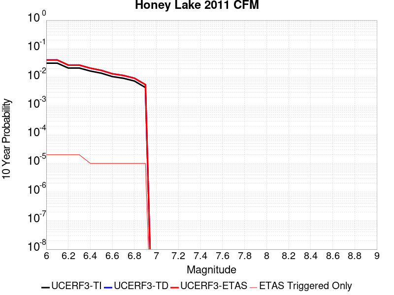 |

| Magnitude | 1 wk TI Prob | 1 wk TD Prob | 1 wk ETAS Prob | 1 wk ETAS/TD Gain | 1 wk ETAS Triggered Only | 1 mo TI Prob | 1 mo TD Prob | 1 mo ETAS Prob | 1 mo ETAS/TD Gain | 1 mo ETAS Triggered Only | 1 yr TI Prob | 1 yr TD Prob | 1 yr ETAS Prob | 1 yr ETAS/TD Gain | 1 yr ETAS Triggered Only | 10 yr TI Prob | 10 yr TD Prob | 10 yr ETAS Prob | 10 yr ETAS/TD Gain | 10 yr ETAS Triggered Only |
|-----|-----|-----|-----|-----|-----|-----|-----|-----|-----|-----|-----|-----|-----|-----|-----|-----|-----|-----|-----|-----|
| 6.0 | 6.155506E-5 | 7.955289E-5 | 7.955289E-5 | 1.0 | 0.0 | 2.6378073E-4 | 3.4089969E-4 | 3.4089969E-4 | 1.0 | 0.0 | 0.0032068014 | 0.0041431137 | 0.004186894 | 1.0105668 | 4.396184E-5 | 0.03160919 | 0.040705904 | 0.04074808 | 1.001036 | 4.396184E-5 |
| 6.1 | 6.155506E-5 | 7.955289E-5 | 7.955289E-5 | 1.0 | 0.0 | 2.6378073E-4 | 3.4089969E-4 | 3.4089969E-4 | 1.0 | 0.0 | 0.0032068014 | 0.0041431137 | 0.004186894 | 1.0105668 | 4.396184E-5 | 0.03160919 | 0.040705904 | 0.04074808 | 1.001036 | 4.396184E-5 |
| 6.2 | 4.1335024E-5 | 5.25801E-5 | 5.25801E-5 | 1.0 | 0.0 | 1.7713808E-4 | 2.2532493E-4 | 2.2532493E-4 | 1.0 | 0.0 | 0.0021545228 | 0.0027400537 | 0.0027838952 | 1.0160002 | 4.396184E-5 | 0.021337535 | 0.027078604 | 0.027121376 | 1.0015795 | 4.396184E-5 |
| 6.3 | 4.1335024E-5 | 5.25801E-5 | 5.25801E-5 | 1.0 | 0.0 | 1.7713808E-4 | 2.2532493E-4 | 2.2532493E-4 | 1.0 | 0.0 | 0.0021545228 | 0.0027400537 | 0.0027838952 | 1.0160002 | 4.396184E-5 | 0.021337535 | 0.027078604 | 0.027121376 | 1.0015795 | 4.396184E-5 |
| 6.4 | 3.2393702E-5 | 4.0890296E-5 | 4.0890296E-5 | 1.0 | 0.0 | 1.3882275E-4 | 1.7523306E-4 | 1.7523306E-4 | 1.0 | 0.0 | 0.0016888566 | 0.0021314796 | 0.0021314796 | 1.0 | 0.0 | 0.016760793 | 0.02112126 | 0.02112126 | 1.0 | 0.0 |
| 6.5 | 2.7205504E-5 | 3.4214027E-5 | 3.4214027E-5 | 1.0 | 0.0 | 1.1658981E-4 | 1.4662388E-4 | 1.4662388E-4 | 1.0 | 0.0 | 0.0014185566 | 0.0017837792 | 0.0017837792 | 1.0 | 0.0 | 0.014095354 | 0.017704122 | 0.017704122 | 1.0 | 0.0 |
| 6.6 | 2.069265E-5 | 2.5957059E-5 | 2.5957059E-5 | 1.0 | 0.0 | 8.867977E-5 | 1.1124028E-4 | 1.1124028E-4 | 1.0 | 0.0 | 0.0010791414 | 0.001353595 | 0.001353595 | 1.0 | 0.0 | 0.010739161 | 0.013461904 | 0.013461904 | 1.0 | 0.0 |
| 6.7 | 1.8060919E-5 | 2.2658358E-5 | 2.2658358E-5 | 1.0 | 0.0 | 7.7401644E-5 | 9.710409E-5 | 9.710409E-5 | 1.0 | 0.0 | 9.419576E-4 | 0.0011816823 | 0.0011816823 | 1.0 | 0.0 | 0.009379748 | 0.011762028 | 0.011762028 | 1.0 | 0.0 |
| 6.8 | 1.4474663E-5 | 1.8182507E-5 | 1.8182507E-5 | 1.0 | 0.0 | 6.203279E-5 | 7.7923134E-5 | 7.7923134E-5 | 1.0 | 0.0 | 7.5498753E-4 | 9.48378E-4 | 9.48378E-4 | 1.0 | 0.0 | 0.007524277 | 0.0094508305 | 0.0094508305 | 1.0 | 0.0 |
| 6.9 | 8.564552E-6 | 1.0803056E-5 | 1.0803056E-5 | 1.0 | 0.0 | 3.6704707E-5 | 4.6298366E-5 | 4.6298366E-5 | 1.0 | 0.0 | 4.4678818E-4 | 5.636035E-4 | 5.636035E-4 | 1.0 | 0.0 | 0.0044589094 | 0.005628237 | 0.005628237 | 1.0 | 0.0 |

## Camp Rock 2011
*[(top)](#table-of-contents)*

| 1 Week | 1 Month | 1 Year | 10 Year |
|-----|-----|-----|-----|
|  |  |  |  |

| Magnitude | 1 wk TI Prob | 1 wk TD Prob | 1 wk ETAS Prob | 1 wk ETAS/TD Gain | 1 wk ETAS Triggered Only | 1 mo TI Prob | 1 mo TD Prob | 1 mo ETAS Prob | 1 mo ETAS/TD Gain | 1 mo ETAS Triggered Only | 1 yr TI Prob | 1 yr TD Prob | 1 yr ETAS Prob | 1 yr ETAS/TD Gain | 1 yr ETAS Triggered Only | 10 yr TI Prob | 10 yr TD Prob | 10 yr ETAS Prob | 10 yr ETAS/TD Gain | 10 yr ETAS Triggered Only |
|-----|-----|-----|-----|-----|-----|-----|-----|-----|-----|-----|-----|-----|-----|-----|-----|-----|-----|-----|-----|-----|
| 6.0 | 1.6710783E-5 | 4.250364E-6 | 4.250364E-6 | 1.0 | 0.0 | 7.161568E-5 | 1.821572E-5 | 1.821572E-5 | 1.0 | 0.0 | 8.7157206E-4 | 2.2175435E-4 | 2.2175435E-4 | 1.0 | 0.0 | 0.008681616 | 0.0022153836 | 0.002259248 | 1.0198 | 4.396184E-5 |
| 6.1 | 1.6710783E-5 | 4.250364E-6 | 4.250364E-6 | 1.0 | 0.0 | 7.161568E-5 | 1.821572E-5 | 1.821572E-5 | 1.0 | 0.0 | 8.7157206E-4 | 2.2175435E-4 | 2.2175435E-4 | 1.0 | 0.0 | 0.008681616 | 0.0022153836 | 0.002259248 | 1.0198 | 4.396184E-5 |
| 6.2 | 1.6710783E-5 | 4.250364E-6 | 4.250364E-6 | 1.0 | 0.0 | 7.161568E-5 | 1.821572E-5 | 1.821572E-5 | 1.0 | 0.0 | 8.7157206E-4 | 2.2175435E-4 | 2.2175435E-4 | 1.0 | 0.0 | 0.008681616 | 0.0022153836 | 0.002259248 | 1.0198 | 4.396184E-5 |
| 6.3 | 1.6710783E-5 | 4.250364E-6 | 4.250364E-6 | 1.0 | 0.0 | 7.161568E-5 | 1.821572E-5 | 1.821572E-5 | 1.0 | 0.0 | 8.7157206E-4 | 2.2175435E-4 | 2.2175435E-4 | 1.0 | 0.0 | 0.008681616 | 0.0022153836 | 0.002259248 | 1.0198 | 4.396184E-5 |
| 6.4 | 7.982846E-6 | 3.6821798E-6 | 3.6821798E-6 | 1.0 | 0.0 | 3.421175E-5 | 1.5780677E-5 | 1.5780677E-5 | 1.0 | 0.0 | 4.1644843E-4 | 1.9211315E-4 | 1.9211315E-4 | 1.0 | 0.0 | 0.0041566887 | 0.0019195057 | 0.001963383 | 1.0228587 | 4.396184E-5 |
| 6.5 | 7.982846E-6 | 3.6821798E-6 | 3.6821798E-6 | 1.0 | 0.0 | 3.421175E-5 | 1.5780677E-5 | 1.5780677E-5 | 1.0 | 0.0 | 4.1644843E-4 | 1.9211315E-4 | 1.9211315E-4 | 1.0 | 0.0 | 0.0041566887 | 0.0019195057 | 0.001963383 | 1.0228587 | 4.396184E-5 |
| 6.6 | 7.048869E-6 | 3.4244447E-6 | 3.4244447E-6 | 1.0 | 0.0 | 3.0209088E-5 | 1.467611E-5 | 1.467611E-5 | 1.0 | 0.0 | 3.677336E-4 | 1.7866731E-4 | 1.7866731E-4 | 1.0 | 0.0 | 0.0036712566 | 0.0017852683 | 0.0018291518 | 1.0245808 | 4.396184E-5 |
| 6.7 | 6.987307E-6 | 3.3624212E-6 | 3.3624212E-6 | 1.0 | 0.0 | 2.9945259E-5 | 1.4410299E-5 | 1.4410299E-5 | 1.0 | 0.0 | 3.6452254E-4 | 1.7543157E-4 | 1.7543157E-4 | 1.0 | 0.0 | 0.0036392517 | 0.001752962 | 0.0017968469 | 1.0250347 | 4.396184E-5 |
| 6.8 | 6.3737602E-6 | 3.1179893E-6 | 3.1179893E-6 | 1.0 | 0.0 | 2.731583E-5 | 1.33627445E-5 | 1.33627445E-5 | 1.0 | 0.0 | 3.3251947E-4 | 1.6267956E-4 | 1.6267956E-4 | 1.0 | 0.0 | 0.0033202237 | 0.0016256333 | 0.0016695237 | 1.026999 | 4.396184E-5 |
| 6.9 | 6.112211E-6 | 2.933194E-6 | 2.933194E-6 | 1.0 | 0.0 | 2.6194928E-5 | 1.2570772E-5 | 1.2570772E-5 | 1.0 | 0.0 | 3.1887658E-4 | 1.5303868E-4 | 1.5303868E-4 | 1.0 | 0.0 | 0.003184194 | 0.0015293608 | 0.0015732553 | 1.0287013 | 4.396184E-5 |
| 7.0 | 5.5140117E-6 | 2.6419923E-6 | 2.6419923E-6 | 1.0 | 0.0 | 2.3631264E-5 | 1.1322776E-5 | 1.1322776E-5 | 1.0 | 0.0 | 2.8767265E-4 | 1.3784633E-4 | 1.3784633E-4 | 1.0 | 0.0 | 0.0028730053 | 0.0013776337 | 0.0014215349 | 1.0318671 | 4.396184E-5 |
| 7.1 | 4.8151105E-6 | 2.1343292E-6 | 2.1343292E-6 | 1.0 | 0.0 | 2.0636026E-5 | 9.147094E-6 | 9.147094E-6 | 1.0 | 0.0 | 2.5121463E-4 | 1.113604E-4 | 1.113604E-4 | 1.0 | 0.0 | 0.0025093083 | 0.0011130678 | 0.0011130678 | 1.0 | 0.0 |
| 7.2 | 3.818335E-6 | 1.2937865E-6 | 1.2937865E-6 | 1.0 | 0.0 | 1.6364189E-5 | 5.5447877E-6 | 5.5447877E-6 | 1.0 | 0.0 | 1.9921579E-4 | 6.750578E-5 | 6.750578E-5 | 1.0 | 0.0 | 0.0019903728 | 6.7486096E-4 | 6.7486096E-4 | 1.0 | 0.0 |
| 7.3 | 2.7166698E-6 | 7.3839175E-7 | 7.3839175E-7 | 1.0 | 0.0 | 1.1642818E-5 | 3.1645322E-6 | 3.1645322E-6 | 1.0 | 0.0 | 1.4174209E-4 | 3.852752E-5 | 3.852752E-5 | 1.0 | 0.0 | 0.0014165172 | 3.852104E-4 | 3.852104E-4 | 1.0 | 0.0 |
| 7.4 | 2.0893426E-6 | 5.4621097E-7 | 5.4621097E-7 | 1.0 | 0.0 | 8.954295E-6 | 2.3409023E-6 | 2.3409023E-6 | 1.0 | 0.0 | 1.0901308E-4 | 2.8500117E-5 | 2.8500117E-5 | 1.0 | 0.0 | 0.0010895962 | 2.8496515E-4 | 2.8496515E-4 | 1.0 | 0.0 |
| 7.5 | 1.1681728E-6 | 3.603199E-7 | 3.603199E-7 | 1.0 | 0.0 | 5.0064455E-6 | 1.5442272E-6 | 1.5442272E-6 | 1.0 | 0.0 | 6.0951766E-5 | 1.8800809E-5 | 1.8800809E-5 | 1.0 | 0.0 | 6.093505E-4 | 1.8799266E-4 | 1.8799266E-4 | 1.0 | 0.0 |
| 7.6 | 1.3154387E-7 | 7.119914E-8 | 7.119914E-8 | 1.0 | 0.0 | 5.6375933E-7 | 3.0513914E-7 | 3.0513914E-7 | 1.0 | 0.0 | 6.863748E-6 | 3.7150644E-6 | 3.7150644E-6 | 1.0 | 0.0 | 6.863536E-5 | 3.715018E-5 | 3.715018E-5 | 1.0 | 0.0 |

## Santa Ynez (East)
*[(top)](#table-of-contents)*

| 1 Week | 1 Month | 1 Year | 10 Year |
|-----|-----|-----|-----|
|  |  |  |  |

| Magnitude | 1 wk TI Prob | 1 wk TD Prob | 1 wk ETAS Prob | 1 wk ETAS/TD Gain | 1 wk ETAS Triggered Only | 1 mo TI Prob | 1 mo TD Prob | 1 mo ETAS Prob | 1 mo ETAS/TD Gain | 1 mo ETAS Triggered Only | 1 yr TI Prob | 1 yr TD Prob | 1 yr ETAS Prob | 1 yr ETAS/TD Gain | 1 yr ETAS Triggered Only | 10 yr TI Prob | 10 yr TD Prob | 10 yr ETAS Prob | 10 yr ETAS/TD Gain | 10 yr ETAS Triggered Only |
|-----|-----|-----|-----|-----|-----|-----|-----|-----|-----|-----|-----|-----|-----|-----|-----|-----|-----|-----|-----|-----|
| 6.0 | 3.2269712E-5 | 3.6752193E-5 | 3.6752193E-5 | 1.0 | 0.0 | 1.3829143E-4 | 1.5750321E-4 | 2.0145813E-4 | 1.2790731 | 4.396184E-5 | 0.0016823979 | 0.0019165046 | 0.0019603823 | 1.0228946 | 4.396184E-5 | 0.016697178 | 0.01905731 | 0.019100433 | 1.0022628 | 4.396184E-5 |
| 6.1 | 3.2269712E-5 | 3.6752193E-5 | 3.6752193E-5 | 1.0 | 0.0 | 1.3829143E-4 | 1.5750321E-4 | 2.0145813E-4 | 1.2790731 | 4.396184E-5 | 0.0016823979 | 0.0019165046 | 0.0019603823 | 1.0228946 | 4.396184E-5 | 0.016697178 | 0.01905731 | 0.019100433 | 1.0022628 | 4.396184E-5 |
| 6.2 | 3.2269712E-5 | 3.6752193E-5 | 3.6752193E-5 | 1.0 | 0.0 | 1.3829143E-4 | 1.5750321E-4 | 2.0145813E-4 | 1.2790731 | 4.396184E-5 | 0.0016823979 | 0.0019165046 | 0.0019603823 | 1.0228946 | 4.396184E-5 | 0.016697178 | 0.01905731 | 0.019100433 | 1.0022628 | 4.396184E-5 |
| 6.3 | 3.2269712E-5 | 3.6752193E-5 | 3.6752193E-5 | 1.0 | 0.0 | 1.3829143E-4 | 1.5750321E-4 | 2.0145813E-4 | 1.2790731 | 4.396184E-5 | 0.0016823979 | 0.0019165046 | 0.0019603823 | 1.0228946 | 4.396184E-5 | 0.016697178 | 0.01905731 | 0.019100433 | 1.0022628 | 4.396184E-5 |
| 6.4 | 1.4404779E-5 | 1.4849757E-5 | 1.4849757E-5 | 1.0 | 0.0 | 6.1733306E-5 | 6.364029E-5 | 6.364029E-5 | 1.0 | 0.0 | 7.513438E-4 | 7.745501E-4 | 7.745501E-4 | 1.0 | 0.0 | 0.0074880854 | 0.0077190557 | 0.0077190557 | 1.0 | 0.0 |
| 6.5 | 1.4404779E-5 | 1.4849757E-5 | 1.4849757E-5 | 1.0 | 0.0 | 6.1733306E-5 | 6.364029E-5 | 6.364029E-5 | 1.0 | 0.0 | 7.513438E-4 | 7.745501E-4 | 7.745501E-4 | 1.0 | 0.0 | 0.0074880854 | 0.0077190557 | 0.0077190557 | 1.0 | 0.0 |
| 6.6 | 1.280208E-5 | 1.301225E-5 | 1.301225E-5 | 1.0 | 0.0 | 5.4864904E-5 | 5.5765602E-5 | 5.5765602E-5 | 1.0 | 0.0 | 6.6777546E-4 | 6.787365E-4 | 6.787365E-4 | 1.0 | 0.0 | 0.006657724 | 0.0067668455 | 0.0067668455 | 1.0 | 0.0 |
| 6.7 | 1.2457027E-5 | 1.2628759E-5 | 1.2628759E-5 | 1.0 | 0.0 | 5.3386164E-5 | 5.4122138E-5 | 5.4122138E-5 | 1.0 | 0.0 | 6.497827E-4 | 6.587395E-4 | 6.587395E-4 | 1.0 | 0.0 | 0.00647886 | 0.006568066 | 0.006568066 | 1.0 | 0.0 |
| 6.8 | 1.2095134E-5 | 1.2231195E-5 | 1.2231195E-5 | 1.0 | 0.0 | 5.1835254E-5 | 5.2418363E-5 | 5.2418363E-5 | 1.0 | 0.0 | 6.309115E-4 | 6.380083E-4 | 6.380083E-4 | 1.0 | 0.0 | 0.0062912325 | 0.0063619544 | 0.0063619544 | 1.0 | 0.0 |
| 6.9 | 1.1104036E-5 | 1.1157604E-5 | 1.1157604E-5 | 1.0 | 0.0 | 4.758786E-5 | 4.7817433E-5 | 4.7817433E-5 | 1.0 | 0.0 | 5.7922816E-4 | 5.82023E-4 | 5.82023E-4 | 1.0 | 0.0 | 0.005777207 | 0.0058051324 | 0.0058051324 | 1.0 | 0.0 |
| 7.0 | 1.0577444E-5 | 1.0581923E-5 | 1.0581923E-5 | 1.0 | 0.0 | 4.5331115E-5 | 4.5350316E-5 | 4.5350316E-5 | 1.0 | 0.0 | 5.5176654E-4 | 5.520014E-4 | 5.520014E-4 | 1.0 | 0.0 | 0.0055039856 | 0.0055064415 | 0.0055064415 | 1.0 | 0.0 |
| 7.1 | 1.0021775E-5 | 9.981217E-6 | 9.981217E-6 | 1.0 | 0.0 | 4.294976E-5 | 4.2775948E-5 | 4.2775948E-5 | 1.0 | 0.0 | 5.2278786E-4 | 5.2067393E-4 | 5.2067393E-4 | 1.0 | 0.0 | 0.0052155964 | 0.0051946724 | 0.0051946724 | 1.0 | 0.0 |
| 7.2 | 8.874109E-6 | 8.748995E-6 | 8.748995E-6 | 1.0 | 0.0 | 3.8031343E-5 | 3.7495163E-5 | 3.7495163E-5 | 1.0 | 0.0 | 4.629332E-4 | 4.5640906E-4 | 4.5640906E-4 | 1.0 | 0.0 | 0.0046197 | 0.004554835 | 0.004554835 | 1.0 | 0.0 |
| 7.3 | 7.5504267E-6 | 7.5052803E-6 | 7.5052803E-6 | 1.0 | 0.0 | 3.235857E-5 | 3.2165095E-5 | 3.2165095E-5 | 1.0 | 0.0 | 3.9389438E-4 | 3.915407E-4 | 3.915407E-4 | 1.0 | 0.0 | 0.0039319694 | 0.0039086156 | 0.0039086156 | 1.0 | 0.0 |
| 7.4 | 6.309394E-6 | 6.1832875E-6 | 6.1832875E-6 | 1.0 | 0.0 | 2.703998E-5 | 2.649954E-5 | 2.649954E-5 | 1.0 | 0.0 | 3.2916202E-4 | 3.2258508E-4 | 3.2258508E-4 | 1.0 | 0.0 | 0.003286749 | 0.0032212655 | 0.0032212655 | 1.0 | 0.0 |
| 7.5 | 4.6103073E-6 | 4.4409794E-6 | 4.4409794E-6 | 1.0 | 0.0 | 1.975831E-5 | 1.9032634E-5 | 1.9032634E-5 | 1.0 | 0.0 | 2.4053088E-4 | 2.3169837E-4 | 2.3169837E-4 | 1.0 | 0.0 | 0.002402707 | 0.0023146376 | 0.0023146376 | 1.0 | 0.0 |
| 7.6 | 1.2858658E-6 | 1.3008363E-6 | 1.3008363E-6 | 1.0 | 0.0 | 5.5108417E-6 | 5.575001E-6 | 5.575001E-6 | 1.0 | 0.0 | 6.7092435E-5 | 6.7873596E-5 | 6.7873596E-5 | 1.0 | 0.0 | 6.707218E-4 | 6.7853555E-4 | 6.7853555E-4 | 1.0 | 0.0 |
| 7.7 | 5.3302307E-7 | 5.612217E-7 | 5.612217E-7 | 1.0 | 0.0 | 2.2843826E-6 | 2.405234E-6 | 2.405234E-6 | 1.0 | 0.0 | 2.7812002E-5 | 2.9283367E-5 | 2.9283367E-5 | 1.0 | 0.0 | 2.7808524E-4 | 2.9279865E-4 | 2.9279865E-4 | 1.0 | 0.0 |
| 7.8 | 4.613933E-8 | 4.803062E-8 | 4.803062E-8 | 1.0 | 0.0 | 1.9773998E-7 | 2.058455E-7 | 2.058455E-7 | 1.0 | 0.0 | 2.4074816E-6 | 2.506166E-6 | 2.506166E-6 | 1.0 | 0.0 | 2.4074554E-5 | 2.5061388E-5 | 2.5061388E-5 | 1.0 | 0.0 |

## Santa Cruz Island
*[(top)](#table-of-contents)*

| 1 Week | 1 Month | 1 Year | 10 Year |
|-----|-----|-----|-----|
|  |  |  | 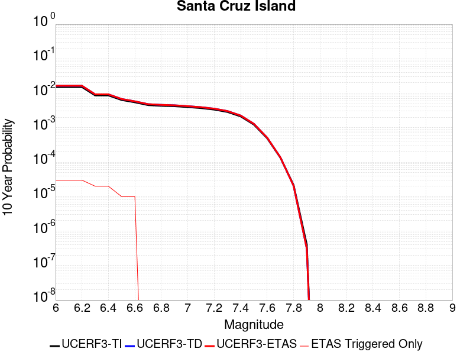 |

| Magnitude | 1 wk TI Prob | 1 wk TD Prob | 1 wk ETAS Prob | 1 wk ETAS/TD Gain | 1 wk ETAS Triggered Only | 1 mo TI Prob | 1 mo TD Prob | 1 mo ETAS Prob | 1 mo ETAS/TD Gain | 1 mo ETAS Triggered Only | 1 yr TI Prob | 1 yr TD Prob | 1 yr ETAS Prob | 1 yr ETAS/TD Gain | 1 yr ETAS Triggered Only | 10 yr TI Prob | 10 yr TD Prob | 10 yr ETAS Prob | 10 yr ETAS/TD Gain | 10 yr ETAS Triggered Only |
|-----|-----|-----|-----|-----|-----|-----|-----|-----|-----|-----|-----|-----|-----|-----|-----|-----|-----|-----|-----|-----|
| 6.0 | 2.9164563E-5 | 3.1600448E-5 | 3.1600448E-5 | 1.0 | 0.0 | 1.2498499E-4 | 1.3542423E-4 | 1.3542423E-4 | 1.0 | 0.0 | 0.0015206301 | 0.0016476793 | 0.0016915686 | 1.0266371 | 4.396184E-5 | 0.015102667 | 0.016368361 | 0.016411604 | 1.0026418 | 4.396184E-5 |
| 6.1 | 2.9164563E-5 | 3.1600448E-5 | 3.1600448E-5 | 1.0 | 0.0 | 1.2498499E-4 | 1.3542423E-4 | 1.3542423E-4 | 1.0 | 0.0 | 0.0015206301 | 0.0016476793 | 0.0016915686 | 1.0266371 | 4.396184E-5 | 0.015102667 | 0.016368361 | 0.016411604 | 1.0026418 | 4.396184E-5 |
| 6.2 | 2.9164563E-5 | 3.1600448E-5 | 3.1600448E-5 | 1.0 | 0.0 | 1.2498499E-4 | 1.3542423E-4 | 1.3542423E-4 | 1.0 | 0.0 | 0.0015206301 | 0.0016476793 | 0.0016915686 | 1.0266371 | 4.396184E-5 | 0.015102667 | 0.016368361 | 0.016411604 | 1.0026418 | 4.396184E-5 |
| 6.3 | 1.6635553E-5 | 1.7804694E-5 | 1.7804694E-5 | 1.0 | 0.0 | 7.1293274E-5 | 7.63037E-5 | 7.63037E-5 | 1.0 | 0.0 | 8.6765E-4 | 9.286198E-4 | 9.286198E-4 | 1.0 | 0.0 | 0.008642701 | 0.009249267 | 0.009249267 | 1.0 | 0.0 |
| 6.4 | 1.6635553E-5 | 1.7804694E-5 | 1.7804694E-5 | 1.0 | 0.0 | 7.1293274E-5 | 7.63037E-5 | 7.63037E-5 | 1.0 | 0.0 | 8.6765E-4 | 9.286198E-4 | 9.286198E-4 | 1.0 | 0.0 | 0.008642701 | 0.009249267 | 0.009249267 | 1.0 | 0.0 |
| 6.5 | 1.2238748E-5 | 1.3043225E-5 | 1.3043225E-5 | 1.0 | 0.0 | 5.2450723E-5 | 5.589836E-5 | 5.589836E-5 | 1.0 | 0.0 | 6.3840044E-4 | 6.803537E-4 | 6.803537E-4 | 1.0 | 0.0 | 0.0063656955 | 0.006783107 | 0.006783107 | 1.0 | 0.0 |
| 6.6 | 1.0489767E-5 | 1.1156826E-5 | 1.1156826E-5 | 1.0 | 0.0 | 4.495537E-5 | 4.781411E-5 | 4.781411E-5 | 1.0 | 0.0 | 5.4719415E-4 | 5.819835E-4 | 5.819835E-4 | 1.0 | 0.0 | 0.005458487 | 0.005804835 | 0.005804835 | 1.0 | 0.0 |
| 6.7 | 8.699222E-6 | 9.2369355E-6 | 9.2369355E-6 | 1.0 | 0.0 | 3.7281847E-5 | 3.958627E-5 | 3.958627E-5 | 1.0 | 0.0 | 4.5381195E-4 | 4.818568E-4 | 4.818568E-4 | 1.0 | 0.0 | 0.0045288634 | 0.004808188 | 0.004808188 | 1.0 | 0.0 |
| 6.8 | 8.307732E-6 | 8.81705E-6 | 8.81705E-6 | 1.0 | 0.0 | 3.560408E-5 | 3.7786813E-5 | 3.7786813E-5 | 1.0 | 0.0 | 4.3339343E-4 | 4.5995775E-4 | 4.5995775E-4 | 1.0 | 0.0 | 0.004325492 | 0.004590111 | 0.004590111 | 1.0 | 0.0 |
| 6.9 | 8.073121E-6 | 8.56508E-6 | 8.56508E-6 | 1.0 | 0.0 | 3.459863E-5 | 3.670697E-5 | 3.670697E-5 | 1.0 | 0.0 | 4.2115687E-4 | 4.4681615E-4 | 4.4681615E-4 | 1.0 | 0.0 | 0.004203596 | 0.0044592293 | 0.0044592293 | 1.0 | 0.0 |
| 7.0 | 7.617019E-6 | 8.074795E-6 | 8.074795E-6 | 1.0 | 0.0 | 3.264396E-5 | 3.4605808E-5 | 3.4605808E-5 | 1.0 | 0.0 | 3.9736772E-4 | 4.2124465E-4 | 4.2124465E-4 | 1.0 | 0.0 | 0.003966579 | 0.0042045093 | 0.0042045093 | 1.0 | 0.0 |
| 7.1 | 7.1224836E-6 | 7.545909E-6 | 7.545909E-6 | 1.0 | 0.0 | 3.052457E-5 | 3.2339212E-5 | 3.2339212E-5 | 1.0 | 0.0 | 3.715733E-4 | 3.936591E-4 | 3.936591E-4 | 1.0 | 0.0 | 0.003709526 | 0.0039296607 | 0.0039296607 | 1.0 | 0.0 |
| 7.2 | 6.441115E-6 | 6.827494E-6 | 6.827494E-6 | 1.0 | 0.0 | 2.7604487E-5 | 2.9260362E-5 | 2.9260362E-5 | 1.0 | 0.0 | 3.360328E-4 | 3.561869E-4 | 3.561869E-4 | 1.0 | 0.0 | 0.0033552512 | 0.0035561887 | 0.0035561887 | 1.0 | 0.0 |
| 7.3 | 5.494274E-6 | 5.820088E-6 | 5.820088E-6 | 1.0 | 0.0 | 2.3546674E-5 | 2.4942996E-5 | 2.4942996E-5 | 1.0 | 0.0 | 2.8664304E-4 | 3.0363887E-4 | 3.0363887E-4 | 1.0 | 0.0 | 0.002862736 | 0.0030322631 | 0.0030322631 | 1.0 | 0.0 |
| 7.4 | 4.0802624E-6 | 4.312323E-6 | 4.312323E-6 | 1.0 | 0.0 | 1.7486722E-5 | 1.8481254E-5 | 1.8481254E-5 | 1.0 | 0.0 | 2.1288003E-4 | 2.2498611E-4 | 2.2498611E-4 | 1.0 | 0.0 | 0.0021267622 | 0.0022475924 | 0.0022475924 | 1.0 | 0.0 |
| 7.5 | 2.3584746E-6 | 2.475344E-6 | 2.475344E-6 | 1.0 | 0.0 | 1.0107709E-5 | 1.0608574E-5 | 1.0608574E-5 | 1.0 | 0.0 | 1.2305441E-4 | 1.2915178E-4 | 1.2915178E-4 | 1.0 | 0.0 | 0.0012298629 | 0.0012907722 | 0.0012907722 | 1.0 | 0.0 |
| 7.6 | 9.4981914E-7 | 9.861046E-7 | 9.861046E-7 | 1.0 | 0.0 | 4.0706473E-6 | 4.226156E-6 | 4.226156E-6 | 1.0 | 0.0 | 4.9559E-5 | 5.1452243E-5 | 5.1452243E-5 | 1.0 | 0.0 | 4.954795E-4 | 5.144046E-4 | 5.144046E-4 | 1.0 | 0.0 |
| 7.7 | 2.6013532E-7 | 2.6416836E-7 | 2.6416836E-7 | 1.0 | 0.0 | 1.1148652E-6 | 1.1321496E-6 | 1.1321496E-6 | 1.0 | 0.0 | 1.3573399E-5 | 1.3783835E-5 | 1.3783835E-5 | 1.0 | 0.0 | 1.357257E-4 | 1.3782988E-4 | 1.3782988E-4 | 1.0 | 0.0 |
| 7.8 | 4.1522263E-8 | 3.9657046E-8 | 3.9657046E-8 | 1.0 | 0.0 | 1.7795254E-7 | 1.6995875E-7 | 1.6995875E-7 | 1.0 | 0.0 | 2.16657E-6 | 2.0692462E-6 | 2.0692462E-6 | 1.0 | 0.0 | 2.1665488E-5 | 2.069229E-5 | 2.069229E-5 | 1.0 | 0.0 |
| 7.9 | 7.7242046E-10 | 5.946882E-10 | 5.946882E-10 | 1.0 | 0.0 | 3.3103735E-9 | 2.5486635E-9 | 2.5486635E-9 | 1.0 | 0.0 | 4.0303796E-8 | 3.1029977E-8 | 3.1029977E-8 | 1.0 | 0.0 | 4.030379E-7 | 3.1029975E-7 | 3.1029975E-7 | 1.0 | 0.0 |

## San Jacinto (San Jacinto Valley) rev
*[(top)](#table-of-contents)*

| 1 Week | 1 Month | 1 Year | 10 Year |
|-----|-----|-----|-----|
|  |  |  |  |

| Magnitude | 1 wk TI Prob | 1 wk TD Prob | 1 wk ETAS Prob | 1 wk ETAS/TD Gain | 1 wk ETAS Triggered Only | 1 mo TI Prob | 1 mo TD Prob | 1 mo ETAS Prob | 1 mo ETAS/TD Gain | 1 mo ETAS Triggered Only | 1 yr TI Prob | 1 yr TD Prob | 1 yr ETAS Prob | 1 yr ETAS/TD Gain | 1 yr ETAS Triggered Only | 10 yr TI Prob | 10 yr TD Prob | 10 yr ETAS Prob | 10 yr ETAS/TD Gain | 10 yr ETAS Triggered Only |
|-----|-----|-----|-----|-----|-----|-----|-----|-----|-----|-----|-----|-----|-----|-----|-----|-----|-----|-----|-----|-----|
| 6.0 | 3.652694E-5 | 3.443176E-5 | 3.443176E-5 | 1.0 | 0.0 | 1.5653463E-4 | 1.4755632E-4 | 1.4755632E-4 | 1.0 | 0.0 | 0.0019041431 | 0.0017950195 | 0.0018389025 | 1.0244471 | 4.396184E-5 | 0.018879099 | 0.018541748 | 0.018584894 | 1.002327 | 4.396184E-5 |
| 6.1 | 3.652694E-5 | 3.443176E-5 | 3.443176E-5 | 1.0 | 0.0 | 1.5653463E-4 | 1.4755632E-4 | 1.4755632E-4 | 1.0 | 0.0 | 0.0019041431 | 0.0017950195 | 0.0018389025 | 1.0244471 | 4.396184E-5 | 0.018879099 | 0.018541748 | 0.018584894 | 1.002327 | 4.396184E-5 |
| 6.2 | 3.652694E-5 | 3.443176E-5 | 3.443176E-5 | 1.0 | 0.0 | 1.5653463E-4 | 1.4755632E-4 | 1.4755632E-4 | 1.0 | 0.0 | 0.0019041431 | 0.0017950195 | 0.0018389025 | 1.0244471 | 4.396184E-5 | 0.018879099 | 0.018541748 | 0.018584894 | 1.002327 | 4.396184E-5 |
| 6.3 | 3.652694E-5 | 3.443176E-5 | 3.443176E-5 | 1.0 | 0.0 | 1.5653463E-4 | 1.4755632E-4 | 1.4755632E-4 | 1.0 | 0.0 | 0.0019041431 | 0.0017950195 | 0.0018389025 | 1.0244471 | 4.396184E-5 | 0.018879099 | 0.018541748 | 0.018584894 | 1.002327 | 4.396184E-5 |
| 6.4 | 3.646941E-5 | 3.435333E-5 | 3.435333E-5 | 1.0 | 0.0 | 1.5628811E-4 | 1.4722023E-4 | 1.4722023E-4 | 1.0 | 0.0 | 0.0019011468 | 0.0017909348 | 0.0018348179 | 1.0245029 | 4.396184E-5 | 0.018849645 | 0.018501626 | 0.018544775 | 1.0023321 | 4.396184E-5 |
| 6.5 | 3.646941E-5 | 3.435333E-5 | 3.435333E-5 | 1.0 | 0.0 | 1.5628811E-4 | 1.4722023E-4 | 1.4722023E-4 | 1.0 | 0.0 | 0.0019011468 | 0.0017909348 | 0.0018348179 | 1.0245029 | 4.396184E-5 | 0.018849645 | 0.018501626 | 0.018544775 | 1.0023321 | 4.396184E-5 |
| 6.6 | 3.6442503E-5 | 3.431671E-5 | 3.431671E-5 | 1.0 | 0.0 | 1.561728E-4 | 1.4706331E-4 | 1.4706331E-4 | 1.0 | 0.0 | 0.0018997455 | 0.0017890275 | 0.0018329107 | 1.0245291 | 4.396184E-5 | 0.018835869 | 0.018482894 | 0.018526044 | 1.0023346 | 4.396184E-5 |
| 6.7 | 3.6432113E-5 | 3.430228E-5 | 3.430228E-5 | 1.0 | 0.0 | 1.5612828E-4 | 1.4700148E-4 | 1.4700148E-4 | 1.0 | 0.0 | 0.0018992044 | 0.0017882761 | 0.0018321594 | 1.0245394 | 4.396184E-5 | 0.018830549 | 0.018475518 | 0.018518668 | 1.0023355 | 4.396184E-5 |
| 6.8 | 3.6409598E-5 | 3.4271332E-5 | 3.4271332E-5 | 1.0 | 0.0 | 1.560318E-4 | 1.4686886E-4 | 1.4686886E-4 | 1.0 | 0.0 | 0.0018980318 | 0.0017866642 | 0.0018305475 | 1.0245615 | 4.396184E-5 | 0.018819023 | 0.01845967 | 0.01850282 | 1.0023376 | 4.396184E-5 |
| 6.9 | 3.638078E-5 | 3.423175E-5 | 3.423175E-5 | 1.0 | 0.0 | 1.5590832E-4 | 1.4669925E-4 | 1.4669925E-4 | 1.0 | 0.0 | 0.0018965311 | 0.0017846026 | 0.001828486 | 1.02459 | 4.396184E-5 | 0.018804269 | 0.018439403 | 0.018482555 | 1.0023402 | 4.396184E-5 |
| 7.0 | 3.6294874E-5 | 3.4113757E-5 | 3.4113757E-5 | 1.0 | 0.0 | 1.5554018E-4 | 1.4619363E-4 | 1.4619363E-4 | 1.0 | 0.0 | 0.0018920569 | 0.001778457 | 0.0018223407 | 1.0246751 | 4.396184E-5 | 0.018760284 | 0.01837898 | 0.018422134 | 1.002348 | 4.396184E-5 |
| 7.1 | 3.6260717E-5 | 3.4070035E-5 | 3.4070035E-5 | 1.0 | 0.0 | 1.5539382E-4 | 1.4600628E-4 | 1.4600628E-4 | 1.0 | 0.0 | 0.001890278 | 0.0017761796 | 0.0018200635 | 1.0247068 | 4.396184E-5 | 0.018742796 | 0.018356578 | 0.018399734 | 1.0023509 | 4.396184E-5 |
| 7.2 | 3.6210204E-5 | 3.4004246E-5 | 3.4004246E-5 | 1.0 | 0.0 | 1.5517735E-4 | 1.4572436E-4 | 1.4572436E-4 | 1.0 | 0.0 | 0.001887647 | 0.001772753 | 0.0018166369 | 1.0247546 | 4.396184E-5 | 0.01871693 | 0.018322857 | 0.018366013 | 1.0023553 | 4.396184E-5 |
| 7.3 | 3.6119454E-5 | 3.389252E-5 | 3.389252E-5 | 1.0 | 0.0 | 1.5478847E-4 | 1.4524558E-4 | 1.4524558E-4 | 1.0 | 0.0 | 0.0018829206 | 0.0017669332 | 0.0018108174 | 1.0248363 | 4.396184E-5 | 0.018670462 | 0.018265404 | 0.018308561 | 1.0023628 | 4.396184E-5 |
| 7.4 | 3.607848E-5 | 3.384001E-5 | 3.384001E-5 | 1.0 | 0.0 | 1.5461289E-4 | 1.4502056E-4 | 1.4502056E-4 | 1.0 | 0.0 | 0.0018807866 | 0.0017641982 | 0.0018080825 | 1.0248749 | 4.396184E-5 | 0.018649481 | 0.018238394 | 0.018281555 | 1.0023664 | 4.396184E-5 |
| 7.5 | 3.5856774E-5 | 3.364974E-5 | 3.364974E-5 | 1.0 | 0.0 | 1.5366284E-4 | 1.442052E-4 | 1.442052E-4 | 1.0 | 0.0 | 0.0018692396 | 0.0017542872 | 0.0017981719 | 1.0250157 | 4.396184E-5 | 0.018535944 | 0.01813947 | 0.018182635 | 1.0023795 | 4.396184E-5 |
| 7.6 | 3.286655E-5 | 3.217215E-5 | 3.217215E-5 | 1.0 | 0.0 | 1.4084904E-4 | 1.3787337E-4 | 1.3787337E-4 | 1.0 | 0.0 | 0.001713488 | 0.0016773179 | 0.001721206 | 1.0261656 | 4.396184E-5 | 0.017003361 | 0.01735886 | 0.017402058 | 1.0024886 | 4.396184E-5 |
| 7.7 | 2.8882527E-5 | 2.9264393E-5 | 2.9264393E-5 | 1.0 | 0.0 | 1.237764E-4 | 1.254128E-4 | 1.254128E-4 | 1.0 | 0.0 | 0.0015059357 | 0.0015258325 | 0.0015697273 | 1.0287677 | 4.396184E-5 | 0.014957713 | 0.015844999 | 0.015888264 | 1.0027305 | 4.396184E-5 |
| 7.8 | 2.4950225E-5 | 2.6554231E-5 | 2.6554231E-5 | 1.0 | 0.0 | 1.0692515E-4 | 1.1379889E-4 | 1.1379889E-4 | 1.0 | 0.0 | 0.0013010362 | 0.0013846217 | 0.0014285228 | 1.0317061 | 4.396184E-5 | 0.012934455 | 0.01442576 | 0.014469088 | 1.0030035 | 4.396184E-5 |
| 7.9 | 1.9881603E-5 | 2.1531732E-5 | 2.1531732E-5 | 1.0 | 0.0 | 8.520408E-5 | 9.227559E-5 | 9.227559E-5 | 1.0 | 0.0 | 0.001036866 | 0.0011228771 | 0.0011667896 | 1.0391071 | 4.396184E-5 | 0.010320415 | 0.011789665 | 0.011833108 | 1.0036849 | 4.396184E-5 |
| 8.0 | 1.563292E-5 | 1.5956964E-5 | 1.5956964E-5 | 1.0 | 0.0 | 6.6996516E-5 | 6.8385205E-5 | 6.8385205E-5 | 1.0 | 0.0 | 8.153773E-4 | 8.3227246E-4 | 8.761977E-4 | 1.0527775 | 4.396184E-5 | 0.00812392 | 0.008820829 | 0.008864403 | 1.0049399 | 4.396184E-5 |
| 8.1 | 1.0045313E-5 | 8.313211E-6 | 8.313211E-6 | 1.0 | 0.0 | 4.305063E-5 | 3.5627563E-5 | 3.5627563E-5 | 1.0 | 0.0 | 5.2401534E-4 | 4.3367976E-4 | 4.7762253E-4 | 1.1013254 | 4.396184E-5 | 0.0052278144 | 0.0046652434 | 0.0047090002 | 1.0093793 | 4.396184E-5 |
| 8.2 | 4.1554413E-6 | 1.5688654E-6 | 1.5688654E-6 | 1.0 | 0.0 | 1.7808914E-5 | 6.723692E-6 | 6.723692E-6 | 1.0 | 0.0 | 2.1680194E-4 | 8.18579E-5 | 8.18579E-5 | 1.0 | 0.0 | 0.0021659054 | 9.501779E-4 | 9.501779E-4 | 1.0 | 0.0 |
| 8.3 | 1.2758221E-6 | 3.6239646E-7 | 3.6239646E-7 | 1.0 | 0.0 | 5.4677976E-6 | 1.5531268E-6 | 1.5531268E-6 | 1.0 | 0.0 | 6.65684E-5 | 1.8909159E-5 | 1.8909159E-5 | 1.0 | 0.0 | 6.6548464E-4 | 2.2804004E-4 | 2.2804004E-4 | 1.0 | 0.0 |

## Compton
*[(top)](#table-of-contents)*

| 1 Week | 1 Month | 1 Year | 10 Year |
|-----|-----|-----|-----|
|  |  |  |  |

| Magnitude | 1 wk TI Prob | 1 wk TD Prob | 1 wk ETAS Prob | 1 wk ETAS/TD Gain | 1 wk ETAS Triggered Only | 1 mo TI Prob | 1 mo TD Prob | 1 mo ETAS Prob | 1 mo ETAS/TD Gain | 1 mo ETAS Triggered Only | 1 yr TI Prob | 1 yr TD Prob | 1 yr ETAS Prob | 1 yr ETAS/TD Gain | 1 yr ETAS Triggered Only | 10 yr TI Prob | 10 yr TD Prob | 10 yr ETAS Prob | 10 yr ETAS/TD Gain | 10 yr ETAS Triggered Only |
|-----|-----|-----|-----|-----|-----|-----|-----|-----|-----|-----|-----|-----|-----|-----|-----|-----|-----|-----|-----|-----|
| 6.0 | 1.06050875E-5 | 6.3589177E-6 | 6.3589177E-6 | 1.0 | 0.0 | 4.5449582E-5 | 2.7252236E-5 | 2.7252236E-5 | 1.0 | 0.0 | 5.5320817E-4 | 3.317483E-4 | 3.7569556E-4 | 1.1324717 | 4.396184E-5 | 0.0055183303 | 0.0033128145 | 0.0033566307 | 1.0132263 | 4.396184E-5 |
| 6.1 | 1.06050875E-5 | 6.3589177E-6 | 6.3589177E-6 | 1.0 | 0.0 | 4.5449582E-5 | 2.7252236E-5 | 2.7252236E-5 | 1.0 | 0.0 | 5.5320817E-4 | 3.317483E-4 | 3.7569556E-4 | 1.1324717 | 4.396184E-5 | 0.0055183303 | 0.0033128145 | 0.0033566307 | 1.0132263 | 4.396184E-5 |
| 6.2 | 1.06050875E-5 | 6.3589177E-6 | 6.3589177E-6 | 1.0 | 0.0 | 4.5449582E-5 | 2.7252236E-5 | 2.7252236E-5 | 1.0 | 0.0 | 5.5320817E-4 | 3.317483E-4 | 3.7569556E-4 | 1.1324717 | 4.396184E-5 | 0.0055183303 | 0.0033128145 | 0.0033566307 | 1.0132263 | 4.396184E-5 |
| 6.3 | 1.06050875E-5 | 6.3589177E-6 | 6.3589177E-6 | 1.0 | 0.0 | 4.5449582E-5 | 2.7252236E-5 | 2.7252236E-5 | 1.0 | 0.0 | 5.5320817E-4 | 3.317483E-4 | 3.7569556E-4 | 1.1324717 | 4.396184E-5 | 0.0055183303 | 0.0033128145 | 0.0033566307 | 1.0132263 | 4.396184E-5 |
| 6.4 | 1.06050875E-5 | 6.3589177E-6 | 6.3589177E-6 | 1.0 | 0.0 | 4.5449582E-5 | 2.7252236E-5 | 2.7252236E-5 | 1.0 | 0.0 | 5.5320817E-4 | 3.317483E-4 | 3.7569556E-4 | 1.1324717 | 4.396184E-5 | 0.0055183303 | 0.0033128145 | 0.0033566307 | 1.0132263 | 4.396184E-5 |
| 6.5 | 1.06050875E-5 | 6.3589177E-6 | 6.3589177E-6 | 1.0 | 0.0 | 4.5449582E-5 | 2.7252236E-5 | 2.7252236E-5 | 1.0 | 0.0 | 5.5320817E-4 | 3.317483E-4 | 3.7569556E-4 | 1.1324717 | 4.396184E-5 | 0.0055183303 | 0.0033128145 | 0.0033566307 | 1.0132263 | 4.396184E-5 |
| 6.6 | 1.06050875E-5 | 6.3589177E-6 | 6.3589177E-6 | 1.0 | 0.0 | 4.5449582E-5 | 2.7252236E-5 | 2.7252236E-5 | 1.0 | 0.0 | 5.5320817E-4 | 3.317483E-4 | 3.7569556E-4 | 1.1324717 | 4.396184E-5 | 0.0055183303 | 0.0033128145 | 0.0033566307 | 1.0132263 | 4.396184E-5 |
| 6.7 | 1.06050875E-5 | 6.3589177E-6 | 6.3589177E-6 | 1.0 | 0.0 | 4.5449582E-5 | 2.7252236E-5 | 2.7252236E-5 | 1.0 | 0.0 | 5.5320817E-4 | 3.317483E-4 | 3.7569556E-4 | 1.1324717 | 4.396184E-5 | 0.0055183303 | 0.0033128145 | 0.0033566307 | 1.0132263 | 4.396184E-5 |
| 6.8 | 1.06050875E-5 | 6.3589177E-6 | 6.3589177E-6 | 1.0 | 0.0 | 4.5449582E-5 | 2.7252236E-5 | 2.7252236E-5 | 1.0 | 0.0 | 5.5320817E-4 | 3.317483E-4 | 3.7569556E-4 | 1.1324717 | 4.396184E-5 | 0.0055183303 | 0.0033128145 | 0.0033566307 | 1.0132263 | 4.396184E-5 |
| 6.9 | 1.06050875E-5 | 6.3589177E-6 | 6.3589177E-6 | 1.0 | 0.0 | 4.5449582E-5 | 2.7252236E-5 | 2.7252236E-5 | 1.0 | 0.0 | 5.5320817E-4 | 3.317483E-4 | 3.7569556E-4 | 1.1324717 | 4.396184E-5 | 0.0055183303 | 0.0033128145 | 0.0033566307 | 1.0132263 | 4.396184E-5 |
| 7.0 | 7.672486E-6 | 4.2722277E-6 | 4.2722277E-6 | 1.0 | 0.0 | 3.288167E-5 | 1.8309422E-5 | 1.8309422E-5 | 1.0 | 0.0 | 4.0026082E-4 | 2.2289503E-4 | 2.2289503E-4 | 1.0 | 0.0 | 0.0039954064 | 0.002226777 | 0.002226777 | 1.0 | 0.0 |
| 7.1 | 7.163992E-6 | 3.883928E-6 | 3.883928E-6 | 1.0 | 0.0 | 3.0702464E-5 | 1.6645303E-5 | 1.6645303E-5 | 1.0 | 0.0 | 3.7373835E-4 | 2.0263829E-4 | 2.0263829E-4 | 1.0 | 0.0 | 0.0037311043 | 0.0020245921 | 0.0020245921 | 1.0 | 0.0 |
| 7.2 | 6.3689185E-6 | 3.3103827E-6 | 3.3103827E-6 | 1.0 | 0.0 | 2.729508E-5 | 1.4187279E-5 | 1.4187279E-5 | 1.0 | 0.0 | 3.322669E-4 | 1.7271686E-4 | 1.7271686E-4 | 1.0 | 0.0 | 0.0033177056 | 0.001725868 | 0.001725868 | 1.0 | 0.0 |
| 7.3 | 4.4987873E-6 | 2.4481853E-6 | 2.4481853E-6 | 1.0 | 0.0 | 1.9280375E-5 | 1.0492182E-5 | 1.0492182E-5 | 1.0 | 0.0 | 2.3471327E-4 | 1.2773514E-4 | 1.2773514E-4 | 1.0 | 0.0 | 0.002344655 | 0.0012766473 | 0.0012766473 | 1.0 | 0.0 |
| 7.4 | 2.987296E-6 | 1.739488E-6 | 1.739488E-6 | 1.0 | 0.0 | 1.2802635E-5 | 7.4549275E-6 | 7.4549275E-6 | 1.0 | 0.0 | 1.5586092E-4 | 9.076002E-5 | 9.076002E-5 | 1.0 | 0.0 | 0.0015575165 | 9.072353E-4 | 9.072353E-4 | 1.0 | 0.0 |
| 7.5 | 2.4111696E-6 | 1.447256E-6 | 1.447256E-6 | 1.0 | 0.0 | 1.0333543E-5 | 6.202511E-6 | 6.202511E-6 | 1.0 | 0.0 | 1.2580362E-4 | 7.5513E-5 | 7.5513E-5 | 1.0 | 0.0 | 0.0012573242 | 7.548781E-4 | 7.548781E-4 | 1.0 | 0.0 |
| 7.6 | 1.8783096E-6 | 1.1360769E-6 | 1.1360769E-6 | 1.0 | 0.0 | 8.049874E-6 | 4.868892E-6 | 4.868892E-6 | 1.0 | 0.0 | 9.8002805E-5 | 5.9277187E-5 | 5.9277187E-5 | 1.0 | 0.0 | 9.795959E-4 | 5.926177E-4 | 5.926177E-4 | 1.0 | 0.0 |
| 7.7 | 6.6646817E-7 | 3.5603387E-7 | 3.5603387E-7 | 1.0 | 0.0 | 2.856289E-6 | 1.5258586E-6 | 1.5258586E-6 | 1.0 | 0.0 | 3.4774763E-5 | 1.8577184E-5 | 1.8577184E-5 | 1.0 | 0.0 | 3.4769322E-4 | 1.8575766E-4 | 1.8575766E-4 | 1.0 | 0.0 |
| 7.8 | 7.054689E-8 | 4.134483E-8 | 4.134483E-8 | 1.0 | 0.0 | 3.0234378E-7 | 1.771921E-7 | 1.771921E-7 | 1.0 | 0.0 | 3.6810293E-6 | 2.1573119E-6 | 2.1573119E-6 | 1.0 | 0.0 | 3.6809684E-5 | 2.157292E-5 | 2.157292E-5 | 1.0 | 0.0 |
| 7.9 | 7.420925E-9 | 4.0133825E-9 | 4.0133825E-9 | 1.0 | 0.0 | 3.1803964E-8 | 1.720021E-8 | 1.720021E-8 | 1.0 | 0.0 | 3.872132E-7 | 2.0941253E-7 | 2.0941253E-7 | 1.0 | 0.0 | 3.872125E-6 | 2.0941236E-6 | 2.0941236E-6 | 1.0 | 0.0 |

## Imperial
*[(top)](#table-of-contents)*

| 1 Week | 1 Month | 1 Year | 10 Year |
|-----|-----|-----|-----|
|  |  |  |  |

| Magnitude | 1 wk TI Prob | 1 wk TD Prob | 1 wk ETAS Prob | 1 wk ETAS/TD Gain | 1 wk ETAS Triggered Only | 1 mo TI Prob | 1 mo TD Prob | 1 mo ETAS Prob | 1 mo ETAS/TD Gain | 1 mo ETAS Triggered Only | 1 yr TI Prob | 1 yr TD Prob | 1 yr ETAS Prob | 1 yr ETAS/TD Gain | 1 yr ETAS Triggered Only | 10 yr TI Prob | 10 yr TD Prob | 10 yr ETAS Prob | 10 yr ETAS/TD Gain | 10 yr ETAS Triggered Only |
|-----|-----|-----|-----|-----|-----|-----|-----|-----|-----|-----|-----|-----|-----|-----|-----|-----|-----|-----|-----|-----|
| 6.0 | 2.7496446E-4 | 5.057827E-4 | 5.057827E-4 | 1.0 | 0.0 | 0.0011778869 | 0.002165879 | 0.002165879 | 1.0 | 0.0 | 0.0142467655 | 0.026051812 | 0.026051812 | 1.0 | 0.0 | 0.13367249 | 0.22812897 | 0.22816291 | 1.0001488 | 4.396184E-5 |
| 6.1 | 2.5356023E-4 | 4.8678988E-4 | 4.8678988E-4 | 1.0 | 0.0 | 0.001086234 | 0.0020846126 | 0.0020846126 | 1.0 | 0.0 | 0.013144928 | 0.025082607 | 0.025082607 | 1.0 | 0.0 | 0.123940155 | 0.21955532 | 0.21958964 | 1.0001563 | 4.396184E-5 |
| 6.2 | 2.4820742E-4 | 4.777401E-4 | 4.777401E-4 | 1.0 | 0.0 | 0.0010633124 | 0.002045889 | 0.002045889 | 1.0 | 0.0 | 0.01286919 | 0.024622431 | 0.024622431 | 1.0 | 0.0 | 0.12148927 | 0.21606027 | 0.21609473 | 1.0001595 | 4.396184E-5 |
| 6.3 | 2.3205351E-4 | 4.5909933E-4 | 4.5909933E-4 | 1.0 | 0.0 | 9.94136E-4 | 0.0019661218 | 0.0019661218 | 1.0 | 0.0 | 0.012036599 | 0.02367121 | 0.02367121 | 1.0 | 0.0 | 0.11405133 | 0.20800267 | 0.2080375 | 1.0001674 | 4.396184E-5 |
| 6.4 | 2.0304754E-4 | 3.989547E-4 | 3.989547E-4 | 1.0 | 0.0 | 8.6991355E-4 | 0.0017087 | 0.0017087 | 1.0 | 0.0 | 0.010539869 | 0.020605337 | 0.020605337 | 1.0 | 0.0 | 0.100537635 | 0.18513547 | 0.18517129 | 1.0001935 | 4.396184E-5 |
| 6.5 | 1.854992E-4 | 3.7006545E-4 | 3.7006545E-4 | 1.0 | 0.0 | 7.9475436E-4 | 0.001585043 | 0.001585043 | 1.0 | 0.0 | 0.009633281 | 0.019128485 | 0.019128485 | 1.0 | 0.0 | 0.0922623 | 0.17336346 | 0.1733998 | 1.0002096 | 4.396184E-5 |
| 6.6 | 1.6586106E-4 | 3.4051097E-4 | 3.4051097E-4 | 1.0 | 0.0 | 7.106394E-4 | 0.0014585268 | 0.0014585268 | 1.0 | 0.0 | 0.008617763 | 0.01761463 | 0.01761463 | 1.0 | 0.0 | 0.08291132 | 0.16083635 | 0.16087323 | 1.0002294 | 4.396184E-5 |
| 6.7 | 1.4224656E-4 | 3.0780918E-4 | 3.0780918E-4 | 1.0 | 0.0 | 6.094856E-4 | 0.0013185235 | 0.0013185235 | 1.0 | 0.0 | 0.0073952693 | 0.015936768 | 0.015936768 | 1.0 | 0.0 | 0.07153955 | 0.14653869 | 0.14657621 | 1.0002561 | 4.396184E-5 |
| 6.8 | 1.2317259E-4 | 2.7802997E-4 | 2.7802997E-4 | 1.0 | 0.0 | 5.2777573E-4 | 0.0011910191 | 0.0011910191 | 1.0 | 0.0 | 0.0064067547 | 0.01440563 | 0.01440563 | 1.0 | 0.0 | 0.06225166 | 0.13298422 | 0.13302234 | 1.0002866 | 4.396184E-5 |
| 6.9 | 9.859898E-5 | 2.5023127E-4 | 2.5023127E-4 | 1.0 | 0.0 | 4.2249862E-4 | 0.0010719832 | 0.0010719832 | 1.0 | 0.0 | 0.0051317946 | 0.012974257 | 0.012974257 | 1.0 | 0.0 | 0.05014893 | 0.11944234 | 0.11948106 | 1.0003241 | 4.396184E-5 |
| 7.0 | 7.3191884E-5 | 2.127335E-4 | 2.127335E-4 | 1.0 | 0.0 | 3.136418E-4 | 9.1139966E-4 | 9.1139966E-4 | 1.0 | 0.0 | 0.003811904 | 0.011040522 | 0.011040522 | 1.0 | 0.0 | 0.037471764 | 0.10209204 | 0.102131516 | 1.0003866 | 4.396184E-5 |
| 7.1 | 7.1760296E-5 | 2.0974626E-4 | 2.0974626E-4 | 1.0 | 0.0 | 3.0750787E-4 | 8.98606E-4 | 8.98606E-4 | 1.0 | 0.0 | 0.003737482 | 0.0108863255 | 0.0108863255 | 1.0 | 0.0 | 0.03675245 | 0.10072824 | 0.10076778 | 1.0003924 | 4.396184E-5 |
| 7.2 | 6.46614E-5 | 1.9142927E-4 | 1.9142927E-4 | 1.0 | 0.0 | 2.7709085E-4 | 8.201562E-4 | 8.201562E-4 | 1.0 | 0.0 | 0.0033683628 | 0.009940307 | 0.009940307 | 1.0 | 0.0 | 0.033177625 | 0.09253505 | 0.09257494 | 1.0004312 | 4.396184E-5 |
| 7.3 | 6.088115E-5 | 1.781436E-4 | 1.781436E-4 | 1.0 | 0.0 | 2.6089314E-4 | 7.63252E-4 | 7.63252E-4 | 1.0 | 0.0 | 0.0031717476 | 0.0092535755 | 0.0092535755 | 1.0 | 0.0 | 0.031268585 | 0.086585045 | 0.0866252 | 1.0004637 | 4.396184E-5 |
| 7.4 | 4.199346E-5 | 1.1514954E-4 | 1.1514954E-4 | 1.0 | 0.0 | 1.7995955E-4 | 4.9340556E-4 | 4.9340556E-4 | 1.0 | 0.0 | 0.0021888057 | 0.005990836 | 0.005990836 | 1.0 | 0.0 | 0.02167372 | 0.057460066 | 0.057501502 | 1.0007211 | 4.396184E-5 |
| 7.5 | 3.130448E-5 | 8.337072E-5 | 8.337072E-5 | 1.0 | 0.0 | 1.3415517E-4 | 3.572545E-4 | 3.572545E-4 | 1.0 | 0.0 | 0.0016321153 | 0.0043409583 | 0.0043409583 | 1.0 | 0.0 | 0.016201803 | 0.04214912 | 0.042191226 | 1.0009991 | 4.396184E-5 |
| 7.6 | 2.3074248E-5 | 6.0877E-5 | 6.0877E-5 | 1.0 | 0.0 | 9.888588E-5 | 2.6087547E-4 | 2.6087547E-4 | 1.0 | 0.0 | 0.0012032706 | 0.0031715562 | 0.0031715562 | 1.0 | 0.0 | 0.011967761 | 0.03104116 | 0.031083757 | 1.0013723 | 4.396184E-5 |
| 7.7 | 1.45864815E-5 | 4.0151528E-5 | 4.0151528E-5 | 1.0 | 0.0 | 6.2511994E-5 | 1.7206666E-4 | 1.7206666E-4 | 1.0 | 0.0 | 7.608177E-4 | 0.0020929042 | 0.0020929042 | 1.0 | 0.0 | 0.007582182 | 0.02064007 | 0.020683123 | 1.0020859 | 4.396184E-5 |
| 7.8 | 1.0352979E-5 | 3.098372E-5 | 3.098372E-5 | 1.0 | 0.0 | 4.4369157E-5 | 1.3278062E-4 | 1.3278062E-4 | 1.0 | 0.0 | 5.400606E-4 | 0.0016154076 | 0.0016154076 | 1.0 | 0.0 | 0.0053875 | 0.016027302 | 0.016070558 | 1.002699 | 4.396184E-5 |
| 7.9 | 8.137906E-6 | 2.2167435E-5 | 2.2167435E-5 | 1.0 | 0.0 | 3.4876273E-5 | 9.499984E-5 | 9.499984E-5 | 1.0 | 0.0 | 4.2453592E-4 | 0.0011560103 | 0.0011560103 | 1.0 | 0.0 | 0.004237258 | 0.011626446 | 0.011669896 | 1.0037372 | 4.396184E-5 |
| 8.0 | 6.93792E-6 | 1.8024533E-5 | 1.8024533E-5 | 1.0 | 0.0 | 2.9733603E-5 | 7.724572E-5 | 7.724572E-5 | 1.0 | 0.0 | 3.6194647E-4 | 9.400616E-4 | 9.400616E-4 | 1.0 | 0.0 | 0.0036135751 | 0.009508948 | 0.009552492 | 1.0045792 | 4.396184E-5 |
| 8.1 | 3.4286315E-6 | 6.3871958E-6 | 6.3871958E-6 | 1.0 | 0.0 | 1.4694053E-5 | 2.737341E-5 | 2.737341E-5 | 1.0 | 0.0 | 1.7888541E-4 | 3.3322044E-4 | 3.3322044E-4 | 1.0 | 0.0 | 0.0017874148 | 0.0034896673 | 0.0035334758 | 1.0125538 | 4.396184E-5 |
| 8.2 | 1.4906886E-6 | 1.9395372E-6 | 1.9395372E-6 | 1.0 | 0.0 | 6.3886496E-6 | 8.312277E-6 | 8.312277E-6 | 1.0 | 0.0 | 7.7779034E-5 | 1.011973E-4 | 1.011973E-4 | 1.0 | 0.0 | 7.775182E-4 | 0.0011090065 | 0.0011090065 | 1.0 | 0.0 |
| 8.3 | 2.5758007E-8 | 1.4529296E-8 | 1.4529296E-8 | 1.0 | 0.0 | 1.10391454E-7 | 6.226841E-8 | 6.226841E-8 | 1.0 | 0.0 | 1.3440151E-6 | 7.581179E-7 | 7.581179E-7 | 1.0 | 0.0 | 1.344007E-5 | 7.903342E-6 | 7.903342E-6 | 1.0 | 0.0 |

## Baker
*[(top)](#table-of-contents)*

| 1 Week | 1 Month | 1 Year | 10 Year |
|-----|-----|-----|-----|
|  |  |  |  |

| Magnitude | 1 wk TI Prob | 1 wk TD Prob | 1 wk ETAS Prob | 1 wk ETAS/TD Gain | 1 wk ETAS Triggered Only | 1 mo TI Prob | 1 mo TD Prob | 1 mo ETAS Prob | 1 mo ETAS/TD Gain | 1 mo ETAS Triggered Only | 1 yr TI Prob | 1 yr TD Prob | 1 yr ETAS Prob | 1 yr ETAS/TD Gain | 1 yr ETAS Triggered Only | 10 yr TI Prob | 10 yr TD Prob | 10 yr ETAS Prob | 10 yr ETAS/TD Gain | 10 yr ETAS Triggered Only |
|-----|-----|-----|-----|-----|-----|-----|-----|-----|-----|-----|-----|-----|-----|-----|-----|-----|-----|-----|-----|-----|
| 6.0 | 5.695525E-6 | 5.834875E-6 | 5.834875E-6 | 1.0 | 0.0 | 2.4409164E-5 | 2.5006391E-5 | 2.5006391E-5 | 1.0 | 0.0 | 2.9714106E-4 | 3.0441428E-4 | 3.4836275E-4 | 1.1443706 | 4.396184E-5 | 0.0029674405 | 0.0030403684 | 0.0030841967 | 1.0144154 | 4.396184E-5 |
| 6.1 | 5.695525E-6 | 5.834875E-6 | 5.834875E-6 | 1.0 | 0.0 | 2.4409164E-5 | 2.5006391E-5 | 2.5006391E-5 | 1.0 | 0.0 | 2.9714106E-4 | 3.0441428E-4 | 3.4836275E-4 | 1.1443706 | 4.396184E-5 | 0.0029674405 | 0.0030403684 | 0.0030841967 | 1.0144154 | 4.396184E-5 |
| 6.2 | 5.695525E-6 | 5.834875E-6 | 5.834875E-6 | 1.0 | 0.0 | 2.4409164E-5 | 2.5006391E-5 | 2.5006391E-5 | 1.0 | 0.0 | 2.9714106E-4 | 3.0441428E-4 | 3.4836275E-4 | 1.1443706 | 4.396184E-5 | 0.0029674405 | 0.0030403684 | 0.0030841967 | 1.0144154 | 4.396184E-5 |
| 6.3 | 3.2995713E-6 | 3.3836902E-6 | 3.3836902E-6 | 1.0 | 0.0 | 1.4140943E-5 | 1.4501451E-5 | 1.4501451E-5 | 1.0 | 0.0 | 1.7215237E-4 | 1.7654135E-4 | 1.7654135E-4 | 1.0 | 0.0 | 0.0017201907 | 0.001764058 | 0.001764058 | 1.0 | 0.0 |
| 6.4 | 3.2995713E-6 | 3.3836902E-6 | 3.3836902E-6 | 1.0 | 0.0 | 1.4140943E-5 | 1.4501451E-5 | 1.4501451E-5 | 1.0 | 0.0 | 1.7215237E-4 | 1.7654135E-4 | 1.7654135E-4 | 1.0 | 0.0 | 0.0017201907 | 0.001764058 | 0.001764058 | 1.0 | 0.0 |
| 6.5 | 2.782202E-6 | 2.8558607E-6 | 2.8558607E-6 | 1.0 | 0.0 | 1.1923668E-5 | 1.2239348E-5 | 1.2239348E-5 | 1.0 | 0.0 | 1.4516099E-4 | 1.4900419E-4 | 1.4900419E-4 | 1.0 | 0.0 | 0.001450662 | 0.0014890756 | 0.0014890756 | 1.0 | 0.0 |
| 6.6 | 2.3163404E-6 | 2.3809378E-6 | 2.3809378E-6 | 1.0 | 0.0 | 9.927136E-6 | 1.020398E-5 | 1.020398E-5 | 1.0 | 0.0 | 1.20856166E-4 | 1.2422659E-4 | 1.2422659E-4 | 1.0 | 0.0 | 0.0012079047 | 0.0012415916 | 0.0012415916 | 1.0 | 0.0 |
| 6.7 | 2.037056E-6 | 2.096517E-6 | 2.096517E-6 | 1.0 | 0.0 | 8.7302105E-6 | 8.985042E-6 | 8.985042E-6 | 1.0 | 0.0 | 1.0628513E-4 | 1.0938756E-4 | 1.0938756E-4 | 1.0 | 0.0 | 0.0010623431 | 0.0010933533 | 0.0010933533 | 1.0 | 0.0 |
| 6.8 | 1.8356744E-6 | 1.8915441E-6 | 1.8915441E-6 | 1.0 | 0.0 | 7.867153E-6 | 8.106594E-6 | 8.106594E-6 | 1.0 | 0.0 | 9.577837E-5 | 9.869345E-5 | 9.869345E-5 | 1.0 | 0.0 | 9.57371E-4 | 9.865101E-4 | 9.865101E-4 | 1.0 | 0.0 |
| 6.9 | 1.6310546E-6 | 1.6832216E-6 | 1.6832216E-6 | 1.0 | 0.0 | 6.9902153E-6 | 7.2137877E-6 | 7.2137877E-6 | 1.0 | 0.0 | 8.510255E-5 | 8.782444E-5 | 8.782444E-5 | 1.0 | 0.0 | 8.5069967E-4 | 8.779086E-4 | 8.779086E-4 | 1.0 | 0.0 |
| 7.0 | 1.2058036E-6 | 1.2508791E-6 | 1.2508791E-6 | 1.0 | 0.0 | 5.1677193E-6 | 5.360899E-6 | 5.360899E-6 | 1.0 | 0.0 | 6.291517E-5 | 6.526702E-5 | 6.526702E-5 | 1.0 | 0.0 | 6.289736E-4 | 6.524808E-4 | 6.524808E-4 | 1.0 | 0.0 |
| 7.1 | 1.052382E-6 | 1.0951728E-6 | 1.0951728E-6 | 1.0 | 0.0 | 4.5102006E-6 | 4.6935893E-6 | 4.6935893E-6 | 1.0 | 0.0 | 5.491031E-5 | 5.714296E-5 | 5.714296E-5 | 1.0 | 0.0 | 5.4896745E-4 | 5.712835E-4 | 5.712835E-4 | 1.0 | 0.0 |
| 7.2 | 1.0067454E-6 | 1.0487828E-6 | 1.0487828E-6 | 1.0 | 0.0 | 4.3146156E-6 | 4.4947756E-6 | 4.4947756E-6 | 1.0 | 0.0 | 5.252918E-5 | 5.4722528E-5 | 5.4722528E-5 | 1.0 | 0.0 | 5.251676E-4 | 5.4709136E-4 | 5.4709136E-4 | 1.0 | 0.0 |
| 7.3 | 9.3596316E-7 | 9.767837E-7 | 9.767837E-7 | 1.0 | 0.0 | 4.0112645E-6 | 4.186209E-6 | 4.186209E-6 | 1.0 | 0.0 | 4.8836053E-5 | 5.0965915E-5 | 5.0965915E-5 | 1.0 | 0.0 | 4.8825322E-4 | 5.0954305E-4 | 5.0954305E-4 | 1.0 | 0.0 |
| 7.4 | 8.8117395E-7 | 9.207774E-7 | 9.207774E-7 | 1.0 | 0.0 | 3.7764542E-6 | 3.946183E-6 | 3.946183E-6 | 1.0 | 0.0 | 4.5977362E-5 | 4.8043723E-5 | 4.8043723E-5 | 1.0 | 0.0 | 4.596785E-4 | 4.8033413E-4 | 4.8033413E-4 | 1.0 | 0.0 |
| 7.5 | 8.292386E-7 | 8.6747025E-7 | 8.6747025E-7 | 1.0 | 0.0 | 3.5538749E-6 | 3.7177244E-6 | 3.7177244E-6 | 1.0 | 0.0 | 4.326757E-5 | 4.526236E-5 | 4.526236E-5 | 1.0 | 0.0 | 4.3259145E-4 | 4.5253217E-4 | 4.5253217E-4 | 1.0 | 0.0 |
| 7.6 | 7.553842E-7 | 7.914571E-7 | 7.914571E-7 | 1.0 | 0.0 | 3.2373566E-6 | 3.3919548E-6 | 3.3919548E-6 | 1.0 | 0.0 | 3.9414106E-5 | 4.1296273E-5 | 4.1296273E-5 | 1.0 | 0.0 | 3.9407116E-4 | 4.128867E-4 | 4.128867E-4 | 1.0 | 0.0 |
| 7.7 | 6.5285366E-7 | 6.8528874E-7 | 6.8528874E-7 | 1.0 | 0.0 | 2.797941E-6 | 2.9369485E-6 | 2.9369485E-6 | 1.0 | 0.0 | 3.40644E-5 | 3.575677E-5 | 3.575677E-5 | 1.0 | 0.0 | 3.405918E-4 | 3.575108E-4 | 3.575108E-4 | 1.0 | 0.0 |
| 7.8 | 3.4586725E-7 | 3.6483146E-7 | 3.6483146E-7 | 1.0 | 0.0 | 1.4822873E-6 | 1.5635625E-6 | 1.5635625E-6 | 1.0 | 0.0 | 1.80467E-5 | 1.9036212E-5 | 1.9036212E-5 | 1.0 | 0.0 | 1.8045233E-4 | 1.9034625E-4 | 1.9034625E-4 | 1.0 | 0.0 |
| 7.9 | 2.5591178E-9 | 2.6697022E-9 | 2.6697022E-9 | 1.0 | 0.0 | 1.0967647E-8 | 1.1441582E-8 | 1.1441582E-8 | 1.0 | 0.0 | 1.335311E-7 | 1.3930125E-7 | 1.3930125E-7 | 1.0 | 0.0 | 1.3353102E-6 | 1.3930126E-6 | 1.3930126E-6 | 1.0 | 0.0 |

## Tin Mountain
*[(top)](#table-of-contents)*

| 1 Week | 1 Month | 1 Year | 10 Year |
|-----|-----|-----|-----|
|  |  |  |  |

| Magnitude | 1 wk TI Prob | 1 wk TD Prob | 1 wk ETAS Prob | 1 wk ETAS/TD Gain | 1 wk ETAS Triggered Only | 1 mo TI Prob | 1 mo TD Prob | 1 mo ETAS Prob | 1 mo ETAS/TD Gain | 1 mo ETAS Triggered Only | 1 yr TI Prob | 1 yr TD Prob | 1 yr ETAS Prob | 1 yr ETAS/TD Gain | 1 yr ETAS Triggered Only | 10 yr TI Prob | 10 yr TD Prob | 10 yr ETAS Prob | 10 yr ETAS/TD Gain | 10 yr ETAS Triggered Only |
|-----|-----|-----|-----|-----|-----|-----|-----|-----|-----|-----|-----|-----|-----|-----|-----|-----|-----|-----|-----|-----|
| 6.0 | 4.083776E-6 | 4.1815633E-6 | 4.1815633E-6 | 1.0 | 0.0 | 1.750178E-5 | 1.7920884E-5 | 6.188194E-5 | 3.4530628 | 4.396184E-5 | 2.1306332E-4 | 2.1816863E-4 | 2.6212088E-4 | 1.20146 | 4.396184E-5 | 0.0021285915 | 0.0021799102 | 0.0022237762 | 1.0201229 | 4.396184E-5 |
| 6.1 | 4.083776E-6 | 4.1815633E-6 | 4.1815633E-6 | 1.0 | 0.0 | 1.750178E-5 | 1.7920884E-5 | 6.188194E-5 | 3.4530628 | 4.396184E-5 | 2.1306332E-4 | 2.1816863E-4 | 2.6212088E-4 | 1.20146 | 4.396184E-5 | 0.0021285915 | 0.0021799102 | 0.0022237762 | 1.0201229 | 4.396184E-5 |
| 6.2 | 4.083776E-6 | 4.1815633E-6 | 4.1815633E-6 | 1.0 | 0.0 | 1.750178E-5 | 1.7920884E-5 | 6.188194E-5 | 3.4530628 | 4.396184E-5 | 2.1306332E-4 | 2.1816863E-4 | 2.6212088E-4 | 1.20146 | 4.396184E-5 | 0.0021285915 | 0.0021799102 | 0.0022237762 | 1.0201229 | 4.396184E-5 |
| 6.3 | 4.083776E-6 | 4.1815633E-6 | 4.1815633E-6 | 1.0 | 0.0 | 1.750178E-5 | 1.7920884E-5 | 6.188194E-5 | 3.4530628 | 4.396184E-5 | 2.1306332E-4 | 2.1816863E-4 | 2.6212088E-4 | 1.20146 | 4.396184E-5 | 0.0021285915 | 0.0021799102 | 0.0022237762 | 1.0201229 | 4.396184E-5 |
| 6.4 | 4.083776E-6 | 4.1815633E-6 | 4.1815633E-6 | 1.0 | 0.0 | 1.750178E-5 | 1.7920884E-5 | 6.188194E-5 | 3.4530628 | 4.396184E-5 | 2.1306332E-4 | 2.1816863E-4 | 2.6212088E-4 | 1.20146 | 4.396184E-5 | 0.0021285915 | 0.0021799102 | 0.0022237762 | 1.0201229 | 4.396184E-5 |
| 6.5 | 2.3143427E-6 | 2.3731732E-6 | 2.3731732E-6 | 1.0 | 0.0 | 9.9185745E-6 | 1.0170707E-5 | 1.0170707E-5 | 1.0 | 0.0 | 1.2075195E-4 | 1.238221E-4 | 1.238221E-4 | 1.0 | 0.0 | 0.0012068636 | 0.001237607 | 0.001237607 | 1.0 | 0.0 |
| 6.6 | 2.3143427E-6 | 2.3731732E-6 | 2.3731732E-6 | 1.0 | 0.0 | 9.9185745E-6 | 1.0170707E-5 | 1.0170707E-5 | 1.0 | 0.0 | 1.2075195E-4 | 1.238221E-4 | 1.238221E-4 | 1.0 | 0.0 | 0.0012068636 | 0.001237607 | 0.001237607 | 1.0 | 0.0 |
| 6.7 | 1.7029532E-6 | 1.7498044E-6 | 1.7498044E-6 | 1.0 | 0.0 | 7.2983503E-6 | 7.499143E-6 | 7.499143E-6 | 1.0 | 0.0 | 8.885379E-5 | 9.1298774E-5 | 9.1298774E-5 | 1.0 | 0.0 | 8.881827E-4 | 9.1266533E-4 | 9.1266533E-4 | 1.0 | 0.0 |
| 6.8 | 1.2914646E-6 | 1.3299484E-6 | 1.3299484E-6 | 1.0 | 0.0 | 5.534837E-6 | 5.699769E-6 | 5.699769E-6 | 1.0 | 0.0 | 6.738455E-5 | 6.939292E-5 | 6.939292E-5 | 1.0 | 0.0 | 6.736412E-4 | 6.9375586E-4 | 6.9375586E-4 | 1.0 | 0.0 |
| 6.9 | 5.8708974E-7 | 6.117062E-7 | 6.117062E-7 | 1.0 | 0.0 | 2.5160964E-6 | 2.6215955E-6 | 2.6215955E-6 | 1.0 | 0.0 | 3.0633044E-5 | 3.19175E-5 | 3.19175E-5 | 1.0 | 0.0 | 3.0628822E-4 | 3.1913328E-4 | 3.1913328E-4 | 1.0 | 0.0 |
| 7.0 | 4.6248786E-7 | 4.8320726E-7 | 4.8320726E-7 | 1.0 | 0.0 | 1.9820893E-6 | 2.070887E-6 | 2.070887E-6 | 1.0 | 0.0 | 2.413167E-5 | 2.5212794E-5 | 2.5212794E-5 | 1.0 | 0.0 | 2.412905E-4 | 2.5210303E-4 | 2.5210303E-4 | 1.0 | 0.0 |
| 7.1 | 3.804606E-7 | 3.9871978E-7 | 3.9871978E-7 | 1.0 | 0.0 | 1.6305444E-6 | 1.7087981E-6 | 1.7087981E-6 | 1.0 | 0.0 | 1.9851697E-5 | 2.0804453E-5 | 2.0804453E-5 | 1.0 | 0.0 | 1.9849923E-4 | 2.0802842E-4 | 2.0802842E-4 | 1.0 | 0.0 |
| 7.2 | 3.5864858E-7 | 3.7617352E-7 | 3.7617352E-7 | 1.0 | 0.0 | 1.5370645E-6 | 1.6121713E-6 | 1.6121713E-6 | 1.0 | 0.0 | 1.87136E-5 | 1.9628043E-5 | 1.9628043E-5 | 1.0 | 0.0 | 1.8712023E-4 | 1.9626641E-4 | 1.9626641E-4 | 1.0 | 0.0 |
| 7.3 | 3.342063E-7 | 3.5063928E-7 | 3.5063928E-7 | 1.0 | 0.0 | 1.4323119E-6 | 1.5027391E-6 | 1.5027391E-6 | 1.0 | 0.0 | 1.7438259E-5 | 1.829573E-5 | 1.829573E-5 | 1.0 | 0.0 | 1.743689E-4 | 1.8294553E-4 | 1.8294553E-4 | 1.0 | 0.0 |
| 7.4 | 2.971242E-7 | 3.1166223E-7 | 3.1166223E-7 | 1.0 | 0.0 | 1.2733886E-6 | 1.3356947E-6 | 1.3356947E-6 | 1.0 | 0.0 | 1.5503398E-5 | 1.6261996E-5 | 1.6261996E-5 | 1.0 | 0.0 | 1.5502315E-4 | 1.6261134E-4 | 1.6261134E-4 | 1.0 | 0.0 |
| 7.5 | 1.4326713E-7 | 1.5012715E-7 | 1.5012715E-7 | 1.0 | 0.0 | 6.140018E-7 | 6.434021E-7 | 6.434021E-7 | 1.0 | 0.0 | 7.4754466E-6 | 7.83342E-6 | 7.83342E-6 | 1.0 | 0.0 | 7.475195E-5 | 7.8334204E-5 | 7.8334204E-5 | 1.0 | 0.0 |

## Oak Ridge (Onshore)
*[(top)](#table-of-contents)*

| 1 Week | 1 Month | 1 Year | 10 Year |
|-----|-----|-----|-----|
|  |  |  |  |

| Magnitude | 1 wk TI Prob | 1 wk TD Prob | 1 wk ETAS Prob | 1 wk ETAS/TD Gain | 1 wk ETAS Triggered Only | 1 mo TI Prob | 1 mo TD Prob | 1 mo ETAS Prob | 1 mo ETAS/TD Gain | 1 mo ETAS Triggered Only | 1 yr TI Prob | 1 yr TD Prob | 1 yr ETAS Prob | 1 yr ETAS/TD Gain | 1 yr ETAS Triggered Only | 10 yr TI Prob | 10 yr TD Prob | 10 yr ETAS Prob | 10 yr ETAS/TD Gain | 10 yr ETAS Triggered Only |
|-----|-----|-----|-----|-----|-----|-----|-----|-----|-----|-----|-----|-----|-----|-----|-----|-----|-----|-----|-----|-----|
| 6.0 | 3.155064E-5 | 2.9526927E-5 | 2.9526927E-5 | 1.0 | 0.0 | 1.3521002E-4 | 1.2653806E-4 | 1.7049433E-4 | 1.347376 | 4.396184E-5 | 0.001644939 | 0.00153955 | 0.0015834442 | 1.028511 | 4.396184E-5 | 0.01632816 | 0.015293349 | 0.015336638 | 1.0028306 | 4.396184E-5 |
| 6.1 | 3.155064E-5 | 2.9526927E-5 | 2.9526927E-5 | 1.0 | 0.0 | 1.3521002E-4 | 1.2653806E-4 | 1.7049433E-4 | 1.347376 | 4.396184E-5 | 0.001644939 | 0.00153955 | 0.0015834442 | 1.028511 | 4.396184E-5 | 0.01632816 | 0.015293349 | 0.015336638 | 1.0028306 | 4.396184E-5 |
| 6.2 | 3.155064E-5 | 2.9526927E-5 | 2.9526927E-5 | 1.0 | 0.0 | 1.3521002E-4 | 1.2653806E-4 | 1.7049433E-4 | 1.347376 | 4.396184E-5 | 0.001644939 | 0.00153955 | 0.0015834442 | 1.028511 | 4.396184E-5 | 0.01632816 | 0.015293349 | 0.015336638 | 1.0028306 | 4.396184E-5 |
| 6.3 | 3.155064E-5 | 2.9526927E-5 | 2.9526927E-5 | 1.0 | 0.0 | 1.3521002E-4 | 1.2653806E-4 | 1.7049433E-4 | 1.347376 | 4.396184E-5 | 0.001644939 | 0.00153955 | 0.0015834442 | 1.028511 | 4.396184E-5 | 0.01632816 | 0.015293349 | 0.015336638 | 1.0028306 | 4.396184E-5 |
| 6.4 | 3.155064E-5 | 2.9526927E-5 | 2.9526927E-5 | 1.0 | 0.0 | 1.3521002E-4 | 1.2653806E-4 | 1.7049433E-4 | 1.347376 | 4.396184E-5 | 0.001644939 | 0.00153955 | 0.0015834442 | 1.028511 | 4.396184E-5 | 0.01632816 | 0.015293349 | 0.015336638 | 1.0028306 | 4.396184E-5 |
| 6.5 | 3.155064E-5 | 2.9526927E-5 | 2.9526927E-5 | 1.0 | 0.0 | 1.3521002E-4 | 1.2653806E-4 | 1.7049433E-4 | 1.347376 | 4.396184E-5 | 0.001644939 | 0.00153955 | 0.0015834442 | 1.028511 | 4.396184E-5 | 0.01632816 | 0.015293349 | 0.015336638 | 1.0028306 | 4.396184E-5 |
| 6.6 | 3.155064E-5 | 2.9526927E-5 | 2.9526927E-5 | 1.0 | 0.0 | 1.3521002E-4 | 1.2653806E-4 | 1.7049433E-4 | 1.347376 | 4.396184E-5 | 0.001644939 | 0.00153955 | 0.0015834442 | 1.028511 | 4.396184E-5 | 0.01632816 | 0.015293349 | 0.015336638 | 1.0028306 | 4.396184E-5 |
| 6.7 | 3.098897E-5 | 2.8865095E-5 | 2.8865095E-5 | 1.0 | 0.0 | 1.328031E-4 | 1.237019E-4 | 1.676583E-4 | 1.3553413 | 4.396184E-5 | 0.0016156785 | 0.0015050678 | 0.0015489635 | 1.0291653 | 4.396184E-5 | 0.016039822 | 0.014953188 | 0.014996492 | 1.002896 | 4.396184E-5 |
| 6.8 | 3.0449872E-5 | 2.8240267E-5 | 2.8240267E-5 | 1.0 | 0.0 | 1.3049292E-4 | 1.2102431E-4 | 1.6498084E-4 | 1.363204 | 4.396184E-5 | 0.0015875935 | 0.0014725123 | 0.0015164095 | 1.029811 | 4.396184E-5 | 0.015762992 | 0.014631922 | 0.014675241 | 1.0029606 | 4.396184E-5 |
| 6.9 | 2.697928E-5 | 2.4220499E-5 | 2.4220499E-5 | 1.0 | 0.0 | 1.15620365E-4 | 1.03798135E-4 | 1.477554E-4 | 1.4234881 | 4.396184E-5 | 0.0014067689 | 0.0012630312 | 0.0013069374 | 1.0347626 | 4.396184E-5 | 0.0139789665 | 0.012561244 | 0.012604654 | 1.0034559 | 4.396184E-5 |
| 7.0 | 2.4893961E-5 | 2.1862676E-5 | 2.1862676E-5 | 1.0 | 0.0 | 1.0668404E-4 | 9.369392E-5 | 1.3765163E-4 | 1.4691631 | 4.396184E-5 | 0.0012981043 | 0.0011401442 | 0.0011840559 | 1.0385141 | 4.396184E-5 | 0.012905477 | 0.011345232 | 0.011388696 | 1.0038309 | 4.396184E-5 |
| 7.1 | 2.0945363E-5 | 1.7354947E-5 | 1.7354947E-5 | 1.0 | 0.0 | 8.976275E-5 | 7.437625E-5 | 1.1833482E-4 | 1.5910296 | 4.396184E-5 | 0.0010923136 | 9.051594E-4 | 9.4908144E-4 | 1.0485241 | 4.396184E-5 | 0.0108696 | 0.009015661 | 0.009059226 | 1.0048321 | 4.396184E-5 |
| 7.2 | 2.0439404E-5 | 1.6809865E-5 | 1.6809865E-5 | 1.0 | 0.0 | 8.7594504E-5 | 7.204031E-5 | 1.15998984E-4 | 1.6101955 | 4.396184E-5 | 0.0010659413 | 8.7674253E-4 | 9.2066586E-4 | 1.0500983 | 4.396184E-5 | 0.010608427 | 0.008733754 | 0.0087773325 | 1.0049896 | 4.396184E-5 |
| 7.3 | 1.8463334E-5 | 1.5382195E-5 | 1.5382195E-5 | 1.0 | 0.0 | 7.912617E-5 | 6.592205E-5 | 1.09880995E-4 | 1.6668322 | 4.396184E-5 | 9.6293533E-4 | 8.023098E-4 | 8.4623636E-4 | 1.0547501 | 4.396184E-5 | 0.009587734 | 0.007994995 | 0.0080386065 | 1.0054547 | 4.396184E-5 |
| 7.4 | 1.763139E-5 | 1.4517186E-5 | 1.4517186E-5 | 1.0 | 0.0 | 7.556091E-5 | 6.2215055E-5 | 1.0617416E-4 | 1.706567 | 4.396184E-5 | 9.1956573E-4 | 7.5720897E-4 | 8.0113753E-4 | 1.0580138 | 4.396184E-5 | 0.009157699 | 0.007547093 | 0.007590723 | 1.005781 | 4.396184E-5 |
| 7.5 | 1.3594944E-5 | 1.1163599E-5 | 1.1163599E-5 | 1.0 | 0.0 | 5.8262744E-5 | 4.7843132E-5 | 4.7843132E-5 | 1.0 | 0.0 | 7.0911803E-4 | 5.82337E-4 | 5.82337E-4 | 1.0 | 0.0 | 0.007068595 | 0.0058083814 | 0.0058083814 | 1.0 | 0.0 |
| 7.6 | 6.9889534E-6 | 5.636809E-6 | 5.636809E-6 | 1.0 | 0.0 | 2.9952313E-5 | 2.4157533E-5 | 2.4157533E-5 | 1.0 | 0.0 | 3.646084E-4 | 2.9407867E-4 | 2.9407867E-4 | 1.0 | 0.0 | 0.0036401073 | 0.0029369392 | 0.0029369392 | 1.0 | 0.0 |
| 7.7 | 4.0824193E-6 | 3.2833182E-6 | 3.2833182E-6 | 1.0 | 0.0 | 1.7495966E-5 | 1.4071288E-5 | 1.4071288E-5 | 1.0 | 0.0 | 2.1299256E-4 | 1.713046E-4 | 1.713046E-4 | 1.0 | 0.0 | 0.0021278851 | 0.0017117389 | 0.0017117389 | 1.0 | 0.0 |
| 7.8 | 1.7023609E-6 | 1.4370709E-6 | 1.4370709E-6 | 1.0 | 0.0 | 7.295812E-6 | 6.1588607E-6 | 6.1588607E-6 | 1.0 | 0.0 | 8.882289E-5 | 7.498157E-5 | 7.498157E-5 | 1.0 | 0.0 | 8.8787393E-4 | 7.4956554E-4 | 7.4956554E-4 | 1.0 | 0.0 |
| 7.9 | 2.721225E-7 | 2.2616932E-7 | 2.2616932E-7 | 1.0 | 0.0 | 1.1662388E-6 | 9.692967E-7 | 9.692967E-7 | 1.0 | 0.0 | 1.4198865E-5 | 1.1801127E-5 | 1.1801127E-5 | 1.0 | 0.0 | 1.4197957E-4 | 1.1800528E-4 | 1.1800528E-4 | 1.0 | 0.0 |
| 8.0 | 9.364255E-9 | 5.12118E-9 | 5.12118E-9 | 1.0 | 0.0 | 4.0132523E-8 | 2.1947914E-8 | 2.1947914E-8 | 1.0 | 0.0 | 4.8861335E-7 | 2.6721582E-7 | 2.6721582E-7 | 1.0 | 0.0 | 4.8861225E-6 | 2.6721555E-6 | 2.6721555E-6 | 1.0 | 0.0 |

