# Parent Section Magnitude-Probability Distributions

Only fault sections with at least one triggered aftershock are plotted. Sections are sorted by total supraseismogenic trigger rate (decreasing)

## Table Of Contents

* [Garlock (Central)](#garlock-central)
* [Tank Canyon](#tank-canyon)
* [Little Lake](#little-lake)
* [Airport Lake](#airport-lake)
* [Owl Lake](#owl-lake)
* [Panamint Valley](#panamint-valley)
* [Garlock (East)](#garlock-east)
* [Ash Hill](#ash-hill)
* [Hunter Mountain-Saline Valley](#hunter-mountain-saline-valley)
* [Blackwater](#blackwater)
* [Garlock (West)](#garlock-west)
* [McLean Lake](#mclean-lake)
* [Goldstone Lake](#goldstone-lake)
* [Gravel Hills-Harper Lk](#gravel-hills-harper-lk)
* [Coyote Canyon](#coyote-canyon)
* [So Sierra Nevada](#so-sierra-nevada)
* [San Andreas (Mojave S)](#san-andreas-mojave-s)
* [Death Valley (So)](#death-valley-so)
* [San Andreas (Mojave N)](#san-andreas-mojave-n)
* [Nelson Lake](#nelson-lake)
* [Lenwood-Lockhart-Old Woman Springs](#lenwood-lockhart-old-woman-springs)
* [Towne Pass](#towne-pass)
* [Bicycle Lake](#bicycle-lake)
* [San Andreas (San Bernardino N)](#san-andreas-san-bernardino-n)
* [Paradise](#paradise)
* [Garlic Springs](#garlic-springs)
* [San Andreas (San Bernardino S)](#san-andreas-san-bernardino-s)
* [Helendale-So Lockhart](#helendale-so-lockhart)
* [Death Valley (Black Mtns Frontal)](#death-valley-black-mtns-frontal)
* [Coyote Lake](#coyote-lake)
* [San Andreas (Big Bend)](#san-andreas-big-bend)
* [Death Valley (No)](#death-valley-no)
* [Sierra Nevada  (No Extension)](#sierra-nevada--no-extension)
* [San Andreas (Parkfield)](#san-andreas-parkfield)
* [Elsinore (Glen Ivy) rev](#elsinore-glen-ivy-rev)
* [San Andreas (San Gorgonio Pass-Garnet HIll)](#san-andreas-san-gorgonio-pass-garnet-hill)
* [Red Pass](#red-pass)
* [San Andreas (Cholame) rev](#san-andreas-cholame-rev)
* [San Andreas (Carrizo) rev](#san-andreas-carrizo-rev)
* [Death Valley (Fish Lake Valley)](#death-valley-fish-lake-valley)
* [White Wolf (Extension)](#white-wolf-extension)
* [Baker](#baker)
* [San Andreas (Coachella) rev](#san-andreas-coachella-rev)
* [Ludlow](#ludlow)
* [San Jacinto (San Bernardino)](#san-jacinto-san-bernardino)
* [San Andreas (North Branch Mill Creek)](#san-andreas-north-branch-mill-creek)
* [San Andreas (Creeping Section) 2011 CFM](#san-andreas-creeping-section-2011-cfm)
* [Calico-Hidalgo](#calico-hidalgo)
* [Lake Isabella (Seismicity)](#lake-isabella-seismicity)
* [Cady](#cady)
* [Manix-Afton Hills](#manix-afton-hills)
* [Owens Valley](#owens-valley)
* [Brawley (Seismic Zone) alt 1](#brawley-seismic-zone-alt-1)
* [Imperial](#imperial)
* [Scodie Lineament](#scodie-lineament)
* [Cleghorn Lake](#cleghorn-lake)
* [Santa Ynez (East)](#santa-ynez-east)
* [Cleghorn Pass](#cleghorn-pass)
* [Deep Springs](#deep-springs)
* [Ortigalita (North)](#ortigalita-north)
* [Lost Hills](#lost-hills)
* [Independence rev 2011](#independence-rev-2011)
* [San Jacinto (San Jacinto Valley) rev](#san-jacinto-san-jacinto-valley-rev)
* [Pleito](#pleito)
* [Big Pine (Central)](#big-pine-central)
* [Coronado Bank alt1](#coronado-bank-alt1)
* [Santa Rosa Island](#santa-rosa-island)
* [Santa Ynez (West)](#santa-ynez-west)
* [Oceanic - West Huasna](#oceanic---west-huasna)
* [San Jacinto (Stepovers Combined)](#san-jacinto-stepovers-combined)
* [San Diego Trough north alt1](#san-diego-trough-north-alt1)
* [Palos Verdes](#palos-verdes)
* [Sheephole](#sheephole)
* [Whittier alt 1](#whittier-alt-1)
* [Chino alt 1](#chino-alt-1)
* [San Jacinto (Lytle Creek connector)](#san-jacinto-lytle-creek-connector)
* [San Diego Trough south](#san-diego-trough-south)
* [San Jacinto (Anza) rev](#san-jacinto-anza-rev)
* [Pisgah-Bullion Mtn-Mesquite Lk](#pisgah-bullion-mtn-mesquite-lk)
* [San Pedro Basin](#san-pedro-basin)
* [Camp Rock 2011](#camp-rock-2011)
* [Kern Canyon (North Kern) 2011](#kern-canyon-north-kern-2011)
* [Elysian Park (Upper)](#elysian-park-upper)
* [Big Pine (East)](#big-pine-east)
* [Great Valley 09 (Laguna Seca)](#great-valley-09-laguna-seca)
* [Rose Canyon](#rose-canyon)
* [Bullion Mountains](#bullion-mountains)
* [White Mountains](#white-mountains)
* [San Cayetano](#san-cayetano)
* [Tin Mountain](#tin-mountain)
* [Santa Cruz Island](#santa-cruz-island)
* [Cleghorn](#cleghorn)
* [Pine Mtn](#pine-mtn)
* [Blue Cut](#blue-cut)
* [White Wolf](#white-wolf)
* [Pinto Mtn](#pinto-mtn)
* [Mission Ridge-Arroyo Parida-Santa Ana](#mission-ridge-arroyo-parida-santa-ana)
* [Hosgri (Extension)](#hosgri-extension)
* [Malibu Coast alt 1](#malibu-coast-alt-1)
* [San Jacinto (Borrego)](#san-jacinto-borrego)
* [San Jacinto (Coyote Creek)](#san-jacinto-coyote-creek)
* [Robinson Creek](#robinson-creek)
* [Hosgri](#hosgri)
* [Mission Creek](#mission-creek)
* [Rinconada 2011 CFM](#rinconada-2011-cfm)
* [Kern Canyon (South Kern) 2011](#kern-canyon-south-kern-2011)
* [Dry Mountain](#dry-mountain)
* [Cedar Mtn-Mahogany Mtn](#cedar-mtn-mahogany-mtn)
* [Johnson Valley (No) 2011 rev](#johnson-valley-no-2011-rev)
* [Hayward (No) 2011 CFM](#hayward-no-2011-cfm)
* [Santa Cruz Catalina Ridge alt1](#santa-cruz-catalina-ridge-alt1)
* [Point Reyes 2011 CFM](#point-reyes-2011-cfm)
* [Raymond](#raymond)
* [Emerson-Copper Mtn 2011](#emerson-copper-mtn-2011)
* [Sargent 2011 CFM](#sargent-2011-cfm)
* [Santa Ynez River](#santa-ynez-river)
* [Elsinore (Temecula) rev](#elsinore-temecula-rev)
* [Hunting Creek - Berryessa 2011 CFM](#hunting-creek---berryessa-2011-cfm)
* [Elsinore (Stepovers Combined)](#elsinore-stepovers-combined)
* [Los Osos 2011](#los-osos-2011)
* [San Andreas (Santa Cruz Mts) 2011 CFM](#san-andreas-santa-cruz-mts-2011-cfm)
* [Compton](#compton)
* [Mono Lake 2011 CFM](#mono-lake-2011-cfm)
* [Thirty Mile Bank](#thirty-mile-bank)
* [San Luis Range 2011 CFM](#san-luis-range-2011-cfm)
* [San Andreas (North Coast) 2011 CFM](#san-andreas-north-coast-2011-cfm)
* [Kern Canyon (Lake Isabella) 2011](#kern-canyon-lake-isabella-2011)
* [San Andreas (Peninsula) 2011 CFM](#san-andreas-peninsula-2011-cfm)
* [Newport-Inglewood (Offshore)](#newport-inglewood-offshore)
* [Honey Lake 2011 CFM](#honey-lake-2011-cfm)
* [Channel Islands Thrust](#channel-islands-thrust)
* [Hayward (So) 2011 CFM](#hayward-so-2011-cfm)
* [Red Mountain](#red-mountain)
* [San Jose](#san-jose)
* [Great Valley 10 (Panoche)](#great-valley-10-panoche)
* [Ventura-Pitas Point](#ventura-pitas-point)
* [Earthquake Valley](#earthquake-valley)
* [San Gregorio (South) 2011 CFM](#san-gregorio-south-2011-cfm)
* [Great Valley 04b Gordon Valley](#great-valley-04b-gordon-valley)
* [La Panza 2011](#la-panza-2011)
* [Great Valley 08 (Quinto)](#great-valley-08-quinto)
* [Shoreline](#shoreline)
* [Davis Creek](#davis-creek)
* [Owens Valley Keough Hot Springs](#owens-valley-keough-hot-springs)
* [San Jacinto (Clark) rev](#san-jacinto-clark-rev)
* [Greenville (No) 2011 CFM](#greenville-no-2011-cfm)
* [San Jacinto (Superstition Mtn)](#san-jacinto-superstition-mtn)
* [Hunting Creek - Bartlett Springs connector 2011](#hunting-creek---bartlett-springs-connector-2011)
* [Ortigalita (South)](#ortigalita-south)
* [Santa Susana alt 1](#santa-susana-alt-1)
* [Elsinore (Coyote Mountains)](#elsinore-coyote-mountains)
* [Calaveras (So) - Paicines extension 2011 CFM](#calaveras-so---paicines-extension-2011-cfm)
* [Great Valley 07 (Orestimba)](#great-valley-07-orestimba)
* [Monte Vista - Shannon 2011 CFM](#monte-vista---shannon-2011-cfm)
* [Fontana (Seismicity)](#fontana-seismicity)
* [Bartlett Springs 2011 CFM](#bartlett-springs-2011-cfm)
* [San Gorgonio Pass](#san-gorgonio-pass)
* [Great Valley 11](#great-valley-11)
* [Los Alamos extension](#los-alamos-extension)
* [Malibu Coast (Extension) alt 1](#malibu-coast-extension-alt-1)
* [Cucamonga](#cucamonga)
* [Elmore Ranch](#elmore-ranch)
* [Elsinore (Julian)](#elsinore-julian)
* [Rodgers Creek - Healdsburg 2011 CFM](#rodgers-creek---healdsburg-2011-cfm)
* [Earthquake Valley (So Extension)](#earthquake-valley-so-extension)
* [Hector Mine](#hector-mine)
* [Hartley Springs 2011 CFM](#hartley-springs-2011-cfm)
* [Sierra Madre](#sierra-madre)
* [San Juan](#san-juan)
* [Round Valley](#round-valley)
* [Hollywood](#hollywood)
* [Lions Head 2011 CFM](#lions-head-2011-cfm)
* [San Clemente](#san-clemente)
* [Santa Susana East (connector)](#santa-susana-east-connector)
* [Anaheim](#anaheim)
* [Oak Ridge (Onshore)](#oak-ridge-onshore)
* [Almanor 2011 CFM](#almanor-2011-cfm)
* [Big Lagoon - Bald Mtn 2011 CFM](#big-lagoon---bald-mtn-2011-cfm)
* [Bennett Valley 2011 CFM](#bennett-valley-2011-cfm)
* [San Gregorio (North) 2011 CFM](#san-gregorio-north-2011-cfm)
* [Antelope Valley 2011](#antelope-valley-2011)
* [Calaveras (So) 2011 CFM](#calaveras-so-2011-cfm)

## Garlock (Central)
*[(top)](#table-of-contents)*

| 1 Week | 1 Month | 1 Year | 10 Year |
|-----|-----|-----|-----|
|  |  |  |  |

| Magnitude | 1 wk TI Prob | 1 wk TD Prob | 1 wk ETAS Prob | 1 wk ETAS/TD Gain | 1 wk ETAS Triggered Only | 1 mo TI Prob | 1 mo TD Prob | 1 mo ETAS Prob | 1 mo ETAS/TD Gain | 1 mo ETAS Triggered Only | 1 yr TI Prob | 1 yr TD Prob | 1 yr ETAS Prob | 1 yr ETAS/TD Gain | 1 yr ETAS Triggered Only | 10 yr TI Prob | 10 yr TD Prob | 10 yr ETAS Prob | 10 yr ETAS/TD Gain | 10 yr ETAS Triggered Only |
|-----|-----|-----|-----|-----|-----|-----|-----|-----|-----|-----|-----|-----|-----|-----|-----|-----|-----|-----|-----|-----|
| 6.0 | 5.5131142E-5 | 7.0258604E-5 | 0.0046999333 | 66.894775 | 0.00463 | 2.3625491E-4 | 3.0107392E-4 | 0.0135370875 | 44.962673 | 0.01324 | 0.0028726095 | 0.003659478 | 0.041281298 | 11.280651 | 0.03776 | 0.028357591 | 0.03613305 | 0.09723258 | 2.6909595 | 0.06339 |
| 6.1 | 5.5131142E-5 | 7.0258604E-5 | 0.0046999333 | 66.894775 | 0.00463 | 2.3625491E-4 | 3.0107392E-4 | 0.0135370875 | 44.962673 | 0.01324 | 0.0028726095 | 0.003659478 | 0.041281298 | 11.280651 | 0.03776 | 0.028357591 | 0.03613305 | 0.09723258 | 2.6909595 | 0.06339 |
| 6.2 | 4.216245E-5 | 5.1672574E-5 | 0.0028415285 | 54.99104 | 0.00279 | 1.806837E-4 | 2.2143526E-4 | 0.008289648 | 37.435993 | 0.00807 | 0.0021976046 | 0.0026926724 | 0.025810257 | 9.585368 | 0.02318 | 0.021759989 | 0.026695782 | 0.06479091 | 2.427009 | 0.03914 |
| 6.3 | 4.216245E-5 | 5.1672574E-5 | 0.0028415285 | 54.99104 | 0.00279 | 1.806837E-4 | 2.2143526E-4 | 0.008289648 | 37.435993 | 0.00807 | 0.0021976046 | 0.0026926724 | 0.025810257 | 9.585368 | 0.02318 | 0.021759989 | 0.026695782 | 0.06479091 | 2.427009 | 0.03914 |
| 6.4 | 3.6858168E-5 | 4.4120545E-5 | 0.0022940212 | 51.9944 | 0.00225 | 1.5795401E-4 | 1.8907449E-4 | 0.0068078227 | 36.006035 | 0.00662 | 0.0019213937 | 0.0022995768 | 0.020757034 | 9.026459 | 0.0185 | 0.019048655 | 0.02287288 | 0.053505816 | 2.3392687 | 0.03135 |
| 6.5 | 3.39199E-5 | 4.0028706E-5 | 0.0020699475 | 51.711575 | 0.00203 | 1.453629E-4 | 1.7154045E-4 | 0.006270494 | 36.554028 | 0.0061 | 0.0017683565 | 0.0020865262 | 0.018801577 | 9.010947 | 0.01675 | 0.017543508 | 0.02076557 | 0.048585624 | 2.33972 | 0.02841 |
| 6.6 | 3.3571985E-5 | 3.9482857E-5 | 0.002059403 | 52.159424 | 0.00202 | 1.4387199E-4 | 1.6920139E-4 | 0.006248173 | 36.92743 | 0.00608 | 0.0017502342 | 0.0020581023 | 0.01875367 | 9.112118 | 0.01673 | 0.017365133 | 0.02048683 | 0.04825603 | 2.355466 | 0.02835 |
| 6.7 | 3.2580007E-5 | 3.8099253E-5 | 0.001988025 | 52.180157 | 0.00195 | 1.3962112E-4 | 1.6327242E-4 | 0.0060223155 | 36.88508 | 0.00586 | 0.0016985617 | 0.0019860507 | 0.017854473 | 8.989938 | 0.0159 | 0.016856372 | 0.01977693 | 0.04623315 | 2.3377314 | 0.02699 |
| 6.8 | 3.2185937E-5 | 3.7526414E-5 | 0.0019574543 | 52.162045 | 0.00192 | 1.3793244E-4 | 1.6081768E-4 | 0.0058898963 | 36.62468 | 0.00573 | 0.0016780337 | 0.0019562184 | 0.017535683 | 8.964071 | 0.01561 | 0.016654192 | 0.019484065 | 0.045536373 | 2.3371084 | 0.02657 |
| 6.9 | 3.165394E-5 | 3.673091E-5 | 0.0019366611 | 52.72565 | 0.0019 | 1.3565269E-4 | 1.5740881E-4 | 0.005776524 | 36.69759 | 0.00562 | 0.0016503202 | 0.0019147891 | 0.017255358 | 9.011623 | 0.01537 | 0.01638118 | 0.019077603 | 0.044679675 | 2.3419964 | 0.0261 |
| 7.0 | 3.0903822E-5 | 3.563602E-5 | 0.0018755705 | 52.631306 | 0.00184 | 1.3243823E-4 | 1.52717E-4 | 0.005581888 | 36.550533 | 0.00543 | 0.0016112428 | 0.0018577649 | 0.01669016 | 8.983999 | 0.01486 | 0.015996104 | 0.01851852 | 0.04335 | 2.3409 | 0.0253 |
| 7.1 | 3.0069863E-5 | 3.4402197E-5 | 0.001784342 | 51.867092 | 0.00175 | 1.2886449E-4 | 1.4742978E-4 | 0.005246678 | 35.58764 | 0.0051 | 0.0015677959 | 0.0017935009 | 0.015788356 | 8.803094 | 0.01402 | 0.01556781 | 0.017886067 | 0.04144698 | 2.3172774 | 0.02399 |
| 7.2 | 2.7957109E-5 | 3.12912E-5 | 0.001571243 | 50.213573 | 0.00154 | 1.1981068E-4 | 1.3409837E-4 | 0.00437353 | 32.61434 | 0.00424 | 0.0014577188 | 0.0016314444 | 0.013412193 | 8.221054 | 0.0118 | 0.014481937 | 0.016289618 | 0.035973664 | 2.2083797 | 0.02001 |
| 7.3 | 2.4519275E-5 | 2.6723761E-5 | 0.0011066949 | 41.412395 | 0.00108 | 1.0507837E-4 | 1.1452546E-4 | 0.0030741864 | 26.842821 | 0.00296 | 0.0012785783 | 0.0013934703 | 0.009711863 | 6.9695516 | 0.00833 | 0.012712469 | 0.013933541 | 0.028093455 | 2.0162466 | 0.01436 |
| 7.4 | 2.3225532E-5 | 2.520814E-5 | 9.951837E-4 | 39.478664 | 9.7E-4 | 9.95342E-5 | 1.08030494E-4 | 0.0028177376 | 26.0828 | 0.00271 | 0.0012111551 | 0.0013144921 | 0.008994384 | 6.8424783 | 0.00769 | 0.012045753 | 0.01315115 | 0.026167687 | 1.9897641 | 0.01319 |
| 7.5 | 2.097765E-5 | 2.2491875E-5 | 7.424757E-4 | 33.010838 | 7.2E-4 | 8.9901114E-5 | 9.639026E-5 | 0.0022061868 | 22.88807 | 0.00211 | 0.0010939965 | 0.0011729314 | 0.007095976 | 6.0497794 | 0.00593 | 0.010886264 | 0.0117456885 | 0.02177647 | 1.8539969 | 0.01015 |
| 7.6 | 1.511254E-5 | 1.5998887E-5 | 4.3599217E-4 | 27.251406 | 4.2E-4 | 6.476642E-5 | 6.85649E-5 | 0.0012684827 | 18.500465 | 0.0012 | 7.882459E-4 | 8.344658E-4 | 0.0040717623 | 4.8794837 | 0.00324 | 0.007854558 | 0.008388629 | 0.013882156 | 1.6548778 | 0.00554 |
| 7.7 | 9.934069E-6 | 1.0685908E-5 | 8.068516E-5 | 7.5506134 | 7.0E-5 | 4.2573887E-5 | 4.5795947E-5 | 3.6578128E-4 | 7.987198 | 3.2E-4 | 5.182138E-4 | 5.574234E-4 | 0.0013769662 | 2.4702342 | 8.2E-4 | 0.00517007 | 0.005631395 | 0.0071130046 | 1.2630981 | 0.00149 |
| 7.8 | 6.7562896E-6 | 8.434384E-6 | 2.8434215E-5 | 3.371226 | 2.0E-5 | 2.8955206E-5 | 3.614686E-5 | 2.0614071E-4 | 5.7028666 | 1.7E-4 | 3.5247262E-4 | 4.3999928E-4 | 8.898013E-4 | 2.022279 | 4.5E-4 | 0.0035191406 | 0.0044497065 | 0.0053457017 | 1.2013606 | 9.0E-4 |
| 7.9 | 3.975453E-6 | 5.374701E-6 | 1.5374648E-5 | 2.8605587 | 1.0E-5 | 1.7037546E-5 | 2.3034228E-5 | 1.3303169E-4 | 5.775392 | 1.1E-4 | 2.0741238E-4 | 2.8040574E-4 | 5.803216E-4 | 2.0695782 | 3.0E-4 | 0.002072189 | 0.0028354523 | 0.003433751 | 1.2110064 | 6.0E-4 |
| 8.0 | 1.6729537E-6 | 2.0787459E-6 | 2.0787459E-6 | 1.0 | 0.0 | 7.169782E-6 | 8.908881E-6 | 3.8908613E-5 | 4.3673964 | 3.0E-5 | 8.7288594E-5 | 1.08460255E-4 | 1.6845374E-4 | 1.553138 | 6.0E-5 | 8.7254314E-4 | 0.0010974756 | 0.001267289 | 1.1547309 | 1.7E-4 |
| 8.1 | 3.6733252E-7 | 3.150548E-7 | 3.150548E-7 | 1.0 | 0.0 | 1.5742813E-6 | 1.3502341E-6 | 1.3502341E-6 | 1.0 | 0.0 | 1.9166706E-5 | 1.6438993E-5 | 2.6438829E-5 | 1.6082997 | 1.0E-5 | 1.9165053E-4 | 1.6647537E-4 | 1.9647037E-4 | 1.1801769 | 3.0E-5 |

## Tank Canyon
*[(top)](#table-of-contents)*

| 1 Week | 1 Month | 1 Year | 10 Year |
|-----|-----|-----|-----|
|  |  |  |  |

| Magnitude | 1 wk TI Prob | 1 wk TD Prob | 1 wk ETAS Prob | 1 wk ETAS/TD Gain | 1 wk ETAS Triggered Only | 1 mo TI Prob | 1 mo TD Prob | 1 mo ETAS Prob | 1 mo ETAS/TD Gain | 1 mo ETAS Triggered Only | 1 yr TI Prob | 1 yr TD Prob | 1 yr ETAS Prob | 1 yr ETAS/TD Gain | 1 yr ETAS Triggered Only | 10 yr TI Prob | 10 yr TD Prob | 10 yr ETAS Prob | 10 yr ETAS/TD Gain | 10 yr ETAS Triggered Only |
|-----|-----|-----|-----|-----|-----|-----|-----|-----|-----|-----|-----|-----|-----|-----|-----|-----|-----|-----|-----|-----|
| 6.0 | 4.8284557E-5 | 5.796746E-5 | 0.0025078254 | 43.26264 | 0.00245 | 2.0691741E-4 | 2.4841217E-4 | 0.0076665687 | 30.862293 | 0.00742 | 0.0025163088 | 0.003020889 | 0.027387058 | 9.065894 | 0.02444 | 0.02488006 | 0.029865306 | 0.0745206 | 2.4952233 | 0.04603 |
| 6.1 | 1.7796336E-5 | 2.0874233E-5 | 0.0010008537 | 47.94685 | 9.8E-4 | 7.626778E-5 | 8.945815E-5 | 0.0029791996 | 33.302715 | 0.00289 | 9.281647E-4 | 0.0010886469 | 0.010048882 | 9.230616 | 0.00897 | 0.009242975 | 0.010837261 | 0.027999235 | 2.5836082 | 0.01735 |
| 6.2 | 1.7796336E-5 | 2.0874233E-5 | 0.0010008537 | 47.94685 | 9.8E-4 | 7.626778E-5 | 8.945815E-5 | 0.0029791996 | 33.302715 | 0.00289 | 9.281647E-4 | 0.0010886469 | 0.010048882 | 9.230616 | 0.00897 | 0.009242975 | 0.010837261 | 0.027999235 | 2.5836082 | 0.01735 |
| 6.3 | 1.3515912E-5 | 1.5760243E-5 | 7.357489E-4 | 46.683853 | 7.2E-4 | 5.792405E-5 | 6.7542285E-5 | 0.002157401 | 31.941488 | 0.00209 | 7.049971E-4 | 8.220407E-4 | 0.007326689 | 8.912806 | 0.00651 | 0.007027647 | 0.008192641 | 0.020540642 | 2.5072064 | 0.01245 |
| 6.4 | 1.0870146E-5 | 1.2618549E-5 | 5.426119E-4 | 43.00113 | 5.3E-4 | 4.658551E-5 | 5.4078475E-5 | 0.0016239936 | 30.030313 | 0.00157 | 5.67031E-4 | 6.582243E-4 | 0.0054250844 | 8.242001 | 0.00477 | 0.005655863 | 0.0065647853 | 0.015903076 | 2.4224823 | 0.0094 |
| 6.5 | 7.964826E-6 | 9.196459E-6 | 3.3919342E-4 | 36.883045 | 3.3E-4 | 3.4134522E-5 | 3.9412862E-5 | 9.49377E-4 | 24.088 | 9.1E-4 | 4.1550855E-4 | 4.7975648E-4 | 0.0033383844 | 6.9584975 | 0.00286 | 0.0041473247 | 0.0047885305 | 0.010680183 | 2.2303674 | 0.00592 |
| 6.6 | 6.6317E-6 | 7.6125807E-6 | 2.7761052E-4 | 36.467335 | 2.7E-4 | 2.8421264E-5 | 3.262499E-5 | 7.426018E-4 | 22.76175 | 7.1E-4 | 3.4597394E-4 | 3.9714592E-4 | 0.00247632 | 6.23529 | 0.00208 | 0.0034543579 | 0.003965535 | 0.008417809 | 2.1227424 | 0.00447 |
| 6.7 | 4.793663E-6 | 5.43096E-6 | 1.5543014E-4 | 28.619276 | 1.5E-4 | 2.0544108E-5 | 2.327536E-5 | 4.332658E-4 | 18.614784 | 4.1E-4 | 2.500958E-4 | 2.8334503E-4 | 0.0014630107 | 5.163354 | 0.00118 | 0.0024981452 | 0.00283055 | 0.0051738983 | 1.8278773 | 0.00235 |
| 6.8 | 4.382823E-6 | 4.9693967E-6 | 1.3496875E-4 | 27.159986 | 1.3E-4 | 1.8783392E-5 | 2.1297265E-5 | 4.1128896E-4 | 19.311821 | 3.9E-4 | 2.286638E-4 | 2.5926763E-4 | 0.001348985 | 5.20306 | 0.00109 | 0.0022842865 | 0.002590349 | 0.00478465 | 1.8471065 | 0.0022 |
| 6.9 | 2.729601E-6 | 3.0736212E-6 | 5.307347E-5 | 17.267406 | 5.0E-5 | 1.1698237E-5 | 1.3172603E-5 | 2.031701E-4 | 15.423687 | 1.9E-4 | 1.4241673E-4 | 1.6036586E-4 | 6.602857E-4 | 4.1173706 | 5.0E-4 | 0.001423255 | 0.0016025924 | 0.0026908456 | 1.679058 | 0.00109 |
| 7.0 | 1.8987357E-6 | 2.126987E-6 | 2.2126944E-5 | 10.402952 | 2.0E-5 | 8.137413E-6 | 9.115631E-6 | 6.9115085E-5 | 7.5820403 | 6.0E-5 | 9.90685E-5 | 1.1097785E-4 | 3.3095345E-4 | 2.9821575 | 2.2E-4 | 9.902435E-4 | 0.0011092931 | 0.0016686718 | 1.504266 | 5.6E-4 |
| 7.1 | 1.4928986E-6 | 1.6641635E-6 | 1.1664147E-5 | 7.009015 | 1.0E-5 | 6.398121E-6 | 7.132113E-6 | 3.71319E-5 | 5.206297 | 3.0E-5 | 7.789434E-5 | 8.68306E-5 | 1.8682193E-4 | 2.1515677 | 1.0E-4 | 7.786704E-4 | 8.6802465E-4 | 0.0012177208 | 1.4028643 | 3.5E-4 |
| 7.2 | 1.069082E-6 | 1.1828855E-6 | 1.1182874E-5 | 9.453894 | 1.0E-5 | 4.581772E-6 | 5.0695025E-6 | 1.5069451E-5 | 2.9725702 | 1.0E-5 | 5.5781646E-5 | 6.171998E-5 | 1.1171689E-4 | 1.8100605 | 5.0E-5 | 5.576765E-4 | 6.170806E-4 | 7.969695E-4 | 1.2915161 | 1.8E-4 |
| 7.3 | 8.776551E-7 | 9.770202E-7 | 1.0977011E-5 | 11.235192 | 1.0E-5 | 3.7613736E-6 | 4.187226E-6 | 1.4187184E-5 | 3.388206 | 1.0E-5 | 4.579376E-5 | 5.0978804E-5 | 8.0977276E-5 | 1.5884498 | 3.0E-5 | 4.5784327E-4 | 5.097221E-4 | 5.996762E-4 | 1.1764768 | 9.0E-5 |
| 7.4 | 7.55721E-7 | 8.510422E-7 | 8.510422E-7 | 1.0 | 0.0 | 3.2388E-6 | 3.6473216E-6 | 3.6473216E-6 | 1.0 | 0.0 | 3.9431678E-5 | 4.4405755E-5 | 6.440487E-5 | 1.4503721 | 2.0E-5 | 3.942468E-4 | 4.4401968E-4 | 5.03993E-4 | 1.1350691 | 6.0E-5 |
| 7.5 | 5.587665E-7 | 6.3057325E-7 | 6.3057325E-7 | 1.0 | 0.0 | 2.3947114E-6 | 2.7024569E-6 | 2.7024569E-6 | 1.0 | 0.0 | 2.915522E-5 | 3.290241E-5 | 5.2901752E-5 | 1.6078382 | 2.0E-5 | 2.9151395E-4 | 3.2902413E-4 | 3.5901426E-4 | 1.0911487 | 3.0E-5 |

## Little Lake
*[(top)](#table-of-contents)*

| 1 Week | 1 Month | 1 Year | 10 Year |
|-----|-----|-----|-----|
|  |  |  |  |

| Magnitude | 1 wk TI Prob | 1 wk TD Prob | 1 wk ETAS Prob | 1 wk ETAS/TD Gain | 1 wk ETAS Triggered Only | 1 mo TI Prob | 1 mo TD Prob | 1 mo ETAS Prob | 1 mo ETAS/TD Gain | 1 mo ETAS Triggered Only | 1 yr TI Prob | 1 yr TD Prob | 1 yr ETAS Prob | 1 yr ETAS/TD Gain | 1 yr ETAS Triggered Only | 10 yr TI Prob | 10 yr TD Prob | 10 yr ETAS Prob | 10 yr ETAS/TD Gain | 10 yr ETAS Triggered Only |
|-----|-----|-----|-----|-----|-----|-----|-----|-----|-----|-----|-----|-----|-----|-----|-----|-----|-----|-----|-----|-----|
| 6.0 | 2.8424427E-5 | 3.1206593E-5 | 0.0018411501 | 58.998753 | 0.00181 | 1.2181328E-4 | 1.3373644E-4 | 0.006082941 | 45.484543 | 0.00595 | 0.0014820677 | 0.0016271583 | 0.019058747 | 11.712904 | 0.01746 | 0.014722223 | 0.01616585 | 0.045513622 | 2.8154178 | 0.02983 |
| 6.1 | 2.8424427E-5 | 3.1206593E-5 | 0.0018411501 | 58.998753 | 0.00181 | 1.2181328E-4 | 1.3373644E-4 | 0.006082941 | 45.484543 | 0.00595 | 0.0014820677 | 0.0016271583 | 0.019058747 | 11.712904 | 0.01746 | 0.014722223 | 0.01616585 | 0.045513622 | 2.8154178 | 0.02983 |
| 6.2 | 2.8424427E-5 | 3.1206593E-5 | 0.0018411501 | 58.998753 | 0.00181 | 1.2181328E-4 | 1.3373644E-4 | 0.006082941 | 45.484543 | 0.00595 | 0.0014820677 | 0.0016271583 | 0.019058747 | 11.712904 | 0.01746 | 0.014722223 | 0.01616585 | 0.045513622 | 2.8154178 | 0.02983 |
| 6.3 | 1.48860645E-5 | 1.6081793E-5 | 0.0010360654 | 64.42475 | 0.00102 | 6.379586E-5 | 6.89203E-5 | 0.003978651 | 57.728283 | 0.00391 | 7.7643775E-4 | 8.388099E-4 | 0.011879541 | 14.162376 | 0.01105 | 0.007737305 | 0.008359256 | 0.027101267 | 3.2420666 | 0.0189 |
| 6.4 | 1.48860645E-5 | 1.6081793E-5 | 0.0010360654 | 64.42475 | 0.00102 | 6.379586E-5 | 6.89203E-5 | 0.003978651 | 57.728283 | 0.00391 | 7.7643775E-4 | 8.388099E-4 | 0.011879541 | 14.162376 | 0.01105 | 0.007737305 | 0.008359256 | 0.027101267 | 3.2420666 | 0.0189 |
| 6.5 | 1.2797581E-5 | 1.3765901E-5 | 9.737527E-4 | 70.73658 | 9.6E-4 | 5.4845623E-5 | 5.8995527E-5 | 0.0036887813 | 62.52646 | 0.00363 | 6.675408E-4 | 7.1805954E-4 | 0.011010664 | 15.333915 | 0.0103 | 0.006655392 | 0.007159944 | 0.02437579 | 3.4044666 | 0.01734 |
| 6.6 | 9.661896E-6 | 1.0289273E-5 | 8.6028053E-4 | 83.60946 | 8.5E-4 | 4.1407468E-5 | 4.4096232E-5 | 0.0032039569 | 72.658295 | 0.00316 | 5.040193E-4 | 5.367556E-4 | 0.009342027 | 17.40462 | 0.00881 | 0.005028777 | 0.005356197 | 0.01997746 | 3.7297847 | 0.0147 |
| 6.7 | 7.767871E-6 | 8.199865E-6 | 7.081941E-4 | 86.36656 | 7.0E-4 | 3.329045E-5 | 3.5141882E-5 | 0.0028250439 | 80.389656 | 0.00279 | 4.0523586E-4 | 4.2778216E-4 | 0.008244437 | 19.272512 | 0.00782 | 0.004044977 | 0.0042709387 | 0.017135758 | 4.012176 | 0.01292 |
| 6.8 | 6.4235196E-6 | 6.735888E-6 | 6.1673176E-4 | 91.55909 | 6.1E-4 | 2.752908E-5 | 2.8867844E-5 | 0.0023188018 | 80.32473 | 0.00229 | 3.35115E-4 | 3.5142215E-4 | 0.0066192187 | 18.83552 | 0.00627 | 0.003346101 | 0.0035099247 | 0.013773773 | 3.9242358 | 0.0103 |
| 6.9 | 3.1283696E-6 | 3.1122277E-6 | 4.03111E-4 | 129.5249 | 4.0E-4 | 1.3407229E-5 | 1.3338059E-5 | 0.0014633187 | 109.71002 | 0.00145 | 1.6322079E-4 | 1.6238028E-4 | 0.0040117553 | 24.705927 | 0.00385 | 0.0016310095 | 0.0016227646 | 0.0078027197 | 4.808288 | 0.00619 |
| 7.0 | 2.290603E-6 | 2.228716E-6 | 2.3222821E-4 | 104.198204 | 2.3E-4 | 9.816834E-6 | 9.551611E-6 | 9.195429E-4 | 96.27097 | 9.1E-4 | 1.19513395E-4 | 1.162857E-4 | 0.002496009 | 21.464453 | 0.00238 | 0.0011944914 | 0.0011623506 | 0.0048880153 | 4.2052846 | 0.00373 |
| 7.1 | 1.293693E-6 | 1.1777021E-6 | 1.0117758E-4 | 85.91102 | 1.0E-4 | 5.5443866E-6 | 5.047289E-6 | 4.1504522E-4 | 82.231316 | 4.1E-4 | 6.750081E-5 | 6.144971E-5 | 0.001261376 | 20.526964 | 0.0012 | 6.7480316E-4 | 6.1439566E-4 | 0.0023533267 | 3.8303113 | 0.00174 |
| 7.2 | 4.715842E-7 | 3.0918488E-7 | 1.0309182E-5 | 33.343098 | 1.0E-5 | 2.0210737E-6 | 1.3250775E-6 | 1.1325064E-5 | 8.546719 | 1.0E-5 | 2.4606294E-5 | 1.6132704E-5 | 4.613222E-5 | 2.8595467 | 3.0E-5 | 2.460357E-4 | 1.6131587E-4 | 2.3130458E-4 | 1.4338613 | 7.0E-5 |
| 7.3 | 3.9430947E-7 | 2.3098019E-7 | 2.3098019E-7 | 1.0 | 0.0 | 1.6898966E-6 | 9.899147E-7 | 9.899147E-7 | 1.0 | 0.0 | 2.0574296E-5 | 1.2052145E-5 | 3.2051907E-5 | 2.6594355 | 2.0E-5 | 2.0572392E-4 | 1.20515E-4 | 1.7050897E-4 | 1.4148362 | 5.0E-5 |
| 7.4 | 3.547123E-7 | 1.9679585E-7 | 1.9679585E-7 | 1.0 | 0.0 | 1.5201948E-6 | 8.4341053E-7 | 8.4341053E-7 | 1.0 | 0.0 | 1.8508214E-5 | 1.0268475E-5 | 3.0268271E-5 | 2.9476888 | 2.0E-5 | 1.8506673E-4 | 1.02680075E-4 | 1.4267597E-4 | 1.3895195 | 4.0E-5 |
| 7.5 | 2.6354266E-7 | 1.4423401E-7 | 1.4423401E-7 | 1.0 | 0.0 | 1.129468E-6 | 6.1814563E-7 | 6.1814563E-7 | 1.0 | 0.0 | 1.3751187E-5 | 7.525897E-6 | 1.7525823E-5 | 2.328735 | 1.0E-5 | 1.3750336E-4 | 7.525648E-5 | 1.0525422E-4 | 1.3986068 | 3.0E-5 |
| 7.6 | 1.269913E-7 | 7.572644E-8 | 7.572644E-8 | 1.0 | 0.0 | 5.4424834E-7 | 3.2454184E-7 | 3.2454184E-7 | 1.0 | 0.0 | 6.6262032E-6 | 3.95129E-6 | 3.95129E-6 | 1.0 | 0.0 | 6.626006E-5 | 3.9512233E-5 | 4.9511837E-5 | 1.2530762 | 1.0E-5 |

## Airport Lake
*[(top)](#table-of-contents)*

| 1 Week | 1 Month | 1 Year | 10 Year |
|-----|-----|-----|-----|
|  |  |  |  |

| Magnitude | 1 wk TI Prob | 1 wk TD Prob | 1 wk ETAS Prob | 1 wk ETAS/TD Gain | 1 wk ETAS Triggered Only | 1 mo TI Prob | 1 mo TD Prob | 1 mo ETAS Prob | 1 mo ETAS/TD Gain | 1 mo ETAS Triggered Only | 1 yr TI Prob | 1 yr TD Prob | 1 yr ETAS Prob | 1 yr ETAS/TD Gain | 1 yr ETAS Triggered Only | 10 yr TI Prob | 10 yr TD Prob | 10 yr ETAS Prob | 10 yr ETAS/TD Gain | 10 yr ETAS Triggered Only |
|-----|-----|-----|-----|-----|-----|-----|-----|-----|-----|-----|-----|-----|-----|-----|-----|-----|-----|-----|-----|-----|
| 6.0 | 1.2387061E-5 | 1.3103358E-5 | 0.0016230822 | 123.86766 | 0.00161 | 5.3086325E-5 | 5.6156197E-5 | 0.0052358652 | 93.23753 | 0.00518 | 6.461343E-4 | 6.835157E-4 | 0.014933769 | 21.848467 | 0.01426 | 0.0064425888 | 0.0068169436 | 0.030335518 | 4.4500175 | 0.02368 |
| 6.1 | 1.2387061E-5 | 1.3103358E-5 | 0.0016230822 | 123.86766 | 0.00161 | 5.3086325E-5 | 5.6156197E-5 | 0.0052358652 | 93.23753 | 0.00518 | 6.461343E-4 | 6.835157E-4 | 0.014933769 | 21.848467 | 0.01426 | 0.0064425888 | 0.0068169436 | 0.030335518 | 4.4500175 | 0.02368 |
| 6.2 | 1.2387061E-5 | 1.3103358E-5 | 0.0016230822 | 123.86766 | 0.00161 | 5.3086325E-5 | 5.6156197E-5 | 0.0052358652 | 93.23753 | 0.00518 | 6.461343E-4 | 6.835157E-4 | 0.014933769 | 21.848467 | 0.01426 | 0.0064425888 | 0.0068169436 | 0.030335518 | 4.4500175 | 0.02368 |
| 6.3 | 1.2387061E-5 | 1.3103358E-5 | 0.0016230822 | 123.86766 | 0.00161 | 5.3086325E-5 | 5.6156197E-5 | 0.0052358652 | 93.23753 | 0.00518 | 6.461343E-4 | 6.835157E-4 | 0.014933769 | 21.848467 | 0.01426 | 0.0064425888 | 0.0068169436 | 0.030335518 | 4.4500175 | 0.02368 |
| 6.4 | 1.2387061E-5 | 1.3103358E-5 | 0.0016230822 | 123.86766 | 0.00161 | 5.3086325E-5 | 5.6156197E-5 | 0.0052358652 | 93.23753 | 0.00518 | 6.461343E-4 | 6.835157E-4 | 0.014933769 | 21.848467 | 0.01426 | 0.0064425888 | 0.0068169436 | 0.030335518 | 4.4500175 | 0.02368 |
| 6.5 | 6.9922594E-6 | 7.385035E-6 | 0.0011273768 | 152.65692 | 0.00112 | 2.996648E-5 | 3.1649797E-5 | 0.0039015273 | 123.2718 | 0.00387 | 3.6478083E-4 | 3.8527357E-4 | 0.011101143 | 28.813663 | 0.01072 | 0.003641826 | 0.003846594 | 0.02141874 | 5.5682354 | 0.01764 |
| 6.6 | 6.9922594E-6 | 7.385035E-6 | 0.0011273768 | 152.65692 | 0.00112 | 2.996648E-5 | 3.1649797E-5 | 0.0039015273 | 123.2718 | 0.00387 | 3.6478083E-4 | 3.8527357E-4 | 0.011101143 | 28.813663 | 0.01072 | 0.003641826 | 0.003846594 | 0.02141874 | 5.5682354 | 0.01764 |
| 6.7 | 5.477277E-6 | 5.786155E-6 | 9.2578086E-4 | 159.99931 | 9.2E-4 | 2.3473833E-5 | 2.4797593E-5 | 0.003274717 | 132.05786 | 0.00325 | 2.8575645E-4 | 3.0187276E-4 | 0.009439114 | 31.268517 | 0.00914 | 0.0028538927 | 0.0030150109 | 0.017969785 | 5.9601064 | 0.015 |
| 6.8 | 3.9950432E-6 | 4.21915E-6 | 7.54216E-4 | 178.76018 | 7.5E-4 | 1.7121502E-5 | 1.808196E-5 | 0.0025680359 | 142.02197 | 0.00255 | 2.0843433E-4 | 2.201284E-4 | 0.007248581 | 32.92888 | 0.00703 | 0.0020823893 | 0.0021993744 | 0.013694038 | 6.226333 | 0.01152 |
| 6.9 | 2.95695E-6 | 3.1230709E-6 | 5.4312136E-4 | 173.9062 | 5.4E-4 | 1.2672582E-5 | 1.3384533E-5 | 0.0018533599 | 138.47026 | 0.00184 | 1.5427776E-4 | 1.6294677E-4 | 0.0052521173 | 32.232105 | 0.00509 | 0.001541707 | 0.0016284954 | 0.00986506 | 6.057776 | 0.00825 |
| 7.0 | 1.456072E-6 | 1.5408358E-6 | 2.215405E-4 | 143.77943 | 2.2E-4 | 6.2402937E-6 | 6.603571E-6 | 8.765978E-4 | 132.74603 | 8.7E-4 | 7.597293E-5 | 8.0396516E-5 | 0.0023302156 | 28.984037 | 0.00225 | 7.594696E-4 | 8.0377323E-4 | 0.004310952 | 5.3633933 | 0.00351 |
| 7.1 | 6.995192E-7 | 7.4090906E-7 | 9.074084E-5 | 122.472305 | 9.0E-5 | 2.997936E-6 | 3.1753245E-6 | 4.0317405E-4 | 126.97098 | 4.0E-4 | 3.649926E-5 | 3.8659575E-5 | 0.0011786155 | 30.487026 | 0.00114 | 3.6493264E-4 | 3.8659576E-4 | 0.0020159655 | 5.21466 | 0.00163 |

## Owl Lake
*[(top)](#table-of-contents)*

| 1 Week | 1 Month | 1 Year | 10 Year |
|-----|-----|-----|-----|
|  |  |  |  |

| Magnitude | 1 wk TI Prob | 1 wk TD Prob | 1 wk ETAS Prob | 1 wk ETAS/TD Gain | 1 wk ETAS Triggered Only | 1 mo TI Prob | 1 mo TD Prob | 1 mo ETAS Prob | 1 mo ETAS/TD Gain | 1 mo ETAS Triggered Only | 1 yr TI Prob | 1 yr TD Prob | 1 yr ETAS Prob | 1 yr ETAS/TD Gain | 1 yr ETAS Triggered Only | 10 yr TI Prob | 10 yr TD Prob | 10 yr ETAS Prob | 10 yr ETAS/TD Gain | 10 yr ETAS Triggered Only |
|-----|-----|-----|-----|-----|-----|-----|-----|-----|-----|-----|-----|-----|-----|-----|-----|-----|-----|-----|-----|-----|
| 6.0 | 5.0320643E-5 | 6.636378E-5 | 0.0012162875 | 18.327581 | 0.00115 | 2.1564208E-4 | 2.8439143E-4 | 0.004033325 | 14.1823015 | 0.00375 | 0.0026222812 | 0.003457878 | 0.014310222 | 4.13844 | 0.01089 | 0.02591553 | 0.034144208 | 0.05322952 | 1.5589619 | 0.01976 |
| 6.1 | 5.0320643E-5 | 6.636378E-5 | 0.0012162875 | 18.327581 | 0.00115 | 2.1564208E-4 | 2.8439143E-4 | 0.004033325 | 14.1823015 | 0.00375 | 0.0026222812 | 0.003457878 | 0.014310222 | 4.13844 | 0.01089 | 0.02591553 | 0.034144208 | 0.05322952 | 1.5589619 | 0.01976 |
| 6.2 | 2.4125871E-5 | 3.0983858E-5 | 0.0010009538 | 32.305653 | 9.7E-4 | 1.0339249E-4 | 1.3278236E-4 | 0.003102388 | 23.36446 | 0.00297 | 0.0012580766 | 0.0016155969 | 0.01001201 | 6.1970963 | 0.00841 | 0.012509781 | 0.016072161 | 0.030781882 | 1.9152298 | 0.01495 |
| 6.3 | 1.7433485E-5 | 2.2358225E-5 | 9.323379E-4 | 41.699997 | 9.1E-4 | 7.471279E-5 | 9.5818315E-5 | 0.0028055587 | 29.279984 | 0.00271 | 9.0924866E-4 | 0.0011661001 | 0.008647366 | 7.4156294 | 0.00749 | 0.009055373 | 0.011630229 | 0.02462729 | 2.1175241 | 0.01315 |
| 6.4 | 1.7433485E-5 | 2.2358225E-5 | 9.323379E-4 | 41.699997 | 9.1E-4 | 7.471279E-5 | 9.5818315E-5 | 0.0028055587 | 29.279984 | 0.00271 | 9.0924866E-4 | 0.0011661001 | 0.008647366 | 7.4156294 | 0.00749 | 0.009055373 | 0.011630229 | 0.02462729 | 2.1175241 | 0.01315 |
| 6.5 | 1.5182742E-5 | 1.9431727E-5 | 8.79415E-4 | 45.25666 | 8.6E-4 | 6.506727E-5 | 8.3277024E-5 | 0.002723057 | 32.69878 | 0.00264 | 7.919061E-4 | 0.0010135609 | 0.008176294 | 8.066898 | 0.00717 | 0.0078909 | 0.010119641 | 0.022503044 | 2.2236998 | 0.01251 |
| 6.6 | 6.7271576E-6 | 8.549145E-6 | 6.585436E-4 | 77.03035 | 6.5E-4 | 2.8830356E-5 | 3.6638707E-5 | 0.0021465614 | 58.587257 | 0.00211 | 3.5095305E-4 | 4.4599062E-4 | 0.0060734795 | 13.617953 | 0.00563 | 0.0035039932 | 0.0044685723 | 0.013707104 | 3.0674458 | 0.00928 |
| 6.7 | 6.682835E-6 | 8.481585E-6 | 6.584761E-4 | 77.63597 | 6.5E-4 | 2.8640408E-5 | 3.6349174E-5 | 0.0021462725 | 59.04598 | 0.00211 | 3.4864116E-4 | 4.42467E-4 | 0.0060599805 | 13.695893 | 0.00562 | 0.003480947 | 0.004433534 | 0.013662435 | 3.0816128 | 0.00927 |
| 6.8 | 6.5774975E-6 | 8.328048E-6 | 6.5832265E-4 | 79.04885 | 6.5E-4 | 2.8188972E-5 | 3.569118E-5 | 0.0021456159 | 60.11614 | 0.00211 | 3.4314668E-4 | 4.344591E-4 | 0.006042022 | 13.906998 | 0.00561 | 0.0034261728 | 0.0043536867 | 0.013563415 | 3.115386 | 0.00925 |
| 6.9 | 6.363419E-6 | 8.001191E-6 | 6.57996E-4 | 82.23725 | 6.5E-4 | 2.727151E-5 | 3.4290402E-5 | 0.0021242187 | 61.94791 | 0.00209 | 3.3198006E-4 | 4.1741127E-4 | 0.005995082 | 14.362531 | 0.00558 | 0.0033148455 | 0.004183655 | 0.01332525 | 3.1850734 | 0.00918 |
| 7.0 | 6.1342453E-6 | 7.6333545E-6 | 6.576284E-4 | 86.151955 | 6.5E-4 | 2.6289357E-5 | 3.2713997E-5 | 0.0021026463 | 64.2736 | 0.00207 | 3.2002592E-4 | 3.9822562E-4 | 0.0059060315 | 14.830868 | 0.00551 | 0.0031956544 | 0.003992311 | 0.013046022 | 3.2677865 | 0.00909 |
| 7.1 | 5.842926E-6 | 7.143846E-6 | 6.0713955E-4 | 84.98777 | 6.0E-4 | 2.504087E-5 | 3.0616153E-5 | 0.0019505573 | 63.71007 | 0.00192 | 3.0482994E-4 | 3.7269335E-4 | 0.0054807886 | 14.705894 | 0.00511 | 0.0030441214 | 0.0037378196 | 0.012225973 | 3.2708836 | 0.00852 |
| 7.2 | 4.77173E-6 | 5.3598715E-6 | 4.3535756E-4 | 81.22537 | 4.3E-4 | 2.045011E-5 | 2.2970698E-5 | 0.0012829418 | 55.85123 | 0.00126 | 2.4895166E-4 | 2.796364E-4 | 0.0036886828 | 13.190996 | 0.00341 | 0.0024867293 | 0.0028092861 | 0.008373611 | 2.9806898 | 0.00558 |
| 7.3 | 3.0494948E-6 | 2.7113526E-6 | 9.271111E-5 | 34.193672 | 9.0E-5 | 1.3069198E-5 | 1.1620033E-5 | 3.0161667E-4 | 25.956612 | 2.9E-4 | 1.5910587E-4 | 1.4146487E-4 | 9.413517E-4 | 6.654314 | 8.0E-4 | 0.0015899199 | 0.0014236195 | 0.0027617118 | 1.9399227 | 0.00134 |
| 7.4 | 2.7263884E-6 | 2.3064893E-6 | 7.230633E-5 | 31.349087 | 7.0E-5 | 1.1684469E-5 | 9.884917E-6 | 2.4988255E-4 | 25.279175 | 2.4E-4 | 1.4224913E-4 | 1.20342316E-4 | 7.202701E-4 | 5.9851775 | 6.0E-4 | 0.0014215811 | 0.0012116334 | 0.0021504946 | 1.7748722 | 9.4E-4 |
| 7.5 | 2.6090431E-6 | 2.1664032E-6 | 7.216625E-5 | 33.311554 | 7.0E-5 | 1.1181565E-5 | 9.284552E-6 | 2.3928241E-4 | 25.7721 | 2.3E-4 | 1.3612706E-4 | 1.1303365E-4 | 6.4297376E-4 | 5.6883388 | 5.3E-4 | 0.001360437 | 0.0011383772 | 0.0019374666 | 1.7019547 | 8.0E-4 |
| 7.6 | 2.3008756E-6 | 1.8735499E-6 | 5.1873456E-5 | 27.687256 | 5.0E-5 | 9.860858E-6 | 8.029475E-6 | 1.5802827E-4 | 19.68102 | 1.5E-4 | 1.20049335E-4 | 9.775456E-5 | 4.777174E-4 | 4.8869066 | 3.8E-4 | 0.001199845 | 9.853827E-4 | 0.0015648112 | 1.5880238 | 5.8E-4 |
| 7.7 | 1.7184348E-6 | 1.3426135E-6 | 2.1342586E-5 | 15.896299 | 2.0E-5 | 7.3646997E-6 | 5.7540456E-6 | 1.0575347E-4 | 18.378977 | 1.0E-4 | 8.966153E-5 | 7.005329E-5 | 3.0003718E-4 | 4.2829847 | 2.3E-4 | 8.962536E-4 | 7.081859E-4 | 0.0010379523 | 1.4656494 | 3.3E-4 |
| 7.8 | 8.4612907E-7 | 8.41118E-7 | 8.41118E-7 | 1.0 | 0.0 | 3.6262625E-6 | 3.6047866E-6 | 2.3604714E-5 | 6.5481586 | 2.0E-5 | 4.4148852E-5 | 4.3887412E-5 | 9.388522E-5 | 2.1392288 | 5.0E-5 | 4.414008E-4 | 4.4419945E-4 | 5.44155E-4 | 1.2250241 | 1.0E-4 |
| 7.9 | 2.716738E-7 | 3.77059E-7 | 3.77059E-7 | 1.0 | 0.0 | 1.1643157E-6 | 1.6159662E-6 | 1.6159662E-6 | 1.0 | 0.0 | 1.4175452E-5 | 1.9674222E-5 | 2.9674025E-5 | 1.5082693 | 1.0E-5 | 1.4174548E-4 | 1.9844573E-4 | 2.1844175E-4 | 1.1007632 | 2.0E-5 |
| 8.0 | 2.1995428E-8 | 3.386099E-8 | 3.386099E-8 | 1.0 | 0.0 | 9.426611E-8 | 1.451185E-7 | 1.451185E-7 | 1.0 | 0.0 | 1.1476893E-6 | 1.7668171E-6 | 1.7668171E-6 | 1.0 | 0.0 | 1.14768345E-5 | 1.7873675E-5 | 1.7873675E-5 | 1.0 | 0.0 |

## Panamint Valley
*[(top)](#table-of-contents)*

| 1 Week | 1 Month | 1 Year | 10 Year |
|-----|-----|-----|-----|
|  |  |  |  |

| Magnitude | 1 wk TI Prob | 1 wk TD Prob | 1 wk ETAS Prob | 1 wk ETAS/TD Gain | 1 wk ETAS Triggered Only | 1 mo TI Prob | 1 mo TD Prob | 1 mo ETAS Prob | 1 mo ETAS/TD Gain | 1 mo ETAS Triggered Only | 1 yr TI Prob | 1 yr TD Prob | 1 yr ETAS Prob | 1 yr ETAS/TD Gain | 1 yr ETAS Triggered Only | 10 yr TI Prob | 10 yr TD Prob | 10 yr ETAS Prob | 10 yr ETAS/TD Gain | 10 yr ETAS Triggered Only |
|-----|-----|-----|-----|-----|-----|-----|-----|-----|-----|-----|-----|-----|-----|-----|-----|-----|-----|-----|-----|-----|
| 6.0 | 3.0211835E-5 | 3.3986365E-5 | 0.0010539517 | 31.011017 | 0.00102 | 1.2947287E-4 | 1.4564788E-4 | 0.0029152445 | 20.015701 | 0.00277 | 0.0015751923 | 0.0017718502 | 0.009857498 | 5.5633926 | 0.0081 | 0.015640736 | 0.017584575 | 0.032576233 | 1.852546 | 0.01526 |
| 6.1 | 3.0211835E-5 | 3.3986365E-5 | 0.0010539517 | 31.011017 | 0.00102 | 1.2947287E-4 | 1.4564788E-4 | 0.0029152445 | 20.015701 | 0.00277 | 0.0015751923 | 0.0017718502 | 0.009857498 | 5.5633926 | 0.0081 | 0.015640736 | 0.017584575 | 0.032576233 | 1.852546 | 0.01526 |
| 6.2 | 3.0211835E-5 | 3.3986365E-5 | 0.0010539517 | 31.011017 | 0.00102 | 1.2947287E-4 | 1.4564788E-4 | 0.0029152445 | 20.015701 | 0.00277 | 0.0015751923 | 0.0017718502 | 0.009857498 | 5.5633926 | 0.0081 | 0.015640736 | 0.017584575 | 0.032576233 | 1.852546 | 0.01526 |
| 6.3 | 2.8573924E-5 | 3.210448E-5 | 0.001012073 | 31.524357 | 9.8E-4 | 1.2245393E-4 | 1.3758353E-4 | 0.0027772202 | 20.185703 | 0.00264 | 0.001489857 | 0.0016738202 | 0.009390881 | 5.6104484 | 0.00773 | 0.01479908 | 0.016619576 | 0.030672083 | 1.8455393 | 0.01429 |
| 6.4 | 2.8573924E-5 | 3.210448E-5 | 0.001012073 | 31.524357 | 9.8E-4 | 1.2245393E-4 | 1.3758353E-4 | 0.0027772202 | 20.185703 | 0.00264 | 0.001489857 | 0.0016738202 | 0.009390881 | 5.6104484 | 0.00773 | 0.01479908 | 0.016619576 | 0.030672083 | 1.8455393 | 0.01429 |
| 6.5 | 2.7468774E-5 | 3.083014E-5 | 0.0010107999 | 32.7861 | 9.8E-4 | 1.1771801E-4 | 1.3212262E-4 | 0.0027317791 | 20.676088 | 0.0026 | 0.0014322745 | 0.0016074333 | 0.009105362 | 5.6645346 | 0.00751 | 0.014230782 | 0.015965404 | 0.029554922 | 1.8511853 | 0.01381 |
| 6.6 | 2.6135967E-5 | 2.92541E-5 | 9.992258E-4 | 34.156773 | 9.7E-4 | 1.1200648E-4 | 1.2536884E-4 | 0.002635054 | 21.018414 | 0.00251 | 0.0013628257 | 0.0015253235 | 0.008794219 | 5.765478 | 0.00728 | 0.013544982 | 0.015155839 | 0.028283812 | 1.866199 | 0.01333 |
| 6.7 | 2.4498746E-5 | 2.734297E-5 | 9.77317E-4 | 35.742897 | 9.5E-4 | 1.04990395E-4 | 1.17179035E-4 | 0.0025468944 | 21.735067 | 0.00243 | 0.0012775084 | 0.0014257461 | 0.008465694 | 5.9377294 | 0.00705 | 0.012701893 | 0.014173081 | 0.026693083 | 1.8833649 | 0.0127 |
| 6.8 | 2.2244329E-5 | 2.493726E-5 | 9.2491484E-4 | 37.089672 | 9.0E-4 | 9.532935E-5 | 1.0686972E-4 | 0.0024566185 | 22.987041 | 0.00235 | 0.0011600169 | 0.0013003839 | 0.007881815 | 6.061144 | 0.00659 | 0.011539802 | 0.012934442 | 0.02450285 | 1.894388 | 0.01172 |
| 6.9 | 1.9902658E-5 | 2.229202E-5 | 8.122744E-4 | 36.437897 | 7.9E-4 | 8.529431E-5 | 9.553384E-5 | 0.0022053323 | 23.084305 | 0.00211 | 0.0010379635 | 0.0011625224 | 0.007045675 | 6.060679 | 0.00589 | 0.010331288 | 0.011570394 | 0.02186983 | 1.8901544 | 0.01042 |
| 7.0 | 1.8353881E-5 | 2.0567863E-5 | 7.805522E-4 | 37.95009 | 7.6E-4 | 7.865712E-5 | 8.8145105E-5 | 0.0020579714 | 23.34754 | 0.00197 | 9.5722964E-4 | 0.001072656 | 0.006576746 | 6.131272 | 0.00551 | 0.009531168 | 0.010680656 | 0.020286947 | 1.8994101 | 0.00971 |
| 7.1 | 1.7667631E-5 | 1.9774232E-5 | 7.497598E-4 | 37.916 | 7.3E-4 | 7.571623E-5 | 8.474405E-5 | 0.001984583 | 23.418552 | 0.0019 | 9.2145515E-4 | 0.0010312881 | 0.0063158325 | 6.1242175 | 0.00529 | 0.009176437 | 0.010270856 | 0.019495131 | 1.8981019 | 0.00932 |
| 7.2 | 1.6381597E-5 | 1.8159777E-5 | 7.181471E-4 | 39.54603 | 7.0E-4 | 7.020495E-5 | 7.782539E-5 | 0.0017876923 | 22.970554 | 0.00171 | 8.544101E-4 | 9.471295E-4 | 0.0057625645 | 6.084241 | 0.00482 | 0.008511325 | 0.009436518 | 0.017559139 | 1.8607646 | 0.0082 |
| 7.3 | 1.4520491E-5 | 1.5967353E-5 | 6.259576E-4 | 39.20234 | 6.1E-4 | 6.222919E-5 | 6.8429814E-5 | 0.0015183305 | 22.188145 | 0.00145 | 7.57377E-4 | 8.3283073E-4 | 0.0049993577 | 6.00285 | 0.00417 | 0.0075480095 | 0.008301117 | 0.015292595 | 1.8422332 | 0.00705 |
| 7.4 | 1.2852287E-5 | 1.41462015E-5 | 5.641384E-4 | 39.879143 | 5.5E-4 | 5.5080065E-5 | 6.062526E-5 | 0.0014305422 | 23.596472 | 0.00137 | 6.7039346E-4 | 7.378784E-4 | 0.0047149416 | 6.389863 | 0.00398 | 0.0066837464 | 0.00735813 | 0.014048536 | 1.9092536 | 0.00674 |
| 7.5 | 1.1637851E-5 | 1.2837474E-5 | 5.428307E-4 | 42.28485 | 5.3E-4 | 4.987555E-5 | 5.5016673E-5 | 0.0013849435 | 25.173159 | 0.00133 | 6.070656E-4 | 6.696378E-4 | 0.0045470395 | 6.790297 | 0.00388 | 0.006054099 | 0.006680023 | 0.013216069 | 1.9784465 | 0.00658 |
| 7.6 | 3.0068115E-6 | 3.3332983E-6 | 2.6333242E-4 | 79.00056 | 2.6E-4 | 1.2886271E-5 | 1.4285527E-5 | 6.442765E-4 | 45.09995 | 6.3E-4 | 1.5687906E-4 | 1.7391969E-4 | 0.0018536275 | 10.65795 | 0.00168 | 0.0015676835 | 0.0017402982 | 0.004545408 | 2.6118557 | 0.00281 |

## Garlock (East)
*[(top)](#table-of-contents)*

| 1 Week | 1 Month | 1 Year | 10 Year |
|-----|-----|-----|-----|
|  |  |  |  |

| Magnitude | 1 wk TI Prob | 1 wk TD Prob | 1 wk ETAS Prob | 1 wk ETAS/TD Gain | 1 wk ETAS Triggered Only | 1 mo TI Prob | 1 mo TD Prob | 1 mo ETAS Prob | 1 mo ETAS/TD Gain | 1 mo ETAS Triggered Only | 1 yr TI Prob | 1 yr TD Prob | 1 yr ETAS Prob | 1 yr ETAS/TD Gain | 1 yr ETAS Triggered Only | 10 yr TI Prob | 10 yr TD Prob | 10 yr ETAS Prob | 10 yr ETAS/TD Gain | 10 yr ETAS Triggered Only |
|-----|-----|-----|-----|-----|-----|-----|-----|-----|-----|-----|-----|-----|-----|-----|-----|-----|-----|-----|-----|-----|
| 6.0 | 4.5092507E-5 | 6.291062E-5 | 7.628666E-4 | 12.126197 | 7.0E-4 | 1.9323928E-4 | 2.695916E-4 | 0.0024989904 | 9.269541 | 0.00223 | 0.0023501497 | 0.0032777837 | 0.01021497 | 3.116426 | 0.00696 | 0.023254504 | 0.032356147 | 0.04510002 | 1.3938624 | 0.01317 |
| 6.1 | 4.5092507E-5 | 6.291062E-5 | 7.628666E-4 | 12.126197 | 7.0E-4 | 1.9323928E-4 | 2.695916E-4 | 0.0024989904 | 9.269541 | 0.00223 | 0.0023501497 | 0.0032777837 | 0.01021497 | 3.116426 | 0.00696 | 0.023254504 | 0.032356147 | 0.04510002 | 1.3938624 | 0.01317 |
| 6.2 | 2.6674514E-5 | 3.451718E-5 | 5.844982E-4 | 16.933546 | 5.5E-4 | 1.1431433E-4 | 1.4792256E-4 | 0.0018176755 | 12.288021 | 0.00167 | 0.0013908884 | 0.0017995025 | 0.006920271 | 3.8456578 | 0.00513 | 0.01382215 | 0.01787509 | 0.027185636 | 1.520867 | 0.00948 |
| 6.3 | 2.6674514E-5 | 3.451718E-5 | 5.844982E-4 | 16.933546 | 5.5E-4 | 1.1431433E-4 | 1.4792256E-4 | 0.0018176755 | 12.288021 | 0.00167 | 0.0013908884 | 0.0017995025 | 0.006920271 | 3.8456578 | 0.00513 | 0.01382215 | 0.01787509 | 0.027185636 | 1.520867 | 0.00948 |
| 6.4 | 2.5312667E-5 | 3.2346008E-5 | 5.723285E-4 | 17.693947 | 5.4E-4 | 1.0847834E-4 | 1.3861855E-4 | 0.0017883899 | 12.901519 | 0.00165 | 0.0013199237 | 0.0016864038 | 0.006687955 | 3.9658089 | 0.00501 | 0.013121112 | 0.016775142 | 0.02586014 | 1.541575 | 0.00924 |
| 6.5 | 2.5312667E-5 | 3.2346008E-5 | 5.723285E-4 | 17.693947 | 5.4E-4 | 1.0847834E-4 | 1.3861855E-4 | 0.0017883899 | 12.901519 | 0.00165 | 0.0013199237 | 0.0016864038 | 0.006687955 | 3.9658089 | 0.00501 | 0.013121112 | 0.016775142 | 0.02586014 | 1.541575 | 0.00924 |
| 6.6 | 2.246556E-5 | 2.8140175E-5 | 5.68125E-4 | 20.189106 | 5.4E-4 | 9.627742E-5 | 1.2059531E-4 | 0.0017404 | 14.431739 | 0.00162 | 0.0011715472 | 0.0014672825 | 0.0062502543 | 4.2597485 | 0.00479 | 0.011653901 | 0.014615779 | 0.02328716 | 1.593289 | 0.0088 |
| 6.7 | 2.2241198E-5 | 2.7809898E-5 | 5.677949E-4 | 20.417007 | 5.4E-4 | 9.531594E-5 | 1.1917996E-4 | 0.0017389869 | 14.591269 | 0.00162 | 0.0011598538 | 0.0014500738 | 0.006213157 | 4.284718 | 0.00477 | 0.011538187 | 0.014445671 | 0.023069272 | 1.5969678 | 0.00875 |
| 6.8 | 1.9528685E-5 | 2.3903805E-5 | 5.438914E-4 | 22.753338 | 5.2E-4 | 8.369167E-5 | 1.0244097E-4 | 0.0016722801 | 16.32433 | 0.00157 | 0.0010184698 | 0.0012465249 | 0.005750903 | 4.6135488 | 0.00451 | 0.010138147 | 0.01243677 | 0.02053479 | 1.6511352 | 0.0082 |
| 6.9 | 1.3318621E-5 | 1.520318E-5 | 4.8519604E-4 | 31.914114 | 4.7E-4 | 5.7078556E-5 | 6.515489E-5 | 0.001475063 | 22.63933 | 0.00141 | 6.9470983E-4 | 7.929778E-4 | 0.0048697423 | 6.141083 | 0.00408 | 0.0069254204 | 0.007940853 | 0.015133282 | 1.9057502 | 0.00725 |
| 7.0 | 1.1760853E-5 | 1.3111859E-5 | 4.831057E-4 | 36.844944 | 4.7E-4 | 5.0402683E-5 | 5.6192497E-5 | 0.0014561139 | 25.912958 | 0.0014 | 6.134799E-4 | 6.839339E-4 | 0.004671205 | 6.829907 | 0.00399 | 0.0061178906 | 0.0068573547 | 0.013898736 | 2.0268364 | 0.00709 |
| 7.1 | 1.0064758E-5 | 1.0906754E-5 | 4.7090172E-4 | 43.17524 | 4.6E-4 | 4.3133965E-5 | 4.6742414E-5 | 0.0014166784 | 30.308197 | 0.00137 | 5.2502943E-4 | 5.6894385E-4 | 0.0044167535 | 7.763075 | 0.00385 | 0.005237907 | 0.0057149637 | 0.012416445 | 2.17262 | 0.00674 |
| 7.2 | 9.768808E-6 | 1.0502588E-5 | 4.7049776E-4 | 44.798267 | 4.6E-4 | 4.186565E-5 | 4.5010336E-5 | 0.0013949496 | 30.991762 | 0.00135 | 5.095951E-4 | 5.478665E-4 | 0.004315801 | 7.877468 | 0.00377 | 0.0050842804 | 0.0055053513 | 0.012098851 | 2.1976528 | 0.00663 |
| 7.3 | 9.344516E-6 | 9.948159E-6 | 4.399439E-4 | 44.22365 | 4.3E-4 | 4.004731E-5 | 4.263429E-5 | 0.001292581 | 30.317875 | 0.00125 | 4.8746695E-4 | 5.1895226E-4 | 0.003997146 | 7.7023387 | 0.00348 | 0.0048639905 | 0.0052169673 | 0.011314987 | 2.1688821 | 0.00613 |
| 7.4 | 9.023491E-6 | 9.494253E-6 | 3.7949075E-4 | 39.970573 | 3.7E-4 | 3.867153E-5 | 4.068904E-5 | 0.0011506439 | 28.278963 | 0.00111 | 4.7072413E-4 | 4.9527985E-4 | 0.00372368 | 7.518336 | 0.00323 | 0.004697283 | 0.0049803713 | 0.010602232 | 2.1288035 | 0.00565 |
| 7.5 | 7.081253E-6 | 7.090752E-6 | 1.3708982E-4 | 19.333609 | 1.3E-4 | 3.0347876E-5 | 3.0388588E-5 | 5.7037215E-4 | 18.769289 | 5.4E-4 | 3.6942272E-4 | 3.69919E-4 | 0.0019293419 | 5.2155795 | 0.00156 | 0.003688092 | 0.0037262144 | 0.0065058186 | 1.7459592 | 0.00279 |
| 7.6 | 6.116396E-6 | 5.962138E-6 | 1.0596154E-4 | 17.772408 | 1.0E-4 | 2.6212863E-5 | 2.5551772E-5 | 3.9554233E-4 | 15.480035 | 3.7E-4 | 3.1909486E-4 | 3.1104867E-4 | 0.0013507252 | 4.3424883 | 0.00104 | 0.0031863707 | 0.00313751 | 0.0049318625 | 1.5719033 | 0.0018 |
| 7.7 | 4.797145E-6 | 4.7601297E-6 | 4.4759938E-5 | 9.403092 | 4.0E-5 | 2.055903E-5 | 2.0400397E-5 | 1.9039692E-4 | 9.333001 | 1.7E-4 | 2.5027743E-4 | 2.4834665E-4 | 7.082324E-4 | 2.8517897 | 4.6E-4 | 0.0024999576 | 0.002510772 | 0.0033486632 | 1.3337184 | 8.4E-4 |
| 7.8 | 3.4028885E-6 | 3.981065E-6 | 2.3980985E-5 | 6.0237613 | 2.0E-5 | 1.4583726E-5 | 1.7061597E-5 | 1.3705956E-4 | 8.033219 | 1.2E-4 | 1.775424E-4 | 2.0770522E-4 | 5.076429E-4 | 2.4440546 | 3.0E-4 | 0.0017740062 | 0.0021024866 | 0.002671288 | 1.2705376 | 5.7E-4 |
| 7.9 | 2.5928412E-6 | 3.3747044E-6 | 1.3374671E-5 | 3.9632125 | 1.0E-5 | 1.1112129E-5 | 1.4462939E-5 | 1.14461494E-4 | 7.914124 | 1.0E-4 | 1.3528178E-4 | 1.7607212E-4 | 4.260281E-4 | 2.4196227 | 2.5E-4 | 0.0013519945 | 0.0017822798 | 0.002251442 | 1.2632372 | 4.7E-4 |
| 8.0 | 1.3743648E-6 | 1.6744765E-6 | 1.6744765E-6 | 1.0 | 0.0 | 5.8901214E-6 | 7.1763084E-6 | 3.7176094E-5 | 5.1803923 | 3.0E-5 | 7.1709874E-5 | 8.736808E-5 | 1.373637E-4 | 1.5722414 | 5.0E-5 | 7.1686733E-4 | 8.8419596E-4 | 0.0010340633 | 1.1694957 | 1.5E-4 |
| 8.1 | 3.6733252E-7 | 3.150548E-7 | 3.150548E-7 | 1.0 | 0.0 | 1.5742813E-6 | 1.3502341E-6 | 1.3502341E-6 | 1.0 | 0.0 | 1.9166706E-5 | 1.6438993E-5 | 2.6438829E-5 | 1.6082997 | 1.0E-5 | 1.9165053E-4 | 1.6647537E-4 | 1.9647037E-4 | 1.1801769 | 3.0E-5 |

## Ash Hill
*[(top)](#table-of-contents)*

| 1 Week | 1 Month | 1 Year | 10 Year |
|-----|-----|-----|-----|
|  |  |  |  |

| Magnitude | 1 wk TI Prob | 1 wk TD Prob | 1 wk ETAS Prob | 1 wk ETAS/TD Gain | 1 wk ETAS Triggered Only | 1 mo TI Prob | 1 mo TD Prob | 1 mo ETAS Prob | 1 mo ETAS/TD Gain | 1 mo ETAS Triggered Only | 1 yr TI Prob | 1 yr TD Prob | 1 yr ETAS Prob | 1 yr ETAS/TD Gain | 1 yr ETAS Triggered Only | 10 yr TI Prob | 10 yr TD Prob | 10 yr ETAS Prob | 10 yr ETAS/TD Gain | 10 yr ETAS Triggered Only |
|-----|-----|-----|-----|-----|-----|-----|-----|-----|-----|-----|-----|-----|-----|-----|-----|-----|-----|-----|-----|-----|
| 6.0 | 2.1545662E-5 | 2.3194918E-5 | 5.831819E-4 | 25.14266 | 5.6E-4 | 9.2335285E-5 | 9.9403456E-5 | 0.0016092533 | 16.18911 | 0.00151 | 0.0011236023 | 0.0012096452 | 0.0054445164 | 4.5009203 | 0.00424 | 0.011179381 | 0.012038592 | 0.019517459 | 1.6212411 | 0.00757 |
| 6.1 | 2.1545662E-5 | 2.3194918E-5 | 5.831819E-4 | 25.14266 | 5.6E-4 | 9.2335285E-5 | 9.9403456E-5 | 0.0016092533 | 16.18911 | 0.00151 | 0.0011236023 | 0.0012096452 | 0.0054445164 | 4.5009203 | 0.00424 | 0.011179381 | 0.012038592 | 0.019517459 | 1.6212411 | 0.00757 |
| 6.2 | 2.1545662E-5 | 2.3194918E-5 | 5.831819E-4 | 25.14266 | 5.6E-4 | 9.2335285E-5 | 9.9403456E-5 | 0.0016092533 | 16.18911 | 0.00151 | 0.0011236023 | 0.0012096452 | 0.0054445164 | 4.5009203 | 0.00424 | 0.011179381 | 0.012038592 | 0.019517459 | 1.6212411 | 0.00757 |
| 6.3 | 1.0025529E-5 | 1.074714E-5 | 2.3074477E-4 | 21.470343 | 2.2E-4 | 4.2965847E-5 | 4.605843E-5 | 6.6602987E-4 | 14.460542 | 6.2E-4 | 5.229836E-4 | 5.6063035E-4 | 0.0022097053 | 3.9414659 | 0.00165 | 0.005217545 | 0.0055934726 | 0.0085269725 | 1.5244504 | 0.00295 |
| 6.4 | 1.0025529E-5 | 1.074714E-5 | 2.3074477E-4 | 21.470343 | 2.2E-4 | 4.2965847E-5 | 4.605843E-5 | 6.6602987E-4 | 14.460542 | 6.2E-4 | 5.229836E-4 | 5.6063035E-4 | 0.0022097053 | 3.9414659 | 0.00165 | 0.005217545 | 0.0055934726 | 0.0085269725 | 1.5244504 | 0.00295 |
| 6.5 | 6.9617327E-6 | 7.4567747E-6 | 1.5745565E-4 | 21.115786 | 1.5E-4 | 2.9835655E-5 | 3.1957265E-5 | 4.6194353E-4 | 14.45504 | 4.3E-4 | 3.6318856E-4 | 3.8901888E-4 | 0.0015385716 | 3.9550047 | 0.00115 | 0.0036259557 | 0.0038842335 | 0.0058366205 | 1.5026441 | 0.00196 |
| 6.6 | 4.9919777E-6 | 5.346789E-6 | 1.153462E-4 | 21.572985 | 1.1E-4 | 2.1394015E-5 | 2.2914646E-5 | 3.3290754E-4 | 14.528155 | 3.1E-4 | 2.60441E-4 | 2.789568E-4 | 0.0010887309 | 3.9028654 | 8.1E-4 | 0.0026013597 | 0.002786725 | 0.00421274 | 1.5117171 | 0.00143 |
| 6.7 | 3.6630722E-6 | 3.924698E-6 | 9.392435E-5 | 23.93161 | 9.0E-5 | 1.5698786E-5 | 1.6820059E-5 | 2.168167E-4 | 12.890366 | 2.0E-4 | 1.9111596E-4 | 2.0477071E-4 | 7.4466015E-4 | 3.636556 | 5.4E-4 | 0.0019095168 | 0.0020463832 | 0.003064296 | 1.4974203 | 0.00102 |
| 6.8 | 2.5599613E-6 | 2.7449778E-6 | 5.274484E-5 | 19.215034 | 5.0E-5 | 1.0971216E-5 | 1.1764165E-5 | 1.4176263E-4 | 12.050378 | 1.3E-4 | 1.3356637E-4 | 1.4322424E-4 | 5.531655E-4 | 3.8622339 | 4.1E-4 | 0.0013348613 | 0.0014318044 | 0.0021707448 | 1.5160904 | 7.4E-4 |
| 6.9 | 1.7684905E-6 | 1.8969073E-6 | 3.189685E-5 | 16.815187 | 3.0E-5 | 7.579223E-6 | 8.129602E-6 | 8.812895E-5 | 10.8405 | 8.0E-5 | 9.2273134E-5 | 9.897791E-5 | 3.4895315E-4 | 3.525566 | 2.5E-4 | 9.223483E-4 | 9.897791E-4 | 0.0014493238 | 1.4642901 | 4.6E-4 |

## Hunter Mountain-Saline Valley
*[(top)](#table-of-contents)*

| 1 Week | 1 Month | 1 Year | 10 Year |
|-----|-----|-----|-----|
|  |  |  |  |

| Magnitude | 1 wk TI Prob | 1 wk TD Prob | 1 wk ETAS Prob | 1 wk ETAS/TD Gain | 1 wk ETAS Triggered Only | 1 mo TI Prob | 1 mo TD Prob | 1 mo ETAS Prob | 1 mo ETAS/TD Gain | 1 mo ETAS Triggered Only | 1 yr TI Prob | 1 yr TD Prob | 1 yr ETAS Prob | 1 yr ETAS/TD Gain | 1 yr ETAS Triggered Only | 10 yr TI Prob | 10 yr TD Prob | 10 yr ETAS Prob | 10 yr ETAS/TD Gain | 10 yr ETAS Triggered Only |
|-----|-----|-----|-----|-----|-----|-----|-----|-----|-----|-----|-----|-----|-----|-----|-----|-----|-----|-----|-----|-----|
| 6.0 | 4.5103672E-5 | 5.4572305E-5 | 6.445401E-4 | 11.810755 | 5.9E-4 | 1.9328714E-4 | 2.3386121E-4 | 0.0016735245 | 7.1560583 | 0.00144 | 0.002350731 | 0.0028437225 | 0.0070018643 | 2.4622178 | 0.00417 | 0.023260195 | 0.028094657 | 0.03494659 | 1.2438874 | 0.00705 |
| 6.1 | 4.5103672E-5 | 5.4572305E-5 | 6.445401E-4 | 11.810755 | 5.9E-4 | 1.9328714E-4 | 2.3386121E-4 | 0.0016735245 | 7.1560583 | 0.00144 | 0.002350731 | 0.0028437225 | 0.0070018643 | 2.4622178 | 0.00417 | 0.023260195 | 0.028094657 | 0.03494659 | 1.2438874 | 0.00705 |
| 6.2 | 3.9363465E-5 | 4.7065547E-5 | 6.370378E-4 | 13.535119 | 5.9E-4 | 1.6868966E-4 | 2.0169442E-4 | 0.001641404 | 8.138073 | 0.00144 | 0.002051862 | 0.0024529991 | 0.0065828436 | 2.68359 | 0.00414 | 0.020330196 | 0.024275929 | 0.03109624 | 1.2809496 | 0.00699 |
| 6.3 | 3.9363465E-5 | 4.7065547E-5 | 6.370378E-4 | 13.535119 | 5.9E-4 | 1.6868966E-4 | 2.0169442E-4 | 0.001641404 | 8.138073 | 0.00144 | 0.002051862 | 0.0024529991 | 0.0065828436 | 2.68359 | 0.00414 | 0.020330196 | 0.024275929 | 0.03109624 | 1.2809496 | 0.00699 |
| 6.4 | 3.2311684E-5 | 3.7953243E-5 | 6.1793125E-4 | 16.281382 | 5.8E-4 | 1.384713E-4 | 1.6264699E-4 | 0.001582416 | 9.729144 | 0.00142 | 0.0016845843 | 0.0019784973 | 0.006050425 | 3.0580912 | 0.00408 | 0.016718714 | 0.019618519 | 0.02640276 | 1.3458079 | 0.00692 |
| 6.5 | 3.2311684E-5 | 3.7953243E-5 | 6.1793125E-4 | 16.281382 | 5.8E-4 | 1.384713E-4 | 1.6264699E-4 | 0.001582416 | 9.729144 | 0.00142 | 0.0016845843 | 0.0019784973 | 0.006050425 | 3.0580912 | 0.00408 | 0.016718714 | 0.019618519 | 0.02640276 | 1.3458079 | 0.00692 |
| 6.6 | 2.9305844E-5 | 3.418383E-5 | 6.14164E-4 | 17.966505 | 5.8E-4 | 1.2559042E-4 | 1.4649423E-4 | 0.0015662862 | 10.691794 | 0.00142 | 0.0015279909 | 0.0017821699 | 0.0058349343 | 3.2740617 | 0.00406 | 0.015175272 | 0.0176876 | 0.024465555 | 1.3832039 | 0.0069 |
| 6.7 | 2.7826512E-5 | 3.2346103E-5 | 6.1232736E-4 | 18.930483 | 5.8E-4 | 1.19251024E-4 | 1.3861913E-4 | 0.0015584223 | 11.242476 | 0.00142 | 0.0014509142 | 0.0016864417 | 0.005739595 | 3.4033756 | 0.00406 | 0.014414776 | 0.016745035 | 0.023529494 | 1.4051625 | 0.0069 |
| 6.8 | 2.3389874E-5 | 2.68682E-5 | 5.9685286E-4 | 22.2141 | 5.7E-4 | 1.0023846E-4 | 1.1514461E-4 | 0.0015149834 | 13.157224 | 0.0014 | 0.00121972 | 0.0014010315 | 0.005425385 | 3.8724222 | 0.00403 | 0.01213047 | 0.013929112 | 0.020693557 | 1.4856337 | 0.00686 |
| 6.9 | 2.069209E-5 | 2.3571325E-5 | 5.935579E-4 | 25.181355 | 5.7E-4 | 8.867737E-5 | 1.0101625E-4 | 0.0014908758 | 14.758772 | 0.00139 | 0.0010791123 | 0.0012292152 | 0.0052442737 | 4.2663593 | 0.00402 | 0.010738871 | 0.012230104 | 0.018996328 | 1.5532434 | 0.00685 |
| 7.0 | 1.7462342E-5 | 1.963461E-5 | 5.896234E-4 | 30.0298 | 5.7E-4 | 7.483646E-5 | 8.414574E-5 | 0.0014740288 | 17.517569 | 0.00139 | 9.1075303E-4 | 0.0010240155 | 0.0050299093 | 4.9119463 | 0.00401 | 0.009070295 | 0.010197517 | 0.01694797 | 1.6619703 | 0.00682 |
| 7.1 | 1.4807709E-5 | 1.6442642E-5 | 5.864333E-4 | 35.665394 | 5.7E-4 | 6.3460066E-5 | 7.046665E-5 | 0.0014503694 | 20.582352 | 0.00138 | 7.723524E-4 | 8.576103E-4 | 0.004844188 | 5.648473 | 0.00399 | 0.007696735 | 0.00854691 | 0.015259048 | 1.7853291 | 0.00677 |
| 7.2 | 1.4180048E-5 | 1.5699192E-5 | 5.8569026E-4 | 37.30703 | 5.7E-4 | 6.077022E-5 | 6.7280605E-5 | 0.0014471877 | 21.509731 | 0.00138 | 7.396263E-4 | 8.188498E-4 | 0.0048055826 | 5.8686986 | 0.00399 | 0.0073716943 | 0.008162194 | 0.014867017 | 1.8214487 | 0.00676 |
| 7.3 | 1.3730402E-5 | 1.51729055E-5 | 5.8516423E-4 | 38.566395 | 5.7E-4 | 5.8843252E-5 | 6.502521E-5 | 0.0014449354 | 22.221159 | 0.00138 | 7.161811E-4 | 7.9141045E-4 | 0.004778253 | 6.037642 | 0.00399 | 0.007138774 | 0.00788977 | 0.014596435 | 1.8500457 | 0.00676 |
| 7.4 | 1.2810095E-5 | 1.4110064E-5 | 5.641023E-4 | 39.97872 | 5.5E-4 | 5.489925E-5 | 6.047039E-5 | 0.0014203881 | 23.488987 | 0.00136 | 6.681934E-4 | 7.359941E-4 | 0.0046930797 | 6.376518 | 0.00396 | 0.006661878 | 0.007339379 | 0.014010058 | 1.9088888 | 0.00672 |
| 7.5 | 1.1595659E-5 | 1.2801335E-5 | 5.427945E-4 | 42.4014 | 5.3E-4 | 4.9694736E-5 | 5.48618E-5 | 0.0013747894 | 25.059137 | 0.00132 | 6.0486543E-4 | 6.677534E-4 | 0.004525176 | 6.776717 | 0.00386 | 0.006032217 | 0.0066612586 | 0.013177561 | 1.9782388 | 0.00656 |
| 7.6 | 2.997694E-6 | 3.3254234E-6 | 2.6332456E-4 | 79.18527 | 2.6E-4 | 1.28471975E-5 | 1.4251778E-5 | 6.442428E-4 | 45.20438 | 6.3E-4 | 1.564034E-4 | 1.7350886E-4 | 0.0018532174 | 10.680822 | 0.00168 | 0.0015629337 | 0.0017361854 | 0.0045413068 | 2.6156807 | 0.00281 |

## Blackwater
*[(top)](#table-of-contents)*

| 1 Week | 1 Month | 1 Year | 10 Year |
|-----|-----|-----|-----|
|  |  |  |  |

| Magnitude | 1 wk TI Prob | 1 wk TD Prob | 1 wk ETAS Prob | 1 wk ETAS/TD Gain | 1 wk ETAS Triggered Only | 1 mo TI Prob | 1 mo TD Prob | 1 mo ETAS Prob | 1 mo ETAS/TD Gain | 1 mo ETAS Triggered Only | 1 yr TI Prob | 1 yr TD Prob | 1 yr ETAS Prob | 1 yr ETAS/TD Gain | 1 yr ETAS Triggered Only | 10 yr TI Prob | 10 yr TD Prob | 10 yr ETAS Prob | 10 yr ETAS/TD Gain | 10 yr ETAS Triggered Only |
|-----|-----|-----|-----|-----|-----|-----|-----|-----|-----|-----|-----|-----|-----|-----|-----|-----|-----|-----|-----|-----|
| 6.0 | 3.0708583E-5 | 3.309653E-5 | 3.4308629E-4 | 10.36623 | 3.1E-4 | 1.3160157E-4 | 1.4183533E-4 | 9.217247E-4 | 6.4985547 | 7.8E-4 | 0.0016010714 | 0.0017256141 | 0.0044708685 | 2.5908856 | 0.00275 | 0.015895851 | 0.017135985 | 0.022364821 | 1.3051378 | 0.00532 |
| 6.1 | 3.0708583E-5 | 3.309653E-5 | 3.4308629E-4 | 10.36623 | 3.1E-4 | 1.3160157E-4 | 1.4183533E-4 | 9.217247E-4 | 6.4985547 | 7.8E-4 | 0.0016010714 | 0.0017256141 | 0.0044708685 | 2.5908856 | 0.00275 | 0.015895851 | 0.017135985 | 0.022364821 | 1.3051378 | 0.00532 |
| 6.2 | 1.1707779E-5 | 1.2545361E-5 | 1.12544105E-4 | 8.970974 | 1.0E-4 | 5.017523E-5 | 5.3764776E-5 | 3.2375025E-4 | 6.0216055 | 2.7E-4 | 6.107122E-4 | 6.5439916E-4 | 0.0017336924 | 2.649289 | 0.00108 | 0.006090366 | 0.006525693 | 0.008453033 | 1.2953464 | 0.00194 |
| 6.3 | 1.1707779E-5 | 1.2545361E-5 | 1.12544105E-4 | 8.970974 | 1.0E-4 | 5.017523E-5 | 5.3764776E-5 | 3.2375025E-4 | 6.0216055 | 2.7E-4 | 6.107122E-4 | 6.5439916E-4 | 0.0017336924 | 2.649289 | 0.00108 | 0.006090366 | 0.006525693 | 0.008453033 | 1.2953464 | 0.00194 |
| 6.4 | 7.929244E-6 | 8.480254E-6 | 7.847966E-5 | 9.254399 | 7.0E-5 | 3.3982033E-5 | 3.6343463E-5 | 2.4633584E-4 | 6.7779956 | 2.1E-4 | 4.136527E-4 | 4.4239586E-4 | 0.0011620773 | 2.6267817 | 7.2E-4 | 0.0041288356 | 0.0044155573 | 0.005709817 | 1.2931136 | 0.0013 |
| 6.5 | 5.8832115E-6 | 6.286105E-6 | 2.628598E-5 | 4.1816006 | 2.0E-5 | 2.521352E-5 | 2.6940186E-5 | 1.3693722E-4 | 5.0830097 | 1.1E-4 | 3.0693135E-4 | 3.2794994E-4 | 8.1778923E-4 | 2.4936404 | 4.9E-4 | 0.0030650778 | 0.0032749132 | 0.0041320967 | 1.2617424 | 8.6E-4 |
| 6.6 | 5.8832115E-6 | 6.286105E-6 | 2.628598E-5 | 4.1816006 | 2.0E-5 | 2.521352E-5 | 2.6940186E-5 | 1.3693722E-4 | 5.0830097 | 1.1E-4 | 3.0693135E-4 | 3.2794994E-4 | 8.1778923E-4 | 2.4936404 | 4.9E-4 | 0.0030650778 | 0.0032749132 | 0.0041320967 | 1.2617424 | 8.6E-4 |
| 6.7 | 3.0715053E-6 | 3.2815258E-6 | 3.2815258E-6 | 1.0 | 0.0 | 1.3163528E-5 | 1.4063612E-5 | 7.4062766E-5 | 5.266269 | 6.0E-5 | 1.6025416E-4 | 1.7121219E-4 | 4.3116766E-4 | 2.5183234 | 2.6E-4 | 0.0016013865 | 0.0017109173 | 0.0021002502 | 1.2275579 | 3.9E-4 |
| 6.8 | 2.2722281E-6 | 2.428798E-6 | 2.428798E-6 | 1.0 | 0.0 | 9.738084E-6 | 1.0409098E-5 | 5.0408682E-5 | 4.842752 | 4.0E-5 | 1.1855473E-4 | 1.2672432E-4 | 2.467091E-4 | 1.9468174 | 1.2E-4 | 0.001184915 | 0.0012666107 | 0.0014963194 | 1.181357 | 2.3E-4 |
| 6.9 | 9.952399E-7 | 1.0653688E-6 | 1.0653688E-6 | 1.0 | 0.0 | 4.265307E-6 | 4.565861E-6 | 1.4565815E-5 | 3.1901574 | 1.0E-5 | 5.1928873E-5 | 5.5588458E-5 | 1.1558512E-4 | 2.0793009 | 6.0E-5 | 5.191674E-4 | 5.5579614E-4 | 6.357517E-4 | 1.1438577 | 8.0E-5 |
| 7.0 | 4.7385504E-7 | 5.075655E-7 | 5.075655E-7 | 1.0 | 0.0 | 2.0308057E-6 | 2.1752808E-6 | 2.1752808E-6 | 1.0 | 0.0 | 2.4724779E-5 | 2.6484044E-5 | 5.6483248E-5 | 2.1327276 | 3.0E-5 | 2.4722028E-4 | 2.6484043E-4 | 3.0482985E-4 | 1.1509943 | 4.0E-5 |

## Garlock (West)
*[(top)](#table-of-contents)*

| 1 Week | 1 Month | 1 Year | 10 Year |
|-----|-----|-----|-----|
|  |  |  |  |

| Magnitude | 1 wk TI Prob | 1 wk TD Prob | 1 wk ETAS Prob | 1 wk ETAS/TD Gain | 1 wk ETAS Triggered Only | 1 mo TI Prob | 1 mo TD Prob | 1 mo ETAS Prob | 1 mo ETAS/TD Gain | 1 mo ETAS Triggered Only | 1 yr TI Prob | 1 yr TD Prob | 1 yr ETAS Prob | 1 yr ETAS/TD Gain | 1 yr ETAS Triggered Only | 10 yr TI Prob | 10 yr TD Prob | 10 yr ETAS Prob | 10 yr ETAS/TD Gain | 10 yr ETAS Triggered Only |
|-----|-----|-----|-----|-----|-----|-----|-----|-----|-----|-----|-----|-----|-----|-----|-----|-----|-----|-----|-----|-----|
| 6.0 | 2.5181727E-5 | 2.520671E-5 | 2.6520065E-4 | 10.521035 | 2.4E-4 | 1.0791722E-4 | 1.08024295E-4 | 0.0010679206 | 9.885929 | 9.6E-4 | 0.0013131002 | 0.0013144058 | 0.00400087 | 3.043862 | 0.00269 | 0.013053683 | 0.01314699 | 0.017834542 | 1.3565494 | 0.00475 |
| 6.1 | 2.5077732E-5 | 2.5107749E-5 | 2.6510173E-4 | 10.558562 | 2.4E-4 | 1.0747157E-4 | 1.0760022E-4 | 0.001067497 | 9.920955 | 9.6E-4 | 0.001307681 | 0.0013092489 | 0.003995727 | 3.0519233 | 0.00269 | 0.013000126 | 0.01309603 | 0.017783824 | 1.3579553 | 0.00475 |
| 6.2 | 2.494612E-5 | 2.4989436E-5 | 2.6498345E-4 | 10.603818 | 2.4E-4 | 1.0690756E-4 | 1.07093205E-4 | 0.0010669904 | 9.963194 | 9.6E-4 | 0.0013008224 | 0.0013030834 | 0.003989578 | 3.0616446 | 0.00269 | 0.012932341 | 0.013035099 | 0.017723182 | 1.3596507 | 0.00475 |
| 6.3 | 2.4733758E-5 | 2.4808794E-5 | 2.6480283E-4 | 10.673749 | 2.4E-4 | 1.0599751E-4 | 1.0631909E-4 | 0.001066217 | 10.028462 | 9.6E-4 | 0.0012897556 | 0.0012936697 | 0.0039801896 | 3.076666 | 0.00269 | 0.012822957 | 0.012942064 | 0.017630588 | 1.3622704 | 0.00475 |
| 6.4 | 2.3237335E-5 | 2.318806E-5 | 2.631825E-4 | 11.349914 | 2.4E-4 | 9.958477E-5 | 9.937363E-5 | 0.0010592783 | 10.65955 | 9.6E-4 | 0.0012117702 | 0.0012092052 | 0.0038959526 | 3.2219117 | 0.00269 | 0.012051838 | 0.0121068945 | 0.016799387 | 1.3875884 | 0.00475 |
| 6.5 | 2.2732203E-5 | 2.3002427E-5 | 2.629969E-4 | 11.433442 | 2.4E-4 | 9.742009E-5 | 9.8578115E-5 | 0.0010584835 | 10.73751 | 9.6E-4 | 0.0011854442 | 0.0011995306 | 0.003876316 | 3.2315273 | 0.00268 | 0.011791403 | 0.012011197 | 0.016694264 | 1.3898917 | 0.00474 |
| 6.6 | 2.1319436E-5 | 2.1782607E-5 | 2.6177737E-4 | 12.017725 | 2.4E-4 | 9.136581E-5 | 9.33507E-5 | 0.0010432621 | 11.175728 | 9.5E-4 | 0.001111811 | 0.0011359545 | 0.0038029216 | 3.3477762 | 0.00267 | 0.011062649 | 0.011382094 | 0.016058257 | 1.410835 | 0.00473 |
| 6.7 | 1.970802E-5 | 2.0402409E-5 | 2.603975E-4 | 12.763077 | 2.4E-4 | 8.446021E-5 | 8.7435976E-5 | 0.001037353 | 11.864142 | 9.5E-4 | 0.001027818 | 0.0010640149 | 0.003731174 | 3.5066934 | 0.00267 | 0.010230771 | 0.0106697865 | 0.015349318 | 1.4385779 | 0.00473 |
| 6.8 | 1.8744462E-5 | 1.9910034E-5 | 2.5990527E-4 | 13.053983 | 2.4E-4 | 8.033094E-5 | 8.532594E-5 | 0.0010352449 | 12.132828 | 9.5E-4 | 9.775903E-4 | 0.0010383499 | 0.0037055775 | 3.5687177 | 0.00267 | 0.009733009 | 0.010415563 | 0.015086402 | 1.448448 | 0.00472 |
| 6.9 | 1.7559682E-5 | 1.8962346E-5 | 2.589578E-4 | 13.656422 | 2.4E-4 | 7.5253614E-5 | 8.1264676E-5 | 0.0010311875 | 12.689246 | 9.5E-4 | 9.158276E-4 | 9.889498E-4 | 0.0036563093 | 3.6971638 | 0.00267 | 0.0091206245 | 0.009926097 | 0.014599245 | 1.4707942 | 0.00472 |
| 7.0 | 1.6794445E-5 | 1.8225093E-5 | 2.582207E-4 | 14.168417 | 2.4E-4 | 7.197421E-5 | 7.8105215E-5 | 0.001028031 | 13.16213 | 9.5E-4 | 8.759337E-4 | 9.505175E-4 | 0.003607989 | 3.7958157 | 0.00266 | 0.008724891 | 0.009544977 | 0.014190211 | 1.4866679 | 0.00469 |
| 7.1 | 1.6337795E-5 | 1.7725848E-5 | 2.577216E-4 | 14.5393095 | 2.4E-4 | 7.0017246E-5 | 7.596572E-5 | 0.0010258935 | 13.504691 | 9.5E-4 | 8.521265E-4 | 9.244915E-4 | 0.0035720416 | 3.8637905 | 0.00265 | 0.008488664 | 0.009286699 | 0.01391333 | 1.4981998 | 0.00467 |
| 7.2 | 1.5780008E-5 | 1.7174445E-5 | 2.471705E-4 | 14.391761 | 2.3E-4 | 6.762685E-5 | 7.360269E-5 | 0.0010135336 | 13.770332 | 9.4E-4 | 8.2304585E-4 | 8.9574564E-4 | 0.0035233898 | 3.9334712 | 0.00263 | 0.008200042 | 0.009001531 | 0.013599764 | 1.5108279 | 0.00464 |
| 7.3 | 1.5058865E-5 | 1.6627448E-5 | 2.4662362E-4 | 14.832319 | 2.3E-4 | 6.45364E-5 | 7.125855E-5 | 0.0010111915 | 14.190459 | 9.4E-4 | 7.854473E-4 | 8.672288E-4 | 0.003464974 | 3.9954555 | 0.0026 | 0.00782677 | 0.0087181935 | 0.013278089 | 1.5230322 | 0.0046 |
| 7.4 | 1.4887923E-5 | 1.646339E-5 | 2.464596E-4 | 14.970161 | 2.3E-4 | 6.380382E-5 | 7.0555485E-5 | 9.904905E-4 | 14.038464 | 9.2E-4 | 7.7653467E-4 | 8.586757E-4 | 0.003406486 | 3.9671395 | 0.00255 | 0.0077382675 | 0.008633022 | 0.013114002 | 1.519051 | 0.00452 |
| 7.5 | 1.4509299E-5 | 1.6055337E-5 | 2.2605197E-4 | 14.079553 | 2.1E-4 | 6.218123E-5 | 6.880678E-5 | 9.287476E-4 | 13.497909 | 8.6E-4 | 7.567935E-4 | 8.374017E-4 | 0.0031854338 | 3.8039494 | 0.00235 | 0.0075422134 | 0.008421283 | 0.012506587 | 1.4851166 | 0.00412 |
| 7.6 | 1.2756717E-5 | 1.4059051E-5 | 1.740568E-4 | 12.380409 | 1.6E-4 | 5.4670498E-5 | 6.025169E-5 | 6.302174E-4 | 10.459746 | 5.7E-4 | 6.6541E-4 | 7.3331804E-4 | 0.0022921741 | 3.125757 | 0.00156 | 0.006634211 | 0.0073860534 | 0.01009589 | 1.3668855 | 0.00273 |
| 7.7 | 1.0328985E-5 | 1.1468319E-5 | 8.1467515E-5 | 7.1037016 | 7.0E-5 | 4.4266326E-5 | 4.9149017E-5 | 3.6913328E-4 | 7.510492 | 3.2E-4 | 5.388092E-4 | 5.982254E-4 | 0.0014177348 | 2.369901 | 8.2E-4 | 0.0053750467 | 0.0060425615 | 0.007523558 | 1.2450942 | 0.00149 |
| 7.8 | 7.0306583E-6 | 8.905924E-6 | 2.8905746E-5 | 3.2456763 | 2.0E-5 | 3.0131043E-5 | 3.8167687E-5 | 2.081612E-4 | 5.4538593 | 1.7E-4 | 3.667837E-4 | 4.6459265E-4 | 9.143836E-4 | 1.9681404 | 4.5E-4 | 0.003661789 | 0.004698515 | 0.005594286 | 1.1906499 | 9.0E-4 |
| 7.9 | 4.060633E-6 | 5.46913E-6 | 1.5469075E-5 | 2.8284342 | 1.0E-5 | 1.7402595E-5 | 2.3438919E-5 | 1.3343635E-4 | 5.6929393 | 1.1E-4 | 2.11856E-4 | 2.8533157E-4 | 5.8524596E-4 | 2.0511084 | 3.0E-4 | 0.0021165414 | 0.0028860609 | 0.0034843292 | 1.2072958 | 6.0E-4 |
| 8.0 | 1.6729537E-6 | 2.0787459E-6 | 2.0787459E-6 | 1.0 | 0.0 | 7.169782E-6 | 8.908881E-6 | 3.8908613E-5 | 4.3673964 | 3.0E-5 | 8.7288594E-5 | 1.08460255E-4 | 1.6845374E-4 | 1.553138 | 6.0E-5 | 8.7254314E-4 | 0.0010974756 | 0.001267289 | 1.1547309 | 1.7E-4 |
| 8.1 | 3.6733252E-7 | 3.150548E-7 | 3.150548E-7 | 1.0 | 0.0 | 1.5742813E-6 | 1.3502341E-6 | 1.3502341E-6 | 1.0 | 0.0 | 1.9166706E-5 | 1.6438993E-5 | 2.6438829E-5 | 1.6082997 | 1.0E-5 | 1.9165053E-4 | 1.6647537E-4 | 1.9647037E-4 | 1.1801769 | 3.0E-5 |

## McLean Lake
*[(top)](#table-of-contents)*

| 1 Week | 1 Month | 1 Year | 10 Year |
|-----|-----|-----|-----|
|  |  |  |  |

| Magnitude | 1 wk TI Prob | 1 wk TD Prob | 1 wk ETAS Prob | 1 wk ETAS/TD Gain | 1 wk ETAS Triggered Only | 1 mo TI Prob | 1 mo TD Prob | 1 mo ETAS Prob | 1 mo ETAS/TD Gain | 1 mo ETAS Triggered Only | 1 yr TI Prob | 1 yr TD Prob | 1 yr ETAS Prob | 1 yr ETAS/TD Gain | 1 yr ETAS Triggered Only | 10 yr TI Prob | 10 yr TD Prob | 10 yr ETAS Prob | 10 yr ETAS/TD Gain | 10 yr ETAS Triggered Only |
|-----|-----|-----|-----|-----|-----|-----|-----|-----|-----|-----|-----|-----|-----|-----|-----|-----|-----|-----|-----|-----|
| 6.0 | 1.7360222E-5 | 1.850195E-5 | 9.850047E-5 | 5.323788 | 8.0E-5 | 7.439883E-5 | 7.929194E-5 | 3.3927133E-4 | 4.278762 | 2.6E-4 | 9.0542925E-4 | 9.650004E-4 | 0.0024136011 | 2.50114 | 0.00145 | 0.009017491 | 0.009612942 | 0.01326747 | 1.3801675 | 0.00369 |
| 6.1 | 9.062689E-6 | 9.592342E-6 | 4.959196E-5 | 5.169953 | 4.0E-5 | 3.8839516E-5 | 4.110944E-5 | 1.9110327E-4 | 4.648647 | 1.5E-4 | 4.727685E-4 | 5.0040137E-4 | 0.0012200411 | 2.438125 | 7.2E-4 | 0.0047176396 | 0.004993629 | 0.0069537917 | 1.3925327 | 0.00197 |
| 6.2 | 9.062689E-6 | 9.592342E-6 | 4.959196E-5 | 5.169953 | 4.0E-5 | 3.8839516E-5 | 4.110944E-5 | 1.9110327E-4 | 4.648647 | 1.5E-4 | 4.727685E-4 | 5.0040137E-4 | 0.0012200411 | 2.438125 | 7.2E-4 | 0.0047176396 | 0.004993629 | 0.0069537917 | 1.3925327 | 0.00197 |
| 6.3 | 7.2575485E-6 | 7.667824E-6 | 2.7667671E-5 | 3.6082819 | 2.0E-5 | 3.110341E-5 | 3.286173E-5 | 1.6285745E-4 | 4.955839 | 1.3E-4 | 3.786182E-4 | 4.0002525E-4 | 0.0010497653 | 2.6242473 | 6.5E-4 | 0.0037797375 | 0.0039937566 | 0.005637167 | 1.4114949 | 0.00165 |
| 6.4 | 7.2575485E-6 | 7.667824E-6 | 2.7667671E-5 | 3.6082819 | 2.0E-5 | 3.110341E-5 | 3.286173E-5 | 1.6285745E-4 | 4.955839 | 1.3E-4 | 3.786182E-4 | 4.0002525E-4 | 0.0010497653 | 2.6242473 | 6.5E-4 | 0.0037797375 | 0.0039937566 | 0.005637167 | 1.4114949 | 0.00165 |
| 6.5 | 6.06582E-6 | 6.403972E-6 | 2.6403844E-5 | 4.1230416 | 2.0E-5 | 2.5996113E-5 | 2.7445341E-5 | 1.1744287E-4 | 4.2791553 | 9.0E-5 | 3.164567E-4 | 3.3410228E-4 | 8.5392856E-4 | 2.5558896 | 5.2E-4 | 0.0031600643 | 0.0033366384 | 0.004682134 | 1.4032488 | 0.00135 |
| 6.6 | 5.598744E-6 | 5.9103495E-6 | 2.591023E-5 | 4.3838744 | 2.0E-5 | 2.3994397E-5 | 2.532986E-5 | 1.0532783E-4 | 4.158248 | 8.0E-5 | 2.9209262E-4 | 3.083538E-4 | 7.6821196E-4 | 2.491333 | 4.6E-4 | 0.0029170897 | 0.0030798884 | 0.004296131 | 1.3948982 | 0.00122 |
| 6.7 | 5.246996E-6 | 5.539244E-6 | 2.5539133E-5 | 4.610581 | 2.0E-5 | 2.2486933E-5 | 2.3739436E-5 | 1.0373754E-4 | 4.36984 | 8.0E-5 | 2.73744E-4 | 2.8899565E-4 | 7.488627E-4 | 2.5912595 | 4.6E-4 | 0.0027340704 | 0.0028868222 | 0.004073387 | 1.411028 | 0.00119 |
| 6.8 | 4.02324E-6 | 4.246967E-6 | 1.4246924E-5 | 3.3546114 | 1.0E-5 | 1.7242342E-5 | 1.8201194E-5 | 8.819992E-5 | 4.8458314 | 7.0E-5 | 2.099053E-4 | 2.2158296E-4 | 5.815032E-4 | 2.6243136 | 3.6E-4 | 0.0020970714 | 0.0022142045 | 0.0031122118 | 1.4055665 | 9.0E-4 |
| 6.9 | 6.835972E-7 | 7.1400126E-7 | 1.0713994E-5 | 15.005568 | 1.0E-5 | 2.9296991E-6 | 3.0600036E-6 | 1.3059973E-5 | 4.26796 | 1.0E-5 | 3.56685E-5 | 3.7255224E-5 | 7.725373E-5 | 2.0736349 | 4.0E-5 | 3.5662777E-4 | 3.7252106E-4 | 4.8248007E-4 | 1.2951753 | 1.1E-4 |

## Goldstone Lake
*[(top)](#table-of-contents)*

| 1 Week | 1 Month | 1 Year | 10 Year |
|-----|-----|-----|-----|
|  |  |  |  |

| Magnitude | 1 wk TI Prob | 1 wk TD Prob | 1 wk ETAS Prob | 1 wk ETAS/TD Gain | 1 wk ETAS Triggered Only | 1 mo TI Prob | 1 mo TD Prob | 1 mo ETAS Prob | 1 mo ETAS/TD Gain | 1 mo ETAS Triggered Only | 1 yr TI Prob | 1 yr TD Prob | 1 yr ETAS Prob | 1 yr ETAS/TD Gain | 1 yr ETAS Triggered Only | 10 yr TI Prob | 10 yr TD Prob | 10 yr ETAS Prob | 10 yr ETAS/TD Gain | 10 yr ETAS Triggered Only |
|-----|-----|-----|-----|-----|-----|-----|-----|-----|-----|-----|-----|-----|-----|-----|-----|-----|-----|-----|-----|-----|
| 6.0 | 2.671352E-5 | 3.037718E-5 | 9.037536E-5 | 2.975107 | 6.0E-5 | 1.1448149E-4 | 1.3018253E-4 | 4.2014476E-4 | 3.2273514 | 2.9E-4 | 0.001392921 | 0.0015840163 | 0.0029119095 | 1.8383079 | 0.00133 | 0.013842222 | 0.015746756 | 0.018669989 | 1.1856402 | 0.00297 |
| 6.1 | 2.671352E-5 | 3.037718E-5 | 9.037536E-5 | 2.975107 | 6.0E-5 | 1.1448149E-4 | 1.3018253E-4 | 4.2014476E-4 | 3.2273514 | 2.9E-4 | 0.001392921 | 0.0015840163 | 0.0029119095 | 1.8383079 | 0.00133 | 0.013842222 | 0.015746756 | 0.018669989 | 1.1856402 | 0.00297 |
| 6.2 | 1.4197047E-5 | 1.6096797E-5 | 5.6096153E-5 | 3.4849265 | 4.0E-5 | 6.0843064E-5 | 6.8985006E-5 | 2.489726E-4 | 3.6090827 | 1.8E-4 | 7.4051257E-4 | 8.3966745E-4 | 0.0016389957 | 1.9519582 | 8.0E-4 | 0.007380498 | 0.008374645 | 0.0099612465 | 1.1894529 | 0.0016 |
| 6.3 | 1.4197047E-5 | 1.6096797E-5 | 5.6096153E-5 | 3.4849265 | 4.0E-5 | 6.0843064E-5 | 6.8985006E-5 | 2.489726E-4 | 3.6090827 | 1.8E-4 | 7.4051257E-4 | 8.3966745E-4 | 0.0016389957 | 1.9519582 | 8.0E-4 | 0.007380498 | 0.008374645 | 0.0099612465 | 1.1894529 | 0.0016 |
| 6.4 | 1.3238931E-5 | 1.5008973E-5 | 5.500837E-5 | 3.6650324 | 4.0E-5 | 5.6737044E-5 | 6.432314E-5 | 2.343122E-4 | 3.642736 | 1.7E-4 | 6.9055456E-4 | 7.8295084E-4 | 0.0015223714 | 1.9444023 | 7.4E-4 | 0.006884126 | 0.00781155 | 0.009270067 | 1.1867129 | 0.00147 |
| 6.5 | 1.3238931E-5 | 1.5008973E-5 | 5.500837E-5 | 3.6650324 | 4.0E-5 | 5.6737044E-5 | 6.432314E-5 | 2.343122E-4 | 3.642736 | 1.7E-4 | 6.9055456E-4 | 7.8295084E-4 | 0.0015223714 | 1.9444023 | 7.4E-4 | 0.006884126 | 0.00781155 | 0.009270067 | 1.1867129 | 0.00147 |
| 6.6 | 1.1328278E-5 | 1.2855607E-5 | 5.285509E-5 | 4.111443 | 4.0E-5 | 4.8548856E-5 | 5.509483E-5 | 2.1508602E-4 | 3.9039235 | 1.6E-4 | 5.90922E-4 | 6.7066884E-4 | 0.0013302262 | 1.9834323 | 6.6E-4 | 0.0058935313 | 0.0066958377 | 0.007997067 | 1.1943339 | 0.00131 |
| 6.7 | 8.651175E-6 | 9.824899E-6 | 4.9824506E-5 | 5.0712485 | 4.0E-5 | 3.707594E-5 | 4.210654E-5 | 1.8210064E-4 | 4.324759 | 1.4E-4 | 4.5130608E-4 | 5.126171E-4 | 0.0010223556 | 1.9943846 | 5.1E-4 | 0.0045039062 | 0.0051232255 | 0.0060783075 | 1.186422 | 9.6E-4 |
| 6.8 | 1.0215377E-6 | 1.1754985E-6 | 1.1754985E-6 | 1.0 | 0.0 | 4.378012E-6 | 5.0378417E-6 | 1.5037791E-5 | 2.984967 | 1.0E-5 | 5.3300988E-5 | 6.133411E-5 | 8.133288E-5 | 1.3260628 | 2.0E-5 | 5.3288206E-4 | 6.131831E-4 | 6.331708E-4 | 1.0325967 | 2.0E-5 |
| 6.9 | 7.9360774E-7 | 9.283624E-7 | 9.283624E-7 | 1.0 | 0.0 | 3.4011714E-6 | 3.9786905E-6 | 1.3978651E-5 | 3.5133798 | 1.0E-5 | 4.1408475E-5 | 4.843955E-5 | 5.8439065E-5 | 1.2064329 | 1.0E-5 | 4.140076E-4 | 4.842969E-4 | 4.9429206E-4 | 1.0206385 | 1.0E-5 |
| 7.0 | 7.4382757E-7 | 8.747545E-7 | 8.747545E-7 | 1.0 | 0.0 | 3.1878285E-6 | 3.7489428E-6 | 1.3748905E-5 | 3.6674087 | 1.0E-5 | 3.8811122E-5 | 4.564249E-5 | 5.5642035E-5 | 1.2190841 | 1.0E-5 | 3.8804344E-4 | 4.5633782E-4 | 4.6633324E-4 | 1.0219036 | 1.0E-5 |
| 7.1 | 6.4709513E-7 | 7.711497E-7 | 7.711497E-7 | 1.0 | 0.0 | 2.773262E-6 | 3.3049234E-6 | 1.3304891E-5 | 4.025779 | 1.0E-5 | 3.376394E-5 | 4.023676E-5 | 5.023636E-5 | 1.248519 | 1.0E-5 | 3.375881E-4 | 4.023007E-4 | 4.1229668E-4 | 1.024847 | 1.0E-5 |
| 7.2 | 6.356704E-7 | 7.5885544E-7 | 7.5885544E-7 | 1.0 | 0.0 | 2.7242988E-6 | 3.2522337E-6 | 1.3252201E-5 | 4.0747995 | 1.0E-5 | 3.3167835E-5 | 3.959529E-5 | 4.959489E-5 | 1.2525454 | 1.0E-5 | 3.3162883E-4 | 3.9588826E-4 | 4.058843E-4 | 1.0252496 | 1.0E-5 |
| 7.3 | 5.7695723E-7 | 6.896743E-7 | 6.896743E-7 | 1.0 | 0.0 | 2.4726714E-6 | 2.955744E-6 | 2.955744E-6 | 1.0 | 0.0 | 3.0104358E-5 | 3.5985646E-5 | 3.5985646E-5 | 1.0 | 0.0 | 3.0100282E-4 | 3.5980393E-4 | 3.5980393E-4 | 1.0 | 0.0 |
| 7.4 | 5.209647E-7 | 6.193664E-7 | 6.193664E-7 | 1.0 | 0.0 | 2.232704E-6 | 2.654425E-6 | 2.654425E-6 | 1.0 | 0.0 | 2.718283E-5 | 3.2317203E-5 | 3.2317203E-5 | 1.0 | 0.0 | 2.7179506E-4 | 3.231306E-4 | 3.231306E-4 | 1.0 | 0.0 |
| 7.5 | 4.512955E-7 | 5.349006E-7 | 5.349006E-7 | 1.0 | 0.0 | 1.934122E-6 | 2.2924294E-6 | 2.2924294E-6 | 1.0 | 0.0 | 2.3547682E-5 | 2.7910026E-5 | 2.7910026E-5 | 1.0 | 0.0 | 2.3545188E-4 | 2.7907052E-4 | 2.7907052E-4 | 1.0 | 0.0 |
| 7.6 | 2.21172E-7 | 2.604023E-7 | 2.604023E-7 | 1.0 | 0.0 | 9.478797E-7 | 1.1160095E-6 | 1.1160095E-6 | 1.0 | 0.0 | 1.1540374E-5 | 1.3587359E-5 | 1.3587359E-5 | 1.0 | 0.0 | 1.1539775E-4 | 1.358681E-4 | 1.358681E-4 | 1.0 | 0.0 |

## Gravel Hills-Harper Lk
*[(top)](#table-of-contents)*

| 1 Week | 1 Month | 1 Year | 10 Year |
|-----|-----|-----|-----|
|  |  |  |  |

| Magnitude | 1 wk TI Prob | 1 wk TD Prob | 1 wk ETAS Prob | 1 wk ETAS/TD Gain | 1 wk ETAS Triggered Only | 1 mo TI Prob | 1 mo TD Prob | 1 mo ETAS Prob | 1 mo ETAS/TD Gain | 1 mo ETAS Triggered Only | 1 yr TI Prob | 1 yr TD Prob | 1 yr ETAS Prob | 1 yr ETAS/TD Gain | 1 yr ETAS Triggered Only | 10 yr TI Prob | 10 yr TD Prob | 10 yr ETAS Prob | 10 yr ETAS/TD Gain | 10 yr ETAS Triggered Only |
|-----|-----|-----|-----|-----|-----|-----|-----|-----|-----|-----|-----|-----|-----|-----|-----|-----|-----|-----|-----|-----|
| 6.0 | 3.0679566E-5 | 3.1465705E-5 | 1.9146067E-4 | 6.0847416 | 1.6E-4 | 1.3147724E-4 | 1.3484727E-4 | 6.3477986E-4 | 4.7073984 | 5.0E-4 | 0.0015995599 | 0.0016407461 | 0.0032880388 | 2.0039902 | 0.00165 | 0.015880952 | 0.016307892 | 0.01941636 | 1.1906112 | 0.00316 |
| 6.1 | 3.0679566E-5 | 3.1465705E-5 | 1.9146067E-4 | 6.0847416 | 1.6E-4 | 1.3147724E-4 | 1.3484727E-4 | 6.3477986E-4 | 4.7073984 | 5.0E-4 | 0.0015995599 | 0.0016407461 | 0.0032880388 | 2.0039902 | 0.00165 | 0.015880952 | 0.016307892 | 0.01941636 | 1.1906112 | 0.00316 |
| 6.2 | 1.514536E-5 | 1.3635571E-5 | 7.363475E-5 | 5.4001956 | 6.0E-5 | 6.490707E-5 | 5.843692E-5 | 1.9842874E-4 | 3.3956058 | 1.4E-4 | 7.8995706E-4 | 7.1124913E-4 | 0.0013108224 | 1.8429862 | 6.0E-4 | 0.007871548 | 0.0070909294 | 0.00806398 | 1.1372248 | 9.8E-4 |
| 6.3 | 1.514536E-5 | 1.3635571E-5 | 7.363475E-5 | 5.4001956 | 6.0E-5 | 6.490707E-5 | 5.843692E-5 | 1.9842874E-4 | 3.3956058 | 1.4E-4 | 7.8995706E-4 | 7.1124913E-4 | 0.0013108224 | 1.8429862 | 6.0E-4 | 0.007871548 | 0.0070909294 | 0.00806398 | 1.1372248 | 9.8E-4 |
| 6.4 | 1.2532521E-5 | 1.0689955E-5 | 6.068942E-5 | 5.6772385 | 5.0E-5 | 5.37097E-5 | 4.581332E-5 | 1.6580783E-4 | 3.6192055 | 1.2E-4 | 6.537194E-4 | 5.576403E-4 | 9.074451E-4 | 1.6272948 | 3.5E-4 | 0.0065179965 | 0.0055629998 | 0.0061497176 | 1.1054679 | 5.9E-4 |
| 6.5 | 1.1094058E-5 | 9.083878E-6 | 3.9083607E-5 | 4.3025246 | 3.0E-5 | 4.7545094E-5 | 3.8930346E-5 | 1.2892684E-4 | 3.3117313 | 9.0E-5 | 5.787078E-4 | 4.738779E-4 | 7.537452E-4 | 1.5905895 | 2.8E-4 | 0.0057720304 | 0.004729082 | 0.0051570483 | 1.0904968 | 4.3E-4 |
| 6.6 | 9.688328E-6 | 7.5318662E-6 | 2.7531716E-5 | 3.6553643 | 2.0E-5 | 4.1520743E-5 | 3.227904E-5 | 7.227775E-5 | 2.239154 | 4.0E-5 | 5.053978E-4 | 3.92929E-4 | 5.7285826E-4 | 1.457918 | 1.8E-4 | 0.0050424994 | 0.0039225994 | 0.0041815797 | 1.0660226 | 2.6E-4 |
| 6.7 | 8.974824E-6 | 6.749564E-6 | 2.6749429E-5 | 3.9631343 | 2.0E-5 | 3.8462964E-5 | 2.8926395E-5 | 6.892524E-5 | 2.38278 | 4.0E-5 | 4.6818596E-4 | 3.5212416E-4 | 4.8207838E-4 | 1.369058 | 1.3E-4 | 0.004672008 | 0.003515883 | 0.0037151799 | 1.0566847 | 2.0E-4 |
| 6.8 | 7.4780046E-6 | 5.1163047E-6 | 5.1163047E-6 | 1.0 | 0.0 | 3.20482E-5 | 2.1926844E-5 | 2.1926844E-5 | 1.0 | 0.0 | 3.9011694E-4 | 2.6692802E-4 | 3.1691467E-4 | 1.1872665 | 5.0E-5 | 0.0038943281 | 0.0026662122 | 0.0027559723 | 1.0336658 | 9.0E-5 |
| 6.9 | 6.3409307E-6 | 3.9075817E-6 | 3.9075817E-6 | 1.0 | 0.0 | 2.7175134E-5 | 1.6746677E-5 | 1.6746677E-5 | 1.0 | 0.0 | 3.3080703E-4 | 2.0387271E-4 | 2.338666E-4 | 1.1471206 | 3.0E-5 | 0.0033031502 | 0.002036955 | 0.0020968327 | 1.0293957 | 6.0E-5 |
| 7.0 | 5.1239335E-6 | 2.6059145E-6 | 2.6059145E-6 | 1.0 | 0.0 | 2.195953E-5 | 1.1168159E-5 | 1.1168159E-5 | 1.0 | 0.0 | 2.6732447E-4 | 1.359641E-4 | 1.5596139E-4 | 1.1470777 | 2.0E-5 | 0.0026700313 | 0.0013588344 | 0.0013987802 | 1.029397 | 4.0E-5 |
| 7.1 | 4.438899E-6 | 2.0985242E-6 | 2.0985242E-6 | 1.0 | 0.0 | 1.9023713E-5 | 8.993646E-6 | 8.993646E-6 | 1.0 | 0.0 | 2.315891E-4 | 1.0949236E-4 | 1.2949016E-4 | 1.1826411 | 2.0E-5 | 0.002313479 | 0.001094406 | 0.0011243732 | 1.0273821 | 3.0E-5 |
| 7.2 | 3.50367E-6 | 1.2616131E-6 | 1.2616131E-6 | 1.0 | 0.0 | 1.5015643E-5 | 5.406903E-6 | 5.406903E-6 | 1.0 | 0.0 | 1.8280011E-4 | 6.582713E-5 | 7.582648E-5 | 1.151903 | 1.0E-5 | 0.0018264982 | 6.580846E-4 | 6.780714E-4 | 1.0303712 | 2.0E-5 |
| 7.3 | 2.561638E-6 | 7.1190175E-7 | 7.1190175E-7 | 1.0 | 0.0 | 1.0978401E-5 | 3.0510041E-6 | 3.0510041E-6 | 1.0 | 0.0 | 1.3365384E-4 | 3.714536E-5 | 4.714499E-5 | 1.2692026 | 1.0E-5 | 0.0013357349 | 3.7139354E-4 | 3.813898E-4 | 1.0269157 | 1.0E-5 |
| 7.4 | 2.0368864E-6 | 5.3047427E-7 | 5.3047427E-7 | 1.0 | 0.0 | 8.729483E-6 | 2.2734591E-6 | 2.2734591E-6 | 1.0 | 0.0 | 1.06276275E-4 | 2.7679018E-5 | 3.7678743E-5 | 1.3612745 | 1.0E-5 | 0.0010622547 | 2.7675624E-4 | 2.8675346E-4 | 1.0361229 | 1.0E-5 |
| 7.5 | 1.1681728E-6 | 3.602991E-7 | 3.602991E-7 | 1.0 | 0.0 | 5.0064455E-6 | 1.5441382E-6 | 1.5441382E-6 | 1.0 | 0.0 | 6.0951766E-5 | 1.8799725E-5 | 2.8799537E-5 | 1.5319127 | 1.0E-5 | 6.093505E-4 | 1.8798182E-4 | 1.9797993E-4 | 1.0531867 | 1.0E-5 |
| 7.6 | 1.3154387E-7 | 7.11981E-8 | 7.11981E-8 | 1.0 | 0.0 | 5.6375933E-7 | 3.051347E-7 | 3.051347E-7 | 1.0 | 0.0 | 6.863748E-6 | 3.71501E-6 | 3.71501E-6 | 1.0 | 0.0 | 6.863536E-5 | 3.714964E-5 | 3.714964E-5 | 1.0 | 0.0 |

## Coyote Canyon
*[(top)](#table-of-contents)*

| 1 Week | 1 Month | 1 Year | 10 Year |
|-----|-----|-----|-----|
|  |  |  |  |

| Magnitude | 1 wk TI Prob | 1 wk TD Prob | 1 wk ETAS Prob | 1 wk ETAS/TD Gain | 1 wk ETAS Triggered Only | 1 mo TI Prob | 1 mo TD Prob | 1 mo ETAS Prob | 1 mo ETAS/TD Gain | 1 mo ETAS Triggered Only | 1 yr TI Prob | 1 yr TD Prob | 1 yr ETAS Prob | 1 yr ETAS/TD Gain | 1 yr ETAS Triggered Only | 10 yr TI Prob | 10 yr TD Prob | 10 yr ETAS Prob | 10 yr ETAS/TD Gain | 10 yr ETAS Triggered Only |
|-----|-----|-----|-----|-----|-----|-----|-----|-----|-----|-----|-----|-----|-----|-----|-----|-----|-----|-----|-----|-----|
| 6.0 | 3.5090034E-5 | 4.036593E-5 | 7.036472E-5 | 1.7431711 | 3.0E-5 | 1.503772E-4 | 1.7298681E-4 | 3.6295396E-4 | 2.0981596 | 1.9E-4 | 0.0018293047 | 0.0021043373 | 0.0030323802 | 1.4410144 | 9.3E-4 | 0.018143194 | 0.02087003 | 0.02283808 | 1.0943004 | 0.00201 |
| 6.1 | 3.5090034E-5 | 4.036593E-5 | 7.036472E-5 | 1.7431711 | 3.0E-5 | 1.503772E-4 | 1.7298681E-4 | 3.6295396E-4 | 2.0981596 | 1.9E-4 | 0.0018293047 | 0.0021043373 | 0.0030323802 | 1.4410144 | 9.3E-4 | 0.018143194 | 0.02087003 | 0.02283808 | 1.0943004 | 0.00201 |
| 6.2 | 1.841879E-5 | 2.1060594E-5 | 3.1060383E-5 | 1.4748104 | 1.0E-5 | 7.8935285E-5 | 9.025714E-5 | 1.7024993E-4 | 1.8862765 | 8.0E-5 | 9.606133E-4 | 0.0010984287 | 0.0015779015 | 1.4365078 | 4.8E-4 | 0.0095647145 | 0.010940082 | 0.012097282 | 1.1057762 | 0.00117 |
| 6.3 | 1.841879E-5 | 2.1060594E-5 | 3.1060383E-5 | 1.4748104 | 1.0E-5 | 7.8935285E-5 | 9.025714E-5 | 1.7024993E-4 | 1.8862765 | 8.0E-5 | 9.606133E-4 | 0.0010984287 | 0.0015779015 | 1.4365078 | 4.8E-4 | 0.0095647145 | 0.010940082 | 0.012097282 | 1.1057762 | 0.00117 |
| 6.4 | 1.712201E-5 | 1.9565952E-5 | 2.9565757E-5 | 1.5110819 | 1.0E-5 | 7.337798E-5 | 8.3851955E-5 | 1.5384608E-4 | 1.8347347 | 7.0E-5 | 8.930107E-4 | 0.00102052 | 0.0014700608 | 1.4405017 | 4.5E-4 | 0.008894307 | 0.010168254 | 0.011266967 | 1.1080533 | 0.00111 |
| 6.5 | 1.4744935E-5 | 1.6837606E-5 | 2.6837437E-5 | 1.5938987 | 1.0E-5 | 6.3191044E-5 | 7.2159695E-5 | 1.4215465E-4 | 1.9700006 | 7.0E-5 | 7.6907943E-4 | 8.782837E-4 | 0.0013178972 | 1.500537 | 4.4E-4 | 0.007664232 | 0.008757323 | 0.009788216 | 1.1177177 | 0.00104 |
| 6.6 | 1.2017839E-5 | 1.3724606E-5 | 1.3724606E-5 | 1.0 | 0.0 | 5.150401E-5 | 5.8818914E-5 | 9.881656E-5 | 1.6800134 | 4.0E-5 | 6.268809E-4 | 7.1597355E-4 | 0.0010757159 | 1.5024519 | 3.6E-4 | 0.0062511545 | 0.0071453624 | 0.008009146 | 1.1208873 | 8.7E-4 |
| 6.7 | 1.00956095E-5 | 1.1533953E-5 | 1.1533953E-5 | 1.0 | 0.0 | 4.326618E-5 | 4.943078E-5 | 7.9429294E-5 | 1.6068794 | 3.0E-5 | 5.266384E-4 | 6.0174055E-4 | 9.0156E-4 | 1.4982537 | 3.0E-4 | 0.005253921 | 0.0060096392 | 0.0067153727 | 1.1174335 | 7.1E-4 |

## So Sierra Nevada
*[(top)](#table-of-contents)*

| 1 Week | 1 Month | 1 Year | 10 Year |
|-----|-----|-----|-----|
|  |  |  |  |

| Magnitude | 1 wk TI Prob | 1 wk TD Prob | 1 wk ETAS Prob | 1 wk ETAS/TD Gain | 1 wk ETAS Triggered Only | 1 mo TI Prob | 1 mo TD Prob | 1 mo ETAS Prob | 1 mo ETAS/TD Gain | 1 mo ETAS Triggered Only | 1 yr TI Prob | 1 yr TD Prob | 1 yr ETAS Prob | 1 yr ETAS/TD Gain | 1 yr ETAS Triggered Only | 10 yr TI Prob | 10 yr TD Prob | 10 yr ETAS Prob | 10 yr ETAS/TD Gain | 10 yr ETAS Triggered Only |
|-----|-----|-----|-----|-----|-----|-----|-----|-----|-----|-----|-----|-----|-----|-----|-----|-----|-----|-----|-----|-----|
| 6.0 | 1.15488665E-5 | 1.1079767E-5 | 1.3107844E-4 | 11.830432 | 1.2E-4 | 4.9494203E-5 | 4.7483925E-5 | 3.174711E-4 | 6.685865 | 2.7E-4 | 6.024253E-4 | 5.779762E-4 | 0.0017473 | 3.0231347 | 0.00117 | 0.006007948 | 0.005765999 | 0.008003025 | 1.3879685 | 0.00225 |
| 6.1 | 1.15488665E-5 | 1.1079767E-5 | 1.3107844E-4 | 11.830432 | 1.2E-4 | 4.9494203E-5 | 4.7483925E-5 | 3.174711E-4 | 6.685865 | 2.7E-4 | 6.024253E-4 | 5.779762E-4 | 0.0017473 | 3.0231347 | 0.00117 | 0.006007948 | 0.005765999 | 0.008003025 | 1.3879685 | 0.00225 |
| 6.2 | 1.15488665E-5 | 1.1079767E-5 | 1.3107844E-4 | 11.830432 | 1.2E-4 | 4.9494203E-5 | 4.7483925E-5 | 3.174711E-4 | 6.685865 | 2.7E-4 | 6.024253E-4 | 5.779762E-4 | 0.0017473 | 3.0231347 | 0.00117 | 0.006007948 | 0.005765999 | 0.008003025 | 1.3879685 | 0.00225 |
| 6.3 | 1.15488665E-5 | 1.1079767E-5 | 1.3107844E-4 | 11.830432 | 1.2E-4 | 4.9494203E-5 | 4.7483925E-5 | 3.174711E-4 | 6.685865 | 2.7E-4 | 6.024253E-4 | 5.779762E-4 | 0.0017473 | 3.0231347 | 0.00117 | 0.006007948 | 0.005765999 | 0.008003025 | 1.3879685 | 0.00225 |
| 6.4 | 1.15488665E-5 | 1.1079767E-5 | 1.3107844E-4 | 11.830432 | 1.2E-4 | 4.9494203E-5 | 4.7483925E-5 | 3.174711E-4 | 6.685865 | 2.7E-4 | 6.024253E-4 | 5.779762E-4 | 0.0017473 | 3.0231347 | 0.00117 | 0.006007948 | 0.005765999 | 0.008003025 | 1.3879685 | 0.00225 |
| 6.5 | 1.15488665E-5 | 1.1079767E-5 | 1.3107844E-4 | 11.830432 | 1.2E-4 | 4.9494203E-5 | 4.7483925E-5 | 3.174711E-4 | 6.685865 | 2.7E-4 | 6.024253E-4 | 5.779762E-4 | 0.0017473 | 3.0231347 | 0.00117 | 0.006007948 | 0.005765999 | 0.008003025 | 1.3879685 | 0.00225 |
| 6.6 | 7.587044E-6 | 6.9357097E-6 | 6.6935296E-5 | 9.650821 | 6.0E-5 | 3.2515498E-5 | 2.9724148E-5 | 1.8971939E-4 | 6.382669 | 1.6E-4 | 3.9580427E-4 | 3.6183433E-4 | 0.001111563 | 3.0720217 | 7.5E-4 | 0.003951 | 0.0036127437 | 0.004987758 | 1.3806012 | 0.00138 |
| 6.7 | 7.587044E-6 | 6.9357097E-6 | 6.6935296E-5 | 9.650821 | 6.0E-5 | 3.2515498E-5 | 2.9724148E-5 | 1.8971939E-4 | 6.382669 | 1.6E-4 | 3.9580427E-4 | 3.6183433E-4 | 0.001111563 | 3.0720217 | 7.5E-4 | 0.003951 | 0.0036127437 | 0.004987758 | 1.3806012 | 0.00138 |
| 6.8 | 5.9026956E-6 | 5.1794473E-6 | 4.517924E-5 | 8.722792 | 4.0E-5 | 2.5297022E-5 | 2.219745E-5 | 1.5219457E-4 | 6.8563986 | 1.3E-4 | 3.0794772E-4 | 2.702216E-4 | 8.000784E-4 | 2.9608233 | 5.3E-4 | 0.0030752132 | 0.0026990464 | 0.0037063204 | 1.3731962 | 0.00101 |
| 6.9 | 5.0118915E-6 | 4.2524703E-6 | 4.42523E-5 | 10.406258 | 4.0E-5 | 2.1479358E-5 | 1.8224748E-5 | 1.2822275E-4 | 7.035639 | 1.1E-4 | 2.614798E-4 | 2.2186445E-4 | 6.0178014E-4 | 2.7123775 | 3.8E-4 | 0.0026117235 | 0.002216502 | 0.003004751 | 1.3556274 | 7.9E-4 |
| 7.0 | 4.4924795E-6 | 3.713957E-6 | 4.3713808E-5 | 11.7701435 | 4.0E-5 | 1.925334E-5 | 1.5916865E-5 | 1.15915274E-4 | 7.282544 | 1.0E-4 | 2.3438422E-4 | 1.9377124E-4 | 5.0371117E-4 | 2.5995147 | 3.1E-4 | 0.0023413717 | 0.0019360858 | 0.0025848274 | 1.335079 | 6.5E-4 |
| 7.1 | 3.9118436E-6 | 3.1120107E-6 | 4.3111886E-5 | 13.853387 | 4.0E-5 | 1.6764936E-5 | 1.3337123E-5 | 8.333619E-5 | 6.248438 | 7.0E-5 | 2.0409399E-4 | 1.6236794E-4 | 3.8233222E-4 | 2.3547273 | 2.2E-4 | 0.0020390663 | 0.0016225493 | 0.0021516893 | 1.3261164 | 5.3E-4 |
| 7.2 | 3.4200818E-6 | 2.6054822E-6 | 4.2605378E-5 | 16.352203 | 4.0E-5 | 1.4657411E-5 | 1.1166308E-5 | 8.1165526E-5 | 7.2687883 | 7.0E-5 | 1.7843937E-4 | 1.3594182E-4 | 2.9592006E-4 | 2.176814 | 1.6E-4 | 0.0017829615 | 0.0013586363 | 0.0017580929 | 1.2940129 | 4.0E-4 |
| 7.3 | 2.6593618E-6 | 1.8284406E-6 | 2.1828404E-5 | 11.938262 | 2.0E-5 | 1.13972155E-5 | 7.836153E-6 | 5.783576E-5 | 7.3806324 | 5.0E-5 | 1.3875226E-4 | 9.540127E-5 | 2.0539078E-4 | 2.1529145 | 1.1E-4 | 0.0013866565 | 9.5363206E-4 | 0.0011934033 | 1.2514294 | 2.4E-4 |
| 7.4 | 2.2577992E-6 | 1.436454E-6 | 1.1436439E-5 | 7.9615774 | 1.0E-5 | 9.676246E-6 | 6.156218E-6 | 3.6156034E-5 | 5.8730917 | 3.0E-5 | 1.1780193E-4 | 7.494963E-5 | 1.5494364E-4 | 2.0673034 | 8.0E-5 | 0.001177395 | 7.492686E-4 | 9.2913373E-4 | 1.2400542 | 1.8E-4 |
| 7.5 | 1.489319E-6 | 7.35402E-7 | 1.0735394E-5 | 14.597995 | 1.0E-5 | 6.3827797E-6 | 3.151719E-6 | 2.3151655E-5 | 7.345723 | 2.0E-5 | 7.770758E-5 | 3.837151E-5 | 8.836959E-5 | 2.3030002 | 5.0E-5 | 7.7680405E-4 | 3.8364925E-4 | 4.836109E-4 | 1.2605548 | 1.0E-4 |
| 7.6 | 1.0680322E-6 | 4.6596767E-7 | 1.0465963E-5 | 22.460707 | 1.0E-5 | 4.577273E-6 | 1.9970028E-6 | 1.1996983E-5 | 6.007494 | 1.0E-5 | 5.5726876E-5 | 2.431324E-5 | 4.4312754E-5 | 1.822577 | 2.0E-5 | 5.5712904E-4 | 2.4310607E-4 | 2.930939E-4 | 1.2056215 | 5.0E-5 |
| 7.7 | 5.509146E-7 | 1.5579857E-7 | 1.5579857E-7 | 1.0 | 0.0 | 2.3610605E-6 | 6.67708E-7 | 6.67708E-7 | 1.0 | 0.0 | 2.8745531E-5 | 8.129316E-6 | 8.129316E-6 | 1.0 | 0.0 | 2.8741814E-4 | 8.12903E-5 | 8.12903E-5 | 1.0 | 0.0 |

## San Andreas (Mojave S)
*[(top)](#table-of-contents)*

| 1 Week | 1 Month | 1 Year | 10 Year |
|-----|-----|-----|-----|
|  |  |  |  |

| Magnitude | 1 wk TI Prob | 1 wk TD Prob | 1 wk ETAS Prob | 1 wk ETAS/TD Gain | 1 wk ETAS Triggered Only | 1 mo TI Prob | 1 mo TD Prob | 1 mo ETAS Prob | 1 mo ETAS/TD Gain | 1 mo ETAS Triggered Only | 1 yr TI Prob | 1 yr TD Prob | 1 yr ETAS Prob | 1 yr ETAS/TD Gain | 1 yr ETAS Triggered Only | 10 yr TI Prob | 10 yr TD Prob | 10 yr ETAS Prob | 10 yr ETAS/TD Gain | 10 yr ETAS Triggered Only |
|-----|-----|-----|-----|-----|-----|-----|-----|-----|-----|-----|-----|-----|-----|-----|-----|-----|-----|-----|-----|-----|
| 6.0 | 3.1064058E-4 | 6.748203E-4 | 7.44773E-4 | 1.1036613 | 7.0E-5 | 0.0013306376 | 0.0028890097 | 0.0032280274 | 1.1173474 | 3.4E-4 | 0.016080605 | 0.034733627 | 0.035631325 | 1.0258452 | 9.3E-4 | 0.1496549 | 0.286671 | 0.2879407 | 1.0044292 | 0.00178 |
| 6.1 | 3.1064058E-4 | 6.748203E-4 | 7.44773E-4 | 1.1036613 | 7.0E-5 | 0.0013306376 | 0.0028890097 | 0.0032280274 | 1.1173474 | 3.4E-4 | 0.016080605 | 0.034733627 | 0.035631325 | 1.0258452 | 9.3E-4 | 0.1496549 | 0.286671 | 0.2879407 | 1.0044292 | 0.00178 |
| 6.2 | 3.1064058E-4 | 6.748203E-4 | 7.44773E-4 | 1.1036613 | 7.0E-5 | 0.0013306376 | 0.0028890097 | 0.0032280274 | 1.1173474 | 3.4E-4 | 0.016080605 | 0.034733627 | 0.035631325 | 1.0258452 | 9.3E-4 | 0.1496549 | 0.286671 | 0.2879407 | 1.0044292 | 0.00178 |
| 6.3 | 3.1064058E-4 | 6.748203E-4 | 7.44773E-4 | 1.1036613 | 7.0E-5 | 0.0013306376 | 0.0028890097 | 0.0032280274 | 1.1173474 | 3.4E-4 | 0.016080605 | 0.034733627 | 0.035631325 | 1.0258452 | 9.3E-4 | 0.1496549 | 0.286671 | 0.2879407 | 1.0044292 | 0.00178 |
| 6.4 | 1.9872203E-4 | 4.3199628E-4 | 5.0196605E-4 | 1.1619685 | 7.0E-5 | 8.5138786E-4 | 0.0018501271 | 0.0021795167 | 1.1780361 | 3.3E-4 | 0.010316478 | 0.022298787 | 0.023090724 | 1.0355148 | 8.1E-4 | 0.098504856 | 0.19702697 | 0.19828764 | 1.0063984 | 0.00157 |
| 6.5 | 1.291105E-4 | 2.8771843E-4 | 3.4770116E-4 | 1.2084773 | 6.0E-5 | 5.5321335E-4 | 0.001232499 | 0.001542117 | 1.2512115 | 3.1E-4 | 0.006714592 | 0.014903258 | 0.01564208 | 1.0495746 | 7.5E-4 | 0.065152965 | 0.1381072 | 0.13934831 | 1.0089867 | 0.00144 |
| 6.6 | 1.291105E-4 | 2.8771843E-4 | 3.4770116E-4 | 1.2084773 | 6.0E-5 | 5.5321335E-4 | 0.001232499 | 0.001542117 | 1.2512115 | 3.1E-4 | 0.006714592 | 0.014903258 | 0.01564208 | 1.0495746 | 7.5E-4 | 0.065152965 | 0.1381072 | 0.13934831 | 1.0089867 | 0.00144 |
| 6.7 | 1.08001186E-4 | 2.435278E-4 | 3.035132E-4 | 1.2463185 | 6.0E-5 | 4.6278012E-4 | 0.0010432737 | 0.0013329712 | 1.2776811 | 2.9E-4 | 0.0056198016 | 0.012628182 | 0.013339089 | 1.0562954 | 7.2E-4 | 0.054797906 | 0.11925446 | 0.120461084 | 1.010118 | 0.00137 |
| 6.8 | 1.0624356E-4 | 2.3870399E-4 | 2.9868967E-4 | 1.2512974 | 6.0E-5 | 4.5525006E-4 | 0.0010226165 | 0.0013123199 | 1.2832962 | 2.9E-4 | 0.0055285925 | 0.012379556 | 0.013090643 | 1.0574404 | 7.2E-4 | 0.053930566 | 0.11720367 | 0.1184131 | 1.0103191 | 0.00137 |
| 6.9 | 1.0393785E-4 | 2.324068E-4 | 2.9239286E-4 | 1.258108 | 6.0E-5 | 4.4537184E-4 | 9.956495E-4 | 0.0012853607 | 1.2909771 | 2.9E-4 | 0.0054089287 | 0.012054906 | 0.012766226 | 1.0590067 | 7.2E-4 | 0.05279156 | 0.11450077 | 0.1157139 | 1.010595 | 0.00137 |
| 7.0 | 1.0155622E-4 | 2.2610133E-4 | 2.8608777E-4 | 1.2653078 | 6.0E-5 | 4.3516833E-4 | 9.6864626E-4 | 0.0012583653 | 1.299097 | 2.9E-4 | 0.005285311 | 0.011729724 | 0.012431395 | 1.0598199 | 7.1E-4 | 0.05161361 | 0.11175801 | 0.112957135 | 1.0107297 | 0.00135 |
| 7.1 | 9.885595E-5 | 2.1898412E-4 | 2.7897098E-4 | 1.2739325 | 6.0E-5 | 4.2359953E-4 | 9.3816617E-4 | 0.0012278941 | 1.3088237 | 2.9E-4 | 0.0051451353 | 0.011362552 | 0.012064485 | 1.0617759 | 7.1E-4 | 0.05027629 | 0.108648516 | 0.109842926 | 1.0109934 | 0.00134 |
| 7.2 | 9.6411415E-5 | 2.1261325E-4 | 2.726005E-4 | 1.2821425 | 6.0E-5 | 4.1312634E-4 | 9.108818E-4 | 0.0012006176 | 1.3180828 | 2.9E-4 | 0.005018219 | 0.011033776 | 0.011735942 | 1.0636379 | 7.1E-4 | 0.049064007 | 0.10583144 | 0.107029624 | 1.0113217 | 0.00134 |
| 7.3 | 9.1180635E-5 | 1.9489012E-4 | 2.5487843E-4 | 1.3078058 | 6.0E-5 | 3.907156E-4 | 8.349761E-4 | 0.001124734 | 1.3470253 | 2.9E-4 | 0.004746591 | 0.010118562 | 0.010811479 | 1.0684798 | 7.0E-4 | 0.046464786 | 0.09802373 | 0.09921434 | 1.0121461 | 0.00132 |
| 7.4 | 8.887388E-5 | 1.8737392E-4 | 2.4736268E-4 | 1.3201554 | 6.0E-5 | 3.8083247E-4 | 8.02784E-4 | 0.0010925512 | 1.3609529 | 2.9E-4 | 0.0046267817 | 0.009730191 | 0.01042338 | 1.071241 | 7.0E-4 | 0.045316286 | 0.09465859 | 0.09585364 | 1.0126249 | 0.00132 |
| 7.5 | 8.6750515E-5 | 1.8068758E-4 | 2.4067673E-4 | 1.3320049 | 6.0E-5 | 3.7173493E-4 | 7.741456E-4 | 0.001063921 | 1.3743166 | 2.9E-4 | 0.004516484 | 0.009384576 | 0.010078007 | 1.0738904 | 7.0E-4 | 0.04425787 | 0.09162312 | 0.0928131 | 1.0129877 | 0.00131 |
| 7.6 | 8.453092E-5 | 1.7456118E-4 | 2.3455071E-4 | 1.343659 | 6.0E-5 | 3.6222505E-4 | 7.479049E-4 | 0.0010276955 | 1.3740991 | 2.8E-4 | 0.0044011753 | 0.0090678 | 0.0097515425 | 1.0754035 | 6.9E-4 | 0.04315024 | 0.08878493 | 0.089969516 | 1.0133421 | 0.0013 |
| 7.7 | 8.259102E-5 | 1.6978066E-4 | 2.2977046E-4 | 1.3533372 | 6.0E-5 | 3.539135E-4 | 7.2742853E-4 | 0.0010072249 | 1.3846376 | 2.8E-4 | 0.004300386 | 0.008820547 | 0.009504461 | 1.0775365 | 6.9E-4 | 0.042181134 | 0.08653404 | 0.08772155 | 1.013723 | 0.0013 |
| 7.8 | 7.444844E-5 | 1.5298848E-4 | 1.8298389E-4 | 1.1960632 | 3.0E-5 | 3.1902574E-4 | 6.5550016E-4 | 8.653625E-4 | 1.3201561 | 2.1E-4 | 0.0038772223 | 0.00795156 | 0.008497187 | 1.0686188 | 5.5E-4 | 0.03810269 | 0.078358494 | 0.07932622 | 1.01235 | 0.00105 |
| 7.9 | 5.2586525E-5 | 1.0016663E-4 | 1.2016463E-4 | 1.1996473 | 2.0E-5 | 2.2535135E-4 | 4.2921497E-4 | 5.7915057E-4 | 1.3493253 | 1.5E-4 | 0.0027402006 | 0.005213182 | 0.005591201 | 1.0725121 | 3.8E-4 | 0.027066574 | 0.05224689 | 0.052929275 | 1.0130607 | 7.2E-4 |
| 8.0 | 3.379877E-5 | 5.4131535E-5 | 6.4130996E-5 | 1.1847252 | 1.0E-5 | 1.4484383E-4 | 2.3197167E-4 | 2.8196006E-4 | 1.2154936 | 5.0E-5 | 0.0017620471 | 0.0028205991 | 0.0029103453 | 1.0318182 | 9.0E-5 | 0.017481409 | 0.02886295 | 0.029076599 | 1.0074022 | 2.2E-4 |
| 8.1 | 1.8668277E-5 | 1.933445E-5 | 1.933445E-5 | 1.0 | 0.0 | 8.000444E-5 | 8.2859304E-5 | 8.2859304E-5 | 1.0 | 0.0 | 9.736188E-4 | 0.0010083457 | 0.0010183357 | 1.0099072 | 1.0E-5 | 0.009693642 | 0.010812131 | 0.01086159 | 1.0045744 | 5.0E-5 |
| 8.2 | 8.541571E-6 | 5.4696084E-6 | 5.4696084E-6 | 1.0 | 0.0 | 3.660622E-5 | 2.3440969E-5 | 2.3440969E-5 | 1.0 | 0.0 | 4.455896E-4 | 2.853565E-4 | 2.853565E-4 | 1.0 | 0.0 | 0.0044469717 | 0.0032456582 | 0.0032456582 | 1.0 | 0.0 |
| 8.3 | 1.983087E-6 | 7.6730026E-7 | 7.6730026E-7 | 1.0 | 0.0 | 8.498917E-6 | 3.2884257E-6 | 3.2884257E-6 | 1.0 | 0.0 | 1.034694E-4 | 4.0035866E-5 | 4.0035866E-5 | 1.0 | 0.0 | 0.0010342124 | 4.7277327E-4 | 4.7277327E-4 | 1.0 | 0.0 |

## Death Valley (So)
*[(top)](#table-of-contents)*

| 1 Week | 1 Month | 1 Year | 10 Year |
|-----|-----|-----|-----|
|  |  |  |  |

| Magnitude | 1 wk TI Prob | 1 wk TD Prob | 1 wk ETAS Prob | 1 wk ETAS/TD Gain | 1 wk ETAS Triggered Only | 1 mo TI Prob | 1 mo TD Prob | 1 mo ETAS Prob | 1 mo ETAS/TD Gain | 1 mo ETAS Triggered Only | 1 yr TI Prob | 1 yr TD Prob | 1 yr ETAS Prob | 1 yr ETAS/TD Gain | 1 yr ETAS Triggered Only | 10 yr TI Prob | 10 yr TD Prob | 10 yr ETAS Prob | 10 yr ETAS/TD Gain | 10 yr ETAS Triggered Only |
|-----|-----|-----|-----|-----|-----|-----|-----|-----|-----|-----|-----|-----|-----|-----|-----|-----|-----|-----|-----|-----|
| 6.0 | 2.0684236E-5 | 2.5619638E-5 | 7.561836E-5 | 2.951578 | 5.0E-5 | 8.864371E-5 | 1.0979392E-4 | 3.2976977E-4 | 3.0035338 | 2.2E-4 | 0.0010787029 | 0.0013359381 | 0.0022047758 | 1.6503577 | 8.7E-4 | 0.010734817 | 0.0132795535 | 0.015193791 | 1.1441493 | 0.00194 |
| 6.1 | 2.0684236E-5 | 2.5619638E-5 | 7.561836E-5 | 2.951578 | 5.0E-5 | 8.864371E-5 | 1.0979392E-4 | 3.2976977E-4 | 3.0035338 | 2.2E-4 | 0.0010787029 | 0.0013359381 | 0.0022047758 | 1.6503577 | 8.7E-4 | 0.010734817 | 0.0132795535 | 0.015193791 | 1.1441493 | 0.00194 |
| 6.2 | 2.0684236E-5 | 2.5619638E-5 | 7.561836E-5 | 2.951578 | 5.0E-5 | 8.864371E-5 | 1.0979392E-4 | 3.2976977E-4 | 3.0035338 | 2.2E-4 | 0.0010787029 | 0.0013359381 | 0.0022047758 | 1.6503577 | 8.7E-4 | 0.010734817 | 0.0132795535 | 0.015193791 | 1.1441493 | 0.00194 |
| 6.3 | 2.0240292E-5 | 2.5119705E-5 | 6.51187E-5 | 2.5923355 | 4.0E-5 | 8.6741224E-5 | 1.0765153E-4 | 3.0763E-4 | 2.8576462 | 2.0E-4 | 0.0010555626 | 0.0013098861 | 0.0021387988 | 1.6328129 | 8.3E-4 | 0.010505628 | 0.013022104 | 0.014857883 | 1.140974 | 0.00186 |
| 6.4 | 2.0240292E-5 | 2.5119705E-5 | 6.51187E-5 | 2.5923355 | 4.0E-5 | 8.6741224E-5 | 1.0765153E-4 | 3.0763E-4 | 2.8576462 | 2.0E-4 | 0.0010555626 | 0.0013098861 | 0.0021387988 | 1.6328129 | 8.3E-4 | 0.010505628 | 0.013022104 | 0.014857883 | 1.140974 | 0.00186 |
| 6.5 | 1.9962767E-5 | 2.4808947E-5 | 6.480796E-5 | 2.6122816 | 4.0E-5 | 8.55519E-5 | 1.0631982E-4 | 3.0629855E-4 | 2.8809168 | 2.0E-4 | 0.0010410968 | 0.0012936919 | 0.002112631 | 1.6330249 | 8.2E-4 | 0.010362327 | 0.012862045 | 0.014678379 | 1.1412165 | 0.00184 |
| 6.6 | 1.8937297E-5 | 2.3312701E-5 | 6.331177E-5 | 2.7157629 | 4.0E-5 | 8.115732E-5 | 9.990783E-5 | 2.9988785E-4 | 3.001645 | 2.0E-4 | 9.876423E-4 | 0.0012157137 | 0.0019847776 | 1.6326028 | 7.7E-4 | 0.009832645 | 0.012090801 | 0.013799883 | 1.141354 | 0.00173 |
| 6.7 | 1.8621096E-5 | 2.2913324E-5 | 6.2912404E-5 | 2.7456691 | 4.0E-5 | 7.980225E-5 | 9.8196346E-5 | 2.9817672E-4 | 3.0365357 | 2.0E-4 | 9.711593E-4 | 0.0011948993 | 0.0019440032 | 1.626918 | 7.5E-4 | 0.009669261 | 0.011884899 | 0.013544932 | 1.1396759 | 0.00168 |
| 6.8 | 1.7830353E-5 | 2.180728E-5 | 5.1806626E-5 | 2.3756573 | 3.0E-5 | 7.641356E-5 | 9.34565E-5 | 2.8343874E-4 | 3.0328414 | 1.9E-4 | 9.29938E-4 | 0.001137253 | 0.0018164797 | 1.597252 | 6.8E-4 | 0.009260561 | 0.011314547 | 0.012886556 | 1.1389371 | 0.00159 |
| 6.9 | 1.3135183E-5 | 1.5304751E-5 | 2.5304598E-5 | 1.653382 | 1.0E-5 | 5.6292425E-5 | 6.5590175E-5 | 1.5558428E-4 | 2.3720667 | 9.0E-5 | 6.8514474E-4 | 7.982743E-4 | 0.001207947 | 1.5131979 | 4.1E-4 | 0.006830362 | 0.0079537 | 0.008866382 | 1.1147494 | 9.2E-4 |
| 7.0 | 1.1507512E-5 | 1.3154804E-5 | 2.3154673E-5 | 1.7601686 | 1.0E-5 | 4.9316975E-5 | 5.6376546E-5 | 1.3637204E-4 | 2.4189498 | 8.0E-5 | 6.002687E-4 | 6.861741E-4 | 9.659819E-4 | 1.4077797 | 2.8E-4 | 0.0059864987 | 0.006839865 | 0.0075549404 | 1.1045452 | 7.2E-4 |
| 7.1 | 9.715903E-6 | 1.0865644E-5 | 1.0865644E-5 | 1.0 | 0.0 | 4.1638916E-5 | 4.6566238E-5 | 7.6564844E-5 | 1.6442136 | 3.0E-5 | 5.068359E-4 | 5.668007E-4 | 6.867327E-4 | 1.2115946 | 1.2E-4 | 0.0050568148 | 0.0056538577 | 0.006001879 | 1.0615547 | 3.5E-4 |
| 7.2 | 9.233269E-6 | 1.0286638E-5 | 1.0286638E-5 | 1.0 | 0.0 | 3.9570554E-5 | 4.408487E-5 | 6.4083986E-5 | 1.4536504 | 2.0E-5 | 4.81665E-4 | 5.366053E-4 | 6.3655165E-4 | 1.1862566 | 1.0E-4 | 0.0048062233 | 0.0053535276 | 0.005641975 | 1.0538799 | 2.9E-4 |
| 7.3 | 8.8041315E-6 | 9.808462E-6 | 9.808462E-6 | 1.0 | 0.0 | 3.7731446E-5 | 4.2035612E-5 | 5.2035193E-5 | 1.2378836 | 1.0E-5 | 4.592835E-4 | 5.1166763E-4 | 5.916267E-4 | 1.1562715 | 8.0E-5 | 0.0045833546 | 0.005105322 | 0.0053440966 | 1.0467697 | 2.4E-4 |
| 7.4 | 8.708749E-6 | 9.707472E-6 | 9.707472E-6 | 1.0 | 0.0 | 3.7322676E-5 | 4.160281E-5 | 5.1602394E-5 | 1.2403584 | 1.0E-5 | 4.5430884E-4 | 5.064007E-4 | 5.663703E-4 | 1.1184232 | 6.0E-5 | 0.004533812 | 0.0050528934 | 0.005271782 | 1.0433195 | 2.2E-4 |
| 7.5 | 8.612678E-6 | 9.605112E-6 | 9.605112E-6 | 1.0 | 0.0 | 3.6910955E-5 | 4.116414E-5 | 5.116373E-5 | 1.2429199 | 1.0E-5 | 4.492982E-4 | 5.010624E-4 | 5.6103227E-4 | 1.1196855 | 6.0E-5 | 0.004483909 | 0.0049997517 | 0.0052186516 | 1.0437822 | 2.2E-4 |
| 7.6 | 8.319024E-6 | 9.284203E-6 | 9.284203E-6 | 1.0 | 0.0 | 3.5652476E-5 | 3.9788858E-5 | 4.978846E-5 | 1.2513167 | 1.0E-5 | 4.3398244E-4 | 4.8432586E-4 | 5.442968E-4 | 1.1238235 | 6.0E-5 | 0.0043313587 | 0.0048331274 | 0.005032161 | 1.0411811 | 2.0E-4 |
| 7.7 | 7.4718328E-6 | 8.34543E-6 | 8.34543E-6 | 1.0 | 0.0 | 3.2021748E-5 | 3.5765657E-5 | 4.57653E-5 | 1.2795879 | 1.0E-5 | 3.8979502E-4 | 4.3536394E-4 | 4.7534652E-4 | 1.0918372 | 4.0E-5 | 0.00389112 | 0.0043455157 | 0.0044948636 | 1.0343684 | 1.5E-4 |
| 7.8 | 3.4586725E-7 | 3.6483146E-7 | 3.6483146E-7 | 1.0 | 0.0 | 1.4822873E-6 | 1.5635625E-6 | 1.5635625E-6 | 1.0 | 0.0 | 1.80467E-5 | 1.9036212E-5 | 2.9036022E-5 | 1.5253046 | 1.0E-5 | 1.8045233E-4 | 1.9034625E-4 | 2.0034435E-4 | 1.0525259 | 1.0E-5 |
| 7.9 | 2.5591178E-9 | 2.6697022E-9 | 2.6697022E-9 | 1.0 | 0.0 | 1.0967647E-8 | 1.1441582E-8 | 1.1441582E-8 | 1.0 | 0.0 | 1.335311E-7 | 1.3930125E-7 | 1.3930125E-7 | 1.0 | 0.0 | 1.3353102E-6 | 1.3930126E-6 | 1.3930126E-6 | 1.0 | 0.0 |

## San Andreas (Mojave N)
*[(top)](#table-of-contents)*

| 1 Week | 1 Month | 1 Year | 10 Year |
|-----|-----|-----|-----|
|  |  |  |  |

| Magnitude | 1 wk TI Prob | 1 wk TD Prob | 1 wk ETAS Prob | 1 wk ETAS/TD Gain | 1 wk ETAS Triggered Only | 1 mo TI Prob | 1 mo TD Prob | 1 mo ETAS Prob | 1 mo ETAS/TD Gain | 1 mo ETAS Triggered Only | 1 yr TI Prob | 1 yr TD Prob | 1 yr ETAS Prob | 1 yr ETAS/TD Gain | 1 yr ETAS Triggered Only | 10 yr TI Prob | 10 yr TD Prob | 10 yr ETAS Prob | 10 yr ETAS/TD Gain | 10 yr ETAS Triggered Only |
|-----|-----|-----|-----|-----|-----|-----|-----|-----|-----|-----|-----|-----|-----|-----|-----|-----|-----|-----|-----|-----|
| 6.0 | 9.877682E-5 | 1.941949E-4 | 2.941755E-4 | 1.5148466 | 1.0E-4 | 4.2326056E-4 | 8.319986E-4 | 0.0012416574 | 1.4923793 | 4.1E-4 | 0.0051410277 | 0.010082662 | 0.011082479 | 1.099162 | 0.00101 | 0.05023708 | 0.098391086 | 0.09998693 | 1.0162194 | 0.00177 |
| 6.1 | 9.877682E-5 | 1.941949E-4 | 2.941755E-4 | 1.5148466 | 1.0E-4 | 4.2326056E-4 | 8.319986E-4 | 0.0012416574 | 1.4923793 | 4.1E-4 | 0.0051410277 | 0.010082662 | 0.011082479 | 1.099162 | 0.00101 | 0.05023708 | 0.098391086 | 0.09998693 | 1.0162194 | 0.00177 |
| 6.2 | 9.877682E-5 | 1.941949E-4 | 2.941755E-4 | 1.5148466 | 1.0E-4 | 4.2326056E-4 | 8.319986E-4 | 0.0012416574 | 1.4923793 | 4.1E-4 | 0.0051410277 | 0.010082662 | 0.011082479 | 1.099162 | 0.00101 | 0.05023708 | 0.098391086 | 0.09998693 | 1.0162194 | 0.00177 |
| 6.3 | 9.877682E-5 | 1.941949E-4 | 2.941755E-4 | 1.5148466 | 1.0E-4 | 4.2326056E-4 | 8.319986E-4 | 0.0012416574 | 1.4923793 | 4.1E-4 | 0.0051410277 | 0.010082662 | 0.011082479 | 1.099162 | 0.00101 | 0.05023708 | 0.098391086 | 0.09998693 | 1.0162194 | 0.00177 |
| 6.4 | 9.877682E-5 | 1.941949E-4 | 2.941755E-4 | 1.5148466 | 1.0E-4 | 4.2326056E-4 | 8.319986E-4 | 0.0012416574 | 1.4923793 | 4.1E-4 | 0.0051410277 | 0.010082662 | 0.011082479 | 1.099162 | 0.00101 | 0.05023708 | 0.098391086 | 0.09998693 | 1.0162194 | 0.00177 |
| 6.5 | 9.861474E-5 | 1.9393252E-4 | 2.9391312E-4 | 1.5155433 | 1.0E-4 | 4.2256617E-4 | 8.308748E-4 | 0.0012405341 | 1.4930458 | 4.1E-4 | 0.0051326132 | 0.010069107 | 0.011068937 | 1.0992968 | 0.00101 | 0.050156746 | 0.09826862 | 0.099864684 | 1.0162419 | 0.00177 |
| 6.6 | 9.861474E-5 | 1.9393252E-4 | 2.9391312E-4 | 1.5155433 | 1.0E-4 | 4.2256617E-4 | 8.308748E-4 | 0.0012405341 | 1.4930458 | 4.1E-4 | 0.0051326132 | 0.010069107 | 0.011068937 | 1.0992968 | 0.00101 | 0.050156746 | 0.09826862 | 0.099864684 | 1.0162419 | 0.00177 |
| 6.7 | 9.8552715E-5 | 1.9383202E-4 | 2.9381263E-4 | 1.5158106 | 1.0E-4 | 4.223004E-4 | 8.304444E-4 | 0.0012401039 | 1.4933016 | 4.1E-4 | 0.0051293927 | 0.010063915 | 0.01106375 | 1.0993485 | 0.00101 | 0.050125998 | 0.09822183 | 0.09981798 | 1.0162505 | 0.00177 |
| 6.8 | 9.8464974E-5 | 1.936836E-4 | 2.9366423E-4 | 1.516206 | 1.0E-4 | 4.219245E-4 | 8.298087E-4 | 0.0012394685 | 1.4936798 | 4.1E-4 | 0.0051248376 | 0.010056247 | 0.011056091 | 1.0994251 | 0.00101 | 0.05008251 | 0.09815185 | 0.09974812 | 1.0162632 | 0.00177 |
| 6.9 | 9.825824E-5 | 1.9336358E-4 | 2.9334426E-4 | 1.5170605 | 1.0E-4 | 4.2103877E-4 | 8.284381E-4 | 0.0012380984 | 1.4944973 | 4.1E-4 | 0.0051141046 | 0.010039713 | 0.011039574 | 1.0995904 | 0.00101 | 0.049980022 | 0.09800089 | 0.09959743 | 1.016291 | 0.00177 |
| 7.0 | 9.781462E-5 | 1.9267698E-4 | 2.926577E-4 | 1.5189034 | 1.0E-4 | 4.1913814E-4 | 8.254974E-4 | 0.0012351589 | 1.4962603 | 4.1E-4 | 0.005091073 | 0.01000424 | 0.010994236 | 1.0989577 | 0.001 | 0.04976007 | 0.097677365 | 0.099265456 | 1.0162585 | 0.00176 |
| 7.1 | 9.7121134E-5 | 1.916938E-4 | 2.9167463E-4 | 1.5215653 | 1.0E-4 | 4.1616702E-4 | 8.212864E-4 | 0.0012309497 | 1.4988068 | 4.1E-4 | 0.005055068 | 0.009953441 | 0.010943487 | 1.0994678 | 0.001 | 0.04941613 | 0.09721361 | 0.098802514 | 1.0163444 | 0.00176 |
| 7.2 | 9.663819E-5 | 1.9100143E-4 | 2.9098234E-4 | 1.5234563 | 1.0E-4 | 4.1409794E-4 | 8.183209E-4 | 0.0012279854 | 1.500616 | 4.1E-4 | 0.0050299936 | 0.009917665 | 0.010907748 | 1.0998302 | 0.001 | 0.049176537 | 0.09688685 | 0.09847633 | 1.0164055 | 0.00176 |
| 7.3 | 9.6277574E-5 | 1.905263E-4 | 2.9050725E-4 | 1.5247619 | 1.0E-4 | 4.125529E-4 | 8.1628596E-4 | 0.0012259512 | 1.5018649 | 4.1E-4 | 0.0050112694 | 0.009893116 | 0.010883222 | 1.1000804 | 0.001 | 0.04899759 | 0.09666021 | 0.09825009 | 1.0164481 | 0.00176 |
| 7.4 | 9.593308E-5 | 1.8992378E-4 | 2.899048E-4 | 1.526427 | 1.0E-4 | 4.1107697E-4 | 8.137053E-4 | 0.0012233717 | 1.5034579 | 4.1E-4 | 0.0049933824 | 0.009861981 | 0.010852119 | 1.1003995 | 0.001 | 0.04882661 | 0.09637857 | 0.09796894 | 1.0165013 | 0.00176 |
| 7.5 | 9.561707E-5 | 1.8938436E-4 | 2.8936542E-4 | 1.5279267 | 1.0E-4 | 4.0972308E-4 | 8.11395E-4 | 0.0012210623 | 1.5048926 | 4.1E-4 | 0.0049769743 | 0.009834107 | 0.010824273 | 1.1006869 | 0.001 | 0.048669744 | 0.09612472 | 0.09771554 | 1.0165496 | 0.00176 |
| 7.6 | 9.418194E-5 | 1.8590524E-4 | 2.8588664E-4 | 1.5378084 | 1.0E-4 | 4.0357444E-4 | 7.964936E-4 | 0.001196175 | 1.5018011 | 4.0E-4 | 0.004902454 | 0.009654304 | 0.010634746 | 1.101555 | 9.9E-4 | 0.047957025 | 0.09450996 | 0.09609456 | 1.0167665 | 0.00175 |
| 7.7 | 8.202141E-5 | 1.603802E-4 | 2.4036736E-4 | 1.4987347 | 8.0E-5 | 3.51473E-4 | 6.871626E-4 | 0.0010469153 | 1.5235335 | 3.6E-4 | 0.00427079 | 0.008334169 | 0.009246502 | 1.1094689 | 9.2E-4 | 0.04189639 | 0.08230609 | 0.08380193 | 1.0181742 | 0.00163 |
| 7.8 | 7.2859846E-5 | 1.4531525E-4 | 1.753109E-4 | 1.2064177 | 3.0E-5 | 3.1221908E-4 | 6.2263105E-4 | 8.325003E-4 | 1.3370684 | 2.1E-4 | 0.003794643 | 0.0075542266 | 0.008100072 | 1.0722569 | 5.5E-4 | 0.037304975 | 0.07479155 | 0.07576302 | 1.012989 | 0.00105 |
| 7.9 | 5.3874453E-5 | 1.0056001E-4 | 1.20558005E-4 | 1.1988662 | 2.0E-5 | 2.3087008E-4 | 4.3090034E-4 | 5.808357E-4 | 1.3479583 | 1.5E-4 | 0.0028072202 | 0.005233603 | 0.0056116143 | 1.0722277 | 3.8E-4 | 0.02772022 | 0.052471686 | 0.05315391 | 1.0130017 | 7.2E-4 |
| 8.0 | 3.468538E-5 | 5.4318025E-5 | 6.4317486E-5 | 1.184091 | 1.0E-5 | 1.4864317E-4 | 2.3277078E-4 | 2.8275914E-4 | 1.2147536 | 5.0E-5 | 0.0018082283 | 0.002830303 | 0.0029200483 | 1.0317087 | 9.0E-5 | 0.017935853 | 0.028975766 | 0.029189391 | 1.0073725 | 2.2E-4 |
| 8.1 | 1.9152367E-5 | 1.942787E-5 | 1.942787E-5 | 1.0 | 0.0 | 8.207899E-5 | 8.325964E-5 | 8.325964E-5 | 1.0 | 0.0 | 9.988535E-4 | 0.0010132154 | 0.0010232052 | 1.0098596 | 1.0E-5 | 0.009943757 | 0.010869597 | 0.010919053 | 1.00455 | 5.0E-5 |
| 8.2 | 8.643924E-6 | 5.4836746E-6 | 5.4836746E-6 | 1.0 | 0.0 | 3.704486E-5 | 2.350125E-5 | 2.350125E-5 | 1.0 | 0.0 | 4.5092785E-4 | 2.8609025E-4 | 2.8609025E-4 | 1.0 | 0.0 | 0.0045001395 | 0.0032535729 | 0.0032535729 | 1.0 | 0.0 |
| 8.3 | 1.983087E-6 | 7.6730026E-7 | 7.6730026E-7 | 1.0 | 0.0 | 8.498917E-6 | 3.2884257E-6 | 3.2884257E-6 | 1.0 | 0.0 | 1.034694E-4 | 4.0035866E-5 | 4.0035866E-5 | 1.0 | 0.0 | 0.0010342124 | 4.7277327E-4 | 4.7277327E-4 | 1.0 | 0.0 |

## Nelson Lake
*[(top)](#table-of-contents)*

| 1 Week | 1 Month | 1 Year | 10 Year |
|-----|-----|-----|-----|
|  |  |  |  |

| Magnitude | 1 wk TI Prob | 1 wk TD Prob | 1 wk ETAS Prob | 1 wk ETAS/TD Gain | 1 wk ETAS Triggered Only | 1 mo TI Prob | 1 mo TD Prob | 1 mo ETAS Prob | 1 mo ETAS/TD Gain | 1 mo ETAS Triggered Only | 1 yr TI Prob | 1 yr TD Prob | 1 yr ETAS Prob | 1 yr ETAS/TD Gain | 1 yr ETAS Triggered Only | 10 yr TI Prob | 10 yr TD Prob | 10 yr ETAS Prob | 10 yr ETAS/TD Gain | 10 yr ETAS Triggered Only |
|-----|-----|-----|-----|-----|-----|-----|-----|-----|-----|-----|-----|-----|-----|-----|-----|-----|-----|-----|-----|-----|
| 6.0 | 9.913453E-6 | 1.01923315E-5 | 6.0191822E-5 | 5.905599 | 5.0E-5 | 4.2485535E-5 | 4.3680746E-5 | 2.0367376E-4 | 4.662781 | 1.6E-4 | 5.1713863E-4 | 5.316937E-4 | 0.0012413162 | 2.3346453 | 7.1E-4 | 0.0051593683 | 0.0053052437 | 0.0068470202 | 1.2906138 | 0.00155 |
| 6.1 | 9.913453E-6 | 1.01923315E-5 | 6.0191822E-5 | 5.905599 | 5.0E-5 | 4.2485535E-5 | 4.3680746E-5 | 2.0367376E-4 | 4.662781 | 1.6E-4 | 5.1713863E-4 | 5.316937E-4 | 0.0012413162 | 2.3346453 | 7.1E-4 | 0.0051593683 | 0.0053052437 | 0.0068470202 | 1.2906138 | 0.00155 |
| 6.2 | 4.5596407E-6 | 4.6963505E-6 | 3.4696208E-5 | 7.387909 | 3.0E-5 | 1.954117E-5 | 2.0127069E-5 | 1.1012526E-4 | 5.4715 | 9.0E-5 | 2.3788778E-4 | 2.4502078E-4 | 6.149301E-4 | 2.509706 | 3.7E-4 | 0.0023763329 | 0.0024476324 | 0.003225723 | 1.3178953 | 7.8E-4 |
| 6.3 | 4.5596407E-6 | 4.6963505E-6 | 3.4696208E-5 | 7.387909 | 3.0E-5 | 1.954117E-5 | 2.0127069E-5 | 1.1012526E-4 | 5.4715 | 9.0E-5 | 2.3788778E-4 | 2.4502078E-4 | 6.149301E-4 | 2.509706 | 3.7E-4 | 0.0023763329 | 0.0024476324 | 0.003225723 | 1.3178953 | 7.8E-4 |
| 6.4 | 3.4025713E-6 | 3.5099267E-6 | 3.3509823E-5 | 9.547157 | 3.0E-5 | 1.4582367E-5 | 1.5042461E-5 | 7.504156E-5 | 4.988649 | 6.0E-5 | 1.7752586E-4 | 1.8312741E-4 | 4.6307614E-4 | 2.5287101 | 2.8E-4 | 0.001773841 | 0.001829848 | 0.00242875 | 1.3272961 | 6.0E-4 |
| 6.5 | 2.8352947E-6 | 2.9278815E-6 | 2.2927823E-5 | 7.8308573 | 2.0E-5 | 1.2151207E-5 | 1.2548007E-5 | 6.254738E-5 | 4.9846463 | 5.0E-5 | 1.479309E-4 | 1.5276203E-4 | 3.9272537E-4 | 2.570831 | 2.4E-4 | 0.0014783246 | 0.0015266441 | 0.0020358656 | 1.333556 | 5.1E-4 |
| 6.6 | 2.251518E-6 | 2.3290888E-6 | 2.2329043E-5 | 9.5870285 | 2.0E-5 | 9.649328E-6 | 9.981775E-6 | 4.9981376E-5 | 5.007263 | 4.0E-5 | 1.1747423E-4 | 1.2152196E-4 | 3.0150008E-4 | 2.4810338 | 1.8E-4 | 0.0011741214 | 0.0012146168 | 0.0016041432 | 1.3206989 | 3.9E-4 |
| 6.7 | 1.8911853E-6 | 1.9591585E-6 | 1.1959139E-5 | 6.104223 | 1.0E-5 | 8.105055E-6 | 8.39637E-6 | 2.8396202E-5 | 3.3819618 | 2.0E-5 | 9.867457E-5 | 1.0222159E-4 | 2.6220523E-4 | 2.565067 | 1.6E-4 | 9.863076E-4 | 0.0010218031 | 0.0013614558 | 1.3324051 | 3.4E-4 |
| 6.8 | 1.4874814E-6 | 1.543846E-6 | 1.1543831E-5 | 7.4773197 | 1.0E-5 | 6.374905E-6 | 6.6164694E-6 | 2.6616337E-5 | 4.0227404 | 2.0E-5 | 7.76117E-5 | 8.055306E-5 | 2.1054258E-4 | 2.6137133 | 1.3E-4 | 7.75846E-4 | 8.0528966E-4 | 0.0010550884 | 1.3101974 | 2.5E-4 |
| 6.9 | 6.835972E-7 | 7.1400126E-7 | 1.0713994E-5 | 15.005568 | 1.0E-5 | 2.9296991E-6 | 3.0600036E-6 | 1.3059973E-5 | 4.26796 | 1.0E-5 | 3.56685E-5 | 3.7255224E-5 | 7.725373E-5 | 2.0736349 | 4.0E-5 | 3.5662777E-4 | 3.7252106E-4 | 4.8248007E-4 | 1.2951753 | 1.1E-4 |

## Lenwood-Lockhart-Old Woman Springs
*[(top)](#table-of-contents)*

| 1 Week | 1 Month | 1 Year | 10 Year |
|-----|-----|-----|-----|
|  |  |  | 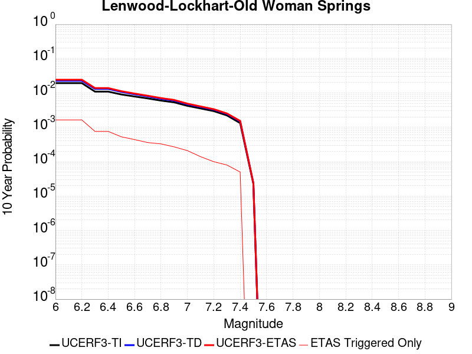 |

| Magnitude | 1 wk TI Prob | 1 wk TD Prob | 1 wk ETAS Prob | 1 wk ETAS/TD Gain | 1 wk ETAS Triggered Only | 1 mo TI Prob | 1 mo TD Prob | 1 mo ETAS Prob | 1 mo ETAS/TD Gain | 1 mo ETAS Triggered Only | 1 yr TI Prob | 1 yr TD Prob | 1 yr ETAS Prob | 1 yr ETAS/TD Gain | 1 yr ETAS Triggered Only | 10 yr TI Prob | 10 yr TD Prob | 10 yr ETAS Prob | 10 yr ETAS/TD Gain | 10 yr ETAS Triggered Only |
|-----|-----|-----|-----|-----|-----|-----|-----|-----|-----|-----|-----|-----|-----|-----|-----|-----|-----|-----|-----|-----|
| 6.0 | 3.744542E-5 | 4.3964275E-5 | 1.139612E-4 | 2.5921319 | 7.0E-5 | 1.604705E-4 | 1.8840568E-4 | 4.3835858E-4 | 2.326674 | 2.5E-4 | 0.0019519776 | 0.0022915981 | 0.0029899941 | 1.3047637 | 7.0E-4 | 0.019349206 | 0.022697683 | 0.02430046 | 1.0706141 | 0.00164 |
| 6.1 | 3.744542E-5 | 4.3964275E-5 | 1.139612E-4 | 2.5921319 | 7.0E-5 | 1.604705E-4 | 1.8840568E-4 | 4.3835858E-4 | 2.326674 | 2.5E-4 | 0.0019519776 | 0.0022915981 | 0.0029899941 | 1.3047637 | 7.0E-4 | 0.019349206 | 0.022697683 | 0.02430046 | 1.0706141 | 0.00164 |
| 6.2 | 3.744542E-5 | 4.3964275E-5 | 1.139612E-4 | 2.5921319 | 7.0E-5 | 1.604705E-4 | 1.8840568E-4 | 4.3835858E-4 | 2.326674 | 2.5E-4 | 0.0019519776 | 0.0022915981 | 0.0029899941 | 1.3047637 | 7.0E-4 | 0.019349206 | 0.022697683 | 0.02430046 | 1.0706141 | 0.00164 |
| 6.3 | 2.1079984E-5 | 2.535458E-5 | 5.535382E-5 | 2.1831882 | 3.0E-5 | 9.0339665E-5 | 1.08658074E-4 | 2.1864612E-4 | 2.01224 | 1.1E-4 | 0.0010993304 | 0.0013221293 | 0.0016616797 | 1.2568209 | 3.4E-4 | 0.010939079 | 0.013144849 | 0.013894859 | 1.0570574 | 7.6E-4 |
| 6.4 | 2.1079984E-5 | 2.535458E-5 | 5.535382E-5 | 2.1831882 | 3.0E-5 | 9.0339665E-5 | 1.08658074E-4 | 2.1864612E-4 | 2.01224 | 1.1E-4 | 0.0010993304 | 0.0013221293 | 0.0016616797 | 1.2568209 | 3.4E-4 | 0.010939079 | 0.013144849 | 0.013894859 | 1.0570574 | 7.6E-4 |
| 6.5 | 1.7397282E-5 | 2.066343E-5 | 4.0663017E-5 | 1.9678735 | 2.0E-5 | 7.455765E-5 | 8.8554625E-5 | 1.5854843E-4 | 1.7904025 | 7.0E-5 | 9.073613E-4 | 0.001077631 | 0.0012973939 | 1.2039315 | 2.2E-4 | 0.009036654 | 0.010725348 | 0.011249664 | 1.0488857 | 5.3E-4 |
| 6.6 | 1.52050325E-5 | 1.768021E-5 | 3.7679856E-5 | 2.1311884 | 2.0E-5 | 6.51628E-5 | 7.577017E-5 | 1.4576486E-4 | 1.9237764 | 7.0E-5 | 7.9306826E-4 | 9.221193E-4 | 0.0011219349 | 1.2166917 | 2.0E-4 | 0.007902439 | 0.009183793 | 0.009619752 | 1.0474705 | 4.4E-4 |
| 6.7 | 1.332523E-5 | 1.5264484E-5 | 3.526418E-5 | 2.310211 | 2.0E-5 | 5.7106878E-5 | 6.541761E-5 | 1.2541369E-4 | 1.9171242 | 6.0E-5 | 6.950544E-4 | 7.961743E-4 | 9.7603095E-4 | 1.2259011 | 1.8E-4 | 0.006928845 | 0.007933849 | 0.008290992 | 1.0450152 | 3.6E-4 |
| 6.8 | 1.1525329E-5 | 1.3031451E-5 | 3.303119E-5 | 2.5347285 | 2.0E-5 | 4.9393333E-5 | 5.5847904E-5 | 1.0584511E-4 | 1.8952388 | 5.0E-5 | 6.011979E-4 | 6.7974033E-4 | 8.496248E-4 | 1.2499255 | 1.7E-4 | 0.00599574 | 0.006777064 | 0.0071048276 | 1.0483637 | 3.3E-4 |
| 6.9 | 1.0253909E-5 | 1.1514907E-5 | 3.1514675E-5 | 2.736859 | 2.0E-5 | 4.3944583E-5 | 4.9348688E-5 | 9.934622E-5 | 2.013148 | 5.0E-5 | 5.3489394E-4 | 6.006583E-4 | 7.505682E-4 | 1.249576 | 1.5E-4 | 0.0053360825 | 0.0059907273 | 0.00625911 | 1.0447997 | 2.7E-4 |
| 7.0 | 8.104563E-6 | 8.991482E-6 | 2.8991302E-5 | 3.2243075 | 2.0E-5 | 3.4733377E-5 | 3.8534366E-5 | 8.853244E-5 | 2.297493 | 5.0E-5 | 4.2279682E-4 | 4.6905733E-4 | 5.8900105E-4 | 1.2557123 | 1.2E-4 | 0.0042199334 | 0.004680921 | 0.004889938 | 1.0446529 | 2.1E-4 |
| 7.1 | 6.7986157E-6 | 7.516018E-6 | 2.7515867E-5 | 3.6609635 | 2.0E-5 | 2.91366E-5 | 3.221112E-5 | 6.221015E-5 | 1.9313254 | 3.0E-5 | 3.5468035E-4 | 3.9210194E-4 | 4.620745E-4 | 1.178455 | 7.0E-5 | 0.003541148 | 0.0039143176 | 0.0040537696 | 1.0356262 | 1.4E-4 |
| 7.2 | 5.6893327E-6 | 6.2801596E-6 | 2.6280033E-5 | 4.1846128 | 2.0E-5 | 2.4382627E-5 | 2.6914702E-5 | 4.6914163E-5 | 1.7430683 | 2.0E-5 | 2.9681803E-4 | 3.2763922E-4 | 3.7762284E-4 | 1.1525569 | 5.0E-5 | 0.002964219 | 0.0032717604 | 0.0033714331 | 1.0304645 | 1.0E-4 |
| 7.3 | 4.253348E-6 | 4.70709E-6 | 2.4706995E-5 | 5.24889 | 2.0E-5 | 1.8228506E-5 | 2.0173096E-5 | 4.0172694E-5 | 1.9913995 | 2.0E-5 | 2.2190946E-4 | 2.4558158E-4 | 2.8557176E-4 | 1.1628387 | 4.0E-5 | 0.00221688 | 0.002453283 | 0.0025330868 | 1.0325294 | 8.0E-5 |
| 7.4 | 2.5448119E-6 | 2.8520635E-6 | 2.2852006E-5 | 8.012446 | 2.0E-5 | 1.0906291E-5 | 1.2223081E-5 | 3.2222837E-5 | 2.6362286 | 2.0E-5 | 1.3277601E-4 | 1.488075E-4 | 1.7880303E-4 | 1.2015728 | 3.0E-5 | 0.001326967 | 0.0014872408 | 0.0015371664 | 1.0335693 | 5.0E-5 |
| 7.5 | 4.3706837E-8 | 4.5629623E-8 | 4.5629623E-8 | 1.0 | 0.0 | 1.8731501E-7 | 1.9555551E-7 | 1.9555551E-7 | 1.0 | 0.0 | 2.2805577E-6 | 2.3808864E-6 | 2.3808864E-6 | 1.0 | 0.0 | 2.2805343E-5 | 2.3808663E-5 | 2.3808663E-5 | 1.0 | 0.0 |

## Towne Pass
*[(top)](#table-of-contents)*

| 1 Week | 1 Month | 1 Year | 10 Year |
|-----|-----|-----|-----|
|  |  |  |  |

| Magnitude | 1 wk TI Prob | 1 wk TD Prob | 1 wk ETAS Prob | 1 wk ETAS/TD Gain | 1 wk ETAS Triggered Only | 1 mo TI Prob | 1 mo TD Prob | 1 mo ETAS Prob | 1 mo ETAS/TD Gain | 1 mo ETAS Triggered Only | 1 yr TI Prob | 1 yr TD Prob | 1 yr ETAS Prob | 1 yr ETAS/TD Gain | 1 yr ETAS Triggered Only | 10 yr TI Prob | 10 yr TD Prob | 10 yr ETAS Prob | 10 yr ETAS/TD Gain | 10 yr ETAS Triggered Only |
|-----|-----|-----|-----|-----|-----|-----|-----|-----|-----|-----|-----|-----|-----|-----|-----|-----|-----|-----|-----|-----|
| 6.0 | 3.849728E-6 | 3.8945577E-6 | 7.389428E-5 | 18.973728 | 7.0E-5 | 1.649873E-5 | 1.6690881E-5 | 2.2668738E-4 | 13.5815115 | 2.1E-4 | 2.0085352E-4 | 2.0319689E-4 | 8.03075E-4 | 3.9522011 | 6.0E-4 | 0.0020067208 | 0.00203054 | 0.0033877785 | 1.6684126 | 0.00136 |
| 6.1 | 3.849728E-6 | 3.8945577E-6 | 7.389428E-5 | 18.973728 | 7.0E-5 | 1.649873E-5 | 1.6690881E-5 | 2.2668738E-4 | 13.5815115 | 2.1E-4 | 2.0085352E-4 | 2.0319689E-4 | 8.03075E-4 | 3.9522011 | 6.0E-4 | 0.0020067208 | 0.00203054 | 0.0033877785 | 1.6684126 | 0.00136 |
| 6.2 | 3.849728E-6 | 3.8945577E-6 | 7.389428E-5 | 18.973728 | 7.0E-5 | 1.649873E-5 | 1.6690881E-5 | 2.2668738E-4 | 13.5815115 | 2.1E-4 | 2.0085352E-4 | 2.0319689E-4 | 8.03075E-4 | 3.9522011 | 6.0E-4 | 0.0020067208 | 0.00203054 | 0.0033877785 | 1.6684126 | 0.00136 |
| 6.3 | 3.849728E-6 | 3.8945577E-6 | 7.389428E-5 | 18.973728 | 7.0E-5 | 1.649873E-5 | 1.6690881E-5 | 2.2668738E-4 | 13.5815115 | 2.1E-4 | 2.0085352E-4 | 2.0319689E-4 | 8.03075E-4 | 3.9522011 | 6.0E-4 | 0.0020067208 | 0.00203054 | 0.0033877785 | 1.6684126 | 0.00136 |
| 6.4 | 3.849728E-6 | 3.8945577E-6 | 7.389428E-5 | 18.973728 | 7.0E-5 | 1.649873E-5 | 1.6690881E-5 | 2.2668738E-4 | 13.5815115 | 2.1E-4 | 2.0085352E-4 | 2.0319689E-4 | 8.03075E-4 | 3.9522011 | 6.0E-4 | 0.0020067208 | 0.00203054 | 0.0033877785 | 1.6684126 | 0.00136 |
| 6.5 | 1.1953545E-6 | 1.2030586E-6 | 3.1203024E-5 | 25.93641 | 3.0E-5 | 5.1229376E-6 | 5.155956E-6 | 4.515575E-5 | 8.757978 | 4.0E-5 | 6.236998E-5 | 6.277207E-5 | 1.9276391E-4 | 3.0708547 | 1.3E-4 | 6.235248E-4 | 6.275551E-4 | 8.674045E-4 | 1.3821965 | 2.4E-4 |
| 6.6 | 1.1953545E-6 | 1.2030586E-6 | 3.1203024E-5 | 25.93641 | 3.0E-5 | 5.1229376E-6 | 5.155956E-6 | 4.515575E-5 | 8.757978 | 4.0E-5 | 6.236998E-5 | 6.277207E-5 | 1.9276391E-4 | 3.0708547 | 1.3E-4 | 6.235248E-4 | 6.275551E-4 | 8.674045E-4 | 1.3821965 | 2.4E-4 |
| 6.7 | 8.375951E-7 | 8.4107245E-7 | 2.0841057E-5 | 24.779144 | 2.0E-5 | 3.5896885E-6 | 3.6045917E-6 | 2.360452E-5 | 6.5484586 | 2.0E-5 | 4.370358E-5 | 4.3885077E-5 | 1.0388244E-4 | 2.3671474 | 6.0E-5 | 4.3694986E-4 | 4.387698E-4 | 5.986996E-4 | 1.3644959 | 1.6E-4 |
| 6.8 | 6.38041E-7 | 6.3922045E-7 | 2.0639207E-5 | 32.28809 | 2.0E-5 | 2.7344586E-6 | 2.7395135E-6 | 2.273946E-5 | 8.300547 | 2.0E-5 | 3.3291526E-5 | 3.3353106E-5 | 8.3351435E-5 | 2.4990609 | 5.0E-5 | 3.3286537E-4 | 3.3348482E-4 | 4.6344145E-4 | 1.3896929 | 1.3E-4 |
| 6.9 | 5.3460053E-7 | 5.345378E-7 | 2.0534528E-5 | 38.41548 | 2.0E-5 | 2.2911431E-6 | 2.2908744E-6 | 2.229083E-5 | 9.730271 | 2.0E-5 | 2.789431E-5 | 2.7891072E-5 | 7.788968E-5 | 2.7926383 | 5.0E-5 | 2.789081E-4 | 2.7887904E-4 | 3.988456E-4 | 1.4301741 | 1.2E-4 |
| 7.0 | 3.557783E-7 | 3.5324607E-7 | 1.0353243E-5 | 29.308868 | 1.0E-5 | 1.5247632E-6 | 1.5139109E-6 | 1.15138955E-5 | 7.6053987 | 1.0E-5 | 1.8563835E-5 | 1.8431718E-5 | 3.843135E-5 | 2.085066 | 2.0E-5 | 1.8562283E-4 | 1.8430273E-4 | 2.4429167E-4 | 1.3254913 | 6.0E-5 |
| 7.1 | 3.037942E-7 | 3.0002565E-7 | 1.0300023E-5 | 34.330475 | 1.0E-5 | 1.3019744E-6 | 1.2858236E-6 | 1.1285811E-5 | 8.777106 | 1.0E-5 | 1.5851423E-5 | 1.5654798E-5 | 3.5654484E-5 | 2.2775435 | 2.0E-5 | 1.5850292E-4 | 1.565377E-4 | 2.1652831E-4 | 1.3832343 | 6.0E-5 |
| 7.2 | 2.0808248E-7 | 2.021797E-7 | 1.0202178E-5 | 50.460938 | 1.0E-5 | 8.917818E-7 | 8.664842E-7 | 1.0866475E-5 | 12.540881 | 1.0E-5 | 1.0857389E-5 | 1.0549399E-5 | 2.0549294E-5 | 1.9479113 | 1.0E-5 | 1.0856859E-4 | 1.05489446E-4 | 1.4548523E-4 | 1.3791449 | 4.0E-5 |
| 7.3 | 1.1162073E-7 | 1.06369946E-7 | 1.0106369E-5 | 95.01151 | 1.0E-5 | 4.7837443E-7 | 4.5587112E-7 | 1.0455867E-5 | 22.936014 | 1.0E-5 | 5.8241935E-6 | 5.5502187E-6 | 1.5550164E-5 | 2.8017209 | 1.0E-5 | 5.8240406E-5 | 5.5501E-5 | 8.5499334E-5 | 1.5405008 | 3.0E-5 |

## Bicycle Lake
*[(top)](#table-of-contents)*

| 1 Week | 1 Month | 1 Year | 10 Year |
|-----|-----|-----|-----|
|  |  |  |  |

| Magnitude | 1 wk TI Prob | 1 wk TD Prob | 1 wk ETAS Prob | 1 wk ETAS/TD Gain | 1 wk ETAS Triggered Only | 1 mo TI Prob | 1 mo TD Prob | 1 mo ETAS Prob | 1 mo ETAS/TD Gain | 1 mo ETAS Triggered Only | 1 yr TI Prob | 1 yr TD Prob | 1 yr ETAS Prob | 1 yr ETAS/TD Gain | 1 yr ETAS Triggered Only | 10 yr TI Prob | 10 yr TD Prob | 10 yr ETAS Prob | 10 yr ETAS/TD Gain | 10 yr ETAS Triggered Only |
|-----|-----|-----|-----|-----|-----|-----|-----|-----|-----|-----|-----|-----|-----|-----|-----|-----|-----|-----|-----|-----|
| 6.0 | 1.9621975E-5 | 2.2097818E-5 | 2.2097818E-5 | 1.0 | 0.0 | 8.4091465E-5 | 9.4702256E-5 | 1.4469752E-4 | 1.5279205 | 5.0E-5 | 0.0010233327 | 0.0011525251 | 0.0014721563 | 1.2773312 | 3.2E-4 | 0.01018633 | 0.011478791 | 0.012477198 | 1.0869783 | 0.00101 |
| 6.1 | 1.9621975E-5 | 2.2097818E-5 | 2.2097818E-5 | 1.0 | 0.0 | 8.4091465E-5 | 9.4702256E-5 | 1.4469752E-4 | 1.5279205 | 5.0E-5 | 0.0010233327 | 0.0011525251 | 0.0014721563 | 1.2773312 | 3.2E-4 | 0.01018633 | 0.011478791 | 0.012477198 | 1.0869783 | 0.00101 |
| 6.2 | 9.9971285E-6 | 1.1256016E-5 | 1.1256016E-5 | 1.0 | 0.0 | 4.2844134E-5 | 4.8239468E-5 | 7.823802E-5 | 1.6218674 | 3.0E-5 | 5.2150246E-4 | 5.8720924E-4 | 8.2706835E-4 | 1.4084729 | 2.4E-4 | 0.0052028033 | 0.005861682 | 0.0064681065 | 1.1034557 | 6.1E-4 |
| 6.3 | 9.589428E-6 | 1.0798707E-5 | 1.0798707E-5 | 1.0 | 0.0 | 4.10969E-5 | 4.6279645E-5 | 7.627826E-5 | 1.6482031 | 3.0E-5 | 5.002399E-4 | 5.6336087E-4 | 7.932313E-4 | 1.4080341 | 2.3E-4 | 0.0049911533 | 0.005624417 | 0.006221043 | 1.1060777 | 6.0E-4 |
| 6.4 | 9.589428E-6 | 1.0798707E-5 | 1.0798707E-5 | 1.0 | 0.0 | 4.10969E-5 | 4.6279645E-5 | 7.627826E-5 | 1.6482031 | 3.0E-5 | 5.002399E-4 | 5.6336087E-4 | 7.932313E-4 | 1.4080341 | 2.3E-4 | 0.0049911533 | 0.005624417 | 0.006221043 | 1.1060777 | 6.0E-4 |
| 6.5 | 5.557707E-6 | 6.28582E-6 | 6.28582E-6 | 1.0 | 0.0 | 2.3818526E-5 | 2.6939102E-5 | 5.6938294E-5 | 2.1135929 | 3.0E-5 | 2.8995197E-4 | 3.2796108E-4 | 4.879086E-4 | 1.4877027 | 1.6E-4 | 0.0028957394 | 0.0032774073 | 0.0036760962 | 1.1216477 | 4.0E-4 |
| 6.6 | 4.8742945E-6 | 5.5134815E-6 | 5.5134815E-6 | 1.0 | 0.0 | 2.0889667E-5 | 2.362914E-5 | 4.362867E-5 | 1.8463925 | 2.0E-5 | 2.54302E-4 | 2.87673E-4 | 4.3762985E-4 | 1.5212754 | 1.5E-4 | 0.002540112 | 0.002875575 | 0.0032345399 | 1.1248324 | 3.6E-4 |
| 6.7 | 3.991108E-6 | 4.5160677E-6 | 4.5160677E-6 | 1.0 | 0.0 | 1.7104636E-5 | 1.9354577E-5 | 2.9354384E-5 | 1.5166637 | 1.0E-5 | 2.0822904E-4 | 2.3564197E-4 | 3.4561605E-4 | 1.4666998 | 1.1E-4 | 0.0020803404 | 0.0023564196 | 0.0026656892 | 1.1312455 | 3.1E-4 |

## San Andreas (San Bernardino N)
*[(top)](#table-of-contents)*

| 1 Week | 1 Month | 1 Year | 10 Year |
|-----|-----|-----|-----|
|  |  |  |  |

| Magnitude | 1 wk TI Prob | 1 wk TD Prob | 1 wk ETAS Prob | 1 wk ETAS/TD Gain | 1 wk ETAS Triggered Only | 1 mo TI Prob | 1 mo TD Prob | 1 mo ETAS Prob | 1 mo ETAS/TD Gain | 1 mo ETAS Triggered Only | 1 yr TI Prob | 1 yr TD Prob | 1 yr ETAS Prob | 1 yr ETAS/TD Gain | 1 yr ETAS Triggered Only | 10 yr TI Prob | 10 yr TD Prob | 10 yr ETAS Prob | 10 yr ETAS/TD Gain | 10 yr ETAS Triggered Only |
|-----|-----|-----|-----|-----|-----|-----|-----|-----|-----|-----|-----|-----|-----|-----|-----|-----|-----|-----|-----|-----|
| 6.0 | 1.4273766E-4 | 3.1622747E-4 | 3.3622116E-4 | 1.0632256 | 2.0E-5 | 6.115894E-4 | 0.0013545627 | 0.0015443052 | 1.1400766 | 1.9E-4 | 0.0074207084 | 0.016368592 | 0.016860409 | 1.0300463 | 5.0E-4 | 0.07177748 | 0.15030426 | 0.15111147 | 1.0053705 | 9.5E-4 |
| 6.1 | 1.4273766E-4 | 3.1622747E-4 | 3.3622116E-4 | 1.0632256 | 2.0E-5 | 6.115894E-4 | 0.0013545627 | 0.0015443052 | 1.1400766 | 1.9E-4 | 0.0074207084 | 0.016368592 | 0.016860409 | 1.0300463 | 5.0E-4 | 0.07177748 | 0.15030426 | 0.15111147 | 1.0053705 | 9.5E-4 |
| 6.2 | 1.4273766E-4 | 3.1622747E-4 | 3.3622116E-4 | 1.0632256 | 2.0E-5 | 6.115894E-4 | 0.0013545627 | 0.0015443052 | 1.1400766 | 1.9E-4 | 0.0074207084 | 0.016368592 | 0.016860409 | 1.0300463 | 5.0E-4 | 0.07177748 | 0.15030426 | 0.15111147 | 1.0053705 | 9.5E-4 |
| 6.3 | 1.3730655E-4 | 3.0527526E-4 | 3.2526915E-4 | 1.0654947 | 2.0E-5 | 5.883239E-4 | 0.0013076721 | 0.0014974237 | 1.1451063 | 1.9E-4 | 0.0071393442 | 0.015806088 | 0.016298184 | 1.0311334 | 5.0E-4 | 0.06914291 | 0.14559993 | 0.14641161 | 1.0055747 | 9.5E-4 |
| 6.4 | 1.3730655E-4 | 3.0527526E-4 | 3.2526915E-4 | 1.0654947 | 2.0E-5 | 5.883239E-4 | 0.0013076721 | 0.0014974237 | 1.1451063 | 1.9E-4 | 0.0071393442 | 0.015806088 | 0.016298184 | 1.0311334 | 5.0E-4 | 0.06914291 | 0.14559993 | 0.14641161 | 1.0055747 | 9.5E-4 |
| 6.5 | 1.2942807E-4 | 2.8941868E-4 | 3.0941286E-4 | 1.069084 | 2.0E-5 | 5.545738E-4 | 0.0012397813 | 0.0014295457 | 1.1530628 | 1.9E-4 | 0.0067310524 | 0.014991117 | 0.015483621 | 1.0328531 | 5.0E-4 | 0.06530788 | 0.13874695 | 0.13956514 | 1.005897 | 9.5E-4 |
| 6.6 | 1.1125901E-4 | 2.5380286E-4 | 2.737978E-4 | 1.0787814 | 2.0E-5 | 4.767372E-4 | 0.0010872755 | 0.0012670798 | 1.1653714 | 1.8E-4 | 0.005788839 | 0.013157866 | 0.01363155 | 1.0360001 | 4.8E-4 | 0.056403454 | 0.12304242 | 0.12384922 | 1.0065571 | 9.2E-4 |
| 6.7 | 1.02209575E-4 | 2.3515106E-4 | 2.5514635E-4 | 1.0850317 | 2.0E-5 | 4.3796748E-4 | 0.0010074024 | 0.0011872211 | 1.1784973 | 1.8E-4 | 0.0053192247 | 0.012196572 | 0.01266084 | 1.0380654 | 4.7E-4 | 0.051936906 | 0.11485472 | 0.115642495 | 1.006859 | 8.9E-4 |
| 6.8 | 9.610582E-5 | 2.204061E-4 | 2.4040169E-4 | 1.0907216 | 2.0E-5 | 4.1181705E-4 | 9.442563E-4 | 0.0011240863 | 1.1904463 | 1.8E-4 | 0.0050023515 | 0.0114359865 | 0.011900611 | 1.0406283 | 4.7E-4 | 0.048912346 | 0.10826575 | 0.10905939 | 1.0073305 | 8.9E-4 |
| 6.9 | 9.3877505E-5 | 2.1496092E-4 | 2.3495662E-4 | 1.0930202 | 2.0E-5 | 4.0227012E-4 | 9.2093647E-4 | 0.0011007707 | 1.1952732 | 1.8E-4 | 0.0048866454 | 0.011155005 | 0.011619762 | 1.0416635 | 4.7E-4 | 0.04780577 | 0.10585393 | 0.10664972 | 1.0075178 | 8.9E-4 |
| 7.0 | 9.1019785E-5 | 2.0822884E-4 | 2.2822467E-4 | 1.0960282 | 2.0E-5 | 3.900265E-4 | 8.921047E-4 | 0.001061953 | 1.1903906 | 1.7E-4 | 0.0047382377 | 0.0108075095 | 0.011262538 | 1.042103 | 4.6E-4 | 0.046384744 | 0.10282181 | 0.10361133 | 1.0076785 | 8.8E-4 |
| 7.1 | 8.771155E-5 | 1.999731E-4 | 2.199691E-4 | 1.0999935 | 2.0E-5 | 3.758525E-4 | 8.567466E-4 | 0.001026601 | 1.1982551 | 1.7E-4 | 0.0045664064 | 0.010381199 | 0.010836424 | 1.0438509 | 4.6E-4 | 0.044737056 | 0.099137545 | 0.09992129 | 1.0079057 | 8.7E-4 |
| 7.2 | 8.0830236E-5 | 1.8402806E-4 | 2.0402439E-4 | 1.108659 | 2.0E-5 | 3.4636928E-4 | 7.884535E-4 | 9.5831946E-4 | 1.215442 | 1.7E-4 | 0.0042088944 | 0.009557276 | 0.010012879 | 1.0476708 | 4.6E-4 | 0.041300658 | 0.09185816 | 0.09264825 | 1.0086011 | 8.7E-4 |
| 7.3 | 7.7668235E-5 | 1.7346027E-4 | 1.934568E-4 | 1.1152802 | 2.0E-5 | 3.328214E-4 | 7.431895E-4 | 9.130631E-4 | 1.2285738 | 1.7E-4 | 0.0040445733 | 0.009010872 | 0.009466726 | 1.0505894 | 4.6E-4 | 0.03971748 | 0.08712575 | 0.08791995 | 1.0091156 | 8.7E-4 |
| 7.4 | 7.520177E-5 | 1.6565931E-4 | 1.85656E-4 | 1.1207097 | 2.0E-5 | 3.2225347E-4 | 7.0977537E-4 | 8.796547E-4 | 1.2393425 | 1.7E-4 | 0.0039163795 | 0.008607342 | 0.009063383 | 1.0529827 | 4.6E-4 | 0.038480744 | 0.08358144 | 0.08437873 | 1.009539 | 8.7E-4 |
| 7.5 | 7.274697E-5 | 1.5853388E-4 | 1.785307E-4 | 1.1261361 | 2.0E-5 | 3.1173544E-4 | 6.79254E-4 | 8.4913854E-4 | 1.2501045 | 1.7E-4 | 0.003788775 | 0.008238616 | 0.008694827 | 1.0553746 | 4.6E-4 | 0.03724827 | 0.08029901 | 0.08108996 | 1.00985 | 8.6E-4 |
| 7.6 | 7.1185845E-5 | 1.5423127E-4 | 1.7422817E-4 | 1.1296554 | 2.0E-5 | 3.0504653E-4 | 6.608237E-4 | 8.307114E-4 | 1.2570847 | 1.7E-4 | 0.0037076178 | 0.008015902 | 0.008472214 | 1.0569259 | 4.6E-4 | 0.036463667 | 0.07828837 | 0.07908104 | 1.010125 | 8.6E-4 |
| 7.7 | 6.709961E-5 | 1.4331659E-4 | 1.6331373E-4 | 1.1395311 | 2.0E-5 | 2.8753807E-4 | 6.140694E-4 | 7.83965E-4 | 1.2766716 | 1.7E-4 | 0.003495157 | 0.007450705 | 0.007907278 | 1.0612792 | 4.6E-4 | 0.034406938 | 0.07311484 | 0.073911965 | 1.0109023 | 8.6E-4 |
| 7.8 | 6.300812E-5 | 1.3215025E-4 | 1.5214761E-4 | 1.1513228 | 2.0E-5 | 2.7000686E-4 | 5.6623534E-4 | 7.361391E-4 | 1.3000585 | 1.7E-4 | 0.0032823787 | 0.006872153 | 0.0073289913 | 1.0664768 | 4.6E-4 | 0.032343175 | 0.06777051 | 0.0685629 | 1.0116923 | 8.5E-4 |
| 7.9 | 4.983037E-5 | 9.733297E-5 | 1.1733103E-4 | 1.2054602 | 2.0E-5 | 2.1354125E-4 | 4.1707465E-4 | 5.670121E-4 | 1.3594978 | 1.5E-4 | 0.0025967648 | 0.005066071 | 0.005444146 | 1.0746288 | 3.8E-4 | 0.025666296 | 0.050693665 | 0.051377166 | 1.0134829 | 7.2E-4 |
| 8.0 | 3.2211527E-5 | 5.336045E-5 | 6.335991E-5 | 1.1873947 | 1.0E-5 | 1.380421E-4 | 2.286676E-4 | 2.7865617E-4 | 1.218608 | 5.0E-5 | 0.0016793669 | 0.0027804754 | 0.0028702253 | 1.0322785 | 9.0E-5 | 0.016667323 | 0.02838859 | 0.028602345 | 1.0075296 | 2.2E-4 |
| 8.1 | 1.743376E-5 | 1.8848474E-5 | 1.8848474E-5 | 1.0 | 0.0 | 7.471398E-5 | 8.077668E-5 | 8.077668E-5 | 1.0 | 0.0 | 9.0926304E-4 | 9.83013E-4 | 9.930031E-4 | 1.0101628 | 1.0E-5 | 0.009055517 | 0.010496766 | 0.010546241 | 1.0047134 | 5.0E-5 |
| 8.2 | 7.831616E-6 | 5.163269E-6 | 5.163269E-6 | 1.0 | 0.0 | 3.3563636E-5 | 2.2128108E-5 | 2.2128108E-5 | 1.0 | 0.0 | 4.0856065E-4 | 2.693765E-4 | 2.693765E-4 | 1.0 | 0.0 | 0.004078103 | 0.003046303 | 0.003046303 | 1.0 | 0.0 |
| 8.3 | 1.983087E-6 | 7.6730026E-7 | 7.6730026E-7 | 1.0 | 0.0 | 8.498917E-6 | 3.2884257E-6 | 3.2884257E-6 | 1.0 | 0.0 | 1.034694E-4 | 4.0035866E-5 | 4.0035866E-5 | 1.0 | 0.0 | 0.0010342124 | 4.7277327E-4 | 4.7277327E-4 | 1.0 | 0.0 |

## Paradise
*[(top)](#table-of-contents)*

| 1 Week | 1 Month | 1 Year | 10 Year |
|-----|-----|-----|-----|
|  |  |  |  |

| Magnitude | 1 wk TI Prob | 1 wk TD Prob | 1 wk ETAS Prob | 1 wk ETAS/TD Gain | 1 wk ETAS Triggered Only | 1 mo TI Prob | 1 mo TD Prob | 1 mo ETAS Prob | 1 mo ETAS/TD Gain | 1 mo ETAS Triggered Only | 1 yr TI Prob | 1 yr TD Prob | 1 yr ETAS Prob | 1 yr ETAS/TD Gain | 1 yr ETAS Triggered Only | 10 yr TI Prob | 10 yr TD Prob | 10 yr ETAS Prob | 10 yr ETAS/TD Gain | 10 yr ETAS Triggered Only |
|-----|-----|-----|-----|-----|-----|-----|-----|-----|-----|-----|-----|-----|-----|-----|-----|-----|-----|-----|-----|-----|
| 6.0 | 1.4851273E-5 | 1.6695087E-5 | 3.6694753E-5 | 2.1979373 | 2.0E-5 | 6.364676E-5 | 7.154854E-5 | 1.7154138E-4 | 2.3975525 | 1.0E-4 | 7.7462377E-4 | 8.707789E-4 | 0.001280422 | 1.4704328 | 4.1E-4 | 0.0077192914 | 0.008676048 | 0.009647546 | 1.1119746 | 9.8E-4 |
| 6.1 | 1.4851273E-5 | 1.6695087E-5 | 3.6694753E-5 | 2.1979373 | 2.0E-5 | 6.364676E-5 | 7.154854E-5 | 1.7154138E-4 | 2.3975525 | 1.0E-4 | 7.7462377E-4 | 8.707789E-4 | 0.001280422 | 1.4704328 | 4.1E-4 | 0.0077192914 | 0.008676048 | 0.009647546 | 1.1119746 | 9.8E-4 |
| 6.2 | 1.4851273E-5 | 1.6695087E-5 | 3.6694753E-5 | 2.1979373 | 2.0E-5 | 6.364676E-5 | 7.154854E-5 | 1.7154138E-4 | 2.3975525 | 1.0E-4 | 7.7462377E-4 | 8.707789E-4 | 0.001280422 | 1.4704328 | 4.1E-4 | 0.0077192914 | 0.008676048 | 0.009647546 | 1.1119746 | 9.8E-4 |
| 6.3 | 1.0426831E-5 | 1.1888905E-5 | 2.1888785E-5 | 1.8411103 | 1.0E-5 | 4.4685654E-5 | 5.0951487E-5 | 1.0094894E-4 | 1.9812756 | 5.0E-5 | 5.43912E-4 | 6.2016374E-4 | 7.9005834E-4 | 1.2739512 | 1.7E-4 | 0.0054258266 | 0.0061849393 | 0.0065824655 | 1.0642732 | 4.0E-4 |
| 6.4 | 1.0426831E-5 | 1.1888905E-5 | 2.1888785E-5 | 1.8411103 | 1.0E-5 | 4.4685654E-5 | 5.0951487E-5 | 1.0094894E-4 | 1.9812756 | 5.0E-5 | 5.43912E-4 | 6.2016374E-4 | 7.9005834E-4 | 1.2739512 | 1.7E-4 | 0.0054258266 | 0.0061849393 | 0.0065824655 | 1.0642732 | 4.0E-4 |
| 6.5 | 9.25027E-6 | 1.0620218E-5 | 2.0620111E-5 | 1.9415903 | 1.0E-5 | 3.964341E-5 | 4.5514455E-5 | 8.5512635E-5 | 1.8788017 | 4.0E-5 | 4.8255164E-4 | 5.540025E-4 | 6.6394155E-4 | 1.1984451 | 1.1E-4 | 0.0048150513 | 0.0055267136 | 0.0057952213 | 1.0485836 | 2.7E-4 |
| 6.6 | 7.904275E-6 | 9.15975E-6 | 1.915966E-5 | 2.0917227 | 1.0E-5 | 3.3875025E-5 | 3.9255505E-5 | 6.9254325E-5 | 1.764194 | 3.0E-5 | 4.1235037E-4 | 4.7783487E-4 | 5.4780144E-4 | 1.1464242 | 7.0E-5 | 0.0041158604 | 0.0047684712 | 0.004937661 | 1.0354809 | 1.7E-4 |
| 6.7 | 7.2061953E-6 | 8.407458E-6 | 8.407458E-6 | 1.0 | 0.0 | 3.088333E-5 | 3.6031488E-5 | 5.6030767E-5 | 1.5550501 | 2.0E-5 | 3.7593965E-4 | 4.385987E-4 | 4.8857677E-4 | 1.1139494 | 5.0E-5 | 0.003753043 | 0.0043777 | 0.004507131 | 1.0295659 | 1.3E-4 |
| 6.8 | 6.6948724E-6 | 7.8423645E-6 | 7.8423645E-6 | 1.0 | 0.0 | 2.8691995E-5 | 3.360972E-5 | 5.360905E-5 | 1.5950459 | 2.0E-5 | 3.4926904E-4 | 4.0912506E-4 | 4.591046E-4 | 1.122162 | 5.0E-5 | 0.003487206 | 0.0040840763 | 0.004193627 | 1.0268239 | 1.1E-4 |
| 6.9 | 6.0421025E-6 | 7.130805E-6 | 7.130805E-6 | 1.0 | 0.0 | 2.5894467E-5 | 3.0560255E-5 | 5.0559644E-5 | 1.6544248 | 2.0E-5 | 3.1521954E-4 | 3.7201095E-4 | 4.019998E-4 | 1.0806128 | 3.0E-5 | 0.0031477278 | 0.0037142204 | 0.0038038862 | 1.0241412 | 9.0E-5 |
| 7.0 | 4.134091E-6 | 5.0804565E-6 | 5.0804565E-6 | 1.0 | 0.0 | 1.7717413E-5 | 2.1773212E-5 | 3.1772994E-5 | 1.45927 | 1.0E-5 | 2.1568815E-4 | 2.6505813E-4 | 2.8505284E-4 | 1.0754352 | 2.0E-5 | 0.0021547892 | 0.0026475731 | 0.0026675202 | 1.0075341 | 2.0E-5 |
| 7.1 | 3.7674888E-6 | 4.632002E-6 | 4.632002E-6 | 1.0 | 0.0 | 1.6146281E-5 | 1.9851295E-5 | 2.9851097E-5 | 1.5037354 | 1.0E-5 | 1.9656324E-4 | 2.4166424E-4 | 2.616594E-4 | 1.0827395 | 2.0E-5 | 0.0019638946 | 0.002414165 | 0.0024341168 | 1.0082644 | 2.0E-5 |
| 7.2 | 3.4065345E-6 | 4.1568414E-6 | 4.1568414E-6 | 1.0 | 0.0 | 1.4599351E-5 | 1.7814922E-5 | 2.7814744E-5 | 1.5613172 | 1.0E-5 | 1.777326E-4 | 2.1687658E-4 | 2.3687225E-4 | 1.0921984 | 2.0E-5 | 0.0017759053 | 0.0021667974 | 0.0021867543 | 1.0092102 | 2.0E-5 |
| 7.3 | 2.9934936E-6 | 3.6294143E-6 | 3.6294143E-6 | 1.0 | 0.0 | 1.2829195E-5 | 1.5554548E-5 | 1.5554548E-5 | 1.0 | 0.0 | 1.5618425E-4 | 1.8936164E-4 | 1.8936164E-4 | 1.0 | 0.0 | 0.0015607453 | 0.0018921483 | 0.0018921483 | 1.0 | 0.0 |
| 7.4 | 2.4049796E-6 | 2.8890545E-6 | 2.8890545E-6 | 1.0 | 0.0 | 1.0307015E-5 | 1.2381612E-5 | 1.2381612E-5 | 1.0 | 0.0 | 1.2548068E-4 | 1.5073713E-4 | 1.5073713E-4 | 1.0 | 0.0 | 0.0012540985 | 0.0015064904 | 0.0015064904 | 1.0 | 0.0 |
| 7.5 | 1.2710091E-6 | 1.5135012E-6 | 1.5135012E-6 | 1.0 | 0.0 | 5.44717E-6 | 6.486425E-6 | 6.486425E-6 | 1.0 | 0.0 | 6.631728E-5 | 7.897061E-5 | 7.897061E-5 | 1.0 | 0.0 | 6.6297496E-4 | 7.895481E-4 | 7.895481E-4 | 1.0 | 0.0 |
| 7.6 | 2.21172E-7 | 2.604023E-7 | 2.604023E-7 | 1.0 | 0.0 | 9.478797E-7 | 1.1160095E-6 | 1.1160095E-6 | 1.0 | 0.0 | 1.1540374E-5 | 1.3587359E-5 | 1.3587359E-5 | 1.0 | 0.0 | 1.1539775E-4 | 1.358681E-4 | 1.358681E-4 | 1.0 | 0.0 |

## Garlic Springs
*[(top)](#table-of-contents)*

| 1 Week | 1 Month | 1 Year | 10 Year |
|-----|-----|-----|-----|
|  |  |  |  |

| Magnitude | 1 wk TI Prob | 1 wk TD Prob | 1 wk ETAS Prob | 1 wk ETAS/TD Gain | 1 wk ETAS Triggered Only | 1 mo TI Prob | 1 mo TD Prob | 1 mo ETAS Prob | 1 mo ETAS/TD Gain | 1 mo ETAS Triggered Only | 1 yr TI Prob | 1 yr TD Prob | 1 yr ETAS Prob | 1 yr ETAS/TD Gain | 1 yr ETAS Triggered Only | 10 yr TI Prob | 10 yr TD Prob | 10 yr ETAS Prob | 10 yr ETAS/TD Gain | 10 yr ETAS Triggered Only |
|-----|-----|-----|-----|-----|-----|-----|-----|-----|-----|-----|-----|-----|-----|-----|-----|-----|-----|-----|-----|-----|
| 6.0 | 1.6760017E-5 | 1.8777433E-5 | 1.8777433E-5 | 1.0 | 0.0 | 7.182667E-5 | 8.047289E-5 | 1.1047047E-4 | 1.3727664 | 3.0E-5 | 8.7413884E-4 | 9.794345E-4 | 0.0011592582 | 1.1835995 | 1.8E-4 | 0.008707083 | 0.009762724 | 0.010465792 | 1.0720156 | 7.1E-4 |
| 6.1 | 9.852767E-6 | 1.09739185E-5 | 1.09739185E-5 | 1.0 | 0.0 | 4.222546E-5 | 4.703063E-5 | 6.702969E-5 | 1.4252348 | 2.0E-5 | 5.139737E-4 | 5.7251845E-4 | 7.02444E-4 | 1.2269369 | 1.3E-4 | 0.005127866 | 0.005717394 | 0.0061349925 | 1.07304 | 4.2E-4 |
| 6.2 | 9.852767E-6 | 1.09739185E-5 | 1.09739185E-5 | 1.0 | 0.0 | 4.222546E-5 | 4.703063E-5 | 6.702969E-5 | 1.4252348 | 2.0E-5 | 5.139737E-4 | 5.7251845E-4 | 7.02444E-4 | 1.2269369 | 1.3E-4 | 0.005127866 | 0.005717394 | 0.0061349925 | 1.07304 | 4.2E-4 |
| 6.3 | 4.3167724E-6 | 4.778164E-6 | 4.778164E-6 | 1.0 | 0.0 | 1.8500323E-5 | 2.0477815E-5 | 2.0477815E-5 | 1.0 | 0.0 | 2.2521814E-4 | 2.493119E-4 | 2.9929943E-4 | 1.200502 | 5.0E-5 | 0.0022499003 | 0.0024925806 | 0.002692082 | 1.0800381 | 2.0E-4 |
| 6.4 | 4.3167724E-6 | 4.778164E-6 | 4.778164E-6 | 1.0 | 0.0 | 1.8500323E-5 | 2.0477815E-5 | 2.0477815E-5 | 1.0 | 0.0 | 2.2521814E-4 | 2.493119E-4 | 2.9929943E-4 | 1.200502 | 5.0E-5 | 0.0022499003 | 0.0024925806 | 0.002692082 | 1.0800381 | 2.0E-4 |
| 6.5 | 4.3167724E-6 | 4.778164E-6 | 4.778164E-6 | 1.0 | 0.0 | 1.8500323E-5 | 2.0477815E-5 | 2.0477815E-5 | 1.0 | 0.0 | 2.2521814E-4 | 2.493119E-4 | 2.9929943E-4 | 1.200502 | 5.0E-5 | 0.0022499003 | 0.0024925806 | 0.002692082 | 1.0800381 | 2.0E-4 |
| 6.6 | 4.301311E-6 | 4.761032E-6 | 4.761032E-6 | 1.0 | 0.0 | 1.8434059E-5 | 2.0404394E-5 | 2.0404394E-5 | 1.0 | 0.0 | 2.2441156E-4 | 2.484182E-4 | 2.9840576E-4 | 1.2012235 | 5.0E-5 | 0.0022418506 | 0.0024836634 | 0.0026831666 | 1.0803262 | 2.0E-4 |
| 6.7 | 3.8599724E-6 | 4.2711804E-6 | 4.2711804E-6 | 1.0 | 0.0 | 1.6542634E-5 | 1.830506E-5 | 1.830506E-5 | 1.0 | 0.0 | 2.0138794E-4 | 2.228641E-4 | 2.7285295E-4 | 1.2243019 | 5.0E-5 | 0.0020120554 | 0.002228641 | 0.0024082398 | 1.0805867 | 1.8E-4 |

## San Andreas (San Bernardino S)
*[(top)](#table-of-contents)*

| 1 Week | 1 Month | 1 Year | 10 Year |
|-----|-----|-----|-----|
|  |  |  |  |

| Magnitude | 1 wk TI Prob | 1 wk TD Prob | 1 wk ETAS Prob | 1 wk ETAS/TD Gain | 1 wk ETAS Triggered Only | 1 mo TI Prob | 1 mo TD Prob | 1 mo ETAS Prob | 1 mo ETAS/TD Gain | 1 mo ETAS Triggered Only | 1 yr TI Prob | 1 yr TD Prob | 1 yr ETAS Prob | 1 yr ETAS/TD Gain | 1 yr ETAS Triggered Only | 10 yr TI Prob | 10 yr TD Prob | 10 yr ETAS Prob | 10 yr ETAS/TD Gain | 10 yr ETAS Triggered Only |
|-----|-----|-----|-----|-----|-----|-----|-----|-----|-----|-----|-----|-----|-----|-----|-----|-----|-----|-----|-----|-----|
| 6.0 | 1.2336002E-4 | 3.00143E-4 | 3.1014002E-4 | 1.0333074 | 1.0E-5 | 5.2857865E-4 | 0.0012857191 | 0.0013855905 | 1.0776775 | 1.0E-4 | 0.006416472 | 0.015546235 | 0.015841572 | 1.0189973 | 3.0E-4 | 0.06234337 | 0.14293498 | 0.14342351 | 1.0034178 | 5.7E-4 |
| 6.1 | 1.2336002E-4 | 3.00143E-4 | 3.1014002E-4 | 1.0333074 | 1.0E-5 | 5.2857865E-4 | 0.0012857191 | 0.0013855905 | 1.0776775 | 1.0E-4 | 0.006416472 | 0.015546235 | 0.015841572 | 1.0189973 | 3.0E-4 | 0.06234337 | 0.14293498 | 0.14342351 | 1.0034178 | 5.7E-4 |
| 6.2 | 1.2336002E-4 | 3.00143E-4 | 3.1014002E-4 | 1.0333074 | 1.0E-5 | 5.2857865E-4 | 0.0012857191 | 0.0013855905 | 1.0776775 | 1.0E-4 | 0.006416472 | 0.015546235 | 0.015841572 | 1.0189973 | 3.0E-4 | 0.06234337 | 0.14293498 | 0.14342351 | 1.0034178 | 5.7E-4 |
| 6.3 | 1.1712257E-4 | 2.880255E-4 | 2.9802264E-4 | 1.0347091 | 1.0E-5 | 5.018573E-4 | 0.0012338368 | 0.0013337134 | 1.080948 | 1.0E-4 | 0.006093008 | 0.014923337 | 0.01520901 | 1.0191426 | 2.9E-4 | 0.059286322 | 0.13764988 | 0.13812418 | 1.0034456 | 5.5E-4 |
| 6.4 | 1.1712257E-4 | 2.880255E-4 | 2.9802264E-4 | 1.0347091 | 1.0E-5 | 5.018573E-4 | 0.0012338368 | 0.0013337134 | 1.080948 | 1.0E-4 | 0.006093008 | 0.014923337 | 0.01520901 | 1.0191426 | 2.9E-4 | 0.059286322 | 0.13764988 | 0.13812418 | 1.0034456 | 5.5E-4 |
| 6.5 | 1.0689076E-4 | 2.681524E-4 | 2.781497E-4 | 1.0372822 | 1.0E-5 | 4.5802278E-4 | 0.0011487431 | 0.0012486283 | 1.0869516 | 1.0E-4 | 0.0055621783 | 0.013900877 | 0.014176984 | 1.0198627 | 2.8E-4 | 0.05425003 | 0.12888059 | 0.12934229 | 1.0035824 | 5.3E-4 |
| 6.6 | 9.7648895E-5 | 2.5059754E-4 | 2.6059503E-4 | 1.0398946 | 1.0E-5 | 4.1842813E-4 | 0.001073571 | 0.0011734637 | 1.093047 | 1.0E-4 | 0.005082469 | 0.012996758 | 0.013263249 | 1.0205044 | 2.7E-4 | 0.049677886 | 0.12103474 | 0.12148301 | 1.0037037 | 5.1E-4 |
| 6.7 | 8.757013E-5 | 2.3130304E-4 | 2.4130073E-4 | 1.0432234 | 1.0E-5 | 3.7524657E-4 | 9.909444E-4 | 0.0010908453 | 1.1008139 | 1.0E-4 | 0.00455906 | 0.012002093 | 0.012258973 | 1.0214028 | 2.6E-4 | 0.04466656 | 0.11238961 | 0.11282454 | 1.0038699 | 4.9E-4 |
| 6.8 | 8.562978E-5 | 2.269009E-4 | 2.3689863E-4 | 1.0440621 | 1.0E-5 | 3.6693315E-4 | 9.720922E-4 | 0.001071995 | 1.1027709 | 1.0E-4 | 0.004458263 | 0.011775064 | 0.01202212 | 1.0209813 | 2.5E-4 | 0.043698758 | 0.11040442 | 0.110831425 | 1.0038676 | 4.8E-4 |
| 6.9 | 6.124075E-5 | 1.7074913E-4 | 1.8074743E-4 | 1.0585555 | 1.0E-5 | 2.6243398E-4 | 7.3157763E-4 | 8.3150447E-4 | 1.1365908 | 1.0E-4 | 0.0031904527 | 0.00887079 | 0.009108661 | 1.026815 | 2.4E-4 | 0.031450346 | 0.08422603 | 0.08464728 | 1.0050015 | 4.6E-4 |
| 7.0 | 5.8598747E-5 | 1.6503816E-4 | 1.7503652E-4 | 1.060582 | 1.0E-5 | 2.5111332E-4 | 7.071155E-4 | 7.970519E-4 | 1.1271876 | 9.0E-5 | 0.0030530186 | 0.0085753435 | 0.00880337 | 1.0265911 | 2.3E-4 | 0.03011414 | 0.0815439 | 0.081957206 | 1.0050685 | 4.5E-4 |
| 7.1 | 5.613814E-5 | 1.5922285E-4 | 1.6922127E-4 | 1.062795 | 1.0E-5 | 2.4056983E-4 | 6.8220595E-4 | 7.721446E-4 | 1.131835 | 9.0E-5 | 0.0029250039 | 0.008274407 | 0.008502505 | 1.0275666 | 2.3E-4 | 0.028868021 | 0.07884336 | 0.079248674 | 1.0051407 | 4.4E-4 |
| 7.2 | 4.991222E-5 | 1.4528685E-4 | 1.5528538E-4 | 1.0688194 | 1.0E-5 | 2.1389198E-4 | 6.225097E-4 | 7.124537E-4 | 1.1444861 | 9.0E-5 | 0.002601025 | 0.0075528207 | 0.0077810837 | 1.0302222 | 2.3E-4 | 0.025707912 | 0.07229035 | 0.07269855 | 1.0056466 | 4.4E-4 |
| 7.3 | 4.7410045E-5 | 1.3722671E-4 | 1.4722534E-4 | 1.0728621 | 1.0E-5 | 2.0317009E-4 | 5.8798224E-4 | 6.779293E-4 | 1.1529758 | 9.0E-5 | 0.0024707897 | 0.0071352725 | 0.0073636314 | 1.0320042 | 2.3E-4 | 0.024434982 | 0.06857169 | 0.06898151 | 1.0059767 | 4.4E-4 |
| 7.4 | 4.5556746E-5 | 1.3130429E-4 | 1.4130298E-4 | 1.076149 | 1.0E-5 | 1.952286E-4 | 5.626116E-4 | 6.5256096E-4 | 1.1598783 | 9.0E-5 | 0.002374317 | 0.006828362 | 0.0070567913 | 1.033453 | 2.3E-4 | 0.023491086 | 0.065823935 | 0.066234976 | 1.0062445 | 4.4E-4 |
| 7.5 | 4.3084514E-5 | 1.2365573E-4 | 1.3365448E-4 | 1.0808597 | 1.0E-5 | 1.8463485E-4 | 5.2984577E-4 | 6.197981E-4 | 1.1697707 | 9.0E-5 | 0.0022456115 | 0.006431863 | 0.006660384 | 1.0355295 | 2.3E-4 | 0.022230545 | 0.062225077 | 0.0626377 | 1.0066311 | 4.4E-4 |
| 7.6 | 3.408608E-5 | 9.843122E-5 | 1.0843024E-4 | 1.1015838 | 1.0E-5 | 1.4607502E-4 | 4.2178E-4 | 5.11742E-4 | 1.2132914 | 9.0E-5 | 0.0017770125 | 0.0051231063 | 0.0053519276 | 1.0446646 | 2.3E-4 | 0.017628696 | 0.05005324 | 0.050471216 | 1.0083506 | 4.4E-4 |
| 7.7 | 2.8315713E-5 | 8.255794E-5 | 9.255712E-5 | 1.121117 | 1.0E-5 | 1.2134742E-4 | 3.5377181E-4 | 4.4373996E-4 | 1.2543113 | 9.0E-5 | 0.0014764034 | 0.0042986744 | 0.0045276857 | 1.0532749 | 2.3E-4 | 0.01466633 | 0.0423025 | 0.042723887 | 1.0099612 | 4.4E-4 |
| 7.8 | 2.6222975E-5 | 7.46972E-5 | 8.4696454E-5 | 1.1338638 | 1.0E-5 | 1.1237934E-4 | 3.200916E-4 | 4.1006278E-4 | 1.2810795 | 9.0E-5 | 0.0013673597 | 0.0038901574 | 0.0041192626 | 1.0588936 | 2.3E-4 | 0.013589768 | 0.03846588 | 0.03887934 | 1.0107487 | 4.3E-4 |
| 7.9 | 2.1469694E-5 | 5.7933226E-5 | 6.793265E-5 | 1.1726025 | 1.0E-5 | 9.200973E-5 | 2.4826164E-4 | 3.382393E-4 | 1.3624308 | 9.0E-5 | 0.0011196428 | 0.0030183992 | 0.0032177956 | 1.0660603 | 2.0E-4 | 0.011140184 | 0.03017612 | 0.03055435 | 1.0125341 | 3.9E-4 |
| 8.0 | 1.2420249E-5 | 3.1348933E-5 | 4.1348616E-5 | 1.3189801 | 1.0E-5 | 5.322855E-5 | 1.3434565E-4 | 1.7434027E-4 | 1.2976995 | 4.0E-5 | 6.478649E-4 | 0.0016344321 | 0.001694334 | 1.03665 | 6.0E-5 | 0.0064597935 | 0.016536523 | 0.016664373 | 1.0077314 | 1.3E-4 |
| 8.1 | 4.9197724E-6 | 7.832368E-6 | 7.832368E-6 | 1.0 | 0.0 | 2.1084568E-5 | 3.3566863E-5 | 3.3566863E-5 | 1.0 | 0.0 | 2.566744E-4 | 4.0860003E-4 | 4.0860003E-4 | 1.0 | 0.0 | 0.002563781 | 0.004389457 | 0.004399413 | 1.0022682 | 1.0E-5 |
| 8.2 | 2.5634774E-6 | 2.9111056E-6 | 2.9111056E-6 | 1.0 | 0.0 | 1.0986286E-5 | 1.2476107E-5 | 1.2476107E-5 | 1.0 | 0.0 | 1.3374983E-4 | 1.5188607E-4 | 1.5188607E-4 | 1.0 | 0.0 | 0.0013366934 | 0.0017073366 | 0.0017073366 | 1.0 | 0.0 |
| 8.3 | 5.2850464E-7 | 3.213927E-7 | 3.213927E-7 | 1.0 | 0.0 | 2.2650179E-6 | 1.3773965E-6 | 1.3773965E-6 | 1.0 | 0.0 | 2.7576245E-5 | 1.6769687E-5 | 1.6769687E-5 | 1.0 | 0.0 | 2.7572823E-4 | 1.9903289E-4 | 1.9903289E-4 | 1.0 | 0.0 |

## Helendale-So Lockhart
*[(top)](#table-of-contents)*

| 1 Week | 1 Month | 1 Year | 10 Year |
|-----|-----|-----|-----|
|  |  |  |  |

| Magnitude | 1 wk TI Prob | 1 wk TD Prob | 1 wk ETAS Prob | 1 wk ETAS/TD Gain | 1 wk ETAS Triggered Only | 1 mo TI Prob | 1 mo TD Prob | 1 mo ETAS Prob | 1 mo ETAS/TD Gain | 1 mo ETAS Triggered Only | 1 yr TI Prob | 1 yr TD Prob | 1 yr ETAS Prob | 1 yr ETAS/TD Gain | 1 yr ETAS Triggered Only | 10 yr TI Prob | 10 yr TD Prob | 10 yr ETAS Prob | 10 yr ETAS/TD Gain | 10 yr ETAS Triggered Only |
|-----|-----|-----|-----|-----|-----|-----|-----|-----|-----|-----|-----|-----|-----|-----|-----|-----|-----|-----|-----|-----|
| 6.0 | 1.7296055E-5 | 1.8103954E-5 | 2.8103774E-5 | 1.5523555 | 1.0E-5 | 7.412385E-5 | 7.7586184E-5 | 1.3758153E-4 | 1.7732736 | 6.0E-5 | 9.0208417E-4 | 9.4422314E-4 | 0.0011640154 | 1.2327758 | 2.2E-4 | 0.008984311 | 0.009404233 | 0.009909436 | 1.053721 | 5.1E-4 |
| 6.1 | 1.7296055E-5 | 1.8103954E-5 | 2.8103774E-5 | 1.5523555 | 1.0E-5 | 7.412385E-5 | 7.7586184E-5 | 1.3758153E-4 | 1.7732736 | 6.0E-5 | 9.0208417E-4 | 9.4422314E-4 | 0.0011640154 | 1.2327758 | 2.2E-4 | 0.008984311 | 0.009404233 | 0.009909436 | 1.053721 | 5.1E-4 |
| 6.2 | 1.7296055E-5 | 1.8103954E-5 | 2.8103774E-5 | 1.5523555 | 1.0E-5 | 7.412385E-5 | 7.7586184E-5 | 1.3758153E-4 | 1.7732736 | 6.0E-5 | 9.0208417E-4 | 9.4422314E-4 | 0.0011640154 | 1.2327758 | 2.2E-4 | 0.008984311 | 0.009404233 | 0.009909436 | 1.053721 | 5.1E-4 |
| 6.3 | 1.0669118E-5 | 1.1135554E-5 | 1.1135554E-5 | 1.0 | 0.0 | 4.5723988E-5 | 4.7722944E-5 | 9.772056E-5 | 2.0476642 | 5.0E-5 | 5.5654737E-4 | 5.8087474E-4 | 7.50776E-4 | 1.292492 | 1.7E-4 | 0.0055515557 | 0.0057938606 | 0.006121949 | 1.0566268 | 3.3E-4 |
| 6.4 | 1.0669118E-5 | 1.1135554E-5 | 1.1135554E-5 | 1.0 | 0.0 | 4.5723988E-5 | 4.7722944E-5 | 9.772056E-5 | 2.0476642 | 5.0E-5 | 5.5654737E-4 | 5.8087474E-4 | 7.50776E-4 | 1.292492 | 1.7E-4 | 0.0055515557 | 0.0057938606 | 0.006121949 | 1.0566268 | 3.3E-4 |
| 6.5 | 8.790038E-6 | 9.170302E-6 | 9.170302E-6 | 1.0 | 0.0 | 3.767105E-5 | 3.930071E-5 | 8.9298745E-5 | 2.2721915 | 5.0E-5 | 4.585485E-4 | 4.7838266E-4 | 6.0832046E-4 | 1.271619 | 1.3E-4 | 0.0045760344 | 0.004773693 | 0.0050424044 | 1.05629 | 2.7E-4 |
| 6.6 | 7.396949E-6 | 7.7156255E-6 | 7.7156255E-6 | 1.0 | 0.0 | 3.1700827E-5 | 3.3066553E-5 | 8.30649E-5 | 2.512052 | 5.0E-5 | 3.858892E-4 | 4.025119E-4 | 5.2246364E-4 | 1.2980078 | 1.2E-4 | 0.003852198 | 0.0040179356 | 0.004266931 | 1.061971 | 2.5E-4 |
| 6.7 | 6.4600285E-6 | 6.738108E-6 | 6.738108E-6 | 1.0 | 0.0 | 2.7685543E-5 | 2.887729E-5 | 6.8876136E-5 | 2.3851316 | 4.0E-5 | 3.3701936E-4 | 3.515251E-4 | 4.4149344E-4 | 1.2559372 | 9.0E-5 | 0.0033650869 | 0.003509772 | 0.0037090702 | 1.0567838 | 2.0E-4 |
| 6.8 | 5.600104E-6 | 5.8360747E-6 | 5.8360747E-6 | 1.0 | 0.0 | 2.4000226E-5 | 2.5011512E-5 | 5.501076E-5 | 2.1994176 | 3.0E-5 | 2.9216358E-4 | 3.0447321E-4 | 3.8444885E-4 | 1.2626688 | 8.0E-5 | 0.0029177975 | 0.003040622 | 0.0032300444 | 1.0622972 | 1.9E-4 |
| 6.9 | 4.839122E-6 | 5.0395647E-6 | 5.0395647E-6 | 1.0 | 0.0 | 2.0738931E-5 | 2.1597958E-5 | 5.159731E-5 | 2.3889902 | 3.0E-5 | 2.5246723E-4 | 2.629239E-4 | 3.3290547E-4 | 1.2661668 | 7.0E-5 | 0.002521806 | 0.0026261755 | 0.0027757818 | 1.0569673 | 1.5E-4 |
| 7.0 | 3.6937633E-6 | 3.84525E-6 | 3.84525E-6 | 1.0 | 0.0 | 1.5830317E-5 | 1.647954E-5 | 4.6479046E-5 | 2.820409 | 3.0E-5 | 1.9271708E-4 | 2.0062024E-4 | 2.706062E-4 | 1.348848 | 7.0E-5 | 0.0019255003 | 0.0020044227 | 0.002144142 | 1.0697055 | 1.4E-4 |
| 7.1 | 2.7858857E-6 | 2.8978848E-6 | 2.8978848E-6 | 1.0 | 0.0 | 1.1939455E-5 | 1.2419448E-5 | 2.2419325E-5 | 1.8051788 | 1.0E-5 | 1.4535317E-4 | 1.5119651E-4 | 1.9119045E-4 | 1.2645164 | 4.0E-5 | 0.0014525814 | 0.0015109578 | 0.0016008219 | 1.0594748 | 9.0E-5 |
| 7.2 | 2.1672065E-6 | 2.2540366E-6 | 2.2540366E-6 | 1.0 | 0.0 | 9.2879945E-6 | 9.6601225E-6 | 9.6601225E-6 | 1.0 | 0.0 | 1.1307546E-4 | 1.1760583E-4 | 1.3760348E-4 | 1.1700397 | 2.0E-5 | 0.0011301794 | 0.0011754541 | 0.0012253954 | 1.0424868 | 5.0E-5 |
| 7.3 | 1.4823496E-6 | 1.5422268E-6 | 1.5422268E-6 | 1.0 | 0.0 | 6.3529114E-6 | 6.609527E-6 | 6.609527E-6 | 1.0 | 0.0 | 7.734395E-5 | 8.046818E-5 | 1.0046657E-4 | 1.2485255 | 2.0E-5 | 7.731704E-4 | 8.044055E-4 | 8.543653E-4 | 1.0621077 | 5.0E-5 |
| 7.4 | 4.2321457E-7 | 4.410926E-7 | 4.410926E-7 | 1.0 | 0.0 | 1.8137755E-6 | 1.8903958E-6 | 1.8903958E-6 | 1.0 | 0.0 | 2.2082493E-5 | 2.3015371E-5 | 2.3015371E-5 | 1.0 | 0.0 | 2.2080299E-4 | 2.301344E-4 | 2.401321E-4 | 1.0434428 | 1.0E-5 |
| 7.5 | 5.6942316E-8 | 5.941633E-8 | 5.941633E-8 | 1.0 | 0.0 | 2.440385E-7 | 2.546414E-7 | 2.546414E-7 | 1.0 | 0.0 | 2.9711643E-6 | 3.1002553E-6 | 3.1002553E-6 | 1.0 | 0.0 | 2.9711247E-5 | 3.10022E-5 | 3.10022E-5 | 1.0 | 0.0 |

## Death Valley (Black Mtns Frontal)
*[(top)](#table-of-contents)*

| 1 Week | 1 Month | 1 Year | 10 Year |
|-----|-----|-----|-----|
|  |  |  |  |

| Magnitude | 1 wk TI Prob | 1 wk TD Prob | 1 wk ETAS Prob | 1 wk ETAS/TD Gain | 1 wk ETAS Triggered Only | 1 mo TI Prob | 1 mo TD Prob | 1 mo ETAS Prob | 1 mo ETAS/TD Gain | 1 mo ETAS Triggered Only | 1 yr TI Prob | 1 yr TD Prob | 1 yr ETAS Prob | 1 yr ETAS/TD Gain | 1 yr ETAS Triggered Only | 10 yr TI Prob | 10 yr TD Prob | 10 yr ETAS Prob | 10 yr ETAS/TD Gain | 10 yr ETAS Triggered Only |
|-----|-----|-----|-----|-----|-----|-----|-----|-----|-----|-----|-----|-----|-----|-----|-----|-----|-----|-----|-----|-----|
| 6.0 | 1.6707214E-5 | 1.8670851E-5 | 1.8670851E-5 | 1.0 | 0.0 | 7.160038E-5 | 8.0015525E-5 | 1.4001073E-4 | 1.7497945 | 6.0E-5 | 8.71386E-4 | 9.7376126E-4 | 0.0011635763 | 1.1949297 | 1.9E-4 | 0.00867977 | 0.009695798 | 0.010171144 | 1.049026 | 4.8E-4 |
| 6.1 | 1.6707214E-5 | 1.8670851E-5 | 1.8670851E-5 | 1.0 | 0.0 | 7.160038E-5 | 8.0015525E-5 | 1.4001073E-4 | 1.7497945 | 6.0E-5 | 8.71386E-4 | 9.7376126E-4 | 0.0011635763 | 1.1949297 | 1.9E-4 | 0.00867977 | 0.009695798 | 0.010171144 | 1.049026 | 4.8E-4 |
| 6.2 | 1.6707214E-5 | 1.8670851E-5 | 1.8670851E-5 | 1.0 | 0.0 | 7.160038E-5 | 8.0015525E-5 | 1.4001073E-4 | 1.7497945 | 6.0E-5 | 8.71386E-4 | 9.7376126E-4 | 0.0011635763 | 1.1949297 | 1.9E-4 | 0.00867977 | 0.009695798 | 0.010171144 | 1.049026 | 4.8E-4 |
| 6.3 | 1.6707214E-5 | 1.8670851E-5 | 1.8670851E-5 | 1.0 | 0.0 | 7.160038E-5 | 8.0015525E-5 | 1.4001073E-4 | 1.7497945 | 6.0E-5 | 8.71386E-4 | 9.7376126E-4 | 0.0011635763 | 1.1949297 | 1.9E-4 | 0.00867977 | 0.009695798 | 0.010171144 | 1.049026 | 4.8E-4 |
| 6.4 | 1.5515609E-5 | 1.7338754E-5 | 1.7338754E-5 | 1.0 | 0.0 | 6.649377E-5 | 7.430687E-5 | 1.343024E-4 | 1.8074024 | 6.0E-5 | 8.0926094E-4 | 9.043167E-4 | 0.001064172 | 1.1767691 | 1.6E-4 | 0.008063202 | 0.009007053 | 0.00943318 | 1.0473104 | 4.3E-4 |
| 6.5 | 1.5515609E-5 | 1.7338754E-5 | 1.7338754E-5 | 1.0 | 0.0 | 6.649377E-5 | 7.430687E-5 | 1.343024E-4 | 1.8074024 | 6.0E-5 | 8.0926094E-4 | 9.043167E-4 | 0.001064172 | 1.1767691 | 1.6E-4 | 0.008063202 | 0.009007053 | 0.00943318 | 1.0473104 | 4.3E-4 |
| 6.6 | 1.5041828E-5 | 1.680967E-5 | 1.680967E-5 | 1.0 | 0.0 | 6.4463384E-5 | 7.203949E-5 | 1.3203516E-4 | 1.8328166 | 6.0E-5 | 7.8455906E-4 | 8.7673374E-4 | 0.0010365935 | 1.1823355 | 1.6E-4 | 0.00781795 | 0.008733404 | 0.009139824 | 1.0465362 | 4.1E-4 |
| 6.7 | 1.4634985E-5 | 1.6356527E-5 | 1.6356527E-5 | 1.0 | 0.0 | 6.271985E-5 | 7.009756E-5 | 1.3009335E-4 | 1.8558899 | 6.0E-5 | 7.6334673E-4 | 8.5310935E-4 | 0.0010129728 | 1.1873893 | 1.6E-4 | 0.007607299 | 0.008498981 | 0.008895581 | 1.0466645 | 4.0E-4 |
| 6.8 | 1.4209158E-5 | 1.5882546E-5 | 1.5882546E-5 | 1.0 | 0.0 | 6.089497E-5 | 6.806631E-5 | 1.2806222E-4 | 1.8814334 | 6.0E-5 | 7.4114406E-4 | 8.283978E-4 | 9.882653E-4 | 1.1929839 | 1.6E-4 | 0.007386771 | 0.008253714 | 0.008650413 | 1.048063 | 4.0E-4 |
| 6.9 | 1.3780098E-5 | 1.5405076E-5 | 1.5405076E-5 | 1.0 | 0.0 | 5.9056227E-5 | 6.602012E-5 | 1.2601615E-4 | 1.9087539 | 6.0E-5 | 7.1877235E-4 | 8.0350396E-4 | 9.633754E-4 | 1.1989678 | 1.6E-4 | 0.0071645193 | 0.008006583 | 0.00839346 | 1.0483199 | 3.9E-4 |
| 7.0 | 1.3585064E-5 | 1.51886325E-5 | 1.51886325E-5 | 1.0 | 0.0 | 5.8220405E-5 | 6.509254E-5 | 1.1508929E-4 | 1.7680871 | 5.0E-5 | 7.086029E-4 | 7.92219E-4 | 9.2211604E-4 | 1.1639661 | 1.3E-4 | 0.007063476 | 0.007894541 | 0.008241777 | 1.0439844 | 3.5E-4 |
| 7.1 | 1.3398601E-5 | 1.4981811E-5 | 1.4981811E-5 | 1.0 | 0.0 | 5.742131E-5 | 6.420621E-5 | 1.0420364E-4 | 1.6229527 | 4.0E-5 | 6.9888023E-4 | 7.814357E-4 | 8.9134974E-4 | 1.1406566 | 1.1E-4 | 0.0069668638 | 0.007787468 | 0.008114898 | 1.0420458 | 3.3E-4 |
| 7.2 | 1.3126312E-5 | 1.4680023E-5 | 1.4680023E-5 | 1.0 | 0.0 | 5.6254412E-5 | 6.29129E-5 | 9.291101E-5 | 1.4768198 | 3.0E-5 | 6.846822E-4 | 7.6570077E-4 | 8.656242E-4 | 1.1304994 | 1.0E-4 | 0.006825765 | 0.0076312097 | 0.00792892 | 1.0390122 | 3.0E-4 |
| 7.3 | 1.2922429E-5 | 1.4454244E-5 | 1.4454244E-5 | 1.0 | 0.0 | 5.5380664E-5 | 6.194532E-5 | 8.194408E-5 | 1.3228453 | 2.0E-5 | 6.74051E-4 | 7.5392873E-4 | 8.4386085E-4 | 1.1192846 | 9.0E-5 | 0.006720101 | 0.007514291 | 0.007782262 | 1.0356616 | 2.7E-4 |
| 7.4 | 1.2768878E-5 | 1.4284223E-5 | 1.4284223E-5 | 1.0 | 0.0 | 5.4722615E-5 | 6.121669E-5 | 8.121547E-5 | 1.3266883 | 2.0E-5 | 6.660441E-4 | 7.4506376E-4 | 8.250042E-4 | 1.1072934 | 8.0E-5 | 0.0066405144 | 0.007426237 | 0.0076843062 | 1.034751 | 2.6E-4 |
| 7.5 | 1.2521929E-5 | 1.4012458E-5 | 1.4012458E-5 | 1.0 | 0.0 | 5.366431E-5 | 6.0052043E-5 | 8.005084E-5 | 1.3330245 | 2.0E-5 | 6.531671E-4 | 7.308938E-4 | 8.1083534E-4 | 1.109375 | 8.0E-5 | 0.006512506 | 0.0072854757 | 0.0075435815 | 1.0354275 | 2.6E-4 |
| 7.6 | 1.1301089E-5 | 1.264855E-5 | 1.264855E-5 | 1.0 | 0.0 | 4.8432343E-5 | 5.4206976E-5 | 6.420643E-5 | 1.1844682 | 1.0E-5 | 5.895042E-4 | 6.597754E-4 | 7.297292E-4 | 1.1060268 | 7.0E-5 | 0.0058794282 | 0.0065787183 | 0.0068072053 | 1.0347313 | 2.3E-4 |
| 7.7 | 9.189108E-6 | 1.0283684E-5 | 1.0283684E-5 | 1.0 | 0.0 | 3.93813E-5 | 4.4072214E-5 | 5.4071774E-5 | 1.2268903 | 1.0E-5 | 4.7936183E-4 | 5.3645216E-4 | 5.764307E-4 | 1.0745239 | 4.0E-5 | 0.004783291 | 0.005352083 | 0.0055112266 | 1.0297348 | 1.6E-4 |
| 7.8 | 3.4586725E-7 | 3.6483146E-7 | 3.6483146E-7 | 1.0 | 0.0 | 1.4822873E-6 | 1.5635625E-6 | 1.5635625E-6 | 1.0 | 0.0 | 1.80467E-5 | 1.9036212E-5 | 2.9036022E-5 | 1.5253046 | 1.0E-5 | 1.8045233E-4 | 1.9034625E-4 | 2.0034435E-4 | 1.0525259 | 1.0E-5 |
| 7.9 | 2.5591178E-9 | 2.6697022E-9 | 2.6697022E-9 | 1.0 | 0.0 | 1.0967647E-8 | 1.1441582E-8 | 1.1441582E-8 | 1.0 | 0.0 | 1.335311E-7 | 1.3930125E-7 | 1.3930125E-7 | 1.0 | 0.0 | 1.3353102E-6 | 1.3930126E-6 | 1.3930126E-6 | 1.0 | 0.0 |

## Coyote Lake
*[(top)](#table-of-contents)*

| 1 Week | 1 Month | 1 Year | 10 Year |
|-----|-----|-----|-----|
|  |  |  |  |

| Magnitude | 1 wk TI Prob | 1 wk TD Prob | 1 wk ETAS Prob | 1 wk ETAS/TD Gain | 1 wk ETAS Triggered Only | 1 mo TI Prob | 1 mo TD Prob | 1 mo ETAS Prob | 1 mo ETAS/TD Gain | 1 mo ETAS Triggered Only | 1 yr TI Prob | 1 yr TD Prob | 1 yr ETAS Prob | 1 yr ETAS/TD Gain | 1 yr ETAS Triggered Only | 10 yr TI Prob | 10 yr TD Prob | 10 yr ETAS Prob | 10 yr ETAS/TD Gain | 10 yr ETAS Triggered Only |
|-----|-----|-----|-----|-----|-----|-----|-----|-----|-----|-----|-----|-----|-----|-----|-----|-----|-----|-----|-----|-----|
| 6.0 | 1.980352E-5 | 2.1707297E-5 | 4.1706866E-5 | 1.9213291 | 2.0E-5 | 8.486947E-5 | 9.3028364E-5 | 1.1302651E-4 | 1.2149682 | 2.0E-5 | 0.0010327959 | 0.001132104 | 0.0012919228 | 1.1411698 | 1.6E-4 | 0.010280091 | 0.0112705445 | 0.011666036 | 1.0350908 | 4.0E-4 |
| 6.1 | 1.980352E-5 | 2.1707297E-5 | 4.1706866E-5 | 1.9213291 | 2.0E-5 | 8.486947E-5 | 9.3028364E-5 | 1.1302651E-4 | 1.2149682 | 2.0E-5 | 0.0010327959 | 0.001132104 | 0.0012919228 | 1.1411698 | 1.6E-4 | 0.010280091 | 0.0112705445 | 0.011666036 | 1.0350908 | 4.0E-4 |
| 6.2 | 1.980352E-5 | 2.1707297E-5 | 4.1706866E-5 | 1.9213291 | 2.0E-5 | 8.486947E-5 | 9.3028364E-5 | 1.1302651E-4 | 1.2149682 | 2.0E-5 | 0.0010327959 | 0.001132104 | 0.0012919228 | 1.1411698 | 1.6E-4 | 0.010280091 | 0.0112705445 | 0.011666036 | 1.0350908 | 4.0E-4 |
| 6.3 | 1.5344787E-5 | 1.6821099E-5 | 2.682093E-5 | 1.5944815 | 1.0E-5 | 6.576172E-5 | 7.208878E-5 | 8.208805E-5 | 1.1387079 | 1.0E-5 | 8.003548E-4 | 8.7738864E-4 | 9.872922E-4 | 1.125262 | 1.1E-4 | 0.007974784 | 0.008745291 | 0.009032755 | 1.0328707 | 2.9E-4 |
| 6.4 | 1.5344787E-5 | 1.6821099E-5 | 2.682093E-5 | 1.5944815 | 1.0E-5 | 6.576172E-5 | 7.208878E-5 | 8.208805E-5 | 1.1387079 | 1.0E-5 | 8.003548E-4 | 8.7738864E-4 | 9.872922E-4 | 1.125262 | 1.1E-4 | 0.007974784 | 0.008745291 | 0.009032755 | 1.0328707 | 2.9E-4 |
| 6.5 | 1.4189697E-5 | 1.5558386E-5 | 2.5558229E-5 | 1.6427302 | 1.0E-5 | 6.081157E-5 | 6.667743E-5 | 7.667676E-5 | 1.1499658 | 1.0E-5 | 7.401293E-4 | 8.1155566E-4 | 9.214664E-4 | 1.1354321 | 1.1E-4 | 0.0073766913 | 0.008091862 | 0.008379516 | 1.0355484 | 2.9E-4 |
| 6.6 | 1.3469301E-5 | 1.4771957E-5 | 2.4771809E-5 | 1.6769484 | 1.0E-5 | 5.7724297E-5 | 6.330718E-5 | 7.330655E-5 | 1.1579499 | 1.0E-5 | 7.025667E-4 | 7.7055243E-4 | 8.8046765E-4 | 1.1426448 | 1.1E-4 | 0.0070034964 | 0.007684711 | 0.007972483 | 1.0374472 | 2.9E-4 |
| 6.7 | 1.3027966E-5 | 1.428211E-5 | 2.4281966E-5 | 1.7001667 | 1.0E-5 | 5.5832945E-5 | 6.1207946E-5 | 7.120733E-5 | 1.1633675 | 1.0E-5 | 6.7955407E-4 | 7.4501167E-4 | 8.549297E-4 | 1.1475387 | 1.1E-4 | 0.006774798 | 0.007431018 | 0.0077089374 | 1.0373999 | 2.8E-4 |
| 6.8 | 5.695434E-6 | 6.2245713E-6 | 1.6224509E-5 | 2.6065264 | 1.0E-5 | 2.4408775E-5 | 2.667663E-5 | 3.6676363E-5 | 1.3748499 | 1.0E-5 | 2.971363E-4 | 3.2476956E-4 | 3.8475008E-4 | 1.1846864 | 6.0E-5 | 0.0029673933 | 0.0032458904 | 0.0033355982 | 1.0276374 | 9.0E-5 |
| 6.9 | 4.385688E-6 | 4.7931735E-6 | 4.7931735E-6 | 1.0 | 0.0 | 1.879567E-5 | 2.0542171E-5 | 2.0542171E-5 | 1.0 | 0.0 | 2.2881327E-4 | 2.5010094E-4 | 2.7009594E-4 | 1.0799477 | 2.0E-5 | 0.002285778 | 0.0025010095 | 0.0025409095 | 1.0159535 | 4.0E-5 |

## San Andreas (Big Bend)
*[(top)](#table-of-contents)*

| 1 Week | 1 Month | 1 Year | 10 Year |
|-----|-----|-----|-----|
|  |  |  |  |

| Magnitude | 1 wk TI Prob | 1 wk TD Prob | 1 wk ETAS Prob | 1 wk ETAS/TD Gain | 1 wk ETAS Triggered Only | 1 mo TI Prob | 1 mo TD Prob | 1 mo ETAS Prob | 1 mo ETAS/TD Gain | 1 mo ETAS Triggered Only | 1 yr TI Prob | 1 yr TD Prob | 1 yr ETAS Prob | 1 yr ETAS/TD Gain | 1 yr ETAS Triggered Only | 10 yr TI Prob | 10 yr TD Prob | 10 yr ETAS Prob | 10 yr ETAS/TD Gain | 10 yr ETAS Triggered Only |
|-----|-----|-----|-----|-----|-----|-----|-----|-----|-----|-----|-----|-----|-----|-----|-----|-----|-----|-----|-----|-----|
| 6.0 | 1.0179969E-4 | 2.00907E-4 | 2.2090299E-4 | 1.0995286 | 2.0E-5 | 4.362114E-4 | 8.607469E-4 | 9.1070385E-4 | 1.0580391 | 5.0E-5 | 0.0052979486 | 0.010429523 | 0.01059775 | 1.0161299 | 1.7E-4 | 0.051734097 | 0.10151212 | 0.101826586 | 1.0030979 | 3.5E-4 |
| 6.1 | 1.0179969E-4 | 2.00907E-4 | 2.2090299E-4 | 1.0995286 | 2.0E-5 | 4.362114E-4 | 8.607469E-4 | 9.1070385E-4 | 1.0580391 | 5.0E-5 | 0.0052979486 | 0.010429523 | 0.01059775 | 1.0161299 | 1.7E-4 | 0.051734097 | 0.10151212 | 0.101826586 | 1.0030979 | 3.5E-4 |
| 6.2 | 1.0179969E-4 | 2.00907E-4 | 2.2090299E-4 | 1.0995286 | 2.0E-5 | 4.362114E-4 | 8.607469E-4 | 9.1070385E-4 | 1.0580391 | 5.0E-5 | 0.0052979486 | 0.010429523 | 0.01059775 | 1.0161299 | 1.7E-4 | 0.051734097 | 0.10151212 | 0.101826586 | 1.0030979 | 3.5E-4 |
| 6.3 | 1.0179969E-4 | 2.00907E-4 | 2.2090299E-4 | 1.0995286 | 2.0E-5 | 4.362114E-4 | 8.607469E-4 | 9.1070385E-4 | 1.0580391 | 5.0E-5 | 0.0052979486 | 0.010429523 | 0.01059775 | 1.0161299 | 1.7E-4 | 0.051734097 | 0.10151212 | 0.101826586 | 1.0030979 | 3.5E-4 |
| 6.4 | 9.1639464E-5 | 1.8447672E-4 | 2.0447304E-4 | 1.1083947 | 2.0E-5 | 3.9268145E-4 | 7.903752E-4 | 8.403357E-4 | 1.0632111 | 5.0E-5 | 0.0047704205 | 0.009580479 | 0.009699329 | 1.0124055 | 1.2E-4 | 0.046693064 | 0.09384508 | 0.09404443 | 1.0021243 | 2.2E-4 |
| 6.5 | 9.1639464E-5 | 1.8447672E-4 | 2.0447304E-4 | 1.1083947 | 2.0E-5 | 3.9268145E-4 | 7.903752E-4 | 8.403357E-4 | 1.0632111 | 5.0E-5 | 0.0047704205 | 0.009580479 | 0.009699329 | 1.0124055 | 1.2E-4 | 0.046693064 | 0.09384508 | 0.09404443 | 1.0021243 | 2.2E-4 |
| 6.6 | 9.042622E-5 | 1.8254657E-4 | 2.0254291E-4 | 1.109541 | 2.0E-5 | 3.8748336E-4 | 7.8210805E-4 | 8.3206897E-4 | 1.0638797 | 5.0E-5 | 0.0047074095 | 0.009480705 | 0.009589662 | 1.0114925 | 1.1E-4 | 0.046089325 | 0.09294185 | 0.093123265 | 1.0019519 | 2.0E-4 |
| 6.7 | 8.9836685E-5 | 1.8168973E-4 | 2.016861E-4 | 1.1100577 | 2.0E-5 | 3.8495753E-4 | 7.7843806E-4 | 8.2839915E-4 | 1.0641812 | 5.0E-5 | 0.00467679 | 0.00943641 | 0.009545372 | 1.011547 | 1.1E-4 | 0.045795817 | 0.09253606 | 0.09271756 | 1.0019614 | 2.0E-4 |
| 6.8 | 8.9471854E-5 | 1.8115737E-4 | 2.0115374E-4 | 1.1103812 | 2.0E-5 | 3.8339442E-4 | 7.7615795E-4 | 8.261191E-4 | 1.0643699 | 5.0E-5 | 0.004657841 | 0.009408888 | 0.009517853 | 1.0115811 | 1.1E-4 | 0.04561414 | 0.092283316 | 0.092464864 | 1.0019672 | 2.0E-4 |
| 6.9 | 8.858234E-5 | 1.7997678E-4 | 1.9997318E-4 | 1.1111054 | 2.0E-5 | 3.7958333E-4 | 7.711013E-4 | 8.210627E-4 | 1.0647923 | 5.0E-5 | 0.004611638 | 0.009347853 | 0.0094568245 | 1.0116574 | 1.1E-4 | 0.04517103 | 0.091723345 | 0.091895916 | 1.0018815 | 1.9E-4 |
| 7.0 | 8.7433385E-5 | 1.7836425E-4 | 1.8836246E-4 | 1.0560551 | 1.0E-5 | 3.746607E-4 | 7.6419447E-4 | 7.9417153E-4 | 1.039227 | 3.0E-5 | 0.004551957 | 0.009264481 | 0.009353647 | 1.0096245 | 9.0E-5 | 0.044598386 | 0.09095814 | 0.09111268 | 1.001699 | 1.7E-4 |
| 7.1 | 8.684964E-5 | 1.7748353E-4 | 1.8748175E-4 | 1.0563333 | 1.0E-5 | 3.7215967E-4 | 7.6042215E-4 | 7.903993E-4 | 1.0394218 | 3.0E-5 | 0.0045216335 | 0.009218942 | 0.009308113 | 1.0096725 | 9.0E-5 | 0.04430731 | 0.090539485 | 0.0906941 | 1.0017077 | 1.7E-4 |
| 7.2 | 8.606521E-5 | 1.7638937E-4 | 1.863876E-4 | 1.0566827 | 1.0E-5 | 3.6879873E-4 | 7.557356E-4 | 7.857129E-4 | 1.0396664 | 3.0E-5 | 0.0044808835 | 0.009162365 | 0.0092515405 | 1.0097328 | 9.0E-5 | 0.043916024 | 0.09001992 | 0.09016552 | 1.0016174 | 1.6E-4 |
| 7.3 | 8.568266E-5 | 1.7580918E-4 | 1.8580742E-4 | 1.0568699 | 1.0E-5 | 3.6715972E-4 | 7.5325056E-4 | 7.832279E-4 | 1.0397974 | 3.0E-5 | 0.0044610105 | 0.009132364 | 0.009221542 | 1.009765 | 9.0E-5 | 0.043725148 | 0.0897407 | 0.089886345 | 1.0016229 | 1.6E-4 |
| 7.4 | 8.5432206E-5 | 1.7543485E-4 | 1.854331E-4 | 1.0569912 | 1.0E-5 | 3.6608664E-4 | 7.516472E-4 | 7.8162464E-4 | 1.0398823 | 3.0E-5 | 0.004447999 | 0.009113006 | 0.009202186 | 1.009786 | 9.0E-5 | 0.043600157 | 0.089560725 | 0.0897064 | 1.0016265 | 1.6E-4 |
| 7.5 | 8.4791965E-5 | 1.741272E-4 | 1.8412546E-4 | 1.0574193 | 1.0E-5 | 3.633435E-4 | 7.460462E-4 | 7.7602384E-4 | 1.040182 | 3.0E-5 | 0.0044147377 | 0.009045383 | 0.009134568 | 1.0098598 | 9.0E-5 | 0.043280575 | 0.08893923 | 0.08908499 | 1.001639 | 1.6E-4 |
| 7.6 | 8.241105E-5 | 1.6857829E-4 | 1.785766E-4 | 1.0593096 | 1.0E-5 | 3.531424E-4 | 7.222785E-4 | 7.5225683E-4 | 1.0415052 | 3.0E-5 | 0.0042910352 | 0.008758373 | 0.008847585 | 1.0101858 | 9.0E-5 | 0.042091176 | 0.08631806 | 0.08646425 | 1.0016936 | 1.6E-4 |
| 7.7 | 7.00432E-5 | 1.4220104E-4 | 1.5219962E-4 | 1.070313 | 1.0E-5 | 3.001506E-4 | 6.092907E-4 | 6.3927245E-4 | 1.0492076 | 3.0E-5 | 0.0036482112 | 0.007392923 | 0.007472331 | 1.0107411 | 8.0E-5 | 0.035888977 | 0.07358641 | 0.07370684 | 1.0016366 | 1.3E-4 |
| 7.8 | 6.415362E-5 | 1.2983005E-4 | 1.3982876E-4 | 1.0770137 | 1.0E-5 | 2.749151E-4 | 5.5629585E-4 | 5.862792E-4 | 1.0538981 | 3.0E-5 | 0.0033419547 | 0.006751899 | 0.006831359 | 1.0117685 | 8.0E-5 | 0.03292141 | 0.067314856 | 0.0674361 | 1.0018013 | 1.3E-4 |
| 7.9 | 4.939911E-5 | 9.351019E-5 | 1.0350926E-4 | 1.1069303 | 1.0E-5 | 2.116933E-4 | 4.0069642E-4 | 4.306844E-4 | 1.0748396 | 3.0E-5 | 0.0025743195 | 0.0048675756 | 0.004937235 | 1.0143108 | 7.0E-5 | 0.025447013 | 0.048959706 | 0.049064323 | 1.0021367 | 1.1E-4 |
| 8.0 | 3.344983E-5 | 5.2283594E-5 | 6.228307E-5 | 1.1912546 | 1.0E-5 | 1.4334853E-4 | 2.240533E-4 | 2.4404883E-4 | 1.0892445 | 2.0E-5 | 0.0017438711 | 0.0027244384 | 0.0027543567 | 1.0109814 | 3.0E-5 | 0.017302496 | 0.027950052 | 0.027998654 | 1.0017389 | 5.0E-5 |
| 8.1 | 1.9104898E-5 | 1.9198333E-5 | 1.9198333E-5 | 1.0 | 0.0 | 8.1875565E-5 | 8.2275976E-5 | 8.2275976E-5 | 1.0 | 0.0 | 9.963791E-4 | 0.0010012503 | 0.0010012503 | 1.0 | 0.0 | 0.009919235 | 0.010763169 | 0.010782954 | 1.0018382 | 2.0E-5 |
| 8.2 | 8.643924E-6 | 5.4836746E-6 | 5.4836746E-6 | 1.0 | 0.0 | 3.704486E-5 | 2.350125E-5 | 2.350125E-5 | 1.0 | 0.0 | 4.5092785E-4 | 2.8609025E-4 | 2.8609025E-4 | 1.0 | 0.0 | 0.0045001395 | 0.0032535729 | 0.0032535729 | 1.0 | 0.0 |
| 8.3 | 1.983087E-6 | 7.6730026E-7 | 7.6730026E-7 | 1.0 | 0.0 | 8.498917E-6 | 3.2884257E-6 | 3.2884257E-6 | 1.0 | 0.0 | 1.034694E-4 | 4.0035866E-5 | 4.0035866E-5 | 1.0 | 0.0 | 0.0010342124 | 4.7277327E-4 | 4.7277327E-4 | 1.0 | 0.0 |

## Death Valley (No)
*[(top)](#table-of-contents)*

| 1 Week | 1 Month | 1 Year | 10 Year |
|-----|-----|-----|-----|
|  |  |  |  |

| Magnitude | 1 wk TI Prob | 1 wk TD Prob | 1 wk ETAS Prob | 1 wk ETAS/TD Gain | 1 wk ETAS Triggered Only | 1 mo TI Prob | 1 mo TD Prob | 1 mo ETAS Prob | 1 mo ETAS/TD Gain | 1 mo ETAS Triggered Only | 1 yr TI Prob | 1 yr TD Prob | 1 yr ETAS Prob | 1 yr ETAS/TD Gain | 1 yr ETAS Triggered Only | 10 yr TI Prob | 10 yr TD Prob | 10 yr ETAS Prob | 10 yr ETAS/TD Gain | 10 yr ETAS Triggered Only |
|-----|-----|-----|-----|-----|-----|-----|-----|-----|-----|-----|-----|-----|-----|-----|-----|-----|-----|-----|-----|-----|
| 6.0 | 2.0074807E-5 | 2.2500808E-5 | 4.2500356E-5 | 1.888837 | 2.0E-5 | 8.603206E-5 | 9.6428514E-5 | 1.4642368E-4 | 1.5184689 | 5.0E-5 | 0.001046937 | 0.0011733923 | 0.0012932514 | 1.1021476 | 1.2E-4 | 0.010420183 | 0.0116728805 | 0.011959495 | 1.0245539 | 2.9E-4 |
| 6.1 | 2.0074807E-5 | 2.2500808E-5 | 4.2500356E-5 | 1.888837 | 2.0E-5 | 8.603206E-5 | 9.6428514E-5 | 1.4642368E-4 | 1.5184689 | 5.0E-5 | 0.001046937 | 0.0011733923 | 0.0012932514 | 1.1021476 | 1.2E-4 | 0.010420183 | 0.0116728805 | 0.011959495 | 1.0245539 | 2.9E-4 |
| 6.2 | 2.0074807E-5 | 2.2500808E-5 | 4.2500356E-5 | 1.888837 | 2.0E-5 | 8.603206E-5 | 9.6428514E-5 | 1.4642368E-4 | 1.5184689 | 5.0E-5 | 0.001046937 | 0.0011733923 | 0.0012932514 | 1.1021476 | 1.2E-4 | 0.010420183 | 0.0116728805 | 0.011959495 | 1.0245539 | 2.9E-4 |
| 6.3 | 1.9050609E-5 | 2.133763E-5 | 4.1337204E-5 | 1.9372913 | 2.0E-5 | 8.164292E-5 | 9.144382E-5 | 1.4143925E-4 | 1.5467339 | 5.0E-5 | 9.935491E-4 | 0.0011127667 | 0.0012326331 | 1.1077193 | 1.2E-4 | 0.009891188 | 0.011072771 | 0.01135956 | 1.0259004 | 2.9E-4 |
| 6.4 | 1.9050609E-5 | 2.133763E-5 | 4.1337204E-5 | 1.9372913 | 2.0E-5 | 8.164292E-5 | 9.144382E-5 | 1.4143925E-4 | 1.5467339 | 5.0E-5 | 9.935491E-4 | 0.0011127667 | 0.0012326331 | 1.1077193 | 1.2E-4 | 0.009891188 | 0.011072771 | 0.01135956 | 1.0259004 | 2.9E-4 |
| 6.5 | 1.8367004E-5 | 2.0561663E-5 | 4.056125E-5 | 1.972664 | 2.0E-5 | 7.8713354E-5 | 8.8118475E-5 | 1.3811406E-4 | 1.5673679 | 5.0E-5 | 9.5791375E-4 | 0.001072321 | 0.001182203 | 1.1024712 | 1.1E-4 | 0.009537951 | 0.010672254 | 0.010949265 | 1.0259563 | 2.8E-4 |
| 6.6 | 1.779439E-5 | 1.991156E-5 | 3.991116E-5 | 2.0044217 | 2.0E-5 | 7.625944E-5 | 8.53325E-5 | 1.3532823E-4 | 1.5858933 | 5.0E-5 | 9.280632E-4 | 0.0010384344 | 0.0011483202 | 1.1058187 | 1.1E-4 | 0.009241969 | 0.010336579 | 0.010613685 | 1.0268083 | 2.8E-4 |
| 6.7 | 1.7025437E-5 | 1.9044028E-5 | 3.9043647E-5 | 2.050178 | 2.0E-5 | 7.296412E-5 | 8.1614744E-5 | 1.3161066E-4 | 1.6125845 | 5.0E-5 | 8.87976E-4 | 9.932127E-4 | 0.0011031034 | 1.1106417 | 1.1E-4 | 0.008844362 | 0.009888456 | 0.010165688 | 1.0280359 | 2.8E-4 |
| 6.8 | 1.6545107E-5 | 1.8513132E-5 | 3.851276E-5 | 2.0802941 | 2.0E-5 | 7.090568E-5 | 7.933962E-5 | 1.19336444E-4 | 1.5041218 | 4.0E-5 | 8.629347E-4 | 9.6553785E-4 | 0.0010654413 | 1.1034693 | 1.0E-4 | 0.008595915 | 0.009614132 | 0.0098815365 | 1.0278137 | 2.7E-4 |
| 6.9 | 1.615478E-5 | 1.808817E-5 | 3.808781E-5 | 2.105675 | 2.0E-5 | 6.9232934E-5 | 7.751846E-5 | 1.1751536E-4 | 1.5159662 | 4.0E-5 | 8.4258494E-4 | 9.433847E-4 | 0.0010432904 | 1.1059012 | 1.0E-4 | 0.008393973 | 0.009394494 | 0.009661957 | 1.0284703 | 2.7E-4 |
| 7.0 | 1.5894311E-5 | 1.780612E-5 | 3.7805763E-5 | 2.1231894 | 2.0E-5 | 6.81167E-5 | 7.630974E-5 | 1.1630669E-4 | 1.5241394 | 4.0E-5 | 8.2900526E-4 | 9.286812E-4 | 0.0010285884 | 1.1075796 | 1.0E-4 | 0.008259195 | 0.009248693 | 0.009516195 | 1.0289233 | 2.7E-4 |
| 7.1 | 1.5602263E-5 | 1.7484064E-5 | 3.7483715E-5 | 2.1438787 | 2.0E-5 | 6.6865134E-5 | 7.492959E-5 | 1.1492659E-4 | 1.5337945 | 4.0E-5 | 8.137789E-4 | 9.11892E-4 | 0.0010118008 | 1.1095622 | 1.0E-4 | 0.008108052 | 0.009082184 | 0.009349732 | 1.0294585 | 2.7E-4 |
| 7.2 | 1.5323829E-5 | 1.7171182E-5 | 3.7170837E-5 | 2.1647222 | 2.0E-5 | 6.56719E-5 | 7.358874E-5 | 1.1358579E-4 | 1.5435215 | 4.0E-5 | 7.99262E-4 | 8.955806E-4 | 9.95491E-4 | 1.1115594 | 1.0E-4 | 0.007963934 | 0.008920391 | 0.009187983 | 1.0299977 | 2.7E-4 |
| 7.3 | 1.4556212E-5 | 1.6302976E-5 | 2.6302812E-5 | 1.613375 | 1.0E-5 | 6.238227E-5 | 6.986806E-5 | 9.986596E-5 | 1.4293507 | 3.0E-5 | 7.592395E-4 | 8.503175E-4 | 9.40241E-4 | 1.1057528 | 9.0E-5 | 0.0075665074 | 0.008471284 | 0.008729082 | 1.0304319 | 2.6E-4 |
| 7.4 | 1.411725E-5 | 1.5808464E-5 | 2.5808306E-5 | 1.6325625 | 1.0E-5 | 6.0501097E-5 | 6.7748835E-5 | 9.77468E-5 | 1.442782 | 3.0E-5 | 7.363519E-4 | 8.2453573E-4 | 9.144615E-4 | 1.1090623 | 9.0E-5 | 0.0073391674 | 0.008215399 | 0.008473263 | 1.0313879 | 2.6E-4 |
| 7.5 | 1.3503312E-5 | 1.5126773E-5 | 2.5126621E-5 | 1.6610695 | 1.0E-5 | 5.7870053E-5 | 6.482745E-5 | 9.4825504E-5 | 1.462737 | 3.0E-5 | 7.043401E-4 | 7.889942E-4 | 8.7892317E-4 | 1.1139793 | 9.0E-5 | 0.007021119 | 0.007862555 | 0.008120511 | 1.0328082 | 2.6E-4 |
| 7.6 | 1.1279839E-5 | 1.2626728E-5 | 1.2626728E-5 | 1.0 | 0.0 | 4.834127E-5 | 5.4113454E-5 | 6.4112915E-5 | 1.1847869 | 1.0E-5 | 5.88396E-4 | 6.586375E-4 | 7.2859135E-4 | 1.10621 | 7.0E-5 | 0.005868405 | 0.0065674065 | 0.006785962 | 1.0332788 | 2.2E-4 |
| 7.7 | 9.189108E-6 | 1.0283684E-5 | 1.0283684E-5 | 1.0 | 0.0 | 3.93813E-5 | 4.4072214E-5 | 5.4071774E-5 | 1.2268903 | 1.0E-5 | 4.7936183E-4 | 5.3645216E-4 | 5.764307E-4 | 1.0745239 | 4.0E-5 | 0.004783291 | 0.005352083 | 0.0055112266 | 1.0297348 | 1.6E-4 |
| 7.8 | 3.4586725E-7 | 3.6483146E-7 | 3.6483146E-7 | 1.0 | 0.0 | 1.4822873E-6 | 1.5635625E-6 | 1.5635625E-6 | 1.0 | 0.0 | 1.80467E-5 | 1.9036212E-5 | 2.9036022E-5 | 1.5253046 | 1.0E-5 | 1.8045233E-4 | 1.9034625E-4 | 2.0034435E-4 | 1.0525259 | 1.0E-5 |
| 7.9 | 2.5591178E-9 | 2.6697022E-9 | 2.6697022E-9 | 1.0 | 0.0 | 1.0967647E-8 | 1.1441582E-8 | 1.1441582E-8 | 1.0 | 0.0 | 1.335311E-7 | 1.3930125E-7 | 1.3930125E-7 | 1.0 | 0.0 | 1.3353102E-6 | 1.3930126E-6 | 1.3930126E-6 | 1.0 | 0.0 |

## Sierra Nevada  (No Extension)
*[(top)](#table-of-contents)*

| 1 Week | 1 Month | 1 Year | 10 Year |
|-----|-----|-----|-----|
|  |  |  |  |

| Magnitude | 1 wk TI Prob | 1 wk TD Prob | 1 wk ETAS Prob | 1 wk ETAS/TD Gain | 1 wk ETAS Triggered Only | 1 mo TI Prob | 1 mo TD Prob | 1 mo ETAS Prob | 1 mo ETAS/TD Gain | 1 mo ETAS Triggered Only | 1 yr TI Prob | 1 yr TD Prob | 1 yr ETAS Prob | 1 yr ETAS/TD Gain | 1 yr ETAS Triggered Only | 10 yr TI Prob | 10 yr TD Prob | 10 yr ETAS Prob | 10 yr ETAS/TD Gain | 10 yr ETAS Triggered Only |
|-----|-----|-----|-----|-----|-----|-----|-----|-----|-----|-----|-----|-----|-----|-----|-----|-----|-----|-----|-----|-----|
| 6.0 | 7.7690465E-6 | 6.9764087E-6 | 2.697627E-5 | 3.8667846 | 2.0E-5 | 3.329549E-5 | 2.9898752E-5 | 6.989756E-5 | 2.3378084 | 4.0E-5 | 4.0529718E-4 | 3.6399235E-4 | 4.539596E-4 | 1.247168 | 9.0E-5 | 0.004045588 | 0.003637478 | 0.0038766048 | 1.0657398 | 2.4E-4 |
| 6.1 | 7.7690465E-6 | 6.9764087E-6 | 2.697627E-5 | 3.8667846 | 2.0E-5 | 3.329549E-5 | 2.9898752E-5 | 6.989756E-5 | 2.3378084 | 4.0E-5 | 4.0529718E-4 | 3.6399235E-4 | 4.539596E-4 | 1.247168 | 9.0E-5 | 0.004045588 | 0.003637478 | 0.0038766048 | 1.0657398 | 2.4E-4 |
| 6.2 | 7.7690465E-6 | 6.9764087E-6 | 2.697627E-5 | 3.8667846 | 2.0E-5 | 3.329549E-5 | 2.9898752E-5 | 6.989756E-5 | 2.3378084 | 4.0E-5 | 4.0529718E-4 | 3.6399235E-4 | 4.539596E-4 | 1.247168 | 9.0E-5 | 0.004045588 | 0.003637478 | 0.0038766048 | 1.0657398 | 2.4E-4 |
| 6.3 | 7.7690465E-6 | 6.9764087E-6 | 2.697627E-5 | 3.8667846 | 2.0E-5 | 3.329549E-5 | 2.9898752E-5 | 6.989756E-5 | 2.3378084 | 4.0E-5 | 4.0529718E-4 | 3.6399235E-4 | 4.539596E-4 | 1.247168 | 9.0E-5 | 0.004045588 | 0.003637478 | 0.0038766048 | 1.0657398 | 2.4E-4 |
| 6.4 | 7.7690465E-6 | 6.9764087E-6 | 2.697627E-5 | 3.8667846 | 2.0E-5 | 3.329549E-5 | 2.9898752E-5 | 6.989756E-5 | 2.3378084 | 4.0E-5 | 4.0529718E-4 | 3.6399235E-4 | 4.539596E-4 | 1.247168 | 9.0E-5 | 0.004045588 | 0.003637478 | 0.0038766048 | 1.0657398 | 2.4E-4 |
| 6.5 | 7.7690465E-6 | 6.9764087E-6 | 2.697627E-5 | 3.8667846 | 2.0E-5 | 3.329549E-5 | 2.9898752E-5 | 6.989756E-5 | 2.3378084 | 4.0E-5 | 4.0529718E-4 | 3.6399235E-4 | 4.539596E-4 | 1.247168 | 9.0E-5 | 0.004045588 | 0.003637478 | 0.0038766048 | 1.0657398 | 2.4E-4 |
| 6.6 | 2.653E-6 | 1.6148725E-6 | 1.1614857E-5 | 7.192429 | 1.0E-5 | 1.136995E-5 | 6.920864E-6 | 2.6920725E-5 | 3.8897924 | 2.0E-5 | 1.3842035E-4 | 8.4258296E-5 | 1.542524E-4 | 1.8307087 | 7.0E-5 | 0.0013833415 | 8.4226695E-4 | 0.0010221153 | 1.213529 | 1.8E-4 |
| 6.7 | 2.5902466E-6 | 1.5502055E-6 | 1.155019E-5 | 7.4507475 | 1.0E-5 | 1.11010095E-5 | 6.6437215E-6 | 2.6643589E-5 | 4.010341 | 2.0E-5 | 1.351464E-4 | 8.088433E-5 | 1.5087867E-4 | 1.8653634 | 7.0E-5 | 0.0013506424 | 8.085519E-4 | 9.884064E-4 | 1.2224402 | 1.8E-4 |
| 6.8 | 2.5853892E-6 | 1.5470056E-6 | 1.154699E-5 | 7.464091 | 1.0E-5 | 1.1080193E-5 | 6.630007E-6 | 2.6629874E-5 | 4.016568 | 2.0E-5 | 1.34893E-4 | 8.071738E-5 | 1.5071173E-4 | 1.8671534 | 7.0E-5 | 0.0013481114 | 8.0688356E-4 | 9.867384E-4 | 1.2229005 | 1.8E-4 |
| 6.9 | 2.458257E-6 | 1.4220789E-6 | 1.1422065E-5 | 8.031949 | 1.0E-5 | 1.0535345E-5 | 6.09461E-6 | 2.6094487E-5 | 4.281568 | 2.0E-5 | 1.2826028E-4 | 7.4199364E-5 | 1.4419417E-4 | 1.9433342 | 7.0E-5 | 0.0012818627 | 7.417479E-4 | 9.2161435E-4 | 1.24249 | 1.8E-4 |
| 7.0 | 2.4341468E-6 | 1.3990426E-6 | 1.1399029E-5 | 8.147736 | 1.0E-5 | 1.0432016E-5 | 5.9958834E-6 | 2.5995763E-5 | 4.335602 | 2.0E-5 | 1.270024E-4 | 7.299745E-5 | 1.4299234E-4 | 1.9588675 | 7.0E-5 | 0.0012692984 | 7.2973664E-4 | 9.096053E-4 | 1.2464843 | 1.8E-4 |
| 7.1 | 2.3652476E-6 | 1.3339916E-6 | 1.1333978E-5 | 8.496289 | 1.0E-5 | 1.0136736E-5 | 5.7170946E-6 | 2.571698E-5 | 4.4982605 | 2.0E-5 | 1.2340778E-4 | 6.960342E-5 | 1.3959855E-4 | 2.0056276 | 7.0E-5 | 0.0012333926 | 6.958179E-4 | 8.7569264E-4 | 1.2585083 | 1.8E-4 |
| 7.2 | 2.272158E-6 | 1.2502976E-6 | 1.1250285E-5 | 8.998086 | 1.0E-5 | 9.737784E-6 | 5.358407E-6 | 2.53583E-5 | 4.7324324 | 2.0E-5 | 1.1855107E-4 | 6.523667E-5 | 1.352321E-4 | 2.072946 | 7.0E-5 | 0.0011848784 | 6.5217674E-4 | 8.320593E-4 | 1.2758188 | 1.8E-4 |
| 7.3 | 2.1382127E-6 | 1.1419845E-6 | 1.1141973E-5 | 9.756676 | 1.0E-5 | 9.163737E-6 | 4.89421E-6 | 2.4894112E-5 | 5.086441 | 2.0E-5 | 1.1156279E-4 | 5.9585393E-5 | 1.2958123E-4 | 2.1747146 | 7.0E-5 | 0.001115068 | 5.9569534E-4 | 7.5560005E-4 | 1.2684337 | 1.6E-4 |
| 7.4 | 1.9048055E-6 | 9.575365E-7 | 1.0957527E-5 | 11.443456 | 1.0E-5 | 8.163426E-6 | 4.1037215E-6 | 2.410364E-5 | 5.8736053 | 2.0E-5 | 9.9385186E-5 | 4.996167E-5 | 1.19958175E-4 | 2.401004 | 7.0E-5 | 9.934074E-4 | 4.995051E-4 | 6.3943514E-4 | 1.2801374 | 1.4E-4 |
| 7.5 | 1.5373403E-6 | 7.5601343E-7 | 1.0756006E-5 | 14.227268 | 1.0E-5 | 6.5885843E-6 | 3.2400535E-6 | 2.3239989E-5 | 7.1727176 | 2.0E-5 | 8.021306E-5 | 3.9446943E-5 | 8.944497E-5 | 2.2674754 | 5.0E-5 | 8.0184115E-4 | 3.9439986E-4 | 4.9436046E-4 | 1.2534498 | 1.0E-4 |
| 7.6 | 1.0680322E-6 | 4.6596767E-7 | 1.0465963E-5 | 22.460707 | 1.0E-5 | 4.577273E-6 | 1.9970028E-6 | 1.1996983E-5 | 6.007494 | 1.0E-5 | 5.5726876E-5 | 2.431324E-5 | 4.4312754E-5 | 1.822577 | 2.0E-5 | 5.5712904E-4 | 2.4310607E-4 | 2.930939E-4 | 1.2056215 | 5.0E-5 |
| 7.7 | 5.509146E-7 | 1.5579857E-7 | 1.5579857E-7 | 1.0 | 0.0 | 2.3610605E-6 | 6.67708E-7 | 6.67708E-7 | 1.0 | 0.0 | 2.8745531E-5 | 8.129316E-6 | 8.129316E-6 | 1.0 | 0.0 | 2.8741814E-4 | 8.12903E-5 | 8.12903E-5 | 1.0 | 0.0 |

## San Andreas (Parkfield)
*[(top)](#table-of-contents)*

| 1 Week | 1 Month | 1 Year | 10 Year |
|-----|-----|-----|-----|
|  |  |  |  |

| Magnitude | 1 wk TI Prob | 1 wk TD Prob | 1 wk ETAS Prob | 1 wk ETAS/TD Gain | 1 wk ETAS Triggered Only | 1 mo TI Prob | 1 mo TD Prob | 1 mo ETAS Prob | 1 mo ETAS/TD Gain | 1 mo ETAS Triggered Only | 1 yr TI Prob | 1 yr TD Prob | 1 yr ETAS Prob | 1 yr ETAS/TD Gain | 1 yr ETAS Triggered Only | 10 yr TI Prob | 10 yr TD Prob | 10 yr ETAS Prob | 10 yr ETAS/TD Gain | 10 yr ETAS Triggered Only |
|-----|-----|-----|-----|-----|-----|-----|-----|-----|-----|-----|-----|-----|-----|-----|-----|-----|-----|-----|-----|-----|
| 6.0 | 5.556969E-4 | 7.799348E-4 | 7.89927E-4 | 1.0128115 | 1.0E-5 | 0.0023793848 | 0.0033388473 | 0.003398647 | 1.0179102 | 6.0E-5 | 0.028586963 | 0.040333837 | 0.04046819 | 1.0033311 | 1.4E-4 | 0.25176284 | 0.33739156 | 0.3375572 | 1.000491 | 2.5E-4 |
| 6.1 | 1.925858E-4 | 3.0337155E-4 | 3.0337155E-4 | 1.0 | 0.0 | 8.2510663E-4 | 0.0012996105 | 0.0013395584 | 1.0307385 | 4.0E-5 | 0.0099994885 | 0.01580299 | 0.015901411 | 1.006228 | 1.0E-4 | 0.095613256 | 0.14981848 | 0.1499715 | 1.0010215 | 1.8E-4 |
| 6.2 | 9.4306815E-5 | 1.8259134E-4 | 1.8259134E-4 | 1.0 | 0.0 | 4.0410945E-4 | 7.823009E-4 | 8.222696E-4 | 1.0510912 | 4.0E-5 | 0.0049089384 | 0.009483093 | 0.009582145 | 1.0104451 | 1.0E-4 | 0.048019063 | 0.09191385 | 0.0920773 | 1.0017784 | 1.8E-4 |
| 6.3 | 9.283051E-5 | 1.795561E-4 | 1.795561E-4 | 1.0 | 0.0 | 3.9778434E-4 | 7.693004E-4 | 8.092696E-4 | 1.0519553 | 4.0E-5 | 0.0048322747 | 0.009326186 | 0.009425254 | 1.0106225 | 1.0E-4 | 0.047285385 | 0.09056656 | 0.090730265 | 1.0018075 | 1.8E-4 |
| 6.4 | 9.138826E-5 | 1.7717667E-4 | 1.7717667E-4 | 1.0 | 0.0 | 3.916052E-4 | 7.591088E-4 | 7.9907844E-4 | 1.0526533 | 4.0E-5 | 0.0047573745 | 0.009203168 | 0.009302247 | 1.0107658 | 1.0E-4 | 0.046568092 | 0.08946976 | 0.08963366 | 1.0018319 | 1.8E-4 |
| 6.5 | 9.000255E-5 | 1.7475605E-4 | 1.7475605E-4 | 1.0 | 0.0 | 3.8566816E-4 | 7.487407E-4 | 7.887107E-4 | 1.053383 | 4.0E-5 | 0.0046854047 | 0.009078003 | 0.009177094 | 1.0109156 | 1.0E-4 | 0.045878403 | 0.088358425 | 0.088522516 | 1.0018572 | 1.8E-4 |
| 6.6 | 8.8109264E-5 | 1.7156583E-4 | 1.7156583E-4 | 1.0 | 0.0 | 3.7755648E-4 | 7.350761E-4 | 7.750467E-4 | 1.0543761 | 4.0E-5 | 0.0045870654 | 0.008913027 | 0.009012136 | 1.0111195 | 1.0E-4 | 0.04493529 | 0.08688883 | 0.08705319 | 1.0018916 | 1.8E-4 |
| 6.7 | 8.738073E-5 | 1.702362E-4 | 1.702362E-4 | 1.0 | 0.0 | 3.7443507E-4 | 7.2938093E-4 | 7.693517E-4 | 1.054801 | 4.0E-5 | 0.0045492216 | 0.0088443095 | 0.0089434255 | 1.0112067 | 1.0E-4 | 0.04457213 | 0.08628893 | 0.08645339 | 1.001906 | 1.8E-4 |
| 6.8 | 8.710195E-5 | 1.696909E-4 | 1.696909E-4 | 1.0 | 0.0 | 3.7324068E-4 | 7.2704523E-4 | 7.6701614E-4 | 1.0549772 | 4.0E-5 | 0.0045347405 | 0.008816112 | 0.00891523 | 1.0112429 | 1.0E-4 | 0.04443313 | 0.08603639 | 0.08620091 | 1.0019121 | 1.8E-4 |
| 6.9 | 8.6801556E-5 | 1.6910017E-4 | 1.6910017E-4 | 1.0 | 0.0 | 3.7195362E-4 | 7.245149E-4 | 7.644859E-4 | 1.0551693 | 4.0E-5 | 0.0045191357 | 0.008785554 | 0.008884675 | 1.0112823 | 1.0E-4 | 0.044283327 | 0.08576226 | 0.08592683 | 1.0019188 | 1.8E-4 |
| 7.0 | 8.5571606E-5 | 1.6662726E-4 | 1.6662726E-4 | 1.0 | 0.0 | 3.6668387E-4 | 7.1392255E-4 | 7.53894E-4 | 1.0559884 | 4.0E-5 | 0.004455241 | 0.008657623 | 0.008756758 | 1.0114505 | 1.0E-4 | 0.043669727 | 0.084610626 | 0.084775396 | 1.0019474 | 1.8E-4 |
| 7.1 | 7.82589E-5 | 1.5143231E-4 | 1.5143231E-4 | 1.0 | 0.0 | 3.3535215E-4 | 6.488349E-4 | 6.788155E-4 | 1.0462067 | 3.0E-5 | 0.0040752706 | 0.007871123 | 0.0079604145 | 1.0113442 | 9.0E-5 | 0.040013418 | 0.07751612 | 0.07767295 | 1.0020231 | 1.7E-4 |
| 7.2 | 7.690929E-5 | 1.4880397E-4 | 1.4880397E-4 | 1.0 | 0.0 | 3.2956956E-4 | 6.3757616E-4 | 6.6755706E-4 | 1.0470232 | 3.0E-5 | 0.004005129 | 0.007735029 | 0.007824332 | 1.0115454 | 9.0E-5 | 0.0393371 | 0.07628894 | 0.07644597 | 1.0020584 | 1.7E-4 |
| 7.3 | 7.5543794E-5 | 1.4576818E-4 | 1.4576818E-4 | 1.0 | 0.0 | 3.2371894E-4 | 6.245719E-4 | 6.545532E-4 | 1.048003 | 3.0E-5 | 0.003934157 | 0.007577813 | 0.007657207 | 1.0104772 | 8.0E-5 | 0.038652334 | 0.07485006 | 0.07499809 | 1.0019776 | 1.6E-4 |
| 7.4 | 7.4214564E-5 | 1.4277594E-4 | 1.4277594E-4 | 1.0 | 0.0 | 3.1802364E-4 | 6.1175413E-4 | 6.4173574E-4 | 1.0490093 | 3.0E-5 | 0.003865065 | 0.0074228295 | 0.007502236 | 1.0106976 | 8.0E-5 | 0.03798529 | 0.07342328 | 0.07357153 | 1.0020192 | 1.6E-4 |
| 7.5 | 6.149578E-5 | 1.12030284E-4 | 1.12030284E-4 | 1.0 | 0.0 | 2.6352672E-4 | 4.8004155E-4 | 5.000319E-4 | 1.041643 | 2.0E-5 | 0.0032037178 | 0.0058288756 | 0.005888526 | 1.0102335 | 6.0E-5 | 0.03157923 | 0.058610346 | 0.058723312 | 1.0019274 | 1.2E-4 |
| 7.6 | 6.0643448E-5 | 1.1031574E-4 | 1.1031574E-4 | 1.0 | 0.0 | 2.598746E-4 | 4.7269618E-4 | 4.926867E-4 | 1.0422904 | 2.0E-5 | 0.0031593828 | 0.0057399203 | 0.005799576 | 1.0103931 | 6.0E-5 | 0.031148417 | 0.05777088 | 0.05788395 | 1.0019572 | 1.2E-4 |
| 7.7 | 5.1652263E-5 | 9.185545E-5 | 9.185545E-5 | 1.0 | 0.0 | 2.2134806E-4 | 3.9360684E-4 | 4.1359896E-4 | 1.0507921 | 2.0E-5 | 0.002691582 | 0.0047816434 | 0.0048413565 | 1.012488 | 6.0E-5 | 0.026592141 | 0.04858794 | 0.04868308 | 1.0019581 | 1.0E-4 |
| 7.8 | 4.8090482E-5 | 8.5696185E-5 | 8.5696185E-5 | 1.0 | 0.0 | 2.060858E-4 | 3.6721767E-4 | 3.8721034E-4 | 1.0544436 | 2.0E-5 | 0.0025062072 | 0.0044617183 | 0.0045214505 | 1.0133877 | 6.0E-5 | 0.024781305 | 0.045350507 | 0.04544597 | 1.002105 | 1.0E-4 |
| 7.9 | 3.970278E-5 | 6.758151E-5 | 6.758151E-5 | 1.0 | 0.0 | 1.7014367E-4 | 2.896029E-4 | 3.0959712E-4 | 1.0690401 | 2.0E-5 | 0.002069531 | 0.0035202184 | 0.0035800072 | 1.0169843 | 6.0E-5 | 0.020503636 | 0.03591769 | 0.036004454 | 1.0024158 | 9.0E-5 |
| 8.0 | 2.8982335E-5 | 4.07452E-5 | 4.07452E-5 | 1.0 | 0.0 | 1.2420409E-4 | 1.746106E-4 | 1.8460886E-4 | 1.0572603 | 1.0E-5 | 0.0015111357 | 0.0021238124 | 0.00214377 | 1.009397 | 2.0E-5 | 0.015009012 | 0.022034043 | 0.02207316 | 1.0017754 | 4.0E-5 |
| 8.1 | 1.8836186E-5 | 1.870596E-5 | 1.870596E-5 | 1.0 | 0.0 | 8.0724014E-5 | 8.016593E-5 | 8.016593E-5 | 1.0 | 0.0 | 9.823717E-4 | 9.7558385E-4 | 9.7558385E-4 | 1.0 | 0.0 | 0.009780403 | 0.010501142 | 0.010520931 | 1.0018846 | 2.0E-5 |
| 8.2 | 8.643924E-6 | 5.4836746E-6 | 5.4836746E-6 | 1.0 | 0.0 | 3.704486E-5 | 2.350125E-5 | 2.350125E-5 | 1.0 | 0.0 | 4.5092785E-4 | 2.8609025E-4 | 2.8609025E-4 | 1.0 | 0.0 | 0.0045001395 | 0.0032535729 | 0.0032535729 | 1.0 | 0.0 |
| 8.3 | 1.983087E-6 | 7.6730026E-7 | 7.6730026E-7 | 1.0 | 0.0 | 8.498917E-6 | 3.2884257E-6 | 3.2884257E-6 | 1.0 | 0.0 | 1.034694E-4 | 4.0035866E-5 | 4.0035866E-5 | 1.0 | 0.0 | 0.0010342124 | 4.7277327E-4 | 4.7277327E-4 | 1.0 | 0.0 |

## Elsinore (Glen Ivy) rev
*[(top)](#table-of-contents)*

| 1 Week | 1 Month | 1 Year | 10 Year |
|-----|-----|-----|-----|
|  |  |  |  |

| Magnitude | 1 wk TI Prob | 1 wk TD Prob | 1 wk ETAS Prob | 1 wk ETAS/TD Gain | 1 wk ETAS Triggered Only | 1 mo TI Prob | 1 mo TD Prob | 1 mo ETAS Prob | 1 mo ETAS/TD Gain | 1 mo ETAS Triggered Only | 1 yr TI Prob | 1 yr TD Prob | 1 yr ETAS Prob | 1 yr ETAS/TD Gain | 1 yr ETAS Triggered Only | 10 yr TI Prob | 10 yr TD Prob | 10 yr ETAS Prob | 10 yr ETAS/TD Gain | 10 yr ETAS Triggered Only |
|-----|-----|-----|-----|-----|-----|-----|-----|-----|-----|-----|-----|-----|-----|-----|-----|-----|-----|-----|-----|-----|
| 6.0 | 1.6204086E-4 | 2.9375326E-4 | 2.9375326E-4 | 1.0 | 0.0 | 6.94276E-4 | 0.0012584709 | 0.0012984206 | 1.0317446 | 4.0E-5 | 0.008420097 | 0.01523546 | 0.015333937 | 1.0064636 | 1.0E-4 | 0.081081145 | 0.1395523 | 0.13974158 | 1.0013565 | 2.2E-4 |
| 6.1 | 1.6204086E-4 | 2.9375326E-4 | 2.9375326E-4 | 1.0 | 0.0 | 6.94276E-4 | 0.0012584709 | 0.0012984206 | 1.0317446 | 4.0E-5 | 0.008420097 | 0.01523546 | 0.015333937 | 1.0064636 | 1.0E-4 | 0.081081145 | 0.1395523 | 0.13974158 | 1.0013565 | 2.2E-4 |
| 6.2 | 1.6204086E-4 | 2.9375326E-4 | 2.9375326E-4 | 1.0 | 0.0 | 6.94276E-4 | 0.0012584709 | 0.0012984206 | 1.0317446 | 4.0E-5 | 0.008420097 | 0.01523546 | 0.015333937 | 1.0064636 | 1.0E-4 | 0.081081145 | 0.1395523 | 0.13974158 | 1.0013565 | 2.2E-4 |
| 6.3 | 1.0111737E-4 | 1.770458E-4 | 1.770458E-4 | 1.0 | 0.0 | 4.332882E-4 | 7.586637E-4 | 7.8864093E-4 | 1.0395132 | 3.0E-5 | 0.005262531 | 0.009218301 | 0.009287655 | 1.0075235 | 7.0E-5 | 0.0513964 | 0.086995065 | 0.08714115 | 1.0016792 | 1.6E-4 |
| 6.4 | 1.0111737E-4 | 1.770458E-4 | 1.770458E-4 | 1.0 | 0.0 | 4.332882E-4 | 7.586637E-4 | 7.8864093E-4 | 1.0395132 | 3.0E-5 | 0.005262531 | 0.009218301 | 0.009287655 | 1.0075235 | 7.0E-5 | 0.0513964 | 0.086995065 | 0.08714115 | 1.0016792 | 1.6E-4 |
| 6.5 | 3.6624708E-5 | 4.6395566E-5 | 4.6395566E-5 | 1.0 | 0.0 | 1.569536E-4 | 1.9882497E-4 | 1.9882497E-4 | 1.0 | 0.0 | 0.001909235 | 0.0024183677 | 0.0024383191 | 1.00825 | 2.0E-5 | 0.01892915 | 0.023772646 | 0.023821458 | 1.0020533 | 5.0E-5 |
| 6.6 | 2.5051324E-5 | 2.6150445E-5 | 2.6150445E-5 | 1.0 | 0.0 | 1.073584E-4 | 1.1206877E-4 | 1.1206877E-4 | 1.0 | 0.0 | 0.0013063047 | 0.0013636278 | 0.0013736142 | 1.0073234 | 1.0E-5 | 0.012986525 | 0.013566019 | 0.013605476 | 1.0029086 | 4.0E-5 |
| 6.7 | 2.2189772E-5 | 2.2075092E-5 | 2.2075092E-5 | 1.0 | 0.0 | 9.509556E-5 | 9.4604315E-5 | 9.4604315E-5 | 1.0 | 0.0 | 0.0011571734 | 0.0011512353 | 0.0011612237 | 1.0086763 | 1.0E-5 | 0.011511663 | 0.011466475 | 0.011496131 | 1.0025864 | 3.0E-5 |
| 6.8 | 1.6654378E-5 | 1.4439047E-5 | 1.4439047E-5 | 1.0 | 0.0 | 7.137396E-5 | 6.188019E-5 | 6.188019E-5 | 1.0 | 0.0 | 8.686314E-4 | 7.5313606E-4 | 7.631285E-4 | 1.0132678 | 1.0E-5 | 0.008652439 | 0.007510926 | 0.0075307763 | 1.0026428 | 2.0E-5 |
| 6.9 | 1.5042909E-5 | 1.23331665E-5 | 1.23331665E-5 | 1.0 | 0.0 | 6.446802E-5 | 5.2855376E-5 | 5.2855376E-5 | 1.0 | 0.0 | 7.8461546E-4 | 6.433273E-4 | 6.5332087E-4 | 1.0155342 | 1.0E-5 | 0.007818509 | 0.0064186077 | 0.0064384793 | 1.003096 | 2.0E-5 |
| 7.0 | 1.4361385E-5 | 1.1452391E-5 | 1.1452391E-5 | 1.0 | 0.0 | 6.154734E-5 | 4.908077E-5 | 4.908077E-5 | 1.0 | 0.0 | 7.490812E-4 | 5.9739745E-4 | 6.0739147E-4 | 1.0167292 | 1.0E-5 | 0.007465612 | 0.0059616114 | 0.0059814923 | 1.0033348 | 2.0E-5 |
| 7.1 | 1.3265571E-5 | 1.0245783E-5 | 1.0245783E-5 | 1.0 | 0.0 | 5.6851208E-5 | 4.3909775E-5 | 4.3909775E-5 | 1.0 | 0.0 | 6.919436E-4 | 5.344729E-4 | 5.444676E-4 | 1.0187 | 1.0E-5 | 0.006897931 | 0.0053351484 | 0.005355042 | 1.0037287 | 2.0E-5 |
| 7.2 | 1.1596403E-5 | 8.505701E-6 | 8.505701E-6 | 1.0 | 0.0 | 4.9697923E-5 | 3.6452504E-5 | 3.6452504E-5 | 1.0 | 0.0 | 6.049042E-4 | 4.4372058E-4 | 4.4372058E-4 | 1.0 | 0.0 | 0.006032603 | 0.0044298214 | 0.004439777 | 1.0022475 | 1.0E-5 |
| 7.3 | 1.0150827E-5 | 7.2392663E-6 | 7.2392663E-6 | 1.0 | 0.0 | 4.3502816E-5 | 3.1025065E-5 | 3.1025065E-5 | 1.0 | 0.0 | 5.2951806E-4 | 3.7766615E-4 | 3.7766615E-4 | 1.0 | 0.0 | 0.005282581 | 0.0037706478 | 0.0037806102 | 1.002642 | 1.0E-5 |
| 7.4 | 9.080705E-6 | 6.3529465E-6 | 6.3529465E-6 | 1.0 | 0.0 | 3.8916725E-5 | 2.7226637E-5 | 2.7226637E-5 | 1.0 | 0.0 | 4.7370812E-4 | 3.3143527E-4 | 3.3143527E-4 | 1.0 | 0.0 | 0.004726996 | 0.003309563 | 0.0033195298 | 1.0030116 | 1.0E-5 |
| 7.5 | 7.671649E-6 | 5.225985E-6 | 5.225985E-6 | 1.0 | 0.0 | 3.287808E-5 | 2.2396893E-5 | 2.2396893E-5 | 1.0 | 0.0 | 4.0021708E-4 | 2.726493E-4 | 2.726493E-4 | 1.0 | 0.0 | 0.0039949706 | 0.0027232731 | 0.0027332457 | 1.0036621 | 1.0E-5 |
| 7.6 | 6.990086E-6 | 4.6878445E-6 | 4.6878445E-6 | 1.0 | 0.0 | 2.9957167E-5 | 2.0090614E-5 | 2.0090614E-5 | 1.0 | 0.0 | 3.6466747E-4 | 2.4457695E-4 | 2.4457695E-4 | 1.0 | 0.0 | 0.0036406964 | 0.002443194 | 0.0024531696 | 1.004083 | 1.0E-5 |
| 7.7 | 4.163505E-6 | 2.329679E-6 | 2.329679E-6 | 1.0 | 0.0 | 1.7843471E-5 | 9.9843055E-6 | 9.9843055E-6 | 1.0 | 0.0 | 2.172226E-4 | 1.2155288E-4 | 1.2155288E-4 | 1.0 | 0.0 | 0.0021701038 | 0.001214937 | 0.001214937 | 1.0 | 0.0 |
| 7.8 | 2.2692414E-7 | 9.385632E-8 | 9.385632E-8 | 1.0 | 0.0 | 9.725317E-7 | 4.0224134E-7 | 4.0224134E-7 | 1.0 | 0.0 | 1.1840509E-5 | 4.8972806E-6 | 4.8972806E-6 | 1.0 | 0.0 | 1.1839878E-4 | 4.8972055E-5 | 4.8972055E-5 | 1.0 | 0.0 |
| 7.9 | 6.676829E-9 | 3.4399121E-9 | 3.4399121E-9 | 1.0 | 0.0 | 2.861498E-8 | 1.4742481E-8 | 1.4742481E-8 | 1.0 | 0.0 | 3.4838732E-7 | 1.7948969E-7 | 1.7948969E-7 | 1.0 | 0.0 | 3.4838679E-6 | 1.7948956E-6 | 1.7948956E-6 | 1.0 | 0.0 |

## San Andreas (San Gorgonio Pass-Garnet HIll)
*[(top)](#table-of-contents)*

| 1 Week | 1 Month | 1 Year | 10 Year |
|-----|-----|-----|-----|
|  |  |  |  |

| Magnitude | 1 wk TI Prob | 1 wk TD Prob | 1 wk ETAS Prob | 1 wk ETAS/TD Gain | 1 wk ETAS Triggered Only | 1 mo TI Prob | 1 mo TD Prob | 1 mo ETAS Prob | 1 mo ETAS/TD Gain | 1 mo ETAS Triggered Only | 1 yr TI Prob | 1 yr TD Prob | 1 yr ETAS Prob | 1 yr ETAS/TD Gain | 1 yr ETAS Triggered Only | 10 yr TI Prob | 10 yr TD Prob | 10 yr ETAS Prob | 10 yr ETAS/TD Gain | 10 yr ETAS Triggered Only |
|-----|-----|-----|-----|-----|-----|-----|-----|-----|-----|-----|-----|-----|-----|-----|-----|-----|-----|-----|-----|-----|
| 6.0 | 8.31567E-5 | 2.3392207E-4 | 2.4391973E-4 | 1.0427393 | 1.0E-5 | 3.5633717E-4 | 0.0010021355 | 0.0010520854 | 1.0498434 | 5.0E-5 | 0.004329778 | 0.012132649 | 0.012241314 | 1.0089564 | 1.1E-4 | 0.042463828 | 0.11261703 | 0.11284775 | 1.0020487 | 2.6E-4 |
| 6.1 | 8.31567E-5 | 2.3392207E-4 | 2.4391973E-4 | 1.0427393 | 1.0E-5 | 3.5633717E-4 | 0.0010021355 | 0.0010520854 | 1.0498434 | 5.0E-5 | 0.004329778 | 0.012132649 | 0.012241314 | 1.0089564 | 1.1E-4 | 0.042463828 | 0.11261703 | 0.11284775 | 1.0020487 | 2.6E-4 |
| 6.2 | 8.31567E-5 | 2.3392207E-4 | 2.4391973E-4 | 1.0427393 | 1.0E-5 | 3.5633717E-4 | 0.0010021355 | 0.0010520854 | 1.0498434 | 5.0E-5 | 0.004329778 | 0.012132649 | 0.012241314 | 1.0089564 | 1.1E-4 | 0.042463828 | 0.11261703 | 0.11284775 | 1.0020487 | 2.6E-4 |
| 6.3 | 8.31567E-5 | 2.3392207E-4 | 2.4391973E-4 | 1.0427393 | 1.0E-5 | 3.5633717E-4 | 0.0010021355 | 0.0010520854 | 1.0498434 | 5.0E-5 | 0.004329778 | 0.012132649 | 0.012241314 | 1.0089564 | 1.1E-4 | 0.042463828 | 0.11261703 | 0.11284775 | 1.0020487 | 2.6E-4 |
| 6.4 | 8.059055E-5 | 2.2949724E-4 | 2.3949494E-4 | 1.0435635 | 1.0E-5 | 3.4534236E-4 | 9.831883E-4 | 0.0010331392 | 1.050805 | 5.0E-5 | 0.0041964394 | 0.011904825 | 0.012013516 | 1.00913 | 1.1E-4 | 0.041180745 | 0.110598005 | 0.11082926 | 1.0020908 | 2.6E-4 |
| 6.5 | 8.059055E-5 | 2.2949724E-4 | 2.3949494E-4 | 1.0435635 | 1.0E-5 | 3.4534236E-4 | 9.831883E-4 | 0.0010331392 | 1.050805 | 5.0E-5 | 0.0041964394 | 0.011904825 | 0.012013516 | 1.00913 | 1.1E-4 | 0.041180745 | 0.110598005 | 0.11082926 | 1.0020908 | 2.6E-4 |
| 6.6 | 7.619237E-5 | 2.219417E-4 | 2.3193947E-4 | 1.0450469 | 1.0E-5 | 3.2649786E-4 | 9.5083425E-4 | 0.0010007867 | 1.0525354 | 5.0E-5 | 0.0039678677 | 0.011515507 | 0.01162424 | 1.0094423 | 1.1E-4 | 0.03897764 | 0.10713446 | 0.10736661 | 1.0021669 | 2.6E-4 |
| 6.7 | 7.440636E-5 | 2.1869967E-4 | 2.2869748E-4 | 1.0457149 | 1.0E-5 | 3.188454E-4 | 9.3694986E-4 | 9.86903E-4 | 1.0533147 | 5.0E-5 | 0.0038750346 | 0.011348234 | 0.011447099 | 1.0087119 | 1.0E-4 | 0.038081564 | 0.10564289 | 0.10586648 | 1.0021164 | 2.5E-4 |
| 6.8 | 7.3735864E-5 | 2.1717121E-4 | 2.2716903E-4 | 1.0460366 | 1.0E-5 | 3.1597257E-4 | 9.30404E-4 | 9.803575E-4 | 1.0536901 | 5.0E-5 | 0.0038401815 | 0.011269367 | 0.01136824 | 1.0087736 | 1.0E-4 | 0.03774495 | 0.10494425 | 0.105168015 | 1.0021322 | 2.5E-4 |
| 6.9 | 7.27575E-5 | 2.1486077E-4 | 2.2485862E-4 | 1.0465318 | 1.0E-5 | 3.117806E-4 | 9.205092E-4 | 9.7046315E-4 | 1.0542678 | 5.0E-5 | 0.003789323 | 0.0111501375 | 0.011249023 | 1.0088685 | 1.0E-4 | 0.037253562 | 0.1038922 | 0.104116224 | 1.0021564 | 2.5E-4 |
| 7.0 | 7.102591E-5 | 2.1070073E-4 | 2.2069862E-4 | 1.0474507 | 1.0E-5 | 3.0436125E-4 | 9.0269285E-4 | 9.526477E-4 | 1.0553398 | 5.0E-5 | 0.003699303 | 0.010935419 | 0.011034326 | 1.0090446 | 1.0E-4 | 0.03638325 | 0.10199438 | 0.10221888 | 1.0022011 | 2.5E-4 |
| 7.1 | 7.028513E-5 | 2.09057E-4 | 2.1905491E-4 | 1.0478238 | 1.0E-5 | 3.0118722E-4 | 8.9565315E-4 | 9.4560836E-4 | 1.0557752 | 5.0E-5 | 0.0036607897 | 0.010850568 | 0.010949483 | 1.009116 | 1.0E-4 | 0.036010686 | 0.10123732 | 0.10146201 | 1.0022194 | 2.5E-4 |
| 7.2 | 6.8498244E-5 | 2.051353E-4 | 2.1513324E-4 | 1.0487384 | 1.0E-5 | 2.9353087E-4 | 8.788573E-4 | 9.288133E-4 | 1.0568421 | 5.0E-5 | 0.003567883 | 0.010648091 | 0.010747027 | 1.0092914 | 1.0E-4 | 0.035111405 | 0.09942911 | 0.09965425 | 1.0022644 | 2.5E-4 |
| 7.3 | 6.622592E-5 | 1.9740709E-4 | 2.0740513E-4 | 1.0506468 | 1.0E-5 | 2.8379448E-4 | 8.457583E-4 | 8.9571596E-4 | 1.0590686 | 5.0E-5 | 0.0034497243 | 0.010248971 | 0.010347947 | 1.009657 | 1.0E-4 | 0.033966612 | 0.095924556 | 0.09615057 | 1.0023562 | 2.5E-4 |
| 7.4 | 5.1050705E-5 | 1.4696483E-4 | 1.5696336E-4 | 1.0680335 | 1.0E-5 | 2.1877038E-4 | 6.296981E-4 | 6.7966664E-4 | 1.0793531 | 5.0E-5 | 0.002660276 | 0.007639818 | 0.0077390536 | 1.0129893 | 1.0E-4 | 0.02628654 | 0.07289674 | 0.07312852 | 1.0031796 | 2.5E-4 |
| 7.5 | 3.9302922E-5 | 1.1136297E-4 | 1.2136185E-4 | 1.0897864 | 1.0E-5 | 1.6843023E-4 | 4.7718288E-4 | 5.27159E-4 | 1.1047317 | 5.0E-5 | 0.0020487092 | 0.005794295 | 0.0058937157 | 1.0171584 | 1.0E-4 | 0.020299247 | 0.056038726 | 0.056265276 | 1.0040427 | 2.4E-4 |
| 7.6 | 2.9851626E-5 | 8.50067E-5 | 9.5005846E-5 | 1.1176277 | 1.0E-5 | 1.2792926E-4 | 3.642637E-4 | 4.1424547E-4 | 1.1372132 | 5.0E-5 | 0.0015564259 | 0.0044259173 | 0.0045254747 | 1.0224942 | 1.0E-4 | 0.0154556995 | 0.043219287 | 0.043448914 | 1.005313 | 2.4E-4 |
| 7.7 | 2.1135214E-5 | 6.357935E-5 | 7.357871E-5 | 1.1572738 | 1.0E-5 | 9.0576345E-5 | 2.7245446E-4 | 3.2244084E-4 | 1.1834669 | 5.0E-5 | 0.0011022091 | 0.0033120932 | 0.003411762 | 1.0300924 | 1.0E-4 | 0.010967582 | 0.032605853 | 0.032838028 | 1.0071206 | 2.4E-4 |
| 7.8 | 1.883379E-5 | 5.568624E-5 | 6.568568E-5 | 1.1795676 | 1.0E-5 | 8.0713755E-5 | 2.386335E-4 | 2.8862155E-4 | 1.2094764 | 5.0E-5 | 9.822468E-4 | 0.0029014952 | 0.003001205 | 1.0343649 | 1.0E-4 | 0.0097791655 | 0.028716486 | 0.028930169 | 1.0074412 | 2.2E-4 |
| 7.9 | 1.5156185E-5 | 4.169568E-5 | 5.169526E-5 | 1.239823 | 1.0E-5 | 6.495346E-5 | 1.7868353E-4 | 2.286746E-4 | 1.2797743 | 5.0E-5 | 7.9052144E-4 | 0.002173303 | 0.002253129 | 1.0367303 | 8.0E-5 | 0.007877152 | 0.021776816 | 0.02197246 | 1.0089841 | 2.0E-4 |
| 8.0 | 1.1405907E-5 | 3.0002055E-5 | 4.0001752E-5 | 1.3333005 | 1.0E-5 | 4.8881542E-5 | 1.285739E-4 | 1.6856876E-4 | 1.3110651 | 4.0E-5 | 5.9497025E-4 | 0.0015642642 | 0.001614186 | 1.0319139 | 5.0E-5 | 0.005933798 | 0.015785899 | 0.015904006 | 1.0074817 | 1.2E-4 |
| 8.1 | 4.3511436E-6 | 7.3784245E-6 | 7.3784245E-6 | 1.0 | 0.0 | 1.8647626E-5 | 3.1621435E-5 | 3.1621435E-5 | 1.0 | 0.0 | 2.2701119E-4 | 3.849231E-4 | 3.849231E-4 | 1.0 | 0.0 | 0.0022677942 | 0.004120975 | 0.0041309334 | 1.0024166 | 1.0E-5 |
| 8.2 | 2.3042528E-6 | 2.7370006E-6 | 2.7370006E-6 | 1.0 | 0.0 | 9.875332E-6 | 1.17299505E-5 | 1.17299505E-5 | 1.0 | 0.0 | 1.2022553E-4 | 1.4280283E-4 | 1.4280283E-4 | 1.0 | 0.0 | 0.0012016051 | 0.0016001422 | 0.0016001422 | 1.0 | 0.0 |
| 8.3 | 5.202968E-7 | 3.1648344E-7 | 3.1648344E-7 | 1.0 | 0.0 | 2.2298414E-6 | 1.356357E-6 | 1.356357E-6 | 1.0 | 0.0 | 2.714798E-5 | 1.6513533E-5 | 1.6513533E-5 | 1.0 | 0.0 | 2.7144665E-4 | 1.9595156E-4 | 1.9595156E-4 | 1.0 | 0.0 |

## Red Pass
*[(top)](#table-of-contents)*

| 1 Week | 1 Month | 1 Year | 10 Year |
|-----|-----|-----|-----|
| 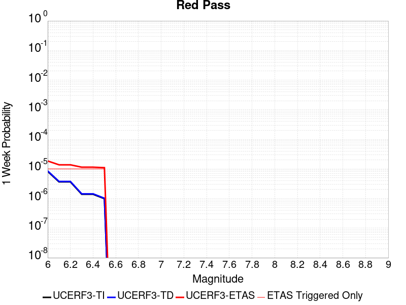 |  |  |  |

| Magnitude | 1 wk TI Prob | 1 wk TD Prob | 1 wk ETAS Prob | 1 wk ETAS/TD Gain | 1 wk ETAS Triggered Only | 1 mo TI Prob | 1 mo TD Prob | 1 mo ETAS Prob | 1 mo ETAS/TD Gain | 1 mo ETAS Triggered Only | 1 yr TI Prob | 1 yr TD Prob | 1 yr ETAS Prob | 1 yr ETAS/TD Gain | 1 yr ETAS Triggered Only | 10 yr TI Prob | 10 yr TD Prob | 10 yr ETAS Prob | 10 yr ETAS/TD Gain | 10 yr ETAS Triggered Only |
|-----|-----|-----|-----|-----|-----|-----|-----|-----|-----|-----|-----|-----|-----|-----|-----|-----|-----|-----|-----|-----|
| 6.0 | 8.258278E-6 | 8.551346E-6 | 1.855126E-5 | 2.1693966 | 1.0E-5 | 3.539214E-5 | 3.664821E-5 | 5.6647477E-5 | 1.5457093 | 2.0E-5 | 4.308141E-4 | 4.4611847E-4 | 5.4607383E-4 | 1.2240556 | 1.0E-4 | 0.0042997985 | 0.004453987 | 0.0046929177 | 1.0536443 | 2.4E-4 |
| 6.1 | 3.649988E-6 | 3.7753505E-6 | 1.3775313E-5 | 3.6487508 | 1.0E-5 | 1.5642712E-5 | 1.618E-5 | 3.6179677E-5 | 2.236074 | 2.0E-5 | 1.9043336E-4 | 1.9697845E-4 | 2.5696662E-4 | 1.3045418 | 6.0E-5 | 0.0019027026 | 0.001968506 | 0.0021082303 | 1.07098 | 1.4E-4 |
| 6.2 | 3.649988E-6 | 3.7753505E-6 | 1.3775313E-5 | 3.6487508 | 1.0E-5 | 1.5642712E-5 | 1.618E-5 | 3.6179677E-5 | 2.236074 | 2.0E-5 | 1.9043336E-4 | 1.9697845E-4 | 2.5696662E-4 | 1.3045418 | 6.0E-5 | 0.0019027026 | 0.001968506 | 0.0021082303 | 1.07098 | 1.4E-4 |
| 6.3 | 1.3924937E-6 | 1.4411299E-6 | 1.1441116E-5 | 7.938989 | 1.0E-5 | 5.9678164E-6 | 6.176265E-6 | 2.6176142E-5 | 4.238183 | 2.0E-5 | 7.265574E-5 | 7.519485E-5 | 9.519334E-5 | 1.2659557 | 2.0E-5 | 7.263199E-4 | 7.518328E-4 | 8.117877E-4 | 1.0797449 | 6.0E-5 |
| 6.4 | 1.3924937E-6 | 1.4411299E-6 | 1.1441116E-5 | 7.938989 | 1.0E-5 | 5.9678164E-6 | 6.176265E-6 | 2.6176142E-5 | 4.238183 | 2.0E-5 | 7.265574E-5 | 7.519485E-5 | 9.519334E-5 | 1.2659557 | 2.0E-5 | 7.263199E-4 | 7.518328E-4 | 8.117877E-4 | 1.0797449 | 6.0E-5 |
| 6.5 | 9.876812E-7 | 1.0222006E-6 | 1.1022191E-5 | 10.7828045 | 1.0E-5 | 4.2329125E-6 | 4.38086E-6 | 2.4380772E-5 | 5.565294 | 2.0E-5 | 5.153449E-5 | 5.333697E-5 | 7.3335905E-5 | 1.3749545 | 2.0E-5 | 5.1522546E-4 | 5.333697E-4 | 5.7334837E-4 | 1.0749549 | 4.0E-5 |

## San Andreas (Cholame) rev
*[(top)](#table-of-contents)*

| 1 Week | 1 Month | 1 Year | 10 Year |
|-----|-----|-----|-----|
|  |  |  |  |

| Magnitude | 1 wk TI Prob | 1 wk TD Prob | 1 wk ETAS Prob | 1 wk ETAS/TD Gain | 1 wk ETAS Triggered Only | 1 mo TI Prob | 1 mo TD Prob | 1 mo ETAS Prob | 1 mo ETAS/TD Gain | 1 mo ETAS Triggered Only | 1 yr TI Prob | 1 yr TD Prob | 1 yr ETAS Prob | 1 yr ETAS/TD Gain | 1 yr ETAS Triggered Only | 10 yr TI Prob | 10 yr TD Prob | 10 yr ETAS Prob | 10 yr ETAS/TD Gain | 10 yr ETAS Triggered Only |
|-----|-----|-----|-----|-----|-----|-----|-----|-----|-----|-----|-----|-----|-----|-----|-----|-----|-----|-----|-----|-----|
| 6.0 | 1.2302514E-4 | 2.5225655E-4 | 2.6225403E-4 | 1.0396322 | 1.0E-5 | 5.27144E-4 | 0.0010806532 | 0.0011305992 | 1.0462183 | 5.0E-5 | 0.0063991086 | 0.01307809 | 0.0131965205 | 1.0090556 | 1.2E-4 | 0.06217949 | 0.12446591 | 0.12465853 | 1.0015476 | 2.2E-4 |
| 6.1 | 1.2302514E-4 | 2.5225655E-4 | 2.6225403E-4 | 1.0396322 | 1.0E-5 | 5.27144E-4 | 0.0010806532 | 0.0011305992 | 1.0462183 | 5.0E-5 | 0.0063991086 | 0.01307809 | 0.0131965205 | 1.0090556 | 1.2E-4 | 0.06217949 | 0.12446591 | 0.12465853 | 1.0015476 | 2.2E-4 |
| 6.2 | 1.2203569E-4 | 2.504243E-4 | 2.6042177E-4 | 1.0399222 | 1.0E-5 | 5.2290526E-4 | 0.0010728071 | 0.0011227535 | 1.0465567 | 5.0E-5 | 0.006347804 | 0.012983706 | 0.013102148 | 1.0091224 | 1.2E-4 | 0.061695136 | 0.12365153 | 0.123844326 | 1.0015591 | 2.2E-4 |
| 6.3 | 1.2142645E-4 | 2.4928382E-4 | 2.5928134E-4 | 1.0401049 | 1.0E-5 | 5.202953E-4 | 0.0010679235 | 0.0011178701 | 1.0467699 | 5.0E-5 | 0.006316212 | 0.012924954 | 0.013043403 | 1.0091643 | 1.2E-4 | 0.06139677 | 0.1231465 | 0.12333941 | 1.0015665 | 2.2E-4 |
| 6.4 | 1.1865206E-4 | 2.4433754E-4 | 2.543351E-4 | 1.040917 | 1.0E-5 | 5.0840975E-4 | 0.0010467422 | 0.0010966898 | 1.0477172 | 5.0E-5 | 0.006172335 | 0.012670097 | 0.012788577 | 1.0093511 | 1.2E-4 | 0.060036868 | 0.12094167 | 0.121135056 | 1.0015991 | 2.2E-4 |
| 6.5 | 1.17443946E-4 | 2.4226973E-4 | 2.522673E-4 | 1.0412663 | 1.0E-5 | 5.032341E-4 | 0.0010378872 | 0.0010878353 | 1.0481248 | 5.0E-5 | 0.006109677 | 0.012563533 | 0.012682025 | 1.0094315 | 1.2E-4 | 0.059444077 | 0.12001872 | 0.12021232 | 1.001613 | 2.2E-4 |
| 6.6 | 1.13579066E-4 | 2.353577E-4 | 2.4535533E-4 | 1.0424786 | 1.0E-5 | 4.866766E-4 | 0.0010082874 | 0.001058237 | 1.0495391 | 5.0E-5 | 0.0059092017 | 0.012207246 | 0.012325781 | 1.0097102 | 1.2E-4 | 0.057545185 | 0.116932325 | 0.1171266 | 1.0016614 | 2.2E-4 |
| 6.7 | 1.1271412E-4 | 2.3380035E-4 | 2.4379801E-4 | 1.0427616 | 1.0E-5 | 4.829711E-4 | 0.0010016182 | 0.0010515682 | 1.0498692 | 5.0E-5 | 0.005864331 | 0.012126956 | 0.0122455 | 1.0097753 | 1.2E-4 | 0.057119697 | 0.11623527 | 0.1164297 | 1.0016727 | 2.2E-4 |
| 6.8 | 1.1217975E-4 | 2.3268408E-4 | 2.4268175E-4 | 1.0429667 | 1.0E-5 | 4.8068175E-4 | 9.968379E-4 | 0.0010467881 | 1.0501086 | 5.0E-5 | 0.005836608 | 0.012069401 | 0.012187953 | 1.0098225 | 1.2E-4 | 0.056856725 | 0.115733095 | 0.11592764 | 1.001681 | 2.2E-4 |
| 6.9 | 1.1146753E-4 | 2.3117107E-4 | 2.4116876E-4 | 1.043248 | 1.0E-5 | 4.7763053E-4 | 9.903585E-4 | 0.001040309 | 1.0504367 | 5.0E-5 | 0.0057996577 | 0.011991386 | 0.012109947 | 1.0098872 | 1.2E-4 | 0.056506127 | 0.11505319 | 0.115247875 | 1.0016922 | 2.2E-4 |
| 7.0 | 1.0965793E-4 | 2.2740291E-4 | 2.3740064E-4 | 1.0439649 | 1.0E-5 | 4.698779E-4 | 9.742214E-4 | 0.0010241728 | 1.051273 | 5.0E-5 | 0.005705768 | 0.011797061 | 0.011915646 | 1.010052 | 1.2E-4 | 0.055614736 | 0.11335419 | 0.113549255 | 1.0017208 | 2.2E-4 |
| 7.1 | 9.927982E-5 | 2.055873E-4 | 2.1558524E-4 | 1.0486312 | 1.0E-5 | 4.2541555E-4 | 8.807919E-4 | 9.207567E-4 | 1.0453737 | 4.0E-5 | 0.0051671406 | 0.010671208 | 0.010780035 | 1.0101981 | 1.1E-4 | 0.05048634 | 0.10344171 | 0.10362102 | 1.0017334 | 2.0E-4 |
| 7.2 | 9.696786E-5 | 2.0062808E-4 | 2.1062608E-4 | 1.0498334 | 1.0E-5 | 4.1551032E-4 | 8.5955235E-4 | 8.9951797E-4 | 1.0464958 | 4.0E-5 | 0.00504711 | 0.010415116 | 0.010523971 | 1.0104516 | 1.1E-4 | 0.04934009 | 0.101182036 | 0.1013618 | 1.0017766 | 2.0E-4 |
| 7.3 | 9.4727984E-5 | 1.9491818E-4 | 2.0491621E-4 | 1.0512936 | 1.0E-5 | 4.0591392E-4 | 8.3509716E-4 | 8.750637E-4 | 1.0478586 | 4.0E-5 | 0.0049308087 | 0.010120179 | 0.010219166 | 1.0097812 | 1.0E-4 | 0.048228268 | 0.098551914 | 0.09872319 | 1.001738 | 1.9E-4 |
| 7.4 | 9.220358E-5 | 1.8862115E-4 | 1.9861927E-4 | 1.0530063 | 1.0E-5 | 3.9509835E-4 | 8.081268E-4 | 8.480945E-4 | 1.0494572 | 4.0E-5 | 0.004799717 | 0.009794806 | 0.009893826 | 1.0101095 | 1.0E-4 | 0.046973653 | 0.09562377 | 0.095795594 | 1.001797 | 1.9E-4 |
| 7.5 | 7.71631E-5 | 1.51941E-4 | 1.6193949E-4 | 1.065805 | 1.0E-5 | 3.306571E-4 | 6.510134E-4 | 6.809939E-4 | 1.046052 | 3.0E-5 | 0.0040183207 | 0.007897355 | 0.007976723 | 1.0100499 | 8.0E-5 | 0.03946433 | 0.078353405 | 0.07849165 | 1.0017644 | 1.5E-4 |
| 7.6 | 7.5634416E-5 | 1.4853364E-4 | 1.5853216E-4 | 1.0673149 | 1.0E-5 | 3.241072E-4 | 6.3641765E-4 | 6.6639856E-4 | 1.0471089 | 3.0E-5 | 0.0039388672 | 0.007720924 | 0.0078003067 | 1.0102814 | 8.0E-5 | 0.038697794 | 0.07671554 | 0.07685403 | 1.0018053 | 1.5E-4 |
| 7.7 | 6.3783E-5 | 1.2372862E-4 | 1.3372739E-4 | 1.0808121 | 1.0E-5 | 2.7332708E-4 | 5.3015776E-4 | 5.6014187E-4 | 1.0565569 | 3.0E-5 | 0.0033226798 | 0.0064355945 | 0.0065051443 | 1.010807 | 7.0E-5 | 0.032734364 | 0.06460247 | 0.06471472 | 1.0017375 | 1.2E-4 |
| 7.8 | 5.863422E-5 | 1.1428974E-4 | 1.2428859E-4 | 1.0874869 | 1.0E-5 | 2.512653E-4 | 4.8972125E-4 | 5.197066E-4 | 1.0612293 | 3.0E-5 | 0.003054864 | 0.005946077 | 0.0060156607 | 1.0117024 | 7.0E-5 | 0.030132094 | 0.059716195 | 0.05982903 | 1.0018895 | 1.2E-4 |
| 7.9 | 4.595283E-5 | 8.435515E-5 | 9.435431E-5 | 1.1185364 | 1.0E-5 | 1.9692584E-4 | 3.6147202E-4 | 3.9146116E-4 | 1.082964 | 3.0E-5 | 0.0023949358 | 0.004392048 | 0.00446174 | 1.015868 | 7.0E-5 | 0.023692891 | 0.044404242 | 0.044509355 | 1.0023673 | 1.1E-4 |
| 8.0 | 3.2950178E-5 | 5.082854E-5 | 6.082803E-5 | 1.1967299 | 1.0E-5 | 1.412074E-4 | 2.1781842E-4 | 2.3781406E-4 | 1.0917996 | 2.0E-5 | 0.0017178444 | 0.0026487159 | 0.0026786365 | 1.0112963 | 3.0E-5 | 0.017046256 | 0.027207429 | 0.027256068 | 1.0017878 | 5.0E-5 |
| 8.1 | 1.9177472E-5 | 1.921044E-5 | 1.921044E-5 | 1.0 | 0.0 | 8.218658E-5 | 8.232787E-5 | 8.232787E-5 | 1.0 | 0.0 | 0.0010001622 | 0.0010018814 | 0.0010018814 | 1.0 | 0.0 | 0.009956728 | 0.010771529 | 0.010791314 | 1.0018368 | 2.0E-5 |
| 8.2 | 8.643924E-6 | 5.4836746E-6 | 5.4836746E-6 | 1.0 | 0.0 | 3.704486E-5 | 2.350125E-5 | 2.350125E-5 | 1.0 | 0.0 | 4.5092785E-4 | 2.8609025E-4 | 2.8609025E-4 | 1.0 | 0.0 | 0.0045001395 | 0.0032535729 | 0.0032535729 | 1.0 | 0.0 |
| 8.3 | 1.983087E-6 | 7.6730026E-7 | 7.6730026E-7 | 1.0 | 0.0 | 8.498917E-6 | 3.2884257E-6 | 3.2884257E-6 | 1.0 | 0.0 | 1.034694E-4 | 4.0035866E-5 | 4.0035866E-5 | 1.0 | 0.0 | 0.0010342124 | 4.7277327E-4 | 4.7277327E-4 | 1.0 | 0.0 |

## San Andreas (Carrizo) rev
*[(top)](#table-of-contents)*

| 1 Week | 1 Month | 1 Year | 10 Year |
|-----|-----|-----|-----|
|  |  |  |  |

| Magnitude | 1 wk TI Prob | 1 wk TD Prob | 1 wk ETAS Prob | 1 wk ETAS/TD Gain | 1 wk ETAS Triggered Only | 1 mo TI Prob | 1 mo TD Prob | 1 mo ETAS Prob | 1 mo ETAS/TD Gain | 1 mo ETAS Triggered Only | 1 yr TI Prob | 1 yr TD Prob | 1 yr ETAS Prob | 1 yr ETAS/TD Gain | 1 yr ETAS Triggered Only | 10 yr TI Prob | 10 yr TD Prob | 10 yr ETAS Prob | 10 yr ETAS/TD Gain | 10 yr ETAS Triggered Only |
|-----|-----|-----|-----|-----|-----|-----|-----|-----|-----|-----|-----|-----|-----|-----|-----|-----|-----|-----|-----|-----|
| 6.0 | 1.1674632E-4 | 2.4344349E-4 | 2.5344105E-4 | 1.0410672 | 1.0E-5 | 5.002454E-4 | 0.0010429136 | 0.0010828719 | 1.0383141 | 4.0E-5 | 0.006073493 | 0.012624034 | 0.012742518 | 1.0093857 | 1.2E-4 | 0.0591016 | 0.12068345 | 0.1208681 | 1.00153 | 2.1E-4 |
| 6.1 | 1.1674632E-4 | 2.4344349E-4 | 2.5344105E-4 | 1.0410672 | 1.0E-5 | 5.002454E-4 | 0.0010429136 | 0.0010828719 | 1.0383141 | 4.0E-5 | 0.006073493 | 0.012624034 | 0.012742518 | 1.0093857 | 1.2E-4 | 0.0591016 | 0.12068345 | 0.1208681 | 1.00153 | 2.1E-4 |
| 6.2 | 1.1674632E-4 | 2.4344349E-4 | 2.5344105E-4 | 1.0410672 | 1.0E-5 | 5.002454E-4 | 0.0010429136 | 0.0010828719 | 1.0383141 | 4.0E-5 | 0.006073493 | 0.012624034 | 0.012742518 | 1.0093857 | 1.2E-4 | 0.0591016 | 0.12068345 | 0.1208681 | 1.00153 | 2.1E-4 |
| 6.3 | 1.1674632E-4 | 2.4344349E-4 | 2.5344105E-4 | 1.0410672 | 1.0E-5 | 5.002454E-4 | 0.0010429136 | 0.0010828719 | 1.0383141 | 4.0E-5 | 0.006073493 | 0.012624034 | 0.012742518 | 1.0093857 | 1.2E-4 | 0.0591016 | 0.12068345 | 0.1208681 | 1.00153 | 2.1E-4 |
| 6.4 | 1.1674632E-4 | 2.4344349E-4 | 2.5344105E-4 | 1.0410672 | 1.0E-5 | 5.002454E-4 | 0.0010429136 | 0.0010828719 | 1.0383141 | 4.0E-5 | 0.006073493 | 0.012624034 | 0.012742518 | 1.0093857 | 1.2E-4 | 0.0591016 | 0.12068345 | 0.1208681 | 1.00153 | 2.1E-4 |
| 6.5 | 1.13136164E-4 | 2.3664243E-4 | 2.4664006E-4 | 1.0422479 | 1.0E-5 | 4.847792E-4 | 0.0010137892 | 0.0010537487 | 1.039416 | 4.0E-5 | 0.0058862255 | 0.012273479 | 0.012392007 | 1.0096571 | 1.2E-4 | 0.057327334 | 0.117658384 | 0.11784367 | 1.0015749 | 2.1E-4 |
| 6.6 | 1.13136164E-4 | 2.3664243E-4 | 2.4664006E-4 | 1.0422479 | 1.0E-5 | 4.847792E-4 | 0.0010137892 | 0.0010537487 | 1.039416 | 4.0E-5 | 0.0058862255 | 0.012273479 | 0.012392007 | 1.0096571 | 1.2E-4 | 0.057327334 | 0.117658384 | 0.11784367 | 1.0015749 | 2.1E-4 |
| 6.7 | 1.1149675E-4 | 2.3355409E-4 | 2.4355177E-4 | 1.0428066 | 1.0E-5 | 4.777557E-4 | 0.0010005637 | 0.0010405236 | 1.0399375 | 4.0E-5 | 0.0058011734 | 0.012114258 | 0.012232804 | 1.0097857 | 1.2E-4 | 0.05652051 | 0.11628025 | 0.11646584 | 1.001596 | 2.1E-4 |
| 6.8 | 1.1103589E-4 | 2.3257542E-4 | 2.4257309E-4 | 1.0429868 | 1.0E-5 | 4.7578133E-4 | 9.963725E-4 | 0.0010363327 | 1.0401056 | 4.0E-5 | 0.005777263 | 0.012063796 | 0.012182348 | 1.0098271 | 1.2E-4 | 0.056293584 | 0.11583961 | 0.116025284 | 1.0016029 | 2.1E-4 |
| 6.9 | 1.1053259E-4 | 2.3149895E-4 | 2.4149663E-4 | 1.0431868 | 1.0E-5 | 4.7362508E-4 | 9.917626E-4 | 0.001031723 | 1.0402923 | 4.0E-5 | 0.0057511497 | 0.012008291 | 0.01212685 | 1.0098732 | 1.2E-4 | 0.05604569 | 0.1153558 | 0.11554157 | 1.0016104 | 2.1E-4 |
| 7.0 | 1.1005377E-4 | 2.3050712E-4 | 2.4050481E-4 | 1.0433726 | 1.0E-5 | 4.7157376E-4 | 9.875151E-4 | 0.0010274756 | 1.0404657 | 4.0E-5 | 0.0057263062 | 0.011957146 | 0.012075712 | 1.0099158 | 1.2E-4 | 0.055809796 | 0.11490853 | 0.1150944 | 1.0016176 | 2.1E-4 |
| 7.1 | 1.0308142E-4 | 2.1559908E-4 | 2.2559693E-4 | 1.0463724 | 1.0E-5 | 4.417027E-4 | 9.2366996E-4 | 9.63633E-4 | 1.0432655 | 4.0E-5 | 0.0053644776 | 0.011188011 | 0.011306668 | 1.0106058 | 1.2E-4 | 0.052368138 | 0.10816976 | 0.10835704 | 1.0017314 | 2.1E-4 |
| 7.2 | 1.0027479E-4 | 2.0967635E-4 | 2.1967426E-4 | 1.0476825 | 1.0E-5 | 4.296783E-4 | 8.9830445E-4 | 9.3826855E-4 | 1.0444883 | 4.0E-5 | 0.0052187922 | 0.010882311 | 0.011001005 | 1.010907 | 1.2E-4 | 0.050979212 | 0.10547392 | 0.105661765 | 1.001781 | 2.1E-4 |
| 7.3 | 9.816942E-5 | 2.0442613E-4 | 2.1442409E-4 | 1.0489074 | 1.0E-5 | 4.2065824E-4 | 8.7581883E-4 | 9.157838E-4 | 1.0456315 | 4.0E-5 | 0.005109493 | 0.010611246 | 0.010720079 | 1.0102564 | 1.1E-4 | 0.049935985 | 0.10305645 | 0.10323584 | 1.0017407 | 2.0E-4 |
| 7.4 | 9.5634205E-5 | 1.9811837E-4 | 2.081164E-4 | 1.0504649 | 1.0E-5 | 4.0979648E-4 | 8.488034E-4 | 8.8876946E-4 | 1.0470852 | 4.0E-5 | 0.0049778637 | 0.010285477 | 0.010394346 | 1.0105847 | 1.1E-4 | 0.048678253 | 0.10013666 | 0.100316636 | 1.0017973 | 2.0E-4 |
| 7.5 | 8.052417E-5 | 1.6129548E-4 | 1.7129387E-4 | 1.061988 | 1.0E-5 | 3.4505792E-4 | 6.910834E-4 | 7.2106265E-4 | 1.0433801 | 3.0E-5 | 0.0041929903 | 0.008381561 | 0.008470807 | 1.0106479 | 9.0E-5 | 0.04114753 | 0.082882896 | 0.083029635 | 1.0017704 | 1.6E-4 |
| 7.6 | 7.897024E-5 | 1.5782582E-4 | 1.6782426E-4 | 1.063351 | 1.0E-5 | 3.384E-4 | 6.762212E-4 | 7.0620095E-4 | 1.0443342 | 3.0E-5 | 0.0041122385 | 0.008201991 | 0.008291253 | 1.010883 | 9.0E-5 | 0.040369697 | 0.08122283 | 0.08136983 | 1.0018098 | 1.6E-4 |
| 7.7 | 6.707427E-5 | 1.3291043E-4 | 1.4290909E-4 | 1.0752287 | 1.0E-5 | 2.8742946E-4 | 5.694918E-4 | 5.994747E-4 | 1.0526485 | 3.0E-5 | 0.003493839 | 0.0069115525 | 0.0069909994 | 1.0114949 | 8.0E-5 | 0.034394164 | 0.06911466 | 0.069235675 | 1.001751 | 1.3E-4 |
| 7.8 | 6.147705E-5 | 1.221102E-4 | 1.3210898E-4 | 1.0818832 | 1.0E-5 | 2.6344648E-4 | 5.232245E-4 | 5.532088E-4 | 1.0573068 | 3.0E-5 | 0.0032027436 | 0.006351677 | 0.0064311684 | 1.0125151 | 8.0E-5 | 0.031569764 | 0.063575014 | 0.06369675 | 1.0019149 | 1.3E-4 |
| 7.9 | 4.7636717E-5 | 8.889311E-5 | 9.889222E-5 | 1.1124847 | 1.0E-5 | 2.0414138E-4 | 3.8091483E-4 | 4.1090342E-4 | 1.0787277 | 3.0E-5 | 0.0024825884 | 0.0046277842 | 0.00469746 | 1.015056 | 7.0E-5 | 0.024550365 | 0.046671934 | 0.0467768 | 1.0022469 | 1.1E-4 |
| 8.0 | 3.3554235E-5 | 5.2193638E-5 | 6.219312E-5 | 1.1915842 | 1.0E-5 | 1.4379594E-4 | 2.2366786E-4 | 2.4366338E-4 | 1.0893983 | 2.0E-5 | 0.0017493097 | 0.0027197571 | 0.0027496757 | 1.0110004 | 3.0E-5 | 0.017356034 | 0.027908819 | 0.027957425 | 1.0017415 | 5.0E-5 |
| 8.1 | 1.9175432E-5 | 1.921027E-5 | 1.921027E-5 | 1.0 | 0.0 | 8.217783E-5 | 8.232713E-5 | 8.232713E-5 | 1.0 | 0.0 | 0.0010000558 | 0.0010018726 | 0.0010018726 | 1.0 | 0.0 | 0.009955673 | 0.010771413 | 0.010791197 | 1.0018368 | 2.0E-5 |
| 8.2 | 8.643924E-6 | 5.4836746E-6 | 5.4836746E-6 | 1.0 | 0.0 | 3.704486E-5 | 2.350125E-5 | 2.350125E-5 | 1.0 | 0.0 | 4.5092785E-4 | 2.8609025E-4 | 2.8609025E-4 | 1.0 | 0.0 | 0.0045001395 | 0.0032535729 | 0.0032535729 | 1.0 | 0.0 |
| 8.3 | 1.983087E-6 | 7.6730026E-7 | 7.6730026E-7 | 1.0 | 0.0 | 8.498917E-6 | 3.2884257E-6 | 3.2884257E-6 | 1.0 | 0.0 | 1.034694E-4 | 4.0035866E-5 | 4.0035866E-5 | 1.0 | 0.0 | 0.0010342124 | 4.7277327E-4 | 4.7277327E-4 | 1.0 | 0.0 |

## Death Valley (Fish Lake Valley)
*[(top)](#table-of-contents)*

| 1 Week | 1 Month | 1 Year | 10 Year |
|-----|-----|-----|-----|
| 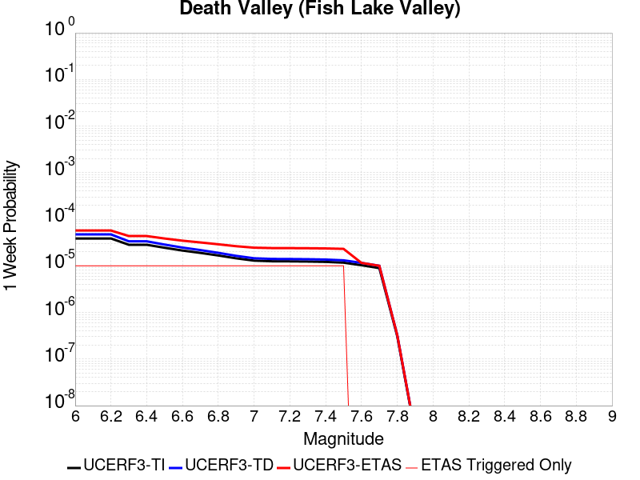 |  |  |  |

| Magnitude | 1 wk TI Prob | 1 wk TD Prob | 1 wk ETAS Prob | 1 wk ETAS/TD Gain | 1 wk ETAS Triggered Only | 1 mo TI Prob | 1 mo TD Prob | 1 mo ETAS Prob | 1 mo ETAS/TD Gain | 1 mo ETAS Triggered Only | 1 yr TI Prob | 1 yr TD Prob | 1 yr ETAS Prob | 1 yr ETAS/TD Gain | 1 yr ETAS Triggered Only | 10 yr TI Prob | 10 yr TD Prob | 10 yr ETAS Prob | 10 yr ETAS/TD Gain | 10 yr ETAS Triggered Only |
|-----|-----|-----|-----|-----|-----|-----|-----|-----|-----|-----|-----|-----|-----|-----|-----|-----|-----|-----|-----|-----|
| 6.0 | 3.872328E-5 | 4.7268546E-5 | 5.7268073E-5 | 1.2115471 | 1.0E-5 | 1.6594635E-4 | 2.025654E-4 | 2.2256136E-4 | 1.0987135 | 2.0E-5 | 0.0020185246 | 0.0024637054 | 0.0025235575 | 1.0242935 | 6.0E-5 | 0.02000288 | 0.024389746 | 0.024575112 | 1.0076002 | 1.9E-4 |
| 6.1 | 3.872328E-5 | 4.7268546E-5 | 5.7268073E-5 | 1.2115471 | 1.0E-5 | 1.6594635E-4 | 2.025654E-4 | 2.2256136E-4 | 1.0987135 | 2.0E-5 | 0.0020185246 | 0.0024637054 | 0.0025235575 | 1.0242935 | 6.0E-5 | 0.02000288 | 0.024389746 | 0.024575112 | 1.0076002 | 1.9E-4 |
| 6.2 | 3.872328E-5 | 4.7268546E-5 | 5.7268073E-5 | 1.2115471 | 1.0E-5 | 1.6594635E-4 | 2.025654E-4 | 2.2256136E-4 | 1.0987135 | 2.0E-5 | 0.0020185246 | 0.0024637054 | 0.0025235575 | 1.0242935 | 6.0E-5 | 0.02000288 | 0.024389746 | 0.024575112 | 1.0076002 | 1.9E-4 |
| 6.3 | 2.8356371E-5 | 3.3611475E-5 | 4.361114E-5 | 1.2975074 | 1.0E-5 | 1.2152165E-4 | 1.4404162E-4 | 1.6403875E-4 | 1.1388288 | 2.0E-5 | 0.0014785219 | 0.0017523658 | 0.0018122607 | 1.0341794 | 6.0E-5 | 0.014687235 | 0.01739267 | 0.01756954 | 1.0101691 | 1.8E-4 |
| 6.4 | 2.8356371E-5 | 3.3611475E-5 | 4.361114E-5 | 1.2975074 | 1.0E-5 | 1.2152165E-4 | 1.4404162E-4 | 1.6403875E-4 | 1.1388288 | 2.0E-5 | 0.0014785219 | 0.0017523658 | 0.0018122607 | 1.0341794 | 6.0E-5 | 0.014687235 | 0.01739267 | 0.01756954 | 1.0101691 | 1.8E-4 |
| 6.5 | 2.4448687E-5 | 2.8608896E-5 | 3.860861E-5 | 1.3495317 | 1.0E-5 | 1.0477588E-4 | 1.2260403E-4 | 1.4260158E-4 | 1.1631068 | 2.0E-5 | 0.0012748998 | 0.0014917298 | 0.0015516402 | 1.0401617 | 6.0E-5 | 0.012676105 | 0.014822063 | 0.014999394 | 1.0119641 | 1.8E-4 |
| 6.6 | 2.1298161E-5 | 2.4661129E-5 | 3.4660883E-5 | 1.4054865 | 1.0E-5 | 9.127464E-5 | 1.0568642E-4 | 1.2568431E-4 | 1.1892191 | 2.0E-5 | 0.0011107022 | 0.0012860057 | 0.0013459285 | 1.046596 | 6.0E-5 | 0.011051672 | 0.012789069 | 0.012966766 | 1.0138946 | 1.8E-4 |
| 6.7 | 1.8959729E-5 | 2.1781894E-5 | 3.1781678E-5 | 1.4590869 | 1.0E-5 | 8.125345E-5 | 9.334778E-5 | 1.13345915E-4 | 1.2142326 | 2.0E-5 | 9.888117E-4 | 0.0011359423 | 0.0011958741 | 1.0527595 | 6.0E-5 | 0.009844234 | 0.011304018 | 0.011481984 | 1.0157435 | 1.8E-4 |
| 6.8 | 1.6691629E-5 | 1.901906E-5 | 2.9018871E-5 | 1.5257783 | 1.0E-5 | 7.153359E-5 | 8.150781E-5 | 1.0150618E-4 | 1.2453552 | 2.0E-5 | 8.7057345E-4 | 9.919227E-4 | 0.0010518631 | 1.0604286 | 6.0E-5 | 0.008671708 | 0.009876709 | 0.010054932 | 1.0180447 | 1.8E-4 |
| 6.9 | 1.450505E-5 | 1.6390108E-5 | 2.6389944E-5 | 1.6101141 | 1.0E-5 | 6.216302E-5 | 7.0241476E-5 | 9.024007E-5 | 1.2847121 | 2.0E-5 | 7.5657194E-4 | 8.548632E-4 | 9.148119E-4 | 1.0701267 | 6.0E-5 | 0.007540013 | 0.0085166795 | 0.008695146 | 1.020955 | 1.8E-4 |
| 7.0 | 1.2940855E-5 | 1.4538449E-5 | 2.4538303E-5 | 1.6878213 | 1.0E-5 | 5.545963E-5 | 6.2306186E-5 | 8.2304934E-5 | 1.3209754 | 2.0E-5 | 6.750118E-4 | 7.5831957E-4 | 8.1827404E-4 | 1.0790623 | 6.0E-5 | 0.006729651 | 0.007557937 | 0.0077365767 | 1.023636 | 1.8E-4 |
| 7.1 | 1.2544658E-5 | 1.4078665E-5 | 2.4078525E-5 | 1.7102846 | 1.0E-5 | 5.3761712E-5 | 6.0335773E-5 | 8.033457E-5 | 1.3314583 | 2.0E-5 | 6.5435225E-4 | 7.3434605E-4 | 7.94302E-4 | 1.0816454 | 6.0E-5 | 0.006524288 | 0.007319788 | 0.0074984706 | 1.0244108 | 1.8E-4 |
| 7.2 | 1.2489416E-5 | 1.401613E-5 | 2.401599E-5 | 1.7134538 | 1.0E-5 | 5.3524967E-5 | 6.0067778E-5 | 8.006657E-5 | 1.3329372 | 2.0E-5 | 6.514716E-4 | 7.3108537E-4 | 7.9104153E-4 | 1.0820098 | 6.0E-5 | 0.006495651 | 0.0072873957 | 0.007466084 | 1.0245202 | 1.8E-4 |
| 7.3 | 1.2368307E-5 | 1.3880263E-5 | 2.3880124E-5 | 1.7204374 | 1.0E-5 | 5.3005948E-5 | 5.948552E-5 | 7.948433E-5 | 1.3361963 | 2.0E-5 | 6.451563E-4 | 7.2400115E-4 | 7.839577E-4 | 1.0828128 | 6.0E-5 | 0.0064328653 | 0.0072170156 | 0.0073957164 | 1.0247611 | 1.8E-4 |
| 7.4 | 1.2161707E-5 | 1.3648311E-5 | 2.3648176E-5 | 1.7326814 | 1.0E-5 | 5.212056E-5 | 5.849148E-5 | 7.849031E-5 | 1.3419101 | 2.0E-5 | 6.3438306E-4 | 7.119067E-4 | 7.71864E-4 | 1.0842206 | 6.0E-5 | 0.006325751 | 0.0070968503 | 0.007275573 | 1.0251833 | 1.8E-4 |
| 7.5 | 1.1707948E-5 | 1.3145944E-5 | 2.3145813E-5 | 1.7606809 | 1.0E-5 | 5.0175953E-5 | 5.6338577E-5 | 7.633745E-5 | 1.3549765 | 2.0E-5 | 6.10721E-4 | 6.8571186E-4 | 7.456707E-4 | 1.0874403 | 6.0E-5 | 0.0060904534 | 0.0068365433 | 0.007015313 | 1.0261492 | 1.8E-4 |
| 7.6 | 1.0319538E-5 | 1.1579998E-5 | 1.1579998E-5 | 1.0 | 0.0 | 4.4225842E-5 | 4.9627648E-5 | 5.962715E-5 | 1.2014906 | 1.0E-5 | 5.383166E-4 | 6.0405425E-4 | 6.540241E-4 | 1.082724 | 5.0E-5 | 0.0053701443 | 0.0060246554 | 0.006193631 | 1.0280473 | 1.7E-4 |
| 7.7 | 8.937764E-6 | 1.0023103E-5 | 1.0023103E-5 | 1.0 | 0.0 | 3.830414E-5 | 4.2955475E-5 | 5.2955045E-5 | 1.2327892 | 1.0E-5 | 4.6625308E-4 | 5.228624E-4 | 5.6284154E-4 | 1.0764619 | 4.0E-5 | 0.0046527605 | 0.0052168323 | 0.005356102 | 1.0266962 | 1.4E-4 |
| 7.8 | 3.108007E-7 | 3.2847038E-7 | 3.2847038E-7 | 1.0 | 0.0 | 1.3320023E-6 | 1.4077294E-6 | 1.4077294E-6 | 1.0 | 0.0 | 1.6217007E-5 | 1.7138975E-5 | 2.7138803E-5 | 1.5834554 | 1.0E-5 | 1.6215823E-4 | 1.7137692E-4 | 1.813752E-4 | 1.0583409 | 1.0E-5 |
| 7.9 | 2.5591178E-9 | 2.6697022E-9 | 2.6697022E-9 | 1.0 | 0.0 | 1.0967647E-8 | 1.1441582E-8 | 1.1441582E-8 | 1.0 | 0.0 | 1.335311E-7 | 1.3930125E-7 | 1.3930125E-7 | 1.0 | 0.0 | 1.3353102E-6 | 1.3930126E-6 | 1.3930126E-6 | 1.0 | 0.0 |

## White Wolf (Extension)
*[(top)](#table-of-contents)*

| 1 Week | 1 Month | 1 Year | 10 Year |
|-----|-----|-----|-----|
|  |  |  |  |

| Magnitude | 1 wk TI Prob | 1 wk TD Prob | 1 wk ETAS Prob | 1 wk ETAS/TD Gain | 1 wk ETAS Triggered Only | 1 mo TI Prob | 1 mo TD Prob | 1 mo ETAS Prob | 1 mo ETAS/TD Gain | 1 mo ETAS Triggered Only | 1 yr TI Prob | 1 yr TD Prob | 1 yr ETAS Prob | 1 yr ETAS/TD Gain | 1 yr ETAS Triggered Only | 10 yr TI Prob | 10 yr TD Prob | 10 yr ETAS Prob | 10 yr ETAS/TD Gain | 10 yr ETAS Triggered Only |
|-----|-----|-----|-----|-----|-----|-----|-----|-----|-----|-----|-----|-----|-----|-----|-----|-----|-----|-----|-----|-----|
| 6.0 | 8.222555E-6 | 6.066695E-6 | 2.6066573E-5 | 4.296668 | 2.0E-5 | 3.5239045E-5 | 2.5999898E-5 | 5.5999117E-5 | 2.1538208 | 3.0E-5 | 4.289509E-4 | 3.165094E-4 | 3.8648726E-4 | 1.2210925 | 7.0E-5 | 0.0042812387 | 0.003161238 | 0.0033307006 | 1.0536064 | 1.7E-4 |
| 6.1 | 8.222555E-6 | 6.066695E-6 | 2.6066573E-5 | 4.296668 | 2.0E-5 | 3.5239045E-5 | 2.5999898E-5 | 5.5999117E-5 | 2.1538208 | 3.0E-5 | 4.289509E-4 | 3.165094E-4 | 3.8648726E-4 | 1.2210925 | 7.0E-5 | 0.0042812387 | 0.003161238 | 0.0033307006 | 1.0536064 | 1.7E-4 |
| 6.2 | 8.222555E-6 | 6.066695E-6 | 2.6066573E-5 | 4.296668 | 2.0E-5 | 3.5239045E-5 | 2.5999898E-5 | 5.5999117E-5 | 2.1538208 | 3.0E-5 | 4.289509E-4 | 3.165094E-4 | 3.8648726E-4 | 1.2210925 | 7.0E-5 | 0.0042812387 | 0.003161238 | 0.0033307006 | 1.0536064 | 1.7E-4 |
| 6.3 | 8.222555E-6 | 6.066695E-6 | 2.6066573E-5 | 4.296668 | 2.0E-5 | 3.5239045E-5 | 2.5999898E-5 | 5.5999117E-5 | 2.1538208 | 3.0E-5 | 4.289509E-4 | 3.165094E-4 | 3.8648726E-4 | 1.2210925 | 7.0E-5 | 0.0042812387 | 0.003161238 | 0.0033307006 | 1.0536064 | 1.7E-4 |
| 6.4 | 5.821773E-6 | 3.5571752E-6 | 1.355714E-5 | 3.8112094 | 1.0E-5 | 2.4950215E-5 | 1.5244954E-5 | 2.52448E-5 | 1.6559447 | 1.0E-5 | 3.0372653E-4 | 1.8559261E-4 | 2.2558519E-4 | 1.2154858 | 4.0E-5 | 0.0030331176 | 0.0018544844 | 0.001954299 | 1.0538234 | 1.0E-4 |
| 6.5 | 5.766023E-6 | 3.4991087E-6 | 1.3499074E-5 | 3.8578606 | 1.0E-5 | 2.4711293E-5 | 1.4996101E-5 | 2.499595E-5 | 1.6668301 | 1.0E-5 | 3.0081844E-4 | 1.8256332E-4 | 2.2255602E-4 | 1.2190621 | 4.0E-5 | 0.0030041158 | 0.0018242416 | 0.0019240592 | 1.0547173 | 1.0E-4 |
| 6.6 | 4.643576E-6 | 2.3326102E-6 | 1.2332587E-5 | 5.287033 | 1.0E-5 | 1.9900888E-5 | 9.996865E-6 | 1.9996764E-5 | 2.0003037 | 1.0E-5 | 2.4226638E-4 | 1.2170546E-4 | 1.5170181E-4 | 1.2464668 | 3.0E-5 | 0.0024200242 | 0.0012164304 | 0.0012863453 | 1.0574754 | 7.0E-5 |
| 6.7 | 3.9529173E-6 | 1.6483273E-6 | 1.1648311E-5 | 7.066746 | 1.0E-5 | 1.6940963E-5 | 7.064242E-6 | 1.706417E-5 | 2.41557 | 1.0E-5 | 2.0623671E-4 | 8.6003936E-5 | 1.16001356E-4 | 1.3487912 | 3.0E-5 | 0.002060454 | 8.59725E-4 | 9.296648E-4 | 1.0813514 | 7.0E-5 |
| 6.8 | 3.4377522E-6 | 1.2245005E-6 | 1.1224488E-5 | 9.166586 | 1.0E-5 | 1.473314E-5 | 5.247849E-6 | 1.5247797E-5 | 2.9055326 | 1.0E-5 | 1.7936122E-4 | 6.389078E-5 | 9.388886E-5 | 1.4695213 | 3.0E-5 | 0.0017921652 | 6.387332E-4 | 6.887013E-4 | 1.0782299 | 5.0E-5 |
| 6.9 | 3.1367306E-6 | 1.0033524E-6 | 1.0033524E-6 | 1.0 | 0.0 | 1.3443062E-5 | 4.300075E-6 | 4.300075E-6 | 1.0 | 0.0 | 1.63657E-4 | 5.2352232E-5 | 6.235171E-5 | 1.1910038 | 1.0E-5 | 0.0016353652 | 5.2340666E-4 | 5.5339094E-4 | 1.0572869 | 3.0E-5 |
| 7.0 | 2.8298145E-6 | 7.428412E-7 | 7.428412E-7 | 1.0 | 0.0 | 1.2127721E-5 | 3.1836016E-6 | 3.1836016E-6 | 1.0 | 0.0 | 1.47645E-4 | 3.8759714E-5 | 4.8759324E-5 | 1.2579899 | 1.0E-5 | 0.0014754693 | 3.875345E-4 | 4.1752288E-4 | 1.0773824 | 3.0E-5 |
| 7.1 | 2.4091064E-6 | 5.4225313E-7 | 5.4225313E-7 | 1.0 | 0.0 | 1.03247E-5 | 2.32394E-6 | 2.32394E-6 | 1.0 | 0.0 | 1.2569598E-4 | 2.8293643E-5 | 2.8293643E-5 | 1.0 | 0.0 | 0.001256249 | 2.8290445E-4 | 3.0289878E-4 | 1.0706753 | 2.0E-5 |
| 7.2 | 1.3875518E-6 | 1.07409655E-7 | 1.07409655E-7 | 1.0 | 0.0 | 5.9466374E-6 | 4.6032702E-7 | 4.6032702E-7 | 1.0 | 0.0 | 7.23979E-5 | 5.604468E-6 | 5.604468E-6 | 1.0 | 0.0 | 7.2374323E-4 | 5.604338E-5 | 6.604282E-5 | 1.1784232 | 1.0E-5 |
| 7.3 | 7.056077E-7 | 5.000789E-8 | 5.000789E-8 | 1.0 | 0.0 | 3.0240296E-6 | 2.1431953E-7 | 2.1431953E-7 | 1.0 | 0.0 | 3.681694E-5 | 2.6093376E-6 | 2.6093376E-6 | 1.0 | 0.0 | 3.681084E-4 | 2.6093116E-5 | 2.6093116E-5 | 1.0 | 0.0 |
| 7.4 | 5.9334678E-8 | 4.8641366E-9 | 4.8641366E-9 | 1.0 | 0.0 | 2.5429145E-7 | 2.08463E-8 | 2.08463E-8 | 1.0 | 0.0 | 3.095994E-6 | 2.538037E-7 | 2.538037E-7 | 1.0 | 0.0 | 3.095951E-5 | 2.5380352E-6 | 2.5380352E-6 | 1.0 | 0.0 |

## Baker
*[(top)](#table-of-contents)*

| 1 Week | 1 Month | 1 Year | 10 Year |
|-----|-----|-----|-----|
|  |  |  |  |

| Magnitude | 1 wk TI Prob | 1 wk TD Prob | 1 wk ETAS Prob | 1 wk ETAS/TD Gain | 1 wk ETAS Triggered Only | 1 mo TI Prob | 1 mo TD Prob | 1 mo ETAS Prob | 1 mo ETAS/TD Gain | 1 mo ETAS Triggered Only | 1 yr TI Prob | 1 yr TD Prob | 1 yr ETAS Prob | 1 yr ETAS/TD Gain | 1 yr ETAS Triggered Only | 10 yr TI Prob | 10 yr TD Prob | 10 yr ETAS Prob | 10 yr ETAS/TD Gain | 10 yr ETAS Triggered Only |
|-----|-----|-----|-----|-----|-----|-----|-----|-----|-----|-----|-----|-----|-----|-----|-----|-----|-----|-----|-----|-----|
| 6.0 | 5.695525E-6 | 5.834875E-6 | 5.834875E-6 | 1.0 | 0.0 | 2.4409164E-5 | 2.5006391E-5 | 4.500589E-5 | 1.7997756 | 2.0E-5 | 2.9714106E-4 | 3.0441428E-4 | 4.0438384E-4 | 1.3283997 | 1.0E-4 | 0.0029674405 | 0.0030403684 | 0.003199882 | 1.0524652 | 1.6E-4 |
| 6.1 | 5.695525E-6 | 5.834875E-6 | 5.834875E-6 | 1.0 | 0.0 | 2.4409164E-5 | 2.5006391E-5 | 4.500589E-5 | 1.7997756 | 2.0E-5 | 2.9714106E-4 | 3.0441428E-4 | 4.0438384E-4 | 1.3283997 | 1.0E-4 | 0.0029674405 | 0.0030403684 | 0.003199882 | 1.0524652 | 1.6E-4 |
| 6.2 | 5.695525E-6 | 5.834875E-6 | 5.834875E-6 | 1.0 | 0.0 | 2.4409164E-5 | 2.5006391E-5 | 4.500589E-5 | 1.7997756 | 2.0E-5 | 2.9714106E-4 | 3.0441428E-4 | 4.0438384E-4 | 1.3283997 | 1.0E-4 | 0.0029674405 | 0.0030403684 | 0.003199882 | 1.0524652 | 1.6E-4 |
| 6.3 | 3.2995713E-6 | 3.3836902E-6 | 3.3836902E-6 | 1.0 | 0.0 | 1.4140943E-5 | 1.4501451E-5 | 1.4501451E-5 | 1.0 | 0.0 | 1.7215237E-4 | 1.7654135E-4 | 2.4652897E-4 | 1.3964376 | 7.0E-5 | 0.0017201907 | 0.001764058 | 0.0018838464 | 1.067905 | 1.2E-4 |
| 6.4 | 3.2995713E-6 | 3.3836902E-6 | 3.3836902E-6 | 1.0 | 0.0 | 1.4140943E-5 | 1.4501451E-5 | 1.4501451E-5 | 1.0 | 0.0 | 1.7215237E-4 | 1.7654135E-4 | 2.4652897E-4 | 1.3964376 | 7.0E-5 | 0.0017201907 | 0.001764058 | 0.0018838464 | 1.067905 | 1.2E-4 |
| 6.5 | 2.782202E-6 | 2.8558607E-6 | 2.8558607E-6 | 1.0 | 0.0 | 1.1923668E-5 | 1.2239348E-5 | 1.2239348E-5 | 1.0 | 0.0 | 1.4516099E-4 | 1.4900419E-4 | 2.1899377E-4 | 1.4697155 | 7.0E-5 | 0.001450662 | 0.0014890756 | 0.0016088969 | 1.0804669 | 1.2E-4 |
| 6.6 | 2.3163404E-6 | 2.3809378E-6 | 2.3809378E-6 | 1.0 | 0.0 | 9.927136E-6 | 1.020398E-5 | 1.020398E-5 | 1.0 | 0.0 | 1.20856166E-4 | 1.2422659E-4 | 1.8421913E-4 | 1.4829284 | 6.0E-5 | 0.0012079047 | 0.0012415916 | 0.001351455 | 1.088486 | 1.1E-4 |
| 6.7 | 2.037056E-6 | 2.096517E-6 | 2.096517E-6 | 1.0 | 0.0 | 8.7302105E-6 | 8.985042E-6 | 8.985042E-6 | 1.0 | 0.0 | 1.0628513E-4 | 1.0938756E-4 | 1.69381E-4 | 1.5484484 | 6.0E-5 | 0.0010623431 | 0.0010933533 | 0.001193244 | 1.0913618 | 1.0E-4 |
| 6.8 | 1.8356744E-6 | 1.8915441E-6 | 1.8915441E-6 | 1.0 | 0.0 | 7.867153E-6 | 8.106594E-6 | 8.106594E-6 | 1.0 | 0.0 | 9.577837E-5 | 9.869345E-5 | 1.4868852E-4 | 1.5065693 | 5.0E-5 | 9.57371E-4 | 9.865101E-4 | 0.0010764214 | 1.0911407 | 9.0E-5 |
| 6.9 | 1.6310546E-6 | 1.6832216E-6 | 1.6832216E-6 | 1.0 | 0.0 | 6.9902153E-6 | 7.2137877E-6 | 7.2137877E-6 | 1.0 | 0.0 | 8.510255E-5 | 8.782444E-5 | 1.2782092E-4 | 1.455414 | 4.0E-5 | 8.5069967E-4 | 8.779086E-4 | 9.578384E-4 | 1.0910456 | 8.0E-5 |
| 7.0 | 1.2058036E-6 | 1.2508791E-6 | 1.2508791E-6 | 1.0 | 0.0 | 5.1677193E-6 | 5.360899E-6 | 5.360899E-6 | 1.0 | 0.0 | 6.291517E-5 | 6.526702E-5 | 9.526506E-5 | 1.4596202 | 3.0E-5 | 6.289736E-4 | 6.524808E-4 | 7.224351E-4 | 1.1072129 | 7.0E-5 |
| 7.1 | 1.052382E-6 | 1.0951728E-6 | 1.0951728E-6 | 1.0 | 0.0 | 4.5102006E-6 | 4.6935893E-6 | 4.6935893E-6 | 1.0 | 0.0 | 5.491031E-5 | 5.714296E-5 | 7.714181E-5 | 1.3499794 | 2.0E-5 | 5.4896745E-4 | 5.712835E-4 | 6.312493E-4 | 1.1049666 | 6.0E-5 |
| 7.2 | 1.0067454E-6 | 1.0487828E-6 | 1.0487828E-6 | 1.0 | 0.0 | 4.3146156E-6 | 4.4947756E-6 | 4.4947756E-6 | 1.0 | 0.0 | 5.252918E-5 | 5.4722528E-5 | 7.4721436E-5 | 1.3654602 | 2.0E-5 | 5.251676E-4 | 5.4709136E-4 | 5.9706403E-4 | 1.0913424 | 5.0E-5 |
| 7.3 | 9.3596316E-7 | 9.767837E-7 | 9.767837E-7 | 1.0 | 0.0 | 4.0112645E-6 | 4.186209E-6 | 4.186209E-6 | 1.0 | 0.0 | 4.8836053E-5 | 5.0965915E-5 | 7.0964896E-5 | 1.3923992 | 2.0E-5 | 4.8825322E-4 | 5.0954305E-4 | 5.5951753E-4 | 1.0980772 | 5.0E-5 |
| 7.4 | 8.8117395E-7 | 9.207774E-7 | 9.207774E-7 | 1.0 | 0.0 | 3.7764542E-6 | 3.946183E-6 | 3.946183E-6 | 1.0 | 0.0 | 4.5977362E-5 | 4.8043723E-5 | 5.8043242E-5 | 1.2081337 | 1.0E-5 | 4.596785E-4 | 4.8033413E-4 | 5.203149E-4 | 1.0832354 | 4.0E-5 |
| 7.5 | 8.292386E-7 | 8.6747025E-7 | 8.6747025E-7 | 1.0 | 0.0 | 3.5538749E-6 | 3.7177244E-6 | 3.7177244E-6 | 1.0 | 0.0 | 4.326757E-5 | 4.526236E-5 | 5.526191E-5 | 1.2209241 | 1.0E-5 | 4.3259145E-4 | 4.5253217E-4 | 4.9251405E-4 | 1.0883515 | 4.0E-5 |
| 7.6 | 7.553842E-7 | 7.914571E-7 | 7.914571E-7 | 1.0 | 0.0 | 3.2373566E-6 | 3.3919548E-6 | 3.3919548E-6 | 1.0 | 0.0 | 3.9414106E-5 | 4.1296273E-5 | 5.129586E-5 | 1.2421426 | 1.0E-5 | 3.9407116E-4 | 4.128867E-4 | 4.5287018E-4 | 1.0968388 | 4.0E-5 |
| 7.7 | 6.5285366E-7 | 6.8528874E-7 | 6.8528874E-7 | 1.0 | 0.0 | 2.797941E-6 | 2.9369485E-6 | 2.9369485E-6 | 1.0 | 0.0 | 3.40644E-5 | 3.575677E-5 | 4.575641E-5 | 1.2796574 | 1.0E-5 | 3.405918E-4 | 3.575108E-4 | 3.875001E-4 | 1.0838835 | 3.0E-5 |
| 7.8 | 3.4586725E-7 | 3.6483146E-7 | 3.6483146E-7 | 1.0 | 0.0 | 1.4822873E-6 | 1.5635625E-6 | 1.5635625E-6 | 1.0 | 0.0 | 1.80467E-5 | 1.9036212E-5 | 2.9036022E-5 | 1.5253046 | 1.0E-5 | 1.8045233E-4 | 1.9034625E-4 | 2.0034435E-4 | 1.0525259 | 1.0E-5 |
| 7.9 | 2.5591178E-9 | 2.6697022E-9 | 2.6697022E-9 | 1.0 | 0.0 | 1.0967647E-8 | 1.1441582E-8 | 1.1441582E-8 | 1.0 | 0.0 | 1.335311E-7 | 1.3930125E-7 | 1.3930125E-7 | 1.0 | 0.0 | 1.3353102E-6 | 1.3930126E-6 | 1.3930126E-6 | 1.0 | 0.0 |

## San Andreas (Coachella) rev
*[(top)](#table-of-contents)*

| 1 Week | 1 Month | 1 Year | 10 Year |
|-----|-----|-----|-----|
|  |  |  | 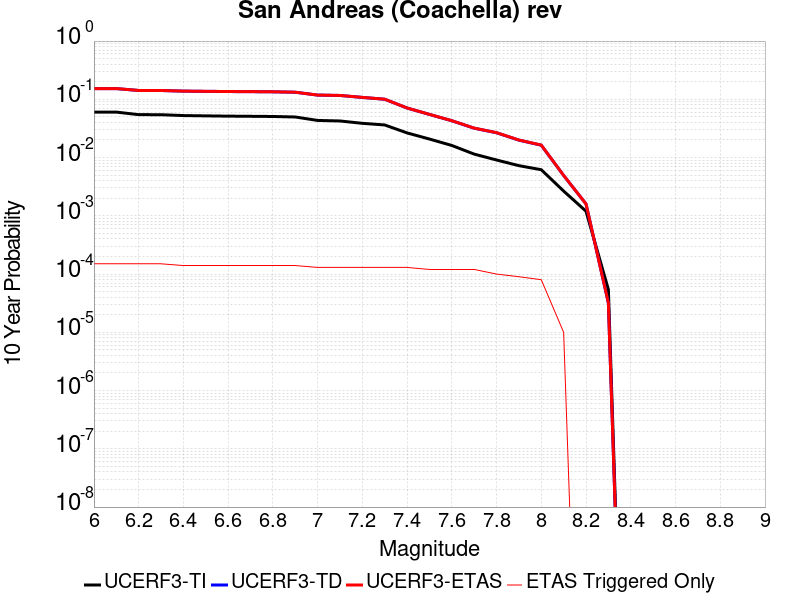 |

| Magnitude | 1 wk TI Prob | 1 wk TD Prob | 1 wk ETAS Prob | 1 wk ETAS/TD Gain | 1 wk ETAS Triggered Only | 1 mo TI Prob | 1 mo TD Prob | 1 mo ETAS Prob | 1 mo ETAS/TD Gain | 1 mo ETAS Triggered Only | 1 yr TI Prob | 1 yr TD Prob | 1 yr ETAS Prob | 1 yr ETAS/TD Gain | 1 yr ETAS Triggered Only | 10 yr TI Prob | 10 yr TD Prob | 10 yr ETAS Prob | 10 yr ETAS/TD Gain | 10 yr ETAS Triggered Only |
|-----|-----|-----|-----|-----|-----|-----|-----|-----|-----|-----|-----|-----|-----|-----|-----|-----|-----|-----|-----|-----|
| 6.0 | 1.1925945E-4 | 3.2739536E-4 | 3.373921E-4 | 1.0305341 | 1.0E-5 | 5.110118E-4 | 0.0014023732 | 0.001442317 | 1.028483 | 4.0E-5 | 0.0062038354 | 0.016941564 | 0.01701038 | 1.0040618 | 7.0E-5 | 0.060334753 | 0.15268843 | 0.15281554 | 1.0008324 | 1.5E-4 |
| 6.1 | 1.1925945E-4 | 3.2739536E-4 | 3.373921E-4 | 1.0305341 | 1.0E-5 | 5.110118E-4 | 0.0014023732 | 0.001442317 | 1.028483 | 4.0E-5 | 0.0062038354 | 0.016941564 | 0.01701038 | 1.0040618 | 7.0E-5 | 0.060334753 | 0.15268843 | 0.15281554 | 1.0008324 | 1.5E-4 |
| 6.2 | 1.07432395E-4 | 3.0240297E-4 | 3.1239993E-4 | 1.0330584 | 1.0E-5 | 4.603433E-4 | 0.001295373 | 0.0013353212 | 1.0308391 | 4.0E-5 | 0.005590286 | 0.015658218 | 0.015727123 | 1.0044005 | 7.0E-5 | 0.05451731 | 0.14186378 | 0.14199251 | 1.0009073 | 1.5E-4 |
| 6.3 | 1.0718766E-4 | 3.0185602E-4 | 3.11853E-4 | 1.0331184 | 1.0E-5 | 4.592948E-4 | 0.0012930313 | 0.0013329795 | 1.0308951 | 4.0E-5 | 0.005577586 | 0.015630117 | 0.015699023 | 1.0044085 | 7.0E-5 | 0.054396555 | 0.14163207 | 0.14176081 | 1.0009091 | 1.5E-4 |
| 6.4 | 1.0355944E-4 | 2.939367E-4 | 3.0393375E-4 | 1.0340109 | 1.0E-5 | 4.4375064E-4 | 0.0012591245 | 0.0012990742 | 1.0317281 | 4.0E-5 | 0.0053892885 | 0.015223142 | 0.015292076 | 1.0045283 | 7.0E-5 | 0.052604496 | 0.13819434 | 0.13831499 | 1.0008731 | 1.4E-4 |
| 6.5 | 1.0227914E-4 | 2.91131E-4 | 3.0112808E-4 | 1.0343388 | 1.0E-5 | 4.382655E-4 | 0.0012471116 | 0.0012870617 | 1.0320342 | 4.0E-5 | 0.0053228354 | 0.015078919 | 0.015147863 | 1.0045723 | 7.0E-5 | 0.051971316 | 0.13697878 | 0.13709961 | 1.000882 | 1.4E-4 |
| 6.6 | 1.0116757E-4 | 2.8878846E-4 | 2.9878557E-4 | 1.0346174 | 1.0E-5 | 4.3350324E-4 | 0.0012370817 | 0.0012770322 | 1.0322942 | 4.0E-5 | 0.0052651367 | 0.014958487 | 0.01502744 | 1.0046096 | 7.0E-5 | 0.051421247 | 0.13595718 | 0.13607815 | 1.0008898 | 1.4E-4 |
| 6.7 | 1.0050676E-4 | 2.8737405E-4 | 2.9737118E-4 | 1.0347879 | 1.0E-5 | 4.3067214E-4 | 0.0012310257 | 0.0012709765 | 1.0324532 | 4.0E-5 | 0.005230834 | 0.0148857655 | 0.014954723 | 1.0046325 | 7.0E-5 | 0.051094085 | 0.13534121 | 0.13546227 | 1.0008944 | 1.4E-4 |
| 6.8 | 9.976819E-5 | 2.854105E-4 | 2.9540763E-4 | 1.0350273 | 1.0E-5 | 4.2750788E-4 | 0.0012226184 | 0.0012625695 | 1.0326767 | 4.0E-5 | 0.0051924936 | 0.014784801 | 0.014853766 | 1.0046645 | 7.0E-5 | 0.050728295 | 0.13449258 | 0.13461375 | 1.000901 | 1.4E-4 |
| 6.9 | 9.77719E-5 | 2.8037897E-4 | 2.9037616E-4 | 1.035656 | 1.0E-5 | 4.1895514E-4 | 0.0012010747 | 0.0012410266 | 1.0332636 | 4.0E-5 | 0.0050888555 | 0.014526033 | 0.014595016 | 1.004749 | 7.0E-5 | 0.049738888 | 0.13232136 | 0.13244283 | 1.000918 | 1.4E-4 |
| 7.0 | 8.500761E-5 | 2.4771973E-4 | 2.5771724E-4 | 1.0403582 | 1.0E-5 | 3.6426744E-4 | 0.0010612272 | 0.0011011848 | 1.0376523 | 4.0E-5 | 0.0044259406 | 0.012844673 | 0.012903903 | 1.0046113 | 6.0E-5 | 0.04338823 | 0.11816954 | 0.11828417 | 1.0009701 | 1.3E-4 |
| 7.1 | 8.319876E-5 | 2.4374612E-4 | 2.5374367E-4 | 1.0410163 | 1.0E-5 | 3.5651738E-4 | 0.0010442112 | 0.0010841695 | 1.0382664 | 4.0E-5 | 0.004331963 | 0.012639927 | 0.012699168 | 1.0046868 | 6.0E-5 | 0.042484846 | 0.116389394 | 0.11650427 | 1.0009869 | 1.3E-4 |
| 7.2 | 7.563917E-5 | 2.2422783E-4 | 2.3422559E-4 | 1.0445875 | 1.0E-5 | 3.2412758E-4 | 9.606256E-4 | 0.0010005871 | 1.0415995 | 4.0E-5 | 0.0039391145 | 0.011633588 | 0.01169289 | 1.0050975 | 6.0E-5 | 0.03870018 | 0.10779512 | 0.10791111 | 1.001076 | 1.3E-4 |
| 7.3 | 7.082985E-5 | 2.0738597E-4 | 2.1738389E-4 | 1.0482093 | 1.0E-5 | 3.0352117E-4 | 8.8849716E-4 | 9.284616E-4 | 1.0449798 | 4.0E-5 | 0.0036891096 | 0.010764425 | 0.010823779 | 1.0055139 | 6.0E-5 | 0.03628465 | 0.10031737 | 0.100434326 | 1.0011659 | 1.3E-4 |
| 7.4 | 5.146215E-5 | 1.428086E-4 | 1.5280716E-4 | 1.0700138 | 1.0E-5 | 2.2053342E-4 | 6.118941E-4 | 6.518697E-4 | 1.0653307 | 4.0E-5 | 0.0026816884 | 0.007424553 | 0.0074841073 | 1.0080212 | 6.0E-5 | 0.02649557 | 0.07088264 | 0.07100343 | 1.001704 | 1.3E-4 |
| 7.5 | 4.0285166E-5 | 1.09477114E-4 | 1.1947602E-4 | 1.0913333 | 1.0E-5 | 1.7263928E-4 | 4.6910357E-4 | 5.090848E-4 | 1.085229 | 4.0E-5 | 0.002099857 | 0.005696449 | 0.005756107 | 1.0104729 | 6.0E-5 | 0.020801254 | 0.05503914 | 0.055152535 | 1.0020603 | 1.2E-4 |
| 7.6 | 3.1168736E-5 | 8.444301E-5 | 9.444216E-5 | 1.1184131 | 1.0E-5 | 1.3357346E-4 | 3.6184854E-4 | 4.0183406E-4 | 1.1105034 | 4.0E-5 | 0.0016250437 | 0.0043966332 | 0.0044563697 | 1.0135868 | 6.0E-5 | 0.016132116 | 0.042834383 | 0.04294924 | 1.0026815 | 1.2E-4 |
| 7.7 | 2.2100989E-5 | 6.243473E-5 | 7.243411E-5 | 1.1601573 | 1.0E-5 | 9.4715084E-5 | 2.6755E-4 | 3.075393E-4 | 1.1494647 | 4.0E-5 | 0.001152546 | 0.0032525621 | 0.003312367 | 1.018387 | 6.0E-5 | 0.011465867 | 0.031922176 | 0.032038346 | 1.0036391 | 1.2E-4 |
| 7.8 | 1.7484861E-5 | 5.1837636E-5 | 6.183712E-5 | 1.1929001 | 1.0E-5 | 7.493296E-5 | 2.2214241E-4 | 2.6213352E-4 | 1.1800246 | 4.0E-5 | 9.1192697E-4 | 0.0027012322 | 0.0027610702 | 1.0221521 | 6.0E-5 | 0.009081938 | 0.02665963 | 0.026756965 | 1.003651 | 1.0E-4 |
| 7.9 | 1.3967285E-5 | 3.8256338E-5 | 4.8255955E-5 | 1.2613846 | 1.0E-5 | 5.985842E-5 | 1.6394544E-4 | 2.0393888E-4 | 1.2439436 | 4.0E-5 | 7.2853256E-4 | 0.0019942096 | 0.0020441099 | 1.0250226 | 5.0E-5 | 0.0072614877 | 0.019925252 | 0.020013459 | 1.0044268 | 9.0E-5 |
| 8.0 | 1.1887396E-5 | 3.1093965E-5 | 4.109365E-5 | 1.3215958 | 1.0E-5 | 5.094499E-5 | 1.3325305E-4 | 1.6324905E-4 | 1.2251055 | 3.0E-5 | 6.200787E-4 | 0.0016211495 | 0.0016610846 | 1.0246339 | 4.0E-5 | 0.006183513 | 0.016292874 | 0.01637157 | 1.0048301 | 8.0E-5 |
| 8.1 | 5.100864E-6 | 8.984299E-6 | 8.984299E-6 | 1.0 | 0.0 | 2.1860664E-5 | 3.850357E-5 | 3.850357E-5 | 1.0 | 0.0 | 2.6612106E-4 | 4.6868026E-4 | 4.6868026E-4 | 1.0 | 0.0 | 0.002658026 | 0.004923118 | 0.0049330685 | 1.0020212 | 1.0E-5 |
| 8.2 | 2.3004484E-6 | 2.7905796E-6 | 2.7905796E-6 | 1.0 | 0.0 | 9.859027E-6 | 1.19595725E-5 | 1.19595725E-5 | 1.0 | 0.0 | 1.2002704E-4 | 1.455981E-4 | 1.455981E-4 | 1.0 | 0.0 | 0.0011996223 | 0.0015995341 | 0.0015995341 | 1.0 | 0.0 |
| 8.3 | 1.0424446E-7 | 5.8260742E-8 | 5.8260742E-8 | 1.0 | 0.0 | 4.4676187E-7 | 2.4968887E-7 | 2.4968887E-7 | 1.0 | 0.0 | 5.439312E-6 | 3.039958E-6 | 3.039958E-6 | 1.0 | 0.0 | 5.4391792E-5 | 3.195788E-5 | 3.195788E-5 | 1.0 | 0.0 |

## Ludlow
*[(top)](#table-of-contents)*

| 1 Week | 1 Month | 1 Year | 10 Year |
|-----|-----|-----|-----|
|  |  |  |  |

| Magnitude | 1 wk TI Prob | 1 wk TD Prob | 1 wk ETAS Prob | 1 wk ETAS/TD Gain | 1 wk ETAS Triggered Only | 1 mo TI Prob | 1 mo TD Prob | 1 mo ETAS Prob | 1 mo ETAS/TD Gain | 1 mo ETAS Triggered Only | 1 yr TI Prob | 1 yr TD Prob | 1 yr ETAS Prob | 1 yr ETAS/TD Gain | 1 yr ETAS Triggered Only | 10 yr TI Prob | 10 yr TD Prob | 10 yr ETAS Prob | 10 yr ETAS/TD Gain | 10 yr ETAS Triggered Only |
|-----|-----|-----|-----|-----|-----|-----|-----|-----|-----|-----|-----|-----|-----|-----|-----|-----|-----|-----|-----|-----|
| 6.0 | 2.2407607E-5 | 2.3657603E-5 | 3.365737E-5 | 1.422687 | 1.0E-5 | 9.602906E-5 | 1.0138604E-4 | 1.1138502E-4 | 1.0986229 | 1.0E-5 | 0.0011685267 | 0.0012337202 | 0.0013036338 | 1.056669 | 7.0E-5 | 0.011624013 | 0.012273222 | 0.012421382 | 1.0120717 | 1.5E-4 |
| 6.1 | 2.2407607E-5 | 2.3657603E-5 | 3.365737E-5 | 1.422687 | 1.0E-5 | 9.602906E-5 | 1.0138604E-4 | 1.1138502E-4 | 1.0986229 | 1.0E-5 | 0.0011685267 | 0.0012337202 | 0.0013036338 | 1.056669 | 7.0E-5 | 0.011624013 | 0.012273222 | 0.012421382 | 1.0120717 | 1.5E-4 |
| 6.2 | 1.0781252E-5 | 1.1365827E-5 | 1.1365827E-5 | 1.0 | 0.0 | 4.620455E-5 | 4.87098E-5 | 4.87098E-5 | 1.0 | 0.0 | 5.623952E-4 | 5.928845E-4 | 6.228667E-4 | 1.0505701 | 3.0E-5 | 0.00560974 | 0.005913446 | 0.0059830323 | 1.0117674 | 7.0E-5 |
| 6.3 | 1.0781252E-5 | 1.1365827E-5 | 1.1365827E-5 | 1.0 | 0.0 | 4.620455E-5 | 4.87098E-5 | 4.87098E-5 | 1.0 | 0.0 | 5.623952E-4 | 5.928845E-4 | 6.228667E-4 | 1.0505701 | 3.0E-5 | 0.00560974 | 0.005913446 | 0.0059830323 | 1.0117674 | 7.0E-5 |
| 6.4 | 7.814439E-6 | 8.237847E-6 | 8.237847E-6 | 1.0 | 0.0 | 3.3490025E-5 | 3.530459E-5 | 3.530459E-5 | 1.0 | 0.0 | 4.0766477E-4 | 4.2975E-4 | 4.5973712E-4 | 1.0697781 | 3.0E-5 | 0.0040691774 | 0.004289336 | 0.0043490785 | 1.0139282 | 6.0E-5 |
| 6.5 | 6.4986366E-6 | 6.851018E-6 | 6.851018E-6 | 1.0 | 0.0 | 2.7851002E-5 | 2.9361181E-5 | 2.9361181E-5 | 1.0 | 0.0 | 3.390332E-4 | 3.5741468E-4 | 3.8740394E-4 | 1.0839062 | 3.0E-5 | 0.003385164 | 0.0035684945 | 0.0036282805 | 1.0167538 | 6.0E-5 |
| 6.6 | 5.582177E-6 | 5.8860905E-6 | 5.8860905E-6 | 1.0 | 0.0 | 2.3923398E-5 | 2.5225863E-5 | 2.5225863E-5 | 1.0 | 0.0 | 2.9122844E-4 | 3.0708231E-4 | 3.1707925E-4 | 1.0325545 | 1.0E-5 | 0.0029084706 | 0.0030666532 | 0.0031065305 | 1.0130036 | 4.0E-5 |
| 6.7 | 4.6858763E-6 | 4.9404985E-6 | 4.9404985E-6 | 1.0 | 0.0 | 2.0082172E-5 | 2.1173397E-5 | 2.1173397E-5 | 1.0 | 0.0 | 2.4447302E-4 | 2.5775615E-4 | 2.6775358E-4 | 1.0387864 | 1.0E-5 | 0.0024420423 | 0.0025746285 | 0.0026145254 | 1.0154963 | 4.0E-5 |
| 6.8 | 3.5584908E-6 | 3.7520724E-6 | 3.7520724E-6 | 1.0 | 0.0 | 1.5250586E-5 | 1.6080214E-5 | 1.6080214E-5 | 1.0 | 0.0 | 1.8566006E-4 | 1.9575942E-4 | 2.0575747E-4 | 1.0510731 | 1.0E-5 | 0.0018550502 | 0.0019559108 | 0.0019858521 | 1.0153081 | 3.0E-5 |
| 6.9 | 2.532834E-6 | 2.671042E-6 | 2.671042E-6 | 1.0 | 0.0 | 1.0854958E-5 | 1.1447275E-5 | 1.1447275E-5 | 1.0 | 0.0 | 1.3215111E-4 | 1.3936193E-4 | 1.4936054E-4 | 1.0717456 | 1.0E-5 | 0.0013207254 | 0.001392773 | 0.0014127451 | 1.0143398 | 2.0E-5 |
| 7.0 | 1.7083285E-6 | 1.80197E-6 | 1.80197E-6 | 1.0 | 0.0 | 7.3213873E-6 | 7.722707E-6 | 7.722707E-6 | 1.0 | 0.0 | 8.913424E-5 | 9.402007E-5 | 1.0401913E-4 | 1.1063503 | 1.0E-5 | 8.9098496E-4 | 9.398194E-4 | 9.598006E-4 | 1.0212607 | 2.0E-5 |
| 7.1 | 1.0905424E-6 | 1.1497785E-6 | 1.1497785E-6 | 1.0 | 0.0 | 4.6737446E-6 | 4.9276136E-6 | 4.9276136E-6 | 1.0 | 0.0 | 5.6901354E-5 | 5.9992144E-5 | 6.999154E-5 | 1.1666785 | 1.0E-5 | 5.6886784E-4 | 5.9976924E-4 | 6.197573E-4 | 1.0333261 | 2.0E-5 |
| 7.2 | 6.06668E-7 | 6.387367E-7 | 6.387367E-7 | 1.0 | 0.0 | 2.600003E-6 | 2.7374406E-6 | 2.7374406E-6 | 1.0 | 0.0 | 3.1654577E-5 | 3.33279E-5 | 3.33279E-5 | 1.0 | 0.0 | 3.1650066E-4 | 3.3323586E-4 | 3.3323586E-4 | 1.0 | 0.0 |

## San Jacinto (San Bernardino)
*[(top)](#table-of-contents)*

| 1 Week | 1 Month | 1 Year | 10 Year |
|-----|-----|-----|-----|
|  |  |  |  |

| Magnitude | 1 wk TI Prob | 1 wk TD Prob | 1 wk ETAS Prob | 1 wk ETAS/TD Gain | 1 wk ETAS Triggered Only | 1 mo TI Prob | 1 mo TD Prob | 1 mo ETAS Prob | 1 mo ETAS/TD Gain | 1 mo ETAS Triggered Only | 1 yr TI Prob | 1 yr TD Prob | 1 yr ETAS Prob | 1 yr ETAS/TD Gain | 1 yr ETAS Triggered Only | 10 yr TI Prob | 10 yr TD Prob | 10 yr ETAS Prob | 10 yr ETAS/TD Gain | 10 yr ETAS Triggered Only |
|-----|-----|-----|-----|-----|-----|-----|-----|-----|-----|-----|-----|-----|-----|-----|-----|-----|-----|-----|-----|-----|
| 6.0 | 3.409352E-5 | 3.6017656E-5 | 3.6017656E-5 | 1.0 | 0.0 | 1.461069E-4 | 1.5435227E-4 | 1.6435071E-4 | 1.0647769 | 1.0E-5 | 0.0017774 | 0.0018776206 | 0.0019474891 | 1.0372112 | 7.0E-5 | 0.01763251 | 0.019365437 | 0.019492919 | 1.006583 | 1.3E-4 |
| 6.1 | 3.409352E-5 | 3.6017656E-5 | 3.6017656E-5 | 1.0 | 0.0 | 1.461069E-4 | 1.5435227E-4 | 1.6435071E-4 | 1.0647769 | 1.0E-5 | 0.0017774 | 0.0018776206 | 0.0019474891 | 1.0372112 | 7.0E-5 | 0.01763251 | 0.019365437 | 0.019492919 | 1.006583 | 1.3E-4 |
| 6.2 | 3.409352E-5 | 3.6017656E-5 | 3.6017656E-5 | 1.0 | 0.0 | 1.461069E-4 | 1.5435227E-4 | 1.6435071E-4 | 1.0647769 | 1.0E-5 | 0.0017774 | 0.0018776206 | 0.0019474891 | 1.0372112 | 7.0E-5 | 0.01763251 | 0.019365437 | 0.019492919 | 1.006583 | 1.3E-4 |
| 6.3 | 3.409352E-5 | 3.6017656E-5 | 3.6017656E-5 | 1.0 | 0.0 | 1.461069E-4 | 1.5435227E-4 | 1.6435071E-4 | 1.0647769 | 1.0E-5 | 0.0017774 | 0.0018776206 | 0.0019474891 | 1.0372112 | 7.0E-5 | 0.01763251 | 0.019365437 | 0.019492919 | 1.006583 | 1.3E-4 |
| 6.4 | 3.400795E-5 | 3.5910314E-5 | 3.5910314E-5 | 1.0 | 0.0 | 1.4574021E-4 | 1.5389228E-4 | 1.6389074E-4 | 1.0649705 | 1.0E-5 | 0.0017729428 | 0.00187203 | 0.001941899 | 1.0373225 | 7.0E-5 | 0.017588645 | 0.019310515 | 0.019438006 | 1.006602 | 1.3E-4 |
| 6.5 | 3.341482E-5 | 3.5170895E-5 | 3.5170895E-5 | 1.0 | 0.0 | 1.4319851E-4 | 1.507237E-4 | 1.6072221E-4 | 1.0663365 | 1.0E-5 | 0.0017420477 | 0.0018335179 | 0.0019033896 | 1.038108 | 7.0E-5 | 0.017284546 | 0.018932039 | 0.019059578 | 1.0067366 | 1.3E-4 |
| 6.6 | 3.3364955E-5 | 3.510811E-5 | 3.510811E-5 | 1.0 | 0.0 | 1.4298483E-4 | 1.5045465E-4 | 1.6045316E-4 | 1.0664552 | 1.0E-5 | 0.0017394501 | 0.0018302478 | 0.0019001197 | 1.0381762 | 7.0E-5 | 0.017258976 | 0.0188999 | 0.019027445 | 1.0067483 | 1.3E-4 |
| 6.7 | 3.335922E-5 | 3.509788E-5 | 3.509788E-5 | 1.0 | 0.0 | 1.4296026E-4 | 1.5041084E-4 | 1.6040933E-4 | 1.0664746 | 1.0E-5 | 0.0017391514 | 0.0018297151 | 0.0018995871 | 1.0381873 | 7.0E-5 | 0.017256035 | 0.018894693 | 0.019022236 | 1.0067502 | 1.3E-4 |
| 6.8 | 3.327683E-5 | 3.499194E-5 | 3.499194E-5 | 1.0 | 0.0 | 1.4260718E-4 | 1.4995685E-4 | 1.5995535E-4 | 1.0666759 | 1.0E-5 | 0.0017348597 | 0.0018241971 | 0.0018940695 | 1.038303 | 7.0E-5 | 0.017213784 | 0.01884046 | 0.018968012 | 1.00677 | 1.3E-4 |
| 6.9 | 3.3235785E-5 | 3.493289E-5 | 3.493289E-5 | 1.0 | 0.0 | 1.4243131E-4 | 1.497038E-4 | 1.5970231E-4 | 1.0667886 | 1.0E-5 | 0.0017327217 | 0.0018211214 | 0.001890994 | 1.0383679 | 7.0E-5 | 0.017192734 | 0.018810328 | 0.018937882 | 1.0067811 | 1.3E-4 |
| 7.0 | 3.3197095E-5 | 3.4872814E-5 | 3.4872814E-5 | 1.0 | 0.0 | 1.422655E-4 | 1.4944636E-4 | 1.5944487E-4 | 1.0669036 | 1.0E-5 | 0.0017307063 | 0.0018179924 | 0.0018878651 | 1.038434 | 7.0E-5 | 0.017172894 | 0.018779702 | 0.018907262 | 1.0067924 | 1.3E-4 |
| 7.1 | 3.3129716E-5 | 3.475301E-5 | 3.475301E-5 | 1.0 | 0.0 | 1.4197677E-4 | 1.4893297E-4 | 1.5893148E-4 | 1.0671343 | 1.0E-5 | 0.0017271966 | 0.0018117523 | 0.0018816255 | 1.0385666 | 7.0E-5 | 0.017138338 | 0.018718773 | 0.01884634 | 1.006815 | 1.3E-4 |
| 7.2 | 3.3034008E-5 | 3.4620447E-5 | 3.4620447E-5 | 1.0 | 0.0 | 1.4156665E-4 | 1.4836491E-4 | 1.5836343E-4 | 1.0673914 | 1.0E-5 | 0.0017222111 | 0.0018048476 | 0.0018747213 | 1.0387144 | 7.0E-5 | 0.017089253 | 0.01865115 | 0.018778725 | 1.0068401 | 1.3E-4 |
| 7.3 | 3.2956614E-5 | 3.448818E-5 | 3.448818E-5 | 1.0 | 0.0 | 1.4123498E-4 | 1.4779813E-4 | 1.5779665E-4 | 1.0676498 | 1.0E-5 | 0.0017181796 | 0.0017979584 | 0.0018678325 | 1.0388631 | 7.0E-5 | 0.017049557 | 0.018583901 | 0.018711485 | 1.0068653 | 1.3E-4 |
| 7.4 | 3.2915937E-5 | 3.440986E-5 | 3.440986E-5 | 1.0 | 0.0 | 1.4106068E-4 | 1.4746249E-4 | 1.5746102E-4 | 1.0678039 | 1.0E-5 | 0.0017160608 | 0.0017938789 | 0.0018637533 | 1.0389516 | 7.0E-5 | 0.017028693 | 0.018544154 | 0.018671744 | 1.0068803 | 1.3E-4 |
| 7.5 | 3.281791E-5 | 3.4274748E-5 | 3.4274748E-5 | 1.0 | 0.0 | 1.406406E-4 | 1.4688351E-4 | 1.5688204E-4 | 1.0680711 | 1.0E-5 | 0.0017109542 | 0.0017868413 | 0.0018567162 | 1.0391053 | 7.0E-5 | 0.016978411 | 0.018475033 | 0.018602632 | 1.0069065 | 1.3E-4 |
| 7.6 | 3.2521442E-5 | 3.3999644E-5 | 3.3999644E-5 | 1.0 | 0.0 | 1.3937015E-4 | 1.4570463E-4 | 1.5570318E-4 | 1.068622 | 1.0E-5 | 0.0016955109 | 0.001772512 | 0.0018423878 | 1.039422 | 7.0E-5 | 0.016826328 | 0.018332649 | 0.018460264 | 1.0069612 | 1.3E-4 |
| 7.7 | 3.0287873E-5 | 3.248334E-5 | 3.248334E-5 | 1.0 | 0.0 | 1.297987E-4 | 1.392069E-4 | 1.492055E-4 | 1.0718255 | 1.0E-5 | 0.0015791537 | 0.0016935276 | 0.001763409 | 1.0412638 | 7.0E-5 | 0.01567979 | 0.017543579 | 0.017671298 | 1.0072801 | 1.3E-4 |
| 7.8 | 2.6316151E-5 | 2.9693107E-5 | 2.9693107E-5 | 1.0 | 0.0 | 1.1277862E-4 | 1.2724998E-4 | 1.372487E-4 | 1.0785755 | 1.0E-5 | 0.0013722149 | 0.0015481684 | 0.00161806 | 1.0451447 | 7.0E-5 | 0.013637724 | 0.016084712 | 0.01621262 | 1.0079522 | 1.3E-4 |
| 7.9 | 2.0761147E-5 | 2.344367E-5 | 2.344367E-5 | 1.0 | 0.0 | 8.897331E-5 | 1.00469006E-4 | 1.10468005E-4 | 1.0995232 | 1.0E-5 | 0.0010827117 | 0.0012225247 | 0.0012824513 | 1.0490187 | 6.0E-5 | 0.010774517 | 0.012806525 | 0.012924989 | 1.0092502 | 1.2E-4 |
| 8.0 | 1.5738568E-5 | 1.6052336E-5 | 1.6052336E-5 | 1.0 | 0.0 | 6.744926E-5 | 6.879392E-5 | 6.879392E-5 | 1.0 | 0.0 | 8.2088535E-4 | 8.372448E-4 | 8.5722806E-4 | 1.0238678 | 2.0E-5 | 0.008178596 | 0.008875951 | 0.008935419 | 1.0066998 | 6.0E-5 |
| 8.1 | 1.0105832E-5 | 8.34097E-6 | 8.34097E-6 | 1.0 | 0.0 | 4.3309992E-5 | 3.574653E-5 | 3.574653E-5 | 1.0 | 0.0 | 5.2717153E-4 | 4.3512761E-4 | 4.4512327E-4 | 1.0229717 | 1.0E-5 | 0.005259227 | 0.0046830093 | 0.004712869 | 1.0063761 | 3.0E-5 |
| 8.2 | 4.189207E-6 | 1.5810579E-6 | 1.5810579E-6 | 1.0 | 0.0 | 1.7953622E-5 | 6.7759447E-6 | 6.7759447E-6 | 1.0 | 0.0 | 2.1856341E-4 | 8.249403E-5 | 8.249403E-5 | 1.0 | 0.0 | 0.0021834858 | 9.581067E-4 | 9.581067E-4 | 1.0 | 0.0 |
| 8.3 | 1.2758221E-6 | 3.6216503E-7 | 3.6216503E-7 | 1.0 | 0.0 | 5.4677976E-6 | 1.5521349E-6 | 1.5521349E-6 | 1.0 | 0.0 | 6.65684E-5 | 1.8897083E-5 | 1.8897083E-5 | 1.0 | 0.0 | 6.6548464E-4 | 2.2791658E-4 | 2.2791658E-4 | 1.0 | 0.0 |

## San Andreas (North Branch Mill Creek)
*[(top)](#table-of-contents)*

| 1 Week | 1 Month | 1 Year | 10 Year |
|-----|-----|-----|-----|
|  |  |  |  |

| Magnitude | 1 wk TI Prob | 1 wk TD Prob | 1 wk ETAS Prob | 1 wk ETAS/TD Gain | 1 wk ETAS Triggered Only | 1 mo TI Prob | 1 mo TD Prob | 1 mo ETAS Prob | 1 mo ETAS/TD Gain | 1 mo ETAS Triggered Only | 1 yr TI Prob | 1 yr TD Prob | 1 yr ETAS Prob | 1 yr ETAS/TD Gain | 1 yr ETAS Triggered Only | 10 yr TI Prob | 10 yr TD Prob | 10 yr ETAS Prob | 10 yr ETAS/TD Gain | 10 yr ETAS Triggered Only |
|-----|-----|-----|-----|-----|-----|-----|-----|-----|-----|-----|-----|-----|-----|-----|-----|-----|-----|-----|-----|-----|
| 6.0 | 1.3461156E-5 | 2.3514773E-5 | 2.3514773E-5 | 1.0 | 0.0 | 5.7689394E-5 | 1.0077372E-4 | 1.2077171E-4 | 1.1984445 | 2.0E-5 | 7.02142E-4 | 0.0012262329 | 0.0012761715 | 1.0407252 | 5.0E-5 | 0.0069992766 | 0.0122376345 | 0.012366044 | 1.0104929 | 1.3E-4 |
| 6.1 | 1.3461156E-5 | 2.3514773E-5 | 2.3514773E-5 | 1.0 | 0.0 | 5.7689394E-5 | 1.0077372E-4 | 1.2077171E-4 | 1.1984445 | 2.0E-5 | 7.02142E-4 | 0.0012262329 | 0.0012761715 | 1.0407252 | 5.0E-5 | 0.0069992766 | 0.0122376345 | 0.012366044 | 1.0104929 | 1.3E-4 |
| 6.2 | 1.3461156E-5 | 2.3514773E-5 | 2.3514773E-5 | 1.0 | 0.0 | 5.7689394E-5 | 1.0077372E-4 | 1.2077171E-4 | 1.1984445 | 2.0E-5 | 7.02142E-4 | 0.0012262329 | 0.0012761715 | 1.0407252 | 5.0E-5 | 0.0069992766 | 0.0122376345 | 0.012366044 | 1.0104929 | 1.3E-4 |
| 6.3 | 1.3461156E-5 | 2.3514773E-5 | 2.3514773E-5 | 1.0 | 0.0 | 5.7689394E-5 | 1.0077372E-4 | 1.2077171E-4 | 1.1984445 | 2.0E-5 | 7.02142E-4 | 0.0012262329 | 0.0012761715 | 1.0407252 | 5.0E-5 | 0.0069992766 | 0.0122376345 | 0.012366044 | 1.0104929 | 1.3E-4 |
| 6.4 | 1.3461156E-5 | 2.3514773E-5 | 2.3514773E-5 | 1.0 | 0.0 | 5.7689394E-5 | 1.0077372E-4 | 1.2077171E-4 | 1.1984445 | 2.0E-5 | 7.02142E-4 | 0.0012262329 | 0.0012761715 | 1.0407252 | 5.0E-5 | 0.0069992766 | 0.0122376345 | 0.012366044 | 1.0104929 | 1.3E-4 |
| 6.5 | 1.3450706E-5 | 2.3503731E-5 | 2.3503731E-5 | 1.0 | 0.0 | 5.764461E-5 | 1.0072641E-4 | 1.207244E-4 | 1.1985377 | 2.0E-5 | 7.0159714E-4 | 0.0012256574 | 0.0012755962 | 1.0407444 | 5.0E-5 | 0.006993862 | 0.012231944 | 0.012360354 | 1.0104979 | 1.3E-4 |
| 6.6 | 1.3074523E-5 | 2.3118011E-5 | 2.3118011E-5 | 1.0 | 0.0 | 5.6032466E-5 | 9.907345E-5 | 1.1907147E-4 | 1.2018504 | 2.0E-5 | 6.8198174E-4 | 0.001205555 | 0.0012554947 | 1.0414246 | 5.0E-5 | 0.006798926 | 0.01203311 | 0.0121615445 | 1.0106735 | 1.3E-4 |
| 6.7 | 1.3050216E-5 | 2.3093307E-5 | 2.3093307E-5 | 1.0 | 0.0 | 5.59283E-5 | 9.896758E-5 | 1.189656E-4 | 1.2020664 | 2.0E-5 | 6.8071426E-4 | 0.0012042675 | 0.0012542073 | 1.041469 | 5.0E-5 | 0.0067863287 | 0.012020374 | 0.0121488115 | 1.010685 | 1.3E-4 |
| 6.8 | 1.29049395E-5 | 2.2941715E-5 | 2.2941715E-5 | 1.0 | 0.0 | 5.530571E-5 | 9.831794E-5 | 1.1831598E-4 | 1.2034017 | 2.0E-5 | 6.73139E-4 | 0.0011963669 | 0.001246307 | 1.0417432 | 5.0E-5 | 0.0067110364 | 0.011942218 | 0.012070665 | 1.0107558 | 1.3E-4 |
| 6.9 | 1.2867369E-5 | 2.2901115E-5 | 2.2901115E-5 | 1.0 | 0.0 | 5.51447E-5 | 9.814396E-5 | 1.18142E-4 | 1.2037623 | 2.0E-5 | 6.711799E-4 | 0.001194251 | 0.0012441912 | 1.0418172 | 5.0E-5 | 0.006691564 | 0.011921287 | 0.012049736 | 1.0107749 | 1.3E-4 |
| 7.0 | 1.2495996E-5 | 2.2301027E-5 | 2.2301027E-5 | 1.0 | 0.0 | 5.3553173E-5 | 9.557234E-5 | 1.1557043E-4 | 1.2092456 | 2.0E-5 | 6.518148E-4 | 0.001162975 | 0.0012129168 | 1.0429432 | 5.0E-5 | 0.0064990623 | 0.011611806 | 0.011740297 | 1.0110655 | 1.3E-4 |
| 7.1 | 1.2452067E-5 | 2.2246093E-5 | 2.2246093E-5 | 1.0 | 0.0 | 5.3364907E-5 | 9.533693E-5 | 1.15335024E-4 | 1.2097623 | 2.0E-5 | 6.4952404E-4 | 0.0011601119 | 0.0012100539 | 1.0430493 | 5.0E-5 | 0.0064762887 | 0.011583474 | 0.011711969 | 1.0110929 | 1.3E-4 |
| 7.2 | 1.2002777E-5 | 2.162457E-5 | 2.162457E-5 | 1.0 | 0.0 | 5.143946E-5 | 9.267345E-5 | 1.126716E-4 | 1.2157916 | 2.0E-5 | 6.2609545E-4 | 0.0011277179 | 0.0011676728 | 1.0354298 | 4.0E-5 | 0.006243344 | 0.011262866 | 0.011381514 | 1.0105345 | 1.2E-4 |
| 7.3 | 1.1923425E-5 | 2.1494381E-5 | 2.1494381E-5 | 1.0 | 0.0 | 5.109939E-5 | 9.211554E-5 | 1.12113696E-4 | 1.2170986 | 2.0E-5 | 6.219575E-4 | 0.0011209323 | 0.0011608875 | 1.0356445 | 4.0E-5 | 0.0062021962 | 0.011195713 | 0.01131437 | 1.0105984 | 1.2E-4 |
| 7.4 | 1.16105175E-5 | 2.0868214E-5 | 2.0868214E-5 | 1.0 | 0.0 | 4.975841E-5 | 8.943215E-5 | 1.0943036E-4 | 1.2236133 | 2.0E-5 | 6.0564023E-4 | 0.0010882951 | 0.0011282515 | 1.0367148 | 4.0E-5 | 0.006039923 | 0.0108732525 | 0.010991948 | 1.0109162 | 1.2E-4 |
| 7.5 | 1.1037265E-5 | 1.9567837E-5 | 1.9567837E-5 | 1.0 | 0.0 | 4.7301706E-5 | 8.385947E-5 | 1.038578E-4 | 1.2384742 | 2.0E-5 | 5.757461E-4 | 0.001020513 | 0.0010604722 | 1.039156 | 4.0E-5 | 0.005742567 | 0.010201886 | 0.0103206625 | 1.0116426 | 1.2E-4 |
| 7.6 | 1.0720915E-5 | 1.9009563E-5 | 1.9009563E-5 | 1.0 | 0.0 | 4.5945973E-5 | 8.146702E-5 | 1.0146539E-4 | 1.2454782 | 2.0E-5 | 5.592486E-4 | 9.914119E-4 | 0.0010313722 | 1.0403064 | 4.0E-5 | 0.005578433 | 0.009913518 | 0.010032328 | 1.0119847 | 1.2E-4 |
| 7.7 | 9.276279E-6 | 1.6454693E-5 | 1.6454693E-5 | 1.0 | 0.0 | 3.9754876E-5 | 7.051822E-5 | 9.0516805E-5 | 1.2835946 | 2.0E-5 | 4.839081E-4 | 8.582228E-4 | 8.9818845E-4 | 1.0465679 | 4.0E-5 | 0.0048285574 | 0.008592619 | 0.008711588 | 1.0138454 | 1.2E-4 |
| 7.8 | 5.8346777E-6 | 1.116552E-5 | 1.116552E-5 | 1.0 | 0.0 | 2.5005522E-5 | 4.785135E-5 | 6.785039E-5 | 1.4179411 | 2.0E-5 | 3.043997E-4 | 5.824346E-4 | 6.1241706E-4 | 1.0514779 | 3.0E-5 | 0.0030398308 | 0.0058521912 | 0.0059516057 | 1.0169876 | 1.0E-4 |
| 7.9 | 4.690204E-6 | 8.517765E-6 | 8.517765E-6 | 1.0 | 0.0 | 2.0100719E-5 | 3.65042E-5 | 5.6503468E-5 | 1.5478622 | 2.0E-5 | 2.4469878E-4 | 4.443481E-4 | 4.7433475E-4 | 1.0674846 | 3.0E-5 | 0.002444295 | 0.0044750543 | 0.0045746067 | 1.0222461 | 1.0E-4 |
| 8.0 | 2.9570454E-6 | 4.8521483E-6 | 4.8521483E-6 | 1.0 | 0.0 | 1.267299E-5 | 2.0794756E-5 | 3.079455E-5 | 1.4808805 | 1.0E-5 | 1.5428272E-4 | 2.5314675E-4 | 2.6314423E-4 | 1.0394927 | 1.0E-5 | 0.0015417566 | 0.002552167 | 0.002572116 | 1.0078164 | 2.0E-5 |
| 8.1 | 1.6376824E-6 | 2.1995234E-6 | 2.1995234E-6 | 1.0 | 0.0 | 7.01862E-6 | 9.426494E-6 | 9.426494E-6 | 1.0 | 0.0 | 8.544835E-5 | 1.1476154E-4 | 1.1476154E-4 | 1.0 | 0.0 | 8.54155E-4 | 0.0011619888 | 0.0011619888 | 1.0 | 0.0 |
| 8.2 | 6.9631557E-7 | 4.5432475E-7 | 4.5432475E-7 | 1.0 | 0.0 | 2.984206E-6 | 1.9471045E-6 | 1.9471045E-6 | 1.0 | 0.0 | 3.63321E-5 | 2.3705741E-5 | 2.3705741E-5 | 1.0 | 0.0 | 3.6326164E-4 | 2.455427E-4 | 2.455427E-4 | 1.0 | 0.0 |
| 8.3 | 1.7876137E-7 | 8.374275E-8 | 8.374275E-8 | 1.0 | 0.0 | 7.661199E-7 | 3.5889744E-7 | 3.5889744E-7 | 1.0 | 0.0 | 9.32747E-6 | 4.3695677E-6 | 4.3695677E-6 | 1.0 | 0.0 | 9.3270784E-5 | 4.5888766E-5 | 4.5888766E-5 | 1.0 | 0.0 |

## San Andreas (Creeping Section) 2011 CFM
*[(top)](#table-of-contents)*

| 1 Week | 1 Month | 1 Year | 10 Year |
|-----|-----|-----|-----|
|  |  |  |  |

| Magnitude | 1 wk TI Prob | 1 wk TD Prob | 1 wk ETAS Prob | 1 wk ETAS/TD Gain | 1 wk ETAS Triggered Only | 1 mo TI Prob | 1 mo TD Prob | 1 mo ETAS Prob | 1 mo ETAS/TD Gain | 1 mo ETAS Triggered Only | 1 yr TI Prob | 1 yr TD Prob | 1 yr ETAS Prob | 1 yr ETAS/TD Gain | 1 yr ETAS Triggered Only | 10 yr TI Prob | 10 yr TD Prob | 10 yr ETAS Prob | 10 yr ETAS/TD Gain | 10 yr ETAS Triggered Only |
|-----|-----|-----|-----|-----|-----|-----|-----|-----|-----|-----|-----|-----|-----|-----|-----|-----|-----|-----|-----|-----|
| 6.0 | 5.986481E-4 | 0.001227926 | 0.001227926 | 1.0 | 0.0 | 0.0025631124 | 0.005246888 | 0.0052767303 | 1.0056877 | 3.0E-5 | 0.030762846 | 0.06122059 | 0.061276916 | 1.00092 | 6.0E-5 | 0.26835477 | 0.42601058 | 0.4260852 | 1.0001751 | 1.3E-4 |
| 6.1 | 5.015945E-4 | 0.0010220862 | 0.0010220862 | 1.0 | 0.0 | 0.00214792 | 0.0043690135 | 0.0043988824 | 1.0068365 | 3.0E-5 | 0.025839351 | 0.051262088 | 0.051300038 | 1.0007403 | 4.0E-5 | 0.23032776 | 0.37293068 | 0.37299967 | 1.000185 | 1.1E-4 |
| 6.2 | 4.073338E-4 | 8.110229E-4 | 8.110229E-4 | 1.0 | 0.0 | 0.0017445484 | 0.0034683056 | 0.0034982015 | 1.0086198 | 3.0E-5 | 0.021034058 | 0.040946886 | 0.04098525 | 1.0009369 | 4.0E-5 | 0.19150782 | 0.31311473 | 0.31319028 | 1.0002413 | 1.1E-4 |
| 6.3 | 3.464099E-4 | 6.742069E-4 | 6.742069E-4 | 1.0 | 0.0 | 0.0014837692 | 0.0028841295 | 0.002914043 | 1.0103718 | 3.0E-5 | 0.017915873 | 0.034203418 | 0.03424205 | 1.0011295 | 4.0E-5 | 0.16538359 | 0.27140266 | 0.27148283 | 1.0002953 | 1.1E-4 |
| 6.4 | 2.935057E-4 | 5.547193E-4 | 5.547193E-4 | 1.0 | 0.0 | 0.0012572751 | 0.0023737086 | 0.0024036376 | 1.0126084 | 3.0E-5 | 0.015200248 | 0.028278474 | 0.028317343 | 1.0013745 | 4.0E-5 | 0.14201577 | 0.2330761 | 0.23316045 | 1.0003619 | 1.1E-4 |
| 6.5 | 2.3409708E-4 | 4.2121377E-4 | 4.2121377E-4 | 1.0 | 0.0 | 0.0010028875 | 0.0018031459 | 0.0018330918 | 1.0166076 | 3.0E-5 | 0.012141965 | 0.021601515 | 0.02164065 | 1.0018117 | 4.0E-5 | 0.11499573 | 0.18691997 | 0.18700941 | 1.0004785 | 1.1E-4 |
| 6.6 | 1.5842178E-4 | 2.509662E-4 | 2.509662E-4 | 1.0 | 0.0 | 6.7877385E-4 | 0.0010751196 | 0.0011050873 | 1.0278739 | 3.0E-5 | 0.0082328 | 0.013009676 | 0.0130491555 | 1.0030346 | 4.0E-5 | 0.07934396 | 0.123249836 | 0.123346284 | 1.0007825 | 1.1E-4 |
| 6.7 | 1.5616413E-4 | 2.4633115E-4 | 2.4633115E-4 | 1.0 | 0.0 | 6.691031E-4 | 0.0010552738 | 0.0010852421 | 1.0283986 | 3.0E-5 | 0.0081159435 | 0.01277153 | 0.012811019 | 1.0030919 | 4.0E-5 | 0.0782586 | 0.12127697 | 0.12137362 | 1.000797 | 1.1E-4 |
| 6.8 | 1.5538467E-4 | 2.4456927E-4 | 2.4456927E-4 | 1.0 | 0.0 | 6.6576427E-4 | 0.0010477295 | 0.0010776981 | 1.0286033 | 3.0E-5 | 0.008075596 | 0.012680854 | 0.012720346 | 1.0031143 | 4.0E-5 | 0.07788358 | 0.12050776 | 0.12060451 | 1.0008028 | 1.1E-4 |
| 6.9 | 1.5153569E-4 | 2.3566026E-4 | 2.3566026E-4 | 1.0 | 0.0 | 6.49277E-4 | 0.0010095836 | 0.0010395533 | 1.0296853 | 3.0E-5 | 0.007876333 | 0.012222927 | 0.012262438 | 1.0032325 | 4.0E-5 | 0.07602952 | 0.116577454 | 0.11667463 | 1.0008336 | 1.1E-4 |
| 7.0 | 1.4588932E-4 | 2.2423037E-4 | 2.2423037E-4 | 1.0 | 0.0 | 6.250901E-4 | 9.6063537E-4 | 9.906066E-4 | 1.0311993 | 3.0E-5 | 0.0075839474 | 0.0116335135 | 0.011673048 | 1.0033983 | 4.0E-5 | 0.073302895 | 0.1114233 | 0.11152104 | 1.0008773 | 1.1E-4 |
| 7.1 | 1.1565079E-4 | 1.6303055E-4 | 1.6303055E-4 | 1.0 | 0.0 | 4.955521E-4 | 6.985161E-4 | 7.284951E-4 | 1.0429182 | 3.0E-5 | 0.006016669 | 0.008471474 | 0.008511135 | 1.0046817 | 4.0E-5 | 0.058563538 | 0.083760425 | 0.08386121 | 1.0012033 | 1.1E-4 |
| 7.2 | 1.0393792E-4 | 1.4635542E-4 | 1.4635542E-4 | 1.0 | 0.0 | 4.4537216E-4 | 6.2708755E-4 | 6.5706874E-4 | 1.0478102 | 3.0E-5 | 0.005408933 | 0.007608234 | 0.0076479297 | 1.0052174 | 4.0E-5 | 0.052791595 | 0.075704455 | 0.075806126 | 1.001343 | 1.1E-4 |
| 7.3 | 9.332884E-5 | 1.2798092E-4 | 1.2798092E-4 | 1.0 | 0.0 | 3.999194E-4 | 5.48375E-4 | 5.7835854E-4 | 1.0546771 | 3.0E-5 | 0.0048581534 | 0.006656162 | 0.006695896 | 1.0059695 | 4.0E-5 | 0.047533102 | 0.066559285 | 0.06666196 | 1.0015427 | 1.1E-4 |
| 7.4 | 8.670252E-5 | 1.1716965E-4 | 1.1716965E-4 | 1.0 | 0.0 | 3.715293E-4 | 5.020596E-4 | 5.320445E-4 | 1.0597239 | 3.0E-5 | 0.004513991 | 0.0060955645 | 0.0061353208 | 1.0065222 | 4.0E-5 | 0.044233937 | 0.061212108 | 0.061315373 | 1.001687 | 1.1E-4 |
| 7.5 | 7.3036405E-5 | 9.0171E-5 | 9.0171E-5 | 1.0 | 0.0 | 3.129756E-4 | 3.8639002E-4 | 4.0638229E-4 | 1.0517411 | 2.0E-5 | 0.0038038217 | 0.0046941726 | 0.0047140787 | 1.0042406 | 2.0E-5 | 0.03739367 | 0.047928464 | 0.04799511 | 1.0013905 | 7.0E-5 |
| 7.6 | 6.3935775E-5 | 8.2897444E-5 | 8.2897444E-5 | 1.0 | 0.0 | 2.7398168E-4 | 3.5522648E-4 | 3.752194E-4 | 1.0562822 | 2.0E-5 | 0.0033306254 | 0.004316325 | 0.0043362384 | 1.0046135 | 2.0E-5 | 0.032811474 | 0.044033535 | 0.044100452 | 1.0015197 | 7.0E-5 |
| 7.7 | 5.5050095E-5 | 6.670037E-5 | 6.670037E-5 | 1.0 | 0.0 | 2.3590765E-4 | 2.858274E-4 | 3.058217E-4 | 1.0699522 | 2.0E-5 | 0.0028683927 | 0.0034744001 | 0.0034943307 | 1.0057364 | 2.0E-5 | 0.0283165 | 0.035834208 | 0.035882417 | 1.0013453 | 5.0E-5 |
| 7.8 | 5.027131E-5 | 6.170337E-5 | 6.170337E-5 | 1.0 | 0.0 | 2.1543067E-4 | 2.6441625E-4 | 2.8441095E-4 | 1.0756183 | 2.0E-5 | 0.0026197135 | 0.0032145188 | 0.0032344547 | 1.0062017 | 2.0E-5 | 0.025890453 | 0.033161674 | 0.033210017 | 1.0014578 | 5.0E-5 |
| 7.9 | 3.7271806E-5 | 5.0284507E-5 | 5.0284507E-5 | 1.0 | 0.0 | 1.5972654E-4 | 2.1548723E-4 | 2.3548292E-4 | 1.0927929 | 2.0E-5 | 0.0019429359 | 0.0026204025 | 0.0026403503 | 1.0076125 | 2.0E-5 | 0.019260362 | 0.027095418 | 0.027144063 | 1.0017953 | 5.0E-5 |
| 8.0 | 2.7310243E-5 | 3.1466985E-5 | 3.1466985E-5 | 1.0 | 0.0 | 1.17038646E-4 | 1.3485154E-4 | 1.4485019E-4 | 1.0741457 | 1.0E-5 | 0.0014240141 | 0.0016405819 | 0.0016505655 | 1.0060854 | 1.0E-5 | 0.014149235 | 0.017233184 | 0.017262666 | 1.0017108 | 3.0E-5 |
| 8.1 | 1.7940547E-5 | 1.7424223E-5 | 1.7424223E-5 | 1.0 | 0.0 | 7.688579E-5 | 7.46731E-5 | 7.46731E-5 | 1.0 | 0.0 | 9.3568244E-4 | 9.087664E-4 | 9.087664E-4 | 1.0 | 0.0 | 0.009317525 | 0.009811397 | 0.0098312 | 1.0020185 | 2.0E-5 |
| 8.2 | 8.643924E-6 | 5.4836746E-6 | 5.4836746E-6 | 1.0 | 0.0 | 3.704486E-5 | 2.350125E-5 | 2.350125E-5 | 1.0 | 0.0 | 4.5092785E-4 | 2.8609025E-4 | 2.8609025E-4 | 1.0 | 0.0 | 0.0045001395 | 0.0032535729 | 0.0032535729 | 1.0 | 0.0 |
| 8.3 | 1.983087E-6 | 7.6730026E-7 | 7.6730026E-7 | 1.0 | 0.0 | 8.498917E-6 | 3.2884257E-6 | 3.2884257E-6 | 1.0 | 0.0 | 1.034694E-4 | 4.0035866E-5 | 4.0035866E-5 | 1.0 | 0.0 | 0.0010342124 | 4.7277327E-4 | 4.7277327E-4 | 1.0 | 0.0 |

## Calico-Hidalgo
*[(top)](#table-of-contents)*

| 1 Week | 1 Month | 1 Year | 10 Year |
|-----|-----|-----|-----|
|  |  |  |  |

| Magnitude | 1 wk TI Prob | 1 wk TD Prob | 1 wk ETAS Prob | 1 wk ETAS/TD Gain | 1 wk ETAS Triggered Only | 1 mo TI Prob | 1 mo TD Prob | 1 mo ETAS Prob | 1 mo ETAS/TD Gain | 1 mo ETAS Triggered Only | 1 yr TI Prob | 1 yr TD Prob | 1 yr ETAS Prob | 1 yr ETAS/TD Gain | 1 yr ETAS Triggered Only | 10 yr TI Prob | 10 yr TD Prob | 10 yr ETAS Prob | 10 yr ETAS/TD Gain | 10 yr ETAS Triggered Only |
|-----|-----|-----|-----|-----|-----|-----|-----|-----|-----|-----|-----|-----|-----|-----|-----|-----|-----|-----|-----|-----|
| 6.0 | 4.0906612E-5 | 5.0706527E-5 | 5.0706527E-5 | 1.0 | 0.0 | 1.7530227E-4 | 2.1729787E-4 | 2.272957E-4 | 1.0460098 | 1.0E-5 | 0.0021322158 | 0.0026427908 | 0.0027126058 | 1.0264171 | 7.0E-5 | 0.02111873 | 0.026153915 | 0.026280515 | 1.0048406 | 1.3E-4 |
| 6.1 | 4.0906612E-5 | 5.0706527E-5 | 5.0706527E-5 | 1.0 | 0.0 | 1.7530227E-4 | 2.1729787E-4 | 2.272957E-4 | 1.0460098 | 1.0E-5 | 0.0021322158 | 0.0026427908 | 0.0027126058 | 1.0264171 | 7.0E-5 | 0.02111873 | 0.026153915 | 0.026280515 | 1.0048406 | 1.3E-4 |
| 6.2 | 4.0906612E-5 | 5.0706527E-5 | 5.0706527E-5 | 1.0 | 0.0 | 1.7530227E-4 | 2.1729787E-4 | 2.272957E-4 | 1.0460098 | 1.0E-5 | 0.0021322158 | 0.0026427908 | 0.0027126058 | 1.0264171 | 7.0E-5 | 0.02111873 | 0.026153915 | 0.026280515 | 1.0048406 | 1.3E-4 |
| 6.3 | 2.4242801E-5 | 3.0091947E-5 | 3.0091947E-5 | 1.0 | 0.0 | 1.0389358E-4 | 1.289593E-4 | 1.3895801E-4 | 1.0775338 | 1.0E-5 | 0.0012641704 | 0.0015689821 | 0.0015989351 | 1.0190907 | 3.0E-5 | 0.01257003 | 0.015582732 | 0.015651641 | 1.0044222 | 7.0E-5 |
| 6.4 | 2.4242801E-5 | 3.0091947E-5 | 3.0091947E-5 | 1.0 | 0.0 | 1.0389358E-4 | 1.289593E-4 | 1.3895801E-4 | 1.0775338 | 1.0E-5 | 0.0012641704 | 0.0015689821 | 0.0015989351 | 1.0190907 | 3.0E-5 | 0.01257003 | 0.015582732 | 0.015651641 | 1.0044222 | 7.0E-5 |
| 6.5 | 2.0286952E-5 | 2.5316802E-5 | 2.5316802E-5 | 1.0 | 0.0 | 8.694118E-5 | 1.0849616E-4 | 1.1849508E-4 | 1.0921592 | 1.0E-5 | 0.0010579949 | 0.0013201574 | 0.0013501178 | 1.0226946 | 3.0E-5 | 0.010529719 | 0.013125085 | 0.013184298 | 1.0045114 | 6.0E-5 |
| 6.6 | 2.0269223E-5 | 2.5297752E-5 | 2.5297752E-5 | 1.0 | 0.0 | 8.6865206E-5 | 1.08414526E-4 | 1.1841344E-4 | 1.0922285 | 1.0E-5 | 0.0010570707 | 0.0013191646 | 0.0013491252 | 1.0227116 | 3.0E-5 | 0.010520565 | 0.013115275 | 0.013174488 | 1.0045148 | 6.0E-5 |
| 6.7 | 1.799852E-5 | 2.2541595E-5 | 2.2541595E-5 | 1.0 | 0.0 | 7.713423E-5 | 9.660334E-5 | 1.0660237E-4 | 1.1035061 | 1.0E-5 | 9.3870464E-4 | 0.0011755256 | 0.0012054903 | 1.0254905 | 3.0E-5 | 0.009347493 | 0.0116946865 | 0.0117441015 | 1.0042255 | 5.0E-5 |
| 6.8 | 1.7458793E-5 | 2.184295E-5 | 2.184295E-5 | 1.0 | 0.0 | 7.4821255E-5 | 9.3609364E-5 | 1.0360843E-4 | 1.1068169 | 1.0E-5 | 9.10568E-4 | 0.0011391126 | 0.0011690784 | 1.0263063 | 3.0E-5 | 0.009068459 | 0.011334321 | 0.011383755 | 1.0043614 | 5.0E-5 |
| 6.9 | 1.542884E-5 | 1.9026531E-5 | 1.9026531E-5 | 1.0 | 0.0 | 6.612192E-5 | 8.15398E-5 | 9.153898E-5 | 1.1226295 | 1.0E-5 | 8.04737E-4 | 9.923081E-4 | 0.0010222783 | 1.0302025 | 3.0E-5 | 0.008018291 | 0.00988017 | 0.009929676 | 1.0050106 | 5.0E-5 |
| 7.0 | 1.468253E-5 | 1.8031325E-5 | 1.8031325E-5 | 1.0 | 0.0 | 6.292361E-5 | 7.727489E-5 | 8.7274115E-5 | 1.1293981 | 1.0E-5 | 7.658257E-4 | 9.404287E-4 | 9.7040046E-4 | 1.0318704 | 3.0E-5 | 0.0076319184 | 0.009365857 | 0.009405482 | 1.0042309 | 4.0E-5 |
| 7.1 | 1.3139281E-5 | 1.6201586E-5 | 1.6201586E-5 | 1.0 | 0.0 | 5.6309986E-5 | 6.943359E-5 | 7.94329E-5 | 1.1440125 | 1.0E-5 | 6.853584E-4 | 8.4503874E-4 | 8.7501336E-4 | 1.0354713 | 3.0E-5 | 0.0068324856 | 0.008419552 | 0.008459215 | 1.0047108 | 4.0E-5 |
| 7.2 | 1.1127404E-5 | 1.38672E-5 | 1.38672E-5 | 1.0 | 0.0 | 4.7688E-5 | 5.9429567E-5 | 6.942897E-5 | 1.1682564 | 1.0E-5 | 5.8044674E-4 | 7.2332565E-4 | 7.5330393E-4 | 1.0414451 | 3.0E-5 | 0.0057893298 | 0.007210821 | 0.0072406046 | 1.0041304 | 3.0E-5 |
| 7.3 | 9.808154E-6 | 1.2176727E-5 | 1.2176727E-5 | 1.0 | 0.0 | 4.2034266E-5 | 5.218499E-5 | 5.218499E-5 | 1.0 | 0.0 | 5.11647E-4 | 6.351777E-4 | 6.451714E-4 | 1.0157336 | 1.0E-5 | 0.0051047057 | 0.0063346983 | 0.006344635 | 1.0015686 | 1.0E-5 |
| 7.4 | 7.942452E-6 | 9.792473E-6 | 9.792473E-6 | 1.0 | 0.0 | 3.4038632E-5 | 4.196712E-5 | 4.196712E-5 | 1.0 | 0.0 | 4.1434157E-4 | 5.1083934E-4 | 5.1083934E-4 | 1.0 | 0.0 | 0.0041356985 | 0.0050975922 | 0.0050975922 | 1.0 | 0.0 |
| 7.5 | 4.7121216E-6 | 5.7730213E-6 | 5.7730213E-6 | 1.0 | 0.0 | 2.019465E-5 | 2.4741328E-5 | 2.4741328E-5 | 1.0 | 0.0 | 2.4584212E-4 | 3.011917E-4 | 3.011917E-4 | 1.0 | 0.0 | 0.0024557032 | 0.0030085875 | 0.0030085875 | 1.0 | 0.0 |
| 7.6 | 2.21172E-7 | 2.604023E-7 | 2.604023E-7 | 1.0 | 0.0 | 9.478797E-7 | 1.1160095E-6 | 1.1160095E-6 | 1.0 | 0.0 | 1.1540374E-5 | 1.3587359E-5 | 1.3587359E-5 | 1.0 | 0.0 | 1.1539775E-4 | 1.358681E-4 | 1.358681E-4 | 1.0 | 0.0 |

## Lake Isabella (Seismicity)
*[(top)](#table-of-contents)*

| 1 Week | 1 Month | 1 Year | 10 Year |
|-----|-----|-----|-----|
|  |  |  |  |

| Magnitude | 1 wk TI Prob | 1 wk TD Prob | 1 wk ETAS Prob | 1 wk ETAS/TD Gain | 1 wk ETAS Triggered Only | 1 mo TI Prob | 1 mo TD Prob | 1 mo ETAS Prob | 1 mo ETAS/TD Gain | 1 mo ETAS Triggered Only | 1 yr TI Prob | 1 yr TD Prob | 1 yr ETAS Prob | 1 yr ETAS/TD Gain | 1 yr ETAS Triggered Only | 10 yr TI Prob | 10 yr TD Prob | 10 yr ETAS Prob | 10 yr ETAS/TD Gain | 10 yr ETAS Triggered Only |
|-----|-----|-----|-----|-----|-----|-----|-----|-----|-----|-----|-----|-----|-----|-----|-----|-----|-----|-----|-----|-----|
| 6.0 | 9.431637E-6 | 9.741737E-6 | 9.741737E-6 | 1.0 | 0.0 | 4.0420677E-5 | 4.1749707E-5 | 6.174887E-5 | 1.4790252 | 2.0E-5 | 4.920106E-4 | 5.081972E-4 | 5.5817177E-4 | 1.098337 | 5.0E-5 | 0.004909227 | 0.005071643 | 0.0052009835 | 1.0255027 | 1.3E-4 |
| 6.1 | 9.431637E-6 | 9.741737E-6 | 9.741737E-6 | 1.0 | 0.0 | 4.0420677E-5 | 4.1749707E-5 | 6.174887E-5 | 1.4790252 | 2.0E-5 | 4.920106E-4 | 5.081972E-4 | 5.5817177E-4 | 1.098337 | 5.0E-5 | 0.004909227 | 0.005071643 | 0.0052009835 | 1.0255027 | 1.3E-4 |
| 6.2 | 9.431637E-6 | 9.741737E-6 | 9.741737E-6 | 1.0 | 0.0 | 4.0420677E-5 | 4.1749707E-5 | 6.174887E-5 | 1.4790252 | 2.0E-5 | 4.920106E-4 | 5.081972E-4 | 5.5817177E-4 | 1.098337 | 5.0E-5 | 0.004909227 | 0.005071643 | 0.0052009835 | 1.0255027 | 1.3E-4 |
| 6.3 | 9.431637E-6 | 9.741737E-6 | 9.741737E-6 | 1.0 | 0.0 | 4.0420677E-5 | 4.1749707E-5 | 6.174887E-5 | 1.4790252 | 2.0E-5 | 4.920106E-4 | 5.081972E-4 | 5.5817177E-4 | 1.098337 | 5.0E-5 | 0.004909227 | 0.005071643 | 0.0052009835 | 1.0255027 | 1.3E-4 |
| 6.4 | 5.144063E-6 | 5.3001186E-6 | 5.3001186E-6 | 1.0 | 0.0 | 2.2045799E-5 | 2.2714617E-5 | 3.271439E-5 | 1.4402351 | 1.0E-5 | 2.6837454E-4 | 2.765188E-4 | 2.965133E-4 | 1.0723078 | 2.0E-5 | 0.0026805066 | 0.0027620879 | 0.0028119497 | 1.0180522 | 5.0E-5 |
| 6.5 | 5.144063E-6 | 5.3001186E-6 | 5.3001186E-6 | 1.0 | 0.0 | 2.2045799E-5 | 2.2714617E-5 | 3.271439E-5 | 1.4402351 | 1.0E-5 | 2.6837454E-4 | 2.765188E-4 | 2.965133E-4 | 1.0723078 | 2.0E-5 | 0.0026805066 | 0.0027620879 | 0.0028119497 | 1.0180522 | 5.0E-5 |
| 6.6 | 3.4009804E-6 | 3.498813E-6 | 3.498813E-6 | 1.0 | 0.0 | 1.4575549E-5 | 1.49948355E-5 | 2.4994684E-5 | 1.6668863 | 1.0E-5 | 1.7744285E-4 | 1.8254842E-4 | 2.0254478E-4 | 1.10954 | 2.0E-5 | 0.0017730123 | 0.0018241425 | 0.0018540878 | 1.0164161 | 3.0E-5 |
| 6.7 | 3.3880428E-6 | 3.4856794E-6 | 3.4856794E-6 | 1.0 | 0.0 | 1.4520103E-5 | 1.493855E-5 | 2.4938401E-5 | 1.669399 | 1.0E-5 | 1.767679E-4 | 1.8186326E-4 | 2.0185963E-4 | 1.1099527 | 2.0E-5 | 0.0017662736 | 0.0018173021 | 0.0018472476 | 1.016478 | 3.0E-5 |
| 6.8 | 2.6582E-6 | 2.7337207E-6 | 2.7337207E-6 | 1.0 | 0.0 | 1.1392236E-5 | 1.1715902E-5 | 2.1715785E-5 | 1.8535308 | 1.0E-5 | 1.3869164E-4 | 1.426331E-4 | 1.6263025E-4 | 1.1401999 | 2.0E-5 | 0.0013860512 | 0.0014255476 | 0.0014555049 | 1.0210146 | 3.0E-5 |
| 6.9 | 2.406011E-6 | 2.4743474E-6 | 2.4743474E-6 | 1.0 | 0.0 | 1.0311434E-5 | 1.0604311E-5 | 2.0604204E-5 | 1.9430027 | 1.0E-5 | 1.2553448E-4 | 1.2910116E-4 | 1.4909857E-4 | 1.1548973 | 2.0E-5 | 0.0012546359 | 0.0012903912 | 0.0013203524 | 1.0232188 | 3.0E-5 |
| 7.0 | 1.6953097E-6 | 1.7429502E-6 | 1.7429502E-6 | 1.0 | 0.0 | 7.265593E-6 | 7.469771E-6 | 7.469771E-6 | 1.0 | 0.0 | 8.8455E-5 | 9.0941714E-5 | 1.009408E-4 | 1.1099505 | 1.0E-5 | 8.84198E-4 | 9.091477E-4 | 9.2912954E-4 | 1.0219786 | 2.0E-5 |
| 7.1 | 3.5013824E-7 | 3.5715013E-7 | 3.5715013E-7 | 1.0 | 0.0 | 1.5005916E-6 | 1.5306425E-6 | 1.5306425E-6 | 1.0 | 0.0 | 1.826955E-5 | 1.8635415E-5 | 1.8635415E-5 | 1.0 | 0.0 | 1.8268047E-4 | 1.8633879E-4 | 1.9633691E-4 | 1.0536557 | 1.0E-5 |
| 7.2 | 2.2321095E-7 | 2.2750689E-7 | 2.2750689E-7 | 1.0 | 0.0 | 9.56618E-7 | 9.750291E-7 | 9.750291E-7 | 1.0 | 0.0 | 1.1646762E-5 | 1.1870917E-5 | 1.1870917E-5 | 1.0 | 0.0 | 1.1646151E-4 | 1.1870293E-4 | 1.2870174E-4 | 1.0842339 | 1.0E-5 |
| 7.3 | 1.5760406E-7 | 1.6061003E-7 | 1.6061003E-7 | 1.0 | 0.0 | 6.7544585E-7 | 6.8832856E-7 | 6.8832856E-7 | 1.0 | 0.0 | 8.223522E-6 | 8.380368E-6 | 8.380368E-6 | 1.0 | 0.0 | 8.2232174E-5 | 8.380059E-5 | 9.379975E-5 | 1.1193209 | 1.0E-5 |
| 7.4 | 1.1216497E-7 | 1.1431764E-7 | 1.1431764E-7 | 1.0 | 0.0 | 4.8070694E-7 | 4.899327E-7 | 4.899327E-7 | 1.0 | 0.0 | 5.852591E-6 | 5.964914E-6 | 5.964914E-6 | 1.0 | 0.0 | 5.8524372E-5 | 5.9647587E-5 | 5.9647587E-5 | 1.0 | 0.0 |
| 7.5 | 4.885185E-8 | 4.978799E-8 | 4.978799E-8 | 1.0 | 0.0 | 2.0936506E-7 | 2.1337708E-7 | 2.1337708E-7 | 1.0 | 0.0 | 2.5490165E-6 | 2.5978632E-6 | 2.5978632E-6 | 1.0 | 0.0 | 2.5489873E-5 | 2.5978346E-5 | 2.5978346E-5 | 1.0 | 0.0 |
| 7.6 | 1.504641E-9 | 1.5317976E-9 | 1.5317976E-9 | 1.0 | 0.0 | 6.4484613E-9 | 6.564847E-9 | 6.564847E-9 | 1.0 | 0.0 | 7.851001E-8 | 7.992701E-8 | 7.992701E-8 | 1.0 | 0.0 | 7.8509987E-7 | 7.9927014E-7 | 7.9927014E-7 | 1.0 | 0.0 |

## Cady
*[(top)](#table-of-contents)*

| 1 Week | 1 Month | 1 Year | 10 Year |
|-----|-----|-----|-----|
|  | 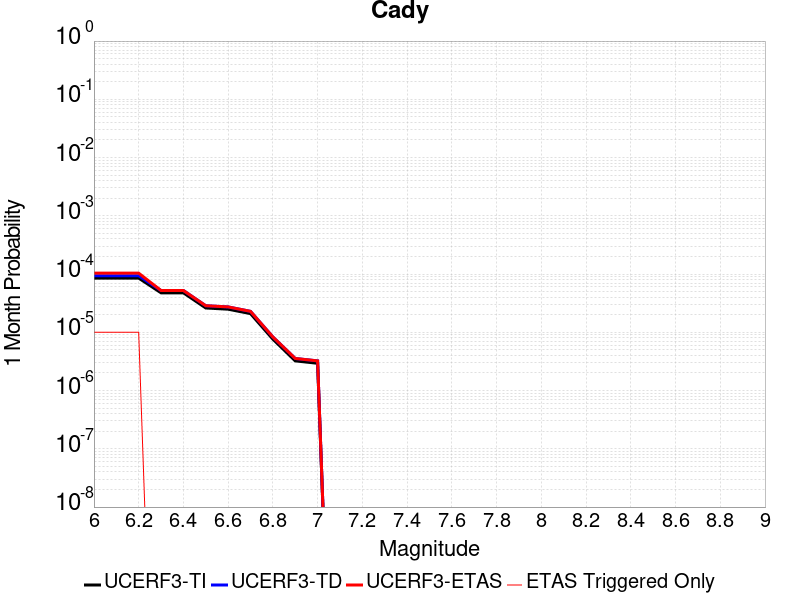 |  |  |

| Magnitude | 1 wk TI Prob | 1 wk TD Prob | 1 wk ETAS Prob | 1 wk ETAS/TD Gain | 1 wk ETAS Triggered Only | 1 mo TI Prob | 1 mo TD Prob | 1 mo ETAS Prob | 1 mo ETAS/TD Gain | 1 mo ETAS Triggered Only | 1 yr TI Prob | 1 yr TD Prob | 1 yr ETAS Prob | 1 yr ETAS/TD Gain | 1 yr ETAS Triggered Only | 10 yr TI Prob | 10 yr TD Prob | 10 yr ETAS Prob | 10 yr ETAS/TD Gain | 10 yr ETAS Triggered Only |
|-----|-----|-----|-----|-----|-----|-----|-----|-----|-----|-----|-----|-----|-----|-----|-----|-----|-----|-----|-----|-----|
| 6.0 | 1.9892565E-5 | 2.1859303E-5 | 2.1859303E-5 | 1.0 | 0.0 | 8.525106E-5 | 9.3679875E-5 | 1.0367894E-4 | 1.1067365 | 1.0E-5 | 0.0010374374 | 0.0011400466 | 0.0011999782 | 1.0525694 | 6.0E-5 | 0.010326075 | 0.011350997 | 0.011479521 | 1.0113227 | 1.3E-4 |
| 6.1 | 1.9892565E-5 | 2.1859303E-5 | 2.1859303E-5 | 1.0 | 0.0 | 8.525106E-5 | 9.3679875E-5 | 1.0367894E-4 | 1.1067365 | 1.0E-5 | 0.0010374374 | 0.0011400466 | 0.0011999782 | 1.0525694 | 6.0E-5 | 0.010326075 | 0.011350997 | 0.011479521 | 1.0113227 | 1.3E-4 |
| 6.2 | 1.9892565E-5 | 2.1859303E-5 | 2.1859303E-5 | 1.0 | 0.0 | 8.525106E-5 | 9.3679875E-5 | 1.0367894E-4 | 1.1067365 | 1.0E-5 | 0.0010374374 | 0.0011400466 | 0.0011999782 | 1.0525694 | 6.0E-5 | 0.010326075 | 0.011350997 | 0.011479521 | 1.0113227 | 1.3E-4 |
| 6.3 | 1.1117327E-5 | 1.2176892E-5 | 1.2176892E-5 | 1.0 | 0.0 | 4.764482E-5 | 5.2185813E-5 | 5.2185813E-5 | 1.0 | 0.0 | 5.7992124E-4 | 6.3520856E-4 | 6.3520856E-4 | 1.0 | 0.0 | 0.0057841022 | 0.0063370354 | 0.006366845 | 1.0047041 | 3.0E-5 |
| 6.4 | 1.1117327E-5 | 1.2176892E-5 | 1.2176892E-5 | 1.0 | 0.0 | 4.764482E-5 | 5.2185813E-5 | 5.2185813E-5 | 1.0 | 0.0 | 5.7992124E-4 | 6.3520856E-4 | 6.3520856E-4 | 1.0 | 0.0 | 0.0057841022 | 0.0063370354 | 0.006366845 | 1.0047041 | 3.0E-5 |
| 6.5 | 6.103093E-6 | 6.672186E-6 | 6.672186E-6 | 1.0 | 0.0 | 2.615585E-5 | 2.8594839E-5 | 2.8594839E-5 | 1.0 | 0.0 | 3.1840094E-4 | 3.480991E-4 | 3.480991E-4 | 1.0 | 0.0 | 0.0031794512 | 0.0034767727 | 0.0035066684 | 1.0085987 | 3.0E-5 |
| 6.6 | 5.817237E-6 | 6.3658176E-6 | 6.3658176E-6 | 1.0 | 0.0 | 2.4930776E-5 | 2.7281862E-5 | 2.7281862E-5 | 1.0 | 0.0 | 3.034899E-4 | 3.3211848E-4 | 3.3211848E-4 | 1.0 | 0.0 | 0.0030307577 | 0.0033174434 | 0.003347344 | 1.009013 | 3.0E-5 |
| 6.7 | 4.8846314E-6 | 5.3407007E-6 | 5.3407007E-6 | 1.0 | 0.0 | 2.0933967E-5 | 2.2888582E-5 | 2.2888582E-5 | 1.0 | 0.0 | 2.5484123E-4 | 2.7864464E-4 | 2.7864464E-4 | 1.0 | 0.0 | 0.0025454918 | 0.002784108 | 0.0027940802 | 1.0035818 | 1.0E-5 |
| 6.8 | 1.7788773E-6 | 1.9399545E-6 | 1.9399545E-6 | 1.0 | 0.0 | 7.6237375E-6 | 8.314073E-6 | 8.314073E-6 | 1.0 | 0.0 | 9.281505E-5 | 1.0122072E-4 | 1.0122072E-4 | 1.0 | 0.0 | 9.2776294E-4 | 0.0010119008 | 0.0010119008 | 1.0 | 0.0 |
| 6.9 | 7.5455404E-7 | 8.2973116E-7 | 8.2973116E-7 | 1.0 | 0.0 | 3.233799E-6 | 3.5559876E-6 | 3.5559876E-6 | 1.0 | 0.0 | 3.937079E-5 | 4.3293625E-5 | 4.3293625E-5 | 1.0 | 0.0 | 3.9363815E-4 | 4.3288487E-4 | 4.3288487E-4 | 1.0 | 0.0 |
| 7.0 | 6.8578805E-7 | 7.5420155E-7 | 7.5420155E-7 | 1.0 | 0.0 | 2.9390883E-6 | 3.2322903E-6 | 3.2322903E-6 | 1.0 | 0.0 | 3.578281E-5 | 3.9352755E-5 | 3.9352755E-5 | 1.0 | 0.0 | 3.577705E-4 | 3.9349034E-4 | 3.9349034E-4 | 1.0 | 0.0 |

## Manix-Afton Hills
*[(top)](#table-of-contents)*

| 1 Week | 1 Month | 1 Year | 10 Year |
|-----|-----|-----|-----|
|  |  |  |  |

| Magnitude | 1 wk TI Prob | 1 wk TD Prob | 1 wk ETAS Prob | 1 wk ETAS/TD Gain | 1 wk ETAS Triggered Only | 1 mo TI Prob | 1 mo TD Prob | 1 mo ETAS Prob | 1 mo ETAS/TD Gain | 1 mo ETAS Triggered Only | 1 yr TI Prob | 1 yr TD Prob | 1 yr ETAS Prob | 1 yr ETAS/TD Gain | 1 yr ETAS Triggered Only | 10 yr TI Prob | 10 yr TD Prob | 10 yr ETAS Prob | 10 yr ETAS/TD Gain | 10 yr ETAS Triggered Only |
|-----|-----|-----|-----|-----|-----|-----|-----|-----|-----|-----|-----|-----|-----|-----|-----|-----|-----|-----|-----|-----|
| 6.0 | 1.3783202E-5 | 1.4711353E-5 | 1.4711353E-5 | 1.0 | 0.0 | 5.906953E-5 | 6.304723E-5 | 6.304723E-5 | 1.0 | 0.0 | 7.189342E-4 | 7.6734717E-4 | 8.173088E-4 | 1.0651096 | 5.0E-5 | 0.0071661277 | 0.007648732 | 0.007767814 | 1.0155689 | 1.2E-4 |
| 6.1 | 1.3783202E-5 | 1.4711353E-5 | 1.4711353E-5 | 1.0 | 0.0 | 5.906953E-5 | 6.304723E-5 | 6.304723E-5 | 1.0 | 0.0 | 7.189342E-4 | 7.6734717E-4 | 8.173088E-4 | 1.0651096 | 5.0E-5 | 0.0071661277 | 0.007648732 | 0.007767814 | 1.0155689 | 1.2E-4 |
| 6.2 | 1.3783202E-5 | 1.4711353E-5 | 1.4711353E-5 | 1.0 | 0.0 | 5.906953E-5 | 6.304723E-5 | 6.304723E-5 | 1.0 | 0.0 | 7.189342E-4 | 7.6734717E-4 | 8.173088E-4 | 1.0651096 | 5.0E-5 | 0.0071661277 | 0.007648732 | 0.007767814 | 1.0155689 | 1.2E-4 |
| 6.3 | 1.10494875E-5 | 1.1793347E-5 | 1.1793347E-5 | 1.0 | 0.0 | 4.7354086E-5 | 5.0541992E-5 | 5.0541992E-5 | 1.0 | 0.0 | 5.763835E-4 | 6.151854E-4 | 6.351731E-4 | 1.0324905 | 2.0E-5 | 0.005748908 | 0.006135865 | 0.006195497 | 1.0097185 | 6.0E-5 |
| 6.4 | 1.10494875E-5 | 1.1793347E-5 | 1.1793347E-5 | 1.0 | 0.0 | 4.7354086E-5 | 5.0541992E-5 | 5.0541992E-5 | 1.0 | 0.0 | 5.763835E-4 | 6.151854E-4 | 6.351731E-4 | 1.0324905 | 2.0E-5 | 0.005748908 | 0.006135865 | 0.006195497 | 1.0097185 | 6.0E-5 |
| 6.5 | 9.788949E-6 | 1.0454509E-5 | 1.0454509E-5 | 1.0 | 0.0 | 4.1951964E-5 | 4.480432E-5 | 4.480432E-5 | 1.0 | 0.0 | 5.1064545E-4 | 5.453653E-4 | 5.453653E-4 | 1.0 | 0.0 | 0.0050947363 | 0.0054411967 | 0.0054710335 | 1.0054835 | 3.0E-5 |
| 6.6 | 8.810006E-6 | 9.4137995E-6 | 9.4137995E-6 | 1.0 | 0.0 | 3.775662E-5 | 4.0344283E-5 | 4.0344283E-5 | 1.0 | 0.0 | 4.5958988E-4 | 4.910898E-4 | 4.910898E-4 | 1.0 | 0.0 | 0.0045864056 | 0.004900928 | 0.004930781 | 1.0060912 | 3.0E-5 |
| 6.7 | 8.80128E-6 | 9.404279E-6 | 9.404279E-6 | 1.0 | 0.0 | 3.7719226E-5 | 4.0303483E-5 | 4.0303483E-5 | 1.0 | 0.0 | 4.591348E-4 | 4.905933E-4 | 4.905933E-4 | 1.0 | 0.0 | 0.004581874 | 0.0048959847 | 0.004925838 | 1.0060974 | 3.0E-5 |
| 6.8 | 6.8994877E-6 | 7.3802125E-6 | 7.3802125E-6 | 1.0 | 0.0 | 2.9568899E-5 | 3.1629144E-5 | 3.1629144E-5 | 1.0 | 0.0 | 3.5994186E-4 | 3.8502496E-4 | 3.8502496E-4 | 1.0 | 0.0 | 0.003593594 | 0.0038443839 | 0.0038643072 | 1.0051824 | 2.0E-5 |
| 6.9 | 4.9328037E-6 | 5.2710575E-6 | 5.2710575E-6 | 1.0 | 0.0 | 2.1140417E-5 | 2.2590086E-5 | 2.2590086E-5 | 1.0 | 0.0 | 2.5735417E-4 | 2.7500573E-4 | 2.7500573E-4 | 1.0 | 0.0 | 0.0025705635 | 0.0027472596 | 0.002757232 | 1.00363 | 1.0E-5 |
| 7.0 | 3.347973E-6 | 3.5900991E-6 | 3.5900991E-6 | 1.0 | 0.0 | 1.4348378E-5 | 1.5386071E-5 | 1.5386071E-5 | 1.0 | 0.0 | 1.746775E-4 | 1.8731342E-4 | 1.8731342E-4 | 1.0 | 0.0 | 0.0017454025 | 0.0018719579 | 0.0018819392 | 1.005332 | 1.0E-5 |
| 7.1 | 1.2073567E-6 | 1.2935066E-6 | 1.2935066E-6 | 1.0 | 0.0 | 5.1743755E-6 | 5.5435967E-6 | 5.5435967E-6 | 1.0 | 0.0 | 6.29962E-5 | 6.749283E-5 | 6.749283E-5 | 1.0 | 0.0 | 6.297835E-4 | 6.7488354E-4 | 6.8487675E-4 | 1.0148073 | 1.0E-5 |

## Owens Valley
*[(top)](#table-of-contents)*

| 1 Week | 1 Month | 1 Year | 10 Year |
|-----|-----|-----|-----|
|  |  |  |  |

| Magnitude | 1 wk TI Prob | 1 wk TD Prob | 1 wk ETAS Prob | 1 wk ETAS/TD Gain | 1 wk ETAS Triggered Only | 1 mo TI Prob | 1 mo TD Prob | 1 mo ETAS Prob | 1 mo ETAS/TD Gain | 1 mo ETAS Triggered Only | 1 yr TI Prob | 1 yr TD Prob | 1 yr ETAS Prob | 1 yr ETAS/TD Gain | 1 yr ETAS Triggered Only | 10 yr TI Prob | 10 yr TD Prob | 10 yr ETAS Prob | 10 yr ETAS/TD Gain | 10 yr ETAS Triggered Only |
|-----|-----|-----|-----|-----|-----|-----|-----|-----|-----|-----|-----|-----|-----|-----|-----|-----|-----|-----|-----|-----|
| 6.0 | 4.83821E-5 | 3.6294966E-6 | 1.362946E-5 | 3.755193 | 1.0E-5 | 2.0733538E-4 | 1.5554899E-5 | 3.555459E-5 | 2.2857485 | 2.0E-5 | 0.002521386 | 1.8936543E-4 | 2.4935408E-4 | 1.3167877 | 6.0E-5 | 0.024929691 | 0.0019210172 | 0.0020407867 | 1.0623469 | 1.2E-4 |
| 6.1 | 4.83821E-5 | 3.6294966E-6 | 1.362946E-5 | 3.755193 | 1.0E-5 | 2.0733538E-4 | 1.5554899E-5 | 3.555459E-5 | 2.2857485 | 2.0E-5 | 0.002521386 | 1.8936543E-4 | 2.4935408E-4 | 1.3167877 | 6.0E-5 | 0.024929691 | 0.0019210172 | 0.0020407867 | 1.0623469 | 1.2E-4 |
| 6.2 | 4.83821E-5 | 3.6294966E-6 | 1.362946E-5 | 3.755193 | 1.0E-5 | 2.0733538E-4 | 1.5554899E-5 | 3.555459E-5 | 2.2857485 | 2.0E-5 | 0.002521386 | 1.8936543E-4 | 2.4935408E-4 | 1.3167877 | 6.0E-5 | 0.024929691 | 0.0019210172 | 0.0020407867 | 1.0623469 | 1.2E-4 |
| 6.3 | 3.953008E-5 | 3.1558784E-6 | 1.3155847E-5 | 4.1686797 | 1.0E-5 | 1.6940363E-4 | 1.35251275E-5 | 3.352486E-5 | 2.4787092 | 2.0E-5 | 0.002060538 | 1.6465673E-4 | 2.2464685E-4 | 1.3643345 | 6.0E-5 | 0.020415364 | 0.0016598237 | 0.0017796245 | 1.0721768 | 1.2E-4 |
| 6.4 | 3.953008E-5 | 3.1558784E-6 | 1.3155847E-5 | 4.1686797 | 1.0E-5 | 1.6940363E-4 | 1.35251275E-5 | 3.352486E-5 | 2.4787092 | 2.0E-5 | 0.002060538 | 1.6465673E-4 | 2.2464685E-4 | 1.3643345 | 6.0E-5 | 0.020415364 | 0.0016598237 | 0.0017796245 | 1.0721768 | 1.2E-4 |
| 6.5 | 3.457342E-5 | 2.971158E-6 | 1.2971128E-5 | 4.365681 | 1.0E-5 | 1.4816338E-4 | 1.2733476E-5 | 3.273322E-5 | 2.570643 | 2.0E-5 | 0.0018023965 | 1.5501973E-4 | 2.1501044E-4 | 1.3869874 | 6.0E-5 | 0.017878477 | 0.0015564627 | 0.001676276 | 1.0769778 | 1.2E-4 |
| 6.6 | 3.1127765E-5 | 2.8740287E-6 | 1.2874E-5 | 4.4794264 | 1.0E-5 | 1.3339789E-4 | 1.2317212E-5 | 3.2316966E-5 | 2.6237242 | 2.0E-5 | 0.0016229092 | 1.4995242E-4 | 2.0994342E-4 | 1.400067 | 6.0E-5 | 0.016111081 | 0.0015015732 | 0.001621393 | 1.0797962 | 1.2E-4 |
| 6.7 | 2.806885E-5 | 2.8104484E-6 | 1.281042E-5 | 4.558141 | 1.0E-5 | 1.2028952E-4 | 1.2044727E-5 | 3.2044485E-5 | 2.6604576 | 2.0E-5 | 0.001463541 | 1.4663537E-4 | 2.0662657E-4 | 1.4091182 | 6.0E-5 | 0.014539397 | 0.0014658445 | 0.0015856685 | 1.0817441 | 1.2E-4 |
| 6.8 | 2.524524E-5 | 2.2353913E-6 | 1.22353695E-5 | 5.4734793 | 1.0E-5 | 1.0818939E-4 | 9.580215E-6 | 2.9580024E-5 | 3.0876157 | 2.0E-5 | 0.0013164099 | 1.16633186E-4 | 1.7662618E-4 | 1.5143733 | 6.0E-5 | 0.01308639 | 0.0011660445 | 0.0012859046 | 1.102792 | 1.2E-4 |
| 6.9 | 2.2704568E-5 | 1.6081536E-6 | 1.1608137E-5 | 7.218302 | 1.0E-5 | 9.730166E-5 | 6.8920685E-6 | 2.689193E-5 | 3.9018664 | 2.0E-5 | 0.0011840039 | 8.3907726E-5 | 1.4390268E-4 | 1.7150112 | 6.0E-5 | 0.011777153 | 8.390186E-4 | 9.5891795E-4 | 1.1429043 | 1.2E-4 |
| 7.0 | 2.0871712E-5 | 1.5395359E-6 | 1.15395205E-5 | 7.495454 | 1.0E-5 | 8.944713E-5 | 6.5979943E-6 | 2.6597863E-5 | 4.031204 | 2.0E-5 | 0.0010884746 | 8.0327634E-5 | 1.4032282E-4 | 1.7468809 | 6.0E-5 | 0.010831586 | 8.032006E-4 | 9.2310423E-4 | 1.1492823 | 1.2E-4 |
| 7.1 | 1.944928E-5 | 1.3864028E-6 | 1.1386389E-5 | 8.212901 | 1.0E-5 | 8.335139E-5 | 5.941713E-6 | 2.5941594E-5 | 4.3660126 | 2.0E-5 | 0.0010143308 | 7.233796E-5 | 1.3233362E-4 | 1.82938 | 6.0E-5 | 0.010097133 | 7.233452E-4 | 8.432584E-4 | 1.1657759 | 1.2E-4 |
| 7.2 | 1.7876306E-5 | 1.2488966E-6 | 1.1248884E-5 | 9.007058 | 1.0E-5 | 7.6610486E-5 | 5.352403E-6 | 2.5352296E-5 | 4.7366195 | 2.0E-5 | 9.3233347E-4 | 6.516357E-5 | 1.2515965E-4 | 1.9206998 | 6.0E-5 | 0.009284316 | 6.5163505E-4 | 7.7155686E-4 | 1.1840322 | 1.2E-4 |
| 7.3 | 1.2618672E-5 | 1.111502E-6 | 1.11114905E-5 | 9.996825 | 1.0E-5 | 5.40789E-5 | 4.7635713E-6 | 2.4763476E-5 | 5.1985106 | 2.0E-5 | 6.582117E-4 | 5.799494E-5 | 1.1799146E-4 | 2.034513 | 6.0E-5 | 0.0065626553 | 5.7998346E-4 | 6.899197E-4 | 1.1895506 | 1.1E-4 |
| 7.4 | 7.4874442E-6 | 8.548478E-7 | 1.0854839E-5 | 12.697978 | 1.0E-5 | 3.208865E-5 | 3.6636284E-6 | 2.3663555E-5 | 6.4590487 | 2.0E-5 | 3.906093E-4 | 4.4603767E-5 | 1.04601095E-4 | 2.3451178 | 6.0E-5 | 0.003899234 | 4.460911E-4 | 5.56042E-4 | 1.2464764 | 1.1E-4 |
| 7.5 | 2.4734156E-6 | 6.068707E-7 | 1.0606865E-5 | 17.477966 | 1.0E-5 | 1.060031E-5 | 2.6008718E-6 | 2.260082E-5 | 8.68971 | 2.0E-5 | 1.2905113E-4 | 3.1665157E-5 | 7.166389E-5 | 2.263178 | 4.0E-5 | 0.0012897621 | 3.1660678E-4 | 4.0657827E-4 | 1.2841743 | 9.0E-5 |
| 7.6 | 1.1328841E-6 | 3.1965394E-7 | 1.0319651E-5 | 32.28382 | 1.0E-5 | 4.8552088E-6 | 1.3699447E-6 | 1.1369931E-5 | 8.299555 | 1.0E-5 | 5.9110564E-5 | 1.6678952E-5 | 3.667862E-5 | 2.1990962 | 2.0E-5 | 5.9094845E-4 | 1.6677719E-4 | 2.1676885E-4 | 1.2997512 | 5.0E-5 |
| 7.7 | 4.8613185E-7 | 8.964023E-8 | 8.964023E-8 | 1.0 | 0.0 | 2.0834207E-6 | 3.8417235E-7 | 3.8417235E-7 | 1.0 | 0.0 | 2.536535E-5 | 4.6772893E-6 | 4.6772893E-6 | 1.0 | 0.0 | 2.5362454E-4 | 4.6771976E-5 | 4.6771976E-5 | 1.0 | 0.0 |

## Brawley (Seismic Zone) alt 1
*[(top)](#table-of-contents)*

| 1 Week | 1 Month | 1 Year | 10 Year |
|-----|-----|-----|-----|
|  |  |  |  |

| Magnitude | 1 wk TI Prob | 1 wk TD Prob | 1 wk ETAS Prob | 1 wk ETAS/TD Gain | 1 wk ETAS Triggered Only | 1 mo TI Prob | 1 mo TD Prob | 1 mo ETAS Prob | 1 mo ETAS/TD Gain | 1 mo ETAS Triggered Only | 1 yr TI Prob | 1 yr TD Prob | 1 yr ETAS Prob | 1 yr ETAS/TD Gain | 1 yr ETAS Triggered Only | 10 yr TI Prob | 10 yr TD Prob | 10 yr ETAS Prob | 10 yr ETAS/TD Gain | 10 yr ETAS Triggered Only |
|-----|-----|-----|-----|-----|-----|-----|-----|-----|-----|-----|-----|-----|-----|-----|-----|-----|-----|-----|-----|-----|
| 6.0 | 2.2521618E-4 | 4.7651812E-4 | 4.8651337E-4 | 1.0209756 | 1.0E-5 | 9.6485513E-4 | 0.0020406593 | 0.002070598 | 1.0146711 | 3.0E-5 | 0.011683988 | 0.024556208 | 0.02462449 | 1.0027806 | 7.0E-5 | 0.11088423 | 0.21356145 | 0.21365581 | 1.0004419 | 1.2E-4 |
| 6.1 | 2.2521618E-4 | 4.7651812E-4 | 4.8651337E-4 | 1.0209756 | 1.0E-5 | 9.6485513E-4 | 0.0020406593 | 0.002070598 | 1.0146711 | 3.0E-5 | 0.011683988 | 0.024556208 | 0.02462449 | 1.0027806 | 7.0E-5 | 0.11088423 | 0.21356145 | 0.21364796 | 1.0004051 | 1.1E-4 |
| 6.2 | 2.198148E-4 | 4.6735993E-4 | 4.7735526E-4 | 1.0213867 | 1.0E-5 | 9.417233E-4 | 0.0020014702 | 0.0020314103 | 1.014959 | 3.0E-5 | 0.011405343 | 0.024090234 | 0.024158547 | 1.0028358 | 7.0E-5 | 0.10837428 | 0.20999716 | 0.21008407 | 1.0004138 | 1.1E-4 |
| 6.3 | 2.1704129E-4 | 4.6171612E-4 | 4.7171148E-4 | 1.0216483 | 1.0E-5 | 9.298453E-4 | 0.0019773194 | 0.00200726 | 1.0151421 | 3.0E-5 | 0.011262234 | 0.023802834 | 0.023871167 | 1.0028708 | 7.0E-5 | 0.107082725 | 0.20788823 | 0.20797536 | 1.0004191 | 1.1E-4 |
| 6.4 | 1.876142E-4 | 4.006318E-4 | 4.1062778E-4 | 1.0249506 | 1.0E-5 | 8.038131E-4 | 0.0017158779 | 0.0017358436 | 1.0116359 | 2.0E-5 | 0.00974259 | 0.020691514 | 0.020750273 | 1.0028397 | 6.0E-5 | 0.093263686 | 0.18463919 | 0.18472072 | 1.0004416 | 1.0E-4 |
| 6.5 | 1.7390939E-4 | 3.7494735E-4 | 3.8494362E-4 | 1.0266604 | 1.0E-5 | 7.45113E-4 | 0.0016059398 | 0.0016259077 | 1.0124338 | 2.0E-5 | 0.009034078 | 0.01937925 | 0.019438088 | 1.0030361 | 6.0E-5 | 0.086755216 | 0.17445996 | 0.17453426 | 1.0004259 | 9.0E-5 |
| 6.6 | 1.591791E-4 | 3.4908764E-4 | 3.5908417E-4 | 1.0286361 | 1.0E-5 | 6.8201777E-4 | 0.0014952422 | 0.0015152124 | 1.0133557 | 2.0E-5 | 0.008271996 | 0.018055586 | 0.018114503 | 1.0032631 | 6.0E-5 | 0.07970774 | 0.16386625 | 0.1639415 | 1.0004592 | 9.0E-5 |
| 6.7 | 1.4268003E-4 | 3.2073972E-4 | 3.307365E-4 | 1.031168 | 1.0E-5 | 6.1134255E-4 | 0.0013738829 | 0.0013938553 | 1.0145373 | 2.0E-5 | 0.007417723 | 0.016601816 | 0.01666082 | 1.0035541 | 6.0E-5 | 0.07174956 | 0.15199259 | 0.15206891 | 1.0005021 | 9.0E-5 |
| 6.8 | 1.239713E-4 | 2.9067104E-4 | 3.0066812E-4 | 1.0343932 | 1.0E-5 | 5.3119735E-4 | 0.0012451444 | 0.0012651195 | 1.0160424 | 2.0E-5 | 0.0064481674 | 0.015055691 | 0.015114788 | 1.0039252 | 6.0E-5 | 0.06264243 | 0.13842933 | 0.13850686 | 1.0005602 | 9.0E-5 |
| 6.9 | 1.0180238E-4 | 2.6265028E-4 | 2.7264765E-4 | 1.0380634 | 1.0E-5 | 4.3622297E-4 | 0.0011251627 | 0.0011451403 | 1.0177552 | 2.0E-5 | 0.005298089 | 0.013613813 | 0.013672996 | 1.0043473 | 6.0E-5 | 0.05173543 | 0.12500279 | 0.12508154 | 1.00063 | 9.0E-5 |
| 7.0 | 7.6619996E-5 | 2.2407617E-4 | 2.3407393E-4 | 1.0446177 | 1.0E-5 | 3.283301E-4 | 9.5997617E-4 | 9.799569E-4 | 1.0208138 | 2.0E-5 | 0.0039900932 | 0.011625785 | 0.011675204 | 1.0042508 | 5.0E-5 | 0.039192066 | 0.107298724 | 0.10737014 | 1.0006655 | 8.0E-5 |
| 7.1 | 7.5127435E-5 | 2.2090679E-4 | 2.3090458E-4 | 1.0452579 | 1.0E-5 | 3.2193496E-4 | 9.46403E-4 | 9.663841E-4 | 1.0211127 | 2.0E-5 | 0.0039125155 | 0.011462282 | 0.01151171 | 1.0043122 | 5.0E-5 | 0.038443442 | 0.10586237 | 0.105933905 | 1.0006757 | 8.0E-5 |
| 7.2 | 6.788582E-5 | 2.0218133E-4 | 2.1217931E-4 | 1.0494505 | 1.0E-5 | 2.9090676E-4 | 8.662067E-4 | 8.861894E-4 | 1.0230691 | 2.0E-5 | 0.0035360386 | 0.010495711 | 0.010545186 | 1.0047139 | 5.0E-5 | 0.034803 | 0.09753225 | 0.097604446 | 1.0007403 | 8.0E-5 |
| 7.3 | 6.399602E-5 | 1.8848745E-4 | 1.9848556E-4 | 1.053044 | 1.0E-5 | 2.7423984E-4 | 8.0755615E-4 | 8.2754E-4 | 1.0247461 | 2.0E-5 | 0.0033337586 | 0.009788263 | 0.009837774 | 1.0050582 | 5.0E-5 | 0.03284188 | 0.09142674 | 0.091499425 | 1.000795 | 8.0E-5 |
| 7.4 | 4.506759E-5 | 1.2535171E-4 | 1.3535046E-4 | 1.0797656 | 1.0E-5 | 1.9313251E-4 | 5.371119E-4 | 5.5710116E-4 | 1.0372162 | 2.0E-5 | 0.0023488526 | 0.006519905 | 0.006569579 | 1.0076188 | 5.0E-5 | 0.023241805 | 0.062391818 | 0.062466826 | 1.0012022 | 8.0E-5 |
| 7.5 | 3.43289E-5 | 9.340439E-5 | 1.0340346E-4 | 1.1070514 | 1.0E-5 | 1.4711556E-4 | 4.0024344E-4 | 4.2023545E-4 | 1.0499496 | 2.0E-5 | 0.0017896603 | 0.004862138 | 0.004911895 | 1.0102335 | 5.0E-5 | 0.01775316 | 0.04707823 | 0.047144935 | 1.0014169 | 7.0E-5 |
| 7.6 | 2.5980507E-5 | 7.057449E-5 | 8.057378E-5 | 1.1416843 | 1.0E-5 | 1.1134028E-4 | 3.0242716E-4 | 3.224211E-4 | 1.0661117 | 2.0E-5 | 0.001354725 | 0.0036758583 | 0.0037256745 | 1.0135523 | 5.0E-5 | 0.013464959 | 0.035860542 | 0.03592803 | 1.001882 | 7.0E-5 |
| 7.7 | 1.7292105E-5 | 4.9444203E-5 | 5.9443708E-5 | 1.2022382 | 1.0E-5 | 7.4106916E-5 | 2.1188655E-4 | 2.3188231E-4 | 1.0943701 | 2.0E-5 | 9.018782E-4 | 0.0025766725 | 0.0026265436 | 1.0193548 | 5.0E-5 | 0.008982267 | 0.025307743 | 0.025375972 | 1.0026959 | 7.0E-5 |
| 7.8 | 1.2927471E-5 | 3.9725302E-5 | 4.9724906E-5 | 1.2517188 | 1.0E-5 | 5.5402274E-5 | 1.702402E-4 | 1.902368E-4 | 1.1174611 | 2.0E-5 | 6.743139E-4 | 0.0020707066 | 0.0021106238 | 1.0192771 | 4.0E-5 | 0.0067227143 | 0.020446775 | 0.020495752 | 1.0023954 | 5.0E-5 |
| 7.9 | 1.0200774E-5 | 2.8771155E-5 | 3.8770868E-5 | 1.3475603 | 1.0E-5 | 4.371687E-5 | 1.2329913E-4 | 1.4329667E-4 | 1.1621871 | 2.0E-5 | 5.321229E-4 | 0.0015001342 | 0.0015300893 | 1.0199682 | 3.0E-5 | 0.005308505 | 0.015003597 | 0.015042997 | 1.0026261 | 4.0E-5 |
| 8.0 | 8.650396E-6 | 2.329902E-5 | 3.3298787E-5 | 1.4291927 | 1.0E-5 | 3.70726E-5 | 9.984912E-5 | 1.1984713E-4 | 1.2002822 | 2.0E-5 | 4.5126543E-4 | 0.001214986 | 0.0012449495 | 1.0246617 | 3.0E-5 | 0.0045035016 | 0.012221362 | 0.012260874 | 1.003233 | 4.0E-5 |
| 8.1 | 3.9368224E-6 | 7.336729E-6 | 7.336729E-6 | 1.0 | 0.0 | 1.6871985E-5 | 3.1442745E-5 | 3.1442745E-5 | 1.0 | 0.0 | 2.0539707E-4 | 3.8274832E-4 | 3.8274832E-4 | 1.0 | 0.0 | 0.0020520731 | 0.0040054703 | 0.0040154303 | 1.0024866 | 1.0E-5 |
| 8.2 | 1.7101195E-6 | 2.2211157E-6 | 2.2211157E-6 | 1.0 | 0.0 | 7.329063E-6 | 9.519033E-6 | 9.519033E-6 | 1.0 | 0.0 | 8.922769E-5 | 1.1588809E-4 | 1.1588809E-4 | 1.0 | 0.0 | 8.9191867E-4 | 0.0012683355 | 0.0012683355 | 1.0 | 0.0 |
| 8.3 | 3.0346666E-8 | 1.7245716E-8 | 1.7245716E-8 | 1.0 | 0.0 | 1.3005713E-7 | 7.391021E-8 | 7.391021E-8 | 1.0 | 0.0 | 1.5834444E-6 | 8.998567E-7 | 8.998567E-7 | 1.0 | 0.0 | 1.5834332E-5 | 9.382939E-6 | 9.382939E-6 | 1.0 | 0.0 |

## Imperial
*[(top)](#table-of-contents)*

| 1 Week | 1 Month | 1 Year | 10 Year |
|-----|-----|-----|-----|
|  |  |  |  |

| Magnitude | 1 wk TI Prob | 1 wk TD Prob | 1 wk ETAS Prob | 1 wk ETAS/TD Gain | 1 wk ETAS Triggered Only | 1 mo TI Prob | 1 mo TD Prob | 1 mo ETAS Prob | 1 mo ETAS/TD Gain | 1 mo ETAS Triggered Only | 1 yr TI Prob | 1 yr TD Prob | 1 yr ETAS Prob | 1 yr ETAS/TD Gain | 1 yr ETAS Triggered Only | 10 yr TI Prob | 10 yr TD Prob | 10 yr ETAS Prob | 10 yr ETAS/TD Gain | 10 yr ETAS Triggered Only |
|-----|-----|-----|-----|-----|-----|-----|-----|-----|-----|-----|-----|-----|-----|-----|-----|-----|-----|-----|-----|-----|
| 6.0 | 2.7496446E-4 | 5.0579896E-4 | 5.1579386E-4 | 1.0197607 | 1.0E-5 | 0.0011778869 | 0.0021659483 | 0.0021958833 | 1.0138208 | 3.0E-5 | 0.0142467655 | 0.026049878 | 0.026118055 | 1.0026171 | 7.0E-5 | 0.13367249 | 0.2281525 | 0.2282374 | 1.0003722 | 1.1E-4 |
| 6.1 | 2.5356023E-4 | 4.8679268E-4 | 4.9678783E-4 | 1.0205326 | 1.0E-5 | 0.001086234 | 0.0020846247 | 0.002114562 | 1.014361 | 3.0E-5 | 0.013144928 | 0.02508932 | 0.025157563 | 1.00272 | 7.0E-5 | 0.123940155 | 0.2195809 | 0.21966675 | 1.000391 | 1.1E-4 |
| 6.2 | 2.4820742E-4 | 4.7774267E-4 | 4.877379E-4 | 1.0209218 | 1.0E-5 | 0.0010633124 | 0.0020458999 | 0.0020758386 | 1.0146334 | 3.0E-5 | 0.01286919 | 0.024629103 | 0.024697378 | 1.0027722 | 7.0E-5 | 0.12148927 | 0.21608594 | 0.21617217 | 1.0003991 | 1.1E-4 |
| 6.3 | 2.3205351E-4 | 4.5911144E-4 | 4.6910686E-4 | 1.0217712 | 1.0E-5 | 9.94136E-4 | 0.0019661738 | 0.0019961146 | 1.015228 | 3.0E-5 | 0.012036599 | 0.023674518 | 0.02374286 | 1.0028868 | 7.0E-5 | 0.11405133 | 0.20801327 | 0.20810038 | 1.0004188 | 1.1E-4 |
| 6.4 | 2.0304754E-4 | 3.9896628E-4 | 4.0896228E-4 | 1.0250548 | 1.0E-5 | 8.6991355E-4 | 0.0017087497 | 0.0017287155 | 1.0116844 | 2.0E-5 | 0.010539869 | 0.020610811 | 0.020669574 | 1.0028511 | 6.0E-5 | 0.100537635 | 0.1851464 | 0.18522789 | 1.0004401 | 1.0E-4 |
| 6.5 | 1.854992E-4 | 3.7007773E-4 | 3.8007405E-4 | 1.0270114 | 1.0E-5 | 7.9475436E-4 | 0.0015850958 | 0.001605064 | 1.0125976 | 2.0E-5 | 0.009633281 | 0.01913615 | 0.019195 | 1.0030755 | 6.0E-5 | 0.0922623 | 0.17337552 | 0.17344992 | 1.0004292 | 9.0E-5 |
| 6.6 | 1.6586106E-4 | 3.4052608E-4 | 3.505227E-4 | 1.0293564 | 1.0E-5 | 7.106394E-4 | 0.0014585914 | 0.0014785622 | 1.0136919 | 2.0E-5 | 0.008617763 | 0.01761886 | 0.017677803 | 1.0033455 | 6.0E-5 | 0.08291132 | 0.16084117 | 0.1609167 | 1.0004696 | 9.0E-5 |
| 6.7 | 1.4224656E-4 | 3.0782272E-4 | 3.1781962E-4 | 1.0324762 | 1.0E-5 | 6.094856E-4 | 0.0013185814 | 0.001338555 | 1.0151478 | 2.0E-5 | 0.0073952693 | 0.015938582 | 0.015997626 | 1.0037044 | 6.0E-5 | 0.07153955 | 0.14654197 | 0.14661878 | 1.0005242 | 9.0E-5 |
| 6.8 | 1.2317259E-4 | 2.7804216E-4 | 2.880394E-4 | 1.0359558 | 1.0E-5 | 5.2777573E-4 | 0.0011910714 | 0.0012110475 | 1.0167716 | 2.0E-5 | 0.0064067547 | 0.014406257 | 0.0144653935 | 1.0041049 | 6.0E-5 | 0.06225166 | 0.13298658 | 0.1330646 | 1.0005867 | 9.0E-5 |
| 6.9 | 9.859898E-5 | 2.5024323E-4 | 2.6024072E-4 | 1.0399511 | 1.0E-5 | 4.2249862E-4 | 0.0010720344 | 0.001092013 | 1.0186361 | 2.0E-5 | 0.0051317946 | 0.012974872 | 0.013034094 | 1.0045643 | 6.0E-5 | 0.05014893 | 0.11944499 | 0.11952423 | 1.0006635 | 9.0E-5 |
| 7.0 | 7.3191884E-5 | 2.1274423E-4 | 2.227421E-4 | 1.0469948 | 1.0E-5 | 3.136418E-4 | 9.114456E-4 | 9.3142735E-4 | 1.0219232 | 2.0E-5 | 0.003811904 | 0.011041075 | 0.011090523 | 1.0044786 | 5.0E-5 | 0.037471764 | 0.102094196 | 0.10216603 | 1.0007036 | 8.0E-5 |
| 7.1 | 7.1760296E-5 | 2.0975686E-4 | 2.1975477E-4 | 1.0476643 | 1.0E-5 | 3.0750787E-4 | 8.986515E-4 | 9.186335E-4 | 1.0222355 | 2.0E-5 | 0.003737482 | 0.010886873 | 0.010936329 | 1.0045427 | 5.0E-5 | 0.03675245 | 0.10073039 | 0.10080233 | 1.0007142 | 8.0E-5 |
| 7.2 | 6.46614E-5 | 1.9143957E-4 | 2.0143767E-4 | 1.0522258 | 1.0E-5 | 2.7709085E-4 | 8.2020037E-4 | 8.40184E-4 | 1.0243642 | 2.0E-5 | 0.0033683628 | 0.009940839 | 0.009990342 | 1.0049797 | 5.0E-5 | 0.033177625 | 0.09253729 | 0.09260989 | 1.0007845 | 8.0E-5 |
| 7.3 | 6.088115E-5 | 1.7815344E-4 | 1.8815167E-4 | 1.0561213 | 1.0E-5 | 2.6089314E-4 | 7.632942E-4 | 7.8327896E-4 | 1.0261822 | 2.0E-5 | 0.0031717476 | 0.009254085 | 0.009303622 | 1.005353 | 5.0E-5 | 0.031268585 | 0.08658786 | 0.08666094 | 1.0008439 | 8.0E-5 |
| 7.4 | 4.199346E-5 | 1.15156676E-4 | 1.2515552E-4 | 1.0868282 | 1.0E-5 | 1.7995955E-4 | 4.934361E-4 | 5.1342626E-4 | 1.0405121 | 2.0E-5 | 0.0021888057 | 0.005991206 | 0.0060409065 | 1.0082955 | 5.0E-5 | 0.02167372 | 0.057465214 | 0.057540618 | 1.0013121 | 8.0E-5 |
| 7.5 | 3.130448E-5 | 8.33765E-5 | 9.337567E-5 | 1.1199279 | 1.0E-5 | 1.3415517E-4 | 3.5727926E-4 | 3.772721E-4 | 1.0559586 | 2.0E-5 | 0.0016321153 | 0.0043412587 | 0.0043910416 | 1.0114673 | 5.0E-5 | 0.016201803 | 0.042152286 | 0.042219333 | 1.0015906 | 7.0E-5 |
| 7.6 | 2.3074248E-5 | 6.088159E-5 | 7.088098E-5 | 1.1642432 | 1.0E-5 | 9.888588E-5 | 2.6089512E-4 | 2.8088992E-4 | 1.0766392 | 2.0E-5 | 0.0012032706 | 0.0031717948 | 0.0032216364 | 1.0157139 | 5.0E-5 | 0.011967761 | 0.031043304 | 0.03111113 | 1.0021849 | 7.0E-5 |
| 7.7 | 1.45864815E-5 | 4.0155137E-5 | 5.0154733E-5 | 1.2490242 | 1.0E-5 | 6.2511994E-5 | 1.7208212E-4 | 1.9207867E-4 | 1.1162035 | 2.0E-5 | 7.608177E-4 | 0.002093092 | 0.0021429874 | 1.0238382 | 5.0E-5 | 0.007582182 | 0.020642294 | 0.020710848 | 1.003321 | 7.0E-5 |
| 7.8 | 1.0352979E-5 | 3.0986695E-5 | 4.0986386E-5 | 1.3227092 | 1.0E-5 | 4.4369157E-5 | 1.3279339E-4 | 1.5279073E-4 | 1.15059 | 2.0E-5 | 5.400606E-4 | 0.0016155628 | 0.0016554982 | 1.0247191 | 4.0E-5 | 0.0053875 | 0.016029142 | 0.016078342 | 1.0030693 | 5.0E-5 |
| 7.9 | 8.137906E-6 | 2.2169459E-5 | 3.216924E-5 | 1.451061 | 1.0E-5 | 3.4876273E-5 | 9.5008516E-5 | 1.1500662E-4 | 1.2104875 | 2.0E-5 | 4.2453592E-4 | 0.0011561158 | 0.0011860811 | 1.025919 | 3.0E-5 | 0.004237258 | 0.011627569 | 0.0116671035 | 1.0034001 | 4.0E-5 |
| 8.0 | 6.93792E-6 | 1.8026143E-5 | 2.8025963E-5 | 1.5547398 | 1.0E-5 | 2.9733603E-5 | 7.725261E-5 | 9.725107E-5 | 1.258871 | 2.0E-5 | 3.6194647E-4 | 9.4014546E-4 | 9.701173E-4 | 1.0318799 | 3.0E-5 | 0.0036135751 | 0.009509862 | 0.009549482 | 1.0041661 | 4.0E-5 |
| 8.1 | 3.4286315E-6 | 6.3875336E-6 | 6.3875336E-6 | 1.0 | 0.0 | 1.4694053E-5 | 2.7374857E-5 | 2.7374857E-5 | 1.0 | 0.0 | 1.7888541E-4 | 3.3323804E-4 | 3.3323804E-4 | 1.0 | 0.0 | 0.0017874148 | 0.0034897784 | 0.0034997435 | 1.0028555 | 1.0E-5 |
| 8.2 | 1.4906886E-6 | 1.93951E-6 | 1.93951E-6 | 1.0 | 0.0 | 6.3886496E-6 | 8.3121595E-6 | 8.3121595E-6 | 1.0 | 0.0 | 7.7779034E-5 | 1.01195874E-4 | 1.01195874E-4 | 1.0 | 0.0 | 7.775182E-4 | 0.0011089898 | 0.0011089898 | 1.0 | 0.0 |
| 8.3 | 2.5758007E-8 | 1.4525421E-8 | 1.4525421E-8 | 1.0 | 0.0 | 1.10391454E-7 | 6.225181E-8 | 6.225181E-8 | 1.0 | 0.0 | 1.3440151E-6 | 7.579157E-7 | 7.579157E-7 | 1.0 | 0.0 | 1.344007E-5 | 7.900155E-6 | 7.900155E-6 | 1.0 | 0.0 |

## Scodie Lineament
*[(top)](#table-of-contents)*

| 1 Week | 1 Month | 1 Year | 10 Year |
|-----|-----|-----|-----|
|  |  |  |  |

| Magnitude | 1 wk TI Prob | 1 wk TD Prob | 1 wk ETAS Prob | 1 wk ETAS/TD Gain | 1 wk ETAS Triggered Only | 1 mo TI Prob | 1 mo TD Prob | 1 mo ETAS Prob | 1 mo ETAS/TD Gain | 1 mo ETAS Triggered Only | 1 yr TI Prob | 1 yr TD Prob | 1 yr ETAS Prob | 1 yr ETAS/TD Gain | 1 yr ETAS Triggered Only | 10 yr TI Prob | 10 yr TD Prob | 10 yr ETAS Prob | 10 yr ETAS/TD Gain | 10 yr ETAS Triggered Only |
|-----|-----|-----|-----|-----|-----|-----|-----|-----|-----|-----|-----|-----|-----|-----|-----|-----|-----|-----|-----|-----|
| 6.0 | 3.2919327E-6 | 3.0133574E-6 | 1.3013328E-5 | 4.3185477 | 1.0E-5 | 1.4108206E-5 | 1.2914343E-5 | 3.2914086E-5 | 2.5486457 | 2.0E-5 | 1.7175387E-4 | 1.5722396E-4 | 2.2721295E-4 | 1.4451548 | 7.0E-5 | 0.0017162118 | 0.0015714387 | 0.0016712816 | 1.0635359 | 1.0E-4 |
| 6.1 | 1.8663811E-6 | 1.5490546E-6 | 1.1549039E-5 | 7.4555407 | 1.0E-5 | 7.998751E-6 | 6.638791E-6 | 1.6638725E-5 | 2.5062883 | 1.0E-5 | 9.738045E-5 | 8.082478E-5 | 1.1082235E-4 | 1.3711433 | 3.0E-5 | 9.7337784E-4 | 8.0800266E-4 | 8.5796224E-4 | 1.061831 | 5.0E-5 |
| 6.2 | 1.8663811E-6 | 1.5490546E-6 | 1.1549039E-5 | 7.4555407 | 1.0E-5 | 7.998751E-6 | 6.638791E-6 | 1.6638725E-5 | 2.5062883 | 1.0E-5 | 9.738045E-5 | 8.082478E-5 | 1.1082235E-4 | 1.3711433 | 3.0E-5 | 9.7337784E-4 | 8.0800266E-4 | 8.5796224E-4 | 1.061831 | 5.0E-5 |
| 6.3 | 1.8663811E-6 | 1.5490546E-6 | 1.1549039E-5 | 7.4555407 | 1.0E-5 | 7.998751E-6 | 6.638791E-6 | 1.6638725E-5 | 2.5062883 | 1.0E-5 | 9.738045E-5 | 8.082478E-5 | 1.1082235E-4 | 1.3711433 | 3.0E-5 | 9.7337784E-4 | 8.0800266E-4 | 8.5796224E-4 | 1.061831 | 5.0E-5 |
| 6.4 | 1.8663811E-6 | 1.5490546E-6 | 1.1549039E-5 | 7.4555407 | 1.0E-5 | 7.998751E-6 | 6.638791E-6 | 1.6638725E-5 | 2.5062883 | 1.0E-5 | 9.738045E-5 | 8.082478E-5 | 1.1082235E-4 | 1.3711433 | 3.0E-5 | 9.7337784E-4 | 8.0800266E-4 | 8.5796224E-4 | 1.061831 | 5.0E-5 |
| 6.5 | 1.8106311E-6 | 1.4909879E-6 | 1.1490973E-5 | 7.7069526 | 1.0E-5 | 7.759824E-6 | 6.389935E-6 | 1.6389871E-5 | 2.5649512 | 1.0E-5 | 9.447177E-5 | 7.779518E-5 | 1.0779285E-4 | 1.385598 | 3.0E-5 | 9.4431615E-4 | 7.7772816E-4 | 8.2768925E-4 | 1.0642399 | 5.0E-5 |
| 6.6 | 1.2414679E-6 | 8.997536E-7 | 1.0899745E-5 | 12.114143 | 1.0E-5 | 5.320566E-6 | 3.856082E-6 | 1.3856044E-5 | 3.593296 | 1.0E-5 | 6.477596E-5 | 4.6946872E-5 | 7.6945464E-5 | 1.6389902 | 3.0E-5 | 6.475708E-4 | 4.693782E-4 | 5.193547E-4 | 1.1064739 | 5.0E-5 |
| 6.7 | 1.1062215E-6 | 7.5942756E-7 | 1.075942E-5 | 14.167803 | 1.0E-5 | 4.7409408E-6 | 3.254686E-6 | 1.3254654E-5 | 4.072483 | 1.0E-5 | 5.7719422E-5 | 3.9625153E-5 | 6.9623966E-5 | 1.7570649 | 3.0E-5 | 5.770443E-4 | 3.9618785E-4 | 4.4616804E-4 | 1.1261528 | 5.0E-5 |
| 6.8 | 1.0006736E-6 | 6.500351E-7 | 1.0650028E-5 | 16.383776 | 1.0E-5 | 4.288594E-6 | 2.785862E-6 | 1.2785834E-5 | 4.5895433 | 1.0E-5 | 5.221238E-5 | 3.3917404E-5 | 6.3916385E-5 | 1.8844717 | 3.0E-5 | 5.220012E-4 | 3.3912834E-4 | 3.791148E-4 | 1.1179094 | 4.0E-5 |
| 6.9 | 9.167364E-7 | 5.631571E-7 | 5.631571E-7 | 1.0 | 0.0 | 3.9288643E-6 | 2.4135284E-6 | 2.4135284E-6 | 1.0 | 0.0 | 4.7832873E-5 | 2.938437E-5 | 3.9384075E-5 | 1.340307 | 1.0E-5 | 4.782258E-4 | 2.9381053E-4 | 3.1380463E-4 | 1.0680511 | 2.0E-5 |
| 7.0 | 7.6987664E-7 | 4.1133154E-7 | 4.1133154E-7 | 1.0 | 0.0 | 3.2994672E-6 | 1.7628485E-6 | 1.7628485E-6 | 1.0 | 0.0 | 4.0170275E-5 | 2.1462509E-5 | 3.1462292E-5 | 1.4659188 | 1.0E-5 | 4.0163012E-4 | 2.1460821E-4 | 2.3460393E-4 | 1.093173 | 2.0E-5 |
| 7.1 | 7.1038727E-7 | 3.521076E-7 | 3.521076E-7 | 1.0 | 0.0 | 3.0445133E-6 | 1.509032E-6 | 1.509032E-6 | 1.0 | 0.0 | 3.706632E-5 | 1.8372344E-5 | 1.8372344E-5 | 1.0 | 0.0 | 3.7060137E-4 | 1.8371176E-4 | 1.9370992E-4 | 1.0544231 | 1.0E-5 |
| 7.2 | 2.0799602E-7 | 3.1179564E-8 | 3.1179564E-8 | 1.0 | 0.0 | 8.914113E-7 | 1.3362668E-7 | 1.3362668E-7 | 1.0 | 0.0 | 1.0852878E-5 | 1.6269038E-6 | 1.6269038E-6 | 1.0 | 0.0 | 1.08523476E-4 | 1.6268927E-5 | 2.6268764E-5 | 1.6146587 | 1.0E-5 |
| 7.3 | 1.5048182E-7 | 1.5939865E-8 | 1.5939865E-8 | 1.0 | 0.0 | 6.449219E-7 | 6.83137E-8 | 6.83137E-8 | 1.0 | 0.0 | 7.851896E-6 | 8.3171903E-7 | 8.3171903E-7 | 1.0 | 0.0 | 7.851618E-5 | 8.317162E-6 | 8.317162E-6 | 1.0 | 0.0 |
| 7.4 | 5.9334678E-8 | 4.8641366E-9 | 4.8641366E-9 | 1.0 | 0.0 | 2.5429145E-7 | 2.08463E-8 | 2.08463E-8 | 1.0 | 0.0 | 3.095994E-6 | 2.538037E-7 | 2.538037E-7 | 1.0 | 0.0 | 3.095951E-5 | 2.5380352E-6 | 2.5380352E-6 | 1.0 | 0.0 |

## Cleghorn Lake
*[(top)](#table-of-contents)*

| 1 Week | 1 Month | 1 Year | 10 Year |
|-----|-----|-----|-----|
|  |  |  |  |

| Magnitude | 1 wk TI Prob | 1 wk TD Prob | 1 wk ETAS Prob | 1 wk ETAS/TD Gain | 1 wk ETAS Triggered Only | 1 mo TI Prob | 1 mo TD Prob | 1 mo ETAS Prob | 1 mo ETAS/TD Gain | 1 mo ETAS Triggered Only | 1 yr TI Prob | 1 yr TD Prob | 1 yr ETAS Prob | 1 yr ETAS/TD Gain | 1 yr ETAS Triggered Only | 10 yr TI Prob | 10 yr TD Prob | 10 yr ETAS Prob | 10 yr ETAS/TD Gain | 10 yr ETAS Triggered Only |
|-----|-----|-----|-----|-----|-----|-----|-----|-----|-----|-----|-----|-----|-----|-----|-----|-----|-----|-----|-----|-----|
| 6.0 | 1.5467183E-5 | 1.6794587E-5 | 1.6794587E-5 | 1.0 | 0.0 | 6.6286244E-5 | 7.1975126E-5 | 7.1975126E-5 | 1.0 | 0.0 | 8.067362E-4 | 8.7599974E-4 | 9.359472E-4 | 1.0684332 | 6.0E-5 | 0.008038137 | 0.008730894 | 0.008830021 | 1.0113536 | 1.0E-4 |
| 6.1 | 1.5467183E-5 | 1.6794587E-5 | 1.6794587E-5 | 1.0 | 0.0 | 6.6286244E-5 | 7.1975126E-5 | 7.1975126E-5 | 1.0 | 0.0 | 8.067362E-4 | 8.7599974E-4 | 9.359472E-4 | 1.0684332 | 6.0E-5 | 0.008038137 | 0.008730894 | 0.008830021 | 1.0113536 | 1.0E-4 |
| 6.2 | 1.2624631E-5 | 1.368185E-5 | 1.368185E-5 | 1.0 | 0.0 | 5.410444E-5 | 5.8635454E-5 | 5.8635454E-5 | 1.0 | 0.0 | 6.585225E-4 | 7.1370153E-4 | 7.436801E-4 | 1.0420043 | 3.0E-5 | 0.0065657445 | 0.00711889 | 0.007188392 | 1.009763 | 7.0E-5 |
| 6.3 | 1.2624631E-5 | 1.368185E-5 | 1.368185E-5 | 1.0 | 0.0 | 5.410444E-5 | 5.8635454E-5 | 5.8635454E-5 | 1.0 | 0.0 | 6.585225E-4 | 7.1370153E-4 | 7.436801E-4 | 1.0420043 | 3.0E-5 | 0.0065657445 | 0.00711889 | 0.007188392 | 1.009763 | 7.0E-5 |
| 6.4 | 9.417684E-6 | 1.01703345E-5 | 1.01703345E-5 | 1.0 | 0.0 | 4.036088E-5 | 4.358665E-5 | 4.358665E-5 | 1.0 | 0.0 | 4.912829E-4 | 5.3057936E-4 | 5.605634E-4 | 1.056512 | 3.0E-5 | 0.004901982 | 0.0052971616 | 0.005356844 | 1.0112668 | 6.0E-5 |
| 6.5 | 9.368219E-6 | 1.011776E-5 | 1.011776E-5 | 1.0 | 0.0 | 4.014889E-5 | 4.336134E-5 | 4.336134E-5 | 1.0 | 0.0 | 4.8870314E-4 | 5.278375E-4 | 5.578217E-4 | 1.0568057 | 3.0E-5 | 0.004876298 | 0.0052698734 | 0.005329557 | 1.0113255 | 6.0E-5 |
| 6.6 | 7.803798E-6 | 8.442014E-6 | 8.442014E-6 | 1.0 | 0.0 | 3.3444423E-5 | 3.6179787E-5 | 3.6179787E-5 | 1.0 | 0.0 | 4.0710976E-4 | 4.404398E-4 | 4.504354E-4 | 1.0226946 | 1.0E-5 | 0.0040636472 | 0.004399586 | 0.004429454 | 1.0067888 | 3.0E-5 |
| 6.7 | 2.3108669E-6 | 2.443871E-6 | 2.443871E-6 | 1.0 | 0.0 | 9.903678E-6 | 1.0473692E-5 | 1.0473692E-5 | 1.0 | 0.0 | 1.205706E-4 | 1.2750992E-4 | 1.3750864E-4 | 1.0784153 | 1.0E-5 | 0.001205052 | 0.0012743863 | 0.001304348 | 1.0235107 | 3.0E-5 |
| 6.8 | 2.0882828E-6 | 2.2063152E-6 | 2.2063152E-6 | 1.0 | 0.0 | 8.949753E-6 | 9.4556035E-6 | 9.4556035E-6 | 1.0 | 0.0 | 1.08957785E-4 | 1.1511606E-4 | 1.2511491E-4 | 1.0868589 | 1.0E-5 | 0.0010890438 | 0.0011505812 | 0.0011705582 | 1.0173625 | 2.0E-5 |
| 6.9 | 1.876935E-6 | 1.9810802E-6 | 1.9810802E-6 | 1.0 | 0.0 | 8.043982E-6 | 8.490317E-6 | 8.490317E-6 | 1.0 | 0.0 | 9.7931086E-5 | 1.03364866E-4 | 1.1336383E-4 | 1.0967346 | 1.0E-5 | 9.788794E-4 | 0.0010331839 | 0.0010531632 | 1.0193377 | 2.0E-5 |
| 7.0 | 1.5357559E-6 | 1.6203044E-6 | 1.6203044E-6 | 1.0 | 0.0 | 6.5817944E-6 | 6.944144E-6 | 6.944144E-6 | 1.0 | 0.0 | 8.01304E-5 | 8.4541796E-5 | 9.4540956E-5 | 1.1182747 | 1.0E-5 | 8.010151E-4 | 8.451088E-4 | 8.650919E-4 | 1.0236456 | 2.0E-5 |
| 7.1 | 1.0905424E-6 | 1.1497785E-6 | 1.1497785E-6 | 1.0 | 0.0 | 4.6737446E-6 | 4.9276136E-6 | 4.9276136E-6 | 1.0 | 0.0 | 5.6901354E-5 | 5.9992144E-5 | 6.999154E-5 | 1.1666785 | 1.0E-5 | 5.6886784E-4 | 5.9976924E-4 | 6.197573E-4 | 1.0333261 | 2.0E-5 |
| 7.2 | 6.06668E-7 | 6.387367E-7 | 6.387367E-7 | 1.0 | 0.0 | 2.600003E-6 | 2.7374406E-6 | 2.7374406E-6 | 1.0 | 0.0 | 3.1654577E-5 | 3.33279E-5 | 3.33279E-5 | 1.0 | 0.0 | 3.1650066E-4 | 3.3323586E-4 | 3.3323586E-4 | 1.0 | 0.0 |

## Santa Ynez (East)
*[(top)](#table-of-contents)*

| 1 Week | 1 Month | 1 Year | 10 Year |
|-----|-----|-----|-----|
|  |  |  |  |

| Magnitude | 1 wk TI Prob | 1 wk TD Prob | 1 wk ETAS Prob | 1 wk ETAS/TD Gain | 1 wk ETAS Triggered Only | 1 mo TI Prob | 1 mo TD Prob | 1 mo ETAS Prob | 1 mo ETAS/TD Gain | 1 mo ETAS Triggered Only | 1 yr TI Prob | 1 yr TD Prob | 1 yr ETAS Prob | 1 yr ETAS/TD Gain | 1 yr ETAS Triggered Only | 10 yr TI Prob | 10 yr TD Prob | 10 yr ETAS Prob | 10 yr ETAS/TD Gain | 10 yr ETAS Triggered Only |
|-----|-----|-----|-----|-----|-----|-----|-----|-----|-----|-----|-----|-----|-----|-----|-----|-----|-----|-----|-----|-----|
| 6.0 | 3.2269712E-5 | 3.675245E-5 | 3.675245E-5 | 1.0 | 0.0 | 1.3829143E-4 | 1.5750433E-4 | 1.6750276E-4 | 1.0634804 | 1.0E-5 | 0.0016823979 | 0.0019165123 | 0.0019564356 | 1.0208312 | 4.0E-5 | 0.016697178 | 0.0190573 | 0.019116156 | 1.0030884 | 6.0E-5 |
| 6.1 | 3.2269712E-5 | 3.675245E-5 | 3.675245E-5 | 1.0 | 0.0 | 1.3829143E-4 | 1.5750433E-4 | 1.6750276E-4 | 1.0634804 | 1.0E-5 | 0.0016823979 | 0.0019165123 | 0.0019564356 | 1.0208312 | 4.0E-5 | 0.016697178 | 0.0190573 | 0.019116156 | 1.0030884 | 6.0E-5 |
| 6.2 | 3.2269712E-5 | 3.675245E-5 | 3.675245E-5 | 1.0 | 0.0 | 1.3829143E-4 | 1.5750433E-4 | 1.6750276E-4 | 1.0634804 | 1.0E-5 | 0.0016823979 | 0.0019165123 | 0.0019564356 | 1.0208312 | 4.0E-5 | 0.016697178 | 0.0190573 | 0.019116156 | 1.0030884 | 6.0E-5 |
| 6.3 | 3.2269712E-5 | 3.675245E-5 | 3.675245E-5 | 1.0 | 0.0 | 1.3829143E-4 | 1.5750433E-4 | 1.6750276E-4 | 1.0634804 | 1.0E-5 | 0.0016823979 | 0.0019165123 | 0.0019564356 | 1.0208312 | 4.0E-5 | 0.016697178 | 0.0190573 | 0.019116156 | 1.0030884 | 6.0E-5 |
| 6.4 | 1.4404779E-5 | 1.4849659E-5 | 1.4849659E-5 | 1.0 | 0.0 | 6.1733306E-5 | 6.363987E-5 | 6.363987E-5 | 1.0 | 0.0 | 7.513438E-4 | 7.745451E-4 | 7.9452957E-4 | 1.0258017 | 2.0E-5 | 0.0074880854 | 0.007719006 | 0.0077388515 | 1.002571 | 2.0E-5 |
| 6.5 | 1.4404779E-5 | 1.4849659E-5 | 1.4849659E-5 | 1.0 | 0.0 | 6.1733306E-5 | 6.363987E-5 | 6.363987E-5 | 1.0 | 0.0 | 7.513438E-4 | 7.745451E-4 | 7.9452957E-4 | 1.0258017 | 2.0E-5 | 0.0074880854 | 0.007719006 | 0.0077388515 | 1.002571 | 2.0E-5 |
| 6.6 | 1.280208E-5 | 1.30121525E-5 | 1.30121525E-5 | 1.0 | 0.0 | 5.4864904E-5 | 5.5765187E-5 | 5.5765187E-5 | 1.0 | 0.0 | 6.6777546E-4 | 6.787314E-4 | 6.9871783E-4 | 1.0294467 | 2.0E-5 | 0.006657724 | 0.006766795 | 0.00678666 | 1.0029356 | 2.0E-5 |
| 6.7 | 1.2457027E-5 | 1.2628662E-5 | 1.2628662E-5 | 1.0 | 0.0 | 5.3386164E-5 | 5.4121723E-5 | 5.4121723E-5 | 1.0 | 0.0 | 6.497827E-4 | 6.5873447E-4 | 6.787213E-4 | 1.0303413 | 2.0E-5 | 0.00647886 | 0.0065680156 | 0.0065878844 | 1.003025 | 2.0E-5 |
| 6.8 | 1.2095134E-5 | 1.22310985E-5 | 1.22310985E-5 | 1.0 | 0.0 | 5.1835254E-5 | 5.241795E-5 | 5.241795E-5 | 1.0 | 0.0 | 6.309115E-4 | 6.380033E-4 | 6.579905E-4 | 1.0313278 | 2.0E-5 | 0.0062912325 | 0.0063619046 | 0.006381777 | 1.0031238 | 2.0E-5 |
| 6.9 | 1.1104036E-5 | 1.1157507E-5 | 1.1157507E-5 | 1.0 | 0.0 | 4.758786E-5 | 4.781702E-5 | 4.781702E-5 | 1.0 | 0.0 | 5.7922816E-4 | 5.8201794E-4 | 6.020063E-4 | 1.0343432 | 2.0E-5 | 0.005777207 | 0.005805082 | 0.005824966 | 1.0034252 | 2.0E-5 |
| 7.0 | 1.0577444E-5 | 1.0581826E-5 | 1.0581826E-5 | 1.0 | 0.0 | 4.5331115E-5 | 4.53499E-5 | 4.53499E-5 | 1.0 | 0.0 | 5.5176654E-4 | 5.519964E-4 | 5.719853E-4 | 1.0362121 | 2.0E-5 | 0.0055039856 | 0.005506391 | 0.005526281 | 1.0036122 | 2.0E-5 |
| 7.1 | 1.0021775E-5 | 9.9811205E-6 | 9.9811205E-6 | 1.0 | 0.0 | 4.294976E-5 | 4.2775533E-5 | 4.2775533E-5 | 1.0 | 0.0 | 5.2278786E-4 | 5.2066887E-4 | 5.406584E-4 | 1.0383922 | 2.0E-5 | 0.0052155964 | 0.0051946226 | 0.0052145184 | 1.0038302 | 2.0E-5 |
| 7.2 | 8.874109E-6 | 8.748899E-6 | 8.748899E-6 | 1.0 | 0.0 | 3.8031343E-5 | 3.7494745E-5 | 3.7494745E-5 | 1.0 | 0.0 | 4.629332E-4 | 4.56404E-4 | 4.7639487E-4 | 1.0438008 | 2.0E-5 | 0.0046197 | 0.004554785 | 0.0045746937 | 1.0043709 | 2.0E-5 |
| 7.3 | 7.5504267E-6 | 7.505173E-6 | 7.505173E-6 | 1.0 | 0.0 | 3.235857E-5 | 3.2164637E-5 | 3.2164637E-5 | 1.0 | 0.0 | 3.9389438E-4 | 3.9153508E-4 | 4.1152726E-4 | 1.051061 | 2.0E-5 | 0.0039319694 | 0.0039085597 | 0.0039284816 | 1.005097 | 2.0E-5 |
| 7.4 | 6.309394E-6 | 6.1831797E-6 | 6.1831797E-6 | 1.0 | 0.0 | 2.703998E-5 | 2.6499078E-5 | 2.6499078E-5 | 1.0 | 0.0 | 3.2916202E-4 | 3.2257946E-4 | 3.42573E-4 | 1.0619802 | 2.0E-5 | 0.003286749 | 0.0032212096 | 0.0032411453 | 1.0061889 | 2.0E-5 |
| 7.5 | 4.6103073E-6 | 4.440875E-6 | 4.440875E-6 | 1.0 | 0.0 | 1.975831E-5 | 1.9032186E-5 | 1.9032186E-5 | 1.0 | 0.0 | 2.4053088E-4 | 2.3169293E-4 | 2.416906E-4 | 1.0431505 | 1.0E-5 | 0.002402707 | 0.0023145832 | 0.00232456 | 1.0043105 | 1.0E-5 |
| 7.6 | 1.2858658E-6 | 1.3008395E-6 | 1.3008395E-6 | 1.0 | 0.0 | 5.5108417E-6 | 5.5750147E-6 | 5.5750147E-6 | 1.0 | 0.0 | 6.7092435E-5 | 6.787376E-5 | 6.787376E-5 | 1.0 | 0.0 | 6.707218E-4 | 6.785372E-4 | 6.785372E-4 | 1.0 | 0.0 |
| 7.7 | 5.3302307E-7 | 5.612218E-7 | 5.612218E-7 | 1.0 | 0.0 | 2.2843826E-6 | 2.405234E-6 | 2.405234E-6 | 1.0 | 0.0 | 2.7812002E-5 | 2.9283368E-5 | 2.9283368E-5 | 1.0 | 0.0 | 2.7808524E-4 | 2.9279868E-4 | 2.9279868E-4 | 1.0 | 0.0 |
| 7.8 | 4.613933E-8 | 4.803062E-8 | 4.803062E-8 | 1.0 | 0.0 | 1.9773998E-7 | 2.058455E-7 | 2.058455E-7 | 1.0 | 0.0 | 2.4074816E-6 | 2.506166E-6 | 2.506166E-6 | 1.0 | 0.0 | 2.4074554E-5 | 2.5061388E-5 | 2.5061388E-5 | 1.0 | 0.0 |

## Cleghorn Pass
*[(top)](#table-of-contents)*

| 1 Week | 1 Month | 1 Year | 10 Year |
|-----|-----|-----|-----|
|  |  |  |  |

| Magnitude | 1 wk TI Prob | 1 wk TD Prob | 1 wk ETAS Prob | 1 wk ETAS/TD Gain | 1 wk ETAS Triggered Only | 1 mo TI Prob | 1 mo TD Prob | 1 mo ETAS Prob | 1 mo ETAS/TD Gain | 1 mo ETAS Triggered Only | 1 yr TI Prob | 1 yr TD Prob | 1 yr ETAS Prob | 1 yr ETAS/TD Gain | 1 yr ETAS Triggered Only | 10 yr TI Prob | 10 yr TD Prob | 10 yr ETAS Prob | 10 yr ETAS/TD Gain | 10 yr ETAS Triggered Only |
|-----|-----|-----|-----|-----|-----|-----|-----|-----|-----|-----|-----|-----|-----|-----|-----|-----|-----|-----|-----|-----|
| 6.0 | 1.0522846E-5 | 1.10407855E-5 | 1.10407855E-5 | 1.0 | 0.0 | 4.509713E-5 | 4.731709E-5 | 4.731709E-5 | 1.0 | 0.0 | 5.4891926E-4 | 5.7598593E-4 | 5.859802E-4 | 1.0173515 | 1.0E-5 | 0.0054756533 | 0.005750097 | 0.005819694 | 1.0121037 | 7.0E-5 |
| 6.1 | 1.0522846E-5 | 1.10407855E-5 | 1.10407855E-5 | 1.0 | 0.0 | 4.509713E-5 | 4.731709E-5 | 4.731709E-5 | 1.0 | 0.0 | 5.4891926E-4 | 5.7598593E-4 | 5.859802E-4 | 1.0173515 | 1.0E-5 | 0.0054756533 | 0.005750097 | 0.005819694 | 1.0121037 | 7.0E-5 |
| 6.2 | 2.1045846E-6 | 2.2082313E-6 | 2.2082313E-6 | 1.0 | 0.0 | 9.019617E-6 | 9.463838E-6 | 9.463838E-6 | 1.0 | 0.0 | 1.098083E-4 | 1.15220326E-4 | 1.15220326E-4 | 1.0 | 0.0 | 0.0010975406 | 0.0011520173 | 0.0011620058 | 1.0086704 | 1.0E-5 |
| 6.3 | 2.1045846E-6 | 2.2082313E-6 | 2.2082313E-6 | 1.0 | 0.0 | 9.019617E-6 | 9.463838E-6 | 9.463838E-6 | 1.0 | 0.0 | 1.098083E-4 | 1.15220326E-4 | 1.15220326E-4 | 1.0 | 0.0 | 0.0010975406 | 0.0011520173 | 0.0011620058 | 1.0086704 | 1.0E-5 |
| 6.4 | 1.7259927E-6 | 1.8109007E-6 | 1.8109007E-6 | 1.0 | 0.0 | 7.3970905E-6 | 7.761003E-6 | 7.761003E-6 | 1.0 | 0.0 | 9.005586E-5 | 9.449021E-5 | 9.449021E-5 | 1.0 | 0.0 | 9.001937E-4 | 9.4490213E-4 | 9.5489266E-4 | 1.0105731 | 1.0E-5 |

## Deep Springs
*[(top)](#table-of-contents)*

| 1 Week | 1 Month | 1 Year | 10 Year |
|-----|-----|-----|-----|
|  |  |  |  |

| Magnitude | 1 wk TI Prob | 1 wk TD Prob | 1 wk ETAS Prob | 1 wk ETAS/TD Gain | 1 wk ETAS Triggered Only | 1 mo TI Prob | 1 mo TD Prob | 1 mo ETAS Prob | 1 mo ETAS/TD Gain | 1 mo ETAS Triggered Only | 1 yr TI Prob | 1 yr TD Prob | 1 yr ETAS Prob | 1 yr ETAS/TD Gain | 1 yr ETAS Triggered Only | 10 yr TI Prob | 10 yr TD Prob | 10 yr ETAS Prob | 10 yr ETAS/TD Gain | 10 yr ETAS Triggered Only |
|-----|-----|-----|-----|-----|-----|-----|-----|-----|-----|-----|-----|-----|-----|-----|-----|-----|-----|-----|-----|-----|
| 6.0 | 1.9810619E-5 | 2.3113542E-5 | 2.3113542E-5 | 1.0 | 0.0 | 8.489989E-5 | 9.9057135E-5 | 1.19055156E-4 | 1.2018837 | 2.0E-5 | 0.001033166 | 0.0012058611 | 0.0012358249 | 1.0248485 | 3.0E-5 | 0.010283757 | 0.012042961 | 0.012112118 | 1.0057425 | 7.0E-5 |
| 6.1 | 1.9810619E-5 | 2.3113542E-5 | 2.3113542E-5 | 1.0 | 0.0 | 8.489989E-5 | 9.9057135E-5 | 1.19055156E-4 | 1.2018837 | 2.0E-5 | 0.001033166 | 0.0012058611 | 0.0012358249 | 1.0248485 | 3.0E-5 | 0.010283757 | 0.012042961 | 0.012112118 | 1.0057425 | 7.0E-5 |
| 6.2 | 1.9810619E-5 | 2.3113542E-5 | 2.3113542E-5 | 1.0 | 0.0 | 8.489989E-5 | 9.9057135E-5 | 1.19055156E-4 | 1.2018837 | 2.0E-5 | 0.001033166 | 0.0012058611 | 0.0012358249 | 1.0248485 | 3.0E-5 | 0.010283757 | 0.012042961 | 0.012112118 | 1.0057425 | 7.0E-5 |
| 6.3 | 1.9810619E-5 | 2.3113542E-5 | 2.3113542E-5 | 1.0 | 0.0 | 8.489989E-5 | 9.9057135E-5 | 1.19055156E-4 | 1.2018837 | 2.0E-5 | 0.001033166 | 0.0012058611 | 0.0012358249 | 1.0248485 | 3.0E-5 | 0.010283757 | 0.012042961 | 0.012112118 | 1.0057425 | 7.0E-5 |
| 6.4 | 1.9810619E-5 | 2.3113542E-5 | 2.3113542E-5 | 1.0 | 0.0 | 8.489989E-5 | 9.9057135E-5 | 1.19055156E-4 | 1.2018837 | 2.0E-5 | 0.001033166 | 0.0012058611 | 0.0012358249 | 1.0248485 | 3.0E-5 | 0.010283757 | 0.012042961 | 0.012112118 | 1.0057425 | 7.0E-5 |
| 6.5 | 1.7190405E-5 | 2.0051442E-5 | 2.0051442E-5 | 1.0 | 0.0 | 7.367108E-5 | 8.593476E-5 | 9.5933894E-5 | 1.1163573 | 1.0E-5 | 8.9657627E-4 | 0.0010462553 | 0.0010662344 | 1.0190958 | 2.0E-5 | 0.008929676 | 0.0104625225 | 0.010521894 | 1.0056747 | 6.0E-5 |
| 6.6 | 1.7190405E-5 | 2.0051442E-5 | 2.0051442E-5 | 1.0 | 0.0 | 7.367108E-5 | 8.593476E-5 | 9.5933894E-5 | 1.1163573 | 1.0E-5 | 8.9657627E-4 | 0.0010462553 | 0.0010662344 | 1.0190958 | 2.0E-5 | 0.008929676 | 0.0104625225 | 0.010521894 | 1.0056747 | 6.0E-5 |

## Ortigalita (North)
*[(top)](#table-of-contents)*

| 1 Week | 1 Month | 1 Year | 10 Year |
|-----|-----|-----|-----|
|  |  |  |  |

| Magnitude | 1 wk TI Prob | 1 wk TD Prob | 1 wk ETAS Prob | 1 wk ETAS/TD Gain | 1 wk ETAS Triggered Only | 1 mo TI Prob | 1 mo TD Prob | 1 mo ETAS Prob | 1 mo ETAS/TD Gain | 1 mo ETAS Triggered Only | 1 yr TI Prob | 1 yr TD Prob | 1 yr ETAS Prob | 1 yr ETAS/TD Gain | 1 yr ETAS Triggered Only | 10 yr TI Prob | 10 yr TD Prob | 10 yr ETAS Prob | 10 yr ETAS/TD Gain | 10 yr ETAS Triggered Only |
|-----|-----|-----|-----|-----|-----|-----|-----|-----|-----|-----|-----|-----|-----|-----|-----|-----|-----|-----|-----|-----|
| 6.0 | 7.711876E-5 | 1.0506359E-4 | 1.1506254E-4 | 1.0951705 | 1.0E-5 | 3.3046713E-4 | 4.5019956E-4 | 4.8018605E-4 | 1.0666071 | 3.0E-5 | 0.004016016 | 0.005468533 | 0.005498369 | 1.005456 | 3.0E-5 | 0.039442103 | 0.053460136 | 0.053507462 | 1.0008852 | 5.0E-5 |
| 6.1 | 4.607858E-5 | 6.024495E-5 | 7.024435E-5 | 1.165979 | 1.0E-5 | 1.9746469E-4 | 2.5816806E-4 | 2.881603E-4 | 1.1161734 | 3.0E-5 | 0.0024014818 | 0.0031389853 | 0.0031688912 | 1.0095272 | 3.0E-5 | 0.023756953 | 0.030977707 | 0.031016469 | 1.0012512 | 4.0E-5 |
| 6.2 | 4.607858E-5 | 6.024495E-5 | 7.024435E-5 | 1.165979 | 1.0E-5 | 1.9746469E-4 | 2.5816806E-4 | 2.881603E-4 | 1.1161734 | 3.0E-5 | 0.0024014818 | 0.0031389853 | 0.0031688912 | 1.0095272 | 3.0E-5 | 0.023756953 | 0.030977707 | 0.031016469 | 1.0012512 | 4.0E-5 |
| 6.3 | 3.327423E-5 | 4.247934E-5 | 4.247934E-5 | 1.0 | 0.0 | 1.4259605E-4 | 1.8204308E-4 | 2.0203943E-4 | 1.1098441 | 2.0E-5 | 0.0017347244 | 0.0022143687 | 0.0022343243 | 1.0090119 | 2.0E-5 | 0.017212452 | 0.021947324 | 0.021976667 | 1.0013369 | 3.0E-5 |
| 6.4 | 2.7732503E-5 | 3.500152E-5 | 3.500152E-5 | 1.0 | 0.0 | 1.1884817E-4 | 1.4999912E-4 | 1.6999613E-4 | 1.1333141 | 2.0E-5 | 0.001446016 | 0.0018249444 | 0.0018449079 | 1.0109392 | 2.0E-5 | 0.014366428 | 0.01812256 | 0.018152017 | 1.0016254 | 3.0E-5 |
| 6.5 | 2.7689714E-5 | 3.4951336E-5 | 3.4951336E-5 | 1.0 | 0.0 | 1.186648E-4 | 1.4978406E-4 | 1.6978105E-4 | 1.1335056 | 2.0E-5 | 0.0014437864 | 0.0018223303 | 0.0018422938 | 1.010955 | 2.0E-5 | 0.014344421 | 0.018096846 | 0.018126303 | 1.0016278 | 3.0E-5 |
| 6.6 | 2.2976905E-5 | 2.872027E-5 | 2.872027E-5 | 1.0 | 0.0 | 9.846873E-5 | 1.2308243E-4 | 1.330812E-4 | 1.0812364 | 1.0E-5 | 0.0011981975 | 0.0014977369 | 0.0015077218 | 1.0066668 | 1.0E-5 | 0.011917574 | 0.014899741 | 0.014919443 | 1.0013223 | 2.0E-5 |
| 6.7 | 1.9871539E-5 | 2.4906372E-5 | 2.4906372E-5 | 1.0 | 0.0 | 8.516096E-5 | 1.06738626E-4 | 1.1673756E-4 | 1.0936768 | 1.0E-5 | 0.0010363415 | 0.0012990099 | 0.0013089969 | 1.0076882 | 1.0E-5 | 0.010315218 | 0.012937829 | 0.012947699 | 1.0007629 | 1.0E-5 |
| 6.8 | 6.5640475E-6 | 7.605813E-6 | 7.605813E-6 | 1.0 | 0.0 | 2.813133E-5 | 3.259595E-5 | 4.2595624E-5 | 1.3067765 | 1.0E-5 | 3.424451E-4 | 3.967863E-4 | 4.0678232E-4 | 1.0251925 | 1.0E-5 | 0.0034191788 | 0.003961066 | 0.003971026 | 1.0025146 | 1.0E-5 |
| 6.9 | 5.6219683E-6 | 6.502108E-6 | 6.502108E-6 | 1.0 | 0.0 | 2.4093928E-5 | 2.7865894E-5 | 2.7865894E-5 | 1.0 | 0.0 | 2.933041E-4 | 3.3921702E-4 | 3.3921702E-4 | 1.0 | 0.0 | 0.0029291727 | 0.0033872495 | 0.0033872495 | 1.0 | 0.0 |
| 7.0 | 3.875591E-6 | 4.484942E-6 | 4.484942E-6 | 1.0 | 0.0 | 1.6609569E-5 | 1.922105E-5 | 1.922105E-5 | 1.0 | 0.0 | 2.0220275E-4 | 2.3399328E-4 | 2.3399328E-4 | 1.0 | 0.0 | 0.0020201886 | 0.0023376774 | 0.0023376774 | 1.0 | 0.0 |
| 7.1 | 1.6017933E-6 | 1.8571203E-6 | 1.8571203E-6 | 1.0 | 0.0 | 6.8648105E-6 | 7.959069E-6 | 7.959069E-6 | 1.0 | 0.0 | 8.357586E-5 | 9.6898424E-5 | 9.6898424E-5 | 1.0 | 0.0 | 8.3544437E-4 | 9.6866646E-4 | 9.6866646E-4 | 1.0 | 0.0 |

## Lost Hills
*[(top)](#table-of-contents)*

| 1 Week | 1 Month | 1 Year | 10 Year |
|-----|-----|-----|-----|
|  |  |  |  |

| Magnitude | 1 wk TI Prob | 1 wk TD Prob | 1 wk ETAS Prob | 1 wk ETAS/TD Gain | 1 wk ETAS Triggered Only | 1 mo TI Prob | 1 mo TD Prob | 1 mo ETAS Prob | 1 mo ETAS/TD Gain | 1 mo ETAS Triggered Only | 1 yr TI Prob | 1 yr TD Prob | 1 yr ETAS Prob | 1 yr ETAS/TD Gain | 1 yr ETAS Triggered Only | 10 yr TI Prob | 10 yr TD Prob | 10 yr ETAS Prob | 10 yr ETAS/TD Gain | 10 yr ETAS Triggered Only |
|-----|-----|-----|-----|-----|-----|-----|-----|-----|-----|-----|-----|-----|-----|-----|-----|-----|-----|-----|-----|-----|
| 6.0 | 2.233523E-5 | 2.5107409E-5 | 2.5107409E-5 | 1.0 | 0.0 | 9.571891E-5 | 1.0759969E-4 | 1.3759646E-4 | 1.2787812 | 3.0E-5 | 0.0011647546 | 0.0013094071 | 0.0013593417 | 1.0381352 | 5.0E-5 | 0.011586686 | 0.013033518 | 0.013102605 | 1.0053008 | 7.0E-5 |
| 6.1 | 2.233523E-5 | 2.5107409E-5 | 2.5107409E-5 | 1.0 | 0.0 | 9.571891E-5 | 1.0759969E-4 | 1.3759646E-4 | 1.2787812 | 3.0E-5 | 0.0011647546 | 0.0013094071 | 0.0013593417 | 1.0381352 | 5.0E-5 | 0.011586686 | 0.013033518 | 0.013102605 | 1.0053008 | 7.0E-5 |
| 6.2 | 2.233523E-5 | 2.5107409E-5 | 2.5107409E-5 | 1.0 | 0.0 | 9.571891E-5 | 1.0759969E-4 | 1.3759646E-4 | 1.2787812 | 3.0E-5 | 0.0011647546 | 0.0013094071 | 0.0013593417 | 1.0381352 | 5.0E-5 | 0.011586686 | 0.013033518 | 0.013102605 | 1.0053008 | 7.0E-5 |
| 6.3 | 2.233523E-5 | 2.5107409E-5 | 2.5107409E-5 | 1.0 | 0.0 | 9.571891E-5 | 1.0759969E-4 | 1.3759646E-4 | 1.2787812 | 3.0E-5 | 0.0011647546 | 0.0013094071 | 0.0013593417 | 1.0381352 | 5.0E-5 | 0.011586686 | 0.013033518 | 0.013102605 | 1.0053008 | 7.0E-5 |
| 6.4 | 1.2288092E-5 | 1.3781551E-5 | 1.3781551E-5 | 1.0 | 0.0 | 5.2662188E-5 | 5.9062982E-5 | 7.90618E-5 | 1.3386016 | 2.0E-5 | 6.409735E-4 | 7.189484E-4 | 7.3893403E-4 | 1.0277984 | 2.0E-5 | 0.006391279 | 0.0071754316 | 0.0072151446 | 1.0055345 | 4.0E-5 |
| 6.5 | 1.2288092E-5 | 1.3781551E-5 | 1.3781551E-5 | 1.0 | 0.0 | 5.2662188E-5 | 5.9062982E-5 | 7.90618E-5 | 1.3386016 | 2.0E-5 | 6.409735E-4 | 7.189484E-4 | 7.3893403E-4 | 1.0277984 | 2.0E-5 | 0.006391279 | 0.0071754316 | 0.0072151446 | 1.0055345 | 4.0E-5 |
| 6.6 | 8.58281E-6 | 9.634083E-6 | 9.634083E-6 | 1.0 | 0.0 | 3.6782953E-5 | 4.1288742E-5 | 6.1287916E-5 | 1.4843736 | 2.0E-5 | 4.4774043E-4 | 5.026577E-4 | 5.2264764E-4 | 1.0397685 | 2.0E-5 | 0.0044683935 | 0.005023368 | 0.0050631673 | 1.0079228 | 4.0E-5 |
| 6.7 | 7.205685E-6 | 8.088565E-6 | 8.088565E-6 | 1.0 | 0.0 | 3.088114E-5 | 3.4665278E-5 | 5.4664582E-5 | 1.5769262 | 2.0E-5 | 3.7591302E-4 | 4.2204975E-4 | 4.420413E-4 | 1.0473678 | 2.0E-5 | 0.0037527776 | 0.0042204973 | 0.0042603286 | 1.0094376 | 4.0E-5 |

## Independence rev 2011
*[(top)](#table-of-contents)*

| 1 Week | 1 Month | 1 Year | 10 Year |
|-----|-----|-----|-----|
|  |  |  |  |

| Magnitude | 1 wk TI Prob | 1 wk TD Prob | 1 wk ETAS Prob | 1 wk ETAS/TD Gain | 1 wk ETAS Triggered Only | 1 mo TI Prob | 1 mo TD Prob | 1 mo ETAS Prob | 1 mo ETAS/TD Gain | 1 mo ETAS Triggered Only | 1 yr TI Prob | 1 yr TD Prob | 1 yr ETAS Prob | 1 yr ETAS/TD Gain | 1 yr ETAS Triggered Only | 10 yr TI Prob | 10 yr TD Prob | 10 yr ETAS Prob | 10 yr ETAS/TD Gain | 10 yr ETAS Triggered Only |
|-----|-----|-----|-----|-----|-----|-----|-----|-----|-----|-----|-----|-----|-----|-----|-----|-----|-----|-----|-----|-----|
| 6.0 | 4.422171E-6 | 4.3262644E-6 | 4.3262644E-6 | 1.0 | 0.0 | 1.8952025E-5 | 1.8541017E-5 | 1.8541017E-5 | 1.0 | 0.0 | 2.3071647E-4 | 2.2571649E-4 | 2.4571197E-4 | 1.0885867 | 2.0E-5 | 0.0023047708 | 0.002255166 | 0.0023250082 | 1.0309699 | 7.0E-5 |
| 6.1 | 4.422171E-6 | 4.3262644E-6 | 4.3262644E-6 | 1.0 | 0.0 | 1.8952025E-5 | 1.8541017E-5 | 1.8541017E-5 | 1.0 | 0.0 | 2.3071647E-4 | 2.2571649E-4 | 2.4571197E-4 | 1.0885867 | 2.0E-5 | 0.0023047708 | 0.002255166 | 0.0023250082 | 1.0309699 | 7.0E-5 |
| 6.2 | 4.422171E-6 | 4.3262644E-6 | 4.3262644E-6 | 1.0 | 0.0 | 1.8952025E-5 | 1.8541017E-5 | 1.8541017E-5 | 1.0 | 0.0 | 2.3071647E-4 | 2.2571649E-4 | 2.4571197E-4 | 1.0885867 | 2.0E-5 | 0.0023047708 | 0.002255166 | 0.0023250082 | 1.0309699 | 7.0E-5 |
| 6.3 | 4.422171E-6 | 4.3262644E-6 | 4.3262644E-6 | 1.0 | 0.0 | 1.8952025E-5 | 1.8541017E-5 | 1.8541017E-5 | 1.0 | 0.0 | 2.3071647E-4 | 2.2571649E-4 | 2.4571197E-4 | 1.0885867 | 2.0E-5 | 0.0023047708 | 0.002255166 | 0.0023250082 | 1.0309699 | 7.0E-5 |
| 6.4 | 4.422171E-6 | 4.3262644E-6 | 4.3262644E-6 | 1.0 | 0.0 | 1.8952025E-5 | 1.8541017E-5 | 1.8541017E-5 | 1.0 | 0.0 | 2.3071647E-4 | 2.2571649E-4 | 2.4571197E-4 | 1.0885867 | 2.0E-5 | 0.0023047708 | 0.002255166 | 0.0023250082 | 1.0309699 | 7.0E-5 |
| 6.5 | 4.422171E-6 | 4.3262644E-6 | 4.3262644E-6 | 1.0 | 0.0 | 1.8952025E-5 | 1.8541017E-5 | 1.8541017E-5 | 1.0 | 0.0 | 2.3071647E-4 | 2.2571649E-4 | 2.4571197E-4 | 1.0885867 | 2.0E-5 | 0.0023047708 | 0.002255166 | 0.0023250082 | 1.0309699 | 7.0E-5 |
| 6.6 | 2.663744E-6 | 2.5320137E-6 | 2.5320137E-6 | 1.0 | 0.0 | 1.1415996E-5 | 1.0851445E-5 | 1.0851445E-5 | 1.0 | 0.0 | 1.3898089E-4 | 1.3210882E-4 | 1.5210618E-4 | 1.1513703 | 2.0E-5 | 0.0013889399 | 0.0013203511 | 0.0013902588 | 1.0529462 | 7.0E-5 |
| 6.7 | 2.663744E-6 | 2.5320137E-6 | 2.5320137E-6 | 1.0 | 0.0 | 1.1415996E-5 | 1.0851445E-5 | 1.0851445E-5 | 1.0 | 0.0 | 1.3898089E-4 | 1.3210882E-4 | 1.5210618E-4 | 1.1513703 | 2.0E-5 | 0.0013889399 | 0.0013203511 | 0.0013902588 | 1.0529462 | 7.0E-5 |
| 6.8 | 1.9716529E-6 | 1.8322821E-6 | 1.8322821E-6 | 1.0 | 0.0 | 8.449913E-6 | 7.8526145E-6 | 7.8526145E-6 | 1.0 | 0.0 | 1.0287284E-4 | 9.560152E-5 | 1.1559961E-4 | 1.2091817 | 2.0E-5 | 0.0010282523 | 9.556168E-4 | 0.0010155595 | 1.0627266 | 6.0E-5 |
| 6.9 | 1.8788617E-6 | 1.7430222E-6 | 1.7430222E-6 | 1.0 | 0.0 | 8.0522395E-6 | 7.4700743E-6 | 7.4700743E-6 | 1.0 | 0.0 | 9.80316E-5 | 9.094448E-5 | 1.1094266E-4 | 1.2198944 | 2.0E-5 | 9.798837E-4 | 9.090847E-4 | 9.6903014E-4 | 1.0659405 | 6.0E-5 |
| 7.0 | 1.5045488E-6 | 1.3849705E-6 | 1.3849705E-6 | 1.0 | 0.0 | 6.44805E-6 | 5.9355743E-6 | 5.9355743E-6 | 1.0 | 0.0 | 7.8502184E-5 | 7.2263276E-5 | 8.226255E-5 | 1.1383729 | 1.0E-5 | 7.8474457E-4 | 7.224029E-4 | 7.7236677E-4 | 1.0691634 | 5.0E-5 |
| 7.1 | 1.272341E-6 | 1.1625273E-6 | 1.1625273E-6 | 1.0 | 0.0 | 5.4528787E-6 | 4.98225E-6 | 4.98225E-6 | 1.0 | 0.0 | 6.6386776E-5 | 6.0657243E-5 | 7.0656635E-5 | 1.1648508 | 1.0E-5 | 6.636695E-4 | 6.0641003E-4 | 6.5637974E-4 | 1.0824025 | 5.0E-5 |
| 7.2 | 1.0416892E-6 | 9.4100307E-7 | 9.4100307E-7 | 1.0 | 0.0 | 4.464375E-6 | 4.032864E-6 | 4.032864E-6 | 1.0 | 0.0 | 5.4352407E-5 | 4.9099035E-5 | 5.9098544E-5 | 1.20366 | 1.0E-5 | 5.4339116E-4 | 4.908837E-4 | 5.408592E-4 | 1.1018071 | 5.0E-5 |
| 7.3 | 7.9450155E-7 | 7.235126E-7 | 7.235126E-7 | 1.0 | 0.0 | 3.4050022E-6 | 3.1007646E-6 | 3.1007646E-6 | 1.0 | 0.0 | 4.1455114E-5 | 3.7751168E-5 | 4.775079E-5 | 1.2648824 | 1.0E-5 | 4.144738E-4 | 3.7744865E-4 | 4.2742977E-4 | 1.1324184 | 5.0E-5 |
| 7.4 | 5.3893444E-7 | 5.019584E-7 | 5.019584E-7 | 1.0 | 0.0 | 2.309717E-6 | 2.1512485E-6 | 2.1512485E-6 | 1.0 | 0.0 | 2.8120441E-5 | 2.6191141E-5 | 3.619088E-5 | 1.3817985 | 1.0E-5 | 2.8116882E-4 | 2.61881E-4 | 3.0187052E-4 | 1.1527011 | 4.0E-5 |
| 7.5 | 3.8852085E-7 | 3.6826046E-7 | 3.6826046E-7 | 1.0 | 0.0 | 1.6650882E-6 | 1.5782582E-6 | 1.5782582E-6 | 1.0 | 0.0 | 2.027226E-5 | 1.9215126E-5 | 2.9214934E-5 | 1.5204133 | 1.0E-5 | 2.0270412E-4 | 1.9213486E-4 | 2.1213101E-4 | 1.1040735 | 2.0E-5 |
| 7.6 | 2.414929E-7 | 2.345784E-7 | 2.345784E-7 | 1.0 | 0.0 | 1.0349692E-6 | 1.0053357E-6 | 1.0053357E-6 | 1.0 | 0.0 | 1.2600677E-5 | 1.2239893E-5 | 2.223977E-5 | 1.8169906 | 1.0E-5 | 1.2599962E-4 | 1.2239232E-4 | 1.4238986E-4 | 1.163389 | 2.0E-5 |
| 7.7 | 6.8298014E-8 | 6.859016E-8 | 6.859016E-8 | 1.0 | 0.0 | 2.9270575E-7 | 2.939578E-7 | 2.939578E-7 | 1.0 | 0.0 | 3.5636867E-6 | 3.5789308E-6 | 3.5789308E-6 | 1.0 | 0.0 | 3.5636294E-5 | 3.578878E-5 | 3.578878E-5 | 1.0 | 0.0 |

## San Jacinto (San Jacinto Valley) rev
*[(top)](#table-of-contents)*

| 1 Week | 1 Month | 1 Year | 10 Year |
|-----|-----|-----|-----|
|  |  |  |  |

| Magnitude | 1 wk TI Prob | 1 wk TD Prob | 1 wk ETAS Prob | 1 wk ETAS/TD Gain | 1 wk ETAS Triggered Only | 1 mo TI Prob | 1 mo TD Prob | 1 mo ETAS Prob | 1 mo ETAS/TD Gain | 1 mo ETAS Triggered Only | 1 yr TI Prob | 1 yr TD Prob | 1 yr ETAS Prob | 1 yr ETAS/TD Gain | 1 yr ETAS Triggered Only | 10 yr TI Prob | 10 yr TD Prob | 10 yr ETAS Prob | 10 yr ETAS/TD Gain | 10 yr ETAS Triggered Only |
|-----|-----|-----|-----|-----|-----|-----|-----|-----|-----|-----|-----|-----|-----|-----|-----|-----|-----|-----|-----|-----|
| 6.0 | 3.652694E-5 | 3.443046E-5 | 3.443046E-5 | 1.0 | 0.0 | 1.5653463E-4 | 1.4755077E-4 | 1.4755077E-4 | 1.0 | 0.0 | 0.0019041431 | 0.0017949523 | 0.0018149164 | 1.0111223 | 2.0E-5 | 0.018879099 | 0.018540658 | 0.018609362 | 1.0037055 | 7.0E-5 |
| 6.1 | 3.652694E-5 | 3.443046E-5 | 3.443046E-5 | 1.0 | 0.0 | 1.5653463E-4 | 1.4755077E-4 | 1.4755077E-4 | 1.0 | 0.0 | 0.0019041431 | 0.0017949523 | 0.0018149164 | 1.0111223 | 2.0E-5 | 0.018879099 | 0.018540658 | 0.018609362 | 1.0037055 | 7.0E-5 |
| 6.2 | 3.652694E-5 | 3.443046E-5 | 3.443046E-5 | 1.0 | 0.0 | 1.5653463E-4 | 1.4755077E-4 | 1.4755077E-4 | 1.0 | 0.0 | 0.0019041431 | 0.0017949523 | 0.0018149164 | 1.0111223 | 2.0E-5 | 0.018879099 | 0.018540658 | 0.018609362 | 1.0037055 | 7.0E-5 |
| 6.3 | 3.652694E-5 | 3.443046E-5 | 3.443046E-5 | 1.0 | 0.0 | 1.5653463E-4 | 1.4755077E-4 | 1.4755077E-4 | 1.0 | 0.0 | 0.0019041431 | 0.0017949523 | 0.0018149164 | 1.0111223 | 2.0E-5 | 0.018879099 | 0.018540658 | 0.018609362 | 1.0037055 | 7.0E-5 |
| 6.4 | 3.646941E-5 | 3.4352026E-5 | 3.4352026E-5 | 1.0 | 0.0 | 1.5628811E-4 | 1.4721467E-4 | 1.4721467E-4 | 1.0 | 0.0 | 0.0019011468 | 0.0017908674 | 0.0018108316 | 1.0111477 | 2.0E-5 | 0.018849645 | 0.018500537 | 0.018569242 | 1.0037137 | 7.0E-5 |
| 6.5 | 3.646941E-5 | 3.4352026E-5 | 3.4352026E-5 | 1.0 | 0.0 | 1.5628811E-4 | 1.4721467E-4 | 1.4721467E-4 | 1.0 | 0.0 | 0.0019011468 | 0.0017908674 | 0.0018108316 | 1.0111477 | 2.0E-5 | 0.018849645 | 0.018500537 | 0.018569242 | 1.0037137 | 7.0E-5 |
| 6.6 | 3.6442503E-5 | 3.431541E-5 | 3.431541E-5 | 1.0 | 0.0 | 1.561728E-4 | 1.4705777E-4 | 1.4705777E-4 | 1.0 | 0.0 | 0.0018997455 | 0.0017889603 | 0.0018089246 | 1.0111597 | 2.0E-5 | 0.018835869 | 0.018481804 | 0.01855051 | 1.0037175 | 7.0E-5 |
| 6.7 | 3.6432113E-5 | 3.4300985E-5 | 3.4300985E-5 | 1.0 | 0.0 | 1.5612828E-4 | 1.4699594E-4 | 1.4699594E-4 | 1.0 | 0.0 | 0.0018992044 | 0.001788209 | 0.0018081733 | 1.0111644 | 2.0E-5 | 0.018830549 | 0.018474426 | 0.018543134 | 1.003719 | 7.0E-5 |
| 6.8 | 3.6409598E-5 | 3.4270037E-5 | 3.4270037E-5 | 1.0 | 0.0 | 1.560318E-4 | 1.4686333E-4 | 1.4686333E-4 | 1.0 | 0.0 | 0.0018980318 | 0.0017865971 | 0.0018065614 | 1.0111744 | 2.0E-5 | 0.018819023 | 0.01845858 | 0.018527288 | 1.0037223 | 7.0E-5 |
| 6.9 | 3.638078E-5 | 3.4230456E-5 | 3.4230456E-5 | 1.0 | 0.0 | 1.5590832E-4 | 1.4669372E-4 | 1.4669372E-4 | 1.0 | 0.0 | 0.0018965311 | 0.0017845355 | 0.0018044998 | 1.0111874 | 2.0E-5 | 0.018804269 | 0.018438311 | 0.01850702 | 1.0037265 | 7.0E-5 |
| 7.0 | 3.6294874E-5 | 3.411246E-5 | 3.411246E-5 | 1.0 | 0.0 | 1.5554018E-4 | 1.4618809E-4 | 1.4618809E-4 | 1.0 | 0.0 | 0.0018920569 | 0.0017783897 | 0.0017983541 | 1.0112262 | 2.0E-5 | 0.018760284 | 0.018377889 | 0.018446602 | 1.0037389 | 7.0E-5 |
| 7.1 | 3.6260717E-5 | 3.4068744E-5 | 3.4068744E-5 | 1.0 | 0.0 | 1.5539382E-4 | 1.4600073E-4 | 1.4600073E-4 | 1.0 | 0.0 | 0.001890278 | 0.0017761124 | 0.0017960769 | 1.0112406 | 2.0E-5 | 0.018742796 | 0.018355483 | 0.018424198 | 1.0037435 | 7.0E-5 |
| 7.2 | 3.6210204E-5 | 3.4002955E-5 | 3.4002955E-5 | 1.0 | 0.0 | 1.5517735E-4 | 1.4571883E-4 | 1.4571883E-4 | 1.0 | 0.0 | 0.001887647 | 0.0017726857 | 0.0017926503 | 1.0112623 | 2.0E-5 | 0.01871693 | 0.01832175 | 0.018390467 | 1.0037506 | 7.0E-5 |
| 7.3 | 3.6119454E-5 | 3.3891225E-5 | 3.3891225E-5 | 1.0 | 0.0 | 1.5478847E-4 | 1.4524003E-4 | 1.4524003E-4 | 1.0 | 0.0 | 0.0018829206 | 0.0017668658 | 0.0017868305 | 1.0112995 | 2.0E-5 | 0.018670462 | 0.0182643 | 0.01833302 | 1.0037626 | 7.0E-5 |
| 7.4 | 3.607848E-5 | 3.3838714E-5 | 3.3838714E-5 | 1.0 | 0.0 | 1.5461289E-4 | 1.4501502E-4 | 1.4501502E-4 | 1.0 | 0.0 | 0.0018807866 | 0.0017641308 | 0.0017840954 | 1.011317 | 2.0E-5 | 0.018649481 | 0.018237287 | 0.018306011 | 1.0037683 | 7.0E-5 |
| 7.5 | 3.5856774E-5 | 3.3648448E-5 | 3.3648448E-5 | 1.0 | 0.0 | 1.5366284E-4 | 1.4419967E-4 | 1.4419967E-4 | 1.0 | 0.0 | 0.0018692396 | 0.0017542199 | 0.0017741849 | 1.011381 | 2.0E-5 | 0.018535944 | 0.01813837 | 0.0182071 | 1.0037892 | 7.0E-5 |
| 7.6 | 3.286655E-5 | 3.217104E-5 | 3.217104E-5 | 1.0 | 0.0 | 1.4084904E-4 | 1.3786861E-4 | 1.3786861E-4 | 1.0 | 0.0 | 0.001713488 | 0.00167726 | 0.0016972265 | 1.0119042 | 2.0E-5 | 0.017003361 | 0.017357923 | 0.017426709 | 1.0039628 | 7.0E-5 |
| 7.7 | 2.8882527E-5 | 2.9263341E-5 | 2.9263341E-5 | 1.0 | 0.0 | 1.237764E-4 | 1.254083E-4 | 1.254083E-4 | 1.0 | 0.0 | 0.0015059357 | 0.0015257777 | 0.0015457473 | 1.0130881 | 2.0E-5 | 0.014957713 | 0.015844408 | 0.0159133 | 1.0043479 | 7.0E-5 |
| 7.8 | 2.4950225E-5 | 2.6553262E-5 | 2.6553262E-5 | 1.0 | 0.0 | 1.0692515E-4 | 1.1379473E-4 | 1.1379473E-4 | 1.0 | 0.0 | 0.0013010362 | 0.0013845713 | 0.0014045435 | 1.0144249 | 2.0E-5 | 0.012934455 | 0.01442533 | 0.01449432 | 1.0047826 | 7.0E-5 |
| 7.9 | 1.9881603E-5 | 2.1530814E-5 | 2.1530814E-5 | 1.0 | 0.0 | 8.520408E-5 | 9.227166E-5 | 9.227166E-5 | 1.0 | 0.0 | 0.001036866 | 0.0011228293 | 0.0011428068 | 1.0177921 | 2.0E-5 | 0.010320415 | 0.011789358 | 0.011858532 | 1.0058676 | 7.0E-5 |
| 8.0 | 1.563292E-5 | 1.5955953E-5 | 1.5955953E-5 | 1.0 | 0.0 | 6.6996516E-5 | 6.838087E-5 | 6.838087E-5 | 1.0 | 0.0 | 8.153773E-4 | 8.322198E-4 | 8.522031E-4 | 1.0240121 | 2.0E-5 | 0.00812392 | 0.008820453 | 0.008879923 | 1.0067424 | 6.0E-5 |
| 8.1 | 1.0045313E-5 | 8.312216E-6 | 8.312216E-6 | 1.0 | 0.0 | 4.305063E-5 | 3.56233E-5 | 3.56233E-5 | 1.0 | 0.0 | 5.2401534E-4 | 4.3362787E-4 | 4.4362352E-4 | 1.0230513 | 1.0E-5 | 0.0052278144 | 0.004664857 | 0.004694717 | 1.0064011 | 3.0E-5 |
| 8.2 | 4.1554413E-6 | 1.5681549E-6 | 1.5681549E-6 | 1.0 | 0.0 | 1.7808914E-5 | 6.7206465E-6 | 6.7206465E-6 | 1.0 | 0.0 | 2.1680194E-4 | 8.182083E-5 | 8.182083E-5 | 1.0 | 0.0 | 0.0021659054 | 9.497945E-4 | 9.497945E-4 | 1.0 | 0.0 |
| 8.3 | 1.2758221E-6 | 3.6216503E-7 | 3.6216503E-7 | 1.0 | 0.0 | 5.4677976E-6 | 1.5521349E-6 | 1.5521349E-6 | 1.0 | 0.0 | 6.65684E-5 | 1.8897083E-5 | 1.8897083E-5 | 1.0 | 0.0 | 6.6548464E-4 | 2.2791658E-4 | 2.2791658E-4 | 1.0 | 0.0 |

## Pleito
*[(top)](#table-of-contents)*

| 1 Week | 1 Month | 1 Year | 10 Year |
|-----|-----|-----|-----|
|  |  |  |  |

| Magnitude | 1 wk TI Prob | 1 wk TD Prob | 1 wk ETAS Prob | 1 wk ETAS/TD Gain | 1 wk ETAS Triggered Only | 1 mo TI Prob | 1 mo TD Prob | 1 mo ETAS Prob | 1 mo ETAS/TD Gain | 1 mo ETAS Triggered Only | 1 yr TI Prob | 1 yr TD Prob | 1 yr ETAS Prob | 1 yr ETAS/TD Gain | 1 yr ETAS Triggered Only | 10 yr TI Prob | 10 yr TD Prob | 10 yr ETAS Prob | 10 yr ETAS/TD Gain | 10 yr ETAS Triggered Only |
|-----|-----|-----|-----|-----|-----|-----|-----|-----|-----|-----|-----|-----|-----|-----|-----|-----|-----|-----|-----|-----|
| 6.0 | 1.6763008E-5 | 2.4778048E-5 | 3.47778E-5 | 1.403573 | 1.0E-5 | 7.183948E-5 | 1.0618771E-4 | 1.261856E-4 | 1.1883258 | 2.0E-5 | 8.742947E-4 | 0.0012921407 | 0.0013420761 | 1.0386455 | 5.0E-5 | 0.00870863 | 0.0129611315 | 0.013030224 | 1.0053308 | 7.0E-5 |
| 6.1 | 1.6763008E-5 | 2.4778048E-5 | 3.47778E-5 | 1.403573 | 1.0E-5 | 7.183948E-5 | 1.0618771E-4 | 1.261856E-4 | 1.1883258 | 2.0E-5 | 8.742947E-4 | 0.0012921407 | 0.0013420761 | 1.0386455 | 5.0E-5 | 0.00870863 | 0.0129611315 | 0.013030224 | 1.0053308 | 7.0E-5 |
| 6.2 | 1.6763008E-5 | 2.4778048E-5 | 3.47778E-5 | 1.403573 | 1.0E-5 | 7.183948E-5 | 1.0618771E-4 | 1.261856E-4 | 1.1883258 | 2.0E-5 | 8.742947E-4 | 0.0012921407 | 0.0013420761 | 1.0386455 | 5.0E-5 | 0.00870863 | 0.0129611315 | 0.013030224 | 1.0053308 | 7.0E-5 |
| 6.3 | 1.6763008E-5 | 2.4778048E-5 | 3.47778E-5 | 1.403573 | 1.0E-5 | 7.183948E-5 | 1.0618771E-4 | 1.261856E-4 | 1.1883258 | 2.0E-5 | 8.742947E-4 | 0.0012921407 | 0.0013420761 | 1.0386455 | 5.0E-5 | 0.00870863 | 0.0129611315 | 0.013030224 | 1.0053308 | 7.0E-5 |
| 6.4 | 1.6763008E-5 | 2.4778048E-5 | 3.47778E-5 | 1.403573 | 1.0E-5 | 7.183948E-5 | 1.0618771E-4 | 1.261856E-4 | 1.1883258 | 2.0E-5 | 8.742947E-4 | 0.0012921407 | 0.0013420761 | 1.0386455 | 5.0E-5 | 0.00870863 | 0.0129611315 | 0.013030224 | 1.0053308 | 7.0E-5 |
| 6.5 | 1.6763008E-5 | 2.4778048E-5 | 3.47778E-5 | 1.403573 | 1.0E-5 | 7.183948E-5 | 1.0618771E-4 | 1.261856E-4 | 1.1883258 | 2.0E-5 | 8.742947E-4 | 0.0012921407 | 0.0013420761 | 1.0386455 | 5.0E-5 | 0.00870863 | 0.0129611315 | 0.013030224 | 1.0053308 | 7.0E-5 |
| 6.6 | 9.910213E-6 | 1.7228629E-5 | 2.7228456E-5 | 1.5804193 | 1.0E-5 | 4.247165E-5 | 7.383491E-5 | 9.3833434E-5 | 1.2708546 | 2.0E-5 | 5.169696E-4 | 8.98573E-4 | 9.3853706E-4 | 1.0444751 | 4.0E-5 | 0.0051576863 | 0.0090578655 | 0.009107413 | 1.00547 | 5.0E-5 |
| 6.7 | 9.910213E-6 | 1.7228629E-5 | 2.7228456E-5 | 1.5804193 | 1.0E-5 | 4.247165E-5 | 7.383491E-5 | 9.3833434E-5 | 1.2708546 | 2.0E-5 | 5.169696E-4 | 8.98573E-4 | 9.3853706E-4 | 1.0444751 | 4.0E-5 | 0.0051576863 | 0.0090578655 | 0.009107413 | 1.00547 | 5.0E-5 |
| 6.8 | 8.300162E-6 | 1.54882E-5 | 2.5488045E-5 | 1.6456429 | 1.0E-5 | 3.557164E-5 | 6.637632E-5 | 8.637499E-5 | 1.3012923 | 2.0E-5 | 4.3299864E-4 | 8.078335E-4 | 8.4780116E-4 | 1.0494752 | 4.0E-5 | 0.004321559 | 0.00815729 | 0.008196964 | 1.0048636 | 4.0E-5 |
| 6.9 | 8.183114E-6 | 1.5359408E-5 | 2.5359255E-5 | 1.6510568 | 1.0E-5 | 3.5070017E-5 | 6.582438E-5 | 8.582306E-5 | 1.3038188 | 2.0E-5 | 4.2689382E-4 | 8.011186E-4 | 8.4108656E-4 | 1.0498902 | 4.0E-5 | 0.0042607468 | 0.008090631 | 0.008130308 | 1.004904 | 4.0E-5 |
| 7.0 | 7.1748823E-6 | 1.4146207E-5 | 1.4146207E-5 | 1.0 | 0.0 | 3.0749135E-5 | 6.0625196E-5 | 7.062459E-5 | 1.164938 | 1.0E-5 | 3.743064E-4 | 7.378623E-4 | 7.5784756E-4 | 1.0270853 | 2.0E-5 | 0.0037367654 | 0.0074620238 | 0.0074818744 | 1.0026603 | 2.0E-5 |
| 7.1 | 7.1671807E-6 | 1.4136575E-5 | 1.4136575E-5 | 1.0 | 0.0 | 3.0716128E-5 | 6.058392E-5 | 7.0583315E-5 | 1.1650503 | 1.0E-5 | 3.7390468E-4 | 7.3736015E-4 | 7.573454E-4 | 1.0271038 | 2.0E-5 | 0.0037327618 | 0.0074570356 | 0.0074768863 | 1.0026621 | 2.0E-5 |
| 7.2 | 7.0649667E-6 | 1.3983818E-5 | 1.3983818E-5 | 1.0 | 0.0 | 3.0278077E-5 | 5.9929273E-5 | 6.992867E-5 | 1.1668533 | 1.0E-5 | 3.6857324E-4 | 7.2939513E-4 | 7.4938056E-4 | 1.0274 | 2.0E-5 | 0.0036796255 | 0.007377766 | 0.0073976186 | 1.0026908 | 2.0E-5 |
| 7.3 | 7.02082E-6 | 1.3927246E-5 | 1.3927246E-5 | 1.0 | 0.0 | 3.008888E-5 | 5.9686834E-5 | 6.968623E-5 | 1.1675311 | 1.0E-5 | 3.6627054E-4 | 7.264454E-4 | 7.464309E-4 | 1.0275114 | 2.0E-5 | 0.0036566744 | 0.007348253 | 0.007368106 | 1.0027018 | 2.0E-5 |
| 7.4 | 6.987146E-6 | 1.3886792E-5 | 1.3886792E-5 | 1.0 | 0.0 | 2.9944567E-5 | 5.951347E-5 | 6.951288E-5 | 1.1680192 | 1.0E-5 | 3.6451413E-4 | 7.2433613E-4 | 7.443216E-4 | 1.0275915 | 2.0E-5 | 0.0036391679 | 0.007327178 | 0.0073470315 | 1.0027095 | 2.0E-5 |
| 7.5 | 6.9494554E-6 | 1.3843686E-5 | 1.3843686E-5 | 1.0 | 0.0 | 2.9783041E-5 | 5.9328737E-5 | 6.932815E-5 | 1.1685424 | 1.0E-5 | 3.625482E-4 | 7.220885E-4 | 7.4207404E-4 | 1.0276774 | 2.0E-5 | 0.0036195726 | 0.0073048007 | 0.0073246546 | 1.002718 | 2.0E-5 |
| 7.6 | 6.92694E-6 | 1.3802778E-5 | 1.3802778E-5 | 1.0 | 0.0 | 2.9686547E-5 | 5.9153426E-5 | 6.915283E-5 | 1.1690419 | 1.0E-5 | 3.6137376E-4 | 7.199555E-4 | 7.399411E-4 | 1.0277596 | 2.0E-5 | 0.0036078666 | 0.007283542 | 0.0073033962 | 1.002726 | 2.0E-5 |
| 7.7 | 6.395867E-6 | 1.26812465E-5 | 1.26812465E-5 | 1.0 | 0.0 | 2.741057E-5 | 5.434707E-5 | 6.4346525E-5 | 1.1839925 | 1.0E-5 | 3.336726E-4 | 6.61475E-4 | 6.714684E-4 | 1.0151078 | 1.0E-5 | 0.0033317201 | 0.006701905 | 0.0067118374 | 1.0014821 | 1.0E-5 |
| 7.8 | 5.8664327E-6 | 1.15477405E-5 | 1.15477405E-5 | 1.0 | 0.0 | 2.5141611E-5 | 4.948938E-5 | 5.9488884E-5 | 1.2020535 | 1.0E-5 | 3.060561E-4 | 6.023668E-4 | 6.123608E-4 | 1.0165912 | 1.0E-5 | 0.0030563495 | 0.0061068158 | 0.006116755 | 1.0016276 | 1.0E-5 |
| 7.9 | 3.7167474E-6 | 7.1212735E-6 | 7.1212735E-6 | 1.0 | 0.0 | 1.592882E-5 | 3.0519386E-5 | 4.051908E-5 | 1.3276505 | 1.0E-5 | 1.9391612E-4 | 3.7151034E-4 | 3.8150663E-4 | 1.0269072 | 1.0E-5 | 0.0019374699 | 0.0037712604 | 0.0037812225 | 1.0026417 | 1.0E-5 |
| 8.0 | 1.0903841E-6 | 1.2894034E-6 | 1.2894034E-6 | 1.0 | 0.0 | 4.6730665E-6 | 5.526003E-6 | 5.526003E-6 | 1.0 | 0.0 | 5.68931E-5 | 6.7277026E-5 | 6.7277026E-5 | 1.0 | 0.0 | 5.6878536E-4 | 6.950137E-4 | 6.950137E-4 | 1.0 | 0.0 |
| 8.1 | 2.6894583E-7 | 1.10812394E-7 | 1.10812394E-7 | 1.0 | 0.0 | 1.1526245E-6 | 4.7491017E-7 | 4.7491017E-7 | 1.0 | 0.0 | 1.4033113E-5 | 5.782016E-6 | 5.782016E-6 | 1.0 | 0.0 | 1.4032227E-4 | 6.4685075E-5 | 6.4685075E-5 | 1.0 | 0.0 |
| 8.2 | 5.2967013E-9 | 2.4628215E-9 | 2.4628215E-9 | 1.0 | 0.0 | 2.2700148E-8 | 1.055495E-8 | 1.055495E-8 | 1.0 | 0.0 | 2.7637427E-7 | 1.285065E-7 | 1.285065E-7 | 1.0 | 0.0 | 2.7637393E-6 | 1.4621359E-6 | 1.4621359E-6 | 1.0 | 0.0 |

## Big Pine (Central)
*[(top)](#table-of-contents)*

| 1 Week | 1 Month | 1 Year | 10 Year |
|-----|-----|-----|-----|
|  |  |  |  |

| Magnitude | 1 wk TI Prob | 1 wk TD Prob | 1 wk ETAS Prob | 1 wk ETAS/TD Gain | 1 wk ETAS Triggered Only | 1 mo TI Prob | 1 mo TD Prob | 1 mo ETAS Prob | 1 mo ETAS/TD Gain | 1 mo ETAS Triggered Only | 1 yr TI Prob | 1 yr TD Prob | 1 yr ETAS Prob | 1 yr ETAS/TD Gain | 1 yr ETAS Triggered Only | 10 yr TI Prob | 10 yr TD Prob | 10 yr ETAS Prob | 10 yr ETAS/TD Gain | 10 yr ETAS Triggered Only |
|-----|-----|-----|-----|-----|-----|-----|-----|-----|-----|-----|-----|-----|-----|-----|-----|-----|-----|-----|-----|-----|
| 6.0 | 1.2706755E-5 | 1.4251581E-5 | 1.4251581E-5 | 1.0 | 0.0 | 5.4456385E-5 | 6.107698E-5 | 9.107515E-5 | 1.4911534 | 3.0E-5 | 6.628048E-4 | 7.433951E-4 | 7.9335796E-4 | 1.067209 | 5.0E-5 | 0.006608314 | 0.0074141347 | 0.0074736895 | 1.0080327 | 6.0E-5 |
| 6.1 | 8.342579E-6 | 9.511707E-6 | 9.511707E-6 | 1.0 | 0.0 | 3.5753423E-5 | 4.076394E-5 | 7.076272E-5 | 1.7359146 | 3.0E-5 | 4.3521097E-4 | 4.962097E-4 | 5.361898E-4 | 1.080571 | 4.0E-5 | 0.0043435963 | 0.004954595 | 0.005004348 | 1.0100416 | 5.0E-5 |
| 6.2 | 6.923899E-6 | 7.968056E-6 | 7.968056E-6 | 1.0 | 0.0 | 2.9673516E-5 | 3.4148474E-5 | 4.414813E-5 | 1.2928289 | 1.0E-5 | 3.6121515E-4 | 4.1569758E-4 | 4.3568926E-4 | 1.0480919 | 2.0E-5 | 0.003606286 | 0.0041525313 | 0.0041824067 | 1.0071945 | 3.0E-5 |
| 6.3 | 2.728396E-6 | 3.4250997E-6 | 3.4250997E-6 | 1.0 | 0.0 | 1.1693074E-5 | 1.4678921E-5 | 2.4678775E-5 | 1.681239 | 1.0E-5 | 1.4235388E-4 | 1.7870207E-4 | 1.8870029E-4 | 1.0559491 | 1.0E-5 | 0.0014226272 | 0.0017871141 | 0.0017970962 | 1.0055857 | 1.0E-5 |
| 6.4 | 2.7136944E-6 | 3.4093928E-6 | 3.4093928E-6 | 1.0 | 0.0 | 1.1630066E-5 | 1.4611606E-5 | 2.461146E-5 | 1.6843774 | 1.0E-5 | 1.4158686E-4 | 1.7788266E-4 | 1.8788088E-4 | 1.0562068 | 1.0E-5 | 0.0014149669 | 0.001778933 | 0.0017889153 | 1.0056113 | 1.0E-5 |
| 6.5 | 2.6971882E-6 | 3.3917377E-6 | 3.3917377E-6 | 1.0 | 0.0 | 1.1559327E-5 | 1.4535942E-5 | 2.4535797E-5 | 1.6879399 | 1.0E-5 | 1.4072572E-4 | 1.7696159E-4 | 1.8695982E-4 | 1.0564995 | 1.0E-5 | 0.0014063664 | 0.0017697371 | 0.0017797194 | 1.0056405 | 1.0E-5 |
| 6.6 | 2.669092E-6 | 3.3617575E-6 | 3.3617575E-6 | 1.0 | 0.0 | 1.1438916E-5 | 1.44074575E-5 | 2.4407313E-5 | 1.694075 | 1.0E-5 | 1.3925991E-4 | 1.7539754E-4 | 1.853958E-4 | 1.0570034 | 1.0E-5 | 0.0013917267 | 0.0017541214 | 0.0017641038 | 1.0056908 | 1.0E-5 |
| 6.7 | 2.6408059E-6 | 3.3317826E-6 | 3.3317826E-6 | 1.0 | 0.0 | 1.1317691E-5 | 1.4278995E-5 | 2.4278852E-5 | 1.7003194 | 1.0E-5 | 1.3778417E-4 | 1.7383376E-4 | 1.8383203E-4 | 1.0575162 | 1.0E-5 | 0.0013769877 | 0.0017385081 | 0.0017484907 | 1.0057421 | 1.0E-5 |
| 6.8 | 2.1786943E-6 | 2.855236E-6 | 2.855236E-6 | 1.0 | 0.0 | 9.337228E-6 | 1.2236673E-5 | 2.223655E-5 | 1.8172057 | 1.0E-5 | 1.1367482E-4 | 1.4897203E-4 | 1.5897054E-4 | 1.0671167 | 1.0E-5 | 0.0011361669 | 0.0014902385 | 0.0015002235 | 1.0067003 | 1.0E-5 |
| 6.9 | 1.4411696E-6 | 2.0692698E-6 | 2.0692698E-6 | 1.0 | 0.0 | 6.1764263E-6 | 8.868271E-6 | 1.8868182E-5 | 2.1276054 | 1.0E-5 | 7.51954E-5 | 1.0796612E-4 | 1.1796504E-4 | 1.0926117 | 1.0E-5 | 7.5169955E-4 | 0.0010806088 | 0.0010905981 | 1.0092441 | 1.0E-5 |
| 7.0 | 1.0073411E-6 | 1.5549565E-6 | 1.5549565E-6 | 1.0 | 0.0 | 4.317169E-6 | 6.664083E-6 | 6.664083E-6 | 1.0 | 0.0 | 5.2560266E-5 | 8.113234E-5 | 8.113234E-5 | 1.0 | 0.0 | 5.2547833E-4 | 8.1248814E-4 | 8.1248814E-4 | 1.0 | 0.0 |
| 7.1 | 8.947104E-7 | 1.4309348E-6 | 1.4309348E-6 | 1.0 | 0.0 | 3.834468E-6 | 6.1325645E-6 | 6.1325645E-6 | 1.0 | 0.0 | 4.6683643E-5 | 7.466156E-5 | 7.466156E-5 | 1.0 | 0.0 | 4.6673836E-4 | 7.478255E-4 | 7.478255E-4 | 1.0 | 0.0 |
| 7.2 | 5.215166E-7 | 1.0118072E-6 | 1.0118072E-6 | 1.0 | 0.0 | 2.2350691E-6 | 4.3363093E-6 | 4.3363093E-6 | 1.0 | 0.0 | 2.7211627E-5 | 5.2793333E-5 | 5.2793333E-5 | 1.0 | 0.0 | 2.7208295E-4 | 5.2925845E-4 | 5.2925845E-4 | 1.0 | 0.0 |
| 7.3 | 4.4024807E-7 | 9.225813E-7 | 9.225813E-7 | 1.0 | 0.0 | 1.8867761E-6 | 3.953914E-6 | 3.953914E-6 | 1.0 | 0.0 | 2.2971257E-5 | 4.8137885E-5 | 4.8137885E-5 | 1.0 | 0.0 | 2.2968883E-4 | 4.8272518E-4 | 4.8272518E-4 | 1.0 | 0.0 |
| 7.4 | 3.6130905E-7 | 8.364576E-7 | 8.364576E-7 | 1.0 | 0.0 | 1.5484665E-6 | 3.5848136E-6 | 3.5848136E-6 | 1.0 | 0.0 | 1.8852415E-5 | 4.364427E-5 | 4.364427E-5 | 1.0 | 0.0 | 1.8850817E-4 | 4.3779754E-4 | 4.3779754E-4 | 1.0 | 0.0 |
| 7.5 | 3.408184E-7 | 8.1140763E-7 | 8.1140763E-7 | 1.0 | 0.0 | 1.4606494E-6 | 3.4774569E-6 | 3.4774569E-6 | 1.0 | 0.0 | 1.7783263E-5 | 4.233725E-5 | 4.233725E-5 | 1.0 | 0.0 | 1.778184E-4 | 4.2471406E-4 | 4.2471406E-4 | 1.0 | 0.0 |
| 7.6 | 3.1428627E-7 | 7.737333E-7 | 7.737333E-7 | 1.0 | 0.0 | 1.3469405E-6 | 3.3159956E-6 | 3.3159956E-6 | 1.0 | 0.0 | 1.6398877E-5 | 4.037154E-5 | 4.037154E-5 | 1.0 | 0.0 | 1.6397667E-4 | 4.0503452E-4 | 4.0503452E-4 | 1.0 | 0.0 |
| 7.7 | 1.7972785E-7 | 5.082064E-7 | 5.082064E-7 | 1.0 | 0.0 | 7.70262E-7 | 2.1780259E-6 | 2.1780259E-6 | 1.0 | 0.0 | 9.377899E-6 | 2.6517153E-5 | 2.6517153E-5 | 1.0 | 0.0 | 9.377503E-5 | 2.665142E-4 | 2.665142E-4 | 1.0 | 0.0 |
| 7.8 | 4.9230927E-8 | 1.1990714E-7 | 1.1990714E-7 | 1.0 | 0.0 | 2.1098968E-7 | 5.138877E-7 | 5.138877E-7 | 1.0 | 0.0 | 2.5687964E-6 | 6.2565664E-6 | 6.2565664E-6 | 1.0 | 0.0 | 2.5687666E-5 | 6.302318E-5 | 6.302318E-5 | 1.0 | 0.0 |
| 7.9 | 3.6805972E-9 | 4.1087462E-9 | 4.1087462E-9 | 1.0 | 0.0 | 1.5773987E-8 | 1.7608913E-8 | 1.7608913E-8 | 1.0 | 0.0 | 1.9204828E-7 | 2.1438849E-7 | 2.1438849E-7 | 1.0 | 0.0 | 1.920481E-6 | 2.1916576E-6 | 2.1916576E-6 | 1.0 | 0.0 |

## Coronado Bank alt1
*[(top)](#table-of-contents)*

| 1 Week | 1 Month | 1 Year | 10 Year |
|-----|-----|-----|-----|
|  |  |  |  |

| Magnitude | 1 wk TI Prob | 1 wk TD Prob | 1 wk ETAS Prob | 1 wk ETAS/TD Gain | 1 wk ETAS Triggered Only | 1 mo TI Prob | 1 mo TD Prob | 1 mo ETAS Prob | 1 mo ETAS/TD Gain | 1 mo ETAS Triggered Only | 1 yr TI Prob | 1 yr TD Prob | 1 yr ETAS Prob | 1 yr ETAS/TD Gain | 1 yr ETAS Triggered Only | 10 yr TI Prob | 10 yr TD Prob | 10 yr ETAS Prob | 10 yr ETAS/TD Gain | 10 yr ETAS Triggered Only |
|-----|-----|-----|-----|-----|-----|-----|-----|-----|-----|-----|-----|-----|-----|-----|-----|-----|-----|-----|-----|-----|
| 6.0 | 7.533492E-5 | 9.395746E-5 | 9.395746E-5 | 1.0 | 0.0 | 3.22824E-4 | 4.0261468E-4 | 4.0261468E-4 | 1.0 | 0.0 | 0.0039233007 | 0.004891437 | 0.0049411925 | 1.0101719 | 5.0E-5 | 0.03854755 | 0.047907017 | 0.04796414 | 1.0011925 | 6.0E-5 |
| 6.1 | 4.1807285E-5 | 5.0495906E-5 | 5.0495906E-5 | 1.0 | 0.0 | 1.7916178E-4 | 2.16393E-4 | 2.16393E-4 | 1.0 | 0.0 | 0.0021791123 | 0.002631482 | 0.0026514293 | 1.0075803 | 2.0E-5 | 0.021578677 | 0.026012542 | 0.026041761 | 1.0011233 | 3.0E-5 |
| 6.2 | 4.1807285E-5 | 5.0495906E-5 | 5.0495906E-5 | 1.0 | 0.0 | 1.7916178E-4 | 2.16393E-4 | 2.16393E-4 | 1.0 | 0.0 | 0.0021791123 | 0.002631482 | 0.0026514293 | 1.0075803 | 2.0E-5 | 0.021578677 | 0.026012542 | 0.026041761 | 1.0011233 | 3.0E-5 |
| 6.3 | 3.1793104E-5 | 3.7712995E-5 | 3.7712995E-5 | 1.0 | 0.0 | 1.3624904E-4 | 1.6161731E-4 | 1.6161731E-4 | 1.0 | 0.0 | 0.0016575698 | 0.001965947 | 0.0019859076 | 1.0101532 | 2.0E-5 | 0.016452603 | 0.019489456 | 0.019509066 | 1.0010062 | 2.0E-5 |
| 6.4 | 2.9878007E-5 | 3.533753E-5 | 3.533753E-5 | 1.0 | 0.0 | 1.2804232E-4 | 1.5143795E-4 | 1.5143795E-4 | 1.0 | 0.0 | 0.0015578003 | 0.0018422295 | 0.0018621928 | 1.0108364 | 2.0E-5 | 0.015469253 | 0.01827335 | 0.018292984 | 1.0010744 | 2.0E-5 |
| 6.5 | 2.4512565E-5 | 2.8765442E-5 | 2.8765442E-5 | 1.0 | 0.0 | 1.0504962E-4 | 1.232748E-4 | 1.232748E-4 | 1.0 | 0.0 | 0.0012782287 | 0.001499864 | 0.001519834 | 1.0133145 | 2.0E-5 | 0.012709012 | 0.014900381 | 0.014920083 | 1.0013223 | 2.0E-5 |
| 6.6 | 2.1317413E-5 | 2.4907797E-5 | 2.4907797E-5 | 1.0 | 0.0 | 9.135714E-5 | 1.06743464E-4 | 1.06743464E-4 | 1.0 | 0.0 | 0.0011117056 | 0.001298849 | 0.0013188231 | 1.0153782 | 2.0E-5 | 0.011061605 | 0.012914988 | 0.012934729 | 1.0015286 | 2.0E-5 |
| 6.7 | 1.8585655E-5 | 2.1635837E-5 | 2.1635837E-5 | 1.0 | 0.0 | 7.9650374E-5 | 9.272183E-5 | 9.272183E-5 | 1.0 | 0.0 | 9.6931186E-4 | 0.0011283241 | 0.0011483015 | 1.0177054 | 2.0E-5 | 0.0096509475 | 0.011228115 | 0.011247891 | 1.0017612 | 2.0E-5 |
| 6.8 | 1.5862879E-5 | 1.8420276E-5 | 1.8420276E-5 | 1.0 | 0.0 | 6.798199E-5 | 7.894176E-5 | 7.894176E-5 | 1.0 | 0.0 | 8.273665E-4 | 9.607114E-4 | 9.806922E-4 | 1.0207978 | 2.0E-5 | 0.008242928 | 0.009567564 | 0.009587373 | 1.0020704 | 2.0E-5 |
| 6.9 | 1.3021509E-5 | 1.5095915E-5 | 1.5095915E-5 | 1.0 | 0.0 | 5.5805274E-5 | 6.4695276E-5 | 6.4695276E-5 | 1.0 | 0.0 | 6.792174E-4 | 7.873984E-4 | 7.973906E-4 | 1.0126901 | 1.0E-5 | 0.006771452 | 0.007847909 | 0.00785783 | 1.0012642 | 1.0E-5 |
| 7.0 | 1.0974371E-5 | 1.2720653E-5 | 1.2720653E-5 | 1.0 | 0.0 | 4.7032172E-5 | 5.4516044E-5 | 5.4516044E-5 | 1.0 | 0.0 | 5.7246623E-4 | 6.6354824E-4 | 6.735416E-4 | 1.0150605 | 1.0E-5 | 0.0057099373 | 0.0066174194 | 0.0066273534 | 1.0015012 | 1.0E-5 |
| 7.1 | 8.766221E-6 | 1.0164274E-5 | 1.0164274E-5 | 1.0 | 0.0 | 3.7568978E-5 | 4.3560543E-5 | 4.3560543E-5 | 1.0 | 0.0 | 4.573063E-4 | 5.3023774E-4 | 5.4023246E-4 | 1.0188495 | 1.0E-5 | 0.0045636636 | 0.005291426 | 0.005301373 | 1.0018798 | 1.0E-5 |
| 7.2 | 8.026024E-7 | 8.3319213E-7 | 8.3319213E-7 | 1.0 | 0.0 | 3.43972E-6 | 3.5708185E-6 | 3.5708185E-6 | 1.0 | 0.0 | 4.1877785E-5 | 4.3473858E-5 | 4.3473858E-5 | 1.0 | 0.0 | 4.1869894E-4 | 4.3465465E-4 | 4.3465465E-4 | 1.0 | 0.0 |
| 7.3 | 3.7293114E-7 | 3.7001539E-7 | 3.7001539E-7 | 1.0 | 0.0 | 1.5982754E-6 | 1.5857793E-6 | 1.5857793E-6 | 1.0 | 0.0 | 1.9458828E-5 | 1.9306692E-5 | 1.9306692E-5 | 1.0 | 0.0 | 1.9457124E-4 | 1.9305022E-4 | 1.9305022E-4 | 1.0 | 0.0 |
| 7.4 | 2.0557036E-7 | 1.9674641E-7 | 1.9674641E-7 | 1.0 | 0.0 | 8.810155E-7 | 8.431986E-7 | 8.431986E-7 | 1.0 | 0.0 | 1.0726311E-5 | 1.0265895E-5 | 1.0265895E-5 | 1.0 | 0.0 | 1.0725793E-4 | 1.02654245E-4 | 1.02654245E-4 | 1.0 | 0.0 |
| 7.5 | 6.845446E-8 | 6.279449E-8 | 6.279449E-8 | 1.0 | 0.0 | 2.9337625E-7 | 2.691192E-7 | 2.691192E-7 | 1.0 | 0.0 | 3.5718497E-6 | 3.2765215E-6 | 3.2765215E-6 | 1.0 | 0.0 | 3.5717923E-5 | 3.276474E-5 | 3.276474E-5 | 1.0 | 0.0 |
| 7.6 | 6.0975145E-9 | 5.531938E-9 | 5.531938E-9 | 1.0 | 0.0 | 2.6132206E-8 | 2.3708306E-8 | 2.3708306E-8 | 1.0 | 0.0 | 3.1815955E-7 | 2.886486E-7 | 2.886486E-7 | 1.0 | 0.0 | 3.181591E-6 | 2.8864833E-6 | 2.8864833E-6 | 1.0 | 0.0 |

## Santa Rosa Island
*[(top)](#table-of-contents)*

| 1 Week | 1 Month | 1 Year | 10 Year |
|-----|-----|-----|-----|
|  |  |  |  |

| Magnitude | 1 wk TI Prob | 1 wk TD Prob | 1 wk ETAS Prob | 1 wk ETAS/TD Gain | 1 wk ETAS Triggered Only | 1 mo TI Prob | 1 mo TD Prob | 1 mo ETAS Prob | 1 mo ETAS/TD Gain | 1 mo ETAS Triggered Only | 1 yr TI Prob | 1 yr TD Prob | 1 yr ETAS Prob | 1 yr ETAS/TD Gain | 1 yr ETAS Triggered Only | 10 yr TI Prob | 10 yr TD Prob | 10 yr ETAS Prob | 10 yr ETAS/TD Gain | 10 yr ETAS Triggered Only |
|-----|-----|-----|-----|-----|-----|-----|-----|-----|-----|-----|-----|-----|-----|-----|-----|-----|-----|-----|-----|-----|
| 6.0 | 4.1143165E-5 | 4.7092944E-5 | 4.7092944E-5 | 1.0 | 0.0 | 1.7631594E-4 | 2.018124E-4 | 2.2180837E-4 | 1.099082 | 2.0E-5 | 0.002144533 | 0.0024544937 | 0.0024943955 | 1.0162567 | 4.0E-5 | 0.021239553 | 0.024294483 | 0.024353025 | 1.0024097 | 6.0E-5 |
| 6.1 | 2.1061249E-5 | 2.3865807E-5 | 2.3865807E-5 | 1.0 | 0.0 | 9.0259375E-5 | 1.0227818E-4 | 1.0227818E-4 | 1.0 | 0.0 | 0.0010983539 | 0.0012445545 | 0.001254542 | 1.008025 | 1.0E-5 | 0.01092941 | 0.012378887 | 0.01239864 | 1.0015956 | 2.0E-5 |
| 6.2 | 2.1061249E-5 | 2.3865807E-5 | 2.3865807E-5 | 1.0 | 0.0 | 9.0259375E-5 | 1.0227818E-4 | 1.0227818E-4 | 1.0 | 0.0 | 0.0010983539 | 0.0012445545 | 0.001254542 | 1.008025 | 1.0E-5 | 0.01092941 | 0.012378887 | 0.01239864 | 1.0015956 | 2.0E-5 |
| 6.3 | 1.5158236E-5 | 1.7074994E-5 | 1.7074994E-5 | 1.0 | 0.0 | 6.496225E-5 | 7.317656E-5 | 7.317656E-5 | 1.0 | 0.0 | 7.906284E-4 | 8.905725E-4 | 9.005636E-4 | 1.0112188 | 1.0E-5 | 0.007878214 | 0.008871288 | 0.00889111 | 1.0022345 | 2.0E-5 |
| 6.4 | 1.2341918E-5 | 1.385337E-5 | 1.385337E-5 | 1.0 | 0.0 | 5.2892858E-5 | 5.937028E-5 | 5.937028E-5 | 1.0 | 0.0 | 6.437803E-4 | 7.2260154E-4 | 7.2260154E-4 | 1.0 | 0.0 | 0.006419184 | 0.0072033564 | 0.0072132843 | 1.0013783 | 1.0E-5 |
| 6.5 | 9.061158E-6 | 1.0117346E-5 | 1.0117346E-5 | 1.0 | 0.0 | 3.883296E-5 | 4.3359367E-5 | 4.3359367E-5 | 1.0 | 0.0 | 4.726887E-4 | 5.2777777E-4 | 5.2777777E-4 | 1.0 | 0.0 | 0.004716845 | 0.005265781 | 0.005265781 | 1.0 | 0.0 |
| 6.6 | 7.5461685E-6 | 8.400989E-6 | 8.400989E-6 | 1.0 | 0.0 | 3.2340322E-5 | 3.6003763E-5 | 3.6003763E-5 | 1.0 | 0.0 | 3.936723E-4 | 4.3826195E-4 | 4.3826195E-4 | 1.0 | 0.0 | 0.003929756 | 0.0043744063 | 0.0043744063 | 1.0 | 0.0 |
| 6.7 | 5.5023775E-6 | 6.0875545E-6 | 6.0875545E-6 | 1.0 | 0.0 | 2.3581404E-5 | 2.6089278E-5 | 2.6089278E-5 | 1.0 | 0.0 | 2.8706578E-4 | 3.175939E-4 | 3.175939E-4 | 1.0 | 0.0 | 0.0028669522 | 0.003171722 | 0.003171722 | 1.0 | 0.0 |
| 6.8 | 3.7351679E-6 | 4.083243E-6 | 4.083243E-6 | 1.0 | 0.0 | 1.6007763E-5 | 1.749951E-5 | 1.749951E-5 | 1.0 | 0.0 | 1.948771E-4 | 2.1303819E-4 | 2.1303819E-4 | 1.0 | 0.0 | 0.0019470629 | 0.0021285848 | 0.0021285848 | 1.0 | 0.0 |
| 6.9 | 2.456366E-6 | 2.6293203E-6 | 2.6293203E-6 | 1.0 | 0.0 | 1.0527241E-5 | 1.12684675E-5 | 1.12684675E-5 | 1.0 | 0.0 | 1.2816161E-4 | 1.3718498E-4 | 1.3718498E-4 | 1.0 | 0.0 | 0.0012808773 | 0.0013710059 | 0.0013710059 | 1.0 | 0.0 |
| 7.0 | 2.3245157E-6 | 2.4828237E-6 | 2.4828237E-6 | 1.0 | 0.0 | 9.962172E-6 | 1.064063E-5 | 1.064063E-5 | 1.0 | 0.0 | 1.2128269E-4 | 1.29542E-4 | 1.29542E-4 | 1.0 | 0.0 | 0.0012121652 | 0.001294667 | 0.001294667 | 1.0 | 0.0 |
| 7.1 | 2.2248344E-6 | 2.3732925E-6 | 2.3732925E-6 | 1.0 | 0.0 | 9.53497E-6 | 1.0171214E-5 | 1.0171214E-5 | 1.0 | 0.0 | 1.1608207E-4 | 1.2382751E-4 | 1.2382751E-4 | 1.0 | 0.0 | 0.0011602144 | 0.0012375872 | 0.0012375872 | 1.0 | 0.0 |
| 7.2 | 2.1350402E-6 | 2.2761944E-6 | 2.2761944E-6 | 1.0 | 0.0 | 9.150141E-6 | 9.755083E-6 | 9.755083E-6 | 1.0 | 0.0 | 1.1139726E-4 | 1.1876167E-4 | 1.1876167E-4 | 1.0 | 0.0 | 0.0011134144 | 0.001186984 | 0.001186984 | 1.0 | 0.0 |
| 7.3 | 1.9793572E-6 | 2.1087562E-6 | 2.1087562E-6 | 1.0 | 0.0 | 8.482932E-6 | 9.037495E-6 | 9.037495E-6 | 1.0 | 0.0 | 1.032748E-4 | 1.1002597E-4 | 1.1002597E-4 | 1.0 | 0.0 | 0.0010322682 | 0.0010997168 | 0.0010997168 | 1.0 | 0.0 |
| 7.4 | 1.6951194E-6 | 1.8046048E-6 | 1.8046048E-6 | 1.0 | 0.0 | 7.264777E-6 | 7.733998E-6 | 7.733998E-6 | 1.0 | 0.0 | 8.844508E-5 | 9.415737E-5 | 9.415737E-5 | 1.0 | 0.0 | 8.840988E-4 | 9.4117643E-4 | 9.4117643E-4 | 1.0 | 0.0 |
| 7.5 | 8.987207E-7 | 9.512367E-7 | 9.512367E-7 | 1.0 | 0.0 | 3.8516546E-6 | 4.0767222E-6 | 4.0767222E-6 | 1.0 | 0.0 | 4.6892885E-5 | 4.9632978E-5 | 4.9632978E-5 | 1.0 | 0.0 | 4.688299E-4 | 4.962201E-4 | 4.962201E-4 | 1.0 | 0.0 |
| 7.6 | 3.8783037E-7 | 4.052985E-7 | 4.052985E-7 | 1.0 | 0.0 | 1.6621291E-6 | 1.7369924E-6 | 1.7369924E-6 | 1.0 | 0.0 | 2.0236233E-5 | 2.1147684E-5 | 2.1147684E-5 | 1.0 | 0.0 | 2.023439E-4 | 2.1145737E-4 | 2.1145737E-4 | 1.0 | 0.0 |
| 7.7 | 6.181804E-8 | 6.3391084E-8 | 6.3391084E-8 | 1.0 | 0.0 | 2.6493444E-7 | 2.7167604E-7 | 2.7167604E-7 | 1.0 | 0.0 | 3.225572E-6 | 3.3076508E-6 | 3.3076508E-6 | 1.0 | 0.0 | 3.225525E-5 | 3.3076023E-5 | 3.3076023E-5 | 1.0 | 0.0 |
| 7.8 | 1.3704449E-9 | 1.3964223E-9 | 1.3964223E-9 | 1.0 | 0.0 | 5.873335E-9 | 5.984667E-9 | 5.984667E-9 | 1.0 | 0.0 | 7.1507856E-8 | 7.286332E-8 | 7.286332E-8 | 1.0 | 0.0 | 7.1507833E-7 | 7.2863304E-7 | 7.2863304E-7 | 1.0 | 0.0 |

## Santa Ynez (West)
*[(top)](#table-of-contents)*

| 1 Week | 1 Month | 1 Year | 10 Year |
|-----|-----|-----|-----|
|  | 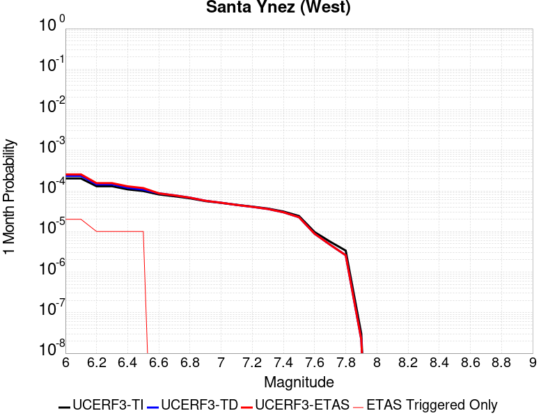 |  |  |

| Magnitude | 1 wk TI Prob | 1 wk TD Prob | 1 wk ETAS Prob | 1 wk ETAS/TD Gain | 1 wk ETAS Triggered Only | 1 mo TI Prob | 1 mo TD Prob | 1 mo ETAS Prob | 1 mo ETAS/TD Gain | 1 mo ETAS Triggered Only | 1 yr TI Prob | 1 yr TD Prob | 1 yr ETAS Prob | 1 yr ETAS/TD Gain | 1 yr ETAS Triggered Only | 10 yr TI Prob | 10 yr TD Prob | 10 yr ETAS Prob | 10 yr ETAS/TD Gain | 10 yr ETAS Triggered Only |
|-----|-----|-----|-----|-----|-----|-----|-----|-----|-----|-----|-----|-----|-----|-----|-----|-----|-----|-----|-----|-----|
| 6.0 | 4.7352758E-5 | 5.4973563E-5 | 6.4973014E-5 | 1.1818956 | 1.0E-5 | 2.0292461E-4 | 2.3558126E-4 | 2.5557657E-4 | 1.0848764 | 2.0E-5 | 0.0024678076 | 0.0028646975 | 0.0029145544 | 1.0174038 | 5.0E-5 | 0.024405818 | 0.028305814 | 0.028354399 | 1.0017164 | 5.0E-5 |
| 6.1 | 4.7352758E-5 | 5.4973563E-5 | 6.4973014E-5 | 1.1818956 | 1.0E-5 | 2.0292461E-4 | 2.3558126E-4 | 2.5557657E-4 | 1.0848764 | 2.0E-5 | 0.0024678076 | 0.0028646975 | 0.002904583 | 1.013923 | 4.0E-5 | 0.024405818 | 0.028305814 | 0.028344681 | 1.0013732 | 4.0E-5 |
| 6.2 | 3.0415853E-5 | 3.3926342E-5 | 4.3926004E-5 | 1.2947462 | 1.0E-5 | 1.3034715E-4 | 1.4539063E-4 | 1.5538916E-4 | 1.0687702 | 1.0E-5 | 0.0015858212 | 0.0017687286 | 0.0017986756 | 1.0169313 | 3.0E-5 | 0.015745522 | 0.017550463 | 0.017579935 | 1.0016793 | 3.0E-5 |
| 6.3 | 3.0415853E-5 | 3.3926342E-5 | 4.3926004E-5 | 1.2947462 | 1.0E-5 | 1.3034715E-4 | 1.4539063E-4 | 1.5538916E-4 | 1.0687702 | 1.0E-5 | 0.0015858212 | 0.0017687286 | 0.0017986756 | 1.0169313 | 3.0E-5 | 0.015745522 | 0.017550463 | 0.017579935 | 1.0016793 | 3.0E-5 |
| 6.4 | 2.5452082E-5 | 2.7913316E-5 | 3.7913036E-5 | 1.3582419 | 1.0E-5 | 1.09075794E-4 | 1.19623124E-4 | 1.2962193E-4 | 1.0835859 | 1.0E-5 | 0.0013271887 | 0.0014554574 | 0.0014854138 | 1.0205821 | 3.0E-5 | 0.013192902 | 0.014461421 | 0.014490988 | 1.0020444 | 3.0E-5 |
| 6.5 | 2.3143784E-5 | 2.5128975E-5 | 3.5128724E-5 | 1.3979369 | 1.0E-5 | 9.9183875E-5 | 1.0769125E-4 | 1.1769017E-4 | 1.0928481 | 1.0E-5 | 0.0012068948 | 0.0013103669 | 0.0013403276 | 1.0228643 | 3.0E-5 | 0.012003611 | 0.013028072 | 0.013057681 | 1.0022727 | 3.0E-5 |
| 6.6 | 1.9118515E-5 | 2.0354852E-5 | 2.0354852E-5 | 1.0 | 0.0 | 8.193392E-5 | 8.7232205E-5 | 8.7232205E-5 | 1.0 | 0.0 | 9.97089E-4 | 0.0010615425 | 0.0010815213 | 1.0188205 | 2.0E-5 | 0.00992627 | 0.010565629 | 0.010595312 | 1.0028094 | 3.0E-5 |
| 6.7 | 1.722807E-5 | 1.814676E-5 | 1.814676E-5 | 1.0 | 0.0 | 7.3832496E-5 | 7.776954E-5 | 7.776954E-5 | 1.0 | 0.0 | 8.985399E-4 | 9.4643846E-4 | 9.664195E-4 | 1.0211118 | 2.0E-5 | 0.008949154 | 0.009424723 | 0.00945444 | 1.0031531 | 3.0E-5 |
| 6.8 | 1.5317364E-5 | 1.5926802E-5 | 1.5926802E-5 | 1.0 | 0.0 | 6.56442E-5 | 6.825596E-5 | 6.825596E-5 | 1.0 | 0.0 | 7.98925E-4 | 8.3070376E-4 | 8.5068715E-4 | 1.024056 | 2.0E-5 | 0.007960589 | 0.008276474 | 0.008296308 | 1.0023965 | 2.0E-5 |
| 6.9 | 1.3071226E-5 | 1.3329833E-5 | 1.3329833E-5 | 1.0 | 0.0 | 5.6018336E-5 | 5.7126614E-5 | 5.7126614E-5 | 1.0 | 0.0 | 6.8180985E-4 | 6.9529685E-4 | 7.152829E-4 | 1.0287447 | 2.0E-5 | 0.0067972173 | 0.006931475 | 0.0069513363 | 1.0028654 | 2.0E-5 |
| 7.0 | 1.1836986E-5 | 1.1932941E-5 | 1.1932941E-5 | 1.0 | 0.0 | 5.0728955E-5 | 5.114018E-5 | 5.114018E-5 | 1.0 | 0.0 | 6.1745E-4 | 6.224555E-4 | 6.424431E-4 | 1.0321108 | 2.0E-5 | 0.006157372 | 0.0062073134 | 0.0062271897 | 1.003202 | 2.0E-5 |
| 7.1 | 1.0597169E-5 | 1.0542315E-5 | 1.0542315E-5 | 1.0 | 0.0 | 4.541565E-5 | 4.518057E-5 | 4.518057E-5 | 1.0 | 0.0 | 5.5279525E-4 | 5.499358E-4 | 5.6992477E-4 | 1.0363479 | 2.0E-5 | 0.0055142213 | 0.0054858797 | 0.0055057704 | 1.0036258 | 2.0E-5 |
| 7.2 | 9.59113E-6 | 9.459235E-6 | 9.459235E-6 | 1.0 | 0.0 | 4.11042E-5 | 4.053896E-5 | 4.053896E-5 | 1.0 | 0.0 | 5.0032866E-4 | 4.934511E-4 | 5.134412E-4 | 1.0405109 | 2.0E-5 | 0.004992037 | 0.004923673 | 0.0049435743 | 1.004042 | 2.0E-5 |
| 7.3 | 8.586084E-6 | 8.379653E-6 | 8.379653E-6 | 1.0 | 0.0 | 3.679698E-5 | 3.591231E-5 | 3.591231E-5 | 1.0 | 0.0 | 4.4791115E-4 | 4.371457E-4 | 4.5713698E-4 | 1.0457313 | 2.0E-5 | 0.004470094 | 0.004362969 | 0.0043828823 | 1.004564 | 2.0E-5 |
| 7.4 | 7.2622997E-6 | 6.951582E-6 | 6.951582E-6 | 1.0 | 0.0 | 3.112377E-5 | 2.9792158E-5 | 2.9792158E-5 | 1.0 | 0.0 | 3.78866E-4 | 3.6266012E-4 | 3.8265288E-4 | 1.0551281 | 2.0E-5 | 0.0037822074 | 0.0036207833 | 0.0036407108 | 1.0055037 | 2.0E-5 |
| 7.5 | 5.627296E-6 | 5.2515916E-6 | 5.2515916E-6 | 1.0 | 0.0 | 2.411676E-5 | 2.250663E-5 | 2.250663E-5 | 1.0 | 0.0 | 2.9358198E-4 | 2.7398448E-4 | 2.8398176E-4 | 1.0364884 | 1.0E-5 | 0.0029319443 | 0.0027365389 | 0.0027465115 | 1.0036442 | 1.0E-5 |
| 7.6 | 2.265244E-6 | 2.060903E-6 | 2.060903E-6 | 1.0 | 0.0 | 9.708152E-6 | 8.832411E-6 | 8.832411E-6 | 1.0 | 0.0 | 1.18190335E-4 | 1.07529384E-4 | 1.07529384E-4 | 1.0 | 0.0 | 0.001181275 | 0.0010747822 | 0.0010747822 | 1.0 | 0.0 |
| 7.7 | 1.3099874E-6 | 1.1016483E-6 | 1.1016483E-6 | 1.0 | 0.0 | 5.61422E-6 | 4.721341E-6 | 4.721341E-6 | 1.0 | 0.0 | 6.8350986E-5 | 5.748084E-5 | 5.748084E-5 | 1.0 | 0.0 | 6.832996E-4 | 5.746621E-4 | 5.746621E-4 | 1.0 | 0.0 |
| 7.8 | 7.903951E-7 | 6.071199E-7 | 6.071199E-7 | 1.0 | 0.0 | 3.3874032E-6 | 2.60194E-6 | 2.60194E-6 | 1.0 | 0.0 | 4.1240855E-5 | 3.167817E-5 | 3.167817E-5 | 1.0 | 0.0 | 4.12332E-4 | 3.167379E-4 | 3.167379E-4 | 1.0 | 0.0 |
| 7.9 | 7.0753297E-9 | 5.0901137E-9 | 5.0901137E-9 | 1.0 | 0.0 | 3.032284E-8 | 2.1814772E-8 | 2.1814772E-8 | 1.0 | 0.0 | 3.6918053E-7 | 2.6559482E-7 | 2.6559482E-7 | 1.0 | 0.0 | 3.691799E-6 | 2.6559462E-6 | 2.6559462E-6 | 1.0 | 0.0 |

## Oceanic - West Huasna
*[(top)](#table-of-contents)*

| 1 Week | 1 Month | 1 Year | 10 Year |
|-----|-----|-----|-----|
| 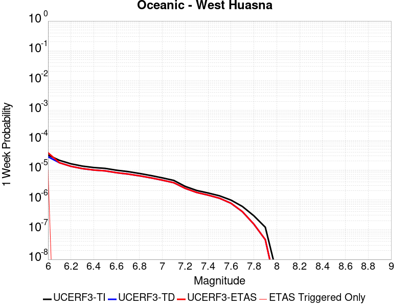 |  |  |  |

| Magnitude | 1 wk TI Prob | 1 wk TD Prob | 1 wk ETAS Prob | 1 wk ETAS/TD Gain | 1 wk ETAS Triggered Only | 1 mo TI Prob | 1 mo TD Prob | 1 mo ETAS Prob | 1 mo ETAS/TD Gain | 1 mo ETAS Triggered Only | 1 yr TI Prob | 1 yr TD Prob | 1 yr ETAS Prob | 1 yr ETAS/TD Gain | 1 yr ETAS Triggered Only | 10 yr TI Prob | 10 yr TD Prob | 10 yr ETAS Prob | 10 yr ETAS/TD Gain | 10 yr ETAS Triggered Only |
|-----|-----|-----|-----|-----|-----|-----|-----|-----|-----|-----|-----|-----|-----|-----|-----|-----|-----|-----|-----|-----|
| 6.0 | 3.195567E-5 | 2.7926866E-5 | 3.7926588E-5 | 1.3580681 | 1.0E-5 | 1.3694567E-4 | 1.1968132E-4 | 1.2968012E-4 | 1.0835452 | 1.0E-5 | 0.0016660384 | 0.0014561892 | 0.0014861455 | 1.0205717 | 3.0E-5 | 0.016536033 | 0.014471026 | 0.014530159 | 1.0040863 | 6.0E-5 |
| 6.1 | 2.1156782E-5 | 1.7573395E-5 | 1.7573395E-5 | 1.0 | 0.0 | 9.066878E-5 | 7.5312426E-5 | 7.5312426E-5 | 1.0 | 0.0 | 0.0011033333 | 9.1655244E-4 | 9.3653414E-4 | 1.0218009 | 2.0E-5 | 0.010978713 | 0.009128731 | 0.009168366 | 1.0043417 | 4.0E-5 |
| 6.2 | 1.6195117E-5 | 1.3327422E-5 | 1.3327422E-5 | 1.0 | 0.0 | 6.9405796E-5 | 5.7116285E-5 | 5.7116285E-5 | 1.0 | 0.0 | 8.44688E-4 | 6.951715E-4 | 7.0516457E-4 | 1.014375 | 1.0E-5 | 0.008414844 | 0.006930263 | 0.006950124 | 1.0028659 | 2.0E-5 |
| 6.3 | 1.3559345E-5 | 1.1179168E-5 | 1.1179168E-5 | 1.0 | 0.0 | 5.811018E-5 | 4.7909845E-5 | 4.7909845E-5 | 1.0 | 0.0 | 7.072618E-4 | 5.831472E-4 | 5.9314136E-4 | 1.0171384 | 1.0E-5 | 0.0070501505 | 0.0058162883 | 0.005836172 | 1.0034186 | 2.0E-5 |
| 6.4 | 1.2120619E-5 | 1.00010075E-5 | 1.00010075E-5 | 1.0 | 0.0 | 5.1944477E-5 | 4.286076E-5 | 4.286076E-5 | 1.0 | 0.0 | 6.322405E-4 | 5.217053E-4 | 5.317001E-4 | 1.0191579 | 1.0E-5 | 0.006304447 | 0.005204873 | 0.005224769 | 1.0038226 | 2.0E-5 |
| 6.5 | 1.13511915E-5 | 9.367494E-6 | 9.367494E-6 | 1.0 | 0.0 | 4.8647056E-5 | 4.0145787E-5 | 4.0145787E-5 | 1.0 | 0.0 | 5.9211696E-4 | 4.8866577E-4 | 4.986609E-4 | 1.0204539 | 1.0E-5 | 0.0059054173 | 0.0048759715 | 0.0048958743 | 1.0040817 | 2.0E-5 |
| 6.6 | 9.850605E-6 | 8.135413E-6 | 8.135413E-6 | 1.0 | 0.0 | 4.2216197E-5 | 3.4865592E-5 | 3.4865592E-5 | 1.0 | 0.0 | 5.1386096E-4 | 4.244061E-4 | 4.3440188E-4 | 1.0235523 | 1.0E-5 | 0.0051267436 | 0.0042359885 | 0.004255904 | 1.0047015 | 2.0E-5 |
| 6.7 | 8.8558645E-6 | 7.3184287E-6 | 7.3184287E-6 | 1.0 | 0.0 | 3.7953152E-5 | 3.1364318E-5 | 3.1364318E-5 | 1.0 | 0.0 | 4.6198163E-4 | 3.8179386E-4 | 3.9179003E-4 | 1.0261822 | 1.0E-5 | 0.004610224 | 0.0038114048 | 0.0038313286 | 1.0052274 | 2.0E-5 |
| 6.8 | 7.67136E-6 | 6.391768E-6 | 6.391768E-6 | 1.0 | 0.0 | 3.2876844E-5 | 2.7393004E-5 | 2.7393004E-5 | 1.0 | 0.0 | 4.0020206E-4 | 3.334589E-4 | 3.4345558E-4 | 1.0299788 | 1.0E-5 | 0.003994821 | 0.0033296067 | 0.00334954 | 1.0059867 | 2.0E-5 |
| 6.9 | 6.534529E-6 | 5.4583293E-6 | 5.4583293E-6 | 1.0 | 0.0 | 2.8004823E-5 | 2.339263E-5 | 2.339263E-5 | 1.0 | 0.0 | 3.4090536E-4 | 2.8476818E-4 | 2.9476534E-4 | 1.0351063 | 1.0E-5 | 0.0034038287 | 0.0028440496 | 0.0028639927 | 1.0070122 | 2.0E-5 |
| 7.0 | 5.460525E-6 | 4.569981E-6 | 4.569981E-6 | 1.0 | 0.0 | 2.3402039E-5 | 1.9585485E-5 | 1.9585485E-5 | 1.0 | 0.0 | 2.8488258E-4 | 2.384273E-4 | 2.484249E-4 | 1.0419315 | 1.0E-5 | 0.0028451765 | 0.002381729 | 0.0024016812 | 1.0083773 | 2.0E-5 |
| 7.1 | 4.4825083E-6 | 3.7524717E-6 | 3.7524717E-6 | 1.0 | 0.0 | 1.9210609E-5 | 1.6081924E-5 | 1.6081924E-5 | 1.0 | 0.0 | 2.3386406E-4 | 1.9577992E-4 | 2.0577796E-4 | 1.0510677 | 1.0E-5 | 0.002336181 | 0.0019560866 | 0.0019760474 | 1.0102046 | 2.0E-5 |
| 7.2 | 2.821708E-6 | 2.4249916E-6 | 2.4249916E-6 | 1.0 | 0.0 | 1.2092979E-5 | 1.039278E-5 | 1.039278E-5 | 1.0 | 0.0 | 1.4722206E-4 | 1.2652476E-4 | 1.2652476E-4 | 1.0 | 0.0 | 0.0014712457 | 0.0012645298 | 0.0012745172 | 1.0078981 | 1.0E-5 |
| 7.3 | 2.0644757E-6 | 1.7687952E-6 | 1.7687952E-6 | 1.0 | 0.0 | 8.847723E-6 | 7.5805287E-6 | 7.5805287E-6 | 1.0 | 0.0 | 1.0771569E-4 | 9.228903E-5 | 9.228903E-5 | 1.0 | 0.0 | 0.001076635 | 9.225089E-4 | 9.225089E-4 | 1.0 | 0.0 |
| 7.4 | 1.6980367E-6 | 1.4380392E-6 | 1.4380392E-6 | 1.0 | 0.0 | 7.27728E-6 | 6.1630108E-6 | 6.1630108E-6 | 1.0 | 0.0 | 8.8597284E-5 | 7.5032076E-5 | 7.5032076E-5 | 1.0 | 0.0 | 8.8561967E-4 | 7.500691E-4 | 7.500691E-4 | 1.0 | 0.0 |
| 7.5 | 1.3637683E-6 | 1.1303102E-6 | 1.1303102E-6 | 1.0 | 0.0 | 5.844708E-6 | 4.8441775E-6 | 4.8441775E-6 | 1.0 | 0.0 | 7.1156996E-5 | 5.8976268E-5 | 5.8976268E-5 | 1.0 | 0.0 | 7.1134215E-4 | 5.8960775E-4 | 5.8960775E-4 | 1.0 | 0.0 |
| 7.6 | 9.802994E-7 | 7.67765E-7 | 7.67765E-7 | 1.0 | 0.0 | 4.2012766E-6 | 3.2904175E-6 | 3.2904175E-6 | 1.0 | 0.0 | 5.1149345E-5 | 4.0060095E-5 | 4.0060095E-5 | 1.0 | 0.0 | 5.113757E-4 | 4.0053023E-4 | 4.0053023E-4 | 1.0 | 0.0 |
| 7.7 | 5.986191E-7 | 4.0054147E-7 | 4.0054147E-7 | 1.0 | 0.0 | 2.5655079E-6 | 1.7166051E-6 | 1.7166051E-6 | 1.0 | 0.0 | 3.1234613E-5 | 2.0899466E-5 | 2.0899466E-5 | 1.0 | 0.0 | 3.123022E-4 | 2.0897645E-4 | 2.0897645E-4 | 1.0 | 0.0 |
| 7.8 | 2.9189815E-7 | 1.5288222E-7 | 1.5288222E-7 | 1.0 | 0.0 | 1.2509914E-6 | 6.5520936E-7 | 6.5520936E-7 | 1.0 | 0.0 | 1.5230714E-5 | 7.977144E-6 | 7.977144E-6 | 1.0 | 0.0 | 1.522967E-4 | 7.9769976E-5 | 7.9769976E-5 | 1.0 | 0.0 |
| 7.9 | 1.2057845E-7 | 4.6224844E-8 | 4.6224844E-8 | 1.0 | 0.0 | 5.1676466E-7 | 1.9810645E-7 | 1.9810645E-7 | 1.0 | 0.0 | 6.2915915E-6 | 2.4119433E-6 | 2.4119433E-6 | 1.0 | 0.0 | 6.2914136E-5 | 2.4120558E-5 | 2.4120558E-5 | 1.0 | 0.0 |
| 8.0 | 3.3806387E-9 | 9.015989E-10 | 9.015989E-10 | 1.0 | 0.0 | 1.4488451E-8 | 3.863995E-9 | 3.863995E-9 | 1.0 | 0.0 | 1.7639688E-7 | 4.704413E-8 | 4.704413E-8 | 1.0 | 0.0 | 1.7639674E-6 | 4.7163547E-7 | 4.7163547E-7 | 1.0 | 0.0 |

## San Jacinto (Stepovers Combined)
*[(top)](#table-of-contents)*

| 1 Week | 1 Month | 1 Year | 10 Year |
|-----|-----|-----|-----|
|  |  |  |  |

| Magnitude | 1 wk TI Prob | 1 wk TD Prob | 1 wk ETAS Prob | 1 wk ETAS/TD Gain | 1 wk ETAS Triggered Only | 1 mo TI Prob | 1 mo TD Prob | 1 mo ETAS Prob | 1 mo ETAS/TD Gain | 1 mo ETAS Triggered Only | 1 yr TI Prob | 1 yr TD Prob | 1 yr ETAS Prob | 1 yr ETAS/TD Gain | 1 yr ETAS Triggered Only | 10 yr TI Prob | 10 yr TD Prob | 10 yr ETAS Prob | 10 yr ETAS/TD Gain | 10 yr ETAS Triggered Only |
|-----|-----|-----|-----|-----|-----|-----|-----|-----|-----|-----|-----|-----|-----|-----|-----|-----|-----|-----|-----|-----|
| 6.0 | 4.0667746E-5 | 3.5300047E-5 | 3.5300047E-5 | 1.0 | 0.0 | 1.742787E-4 | 1.5127716E-4 | 1.5127716E-4 | 1.0 | 0.0 | 0.0021197782 | 0.0018402446 | 0.0018602078 | 1.0108482 | 2.0E-5 | 0.020996714 | 0.019000612 | 0.019059472 | 1.0030978 | 6.0E-5 |
| 6.1 | 4.0667746E-5 | 3.5300047E-5 | 3.5300047E-5 | 1.0 | 0.0 | 1.742787E-4 | 1.5127716E-4 | 1.5127716E-4 | 1.0 | 0.0 | 0.0021197782 | 0.0018402446 | 0.0018602078 | 1.0108482 | 2.0E-5 | 0.020996714 | 0.019000612 | 0.019059472 | 1.0030978 | 6.0E-5 |
| 6.2 | 4.0667746E-5 | 3.5300047E-5 | 3.5300047E-5 | 1.0 | 0.0 | 1.742787E-4 | 1.5127716E-4 | 1.5127716E-4 | 1.0 | 0.0 | 0.0021197782 | 0.0018402446 | 0.0018602078 | 1.0108482 | 2.0E-5 | 0.020996714 | 0.019000612 | 0.019059472 | 1.0030978 | 6.0E-5 |
| 6.3 | 4.0667746E-5 | 3.5300047E-5 | 3.5300047E-5 | 1.0 | 0.0 | 1.742787E-4 | 1.5127716E-4 | 1.5127716E-4 | 1.0 | 0.0 | 0.0021197782 | 0.0018402446 | 0.0018602078 | 1.0108482 | 2.0E-5 | 0.020996714 | 0.019000612 | 0.019059472 | 1.0030978 | 6.0E-5 |
| 6.4 | 4.0577226E-5 | 3.5171943E-5 | 3.5171943E-5 | 1.0 | 0.0 | 1.738908E-4 | 1.5072821E-4 | 1.5072821E-4 | 1.0 | 0.0 | 0.0021150648 | 0.0018335737 | 0.001853537 | 1.0108876 | 2.0E-5 | 0.020950472 | 0.018935174 | 0.018994037 | 1.0031087 | 6.0E-5 |
| 6.5 | 4.0577226E-5 | 3.5171943E-5 | 3.5171943E-5 | 1.0 | 0.0 | 1.738908E-4 | 1.5072821E-4 | 1.5072821E-4 | 1.0 | 0.0 | 0.0021150648 | 0.0018335737 | 0.001853537 | 1.0108876 | 2.0E-5 | 0.020950472 | 0.018935174 | 0.018994037 | 1.0031087 | 6.0E-5 |
| 6.6 | 4.053861E-5 | 3.5117282E-5 | 3.5117282E-5 | 1.0 | 0.0 | 1.7372532E-4 | 1.5049396E-4 | 1.5049396E-4 | 1.0 | 0.0 | 0.0021130538 | 0.0018307271 | 0.0018506905 | 1.0109047 | 2.0E-5 | 0.020930743 | 0.018907249 | 0.018966114 | 1.0031134 | 6.0E-5 |
| 6.7 | 4.0516545E-5 | 3.5086352E-5 | 3.5086352E-5 | 1.0 | 0.0 | 1.7363077E-4 | 1.5036143E-4 | 1.5036143E-4 | 1.0 | 0.0 | 0.002111905 | 0.0018291164 | 0.0018490797 | 1.0109142 | 2.0E-5 | 0.020919468 | 0.018891444 | 0.018950311 | 1.003116 | 6.0E-5 |
| 6.8 | 4.049434E-5 | 3.505791E-5 | 3.505791E-5 | 1.0 | 0.0 | 1.7353562E-4 | 1.5023955E-4 | 1.5023955E-4 | 1.0 | 0.0 | 0.0021107488 | 0.0018276351 | 0.0018475985 | 1.0109231 | 2.0E-5 | 0.020908125 | 0.018876856 | 0.018935723 | 1.0031185 | 6.0E-5 |
| 6.9 | 4.046386E-5 | 3.502047E-5 | 3.502047E-5 | 1.0 | 0.0 | 1.73405E-4 | 1.500791E-4 | 1.500791E-4 | 1.0 | 0.0 | 0.0021091616 | 0.0018256848 | 0.0018456483 | 1.0109348 | 2.0E-5 | 0.020892553 | 0.018857626 | 0.018916495 | 1.0031217 | 6.0E-5 |
| 7.0 | 4.036382E-5 | 3.4901022E-5 | 3.4901022E-5 | 1.0 | 0.0 | 1.7297632E-4 | 1.4956725E-4 | 1.4956725E-4 | 1.0 | 0.0 | 0.0021039525 | 0.0018194637 | 0.0018394273 | 1.0109723 | 2.0E-5 | 0.02084144 | 0.018796233 | 0.018855106 | 1.0031321 | 6.0E-5 |
| 7.1 | 4.0343282E-5 | 3.4879482E-5 | 3.4879482E-5 | 1.0 | 0.0 | 1.7288832E-4 | 1.4947496E-4 | 1.4947496E-4 | 1.0 | 0.0 | 0.002102883 | 0.0018183418 | 0.0018383054 | 1.010979 | 2.0E-5 | 0.020830948 | 0.018785104 | 0.018843977 | 1.003134 | 6.0E-5 |
| 7.2 | 4.0257353E-5 | 3.478397E-5 | 3.478397E-5 | 1.0 | 0.0 | 1.725201E-4 | 1.4906566E-4 | 1.4906566E-4 | 1.0 | 0.0 | 0.0020984085 | 0.0018133669 | 0.0018333306 | 1.0110092 | 2.0E-5 | 0.020787042 | 0.018735839 | 0.018794715 | 1.0031425 | 6.0E-5 |
| 7.3 | 3.9940667E-5 | 3.4611574E-5 | 3.4611574E-5 | 1.0 | 0.0 | 1.7116306E-4 | 1.483269E-4 | 1.483269E-4 | 1.0 | 0.0 | 0.0020819185 | 0.0018043874 | 0.0018243514 | 1.011064 | 2.0E-5 | 0.020625217 | 0.018644443 | 0.018703325 | 1.0031581 | 6.0E-5 |
| 7.4 | 3.9721202E-5 | 3.4496923E-5 | 3.4496923E-5 | 1.0 | 0.0 | 1.7022261E-4 | 1.478356E-4 | 1.478356E-4 | 1.0 | 0.0 | 0.0020704903 | 0.0017984157 | 0.0018183797 | 1.0111009 | 2.0E-5 | 0.020513052 | 0.018583557 | 0.01864244 | 1.0031687 | 6.0E-5 |
| 7.5 | 3.7036873E-5 | 3.356402E-5 | 3.356402E-5 | 1.0 | 0.0 | 1.5871979E-4 | 1.4383788E-4 | 1.4383788E-4 | 1.0 | 0.0 | 0.0019307006 | 0.0017498226 | 0.0017697876 | 1.0114098 | 2.0E-5 | 0.019140124 | 0.018084899 | 0.018143814 | 1.0032576 | 6.0E-5 |
| 7.6 | 3.2940967E-5 | 3.13443E-5 | 3.13443E-5 | 1.0 | 0.0 | 1.4116794E-4 | 1.3432582E-4 | 1.3432582E-4 | 1.0 | 0.0 | 0.0017173645 | 0.0016341923 | 0.0016541596 | 1.0122185 | 2.0E-5 | 0.01704153 | 0.01691766 | 0.016976647 | 1.0034866 | 6.0E-5 |
| 7.7 | 2.8236149E-5 | 2.790956E-5 | 2.790956E-5 | 1.0 | 0.0 | 1.2100645E-4 | 1.1960692E-4 | 1.1960692E-4 | 1.0 | 0.0 | 0.0014722579 | 0.0014552426 | 0.0014752134 | 1.0137234 | 2.0E-5 | 0.014625421 | 0.015128396 | 0.015187489 | 1.003906 | 6.0E-5 |
| 7.8 | 2.4329287E-5 | 2.5232233E-5 | 2.5232233E-5 | 1.0 | 0.0 | 1.042642E-4 | 1.0813367E-4 | 1.0813367E-4 | 1.0 | 0.0 | 0.0012686774 | 0.0013157332 | 0.0013357069 | 1.0151807 | 2.0E-5 | 0.012614589 | 0.01372533 | 0.013784506 | 1.0043114 | 6.0E-5 |
| 7.9 | 1.9370926E-5 | 2.0443678E-5 | 2.0443678E-5 | 1.0 | 0.0 | 8.301561E-5 | 8.7612825E-5 | 8.7612825E-5 | 1.0 | 0.0 | 0.0010102465 | 0.0010661649 | 0.0010861437 | 1.0187389 | 2.0E-5 | 0.0100566605 | 0.011211283 | 0.01127061 | 1.0052917 | 6.0E-5 |
| 8.0 | 1.5583017E-5 | 1.5905001E-5 | 1.5905001E-5 | 1.0 | 0.0 | 6.6782646E-5 | 6.816251E-5 | 6.816251E-5 | 1.0 | 0.0 | 8.127754E-4 | 8.295633E-4 | 8.495467E-4 | 1.0240891 | 2.0E-5 | 0.008098091 | 0.008791715 | 0.008851187 | 1.0067647 | 6.0E-5 |
| 8.1 | 1.0024873E-5 | 8.302799E-6 | 8.302799E-6 | 1.0 | 0.0 | 4.2963035E-5 | 3.5582943E-5 | 3.5582943E-5 | 1.0 | 0.0 | 5.229494E-4 | 4.3313674E-4 | 4.431324E-4 | 1.0230774 | 1.0E-5 | 0.0052172043 | 0.0046591433 | 0.0046890033 | 1.0064089 | 3.0E-5 |
| 8.2 | 4.142796E-6 | 1.5635898E-6 | 1.5635898E-6 | 1.0 | 0.0 | 1.775472E-5 | 6.701082E-6 | 6.701082E-6 | 1.0 | 0.0 | 2.1614227E-4 | 8.158265E-5 | 8.158265E-5 | 1.0 | 0.0 | 0.0021593217 | 9.469635E-4 | 9.469635E-4 | 1.0 | 0.0 |
| 8.3 | 1.2750878E-6 | 3.6187842E-7 | 3.6187842E-7 | 1.0 | 0.0 | 5.4646503E-6 | 1.5509066E-6 | 1.5509066E-6 | 1.0 | 0.0 | 6.653009E-5 | 1.8882129E-5 | 1.8882129E-5 | 1.0 | 0.0 | 6.6510175E-4 | 2.2774591E-4 | 2.2774591E-4 | 1.0 | 0.0 |

## San Diego Trough north alt1
*[(top)](#table-of-contents)*

| 1 Week | 1 Month | 1 Year | 10 Year |
|-----|-----|-----|-----|
|  |  |  |  |

| Magnitude | 1 wk TI Prob | 1 wk TD Prob | 1 wk ETAS Prob | 1 wk ETAS/TD Gain | 1 wk ETAS Triggered Only | 1 mo TI Prob | 1 mo TD Prob | 1 mo ETAS Prob | 1 mo ETAS/TD Gain | 1 mo ETAS Triggered Only | 1 yr TI Prob | 1 yr TD Prob | 1 yr ETAS Prob | 1 yr ETAS/TD Gain | 1 yr ETAS Triggered Only | 10 yr TI Prob | 10 yr TD Prob | 10 yr ETAS Prob | 10 yr ETAS/TD Gain | 10 yr ETAS Triggered Only |
|-----|-----|-----|-----|-----|-----|-----|-----|-----|-----|-----|-----|-----|-----|-----|-----|-----|-----|-----|-----|-----|
| 6.0 | 7.329252E-5 | 8.821761E-5 | 1.0821584E-4 | 1.2266921 | 2.0E-5 | 3.14073E-4 | 3.7802433E-4 | 4.180092E-4 | 1.1057733 | 4.0E-5 | 0.0038171355 | 0.004593297 | 0.0046331133 | 1.0086683 | 4.0E-5 | 0.03752231 | 0.04504752 | 0.045104817 | 1.001272 | 6.0E-5 |
| 6.1 | 3.7940346E-5 | 4.4887143E-5 | 5.4886696E-5 | 1.2227709 | 1.0E-5 | 1.6259136E-4 | 1.9235985E-4 | 2.12356E-4 | 1.1039518 | 2.0E-5 | 0.0019777524 | 0.0023395459 | 0.0023594992 | 1.0085287 | 2.0E-5 | 0.019602431 | 0.023157855 | 0.02318716 | 1.0012654 | 3.0E-5 |
| 6.2 | 2.8645263E-5 | 3.3298184E-5 | 4.329785E-5 | 1.3003067 | 1.0E-5 | 1.2275964E-4 | 1.4269885E-4 | 1.62696E-4 | 1.1401353 | 2.0E-5 | 0.0014935739 | 0.0017359962 | 0.0017559616 | 1.0115007 | 2.0E-5 | 0.0148357535 | 0.01722701 | 0.017256495 | 1.0017115 | 3.0E-5 |
| 6.3 | 2.8645263E-5 | 3.3298184E-5 | 4.329785E-5 | 1.3003067 | 1.0E-5 | 1.2275964E-4 | 1.4269885E-4 | 1.62696E-4 | 1.1401353 | 2.0E-5 | 0.0014935739 | 0.0017359962 | 0.0017559616 | 1.0115007 | 2.0E-5 | 0.0148357535 | 0.01722701 | 0.017256495 | 1.0017115 | 3.0E-5 |
| 6.4 | 2.2204576E-5 | 2.5449317E-5 | 3.5449062E-5 | 1.3929279 | 1.0E-5 | 9.5159E-5 | 1.09064E-4 | 1.1906291E-4 | 1.0916793 | 1.0E-5 | 0.001157945 | 0.0013270547 | 0.0013370415 | 1.0075254 | 1.0E-5 | 0.011519298 | 0.013192472 | 0.013212208 | 1.001496 | 2.0E-5 |
| 6.5 | 2.1004838E-5 | 2.4025623E-5 | 3.4025383E-5 | 1.4162123 | 1.0E-5 | 9.0017624E-5 | 1.0296294E-4 | 1.1296191E-4 | 1.0971123 | 1.0E-5 | 0.0010954136 | 0.0012528617 | 0.0012628492 | 1.0079718 | 1.0E-5 | 0.010900296 | 0.012459069 | 0.012478819 | 1.0015852 | 2.0E-5 |
| 6.6 | 1.820557E-5 | 2.0705551E-5 | 3.0705345E-5 | 1.4829522 | 1.0E-5 | 7.802154E-5 | 8.873509E-5 | 9.87342E-5 | 1.112685 | 1.0E-5 | 9.4949827E-4 | 0.0010798196 | 0.0010898089 | 1.0092508 | 1.0E-5 | 0.009454516 | 0.010746398 | 0.010766183 | 1.0018411 | 2.0E-5 |
| 6.7 | 1.5884485E-5 | 1.7984283E-5 | 2.7984102E-5 | 1.5560311 | 1.0E-5 | 6.807459E-5 | 7.707324E-5 | 8.707246E-5 | 1.1297368 | 1.0E-5 | 8.284929E-4 | 9.379654E-4 | 9.47956E-4 | 1.0106514 | 1.0E-5 | 0.008254109 | 0.0093404325 | 0.009360245 | 1.0021212 | 2.0E-5 |
| 6.8 | 1.4331171E-5 | 1.620163E-5 | 2.6201467E-5 | 1.6172118 | 1.0E-5 | 6.141786E-5 | 6.943372E-5 | 7.9433026E-5 | 1.1440122 | 1.0E-5 | 7.4750587E-4 | 8.4502966E-4 | 8.5502124E-4 | 1.0118239 | 1.0E-5 | 0.0074499645 | 0.0084184315 | 0.008438263 | 1.0023557 | 2.0E-5 |
| 6.9 | 1.2574203E-5 | 1.4206327E-5 | 2.4206185E-5 | 1.7039016 | 1.0E-5 | 5.3888325E-5 | 6.0882845E-5 | 7.088224E-5 | 1.1642399 | 1.0E-5 | 6.558929E-4 | 7.4099796E-4 | 7.509906E-4 | 1.0134853 | 1.0E-5 | 0.0065396037 | 0.0073854583 | 0.0074053104 | 1.002688 | 2.0E-5 |
| 7.0 | 1.0883844E-5 | 1.2289685E-5 | 2.2289561E-5 | 1.8136805 | 1.0E-5 | 4.664421E-5 | 5.266902E-5 | 6.266849E-5 | 1.189855 | 1.0E-5 | 5.677453E-4 | 6.410577E-4 | 6.5105123E-4 | 1.0155892 | 1.0E-5 | 0.00566297 | 0.0063922126 | 0.0064120847 | 1.0031089 | 2.0E-5 |
| 7.1 | 9.393088E-6 | 1.0607386E-5 | 2.060728E-5 | 1.9427294 | 1.0E-5 | 4.025547E-5 | 4.5459437E-5 | 5.5458986E-5 | 1.2199663 | 1.0E-5 | 4.900001E-4 | 5.533289E-4 | 5.633234E-4 | 1.0180625 | 1.0E-5 | 0.0048892107 | 0.005519608 | 0.0055394974 | 1.0036035 | 2.0E-5 |
| 7.2 | 8.190791E-6 | 9.258948E-6 | 1.9258856E-5 | 2.0800264 | 1.0E-5 | 3.510292E-5 | 3.9680606E-5 | 4.968021E-5 | 1.2520022 | 1.0E-5 | 4.2729423E-4 | 4.83005E-4 | 4.9300015E-4 | 1.0206938 | 1.0E-5 | 0.0042647356 | 0.004819632 | 0.004839536 | 1.0041296 | 2.0E-5 |
| 7.3 | 6.268162E-6 | 7.0899637E-6 | 7.0899637E-6 | 1.0 | 0.0 | 2.6863276E-5 | 3.0385208E-5 | 3.0385208E-5 | 1.0 | 0.0 | 3.2701128E-4 | 3.6987753E-4 | 3.6987753E-4 | 1.0 | 0.0 | 0.003265305 | 0.003692665 | 0.003692665 | 1.0 | 0.0 |
| 7.4 | 4.985186E-6 | 5.6428803E-6 | 5.6428803E-6 | 1.0 | 0.0 | 2.1364907E-5 | 2.418355E-5 | 2.418355E-5 | 1.0 | 0.0 | 2.600867E-4 | 2.9439534E-4 | 2.9439534E-4 | 1.0 | 0.0 | 0.002597825 | 0.0029400948 | 0.0029400948 | 1.0 | 0.0 |
| 7.5 | 1.7489613E-6 | 1.9697447E-6 | 1.9697447E-6 | 1.0 | 0.0 | 7.495527E-6 | 8.441737E-6 | 8.441737E-6 | 1.0 | 0.0 | 9.125422E-5 | 1.0277352E-4 | 1.0277352E-4 | 1.0 | 0.0 | 9.1216754E-4 | 0.001027282 | 0.001027282 | 1.0 | 0.0 |
| 7.6 | 1.6988751E-7 | 1.7533972E-7 | 1.7533972E-7 | 1.0 | 0.0 | 7.2808916E-7 | 7.514558E-7 | 7.514558E-7 | 1.0 | 0.0 | 8.864449E-6 | 9.148937E-6 | 9.148937E-6 | 1.0 | 0.0 | 8.8640954E-5 | 9.14858E-5 | 9.14858E-5 | 1.0 | 0.0 |

## Palos Verdes
*[(top)](#table-of-contents)*

| 1 Week | 1 Month | 1 Year | 10 Year |
|-----|-----|-----|-----|
|  |  |  |  |

| Magnitude | 1 wk TI Prob | 1 wk TD Prob | 1 wk ETAS Prob | 1 wk ETAS/TD Gain | 1 wk ETAS Triggered Only | 1 mo TI Prob | 1 mo TD Prob | 1 mo ETAS Prob | 1 mo ETAS/TD Gain | 1 mo ETAS Triggered Only | 1 yr TI Prob | 1 yr TD Prob | 1 yr ETAS Prob | 1 yr ETAS/TD Gain | 1 yr ETAS Triggered Only | 10 yr TI Prob | 10 yr TD Prob | 10 yr ETAS Prob | 10 yr ETAS/TD Gain | 10 yr ETAS Triggered Only |
|-----|-----|-----|-----|-----|-----|-----|-----|-----|-----|-----|-----|-----|-----|-----|-----|-----|-----|-----|-----|-----|
| 6.0 | 6.126063E-5 | 7.623073E-5 | 8.622997E-5 | 1.1311707 | 1.0E-5 | 2.6251914E-4 | 3.2666558E-4 | 3.366623E-4 | 1.0306023 | 1.0E-5 | 0.0031914865 | 0.0039704293 | 0.0039803893 | 1.0025086 | 1.0E-5 | 0.031460393 | 0.039051544 | 0.039099593 | 1.0012304 | 5.0E-5 |
| 6.1 | 6.126063E-5 | 7.623073E-5 | 8.622997E-5 | 1.1311707 | 1.0E-5 | 2.6251914E-4 | 3.2666558E-4 | 3.366623E-4 | 1.0306023 | 1.0E-5 | 0.0031914865 | 0.0039704293 | 0.0039803893 | 1.0025086 | 1.0E-5 | 0.031460393 | 0.039051544 | 0.039099593 | 1.0012304 | 5.0E-5 |
| 6.2 | 6.126063E-5 | 7.623073E-5 | 8.622997E-5 | 1.1311707 | 1.0E-5 | 2.6251914E-4 | 3.2666558E-4 | 3.366623E-4 | 1.0306023 | 1.0E-5 | 0.0031914865 | 0.0039704293 | 0.0039803893 | 1.0025086 | 1.0E-5 | 0.031460393 | 0.039051544 | 0.039099593 | 1.0012304 | 5.0E-5 |
| 6.3 | 4.0838047E-5 | 4.975192E-5 | 5.9751423E-5 | 1.2009872 | 1.0E-5 | 1.7500846E-4 | 2.1320637E-4 | 2.2320423E-4 | 1.0468929 | 1.0E-5 | 0.0021286458 | 0.0025929045 | 0.0026028785 | 1.0038466 | 1.0E-5 | 0.021083709 | 0.025648214 | 0.025677444 | 1.0011396 | 3.0E-5 |
| 6.4 | 4.0838047E-5 | 4.975192E-5 | 5.9751423E-5 | 1.2009872 | 1.0E-5 | 1.7500846E-4 | 2.1320637E-4 | 2.2320423E-4 | 1.0468929 | 1.0E-5 | 0.0021286458 | 0.0025929045 | 0.0026028785 | 1.0038466 | 1.0E-5 | 0.021083709 | 0.025648214 | 0.025677444 | 1.0011396 | 3.0E-5 |
| 6.5 | 3.0512005E-5 | 3.6563535E-5 | 4.656317E-5 | 1.2734865 | 1.0E-5 | 1.3075917E-4 | 1.5669213E-4 | 1.6669056E-4 | 1.0638094 | 1.0E-5 | 0.0015908304 | 0.0019061728 | 0.0019161538 | 1.0052361 | 1.0E-5 | 0.015794903 | 0.018910164 | 0.018929785 | 1.0010376 | 2.0E-5 |
| 6.6 | 2.9255087E-5 | 3.515629E-5 | 4.5155935E-5 | 1.2844341 | 1.0E-5 | 1.2537291E-4 | 1.5066177E-4 | 1.6066026E-4 | 1.0663638 | 1.0E-5 | 0.0015253464 | 0.0018328767 | 0.0018428584 | 1.005446 | 1.0E-5 | 0.015149189 | 0.018189214 | 0.01820885 | 1.0010796 | 2.0E-5 |
| 6.7 | 2.287198E-5 | 2.7249673E-5 | 3.72494E-5 | 1.3669668 | 1.0E-5 | 9.801909E-5 | 1.1677961E-4 | 1.2677844E-4 | 1.0856214 | 1.0E-5 | 0.001192729 | 0.001420956 | 0.0014309419 | 1.0070275 | 1.0E-5 | 0.011863477 | 0.014127936 | 0.014147653 | 1.0013956 | 2.0E-5 |
| 6.8 | 2.1325764E-5 | 2.5433186E-5 | 3.543293E-5 | 1.393177 | 1.0E-5 | 9.139293E-5 | 1.0899533E-4 | 1.1899424E-4 | 1.091737 | 1.0E-5 | 0.001112141 | 0.0013263006 | 0.0013362872 | 1.0075297 | 1.0E-5 | 0.011065915 | 0.0131928865 | 0.013212623 | 1.001496 | 2.0E-5 |
| 6.9 | 1.9009392E-5 | 2.2614695E-5 | 3.261447E-5 | 1.4421804 | 1.0E-5 | 8.1466285E-5 | 9.6917014E-5 | 1.0691604E-4 | 1.1031711 | 1.0E-5 | 9.914007E-4 | 0.0011794133 | 0.0011894015 | 1.0084687 | 1.0E-5 | 0.009869894 | 0.011740225 | 0.01175999 | 1.0016836 | 2.0E-5 |
| 7.0 | 1.7098473E-5 | 2.032038E-5 | 3.0320178E-5 | 1.4921068 | 1.0E-5 | 7.3277115E-5 | 8.708492E-5 | 9.708405E-5 | 1.1148205 | 1.0E-5 | 8.917837E-4 | 0.0010598284 | 0.0010698178 | 1.0094255 | 1.0E-5 | 0.008882134 | 0.010556176 | 0.010575966 | 1.0018746 | 2.0E-5 |
| 7.1 | 1.5982785E-5 | 1.8995719E-5 | 2.899553E-5 | 1.5264244 | 1.0E-5 | 6.849585E-5 | 8.140816E-5 | 9.1407346E-5 | 1.1228278 | 1.0E-5 | 8.336179E-4 | 9.907784E-4 | 0.0010007685 | 1.0100831 | 1.0E-5 | 0.008304977 | 0.0098719755 | 0.009891778 | 1.0020059 | 2.0E-5 |
| 7.2 | 1.4468002E-5 | 1.7198105E-5 | 2.7197933E-5 | 1.5814494 | 1.0E-5 | 6.200425E-5 | 7.3704556E-5 | 8.370382E-5 | 1.1356668 | 1.0E-5 | 7.546402E-4 | 8.9706754E-4 | 9.070586E-4 | 1.0111375 | 1.0E-5 | 0.007520827 | 0.008942734 | 0.008962556 | 1.0022165 | 2.0E-5 |
| 7.3 | 5.288233E-6 | 6.2039667E-6 | 6.2039667E-6 | 1.0 | 0.0 | 2.2663658E-5 | 2.6588355E-5 | 2.6588355E-5 | 1.0 | 0.0 | 2.7589512E-4 | 3.2370005E-4 | 3.2370005E-4 | 1.0 | 0.0 | 0.0027555283 | 0.0032357085 | 0.0032456762 | 1.0030805 | 1.0E-5 |
| 7.4 | 8.279556E-7 | 8.4083814E-7 | 8.4083814E-7 | 1.0 | 0.0 | 3.5483763E-6 | 3.6035874E-6 | 3.6035874E-6 | 1.0 | 0.0 | 4.3200624E-5 | 4.3872868E-5 | 4.3872868E-5 | 1.0 | 0.0 | 4.3192226E-4 | 4.3864927E-4 | 4.3864927E-4 | 1.0 | 0.0 |
| 7.5 | 6.559831E-7 | 6.667258E-7 | 6.667258E-7 | 1.0 | 0.0 | 2.8113532E-6 | 2.8573934E-6 | 2.8573934E-6 | 1.0 | 0.0 | 3.4227687E-5 | 3.4788278E-5 | 3.4788278E-5 | 1.0 | 0.0 | 3.4222414E-4 | 3.4783495E-4 | 3.4783495E-4 | 1.0 | 0.0 |
| 7.6 | 3.5018968E-7 | 3.562019E-7 | 3.562019E-7 | 1.0 | 0.0 | 1.500812E-6 | 1.526579E-6 | 1.526579E-6 | 1.0 | 0.0 | 1.8272232E-5 | 1.8585988E-5 | 1.8585988E-5 | 1.0 | 0.0 | 1.8270731E-4 | 1.8584893E-4 | 1.8584893E-4 | 1.0 | 0.0 |
| 7.7 | 1.1986104E-7 | 1.2198434E-7 | 1.2198434E-7 | 1.0 | 0.0 | 5.1369005E-7 | 5.2278995E-7 | 5.2278995E-7 | 1.0 | 0.0 | 6.2541585E-6 | 6.364949E-6 | 6.364949E-6 | 1.0 | 0.0 | 6.2539824E-5 | 6.364771E-5 | 6.364771E-5 | 1.0 | 0.0 |
| 7.8 | 3.0445005E-8 | 3.1027742E-8 | 3.1027742E-8 | 1.0 | 0.0 | 1.3047858E-7 | 1.3297603E-7 | 1.3297603E-7 | 1.0 | 0.0 | 1.5885756E-6 | 1.6189822E-6 | 1.6189822E-6 | 1.0 | 0.0 | 1.5885644E-5 | 1.6189724E-5 | 1.6189724E-5 | 1.0 | 0.0 |

## Sheephole
*[(top)](#table-of-contents)*

| 1 Week | 1 Month | 1 Year | 10 Year |
|-----|-----|-----|-----|
|  |  |  |  |

| Magnitude | 1 wk TI Prob | 1 wk TD Prob | 1 wk ETAS Prob | 1 wk ETAS/TD Gain | 1 wk ETAS Triggered Only | 1 mo TI Prob | 1 mo TD Prob | 1 mo ETAS Prob | 1 mo ETAS/TD Gain | 1 mo ETAS Triggered Only | 1 yr TI Prob | 1 yr TD Prob | 1 yr ETAS Prob | 1 yr ETAS/TD Gain | 1 yr ETAS Triggered Only | 10 yr TI Prob | 10 yr TD Prob | 10 yr ETAS Prob | 10 yr ETAS/TD Gain | 10 yr ETAS Triggered Only |
|-----|-----|-----|-----|-----|-----|-----|-----|-----|-----|-----|-----|-----|-----|-----|-----|-----|-----|-----|-----|-----|
| 6.0 | 4.5579695E-6 | 4.741313E-6 | 4.741313E-6 | 1.0 | 0.0 | 1.9534009E-5 | 2.0319787E-5 | 3.0319583E-5 | 1.4921211 | 1.0E-5 | 2.3780059E-4 | 2.4737086E-4 | 2.7736343E-4 | 1.1212454 | 3.0E-5 | 0.0023754628 | 0.0024714996 | 0.002521376 | 1.0201806 | 5.0E-5 |
| 6.1 | 4.5579695E-6 | 4.741313E-6 | 4.741313E-6 | 1.0 | 0.0 | 1.9534009E-5 | 2.0319787E-5 | 3.0319583E-5 | 1.4921211 | 1.0E-5 | 2.3780059E-4 | 2.4737086E-4 | 2.7736343E-4 | 1.1212454 | 3.0E-5 | 0.0023754628 | 0.0024714996 | 0.002521376 | 1.0201806 | 5.0E-5 |
| 6.2 | 2.6677674E-6 | 2.7874275E-6 | 2.7874275E-6 | 1.0 | 0.0 | 1.1433239E-5 | 1.1946069E-5 | 1.1946069E-5 | 1.0 | 0.0 | 1.3919079E-4 | 1.4543477E-4 | 1.6543185E-4 | 1.1374987 | 2.0E-5 | 0.0013910364 | 0.0014535018 | 0.0014834581 | 1.0206099 | 3.0E-5 |
| 6.3 | 2.6677674E-6 | 2.7874275E-6 | 2.7874275E-6 | 1.0 | 0.0 | 1.1433239E-5 | 1.1946069E-5 | 1.1946069E-5 | 1.0 | 0.0 | 1.3919079E-4 | 1.4543477E-4 | 1.6543185E-4 | 1.1374987 | 2.0E-5 | 0.0013910364 | 0.0014535018 | 0.0014834581 | 1.0206099 | 3.0E-5 |
| 6.4 | 2.2159759E-6 | 2.3229084E-6 | 2.3229084E-6 | 1.0 | 0.0 | 9.497005E-6 | 9.955288E-6 | 9.955288E-6 | 1.0 | 0.0 | 1.156199E-4 | 1.211997E-4 | 1.4119728E-4 | 1.1649969 | 2.0E-5 | 0.0011555976 | 0.0012114154 | 0.0012313912 | 1.0164896 | 2.0E-5 |
| 6.5 | 2.1986082E-6 | 2.3047885E-6 | 2.3047885E-6 | 1.0 | 0.0 | 9.4225725E-6 | 9.877633E-6 | 9.877633E-6 | 1.0 | 0.0 | 1.1471378E-4 | 1.2025435E-4 | 1.4025194E-4 | 1.1662941 | 2.0E-5 | 0.0011465458 | 0.001201972 | 0.001221948 | 1.0166193 | 2.0E-5 |
| 6.6 | 1.5232331E-6 | 1.6019138E-6 | 1.6019138E-6 | 1.0 | 0.0 | 6.5281256E-6 | 6.8653276E-6 | 6.8653276E-6 | 1.0 | 0.0 | 7.947703E-5 | 8.358235E-5 | 8.358235E-5 | 1.0 | 0.0 | 7.9448614E-4 | 8.3552784E-4 | 8.3552784E-4 | 1.0 | 0.0 |
| 6.7 | 1.3137362E-6 | 1.3828384E-6 | 1.3828384E-6 | 1.0 | 0.0 | 5.6302856E-6 | 5.926437E-6 | 5.926437E-6 | 1.0 | 0.0 | 6.854657E-5 | 7.215213E-5 | 7.215213E-5 | 1.0 | 0.0 | 6.8525434E-4 | 7.213009E-4 | 7.213009E-4 | 1.0 | 0.0 |
| 6.8 | 1.2275751E-6 | 1.2923027E-6 | 1.2923027E-6 | 1.0 | 0.0 | 5.2610258E-6 | 5.5384294E-6 | 5.5384294E-6 | 1.0 | 0.0 | 6.4051106E-5 | 6.7428424E-5 | 6.7428424E-5 | 1.0 | 0.0 | 6.4032647E-4 | 6.74093E-4 | 6.74093E-4 | 1.0 | 0.0 |
| 6.9 | 1.1837088E-6 | 1.2461194E-6 | 1.2461194E-6 | 1.0 | 0.0 | 5.0730278E-6 | 5.3405015E-6 | 5.3405015E-6 | 1.0 | 0.0 | 6.176237E-5 | 6.50188E-5 | 6.50188E-5 | 1.0 | 0.0 | 6.17452E-4 | 6.5001094E-4 | 6.5001094E-4 | 1.0 | 0.0 |
| 7.0 | 9.849371E-7 | 1.0366432E-6 | 1.0366432E-6 | 1.0 | 0.0 | 4.2211523E-6 | 4.4427497E-6 | 4.4427497E-6 | 1.0 | 0.0 | 5.1391315E-5 | 5.408924E-5 | 5.408924E-5 | 1.0 | 0.0 | 5.137943E-4 | 5.407708E-4 | 5.407708E-4 | 1.0 | 0.0 |
| 7.1 | 8.1643645E-7 | 8.5917884E-7 | 8.5917884E-7 | 1.0 | 0.0 | 3.4990085E-6 | 3.6821903E-6 | 3.6821903E-6 | 1.0 | 0.0 | 4.2599597E-5 | 4.482983E-5 | 4.482983E-5 | 1.0 | 0.0 | 4.259143E-4 | 4.482165E-4 | 4.482165E-4 | 1.0 | 0.0 |
| 7.2 | 5.7295756E-7 | 6.0295855E-7 | 6.0295855E-7 | 1.0 | 0.0 | 2.45553E-6 | 2.584106E-6 | 2.584106E-6 | 1.0 | 0.0 | 2.9895667E-5 | 3.1461102E-5 | 3.1461102E-5 | 1.0 | 0.0 | 2.9891645E-4 | 3.1457318E-4 | 3.1457318E-4 | 1.0 | 0.0 |

## Whittier alt 1
*[(top)](#table-of-contents)*

| 1 Week | 1 Month | 1 Year | 10 Year |
|-----|-----|-----|-----|
|  | 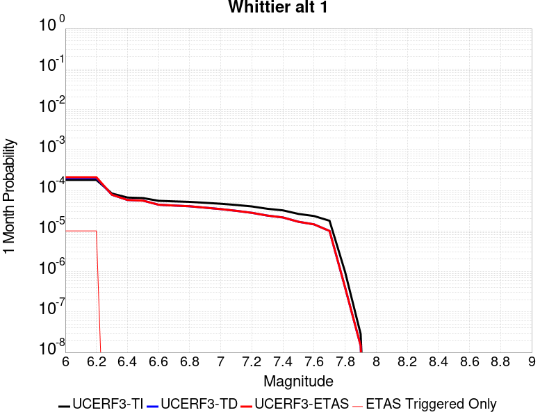 |  |  |

| Magnitude | 1 wk TI Prob | 1 wk TD Prob | 1 wk ETAS Prob | 1 wk ETAS/TD Gain | 1 wk ETAS Triggered Only | 1 mo TI Prob | 1 mo TD Prob | 1 mo ETAS Prob | 1 mo ETAS/TD Gain | 1 mo ETAS Triggered Only | 1 yr TI Prob | 1 yr TD Prob | 1 yr ETAS Prob | 1 yr ETAS/TD Gain | 1 yr ETAS Triggered Only | 10 yr TI Prob | 10 yr TD Prob | 10 yr ETAS Prob | 10 yr ETAS/TD Gain | 10 yr ETAS Triggered Only |
|-----|-----|-----|-----|-----|-----|-----|-----|-----|-----|-----|-----|-----|-----|-----|-----|-----|-----|-----|-----|-----|
| 6.0 | 4.2554693E-5 | 4.7254667E-5 | 4.7254667E-5 | 1.0 | 0.0 | 1.8236451E-4 | 2.025061E-4 | 2.1250406E-4 | 1.0493712 | 1.0E-5 | 0.002218027 | 0.002463046 | 0.0024730214 | 1.00405 | 1.0E-5 | 0.02196019 | 0.024391264 | 0.024440043 | 1.0019999 | 5.0E-5 |
| 6.1 | 4.2554693E-5 | 4.7254667E-5 | 4.7254667E-5 | 1.0 | 0.0 | 1.8236451E-4 | 2.025061E-4 | 2.1250406E-4 | 1.0493712 | 1.0E-5 | 0.002218027 | 0.002463046 | 0.0024730214 | 1.00405 | 1.0E-5 | 0.02196019 | 0.024391264 | 0.024440043 | 1.0019999 | 5.0E-5 |
| 6.2 | 4.2554693E-5 | 4.7254667E-5 | 4.7254667E-5 | 1.0 | 0.0 | 1.8236451E-4 | 2.025061E-4 | 2.1250406E-4 | 1.0493712 | 1.0E-5 | 0.002218027 | 0.002463046 | 0.0024730214 | 1.00405 | 1.0E-5 | 0.02196019 | 0.024391264 | 0.024440043 | 1.0019999 | 5.0E-5 |
| 6.3 | 1.9617712E-5 | 1.8269828E-5 | 1.8269828E-5 | 1.0 | 0.0 | 8.40732E-5 | 7.829702E-5 | 7.829702E-5 | 1.0 | 0.0 | 0.0010231105 | 9.528683E-4 | 9.528683E-4 | 1.0 | 0.0 | 0.01018413 | 0.009490858 | 0.009520574 | 1.0031309 | 3.0E-5 |
| 6.4 | 1.5611336E-5 | 1.3605309E-5 | 1.3605309E-5 | 1.0 | 0.0 | 6.690401E-5 | 5.8307196E-5 | 5.8307196E-5 | 1.0 | 0.0 | 8.142519E-4 | 7.096649E-4 | 7.096649E-4 | 1.0 | 0.0 | 0.008112748 | 0.007075695 | 0.0070955534 | 1.0028065 | 2.0E-5 |
| 6.5 | 1.5150166E-5 | 1.3101951E-5 | 1.3101951E-5 | 1.0 | 0.0 | 6.492767E-5 | 5.6150042E-5 | 5.6150042E-5 | 1.0 | 0.0 | 7.9020765E-4 | 6.834182E-4 | 6.834182E-4 | 1.0 | 0.0 | 0.007874036 | 0.0068148584 | 0.006834722 | 1.0029148 | 2.0E-5 |
| 6.6 | 1.295588E-5 | 1.0381587E-5 | 1.0381587E-5 | 1.0 | 0.0 | 5.552402E-5 | 4.449177E-5 | 4.449177E-5 | 1.0 | 0.0 | 6.7579525E-4 | 5.415546E-4 | 5.415546E-4 | 1.0 | 0.0 | 0.006737438 | 0.005403657 | 0.005413603 | 1.0018406 | 1.0E-5 |
| 6.7 | 1.2542085E-5 | 9.900209E-6 | 9.900209E-6 | 1.0 | 0.0 | 5.3750682E-5 | 4.2428786E-5 | 4.2428786E-5 | 1.0 | 0.0 | 6.542181E-4 | 5.164499E-4 | 5.164499E-4 | 1.0 | 0.0 | 0.006522954 | 0.005153785 | 0.0051637334 | 1.0019304 | 1.0E-5 |
| 6.8 | 1.2195878E-5 | 9.4962215E-6 | 9.4962215E-6 | 1.0 | 0.0 | 5.2267E-5 | 4.069747E-5 | 4.069747E-5 | 1.0 | 0.0 | 6.36165E-4 | 4.953809E-4 | 4.953809E-4 | 1.0 | 0.0 | 0.0063434686 | 0.004943984 | 0.004953935 | 1.0020126 | 1.0E-5 |
| 6.9 | 1.1580298E-5 | 8.773685E-6 | 8.773685E-6 | 1.0 | 0.0 | 4.9628903E-5 | 3.7600978E-5 | 3.7600978E-5 | 1.0 | 0.0 | 6.040644E-4 | 4.576974E-4 | 4.576974E-4 | 1.0 | 0.0 | 0.00602425 | 0.004568653 | 0.0045786076 | 1.0021788 | 1.0E-5 |
| 7.0 | 1.0964795E-5 | 8.0847E-6 | 8.0847E-6 | 1.0 | 0.0 | 4.6991136E-5 | 3.4648267E-5 | 3.4648267E-5 | 1.0 | 0.0 | 5.7196687E-4 | 4.217625E-4 | 4.217625E-4 | 1.0 | 0.0 | 0.0057049696 | 0.0042106225 | 0.0042205807 | 1.002365 | 1.0E-5 |
| 7.1 | 1.0230601E-5 | 7.327214E-6 | 7.327214E-6 | 1.0 | 0.0 | 4.3844695E-5 | 3.1401974E-5 | 3.1401974E-5 | 1.0 | 0.0 | 5.336784E-4 | 3.822533E-4 | 3.822533E-4 | 1.0 | 0.0 | 0.005323986 | 0.0038171646 | 0.0038271265 | 1.0026097 | 1.0E-5 |
| 7.2 | 9.40865E-6 | 6.543761E-6 | 6.543761E-6 | 1.0 | 0.0 | 4.032216E-5 | 2.8044395E-5 | 2.8044395E-5 | 1.0 | 0.0 | 4.908117E-4 | 3.4138822E-4 | 3.4138822E-4 | 1.0 | 0.0 | 0.0048972913 | 0.0034097764 | 0.0034197425 | 1.0029228 | 1.0E-5 |
| 7.3 | 8.237384E-6 | 5.5981436E-6 | 5.5981436E-6 | 1.0 | 0.0 | 3.5302593E-5 | 2.399183E-5 | 2.399183E-5 | 1.0 | 0.0 | 4.2972428E-4 | 2.920624E-4 | 2.920624E-4 | 1.0 | 0.0 | 0.0042889426 | 0.0029171065 | 0.0029270772 | 1.0034181 | 1.0E-5 |
| 7.4 | 7.5316966E-6 | 5.0281637E-6 | 5.0281637E-6 | 1.0 | 0.0 | 3.2278298E-5 | 2.15491E-5 | 2.15491E-5 | 1.0 | 0.0 | 3.9291743E-4 | 2.6232973E-4 | 2.6232973E-4 | 1.0 | 0.0 | 0.0039222343 | 0.0026203152 | 0.0026302892 | 1.0038064 | 1.0E-5 |
| 7.5 | 6.149649E-6 | 3.934116E-6 | 3.934116E-6 | 1.0 | 0.0 | 2.6355372E-5 | 1.6860393E-5 | 1.6860393E-5 | 1.0 | 0.0 | 3.208294E-4 | 2.0525686E-4 | 2.0525686E-4 | 1.0 | 0.0 | 0.003203666 | 0.002050762 | 0.0020607414 | 1.0048662 | 1.0E-5 |
| 7.6 | 5.457711E-6 | 3.3956037E-6 | 3.3956037E-6 | 1.0 | 0.0 | 2.338998E-5 | 1.4552511E-5 | 1.4552511E-5 | 1.0 | 0.0 | 2.8473578E-4 | 1.7716322E-4 | 1.7716322E-4 | 1.0 | 0.0 | 0.0028437122 | 0.0017703007 | 0.0017802829 | 1.0056387 | 1.0E-5 |
| 7.7 | 4.1676276E-6 | 2.3333405E-6 | 2.3333405E-6 | 1.0 | 0.0 | 1.7861139E-5 | 9.999996E-6 | 9.999996E-6 | 1.0 | 0.0 | 2.1743766E-4 | 1.217439E-4 | 1.217439E-4 | 1.0 | 0.0 | 0.0021722503 | 0.0012168451 | 0.0012168451 | 1.0 | 0.0 |
| 7.8 | 2.2692414E-7 | 9.385632E-8 | 9.385632E-8 | 1.0 | 0.0 | 9.725317E-7 | 4.0224134E-7 | 4.0224134E-7 | 1.0 | 0.0 | 1.1840509E-5 | 4.8972806E-6 | 4.8972806E-6 | 1.0 | 0.0 | 1.1839878E-4 | 4.8972055E-5 | 4.8972055E-5 | 1.0 | 0.0 |
| 7.9 | 6.676829E-9 | 3.4399121E-9 | 3.4399121E-9 | 1.0 | 0.0 | 2.861498E-8 | 1.4742481E-8 | 1.4742481E-8 | 1.0 | 0.0 | 3.4838732E-7 | 1.7948969E-7 | 1.7948969E-7 | 1.0 | 0.0 | 3.4838679E-6 | 1.7948956E-6 | 1.7948956E-6 | 1.0 | 0.0 |

## Chino alt 1
*[(top)](#table-of-contents)*

| 1 Week | 1 Month | 1 Year | 10 Year |
|-----|-----|-----|-----|
| 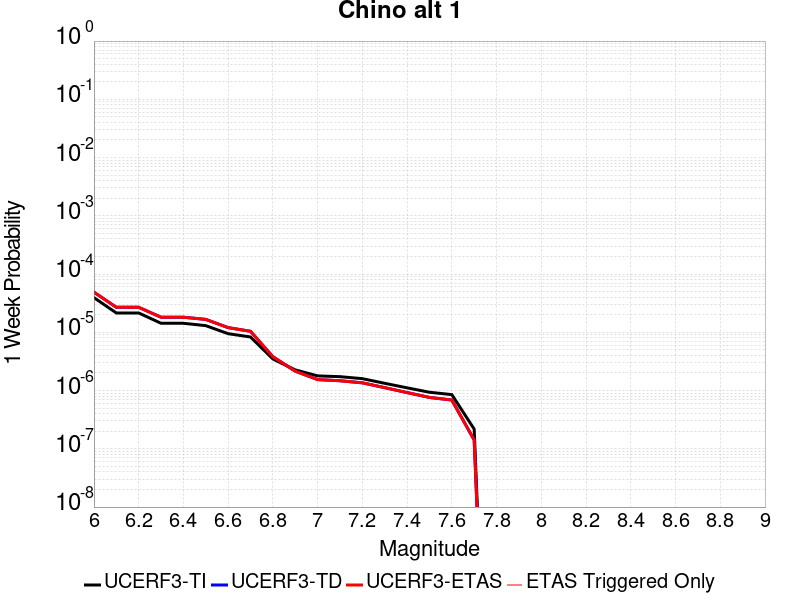 |  |  |  |

| Magnitude | 1 wk TI Prob | 1 wk TD Prob | 1 wk ETAS Prob | 1 wk ETAS/TD Gain | 1 wk ETAS Triggered Only | 1 mo TI Prob | 1 mo TD Prob | 1 mo ETAS Prob | 1 mo ETAS/TD Gain | 1 mo ETAS Triggered Only | 1 yr TI Prob | 1 yr TD Prob | 1 yr ETAS Prob | 1 yr ETAS/TD Gain | 1 yr ETAS Triggered Only | 10 yr TI Prob | 10 yr TD Prob | 10 yr ETAS Prob | 10 yr ETAS/TD Gain | 10 yr ETAS Triggered Only |
|-----|-----|-----|-----|-----|-----|-----|-----|-----|-----|-----|-----|-----|-----|-----|-----|-----|-----|-----|-----|-----|
| 6.0 | 3.939946E-5 | 4.8951963E-5 | 4.8951963E-5 | 1.0 | 0.0 | 1.6884391E-4 | 2.0978019E-4 | 2.0978019E-4 | 1.0 | 0.0 | 0.0020537362 | 0.0025515915 | 0.002561566 | 1.0039091 | 1.0E-5 | 0.020348595 | 0.025280263 | 0.025329 | 1.0019279 | 5.0E-5 |
| 6.1 | 2.1505624E-5 | 2.6881433E-5 | 2.6881433E-5 | 1.0 | 0.0 | 9.2163704E-5 | 1.15201685E-4 | 1.15201685E-4 | 1.0 | 0.0 | 0.0011215154 | 0.0014017875 | 0.0014117735 | 1.0071237 | 1.0E-5 | 0.011158722 | 0.013946819 | 0.013976401 | 1.002121 | 3.0E-5 |
| 6.2 | 2.1505624E-5 | 2.6881433E-5 | 2.6881433E-5 | 1.0 | 0.0 | 9.2163704E-5 | 1.15201685E-4 | 1.15201685E-4 | 1.0 | 0.0 | 0.0011215154 | 0.0014017875 | 0.0014117735 | 1.0071237 | 1.0E-5 | 0.011158722 | 0.013946819 | 0.013976401 | 1.002121 | 3.0E-5 |
| 6.3 | 1.4290785E-5 | 1.8166962E-5 | 1.8166962E-5 | 1.0 | 0.0 | 6.1244784E-5 | 7.785634E-5 | 7.785634E-5 | 1.0 | 0.0 | 7.454001E-4 | 9.4753393E-4 | 9.5752446E-4 | 1.0105437 | 1.0E-5 | 0.007429048 | 0.009445883 | 0.0094756 | 1.0031459 | 3.0E-5 |
| 6.4 | 1.4290785E-5 | 1.8166962E-5 | 1.8166962E-5 | 1.0 | 0.0 | 6.1244784E-5 | 7.785634E-5 | 7.785634E-5 | 1.0 | 0.0 | 7.454001E-4 | 9.4753393E-4 | 9.5752446E-4 | 1.0105437 | 1.0E-5 | 0.007429048 | 0.009445883 | 0.0094756 | 1.0031459 | 3.0E-5 |
| 6.5 | 1.3017944E-5 | 1.6653845E-5 | 1.6653845E-5 | 1.0 | 0.0 | 5.5789995E-5 | 7.137192E-5 | 7.137192E-5 | 1.0 | 0.0 | 6.790315E-4 | 8.686504E-4 | 8.686504E-4 | 1.0 | 0.0 | 0.0067696036 | 0.008663336 | 0.008683163 | 1.0022886 | 2.0E-5 |
| 6.6 | 9.470016E-6 | 1.2040739E-5 | 1.2040739E-5 | 1.0 | 0.0 | 4.058515E-5 | 5.1602343E-5 | 5.1602343E-5 | 1.0 | 0.0 | 4.940122E-4 | 6.2811136E-4 | 6.2811136E-4 | 1.0 | 0.0 | 0.004929154 | 0.006272587 | 0.0062924614 | 1.0031685 | 2.0E-5 |
| 6.7 | 8.314155E-6 | 1.0408852E-5 | 1.0408852E-5 | 1.0 | 0.0 | 3.5631605E-5 | 4.4608783E-5 | 4.4608783E-5 | 1.0 | 0.0 | 4.3372845E-4 | 5.4300885E-4 | 5.4300885E-4 | 1.0 | 0.0 | 0.004328829 | 0.005426411 | 0.0054363566 | 1.0018328 | 1.0E-5 |
| 6.8 | 3.4856364E-6 | 3.8137073E-6 | 3.8137073E-6 | 1.0 | 0.0 | 1.4938357E-5 | 1.634437E-5 | 1.634437E-5 | 1.0 | 0.0 | 1.8185932E-4 | 1.9897659E-4 | 1.9897659E-4 | 1.0 | 0.0 | 0.0018171056 | 0.0019896172 | 0.0019896172 | 1.0 | 0.0 |
| 6.9 | 2.2645952E-6 | 2.1530805E-6 | 2.1530805E-6 | 1.0 | 0.0 | 9.705372E-6 | 9.227456E-6 | 9.227456E-6 | 1.0 | 0.0 | 1.18156495E-4 | 1.123387E-4 | 1.123387E-4 | 1.0 | 0.0 | 0.0011809369 | 0.0011234091 | 0.0011234091 | 1.0 | 0.0 |
| 7.0 | 1.7864003E-6 | 1.5432141E-6 | 1.5432141E-6 | 1.0 | 0.0 | 7.655979E-6 | 6.6137586E-6 | 6.6137586E-6 | 1.0 | 0.0 | 9.3207556E-5 | 8.0519596E-5 | 8.0519596E-5 | 1.0 | 0.0 | 9.316847E-4 | 8.0536027E-4 | 8.0536027E-4 | 1.0 | 0.0 |
| 7.1 | 1.7315456E-6 | 1.4734824E-6 | 1.4734824E-6 | 1.0 | 0.0 | 7.420889E-6 | 6.3149096E-6 | 6.3149096E-6 | 1.0 | 0.0 | 9.034557E-5 | 7.688137E-5 | 7.688137E-5 | 1.0 | 0.0 | 9.0308854E-4 | 7.6899724E-4 | 7.6899724E-4 | 1.0 | 0.0 |
| 7.2 | 1.6008337E-6 | 1.357526E-6 | 1.357526E-6 | 1.0 | 0.0 | 6.860698E-6 | 5.817956E-6 | 5.817956E-6 | 1.0 | 0.0 | 8.352579E-5 | 7.083137E-5 | 7.083137E-5 | 1.0 | 0.0 | 8.34944E-4 | 7.0852344E-4 | 7.0852344E-4 | 1.0 | 0.0 |
| 7.3 | 1.3320939E-6 | 1.1218643E-6 | 1.1218643E-6 | 1.0 | 0.0 | 5.7089615E-6 | 4.8079814E-6 | 4.8079814E-6 | 1.0 | 0.0 | 6.9504385E-5 | 5.8535647E-5 | 5.8535647E-5 | 1.0 | 0.0 | 6.9482654E-4 | 5.853622E-4 | 5.853622E-4 | 1.0 | 0.0 |
| 7.4 | 1.114294E-6 | 9.237751E-7 | 9.237751E-7 | 1.0 | 0.0 | 4.775537E-6 | 3.9590304E-6 | 3.9590304E-6 | 1.0 | 0.0 | 5.8140613E-5 | 4.8200163E-5 | 4.8200163E-5 | 1.0 | 0.0 | 5.81254E-4 | 4.8191648E-4 | 4.8191648E-4 | 1.0 | 0.0 |
| 7.5 | 9.354081E-7 | 7.62392E-7 | 7.62392E-7 | 1.0 | 0.0 | 4.0088858E-6 | 3.2673904E-6 | 3.2673904E-6 | 1.0 | 0.0 | 4.8807087E-5 | 3.977979E-5 | 3.977979E-5 | 1.0 | 0.0 | 4.879637E-4 | 3.9773007E-4 | 3.9773007E-4 | 1.0 | 0.0 |
| 7.6 | 8.521771E-7 | 6.881134E-7 | 6.881134E-7 | 1.0 | 0.0 | 3.6521824E-6 | 2.9490543E-6 | 2.9490543E-6 | 1.0 | 0.0 | 4.4464414E-5 | 3.5904177E-5 | 3.5904177E-5 | 1.0 | 0.0 | 4.4455516E-4 | 3.5898693E-4 | 3.5898693E-4 | 1.0 | 0.0 |
| 7.7 | 2.1803626E-7 | 1.4187205E-7 | 1.4187205E-7 | 1.0 | 0.0 | 9.344408E-7 | 6.08023E-7 | 6.08023E-7 | 1.0 | 0.0 | 1.1376757E-5 | 7.4026643E-6 | 7.4026643E-6 | 1.0 | 0.0 | 1.13761744E-4 | 7.402514E-5 | 7.402514E-5 | 1.0 | 0.0 |

## San Jacinto (Lytle Creek connector)
*[(top)](#table-of-contents)*

| 1 Week | 1 Month | 1 Year | 10 Year |
|-----|-----|-----|-----|
|  |  |  |  |

| Magnitude | 1 wk TI Prob | 1 wk TD Prob | 1 wk ETAS Prob | 1 wk ETAS/TD Gain | 1 wk ETAS Triggered Only | 1 mo TI Prob | 1 mo TD Prob | 1 mo ETAS Prob | 1 mo ETAS/TD Gain | 1 mo ETAS Triggered Only | 1 yr TI Prob | 1 yr TD Prob | 1 yr ETAS Prob | 1 yr ETAS/TD Gain | 1 yr ETAS Triggered Only | 10 yr TI Prob | 10 yr TD Prob | 10 yr ETAS Prob | 10 yr ETAS/TD Gain | 10 yr ETAS Triggered Only |
|-----|-----|-----|-----|-----|-----|-----|-----|-----|-----|-----|-----|-----|-----|-----|-----|-----|-----|-----|-----|-----|
| 6.0 | 6.693995E-6 | 6.6654934E-6 | 6.6654934E-6 | 1.0 | 0.0 | 2.8688235E-5 | 2.8566088E-5 | 3.8565802E-5 | 1.3500555 | 1.0E-5 | 3.492233E-4 | 3.477367E-4 | 3.6772975E-4 | 1.0574948 | 2.0E-5 | 0.00348675 | 0.0035521593 | 0.0036019816 | 1.0140259 | 5.0E-5 |
| 6.1 | 6.693995E-6 | 6.6654934E-6 | 6.6654934E-6 | 1.0 | 0.0 | 2.8688235E-5 | 2.8566088E-5 | 3.8565802E-5 | 1.3500555 | 1.0E-5 | 3.492233E-4 | 3.477367E-4 | 3.6772975E-4 | 1.0574948 | 2.0E-5 | 0.00348675 | 0.0035521593 | 0.0036019816 | 1.0140259 | 5.0E-5 |
| 6.2 | 6.693995E-6 | 6.6654934E-6 | 6.6654934E-6 | 1.0 | 0.0 | 2.8688235E-5 | 2.8566088E-5 | 3.8565802E-5 | 1.3500555 | 1.0E-5 | 3.492233E-4 | 3.477367E-4 | 3.6772975E-4 | 1.0574948 | 2.0E-5 | 0.00348675 | 0.0035521593 | 0.0036019816 | 1.0140259 | 5.0E-5 |
| 6.3 | 6.693995E-6 | 6.6654934E-6 | 6.6654934E-6 | 1.0 | 0.0 | 2.8688235E-5 | 2.8566088E-5 | 3.8565802E-5 | 1.3500555 | 1.0E-5 | 3.492233E-4 | 3.477367E-4 | 3.6772975E-4 | 1.0574948 | 2.0E-5 | 0.00348675 | 0.0035521593 | 0.0036019816 | 1.0140259 | 5.0E-5 |
| 6.4 | 6.693995E-6 | 6.6654934E-6 | 6.6654934E-6 | 1.0 | 0.0 | 2.8688235E-5 | 2.8566088E-5 | 3.8565802E-5 | 1.3500555 | 1.0E-5 | 3.492233E-4 | 3.477367E-4 | 3.6772975E-4 | 1.0574948 | 2.0E-5 | 0.00348675 | 0.0035521593 | 0.0036019816 | 1.0140259 | 5.0E-5 |
| 6.5 | 6.6561875E-6 | 6.625711E-6 | 6.625711E-6 | 1.0 | 0.0 | 2.8526205E-5 | 2.8395596E-5 | 3.8395312E-5 | 1.3521572 | 1.0E-5 | 3.472512E-4 | 3.4566163E-4 | 3.656547E-4 | 1.0578401 | 2.0E-5 | 0.0034670907 | 0.0035314744 | 0.0035812978 | 1.0141084 | 5.0E-5 |
| 6.6 | 6.6561875E-6 | 6.625711E-6 | 6.625711E-6 | 1.0 | 0.0 | 2.8526205E-5 | 2.8395596E-5 | 3.8395312E-5 | 1.3521572 | 1.0E-5 | 3.472512E-4 | 3.4566163E-4 | 3.656547E-4 | 1.0578401 | 2.0E-5 | 0.0034670907 | 0.0035314744 | 0.0035812978 | 1.0141084 | 5.0E-5 |
| 6.7 | 6.5802237E-6 | 6.5448867E-6 | 6.5448867E-6 | 1.0 | 0.0 | 2.8200653E-5 | 2.8049213E-5 | 3.8048933E-5 | 1.3565062 | 1.0E-5 | 3.4328885E-4 | 3.4144573E-4 | 3.614389E-4 | 1.0585544 | 2.0E-5 | 0.0034275902 | 0.0034894482 | 0.0035392737 | 1.0142789 | 5.0E-5 |
| 6.8 | 6.575632E-6 | 6.539376E-6 | 6.539376E-6 | 1.0 | 0.0 | 2.8180975E-5 | 2.8025595E-5 | 3.8025315E-5 | 1.3568066 | 1.0E-5 | 3.4304935E-4 | 3.4115827E-4 | 3.6115147E-4 | 1.0586038 | 2.0E-5 | 0.0034252026 | 0.003486583 | 0.0035364085 | 1.0142907 | 5.0E-5 |
| 6.9 | 6.570433E-6 | 6.530769E-6 | 6.530769E-6 | 1.0 | 0.0 | 2.8158694E-5 | 2.798871E-5 | 3.798843E-5 | 1.3572769 | 1.0E-5 | 3.4277816E-4 | 3.4070935E-4 | 3.607025E-4 | 1.058681 | 2.0E-5 | 0.0034224992 | 0.0034821075 | 0.0035319335 | 1.0143092 | 5.0E-5 |
| 7.0 | 6.5643826E-6 | 6.520889E-6 | 6.520889E-6 | 1.0 | 0.0 | 2.8132765E-5 | 2.7946367E-5 | 3.7946087E-5 | 1.3578182 | 1.0E-5 | 3.424626E-4 | 3.4019398E-4 | 3.6018717E-4 | 1.05877 | 2.0E-5 | 0.0034193532 | 0.0034769704 | 0.0035267964 | 1.0143304 | 5.0E-5 |
| 7.1 | 6.557402E-6 | 6.5096E-6 | 6.5096E-6 | 1.0 | 0.0 | 2.8102848E-5 | 2.7897988E-5 | 3.789771E-5 | 1.3584388 | 1.0E-5 | 3.4209844E-4 | 3.3960512E-4 | 3.5959834E-4 | 1.058872 | 2.0E-5 | 0.0034157229 | 0.0034711007 | 0.0035209272 | 1.0143547 | 5.0E-5 |
| 7.2 | 6.546394E-6 | 6.4915644E-6 | 6.4915644E-6 | 1.0 | 0.0 | 2.8055672E-5 | 2.7820694E-5 | 3.7820417E-5 | 1.3594347 | 1.0E-5 | 3.4152428E-4 | 3.3866437E-4 | 3.586576E-4 | 1.0590355 | 2.0E-5 | 0.0034099987 | 0.0034617265 | 0.0035115534 | 1.0143937 | 5.0E-5 |
| 7.3 | 6.5364216E-6 | 6.472346E-6 | 6.472346E-6 | 1.0 | 0.0 | 2.8012933E-5 | 2.7738331E-5 | 3.7738053E-5 | 1.360502 | 1.0E-5 | 3.4100408E-4 | 3.376619E-4 | 3.5765517E-4 | 1.0592109 | 2.0E-5 | 0.003404813 | 0.0034517436 | 0.003501571 | 1.0144354 | 5.0E-5 |
| 7.4 | 6.5269523E-6 | 6.4534283E-6 | 6.4534283E-6 | 1.0 | 0.0 | 2.7972354E-5 | 2.7657257E-5 | 3.765698E-5 | 1.3615588 | 1.0E-5 | 3.4051016E-4 | 3.3667515E-4 | 3.5666843E-4 | 1.0593845 | 2.0E-5 | 0.0033998888 | 0.0034419203 | 0.0034917481 | 1.0144768 | 5.0E-5 |
| 7.5 | 6.5111835E-6 | 6.429698E-6 | 6.429698E-6 | 1.0 | 0.0 | 2.7904773E-5 | 2.7555558E-5 | 3.755528E-5 | 1.3628932 | 1.0E-5 | 3.3968766E-4 | 3.3543733E-4 | 3.5543062E-4 | 1.0596037 | 2.0E-5 | 0.0033916887 | 0.0034295921 | 0.0034794207 | 1.014529 | 5.0E-5 |
| 7.6 | 6.4768806E-6 | 6.3888E-6 | 6.3888E-6 | 1.0 | 0.0 | 2.7757764E-5 | 2.7380283E-5 | 3.738001E-5 | 1.3652163 | 1.0E-5 | 3.3789838E-4 | 3.3330405E-4 | 3.5329736E-4 | 1.0599853 | 2.0E-5 | 0.0033738504 | 0.0034083205 | 0.00345815 | 1.01462 | 5.0E-5 |
| 7.7 | 6.1655364E-6 | 6.18125E-6 | 6.18125E-6 | 1.0 | 0.0 | 2.642346E-5 | 2.6490801E-5 | 3.6490535E-5 | 1.3774796 | 1.0E-5 | 3.2165812E-4 | 3.2247783E-4 | 3.4247138E-4 | 1.0619998 | 2.0E-5 | 0.0032119295 | 0.0032999306 | 0.0033497657 | 1.0151018 | 5.0E-5 |
| 7.8 | 5.5043524E-6 | 5.7421776E-6 | 5.7421776E-6 | 1.0 | 0.0 | 2.3589868E-5 | 2.46091E-5 | 3.4608856E-5 | 1.4063437 | 1.0E-5 | 2.871688E-4 | 2.9957466E-4 | 3.1956867E-4 | 1.0667413 | 2.0E-5 | 0.0028679797 | 0.0030699752 | 0.0031198217 | 1.0162368 | 5.0E-5 |
| 7.9 | 3.889249E-6 | 4.0808713E-6 | 4.0808713E-6 | 1.0 | 0.0 | 1.6668104E-5 | 1.7489332E-5 | 2.7489157E-5 | 1.5717672 | 1.0E-5 | 2.0291525E-4 | 2.1291184E-4 | 2.3290758E-4 | 1.0939156 | 2.0E-5 | 0.0020273007 | 0.0021964763 | 0.0022463663 | 1.0227138 | 5.0E-5 |
| 8.0 | 2.668535E-6 | 2.5342542E-6 | 2.5342542E-6 | 1.0 | 0.0 | 1.1436528E-5 | 1.0861044E-5 | 1.0861044E-5 | 1.0 | 0.0 | 1.3923083E-4 | 1.3222522E-4 | 1.422239E-4 | 1.0756185 | 1.0E-5 | 0.0013914363 | 0.0013772323 | 0.0014171771 | 1.0290037 | 4.0E-5 |
| 8.1 | 1.5911459E-6 | 1.2200637E-6 | 1.2200637E-6 | 1.0 | 0.0 | 6.8191785E-6 | 5.2288337E-6 | 5.2288337E-6 | 1.0 | 0.0 | 8.3020335E-5 | 6.3659216E-5 | 7.365858E-5 | 1.1570765 | 1.0E-5 | 8.298933E-4 | 6.7008415E-4 | 6.9007074E-4 | 1.029827 | 2.0E-5 |
| 8.2 | 6.1294963E-7 | 2.1847964E-7 | 2.1847964E-7 | 1.0 | 0.0 | 2.6269242E-6 | 9.36341E-7 | 9.36341E-7 | 1.0 | 0.0 | 3.1982334E-5 | 1.1399892E-5 | 1.1399892E-5 | 1.0 | 0.0 | 3.1977732E-4 | 1.2805329E-4 | 1.2805329E-4 | 1.0 | 0.0 |
| 8.3 | 1.762871E-7 | 4.7631474E-8 | 4.7631474E-8 | 1.0 | 0.0 | 7.5551594E-7 | 2.0413486E-7 | 2.0413486E-7 | 1.0 | 0.0 | 9.1983675E-6 | 2.4853393E-6 | 2.4853393E-6 | 1.0 | 0.0 | 9.197987E-5 | 2.8738177E-5 | 2.8738177E-5 | 1.0 | 0.0 |

## San Diego Trough south
*[(top)](#table-of-contents)*

| 1 Week | 1 Month | 1 Year | 10 Year |
|-----|-----|-----|-----|
|  |  |  |  |

| Magnitude | 1 wk TI Prob | 1 wk TD Prob | 1 wk ETAS Prob | 1 wk ETAS/TD Gain | 1 wk ETAS Triggered Only | 1 mo TI Prob | 1 mo TD Prob | 1 mo ETAS Prob | 1 mo ETAS/TD Gain | 1 mo ETAS Triggered Only | 1 yr TI Prob | 1 yr TD Prob | 1 yr ETAS Prob | 1 yr ETAS/TD Gain | 1 yr ETAS Triggered Only | 10 yr TI Prob | 10 yr TD Prob | 10 yr ETAS Prob | 10 yr ETAS/TD Gain | 10 yr ETAS Triggered Only |
|-----|-----|-----|-----|-----|-----|-----|-----|-----|-----|-----|-----|-----|-----|-----|-----|-----|-----|-----|-----|-----|
| 6.0 | 8.279495E-5 | 1.04262064E-4 | 1.1426102E-4 | 1.0959022 | 1.0E-5 | 3.5478722E-4 | 4.4676563E-4 | 4.7675223E-4 | 1.0671192 | 3.0E-5 | 0.004310982 | 0.0054262755 | 0.005456113 | 1.0054986 | 3.0E-5 | 0.042283054 | 0.05299642 | 0.05304377 | 1.0008935 | 5.0E-5 |
| 6.1 | 4.6961468E-5 | 5.7732974E-5 | 5.7732974E-5 | 1.0 | 0.0 | 2.0124791E-4 | 2.474043E-4 | 2.5740184E-4 | 1.0404097 | 1.0E-5 | 0.00244744 | 0.0030080664 | 0.0030180365 | 1.0033144 | 1.0E-5 | 0.024206603 | 0.02968138 | 0.029700788 | 1.0006539 | 2.0E-5 |
| 6.2 | 3.5079658E-5 | 4.214473E-5 | 4.214473E-5 | 1.0 | 0.0 | 1.5033272E-4 | 1.8060798E-4 | 1.8060798E-4 | 1.0 | 0.0 | 0.0018287642 | 0.0021967047 | 0.0021967047 | 1.0 | 0.0 | 0.018137876 | 0.021752335 | 0.021762118 | 1.0004498 | 1.0E-5 |
| 6.3 | 3.5079658E-5 | 4.214473E-5 | 4.214473E-5 | 1.0 | 0.0 | 1.5033272E-4 | 1.8060798E-4 | 1.8060798E-4 | 1.0 | 0.0 | 0.0018287642 | 0.0021967047 | 0.0021967047 | 1.0 | 0.0 | 0.018137876 | 0.021752335 | 0.021762118 | 1.0004498 | 1.0E-5 |
| 6.4 | 2.7196904E-5 | 3.208867E-5 | 3.208867E-5 | 1.0 | 0.0 | 1.16552954E-4 | 1.3751567E-4 | 1.3751567E-4 | 1.0 | 0.0 | 0.0014181085 | 0.0016729798 | 0.0016729798 | 1.0 | 0.0 | 0.014090929 | 0.016605455 | 0.01661529 | 1.0005922 | 1.0E-5 |
| 6.5 | 2.5584688E-5 | 3.0103025E-5 | 3.0103025E-5 | 1.0 | 0.0 | 1.0964406E-4 | 1.2900663E-4 | 1.2900663E-4 | 1.0 | 0.0 | 0.0013340989 | 0.0015695366 | 0.0015695366 | 1.0 | 0.0 | 0.013261181 | 0.0155860605 | 0.015595905 | 1.0006316 | 1.0E-5 |
| 6.6 | 2.2034688E-5 | 2.5743868E-5 | 2.5743868E-5 | 1.0 | 0.0 | 9.443096E-5 | 1.1032621E-4 | 1.1032621E-4 | 1.0 | 0.0 | 0.0011490905 | 0.0013424015 | 0.0013424015 | 1.0 | 0.0 | 0.011431668 | 0.01334392 | 0.013353786 | 1.0007395 | 1.0E-5 |
| 6.7 | 1.9394853E-5 | 2.2542737E-5 | 2.2542737E-5 | 1.0 | 0.0 | 8.311815E-5 | 9.6608186E-5 | 9.6608186E-5 | 1.0 | 0.0 | 0.0010114936 | 0.0011755752 | 0.0011755752 | 1.0 | 0.0 | 0.01006902 | 0.01169427 | 0.011704153 | 1.0008451 | 1.0E-5 |
| 6.8 | 1.7615313E-5 | 2.0404044E-5 | 2.0404044E-5 | 1.0 | 0.0 | 7.549201E-5 | 8.7443E-5 | 8.7443E-5 | 1.0 | 0.0 | 9.1872766E-4 | 0.0010641029 | 0.0010641029 | 1.0 | 0.0 | 0.009149387 | 0.010590643 | 0.010600537 | 1.0009342 | 1.0E-5 |
| 6.9 | 1.5621423E-5 | 1.8026854E-5 | 1.8026854E-5 | 1.0 | 0.0 | 6.6947236E-5 | 7.725568E-5 | 7.725568E-5 | 1.0 | 0.0 | 8.147778E-4 | 9.4018556E-4 | 9.4018556E-4 | 1.0 | 0.0 | 0.008117969 | 0.009362524 | 0.00937243 | 1.0010581 | 1.0E-5 |
| 7.0 | 1.3444376E-5 | 1.5448702E-5 | 1.5448702E-5 | 1.0 | 0.0 | 5.7617483E-5 | 6.620706E-5 | 6.620706E-5 | 1.0 | 0.0 | 7.0126704E-4 | 8.057756E-4 | 8.057756E-4 | 1.0 | 0.0 | 0.006990582 | 0.008028872 | 0.008038792 | 1.0012355 | 1.0E-5 |
| 7.1 | 1.2268361E-5 | 1.4073581E-5 | 1.4073581E-5 | 1.0 | 0.0 | 5.2577634E-5 | 6.0313967E-5 | 6.0313967E-5 | 1.0 | 0.0 | 6.399447E-4 | 7.340778E-4 | 7.340778E-4 | 1.0 | 0.0 | 0.0063810493 | 0.0073168348 | 0.0073267613 | 1.0013567 | 1.0E-5 |
| 7.2 | 1.0922655E-5 | 1.2514049E-5 | 1.2514049E-5 | 1.0 | 0.0 | 4.681054E-5 | 5.363055E-5 | 5.363055E-5 | 1.0 | 0.0 | 5.697693E-4 | 6.527588E-4 | 6.527588E-4 | 1.0 | 0.0 | 0.0056831064 | 0.0065086954 | 0.0065186303 | 1.0015264 | 1.0E-5 |
| 7.3 | 6.1106753E-6 | 6.9291723E-6 | 6.9291723E-6 | 1.0 | 0.0 | 2.6188345E-5 | 2.9696117E-5 | 2.9696117E-5 | 1.0 | 0.0 | 3.1879646E-4 | 3.6149065E-4 | 3.6149065E-4 | 1.0 | 0.0 | 0.0031833951 | 0.0036090715 | 0.0036090715 | 1.0 | 0.0 |
| 7.4 | 4.933187E-6 | 5.589751E-6 | 5.589751E-6 | 1.0 | 0.0 | 2.114206E-5 | 2.3955858E-5 | 2.3955858E-5 | 1.0 | 0.0 | 2.5737417E-4 | 2.9162393E-4 | 2.9162393E-4 | 1.0 | 0.0 | 0.002570763 | 0.0029124536 | 0.0029124536 | 1.0 | 0.0 |
| 7.5 | 1.7489613E-6 | 1.9697447E-6 | 1.9697447E-6 | 1.0 | 0.0 | 7.495527E-6 | 8.441737E-6 | 8.441737E-6 | 1.0 | 0.0 | 9.125422E-5 | 1.0277352E-4 | 1.0277352E-4 | 1.0 | 0.0 | 9.1216754E-4 | 0.001027282 | 0.001027282 | 1.0 | 0.0 |
| 7.6 | 1.6988751E-7 | 1.7533972E-7 | 1.7533972E-7 | 1.0 | 0.0 | 7.2808916E-7 | 7.514558E-7 | 7.514558E-7 | 1.0 | 0.0 | 8.864449E-6 | 9.148937E-6 | 9.148937E-6 | 1.0 | 0.0 | 8.8640954E-5 | 9.14858E-5 | 9.14858E-5 | 1.0 | 0.0 |

## San Jacinto (Anza) rev
*[(top)](#table-of-contents)*

| 1 Week | 1 Month | 1 Year | 10 Year |
|-----|-----|-----|-----|
|  |  |  |  |

| Magnitude | 1 wk TI Prob | 1 wk TD Prob | 1 wk ETAS Prob | 1 wk ETAS/TD Gain | 1 wk ETAS Triggered Only | 1 mo TI Prob | 1 mo TD Prob | 1 mo ETAS Prob | 1 mo ETAS/TD Gain | 1 mo ETAS Triggered Only | 1 yr TI Prob | 1 yr TD Prob | 1 yr ETAS Prob | 1 yr ETAS/TD Gain | 1 yr ETAS Triggered Only | 10 yr TI Prob | 10 yr TD Prob | 10 yr ETAS Prob | 10 yr ETAS/TD Gain | 10 yr ETAS Triggered Only |
|-----|-----|-----|-----|-----|-----|-----|-----|-----|-----|-----|-----|-----|-----|-----|-----|-----|-----|-----|-----|-----|
| 6.0 | 6.3015636E-5 | 4.3335604E-5 | 4.3335604E-5 | 1.0 | 0.0 | 2.7003905E-4 | 1.8571086E-4 | 1.8571086E-4 | 1.0 | 0.0 | 0.0032827691 | 0.002258697 | 0.0022786518 | 1.0088347 | 2.0E-5 | 0.032346968 | 0.023322336 | 0.023371171 | 1.0020939 | 5.0E-5 |
| 6.1 | 6.3015636E-5 | 4.3335604E-5 | 4.3335604E-5 | 1.0 | 0.0 | 2.7003905E-4 | 1.8571086E-4 | 1.8571086E-4 | 1.0 | 0.0 | 0.0032827691 | 0.002258697 | 0.0022786518 | 1.0088347 | 2.0E-5 | 0.032346968 | 0.023322336 | 0.023371171 | 1.0020939 | 5.0E-5 |
| 6.2 | 6.3015636E-5 | 4.3335604E-5 | 4.3335604E-5 | 1.0 | 0.0 | 2.7003905E-4 | 1.8571086E-4 | 1.8571086E-4 | 1.0 | 0.0 | 0.0032827691 | 0.002258697 | 0.0022786518 | 1.0088347 | 2.0E-5 | 0.032346968 | 0.023322336 | 0.023371171 | 1.0020939 | 5.0E-5 |
| 6.3 | 6.3015636E-5 | 4.3335604E-5 | 4.3335604E-5 | 1.0 | 0.0 | 2.7003905E-4 | 1.8571086E-4 | 1.8571086E-4 | 1.0 | 0.0 | 0.0032827691 | 0.002258697 | 0.0022786518 | 1.0088347 | 2.0E-5 | 0.032346968 | 0.023322336 | 0.023371171 | 1.0020939 | 5.0E-5 |
| 6.4 | 6.3015636E-5 | 4.3335604E-5 | 4.3335604E-5 | 1.0 | 0.0 | 2.7003905E-4 | 1.8571086E-4 | 1.8571086E-4 | 1.0 | 0.0 | 0.0032827691 | 0.002258697 | 0.0022786518 | 1.0088347 | 2.0E-5 | 0.032346968 | 0.023322336 | 0.023371171 | 1.0020939 | 5.0E-5 |
| 6.5 | 5.811017E-5 | 4.0111514E-5 | 4.0111514E-5 | 1.0 | 0.0 | 2.4901982E-4 | 1.7189518E-4 | 1.7189518E-4 | 1.0 | 0.0 | 0.0030276014 | 0.0020908208 | 0.002110779 | 1.0095456 | 2.0E-5 | 0.02986684 | 0.02161219 | 0.021661108 | 1.0022635 | 5.0E-5 |
| 6.6 | 5.811017E-5 | 4.0111514E-5 | 4.0111514E-5 | 1.0 | 0.0 | 2.4901982E-4 | 1.7189518E-4 | 1.7189518E-4 | 1.0 | 0.0 | 0.0030276014 | 0.0020908208 | 0.002110779 | 1.0095456 | 2.0E-5 | 0.02986684 | 0.02161219 | 0.021661108 | 1.0022635 | 5.0E-5 |
| 6.7 | 5.712442E-5 | 3.953424E-5 | 3.953424E-5 | 1.0 | 0.0 | 2.4479596E-4 | 1.6942149E-4 | 1.6942149E-4 | 1.0 | 0.0 | 0.0029763177 | 0.0020607607 | 0.0020807195 | 1.0096852 | 2.0E-5 | 0.029367693 | 0.021304242 | 0.021353178 | 1.0022969 | 5.0E-5 |
| 6.8 | 5.6967532E-5 | 3.9390525E-5 | 3.9390525E-5 | 1.0 | 0.0 | 2.4412372E-4 | 1.6880564E-4 | 1.6880564E-4 | 1.0 | 0.0 | 0.0029681553 | 0.0020532769 | 0.0020732358 | 1.0097206 | 2.0E-5 | 0.029288229 | 0.021229845 | 0.021278784 | 1.0023052 | 5.0E-5 |
| 6.9 | 5.6211324E-5 | 3.909517E-5 | 3.909517E-5 | 1.0 | 0.0 | 2.4088343E-4 | 1.6754E-4 | 1.6754E-4 | 1.0 | 0.0 | 0.0029288116 | 0.0020378965 | 0.002057856 | 1.009794 | 2.0E-5 | 0.028905109 | 0.021068716 | 0.021117663 | 1.0023232 | 5.0E-5 |
| 7.0 | 5.4383527E-5 | 3.7954404E-5 | 3.7954404E-5 | 1.0 | 0.0 | 2.3305144E-4 | 1.6265162E-4 | 1.6265162E-4 | 1.0 | 0.0 | 0.0028337094 | 0.0019784898 | 0.0019984501 | 1.0100887 | 2.0E-5 | 0.027978465 | 0.02046665 | 0.020515626 | 1.002393 | 5.0E-5 |
| 7.1 | 5.1393665E-5 | 3.641726E-5 | 3.641726E-5 | 1.0 | 0.0 | 2.2023996E-4 | 1.5606466E-4 | 1.5606466E-4 | 1.0 | 0.0 | 0.0026781242 | 0.0018984355 | 0.0019183975 | 1.010515 | 2.0E-5 | 0.026460782 | 0.01963109 | 0.019680107 | 1.002497 | 5.0E-5 |
| 7.2 | 4.785222E-5 | 3.4768083E-5 | 3.4768083E-5 | 1.0 | 0.0 | 2.0506482E-4 | 1.4899758E-4 | 1.4899758E-4 | 1.0 | 0.0 | 0.0024938055 | 0.0018125396 | 0.0018325034 | 1.0110142 | 2.0E-5 | 0.024660049 | 0.01874125 | 0.018790312 | 1.002618 | 5.0E-5 |
| 7.3 | 4.2143256E-5 | 3.3862067E-5 | 3.3862067E-5 | 1.0 | 0.0 | 1.8060145E-4 | 1.4511509E-4 | 1.4511509E-4 | 1.0 | 0.0 | 0.002196605 | 0.0017653479 | 0.0017853127 | 1.0113093 | 2.0E-5 | 0.02175019 | 0.018250186 | 0.018299274 | 1.0026897 | 5.0E-5 |
| 7.4 | 4.0264713E-5 | 3.3500088E-5 | 3.3500088E-5 | 1.0 | 0.0 | 1.7255165E-4 | 1.4356393E-4 | 1.4356393E-4 | 1.0 | 0.0 | 0.002098792 | 0.0017464929 | 0.0017664579 | 1.0114316 | 2.0E-5 | 0.020790804 | 0.01805475 | 0.018103845 | 1.0027194 | 5.0E-5 |
| 7.5 | 3.694492E-5 | 3.2213684E-5 | 3.2213684E-5 | 1.0 | 0.0 | 1.5832575E-4 | 1.3805137E-4 | 1.3805137E-4 | 1.0 | 0.0 | 0.0019259118 | 0.0016794826 | 0.001699449 | 1.0118884 | 2.0E-5 | 0.01909306 | 0.017370943 | 0.017420074 | 1.0028284 | 5.0E-5 |
| 7.6 | 3.200565E-5 | 2.9528694E-5 | 2.9528694E-5 | 1.0 | 0.0 | 1.3715986E-4 | 1.2654542E-4 | 1.2654542E-4 | 1.0 | 0.0 | 0.001668642 | 0.0015396038 | 0.0015595731 | 1.0129703 | 2.0E-5 | 0.01656168 | 0.015958786 | 0.016007988 | 1.0030831 | 5.0E-5 |
| 7.7 | 2.731642E-5 | 2.6116733E-5 | 2.6116733E-5 | 1.0 | 0.0 | 1.1706512E-4 | 1.1192406E-4 | 1.1192406E-4 | 1.0 | 0.0 | 0.001424336 | 0.0013618247 | 0.0013817974 | 1.0146662 | 2.0E-5 | 0.014152412 | 0.014179484 | 0.014228775 | 1.0034763 | 5.0E-5 |
| 7.8 | 2.3466424E-5 | 2.352784E-5 | 2.352784E-5 | 1.0 | 0.0 | 1.0056651E-4 | 1.0082971E-4 | 1.0082971E-4 | 1.0 | 0.0 | 0.0012237094 | 0.0012269112 | 0.0012468867 | 1.0162811 | 2.0E-5 | 0.012169928 | 0.012821002 | 0.012870361 | 1.0038499 | 5.0E-5 |
| 7.9 | 1.8611925E-5 | 1.8928824E-5 | 1.8928824E-5 | 1.0 | 0.0 | 7.9762955E-5 | 8.112101E-5 | 8.112101E-5 | 1.0 | 0.0 | 9.7068126E-4 | 9.872016E-4 | 0.0010071818 | 1.0202392 | 2.0E-5 | 0.0096645225 | 0.010404872 | 0.010454351 | 1.0047555 | 5.0E-5 |
| 8.0 | 1.5460775E-5 | 1.5759344E-5 | 1.5759344E-5 | 1.0 | 0.0 | 6.6258784E-5 | 6.7538305E-5 | 6.7538305E-5 | 1.0 | 0.0 | 8.0640207E-4 | 8.219693E-4 | 8.4195286E-4 | 1.0243118 | 2.0E-5 | 0.008034821 | 0.008712707 | 0.008762271 | 1.0056888 | 5.0E-5 |
| 8.1 | 9.983884E-6 | 8.280307E-6 | 8.280307E-6 | 1.0 | 0.0 | 4.2787375E-5 | 3.548655E-5 | 3.548655E-5 | 1.0 | 0.0 | 5.2081177E-4 | 4.3196365E-4 | 4.4195933E-4 | 1.0231401 | 1.0E-5 | 0.0051959283 | 0.0046457318 | 0.0046755923 | 1.0064275 | 3.0E-5 |
| 8.2 | 4.1226E-6 | 1.5555494E-6 | 1.5555494E-6 | 1.0 | 0.0 | 1.7668166E-5 | 6.6666234E-6 | 6.6666234E-6 | 1.0 | 0.0 | 2.1508869E-4 | 8.116315E-5 | 8.116315E-5 | 1.0 | 0.0 | 0.0021488064 | 9.4199076E-4 | 9.4199076E-4 | 1.0 | 0.0 |
| 8.3 | 1.2750878E-6 | 3.6187842E-7 | 3.6187842E-7 | 1.0 | 0.0 | 5.4646503E-6 | 1.5509066E-6 | 1.5509066E-6 | 1.0 | 0.0 | 6.653009E-5 | 1.8882129E-5 | 1.8882129E-5 | 1.0 | 0.0 | 6.6510175E-4 | 2.2774591E-4 | 2.2774591E-4 | 1.0 | 0.0 |

## Pisgah-Bullion Mtn-Mesquite Lk
*[(top)](#table-of-contents)*

| 1 Week | 1 Month | 1 Year | 10 Year |
|-----|-----|-----|-----|
|  |  |  |  |

| Magnitude | 1 wk TI Prob | 1 wk TD Prob | 1 wk ETAS Prob | 1 wk ETAS/TD Gain | 1 wk ETAS Triggered Only | 1 mo TI Prob | 1 mo TD Prob | 1 mo ETAS Prob | 1 mo ETAS/TD Gain | 1 mo ETAS Triggered Only | 1 yr TI Prob | 1 yr TD Prob | 1 yr ETAS Prob | 1 yr ETAS/TD Gain | 1 yr ETAS Triggered Only | 10 yr TI Prob | 10 yr TD Prob | 10 yr ETAS Prob | 10 yr ETAS/TD Gain | 10 yr ETAS Triggered Only |
|-----|-----|-----|-----|-----|-----|-----|-----|-----|-----|-----|-----|-----|-----|-----|-----|-----|-----|-----|-----|-----|
| 6.0 | 3.0240792E-5 | 2.409161E-5 | 2.409161E-5 | 1.0 | 0.0 | 1.2959696E-4 | 1.03246246E-4 | 1.2324417E-4 | 1.1936916 | 2.0E-5 | 0.0015767008 | 0.0012563989 | 0.0012963486 | 1.031797 | 4.0E-5 | 0.015655609 | 0.01250298 | 0.012552355 | 1.003949 | 5.0E-5 |
| 6.1 | 3.0240792E-5 | 2.409161E-5 | 2.409161E-5 | 1.0 | 0.0 | 1.2959696E-4 | 1.03246246E-4 | 1.2324417E-4 | 1.1936916 | 2.0E-5 | 0.0015767008 | 0.0012563989 | 0.0012963486 | 1.031797 | 4.0E-5 | 0.015655609 | 0.01250298 | 0.012552355 | 1.003949 | 5.0E-5 |
| 6.2 | 3.0240792E-5 | 2.409161E-5 | 2.409161E-5 | 1.0 | 0.0 | 1.2959696E-4 | 1.03246246E-4 | 1.2324417E-4 | 1.1936916 | 2.0E-5 | 0.0015767008 | 0.0012563989 | 0.0012963486 | 1.031797 | 4.0E-5 | 0.015655609 | 0.01250298 | 0.012552355 | 1.003949 | 5.0E-5 |
| 6.3 | 2.0498217E-5 | 1.3638384E-5 | 1.3638384E-5 | 1.0 | 0.0 | 8.784654E-5 | 5.8449E-5 | 5.8449E-5 | 1.0 | 0.0 | 0.0010690069 | 7.1140047E-4 | 7.213934E-4 | 1.0140468 | 1.0E-5 | 0.01063879 | 0.0070928577 | 0.007112716 | 1.0027997 | 2.0E-5 |
| 6.4 | 2.0498217E-5 | 1.3638384E-5 | 1.3638384E-5 | 1.0 | 0.0 | 8.784654E-5 | 5.8449E-5 | 5.8449E-5 | 1.0 | 0.0 | 0.0010690069 | 7.1140047E-4 | 7.213934E-4 | 1.0140468 | 1.0E-5 | 0.01063879 | 0.0070928577 | 0.007112716 | 1.0027997 | 2.0E-5 |
| 6.5 | 1.7316182E-5 | 1.0477211E-5 | 1.0477211E-5 | 1.0 | 0.0 | 7.42101E-5 | 4.4901615E-5 | 4.4901615E-5 | 1.0 | 0.0 | 9.0313336E-4 | 5.4655E-4 | 5.565446E-4 | 1.0182866 | 1.0E-5 | 0.008994718 | 0.0054530543 | 0.005472945 | 1.0036477 | 2.0E-5 |
| 6.6 | 1.5251077E-5 | 8.414317E-6 | 8.414317E-6 | 1.0 | 0.0 | 6.536012E-5 | 3.60609E-5 | 3.60609E-5 | 1.0 | 0.0 | 7.9546886E-4 | 4.3896024E-4 | 4.4895586E-4 | 1.0227711 | 1.0E-5 | 0.007926274 | 0.004381649 | 0.0044015613 | 1.0045445 | 2.0E-5 |
| 6.7 | 1.2997425E-5 | 6.411349E-6 | 6.411349E-6 | 1.0 | 0.0 | 5.570206E-5 | 2.7476946E-5 | 2.7476946E-5 | 1.0 | 0.0 | 6.7796157E-4 | 3.3448514E-4 | 3.4448178E-4 | 1.0298867 | 1.0E-5 | 0.0067589693 | 0.003340277 | 0.0033602102 | 1.0059675 | 2.0E-5 |
| 6.8 | 1.035386E-5 | 4.3332734E-6 | 4.3332734E-6 | 1.0 | 0.0 | 4.437293E-5 | 1.8571043E-5 | 1.8571043E-5 | 1.0 | 0.0 | 5.401065E-4 | 2.2607986E-4 | 2.3607761E-4 | 1.0442221 | 1.0E-5 | 0.0053879567 | 0.0022585855 | 0.002268563 | 1.0044175 | 1.0E-5 |
| 6.9 | 8.816252E-6 | 3.5807066E-6 | 3.5807066E-6 | 1.0 | 0.0 | 3.778339E-5 | 1.5345799E-5 | 1.5345799E-5 | 1.0 | 0.0 | 4.5991567E-4 | 1.8681966E-4 | 1.968178E-4 | 1.0535176 | 1.0E-5 | 0.00458965 | 0.0018666845 | 0.0018766659 | 1.0053471 | 1.0E-5 |
| 7.0 | 6.8232207E-6 | 2.5675429E-6 | 2.5675429E-6 | 1.0 | 0.0 | 2.9242048E-5 | 1.1003711E-5 | 1.1003711E-5 | 1.0 | 0.0 | 3.5596377E-4 | 1.3396225E-4 | 1.4396092E-4 | 1.0746379 | 1.0E-5 | 0.0035539411 | 0.0013388462 | 0.0013488327 | 1.0074592 | 1.0E-5 |
| 7.1 | 5.837013E-6 | 2.2273982E-6 | 2.2273982E-6 | 1.0 | 0.0 | 2.501553E-5 | 9.545959E-6 | 9.545959E-6 | 1.0 | 0.0 | 3.045215E-4 | 1.1621615E-4 | 1.2621499E-4 | 1.0860366 | 1.0E-5 | 0.0030410455 | 0.0011615828 | 0.0011715711 | 1.0085989 | 1.0E-5 |
| 7.2 | 4.278052E-6 | 1.6275469E-6 | 1.6275469E-6 | 1.0 | 0.0 | 1.833438E-5 | 6.975184E-6 | 6.975184E-6 | 1.0 | 0.0 | 2.231982E-4 | 8.491979E-5 | 8.491979E-5 | 1.0 | 0.0 | 0.0022297418 | 8.488966E-4 | 8.488966E-4 | 1.0 | 0.0 |
| 7.3 | 1.8803692E-6 | 8.3449146E-7 | 8.3449146E-7 | 1.0 | 0.0 | 8.0587E-6 | 3.5763878E-6 | 3.5763878E-6 | 1.0 | 0.0 | 9.811026E-5 | 4.35418E-5 | 4.35418E-5 | 1.0 | 0.0 | 9.806695E-4 | 4.3534714E-4 | 4.3534714E-4 | 1.0 | 0.0 |

## San Pedro Basin
*[(top)](#table-of-contents)*

| 1 Week | 1 Month | 1 Year | 10 Year |
|-----|-----|-----|-----|
|  |  |  |  |

| Magnitude | 1 wk TI Prob | 1 wk TD Prob | 1 wk ETAS Prob | 1 wk ETAS/TD Gain | 1 wk ETAS Triggered Only | 1 mo TI Prob | 1 mo TD Prob | 1 mo ETAS Prob | 1 mo ETAS/TD Gain | 1 mo ETAS Triggered Only | 1 yr TI Prob | 1 yr TD Prob | 1 yr ETAS Prob | 1 yr ETAS/TD Gain | 1 yr ETAS Triggered Only | 10 yr TI Prob | 10 yr TD Prob | 10 yr ETAS Prob | 10 yr ETAS/TD Gain | 10 yr ETAS Triggered Only |
|-----|-----|-----|-----|-----|-----|-----|-----|-----|-----|-----|-----|-----|-----|-----|-----|-----|-----|-----|-----|-----|
| 6.0 | 5.3449043E-5 | 6.337335E-5 | 6.337335E-5 | 1.0 | 0.0 | 2.2904722E-4 | 2.715753E-4 | 2.715753E-4 | 1.0 | 0.0 | 0.0027850836 | 0.0033020156 | 0.0033119826 | 1.0030185 | 1.0E-5 | 0.027504366 | 0.03259108 | 0.03263945 | 1.0014842 | 5.0E-5 |
| 6.1 | 5.3449043E-5 | 6.337335E-5 | 6.337335E-5 | 1.0 | 0.0 | 2.2904722E-4 | 2.715753E-4 | 2.715753E-4 | 1.0 | 0.0 | 0.0027850836 | 0.0033020156 | 0.0033119826 | 1.0030185 | 1.0E-5 | 0.027504366 | 0.03259108 | 0.03263945 | 1.0014842 | 5.0E-5 |
| 6.2 | 2.3189454E-5 | 2.6643898E-5 | 2.6643898E-5 | 1.0 | 0.0 | 9.9379584E-5 | 1.1418341E-4 | 1.1418341E-4 | 1.0 | 0.0 | 0.0012092749 | 0.0013893435 | 0.0013993296 | 1.0071876 | 1.0E-5 | 0.012027155 | 0.013811443 | 0.013831167 | 1.0014281 | 2.0E-5 |
| 6.3 | 2.3189454E-5 | 2.6643898E-5 | 2.6643898E-5 | 1.0 | 0.0 | 9.9379584E-5 | 1.1418341E-4 | 1.1418341E-4 | 1.0 | 0.0 | 0.0012092749 | 0.0013893435 | 0.0013993296 | 1.0071876 | 1.0E-5 | 0.012027155 | 0.013811443 | 0.013831167 | 1.0014281 | 2.0E-5 |
| 6.4 | 1.966056E-5 | 2.246429E-5 | 2.246429E-5 | 1.0 | 0.0 | 8.425682E-5 | 9.6272204E-5 | 9.6272204E-5 | 1.0 | 0.0 | 0.001025344 | 0.0011715239 | 0.0011815123 | 1.0085258 | 1.0E-5 | 0.010206259 | 0.011657568 | 0.011677335 | 1.0016956 | 2.0E-5 |
| 6.5 | 1.7342953E-5 | 1.9745898E-5 | 1.9745898E-5 | 1.0 | 0.0 | 7.4324824E-5 | 8.4622734E-5 | 8.4622734E-5 | 1.0 | 0.0 | 9.04529E-4 | 0.0010298318 | 0.0010398215 | 1.0097003 | 1.0E-5 | 0.009008561 | 0.010254318 | 0.010274112 | 1.0019304 | 2.0E-5 |
| 6.6 | 1.439804E-5 | 1.6323314E-5 | 1.6323314E-5 | 1.0 | 0.0 | 6.170443E-5 | 6.9955364E-5 | 6.9955364E-5 | 1.0 | 0.0 | 7.509924E-4 | 8.514059E-4 | 8.6139736E-4 | 1.0117353 | 1.0E-5 | 0.0074845953 | 0.008484642 | 0.008504473 | 1.0023372 | 2.0E-5 |
| 6.7 | 1.2634884E-5 | 1.4285812E-5 | 1.4285812E-5 | 1.0 | 0.0 | 5.414838E-5 | 6.122364E-5 | 6.122364E-5 | 1.0 | 0.0 | 6.590571E-4 | 7.4517337E-4 | 7.5516594E-4 | 1.0134097 | 1.0E-5 | 0.006571059 | 0.007429768 | 0.0074496195 | 1.0026718 | 2.0E-5 |
| 6.8 | 1.146091E-5 | 1.2933652E-5 | 1.2933652E-5 | 1.0 | 0.0 | 4.911726E-5 | 5.5428925E-5 | 5.5428925E-5 | 1.0 | 0.0 | 5.9783855E-4 | 6.7466794E-4 | 6.846612E-4 | 1.0148121 | 1.0E-5 | 0.0059623276 | 0.0067291376 | 0.006749003 | 1.0029521 | 2.0E-5 |
| 6.9 | 9.109035E-6 | 1.0235366E-5 | 1.0235366E-5 | 1.0 | 0.0 | 3.9038136E-5 | 4.3865275E-5 | 4.3865275E-5 | 1.0 | 0.0 | 4.7518566E-4 | 5.3395686E-4 | 5.439515E-4 | 1.0187181 | 1.0E-5 | 0.0047417083 | 0.005329493 | 0.0053493865 | 1.0037327 | 2.0E-5 |
| 7.0 | 5.9351028E-6 | 6.5841728E-6 | 6.5841728E-6 | 1.0 | 0.0 | 2.5435906E-5 | 2.8217712E-5 | 2.8217712E-5 | 1.0 | 0.0 | 3.0963816E-4 | 3.435201E-4 | 3.435201E-4 | 1.0 | 0.0 | 0.0030920706 | 0.003432208 | 0.0034421736 | 1.0029036 | 1.0E-5 |
| 7.1 | 2.1557585E-6 | 2.2096742E-6 | 2.2096742E-6 | 1.0 | 0.0 | 9.238933E-6 | 9.469998E-6 | 9.469998E-6 | 1.0 | 0.0 | 1.1247819E-4 | 1.1529129E-4 | 1.1529129E-4 | 1.0 | 0.0 | 0.0011242128 | 0.0011523301 | 0.0011523301 | 1.0 | 0.0 |
| 7.2 | 2.1251979E-6 | 2.17802E-6 | 2.17802E-6 | 1.0 | 0.0 | 9.107958E-6 | 9.334339E-6 | 9.334339E-6 | 1.0 | 0.0 | 1.1088375E-4 | 1.13639806E-4 | 1.13639806E-4 | 1.0 | 0.0 | 0.0011082845 | 0.0011358323 | 0.0011358323 | 1.0 | 0.0 |
| 7.3 | 1.7145798E-6 | 1.7443066E-6 | 1.7443066E-6 | 1.0 | 0.0 | 7.3481783E-6 | 7.475579E-6 | 7.475579E-6 | 1.0 | 0.0 | 8.94604E-5 | 9.101146E-5 | 9.101146E-5 | 1.0 | 0.0 | 8.9424395E-4 | 9.0975105E-4 | 9.0975105E-4 | 1.0 | 0.0 |
| 7.4 | 1.4467993E-6 | 1.4642025E-6 | 1.4642025E-6 | 1.0 | 0.0 | 6.200554E-6 | 6.2751387E-6 | 6.2751387E-6 | 1.0 | 0.0 | 7.548913E-5 | 7.639721E-5 | 7.639721E-5 | 1.0 | 0.0 | 7.546349E-4 | 7.6371676E-4 | 7.6371676E-4 | 1.0 | 0.0 |
| 7.5 | 1.2803735E-6 | 1.2931635E-6 | 1.2931635E-6 | 1.0 | 0.0 | 5.487303E-6 | 5.542118E-6 | 5.542118E-6 | 1.0 | 0.0 | 6.680587E-5 | 6.7473266E-5 | 6.7473266E-5 | 1.0 | 0.0 | 6.678579E-4 | 6.745349E-4 | 6.745349E-4 | 1.0 | 0.0 |
| 7.6 | 6.755009E-7 | 6.769539E-7 | 6.769539E-7 | 1.0 | 0.0 | 2.8950008E-6 | 2.9012283E-6 | 2.9012283E-6 | 1.0 | 0.0 | 3.5246063E-5 | 3.532194E-5 | 3.532194E-5 | 1.0 | 0.0 | 3.5240475E-4 | 3.5316896E-4 | 3.5316896E-4 | 1.0 | 0.0 |
| 7.7 | 6.211885E-8 | 4.5700254E-8 | 4.5700254E-8 | 1.0 | 0.0 | 2.6622362E-7 | 1.958582E-7 | 1.958582E-7 | 1.0 | 0.0 | 3.2412677E-6 | 2.3845714E-6 | 2.3845714E-6 | 1.0 | 0.0 | 3.2412205E-5 | 2.3845478E-5 | 2.3845478E-5 | 1.0 | 0.0 |
| 7.8 | 2.6580573E-9 | 1.5138489E-9 | 1.5138489E-9 | 1.0 | 0.0 | 1.1391674E-8 | 6.487924E-9 | 6.487924E-9 | 1.0 | 0.0 | 1.3869362E-7 | 7.8990475E-8 | 7.8990475E-8 | 1.0 | 0.0 | 1.3869354E-6 | 7.8990473E-7 | 7.8990473E-7 | 1.0 | 0.0 |

## Camp Rock 2011
*[(top)](#table-of-contents)*

| 1 Week | 1 Month | 1 Year | 10 Year |
|-----|-----|-----|-----|
|  |  |  |  |

| Magnitude | 1 wk TI Prob | 1 wk TD Prob | 1 wk ETAS Prob | 1 wk ETAS/TD Gain | 1 wk ETAS Triggered Only | 1 mo TI Prob | 1 mo TD Prob | 1 mo ETAS Prob | 1 mo ETAS/TD Gain | 1 mo ETAS Triggered Only | 1 yr TI Prob | 1 yr TD Prob | 1 yr ETAS Prob | 1 yr ETAS/TD Gain | 1 yr ETAS Triggered Only | 10 yr TI Prob | 10 yr TD Prob | 10 yr ETAS Prob | 10 yr ETAS/TD Gain | 10 yr ETAS Triggered Only |
|-----|-----|-----|-----|-----|-----|-----|-----|-----|-----|-----|-----|-----|-----|-----|-----|-----|-----|-----|-----|-----|
| 6.0 | 1.6710783E-5 | 4.250082E-6 | 4.250082E-6 | 1.0 | 0.0 | 7.161568E-5 | 1.8214512E-5 | 1.8214512E-5 | 1.0 | 0.0 | 8.7157206E-4 | 2.2173964E-4 | 2.4173521E-4 | 1.0901759 | 2.0E-5 | 0.008681616 | 0.002215237 | 0.0022551483 | 1.0180168 | 4.0E-5 |
| 6.1 | 1.6710783E-5 | 4.250082E-6 | 4.250082E-6 | 1.0 | 0.0 | 7.161568E-5 | 1.8214512E-5 | 1.8214512E-5 | 1.0 | 0.0 | 8.7157206E-4 | 2.2173964E-4 | 2.4173521E-4 | 1.0901759 | 2.0E-5 | 0.008681616 | 0.002215237 | 0.0022551483 | 1.0180168 | 4.0E-5 |
| 6.2 | 1.6710783E-5 | 4.250082E-6 | 4.250082E-6 | 1.0 | 0.0 | 7.161568E-5 | 1.8214512E-5 | 1.8214512E-5 | 1.0 | 0.0 | 8.7157206E-4 | 2.2173964E-4 | 2.4173521E-4 | 1.0901759 | 2.0E-5 | 0.008681616 | 0.002215237 | 0.0022551483 | 1.0180168 | 4.0E-5 |
| 6.3 | 1.6710783E-5 | 4.250082E-6 | 4.250082E-6 | 1.0 | 0.0 | 7.161568E-5 | 1.8214512E-5 | 1.8214512E-5 | 1.0 | 0.0 | 8.7157206E-4 | 2.2173964E-4 | 2.4173521E-4 | 1.0901759 | 2.0E-5 | 0.008681616 | 0.002215237 | 0.0022551483 | 1.0180168 | 4.0E-5 |
| 6.4 | 7.982846E-6 | 3.682114E-6 | 3.682114E-6 | 1.0 | 0.0 | 3.421175E-5 | 1.5780395E-5 | 1.5780395E-5 | 1.0 | 0.0 | 4.1644843E-4 | 1.9210973E-4 | 2.1210588E-4 | 1.1040871 | 2.0E-5 | 0.0041566887 | 0.0019194713 | 0.0019593947 | 1.020799 | 4.0E-5 |
| 6.5 | 7.982846E-6 | 3.682114E-6 | 3.682114E-6 | 1.0 | 0.0 | 3.421175E-5 | 1.5780395E-5 | 1.5780395E-5 | 1.0 | 0.0 | 4.1644843E-4 | 1.9210973E-4 | 2.1210588E-4 | 1.1040871 | 2.0E-5 | 0.0041566887 | 0.0019194713 | 0.0019593947 | 1.020799 | 4.0E-5 |
| 6.6 | 7.048869E-6 | 3.4243749E-6 | 3.4243749E-6 | 1.0 | 0.0 | 3.0209088E-5 | 1.4675812E-5 | 1.4675812E-5 | 1.0 | 0.0 | 3.677336E-4 | 1.7866367E-4 | 1.986601E-4 | 1.1119221 | 2.0E-5 | 0.0036712566 | 0.001785232 | 0.0018251606 | 1.022366 | 4.0E-5 |
| 6.7 | 6.987307E-6 | 3.3623514E-6 | 3.3623514E-6 | 1.0 | 0.0 | 2.9945259E-5 | 1.441E-5 | 1.441E-5 | 1.0 | 0.0 | 3.6452254E-4 | 1.7542794E-4 | 1.9542444E-4 | 1.113987 | 2.0E-5 | 0.0036392517 | 0.0017529257 | 0.0017928556 | 1.022779 | 4.0E-5 |
| 6.8 | 6.3737602E-6 | 3.1179395E-6 | 3.1179395E-6 | 1.0 | 0.0 | 2.731583E-5 | 1.3362532E-5 | 1.3362532E-5 | 1.0 | 0.0 | 3.3251947E-4 | 1.6267697E-4 | 1.8267371E-4 | 1.122923 | 2.0E-5 | 0.0033202237 | 0.0016256074 | 0.0016655424 | 1.0245662 | 4.0E-5 |
| 6.9 | 6.112211E-6 | 2.9331484E-6 | 2.9331484E-6 | 1.0 | 0.0 | 2.6194928E-5 | 1.2570577E-5 | 1.2570577E-5 | 1.0 | 0.0 | 3.1887658E-4 | 1.5303631E-4 | 1.7303324E-4 | 1.1306679 | 2.0E-5 | 0.003184194 | 0.0015293369 | 0.0015692757 | 1.0261152 | 4.0E-5 |
| 7.0 | 5.5140117E-6 | 2.6419782E-6 | 2.6419782E-6 | 1.0 | 0.0 | 2.3631264E-5 | 1.1322716E-5 | 1.1322716E-5 | 1.0 | 0.0 | 2.8767265E-4 | 1.378456E-4 | 1.5784285E-4 | 1.1450698 | 2.0E-5 | 0.0028730053 | 0.0013776262 | 0.0014175712 | 1.0289954 | 4.0E-5 |
| 7.1 | 4.8151105E-6 | 2.1343192E-6 | 2.1343192E-6 | 1.0 | 0.0 | 2.0636026E-5 | 9.147051E-6 | 9.147051E-6 | 1.0 | 0.0 | 2.5121463E-4 | 1.1135988E-4 | 1.3135765E-4 | 1.179578 | 2.0E-5 | 0.0025093083 | 0.0011130626 | 0.0011430293 | 1.0269227 | 3.0E-5 |
| 7.2 | 3.818335E-6 | 1.2937816E-6 | 1.2937816E-6 | 1.0 | 0.0 | 1.6364189E-5 | 5.5447667E-6 | 5.5447667E-6 | 1.0 | 0.0 | 1.9921579E-4 | 6.750553E-5 | 7.7504854E-5 | 1.148126 | 1.0E-5 | 0.0019903728 | 6.7485846E-4 | 6.9484493E-4 | 1.0296159 | 2.0E-5 |
| 7.3 | 2.7166698E-6 | 7.383431E-7 | 7.383431E-7 | 1.0 | 0.0 | 1.1642818E-5 | 3.164324E-6 | 3.164324E-6 | 1.0 | 0.0 | 1.4174209E-4 | 3.8524984E-5 | 4.85246E-5 | 1.2595618 | 1.0E-5 | 0.0014165172 | 3.8518503E-4 | 3.9518118E-4 | 1.0259515 | 1.0E-5 |
| 7.4 | 2.0893426E-6 | 5.46174E-7 | 5.46174E-7 | 1.0 | 0.0 | 8.954295E-6 | 2.3407438E-6 | 2.3407438E-6 | 1.0 | 0.0 | 1.0901308E-4 | 2.8498189E-5 | 3.8497903E-5 | 1.3508894 | 1.0E-5 | 0.0010895962 | 2.8494588E-4 | 2.9494302E-4 | 1.0350844 | 1.0E-5 |
| 7.5 | 1.1681728E-6 | 3.602991E-7 | 3.602991E-7 | 1.0 | 0.0 | 5.0064455E-6 | 1.5441382E-6 | 1.5441382E-6 | 1.0 | 0.0 | 6.0951766E-5 | 1.8799725E-5 | 2.8799537E-5 | 1.5319127 | 1.0E-5 | 6.093505E-4 | 1.8798182E-4 | 1.9797993E-4 | 1.0531867 | 1.0E-5 |
| 7.6 | 1.3154387E-7 | 7.11981E-8 | 7.11981E-8 | 1.0 | 0.0 | 5.6375933E-7 | 3.051347E-7 | 3.051347E-7 | 1.0 | 0.0 | 6.863748E-6 | 3.71501E-6 | 3.71501E-6 | 1.0 | 0.0 | 6.863536E-5 | 3.714964E-5 | 3.714964E-5 | 1.0 | 0.0 |

## Kern Canyon (North Kern) 2011
*[(top)](#table-of-contents)*

| 1 Week | 1 Month | 1 Year | 10 Year |
|-----|-----|-----|-----|
|  |  |  |  |

| Magnitude | 1 wk TI Prob | 1 wk TD Prob | 1 wk ETAS Prob | 1 wk ETAS/TD Gain | 1 wk ETAS Triggered Only | 1 mo TI Prob | 1 mo TD Prob | 1 mo ETAS Prob | 1 mo ETAS/TD Gain | 1 mo ETAS Triggered Only | 1 yr TI Prob | 1 yr TD Prob | 1 yr ETAS Prob | 1 yr ETAS/TD Gain | 1 yr ETAS Triggered Only | 10 yr TI Prob | 10 yr TD Prob | 10 yr ETAS Prob | 10 yr ETAS/TD Gain | 10 yr ETAS Triggered Only |
|-----|-----|-----|-----|-----|-----|-----|-----|-----|-----|-----|-----|-----|-----|-----|-----|-----|-----|-----|-----|-----|
| 6.0 | 6.6264497E-6 | 6.7573733E-6 | 6.7573733E-6 | 1.0 | 0.0 | 2.8398761E-5 | 2.8959894E-5 | 2.8959894E-5 | 1.0 | 0.0 | 3.4570007E-4 | 3.5253767E-4 | 3.7253063E-4 | 1.0567116 | 2.0E-5 | 0.0034516277 | 0.0035205728 | 0.0035604318 | 1.0113218 | 4.0E-5 |
| 6.1 | 6.6264497E-6 | 6.7573733E-6 | 6.7573733E-6 | 1.0 | 0.0 | 2.8398761E-5 | 2.8959894E-5 | 2.8959894E-5 | 1.0 | 0.0 | 3.4570007E-4 | 3.5253767E-4 | 3.7253063E-4 | 1.0567116 | 2.0E-5 | 0.0034516277 | 0.0035205728 | 0.0035604318 | 1.0113218 | 4.0E-5 |
| 6.2 | 6.6264497E-6 | 6.7573733E-6 | 6.7573733E-6 | 1.0 | 0.0 | 2.8398761E-5 | 2.8959894E-5 | 2.8959894E-5 | 1.0 | 0.0 | 3.4570007E-4 | 3.5253767E-4 | 3.7253063E-4 | 1.0567116 | 2.0E-5 | 0.0034516277 | 0.0035205728 | 0.0035604318 | 1.0113218 | 4.0E-5 |
| 6.3 | 6.6264497E-6 | 6.7573733E-6 | 6.7573733E-6 | 1.0 | 0.0 | 2.8398761E-5 | 2.8959894E-5 | 2.8959894E-5 | 1.0 | 0.0 | 3.4570007E-4 | 3.5253767E-4 | 3.7253063E-4 | 1.0567116 | 2.0E-5 | 0.0034516277 | 0.0035205728 | 0.0035604318 | 1.0113218 | 4.0E-5 |
| 6.4 | 6.6264497E-6 | 6.7573733E-6 | 6.7573733E-6 | 1.0 | 0.0 | 2.8398761E-5 | 2.8959894E-5 | 2.8959894E-5 | 1.0 | 0.0 | 3.4570007E-4 | 3.5253767E-4 | 3.7253063E-4 | 1.0567116 | 2.0E-5 | 0.0034516277 | 0.0035205728 | 0.0035604318 | 1.0113218 | 4.0E-5 |
| 6.5 | 3.2162225E-6 | 3.2571102E-6 | 3.2571102E-6 | 1.0 | 0.0 | 1.3783738E-5 | 1.3958973E-5 | 1.3958973E-5 | 1.0 | 0.0 | 1.6780409E-4 | 1.6993805E-4 | 1.7993635E-4 | 1.058835 | 1.0E-5 | 0.0016767744 | 0.0016981607 | 0.0017081437 | 1.0058787 | 1.0E-5 |
| 6.6 | 3.2162225E-6 | 3.2571102E-6 | 3.2571102E-6 | 1.0 | 0.0 | 1.3783738E-5 | 1.3958973E-5 | 1.3958973E-5 | 1.0 | 0.0 | 1.6780409E-4 | 1.6993805E-4 | 1.7993635E-4 | 1.058835 | 1.0E-5 | 0.0016767744 | 0.0016981607 | 0.0017081437 | 1.0058787 | 1.0E-5 |
| 6.7 | 2.1908265E-6 | 2.207134E-6 | 2.207134E-6 | 1.0 | 0.0 | 9.389223E-6 | 9.459113E-6 | 9.459113E-6 | 1.0 | 0.0 | 1.1430779E-4 | 1.1515881E-4 | 1.2515766E-4 | 1.0868266 | 1.0E-5 | 0.0011424901 | 0.0011510107 | 0.0011609993 | 1.008678 | 1.0E-5 |
| 6.8 | 1.7303895E-6 | 1.7365621E-6 | 1.7365621E-6 | 1.0 | 0.0 | 7.415934E-6 | 7.4423883E-6 | 7.4423883E-6 | 1.0 | 0.0 | 9.028525E-5 | 9.0607406E-5 | 9.0607406E-5 | 1.0 | 0.0 | 9.024858E-4 | 9.057144E-4 | 9.057144E-4 | 1.0 | 0.0 |
| 6.9 | 1.3700314E-6 | 1.3688694E-6 | 1.3688694E-6 | 1.0 | 0.0 | 5.87155E-6 | 5.8665705E-6 | 5.8665705E-6 | 1.0 | 0.0 | 7.148377E-5 | 7.14232E-5 | 7.14232E-5 | 1.0 | 0.0 | 7.146078E-4 | 7.14007E-4 | 7.14007E-4 | 1.0 | 0.0 |
| 7.0 | 1.1467797E-6 | 1.1413865E-6 | 1.1413865E-6 | 1.0 | 0.0 | 4.9147607E-6 | 4.891647E-6 | 4.891647E-6 | 1.0 | 0.0 | 5.983557E-5 | 5.955421E-5 | 5.955421E-5 | 1.0 | 0.0 | 5.981946E-4 | 5.953857E-4 | 5.953857E-4 | 1.0 | 0.0 |
| 7.1 | 9.3952065E-7 | 9.3027404E-7 | 9.3027404E-7 | 1.0 | 0.0 | 4.026511E-6 | 3.986883E-6 | 3.986883E-6 | 1.0 | 0.0 | 4.9021666E-5 | 4.8539234E-5 | 4.8539234E-5 | 1.0 | 0.0 | 4.901085E-4 | 4.852881E-4 | 4.852881E-4 | 1.0 | 0.0 |
| 7.2 | 6.858055E-7 | 6.7193383E-7 | 6.7193383E-7 | 1.0 | 0.0 | 2.939163E-6 | 2.8797133E-6 | 2.8797133E-6 | 1.0 | 0.0 | 3.5783723E-5 | 3.5059955E-5 | 3.5059955E-5 | 1.0 | 0.0 | 3.5777962E-4 | 3.505451E-4 | 3.505451E-4 | 1.0 | 0.0 |
| 7.3 | 5.1101983E-7 | 4.939329E-7 | 4.939329E-7 | 1.0 | 0.0 | 2.1900833E-6 | 2.1168535E-6 | 2.1168535E-6 | 1.0 | 0.0 | 2.6663936E-5 | 2.5772391E-5 | 2.5772391E-5 | 1.0 | 0.0 | 2.6660739E-4 | 2.576945E-4 | 2.576945E-4 | 1.0 | 0.0 |
| 7.4 | 3.4999414E-7 | 3.2996115E-7 | 3.2996115E-7 | 1.0 | 0.0 | 1.499974E-6 | 1.4141185E-6 | 1.4141185E-6 | 1.0 | 0.0 | 1.8262032E-5 | 1.721676E-5 | 1.721676E-5 | 1.0 | 0.0 | 1.826053E-4 | 1.721545E-4 | 1.721545E-4 | 1.0 | 0.0 |
| 7.5 | 1.7021522E-7 | 1.4750167E-7 | 1.4750167E-7 | 1.0 | 0.0 | 7.2949354E-7 | 6.321498E-7 | 6.321498E-7 | 1.0 | 0.0 | 8.881548E-6 | 7.696398E-6 | 7.696398E-6 | 1.0 | 0.0 | 8.8811925E-5 | 7.69614E-5 | 7.69614E-5 | 1.0 | 0.0 |
| 7.6 | 2.572245E-8 | 1.7352914E-8 | 1.7352914E-8 | 1.0 | 0.0 | 1.10239064E-7 | 7.436962E-8 | 7.436962E-8 | 1.0 | 0.0 | 1.3421597E-6 | 9.054499E-7 | 9.054499E-7 | 1.0 | 0.0 | 1.3421517E-5 | 9.054467E-6 | 9.054467E-6 | 1.0 | 0.0 |

## Elysian Park (Upper)
*[(top)](#table-of-contents)*

| 1 Week | 1 Month | 1 Year | 10 Year |
|-----|-----|-----|-----|
|  |  |  |  |

| Magnitude | 1 wk TI Prob | 1 wk TD Prob | 1 wk ETAS Prob | 1 wk ETAS/TD Gain | 1 wk ETAS Triggered Only | 1 mo TI Prob | 1 mo TD Prob | 1 mo ETAS Prob | 1 mo ETAS/TD Gain | 1 mo ETAS Triggered Only | 1 yr TI Prob | 1 yr TD Prob | 1 yr ETAS Prob | 1 yr ETAS/TD Gain | 1 yr ETAS Triggered Only | 10 yr TI Prob | 10 yr TD Prob | 10 yr ETAS Prob | 10 yr ETAS/TD Gain | 10 yr ETAS Triggered Only |
|-----|-----|-----|-----|-----|-----|-----|-----|-----|-----|-----|-----|-----|-----|-----|-----|-----|-----|-----|-----|-----|
| 6.0 | 3.1876025E-5 | 3.7037284E-5 | 3.7037284E-5 | 1.0 | 0.0 | 1.3660437E-4 | 1.5872417E-4 | 1.6872257E-4 | 1.0629923 | 1.0E-5 | 0.0016618895 | 0.0019312258 | 0.0019611677 | 1.0155041 | 3.0E-5 | 0.016495159 | 0.019190883 | 0.019230116 | 1.0020443 | 4.0E-5 |
| 6.1 | 3.1876025E-5 | 3.7037284E-5 | 3.7037284E-5 | 1.0 | 0.0 | 1.3660437E-4 | 1.5872417E-4 | 1.6872257E-4 | 1.0629923 | 1.0E-5 | 0.0016618895 | 0.0019312258 | 0.0019611677 | 1.0155041 | 3.0E-5 | 0.016495159 | 0.019190883 | 0.019230116 | 1.0020443 | 4.0E-5 |
| 6.2 | 3.1876025E-5 | 3.7037284E-5 | 3.7037284E-5 | 1.0 | 0.0 | 1.3660437E-4 | 1.5872417E-4 | 1.6872257E-4 | 1.0629923 | 1.0E-5 | 0.0016618895 | 0.0019312258 | 0.0019611677 | 1.0155041 | 3.0E-5 | 0.016495159 | 0.019190883 | 0.019230116 | 1.0020443 | 4.0E-5 |
| 6.3 | 3.1876025E-5 | 3.7037284E-5 | 3.7037284E-5 | 1.0 | 0.0 | 1.3660437E-4 | 1.5872417E-4 | 1.6872257E-4 | 1.0629923 | 1.0E-5 | 0.0016618895 | 0.0019312258 | 0.0019611677 | 1.0155041 | 3.0E-5 | 0.016495159 | 0.019190883 | 0.019230116 | 1.0020443 | 4.0E-5 |
| 6.4 | 1.9273462E-5 | 2.1203372E-5 | 2.1203372E-5 | 1.0 | 0.0 | 8.259794E-5 | 9.086941E-5 | 1.008685E-4 | 1.110038 | 1.0E-5 | 0.001005166 | 0.0011059451 | 0.001125923 | 1.018064 | 2.0E-5 | 0.010006315 | 0.011021224 | 0.011050894 | 1.002692 | 3.0E-5 |
| 6.5 | 1.9273462E-5 | 2.1203372E-5 | 2.1203372E-5 | 1.0 | 0.0 | 8.259794E-5 | 9.086941E-5 | 1.008685E-4 | 1.110038 | 1.0E-5 | 0.001005166 | 0.0011059451 | 0.001125923 | 1.018064 | 2.0E-5 | 0.010006315 | 0.011021224 | 0.011050894 | 1.002692 | 3.0E-5 |
| 6.6 | 9.813258E-6 | 9.665848E-6 | 9.665848E-6 | 1.0 | 0.0 | 4.205614E-5 | 4.1424442E-5 | 4.1424442E-5 | 1.0 | 0.0 | 5.119132E-4 | 5.042331E-4 | 5.142281E-4 | 1.0198221 | 1.0E-5 | 0.005107356 | 0.005031614 | 0.005041564 | 1.0019774 | 1.0E-5 |
| 6.7 | 9.801478E-6 | 9.653417E-6 | 9.653417E-6 | 1.0 | 0.0 | 4.2005657E-5 | 4.137117E-5 | 4.137117E-5 | 1.0 | 0.0 | 5.112989E-4 | 5.0358486E-4 | 5.135798E-4 | 1.0198476 | 1.0E-5 | 0.0051012407 | 0.0050251605 | 0.0050351103 | 1.00198 | 1.0E-5 |
| 6.8 | 8.102489E-6 | 7.773199E-6 | 7.773199E-6 | 1.0 | 0.0 | 3.4724493E-5 | 3.3313314E-5 | 3.3313314E-5 | 1.0 | 0.0 | 4.2268867E-4 | 4.055191E-4 | 4.055191E-4 | 1.0 | 0.0 | 0.004218856 | 0.004048285 | 0.004048285 | 1.0 | 0.0 |
| 6.9 | 6.08275E-6 | 5.4815646E-6 | 5.4815646E-6 | 1.0 | 0.0 | 2.6068668E-5 | 2.3492214E-5 | 2.3492214E-5 | 1.0 | 0.0 | 3.173398E-4 | 2.8598093E-4 | 2.8598093E-4 | 1.0 | 0.0 | 0.0031688702 | 0.0028562068 | 0.0028562068 | 1.0 | 0.0 |
| 7.0 | 5.5995934E-6 | 4.9828814E-6 | 4.9828814E-6 | 1.0 | 0.0 | 2.3998036E-5 | 2.1355036E-5 | 2.1355036E-5 | 1.0 | 0.0 | 2.9213692E-4 | 2.599672E-4 | 2.599672E-4 | 1.0 | 0.0 | 0.0029175316 | 0.0025966982 | 0.0025966982 | 1.0 | 0.0 |
| 7.1 | 4.709881E-6 | 4.0874834E-6 | 4.0874834E-6 | 1.0 | 0.0 | 2.0185047E-5 | 1.751767E-5 | 1.751767E-5 | 1.0 | 0.0 | 2.4572524E-4 | 2.1325717E-4 | 2.1325717E-4 | 1.0 | 0.0 | 0.002454537 | 0.0021305666 | 0.0021305666 | 1.0 | 0.0 |
| 7.2 | 3.6063436E-6 | 2.9780088E-6 | 2.9780088E-6 | 1.0 | 0.0 | 1.5455667E-5 | 1.2762833E-5 | 1.2762833E-5 | 1.0 | 0.0 | 1.881565E-4 | 1.5537652E-4 | 1.5537652E-4 | 1.0 | 0.0 | 0.0018799726 | 0.00155269 | 0.00155269 | 1.0 | 0.0 |
| 7.3 | 2.471135E-6 | 2.095505E-6 | 2.095505E-6 | 1.0 | 0.0 | 1.0590536E-5 | 8.9807045E-6 | 8.9807045E-6 | 1.0 | 0.0 | 1.2893214E-4 | 1.0933466E-4 | 1.0933466E-4 | 1.0 | 0.0 | 0.0012885736 | 0.0010928159 | 0.0010928159 | 1.0 | 0.0 |
| 7.4 | 1.163943E-6 | 1.0275329E-6 | 1.0275329E-6 | 1.0 | 0.0 | 4.988318E-6 | 4.403705E-6 | 4.403705E-6 | 1.0 | 0.0 | 6.0731076E-5 | 5.3613818E-5 | 5.3613818E-5 | 1.0 | 0.0 | 6.071448E-4 | 5.360118E-4 | 5.360118E-4 | 1.0 | 0.0 |
| 7.5 | 4.99459E-7 | 4.9177214E-7 | 4.9177214E-7 | 1.0 | 0.0 | 2.140537E-6 | 2.1075932E-6 | 2.1075932E-6 | 1.0 | 0.0 | 2.6060725E-5 | 2.5659661E-5 | 2.5659661E-5 | 1.0 | 0.0 | 2.605767E-4 | 2.5656854E-4 | 2.5656854E-4 | 1.0 | 0.0 |
| 7.6 | 2.4667852E-7 | 2.4779033E-7 | 2.4779033E-7 | 1.0 | 0.0 | 1.0571932E-6 | 1.0619582E-6 | 1.0619582E-6 | 1.0 | 0.0 | 1.2871251E-5 | 1.29292675E-5 | 1.29292675E-5 | 1.0 | 0.0 | 1.2870505E-4 | 1.2928552E-4 | 1.2928552E-4 | 1.0 | 0.0 |
| 7.7 | 8.2312795E-8 | 7.38683E-8 | 7.38683E-8 | 1.0 | 0.0 | 3.527691E-7 | 3.165784E-7 | 3.165784E-7 | 1.0 | 0.0 | 4.294955E-6 | 3.8543362E-6 | 3.8543362E-6 | 1.0 | 0.0 | 4.2948723E-5 | 3.854281E-5 | 3.854281E-5 | 1.0 | 0.0 |
| 7.8 | 2.7819295E-8 | 1.7568713E-8 | 1.7568713E-8 | 1.0 | 0.0 | 1.1922555E-7 | 7.529448E-8 | 7.529448E-8 | 1.0 | 0.0 | 1.45157E-6 | 9.1671006E-7 | 9.1671006E-7 | 1.0 | 0.0 | 1.45156055E-5 | 9.167077E-6 | 9.167077E-6 | 1.0 | 0.0 |

## Big Pine (East)
*[(top)](#table-of-contents)*

| 1 Week | 1 Month | 1 Year | 10 Year |
|-----|-----|-----|-----|
|  |  |  |  |

| Magnitude | 1 wk TI Prob | 1 wk TD Prob | 1 wk ETAS Prob | 1 wk ETAS/TD Gain | 1 wk ETAS Triggered Only | 1 mo TI Prob | 1 mo TD Prob | 1 mo ETAS Prob | 1 mo ETAS/TD Gain | 1 mo ETAS Triggered Only | 1 yr TI Prob | 1 yr TD Prob | 1 yr ETAS Prob | 1 yr ETAS/TD Gain | 1 yr ETAS Triggered Only | 10 yr TI Prob | 10 yr TD Prob | 10 yr ETAS Prob | 10 yr ETAS/TD Gain | 10 yr ETAS Triggered Only |
|-----|-----|-----|-----|-----|-----|-----|-----|-----|-----|-----|-----|-----|-----|-----|-----|-----|-----|-----|-----|-----|
| 6.0 | 9.916913E-6 | 1.2819821E-5 | 1.2819821E-5 | 1.0 | 0.0 | 4.250036E-5 | 5.4941058E-5 | 6.4940505E-5 | 1.1820033 | 1.0E-5 | 5.173191E-4 | 6.687242E-4 | 6.787175E-4 | 1.0149438 | 1.0E-5 | 0.0051611643 | 0.0066718333 | 0.0067115664 | 1.0059553 | 4.0E-5 |
| 6.1 | 9.916913E-6 | 1.2819821E-5 | 1.2819821E-5 | 1.0 | 0.0 | 4.250036E-5 | 5.4941058E-5 | 6.4940505E-5 | 1.1820033 | 1.0E-5 | 5.173191E-4 | 6.687242E-4 | 6.787175E-4 | 1.0149438 | 1.0E-5 | 0.0051611643 | 0.0066718333 | 0.0067115664 | 1.0059553 | 4.0E-5 |
| 6.2 | 9.916913E-6 | 1.2819821E-5 | 1.2819821E-5 | 1.0 | 0.0 | 4.250036E-5 | 5.4941058E-5 | 6.4940505E-5 | 1.1820033 | 1.0E-5 | 5.173191E-4 | 6.687242E-4 | 6.787175E-4 | 1.0149438 | 1.0E-5 | 0.0051611643 | 0.0066718333 | 0.0067115664 | 1.0059553 | 4.0E-5 |
| 6.3 | 5.479711E-6 | 8.115712E-6 | 8.115712E-6 | 1.0 | 0.0 | 2.3484265E-5 | 3.478118E-5 | 4.478083E-5 | 1.2875018 | 1.0E-5 | 2.858834E-4 | 4.2338177E-4 | 4.3337754E-4 | 1.0236094 | 1.0E-5 | 0.0028551589 | 0.0042286 | 0.004258473 | 1.0070646 | 3.0E-5 |
| 6.4 | 5.465009E-6 | 8.100006E-6 | 8.100006E-6 | 1.0 | 0.0 | 2.3421257E-5 | 3.4713867E-5 | 4.471352E-5 | 1.2880594 | 1.0E-5 | 2.851165E-4 | 4.2256256E-4 | 4.3255833E-4 | 1.0236552 | 1.0E-5 | 0.0028475097 | 0.0042204387 | 0.004250312 | 1.0070783 | 3.0E-5 |
| 6.5 | 4.826767E-6 | 7.425052E-6 | 7.425052E-6 | 1.0 | 0.0 | 2.068598E-5 | 3.1821277E-5 | 4.182096E-5 | 1.3142451 | 1.0E-5 | 2.518227E-4 | 3.8735796E-4 | 3.973541E-4 | 1.025806 | 1.0E-5 | 0.0025153751 | 0.0038696344 | 0.0038995182 | 1.0077226 | 3.0E-5 |
| 6.6 | 4.3146847E-6 | 6.88498E-6 | 6.88498E-6 | 1.0 | 0.0 | 1.8491375E-5 | 2.9506737E-5 | 3.950644E-5 | 1.3388957 | 1.0E-5 | 2.2510924E-4 | 3.5918775E-4 | 3.6918416E-4 | 1.0278306 | 1.0E-5 | 0.0022488134 | 0.0035888462 | 0.0036187384 | 1.0083293 | 3.0E-5 |
| 6.7 | 3.6968106E-6 | 5.998014E-6 | 5.998014E-6 | 1.0 | 0.0 | 1.5843378E-5 | 2.5705529E-5 | 3.570527E-5 | 1.3890114 | 1.0E-5 | 1.9287605E-4 | 3.129214E-4 | 3.2291826E-4 | 1.0319469 | 1.0E-5 | 0.0019270873 | 0.0031274916 | 0.0031573977 | 1.0095624 | 3.0E-5 |
| 6.8 | 3.4671132E-6 | 5.7046523E-6 | 5.7046523E-6 | 1.0 | 0.0 | 1.4858972E-5 | 2.4448289E-5 | 3.4448043E-5 | 1.4090166 | 1.0E-5 | 1.8089297E-4 | 2.976187E-4 | 3.0761573E-4 | 1.0335901 | 1.0E-5 | 0.0018074579 | 0.0029748764 | 0.003004787 | 1.0100545 | 3.0E-5 |
| 6.9 | 2.7686972E-6 | 4.827524E-6 | 4.827524E-6 | 1.0 | 0.0 | 1.1865792E-5 | 2.068923E-5 | 3.068902E-5 | 1.4833333 | 1.0E-5 | 1.4445644E-4 | 2.51863E-4 | 2.618605E-4 | 1.0396941 | 1.0E-5 | 0.0014436257 | 0.0025183826 | 0.0025383322 | 1.0079216 | 2.0E-5 |
| 7.0 | 2.1472624E-6 | 3.9871366E-6 | 3.9871366E-6 | 1.0 | 0.0 | 9.20252E-6 | 1.708762E-5 | 1.708762E-5 | 1.0 | 0.0 | 1.12034926E-4 | 2.0802245E-4 | 2.0802245E-4 | 1.0 | 0.0 | 0.0011197845 | 0.0020808529 | 0.002090832 | 1.0047957 | 1.0E-5 |
| 7.1 | 1.7018335E-6 | 3.3467823E-6 | 3.3467823E-6 | 1.0 | 0.0 | 7.293552E-6 | 1.4343275E-5 | 1.4343275E-5 | 1.0 | 0.0 | 8.879537E-5 | 1.7461575E-4 | 1.7461575E-4 | 1.0 | 0.0 | 8.87599E-4 | 0.0017473302 | 0.0017573127 | 1.005713 | 1.0E-5 |
| 7.2 | 1.25603E-6 | 2.7962847E-6 | 2.7962847E-6 | 1.0 | 0.0 | 5.3829745E-6 | 1.1984023E-5 | 1.1984023E-5 | 1.0 | 0.0 | 6.553574E-5 | 1.4589593E-4 | 1.4589593E-4 | 1.0 | 0.0 | 6.551642E-4 | 0.0014605222 | 0.0014605222 | 1.0 | 0.0 |
| 7.3 | 1.112297E-6 | 2.6120365E-6 | 2.6120365E-6 | 1.0 | 0.0 | 4.7669787E-6 | 1.11943955E-5 | 1.11943955E-5 | 1.0 | 0.0 | 5.803642E-5 | 1.3628346E-4 | 1.3628346E-4 | 1.0 | 0.0 | 5.802127E-4 | 0.0013643707 | 0.0013643707 | 1.0 | 0.0 |
| 7.4 | 1.0137181E-6 | 2.4851286E-6 | 2.4851286E-6 | 1.0 | 0.0 | 4.3444993E-6 | 1.0650509E-5 | 1.0650509E-5 | 1.0 | 0.0 | 5.2892992E-5 | 1.2966244E-4 | 1.2966244E-4 | 1.0 | 0.0 | 5.288041E-4 | 0.0012980225 | 0.0012980225 | 1.0 | 0.0 |
| 7.5 | 9.598608E-7 | 2.408739E-6 | 2.408739E-6 | 1.0 | 0.0 | 4.1136827E-6 | 1.0323127E-5 | 1.0323127E-5 | 1.0 | 0.0 | 5.0082934E-5 | 1.2567703E-4 | 1.2567703E-4 | 1.0 | 0.0 | 5.007165E-4 | 0.0012580237 | 0.0012580237 | 1.0 | 0.0 |
| 7.6 | 7.929459E-7 | 2.046266E-6 | 2.046266E-6 | 1.0 | 0.0 | 3.3983351E-6 | 8.7696835E-6 | 8.7696835E-6 | 1.0 | 0.0 | 4.1373947E-5 | 1.0676584E-4 | 1.0676584E-4 | 1.0 | 0.0 | 4.1366243E-4 | 0.0010691695 | 0.0010691695 | 1.0 | 0.0 |
| 7.7 | 4.155788E-7 | 1.1615499E-6 | 1.1615499E-6 | 1.0 | 0.0 | 1.7810507E-6 | 4.978062E-6 | 4.978062E-6 | 1.0 | 0.0 | 2.1684076E-5 | 6.0606257E-5 | 6.0606257E-5 | 1.0 | 0.0 | 2.1681961E-4 | 6.0900557E-4 | 6.0900557E-4 | 1.0 | 0.0 |
| 7.8 | 1.14666925E-7 | 2.5941722E-7 | 2.5941722E-7 | 1.0 | 0.0 | 4.914296E-7 | 1.1117877E-6 | 1.1117877E-6 | 1.0 | 0.0 | 5.9831386E-6 | 1.3535935E-5 | 1.3535935E-5 | 1.0 | 0.0 | 5.9829777E-5 | 1.3646093E-4 | 1.3646093E-4 | 1.0 | 0.0 |
| 7.9 | 2.9231824E-8 | 4.149863E-8 | 4.149863E-8 | 1.0 | 0.0 | 1.2527924E-7 | 1.7785126E-7 | 1.7785126E-7 | 1.0 | 0.0 | 1.5252737E-6 | 2.165337E-6 | 2.165337E-6 | 1.0 | 0.0 | 1.5252632E-5 | 2.1980255E-5 | 2.1980255E-5 | 1.0 | 0.0 |

## Great Valley 09 (Laguna Seca)
*[(top)](#table-of-contents)*

| 1 Week | 1 Month | 1 Year | 10 Year |
|-----|-----|-----|-----|
|  |  |  |  |

| Magnitude | 1 wk TI Prob | 1 wk TD Prob | 1 wk ETAS Prob | 1 wk ETAS/TD Gain | 1 wk ETAS Triggered Only | 1 mo TI Prob | 1 mo TD Prob | 1 mo ETAS Prob | 1 mo ETAS/TD Gain | 1 mo ETAS Triggered Only | 1 yr TI Prob | 1 yr TD Prob | 1 yr ETAS Prob | 1 yr ETAS/TD Gain | 1 yr ETAS Triggered Only | 10 yr TI Prob | 10 yr TD Prob | 10 yr ETAS Prob | 10 yr ETAS/TD Gain | 10 yr ETAS Triggered Only |
|-----|-----|-----|-----|-----|-----|-----|-----|-----|-----|-----|-----|-----|-----|-----|-----|-----|-----|-----|-----|-----|
| 6.0 | 5.4353277E-5 | 7.050639E-5 | 7.050639E-5 | 1.0 | 0.0 | 2.3292181E-4 | 3.0213615E-4 | 3.1213314E-4 | 1.0330876 | 1.0E-5 | 0.0028321352 | 0.0036723071 | 0.0036822704 | 1.0027131 | 1.0E-5 | 0.02796312 | 0.036118705 | 0.03615726 | 1.0010674 | 4.0E-5 |
| 6.1 | 4.5578287E-5 | 5.822541E-5 | 5.822541E-5 | 1.0 | 0.0 | 1.953209E-4 | 2.495139E-4 | 2.595114E-4 | 1.0400679 | 1.0E-5 | 0.0023754383 | 0.0030335956 | 0.0030435654 | 1.0032864 | 1.0E-5 | 0.023502063 | 0.029922195 | 0.029951297 | 1.0009726 | 3.0E-5 |
| 6.2 | 2.8536782E-5 | 3.4738885E-5 | 3.4738885E-5 | 1.0 | 0.0 | 1.2229476E-4 | 1.488719E-4 | 1.5887042E-4 | 1.0671618 | 1.0E-5 | 0.0014879217 | 0.0018109864 | 0.0018209683 | 1.0055119 | 1.0E-5 | 0.014779986 | 0.01795953 | 0.01797917 | 1.0010936 | 2.0E-5 |
| 6.3 | 2.3698774E-5 | 2.821519E-5 | 2.821519E-5 | 1.0 | 0.0 | 1.01562226E-4 | 1.20915975E-4 | 1.3091476E-4 | 1.082692 | 1.0E-5 | 0.0012358186 | 0.0014711507 | 0.001481136 | 1.0067874 | 1.0E-5 | 0.012289686 | 0.014612428 | 0.014632136 | 1.0013487 | 2.0E-5 |
| 6.4 | 1.9191197E-5 | 2.2124232E-5 | 2.2124232E-5 | 1.0 | 0.0 | 8.2245395E-5 | 9.481458E-5 | 1.0481363E-4 | 1.105459 | 1.0E-5 | 0.0010008777 | 0.0011537628 | 0.0011637512 | 1.0086573 | 1.0E-5 | 0.009963818 | 0.01147773 | 0.0114975 | 1.0017225 | 2.0E-5 |
| 6.5 | 1.5203241E-5 | 1.680216E-5 | 1.680216E-5 | 1.0 | 0.0 | 6.5155116E-5 | 7.2007104E-5 | 8.200638E-5 | 1.1388652 | 1.0E-5 | 7.9297484E-4 | 8.7634975E-4 | 8.86341E-4 | 1.0114009 | 1.0E-5 | 0.007901512 | 0.008730063 | 0.008739976 | 1.0011355 | 1.0E-5 |
| 6.6 | 1.0984925E-5 | 1.1243051E-5 | 1.1243051E-5 | 1.0 | 0.0 | 4.70774E-5 | 4.8183632E-5 | 4.8183632E-5 | 1.0 | 0.0 | 5.730166E-4 | 5.8648165E-4 | 5.8648165E-4 | 1.0 | 0.0 | 0.005715413 | 0.0058497298 | 0.0058497298 | 1.0 | 0.0 |
| 6.7 | 9.134616E-6 | 9.02024E-6 | 9.02024E-6 | 1.0 | 0.0 | 3.9147766E-5 | 3.8657614E-5 | 3.8657614E-5 | 1.0 | 0.0 | 4.7651984E-4 | 4.7055716E-4 | 4.7055716E-4 | 1.0 | 0.0 | 0.004754993 | 0.004695853 | 0.004695853 | 1.0 | 0.0 |
| 6.8 | 7.785589E-6 | 7.4522227E-6 | 7.4522227E-6 | 1.0 | 0.0 | 3.3366385E-5 | 3.1937718E-5 | 3.1937718E-5 | 1.0 | 0.0 | 4.0616E-4 | 3.8877435E-4 | 3.8877435E-4 | 1.0 | 0.0 | 0.0040541845 | 0.0038811462 | 0.0038811462 | 1.0 | 0.0 |
| 6.9 | 5.579095E-6 | 4.898664E-6 | 4.898664E-6 | 1.0 | 0.0 | 2.3910188E-5 | 2.0994114E-5 | 2.0994114E-5 | 1.0 | 0.0 | 2.9106764E-4 | 2.5557473E-4 | 2.5557473E-4 | 1.0 | 0.0 | 0.002906867 | 0.0025529456 | 0.0025529456 | 1.0 | 0.0 |
| 7.0 | 2.6816688E-6 | 1.521636E-6 | 1.521636E-6 | 1.0 | 0.0 | 1.1492816E-5 | 6.5212816E-6 | 6.5212816E-6 | 1.0 | 0.0 | 1.3991605E-4 | 7.93938E-5 | 7.93938E-5 | 1.0 | 0.0 | 0.0013982799 | 7.936631E-4 | 7.936631E-4 | 1.0 | 0.0 |
| 7.1 | 1.9951021E-6 | 7.4537917E-7 | 7.4537917E-7 | 1.0 | 0.0 | 8.55041E-6 | 3.1944785E-6 | 3.1944785E-6 | 1.0 | 0.0 | 1.0409627E-4 | 3.8892125E-5 | 3.8892125E-5 | 1.0 | 0.0 | 0.0010404752 | 3.8885733E-4 | 3.8885733E-4 | 1.0 | 0.0 |
| 7.2 | 1.9951021E-6 | 7.4537917E-7 | 7.4537917E-7 | 1.0 | 0.0 | 8.55041E-6 | 3.1944785E-6 | 3.1944785E-6 | 1.0 | 0.0 | 1.0409627E-4 | 3.8892125E-5 | 3.8892125E-5 | 1.0 | 0.0 | 0.0010404752 | 3.8885733E-4 | 3.8885733E-4 | 1.0 | 0.0 |
| 7.3 | 1.7087556E-6 | 6.578853E-7 | 6.578853E-7 | 1.0 | 0.0 | 7.3232177E-6 | 2.8195057E-6 | 2.8195057E-6 | 1.0 | 0.0 | 8.915652E-5 | 3.4326982E-5 | 3.4326982E-5 | 1.0 | 0.0 | 8.9120766E-4 | 3.4322083E-4 | 3.4322083E-4 | 1.0 | 0.0 |
| 7.4 | 1.3804846E-6 | 6.0738785E-7 | 6.0738785E-7 | 1.0 | 0.0 | 5.916349E-6 | 2.6030884E-6 | 2.6030884E-6 | 1.0 | 0.0 | 7.2029165E-5 | 3.1692183E-5 | 3.1692183E-5 | 1.0 | 0.0 | 7.200583E-4 | 3.1688064E-4 | 3.1688064E-4 | 1.0 | 0.0 |
| 7.5 | 1.3804846E-6 | 6.0738785E-7 | 6.0738785E-7 | 1.0 | 0.0 | 5.916349E-6 | 2.6030884E-6 | 2.6030884E-6 | 1.0 | 0.0 | 7.2029165E-5 | 3.1692183E-5 | 3.1692183E-5 | 1.0 | 0.0 | 7.200583E-4 | 3.1688064E-4 | 3.1688064E-4 | 1.0 | 0.0 |

## Rose Canyon
*[(top)](#table-of-contents)*

| 1 Week | 1 Month | 1 Year | 10 Year |
|-----|-----|-----|-----|
|  |  |  |  |

| Magnitude | 1 wk TI Prob | 1 wk TD Prob | 1 wk ETAS Prob | 1 wk ETAS/TD Gain | 1 wk ETAS Triggered Only | 1 mo TI Prob | 1 mo TD Prob | 1 mo ETAS Prob | 1 mo ETAS/TD Gain | 1 mo ETAS Triggered Only | 1 yr TI Prob | 1 yr TD Prob | 1 yr ETAS Prob | 1 yr ETAS/TD Gain | 1 yr ETAS Triggered Only | 10 yr TI Prob | 10 yr TD Prob | 10 yr ETAS Prob | 10 yr ETAS/TD Gain | 10 yr ETAS Triggered Only |
|-----|-----|-----|-----|-----|-----|-----|-----|-----|-----|-----|-----|-----|-----|-----|-----|-----|-----|-----|-----|-----|
| 6.0 | 4.5923203E-5 | 4.9718892E-5 | 4.9718892E-5 | 1.0 | 0.0 | 1.9679888E-4 | 2.1306478E-4 | 2.1306478E-4 | 1.0 | 0.0 | 0.0023933933 | 0.0025911669 | 0.0026011409 | 1.0038493 | 1.0E-5 | 0.023677798 | 0.025626753 | 0.025665728 | 1.0015209 | 4.0E-5 |
| 6.1 | 4.5923203E-5 | 4.9718892E-5 | 4.9718892E-5 | 1.0 | 0.0 | 1.9679888E-4 | 2.1306478E-4 | 2.1306478E-4 | 1.0 | 0.0 | 0.0023933933 | 0.0025911669 | 0.0026011409 | 1.0038493 | 1.0E-5 | 0.023677798 | 0.025626753 | 0.025655983 | 1.0011406 | 3.0E-5 |
| 6.2 | 2.8844734E-5 | 2.9671539E-5 | 2.9671539E-5 | 1.0 | 0.0 | 1.2361443E-4 | 1.271576E-4 | 1.271576E-4 | 1.0 | 0.0 | 0.0015039665 | 0.0015470724 | 0.0015470724 | 1.0 | 0.0 | 0.0149382865 | 0.015365695 | 0.0153755415 | 1.0006407 | 1.0E-5 |
| 6.3 | 2.3171577E-5 | 2.3163913E-5 | 2.3163913E-5 | 1.0 | 0.0 | 9.9302975E-5 | 9.927021E-5 | 9.927021E-5 | 1.0 | 0.0 | 0.0012083431 | 0.0012079581 | 0.0012079581 | 1.0 | 0.0 | 0.012017938 | 0.012012791 | 0.012022671 | 1.0008224 | 1.0E-5 |
| 6.4 | 2.0066604E-5 | 1.9669387E-5 | 1.9669387E-5 | 1.0 | 0.0 | 8.599689E-5 | 8.429471E-5 | 8.429471E-5 | 1.0 | 0.0 | 0.0010465092 | 0.0010258149 | 0.0010258149 | 1.0 | 0.0 | 0.010415946 | 0.0102144005 | 0.0102144005 | 1.0 | 0.0 |
| 6.5 | 1.776989E-5 | 1.7115837E-5 | 1.7115837E-5 | 1.0 | 0.0 | 7.615444E-5 | 7.335157E-5 | 7.335157E-5 | 1.0 | 0.0 | 9.267859E-4 | 8.926964E-4 | 8.926964E-4 | 1.0 | 0.0 | 0.009229303 | 0.008890323 | 0.008890323 | 1.0 | 0.0 |
| 6.6 | 1.5227364E-5 | 1.4341098E-5 | 1.4341098E-5 | 1.0 | 0.0 | 6.52585E-5 | 6.146043E-5 | 6.146043E-5 | 1.0 | 0.0 | 7.942326E-4 | 7.4802904E-4 | 7.4802904E-4 | 1.0 | 0.0 | 0.007914 | 0.0074449936 | 0.0074449936 | 1.0 | 0.0 |
| 6.7 | 1.2703898E-5 | 1.1674491E-5 | 1.1674491E-5 | 1.0 | 0.0 | 5.4444143E-5 | 5.0032602E-5 | 5.0032602E-5 | 1.0 | 0.0 | 6.626558E-4 | 6.089809E-4 | 6.089809E-4 | 1.0 | 0.0 | 0.006606833 | 0.0060649384 | 0.0060649384 | 1.0 | 0.0 |
| 6.8 | 1.1554917E-5 | 1.061052E-5 | 1.061052E-5 | 1.0 | 0.0 | 4.9520135E-5 | 4.5472887E-5 | 4.5472887E-5 | 1.0 | 0.0 | 6.0274085E-4 | 5.5349583E-4 | 5.5349583E-4 | 1.0 | 0.0 | 0.0060110865 | 0.005507321 | 0.005507321 | 1.0 | 0.0 |
| 6.9 | 8.732078E-6 | 7.88241E-6 | 7.88241E-6 | 1.0 | 0.0 | 3.7422655E-5 | 3.3781336E-5 | 3.3781336E-5 | 1.0 | 0.0 | 4.5552556E-4 | 4.1121308E-4 | 4.1121308E-4 | 1.0 | 0.0 | 0.0045459294 | 0.0040895795 | 0.0040895795 | 1.0 | 0.0 |
| 7.0 | 5.9337494E-6 | 5.107524E-6 | 5.107524E-6 | 1.0 | 0.0 | 2.5430107E-5 | 2.1889206E-5 | 2.1889206E-5 | 1.0 | 0.0 | 3.0956755E-4 | 2.6646862E-4 | 2.6646862E-4 | 1.0 | 0.0 | 0.0030913667 | 0.0026615066 | 0.0026615066 | 1.0 | 0.0 |
| 7.1 | 5.013409E-6 | 4.1774097E-6 | 4.1774097E-6 | 1.0 | 0.0 | 2.1485863E-5 | 1.7903061E-5 | 1.7903061E-5 | 1.0 | 0.0 | 2.6155898E-4 | 2.1794808E-4 | 2.1794808E-4 | 1.0 | 0.0 | 0.0026125133 | 0.0021773549 | 0.0021773549 | 1.0 | 0.0 |
| 7.2 | 4.120763E-6 | 3.282148E-6 | 3.282148E-6 | 1.0 | 0.0 | 1.7660293E-5 | 1.4066273E-5 | 1.4066273E-5 | 1.0 | 0.0 | 2.1499286E-4 | 1.712435E-4 | 1.712435E-4 | 1.0 | 0.0 | 0.0021478499 | 0.001711125 | 0.001711125 | 1.0 | 0.0 |
| 7.3 | 3.2081239E-6 | 2.440536E-6 | 2.440536E-6 | 1.0 | 0.0 | 1.374903E-5 | 1.0459399E-5 | 1.0459399E-5 | 1.0 | 0.0 | 1.6738157E-4 | 1.273358E-4 | 1.273358E-4 | 1.0 | 0.0 | 0.0016725556 | 0.0012726354 | 0.0012726354 | 1.0 | 0.0 |
| 7.4 | 2.4194755E-6 | 1.7680602E-6 | 1.7680602E-6 | 1.0 | 0.0 | 1.0369139E-5 | 7.577379E-6 | 7.577379E-6 | 1.0 | 0.0 | 1.2623696E-4 | 9.225074E-5 | 9.225074E-5 | 1.0 | 0.0 | 0.0012616527 | 9.221298E-4 | 9.221298E-4 | 1.0 | 0.0 |
| 7.5 | 1.3842889E-6 | 9.378476E-7 | 9.378476E-7 | 1.0 | 0.0 | 5.9326535E-6 | 4.019341E-6 | 4.019341E-6 | 1.0 | 0.0 | 7.222766E-5 | 4.893441E-5 | 4.893441E-5 | 1.0 | 0.0 | 7.220419E-4 | 4.892399E-4 | 4.892399E-4 | 1.0 | 0.0 |
| 7.6 | 1.0021575E-6 | 6.411493E-7 | 6.411493E-7 | 1.0 | 0.0 | 4.2949537E-6 | 2.74778E-6 | 2.74778E-6 | 1.0 | 0.0 | 5.2289808E-5 | 3.345373E-5 | 3.345373E-5 | 1.0 | 0.0 | 5.2277505E-4 | 3.3448907E-4 | 3.3448907E-4 | 1.0 | 0.0 |
| 7.7 | 8.7620116E-8 | 6.449363E-8 | 6.449363E-8 | 1.0 | 0.0 | 3.7551473E-7 | 2.7640127E-7 | 2.7640127E-7 | 1.0 | 0.0 | 4.5718825E-6 | 3.3651806E-6 | 3.3651806E-6 | 1.0 | 0.0 | 4.5717883E-5 | 3.3651326E-5 | 3.3651326E-5 | 1.0 | 0.0 |

## Bullion Mountains
*[(top)](#table-of-contents)*

| 1 Week | 1 Month | 1 Year | 10 Year |
|-----|-----|-----|-----|
|  |  | 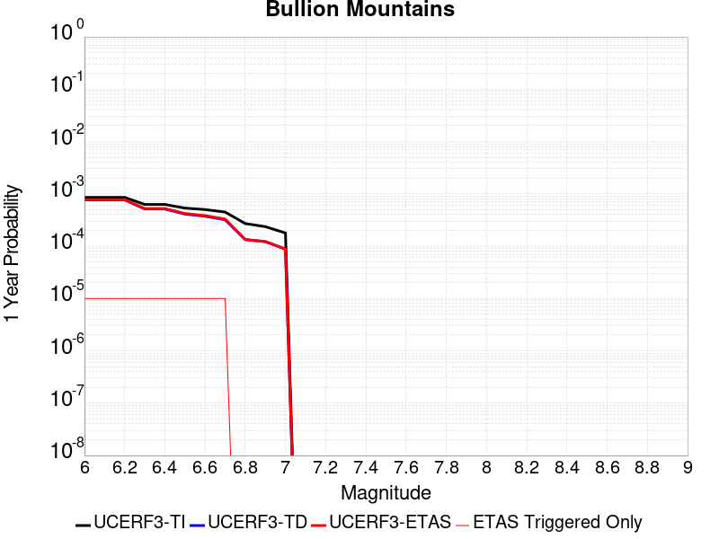 |  |

| Magnitude | 1 wk TI Prob | 1 wk TD Prob | 1 wk ETAS Prob | 1 wk ETAS/TD Gain | 1 wk ETAS Triggered Only | 1 mo TI Prob | 1 mo TD Prob | 1 mo ETAS Prob | 1 mo ETAS/TD Gain | 1 mo ETAS Triggered Only | 1 yr TI Prob | 1 yr TD Prob | 1 yr ETAS Prob | 1 yr ETAS/TD Gain | 1 yr ETAS Triggered Only | 10 yr TI Prob | 10 yr TD Prob | 10 yr ETAS Prob | 10 yr ETAS/TD Gain | 10 yr ETAS Triggered Only |
|-----|-----|-----|-----|-----|-----|-----|-----|-----|-----|-----|-----|-----|-----|-----|-----|-----|-----|-----|-----|-----|
| 6.0 | 1.6420427E-5 | 1.4692391E-5 | 1.4692391E-5 | 1.0 | 0.0 | 7.037136E-5 | 6.2966086E-5 | 6.2966086E-5 | 1.0 | 0.0 | 8.5643446E-4 | 7.6638086E-4 | 7.763732E-4 | 1.0130384 | 1.0E-5 | 0.008531413 | 0.007641173 | 0.0076808673 | 1.0051948 | 4.0E-5 |
| 6.1 | 1.6420427E-5 | 1.4692391E-5 | 1.4692391E-5 | 1.0 | 0.0 | 7.037136E-5 | 6.2966086E-5 | 6.2966086E-5 | 1.0 | 0.0 | 8.5643446E-4 | 7.6638086E-4 | 7.763732E-4 | 1.0130384 | 1.0E-5 | 0.008531413 | 0.007641173 | 0.0076808673 | 1.0051948 | 4.0E-5 |
| 6.2 | 1.6420427E-5 | 1.4692391E-5 | 1.4692391E-5 | 1.0 | 0.0 | 7.037136E-5 | 6.2966086E-5 | 6.2966086E-5 | 1.0 | 0.0 | 8.5643446E-4 | 7.6638086E-4 | 7.763732E-4 | 1.0130384 | 1.0E-5 | 0.008531413 | 0.007641173 | 0.0076808673 | 1.0051948 | 4.0E-5 |
| 6.3 | 1.2046778E-5 | 9.862503E-6 | 9.862503E-6 | 1.0 | 0.0 | 5.1628023E-5 | 4.226732E-5 | 4.226732E-5 | 1.0 | 0.0 | 6.283899E-4 | 5.145063E-4 | 5.2450114E-4 | 1.0194261 | 1.0E-5 | 0.0062661595 | 0.0051354324 | 0.0051553296 | 1.0038745 | 2.0E-5 |
| 6.4 | 1.2046778E-5 | 9.862503E-6 | 9.862503E-6 | 1.0 | 0.0 | 5.1628023E-5 | 4.226732E-5 | 4.226732E-5 | 1.0 | 0.0 | 6.283899E-4 | 5.145063E-4 | 5.2450114E-4 | 1.0194261 | 1.0E-5 | 0.0062661595 | 0.0051354324 | 0.0051553296 | 1.0038745 | 2.0E-5 |
| 6.5 | 1.0244343E-5 | 7.879574E-6 | 7.879574E-6 | 1.0 | 0.0 | 4.390359E-5 | 3.3769284E-5 | 3.3769284E-5 | 1.0 | 0.0 | 5.343951E-4 | 4.1108415E-4 | 4.2108004E-4 | 1.024316 | 1.0E-5 | 0.005331118 | 0.0041052685 | 0.004115227 | 1.0024259 | 1.0E-5 |
| 6.6 | 9.605408E-6 | 7.177594E-6 | 7.177594E-6 | 1.0 | 0.0 | 4.1165385E-5 | 3.0760868E-5 | 3.0760868E-5 | 1.0 | 0.0 | 5.010733E-4 | 3.7446956E-4 | 3.8446582E-4 | 1.0266944 | 1.0E-5 | 0.00499945 | 0.0037403828 | 0.0037503454 | 1.0026635 | 1.0E-5 |
| 6.7 | 8.60418E-6 | 6.1240744E-6 | 6.1240744E-6 | 1.0 | 0.0 | 3.687454E-5 | 2.624588E-5 | 2.624588E-5 | 1.0 | 0.0 | 4.48855E-4 | 3.1951623E-4 | 3.2951302E-4 | 1.0312873 | 1.0E-5 | 0.004479495 | 0.0031924804 | 0.0032024484 | 1.0031223 | 1.0E-5 |
| 6.8 | 5.187994E-6 | 2.5631732E-6 | 2.5631732E-6 | 1.0 | 0.0 | 2.223407E-5 | 1.0985004E-5 | 1.0985004E-5 | 1.0 | 0.0 | 2.7066618E-4 | 1.3373821E-4 | 1.3373821E-4 | 1.0 | 0.0 | 0.0027033675 | 0.0013369689 | 0.0013369689 | 1.0 | 0.0 |
| 6.9 | 4.5302368E-6 | 2.3443222E-6 | 2.3443222E-6 | 1.0 | 0.0 | 1.9415156E-5 | 1.0047079E-5 | 1.0047079E-5 | 1.0 | 0.0 | 2.3635388E-4 | 1.2232029E-4 | 1.2232029E-4 | 1.0 | 0.0 | 0.0023610266 | 0.0012229187 | 0.0012229187 | 1.0 | 0.0 |
| 7.0 | 3.431668E-6 | 1.6882242E-6 | 1.6882242E-6 | 1.0 | 0.0 | 1.4707065E-5 | 7.235247E-6 | 7.235247E-6 | 1.0 | 0.0 | 1.7904381E-4 | 8.808913E-5 | 8.808913E-5 | 1.0 | 0.0 | 0.0017889962 | 8.808913E-4 | 8.808913E-4 | 1.0 | 0.0 |

## White Mountains
*[(top)](#table-of-contents)*

| 1 Week | 1 Month | 1 Year | 10 Year |
|-----|-----|-----|-----|
|  |  |  |  |

| Magnitude | 1 wk TI Prob | 1 wk TD Prob | 1 wk ETAS Prob | 1 wk ETAS/TD Gain | 1 wk ETAS Triggered Only | 1 mo TI Prob | 1 mo TD Prob | 1 mo ETAS Prob | 1 mo ETAS/TD Gain | 1 mo ETAS Triggered Only | 1 yr TI Prob | 1 yr TD Prob | 1 yr ETAS Prob | 1 yr ETAS/TD Gain | 1 yr ETAS Triggered Only | 10 yr TI Prob | 10 yr TD Prob | 10 yr ETAS Prob | 10 yr ETAS/TD Gain | 10 yr ETAS Triggered Only |
|-----|-----|-----|-----|-----|-----|-----|-----|-----|-----|-----|-----|-----|-----|-----|-----|-----|-----|-----|-----|-----|
| 6.0 | 3.503579E-5 | 3.378486E-5 | 3.378486E-5 | 1.0 | 0.0 | 1.5014476E-4 | 1.447849E-4 | 1.447849E-4 | 1.0 | 0.0 | 0.0018264796 | 0.0017614518 | 0.0017714342 | 1.0056671 | 1.0E-5 | 0.018115403 | 0.017487235 | 0.017526535 | 1.0022473 | 4.0E-5 |
| 6.1 | 3.503579E-5 | 3.378486E-5 | 3.378486E-5 | 1.0 | 0.0 | 1.5014476E-4 | 1.447849E-4 | 1.447849E-4 | 1.0 | 0.0 | 0.0018264796 | 0.0017614518 | 0.0017714342 | 1.0056671 | 1.0E-5 | 0.018115403 | 0.017487235 | 0.017526535 | 1.0022473 | 4.0E-5 |
| 6.2 | 3.503579E-5 | 3.378486E-5 | 3.378486E-5 | 1.0 | 0.0 | 1.5014476E-4 | 1.447849E-4 | 1.447849E-4 | 1.0 | 0.0 | 0.0018264796 | 0.0017614518 | 0.0017714342 | 1.0056671 | 1.0E-5 | 0.018115403 | 0.017487235 | 0.017526535 | 1.0022473 | 4.0E-5 |
| 6.3 | 1.7818425E-5 | 1.5916474E-5 | 1.5916474E-5 | 1.0 | 0.0 | 7.636245E-5 | 6.821175E-5 | 6.821175E-5 | 1.0 | 0.0 | 9.293162E-4 | 8.3017594E-4 | 8.4016763E-4 | 1.0120356 | 1.0E-5 | 0.009254395 | 0.0082722055 | 0.008301957 | 1.0035965 | 3.0E-5 |
| 6.4 | 1.7818425E-5 | 1.5916474E-5 | 1.5916474E-5 | 1.0 | 0.0 | 7.636245E-5 | 6.821175E-5 | 6.821175E-5 | 1.0 | 0.0 | 9.293162E-4 | 8.3017594E-4 | 8.4016763E-4 | 1.0120356 | 1.0E-5 | 0.009254395 | 0.0082722055 | 0.008301957 | 1.0035965 | 3.0E-5 |
| 6.5 | 1.3397557E-5 | 1.133659E-5 | 1.133659E-5 | 1.0 | 0.0 | 5.741684E-5 | 4.8584523E-5 | 4.8584523E-5 | 1.0 | 0.0 | 6.988258E-4 | 5.91363E-4 | 6.013571E-4 | 1.0169001 | 1.0E-5 | 0.006966323 | 0.005898599 | 0.005918481 | 1.0033706 | 2.0E-5 |
| 6.6 | 1.0818695E-5 | 8.625597E-6 | 8.625597E-6 | 1.0 | 0.0 | 4.6365014E-5 | 3.6966343E-5 | 3.6966343E-5 | 1.0 | 0.0 | 5.6434784E-4 | 4.4997665E-4 | 4.4997665E-4 | 1.0 | 0.0 | 0.005629168 | 0.0044910917 | 0.004501047 | 1.0022166 | 1.0E-5 |
| 6.7 | 9.067908E-6 | 6.802605E-6 | 6.802605E-6 | 1.0 | 0.0 | 3.8861883E-5 | 2.9153714E-5 | 2.9153714E-5 | 1.0 | 0.0 | 4.7304068E-4 | 3.5489185E-4 | 3.5489185E-4 | 1.0 | 0.0 | 0.00472035 | 0.0035435683 | 0.0035535328 | 1.002812 | 1.0E-5 |
| 6.8 | 7.295947E-6 | 4.936522E-6 | 4.936522E-6 | 1.0 | 0.0 | 3.126797E-5 | 2.1156358E-5 | 2.1156358E-5 | 1.0 | 0.0 | 3.8062103E-4 | 2.5754934E-4 | 2.5754934E-4 | 1.0 | 0.0 | 0.0037996976 | 0.0025726215 | 0.002582596 | 1.003877 | 1.0E-5 |
| 6.9 | 6.2243444E-6 | 3.8323305E-6 | 3.8323305E-6 | 1.0 | 0.0 | 2.6675489E-5 | 1.6424174E-5 | 1.6424174E-5 | 1.0 | 0.0 | 3.2472567E-4 | 1.9994649E-4 | 1.9994649E-4 | 1.0 | 0.0 | 0.0032425157 | 0.0019977186 | 0.0019977186 | 1.0 | 0.0 |
| 7.0 | 4.9878413E-6 | 2.6796301E-6 | 2.6796301E-6 | 1.0 | 0.0 | 2.1376287E-5 | 1.14840805E-5 | 1.14840805E-5 | 1.0 | 0.0 | 2.602252E-4 | 1.3980997E-4 | 1.3980997E-4 | 1.0 | 0.0 | 0.002599207 | 0.0013972464 | 0.0013972464 | 1.0 | 0.0 |
| 7.1 | 4.0252844E-6 | 1.8857655E-6 | 1.8857655E-6 | 1.0 | 0.0 | 1.7251105E-5 | 8.081828E-6 | 8.081828E-6 | 1.0 | 0.0 | 2.1001195E-4 | 9.8391945E-5 | 9.8391945E-5 | 1.0 | 0.0 | 0.0020981359 | 9.834965E-4 | 9.834965E-4 | 1.0 | 0.0 |
| 7.2 | 3.3284066E-6 | 1.2819534E-6 | 1.2819534E-6 | 1.0 | 0.0 | 1.4264522E-5 | 5.4940747E-6 | 5.4940747E-6 | 1.0 | 0.0 | 1.736567E-4 | 6.688841E-5 | 6.688841E-5 | 1.0 | 0.0 | 0.0017352107 | 6.686928E-4 | 6.686928E-4 | 1.0 | 0.0 |
| 7.3 | 2.458226E-6 | 6.057251E-7 | 6.057251E-7 | 1.0 | 0.0 | 1.0535211E-5 | 2.5959623E-6 | 2.5959623E-6 | 1.0 | 0.0 | 1.2825865E-4 | 3.160542E-5 | 3.160542E-5 | 1.0 | 0.0 | 0.0012818464 | 3.16013E-4 | 3.16013E-4 | 1.0 | 0.0 |
| 7.4 | 1.965953E-6 | 3.1089647E-7 | 3.1089647E-7 | 1.0 | 0.0 | 8.425486E-6 | 1.3324128E-6 | 1.3324128E-6 | 1.0 | 0.0 | 1.0257547E-4 | 1.6222006E-5 | 1.6222006E-5 | 1.0 | 0.0 | 0.0010252813 | 1.6220835E-4 | 1.6220835E-4 | 1.0 | 0.0 |
| 7.5 | 1.2014192E-6 | 1.8244452E-7 | 1.8244452E-7 | 1.0 | 0.0 | 5.148929E-6 | 7.819049E-7 | 7.819049E-7 | 1.0 | 0.0 | 6.2686406E-5 | 9.519651E-6 | 9.519651E-6 | 1.0 | 0.0 | 6.266873E-4 | 9.519251E-5 | 9.519251E-5 | 1.0 | 0.0 |
| 7.6 | 2.5612175E-7 | 4.8946255E-8 | 4.8946255E-8 | 1.0 | 0.0 | 1.0976642E-6 | 2.0976965E-7 | 2.0976965E-7 | 1.0 | 0.0 | 1.3363979E-5 | 2.5539427E-6 | 2.5539427E-6 | 1.0 | 0.0 | 1.3363175E-4 | 2.5539171E-5 | 2.5539171E-5 | 1.0 | 0.0 |

## San Cayetano
*[(top)](#table-of-contents)*

| 1 Week | 1 Month | 1 Year | 10 Year |
|-----|-----|-----|-----|
|  |  |  |  |

| Magnitude | 1 wk TI Prob | 1 wk TD Prob | 1 wk ETAS Prob | 1 wk ETAS/TD Gain | 1 wk ETAS Triggered Only | 1 mo TI Prob | 1 mo TD Prob | 1 mo ETAS Prob | 1 mo ETAS/TD Gain | 1 mo ETAS Triggered Only | 1 yr TI Prob | 1 yr TD Prob | 1 yr ETAS Prob | 1 yr ETAS/TD Gain | 1 yr ETAS Triggered Only | 10 yr TI Prob | 10 yr TD Prob | 10 yr ETAS Prob | 10 yr ETAS/TD Gain | 10 yr ETAS Triggered Only |
|-----|-----|-----|-----|-----|-----|-----|-----|-----|-----|-----|-----|-----|-----|-----|-----|-----|-----|-----|-----|-----|
| 6.0 | 2.3476267E-5 | 1.816981E-5 | 1.816981E-5 | 1.0 | 0.0 | 1.0060869E-4 | 7.786832E-5 | 8.7867535E-5 | 1.1284119 | 1.0E-5 | 0.0012242225 | 9.4763807E-4 | 9.876002E-4 | 1.0421702 | 4.0E-5 | 0.012175002 | 0.009437099 | 0.009476721 | 1.0041986 | 4.0E-5 |
| 6.1 | 2.3476267E-5 | 1.816981E-5 | 1.816981E-5 | 1.0 | 0.0 | 1.0060869E-4 | 7.786832E-5 | 8.7867535E-5 | 1.1284119 | 1.0E-5 | 0.0012242225 | 9.4763807E-4 | 9.876002E-4 | 1.0421702 | 4.0E-5 | 0.012175002 | 0.009437099 | 0.009476721 | 1.0041986 | 4.0E-5 |
| 6.2 | 2.3476267E-5 | 1.816981E-5 | 1.816981E-5 | 1.0 | 0.0 | 1.0060869E-4 | 7.786832E-5 | 8.7867535E-5 | 1.1284119 | 1.0E-5 | 0.0012242225 | 9.4763807E-4 | 9.876002E-4 | 1.0421702 | 4.0E-5 | 0.012175002 | 0.009437099 | 0.009476721 | 1.0041986 | 4.0E-5 |
| 6.3 | 2.3476267E-5 | 1.816981E-5 | 1.816981E-5 | 1.0 | 0.0 | 1.0060869E-4 | 7.786832E-5 | 8.7867535E-5 | 1.1284119 | 1.0E-5 | 0.0012242225 | 9.4763807E-4 | 9.876002E-4 | 1.0421702 | 4.0E-5 | 0.012175002 | 0.009437099 | 0.009476721 | 1.0041986 | 4.0E-5 |
| 6.4 | 2.3476267E-5 | 1.816981E-5 | 1.816981E-5 | 1.0 | 0.0 | 1.0060869E-4 | 7.786832E-5 | 8.7867535E-5 | 1.1284119 | 1.0E-5 | 0.0012242225 | 9.4763807E-4 | 9.876002E-4 | 1.0421702 | 4.0E-5 | 0.012175002 | 0.009437099 | 0.009476721 | 1.0041986 | 4.0E-5 |
| 6.5 | 2.3476267E-5 | 1.816981E-5 | 1.816981E-5 | 1.0 | 0.0 | 1.0060869E-4 | 7.786832E-5 | 8.7867535E-5 | 1.1284119 | 1.0E-5 | 0.0012242225 | 9.4763807E-4 | 9.876002E-4 | 1.0421702 | 4.0E-5 | 0.012175002 | 0.009437099 | 0.009476721 | 1.0041986 | 4.0E-5 |
| 6.6 | 2.3476267E-5 | 1.816981E-5 | 1.816981E-5 | 1.0 | 0.0 | 1.0060869E-4 | 7.786832E-5 | 8.7867535E-5 | 1.1284119 | 1.0E-5 | 0.0012242225 | 9.4763807E-4 | 9.876002E-4 | 1.0421702 | 4.0E-5 | 0.012175002 | 0.009437099 | 0.009476721 | 1.0041986 | 4.0E-5 |
| 6.7 | 2.3476267E-5 | 1.816981E-5 | 1.816981E-5 | 1.0 | 0.0 | 1.0060869E-4 | 7.786832E-5 | 8.7867535E-5 | 1.1284119 | 1.0E-5 | 0.0012242225 | 9.4763807E-4 | 9.876002E-4 | 1.0421702 | 4.0E-5 | 0.012175002 | 0.009437099 | 0.009476721 | 1.0041986 | 4.0E-5 |
| 6.8 | 2.3241924E-5 | 1.7937533E-5 | 1.7937533E-5 | 1.0 | 0.0 | 9.960445E-5 | 7.687289E-5 | 8.6872125E-5 | 1.1300749 | 1.0E-5 | 0.0012120095 | 9.3552924E-4 | 9.754918E-4 | 1.0427165 | 4.0E-5 | 0.012054204 | 0.009316774 | 0.009356402 | 1.0042534 | 4.0E-5 |
| 6.9 | 2.2761007E-5 | 1.743295E-5 | 1.743295E-5 | 1.0 | 0.0 | 9.7543525E-5 | 7.471052E-5 | 8.4709776E-5 | 1.13384 | 1.0E-5 | 0.0011869454 | 9.0922444E-4 | 9.491881E-4 | 1.0439535 | 4.0E-5 | 0.011806256 | 0.0090558855 | 0.0090955235 | 1.004377 | 4.0E-5 |
| 7.0 | 2.240283E-5 | 1.7066695E-5 | 1.7066695E-5 | 1.0 | 0.0 | 9.600859E-5 | 7.3140945E-5 | 8.3140214E-5 | 1.1367123 | 1.0E-5 | 0.0011682777 | 8.9013064E-4 | 9.3009503E-4 | 1.0448972 | 4.0E-5 | 0.011621549 | 0.008866477 | 0.008906122 | 1.0044714 | 4.0E-5 |
| 7.1 | 2.1871154E-5 | 1.6586566E-5 | 1.6586566E-5 | 1.0 | 0.0 | 9.373015E-5 | 7.108336E-5 | 8.108265E-5 | 1.14067 | 1.0E-5 | 0.0011405671 | 8.6509966E-4 | 8.9507375E-4 | 1.0346481 | 3.0E-5 | 0.011347309 | 0.008618131 | 0.008647872 | 1.003451 | 3.0E-5 |
| 7.2 | 2.0714133E-5 | 1.5565072E-5 | 1.5565072E-5 | 1.0 | 0.0 | 8.8771834E-5 | 6.670577E-5 | 7.67051E-5 | 1.1499021 | 1.0E-5 | 0.0010802611 | 8.118434E-4 | 8.41819E-4 | 1.0369229 | 3.0E-5 | 0.010750249 | 0.008089561 | 0.008119319 | 1.0036784 | 3.0E-5 |
| 7.3 | 1.8408395E-5 | 1.399727E-5 | 1.399727E-5 | 1.0 | 0.0 | 7.8890735E-5 | 5.9986938E-5 | 6.998634E-5 | 1.166693 | 1.0E-5 | 9.600714E-4 | 7.300992E-4 | 7.600773E-4 | 1.0410603 | 3.0E-5 | 0.009559342 | 0.007277729 | 0.007307511 | 1.0040922 | 3.0E-5 |
| 7.4 | 1.6856795E-5 | 1.2850437E-5 | 1.2850437E-5 | 1.0 | 0.0 | 7.2241404E-5 | 5.5072152E-5 | 6.50716E-5 | 1.1815699 | 1.0E-5 | 8.7918417E-4 | 6.7030004E-4 | 7.0027995E-4 | 1.0447261 | 3.0E-5 | 0.00875714 | 0.0066834535 | 0.006713253 | 1.0044587 | 3.0E-5 |
| 7.5 | 1.2822778E-5 | 9.577708E-6 | 9.577708E-6 | 1.0 | 0.0 | 5.495361E-5 | 4.1046682E-5 | 4.1046682E-5 | 1.0 | 0.0 | 6.688548E-4 | 4.9963035E-4 | 5.0962536E-4 | 1.0200047 | 1.0E-5 | 0.006668452 | 0.0049853446 | 0.0049952944 | 1.0019959 | 1.0E-5 |
| 7.6 | 5.6272684E-6 | 3.855034E-6 | 3.855034E-6 | 1.0 | 0.0 | 2.4116642E-5 | 1.652147E-5 | 1.652147E-5 | 1.0 | 0.0 | 2.9358055E-4 | 2.0113043E-4 | 2.0113043E-4 | 1.0 | 0.0 | 0.0029319301 | 0.002009495 | 0.002009495 | 1.0 | 0.0 |
| 7.7 | 3.5261346E-6 | 2.3407886E-6 | 2.3407886E-6 | 1.0 | 0.0 | 1.5111918E-5 | 1.0031912E-5 | 1.0031912E-5 | 1.0 | 0.0 | 1.8397206E-4 | 1.2213177E-4 | 1.2213177E-4 | 1.0 | 0.0 | 0.0018381984 | 0.0012206538 | 0.0012206538 | 1.0 | 0.0 |
| 7.8 | 1.4826929E-6 | 1.0564752E-6 | 1.0564752E-6 | 1.0 | 0.0 | 6.354383E-6 | 4.527743E-6 | 4.527743E-6 | 1.0 | 0.0 | 7.736187E-5 | 5.5123895E-5 | 5.5123895E-5 | 1.0 | 0.0 | 7.733494E-4 | 5.5110425E-4 | 5.5110425E-4 | 1.0 | 0.0 |
| 7.9 | 2.7568166E-7 | 1.6978849E-7 | 1.6978849E-7 | 1.0 | 0.0 | 1.1814923E-6 | 7.2766477E-7 | 7.2766477E-7 | 1.0 | 0.0 | 1.4384574E-5 | 8.859282E-6 | 8.859282E-6 | 1.0 | 0.0 | 1.4383643E-4 | 8.858933E-5 | 8.858933E-5 | 1.0 | 0.0 |
| 8.0 | 5.407832E-8 | 2.6889756E-8 | 2.6889756E-8 | 1.0 | 0.0 | 2.3176422E-7 | 1.1524181E-7 | 1.1524181E-7 | 1.0 | 0.0 | 2.8217257E-6 | 1.4030682E-6 | 1.4030682E-6 | 1.0 | 0.0 | 2.8216898E-5 | 1.4030597E-5 | 1.4030597E-5 | 1.0 | 0.0 |

## Tin Mountain
*[(top)](#table-of-contents)*

| 1 Week | 1 Month | 1 Year | 10 Year |
|-----|-----|-----|-----|
|  |  |  |  |

| Magnitude | 1 wk TI Prob | 1 wk TD Prob | 1 wk ETAS Prob | 1 wk ETAS/TD Gain | 1 wk ETAS Triggered Only | 1 mo TI Prob | 1 mo TD Prob | 1 mo ETAS Prob | 1 mo ETAS/TD Gain | 1 mo ETAS Triggered Only | 1 yr TI Prob | 1 yr TD Prob | 1 yr ETAS Prob | 1 yr ETAS/TD Gain | 1 yr ETAS Triggered Only | 10 yr TI Prob | 10 yr TD Prob | 10 yr ETAS Prob | 10 yr ETAS/TD Gain | 10 yr ETAS Triggered Only |
|-----|-----|-----|-----|-----|-----|-----|-----|-----|-----|-----|-----|-----|-----|-----|-----|-----|-----|-----|-----|-----|
| 6.0 | 4.083776E-6 | 4.1815633E-6 | 1.4181522E-5 | 3.3914402 | 1.0E-5 | 1.750178E-5 | 1.7920884E-5 | 3.7920527E-5 | 2.1159964 | 2.0E-5 | 2.1306332E-4 | 2.1816863E-4 | 2.3816427E-4 | 1.0916522 | 2.0E-5 | 0.0021285915 | 0.0021799102 | 0.002219823 | 1.0183094 | 4.0E-5 |
| 6.1 | 4.083776E-6 | 4.1815633E-6 | 1.4181522E-5 | 3.3914402 | 1.0E-5 | 1.750178E-5 | 1.7920884E-5 | 3.7920527E-5 | 2.1159964 | 2.0E-5 | 2.1306332E-4 | 2.1816863E-4 | 2.3816427E-4 | 1.0916522 | 2.0E-5 | 0.0021285915 | 0.0021799102 | 0.002219823 | 1.0183094 | 4.0E-5 |
| 6.2 | 4.083776E-6 | 4.1815633E-6 | 1.4181522E-5 | 3.3914402 | 1.0E-5 | 1.750178E-5 | 1.7920884E-5 | 3.7920527E-5 | 2.1159964 | 2.0E-5 | 2.1306332E-4 | 2.1816863E-4 | 2.3816427E-4 | 1.0916522 | 2.0E-5 | 0.0021285915 | 0.0021799102 | 0.002219823 | 1.0183094 | 4.0E-5 |
| 6.3 | 4.083776E-6 | 4.1815633E-6 | 1.4181522E-5 | 3.3914402 | 1.0E-5 | 1.750178E-5 | 1.7920884E-5 | 3.7920527E-5 | 2.1159964 | 2.0E-5 | 2.1306332E-4 | 2.1816863E-4 | 2.3816427E-4 | 1.0916522 | 2.0E-5 | 0.0021285915 | 0.0021799102 | 0.002219823 | 1.0183094 | 4.0E-5 |
| 6.4 | 4.083776E-6 | 4.1815633E-6 | 1.4181522E-5 | 3.3914402 | 1.0E-5 | 1.750178E-5 | 1.7920884E-5 | 3.7920527E-5 | 2.1159964 | 2.0E-5 | 2.1306332E-4 | 2.1816863E-4 | 2.3816427E-4 | 1.0916522 | 2.0E-5 | 0.0021285915 | 0.0021799102 | 0.002219823 | 1.0183094 | 4.0E-5 |
| 6.5 | 2.3143427E-6 | 2.3731732E-6 | 2.3731732E-6 | 1.0 | 0.0 | 9.9185745E-6 | 1.0170707E-5 | 1.0170707E-5 | 1.0 | 0.0 | 1.2075195E-4 | 1.238221E-4 | 1.238221E-4 | 1.0 | 0.0 | 0.0012068636 | 0.001237607 | 0.001237607 | 1.0 | 0.0 |
| 6.6 | 2.3143427E-6 | 2.3731732E-6 | 2.3731732E-6 | 1.0 | 0.0 | 9.9185745E-6 | 1.0170707E-5 | 1.0170707E-5 | 1.0 | 0.0 | 1.2075195E-4 | 1.238221E-4 | 1.238221E-4 | 1.0 | 0.0 | 0.0012068636 | 0.001237607 | 0.001237607 | 1.0 | 0.0 |
| 6.7 | 1.7029532E-6 | 1.7498044E-6 | 1.7498044E-6 | 1.0 | 0.0 | 7.2983503E-6 | 7.499143E-6 | 7.499143E-6 | 1.0 | 0.0 | 8.885379E-5 | 9.1298774E-5 | 9.1298774E-5 | 1.0 | 0.0 | 8.881827E-4 | 9.1266533E-4 | 9.1266533E-4 | 1.0 | 0.0 |
| 6.8 | 1.2914646E-6 | 1.3299484E-6 | 1.3299484E-6 | 1.0 | 0.0 | 5.534837E-6 | 5.699769E-6 | 5.699769E-6 | 1.0 | 0.0 | 6.738455E-5 | 6.939292E-5 | 6.939292E-5 | 1.0 | 0.0 | 6.736412E-4 | 6.9375586E-4 | 6.9375586E-4 | 1.0 | 0.0 |
| 6.9 | 5.8708974E-7 | 6.117062E-7 | 6.117062E-7 | 1.0 | 0.0 | 2.5160964E-6 | 2.6215955E-6 | 2.6215955E-6 | 1.0 | 0.0 | 3.0633044E-5 | 3.19175E-5 | 3.19175E-5 | 1.0 | 0.0 | 3.0628822E-4 | 3.1913328E-4 | 3.1913328E-4 | 1.0 | 0.0 |
| 7.0 | 4.6248786E-7 | 4.8320726E-7 | 4.8320726E-7 | 1.0 | 0.0 | 1.9820893E-6 | 2.070887E-6 | 2.070887E-6 | 1.0 | 0.0 | 2.413167E-5 | 2.5212794E-5 | 2.5212794E-5 | 1.0 | 0.0 | 2.412905E-4 | 2.5210303E-4 | 2.5210303E-4 | 1.0 | 0.0 |
| 7.1 | 3.804606E-7 | 3.9871978E-7 | 3.9871978E-7 | 1.0 | 0.0 | 1.6305444E-6 | 1.7087981E-6 | 1.7087981E-6 | 1.0 | 0.0 | 1.9851697E-5 | 2.0804453E-5 | 2.0804453E-5 | 1.0 | 0.0 | 1.9849923E-4 | 2.0802842E-4 | 2.0802842E-4 | 1.0 | 0.0 |
| 7.2 | 3.5864858E-7 | 3.7617352E-7 | 3.7617352E-7 | 1.0 | 0.0 | 1.5370645E-6 | 1.6121713E-6 | 1.6121713E-6 | 1.0 | 0.0 | 1.87136E-5 | 1.9628043E-5 | 1.9628043E-5 | 1.0 | 0.0 | 1.8712023E-4 | 1.9626641E-4 | 1.9626641E-4 | 1.0 | 0.0 |
| 7.3 | 3.342063E-7 | 3.5063928E-7 | 3.5063928E-7 | 1.0 | 0.0 | 1.4323119E-6 | 1.5027391E-6 | 1.5027391E-6 | 1.0 | 0.0 | 1.7438259E-5 | 1.829573E-5 | 1.829573E-5 | 1.0 | 0.0 | 1.743689E-4 | 1.8294553E-4 | 1.8294553E-4 | 1.0 | 0.0 |
| 7.4 | 2.971242E-7 | 3.1166223E-7 | 3.1166223E-7 | 1.0 | 0.0 | 1.2733886E-6 | 1.3356947E-6 | 1.3356947E-6 | 1.0 | 0.0 | 1.5503398E-5 | 1.6261996E-5 | 1.6261996E-5 | 1.0 | 0.0 | 1.5502315E-4 | 1.6261134E-4 | 1.6261134E-4 | 1.0 | 0.0 |
| 7.5 | 1.4326713E-7 | 1.5012715E-7 | 1.5012715E-7 | 1.0 | 0.0 | 6.140018E-7 | 6.434021E-7 | 6.434021E-7 | 1.0 | 0.0 | 7.4754466E-6 | 7.83342E-6 | 7.83342E-6 | 1.0 | 0.0 | 7.475195E-5 | 7.8334204E-5 | 7.8334204E-5 | 1.0 | 0.0 |

## Santa Cruz Island
*[(top)](#table-of-contents)*

| 1 Week | 1 Month | 1 Year | 10 Year |
|-----|-----|-----|-----|
|  |  | 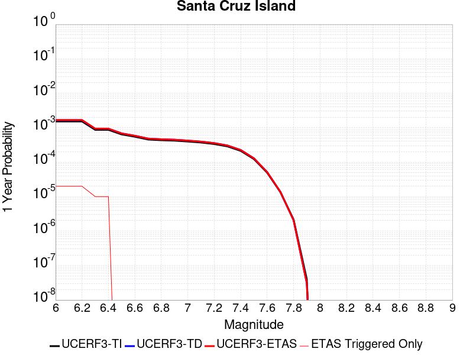 |  |

| Magnitude | 1 wk TI Prob | 1 wk TD Prob | 1 wk ETAS Prob | 1 wk ETAS/TD Gain | 1 wk ETAS Triggered Only | 1 mo TI Prob | 1 mo TD Prob | 1 mo ETAS Prob | 1 mo ETAS/TD Gain | 1 mo ETAS Triggered Only | 1 yr TI Prob | 1 yr TD Prob | 1 yr ETAS Prob | 1 yr ETAS/TD Gain | 1 yr ETAS Triggered Only | 10 yr TI Prob | 10 yr TD Prob | 10 yr ETAS Prob | 10 yr ETAS/TD Gain | 10 yr ETAS Triggered Only |
|-----|-----|-----|-----|-----|-----|-----|-----|-----|-----|-----|-----|-----|-----|-----|-----|-----|-----|-----|-----|-----|
| 6.0 | 2.9164563E-5 | 3.1600448E-5 | 3.1600448E-5 | 1.0 | 0.0 | 1.2498499E-4 | 1.3542424E-4 | 1.3542424E-4 | 1.0 | 0.0 | 0.0015206301 | 0.0016476793 | 0.0016676463 | 1.0121183 | 2.0E-5 | 0.015102667 | 0.016368363 | 0.016397871 | 1.0018028 | 3.0E-5 |
| 6.1 | 2.9164563E-5 | 3.1600448E-5 | 3.1600448E-5 | 1.0 | 0.0 | 1.2498499E-4 | 1.3542424E-4 | 1.3542424E-4 | 1.0 | 0.0 | 0.0015206301 | 0.0016476793 | 0.0016676463 | 1.0121183 | 2.0E-5 | 0.015102667 | 0.016368363 | 0.016397871 | 1.0018028 | 3.0E-5 |
| 6.2 | 2.9164563E-5 | 3.1600448E-5 | 3.1600448E-5 | 1.0 | 0.0 | 1.2498499E-4 | 1.3542424E-4 | 1.3542424E-4 | 1.0 | 0.0 | 0.0015206301 | 0.0016476793 | 0.0016676463 | 1.0121183 | 2.0E-5 | 0.015102667 | 0.016368363 | 0.016397871 | 1.0018028 | 3.0E-5 |
| 6.3 | 1.6635553E-5 | 1.7804694E-5 | 1.7804694E-5 | 1.0 | 0.0 | 7.1293274E-5 | 7.63037E-5 | 7.63037E-5 | 1.0 | 0.0 | 8.6765E-4 | 9.286199E-4 | 9.386106E-4 | 1.0107586 | 1.0E-5 | 0.008642701 | 0.009249267 | 0.009269082 | 1.0021423 | 2.0E-5 |
| 6.4 | 1.6635553E-5 | 1.7804694E-5 | 1.7804694E-5 | 1.0 | 0.0 | 7.1293274E-5 | 7.63037E-5 | 7.63037E-5 | 1.0 | 0.0 | 8.6765E-4 | 9.286199E-4 | 9.386106E-4 | 1.0107586 | 1.0E-5 | 0.008642701 | 0.009249267 | 0.009269082 | 1.0021423 | 2.0E-5 |
| 6.5 | 1.2238748E-5 | 1.3043225E-5 | 1.3043225E-5 | 1.0 | 0.0 | 5.2450723E-5 | 5.5898363E-5 | 5.5898363E-5 | 1.0 | 0.0 | 6.3840044E-4 | 6.803537E-4 | 6.803537E-4 | 1.0 | 0.0 | 0.0063656955 | 0.0067831073 | 0.0067930394 | 1.0014642 | 1.0E-5 |
| 6.6 | 1.0489767E-5 | 1.1156827E-5 | 1.1156827E-5 | 1.0 | 0.0 | 4.495537E-5 | 4.781411E-5 | 4.781411E-5 | 1.0 | 0.0 | 5.4719415E-4 | 5.819835E-4 | 5.819835E-4 | 1.0 | 0.0 | 0.005458487 | 0.005804835 | 0.0058147768 | 1.0017127 | 1.0E-5 |
| 6.7 | 8.699222E-6 | 9.236936E-6 | 9.236936E-6 | 1.0 | 0.0 | 3.7281847E-5 | 3.958627E-5 | 3.958627E-5 | 1.0 | 0.0 | 4.5381195E-4 | 4.818568E-4 | 4.818568E-4 | 1.0 | 0.0 | 0.0045288634 | 0.004808188 | 0.004808188 | 1.0 | 0.0 |
| 6.8 | 8.307732E-6 | 8.81705E-6 | 8.81705E-6 | 1.0 | 0.0 | 3.560408E-5 | 3.7786813E-5 | 3.7786813E-5 | 1.0 | 0.0 | 4.3339343E-4 | 4.5995775E-4 | 4.5995775E-4 | 1.0 | 0.0 | 0.004325492 | 0.0045901113 | 0.0045901113 | 1.0 | 0.0 |
| 6.9 | 8.073121E-6 | 8.56508E-6 | 8.56508E-6 | 1.0 | 0.0 | 3.459863E-5 | 3.6706973E-5 | 3.6706973E-5 | 1.0 | 0.0 | 4.2115687E-4 | 4.4681615E-4 | 4.4681615E-4 | 1.0 | 0.0 | 0.004203596 | 0.0044592293 | 0.0044592293 | 1.0 | 0.0 |
| 7.0 | 7.617019E-6 | 8.074796E-6 | 8.074796E-6 | 1.0 | 0.0 | 3.264396E-5 | 3.4605808E-5 | 3.4605808E-5 | 1.0 | 0.0 | 3.9736772E-4 | 4.2124468E-4 | 4.2124468E-4 | 1.0 | 0.0 | 0.003966579 | 0.0042045093 | 0.0042045093 | 1.0 | 0.0 |
| 7.1 | 7.1224836E-6 | 7.5459093E-6 | 7.5459093E-6 | 1.0 | 0.0 | 3.052457E-5 | 3.2339212E-5 | 3.2339212E-5 | 1.0 | 0.0 | 3.715733E-4 | 3.9365914E-4 | 3.9365914E-4 | 1.0 | 0.0 | 0.003709526 | 0.003929661 | 0.003929661 | 1.0 | 0.0 |
| 7.2 | 6.441115E-6 | 6.8274944E-6 | 6.8274944E-6 | 1.0 | 0.0 | 2.7604487E-5 | 2.9260364E-5 | 2.9260364E-5 | 1.0 | 0.0 | 3.360328E-4 | 3.561869E-4 | 3.561869E-4 | 1.0 | 0.0 | 0.0033552512 | 0.0035561887 | 0.0035561887 | 1.0 | 0.0 |
| 7.3 | 5.494274E-6 | 5.820088E-6 | 5.820088E-6 | 1.0 | 0.0 | 2.3546674E-5 | 2.4942998E-5 | 2.4942998E-5 | 1.0 | 0.0 | 2.8664304E-4 | 3.0363887E-4 | 3.0363887E-4 | 1.0 | 0.0 | 0.002862736 | 0.0030322631 | 0.0030322631 | 1.0 | 0.0 |
| 7.4 | 4.0802624E-6 | 4.312323E-6 | 4.312323E-6 | 1.0 | 0.0 | 1.7486722E-5 | 1.8481256E-5 | 1.8481256E-5 | 1.0 | 0.0 | 2.1288003E-4 | 2.2498613E-4 | 2.2498613E-4 | 1.0 | 0.0 | 0.0021267622 | 0.0022475924 | 0.0022475924 | 1.0 | 0.0 |
| 7.5 | 2.3584746E-6 | 2.4753442E-6 | 2.4753442E-6 | 1.0 | 0.0 | 1.0107709E-5 | 1.0608575E-5 | 1.0608575E-5 | 1.0 | 0.0 | 1.2305441E-4 | 1.291518E-4 | 1.291518E-4 | 1.0 | 0.0 | 0.0012298629 | 0.0012907725 | 0.0012907725 | 1.0 | 0.0 |
| 7.6 | 9.4981914E-7 | 9.861049E-7 | 9.861049E-7 | 1.0 | 0.0 | 4.0706473E-6 | 4.2261568E-6 | 4.2261568E-6 | 1.0 | 0.0 | 4.9559E-5 | 5.1452254E-5 | 5.1452254E-5 | 1.0 | 0.0 | 4.954795E-4 | 5.1440473E-4 | 5.1440473E-4 | 1.0 | 0.0 |
| 7.7 | 2.6013532E-7 | 2.6416856E-7 | 2.6416856E-7 | 1.0 | 0.0 | 1.1148652E-6 | 1.1321505E-6 | 1.1321505E-6 | 1.0 | 0.0 | 1.3573399E-5 | 1.3783846E-5 | 1.3783846E-5 | 1.0 | 0.0 | 1.357257E-4 | 1.3782998E-4 | 1.3782998E-4 | 1.0 | 0.0 |
| 7.8 | 4.1522263E-8 | 3.9657188E-8 | 3.9657188E-8 | 1.0 | 0.0 | 1.7795254E-7 | 1.6995936E-7 | 1.6995936E-7 | 1.0 | 0.0 | 2.16657E-6 | 2.0692535E-6 | 2.0692535E-6 | 1.0 | 0.0 | 2.1665488E-5 | 2.0692365E-5 | 2.0692365E-5 | 1.0 | 0.0 |
| 7.9 | 7.7242046E-10 | 5.947586E-10 | 5.947586E-10 | 1.0 | 0.0 | 3.3103735E-9 | 2.548966E-9 | 2.548966E-9 | 1.0 | 0.0 | 4.0303796E-8 | 3.1033657E-8 | 3.1033657E-8 | 1.0 | 0.0 | 4.030379E-7 | 3.1033656E-7 | 3.1033656E-7 | 1.0 | 0.0 |

## Cleghorn
*[(top)](#table-of-contents)*

| 1 Week | 1 Month | 1 Year | 10 Year |
|-----|-----|-----|-----|
|  |  |  |  |

| Magnitude | 1 wk TI Prob | 1 wk TD Prob | 1 wk ETAS Prob | 1 wk ETAS/TD Gain | 1 wk ETAS Triggered Only | 1 mo TI Prob | 1 mo TD Prob | 1 mo ETAS Prob | 1 mo ETAS/TD Gain | 1 mo ETAS Triggered Only | 1 yr TI Prob | 1 yr TD Prob | 1 yr ETAS Prob | 1 yr ETAS/TD Gain | 1 yr ETAS Triggered Only | 10 yr TI Prob | 10 yr TD Prob | 10 yr ETAS Prob | 10 yr ETAS/TD Gain | 10 yr ETAS Triggered Only |
|-----|-----|-----|-----|-----|-----|-----|-----|-----|-----|-----|-----|-----|-----|-----|-----|-----|-----|-----|-----|-----|
| 6.0 | 7.9267165E-6 | 9.83657E-6 | 9.83657E-6 | 1.0 | 0.0 | 3.39712E-5 | 4.2156105E-5 | 5.2155683E-5 | 1.2372036 | 1.0E-5 | 4.1352084E-4 | 5.1314034E-4 | 5.231352E-4 | 1.0194778 | 1.0E-5 | 0.004127522 | 0.0051346202 | 0.0051644663 | 1.0058126 | 3.0E-5 |
| 6.1 | 7.9267165E-6 | 9.83657E-6 | 9.83657E-6 | 1.0 | 0.0 | 3.39712E-5 | 4.2156105E-5 | 5.2155683E-5 | 1.2372036 | 1.0E-5 | 4.1352084E-4 | 5.1314034E-4 | 5.231352E-4 | 1.0194778 | 1.0E-5 | 0.004127522 | 0.0051346202 | 0.0051644663 | 1.0058126 | 3.0E-5 |
| 6.2 | 7.9267165E-6 | 9.83657E-6 | 9.83657E-6 | 1.0 | 0.0 | 3.39712E-5 | 4.2156105E-5 | 5.2155683E-5 | 1.2372036 | 1.0E-5 | 4.1352084E-4 | 5.1314034E-4 | 5.231352E-4 | 1.0194778 | 1.0E-5 | 0.004127522 | 0.0051346202 | 0.0051644663 | 1.0058126 | 3.0E-5 |
| 6.3 | 7.9267165E-6 | 9.83657E-6 | 9.83657E-6 | 1.0 | 0.0 | 3.39712E-5 | 4.2156105E-5 | 5.2155683E-5 | 1.2372036 | 1.0E-5 | 4.1352084E-4 | 5.1314034E-4 | 5.231352E-4 | 1.0194778 | 1.0E-5 | 0.004127522 | 0.0051346202 | 0.0051644663 | 1.0058126 | 3.0E-5 |
| 6.4 | 4.3445207E-6 | 6.0963866E-6 | 6.0963866E-6 | 1.0 | 0.0 | 1.8619241E-5 | 2.6127114E-5 | 2.6127114E-5 | 1.0 | 0.0 | 2.2666567E-4 | 3.1805222E-4 | 3.1805222E-4 | 1.0 | 0.0 | 0.0022643462 | 0.0031901128 | 0.003200081 | 1.0031247 | 1.0E-5 |
| 6.5 | 4.3445207E-6 | 6.0963866E-6 | 6.0963866E-6 | 1.0 | 0.0 | 1.8619241E-5 | 2.6127114E-5 | 2.6127114E-5 | 1.0 | 0.0 | 2.2666567E-4 | 3.1805222E-4 | 3.1805222E-4 | 1.0 | 0.0 | 0.0022643462 | 0.0031901128 | 0.003200081 | 1.0031247 | 1.0E-5 |
| 6.6 | 4.040109E-6 | 5.7787906E-6 | 5.7787906E-6 | 1.0 | 0.0 | 1.7314638E-5 | 2.4766015E-5 | 2.4766015E-5 | 1.0 | 0.0 | 2.1078532E-4 | 3.0148547E-4 | 3.0148547E-4 | 1.0 | 0.0 | 0.002105855 | 0.003024901 | 0.0030348708 | 1.0032959 | 1.0E-5 |
| 6.7 | 3.3632055E-6 | 5.0722792E-6 | 5.0722792E-6 | 1.0 | 0.0 | 1.4413658E-5 | 2.173816E-5 | 2.173816E-5 | 1.0 | 0.0 | 1.7547216E-4 | 2.6463027E-4 | 2.6463027E-4 | 1.0 | 0.0 | 0.0017533366 | 0.0026572319 | 0.0026572319 | 1.0 | 0.0 |
| 6.8 | 3.2902772E-6 | 4.9941855E-6 | 4.9941855E-6 | 1.0 | 0.0 | 1.4101111E-5 | 2.1403479E-5 | 2.1403479E-5 | 1.0 | 0.0 | 1.716675E-4 | 2.605565E-4 | 2.605565E-4 | 1.0 | 0.0 | 0.0017153495 | 0.0026165901 | 0.0026165901 | 1.0 | 0.0 |
| 6.9 | 3.031547E-6 | 4.6957316E-6 | 4.6957316E-6 | 1.0 | 0.0 | 1.299228E-5 | 2.012441E-5 | 2.012441E-5 | 1.0 | 0.0 | 1.5816953E-4 | 2.4498743E-4 | 2.4498743E-4 | 1.0 | 0.0 | 0.00158057 | 0.0024612513 | 0.0024612513 | 1.0 | 0.0 |
| 7.0 | 2.8259715E-6 | 4.3747577E-6 | 4.3747577E-6 | 1.0 | 0.0 | 1.211125E-5 | 1.874883E-5 | 1.874883E-5 | 1.0 | 0.0 | 1.4744449E-4 | 2.2824331E-4 | 2.2824331E-4 | 1.0 | 0.0 | 0.001473467 | 0.0022941655 | 0.0022941655 | 1.0 | 0.0 |
| 7.1 | 2.5962665E-6 | 4.0697605E-6 | 4.0697605E-6 | 1.0 | 0.0 | 1.1126809E-5 | 1.7441716E-5 | 1.7441716E-5 | 1.0 | 0.0 | 1.3546048E-4 | 2.1233242E-4 | 2.1233242E-4 | 1.0 | 0.0 | 0.0013537793 | 0.0021353744 | 0.0021353744 | 1.0 | 0.0 |
| 7.2 | 2.3247253E-6 | 3.680073E-6 | 3.680073E-6 | 1.0 | 0.0 | 9.96307E-6 | 1.5771646E-5 | 1.5771646E-5 | 1.0 | 0.0 | 1.21293626E-4 | 1.9200306E-4 | 1.9200306E-4 | 1.0 | 0.0 | 0.0012122744 | 0.0019324694 | 0.0019324694 | 1.0 | 0.0 |
| 7.3 | 2.056928E-6 | 3.238324E-6 | 3.238324E-6 | 1.0 | 0.0 | 8.815376E-6 | 1.3878458E-5 | 1.3878458E-5 | 1.0 | 0.0 | 1.0732192E-4 | 1.689573E-4 | 1.689573E-4 | 1.0 | 0.0 | 0.001072701 | 0.0017024518 | 0.0017024518 | 1.0 | 0.0 |
| 7.4 | 1.8055999E-6 | 2.828332E-6 | 2.828332E-6 | 1.0 | 0.0 | 7.738263E-6 | 1.2121368E-5 | 1.2121368E-5 | 1.0 | 0.0 | 9.4209274E-5 | 1.475678E-4 | 1.475678E-4 | 1.0 | 0.0 | 9.4169343E-4 | 0.0014889984 | 0.0014889984 | 1.0 | 0.0 |
| 7.5 | 1.4683443E-6 | 2.4274007E-6 | 2.4274007E-6 | 1.0 | 0.0 | 6.292889E-6 | 1.0403105E-5 | 1.0403105E-5 | 1.0 | 0.0 | 7.661323E-5 | 1.2665054E-4 | 1.2665054E-4 | 1.0 | 0.0 | 7.658682E-4 | 0.0012801208 | 0.0012801208 | 1.0 | 0.0 |
| 7.6 | 9.804088E-7 | 1.9028438E-6 | 1.9028438E-6 | 1.0 | 0.0 | 4.201745E-6 | 8.15502E-6 | 8.15502E-6 | 1.0 | 0.0 | 5.1155046E-5 | 9.928289E-5 | 9.928289E-5 | 1.0 | 0.0 | 5.114327E-4 | 0.00100676 | 0.00100676 | 1.0 | 0.0 |
| 7.7 | 7.3434086E-7 | 1.6309292E-6 | 1.6309292E-6 | 1.0 | 0.0 | 3.1471714E-6 | 6.989678E-6 | 6.989678E-6 | 1.0 | 0.0 | 3.831614E-5 | 8.509603E-5 | 8.509603E-5 | 1.0 | 0.0 | 3.8309532E-4 | 8.6504343E-4 | 8.6504343E-4 | 1.0 | 0.0 |
| 7.8 | 6.434184E-7 | 1.5243445E-6 | 1.5243445E-6 | 1.0 | 0.0 | 2.7575045E-6 | 6.5328886E-6 | 6.5328886E-6 | 1.0 | 0.0 | 3.35721E-5 | 7.953504E-5 | 7.953504E-5 | 1.0 | 0.0 | 3.3567028E-4 | 8.0913794E-4 | 8.0913794E-4 | 1.0 | 0.0 |
| 7.9 | 3.4943926E-7 | 7.58626E-7 | 7.58626E-7 | 1.0 | 0.0 | 1.497596E-6 | 3.2512503E-6 | 3.2512503E-6 | 1.0 | 0.0 | 1.8233079E-5 | 3.958326E-5 | 3.958326E-5 | 1.0 | 0.0 | 1.8231584E-4 | 4.0459787E-4 | 4.0459787E-4 | 1.0 | 0.0 |
| 8.0 | 6.717524E-8 | 5.8486993E-8 | 5.8486993E-8 | 1.0 | 0.0 | 2.8789387E-7 | 2.506585E-7 | 2.506585E-7 | 1.0 | 0.0 | 3.505102E-6 | 3.0517633E-6 | 3.0517633E-6 | 1.0 | 0.0 | 3.5050467E-5 | 3.278457E-5 | 3.278457E-5 | 1.0 | 0.0 |
| 8.1 | 3.1984914E-8 | 1.2984032E-8 | 1.2984032E-8 | 1.0 | 0.0 | 1.370782E-7 | 5.564585E-8 | 5.564585E-8 | 1.0 | 0.0 | 1.6689258E-6 | 6.77488E-7 | 6.77488E-7 | 1.0 | 0.0 | 1.6689133E-5 | 7.761672E-6 | 7.761672E-6 | 1.0 | 0.0 |
| 8.2 | 1.21887656E-8 | 3.6577141E-9 | 3.6577141E-9 | 1.0 | 0.0 | 5.2237567E-8 | 1.5675917E-8 | 1.5675917E-8 | 1.0 | 0.0 | 6.359922E-7 | 1.9085428E-7 | 1.9085428E-7 | 1.0 | 0.0 | 6.3599036E-6 | 2.2519655E-6 | 2.2519655E-6 | 1.0 | 0.0 |

## Pine Mtn
*[(top)](#table-of-contents)*

| 1 Week | 1 Month | 1 Year | 10 Year |
|-----|-----|-----|-----|
|  |  |  |  |

| Magnitude | 1 wk TI Prob | 1 wk TD Prob | 1 wk ETAS Prob | 1 wk ETAS/TD Gain | 1 wk ETAS Triggered Only | 1 mo TI Prob | 1 mo TD Prob | 1 mo ETAS Prob | 1 mo ETAS/TD Gain | 1 mo ETAS Triggered Only | 1 yr TI Prob | 1 yr TD Prob | 1 yr ETAS Prob | 1 yr ETAS/TD Gain | 1 yr ETAS Triggered Only | 10 yr TI Prob | 10 yr TD Prob | 10 yr ETAS Prob | 10 yr ETAS/TD Gain | 10 yr ETAS Triggered Only |
|-----|-----|-----|-----|-----|-----|-----|-----|-----|-----|-----|-----|-----|-----|-----|-----|-----|-----|-----|-----|-----|
| 6.0 | 6.894797E-6 | 7.225691E-6 | 1.7225619E-5 | 2.3839407 | 1.0E-5 | 2.9548795E-5 | 3.0966898E-5 | 4.0966588E-5 | 1.3229154 | 1.0E-5 | 3.596972E-4 | 3.7695974E-4 | 4.069484E-4 | 1.0795541 | 3.0E-5 | 0.0035911554 | 0.0037635006 | 0.0037933877 | 1.0079412 | 3.0E-5 |
| 6.1 | 6.894797E-6 | 7.225691E-6 | 1.7225619E-5 | 2.3839407 | 1.0E-5 | 2.9548795E-5 | 3.0966898E-5 | 4.0966588E-5 | 1.3229154 | 1.0E-5 | 3.596972E-4 | 3.7695974E-4 | 4.069484E-4 | 1.0795541 | 3.0E-5 | 0.0035911554 | 0.0037635006 | 0.0037933877 | 1.0079412 | 3.0E-5 |
| 6.2 | 6.894797E-6 | 7.225691E-6 | 1.7225619E-5 | 2.3839407 | 1.0E-5 | 2.9548795E-5 | 3.0966898E-5 | 4.0966588E-5 | 1.3229154 | 1.0E-5 | 3.596972E-4 | 3.7695974E-4 | 4.069484E-4 | 1.0795541 | 3.0E-5 | 0.0035911554 | 0.0037635006 | 0.0037933877 | 1.0079412 | 3.0E-5 |
| 6.3 | 6.894797E-6 | 7.225691E-6 | 1.7225619E-5 | 2.3839407 | 1.0E-5 | 2.9548795E-5 | 3.0966898E-5 | 4.0966588E-5 | 1.3229154 | 1.0E-5 | 3.596972E-4 | 3.7695974E-4 | 4.069484E-4 | 1.0795541 | 3.0E-5 | 0.0035911554 | 0.0037635006 | 0.0037933877 | 1.0079412 | 3.0E-5 |
| 6.4 | 6.894797E-6 | 7.225691E-6 | 1.7225619E-5 | 2.3839407 | 1.0E-5 | 2.9548795E-5 | 3.0966898E-5 | 4.0966588E-5 | 1.3229154 | 1.0E-5 | 3.596972E-4 | 3.7695974E-4 | 4.069484E-4 | 1.0795541 | 3.0E-5 | 0.0035911554 | 0.0037635006 | 0.0037933877 | 1.0079412 | 3.0E-5 |
| 6.5 | 6.894797E-6 | 7.225691E-6 | 1.7225619E-5 | 2.3839407 | 1.0E-5 | 2.9548795E-5 | 3.0966898E-5 | 4.0966588E-5 | 1.3229154 | 1.0E-5 | 3.596972E-4 | 3.7695974E-4 | 4.069484E-4 | 1.0795541 | 3.0E-5 | 0.0035911554 | 0.0037635006 | 0.0037933877 | 1.0079412 | 3.0E-5 |
| 6.6 | 6.894797E-6 | 7.225691E-6 | 1.7225619E-5 | 2.3839407 | 1.0E-5 | 2.9548795E-5 | 3.0966898E-5 | 4.0966588E-5 | 1.3229154 | 1.0E-5 | 3.596972E-4 | 3.7695974E-4 | 4.069484E-4 | 1.0795541 | 3.0E-5 | 0.0035911554 | 0.0037635006 | 0.0037933877 | 1.0079412 | 3.0E-5 |
| 6.7 | 6.0867933E-6 | 6.3973375E-6 | 1.6397275E-5 | 2.5631402 | 1.0E-5 | 2.6085996E-5 | 2.7416885E-5 | 3.7416612E-5 | 1.3647287 | 1.0E-5 | 3.1755073E-4 | 3.3375164E-4 | 3.5374498E-4 | 1.0599048 | 2.0E-5 | 0.0031709734 | 0.0033327232 | 0.0033526565 | 1.0059811 | 2.0E-5 |
| 6.8 | 5.6530425E-6 | 5.9508166E-6 | 1.5950756E-5 | 2.6804316 | 1.0E-5 | 2.42271E-5 | 2.5503261E-5 | 3.5503006E-5 | 1.3920968 | 1.0E-5 | 2.94925E-4 | 3.1046002E-4 | 3.3045383E-4 | 1.0644006 | 2.0E-5 | 0.002945339 | 0.0031004678 | 0.0031204058 | 1.0064306 | 2.0E-5 |
| 6.9 | 4.6015225E-6 | 4.8640454E-6 | 1.48639965E-5 | 3.055892 | 1.0E-5 | 1.9720663E-5 | 2.084575E-5 | 3.0845542E-5 | 1.4797041 | 1.0E-5 | 2.4007261E-4 | 2.537689E-4 | 2.7376384E-4 | 1.0787919 | 2.0E-5 | 0.0023981342 | 0.0025349355 | 0.0025548846 | 1.0078697 | 2.0E-5 |
| 7.0 | 4.4875965E-6 | 4.7476838E-6 | 1.4747637E-5 | 3.1062803 | 1.0E-5 | 1.9232413E-5 | 2.0347064E-5 | 3.0346862E-5 | 1.4914614 | 1.0E-5 | 2.3412947E-4 | 2.476988E-4 | 2.6769386E-4 | 1.0807232 | 2.0E-5 | 0.0023388295 | 0.002474371 | 0.0024943217 | 1.0080628 | 2.0E-5 |
| 7.1 | 3.203907E-6 | 3.4296108E-6 | 3.4296108E-6 | 1.0 | 0.0 | 1.3730958E-5 | 1.4698253E-5 | 1.4698253E-5 | 1.0 | 0.0 | 1.6716159E-4 | 1.789372E-4 | 1.8893542E-4 | 1.0558755 | 1.0E-5 | 0.0016703589 | 0.0017879974 | 0.0017979795 | 1.0055828 | 1.0E-5 |
| 7.2 | 2.2060601E-6 | 2.3786472E-6 | 2.3786472E-6 | 1.0 | 0.0 | 9.4545085E-6 | 1.0194165E-5 | 1.0194165E-5 | 1.0 | 0.0 | 1.15102564E-4 | 1.2410735E-4 | 1.341061E-4 | 1.0805655 | 1.0E-5 | 0.0011504296 | 0.0012404252 | 0.0012504128 | 1.0080518 | 1.0E-5 |
| 7.3 | 1.3765207E-6 | 1.5217994E-6 | 1.5217994E-6 | 1.0 | 0.0 | 5.899361E-6 | 6.521982E-6 | 6.521982E-6 | 1.0 | 0.0 | 7.182235E-5 | 7.940233E-5 | 7.940233E-5 | 1.0 | 0.0 | 7.1799144E-4 | 7.9374865E-4 | 7.9374865E-4 | 1.0 | 0.0 |
| 7.4 | 1.1245983E-6 | 1.2588462E-6 | 1.2588462E-6 | 1.0 | 0.0 | 4.819698E-6 | 5.3950444E-6 | 5.3950444E-6 | 1.0 | 0.0 | 5.8678244E-5 | 6.568277E-5 | 6.568277E-5 | 1.0 | 0.0 | 5.866275E-4 | 6.566419E-4 | 6.566419E-4 | 1.0 | 0.0 |
| 7.5 | 8.031682E-7 | 9.2782585E-7 | 9.2782585E-7 | 1.0 | 0.0 | 3.4421448E-6 | 3.976391E-6 | 3.976391E-6 | 1.0 | 0.0 | 4.1907308E-5 | 4.841155E-5 | 4.841155E-5 | 1.0 | 0.0 | 4.1899405E-4 | 4.840168E-4 | 4.840168E-4 | 1.0 | 0.0 |
| 7.6 | 4.8953444E-7 | 6.004191E-7 | 6.004191E-7 | 1.0 | 0.0 | 2.098003E-6 | 2.5732227E-6 | 2.5732227E-6 | 1.0 | 0.0 | 2.5542888E-5 | 3.1328585E-5 | 3.1328585E-5 | 1.0 | 0.0 | 2.5539953E-4 | 3.1324654E-4 | 3.1324654E-4 | 1.0 | 0.0 |
| 7.7 | 6.634529E-8 | 6.788868E-8 | 6.788868E-8 | 1.0 | 0.0 | 2.843369E-7 | 2.9095145E-7 | 2.9095145E-7 | 1.0 | 0.0 | 3.4617963E-6 | 3.5423286E-6 | 3.5423286E-6 | 1.0 | 0.0 | 3.4617424E-5 | 3.542277E-5 | 3.542277E-5 | 1.0 | 0.0 |
| 7.8 | 9.235578E-9 | 9.4886365E-9 | 9.4886365E-9 | 1.0 | 0.0 | 3.9581046E-8 | 4.0665583E-8 | 4.0665583E-8 | 1.0 | 0.0 | 4.818991E-7 | 4.951034E-7 | 4.951034E-7 | 1.0 | 0.0 | 4.8189804E-6 | 4.9510245E-6 | 4.9510245E-6 | 1.0 | 0.0 |

## Blue Cut
*[(top)](#table-of-contents)*

| 1 Week | 1 Month | 1 Year | 10 Year |
|-----|-----|-----|-----|
|  |  |  |  |

| Magnitude | 1 wk TI Prob | 1 wk TD Prob | 1 wk ETAS Prob | 1 wk ETAS/TD Gain | 1 wk ETAS Triggered Only | 1 mo TI Prob | 1 mo TD Prob | 1 mo ETAS Prob | 1 mo ETAS/TD Gain | 1 mo ETAS Triggered Only | 1 yr TI Prob | 1 yr TD Prob | 1 yr ETAS Prob | 1 yr ETAS/TD Gain | 1 yr ETAS Triggered Only | 10 yr TI Prob | 10 yr TD Prob | 10 yr ETAS Prob | 10 yr ETAS/TD Gain | 10 yr ETAS Triggered Only |
|-----|-----|-----|-----|-----|-----|-----|-----|-----|-----|-----|-----|-----|-----|-----|-----|-----|-----|-----|-----|-----|
| 6.0 | 2.1227985E-5 | 2.2719998E-5 | 3.271977E-5 | 1.4401308 | 1.0E-5 | 9.097391E-5 | 9.7368116E-5 | 1.07367145E-4 | 1.1026931 | 1.0E-5 | 0.0011070445 | 0.0011848703 | 0.0012048465 | 1.0168595 | 2.0E-5 | 0.011015458 | 0.011791371 | 0.011821017 | 1.0025142 | 3.0E-5 |
| 6.1 | 2.1227985E-5 | 2.2719998E-5 | 3.271977E-5 | 1.4401308 | 1.0E-5 | 9.097391E-5 | 9.7368116E-5 | 1.07367145E-4 | 1.1026931 | 1.0E-5 | 0.0011070445 | 0.0011848703 | 0.0012048465 | 1.0168595 | 2.0E-5 | 0.011015458 | 0.011791371 | 0.011821017 | 1.0025142 | 3.0E-5 |
| 6.2 | 2.1227985E-5 | 2.2719998E-5 | 3.271977E-5 | 1.4401308 | 1.0E-5 | 9.097391E-5 | 9.7368116E-5 | 1.07367145E-4 | 1.1026931 | 1.0E-5 | 0.0011070445 | 0.0011848703 | 0.0012048465 | 1.0168595 | 2.0E-5 | 0.011015458 | 0.011791371 | 0.011821017 | 1.0025142 | 3.0E-5 |
| 6.3 | 1.1613981E-5 | 1.2353751E-5 | 2.2353628E-5 | 1.8094608 | 1.0E-5 | 4.9773254E-5 | 5.294364E-5 | 6.294311E-5 | 1.1888701 | 1.0E-5 | 6.0582085E-4 | 6.4441067E-4 | 6.544042E-4 | 1.015508 | 1.0E-5 | 0.0060417196 | 0.0064266673 | 0.006446539 | 1.003092 | 2.0E-5 |
| 6.4 | 1.1613981E-5 | 1.2353751E-5 | 2.2353628E-5 | 1.8094608 | 1.0E-5 | 4.9773254E-5 | 5.294364E-5 | 6.294311E-5 | 1.1888701 | 1.0E-5 | 6.0582085E-4 | 6.4441067E-4 | 6.544042E-4 | 1.015508 | 1.0E-5 | 0.0060417196 | 0.0064266673 | 0.006446539 | 1.003092 | 2.0E-5 |
| 6.5 | 8.931326E-6 | 9.481755E-6 | 1.948166E-5 | 2.0546472 | 1.0E-5 | 3.8276554E-5 | 4.063551E-5 | 5.0635103E-5 | 1.2460802 | 1.0E-5 | 4.6591737E-4 | 4.946342E-4 | 5.046292E-4 | 1.0202069 | 1.0E-5 | 0.0046494175 | 0.0049362415 | 0.0049461923 | 1.0020158 | 1.0E-5 |
| 6.6 | 7.345353E-6 | 7.790404E-6 | 1.7790326E-5 | 2.2836204 | 1.0E-5 | 3.1479703E-5 | 3.3387067E-5 | 4.338673E-5 | 1.2995071 | 1.0E-5 | 3.83198E-4 | 4.064197E-4 | 4.1641566E-4 | 1.0245951 | 1.0E-5 | 0.0038253788 | 0.004057556 | 0.0040675155 | 1.0024545 | 1.0E-5 |
| 6.7 | 6.2775666E-6 | 6.655255E-6 | 1.6655189E-5 | 2.502562 | 1.0E-5 | 2.690358E-5 | 2.8522252E-5 | 3.852197E-5 | 1.3505934 | 1.0E-5 | 3.2750185E-4 | 3.4721062E-4 | 3.5720714E-4 | 1.028791 | 1.0E-5 | 0.0032701963 | 0.0034674224 | 0.0034773876 | 1.002874 | 1.0E-5 |
| 6.8 | 5.5234095E-6 | 5.8552046E-6 | 1.5855147E-5 | 2.7078724 | 1.0E-5 | 2.367154E-5 | 2.5093534E-5 | 3.5093282E-5 | 1.398499 | 1.0E-5 | 2.8816288E-4 | 3.0547823E-4 | 3.1547516E-4 | 1.0327256 | 1.0E-5 | 0.002877895 | 0.0030512991 | 0.0030612685 | 1.0032673 | 1.0E-5 |
| 6.9 | 4.7780054E-6 | 5.065501E-6 | 5.065501E-6 | 1.0 | 0.0 | 2.0477004E-5 | 2.1709151E-5 | 2.1709151E-5 | 1.0 | 0.0 | 2.4927902E-4 | 2.642839E-4 | 2.642839E-4 | 1.0 | 0.0 | 0.0024899957 | 0.0026403882 | 0.0026403882 | 1.0 | 0.0 |
| 7.0 | 3.883171E-6 | 4.1185535E-6 | 4.1185535E-6 | 1.0 | 0.0 | 1.6642054E-5 | 1.7650862E-5 | 1.7650862E-5 | 1.0 | 0.0 | 2.0259817E-4 | 2.1488495E-4 | 2.1488495E-4 | 1.0 | 0.0 | 0.0020241356 | 0.0021474473 | 0.0021474473 | 1.0 | 0.0 |
| 7.1 | 2.8358215E-6 | 3.009765E-6 | 3.009765E-6 | 1.0 | 0.0 | 1.2153464E-5 | 1.2898965E-5 | 1.2898965E-5 | 1.0 | 0.0 | 1.4795837E-4 | 1.5704017E-4 | 1.5704017E-4 | 1.0 | 0.0 | 0.001478599 | 0.0015699371 | 0.0015699371 | 1.0 | 0.0 |

## White Wolf
*[(top)](#table-of-contents)*

| 1 Week | 1 Month | 1 Year | 10 Year |
|-----|-----|-----|-----|
|  |  |  |  |

| Magnitude | 1 wk TI Prob | 1 wk TD Prob | 1 wk ETAS Prob | 1 wk ETAS/TD Gain | 1 wk ETAS Triggered Only | 1 mo TI Prob | 1 mo TD Prob | 1 mo ETAS Prob | 1 mo ETAS/TD Gain | 1 mo ETAS Triggered Only | 1 yr TI Prob | 1 yr TD Prob | 1 yr ETAS Prob | 1 yr ETAS/TD Gain | 1 yr ETAS Triggered Only | 10 yr TI Prob | 10 yr TD Prob | 10 yr ETAS Prob | 10 yr ETAS/TD Gain | 10 yr ETAS Triggered Only |
|-----|-----|-----|-----|-----|-----|-----|-----|-----|-----|-----|-----|-----|-----|-----|-----|-----|-----|-----|-----|-----|
| 6.0 | 2.0037822E-5 | 1.0468865E-6 | 1.0468865E-6 | 1.0 | 0.0 | 8.587355E-5 | 4.4866492E-6 | 4.4866492E-6 | 1.0 | 0.0 | 0.001045009 | 5.4623633E-5 | 5.4623633E-5 | 1.0 | 0.0 | 0.010401085 | 5.461071E-4 | 5.7609077E-4 | 1.0549042 | 3.0E-5 |
| 6.1 | 2.0037822E-5 | 1.0468865E-6 | 1.0468865E-6 | 1.0 | 0.0 | 8.587355E-5 | 4.4866492E-6 | 4.4866492E-6 | 1.0 | 0.0 | 0.001045009 | 5.4623633E-5 | 5.4623633E-5 | 1.0 | 0.0 | 0.010401085 | 5.461071E-4 | 5.7609077E-4 | 1.0549042 | 3.0E-5 |
| 6.2 | 2.0037822E-5 | 1.0468865E-6 | 1.0468865E-6 | 1.0 | 0.0 | 8.587355E-5 | 4.4866492E-6 | 4.4866492E-6 | 1.0 | 0.0 | 0.001045009 | 5.4623633E-5 | 5.4623633E-5 | 1.0 | 0.0 | 0.010401085 | 5.461071E-4 | 5.7609077E-4 | 1.0549042 | 3.0E-5 |
| 6.3 | 2.0037822E-5 | 1.0468865E-6 | 1.0468865E-6 | 1.0 | 0.0 | 8.587355E-5 | 4.4866492E-6 | 4.4866492E-6 | 1.0 | 0.0 | 0.001045009 | 5.4623633E-5 | 5.4623633E-5 | 1.0 | 0.0 | 0.010401085 | 5.461071E-4 | 5.7609077E-4 | 1.0549042 | 3.0E-5 |
| 6.4 | 1.132487E-5 | 1.0468865E-6 | 1.0468865E-6 | 1.0 | 0.0 | 4.8534253E-5 | 4.4866492E-6 | 4.4866492E-6 | 1.0 | 0.0 | 5.907443E-4 | 5.4623633E-5 | 5.4623633E-5 | 1.0 | 0.0 | 0.005891764 | 5.461071E-4 | 5.7609077E-4 | 1.0549042 | 3.0E-5 |
| 6.5 | 1.132487E-5 | 1.0468865E-6 | 1.0468865E-6 | 1.0 | 0.0 | 4.8534253E-5 | 4.4866492E-6 | 4.4866492E-6 | 1.0 | 0.0 | 5.907443E-4 | 5.4623633E-5 | 5.4623633E-5 | 1.0 | 0.0 | 0.005891764 | 5.461071E-4 | 5.7609077E-4 | 1.0549042 | 3.0E-5 |
| 6.6 | 9.347473E-6 | 1.0468865E-6 | 1.0468865E-6 | 1.0 | 0.0 | 4.0059982E-5 | 4.4866492E-6 | 4.4866492E-6 | 1.0 | 0.0 | 4.8762115E-4 | 5.4623633E-5 | 5.4623633E-5 | 1.0 | 0.0 | 0.0048655253 | 5.461071E-4 | 5.7609077E-4 | 1.0549042 | 3.0E-5 |
| 6.7 | 7.842647E-6 | 1.0048051E-6 | 1.0048051E-6 | 1.0 | 0.0 | 3.361091E-5 | 4.3063005E-6 | 4.3063005E-6 | 1.0 | 0.0 | 4.0913603E-4 | 5.2427997E-5 | 5.2427997E-5 | 1.0 | 0.0 | 0.004083836 | 5.2416127E-4 | 5.5414555E-4 | 1.0572042 | 3.0E-5 |
| 6.8 | 6.26597E-6 | 9.734545E-7 | 9.734545E-7 | 1.0 | 0.0 | 2.685388E-5 | 4.1719413E-6 | 4.1719413E-6 | 1.0 | 0.0 | 3.2689696E-4 | 5.0792252E-5 | 5.0792252E-5 | 1.0 | 0.0 | 0.003264165 | 5.078113E-4 | 5.2780117E-4 | 1.0393647 | 2.0E-5 |
| 6.9 | 5.258436E-6 | 9.1829685E-7 | 9.1829685E-7 | 1.0 | 0.0 | 2.2535958E-5 | 3.9355523E-6 | 3.9355523E-6 | 1.0 | 0.0 | 2.7434074E-4 | 4.7914345E-5 | 4.7914345E-5 | 1.0 | 0.0 | 0.0027400232 | 4.7904492E-4 | 4.9903535E-4 | 1.0417297 | 2.0E-5 |
| 7.0 | 4.675028E-6 | 8.660924E-7 | 8.660924E-7 | 1.0 | 0.0 | 2.003568E-5 | 3.7118195E-6 | 3.7118195E-6 | 1.0 | 0.0 | 2.4390711E-4 | 4.5190514E-5 | 4.5190514E-5 | 1.0 | 0.0 | 0.0024363957 | 4.5181796E-4 | 4.7180892E-4 | 1.0442456 | 2.0E-5 |
| 7.1 | 2.8270078E-6 | 6.8739513E-7 | 6.8739513E-7 | 1.0 | 0.0 | 1.2115692E-5 | 2.945976E-6 | 2.945976E-6 | 1.0 | 0.0 | 1.4749856E-4 | 3.586671E-5 | 3.586671E-5 | 1.0 | 0.0 | 0.001474007 | 3.586133E-4 | 3.786061E-4 | 1.0557504 | 2.0E-5 |
| 7.2 | 1.6881406E-6 | 2.2704376E-7 | 2.2704376E-7 | 1.0 | 0.0 | 7.2348685E-6 | 9.730443E-7 | 9.730443E-7 | 1.0 | 0.0 | 8.808096E-5 | 1.18467515E-5 | 1.18467515E-5 | 1.0 | 0.0 | 8.8046055E-4 | 1.1846135E-4 | 1.2846017E-4 | 1.0844057 | 1.0E-5 |
| 7.3 | 9.086107E-7 | 1.52652E-7 | 1.52652E-7 | 1.0 | 0.0 | 3.8940398E-6 | 6.5422273E-7 | 6.5422273E-7 | 1.0 | 0.0 | 4.7408903E-5 | 7.965134E-6 | 7.965134E-6 | 1.0 | 0.0 | 4.739879E-4 | 7.964856E-5 | 7.964856E-5 | 1.0 | 0.0 |
| 7.4 | 1.9717383E-7 | 9.003584E-8 | 9.003584E-8 | 1.0 | 0.0 | 8.450304E-7 | 3.8586782E-7 | 3.8586782E-7 | 1.0 | 0.0 | 1.0288197E-5 | 4.697931E-6 | 4.697931E-6 | 1.0 | 0.0 | 1.028772E-4 | 4.6978348E-5 | 4.6978348E-5 | 1.0 | 0.0 |
| 7.5 | 1.086975E-7 | 6.659782E-8 | 6.659782E-8 | 1.0 | 0.0 | 4.6584634E-7 | 2.854192E-7 | 2.854192E-7 | 1.0 | 0.0 | 5.6716644E-6 | 3.4749735E-6 | 3.4749735E-6 | 1.0 | 0.0 | 5.6715195E-5 | 3.4749213E-5 | 3.4749213E-5 | 1.0 | 0.0 |
| 7.6 | 2.4217808E-8 | 1.5821115E-8 | 1.5821115E-8 | 1.0 | 0.0 | 1.03790605E-7 | 6.780478E-8 | 6.780478E-8 | 1.0 | 0.0 | 1.2636499E-6 | 8.2552293E-7 | 8.2552293E-7 | 1.0 | 0.0 | 1.2636427E-5 | 8.255203E-6 | 8.255203E-6 | 1.0 | 0.0 |

## Pinto Mtn
*[(top)](#table-of-contents)*

| 1 Week | 1 Month | 1 Year | 10 Year |
|-----|-----|-----|-----|
|  |  |  |  |

| Magnitude | 1 wk TI Prob | 1 wk TD Prob | 1 wk ETAS Prob | 1 wk ETAS/TD Gain | 1 wk ETAS Triggered Only | 1 mo TI Prob | 1 mo TD Prob | 1 mo ETAS Prob | 1 mo ETAS/TD Gain | 1 mo ETAS Triggered Only | 1 yr TI Prob | 1 yr TD Prob | 1 yr ETAS Prob | 1 yr ETAS/TD Gain | 1 yr ETAS Triggered Only | 10 yr TI Prob | 10 yr TD Prob | 10 yr ETAS Prob | 10 yr ETAS/TD Gain | 10 yr ETAS Triggered Only |
|-----|-----|-----|-----|-----|-----|-----|-----|-----|-----|-----|-----|-----|-----|-----|-----|-----|-----|-----|-----|-----|
| 6.0 | 4.4194956E-5 | 4.785714E-5 | 4.785714E-5 | 1.0 | 0.0 | 1.893932E-4 | 2.0508679E-4 | 2.0508679E-4 | 1.0 | 0.0 | 0.0023034236 | 0.002494236 | 0.002524161 | 1.0119977 | 3.0E-5 | 0.022796938 | 0.024679942 | 0.0247092 | 1.0011855 | 3.0E-5 |
| 6.1 | 4.4194956E-5 | 4.785714E-5 | 4.785714E-5 | 1.0 | 0.0 | 1.893932E-4 | 2.0508679E-4 | 2.0508679E-4 | 1.0 | 0.0 | 0.0023034236 | 0.002494236 | 0.002524161 | 1.0119977 | 3.0E-5 | 0.022796938 | 0.024679942 | 0.0247092 | 1.0011855 | 3.0E-5 |
| 6.2 | 4.4194956E-5 | 4.785714E-5 | 4.785714E-5 | 1.0 | 0.0 | 1.893932E-4 | 2.0508679E-4 | 2.0508679E-4 | 1.0 | 0.0 | 0.0023034236 | 0.002494236 | 0.002524161 | 1.0119977 | 3.0E-5 | 0.022796938 | 0.024679942 | 0.0247092 | 1.0011855 | 3.0E-5 |
| 6.3 | 4.4194956E-5 | 4.785714E-5 | 4.785714E-5 | 1.0 | 0.0 | 1.893932E-4 | 2.0508679E-4 | 2.0508679E-4 | 1.0 | 0.0 | 0.0023034236 | 0.002494236 | 0.002524161 | 1.0119977 | 3.0E-5 | 0.022796938 | 0.024679942 | 0.0247092 | 1.0011855 | 3.0E-5 |
| 6.4 | 3.729929E-5 | 3.960627E-5 | 3.960627E-5 | 1.0 | 0.0 | 1.5984432E-4 | 1.6973066E-4 | 1.6973066E-4 | 1.0 | 0.0 | 0.0019443673 | 0.0020646052 | 0.0020945433 | 1.0145006 | 3.0E-5 | 0.019274427 | 0.020464271 | 0.020493658 | 1.001436 | 3.0E-5 |
| 6.5 | 3.729929E-5 | 3.960627E-5 | 3.960627E-5 | 1.0 | 0.0 | 1.5984432E-4 | 1.6973066E-4 | 1.6973066E-4 | 1.0 | 0.0 | 0.0019443673 | 0.0020646052 | 0.0020945433 | 1.0145006 | 3.0E-5 | 0.019274427 | 0.020464271 | 0.020493658 | 1.001436 | 3.0E-5 |
| 6.6 | 3.0204548E-5 | 3.1207976E-5 | 3.1207976E-5 | 1.0 | 0.0 | 1.2944164E-4 | 1.3374179E-4 | 1.3374179E-4 | 1.0 | 0.0 | 0.0015748127 | 0.0016271248 | 0.0016470923 | 1.0122716 | 2.0E-5 | 0.015636992 | 0.016155984 | 0.01617566 | 1.001218 | 2.0E-5 |
| 6.7 | 2.9857754E-5 | 3.0817344E-5 | 3.0817344E-5 | 1.0 | 0.0 | 1.2795553E-4 | 1.3206784E-4 | 1.3206784E-4 | 1.0 | 0.0 | 0.0015567453 | 0.0016067746 | 0.0016267425 | 1.0124273 | 2.0E-5 | 0.015458848 | 0.015955416 | 0.015975097 | 1.0012335 | 2.0E-5 |
| 6.8 | 2.4819734E-5 | 2.501179E-5 | 2.501179E-5 | 1.0 | 0.0 | 1.0636595E-4 | 1.071891E-4 | 1.071891E-4 | 1.0 | 0.0 | 0.0012942362 | 0.0013042678 | 0.0013242416 | 1.0153142 | 2.0E-5 | 0.012867244 | 0.012968497 | 0.012988239 | 1.0015222 | 2.0E-5 |
| 6.9 | 2.331124E-5 | 2.3340022E-5 | 2.3340022E-5 | 1.0 | 0.0 | 9.990149E-5 | 1.0002495E-4 | 1.0002495E-4 | 1.0 | 0.0 | 0.001215622 | 0.0012171437 | 0.0012371193 | 1.0164119 | 2.0E-5 | 0.012089936 | 0.012106968 | 0.012126726 | 1.001632 | 2.0E-5 |
| 7.0 | 2.1818534E-5 | 2.176311E-5 | 2.176311E-5 | 1.0 | 0.0 | 9.3504656E-5 | 9.326725E-5 | 9.326725E-5 | 1.0 | 0.0 | 0.0011378246 | 0.0011349571 | 0.0011549344 | 1.0176018 | 2.0E-5 | 0.011320163 | 0.01129371 | 0.011313484 | 1.001751 | 2.0E-5 |
| 7.1 | 2.066081E-5 | 2.0542715E-5 | 2.0542715E-5 | 1.0 | 0.0 | 8.854332E-5 | 8.803735E-5 | 8.803735E-5 | 1.0 | 0.0 | 0.0010774818 | 0.0010713473 | 0.0010913258 | 1.018648 | 2.0E-5 | 0.010722724 | 0.010663874 | 0.010683661 | 1.0018555 | 2.0E-5 |
| 7.2 | 1.8990233E-5 | 1.9055962E-5 | 1.9055962E-5 | 1.0 | 0.0 | 8.138417E-5 | 8.166596E-5 | 8.166596E-5 | 1.0 | 0.0 | 9.904018E-4 | 9.938489E-4 | 0.001003839 | 1.0100518 | 1.0E-5 | 0.009859995 | 0.009896042 | 0.009905943 | 1.0010005 | 1.0E-5 |
| 7.3 | 1.3335872E-5 | 1.4908507E-5 | 1.4908507E-5 | 1.0 | 0.0 | 5.7152483E-5 | 6.3892105E-5 | 6.3892105E-5 | 1.0 | 0.0 | 6.956093E-4 | 7.776215E-4 | 7.8761374E-4 | 1.0128497 | 1.0E-5 | 0.006934359 | 0.007750305 | 0.007760227 | 1.0012803 | 1.0E-5 |
| 7.4 | 9.414066E-6 | 1.1862672E-5 | 1.1862672E-5 | 1.0 | 0.0 | 4.0345374E-5 | 5.0839088E-5 | 5.0839088E-5 | 1.0 | 0.0 | 4.910942E-4 | 6.1879953E-4 | 6.287933E-4 | 1.0161504 | 1.0E-5 | 0.0049001034 | 0.0061717136 | 0.0061816517 | 1.0016103 | 1.0E-5 |
| 7.5 | 7.2101157E-6 | 9.159848E-6 | 9.159848E-6 | 1.0 | 0.0 | 3.090013E-5 | 3.925594E-5 | 3.925594E-5 | 1.0 | 0.0 | 3.7614413E-4 | 4.778441E-4 | 4.878393E-4 | 1.0209173 | 1.0E-5 | 0.0037550807 | 0.0047689416 | 0.004778894 | 1.0020869 | 1.0E-5 |
| 7.6 | 3.296375E-6 | 4.5471006E-6 | 4.5471006E-6 | 1.0 | 0.0 | 1.4127245E-5 | 1.9487437E-5 | 1.9487437E-5 | 1.0 | 0.0 | 1.7198564E-4 | 2.372351E-4 | 2.4723273E-4 | 1.0421423 | 1.0E-5 | 0.0017185259 | 0.0023699559 | 0.0023799322 | 1.0042095 | 1.0E-5 |
| 7.7 | 2.5741092E-6 | 3.585918E-6 | 3.585918E-6 | 1.0 | 0.0 | 1.103185E-5 | 1.5368136E-5 | 1.5368136E-5 | 1.0 | 0.0 | 1.3430449E-4 | 1.8709232E-4 | 1.9709044E-4 | 1.0534395 | 1.0E-5 | 0.0013422335 | 0.001869478 | 0.0018794594 | 1.0053391 | 1.0E-5 |

## Mission Ridge-Arroyo Parida-Santa Ana
*[(top)](#table-of-contents)*

| 1 Week | 1 Month | 1 Year | 10 Year |
|-----|-----|-----|-----|
|  |  |  |  |

| Magnitude | 1 wk TI Prob | 1 wk TD Prob | 1 wk ETAS Prob | 1 wk ETAS/TD Gain | 1 wk ETAS Triggered Only | 1 mo TI Prob | 1 mo TD Prob | 1 mo ETAS Prob | 1 mo ETAS/TD Gain | 1 mo ETAS Triggered Only | 1 yr TI Prob | 1 yr TD Prob | 1 yr ETAS Prob | 1 yr ETAS/TD Gain | 1 yr ETAS Triggered Only | 10 yr TI Prob | 10 yr TD Prob | 10 yr ETAS Prob | 10 yr ETAS/TD Gain | 10 yr ETAS Triggered Only |
|-----|-----|-----|-----|-----|-----|-----|-----|-----|-----|-----|-----|-----|-----|-----|-----|-----|-----|-----|-----|-----|
| 6.0 | 4.169034E-5 | 4.713965E-5 | 5.713918E-5 | 1.2121257 | 1.0E-5 | 1.7866064E-4 | 2.0201628E-4 | 2.2201224E-4 | 1.098982 | 2.0E-5 | 0.0021730233 | 0.002457599 | 0.002487525 | 1.012177 | 3.0E-5 | 0.021518968 | 0.024385983 | 0.02441525 | 1.0012002 | 3.0E-5 |
| 6.1 | 1.73813E-5 | 1.6854787E-5 | 1.6854787E-5 | 1.0 | 0.0 | 7.4489166E-5 | 7.223286E-5 | 8.223214E-5 | 1.1384312 | 1.0E-5 | 9.065282E-4 | 8.79091E-4 | 8.990734E-4 | 1.0227308 | 2.0E-5 | 0.009028391 | 0.008757274 | 0.008777099 | 1.0022638 | 2.0E-5 |
| 6.2 | 1.4622182E-5 | 1.3673716E-5 | 1.3673716E-5 | 1.0 | 0.0 | 6.2664985E-5 | 5.8600344E-5 | 6.859976E-5 | 1.1706375 | 1.0E-5 | 7.6267915E-4 | 7.132295E-4 | 7.3321525E-4 | 1.0280215 | 2.0E-5 | 0.007600669 | 0.0071098446 | 0.0071297023 | 1.002793 | 2.0E-5 |
| 6.3 | 1.3552434E-5 | 1.248259E-5 | 1.248259E-5 | 1.0 | 0.0 | 5.8080568E-5 | 5.3495736E-5 | 6.34952E-5 | 1.1869208 | 1.0E-5 | 7.069015E-4 | 6.511191E-4 | 6.611126E-4 | 1.0153482 | 1.0E-5 | 0.00704657 | 0.0064924737 | 0.0065024085 | 1.0015303 | 1.0E-5 |
| 6.4 | 1.30977305E-5 | 1.1979531E-5 | 1.1979531E-5 | 1.0 | 0.0 | 5.613192E-5 | 5.1339855E-5 | 6.133934E-5 | 1.1947705 | 1.0E-5 | 6.831918E-4 | 6.248865E-4 | 6.348802E-4 | 1.0159929 | 1.0E-5 | 0.006810953 | 0.0062316353 | 0.006241573 | 1.0015947 | 1.0E-5 |
| 6.5 | 1.225205E-5 | 1.1049154E-5 | 1.1049154E-5 | 1.0 | 0.0 | 5.2507727E-5 | 4.735267E-5 | 5.7352197E-5 | 1.2111713 | 1.0E-5 | 6.3909404E-4 | 5.76369E-4 | 5.863632E-4 | 1.01734 | 1.0E-5 | 0.006372592 | 0.0057490477 | 0.00575899 | 1.0017294 | 1.0E-5 |
| 6.6 | 1.1352241E-5 | 1.0063861E-5 | 1.0063861E-5 | 1.0 | 0.0 | 4.8651553E-5 | 4.313013E-5 | 5.31297E-5 | 1.2318465 | 1.0E-5 | 5.921717E-4 | 5.249849E-4 | 5.349797E-4 | 1.0190382 | 1.0E-5 | 0.0059059616 | 0.00523769 | 0.0052476376 | 1.0018992 | 1.0E-5 |
| 6.7 | 1.0864116E-5 | 9.5173355E-6 | 9.5173355E-6 | 1.0 | 0.0 | 4.6559664E-5 | 4.0787952E-5 | 5.0787545E-5 | 1.2451605 | 1.0E-5 | 5.667165E-4 | 4.964822E-4 | 5.0647726E-4 | 1.0201317 | 1.0E-5 | 0.005652734 | 0.0049539604 | 0.0049639107 | 1.0020086 | 1.0E-5 |
| 6.8 | 1.0666365E-5 | 9.300082E-6 | 9.300082E-6 | 1.0 | 0.0 | 4.571219E-5 | 3.9856895E-5 | 4.9856495E-5 | 1.2508876 | 1.0E-5 | 5.564038E-4 | 4.8515163E-4 | 4.951468E-4 | 1.0206021 | 1.0E-5 | 0.005550127 | 0.0048411535 | 0.004851105 | 1.0020556 | 1.0E-5 |
| 6.9 | 1.0038665E-5 | 8.592324E-6 | 8.592324E-6 | 1.0 | 0.0 | 4.302214E-5 | 3.6823738E-5 | 4.6823367E-5 | 1.271554 | 1.0E-5 | 5.236687E-4 | 4.4823857E-4 | 4.582341E-4 | 1.0222995 | 1.0E-5 | 0.005224364 | 0.004473552 | 0.004483507 | 1.0022254 | 1.0E-5 |
| 7.0 | 9.5379955E-6 | 8.025331E-6 | 8.025331E-6 | 1.0 | 0.0 | 4.0876483E-5 | 3.4393834E-5 | 4.4393488E-5 | 1.2907398 | 1.0E-5 | 4.975576E-4 | 4.1866617E-4 | 4.2866197E-4 | 1.0238754 | 1.0E-5 | 0.00496445 | 0.00417897 | 0.0041889283 | 1.002383 | 1.0E-5 |
| 7.1 | 9.207389E-6 | 7.6526185E-6 | 7.6526185E-6 | 1.0 | 0.0 | 3.945964E-5 | 3.2796535E-5 | 4.2796208E-5 | 1.3049003 | 1.0E-5 | 4.803152E-4 | 3.9922635E-4 | 4.0922235E-4 | 1.0250385 | 1.0E-5 | 0.004792784 | 0.003985284 | 0.0039952444 | 1.0024992 | 1.0E-5 |
| 7.2 | 7.638091E-6 | 5.93129E-6 | 5.93129E-6 | 1.0 | 0.0 | 3.2734264E-5 | 2.541957E-5 | 3.5419314E-5 | 1.3933877 | 1.0E-5 | 3.984668E-4 | 3.094396E-4 | 3.194365E-4 | 1.0323064 | 1.0E-5 | 0.0039775306 | 0.0030901406 | 0.0031001095 | 1.003226 | 1.0E-5 |
| 7.3 | 7.2500147E-6 | 5.5963133E-6 | 5.5963133E-6 | 1.0 | 0.0 | 3.1071122E-5 | 2.398398E-5 | 3.398374E-5 | 1.416935 | 1.0E-5 | 3.7822526E-4 | 2.9196613E-4 | 3.019632E-4 | 1.0342406 | 1.0E-5 | 0.0037758215 | 0.0029158772 | 0.0029258481 | 1.0034195 | 1.0E-5 |
| 7.4 | 6.3899715E-6 | 4.9186224E-6 | 4.9186224E-6 | 1.0 | 0.0 | 2.7385306E-5 | 2.107964E-5 | 3.107943E-5 | 1.4743814 | 1.0E-5 | 3.3336508E-4 | 2.5661458E-4 | 2.6661204E-4 | 1.0389589 | 1.0E-5 | 0.0033286542 | 0.0025632235 | 0.002573198 | 1.0038913 | 1.0E-5 |
| 7.5 | 5.379025E-6 | 4.083958E-6 | 4.083958E-6 | 1.0 | 0.0 | 2.305276E-5 | 1.7502562E-5 | 1.7502562E-5 | 1.0 | 0.0 | 2.806312E-4 | 2.1307296E-4 | 2.1307296E-4 | 1.0 | 0.0 | 0.0028027708 | 0.002128698 | 0.002128698 | 1.0 | 0.0 |
| 7.6 | 4.1270696E-6 | 3.0884196E-6 | 3.0884196E-6 | 1.0 | 0.0 | 1.768732E-5 | 1.3236017E-5 | 1.3236017E-5 | 1.0 | 0.0 | 2.1532185E-4 | 1.6113668E-4 | 1.6113668E-4 | 1.0 | 0.0 | 0.0021511333 | 0.0016102064 | 0.0016102064 | 1.0 | 0.0 |
| 7.7 | 2.5406805E-6 | 1.8282493E-6 | 1.8282493E-6 | 1.0 | 0.0 | 1.0888585E-5 | 7.8353305E-6 | 7.8353305E-6 | 1.0 | 0.0 | 1.3256045E-4 | 9.539104E-5 | 9.539104E-5 | 1.0 | 0.0 | 0.0013248142 | 9.535071E-4 | 9.535071E-4 | 1.0 | 0.0 |
| 7.8 | 4.8608285E-7 | 3.509955E-7 | 3.509955E-7 | 1.0 | 0.0 | 2.0832106E-6 | 1.5042655E-6 | 1.5042655E-6 | 1.0 | 0.0 | 2.5362791E-5 | 1.831428E-5 | 1.831428E-5 | 1.0 | 0.0 | 2.5359896E-4 | 1.8312784E-4 | 1.8312784E-4 | 1.0 | 0.0 |
| 7.9 | 2.0472514E-8 | 1.2689466E-8 | 1.2689466E-8 | 1.0 | 0.0 | 8.7739345E-8 | 5.4383424E-8 | 5.4383424E-8 | 1.0 | 0.0 | 1.068226E-6 | 6.62118E-7 | 6.62118E-7 | 1.0 | 0.0 | 1.0682209E-5 | 6.6211614E-6 | 6.6211614E-6 | 1.0 | 0.0 |
| 8.0 | 4.443582E-9 | 2.032443E-9 | 2.032443E-9 | 1.0 | 0.0 | 1.9043922E-8 | 8.7104715E-9 | 8.7104715E-9 | 1.0 | 0.0 | 2.3185973E-7 | 1.0604999E-7 | 1.0604999E-7 | 1.0 | 0.0 | 2.3185949E-6 | 1.0604995E-6 | 1.0604995E-6 | 1.0 | 0.0 |

## Hosgri (Extension)
*[(top)](#table-of-contents)*

| 1 Week | 1 Month | 1 Year | 10 Year |
|-----|-----|-----|-----|
|  |  |  |  |

| Magnitude | 1 wk TI Prob | 1 wk TD Prob | 1 wk ETAS Prob | 1 wk ETAS/TD Gain | 1 wk ETAS Triggered Only | 1 mo TI Prob | 1 mo TD Prob | 1 mo ETAS Prob | 1 mo ETAS/TD Gain | 1 mo ETAS Triggered Only | 1 yr TI Prob | 1 yr TD Prob | 1 yr ETAS Prob | 1 yr ETAS/TD Gain | 1 yr ETAS Triggered Only | 10 yr TI Prob | 10 yr TD Prob | 10 yr ETAS Prob | 10 yr ETAS/TD Gain | 10 yr ETAS Triggered Only |
|-----|-----|-----|-----|-----|-----|-----|-----|-----|-----|-----|-----|-----|-----|-----|-----|-----|-----|-----|-----|-----|
| 6.0 | 1.1369135E-5 | 1.20833265E-5 | 2.2083206E-5 | 1.8275766 | 1.0E-5 | 4.8723956E-5 | 5.1784784E-5 | 6.178427E-5 | 1.1930969 | 1.0E-5 | 5.9305265E-4 | 6.303201E-4 | 6.403138E-4 | 1.015855 | 1.0E-5 | 0.005914725 | 0.006287572 | 0.006317383 | 1.0047413 | 3.0E-5 |
| 6.1 | 6.934979E-6 | 7.324717E-6 | 1.7324644E-5 | 2.3652306 | 1.0E-5 | 2.9721E-5 | 3.139129E-5 | 4.1390977E-5 | 1.3185498 | 1.0E-5 | 3.617931E-4 | 3.8212608E-4 | 3.9212225E-4 | 1.0261594 | 1.0E-5 | 0.0036120464 | 0.0038151029 | 0.0038250645 | 1.0026112 | 1.0E-5 |
| 6.2 | 6.934979E-6 | 7.324717E-6 | 1.7324644E-5 | 2.3652306 | 1.0E-5 | 2.9721E-5 | 3.139129E-5 | 4.1390977E-5 | 1.3185498 | 1.0E-5 | 3.617931E-4 | 3.8212608E-4 | 3.9212225E-4 | 1.0261594 | 1.0E-5 | 0.0036120464 | 0.0038151029 | 0.0038250645 | 1.0026112 | 1.0E-5 |
| 6.3 | 4.5484676E-6 | 4.7694443E-6 | 4.7694443E-6 | 1.0 | 0.0 | 1.9493287E-5 | 2.0440319E-5 | 2.0440319E-5 | 1.0 | 0.0 | 2.3730492E-4 | 2.4883286E-4 | 2.4883286E-4 | 1.0 | 0.0 | 0.0023705168 | 0.0024855852 | 0.0024855852 | 1.0 | 0.0 |
| 6.4 | 4.218095E-6 | 4.416969E-6 | 4.416969E-6 | 1.0 | 0.0 | 1.8077424E-5 | 1.8929733E-5 | 1.8929733E-5 | 1.0 | 0.0 | 2.2007042E-4 | 2.3044545E-4 | 2.3044545E-4 | 1.0 | 0.0 | 0.002198526 | 0.0023020983 | 0.0023020983 | 1.0 | 0.0 |
| 6.5 | 3.717374E-6 | 3.883976E-6 | 3.883976E-6 | 1.0 | 0.0 | 1.5931506E-5 | 1.6645508E-5 | 1.6645508E-5 | 1.0 | 0.0 | 1.9394881E-4 | 2.026404E-4 | 2.026404E-4 | 1.0 | 0.0 | 0.0019377962 | 0.002024575 | 0.002024575 | 1.0 | 0.0 |
| 6.6 | 3.4605036E-6 | 3.6083995E-6 | 3.6083995E-6 | 1.0 | 0.0 | 1.4830645E-5 | 1.5464479E-5 | 1.5464479E-5 | 1.0 | 0.0 | 1.8054814E-4 | 1.8826389E-4 | 1.8826389E-4 | 1.0 | 0.0 | 0.0018040152 | 0.0018810588 | 0.0018810588 | 1.0 | 0.0 |
| 6.7 | 3.123439E-6 | 3.246655E-6 | 3.246655E-6 | 1.0 | 0.0 | 1.33860985E-5 | 1.3914162E-5 | 1.3914162E-5 | 1.0 | 0.0 | 1.6296357E-4 | 1.6939186E-4 | 1.6939186E-4 | 1.0 | 0.0 | 0.001628441 | 0.0016926384 | 0.0016926384 | 1.0 | 0.0 |
| 6.8 | 2.8290783E-6 | 2.9306204E-6 | 2.9306204E-6 | 1.0 | 0.0 | 1.2124565E-5 | 1.2559743E-5 | 1.2559743E-5 | 1.0 | 0.0 | 1.4760658E-4 | 1.5290422E-4 | 1.5290422E-4 | 1.0 | 0.0 | 0.0014750857 | 0.0015279988 | 0.0015279988 | 1.0 | 0.0 |
| 6.9 | 2.454112E-6 | 2.528392E-6 | 2.528392E-6 | 1.0 | 0.0 | 1.0517581E-5 | 1.0835921E-5 | 1.0835921E-5 | 1.0 | 0.0 | 1.2804402E-4 | 1.3191941E-4 | 1.3191941E-4 | 1.0 | 0.0 | 0.0012797028 | 0.0013184171 | 0.0013184171 | 1.0 | 0.0 |
| 7.0 | 2.1008145E-6 | 2.1499357E-6 | 2.1499357E-6 | 1.0 | 0.0 | 9.003459E-6 | 9.213977E-6 | 9.213977E-6 | 1.0 | 0.0 | 1.096116E-4 | 1.12174435E-4 | 1.12174435E-4 | 1.0 | 0.0 | 0.0010955755 | 0.0011211819 | 0.0011211819 | 1.0 | 0.0 |
| 7.1 | 1.744384E-6 | 1.7686936E-6 | 1.7686936E-6 | 1.0 | 0.0 | 7.47591E-6 | 7.580093E-6 | 7.580093E-6 | 1.0 | 0.0 | 9.1015405E-5 | 9.228374E-5 | 9.228374E-5 | 1.0 | 0.0 | 9.097813E-4 | 9.224559E-4 | 9.224559E-4 | 1.0 | 0.0 |
| 7.2 | 1.5456587E-6 | 1.5563427E-6 | 1.5563427E-6 | 1.0 | 0.0 | 6.6242346E-6 | 6.670023E-6 | 6.670023E-6 | 1.0 | 0.0 | 8.064707E-5 | 8.120452E-5 | 8.120452E-5 | 1.0 | 0.0 | 8.0617814E-4 | 8.1174966E-4 | 8.1174966E-4 | 1.0 | 0.0 |
| 7.3 | 1.3775123E-6 | 1.3766594E-6 | 1.3766594E-6 | 1.0 | 0.0 | 5.9036106E-6 | 5.8999553E-6 | 5.8999553E-6 | 1.0 | 0.0 | 7.187409E-5 | 7.18296E-5 | 7.18296E-5 | 1.0 | 0.0 | 7.185085E-4 | 7.1806484E-4 | 7.1806484E-4 | 1.0 | 0.0 |
| 7.4 | 1.214491E-6 | 1.202394E-6 | 1.202394E-6 | 1.0 | 0.0 | 5.2049513E-6 | 5.153107E-6 | 5.153107E-6 | 1.0 | 0.0 | 6.336844E-5 | 6.273728E-5 | 6.273728E-5 | 1.0 | 0.0 | 6.335037E-4 | 6.271965E-4 | 6.271965E-4 | 1.0 | 0.0 |
| 7.5 | 1.0101123E-6 | 9.842686E-7 | 9.842686E-7 | 1.0 | 0.0 | 4.3290456E-6 | 4.2182874E-6 | 4.2182874E-6 | 1.0 | 0.0 | 5.2704854E-5 | 5.135644E-5 | 5.135644E-5 | 1.0 | 0.0 | 5.2692357E-4 | 5.1344634E-4 | 5.1344634E-4 | 1.0 | 0.0 |
| 7.6 | 8.1558215E-7 | 7.7663697E-7 | 7.7663697E-7 | 1.0 | 0.0 | 3.4953473E-6 | 3.3284398E-6 | 3.3284398E-6 | 1.0 | 0.0 | 4.255502E-5 | 4.0523006E-5 | 4.0523006E-5 | 1.0 | 0.0 | 4.2546875E-4 | 4.051566E-4 | 4.051566E-4 | 1.0 | 0.0 |
| 7.7 | 4.757816E-7 | 4.1312248E-7 | 4.1312248E-7 | 1.0 | 0.0 | 2.0390623E-6 | 1.7705238E-6 | 1.7705238E-6 | 1.0 | 0.0 | 2.4825302E-5 | 2.1555914E-5 | 2.1555914E-5 | 1.0 | 0.0 | 2.482253E-4 | 2.1553836E-4 | 2.1553836E-4 | 1.0 | 0.0 |
| 7.8 | 2.782787E-7 | 2.0050652E-7 | 2.0050652E-7 | 1.0 | 0.0 | 1.1926223E-6 | 8.5931333E-7 | 8.5931333E-7 | 1.0 | 0.0 | 1.452008E-5 | 1.0462089E-5 | 1.0462089E-5 | 1.0 | 0.0 | 1.4519131E-4 | 1.04616E-4 | 1.04616E-4 | 1.0 | 0.0 |
| 7.9 | 1.6948086E-7 | 9.246608E-8 | 9.246608E-8 | 1.0 | 0.0 | 7.2634634E-7 | 3.9628313E-7 | 3.9628313E-7 | 1.0 | 0.0 | 8.843231E-6 | 4.824736E-6 | 4.824736E-6 | 1.0 | 0.0 | 8.842879E-5 | 4.8246322E-5 | 4.8246322E-5 | 1.0 | 0.0 |
| 8.0 | 1.0225492E-7 | 4.475465E-8 | 4.475465E-8 | 1.0 | 0.0 | 4.382353E-7 | 1.9180563E-7 | 1.9180563E-7 | 1.0 | 0.0 | 5.335502E-6 | 2.335231E-6 | 2.335231E-6 | 1.0 | 0.0 | 5.335374E-5 | 2.3352068E-5 | 2.3352068E-5 | 1.0 | 0.0 |
| 8.1 | 1.43711345E-8 | 5.7901297E-9 | 5.7901297E-9 | 1.0 | 0.0 | 6.1590576E-8 | 2.4814842E-8 | 2.4814842E-8 | 1.0 | 0.0 | 7.4986497E-7 | 3.0212064E-7 | 3.0212064E-7 | 1.0 | 0.0 | 7.4986247E-6 | 3.021203E-6 | 3.021203E-6 | 1.0 | 0.0 |

## Malibu Coast alt 1
*[(top)](#table-of-contents)*

| 1 Week | 1 Month | 1 Year | 10 Year |
|-----|-----|-----|-----|
|  |  |  |  |

| Magnitude | 1 wk TI Prob | 1 wk TD Prob | 1 wk ETAS Prob | 1 wk ETAS/TD Gain | 1 wk ETAS Triggered Only | 1 mo TI Prob | 1 mo TD Prob | 1 mo ETAS Prob | 1 mo ETAS/TD Gain | 1 mo ETAS Triggered Only | 1 yr TI Prob | 1 yr TD Prob | 1 yr ETAS Prob | 1 yr ETAS/TD Gain | 1 yr ETAS Triggered Only | 10 yr TI Prob | 10 yr TD Prob | 10 yr ETAS Prob | 10 yr ETAS/TD Gain | 10 yr ETAS Triggered Only |
|-----|-----|-----|-----|-----|-----|-----|-----|-----|-----|-----|-----|-----|-----|-----|-----|-----|-----|-----|-----|-----|
| 6.0 | 1.6572556E-5 | 1.7598473E-5 | 2.7598298E-5 | 1.5682211 | 1.0E-5 | 7.102331E-5 | 7.541996E-5 | 8.5419204E-5 | 1.1325809 | 1.0E-5 | 8.6436566E-4 | 9.178701E-4 | 9.278609E-4 | 1.0108848 | 1.0E-5 | 0.0086101135 | 0.009142724 | 0.009172449 | 1.0032513 | 3.0E-5 |
| 6.1 | 1.6572556E-5 | 1.7598473E-5 | 2.7598298E-5 | 1.5682211 | 1.0E-5 | 7.102331E-5 | 7.541996E-5 | 8.5419204E-5 | 1.1325809 | 1.0E-5 | 8.6436566E-4 | 9.178701E-4 | 9.278609E-4 | 1.0108848 | 1.0E-5 | 0.0086101135 | 0.009142724 | 0.009162541 | 1.0021676 | 2.0E-5 |
| 6.2 | 1.1085717E-5 | 1.1557393E-5 | 1.1557393E-5 | 1.0 | 0.0 | 4.750935E-5 | 4.953076E-5 | 4.953076E-5 | 1.0 | 0.0 | 5.782728E-4 | 6.028737E-4 | 6.028737E-4 | 1.0 | 0.0 | 0.0057677035 | 0.006012753 | 0.006012753 | 1.0 | 0.0 |
| 6.3 | 1.0208568E-5 | 1.0592457E-5 | 1.0592457E-5 | 1.0 | 0.0 | 4.375027E-5 | 4.539547E-5 | 4.539547E-5 | 1.0 | 0.0 | 5.325294E-4 | 5.5255264E-4 | 5.5255264E-4 | 1.0 | 0.0 | 0.0053125503 | 0.0055120955 | 0.0055120955 | 1.0 | 0.0 |
| 6.4 | 9.0682315E-6 | 9.342825E-6 | 9.342825E-6 | 1.0 | 0.0 | 3.8863272E-5 | 4.004008E-5 | 4.004008E-5 | 1.0 | 0.0 | 4.730576E-4 | 4.8738095E-4 | 4.8738095E-4 | 1.0 | 0.0 | 0.0047205184 | 0.004863334 | 0.004863334 | 1.0 | 0.0 |
| 6.5 | 7.605796E-6 | 7.7487375E-6 | 7.7487375E-6 | 1.0 | 0.0 | 3.259586E-5 | 3.320846E-5 | 3.320846E-5 | 1.0 | 0.0 | 3.9678233E-4 | 4.042393E-4 | 4.042393E-4 | 1.0 | 0.0 | 0.0039607463 | 0.0040351776 | 0.0040351776 | 1.0 | 0.0 |
| 6.6 | 5.889873E-6 | 5.879644E-6 | 5.879644E-6 | 1.0 | 0.0 | 2.5242069E-5 | 2.5198233E-5 | 2.5198233E-5 | 1.0 | 0.0 | 3.0727885E-4 | 3.0674538E-4 | 3.0674538E-4 | 1.0 | 0.0 | 0.003068543 | 0.0030632326 | 0.0030632326 | 1.0 | 0.0 |
| 6.7 | 5.66586E-6 | 5.641743E-6 | 5.641743E-6 | 1.0 | 0.0 | 2.428203E-5 | 2.4178675E-5 | 2.4178675E-5 | 1.0 | 0.0 | 2.955936E-4 | 2.9433568E-4 | 2.9433568E-4 | 1.0 | 0.0 | 0.0029520073 | 0.0029394706 | 0.0029394706 | 1.0 | 0.0 |
| 6.8 | 5.521556E-6 | 5.4895263E-6 | 5.4895263E-6 | 1.0 | 0.0 | 2.3663597E-5 | 2.352633E-5 | 2.352633E-5 | 1.0 | 0.0 | 2.880662E-4 | 2.8639552E-4 | 2.8639552E-4 | 1.0 | 0.0 | 0.0028769306 | 0.0028602758 | 0.0028602758 | 1.0 | 0.0 |
| 6.9 | 5.29752E-6 | 5.250027E-6 | 5.250027E-6 | 1.0 | 0.0 | 2.270346E-5 | 2.249992E-5 | 2.249992E-5 | 1.0 | 0.0 | 2.7637955E-4 | 2.7390217E-4 | 2.7390217E-4 | 1.0 | 0.0 | 0.0027603607 | 0.0027356562 | 0.0027356562 | 1.0 | 0.0 |
| 7.0 | 5.106743E-6 | 5.04777E-6 | 5.04777E-6 | 1.0 | 0.0 | 2.1885859E-5 | 2.1633123E-5 | 2.1633123E-5 | 1.0 | 0.0 | 2.6642776E-4 | 2.633515E-4 | 2.633515E-4 | 1.0 | 0.0 | 0.0026610855 | 0.002630404 | 0.002630404 | 1.0 | 0.0 |
| 7.1 | 4.8469647E-6 | 4.77046E-6 | 4.77046E-6 | 1.0 | 0.0 | 2.0772539E-5 | 2.0444668E-5 | 2.0444668E-5 | 1.0 | 0.0 | 2.528763E-4 | 2.4888545E-4 | 2.4888545E-4 | 1.0 | 0.0 | 0.0025258875 | 0.0024860753 | 0.0024860753 | 1.0 | 0.0 |
| 7.2 | 4.545514E-6 | 4.4482745E-6 | 4.4482745E-6 | 1.0 | 0.0 | 1.9480629E-5 | 1.9063895E-5 | 1.9063895E-5 | 1.0 | 0.0 | 2.3715083E-4 | 2.3207825E-4 | 2.3207825E-4 | 1.0 | 0.0 | 0.0023689792 | 0.0023183664 | 0.0023183664 | 1.0 | 0.0 |
| 7.3 | 3.794097E-6 | 3.6519991E-6 | 3.6519991E-6 | 1.0 | 0.0 | 1.6260314E-5 | 1.565133E-5 | 1.565133E-5 | 1.0 | 0.0 | 1.9795135E-4 | 1.9053833E-4 | 1.9053833E-4 | 1.0 | 0.0 | 0.001977751 | 0.0019037543 | 0.0019037543 | 1.0 | 0.0 |
| 7.4 | 2.808217E-6 | 2.7191247E-6 | 2.7191247E-6 | 1.0 | 0.0 | 1.203516E-5 | 1.165334E-5 | 1.165334E-5 | 1.0 | 0.0 | 1.4651821E-4 | 1.418702E-4 | 1.418702E-4 | 1.0 | 0.0 | 0.0014642165 | 0.001417799 | 0.001417799 | 1.0 | 0.0 |
| 7.5 | 1.83809E-6 | 1.8191025E-6 | 1.8191025E-6 | 1.0 | 0.0 | 7.877505E-6 | 7.79613E-6 | 7.79613E-6 | 1.0 | 0.0 | 9.59044E-5 | 9.4913776E-5 | 9.4913776E-5 | 1.0 | 0.0 | 9.5863023E-4 | 9.487344E-4 | 9.487344E-4 | 1.0 | 0.0 |
| 7.6 | 1.1292672E-6 | 1.1001662E-6 | 1.1001662E-6 | 1.0 | 0.0 | 4.839708E-6 | 4.7149892E-6 | 4.7149892E-6 | 1.0 | 0.0 | 5.8921847E-5 | 5.7403497E-5 | 5.7403497E-5 | 1.0 | 0.0 | 5.890623E-4 | 5.7388836E-4 | 5.7388836E-4 | 1.0 | 0.0 |
| 7.7 | 5.065272E-7 | 4.6092586E-7 | 4.6092586E-7 | 1.0 | 0.0 | 2.170829E-6 | 1.9753952E-6 | 1.9753952E-6 | 1.0 | 0.0 | 2.6429525E-5 | 2.4050181E-5 | 2.4050181E-5 | 1.0 | 0.0 | 2.642638E-4 | 2.4047692E-4 | 2.4047692E-4 | 1.0 | 0.0 |
| 7.8 | 8.952991E-8 | 6.708198E-8 | 6.708198E-8 | 1.0 | 0.0 | 3.8369956E-7 | 2.8749415E-7 | 2.8749415E-7 | 1.0 | 0.0 | 4.671532E-6 | 3.5002358E-6 | 3.5002358E-6 | 1.0 | 0.0 | 4.671434E-5 | 3.5001827E-5 | 3.5001827E-5 | 1.0 | 0.0 |
| 7.9 | 8.007447E-10 | 6.161658E-10 | 6.161658E-10 | 1.0 | 0.0 | 3.4317629E-9 | 2.6407112E-9 | 2.6407112E-9 | 1.0 | 0.0 | 4.1781714E-8 | 3.215066E-8 | 3.215066E-8 | 1.0 | 0.0 | 4.1781706E-7 | 3.2150655E-7 | 3.2150655E-7 | 1.0 | 0.0 |

## San Jacinto (Borrego)
*[(top)](#table-of-contents)*

| 1 Week | 1 Month | 1 Year | 10 Year |
|-----|-----|-----|-----|
|  |  |  |  |

| Magnitude | 1 wk TI Prob | 1 wk TD Prob | 1 wk ETAS Prob | 1 wk ETAS/TD Gain | 1 wk ETAS Triggered Only | 1 mo TI Prob | 1 mo TD Prob | 1 mo ETAS Prob | 1 mo ETAS/TD Gain | 1 mo ETAS Triggered Only | 1 yr TI Prob | 1 yr TD Prob | 1 yr ETAS Prob | 1 yr ETAS/TD Gain | 1 yr ETAS Triggered Only | 10 yr TI Prob | 10 yr TD Prob | 10 yr ETAS Prob | 10 yr ETAS/TD Gain | 10 yr ETAS Triggered Only |
|-----|-----|-----|-----|-----|-----|-----|-----|-----|-----|-----|-----|-----|-----|-----|-----|-----|-----|-----|-----|-----|
| 6.0 | 3.543992E-5 | 2.7940867E-5 | 2.7940867E-5 | 1.0 | 0.0 | 1.5187653E-4 | 1.1974115E-4 | 1.1974115E-4 | 1.0 | 0.0 | 0.0018475284 | 0.0014568857 | 0.0014668712 | 1.0068539 | 1.0E-5 | 0.018322436 | 0.0148772625 | 0.014906816 | 1.0019865 | 3.0E-5 |
| 6.1 | 3.542281E-5 | 2.7940867E-5 | 2.7940867E-5 | 1.0 | 0.0 | 1.5180321E-4 | 1.1974115E-4 | 1.1974115E-4 | 1.0 | 0.0 | 0.0018466372 | 0.0014568857 | 0.0014668712 | 1.0068539 | 1.0E-5 | 0.018313672 | 0.0148772625 | 0.014906816 | 1.0019865 | 3.0E-5 |
| 6.2 | 3.4688688E-5 | 2.7940867E-5 | 2.7940867E-5 | 1.0 | 0.0 | 1.4865733E-4 | 1.1974114E-4 | 1.1974114E-4 | 1.0 | 0.0 | 0.0018084005 | 0.0014568857 | 0.0014668711 | 1.0068539 | 1.0E-5 | 0.017937548 | 0.0148772625 | 0.014906816 | 1.0019865 | 3.0E-5 |
| 6.3 | 3.2087122E-5 | 2.7786216E-5 | 2.7786216E-5 | 1.0 | 0.0 | 1.3750899E-4 | 1.1907842E-4 | 1.1907842E-4 | 1.0 | 0.0 | 0.0016728862 | 0.0014488278 | 0.0014588133 | 1.0068921 | 1.0E-5 | 0.016603488 | 0.0147984205 | 0.014827977 | 1.0019972 | 3.0E-5 |
| 6.4 | 3.1828724E-5 | 2.7753193E-5 | 2.7753193E-5 | 1.0 | 0.0 | 1.364017E-4 | 1.1893691E-4 | 1.1893691E-4 | 1.0 | 0.0 | 0.0016594254 | 0.0014471072 | 0.0014570927 | 1.0069003 | 1.0E-5 | 0.016470885 | 0.014781614 | 0.014811171 | 1.0019995 | 3.0E-5 |
| 6.5 | 3.1563577E-5 | 2.7492872E-5 | 2.7492872E-5 | 1.0 | 0.0 | 1.3526545E-4 | 1.17821335E-4 | 1.17821335E-4 | 1.0 | 0.0 | 0.0016456128 | 0.001433543 | 0.0014435287 | 1.0069658 | 1.0E-5 | 0.0163348 | 0.014647646 | 0.014677206 | 1.0020181 | 3.0E-5 |
| 6.6 | 3.1467625E-5 | 2.7337082E-5 | 2.7337082E-5 | 1.0 | 0.0 | 1.3485427E-4 | 1.1715373E-4 | 1.1715373E-4 | 1.0 | 0.0 | 0.0016406142 | 0.0014254256 | 0.0014354113 | 1.0070055 | 1.0E-5 | 0.016285548 | 0.0145678185 | 0.014597381 | 1.0020293 | 3.0E-5 |
| 6.7 | 3.1223695E-5 | 2.6955056E-5 | 2.6955056E-5 | 1.0 | 0.0 | 1.3380898E-4 | 1.15516625E-4 | 1.15516625E-4 | 1.0 | 0.0 | 0.0016279068 | 0.0014055197 | 0.0014155055 | 1.0071048 | 1.0E-5 | 0.01616033 | 0.014372308 | 0.014401876 | 1.0020573 | 3.0E-5 |
| 6.8 | 3.1015585E-5 | 2.6776037E-5 | 2.6776037E-5 | 1.0 | 0.0 | 1.3291716E-4 | 1.1474946E-4 | 1.1474946E-4 | 1.0 | 0.0 | 0.001617065 | 0.0013961914 | 0.0014061775 | 1.0071523 | 1.0E-5 | 0.016053487 | 0.014279553 | 0.014309125 | 1.0020709 | 3.0E-5 |
| 6.9 | 2.6641965E-5 | 2.2197497E-5 | 2.2197497E-5 | 1.0 | 0.0 | 1.1417485E-4 | 9.512868E-5 | 9.512868E-5 | 1.0 | 0.0 | 0.0013891924 | 0.0011575802 | 0.0011675686 | 1.0086287 | 1.0E-5 | 0.0138054015 | 0.011888871 | 0.011918514 | 1.0024934 | 3.0E-5 |
| 7.0 | 2.3854353E-5 | 2.0491812E-5 | 2.0491812E-5 | 1.0 | 0.0 | 1.02228936E-4 | 8.781911E-5 | 8.781911E-5 | 1.0 | 0.0 | 0.0012439266 | 0.0010686758 | 0.0010786651 | 1.0093473 | 1.0E-5 | 0.012369866 | 0.010989052 | 0.011018723 | 1.0027 | 3.0E-5 |
| 7.1 | 2.3672901E-5 | 2.0328294E-5 | 2.0328294E-5 | 1.0 | 0.0 | 1.0145135E-4 | 8.7118366E-5 | 8.7118366E-5 | 1.0 | 0.0 | 0.0012344702 | 0.0010601525 | 0.0010701419 | 1.0094227 | 1.0E-5 | 0.0122763505 | 0.010904273 | 0.010933946 | 1.0027212 | 3.0E-5 |
| 7.2 | 2.2717244E-5 | 1.955555E-5 | 1.955555E-5 | 1.0 | 0.0 | 9.735599E-5 | 8.3806815E-5 | 8.3806815E-5 | 1.0 | 0.0 | 0.0011846646 | 0.0010198727 | 0.0010298626 | 1.0097952 | 1.0E-5 | 0.01178369 | 0.010501734 | 0.010531419 | 1.0028267 | 3.0E-5 |
| 7.3 | 2.1016205E-5 | 1.8397033E-5 | 1.8397033E-5 | 1.0 | 0.0 | 9.006634E-5 | 7.884206E-5 | 7.884206E-5 | 1.0 | 0.0 | 0.001096006 | 9.594814E-4 | 9.694718E-4 | 1.0104123 | 1.0E-5 | 0.010906163 | 0.009897349 | 0.009927052 | 1.0030011 | 3.0E-5 |
| 7.4 | 2.0683625E-5 | 1.8199522E-5 | 1.8199522E-5 | 1.0 | 0.0 | 8.86411E-5 | 7.799563E-5 | 7.799563E-5 | 1.0 | 0.0 | 0.001078671 | 9.491852E-4 | 9.591757E-4 | 1.0105253 | 1.0E-5 | 0.010734501 | 0.0097940415 | 0.009823748 | 1.003033 | 3.0E-5 |
| 7.5 | 1.9993966E-5 | 1.7794453E-5 | 1.7794453E-5 | 1.0 | 0.0 | 8.568561E-5 | 7.625973E-5 | 7.625973E-5 | 1.0 | 0.0 | 0.001042723 | 9.280687E-4 | 9.380594E-4 | 1.0107651 | 1.0E-5 | 0.010378438 | 0.00958092 | 0.009610632 | 1.0031012 | 3.0E-5 |
| 7.6 | 1.788966E-5 | 1.644738E-5 | 1.644738E-5 | 1.0 | 0.0 | 7.666772E-5 | 7.048688E-5 | 7.048688E-5 | 1.0 | 0.0 | 9.3302975E-4 | 8.578417E-4 | 8.678331E-4 | 1.0116471 | 1.0E-5 | 0.00929122 | 0.008872731 | 0.008902464 | 1.0033511 | 3.0E-5 |
| 7.7 | 1.5125781E-5 | 1.4249112E-5 | 1.4249112E-5 | 1.0 | 0.0 | 6.4823165E-5 | 6.1066195E-5 | 6.1066195E-5 | 1.0 | 0.0 | 7.889362E-4 | 7.432281E-4 | 7.532207E-4 | 1.0134448 | 1.0E-5 | 0.007861412 | 0.007720348 | 0.0077501163 | 1.0038558 | 3.0E-5 |
| 7.8 | 1.250089E-5 | 1.2641823E-5 | 1.2641823E-5 | 1.0 | 0.0 | 5.3574146E-5 | 5.417812E-5 | 5.417812E-5 | 1.0 | 0.0 | 6.5207E-4 | 6.594196E-4 | 6.69413E-4 | 1.0151548 | 1.0E-5 | 0.006501599 | 0.0068738344 | 0.006903628 | 1.0043343 | 3.0E-5 |
| 7.9 | 9.561E-6 | 9.7646025E-6 | 9.7646025E-6 | 1.0 | 0.0 | 4.0975072E-5 | 4.1847627E-5 | 4.1847627E-5 | 1.0 | 0.0 | 4.987573E-4 | 5.093763E-4 | 5.1937124E-4 | 1.0196218 | 1.0E-5 | 0.0049763937 | 0.0053578014 | 0.0053876406 | 1.0055693 | 3.0E-5 |
| 8.0 | 8.01699E-6 | 8.302569E-6 | 8.302569E-6 | 1.0 | 0.0 | 3.4358076E-5 | 3.5581957E-5 | 3.5581957E-5 | 1.0 | 0.0 | 4.1822926E-4 | 4.3312475E-4 | 4.431204E-4 | 1.0230781 | 1.0E-5 | 0.0041744304 | 0.0045783543 | 0.004608217 | 1.0065225 | 3.0E-5 |
| 8.1 | 6.541947E-6 | 6.469609E-6 | 6.469609E-6 | 1.0 | 0.0 | 2.8036617E-5 | 2.7726604E-5 | 2.7726604E-5 | 1.0 | 0.0 | 3.4129233E-4 | 3.3751962E-4 | 3.4751627E-4 | 1.0296179 | 1.0E-5 | 0.0034076865 | 0.0035847533 | 0.003614646 | 1.0083388 | 3.0E-5 |
| 8.2 | 1.7968189E-6 | 7.983306E-7 | 7.983306E-7 | 1.0 | 0.0 | 7.70063E-6 | 3.4214122E-6 | 3.4214122E-6 | 1.0 | 0.0 | 9.3751136E-5 | 4.1654923E-5 | 4.1654923E-5 | 1.0 | 0.0 | 9.371159E-4 | 4.7191058E-4 | 4.7191058E-4 | 1.0 | 0.0 |
| 8.3 | 1.5167889E-7 | 4.9059196E-8 | 4.9059196E-8 | 1.0 | 0.0 | 6.500522E-7 | 2.1025367E-7 | 2.1025367E-7 | 1.0 | 0.0 | 7.9143565E-6 | 2.559836E-6 | 2.559836E-6 | 1.0 | 0.0 | 7.914075E-5 | 2.9740637E-5 | 2.9740637E-5 | 1.0 | 0.0 |

## San Jacinto (Coyote Creek)
*[(top)](#table-of-contents)*

| 1 Week | 1 Month | 1 Year | 10 Year |
|-----|-----|-----|-----|
|  |  |  |  |

| Magnitude | 1 wk TI Prob | 1 wk TD Prob | 1 wk ETAS Prob | 1 wk ETAS/TD Gain | 1 wk ETAS Triggered Only | 1 mo TI Prob | 1 mo TD Prob | 1 mo ETAS Prob | 1 mo ETAS/TD Gain | 1 mo ETAS Triggered Only | 1 yr TI Prob | 1 yr TD Prob | 1 yr ETAS Prob | 1 yr ETAS/TD Gain | 1 yr ETAS Triggered Only | 10 yr TI Prob | 10 yr TD Prob | 10 yr ETAS Prob | 10 yr ETAS/TD Gain | 10 yr ETAS Triggered Only |
|-----|-----|-----|-----|-----|-----|-----|-----|-----|-----|-----|-----|-----|-----|-----|-----|-----|-----|-----|-----|-----|
| 6.0 | 2.7374346E-5 | 2.4160343E-5 | 2.4160343E-5 | 1.0 | 0.0 | 1.1731335E-4 | 1.0354023E-4 | 1.0354023E-4 | 1.0 | 0.0 | 0.0014273542 | 0.001259876 | 0.0012698633 | 1.0079273 | 1.0E-5 | 0.01418221 | 0.012935867 | 0.012965478 | 1.0022892 | 3.0E-5 |
| 6.1 | 2.7374346E-5 | 2.4160343E-5 | 2.4160343E-5 | 1.0 | 0.0 | 1.1731335E-4 | 1.0354023E-4 | 1.0354023E-4 | 1.0 | 0.0 | 0.0014273542 | 0.001259876 | 0.0012698633 | 1.0079273 | 1.0E-5 | 0.01418221 | 0.012935867 | 0.012965478 | 1.0022892 | 3.0E-5 |
| 6.2 | 2.7374346E-5 | 2.4160343E-5 | 2.4160343E-5 | 1.0 | 0.0 | 1.1731335E-4 | 1.0354023E-4 | 1.0354023E-4 | 1.0 | 0.0 | 0.0014273542 | 0.001259876 | 0.0012698633 | 1.0079273 | 1.0E-5 | 0.01418221 | 0.012935867 | 0.012965478 | 1.0022892 | 3.0E-5 |
| 6.3 | 2.7374346E-5 | 2.4160343E-5 | 2.4160343E-5 | 1.0 | 0.0 | 1.1731335E-4 | 1.0354023E-4 | 1.0354023E-4 | 1.0 | 0.0 | 0.0014273542 | 0.001259876 | 0.0012698633 | 1.0079273 | 1.0E-5 | 0.01418221 | 0.012935867 | 0.012965478 | 1.0022892 | 3.0E-5 |
| 6.4 | 2.7374346E-5 | 2.4160343E-5 | 2.4160343E-5 | 1.0 | 0.0 | 1.1731335E-4 | 1.0354023E-4 | 1.0354023E-4 | 1.0 | 0.0 | 0.0014273542 | 0.001259876 | 0.0012698633 | 1.0079273 | 1.0E-5 | 0.01418221 | 0.012935867 | 0.012965478 | 1.0022892 | 3.0E-5 |
| 6.5 | 2.7282445E-5 | 2.4046412E-5 | 2.4046412E-5 | 1.0 | 0.0 | 1.16919524E-4 | 1.03052E-4 | 1.03052E-4 | 1.0 | 0.0 | 0.0014225657 | 0.0012539387 | 0.001263926 | 1.0079648 | 1.0E-5 | 0.014134934 | 0.0128771905 | 0.012906805 | 1.0022997 | 3.0E-5 |
| 6.6 | 2.7282445E-5 | 2.4046412E-5 | 2.4046412E-5 | 1.0 | 0.0 | 1.16919524E-4 | 1.03052E-4 | 1.03052E-4 | 1.0 | 0.0 | 0.0014225657 | 0.0012539387 | 0.001263926 | 1.0079648 | 1.0E-5 | 0.014134934 | 0.0128771905 | 0.012906805 | 1.0022997 | 3.0E-5 |
| 6.7 | 2.7216198E-5 | 2.3971528E-5 | 2.3971528E-5 | 1.0 | 0.0 | 1.1663563E-4 | 1.02731094E-4 | 1.02731094E-4 | 1.0 | 0.0 | 0.0014191137 | 0.0012500361 | 0.0012600236 | 1.0079898 | 1.0E-5 | 0.014100855 | 0.0128386 | 0.012868214 | 1.0023067 | 3.0E-5 |
| 6.8 | 2.7078617E-5 | 2.3888739E-5 | 2.3888739E-5 | 1.0 | 0.0 | 1.1604605E-4 | 1.023763E-4 | 1.023763E-4 | 1.0 | 0.0 | 0.001411945 | 0.0012457215 | 0.001255709 | 1.0080174 | 1.0E-5 | 0.014030075 | 0.012795743 | 0.012825359 | 1.0023146 | 3.0E-5 |
| 6.9 | 2.6982952E-5 | 2.3808243E-5 | 2.3808243E-5 | 1.0 | 0.0 | 1.15636096E-4 | 1.0203135E-4 | 1.0203135E-4 | 1.0 | 0.0 | 0.0014069602 | 0.0012415265 | 0.001251514 | 1.0080446 | 1.0E-5 | 0.013980856 | 0.012754026 | 0.012783643 | 1.0023222 | 3.0E-5 |
| 7.0 | 2.6449972E-5 | 2.3385232E-5 | 2.3385232E-5 | 1.0 | 0.0 | 1.1335209E-4 | 1.0021859E-4 | 1.0021859E-4 | 1.0 | 0.0 | 0.001379188 | 0.0012194809 | 0.0012294687 | 1.0081902 | 1.0E-5 | 0.0137065975 | 0.012535371 | 0.012564994 | 1.0023632 | 3.0E-5 |
| 7.1 | 2.6257849E-5 | 2.3211262E-5 | 2.3211262E-5 | 1.0 | 0.0 | 1.1252879E-4 | 9.947305E-5 | 9.947305E-5 | 1.0 | 0.0 | 0.0013691769 | 0.0012104142 | 0.0012204021 | 1.0082517 | 1.0E-5 | 0.013607717 | 0.0124452785 | 0.012474905 | 1.0023806 | 3.0E-5 |
| 7.2 | 2.5270041E-5 | 2.2405893E-5 | 2.2405893E-5 | 1.0 | 0.0 | 1.0829568E-4 | 9.602173E-5 | 9.602173E-5 | 1.0 | 0.0 | 0.0013177024 | 0.00116844 | 0.0011784283 | 1.0085484 | 1.0E-5 | 0.013099162 | 0.012026411 | 0.01205605 | 1.0024645 | 3.0E-5 |
| 7.3 | 2.339701E-5 | 2.1137577E-5 | 2.1137577E-5 | 1.0 | 0.0 | 1.0026905E-4 | 9.058648E-5 | 9.058648E-5 | 1.0 | 0.0 | 0.001220092 | 0.0011023345 | 0.0011123235 | 1.0090617 | 1.0E-5 | 0.012134149 | 0.011365273 | 0.011394932 | 1.0026096 | 3.0E-5 |
| 7.4 | 2.296333E-5 | 2.0867883E-5 | 2.0867883E-5 | 1.0 | 0.0 | 9.841056E-5 | 8.943073E-5 | 8.943073E-5 | 1.0 | 0.0 | 0.0011974899 | 0.0010882773 | 0.0010982665 | 1.0091789 | 1.0E-5 | 0.011910575 | 0.011224355 | 0.011254017 | 1.0026428 | 3.0E-5 |
| 7.5 | 2.2188895E-5 | 2.0390698E-5 | 2.0390698E-5 | 1.0 | 0.0 | 9.50918E-5 | 8.738579E-5 | 8.738579E-5 | 1.0 | 0.0 | 0.0011571277 | 0.0010634048 | 0.0010733942 | 1.0093938 | 1.0E-5 | 0.011511209 | 0.010973916 | 0.011003587 | 1.0027038 | 3.0E-5 |
| 7.6 | 2.0013189E-5 | 1.897667E-5 | 1.897667E-5 | 1.0 | 0.0 | 8.5767984E-5 | 8.132606E-5 | 8.132606E-5 | 1.0 | 0.0 | 0.001043725 | 9.896968E-4 | 9.99687E-4 | 1.010094 | 1.0E-5 | 0.010388365 | 0.010231857 | 0.010261551 | 1.002902 | 3.0E-5 |
| 7.7 | 1.7230794E-5 | 1.6757656E-5 | 1.6757656E-5 | 1.0 | 0.0 | 7.384417E-5 | 7.1816554E-5 | 7.1816554E-5 | 1.0 | 0.0 | 8.986819E-4 | 8.740166E-4 | 8.8400784E-4 | 1.0114315 | 1.0E-5 | 0.008950562 | 0.009070278 | 0.009100007 | 1.0032775 | 3.0E-5 |
| 7.8 | 1.4478809E-5 | 1.5004452E-5 | 1.5004452E-5 | 1.0 | 0.0 | 6.205057E-5 | 6.430321E-5 | 6.430321E-5 | 1.0 | 0.0 | 7.552038E-4 | 7.82611E-4 | 7.926032E-4 | 1.0127678 | 1.0E-5 | 0.0075264242 | 0.008148602 | 0.008178357 | 1.0036516 | 3.0E-5 |
| 7.9 | 1.1114467E-5 | 1.16570045E-5 | 1.16570045E-5 | 1.0 | 0.0 | 4.7632562E-5 | 4.9957638E-5 | 4.9957638E-5 | 1.0 | 0.0 | 5.797721E-4 | 6.0806505E-4 | 6.18059E-4 | 1.0164356 | 1.0E-5 | 0.0057826187 | 0.0063867946 | 0.006416603 | 1.0046672 | 3.0E-5 |
| 8.0 | 9.327402E-6 | 9.909963E-6 | 9.909963E-6 | 1.0 | 0.0 | 3.9973966E-5 | 4.2470583E-5 | 4.2470583E-5 | 1.0 | 0.0 | 4.8657437E-4 | 5.169572E-4 | 5.2695203E-4 | 1.019334 | 1.0E-5 | 0.0048551033 | 0.0054558506 | 0.005485687 | 1.0054687 | 3.0E-5 |
| 8.1 | 7.0235833E-6 | 6.8353556E-6 | 6.8353556E-6 | 1.0 | 0.0 | 3.0100724E-5 | 2.9294057E-5 | 2.9294057E-5 | 1.0 | 0.0 | 3.664147E-4 | 3.5659727E-4 | 3.665937E-4 | 1.0280329 | 1.0E-5 | 0.003658111 | 0.0037919253 | 0.0038218114 | 1.0078815 | 3.0E-5 |
| 8.2 | 2.0358202E-6 | 9.0081426E-7 | 9.0081426E-7 | 1.0 | 0.0 | 8.724915E-6 | 3.8606267E-6 | 3.8606267E-6 | 1.0 | 0.0 | 1.06220665E-4 | 4.700214E-5 | 4.700214E-5 | 1.0 | 0.0 | 0.001061699 | 5.3334207E-4 | 5.3334207E-4 | 1.0 | 0.0 |
| 8.3 | 2.0051264E-7 | 6.628399E-8 | 6.628399E-8 | 1.0 | 0.0 | 8.5933965E-7 | 2.8407422E-7 | 2.8407422E-7 | 1.0 | 0.0 | 1.046241E-5 | 3.4585985E-6 | 3.4585985E-6 | 1.0 | 0.0 | 1.0461917E-4 | 4.0201263E-5 | 4.0201263E-5 | 1.0 | 0.0 |

## Robinson Creek
*[(top)](#table-of-contents)*

| 1 Week | 1 Month | 1 Year | 10 Year |
|-----|-----|-----|-----|
|  |  | 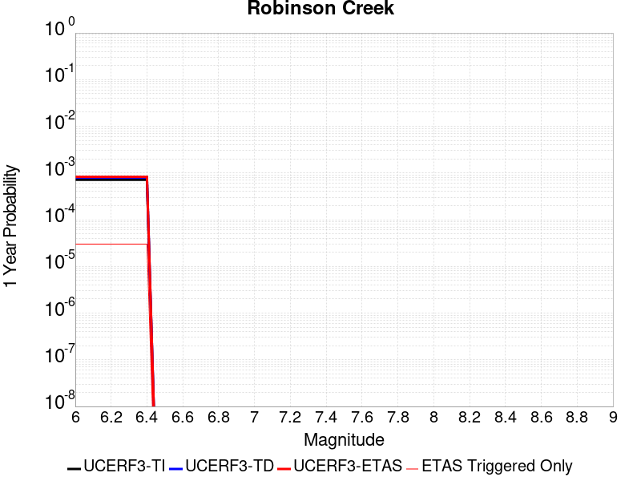 |  |

| Magnitude | 1 wk TI Prob | 1 wk TD Prob | 1 wk ETAS Prob | 1 wk ETAS/TD Gain | 1 wk ETAS Triggered Only | 1 mo TI Prob | 1 mo TD Prob | 1 mo ETAS Prob | 1 mo ETAS/TD Gain | 1 mo ETAS Triggered Only | 1 yr TI Prob | 1 yr TD Prob | 1 yr ETAS Prob | 1 yr ETAS/TD Gain | 1 yr ETAS Triggered Only | 10 yr TI Prob | 10 yr TD Prob | 10 yr ETAS Prob | 10 yr ETAS/TD Gain | 10 yr ETAS Triggered Only |
|-----|-----|-----|-----|-----|-----|-----|-----|-----|-----|-----|-----|-----|-----|-----|-----|-----|-----|-----|-----|-----|
| 6.0 | 1.3705327E-5 | 1.5285481E-5 | 1.5285481E-5 | 1.0 | 0.0 | 5.8735794E-5 | 6.55092E-5 | 7.550855E-5 | 1.1526403 | 1.0E-5 | 7.1487366E-4 | 7.975745E-4 | 8.275506E-4 | 1.0375841 | 3.0E-5 | 0.0071257832 | 0.007975745 | 0.008005506 | 1.0037314 | 3.0E-5 |
| 6.1 | 1.3705327E-5 | 1.5285481E-5 | 1.5285481E-5 | 1.0 | 0.0 | 5.8735794E-5 | 6.55092E-5 | 7.550855E-5 | 1.1526403 | 1.0E-5 | 7.1487366E-4 | 7.975745E-4 | 8.275506E-4 | 1.0375841 | 3.0E-5 | 0.0071257832 | 0.007975745 | 0.008005506 | 1.0037314 | 3.0E-5 |
| 6.2 | 1.3705327E-5 | 1.5285481E-5 | 1.5285481E-5 | 1.0 | 0.0 | 5.8735794E-5 | 6.55092E-5 | 7.550855E-5 | 1.1526403 | 1.0E-5 | 7.1487366E-4 | 7.975745E-4 | 8.275506E-4 | 1.0375841 | 3.0E-5 | 0.0071257832 | 0.007975745 | 0.008005506 | 1.0037314 | 3.0E-5 |
| 6.3 | 1.3705327E-5 | 1.5285481E-5 | 1.5285481E-5 | 1.0 | 0.0 | 5.8735794E-5 | 6.55092E-5 | 7.550855E-5 | 1.1526403 | 1.0E-5 | 7.1487366E-4 | 7.975745E-4 | 8.275506E-4 | 1.0375841 | 3.0E-5 | 0.0071257832 | 0.007975745 | 0.008005506 | 1.0037314 | 3.0E-5 |
| 6.4 | 1.3705327E-5 | 1.5285481E-5 | 1.5285481E-5 | 1.0 | 0.0 | 5.8735794E-5 | 6.55092E-5 | 7.550855E-5 | 1.1526403 | 1.0E-5 | 7.1487366E-4 | 7.975745E-4 | 8.275506E-4 | 1.0375841 | 3.0E-5 | 0.0071257832 | 0.007975745 | 0.008005506 | 1.0037314 | 3.0E-5 |

## Hosgri
*[(top)](#table-of-contents)*

| 1 Week | 1 Month | 1 Year | 10 Year |
|-----|-----|-----|-----|
|  |  |  |  |

| Magnitude | 1 wk TI Prob | 1 wk TD Prob | 1 wk ETAS Prob | 1 wk ETAS/TD Gain | 1 wk ETAS Triggered Only | 1 mo TI Prob | 1 mo TD Prob | 1 mo ETAS Prob | 1 mo ETAS/TD Gain | 1 mo ETAS Triggered Only | 1 yr TI Prob | 1 yr TD Prob | 1 yr ETAS Prob | 1 yr ETAS/TD Gain | 1 yr ETAS Triggered Only | 10 yr TI Prob | 10 yr TD Prob | 10 yr ETAS Prob | 10 yr ETAS/TD Gain | 10 yr ETAS Triggered Only |
|-----|-----|-----|-----|-----|-----|-----|-----|-----|-----|-----|-----|-----|-----|-----|-----|-----|-----|-----|-----|-----|
| 6.0 | 2.883978E-5 | 2.9129222E-5 | 2.9129222E-5 | 1.0 | 0.0 | 1.235932E-4 | 1.248337E-4 | 1.3483246E-4 | 1.0800966 | 1.0E-5 | 0.0015037085 | 0.001518818 | 0.0015387876 | 1.0131482 | 2.0E-5 | 0.01493574 | 0.015088161 | 0.015117709 | 1.0019584 | 3.0E-5 |
| 6.1 | 2.883978E-5 | 2.9129222E-5 | 2.9129222E-5 | 1.0 | 0.0 | 1.235932E-4 | 1.248337E-4 | 1.3483246E-4 | 1.0800966 | 1.0E-5 | 0.0015037085 | 0.001518818 | 0.0015387876 | 1.0131482 | 2.0E-5 | 0.01493574 | 0.015088161 | 0.015117709 | 1.0019584 | 3.0E-5 |
| 6.2 | 2.883978E-5 | 2.9129222E-5 | 2.9129222E-5 | 1.0 | 0.0 | 1.235932E-4 | 1.248337E-4 | 1.3483246E-4 | 1.0800966 | 1.0E-5 | 0.0015037085 | 0.001518818 | 0.0015387876 | 1.0131482 | 2.0E-5 | 0.01493574 | 0.015088161 | 0.015117709 | 1.0019584 | 3.0E-5 |
| 6.3 | 2.2914428E-5 | 2.2642613E-5 | 2.2642613E-5 | 1.0 | 0.0 | 9.8200995E-5 | 9.703619E-5 | 1.07035215E-4 | 1.1030444 | 1.0E-5 | 0.0011949413 | 0.0011807802 | 0.0012007565 | 1.016918 | 2.0E-5 | 0.011885363 | 0.011746472 | 0.0117761195 | 1.0025239 | 3.0E-5 |
| 6.4 | 2.0195741E-5 | 1.9697138E-5 | 1.9697138E-5 | 1.0 | 0.0 | 8.65503E-5 | 8.441359E-5 | 9.441274E-5 | 1.1184543 | 1.0E-5 | 0.0010532405 | 0.0010272528 | 0.0010372425 | 1.0097247 | 1.0E-5 | 0.010482626 | 0.010226098 | 0.010235996 | 1.0009679 | 1.0E-5 |
| 6.5 | 1.9924333E-5 | 1.9409554E-5 | 1.9409554E-5 | 1.0 | 0.0 | 8.53872E-5 | 8.318116E-5 | 9.318033E-5 | 1.1202096 | 1.0E-5 | 0.0010390934 | 0.0010122621 | 0.0010222519 | 1.0098689 | 1.0E-5 | 0.010342481 | 0.010077557 | 0.010087456 | 1.0009823 | 1.0E-5 |
| 6.6 | 1.809694E-5 | 1.7458835E-5 | 1.7458835E-5 | 1.0 | 0.0 | 7.7556004E-5 | 7.4821444E-5 | 8.48207E-5 | 1.1336415 | 1.0E-5 | 9.438353E-4 | 9.1057166E-4 | 9.2056254E-4 | 1.0109721 | 1.0E-5 | 0.009398366 | 0.009069357 | 0.009079266 | 1.0010927 | 1.0E-5 |
| 6.7 | 1.675989E-5 | 1.6043276E-5 | 1.6043276E-5 | 1.0 | 0.0 | 7.182612E-5 | 6.8755086E-5 | 7.87544E-5 | 1.1454338 | 1.0E-5 | 8.7413215E-4 | 8.3677284E-4 | 8.467645E-4 | 1.0119407 | 1.0E-5 | 0.008707017 | 0.0083371345 | 0.008347051 | 1.0011895 | 1.0E-5 |
| 6.8 | 1.5401129E-5 | 1.4614568E-5 | 1.4614568E-5 | 1.0 | 0.0 | 6.6003166E-5 | 6.263236E-5 | 7.263174E-5 | 1.1596519 | 1.0E-5 | 8.032922E-4 | 7.622831E-4 | 7.7227544E-4 | 1.0131085 | 1.0E-5 | 0.008003947 | 0.007597555 | 0.0076074786 | 1.0013062 | 1.0E-5 |
| 6.9 | 1.356559E-5 | 1.2690419E-5 | 1.2690419E-5 | 1.0 | 0.0 | 5.8136946E-5 | 5.438638E-5 | 6.438584E-5 | 1.1838596 | 1.0E-5 | 7.0758746E-4 | 6.6195347E-4 | 6.7194685E-4 | 1.0150968 | 1.0E-5 | 0.007053386 | 0.0066006295 | 0.0066105635 | 1.001505 | 1.0E-5 |
| 7.0 | 1.2030819E-5 | 1.10963865E-5 | 1.10963865E-5 | 1.0 | 0.0 | 5.155963E-5 | 4.7555077E-5 | 5.75546E-5 | 1.2102726 | 1.0E-5 | 6.275577E-4 | 5.788293E-4 | 5.888236E-4 | 1.0172663 | 1.0E-5 | 0.006257884 | 0.005773985 | 0.005783927 | 1.0017219 | 1.0E-5 |
| 7.1 | 1.0972698E-5 | 1.0022589E-5 | 1.0022589E-5 | 1.0 | 0.0 | 4.7025E-5 | 4.2953245E-5 | 5.2952815E-5 | 1.2328013 | 1.0E-5 | 5.72379E-4 | 5.2283035E-4 | 5.328251E-4 | 1.0191166 | 1.0E-5 | 0.0057090693 | 0.0052167624 | 0.00522671 | 1.0019069 | 1.0E-5 |
| 7.2 | 9.961926E-6 | 9.0351405E-6 | 9.0351405E-6 | 1.0 | 0.0 | 4.2693267E-5 | 3.8721457E-5 | 4.8721067E-5 | 1.2582448 | 1.0E-5 | 5.1966653E-4 | 4.7133182E-4 | 4.813271E-4 | 1.0212065 | 1.0E-5 | 0.00518453 | 0.004704075 | 0.004714028 | 1.0021158 | 1.0E-5 |
| 7.3 | 8.700929E-6 | 7.828481E-6 | 7.828481E-6 | 1.0 | 0.0 | 3.7289166E-5 | 3.35502E-5 | 4.3549866E-5 | 1.2980508 | 1.0E-5 | 4.53901E-4 | 4.0839717E-4 | 4.183931E-4 | 1.0244759 | 1.0E-5 | 0.00452975 | 0.0040772134 | 0.0040871724 | 1.0024426 | 1.0E-5 |
| 7.4 | 7.866285E-6 | 6.999109E-6 | 6.999109E-6 | 1.0 | 0.0 | 3.3712215E-5 | 2.9995836E-5 | 3.9995535E-5 | 1.3333696 | 1.0E-5 | 4.103689E-4 | 3.6513814E-4 | 3.751345E-4 | 1.0273769 | 1.0E-5 | 0.004096119 | 0.0036461262 | 0.0036560898 | 1.0027326 | 1.0E-5 |
| 7.5 | 6.8381305E-6 | 5.960051E-6 | 5.960051E-6 | 1.0 | 0.0 | 2.9305946E-5 | 2.5542828E-5 | 3.5542573E-5 | 1.3914894 | 1.0E-5 | 3.5674145E-4 | 3.1093956E-4 | 3.2093647E-4 | 1.0321506 | 1.0E-5 | 0.0035616932 | 0.003105787 | 0.0031157562 | 1.0032098 | 1.0E-5 |
| 7.6 | 5.503376E-6 | 4.5955785E-6 | 4.5955785E-6 | 1.0 | 0.0 | 2.3585684E-5 | 1.9695188E-5 | 2.9694991E-5 | 1.5077282 | 1.0E-5 | 2.8711787E-4 | 2.3976254E-4 | 2.4976014E-4 | 1.041698 | 1.0E-5 | 0.002867472 | 0.002395779 | 0.002405755 | 1.004164 | 1.0E-5 |
| 7.7 | 3.6144982E-6 | 2.652516E-6 | 2.652516E-6 | 1.0 | 0.0 | 1.5490614E-5 | 1.1367876E-5 | 2.1367763E-5 | 1.8796618 | 1.0E-5 | 1.8858191E-4 | 1.383951E-4 | 1.4839372E-4 | 1.0722469 | 1.0E-5 | 0.0018842196 | 0.0013838276 | 0.0013938138 | 1.0072163 | 1.0E-5 |
| 7.8 | 1.9853494E-6 | 1.1363525E-6 | 1.1363525E-6 | 1.0 | 0.0 | 8.508612E-6 | 4.8700726E-6 | 1.4870024E-5 | 3.0533473 | 1.0E-5 | 1.0358743E-4 | 5.9291524E-5 | 6.929093E-5 | 1.1686481 | 1.0E-5 | 0.0010353916 | 5.93494E-4 | 6.03488E-4 | 1.0168394 | 1.0E-5 |
| 7.9 | 1.1818757E-6 | 5.29691E-7 | 5.29691E-7 | 1.0 | 0.0 | 5.0651715E-6 | 2.2701024E-6 | 2.2701024E-6 | 1.0 | 0.0 | 6.1666724E-5 | 2.7638147E-5 | 2.7638147E-5 | 1.0 | 0.0 | 6.1649614E-4 | 2.7703762E-4 | 2.7703762E-4 | 1.0 | 0.0 |
| 8.0 | 6.962958E-7 | 2.7151347E-7 | 2.7151347E-7 | 1.0 | 0.0 | 2.9841215E-6 | 1.1636287E-6 | 1.1636287E-6 | 1.0 | 0.0 | 3.6331072E-5 | 1.4167087E-5 | 1.4167087E-5 | 1.0 | 0.0 | 3.6325134E-4 | 1.4222886E-4 | 1.4222886E-4 | 1.0 | 0.0 |
| 8.1 | 1.5033264E-7 | 6.5300625E-8 | 6.5300625E-8 | 1.0 | 0.0 | 6.442826E-7 | 2.798598E-7 | 2.798598E-7 | 1.0 | 0.0 | 7.844113E-6 | 3.4072877E-6 | 3.4072877E-6 | 1.0 | 0.0 | 7.843835E-5 | 3.408425E-5 | 3.408425E-5 | 1.0 | 0.0 |

## Mission Creek
*[(top)](#table-of-contents)*

| 1 Week | 1 Month | 1 Year | 10 Year |
|-----|-----|-----|-----|
|  |  |  |  |

| Magnitude | 1 wk TI Prob | 1 wk TD Prob | 1 wk ETAS Prob | 1 wk ETAS/TD Gain | 1 wk ETAS Triggered Only | 1 mo TI Prob | 1 mo TD Prob | 1 mo ETAS Prob | 1 mo ETAS/TD Gain | 1 mo ETAS Triggered Only | 1 yr TI Prob | 1 yr TD Prob | 1 yr ETAS Prob | 1 yr ETAS/TD Gain | 1 yr ETAS Triggered Only | 10 yr TI Prob | 10 yr TD Prob | 10 yr ETAS Prob | 10 yr ETAS/TD Gain | 10 yr ETAS Triggered Only |
|-----|-----|-----|-----|-----|-----|-----|-----|-----|-----|-----|-----|-----|-----|-----|-----|-----|-----|-----|-----|-----|
| 6.0 | 1.1549387E-5 | 1.6327504E-5 | 1.6327504E-5 | 1.0 | 0.0 | 4.9496433E-5 | 6.9973226E-5 | 6.9973226E-5 | 1.0 | 0.0 | 6.0245243E-4 | 8.51606E-4 | 8.71589E-4 | 1.023465 | 2.0E-5 | 0.006008218 | 0.0085126385 | 0.008542383 | 1.0034941 | 3.0E-5 |
| 6.1 | 1.1549387E-5 | 1.6327504E-5 | 1.6327504E-5 | 1.0 | 0.0 | 4.9496433E-5 | 6.9973226E-5 | 6.9973226E-5 | 1.0 | 0.0 | 6.0245243E-4 | 8.51606E-4 | 8.71589E-4 | 1.023465 | 2.0E-5 | 0.006008218 | 0.0085126385 | 0.008542383 | 1.0034941 | 3.0E-5 |
| 6.2 | 1.1549387E-5 | 1.6327504E-5 | 1.6327504E-5 | 1.0 | 0.0 | 4.9496433E-5 | 6.9973226E-5 | 6.9973226E-5 | 1.0 | 0.0 | 6.0245243E-4 | 8.51606E-4 | 8.71589E-4 | 1.023465 | 2.0E-5 | 0.006008218 | 0.0085126385 | 0.008542383 | 1.0034941 | 3.0E-5 |
| 6.3 | 1.1549387E-5 | 1.6327504E-5 | 1.6327504E-5 | 1.0 | 0.0 | 4.9496433E-5 | 6.9973226E-5 | 6.9973226E-5 | 1.0 | 0.0 | 6.0245243E-4 | 8.51606E-4 | 8.71589E-4 | 1.023465 | 2.0E-5 | 0.006008218 | 0.0085126385 | 0.008542383 | 1.0034941 | 3.0E-5 |
| 6.4 | 1.1549387E-5 | 1.6327504E-5 | 1.6327504E-5 | 1.0 | 0.0 | 4.9496433E-5 | 6.9973226E-5 | 6.9973226E-5 | 1.0 | 0.0 | 6.0245243E-4 | 8.51606E-4 | 8.71589E-4 | 1.023465 | 2.0E-5 | 0.006008218 | 0.0085126385 | 0.008542383 | 1.0034941 | 3.0E-5 |
| 6.5 | 1.1549387E-5 | 1.6327504E-5 | 1.6327504E-5 | 1.0 | 0.0 | 4.9496433E-5 | 6.9973226E-5 | 6.9973226E-5 | 1.0 | 0.0 | 6.0245243E-4 | 8.51606E-4 | 8.71589E-4 | 1.023465 | 2.0E-5 | 0.006008218 | 0.0085126385 | 0.008542383 | 1.0034941 | 3.0E-5 |
| 6.6 | 9.202681E-6 | 1.3850744E-5 | 1.3850744E-5 | 1.0 | 0.0 | 3.9439463E-5 | 5.935903E-5 | 5.935903E-5 | 1.0 | 0.0 | 4.800697E-4 | 7.2246563E-4 | 7.424512E-4 | 1.027663 | 2.0E-5 | 0.004790339 | 0.0072298064 | 0.007259589 | 1.0041195 | 3.0E-5 |
| 6.7 | 9.019164E-6 | 1.365641E-5 | 1.365641E-5 | 1.0 | 0.0 | 3.8652986E-5 | 5.852621E-5 | 5.852621E-5 | 1.0 | 0.0 | 4.7049852E-4 | 7.1233266E-4 | 7.3231844E-4 | 1.0280567 | 2.0E-5 | 0.004695036 | 0.0071291295 | 0.0071589155 | 1.004178 | 3.0E-5 |
| 6.8 | 8.673558E-6 | 1.3278511E-5 | 1.3278511E-5 | 1.0 | 0.0 | 3.717186E-5 | 5.6906712E-5 | 5.6906712E-5 | 1.0 | 0.0 | 4.524734E-4 | 6.926278E-4 | 7.12614E-4 | 1.0288556 | 2.0E-5 | 0.0045155324 | 0.006933313 | 0.006963105 | 1.0042969 | 3.0E-5 |
| 6.9 | 7.002255E-6 | 1.1482704E-5 | 1.1482704E-5 | 1.0 | 0.0 | 3.000932E-5 | 4.9210703E-5 | 4.9210703E-5 | 1.0 | 0.0 | 3.653022E-4 | 5.9898244E-4 | 6.189704E-4 | 1.03337 | 2.0E-5 | 0.0036470229 | 0.0060021197 | 0.0060319398 | 1.0049683 | 3.0E-5 |
| 7.0 | 5.84644E-6 | 9.679749E-6 | 9.679749E-6 | 1.0 | 0.0 | 2.5055931E-5 | 4.1484007E-5 | 4.1484007E-5 | 1.0 | 0.0 | 3.0501327E-4 | 5.049553E-4 | 5.249452E-4 | 1.0395875 | 2.0E-5 | 0.0030459496 | 0.0050663124 | 0.0050961603 | 1.0058914 | 3.0E-5 |
| 7.1 | 5.54703E-6 | 9.334209E-6 | 9.334209E-6 | 1.0 | 0.0 | 2.377277E-5 | 4.000316E-5 | 4.000316E-5 | 1.0 | 0.0 | 2.8939504E-4 | 4.8693412E-4 | 5.0692435E-4 | 1.0410533 | 2.0E-5 | 0.0028901845 | 0.0048868977 | 0.0049167513 | 1.0061089 | 3.0E-5 |
| 7.2 | 4.384709E-6 | 7.686096E-6 | 7.686096E-6 | 1.0 | 0.0 | 1.8791474E-5 | 3.2940017E-5 | 3.2940017E-5 | 1.0 | 0.0 | 2.2876218E-4 | 4.0097456E-4 | 4.2096653E-4 | 1.0498585 | 2.0E-5 | 0.0022852682 | 0.0040306617 | 0.004060541 | 1.0074129 | 3.0E-5 |
| 7.3 | 3.7888456E-6 | 6.9198827E-6 | 6.9198827E-6 | 1.0 | 0.0 | 1.623781E-5 | 2.9656321E-5 | 2.9656321E-5 | 1.0 | 0.0 | 1.9767738E-4 | 3.6100924E-4 | 3.8100203E-4 | 1.0553802 | 2.0E-5 | 0.0019750162 | 0.0036323662 | 0.0036622572 | 1.0082291 | 3.0E-5 |
| 7.4 | 2.1982462E-6 | 5.028075E-6 | 5.028075E-6 | 1.0 | 0.0 | 9.421021E-6 | 2.1548716E-5 | 2.1548716E-5 | 1.0 | 0.0 | 1.1469489E-4 | 2.6232423E-4 | 2.8231897E-4 | 1.0762216 | 2.0E-5 | 0.0011463572 | 0.0026480693 | 0.00267799 | 1.011299 | 3.0E-5 |
| 7.5 | 2.051923E-6 | 4.619189E-6 | 4.619189E-6 | 1.0 | 0.0 | 8.793926E-6 | 1.9796375E-5 | 1.9796375E-5 | 1.0 | 0.0 | 1.0706078E-4 | 2.4099434E-4 | 2.6098953E-4 | 1.0829695 | 2.0E-5 | 0.0010700922 | 0.0024355936 | 0.0024655205 | 1.0122874 | 3.0E-5 |
| 7.6 | 1.8733427E-6 | 4.1273897E-6 | 4.1273897E-6 | 1.0 | 0.0 | 8.028587E-6 | 1.7688693E-5 | 1.7688693E-5 | 1.0 | 0.0 | 9.774366E-5 | 2.1533864E-4 | 2.3533434E-4 | 1.092857 | 2.0E-5 | 9.770069E-4 | 0.0021801915 | 0.002210126 | 1.0137303 | 3.0E-5 |
| 7.7 | 1.8411953E-6 | 4.0470363E-6 | 4.0470363E-6 | 1.0 | 0.0 | 7.890813E-6 | 1.7344326E-5 | 1.7344326E-5 | 1.0 | 0.0 | 9.606641E-5 | 2.1114679E-4 | 2.3114256E-4 | 1.0947008 | 2.0E-5 | 9.6024893E-4 | 0.0021384626 | 0.0021683986 | 1.0139987 | 3.0E-5 |
| 7.8 | 1.7194251E-6 | 3.7141303E-6 | 3.7141303E-6 | 1.0 | 0.0 | 7.368944E-6 | 1.5917605E-5 | 1.5917605E-5 | 1.0 | 0.0 | 8.97132E-5 | 1.9377968E-4 | 2.137758E-4 | 1.10319 | 2.0E-5 | 8.967699E-4 | 0.0019642871 | 0.0019942282 | 1.0152427 | 3.0E-5 |
| 7.9 | 1.4035052E-6 | 2.953078E-6 | 2.953078E-6 | 1.0 | 0.0 | 6.0150082E-6 | 1.2655987E-5 | 1.2655987E-5 | 1.0 | 0.0 | 7.3230265E-5 | 1.5407581E-4 | 1.7407273E-4 | 1.1297863 | 2.0E-5 | 7.3206134E-4 | 0.0015647473 | 0.0015947004 | 1.0191424 | 3.0E-5 |
| 8.0 | 3.9318823E-7 | 5.5354747E-7 | 5.5354747E-7 | 1.0 | 0.0 | 1.6850913E-6 | 2.3723442E-6 | 2.3723442E-6 | 1.0 | 0.0 | 2.0515794E-5 | 2.8882914E-5 | 3.8882627E-5 | 1.3462155 | 1.0E-5 | 2.0513899E-4 | 2.9926177E-4 | 3.092588E-4 | 1.0334055 | 1.0E-5 |
| 8.1 | 1.596793E-7 | 1.140146E-7 | 1.140146E-7 | 1.0 | 0.0 | 6.8433974E-7 | 4.886339E-7 | 4.886339E-7 | 1.0 | 0.0 | 8.331805E-6 | 5.9491017E-6 | 5.9491017E-6 | 1.0 | 0.0 | 8.331492E-5 | 6.5615495E-5 | 6.5615495E-5 | 1.0 | 0.0 |
| 8.2 | 4.9003038E-8 | 2.5496536E-8 | 2.5496536E-8 | 1.0 | 0.0 | 2.10013E-7 | 1.0927087E-7 | 1.0927087E-7 | 1.0 | 0.0 | 2.5569052E-6 | 1.330372E-6 | 1.330372E-6 | 1.0 | 0.0 | 2.556876E-5 | 1.4984944E-5 | 1.4984944E-5 | 1.0 | 0.0 |

## Rinconada 2011 CFM
*[(top)](#table-of-contents)*

| 1 Week | 1 Month | 1 Year | 10 Year |
|-----|-----|-----|-----|
|  |  |  |  |

| Magnitude | 1 wk TI Prob | 1 wk TD Prob | 1 wk ETAS Prob | 1 wk ETAS/TD Gain | 1 wk ETAS Triggered Only | 1 mo TI Prob | 1 mo TD Prob | 1 mo ETAS Prob | 1 mo ETAS/TD Gain | 1 mo ETAS Triggered Only | 1 yr TI Prob | 1 yr TD Prob | 1 yr ETAS Prob | 1 yr ETAS/TD Gain | 1 yr ETAS Triggered Only | 10 yr TI Prob | 10 yr TD Prob | 10 yr ETAS Prob | 10 yr ETAS/TD Gain | 10 yr ETAS Triggered Only |
|-----|-----|-----|-----|-----|-----|-----|-----|-----|-----|-----|-----|-----|-----|-----|-----|-----|-----|-----|-----|-----|
| 6.0 | 1.5752368E-5 | 1.627486E-5 | 1.627486E-5 | 1.0 | 0.0 | 6.75084E-5 | 6.974755E-5 | 7.974685E-5 | 1.1433642 | 1.0E-5 | 8.2160486E-4 | 8.488487E-4 | 8.6883176E-4 | 1.0235413 | 2.0E-5 | 0.008185739 | 0.008456444 | 0.008486191 | 1.0035176 | 3.0E-5 |
| 6.1 | 1.0966133E-5 | 1.1323127E-5 | 1.1323127E-5 | 1.0 | 0.0 | 4.6996865E-5 | 4.8526792E-5 | 5.8526304E-5 | 1.2060617 | 1.0E-5 | 5.720366E-4 | 5.9065426E-4 | 6.0064835E-4 | 1.0169203 | 1.0E-5 | 0.0057056635 | 0.00589094 | 0.005910822 | 1.003375 | 2.0E-5 |
| 6.2 | 1.0966133E-5 | 1.1323127E-5 | 1.1323127E-5 | 1.0 | 0.0 | 4.6996865E-5 | 4.8526792E-5 | 5.8526304E-5 | 1.2060617 | 1.0E-5 | 5.720366E-4 | 5.9065426E-4 | 6.0064835E-4 | 1.0169203 | 1.0E-5 | 0.0057056635 | 0.00589094 | 0.005910822 | 1.003375 | 2.0E-5 |
| 6.3 | 8.926149E-6 | 9.212851E-6 | 9.212851E-6 | 1.0 | 0.0 | 3.8254362E-5 | 3.948305E-5 | 4.9482656E-5 | 1.2532632 | 1.0E-5 | 4.6564735E-4 | 4.8060043E-4 | 4.9059564E-4 | 1.0207973 | 1.0E-5 | 0.0046467283 | 0.0047956556 | 0.00481556 | 1.0041504 | 2.0E-5 |
| 6.4 | 7.676955E-6 | 7.920258E-6 | 7.920258E-6 | 1.0 | 0.0 | 3.290082E-5 | 3.3943525E-5 | 4.3943182E-5 | 1.294597 | 1.0E-5 | 4.0049385E-4 | 4.131842E-4 | 4.2318008E-4 | 1.0241923 | 1.0E-5 | 0.0039977287 | 0.004124186 | 0.0041441037 | 1.0048294 | 2.0E-5 |
| 6.5 | 6.1671026E-6 | 6.3590082E-6 | 6.3590082E-6 | 1.0 | 0.0 | 2.6430173E-5 | 2.7252609E-5 | 3.7252335E-5 | 1.3669274 | 1.0E-5 | 3.2173982E-4 | 3.3175005E-4 | 3.4174675E-4 | 1.0301331 | 1.0E-5 | 0.003212744 | 0.0033125603 | 0.003332494 | 1.0060177 | 2.0E-5 |
| 6.6 | 5.553456E-6 | 5.7248603E-6 | 5.7248603E-6 | 1.0 | 0.0 | 2.3800309E-5 | 2.4534886E-5 | 2.4534886E-5 | 1.0 | 0.0 | 2.897302E-4 | 2.9867134E-4 | 2.9867134E-4 | 1.0 | 0.0 | 0.0028935277 | 0.002982708 | 0.002982708 | 1.0 | 0.0 |
| 6.7 | 4.787857E-6 | 4.9333503E-6 | 4.9333503E-6 | 1.0 | 0.0 | 2.0519226E-5 | 2.1142758E-5 | 2.1142758E-5 | 1.0 | 0.0 | 2.4979294E-4 | 2.5738272E-4 | 2.5738272E-4 | 1.0 | 0.0 | 0.0024951235 | 0.002570852 | 0.002570852 | 1.0 | 0.0 |
| 6.8 | 3.9955166E-6 | 4.113509E-6 | 4.113509E-6 | 1.0 | 0.0 | 1.7123532E-5 | 1.7629207E-5 | 1.7629207E-5 | 1.0 | 0.0 | 2.0845905E-4 | 2.1461447E-4 | 2.1461447E-4 | 1.0 | 0.0 | 0.002082636 | 0.0021440757 | 0.0021440757 | 1.0 | 0.0 |
| 6.9 | 3.4250072E-6 | 3.5224737E-6 | 3.5224737E-6 | 1.0 | 0.0 | 1.46785205E-5 | 1.5096229E-5 | 1.5096229E-5 | 1.0 | 0.0 | 1.7869633E-4 | 1.837811E-4 | 1.837811E-4 | 1.0 | 0.0 | 0.001785527 | 0.0018362936 | 0.0018362936 | 1.0 | 0.0 |
| 7.0 | 2.7712713E-6 | 2.8467214E-6 | 2.8467214E-6 | 1.0 | 0.0 | 1.1876823E-5 | 1.22001775E-5 | 1.22001775E-5 | 1.0 | 0.0 | 1.4459073E-4 | 1.4852705E-4 | 1.4852705E-4 | 1.0 | 0.0 | 0.0014449668 | 0.0014842793 | 0.0014842793 | 1.0 | 0.0 |
| 7.1 | 2.227358E-6 | 2.2857153E-6 | 2.2857153E-6 | 1.0 | 0.0 | 9.545785E-6 | 9.7958855E-6 | 9.7958855E-6 | 1.0 | 0.0 | 1.16213734E-4 | 1.1925839E-4 | 1.1925839E-4 | 1.0 | 0.0 | 0.0011615298 | 0.0011919449 | 0.0011919449 | 1.0 | 0.0 |
| 7.2 | 1.581796E-6 | 1.6209126E-6 | 1.6209126E-6 | 1.0 | 0.0 | 6.779108E-6 | 6.9467496E-6 | 6.9467496E-6 | 1.0 | 0.0 | 8.253252E-5 | 8.45734E-5 | 8.45734E-5 | 1.0 | 0.0 | 8.250187E-4 | 8.4541267E-4 | 8.4541267E-4 | 1.0 | 0.0 |
| 7.3 | 1.0306567E-6 | 1.054655E-6 | 1.054655E-6 | 1.0 | 0.0 | 4.4170924E-6 | 4.519942E-6 | 4.519942E-6 | 1.0 | 0.0 | 5.3776774E-5 | 5.5028908E-5 | 5.5028908E-5 | 1.0 | 0.0 | 5.376376E-4 | 5.50153E-4 | 5.50153E-4 | 1.0 | 0.0 |
| 7.4 | 6.535541E-7 | 6.68279E-7 | 6.68279E-7 | 1.0 | 0.0 | 2.800943E-6 | 2.8640495E-6 | 2.8640495E-6 | 1.0 | 0.0 | 3.4100947E-5 | 3.4869245E-5 | 3.4869245E-5 | 1.0 | 0.0 | 3.4095717E-4 | 3.4863787E-4 | 3.4863787E-4 | 1.0 | 0.0 |
| 7.5 | 3.2656962E-7 | 3.3316942E-7 | 3.3316942E-7 | 1.0 | 0.0 | 1.3995833E-6 | 1.4278681E-6 | 1.4278681E-6 | 1.0 | 0.0 | 1.7039794E-5 | 1.7384156E-5 | 1.7384156E-5 | 1.0 | 0.0 | 1.7038487E-4 | 1.7382801E-4 | 1.7382801E-4 | 1.0 | 0.0 |
| 7.6 | 9.754343E-8 | 9.821084E-8 | 9.821084E-8 | 1.0 | 0.0 | 4.180432E-7 | 4.2090352E-7 | 4.2090352E-7 | 1.0 | 0.0 | 5.089664E-6 | 5.1244883E-6 | 5.1244883E-6 | 1.0 | 0.0 | 5.0895473E-5 | 5.1243715E-5 | 5.1243715E-5 | 1.0 | 0.0 |
| 7.7 | 6.0001453E-9 | 5.849162E-9 | 5.849162E-9 | 1.0 | 0.0 | 2.5714908E-8 | 2.5067838E-8 | 2.5067838E-8 | 1.0 | 0.0 | 3.1307894E-7 | 3.0520087E-7 | 3.0520087E-7 | 1.0 | 0.0 | 3.1307852E-6 | 3.0520048E-6 | 3.0520048E-6 | 1.0 | 0.0 |
| 7.8 | 7.400003E-11 | 7.4654616E-11 | 7.4654616E-11 | 1.0 | 0.0 | 3.171432E-10 | 3.199484E-10 | 3.199484E-10 | 1.0 | 0.0 | 3.861218E-9 | 3.895372E-9 | 3.895372E-9 | 1.0 | 0.0 | 3.861218E-8 | 3.8953722E-8 | 3.8953722E-8 | 1.0 | 0.0 |

## Kern Canyon (South Kern) 2011
*[(top)](#table-of-contents)*

| 1 Week | 1 Month | 1 Year | 10 Year |
|-----|-----|-----|-----|
|  |  |  |  |

| Magnitude | 1 wk TI Prob | 1 wk TD Prob | 1 wk ETAS Prob | 1 wk ETAS/TD Gain | 1 wk ETAS Triggered Only | 1 mo TI Prob | 1 mo TD Prob | 1 mo ETAS Prob | 1 mo ETAS/TD Gain | 1 mo ETAS Triggered Only | 1 yr TI Prob | 1 yr TD Prob | 1 yr ETAS Prob | 1 yr ETAS/TD Gain | 1 yr ETAS Triggered Only | 10 yr TI Prob | 10 yr TD Prob | 10 yr ETAS Prob | 10 yr ETAS/TD Gain | 10 yr ETAS Triggered Only |
|-----|-----|-----|-----|-----|-----|-----|-----|-----|-----|-----|-----|-----|-----|-----|-----|-----|-----|-----|-----|-----|
| 6.0 | 4.105075E-6 | 4.113747E-6 | 4.113747E-6 | 1.0 | 0.0 | 1.7593058E-5 | 1.763023E-5 | 1.763023E-5 | 1.0 | 0.0 | 2.1417443E-4 | 2.1462754E-4 | 2.2462539E-4 | 1.0465823 | 1.0E-5 | 0.0021396813 | 0.0021442664 | 0.0021742021 | 1.0139608 | 3.0E-5 |
| 6.1 | 4.105075E-6 | 4.113747E-6 | 4.113747E-6 | 1.0 | 0.0 | 1.7593058E-5 | 1.763023E-5 | 1.763023E-5 | 1.0 | 0.0 | 2.1417443E-4 | 2.1462754E-4 | 2.2462539E-4 | 1.0465823 | 1.0E-5 | 0.0021396813 | 0.0021442664 | 0.0021742021 | 1.0139608 | 3.0E-5 |
| 6.2 | 4.105075E-6 | 4.113747E-6 | 4.113747E-6 | 1.0 | 0.0 | 1.7593058E-5 | 1.763023E-5 | 1.763023E-5 | 1.0 | 0.0 | 2.1417443E-4 | 2.1462754E-4 | 2.2462539E-4 | 1.0465823 | 1.0E-5 | 0.0021396813 | 0.0021442664 | 0.0021742021 | 1.0139608 | 3.0E-5 |
| 6.3 | 4.105075E-6 | 4.113747E-6 | 4.113747E-6 | 1.0 | 0.0 | 1.7593058E-5 | 1.763023E-5 | 1.763023E-5 | 1.0 | 0.0 | 2.1417443E-4 | 2.1462754E-4 | 2.2462539E-4 | 1.0465823 | 1.0E-5 | 0.0021396813 | 0.0021442664 | 0.0021742021 | 1.0139608 | 3.0E-5 |
| 6.4 | 4.105075E-6 | 4.113747E-6 | 4.113747E-6 | 1.0 | 0.0 | 1.7593058E-5 | 1.763023E-5 | 1.763023E-5 | 1.0 | 0.0 | 2.1417443E-4 | 2.1462754E-4 | 2.2462539E-4 | 1.0465823 | 1.0E-5 | 0.0021396813 | 0.0021442664 | 0.0021742021 | 1.0139608 | 3.0E-5 |
| 6.5 | 2.9849807E-6 | 2.9731698E-6 | 2.9731698E-6 | 1.0 | 0.0 | 1.2792712E-5 | 1.2742095E-5 | 1.2742095E-5 | 1.0 | 0.0 | 1.5574014E-4 | 1.5512411E-4 | 1.5512411E-4 | 1.0 | 0.0 | 0.0015563103 | 0.0015501735 | 0.001560158 | 1.0064409 | 1.0E-5 |
| 6.6 | 2.9849807E-6 | 2.9731698E-6 | 2.9731698E-6 | 1.0 | 0.0 | 1.2792712E-5 | 1.2742095E-5 | 1.2742095E-5 | 1.0 | 0.0 | 1.5574014E-4 | 1.5512411E-4 | 1.5512411E-4 | 1.0 | 0.0 | 0.0015563103 | 0.0015501735 | 0.001560158 | 1.0064409 | 1.0E-5 |
| 6.7 | 2.6756725E-6 | 2.6582343E-6 | 2.6582343E-6 | 1.0 | 0.0 | 1.1467117E-5 | 1.1392383E-5 | 1.1392383E-5 | 1.0 | 0.0 | 1.396032E-4 | 1.3869355E-4 | 1.3869355E-4 | 1.0 | 0.0 | 0.0013951553 | 0.0013860809 | 0.001396067 | 1.0072045 | 1.0E-5 |
| 6.8 | 2.3283721E-6 | 2.3047908E-6 | 2.3047908E-6 | 1.0 | 0.0 | 9.9787E-6 | 9.877637E-6 | 9.877637E-6 | 1.0 | 0.0 | 1.214839E-4 | 1.2025367E-4 | 1.2025367E-4 | 1.0 | 0.0 | 0.001214175 | 0.0012018936 | 0.0012118815 | 1.0083102 | 1.0E-5 |
| 6.9 | 2.0972677E-6 | 2.069652E-6 | 2.069652E-6 | 1.0 | 0.0 | 8.988259E-6 | 8.869907E-6 | 8.869907E-6 | 1.0 | 0.0 | 1.0942656E-4 | 1.0798583E-4 | 1.0798583E-4 | 1.0 | 0.0 | 0.0010937268 | 0.0010793394 | 0.0010893286 | 1.0092549 | 1.0E-5 |
| 7.0 | 1.7132242E-6 | 1.6787126E-6 | 1.6787126E-6 | 1.0 | 0.0 | 7.3423685E-6 | 7.194463E-6 | 7.194463E-6 | 1.0 | 0.0 | 8.938967E-5 | 8.75891E-5 | 8.75891E-5 | 1.0 | 0.0 | 8.935372E-4 | 8.755496E-4 | 8.8554085E-4 | 1.0114114 | 1.0E-5 |
| 7.1 | 1.4215541E-6 | 1.3815827E-6 | 1.3815827E-6 | 1.0 | 0.0 | 6.0923603E-6 | 5.9210556E-6 | 5.9210556E-6 | 1.0 | 0.0 | 7.417196E-5 | 7.208649E-5 | 7.208649E-5 | 1.0 | 0.0 | 7.414721E-4 | 7.206338E-4 | 7.306266E-4 | 1.0138667 | 1.0E-5 |
| 7.2 | 9.097853E-7 | 8.603825E-7 | 8.603825E-7 | 1.0 | 0.0 | 3.899074E-6 | 3.6873485E-6 | 3.6873485E-6 | 1.0 | 0.0 | 4.7470192E-5 | 4.4892553E-5 | 4.4892553E-5 | 1.0 | 0.0 | 4.7460053E-4 | 4.4883593E-4 | 4.5883143E-4 | 1.0222698 | 1.0E-5 |
| 7.3 | 6.144169E-7 | 5.62824E-7 | 5.62824E-7 | 1.0 | 0.0 | 2.6332125E-6 | 2.4121007E-6 | 2.4121007E-6 | 1.0 | 0.0 | 3.205889E-5 | 2.9366935E-5 | 2.9366935E-5 | 1.0 | 0.0 | 3.2054266E-4 | 2.9363105E-4 | 3.0362813E-4 | 1.0340463 | 1.0E-5 |
| 7.4 | 4.049844E-7 | 3.5728542E-7 | 3.5728542E-7 | 1.0 | 0.0 | 1.7356463E-6 | 1.5312223E-6 | 1.5312223E-6 | 1.0 | 0.0 | 2.1131287E-5 | 1.8642475E-5 | 1.8642475E-5 | 1.0 | 0.0 | 2.1129279E-4 | 1.8640935E-4 | 1.8640935E-4 | 1.0 | 0.0 |
| 7.5 | 1.9871162E-7 | 1.5830548E-7 | 1.5830548E-7 | 1.0 | 0.0 | 8.5162094E-7 | 6.784519E-7 | 6.784519E-7 | 1.0 | 0.0 | 1.0368436E-5 | 8.260122E-6 | 8.260122E-6 | 1.0 | 0.0 | 1.0367952E-4 | 8.259823E-5 | 8.259823E-5 | 1.0 | 0.0 |
| 7.6 | 2.572245E-8 | 1.7352914E-8 | 1.7352914E-8 | 1.0 | 0.0 | 1.10239064E-7 | 7.436962E-8 | 7.436962E-8 | 1.0 | 0.0 | 1.3421597E-6 | 9.054499E-7 | 9.054499E-7 | 1.0 | 0.0 | 1.3421517E-5 | 9.054467E-6 | 9.054467E-6 | 1.0 | 0.0 |

## Dry Mountain
*[(top)](#table-of-contents)*

| 1 Week | 1 Month | 1 Year | 10 Year |
|-----|-----|-----|-----|
|  |  |  |  |

| Magnitude | 1 wk TI Prob | 1 wk TD Prob | 1 wk ETAS Prob | 1 wk ETAS/TD Gain | 1 wk ETAS Triggered Only | 1 mo TI Prob | 1 mo TD Prob | 1 mo ETAS Prob | 1 mo ETAS/TD Gain | 1 mo ETAS Triggered Only | 1 yr TI Prob | 1 yr TD Prob | 1 yr ETAS Prob | 1 yr ETAS/TD Gain | 1 yr ETAS Triggered Only | 10 yr TI Prob | 10 yr TD Prob | 10 yr ETAS Prob | 10 yr ETAS/TD Gain | 10 yr ETAS Triggered Only |
|-----|-----|-----|-----|-----|-----|-----|-----|-----|-----|-----|-----|-----|-----|-----|-----|-----|-----|-----|-----|-----|
| 6.0 | 6.222801E-6 | 6.4394408E-6 | 6.4394408E-6 | 1.0 | 0.0 | 2.6668875E-5 | 2.7597402E-5 | 3.7597125E-5 | 1.362343 | 1.0E-5 | 3.2464517E-4 | 3.3596248E-4 | 3.5595577E-4 | 1.0595105 | 2.0E-5 | 0.0032417132 | 0.0033561077 | 0.0033860072 | 1.0089089 | 3.0E-5 |
| 6.1 | 6.222801E-6 | 6.4394408E-6 | 6.4394408E-6 | 1.0 | 0.0 | 2.6668875E-5 | 2.7597402E-5 | 3.7597125E-5 | 1.362343 | 1.0E-5 | 3.2464517E-4 | 3.3596248E-4 | 3.5595577E-4 | 1.0595105 | 2.0E-5 | 0.0032417132 | 0.0033561077 | 0.0033860072 | 1.0089089 | 3.0E-5 |
| 6.2 | 6.222801E-6 | 6.4394408E-6 | 6.4394408E-6 | 1.0 | 0.0 | 2.6668875E-5 | 2.7597402E-5 | 3.7597125E-5 | 1.362343 | 1.0E-5 | 3.2464517E-4 | 3.3596248E-4 | 3.5595577E-4 | 1.0595105 | 2.0E-5 | 0.0032417132 | 0.0033561077 | 0.0033860072 | 1.0089089 | 3.0E-5 |
| 6.3 | 6.222801E-6 | 6.4394408E-6 | 6.4394408E-6 | 1.0 | 0.0 | 2.6668875E-5 | 2.7597402E-5 | 3.7597125E-5 | 1.362343 | 1.0E-5 | 3.2464517E-4 | 3.3596248E-4 | 3.5595577E-4 | 1.0595105 | 2.0E-5 | 0.0032417132 | 0.0033561077 | 0.0033860072 | 1.0089089 | 3.0E-5 |
| 6.4 | 6.222801E-6 | 6.4394408E-6 | 6.4394408E-6 | 1.0 | 0.0 | 2.6668875E-5 | 2.7597402E-5 | 3.7597125E-5 | 1.362343 | 1.0E-5 | 3.2464517E-4 | 3.3596248E-4 | 3.5595577E-4 | 1.0595105 | 2.0E-5 | 0.0032417132 | 0.0033561077 | 0.0033860072 | 1.0089089 | 3.0E-5 |
| 6.5 | 2.8528623E-6 | 2.9521957E-6 | 2.9521957E-6 | 1.0 | 0.0 | 1.22264955E-5 | 1.2652255E-5 | 1.2652255E-5 | 1.0 | 0.0 | 1.4884741E-4 | 1.5403902E-4 | 1.6403747E-4 | 1.0649086 | 1.0E-5 | 0.0014874774 | 0.0015401759 | 0.001560145 | 1.0129656 | 2.0E-5 |
| 6.6 | 2.8528623E-6 | 2.9521957E-6 | 2.9521957E-6 | 1.0 | 0.0 | 1.22264955E-5 | 1.2652255E-5 | 1.2652255E-5 | 1.0 | 0.0 | 1.4884741E-4 | 1.5403902E-4 | 1.6403747E-4 | 1.0649086 | 1.0E-5 | 0.0014874774 | 0.0015401759 | 0.001560145 | 1.0129656 | 2.0E-5 |
| 6.7 | 2.541E-6 | 2.6293822E-6 | 2.6293822E-6 | 1.0 | 0.0 | 1.0889954E-5 | 1.126878E-5 | 1.126878E-5 | 1.0 | 0.0 | 1.3257713E-4 | 1.371974E-4 | 1.4719603E-4 | 1.0728776 | 1.0E-5 | 0.0013249806 | 0.001371974 | 0.0013919466 | 1.0145575 | 2.0E-5 |

## Cedar Mtn-Mahogany Mtn
*[(top)](#table-of-contents)*

| 1 Week | 1 Month | 1 Year | 10 Year |
|-----|-----|-----|-----|
|  |  |  |  |

| Magnitude | 1 wk TI Prob | 1 wk TD Prob | 1 wk ETAS Prob | 1 wk ETAS/TD Gain | 1 wk ETAS Triggered Only | 1 mo TI Prob | 1 mo TD Prob | 1 mo ETAS Prob | 1 mo ETAS/TD Gain | 1 mo ETAS Triggered Only | 1 yr TI Prob | 1 yr TD Prob | 1 yr ETAS Prob | 1 yr ETAS/TD Gain | 1 yr ETAS Triggered Only | 10 yr TI Prob | 10 yr TD Prob | 10 yr ETAS Prob | 10 yr ETAS/TD Gain | 10 yr ETAS Triggered Only |
|-----|-----|-----|-----|-----|-----|-----|-----|-----|-----|-----|-----|-----|-----|-----|-----|-----|-----|-----|-----|-----|
| 6.0 | 2.7763876E-5 | 2.9589382E-5 | 2.9589382E-5 | 1.0 | 0.0 | 1.1898261E-4 | 1.2680587E-4 | 1.2680587E-4 | 1.0 | 0.0 | 0.0014476506 | 0.0015428382 | 0.0015428382 | 1.0 | 0.0 | 0.0143825635 | 0.015328491 | 0.015338338 | 1.0006424 | 1.0E-5 |
| 6.1 | 1.6162443E-5 | 1.7143242E-5 | 1.7143242E-5 | 1.0 | 0.0 | 6.926578E-5 | 7.346907E-5 | 7.346907E-5 | 1.0 | 0.0 | 8.4298453E-4 | 8.9413655E-4 | 8.9413655E-4 | 1.0 | 0.0 | 0.008397939 | 0.008907202 | 0.008907202 | 1.0 | 0.0 |
| 6.2 | 1.6162443E-5 | 1.7143242E-5 | 1.7143242E-5 | 1.0 | 0.0 | 6.926578E-5 | 7.346907E-5 | 7.346907E-5 | 1.0 | 0.0 | 8.4298453E-4 | 8.9413655E-4 | 8.9413655E-4 | 1.0 | 0.0 | 0.008397939 | 0.008907202 | 0.008907202 | 1.0 | 0.0 |
| 6.3 | 9.746053E-6 | 1.0303308E-5 | 1.0303308E-5 | 1.0 | 0.0 | 4.1768133E-5 | 4.415631E-5 | 4.415631E-5 | 1.0 | 0.0 | 5.0840835E-4 | 5.374746E-4 | 5.374746E-4 | 1.0 | 0.0 | 0.0050724675 | 0.0053621656 | 0.0053621656 | 1.0 | 0.0 |
| 6.4 | 9.746053E-6 | 1.0303308E-5 | 1.0303308E-5 | 1.0 | 0.0 | 4.1768133E-5 | 4.415631E-5 | 4.415631E-5 | 1.0 | 0.0 | 5.0840835E-4 | 5.374746E-4 | 5.374746E-4 | 1.0 | 0.0 | 0.0050724675 | 0.0053621656 | 0.0053621656 | 1.0 | 0.0 |
| 6.5 | 7.290083E-6 | 7.695438E-6 | 7.695438E-6 | 1.0 | 0.0 | 3.124284E-5 | 3.2980042E-5 | 3.2980042E-5 | 1.0 | 0.0 | 3.8031515E-4 | 4.0146022E-4 | 4.0146022E-4 | 1.0 | 0.0 | 0.0037966494 | 0.00400757 | 0.00400757 | 1.0 | 0.0 |
| 6.6 | 5.67907E-6 | 5.9892395E-6 | 5.9892395E-6 | 1.0 | 0.0 | 2.4338644E-5 | 2.5667925E-5 | 2.5667925E-5 | 1.0 | 0.0 | 2.962827E-4 | 3.1246353E-4 | 3.1246353E-4 | 1.0 | 0.0 | 0.0029588798 | 0.003120378 | 0.003120378 | 1.0 | 0.0 |
| 6.7 | 3.4853963E-6 | 3.6726833E-6 | 3.6726833E-6 | 1.0 | 0.0 | 1.4937327E-5 | 1.573998E-5 | 1.573998E-5 | 1.0 | 0.0 | 1.8184677E-4 | 1.9161803E-4 | 1.9161803E-4 | 1.0 | 0.0 | 0.0018169804 | 0.0019145901 | 0.0019145901 | 1.0 | 0.0 |
| 6.8 | 2.7535168E-6 | 2.9016178E-6 | 2.9016178E-6 | 1.0 | 0.0 | 1.1800733E-5 | 1.2435448E-5 | 1.2435448E-5 | 1.0 | 0.0 | 1.4366445E-4 | 1.5139153E-4 | 1.5139153E-4 | 1.0 | 0.0 | 0.0014357162 | 0.0015129313 | 0.0015129313 | 1.0 | 0.0 |
| 6.9 | 1.6594106E-6 | 1.7497239E-6 | 1.7497239E-6 | 1.0 | 0.0 | 7.1117406E-6 | 7.4987965E-6 | 7.4987965E-6 | 1.0 | 0.0 | 8.6582E-5 | 9.1294336E-5 | 9.1294336E-5 | 1.0 | 0.0 | 8.654827E-4 | 9.1259874E-4 | 9.1259874E-4 | 1.0 | 0.0 |
| 7.0 | 5.10215E-7 | 5.389334E-7 | 5.389334E-7 | 1.0 | 0.0 | 2.186634E-6 | 2.3097134E-6 | 2.3097134E-6 | 1.0 | 0.0 | 2.6621943E-5 | 2.8120525E-5 | 2.8120525E-5 | 1.0 | 0.0 | 2.6618753E-4 | 2.811822E-4 | 2.811822E-4 | 1.0 | 0.0 |

## Johnson Valley (No) 2011 rev
*[(top)](#table-of-contents)*

| 1 Week | 1 Month | 1 Year | 10 Year |
|-----|-----|-----|-----|
|  |  |  |  |

| Magnitude | 1 wk TI Prob | 1 wk TD Prob | 1 wk ETAS Prob | 1 wk ETAS/TD Gain | 1 wk ETAS Triggered Only | 1 mo TI Prob | 1 mo TD Prob | 1 mo ETAS Prob | 1 mo ETAS/TD Gain | 1 mo ETAS Triggered Only | 1 yr TI Prob | 1 yr TD Prob | 1 yr ETAS Prob | 1 yr ETAS/TD Gain | 1 yr ETAS Triggered Only | 10 yr TI Prob | 10 yr TD Prob | 10 yr ETAS Prob | 10 yr ETAS/TD Gain | 10 yr ETAS Triggered Only |
|-----|-----|-----|-----|-----|-----|-----|-----|-----|-----|-----|-----|-----|-----|-----|-----|-----|-----|-----|-----|-----|
| 6.0 | 2.577707E-5 | 1.2901479E-5 | 1.2901479E-5 | 1.0 | 0.0 | 1.1046848E-4 | 5.5291104E-5 | 5.5291104E-5 | 1.0 | 0.0 | 0.0013441239 | 6.73001E-4 | 6.73001E-4 | 1.0 | 0.0 | 0.013360229 | 0.006713538 | 0.0067334035 | 1.002959 | 2.0E-5 |
| 6.1 | 2.577707E-5 | 1.2901479E-5 | 1.2901479E-5 | 1.0 | 0.0 | 1.1046848E-4 | 5.5291104E-5 | 5.5291104E-5 | 1.0 | 0.0 | 0.0013441239 | 6.73001E-4 | 6.73001E-4 | 1.0 | 0.0 | 0.013360229 | 0.006713538 | 0.0067334035 | 1.002959 | 2.0E-5 |
| 6.2 | 2.577707E-5 | 1.2901479E-5 | 1.2901479E-5 | 1.0 | 0.0 | 1.1046848E-4 | 5.5291104E-5 | 5.5291104E-5 | 1.0 | 0.0 | 0.0013441239 | 6.73001E-4 | 6.73001E-4 | 1.0 | 0.0 | 0.013360229 | 0.006713538 | 0.0067334035 | 1.002959 | 2.0E-5 |
| 6.3 | 2.577707E-5 | 1.2901479E-5 | 1.2901479E-5 | 1.0 | 0.0 | 1.1046848E-4 | 5.5291104E-5 | 5.5291104E-5 | 1.0 | 0.0 | 0.0013441239 | 6.73001E-4 | 6.73001E-4 | 1.0 | 0.0 | 0.013360229 | 0.006713538 | 0.0067334035 | 1.002959 | 2.0E-5 |
| 6.4 | 1.5296591E-5 | 7.5370963E-6 | 7.5370963E-6 | 1.0 | 0.0 | 6.555518E-5 | 3.230155E-5 | 3.230155E-5 | 1.0 | 0.0 | 7.97842E-4 | 3.9321912E-4 | 3.9321912E-4 | 1.0 | 0.0 | 0.007949836 | 0.003927075 | 0.003937036 | 1.0025364 | 1.0E-5 |
| 6.5 | 1.5296591E-5 | 7.5370963E-6 | 7.5370963E-6 | 1.0 | 0.0 | 6.555518E-5 | 3.230155E-5 | 3.230155E-5 | 1.0 | 0.0 | 7.97842E-4 | 3.9321912E-4 | 3.9321912E-4 | 1.0 | 0.0 | 0.007949836 | 0.003927075 | 0.003937036 | 1.0025364 | 1.0E-5 |
| 6.6 | 1.3289383E-5 | 5.992018E-6 | 5.992018E-6 | 1.0 | 0.0 | 5.6953253E-5 | 2.567992E-5 | 2.567992E-5 | 1.0 | 0.0 | 6.9318525E-4 | 3.1262514E-4 | 3.1262514E-4 | 1.0 | 0.0 | 0.0069102696 | 0.003123518 | 0.0031334867 | 1.0031915 | 1.0E-5 |
| 6.7 | 1.3289383E-5 | 5.992018E-6 | 5.992018E-6 | 1.0 | 0.0 | 5.6953253E-5 | 2.567992E-5 | 2.567992E-5 | 1.0 | 0.0 | 6.9318525E-4 | 3.1262514E-4 | 3.1262514E-4 | 1.0 | 0.0 | 0.0069102696 | 0.003123518 | 0.0031334867 | 1.0031915 | 1.0E-5 |
| 6.8 | 8.330789E-6 | 2.9214611E-6 | 2.9214611E-6 | 1.0 | 0.0 | 3.570289E-5 | 1.252052E-5 | 1.252052E-5 | 1.0 | 0.0 | 4.34596E-4 | 1.5243237E-4 | 1.5243237E-4 | 1.0 | 0.0 | 0.0043374705 | 0.0015238383 | 0.001533823 | 1.0065523 | 1.0E-5 |
| 6.9 | 7.2359003E-6 | 2.3014736E-6 | 2.3014736E-6 | 1.0 | 0.0 | 3.1010633E-5 | 9.863451E-6 | 9.863451E-6 | 1.0 | 0.0 | 3.7748902E-4 | 1.20086224E-4 | 1.20086224E-4 | 1.0 | 0.0 | 0.0037684843 | 0.0012007363 | 0.0012107242 | 1.0083182 | 1.0E-5 |
| 7.0 | 6.5149957E-6 | 2.0886432E-6 | 2.0886432E-6 | 1.0 | 0.0 | 2.792111E-5 | 8.951328E-6 | 8.951328E-6 | 1.0 | 0.0 | 3.398865E-4 | 1.0898226E-4 | 1.0898226E-4 | 1.0 | 0.0 | 0.003393671 | 0.001089808 | 0.0010997971 | 1.0091659 | 1.0E-5 |
| 7.1 | 1.1662233E-6 | 2.879653E-8 | 2.879653E-8 | 1.0 | 0.0 | 4.9980904E-6 | 1.234137E-7 | 1.234137E-7 | 1.0 | 0.0 | 6.0850052E-5 | 1.5025608E-6 | 1.5025608E-6 | 1.0 | 0.0 | 6.083339E-4 | 1.5025524E-5 | 1.5025524E-5 | 1.0 | 0.0 |
| 7.2 | 5.413881E-7 | 2.879653E-8 | 2.879653E-8 | 1.0 | 0.0 | 2.3202326E-6 | 1.234137E-7 | 1.234137E-7 | 1.0 | 0.0 | 2.8248465E-5 | 1.5025608E-6 | 1.5025608E-6 | 1.0 | 0.0 | 2.8244875E-4 | 1.5025524E-5 | 1.5025524E-5 | 1.0 | 0.0 |
| 7.3 | 5.076821E-7 | 2.879653E-8 | 2.879653E-8 | 1.0 | 0.0 | 2.1757785E-6 | 1.234137E-7 | 1.234137E-7 | 1.0 | 0.0 | 2.648978E-5 | 1.5025608E-6 | 1.5025608E-6 | 1.0 | 0.0 | 2.6486625E-4 | 1.5025523E-5 | 1.5025523E-5 | 1.0 | 0.0 |
| 7.4 | 4.7568687E-7 | 2.8778473E-8 | 2.8778473E-8 | 1.0 | 0.0 | 2.0386565E-6 | 1.233363E-7 | 1.233363E-7 | 1.0 | 0.0 | 2.482036E-5 | 1.5016187E-6 | 1.5016187E-6 | 1.0 | 0.0 | 2.4817587E-4 | 1.5016102E-5 | 1.5016102E-5 | 1.0 | 0.0 |
| 7.5 | 3.435626E-7 | 2.5353222E-8 | 2.5353222E-8 | 1.0 | 0.0 | 1.4724103E-6 | 1.08656664E-7 | 1.08656664E-7 | 1.0 | 0.0 | 1.7926448E-5 | 1.3228943E-6 | 1.3228943E-6 | 1.0 | 0.0 | 1.7925001E-4 | 1.322888E-5 | 1.322888E-5 | 1.0 | 0.0 |

## Hayward (No) 2011 CFM
*[(top)](#table-of-contents)*

| 1 Week | 1 Month | 1 Year | 10 Year |
|-----|-----|-----|-----|
|  |  |  | 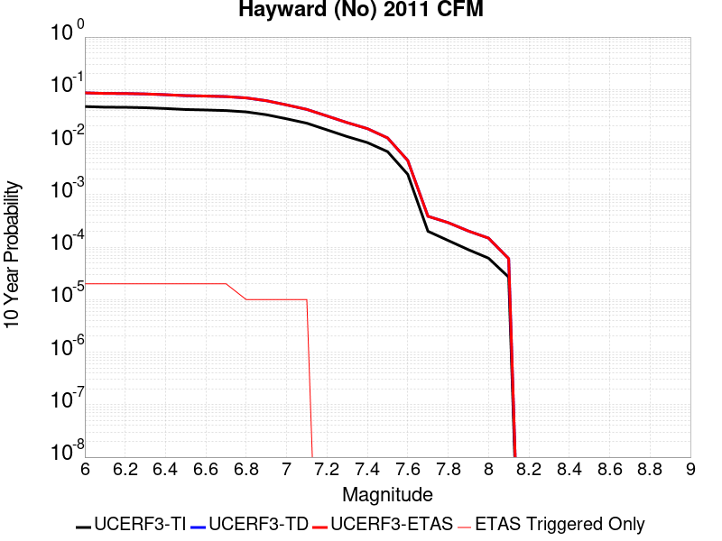 |

| Magnitude | 1 wk TI Prob | 1 wk TD Prob | 1 wk ETAS Prob | 1 wk ETAS/TD Gain | 1 wk ETAS Triggered Only | 1 mo TI Prob | 1 mo TD Prob | 1 mo ETAS Prob | 1 mo ETAS/TD Gain | 1 mo ETAS Triggered Only | 1 yr TI Prob | 1 yr TD Prob | 1 yr ETAS Prob | 1 yr ETAS/TD Gain | 1 yr ETAS Triggered Only | 10 yr TI Prob | 10 yr TD Prob | 10 yr ETAS Prob | 10 yr ETAS/TD Gain | 10 yr ETAS Triggered Only |
|-----|-----|-----|-----|-----|-----|-----|-----|-----|-----|-----|-----|-----|-----|-----|-----|-----|-----|-----|-----|-----|
| 6.0 | 9.3068506E-5 | 1.7399498E-4 | 1.7399498E-4 | 1.0 | 0.0 | 3.9880406E-4 | 7.454782E-4 | 7.5547077E-4 | 1.0134043 | 1.0E-5 | 0.0048446343 | 0.009038311 | 0.009048222 | 1.0010964 | 1.0E-5 | 0.047403704 | 0.08641109 | 0.086429365 | 1.0002115 | 2.0E-5 |
| 6.1 | 9.055486E-5 | 1.6950641E-4 | 1.6950641E-4 | 1.0 | 0.0 | 3.880345E-4 | 7.2625367E-4 | 7.362464E-4 | 1.0137593 | 1.0E-5 | 0.0047140904 | 0.0088063665 | 0.008816279 | 1.0011256 | 1.0E-5 | 0.046153355 | 0.08430886 | 0.084327176 | 1.0002172 | 2.0E-5 |
| 6.2 | 9.006742E-5 | 1.687124E-4 | 1.687124E-4 | 1.0 | 0.0 | 3.859461E-4 | 7.228527E-4 | 7.328455E-4 | 1.0138241 | 1.0E-5 | 0.0046887742 | 0.008765328 | 0.00877524 | 1.0011308 | 1.0E-5 | 0.0459107 | 0.08393307 | 0.08395139 | 1.0002183 | 2.0E-5 |
| 6.3 | 8.8336754E-5 | 1.6550772E-4 | 1.6550772E-4 | 1.0 | 0.0 | 3.7853114E-4 | 7.091266E-4 | 7.191195E-4 | 1.0140918 | 1.0E-5 | 0.004598882 | 0.008599595 | 0.008609509 | 1.0011529 | 1.0E-5 | 0.04504866 | 0.08242511 | 0.08244346 | 1.0002227 | 2.0E-5 |
| 6.4 | 8.526157E-5 | 1.5977774E-4 | 1.5977774E-4 | 1.0 | 0.0 | 3.6535555E-4 | 6.845826E-4 | 6.9457584E-4 | 1.0145974 | 1.0E-5 | 0.0044391346 | 0.0083031 | 0.008313017 | 1.0011944 | 1.0E-5 | 0.043514993 | 0.07970807 | 0.07972647 | 1.0002309 | 2.0E-5 |
| 6.5 | 8.152396E-5 | 1.531016E-4 | 1.531016E-4 | 1.0 | 0.0 | 3.493416E-4 | 6.559853E-4 | 6.6597876E-4 | 1.0152342 | 1.0E-5 | 0.0042449418 | 0.007957525 | 0.007967445 | 1.0012467 | 1.0E-5 | 0.04164765 | 0.07652792 | 0.07654639 | 1.0002414 | 2.0E-5 |
| 6.6 | 7.987405E-5 | 1.5014358E-4 | 1.5014358E-4 | 1.0 | 0.0 | 3.4227243E-4 | 6.4331444E-4 | 6.53308E-4 | 1.0155345 | 1.0E-5 | 0.0041592065 | 0.007804383 | 0.007814305 | 1.0012714 | 1.0E-5 | 0.04082218 | 0.07512059 | 0.07513909 | 1.0002463 | 2.0E-5 |
| 6.7 | 7.777665E-5 | 1.4653592E-4 | 1.4653592E-4 | 1.0 | 0.0 | 3.332859E-4 | 6.2786066E-4 | 6.378544E-4 | 1.0159171 | 1.0E-5 | 0.004050208 | 0.007617566 | 0.0076274895 | 1.0013027 | 1.0E-5 | 0.039771806 | 0.0733972 | 0.07341573 | 1.0002525 | 2.0E-5 |
| 6.8 | 7.3284005E-5 | 1.3804092E-4 | 1.3804092E-4 | 1.0 | 0.0 | 3.140365E-4 | 5.9147045E-4 | 5.9147045E-4 | 1.0 | 0.0 | 0.0038166929 | 0.0071775126 | 0.0071775126 | 1.0 | 0.0 | 0.037518036 | 0.06931027 | 0.069319576 | 1.0001342 | 1.0E-5 |
| 6.9 | 6.458263E-5 | 1.21344754E-4 | 1.21344754E-4 | 1.0 | 0.0 | 2.7675333E-4 | 5.1994575E-4 | 5.1994575E-4 | 1.0 | 0.0 | 0.0033642664 | 0.0063120667 | 0.0063120667 | 1.0 | 0.0 | 0.033137884 | 0.06123781 | 0.061247196 | 1.0001533 | 1.0E-5 |
| 7.0 | 5.3853604E-5 | 1.00277495E-4 | 1.00277495E-4 | 1.0 | 0.0 | 2.3078074E-4 | 4.2969023E-4 | 4.2969023E-4 | 1.0 | 0.0 | 0.0028061352 | 0.005218994 | 0.005218994 | 1.0 | 0.0 | 0.027709642 | 0.050969005 | 0.050978497 | 1.0001862 | 1.0E-5 |
| 7.1 | 4.4308683E-5 | 8.173056E-5 | 8.173056E-5 | 1.0 | 0.0 | 1.8988053E-4 | 3.5022703E-4 | 3.5022703E-4 | 1.0 | 0.0 | 0.0023093442 | 0.0042557186 | 0.0042557186 | 1.0 | 0.0 | 0.022854926 | 0.041834567 | 0.04184415 | 1.000229 | 1.0E-5 |
| 7.2 | 3.295973E-5 | 6.0793223E-5 | 6.0793223E-5 | 1.0 | 0.0 | 1.4124835E-4 | 2.6051648E-4 | 2.6051648E-4 | 1.0 | 0.0 | 0.0017183421 | 0.0031671978 | 0.0031671978 | 1.0 | 0.0 | 0.017051157 | 0.031378623 | 0.031378623 | 1.0 | 0.0 |
| 7.3 | 2.452256E-5 | 4.519938E-5 | 4.519938E-5 | 1.0 | 0.0 | 1.05092455E-4 | 1.9369733E-4 | 1.9369733E-4 | 1.0 | 0.0 | 0.0012787496 | 0.002355728 | 0.002355728 | 1.0 | 0.0 | 0.0127141625 | 0.023449602 | 0.023449602 | 1.0 | 0.0 |
| 7.4 | 1.8829967E-5 | 3.4619054E-5 | 3.4619054E-5 | 1.0 | 0.0 | 8.069736E-5 | 1.48359E-4 | 1.48359E-4 | 1.0 | 0.0 | 9.820475E-4 | 0.0018047842 | 0.0018047842 | 1.0 | 0.0 | 0.009777189 | 0.018027324 | 0.018027324 | 1.0 | 0.0 |
| 7.5 | 1.26374125E-5 | 2.29321E-5 | 2.29321E-5 | 1.0 | 0.0 | 5.4159216E-5 | 9.827676E-5 | 9.827676E-5 | 1.0 | 0.0 | 6.5918895E-4 | 0.0011958686 | 0.0011958686 | 1.0 | 0.0 | 0.00657237 | 0.011993509 | 0.011993509 | 1.0 | 0.0 |
| 7.6 | 4.666429E-6 | 8.4856E-6 | 8.4856E-6 | 1.0 | 0.0 | 1.9998828E-5 | 3.6366357E-5 | 3.6366357E-5 | 1.0 | 0.0 | 2.4345852E-4 | 4.4267168E-4 | 4.4267168E-4 | 1.0 | 0.0 | 0.0024319198 | 0.0044614705 | 0.0044614705 | 1.0 | 0.0 |
| 7.7 | 3.8399318E-7 | 7.1414064E-7 | 7.1414064E-7 | 1.0 | 0.0 | 1.6456839E-6 | 3.060599E-6 | 3.060599E-6 | 1.0 | 0.0 | 2.003602E-5 | 3.7262158E-5 | 3.7262158E-5 | 1.0 | 0.0 | 2.0034213E-4 | 3.8651045E-4 | 3.8651045E-4 | 1.0 | 0.0 |
| 7.8 | 2.5637698E-7 | 5.3727024E-7 | 5.3727024E-7 | 1.0 | 0.0 | 1.098758E-6 | 2.3025848E-6 | 2.3025848E-6 | 1.0 | 0.0 | 1.3377297E-5 | 2.803361E-5 | 2.803361E-5 | 1.0 | 0.0 | 1.3376492E-4 | 2.9275517E-4 | 2.9275517E-4 | 1.0 | 0.0 |
| 7.9 | 1.7141245E-7 | 3.7335738E-7 | 3.7335738E-7 | 1.0 | 0.0 | 7.3462456E-7 | 1.6001021E-6 | 1.6001021E-6 | 1.0 | 0.0 | 8.944017E-6 | 1.948107E-5 | 1.948107E-5 | 1.0 | 0.0 | 8.943657E-5 | 2.0266966E-4 | 2.0266966E-4 | 1.0 | 0.0 |
| 8.0 | 1.1808895E-7 | 2.754066E-7 | 2.754066E-7 | 1.0 | 0.0 | 5.060954E-7 | 1.1803133E-6 | 1.1803133E-6 | 1.0 | 0.0 | 6.161694E-6 | 1.4370221E-5 | 1.4370221E-5 | 1.0 | 0.0 | 6.161523E-5 | 1.4830701E-4 | 1.4830701E-4 | 1.0 | 0.0 |
| 8.1 | 5.138535E-8 | 1.1241226E-7 | 1.1241226E-7 | 1.0 | 0.0 | 2.2022292E-7 | 4.8176673E-7 | 4.8176673E-7 | 1.0 | 0.0 | 2.6812106E-6 | 5.865494E-6 | 5.865494E-6 | 1.0 | 0.0 | 2.6811784E-5 | 6.0210168E-5 | 6.0210168E-5 | 1.0 | 0.0 |

## Santa Cruz Catalina Ridge alt1
*[(top)](#table-of-contents)*

| 1 Week | 1 Month | 1 Year | 10 Year |
|-----|-----|-----|-----|
|  |  |  |  |

| Magnitude | 1 wk TI Prob | 1 wk TD Prob | 1 wk ETAS Prob | 1 wk ETAS/TD Gain | 1 wk ETAS Triggered Only | 1 mo TI Prob | 1 mo TD Prob | 1 mo ETAS Prob | 1 mo ETAS/TD Gain | 1 mo ETAS Triggered Only | 1 yr TI Prob | 1 yr TD Prob | 1 yr ETAS Prob | 1 yr ETAS/TD Gain | 1 yr ETAS Triggered Only | 10 yr TI Prob | 10 yr TD Prob | 10 yr ETAS Prob | 10 yr ETAS/TD Gain | 10 yr ETAS Triggered Only |
|-----|-----|-----|-----|-----|-----|-----|-----|-----|-----|-----|-----|-----|-----|-----|-----|-----|-----|-----|-----|-----|
| 6.0 | 3.2833184E-5 | 3.655952E-5 | 3.655952E-5 | 1.0 | 0.0 | 1.4070606E-4 | 1.5667517E-4 | 1.5667517E-4 | 1.0 | 0.0 | 0.00171175 | 0.0019060175 | 0.0019159985 | 1.0052365 | 1.0E-5 | 0.016986247 | 0.018913606 | 0.018933227 | 1.0010375 | 2.0E-5 |
| 6.1 | 1.9835548E-5 | 2.1660038E-5 | 2.1660038E-5 | 1.0 | 0.0 | 8.500672E-5 | 9.282555E-5 | 9.282555E-5 | 1.0 | 0.0 | 0.0010344655 | 0.0011295852 | 0.001139574 | 1.0088428 | 1.0E-5 | 0.010296632 | 0.011240571 | 0.011250459 | 1.0008796 | 1.0E-5 |
| 6.2 | 1.9835548E-5 | 2.1660038E-5 | 2.1660038E-5 | 1.0 | 0.0 | 8.500672E-5 | 9.282555E-5 | 9.282555E-5 | 1.0 | 0.0 | 0.0010344655 | 0.0011295852 | 0.001139574 | 1.0088428 | 1.0E-5 | 0.010296632 | 0.011240571 | 0.011250459 | 1.0008796 | 1.0E-5 |
| 6.3 | 1.5728183E-5 | 1.7034326E-5 | 1.7034326E-5 | 1.0 | 0.0 | 6.7404755E-5 | 7.3002244E-5 | 7.3002244E-5 | 1.0 | 0.0 | 8.2034385E-4 | 8.8844605E-4 | 8.9843717E-4 | 1.0112456 | 1.0E-5 | 0.008173222 | 0.008849622 | 0.008859533 | 1.00112 | 1.0E-5 |
| 6.4 | 1.5728183E-5 | 1.7034326E-5 | 1.7034326E-5 | 1.0 | 0.0 | 6.7404755E-5 | 7.3002244E-5 | 7.3002244E-5 | 1.0 | 0.0 | 8.2034385E-4 | 8.8844605E-4 | 8.9843717E-4 | 1.0112456 | 1.0E-5 | 0.008173222 | 0.008849622 | 0.008859533 | 1.00112 | 1.0E-5 |
| 6.5 | 1.3707734E-5 | 1.4794834E-5 | 1.4794834E-5 | 1.0 | 0.0 | 5.8746107E-5 | 6.3404914E-5 | 6.3404914E-5 | 1.0 | 0.0 | 7.1499916E-4 | 7.716849E-4 | 7.816772E-4 | 1.0129486 | 1.0E-5 | 0.0071270303 | 0.007690451 | 0.0077003743 | 1.0012903 | 1.0E-5 |
| 6.6 | 1.2539813E-5 | 1.3510497E-5 | 1.3510497E-5 | 1.0 | 0.0 | 5.3740947E-5 | 5.7900863E-5 | 5.7900863E-5 | 1.0 | 0.0 | 6.540996E-4 | 7.0471765E-4 | 7.147106E-4 | 1.0141801 | 1.0E-5 | 0.0065217763 | 0.0070251324 | 0.007035062 | 1.0014135 | 1.0E-5 |
| 6.7 | 1.1504083E-5 | 1.2377624E-5 | 1.2377624E-5 | 1.0 | 0.0 | 4.930228E-5 | 5.3045896E-5 | 5.3045896E-5 | 1.0 | 0.0 | 6.0008996E-4 | 6.4564444E-4 | 6.5563794E-4 | 1.0154784 | 1.0E-5 | 0.005984721 | 0.0064379154 | 0.006447851 | 1.0015433 | 1.0E-5 |
| 6.8 | 1.012739E-5 | 1.0877286E-5 | 1.0877286E-5 | 1.0 | 0.0 | 4.340238E-5 | 4.661611E-5 | 4.661611E-5 | 1.0 | 0.0 | 5.282958E-4 | 5.674049E-4 | 5.773992E-4 | 1.0176141 | 1.0E-5 | 0.0052704164 | 0.0056597306 | 0.005669674 | 1.0017569 | 1.0E-5 |
| 6.9 | 8.9607865E-6 | 9.609302E-6 | 9.609302E-6 | 1.0 | 0.0 | 3.8402806E-5 | 4.118208E-5 | 4.118208E-5 | 1.0 | 0.0 | 4.6745385E-4 | 5.012775E-4 | 5.112725E-4 | 1.0199391 | 1.0E-5 | 0.0046647177 | 0.005001588 | 0.0050115376 | 1.0019894 | 1.0E-5 |
| 7.0 | 8.046829E-6 | 8.619909E-6 | 8.619909E-6 | 1.0 | 0.0 | 3.4485955E-5 | 3.6941947E-5 | 3.6941947E-5 | 1.0 | 0.0 | 4.1978562E-4 | 4.496762E-4 | 4.5967172E-4 | 1.0222282 | 1.0E-5 | 0.004189935 | 0.0044877534 | 0.0044977088 | 1.0022182 | 1.0E-5 |
| 7.1 | 7.136131E-6 | 7.637798E-6 | 7.637798E-6 | 1.0 | 0.0 | 3.0583058E-5 | 3.2733016E-5 | 3.2733016E-5 | 1.0 | 0.0 | 3.7228514E-4 | 3.984523E-4 | 4.084483E-4 | 1.0250871 | 1.0E-5 | 0.0037166206 | 0.003977455 | 0.0039874157 | 1.0025042 | 1.0E-5 |
| 7.2 | 6.362014E-6 | 6.8050845E-6 | 6.8050845E-6 | 1.0 | 0.0 | 2.726549E-5 | 2.9164326E-5 | 2.9164326E-5 | 1.0 | 0.0 | 3.3190678E-4 | 3.5501845E-4 | 3.5501845E-4 | 1.0 | 0.0 | 0.0033141149 | 0.0035445816 | 0.0035445816 | 1.0 | 0.0 |
| 7.3 | 5.004101E-6 | 5.351814E-6 | 5.351814E-6 | 1.0 | 0.0 | 2.1445969E-5 | 2.2936147E-5 | 2.2936147E-5 | 1.0 | 0.0 | 2.6107338E-4 | 2.7921234E-4 | 2.7921234E-4 | 1.0 | 0.0 | 0.002607669 | 0.00278867 | 0.00278867 | 1.0 | 0.0 |
| 7.4 | 3.4901443E-6 | 3.7321213E-6 | 3.7321213E-6 | 1.0 | 0.0 | 1.4957676E-5 | 1.599471E-5 | 1.599471E-5 | 1.0 | 0.0 | 1.8209449E-4 | 1.9471857E-4 | 1.9471857E-4 | 1.0 | 0.0 | 0.0018194534 | 0.0019455182 | 0.0019455182 | 1.0 | 0.0 |
| 7.5 | 1.1215045E-6 | 1.1894062E-6 | 1.1894062E-6 | 1.0 | 0.0 | 4.806439E-6 | 5.0974454E-6 | 5.0974454E-6 | 1.0 | 0.0 | 5.851682E-5 | 6.205966E-5 | 6.205966E-5 | 1.0 | 0.0 | 5.850142E-4 | 6.204264E-4 | 6.204264E-4 | 1.0 | 0.0 |
| 7.6 | 2.8599047E-7 | 2.995237E-7 | 2.995237E-7 | 1.0 | 0.0 | 1.2256729E-6 | 1.2836723E-6 | 1.2836723E-6 | 1.0 | 0.0 | 1.4922465E-5 | 1.56286E-5 | 1.56286E-5 | 1.0 | 0.0 | 1.4921463E-4 | 1.5627514E-4 | 1.5627514E-4 | 1.0 | 0.0 |
| 7.7 | 2.0781519E-7 | 2.174459E-7 | 2.174459E-7 | 1.0 | 0.0 | 8.906362E-7 | 9.319107E-7 | 9.319107E-7 | 1.0 | 0.0 | 1.08434415E-5 | 1.1345955E-5 | 1.1345955E-5 | 1.0 | 0.0 | 1.0842913E-4 | 1.1345385E-4 | 1.1345385E-4 | 1.0 | 0.0 |
| 7.8 | 3.614776E-8 | 3.764143E-8 | 3.764143E-8 | 1.0 | 0.0 | 1.5491896E-7 | 1.613204E-7 | 1.613204E-7 | 1.0 | 0.0 | 1.8861368E-6 | 1.9640743E-6 | 1.9640743E-6 | 1.0 | 0.0 | 1.8861208E-5 | 1.9640582E-5 | 1.9640582E-5 | 1.0 | 0.0 |

## Point Reyes 2011 CFM
*[(top)](#table-of-contents)*

| 1 Week | 1 Month | 1 Year | 10 Year |
|-----|-----|-----|-----|
|  |  |  |  |

| Magnitude | 1 wk TI Prob | 1 wk TD Prob | 1 wk ETAS Prob | 1 wk ETAS/TD Gain | 1 wk ETAS Triggered Only | 1 mo TI Prob | 1 mo TD Prob | 1 mo ETAS Prob | 1 mo ETAS/TD Gain | 1 mo ETAS Triggered Only | 1 yr TI Prob | 1 yr TD Prob | 1 yr ETAS Prob | 1 yr ETAS/TD Gain | 1 yr ETAS Triggered Only | 10 yr TI Prob | 10 yr TD Prob | 10 yr ETAS Prob | 10 yr ETAS/TD Gain | 10 yr ETAS Triggered Only |
|-----|-----|-----|-----|-----|-----|-----|-----|-----|-----|-----|-----|-----|-----|-----|-----|-----|-----|-----|-----|-----|
| 6.0 | 8.8644965E-6 | 8.967237E-6 | 8.967237E-6 | 1.0 | 0.0 | 3.7990147E-5 | 3.8430484E-5 | 3.8430484E-5 | 1.0 | 0.0 | 4.624319E-4 | 4.6779698E-4 | 4.6779698E-4 | 1.0 | 0.0 | 0.0046147075 | 0.004668751 | 0.0046886574 | 1.0042638 | 2.0E-5 |
| 6.1 | 4.526405E-6 | 4.5392676E-6 | 4.5392676E-6 | 1.0 | 0.0 | 1.9398734E-5 | 1.9453866E-5 | 1.9453866E-5 | 1.0 | 0.0 | 2.36154E-4 | 2.3682612E-4 | 2.3682612E-4 | 1.0 | 0.0 | 0.002359032 | 0.0023658434 | 0.002385796 | 1.0084337 | 2.0E-5 |
| 6.2 | 4.526405E-6 | 4.5392676E-6 | 4.5392676E-6 | 1.0 | 0.0 | 1.9398734E-5 | 1.9453866E-5 | 1.9453866E-5 | 1.0 | 0.0 | 2.36154E-4 | 2.3682612E-4 | 2.3682612E-4 | 1.0 | 0.0 | 0.002359032 | 0.0023658434 | 0.002385796 | 1.0084337 | 2.0E-5 |
| 6.3 | 2.6842322E-6 | 2.6607156E-6 | 2.6607156E-6 | 1.0 | 0.0 | 1.1503801E-5 | 1.1403018E-5 | 1.1403018E-5 | 1.0 | 0.0 | 1.4004979E-4 | 1.3882309E-4 | 1.3882309E-4 | 1.0 | 0.0 | 0.0013996155 | 0.0013873853 | 0.0013973715 | 1.0071979 | 1.0E-5 |
| 6.4 | 2.6842322E-6 | 2.6607156E-6 | 2.6607156E-6 | 1.0 | 0.0 | 1.1503801E-5 | 1.1403018E-5 | 1.1403018E-5 | 1.0 | 0.0 | 1.4004979E-4 | 1.3882309E-4 | 1.3882309E-4 | 1.0 | 0.0 | 0.0013996155 | 0.0013873853 | 0.0013973715 | 1.0071979 | 1.0E-5 |
| 6.5 | 1.9281833E-6 | 1.890662E-6 | 1.890662E-6 | 1.0 | 0.0 | 8.263617E-6 | 8.102812E-6 | 8.102812E-6 | 1.0 | 0.0 | 1.0060489E-4 | 9.864736E-5 | 9.864736E-5 | 1.0 | 0.0 | 0.0010055936 | 9.860464E-4 | 9.960365E-4 | 1.0101315 | 1.0E-5 |
| 6.6 | 1.4726726E-6 | 1.4269913E-6 | 1.4269913E-6 | 1.0 | 0.0 | 6.3114385E-6 | 6.1156625E-6 | 6.1156625E-6 | 1.0 | 0.0 | 7.683905E-5 | 7.44557E-5 | 7.44557E-5 | 1.0 | 0.0 | 7.6812494E-4 | 7.4431446E-4 | 7.54307E-4 | 1.0134252 | 1.0E-5 |
| 6.7 | 8.572307E-7 | 8.007518E-7 | 8.007518E-7 | 1.0 | 0.0 | 3.6738406E-6 | 3.431789E-6 | 3.431789E-6 | 1.0 | 0.0 | 4.472809E-5 | 4.1781248E-5 | 4.1781248E-5 | 1.0 | 0.0 | 4.471909E-4 | 4.1773764E-4 | 4.1773764E-4 | 1.0 | 0.0 |
| 6.8 | 6.6745434E-7 | 6.077597E-7 | 6.077597E-7 | 1.0 | 0.0 | 2.8605155E-6 | 2.6046819E-6 | 2.6046819E-6 | 1.0 | 0.0 | 3.482622E-5 | 3.1711552E-5 | 3.1711552E-5 | 1.0 | 0.0 | 3.4820763E-4 | 3.1707337E-4 | 3.1707337E-4 | 1.0 | 0.0 |
| 6.9 | 4.291521E-7 | 3.6538802E-7 | 3.6538802E-7 | 1.0 | 0.0 | 1.839222E-6 | 1.5659477E-6 | 1.5659477E-6 | 1.0 | 0.0 | 2.2392298E-5 | 1.906525E-5 | 1.906525E-5 | 1.0 | 0.0 | 2.2390042E-4 | 1.906386E-4 | 1.906386E-4 | 1.0 | 0.0 |
| 7.0 | 2.6812808E-7 | 2.0190204E-7 | 2.0190204E-7 | 1.0 | 0.0 | 1.1491198E-6 | 8.6529417E-7 | 8.6529417E-7 | 1.0 | 0.0 | 1.3990444E-5 | 1.0534905E-5 | 1.0534905E-5 | 1.0 | 0.0 | 1.3989564E-4 | 1.05346226E-4 | 1.05346226E-4 | 1.0 | 0.0 |
| 7.1 | 1.9451231E-7 | 1.2728252E-7 | 1.2728252E-7 | 1.0 | 0.0 | 8.336239E-7 | 5.454964E-7 | 5.454964E-7 | 1.0 | 0.0 | 1.0149324E-5 | 6.6413977E-6 | 6.6413977E-6 | 1.0 | 0.0 | 1.014886E-4 | 6.641408E-5 | 6.641408E-5 | 1.0 | 0.0 |
| 7.2 | 1.6715143E-7 | 1.0045534E-7 | 1.0045534E-7 | 1.0 | 0.0 | 7.1636305E-7 | 4.3052282E-7 | 4.3052282E-7 | 1.0 | 0.0 | 8.721685E-6 | 5.241602E-6 | 5.241602E-6 | 1.0 | 0.0 | 8.721343E-5 | 5.2416868E-5 | 5.2416868E-5 | 1.0 | 0.0 |
| 7.3 | 1.5503173E-7 | 9.015749E-8 | 9.015749E-8 | 1.0 | 0.0 | 6.644215E-7 | 3.863892E-7 | 3.863892E-7 | 1.0 | 0.0 | 8.089301E-6 | 4.704278E-6 | 4.704278E-6 | 1.0 | 0.0 | 8.089007E-5 | 4.7043864E-5 | 4.7043864E-5 | 1.0 | 0.0 |
| 7.4 | 1.4251614E-7 | 8.100193E-8 | 8.100193E-8 | 1.0 | 0.0 | 6.1078333E-7 | 3.471511E-7 | 3.471511E-7 | 1.0 | 0.0 | 7.4362615E-6 | 4.226556E-6 | 4.226556E-6 | 1.0 | 0.0 | 7.436013E-5 | 4.2266838E-5 | 4.2266838E-5 | 1.0 | 0.0 |
| 7.5 | 1.2710186E-7 | 7.0321086E-8 | 7.0321086E-8 | 1.0 | 0.0 | 5.447221E-7 | 3.0137605E-7 | 3.0137605E-7 | 1.0 | 0.0 | 6.6319717E-6 | 3.669247E-6 | 3.669247E-6 | 1.0 | 0.0 | 6.6317734E-5 | 3.6693946E-5 | 3.6693946E-5 | 1.0 | 0.0 |
| 7.6 | 1.0144708E-7 | 5.4974898E-8 | 5.4974898E-8 | 1.0 | 0.0 | 4.347731E-7 | 2.3560669E-7 | 2.3560669E-7 | 1.0 | 0.0 | 5.2933497E-6 | 2.8685076E-6 | 2.8685076E-6 | 1.0 | 0.0 | 5.293224E-5 | 2.8686787E-5 | 2.8686787E-5 | 1.0 | 0.0 |
| 7.7 | 7.090527E-8 | 3.9842163E-8 | 3.9842163E-8 | 1.0 | 0.0 | 3.038797E-7 | 1.7075212E-7 | 1.7075212E-7 | 1.0 | 0.0 | 3.699729E-6 | 2.078905E-6 | 2.078905E-6 | 1.0 | 0.0 | 3.6996673E-5 | 2.0790936E-5 | 2.0790936E-5 | 1.0 | 0.0 |
| 7.8 | 3.8712045E-8 | 2.7456492E-8 | 2.7456492E-8 | 1.0 | 0.0 | 1.6590876E-7 | 1.17670666E-7 | 1.17670666E-7 | 1.0 | 0.0 | 2.0199373E-6 | 1.4326394E-6 | 1.4326394E-6 | 1.0 | 0.0 | 2.0199188E-5 | 1.4328383E-5 | 1.4328383E-5 | 1.0 | 0.0 |
| 7.9 | 1.7068782E-8 | 1.1846613E-8 | 1.1846613E-8 | 1.0 | 0.0 | 7.315192E-8 | 5.077119E-8 | 5.077119E-8 | 1.0 | 0.0 | 8.906242E-7 | 6.181391E-7 | 6.181391E-7 | 1.0 | 0.0 | 8.906207E-6 | 6.183455E-6 | 6.183455E-6 | 1.0 | 0.0 |
| 8.0 | 1.0172592E-8 | 7.0391604E-9 | 7.0391604E-9 | 1.0 | 0.0 | 4.359682E-8 | 3.016783E-8 | 3.016783E-8 | 1.0 | 0.0 | 5.3079117E-7 | 3.6729327E-7 | 3.6729327E-7 | 1.0 | 0.0 | 5.307899E-6 | 3.6750077E-6 | 3.6750077E-6 | 1.0 | 0.0 |
| 8.1 | 3.7861243E-9 | 3.5507899E-9 | 3.5507899E-9 | 1.0 | 0.0 | 1.6226247E-8 | 1.5217667E-8 | 1.5217667E-8 | 1.0 | 0.0 | 1.9755454E-7 | 1.8527507E-7 | 1.8527507E-7 | 1.0 | 0.0 | 1.9755437E-6 | 1.8546485E-6 | 1.8546485E-6 | 1.0 | 0.0 |

## Raymond
*[(top)](#table-of-contents)*

| 1 Week | 1 Month | 1 Year | 10 Year |
|-----|-----|-----|-----|
|  |  | 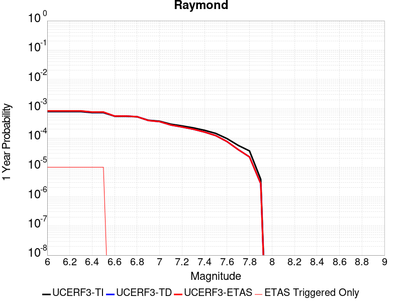 |  |

| Magnitude | 1 wk TI Prob | 1 wk TD Prob | 1 wk ETAS Prob | 1 wk ETAS/TD Gain | 1 wk ETAS Triggered Only | 1 mo TI Prob | 1 mo TD Prob | 1 mo ETAS Prob | 1 mo ETAS/TD Gain | 1 mo ETAS Triggered Only | 1 yr TI Prob | 1 yr TD Prob | 1 yr ETAS Prob | 1 yr ETAS/TD Gain | 1 yr ETAS Triggered Only | 10 yr TI Prob | 10 yr TD Prob | 10 yr ETAS Prob | 10 yr ETAS/TD Gain | 10 yr ETAS Triggered Only |
|-----|-----|-----|-----|-----|-----|-----|-----|-----|-----|-----|-----|-----|-----|-----|-----|-----|-----|-----|-----|-----|
| 6.0 | 1.5157413E-5 | 1.5810716E-5 | 1.5810716E-5 | 1.0 | 0.0 | 6.4958724E-5 | 6.775859E-5 | 6.775859E-5 | 1.0 | 0.0 | 7.905855E-4 | 8.246737E-4 | 8.3466544E-4 | 1.012116 | 1.0E-5 | 0.007877788 | 0.008218649 | 0.008238484 | 1.0024135 | 2.0E-5 |
| 6.1 | 1.5157413E-5 | 1.5810716E-5 | 1.5810716E-5 | 1.0 | 0.0 | 6.4958724E-5 | 6.775859E-5 | 6.775859E-5 | 1.0 | 0.0 | 7.905855E-4 | 8.246737E-4 | 8.3466544E-4 | 1.012116 | 1.0E-5 | 0.007877788 | 0.008218649 | 0.008238484 | 1.0024135 | 2.0E-5 |
| 6.2 | 1.5157413E-5 | 1.5810716E-5 | 1.5810716E-5 | 1.0 | 0.0 | 6.4958724E-5 | 6.775859E-5 | 6.775859E-5 | 1.0 | 0.0 | 7.905855E-4 | 8.246737E-4 | 8.3466544E-4 | 1.012116 | 1.0E-5 | 0.007877788 | 0.008218649 | 0.008238484 | 1.0024135 | 2.0E-5 |
| 6.3 | 1.5157413E-5 | 1.5810716E-5 | 1.5810716E-5 | 1.0 | 0.0 | 6.4958724E-5 | 6.775859E-5 | 6.775859E-5 | 1.0 | 0.0 | 7.905855E-4 | 8.246737E-4 | 8.3466544E-4 | 1.012116 | 1.0E-5 | 0.007877788 | 0.008218649 | 0.008238484 | 1.0024135 | 2.0E-5 |
| 6.4 | 1.3941944E-5 | 1.4455237E-5 | 1.4455237E-5 | 1.0 | 0.0 | 5.9749822E-5 | 6.194967E-5 | 6.194967E-5 | 1.0 | 0.0 | 7.2721124E-4 | 7.5399963E-4 | 7.639921E-4 | 1.0132526 | 1.0E-5 | 0.007248361 | 0.007516744 | 0.007536594 | 1.0026407 | 2.0E-5 |
| 6.5 | 1.3941944E-5 | 1.4455237E-5 | 1.4455237E-5 | 1.0 | 0.0 | 5.9749822E-5 | 6.194967E-5 | 6.194967E-5 | 1.0 | 0.0 | 7.2721124E-4 | 7.5399963E-4 | 7.639921E-4 | 1.0132526 | 1.0E-5 | 0.007248361 | 0.007516744 | 0.007536594 | 1.0026407 | 2.0E-5 |
| 6.6 | 1.0542609E-5 | 1.0671545E-5 | 1.0671545E-5 | 1.0 | 0.0 | 4.5181827E-5 | 4.573442E-5 | 4.573442E-5 | 1.0 | 0.0 | 5.499499E-4 | 5.566798E-4 | 5.566798E-4 | 1.0 | 0.0 | 0.005485909 | 0.0055534113 | 0.0055534113 | 1.0 | 0.0 |
| 6.7 | 1.0542609E-5 | 1.0671545E-5 | 1.0671545E-5 | 1.0 | 0.0 | 4.5181827E-5 | 4.573442E-5 | 4.573442E-5 | 1.0 | 0.0 | 5.499499E-4 | 5.566798E-4 | 5.566798E-4 | 1.0 | 0.0 | 0.005485909 | 0.0055534113 | 0.0055534113 | 1.0 | 0.0 |
| 6.8 | 1.0079132E-5 | 1.0177069E-5 | 1.0177069E-5 | 1.0 | 0.0 | 4.3195567E-5 | 4.3615313E-5 | 4.3615313E-5 | 1.0 | 0.0 | 5.257791E-4 | 5.308924E-4 | 5.308924E-4 | 1.0 | 0.0 | 0.0052453685 | 0.0052967877 | 0.0052967877 | 1.0 | 0.0 |
| 6.9 | 7.721598E-6 | 7.5492476E-6 | 7.5492476E-6 | 1.0 | 0.0 | 3.3092143E-5 | 3.2353524E-5 | 3.2353524E-5 | 1.0 | 0.0 | 4.0282236E-4 | 3.9383417E-4 | 3.9383417E-4 | 1.0 | 0.0 | 0.0040209293 | 0.003931492 | 0.003931492 | 1.0 | 0.0 |
| 7.0 | 7.137566E-6 | 6.9116327E-6 | 6.9116327E-6 | 1.0 | 0.0 | 3.058921E-5 | 2.9620953E-5 | 2.9620953E-5 | 1.0 | 0.0 | 3.7236E-4 | 3.605765E-4 | 3.605765E-4 | 1.0 | 0.0 | 0.0037173668 | 0.0036000293 | 0.0036000293 | 1.0 | 0.0 |
| 7.1 | 5.654976E-6 | 5.29983E-6 | 5.29983E-6 | 1.0 | 0.0 | 2.4235387E-5 | 2.271336E-5 | 2.271336E-5 | 1.0 | 0.0 | 2.9502588E-4 | 2.7650027E-4 | 2.7650027E-4 | 1.0 | 0.0 | 0.0029463451 | 0.0027615903 | 0.0027615903 | 1.0 | 0.0 |
| 7.2 | 4.9358455E-6 | 4.5269303E-6 | 4.5269303E-6 | 1.0 | 0.0 | 2.1153453E-5 | 1.9400986E-5 | 1.9400986E-5 | 1.0 | 0.0 | 2.5751285E-4 | 2.3618153E-4 | 2.3618153E-4 | 1.0 | 0.0 | 0.0025721465 | 0.002359324 | 0.002359324 | 1.0 | 0.0 |
| 7.3 | 4.2368597E-6 | 3.8058733E-6 | 3.8058733E-6 | 1.0 | 0.0 | 1.8157843E-5 | 1.6310785E-5 | 1.6310785E-5 | 1.0 | 0.0 | 2.2104931E-4 | 1.9856582E-4 | 1.9856582E-4 | 1.0 | 0.0 | 0.0022082955 | 0.0019838992 | 0.0019838992 | 1.0 | 0.0 |
| 7.4 | 3.4999923E-6 | 3.0439828E-6 | 3.0439828E-6 | 1.0 | 0.0 | 1.49998805E-5 | 1.3045576E-5 | 1.3045576E-5 | 1.0 | 0.0 | 1.8260824E-4 | 1.588184E-4 | 1.588184E-4 | 1.0 | 0.0 | 0.0018245826 | 0.0015870612 | 0.0015870612 | 1.0 | 0.0 |
| 7.5 | 2.738017E-6 | 2.302168E-6 | 2.302168E-6 | 1.0 | 0.0 | 1.1734306E-5 | 9.866398E-6 | 9.866398E-6 | 1.0 | 0.0 | 1.428558E-4 | 1.2011684E-4 | 1.2011684E-4 | 1.0 | 0.0 | 0.0014276401 | 0.0012005301 | 0.0012005301 | 1.0 | 0.0 |
| 7.6 | 1.8186392E-6 | 1.4423949E-6 | 1.4423949E-6 | 1.0 | 0.0 | 7.794145E-6 | 6.181678E-6 | 6.181678E-6 | 1.0 | 0.0 | 9.488958E-5 | 7.525937E-5 | 7.525937E-5 | 1.0 | 0.0 | 9.4849075E-4 | 7.5234694E-4 | 7.5234694E-4 | 1.0 | 0.0 |
| 7.7 | 1.0660348E-6 | 7.6443916E-7 | 7.6443916E-7 | 1.0 | 0.0 | 4.5687125E-6 | 3.2761639E-6 | 3.2761639E-6 | 1.0 | 0.0 | 5.5622655E-5 | 3.988658E-5 | 3.988658E-5 | 1.0 | 0.0 | 5.5608735E-4 | 3.9879992E-4 | 3.9879992E-4 | 1.0 | 0.0 |
| 7.8 | 6.913602E-7 | 4.3208897E-7 | 4.3208897E-7 | 1.0 | 0.0 | 2.962969E-6 | 1.8518085E-6 | 1.8518085E-6 | 1.0 | 0.0 | 3.607355E-5 | 2.2545542E-5 | 2.2545542E-5 | 1.0 | 0.0 | 3.6067693E-4 | 2.2543702E-4 | 2.2543702E-4 | 1.0 | 0.0 |
| 7.9 | 7.425201E-8 | 5.3227776E-8 | 5.3227776E-8 | 1.0 | 0.0 | 3.1822285E-7 | 2.2811903E-7 | 2.2811903E-7 | 1.0 | 0.0 | 3.874356E-6 | 2.777347E-6 | 2.777347E-6 | 1.0 | 0.0 | 3.8742884E-5 | 2.7773252E-5 | 2.7773252E-5 | 1.0 | 0.0 |

## Emerson-Copper Mtn 2011
*[(top)](#table-of-contents)*

| 1 Week | 1 Month | 1 Year | 10 Year |
|-----|-----|-----|-----|
|  |  |  |  |

| Magnitude | 1 wk TI Prob | 1 wk TD Prob | 1 wk ETAS Prob | 1 wk ETAS/TD Gain | 1 wk ETAS Triggered Only | 1 mo TI Prob | 1 mo TD Prob | 1 mo ETAS Prob | 1 mo ETAS/TD Gain | 1 mo ETAS Triggered Only | 1 yr TI Prob | 1 yr TD Prob | 1 yr ETAS Prob | 1 yr ETAS/TD Gain | 1 yr ETAS Triggered Only | 10 yr TI Prob | 10 yr TD Prob | 10 yr ETAS Prob | 10 yr ETAS/TD Gain | 10 yr ETAS Triggered Only |
|-----|-----|-----|-----|-----|-----|-----|-----|-----|-----|-----|-----|-----|-----|-----|-----|-----|-----|-----|-----|-----|
| 6.0 | 2.1364202E-5 | 9.968303E-6 | 9.968303E-6 | 1.0 | 0.0 | 9.1557646E-5 | 4.2720647E-5 | 4.2720647E-5 | 1.0 | 0.0 | 0.0011141442 | 5.200085E-4 | 5.300033E-4 | 1.0192205 | 1.0E-5 | 0.011085749 | 0.0051887864 | 0.0052086827 | 1.0038345 | 2.0E-5 |
| 6.1 | 2.1364202E-5 | 9.968303E-6 | 9.968303E-6 | 1.0 | 0.0 | 9.1557646E-5 | 4.2720647E-5 | 4.2720647E-5 | 1.0 | 0.0 | 0.0011141442 | 5.200085E-4 | 5.300033E-4 | 1.0192205 | 1.0E-5 | 0.011085749 | 0.0051887864 | 0.0052086827 | 1.0038345 | 2.0E-5 |
| 6.2 | 2.1364202E-5 | 9.968303E-6 | 9.968303E-6 | 1.0 | 0.0 | 9.1557646E-5 | 4.2720647E-5 | 4.2720647E-5 | 1.0 | 0.0 | 0.0011141442 | 5.200085E-4 | 5.300033E-4 | 1.0192205 | 1.0E-5 | 0.011085749 | 0.0051887864 | 0.0052086827 | 1.0038345 | 2.0E-5 |
| 6.3 | 1.7751237E-5 | 8.089363E-6 | 8.089363E-6 | 1.0 | 0.0 | 7.607452E-5 | 3.4668272E-5 | 3.4668272E-5 | 1.0 | 0.0 | 9.258136E-4 | 4.2201075E-4 | 4.3200652E-4 | 1.023686 | 1.0E-5 | 0.00921966 | 0.004212716 | 0.004232632 | 1.0047275 | 2.0E-5 |
| 6.4 | 1.7751237E-5 | 8.089363E-6 | 8.089363E-6 | 1.0 | 0.0 | 7.607452E-5 | 3.4668272E-5 | 3.4668272E-5 | 1.0 | 0.0 | 9.258136E-4 | 4.2201075E-4 | 4.3200652E-4 | 1.023686 | 1.0E-5 | 0.00921966 | 0.004212716 | 0.004232632 | 1.0047275 | 2.0E-5 |
| 6.5 | 1.5886664E-5 | 6.603881E-6 | 6.603881E-6 | 1.0 | 0.0 | 6.808392E-5 | 2.8302067E-5 | 2.8302067E-5 | 1.0 | 0.0 | 8.286065E-4 | 3.4452789E-4 | 3.5452444E-4 | 1.0290152 | 1.0E-5 | 0.008255237 | 0.0034404017 | 0.0034503671 | 1.0028967 | 1.0E-5 |
| 6.6 | 1.5886664E-5 | 6.603881E-6 | 6.603881E-6 | 1.0 | 0.0 | 6.808392E-5 | 2.8302067E-5 | 2.8302067E-5 | 1.0 | 0.0 | 8.286065E-4 | 3.4452789E-4 | 3.5452444E-4 | 1.0290152 | 1.0E-5 | 0.008255237 | 0.0034404017 | 0.0034503671 | 1.0028967 | 1.0E-5 |
| 6.7 | 1.428471E-5 | 5.470414E-6 | 5.470414E-6 | 1.0 | 0.0 | 6.121875E-5 | 2.3444445E-5 | 2.3444445E-5 | 1.0 | 0.0 | 7.450834E-4 | 2.8540267E-4 | 2.953998E-4 | 1.0350282 | 1.0E-5 | 0.007425902 | 0.0028507493 | 0.0028607207 | 1.0034978 | 1.0E-5 |
| 6.8 | 1.3490684E-5 | 5.073688E-6 | 5.073688E-6 | 1.0 | 0.0 | 5.7815934E-5 | 2.1744218E-5 | 2.1744218E-5 | 1.0 | 0.0 | 7.0368167E-4 | 2.6470755E-4 | 2.7470491E-4 | 1.0377675 | 1.0E-5 | 0.007014576 | 0.0026443033 | 0.0026542768 | 1.0037717 | 1.0E-5 |
| 6.9 | 1.2235421E-5 | 4.2896218E-6 | 4.2896218E-6 | 1.0 | 0.0 | 5.2436466E-5 | 1.8383984E-5 | 1.8383984E-5 | 1.0 | 0.0 | 6.38227E-4 | 2.238056E-4 | 2.3380337E-4 | 1.0446717 | 1.0E-5 | 0.0063639707 | 0.0022361565 | 0.002246134 | 1.004462 | 1.0E-5 |
| 7.0 | 1.1009851E-5 | 3.7189056E-6 | 3.7189056E-6 | 1.0 | 0.0 | 4.7184225E-5 | 1.5938089E-5 | 1.5938089E-5 | 1.0 | 0.0 | 5.743165E-4 | 1.940324E-4 | 2.0403045E-4 | 1.0515277 | 1.0E-5 | 0.005728345 | 0.0019389676 | 0.0019489483 | 1.0051473 | 1.0E-5 |
| 7.1 | 9.726373E-6 | 3.211637E-6 | 3.211637E-6 | 1.0 | 0.0 | 4.168379E-5 | 1.37641055E-5 | 1.37641055E-5 | 1.0 | 0.0 | 5.07382E-4 | 1.6756846E-4 | 1.7756679E-4 | 1.0596671 | 1.0E-5 | 0.0050622504 | 0.0016747523 | 0.0016847355 | 1.0059611 | 1.0E-5 |
| 7.2 | 3.9335127E-6 | 1.1524697E-6 | 1.1524697E-6 | 1.0 | 0.0 | 1.6857803E-5 | 4.939147E-6 | 4.939147E-6 | 1.0 | 0.0 | 2.0522442E-4 | 6.0132516E-5 | 7.0131915E-5 | 1.1662893 | 1.0E-5 | 0.00205035 | 6.011684E-4 | 6.111624E-4 | 1.0166243 | 1.0E-5 |
| 7.3 | 2.661632E-6 | 6.9113634E-7 | 6.9113634E-7 | 1.0 | 0.0 | 1.14069435E-5 | 2.9620094E-6 | 2.9620094E-6 | 1.0 | 0.0 | 1.3887069E-4 | 3.606188E-5 | 4.606152E-5 | 1.2772912 | 1.0E-5 | 0.0013878393 | 3.605613E-4 | 3.705577E-4 | 1.0277245 | 1.0E-5 |
| 7.4 | 2.0893426E-6 | 5.46174E-7 | 5.46174E-7 | 1.0 | 0.0 | 8.954295E-6 | 2.3407438E-6 | 2.3407438E-6 | 1.0 | 0.0 | 1.0901308E-4 | 2.8498189E-5 | 3.8497903E-5 | 1.3508894 | 1.0E-5 | 0.0010895962 | 2.8494588E-4 | 2.9494302E-4 | 1.0350844 | 1.0E-5 |
| 7.5 | 1.1681728E-6 | 3.602991E-7 | 3.602991E-7 | 1.0 | 0.0 | 5.0064455E-6 | 1.5441382E-6 | 1.5441382E-6 | 1.0 | 0.0 | 6.0951766E-5 | 1.8799725E-5 | 2.8799537E-5 | 1.5319127 | 1.0E-5 | 6.093505E-4 | 1.8798182E-4 | 1.9797993E-4 | 1.0531867 | 1.0E-5 |
| 7.6 | 1.3154387E-7 | 7.11981E-8 | 7.11981E-8 | 1.0 | 0.0 | 5.6375933E-7 | 3.051347E-7 | 3.051347E-7 | 1.0 | 0.0 | 6.863748E-6 | 3.71501E-6 | 3.71501E-6 | 1.0 | 0.0 | 6.863536E-5 | 3.714964E-5 | 3.714964E-5 | 1.0 | 0.0 |

## Sargent 2011 CFM
*[(top)](#table-of-contents)*

| 1 Week | 1 Month | 1 Year | 10 Year |
|-----|-----|-----|-----|
|  |  |  |  |

| Magnitude | 1 wk TI Prob | 1 wk TD Prob | 1 wk ETAS Prob | 1 wk ETAS/TD Gain | 1 wk ETAS Triggered Only | 1 mo TI Prob | 1 mo TD Prob | 1 mo ETAS Prob | 1 mo ETAS/TD Gain | 1 mo ETAS Triggered Only | 1 yr TI Prob | 1 yr TD Prob | 1 yr ETAS Prob | 1 yr ETAS/TD Gain | 1 yr ETAS Triggered Only | 10 yr TI Prob | 10 yr TD Prob | 10 yr ETAS Prob | 10 yr ETAS/TD Gain | 10 yr ETAS Triggered Only |
|-----|-----|-----|-----|-----|-----|-----|-----|-----|-----|-----|-----|-----|-----|-----|-----|-----|-----|-----|-----|-----|
| 6.0 | 3.7327867E-5 | 3.6654223E-5 | 3.6654223E-5 | 1.0 | 0.0 | 1.5996677E-4 | 1.5708087E-4 | 1.5708087E-4 | 1.0 | 0.0 | 0.0019458556 | 0.0019112062 | 0.001921187 | 1.0052223 | 1.0E-5 | 0.01928905 | 0.019019898 | 0.01903952 | 1.0010315 | 2.0E-5 |
| 6.1 | 2.3771476E-5 | 1.8480641E-5 | 1.8480641E-5 | 1.0 | 0.0 | 1.01873775E-4 | 7.920072E-5 | 7.920072E-5 | 1.0 | 0.0 | 0.0012396075 | 9.639233E-4 | 9.639233E-4 | 1.0 | 0.0 | 0.012327154 | 0.009637026 | 0.00964693 | 1.0010277 | 1.0E-5 |
| 6.2 | 2.3112721E-5 | 1.7711965E-5 | 1.7711965E-5 | 1.0 | 0.0 | 9.9050754E-5 | 7.590659E-5 | 7.590659E-5 | 1.0 | 0.0 | 0.0012052758 | 9.2385145E-4 | 9.2385145E-4 | 1.0 | 0.0 | 0.011987597 | 0.009239661 | 0.009249568 | 1.0010723 | 1.0E-5 |
| 6.3 | 1.728509E-5 | 1.0459922E-5 | 1.0459922E-5 | 1.0 | 0.0 | 7.407686E-5 | 4.4827717E-5 | 4.4827717E-5 | 1.0 | 0.0 | 9.015125E-4 | 5.45687E-4 | 5.45687E-4 | 1.0 | 0.0 | 0.008978641 | 0.00547978 | 0.005489725 | 1.0018148 | 1.0E-5 |
| 6.4 | 1.48395575E-5 | 7.4568075E-6 | 7.4568075E-6 | 1.0 | 0.0 | 6.3596555E-5 | 3.1957552E-5 | 3.1957552E-5 | 1.0 | 0.0 | 7.7401294E-4 | 3.8905136E-4 | 3.8905136E-4 | 1.0 | 0.0 | 0.0077132257 | 0.003919227 | 0.003929188 | 1.0025415 | 1.0E-5 |
| 6.5 | 1.4358964E-5 | 6.8955583E-6 | 6.8955583E-6 | 1.0 | 0.0 | 6.1536964E-5 | 2.9552253E-5 | 2.9552253E-5 | 1.0 | 0.0 | 7.48955E-4 | 3.5977678E-4 | 3.5977678E-4 | 1.0 | 0.0 | 0.0074643586 | 0.003627463 | 0.003627463 | 1.0 | 0.0 |
| 6.6 | 9.772591E-6 | 1.3741412E-6 | 1.3741412E-6 | 1.0 | 0.0 | 4.188186E-5 | 5.8891633E-6 | 5.8891633E-6 | 1.0 | 0.0 | 5.097923E-4 | 7.169823E-5 | 7.169823E-5 | 1.0 | 0.0 | 0.005086244 | 7.4869796E-4 | 7.4869796E-4 | 1.0 | 0.0 |
| 6.7 | 9.752745E-6 | 1.3528321E-6 | 1.3528321E-6 | 1.0 | 0.0 | 4.179681E-5 | 5.797839E-6 | 5.797839E-6 | 1.0 | 0.0 | 5.0875737E-4 | 7.058644E-5 | 7.058644E-5 | 1.0 | 0.0 | 0.005075942 | 7.375874E-4 | 7.375874E-4 | 1.0 | 0.0 |
| 6.8 | 9.608213E-6 | 1.2366826E-6 | 1.2366826E-6 | 1.0 | 0.0 | 4.1177405E-5 | 5.300057E-6 | 5.300057E-6 | 1.0 | 0.0 | 5.012196E-4 | 6.452631E-5 | 6.452631E-5 | 1.0 | 0.0 | 0.005000906 | 6.7672157E-4 | 6.7672157E-4 | 1.0 | 0.0 |
| 6.9 | 9.427164E-6 | 1.1214281E-6 | 1.1214281E-6 | 1.0 | 0.0 | 4.04015E-5 | 4.806112E-6 | 4.806112E-6 | 1.0 | 0.0 | 4.9177726E-4 | 5.851286E-5 | 5.851286E-5 | 1.0 | 0.0 | 0.004906904 | 6.1588886E-4 | 6.1588886E-4 | 1.0 | 0.0 |
| 7.0 | 9.247601E-6 | 9.87861E-7 | 9.87861E-7 | 1.0 | 0.0 | 3.9631974E-5 | 4.233683E-6 | 4.233683E-6 | 1.0 | 0.0 | 4.8241246E-4 | 5.1543888E-5 | 5.1543888E-5 | 1.0 | 0.0 | 0.0048136655 | 5.457317E-4 | 5.457317E-4 | 1.0 | 0.0 |
| 7.1 | 8.995454E-6 | 8.2753047E-7 | 8.2753047E-7 | 1.0 | 0.0 | 3.8551374E-5 | 3.5465546E-6 | 3.5465546E-6 | 1.0 | 0.0 | 4.6926187E-4 | 4.3178457E-5 | 4.3178457E-5 | 1.0 | 0.0 | 0.004682722 | 4.611905E-4 | 4.611905E-4 | 1.0 | 0.0 |
| 7.2 | 8.520861E-6 | 5.2799845E-7 | 5.2799845E-7 | 1.0 | 0.0 | 3.6517464E-5 | 2.2628485E-6 | 2.2628485E-6 | 1.0 | 0.0 | 4.445094E-4 | 2.754984E-5 | 2.754984E-5 | 1.0 | 0.0 | 0.004436213 | 3.032141E-4 | 3.032141E-4 | 1.0 | 0.0 |
| 7.3 | 8.043592E-6 | 3.4593728E-7 | 3.4593728E-7 | 1.0 | 0.0 | 3.4472083E-5 | 1.4825875E-6 | 1.4825875E-6 | 1.0 | 0.0 | 4.196168E-4 | 1.8050354E-5 | 1.8050354E-5 | 1.0 | 0.0 | 0.004188253 | 2.0691405E-4 | 2.0691405E-4 | 1.0 | 0.0 |
| 7.4 | 7.662316E-6 | 2.931547E-7 | 2.931547E-7 | 1.0 | 0.0 | 3.2838085E-5 | 1.2563767E-6 | 1.2563767E-6 | 1.0 | 0.0 | 3.9973034E-4 | 1.529628E-5 | 1.529628E-5 | 1.0 | 0.0 | 0.0039901207 | 1.7756708E-4 | 1.7756708E-4 | 1.0 | 0.0 |
| 7.5 | 6.961638E-6 | 2.3596664E-7 | 2.3596664E-7 | 1.0 | 0.0 | 2.9835252E-5 | 1.0112852E-6 | 1.0112852E-6 | 1.0 | 0.0 | 3.6318362E-4 | 1.2312328E-5 | 1.2312328E-5 | 1.0 | 0.0 | 0.0036259065 | 1.442533E-4 | 1.442533E-4 | 1.0 | 0.0 |
| 7.6 | 6.282332E-6 | 1.6910016E-7 | 1.6910016E-7 | 1.0 | 0.0 | 2.6924003E-5 | 7.2471477E-7 | 7.2471477E-7 | 1.0 | 0.0 | 3.2775043E-4 | 8.823367E-6 | 8.823367E-6 | 1.0 | 0.0 | 0.0032726745 | 1.05167215E-4 | 1.05167215E-4 | 1.0 | 0.0 |
| 7.7 | 4.934408E-6 | 5.0044836E-8 | 5.0044836E-8 | 1.0 | 0.0 | 2.114729E-5 | 2.1447785E-7 | 2.1447785E-7 | 1.0 | 0.0 | 2.5743784E-4 | 2.6112648E-6 | 2.6112648E-6 | 1.0 | 0.0 | 0.0025713982 | 3.2568434E-5 | 3.2568434E-5 | 1.0 | 0.0 |
| 7.8 | 2.373212E-6 | 3.52016E-8 | 3.52016E-8 | 1.0 | 0.0 | 1.0170869E-5 | 1.50864E-7 | 1.50864E-7 | 1.0 | 0.0 | 1.238233E-4 | 1.8367675E-6 | 1.8367675E-6 | 1.0 | 0.0 | 0.0012375432 | 2.4145882E-5 | 2.4145882E-5 | 1.0 | 0.0 |
| 7.9 | 1.8227792E-6 | 3.0645694E-8 | 3.0645694E-8 | 1.0 | 0.0 | 7.811887E-6 | 1.3133868E-7 | 1.3133868E-7 | 1.0 | 0.0 | 9.510558E-5 | 1.5990472E-6 | 1.5990472E-6 | 1.0 | 0.0 | 9.5064886E-4 | 2.14294E-5 | 2.14294E-5 | 1.0 | 0.0 |
| 8.0 | 1.9095137E-7 | 1.3277901E-8 | 1.3277901E-8 | 1.0 | 0.0 | 8.1836276E-7 | 5.6905286E-8 | 5.6905286E-8 | 1.0 | 0.0 | 9.963521E-6 | 6.928217E-7 | 6.928217E-7 | 1.0 | 0.0 | 9.963074E-5 | 8.471383E-6 | 8.471383E-6 | 1.0 | 0.0 |

## Santa Ynez River
*[(top)](#table-of-contents)*

| 1 Week | 1 Month | 1 Year | 10 Year |
|-----|-----|-----|-----|
|  |  |  |  |

| Magnitude | 1 wk TI Prob | 1 wk TD Prob | 1 wk ETAS Prob | 1 wk ETAS/TD Gain | 1 wk ETAS Triggered Only | 1 mo TI Prob | 1 mo TD Prob | 1 mo ETAS Prob | 1 mo ETAS/TD Gain | 1 mo ETAS Triggered Only | 1 yr TI Prob | 1 yr TD Prob | 1 yr ETAS Prob | 1 yr ETAS/TD Gain | 1 yr ETAS Triggered Only | 10 yr TI Prob | 10 yr TD Prob | 10 yr ETAS Prob | 10 yr ETAS/TD Gain | 10 yr ETAS Triggered Only |
|-----|-----|-----|-----|-----|-----|-----|-----|-----|-----|-----|-----|-----|-----|-----|-----|-----|-----|-----|-----|-----|
| 6.0 | 1.6396456E-5 | 1.72097E-5 | 2.720953E-5 | 1.5810575 | 1.0E-5 | 7.026863E-5 | 7.375398E-5 | 8.375324E-5 | 1.1355759 | 1.0E-5 | 8.551848E-4 | 8.976203E-4 | 9.0761133E-4 | 1.0111306 | 1.0E-5 | 0.0085190125 | 0.008943495 | 0.008963317 | 1.0022162 | 2.0E-5 |
| 6.1 | 1.6396456E-5 | 1.72097E-5 | 2.720953E-5 | 1.5810575 | 1.0E-5 | 7.026863E-5 | 7.375398E-5 | 8.375324E-5 | 1.1355759 | 1.0E-5 | 8.551848E-4 | 8.976203E-4 | 9.0761133E-4 | 1.0111306 | 1.0E-5 | 0.0085190125 | 0.008943495 | 0.008963317 | 1.0022162 | 2.0E-5 |
| 6.2 | 1.6396456E-5 | 1.72097E-5 | 2.720953E-5 | 1.5810575 | 1.0E-5 | 7.026863E-5 | 7.375398E-5 | 8.375324E-5 | 1.1355759 | 1.0E-5 | 8.551848E-4 | 8.976203E-4 | 9.0761133E-4 | 1.0111306 | 1.0E-5 | 0.0085190125 | 0.008943495 | 0.008963317 | 1.0022162 | 2.0E-5 |
| 6.3 | 9.736976E-6 | 1.0122475E-5 | 2.0122374E-5 | 1.9878907 | 1.0E-5 | 4.172923E-5 | 4.3381344E-5 | 5.3380907E-5 | 1.2305038 | 1.0E-5 | 5.0793495E-4 | 5.280448E-4 | 5.3803955E-4 | 1.0189278 | 1.0E-5 | 0.005067755 | 0.005268407 | 0.005288302 | 1.0037762 | 2.0E-5 |
| 6.4 | 9.736976E-6 | 1.0122475E-5 | 2.0122374E-5 | 1.9878907 | 1.0E-5 | 4.172923E-5 | 4.3381344E-5 | 5.3380907E-5 | 1.2305038 | 1.0E-5 | 5.0793495E-4 | 5.280448E-4 | 5.3803955E-4 | 1.0189278 | 1.0E-5 | 0.005067755 | 0.005268407 | 0.005288302 | 1.0037762 | 2.0E-5 |
| 6.5 | 7.081964E-6 | 7.3300025E-6 | 7.3300025E-6 | 1.0 | 0.0 | 3.035092E-5 | 3.141393E-5 | 3.141393E-5 | 1.0 | 0.0 | 3.694598E-4 | 3.8239904E-4 | 3.8239904E-4 | 1.0 | 0.0 | 0.0036884616 | 0.003817572 | 0.003817572 | 1.0 | 0.0 |
| 6.6 | 5.873247E-6 | 6.0598322E-6 | 6.0598322E-6 | 1.0 | 0.0 | 2.5170815E-5 | 2.5970456E-5 | 2.5970456E-5 | 1.0 | 0.0 | 3.064116E-4 | 3.1614528E-4 | 3.1614528E-4 | 1.0 | 0.0 | 0.0030598943 | 0.0031570427 | 0.0031570427 | 1.0 | 0.0 |
| 6.7 | 4.973277E-6 | 5.115978E-6 | 5.115978E-6 | 1.0 | 0.0 | 2.1313872E-5 | 2.1925438E-5 | 2.1925438E-5 | 1.0 | 0.0 | 2.5946548E-4 | 2.6691E-4 | 2.6691E-4 | 1.0 | 0.0 | 0.0025916274 | 0.0026659432 | 0.0026659432 | 1.0 | 0.0 |
| 6.8 | 4.396492E-6 | 4.511047E-6 | 4.511047E-6 | 1.0 | 0.0 | 1.884197E-5 | 1.9332916E-5 | 1.9332916E-5 | 1.0 | 0.0 | 2.2937685E-4 | 2.3535319E-4 | 2.3535319E-4 | 1.0 | 0.0 | 0.0022914023 | 0.0023510747 | 0.0023510747 | 1.0 | 0.0 |
| 6.9 | 3.5255632E-6 | 3.6013917E-6 | 3.6013917E-6 | 1.0 | 0.0 | 1.5109469E-5 | 1.5434445E-5 | 1.5434445E-5 | 1.0 | 0.0 | 1.8394225E-4 | 1.8789833E-4 | 1.8789833E-4 | 1.0 | 0.0 | 0.0018379007 | 0.0018774107 | 0.0018774107 | 1.0 | 0.0 |
| 7.0 | 3.211603E-6 | 3.2737087E-6 | 3.2737087E-6 | 1.0 | 0.0 | 1.376394E-5 | 1.4030105E-5 | 1.4030105E-5 | 1.0 | 0.0 | 1.6756308E-4 | 1.7080328E-4 | 1.7080328E-4 | 1.0 | 0.0 | 0.0016743679 | 0.0017067342 | 0.0017067342 | 1.0 | 0.0 |
| 7.1 | 2.5094619E-6 | 2.5409665E-6 | 2.5409665E-6 | 1.0 | 0.0 | 1.0754793E-5 | 1.0889812E-5 | 1.0889812E-5 | 1.0 | 0.0 | 1.3093173E-4 | 1.3257546E-4 | 1.3257546E-4 | 1.0 | 0.0 | 0.0013085462 | 0.0013249696 | 0.0013249696 | 1.0 | 0.0 |
| 7.2 | 2.0515774E-6 | 2.0619777E-6 | 2.0619777E-6 | 1.0 | 0.0 | 8.792445E-6 | 8.837018E-6 | 8.837018E-6 | 1.0 | 0.0 | 1.0704277E-4 | 1.0758542E-4 | 1.0758542E-4 | 1.0 | 0.0 | 0.0010699122 | 0.0010753378 | 0.0010753378 | 1.0 | 0.0 |
| 7.3 | 1.6845745E-6 | 1.6774261E-6 | 1.6774261E-6 | 1.0 | 0.0 | 7.219585E-6 | 7.188949E-6 | 7.188949E-6 | 1.0 | 0.0 | 8.78949E-5 | 8.752197E-5 | 8.752197E-5 | 1.0 | 0.0 | 8.7860145E-4 | 8.7487785E-4 | 8.7487785E-4 | 1.0 | 0.0 |
| 7.4 | 1.3600285E-6 | 1.3333656E-6 | 1.3333656E-6 | 1.0 | 0.0 | 5.82868E-6 | 5.7144116E-6 | 5.7144116E-6 | 1.0 | 0.0 | 7.096187E-5 | 6.9570764E-5 | 6.9570764E-5 | 1.0 | 0.0 | 7.0939213E-4 | 6.954921E-4 | 6.954921E-4 | 1.0 | 0.0 |
| 7.5 | 9.735342E-7 | 9.290335E-7 | 9.290335E-7 | 1.0 | 0.0 | 4.172283E-6 | 3.9815664E-6 | 3.9815664E-6 | 1.0 | 0.0 | 5.079636E-5 | 4.8474507E-5 | 4.8474507E-5 | 1.0 | 0.0 | 5.0784746E-4 | 4.8464103E-4 | 4.8464103E-4 | 1.0 | 0.0 |
| 7.6 | 5.067187E-7 | 4.7786835E-7 | 4.7786835E-7 | 1.0 | 0.0 | 2.1716498E-6 | 2.0480056E-6 | 2.0480056E-6 | 1.0 | 0.0 | 2.6439517E-5 | 2.4934192E-5 | 2.4934192E-5 | 1.0 | 0.0 | 2.643637E-4 | 2.493147E-4 | 2.493147E-4 | 1.0 | 0.0 |
| 7.7 | 2.769089E-7 | 2.5759735E-7 | 2.5759735E-7 | 1.0 | 0.0 | 1.1867519E-6 | 1.1039882E-6 | 1.1039882E-6 | 1.0 | 0.0 | 1.4448608E-5 | 1.3440973E-5 | 1.3440973E-5 | 1.0 | 0.0 | 1.444767E-4 | 1.3440163E-4 | 1.3440163E-4 | 1.0 | 0.0 |
| 7.8 | 1.7044663E-7 | 1.5449463E-7 | 1.5449463E-7 | 1.0 | 0.0 | 7.3048534E-7 | 6.6211965E-7 | 6.6211965E-7 | 1.0 | 0.0 | 8.893623E-6 | 8.061277E-6 | 8.061277E-6 | 1.0 | 0.0 | 8.893267E-5 | 8.060987E-5 | 8.060987E-5 | 1.0 | 0.0 |
| 7.9 | 4.8344287E-8 | 4.0912166E-8 | 4.0912166E-8 | 1.0 | 0.0 | 2.0718979E-7 | 1.7533785E-7 | 1.7533785E-7 | 1.0 | 0.0 | 2.5225327E-6 | 2.1347362E-6 | 2.1347362E-6 | 1.0 | 0.0 | 2.5225041E-5 | 2.1347161E-5 | 2.1347161E-5 | 1.0 | 0.0 |

## Elsinore (Temecula) rev
*[(top)](#table-of-contents)*

| 1 Week | 1 Month | 1 Year | 10 Year |
|-----|-----|-----|-----|
|  |  |  |  |

| Magnitude | 1 wk TI Prob | 1 wk TD Prob | 1 wk ETAS Prob | 1 wk ETAS/TD Gain | 1 wk ETAS Triggered Only | 1 mo TI Prob | 1 mo TD Prob | 1 mo ETAS Prob | 1 mo ETAS/TD Gain | 1 mo ETAS Triggered Only | 1 yr TI Prob | 1 yr TD Prob | 1 yr ETAS Prob | 1 yr ETAS/TD Gain | 1 yr ETAS Triggered Only | 10 yr TI Prob | 10 yr TD Prob | 10 yr ETAS Prob | 10 yr ETAS/TD Gain | 10 yr ETAS Triggered Only |
|-----|-----|-----|-----|-----|-----|-----|-----|-----|-----|-----|-----|-----|-----|-----|-----|-----|-----|-----|-----|-----|
| 6.0 | 2.9514995E-5 | 2.2520453E-5 | 2.2520453E-5 | 1.0 | 0.0 | 1.264867E-4 | 9.651278E-5 | 9.651278E-5 | 1.0 | 0.0 | 0.0015388876 | 0.0011744316 | 0.00118442 | 1.0085047 | 1.0E-5 | 0.015282745 | 0.011705954 | 0.01172572 | 1.0016885 | 2.0E-5 |
| 6.1 | 2.9514995E-5 | 2.2520453E-5 | 2.2520453E-5 | 1.0 | 0.0 | 1.264867E-4 | 9.651278E-5 | 9.651278E-5 | 1.0 | 0.0 | 0.0015388876 | 0.0011744316 | 0.00118442 | 1.0085047 | 1.0E-5 | 0.015282745 | 0.011705954 | 0.01172572 | 1.0016885 | 2.0E-5 |
| 6.2 | 2.9514995E-5 | 2.2520453E-5 | 2.2520453E-5 | 1.0 | 0.0 | 1.264867E-4 | 9.651278E-5 | 9.651278E-5 | 1.0 | 0.0 | 0.0015388876 | 0.0011744316 | 0.00118442 | 1.0085047 | 1.0E-5 | 0.015282745 | 0.011705954 | 0.01172572 | 1.0016885 | 2.0E-5 |
| 6.3 | 2.3223649E-5 | 1.8409713E-5 | 1.8409713E-5 | 1.0 | 0.0 | 9.952613E-5 | 7.889648E-5 | 7.889648E-5 | 1.0 | 0.0 | 0.001211057 | 9.601586E-4 | 9.70149E-4 | 1.010405 | 1.0E-5 | 0.012044783 | 0.009569096 | 0.009588905 | 1.0020701 | 2.0E-5 |
| 6.4 | 2.3223649E-5 | 1.8409713E-5 | 1.8409713E-5 | 1.0 | 0.0 | 9.952613E-5 | 7.889648E-5 | 7.889648E-5 | 1.0 | 0.0 | 0.001211057 | 9.601586E-4 | 9.70149E-4 | 1.010405 | 1.0E-5 | 0.012044783 | 0.009569096 | 0.009588905 | 1.0020701 | 2.0E-5 |
| 6.5 | 1.8338875E-5 | 1.4751441E-5 | 1.4751441E-5 | 1.0 | 0.0 | 7.8592806E-5 | 6.321898E-5 | 6.321898E-5 | 1.0 | 0.0 | 9.5644733E-4 | 7.6942804E-4 | 7.794203E-4 | 1.0129867 | 1.0E-5 | 0.009523412 | 0.00767124 | 0.0076910863 | 1.0025872 | 2.0E-5 |
| 6.6 | 1.8223333E-5 | 1.461399E-5 | 1.461399E-5 | 1.0 | 0.0 | 7.809766E-5 | 6.262993E-5 | 6.262993E-5 | 1.0 | 0.0 | 9.504242E-4 | 7.622614E-4 | 7.722538E-4 | 1.0131088 | 1.0E-5 | 0.009463696 | 0.007600065 | 0.0076199127 | 1.0026115 | 2.0E-5 |
| 6.7 | 1.7512752E-5 | 1.4028323E-5 | 1.4028323E-5 | 1.0 | 0.0 | 7.505249E-5 | 6.0120045E-5 | 6.0120045E-5 | 1.0 | 0.0 | 9.13381E-4 | 7.317243E-4 | 7.41717E-4 | 1.0136564 | 1.0E-5 | 0.00909636 | 0.0072996006 | 0.0073194546 | 1.0027199 | 2.0E-5 |
| 6.8 | 1.7417142E-5 | 1.3952288E-5 | 1.3952288E-5 | 1.0 | 0.0 | 7.4642754E-5 | 5.9794198E-5 | 5.9794198E-5 | 1.0 | 0.0 | 9.083966E-4 | 7.277598E-4 | 7.377525E-4 | 1.0137308 | 1.0E-5 | 0.009046922 | 0.0072601545 | 0.0072800093 | 1.0027348 | 2.0E-5 |
| 6.9 | 1.6402591E-5 | 1.2989674E-5 | 1.2989674E-5 | 1.0 | 0.0 | 7.0294926E-5 | 5.5668886E-5 | 5.5668886E-5 | 1.0 | 0.0 | 8.5550465E-4 | 6.7756564E-4 | 6.8755884E-4 | 1.0147487 | 1.0E-5 | 0.008522186 | 0.006760626 | 0.006780491 | 1.0029383 | 2.0E-5 |
| 7.0 | 1.3912486E-5 | 1.0879126E-5 | 1.0879126E-5 | 1.0 | 0.0 | 5.9623577E-5 | 4.662401E-5 | 4.662401E-5 | 1.0 | 0.0 | 7.2567526E-4 | 5.675022E-4 | 5.7749654E-4 | 1.017611 | 1.0E-5 | 0.0072331014 | 0.005664413 | 0.0056842994 | 1.0035108 | 2.0E-5 |
| 7.1 | 1.3405147E-5 | 1.032823E-5 | 1.032823E-5 | 1.0 | 0.0 | 5.7449364E-5 | 4.4263106E-5 | 4.4263106E-5 | 1.0 | 0.0 | 6.9922156E-4 | 5.3877267E-4 | 5.487673E-4 | 1.0185508 | 1.0E-5 | 0.0069702556 | 0.005377922 | 0.0053978143 | 1.003699 | 2.0E-5 |
| 7.2 | 1.21402E-5 | 8.997362E-6 | 8.997362E-6 | 1.0 | 0.0 | 5.202839E-5 | 3.8559563E-5 | 3.8559563E-5 | 1.0 | 0.0 | 6.332616E-4 | 4.6936332E-4 | 4.6936332E-4 | 1.0 | 0.0 | 0.0063146 | 0.004685206 | 0.004695159 | 1.0021244 | 1.0E-5 |
| 7.3 | 1.05047775E-5 | 7.5722523E-6 | 7.5722523E-6 | 1.0 | 0.0 | 4.5019697E-5 | 3.2452113E-5 | 3.2452113E-5 | 1.0 | 0.0 | 5.4797693E-4 | 3.9503432E-4 | 3.9503432E-4 | 1.0 | 0.0 | 0.005466277 | 0.0039437283 | 0.003953689 | 1.0025257 | 1.0E-5 |
| 7.4 | 9.624483E-6 | 6.787279E-6 | 6.787279E-6 | 1.0 | 0.0 | 4.124713E-5 | 2.9088022E-5 | 2.9088022E-5 | 1.0 | 0.0 | 5.0206814E-4 | 3.540905E-4 | 3.540905E-4 | 1.0 | 0.0 | 0.005009353 | 0.0035354197 | 0.0035453842 | 1.0028185 | 1.0E-5 |
| 7.5 | 8.215151E-6 | 5.6359004E-6 | 5.6359004E-6 | 1.0 | 0.0 | 3.5207315E-5 | 2.4153642E-5 | 2.4153642E-5 | 1.0 | 0.0 | 4.2856473E-4 | 2.940322E-4 | 2.940322E-4 | 1.0 | 0.0 | 0.004277392 | 0.0029365595 | 0.00294653 | 1.0033953 | 1.0E-5 |
| 7.6 | 6.975058E-6 | 4.6763444E-6 | 4.6763444E-6 | 1.0 | 0.0 | 2.9892764E-5 | 2.0041329E-5 | 2.0041329E-5 | 1.0 | 0.0 | 3.6388362E-4 | 2.4397702E-4 | 2.4397702E-4 | 1.0 | 0.0 | 0.0036328835 | 0.0024372078 | 0.0024471835 | 1.004093 | 1.0E-5 |
| 7.7 | 4.159604E-6 | 2.3271373E-6 | 2.3271373E-6 | 1.0 | 0.0 | 1.7826753E-5 | 9.973411E-6 | 9.973411E-6 | 1.0 | 0.0 | 2.1701909E-4 | 1.2142026E-4 | 1.2142026E-4 | 1.0 | 0.0 | 0.0021680726 | 0.0012136123 | 0.0012136123 | 1.0 | 0.0 |
| 7.8 | 2.2692414E-7 | 9.385632E-8 | 9.385632E-8 | 1.0 | 0.0 | 9.725317E-7 | 4.0224134E-7 | 4.0224134E-7 | 1.0 | 0.0 | 1.1840509E-5 | 4.8972806E-6 | 4.8972806E-6 | 1.0 | 0.0 | 1.1839878E-4 | 4.8972055E-5 | 4.8972055E-5 | 1.0 | 0.0 |
| 7.9 | 6.676829E-9 | 3.4399121E-9 | 3.4399121E-9 | 1.0 | 0.0 | 2.861498E-8 | 1.4742481E-8 | 1.4742481E-8 | 1.0 | 0.0 | 3.4838732E-7 | 1.7948969E-7 | 1.7948969E-7 | 1.0 | 0.0 | 3.4838679E-6 | 1.7948956E-6 | 1.7948956E-6 | 1.0 | 0.0 |

## Hunting Creek - Berryessa 2011 CFM
*[(top)](#table-of-contents)*

| 1 Week | 1 Month | 1 Year | 10 Year |
|-----|-----|-----|-----|
|  |  |  |  |

| Magnitude | 1 wk TI Prob | 1 wk TD Prob | 1 wk ETAS Prob | 1 wk ETAS/TD Gain | 1 wk ETAS Triggered Only | 1 mo TI Prob | 1 mo TD Prob | 1 mo ETAS Prob | 1 mo ETAS/TD Gain | 1 mo ETAS Triggered Only | 1 yr TI Prob | 1 yr TD Prob | 1 yr ETAS Prob | 1 yr ETAS/TD Gain | 1 yr ETAS Triggered Only | 10 yr TI Prob | 10 yr TD Prob | 10 yr ETAS Prob | 10 yr ETAS/TD Gain | 10 yr ETAS Triggered Only |
|-----|-----|-----|-----|-----|-----|-----|-----|-----|-----|-----|-----|-----|-----|-----|-----|-----|-----|-----|-----|-----|
| 6.0 | 1.1270982E-4 | 2.0029125E-4 | 2.0029125E-4 | 1.0 | 0.0 | 4.8295266E-4 | 8.580413E-4 | 8.680327E-4 | 1.0116445 | 1.0E-5 | 0.0058641075 | 0.010387015 | 0.010396911 | 1.0009527 | 1.0E-5 | 0.057117578 | 0.098048836 | 0.098066874 | 1.0001839 | 2.0E-5 |
| 6.1 | 1.1239393E-4 | 1.9977259E-4 | 1.9977259E-4 | 1.0 | 0.0 | 4.8159933E-4 | 8.5582025E-4 | 8.6581166E-4 | 1.0116746 | 1.0E-5 | 0.0058477195 | 0.010360256 | 0.010370152 | 1.0009552 | 1.0E-5 | 0.056962132 | 0.09780729 | 0.09782533 | 1.0001845 | 2.0E-5 |
| 6.2 | 7.596265E-5 | 1.2934812E-4 | 1.2934812E-4 | 1.0 | 0.0 | 3.2551357E-4 | 5.542036E-4 | 5.64198E-4 | 1.0180339 | 1.0E-5 | 0.0039559277 | 0.0067219147 | 0.0067318478 | 1.0014777 | 1.0E-5 | 0.038862433 | 0.064598285 | 0.06461699 | 1.0002896 | 2.0E-5 |
| 6.3 | 6.78794E-5 | 1.1449141E-4 | 1.1449141E-4 | 1.0 | 0.0 | 2.9087928E-4 | 4.9056887E-4 | 5.0056394E-4 | 1.0203745 | 1.0E-5 | 0.003535705 | 0.0059531406 | 0.005963081 | 1.0016698 | 1.0E-5 | 0.034799766 | 0.057471614 | 0.05748104 | 1.000164 | 1.0E-5 |
| 6.4 | 6.2165134E-5 | 1.0435585E-4 | 1.0435585E-4 | 1.0 | 0.0 | 2.6639478E-4 | 4.4715148E-4 | 4.57147E-4 | 1.0223538 | 1.0E-5 | 0.0032385332 | 0.0054278593 | 0.005437805 | 1.0018324 | 1.0E-5 | 0.03191742 | 0.052556336 | 0.05256581 | 1.0001802 | 1.0E-5 |
| 6.5 | 5.4368087E-5 | 9.071023E-5 | 9.071023E-5 | 1.0 | 0.0 | 2.3298527E-4 | 3.88689E-4 | 3.986851E-4 | 1.0257175 | 1.0E-5 | 0.0028329059 | 0.0047200853 | 0.004730038 | 1.0021086 | 1.0E-5 | 0.027970633 | 0.045885578 | 0.045895122 | 1.0002079 | 1.0E-5 |
| 6.6 | 4.729947E-5 | 7.847672E-5 | 7.847672E-5 | 1.0 | 0.0 | 2.0269625E-4 | 3.3627392E-4 | 3.3627392E-4 | 1.0 | 0.0 | 0.002465034 | 0.0040850723 | 0.0040850723 | 1.0 | 0.0 | 0.02437869 | 0.039856587 | 0.039856587 | 1.0 | 0.0 |
| 6.7 | 3.6875328E-5 | 6.0446924E-5 | 6.0446924E-5 | 1.0 | 0.0 | 1.5802756E-4 | 2.59035E-4 | 2.59035E-4 | 1.0 | 0.0 | 0.0019222875 | 0.0031485294 | 0.0031485294 | 1.0 | 0.0 | 0.019057442 | 0.030896936 | 0.030896936 | 1.0 | 0.0 |
| 6.8 | 2.0292036E-5 | 2.8978135E-5 | 2.8978135E-5 | 1.0 | 0.0 | 8.6962966E-5 | 1.2418607E-4 | 1.2418607E-4 | 1.0 | 0.0 | 0.0010582599 | 0.001510904 | 0.001510904 | 1.0 | 0.0 | 0.010532344 | 0.014980054 | 0.014980054 | 1.0 | 0.0 |
| 6.9 | 1.7871042E-5 | 2.4473877E-5 | 2.4473877E-5 | 1.0 | 0.0 | 7.658793E-5 | 1.0488383E-4 | 1.0488383E-4 | 1.0 | 0.0 | 9.320591E-4 | 0.001276212 | 0.001276212 | 1.0 | 0.0 | 0.009281595 | 0.012681183 | 0.012681183 | 1.0 | 0.0 |
| 7.0 | 1.6415532E-5 | 2.1907708E-5 | 2.1907708E-5 | 1.0 | 0.0 | 7.035038E-5 | 9.388682E-5 | 9.388682E-5 | 1.0 | 0.0 | 8.561793E-4 | 0.001142474 | 0.001142474 | 1.0 | 0.0 | 0.008528882 | 0.011365581 | 0.011365581 | 1.0 | 0.0 |
| 7.1 | 1.5409885E-5 | 2.0347665E-5 | 2.0347665E-5 | 1.0 | 0.0 | 6.6040695E-5 | 8.720138E-5 | 8.720138E-5 | 1.0 | 0.0 | 8.0374884E-4 | 0.0010611624 | 0.0010611624 | 1.0 | 0.0 | 0.00800848 | 0.010561462 | 0.010561462 | 1.0 | 0.0 |
| 7.2 | 1.4497423E-5 | 1.9056202E-5 | 1.9056202E-5 | 1.0 | 0.0 | 6.213033E-5 | 8.16669E-5 | 8.16669E-5 | 1.0 | 0.0 | 7.5617427E-4 | 9.93844E-4 | 9.93844E-4 | 1.0 | 0.0 | 0.0075360634 | 0.009894765 | 0.009894765 | 1.0 | 0.0 |
| 7.3 | 1.3615175E-5 | 1.782733E-5 | 1.782733E-5 | 1.0 | 0.0 | 5.8349444E-5 | 7.640062E-5 | 7.640062E-5 | 1.0 | 0.0 | 7.101729E-4 | 9.297835E-4 | 9.297835E-4 | 1.0 | 0.0 | 0.0070790765 | 0.009259597 | 0.009259597 | 1.0 | 0.0 |
| 7.4 | 1.2252825E-5 | 1.6027347E-5 | 1.6027347E-5 | 1.0 | 0.0 | 5.251105E-5 | 6.868684E-5 | 6.868684E-5 | 1.0 | 0.0 | 6.391345E-4 | 8.359442E-4 | 8.359442E-4 | 1.0 | 0.0 | 0.0063729943 | 0.0083285915 | 0.0083285915 | 1.0 | 0.0 |
| 7.5 | 1.0913301E-5 | 1.4242109E-5 | 1.4242109E-5 | 1.0 | 0.0 | 4.6770452E-5 | 6.10362E-5 | 6.10362E-5 | 1.0 | 0.0 | 5.6928146E-4 | 7.428651E-4 | 7.428651E-4 | 1.0 | 0.0 | 0.0056782532 | 0.007404373 | 0.007404373 | 1.0 | 0.0 |
| 7.6 | 8.623192E-6 | 1.12352955E-5 | 1.12352955E-5 | 1.0 | 0.0 | 3.6956015E-5 | 4.8150392E-5 | 4.8150392E-5 | 1.0 | 0.0 | 4.4984656E-4 | 5.860759E-4 | 5.860759E-4 | 1.0 | 0.0 | 0.00448937 | 0.005845722 | 0.005845722 | 1.0 | 0.0 |
| 7.7 | 2.0993634E-6 | 2.6627438E-6 | 2.6627438E-6 | 1.0 | 0.0 | 8.997241E-6 | 1.1411709E-5 | 1.1411709E-5 | 1.0 | 0.0 | 1.09535904E-4 | 1.3892878E-4 | 1.3892878E-4 | 1.0 | 0.0 | 0.0010948193 | 0.001388451 | 0.001388451 | 1.0 | 0.0 |
| 7.8 | 1.8428308E-7 | 2.1675375E-7 | 2.1675375E-7 | 1.0 | 0.0 | 7.897844E-7 | 9.289443E-7 | 9.289443E-7 | 1.0 | 0.0 | 9.615583E-6 | 1.1309842E-5 | 1.1309842E-5 | 1.0 | 0.0 | 9.615166E-5 | 1.13085865E-4 | 1.13085865E-4 | 1.0 | 0.0 |

## Elsinore (Stepovers Combined)
*[(top)](#table-of-contents)*

| 1 Week | 1 Month | 1 Year | 10 Year |
|-----|-----|-----|-----|
|  |  |  |  |

| Magnitude | 1 wk TI Prob | 1 wk TD Prob | 1 wk ETAS Prob | 1 wk ETAS/TD Gain | 1 wk ETAS Triggered Only | 1 mo TI Prob | 1 mo TD Prob | 1 mo ETAS Prob | 1 mo ETAS/TD Gain | 1 mo ETAS Triggered Only | 1 yr TI Prob | 1 yr TD Prob | 1 yr ETAS Prob | 1 yr ETAS/TD Gain | 1 yr ETAS Triggered Only | 10 yr TI Prob | 10 yr TD Prob | 10 yr ETAS Prob | 10 yr ETAS/TD Gain | 10 yr ETAS Triggered Only |
|-----|-----|-----|-----|-----|-----|-----|-----|-----|-----|-----|-----|-----|-----|-----|-----|-----|-----|-----|-----|-----|
| 6.0 | 2.144392E-5 | 1.976196E-5 | 1.976196E-5 | 1.0 | 0.0 | 9.189928E-5 | 8.469142E-5 | 8.469142E-5 | 1.0 | 0.0 | 0.0011182994 | 0.0010306498 | 0.0010406395 | 1.0096927 | 1.0E-5 | 0.011126885 | 0.0102657685 | 0.010285564 | 1.0019282 | 2.0E-5 |
| 6.1 | 2.144392E-5 | 1.976196E-5 | 1.976196E-5 | 1.0 | 0.0 | 9.189928E-5 | 8.469142E-5 | 8.469142E-5 | 1.0 | 0.0 | 0.0011182994 | 0.0010306498 | 0.0010406395 | 1.0096927 | 1.0E-5 | 0.011126885 | 0.0102657685 | 0.010285564 | 1.0019282 | 2.0E-5 |
| 6.2 | 2.144392E-5 | 1.976196E-5 | 1.976196E-5 | 1.0 | 0.0 | 9.189928E-5 | 8.469142E-5 | 8.469142E-5 | 1.0 | 0.0 | 0.0011182994 | 0.0010306498 | 0.0010406395 | 1.0096927 | 1.0E-5 | 0.011126885 | 0.0102657685 | 0.010285564 | 1.0019282 | 2.0E-5 |
| 6.3 | 1.9751555E-5 | 1.774311E-5 | 1.774311E-5 | 1.0 | 0.0 | 8.4646774E-5 | 7.6039716E-5 | 7.6039716E-5 | 1.0 | 0.0 | 0.0010300872 | 9.2540483E-4 | 9.353956E-4 | 1.0107961 | 1.0E-5 | 0.010253254 | 0.009222074 | 0.009241889 | 1.0021487 | 2.0E-5 |
| 6.4 | 1.9751555E-5 | 1.774311E-5 | 1.774311E-5 | 1.0 | 0.0 | 8.4646774E-5 | 7.6039716E-5 | 7.6039716E-5 | 1.0 | 0.0 | 0.0010300872 | 9.2540483E-4 | 9.353956E-4 | 1.0107961 | 1.0E-5 | 0.010253254 | 0.009222074 | 0.009241889 | 1.0021487 | 2.0E-5 |
| 6.5 | 1.9751555E-5 | 1.774311E-5 | 1.774311E-5 | 1.0 | 0.0 | 8.4646774E-5 | 7.6039716E-5 | 7.6039716E-5 | 1.0 | 0.0 | 0.0010300872 | 9.2540483E-4 | 9.353956E-4 | 1.0107961 | 1.0E-5 | 0.010253254 | 0.009222074 | 0.009241889 | 1.0021487 | 2.0E-5 |
| 6.6 | 1.9188685E-5 | 1.700497E-5 | 1.700497E-5 | 1.0 | 0.0 | 8.2234634E-5 | 7.28765E-5 | 7.28765E-5 | 1.0 | 0.0 | 0.0010007467 | 8.869264E-4 | 8.9691754E-4 | 1.0112649 | 1.0E-5 | 0.00996252 | 0.008840616 | 0.008860439 | 1.0022423 | 2.0E-5 |
| 6.7 | 1.7608272E-5 | 1.4733937E-5 | 1.4733937E-5 | 1.0 | 0.0 | 7.546184E-5 | 6.314397E-5 | 6.314397E-5 | 1.0 | 0.0 | 9.183606E-4 | 7.6851645E-4 | 7.785087E-4 | 1.013002 | 1.0E-5 | 0.009145746 | 0.0076654037 | 0.00768525 | 1.0025891 | 2.0E-5 |
| 6.8 | 1.697165E-5 | 1.37845755E-5 | 1.37845755E-5 | 1.0 | 0.0 | 7.273361E-5 | 5.9075464E-5 | 5.9075464E-5 | 1.0 | 0.0 | 8.8517193E-4 | 7.190151E-4 | 7.290079E-4 | 1.0138979 | 1.0E-5 | 0.008816543 | 0.0071730553 | 0.0071929116 | 1.0027682 | 2.0E-5 |
| 6.9 | 1.600365E-5 | 1.2847828E-5 | 1.2847828E-5 | 1.0 | 0.0 | 6.858527E-5 | 5.5061002E-5 | 5.5061002E-5 | 1.0 | 0.0 | 8.347058E-4 | 6.7016925E-4 | 6.801626E-4 | 1.0149117 | 1.0E-5 | 0.008315775 | 0.0066872323 | 0.0067070983 | 1.0029708 | 2.0E-5 |
| 7.0 | 1.3314581E-5 | 1.0448514E-5 | 1.0448514E-5 | 1.0 | 0.0 | 5.7061243E-5 | 4.4778593E-5 | 4.4778593E-5 | 1.0 | 0.0 | 6.944992E-4 | 5.450457E-4 | 5.5504026E-4 | 1.0183371 | 1.0E-5 | 0.006923327 | 0.005440972 | 0.005460863 | 1.0036558 | 2.0E-5 |
| 7.1 | 1.2865345E-5 | 9.938359E-6 | 9.938359E-6 | 1.0 | 0.0 | 5.5136024E-5 | 4.2592288E-5 | 4.2592288E-5 | 1.0 | 0.0 | 6.710743E-4 | 5.1844027E-4 | 5.2843505E-4 | 1.0192786 | 1.0E-5 | 0.0066905143 | 0.0051755593 | 0.0051954556 | 1.0038443 | 2.0E-5 |
| 7.2 | 1.1650051E-5 | 8.63445E-6 | 8.63445E-6 | 1.0 | 0.0 | 4.9927836E-5 | 3.700427E-5 | 3.700427E-5 | 1.0 | 0.0 | 6.0770183E-4 | 4.5043562E-4 | 4.5043562E-4 | 1.0 | 0.0 | 0.0060604266 | 0.0044967104 | 0.0045066653 | 1.0022138 | 1.0E-5 |
| 7.3 | 1.0008533E-5 | 7.201539E-6 | 7.201539E-6 | 1.0 | 0.0 | 4.2893007E-5 | 3.0863383E-5 | 3.0863383E-5 | 1.0 | 0.0 | 5.220972E-4 | 3.7569835E-4 | 3.7569835E-4 | 1.0 | 0.0 | 0.005208723 | 0.003751037 | 0.0037609995 | 1.002656 | 1.0E-5 |
| 7.4 | 9.116759E-6 | 6.4104925E-6 | 6.4104925E-6 | 1.0 | 0.0 | 3.907124E-5 | 2.7473257E-5 | 2.7473257E-5 | 1.0 | 0.0 | 4.7558855E-4 | 3.3443695E-4 | 3.3443695E-4 | 1.0 | 0.0 | 0.00474572 | 0.003339491 | 0.0033494576 | 1.0029845 | 1.0E-5 |
| 7.5 | 7.870524E-6 | 5.3828903E-6 | 5.3828903E-6 | 1.0 | 0.0 | 3.3730383E-5 | 2.3069333E-5 | 2.3069333E-5 | 1.0 | 0.0 | 4.1059E-4 | 2.8083418E-4 | 2.8083418E-4 | 1.0 | 0.0 | 0.0040983222 | 0.0028049196 | 0.0028148915 | 1.0035552 | 1.0E-5 |
| 7.6 | 6.9774537E-6 | 4.6779064E-6 | 4.6779064E-6 | 1.0 | 0.0 | 2.990303E-5 | 2.0048023E-5 | 2.0048023E-5 | 1.0 | 0.0 | 3.640086E-4 | 2.4405851E-4 | 2.4405851E-4 | 1.0 | 0.0 | 0.003634129 | 0.0024380211 | 0.0024479968 | 1.0040917 | 1.0E-5 |
| 7.7 | 4.1616954E-6 | 2.3284852E-6 | 2.3284852E-6 | 1.0 | 0.0 | 1.7835715E-5 | 9.979189E-6 | 9.979189E-6 | 1.0 | 0.0 | 2.171282E-4 | 1.21490586E-4 | 1.21490586E-4 | 1.0 | 0.0 | 0.0021691616 | 0.0012143147 | 0.0012143147 | 1.0 | 0.0 |
| 7.8 | 2.2692414E-7 | 9.385632E-8 | 9.385632E-8 | 1.0 | 0.0 | 9.725317E-7 | 4.0224134E-7 | 4.0224134E-7 | 1.0 | 0.0 | 1.1840509E-5 | 4.8972806E-6 | 4.8972806E-6 | 1.0 | 0.0 | 1.1839878E-4 | 4.8972055E-5 | 4.8972055E-5 | 1.0 | 0.0 |
| 7.9 | 6.676829E-9 | 3.4399121E-9 | 3.4399121E-9 | 1.0 | 0.0 | 2.861498E-8 | 1.4742481E-8 | 1.4742481E-8 | 1.0 | 0.0 | 3.4838732E-7 | 1.7948969E-7 | 1.7948969E-7 | 1.0 | 0.0 | 3.4838679E-6 | 1.7948956E-6 | 1.7948956E-6 | 1.0 | 0.0 |

## Los Osos 2011
*[(top)](#table-of-contents)*

| 1 Week | 1 Month | 1 Year | 10 Year |
|-----|-----|-----|-----|
|  | 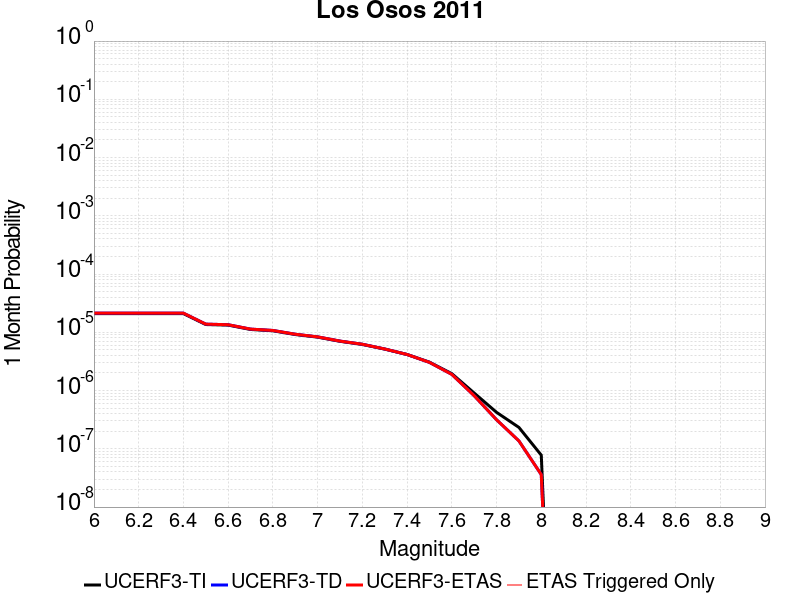 |  |  |

| Magnitude | 1 wk TI Prob | 1 wk TD Prob | 1 wk ETAS Prob | 1 wk ETAS/TD Gain | 1 wk ETAS Triggered Only | 1 mo TI Prob | 1 mo TD Prob | 1 mo ETAS Prob | 1 mo ETAS/TD Gain | 1 mo ETAS Triggered Only | 1 yr TI Prob | 1 yr TD Prob | 1 yr ETAS Prob | 1 yr ETAS/TD Gain | 1 yr ETAS Triggered Only | 10 yr TI Prob | 10 yr TD Prob | 10 yr ETAS Prob | 10 yr ETAS/TD Gain | 10 yr ETAS Triggered Only |
|-----|-----|-----|-----|-----|-----|-----|-----|-----|-----|-----|-----|-----|-----|-----|-----|-----|-----|-----|-----|-----|
| 6.0 | 4.8871775E-6 | 4.9815235E-6 | 4.9815235E-6 | 1.0 | 0.0 | 2.0944879E-5 | 2.1349228E-5 | 2.1349228E-5 | 1.0 | 0.0 | 2.5497406E-4 | 2.5989863E-4 | 2.5989863E-4 | 1.0 | 0.0 | 0.002546817 | 0.0025962214 | 0.0026161694 | 1.0076835 | 2.0E-5 |
| 6.1 | 4.8871775E-6 | 4.9815235E-6 | 4.9815235E-6 | 1.0 | 0.0 | 2.0944879E-5 | 2.1349228E-5 | 2.1349228E-5 | 1.0 | 0.0 | 2.5497406E-4 | 2.5989863E-4 | 2.5989863E-4 | 1.0 | 0.0 | 0.002546817 | 0.0025962214 | 0.0026161694 | 1.0076835 | 2.0E-5 |
| 6.2 | 4.8871775E-6 | 4.9815235E-6 | 4.9815235E-6 | 1.0 | 0.0 | 2.0944879E-5 | 2.1349228E-5 | 2.1349228E-5 | 1.0 | 0.0 | 2.5497406E-4 | 2.5989863E-4 | 2.5989863E-4 | 1.0 | 0.0 | 0.002546817 | 0.0025962214 | 0.0026161694 | 1.0076835 | 2.0E-5 |
| 6.3 | 4.8871775E-6 | 4.9815235E-6 | 4.9815235E-6 | 1.0 | 0.0 | 2.0944879E-5 | 2.1349228E-5 | 2.1349228E-5 | 1.0 | 0.0 | 2.5497406E-4 | 2.5989863E-4 | 2.5989863E-4 | 1.0 | 0.0 | 0.002546817 | 0.0025962214 | 0.0026161694 | 1.0076835 | 2.0E-5 |
| 6.4 | 4.8871775E-6 | 4.9815235E-6 | 4.9815235E-6 | 1.0 | 0.0 | 2.0944879E-5 | 2.1349228E-5 | 2.1349228E-5 | 1.0 | 0.0 | 2.5497406E-4 | 2.5989863E-4 | 2.5989863E-4 | 1.0 | 0.0 | 0.002546817 | 0.0025962214 | 0.0026161694 | 1.0076835 | 2.0E-5 |
| 6.5 | 3.1724062E-6 | 3.2234234E-6 | 3.2234234E-6 | 1.0 | 0.0 | 1.3595956E-5 | 1.38146E-5 | 1.38146E-5 | 1.0 | 0.0 | 1.6551818E-4 | 1.681799E-4 | 1.681799E-4 | 1.0 | 0.0 | 0.0016539496 | 0.0016805397 | 0.0016905229 | 1.0059404 | 1.0E-5 |
| 6.6 | 3.1022591E-6 | 3.1511324E-6 | 3.1511324E-6 | 1.0 | 0.0 | 1.3295328E-5 | 1.3504784E-5 | 1.3504784E-5 | 1.0 | 0.0 | 1.618586E-4 | 1.6440846E-4 | 1.6440846E-4 | 1.0 | 0.0 | 0.0016174077 | 0.0016428811 | 0.0016528647 | 1.0060768 | 1.0E-5 |
| 6.7 | 2.611518E-6 | 2.6492082E-6 | 2.6492082E-6 | 1.0 | 0.0 | 1.1192172E-5 | 1.13537E-5 | 1.13537E-5 | 1.0 | 0.0 | 1.3625617E-4 | 1.3822257E-4 | 1.3822257E-4 | 1.0 | 0.0 | 0.0013617266 | 0.0013813705 | 0.0013913567 | 1.0072292 | 1.0E-5 |
| 6.8 | 2.4780884E-6 | 2.5121833E-6 | 2.5121833E-6 | 1.0 | 0.0 | 1.0620336E-5 | 1.07664555E-5 | 1.07664555E-5 | 1.0 | 0.0 | 1.2929492E-4 | 1.3107374E-4 | 1.3107374E-4 | 1.0 | 0.0 | 0.0012921972 | 0.0013099684 | 0.0013199553 | 1.0076238 | 1.0E-5 |
| 6.9 | 2.1376322E-6 | 2.1635274E-6 | 2.1635274E-6 | 1.0 | 0.0 | 9.161248E-6 | 9.272227E-6 | 9.272227E-6 | 1.0 | 0.0 | 1.1153249E-4 | 1.12883536E-4 | 1.12883536E-4 | 1.0 | 0.0 | 0.0011147653 | 0.0011282638 | 0.0011382526 | 1.0088532 | 1.0E-5 |
| 7.0 | 1.9282882E-6 | 1.949479E-6 | 1.949479E-6 | 1.0 | 0.0 | 8.264066E-6 | 8.354883E-6 | 8.354883E-6 | 1.0 | 0.0 | 1.0061036E-4 | 1.0171597E-4 | 1.0171597E-4 | 1.0 | 0.0 | 0.0010056482 | 0.0010166955 | 0.0010266853 | 1.0098258 | 1.0E-5 |
| 7.1 | 1.6353226E-6 | 1.6501305E-6 | 1.6501305E-6 | 1.0 | 0.0 | 7.0085066E-6 | 7.0719684E-6 | 7.0719684E-6 | 1.0 | 0.0 | 8.532523E-5 | 8.6097825E-5 | 8.6097825E-5 | 1.0 | 0.0 | 8.529247E-4 | 8.6064544E-4 | 8.7063684E-4 | 1.0116092 | 1.0E-5 |
| 7.2 | 1.4446276E-6 | 1.4553517E-6 | 1.4553517E-6 | 1.0 | 0.0 | 6.191247E-6 | 6.2372064E-6 | 6.2372064E-6 | 1.0 | 0.0 | 7.537582E-5 | 7.593535E-5 | 7.593535E-5 | 1.0 | 0.0 | 7.535026E-4 | 7.590946E-4 | 7.69087E-4 | 1.0131636 | 1.0E-5 |
| 7.3 | 1.2014582E-6 | 1.2069235E-6 | 1.2069235E-6 | 1.0 | 0.0 | 5.149096E-6 | 5.1725187E-6 | 5.1725187E-6 | 1.0 | 0.0 | 6.268844E-5 | 6.2973595E-5 | 6.2973595E-5 | 1.0 | 0.0 | 6.267076E-4 | 6.2955794E-4 | 6.2955794E-4 | 1.0 | 0.0 |
| 7.4 | 9.707733E-7 | 9.70992E-7 | 9.70992E-7 | 1.0 | 0.0 | 4.16045E-6 | 4.1613876E-6 | 4.1613876E-6 | 1.0 | 0.0 | 5.0652303E-5 | 5.066372E-5 | 5.066372E-5 | 1.0 | 0.0 | 5.064076E-4 | 5.0652196E-4 | 5.0652196E-4 | 1.0 | 0.0 |
| 7.5 | 7.174908E-7 | 7.115044E-7 | 7.115044E-7 | 1.0 | 0.0 | 3.074957E-6 | 3.0493009E-6 | 3.0493009E-6 | 1.0 | 0.0 | 3.743696E-5 | 3.712461E-5 | 3.712461E-5 | 1.0 | 0.0 | 3.7430652E-4 | 3.7118423E-4 | 3.7118423E-4 | 1.0 | 0.0 |
| 7.6 | 4.5535776E-7 | 4.4209025E-7 | 4.4209025E-7 | 1.0 | 0.0 | 1.9515319E-6 | 1.8946711E-6 | 1.8946711E-6 | 1.0 | 0.0 | 2.3759641E-5 | 2.3067378E-5 | 2.3067378E-5 | 1.0 | 0.0 | 2.37571E-4 | 2.3064992E-4 | 2.3064992E-4 | 1.0 | 0.0 |
| 7.7 | 2.1173553E-7 | 1.9061686E-7 | 1.9061686E-7 | 1.0 | 0.0 | 9.0743765E-7 | 8.169291E-7 | 8.169291E-7 | 1.0 | 0.0 | 1.1047998E-5 | 9.946067E-6 | 9.946067E-6 | 1.0 | 0.0 | 1.1047449E-4 | 9.945624E-5 | 9.945624E-5 | 1.0 | 0.0 |
| 7.8 | 9.873608E-8 | 7.368291E-8 | 7.368291E-8 | 1.0 | 0.0 | 4.2315455E-7 | 3.1578386E-7 | 3.1578386E-7 | 1.0 | 0.0 | 5.1518946E-6 | 3.844662E-6 | 3.844662E-6 | 1.0 | 0.0 | 5.1517753E-5 | 3.844596E-5 | 3.844596E-5 | 1.0 | 0.0 |
| 7.9 | 5.4399106E-8 | 3.1886728E-8 | 3.1886728E-8 | 1.0 | 0.0 | 2.33139E-7 | 1.366574E-7 | 1.366574E-7 | 1.0 | 0.0 | 2.8384638E-6 | 1.6638025E-6 | 1.6638025E-6 | 1.0 | 0.0 | 2.8384275E-5 | 1.6637903E-5 | 1.6637903E-5 | 1.0 | 0.0 |
| 8.0 | 1.817203E-8 | 8.423176E-9 | 8.423176E-9 | 1.0 | 0.0 | 7.7880124E-8 | 3.609933E-8 | 3.609933E-8 | 1.0 | 0.0 | 9.481901E-7 | 4.3950925E-7 | 4.3950925E-7 | 1.0 | 0.0 | 9.481861E-6 | 4.395084E-6 | 4.395084E-6 | 1.0 | 0.0 |

## San Andreas (Santa Cruz Mts) 2011 CFM
*[(top)](#table-of-contents)*

| 1 Week | 1 Month | 1 Year | 10 Year |
|-----|-----|-----|-----|
|  |  |  | 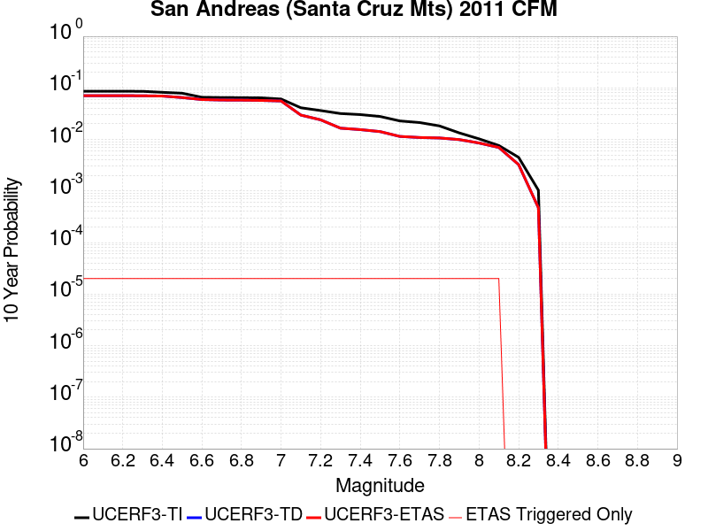 |

| Magnitude | 1 wk TI Prob | 1 wk TD Prob | 1 wk ETAS Prob | 1 wk ETAS/TD Gain | 1 wk ETAS Triggered Only | 1 mo TI Prob | 1 mo TD Prob | 1 mo ETAS Prob | 1 mo ETAS/TD Gain | 1 mo ETAS Triggered Only | 1 yr TI Prob | 1 yr TD Prob | 1 yr ETAS Prob | 1 yr ETAS/TD Gain | 1 yr ETAS Triggered Only | 10 yr TI Prob | 10 yr TD Prob | 10 yr ETAS Prob | 10 yr ETAS/TD Gain | 10 yr ETAS Triggered Only |
|-----|-----|-----|-----|-----|-----|-----|-----|-----|-----|-----|-----|-----|-----|-----|-----|-----|-----|-----|-----|-----|
| 6.0 | 1.7221631E-4 | 1.3811888E-4 | 1.3811888E-4 | 1.0 | 0.0 | 7.378611E-4 | 5.918058E-4 | 5.918058E-4 | 1.0 | 0.0 | 0.008946515 | 0.0071818614 | 0.0071818614 | 1.0 | 0.0 | 0.08594794 | 0.070630975 | 0.070649564 | 1.0002632 | 2.0E-5 |
| 6.1 | 1.7221631E-4 | 1.3811888E-4 | 1.3811888E-4 | 1.0 | 0.0 | 7.378611E-4 | 5.918058E-4 | 5.918058E-4 | 1.0 | 0.0 | 0.008946515 | 0.0071818614 | 0.0071818614 | 1.0 | 0.0 | 0.08594794 | 0.070630975 | 0.070649564 | 1.0002632 | 2.0E-5 |
| 6.2 | 1.7221631E-4 | 1.3811888E-4 | 1.3811888E-4 | 1.0 | 0.0 | 7.378611E-4 | 5.918058E-4 | 5.918058E-4 | 1.0 | 0.0 | 0.008946515 | 0.0071818614 | 0.0071818614 | 1.0 | 0.0 | 0.08594794 | 0.070630975 | 0.070649564 | 1.0002632 | 2.0E-5 |
| 6.3 | 1.716926E-4 | 1.3731285E-4 | 1.3731285E-4 | 1.0 | 0.0 | 7.3561794E-4 | 5.8835297E-4 | 5.8835297E-4 | 1.0 | 0.0 | 0.008919428 | 0.0071400986 | 0.0071400986 | 1.0 | 0.0 | 0.08569809 | 0.07024274 | 0.07026134 | 1.0002648 | 2.0E-5 |
| 6.4 | 1.6392978E-4 | 1.3606864E-4 | 1.3606864E-4 | 1.0 | 0.0 | 7.02367E-4 | 5.83023E-4 | 5.83023E-4 | 1.0 | 0.0 | 0.008517839 | 0.0070756287 | 0.0070756287 | 1.0 | 0.0 | 0.08198654 | 0.069474526 | 0.06949314 | 1.0002679 | 2.0E-5 |
| 6.5 | 1.5742714E-4 | 1.2666041E-4 | 1.2666041E-4 | 1.0 | 0.0 | 6.745133E-4 | 5.4271915E-4 | 5.4271915E-4 | 1.0 | 0.0 | 0.00818132 | 0.0065879514 | 0.0065879514 | 1.0 | 0.0 | 0.078865945 | 0.064937785 | 0.064956486 | 1.000288 | 2.0E-5 |
| 6.6 | 1.3038084E-4 | 1.1604503E-4 | 1.1604503E-4 | 1.0 | 0.0 | 5.5865536E-4 | 4.972423E-4 | 4.972423E-4 | 1.0 | 0.0 | 0.006780438 | 0.006037403 | 0.006037403 | 1.0 | 0.0 | 0.0657725 | 0.059397828 | 0.05941664 | 1.0003167 | 2.0E-5 |
| 6.7 | 1.2867592E-4 | 1.1330872E-4 | 1.1330872E-4 | 1.0 | 0.0 | 5.5135164E-4 | 4.855197E-4 | 4.855197E-4 | 1.0 | 0.0 | 0.0066920654 | 0.0058954596 | 0.0058954596 | 1.0 | 0.0 | 0.06494093 | 0.05810838 | 0.058127217 | 1.0003241 | 2.0E-5 |
| 6.8 | 1.2801298E-4 | 1.12684116E-4 | 1.12684116E-4 | 1.0 | 0.0 | 5.485117E-4 | 4.8284384E-4 | 4.8284384E-4 | 1.0 | 0.0 | 0.0066577005 | 0.0058630174 | 0.0058630174 | 1.0 | 0.0 | 0.06461738 | 0.057822164 | 0.057841007 | 1.0003259 | 2.0E-5 |
| 6.9 | 1.269149E-4 | 1.111053E-4 | 1.111053E-4 | 1.0 | 0.0 | 5.4380763E-4 | 4.7607996E-4 | 4.7607996E-4 | 1.0 | 0.0 | 0.006600777 | 0.005781107 | 0.005781107 | 1.0 | 0.0 | 0.06408122 | 0.057093598 | 0.05711246 | 1.0003303 | 2.0E-5 |
| 7.0 | 1.2030331E-4 | 1.0840385E-4 | 1.0840385E-4 | 1.0 | 0.0 | 5.154837E-4 | 4.6450648E-4 | 4.6450648E-4 | 1.0 | 0.0 | 0.006257969 | 0.005640938 | 0.005640938 | 1.0 | 0.0 | 0.06084648 | 0.05576592 | 0.055784803 | 1.0003387 | 2.0E-5 |
| 7.1 | 8.049617E-5 | 5.4031512E-5 | 5.4031512E-5 | 1.0 | 0.0 | 3.4493793E-4 | 2.3154326E-4 | 2.3154326E-4 | 1.0 | 0.0 | 0.0041915346 | 0.00281543 | 0.00281543 | 1.0 | 0.0 | 0.041133516 | 0.029669765 | 0.029689172 | 1.0006541 | 2.0E-5 |
| 7.2 | 7.093979E-5 | 4.302758E-5 | 4.302758E-5 | 1.0 | 0.0 | 3.0399222E-4 | 1.8439101E-4 | 1.8439101E-4 | 1.0 | 0.0 | 0.0036948253 | 0.002242672 | 0.002242672 | 1.0 | 0.0 | 0.03633994 | 0.023985349 | 0.02400487 | 1.0008138 | 2.0E-5 |
| 7.3 | 6.193693E-5 | 2.8958435E-5 | 2.8958435E-5 | 1.0 | 0.0 | 2.6541698E-4 | 1.2410169E-4 | 1.2410169E-4 | 1.0 | 0.0 | 0.0032266637 | 0.0015098925 | 0.0015098925 | 1.0 | 0.0 | 0.031802133 | 0.016532648 | 0.016552318 | 1.0011897 | 2.0E-5 |
| 7.4 | 5.906492E-5 | 2.7081054E-5 | 2.7081054E-5 | 1.0 | 0.0 | 2.5311083E-4 | 1.160565E-4 | 1.160565E-4 | 1.0 | 0.0 | 0.0030772698 | 0.0014120735 | 0.0014120735 | 1.0 | 0.0 | 0.030350044 | 0.015501229 | 0.015520919 | 1.0012702 | 2.0E-5 |
| 7.5 | 5.424296E-5 | 2.472661E-5 | 2.472661E-5 | 1.0 | 0.0 | 2.324491E-4 | 1.05966894E-4 | 1.05966894E-4 | 1.0 | 0.0 | 0.002826395 | 0.0012893846 | 0.0012893846 | 1.0 | 0.0 | 0.027907165 | 0.014189136 | 0.014208852 | 1.0013895 | 2.0E-5 |
| 7.6 | 4.43084E-5 | 1.9935067E-5 | 1.9935067E-5 | 1.0 | 0.0 | 1.8987931E-4 | 8.543321E-5 | 8.543321E-5 | 1.0 | 0.0 | 0.0023093296 | 0.0010396532 | 0.0010396532 | 1.0 | 0.0 | 0.022854783 | 0.011429133 | 0.011448904 | 1.00173 | 2.0E-5 |
| 7.7 | 4.118098E-5 | 1.8965187E-5 | 1.8965187E-5 | 1.0 | 0.0 | 1.7647797E-4 | 8.127684E-5 | 8.127684E-5 | 1.0 | 0.0 | 0.002146502 | 9.890966E-4 | 9.890966E-4 | 1.0 | 0.0 | 0.021258866 | 0.010885856 | 0.010905638 | 1.0018172 | 2.0E-5 |
| 7.8 | 3.5408906E-5 | 1.8592307E-5 | 1.8592307E-5 | 1.0 | 0.0 | 1.5174363E-4 | 7.967889E-5 | 7.967889E-5 | 1.0 | 0.0 | 0.0018459131 | 9.6965896E-4 | 9.6965896E-4 | 1.0 | 0.0 | 0.018306552 | 0.010666904 | 0.010686691 | 1.001855 | 2.0E-5 |
| 7.9 | 2.5860836E-5 | 1.7341126E-5 | 1.7341126E-5 | 1.0 | 0.0 | 1.10827445E-4 | 7.4316995E-5 | 7.4316995E-5 | 1.0 | 0.0 | 0.001348489 | 9.0443407E-4 | 9.0443407E-4 | 1.0 | 0.0 | 0.013403354 | 0.009920912 | 0.009940714 | 1.0019959 | 2.0E-5 |
| 8.0 | 1.9777332E-5 | 1.4861258E-5 | 1.4861258E-5 | 1.0 | 0.0 | 8.4757245E-5 | 6.368955E-5 | 6.368955E-5 | 1.0 | 0.0 | 0.0010314309 | 7.751446E-4 | 7.751446E-4 | 1.0 | 0.0 | 0.010266567 | 0.008520549 | 0.008540379 | 1.0023273 | 2.0E-5 |
| 8.1 | 1.468494E-5 | 1.21250405E-5 | 1.21250405E-5 | 1.0 | 0.0 | 6.293394E-5 | 5.1963423E-5 | 5.1963423E-5 | 1.0 | 0.0 | 7.6595135E-4 | 6.3247123E-4 | 6.3247123E-4 | 1.0 | 0.0 | 0.0076331664 | 0.0069786855 | 0.006998546 | 1.0028459 | 2.0E-5 |
| 8.2 | 8.63836E-6 | 5.4778675E-6 | 5.4778675E-6 | 1.0 | 0.0 | 3.7021015E-5 | 2.3476363E-5 | 2.3476363E-5 | 1.0 | 0.0 | 4.5063766E-4 | 2.857873E-4 | 2.857873E-4 | 1.0 | 0.0 | 0.004497249 | 0.0032505526 | 0.0032505526 | 1.0 | 0.0 |
| 8.3 | 1.983087E-6 | 7.6730026E-7 | 7.6730026E-7 | 1.0 | 0.0 | 8.498917E-6 | 3.2884257E-6 | 3.2884257E-6 | 1.0 | 0.0 | 1.034694E-4 | 4.0035866E-5 | 4.0035866E-5 | 1.0 | 0.0 | 0.0010342124 | 4.7277327E-4 | 4.7277327E-4 | 1.0 | 0.0 |

## Compton
*[(top)](#table-of-contents)*

| 1 Week | 1 Month | 1 Year | 10 Year |
|-----|-----|-----|-----|
|  |  |  |  |

| Magnitude | 1 wk TI Prob | 1 wk TD Prob | 1 wk ETAS Prob | 1 wk ETAS/TD Gain | 1 wk ETAS Triggered Only | 1 mo TI Prob | 1 mo TD Prob | 1 mo ETAS Prob | 1 mo ETAS/TD Gain | 1 mo ETAS Triggered Only | 1 yr TI Prob | 1 yr TD Prob | 1 yr ETAS Prob | 1 yr ETAS/TD Gain | 1 yr ETAS Triggered Only | 10 yr TI Prob | 10 yr TD Prob | 10 yr ETAS Prob | 10 yr ETAS/TD Gain | 10 yr ETAS Triggered Only |
|-----|-----|-----|-----|-----|-----|-----|-----|-----|-----|-----|-----|-----|-----|-----|-----|-----|-----|-----|-----|-----|
| 6.0 | 1.06050875E-5 | 6.359032E-6 | 6.359032E-6 | 1.0 | 0.0 | 4.5449582E-5 | 2.7252725E-5 | 2.7252725E-5 | 1.0 | 0.0 | 5.5320817E-4 | 3.3175427E-4 | 3.517476E-4 | 1.0602655 | 2.0E-5 | 0.0055183303 | 0.0033128741 | 0.0033328077 | 1.0060171 | 2.0E-5 |
| 6.1 | 1.06050875E-5 | 6.359032E-6 | 6.359032E-6 | 1.0 | 0.0 | 4.5449582E-5 | 2.7252725E-5 | 2.7252725E-5 | 1.0 | 0.0 | 5.5320817E-4 | 3.3175427E-4 | 3.517476E-4 | 1.0602655 | 2.0E-5 | 0.0055183303 | 0.0033128741 | 0.0033328077 | 1.0060171 | 2.0E-5 |
| 6.2 | 1.06050875E-5 | 6.359032E-6 | 6.359032E-6 | 1.0 | 0.0 | 4.5449582E-5 | 2.7252725E-5 | 2.7252725E-5 | 1.0 | 0.0 | 5.5320817E-4 | 3.3175427E-4 | 3.517476E-4 | 1.0602655 | 2.0E-5 | 0.0055183303 | 0.0033128741 | 0.0033328077 | 1.0060171 | 2.0E-5 |
| 6.3 | 1.06050875E-5 | 6.359032E-6 | 6.359032E-6 | 1.0 | 0.0 | 4.5449582E-5 | 2.7252725E-5 | 2.7252725E-5 | 1.0 | 0.0 | 5.5320817E-4 | 3.3175427E-4 | 3.517476E-4 | 1.0602655 | 2.0E-5 | 0.0055183303 | 0.0033128741 | 0.0033328077 | 1.0060171 | 2.0E-5 |
| 6.4 | 1.06050875E-5 | 6.359032E-6 | 6.359032E-6 | 1.0 | 0.0 | 4.5449582E-5 | 2.7252725E-5 | 2.7252725E-5 | 1.0 | 0.0 | 5.5320817E-4 | 3.3175427E-4 | 3.517476E-4 | 1.0602655 | 2.0E-5 | 0.0055183303 | 0.0033128741 | 0.0033328077 | 1.0060171 | 2.0E-5 |
| 6.5 | 1.06050875E-5 | 6.359032E-6 | 6.359032E-6 | 1.0 | 0.0 | 4.5449582E-5 | 2.7252725E-5 | 2.7252725E-5 | 1.0 | 0.0 | 5.5320817E-4 | 3.3175427E-4 | 3.517476E-4 | 1.0602655 | 2.0E-5 | 0.0055183303 | 0.0033128741 | 0.0033328077 | 1.0060171 | 2.0E-5 |
| 6.6 | 1.06050875E-5 | 6.359032E-6 | 6.359032E-6 | 1.0 | 0.0 | 4.5449582E-5 | 2.7252725E-5 | 2.7252725E-5 | 1.0 | 0.0 | 5.5320817E-4 | 3.3175427E-4 | 3.517476E-4 | 1.0602655 | 2.0E-5 | 0.0055183303 | 0.0033128741 | 0.0033328077 | 1.0060171 | 2.0E-5 |
| 6.7 | 1.06050875E-5 | 6.359032E-6 | 6.359032E-6 | 1.0 | 0.0 | 4.5449582E-5 | 2.7252725E-5 | 2.7252725E-5 | 1.0 | 0.0 | 5.5320817E-4 | 3.3175427E-4 | 3.517476E-4 | 1.0602655 | 2.0E-5 | 0.0055183303 | 0.0033128741 | 0.0033328077 | 1.0060171 | 2.0E-5 |
| 6.8 | 1.06050875E-5 | 6.359032E-6 | 6.359032E-6 | 1.0 | 0.0 | 4.5449582E-5 | 2.7252725E-5 | 2.7252725E-5 | 1.0 | 0.0 | 5.5320817E-4 | 3.3175427E-4 | 3.517476E-4 | 1.0602655 | 2.0E-5 | 0.0055183303 | 0.0033128741 | 0.0033328077 | 1.0060171 | 2.0E-5 |
| 6.9 | 1.06050875E-5 | 6.359032E-6 | 6.359032E-6 | 1.0 | 0.0 | 4.5449582E-5 | 2.7252725E-5 | 2.7252725E-5 | 1.0 | 0.0 | 5.5320817E-4 | 3.3175427E-4 | 3.517476E-4 | 1.0602655 | 2.0E-5 | 0.0055183303 | 0.0033128741 | 0.0033328077 | 1.0060171 | 2.0E-5 |
| 7.0 | 7.672486E-6 | 4.272189E-6 | 4.272189E-6 | 1.0 | 0.0 | 3.288167E-5 | 1.8309258E-5 | 1.8309258E-5 | 1.0 | 0.0 | 4.0026082E-4 | 2.2289302E-4 | 2.328908E-4 | 1.0448545 | 1.0E-5 | 0.0039954064 | 0.002226757 | 0.0022367346 | 1.0044808 | 1.0E-5 |
| 7.1 | 7.163992E-6 | 3.8838866E-6 | 3.8838866E-6 | 1.0 | 0.0 | 3.0702464E-5 | 1.6645126E-5 | 1.6645126E-5 | 1.0 | 0.0 | 3.7373835E-4 | 2.0263613E-4 | 2.1263411E-4 | 1.0493395 | 1.0E-5 | 0.0037311043 | 0.0020245707 | 0.0020345503 | 1.0049293 | 1.0E-5 |
| 7.2 | 6.3689185E-6 | 3.3102053E-6 | 3.3102053E-6 | 1.0 | 0.0 | 2.729508E-5 | 1.4186519E-5 | 1.4186519E-5 | 1.0 | 0.0 | 3.322669E-4 | 1.727076E-4 | 1.8270589E-4 | 1.0578914 | 1.0E-5 | 0.0033177056 | 0.0017257757 | 0.0017357584 | 1.0057845 | 1.0E-5 |
| 7.3 | 4.4987873E-6 | 2.4480794E-6 | 2.4480794E-6 | 1.0 | 0.0 | 1.9280375E-5 | 1.0491728E-5 | 1.0491728E-5 | 1.0 | 0.0 | 2.3471327E-4 | 1.2772961E-4 | 1.2772961E-4 | 1.0 | 0.0 | 0.002344655 | 0.0012765921 | 0.0012765921 | 1.0 | 0.0 |
| 7.4 | 2.987296E-6 | 1.7394543E-6 | 1.7394543E-6 | 1.0 | 0.0 | 1.2802635E-5 | 7.4547834E-6 | 7.4547834E-6 | 1.0 | 0.0 | 1.5586092E-4 | 9.0758265E-5 | 9.0758265E-5 | 1.0 | 0.0 | 0.0015575165 | 9.072178E-4 | 9.072178E-4 | 1.0 | 0.0 |
| 7.5 | 2.4111696E-6 | 1.4472392E-6 | 1.4472392E-6 | 1.0 | 0.0 | 1.0333543E-5 | 6.2024396E-6 | 6.2024396E-6 | 1.0 | 0.0 | 1.2580362E-4 | 7.551213E-5 | 7.551213E-5 | 1.0 | 0.0 | 0.0012573242 | 7.548694E-4 | 7.548694E-4 | 1.0 | 0.0 |
| 7.6 | 1.8783096E-6 | 1.1360631E-6 | 1.1360631E-6 | 1.0 | 0.0 | 8.049874E-6 | 4.868833E-6 | 4.868833E-6 | 1.0 | 0.0 | 9.8002805E-5 | 5.927647E-5 | 5.927647E-5 | 1.0 | 0.0 | 9.795959E-4 | 5.9261057E-4 | 5.9261057E-4 | 1.0 | 0.0 |
| 7.7 | 6.6646817E-7 | 3.560304E-7 | 3.560304E-7 | 1.0 | 0.0 | 2.856289E-6 | 1.5258437E-6 | 1.5258437E-6 | 1.0 | 0.0 | 3.4774763E-5 | 1.8577002E-5 | 1.8577002E-5 | 1.0 | 0.0 | 3.4769322E-4 | 1.8575584E-4 | 1.8575584E-4 | 1.0 | 0.0 |
| 7.8 | 7.054689E-8 | 4.134359E-8 | 4.134359E-8 | 1.0 | 0.0 | 3.0234378E-7 | 1.7718679E-7 | 1.7718679E-7 | 1.0 | 0.0 | 3.6810293E-6 | 2.157247E-6 | 2.157247E-6 | 1.0 | 0.0 | 3.6809684E-5 | 2.1572272E-5 | 2.1572272E-5 | 1.0 | 0.0 |
| 7.9 | 7.420925E-9 | 4.0132635E-9 | 4.0132635E-9 | 1.0 | 0.0 | 3.1803964E-8 | 1.7199701E-8 | 1.7199701E-8 | 1.0 | 0.0 | 3.872132E-7 | 2.0940635E-7 | 2.0940635E-7 | 1.0 | 0.0 | 3.872125E-6 | 2.0940618E-6 | 2.0940618E-6 | 1.0 | 0.0 |

## Mono Lake 2011 CFM
*[(top)](#table-of-contents)*

| 1 Week | 1 Month | 1 Year | 10 Year |
|-----|-----|-----|-----|
|  |  |  |  |

| Magnitude | 1 wk TI Prob | 1 wk TD Prob | 1 wk ETAS Prob | 1 wk ETAS/TD Gain | 1 wk ETAS Triggered Only | 1 mo TI Prob | 1 mo TD Prob | 1 mo ETAS Prob | 1 mo ETAS/TD Gain | 1 mo ETAS Triggered Only | 1 yr TI Prob | 1 yr TD Prob | 1 yr ETAS Prob | 1 yr ETAS/TD Gain | 1 yr ETAS Triggered Only | 10 yr TI Prob | 10 yr TD Prob | 10 yr ETAS Prob | 10 yr ETAS/TD Gain | 10 yr ETAS Triggered Only |
|-----|-----|-----|-----|-----|-----|-----|-----|-----|-----|-----|-----|-----|-----|-----|-----|-----|-----|-----|-----|-----|
| 6.0 | 2.0341662E-5 | 2.3829274E-5 | 2.3829274E-5 | 1.0 | 0.0 | 8.717564E-5 | 1.0212446E-4 | 1.0212446E-4 | 1.0 | 0.0 | 0.0010608466 | 0.0012431872 | 0.0012431872 | 1.0 | 0.0 | 0.010557966 | 0.012414404 | 0.012434156 | 1.0015911 | 2.0E-5 |
| 6.1 | 2.0341662E-5 | 2.3829274E-5 | 2.3829274E-5 | 1.0 | 0.0 | 8.717564E-5 | 1.0212446E-4 | 1.0212446E-4 | 1.0 | 0.0 | 0.0010608466 | 0.0012431872 | 0.0012431872 | 1.0 | 0.0 | 0.010557966 | 0.012414404 | 0.012434156 | 1.0015911 | 2.0E-5 |
| 6.2 | 2.0341662E-5 | 2.3829274E-5 | 2.3829274E-5 | 1.0 | 0.0 | 8.717564E-5 | 1.0212446E-4 | 1.0212446E-4 | 1.0 | 0.0 | 0.0010608466 | 0.0012431872 | 0.0012431872 | 1.0 | 0.0 | 0.010557966 | 0.012414404 | 0.012434156 | 1.0015911 | 2.0E-5 |
| 6.3 | 2.0341662E-5 | 2.3829274E-5 | 2.3829274E-5 | 1.0 | 0.0 | 8.717564E-5 | 1.0212446E-4 | 1.0212446E-4 | 1.0 | 0.0 | 0.0010608466 | 0.0012431872 | 0.0012431872 | 1.0 | 0.0 | 0.010557966 | 0.012414404 | 0.012434156 | 1.0015911 | 2.0E-5 |
| 6.4 | 1.749821E-5 | 2.049194E-5 | 2.049194E-5 | 1.0 | 0.0 | 7.499018E-5 | 8.78226E-5 | 8.78226E-5 | 1.0 | 0.0 | 9.1262296E-4 | 0.0010692398 | 0.0010692398 | 1.0 | 0.0 | 0.009088841 | 0.010692355 | 0.010712141 | 1.0018505 | 2.0E-5 |
| 6.5 | 1.749821E-5 | 2.049194E-5 | 2.049194E-5 | 1.0 | 0.0 | 7.499018E-5 | 8.78226E-5 | 8.78226E-5 | 1.0 | 0.0 | 9.1262296E-4 | 0.0010692398 | 0.0010692398 | 1.0 | 0.0 | 0.009088841 | 0.010692355 | 0.010712141 | 1.0018505 | 2.0E-5 |

## Thirty Mile Bank
*[(top)](#table-of-contents)*

| 1 Week | 1 Month | 1 Year | 10 Year |
|-----|-----|-----|-----|
|  |  |  |  |

| Magnitude | 1 wk TI Prob | 1 wk TD Prob | 1 wk ETAS Prob | 1 wk ETAS/TD Gain | 1 wk ETAS Triggered Only | 1 mo TI Prob | 1 mo TD Prob | 1 mo ETAS Prob | 1 mo ETAS/TD Gain | 1 mo ETAS Triggered Only | 1 yr TI Prob | 1 yr TD Prob | 1 yr ETAS Prob | 1 yr ETAS/TD Gain | 1 yr ETAS Triggered Only | 10 yr TI Prob | 10 yr TD Prob | 10 yr ETAS Prob | 10 yr ETAS/TD Gain | 10 yr ETAS Triggered Only |
|-----|-----|-----|-----|-----|-----|-----|-----|-----|-----|-----|-----|-----|-----|-----|-----|-----|-----|-----|-----|-----|
| 6.0 | 6.5124755E-6 | 6.6593043E-6 | 1.6659238E-5 | 2.5016484 | 1.0E-5 | 2.791031E-5 | 2.8539587E-5 | 3.8539303E-5 | 1.3503805 | 1.0E-5 | 3.3975503E-4 | 3.4741845E-4 | 3.674115E-4 | 1.0575475 | 2.0E-5 | 0.0033923604 | 0.0034691847 | 0.0034891153 | 1.005745 | 2.0E-5 |
| 6.1 | 6.5124755E-6 | 6.6593043E-6 | 1.6659238E-5 | 2.5016484 | 1.0E-5 | 2.791031E-5 | 2.8539587E-5 | 3.8539303E-5 | 1.3503805 | 1.0E-5 | 3.3975503E-4 | 3.4741845E-4 | 3.674115E-4 | 1.0575475 | 2.0E-5 | 0.0033923604 | 0.0034691847 | 0.0034891153 | 1.005745 | 2.0E-5 |
| 6.2 | 6.5124755E-6 | 6.6593043E-6 | 1.6659238E-5 | 2.5016484 | 1.0E-5 | 2.791031E-5 | 2.8539587E-5 | 3.8539303E-5 | 1.3503805 | 1.0E-5 | 3.3975503E-4 | 3.4741845E-4 | 3.674115E-4 | 1.0575475 | 2.0E-5 | 0.0033923604 | 0.0034691847 | 0.0034891153 | 1.005745 | 2.0E-5 |
| 6.3 | 6.5124755E-6 | 6.6593043E-6 | 1.6659238E-5 | 2.5016484 | 1.0E-5 | 2.791031E-5 | 2.8539587E-5 | 3.8539303E-5 | 1.3503805 | 1.0E-5 | 3.3975503E-4 | 3.4741845E-4 | 3.674115E-4 | 1.0575475 | 2.0E-5 | 0.0033923604 | 0.0034691847 | 0.0034891153 | 1.005745 | 2.0E-5 |
| 6.4 | 6.5124755E-6 | 6.6593043E-6 | 1.6659238E-5 | 2.5016484 | 1.0E-5 | 2.791031E-5 | 2.8539587E-5 | 3.8539303E-5 | 1.3503805 | 1.0E-5 | 3.3975503E-4 | 3.4741845E-4 | 3.674115E-4 | 1.0575475 | 2.0E-5 | 0.0033923604 | 0.0034691847 | 0.0034891153 | 1.005745 | 2.0E-5 |
| 6.5 | 6.5124755E-6 | 6.6593043E-6 | 1.6659238E-5 | 2.5016484 | 1.0E-5 | 2.791031E-5 | 2.8539587E-5 | 3.8539303E-5 | 1.3503805 | 1.0E-5 | 3.3975503E-4 | 3.4741845E-4 | 3.674115E-4 | 1.0575475 | 2.0E-5 | 0.0033923604 | 0.0034691847 | 0.0034891153 | 1.005745 | 2.0E-5 |
| 6.6 | 6.5124755E-6 | 6.6593043E-6 | 1.6659238E-5 | 2.5016484 | 1.0E-5 | 2.791031E-5 | 2.8539587E-5 | 3.8539303E-5 | 1.3503805 | 1.0E-5 | 3.3975503E-4 | 3.4741845E-4 | 3.674115E-4 | 1.0575475 | 2.0E-5 | 0.0033923604 | 0.0034691847 | 0.0034891153 | 1.005745 | 2.0E-5 |
| 6.7 | 3.5261137E-6 | 3.6099225E-6 | 1.3609886E-5 | 3.7701325 | 1.0E-5 | 1.5111828E-5 | 1.5471009E-5 | 2.5470854E-5 | 1.6463603 | 1.0E-5 | 1.8397097E-4 | 1.883439E-4 | 2.0834013E-4 | 1.1061687 | 2.0E-5 | 0.0018381875 | 0.0018819077 | 0.00190187 | 1.0106075 | 2.0E-5 |
| 6.8 | 3.370743E-6 | 3.4509574E-6 | 1.3450923E-5 | 3.8977365 | 1.0E-5 | 1.4445961E-5 | 1.4789737E-5 | 2.478959E-5 | 1.6761346 | 1.0E-5 | 1.7586538E-4 | 1.8005079E-4 | 2.0004719E-4 | 1.1110598 | 2.0E-5 | 0.0017572626 | 0.001799111 | 0.001819075 | 1.0110966 | 2.0E-5 |
| 6.9 | 2.2756835E-6 | 2.3331768E-6 | 1.2333154E-5 | 5.2859917 | 1.0E-5 | 9.752893E-6 | 9.999292E-6 | 1.9999192E-5 | 2.0000608 | 1.0E-5 | 1.18735006E-4 | 1.21734825E-4 | 1.3173361E-4 | 1.0821358 | 1.0E-5 | 0.0011867158 | 0.001216706 | 0.0012266939 | 1.0082089 | 1.0E-5 |
| 7.0 | 2.1617404E-6 | 2.2159948E-6 | 1.2215973E-5 | 5.512636 | 1.0E-5 | 9.264569E-6 | 9.497087E-6 | 1.9496993E-5 | 2.0529444 | 1.0E-5 | 1.1279029E-4 | 1.15621144E-4 | 1.2561999E-4 | 1.0864794 | 1.0E-5 | 0.0011273306 | 0.001155634 | 0.0011656224 | 1.0086433 | 1.0E-5 |
| 7.1 | 1.5900777E-6 | 1.6327131E-6 | 1.1632696E-5 | 7.124765 | 1.0E-5 | 6.814601E-6 | 6.9973235E-6 | 1.6997254E-5 | 2.429108 | 1.0E-5 | 8.296461E-5 | 8.518921E-5 | 9.518836E-5 | 1.1173757 | 1.0E-5 | 8.293364E-4 | 8.515783E-4 | 8.6156983E-4 | 1.0117329 | 1.0E-5 |
| 7.2 | 1.2971728E-6 | 1.3329089E-6 | 1.1332895E-5 | 8.502378 | 1.0E-5 | 5.5593005E-6 | 5.712455E-6 | 1.5712398E-5 | 2.750551 | 1.0E-5 | 6.768238E-5 | 6.954702E-5 | 7.954633E-5 | 1.1437776 | 1.0E-5 | 6.7661767E-4 | 6.952629E-4 | 7.0525595E-4 | 1.0143731 | 1.0E-5 |
| 7.3 | 8.2454284E-7 | 8.4489466E-7 | 8.4489466E-7 | 1.0 | 0.0 | 3.5337503E-6 | 3.6209724E-6 | 3.6209724E-6 | 1.0 | 0.0 | 4.302256E-5 | 4.4084507E-5 | 4.4084507E-5 | 1.0 | 0.0 | 4.301423E-4 | 4.407637E-4 | 4.407637E-4 | 1.0 | 0.0 |
| 7.4 | 4.2619024E-7 | 4.3863807E-7 | 4.3863807E-7 | 1.0 | 0.0 | 1.8265283E-6 | 1.8798761E-6 | 1.8798761E-6 | 1.0 | 0.0 | 2.2237757E-5 | 2.2887256E-5 | 2.2887256E-5 | 1.0 | 0.0 | 2.223553E-4 | 2.2884937E-4 | 2.2884937E-4 | 1.0 | 0.0 |
| 7.5 | 2.993922E-7 | 3.0864783E-7 | 3.0864783E-7 | 1.0 | 0.0 | 1.2831089E-6 | 1.3227758E-6 | 1.3227758E-6 | 1.0 | 0.0 | 1.5621737E-5 | 1.610468E-5 | 1.610468E-5 | 1.0 | 0.0 | 1.562064E-4 | 1.6103536E-4 | 1.6103536E-4 | 1.0 | 0.0 |
| 7.6 | 1.6988751E-7 | 1.7533972E-7 | 1.7533972E-7 | 1.0 | 0.0 | 7.2808916E-7 | 7.514558E-7 | 7.514558E-7 | 1.0 | 0.0 | 8.864449E-6 | 9.148937E-6 | 9.148937E-6 | 1.0 | 0.0 | 8.8640954E-5 | 9.14858E-5 | 9.14858E-5 | 1.0 | 0.0 |

## San Luis Range 2011 CFM
*[(top)](#table-of-contents)*

| 1 Week | 1 Month | 1 Year | 10 Year |
|-----|-----|-----|-----|
|  |  |  |  |

| Magnitude | 1 wk TI Prob | 1 wk TD Prob | 1 wk ETAS Prob | 1 wk ETAS/TD Gain | 1 wk ETAS Triggered Only | 1 mo TI Prob | 1 mo TD Prob | 1 mo ETAS Prob | 1 mo ETAS/TD Gain | 1 mo ETAS Triggered Only | 1 yr TI Prob | 1 yr TD Prob | 1 yr ETAS Prob | 1 yr ETAS/TD Gain | 1 yr ETAS Triggered Only | 10 yr TI Prob | 10 yr TD Prob | 10 yr ETAS Prob | 10 yr ETAS/TD Gain | 10 yr ETAS Triggered Only |
|-----|-----|-----|-----|-----|-----|-----|-----|-----|-----|-----|-----|-----|-----|-----|-----|-----|-----|-----|-----|-----|
| 6.0 | 8.8368415E-6 | 8.965502E-6 | 8.965502E-6 | 1.0 | 0.0 | 3.787163E-5 | 3.842306E-5 | 3.842306E-5 | 1.0 | 0.0 | 4.609895E-4 | 4.677082E-4 | 4.677082E-4 | 1.0 | 0.0 | 0.0046003438 | 0.004668021 | 0.0046879277 | 1.0042645 | 2.0E-5 |
| 6.1 | 8.8368415E-6 | 8.965502E-6 | 8.965502E-6 | 1.0 | 0.0 | 3.787163E-5 | 3.842306E-5 | 3.842306E-5 | 1.0 | 0.0 | 4.609895E-4 | 4.677082E-4 | 4.677082E-4 | 1.0 | 0.0 | 0.0046003438 | 0.004668021 | 0.0046879277 | 1.0042645 | 2.0E-5 |
| 6.2 | 8.8368415E-6 | 8.965502E-6 | 8.965502E-6 | 1.0 | 0.0 | 3.787163E-5 | 3.842306E-5 | 3.842306E-5 | 1.0 | 0.0 | 4.609895E-4 | 4.677082E-4 | 4.677082E-4 | 1.0 | 0.0 | 0.0046003438 | 0.004668021 | 0.0046879277 | 1.0042645 | 2.0E-5 |
| 6.3 | 8.8368415E-6 | 8.965502E-6 | 8.965502E-6 | 1.0 | 0.0 | 3.787163E-5 | 3.842306E-5 | 3.842306E-5 | 1.0 | 0.0 | 4.609895E-4 | 4.677082E-4 | 4.677082E-4 | 1.0 | 0.0 | 0.0046003438 | 0.004668021 | 0.0046879277 | 1.0042645 | 2.0E-5 |
| 6.4 | 3.9094193E-6 | 3.941225E-6 | 3.941225E-6 | 1.0 | 0.0 | 1.6754546E-5 | 1.6890855E-5 | 1.6890855E-5 | 1.0 | 0.0 | 2.039675E-4 | 2.0562703E-4 | 2.0562703E-4 | 1.0 | 0.0 | 0.0020378039 | 0.0020543966 | 0.002064376 | 1.0048577 | 1.0E-5 |
| 6.5 | 3.9094193E-6 | 3.941225E-6 | 3.941225E-6 | 1.0 | 0.0 | 1.6754546E-5 | 1.6890855E-5 | 1.6890855E-5 | 1.0 | 0.0 | 2.039675E-4 | 2.0562703E-4 | 2.0562703E-4 | 1.0 | 0.0 | 0.0020378039 | 0.0020543966 | 0.002064376 | 1.0048577 | 1.0E-5 |
| 6.6 | 3.0587726E-6 | 3.075406E-6 | 3.075406E-6 | 1.0 | 0.0 | 1.3108959E-5 | 1.3180246E-5 | 1.3180246E-5 | 1.0 | 0.0 | 1.595899E-4 | 1.604578E-4 | 1.604578E-4 | 1.0 | 0.0 | 0.0015947534 | 0.0016034314 | 0.0016134153 | 1.0062267 | 1.0E-5 |
| 6.7 | 2.6160574E-6 | 2.6251432E-6 | 2.6251432E-6 | 1.0 | 0.0 | 1.1211626E-5 | 1.1250565E-5 | 1.1250565E-5 | 1.0 | 0.0 | 1.3649299E-4 | 1.3696708E-4 | 1.3696708E-4 | 1.0 | 0.0 | 0.0013640919 | 0.0013688328 | 0.0013788191 | 1.0072955 | 1.0E-5 |
| 6.8 | 2.5110312E-6 | 2.5181555E-6 | 2.5181555E-6 | 1.0 | 0.0 | 1.0761518E-5 | 1.07920505E-5 | 1.07920505E-5 | 1.0 | 0.0 | 1.310136E-4 | 1.3138534E-4 | 1.3138534E-4 | 1.0 | 0.0 | 0.0013093639 | 0.0013130826 | 0.0013230694 | 1.0076057 | 1.0E-5 |
| 6.9 | 1.8564405E-6 | 1.8524993E-6 | 1.8524993E-6 | 1.0 | 0.0 | 7.95615E-6 | 7.9392585E-6 | 7.9392585E-6 | 1.0 | 0.0 | 9.686181E-5 | 9.665621E-5 | 9.665621E-5 | 1.0 | 0.0 | 9.68196E-4 | 9.661437E-4 | 9.7613403E-4 | 1.0103405 | 1.0E-5 |
| 7.0 | 1.546127E-6 | 1.5369646E-6 | 1.5369646E-6 | 1.0 | 0.0 | 6.626242E-6 | 6.586975E-6 | 6.586975E-6 | 1.0 | 0.0 | 8.06715E-5 | 8.019347E-5 | 8.019347E-5 | 1.0 | 0.0 | 8.0642226E-4 | 8.0164603E-4 | 8.11638E-4 | 1.0124643 | 1.0E-5 |
| 7.1 | 1.3368208E-6 | 1.3235424E-6 | 1.3235424E-6 | 1.0 | 0.0 | 5.7292195E-6 | 5.672312E-6 | 5.672312E-6 | 1.0 | 0.0 | 6.975101E-5 | 6.905822E-5 | 6.905822E-5 | 1.0 | 0.0 | 6.972912E-4 | 6.9036806E-4 | 7.0036115E-4 | 1.014475 | 1.0E-5 |
| 7.2 | 1.0623363E-6 | 1.0454451E-6 | 1.0454451E-6 | 1.0 | 0.0 | 4.5528623E-6 | 4.480471E-6 | 4.480471E-6 | 1.0 | 0.0 | 5.5429686E-5 | 5.454837E-5 | 5.454837E-5 | 1.0 | 0.0 | 5.5415864E-4 | 5.453501E-4 | 5.553446E-4 | 1.0183269 | 1.0E-5 |
| 7.3 | 7.831679E-7 | 7.7274586E-7 | 7.7274586E-7 | 1.0 | 0.0 | 3.3564295E-6 | 3.3117637E-6 | 3.3117637E-6 | 1.0 | 0.0 | 4.086376E-5 | 4.0319977E-5 | 4.0319977E-5 | 1.0 | 0.0 | 4.0856248E-4 | 4.0312676E-4 | 4.0312676E-4 | 1.0 | 0.0 |
| 7.4 | 5.9558846E-7 | 5.9106947E-7 | 5.9106947E-7 | 1.0 | 0.0 | 2.5525194E-6 | 2.5331524E-6 | 2.5331524E-6 | 1.0 | 0.0 | 3.107648E-5 | 3.0840696E-5 | 3.0840696E-5 | 1.0 | 0.0 | 3.1072134E-4 | 3.0836425E-4 | 3.0836425E-4 | 1.0 | 0.0 |
| 7.5 | 4.1616502E-7 | 4.1196807E-7 | 4.1196807E-7 | 1.0 | 0.0 | 1.7835631E-6 | 1.7655763E-6 | 1.7655763E-6 | 1.0 | 0.0 | 2.1714664E-5 | 2.149568E-5 | 2.149568E-5 | 1.0 | 0.0 | 2.1712543E-4 | 2.1493605E-4 | 2.1493605E-4 | 1.0 | 0.0 |
| 7.6 | 2.3816014E-7 | 2.3376924E-7 | 2.3376924E-7 | 1.0 | 0.0 | 1.0206859E-6 | 1.0018678E-6 | 1.0018678E-6 | 1.0 | 0.0 | 1.242678E-5 | 1.2197672E-5 | 1.2197672E-5 | 1.0 | 0.0 | 1.2426086E-4 | 1.2197004E-4 | 1.2197004E-4 | 1.0 | 0.0 |
| 7.7 | 9.918777E-8 | 9.3870455E-8 | 9.3870455E-8 | 1.0 | 0.0 | 4.2509038E-7 | 4.0230188E-7 | 4.0230188E-7 | 1.0 | 0.0 | 5.1754632E-6 | 4.898014E-6 | 4.898014E-6 | 1.0 | 0.0 | 5.1753424E-5 | 4.8979065E-5 | 4.8979065E-5 | 1.0 | 0.0 |
| 7.8 | 3.4982556E-8 | 2.9688684E-8 | 2.9688684E-8 | 1.0 | 0.0 | 1.4992524E-7 | 1.2723721E-7 | 1.2723721E-7 | 1.0 | 0.0 | 1.8253382E-6 | 1.5491119E-6 | 1.5491119E-6 | 1.0 | 0.0 | 1.8253233E-5 | 1.5491012E-5 | 1.5491012E-5 | 1.0 | 0.0 |
| 7.9 | 1.6624908E-8 | 1.1478806E-8 | 1.1478806E-8 | 1.0 | 0.0 | 7.12496E-8 | 4.919488E-8 | 4.919488E-8 | 1.0 | 0.0 | 8.6746354E-7 | 5.989475E-7 | 5.989475E-7 | 1.0 | 0.0 | 8.674601E-6 | 5.989459E-6 | 5.989459E-6 | 1.0 | 0.0 |
| 8.0 | 6.3352315E-9 | 3.089716E-9 | 3.089716E-9 | 1.0 | 0.0 | 2.715099E-8 | 1.3241638E-8 | 1.3241638E-8 | 1.0 | 0.0 | 3.3056327E-7 | 1.6121693E-7 | 1.6121693E-7 | 1.0 | 0.0 | 3.3056278E-6 | 1.6121681E-6 | 1.6121681E-6 | 1.0 | 0.0 |

## San Andreas (North Coast) 2011 CFM
*[(top)](#table-of-contents)*

| 1 Week | 1 Month | 1 Year | 10 Year |
|-----|-----|-----|-----|
|  |  |  |  |

| Magnitude | 1 wk TI Prob | 1 wk TD Prob | 1 wk ETAS Prob | 1 wk ETAS/TD Gain | 1 wk ETAS Triggered Only | 1 mo TI Prob | 1 mo TD Prob | 1 mo ETAS Prob | 1 mo ETAS/TD Gain | 1 mo ETAS Triggered Only | 1 yr TI Prob | 1 yr TD Prob | 1 yr ETAS Prob | 1 yr ETAS/TD Gain | 1 yr ETAS Triggered Only | 10 yr TI Prob | 10 yr TD Prob | 10 yr ETAS Prob | 10 yr ETAS/TD Gain | 10 yr ETAS Triggered Only |
|-----|-----|-----|-----|-----|-----|-----|-----|-----|-----|-----|-----|-----|-----|-----|-----|-----|-----|-----|-----|-----|
| 6.0 | 1.5333705E-4 | 7.116801E-5 | 7.116801E-5 | 1.0 | 0.0 | 6.5699324E-4 | 3.0497028E-4 | 3.1496724E-4 | 1.03278 | 1.0E-5 | 0.007969595 | 0.0037067258 | 0.0037166886 | 1.0026878 | 1.0E-5 | 0.0768977 | 0.039393943 | 0.039413154 | 1.0004877 | 2.0E-5 |
| 6.1 | 1.5333705E-4 | 7.116801E-5 | 7.116801E-5 | 1.0 | 0.0 | 6.5699324E-4 | 3.0497028E-4 | 3.1496724E-4 | 1.03278 | 1.0E-5 | 0.007969595 | 0.0037067258 | 0.0037166886 | 1.0026878 | 1.0E-5 | 0.0768977 | 0.039393943 | 0.039413154 | 1.0004877 | 2.0E-5 |
| 6.2 | 1.3912938E-4 | 6.0560316E-5 | 6.0560316E-5 | 1.0 | 0.0 | 5.961325E-4 | 2.5951854E-4 | 2.6951593E-4 | 1.0385228 | 1.0E-5 | 0.007233787 | 0.0031550874 | 0.0031650558 | 1.0031595 | 1.0E-5 | 0.07002798 | 0.03371224 | 0.03373157 | 1.0005733 | 2.0E-5 |
| 6.3 | 1.3912938E-4 | 6.0560316E-5 | 6.0560316E-5 | 1.0 | 0.0 | 5.961325E-4 | 2.5951854E-4 | 2.6951593E-4 | 1.0385228 | 1.0E-5 | 0.007233787 | 0.0031550874 | 0.0031650558 | 1.0031595 | 1.0E-5 | 0.07002798 | 0.03371224 | 0.03373157 | 1.0005733 | 2.0E-5 |
| 6.4 | 1.2623647E-4 | 5.0491573E-5 | 5.0491573E-5 | 1.0 | 0.0 | 5.4090127E-4 | 2.1637461E-4 | 2.2637245E-4 | 1.0462061 | 1.0E-5 | 0.0065656058 | 0.0026311984 | 0.0026411721 | 1.0037905 | 1.0E-5 | 0.06374981 | 0.028329344 | 0.028348777 | 1.0006859 | 2.0E-5 |
| 6.5 | 1.1736096E-4 | 4.3567426E-5 | 4.3567426E-5 | 1.0 | 0.0 | 5.028786E-4 | 1.8670427E-4 | 1.967024E-4 | 1.0535506 | 1.0E-5 | 0.006105373 | 0.002270771 | 0.0022807484 | 1.0043938 | 1.0E-5 | 0.05940335 | 0.02459873 | 0.024618238 | 1.0007931 | 2.0E-5 |
| 6.6 | 1.1586959E-4 | 4.246607E-5 | 4.246607E-5 | 1.0 | 0.0 | 4.964894E-4 | 1.8198483E-4 | 1.9198301E-4 | 1.0549396 | 1.0E-5 | 0.006028018 | 0.00221343 | 0.0022234078 | 1.0045079 | 1.0E-5 | 0.058671024 | 0.024004398 | 0.024023918 | 1.0008131 | 2.0E-5 |
| 6.7 | 1.13693764E-4 | 4.0777E-5 | 4.0777E-5 | 1.0 | 0.0 | 4.87168E-4 | 1.7474694E-4 | 1.847452E-4 | 1.0572156 | 1.0E-5 | 0.005915152 | 0.002125484 | 0.0021354628 | 1.0046948 | 1.0E-5 | 0.057601593 | 0.02309458 | 0.023114117 | 1.000846 | 2.0E-5 |
| 6.8 | 1.1204889E-4 | 3.9993593E-5 | 3.9993593E-5 | 1.0 | 0.0 | 4.8012115E-4 | 1.7138994E-4 | 1.8138823E-4 | 1.0583365 | 1.0E-5 | 0.005829819 | 0.0020846913 | 0.0020946704 | 1.0047868 | 1.0E-5 | 0.05679232 | 0.022654604 | 0.02267415 | 1.0008628 | 2.0E-5 |
| 6.9 | 1.1005794E-4 | 3.9048587E-5 | 3.9048587E-5 | 1.0 | 0.0 | 4.7159163E-4 | 1.6734045E-4 | 1.7733878E-4 | 1.0597484 | 1.0E-5 | 0.0057265228 | 0.002035482 | 0.0020454617 | 1.0049028 | 1.0E-5 | 0.055811852 | 0.022120755 | 0.022140313 | 1.0008842 | 2.0E-5 |
| 7.0 | 1.0647948E-4 | 3.720303E-5 | 3.720303E-5 | 1.0 | 0.0 | 4.562608E-4 | 1.594319E-4 | 1.694303E-4 | 1.0627127 | 1.0E-5 | 0.0055408357 | 0.0019393709 | 0.0019493515 | 1.0051463 | 1.0E-5 | 0.054047033 | 0.021082785 | 0.021102363 | 1.0009286 | 2.0E-5 |
| 7.1 | 1.04795035E-4 | 3.6251735E-5 | 3.6251735E-5 | 1.0 | 0.0 | 4.4904428E-4 | 1.553554E-4 | 1.6535385E-4 | 1.0643586 | 1.0E-5 | 0.0054534175 | 0.0018898266 | 0.0018998077 | 1.0052814 | 1.0E-5 | 0.053215165 | 0.020550478 | 0.020570068 | 1.0009532 | 2.0E-5 |
| 7.2 | 1.02724036E-4 | 3.515935E-5 | 3.515935E-5 | 1.0 | 0.0 | 4.401716E-4 | 1.5067431E-4 | 1.606728E-4 | 1.0663583 | 1.0E-5 | 0.0053459285 | 0.0018329317 | 0.0018429133 | 1.0054457 | 1.0E-5 | 0.052191395 | 0.01993805 | 0.01995765 | 1.0009831 | 2.0E-5 |
| 7.3 | 1.00650694E-4 | 3.4625857E-5 | 3.4625857E-5 | 1.0 | 0.0 | 4.312888E-4 | 1.4838818E-4 | 1.583867E-4 | 1.0673808 | 1.0E-5 | 0.005238306 | 0.0018051444 | 0.0018151263 | 1.0055298 | 1.0E-5 | 0.051165357 | 0.019614536 | 0.019634144 | 1.0009997 | 2.0E-5 |
| 7.4 | 9.672919E-5 | 3.3413442E-5 | 3.3413442E-5 | 1.0 | 0.0 | 4.144878E-4 | 1.4319268E-4 | 1.5319126E-4 | 1.069826 | 1.0E-5 | 0.005034718 | 0.0017419921 | 0.0017519746 | 1.0057305 | 1.0E-5 | 0.049221683 | 0.018887116 | 0.018906737 | 1.0010389 | 2.0E-5 |
| 7.5 | 8.7600405E-5 | 2.2725835E-5 | 2.2725835E-5 | 1.0 | 0.0 | 3.753763E-4 | 9.73928E-5 | 1.0739183E-4 | 1.102667 | 1.0E-5 | 0.0045606326 | 0.0011851143 | 0.0011951023 | 1.008428 | 1.0E-5 | 0.04468165 | 0.013144811 | 0.013164547 | 1.0015016 | 2.0E-5 |
| 7.6 | 7.9562284E-5 | 1.924906E-5 | 1.924906E-5 | 1.0 | 0.0 | 3.4093665E-4 | 8.2493374E-5 | 9.249255E-5 | 1.1212119 | 1.0E-5 | 0.0041430052 | 0.0010038955 | 0.0010138856 | 1.0099512 | 1.0E-5 | 0.040666126 | 0.011234916 | 0.011254691 | 1.0017601 | 2.0E-5 |
| 7.7 | 6.3866544E-5 | 1.1958614E-5 | 1.1958614E-5 | 1.0 | 0.0 | 2.7368503E-4 | 5.1250197E-5 | 6.124968E-5 | 1.1951112 | 1.0E-5 | 0.0033270244 | 6.2379276E-4 | 6.3378655E-4 | 1.016021 | 1.0E-5 | 0.032776527 | 0.0072204415 | 0.0072402973 | 1.0027499 | 2.0E-5 |
| 7.8 | 4.2543215E-5 | 9.090673E-6 | 9.090673E-6 | 1.0 | 0.0 | 1.8231533E-4 | 3.8959446E-5 | 4.8959057E-5 | 1.2566671 | 1.0E-5 | 0.0022174292 | 4.742281E-4 | 4.8422336E-4 | 1.0210769 | 1.0E-5 | 0.021954332 | 0.0054988465 | 0.005518737 | 1.0036172 | 2.0E-5 |
| 7.9 | 2.2636612E-5 | 7.826648E-6 | 7.826648E-6 | 1.0 | 0.0 | 9.7010445E-5 | 3.3542343E-5 | 3.3542343E-5 | 1.0 | 0.0 | 0.0011804621 | 4.083016E-4 | 4.083016E-4 | 1.0 | 0.0 | 0.011742111 | 0.004690258 | 0.004700211 | 1.002122 | 1.0E-5 |
| 8.0 | 1.5167874E-5 | 7.0609226E-6 | 7.0609226E-6 | 1.0 | 0.0 | 6.500356E-5 | 3.0260746E-5 | 3.0260746E-5 | 1.0 | 0.0 | 7.9113094E-4 | 3.6836238E-4 | 3.6836238E-4 | 1.0 | 0.0 | 0.007883203 | 0.0042219996 | 0.0042319573 | 1.0023586 | 1.0E-5 |
| 8.1 | 1.0681047E-5 | 6.3975504E-6 | 6.3975504E-6 | 1.0 | 0.0 | 4.5775112E-5 | 2.7417786E-5 | 2.7417786E-5 | 1.0 | 0.0 | 5.5716943E-4 | 3.337605E-4 | 3.337605E-4 | 1.0 | 0.0 | 0.0055577457 | 0.0038232678 | 0.0038332297 | 1.0026056 | 1.0E-5 |
| 8.2 | 8.226114E-6 | 5.1233656E-6 | 5.1233656E-6 | 1.0 | 0.0 | 3.52543E-5 | 2.1957096E-5 | 2.1957096E-5 | 1.0 | 0.0 | 4.2913653E-4 | 2.6729493E-4 | 2.6729493E-4 | 1.0 | 0.0 | 0.004283088 | 0.0030496847 | 0.0030496847 | 1.0 | 0.0 |
| 8.3 | 1.983087E-6 | 7.6730026E-7 | 7.6730026E-7 | 1.0 | 0.0 | 8.498917E-6 | 3.2884257E-6 | 3.2884257E-6 | 1.0 | 0.0 | 1.034694E-4 | 4.0035866E-5 | 4.0035866E-5 | 1.0 | 0.0 | 0.0010342124 | 4.7277327E-4 | 4.7277327E-4 | 1.0 | 0.0 |

## Kern Canyon (Lake Isabella) 2011
*[(top)](#table-of-contents)*

| 1 Week | 1 Month | 1 Year | 10 Year |
|-----|-----|-----|-----|
|  |  |  |  |

| Magnitude | 1 wk TI Prob | 1 wk TD Prob | 1 wk ETAS Prob | 1 wk ETAS/TD Gain | 1 wk ETAS Triggered Only | 1 mo TI Prob | 1 mo TD Prob | 1 mo ETAS Prob | 1 mo ETAS/TD Gain | 1 mo ETAS Triggered Only | 1 yr TI Prob | 1 yr TD Prob | 1 yr ETAS Prob | 1 yr ETAS/TD Gain | 1 yr ETAS Triggered Only | 10 yr TI Prob | 10 yr TD Prob | 10 yr ETAS Prob | 10 yr ETAS/TD Gain | 10 yr ETAS Triggered Only |
|-----|-----|-----|-----|-----|-----|-----|-----|-----|-----|-----|-----|-----|-----|-----|-----|-----|-----|-----|-----|-----|
| 6.0 | 4.2387383E-6 | 4.0016594E-6 | 4.0016594E-6 | 1.0 | 0.0 | 1.8165894E-5 | 1.7149867E-5 | 2.7149696E-5 | 1.583085 | 1.0E-5 | 2.2114732E-4 | 2.087815E-4 | 2.187794E-4 | 1.047887 | 1.0E-5 | 0.0022092736 | 0.0020860373 | 0.0021059955 | 1.0095675 | 2.0E-5 |
| 6.1 | 4.2387383E-6 | 4.0016594E-6 | 4.0016594E-6 | 1.0 | 0.0 | 1.8165894E-5 | 1.7149867E-5 | 2.7149696E-5 | 1.583085 | 1.0E-5 | 2.2114732E-4 | 2.087815E-4 | 2.187794E-4 | 1.047887 | 1.0E-5 | 0.0022092736 | 0.0020860373 | 0.0021059955 | 1.0095675 | 2.0E-5 |
| 6.2 | 4.2387383E-6 | 4.0016594E-6 | 4.0016594E-6 | 1.0 | 0.0 | 1.8165894E-5 | 1.7149867E-5 | 2.7149696E-5 | 1.583085 | 1.0E-5 | 2.2114732E-4 | 2.087815E-4 | 2.187794E-4 | 1.047887 | 1.0E-5 | 0.0022092736 | 0.0020860373 | 0.0021059955 | 1.0095675 | 2.0E-5 |
| 6.3 | 4.2387383E-6 | 4.0016594E-6 | 4.0016594E-6 | 1.0 | 0.0 | 1.8165894E-5 | 1.7149867E-5 | 2.7149696E-5 | 1.583085 | 1.0E-5 | 2.2114732E-4 | 2.087815E-4 | 2.187794E-4 | 1.047887 | 1.0E-5 | 0.0022092736 | 0.0020860373 | 0.0021059955 | 1.0095675 | 2.0E-5 |
| 6.4 | 4.2387383E-6 | 4.0016594E-6 | 4.0016594E-6 | 1.0 | 0.0 | 1.8165894E-5 | 1.7149867E-5 | 2.7149696E-5 | 1.583085 | 1.0E-5 | 2.2114732E-4 | 2.087815E-4 | 2.187794E-4 | 1.047887 | 1.0E-5 | 0.0022092736 | 0.0020860373 | 0.0021059955 | 1.0095675 | 2.0E-5 |
| 6.5 | 2.7857532E-6 | 2.5178795E-6 | 2.5178795E-6 | 1.0 | 0.0 | 1.1938888E-5 | 1.0790869E-5 | 1.0790869E-5 | 1.0 | 0.0 | 1.4534626E-4 | 1.3137124E-4 | 1.3137124E-4 | 1.0 | 0.0 | 0.0014525123 | 0.0013129686 | 0.0013229554 | 1.0076064 | 1.0E-5 |
| 6.6 | 2.2233348E-6 | 1.944133E-6 | 1.944133E-6 | 1.0 | 0.0 | 9.528543E-6 | 8.331973E-6 | 8.331973E-6 | 1.0 | 0.0 | 1.1600384E-4 | 1.0143713E-4 | 1.0143713E-4 | 1.0 | 0.0 | 0.001159433 | 0.0010139169 | 0.0010239067 | 1.0098528 | 1.0E-5 |
| 6.7 | 2.1635126E-6 | 1.8835128E-6 | 1.8835128E-6 | 1.0 | 0.0 | 9.272164E-6 | 8.072173E-6 | 8.072173E-6 | 1.0 | 0.0 | 1.1288274E-4 | 9.827436E-5 | 9.827436E-5 | 1.0 | 0.0 | 0.0011282542 | 9.823171E-4 | 9.923073E-4 | 1.01017 | 1.0E-5 |
| 6.8 | 1.8685711E-6 | 1.5831503E-6 | 1.5831503E-6 | 1.0 | 0.0 | 8.008137E-6 | 6.7849123E-6 | 6.7849123E-6 | 1.0 | 0.0 | 9.74947E-5 | 8.260323E-5 | 8.260323E-5 | 1.0 | 0.0 | 9.745194E-4 | 8.2573015E-4 | 8.357219E-4 | 1.0121005 | 1.0E-5 |
| 6.9 | 1.5815071E-6 | 1.3064991E-6 | 1.3064991E-6 | 1.0 | 0.0 | 6.77787E-6 | 5.5992705E-6 | 5.5992705E-6 | 1.0 | 0.0 | 8.251744E-5 | 6.8169014E-5 | 6.8169014E-5 | 1.0 | 0.0 | 8.248681E-4 | 6.8148365E-4 | 6.9147686E-4 | 1.0146638 | 1.0E-5 |
| 7.0 | 1.3772564E-6 | 1.1210772E-6 | 1.1210772E-6 | 1.0 | 0.0 | 5.9025137E-6 | 4.8046077E-6 | 4.8046077E-6 | 1.0 | 0.0 | 7.186073E-5 | 5.8494545E-5 | 5.8494545E-5 | 1.0 | 0.0 | 7.18375E-4 | 5.8479357E-4 | 5.947877E-4 | 1.0170901 | 1.0E-5 |
| 7.1 | 1.0916998E-6 | 8.7638176E-7 | 8.7638176E-7 | 1.0 | 0.0 | 4.678705E-6 | 3.7559164E-6 | 3.7559164E-6 | 1.0 | 0.0 | 5.6961744E-5 | 4.5727335E-5 | 4.5727335E-5 | 1.0 | 0.0 | 5.6947145E-4 | 4.571806E-4 | 4.6717605E-4 | 1.0218632 | 1.0E-5 |
| 7.2 | 7.6277024E-7 | 5.901486E-7 | 5.901486E-7 | 1.0 | 0.0 | 3.2690114E-6 | 2.5292059E-6 | 2.5292059E-6 | 1.0 | 0.0 | 3.9799485E-5 | 3.0792653E-5 | 3.0792653E-5 | 1.0 | 0.0 | 3.9792358E-4 | 3.0788445E-4 | 3.1788138E-4 | 1.0324697 | 1.0E-5 |
| 7.3 | 5.3265916E-7 | 4.3824636E-7 | 4.3824636E-7 | 1.0 | 0.0 | 2.282823E-6 | 1.8781973E-6 | 1.8781973E-6 | 1.0 | 0.0 | 2.7793016E-5 | 2.2866816E-5 | 2.2866816E-5 | 1.0 | 0.0 | 2.778954E-4 | 2.2864502E-4 | 2.3864272E-4 | 1.043726 | 1.0E-5 |
| 7.4 | 3.4946007E-7 | 3.0065905E-7 | 3.0065905E-7 | 1.0 | 0.0 | 1.497685E-6 | 1.2885382E-6 | 1.2885382E-6 | 1.0 | 0.0 | 1.8234163E-5 | 1.5687841E-5 | 1.5687841E-5 | 1.0 | 0.0 | 1.8232666E-4 | 1.5686757E-4 | 1.5686757E-4 | 1.0 | 0.0 |
| 7.5 | 1.8317026E-7 | 1.4244912E-7 | 1.4244912E-7 | 1.0 | 0.0 | 7.850152E-7 | 6.104961E-7 | 6.104961E-7 | 1.0 | 0.0 | 9.557518E-6 | 7.4327654E-6 | 7.4327654E-6 | 1.0 | 0.0 | 9.5571064E-5 | 7.4325246E-5 | 7.4325246E-5 | 1.0 | 0.0 |
| 7.6 | 2.572245E-8 | 1.7352914E-8 | 1.7352914E-8 | 1.0 | 0.0 | 1.10239064E-7 | 7.436962E-8 | 7.436962E-8 | 1.0 | 0.0 | 1.3421597E-6 | 9.054499E-7 | 9.054499E-7 | 1.0 | 0.0 | 1.3421517E-5 | 9.054467E-6 | 9.054467E-6 | 1.0 | 0.0 |

## San Andreas (Peninsula) 2011 CFM
*[(top)](#table-of-contents)*

| 1 Week | 1 Month | 1 Year | 10 Year |
|-----|-----|-----|-----|
|  |  |  |  |

| Magnitude | 1 wk TI Prob | 1 wk TD Prob | 1 wk ETAS Prob | 1 wk ETAS/TD Gain | 1 wk ETAS Triggered Only | 1 mo TI Prob | 1 mo TD Prob | 1 mo ETAS Prob | 1 mo ETAS/TD Gain | 1 mo ETAS Triggered Only | 1 yr TI Prob | 1 yr TD Prob | 1 yr ETAS Prob | 1 yr ETAS/TD Gain | 1 yr ETAS Triggered Only | 10 yr TI Prob | 10 yr TD Prob | 10 yr ETAS Prob | 10 yr ETAS/TD Gain | 10 yr ETAS Triggered Only |
|-----|-----|-----|-----|-----|-----|-----|-----|-----|-----|-----|-----|-----|-----|-----|-----|-----|-----|-----|-----|-----|
| 6.0 | 8.6200685E-5 | 2.527347E-5 | 2.527347E-5 | 1.0 | 0.0 | 3.6937918E-4 | 1.08310385E-4 | 1.08310385E-4 | 1.0 | 0.0 | 0.0044879215 | 0.0013178828 | 0.0013178828 | 1.0 | 0.0 | 0.043983612 | 0.014806918 | 0.014826622 | 1.0013307 | 2.0E-5 |
| 6.1 | 8.6200685E-5 | 2.527347E-5 | 2.527347E-5 | 1.0 | 0.0 | 3.6937918E-4 | 1.08310385E-4 | 1.08310385E-4 | 1.0 | 0.0 | 0.0044879215 | 0.0013178828 | 0.0013178828 | 1.0 | 0.0 | 0.043983612 | 0.014806918 | 0.014826622 | 1.0013307 | 2.0E-5 |
| 6.2 | 8.6200685E-5 | 2.527347E-5 | 2.527347E-5 | 1.0 | 0.0 | 3.6937918E-4 | 1.08310385E-4 | 1.08310385E-4 | 1.0 | 0.0 | 0.0044879215 | 0.0013178828 | 0.0013178828 | 1.0 | 0.0 | 0.043983612 | 0.014806918 | 0.014826622 | 1.0013307 | 2.0E-5 |
| 6.3 | 8.551163E-5 | 2.496514E-5 | 2.496514E-5 | 1.0 | 0.0 | 3.6642692E-4 | 1.0698908E-4 | 1.0698908E-4 | 1.0 | 0.0 | 0.004452125 | 0.0013018153 | 0.0013018153 | 1.0 | 0.0 | 0.043639794 | 0.014633929 | 0.014653636 | 1.0013467 | 2.0E-5 |
| 6.4 | 8.551163E-5 | 2.496514E-5 | 2.496514E-5 | 1.0 | 0.0 | 3.6642692E-4 | 1.0698908E-4 | 1.0698908E-4 | 1.0 | 0.0 | 0.004452125 | 0.0013018153 | 0.0013018153 | 1.0 | 0.0 | 0.043639794 | 0.014633929 | 0.014653636 | 1.0013467 | 2.0E-5 |
| 6.5 | 8.511146E-5 | 2.4786388E-5 | 2.4786388E-5 | 1.0 | 0.0 | 3.647124E-4 | 1.06223066E-4 | 1.06223066E-4 | 1.0 | 0.0 | 0.004431336 | 0.0012925002 | 0.0012925002 | 1.0 | 0.0 | 0.04344007 | 0.014533472 | 0.014553182 | 1.0013561 | 2.0E-5 |
| 6.6 | 8.4985084E-5 | 2.4717066E-5 | 2.4717066E-5 | 1.0 | 0.0 | 3.6417096E-4 | 1.0592599E-4 | 1.0592599E-4 | 1.0 | 0.0 | 0.0044247704 | 0.0012888876 | 0.0012888876 | 1.0 | 0.0 | 0.043376986 | 0.014495439 | 0.014515149 | 1.0013597 | 2.0E-5 |
| 6.7 | 8.462618E-5 | 2.4545438E-5 | 2.4545438E-5 | 1.0 | 0.0 | 3.6263323E-4 | 1.051905E-4 | 1.051905E-4 | 1.0 | 0.0 | 0.004406125 | 0.0012799435 | 0.0012799435 | 1.0 | 0.0 | 0.043197807 | 0.014399891 | 0.014419602 | 1.0013689 | 2.0E-5 |
| 6.8 | 8.42337E-5 | 2.4441146E-5 | 2.4441146E-5 | 1.0 | 0.0 | 3.6095164E-4 | 1.04743565E-4 | 1.04743565E-4 | 1.0 | 0.0 | 0.004385734 | 0.0012745085 | 0.0012745085 | 1.0 | 0.0 | 0.043001823 | 0.0143405525 | 0.014360266 | 1.0013746 | 2.0E-5 |
| 6.9 | 8.365989E-5 | 2.4245637E-5 | 2.4245637E-5 | 1.0 | 0.0 | 3.5849313E-4 | 1.03905746E-4 | 1.03905746E-4 | 1.0 | 0.0 | 0.004355922 | 0.0012643199 | 0.0012643199 | 1.0 | 0.0 | 0.04271523 | 0.014232837 | 0.014252552 | 1.0013852 | 2.0E-5 |
| 7.0 | 8.30936E-5 | 2.4006982E-5 | 2.4006982E-5 | 1.0 | 0.0 | 3.560668E-4 | 1.02883016E-4 | 1.02883016E-4 | 1.0 | 0.0 | 0.004326499 | 0.0012518826 | 0.0012518826 | 1.0 | 0.0 | 0.042432297 | 0.014103718 | 0.014123436 | 1.0013981 | 2.0E-5 |
| 7.1 | 8.041264E-5 | 2.3693186E-5 | 2.3693186E-5 | 1.0 | 0.0 | 3.4458007E-4 | 1.0153829E-4 | 1.0153829E-4 | 1.0 | 0.0 | 0.0041871946 | 0.0012355292 | 0.0012355292 | 1.0 | 0.0 | 0.041091725 | 0.013926556 | 0.013946277 | 1.0014161 | 2.0E-5 |
| 7.2 | 7.8427016E-5 | 2.311641E-5 | 2.311641E-5 | 1.0 | 0.0 | 3.3607247E-4 | 9.906657E-5 | 9.906657E-5 | 1.0 | 0.0 | 0.004084008 | 0.0012054698 | 0.0012054698 | 1.0 | 0.0 | 0.040097635 | 0.01361026 | 0.013629988 | 1.0014495 | 2.0E-5 |
| 7.3 | 7.721087E-5 | 2.29011E-5 | 2.29011E-5 | 1.0 | 0.0 | 3.3086175E-4 | 9.814389E-5 | 9.814389E-5 | 1.0 | 0.0 | 0.004020803 | 0.0011942484 | 0.0011942484 | 1.0 | 0.0 | 0.03948827 | 0.01349389 | 0.01351362 | 1.0014621 | 2.0E-5 |
| 7.4 | 7.3536525E-5 | 2.1012036E-5 | 2.1012036E-5 | 1.0 | 0.0 | 3.1511846E-4 | 9.004848E-5 | 9.004848E-5 | 1.0 | 0.0 | 0.0038298194 | 0.0010957902 | 0.0010957902 | 1.0 | 0.0 | 0.037644852 | 0.012447307 | 0.012467057 | 1.0015868 | 2.0E-5 |
| 7.5 | 6.806207E-5 | 1.8809098E-5 | 1.8809098E-5 | 1.0 | 0.0 | 2.9166197E-4 | 8.060793E-5 | 8.060793E-5 | 1.0 | 0.0 | 0.0035452035 | 9.809608E-4 | 9.809608E-4 | 1.0 | 0.0 | 0.034891766 | 0.011195967 | 0.011215744 | 1.0017663 | 2.0E-5 |
| 7.6 | 5.6731416E-5 | 1.4202519E-5 | 1.4202519E-5 | 1.0 | 0.0 | 2.43112E-4 | 6.086652E-5 | 6.086652E-5 | 1.0 | 0.0 | 0.0029558712 | 7.407981E-4 | 7.407981E-4 | 1.0 | 0.0 | 0.02916862 | 0.008499337 | 0.008519167 | 1.0023332 | 2.0E-5 |
| 7.7 | 4.946994E-5 | 1.326836E-5 | 1.326836E-5 | 1.0 | 0.0 | 2.1199681E-4 | 5.6863162E-5 | 5.6863162E-5 | 1.0 | 0.0 | 0.002578006 | 6.920892E-4 | 6.920892E-4 | 1.0 | 0.0 | 0.02548303 | 0.007920457 | 0.007940299 | 1.0025051 | 2.0E-5 |
| 7.8 | 3.9718198E-5 | 1.3003867E-5 | 1.3003867E-5 | 1.0 | 0.0 | 1.7020974E-4 | 5.5729666E-5 | 5.5729666E-5 | 1.0 | 0.0 | 0.0020703338 | 6.782976E-4 | 6.782976E-4 | 1.0 | 0.0 | 0.020511515 | 0.00773043 | 0.0077502755 | 1.0025672 | 2.0E-5 |
| 7.9 | 2.4115114E-5 | 1.2204816E-5 | 1.2204816E-5 | 1.0 | 0.0 | 1.0334639E-4 | 5.2305306E-5 | 5.2305306E-5 | 1.0 | 0.0 | 0.001257516 | 6.3663116E-4 | 6.3663116E-4 | 1.0 | 0.0 | 0.012504238 | 0.007169573 | 0.00718943 | 1.0027696 | 2.0E-5 |
| 8.0 | 1.7756569E-5 | 1.142774E-5 | 1.142774E-5 | 1.0 | 0.0 | 7.6097356E-5 | 4.8975107E-5 | 4.8975107E-5 | 1.0 | 0.0 | 9.260915E-4 | 5.9610896E-4 | 5.9610896E-4 | 1.0 | 0.0 | 0.009222416 | 0.006669152 | 0.0066890186 | 1.0029789 | 2.0E-5 |
| 8.1 | 1.3159258E-5 | 9.761202E-6 | 9.761202E-6 | 1.0 | 0.0 | 5.6395602E-5 | 4.1833053E-5 | 4.1833053E-5 | 1.0 | 0.0 | 6.864001E-4 | 5.091985E-4 | 5.091985E-4 | 1.0 | 0.0 | 0.0068428386 | 0.0056977235 | 0.0057176095 | 1.0034902 | 2.0E-5 |
| 8.2 | 8.635426E-6 | 5.4757147E-6 | 5.4757147E-6 | 1.0 | 0.0 | 3.700844E-5 | 2.3467139E-5 | 2.3467139E-5 | 1.0 | 0.0 | 4.5048463E-4 | 2.8567502E-4 | 2.8567502E-4 | 1.0 | 0.0 | 0.004495725 | 0.0032493628 | 0.0032493628 | 1.0 | 0.0 |
| 8.3 | 1.983087E-6 | 7.6730026E-7 | 7.6730026E-7 | 1.0 | 0.0 | 8.498917E-6 | 3.2884257E-6 | 3.2884257E-6 | 1.0 | 0.0 | 1.034694E-4 | 4.0035866E-5 | 4.0035866E-5 | 1.0 | 0.0 | 0.0010342124 | 4.7277327E-4 | 4.7277327E-4 | 1.0 | 0.0 |

## Newport-Inglewood (Offshore)
*[(top)](#table-of-contents)*

| 1 Week | 1 Month | 1 Year | 10 Year |
|-----|-----|-----|-----|
|  |  |  |  |

| Magnitude | 1 wk TI Prob | 1 wk TD Prob | 1 wk ETAS Prob | 1 wk ETAS/TD Gain | 1 wk ETAS Triggered Only | 1 mo TI Prob | 1 mo TD Prob | 1 mo ETAS Prob | 1 mo ETAS/TD Gain | 1 mo ETAS Triggered Only | 1 yr TI Prob | 1 yr TD Prob | 1 yr ETAS Prob | 1 yr ETAS/TD Gain | 1 yr ETAS Triggered Only | 10 yr TI Prob | 10 yr TD Prob | 10 yr ETAS Prob | 10 yr ETAS/TD Gain | 10 yr ETAS Triggered Only |
|-----|-----|-----|-----|-----|-----|-----|-----|-----|-----|-----|-----|-----|-----|-----|-----|-----|-----|-----|-----|-----|
| 6.0 | 1.9626508E-5 | 1.8965753E-5 | 1.8965753E-5 | 1.0 | 0.0 | 8.411089E-5 | 8.127934E-5 | 8.127934E-5 | 1.0 | 0.0 | 0.001023569 | 9.891393E-4 | 9.991294E-4 | 1.0100998 | 1.0E-5 | 0.010188672 | 0.009848709 | 0.009868512 | 1.0020107 | 2.0E-5 |
| 6.1 | 1.331886E-5 | 1.2218365E-5 | 1.2218365E-5 | 1.0 | 0.0 | 5.707958E-5 | 5.2363375E-5 | 5.2363375E-5 | 1.0 | 0.0 | 6.947222E-4 | 6.3733914E-4 | 6.3733914E-4 | 1.0 | 0.0 | 0.006925544 | 0.0063552903 | 0.0063552903 | 1.0 | 0.0 |
| 6.2 | 1.2250852E-5 | 1.107628E-5 | 1.107628E-5 | 1.0 | 0.0 | 5.2502597E-5 | 4.7468915E-5 | 4.7468915E-5 | 1.0 | 0.0 | 6.3903164E-4 | 5.777818E-4 | 5.777818E-4 | 1.0 | 0.0 | 0.006371971 | 0.005762917 | 0.005762917 | 1.0 | 0.0 |
| 6.3 | 1.2106258E-5 | 1.0919139E-5 | 1.0919139E-5 | 1.0 | 0.0 | 5.1882926E-5 | 4.6795474E-5 | 4.6795474E-5 | 1.0 | 0.0 | 6.3149154E-4 | 5.6958693E-4 | 5.6958693E-4 | 1.0 | 0.0 | 0.0062970007 | 0.0056813876 | 0.0056813876 | 1.0 | 0.0 |
| 6.4 | 1.1348758E-5 | 1.0109595E-5 | 1.0109595E-5 | 1.0 | 0.0 | 4.8636626E-5 | 4.332612E-5 | 4.332612E-5 | 1.0 | 0.0 | 5.919901E-4 | 5.273686E-4 | 5.273686E-4 | 1.0 | 0.0 | 0.005904155 | 0.0052612675 | 0.0052612675 | 1.0 | 0.0 |
| 6.5 | 1.100837E-5 | 9.743615E-6 | 9.743615E-6 | 1.0 | 0.0 | 4.7177873E-5 | 4.1757685E-5 | 4.1757685E-5 | 1.0 | 0.0 | 5.7423924E-4 | 5.08282E-4 | 5.08282E-4 | 1.0 | 0.0 | 0.005727576 | 0.0050712856 | 0.0050712856 | 1.0 | 0.0 |
| 6.6 | 1.0634696E-5 | 9.345761E-6 | 9.345761E-6 | 1.0 | 0.0 | 4.557647E-5 | 4.005265E-5 | 4.005265E-5 | 1.0 | 0.0 | 5.5475225E-4 | 4.8753267E-4 | 4.8753267E-4 | 1.0 | 0.0 | 0.0055336943 | 0.004864718 | 0.004864718 | 1.0 | 0.0 |
| 6.7 | 9.9780855E-6 | 8.668113E-6 | 8.668113E-6 | 1.0 | 0.0 | 4.276252E-5 | 3.714853E-5 | 3.714853E-5 | 1.0 | 0.0 | 5.205093E-4 | 4.521902E-4 | 4.521902E-4 | 1.0 | 0.0 | 0.0051929182 | 0.00451278 | 0.00451278 | 1.0 | 0.0 |
| 6.8 | 9.59546E-6 | 8.27314E-6 | 8.27314E-6 | 1.0 | 0.0 | 4.1122752E-5 | 3.545584E-5 | 3.545584E-5 | 1.0 | 0.0 | 5.0055445E-4 | 4.3159002E-4 | 4.3159002E-4 | 1.0 | 0.0 | 0.004994285 | 0.0043075937 | 0.0043075937 | 1.0 | 0.0 |
| 6.9 | 9.000614E-6 | 7.707017E-6 | 7.707017E-6 | 1.0 | 0.0 | 3.857349E-5 | 3.3029657E-5 | 3.3029657E-5 | 1.0 | 0.0 | 4.6953102E-4 | 4.0206255E-4 | 4.0206255E-4 | 1.0 | 0.0 | 0.004685402 | 0.004013423 | 0.004013423 | 1.0 | 0.0 |
| 7.0 | 7.4070194E-6 | 6.14902E-6 | 6.14902E-6 | 1.0 | 0.0 | 3.1743984E-5 | 2.6352676E-5 | 2.6352676E-5 | 1.0 | 0.0 | 3.8641447E-4 | 3.2079677E-4 | 3.2079677E-4 | 1.0 | 0.0 | 0.0038574322 | 0.0032033566 | 0.0032033566 | 1.0 | 0.0 |
| 7.1 | 6.299615E-6 | 5.0566964E-6 | 5.0566964E-6 | 1.0 | 0.0 | 2.699807E-5 | 2.1671376E-5 | 2.1671376E-5 | 1.0 | 0.0 | 3.2865192E-4 | 2.638172E-4 | 2.638172E-4 | 1.0 | 0.0 | 0.003281663 | 0.0026350548 | 0.0026350548 | 1.0 | 0.0 |
| 7.2 | 5.096653E-6 | 3.892851E-6 | 3.892851E-6 | 1.0 | 0.0 | 2.1842614E-5 | 1.6683542E-5 | 1.6683542E-5 | 1.0 | 0.0 | 2.6590136E-4 | 2.031033E-4 | 2.031033E-4 | 1.0 | 0.0 | 0.0026558342 | 0.0020291877 | 0.0020291877 | 1.0 | 0.0 |
| 7.3 | 3.9753018E-6 | 2.9099328E-6 | 2.9099328E-6 | 1.0 | 0.0 | 1.7036897E-5 | 1.2471081E-5 | 1.2471081E-5 | 1.0 | 0.0 | 2.0740448E-4 | 1.5182492E-4 | 1.5182492E-4 | 1.0 | 0.0 | 0.00207211 | 0.00151722 | 0.00151722 | 1.0 | 0.0 |
| 7.4 | 3.0568392E-6 | 2.1450155E-6 | 2.1450155E-6 | 1.0 | 0.0 | 1.3100675E-5 | 9.192891E-6 | 9.192891E-6 | 1.0 | 0.0 | 1.5948903E-4 | 1.1191777E-4 | 1.1191777E-4 | 1.0 | 0.0 | 0.0015937461 | 0.0011186203 | 0.0011186203 | 1.0 | 0.0 |
| 7.5 | 1.7279019E-6 | 1.1469868E-6 | 1.1469868E-6 | 1.0 | 0.0 | 7.405273E-6 | 4.915649E-6 | 4.915649E-6 | 1.0 | 0.0 | 9.015547E-5 | 5.984642E-5 | 5.984642E-5 | 1.0 | 0.0 | 9.01189E-4 | 5.9830694E-4 | 5.9830694E-4 | 1.0 | 0.0 |
| 7.6 | 1.1156416E-6 | 7.223111E-7 | 7.223111E-7 | 1.0 | 0.0 | 4.7813123E-6 | 3.0956153E-6 | 3.0956153E-6 | 1.0 | 0.0 | 5.821092E-5 | 3.768849E-5 | 3.768849E-5 | 1.0 | 0.0 | 5.8195676E-4 | 3.768233E-4 | 3.768233E-4 | 1.0 | 0.0 |
| 7.7 | 9.117973E-8 | 6.734289E-8 | 6.734289E-8 | 1.0 | 0.0 | 3.907702E-7 | 2.8861234E-7 | 2.8861234E-7 | 1.0 | 0.0 | 4.757617E-6 | 3.51385E-6 | 3.51385E-6 | 1.0 | 0.0 | 4.7575148E-5 | 3.5137975E-5 | 3.5137975E-5 | 1.0 | 0.0 |

## Honey Lake 2011 CFM
*[(top)](#table-of-contents)*

| 1 Week | 1 Month | 1 Year | 10 Year |
|-----|-----|-----|-----|
|  |  |  |  |

| Magnitude | 1 wk TI Prob | 1 wk TD Prob | 1 wk ETAS Prob | 1 wk ETAS/TD Gain | 1 wk ETAS Triggered Only | 1 mo TI Prob | 1 mo TD Prob | 1 mo ETAS Prob | 1 mo ETAS/TD Gain | 1 mo ETAS Triggered Only | 1 yr TI Prob | 1 yr TD Prob | 1 yr ETAS Prob | 1 yr ETAS/TD Gain | 1 yr ETAS Triggered Only | 10 yr TI Prob | 10 yr TD Prob | 10 yr ETAS Prob | 10 yr ETAS/TD Gain | 10 yr ETAS Triggered Only |
|-----|-----|-----|-----|-----|-----|-----|-----|-----|-----|-----|-----|-----|-----|-----|-----|-----|-----|-----|-----|-----|
| 6.0 | 6.155506E-5 | 7.955283E-5 | 7.955283E-5 | 1.0 | 0.0 | 2.6378073E-4 | 3.4089846E-4 | 3.4089846E-4 | 1.0 | 0.0 | 0.0032068014 | 0.0041429885 | 0.004152947 | 1.0024037 | 1.0E-5 | 0.03160919 | 0.040706046 | 0.04072523 | 1.0004714 | 2.0E-5 |
| 6.1 | 6.155506E-5 | 7.955283E-5 | 7.955283E-5 | 1.0 | 0.0 | 2.6378073E-4 | 3.4089846E-4 | 3.4089846E-4 | 1.0 | 0.0 | 0.0032068014 | 0.0041429885 | 0.004152947 | 1.0024037 | 1.0E-5 | 0.03160919 | 0.040706046 | 0.04072523 | 1.0004714 | 2.0E-5 |
| 6.2 | 4.1335024E-5 | 5.2580315E-5 | 5.2580315E-5 | 1.0 | 0.0 | 1.7713808E-4 | 2.2532581E-4 | 2.2532581E-4 | 1.0 | 0.0 | 0.0021545228 | 0.002740039 | 0.0027500116 | 1.0036396 | 1.0E-5 | 0.021337535 | 0.027078701 | 0.027098158 | 1.0007186 | 2.0E-5 |
| 6.3 | 4.1335024E-5 | 5.2580315E-5 | 5.2580315E-5 | 1.0 | 0.0 | 1.7713808E-4 | 2.2532581E-4 | 2.2532581E-4 | 1.0 | 0.0 | 0.0021545228 | 0.002740039 | 0.0027500116 | 1.0036396 | 1.0E-5 | 0.021337535 | 0.027078701 | 0.027098158 | 1.0007186 | 2.0E-5 |
| 6.4 | 3.2393702E-5 | 4.0890107E-5 | 4.0890107E-5 | 1.0 | 0.0 | 1.3882275E-4 | 1.7523224E-4 | 1.7523224E-4 | 1.0 | 0.0 | 0.0016888566 | 0.0021314702 | 0.0021314702 | 1.0 | 0.0 | 0.016760793 | 0.021121304 | 0.021131093 | 1.0004635 | 1.0E-5 |
| 6.5 | 2.7205504E-5 | 3.4214092E-5 | 3.4214092E-5 | 1.0 | 0.0 | 1.1658981E-4 | 1.4662417E-4 | 1.4662417E-4 | 1.0 | 0.0 | 0.0014185566 | 0.0017837806 | 0.0017837806 | 1.0 | 0.0 | 0.014095354 | 0.017704153 | 0.017713977 | 1.0005548 | 1.0E-5 |
| 6.6 | 2.069265E-5 | 2.5957168E-5 | 2.5957168E-5 | 1.0 | 0.0 | 8.867977E-5 | 1.1124075E-4 | 1.1124075E-4 | 1.0 | 0.0 | 0.0010791414 | 0.0013535984 | 0.0013535984 | 1.0 | 0.0 | 0.010739161 | 0.013461911 | 0.013471777 | 1.0007328 | 1.0E-5 |
| 6.7 | 1.8060919E-5 | 2.265836E-5 | 2.265836E-5 | 1.0 | 0.0 | 7.7401644E-5 | 9.71041E-5 | 9.71041E-5 | 1.0 | 0.0 | 9.419576E-4 | 0.0011816822 | 0.0011816822 | 1.0 | 0.0 | 0.009379748 | 0.011762031 | 0.011771915 | 1.0008402 | 1.0E-5 |
| 6.8 | 1.4474663E-5 | 1.8182509E-5 | 1.8182509E-5 | 1.0 | 0.0 | 6.203279E-5 | 7.792315E-5 | 7.792315E-5 | 1.0 | 0.0 | 7.5498753E-4 | 9.4837777E-4 | 9.4837777E-4 | 1.0 | 0.0 | 0.007524277 | 0.009450834 | 0.00946074 | 1.0010481 | 1.0E-5 |
| 6.9 | 8.564552E-6 | 1.0803061E-5 | 1.0803061E-5 | 1.0 | 0.0 | 3.6704707E-5 | 4.6298384E-5 | 4.6298384E-5 | 1.0 | 0.0 | 4.4678818E-4 | 5.636034E-4 | 5.636034E-4 | 1.0 | 0.0 | 0.0044589094 | 0.0056282394 | 0.005638183 | 1.0017668 | 1.0E-5 |

## Channel Islands Thrust
*[(top)](#table-of-contents)*

| 1 Week | 1 Month | 1 Year | 10 Year |
|-----|-----|-----|-----|
|  |  |  |  |

| Magnitude | 1 wk TI Prob | 1 wk TD Prob | 1 wk ETAS Prob | 1 wk ETAS/TD Gain | 1 wk ETAS Triggered Only | 1 mo TI Prob | 1 mo TD Prob | 1 mo ETAS Prob | 1 mo ETAS/TD Gain | 1 mo ETAS Triggered Only | 1 yr TI Prob | 1 yr TD Prob | 1 yr ETAS Prob | 1 yr ETAS/TD Gain | 1 yr ETAS Triggered Only | 10 yr TI Prob | 10 yr TD Prob | 10 yr ETAS Prob | 10 yr ETAS/TD Gain | 10 yr ETAS Triggered Only |
|-----|-----|-----|-----|-----|-----|-----|-----|-----|-----|-----|-----|-----|-----|-----|-----|-----|-----|-----|-----|-----|
| 6.0 | 2.2156251E-5 | 2.4092584E-5 | 2.4092584E-5 | 1.0 | 0.0 | 9.495191E-5 | 1.0325045E-4 | 1.0325045E-4 | 1.0 | 0.0 | 0.0011554264 | 0.0012564558 | 0.0012664433 | 1.0079489 | 1.0E-5 | 0.011494373 | 0.012504111 | 0.012513986 | 1.0007898 | 1.0E-5 |
| 6.1 | 2.2156251E-5 | 2.4092584E-5 | 2.4092584E-5 | 1.0 | 0.0 | 9.495191E-5 | 1.0325045E-4 | 1.0325045E-4 | 1.0 | 0.0 | 0.0011554264 | 0.0012564558 | 0.0012664433 | 1.0079489 | 1.0E-5 | 0.011494373 | 0.012504111 | 0.012513986 | 1.0007898 | 1.0E-5 |
| 6.2 | 2.2156251E-5 | 2.4092584E-5 | 2.4092584E-5 | 1.0 | 0.0 | 9.495191E-5 | 1.0325045E-4 | 1.0325045E-4 | 1.0 | 0.0 | 0.0011554264 | 0.0012564558 | 0.0012664433 | 1.0079489 | 1.0E-5 | 0.011494373 | 0.012504111 | 0.012513986 | 1.0007898 | 1.0E-5 |
| 6.3 | 2.2156251E-5 | 2.4092584E-5 | 2.4092584E-5 | 1.0 | 0.0 | 9.495191E-5 | 1.0325045E-4 | 1.0325045E-4 | 1.0 | 0.0 | 0.0011554264 | 0.0012564558 | 0.0012664433 | 1.0079489 | 1.0E-5 | 0.011494373 | 0.012504111 | 0.012513986 | 1.0007898 | 1.0E-5 |
| 6.4 | 2.2156251E-5 | 2.4092584E-5 | 2.4092584E-5 | 1.0 | 0.0 | 9.495191E-5 | 1.0325045E-4 | 1.0325045E-4 | 1.0 | 0.0 | 0.0011554264 | 0.0012564558 | 0.0012664433 | 1.0079489 | 1.0E-5 | 0.011494373 | 0.012504111 | 0.012513986 | 1.0007898 | 1.0E-5 |
| 6.5 | 2.2156251E-5 | 2.4092584E-5 | 2.4092584E-5 | 1.0 | 0.0 | 9.495191E-5 | 1.0325045E-4 | 1.0325045E-4 | 1.0 | 0.0 | 0.0011554264 | 0.0012564558 | 0.0012664433 | 1.0079489 | 1.0E-5 | 0.011494373 | 0.012504111 | 0.012513986 | 1.0007898 | 1.0E-5 |
| 6.6 | 2.2156251E-5 | 2.4092584E-5 | 2.4092584E-5 | 1.0 | 0.0 | 9.495191E-5 | 1.0325045E-4 | 1.0325045E-4 | 1.0 | 0.0 | 0.0011554264 | 0.0012564558 | 0.0012664433 | 1.0079489 | 1.0E-5 | 0.011494373 | 0.012504111 | 0.012513986 | 1.0007898 | 1.0E-5 |
| 6.7 | 1.0601296E-5 | 1.1379769E-5 | 1.1379769E-5 | 1.0 | 0.0 | 4.5433335E-5 | 4.876955E-5 | 4.876955E-5 | 1.0 | 0.0 | 5.5301044E-4 | 5.9361244E-4 | 6.0360646E-4 | 1.016836 | 1.0E-5 | 0.005516363 | 0.00592077 | 0.0059307106 | 1.001679 | 1.0E-5 |
| 6.8 | 1.0246747E-5 | 1.0996885E-5 | 1.0996885E-5 | 1.0 | 0.0 | 4.391389E-5 | 4.7128684E-5 | 4.7128684E-5 | 1.0 | 0.0 | 5.345204E-4 | 5.7364546E-4 | 5.836397E-4 | 1.0174223 | 1.0E-5 | 0.0053323656 | 0.005722137 | 0.00573208 | 1.0017376 | 1.0E-5 |
| 6.9 | 9.049551E-6 | 9.699832E-6 | 9.699832E-6 | 1.0 | 0.0 | 3.878322E-5 | 4.157007E-5 | 4.157007E-5 | 1.0 | 0.0 | 4.7208337E-4 | 5.0600216E-4 | 5.159971E-4 | 1.0197527 | 1.0E-5 | 0.0047108172 | 0.0050489176 | 0.0050588674 | 1.0019706 | 1.0E-5 |
| 7.0 | 8.6542195E-6 | 9.274782E-6 | 9.274782E-6 | 1.0 | 0.0 | 3.7088983E-5 | 3.9748484E-5 | 3.9748484E-5 | 1.0 | 0.0 | 4.5146482E-4 | 4.8383442E-4 | 4.938296E-4 | 1.0206583 | 1.0E-5 | 0.004505487 | 0.004828222 | 0.004838174 | 1.0020611 | 1.0E-5 |
| 7.1 | 8.391028E-6 | 8.993099E-6 | 8.993099E-6 | 1.0 | 0.0 | 3.5961057E-5 | 3.8541308E-5 | 3.8541308E-5 | 1.0 | 0.0 | 4.3773788E-4 | 4.6914344E-4 | 4.7913875E-4 | 1.0213054 | 1.0E-5 | 0.004368766 | 0.0046819407 | 0.0046918937 | 1.0021259 | 1.0E-5 |
| 7.2 | 5.965188E-6 | 6.3718135E-6 | 6.3718135E-6 | 1.0 | 0.0 | 2.556484E-5 | 2.730749E-5 | 2.730749E-5 | 1.0 | 0.0 | 3.1120746E-4 | 3.324185E-4 | 3.324185E-4 | 1.0 | 0.0 | 0.00310772 | 0.0033192707 | 0.0033192707 | 1.0 | 0.0 |
| 7.3 | 4.877518E-6 | 5.2061023E-6 | 5.2061023E-6 | 1.0 | 0.0 | 2.0903482E-5 | 2.2311679E-5 | 2.2311679E-5 | 1.0 | 0.0 | 2.5447016E-4 | 2.7161126E-4 | 2.7161126E-4 | 1.0 | 0.0 | 0.0025417898 | 0.0027128393 | 0.0027128393 | 1.0 | 0.0 |
| 7.4 | 3.8829853E-6 | 4.141939E-6 | 4.141939E-6 | 1.0 | 0.0 | 1.664126E-5 | 1.7751048E-5 | 1.7751048E-5 | 1.0 | 0.0 | 2.0258849E-4 | 2.16098E-4 | 2.16098E-4 | 1.0 | 0.0 | 0.002024039 | 0.0021589203 | 0.0021589203 | 1.0 | 0.0 |
| 7.5 | 1.3489616E-6 | 1.4278152E-6 | 1.4278152E-6 | 1.0 | 0.0 | 5.7812517E-6 | 6.1191936E-6 | 6.1191936E-6 | 1.0 | 0.0 | 7.038446E-5 | 7.4498676E-5 | 7.4498676E-5 | 1.0 | 0.0 | 7.036218E-4 | 7.44741E-4 | 7.44741E-4 | 1.0 | 0.0 |
| 7.6 | 6.058192E-7 | 6.3538863E-7 | 6.3538863E-7 | 1.0 | 0.0 | 2.5963652E-6 | 2.7230915E-6 | 2.7230915E-6 | 1.0 | 0.0 | 3.161029E-5 | 3.315315E-5 | 3.315315E-5 | 1.0 | 0.0 | 3.1605794E-4 | 3.3148366E-4 | 3.3148366E-4 | 1.0 | 0.0 |
| 7.7 | 2.2170494E-7 | 2.260826E-7 | 2.260826E-7 | 1.0 | 0.0 | 9.5016367E-7 | 9.689252E-7 | 9.689252E-7 | 1.0 | 0.0 | 1.1568181E-5 | 1.1796611E-5 | 1.1796611E-5 | 1.0 | 0.0 | 1.1567579E-4 | 1.1796096E-4 | 1.1796096E-4 | 1.0 | 0.0 |
| 7.8 | 2.1613102E-8 | 1.546692E-8 | 1.546692E-8 | 1.0 | 0.0 | 9.262757E-8 | 6.62868E-8 | 6.62868E-8 | 1.0 | 0.0 | 1.1277401E-6 | 8.070416E-7 | 8.070416E-7 | 1.0 | 0.0 | 1.1277344E-5 | 8.070394E-6 | 8.070394E-6 | 1.0 | 0.0 |

## Hayward (So) 2011 CFM
*[(top)](#table-of-contents)*

| 1 Week | 1 Month | 1 Year | 10 Year |
|-----|-----|-----|-----|
|  |  |  |  |

| Magnitude | 1 wk TI Prob | 1 wk TD Prob | 1 wk ETAS Prob | 1 wk ETAS/TD Gain | 1 wk ETAS Triggered Only | 1 mo TI Prob | 1 mo TD Prob | 1 mo ETAS Prob | 1 mo ETAS/TD Gain | 1 mo ETAS Triggered Only | 1 yr TI Prob | 1 yr TD Prob | 1 yr ETAS Prob | 1 yr ETAS/TD Gain | 1 yr ETAS Triggered Only | 10 yr TI Prob | 10 yr TD Prob | 10 yr ETAS Prob | 10 yr ETAS/TD Gain | 10 yr ETAS Triggered Only |
|-----|-----|-----|-----|-----|-----|-----|-----|-----|-----|-----|-----|-----|-----|-----|-----|-----|-----|-----|-----|-----|
| 6.0 | 1.8091932E-4 | 3.571325E-4 | 3.571325E-4 | 1.0 | 0.0 | 7.751381E-4 | 0.00152968 | 0.0015396647 | 1.0065273 | 1.0E-5 | 0.00939654 | 0.018467227 | 0.018477041 | 1.0005316 | 1.0E-5 | 0.090090066 | 0.16680254 | 0.1668192 | 1.0000999 | 2.0E-5 |
| 6.1 | 1.8091932E-4 | 3.571325E-4 | 3.571325E-4 | 1.0 | 0.0 | 7.751381E-4 | 0.00152968 | 0.0015396647 | 1.0065273 | 1.0E-5 | 0.00939654 | 0.018467227 | 0.018477041 | 1.0005316 | 1.0E-5 | 0.090090066 | 0.16680254 | 0.1668192 | 1.0000999 | 2.0E-5 |
| 6.2 | 1.8091932E-4 | 3.571325E-4 | 3.571325E-4 | 1.0 | 0.0 | 7.751381E-4 | 0.00152968 | 0.0015396647 | 1.0065273 | 1.0E-5 | 0.00939654 | 0.018467227 | 0.018477041 | 1.0005316 | 1.0E-5 | 0.090090066 | 0.16680254 | 0.1668192 | 1.0000999 | 2.0E-5 |
| 6.3 | 1.7322872E-4 | 3.426998E-4 | 3.426998E-4 | 1.0 | 0.0 | 7.4219756E-4 | 0.0014678964 | 0.0014778817 | 1.0068024 | 1.0E-5 | 0.0089988755 | 0.017727463 | 0.017737284 | 1.0005541 | 1.0E-5 | 0.08643075 | 0.16072361 | 0.16074039 | 1.0001044 | 2.0E-5 |
| 6.4 | 1.6334097E-4 | 3.2351614E-4 | 3.2351614E-4 | 1.0 | 0.0 | 6.998449E-4 | 0.0013857697 | 0.0013957558 | 1.0072062 | 1.0E-5 | 0.008487372 | 0.016743237 | 0.016753068 | 1.0005872 | 1.0E-5 | 0.081704415 | 0.15258454 | 0.1526015 | 1.0001111 | 2.0E-5 |
| 6.5 | 1.5600289E-4 | 3.1026223E-4 | 3.1026223E-4 | 1.0 | 0.0 | 6.684125E-4 | 0.0013290261 | 0.0013390128 | 1.0075144 | 1.0E-5 | 0.008107598 | 0.016062733 | 0.016072573 | 1.0006126 | 1.0E-5 | 0.078181036 | 0.14686128 | 0.14686981 | 1.000058 | 1.0E-5 |
| 6.6 | 1.4046066E-4 | 2.803996E-4 | 2.803996E-4 | 1.0 | 0.0 | 6.018354E-4 | 0.001201166 | 0.0012111539 | 1.0083152 | 1.0E-5 | 0.0073027555 | 0.014527635 | 0.01453749 | 1.0006783 | 1.0E-5 | 0.07067384 | 0.13394426 | 0.13395293 | 1.0000646 | 1.0E-5 |
| 6.7 | 1.14696966E-4 | 2.3277885E-4 | 2.3277885E-4 | 1.0 | 0.0 | 4.914658E-4 | 9.972473E-4 | 0.0010072374 | 1.0100176 | 1.0E-5 | 0.0059671924 | 0.012074958 | 0.012084837 | 1.0008181 | 1.0E-5 | 0.058094822 | 0.11277909 | 0.11278796 | 1.0000787 | 1.0E-5 |
| 6.8 | 9.3874296E-5 | 1.8866999E-4 | 1.8866999E-4 | 1.0 | 0.0 | 4.0225635E-4 | 8.083388E-4 | 8.083388E-4 | 1.0 | 0.0 | 0.0048864787 | 0.009797851 | 0.009797851 | 1.0 | 0.0 | 0.047804173 | 0.09261037 | 0.09261037 | 1.0 | 0.0 |
| 6.9 | 5.551852E-5 | 1.0733124E-4 | 1.0733124E-4 | 1.0 | 0.0 | 2.3791482E-4 | 4.5991055E-4 | 4.5991055E-4 | 1.0 | 0.0 | 0.0028927654 | 0.0055851536 | 0.0055851536 | 1.0 | 0.0 | 0.028553981 | 0.054261435 | 0.054261435 | 1.0 | 0.0 |
| 7.0 | 4.2662363E-5 | 8.249421E-5 | 8.249421E-5 | 1.0 | 0.0 | 1.8282588E-4 | 3.534991E-4 | 3.534991E-4 | 1.0 | 0.0 | 0.0022236328 | 0.0042954315 | 0.0042954315 | 1.0 | 0.0 | 0.022015138 | 0.042077072 | 0.042077072 | 1.0 | 0.0 |
| 7.1 | 3.305886E-5 | 6.304393E-5 | 6.304393E-5 | 1.0 | 0.0 | 1.4167312E-4 | 2.7016038E-4 | 2.7016038E-4 | 1.0 | 0.0 | 0.0017235056 | 0.0032842606 | 0.0032842606 | 1.0 | 0.0 | 0.017101998 | 0.032463916 | 0.032463916 | 1.0 | 0.0 |
| 7.2 | 2.9856887E-5 | 5.7037276E-5 | 5.7037276E-5 | 1.0 | 0.0 | 1.2795182E-4 | 2.4442267E-4 | 2.4442267E-4 | 1.0 | 0.0 | 0.0015567001 | 0.002971802 | 0.002971802 | 1.0 | 0.0 | 0.015458403 | 0.029463978 | 0.029463978 | 1.0 | 0.0 |
| 7.3 | 2.4559737E-5 | 4.6011002E-5 | 4.6011002E-5 | 1.0 | 0.0 | 1.0525176E-4 | 1.9717518E-4 | 1.9717518E-4 | 1.0 | 0.0 | 0.0012806869 | 0.0023979777 | 0.0023979777 | 1.0 | 0.0 | 0.012733313 | 0.023866503 | 0.023866503 | 1.0 | 0.0 |
| 7.4 | 1.9002231E-5 | 3.506638E-5 | 3.506638E-5 | 1.0 | 0.0 | 8.143559E-5 | 1.5027588E-4 | 1.5027588E-4 | 1.0 | 0.0 | 9.910273E-4 | 0.0018280833 | 0.0018280833 | 1.0 | 0.0 | 0.009866194 | 0.018266352 | 0.018266352 | 1.0 | 0.0 |
| 7.5 | 1.2783333E-5 | 2.3341603E-5 | 2.3341603E-5 | 1.0 | 0.0 | 5.4784563E-5 | 1.0003164E-4 | 1.0003164E-4 | 1.0 | 0.0 | 6.667979E-4 | 0.0012172105 | 0.0012172105 | 1.0 | 0.0 | 0.006648007 | 0.012214494 | 0.012214494 | 1.0 | 0.0 |
| 7.6 | 4.8149627E-6 | 8.894516E-6 | 8.894516E-6 | 1.0 | 0.0 | 2.063539E-5 | 3.8118804E-5 | 3.8118804E-5 | 1.0 | 0.0 | 2.5120692E-4 | 4.6399882E-4 | 4.6399882E-4 | 1.0 | 0.0 | 0.0025092314 | 0.0046838447 | 0.0046838447 | 1.0 | 0.0 |
| 7.7 | 6.0838227E-7 | 1.2069551E-6 | 1.2069551E-6 | 1.0 | 0.0 | 2.6073499E-6 | 5.172654E-6 | 5.172654E-6 | 1.0 | 0.0 | 3.174402E-5 | 6.297525E-5 | 6.297525E-5 | 1.0 | 0.0 | 3.1739488E-4 | 6.535514E-4 | 6.535514E-4 | 1.0 | 0.0 |
| 7.8 | 4.5542808E-7 | 9.803397E-7 | 9.803397E-7 | 1.0 | 0.0 | 1.9518332E-6 | 4.201449E-6 | 4.201449E-6 | 1.0 | 0.0 | 2.376331E-5 | 5.115144E-5 | 5.115144E-5 | 1.0 | 0.0 | 2.3760769E-4 | 5.326757E-4 | 5.326757E-4 | 1.0 | 0.0 |
| 7.9 | 3.3016747E-7 | 7.3946273E-7 | 7.3946273E-7 | 1.0 | 0.0 | 1.4150027E-6 | 3.169122E-6 | 3.169122E-6 | 1.0 | 0.0 | 1.7227521E-5 | 3.858338E-5 | 3.858338E-5 | 1.0 | 0.0 | 1.7226185E-4 | 3.997025E-4 | 3.997025E-4 | 1.0 | 0.0 |
| 8.0 | 2.347038E-7 | 5.477252E-7 | 5.477252E-7 | 1.0 | 0.0 | 1.0058731E-6 | 2.3473915E-6 | 2.3473915E-6 | 1.0 | 0.0 | 1.2246436E-5 | 2.857912E-5 | 2.857912E-5 | 1.0 | 0.0 | 1.2245761E-4 | 2.9382601E-4 | 2.9382601E-4 | 1.0 | 0.0 |
| 8.1 | 1.18822804E-7 | 2.6083967E-7 | 2.6083967E-7 | 1.0 | 0.0 | 5.092405E-7 | 1.1178838E-6 | 1.1178838E-6 | 1.0 | 0.0 | 6.1999854E-6 | 1.3610151E-5 | 1.3610151E-5 | 1.0 | 0.0 | 6.199812E-5 | 1.3929608E-4 | 1.3929608E-4 | 1.0 | 0.0 |

## Red Mountain
*[(top)](#table-of-contents)*

| 1 Week | 1 Month | 1 Year | 10 Year |
|-----|-----|-----|-----|
|  |  |  |  |

| Magnitude | 1 wk TI Prob | 1 wk TD Prob | 1 wk ETAS Prob | 1 wk ETAS/TD Gain | 1 wk ETAS Triggered Only | 1 mo TI Prob | 1 mo TD Prob | 1 mo ETAS Prob | 1 mo ETAS/TD Gain | 1 mo ETAS Triggered Only | 1 yr TI Prob | 1 yr TD Prob | 1 yr ETAS Prob | 1 yr ETAS/TD Gain | 1 yr ETAS Triggered Only | 10 yr TI Prob | 10 yr TD Prob | 10 yr ETAS Prob | 10 yr ETAS/TD Gain | 10 yr ETAS Triggered Only |
|-----|-----|-----|-----|-----|-----|-----|-----|-----|-----|-----|-----|-----|-----|-----|-----|-----|-----|-----|-----|-----|
| 6.0 | 4.1810763E-5 | 4.759213E-5 | 4.759213E-5 | 1.0 | 0.0 | 1.7917668E-4 | 2.0395125E-4 | 2.1394921E-4 | 1.0490214 | 1.0E-5 | 0.0021792934 | 0.0024804433 | 0.0025003937 | 1.008043 | 2.0E-5 | 0.021580452 | 0.024545187 | 0.024564696 | 1.0007948 | 2.0E-5 |
| 6.1 | 4.1810763E-5 | 4.759213E-5 | 4.759213E-5 | 1.0 | 0.0 | 1.7917668E-4 | 2.0395125E-4 | 2.1394921E-4 | 1.0490214 | 1.0E-5 | 0.0021792934 | 0.0024804433 | 0.0025003937 | 1.008043 | 2.0E-5 | 0.021580452 | 0.024545187 | 0.024564696 | 1.0007948 | 2.0E-5 |
| 6.2 | 4.1810763E-5 | 4.759213E-5 | 4.759213E-5 | 1.0 | 0.0 | 1.7917668E-4 | 2.0395125E-4 | 2.1394921E-4 | 1.0490214 | 1.0E-5 | 0.0021792934 | 0.0024804433 | 0.0025003937 | 1.008043 | 2.0E-5 | 0.021580452 | 0.024545187 | 0.024564696 | 1.0007948 | 2.0E-5 |
| 6.3 | 4.1810763E-5 | 4.759213E-5 | 4.759213E-5 | 1.0 | 0.0 | 1.7917668E-4 | 2.0395125E-4 | 2.1394921E-4 | 1.0490214 | 1.0E-5 | 0.0021792934 | 0.0024804433 | 0.0025003937 | 1.008043 | 2.0E-5 | 0.021580452 | 0.024545187 | 0.024564696 | 1.0007948 | 2.0E-5 |
| 6.4 | 4.1810763E-5 | 4.759213E-5 | 4.759213E-5 | 1.0 | 0.0 | 1.7917668E-4 | 2.0395125E-4 | 2.1394921E-4 | 1.0490214 | 1.0E-5 | 0.0021792934 | 0.0024804433 | 0.0025003937 | 1.008043 | 2.0E-5 | 0.021580452 | 0.024545187 | 0.024564696 | 1.0007948 | 2.0E-5 |
| 6.5 | 3.154503E-5 | 3.536125E-5 | 3.536125E-5 | 1.0 | 0.0 | 1.3518598E-4 | 1.5153993E-4 | 1.5153993E-4 | 1.0 | 0.0 | 0.0016446467 | 0.0018435295 | 0.0018435295 | 1.0 | 0.0 | 0.01632528 | 0.01829201 | 0.01829201 | 1.0 | 0.0 |
| 6.6 | 3.1535834E-5 | 3.5350633E-5 | 3.5350633E-5 | 1.0 | 0.0 | 1.3514658E-4 | 1.5149443E-4 | 1.5149443E-4 | 1.0 | 0.0 | 0.0016441676 | 0.0018429764 | 0.0018429764 | 1.0 | 0.0 | 0.01632056 | 0.01828657 | 0.01828657 | 1.0 | 0.0 |
| 6.7 | 2.8267326E-5 | 3.1470656E-5 | 3.1470656E-5 | 1.0 | 0.0 | 1.2114006E-4 | 1.3486775E-4 | 1.3486775E-4 | 1.0 | 0.0 | 0.0014738824 | 0.0016408631 | 0.0016408631 | 1.0 | 0.0 | 0.014641452 | 0.01629624 | 0.01629624 | 1.0 | 0.0 |
| 6.8 | 2.8212884E-5 | 3.1408537E-5 | 3.1408537E-5 | 1.0 | 0.0 | 1.20906756E-4 | 1.3460156E-4 | 1.3460156E-4 | 1.0 | 0.0 | 0.0014710457 | 0.0016376271 | 0.0016376271 | 1.0 | 0.0 | 0.014613459 | 0.016264355 | 0.016264355 | 1.0 | 0.0 |
| 6.9 | 2.4227871E-5 | 2.6708067E-5 | 2.6708067E-5 | 1.0 | 0.0 | 1.03829596E-4 | 1.14458555E-4 | 1.14458555E-4 | 1.0 | 0.0 | 0.0012633923 | 0.0013927179 | 0.0013927179 | 1.0 | 0.0 | 0.012562336 | 0.013847587 | 0.013847587 | 1.0 | 0.0 |
| 7.0 | 2.348524E-5 | 2.5836813E-5 | 2.5836813E-5 | 1.0 | 0.0 | 1.0064714E-4 | 1.1072492E-4 | 1.1072492E-4 | 1.0 | 0.0 | 0.0012246901 | 0.001347318 | 0.001347318 | 1.0 | 0.0 | 0.012179627 | 0.013399131 | 0.013399131 | 1.0 | 0.0 |
| 7.1 | 2.2311642E-5 | 2.4463816E-5 | 2.4463816E-5 | 1.0 | 0.0 | 9.561782E-5 | 1.04841136E-4 | 1.04841136E-4 | 1.0 | 0.0 | 0.0011635252 | 0.0012757682 | 0.0012757682 | 1.0 | 0.0 | 0.01157452 | 0.012691961 | 0.012691961 | 1.0 | 0.0 |
| 7.2 | 1.6533986E-5 | 1.7671016E-5 | 1.7671016E-5 | 1.0 | 0.0 | 7.085802E-5 | 7.573109E-5 | 7.573109E-5 | 1.0 | 0.0 | 8.623549E-4 | 9.2169945E-4 | 9.2169945E-4 | 1.0 | 0.0 | 0.008590161 | 0.009185046 | 0.009185046 | 1.0 | 0.0 |
| 7.3 | 1.4703092E-5 | 1.5560105E-5 | 1.5560105E-5 | 1.0 | 0.0 | 6.301173E-5 | 6.668481E-5 | 6.668481E-5 | 1.0 | 0.0 | 7.668978E-4 | 8.116467E-4 | 8.116467E-4 | 1.0 | 0.0 | 0.0076425658 | 0.008092899 | 0.008092899 | 1.0 | 0.0 |
| 7.4 | 6.1331984E-6 | 5.5290006E-6 | 5.5290006E-6 | 1.0 | 0.0 | 2.6284872E-5 | 2.3695506E-5 | 2.3695506E-5 | 1.0 | 0.0 | 3.199713E-4 | 2.884551E-4 | 2.884551E-4 | 1.0 | 0.0 | 0.0031951098 | 0.0028808613 | 0.0028808613 | 1.0 | 0.0 |
| 7.5 | 5.954766E-6 | 5.338626E-6 | 5.338626E-6 | 1.0 | 0.0 | 2.5520176E-5 | 2.2879629E-5 | 2.2879629E-5 | 1.0 | 0.0 | 3.1066386E-4 | 2.7852439E-4 | 2.7852439E-4 | 1.0 | 0.0 | 0.003102299 | 0.0027818072 | 0.0027818072 | 1.0 | 0.0 |
| 7.6 | 4.9726646E-6 | 4.3153977E-6 | 4.3153977E-6 | 1.0 | 0.0 | 2.1311245E-5 | 1.8494431E-5 | 1.8494431E-5 | 1.0 | 0.0 | 2.5943352E-4 | 2.2514678E-4 | 2.2514678E-4 | 1.0 | 0.0 | 0.0025913084 | 0.0022492216 | 0.0022492216 | 1.0 | 0.0 |
| 7.7 | 3.3613894E-6 | 2.852739E-6 | 2.852739E-6 | 1.0 | 0.0 | 1.4405875E-5 | 1.2225969E-5 | 1.2225969E-5 | 1.0 | 0.0 | 1.7537741E-4 | 1.4884127E-4 | 1.4884127E-4 | 1.0 | 0.0 | 0.0017523908 | 0.0014874421 | 0.0014874421 | 1.0 | 0.0 |
| 7.8 | 1.1828961E-6 | 1.0123085E-6 | 1.0123085E-6 | 1.0 | 0.0 | 5.069545E-6 | 4.338458E-6 | 4.338458E-6 | 1.0 | 0.0 | 6.171996E-5 | 5.2819476E-5 | 5.2819476E-5 | 1.0 | 0.0 | 6.170282E-4 | 5.280721E-4 | 5.280721E-4 | 1.0 | 0.0 |
| 7.9 | 2.2967266E-7 | 1.8619494E-7 | 1.8619494E-7 | 1.0 | 0.0 | 9.843111E-7 | 7.979781E-7 | 7.979781E-7 | 1.0 | 0.0 | 1.19839215E-5 | 9.7153425E-6 | 9.7153425E-6 | 1.0 | 0.0 | 1.1983275E-4 | 9.714947E-5 | 9.714947E-5 | 1.0 | 0.0 |

## San Jose
*[(top)](#table-of-contents)*

| 1 Week | 1 Month | 1 Year | 10 Year |
|-----|-----|-----|-----|
|  |  |  |  |

| Magnitude | 1 wk TI Prob | 1 wk TD Prob | 1 wk ETAS Prob | 1 wk ETAS/TD Gain | 1 wk ETAS Triggered Only | 1 mo TI Prob | 1 mo TD Prob | 1 mo ETAS Prob | 1 mo ETAS/TD Gain | 1 mo ETAS Triggered Only | 1 yr TI Prob | 1 yr TD Prob | 1 yr ETAS Prob | 1 yr ETAS/TD Gain | 1 yr ETAS Triggered Only | 10 yr TI Prob | 10 yr TD Prob | 10 yr ETAS Prob | 10 yr ETAS/TD Gain | 10 yr ETAS Triggered Only |
|-----|-----|-----|-----|-----|-----|-----|-----|-----|-----|-----|-----|-----|-----|-----|-----|-----|-----|-----|-----|-----|
| 6.0 | 5.0851277E-6 | 4.125807E-6 | 4.125807E-6 | 1.0 | 0.0 | 2.1793223E-5 | 1.7681927E-5 | 2.768175E-5 | 1.5655392 | 1.0E-5 | 2.653002E-4 | 2.1525881E-4 | 2.3525451E-4 | 1.0928915 | 2.0E-5 | 0.0026498367 | 0.0021507945 | 0.0021707513 | 1.0092789 | 2.0E-5 |
| 6.1 | 5.0851277E-6 | 4.125807E-6 | 4.125807E-6 | 1.0 | 0.0 | 2.1793223E-5 | 1.7681927E-5 | 2.768175E-5 | 1.5655392 | 1.0E-5 | 2.653002E-4 | 2.1525881E-4 | 2.3525451E-4 | 1.0928915 | 2.0E-5 | 0.0026498367 | 0.0021507945 | 0.0021707513 | 1.0092789 | 2.0E-5 |
| 6.2 | 5.0851277E-6 | 4.125807E-6 | 4.125807E-6 | 1.0 | 0.0 | 2.1793223E-5 | 1.7681927E-5 | 2.768175E-5 | 1.5655392 | 1.0E-5 | 2.653002E-4 | 2.1525881E-4 | 2.3525451E-4 | 1.0928915 | 2.0E-5 | 0.0026498367 | 0.0021507945 | 0.0021707513 | 1.0092789 | 2.0E-5 |
| 6.3 | 5.0851277E-6 | 4.125807E-6 | 4.125807E-6 | 1.0 | 0.0 | 2.1793223E-5 | 1.7681927E-5 | 2.768175E-5 | 1.5655392 | 1.0E-5 | 2.653002E-4 | 2.1525881E-4 | 2.3525451E-4 | 1.0928915 | 2.0E-5 | 0.0026498367 | 0.0021507945 | 0.0021707513 | 1.0092789 | 2.0E-5 |
| 6.4 | 4.3115124E-6 | 3.32391E-6 | 3.32391E-6 | 1.0 | 0.0 | 1.8477778E-5 | 1.4245263E-5 | 2.424512E-5 | 1.7019777 | 1.0E-5 | 2.2494372E-4 | 1.7342449E-4 | 1.8342276E-4 | 1.057652 | 1.0E-5 | 0.0022471617 | 0.0017331414 | 0.0017431241 | 1.0057598 | 1.0E-5 |
| 6.5 | 4.3115124E-6 | 3.32391E-6 | 3.32391E-6 | 1.0 | 0.0 | 1.8477778E-5 | 1.4245263E-5 | 2.424512E-5 | 1.7019777 | 1.0E-5 | 2.2494372E-4 | 1.7342449E-4 | 1.8342276E-4 | 1.057652 | 1.0E-5 | 0.0022471617 | 0.0017331414 | 0.0017431241 | 1.0057598 | 1.0E-5 |
| 6.6 | 3.110396E-6 | 2.0801017E-6 | 2.0801017E-6 | 1.0 | 0.0 | 1.33302E-5 | 8.914692E-6 | 1.8914603E-5 | 2.1217337 | 1.0E-5 | 1.622831E-4 | 1.0853126E-4 | 1.1853017E-4 | 1.0921293 | 1.0E-5 | 0.0016216465 | 0.0010848427 | 0.0010948319 | 1.009208 | 1.0E-5 |
| 6.7 | 3.110396E-6 | 2.0801017E-6 | 2.0801017E-6 | 1.0 | 0.0 | 1.33302E-5 | 8.914692E-6 | 1.8914603E-5 | 2.1217337 | 1.0E-5 | 1.622831E-4 | 1.0853126E-4 | 1.1853017E-4 | 1.0921293 | 1.0E-5 | 0.0016216465 | 0.0010848427 | 0.0010948319 | 1.009208 | 1.0E-5 |
| 6.8 | 2.856651E-6 | 1.9025513E-6 | 1.9025513E-6 | 1.0 | 0.0 | 1.2242733E-5 | 8.153767E-6 | 1.8153685E-5 | 2.226417 | 1.0E-5 | 1.4904508E-4 | 9.926784E-5 | 1.09266846E-4 | 1.1007276 | 1.0E-5 | 0.0014894515 | 9.922922E-4 | 0.0010022823 | 1.0100677 | 1.0E-5 |
| 6.9 | 2.1618725E-6 | 1.4187797E-6 | 1.4187797E-6 | 1.0 | 0.0 | 9.265135E-6 | 6.0804705E-6 | 6.0804705E-6 | 1.0 | 0.0 | 1.12797185E-4 | 7.40273E-5 | 7.40273E-5 | 1.0 | 0.0 | 0.0011273995 | 7.400678E-4 | 7.400678E-4 | 1.0 | 0.0 |
| 7.0 | 1.9684312E-6 | 1.325746E-6 | 1.325746E-6 | 1.0 | 0.0 | 8.436106E-6 | 5.681756E-6 | 5.681756E-6 | 1.0 | 0.0 | 1.02704755E-4 | 6.917327E-5 | 6.917327E-5 | 1.0 | 0.0 | 0.001026573 | 6.9155823E-4 | 6.9155823E-4 | 1.0 | 0.0 |
| 7.1 | 1.6070337E-6 | 1.1156208E-6 | 1.1156208E-6 | 1.0 | 0.0 | 6.887269E-6 | 4.7812237E-6 | 4.7812237E-6 | 1.0 | 0.0 | 8.384928E-5 | 5.8209906E-5 | 5.8209906E-5 | 1.0 | 0.0 | 8.3817646E-4 | 5.8198546E-4 | 5.8198546E-4 | 1.0 | 0.0 |
| 7.2 | 1.0631658E-6 | 6.40455E-7 | 6.40455E-7 | 1.0 | 0.0 | 4.556417E-6 | 2.7448045E-6 | 2.7448045E-6 | 1.0 | 0.0 | 5.5472963E-5 | 3.34175E-5 | 3.34175E-5 | 1.0 | 0.0 | 5.545912E-4 | 3.3415877E-4 | 3.3415877E-4 | 1.0 | 0.0 |
| 7.3 | 7.060711E-7 | 4.5831433E-7 | 4.5831433E-7 | 1.0 | 0.0 | 3.0260155E-6 | 1.964203E-6 | 1.964203E-6 | 1.0 | 0.0 | 3.6841117E-5 | 2.3913917E-5 | 2.3913917E-5 | 1.0 | 0.0 | 3.6835007E-4 | 2.39147E-4 | 2.39147E-4 | 1.0 | 0.0 |
| 7.4 | 3.3677085E-7 | 2.3237847E-7 | 2.3237847E-7 | 1.0 | 0.0 | 1.4433028E-6 | 9.959074E-7 | 9.959074E-7 | 1.0 | 0.0 | 1.757207E-5 | 1.2125107E-5 | 1.2125107E-5 | 1.0 | 0.0 | 1.7570681E-4 | 1.2127742E-4 | 1.2127742E-4 | 1.0 | 0.0 |
| 7.5 | 3.129161E-7 | 1.9534592E-7 | 1.9534592E-7 | 1.0 | 0.0 | 1.3410682E-6 | 8.371965E-7 | 8.371965E-7 | 1.0 | 0.0 | 1.6327383E-5 | 1.0192823E-5 | 1.0192823E-5 | 1.0 | 0.0 | 1.6326184E-4 | 1.01956466E-4 | 1.01956466E-4 | 1.0 | 0.0 |
| 7.6 | 2.8008668E-7 | 1.4244543E-7 | 1.4244543E-7 | 1.0 | 0.0 | 1.2003709E-6 | 6.104803E-7 | 6.104803E-7 | 1.0 | 0.0 | 1.46144175E-5 | 7.4325735E-6 | 7.4325735E-6 | 1.0 | 0.0 | 1.4613457E-4 | 7.435641E-5 | 7.435641E-5 | 1.0 | 0.0 |
| 7.7 | 2.7852005E-7 | 1.4019092E-7 | 1.4019092E-7 | 1.0 | 0.0 | 1.1936568E-6 | 6.008181E-7 | 6.008181E-7 | 1.0 | 0.0 | 1.4532674E-5 | 7.3149376E-6 | 7.3149376E-6 | 1.0 | 0.0 | 1.4531724E-4 | 7.318013E-5 | 7.318013E-5 | 1.0 | 0.0 |
| 7.8 | 1.1810797E-7 | 7.519837E-8 | 7.519837E-8 | 1.0 | 0.0 | 5.0617695E-7 | 3.2227868E-7 | 3.2227868E-7 | 1.0 | 0.0 | 6.1626865E-6 | 3.9237366E-6 | 3.9237366E-6 | 1.0 | 0.0 | 6.162516E-5 | 3.9274055E-5 | 3.9274055E-5 | 1.0 | 0.0 |

## Great Valley 10 (Panoche)
*[(top)](#table-of-contents)*

| 1 Week | 1 Month | 1 Year | 10 Year |
|-----|-----|-----|-----|
|  |  |  |  |

| Magnitude | 1 wk TI Prob | 1 wk TD Prob | 1 wk ETAS Prob | 1 wk ETAS/TD Gain | 1 wk ETAS Triggered Only | 1 mo TI Prob | 1 mo TD Prob | 1 mo ETAS Prob | 1 mo ETAS/TD Gain | 1 mo ETAS Triggered Only | 1 yr TI Prob | 1 yr TD Prob | 1 yr ETAS Prob | 1 yr ETAS/TD Gain | 1 yr ETAS Triggered Only | 10 yr TI Prob | 10 yr TD Prob | 10 yr ETAS Prob | 10 yr ETAS/TD Gain | 10 yr ETAS Triggered Only |
|-----|-----|-----|-----|-----|-----|-----|-----|-----|-----|-----|-----|-----|-----|-----|-----|-----|-----|-----|-----|-----|
| 6.0 | 1.6014626E-5 | 1.6576063E-5 | 1.6576063E-5 | 1.0 | 0.0 | 6.863231E-5 | 7.103836E-5 | 7.103836E-5 | 1.0 | 0.0 | 8.35278E-4 | 8.6455443E-4 | 8.745458E-4 | 1.0115566 | 1.0E-5 | 0.008321454 | 0.008612523 | 0.008622437 | 1.0011511 | 1.0E-5 |
| 6.1 | 1.6014626E-5 | 1.6576063E-5 | 1.6576063E-5 | 1.0 | 0.0 | 6.863231E-5 | 7.103836E-5 | 7.103836E-5 | 1.0 | 0.0 | 8.35278E-4 | 8.6455443E-4 | 8.745458E-4 | 1.0115566 | 1.0E-5 | 0.008321454 | 0.008612523 | 0.008622437 | 1.0011511 | 1.0E-5 |
| 6.2 | 1.56782E-5 | 1.6199097E-5 | 1.6199097E-5 | 1.0 | 0.0 | 6.719056E-5 | 6.942289E-5 | 6.942289E-5 | 1.0 | 0.0 | 8.17738E-4 | 8.4490137E-4 | 8.548929E-4 | 1.0118257 | 1.0E-5 | 0.008147354 | 0.008417493 | 0.0084274085 | 1.001178 | 1.0E-5 |
| 6.3 | 1.5263338E-5 | 1.5724148E-5 | 1.5724148E-5 | 1.0 | 0.0 | 6.541267E-5 | 6.73875E-5 | 6.73875E-5 | 1.0 | 0.0 | 7.961082E-4 | 8.201393E-4 | 8.301311E-4 | 1.0121831 | 1.0E-5 | 0.007932622 | 0.008171713 | 0.008181631 | 1.0012138 | 1.0E-5 |
| 6.4 | 1.4720723E-5 | 1.5099985E-5 | 1.5099985E-5 | 1.0 | 0.0 | 6.308728E-5 | 6.471264E-5 | 6.471264E-5 | 1.0 | 0.0 | 7.67817E-4 | 7.875969E-4 | 7.97589E-4 | 1.0126868 | 1.0E-5 | 0.007651695 | 0.007848626 | 0.007858547 | 1.0012641 | 1.0E-5 |
| 6.5 | 1.408264E-5 | 1.4356547E-5 | 1.4356547E-5 | 1.0 | 0.0 | 6.0352773E-5 | 6.152663E-5 | 6.152663E-5 | 1.0 | 0.0 | 7.3454727E-4 | 7.4883446E-4 | 7.5882697E-4 | 1.013344 | 1.0E-5 | 0.0073212404 | 0.007463662 | 0.007473587 | 1.0013298 | 1.0E-5 |
| 6.6 | 1.3197086E-5 | 1.33224175E-5 | 1.33224175E-5 | 1.0 | 0.0 | 5.6557717E-5 | 5.7094854E-5 | 5.7094854E-5 | 1.0 | 0.0 | 6.8837265E-4 | 6.949132E-4 | 6.949132E-4 | 1.0 | 0.0 | 0.006862442 | 0.0069279354 | 0.0069279354 | 1.0 | 0.0 |
| 6.7 | 1.017583E-5 | 9.745745E-6 | 9.745745E-6 | 1.0 | 0.0 | 4.360997E-5 | 4.1766823E-5 | 4.1766823E-5 | 1.0 | 0.0 | 5.30822E-4 | 5.0839485E-4 | 5.0839485E-4 | 1.0 | 0.0 | 0.0052955584 | 0.0050725704 | 0.0050725704 | 1.0 | 0.0 |
| 6.8 | 8.557912E-6 | 7.872992E-6 | 7.872992E-6 | 1.0 | 0.0 | 3.667625E-5 | 3.374097E-5 | 3.374097E-5 | 1.0 | 0.0 | 4.4644187E-4 | 4.1072088E-4 | 4.1072088E-4 | 1.0 | 0.0 | 0.0044554602 | 0.004099825 | 0.004099825 | 1.0 | 0.0 |
| 6.9 | 6.14664E-6 | 5.0922426E-6 | 5.0922426E-6 | 1.0 | 0.0 | 2.6342475E-5 | 2.1823722E-5 | 2.1823722E-5 | 1.0 | 0.0 | 3.2067244E-4 | 2.656728E-4 | 2.656728E-4 | 1.0 | 0.0 | 0.003202101 | 0.0026536903 | 0.0026536903 | 1.0 | 0.0 |
| 7.0 | 3.2310581E-6 | 1.695144E-6 | 1.695144E-6 | 1.0 | 0.0 | 1.3847319E-5 | 7.264883E-6 | 7.264883E-6 | 1.0 | 0.0 | 1.6857806E-4 | 8.844645E-5 | 8.844645E-5 | 1.0 | 0.0 | 0.0016845023 | 8.841219E-4 | 8.841219E-4 | 1.0 | 0.0 |
| 7.1 | 2.544492E-6 | 9.188872E-7 | 9.188872E-7 | 1.0 | 0.0 | 1.090492E-5 | 3.9380825E-6 | 3.9380825E-6 | 1.0 | 0.0 | 1.327593E-4 | 4.794515E-5 | 4.794515E-5 | 1.0 | 0.0 | 0.0013268003 | 4.793528E-4 | 4.793528E-4 | 1.0 | 0.0 |
| 7.2 | 2.4479045E-6 | 8.84126E-7 | 8.84126E-7 | 1.0 | 0.0 | 1.0490977E-5 | 3.7891061E-6 | 3.7891061E-6 | 1.0 | 0.0 | 1.2772017E-4 | 4.613144E-5 | 4.613144E-5 | 1.0 | 0.0 | 0.0012764678 | 4.6122336E-4 | 4.6122336E-4 | 1.0 | 0.0 |
| 7.3 | 2.0559578E-6 | 7.8927627E-7 | 7.8927627E-7 | 1.0 | 0.0 | 8.811218E-6 | 3.3826086E-6 | 3.3826086E-6 | 1.0 | 0.0 | 1.072713E-4 | 4.1182528E-5 | 4.1182528E-5 | 1.0 | 0.0 | 0.0010721954 | 4.117536E-4 | 4.117536E-4 | 1.0 | 0.0 |
| 7.4 | 1.727687E-6 | 7.3877885E-7 | 7.3877885E-7 | 1.0 | 0.0 | 7.404352E-6 | 3.1661914E-6 | 3.1661914E-6 | 1.0 | 0.0 | 9.0144255E-5 | 3.8547747E-5 | 3.8547747E-5 | 1.0 | 0.0 | 9.0107694E-4 | 3.854152E-4 | 3.854152E-4 | 1.0 | 0.0 |
| 7.5 | 1.5002679E-6 | 6.546178E-7 | 6.546178E-7 | 1.0 | 0.0 | 6.4297037E-6 | 2.8055022E-6 | 2.8055022E-6 | 1.0 | 0.0 | 7.827883E-5 | 3.4156496E-5 | 3.4156496E-5 | 1.0 | 0.0 | 7.825126E-4 | 3.415166E-4 | 3.415166E-4 | 1.0 | 0.0 |

## Ventura-Pitas Point
*[(top)](#table-of-contents)*

| 1 Week | 1 Month | 1 Year | 10 Year |
|-----|-----|-----|-----|
|  |  |  |  |

| Magnitude | 1 wk TI Prob | 1 wk TD Prob | 1 wk ETAS Prob | 1 wk ETAS/TD Gain | 1 wk ETAS Triggered Only | 1 mo TI Prob | 1 mo TD Prob | 1 mo ETAS Prob | 1 mo ETAS/TD Gain | 1 mo ETAS Triggered Only | 1 yr TI Prob | 1 yr TD Prob | 1 yr ETAS Prob | 1 yr ETAS/TD Gain | 1 yr ETAS Triggered Only | 10 yr TI Prob | 10 yr TD Prob | 10 yr ETAS Prob | 10 yr ETAS/TD Gain | 10 yr ETAS Triggered Only |
|-----|-----|-----|-----|-----|-----|-----|-----|-----|-----|-----|-----|-----|-----|-----|-----|-----|-----|-----|-----|-----|
| 6.0 | 3.3179622E-5 | 3.3736396E-5 | 3.3736396E-5 | 1.0 | 0.0 | 1.4219063E-4 | 1.4457799E-4 | 1.4457799E-4 | 1.0 | 0.0 | 0.0017297962 | 0.0017590728 | 0.0017690551 | 1.0056748 | 1.0E-5 | 0.017163932 | 0.01747712 | 0.017486945 | 1.0005622 | 1.0E-5 |
| 6.1 | 3.3179622E-5 | 3.3736396E-5 | 3.3736396E-5 | 1.0 | 0.0 | 1.4219063E-4 | 1.4457799E-4 | 1.4457799E-4 | 1.0 | 0.0 | 0.0017297962 | 0.0017590728 | 0.0017690551 | 1.0056748 | 1.0E-5 | 0.017163932 | 0.01747712 | 0.017486945 | 1.0005622 | 1.0E-5 |
| 6.2 | 3.3179622E-5 | 3.3736396E-5 | 3.3736396E-5 | 1.0 | 0.0 | 1.4219063E-4 | 1.4457799E-4 | 1.4457799E-4 | 1.0 | 0.0 | 0.0017297962 | 0.0017590728 | 0.0017690551 | 1.0056748 | 1.0E-5 | 0.017163932 | 0.01747712 | 0.017486945 | 1.0005622 | 1.0E-5 |
| 6.3 | 3.3179622E-5 | 3.3736396E-5 | 3.3736396E-5 | 1.0 | 0.0 | 1.4219063E-4 | 1.4457799E-4 | 1.4457799E-4 | 1.0 | 0.0 | 0.0017297962 | 0.0017590728 | 0.0017690551 | 1.0056748 | 1.0E-5 | 0.017163932 | 0.01747712 | 0.017486945 | 1.0005622 | 1.0E-5 |
| 6.4 | 1.8754668E-5 | 1.7020098E-5 | 1.7020098E-5 | 1.0 | 0.0 | 8.037467E-5 | 7.2941366E-5 | 7.2941366E-5 | 1.0 | 0.0 | 9.781223E-4 | 8.877224E-4 | 8.877224E-4 | 1.0 | 0.0 | 0.009738282 | 0.008844202 | 0.008844202 | 1.0 | 0.0 |
| 6.5 | 1.8754668E-5 | 1.7020098E-5 | 1.7020098E-5 | 1.0 | 0.0 | 8.037467E-5 | 7.2941366E-5 | 7.2941366E-5 | 1.0 | 0.0 | 9.781223E-4 | 8.877224E-4 | 8.877224E-4 | 1.0 | 0.0 | 0.009738282 | 0.008844202 | 0.008844202 | 1.0 | 0.0 |
| 6.6 | 1.4361558E-5 | 1.2122613E-5 | 1.2122613E-5 | 1.0 | 0.0 | 6.154808E-5 | 5.1953033E-5 | 5.1953033E-5 | 1.0 | 0.0 | 7.490902E-4 | 6.323469E-4 | 6.323469E-4 | 1.0 | 0.0 | 0.0074657016 | 0.0063058357 | 0.0063058357 | 1.0 | 0.0 |
| 6.7 | 1.4361558E-5 | 1.2122613E-5 | 1.2122613E-5 | 1.0 | 0.0 | 6.154808E-5 | 5.1953033E-5 | 5.1953033E-5 | 1.0 | 0.0 | 7.490902E-4 | 6.323469E-4 | 6.323469E-4 | 1.0 | 0.0 | 0.0074657016 | 0.0063058357 | 0.0063058357 | 1.0 | 0.0 |
| 6.8 | 1.3663846E-5 | 1.1344732E-5 | 1.1344732E-5 | 1.0 | 0.0 | 5.8558027E-5 | 4.8619386E-5 | 4.8619386E-5 | 1.0 | 0.0 | 7.127108E-4 | 5.917822E-4 | 5.917822E-4 | 1.0 | 0.0 | 0.007104293 | 0.005902382 | 0.005902382 | 1.0 | 0.0 |
| 6.9 | 1.3644157E-5 | 1.13228325E-5 | 1.13228325E-5 | 1.0 | 0.0 | 5.8473648E-5 | 4.8525533E-5 | 4.8525533E-5 | 1.0 | 0.0 | 7.116841E-4 | 5.906401E-4 | 5.906401E-4 | 1.0 | 0.0 | 0.007094092 | 0.0058910223 | 0.0058910223 | 1.0 | 0.0 |
| 7.0 | 1.3568845E-5 | 1.1242397E-5 | 1.1242397E-5 | 1.0 | 0.0 | 5.8150898E-5 | 4.818082E-5 | 4.818082E-5 | 1.0 | 0.0 | 7.077572E-4 | 5.8644556E-4 | 5.8644556E-4 | 1.0 | 0.0 | 0.007055073 | 0.0058492976 | 0.0058492976 | 1.0 | 0.0 |
| 7.1 | 1.306572E-5 | 1.0720832E-5 | 1.0720832E-5 | 1.0 | 0.0 | 5.599474E-5 | 4.594562E-5 | 4.594562E-5 | 1.0 | 0.0 | 6.815227E-4 | 5.592462E-4 | 5.592462E-4 | 1.0 | 0.0 | 0.0067943637 | 0.0055786967 | 0.0055786967 | 1.0 | 0.0 |
| 7.2 | 1.232604E-5 | 9.99541E-6 | 9.99541E-6 | 1.0 | 0.0 | 5.2824813E-5 | 4.2836782E-5 | 4.2836782E-5 | 1.0 | 0.0 | 6.429523E-4 | 5.2141474E-4 | 5.2141474E-4 | 1.0 | 0.0 | 0.0064109527 | 0.0052022086 | 0.0052022086 | 1.0 | 0.0 |
| 7.3 | 1.0917261E-5 | 8.844066E-6 | 8.844066E-6 | 1.0 | 0.0 | 4.678742E-5 | 3.79026E-5 | 3.79026E-5 | 1.0 | 0.0 | 5.69488E-4 | 4.6136798E-4 | 4.6136798E-4 | 1.0 | 0.0 | 0.0056803077 | 0.0046043703 | 0.0046043703 | 1.0 | 0.0 |
| 7.4 | 1.039959E-5 | 8.423777E-6 | 8.423777E-6 | 1.0 | 0.0 | 4.456891E-5 | 3.610141E-5 | 3.610141E-5 | 1.0 | 0.0 | 5.424914E-4 | 4.3944755E-4 | 4.3944755E-4 | 1.0 | 0.0 | 0.0054116896 | 0.0043860506 | 0.0043860506 | 1.0 | 0.0 |
| 7.5 | 9.015877E-6 | 7.2977177E-6 | 7.2977177E-6 | 1.0 | 0.0 | 3.86389E-5 | 3.1275566E-5 | 3.1275566E-5 | 1.0 | 0.0 | 4.7032707E-4 | 3.807149E-4 | 3.807149E-4 | 1.0 | 0.0 | 0.004693329 | 0.0038008748 | 0.0038008748 | 1.0 | 0.0 |
| 7.6 | 4.900162E-6 | 3.874193E-6 | 3.874193E-6 | 1.0 | 0.0 | 2.1000526E-5 | 1.6603579E-5 | 1.6603579E-5 | 1.0 | 0.0 | 2.556514E-4 | 2.0212996E-4 | 2.0212996E-4 | 1.0 | 0.0 | 0.0025535747 | 0.0020194747 | 0.0020194747 | 1.0 | 0.0 |
| 7.7 | 3.8850626E-6 | 3.1268162E-6 | 3.1268162E-6 | 1.0 | 0.0 | 1.6650163E-5 | 1.3400572E-5 | 1.3400572E-5 | 1.0 | 0.0 | 2.0269687E-4 | 1.6313985E-4 | 1.6313985E-4 | 1.0 | 0.0 | 0.002025121 | 0.0016302101 | 0.0016302101 | 1.0 | 0.0 |
| 7.8 | 2.4654719E-6 | 2.0299356E-6 | 2.0299356E-6 | 1.0 | 0.0 | 1.0566265E-5 | 8.699695E-6 | 8.699695E-6 | 1.0 | 0.0 | 1.2863669E-4 | 1.05913685E-4 | 1.05913685E-4 | 1.0 | 0.0 | 0.0012856225 | 0.0010586368 | 0.0010586368 | 1.0 | 0.0 |
| 7.9 | 4.095894E-7 | 3.2765652E-7 | 3.2765652E-7 | 1.0 | 0.0 | 1.7553821E-6 | 1.4042414E-6 | 1.4042414E-6 | 1.0 | 0.0 | 2.1371567E-5 | 1.7096509E-5 | 1.7096509E-5 | 1.0 | 0.0 | 2.1369511E-4 | 1.7095225E-4 | 1.7095225E-4 | 1.0 | 0.0 |
| 8.0 | 7.791402E-9 | 5.6836487E-9 | 5.6836487E-9 | 1.0 | 0.0 | 3.3391725E-8 | 2.4358496E-8 | 2.4358496E-8 | 1.0 | 0.0 | 4.0654416E-7 | 2.9656465E-7 | 2.9656465E-7 | 1.0 | 0.0 | 4.065434E-6 | 2.9656446E-6 | 2.9656446E-6 | 1.0 | 0.0 |

## Earthquake Valley
*[(top)](#table-of-contents)*

| 1 Week | 1 Month | 1 Year | 10 Year |
|-----|-----|-----|-----|
|  |  |  |  |

| Magnitude | 1 wk TI Prob | 1 wk TD Prob | 1 wk ETAS Prob | 1 wk ETAS/TD Gain | 1 wk ETAS Triggered Only | 1 mo TI Prob | 1 mo TD Prob | 1 mo ETAS Prob | 1 mo ETAS/TD Gain | 1 mo ETAS Triggered Only | 1 yr TI Prob | 1 yr TD Prob | 1 yr ETAS Prob | 1 yr ETAS/TD Gain | 1 yr ETAS Triggered Only | 10 yr TI Prob | 10 yr TD Prob | 10 yr ETAS Prob | 10 yr ETAS/TD Gain | 10 yr ETAS Triggered Only |
|-----|-----|-----|-----|-----|-----|-----|-----|-----|-----|-----|-----|-----|-----|-----|-----|-----|-----|-----|-----|-----|
| 6.0 | 1.9416384E-5 | 2.2585114E-5 | 2.2585114E-5 | 1.0 | 0.0 | 8.321042E-5 | 9.6790434E-5 | 9.6790434E-5 | 1.0 | 0.0 | 0.001012616 | 0.0011779063 | 0.0011779063 | 1.0 | 0.0 | 0.010080142 | 0.011728464 | 0.011738346 | 1.0008426 | 1.0E-5 |
| 6.1 | 1.9416384E-5 | 2.2585114E-5 | 2.2585114E-5 | 1.0 | 0.0 | 8.321042E-5 | 9.6790434E-5 | 9.6790434E-5 | 1.0 | 0.0 | 0.001012616 | 0.0011779063 | 0.0011779063 | 1.0 | 0.0 | 0.010080142 | 0.011728464 | 0.011738346 | 1.0008426 | 1.0E-5 |
| 6.2 | 1.9416384E-5 | 2.2585114E-5 | 2.2585114E-5 | 1.0 | 0.0 | 8.321042E-5 | 9.6790434E-5 | 9.6790434E-5 | 1.0 | 0.0 | 0.001012616 | 0.0011779063 | 0.0011779063 | 1.0 | 0.0 | 0.010080142 | 0.011728464 | 0.011738346 | 1.0008426 | 1.0E-5 |
| 6.3 | 1.9416384E-5 | 2.2585114E-5 | 2.2585114E-5 | 1.0 | 0.0 | 8.321042E-5 | 9.6790434E-5 | 9.6790434E-5 | 1.0 | 0.0 | 0.001012616 | 0.0011779063 | 0.0011779063 | 1.0 | 0.0 | 0.010080142 | 0.011728464 | 0.011738346 | 1.0008426 | 1.0E-5 |
| 6.4 | 1.9416384E-5 | 2.2585114E-5 | 2.2585114E-5 | 1.0 | 0.0 | 8.321042E-5 | 9.6790434E-5 | 9.6790434E-5 | 1.0 | 0.0 | 0.001012616 | 0.0011779063 | 0.0011779063 | 1.0 | 0.0 | 0.010080142 | 0.011728464 | 0.011738346 | 1.0008426 | 1.0E-5 |
| 6.5 | 1.9389157E-5 | 2.2553702E-5 | 2.2553702E-5 | 1.0 | 0.0 | 8.309374E-5 | 9.665582E-5 | 9.665582E-5 | 1.0 | 0.0 | 0.0010111968 | 0.0011762691 | 0.0011762691 | 1.0 | 0.0 | 0.010066078 | 0.011712264 | 0.011722147 | 1.0008438 | 1.0E-5 |
| 6.6 | 1.9389157E-5 | 2.2553702E-5 | 2.2553702E-5 | 1.0 | 0.0 | 8.309374E-5 | 9.665582E-5 | 9.665582E-5 | 1.0 | 0.0 | 0.0010111968 | 0.0011762691 | 0.0011762691 | 1.0 | 0.0 | 0.010066078 | 0.011712264 | 0.011722147 | 1.0008438 | 1.0E-5 |
| 6.7 | 1.4925434E-5 | 1.7208942E-5 | 1.7208942E-5 | 1.0 | 0.0 | 6.396457E-5 | 7.3751005E-5 | 7.3751005E-5 | 1.0 | 0.0 | 7.7849044E-4 | 8.9763367E-4 | 8.9763367E-4 | 1.0 | 0.0 | 0.007757689 | 0.008948456 | 0.008948456 | 1.0 | 0.0 |
| 6.8 | 1.3570335E-5 | 1.5617485E-5 | 1.5617485E-5 | 1.0 | 0.0 | 5.8157282E-5 | 6.693083E-5 | 6.693083E-5 | 1.0 | 0.0 | 7.0783484E-4 | 8.146602E-4 | 8.146602E-4 | 1.0 | 0.0 | 0.0070558446 | 0.00812481 | 0.00812481 | 1.0 | 0.0 |
| 6.9 | 1.3570335E-5 | 1.5617485E-5 | 1.5617485E-5 | 1.0 | 0.0 | 5.8157282E-5 | 6.693083E-5 | 6.693083E-5 | 1.0 | 0.0 | 7.0783484E-4 | 8.146602E-4 | 8.146602E-4 | 1.0 | 0.0 | 0.0070558446 | 0.00812481 | 0.00812481 | 1.0 | 0.0 |
| 7.0 | 1.3433392E-5 | 1.5461022E-5 | 1.5461022E-5 | 1.0 | 0.0 | 5.757041E-5 | 6.6260305E-5 | 6.6260305E-5 | 1.0 | 0.0 | 7.0069433E-4 | 8.065027E-4 | 8.065027E-4 | 1.0 | 0.0 | 0.006984891 | 0.008043827 | 0.008043827 | 1.0 | 0.0 |
| 7.1 | 8.181609E-6 | 9.417246E-6 | 9.417246E-6 | 1.0 | 0.0 | 3.5063567E-5 | 4.0359377E-5 | 4.0359377E-5 | 1.0 | 0.0 | 4.268153E-4 | 4.913317E-4 | 4.913317E-4 | 1.0 | 0.0 | 0.0042599645 | 0.0049090306 | 0.0049090306 | 1.0 | 0.0 |
| 7.2 | 2.0663983E-7 | 1.7263362E-7 | 1.7263362E-7 | 1.0 | 0.0 | 8.855989E-7 | 7.398582E-7 | 7.398582E-7 | 1.0 | 0.0 | 1.0782113E-5 | 9.00774E-6 | 9.00774E-6 | 1.0 | 0.0 | 1.07815904E-4 | 9.007411E-5 | 9.007411E-5 | 1.0 | 0.0 |
| 7.3 | 2.0462376E-7 | 1.7078848E-7 | 1.7078848E-7 | 1.0 | 0.0 | 8.7695867E-7 | 7.319504E-7 | 7.319504E-7 | 1.0 | 0.0 | 1.0676919E-5 | 8.911464E-6 | 8.911464E-6 | 1.0 | 0.0 | 1.0676406E-4 | 8.9111425E-5 | 8.9111425E-5 | 1.0 | 0.0 |
| 7.4 | 2.0171088E-7 | 1.6861321E-7 | 1.6861321E-7 | 1.0 | 0.0 | 8.644749E-7 | 7.226278E-7 | 7.226278E-7 | 1.0 | 0.0 | 1.0524931E-5 | 8.797962E-6 | 8.797962E-6 | 1.0 | 0.0 | 1.05244326E-4 | 8.79765E-5 | 8.79765E-5 | 1.0 | 0.0 |
| 7.5 | 1.4847944E-7 | 1.255959E-7 | 1.255959E-7 | 1.0 | 0.0 | 6.363403E-7 | 5.3826807E-7 | 5.3826807E-7 | 1.0 | 0.0 | 7.747416E-6 | 6.5533964E-6 | 6.5533964E-6 | 1.0 | 0.0 | 7.747146E-5 | 6.5532244E-5 | 6.5532244E-5 | 1.0 | 0.0 |
| 7.6 | 1.3185847E-7 | 1.1123461E-7 | 1.1123461E-7 | 1.0 | 0.0 | 5.6510765E-7 | 4.767197E-7 | 4.767197E-7 | 1.0 | 0.0 | 6.8801637E-6 | 5.8040487E-6 | 5.8040487E-6 | 1.0 | 0.0 | 6.8799505E-5 | 5.8039182E-5 | 5.8039182E-5 | 1.0 | 0.0 |
| 7.7 | 2.8609954E-8 | 1.4171469E-8 | 1.4171469E-8 | 1.0 | 0.0 | 1.2261408E-7 | 6.073487E-8 | 6.073487E-8 | 1.0 | 0.0 | 1.4928254E-6 | 7.394468E-7 | 7.394468E-7 | 1.0 | 0.0 | 1.4928154E-5 | 7.394449E-6 | 7.394449E-6 | 1.0 | 0.0 |
| 7.8 | 6.527266E-9 | 2.923376E-9 | 2.923376E-9 | 1.0 | 0.0 | 2.7973995E-8 | 1.2528754E-8 | 1.2528754E-8 | 1.0 | 0.0 | 3.4058334E-7 | 1.5253757E-7 | 1.5253757E-7 | 1.0 | 0.0 | 3.4058282E-6 | 1.5253748E-6 | 1.5253748E-6 | 1.0 | 0.0 |
| 7.9 | 1.2898267E-9 | 7.127974E-10 | 7.127974E-10 | 1.0 | 0.0 | 5.527829E-9 | 3.0548462E-9 | 3.0548462E-9 | 1.0 | 0.0 | 6.7301315E-8 | 3.719275E-8 | 3.719275E-8 | 1.0 | 0.0 | 6.7301295E-7 | 3.719275E-7 | 3.719275E-7 | 1.0 | 0.0 |

## San Gregorio (South) 2011 CFM
*[(top)](#table-of-contents)*

| 1 Week | 1 Month | 1 Year | 10 Year |
|-----|-----|-----|-----|
|  |  |  |  |

| Magnitude | 1 wk TI Prob | 1 wk TD Prob | 1 wk ETAS Prob | 1 wk ETAS/TD Gain | 1 wk ETAS Triggered Only | 1 mo TI Prob | 1 mo TD Prob | 1 mo ETAS Prob | 1 mo ETAS/TD Gain | 1 mo ETAS Triggered Only | 1 yr TI Prob | 1 yr TD Prob | 1 yr ETAS Prob | 1 yr ETAS/TD Gain | 1 yr ETAS Triggered Only | 10 yr TI Prob | 10 yr TD Prob | 10 yr ETAS Prob | 10 yr ETAS/TD Gain | 10 yr ETAS Triggered Only |
|-----|-----|-----|-----|-----|-----|-----|-----|-----|-----|-----|-----|-----|-----|-----|-----|-----|-----|-----|-----|-----|
| 6.0 | 1.8770423E-5 | 1.6280914E-5 | 1.6280914E-5 | 1.0 | 0.0 | 8.044219E-5 | 6.97735E-5 | 7.97728E-5 | 1.1433109 | 1.0E-5 | 9.789435E-4 | 8.491651E-4 | 8.591566E-4 | 1.0117663 | 1.0E-5 | 0.009746423 | 0.008472087 | 0.008482003 | 1.0011704 | 1.0E-5 |
| 6.1 | 1.8770423E-5 | 1.6280914E-5 | 1.6280914E-5 | 1.0 | 0.0 | 8.044219E-5 | 6.97735E-5 | 7.97728E-5 | 1.1433109 | 1.0E-5 | 9.789435E-4 | 8.491651E-4 | 8.591566E-4 | 1.0117663 | 1.0E-5 | 0.009746423 | 0.008472087 | 0.008482003 | 1.0011704 | 1.0E-5 |
| 6.2 | 1.7508692E-5 | 1.4900385E-5 | 1.4900385E-5 | 1.0 | 0.0 | 7.5035096E-5 | 6.3857246E-5 | 7.385661E-5 | 1.1565893 | 1.0E-5 | 9.1316935E-4 | 7.771877E-4 | 7.871799E-4 | 1.012857 | 1.0E-5 | 0.00909426 | 0.007757498 | 0.0077674203 | 1.0012791 | 1.0E-5 |
| 6.3 | 1.7508692E-5 | 1.4900385E-5 | 1.4900385E-5 | 1.0 | 0.0 | 7.5035096E-5 | 6.3857246E-5 | 7.385661E-5 | 1.1565893 | 1.0E-5 | 9.1316935E-4 | 7.771877E-4 | 7.871799E-4 | 1.012857 | 1.0E-5 | 0.00909426 | 0.007757498 | 0.0077674203 | 1.0012791 | 1.0E-5 |
| 6.4 | 1.6004591E-5 | 1.325018E-5 | 1.325018E-5 | 1.0 | 0.0 | 6.85893E-5 | 5.6785255E-5 | 6.678468E-5 | 1.176092 | 1.0E-5 | 8.347548E-4 | 6.9114217E-4 | 7.0113526E-4 | 1.0144588 | 1.0E-5 | 0.008316261 | 0.0069025275 | 0.0069124587 | 1.0014387 | 1.0E-5 |
| 6.5 | 1.6004591E-5 | 1.325018E-5 | 1.325018E-5 | 1.0 | 0.0 | 6.85893E-5 | 5.6785255E-5 | 6.678468E-5 | 1.176092 | 1.0E-5 | 8.347548E-4 | 6.9114217E-4 | 7.0113526E-4 | 1.0144588 | 1.0E-5 | 0.008316261 | 0.0069025275 | 0.0069124587 | 1.0014387 | 1.0E-5 |
| 6.6 | 1.5442201E-5 | 1.2634796E-5 | 1.2634796E-5 | 1.0 | 0.0 | 6.617918E-5 | 5.4148004E-5 | 6.414746E-5 | 1.184669 | 1.0E-5 | 8.0543366E-4 | 6.590534E-4 | 6.690468E-4 | 1.0151633 | 1.0E-5 | 0.008025207 | 0.0065835714 | 0.0065935054 | 1.001509 | 1.0E-5 |
| 6.7 | 1.489921E-5 | 1.2043291E-5 | 1.2043291E-5 | 1.0 | 0.0 | 6.3852196E-5 | 5.1613086E-5 | 6.161257E-5 | 1.1937393 | 1.0E-5 | 7.7712315E-4 | 6.2820886E-4 | 6.3820253E-4 | 1.0159082 | 1.0E-5 | 0.0077441116 | 0.0062768976 | 0.006286835 | 1.0015831 | 1.0E-5 |
| 6.8 | 1.3876024E-5 | 1.0922212E-5 | 1.0922212E-5 | 1.0 | 0.0 | 5.9467322E-5 | 4.6808644E-5 | 5.6808174E-5 | 1.2136258 | 1.0E-5 | 7.237741E-4 | 5.697466E-4 | 5.7974085E-4 | 1.0175416 | 1.0E-5 | 0.0072142133 | 0.005695392 | 0.005705335 | 1.0017458 | 1.0E-5 |
| 6.9 | 1.33922495E-5 | 1.0393702E-5 | 1.0393702E-5 | 1.0 | 0.0 | 5.7394092E-5 | 4.4543674E-5 | 5.454323E-5 | 1.2244887 | 1.0E-5 | 6.9854903E-4 | 5.4218457E-4 | 5.521792E-4 | 1.0184339 | 1.0E-5 | 0.0069635725 | 0.005421143 | 0.0054310886 | 1.0018346 | 1.0E-5 |
| 7.0 | 1.2807324E-5 | 9.753647E-6 | 9.753647E-6 | 1.0 | 0.0 | 5.4887376E-5 | 4.1800675E-5 | 5.1800256E-5 | 1.2392206 | 1.0E-5 | 6.680489E-4 | 5.088046E-4 | 5.1879947E-4 | 1.0196439 | 1.0E-5 | 0.006660442 | 0.0050889133 | 0.005098862 | 1.001955 | 1.0E-5 |
| 7.1 | 1.2191438E-5 | 9.062512E-6 | 9.062512E-6 | 1.0 | 0.0 | 5.224797E-5 | 3.883876E-5 | 4.883837E-5 | 1.2574648 | 1.0E-5 | 6.3593336E-4 | 4.7275936E-4 | 4.8275464E-4 | 1.0211424 | 1.0E-5 | 0.0063411663 | 0.0047300453 | 0.004739998 | 1.0021042 | 1.0E-5 |
| 7.2 | 1.1769438E-5 | 8.582689E-6 | 8.582689E-6 | 1.0 | 0.0 | 5.0439474E-5 | 3.6782432E-5 | 4.6782065E-5 | 1.2718589 | 1.0E-5 | 6.1392755E-4 | 4.4773417E-4 | 4.577297E-4 | 1.0223247 | 1.0E-5 | 0.0061223423 | 0.004480829 | 0.0044907844 | 1.0022217 | 1.0E-5 |
| 7.3 | 1.150374E-5 | 8.2981105E-6 | 8.2981105E-6 | 1.0 | 0.0 | 4.9300812E-5 | 3.5562847E-5 | 4.556249E-5 | 1.2811823 | 1.0E-5 | 6.0007203E-4 | 4.328917E-4 | 4.4288737E-4 | 1.0230905 | 1.0E-5 | 0.0059845424 | 0.004332966 | 0.004342923 | 1.0022979 | 1.0E-5 |
| 7.4 | 1.12514E-5 | 8.043825E-6 | 8.043825E-6 | 1.0 | 0.0 | 4.8219394E-5 | 3.447308E-5 | 4.4472734E-5 | 1.2900714 | 1.0E-5 | 5.8691297E-4 | 4.1962898E-4 | 4.2962478E-4 | 1.0238205 | 1.0E-5 | 0.005853653 | 0.004200835 | 0.004210793 | 1.0023705 | 1.0E-5 |
| 7.5 | 1.059696E-5 | 7.3940932E-6 | 7.3940932E-6 | 1.0 | 0.0 | 4.5414752E-5 | 3.1688585E-5 | 4.168827E-5 | 1.315561 | 1.0E-5 | 5.5278436E-4 | 3.8574028E-4 | 3.9573642E-4 | 1.0259142 | 1.0E-5 | 0.0055141128 | 0.0038631123 | 0.0038730735 | 1.0025786 | 1.0E-5 |
| 7.6 | 9.018592E-6 | 5.837797E-6 | 5.837797E-6 | 1.0 | 0.0 | 3.8650534E-5 | 2.501889E-5 | 3.501864E-5 | 1.399688 | 1.0E-5 | 4.7046866E-4 | 3.0456245E-4 | 3.1455938E-4 | 1.032824 | 1.0E-5 | 0.004694739 | 0.0030534936 | 0.0030634631 | 1.0032649 | 1.0E-5 |
| 7.7 | 6.243489E-6 | 3.2401892E-6 | 3.2401892E-6 | 1.0 | 0.0 | 2.6757538E-5 | 1.3886452E-5 | 2.3886312E-5 | 1.7201164 | 1.0E-5 | 3.257243E-4 | 1.6905444E-4 | 1.7905275E-4 | 1.0591426 | 1.0E-5 | 0.003252473 | 0.0016995093 | 0.0017094923 | 1.005874 | 1.0E-5 |
| 7.8 | 3.1941963E-6 | 1.3813994E-6 | 1.3813994E-6 | 1.0 | 0.0 | 1.368934E-5 | 5.9202694E-6 | 1.592021E-5 | 2.6891022 | 1.0E-5 | 1.6665498E-4 | 7.20769E-5 | 8.207618E-5 | 1.1387308 | 1.0E-5 | 0.0016653005 | 7.265512E-4 | 7.3654397E-4 | 1.0137537 | 1.0E-5 |
| 7.9 | 2.0098398E-6 | 6.9189997E-7 | 6.9189997E-7 | 1.0 | 0.0 | 8.6135715E-6 | 2.965282E-6 | 2.965282E-6 | 1.0 | 0.0 | 1.0486518E-4 | 3.6101712E-5 | 3.6101712E-5 | 1.0 | 0.0 | 0.0010481571 | 3.6589234E-4 | 3.6589234E-4 | 1.0 | 0.0 |
| 8.0 | 8.353119E-7 | 3.163736E-7 | 3.163736E-7 | 1.0 | 0.0 | 3.579903E-6 | 1.3558861E-6 | 1.3558861E-6 | 1.0 | 0.0 | 4.358445E-5 | 1.6507787E-5 | 1.6507787E-5 | 1.0 | 0.0 | 4.3575902E-4 | 1.662632E-4 | 1.662632E-4 | 1.0 | 0.0 |
| 8.1 | 1.5033264E-7 | 6.5300625E-8 | 6.5300625E-8 | 1.0 | 0.0 | 6.442826E-7 | 2.798598E-7 | 2.798598E-7 | 1.0 | 0.0 | 7.844113E-6 | 3.4072877E-6 | 3.4072877E-6 | 1.0 | 0.0 | 7.843835E-5 | 3.408425E-5 | 3.408425E-5 | 1.0 | 0.0 |

## Great Valley 04b Gordon Valley
*[(top)](#table-of-contents)*

| 1 Week | 1 Month | 1 Year | 10 Year |
|-----|-----|-----|-----|
|  |  |  |  |

| Magnitude | 1 wk TI Prob | 1 wk TD Prob | 1 wk ETAS Prob | 1 wk ETAS/TD Gain | 1 wk ETAS Triggered Only | 1 mo TI Prob | 1 mo TD Prob | 1 mo ETAS Prob | 1 mo ETAS/TD Gain | 1 mo ETAS Triggered Only | 1 yr TI Prob | 1 yr TD Prob | 1 yr ETAS Prob | 1 yr ETAS/TD Gain | 1 yr ETAS Triggered Only | 10 yr TI Prob | 10 yr TD Prob | 10 yr ETAS Prob | 10 yr ETAS/TD Gain | 10 yr ETAS Triggered Only |
|-----|-----|-----|-----|-----|-----|-----|-----|-----|-----|-----|-----|-----|-----|-----|-----|-----|-----|-----|-----|-----|
| 6.0 | 2.1181217E-5 | 2.3982795E-5 | 2.3982795E-5 | 1.0 | 0.0 | 9.077348E-5 | 1.027803E-4 | 1.027803E-4 | 1.0 | 0.0 | 0.0011046068 | 0.0012507985 | 0.001260786 | 1.0079849 | 1.0E-5 | 0.010991322 | 0.012454037 | 0.012463911 | 1.000793 | 1.0E-5 |
| 6.1 | 2.1181217E-5 | 2.3982795E-5 | 2.3982795E-5 | 1.0 | 0.0 | 9.077348E-5 | 1.027803E-4 | 1.027803E-4 | 1.0 | 0.0 | 0.0011046068 | 0.0012507985 | 0.001260786 | 1.0079849 | 1.0E-5 | 0.010991322 | 0.012454037 | 0.012463911 | 1.000793 | 1.0E-5 |
| 6.2 | 2.1181217E-5 | 2.3982795E-5 | 2.3982795E-5 | 1.0 | 0.0 | 9.077348E-5 | 1.027803E-4 | 1.027803E-4 | 1.0 | 0.0 | 0.0011046068 | 0.0012507985 | 0.001260786 | 1.0079849 | 1.0E-5 | 0.010991322 | 0.012454037 | 0.012463911 | 1.000793 | 1.0E-5 |
| 6.3 | 2.1181217E-5 | 2.3982795E-5 | 2.3982795E-5 | 1.0 | 0.0 | 9.077348E-5 | 1.027803E-4 | 1.027803E-4 | 1.0 | 0.0 | 0.0011046068 | 0.0012507985 | 0.001260786 | 1.0079849 | 1.0E-5 | 0.010991322 | 0.012454037 | 0.012463911 | 1.000793 | 1.0E-5 |
| 6.4 | 1.0988268E-5 | 1.2254874E-5 | 1.2254874E-5 | 1.0 | 0.0 | 4.7091726E-5 | 5.2519918E-5 | 5.2519918E-5 | 1.0 | 0.0 | 5.731909E-4 | 6.3925836E-4 | 6.49252E-4 | 1.0156331 | 1.0E-5 | 0.005717147 | 0.0063757817 | 0.006385718 | 1.0015584 | 1.0E-5 |
| 6.5 | 1.0988268E-5 | 1.2254874E-5 | 1.2254874E-5 | 1.0 | 0.0 | 4.7091726E-5 | 5.2519918E-5 | 5.2519918E-5 | 1.0 | 0.0 | 5.731909E-4 | 6.3925836E-4 | 6.49252E-4 | 1.0156331 | 1.0E-5 | 0.005717147 | 0.0063757817 | 0.006385718 | 1.0015584 | 1.0E-5 |
| 6.6 | 1.0517822E-5 | 1.1724419E-5 | 1.1724419E-5 | 1.0 | 0.0 | 4.5075605E-5 | 5.024663E-5 | 5.024663E-5 | 1.0 | 0.0 | 5.4865726E-4 | 6.115966E-4 | 6.115966E-4 | 1.0 | 0.0 | 0.0054730466 | 0.006100688 | 0.006100688 | 1.0 | 0.0 |
| 6.7 | 7.789219E-6 | 8.677907E-6 | 8.677907E-6 | 1.0 | 0.0 | 3.3381937E-5 | 3.719053E-5 | 3.719053E-5 | 1.0 | 0.0 | 4.063493E-4 | 4.527058E-4 | 4.527058E-4 | 1.0 | 0.0 | 0.004056071 | 0.004518353 | 0.004518353 | 1.0 | 0.0 |
| 6.8 | 7.5850853E-6 | 8.4526455E-6 | 8.4526455E-6 | 1.0 | 0.0 | 3.2507105E-5 | 3.622515E-5 | 3.622515E-5 | 1.0 | 0.0 | 3.957021E-4 | 4.4095708E-4 | 4.4095708E-4 | 1.0 | 0.0 | 0.0039499826 | 0.0044013336 | 0.0044013336 | 1.0 | 0.0 |
| 6.9 | 6.604105E-6 | 7.358772E-6 | 7.358772E-6 | 1.0 | 0.0 | 2.8303E-5 | 3.1537238E-5 | 3.1537238E-5 | 1.0 | 0.0 | 3.4453452E-4 | 3.8390208E-4 | 3.8390208E-4 | 1.0 | 0.0 | 0.0034400085 | 0.0038327754 | 0.0038327754 | 1.0 | 0.0 |
| 7.0 | 5.3701115E-6 | 5.9886015E-6 | 5.9886015E-6 | 1.0 | 0.0 | 2.301456E-5 | 2.5665198E-5 | 2.5665198E-5 | 1.0 | 0.0 | 2.8016625E-4 | 3.124319E-4 | 3.124319E-4 | 1.0 | 0.0 | 0.0027981328 | 0.0031202151 | 0.0031202151 | 1.0 | 0.0 |
| 7.1 | 4.4685607E-6 | 4.9866317E-6 | 4.9866317E-6 | 1.0 | 0.0 | 1.9150835E-5 | 2.1371117E-5 | 2.1371117E-5 | 1.0 | 0.0 | 2.3313647E-4 | 2.6016476E-4 | 2.6016476E-4 | 1.0 | 0.0 | 0.0023289204 | 0.0025988468 | 0.0025988468 | 1.0 | 0.0 |
| 7.2 | 2.833378E-6 | 3.1645172E-6 | 3.1645172E-6 | 1.0 | 0.0 | 1.2142991E-5 | 1.3562157E-5 | 1.3562157E-5 | 1.0 | 0.0 | 1.4783088E-4 | 1.6510849E-4 | 1.6510849E-4 | 1.0 | 0.0 | 0.0014773258 | 0.0016500301 | 0.0016500301 | 1.0 | 0.0 |
| 7.3 | 7.0087293E-7 | 7.773042E-7 | 7.773042E-7 | 1.0 | 0.0 | 3.0037377E-6 | 3.331302E-6 | 3.331302E-6 | 1.0 | 0.0 | 3.656989E-5 | 4.0558305E-5 | 4.0558305E-5 | 1.0 | 0.0 | 3.6563876E-4 | 4.0555402E-4 | 4.0555402E-4 | 1.0 | 0.0 |
| 7.4 | 3.112171E-8 | 3.2068627E-8 | 3.2068627E-8 | 1.0 | 0.0 | 1.3337875E-7 | 1.3743696E-7 | 1.3743696E-7 | 1.0 | 0.0 | 1.6238852E-6 | 1.6732937E-6 | 1.6732937E-6 | 1.0 | 0.0 | 1.6238733E-5 | 1.673282E-5 | 1.673282E-5 | 1.0 | 0.0 |

## La Panza 2011
*[(top)](#table-of-contents)*

| 1 Week | 1 Month | 1 Year | 10 Year |
|-----|-----|-----|-----|
|  |  |  |  |

| Magnitude | 1 wk TI Prob | 1 wk TD Prob | 1 wk ETAS Prob | 1 wk ETAS/TD Gain | 1 wk ETAS Triggered Only | 1 mo TI Prob | 1 mo TD Prob | 1 mo ETAS Prob | 1 mo ETAS/TD Gain | 1 mo ETAS Triggered Only | 1 yr TI Prob | 1 yr TD Prob | 1 yr ETAS Prob | 1 yr ETAS/TD Gain | 1 yr ETAS Triggered Only | 10 yr TI Prob | 10 yr TD Prob | 10 yr ETAS Prob | 10 yr ETAS/TD Gain | 10 yr ETAS Triggered Only |
|-----|-----|-----|-----|-----|-----|-----|-----|-----|-----|-----|-----|-----|-----|-----|-----|-----|-----|-----|-----|-----|
| 6.0 | 4.6754544E-6 | 4.7176295E-6 | 4.7176295E-6 | 1.0 | 0.0 | 2.0037509E-5 | 2.0218265E-5 | 2.0218265E-5 | 1.0 | 0.0 | 2.4392935E-4 | 2.4613156E-4 | 2.4613156E-4 | 1.0 | 0.0 | 0.0024366176 | 0.0024587838 | 0.0024687594 | 1.004057 | 1.0E-5 |
| 6.1 | 4.6754544E-6 | 4.7176295E-6 | 4.7176295E-6 | 1.0 | 0.0 | 2.0037509E-5 | 2.0218265E-5 | 2.0218265E-5 | 1.0 | 0.0 | 2.4392935E-4 | 2.4613156E-4 | 2.4613156E-4 | 1.0 | 0.0 | 0.0024366176 | 0.0024587838 | 0.0024687594 | 1.004057 | 1.0E-5 |
| 6.2 | 4.6754544E-6 | 4.7176295E-6 | 4.7176295E-6 | 1.0 | 0.0 | 2.0037509E-5 | 2.0218265E-5 | 2.0218265E-5 | 1.0 | 0.0 | 2.4392935E-4 | 2.4613156E-4 | 2.4613156E-4 | 1.0 | 0.0 | 0.0024366176 | 0.0024587838 | 0.0024687594 | 1.004057 | 1.0E-5 |
| 6.3 | 4.6754544E-6 | 4.7176295E-6 | 4.7176295E-6 | 1.0 | 0.0 | 2.0037509E-5 | 2.0218265E-5 | 2.0218265E-5 | 1.0 | 0.0 | 2.4392935E-4 | 2.4613156E-4 | 2.4613156E-4 | 1.0 | 0.0 | 0.0024366176 | 0.0024587838 | 0.0024687594 | 1.004057 | 1.0E-5 |
| 6.4 | 4.6754544E-6 | 4.7176295E-6 | 4.7176295E-6 | 1.0 | 0.0 | 2.0037509E-5 | 2.0218265E-5 | 2.0218265E-5 | 1.0 | 0.0 | 2.4392935E-4 | 2.4613156E-4 | 2.4613156E-4 | 1.0 | 0.0 | 0.0024366176 | 0.0024587838 | 0.0024687594 | 1.004057 | 1.0E-5 |
| 6.5 | 2.485343E-6 | 2.500634E-6 | 2.500634E-6 | 1.0 | 0.0 | 1.0651426E-5 | 1.0716961E-5 | 1.0716961E-5 | 1.0 | 0.0 | 1.296734E-4 | 1.3047158E-4 | 1.3047158E-4 | 1.0 | 0.0 | 0.0012959775 | 0.0013039882 | 0.0013039882 | 1.0 | 0.0 |
| 6.6 | 2.485343E-6 | 2.500634E-6 | 2.500634E-6 | 1.0 | 0.0 | 1.0651426E-5 | 1.0716961E-5 | 1.0716961E-5 | 1.0 | 0.0 | 1.296734E-4 | 1.3047158E-4 | 1.3047158E-4 | 1.0 | 0.0 | 0.0012959775 | 0.0013039882 | 0.0013039882 | 1.0 | 0.0 |
| 6.7 | 1.5108508E-6 | 1.5146694E-6 | 1.5146694E-6 | 1.0 | 0.0 | 6.4750584E-6 | 6.491425E-6 | 6.491425E-6 | 1.0 | 0.0 | 7.8830984E-5 | 7.9030346E-5 | 7.9030346E-5 | 1.0 | 0.0 | 7.880303E-4 | 7.900332E-4 | 7.900332E-4 | 1.0 | 0.0 |
| 6.8 | 1.3865837E-6 | 1.3885417E-6 | 1.3885417E-6 | 1.0 | 0.0 | 5.942488E-6 | 5.9508798E-6 | 5.9508798E-6 | 1.0 | 0.0 | 7.234739E-5 | 7.244965E-5 | 7.244965E-5 | 1.0 | 0.0 | 7.232384E-4 | 7.242701E-4 | 7.242701E-4 | 1.0 | 0.0 |
| 6.9 | 9.826583E-7 | 9.796588E-7 | 9.796588E-7 | 1.0 | 0.0 | 4.2113857E-6 | 4.1985313E-6 | 4.1985313E-6 | 1.0 | 0.0 | 5.1272415E-5 | 5.1115974E-5 | 5.1115974E-5 | 1.0 | 0.0 | 5.126059E-4 | 5.1104755E-4 | 5.1104755E-4 | 1.0 | 0.0 |
| 7.0 | 6.7797646E-7 | 6.710506E-7 | 6.710506E-7 | 1.0 | 0.0 | 2.9056102E-6 | 2.875928E-6 | 2.875928E-6 | 1.0 | 0.0 | 3.537523E-5 | 3.5013894E-5 | 3.5013894E-5 | 1.0 | 0.0 | 3.5369597E-4 | 3.5008686E-4 | 3.5008686E-4 | 1.0 | 0.0 |
| 7.1 | 3.4979826E-7 | 3.3876682E-7 | 3.3876682E-7 | 1.0 | 0.0 | 1.4991346E-6 | 1.4518571E-6 | 1.4518571E-6 | 1.0 | 0.0 | 1.825181E-5 | 1.7676228E-5 | 1.7676228E-5 | 1.0 | 0.0 | 1.825031E-4 | 1.767494E-4 | 1.767494E-4 | 1.0 | 0.0 |
| 7.2 | 2.5088332E-7 | 2.383466E-7 | 2.383466E-7 | 1.0 | 0.0 | 1.0752137E-6 | 1.0214851E-6 | 1.0214851E-6 | 1.0 | 0.0 | 1.3090649E-5 | 1.2436519E-5 | 1.2436519E-5 | 1.0 | 0.0 | 1.3089878E-4 | 1.2435908E-4 | 1.2435908E-4 | 1.0 | 0.0 |
| 7.3 | 1.0159086E-7 | 8.6473115E-8 | 8.6473115E-8 | 1.0 | 0.0 | 4.3538932E-7 | 3.70599E-7 | 3.70599E-7 | 1.0 | 0.0 | 5.300852E-6 | 4.512034E-6 | 4.512034E-6 | 1.0 | 0.0 | 5.3007258E-5 | 4.5119465E-5 | 4.5119465E-5 | 1.0 | 0.0 |
| 7.4 | 3.5006252E-8 | 1.9412667E-8 | 1.9412667E-8 | 1.0 | 0.0 | 1.5002678E-7 | 8.319714E-8 | 8.319714E-8 | 1.0 | 0.0 | 1.8265745E-6 | 1.0129248E-6 | 1.0129248E-6 | 1.0 | 0.0 | 1.8265595E-5 | 1.01292035E-5 | 1.01292035E-5 | 1.0 | 0.0 |
| 7.5 | 2.592274E-8 | 1.0245092E-8 | 1.0245092E-8 | 1.0 | 0.0 | 1.1109746E-7 | 4.3907537E-8 | 4.3907537E-8 | 1.0 | 0.0 | 1.3526106E-6 | 5.3457416E-7 | 5.3457416E-7 | 1.0 | 0.0 | 1.3526024E-5 | 5.3457297E-6 | 5.3457297E-6 | 1.0 | 0.0 |
| 7.6 | 1.9016717E-8 | 5.248571E-9 | 5.248571E-9 | 1.0 | 0.0 | 8.150022E-8 | 2.2493875E-8 | 2.2493875E-8 | 1.0 | 0.0 | 9.922647E-7 | 2.738629E-7 | 2.738629E-7 | 1.0 | 0.0 | 9.922603E-6 | 2.7386257E-6 | 2.7386257E-6 | 1.0 | 0.0 |
| 7.7 | 1.17738495E-8 | 1.2413326E-9 | 1.2413326E-9 | 1.0 | 0.0 | 5.0459356E-8 | 5.319996E-9 | 5.319996E-9 | 1.0 | 0.0 | 6.1434247E-7 | 6.477095E-8 | 6.477095E-8 | 1.0 | 0.0 | 6.143408E-6 | 6.477093E-7 | 6.477093E-7 | 1.0 | 0.0 |
| 7.8 | 5.489079E-9 | 2.0138724E-10 | 2.0138724E-10 | 1.0 | 0.0 | 2.3524624E-8 | 8.630874E-10 | 8.630874E-10 | 1.0 | 0.0 | 2.8641225E-7 | 1.0508088E-8 | 1.0508088E-8 | 1.0 | 0.0 | 2.8641189E-6 | 1.0508087E-7 | 1.0508087E-7 | 1.0 | 0.0 |
| 7.9 | 2.5081048E-9 | 6.692913E-11 | 6.692913E-11 | 1.0 | 0.0 | 1.0749021E-8 | 2.868391E-10 | 2.868391E-10 | 1.0 | 0.0 | 1.3086932E-7 | 3.4922651E-9 | 3.4922651E-9 | 1.0 | 0.0 | 1.3086925E-6 | 3.4922653E-8 | 3.4922653E-8 | 1.0 | 0.0 |

## Great Valley 08 (Quinto)
*[(top)](#table-of-contents)*

| 1 Week | 1 Month | 1 Year | 10 Year |
|-----|-----|-----|-----|
|  |  |  |  |

| Magnitude | 1 wk TI Prob | 1 wk TD Prob | 1 wk ETAS Prob | 1 wk ETAS/TD Gain | 1 wk ETAS Triggered Only | 1 mo TI Prob | 1 mo TD Prob | 1 mo ETAS Prob | 1 mo ETAS/TD Gain | 1 mo ETAS Triggered Only | 1 yr TI Prob | 1 yr TD Prob | 1 yr ETAS Prob | 1 yr ETAS/TD Gain | 1 yr ETAS Triggered Only | 10 yr TI Prob | 10 yr TD Prob | 10 yr ETAS Prob | 10 yr ETAS/TD Gain | 10 yr ETAS Triggered Only |
|-----|-----|-----|-----|-----|-----|-----|-----|-----|-----|-----|-----|-----|-----|-----|-----|-----|-----|-----|-----|-----|
| 6.0 | 7.737697E-6 | 8.253184E-6 | 8.253184E-6 | 1.0 | 0.0 | 3.3161137E-5 | 3.5370416E-5 | 4.5370063E-5 | 1.2827121 | 1.0E-5 | 4.0366207E-4 | 4.305686E-4 | 4.4056427E-4 | 1.023215 | 1.0E-5 | 0.004029296 | 0.0042991964 | 0.0043091536 | 1.002316 | 1.0E-5 |
| 6.1 | 7.737697E-6 | 8.253184E-6 | 8.253184E-6 | 1.0 | 0.0 | 3.3161137E-5 | 3.5370416E-5 | 4.5370063E-5 | 1.2827121 | 1.0E-5 | 4.0366207E-4 | 4.305686E-4 | 4.4056427E-4 | 1.023215 | 1.0E-5 | 0.004029296 | 0.0042991964 | 0.0043091536 | 1.002316 | 1.0E-5 |
| 6.2 | 7.737697E-6 | 8.253184E-6 | 8.253184E-6 | 1.0 | 0.0 | 3.3161137E-5 | 3.5370416E-5 | 4.5370063E-5 | 1.2827121 | 1.0E-5 | 4.0366207E-4 | 4.305686E-4 | 4.4056427E-4 | 1.023215 | 1.0E-5 | 0.004029296 | 0.0042991964 | 0.0043091536 | 1.002316 | 1.0E-5 |
| 6.3 | 5.374012E-6 | 5.750681E-6 | 5.750681E-6 | 1.0 | 0.0 | 2.3031276E-5 | 2.4645606E-5 | 3.464536E-5 | 1.4057418 | 1.0E-5 | 2.803697E-4 | 3.0003005E-4 | 3.1002707E-4 | 1.03332 | 1.0E-5 | 0.0028001624 | 0.0029973432 | 0.0030073132 | 1.0033263 | 1.0E-5 |
| 6.4 | 5.374012E-6 | 5.750681E-6 | 5.750681E-6 | 1.0 | 0.0 | 2.3031276E-5 | 2.4645606E-5 | 3.464536E-5 | 1.4057418 | 1.0E-5 | 2.803697E-4 | 3.0003005E-4 | 3.1002707E-4 | 1.03332 | 1.0E-5 | 0.0028001624 | 0.0029973432 | 0.0030073132 | 1.0033263 | 1.0E-5 |
| 6.5 | 3.65427E-6 | 3.9414062E-6 | 3.9414062E-6 | 1.0 | 0.0 | 1.5661062E-5 | 1.689167E-5 | 2.6891503E-5 | 1.5919977 | 1.0E-5 | 1.9065675E-4 | 2.0564374E-4 | 2.1564167E-4 | 1.0486178 | 1.0E-5 | 0.0019049325 | 0.0020552261 | 0.0020652055 | 1.0048556 | 1.0E-5 |
| 6.6 | 3.6143538E-6 | 3.898592E-6 | 3.898592E-6 | 1.0 | 0.0 | 1.5489995E-5 | 1.6708183E-5 | 2.6708018E-5 | 1.5984991 | 1.0E-5 | 1.8857437E-4 | 2.034102E-4 | 2.1340817E-4 | 1.0491518 | 1.0E-5 | 0.0018841444 | 0.0020329317 | 0.0020429115 | 1.004909 | 1.0E-5 |
| 6.7 | 2.4821015E-6 | 2.6857654E-6 | 2.6857654E-6 | 1.0 | 0.0 | 1.0637535E-5 | 1.1510404E-5 | 2.1510288E-5 | 1.8687693 | 1.0E-5 | 1.2950429E-4 | 1.4013582E-4 | 1.5013441E-4 | 1.0713494 | 1.0E-5 | 0.0012942884 | 0.0014010294 | 0.0014110154 | 1.0071276 | 1.0E-5 |
| 6.8 | 4.7110538E-7 | 5.193162E-7 | 5.193162E-7 | 1.0 | 0.0 | 2.0190216E-6 | 2.225639E-6 | 2.225639E-6 | 1.0 | 0.0 | 2.458131E-5 | 2.7096836E-5 | 2.7096836E-5 | 1.0 | 0.0 | 2.457859E-4 | 2.7093713E-4 | 2.7093713E-4 | 1.0 | 0.0 |
| 6.9 | 3.958685E-7 | 4.370466E-7 | 4.370466E-7 | 1.0 | 0.0 | 1.6965782E-6 | 1.8730556E-6 | 1.8730556E-6 | 1.0 | 0.0 | 2.0655643E-5 | 2.2804228E-5 | 2.2804228E-5 | 1.0 | 0.0 | 2.0653724E-4 | 2.2802051E-4 | 2.2802051E-4 | 1.0 | 0.0 |
| 7.0 | 2.70294E-7 | 2.9920858E-7 | 2.9920858E-7 | 1.0 | 0.0 | 1.1584025E-6 | 1.2823219E-6 | 1.2823219E-6 | 1.0 | 0.0 | 1.4103458E-5 | 1.561217E-5 | 1.561217E-5 | 1.0 | 0.0 | 1.4102564E-4 | 1.5611202E-4 | 1.5611202E-4 | 1.0 | 0.0 |
| 7.1 | 1.4828602E-7 | 1.646959E-7 | 1.646959E-7 | 1.0 | 0.0 | 6.3551136E-7 | 7.0583945E-7 | 7.0583945E-7 | 1.0 | 0.0 | 7.737323E-6 | 8.59357E-6 | 8.59357E-6 | 1.0 | 0.0 | 7.737054E-5 | 8.593317E-5 | 8.593317E-5 | 1.0 | 0.0 |

## Shoreline
*[(top)](#table-of-contents)*

| 1 Week | 1 Month | 1 Year | 10 Year |
|-----|-----|-----|-----|
|  |  |  |  |

| Magnitude | 1 wk TI Prob | 1 wk TD Prob | 1 wk ETAS Prob | 1 wk ETAS/TD Gain | 1 wk ETAS Triggered Only | 1 mo TI Prob | 1 mo TD Prob | 1 mo ETAS Prob | 1 mo ETAS/TD Gain | 1 mo ETAS Triggered Only | 1 yr TI Prob | 1 yr TD Prob | 1 yr ETAS Prob | 1 yr ETAS/TD Gain | 1 yr ETAS Triggered Only | 10 yr TI Prob | 10 yr TD Prob | 10 yr ETAS Prob | 10 yr ETAS/TD Gain | 10 yr ETAS Triggered Only |
|-----|-----|-----|-----|-----|-----|-----|-----|-----|-----|-----|-----|-----|-----|-----|-----|-----|-----|-----|-----|-----|
| 6.0 | 3.9888673E-6 | 4.0479604E-6 | 4.0479604E-6 | 1.0 | 0.0 | 1.7095033E-5 | 1.7348317E-5 | 1.7348317E-5 | 1.0 | 0.0 | 2.0811215E-4 | 2.1120088E-4 | 2.1120088E-4 | 1.0 | 0.0 | 0.0020791737 | 0.0021105504 | 0.0021205293 | 1.0047281 | 1.0E-5 |
| 6.1 | 3.9888673E-6 | 4.0479604E-6 | 4.0479604E-6 | 1.0 | 0.0 | 1.7095033E-5 | 1.7348317E-5 | 1.7348317E-5 | 1.0 | 0.0 | 2.0811215E-4 | 2.1120088E-4 | 2.1120088E-4 | 1.0 | 0.0 | 0.0020791737 | 0.0021105504 | 0.0021205293 | 1.0047281 | 1.0E-5 |
| 6.2 | 1.4039653E-6 | 1.4101059E-6 | 1.4101059E-6 | 1.0 | 0.0 | 6.0169805E-6 | 6.0432976E-6 | 6.0432976E-6 | 1.0 | 0.0 | 7.325427E-5 | 7.357472E-5 | 7.357472E-5 | 1.0 | 0.0 | 7.3230127E-4 | 7.355097E-4 | 7.355097E-4 | 1.0 | 0.0 |
| 6.3 | 1.4039653E-6 | 1.4101059E-6 | 1.4101059E-6 | 1.0 | 0.0 | 6.0169805E-6 | 6.0432976E-6 | 6.0432976E-6 | 1.0 | 0.0 | 7.325427E-5 | 7.357472E-5 | 7.357472E-5 | 1.0 | 0.0 | 7.3230127E-4 | 7.355097E-4 | 7.355097E-4 | 1.0 | 0.0 |
| 6.4 | 1.3314152E-6 | 1.336177E-6 | 1.336177E-6 | 1.0 | 0.0 | 5.7060524E-6 | 5.7264606E-6 | 5.7264606E-6 | 1.0 | 0.0 | 6.946897E-5 | 6.971748E-5 | 6.971748E-5 | 1.0 | 0.0 | 6.9447263E-4 | 6.969615E-4 | 6.969615E-4 | 1.0 | 0.0 |
| 6.5 | 1.1187026E-6 | 1.1203796E-6 | 1.1203796E-6 | 1.0 | 0.0 | 4.794431E-6 | 4.801618E-6 | 4.801618E-6 | 1.0 | 0.0 | 5.8370628E-5 | 5.8458158E-5 | 5.8458158E-5 | 1.0 | 0.0 | 5.83553E-4 | 5.8443035E-4 | 5.8443035E-4 | 1.0 | 0.0 |
| 6.6 | 9.793089E-7 | 9.785069E-7 | 9.785069E-7 | 1.0 | 0.0 | 4.1970316E-6 | 4.1935946E-6 | 4.1935946E-6 | 1.0 | 0.0 | 5.1097657E-5 | 5.1055827E-5 | 5.1055827E-5 | 1.0 | 0.0 | 5.108591E-4 | 5.104423E-4 | 5.104423E-4 | 1.0 | 0.0 |
| 6.7 | 8.995986E-7 | 8.9729457E-7 | 8.9729457E-7 | 1.0 | 0.0 | 3.8554167E-6 | 3.8455423E-6 | 3.8455423E-6 | 1.0 | 0.0 | 4.693869E-5 | 4.6818484E-5 | 4.6818484E-5 | 1.0 | 0.0 | 4.6928777E-4 | 4.6808715E-4 | 4.6808715E-4 | 1.0 | 0.0 |
| 6.8 | 7.931612E-7 | 7.880541E-7 | 7.880541E-7 | 1.0 | 0.0 | 3.3992578E-6 | 3.3773701E-6 | 3.3773701E-6 | 1.0 | 0.0 | 4.1385178E-5 | 4.1118714E-5 | 4.1118714E-5 | 1.0 | 0.0 | 4.1377472E-4 | 4.111116E-4 | 4.111116E-4 | 1.0 | 0.0 |
| 6.9 | 7.1465956E-7 | 7.078139E-7 | 7.078139E-7 | 1.0 | 0.0 | 3.062823E-6 | 3.0334847E-6 | 3.0334847E-6 | 1.0 | 0.0 | 3.7289232E-5 | 3.6932055E-5 | 3.6932055E-5 | 1.0 | 0.0 | 3.7282976E-4 | 3.6925953E-4 | 3.6925953E-4 | 1.0 | 0.0 |
| 7.0 | 6.389046E-7 | 6.299586E-7 | 6.299586E-7 | 1.0 | 0.0 | 2.7381598E-6 | 2.6998198E-6 | 2.6998198E-6 | 1.0 | 0.0 | 3.3336586E-5 | 3.286981E-5 | 3.286981E-5 | 1.0 | 0.0 | 3.3331584E-4 | 3.2864974E-4 | 3.2864974E-4 | 1.0 | 0.0 |
| 7.1 | 5.4300875E-7 | 5.3112507E-7 | 5.3112507E-7 | 1.0 | 0.0 | 2.3271782E-6 | 2.2762483E-6 | 2.2762483E-6 | 1.0 | 0.0 | 2.8333026E-5 | 2.7712971E-5 | 2.7712971E-5 | 1.0 | 0.0 | 2.8329415E-4 | 2.7709527E-4 | 2.7709527E-4 | 1.0 | 0.0 |
| 7.2 | 4.6768855E-7 | 4.5350086E-7 | 4.5350086E-7 | 1.0 | 0.0 | 2.0043778E-6 | 1.9435736E-6 | 1.9435736E-6 | 1.0 | 0.0 | 2.4403027E-5 | 2.3662753E-5 | 2.3662753E-5 | 1.0 | 0.0 | 2.4400349E-4 | 2.3660238E-4 | 2.3660238E-4 | 1.0 | 0.0 |
| 7.3 | 4.0966103E-7 | 3.938675E-7 | 3.938675E-7 | 1.0 | 0.0 | 1.7556889E-6 | 1.6880025E-6 | 1.6880025E-6 | 1.0 | 0.0 | 2.1375303E-5 | 2.0551237E-5 | 2.0551237E-5 | 1.0 | 0.0 | 2.1373246E-4 | 2.054934E-4 | 2.054934E-4 | 1.0 | 0.0 |
| 7.4 | 3.5105785E-7 | 3.3365018E-7 | 3.3365018E-7 | 1.0 | 0.0 | 1.5045327E-6 | 1.4299285E-6 | 1.4299285E-6 | 1.0 | 0.0 | 1.8317533E-5 | 1.740924E-5 | 1.740924E-5 | 1.0 | 0.0 | 1.8316023E-4 | 1.740788E-4 | 1.740788E-4 | 1.0 | 0.0 |
| 7.5 | 2.8737534E-7 | 2.6821036E-7 | 2.6821036E-7 | 1.0 | 0.0 | 1.2316079E-6 | 1.1494724E-6 | 1.1494724E-6 | 1.0 | 0.0 | 1.4994724E-5 | 1.3994737E-5 | 1.3994737E-5 | 1.0 | 0.0 | 1.4993713E-4 | 1.3993858E-4 | 1.3993858E-4 | 1.0 | 0.0 |
| 7.6 | 2.0924051E-7 | 1.8779922E-7 | 1.8779922E-7 | 1.0 | 0.0 | 8.967448E-7 | 8.0485347E-7 | 8.0485347E-7 | 1.0 | 0.0 | 1.0917813E-5 | 9.799047E-6 | 9.799047E-6 | 1.0 | 0.0 | 1.0917276E-4 | 9.798616E-5 | 9.798616E-5 | 1.0 | 0.0 |
| 7.7 | 1.392265E-7 | 1.1544259E-7 | 1.1544259E-7 | 1.0 | 0.0 | 5.9668486E-7 | 4.9475386E-7 | 4.9475386E-7 | 1.0 | 0.0 | 7.2646135E-6 | 6.023611E-6 | 6.023611E-6 | 1.0 | 0.0 | 7.2643765E-5 | 6.0234484E-5 | 6.0234484E-5 | 1.0 | 0.0 |
| 7.8 | 8.1080074E-8 | 5.5874967E-8 | 5.5874967E-8 | 1.0 | 0.0 | 3.4748598E-7 | 2.3946413E-7 | 2.3946413E-7 | 1.0 | 0.0 | 4.2306337E-6 | 2.9154717E-6 | 2.9154717E-6 | 1.0 | 0.0 | 4.230553E-5 | 2.9154337E-5 | 2.9154337E-5 | 1.0 | 0.0 |
| 7.9 | 5.0859036E-8 | 2.7251382E-8 | 2.7251382E-8 | 1.0 | 0.0 | 2.1796728E-7 | 1.16791625E-7 | 1.16791625E-7 | 1.0 | 0.0 | 2.6537484E-6 | 1.4219371E-6 | 1.4219371E-6 | 1.0 | 0.0 | 2.6537167E-5 | 1.421928E-5 | 1.421928E-5 | 1.0 | 0.0 |
| 8.0 | 3.1760536E-8 | 1.3581975E-8 | 1.3581975E-8 | 1.0 | 0.0 | 1.3611657E-7 | 5.820846E-8 | 5.820846E-8 | 1.0 | 0.0 | 1.6572179E-6 | 7.0868776E-7 | 7.0868776E-7 | 1.0 | 0.0 | 1.6572056E-5 | 7.086855E-6 | 7.086855E-6 | 1.0 | 0.0 |
| 8.1 | 1.2947896E-8 | 5.6648717E-9 | 5.6648717E-9 | 1.0 | 0.0 | 5.5490982E-8 | 2.4278023E-8 | 2.4278023E-8 | 1.0 | 0.0 | 6.756025E-7 | 2.955849E-7 | 2.955849E-7 | 1.0 | 0.0 | 6.7560045E-6 | 2.9558453E-6 | 2.9558453E-6 | 1.0 | 0.0 |

## Davis Creek
*[(top)](#table-of-contents)*

| 1 Week | 1 Month | 1 Year | 10 Year |
|-----|-----|-----|-----|
|  |  |  |  |

| Magnitude | 1 wk TI Prob | 1 wk TD Prob | 1 wk ETAS Prob | 1 wk ETAS/TD Gain | 1 wk ETAS Triggered Only | 1 mo TI Prob | 1 mo TD Prob | 1 mo ETAS Prob | 1 mo ETAS/TD Gain | 1 mo ETAS Triggered Only | 1 yr TI Prob | 1 yr TD Prob | 1 yr ETAS Prob | 1 yr ETAS/TD Gain | 1 yr ETAS Triggered Only | 10 yr TI Prob | 10 yr TD Prob | 10 yr ETAS Prob | 10 yr ETAS/TD Gain | 10 yr ETAS Triggered Only |
|-----|-----|-----|-----|-----|-----|-----|-----|-----|-----|-----|-----|-----|-----|-----|-----|-----|-----|-----|-----|-----|
| 6.0 | 2.331472E-5 | 2.5417821E-5 | 2.5417821E-5 | 1.0 | 0.0 | 9.99164E-5 | 1.0892964E-4 | 1.0892964E-4 | 1.0 | 0.0 | 0.0012158032 | 0.00132553 | 0.0013355168 | 1.0075341 | 1.0E-5 | 0.01209173 | 0.013188018 | 0.013197886 | 1.0007483 | 1.0E-5 |
| 6.1 | 1.0407654E-5 | 1.1317249E-5 | 1.1317249E-5 | 1.0 | 0.0 | 4.4603472E-5 | 4.8501748E-5 | 4.8501748E-5 | 1.0 | 0.0 | 5.4291193E-4 | 5.903759E-4 | 6.0037E-4 | 1.0169283 | 1.0E-5 | 0.0054158745 | 0.0058907475 | 0.0059006885 | 1.0016875 | 1.0E-5 |
| 6.2 | 1.0407654E-5 | 1.1317249E-5 | 1.1317249E-5 | 1.0 | 0.0 | 4.4603472E-5 | 4.8501748E-5 | 4.8501748E-5 | 1.0 | 0.0 | 5.4291193E-4 | 5.903759E-4 | 6.0037E-4 | 1.0169283 | 1.0E-5 | 0.0054158745 | 0.0058907475 | 0.0059006885 | 1.0016875 | 1.0E-5 |
| 6.3 | 5.1323277E-6 | 5.568682E-6 | 5.568682E-6 | 1.0 | 0.0 | 2.1995505E-5 | 2.386561E-5 | 2.386561E-5 | 1.0 | 0.0 | 2.6776237E-4 | 2.9053367E-4 | 3.0053078E-4 | 1.0344094 | 1.0E-5 | 0.0026743996 | 0.0029023846 | 0.0029123556 | 1.0034355 | 1.0E-5 |
| 6.4 | 2.4985154E-6 | 2.7045976E-6 | 2.7045976E-6 | 1.0 | 0.0 | 1.07078795E-5 | 1.1591102E-5 | 1.1591102E-5 | 1.0 | 0.0 | 1.3036063E-4 | 1.4111614E-4 | 1.4111614E-4 | 1.0 | 0.0 | 0.0013028418 | 0.00141062 | 0.00141062 | 1.0 | 0.0 |
| 6.5 | 2.4846438E-6 | 2.6905318E-6 | 2.6905318E-6 | 1.0 | 0.0 | 1.064843E-5 | 1.1530819E-5 | 1.1530819E-5 | 1.0 | 0.0 | 1.2963692E-4 | 1.403823E-4 | 1.403823E-4 | 1.0 | 0.0 | 0.0012956132 | 0.0014032909 | 0.0014032909 | 1.0 | 0.0 |
| 6.6 | 2.072566E-7 | 2.1018165E-7 | 2.1018165E-7 | 1.0 | 0.0 | 8.882423E-7 | 9.007782E-7 | 9.007782E-7 | 1.0 | 0.0 | 1.0814296E-5 | 1.0966922E-5 | 1.0966922E-5 | 1.0 | 0.0 | 1.081377E-4 | 1.0966399E-4 | 1.0966399E-4 | 1.0 | 0.0 |
| 6.7 | 1.7544528E-7 | 1.7790892E-7 | 1.7790892E-7 | 1.0 | 0.0 | 7.5190815E-7 | 7.624666E-7 | 7.624666E-7 | 1.0 | 0.0 | 9.154443E-6 | 9.282992E-6 | 9.282992E-6 | 1.0 | 0.0 | 9.1540656E-5 | 9.282621E-5 | 9.282621E-5 | 1.0 | 0.0 |
| 6.8 | 1.2320395E-7 | 1.248118E-7 | 1.248118E-7 | 1.0 | 0.0 | 5.280168E-7 | 5.3490766E-7 | 5.3490766E-7 | 1.0 | 0.0 | 6.428586E-6 | 6.5124823E-6 | 6.5124823E-6 | 1.0 | 0.0 | 6.4284E-5 | 6.512303E-5 | 6.512303E-5 | 1.0 | 0.0 |
| 6.9 | 6.399997E-8 | 6.486081E-8 | 6.486081E-8 | 1.0 | 0.0 | 2.7428555E-7 | 2.7797486E-7 | 2.7797486E-7 | 1.0 | 0.0 | 3.3394215E-6 | 3.3843394E-6 | 3.3843394E-6 | 1.0 | 0.0 | 3.3393713E-5 | 3.3842945E-5 | 3.3842945E-5 | 1.0 | 0.0 |
| 7.0 | 6.4455685E-9 | 6.5352883E-9 | 6.5352883E-9 | 1.0 | 0.0 | 2.7623864E-8 | 2.8008378E-8 | 2.8008378E-8 | 1.0 | 0.0 | 3.3632048E-7 | 3.41002E-7 | 3.41002E-7 | 1.0 | 0.0 | 3.3631998E-6 | 3.41002E-6 | 3.41002E-6 | 1.0 | 0.0 |

## Owens Valley Keough Hot Springs
*[(top)](#table-of-contents)*

| 1 Week | 1 Month | 1 Year | 10 Year |
|-----|-----|-----|-----|
|  |  |  |  |

| Magnitude | 1 wk TI Prob | 1 wk TD Prob | 1 wk ETAS Prob | 1 wk ETAS/TD Gain | 1 wk ETAS Triggered Only | 1 mo TI Prob | 1 mo TD Prob | 1 mo ETAS Prob | 1 mo ETAS/TD Gain | 1 mo ETAS Triggered Only | 1 yr TI Prob | 1 yr TD Prob | 1 yr ETAS Prob | 1 yr ETAS/TD Gain | 1 yr ETAS Triggered Only | 10 yr TI Prob | 10 yr TD Prob | 10 yr ETAS Prob | 10 yr ETAS/TD Gain | 10 yr ETAS Triggered Only |
|-----|-----|-----|-----|-----|-----|-----|-----|-----|-----|-----|-----|-----|-----|-----|-----|-----|-----|-----|-----|-----|
| 6.0 | 1.5708529E-5 | 4.950793E-6 | 4.950793E-6 | 1.0 | 0.0 | 6.7320536E-5 | 2.121754E-5 | 2.121754E-5 | 1.0 | 0.0 | 8.193192E-4 | 2.5829807E-4 | 2.5829807E-4 | 1.0 | 0.0 | 0.008163051 | 0.0025806811 | 0.0025906553 | 1.003865 | 1.0E-5 |
| 6.1 | 1.5708529E-5 | 4.950793E-6 | 4.950793E-6 | 1.0 | 0.0 | 6.7320536E-5 | 2.121754E-5 | 2.121754E-5 | 1.0 | 0.0 | 8.193192E-4 | 2.5829807E-4 | 2.5829807E-4 | 1.0 | 0.0 | 0.008163051 | 0.0025806811 | 0.0025906553 | 1.003865 | 1.0E-5 |
| 6.2 | 1.5708529E-5 | 4.950793E-6 | 4.950793E-6 | 1.0 | 0.0 | 6.7320536E-5 | 2.121754E-5 | 2.121754E-5 | 1.0 | 0.0 | 8.193192E-4 | 2.5829807E-4 | 2.5829807E-4 | 1.0 | 0.0 | 0.008163051 | 0.0025806811 | 0.0025906553 | 1.003865 | 1.0E-5 |
| 6.3 | 1.5708529E-5 | 4.950793E-6 | 4.950793E-6 | 1.0 | 0.0 | 6.7320536E-5 | 2.121754E-5 | 2.121754E-5 | 1.0 | 0.0 | 8.193192E-4 | 2.5829807E-4 | 2.5829807E-4 | 1.0 | 0.0 | 0.008163051 | 0.0025806811 | 0.0025906553 | 1.003865 | 1.0E-5 |
| 6.4 | 1.4622509E-5 | 3.7266161E-6 | 3.7266161E-6 | 1.0 | 0.0 | 6.266639E-5 | 1.5971133E-5 | 1.5971133E-5 | 1.0 | 0.0 | 7.626962E-4 | 1.944345E-4 | 1.944345E-4 | 1.0 | 0.0 | 0.007600839 | 0.0019431676 | 0.0019431676 | 1.0 | 0.0 |
| 6.5 | 1.3335527E-5 | 2.2777645E-6 | 2.2777645E-6 | 1.0 | 0.0 | 5.7151006E-5 | 9.761815E-6 | 9.761815E-6 | 1.0 | 0.0 | 6.955913E-4 | 1.188443E-4 | 1.188443E-4 | 1.0 | 0.0 | 0.0069341804 | 0.0011880741 | 0.0011880741 | 1.0 | 0.0 |
| 6.6 | 1.3332855E-5 | 2.2749136E-6 | 2.2749136E-6 | 1.0 | 0.0 | 5.7139558E-5 | 9.749598E-6 | 9.749598E-6 | 1.0 | 0.0 | 6.9545204E-4 | 1.1869556E-4 | 1.1869556E-4 | 1.0 | 0.0 | 0.0069327964 | 0.0011865883 | 0.0011865883 | 1.0 | 0.0 |
| 6.7 | 1.3318214E-5 | 2.2641432E-6 | 2.2641432E-6 | 1.0 | 0.0 | 5.707681E-5 | 9.703439E-6 | 9.703439E-6 | 1.0 | 0.0 | 6.946886E-4 | 1.1813364E-4 | 1.1813364E-4 | 1.0 | 0.0 | 0.0069252094 | 0.0011809751 | 0.0011809751 | 1.0 | 0.0 |
| 6.8 | 1.2441338E-5 | 1.6777985E-6 | 1.6777985E-6 | 1.0 | 0.0 | 5.331893E-5 | 7.190547E-6 | 7.190547E-6 | 1.0 | 0.0 | 6.489646E-4 | 8.7541695E-5 | 8.7541695E-5 | 1.0 | 0.0 | 0.0064707273 | 8.753011E-4 | 8.753011E-4 | 1.0 | 0.0 |
| 6.9 | 1.1130476E-5 | 1.0303587E-6 | 1.0303587E-6 | 1.0 | 0.0 | 4.7701167E-5 | 4.4158155E-6 | 4.4158155E-6 | 1.0 | 0.0 | 5.806069E-4 | 5.376124E-5 | 5.376124E-5 | 1.0 | 0.0 | 0.0057909233 | 5.3768116E-4 | 5.3768116E-4 | 1.0 | 0.0 |
| 7.0 | 1.0986073E-5 | 9.57911E-7 | 9.57911E-7 | 1.0 | 0.0 | 4.7082318E-5 | 4.1053268E-6 | 4.1053268E-6 | 1.0 | 0.0 | 5.730765E-4 | 4.9981216E-5 | 4.9981216E-5 | 1.0 | 0.0 | 0.0057160086 | 4.9989775E-4 | 4.9989775E-4 | 1.0 | 0.0 |
| 7.1 | 1.0451338E-5 | 7.9998966E-7 | 7.9998966E-7 | 1.0 | 0.0 | 4.4790682E-5 | 3.4285226E-6 | 3.4285226E-6 | 1.0 | 0.0 | 5.451901E-4 | 4.174147E-5 | 4.174147E-5 | 1.0 | 0.0 | 0.005438545 | 4.175303E-4 | 4.175303E-4 | 1.0 | 0.0 |
| 7.2 | 9.989061E-6 | 6.5445585E-7 | 6.5445585E-7 | 1.0 | 0.0 | 4.280956E-5 | 2.8048078E-6 | 2.8048078E-6 | 1.0 | 0.0 | 5.2108173E-4 | 3.4148004E-5 | 3.4148004E-5 | 1.0 | 0.0 | 0.0051986156 | 3.4161756E-4 | 3.4161756E-4 | 1.0 | 0.0 |
| 7.3 | 9.465365E-6 | 5.459658E-7 | 5.459658E-7 | 1.0 | 0.0 | 4.056522E-5 | 2.3398513E-6 | 2.3398513E-6 | 1.0 | 0.0 | 4.937696E-4 | 2.848732E-5 | 2.848732E-5 | 1.0 | 0.0 | 0.0049267393 | 2.8502164E-4 | 2.8502164E-4 | 1.0 | 0.0 |
| 7.4 | 6.3824805E-6 | 4.0160253E-7 | 4.0160253E-7 | 1.0 | 0.0 | 2.73532E-5 | 1.7211526E-6 | 1.7211526E-6 | 1.0 | 0.0 | 3.3297433E-4 | 2.0954833E-5 | 2.0954833E-5 | 1.0 | 0.0 | 0.0033247585 | 2.0967127E-4 | 2.0967127E-4 | 1.0 | 0.0 |
| 7.5 | 1.6192645E-6 | 2.5161097E-7 | 2.5161097E-7 | 1.0 | 0.0 | 6.9396865E-6 | 1.0783323E-6 | 1.0783323E-6 | 1.0 | 0.0 | 8.448741E-5 | 1.3128618E-5 | 1.3128618E-5 | 1.0 | 0.0 | 8.4455294E-4 | 1.3127856E-4 | 1.3127856E-4 | 1.0 | 0.0 |
| 7.6 | 5.7062545E-7 | 1.0792064E-7 | 1.0792064E-7 | 1.0 | 0.0 | 2.4455355E-6 | 4.6251697E-7 | 4.6251697E-7 | 1.0 | 0.0 | 2.9773988E-5 | 5.63113E-6 | 5.63113E-6 | 1.0 | 0.0 | 2.977E-4 | 5.6309957E-5 | 5.6309957E-5 | 1.0 | 0.0 |
| 7.7 | 2.5988817E-7 | 4.5454016E-8 | 4.5454016E-8 | 1.0 | 0.0 | 1.113806E-6 | 1.9480291E-7 | 1.9480291E-7 | 1.0 | 0.0 | 1.3560503E-5 | 2.3717232E-6 | 2.3717232E-6 | 1.0 | 0.0 | 1.3559677E-4 | 2.3717022E-5 | 2.3717022E-5 | 1.0 | 0.0 |

## San Jacinto (Clark) rev
*[(top)](#table-of-contents)*

| 1 Week | 1 Month | 1 Year | 10 Year |
|-----|-----|-----|-----|
|  |  |  |  |

| Magnitude | 1 wk TI Prob | 1 wk TD Prob | 1 wk ETAS Prob | 1 wk ETAS/TD Gain | 1 wk ETAS Triggered Only | 1 mo TI Prob | 1 mo TD Prob | 1 mo ETAS Prob | 1 mo ETAS/TD Gain | 1 mo ETAS Triggered Only | 1 yr TI Prob | 1 yr TD Prob | 1 yr ETAS Prob | 1 yr ETAS/TD Gain | 1 yr ETAS Triggered Only | 10 yr TI Prob | 10 yr TD Prob | 10 yr ETAS Prob | 10 yr ETAS/TD Gain | 10 yr ETAS Triggered Only |
|-----|-----|-----|-----|-----|-----|-----|-----|-----|-----|-----|-----|-----|-----|-----|-----|-----|-----|-----|-----|-----|
| 6.0 | 4.482615E-5 | 2.1169533E-5 | 2.1169533E-5 | 1.0 | 0.0 | 1.9209793E-4 | 9.0723464E-5 | 9.0723464E-5 | 1.0 | 0.0 | 0.0023362834 | 0.0011040077 | 0.0011040077 | 1.0 | 0.0 | 0.02311874 | 0.011515304 | 0.0115251895 | 1.0008584 | 1.0E-5 |
| 6.1 | 4.482615E-5 | 2.1169533E-5 | 2.1169533E-5 | 1.0 | 0.0 | 1.9209793E-4 | 9.0723464E-5 | 9.0723464E-5 | 1.0 | 0.0 | 0.0023362834 | 0.0011040077 | 0.0011040077 | 1.0 | 0.0 | 0.02311874 | 0.011515304 | 0.0115251895 | 1.0008584 | 1.0E-5 |
| 6.2 | 4.482615E-5 | 2.1169533E-5 | 2.1169533E-5 | 1.0 | 0.0 | 1.9209793E-4 | 9.0723464E-5 | 9.0723464E-5 | 1.0 | 0.0 | 0.0023362834 | 0.0011040077 | 0.0011040077 | 1.0 | 0.0 | 0.02311874 | 0.011515304 | 0.0115251895 | 1.0008584 | 1.0E-5 |
| 6.3 | 4.482615E-5 | 2.1169533E-5 | 2.1169533E-5 | 1.0 | 0.0 | 1.9209793E-4 | 9.0723464E-5 | 9.0723464E-5 | 1.0 | 0.0 | 0.0023362834 | 0.0011040077 | 0.0011040077 | 1.0 | 0.0 | 0.02311874 | 0.011515304 | 0.0115251895 | 1.0008584 | 1.0E-5 |
| 6.4 | 4.482615E-5 | 2.1169533E-5 | 2.1169533E-5 | 1.0 | 0.0 | 1.9209793E-4 | 9.0723464E-5 | 9.0723464E-5 | 1.0 | 0.0 | 0.0023362834 | 0.0011040077 | 0.0011040077 | 1.0 | 0.0 | 0.02311874 | 0.011515304 | 0.0115251895 | 1.0008584 | 1.0E-5 |
| 6.5 | 3.7294863E-5 | 1.7368118E-5 | 1.7368118E-5 | 1.0 | 0.0 | 1.5982533E-4 | 7.44327E-5 | 7.44327E-5 | 1.0 | 0.0 | 0.0019441366 | 9.058458E-4 | 9.058458E-4 | 1.0 | 0.0 | 0.01927216 | 0.009502891 | 0.009512797 | 1.0010424 | 1.0E-5 |
| 6.6 | 3.7294863E-5 | 1.7368118E-5 | 1.7368118E-5 | 1.0 | 0.0 | 1.5982533E-4 | 7.44327E-5 | 7.44327E-5 | 1.0 | 0.0 | 0.0019441366 | 9.058458E-4 | 9.058458E-4 | 1.0 | 0.0 | 0.01927216 | 0.009502891 | 0.009512797 | 1.0010424 | 1.0E-5 |
| 6.7 | 3.6039248E-5 | 1.6616135E-5 | 1.6616135E-5 | 1.0 | 0.0 | 1.5444479E-4 | 7.121009E-5 | 7.121009E-5 | 1.0 | 0.0 | 0.0018787434 | 8.6664216E-4 | 8.6664216E-4 | 1.0 | 0.0 | 0.01862939 | 0.009102368 | 0.009112277 | 1.0010886 | 1.0E-5 |
| 6.8 | 3.5031844E-5 | 1.6244576E-5 | 1.6244576E-5 | 1.0 | 0.0 | 1.5012783E-4 | 6.9617774E-5 | 6.9617774E-5 | 1.0 | 0.0 | 0.0018262739 | 8.472709E-4 | 8.472709E-4 | 1.0 | 0.0 | 0.01811338 | 0.008902969 | 0.00891288 | 1.0011132 | 1.0E-5 |
| 6.9 | 3.435112E-5 | 1.6075111E-5 | 1.6075111E-5 | 1.0 | 0.0 | 1.4721078E-4 | 6.889154E-5 | 6.889154E-5 | 1.0 | 0.0 | 0.0017908178 | 8.384358E-4 | 8.384358E-4 | 1.0 | 0.0 | 0.017764548 | 0.008809479 | 0.00881939 | 1.0011251 | 1.0E-5 |
| 7.0 | 2.8959772E-5 | 1.4347465E-5 | 1.4347465E-5 | 1.0 | 0.0 | 1.241074E-4 | 6.1487706E-5 | 6.1487706E-5 | 1.0 | 0.0 | 0.0015099603 | 7.483585E-4 | 7.483585E-4 | 1.0 | 0.0 | 0.014997416 | 0.007885799 | 0.007895719 | 1.0012581 | 1.0E-5 |
| 7.1 | 2.6002877E-5 | 1.283964E-5 | 1.283964E-5 | 1.0 | 0.0 | 1.11436144E-4 | 5.5025877E-5 | 5.5025877E-5 | 1.0 | 0.0 | 0.0013558907 | 6.6973624E-4 | 6.6973624E-4 | 1.0 | 0.0 | 0.013476475 | 0.007054996 | 0.0070649255 | 1.0014074 | 1.0E-5 |
| 7.2 | 2.2544838E-5 | 1.1272136E-5 | 1.1272136E-5 | 1.0 | 0.0 | 9.661716E-5 | 4.830827E-5 | 4.830827E-5 | 1.0 | 0.0 | 0.001175679 | 5.879959E-4 | 5.879959E-4 | 1.0 | 0.0 | 0.011694785 | 0.0061966255 | 0.0062065637 | 1.0016037 | 1.0E-5 |
| 7.3 | 1.75334E-5 | 1.08208815E-5 | 1.08208815E-5 | 1.0 | 0.0 | 7.514098E-5 | 4.637439E-5 | 4.637439E-5 | 1.0 | 0.0 | 9.144575E-4 | 5.644633E-4 | 5.644633E-4 | 1.0 | 0.0 | 0.009107036 | 0.005938371 | 0.0059483116 | 1.0016739 | 1.0E-5 |
| 7.4 | 1.5924552E-5 | 1.0620556E-5 | 1.0620556E-5 | 1.0 | 0.0 | 6.82463E-5 | 4.5515884E-5 | 4.5515884E-5 | 1.0 | 0.0 | 8.305819E-4 | 5.540163E-4 | 5.540163E-4 | 1.0 | 0.0 | 0.008274844 | 0.005825631 | 0.0058355723 | 1.0017066 | 1.0E-5 |
| 7.5 | 1.3428931E-5 | 9.860648E-6 | 9.860648E-6 | 1.0 | 0.0 | 5.7551293E-5 | 4.225924E-5 | 4.225924E-5 | 1.0 | 0.0 | 7.004617E-4 | 5.143859E-4 | 5.143859E-4 | 1.0 | 0.0 | 0.006982579 | 0.0054109944 | 0.0054209405 | 1.0018381 | 1.0E-5 |
| 7.6 | 1.0688787E-5 | 8.623263E-6 | 8.623263E-6 | 1.0 | 0.0 | 4.5808283E-5 | 3.695632E-5 | 3.695632E-5 | 1.0 | 0.0 | 5.5757316E-4 | 4.4985078E-4 | 4.4985078E-4 | 1.0 | 0.0 | 0.005561762 | 0.0047459146 | 0.004755867 | 1.0020971 | 1.0E-5 |
| 7.7 | 8.81236E-6 | 7.476181E-6 | 7.476181E-6 | 1.0 | 0.0 | 3.776671E-5 | 3.2040385E-5 | 3.2040385E-5 | 1.0 | 0.0 | 4.597127E-4 | 3.9002206E-4 | 3.9002206E-4 | 1.0 | 0.0 | 0.0045876284 | 0.0041390094 | 0.004148968 | 1.002406 | 1.0E-5 |
| 7.8 | 7.780431E-6 | 6.704307E-6 | 6.704307E-6 | 1.0 | 0.0 | 3.3344273E-5 | 2.873243E-5 | 2.873243E-5 | 1.0 | 0.0 | 4.0589093E-4 | 3.4976134E-4 | 3.4976134E-4 | 1.0 | 0.0 | 0.0040515037 | 0.0037268812 | 0.0037368438 | 1.0026733 | 1.0E-5 |
| 7.9 | 6.5437994E-6 | 5.787624E-6 | 5.787624E-6 | 1.0 | 0.0 | 2.8044553E-5 | 2.4803869E-5 | 2.4803869E-5 | 1.0 | 0.0 | 3.4138895E-4 | 3.0194543E-4 | 3.0194543E-4 | 1.0 | 0.0 | 0.0034086495 | 0.0032383197 | 0.0032482871 | 1.003078 | 1.0E-5 |
| 8.0 | 5.4488164E-6 | 4.8198053E-6 | 4.8198053E-6 | 1.0 | 0.0 | 2.3351862E-5 | 2.0656145E-5 | 2.0656145E-5 | 1.0 | 0.0 | 2.8427184E-4 | 2.5145969E-4 | 2.5145969E-4 | 1.0 | 0.0 | 0.0028390845 | 0.0027142502 | 0.002724223 | 1.0036743 | 1.0E-5 |
| 8.1 | 2.8397242E-6 | 1.3694164E-6 | 1.3694164E-6 | 1.0 | 0.0 | 1.217019E-5 | 5.8689143E-6 | 5.8689143E-6 | 1.0 | 0.0 | 1.4816198E-4 | 7.14517E-5 | 7.14517E-5 | 1.0 | 0.0 | 0.0014806325 | 8.128682E-4 | 8.128682E-4 | 1.0 | 0.0 |
| 8.2 | 2.030244E-6 | 6.330675E-7 | 6.330675E-7 | 1.0 | 0.0 | 8.701017E-6 | 2.7131437E-6 | 2.7131437E-6 | 1.0 | 0.0 | 1.05929736E-4 | 3.303203E-5 | 3.303203E-5 | 1.0 | 0.0 | 0.0010587925 | 3.955316E-4 | 3.955316E-4 | 1.0 | 0.0 |
| 8.3 | 1.0659804E-6 | 2.9305008E-7 | 2.9305008E-7 | 1.0 | 0.0 | 4.568479E-6 | 1.2559283E-6 | 1.2559283E-6 | 1.0 | 0.0 | 5.5619817E-5 | 1.5290823E-5 | 1.5290823E-5 | 1.0 | 0.0 | 5.5605895E-4 | 1.8600032E-4 | 1.8600032E-4 | 1.0 | 0.0 |

## Greenville (No) 2011 CFM
*[(top)](#table-of-contents)*

| 1 Week | 1 Month | 1 Year | 10 Year |
|-----|-----|-----|-----|
|  |  |  |  |

| Magnitude | 1 wk TI Prob | 1 wk TD Prob | 1 wk ETAS Prob | 1 wk ETAS/TD Gain | 1 wk ETAS Triggered Only | 1 mo TI Prob | 1 mo TD Prob | 1 mo ETAS Prob | 1 mo ETAS/TD Gain | 1 mo ETAS Triggered Only | 1 yr TI Prob | 1 yr TD Prob | 1 yr ETAS Prob | 1 yr ETAS/TD Gain | 1 yr ETAS Triggered Only | 10 yr TI Prob | 10 yr TD Prob | 10 yr ETAS Prob | 10 yr ETAS/TD Gain | 10 yr ETAS Triggered Only |
|-----|-----|-----|-----|-----|-----|-----|-----|-----|-----|-----|-----|-----|-----|-----|-----|-----|-----|-----|-----|-----|
| 6.0 | 3.286654E-5 | 4.036854E-5 | 4.036854E-5 | 1.0 | 0.0 | 1.4084899E-4 | 1.7299678E-4 | 1.7299678E-4 | 1.0 | 0.0 | 0.0017134876 | 0.0021042388 | 0.0021142177 | 1.0047423 | 1.0E-5 | 0.017003356 | 0.020848492 | 0.020858284 | 1.0004697 | 1.0E-5 |
| 6.1 | 3.286654E-5 | 4.036854E-5 | 4.036854E-5 | 1.0 | 0.0 | 1.4084899E-4 | 1.7299678E-4 | 1.7299678E-4 | 1.0 | 0.0 | 0.0017134876 | 0.0021042388 | 0.0021142177 | 1.0047423 | 1.0E-5 | 0.017003356 | 0.020848492 | 0.020858284 | 1.0004697 | 1.0E-5 |
| 6.2 | 3.1697953E-5 | 3.8931357E-5 | 3.8931357E-5 | 1.0 | 0.0 | 1.358413E-4 | 1.6683822E-4 | 1.6683822E-4 | 1.0 | 0.0 | 0.0016526132 | 0.0020293999 | 0.0020293999 | 1.0 | 0.0 | 0.01640377 | 0.02011384 | 0.02011384 | 1.0 | 0.0 |
| 6.3 | 3.1363317E-5 | 3.8520204E-5 | 3.8520204E-5 | 1.0 | 0.0 | 1.344073E-4 | 1.6507636E-4 | 1.6507636E-4 | 1.0 | 0.0 | 0.0016351803 | 0.002007989 | 0.002007989 | 1.0 | 0.0 | 0.016232004 | 0.019903595 | 0.019903595 | 1.0 | 0.0 |
| 6.4 | 3.0228604E-5 | 3.7127244E-5 | 3.7127244E-5 | 1.0 | 0.0 | 1.2954473E-4 | 1.5910727E-4 | 1.5910727E-4 | 1.0 | 0.0 | 0.0015760659 | 0.0019354463 | 0.0019354463 | 1.0 | 0.0 | 0.015649348 | 0.019190894 | 0.019190894 | 1.0 | 0.0 |
| 6.5 | 2.9537814E-5 | 3.6282643E-5 | 3.6282643E-5 | 1.0 | 0.0 | 1.2658449E-4 | 1.5548799E-4 | 1.5548799E-4 | 1.0 | 0.0 | 0.0015400766 | 0.0018914588 | 0.0018914588 | 1.0 | 0.0 | 0.01529447 | 0.01875853 | 0.01875853 | 1.0 | 0.0 |
| 6.6 | 2.7345395E-5 | 3.3591805E-5 | 3.3591805E-5 | 1.0 | 0.0 | 1.1718928E-4 | 1.439571E-4 | 1.439571E-4 | 1.0 | 0.0 | 0.0014258457 | 0.0017512998 | 0.0017512998 | 1.0 | 0.0 | 0.014167317 | 0.01737927 | 0.01737927 | 1.0 | 0.0 |
| 6.7 | 2.5615784E-5 | 3.1568612E-5 | 3.1568612E-5 | 1.0 | 0.0 | 1.09777306E-4 | 1.3528722E-4 | 1.3528722E-4 | 1.0 | 0.0 | 0.0013357193 | 0.001645908 | 0.001645908 | 1.0 | 0.0 | 0.013277191 | 0.01634132 | 0.01634132 | 1.0 | 0.0 |
| 6.8 | 2.0059057E-5 | 2.4713172E-5 | 2.4713172E-5 | 1.0 | 0.0 | 8.596455E-5 | 1.05909385E-4 | 1.05909385E-4 | 1.0 | 0.0 | 0.0010461159 | 0.0012887004 | 0.0012887004 | 1.0 | 0.0 | 0.0104120495 | 0.012814761 | 0.012814761 | 1.0 | 0.0 |
| 6.9 | 1.6321746E-5 | 2.0185513E-5 | 2.0185513E-5 | 1.0 | 0.0 | 6.9948466E-5 | 8.650654E-5 | 8.650654E-5 | 1.0 | 0.0 | 8.5128983E-4 | 0.0010527206 | 0.0010527206 | 1.0 | 0.0 | 0.008480361 | 0.0104793385 | 0.0104793385 | 1.0 | 0.0 |
| 7.0 | 1.22527645E-5 | 1.5136227E-5 | 1.5136227E-5 | 1.0 | 0.0 | 5.2510793E-5 | 6.4867956E-5 | 6.4867956E-5 | 1.0 | 0.0 | 6.3913135E-4 | 7.8948546E-4 | 7.8948546E-4 | 1.0 | 0.0 | 0.0063729626 | 0.007867915 | 0.007867915 | 1.0 | 0.0 |
| 7.1 | 8.996482E-6 | 1.1165365E-5 | 1.1165365E-5 | 1.0 | 0.0 | 3.8555783E-5 | 4.7850695E-5 | 4.7850695E-5 | 1.0 | 0.0 | 4.6931554E-4 | 5.824277E-4 | 5.824277E-4 | 1.0 | 0.0 | 0.004683256 | 0.0058098454 | 0.0058098454 | 1.0 | 0.0 |
| 7.2 | 6.0273087E-6 | 7.569763E-6 | 7.569763E-6 | 1.0 | 0.0 | 2.5831067E-5 | 3.2441443E-5 | 3.2441443E-5 | 1.0 | 0.0 | 3.1444785E-4 | 3.9490368E-4 | 3.9490368E-4 | 1.0 | 0.0 | 0.0031400328 | 0.003942644 | 0.003942644 | 1.0 | 0.0 |
| 7.3 | 3.1209995E-6 | 3.9665197E-6 | 3.9665197E-6 | 1.0 | 0.0 | 1.3375643E-5 | 1.699926E-5 | 1.699926E-5 | 1.0 | 0.0 | 1.6283628E-4 | 2.0694651E-4 | 2.0694651E-4 | 1.0 | 0.0 | 0.0016271701 | 0.0020678802 | 0.0020678802 | 1.0 | 0.0 |
| 7.4 | 2.0254208E-6 | 2.6097068E-6 | 2.6097068E-6 | 1.0 | 0.0 | 8.680347E-6 | 1.1184411E-5 | 1.1184411E-5 | 1.0 | 0.0 | 1.0567809E-4 | 1.3616175E-4 | 1.3616175E-4 | 1.0 | 0.0 | 0.0010562785 | 0.0013611154 | 0.0013611154 | 1.0 | 0.0 |
| 7.5 | 1.6763418E-6 | 2.1734236E-6 | 2.1734236E-6 | 1.0 | 0.0 | 7.184302E-6 | 9.31464E-6 | 9.31464E-6 | 1.0 | 0.0 | 8.746537E-5 | 1.13399896E-4 | 1.13399896E-4 | 1.0 | 0.0 | 8.743095E-4 | 0.001133743 | 0.001133743 | 1.0 | 0.0 |
| 7.6 | 1.1935462E-6 | 1.5459034E-6 | 1.5459034E-6 | 1.0 | 0.0 | 5.115188E-6 | 6.6252837E-6 | 6.6252837E-6 | 1.0 | 0.0 | 6.2275634E-5 | 8.065989E-5 | 8.065989E-5 | 1.0 | 0.0 | 6.2258187E-4 | 8.065327E-4 | 8.065327E-4 | 1.0 | 0.0 |
| 7.7 | 3.0464201E-7 | 3.9849087E-7 | 3.9849087E-7 | 1.0 | 0.0 | 1.3056081E-6 | 1.7078169E-6 | 1.7078169E-6 | 1.0 | 0.0 | 1.589566E-5 | 2.0792477E-5 | 2.0792477E-5 | 1.0 | 0.0 | 1.5894524E-4 | 2.0792056E-4 | 2.0792056E-4 | 1.0 | 0.0 |

## San Jacinto (Superstition Mtn)
*[(top)](#table-of-contents)*

| 1 Week | 1 Month | 1 Year | 10 Year |
|-----|-----|-----|-----|
|  |  |  |  |

| Magnitude | 1 wk TI Prob | 1 wk TD Prob | 1 wk ETAS Prob | 1 wk ETAS/TD Gain | 1 wk ETAS Triggered Only | 1 mo TI Prob | 1 mo TD Prob | 1 mo ETAS Prob | 1 mo ETAS/TD Gain | 1 mo ETAS Triggered Only | 1 yr TI Prob | 1 yr TD Prob | 1 yr ETAS Prob | 1 yr ETAS/TD Gain | 1 yr ETAS Triggered Only | 10 yr TI Prob | 10 yr TD Prob | 10 yr ETAS Prob | 10 yr ETAS/TD Gain | 10 yr ETAS Triggered Only |
|-----|-----|-----|-----|-----|-----|-----|-----|-----|-----|-----|-----|-----|-----|-----|-----|-----|-----|-----|-----|-----|
| 6.0 | 6.4193904E-5 | 9.601002E-5 | 1.0600906E-4 | 1.1041458 | 1.0E-5 | 2.7508775E-4 | 4.114164E-4 | 4.214123E-4 | 1.0242963 | 1.0E-5 | 0.0033440501 | 0.0049988953 | 0.005008845 | 1.0019904 | 1.0E-5 | 0.03294174 | 0.04882701 | 0.04883652 | 1.0001948 | 1.0E-5 |
| 6.1 | 6.4193904E-5 | 9.601002E-5 | 1.0600906E-4 | 1.1041458 | 1.0E-5 | 2.7508775E-4 | 4.114164E-4 | 4.214123E-4 | 1.0242963 | 1.0E-5 | 0.0033440501 | 0.0049988953 | 0.005008845 | 1.0019904 | 1.0E-5 | 0.03294174 | 0.04882701 | 0.04883652 | 1.0001948 | 1.0E-5 |
| 6.2 | 5.7023593E-5 | 8.315773E-5 | 9.3156894E-5 | 1.1202434 | 1.0E-5 | 2.4436394E-4 | 3.56351E-4 | 3.6634743E-4 | 1.0280522 | 1.0E-5 | 0.002971072 | 0.0043315873 | 0.004341544 | 1.0022986 | 1.0E-5 | 0.029316625 | 0.04250907 | 0.042518646 | 1.0002252 | 1.0E-5 |
| 6.3 | 5.6940098E-5 | 8.3003084E-5 | 9.300226E-5 | 1.1204674 | 1.0E-5 | 2.4400617E-4 | 3.5568842E-4 | 3.656849E-4 | 1.0281045 | 1.0E-5 | 0.002966728 | 0.004323553 | 0.0043335096 | 1.0023029 | 1.0E-5 | 0.029274331 | 0.042432442 | 0.042442016 | 1.0002257 | 1.0E-5 |
| 6.4 | 5.4171585E-5 | 7.749688E-5 | 8.7496104E-5 | 1.1290275 | 1.0E-5 | 2.3214328E-4 | 3.320965E-4 | 3.4209318E-4 | 1.0301018 | 1.0E-5 | 0.0028226813 | 0.0040374273 | 0.004047387 | 1.0024668 | 1.0E-5 | 0.02787096 | 0.039722227 | 0.03973183 | 1.0002418 | 1.0E-5 |
| 6.5 | 4.375144E-5 | 5.6434033E-5 | 6.6433466E-5 | 1.177188 | 1.0E-5 | 1.874927E-4 | 2.4184436E-4 | 2.5184194E-4 | 1.0413389 | 1.0E-5 | 0.0022803338 | 0.002941655 | 0.0029516257 | 1.0033895 | 1.0E-5 | 0.022570757 | 0.029243229 | 0.029252937 | 1.000332 | 1.0E-5 |
| 6.6 | 2.772192E-5 | 2.5499994E-5 | 2.5499994E-5 | 1.0 | 0.0 | 1.1880282E-4 | 1.09281216E-4 | 1.09281216E-4 | 1.0 | 0.0 | 0.0014454646 | 0.0013297062 | 0.0013297062 | 1.0 | 0.0 | 0.014360986 | 0.013546578 | 0.013546578 | 1.0 | 0.0 |
| 6.7 | 2.7124124E-5 | 2.471093E-5 | 2.471093E-5 | 1.0 | 0.0 | 1.1624106E-4 | 1.05899795E-4 | 1.05899795E-4 | 1.0 | 0.0 | 0.0014143161 | 0.0012885865 | 0.0012885865 | 1.0 | 0.0 | 0.014053487 | 0.013140159 | 0.013140159 | 1.0 | 0.0 |
| 6.8 | 2.5475807E-5 | 2.2175627E-5 | 2.2175627E-5 | 1.0 | 0.0 | 1.0917746E-4 | 9.503501E-5 | 9.503501E-5 | 1.0 | 0.0 | 0.001328425 | 0.0011564491 | 0.0011564491 | 1.0 | 0.0 | 0.0132051185 | 0.0118279345 | 0.0118279345 | 1.0 | 0.0 |
| 6.9 | 2.1162023E-5 | 1.7636447E-5 | 1.7636447E-5 | 1.0 | 0.0 | 9.069123E-5 | 7.5582604E-5 | 7.5582604E-5 | 1.0 | 0.0 | 0.0011036064 | 9.198335E-4 | 9.198335E-4 | 1.0 | 0.0 | 0.010981417 | 0.009451779 | 0.009451779 | 1.0 | 0.0 |
| 7.0 | 1.8754288E-5 | 1.6171318E-5 | 1.6171318E-5 | 1.0 | 0.0 | 8.037304E-5 | 6.930382E-5 | 6.930382E-5 | 1.0 | 0.0 | 9.781026E-4 | 8.4344984E-4 | 8.4344984E-4 | 1.0 | 0.0 | 0.009738087 | 0.008674772 | 0.008674772 | 1.0 | 0.0 |
| 7.1 | 1.8678527E-5 | 1.609646E-5 | 1.609646E-5 | 1.0 | 0.0 | 8.0048376E-5 | 6.898301E-5 | 6.898301E-5 | 1.0 | 0.0 | 9.7415317E-4 | 8.39547E-4 | 8.39547E-4 | 1.0 | 0.0 | 0.009698939 | 0.00863577 | 0.00863577 | 1.0 | 0.0 |
| 7.2 | 1.7804578E-5 | 1.5390915E-5 | 1.5390915E-5 | 1.0 | 0.0 | 7.6303106E-5 | 6.595941E-5 | 6.595941E-5 | 1.0 | 0.0 | 9.285943E-4 | 8.0276217E-4 | 8.0276217E-4 | 1.0 | 0.0 | 0.009247236 | 0.008267193 | 0.008267193 | 1.0 | 0.0 |
| 7.3 | 1.6583685E-5 | 1.4539924E-5 | 1.4539924E-5 | 1.0 | 0.0 | 7.1070994E-5 | 6.231249E-5 | 6.231249E-5 | 1.0 | 0.0 | 8.649459E-4 | 7.5839245E-4 | 7.5839245E-4 | 1.0 | 0.0 | 0.00861587 | 0.007822475 | 0.007822475 | 1.0 | 0.0 |
| 7.4 | 1.6387552E-5 | 1.4404793E-5 | 1.4404793E-5 | 1.0 | 0.0 | 7.023047E-5 | 6.173338E-5 | 6.173338E-5 | 1.0 | 0.0 | 8.5472054E-4 | 7.5134664E-4 | 7.5134664E-4 | 1.0 | 0.0 | 0.008514405 | 0.0077518364 | 0.0077518364 | 1.0 | 0.0 |
| 7.5 | 1.5790754E-5 | 1.4045395E-5 | 1.4045395E-5 | 1.0 | 0.0 | 6.767291E-5 | 6.019317E-5 | 6.019317E-5 | 1.0 | 0.0 | 8.236062E-4 | 7.3260744E-4 | 7.3260744E-4 | 1.0 | 0.0 | 0.008205604 | 0.0075623617 | 0.0075623617 | 1.0 | 0.0 |
| 7.6 | 1.4248672E-5 | 1.3064139E-5 | 1.3064139E-5 | 1.0 | 0.0 | 6.106431E-5 | 5.5987977E-5 | 5.5987977E-5 | 1.0 | 0.0 | 7.432043E-4 | 6.8144215E-4 | 6.8144215E-4 | 1.0 | 0.0 | 0.007407237 | 0.007044884 | 0.007044884 | 1.0 | 0.0 |
| 7.7 | 1.15449975E-5 | 1.09125385E-5 | 1.09125385E-5 | 1.0 | 0.0 | 4.947762E-5 | 4.676719E-5 | 4.676719E-5 | 1.0 | 0.0 | 6.022235E-4 | 5.692425E-4 | 5.692425E-4 | 1.0 | 0.0 | 0.006005941 | 0.005914804 | 0.005914804 | 1.0 | 0.0 |
| 7.8 | 9.1391985E-6 | 9.522843E-6 | 9.522843E-6 | 1.0 | 0.0 | 3.9167408E-5 | 4.0811552E-5 | 4.0811552E-5 | 1.0 | 0.0 | 4.767588E-4 | 4.967679E-4 | 4.967679E-4 | 1.0 | 0.0 | 0.0047573727 | 0.0051812716 | 0.0051812716 | 1.0 | 0.0 |
| 7.9 | 6.973017E-6 | 7.389725E-6 | 7.389725E-6 | 1.0 | 0.0 | 2.9884017E-5 | 3.1669868E-5 | 3.1669868E-5 | 1.0 | 0.0 | 3.6377716E-4 | 3.8551298E-4 | 3.8551298E-4 | 1.0 | 0.0 | 0.0036318225 | 0.00405596 | 0.00405596 | 1.0 | 0.0 |
| 8.0 | 5.7638235E-6 | 6.2668664E-6 | 6.2668664E-6 | 1.0 | 0.0 | 2.4701867E-5 | 2.6857726E-5 | 2.6857726E-5 | 1.0 | 0.0 | 3.0070372E-4 | 3.2694425E-4 | 3.2694425E-4 | 1.0 | 0.0 | 0.0030029714 | 0.0034572522 | 0.0034572522 | 1.0 | 0.0 |
| 8.1 | 5.1124434E-6 | 5.5019354E-6 | 5.5019354E-6 | 1.0 | 0.0 | 2.1910288E-5 | 2.3579512E-5 | 2.3579512E-5 | 1.0 | 0.0 | 2.6672508E-4 | 2.8704322E-4 | 2.8704322E-4 | 1.0 | 0.0 | 0.0026640517 | 0.0030437727 | 0.0030437727 | 1.0 | 0.0 |
| 8.2 | 1.1075938E-6 | 5.344356E-7 | 5.344356E-7 | 1.0 | 0.0 | 4.7468216E-6 | 2.2904364E-6 | 2.2904364E-6 | 1.0 | 0.0 | 5.779102E-5 | 2.788573E-5 | 2.788573E-5 | 1.0 | 0.0 | 5.777599E-4 | 3.1393292E-4 | 3.1393292E-4 | 1.0 | 0.0 |
| 8.3 | 1.3584393E-8 | 4.4809583E-9 | 4.4809583E-9 | 1.0 | 0.0 | 5.8218827E-8 | 1.9204107E-8 | 1.9204107E-8 | 1.0 | 0.0 | 7.0881396E-7 | 2.3381E-7 | 2.3381E-7 | 1.0 | 0.0 | 7.0881174E-6 | 2.6197838E-6 | 2.6197838E-6 | 1.0 | 0.0 |

## Hunting Creek - Bartlett Springs connector 2011
*[(top)](#table-of-contents)*

| 1 Week | 1 Month | 1 Year | 10 Year |
|-----|-----|-----|-----|
|  |  |  |  |

| Magnitude | 1 wk TI Prob | 1 wk TD Prob | 1 wk ETAS Prob | 1 wk ETAS/TD Gain | 1 wk ETAS Triggered Only | 1 mo TI Prob | 1 mo TD Prob | 1 mo ETAS Prob | 1 mo ETAS/TD Gain | 1 mo ETAS Triggered Only | 1 yr TI Prob | 1 yr TD Prob | 1 yr ETAS Prob | 1 yr ETAS/TD Gain | 1 yr ETAS Triggered Only | 10 yr TI Prob | 10 yr TD Prob | 10 yr ETAS Prob | 10 yr ETAS/TD Gain | 10 yr ETAS Triggered Only |
|-----|-----|-----|-----|-----|-----|-----|-----|-----|-----|-----|-----|-----|-----|-----|-----|-----|-----|-----|-----|-----|
| 6.0 | 4.940016E-5 | 6.787639E-5 | 6.787639E-5 | 1.0 | 0.0 | 2.1169778E-4 | 2.9086464E-4 | 2.9086464E-4 | 1.0 | 0.0 | 0.002574374 | 0.003535365 | 0.003535365 | 1.0 | 0.0 | 0.025447546 | 0.03477745 | 0.034787104 | 1.0002775 | 1.0E-5 |
| 6.1 | 4.940016E-5 | 6.787639E-5 | 6.787639E-5 | 1.0 | 0.0 | 2.1169778E-4 | 2.9086464E-4 | 2.9086464E-4 | 1.0 | 0.0 | 0.002574374 | 0.003535365 | 0.003535365 | 1.0 | 0.0 | 0.025447546 | 0.03477745 | 0.034787104 | 1.0002775 | 1.0E-5 |
| 6.2 | 4.472471E-5 | 6.1010473E-5 | 6.1010473E-5 | 1.0 | 0.0 | 1.9166325E-4 | 2.6144725E-4 | 2.6144725E-4 | 1.0 | 0.0 | 0.0023310026 | 0.003178369 | 0.003178369 | 1.0 | 0.0 | 0.02306703 | 0.03132017 | 0.031329855 | 1.0003092 | 1.0E-5 |
| 6.3 | 4.472471E-5 | 6.1010473E-5 | 6.1010473E-5 | 1.0 | 0.0 | 1.9166325E-4 | 2.6144725E-4 | 2.6144725E-4 | 1.0 | 0.0 | 0.0023310026 | 0.003178369 | 0.003178369 | 1.0 | 0.0 | 0.02306703 | 0.03132017 | 0.031329855 | 1.0003092 | 1.0E-5 |
| 6.4 | 4.0001003E-5 | 5.410904E-5 | 5.410904E-5 | 1.0 | 0.0 | 1.714216E-4 | 2.3187544E-4 | 2.3187544E-4 | 1.0 | 0.0 | 0.0020850603 | 0.0028193798 | 0.0028193798 | 1.0 | 0.0 | 0.02065605 | 0.02783122 | 0.02783122 | 1.0 | 0.0 |
| 6.5 | 3.8033053E-5 | 5.1270345E-5 | 5.1270345E-5 | 1.0 | 0.0 | 1.6298861E-4 | 2.1971167E-4 | 2.1971167E-4 | 1.0 | 0.0 | 0.0019825802 | 0.0026716813 | 0.0026716813 | 1.0 | 0.0 | 0.019649856 | 0.026393156 | 0.026393156 | 1.0 | 0.0 |
| 6.6 | 3.653754E-5 | 4.9133163E-5 | 4.9133163E-5 | 1.0 | 0.0 | 1.5658008E-4 | 2.1055392E-4 | 2.1055392E-4 | 1.0 | 0.0 | 0.0019046954 | 0.0025604742 | 0.0025604742 | 1.0 | 0.0 | 0.018884527 | 0.02530898 | 0.02530898 | 1.0 | 0.0 |
| 6.7 | 3.372024E-5 | 4.5143395E-5 | 4.5143395E-5 | 1.0 | 0.0 | 1.4450731E-4 | 1.9345748E-4 | 1.9345748E-4 | 1.0 | 0.0 | 0.0017579567 | 0.0023528188 | 0.0023528188 | 1.0 | 0.0 | 0.017441148 | 0.023280451 | 0.023280451 | 1.0 | 0.0 |
| 6.8 | 2.9650024E-5 | 3.9414204E-5 | 3.9414204E-5 | 1.0 | 0.0 | 1.2706534E-4 | 1.6890709E-4 | 1.6890709E-4 | 1.0 | 0.0 | 0.0015459227 | 0.0020544943 | 0.0020544943 | 1.0 | 0.0 | 0.015352124 | 0.020353246 | 0.020353246 | 1.0 | 0.0 |
| 6.9 | 2.860775E-5 | 3.7815265E-5 | 3.7815265E-5 | 1.0 | 0.0 | 1.2259888E-4 | 1.6205541E-4 | 1.6205541E-4 | 1.0 | 0.0 | 0.0014916194 | 0.0019712457 | 0.0019712457 | 1.0 | 0.0 | 0.014816469 | 0.019537745 | 0.019537745 | 1.0 | 0.0 |
| 7.0 | 2.6696067E-5 | 3.50697E-5 | 3.50697E-5 | 1.0 | 0.0 | 1.144067E-4 | 1.5029013E-4 | 1.5029013E-4 | 1.0 | 0.0 | 0.0013920115 | 0.0018282551 | 0.0018282551 | 1.0 | 0.0 | 0.013833242 | 0.018132927 | 0.018132927 | 1.0 | 0.0 |
| 7.1 | 2.456087E-5 | 3.201529E-5 | 3.201529E-5 | 1.0 | 0.0 | 1.0525662E-4 | 1.3720122E-4 | 1.3720122E-4 | 1.0 | 0.0 | 0.001280746 | 0.001669154 | 0.001669154 | 1.0 | 0.0 | 0.012733897 | 0.016567668 | 0.016567668 | 1.0 | 0.0 |
| 7.2 | 2.295761E-5 | 2.982497E-5 | 2.982497E-5 | 1.0 | 0.0 | 9.8386045E-5 | 1.2781509E-4 | 1.2781509E-4 | 1.0 | 0.0 | 0.0011971919 | 0.0015550471 | 0.0015550471 | 1.0 | 0.0 | 0.011907627 | 0.015443308 | 0.015443308 | 1.0 | 0.0 |
| 7.3 | 2.1256936E-5 | 2.7543827E-5 | 2.7543827E-5 | 1.0 | 0.0 | 9.109797E-5 | 1.1803968E-4 | 1.1803968E-4 | 1.0 | 0.0 | 0.0011085535 | 0.0014361945 | 0.0014361945 | 1.0 | 0.0 | 0.011030397 | 0.014270585 | 0.014270585 | 1.0 | 0.0 |
| 7.4 | 1.8784336E-5 | 2.4308452E-5 | 2.4308452E-5 | 1.0 | 0.0 | 8.050181E-5 | 1.04174964E-4 | 1.04174964E-4 | 1.0 | 0.0 | 9.796688E-4 | 0.0012675998 | 0.0012675998 | 1.0 | 0.0 | 0.009753612 | 0.0126049165 | 0.0126049165 | 1.0 | 0.0 |
| 7.5 | 1.7248298E-5 | 2.2270451E-5 | 2.2270451E-5 | 1.0 | 0.0 | 7.391918E-5 | 9.544134E-5 | 9.544134E-5 | 1.0 | 0.0 | 8.9959445E-4 | 0.0011613864 | 0.0011613864 | 1.0 | 0.0 | 0.008959615 | 0.011554325 | 0.011554325 | 1.0 | 0.0 |
| 7.6 | 1.0653709E-5 | 1.3722921E-5 | 1.3722921E-5 | 1.0 | 0.0 | 4.5657955E-5 | 5.881121E-5 | 5.881121E-5 | 1.0 | 0.0 | 5.557438E-4 | 7.157939E-4 | 7.157939E-4 | 1.0 | 0.0 | 0.0055435603 | 0.0071353368 | 0.0071353368 | 1.0 | 0.0 |
| 7.7 | 3.286316E-6 | 4.0905807E-6 | 4.0905807E-6 | 1.0 | 0.0 | 1.4084137E-5 | 1.7530943E-5 | 1.7530943E-5 | 1.0 | 0.0 | 1.7146087E-4 | 2.1341849E-4 | 2.1341849E-4 | 1.0 | 0.0 | 0.0017132863 | 0.0021321762 | 0.0021321762 | 1.0 | 0.0 |
| 7.8 | 5.1855085E-7 | 5.9723095E-7 | 5.9723095E-7 | 1.0 | 0.0 | 2.222359E-6 | 2.5595589E-6 | 2.5595589E-6 | 1.0 | 0.0 | 2.7056883E-5 | 3.116219E-5 | 3.116219E-5 | 1.0 | 0.0 | 2.705359E-4 | 3.1157208E-4 | 3.1157208E-4 | 1.0 | 0.0 |

## Ortigalita (South)
*[(top)](#table-of-contents)*

| 1 Week | 1 Month | 1 Year | 10 Year |
|-----|-----|-----|-----|
|  |  | 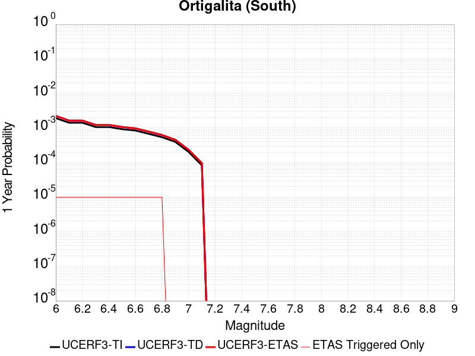 |  |

| Magnitude | 1 wk TI Prob | 1 wk TD Prob | 1 wk ETAS Prob | 1 wk ETAS/TD Gain | 1 wk ETAS Triggered Only | 1 mo TI Prob | 1 mo TD Prob | 1 mo ETAS Prob | 1 mo ETAS/TD Gain | 1 mo ETAS Triggered Only | 1 yr TI Prob | 1 yr TD Prob | 1 yr ETAS Prob | 1 yr ETAS/TD Gain | 1 yr ETAS Triggered Only | 10 yr TI Prob | 10 yr TD Prob | 10 yr ETAS Prob | 10 yr ETAS/TD Gain | 10 yr ETAS Triggered Only |
|-----|-----|-----|-----|-----|-----|-----|-----|-----|-----|-----|-----|-----|-----|-----|-----|-----|-----|-----|-----|-----|
| 6.0 | 3.72394E-5 | 4.3257463E-5 | 4.3257463E-5 | 1.0 | 0.0 | 1.5958765E-4 | 1.8537683E-4 | 1.9537499E-4 | 1.0539342 | 1.0E-5 | 0.0019412481 | 0.0022547832 | 0.0022647607 | 1.004425 | 1.0E-5 | 0.019243775 | 0.022335453 | 0.022345228 | 1.0004377 | 1.0E-5 |
| 6.1 | 2.7299884E-5 | 3.1493324E-5 | 3.1493324E-5 | 1.0 | 0.0 | 1.16994255E-4 | 1.3496472E-4 | 1.4496337E-4 | 1.0740834 | 1.0E-5 | 0.0014234743 | 0.0016420127 | 0.0016519963 | 1.00608 | 1.0E-5 | 0.014143906 | 0.016304733 | 0.01631457 | 1.0006033 | 1.0E-5 |
| 6.2 | 2.7299884E-5 | 3.1493324E-5 | 3.1493324E-5 | 1.0 | 0.0 | 1.16994255E-4 | 1.3496472E-4 | 1.4496337E-4 | 1.0740834 | 1.0E-5 | 0.0014234743 | 0.0016420127 | 0.0016519963 | 1.00608 | 1.0E-5 | 0.014143906 | 0.016304733 | 0.01631457 | 1.0006033 | 1.0E-5 |
| 6.3 | 2.0546433E-5 | 2.3632398E-5 | 2.3632398E-5 | 1.0 | 0.0 | 8.805317E-5 | 1.01277874E-4 | 1.11276866E-4 | 1.0987283 | 1.0E-5 | 0.00107152 | 0.0012323796 | 0.0012423673 | 1.0081043 | 1.0E-5 | 0.010663681 | 0.012257518 | 0.012267395 | 1.0008059 | 1.0E-5 |
| 6.4 | 2.0546433E-5 | 2.3632398E-5 | 2.3632398E-5 | 1.0 | 0.0 | 8.805317E-5 | 1.01277874E-4 | 1.11276866E-4 | 1.0987283 | 1.0E-5 | 0.00107152 | 0.0012323796 | 0.0012423673 | 1.0081043 | 1.0E-5 | 0.010663681 | 0.012257518 | 0.012267395 | 1.0008059 | 1.0E-5 |
| 6.5 | 1.7779594E-5 | 2.0447791E-5 | 2.0447791E-5 | 1.0 | 0.0 | 7.619603E-5 | 8.763053E-5 | 9.762965E-5 | 1.1141055 | 1.0E-5 | 9.272918E-4 | 0.001066393 | 0.0010763824 | 1.0093673 | 1.0E-5 | 0.009234319 | 0.010614226 | 0.010624119 | 1.0009321 | 1.0E-5 |
| 6.6 | 1.6272212E-5 | 1.8715715E-5 | 1.8715715E-5 | 1.0 | 0.0 | 6.973618E-5 | 8.0207814E-5 | 9.020701E-5 | 1.1246661 | 1.0E-5 | 8.487073E-4 | 9.761049E-4 | 9.86095E-4 | 1.0102348 | 1.0E-5 | 0.008454733 | 0.009719477 | 0.00972938 | 1.0010189 | 1.0E-5 |
| 6.7 | 1.3051484E-5 | 1.5039368E-5 | 1.5039368E-5 | 1.0 | 0.0 | 5.593373E-5 | 6.445289E-5 | 7.445225E-5 | 1.1551421 | 1.0E-5 | 6.807804E-4 | 7.8444096E-4 | 7.944331E-4 | 1.012738 | 1.0E-5 | 0.006786986 | 0.007817703 | 0.007827626 | 1.0012691 | 1.0E-5 |
| 6.8 | 1.04277415E-5 | 1.1987711E-5 | 1.1987711E-5 | 1.0 | 0.0 | 4.4689557E-5 | 5.1374936E-5 | 6.137443E-5 | 1.1946374 | 1.0E-5 | 5.439595E-4 | 6.253178E-4 | 6.3531153E-4 | 1.0159819 | 1.0E-5 | 0.0054262993 | 0.006236337 | 0.006246275 | 1.0015935 | 1.0E-5 |
| 6.9 | 7.639968E-6 | 8.791855E-6 | 8.791855E-6 | 1.0 | 0.0 | 3.274231E-5 | 3.767887E-5 | 3.767887E-5 | 1.0 | 0.0 | 3.9856473E-4 | 4.5864953E-4 | 4.5864953E-4 | 1.0 | 0.0 | 0.003978506 | 0.0045776158 | 0.0045776158 | 1.0 | 0.0 |
| 7.0 | 3.919831E-6 | 4.5335896E-6 | 4.5335896E-6 | 1.0 | 0.0 | 1.679917E-5 | 1.9429537E-5 | 1.9429537E-5 | 1.0 | 0.0 | 2.045107E-4 | 2.3653106E-4 | 2.3653106E-4 | 1.0 | 0.0 | 0.0020432258 | 0.0023630017 | 0.0023630017 | 1.0 | 0.0 |
| 7.1 | 1.6017933E-6 | 1.8571203E-6 | 1.8571203E-6 | 1.0 | 0.0 | 6.8648105E-6 | 7.959069E-6 | 7.959069E-6 | 1.0 | 0.0 | 8.357586E-5 | 9.6898424E-5 | 9.6898424E-5 | 1.0 | 0.0 | 8.3544437E-4 | 9.6866646E-4 | 9.6866646E-4 | 1.0 | 0.0 |

## Santa Susana alt 1
*[(top)](#table-of-contents)*

| 1 Week | 1 Month | 1 Year | 10 Year |
|-----|-----|-----|-----|
|  |  |  |  |

| Magnitude | 1 wk TI Prob | 1 wk TD Prob | 1 wk ETAS Prob | 1 wk ETAS/TD Gain | 1 wk ETAS Triggered Only | 1 mo TI Prob | 1 mo TD Prob | 1 mo ETAS Prob | 1 mo ETAS/TD Gain | 1 mo ETAS Triggered Only | 1 yr TI Prob | 1 yr TD Prob | 1 yr ETAS Prob | 1 yr ETAS/TD Gain | 1 yr ETAS Triggered Only | 10 yr TI Prob | 10 yr TD Prob | 10 yr ETAS Prob | 10 yr ETAS/TD Gain | 10 yr ETAS Triggered Only |
|-----|-----|-----|-----|-----|-----|-----|-----|-----|-----|-----|-----|-----|-----|-----|-----|-----|-----|-----|-----|-----|
| 6.0 | 2.674877E-5 | 2.7199489E-5 | 2.7199489E-5 | 1.0 | 0.0 | 1.1463255E-4 | 1.1656467E-4 | 1.2656351E-4 | 1.0857793 | 1.0E-5 | 0.0013947578 | 0.0014183646 | 0.0014283503 | 1.0070404 | 1.0E-5 | 0.013860362 | 0.014104869 | 0.014114728 | 1.0006989 | 1.0E-5 |
| 6.1 | 2.674877E-5 | 2.7199489E-5 | 2.7199489E-5 | 1.0 | 0.0 | 1.1463255E-4 | 1.1656467E-4 | 1.2656351E-4 | 1.0857793 | 1.0E-5 | 0.0013947578 | 0.0014183646 | 0.0014283503 | 1.0070404 | 1.0E-5 | 0.013860362 | 0.014104869 | 0.014114728 | 1.0006989 | 1.0E-5 |
| 6.2 | 2.674877E-5 | 2.7199489E-5 | 2.7199489E-5 | 1.0 | 0.0 | 1.1463255E-4 | 1.1656467E-4 | 1.2656351E-4 | 1.0857793 | 1.0E-5 | 0.0013947578 | 0.0014183646 | 0.0014283503 | 1.0070404 | 1.0E-5 | 0.013860362 | 0.014104869 | 0.014114728 | 1.0006989 | 1.0E-5 |
| 6.3 | 2.674877E-5 | 2.7199489E-5 | 2.7199489E-5 | 1.0 | 0.0 | 1.1463255E-4 | 1.1656467E-4 | 1.2656351E-4 | 1.0857793 | 1.0E-5 | 0.0013947578 | 0.0014183646 | 0.0014283503 | 1.0070404 | 1.0E-5 | 0.013860362 | 0.014104869 | 0.014114728 | 1.0006989 | 1.0E-5 |
| 6.4 | 2.674877E-5 | 2.7199489E-5 | 2.7199489E-5 | 1.0 | 0.0 | 1.1463255E-4 | 1.1656467E-4 | 1.2656351E-4 | 1.0857793 | 1.0E-5 | 0.0013947578 | 0.0014183646 | 0.0014283503 | 1.0070404 | 1.0E-5 | 0.013860362 | 0.014104869 | 0.014114728 | 1.0006989 | 1.0E-5 |
| 6.5 | 2.674877E-5 | 2.7199489E-5 | 2.7199489E-5 | 1.0 | 0.0 | 1.1463255E-4 | 1.1656467E-4 | 1.2656351E-4 | 1.0857793 | 1.0E-5 | 0.0013947578 | 0.0014183646 | 0.0014283503 | 1.0070404 | 1.0E-5 | 0.013860362 | 0.014104869 | 0.014114728 | 1.0006989 | 1.0E-5 |
| 6.6 | 2.6647976E-5 | 2.707582E-5 | 2.707582E-5 | 1.0 | 0.0 | 1.14200615E-4 | 1.1603471E-4 | 1.2603354E-4 | 1.0861712 | 1.0E-5 | 0.0013895056 | 0.0014119206 | 0.0014219065 | 1.0070726 | 1.0E-5 | 0.013808494 | 0.014041251 | 0.01405111 | 1.0007021 | 1.0E-5 |
| 6.7 | 2.6647976E-5 | 2.707582E-5 | 2.707582E-5 | 1.0 | 0.0 | 1.14200615E-4 | 1.1603471E-4 | 1.2603354E-4 | 1.0861712 | 1.0E-5 | 0.0013895056 | 0.0014119206 | 0.0014219065 | 1.0070726 | 1.0E-5 | 0.013808494 | 0.014041251 | 0.01405111 | 1.0007021 | 1.0E-5 |
| 6.8 | 1.9073179E-5 | 1.7638118E-5 | 1.7638118E-5 | 1.0 | 0.0 | 8.1739636E-5 | 7.558984E-5 | 8.558909E-5 | 1.1322829 | 1.0E-5 | 9.947256E-4 | 9.1993593E-4 | 9.299267E-4 | 1.0108603 | 1.0E-5 | 0.009902848 | 0.009163521 | 0.00917343 | 1.0010812 | 1.0E-5 |
| 6.9 | 1.9041876E-5 | 1.7620248E-5 | 1.7620248E-5 | 1.0 | 0.0 | 8.160549E-5 | 7.5513264E-5 | 8.551251E-5 | 1.1324171 | 1.0E-5 | 9.930939E-4 | 9.190044E-4 | 9.289952E-4 | 1.0108713 | 1.0E-5 | 0.0098866755 | 0.0091542825 | 0.009164191 | 1.0010824 | 1.0E-5 |
| 7.0 | 1.5917482E-5 | 1.3864484E-5 | 1.3864484E-5 | 1.0 | 0.0 | 6.8215995E-5 | 5.941789E-5 | 6.941729E-5 | 1.1682895 | 1.0E-5 | 8.302132E-4 | 7.2317733E-4 | 7.331701E-4 | 1.0138179 | 1.0E-5 | 0.008271185 | 0.0072091436 | 0.0072190715 | 1.0013771 | 1.0E-5 |
| 7.1 | 1.577788E-5 | 1.3744487E-5 | 1.3744487E-5 | 1.0 | 0.0 | 6.761774E-5 | 5.890364E-5 | 6.890305E-5 | 1.1697588 | 1.0E-5 | 8.2293496E-4 | 7.169205E-4 | 7.2691333E-4 | 1.0139385 | 1.0E-5 | 0.008198941 | 0.007146979 | 0.0071569076 | 1.0013891 | 1.0E-5 |
| 7.2 | 1.5416446E-5 | 1.3470549E-5 | 1.3470549E-5 | 1.0 | 0.0 | 6.606882E-5 | 5.7729674E-5 | 6.7729095E-5 | 1.1732111 | 1.0E-5 | 8.0409093E-4 | 7.026367E-4 | 7.126297E-4 | 1.0142221 | 1.0E-5 | 0.008011877 | 0.0070050475 | 0.0070149773 | 1.0014175 | 1.0E-5 |
| 7.3 | 1.4534083E-5 | 1.2718423E-5 | 1.2718423E-5 | 1.0 | 0.0 | 6.228744E-5 | 5.4506414E-5 | 6.450587E-5 | 1.1834546 | 1.0E-5 | 7.580857E-4 | 6.63418E-4 | 6.7341136E-4 | 1.0150634 | 1.0E-5 | 0.007555048 | 0.0066152303 | 0.0066251643 | 1.0015017 | 1.0E-5 |
| 7.4 | 1.2858995E-5 | 1.1230126E-5 | 1.1230126E-5 | 1.0 | 0.0 | 5.5108816E-5 | 4.8128248E-5 | 5.8127767E-5 | 1.2077682 | 1.0E-5 | 6.7074323E-4 | 5.8580784E-4 | 5.95802E-4 | 1.0170604 | 1.0E-5 | 0.0066872234 | 0.0058434014 | 0.0058533433 | 1.0017014 | 1.0E-5 |
| 7.5 | 8.827668E-6 | 7.805643E-6 | 7.805643E-6 | 1.0 | 0.0 | 3.7832317E-5 | 3.345234E-5 | 3.345234E-5 | 1.0 | 0.0 | 4.605111E-4 | 4.072086E-4 | 4.072086E-4 | 1.0 | 0.0 | 0.0045955796 | 0.0040649762 | 0.0040649762 | 1.0 | 0.0 |
| 7.6 | 3.2533426E-6 | 2.8720426E-6 | 2.8720426E-6 | 1.0 | 0.0 | 1.3942822E-5 | 1.2308698E-5 | 1.2308698E-5 | 1.0 | 0.0 | 1.6974064E-4 | 1.4984846E-4 | 1.4984846E-4 | 1.0 | 0.0 | 0.0016961104 | 0.0014975112 | 0.0014975112 | 1.0 | 0.0 |
| 7.7 | 1.2751709E-6 | 1.1491478E-6 | 1.1491478E-6 | 1.0 | 0.0 | 5.4650063E-6 | 4.9249106E-6 | 4.9249106E-6 | 1.0 | 0.0 | 6.653442E-5 | 5.9959224E-5 | 5.9959224E-5 | 1.0 | 0.0 | 6.6514505E-4 | 5.994394E-4 | 5.994394E-4 | 1.0 | 0.0 |
| 7.8 | 3.067544E-7 | 3.2401073E-7 | 3.2401073E-7 | 1.0 | 0.0 | 1.3146611E-6 | 1.3886166E-6 | 1.3886166E-6 | 1.0 | 0.0 | 1.600588E-5 | 1.6906288E-5 | 1.6906288E-5 | 1.0 | 0.0 | 1.6004729E-4 | 1.6905104E-4 | 1.6905104E-4 | 1.0 | 0.0 |
| 7.9 | 7.622999E-8 | 8.088108E-8 | 8.088108E-8 | 1.0 | 0.0 | 3.2669993E-7 | 3.4663316E-7 | 3.4663316E-7 | 1.0 | 0.0 | 3.977564E-6 | 4.220253E-6 | 4.220253E-6 | 1.0 | 0.0 | 3.977493E-5 | 4.2201933E-5 | 4.2201933E-5 | 1.0 | 0.0 |

## Elsinore (Coyote Mountains)
*[(top)](#table-of-contents)*

| 1 Week | 1 Month | 1 Year | 10 Year |
|-----|-----|-----|-----|
|  |  |  |  |

| Magnitude | 1 wk TI Prob | 1 wk TD Prob | 1 wk ETAS Prob | 1 wk ETAS/TD Gain | 1 wk ETAS Triggered Only | 1 mo TI Prob | 1 mo TD Prob | 1 mo ETAS Prob | 1 mo ETAS/TD Gain | 1 mo ETAS Triggered Only | 1 yr TI Prob | 1 yr TD Prob | 1 yr ETAS Prob | 1 yr ETAS/TD Gain | 1 yr ETAS Triggered Only | 10 yr TI Prob | 10 yr TD Prob | 10 yr ETAS Prob | 10 yr ETAS/TD Gain | 10 yr ETAS Triggered Only |
|-----|-----|-----|-----|-----|-----|-----|-----|-----|-----|-----|-----|-----|-----|-----|-----|-----|-----|-----|-----|-----|
| 6.0 | 4.20513E-5 | 4.8634432E-5 | 4.8634432E-5 | 1.0 | 0.0 | 1.8020741E-4 | 2.0841985E-4 | 2.0841985E-4 | 1.0 | 0.0 | 0.0021918174 | 0.0025350833 | 0.0025350833 | 1.0 | 0.0 | 0.021703249 | 0.025112933 | 0.025122682 | 1.0003881 | 1.0E-5 |
| 6.1 | 4.20513E-5 | 4.8634432E-5 | 4.8634432E-5 | 1.0 | 0.0 | 1.8020741E-4 | 2.0841985E-4 | 2.0841985E-4 | 1.0 | 0.0 | 0.0021918174 | 0.0025350833 | 0.0025350833 | 1.0 | 0.0 | 0.021703249 | 0.025112933 | 0.025122682 | 1.0003881 | 1.0E-5 |
| 6.2 | 2.3413893E-5 | 2.4697076E-5 | 2.4697076E-5 | 1.0 | 0.0 | 1.0034139E-4 | 1.0584082E-4 | 1.0584082E-4 | 1.0 | 0.0 | 0.0012209718 | 0.0012879377 | 0.0012879377 | 1.0 | 0.0 | 0.012142851 | 0.0128134135 | 0.012823286 | 1.0007704 | 1.0E-5 |
| 6.3 | 2.3413893E-5 | 2.4697076E-5 | 2.4697076E-5 | 1.0 | 0.0 | 1.0034139E-4 | 1.0584082E-4 | 1.0584082E-4 | 1.0 | 0.0 | 0.0012209718 | 0.0012879377 | 0.0012879377 | 1.0 | 0.0 | 0.012142851 | 0.0128134135 | 0.012823286 | 1.0007704 | 1.0E-5 |
| 6.4 | 1.6894814E-5 | 1.656933E-5 | 1.656933E-5 | 1.0 | 0.0 | 7.240433E-5 | 7.1009665E-5 | 7.1009665E-5 | 1.0 | 0.0 | 8.811662E-4 | 8.6423685E-4 | 8.6423685E-4 | 1.0 | 0.0 | 0.0087768035 | 0.008612418 | 0.008622332 | 1.0011511 | 1.0E-5 |
| 6.5 | 1.6894814E-5 | 1.656933E-5 | 1.656933E-5 | 1.0 | 0.0 | 7.240433E-5 | 7.1009665E-5 | 7.1009665E-5 | 1.0 | 0.0 | 8.811662E-4 | 8.6423685E-4 | 8.6423685E-4 | 1.0 | 0.0 | 0.0087768035 | 0.008612418 | 0.008622332 | 1.0011511 | 1.0E-5 |
| 6.6 | 1.1910969E-5 | 1.0531313E-5 | 1.0531313E-5 | 1.0 | 0.0 | 5.1046012E-5 | 4.5133493E-5 | 4.5133493E-5 | 1.0 | 0.0 | 6.21308E-4 | 5.49375E-4 | 5.49375E-4 | 1.0 | 0.0 | 0.0061957375 | 0.0054814704 | 0.0054914155 | 1.0018144 | 1.0E-5 |
| 6.7 | 9.1486E-6 | 7.2032412E-6 | 7.2032412E-6 | 1.0 | 0.0 | 3.9207694E-5 | 3.087069E-5 | 3.087069E-5 | 1.0 | 0.0 | 4.7724912E-4 | 3.7578965E-4 | 3.7578965E-4 | 1.0 | 0.0 | 0.0047622547 | 0.0037519215 | 0.0037618838 | 1.0026553 | 1.0E-5 |
| 6.8 | 7.90441E-6 | 5.7293373E-6 | 5.7293373E-6 | 1.0 | 0.0 | 3.3875604E-5 | 2.455408E-5 | 2.455408E-5 | 1.0 | 0.0 | 4.1235742E-4 | 2.9890618E-4 | 2.9890618E-4 | 1.0 | 0.0 | 0.0041159308 | 0.00298517 | 0.0029951404 | 1.0033399 | 1.0E-5 |
| 6.9 | 7.77015E-6 | 5.5832884E-6 | 5.5832884E-6 | 1.0 | 0.0 | 3.3300217E-5 | 2.3928165E-5 | 2.3928165E-5 | 1.0 | 0.0 | 4.0535472E-4 | 2.9128775E-4 | 2.9128775E-4 | 1.0 | 0.0 | 0.004046161 | 0.0029091865 | 0.0029191573 | 1.0034274 | 1.0E-5 |
| 7.0 | 7.675798E-6 | 5.4801444E-6 | 5.4801444E-6 | 1.0 | 0.0 | 3.289586E-5 | 2.3486129E-5 | 2.3486129E-5 | 1.0 | 0.0 | 4.004335E-4 | 2.8590736E-4 | 2.8590736E-4 | 1.0 | 0.0 | 0.003997127 | 0.0028555219 | 0.0028654933 | 1.003492 | 1.0E-5 |
| 7.1 | 7.447814E-6 | 5.2390124E-6 | 5.2390124E-6 | 1.0 | 0.0 | 3.191881E-5 | 2.2452723E-5 | 2.2452723E-5 | 1.0 | 0.0 | 3.8854225E-4 | 2.7332886E-4 | 2.7332886E-4 | 1.0 | 0.0 | 0.003878636 | 0.0027300513 | 0.0027400241 | 1.0036529 | 1.0E-5 |
| 7.2 | 7.128185E-6 | 4.905657E-6 | 4.905657E-6 | 1.0 | 0.0 | 3.0549007E-5 | 2.1024081E-5 | 2.1024081E-5 | 1.0 | 0.0 | 3.7187067E-4 | 2.5593932E-4 | 2.5593932E-4 | 1.0 | 0.0 | 0.00371249 | 0.002556564 | 0.0025665385 | 1.0039015 | 1.0E-5 |
| 7.3 | 7.0913875E-6 | 4.874332E-6 | 4.874332E-6 | 1.0 | 0.0 | 3.0391306E-5 | 2.0889833E-5 | 2.0889833E-5 | 1.0 | 0.0 | 3.6995133E-4 | 2.5430523E-4 | 2.5430523E-4 | 1.0 | 0.0 | 0.0036933604 | 0.0025402603 | 0.002550235 | 1.0039266 | 1.0E-5 |
| 7.4 | 7.051521E-6 | 4.838183E-6 | 4.838183E-6 | 1.0 | 0.0 | 3.0220453E-5 | 2.0734911E-5 | 2.0734911E-5 | 1.0 | 0.0 | 3.6787192E-4 | 2.524195E-4 | 2.524195E-4 | 1.0 | 0.0 | 0.0036726352 | 0.0025214462 | 0.002531421 | 1.003956 | 1.0E-5 |
| 7.5 | 6.910666E-6 | 4.733727E-6 | 4.733727E-6 | 1.0 | 0.0 | 2.9616802E-5 | 2.028725E-5 | 2.028725E-5 | 1.0 | 0.0 | 3.605249E-4 | 2.4697048E-4 | 2.4697048E-4 | 1.0 | 0.0 | 0.0035994058 | 0.0024670782 | 0.0024770533 | 1.0040433 | 1.0E-5 |
| 7.6 | 6.341753E-6 | 4.3068244E-6 | 4.3068244E-6 | 1.0 | 0.0 | 2.7178658E-5 | 1.8457695E-5 | 1.8457695E-5 | 1.0 | 0.0 | 3.3084993E-4 | 2.2470043E-4 | 2.2470043E-4 | 1.0 | 0.0 | 0.0033035777 | 0.0022448476 | 0.0022548253 | 1.0044446 | 1.0E-5 |
| 7.7 | 3.9205916E-6 | 2.2440856E-6 | 2.2440856E-6 | 1.0 | 0.0 | 1.6802427E-5 | 9.617479E-6 | 9.617479E-6 | 1.0 | 0.0 | 2.0455034E-4 | 1.1708726E-4 | 1.1708726E-4 | 1.0 | 0.0 | 0.0020436216 | 0.0011703286 | 0.0011703286 | 1.0 | 0.0 |
| 7.8 | 2.0846227E-7 | 8.486552E-8 | 8.486552E-8 | 1.0 | 0.0 | 8.9340944E-7 | 3.6370935E-7 | 3.6370935E-7 | 1.0 | 0.0 | 1.0877206E-5 | 4.4281555E-6 | 4.4281555E-6 | 1.0 | 0.0 | 1.0876673E-4 | 4.4281E-5 | 4.4281E-5 | 1.0 | 0.0 |
| 7.9 | 4.4969806E-9 | 2.2692181E-9 | 2.2692181E-9 | 1.0 | 0.0 | 1.9272775E-8 | 9.7252215E-9 | 9.7252215E-9 | 1.0 | 0.0 | 2.3464601E-7 | 1.18404564E-7 | 1.18404564E-7 | 1.0 | 0.0 | 2.3464577E-6 | 1.1840451E-6 | 1.1840451E-6 | 1.0 | 0.0 |

## Calaveras (So) - Paicines extension 2011 CFM
*[(top)](#table-of-contents)*

| 1 Week | 1 Month | 1 Year | 10 Year |
|-----|-----|-----|-----|
|  |  |  |  |

| Magnitude | 1 wk TI Prob | 1 wk TD Prob | 1 wk ETAS Prob | 1 wk ETAS/TD Gain | 1 wk ETAS Triggered Only | 1 mo TI Prob | 1 mo TD Prob | 1 mo ETAS Prob | 1 mo ETAS/TD Gain | 1 mo ETAS Triggered Only | 1 yr TI Prob | 1 yr TD Prob | 1 yr ETAS Prob | 1 yr ETAS/TD Gain | 1 yr ETAS Triggered Only | 10 yr TI Prob | 10 yr TD Prob | 10 yr ETAS Prob | 10 yr ETAS/TD Gain | 10 yr ETAS Triggered Only |
|-----|-----|-----|-----|-----|-----|-----|-----|-----|-----|-----|-----|-----|-----|-----|-----|-----|-----|-----|-----|-----|
| 6.0 | 1.5183659E-4 | 3.0530355E-4 | 3.0530355E-4 | 1.0 | 0.0 | 6.5056595E-4 | 0.0013071973 | 0.0013071973 | 1.0 | 0.0 | 0.007891912 | 0.015700743 | 0.015700743 | 1.0 | 0.0 | 0.076174594 | 0.13853271 | 0.13854133 | 1.0000622 | 1.0E-5 |
| 6.1 | 1.5024997E-4 | 3.0224456E-4 | 3.0224456E-4 | 1.0 | 0.0 | 6.437695E-4 | 0.0012941061 | 0.0012941061 | 1.0 | 0.0 | 0.0078097614 | 0.015544123 | 0.015544123 | 1.0 | 0.0 | 0.075409345 | 0.13720226 | 0.13721089 | 1.000063 | 1.0E-5 |
| 6.2 | 1.2743923E-4 | 2.532267E-4 | 2.532267E-4 | 1.0 | 0.0 | 5.460538E-4 | 0.001084376 | 0.001084376 | 1.0 | 0.0 | 0.0066279583 | 0.013051358 | 0.013051358 | 1.0 | 0.0 | 0.064337276 | 0.1173002 | 0.11730903 | 1.0000752 | 1.0E-5 |
| 6.3 | 1.1525114E-4 | 2.2608072E-4 | 2.2608072E-4 | 1.0 | 0.0 | 4.9383997E-4 | 9.682464E-4 | 9.682464E-4 | 1.0 | 0.0 | 0.0059959386 | 0.011672546 | 0.011672546 | 1.0 | 0.0 | 0.058367174 | 0.10641671 | 0.10642564 | 1.0000839 | 1.0E-5 |
| 6.4 | 1.07200925E-4 | 2.0849217E-4 | 2.0849217E-4 | 1.0 | 0.0 | 4.5935164E-4 | 8.9298614E-4 | 8.9298614E-4 | 1.0 | 0.0 | 0.0055782744 | 0.010777415 | 0.010777415 | 1.0 | 0.0 | 0.0544031 | 0.09923958 | 0.09924859 | 1.0000907 | 1.0E-5 |
| 6.5 | 9.69631E-5 | 1.8743094E-4 | 1.8743094E-4 | 1.0 | 0.0 | 4.1548995E-4 | 8.028336E-4 | 8.028336E-4 | 1.0 | 0.0 | 0.0050468626 | 0.009699249 | 0.009699249 | 1.0 | 0.0 | 0.04933773 | 0.090131395 | 0.09014049 | 1.000101 | 1.0E-5 |
| 6.6 | 8.0552316E-5 | 1.5079179E-4 | 1.5079179E-4 | 1.0 | 0.0 | 3.4517853E-4 | 6.460578E-4 | 6.460578E-4 | 1.0 | 0.0 | 0.0041944524 | 0.007830908 | 0.007830908 | 1.0 | 0.0 | 0.04116161 | 0.074901775 | 0.07491102 | 1.0001235 | 1.0E-5 |
| 6.7 | 7.815757E-5 | 1.4619702E-4 | 1.4619702E-4 | 1.0 | 0.0 | 3.34918E-4 | 6.263792E-4 | 6.263792E-4 | 1.0 | 0.0 | 0.004070005 | 0.007593691 | 0.007593691 | 1.0 | 0.0 | 0.039962657 | 0.072751224 | 0.07276049 | 1.0001274 | 1.0E-5 |
| 6.8 | 6.965264E-5 | 1.27309E-4 | 1.27309E-4 | 1.0 | 0.0 | 2.9847719E-4 | 5.4547697E-4 | 5.4547697E-4 | 1.0 | 0.0 | 0.0036279052 | 0.0066177496 | 0.0066177496 | 1.0 | 0.0 | 0.03569247 | 0.06384494 | 0.06384494 | 1.0 | 0.0 |
| 6.9 | 5.8000453E-5 | 1.0150901E-4 | 1.0150901E-4 | 1.0 | 0.0 | 2.4854968E-4 | 4.3496655E-4 | 4.3496655E-4 | 1.0 | 0.0 | 0.0030218933 | 0.0052829566 | 0.0052829566 | 1.0 | 0.0 | 0.029811295 | 0.051535342 | 0.051535342 | 1.0 | 0.0 |
| 7.0 | 4.9865852E-5 | 8.5749314E-5 | 8.5749314E-5 | 1.0 | 0.0 | 2.1369329E-4 | 3.6744578E-4 | 3.6744578E-4 | 1.0 | 0.0 | 0.0025986114 | 0.004464565 | 0.004464565 | 1.0 | 0.0 | 0.025684336 | 0.043814834 | 0.043814834 | 1.0 | 0.0 |
| 7.1 | 4.283875E-5 | 7.11764E-5 | 7.11764E-5 | 1.0 | 0.0 | 1.8358172E-4 | 3.0500637E-4 | 3.0500637E-4 | 1.0 | 0.0 | 0.0022328163 | 0.0037071859 | 0.0037071859 | 1.0 | 0.0 | 0.022105146 | 0.036761872 | 0.036761872 | 1.0 | 0.0 |
| 7.2 | 3.450115E-5 | 5.5829365E-5 | 5.5829365E-5 | 1.0 | 0.0 | 1.478537E-4 | 2.3924693E-4 | 2.3924693E-4 | 1.0 | 0.0 | 0.0017986323 | 0.0029089695 | 0.0029089695 | 1.0 | 0.0 | 0.017841442 | 0.029104844 | 0.029104844 | 1.0 | 0.0 |
| 7.3 | 2.5709045E-5 | 4.063795E-5 | 4.063795E-5 | 1.0 | 0.0 | 1.1017697E-4 | 1.7415112E-4 | 1.7415112E-4 | 1.0 | 0.0 | 0.0013405791 | 0.002118245 | 0.002118245 | 1.0 | 0.0 | 0.013325208 | 0.021321429 | 0.021321429 | 1.0 | 0.0 |
| 7.4 | 1.8003093E-5 | 2.853205E-5 | 2.853205E-5 | 1.0 | 0.0 | 7.715383E-5 | 1.2227449E-4 | 1.2227449E-4 | 1.0 | 0.0 | 9.3894306E-4 | 0.0014876777 | 0.0014876777 | 1.0 | 0.0 | 0.009349857 | 0.015061493 | 0.015061493 | 1.0 | 0.0 |
| 7.5 | 1.5595824E-5 | 2.584383E-5 | 2.584383E-5 | 1.0 | 0.0 | 6.683753E-5 | 1.1075458E-4 | 1.1075458E-4 | 1.0 | 0.0 | 8.134431E-4 | 0.0013476053 | 0.0013476053 | 1.0 | 0.0 | 0.008104719 | 0.013661344 | 0.013661344 | 1.0 | 0.0 |
| 7.6 | 1.1110309E-5 | 1.9240946E-5 | 1.9240946E-5 | 1.0 | 0.0 | 4.761474E-5 | 8.24586E-5 | 8.24586E-5 | 1.0 | 0.0 | 5.795553E-4 | 0.0010034724 | 0.0010034724 | 1.0 | 0.0 | 0.0057804612 | 0.0102122305 | 0.0102122305 | 1.0 | 0.0 |
| 7.7 | 6.2140443E-6 | 1.0449506E-5 | 1.0449506E-5 | 1.0 | 0.0 | 2.6631347E-5 | 4.4782828E-5 | 4.4782828E-5 | 1.0 | 0.0 | 3.241884E-4 | 5.450946E-4 | 5.450946E-4 | 1.0 | 0.0 | 0.0032371588 | 0.005625829 | 0.005625829 | 1.0 | 0.0 |
| 7.8 | 5.305533E-6 | 9.4441675E-6 | 9.4441675E-6 | 1.0 | 0.0 | 2.27378E-5 | 4.0474377E-5 | 4.0474377E-5 | 1.0 | 0.0 | 2.7679754E-4 | 4.926642E-4 | 4.926642E-4 | 1.0 | 0.0 | 0.0027645302 | 0.0050796773 | 0.0050796773 | 1.0 | 0.0 |
| 7.9 | 3.363505E-6 | 7.393234E-6 | 7.393234E-6 | 1.0 | 0.0 | 1.4414942E-5 | 3.1684904E-5 | 3.1684904E-5 | 1.0 | 0.0 | 1.7548777E-4 | 3.856955E-4 | 3.856955E-4 | 1.0 | 0.0 | 0.0017534926 | 0.003952518 | 0.003952518 | 1.0 | 0.0 |
| 8.0 | 2.0271132E-6 | 4.417864E-6 | 4.417864E-6 | 1.0 | 0.0 | 8.687599E-6 | 1.8933568E-5 | 1.8933568E-5 | 1.0 | 0.0 | 1.05766376E-4 | 2.3049185E-4 | 2.3049185E-4 | 1.0 | 0.0 | 0.0010571606 | 0.0023534521 | 0.0023534521 | 1.0 | 0.0 |
| 8.1 | 1.2206116E-6 | 2.377701E-6 | 2.377701E-6 | 1.0 | 0.0 | 5.2311816E-6 | 1.0190108E-5 | 1.0190108E-5 | 1.0 | 0.0 | 6.3687774E-5 | 1.2405754E-4 | 1.2405754E-4 | 1.0 | 0.0 | 6.366953E-4 | 0.0012718418 | 0.0012718418 | 1.0 | 0.0 |

## Great Valley 07 (Orestimba)
*[(top)](#table-of-contents)*

| 1 Week | 1 Month | 1 Year | 10 Year |
|-----|-----|-----|-----|
|  |  |  |  |

| Magnitude | 1 wk TI Prob | 1 wk TD Prob | 1 wk ETAS Prob | 1 wk ETAS/TD Gain | 1 wk ETAS Triggered Only | 1 mo TI Prob | 1 mo TD Prob | 1 mo ETAS Prob | 1 mo ETAS/TD Gain | 1 mo ETAS Triggered Only | 1 yr TI Prob | 1 yr TD Prob | 1 yr ETAS Prob | 1 yr ETAS/TD Gain | 1 yr ETAS Triggered Only | 10 yr TI Prob | 10 yr TD Prob | 10 yr ETAS Prob | 10 yr ETAS/TD Gain | 10 yr ETAS Triggered Only |
|-----|-----|-----|-----|-----|-----|-----|-----|-----|-----|-----|-----|-----|-----|-----|-----|-----|-----|-----|-----|-----|
| 6.0 | 2.9687902E-5 | 3.27584E-5 | 4.275807E-5 | 1.3052552 | 1.0E-5 | 1.2722766E-4 | 1.40386E-4 | 1.5038459E-4 | 1.0712222 | 1.0E-5 | 0.0015478961 | 0.0017079313 | 0.0017179141 | 1.0058451 | 1.0E-5 | 0.015371585 | 0.016955597 | 0.016965428 | 1.0005798 | 1.0E-5 |
| 6.1 | 2.9687902E-5 | 3.27584E-5 | 4.275807E-5 | 1.3052552 | 1.0E-5 | 1.2722766E-4 | 1.40386E-4 | 1.5038459E-4 | 1.0712222 | 1.0E-5 | 0.0015478961 | 0.0017079313 | 0.0017179141 | 1.0058451 | 1.0E-5 | 0.015371585 | 0.016955597 | 0.016965428 | 1.0005798 | 1.0E-5 |
| 6.2 | 1.9231524E-5 | 2.1159729E-5 | 3.1159518E-5 | 1.4725858 | 1.0E-5 | 8.2418206E-5 | 9.068153E-5 | 1.0068063E-4 | 1.1102661 | 1.0E-5 | 0.0010029797 | 0.0011035115 | 0.0011135006 | 1.009052 | 1.0E-5 | 0.00998465 | 0.010982731 | 0.010992621 | 1.0009005 | 1.0E-5 |
| 6.3 | 1.324766E-5 | 1.4548912E-5 | 1.4548912E-5 | 1.0 | 0.0 | 5.6774446E-5 | 6.235104E-5 | 6.235104E-5 | 1.0 | 0.0 | 6.910097E-4 | 7.588687E-4 | 7.588687E-4 | 1.0 | 0.0 | 0.006888649 | 0.00756372 | 0.00756372 | 1.0 | 0.0 |
| 6.4 | 7.818645E-6 | 8.573059E-6 | 8.573059E-6 | 1.0 | 0.0 | 3.3508048E-5 | 3.6741185E-5 | 3.6741185E-5 | 1.0 | 0.0 | 4.078841E-4 | 4.4723548E-4 | 4.4723548E-4 | 1.0 | 0.0 | 0.004071363 | 0.0044636945 | 0.0044636945 | 1.0 | 0.0 |
| 6.5 | 5.3076565E-6 | 5.817949E-6 | 5.817949E-6 | 1.0 | 0.0 | 2.27469E-5 | 2.493384E-5 | 2.493384E-5 | 1.0 | 0.0 | 2.7690834E-4 | 3.0352935E-4 | 3.0352935E-4 | 1.0 | 0.0 | 0.0027656353 | 0.0030313572 | 0.0030313572 | 1.0 | 0.0 |
| 6.6 | 3.6003578E-6 | 3.9485967E-6 | 3.9485967E-6 | 1.0 | 0.0 | 1.5430012E-5 | 1.6922457E-5 | 1.6922457E-5 | 1.0 | 0.0 | 1.8784421E-4 | 2.0601299E-4 | 2.0601299E-4 | 1.0 | 0.0 | 0.0018768552 | 0.0020583742 | 0.0020583742 | 1.0 | 0.0 |
| 6.7 | 2.5361826E-6 | 2.78354E-6 | 2.78354E-6 | 1.0 | 0.0 | 1.0869308E-5 | 1.192941E-5 | 1.192941E-5 | 1.0 | 0.0 | 1.3232579E-4 | 1.452322E-4 | 1.452322E-4 | 1.0 | 0.0 | 0.0013224703 | 0.0014515029 | 0.0014515029 | 1.0 | 0.0 |
| 6.8 | 1.2115831E-6 | 1.3314148E-6 | 1.3314148E-6 | 1.0 | 0.0 | 5.1924885E-6 | 5.706056E-6 | 5.706056E-6 | 1.0 | 0.0 | 6.3216714E-5 | 6.9469985E-5 | 6.9469985E-5 | 1.0 | 0.0 | 6.3198735E-4 | 6.945778E-4 | 6.945778E-4 | 1.0 | 0.0 |

## Monte Vista - Shannon 2011 CFM
*[(top)](#table-of-contents)*

| 1 Week | 1 Month | 1 Year | 10 Year |
|-----|-----|-----|-----|
|  |  |  |  |

| Magnitude | 1 wk TI Prob | 1 wk TD Prob | 1 wk ETAS Prob | 1 wk ETAS/TD Gain | 1 wk ETAS Triggered Only | 1 mo TI Prob | 1 mo TD Prob | 1 mo ETAS Prob | 1 mo ETAS/TD Gain | 1 mo ETAS Triggered Only | 1 yr TI Prob | 1 yr TD Prob | 1 yr ETAS Prob | 1 yr ETAS/TD Gain | 1 yr ETAS Triggered Only | 10 yr TI Prob | 10 yr TD Prob | 10 yr ETAS Prob | 10 yr ETAS/TD Gain | 10 yr ETAS Triggered Only |
|-----|-----|-----|-----|-----|-----|-----|-----|-----|-----|-----|-----|-----|-----|-----|-----|-----|-----|-----|-----|-----|
| 6.0 | 2.7907707E-5 | 2.758582E-5 | 2.758582E-5 | 1.0 | 0.0 | 1.19598975E-4 | 1.1822028E-4 | 1.1822028E-4 | 1.0 | 0.0 | 0.0014551448 | 0.0014385054 | 0.0014385054 | 1.0 | 0.0 | 0.014456532 | 0.014321024 | 0.01433088 | 1.0006883 | 1.0E-5 |
| 6.1 | 2.7907707E-5 | 2.758582E-5 | 2.758582E-5 | 1.0 | 0.0 | 1.19598975E-4 | 1.1822028E-4 | 1.1822028E-4 | 1.0 | 0.0 | 0.0014551448 | 0.0014385054 | 0.0014385054 | 1.0 | 0.0 | 0.014456532 | 0.014321024 | 0.01433088 | 1.0006883 | 1.0E-5 |
| 6.2 | 2.7907707E-5 | 2.758582E-5 | 2.758582E-5 | 1.0 | 0.0 | 1.19598975E-4 | 1.1822028E-4 | 1.1822028E-4 | 1.0 | 0.0 | 0.0014551448 | 0.0014385054 | 0.0014385054 | 1.0 | 0.0 | 0.014456532 | 0.014321024 | 0.01433088 | 1.0006883 | 1.0E-5 |
| 6.3 | 2.7907707E-5 | 2.758582E-5 | 2.758582E-5 | 1.0 | 0.0 | 1.19598975E-4 | 1.1822028E-4 | 1.1822028E-4 | 1.0 | 0.0 | 0.0014551448 | 0.0014385054 | 0.0014385054 | 1.0 | 0.0 | 0.014456532 | 0.014321024 | 0.01433088 | 1.0006883 | 1.0E-5 |
| 6.4 | 2.7907707E-5 | 2.758582E-5 | 2.758582E-5 | 1.0 | 0.0 | 1.19598975E-4 | 1.1822028E-4 | 1.1822028E-4 | 1.0 | 0.0 | 0.0014551448 | 0.0014385054 | 0.0014385054 | 1.0 | 0.0 | 0.014456532 | 0.014321024 | 0.01433088 | 1.0006883 | 1.0E-5 |
| 6.5 | 1.7990213E-5 | 1.6641196E-5 | 1.6641196E-5 | 1.0 | 0.0 | 7.709863E-5 | 7.131783E-5 | 7.131783E-5 | 1.0 | 0.0 | 9.382716E-4 | 8.6801505E-4 | 8.6801505E-4 | 1.0 | 0.0 | 0.0093431985 | 0.0086696185 | 0.0086795315 | 1.0011435 | 1.0E-5 |
| 6.6 | 9.650407E-6 | 7.4582085E-6 | 7.4582085E-6 | 1.0 | 0.0 | 4.135823E-5 | 3.1963402E-5 | 3.1963402E-5 | 1.0 | 0.0 | 5.0342013E-4 | 3.8909278E-4 | 3.8909278E-4 | 1.0 | 0.0 | 0.005022812 | 0.0039017939 | 0.0039017939 | 1.0 | 0.0 |
| 6.7 | 9.62828E-6 | 7.4361215E-6 | 7.4361215E-6 | 1.0 | 0.0 | 4.1263404E-5 | 3.186875E-5 | 3.186875E-5 | 1.0 | 0.0 | 5.022661E-4 | 3.8794076E-4 | 3.8794076E-4 | 1.0 | 0.0 | 0.0050113243 | 0.0038903141 | 0.0038903141 | 1.0 | 0.0 |
| 6.8 | 6.887523E-6 | 4.4625613E-6 | 4.4625613E-6 | 1.0 | 0.0 | 2.9517621E-5 | 1.9125135E-5 | 1.9125135E-5 | 1.0 | 0.0 | 3.5931775E-4 | 2.3282586E-4 | 2.3282586E-4 | 1.0 | 0.0 | 0.0035873733 | 0.002342971 | 0.002342971 | 1.0 | 0.0 |
| 6.9 | 6.2722347E-6 | 3.8044157E-6 | 3.8044157E-6 | 1.0 | 0.0 | 2.6880729E-5 | 1.6304548E-5 | 1.6304548E-5 | 1.0 | 0.0 | 3.2722374E-4 | 1.9849182E-4 | 1.9849182E-4 | 1.0 | 0.0 | 0.003267423 | 0.0020002832 | 0.0020002832 | 1.0 | 0.0 |
| 7.0 | 5.5320347E-6 | 3.0315414E-6 | 3.0315414E-6 | 1.0 | 0.0 | 2.3708504E-5 | 1.29922655E-5 | 1.29922655E-5 | 1.0 | 0.0 | 2.8861282E-4 | 1.5817118E-4 | 1.5817118E-4 | 1.0 | 0.0 | 0.0028823826 | 0.0015977103 | 0.0015977103 | 1.0 | 0.0 |
| 7.1 | 3.8794055E-6 | 1.2846864E-6 | 1.2846864E-6 | 1.0 | 0.0 | 1.6625918E-5 | 5.5057876E-6 | 5.5057876E-6 | 1.0 | 0.0 | 2.0240174E-4 | 6.703092E-5 | 6.703092E-5 | 1.0 | 0.0 | 0.002022175 | 6.8705593E-4 | 6.8705593E-4 | 1.0 | 0.0 |
| 7.2 | 3.4813652E-6 | 9.679558E-7 | 9.679558E-7 | 1.0 | 0.0 | 1.49200505E-5 | 4.1483754E-6 | 4.1483754E-6 | 1.0 | 0.0 | 1.8163648E-4 | 5.0505307E-5 | 5.0505307E-5 | 1.0 | 0.0 | 0.0018148809 | 5.218752E-4 | 5.218752E-4 | 1.0 | 0.0 |
| 7.3 | 3.1682148E-6 | 7.7273427E-7 | 7.7273427E-7 | 1.0 | 0.0 | 1.3577992E-5 | 3.3117142E-6 | 3.3117142E-6 | 1.0 | 0.0 | 1.6529951E-4 | 4.0319377E-5 | 4.0319377E-5 | 1.0 | 0.0 | 0.0016517661 | 4.2003256E-4 | 4.2003256E-4 | 1.0 | 0.0 |
| 7.4 | 2.9707667E-6 | 7.353762E-7 | 7.353762E-7 | 1.0 | 0.0 | 1.2731795E-5 | 3.1516086E-6 | 3.1516086E-6 | 1.0 | 0.0 | 1.5499859E-4 | 3.8370163E-5 | 3.8370163E-5 | 1.0 | 0.0 | 0.0015489052 | 4.0033934E-4 | 4.0033934E-4 | 1.0 | 0.0 |
| 7.5 | 2.3462758E-6 | 6.0148494E-7 | 6.0148494E-7 | 1.0 | 0.0 | 1.0055429E-5 | 2.57779E-6 | 2.57779E-6 | 1.0 | 0.0 | 1.2241797E-4 | 3.138414E-5 | 3.138414E-5 | 1.0 | 0.0 | 0.0012235056 | 3.2875556E-4 | 3.2875556E-4 | 1.0 | 0.0 |
| 7.6 | 2.112783E-6 | 5.258181E-7 | 5.258181E-7 | 1.0 | 0.0 | 9.054753E-6 | 2.2535041E-6 | 2.2535041E-6 | 1.0 | 0.0 | 1.1023604E-4 | 2.743607E-5 | 2.743607E-5 | 1.0 | 0.0 | 0.0011018137 | 2.888568E-4 | 2.888568E-4 | 1.0 | 0.0 |
| 7.7 | 1.7022471E-6 | 4.2374901E-7 | 4.2374901E-7 | 1.0 | 0.0 | 7.2953244E-6 | 1.816066E-6 | 1.816066E-6 | 1.0 | 0.0 | 8.881695E-5 | 2.211038E-5 | 2.211038E-5 | 1.0 | 0.0 | 8.878146E-4 | 2.3429898E-4 | 2.3429898E-4 | 1.0 | 0.0 |
| 7.8 | 7.230914E-7 | 3.7341636E-7 | 3.7341636E-7 | 1.0 | 0.0 | 3.0989595E-6 | 1.6003548E-6 | 1.6003548E-6 | 1.0 | 0.0 | 3.772918E-5 | 1.9484147E-5 | 1.9484147E-5 | 1.0 | 0.0 | 3.7722773E-4 | 2.0757085E-4 | 2.0757085E-4 | 1.0 | 0.0 |
| 7.9 | 4.3588446E-7 | 3.435558E-7 | 3.435558E-7 | 1.0 | 0.0 | 1.868075E-6 | 1.4723811E-6 | 1.4723811E-6 | 1.0 | 0.0 | 2.2743576E-5 | 1.7926093E-5 | 1.7926093E-5 | 1.0 | 0.0 | 2.2741247E-4 | 1.9021965E-4 | 1.9021965E-4 | 1.0 | 0.0 |
| 8.0 | 2.3317523E-7 | 3.15584E-7 | 3.15584E-7 | 1.0 | 0.0 | 9.99322E-7 | 1.3525022E-6 | 1.3525022E-6 | 1.0 | 0.0 | 1.2166677E-5 | 1.646659E-5 | 1.646659E-5 | 1.0 | 0.0 | 1.21660116E-4 | 1.7423386E-4 | 1.7423386E-4 | 1.0 | 0.0 |
| 8.1 | 1.4662456E-7 | 2.0334821E-7 | 2.0334821E-7 | 1.0 | 0.0 | 6.283908E-7 | 8.7149203E-7 | 8.7149203E-7 | 1.0 | 0.0 | 7.650631E-6 | 1.0610365E-5 | 1.0610365E-5 | 1.0 | 0.0 | 7.650368E-5 | 1.1146796E-4 | 1.1146796E-4 | 1.0 | 0.0 |
| 8.2 | 5.4931775E-9 | 5.082223E-9 | 5.082223E-9 | 1.0 | 0.0 | 2.3542189E-8 | 2.1780956E-8 | 2.1780956E-8 | 1.0 | 0.0 | 2.8662612E-7 | 2.651831E-7 | 2.651831E-7 | 1.0 | 0.0 | 2.8662573E-6 | 2.7575622E-6 | 2.7575622E-6 | 1.0 | 0.0 |

## Fontana (Seismicity)
*[(top)](#table-of-contents)*

| 1 Week | 1 Month | 1 Year | 10 Year |
|-----|-----|-----|-----|
|  |  |  |  |

| Magnitude | 1 wk TI Prob | 1 wk TD Prob | 1 wk ETAS Prob | 1 wk ETAS/TD Gain | 1 wk ETAS Triggered Only | 1 mo TI Prob | 1 mo TD Prob | 1 mo ETAS Prob | 1 mo ETAS/TD Gain | 1 mo ETAS Triggered Only | 1 yr TI Prob | 1 yr TD Prob | 1 yr ETAS Prob | 1 yr ETAS/TD Gain | 1 yr ETAS Triggered Only | 10 yr TI Prob | 10 yr TD Prob | 10 yr ETAS Prob | 10 yr ETAS/TD Gain | 10 yr ETAS Triggered Only |
|-----|-----|-----|-----|-----|-----|-----|-----|-----|-----|-----|-----|-----|-----|-----|-----|-----|-----|-----|-----|-----|
| 6.0 | 7.1789214E-6 | 7.5521048E-6 | 7.5521048E-6 | 1.0 | 0.0 | 3.076644E-5 | 3.236599E-5 | 3.236599E-5 | 1.0 | 0.0 | 3.7451705E-4 | 3.940255E-4 | 3.940255E-4 | 1.0 | 0.0 | 0.003738865 | 0.003937268 | 0.003947229 | 1.0025299 | 1.0E-5 |
| 6.1 | 7.1789214E-6 | 7.5521048E-6 | 7.5521048E-6 | 1.0 | 0.0 | 3.076644E-5 | 3.236599E-5 | 3.236599E-5 | 1.0 | 0.0 | 3.7451705E-4 | 3.940255E-4 | 3.940255E-4 | 1.0 | 0.0 | 0.003738865 | 0.003937268 | 0.003947229 | 1.0025299 | 1.0E-5 |
| 6.2 | 7.1789214E-6 | 7.5521048E-6 | 7.5521048E-6 | 1.0 | 0.0 | 3.076644E-5 | 3.236599E-5 | 3.236599E-5 | 1.0 | 0.0 | 3.7451705E-4 | 3.940255E-4 | 3.940255E-4 | 1.0 | 0.0 | 0.003738865 | 0.003937268 | 0.003947229 | 1.0025299 | 1.0E-5 |
| 6.3 | 7.1789214E-6 | 7.5521048E-6 | 7.5521048E-6 | 1.0 | 0.0 | 3.076644E-5 | 3.236599E-5 | 3.236599E-5 | 1.0 | 0.0 | 3.7451705E-4 | 3.940255E-4 | 3.940255E-4 | 1.0 | 0.0 | 0.003738865 | 0.003937268 | 0.003947229 | 1.0025299 | 1.0E-5 |
| 6.4 | 7.1789214E-6 | 7.5521048E-6 | 7.5521048E-6 | 1.0 | 0.0 | 3.076644E-5 | 3.236599E-5 | 3.236599E-5 | 1.0 | 0.0 | 3.7451705E-4 | 3.940255E-4 | 3.940255E-4 | 1.0 | 0.0 | 0.003738865 | 0.003937268 | 0.003947229 | 1.0025299 | 1.0E-5 |
| 6.5 | 5.2611317E-6 | 5.5328014E-6 | 5.5328014E-6 | 1.0 | 0.0 | 2.2547512E-5 | 2.3712006E-5 | 2.3712006E-5 | 1.0 | 0.0 | 2.744814E-4 | 2.8869367E-4 | 2.8869367E-4 | 1.0 | 0.0 | 0.002741426 | 0.0028869368 | 0.002896908 | 1.0034539 | 1.0E-5 |
| 6.6 | 5.2611317E-6 | 5.5328014E-6 | 5.5328014E-6 | 1.0 | 0.0 | 2.2547512E-5 | 2.3712006E-5 | 2.3712006E-5 | 1.0 | 0.0 | 2.744814E-4 | 2.8869367E-4 | 2.8869367E-4 | 1.0 | 0.0 | 0.002741426 | 0.0028869368 | 0.002896908 | 1.0034539 | 1.0E-5 |

## Bartlett Springs 2011 CFM
*[(top)](#table-of-contents)*

| 1 Week | 1 Month | 1 Year | 10 Year |
|-----|-----|-----|-----|
|  |  |  |  |

| Magnitude | 1 wk TI Prob | 1 wk TD Prob | 1 wk ETAS Prob | 1 wk ETAS/TD Gain | 1 wk ETAS Triggered Only | 1 mo TI Prob | 1 mo TD Prob | 1 mo ETAS Prob | 1 mo ETAS/TD Gain | 1 mo ETAS Triggered Only | 1 yr TI Prob | 1 yr TD Prob | 1 yr ETAS Prob | 1 yr ETAS/TD Gain | 1 yr ETAS Triggered Only | 10 yr TI Prob | 10 yr TD Prob | 10 yr ETAS Prob | 10 yr ETAS/TD Gain | 10 yr ETAS Triggered Only |
|-----|-----|-----|-----|-----|-----|-----|-----|-----|-----|-----|-----|-----|-----|-----|-----|-----|-----|-----|-----|-----|
| 6.0 | 6.2326144E-5 | 8.061235E-5 | 8.061235E-5 | 1.0 | 0.0 | 2.6708472E-4 | 3.4543598E-4 | 3.4543598E-4 | 1.0 | 0.0 | 0.003246908 | 0.004197669 | 0.004197669 | 1.0 | 0.0 | 0.031998757 | 0.04120092 | 0.04121051 | 1.0002327 | 1.0E-5 |
| 6.1 | 6.227657E-5 | 8.054985E-5 | 8.054985E-5 | 1.0 | 0.0 | 2.668723E-4 | 3.4516817E-4 | 3.4516817E-4 | 1.0 | 0.0 | 0.0032443295 | 0.0041944217 | 0.0041944217 | 1.0 | 0.0 | 0.031973712 | 0.041169655 | 0.041179243 | 1.0002329 | 1.0E-5 |
| 6.2 | 6.22452E-5 | 8.051045E-5 | 8.051045E-5 | 1.0 | 0.0 | 2.6673786E-4 | 3.4499937E-4 | 3.4499937E-4 | 1.0 | 0.0 | 0.0032426978 | 0.004192374 | 0.004192374 | 1.0 | 0.0 | 0.03195787 | 0.041149944 | 0.041159533 | 1.000233 | 1.0E-5 |
| 6.3 | 6.219006E-5 | 8.044028E-5 | 8.044028E-5 | 1.0 | 0.0 | 2.6650162E-4 | 3.4469872E-4 | 3.4469872E-4 | 1.0 | 0.0 | 0.00323983 | 0.004188728 | 0.004188728 | 1.0 | 0.0 | 0.031930014 | 0.041114844 | 0.041124433 | 1.0002332 | 1.0E-5 |
| 6.4 | 5.2175856E-5 | 6.725859E-5 | 6.725859E-5 | 1.0 | 0.0 | 2.2359163E-4 | 2.8821957E-4 | 2.8821957E-4 | 1.0 | 0.0 | 0.0027188298 | 0.0035034749 | 0.0035034749 | 1.0 | 0.0 | 0.026858058 | 0.034491863 | 0.03450152 | 1.0002799 | 1.0E-5 |
| 6.5 | 5.205166E-5 | 6.7101246E-5 | 6.7101246E-5 | 1.0 | 0.0 | 2.2305945E-4 | 2.8754538E-4 | 2.8754538E-4 | 1.0 | 0.0 | 0.0027123666 | 0.0034952934 | 0.0034952934 | 1.0 | 0.0 | 0.026794989 | 0.034412604 | 0.03442226 | 1.0002806 | 1.0E-5 |
| 6.6 | 5.0085426E-5 | 6.4497384E-5 | 6.4497384E-5 | 1.0 | 0.0 | 2.1463417E-4 | 2.763884E-4 | 2.763884E-4 | 1.0 | 0.0 | 0.0026100394 | 0.0033598866 | 0.0033598866 | 1.0 | 0.0 | 0.025795965 | 0.033100083 | 0.03310975 | 1.0002921 | 1.0E-5 |
| 6.7 | 4.8930866E-5 | 6.302196E-5 | 6.302196E-5 | 1.0 | 0.0 | 2.0968684E-4 | 2.7006643E-4 | 2.7006643E-4 | 1.0 | 0.0 | 0.0025499484 | 0.0032831512 | 0.0032831512 | 1.0 | 0.0 | 0.025208864 | 0.032355394 | 0.03236507 | 1.0002991 | 1.0E-5 |
| 6.8 | 4.5679535E-5 | 5.8746027E-5 | 5.8746027E-5 | 1.0 | 0.0 | 1.9575475E-4 | 2.517446E-4 | 2.517446E-4 | 1.0 | 0.0 | 0.002380709 | 0.0030607206 | 0.0030607206 | 1.0 | 0.0 | 0.023553653 | 0.030192696 | 0.030202392 | 1.0003211 | 1.0E-5 |
| 6.9 | 4.1439176E-5 | 5.3223797E-5 | 5.3223797E-5 | 1.0 | 0.0 | 1.7758438E-4 | 2.280822E-4 | 2.280822E-4 | 1.0 | 0.0 | 0.002159946 | 0.00277339 | 0.00277339 | 1.0 | 0.0 | 0.021390721 | 0.027392827 | 0.027402552 | 1.000355 | 1.0E-5 |
| 7.0 | 3.5920104E-5 | 4.6011828E-5 | 4.6011828E-5 | 1.0 | 0.0 | 1.5393422E-4 | 1.9717874E-4 | 1.9717874E-4 | 1.0 | 0.0 | 0.001872538 | 0.002398024 | 0.002398024 | 1.0 | 0.0 | 0.018568378 | 0.023724763 | 0.023734525 | 1.0004115 | 1.0E-5 |
| 7.1 | 3.338812E-5 | 4.2692413E-5 | 4.2692413E-5 | 1.0 | 0.0 | 1.430841E-4 | 1.8295473E-4 | 1.8295473E-4 | 1.0 | 0.0 | 0.0017406568 | 0.0022252128 | 0.0022252128 | 1.0 | 0.0 | 0.017270854 | 0.022032158 | 0.02204194 | 1.0004439 | 1.0E-5 |
| 7.2 | 2.8619615E-5 | 3.6403988E-5 | 3.6403988E-5 | 1.0 | 0.0 | 1.2264973E-4 | 1.5600782E-4 | 1.5600782E-4 | 1.0 | 0.0 | 0.0014922376 | 0.0018977502 | 0.0018977502 | 1.0 | 0.0 | 0.014822568 | 0.018817497 | 0.018817497 | 1.0 | 0.0 |
| 7.3 | 2.6376783E-5 | 3.3424916E-5 | 3.3424916E-5 | 1.0 | 0.0 | 1.13038455E-4 | 1.4324184E-4 | 1.4324184E-4 | 1.0 | 0.0 | 0.0013753743 | 0.0017425836 | 0.0017425836 | 1.0 | 0.0 | 0.01366893 | 0.017290955 | 0.017290955 | 1.0 | 0.0 |
| 7.4 | 2.3738676E-5 | 2.998089E-5 | 2.998089E-5 | 1.0 | 0.0 | 1.0173322E-4 | 1.2848325E-4 | 1.2848325E-4 | 1.0 | 0.0 | 0.0012378981 | 0.0015631692 | 0.0015631692 | 1.0 | 0.0 | 0.012310251 | 0.015523203 | 0.015523203 | 1.0 | 0.0 |
| 7.5 | 2.1789481E-5 | 2.7441149E-5 | 2.7441149E-5 | 1.0 | 0.0 | 9.338015E-5 | 1.1759967E-4 | 1.1759967E-4 | 1.0 | 0.0 | 0.0011363103 | 0.0014308435 | 0.0014308435 | 1.0 | 0.0 | 0.011305175 | 0.014217653 | 0.014217653 | 1.0 | 0.0 |
| 7.6 | 1.3895281E-5 | 1.7369352E-5 | 1.7369352E-5 | 1.0 | 0.0 | 5.9549846E-5 | 7.4437965E-5 | 7.4437965E-5 | 1.0 | 0.0 | 7.2477816E-4 | 9.059083E-4 | 9.059083E-4 | 1.0 | 0.0 | 0.0072241887 | 0.009022667 | 0.009022667 | 1.0 | 0.0 |
| 7.7 | 4.245981E-6 | 5.162738E-6 | 5.162738E-6 | 1.0 | 0.0 | 1.8196934E-5 | 2.2125834E-5 | 2.2125834E-5 | 1.0 | 0.0 | 2.2152514E-4 | 2.693489E-4 | 2.693489E-4 | 1.0 | 0.0 | 0.0022130446 | 0.0026902694 | 0.0026902694 | 1.0 | 0.0 |
| 7.8 | 6.145192E-7 | 7.0472805E-7 | 7.0472805E-7 | 1.0 | 0.0 | 2.633651E-6 | 3.0202596E-6 | 3.0202596E-6 | 1.0 | 0.0 | 3.206423E-5 | 3.6771053E-5 | 3.6771053E-5 | 1.0 | 0.0 | 3.2059604E-4 | 3.676437E-4 | 3.676437E-4 | 1.0 | 0.0 |

## San Gorgonio Pass
*[(top)](#table-of-contents)*

| 1 Week | 1 Month | 1 Year | 10 Year |
|-----|-----|-----|-----|
|  |  |  |  |

| Magnitude | 1 wk TI Prob | 1 wk TD Prob | 1 wk ETAS Prob | 1 wk ETAS/TD Gain | 1 wk ETAS Triggered Only | 1 mo TI Prob | 1 mo TD Prob | 1 mo ETAS Prob | 1 mo ETAS/TD Gain | 1 mo ETAS Triggered Only | 1 yr TI Prob | 1 yr TD Prob | 1 yr ETAS Prob | 1 yr ETAS/TD Gain | 1 yr ETAS Triggered Only | 10 yr TI Prob | 10 yr TD Prob | 10 yr ETAS Prob | 10 yr ETAS/TD Gain | 10 yr ETAS Triggered Only |
|-----|-----|-----|-----|-----|-----|-----|-----|-----|-----|-----|-----|-----|-----|-----|-----|-----|-----|-----|-----|-----|
| 6.0 | 7.644328E-6 | 1.3318916E-5 | 1.3318916E-5 | 1.0 | 0.0 | 3.2760996E-5 | 5.707987E-5 | 5.707987E-5 | 1.0 | 0.0 | 3.987921E-4 | 6.947344E-4 | 6.947344E-4 | 1.0 | 0.0 | 0.003980772 | 0.006931716 | 0.006941647 | 1.0014327 | 1.0E-5 |
| 6.1 | 7.644328E-6 | 1.3318916E-5 | 1.3318916E-5 | 1.0 | 0.0 | 3.2760996E-5 | 5.707987E-5 | 5.707987E-5 | 1.0 | 0.0 | 3.987921E-4 | 6.947344E-4 | 6.947344E-4 | 1.0 | 0.0 | 0.003980772 | 0.006931716 | 0.006941647 | 1.0014327 | 1.0E-5 |
| 6.2 | 7.644328E-6 | 1.3318916E-5 | 1.3318916E-5 | 1.0 | 0.0 | 3.2760996E-5 | 5.707987E-5 | 5.707987E-5 | 1.0 | 0.0 | 3.987921E-4 | 6.947344E-4 | 6.947344E-4 | 1.0 | 0.0 | 0.003980772 | 0.006931716 | 0.006941647 | 1.0014327 | 1.0E-5 |
| 6.3 | 7.644328E-6 | 1.3318916E-5 | 1.3318916E-5 | 1.0 | 0.0 | 3.2760996E-5 | 5.707987E-5 | 5.707987E-5 | 1.0 | 0.0 | 3.987921E-4 | 6.947344E-4 | 6.947344E-4 | 1.0 | 0.0 | 0.003980772 | 0.006931716 | 0.006941647 | 1.0014327 | 1.0E-5 |
| 6.4 | 7.644328E-6 | 1.3318916E-5 | 1.3318916E-5 | 1.0 | 0.0 | 3.2760996E-5 | 5.707987E-5 | 5.707987E-5 | 1.0 | 0.0 | 3.987921E-4 | 6.947344E-4 | 6.947344E-4 | 1.0 | 0.0 | 0.003980772 | 0.006931716 | 0.006941647 | 1.0014327 | 1.0E-5 |
| 6.5 | 7.644328E-6 | 1.3318916E-5 | 1.3318916E-5 | 1.0 | 0.0 | 3.2760996E-5 | 5.707987E-5 | 5.707987E-5 | 1.0 | 0.0 | 3.987921E-4 | 6.947344E-4 | 6.947344E-4 | 1.0 | 0.0 | 0.003980772 | 0.006931716 | 0.006941647 | 1.0014327 | 1.0E-5 |
| 6.6 | 7.644328E-6 | 1.3318916E-5 | 1.3318916E-5 | 1.0 | 0.0 | 3.2760996E-5 | 5.707987E-5 | 5.707987E-5 | 1.0 | 0.0 | 3.987921E-4 | 6.947344E-4 | 6.947344E-4 | 1.0 | 0.0 | 0.003980772 | 0.006931716 | 0.006941647 | 1.0014327 | 1.0E-5 |
| 6.7 | 6.987586E-6 | 1.262318E-5 | 1.262318E-5 | 1.0 | 0.0 | 2.9946454E-5 | 5.4098266E-5 | 5.4098266E-5 | 1.0 | 0.0 | 3.645371E-4 | 6.584554E-4 | 6.584554E-4 | 1.0 | 0.0 | 0.0036393967 | 0.006571087 | 0.0065810215 | 1.0015118 | 1.0E-5 |
| 6.8 | 6.987586E-6 | 1.262318E-5 | 1.262318E-5 | 1.0 | 0.0 | 2.9946454E-5 | 5.4098266E-5 | 5.4098266E-5 | 1.0 | 0.0 | 3.645371E-4 | 6.584554E-4 | 6.584554E-4 | 1.0 | 0.0 | 0.0036393967 | 0.006571087 | 0.0065810215 | 1.0015118 | 1.0E-5 |
| 6.9 | 5.504702E-6 | 1.1054019E-5 | 1.1054019E-5 | 1.0 | 0.0 | 2.3591367E-5 | 4.7373534E-5 | 4.7373534E-5 | 1.0 | 0.0 | 2.8718702E-4 | 5.766252E-4 | 5.766252E-4 | 1.0 | 0.0 | 0.0028681618 | 0.0057570282 | 0.0057669706 | 1.001727 | 1.0E-5 |
| 7.0 | 5.4825764E-6 | 1.1030359E-5 | 1.1030359E-5 | 1.0 | 0.0 | 2.3496545E-5 | 4.727214E-5 | 4.727214E-5 | 1.0 | 0.0 | 2.8603288E-4 | 5.753914E-4 | 5.753914E-4 | 1.0 | 0.0 | 0.00285665 | 0.005744754 | 0.0057546967 | 1.0017307 | 1.0E-5 |
| 7.1 | 5.4692787E-6 | 1.1016069E-5 | 1.1016069E-5 | 1.0 | 0.0 | 2.3439556E-5 | 4.72109E-5 | 4.72109E-5 | 1.0 | 0.0 | 2.8533922E-4 | 5.7464617E-4 | 5.7464617E-4 | 1.0 | 0.0 | 0.0028497311 | 0.00573734 | 0.005747283 | 1.001733 | 1.0E-5 |
| 7.2 | 5.453661E-6 | 1.0999095E-5 | 1.0999095E-5 | 1.0 | 0.0 | 2.3372622E-5 | 4.7138154E-5 | 4.7138154E-5 | 1.0 | 0.0 | 2.8452452E-4 | 5.73761E-4 | 5.73761E-4 | 1.0 | 0.0 | 0.002841605 | 0.005728534 | 0.0057384768 | 1.0017357 | 1.0E-5 |
| 7.3 | 5.4422303E-6 | 1.09860175E-5 | 1.09860175E-5 | 1.0 | 0.0 | 2.3323635E-5 | 4.708211E-5 | 4.708211E-5 | 1.0 | 0.0 | 2.8392827E-4 | 5.73079E-4 | 5.73079E-4 | 1.0 | 0.0 | 0.0028356577 | 0.0057217493 | 0.005731692 | 1.0017377 | 1.0E-5 |
| 7.4 | 5.398595E-6 | 1.093338E-5 | 1.093338E-5 | 1.0 | 0.0 | 2.313663E-5 | 4.6856527E-5 | 4.6856527E-5 | 1.0 | 0.0 | 2.8165206E-4 | 5.7033397E-4 | 5.7033397E-4 | 1.0 | 0.0 | 0.0028129534 | 0.0056944406 | 0.005704384 | 1.001746 | 1.0E-5 |
| 7.5 | 5.3578788E-6 | 1.0859915E-5 | 1.0859915E-5 | 1.0 | 0.0 | 2.2962136E-5 | 4.6541692E-5 | 4.6541692E-5 | 1.0 | 0.0 | 2.7952815E-4 | 5.6650286E-4 | 5.6650286E-4 | 1.0 | 0.0 | 0.002791768 | 0.005656352 | 0.0056662955 | 1.001758 | 1.0E-5 |
| 7.6 | 4.8091474E-6 | 9.60803E-6 | 9.60803E-6 | 1.0 | 0.0 | 2.0610469E-5 | 4.1176652E-5 | 4.1176652E-5 | 1.0 | 0.0 | 2.5090357E-4 | 5.012152E-4 | 5.012152E-4 | 1.0 | 0.0 | 0.0025062046 | 0.005006938 | 0.0050168876 | 1.0019872 | 1.0E-5 |
| 7.7 | 1.5991155E-6 | 3.3551664E-6 | 3.3551664E-6 | 1.0 | 0.0 | 6.853334E-6 | 1.4379207E-5 | 1.4379207E-5 | 1.0 | 0.0 | 8.343615E-5 | 1.7505304E-4 | 1.7505304E-4 | 1.0 | 0.0 | 8.340483E-4 | 0.0017544745 | 0.0017644569 | 1.0056897 | 1.0E-5 |
| 7.8 | 9.258398E-7 | 2.059693E-6 | 2.059693E-6 | 1.0 | 0.0 | 3.967879E-6 | 8.827225E-6 | 8.827225E-6 | 1.0 | 0.0 | 4.8307855E-5 | 1.0746619E-4 | 1.0746619E-4 | 1.0 | 0.0 | 4.8297356E-4 | 0.0010794325 | 0.0010794325 | 1.0 | 0.0 |
| 7.9 | 5.975575E-7 | 1.2303907E-6 | 1.2303907E-6 | 1.0 | 0.0 | 2.5609581E-6 | 5.2730925E-6 | 5.2730925E-6 | 1.0 | 0.0 | 3.117922E-5 | 6.4198015E-5 | 6.4198015E-5 | 1.0 | 0.0 | 3.1174847E-4 | 6.467922E-4 | 6.467922E-4 | 1.0 | 0.0 |
| 8.0 | 3.4413725E-7 | 6.7221384E-7 | 6.7221384E-7 | 1.0 | 0.0 | 1.4748731E-6 | 2.8809134E-6 | 2.8809134E-6 | 1.0 | 0.0 | 1.7956432E-5 | 3.507456E-5 | 3.507456E-5 | 1.0 | 0.0 | 1.7954981E-4 | 3.5394222E-4 | 3.5394222E-4 | 1.0 | 0.0 |
| 8.1 | 1.1787731E-8 | 9.65001E-9 | 9.65001E-9 | 1.0 | 0.0 | 5.0518846E-8 | 4.1357186E-8 | 4.1357186E-8 | 1.0 | 0.0 | 6.1506677E-7 | 5.035236E-7 | 5.035236E-7 | 1.0 | 0.0 | 6.1506507E-6 | 5.250612E-6 | 5.250612E-6 | 1.0 | 0.0 |

## Great Valley 11
*[(top)](#table-of-contents)*

| 1 Week | 1 Month | 1 Year | 10 Year |
|-----|-----|-----|-----|
|  |  |  |  |

| Magnitude | 1 wk TI Prob | 1 wk TD Prob | 1 wk ETAS Prob | 1 wk ETAS/TD Gain | 1 wk ETAS Triggered Only | 1 mo TI Prob | 1 mo TD Prob | 1 mo ETAS Prob | 1 mo ETAS/TD Gain | 1 mo ETAS Triggered Only | 1 yr TI Prob | 1 yr TD Prob | 1 yr ETAS Prob | 1 yr ETAS/TD Gain | 1 yr ETAS Triggered Only | 10 yr TI Prob | 10 yr TD Prob | 10 yr ETAS Prob | 10 yr ETAS/TD Gain | 10 yr ETAS Triggered Only |
|-----|-----|-----|-----|-----|-----|-----|-----|-----|-----|-----|-----|-----|-----|-----|-----|-----|-----|-----|-----|-----|
| 6.0 | 2.8099583E-5 | 2.9833545E-5 | 2.9833545E-5 | 1.0 | 0.0 | 1.20421224E-4 | 1.2785221E-4 | 1.2785221E-4 | 1.0 | 0.0 | 0.0014651422 | 0.0015555626 | 0.0015655471 | 1.0064186 | 1.0E-5 | 0.0145552 | 0.015454268 | 0.015464114 | 1.000637 | 1.0E-5 |
| 6.1 | 2.483194E-5 | 2.5908339E-5 | 2.5908339E-5 | 1.0 | 0.0 | 1.0641825E-4 | 1.11031375E-4 | 1.11031375E-4 | 1.0 | 0.0 | 0.0012948721 | 0.001351032 | 0.0013610185 | 1.0073917 | 1.0E-5 | 0.012873529 | 0.0134345945 | 0.01344446 | 1.0007343 | 1.0E-5 |
| 6.2 | 2.483194E-5 | 2.5908339E-5 | 2.5908339E-5 | 1.0 | 0.0 | 1.0641825E-4 | 1.11031375E-4 | 1.11031375E-4 | 1.0 | 0.0 | 0.0012948721 | 0.001351032 | 0.0013610185 | 1.0073917 | 1.0E-5 | 0.012873529 | 0.0134345945 | 0.01344446 | 1.0007343 | 1.0E-5 |
| 6.3 | 2.0257901E-5 | 2.0399812E-5 | 2.0399812E-5 | 1.0 | 0.0 | 8.681669E-5 | 8.742507E-5 | 8.742507E-5 | 1.0 | 0.0 | 0.0010564806 | 0.0010639221 | 0.0010739114 | 1.0093892 | 1.0E-5 | 0.01051472 | 0.010592457 | 0.010602351 | 1.0009341 | 1.0E-5 |
| 6.4 | 1.8054898E-5 | 1.7781618E-5 | 1.7781618E-5 | 1.0 | 0.0 | 7.737584E-5 | 7.6204924E-5 | 7.6204924E-5 | 1.0 | 0.0 | 9.416436E-4 | 9.274376E-4 | 9.374283E-4 | 1.0107723 | 1.0E-5 | 0.009376635 | 0.009239412 | 0.009249319 | 1.0010723 | 1.0E-5 |
| 6.5 | 1.34804895E-5 | 1.232149E-5 | 1.232149E-5 | 1.0 | 0.0 | 5.777225E-5 | 5.2805342E-5 | 5.2805342E-5 | 1.0 | 0.0 | 7.031501E-4 | 6.4271956E-4 | 6.527131E-4 | 1.015549 | 1.0E-5 | 0.007009294 | 0.0064090444 | 0.00641898 | 1.0015503 | 1.0E-5 |
| 6.6 | 1.294883E-5 | 1.173273E-5 | 1.173273E-5 | 1.0 | 0.0 | 5.5493805E-5 | 5.0282186E-5 | 5.0282186E-5 | 1.0 | 0.0 | 6.754276E-4 | 6.120177E-4 | 6.120177E-4 | 1.0 | 0.0 | 0.006733784 | 0.006103748 | 0.006103748 | 1.0 | 0.0 |
| 6.7 | 1.1272237E-5 | 9.81223E-6 | 9.81223E-6 | 1.0 | 0.0 | 4.8308695E-5 | 4.2051754E-5 | 4.2051754E-5 | 1.0 | 0.0 | 5.879996E-4 | 5.1186257E-4 | 5.1186257E-4 | 1.0 | 0.0 | 0.005864462 | 0.00510712 | 0.00510712 | 1.0 | 0.0 |
| 6.8 | 9.8337505E-6 | 8.194061E-6 | 8.194061E-6 | 1.0 | 0.0 | 4.2143965E-5 | 3.511694E-5 | 3.511694E-5 | 1.0 | 0.0 | 5.1298196E-4 | 4.2746693E-4 | 4.2746693E-4 | 1.0 | 0.0 | 0.005117994 | 0.004266657 | 0.004266657 | 1.0 | 0.0 |
| 6.9 | 7.4224813E-6 | 5.4133125E-6 | 5.4133125E-6 | 1.0 | 0.0 | 3.1810247E-5 | 2.3199711E-5 | 2.3199711E-5 | 1.0 | 0.0 | 3.872209E-4 | 2.824213E-4 | 2.824213E-4 | 1.0 | 0.0 | 0.0038654688 | 0.0028207647 | 0.0028207647 | 1.0 | 0.0 |
| 7.0 | 4.4628923E-6 | 2.011108E-6 | 2.011108E-6 | 1.0 | 0.0 | 1.912654E-5 | 8.6190075E-6 | 8.6190075E-6 | 1.0 | 0.0 | 2.3284076E-4 | 1.04931474E-4 | 1.04931474E-4 | 1.0 | 0.0 | 0.0023259693 | 0.0010488308 | 0.0010488308 | 1.0 | 0.0 |
| 7.1 | 3.5546527E-6 | 1.1855875E-6 | 1.1855875E-6 | 1.0 | 0.0 | 1.5234136E-5 | 5.08108E-6 | 5.08108E-6 | 1.0 | 0.0 | 1.8545982E-4 | 6.186046E-5 | 6.186046E-5 | 1.0 | 0.0 | 0.0018530512 | 6.1843917E-4 | 6.1843917E-4 | 1.0 | 0.0 |
| 7.2 | 3.2039936E-6 | 1.1254177E-6 | 1.1254177E-6 | 1.0 | 0.0 | 1.3731329E-5 | 4.8232105E-6 | 4.8232105E-6 | 1.0 | 0.0 | 1.671661E-4 | 5.8721074E-5 | 5.8721074E-5 | 1.0 | 0.0 | 0.0016704041 | 5.8706227E-4 | 5.8706227E-4 | 1.0 | 0.0 |
| 7.3 | 2.8120473E-6 | 1.0305681E-6 | 1.0305681E-6 | 1.0 | 0.0 | 1.2051575E-5 | 4.416713E-6 | 4.416713E-6 | 1.0 | 0.0 | 1.4671806E-4 | 5.3772223E-5 | 5.3772223E-5 | 1.0 | 0.0 | 0.0014662122 | 5.3759874E-4 | 5.3759874E-4 | 1.0 | 0.0 |
| 7.4 | 2.4837766E-6 | 9.800707E-7 | 9.800707E-7 | 1.0 | 0.0 | 1.0644713E-5 | 4.200296E-6 | 4.200296E-6 | 1.0 | 0.0 | 1.2959167E-4 | 5.1137475E-5 | 5.1137475E-5 | 1.0 | 0.0 | 0.0012951613 | 5.112637E-4 | 5.112637E-4 | 1.0 | 0.0 |
| 7.5 | 1.5002679E-6 | 6.546178E-7 | 6.546178E-7 | 1.0 | 0.0 | 6.4297037E-6 | 2.8055022E-6 | 2.8055022E-6 | 1.0 | 0.0 | 7.827883E-5 | 3.4156496E-5 | 3.4156496E-5 | 1.0 | 0.0 | 7.825126E-4 | 3.415166E-4 | 3.415166E-4 | 1.0 | 0.0 |

## Los Alamos extension
*[(top)](#table-of-contents)*

| 1 Week | 1 Month | 1 Year | 10 Year |
|-----|-----|-----|-----|
|  |  |  |  |

| Magnitude | 1 wk TI Prob | 1 wk TD Prob | 1 wk ETAS Prob | 1 wk ETAS/TD Gain | 1 wk ETAS Triggered Only | 1 mo TI Prob | 1 mo TD Prob | 1 mo ETAS Prob | 1 mo ETAS/TD Gain | 1 mo ETAS Triggered Only | 1 yr TI Prob | 1 yr TD Prob | 1 yr ETAS Prob | 1 yr ETAS/TD Gain | 1 yr ETAS Triggered Only | 10 yr TI Prob | 10 yr TD Prob | 10 yr ETAS Prob | 10 yr ETAS/TD Gain | 10 yr ETAS Triggered Only |
|-----|-----|-----|-----|-----|-----|-----|-----|-----|-----|-----|-----|-----|-----|-----|-----|-----|-----|-----|-----|-----|
| 6.0 | 4.0146506E-6 | 4.0862064E-6 | 4.0862064E-6 | 1.0 | 0.0 | 1.7205533E-5 | 1.7512202E-5 | 1.7512202E-5 | 1.0 | 0.0 | 2.0945723E-4 | 2.1319132E-4 | 2.1319132E-4 | 1.0 | 0.0 | 0.0020925992 | 0.002129977 | 0.0021399558 | 1.0046849 | 1.0E-5 |
| 6.1 | 4.0146506E-6 | 4.0862064E-6 | 4.0862064E-6 | 1.0 | 0.0 | 1.7205533E-5 | 1.7512202E-5 | 1.7512202E-5 | 1.0 | 0.0 | 2.0945723E-4 | 2.1319132E-4 | 2.1319132E-4 | 1.0 | 0.0 | 0.0020925992 | 0.002129977 | 0.0021399558 | 1.0046849 | 1.0E-5 |
| 6.2 | 4.0146506E-6 | 4.0862064E-6 | 4.0862064E-6 | 1.0 | 0.0 | 1.7205533E-5 | 1.7512202E-5 | 1.7512202E-5 | 1.0 | 0.0 | 2.0945723E-4 | 2.1319132E-4 | 2.1319132E-4 | 1.0 | 0.0 | 0.0020925992 | 0.002129977 | 0.0021399558 | 1.0046849 | 1.0E-5 |
| 6.3 | 4.0146506E-6 | 4.0862064E-6 | 4.0862064E-6 | 1.0 | 0.0 | 1.7205533E-5 | 1.7512202E-5 | 1.7512202E-5 | 1.0 | 0.0 | 2.0945723E-4 | 2.1319132E-4 | 2.1319132E-4 | 1.0 | 0.0 | 0.0020925992 | 0.002129977 | 0.0021399558 | 1.0046849 | 1.0E-5 |
| 6.4 | 4.0146506E-6 | 4.0862064E-6 | 4.0862064E-6 | 1.0 | 0.0 | 1.7205533E-5 | 1.7512202E-5 | 1.7512202E-5 | 1.0 | 0.0 | 2.0945723E-4 | 2.1319132E-4 | 2.1319132E-4 | 1.0 | 0.0 | 0.0020925992 | 0.002129977 | 0.0021399558 | 1.0046849 | 1.0E-5 |
| 6.5 | 4.0146506E-6 | 4.0862064E-6 | 4.0862064E-6 | 1.0 | 0.0 | 1.7205533E-5 | 1.7512202E-5 | 1.7512202E-5 | 1.0 | 0.0 | 2.0945723E-4 | 2.1319132E-4 | 2.1319132E-4 | 1.0 | 0.0 | 0.0020925992 | 0.002129977 | 0.0021399558 | 1.0046849 | 1.0E-5 |
| 6.6 | 4.0146506E-6 | 4.0862064E-6 | 4.0862064E-6 | 1.0 | 0.0 | 1.7205533E-5 | 1.7512202E-5 | 1.7512202E-5 | 1.0 | 0.0 | 2.0945723E-4 | 2.1319132E-4 | 2.1319132E-4 | 1.0 | 0.0 | 0.0020925992 | 0.002129977 | 0.0021399558 | 1.0046849 | 1.0E-5 |
| 6.7 | 4.0146506E-6 | 4.0862064E-6 | 4.0862064E-6 | 1.0 | 0.0 | 1.7205533E-5 | 1.7512202E-5 | 1.7512202E-5 | 1.0 | 0.0 | 2.0945723E-4 | 2.1319132E-4 | 2.1319132E-4 | 1.0 | 0.0 | 0.0020925992 | 0.002129977 | 0.0021399558 | 1.0046849 | 1.0E-5 |
| 6.8 | 3.6584688E-6 | 3.718903E-6 | 3.718903E-6 | 1.0 | 0.0 | 1.5679057E-5 | 1.5938063E-5 | 1.5938063E-5 | 1.0 | 0.0 | 1.9087581E-4 | 1.9402958E-4 | 1.9402958E-4 | 1.0 | 0.0 | 0.0019071194 | 0.001938694 | 0.001938694 | 1.0 | 0.0 |
| 6.9 | 3.644631E-6 | 3.7046127E-6 | 3.7046127E-6 | 1.0 | 0.0 | 1.5619753E-5 | 1.587682E-5 | 1.587682E-5 | 1.0 | 0.0 | 1.901539E-4 | 1.9328407E-4 | 1.9328407E-4 | 1.0 | 0.0 | 0.0018999127 | 0.0019312521 | 0.0019312521 | 1.0 | 0.0 |
| 7.0 | 3.6318522E-6 | 3.6913732E-6 | 3.6913732E-6 | 1.0 | 0.0 | 1.5564989E-5 | 1.582008E-5 | 1.582008E-5 | 1.0 | 0.0 | 1.8948725E-4 | 1.9259339E-4 | 1.9259339E-4 | 1.0 | 0.0 | 0.0018932576 | 0.0019243571 | 0.0019243571 | 1.0 | 0.0 |
| 7.1 | 3.5001724E-6 | 3.5554426E-6 | 3.5554426E-6 | 1.0 | 0.0 | 1.5000653E-5 | 1.5237527E-5 | 1.5237527E-5 | 1.0 | 0.0 | 1.8261763E-4 | 1.8550202E-4 | 1.8550202E-4 | 1.0 | 0.0 | 0.0018246764 | 0.0018535624 | 0.0018535624 | 1.0 | 0.0 |
| 7.2 | 2.5204702E-6 | 2.543728E-6 | 2.543728E-6 | 1.0 | 0.0 | 1.080197E-5 | 1.0901646E-5 | 1.0901646E-5 | 1.0 | 0.0 | 1.3150605E-4 | 1.3271952E-4 | 1.3271952E-4 | 1.0 | 0.0 | 0.0013142825 | 0.0013264081 | 0.0013264081 | 1.0 | 0.0 |
| 7.3 | 2.1399692E-6 | 2.150162E-6 | 2.150162E-6 | 1.0 | 0.0 | 9.1712645E-6 | 9.214947E-6 | 9.214947E-6 | 1.0 | 0.0 | 1.1165442E-4 | 1.1218623E-4 | 1.1218623E-4 | 1.0 | 0.0 | 0.0011159834 | 0.0011212992 | 0.0011212992 | 1.0 | 0.0 |
| 7.4 | 1.9660122E-6 | 1.970265E-6 | 1.970265E-6 | 1.0 | 0.0 | 8.42574E-6 | 8.443965E-6 | 8.443965E-6 | 1.0 | 0.0 | 1.0257855E-4 | 1.02800455E-4 | 1.02800455E-4 | 1.0 | 0.0 | 0.0010253121 | 0.0010275322 | 0.0010275322 | 1.0 | 0.0 |
| 7.5 | 1.7204633E-6 | 1.7151242E-6 | 1.7151242E-6 | 1.0 | 0.0 | 7.373393E-6 | 7.3505116E-6 | 7.3505116E-6 | 1.0 | 0.0 | 8.976737E-5 | 8.9488836E-5 | 8.9488836E-5 | 1.0 | 0.0 | 8.9731114E-4 | 8.9453097E-4 | 8.9453097E-4 | 1.0 | 0.0 |
| 7.6 | 1.3717638E-6 | 1.3536045E-6 | 1.3536045E-6 | 1.0 | 0.0 | 5.878974E-6 | 5.801149E-6 | 5.801149E-6 | 1.0 | 0.0 | 7.157416E-5 | 7.062673E-5 | 7.062673E-5 | 1.0 | 0.0 | 7.1551115E-4 | 7.060455E-4 | 7.060455E-4 | 1.0 | 0.0 |
| 7.7 | 8.272564E-7 | 7.95778E-7 | 7.95778E-7 | 1.0 | 0.0 | 3.5453797E-6 | 3.4104726E-6 | 3.4104726E-6 | 1.0 | 0.0 | 4.3164142E-5 | 4.1521715E-5 | 4.1521715E-5 | 1.0 | 0.0 | 4.315576E-4 | 4.1513977E-4 | 4.1513977E-4 | 1.0 | 0.0 |
| 7.8 | 3.9708277E-7 | 3.6719925E-7 | 3.6719925E-7 | 1.0 | 0.0 | 1.7017821E-6 | 1.5737102E-6 | 1.5737102E-6 | 1.0 | 0.0 | 2.0719E-5 | 1.9159754E-5 | 1.9159754E-5 | 1.0 | 0.0 | 2.071707E-4 | 1.9158109E-4 | 1.9158109E-4 | 1.0 | 0.0 |
| 7.9 | 9.292528E-8 | 7.8893436E-8 | 7.8893436E-8 | 1.0 | 0.0 | 3.9825116E-7 | 3.381147E-7 | 3.381147E-7 | 1.0 | 0.0 | 4.848697E-6 | 4.1165385E-6 | 4.1165385E-6 | 1.0 | 0.0 | 4.8485912E-5 | 4.1164632E-5 | 4.1164632E-5 | 1.0 | 0.0 |
| 8.0 | 7.880441E-11 | 8.2354124E-11 | 8.2354124E-11 | 1.0 | 0.0 | 3.3773329E-10 | 3.5294623E-10 | 3.5294623E-10 | 1.0 | 0.0 | 4.1119033E-9 | 4.297121E-9 | 4.297121E-9 | 1.0 | 0.0 | 4.1119034E-8 | 4.297121E-8 | 4.297121E-8 | 1.0 | 0.0 |

## Malibu Coast (Extension) alt 1
*[(top)](#table-of-contents)*

| 1 Week | 1 Month | 1 Year | 10 Year |
|-----|-----|-----|-----|
|  |  |  |  |

| Magnitude | 1 wk TI Prob | 1 wk TD Prob | 1 wk ETAS Prob | 1 wk ETAS/TD Gain | 1 wk ETAS Triggered Only | 1 mo TI Prob | 1 mo TD Prob | 1 mo ETAS Prob | 1 mo ETAS/TD Gain | 1 mo ETAS Triggered Only | 1 yr TI Prob | 1 yr TD Prob | 1 yr ETAS Prob | 1 yr ETAS/TD Gain | 1 yr ETAS Triggered Only | 10 yr TI Prob | 10 yr TD Prob | 10 yr ETAS Prob | 10 yr ETAS/TD Gain | 10 yr ETAS Triggered Only |
|-----|-----|-----|-----|-----|-----|-----|-----|-----|-----|-----|-----|-----|-----|-----|-----|-----|-----|-----|-----|-----|
| 6.0 | 8.930738E-6 | 9.329416E-6 | 9.329416E-6 | 1.0 | 0.0 | 3.827403E-5 | 3.9982606E-5 | 3.9982606E-5 | 1.0 | 0.0 | 4.6588664E-4 | 4.866812E-4 | 4.866812E-4 | 1.0 | 0.0 | 0.0046491115 | 0.0048563364 | 0.004866288 | 1.0020492 | 1.0E-5 |
| 6.1 | 7.199952E-6 | 7.5304174E-6 | 7.5304174E-6 | 1.0 | 0.0 | 3.0856572E-5 | 3.2272823E-5 | 3.2272823E-5 | 1.0 | 0.0 | 3.75614E-4 | 3.9285136E-4 | 3.9285136E-4 | 1.0 | 0.0 | 0.0037497976 | 0.003921635 | 0.003931596 | 1.00254 | 1.0E-5 |
| 6.2 | 6.3721413E-6 | 6.6669027E-6 | 6.6669027E-6 | 1.0 | 0.0 | 2.7308892E-5 | 2.8572129E-5 | 2.8572129E-5 | 1.0 | 0.0 | 3.3243504E-4 | 3.478105E-4 | 3.478105E-4 | 1.0 | 0.0 | 0.0033193815 | 0.0034727014 | 0.0034727014 | 1.0 | 0.0 |
| 6.3 | 6.016345E-6 | 6.295265E-6 | 6.295265E-6 | 1.0 | 0.0 | 2.578408E-5 | 2.697943E-5 | 2.697943E-5 | 1.0 | 0.0 | 3.1387596E-4 | 3.2842538E-4 | 3.2842538E-4 | 1.0 | 0.0 | 0.00313433 | 0.0032794361 | 0.0032794361 | 1.0 | 0.0 |
| 6.4 | 5.8104883E-6 | 6.0796483E-6 | 6.0796483E-6 | 1.0 | 0.0 | 2.4901856E-5 | 2.6055377E-5 | 2.6055377E-5 | 1.0 | 0.0 | 3.031379E-4 | 3.1717838E-4 | 3.1717838E-4 | 1.0 | 0.0 | 0.0030272473 | 0.0031672914 | 0.0031672914 | 1.0 | 0.0 |
| 6.5 | 5.476925E-6 | 5.727612E-6 | 5.727612E-6 | 1.0 | 0.0 | 2.3472323E-5 | 2.4546678E-5 | 2.4546678E-5 | 1.0 | 0.0 | 2.8573806E-4 | 2.988151E-4 | 2.988151E-4 | 1.0 | 0.0 | 0.0028537093 | 0.0029841652 | 0.0029841652 | 1.0 | 0.0 |
| 6.6 | 5.222387E-6 | 5.4586744E-6 | 5.4586744E-6 | 1.0 | 0.0 | 2.2381464E-5 | 2.339411E-5 | 2.339411E-5 | 1.0 | 0.0 | 2.7246025E-4 | 2.8478637E-4 | 2.8478637E-4 | 1.0 | 0.0 | 0.0027212645 | 0.0028442447 | 0.0028442447 | 1.0 | 0.0 |
| 6.7 | 5.0337076E-6 | 5.2591945E-6 | 5.2591945E-6 | 1.0 | 0.0 | 2.1572854E-5 | 2.2539212E-5 | 2.2539212E-5 | 1.0 | 0.0 | 2.6261783E-4 | 2.7438064E-4 | 2.7438064E-4 | 1.0 | 0.0 | 0.002623077 | 0.0027404488 | 0.0027404488 | 1.0 | 0.0 |
| 6.8 | 4.5675624E-6 | 4.7587982E-6 | 4.7587982E-6 | 1.0 | 0.0 | 1.9575122E-5 | 2.0394691E-5 | 2.0394691E-5 | 1.0 | 0.0 | 2.3830103E-4 | 2.4827727E-4 | 2.4827727E-4 | 1.0 | 0.0 | 0.0023804565 | 0.0024800187 | 0.0024800187 | 1.0 | 0.0 |
| 6.9 | 4.2802412E-6 | 4.452097E-6 | 4.452097E-6 | 1.0 | 0.0 | 1.8343762E-5 | 1.9080277E-5 | 1.9080277E-5 | 1.0 | 0.0 | 2.2331243E-4 | 2.3227776E-4 | 2.3227776E-4 | 1.0 | 0.0 | 0.0022308815 | 0.0023203664 | 0.0023203664 | 1.0 | 0.0 |
| 7.0 | 3.9794063E-6 | 4.1301696E-6 | 4.1301696E-6 | 1.0 | 0.0 | 1.7054486E-5 | 1.7700606E-5 | 1.7700606E-5 | 1.0 | 0.0 | 2.0761859E-4 | 2.154837E-4 | 2.154837E-4 | 1.0 | 0.0 | 0.0020742472 | 0.0021527612 | 0.0021527612 | 1.0 | 0.0 |
| 7.1 | 3.7730424E-6 | 3.911284E-6 | 3.911284E-6 | 1.0 | 0.0 | 1.6170083E-5 | 1.6762539E-5 | 1.6762539E-5 | 1.0 | 0.0 | 1.9685295E-4 | 2.0406491E-4 | 2.0406491E-4 | 1.0 | 0.0 | 0.0019667868 | 0.002038788 | 0.002038788 | 1.0 | 0.0 |
| 7.2 | 3.424985E-6 | 3.5413977E-6 | 3.5413977E-6 | 1.0 | 0.0 | 1.4678424E-5 | 1.5177331E-5 | 1.5177331E-5 | 1.0 | 0.0 | 1.7869516E-4 | 1.8476845E-4 | 1.8476845E-4 | 1.0 | 0.0 | 0.0017855153 | 0.0018461604 | 0.0018461604 | 1.0 | 0.0 |
| 7.3 | 2.6966375E-6 | 2.7596986E-6 | 2.7596986E-6 | 1.0 | 0.0 | 1.15569665E-5 | 1.1827226E-5 | 1.1827226E-5 | 1.0 | 0.0 | 1.4069698E-4 | 1.4398701E-4 | 1.4398701E-4 | 1.0 | 0.0 | 0.0014060794 | 0.0014389413 | 0.0014389413 | 1.0 | 0.0 |
| 7.4 | 2.215957E-6 | 2.2494144E-6 | 2.2494144E-6 | 1.0 | 0.0 | 9.496924E-6 | 9.640312E-6 | 9.640312E-6 | 1.0 | 0.0 | 1.1561892E-4 | 1.17364514E-4 | 1.17364514E-4 | 1.0 | 0.0 | 0.0011555878 | 0.0011730291 | 0.0011730291 | 1.0 | 0.0 |
| 7.5 | 1.2040218E-6 | 1.2219273E-6 | 1.2219273E-6 | 1.0 | 0.0 | 5.160083E-6 | 5.2368205E-6 | 5.2368205E-6 | 1.0 | 0.0 | 6.2822204E-5 | 6.3756444E-5 | 6.3756444E-5 | 1.0 | 0.0 | 6.280445E-4 | 6.373834E-4 | 6.373834E-4 | 1.0 | 0.0 |
| 7.6 | 6.6157446E-7 | 6.67909E-7 | 6.67909E-7 | 1.0 | 0.0 | 2.835316E-6 | 2.862464E-6 | 2.862464E-6 | 1.0 | 0.0 | 3.4519428E-5 | 3.4849956E-5 | 3.4849956E-5 | 1.0 | 0.0 | 3.4514067E-4 | 3.4844645E-4 | 3.4844645E-4 | 1.0 | 0.0 |
| 7.7 | 2.6012302E-7 | 2.4357965E-7 | 2.4357965E-7 | 1.0 | 0.0 | 1.1148124E-6 | 1.0439124E-6 | 1.0439124E-6 | 1.0 | 0.0 | 1.3572758E-5 | 1.2709571E-5 | 1.2709571E-5 | 1.0 | 0.0 | 1.3571928E-4 | 1.2708952E-4 | 1.2708952E-4 | 1.0 | 0.0 |
| 7.8 | 2.8323132E-8 | 2.0266802E-8 | 2.0266802E-8 | 1.0 | 0.0 | 1.2138484E-7 | 8.6857725E-8 | 8.6857725E-8 | 1.0 | 0.0 | 1.4778595E-6 | 1.0574923E-6 | 1.0574923E-6 | 1.0 | 0.0 | 1.4778497E-5 | 1.0574881E-5 | 1.0574881E-5 | 1.0 | 0.0 |

## Cucamonga
*[(top)](#table-of-contents)*

| 1 Week | 1 Month | 1 Year | 10 Year |
|-----|-----|-----|-----|
|  |  |  |  |

| Magnitude | 1 wk TI Prob | 1 wk TD Prob | 1 wk ETAS Prob | 1 wk ETAS/TD Gain | 1 wk ETAS Triggered Only | 1 mo TI Prob | 1 mo TD Prob | 1 mo ETAS Prob | 1 mo ETAS/TD Gain | 1 mo ETAS Triggered Only | 1 yr TI Prob | 1 yr TD Prob | 1 yr ETAS Prob | 1 yr ETAS/TD Gain | 1 yr ETAS Triggered Only | 10 yr TI Prob | 10 yr TD Prob | 10 yr ETAS Prob | 10 yr ETAS/TD Gain | 10 yr ETAS Triggered Only |
|-----|-----|-----|-----|-----|-----|-----|-----|-----|-----|-----|-----|-----|-----|-----|-----|-----|-----|-----|-----|-----|
| 6.0 | 1.1848348E-5 | 1.1738484E-5 | 1.1738484E-5 | 1.0 | 0.0 | 5.0777642E-5 | 5.0306833E-5 | 6.030633E-5 | 1.1987702 | 1.0E-5 | 6.180424E-4 | 6.123163E-4 | 6.2231015E-4 | 1.0163214 | 1.0E-5 | 0.0061632637 | 0.0061074286 | 0.0061173677 | 1.0016273 | 1.0E-5 |
| 6.1 | 1.1848348E-5 | 1.1738484E-5 | 1.1738484E-5 | 1.0 | 0.0 | 5.0777642E-5 | 5.0306833E-5 | 6.030633E-5 | 1.1987702 | 1.0E-5 | 6.180424E-4 | 6.123163E-4 | 6.2231015E-4 | 1.0163214 | 1.0E-5 | 0.0061632637 | 0.0061074286 | 0.0061173677 | 1.0016273 | 1.0E-5 |
| 6.2 | 1.1848348E-5 | 1.1738484E-5 | 1.1738484E-5 | 1.0 | 0.0 | 5.0777642E-5 | 5.0306833E-5 | 6.030633E-5 | 1.1987702 | 1.0E-5 | 6.180424E-4 | 6.123163E-4 | 6.2231015E-4 | 1.0163214 | 1.0E-5 | 0.0061632637 | 0.0061074286 | 0.0061173677 | 1.0016273 | 1.0E-5 |
| 6.3 | 1.1848348E-5 | 1.1738484E-5 | 1.1738484E-5 | 1.0 | 0.0 | 5.0777642E-5 | 5.0306833E-5 | 6.030633E-5 | 1.1987702 | 1.0E-5 | 6.180424E-4 | 6.123163E-4 | 6.2231015E-4 | 1.0163214 | 1.0E-5 | 0.0061632637 | 0.0061074286 | 0.0061173677 | 1.0016273 | 1.0E-5 |
| 6.4 | 1.1848348E-5 | 1.1738484E-5 | 1.1738484E-5 | 1.0 | 0.0 | 5.0777642E-5 | 5.0306833E-5 | 6.030633E-5 | 1.1987702 | 1.0E-5 | 6.180424E-4 | 6.123163E-4 | 6.2231015E-4 | 1.0163214 | 1.0E-5 | 0.0061632637 | 0.0061074286 | 0.0061173677 | 1.0016273 | 1.0E-5 |
| 6.5 | 1.16988695E-5 | 1.1577512E-5 | 1.1577512E-5 | 1.0 | 0.0 | 5.013705E-5 | 4.9616978E-5 | 5.9616483E-5 | 1.2015339 | 1.0E-5 | 6.102476E-4 | 6.0392194E-4 | 6.139159E-4 | 1.0165484 | 1.0E-5 | 0.006085745 | 0.0060239416 | 0.006033881 | 1.0016501 | 1.0E-5 |
| 6.6 | 1.16988695E-5 | 1.1577512E-5 | 1.1577512E-5 | 1.0 | 0.0 | 5.013705E-5 | 4.9616978E-5 | 5.9616483E-5 | 1.2015339 | 1.0E-5 | 6.102476E-4 | 6.0392194E-4 | 6.139159E-4 | 1.0165484 | 1.0E-5 | 0.006085745 | 0.0060239416 | 0.006033881 | 1.0016501 | 1.0E-5 |
| 6.7 | 1.1397107E-5 | 1.1116377E-5 | 1.1116377E-5 | 1.0 | 0.0 | 4.884383E-5 | 4.7640762E-5 | 5.7640285E-5 | 1.2098943 | 1.0E-5 | 5.9451134E-4 | 5.798744E-4 | 5.898686E-4 | 1.0172352 | 1.0E-5 | 0.005929234 | 0.0057847262 | 0.005794668 | 1.0017186 | 1.0E-5 |
| 6.8 | 1.058387E-5 | 9.78623E-6 | 9.78623E-6 | 1.0 | 0.0 | 4.5358654E-5 | 4.1940322E-5 | 5.19399E-5 | 1.2384241 | 1.0E-5 | 5.521017E-4 | 5.105049E-4 | 5.204998E-4 | 1.0195785 | 1.0E-5 | 0.00550732 | 0.0050942926 | 0.0051042414 | 1.001953 | 1.0E-5 |
| 6.9 | 9.690046E-6 | 8.5805905E-6 | 8.5805905E-6 | 1.0 | 0.0 | 4.1528107E-5 | 3.6773443E-5 | 3.6773443E-5 | 1.0 | 0.0 | 5.054874E-4 | 4.476251E-4 | 4.476251E-4 | 1.0 | 0.0 | 0.005043391 | 0.0044681337 | 0.0044681337 | 1.0 | 0.0 |
| 7.0 | 9.381461E-6 | 8.18818E-6 | 8.18818E-6 | 1.0 | 0.0 | 4.020564E-5 | 3.509173E-5 | 3.509173E-5 | 1.0 | 0.0 | 4.893937E-4 | 4.271584E-4 | 4.271584E-4 | 1.0 | 0.0 | 0.0048831734 | 0.00426427 | 0.00426427 | 1.0 | 0.0 |
| 7.1 | 8.946492E-6 | 7.782946E-6 | 7.782946E-6 | 1.0 | 0.0 | 3.8341543E-5 | 3.335506E-5 | 3.335506E-5 | 1.0 | 0.0 | 4.667083E-4 | 4.060225E-4 | 4.060225E-4 | 1.0 | 0.0 | 0.0046572937 | 0.0040537063 | 0.0040537063 | 1.0 | 0.0 |
| 7.2 | 8.251016E-6 | 6.97626E-6 | 6.97626E-6 | 1.0 | 0.0 | 3.5361016E-5 | 2.9897916E-5 | 2.9897916E-5 | 1.0 | 0.0 | 4.3043532E-4 | 3.6394657E-4 | 3.6394657E-4 | 1.0 | 0.0 | 0.0042960253 | 0.0036344028 | 0.0036344028 | 1.0 | 0.0 |
| 7.3 | 7.717881E-6 | 6.4873016E-6 | 6.4873016E-6 | 1.0 | 0.0 | 3.3076216E-5 | 2.7802425E-5 | 2.7802425E-5 | 1.0 | 0.0 | 4.026285E-4 | 3.384422E-4 | 3.384422E-4 | 1.0 | 0.0 | 0.004018998 | 0.0033801626 | 0.0033801626 | 1.0 | 0.0 |
| 7.4 | 7.275623E-6 | 6.0329057E-6 | 6.0329057E-6 | 1.0 | 0.0 | 3.118087E-5 | 2.5855055E-5 | 2.5855055E-5 | 1.0 | 0.0 | 3.7956095E-4 | 3.1474006E-4 | 3.1474006E-4 | 1.0 | 0.0 | 0.0037891332 | 0.0031438381 | 0.0031438381 | 1.0 | 0.0 |
| 7.5 | 6.5109502E-6 | 5.1013994E-6 | 5.1013994E-6 | 1.0 | 0.0 | 2.7903774E-5 | 2.1862958E-5 | 2.1862958E-5 | 1.0 | 0.0 | 3.3967546E-4 | 2.6614915E-4 | 2.6614915E-4 | 1.0 | 0.0 | 0.0033915674 | 0.0026591897 | 0.0026591897 | 1.0 | 0.0 |
| 7.6 | 5.4495326E-6 | 3.909275E-6 | 3.909275E-6 | 1.0 | 0.0 | 2.335493E-5 | 1.675393E-5 | 1.675393E-5 | 1.0 | 0.0 | 2.8430918E-4 | 2.0396007E-4 | 2.0396007E-4 | 1.0 | 0.0 | 0.0028394572 | 0.0020386116 | 0.0020386116 | 1.0 | 0.0 |
| 7.7 | 4.7997164E-6 | 3.2008786E-6 | 3.2008786E-6 | 1.0 | 0.0 | 2.057005E-5 | 1.37179795E-5 | 1.37179795E-5 | 1.0 | 0.0 | 2.504116E-4 | 1.6700363E-4 | 1.6700363E-4 | 1.0 | 0.0 | 0.002501296 | 0.0016696736 | 0.0016696736 | 1.0 | 0.0 |
| 7.8 | 3.3941733E-6 | 2.0645514E-6 | 2.0645514E-6 | 1.0 | 0.0 | 1.4546376E-5 | 8.848047E-6 | 8.848047E-6 | 1.0 | 0.0 | 1.7708774E-4 | 1.0771967E-4 | 1.0771967E-4 | 1.0 | 0.0 | 0.0017694668 | 0.001076818 | 0.001076818 | 1.0 | 0.0 |
| 7.9 | 9.750552E-7 | 5.156887E-7 | 5.156887E-7 | 1.0 | 0.0 | 4.178801E-6 | 2.2100928E-6 | 2.2100928E-6 | 1.0 | 0.0 | 5.0875715E-5 | 2.690755E-5 | 2.690755E-5 | 1.0 | 0.0 | 5.086407E-4 | 2.6904335E-4 | 2.6904335E-4 | 1.0 | 0.0 |
| 8.0 | 1.133857E-7 | 6.054106E-8 | 6.054106E-8 | 1.0 | 0.0 | 4.8593864E-7 | 2.5946167E-7 | 2.5946167E-7 | 1.0 | 0.0 | 5.9162867E-6 | 3.1589414E-6 | 3.1589414E-6 | 1.0 | 0.0 | 5.916129E-5 | 3.158898E-5 | 3.158898E-5 | 1.0 | 0.0 |

## Elmore Ranch
*[(top)](#table-of-contents)*

| 1 Week | 1 Month | 1 Year | 10 Year |
|-----|-----|-----|-----|
|  |  |  |  |

| Magnitude | 1 wk TI Prob | 1 wk TD Prob | 1 wk ETAS Prob | 1 wk ETAS/TD Gain | 1 wk ETAS Triggered Only | 1 mo TI Prob | 1 mo TD Prob | 1 mo ETAS Prob | 1 mo ETAS/TD Gain | 1 mo ETAS Triggered Only | 1 yr TI Prob | 1 yr TD Prob | 1 yr ETAS Prob | 1 yr ETAS/TD Gain | 1 yr ETAS Triggered Only | 10 yr TI Prob | 10 yr TD Prob | 10 yr ETAS Prob | 10 yr ETAS/TD Gain | 10 yr ETAS Triggered Only |
|-----|-----|-----|-----|-----|-----|-----|-----|-----|-----|-----|-----|-----|-----|-----|-----|-----|-----|-----|-----|-----|
| 6.0 | 9.102099E-5 | 8.954689E-5 | 8.954689E-5 | 1.0 | 0.0 | 3.9003167E-4 | 3.8372396E-4 | 3.8372396E-4 | 1.0 | 0.0 | 0.0047383 | 0.0046624616 | 0.0046724146 | 1.0021348 | 1.0E-5 | 0.046385348 | 0.04584447 | 0.04585401 | 1.0002081 | 1.0E-5 |
| 6.1 | 3.8306698E-5 | 4.1493084E-5 | 4.1493084E-5 | 1.0 | 0.0 | 1.6416123E-4 | 1.7781946E-4 | 1.7781946E-4 | 1.0 | 0.0 | 0.0019968306 | 0.002163274 | 0.002163274 | 1.0 | 0.0 | 0.019789828 | 0.02159925 | 0.02159925 | 1.0 | 0.0 |
| 6.2 | 3.8306698E-5 | 4.1493084E-5 | 4.1493084E-5 | 1.0 | 0.0 | 1.6416123E-4 | 1.7781946E-4 | 1.7781946E-4 | 1.0 | 0.0 | 0.0019968306 | 0.002163274 | 0.002163274 | 1.0 | 0.0 | 0.019789828 | 0.02159925 | 0.02159925 | 1.0 | 0.0 |
| 6.3 | 3.3197924E-5 | 3.6551257E-5 | 3.6551257E-5 | 1.0 | 0.0 | 1.4226905E-4 | 1.566428E-4 | 1.566428E-4 | 1.0 | 0.0 | 0.0017307495 | 0.001906011 | 0.001906011 | 1.0 | 0.0 | 0.017173318 | 0.019057704 | 0.019057704 | 1.0 | 0.0 |
| 6.4 | 2.5148964E-5 | 2.7420736E-5 | 2.7420736E-5 | 1.0 | 0.0 | 1.0777682E-4 | 1.17515796E-4 | 1.17515796E-4 | 1.0 | 0.0 | 0.0013113929 | 0.0014304637 | 0.0014304637 | 1.0 | 0.0 | 0.01303681 | 0.014365338 | 0.014365338 | 1.0 | 0.0 |
| 6.5 | 2.5148964E-5 | 2.7420736E-5 | 2.7420736E-5 | 1.0 | 0.0 | 1.0777682E-4 | 1.17515796E-4 | 1.17515796E-4 | 1.0 | 0.0 | 0.0013113929 | 0.0014304637 | 0.0014304637 | 1.0 | 0.0 | 0.01303681 | 0.014365338 | 0.014365338 | 1.0 | 0.0 |

## Elsinore (Julian)
*[(top)](#table-of-contents)*

| 1 Week | 1 Month | 1 Year | 10 Year |
|-----|-----|-----|-----|
|  |  |  |  |

| Magnitude | 1 wk TI Prob | 1 wk TD Prob | 1 wk ETAS Prob | 1 wk ETAS/TD Gain | 1 wk ETAS Triggered Only | 1 mo TI Prob | 1 mo TD Prob | 1 mo ETAS Prob | 1 mo ETAS/TD Gain | 1 mo ETAS Triggered Only | 1 yr TI Prob | 1 yr TD Prob | 1 yr ETAS Prob | 1 yr ETAS/TD Gain | 1 yr ETAS Triggered Only | 10 yr TI Prob | 10 yr TD Prob | 10 yr ETAS Prob | 10 yr ETAS/TD Gain | 10 yr ETAS Triggered Only |
|-----|-----|-----|-----|-----|-----|-----|-----|-----|-----|-----|-----|-----|-----|-----|-----|-----|-----|-----|-----|-----|
| 6.0 | 1.1710231E-5 | 8.846083E-6 | 8.846083E-6 | 1.0 | 0.0 | 5.0185736E-5 | 3.7911243E-5 | 3.7911243E-5 | 1.0 | 0.0 | 6.1084004E-4 | 4.614733E-4 | 4.614733E-4 | 1.0 | 0.0 | 0.006091637 | 0.0046053743 | 0.0046153283 | 1.0021614 | 1.0E-5 |
| 6.1 | 1.1710231E-5 | 8.846083E-6 | 8.846083E-6 | 1.0 | 0.0 | 5.0185736E-5 | 3.7911243E-5 | 3.7911243E-5 | 1.0 | 0.0 | 6.1084004E-4 | 4.614733E-4 | 4.614733E-4 | 1.0 | 0.0 | 0.006091637 | 0.0046053743 | 0.0046153283 | 1.0021614 | 1.0E-5 |
| 6.2 | 1.1710231E-5 | 8.846083E-6 | 8.846083E-6 | 1.0 | 0.0 | 5.0185736E-5 | 3.7911243E-5 | 3.7911243E-5 | 1.0 | 0.0 | 6.1084004E-4 | 4.614733E-4 | 4.614733E-4 | 1.0 | 0.0 | 0.006091637 | 0.0046053743 | 0.0046153283 | 1.0021614 | 1.0E-5 |
| 6.3 | 1.1710231E-5 | 8.846083E-6 | 8.846083E-6 | 1.0 | 0.0 | 5.0185736E-5 | 3.7911243E-5 | 3.7911243E-5 | 1.0 | 0.0 | 6.1084004E-4 | 4.614733E-4 | 4.614733E-4 | 1.0 | 0.0 | 0.006091637 | 0.0046053743 | 0.0046153283 | 1.0021614 | 1.0E-5 |
| 6.4 | 1.1710231E-5 | 8.846083E-6 | 8.846083E-6 | 1.0 | 0.0 | 5.0185736E-5 | 3.7911243E-5 | 3.7911243E-5 | 1.0 | 0.0 | 6.1084004E-4 | 4.614733E-4 | 4.614733E-4 | 1.0 | 0.0 | 0.006091637 | 0.0046053743 | 0.0046153283 | 1.0021614 | 1.0E-5 |
| 6.5 | 1.1710231E-5 | 8.846083E-6 | 8.846083E-6 | 1.0 | 0.0 | 5.0185736E-5 | 3.7911243E-5 | 3.7911243E-5 | 1.0 | 0.0 | 6.1084004E-4 | 4.614733E-4 | 4.614733E-4 | 1.0 | 0.0 | 0.006091637 | 0.0046053743 | 0.0046153283 | 1.0021614 | 1.0E-5 |
| 6.6 | 1.1650619E-5 | 8.778457E-6 | 8.778457E-6 | 1.0 | 0.0 | 4.993027E-5 | 3.7621427E-5 | 3.7621427E-5 | 1.0 | 0.0 | 6.0773146E-4 | 4.579463E-4 | 4.579463E-4 | 1.0 | 0.0 | 0.0060607214 | 0.00457025 | 0.0045802044 | 1.0021781 | 1.0E-5 |
| 6.7 | 1.1650619E-5 | 8.778457E-6 | 8.778457E-6 | 1.0 | 0.0 | 4.993027E-5 | 3.7621427E-5 | 3.7621427E-5 | 1.0 | 0.0 | 6.0773146E-4 | 4.579463E-4 | 4.579463E-4 | 1.0 | 0.0 | 0.0060607214 | 0.00457025 | 0.0045802044 | 1.0021781 | 1.0E-5 |
| 6.8 | 1.1442698E-5 | 8.561604E-6 | 8.561604E-6 | 1.0 | 0.0 | 4.9039216E-5 | 3.6692083E-5 | 3.6692083E-5 | 1.0 | 0.0 | 5.968889E-4 | 4.466362E-4 | 4.466362E-4 | 1.0 | 0.0 | 0.0059528816 | 0.0044576074 | 0.004467563 | 1.0022334 | 1.0E-5 |
| 6.9 | 1.1300589E-5 | 8.409466E-6 | 8.409466E-6 | 1.0 | 0.0 | 4.8430196E-5 | 3.604008E-5 | 3.604008E-5 | 1.0 | 0.0 | 5.894781E-4 | 4.387013E-4 | 4.387013E-4 | 1.0 | 0.0 | 0.005879169 | 0.0043785726 | 0.004388529 | 1.0022738 | 1.0E-5 |
| 7.0 | 1.1117729E-5 | 8.226621E-6 | 8.226621E-6 | 1.0 | 0.0 | 4.764654E-5 | 3.525648E-5 | 3.525648E-5 | 1.0 | 0.0 | 5.799422E-4 | 4.291647E-4 | 4.291647E-4 | 1.0 | 0.0 | 0.0057843104 | 0.0042835777 | 0.004293535 | 1.0023245 | 1.0E-5 |
| 7.1 | 1.08053955E-5 | 7.912243E-6 | 7.912243E-6 | 1.0 | 0.0 | 4.6308014E-5 | 3.3909182E-5 | 3.3909182E-5 | 1.0 | 0.0 | 5.6365423E-4 | 4.1276772E-4 | 4.1276772E-4 | 1.0 | 0.0 | 0.005622267 | 0.004120226 | 0.0041301847 | 1.0024171 | 1.0E-5 |
| 7.2 | 1.032804E-5 | 7.433488E-6 | 7.433488E-6 | 1.0 | 0.0 | 4.4262277E-5 | 3.1857424E-5 | 3.1857424E-5 | 1.0 | 0.0 | 5.387599E-4 | 3.877967E-4 | 3.877967E-4 | 1.0 | 0.0 | 0.0053745564 | 0.003871407 | 0.0038813683 | 1.002573 | 1.0E-5 |
| 7.3 | 9.622426E-6 | 6.898261E-6 | 6.898261E-6 | 1.0 | 0.0 | 4.1238312E-5 | 2.956365E-5 | 2.956365E-5 | 1.0 | 0.0 | 5.019608E-4 | 3.598794E-4 | 3.598794E-4 | 1.0 | 0.0 | 0.005008285 | 0.0035931577 | 0.0036031217 | 1.002773 | 1.0E-5 |
| 7.4 | 9.144434E-6 | 6.496775E-6 | 6.496775E-6 | 1.0 | 0.0 | 3.9189843E-5 | 2.784303E-5 | 2.784303E-5 | 1.0 | 0.0 | 4.7703186E-4 | 3.3893756E-4 | 3.3893756E-4 | 1.0 | 0.0 | 0.0047600917 | 0.0033843513 | 0.0033943173 | 1.0029448 | 1.0E-5 |
| 7.5 | 7.988981E-6 | 5.4986813E-6 | 5.4986813E-6 | 1.0 | 0.0 | 3.4238044E-5 | 2.3565572E-5 | 2.3565572E-5 | 1.0 | 0.0 | 4.1676845E-4 | 2.8687433E-4 | 2.8687433E-4 | 1.0 | 0.0 | 0.0041598766 | 0.0028651673 | 0.0028751388 | 1.0034802 | 1.0E-5 |
| 7.6 | 6.9554876E-6 | 4.662833E-6 | 4.662833E-6 | 1.0 | 0.0 | 2.9808893E-5 | 1.9983423E-5 | 1.9983423E-5 | 1.0 | 0.0 | 3.6286283E-4 | 2.432722E-4 | 2.432722E-4 | 1.0 | 0.0 | 0.0036227088 | 0.0024301752 | 0.0024401508 | 1.004105 | 1.0E-5 |
| 7.7 | 4.1557314E-6 | 2.3247908E-6 | 2.3247908E-6 | 1.0 | 0.0 | 1.7810156E-5 | 9.963355E-6 | 9.963355E-6 | 1.0 | 0.0 | 2.1681708E-4 | 1.2129784E-4 | 1.2129784E-4 | 1.0 | 0.0 | 0.0021660565 | 0.0012123894 | 0.0012123894 | 1.0 | 0.0 |
| 7.8 | 2.2597293E-7 | 9.333075E-8 | 9.333075E-8 | 1.0 | 0.0 | 9.684551E-7 | 3.999889E-7 | 3.999889E-7 | 1.0 | 0.0 | 1.1790877E-5 | 4.869857E-6 | 4.869857E-6 | 1.0 | 0.0 | 1.17902506E-4 | 4.869783E-5 | 4.869783E-5 | 1.0 | 0.0 |
| 7.9 | 6.676829E-9 | 3.4399121E-9 | 3.4399121E-9 | 1.0 | 0.0 | 2.861498E-8 | 1.4742481E-8 | 1.4742481E-8 | 1.0 | 0.0 | 3.4838732E-7 | 1.7948969E-7 | 1.7948969E-7 | 1.0 | 0.0 | 3.4838679E-6 | 1.7948956E-6 | 1.7948956E-6 | 1.0 | 0.0 |

## Rodgers Creek - Healdsburg 2011 CFM
*[(top)](#table-of-contents)*

| 1 Week | 1 Month | 1 Year | 10 Year |
|-----|-----|-----|-----|
|  |  |  |  |

| Magnitude | 1 wk TI Prob | 1 wk TD Prob | 1 wk ETAS Prob | 1 wk ETAS/TD Gain | 1 wk ETAS Triggered Only | 1 mo TI Prob | 1 mo TD Prob | 1 mo ETAS Prob | 1 mo ETAS/TD Gain | 1 mo ETAS Triggered Only | 1 yr TI Prob | 1 yr TD Prob | 1 yr ETAS Prob | 1 yr ETAS/TD Gain | 1 yr ETAS Triggered Only | 10 yr TI Prob | 10 yr TD Prob | 10 yr ETAS Prob | 10 yr ETAS/TD Gain | 10 yr ETAS Triggered Only |
|-----|-----|-----|-----|-----|-----|-----|-----|-----|-----|-----|-----|-----|-----|-----|-----|-----|-----|-----|-----|-----|
| 6.0 | 7.390182E-5 | 1.3140254E-4 | 1.3140254E-4 | 1.0 | 0.0 | 3.1668364E-4 | 5.630322E-4 | 5.630322E-4 | 1.0 | 0.0 | 0.0038488081 | 0.006833331 | 0.006833331 | 1.0 | 0.0 | 0.037828278 | 0.06619759 | 0.06620693 | 1.000141 | 1.0E-5 |
| 6.1 | 7.318768E-5 | 1.3038257E-4 | 1.3038257E-4 | 1.0 | 0.0 | 3.1362378E-4 | 5.5866316E-4 | 5.5866316E-4 | 1.0 | 0.0 | 0.0038116854 | 0.0067804847 | 0.0067804847 | 1.0 | 0.0 | 0.037469655 | 0.06570215 | 0.06571149 | 1.0001422 | 1.0E-5 |
| 6.2 | 7.1379836E-5 | 1.2731094E-4 | 1.2731094E-4 | 1.0 | 0.0 | 3.058777E-4 | 5.4550456E-4 | 5.4550456E-4 | 1.0 | 0.0 | 0.003717703 | 0.006621262 | 0.006621262 | 1.0 | 0.0 | 0.0365612 | 0.06422422 | 0.06423358 | 1.0001457 | 1.0E-5 |
| 6.3 | 6.9255926E-5 | 1.2385391E-4 | 1.2385391E-4 | 1.0 | 0.0 | 2.9677735E-4 | 5.3069484E-4 | 5.3069484E-4 | 1.0 | 0.0 | 0.0036072785 | 0.006442115 | 0.006442115 | 1.0 | 0.0 | 0.035492823 | 0.06255534 | 0.062564716 | 1.0001498 | 1.0E-5 |
| 6.4 | 6.6757144E-5 | 1.1962073E-4 | 1.1962073E-4 | 1.0 | 0.0 | 2.8607066E-4 | 5.125599E-4 | 5.125599E-4 | 1.0 | 0.0 | 0.0034773487 | 0.0062226336 | 0.0062226336 | 1.0 | 0.0 | 0.034234364 | 0.06050522 | 0.060514614 | 1.0001553 | 1.0E-5 |
| 6.5 | 6.5735134E-5 | 1.18111144E-4 | 1.18111144E-4 | 1.0 | 0.0 | 2.8169158E-4 | 5.0609274E-4 | 5.0609274E-4 | 1.0 | 0.0 | 0.003424202 | 0.006144355 | 0.006144355 | 1.0 | 0.0 | 0.03371918 | 0.05976811 | 0.059777513 | 1.0001574 | 1.0E-5 |
| 6.6 | 6.289601E-5 | 1.1346437E-4 | 1.1346437E-4 | 1.0 | 0.0 | 2.6952647E-4 | 4.861856E-4 | 4.861856E-4 | 1.0 | 0.0 | 0.0032765474 | 0.005903324 | 0.005903324 | 1.0 | 0.0 | 0.032286562 | 0.057505578 | 0.057515003 | 1.0001639 | 1.0E-5 |
| 6.7 | 6.115274E-5 | 1.1063375E-4 | 1.1063375E-4 | 1.0 | 0.0 | 2.6205686E-4 | 4.7405888E-4 | 4.7405888E-4 | 1.0 | 0.0 | 0.0031858748 | 0.005756472 | 0.005756472 | 1.0 | 0.0 | 0.031405866 | 0.056123156 | 0.056132596 | 1.0001682 | 1.0E-5 |
| 6.8 | 5.9232367E-5 | 1.0730691E-4 | 1.0730691E-4 | 1.0 | 0.0 | 2.538283E-4 | 4.5980606E-4 | 4.5980606E-4 | 1.0 | 0.0 | 0.0030859804 | 0.005583846 | 0.005583846 | 1.0 | 0.0 | 0.030434765 | 0.054489892 | 0.054499347 | 1.0001736 | 1.0E-5 |
| 6.9 | 5.4030377E-5 | 9.824806E-5 | 9.824806E-5 | 1.0 | 0.0 | 2.315382E-4 | 4.2099552E-4 | 4.2099552E-4 | 1.0 | 0.0 | 0.0028153337 | 0.0051136403 | 0.0051136403 | 1.0 | 0.0 | 0.027799325 | 0.05002519 | 0.05003469 | 1.0001899 | 1.0E-5 |
| 7.0 | 4.8260714E-5 | 8.742799E-5 | 8.742799E-5 | 1.0 | 0.0 | 2.0681522E-4 | 3.7463784E-4 | 3.7463784E-4 | 1.0 | 0.0 | 0.0025150678 | 0.0045517306 | 0.0045517306 | 1.0 | 0.0 | 0.024867928 | 0.04467678 | 0.044686332 | 1.0002139 | 1.0E-5 |
| 7.1 | 4.0294493E-5 | 7.391194E-5 | 7.391194E-5 | 1.0 | 0.0 | 1.7267925E-4 | 3.167272E-4 | 3.167272E-4 | 1.0 | 0.0 | 0.0021003427 | 0.0038493737 | 0.0038493737 | 1.0 | 0.0 | 0.02080602 | 0.037931915 | 0.037941534 | 1.0002537 | 1.0E-5 |
| 7.2 | 3.096388E-5 | 5.6997687E-5 | 5.6997687E-5 | 1.0 | 0.0 | 1.326956E-4 | 2.4425305E-4 | 2.4425305E-4 | 1.0 | 0.0 | 0.0016143717 | 0.0029697476 | 0.0029697476 | 1.0 | 0.0 | 0.01602694 | 0.029444916 | 0.029444916 | 1.0 | 0.0 |
| 7.3 | 2.3615226E-5 | 4.364595E-5 | 4.364595E-5 | 1.0 | 0.0 | 1.0120418E-4 | 1.8704074E-4 | 1.8704074E-4 | 1.0 | 0.0 | 0.0012314644 | 0.0022748564 | 0.0022748564 | 1.0 | 0.0 | 0.0122466255 | 0.022644954 | 0.022644954 | 1.0 | 0.0 |
| 7.4 | 1.8251132E-5 | 3.355671E-5 | 3.355671E-5 | 1.0 | 0.0 | 7.821679E-5 | 1.438066E-4 | 1.438066E-4 | 1.0 | 0.0 | 9.518733E-4 | 0.0017494491 | 0.0017494491 | 1.0 | 0.0 | 0.009478063 | 0.017472962 | 0.017472962 | 1.0 | 0.0 |
| 7.5 | 1.2411432E-5 | 2.2470425E-5 | 2.2470425E-5 | 1.0 | 0.0 | 5.3190768E-5 | 9.6298296E-5 | 9.6298296E-5 | 1.0 | 0.0 | 6.4740516E-4 | 0.001171807 | 0.001171807 | 1.0 | 0.0 | 0.006455223 | 0.011747677 | 0.011747677 | 1.0 | 0.0 |
| 7.6 | 4.4771446E-6 | 8.089896E-6 | 8.089896E-6 | 1.0 | 0.0 | 1.918762E-5 | 3.4670527E-5 | 3.4670527E-5 | 1.0 | 0.0 | 2.3358424E-4 | 4.2203316E-4 | 4.2203316E-4 | 1.0 | 0.0 | 0.0023333887 | 0.004248184 | 0.004248184 | 1.0 | 0.0 |
| 7.7 | 2.157941E-7 | 3.5375382E-7 | 3.5375382E-7 | 1.0 | 0.0 | 9.248315E-7 | 1.5160869E-6 | 1.5160869E-6 | 1.0 | 0.0 | 1.1259765E-5 | 1.84582E-5 | 1.84582E-5 | 1.0 | 0.0 | 1.1259195E-4 | 1.9081737E-4 | 1.9081737E-4 | 1.0 | 0.0 |
| 7.8 | 9.9623286E-8 | 1.9919385E-7 | 1.9919385E-7 | 1.0 | 0.0 | 4.269569E-7 | 8.5368765E-7 | 8.5368765E-7 | 1.0 | 0.0 | 5.1981874E-6 | 1.0393597E-5 | 1.0393597E-5 | 1.0 | 0.0 | 5.198066E-5 | 1.09114226E-4 | 1.09114226E-4 | 1.0 | 0.0 |
| 7.9 | 5.6745257E-8 | 1.17862136E-7 | 1.17862136E-7 | 1.0 | 0.0 | 2.4319394E-7 | 5.051233E-7 | 5.051233E-7 | 1.0 | 0.0 | 2.960882E-6 | 6.149859E-6 | 6.149859E-6 | 1.0 | 0.0 | 2.9608427E-5 | 6.477052E-5 | 6.477052E-5 | 1.0 | 0.0 |
| 8.0 | 2.8614323E-8 | 6.58517E-8 | 6.58517E-8 | 1.0 | 0.0 | 1.2263281E-7 | 2.8222155E-7 | 2.8222155E-7 | 1.0 | 0.0 | 1.4930534E-6 | 3.436042E-6 | 3.436042E-6 | 1.0 | 0.0 | 1.4930434E-5 | 3.5858695E-5 | 3.5858695E-5 | 1.0 | 0.0 |
| 8.1 | 3.5045191E-9 | 8.974509E-9 | 8.974509E-9 | 1.0 | 0.0 | 1.5019367E-8 | 3.8462183E-8 | 3.8462183E-8 | 1.0 | 0.0 | 1.8286079E-7 | 4.6827697E-7 | 4.6827697E-7 | 1.0 | 0.0 | 1.8286064E-6 | 4.8365628E-6 | 4.8365628E-6 | 1.0 | 0.0 |

## Earthquake Valley (So Extension)
*[(top)](#table-of-contents)*

| 1 Week | 1 Month | 1 Year | 10 Year |
|-----|-----|-----|-----|
|  |  |  |  |

| Magnitude | 1 wk TI Prob | 1 wk TD Prob | 1 wk ETAS Prob | 1 wk ETAS/TD Gain | 1 wk ETAS Triggered Only | 1 mo TI Prob | 1 mo TD Prob | 1 mo ETAS Prob | 1 mo ETAS/TD Gain | 1 mo ETAS Triggered Only | 1 yr TI Prob | 1 yr TD Prob | 1 yr ETAS Prob | 1 yr ETAS/TD Gain | 1 yr ETAS Triggered Only | 10 yr TI Prob | 10 yr TD Prob | 10 yr ETAS Prob | 10 yr ETAS/TD Gain | 10 yr ETAS Triggered Only |
|-----|-----|-----|-----|-----|-----|-----|-----|-----|-----|-----|-----|-----|-----|-----|-----|-----|-----|-----|-----|-----|
| 6.0 | 3.0194888E-5 | 3.7074376E-5 | 3.7074376E-5 | 1.0 | 0.0 | 1.2940024E-4 | 1.5888357E-4 | 1.5888357E-4 | 1.0 | 0.0 | 0.0015743093 | 0.001933205 | 0.001933205 | 1.0 | 0.0 | 0.01563203 | 0.019214256 | 0.019224063 | 1.0005105 | 1.0E-5 |
| 6.1 | 3.0194888E-5 | 3.7074376E-5 | 3.7074376E-5 | 1.0 | 0.0 | 1.2940024E-4 | 1.5888357E-4 | 1.5888357E-4 | 1.0 | 0.0 | 0.0015743093 | 0.001933205 | 0.001933205 | 1.0 | 0.0 | 0.01563203 | 0.019214256 | 0.019224063 | 1.0005105 | 1.0E-5 |
| 6.2 | 3.0194888E-5 | 3.7074376E-5 | 3.7074376E-5 | 1.0 | 0.0 | 1.2940024E-4 | 1.5888357E-4 | 1.5888357E-4 | 1.0 | 0.0 | 0.0015743093 | 0.001933205 | 0.001933205 | 1.0 | 0.0 | 0.01563203 | 0.019214256 | 0.019224063 | 1.0005105 | 1.0E-5 |
| 6.3 | 1.5795305E-5 | 1.8447452E-5 | 1.8447452E-5 | 1.0 | 0.0 | 6.769241E-5 | 7.9058744E-5 | 7.9058744E-5 | 1.0 | 0.0 | 8.238434E-4 | 9.6222607E-4 | 9.6222607E-4 | 1.0 | 0.0 | 0.008207959 | 0.0095914975 | 0.009601402 | 1.0010326 | 1.0E-5 |
| 6.4 | 1.5795305E-5 | 1.8447452E-5 | 1.8447452E-5 | 1.0 | 0.0 | 6.769241E-5 | 7.9058744E-5 | 7.9058744E-5 | 1.0 | 0.0 | 8.238434E-4 | 9.6222607E-4 | 9.6222607E-4 | 1.0 | 0.0 | 0.008207959 | 0.0095914975 | 0.009601402 | 1.0010326 | 1.0E-5 |
| 6.5 | 1.5795305E-5 | 1.8447452E-5 | 1.8447452E-5 | 1.0 | 0.0 | 6.769241E-5 | 7.9058744E-5 | 7.9058744E-5 | 1.0 | 0.0 | 8.238434E-4 | 9.6222607E-4 | 9.6222607E-4 | 1.0 | 0.0 | 0.008207959 | 0.0095914975 | 0.009601402 | 1.0010326 | 1.0E-5 |
| 6.6 | 1.5795305E-5 | 1.8447452E-5 | 1.8447452E-5 | 1.0 | 0.0 | 6.769241E-5 | 7.9058744E-5 | 7.9058744E-5 | 1.0 | 0.0 | 8.238434E-4 | 9.6222607E-4 | 9.6222607E-4 | 1.0 | 0.0 | 0.008207959 | 0.0095914975 | 0.009601402 | 1.0010326 | 1.0E-5 |
| 6.7 | 1.1363076E-5 | 1.3138849E-5 | 1.3138849E-5 | 1.0 | 0.0 | 4.8697988E-5 | 5.6308567E-5 | 5.6308567E-5 | 1.0 | 0.0 | 5.927367E-4 | 6.854173E-4 | 6.854173E-4 | 1.0 | 0.0 | 0.0059115817 | 0.0068405066 | 0.0068405066 | 1.0 | 0.0 |
| 6.8 | 1.0049611E-5 | 1.1594817E-5 | 1.1594817E-5 | 1.0 | 0.0 | 4.306905E-5 | 4.9691538E-5 | 4.9691538E-5 | 1.0 | 0.0 | 5.242395E-4 | 6.048997E-4 | 6.048997E-4 | 1.0 | 0.0 | 0.0052300454 | 0.0060397093 | 0.0060397093 | 1.0 | 0.0 |
| 6.9 | 1.0049611E-5 | 1.1594817E-5 | 1.1594817E-5 | 1.0 | 0.0 | 4.306905E-5 | 4.9691538E-5 | 4.9691538E-5 | 1.0 | 0.0 | 5.242395E-4 | 6.048997E-4 | 6.048997E-4 | 1.0 | 0.0 | 0.0052300454 | 0.0060397093 | 0.0060397093 | 1.0 | 0.0 |
| 7.0 | 1.0049611E-5 | 1.1594817E-5 | 1.1594817E-5 | 1.0 | 0.0 | 4.306905E-5 | 4.9691538E-5 | 4.9691538E-5 | 1.0 | 0.0 | 5.242395E-4 | 6.048997E-4 | 6.048997E-4 | 1.0 | 0.0 | 0.0052300454 | 0.0060397093 | 0.0060397093 | 1.0 | 0.0 |
| 7.1 | 8.140254E-6 | 9.383848E-6 | 9.383848E-6 | 1.0 | 0.0 | 3.4886336E-5 | 4.021625E-5 | 4.021625E-5 | 1.0 | 0.0 | 4.2465836E-4 | 4.8958993E-4 | 4.8958993E-4 | 1.0 | 0.0 | 0.0042384774 | 0.00489169 | 0.00489169 | 1.0 | 0.0 |
| 7.2 | 1.673835E-7 | 1.4154156E-7 | 1.4154156E-7 | 1.0 | 0.0 | 7.173577E-7 | 6.066066E-7 | 6.066066E-7 | 1.0 | 0.0 | 8.733795E-6 | 7.3854135E-6 | 7.3854135E-6 | 1.0 | 0.0 | 8.733451E-5 | 7.385204E-5 | 7.385204E-5 | 1.0 | 0.0 |
| 7.3 | 1.6632116E-7 | 1.4052381E-7 | 1.4052381E-7 | 1.0 | 0.0 | 7.1280476E-7 | 6.022448E-7 | 6.022448E-7 | 1.0 | 0.0 | 8.678364E-6 | 7.3323095E-6 | 7.3323095E-6 | 1.0 | 0.0 | 8.6780245E-5 | 7.332103E-5 | 7.332103E-5 | 1.0 | 0.0 |
| 7.4 | 1.6569169E-7 | 1.3997008E-7 | 1.3997008E-7 | 1.0 | 0.0 | 7.1010703E-7 | 5.9987167E-7 | 5.9987167E-7 | 1.0 | 0.0 | 8.645519E-6 | 7.303417E-6 | 7.303417E-6 | 1.0 | 0.0 | 8.645182E-5 | 7.3032126E-5 | 7.3032126E-5 | 1.0 | 0.0 |
| 7.5 | 1.1764555E-7 | 1.00958694E-7 | 1.00958694E-7 | 1.0 | 0.0 | 5.041951E-7 | 4.3268008E-7 | 4.3268008E-7 | 1.0 | 0.0 | 6.138558E-6 | 5.2678693E-6 | 5.2678693E-6 | 1.0 | 0.0 | 6.1383886E-5 | 5.267766E-5 | 5.267766E-5 | 1.0 | 0.0 |
| 7.6 | 1.07927605E-7 | 9.260653E-8 | 9.260653E-8 | 1.0 | 0.0 | 4.6254678E-7 | 3.9688507E-7 | 3.9688507E-7 | 1.0 | 0.0 | 5.6314925E-6 | 4.832067E-6 | 4.832067E-6 | 1.0 | 0.0 | 5.63135E-5 | 4.831983E-5 | 4.831983E-5 | 1.0 | 0.0 |
| 7.7 | 2.1826905E-8 | 1.11810134E-8 | 1.11810134E-8 | 1.0 | 0.0 | 9.3543875E-8 | 4.7918626E-8 | 4.7918626E-8 | 1.0 | 0.0 | 1.1388961E-6 | 5.834092E-7 | 5.834092E-7 | 1.0 | 0.0 | 1.1388902E-5 | 5.8340815E-6 | 5.8340815E-6 | 1.0 | 0.0 |
| 7.8 | 2.6169649E-9 | 1.1969372E-9 | 1.1969372E-9 | 1.0 | 0.0 | 1.1215564E-8 | 5.1297304E-9 | 5.1297304E-9 | 1.0 | 0.0 | 1.3654947E-7 | 6.245447E-8 | 6.245447E-8 | 1.0 | 0.0 | 1.365494E-6 | 6.2454467E-7 | 6.2454467E-7 | 1.0 | 0.0 |

## Hector Mine
*[(top)](#table-of-contents)*

| 1 Week | 1 Month | 1 Year | 10 Year |
|-----|-----|-----|-----|
|  |  |  |  |

| Magnitude | 1 wk TI Prob | 1 wk TD Prob | 1 wk ETAS Prob | 1 wk ETAS/TD Gain | 1 wk ETAS Triggered Only | 1 mo TI Prob | 1 mo TD Prob | 1 mo ETAS Prob | 1 mo ETAS/TD Gain | 1 mo ETAS Triggered Only | 1 yr TI Prob | 1 yr TD Prob | 1 yr ETAS Prob | 1 yr ETAS/TD Gain | 1 yr ETAS Triggered Only | 10 yr TI Prob | 10 yr TD Prob | 10 yr ETAS Prob | 10 yr ETAS/TD Gain | 10 yr ETAS Triggered Only |
|-----|-----|-----|-----|-----|-----|-----|-----|-----|-----|-----|-----|-----|-----|-----|-----|-----|-----|-----|-----|-----|
| 6.0 | 1.8760093E-5 | 2.796347E-6 | 2.796347E-6 | 1.0 | 0.0 | 8.039792E-5 | 1.1984312E-5 | 1.1984312E-5 | 1.0 | 0.0 | 9.78405E-4 | 1.4590322E-4 | 1.5590177E-4 | 1.0685285 | 1.0E-5 | 0.009741086 | 0.0014584665 | 0.0014684519 | 1.0068465 | 1.0E-5 |
| 6.1 | 1.8760093E-5 | 2.796347E-6 | 2.796347E-6 | 1.0 | 0.0 | 8.039792E-5 | 1.1984312E-5 | 1.1984312E-5 | 1.0 | 0.0 | 9.78405E-4 | 1.4590322E-4 | 1.5590177E-4 | 1.0685285 | 1.0E-5 | 0.009741086 | 0.0014584665 | 0.0014684519 | 1.0068465 | 1.0E-5 |
| 6.2 | 1.8760093E-5 | 2.796347E-6 | 2.796347E-6 | 1.0 | 0.0 | 8.039792E-5 | 1.1984312E-5 | 1.1984312E-5 | 1.0 | 0.0 | 9.78405E-4 | 1.4590322E-4 | 1.5590177E-4 | 1.0685285 | 1.0E-5 | 0.009741086 | 0.0014584665 | 0.0014684519 | 1.0068465 | 1.0E-5 |
| 6.3 | 1.8760093E-5 | 2.796347E-6 | 2.796347E-6 | 1.0 | 0.0 | 8.039792E-5 | 1.1984312E-5 | 1.1984312E-5 | 1.0 | 0.0 | 9.78405E-4 | 1.4590322E-4 | 1.5590177E-4 | 1.0685285 | 1.0E-5 | 0.009741086 | 0.0014584665 | 0.0014684519 | 1.0068465 | 1.0E-5 |
| 6.4 | 1.0888055E-5 | 2.796347E-6 | 2.796347E-6 | 1.0 | 0.0 | 4.666226E-5 | 1.1984312E-5 | 1.1984312E-5 | 1.0 | 0.0 | 5.679649E-4 | 1.4590322E-4 | 1.5590177E-4 | 1.0685285 | 1.0E-5 | 0.0056651547 | 0.0014584665 | 0.0014684519 | 1.0068465 | 1.0E-5 |
| 6.5 | 1.0888055E-5 | 2.796347E-6 | 2.796347E-6 | 1.0 | 0.0 | 4.666226E-5 | 1.1984312E-5 | 1.1984312E-5 | 1.0 | 0.0 | 5.679649E-4 | 1.4590322E-4 | 1.5590177E-4 | 1.0685285 | 1.0E-5 | 0.0056651547 | 0.0014584665 | 0.0014684519 | 1.0068465 | 1.0E-5 |
| 6.6 | 1.0730738E-5 | 2.796347E-6 | 2.796347E-6 | 1.0 | 0.0 | 4.5988065E-5 | 1.1984312E-5 | 1.1984312E-5 | 1.0 | 0.0 | 5.5976084E-4 | 1.4590322E-4 | 1.5590177E-4 | 1.0685285 | 1.0E-5 | 0.0055835294 | 0.0014584665 | 0.0014684519 | 1.0068465 | 1.0E-5 |
| 6.7 | 7.881326E-6 | 2.771027E-6 | 2.771027E-6 | 1.0 | 0.0 | 3.3776672E-5 | 1.1875799E-5 | 1.1875799E-5 | 1.0 | 0.0 | 4.111534E-4 | 1.4458226E-4 | 1.545808E-4 | 1.0691547 | 1.0E-5 | 0.0041039353 | 0.001445274 | 0.0014552596 | 1.0069091 | 1.0E-5 |
| 6.8 | 7.5683483E-6 | 2.7328051E-6 | 2.7328051E-6 | 1.0 | 0.0 | 3.2435375E-5 | 1.1711993E-5 | 1.1711993E-5 | 1.0 | 0.0 | 3.9482914E-4 | 1.4258816E-4 | 1.5258674E-4 | 1.070122 | 1.0E-5 | 0.0039412836 | 0.0014253588 | 0.0014353446 | 1.0070058 | 1.0E-5 |
| 6.9 | 6.473048E-6 | 2.5138854E-6 | 2.5138854E-6 | 1.0 | 0.0 | 2.7741338E-5 | 1.0773772E-5 | 1.0773772E-5 | 1.0 | 0.0 | 3.3769844E-4 | 1.3116676E-4 | 1.4116544E-4 | 1.0762289 | 1.0E-5 | 0.0033718573 | 0.0013112829 | 0.0013212698 | 1.0076162 | 1.0E-5 |
| 7.0 | 4.9959954E-6 | 1.856482E-6 | 1.856482E-6 | 1.0 | 0.0 | 2.1411232E-5 | 7.956347E-6 | 7.956347E-6 | 1.0 | 0.0 | 2.6065056E-4 | 9.6867785E-5 | 1.0686681E-4 | 1.1032234 | 1.0E-5 | 0.0026034506 | 9.686052E-4 | 9.785955E-4 | 1.0103141 | 1.0E-5 |
| 7.1 | 1.2997541E-6 | 1.5600884E-7 | 1.5600884E-7 | 1.0 | 0.0 | 5.5703626E-6 | 6.686091E-7 | 6.686091E-7 | 1.0 | 0.0 | 6.7817055E-5 | 8.1402895E-6 | 1.8140208E-5 | 2.2284474 | 1.0E-5 | 6.779636E-4 | 8.1400314E-5 | 9.1399495E-5 | 1.1228397 | 1.0E-5 |
| 7.2 | 8.392699E-7 | 9.7267126E-8 | 9.7267126E-8 | 1.0 | 0.0 | 3.596866E-6 | 4.1685905E-7 | 4.1685905E-7 | 1.0 | 0.0 | 4.3790962E-5 | 5.075249E-6 | 5.075249E-6 | 1.0 | 0.0 | 4.3782333E-4 | 5.0751525E-5 | 5.0751525E-5 | 1.0 | 0.0 |
| 7.3 | 3.13015E-7 | 4.8288438E-8 | 4.8288438E-8 | 1.0 | 0.0 | 1.3414921E-6 | 2.0695043E-7 | 2.0695043E-7 | 1.0 | 0.0 | 1.6332544E-5 | 2.5196196E-6 | 2.5196196E-6 | 1.0 | 0.0 | 1.6331344E-4 | 2.5195994E-5 | 2.5195994E-5 | 1.0 | 0.0 |

## Hartley Springs 2011 CFM
*[(top)](#table-of-contents)*

| 1 Week | 1 Month | 1 Year | 10 Year |
|-----|-----|-----|-----|
|  |  |  |  |

| Magnitude | 1 wk TI Prob | 1 wk TD Prob | 1 wk ETAS Prob | 1 wk ETAS/TD Gain | 1 wk ETAS Triggered Only | 1 mo TI Prob | 1 mo TD Prob | 1 mo ETAS Prob | 1 mo ETAS/TD Gain | 1 mo ETAS Triggered Only | 1 yr TI Prob | 1 yr TD Prob | 1 yr ETAS Prob | 1 yr ETAS/TD Gain | 1 yr ETAS Triggered Only | 10 yr TI Prob | 10 yr TD Prob | 10 yr ETAS Prob | 10 yr ETAS/TD Gain | 10 yr ETAS Triggered Only |
|-----|-----|-----|-----|-----|-----|-----|-----|-----|-----|-----|-----|-----|-----|-----|-----|-----|-----|-----|-----|-----|
| 6.0 | 1.4352418E-5 | 1.4434561E-5 | 1.4434561E-5 | 1.0 | 0.0 | 6.1508916E-5 | 6.1861865E-5 | 6.1861865E-5 | 1.0 | 0.0 | 7.486137E-4 | 7.530723E-4 | 7.630648E-4 | 1.013269 | 1.0E-5 | 0.007460968 | 0.0075213257 | 0.007531251 | 1.0013195 | 1.0E-5 |
| 6.1 | 1.4352418E-5 | 1.4434561E-5 | 1.4434561E-5 | 1.0 | 0.0 | 6.1508916E-5 | 6.1861865E-5 | 6.1861865E-5 | 1.0 | 0.0 | 7.486137E-4 | 7.530723E-4 | 7.630648E-4 | 1.013269 | 1.0E-5 | 0.007460968 | 0.0075213257 | 0.007531251 | 1.0013195 | 1.0E-5 |
| 6.2 | 1.4352418E-5 | 1.4434561E-5 | 1.4434561E-5 | 1.0 | 0.0 | 6.1508916E-5 | 6.1861865E-5 | 6.1861865E-5 | 1.0 | 0.0 | 7.486137E-4 | 7.530723E-4 | 7.630648E-4 | 1.013269 | 1.0E-5 | 0.007460968 | 0.0075213257 | 0.007531251 | 1.0013195 | 1.0E-5 |
| 6.3 | 1.4352418E-5 | 1.4434561E-5 | 1.4434561E-5 | 1.0 | 0.0 | 6.1508916E-5 | 6.1861865E-5 | 6.1861865E-5 | 1.0 | 0.0 | 7.486137E-4 | 7.530723E-4 | 7.630648E-4 | 1.013269 | 1.0E-5 | 0.007460968 | 0.0075213257 | 0.007531251 | 1.0013195 | 1.0E-5 |
| 6.4 | 1.4352418E-5 | 1.4434561E-5 | 1.4434561E-5 | 1.0 | 0.0 | 6.1508916E-5 | 6.1861865E-5 | 6.1861865E-5 | 1.0 | 0.0 | 7.486137E-4 | 7.530723E-4 | 7.630648E-4 | 1.013269 | 1.0E-5 | 0.007460968 | 0.0075213257 | 0.007531251 | 1.0013195 | 1.0E-5 |
| 6.5 | 1.2279858E-5 | 1.2133418E-5 | 1.2133418E-5 | 1.0 | 0.0 | 5.26269E-5 | 5.2000218E-5 | 5.2000218E-5 | 1.0 | 0.0 | 6.4054417E-4 | 6.3307694E-4 | 6.430706E-4 | 1.0157858 | 1.0E-5 | 0.0063870098 | 0.0063282475 | 0.0063381842 | 1.0015702 | 1.0E-5 |
| 6.6 | 1.2279858E-5 | 1.2133418E-5 | 1.2133418E-5 | 1.0 | 0.0 | 5.26269E-5 | 5.2000218E-5 | 5.2000218E-5 | 1.0 | 0.0 | 6.4054417E-4 | 6.3307694E-4 | 6.430706E-4 | 1.0157858 | 1.0E-5 | 0.0063870098 | 0.0063282475 | 0.0063381842 | 1.0015702 | 1.0E-5 |
| 6.7 | 2.1282601E-6 | 8.8947417E-7 | 8.8947417E-7 | 1.0 | 0.0 | 9.121083E-6 | 3.812028E-6 | 3.812028E-6 | 1.0 | 0.0 | 1.11043526E-4 | 4.641071E-5 | 4.641071E-5 | 1.0 | 0.0 | 0.0011098806 | 4.6403552E-4 | 4.6403552E-4 | 1.0 | 0.0 |
| 6.8 | 2.00516E-6 | 8.5174787E-7 | 8.5174787E-7 | 1.0 | 0.0 | 8.593515E-6 | 3.6503445E-6 | 3.6503445E-6 | 1.0 | 0.0 | 1.04621024E-4 | 4.4442295E-5 | 4.4442295E-5 | 1.0 | 0.0 | 0.0010457177 | 4.443592E-4 | 4.443592E-4 | 1.0 | 0.0 |
| 6.9 | 2.00516E-6 | 8.5174787E-7 | 8.5174787E-7 | 1.0 | 0.0 | 8.593515E-6 | 3.6503445E-6 | 3.6503445E-6 | 1.0 | 0.0 | 1.04621024E-4 | 4.4442295E-5 | 4.4442295E-5 | 1.0 | 0.0 | 0.0010457177 | 4.443592E-4 | 4.443592E-4 | 1.0 | 0.0 |
| 7.0 | 1.8366732E-6 | 8.23718E-7 | 8.23718E-7 | 1.0 | 0.0 | 7.871433E-6 | 3.5302164E-6 | 3.5302164E-6 | 1.0 | 0.0 | 9.583048E-5 | 4.2979795E-5 | 4.2979795E-5 | 1.0 | 0.0 | 9.5789164E-4 | 4.2973986E-4 | 4.2973986E-4 | 1.0 | 0.0 |
| 7.1 | 1.5097997E-6 | 7.190063E-7 | 7.190063E-7 | 1.0 | 0.0 | 6.470554E-6 | 3.0814535E-6 | 3.0814535E-6 | 1.0 | 0.0 | 7.877615E-5 | 3.7516293E-5 | 3.7516293E-5 | 1.0 | 0.0 | 7.874823E-4 | 3.751233E-4 | 3.751233E-4 | 1.0 | 0.0 |
| 7.2 | 1.3490993E-6 | 6.405073E-7 | 6.405073E-7 | 1.0 | 0.0 | 5.7818415E-6 | 2.7450299E-6 | 2.7450299E-6 | 1.0 | 0.0 | 7.0391645E-5 | 3.342046E-5 | 3.342046E-5 | 1.0 | 0.0 | 7.0369354E-4 | 3.341773E-4 | 3.341773E-4 | 1.0 | 0.0 |
| 7.3 | 7.900015E-7 | 4.0890467E-7 | 4.0890467E-7 | 1.0 | 0.0 | 3.3857161E-6 | 1.7524486E-6 | 1.7524486E-6 | 1.0 | 0.0 | 4.1220315E-5 | 2.1336062E-5 | 2.1336062E-5 | 1.0 | 0.0 | 4.121267E-4 | 2.1336062E-4 | 2.1336062E-4 | 1.0 | 0.0 |

## Sierra Madre
*[(top)](#table-of-contents)*

| 1 Week | 1 Month | 1 Year | 10 Year |
|-----|-----|-----|-----|
|  |  |  |  |

| Magnitude | 1 wk TI Prob | 1 wk TD Prob | 1 wk ETAS Prob | 1 wk ETAS/TD Gain | 1 wk ETAS Triggered Only | 1 mo TI Prob | 1 mo TD Prob | 1 mo ETAS Prob | 1 mo ETAS/TD Gain | 1 mo ETAS Triggered Only | 1 yr TI Prob | 1 yr TD Prob | 1 yr ETAS Prob | 1 yr ETAS/TD Gain | 1 yr ETAS Triggered Only | 10 yr TI Prob | 10 yr TD Prob | 10 yr ETAS Prob | 10 yr ETAS/TD Gain | 10 yr ETAS Triggered Only |
|-----|-----|-----|-----|-----|-----|-----|-----|-----|-----|-----|-----|-----|-----|-----|-----|-----|-----|-----|-----|-----|
| 6.0 | 1.3379373E-5 | 1.1001516E-5 | 1.1001516E-5 | 1.0 | 0.0 | 5.7338908E-5 | 4.714851E-5 | 4.714851E-5 | 1.0 | 0.0 | 6.978776E-4 | 5.7388336E-4 | 5.7388336E-4 | 1.0 | 0.0 | 0.0069569005 | 0.005724277 | 0.0057342197 | 1.001737 | 1.0E-5 |
| 6.1 | 1.3379373E-5 | 1.1001516E-5 | 1.1001516E-5 | 1.0 | 0.0 | 5.7338908E-5 | 4.714851E-5 | 4.714851E-5 | 1.0 | 0.0 | 6.978776E-4 | 5.7388336E-4 | 5.7388336E-4 | 1.0 | 0.0 | 0.0069569005 | 0.005724277 | 0.0057342197 | 1.001737 | 1.0E-5 |
| 6.2 | 1.3379373E-5 | 1.1001516E-5 | 1.1001516E-5 | 1.0 | 0.0 | 5.7338908E-5 | 4.714851E-5 | 4.714851E-5 | 1.0 | 0.0 | 6.978776E-4 | 5.7388336E-4 | 5.7388336E-4 | 1.0 | 0.0 | 0.0069569005 | 0.005724277 | 0.0057342197 | 1.001737 | 1.0E-5 |
| 6.3 | 1.3379373E-5 | 1.1001516E-5 | 1.1001516E-5 | 1.0 | 0.0 | 5.7338908E-5 | 4.714851E-5 | 4.714851E-5 | 1.0 | 0.0 | 6.978776E-4 | 5.7388336E-4 | 5.7388336E-4 | 1.0 | 0.0 | 0.0069569005 | 0.005724277 | 0.0057342197 | 1.001737 | 1.0E-5 |
| 6.4 | 1.3379373E-5 | 1.1001516E-5 | 1.1001516E-5 | 1.0 | 0.0 | 5.7338908E-5 | 4.714851E-5 | 4.714851E-5 | 1.0 | 0.0 | 6.978776E-4 | 5.7388336E-4 | 5.7388336E-4 | 1.0 | 0.0 | 0.0069569005 | 0.005724277 | 0.0057342197 | 1.001737 | 1.0E-5 |
| 6.5 | 1.26563245E-5 | 1.0230959E-5 | 1.0230959E-5 | 1.0 | 0.0 | 5.4240263E-5 | 4.3846234E-5 | 4.3846234E-5 | 1.0 | 0.0 | 6.601751E-4 | 5.336982E-4 | 5.336982E-4 | 1.0 | 0.0 | 0.006582173 | 0.0053243856 | 0.0053243856 | 1.0 | 0.0 |
| 6.6 | 1.26563245E-5 | 1.0230959E-5 | 1.0230959E-5 | 1.0 | 0.0 | 5.4240263E-5 | 4.3846234E-5 | 4.3846234E-5 | 1.0 | 0.0 | 6.601751E-4 | 5.336982E-4 | 5.336982E-4 | 1.0 | 0.0 | 0.006582173 | 0.0053243856 | 0.0053243856 | 1.0 | 0.0 |
| 6.7 | 1.2502474E-5 | 1.00670995E-5 | 1.00670995E-5 | 1.0 | 0.0 | 5.3580934E-5 | 4.3144006E-5 | 4.3144006E-5 | 1.0 | 0.0 | 6.521526E-4 | 5.251527E-4 | 5.251527E-4 | 1.0 | 0.0 | 0.0065024206 | 0.0052393354 | 0.0052393354 | 1.0 | 0.0 |
| 6.8 | 1.2454966E-5 | 1.0019384E-5 | 1.0019384E-5 | 1.0 | 0.0 | 5.3377335E-5 | 4.2939515E-5 | 4.2939515E-5 | 1.0 | 0.0 | 6.4967526E-4 | 5.226643E-4 | 5.226643E-4 | 1.0 | 0.0 | 0.006477792 | 0.0052145678 | 0.0052145678 | 1.0 | 0.0 |
| 6.9 | 1.2225574E-5 | 9.793357E-6 | 9.793357E-6 | 1.0 | 0.0 | 5.2394265E-5 | 4.197086E-5 | 4.197086E-5 | 1.0 | 0.0 | 6.3771347E-4 | 5.108765E-4 | 5.108765E-4 | 1.0 | 0.0 | 0.006358865 | 0.005097235 | 0.005097235 | 1.0 | 0.0 |
| 7.0 | 1.182946E-5 | 9.3998915E-6 | 9.3998915E-6 | 1.0 | 0.0 | 5.06967E-5 | 4.0284634E-5 | 4.0284634E-5 | 1.0 | 0.0 | 6.1705755E-4 | 4.9035606E-4 | 4.9035606E-4 | 1.0 | 0.0 | 0.006153469 | 0.0048929513 | 0.0048929513 | 1.0 | 0.0 |
| 7.1 | 1.14369095E-5 | 8.986891E-6 | 8.986891E-6 | 1.0 | 0.0 | 4.9014405E-5 | 3.8514685E-5 | 3.8514685E-5 | 1.0 | 0.0 | 5.9658696E-4 | 4.6881638E-4 | 4.6881638E-4 | 1.0 | 0.0 | 0.005949879 | 0.004678478 | 0.004678478 | 1.0 | 0.0 |
| 7.2 | 1.0836419E-5 | 8.40027E-6 | 8.40027E-6 | 1.0 | 0.0 | 4.644097E-5 | 3.6000667E-5 | 3.6000667E-5 | 1.0 | 0.0 | 5.652721E-4 | 4.382209E-4 | 4.382209E-4 | 1.0 | 0.0 | 0.0056383642 | 0.0043737637 | 0.0043737637 | 1.0 | 0.0 |
| 7.3 | 1.0403439E-5 | 8.021524E-6 | 8.021524E-6 | 1.0 | 0.0 | 4.4585406E-5 | 3.4377514E-5 | 3.4377514E-5 | 1.0 | 0.0 | 5.426921E-4 | 4.1846675E-4 | 4.1846675E-4 | 1.0 | 0.0 | 0.005413687 | 0.0041769817 | 0.0041769817 | 1.0 | 0.0 |
| 7.4 | 9.768864E-6 | 7.4151367E-6 | 7.4151367E-6 | 1.0 | 0.0 | 4.186589E-5 | 3.1778774E-5 | 3.1778774E-5 | 1.0 | 0.0 | 5.09598E-4 | 3.8683877E-4 | 3.8683877E-4 | 1.0 | 0.0 | 0.0050843097 | 0.0038618445 | 0.0038618445 | 1.0 | 0.0 |
| 7.5 | 8.687089E-6 | 6.450711E-6 | 6.450711E-6 | 1.0 | 0.0 | 3.722985E-5 | 2.7645618E-5 | 2.7645618E-5 | 1.0 | 0.0 | 4.5317915E-4 | 3.365343E-4 | 3.365343E-4 | 1.0 | 0.0 | 0.004522561 | 0.0033604323 | 0.0033604323 | 1.0 | 0.0 |
| 7.6 | 6.3506063E-6 | 4.4308144E-6 | 4.4308144E-6 | 1.0 | 0.0 | 2.72166E-5 | 1.8989069E-5 | 1.8989069E-5 | 1.0 | 0.0 | 3.3131172E-4 | 2.3116764E-4 | 2.3116764E-4 | 1.0 | 0.0 | 0.003308182 | 0.0023093955 | 0.0023093955 | 1.0 | 0.0 |
| 7.7 | 4.62223E-6 | 2.9334064E-6 | 2.9334064E-6 | 1.0 | 0.0 | 1.9809406E-5 | 1.25716815E-5 | 1.25716815E-5 | 1.0 | 0.0 | 2.4115283E-4 | 1.5304949E-4 | 1.5304949E-4 | 1.0 | 0.0 | 0.0024089129 | 0.0015295412 | 0.0015295412 | 1.0 | 0.0 |
| 7.8 | 3.2145008E-6 | 1.9497556E-6 | 1.9497556E-6 | 1.0 | 0.0 | 1.3776359E-5 | 8.356069E-6 | 8.356069E-6 | 1.0 | 0.0 | 1.6771426E-4 | 1.0173041E-4 | 1.0173041E-4 | 1.0 | 0.0 | 0.0016758774 | 0.001016876 | 0.001016876 | 1.0 | 0.0 |
| 7.9 | 1.0391769E-6 | 5.603581E-7 | 5.603581E-7 | 1.0 | 0.0 | 4.4536077E-6 | 2.4015326E-6 | 2.4015326E-6 | 1.0 | 0.0 | 5.4221324E-5 | 2.9238272E-5 | 2.9238272E-5 | 1.0 | 0.0 | 5.4208096E-4 | 2.9234466E-4 | 2.9234466E-4 | 1.0 | 0.0 |
| 8.0 | 1.210983E-7 | 6.6142356E-8 | 6.6142356E-8 | 1.0 | 0.0 | 5.1899264E-7 | 2.8346722E-7 | 2.8346722E-7 | 1.0 | 0.0 | 6.3187167E-6 | 3.451208E-6 | 3.451208E-6 | 1.0 | 0.0 | 6.318537E-5 | 3.4511562E-5 | 3.4511562E-5 | 1.0 | 0.0 |

## San Juan
*[(top)](#table-of-contents)*

| 1 Week | 1 Month | 1 Year | 10 Year |
|-----|-----|-----|-----|
|  |  |  |  |

| Magnitude | 1 wk TI Prob | 1 wk TD Prob | 1 wk ETAS Prob | 1 wk ETAS/TD Gain | 1 wk ETAS Triggered Only | 1 mo TI Prob | 1 mo TD Prob | 1 mo ETAS Prob | 1 mo ETAS/TD Gain | 1 mo ETAS Triggered Only | 1 yr TI Prob | 1 yr TD Prob | 1 yr ETAS Prob | 1 yr ETAS/TD Gain | 1 yr ETAS Triggered Only | 10 yr TI Prob | 10 yr TD Prob | 10 yr ETAS Prob | 10 yr ETAS/TD Gain | 10 yr ETAS Triggered Only |
|-----|-----|-----|-----|-----|-----|-----|-----|-----|-----|-----|-----|-----|-----|-----|-----|-----|-----|-----|-----|-----|
| 6.0 | 8.682808E-6 | 8.749967E-6 | 8.749967E-6 | 1.0 | 0.0 | 3.72115E-5 | 3.7499343E-5 | 3.7499343E-5 | 1.0 | 0.0 | 4.5295584E-4 | 4.564637E-4 | 4.564637E-4 | 1.0 | 0.0 | 0.004520337 | 0.004555803 | 0.0045657572 | 1.002185 | 1.0E-5 |
| 6.1 | 8.682808E-6 | 8.749967E-6 | 8.749967E-6 | 1.0 | 0.0 | 3.72115E-5 | 3.7499343E-5 | 3.7499343E-5 | 1.0 | 0.0 | 4.5295584E-4 | 4.564637E-4 | 4.564637E-4 | 1.0 | 0.0 | 0.004520337 | 0.004555803 | 0.0045657572 | 1.002185 | 1.0E-5 |
| 6.2 | 8.682808E-6 | 8.749967E-6 | 8.749967E-6 | 1.0 | 0.0 | 3.72115E-5 | 3.7499343E-5 | 3.7499343E-5 | 1.0 | 0.0 | 4.5295584E-4 | 4.564637E-4 | 4.564637E-4 | 1.0 | 0.0 | 0.004520337 | 0.004555803 | 0.0045657572 | 1.002185 | 1.0E-5 |
| 6.3 | 6.3054235E-6 | 6.2833633E-6 | 6.2833633E-6 | 1.0 | 0.0 | 2.7022963E-5 | 2.692843E-5 | 2.692843E-5 | 1.0 | 0.0 | 3.2895492E-4 | 3.2780573E-4 | 3.2780573E-4 | 1.0 | 0.0 | 0.003284684 | 0.0032734226 | 0.0032734226 | 1.0 | 0.0 |
| 6.4 | 6.1490473E-6 | 6.115137E-6 | 6.115137E-6 | 1.0 | 0.0 | 2.6352795E-5 | 2.6207474E-5 | 2.6207474E-5 | 1.0 | 0.0 | 3.2079802E-4 | 3.1903066E-4 | 3.1903066E-4 | 1.0 | 0.0 | 0.0032033534 | 0.0031859237 | 0.0031859237 | 1.0 | 0.0 |
| 6.5 | 5.204848E-6 | 5.137883E-6 | 5.137883E-6 | 1.0 | 0.0 | 2.23063E-5 | 2.2019318E-5 | 2.2019318E-5 | 1.0 | 0.0 | 2.7154534E-4 | 2.6805318E-4 | 2.6805318E-4 | 1.0 | 0.0 | 0.0027121378 | 0.0026774534 | 0.0026774534 | 1.0 | 0.0 |
| 6.6 | 4.5179986E-6 | 4.415517E-6 | 4.415517E-6 | 1.0 | 0.0 | 1.9362706E-5 | 1.892351E-5 | 1.892351E-5 | 1.0 | 0.0 | 2.3571544E-4 | 2.3037018E-4 | 2.3037018E-4 | 1.0 | 0.0 | 0.0023546559 | 0.0023014515 | 0.0023014515 | 1.0 | 0.0 |
| 6.7 | 3.9442616E-6 | 3.8202634E-6 | 3.8202634E-6 | 1.0 | 0.0 | 1.6903869E-5 | 1.6372458E-5 | 1.6372458E-5 | 1.0 | 0.0 | 2.0578515E-4 | 1.9931713E-4 | 1.9931713E-4 | 1.0 | 0.0 | 0.002055947 | 0.0019915092 | 0.0019915092 | 1.0 | 0.0 |
| 6.8 | 3.4536245E-6 | 3.3167528E-6 | 3.3167528E-6 | 1.0 | 0.0 | 1.4801163E-5 | 1.4214581E-5 | 1.4214581E-5 | 1.0 | 0.0 | 1.8018926E-4 | 1.730494E-4 | 1.730494E-4 | 1.0 | 0.0 | 0.0018004322 | 0.001729266 | 0.001729266 | 1.0 | 0.0 |
| 6.9 | 3.059865E-6 | 2.91243E-6 | 2.91243E-6 | 1.0 | 0.0 | 1.3113641E-5 | 1.2481787E-5 | 1.2481787E-5 | 1.0 | 0.0 | 1.596469E-4 | 1.5195573E-4 | 1.5195573E-4 | 1.0 | 0.0 | 0.0015953224 | 0.0015186338 | 0.0015186338 | 1.0 | 0.0 |
| 7.0 | 2.6504351E-6 | 2.4923763E-6 | 2.4923763E-6 | 1.0 | 0.0 | 1.1358958E-5 | 1.0681571E-5 | 1.0681571E-5 | 1.0 | 0.0 | 1.3828653E-4 | 1.3004092E-4 | 1.3004092E-4 | 1.0 | 0.0 | 0.0013820052 | 0.001299761 | 0.001299761 | 1.0 | 0.0 |
| 7.1 | 2.2039317E-6 | 2.0341358E-6 | 2.0341358E-6 | 1.0 | 0.0 | 9.445387E-6 | 8.717699E-6 | 8.717699E-6 | 1.0 | 0.0 | 1.1499152E-4 | 1.0613334E-4 | 1.0613334E-4 | 1.0 | 0.0 | 0.0011493203 | 0.0010609373 | 0.0010609373 | 1.0 | 0.0 |
| 7.2 | 1.0786707E-6 | 8.7728057E-7 | 8.7728057E-7 | 1.0 | 0.0 | 4.622866E-6 | 3.7597686E-6 | 3.7597686E-6 | 1.0 | 0.0 | 5.628194E-5 | 4.577423E-5 | 4.577423E-5 | 1.0 | 0.0 | 5.6267687E-4 | 4.5770788E-4 | 4.5770788E-4 | 1.0 | 0.0 |
| 7.3 | 6.846433E-7 | 4.8704203E-7 | 4.8704203E-7 | 1.0 | 0.0 | 2.9341822E-6 | 2.0873213E-6 | 2.0873213E-6 | 1.0 | 0.0 | 3.5723086E-5 | 2.541284E-5 | 2.541284E-5 | 1.0 | 0.0 | 3.571734E-4 | 2.5413235E-4 | 2.5413235E-4 | 1.0 | 0.0 |
| 7.4 | 5.23043E-7 | 3.2639934E-7 | 3.2639934E-7 | 1.0 | 0.0 | 2.2416111E-6 | 1.3988536E-6 | 1.3988536E-6 | 1.0 | 0.0 | 2.7291273E-5 | 1.703091E-5 | 1.703091E-5 | 1.0 | 0.0 | 2.7287923E-4 | 1.703275E-4 | 1.703275E-4 | 1.0 | 0.0 |
| 7.5 | 4.648444E-7 | 2.7245014E-7 | 2.7245014E-7 | 1.0 | 0.0 | 1.9921886E-6 | 1.167643E-6 | 1.167643E-6 | 1.0 | 0.0 | 2.4254627E-5 | 1.4215961E-5 | 1.4215961E-5 | 1.0 | 0.0 | 2.425198E-4 | 1.4217965E-4 | 1.4217965E-4 | 1.0 | 0.0 |
| 7.6 | 3.9906567E-7 | 2.2091271E-7 | 2.2091271E-7 | 1.0 | 0.0 | 1.7102802E-6 | 9.467684E-7 | 9.467684E-7 | 1.0 | 0.0 | 2.0822463E-5 | 1.1526845E-5 | 1.1526845E-5 | 1.0 | 0.0 | 2.0820512E-4 | 1.15286755E-4 | 1.15286755E-4 | 1.0 | 0.0 |
| 7.7 | 1.8784601E-7 | 5.3693938E-8 | 5.3693938E-8 | 1.0 | 0.0 | 8.0505407E-7 | 2.3011687E-7 | 2.3011687E-7 | 1.0 | 0.0 | 9.80149E-6 | 2.801669E-6 | 2.801669E-6 | 1.0 | 0.0 | 9.801057E-5 | 2.8025072E-5 | 2.8025072E-5 | 1.0 | 0.0 |
| 7.8 | 1.00154914E-7 | 1.242282E-8 | 1.242282E-8 | 1.0 | 0.0 | 4.2923529E-7 | 5.3240658E-8 | 5.3240658E-8 | 1.0 | 0.0 | 5.225927E-6 | 6.4820483E-7 | 6.4820483E-7 | 1.0 | 0.0 | 5.225804E-5 | 6.487867E-6 | 6.487867E-6 | 1.0 | 0.0 |
| 7.9 | 6.171429E-8 | 4.2998374E-9 | 4.2998374E-9 | 1.0 | 0.0 | 2.6448978E-7 | 1.842788E-8 | 1.842788E-8 | 1.0 | 0.0 | 3.2201583E-6 | 2.2435943E-7 | 2.2435943E-7 | 1.0 | 0.0 | 3.2201115E-5 | 2.248831E-6 | 2.248831E-6 | 1.0 | 0.0 |
| 8.0 | 1.3974572E-8 | 3.3835146E-10 | 3.3835146E-10 | 1.0 | 0.0 | 5.989102E-8 | 1.4500814E-9 | 1.4500814E-9 | 1.0 | 0.0 | 7.2917294E-7 | 1.7654733E-8 | 1.7654733E-8 | 1.0 | 0.0 | 7.2917055E-6 | 1.8080068E-7 | 1.8080068E-7 | 1.0 | 0.0 |
| 8.1 | 1.8403477E-9 | 1.1317136E-10 | 1.1317136E-10 | 1.0 | 0.0 | 7.887204E-9 | 4.850207E-10 | 4.850207E-10 | 1.0 | 0.0 | 9.602671E-8 | 5.9051244E-9 | 5.9051244E-9 | 1.0 | 0.0 | 9.602667E-7 | 6.0252574E-8 | 6.0252574E-8 | 1.0 | 0.0 |

## Round Valley
*[(top)](#table-of-contents)*

| 1 Week | 1 Month | 1 Year | 10 Year |
|-----|-----|-----|-----|
|  |  |  |  |

| Magnitude | 1 wk TI Prob | 1 wk TD Prob | 1 wk ETAS Prob | 1 wk ETAS/TD Gain | 1 wk ETAS Triggered Only | 1 mo TI Prob | 1 mo TD Prob | 1 mo ETAS Prob | 1 mo ETAS/TD Gain | 1 mo ETAS Triggered Only | 1 yr TI Prob | 1 yr TD Prob | 1 yr ETAS Prob | 1 yr ETAS/TD Gain | 1 yr ETAS Triggered Only | 10 yr TI Prob | 10 yr TD Prob | 10 yr ETAS Prob | 10 yr ETAS/TD Gain | 10 yr ETAS Triggered Only |
|-----|-----|-----|-----|-----|-----|-----|-----|-----|-----|-----|-----|-----|-----|-----|-----|-----|-----|-----|-----|-----|
| 6.0 | 1.588152E-5 | 1.3670923E-5 | 1.3670923E-5 | 1.0 | 0.0 | 6.806188E-5 | 5.8588575E-5 | 5.8588575E-5 | 1.0 | 0.0 | 8.283384E-4 | 7.1312184E-4 | 7.1312184E-4 | 1.0 | 0.0 | 0.008252576 | 0.0071122227 | 0.0071221516 | 1.0013961 | 1.0E-5 |
| 6.1 | 1.588152E-5 | 1.3670923E-5 | 1.3670923E-5 | 1.0 | 0.0 | 6.806188E-5 | 5.8588575E-5 | 5.8588575E-5 | 1.0 | 0.0 | 8.283384E-4 | 7.1312184E-4 | 7.1312184E-4 | 1.0 | 0.0 | 0.008252576 | 0.0071122227 | 0.0071221516 | 1.0013961 | 1.0E-5 |
| 6.2 | 1.588152E-5 | 1.3670923E-5 | 1.3670923E-5 | 1.0 | 0.0 | 6.806188E-5 | 5.8588575E-5 | 5.8588575E-5 | 1.0 | 0.0 | 8.283384E-4 | 7.1312184E-4 | 7.1312184E-4 | 1.0 | 0.0 | 0.008252576 | 0.0071122227 | 0.0071221516 | 1.0013961 | 1.0E-5 |
| 6.3 | 1.588152E-5 | 1.3670923E-5 | 1.3670923E-5 | 1.0 | 0.0 | 6.806188E-5 | 5.8588575E-5 | 5.8588575E-5 | 1.0 | 0.0 | 8.283384E-4 | 7.1312184E-4 | 7.1312184E-4 | 1.0 | 0.0 | 0.008252576 | 0.0071122227 | 0.0071221516 | 1.0013961 | 1.0E-5 |
| 6.4 | 1.588152E-5 | 1.3670923E-5 | 1.3670923E-5 | 1.0 | 0.0 | 6.806188E-5 | 5.8588575E-5 | 5.8588575E-5 | 1.0 | 0.0 | 8.283384E-4 | 7.1312184E-4 | 7.1312184E-4 | 1.0 | 0.0 | 0.008252576 | 0.0071122227 | 0.0071221516 | 1.0013961 | 1.0E-5 |
| 6.5 | 1.0646776E-5 | 7.953105E-6 | 7.953105E-6 | 1.0 | 0.0 | 4.5628243E-5 | 3.4084336E-5 | 3.4084336E-5 | 1.0 | 0.0 | 5.553823E-4 | 4.149062E-4 | 4.149062E-4 | 1.0 | 0.0 | 0.005539963 | 0.004142144 | 0.004142144 | 1.0 | 0.0 |
| 6.6 | 8.632956E-6 | 5.7687603E-6 | 5.7687603E-6 | 1.0 | 0.0 | 3.6997862E-5 | 2.4723045E-5 | 2.4723045E-5 | 1.0 | 0.0 | 4.5035584E-4 | 3.0096533E-4 | 3.0096533E-4 | 1.0 | 0.0 | 0.0044944426 | 0.0030059554 | 0.0030059554 | 1.0 | 0.0 |
| 6.7 | 8.632956E-6 | 5.7687603E-6 | 5.7687603E-6 | 1.0 | 0.0 | 3.6997862E-5 | 2.4723045E-5 | 2.4723045E-5 | 1.0 | 0.0 | 4.5035584E-4 | 3.0096533E-4 | 3.0096533E-4 | 1.0 | 0.0 | 0.0044944426 | 0.0030059554 | 0.0030059554 | 1.0 | 0.0 |
| 6.8 | 7.143895E-6 | 4.2018187E-6 | 4.2018187E-6 | 1.0 | 0.0 | 3.0616335E-5 | 1.8007679E-5 | 1.8007679E-5 | 1.0 | 0.0 | 3.726901E-4 | 2.192231E-4 | 2.192231E-4 | 1.0 | 0.0 | 0.0037206567 | 0.0021902332 | 0.0021902332 | 1.0 | 0.0 |
| 6.9 | 6.5120694E-6 | 3.6644385E-6 | 3.6644385E-6 | 1.0 | 0.0 | 2.790857E-5 | 1.570465E-5 | 1.570465E-5 | 1.0 | 0.0 | 3.3973387E-4 | 1.9118885E-4 | 1.9118885E-4 | 1.0 | 0.0 | 0.0033921495 | 0.0019103928 | 0.0019103928 | 1.0 | 0.0 |
| 7.0 | 5.0614435E-6 | 2.6836099E-6 | 2.6836099E-6 | 1.0 | 0.0 | 2.169172E-5 | 1.150114E-5 | 1.150114E-5 | 1.0 | 0.0 | 2.6406467E-4 | 1.4001841E-4 | 1.4001841E-4 | 1.0 | 0.0 | 0.0026375111 | 0.0013994033 | 0.0013994033 | 1.0 | 0.0 |
| 7.1 | 4.41728E-6 | 2.3574266E-6 | 2.3574266E-6 | 1.0 | 0.0 | 1.8931061E-5 | 1.0103223E-5 | 1.0103223E-5 | 1.0 | 0.0 | 2.304613E-4 | 1.2300078E-4 | 1.2300078E-4 | 1.0 | 0.0 | 0.0023022245 | 0.0012294236 | 0.0012294236 | 1.0 | 0.0 |
| 7.2 | 2.535495E-6 | 1.120847E-6 | 1.120847E-6 | 1.0 | 0.0 | 1.0866362E-5 | 4.803624E-6 | 4.803624E-6 | 1.0 | 0.0 | 1.3228992E-4 | 5.8483074E-5 | 5.8483074E-5 | 1.0 | 0.0 | 0.0013221119 | 5.84728E-4 | 5.84728E-4 | 1.0 | 0.0 |
| 7.3 | 7.900015E-7 | 4.0890467E-7 | 4.0890467E-7 | 1.0 | 0.0 | 3.3857161E-6 | 1.7524486E-6 | 1.7524486E-6 | 1.0 | 0.0 | 4.1220315E-5 | 2.1336062E-5 | 2.1336062E-5 | 1.0 | 0.0 | 4.121267E-4 | 2.1336062E-4 | 2.1336062E-4 | 1.0 | 0.0 |

## Hollywood
*[(top)](#table-of-contents)*

| 1 Week | 1 Month | 1 Year | 10 Year |
|-----|-----|-----|-----|
|  |  |  |  |

| Magnitude | 1 wk TI Prob | 1 wk TD Prob | 1 wk ETAS Prob | 1 wk ETAS/TD Gain | 1 wk ETAS Triggered Only | 1 mo TI Prob | 1 mo TD Prob | 1 mo ETAS Prob | 1 mo ETAS/TD Gain | 1 mo ETAS Triggered Only | 1 yr TI Prob | 1 yr TD Prob | 1 yr ETAS Prob | 1 yr ETAS/TD Gain | 1 yr ETAS Triggered Only | 10 yr TI Prob | 10 yr TD Prob | 10 yr ETAS Prob | 10 yr ETAS/TD Gain | 10 yr ETAS Triggered Only |
|-----|-----|-----|-----|-----|-----|-----|-----|-----|-----|-----|-----|-----|-----|-----|-----|-----|-----|-----|-----|-----|
| 6.0 | 1.24487615E-5 | 1.2593537E-5 | 1.2593537E-5 | 1.0 | 0.0 | 5.3350745E-5 | 5.397121E-5 | 5.397121E-5 | 1.0 | 0.0 | 6.4935174E-4 | 6.56906E-4 | 6.6689943E-4 | 1.0152129 | 1.0E-5 | 0.0064745755 | 0.00655013 | 0.0065600644 | 1.0015167 | 1.0E-5 |
| 6.1 | 1.24487615E-5 | 1.2593537E-5 | 1.2593537E-5 | 1.0 | 0.0 | 5.3350745E-5 | 5.397121E-5 | 5.397121E-5 | 1.0 | 0.0 | 6.4935174E-4 | 6.56906E-4 | 6.6689943E-4 | 1.0152129 | 1.0E-5 | 0.0064745755 | 0.00655013 | 0.0065600644 | 1.0015167 | 1.0E-5 |
| 6.2 | 1.24487615E-5 | 1.2593537E-5 | 1.2593537E-5 | 1.0 | 0.0 | 5.3350745E-5 | 5.397121E-5 | 5.397121E-5 | 1.0 | 0.0 | 6.4935174E-4 | 6.56906E-4 | 6.6689943E-4 | 1.0152129 | 1.0E-5 | 0.0064745755 | 0.00655013 | 0.0065600644 | 1.0015167 | 1.0E-5 |
| 6.3 | 1.24487615E-5 | 1.2593537E-5 | 1.2593537E-5 | 1.0 | 0.0 | 5.3350745E-5 | 5.397121E-5 | 5.397121E-5 | 1.0 | 0.0 | 6.4935174E-4 | 6.56906E-4 | 6.6689943E-4 | 1.0152129 | 1.0E-5 | 0.0064745755 | 0.00655013 | 0.0065600644 | 1.0015167 | 1.0E-5 |
| 6.4 | 1.2431024E-5 | 1.2574149E-5 | 1.2574149E-5 | 1.0 | 0.0 | 5.327473E-5 | 5.3888125E-5 | 5.3888125E-5 | 1.0 | 0.0 | 6.4842677E-4 | 6.5589504E-4 | 6.658885E-4 | 1.0152364 | 1.0E-5 | 0.0064653796 | 0.00654008 | 0.0065500145 | 1.0015191 | 1.0E-5 |
| 6.5 | 1.1242222E-5 | 1.1318091E-5 | 1.1318091E-5 | 1.0 | 0.0 | 4.8180063E-5 | 4.850522E-5 | 4.850522E-5 | 1.0 | 0.0 | 5.864344E-4 | 5.903937E-4 | 6.003878E-4 | 1.0169278 | 1.0E-5 | 0.0058488925 | 0.005888539 | 0.0058984803 | 1.0016882 | 1.0E-5 |
| 6.6 | 1.1234066E-5 | 1.1309206E-5 | 1.1309206E-5 | 1.0 | 0.0 | 4.8145106E-5 | 4.8467136E-5 | 4.8467136E-5 | 1.0 | 0.0 | 5.86009E-4 | 5.899303E-4 | 5.999244E-4 | 1.0169412 | 1.0E-5 | 0.005844661 | 0.0058839293 | 0.0058938707 | 1.0016896 | 1.0E-5 |
| 6.7 | 1.12294E-5 | 1.1303949E-5 | 1.1303949E-5 | 1.0 | 0.0 | 4.812511E-5 | 4.844461E-5 | 4.844461E-5 | 1.0 | 0.0 | 5.857657E-4 | 5.896562E-4 | 5.9965026E-4 | 1.016949 | 1.0E-5 | 0.0058422405 | 0.005881203 | 0.005891144 | 1.0016904 | 1.0E-5 |
| 6.8 | 1.0252819E-5 | 1.0218703E-5 | 1.0218703E-5 | 1.0 | 0.0 | 4.3939912E-5 | 4.379372E-5 | 4.379372E-5 | 1.0 | 0.0 | 5.3483713E-4 | 5.330602E-4 | 5.330602E-4 | 1.0 | 0.0 | 0.005335517 | 0.005318042 | 0.005318042 | 1.0 | 0.0 |
| 6.9 | 9.252289E-6 | 9.110533E-6 | 9.110533E-6 | 1.0 | 0.0 | 3.9652066E-5 | 3.9044564E-5 | 3.9044564E-5 | 1.0 | 0.0 | 4.8265693E-4 | 4.7526555E-4 | 4.7526555E-4 | 1.0 | 0.0 | 0.0048161 | 0.0047426648 | 0.0047426648 | 1.0 | 0.0 |
| 7.0 | 8.474604E-6 | 8.258462E-6 | 8.258462E-6 | 1.0 | 0.0 | 3.6319227E-5 | 3.5392935E-5 | 3.5392935E-5 | 1.0 | 0.0 | 4.4209688E-4 | 4.3082525E-4 | 4.3082525E-4 | 1.0 | 0.0 | 0.004412184 | 0.0043000504 | 0.0043000504 | 1.0 | 0.0 |
| 7.1 | 6.643643E-6 | 6.268523E-6 | 6.268523E-6 | 1.0 | 0.0 | 2.8472443E-5 | 2.6864824E-5 | 2.6864824E-5 | 1.0 | 0.0 | 3.4659685E-4 | 3.2703058E-4 | 3.2703058E-4 | 1.0 | 0.0 | 0.0034605677 | 0.0032655392 | 0.0032655392 | 1.0 | 0.0 |
| 7.2 | 5.549002E-6 | 5.1088355E-6 | 5.1088355E-6 | 1.0 | 0.0 | 2.378122E-5 | 2.1894826E-5 | 2.1894826E-5 | 1.0 | 0.0 | 2.8949787E-4 | 2.6653704E-4 | 2.6653704E-4 | 1.0 | 0.0 | 0.0028912104 | 0.0026621902 | 0.0026621902 | 1.0 | 0.0 |
| 7.3 | 4.3059727E-6 | 3.959996E-6 | 3.959996E-6 | 1.0 | 0.0 | 1.8454039E-5 | 1.6971302E-5 | 1.6971302E-5 | 1.0 | 0.0 | 2.2465475E-4 | 2.066061E-4 | 2.066061E-4 | 1.0 | 0.0 | 0.0022442779 | 0.0020641503 | 0.0020641503 | 1.0 | 0.0 |
| 7.4 | 2.8550733E-6 | 2.7013818E-6 | 2.7013818E-6 | 1.0 | 0.0 | 1.2235971E-5 | 1.15773E-5 | 1.15773E-5 | 1.0 | 0.0 | 1.4896276E-4 | 1.4094455E-4 | 1.4094455E-4 | 1.0 | 0.0 | 0.0014886294 | 0.0014085567 | 0.0014085567 | 1.0 | 0.0 |
| 7.5 | 1.9927045E-6 | 1.8977025E-6 | 1.8977025E-6 | 1.0 | 0.0 | 8.540134E-6 | 8.132985E-6 | 8.132985E-6 | 1.0 | 0.0 | 1.0397117E-4 | 9.9014636E-5 | 9.9014636E-5 | 1.0 | 0.0 | 0.0010392254 | 9.897088E-4 | 9.897088E-4 | 1.0 | 0.0 |
| 7.6 | 1.345084E-6 | 1.2216445E-6 | 1.2216445E-6 | 1.0 | 0.0 | 5.764633E-6 | 5.235609E-6 | 5.235609E-6 | 1.0 | 0.0 | 7.018215E-5 | 6.3741696E-5 | 6.3741696E-5 | 1.0 | 0.0 | 7.0159987E-4 | 6.372361E-4 | 6.372361E-4 | 1.0 | 0.0 |
| 7.7 | 7.6835164E-7 | 6.278012E-7 | 6.278012E-7 | 1.0 | 0.0 | 3.2929315E-6 | 2.6905739E-6 | 2.6905739E-6 | 1.0 | 0.0 | 4.00907E-5 | 3.275726E-5 | 3.275726E-5 | 1.0 | 0.0 | 4.0083472E-4 | 3.2752578E-4 | 3.2752578E-4 | 1.0 | 0.0 |
| 7.8 | 3.6562128E-7 | 2.453717E-7 | 2.453717E-7 | 1.0 | 0.0 | 1.5669474E-6 | 1.0515926E-6 | 1.0515926E-6 | 1.0 | 0.0 | 1.9077417E-5 | 1.2803068E-5 | 1.2803068E-5 | 1.0 | 0.0 | 1.907578E-4 | 1.2802368E-4 | 1.2802368E-4 | 1.0 | 0.0 |
| 7.9 | 7.5024424E-8 | 5.3822536E-8 | 5.3822536E-8 | 1.0 | 0.0 | 3.215332E-7 | 2.30668E-7 | 2.30668E-7 | 1.0 | 0.0 | 3.91466E-6 | 2.8083805E-6 | 2.8083805E-6 | 1.0 | 0.0 | 3.9145907E-5 | 2.8083581E-5 | 2.8083581E-5 | 1.0 | 0.0 |

## Lions Head 2011 CFM
*[(top)](#table-of-contents)*

| 1 Week | 1 Month | 1 Year | 10 Year |
|-----|-----|-----|-----|
|  |  |  |  |

| Magnitude | 1 wk TI Prob | 1 wk TD Prob | 1 wk ETAS Prob | 1 wk ETAS/TD Gain | 1 wk ETAS Triggered Only | 1 mo TI Prob | 1 mo TD Prob | 1 mo ETAS Prob | 1 mo ETAS/TD Gain | 1 mo ETAS Triggered Only | 1 yr TI Prob | 1 yr TD Prob | 1 yr ETAS Prob | 1 yr ETAS/TD Gain | 1 yr ETAS Triggered Only | 10 yr TI Prob | 10 yr TD Prob | 10 yr ETAS Prob | 10 yr ETAS/TD Gain | 10 yr ETAS Triggered Only |
|-----|-----|-----|-----|-----|-----|-----|-----|-----|-----|-----|-----|-----|-----|-----|-----|-----|-----|-----|-----|-----|
| 6.0 | 8.889363E-7 | 8.891449E-7 | 8.891449E-7 | 1.0 | 0.0 | 3.8097214E-6 | 3.8106157E-6 | 1.3810578E-5 | 3.6242378 | 1.0E-5 | 4.638237E-5 | 4.6393325E-5 | 5.639286E-5 | 1.2155383 | 1.0E-5 | 4.637269E-4 | 4.6384268E-4 | 4.7383804E-4 | 1.021549 | 1.0E-5 |
| 6.1 | 8.889363E-7 | 8.891449E-7 | 8.891449E-7 | 1.0 | 0.0 | 3.8097214E-6 | 3.8106157E-6 | 1.3810578E-5 | 3.6242378 | 1.0E-5 | 4.638237E-5 | 4.6393325E-5 | 5.639286E-5 | 1.2155383 | 1.0E-5 | 4.637269E-4 | 4.6384268E-4 | 4.7383804E-4 | 1.021549 | 1.0E-5 |
| 6.2 | 5.7435483E-7 | 5.7360927E-7 | 5.7360927E-7 | 1.0 | 0.0 | 2.4615185E-6 | 2.4583233E-6 | 1.2458298E-5 | 5.0678034 | 1.0E-5 | 2.9968574E-5 | 2.992969E-5 | 3.992939E-5 | 1.3341064 | 1.0E-5 | 2.9964533E-4 | 2.9925804E-4 | 3.0925503E-4 | 1.033406 | 1.0E-5 |
| 6.3 | 5.7435483E-7 | 5.7360927E-7 | 5.7360927E-7 | 1.0 | 0.0 | 2.4615185E-6 | 2.4583233E-6 | 1.2458298E-5 | 5.0678034 | 1.0E-5 | 2.9968574E-5 | 2.992969E-5 | 3.992939E-5 | 1.3341064 | 1.0E-5 | 2.9964533E-4 | 2.9925804E-4 | 3.0925503E-4 | 1.033406 | 1.0E-5 |
| 6.4 | 4.1835764E-7 | 4.1715614E-7 | 4.1715614E-7 | 1.0 | 0.0 | 1.7929601E-6 | 1.7878108E-6 | 1.1787793E-5 | 6.593423 | 1.0E-5 | 2.1829072E-5 | 2.1766382E-5 | 3.1766165E-5 | 1.4594141 | 1.0E-5 | 2.1826927E-4 | 2.1764274E-4 | 2.2764056E-4 | 1.0459368 | 1.0E-5 |
| 6.5 | 4.1835764E-7 | 4.1715614E-7 | 4.1715614E-7 | 1.0 | 0.0 | 1.7929601E-6 | 1.7878108E-6 | 1.1787793E-5 | 6.593423 | 1.0E-5 | 2.1829072E-5 | 2.1766382E-5 | 3.1766165E-5 | 1.4594141 | 1.0E-5 | 2.1826927E-4 | 2.1764274E-4 | 2.2764056E-4 | 1.0459368 | 1.0E-5 |
| 6.6 | 3.6896213E-7 | 3.6762086E-7 | 3.6762086E-7 | 1.0 | 0.0 | 1.5812653E-6 | 1.575517E-6 | 1.1575501E-5 | 7.3471127 | 1.0E-5 | 1.9251736E-5 | 1.9181753E-5 | 2.918156E-5 | 1.5213188 | 1.0E-5 | 1.9250068E-4 | 1.918011E-4 | 2.0179918E-4 | 1.0521274 | 1.0E-5 |
| 6.7 | 3.3283942E-7 | 3.3140023E-7 | 3.3140023E-7 | 1.0 | 0.0 | 1.4264539E-6 | 1.4202859E-6 | 1.1420271E-5 | 8.040826 | 1.0E-5 | 1.7366938E-5 | 1.7291844E-5 | 2.7291671E-5 | 1.5782974 | 1.0E-5 | 1.736558E-4 | 1.7290506E-4 | 1.8290333E-4 | 1.0578252 | 1.0E-5 |
| 6.8 | 2.9684807E-7 | 2.9531645E-7 | 2.9531645E-7 | 1.0 | 0.0 | 1.2722054E-6 | 1.2656413E-6 | 1.1265629E-5 | 8.901123 | 1.0E-5 | 1.5488991E-5 | 1.5409074E-5 | 2.5408921E-5 | 1.6489582 | 1.0E-5 | 1.5487912E-4 | 1.5408009E-4 | 1.6407855E-4 | 1.0648913 | 1.0E-5 |
| 6.9 | 2.8254823E-7 | 2.8096844E-7 | 2.8096844E-7 | 1.0 | 0.0 | 1.2109203E-6 | 1.2041498E-6 | 1.1204138E-5 | 9.304605 | 1.0E-5 | 1.4742856E-5 | 1.4660426E-5 | 2.466028E-5 | 1.6820984 | 1.0E-5 | 1.4741877E-4 | 1.4659463E-4 | 1.5659316E-4 | 1.0682054 | 1.0E-5 |
| 7.0 | 2.5794475E-7 | 2.562734E-7 | 2.562734E-7 | 1.0 | 0.0 | 1.105477E-6 | 1.0983141E-6 | 1.1098303E-5 | 10.104854 | 1.0E-5 | 1.34591E-5 | 1.3371892E-5 | 2.3371758E-5 | 1.7478273 | 1.0E-5 | 1.3458285E-4 | 1.337109E-4 | 1.4370956E-4 | 1.0747782 | 1.0E-5 |
| 7.1 | 2.2678832E-7 | 2.249632E-7 | 2.249632E-7 | 1.0 | 0.0 | 9.719496E-7 | 9.641276E-7 | 1.0964118E-5 | 11.372061 | 1.0E-5 | 1.1833421E-5 | 1.1738191E-5 | 2.1738073E-5 | 1.8519101 | 1.0E-5 | 1.1832791E-4 | 1.1737572E-4 | 1.2737454E-4 | 1.0851865 | 1.0E-5 |
| 7.2 | 1.968546E-7 | 1.9488122E-7 | 1.9488122E-7 | 1.0 | 0.0 | 8.436623E-7 | 8.3520496E-7 | 1.0835197E-5 | 12.973099 | 1.0E-5 | 1.027154E-5 | 1.0168573E-5 | 2.016847E-5 | 1.9834121 | 1.0E-5 | 1.0271065E-4 | 1.01681086E-4 | 1.1168007E-4 | 1.0983367 | 1.0E-5 |
| 7.3 | 1.6101195E-7 | 1.5880637E-7 | 1.5880637E-7 | 1.0 | 0.0 | 6.90051E-7 | 6.8059853E-7 | 1.0680592E-5 | 15.69294 | 1.0E-5 | 8.401339E-6 | 8.286256E-6 | 1.8286173E-5 | 2.2068076 | 1.0E-5 | 8.4010215E-5 | 8.285948E-5 | 9.2858645E-5 | 1.1206763 | 1.0E-5 |
| 7.4 | 1.304744E-7 | 1.2803561E-7 | 1.2803561E-7 | 1.0 | 0.0 | 5.591759E-7 | 5.487239E-7 | 1.0548719E-5 | 19.22409 | 1.0E-5 | 6.807945E-6 | 6.6806933E-6 | 1.6680626E-5 | 2.4968407 | 1.0E-5 | 6.807737E-5 | 6.6804925E-5 | 7.680426E-5 | 1.1496795 | 1.0E-5 |
| 7.5 | 9.410614E-8 | 9.132762E-8 | 9.132762E-8 | 1.0 | 0.0 | 4.0331196E-7 | 3.9140403E-7 | 1.03914E-5 | 26.549036 | 1.0E-5 | 4.910312E-6 | 4.7653334E-6 | 1.4765286E-5 | 3.098479 | 1.0E-5 | 4.9102036E-5 | 4.7652316E-5 | 5.765184E-5 | 1.2098434 | 1.0E-5 |
| 7.6 | 6.6360826E-8 | 6.3272104E-8 | 6.3272104E-8 | 1.0 | 0.0 | 2.844035E-7 | 2.7116613E-7 | 1.0271164E-5 | 37.877754 | 1.0E-5 | 3.462607E-6 | 3.3014426E-6 | 1.3301409E-5 | 4.028969 | 1.0E-5 | 3.4625533E-5 | 3.3013937E-5 | 4.3013606E-5 | 1.3028923 | 1.0E-5 |
| 7.7 | 3.9100893E-8 | 3.561934E-8 | 3.561934E-8 | 1.0 | 0.0 | 1.6757524E-7 | 1.5265432E-7 | 1.0152653E-5 | 66.50747 | 1.0E-5 | 2.0402267E-6 | 1.8585647E-6 | 1.1858546E-5 | 6.380486 | 1.0E-5 | 2.040208E-5 | 1.8585491E-5 | 2.8585306E-5 | 1.5380441 | 1.0E-5 |
| 7.8 | 1.9858547E-8 | 1.6060438E-8 | 1.6060438E-8 | 1.0 | 0.0 | 8.5108056E-8 | 6.883045E-8 | 1.0068829E-5 | 146.28453 | 1.0E-5 | 1.0361902E-6 | 8.3801035E-7 | 1.0838002E-5 | 12.933017 | 1.0E-5 | 1.0361853E-5 | 8.380072E-6 | 1.837999E-5 | 2.1932971 | 1.0E-5 |
| 7.9 | 9.717722E-9 | 6.4458425E-9 | 6.4458425E-9 | 1.0 | 0.0 | 4.1647375E-8 | 2.7625042E-8 | 2.7625042E-8 | 1.0 | 0.0 | 5.070567E-7 | 3.363348E-7 | 3.363348E-7 | 1.0 | 0.0 | 5.0705553E-6 | 3.363343E-6 | 3.363343E-6 | 1.0 | 0.0 |
| 8.0 | 3.8397716E-9 | 1.9094126E-9 | 1.9094126E-9 | 1.0 | 0.0 | 1.6456164E-8 | 8.183198E-9 | 8.183198E-9 | 1.0 | 0.0 | 2.0035378E-7 | 9.963043E-8 | 9.963043E-8 | 1.0 | 0.0 | 2.0035359E-6 | 9.963038E-7 | 9.963038E-7 | 1.0 | 0.0 |

## San Clemente
*[(top)](#table-of-contents)*

| 1 Week | 1 Month | 1 Year | 10 Year |
|-----|-----|-----|-----|
|  |  |  |  |

| Magnitude | 1 wk TI Prob | 1 wk TD Prob | 1 wk ETAS Prob | 1 wk ETAS/TD Gain | 1 wk ETAS Triggered Only | 1 mo TI Prob | 1 mo TD Prob | 1 mo ETAS Prob | 1 mo ETAS/TD Gain | 1 mo ETAS Triggered Only | 1 yr TI Prob | 1 yr TD Prob | 1 yr ETAS Prob | 1 yr ETAS/TD Gain | 1 yr ETAS Triggered Only | 10 yr TI Prob | 10 yr TD Prob | 10 yr ETAS Prob | 10 yr ETAS/TD Gain | 10 yr ETAS Triggered Only |
|-----|-----|-----|-----|-----|-----|-----|-----|-----|-----|-----|-----|-----|-----|-----|-----|-----|-----|-----|-----|-----|
| 6.0 | 6.681379E-5 | 8.164327E-5 | 8.164327E-5 | 1.0 | 0.0 | 2.8631336E-4 | 3.4985444E-4 | 3.5985094E-4 | 1.0285733 | 1.0E-5 | 0.003480294 | 0.0042516585 | 0.004261616 | 1.002342 | 1.0E-5 | 0.03426291 | 0.041758426 | 0.041768007 | 1.0002295 | 1.0E-5 |
| 6.1 | 6.681379E-5 | 8.164327E-5 | 8.164327E-5 | 1.0 | 0.0 | 2.8631336E-4 | 3.4985444E-4 | 3.4985444E-4 | 1.0 | 0.0 | 0.003480294 | 0.0042516585 | 0.0042516585 | 1.0 | 0.0 | 0.03426291 | 0.041758426 | 0.041758426 | 1.0 | 0.0 |
| 6.2 | 3.9400576E-5 | 4.645461E-5 | 4.645461E-5 | 1.0 | 0.0 | 1.6884868E-4 | 1.9907634E-4 | 1.9907634E-4 | 1.0 | 0.0 | 0.0020537945 | 0.0024211141 | 0.0024211141 | 1.0 | 0.0 | 0.020349167 | 0.023954034 | 0.023954034 | 1.0 | 0.0 |
| 6.3 | 3.2590255E-5 | 3.793078E-5 | 3.793078E-5 | 1.0 | 0.0 | 1.3966505E-4 | 1.6255054E-4 | 1.6255054E-4 | 1.0 | 0.0 | 0.0016990956 | 0.0019772865 | 0.0019772865 | 1.0 | 0.0 | 0.01686163 | 0.01960073 | 0.01960073 | 1.0 | 0.0 |
| 6.4 | 2.9454652E-5 | 3.4099197E-5 | 3.4099197E-5 | 1.0 | 0.0 | 1.2622811E-4 | 1.4613138E-4 | 1.4613138E-4 | 1.0 | 0.0 | 0.0015357438 | 0.0017777239 | 0.0017777239 | 1.0 | 0.0 | 0.015251739 | 0.017638205 | 0.017638205 | 1.0 | 0.0 |
| 6.5 | 2.790836E-5 | 3.2248798E-5 | 3.2248798E-5 | 1.0 | 0.0 | 1.1960178E-4 | 1.3820197E-4 | 1.3820197E-4 | 1.0 | 0.0 | 0.001455179 | 0.0016813359 | 0.0016813359 | 1.0 | 0.0 | 0.014456868 | 0.01668917 | 0.01668917 | 1.0 | 0.0 |
| 6.6 | 2.2492153E-5 | 2.5763698E-5 | 2.5763698E-5 | 1.0 | 0.0 | 9.639138E-5 | 1.1041126E-4 | 1.1041126E-4 | 1.0 | 0.0 | 0.0011729331 | 0.0013434428 | 0.0013434428 | 1.0 | 0.0 | 0.011667615 | 0.01335493 | 0.01335493 | 1.0 | 0.0 |
| 6.7 | 1.9862755E-5 | 2.2667273E-5 | 2.2667273E-5 | 1.0 | 0.0 | 8.512331E-5 | 9.71419E-5 | 9.71419E-5 | 1.0 | 0.0 | 0.0010358836 | 0.0011820722 | 0.0011820722 | 1.0 | 0.0 | 0.010310682 | 0.01175914 | 0.01175914 | 1.0 | 0.0 |
| 6.8 | 1.6697575E-5 | 1.8978397E-5 | 1.8978397E-5 | 1.0 | 0.0 | 7.155907E-5 | 8.133351E-5 | 8.133351E-5 | 1.0 | 0.0 | 8.7088346E-4 | 9.89795E-4 | 9.89795E-4 | 1.0 | 0.0 | 0.008674784 | 0.009854892 | 0.009854892 | 1.0 | 0.0 |
| 6.9 | 1.5218415E-5 | 1.7270018E-5 | 1.7270018E-5 | 1.0 | 0.0 | 6.522015E-5 | 7.4012314E-5 | 7.4012314E-5 | 1.0 | 0.0 | 7.93766E-4 | 9.007362E-4 | 9.007362E-4 | 1.0 | 0.0 | 0.007909367 | 0.0089718 | 0.0089718 | 1.0 | 0.0 |
| 7.0 | 1.2392958E-5 | 1.4033508E-5 | 1.4033508E-5 | 1.0 | 0.0 | 5.3111595E-5 | 6.014226E-5 | 6.014226E-5 | 1.0 | 0.0 | 6.4644177E-4 | 7.3199364E-4 | 7.3199364E-4 | 1.0 | 0.0 | 0.0064456454 | 0.007296612 | 0.007296612 | 1.0 | 0.0 |
| 7.1 | 1.0934128E-5 | 1.2375571E-5 | 1.2375571E-5 | 1.0 | 0.0 | 4.6859706E-5 | 5.303712E-5 | 5.303712E-5 | 1.0 | 0.0 | 5.7036756E-4 | 6.45543E-4 | 6.45543E-4 | 1.0 | 0.0 | 0.0056890585 | 0.006437424 | 0.006437424 | 1.0 | 0.0 |
| 7.2 | 9.5798805E-6 | 1.0845315E-5 | 1.0845315E-5 | 1.0 | 0.0 | 4.1055984E-5 | 4.6479134E-5 | 4.6479134E-5 | 1.0 | 0.0 | 4.9974193E-4 | 5.657437E-4 | 5.657437E-4 | 1.0 | 0.0 | 0.0049861963 | 0.0056437585 | 0.0056437585 | 1.0 | 0.0 |
| 7.3 | 8.0167365E-6 | 9.084239E-6 | 9.084239E-6 | 1.0 | 0.0 | 3.4356988E-5 | 3.8931907E-5 | 3.8931907E-5 | 1.0 | 0.0 | 4.1821605E-4 | 4.7389997E-4 | 4.7389997E-4 | 1.0 | 0.0 | 0.0041742986 | 0.0047295964 | 0.0047295964 | 1.0 | 0.0 |
| 7.4 | 2.9581017E-6 | 3.362501E-6 | 3.362501E-6 | 1.0 | 0.0 | 1.2677518E-5 | 1.4410668E-5 | 1.4410668E-5 | 1.0 | 0.0 | 1.5433785E-4 | 1.754408E-4 | 1.754408E-4 | 1.0 | 0.0 | 0.001542307 | 0.0017535181 | 0.0017535181 | 1.0 | 0.0 |

## Santa Susana East (connector)
*[(top)](#table-of-contents)*

| 1 Week | 1 Month | 1 Year | 10 Year |
|-----|-----|-----|-----|
|  |  |  |  |

| Magnitude | 1 wk TI Prob | 1 wk TD Prob | 1 wk ETAS Prob | 1 wk ETAS/TD Gain | 1 wk ETAS Triggered Only | 1 mo TI Prob | 1 mo TD Prob | 1 mo ETAS Prob | 1 mo ETAS/TD Gain | 1 mo ETAS Triggered Only | 1 yr TI Prob | 1 yr TD Prob | 1 yr ETAS Prob | 1 yr ETAS/TD Gain | 1 yr ETAS Triggered Only | 10 yr TI Prob | 10 yr TD Prob | 10 yr ETAS Prob | 10 yr ETAS/TD Gain | 10 yr ETAS Triggered Only |
|-----|-----|-----|-----|-----|-----|-----|-----|-----|-----|-----|-----|-----|-----|-----|-----|-----|-----|-----|-----|-----|
| 6.0 | 2.858397E-5 | 3.20235E-5 | 3.20235E-5 | 1.0 | 0.0 | 1.2249697E-4 | 1.3723795E-4 | 1.4723657E-4 | 1.0728562 | 1.0E-5 | 0.0014903803 | 0.0016698632 | 0.0016798466 | 1.0059785 | 1.0E-5 | 0.014804244 | 0.016600093 | 0.016609928 | 1.0005924 | 1.0E-5 |
| 6.1 | 2.858397E-5 | 3.20235E-5 | 3.20235E-5 | 1.0 | 0.0 | 1.2249697E-4 | 1.3723795E-4 | 1.4723657E-4 | 1.0728562 | 1.0E-5 | 0.0014903803 | 0.0016698632 | 0.0016798466 | 1.0059785 | 1.0E-5 | 0.014804244 | 0.016600093 | 0.016609928 | 1.0005924 | 1.0E-5 |
| 6.2 | 2.858397E-5 | 3.20235E-5 | 3.20235E-5 | 1.0 | 0.0 | 1.2249697E-4 | 1.3723795E-4 | 1.4723657E-4 | 1.0728562 | 1.0E-5 | 0.0014903803 | 0.0016698632 | 0.0016798466 | 1.0059785 | 1.0E-5 | 0.014804244 | 0.016600093 | 0.016609928 | 1.0005924 | 1.0E-5 |
| 6.3 | 1.943582E-5 | 2.0368303E-5 | 2.0368303E-5 | 1.0 | 0.0 | 8.329371E-5 | 8.729044E-5 | 9.728957E-5 | 1.1145501 | 1.0E-5 | 0.001013629 | 0.001062355 | 0.0010723444 | 1.009403 | 1.0E-5 | 0.010090181 | 0.010584204 | 0.010594099 | 1.0009348 | 1.0E-5 |
| 6.4 | 1.943582E-5 | 2.0368303E-5 | 2.0368303E-5 | 1.0 | 0.0 | 8.329371E-5 | 8.729044E-5 | 9.728957E-5 | 1.1145501 | 1.0E-5 | 0.001013629 | 0.001062355 | 0.0010723444 | 1.009403 | 1.0E-5 | 0.010090181 | 0.010584204 | 0.010594099 | 1.0009348 | 1.0E-5 |
| 6.5 | 1.943582E-5 | 2.0368303E-5 | 2.0368303E-5 | 1.0 | 0.0 | 8.329371E-5 | 8.729044E-5 | 9.728957E-5 | 1.1145501 | 1.0E-5 | 0.001013629 | 0.001062355 | 0.0010723444 | 1.009403 | 1.0E-5 | 0.010090181 | 0.010584204 | 0.010594099 | 1.0009348 | 1.0E-5 |
| 6.6 | 1.943582E-5 | 2.0368303E-5 | 2.0368303E-5 | 1.0 | 0.0 | 8.329371E-5 | 8.729044E-5 | 9.728957E-5 | 1.1145501 | 1.0E-5 | 0.001013629 | 0.001062355 | 0.0010723444 | 1.009403 | 1.0E-5 | 0.010090181 | 0.010584204 | 0.010594099 | 1.0009348 | 1.0E-5 |
| 6.7 | 1.9404439E-5 | 2.0355725E-5 | 2.0355725E-5 | 1.0 | 0.0 | 8.3159226E-5 | 8.7236534E-5 | 9.7235665E-5 | 1.1146209 | 1.0E-5 | 0.0010119933 | 0.0010616994 | 0.0010716887 | 1.0094088 | 1.0E-5 | 0.010073971 | 0.01057771 | 0.010587605 | 1.0009354 | 1.0E-5 |
| 6.8 | 1.2217526E-5 | 1.1593531E-5 | 1.1593531E-5 | 1.0 | 0.0 | 5.2359774E-5 | 4.968571E-5 | 5.9685215E-5 | 1.2012551 | 1.0E-5 | 6.372938E-4 | 6.047725E-4 | 6.147664E-4 | 1.0165251 | 1.0E-5 | 0.0063546924 | 0.006033323 | 0.006043263 | 1.0016475 | 1.0E-5 |
| 6.9 | 1.2217526E-5 | 1.1593531E-5 | 1.1593531E-5 | 1.0 | 0.0 | 5.2359774E-5 | 4.968571E-5 | 5.9685215E-5 | 1.2012551 | 1.0E-5 | 6.372938E-4 | 6.047725E-4 | 6.147664E-4 | 1.0165251 | 1.0E-5 | 0.0063546924 | 0.006033323 | 0.006043263 | 1.0016475 | 1.0E-5 |
| 7.0 | 9.276017E-6 | 8.059449E-6 | 8.059449E-6 | 1.0 | 0.0 | 3.9753755E-5 | 3.454006E-5 | 4.4539713E-5 | 1.2895089 | 1.0E-5 | 4.8389446E-4 | 4.204475E-4 | 4.304433E-4 | 1.0237741 | 1.0E-5 | 0.0048284214 | 0.0041972557 | 0.004207214 | 1.0023725 | 1.0E-5 |
| 7.1 | 9.130355E-6 | 7.942619E-6 | 7.942619E-6 | 1.0 | 0.0 | 3.9129503E-5 | 3.403937E-5 | 4.4039032E-5 | 1.2937675 | 1.0E-5 | 4.7629757E-4 | 4.1435397E-4 | 4.2434983E-4 | 1.0241239 | 1.0E-5 | 0.00475278 | 0.0041365484 | 0.004146507 | 1.0024074 | 1.0E-5 |
| 7.2 | 8.851015E-6 | 7.741774E-6 | 7.741774E-6 | 1.0 | 0.0 | 3.7932372E-5 | 3.3178632E-5 | 4.31783E-5 | 1.3013889 | 1.0E-5 | 4.6172875E-4 | 4.038784E-4 | 4.1387437E-4 | 1.0247499 | 1.0E-5 | 0.0046077054 | 0.0040321755 | 0.004042135 | 1.00247 | 1.0E-5 |
| 7.3 | 8.573006E-6 | 7.5504922E-6 | 7.5504922E-6 | 1.0 | 0.0 | 3.6740938E-5 | 3.2358872E-5 | 4.2358548E-5 | 1.3090242 | 1.0E-5 | 4.472291E-4 | 3.9390146E-4 | 4.0389752E-4 | 1.025377 | 1.0E-5 | 0.004463301 | 0.003932755 | 0.0039427155 | 1.0025327 | 1.0E-5 |
| 7.4 | 7.852282E-6 | 6.817985E-6 | 6.817985E-6 | 1.0 | 0.0 | 3.36522E-5 | 2.9219626E-5 | 3.9219332E-5 | 1.3422257 | 1.0E-5 | 4.096385E-4 | 3.556939E-4 | 3.6569036E-4 | 1.0281041 | 1.0E-5 | 0.0040888423 | 0.003551902 | 0.0035618665 | 1.0028054 | 1.0E-5 |
| 7.5 | 4.8869324E-6 | 4.279189E-6 | 4.279189E-6 | 1.0 | 0.0 | 2.0943828E-5 | 1.8339262E-5 | 1.8339262E-5 | 1.0 | 0.0 | 2.5496128E-4 | 2.2325928E-4 | 2.2325928E-4 | 1.0 | 0.0 | 0.0025466895 | 0.0022306175 | 0.0022306175 | 1.0 | 0.0 |
| 7.6 | 1.3894544E-6 | 1.1568483E-6 | 1.1568483E-6 | 1.0 | 0.0 | 5.954791E-6 | 4.957913E-6 | 4.957913E-6 | 1.0 | 0.0 | 7.249717E-5 | 6.0361144E-5 | 6.0361144E-5 | 1.0 | 0.0 | 7.247352E-4 | 6.034693E-4 | 6.034693E-4 | 1.0 | 0.0 |
| 7.7 | 2.9924632E-7 | 2.3719973E-7 | 2.3719973E-7 | 1.0 | 0.0 | 1.2824837E-6 | 1.0165699E-6 | 1.0165699E-6 | 1.0 | 0.0 | 1.5614127E-5 | 1.2376676E-5 | 1.2376676E-5 | 1.0 | 0.0 | 1.5613029E-4 | 1.2376058E-4 | 1.2376058E-4 | 1.0 | 0.0 |
| 7.8 | 4.8188564E-8 | 2.6325047E-8 | 2.6325047E-8 | 1.0 | 0.0 | 2.065224E-7 | 1.1282163E-7 | 1.1282163E-7 | 1.0 | 0.0 | 2.5144072E-6 | 1.3736026E-6 | 1.3736026E-6 | 1.0 | 0.0 | 2.5143789E-5 | 1.3735949E-5 | 1.3735949E-5 | 1.0 | 0.0 |
| 7.9 | 2.6127251E-9 | 2.7681537E-9 | 2.7681537E-9 | 1.0 | 0.0 | 1.1197393E-8 | 1.1863516E-8 | 1.1863516E-8 | 1.0 | 0.0 | 1.3632825E-7 | 1.4443832E-7 | 1.4443832E-7 | 1.0 | 0.0 | 1.3632817E-6 | 1.4443831E-6 | 1.4443831E-6 | 1.0 | 0.0 |

## Anaheim
*[(top)](#table-of-contents)*

| 1 Week | 1 Month | 1 Year | 10 Year |
|-----|-----|-----|-----|
|  |  |  |  |

| Magnitude | 1 wk TI Prob | 1 wk TD Prob | 1 wk ETAS Prob | 1 wk ETAS/TD Gain | 1 wk ETAS Triggered Only | 1 mo TI Prob | 1 mo TD Prob | 1 mo ETAS Prob | 1 mo ETAS/TD Gain | 1 mo ETAS Triggered Only | 1 yr TI Prob | 1 yr TD Prob | 1 yr ETAS Prob | 1 yr ETAS/TD Gain | 1 yr ETAS Triggered Only | 10 yr TI Prob | 10 yr TD Prob | 10 yr ETAS Prob | 10 yr ETAS/TD Gain | 10 yr ETAS Triggered Only |
|-----|-----|-----|-----|-----|-----|-----|-----|-----|-----|-----|-----|-----|-----|-----|-----|-----|-----|-----|-----|-----|
| 6.0 | 2.9254998E-6 | 2.512292E-6 | 2.512292E-6 | 1.0 | 0.0 | 1.25377965E-5 | 1.0766934E-5 | 1.0766934E-5 | 1.0 | 0.0 | 1.5263697E-4 | 1.3108189E-4 | 1.4108057E-4 | 1.0762782 | 1.0E-5 | 0.0015253217 | 0.0013102759 | 0.0013202628 | 1.007622 | 1.0E-5 |
| 6.1 | 1.6729715E-6 | 1.2337334E-6 | 1.2337334E-6 | 1.0 | 0.0 | 7.1698582E-6 | 5.2874207E-6 | 5.2874207E-6 | 1.0 | 0.0 | 8.7289525E-5 | 6.437286E-5 | 7.437222E-5 | 1.155335 | 1.0E-5 | 8.7255245E-4 | 6.4358313E-4 | 6.535767E-4 | 1.015528 | 1.0E-5 |
| 6.2 | 1.6729715E-6 | 1.2337334E-6 | 1.2337334E-6 | 1.0 | 0.0 | 7.1698582E-6 | 5.2874207E-6 | 5.2874207E-6 | 1.0 | 0.0 | 8.7289525E-5 | 6.437286E-5 | 7.437222E-5 | 1.155335 | 1.0E-5 | 8.7255245E-4 | 6.4358313E-4 | 6.535767E-4 | 1.015528 | 1.0E-5 |
| 6.3 | 1.1444064E-6 | 6.959629E-7 | 6.959629E-7 | 1.0 | 0.0 | 4.9045893E-6 | 2.9826952E-6 | 2.9826952E-6 | 1.0 | 0.0 | 5.971174E-5 | 3.6313762E-5 | 4.63134E-5 | 1.2753677 | 1.0E-5 | 5.96957E-4 | 3.630838E-4 | 3.7308017E-4 | 1.0275319 | 1.0E-5 |
| 6.4 | 1.1444064E-6 | 6.959629E-7 | 6.959629E-7 | 1.0 | 0.0 | 4.9045893E-6 | 2.9826952E-6 | 2.9826952E-6 | 1.0 | 0.0 | 5.971174E-5 | 3.6313762E-5 | 4.63134E-5 | 1.2753677 | 1.0E-5 | 5.96957E-4 | 3.630838E-4 | 3.7308017E-4 | 1.0275319 | 1.0E-5 |
| 6.5 | 1.1385318E-6 | 6.9003124E-7 | 6.9003124E-7 | 1.0 | 0.0 | 4.879413E-6 | 2.9572736E-6 | 2.9572736E-6 | 1.0 | 0.0 | 5.9405233E-5 | 3.600427E-5 | 4.600391E-5 | 1.2777349 | 1.0E-5 | 5.938936E-4 | 3.5998985E-4 | 3.6998626E-4 | 1.0277686 | 1.0E-5 |
| 6.6 | 1.1165511E-6 | 6.678183E-7 | 6.678183E-7 | 1.0 | 0.0 | 4.78521E-6 | 2.8620757E-6 | 2.8620757E-6 | 1.0 | 0.0 | 5.8258374E-5 | 3.484527E-5 | 4.484492E-5 | 1.286973 | 1.0E-5 | 5.8243104E-4 | 3.484035E-4 | 3.5840002E-4 | 1.0286924 | 1.0E-5 |
| 6.7 | 1.1098243E-6 | 6.6103775E-7 | 6.6103775E-7 | 1.0 | 0.0 | 4.7563813E-6 | 2.833016E-6 | 2.833016E-6 | 1.0 | 0.0 | 5.7907404E-5 | 3.449148E-5 | 4.4491135E-5 | 1.2899166 | 1.0E-5 | 5.7892315E-4 | 3.448667E-4 | 3.5486327E-4 | 1.0289867 | 1.0E-5 |
| 6.8 | 1.1077587E-6 | 6.58958E-7 | 6.58958E-7 | 1.0 | 0.0 | 4.7475287E-6 | 2.824103E-6 | 2.824103E-6 | 1.0 | 0.0 | 5.779963E-5 | 3.4382967E-5 | 4.4382625E-5 | 1.2908317 | 1.0E-5 | 5.77846E-4 | 3.4378193E-4 | 3.5377848E-4 | 1.0290782 | 1.0E-5 |
| 6.9 | 1.1024468E-6 | 6.536157E-7 | 6.536157E-7 | 1.0 | 0.0 | 4.7247636E-6 | 2.8012075E-6 | 2.8012075E-6 | 1.0 | 0.0 | 5.752248E-5 | 3.410422E-5 | 4.4103883E-5 | 1.2932088 | 1.0E-5 | 5.750759E-4 | 3.4099532E-4 | 3.509919E-4 | 1.029316 | 1.0E-5 |
| 7.0 | 1.0993066E-6 | 6.5102637E-7 | 6.5102637E-7 | 1.0 | 0.0 | 4.7113053E-6 | 2.7901106E-6 | 2.7901106E-6 | 1.0 | 0.0 | 5.7358633E-5 | 3.396912E-5 | 4.396878E-5 | 1.2943751 | 1.0E-5 | 5.734383E-4 | 3.3964473E-4 | 3.496413E-4 | 1.0294325 | 1.0E-5 |
| 7.1 | 8.334877E-7 | 4.404804E-7 | 4.404804E-7 | 1.0 | 0.0 | 3.5720855E-6 | 1.8877719E-6 | 1.8877719E-6 | 1.0 | 0.0 | 4.348927E-5 | 2.2983402E-5 | 3.2983175E-5 | 1.4350866 | 1.0E-5 | 4.3480762E-4 | 2.2981249E-4 | 2.398102E-4 | 1.0435038 | 1.0E-5 |
| 7.2 | 7.794411E-7 | 3.9975217E-7 | 3.9975217E-7 | 1.0 | 0.0 | 3.3404576E-6 | 1.7132226E-6 | 1.7132226E-6 | 1.0 | 0.0 | 4.0669314E-5 | 2.0858306E-5 | 3.0858097E-5 | 1.4794153 | 1.0E-5 | 4.066187E-4 | 2.0856553E-4 | 2.1856345E-4 | 1.0479366 | 1.0E-5 |
| 7.3 | 5.01704E-7 | 2.5572547E-7 | 2.5572547E-7 | 1.0 | 0.0 | 2.150158E-6 | 1.0959659E-6 | 1.0959659E-6 | 1.0 | 0.0 | 2.617786E-5 | 1.3343315E-5 | 1.3343315E-5 | 1.0 | 0.0 | 2.6174777E-4 | 1.3342638E-4 | 1.3342638E-4 | 1.0 | 0.0 |
| 7.4 | 2.4008182E-7 | 1.2367343E-7 | 1.2367343E-7 | 1.0 | 0.0 | 1.0289217E-6 | 5.3002896E-7 | 5.3002896E-7 | 1.0 | 0.0 | 1.252705E-5 | 6.453091E-6 | 6.453091E-6 | 1.0 | 0.0 | 1.2526344E-4 | 6.45298E-5 | 6.45298E-5 | 1.0 | 0.0 |
| 7.5 | 2.0263876E-8 | 1.6121053E-8 | 1.6121053E-8 | 1.0 | 0.0 | 8.684518E-8 | 6.909022E-8 | 6.909022E-8 | 1.0 | 0.0 | 1.0573395E-6 | 8.4117323E-7 | 8.4117323E-7 | 1.0 | 0.0 | 1.0573345E-5 | 8.411709E-6 | 8.411709E-6 | 1.0 | 0.0 |
| 7.6 | 1.4871431E-9 | 1.5084237E-9 | 1.5084237E-9 | 1.0 | 0.0 | 6.37347E-9 | 6.4646724E-9 | 6.4646724E-9 | 1.0 | 0.0 | 7.7596994E-8 | 7.870739E-8 | 7.870739E-8 | 1.0 | 0.0 | 7.759697E-7 | 7.8707365E-7 | 7.8707365E-7 | 1.0 | 0.0 |
| 7.7 | 1.5093293E-10 | 1.5333601E-10 | 1.5333601E-10 | 1.0 | 0.0 | 6.4685546E-10 | 6.571539E-10 | 6.571539E-10 | 1.0 | 0.0 | 7.875465E-9 | 8.000846E-9 | 8.000846E-9 | 1.0 | 0.0 | 7.8754645E-8 | 8.000846E-8 | 8.000846E-8 | 1.0 | 0.0 |

## Oak Ridge (Onshore)
*[(top)](#table-of-contents)*

| 1 Week | 1 Month | 1 Year | 10 Year |
|-----|-----|-----|-----|
|  |  |  |  |

| Magnitude | 1 wk TI Prob | 1 wk TD Prob | 1 wk ETAS Prob | 1 wk ETAS/TD Gain | 1 wk ETAS Triggered Only | 1 mo TI Prob | 1 mo TD Prob | 1 mo ETAS Prob | 1 mo ETAS/TD Gain | 1 mo ETAS Triggered Only | 1 yr TI Prob | 1 yr TD Prob | 1 yr ETAS Prob | 1 yr ETAS/TD Gain | 1 yr ETAS Triggered Only | 10 yr TI Prob | 10 yr TD Prob | 10 yr ETAS Prob | 10 yr ETAS/TD Gain | 10 yr ETAS Triggered Only |
|-----|-----|-----|-----|-----|-----|-----|-----|-----|-----|-----|-----|-----|-----|-----|-----|-----|-----|-----|-----|-----|
| 6.0 | 3.155064E-5 | 2.952699E-5 | 2.952699E-5 | 1.0 | 0.0 | 1.3521002E-4 | 1.2653832E-4 | 1.3653706E-4 | 1.0790174 | 1.0E-5 | 0.001644939 | 0.0015395534 | 0.001549538 | 1.0064853 | 1.0E-5 | 0.01632816 | 0.015293369 | 0.015303216 | 1.0006438 | 1.0E-5 |
| 6.1 | 3.155064E-5 | 2.952699E-5 | 2.952699E-5 | 1.0 | 0.0 | 1.3521002E-4 | 1.2653832E-4 | 1.3653706E-4 | 1.0790174 | 1.0E-5 | 0.001644939 | 0.0015395534 | 0.001549538 | 1.0064853 | 1.0E-5 | 0.01632816 | 0.015293369 | 0.015303216 | 1.0006438 | 1.0E-5 |
| 6.2 | 3.155064E-5 | 2.952699E-5 | 2.952699E-5 | 1.0 | 0.0 | 1.3521002E-4 | 1.2653832E-4 | 1.3653706E-4 | 1.0790174 | 1.0E-5 | 0.001644939 | 0.0015395534 | 0.001549538 | 1.0064853 | 1.0E-5 | 0.01632816 | 0.015293369 | 0.015303216 | 1.0006438 | 1.0E-5 |
| 6.3 | 3.155064E-5 | 2.952699E-5 | 2.952699E-5 | 1.0 | 0.0 | 1.3521002E-4 | 1.2653832E-4 | 1.3653706E-4 | 1.0790174 | 1.0E-5 | 0.001644939 | 0.0015395534 | 0.001549538 | 1.0064853 | 1.0E-5 | 0.01632816 | 0.015293369 | 0.015303216 | 1.0006438 | 1.0E-5 |
| 6.4 | 3.155064E-5 | 2.952699E-5 | 2.952699E-5 | 1.0 | 0.0 | 1.3521002E-4 | 1.2653832E-4 | 1.3653706E-4 | 1.0790174 | 1.0E-5 | 0.001644939 | 0.0015395534 | 0.001549538 | 1.0064853 | 1.0E-5 | 0.01632816 | 0.015293369 | 0.015303216 | 1.0006438 | 1.0E-5 |
| 6.5 | 3.155064E-5 | 2.952699E-5 | 2.952699E-5 | 1.0 | 0.0 | 1.3521002E-4 | 1.2653832E-4 | 1.3653706E-4 | 1.0790174 | 1.0E-5 | 0.001644939 | 0.0015395534 | 0.001549538 | 1.0064853 | 1.0E-5 | 0.01632816 | 0.015293369 | 0.015303216 | 1.0006438 | 1.0E-5 |
| 6.6 | 3.155064E-5 | 2.952699E-5 | 2.952699E-5 | 1.0 | 0.0 | 1.3521002E-4 | 1.2653832E-4 | 1.3653706E-4 | 1.0790174 | 1.0E-5 | 0.001644939 | 0.0015395534 | 0.001549538 | 1.0064853 | 1.0E-5 | 0.01632816 | 0.015293369 | 0.015303216 | 1.0006438 | 1.0E-5 |
| 6.7 | 3.098897E-5 | 2.886516E-5 | 2.886516E-5 | 1.0 | 0.0 | 1.328031E-4 | 1.2370218E-4 | 1.3370095E-4 | 1.0808293 | 1.0E-5 | 0.0016156785 | 0.0015050712 | 0.0015150561 | 1.0066342 | 1.0E-5 | 0.016039822 | 0.014953207 | 0.014963058 | 1.0006588 | 1.0E-5 |
| 6.8 | 3.0449872E-5 | 2.8240333E-5 | 2.8240333E-5 | 1.0 | 0.0 | 1.3049292E-4 | 1.2102459E-4 | 1.3102338E-4 | 1.0826179 | 1.0E-5 | 0.0015875935 | 0.0014725156 | 0.0014825009 | 1.0067811 | 1.0E-5 | 0.015762992 | 0.014631942 | 0.014641796 | 1.0006734 | 1.0E-5 |
| 6.9 | 2.697928E-5 | 2.4220564E-5 | 2.4220564E-5 | 1.0 | 0.0 | 1.15620365E-4 | 1.03798404E-4 | 1.1379737E-4 | 1.0963306 | 1.0E-5 | 0.0014067689 | 0.0012630345 | 0.0012730219 | 1.0079074 | 1.0E-5 | 0.0139789665 | 0.012561264 | 0.012571138 | 1.0007861 | 1.0E-5 |
| 7.0 | 2.4893961E-5 | 2.1862741E-5 | 2.1862741E-5 | 1.0 | 0.0 | 1.0668404E-4 | 9.3694194E-5 | 1.0369326E-4 | 1.1067202 | 1.0E-5 | 0.0012981043 | 0.0011401476 | 0.0011501362 | 1.0087608 | 1.0E-5 | 0.012905477 | 0.011345252 | 0.011355139 | 1.0008714 | 1.0E-5 |
| 7.1 | 2.0945363E-5 | 1.7355012E-5 | 1.7355012E-5 | 1.0 | 0.0 | 8.976275E-5 | 7.4376534E-5 | 8.437579E-5 | 1.134441 | 1.0E-5 | 0.0010923136 | 9.0516283E-4 | 9.1515377E-4 | 1.0110377 | 1.0E-5 | 0.0108696 | 0.009015682 | 0.009025591 | 1.0010992 | 1.0E-5 |
| 7.2 | 2.0439404E-5 | 1.680993E-5 | 1.680993E-5 | 1.0 | 0.0 | 8.7594504E-5 | 7.2040595E-5 | 8.203988E-5 | 1.1388006 | 1.0E-5 | 0.0010659413 | 8.76746E-4 | 8.8673725E-4 | 1.0113958 | 1.0E-5 | 0.010608427 | 0.008733777 | 0.00874369 | 1.001135 | 1.0E-5 |
| 7.3 | 1.8463334E-5 | 1.5382282E-5 | 1.5382282E-5 | 1.0 | 0.0 | 7.912617E-5 | 6.5922424E-5 | 7.5921766E-5 | 1.1516834 | 1.0E-5 | 9.6293533E-4 | 8.023143E-4 | 8.123063E-4 | 1.0124539 | 1.0E-5 | 0.009587734 | 0.007995031 | 0.008004951 | 1.0012407 | 1.0E-5 |
| 7.4 | 1.763139E-5 | 1.4517275E-5 | 1.4517275E-5 | 1.0 | 0.0 | 7.556091E-5 | 6.221543E-5 | 7.221481E-5 | 1.1607218 | 1.0E-5 | 9.1956573E-4 | 7.572136E-4 | 7.67206E-4 | 1.0131963 | 1.0E-5 | 0.009157699 | 0.00754713 | 0.0075570545 | 1.001315 | 1.0E-5 |
| 7.5 | 1.3594944E-5 | 1.1163589E-5 | 1.1163589E-5 | 1.0 | 0.0 | 5.8262744E-5 | 4.784309E-5 | 4.784309E-5 | 1.0 | 0.0 | 7.0911803E-4 | 5.8233645E-4 | 5.8233645E-4 | 1.0 | 0.0 | 0.007068595 | 0.005808479 | 0.005808479 | 1.0 | 0.0 |
| 7.6 | 6.9889534E-6 | 5.6368062E-6 | 5.6368062E-6 | 1.0 | 0.0 | 2.9952313E-5 | 2.415752E-5 | 2.415752E-5 | 1.0 | 0.0 | 3.646084E-4 | 2.9407852E-4 | 2.9407852E-4 | 1.0 | 0.0 | 0.0036401073 | 0.0029369376 | 0.0029369376 | 1.0 | 0.0 |
| 7.7 | 4.0824193E-6 | 3.2833232E-6 | 3.2833232E-6 | 1.0 | 0.0 | 1.7495966E-5 | 1.407131E-5 | 1.407131E-5 | 1.0 | 0.0 | 2.1299256E-4 | 1.7130486E-4 | 1.7130486E-4 | 1.0 | 0.0 | 0.0021278851 | 0.0017117416 | 0.0017117416 | 1.0 | 0.0 |
| 7.8 | 1.7023609E-6 | 1.4370811E-6 | 1.4370811E-6 | 1.0 | 0.0 | 7.295812E-6 | 6.1589044E-6 | 6.1589044E-6 | 1.0 | 0.0 | 8.882289E-5 | 7.498211E-5 | 7.498211E-5 | 1.0 | 0.0 | 8.8787393E-4 | 7.495709E-4 | 7.495709E-4 | 1.0 | 0.0 |
| 7.9 | 2.721225E-7 | 2.2617301E-7 | 2.2617301E-7 | 1.0 | 0.0 | 1.1662388E-6 | 9.693126E-7 | 9.693126E-7 | 1.0 | 0.0 | 1.4198865E-5 | 1.18013195E-5 | 1.18013195E-5 | 1.0 | 0.0 | 1.4197957E-4 | 1.1800721E-4 | 1.1800721E-4 | 1.0 | 0.0 |
| 8.0 | 9.364255E-9 | 5.121139E-9 | 5.121139E-9 | 1.0 | 0.0 | 4.0132523E-8 | 2.194774E-8 | 2.194774E-8 | 1.0 | 0.0 | 4.8861335E-7 | 2.672137E-7 | 2.672137E-7 | 1.0 | 0.0 | 4.8861225E-6 | 2.672134E-6 | 2.672134E-6 | 1.0 | 0.0 |

## Almanor 2011 CFM
*[(top)](#table-of-contents)*

| 1 Week | 1 Month | 1 Year | 10 Year |
|-----|-----|-----|-----|
|  |  |  |  |

| Magnitude | 1 wk TI Prob | 1 wk TD Prob | 1 wk ETAS Prob | 1 wk ETAS/TD Gain | 1 wk ETAS Triggered Only | 1 mo TI Prob | 1 mo TD Prob | 1 mo ETAS Prob | 1 mo ETAS/TD Gain | 1 mo ETAS Triggered Only | 1 yr TI Prob | 1 yr TD Prob | 1 yr ETAS Prob | 1 yr ETAS/TD Gain | 1 yr ETAS Triggered Only | 10 yr TI Prob | 10 yr TD Prob | 10 yr ETAS Prob | 10 yr ETAS/TD Gain | 10 yr ETAS Triggered Only |
|-----|-----|-----|-----|-----|-----|-----|-----|-----|-----|-----|-----|-----|-----|-----|-----|-----|-----|-----|-----|-----|
| 6.0 | 6.1479834E-5 | 8.3279614E-5 | 8.3279614E-5 | 1.0 | 0.0 | 2.6345838E-4 | 3.5686613E-4 | 3.5686613E-4 | 1.0 | 0.0 | 0.0032028882 | 0.004336875 | 0.0043468317 | 1.0022959 | 1.0E-5 | 0.031571172 | 0.04259019 | 0.042599764 | 1.0002248 | 1.0E-5 |
| 6.1 | 4.4387216E-5 | 5.9772898E-5 | 5.9772898E-5 | 1.0 | 0.0 | 1.9021705E-4 | 2.5614505E-4 | 2.5614505E-4 | 1.0 | 0.0 | 0.0023134327 | 0.0031146193 | 0.0031146193 | 1.0 | 0.0 | 0.022894967 | 0.030758165 | 0.030758165 | 1.0 | 0.0 |
| 6.2 | 4.4387216E-5 | 5.9772898E-5 | 5.9772898E-5 | 1.0 | 0.0 | 1.9021705E-4 | 2.5614505E-4 | 2.5614505E-4 | 1.0 | 0.0 | 0.0023134327 | 0.0031146193 | 0.0031146193 | 1.0 | 0.0 | 0.022894967 | 0.030758165 | 0.030758165 | 1.0 | 0.0 |
| 6.3 | 2.9523822E-5 | 3.955048E-5 | 3.955048E-5 | 1.0 | 0.0 | 1.2652454E-4 | 1.6949039E-4 | 1.6949039E-4 | 1.0 | 0.0 | 0.0015393476 | 0.0020619675 | 0.0020619675 | 1.0 | 0.0 | 0.015287281 | 0.020462815 | 0.020462815 | 1.0 | 0.0 |
| 6.4 | 2.0512744E-5 | 2.7433034E-5 | 2.7433034E-5 | 1.0 | 0.0 | 8.79088E-5 | 1.17564494E-4 | 1.17564494E-4 | 1.0 | 0.0 | 0.001069764 | 0.0014307373 | 0.0014307373 | 1.0 | 0.0 | 0.010646289 | 0.014245762 | 0.014245762 | 1.0 | 0.0 |
| 6.5 | 1.6750226E-5 | 2.2392302E-5 | 2.2392302E-5 | 1.0 | 0.0 | 7.178471E-5 | 9.596304E-5 | 9.596304E-5 | 1.0 | 0.0 | 8.7362836E-4 | 0.0011680584 | 0.0011680584 | 1.0 | 0.0 | 0.008702018 | 0.011650163 | 0.011650163 | 1.0 | 0.0 |
| 6.6 | 1.4745303E-5 | 1.9708605E-5 | 1.9708605E-5 | 1.0 | 0.0 | 6.319262E-5 | 8.446229E-5 | 8.446229E-5 | 1.0 | 0.0 | 7.690986E-4 | 0.0010281845 | 0.0010281845 | 1.0 | 0.0 | 0.0076644225 | 0.010265982 | 0.010265982 | 1.0 | 0.0 |
| 6.7 | 9.951145E-7 | 1.1616863E-6 | 1.1616863E-6 | 1.0 | 0.0 | 4.26477E-6 | 4.978647E-6 | 4.978647E-6 | 1.0 | 0.0 | 5.1922336E-5 | 6.0613518E-5 | 6.0613518E-5 | 1.0 | 0.0 | 5.1910203E-4 | 6.059871E-4 | 6.059871E-4 | 1.0 | 0.0 |
| 6.8 | 5.866312E-7 | 6.849689E-7 | 6.849689E-7 | 1.0 | 0.0 | 2.5141312E-6 | 2.9355783E-6 | 2.9355783E-6 | 1.0 | 0.0 | 3.0609117E-5 | 3.574021E-5 | 3.574021E-5 | 1.0 | 0.0 | 3.06049E-4 | 3.5735746E-4 | 3.5735746E-4 | 1.0 | 0.0 |

## Big Lagoon - Bald Mtn 2011 CFM
*[(top)](#table-of-contents)*

| 1 Week | 1 Month | 1 Year | 10 Year |
|-----|-----|-----|-----|
|  |  |  |  |

| Magnitude | 1 wk TI Prob | 1 wk TD Prob | 1 wk ETAS Prob | 1 wk ETAS/TD Gain | 1 wk ETAS Triggered Only | 1 mo TI Prob | 1 mo TD Prob | 1 mo ETAS Prob | 1 mo ETAS/TD Gain | 1 mo ETAS Triggered Only | 1 yr TI Prob | 1 yr TD Prob | 1 yr ETAS Prob | 1 yr ETAS/TD Gain | 1 yr ETAS Triggered Only | 10 yr TI Prob | 10 yr TD Prob | 10 yr ETAS Prob | 10 yr ETAS/TD Gain | 10 yr ETAS Triggered Only |
|-----|-----|-----|-----|-----|-----|-----|-----|-----|-----|-----|-----|-----|-----|-----|-----|-----|-----|-----|-----|-----|
| 6.0 | 1.8699735E-5 | 1.9850506E-5 | 1.9850506E-5 | 1.0 | 0.0 | 8.013926E-5 | 8.5071035E-5 | 8.5071035E-5 | 1.0 | 0.0 | 9.752587E-4 | 0.0010352855 | 0.0010452752 | 1.0096492 | 1.0E-5 | 0.009709897 | 0.010308442 | 0.010318339 | 1.0009601 | 1.0E-5 |
| 6.1 | 1.8699735E-5 | 1.9850506E-5 | 1.9850506E-5 | 1.0 | 0.0 | 8.013926E-5 | 8.5071035E-5 | 8.5071035E-5 | 1.0 | 0.0 | 9.752587E-4 | 0.0010352855 | 0.0010452752 | 1.0096492 | 1.0E-5 | 0.009709897 | 0.010308442 | 0.010318339 | 1.0009601 | 1.0E-5 |
| 6.2 | 1.8699735E-5 | 1.9850506E-5 | 1.9850506E-5 | 1.0 | 0.0 | 8.013926E-5 | 8.5071035E-5 | 8.5071035E-5 | 1.0 | 0.0 | 9.752587E-4 | 0.0010352855 | 0.0010452752 | 1.0096492 | 1.0E-5 | 0.009709897 | 0.010308442 | 0.010318339 | 1.0009601 | 1.0E-5 |
| 6.3 | 1.8699735E-5 | 1.9850506E-5 | 1.9850506E-5 | 1.0 | 0.0 | 8.013926E-5 | 8.5071035E-5 | 8.5071035E-5 | 1.0 | 0.0 | 9.752587E-4 | 0.0010352855 | 0.0010452752 | 1.0096492 | 1.0E-5 | 0.009709897 | 0.010308442 | 0.010318339 | 1.0009601 | 1.0E-5 |
| 6.4 | 1.8699735E-5 | 1.9850506E-5 | 1.9850506E-5 | 1.0 | 0.0 | 8.013926E-5 | 8.5071035E-5 | 8.5071035E-5 | 1.0 | 0.0 | 9.752587E-4 | 0.0010352855 | 0.0010452752 | 1.0096492 | 1.0E-5 | 0.009709897 | 0.010308442 | 0.010318339 | 1.0009601 | 1.0E-5 |
| 6.5 | 1.8699735E-5 | 1.9850506E-5 | 1.9850506E-5 | 1.0 | 0.0 | 8.013926E-5 | 8.5071035E-5 | 8.5071035E-5 | 1.0 | 0.0 | 9.752587E-4 | 0.0010352855 | 0.0010452752 | 1.0096492 | 1.0E-5 | 0.009709897 | 0.010308442 | 0.010318339 | 1.0009601 | 1.0E-5 |
| 6.6 | 1.8699735E-5 | 1.9850506E-5 | 1.9850506E-5 | 1.0 | 0.0 | 8.013926E-5 | 8.5071035E-5 | 8.5071035E-5 | 1.0 | 0.0 | 9.752587E-4 | 0.0010352855 | 0.0010452752 | 1.0096492 | 1.0E-5 | 0.009709897 | 0.010308442 | 0.010318339 | 1.0009601 | 1.0E-5 |
| 6.7 | 1.8699735E-5 | 1.9850506E-5 | 1.9850506E-5 | 1.0 | 0.0 | 8.013926E-5 | 8.5071035E-5 | 8.5071035E-5 | 1.0 | 0.0 | 9.752587E-4 | 0.0010352855 | 0.0010452752 | 1.0096492 | 1.0E-5 | 0.009709897 | 0.010308442 | 0.010318339 | 1.0009601 | 1.0E-5 |
| 6.8 | 1.18505095E-5 | 1.2499986E-5 | 1.2499986E-5 | 1.0 | 0.0 | 5.078691E-5 | 5.3570297E-5 | 5.3570297E-5 | 1.0 | 0.0 | 6.181552E-4 | 6.52028E-4 | 6.52028E-4 | 1.0 | 0.0 | 0.006164385 | 0.006501653 | 0.006501653 | 1.0 | 0.0 |
| 6.9 | 1.18505095E-5 | 1.2499986E-5 | 1.2499986E-5 | 1.0 | 0.0 | 5.078691E-5 | 5.3570297E-5 | 5.3570297E-5 | 1.0 | 0.0 | 6.181552E-4 | 6.52028E-4 | 6.52028E-4 | 1.0 | 0.0 | 0.006164385 | 0.006501653 | 0.006501653 | 1.0 | 0.0 |
| 7.0 | 9.719786E-6 | 1.0235632E-5 | 1.0235632E-5 | 1.0 | 0.0 | 4.1655563E-5 | 4.386627E-5 | 4.386627E-5 | 1.0 | 0.0 | 5.0703844E-4 | 5.339433E-4 | 5.339433E-4 | 1.0 | 0.0 | 0.005058831 | 0.0053268503 | 0.0053268503 | 1.0 | 0.0 |
| 7.1 | 8.523418E-6 | 8.969589E-6 | 8.969589E-6 | 1.0 | 0.0 | 3.652842E-5 | 3.8440536E-5 | 3.8440536E-5 | 1.0 | 0.0 | 4.4464276E-4 | 4.6791456E-4 | 4.6791456E-4 | 1.0 | 0.0 | 0.0044375416 | 0.004669457 | 0.004669457 | 1.0 | 0.0 |
| 7.2 | 7.378894E-6 | 7.761219E-6 | 7.761219E-6 | 1.0 | 0.0 | 3.162345E-5 | 3.326195E-5 | 3.326195E-5 | 1.0 | 0.0 | 3.8494746E-4 | 4.0488987E-4 | 4.0488987E-4 | 1.0 | 0.0 | 0.0038428132 | 0.0040416177 | 0.0040416177 | 1.0 | 0.0 |
| 7.3 | 6.4640294E-6 | 6.7925353E-6 | 6.7925353E-6 | 1.0 | 0.0 | 2.7702688E-5 | 2.9110544E-5 | 2.9110544E-5 | 1.0 | 0.0 | 3.3722803E-4 | 3.543639E-4 | 3.543639E-4 | 1.0 | 0.0 | 0.0033671674 | 0.0035380586 | 0.0035380586 | 1.0 | 0.0 |
| 7.4 | 5.9959093E-6 | 6.2988847E-6 | 6.2988847E-6 | 1.0 | 0.0 | 2.5696501E-5 | 2.6994943E-5 | 2.6994943E-5 | 1.0 | 0.0 | 3.1280998E-4 | 3.2861446E-4 | 3.2861446E-4 | 1.0 | 0.0 | 0.0031237002 | 0.0032813475 | 0.0032813475 | 1.0 | 0.0 |
| 7.5 | 4.929265E-6 | 5.176465E-6 | 5.176465E-6 | 1.0 | 0.0 | 2.112525E-5 | 2.2184664E-5 | 2.2184664E-5 | 1.0 | 0.0 | 2.5716957E-4 | 2.7006518E-4 | 2.7006518E-4 | 1.0 | 0.0 | 0.0025687215 | 0.0026974108 | 0.0026974108 | 1.0 | 0.0 |
| 7.6 | 3.8982403E-6 | 4.08898E-6 | 4.08898E-6 | 1.0 | 0.0 | 1.6706637E-5 | 1.7524084E-5 | 1.7524084E-5 | 1.0 | 0.0 | 2.0338432E-4 | 2.133351E-4 | 2.133351E-4 | 1.0 | 0.0 | 0.0020319829 | 0.0021313308 | 0.0021313308 | 1.0 | 0.0 |
| 7.7 | 2.820968E-6 | 2.9572495E-6 | 2.9572495E-6 | 1.0 | 0.0 | 1.2089806E-5 | 1.2673866E-5 | 1.2673866E-5 | 1.0 | 0.0 | 1.4718344E-4 | 1.5429356E-4 | 1.5429356E-4 | 1.0 | 0.0 | 0.00147086 | 0.0015418822 | 0.0015418822 | 1.0 | 0.0 |
| 7.8 | 1.9314455E-6 | 2.0260447E-6 | 2.0260447E-6 | 1.0 | 0.0 | 8.277597E-6 | 8.683021E-6 | 8.683021E-6 | 1.0 | 0.0 | 1.0077508E-4 | 1.0571078E-4 | 1.0571078E-4 | 1.0 | 0.0 | 0.0010072939 | 0.0010566178 | 0.0010566178 | 1.0 | 0.0 |
| 7.9 | 4.9586197E-7 | 5.218994E-7 | 5.218994E-7 | 1.0 | 0.0 | 2.125121E-6 | 2.2367099E-6 | 2.2367099E-6 | 1.0 | 0.0 | 2.5873042E-5 | 2.7231625E-5 | 2.7231625E-5 | 1.0 | 0.0 | 2.5870028E-4 | 2.7228496E-4 | 2.7228496E-4 | 1.0 | 0.0 |

## Bennett Valley 2011 CFM
*[(top)](#table-of-contents)*

| 1 Week | 1 Month | 1 Year | 10 Year |
|-----|-----|-----|-----|
|  |  |  |  |

| Magnitude | 1 wk TI Prob | 1 wk TD Prob | 1 wk ETAS Prob | 1 wk ETAS/TD Gain | 1 wk ETAS Triggered Only | 1 mo TI Prob | 1 mo TD Prob | 1 mo ETAS Prob | 1 mo ETAS/TD Gain | 1 mo ETAS Triggered Only | 1 yr TI Prob | 1 yr TD Prob | 1 yr ETAS Prob | 1 yr ETAS/TD Gain | 1 yr ETAS Triggered Only | 10 yr TI Prob | 10 yr TD Prob | 10 yr ETAS Prob | 10 yr ETAS/TD Gain | 10 yr ETAS Triggered Only |
|-----|-----|-----|-----|-----|-----|-----|-----|-----|-----|-----|-----|-----|-----|-----|-----|-----|-----|-----|-----|-----|
| 6.0 | 2.3893934E-5 | 2.824038E-5 | 2.824038E-5 | 1.0 | 0.0 | 1.0239855E-4 | 1.2102563E-4 | 1.2102563E-4 | 1.0 | 0.0 | 0.0012459893 | 0.0014726759 | 0.0014726759 | 1.0 | 0.0 | 0.012390262 | 0.014652013 | 0.014661866 | 1.0006725 | 1.0E-5 |
| 6.1 | 2.3893934E-5 | 2.824038E-5 | 2.824038E-5 | 1.0 | 0.0 | 1.0239855E-4 | 1.2102563E-4 | 1.2102563E-4 | 1.0 | 0.0 | 0.0012459893 | 0.0014726759 | 0.0014726759 | 1.0 | 0.0 | 0.012390262 | 0.014652013 | 0.014661866 | 1.0006725 | 1.0E-5 |
| 6.2 | 1.6657146E-5 | 1.985491E-5 | 1.985491E-5 | 1.0 | 0.0 | 7.138582E-5 | 8.509049E-5 | 8.509049E-5 | 1.0 | 0.0 | 8.6877577E-4 | 0.0010356258 | 0.0010356258 | 1.0 | 0.0 | 0.008653872 | 0.01032646 | 0.010336356 | 1.0009584 | 1.0E-5 |
| 6.3 | 1.6657146E-5 | 1.985491E-5 | 1.985491E-5 | 1.0 | 0.0 | 7.138582E-5 | 8.509049E-5 | 8.509049E-5 | 1.0 | 0.0 | 8.6877577E-4 | 0.0010356258 | 0.0010356258 | 1.0 | 0.0 | 0.008653872 | 0.01032646 | 0.010336356 | 1.0009584 | 1.0E-5 |
| 6.4 | 1.29418495E-5 | 1.5568454E-5 | 1.5568454E-5 | 1.0 | 0.0 | 5.546389E-5 | 6.6720975E-5 | 6.6720975E-5 | 1.0 | 0.0 | 6.7506364E-4 | 8.1215537E-4 | 8.1215537E-4 | 1.0 | 0.0 | 0.0067301663 | 0.00810921 | 0.008119129 | 1.0012232 | 1.0E-5 |
| 6.5 | 1.2582504E-5 | 1.5135465E-5 | 1.5135465E-5 | 1.0 | 0.0 | 5.39239E-5 | 6.48654E-5 | 6.48654E-5 | 1.0 | 0.0 | 6.563257E-4 | 7.895803E-4 | 7.895803E-4 | 1.0 | 0.0 | 0.006543907 | 0.007885093 | 0.007895014 | 1.0012583 | 1.0E-5 |
| 6.6 | 1.0846706E-5 | 1.3037612E-5 | 1.3037612E-5 | 1.0 | 0.0 | 4.6485053E-5 | 5.5875007E-5 | 5.5875007E-5 | 1.0 | 0.0 | 5.6580856E-4 | 6.801942E-4 | 6.801942E-4 | 1.0 | 0.0 | 0.005643701 | 0.006798252 | 0.0068081836 | 1.0014609 | 1.0E-5 |
| 6.7 | 1.6803231E-6 | 2.378241E-6 | 2.378241E-6 | 1.0 | 0.0 | 7.2013645E-6 | 1.0192422E-5 | 1.0192422E-5 | 1.0 | 0.0 | 8.7673085E-5 | 1.2408581E-4 | 1.2408581E-4 | 1.0 | 0.0 | 8.76385E-4 | 0.0012446326 | 0.0012446326 | 1.0 | 0.0 |
| 6.8 | 1.4609833E-6 | 2.0942991E-6 | 2.0942991E-6 | 1.0 | 0.0 | 6.261342E-6 | 8.975538E-6 | 8.975538E-6 | 1.0 | 0.0 | 7.6229175E-5 | 1.0927176E-4 | 1.0927176E-4 | 1.0 | 0.0 | 7.620303E-4 | 0.0010966116 | 0.0010966116 | 1.0 | 0.0 |
| 6.9 | 1.3492396E-6 | 1.9462339E-6 | 1.9462339E-6 | 1.0 | 0.0 | 5.7824427E-6 | 8.340975E-6 | 8.340975E-6 | 1.0 | 0.0 | 7.0398964E-5 | 1.01546706E-4 | 1.01546706E-4 | 1.0 | 0.0 | 7.037667E-4 | 0.0010194002 | 0.0010194002 | 1.0 | 0.0 |
| 7.0 | 1.2347921E-6 | 1.789215E-6 | 1.789215E-6 | 1.0 | 0.0 | 5.291955E-6 | 7.668043E-6 | 7.668043E-6 | 1.0 | 0.0 | 6.442765E-5 | 9.335447E-5 | 9.335447E-5 | 1.0 | 0.0 | 6.440897E-4 | 9.375282E-4 | 9.375282E-4 | 1.0 | 0.0 |
| 7.1 | 1.1262973E-6 | 1.6362269E-6 | 1.6362269E-6 | 1.0 | 0.0 | 4.8269794E-6 | 7.0123824E-6 | 7.0123824E-6 | 1.0 | 0.0 | 5.876689E-5 | 8.537246E-5 | 8.537246E-5 | 1.0 | 0.0 | 5.875135E-4 | 8.577628E-4 | 8.577628E-4 | 1.0 | 0.0 |
| 7.2 | 9.351744E-7 | 1.3614743E-6 | 1.3614743E-6 | 1.0 | 0.0 | 4.007884E-6 | 5.834877E-6 | 5.834877E-6 | 1.0 | 0.0 | 4.8794896E-5 | 7.1037335E-5 | 7.1037335E-5 | 1.0 | 0.0 | 4.878418E-4 | 7.144389E-4 | 7.144389E-4 | 1.0 | 0.0 |
| 7.3 | 8.5039534E-7 | 1.238952E-6 | 1.238952E-6 | 1.0 | 0.0 | 3.6445463E-6 | 5.309784E-6 | 5.309784E-6 | 1.0 | 0.0 | 4.437145E-5 | 6.4644715E-5 | 6.4644715E-5 | 1.0 | 0.0 | 4.436259E-4 | 6.502761E-4 | 6.502761E-4 | 1.0 | 0.0 |
| 7.4 | 6.7875015E-7 | 9.602766E-7 | 9.602766E-7 | 1.0 | 0.0 | 2.908926E-6 | 4.1154644E-6 | 4.1154644E-6 | 1.0 | 0.0 | 3.54156E-5 | 5.010464E-5 | 5.010464E-5 | 1.0 | 0.0 | 3.5409955E-4 | 5.0425314E-4 | 5.0425314E-4 | 1.0 | 0.0 |
| 7.5 | 5.826867E-7 | 8.19016E-7 | 8.19016E-7 | 1.0 | 0.0 | 2.4972264E-6 | 3.510064E-6 | 3.510064E-6 | 1.0 | 0.0 | 3.0403306E-5 | 4.27342E-5 | 4.27342E-5 | 1.0 | 0.0 | 3.0399146E-4 | 4.3016192E-4 | 4.3016192E-4 | 1.0 | 0.0 |
| 7.6 | 2.7734902E-7 | 3.6831392E-7 | 3.6831392E-7 | 1.0 | 0.0 | 1.1886381E-6 | 1.5784873E-6 | 1.5784873E-6 | 1.0 | 0.0 | 1.4471572E-5 | 1.9217914E-5 | 1.9217914E-5 | 1.0 | 0.0 | 1.447063E-4 | 1.9320133E-4 | 1.9320133E-4 | 1.0 | 0.0 |
| 7.7 | 1.0530888E-7 | 1.3753845E-7 | 1.3753845E-7 | 1.0 | 0.0 | 4.513237E-7 | 5.8945034E-7 | 5.8945034E-7 | 1.0 | 0.0 | 5.4948523E-6 | 7.1765344E-6 | 7.1765344E-6 | 1.0 | 0.0 | 5.4947162E-5 | 7.258552E-5 | 7.258552E-5 | 1.0 | 0.0 |
| 7.8 | 1.2714258E-8 | 1.9647684E-8 | 1.9647684E-8 | 1.0 | 0.0 | 5.448968E-8 | 8.420436E-8 | 8.420436E-8 | 1.0 | 0.0 | 6.6341164E-7 | 1.0251877E-6 | 1.0251877E-6 | 1.0 | 0.0 | 6.6340967E-6 | 1.0666281E-5 | 1.0666281E-5 | 1.0 | 0.0 |
| 7.9 | 4.075888E-9 | 7.5683495E-9 | 7.5683495E-9 | 1.0 | 0.0 | 1.7468091E-8 | 3.2435786E-8 | 3.2435786E-8 | 1.0 | 0.0 | 2.12674E-7 | 3.949056E-7 | 3.949056E-7 | 1.0 | 0.0 | 2.1267379E-6 | 4.199064E-6 | 4.199064E-6 | 1.0 | 0.0 |
| 8.0 | 1.9126138E-9 | 4.000056E-9 | 4.000056E-9 | 1.0 | 0.0 | 8.196917E-9 | 1.7143098E-8 | 1.7143098E-8 | 1.0 | 0.0 | 9.9797454E-8 | 2.087172E-7 | 2.087172E-7 | 1.0 | 0.0 | 9.979741E-7 | 2.200261E-6 | 2.200261E-6 | 1.0 | 0.0 |

## San Gregorio (North) 2011 CFM
*[(top)](#table-of-contents)*

| 1 Week | 1 Month | 1 Year | 10 Year |
|-----|-----|-----|-----|
|  |  |  |  |

| Magnitude | 1 wk TI Prob | 1 wk TD Prob | 1 wk ETAS Prob | 1 wk ETAS/TD Gain | 1 wk ETAS Triggered Only | 1 mo TI Prob | 1 mo TD Prob | 1 mo ETAS Prob | 1 mo ETAS/TD Gain | 1 mo ETAS Triggered Only | 1 yr TI Prob | 1 yr TD Prob | 1 yr ETAS Prob | 1 yr ETAS/TD Gain | 1 yr ETAS Triggered Only | 10 yr TI Prob | 10 yr TD Prob | 10 yr ETAS Prob | 10 yr ETAS/TD Gain | 10 yr ETAS Triggered Only |
|-----|-----|-----|-----|-----|-----|-----|-----|-----|-----|-----|-----|-----|-----|-----|-----|-----|-----|-----|-----|-----|
| 6.0 | 5.0283932E-5 | 4.3062944E-5 | 4.3062944E-5 | 1.0 | 0.0 | 2.1548476E-4 | 1.8454248E-4 | 1.9454063E-4 | 1.0541781 | 1.0E-5 | 0.0026203706 | 0.0022445032 | 0.0022544807 | 1.0044453 | 1.0E-5 | 0.02589687 | 0.022300113 | 0.02230989 | 1.0004385 | 1.0E-5 |
| 6.1 | 5.0283932E-5 | 4.3062944E-5 | 4.3062944E-5 | 1.0 | 0.0 | 2.1548476E-4 | 1.8454248E-4 | 1.9454063E-4 | 1.0541781 | 1.0E-5 | 0.0026203706 | 0.0022445032 | 0.0022544807 | 1.0044453 | 1.0E-5 | 0.02589687 | 0.022300113 | 0.02230989 | 1.0004385 | 1.0E-5 |
| 6.2 | 4.2998647E-5 | 3.444617E-5 | 3.444617E-5 | 1.0 | 0.0 | 1.842669E-4 | 1.4761814E-4 | 1.5761667E-4 | 1.0677323 | 1.0E-5 | 0.0022411412 | 0.0017957818 | 0.0018057638 | 1.0055586 | 1.0E-5 | 0.022186736 | 0.01788882 | 0.01789864 | 1.000549 | 1.0E-5 |
| 6.3 | 4.2998647E-5 | 3.444617E-5 | 3.444617E-5 | 1.0 | 0.0 | 1.842669E-4 | 1.4761814E-4 | 1.5761667E-4 | 1.0677323 | 1.0E-5 | 0.0022411412 | 0.0017957818 | 0.0018057638 | 1.0055586 | 1.0E-5 | 0.022186736 | 0.01788882 | 0.01789864 | 1.000549 | 1.0E-5 |
| 6.4 | 4.1101295E-5 | 3.2331245E-5 | 3.2331245E-5 | 1.0 | 0.0 | 1.7613651E-4 | 1.3855517E-4 | 1.485538E-4 | 1.0721635 | 1.0E-5 | 0.0021423528 | 0.0016856175 | 0.0016956006 | 1.0059226 | 1.0E-5 | 0.02121817 | 0.016804494 | 0.016814325 | 1.0005851 | 1.0E-5 |
| 6.5 | 4.1032585E-5 | 3.2249278E-5 | 3.2249278E-5 | 1.0 | 0.0 | 1.7584208E-4 | 1.3820392E-4 | 1.4820254E-4 | 1.0723468 | 1.0E-5 | 0.0021387753 | 0.0016813475 | 0.0016913307 | 1.0059376 | 1.0E-5 | 0.021183075 | 0.016762445 | 0.016772278 | 1.0005866 | 1.0E-5 |
| 6.6 | 4.011629E-5 | 3.1270833E-5 | 3.1270833E-5 | 1.0 | 0.0 | 1.7191563E-4 | 1.3401103E-4 | 1.440097E-4 | 1.0746107 | 1.0E-5 | 0.0020910634 | 0.0016303771 | 0.0016403608 | 1.0061235 | 1.0E-5 | 0.020714961 | 0.016260544 | 0.016270382 | 1.000605 | 1.0E-5 |
| 6.7 | 3.8583938E-5 | 2.9457759E-5 | 2.9457759E-5 | 1.0 | 0.0 | 1.6534925E-4 | 1.2624152E-4 | 1.3624025E-4 | 1.0792032 | 1.0E-5 | 0.0020112682 | 0.0015359211 | 0.0015459057 | 1.0065007 | 1.0E-5 | 0.019931622 | 0.015329179 | 0.015339026 | 1.0006423 | 1.0E-5 |
| 6.8 | 3.44341E-5 | 2.4454712E-5 | 2.4454712E-5 | 1.0 | 0.0 | 1.4756636E-4 | 1.0480176E-4 | 1.1480071E-4 | 1.0954082 | 1.0E-5 | 0.0017951399 | 0.0012752251 | 0.0012852123 | 1.0078318 | 1.0E-5 | 0.017807078 | 0.012753873 | 0.012763745 | 1.000774 | 1.0E-5 |
| 6.9 | 3.221199E-5 | 2.1781716E-5 | 2.1781716E-5 | 1.0 | 0.0 | 1.3804408E-4 | 9.334691E-5 | 1.0334598E-4 | 1.1071173 | 1.0E-5 | 0.0016793909 | 0.0011359145 | 0.001145903 | 1.0087935 | 1.0E-5 | 0.01666756 | 0.011374798 | 0.011384684 | 1.0008692 | 1.0E-5 |
| 7.0 | 2.9186718E-5 | 1.815031E-5 | 1.815031E-5 | 1.0 | 0.0 | 1.2507994E-4 | 7.7784745E-5 | 8.778397E-5 | 1.1285499 | 1.0E-5 | 0.0015217843 | 9.466222E-4 | 9.5661276E-4 | 1.0105538 | 1.0E-5 | 0.015114053 | 0.009498883 | 0.009508789 | 1.0010427 | 1.0E-5 |
| 7.1 | 2.6840138E-5 | 1.5287726E-5 | 1.5287726E-5 | 1.0 | 0.0 | 1.1502409E-4 | 6.551719E-5 | 7.551654E-5 | 1.1526217 | 1.0E-5 | 0.0013995186 | 7.9738186E-4 | 8.073739E-4 | 1.012531 | 1.0E-5 | 0.013907375 | 0.008017643 | 0.008027563 | 1.0012373 | 1.0E-5 |
| 7.2 | 2.453002E-5 | 1.2609776E-5 | 1.2609776E-5 | 1.0 | 0.0 | 1.05124425E-4 | 5.404078E-5 | 6.4040236E-5 | 1.1850355 | 1.0E-5 | 0.0012791384 | 6.5774843E-4 | 6.677419E-4 | 1.0151933 | 1.0E-5 | 0.012718005 | 0.0066293497 | 0.006639283 | 1.0014985 | 1.0E-5 |
| 7.3 | 2.3330727E-5 | 1.1491721E-5 | 1.1491721E-5 | 1.0 | 0.0 | 9.9985E-5 | 4.9249305E-5 | 5.9248814E-5 | 1.2030386 | 1.0E-5 | 0.0012166376 | 5.994458E-4 | 6.094398E-4 | 1.0166721 | 1.0E-5 | 0.012099981 | 0.0060482165 | 0.006058156 | 1.0016434 | 1.0E-5 |
| 7.4 | 2.2136466E-5 | 1.0371937E-5 | 1.0371937E-5 | 1.0 | 0.0 | 9.486712E-5 | 4.44504E-5 | 5.4449956E-5 | 1.2249599 | 1.0E-5 | 0.0011543952 | 5.410495E-4 | 5.510441E-4 | 1.0184726 | 1.0E-5 | 0.011484168 | 0.005465828 | 0.0054757735 | 1.0018195 | 1.0E-5 |
| 7.5 | 2.0994974E-5 | 9.430055E-6 | 9.430055E-6 | 1.0 | 0.0 | 8.997535E-5 | 4.0413895E-5 | 5.041349E-5 | 1.2474296 | 1.0E-5 | 0.0010948994 | 4.919283E-4 | 5.019234E-4 | 1.0203182 | 1.0E-5 | 0.010895205 | 0.004974929 | 0.0049848794 | 1.0020001 | 1.0E-5 |
| 7.6 | 1.7091823E-5 | 6.895991E-6 | 6.895991E-6 | 1.0 | 0.0 | 7.3248615E-5 | 2.9553914E-5 | 3.955362E-5 | 1.3383547 | 1.0E-5 | 8.9143694E-4 | 3.5975958E-4 | 3.69756E-4 | 1.0277864 | 1.0E-5 | 0.008878695 | 0.0036495728 | 0.0036595364 | 1.00273 | 1.0E-5 |
| 7.7 | 1.2772179E-5 | 4.0223704E-6 | 4.0223704E-6 | 1.0 | 0.0 | 5.473676E-5 | 1.7238615E-5 | 2.7238444E-5 | 1.580083 | 1.0E-5 | 6.6621625E-4 | 2.0985997E-4 | 2.1985786E-4 | 1.0476408 | 1.0E-5 | 0.006642225 | 0.0021377276 | 0.0021477062 | 1.0046679 | 1.0E-5 |
| 7.8 | 7.041923E-6 | 1.9416266E-6 | 1.9416266E-6 | 1.0 | 0.0 | 3.017932E-5 | 8.32123E-6 | 1.8321147E-5 | 2.2017355 | 1.0E-5 | 3.6737128E-4 | 1.01306265E-4 | 1.1130525E-4 | 1.0987005 | 1.0E-5 | 0.0036676454 | 0.0010384821 | 0.0010484717 | 1.0096195 | 1.0E-5 |
| 7.9 | 2.946768E-6 | 1.0040079E-6 | 1.0040079E-6 | 1.0 | 0.0 | 1.2628945E-5 | 4.302884E-6 | 4.302884E-6 | 1.0 | 0.0 | 1.5374656E-4 | 5.2386353E-5 | 5.2386353E-5 | 1.0 | 0.0 | 0.0015364023 | 5.34368E-4 | 5.34368E-4 | 1.0 | 0.0 |
| 8.0 | 1.1433375E-6 | 5.1855375E-7 | 5.1855375E-7 | 1.0 | 0.0 | 4.9000087E-6 | 2.2223712E-6 | 2.2223712E-6 | 1.0 | 0.0 | 5.965597E-5 | 2.7057033E-5 | 2.7057033E-5 | 1.0 | 0.0 | 5.963996E-4 | 2.7419397E-4 | 2.7419397E-4 | 1.0 | 0.0 |
| 8.1 | 2.6675295E-7 | 1.6306E-7 | 1.6306E-7 | 1.0 | 0.0 | 1.1432264E-6 | 6.988284E-7 | 6.988284E-7 | 1.0 | 0.0 | 1.3918692E-5 | 8.508202E-6 | 8.508202E-6 | 1.0 | 0.0 | 1.391782E-4 | 8.64599E-5 | 8.64599E-5 | 1.0 | 0.0 |
| 8.2 | 1.2704569E-8 | 9.445992E-9 | 9.445992E-9 | 1.0 | 0.0 | 5.444815E-8 | 4.0482817E-8 | 4.0482817E-8 | 1.0 | 0.0 | 6.629061E-7 | 4.928782E-7 | 4.928782E-7 | 1.0 | 0.0 | 6.629041E-6 | 5.119601E-6 | 5.119601E-6 | 1.0 | 0.0 |

## Antelope Valley 2011
*[(top)](#table-of-contents)*

| 1 Week | 1 Month | 1 Year | 10 Year |
|-----|-----|-----|-----|
|  |  |  |  |

| Magnitude | 1 wk TI Prob | 1 wk TD Prob | 1 wk ETAS Prob | 1 wk ETAS/TD Gain | 1 wk ETAS Triggered Only | 1 mo TI Prob | 1 mo TD Prob | 1 mo ETAS Prob | 1 mo ETAS/TD Gain | 1 mo ETAS Triggered Only | 1 yr TI Prob | 1 yr TD Prob | 1 yr ETAS Prob | 1 yr ETAS/TD Gain | 1 yr ETAS Triggered Only | 10 yr TI Prob | 10 yr TD Prob | 10 yr ETAS Prob | 10 yr ETAS/TD Gain | 10 yr ETAS Triggered Only |
|-----|-----|-----|-----|-----|-----|-----|-----|-----|-----|-----|-----|-----|-----|-----|-----|-----|-----|-----|-----|-----|
| 6.0 | 3.1646934E-5 | 3.6906018E-5 | 3.6906018E-5 | 1.0 | 0.0 | 1.3562266E-4 | 1.5816056E-4 | 1.6815898E-4 | 1.0632169 | 1.0E-5 | 0.0016499552 | 0.0019241687 | 0.0019341494 | 1.005187 | 1.0E-5 | 0.016377583 | 0.019101491 | 0.0191113 | 1.0005136 | 1.0E-5 |
| 6.1 | 3.1646934E-5 | 3.6906018E-5 | 3.6906018E-5 | 1.0 | 0.0 | 1.3562266E-4 | 1.5816056E-4 | 1.6815898E-4 | 1.0632169 | 1.0E-5 | 0.0016499552 | 0.0019241687 | 0.0019341494 | 1.005187 | 1.0E-5 | 0.016377583 | 0.019101491 | 0.0191113 | 1.0005136 | 1.0E-5 |
| 6.2 | 3.1646934E-5 | 3.6906018E-5 | 3.6906018E-5 | 1.0 | 0.0 | 1.3562266E-4 | 1.5816056E-4 | 1.6815898E-4 | 1.0632169 | 1.0E-5 | 0.0016499552 | 0.0019241687 | 0.0019341494 | 1.005187 | 1.0E-5 | 0.016377583 | 0.019101491 | 0.0191113 | 1.0005136 | 1.0E-5 |
| 6.3 | 3.1646934E-5 | 3.6906018E-5 | 3.6906018E-5 | 1.0 | 0.0 | 1.3562266E-4 | 1.5816056E-4 | 1.6815898E-4 | 1.0632169 | 1.0E-5 | 0.0016499552 | 0.0019241687 | 0.0019341494 | 1.005187 | 1.0E-5 | 0.016377583 | 0.019101491 | 0.0191113 | 1.0005136 | 1.0E-5 |
| 6.4 | 3.1646934E-5 | 3.6906018E-5 | 3.6906018E-5 | 1.0 | 0.0 | 1.3562266E-4 | 1.5816056E-4 | 1.6815898E-4 | 1.0632169 | 1.0E-5 | 0.0016499552 | 0.0019241687 | 0.0019341494 | 1.005187 | 1.0E-5 | 0.016377583 | 0.019101491 | 0.0191113 | 1.0005136 | 1.0E-5 |
| 6.5 | 1.8034107E-5 | 2.094185E-5 | 2.094185E-5 | 1.0 | 0.0 | 7.7286735E-5 | 8.974839E-5 | 8.974839E-5 | 1.0 | 0.0 | 9.405598E-4 | 0.0010922614 | 0.0010922614 | 1.0 | 0.0 | 0.009365888 | 0.010881006 | 0.010881006 | 1.0 | 0.0 |
| 6.6 | 1.8034107E-5 | 2.094185E-5 | 2.094185E-5 | 1.0 | 0.0 | 7.7286735E-5 | 8.974839E-5 | 8.974839E-5 | 1.0 | 0.0 | 9.405598E-4 | 0.0010922614 | 0.0010922614 | 1.0 | 0.0 | 0.009365888 | 0.010881006 | 0.010881006 | 1.0 | 0.0 |
| 6.7 | 1.3567667E-5 | 1.5750182E-5 | 1.5750182E-5 | 1.0 | 0.0 | 5.814585E-5 | 6.7499626E-5 | 6.7499626E-5 | 1.0 | 0.0 | 7.076958E-4 | 8.216044E-4 | 8.216044E-4 | 1.0 | 0.0 | 0.007054463 | 0.008196103 | 0.008196103 | 1.0 | 0.0 |
| 6.8 | 9.867387E-6 | 1.1468428E-5 | 1.1468428E-5 | 1.0 | 0.0 | 4.2288117E-5 | 4.9150018E-5 | 4.9150018E-5 | 1.0 | 0.0 | 5.1473617E-4 | 5.983321E-4 | 5.983321E-4 | 1.0 | 0.0 | 0.005135455 | 0.0059765247 | 0.0059765247 | 1.0 | 0.0 |
| 6.9 | 7.273233E-6 | 8.4552275E-6 | 8.4552275E-6 | 1.0 | 0.0 | 3.1170628E-5 | 3.623669E-5 | 3.623669E-5 | 1.0 | 0.0 | 3.794363E-4 | 4.411817E-4 | 4.411817E-4 | 1.0 | 0.0 | 0.0037878908 | 0.004411817 | 0.004411817 | 1.0 | 0.0 |

## Calaveras (So) 2011 CFM
*[(top)](#table-of-contents)*

| 1 Week | 1 Month | 1 Year | 10 Year |
|-----|-----|-----|-----|
|  |  |  |  |

| Magnitude | 1 wk TI Prob | 1 wk TD Prob | 1 wk ETAS Prob | 1 wk ETAS/TD Gain | 1 wk ETAS Triggered Only | 1 mo TI Prob | 1 mo TD Prob | 1 mo ETAS Prob | 1 mo ETAS/TD Gain | 1 mo ETAS Triggered Only | 1 yr TI Prob | 1 yr TD Prob | 1 yr ETAS Prob | 1 yr ETAS/TD Gain | 1 yr ETAS Triggered Only | 10 yr TI Prob | 10 yr TD Prob | 10 yr ETAS Prob | 10 yr ETAS/TD Gain | 10 yr ETAS Triggered Only |
|-----|-----|-----|-----|-----|-----|-----|-----|-----|-----|-----|-----|-----|-----|-----|-----|-----|-----|-----|-----|-----|
| 6.0 | 1.5950744E-4 | 3.072381E-4 | 3.072381E-4 | 1.0 | 0.0 | 6.834242E-4 | 0.001315823 | 0.001315823 | 1.0 | 0.0 | 0.00828899 | 0.015863141 | 0.015863141 | 1.0 | 0.0 | 0.079865426 | 0.14444822 | 0.14445677 | 1.0000592 | 1.0E-5 |
| 6.1 | 1.3584697E-4 | 2.6046252E-4 | 2.6046252E-4 | 1.0 | 0.0 | 5.8207137E-4 | 0.0011155895 | 0.0011155895 | 1.0 | 0.0 | 0.007063716 | 0.013466048 | 0.013466048 | 1.0 | 0.0 | 0.06843361 | 0.12407603 | 0.12408479 | 1.0000706 | 1.0E-5 |
| 6.2 | 1.14676266E-4 | 2.172593E-4 | 2.172593E-4 | 1.0 | 0.0 | 4.9137714E-4 | 9.3061663E-4 | 9.3061663E-4 | 1.0 | 0.0 | 0.0059661185 | 0.011249584 | 0.011249584 | 1.0 | 0.0 | 0.058084648 | 0.10506648 | 0.10507543 | 1.0000852 | 1.0E-5 |
| 6.3 | 8.691518E-5 | 1.5996334E-4 | 1.5996334E-4 | 1.0 | 0.0 | 3.7244044E-4 | 6.853411E-4 | 6.853411E-4 | 1.0 | 0.0 | 0.004525038 | 0.008305448 | 0.008305448 | 1.0 | 0.0 | 0.044339992 | 0.07938238 | 0.079391584 | 1.000116 | 1.0E-5 |
| 6.4 | 8.50982E-5 | 1.5702703E-4 | 1.5702703E-4 | 1.0 | 0.0 | 3.646556E-4 | 6.727634E-4 | 6.727634E-4 | 1.0 | 0.0 | 0.0044306475 | 0.008153467 | 0.008153467 | 1.0 | 0.0 | 0.04343345 | 0.07798844 | 0.07799766 | 1.0001183 | 1.0E-5 |
| 6.5 | 8.4062965E-5 | 1.552709E-4 | 1.552709E-4 | 1.0 | 0.0 | 3.602201E-4 | 6.6524214E-4 | 6.6524214E-4 | 1.0 | 0.0 | 0.004376863 | 0.008062669 | 0.008062669 | 1.0 | 0.0 | 0.042916555 | 0.07715974 | 0.077168964 | 1.0001196 | 1.0E-5 |
| 6.6 | 8.194716E-5 | 1.5162803E-4 | 1.5162803E-4 | 1.0 | 0.0 | 3.5115483E-4 | 6.49642E-4 | 6.49642E-4 | 1.0 | 0.0 | 0.0042669317 | 0.007874495 | 0.007874495 | 1.0 | 0.0 | 0.04185927 | 0.075444765 | 0.07545401 | 1.0001225 | 1.0E-5 |
| 6.7 | 8.012326E-5 | 1.4830696E-4 | 1.4830696E-4 | 1.0 | 0.0 | 3.433402E-4 | 6.3541747E-4 | 6.3541747E-4 | 1.0 | 0.0 | 0.004172157 | 0.0077029727 | 0.0077029727 | 1.0 | 0.0 | 0.040946912 | 0.07388685 | 0.07389611 | 1.0001253 | 1.0E-5 |
| 6.8 | 7.119773E-5 | 1.2889795E-4 | 1.2889795E-4 | 1.0 | 0.0 | 3.0509746E-4 | 5.5228383E-4 | 5.5228383E-4 | 1.0 | 0.0 | 0.0037082357 | 0.006700103 | 0.006700103 | 1.0 | 0.0 | 0.036469642 | 0.06472962 | 0.06472962 | 1.0 | 0.0 |
| 6.9 | 5.7343088E-5 | 9.926018E-5 | 9.926018E-5 | 1.0 | 0.0 | 2.4573295E-4 | 4.253318E-4 | 4.253318E-4 | 1.0 | 0.0 | 0.0029876942 | 0.005166194 | 0.005166194 | 1.0 | 0.0 | 0.02947844 | 0.050541855 | 0.050541855 | 1.0 | 0.0 |
| 7.0 | 4.8746577E-5 | 8.29168E-5 | 8.29168E-5 | 1.0 | 0.0 | 2.0889717E-4 | 3.5530966E-4 | 3.5530966E-4 | 1.0 | 0.0 | 0.0025403565 | 0.004317381 | 0.004317381 | 1.0 | 0.0 | 0.025115121 | 0.042517014 | 0.042517014 | 1.0 | 0.0 |
| 7.1 | 4.2998014E-5 | 7.270076E-5 | 7.270076E-5 | 1.0 | 0.0 | 1.8426418E-4 | 3.1153782E-4 | 3.1153782E-4 | 1.0 | 0.0 | 0.002241108 | 0.0037864363 | 0.0037864363 | 1.0 | 0.0 | 0.022186412 | 0.0374478 | 0.0374478 | 1.0 | 0.0 |
| 7.2 | 3.221292E-5 | 5.395526E-5 | 5.395526E-5 | 1.0 | 0.0 | 1.3804805E-4 | 2.312165E-4 | 2.312165E-4 | 1.0 | 0.0 | 0.0016794393 | 0.002811455 | 0.002811455 | 1.0 | 0.0 | 0.016668037 | 0.028060077 | 0.028060077 | 1.0 | 0.0 |
| 7.3 | 2.3756531E-5 | 3.9518178E-5 | 3.9518178E-5 | 1.0 | 0.0 | 1.0180973E-4 | 1.6935273E-4 | 1.6935273E-4 | 1.0 | 0.0 | 0.0012388286 | 0.0020599368 | 0.0020599368 | 1.0 | 0.0 | 0.012319452 | 0.020666182 | 0.020666182 | 1.0 | 0.0 |
| 7.4 | 1.5997684E-5 | 2.7359776E-5 | 2.7359776E-5 | 1.0 | 0.0 | 6.8559704E-5 | 1.1725092E-4 | 1.1725092E-4 | 1.0 | 0.0 | 8.343947E-4 | 0.0014265977 | 0.0014265977 | 1.0 | 0.0 | 0.008312687 | 0.01438446 | 0.01438446 | 1.0 | 0.0 |
| 7.5 | 1.3814293E-5 | 2.4801016E-5 | 2.4801016E-5 | 1.0 | 0.0 | 5.9202768E-5 | 1.0628575E-4 | 1.0628575E-4 | 1.0 | 0.0 | 7.205553E-4 | 0.0012932633 | 0.0012932633 | 1.0 | 0.0 | 0.007182234 | 0.013063465 | 0.013063465 | 1.0 | 0.0 |
| 7.6 | 8.817309E-6 | 1.6445576E-5 | 1.6445576E-5 | 1.0 | 0.0 | 3.7787922E-5 | 7.0479146E-5 | 7.0479146E-5 | 1.0 | 0.0 | 4.5997082E-4 | 8.5774716E-4 | 8.5774716E-4 | 1.0 | 0.0 | 0.004590199 | 0.008726658 | 0.008726658 | 1.0 | 0.0 |
| 7.7 | 4.0352206E-6 | 7.716277E-6 | 7.716277E-6 | 1.0 | 0.0 | 1.7293689E-5 | 3.3069336E-5 | 3.3069336E-5 | 1.0 | 0.0 | 2.1053031E-4 | 4.025449E-4 | 4.025449E-4 | 1.0 | 0.0 | 0.0021033096 | 0.00416952 | 0.00416952 | 1.0 | 0.0 |
| 7.8 | 3.413169E-6 | 6.7950905E-6 | 6.7950905E-6 | 1.0 | 0.0 | 1.4627784E-5 | 2.9121491E-5 | 2.9121491E-5 | 1.0 | 0.0 | 1.7807873E-4 | 3.5449656E-4 | 3.5449656E-4 | 1.0 | 0.0 | 0.0017793609 | 0.0036702699 | 0.0036702699 | 1.0 | 0.0 |
| 7.9 | 2.4740732E-6 | 5.2849223E-6 | 5.2849223E-6 | 1.0 | 0.0 | 1.06031275E-5 | 2.264947E-5 | 2.264947E-5 | 1.0 | 0.0 | 1.2908543E-4 | 2.7572247E-4 | 2.7572247E-4 | 1.0 | 0.0 | 0.0012901047 | 0.0028375778 | 0.0028375778 | 1.0 | 0.0 |
| 8.0 | 1.5231818E-6 | 3.2923235E-6 | 3.2923235E-6 | 1.0 | 0.0 | 6.527906E-6 | 1.4109882E-5 | 1.4109882E-5 | 1.0 | 0.0 | 7.9474354E-5 | 1.717743E-4 | 1.717743E-4 | 1.0 | 0.0 | 7.944594E-4 | 0.0017581647 | 0.0017581647 | 1.0 | 0.0 |
| 8.1 | 1.0104524E-6 | 2.0478753E-6 | 2.0478753E-6 | 1.0 | 0.0 | 4.330503E-6 | 8.776579E-6 | 8.776579E-6 | 1.0 | 0.0 | 5.2722597E-5 | 1.0684965E-4 | 1.0684965E-4 | 1.0 | 0.0 | 5.271009E-4 | 0.001094054 | 0.001094054 | 1.0 | 0.0 |

