# Parent Section Magnitude-Probability Distributions

Only fault sections with at least one triggered aftershock are plotted. Sections are sorted by total supraseismogenic trigger rate (decreasing)

## Table Of Contents

* [Garlock (Central)](#garlock-central)
* [Tank Canyon](#tank-canyon)
* [Little Lake](#little-lake)
* [Airport Lake](#airport-lake)
* [Owl Lake](#owl-lake)
* [Panamint Valley](#panamint-valley)
* [Garlock (East)](#garlock-east)
* [Ash Hill](#ash-hill)
* [Hunter Mountain-Saline Valley](#hunter-mountain-saline-valley)
* [Blackwater](#blackwater)
* [Garlock (West)](#garlock-west)
* [McLean Lake](#mclean-lake)
* [Goldstone Lake](#goldstone-lake)
* [Gravel Hills-Harper Lk](#gravel-hills-harper-lk)
* [So Sierra Nevada](#so-sierra-nevada)
* [Coyote Canyon](#coyote-canyon)
* [San Andreas (Mojave S)](#san-andreas-mojave-s)
* [Nelson Lake](#nelson-lake)
* [Death Valley (So)](#death-valley-so)
* [San Andreas (Mojave N)](#san-andreas-mojave-n)
* [Lenwood-Lockhart-Old Woman Springs](#lenwood-lockhart-old-woman-springs)
* [Towne Pass](#towne-pass)
* [Paradise](#paradise)
* [San Andreas (San Bernardino N)](#san-andreas-san-bernardino-n)
* [Bicycle Lake](#bicycle-lake)
* [Garlic Springs](#garlic-springs)
* [Death Valley (Black Mtns Frontal)](#death-valley-black-mtns-frontal)
* [Helendale-So Lockhart](#helendale-so-lockhart)
* [San Andreas (San Bernardino S)](#san-andreas-san-bernardino-s)
* [Coyote Lake](#coyote-lake)
* [White Wolf (Extension)](#white-wolf-extension)
* [Sierra Nevada  (No Extension)](#sierra-nevada--no-extension)
* [Elsinore (Glen Ivy) rev](#elsinore-glen-ivy-rev)
* [San Andreas (Big Bend)](#san-andreas-big-bend)
* [Death Valley (No)](#death-valley-no)
* [Scodie Lineament](#scodie-lineament)
* [Manix-Afton Hills](#manix-afton-hills)
* [Cady](#cady)
* [Baker](#baker)
* [Red Pass](#red-pass)
* [San Andreas (Parkfield)](#san-andreas-parkfield)
* [San Andreas (Coachella) rev](#san-andreas-coachella-rev)
* [San Andreas (North Branch Mill Creek)](#san-andreas-north-branch-mill-creek)
* [San Andreas (Creeping Section) 2011 CFM](#san-andreas-creeping-section-2011-cfm)
* [Pinto Mtn](#pinto-mtn)
* [San Andreas (San Gorgonio Pass-Garnet HIll)](#san-andreas-san-gorgonio-pass-garnet-hill)
* [Death Valley (Fish Lake Valley)](#death-valley-fish-lake-valley)
* [Santa Ynez (West)](#santa-ynez-west)
* [Ludlow](#ludlow)
* [Pisgah-Bullion Mtn-Mesquite Lk](#pisgah-bullion-mtn-mesquite-lk)
* [Red Mountain](#red-mountain)
* [San Andreas (Carrizo) rev](#san-andreas-carrizo-rev)
* [Cleghorn Lake](#cleghorn-lake)
* [San Andreas (Cholame) rev](#san-andreas-cholame-rev)
* [Calico-Hidalgo](#calico-hidalgo)
* [Santa Rosa Island](#santa-rosa-island)
* [Owens Valley](#owens-valley)
* [Santa Ynez (East)](#santa-ynez-east)
* [Kern Canyon (North Kern) 2011](#kern-canyon-north-kern-2011)
* [Independence rev 2011](#independence-rev-2011)
* [Mission Ridge-Arroyo Parida-Santa Ana](#mission-ridge-arroyo-parida-santa-ana)
* [Tin Mountain](#tin-mountain)
* [Lake Isabella (Seismicity)](#lake-isabella-seismicity)
* [Cleghorn Pass](#cleghorn-pass)
* [Channel Islands Thrust](#channel-islands-thrust)
* [Chino alt 1](#chino-alt-1)
* [Imperial](#imperial)
* [Rose Canyon](#rose-canyon)
* [Whittier alt 1](#whittier-alt-1)
* [Elysian Park (Upper)](#elysian-park-upper)
* [Palos Verdes](#palos-verdes)
* [Oceanic - West Huasna](#oceanic---west-huasna)
* [Pleito](#pleito)
* [San Jacinto (San Bernardino)](#san-jacinto-san-bernardino)
* [Brawley (Seismic Zone) alt 1](#brawley-seismic-zone-alt-1)
* [Mission Creek](#mission-creek)
* [Ortigalita (North)](#ortigalita-north)
* [Blue Cut](#blue-cut)
* [San Jacinto (Stepovers Combined)](#san-jacinto-stepovers-combined)
* [Big Pine (Central)](#big-pine-central)
* [Sheephole](#sheephole)
* [San Jacinto (San Jacinto Valley) rev](#san-jacinto-san-jacinto-valley-rev)
* [Camp Rock 2011](#camp-rock-2011)
* [Santa Cruz Catalina Ridge alt1](#santa-cruz-catalina-ridge-alt1)
* [San Pedro Basin](#san-pedro-basin)
* [Newport-Inglewood alt 1](#newport-inglewood-alt-1)
* [Mono Lake 2011 CFM](#mono-lake-2011-cfm)
* [Gillem - Big Crack 2011 CFM](#gillem---big-crack-2011-cfm)
* [San Jacinto (Anza) rev](#san-jacinto-anza-rev)
* [Ventura-Pitas Point](#ventura-pitas-point)
* [Santa Susana East (connector)](#santa-susana-east-connector)
* [Hollywood](#hollywood)
* [San Jacinto (Borrego)](#san-jacinto-borrego)
* [White Mountains](#white-mountains)
* [San Jacinto (Coyote Creek)](#san-jacinto-coyote-creek)
* [Pitas Point (Lower West)](#pitas-point-lower-west)
* [San Clemente](#san-clemente)
* [Santa Cruz Island](#santa-cruz-island)
* [Cucamonga](#cucamonga)
* [Raymond](#raymond)
* [Oak Ridge (Onshore)](#oak-ridge-onshore)
* [Hunting Creek - Berryessa 2011 CFM](#hunting-creek---berryessa-2011-cfm)
* [Emerson-Copper Mtn 2011](#emerson-copper-mtn-2011)
* [Malibu Coast (Extension) alt 1](#malibu-coast-extension-alt-1)
* [Santa Monica alt 1](#santa-monica-alt-1)
* [North Frontal  (West)](#north-frontal--west)
* [Newport-Inglewood (Offshore)](#newport-inglewood-offshore)
* [Santa Susana alt 1](#santa-susana-alt-1)
* [San Juan](#san-juan)
* [Pitas Point (Lower)-Montalvo](#pitas-point-lower-montalvo)
* [Deep Springs](#deep-springs)
* [Lost Hills](#lost-hills)
* [Great Valley 09 (Laguna Seca)](#great-valley-09-laguna-seca)
* [San Cayetano](#san-cayetano)
* [Bullion Mountains](#bullion-mountains)
* [Kern Canyon (Lake Isabella) 2011](#kern-canyon-lake-isabella-2011)
* [Sierra Madre](#sierra-madre)
* [Malibu Coast alt 1](#malibu-coast-alt-1)
* [Santa Ynez River](#santa-ynez-river)
* [San Jacinto (Lytle Creek connector)](#san-jacinto-lytle-creek-connector)
* [San Diego Trough south](#san-diego-trough-south)
* [Cleghorn](#cleghorn)
* [Great Valley 07 (Orestimba)](#great-valley-07-orestimba)
* [Kern Canyon (South Kern) 2011](#kern-canyon-south-kern-2011)
* [Maacama 2011 CFM](#maacama-2011-cfm)
* [Monterey Bay-Tularcitos](#monterey-bay-tularcitos)
* [Dry Mountain](#dry-mountain)
* [Coronado Bank alt1](#coronado-bank-alt1)
* [Great Valley 04a Trout Creek](#great-valley-04a-trout-creek)
* [Great Valley 03 Mysterious Ridge](#great-valley-03-mysterious-ridge)
* [Great Valley 08 (Quinto)](#great-valley-08-quinto)
* [Big Pine (East)](#big-pine-east)
* [Ozena](#ozena)
* [Davis Creek](#davis-creek)
* [Clamshell-Sawpit](#clamshell-sawpit)
* [Channel Islands Western Deep Ramp](#channel-islands-western-deep-ramp)
* [Earthquake Valley (No  Extension)](#earthquake-valley-no--extension)
* [San Luis Range 2011 CFM](#san-luis-range-2011-cfm)
* [Green Valley 2011 CFM](#green-valley-2011-cfm)
* [Great Valley 05 Pittsburg - Kirby Hills alt1](#great-valley-05-pittsburg---kirby-hills-alt1)
* [Elsinore (Coyote Mountains)](#elsinore-coyote-mountains)
* [Los Alamos extension](#los-alamos-extension)
* [San Jacinto (Superstition Mtn)](#san-jacinto-superstition-mtn)
* [North Salt Lake](#north-salt-lake)
* [Bartlett Springs 2011 CFM](#bartlett-springs-2011-cfm)
* [Rodgers Creek - Healdsburg 2011 CFM](#rodgers-creek---healdsburg-2011-cfm)
* [Great Valley 04b Gordon Valley](#great-valley-04b-gordon-valley)
* [Compton](#compton)
* [San Diego Trough north alt1](#san-diego-trough-north-alt1)
* [Simi-Santa Rosa](#simi-santa-rosa)
* [San Gregorio (South) 2011 CFM](#san-gregorio-south-2011-cfm)
* [Northridge](#northridge)
* [Sisar](#sisar)
* [San Andreas (North Coast) 2011 CFM](#san-andreas-north-coast-2011-cfm)
* [Johnson Valley (No) 2011 rev](#johnson-valley-no-2011-rev)
* [South Klamath Lake East](#south-klamath-lake-east)
* [Cedar Mtn-Mahogany Mtn](#cedar-mtn-mahogany-mtn)
* [South Klamath Lake West](#south-klamath-lake-west)
* [Pine Mtn](#pine-mtn)
* [Anacapa-Dume alt 1](#anacapa-dume-alt-1)
* [Del Valle](#del-valle)
* [Hosgri (Extension)](#hosgri-extension)
* [Los Alamos 2011 CFM](#los-alamos-2011-cfm)
* [Hat Creek-McArthur-Mayfield](#hat-creek-mcarthur-mayfield)
* [Hayward (So) 2011 CFM](#hayward-so-2011-cfm)
* [Hosgri](#hosgri)
* [Verdugo](#verdugo)
* [Pittville 2011 CFM](#pittville-2011-cfm)
* [Mission (connected) 2011 CFM](#mission-connected-2011-cfm)
* [Likely 2011 CFM](#likely-2011-cfm)
* [Casmalia 2011 CFM](#casmalia-2011-cfm)
* [Los Osos 2011](#los-osos-2011)
* [Hayward (No) 2011 CFM](#hayward-no-2011-cfm)
* [Trinidad (alt1)](#trinidad-alt1)
* [Sierra Madre (San Fernando)](#sierra-madre-san-fernando)
* [Great Valley 06 (Midland) 2011 CFM alt1](#great-valley-06-midland-2011-cfm-alt1)
* [North Frontal  (East)](#north-frontal--east)

## Garlock (Central)
*[(top)](#table-of-contents)*

| 1 Week | 1 Month | 1 Year | 10 Year |
|-----|-----|-----|-----|
|  | 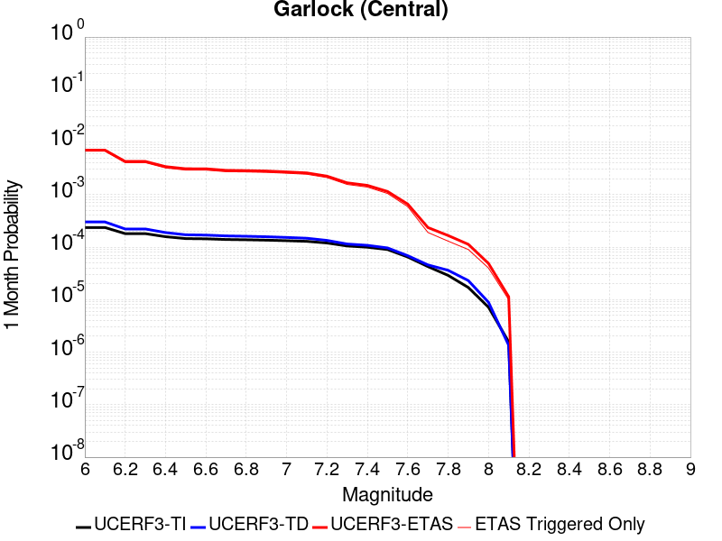 | 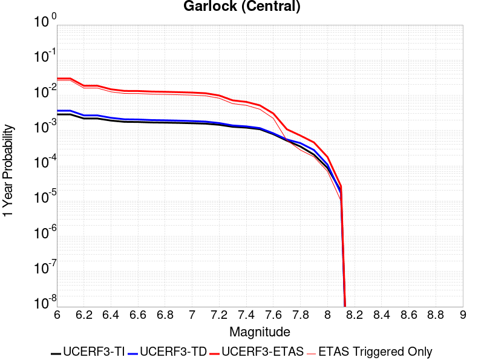 |  |

| Magnitude | 1 wk TI Prob | 1 wk TD Prob | 1 wk ETAS Prob | 1 wk ETAS/TD Gain | 1 wk ETAS Triggered Only | 1 mo TI Prob | 1 mo TD Prob | 1 mo ETAS Prob | 1 mo ETAS/TD Gain | 1 mo ETAS Triggered Only | 1 yr TI Prob | 1 yr TD Prob | 1 yr ETAS Prob | 1 yr ETAS/TD Gain | 1 yr ETAS Triggered Only | 10 yr TI Prob | 10 yr TD Prob | 10 yr ETAS Prob | 10 yr ETAS/TD Gain | 10 yr ETAS Triggered Only |
|-----|-----|-----|-----|-----|-----|-----|-----|-----|-----|-----|-----|-----|-----|-----|-----|-----|-----|-----|-----|-----|
| 6.0 | 5.5131142E-5 | 7.027729E-5 | 0.0020201402 | 28.745277 | 0.00195 | 2.3625491E-4 | 3.0115398E-4 | 0.00701913 | 23.307447 | 0.00672 | 0.0028726095 | 0.0036604498 | 0.030033557 | 8.204882 | 0.02647 | 0.028357591 | 0.036110487 | 0.085866466 | 2.3778818 | 0.05162 |
| 6.1 | 5.5131142E-5 | 7.027729E-5 | 0.0020201402 | 28.745277 | 0.00195 | 2.3625491E-4 | 3.0115398E-4 | 0.00701913 | 23.307447 | 0.00672 | 0.0028726095 | 0.0036604498 | 0.030033557 | 8.204882 | 0.02647 | 0.028357591 | 0.036110487 | 0.085866466 | 2.3778818 | 0.05162 |
| 6.2 | 4.216245E-5 | 5.1689985E-5 | 0.0011716321 | 22.66652 | 0.00112 | 1.806837E-4 | 2.2150988E-4 | 0.0042806105 | 19.324694 | 0.00406 | 0.0021976046 | 0.0026935788 | 0.018680401 | 6.93516 | 0.01603 | 0.021759989 | 0.026700959 | 0.05717495 | 2.141307 | 0.03131 |
| 6.3 | 4.216245E-5 | 5.1689985E-5 | 0.0011716321 | 22.66652 | 0.00112 | 1.806837E-4 | 2.2150988E-4 | 0.0042806105 | 19.324694 | 0.00406 | 0.0021976046 | 0.0026935788 | 0.018680401 | 6.93516 | 0.01603 | 0.021759989 | 0.026700959 | 0.05717495 | 2.141307 | 0.03131 |
| 6.4 | 3.6858168E-5 | 4.4137116E-5 | 9.140987E-4 | 20.710432 | 8.7E-4 | 1.5795401E-4 | 1.8914549E-4 | 0.0034085365 | 18.020712 | 0.00322 | 0.0019213937 | 0.0023004394 | 0.014831546 | 6.4472666 | 0.01256 | 0.019048655 | 0.022871803 | 0.046967786 | 2.0535233 | 0.02466 |
| 6.5 | 3.39199E-5 | 4.004436E-5 | 8.4001233E-4 | 20.977043 | 8.0E-4 | 1.453629E-4 | 1.7160752E-4 | 0.0031011046 | 18.070913 | 0.00293 | 0.0017683565 | 0.0020873414 | 0.013333817 | 6.387943 | 0.01127 | 0.017543508 | 0.020779226 | 0.042439587 | 2.0424047 | 0.02212 |
| 6.6 | 3.3571985E-5 | 3.9498504E-5 | 8.394669E-4 | 21.253132 | 8.0E-4 | 1.4387199E-4 | 1.6926845E-4 | 0.0030987724 | 18.306854 | 0.00293 | 0.0017502342 | 0.0020589172 | 0.013265795 | 6.443094 | 0.01123 | 0.017365133 | 0.020500058 | 0.042107828 | 2.0540345 | 0.02206 |
| 6.7 | 3.2580007E-5 | 3.8114827E-5 | 7.68087E-4 | 20.151922 | 7.3E-4 | 1.3962112E-4 | 1.6333915E-4 | 0.0028928933 | 17.71096 | 0.00273 | 0.0016985617 | 0.0019868617 | 0.012795344 | 6.439977 | 0.01083 | 0.016856372 | 0.019789517 | 0.040668 | 2.0550275 | 0.0213 |
| 6.8 | 3.2185937E-5 | 3.7541937E-5 | 7.575149E-4 | 20.177832 | 7.2E-4 | 1.3793244E-4 | 1.6088421E-4 | 0.0028604497 | 17.779556 | 0.0027 | 0.0016780337 | 0.001957027 | 0.012576204 | 6.4261785 | 0.01064 | 0.016654192 | 0.019496292 | 0.039959405 | 2.04959 | 0.02087 |
| 6.9 | 3.165394E-5 | 3.6746373E-5 | 7.467203E-4 | 20.320925 | 7.1E-4 | 1.3565269E-4 | 1.5747506E-4 | 0.0028070577 | 17.82541 | 0.00265 | 0.0016503202 | 0.0019155943 | 0.012285692 | 6.413514 | 0.01039 | 0.01638118 | 0.019089123 | 0.039040852 | 2.0451882 | 0.02034 |
| 7.0 | 3.0903822E-5 | 3.5651407E-5 | 7.456261E-4 | 20.914352 | 7.1E-4 | 1.3243823E-4 | 1.5278292E-4 | 0.0027023933 | 17.687798 | 0.00255 | 0.0016112428 | 0.0018585661 | 0.011969739 | 6.440308 | 0.01013 | 0.015996104 | 0.018526575 | 0.037959747 | 2.0489352 | 0.0198 |
| 7.1 | 3.0069863E-5 | 3.4417455E-5 | 7.1439403E-4 | 20.756737 | 6.8E-4 | 1.2886449E-4 | 1.4749516E-4 | 0.0025871352 | 17.540476 | 0.00244 | 0.0015677959 | 0.0017942955 | 0.011446944 | 6.379632 | 0.00967 | 0.01556781 | 0.017894004 | 0.036377236 | 2.032929 | 0.01882 |
| 7.2 | 2.7957109E-5 | 3.1306135E-5 | 6.3128734E-4 | 20.164972 | 6.0E-4 | 1.1981068E-4 | 1.3416237E-4 | 0.0022438793 | 16.725101 | 0.00211 | 0.0014577188 | 0.0016322224 | 0.009898707 | 6.064558 | 0.00828 | 0.014481937 | 0.016297111 | 0.031918313 | 1.9585258 | 0.01588 |
| 7.3 | 2.4519275E-5 | 2.673782E-5 | 4.0672766E-4 | 15.211699 | 3.8E-4 | 1.0507837E-4 | 1.1458571E-4 | 0.0016744069 | 14.612703 | 0.00156 | 0.0012785783 | 0.0013942029 | 0.0071861167 | 5.154283 | 0.0058 | 0.012712469 | 0.013940417 | 0.024974424 | 1.791512 | 0.01119 |
| 7.4 | 2.3225532E-5 | 2.5221932E-5 | 3.6521335E-4 | 14.479992 | 3.4E-4 | 9.95342E-5 | 1.08089596E-4 | 0.0014979393 | 13.858312 | 0.00139 | 0.0012111551 | 0.0013152108 | 0.0065183584 | 4.956132 | 0.00521 | 0.012045753 | 0.013157812 | 0.023124918 | 1.7575048 | 0.0101 |
| 7.5 | 2.097765E-5 | 2.2505006E-5 | 2.8249915E-4 | 12.552725 | 2.6E-4 | 8.9901114E-5 | 9.644653E-5 | 0.0011463453 | 11.885812 | 0.00105 | 0.0010939965 | 0.0011736158 | 0.005198886 | 4.4298024 | 0.00403 | 0.010886264 | 0.011751798 | 0.019410722 | 1.6517236 | 0.00775 |
| 7.6 | 1.511254E-5 | 1.601105E-5 | 1.6600864E-4 | 10.368381 | 1.5E-4 | 6.476642E-5 | 6.8617024E-5 | 6.5857655E-4 | 9.597859 | 5.9E-4 | 7.882459E-4 | 8.350999E-4 | 0.003053246 | 3.6561446 | 0.00222 | 0.007854558 | 0.008394289 | 0.012608613 | 1.5020466 | 0.00425 |
| 7.7 | 9.934069E-6 | 1.0697046E-5 | 4.0696723E-5 | 3.8044827 | 3.0E-5 | 4.2573887E-5 | 4.5843677E-5 | 2.3583496E-4 | 5.144329 | 1.9E-4 | 5.182138E-4 | 5.580042E-4 | 0.0010877085 | 1.9492836 | 5.3E-4 | 0.00517007 | 0.0056371735 | 0.0068204654 | 1.2099087 | 0.00119 |
| 7.8 | 6.7562896E-6 | 8.443493E-6 | 3.844324E-5 | 4.553002 | 3.0E-5 | 2.8955206E-5 | 3.61859E-5 | 1.661812E-4 | 4.5924296 | 1.3E-4 | 3.5247262E-4 | 4.404744E-4 | 7.2035106E-4 | 1.6353983 | 2.8E-4 | 0.0035191406 | 0.0044544 | 0.0051512816 | 1.156448 | 7.0E-4 |
| 7.9 | 3.975453E-6 | 5.3802787E-6 | 2.5380172E-5 | 4.7172594 | 2.0E-5 | 1.7037546E-5 | 2.3058134E-5 | 1.13056056E-4 | 4.903088 | 9.0E-5 | 2.0741238E-4 | 2.8069672E-4 | 4.606462E-4 | 1.6410815 | 1.8E-4 | 0.002072189 | 0.0028383592 | 0.0032771104 | 1.1545792 | 4.4E-4 |
| 8.0 | 1.6729537E-6 | 2.0807163E-6 | 2.0807163E-6 | 1.0 | 0.0 | 7.169782E-6 | 8.917325E-6 | 4.891697E-5 | 5.48561 | 4.0E-5 | 8.7288594E-5 | 1.0856306E-4 | 1.7855546E-4 | 1.6447165 | 7.0E-5 | 8.7254314E-4 | 0.0010985805 | 0.0012184487 | 1.1091119 | 1.2E-4 |
| 8.1 | 3.6733252E-7 | 3.1535544E-7 | 3.1535544E-7 | 1.0 | 0.0 | 1.5742813E-6 | 1.3515227E-6 | 1.1351509E-5 | 8.399052 | 1.0E-5 | 1.9166706E-5 | 1.645468E-5 | 2.6454516E-5 | 1.6077198 | 1.0E-5 | 1.9165053E-4 | 1.6651153E-4 | 1.865082E-4 | 1.1200918 | 2.0E-5 |

## Tank Canyon
*[(top)](#table-of-contents)*

| 1 Week | 1 Month | 1 Year | 10 Year |
|-----|-----|-----|-----|
|  |  |  | 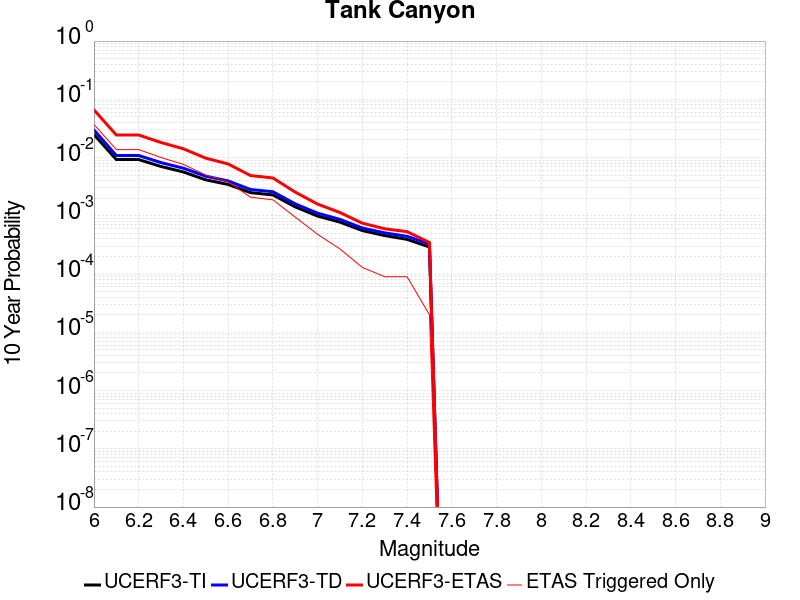 |

| Magnitude | 1 wk TI Prob | 1 wk TD Prob | 1 wk ETAS Prob | 1 wk ETAS/TD Gain | 1 wk ETAS Triggered Only | 1 mo TI Prob | 1 mo TD Prob | 1 mo ETAS Prob | 1 mo ETAS/TD Gain | 1 mo ETAS Triggered Only | 1 yr TI Prob | 1 yr TD Prob | 1 yr ETAS Prob | 1 yr ETAS/TD Gain | 1 yr ETAS Triggered Only | 10 yr TI Prob | 10 yr TD Prob | 10 yr ETAS Prob | 10 yr ETAS/TD Gain | 10 yr ETAS Triggered Only |
|-----|-----|-----|-----|-----|-----|-----|-----|-----|-----|-----|-----|-----|-----|-----|-----|-----|-----|-----|-----|-----|
| 6.0 | 4.8284557E-5 | 5.7972054E-5 | 9.679193E-4 | 16.696308 | 9.1E-4 | 2.0691741E-4 | 2.4843184E-4 | 0.0038975251 | 15.688509 | 0.00365 | 0.0025163088 | 0.003021126 | 0.020647712 | 6.8344426 | 0.01768 | 0.02488006 | 0.029867405 | 0.06588843 | 2.2060313 | 0.03713 |
| 6.1 | 1.7796336E-5 | 2.0875597E-5 | 3.3086914E-4 | 15.849565 | 3.1E-4 | 7.626778E-5 | 8.9463996E-5 | 0.0013193539 | 14.747317 | 0.00123 | 9.281647E-4 | 0.001088718 | 0.0072619896 | 6.6702213 | 0.00618 | 0.009242975 | 0.010837747 | 0.024399161 | 2.2513132 | 0.01371 |
| 6.2 | 1.7796336E-5 | 2.0875597E-5 | 3.3086914E-4 | 15.849565 | 3.1E-4 | 7.626778E-5 | 8.9463996E-5 | 0.0013193539 | 14.747317 | 0.00123 | 9.281647E-4 | 0.001088718 | 0.0072619896 | 6.6702213 | 0.00618 | 0.009242975 | 0.010837747 | 0.024399161 | 2.2513132 | 0.01371 |
| 6.3 | 1.3515912E-5 | 1.5761208E-5 | 2.4575758E-4 | 15.592559 | 2.3E-4 | 5.792405E-5 | 6.7546425E-5 | 9.77485E-4 | 14.471305 | 9.1E-4 | 7.049971E-4 | 8.2209107E-4 | 0.0052684327 | 6.4085755 | 0.00445 | 0.007027647 | 0.008192922 | 0.01813083 | 2.212987 | 0.01002 |
| 6.4 | 1.0870146E-5 | 1.261928E-5 | 1.7261726E-4 | 13.678852 | 1.6E-4 | 4.658551E-5 | 5.4081607E-5 | 7.0404646E-4 | 13.018223 | 6.5E-4 | 5.67031E-4 | 6.5826235E-4 | 0.004026044 | 6.116169 | 0.00337 | 0.005655863 | 0.006564946 | 0.014144856 | 2.1546035 | 0.00763 |
| 6.5 | 7.964826E-6 | 9.19695E-6 | 9.919612E-5 | 10.785764 | 9.0E-5 | 3.4134522E-5 | 3.941496E-5 | 4.593984E-4 | 11.655432 | 4.2E-4 | 4.1550855E-4 | 4.7978203E-4 | 0.0026887218 | 5.6040483 | 0.00221 | 0.0041473247 | 0.0047885776 | 0.009764635 | 2.0391514 | 0.005 |
| 6.6 | 6.6317E-6 | 7.6129572E-6 | 6.76125E-5 | 8.88124 | 6.0E-5 | 2.8421264E-5 | 3.26266E-5 | 3.426165E-4 | 10.501139 | 3.1E-4 | 3.4597394E-4 | 3.9716554E-4 | 0.0020565062 | 5.1779575 | 0.00166 | 0.0034543579 | 0.003965523 | 0.007770375 | 1.9594829 | 0.00382 |
| 6.7 | 4.793663E-6 | 5.431183E-6 | 2.5431074E-5 | 4.682419 | 2.0E-5 | 2.0544108E-5 | 2.3276316E-5 | 1.6327306E-4 | 7.0145574 | 1.4E-4 | 2.500958E-4 | 2.8335667E-4 | 0.00108313 | 3.822497 | 8.0E-4 | 0.0024981452 | 0.0028304583 | 0.0049145427 | 1.7363063 | 0.00209 |
| 6.8 | 4.382823E-6 | 4.9696077E-6 | 2.4969508E-5 | 5.024442 | 2.0E-5 | 1.8783392E-5 | 2.129817E-5 | 1.512954E-4 | 7.103681 | 1.3E-4 | 2.286638E-4 | 2.5927863E-4 | 9.79092E-4 | 3.7762153 | 7.2E-4 | 0.0022842865 | 0.002590255 | 0.0044653853 | 1.7239172 | 0.00188 |
| 6.9 | 2.729601E-6 | 3.073713E-6 | 1.3073683E-5 | 4.253384 | 1.0E-5 | 1.1698237E-5 | 1.3172997E-5 | 9.317194E-5 | 7.07295 | 8.0E-5 | 1.4241673E-4 | 1.6037066E-4 | 5.403097E-4 | 3.3691308 | 3.8E-4 | 0.001423255 | 0.0016025953 | 0.002551073 | 1.5918385 | 9.5E-4 |
| 7.0 | 1.8987357E-6 | 2.1270355E-6 | 1.2127014E-5 | 5.7013693 | 1.0E-5 | 8.137413E-6 | 9.115838E-6 | 5.9115384E-5 | 6.484909 | 5.0E-5 | 9.90685E-5 | 1.1098038E-4 | 3.3095595E-4 | 2.9821124 | 2.2E-4 | 9.902435E-4 | 0.0011093182 | 0.0015887858 | 1.4322182 | 4.8E-4 |
| 7.1 | 1.4928986E-6 | 1.6641969E-6 | 1.166418E-5 | 7.008894 | 1.0E-5 | 6.398121E-6 | 7.1322565E-6 | 3.7132042E-5 | 5.2062125 | 3.0E-5 | 7.789434E-5 | 8.6832355E-5 | 2.1682106E-4 | 2.4970078 | 1.3E-4 | 7.786704E-4 | 8.680421E-4 | 0.0011378077 | 1.3107748 | 2.7E-4 |
| 7.2 | 1.069082E-6 | 1.1829046E-6 | 1.1182893E-5 | 9.453756 | 1.0E-5 | 4.581772E-6 | 5.0695844E-6 | 2.5069483E-5 | 4.9450765 | 2.0E-5 | 5.5781646E-5 | 6.172097E-5 | 1.5171542E-4 | 2.4580853 | 9.0E-5 | 5.576765E-4 | 6.170906E-4 | 7.470104E-4 | 1.210536 | 1.3E-4 |
| 7.3 | 8.776551E-7 | 9.770357E-7 | 1.0977026E-5 | 11.23503 | 1.0E-5 | 3.7613736E-6 | 4.1872922E-6 | 2.4187208E-5 | 5.7763367 | 2.0E-5 | 4.579376E-5 | 5.097961E-5 | 1.20976045E-4 | 2.373028 | 7.0E-5 | 4.5784327E-4 | 5.097302E-4 | 5.996843E-4 | 1.176474 | 9.0E-5 |
| 7.4 | 7.55721E-7 | 8.510555E-7 | 1.0851047E-5 | 12.750105 | 1.0E-5 | 3.2388E-6 | 3.6473784E-6 | 2.3647306E-5 | 6.4833703 | 2.0E-5 | 3.9431678E-5 | 4.4406446E-5 | 1.1440334E-4 | 2.5762777 | 7.0E-5 | 3.942468E-4 | 4.4402658E-4 | 5.339866E-4 | 1.2026006 | 9.0E-5 |
| 7.5 | 5.587665E-7 | 6.3058303E-7 | 6.3058303E-7 | 1.0 | 0.0 | 2.3947114E-6 | 2.7024987E-6 | 1.2702471E-5 | 4.700269 | 1.0E-5 | 2.915522E-5 | 3.290292E-5 | 5.290226E-5 | 1.6078287 | 2.0E-5 | 2.9151395E-4 | 3.2902922E-4 | 3.4902262E-4 | 1.0607649 | 2.0E-5 |

## Little Lake
*[(top)](#table-of-contents)*

| 1 Week | 1 Month | 1 Year | 10 Year |
|-----|-----|-----|-----|
|  |  |  |  |

| Magnitude | 1 wk TI Prob | 1 wk TD Prob | 1 wk ETAS Prob | 1 wk ETAS/TD Gain | 1 wk ETAS Triggered Only | 1 mo TI Prob | 1 mo TD Prob | 1 mo ETAS Prob | 1 mo ETAS/TD Gain | 1 mo ETAS Triggered Only | 1 yr TI Prob | 1 yr TD Prob | 1 yr ETAS Prob | 1 yr ETAS/TD Gain | 1 yr ETAS Triggered Only | 10 yr TI Prob | 10 yr TD Prob | 10 yr ETAS Prob | 10 yr ETAS/TD Gain | 10 yr ETAS Triggered Only |
|-----|-----|-----|-----|-----|-----|-----|-----|-----|-----|-----|-----|-----|-----|-----|-----|-----|-----|-----|-----|-----|
| 6.0 | 2.8424427E-5 | 3.120791E-5 | 7.4118574E-4 | 23.749931 | 7.1E-4 | 1.2181328E-4 | 1.3374208E-4 | 0.0030933463 | 23.12919 | 0.00296 | 0.0014820677 | 0.0016272268 | 0.014037 | 8.626332 | 0.01243 | 0.014722223 | 0.016166527 | 0.039188232 | 2.424035 | 0.0234 |
| 6.1 | 2.8424427E-5 | 3.120791E-5 | 7.4118574E-4 | 23.749931 | 7.1E-4 | 1.2181328E-4 | 1.3374208E-4 | 0.0030933463 | 23.12919 | 0.00296 | 0.0014820677 | 0.0016272268 | 0.014037 | 8.626332 | 0.01243 | 0.014722223 | 0.016166527 | 0.039188232 | 2.424035 | 0.0234 |
| 6.2 | 2.8424427E-5 | 3.120791E-5 | 7.4118574E-4 | 23.749931 | 7.1E-4 | 1.2181328E-4 | 1.3374208E-4 | 0.0030933463 | 23.12919 | 0.00296 | 0.0014820677 | 0.0016272268 | 0.014037 | 8.626332 | 0.01243 | 0.014722223 | 0.016166527 | 0.039188232 | 2.424035 | 0.0234 |
| 6.3 | 1.48860645E-5 | 1.6082404E-5 | 4.7607502E-4 | 29.602228 | 4.6E-4 | 6.379586E-5 | 6.892293E-5 | 0.0020587859 | 29.87084 | 0.00199 | 7.7643775E-4 | 8.388418E-4 | 0.009191829 | 10.957763 | 0.00836 | 0.007737305 | 0.008359574 | 0.023819247 | 2.8493376 | 0.01559 |
| 6.4 | 1.48860645E-5 | 1.6082404E-5 | 4.7607502E-4 | 29.602228 | 4.6E-4 | 6.379586E-5 | 6.892293E-5 | 0.0020587859 | 29.87084 | 0.00199 | 7.7643775E-4 | 8.388418E-4 | 0.009191829 | 10.957763 | 0.00836 | 0.007737305 | 0.008359574 | 0.023819247 | 2.8493376 | 0.01559 |
| 6.5 | 1.2797581E-5 | 1.3766413E-5 | 4.4376048E-4 | 32.235012 | 4.3E-4 | 5.4845623E-5 | 5.899772E-5 | 0.0018788903 | 31.846828 | 0.00182 | 6.675408E-4 | 7.1808626E-4 | 0.008162737 | 11.367349 | 0.00745 | 0.006655392 | 0.0071602096 | 0.021069895 | 2.9426367 | 0.01401 |
| 6.6 | 9.661896E-6 | 1.0289635E-5 | 4.1028552E-4 | 39.873672 | 4.0E-4 | 4.1407468E-5 | 4.4097782E-5 | 0.0016240281 | 36.82789 | 0.00158 | 5.040193E-4 | 5.3677446E-4 | 0.0070232907 | 13.084249 | 0.00649 | 0.005028777 | 0.0053563844 | 0.017292108 | 3.228317 | 0.012 |
| 6.7 | 7.767871E-6 | 8.200141E-6 | 3.2819752E-4 | 40.0234 | 3.2E-4 | 3.329045E-5 | 3.5143064E-5 | 0.0013650963 | 38.843975 | 0.00133 | 4.0523586E-4 | 4.2779653E-4 | 0.0060853753 | 14.224929 | 0.00566 | 0.004044977 | 0.004271082 | 0.014676449 | 3.4362366 | 0.01045 |
| 6.8 | 6.4235196E-6 | 6.736112E-6 | 2.8673423E-4 | 42.566727 | 2.8E-4 | 2.752908E-5 | 2.8868804E-5 | 0.0010688388 | 37.024006 | 0.00104 | 3.35115E-4 | 3.5143382E-4 | 0.0048898384 | 13.913966 | 0.00454 | 0.003346101 | 0.0035100412 | 0.011820767 | 3.3677006 | 0.00834 |
| 6.9 | 3.1283696E-6 | 3.1123075E-6 | 2.1311165E-4 | 68.47385 | 2.1E-4 | 1.3407229E-5 | 1.33384E-5 | 7.7332824E-4 | 57.977585 | 7.6E-4 | 1.6322079E-4 | 1.6238443E-4 | 0.0031419005 | 19.348534 | 0.00298 | 0.0016310095 | 0.0016228061 | 0.0067944 | 4.186822 | 0.00518 |
| 7.0 | 2.290603E-6 | 2.2287766E-6 | 1.0222855E-4 | 45.867565 | 1.0E-4 | 9.816834E-6 | 9.55187E-6 | 4.6954746E-4 | 49.15765 | 4.6E-4 | 1.19513395E-4 | 1.1628885E-4 | 0.0018760841 | 16.132967 | 0.00176 | 0.0011944914 | 0.0011623822 | 0.0043686507 | 3.7583601 | 0.00321 |
| 7.1 | 1.293693E-6 | 1.1777398E-6 | 7.117766E-5 | 60.435806 | 7.0E-5 | 5.5443866E-6 | 5.0474505E-6 | 2.8504603E-4 | 56.47327 | 2.8E-4 | 6.750081E-5 | 6.1451676E-5 | 9.51397E-4 | 15.482035 | 8.9E-4 | 6.7480316E-4 | 6.1441533E-4 | 0.0022434138 | 3.6512985 | 0.00163 |
| 7.2 | 4.715842E-7 | 3.092031E-7 | 3.092031E-7 | 1.0 | 0.0 | 2.0210737E-6 | 1.3251555E-6 | 1.1325143E-5 | 8.546274 | 1.0E-5 | 2.4606294E-5 | 1.6133654E-5 | 4.613317E-5 | 2.859437 | 3.0E-5 | 2.460357E-4 | 1.6132537E-4 | 2.6130924E-4 | 1.6197653 | 1.0E-4 |
| 7.3 | 3.9430947E-7 | 2.3099699E-7 | 2.3099699E-7 | 1.0 | 0.0 | 1.6898966E-6 | 9.899867E-7 | 1.09899765E-5 | 11.101136 | 1.0E-5 | 2.0574296E-5 | 1.2053022E-5 | 4.205266E-5 | 3.4889724 | 3.0E-5 | 2.0572392E-4 | 1.2052376E-4 | 2.0051411E-4 | 1.6636895 | 8.0E-5 |
| 7.4 | 3.547123E-7 | 1.9681158E-7 | 1.9681158E-7 | 1.0 | 0.0 | 1.5201948E-6 | 8.4347795E-7 | 1.084347E-5 | 12.855664 | 1.0E-5 | 1.8508214E-5 | 1.0269297E-5 | 4.0268988E-5 | 3.9212997 | 3.0E-5 | 1.8506673E-4 | 1.0268828E-4 | 1.8268007E-4 | 1.7789768 | 8.0E-5 |
| 7.5 | 2.6354266E-7 | 1.442449E-7 | 1.442449E-7 | 1.0 | 0.0 | 1.129468E-6 | 6.1819225E-7 | 1.0618186E-5 | 17.176188 | 1.0E-5 | 1.3751187E-5 | 7.5264647E-6 | 2.7526314E-5 | 3.65727 | 2.0E-5 | 1.3750336E-4 | 7.5262156E-5 | 1.2525839E-4 | 1.6642945 | 5.0E-5 |
| 7.6 | 1.269913E-7 | 7.573148E-8 | 7.573148E-8 | 1.0 | 0.0 | 5.4424834E-7 | 3.2456344E-7 | 3.2456344E-7 | 1.0 | 0.0 | 6.6262032E-6 | 3.951553E-6 | 1.3951514E-5 | 3.5306404 | 1.0E-5 | 6.626006E-5 | 3.9514867E-5 | 4.951447E-5 | 1.2530593 | 1.0E-5 |

## Airport Lake
*[(top)](#table-of-contents)*

| 1 Week | 1 Month | 1 Year | 10 Year |
|-----|-----|-----|-----|
|  |  |  | 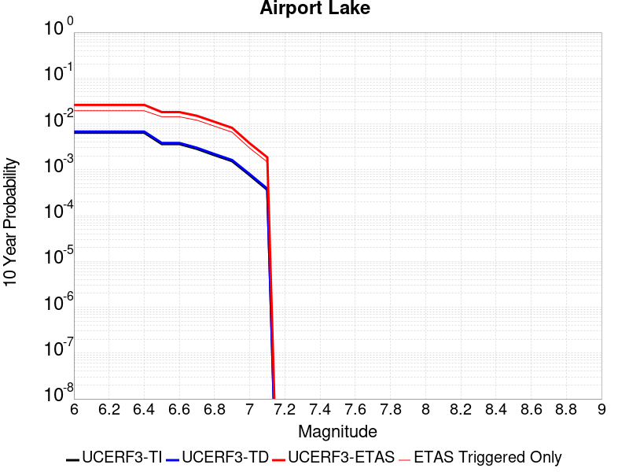 |

| Magnitude | 1 wk TI Prob | 1 wk TD Prob | 1 wk ETAS Prob | 1 wk ETAS/TD Gain | 1 wk ETAS Triggered Only | 1 mo TI Prob | 1 mo TD Prob | 1 mo ETAS Prob | 1 mo ETAS/TD Gain | 1 mo ETAS Triggered Only | 1 yr TI Prob | 1 yr TD Prob | 1 yr ETAS Prob | 1 yr ETAS/TD Gain | 1 yr ETAS Triggered Only | 10 yr TI Prob | 10 yr TD Prob | 10 yr ETAS Prob | 10 yr ETAS/TD Gain | 10 yr ETAS Triggered Only |
|-----|-----|-----|-----|-----|-----|-----|-----|-----|-----|-----|-----|-----|-----|-----|-----|-----|-----|-----|-----|-----|
| 6.0 | 1.2387061E-5 | 1.31036595E-5 | 7.3309423E-4 | 55.945763 | 7.2E-4 | 5.3086325E-5 | 5.6157493E-5 | 0.002826002 | 50.322796 | 0.00277 | 6.461343E-4 | 6.835314E-4 | 0.011216327 | 16.409382 | 0.01054 | 0.0064425888 | 0.0068171 | 0.026074916 | 3.824928 | 0.01939 |
| 6.1 | 1.2387061E-5 | 1.31036595E-5 | 7.3309423E-4 | 55.945763 | 7.2E-4 | 5.3086325E-5 | 5.6157493E-5 | 0.002826002 | 50.322796 | 0.00277 | 6.461343E-4 | 6.835314E-4 | 0.011216327 | 16.409382 | 0.01054 | 0.0064425888 | 0.0068171 | 0.026074916 | 3.824928 | 0.01939 |
| 6.2 | 1.2387061E-5 | 1.31036595E-5 | 7.3309423E-4 | 55.945763 | 7.2E-4 | 5.3086325E-5 | 5.6157493E-5 | 0.002826002 | 50.322796 | 0.00277 | 6.461343E-4 | 6.835314E-4 | 0.011216327 | 16.409382 | 0.01054 | 0.0064425888 | 0.0068171 | 0.026074916 | 3.824928 | 0.01939 |
| 6.3 | 1.2387061E-5 | 1.31036595E-5 | 7.3309423E-4 | 55.945763 | 7.2E-4 | 5.3086325E-5 | 5.6157493E-5 | 0.002826002 | 50.322796 | 0.00277 | 6.461343E-4 | 6.835314E-4 | 0.011216327 | 16.409382 | 0.01054 | 0.0064425888 | 0.0068171 | 0.026074916 | 3.824928 | 0.01939 |
| 6.4 | 1.2387061E-5 | 1.31036595E-5 | 7.3309423E-4 | 55.945763 | 7.2E-4 | 5.3086325E-5 | 5.6157493E-5 | 0.002826002 | 50.322796 | 0.00277 | 6.461343E-4 | 6.835314E-4 | 0.011216327 | 16.409382 | 0.01054 | 0.0064425888 | 0.0068171 | 0.026074916 | 3.824928 | 0.01939 |
| 6.5 | 6.9922594E-6 | 7.3852E-6 | 5.273814E-4 | 71.41057 | 5.2E-4 | 2.996648E-5 | 3.1650507E-5 | 0.0019915884 | 62.92438 | 0.00196 | 3.6478083E-4 | 3.8528218E-4 | 0.00820227 | 21.288992 | 0.00782 | 0.003641826 | 0.0038466796 | 0.01814148 | 4.71614 | 0.01435 |
| 6.6 | 6.9922594E-6 | 7.3852E-6 | 5.273814E-4 | 71.41057 | 5.2E-4 | 2.996648E-5 | 3.1650507E-5 | 0.0019915884 | 62.92438 | 0.00196 | 3.6478083E-4 | 3.8528218E-4 | 0.00820227 | 21.288992 | 0.00782 | 0.003641826 | 0.0038466796 | 0.01814148 | 4.71614 | 0.01435 |
| 6.7 | 5.477277E-6 | 5.786285E-6 | 4.5578368E-4 | 78.76966 | 4.5E-4 | 2.3473833E-5 | 2.479815E-5 | 0.001684757 | 67.93882 | 0.00166 | 2.8575645E-4 | 3.0187954E-4 | 0.006929878 | 22.955772 | 0.00663 | 0.0028538927 | 0.0030150784 | 0.015048686 | 4.9911427 | 0.01207 |
| 6.8 | 3.9950432E-6 | 4.219244E-6 | 3.742177E-4 | 88.69306 | 3.7E-4 | 1.7121502E-5 | 1.8082364E-5 | 0.0012080609 | 66.808784 | 0.00119 | 2.0843433E-4 | 2.201333E-4 | 0.00513905 | 23.345175 | 0.00492 | 0.0020823893 | 0.0021994235 | 0.011119761 | 5.0557613 | 0.00894 |
| 6.9 | 2.95695E-6 | 3.1231407E-6 | 2.8312227E-4 | 90.65306 | 2.8E-4 | 1.2672582E-5 | 1.33848325E-5 | 9.433724E-4 | 70.4807 | 9.3E-4 | 1.5427776E-4 | 1.6295041E-4 | 0.0039223377 | 24.070744 | 0.00376 | 0.001541707 | 0.0016285317 | 0.008217784 | 5.04613 | 0.0066 |
| 7.0 | 1.456072E-6 | 1.5408715E-6 | 1.0154072E-4 | 65.89824 | 1.0E-4 | 6.2402937E-6 | 6.6037237E-6 | 4.466008E-4 | 67.62863 | 4.4E-4 | 7.597293E-5 | 8.039838E-5 | 0.0017602633 | 21.894264 | 0.00168 | 7.594696E-4 | 8.037918E-4 | 0.0037714045 | 4.6920166 | 0.00297 |
| 7.1 | 6.995192E-7 | 7.409265E-7 | 7.0740876E-5 | 95.476234 | 7.0E-5 | 2.997936E-6 | 3.1753993E-6 | 2.6317456E-4 | 82.8792 | 2.6E-4 | 3.649926E-5 | 3.8660488E-5 | 8.78628E-4 | 22.72677 | 8.4E-4 | 3.6493264E-4 | 3.8660486E-4 | 0.0018660327 | 4.826718 | 0.00148 |

## Owl Lake
*[(top)](#table-of-contents)*

| 1 Week | 1 Month | 1 Year | 10 Year |
|-----|-----|-----|-----|
|  |  |  |  |

| Magnitude | 1 wk TI Prob | 1 wk TD Prob | 1 wk ETAS Prob | 1 wk ETAS/TD Gain | 1 wk ETAS Triggered Only | 1 mo TI Prob | 1 mo TD Prob | 1 mo ETAS Prob | 1 mo ETAS/TD Gain | 1 mo ETAS Triggered Only | 1 yr TI Prob | 1 yr TD Prob | 1 yr ETAS Prob | 1 yr ETAS/TD Gain | 1 yr ETAS Triggered Only | 10 yr TI Prob | 10 yr TD Prob | 10 yr ETAS Prob | 10 yr ETAS/TD Gain | 10 yr ETAS Triggered Only |
|-----|-----|-----|-----|-----|-----|-----|-----|-----|-----|-----|-----|-----|-----|-----|-----|-----|-----|-----|-----|-----|
| 6.0 | 5.0320643E-5 | 6.637379E-5 | 5.163439E-4 | 7.779335 | 4.5E-4 | 2.1564208E-4 | 2.8443392E-4 | 0.0020139418 | 7.0805264 | 0.00173 | 0.0026222812 | 0.003458371 | 0.010583644 | 3.0602975 | 0.00715 | 0.02591553 | 0.034149703 | 0.048444286 | 1.4185859 | 0.0148 |
| 6.1 | 5.0320643E-5 | 6.637379E-5 | 5.163439E-4 | 7.779335 | 4.5E-4 | 2.1564208E-4 | 2.8443392E-4 | 0.0020139418 | 7.0805264 | 0.00173 | 0.0026222812 | 0.003458371 | 0.010583644 | 3.0602975 | 0.00715 | 0.02591553 | 0.034149703 | 0.048444286 | 1.4185859 | 0.0148 |
| 6.2 | 2.4125871E-5 | 3.098882E-5 | 3.4097923E-4 | 11.003298 | 3.1E-4 | 1.0339249E-4 | 1.3280321E-4 | 0.0013826372 | 10.411173 | 0.00125 | 0.0012580766 | 0.0016158518 | 0.007126932 | 4.410635 | 0.00552 | 0.012509781 | 0.016075421 | 0.026928108 | 1.6751107 | 0.01103 |
| 6.3 | 1.7433485E-5 | 2.2362183E-5 | 3.023559E-4 | 13.520859 | 2.8E-4 | 7.471279E-5 | 9.583488E-5 | 0.0011957295 | 12.476975 | 0.0011 | 9.0924866E-4 | 0.0011663046 | 0.0060206363 | 5.1621475 | 0.00486 | 0.009055373 | 0.011633009 | 0.021081798 | 1.8122394 | 0.00956 |
| 6.4 | 1.7433485E-5 | 2.2362183E-5 | 3.023559E-4 | 13.520859 | 2.8E-4 | 7.471279E-5 | 9.583488E-5 | 0.0011957295 | 12.476975 | 0.0011 | 9.0924866E-4 | 0.0011663046 | 0.0060206363 | 5.1621475 | 0.00486 | 0.009055373 | 0.011633009 | 0.021081798 | 1.8122394 | 0.00956 |
| 6.5 | 1.5182742E-5 | 1.943535E-5 | 2.994299E-4 | 15.406459 | 2.8E-4 | 6.506727E-5 | 8.32922E-5 | 0.0011432039 | 13.725222 | 0.00106 | 7.919061E-4 | 0.0010137482 | 0.005679014 | 5.6019964 | 0.00467 | 0.0078909 | 0.010122263 | 0.019159848 | 1.8928422 | 0.00913 |
| 6.6 | 6.7271576E-6 | 8.551533E-6 | 2.3854956E-4 | 27.895533 | 2.3E-4 | 2.8830356E-5 | 3.6648944E-5 | 8.6661853E-4 | 23.64648 | 8.3E-4 | 3.5095305E-4 | 4.461152E-4 | 0.004024518 | 9.021253 | 0.00358 | 0.0035039932 | 0.004470574 | 0.011220264 | 2.5098035 | 0.00678 |
| 6.7 | 6.682835E-6 | 8.48397E-6 | 2.3848203E-4 | 28.109718 | 2.3E-4 | 2.8640408E-5 | 3.63594E-5 | 8.6632924E-4 | 23.82683 | 8.3E-4 | 3.4864116E-4 | 4.4259144E-4 | 0.004021007 | 9.085144 | 0.00358 | 0.003480947 | 0.004435514 | 0.011185441 | 2.5217915 | 0.00678 |
| 6.8 | 6.5774975E-6 | 8.330419E-6 | 2.383285E-4 | 28.609425 | 2.3E-4 | 2.8188972E-5 | 3.570134E-5 | 8.656717E-4 | 24.247597 | 8.3E-4 | 3.4314668E-4 | 4.345828E-4 | 0.004013027 | 9.234206 | 0.00358 | 0.0034261728 | 0.004355679 | 0.011106147 | 2.5498085 | 0.00678 |
| 6.9 | 6.363419E-6 | 8.003534E-6 | 2.380017E-4 | 29.737076 | 2.3E-4 | 2.727151E-5 | 3.430044E-5 | 8.5427234E-4 | 24.905579 | 8.2E-4 | 3.3198006E-4 | 4.1753342E-4 | 0.003976047 | 9.522703 | 0.00356 | 0.0033148455 | 0.0041856524 | 0.010857608 | 2.5940063 | 0.0067 |
| 7.0 | 6.1342453E-6 | 7.635657E-6 | 2.376339E-4 | 31.121603 | 2.3E-4 | 2.6289357E-5 | 3.2723867E-5 | 8.22698E-4 | 25.140612 | 7.9E-4 | 3.2002592E-4 | 3.9834576E-4 | 0.0039069476 | 9.807931 | 0.00351 | 0.0031956544 | 0.003994278 | 0.010587837 | 2.6507506 | 0.00662 |
| 7.1 | 5.842926E-6 | 7.146102E-6 | 2.2714453E-4 | 31.785795 | 2.2E-4 | 2.504087E-5 | 3.0625823E-5 | 7.906025E-4 | 25.814901 | 7.6E-4 | 3.0482994E-4 | 3.7281102E-4 | 0.0036915732 | 9.901997 | 0.00332 | 0.0030441214 | 0.00373962 | 0.009966248 | 2.6650426 | 0.00625 |
| 7.2 | 4.77173E-6 | 5.361925E-6 | 1.5536112E-4 | 28.974876 | 1.5E-4 | 2.045011E-5 | 2.2979499E-5 | 5.22968E-4 | 22.758024 | 5.0E-4 | 2.4895166E-4 | 2.7974354E-4 | 0.002519117 | 9.005094 | 0.00224 | 0.0024867293 | 0.0028109413 | 0.0069791917 | 2.4828663 | 0.00418 |
| 7.3 | 3.0494948E-6 | 2.7128945E-6 | 2.271284E-5 | 8.37218 | 2.0E-5 | 1.3069198E-5 | 1.162664E-5 | 1.4162513E-4 | 12.181088 | 1.3E-4 | 1.5910587E-4 | 1.415453E-4 | 6.714703E-4 | 4.743854 | 5.3E-4 | 0.0015899199 | 0.0014247445 | 0.0024432912 | 1.7148979 | 0.00102 |
| 7.4 | 2.7263884E-6 | 2.3079433E-6 | 2.3079433E-6 | 1.0 | 0.0 | 1.1684469E-5 | 9.891149E-6 | 5.9890655E-5 | 6.054975 | 5.0E-5 | 1.4224913E-4 | 1.20418175E-4 | 3.9038566E-4 | 3.2419164 | 2.7E-4 | 0.0014215811 | 0.0012126677 | 0.0018119401 | 1.494177 | 6.0E-4 |
| 7.5 | 2.6090431E-6 | 2.1678318E-6 | 2.1678318E-6 | 1.0 | 0.0 | 1.1181565E-5 | 9.290675E-6 | 4.9290302E-5 | 5.305352 | 4.0E-5 | 1.3612706E-4 | 1.13108195E-4 | 3.330833E-4 | 2.9448204 | 2.2E-4 | 0.001360437 | 0.001139441 | 0.0016288827 | 1.4295454 | 4.9E-4 |
| 7.6 | 2.3008756E-6 | 1.8748681E-6 | 1.8748681E-6 | 1.0 | 0.0 | 9.860858E-6 | 8.035125E-6 | 4.8034803E-5 | 5.978103 | 4.0E-5 | 1.20049335E-4 | 9.782334E-5 | 2.8780475E-4 | 2.942087 | 1.9E-4 | 0.001199845 | 9.864462E-4 | 0.0013860516 | 1.405096 | 4.0E-4 |
| 7.7 | 1.7184348E-6 | 1.3438231E-6 | 1.3438231E-6 | 1.0 | 0.0 | 7.3646997E-6 | 5.7592297E-6 | 2.5759115E-5 | 4.4726667 | 2.0E-5 | 8.966153E-5 | 7.01164E-5 | 1.5011079E-4 | 2.1408799 | 8.0E-5 | 8.962536E-4 | 7.092827E-4 | 9.191338E-4 | 1.2958637 | 2.1E-4 |
| 7.8 | 8.4612907E-7 | 8.4197205E-7 | 8.4197205E-7 | 1.0 | 0.0 | 3.6262625E-6 | 3.6084468E-6 | 1.3608411E-5 | 3.7712655 | 1.0E-5 | 4.4148852E-5 | 4.3931977E-5 | 6.39311E-5 | 1.4552293 | 2.0E-5 | 4.414008E-4 | 4.4504434E-4 | 5.150132E-4 | 1.1572177 | 7.0E-5 |
| 7.9 | 2.716738E-7 | 3.7741984E-7 | 3.7741984E-7 | 1.0 | 0.0 | 1.1643157E-6 | 1.6175127E-6 | 1.6175127E-6 | 1.0 | 0.0 | 1.4175452E-5 | 1.969305E-5 | 1.969305E-5 | 1.0 | 0.0 | 1.4174548E-4 | 1.9901151E-4 | 2.2900554E-4 | 1.150715 | 3.0E-5 |
| 8.0 | 2.1995428E-8 | 3.3872762E-8 | 3.3872762E-8 | 1.0 | 0.0 | 9.426611E-8 | 1.4516898E-7 | 1.4516898E-7 | 1.0 | 0.0 | 1.1476893E-6 | 1.7674316E-6 | 1.7674316E-6 | 1.0 | 0.0 | 1.14768345E-5 | 1.8220579E-5 | 1.8220579E-5 | 1.0 | 0.0 |

## Panamint Valley
*[(top)](#table-of-contents)*

| 1 Week | 1 Month | 1 Year | 10 Year |
|-----|-----|-----|-----|
| 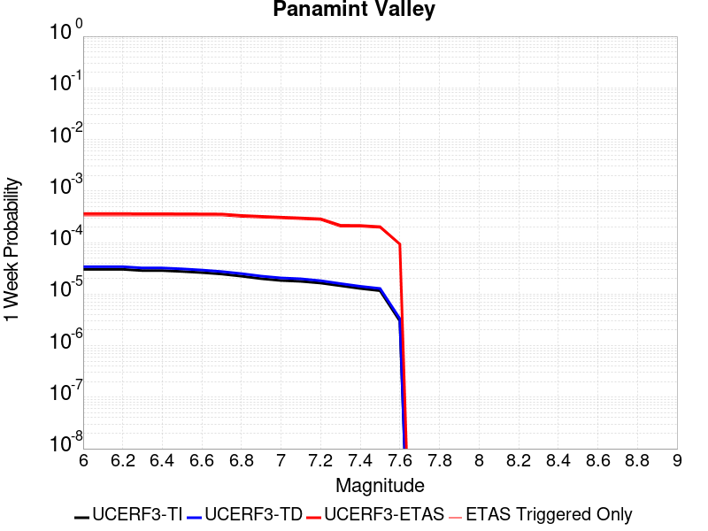 |  |  |  |

| Magnitude | 1 wk TI Prob | 1 wk TD Prob | 1 wk ETAS Prob | 1 wk ETAS/TD Gain | 1 wk ETAS Triggered Only | 1 mo TI Prob | 1 mo TD Prob | 1 mo ETAS Prob | 1 mo ETAS/TD Gain | 1 mo ETAS Triggered Only | 1 yr TI Prob | 1 yr TD Prob | 1 yr ETAS Prob | 1 yr ETAS/TD Gain | 1 yr ETAS Triggered Only | 10 yr TI Prob | 10 yr TD Prob | 10 yr ETAS Prob | 10 yr ETAS/TD Gain | 10 yr ETAS Triggered Only |
|-----|-----|-----|-----|-----|-----|-----|-----|-----|-----|-----|-----|-----|-----|-----|-----|-----|-----|-----|-----|-----|
| 6.0 | 3.0211835E-5 | 3.3989592E-5 | 3.6397838E-4 | 10.708524 | 3.3E-4 | 1.2947287E-4 | 1.4566172E-4 | 0.001495465 | 10.2667 | 0.00135 | 0.0015751923 | 0.0017720184 | 0.007641599 | 4.3123703 | 0.00588 | 0.015640736 | 0.017585829 | 0.030180378 | 1.716176 | 0.01282 |
| 6.1 | 3.0211835E-5 | 3.3989592E-5 | 3.6397838E-4 | 10.708524 | 3.3E-4 | 1.2947287E-4 | 1.4566172E-4 | 0.001495465 | 10.2667 | 0.00135 | 0.0015751923 | 0.0017720184 | 0.007641599 | 4.3123703 | 0.00588 | 0.015640736 | 0.017585829 | 0.030180378 | 1.716176 | 0.01282 |
| 6.2 | 3.0211835E-5 | 3.3989592E-5 | 3.6397838E-4 | 10.708524 | 3.3E-4 | 1.2947287E-4 | 1.4566172E-4 | 0.001495465 | 10.2667 | 0.00135 | 0.0015751923 | 0.0017720184 | 0.007641599 | 4.3123703 | 0.00588 | 0.015640736 | 0.017585829 | 0.030180378 | 1.716176 | 0.01282 |
| 6.3 | 2.8573924E-5 | 3.210744E-5 | 3.6209685E-4 | 11.277661 | 3.3E-4 | 1.2245393E-4 | 1.3759622E-4 | 0.0014474159 | 10.5193 | 0.00131 | 0.001489857 | 0.0016739744 | 0.007254617 | 4.333768 | 0.00559 | 0.01479908 | 0.016620694 | 0.028539252 | 1.7170914 | 0.01212 |
| 6.4 | 2.8573924E-5 | 3.210744E-5 | 3.6209685E-4 | 11.277661 | 3.3E-4 | 1.2245393E-4 | 1.3759622E-4 | 0.0014474159 | 10.5193 | 0.00131 | 0.001489857 | 0.0016739744 | 0.007254617 | 4.333768 | 0.00559 | 0.01479908 | 0.016620694 | 0.028539252 | 1.7170914 | 0.01212 |
| 6.5 | 2.7468774E-5 | 3.0833013E-5 | 3.6082283E-4 | 11.702484 | 3.3E-4 | 1.1771801E-4 | 1.3213494E-4 | 0.0013919685 | 10.534446 | 0.00126 | 0.0014322745 | 0.0016075833 | 0.0069889184 | 4.3474693 | 0.00539 | 0.014230782 | 0.01596649 | 0.027548565 | 1.7253989 | 0.01177 |
| 6.6 | 2.6135967E-5 | 2.9256902E-5 | 3.5924723E-4 | 12.27906 | 3.3E-4 | 1.1200648E-4 | 1.2538084E-4 | 0.0013152317 | 10.489893 | 0.00119 | 0.0013628257 | 0.0015254694 | 0.006717537 | 4.403587 | 0.0052 | 0.013544982 | 0.01515648 | 0.026275363 | 1.7336059 | 0.01129 |
| 6.7 | 2.4498746E-5 | 2.7345724E-5 | 3.573367E-4 | 13.067369 | 3.3E-4 | 1.04990395E-4 | 1.17190844E-4 | 0.0012670561 | 10.811903 | 0.00115 | 0.0012775084 | 0.0014258898 | 0.006388803 | 4.480573 | 0.00497 | 0.012701893 | 0.014173698 | 0.024731897 | 1.744915 | 0.01071 |
| 6.8 | 2.2244329E-5 | 2.493921E-5 | 3.3493148E-4 | 13.429915 | 3.1E-4 | 9.532935E-5 | 1.0687808E-4 | 0.0012167594 | 11.384556 | 0.00111 | 0.0011600169 | 0.0013004856 | 0.005914477 | 4.5478992 | 0.00462 | 0.011539802 | 0.012934638 | 0.02263749 | 1.7501448 | 0.00983 |
| 6.9 | 1.9902658E-5 | 2.2293729E-5 | 3.2228703E-4 | 14.456399 | 3.0E-4 | 8.529431E-5 | 9.554116E-5 | 0.0011254428 | 11.779664 | 0.00103 | 0.0010379635 | 0.0011626114 | 0.005397682 | 4.6427226 | 0.00424 | 0.010331288 | 0.0115706315 | 0.020308347 | 1.7551632 | 0.00884 |
| 7.0 | 1.8353881E-5 | 2.0569514E-5 | 3.1056354E-4 | 15.098245 | 2.9E-4 | 7.865712E-5 | 8.815218E-5 | 0.0010780649 | 12.2295885 | 9.9E-4 | 9.5722964E-4 | 0.001072742 | 0.0050484724 | 4.706138 | 0.00398 | 0.009531168 | 0.010680937 | 0.018733995 | 1.7539654 | 0.00814 |
| 7.1 | 1.7667631E-5 | 1.9775827E-5 | 2.997703E-4 | 15.15842 | 2.8E-4 | 7.571623E-5 | 8.475089E-5 | 0.0010346704 | 12.208372 | 9.5E-4 | 9.2145515E-4 | 0.0010313712 | 0.0048474316 | 4.699987 | 0.00382 | 0.009176437 | 0.010271095 | 0.017961288 | 1.7487218 | 0.00777 |
| 7.2 | 1.6381597E-5 | 1.8161269E-5 | 2.8815636E-4 | 15.866533 | 2.7E-4 | 7.020495E-5 | 7.7831784E-5 | 9.477641E-4 | 12.177083 | 8.7E-4 | 8.544101E-4 | 9.4720727E-4 | 0.0044438923 | 4.691573 | 0.0035 | 0.008511325 | 0.009436704 | 0.016301308 | 1.7274365 | 0.00693 |
| 7.3 | 1.4520491E-5 | 1.5968604E-5 | 2.1596541E-4 | 13.524377 | 2.0E-4 | 6.222919E-5 | 6.843517E-5 | 7.883859E-4 | 11.520186 | 7.2E-4 | 7.57377E-4 | 8.328959E-4 | 0.0036505472 | 4.3829575 | 0.00282 | 0.0075480095 | 0.008301251 | 0.013874598 | 1.6713865 | 0.00562 |
| 7.4 | 1.2852287E-5 | 1.4147339E-5 | 2.1414451E-4 | 15.136734 | 2.0E-4 | 5.5080065E-5 | 6.0630133E-5 | 7.805865E-4 | 12.874563 | 7.2E-4 | 6.7039346E-4 | 7.379377E-4 | 0.003495901 | 4.7373934 | 0.00276 | 0.0066837464 | 0.0073581845 | 0.012758156 | 1.7338728 | 0.00544 |
| 7.5 | 1.1637851E-5 | 1.2838579E-5 | 2.0283613E-4 | 15.798956 | 1.9E-4 | 4.987555E-5 | 5.502141E-5 | 7.549829E-4 | 13.721621 | 7.0E-4 | 6.070656E-4 | 6.6969544E-4 | 0.0033479007 | 4.9991393 | 0.00268 | 0.006054099 | 0.0066800206 | 0.01192475 | 1.7851367 | 0.00528 |
| 7.6 | 3.0068115E-6 | 3.3337822E-6 | 9.333348E-5 | 27.996275 | 9.0E-5 | 1.2886271E-5 | 1.4287601E-5 | 2.8428374E-4 | 19.897234 | 2.7E-4 | 1.5687906E-4 | 1.7394494E-4 | 0.0013037483 | 7.4951787 | 0.00113 | 0.0015676835 | 0.0017398862 | 0.003916093 | 2.2507756 | 0.00218 |

## Garlock (East)
*[(top)](#table-of-contents)*

| 1 Week | 1 Month | 1 Year | 10 Year |
|-----|-----|-----|-----|
| 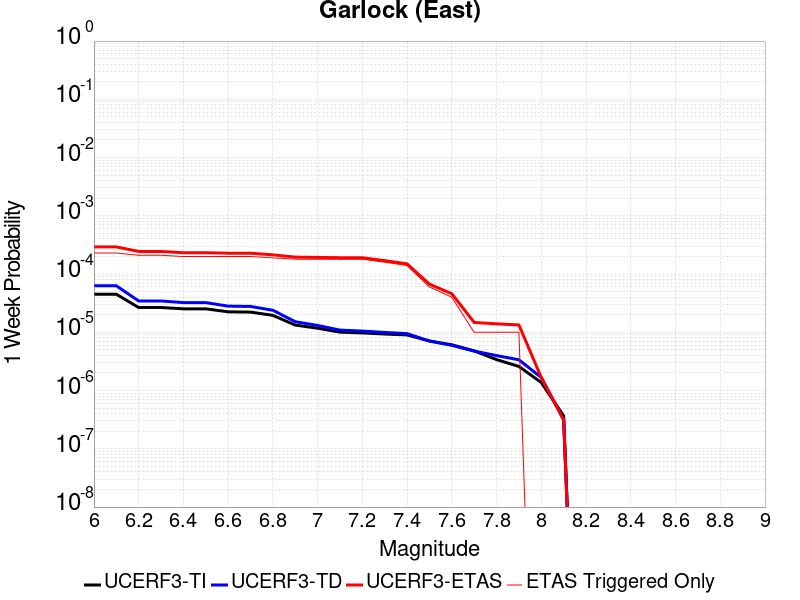 |  | 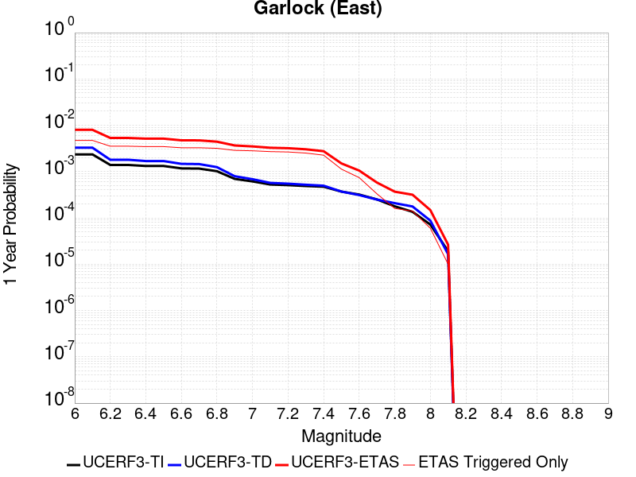 |  |

| Magnitude | 1 wk TI Prob | 1 wk TD Prob | 1 wk ETAS Prob | 1 wk ETAS/TD Gain | 1 wk ETAS Triggered Only | 1 mo TI Prob | 1 mo TD Prob | 1 mo ETAS Prob | 1 mo ETAS/TD Gain | 1 mo ETAS Triggered Only | 1 yr TI Prob | 1 yr TD Prob | 1 yr ETAS Prob | 1 yr ETAS/TD Gain | 1 yr ETAS Triggered Only | 10 yr TI Prob | 10 yr TD Prob | 10 yr ETAS Prob | 10 yr ETAS/TD Gain | 10 yr ETAS Triggered Only |
|-----|-----|-----|-----|-----|-----|-----|-----|-----|-----|-----|-----|-----|-----|-----|-----|-----|-----|-----|-----|-----|
| 6.0 | 4.5092507E-5 | 6.292166E-5 | 2.9290718E-4 | 4.655109 | 2.3E-4 | 1.9323928E-4 | 2.696389E-4 | 0.0013793396 | 5.1155066 | 0.00111 | 0.0023501497 | 0.003278358 | 0.007972917 | 2.431985 | 0.00471 | 0.023254504 | 0.0322993 | 0.042140815 | 1.3046975 | 0.01017 |
| 6.1 | 4.5092507E-5 | 6.292166E-5 | 2.9290718E-4 | 4.655109 | 2.3E-4 | 1.9323928E-4 | 2.696389E-4 | 0.0013793396 | 5.1155066 | 0.00111 | 0.0023501497 | 0.003278358 | 0.007972917 | 2.431985 | 0.00471 | 0.023254504 | 0.0322993 | 0.042140815 | 1.3046975 | 0.01017 |
| 6.2 | 2.6674514E-5 | 3.45247E-5 | 2.4451746E-4 | 7.0823917 | 2.1E-4 | 1.1431433E-4 | 1.479548E-4 | 0.0010578202 | 7.149617 | 9.1E-4 | 0.0013908884 | 0.0017998944 | 0.005323541 | 2.9576962 | 0.00353 | 0.01382215 | 0.017889874 | 0.024941424 | 1.3941643 | 0.00718 |
| 6.3 | 2.6674514E-5 | 3.45247E-5 | 2.4451746E-4 | 7.0823917 | 2.1E-4 | 1.1431433E-4 | 1.479548E-4 | 0.0010578202 | 7.149617 | 9.1E-4 | 0.0013908884 | 0.0017998944 | 0.005323541 | 2.9576962 | 0.00353 | 0.01382215 | 0.017889874 | 0.024941424 | 1.3941643 | 0.00718 |
| 6.4 | 2.5312667E-5 | 3.235352E-5 | 2.3234705E-4 | 7.181507 | 2.0E-4 | 1.0847834E-4 | 1.3865075E-4 | 0.0010185287 | 7.3460026 | 8.8E-4 | 0.0013199237 | 0.0016867951 | 0.005140959 | 3.0477672 | 0.00346 | 0.013121112 | 0.016789937 | 0.023692071 | 1.4110876 | 0.00702 |
| 6.5 | 2.5312667E-5 | 3.235352E-5 | 2.3234705E-4 | 7.181507 | 2.0E-4 | 1.0847834E-4 | 1.3865075E-4 | 0.0010185287 | 7.3460026 | 8.8E-4 | 0.0013199237 | 0.0016867951 | 0.005140959 | 3.0477672 | 0.00346 | 0.013121112 | 0.016789937 | 0.023692071 | 1.4110876 | 0.00702 |
| 6.6 | 2.246556E-5 | 2.8147608E-5 | 2.2814197E-4 | 8.1052 | 2.0E-4 | 9.627742E-5 | 1.2062716E-4 | 9.705246E-4 | 8.045656 | 8.5E-4 | 0.0011715472 | 0.0014676698 | 0.0047328705 | 3.2247515 | 0.00327 | 0.011653901 | 0.014630373 | 0.021192934 | 1.4485574 | 0.00666 |
| 6.7 | 2.2241198E-5 | 2.7817317E-5 | 2.2781176E-4 | 8.189566 | 2.0E-4 | 9.531594E-5 | 1.19211756E-4 | 9.691104E-4 | 8.129319 | 8.5E-4 | 0.0011598538 | 0.0014504604 | 0.0047157174 | 3.2511866 | 0.00327 | 0.011538187 | 0.014460266 | 0.021023959 | 1.4539125 | 0.00666 |
| 6.8 | 1.9528685E-5 | 2.391094E-5 | 2.139064E-4 | 8.945964 | 1.9E-4 | 8.369167E-5 | 1.0247154E-4 | 9.323865E-4 | 9.09898 | 8.3E-4 | 0.0010184698 | 0.0012468967 | 0.0044229315 | 3.5471518 | 0.00318 | 0.010138147 | 0.012442173 | 0.018732917 | 1.5055984 | 0.00637 |
| 6.9 | 1.3318621E-5 | 1.52095845E-5 | 1.9520684E-4 | 12.834463 | 1.8E-4 | 5.7078556E-5 | 6.5182336E-5 | 8.251328E-4 | 12.65884 | 7.6E-4 | 6.9470983E-4 | 7.933117E-4 | 0.0036610349 | 4.614876 | 0.00287 | 0.0069254204 | 0.007945898 | 0.013580766 | 1.7091542 | 0.00568 |
| 7.0 | 1.1760853E-5 | 1.3118051E-5 | 1.9311569E-4 | 14.72137 | 1.8E-4 | 5.0402683E-5 | 5.621904E-5 | 8.161763E-4 | 14.517792 | 7.6E-4 | 6.134799E-4 | 6.8425684E-4 | 0.0034923342 | 5.103835 | 0.00281 | 0.0061178906 | 0.0068622967 | 0.012384142 | 1.8046644 | 0.00556 |
| 7.1 | 1.0064758E-5 | 1.0912816E-5 | 1.9091085E-4 | 17.494188 | 1.8E-4 | 4.3133965E-5 | 4.6768393E-5 | 7.967333E-4 | 17.03572 | 7.5E-4 | 5.2502943E-4 | 5.692599E-4 | 0.003267723 | 5.7403 | 0.0027 | 0.005237907 | 0.0057182284 | 0.010977979 | 1.9198217 | 0.00529 |
| 7.2 | 9.768808E-6 | 1.0508613E-5 | 1.9050672E-4 | 18.128628 | 1.8E-4 | 4.186565E-5 | 4.5036155E-5 | 7.8500283E-4 | 17.430504 | 7.4E-4 | 5.095951E-4 | 5.481807E-4 | 0.003196728 | 5.831522 | 0.00265 | 0.0050842804 | 0.005508363 | 0.010629995 | 1.929792 | 0.00515 |
| 7.3 | 9.344516E-6 | 9.954069E-6 | 1.6995247E-4 | 17.07367 | 1.6E-4 | 4.004731E-5 | 4.2659616E-5 | 7.626289E-4 | 17.877068 | 7.2E-4 | 4.8746695E-4 | 5.1926053E-4 | 0.0030279572 | 5.831287 | 0.00251 | 0.0048639905 | 0.0052199233 | 0.009974972 | 1.9109422 | 0.00478 |
| 7.4 | 9.023491E-6 | 9.500045E-6 | 1.4949871E-4 | 15.736631 | 1.4E-4 | 3.867153E-5 | 4.0713865E-5 | 6.906874E-4 | 16.964428 | 6.5E-4 | 4.7072413E-4 | 4.955819E-4 | 0.002754462 | 5.558036 | 0.00226 | 0.004697283 | 0.0049832556 | 0.009251878 | 1.856593 | 0.00429 |
| 7.5 | 7.081253E-6 | 7.0959277E-6 | 6.7095505E-5 | 9.455494 | 6.0E-5 | 3.0347876E-5 | 3.0410767E-5 | 3.5040104E-4 | 11.522268 | 3.2E-4 | 3.6942272E-4 | 3.7018894E-4 | 0.0014997707 | 4.0513654 | 0.00113 | 0.003688092 | 0.0037285134 | 0.005790795 | 1.5531111 | 0.00207 |
| 7.6 | 6.116396E-6 | 5.967054E-6 | 4.5966815E-5 | 7.7034354 | 4.0E-5 | 2.6212863E-5 | 2.557284E-5 | 2.655667E-4 | 10.384717 | 2.4E-4 | 3.1909486E-4 | 3.113051E-4 | 0.0010510747 | 3.3763492 | 7.4E-4 | 0.0031863707 | 0.0031397499 | 0.0044755423 | 1.4254456 | 0.00134 |
| 7.7 | 4.797145E-6 | 4.764693E-6 | 1.4764645E-5 | 3.098761 | 1.0E-5 | 2.055903E-5 | 2.0419953E-5 | 1.504173E-4 | 7.366192 | 1.3E-4 | 2.5027743E-4 | 2.485847E-4 | 5.7850266E-4 | 2.3271854 | 3.3E-4 | 0.0024999576 | 0.002512775 | 0.0032010411 | 1.2739068 | 6.9E-4 |
| 7.8 | 3.4028885E-6 | 3.985164E-6 | 1.3985124E-5 | 3.5092971 | 1.0E-5 | 1.4583726E-5 | 1.707916E-5 | 9.70778E-5 | 5.683991 | 8.0E-5 | 1.775424E-4 | 2.0791902E-4 | 3.6788575E-4 | 1.7693703 | 1.6E-4 | 0.0017740062 | 0.0021043725 | 0.002493552 | 1.1849384 | 3.9E-4 |
| 7.9 | 2.5928412E-6 | 3.3781714E-6 | 1.3378138E-5 | 3.9601715 | 1.0E-5 | 1.1112129E-5 | 1.4477798E-5 | 8.4476786E-5 | 5.8349195 | 7.0E-5 | 1.3528178E-4 | 1.7625299E-4 | 3.162283E-4 | 1.7941728 | 1.4E-4 | 0.0013519945 | 0.0017839225 | 0.0021033518 | 1.17906 | 3.2E-4 |
| 8.0 | 1.3743648E-6 | 1.6760752E-6 | 1.6760752E-6 | 1.0 | 0.0 | 5.8901214E-6 | 7.1831596E-6 | 4.718287E-5 | 6.56854 | 4.0E-5 | 7.1709874E-5 | 8.745149E-5 | 1.4744625E-4 | 1.6860347 | 6.0E-5 | 7.1686733E-4 | 8.8486174E-4 | 9.947644E-4 | 1.1242032 | 1.1E-4 |
| 8.1 | 3.6733252E-7 | 3.1535544E-7 | 3.1535544E-7 | 1.0 | 0.0 | 1.5742813E-6 | 1.3515227E-6 | 1.1351509E-5 | 8.399052 | 1.0E-5 | 1.9166706E-5 | 1.645468E-5 | 2.6454516E-5 | 1.6077198 | 1.0E-5 | 1.9165053E-4 | 1.6651153E-4 | 1.865082E-4 | 1.1200918 | 2.0E-5 |

## Ash Hill
*[(top)](#table-of-contents)*

| 1 Week | 1 Month | 1 Year | 10 Year |
|-----|-----|-----|-----|
|  |  | 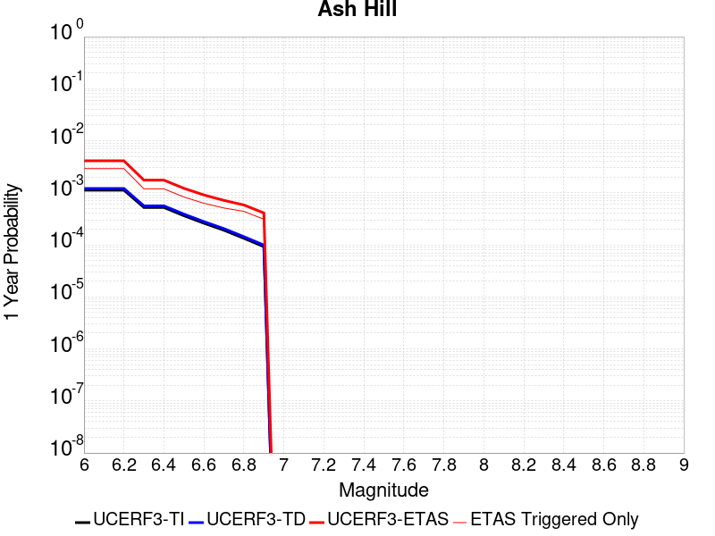 | 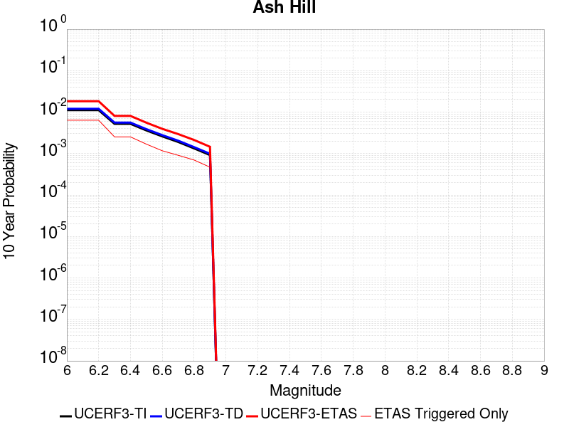 |

| Magnitude | 1 wk TI Prob | 1 wk TD Prob | 1 wk ETAS Prob | 1 wk ETAS/TD Gain | 1 wk ETAS Triggered Only | 1 mo TI Prob | 1 mo TD Prob | 1 mo ETAS Prob | 1 mo ETAS/TD Gain | 1 mo ETAS Triggered Only | 1 yr TI Prob | 1 yr TD Prob | 1 yr ETAS Prob | 1 yr ETAS/TD Gain | 1 yr ETAS Triggered Only | 10 yr TI Prob | 10 yr TD Prob | 10 yr ETAS Prob | 10 yr ETAS/TD Gain | 10 yr ETAS Triggered Only |
|-----|-----|-----|-----|-----|-----|-----|-----|-----|-----|-----|-----|-----|-----|-----|-----|-----|-----|-----|-----|-----|
| 6.0 | 2.1545662E-5 | 2.3195624E-5 | 1.9319168E-4 | 8.328798 | 1.7E-4 | 9.2335285E-5 | 9.940648E-5 | 8.093359E-4 | 8.141682 | 7.1E-4 | 0.0011236023 | 0.001209682 | 0.0041161617 | 3.4026809 | 0.00291 | 0.011179381 | 0.012038956 | 0.018342149 | 1.5235662 | 0.00638 |
| 6.1 | 2.1545662E-5 | 2.3195624E-5 | 1.9319168E-4 | 8.328798 | 1.7E-4 | 9.2335285E-5 | 9.940648E-5 | 8.093359E-4 | 8.141682 | 7.1E-4 | 0.0011236023 | 0.001209682 | 0.0041161617 | 3.4026809 | 0.00291 | 0.011179381 | 0.012038956 | 0.018342149 | 1.5235662 | 0.00638 |
| 6.2 | 2.1545662E-5 | 2.3195624E-5 | 1.9319168E-4 | 8.328798 | 1.7E-4 | 9.2335285E-5 | 9.940648E-5 | 8.093359E-4 | 8.141682 | 7.1E-4 | 0.0011236023 | 0.001209682 | 0.0041161617 | 3.4026809 | 0.00291 | 0.011179381 | 0.012038956 | 0.018342149 | 1.5235662 | 0.00638 |
| 6.3 | 1.0025529E-5 | 1.0747447E-5 | 5.0747018E-5 | 4.721774 | 4.0E-5 | 4.2965847E-5 | 4.6059748E-5 | 2.660496E-4 | 5.7761846 | 2.2E-4 | 5.229836E-4 | 5.606464E-4 | 0.0017499792 | 3.12136 | 0.00119 | 0.005217545 | 0.005593633 | 0.008109481 | 1.44977 | 0.00253 |
| 6.4 | 1.0025529E-5 | 1.0747447E-5 | 5.0747018E-5 | 4.721774 | 4.0E-5 | 4.2965847E-5 | 4.6059748E-5 | 2.660496E-4 | 5.7761846 | 2.2E-4 | 5.229836E-4 | 5.606464E-4 | 0.0017499792 | 3.12136 | 0.00119 | 0.005217545 | 0.005593633 | 0.008109481 | 1.44977 | 0.00253 |
| 6.5 | 6.9617327E-6 | 7.4569857E-6 | 3.745676E-5 | 5.023043 | 3.0E-5 | 2.9835655E-5 | 3.1958167E-5 | 1.719537E-4 | 5.3805866 | 1.4E-4 | 3.6318856E-4 | 3.8902988E-4 | 0.001218707 | 3.132682 | 8.3E-4 | 0.0036259557 | 0.0038843432 | 0.0055677784 | 1.43339 | 0.00169 |
| 6.6 | 4.9919777E-6 | 5.3469403E-6 | 3.534678E-5 | 6.6106553 | 3.0E-5 | 2.1394015E-5 | 2.2915294E-5 | 1.1291323E-4 | 4.9274178 | 9.0E-5 | 2.60441E-4 | 2.789647E-4 | 9.0878893E-4 | 3.2577202 | 6.3E-4 | 0.0026013597 | 0.0027868038 | 0.003953543 | 1.4186658 | 0.00117 |
| 6.7 | 3.6630722E-6 | 3.9248093E-6 | 2.3924731E-5 | 6.095769 | 2.0E-5 | 1.5698786E-5 | 1.6820537E-5 | 8.681936E-5 | 5.1615095 | 7.0E-5 | 1.9111596E-4 | 2.0477652E-4 | 7.146721E-4 | 3.4900098 | 5.1E-4 | 0.0019095168 | 0.0020464414 | 0.0029545792 | 1.4437643 | 9.1E-4 |
| 6.8 | 2.5599613E-6 | 2.7450567E-6 | 1.2745029E-5 | 4.642902 | 1.0E-5 | 1.0971216E-5 | 1.1764503E-5 | 7.1763796E-5 | 6.100028 | 6.0E-5 | 1.3356637E-4 | 1.4322836E-4 | 5.831653E-4 | 4.0715775 | 4.4E-4 | 0.0013348613 | 0.0014318455 | 0.0021308432 | 1.4881796 | 7.0E-4 |
| 6.9 | 1.7684905E-6 | 1.8969621E-6 | 1.8969621E-6 | 1.0 | 0.0 | 7.579223E-6 | 8.129838E-6 | 3.8129594E-5 | 4.6900806 | 3.0E-5 | 9.2273134E-5 | 9.898077E-5 | 4.089501E-4 | 4.1316113 | 3.1E-4 | 9.223483E-4 | 9.898077E-4 | 0.0014593424 | 1.4743698 | 4.7E-4 |

## Hunter Mountain-Saline Valley
*[(top)](#table-of-contents)*

| 1 Week | 1 Month | 1 Year | 10 Year |
|-----|-----|-----|-----|
| 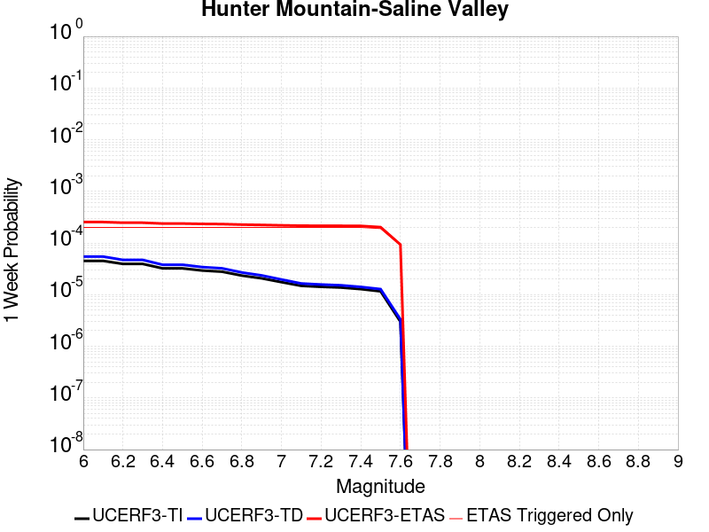 |  |  |  |

| Magnitude | 1 wk TI Prob | 1 wk TD Prob | 1 wk ETAS Prob | 1 wk ETAS/TD Gain | 1 wk ETAS Triggered Only | 1 mo TI Prob | 1 mo TD Prob | 1 mo ETAS Prob | 1 mo ETAS/TD Gain | 1 mo ETAS Triggered Only | 1 yr TI Prob | 1 yr TD Prob | 1 yr ETAS Prob | 1 yr ETAS/TD Gain | 1 yr ETAS Triggered Only | 10 yr TI Prob | 10 yr TD Prob | 10 yr ETAS Prob | 10 yr ETAS/TD Gain | 10 yr ETAS Triggered Only |
|-----|-----|-----|-----|-----|-----|-----|-----|-----|-----|-----|-----|-----|-----|-----|-----|-----|-----|-----|-----|-----|
| 6.0 | 4.5103672E-5 | 5.4577344E-5 | 2.5456643E-4 | 4.6643243 | 2.0E-4 | 1.9328714E-4 | 2.3388314E-4 | 9.837077E-4 | 4.20598 | 7.5E-4 | 0.002350731 | 0.0028439907 | 0.0057257717 | 2.0132878 | 0.00289 | 0.023260195 | 0.028096747 | 0.033656035 | 1.1978623 | 0.00572 |
| 6.1 | 4.5103672E-5 | 5.4577344E-5 | 2.5456643E-4 | 4.6643243 | 2.0E-4 | 1.9328714E-4 | 2.3388314E-4 | 9.837077E-4 | 4.20598 | 7.5E-4 | 0.002350731 | 0.0028439907 | 0.0057257717 | 2.0132878 | 0.00289 | 0.023260195 | 0.028096747 | 0.033656035 | 1.1978623 | 0.00572 |
| 6.2 | 3.9363465E-5 | 4.7069658E-5 | 2.4706023E-4 | 5.2488217 | 2.0E-4 | 1.6868966E-4 | 2.0171238E-4 | 9.415631E-4 | 4.66785 | 7.4E-4 | 0.002051862 | 0.0024532212 | 0.0052962294 | 2.1588879 | 0.00285 | 0.020330196 | 0.024277579 | 0.029809926 | 1.2278788 | 0.00567 |
| 6.3 | 3.9363465E-5 | 4.7069658E-5 | 2.4706023E-4 | 5.2488217 | 2.0E-4 | 1.6868966E-4 | 2.0171238E-4 | 9.415631E-4 | 4.66785 | 7.4E-4 | 0.002051862 | 0.0024532212 | 0.0052962294 | 2.1588879 | 0.00285 | 0.020330196 | 0.024277579 | 0.029809926 | 1.2278788 | 0.00567 |
| 6.4 | 3.2311684E-5 | 3.7956484E-5 | 2.3794889E-4 | 6.268992 | 2.0E-4 | 1.384713E-4 | 1.6266092E-4 | 9.025405E-4 | 5.548601 | 7.4E-4 | 0.0016845843 | 0.0019786663 | 0.0048030666 | 2.4274263 | 0.00283 | 0.016718714 | 0.019619653 | 0.025148999 | 1.2818269 | 0.00564 |
| 6.5 | 3.2311684E-5 | 3.7956484E-5 | 2.3794889E-4 | 6.268992 | 2.0E-4 | 1.384713E-4 | 1.6266092E-4 | 9.025405E-4 | 5.548601 | 7.4E-4 | 0.0016845843 | 0.0019786663 | 0.0048030666 | 2.4274263 | 0.00283 | 0.016718714 | 0.019619653 | 0.025148999 | 1.2818269 | 0.00564 |
| 6.6 | 2.9305844E-5 | 3.4186687E-5 | 2.3417985E-4 | 6.8500304 | 2.0E-4 | 1.2559042E-4 | 1.465065E-4 | 8.863981E-4 | 6.0502305 | 7.4E-4 | 0.0015279909 | 0.0017823193 | 0.004607275 | 2.5849888 | 0.00283 | 0.015175272 | 0.017688544 | 0.02322878 | 1.3132105 | 0.00564 |
| 6.7 | 2.7826512E-5 | 3.2348795E-5 | 2.3234233E-4 | 7.1824102 | 2.0E-4 | 1.19251024E-4 | 1.3863067E-4 | 8.785281E-4 | 6.337184 | 7.4E-4 | 0.0014509142 | 0.001686582 | 0.004491843 | 2.6632817 | 0.00281 | 0.014414776 | 0.01674589 | 0.022261946 | 1.3293976 | 0.00561 |
| 6.8 | 2.3389874E-5 | 2.687038E-5 | 2.2686501E-4 | 8.44294 | 2.0E-4 | 1.0023846E-4 | 1.15153955E-4 | 8.5506873E-4 | 7.4254394 | 7.4E-4 | 0.00121972 | 0.0014011451 | 0.004207208 | 3.0026925 | 0.00281 | 0.01213047 | 0.013929705 | 0.019451698 | 1.3964186 | 0.0056 |
| 6.9 | 2.069209E-5 | 2.3573213E-5 | 2.235685E-4 | 9.484006 | 2.0E-4 | 8.867737E-5 | 1.0102435E-4 | 8.409496E-4 | 8.324227 | 7.4E-4 | 0.0010791123 | 0.0012293136 | 0.004005896 | 3.2586446 | 0.00278 | 0.010738871 | 0.012230548 | 0.017712668 | 1.4482318 | 0.00555 |
| 7.0 | 1.7462342E-5 | 1.9636154E-5 | 2.1963223E-4 | 11.185093 | 2.0E-4 | 7.483646E-5 | 8.4152365E-5 | 8.240901E-4 | 9.792833 | 7.4E-4 | 9.1075303E-4 | 0.0010240962 | 0.0038012492 | 3.711809 | 0.00278 | 0.009070295 | 0.010197786 | 0.015661493 | 1.535774 | 0.00552 |
| 7.1 | 1.4807709E-5 | 1.644393E-5 | 2.1644065E-4 | 13.162342 | 2.0E-4 | 6.3460066E-5 | 7.0472175E-5 | 7.9042144E-4 | 11.216078 | 7.2E-4 | 7.723524E-4 | 8.576775E-4 | 0.0036153104 | 4.215233 | 0.00276 | 0.007696735 | 0.008547045 | 0.013960379 | 1.6333572 | 0.00546 |
| 7.2 | 1.4180048E-5 | 1.5700427E-5 | 2.1569729E-4 | 13.738308 | 2.0E-4 | 6.077022E-5 | 6.7285895E-5 | 7.872374E-4 | 11.699888 | 7.2E-4 | 7.396263E-4 | 8.189141E-4 | 0.003566662 | 4.3553553 | 0.00275 | 0.0073716943 | 0.008162301 | 0.013557898 | 1.6610388 | 0.00544 |
| 7.3 | 1.3730402E-5 | 1.5174104E-5 | 2.1517107E-4 | 14.18015 | 2.0E-4 | 5.8843252E-5 | 6.503035E-5 | 7.849835E-4 | 12.071034 | 7.2E-4 | 7.161811E-4 | 7.914729E-4 | 0.0035392963 | 4.4717846 | 0.00275 | 0.007138774 | 0.007889859 | 0.013286938 | 1.6840527 | 0.00544 |
| 7.4 | 1.2810095E-5 | 1.4111195E-5 | 2.1410837E-4 | 15.172944 | 2.0E-4 | 5.489925E-5 | 6.0475235E-5 | 7.8043167E-4 | 12.90498 | 7.2E-4 | 6.681934E-4 | 7.360531E-4 | 0.0034840289 | 4.7333937 | 0.00275 | 0.006661878 | 0.007339433 | 0.012719653 | 1.7330567 | 0.00542 |
| 7.5 | 1.1595659E-5 | 1.2802435E-5 | 2.028E-4 | 15.840737 | 1.9E-4 | 4.9694736E-5 | 5.4866512E-5 | 7.548281E-4 | 13.757538 | 7.0E-4 | 6.0486543E-4 | 6.6781073E-4 | 0.0033360277 | 4.995469 | 0.00267 | 0.006032217 | 0.006661256 | 0.011886218 | 1.7843809 | 0.00526 |
| 7.6 | 2.997694E-6 | 3.3259073E-6 | 9.332561E-5 | 28.060194 | 9.0E-5 | 1.28471975E-5 | 1.4253852E-5 | 2.8425E-4 | 19.941978 | 2.7E-4 | 1.564034E-4 | 1.735341E-4 | 0.001303338 | 7.510558 | 0.00113 | 0.0015629337 | 0.0017357771 | 0.003911993 | 2.2537417 | 0.00218 |

## Blackwater
*[(top)](#table-of-contents)*

| 1 Week | 1 Month | 1 Year | 10 Year |
|-----|-----|-----|-----|
|  |  |  |  |

| Magnitude | 1 wk TI Prob | 1 wk TD Prob | 1 wk ETAS Prob | 1 wk ETAS/TD Gain | 1 wk ETAS Triggered Only | 1 mo TI Prob | 1 mo TD Prob | 1 mo ETAS Prob | 1 mo ETAS/TD Gain | 1 mo ETAS Triggered Only | 1 yr TI Prob | 1 yr TD Prob | 1 yr ETAS Prob | 1 yr ETAS/TD Gain | 1 yr ETAS Triggered Only | 10 yr TI Prob | 10 yr TD Prob | 10 yr ETAS Prob | 10 yr ETAS/TD Gain | 10 yr ETAS Triggered Only |
|-----|-----|-----|-----|-----|-----|-----|-----|-----|-----|-----|-----|-----|-----|-----|-----|-----|-----|-----|-----|-----|
| 6.0 | 3.0708583E-5 | 3.3097556E-5 | 1.0309524E-4 | 3.1148896 | 7.0E-5 | 1.3160157E-4 | 1.4183973E-4 | 5.217858E-4 | 3.6787 | 3.8E-4 | 0.0016010714 | 0.0017256675 | 0.0037521643 | 2.1743264 | 0.00203 | 0.015895851 | 0.01713651 | 0.021510255 | 1.2552295 | 0.00445 |
| 6.1 | 3.0708583E-5 | 3.3097556E-5 | 1.0309524E-4 | 3.1148896 | 7.0E-5 | 1.3160157E-4 | 1.4183973E-4 | 5.217858E-4 | 3.6787 | 3.8E-4 | 0.0016010714 | 0.0017256675 | 0.0037521643 | 2.1743264 | 0.00203 | 0.015895851 | 0.01713651 | 0.021510255 | 1.2552295 | 0.00445 |
| 6.2 | 1.1707779E-5 | 1.2545717E-5 | 4.254534E-5 | 3.3912241 | 3.0E-5 | 5.017523E-5 | 5.3766307E-5 | 1.9375878E-4 | 3.6037211 | 1.4E-4 | 6.107122E-4 | 6.544178E-4 | 0.0013839401 | 2.1147654 | 7.3E-4 | 0.006090366 | 0.0065258783 | 0.008254523 | 1.2648908 | 0.00174 |
| 6.3 | 1.1707779E-5 | 1.2545717E-5 | 4.254534E-5 | 3.3912241 | 3.0E-5 | 5.017523E-5 | 5.3766307E-5 | 1.9375878E-4 | 3.6037211 | 1.4E-4 | 6.107122E-4 | 6.544178E-4 | 0.0013839401 | 2.1147654 | 7.3E-4 | 0.006090366 | 0.0065258783 | 0.008254523 | 1.2648908 | 0.00174 |
| 6.4 | 7.929244E-6 | 8.480489E-6 | 3.8480233E-5 | 4.537502 | 3.0E-5 | 3.3982033E-5 | 3.6344467E-5 | 1.4634048E-4 | 4.0264854 | 1.1E-4 | 4.136527E-4 | 4.424081E-4 | 9.821692E-4 | 2.2200525 | 5.4E-4 | 0.0041288356 | 0.0044156793 | 0.005560601 | 1.2592856 | 0.00115 |
| 6.5 | 5.8832115E-6 | 6.2862764E-6 | 3.628609E-5 | 5.7722707 | 3.0E-5 | 2.521352E-5 | 2.6940921E-5 | 1.06938765E-4 | 3.9693806 | 8.0E-5 | 3.0693135E-4 | 3.2795887E-4 | 7.578179E-4 | 2.31071 | 4.3E-4 | 0.0030650778 | 0.0032750024 | 0.0041222186 | 1.2586918 | 8.5E-4 |
| 6.6 | 5.8832115E-6 | 6.2862764E-6 | 3.628609E-5 | 5.7722707 | 3.0E-5 | 2.521352E-5 | 2.6940921E-5 | 1.06938765E-4 | 3.9693806 | 8.0E-5 | 3.0693135E-4 | 3.2795887E-4 | 7.578179E-4 | 2.31071 | 4.3E-4 | 0.0030650778 | 0.0032750024 | 0.0041222186 | 1.2586918 | 8.5E-4 |
| 6.7 | 3.0715053E-6 | 3.281615E-6 | 3.281615E-6 | 1.0 | 0.0 | 1.3163528E-5 | 1.4063995E-5 | 4.4063574E-5 | 3.1330767 | 3.0E-5 | 1.6025416E-4 | 1.7121685E-4 | 3.5118603E-4 | 2.0511184 | 1.8E-4 | 0.0016013865 | 0.0017109639 | 0.002050382 | 1.1983784 | 3.4E-4 |
| 6.8 | 2.2722281E-6 | 2.4288647E-6 | 2.4288647E-6 | 1.0 | 0.0 | 9.738084E-6 | 1.0409383E-5 | 4.040907E-5 | 3.8819852 | 3.0E-5 | 1.1855473E-4 | 1.2672778E-4 | 2.867075E-4 | 2.2623887 | 1.6E-4 | 0.001184915 | 0.0012666454 | 0.0015363034 | 1.2128915 | 2.7E-4 |
| 6.9 | 9.952399E-7 | 1.0653986E-6 | 1.0653986E-6 | 1.0 | 0.0 | 4.265307E-6 | 4.565989E-6 | 1.4565943E-5 | 3.190096 | 1.0E-5 | 5.1928873E-5 | 5.5590015E-5 | 1.3558556E-4 | 2.4390273 | 8.0E-5 | 5.191674E-4 | 5.558117E-4 | 6.657506E-4 | 1.1977987 | 1.1E-4 |
| 7.0 | 4.7385504E-7 | 5.075799E-7 | 5.075799E-7 | 1.0 | 0.0 | 2.0308057E-6 | 2.1753424E-6 | 2.1753424E-6 | 1.0 | 0.0 | 2.4724779E-5 | 2.6484793E-5 | 6.6483735E-5 | 2.5102606 | 4.0E-5 | 2.4722028E-4 | 2.6484794E-4 | 3.148347E-4 | 1.1887376 | 5.0E-5 |

## Garlock (West)
*[(top)](#table-of-contents)*

| 1 Week | 1 Month | 1 Year | 10 Year |
|-----|-----|-----|-----|
| 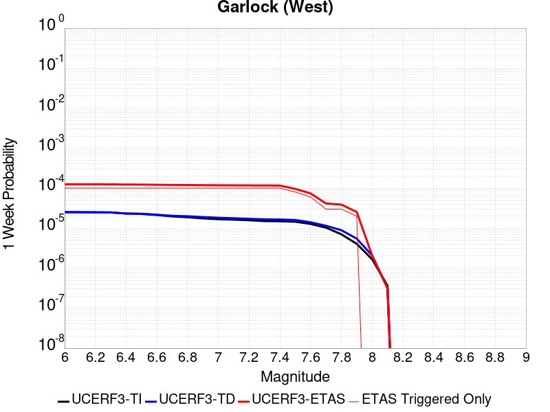 |  |  | 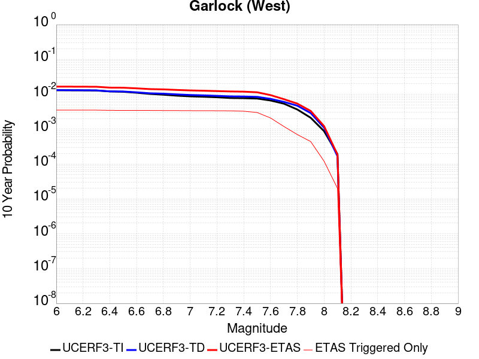 |

| Magnitude | 1 wk TI Prob | 1 wk TD Prob | 1 wk ETAS Prob | 1 wk ETAS/TD Gain | 1 wk ETAS Triggered Only | 1 mo TI Prob | 1 mo TD Prob | 1 mo ETAS Prob | 1 mo ETAS/TD Gain | 1 mo ETAS Triggered Only | 1 yr TI Prob | 1 yr TD Prob | 1 yr ETAS Prob | 1 yr ETAS/TD Gain | 1 yr ETAS Triggered Only | 10 yr TI Prob | 10 yr TD Prob | 10 yr ETAS Prob | 10 yr ETAS/TD Gain | 10 yr ETAS Triggered Only |
|-----|-----|-----|-----|-----|-----|-----|-----|-----|-----|-----|-----|-----|-----|-----|-----|-----|-----|-----|-----|-----|
| 6.0 | 2.5181727E-5 | 2.522122E-5 | 1.2521869E-4 | 4.964815 | 1.0E-4 | 1.0791722E-4 | 1.0808648E-4 | 5.7803566E-4 | 5.3479 | 4.7E-4 | 0.0013131002 | 0.0013151619 | 0.0031028078 | 2.3592591 | 0.00179 | 0.013053683 | 0.013154373 | 0.016618202 | 1.2633214 | 0.00351 |
| 6.1 | 2.5077732E-5 | 2.5122257E-5 | 1.2511974E-4 | 4.980434 | 1.0E-4 | 1.0747157E-4 | 1.0766239E-4 | 5.776118E-4 | 5.3650284 | 4.7E-4 | 0.001307681 | 0.0013100049 | 0.00309766 | 2.364617 | 0.00179 | 0.013000126 | 0.0131034115 | 0.016567418 | 1.2643592 | 0.00351 |
| 6.2 | 2.494612E-5 | 2.5003937E-5 | 1.2500143E-4 | 4.99927 | 1.0E-4 | 1.0690756E-4 | 1.07155356E-4 | 5.77105E-4 | 5.385685 | 4.7E-4 | 0.0013008224 | 0.001303839 | 0.0030915053 | 2.3710787 | 0.00179 | 0.012932341 | 0.013042478 | 0.0165067 | 1.2656106 | 0.00351 |
| 6.3 | 2.4733758E-5 | 2.482329E-5 | 1.2482081E-4 | 5.028375 | 1.0E-4 | 1.0599751E-4 | 1.0638121E-4 | 5.763312E-4 | 5.4176035 | 4.7E-4 | 0.0012897556 | 0.0012944251 | 0.003082108 | 2.3810632 | 0.00179 | 0.012822957 | 0.01294944 | 0.016413987 | 1.2675442 | 0.00351 |
| 6.4 | 2.3237335E-5 | 2.3202461E-5 | 1.2320014E-4 | 5.3097878 | 1.0E-4 | 9.958477E-5 | 9.943535E-5 | 5.693886E-4 | 5.7262197 | 4.7E-4 | 0.0012117702 | 0.0012099558 | 0.002977814 | 2.4610934 | 0.00177 | 0.012051838 | 0.012114228 | 0.015532312 | 1.2821546 | 0.00346 |
| 6.5 | 2.2732203E-5 | 2.3016823E-5 | 1.2301451E-4 | 5.3445487 | 1.0E-4 | 9.742009E-5 | 9.863981E-5 | 5.6859344E-4 | 5.7643404 | 4.7E-4 | 0.0011854442 | 0.0012002809 | 0.0029681562 | 2.472885 | 0.00177 | 0.011791403 | 0.012018529 | 0.015427065 | 1.2836068 | 0.00345 |
| 6.6 | 2.1319436E-5 | 2.179693E-5 | 1.2179475E-4 | 5.5877023 | 1.0E-4 | 9.136581E-5 | 9.341208E-5 | 5.633682E-4 | 6.030999 | 4.7E-4 | 0.001111811 | 0.0011367011 | 0.0029046892 | 2.5553677 | 0.00177 | 0.011062649 | 0.011389392 | 0.014800099 | 1.2994634 | 0.00345 |
| 6.7 | 1.970802E-5 | 2.0416572E-5 | 1.2041453E-4 | 5.897882 | 1.0E-4 | 8.446021E-5 | 8.7496664E-5 | 5.574555E-4 | 6.3711634 | 4.7E-4 | 0.001027818 | 0.001064753 | 0.0028328684 | 2.6605873 | 0.00177 | 0.010230771 | 0.010677007 | 0.014080279 | 1.3187476 | 0.00344 |
| 6.8 | 1.8744462E-5 | 1.992412E-5 | 1.1992213E-4 | 6.018942 | 1.0E-4 | 8.033094E-5 | 8.53863E-5 | 5.553462E-4 | 6.503926 | 4.7E-4 | 9.775903E-4 | 0.0010390842 | 0.0027972553 | 2.6920393 | 0.00176 | 0.009733009 | 0.010422745 | 0.013807099 | 1.3247086 | 0.00342 |
| 6.9 | 1.7559682E-5 | 1.8976332E-5 | 1.18974436E-4 | 6.2696223 | 1.0E-4 | 7.5253614E-5 | 8.132461E-5 | 5.512864E-4 | 6.7788386 | 4.7E-4 | 9.158276E-4 | 9.896788E-4 | 0.0027479369 | 2.7765946 | 0.00176 | 0.0091206245 | 0.009933244 | 0.013309373 | 1.3398817 | 0.00341 |
| 7.0 | 1.6794445E-5 | 1.8238985E-5 | 1.1823716E-4 | 6.4826612 | 1.0E-4 | 7.197421E-5 | 7.816475E-5 | 5.48128E-4 | 7.012471 | 4.7E-4 | 8.759337E-4 | 9.5124164E-4 | 0.0027095675 | 2.8484533 | 0.00176 | 0.008724891 | 0.009552071 | 0.01290969 | 1.3515068 | 0.00339 |
| 7.1 | 1.6337795E-5 | 1.7739663E-5 | 1.1773789E-4 | 6.636986 | 1.0E-4 | 7.0017246E-5 | 7.6024924E-5 | 5.459892E-4 | 7.1817136 | 4.7E-4 | 8.521265E-4 | 9.252117E-4 | 0.0026835834 | 2.9005075 | 0.00176 | 0.008488664 | 0.0092937965 | 0.012642384 | 1.3603034 | 0.00338 |
| 7.2 | 1.5780008E-5 | 1.7188207E-5 | 1.17186486E-4 | 6.817842 | 1.0E-4 | 6.762685E-5 | 7.366168E-5 | 5.436271E-4 | 7.3800526 | 4.7E-4 | 8.2304585E-4 | 8.964632E-4 | 0.0026548854 | 2.9615107 | 0.00176 | 0.008200042 | 0.009008593 | 0.012348234 | 1.3707173 | 0.00337 |
| 7.3 | 1.5058865E-5 | 1.6641117E-5 | 1.1663945E-4 | 7.009112 | 1.0E-4 | 6.45364E-5 | 7.131713E-5 | 5.4128363E-4 | 7.589812 | 4.7E-4 | 7.854473E-4 | 8.679414E-4 | 0.002626414 | 3.0260267 | 0.00176 | 0.00782677 | 0.008725209 | 0.0120459795 | 1.380595 | 0.00335 |
| 7.4 | 1.4887923E-5 | 1.6477023E-5 | 1.1647538E-4 | 7.068958 | 1.0E-4 | 6.380382E-5 | 7.06139E-5 | 5.305814E-4 | 7.513838 | 4.6E-4 | 7.7653467E-4 | 8.593864E-4 | 0.0025779083 | 2.999708 | 0.00172 | 0.0077382675 | 0.00863998 | 0.011881728 | 1.3752031 | 0.00327 |
| 7.5 | 1.4509299E-5 | 1.6068881E-5 | 9.60676E-5 | 5.9784865 | 8.0E-5 | 6.218123E-5 | 6.886483E-5 | 4.788366E-4 | 6.9532824 | 4.1E-4 | 7.567935E-4 | 8.3810795E-4 | 0.0023968006 | 2.8597755 | 0.00156 | 0.0075422134 | 0.008428225 | 0.01140294 | 1.3529469 | 0.003 |
| 7.6 | 1.2756717E-5 | 1.40719985E-5 | 7.4071155E-5 | 5.2637267 | 6.0E-5 | 5.4670498E-5 | 6.0307175E-5 | 3.8028788E-4 | 6.305848 | 3.2E-4 | 6.6541E-4 | 7.3399313E-4 | 0.001823193 | 2.4839375 | 0.00109 | 0.006634211 | 0.0073927804 | 0.00946733 | 1.2806182 | 0.00209 |
| 7.7 | 1.0328985E-5 | 1.1480377E-5 | 4.1480034E-5 | 3.6131246 | 3.0E-5 | 4.4266326E-5 | 4.920069E-5 | 2.3919134E-4 | 4.861544 | 1.9E-4 | 5.388092E-4 | 5.9885415E-4 | 0.0011285368 | 1.8844935 | 5.3E-4 | 0.0053750467 | 0.0060488093 | 0.007231611 | 1.1955429 | 0.00119 |
| 7.8 | 7.0306583E-6 | 8.915601E-6 | 3.8915332E-5 | 4.364858 | 3.0E-5 | 3.0131043E-5 | 3.820916E-5 | 1.6820419E-4 | 4.4021955 | 1.3E-4 | 3.667837E-4 | 4.6509737E-4 | 7.4496714E-4 | 1.6017444 | 2.8E-4 | 0.003661789 | 0.004703521 | 0.0054002283 | 1.1481247 | 7.0E-4 |
| 7.9 | 4.060633E-6 | 5.474814E-6 | 2.5474705E-5 | 4.6530724 | 2.0E-5 | 1.7402595E-5 | 2.3463277E-5 | 1.1346117E-4 | 4.8356915 | 9.0E-5 | 2.11856E-4 | 2.8562805E-4 | 4.6557665E-4 | 1.6300102 | 1.8E-4 | 0.0021165414 | 0.0028890201 | 0.003327749 | 1.1518607 | 4.4E-4 |
| 8.0 | 1.6729537E-6 | 2.0807163E-6 | 2.0807163E-6 | 1.0 | 0.0 | 7.169782E-6 | 8.917325E-6 | 4.891697E-5 | 5.48561 | 4.0E-5 | 8.7288594E-5 | 1.0856306E-4 | 1.7855546E-4 | 1.6447165 | 7.0E-5 | 8.7254314E-4 | 0.0010985805 | 0.0012184487 | 1.1091119 | 1.2E-4 |
| 8.1 | 3.6733252E-7 | 3.1535544E-7 | 3.1535544E-7 | 1.0 | 0.0 | 1.5742813E-6 | 1.3515227E-6 | 1.1351509E-5 | 8.399052 | 1.0E-5 | 1.9166706E-5 | 1.645468E-5 | 2.6454516E-5 | 1.6077198 | 1.0E-5 | 1.9165053E-4 | 1.6651153E-4 | 1.865082E-4 | 1.1200918 | 2.0E-5 |

## McLean Lake
*[(top)](#table-of-contents)*

| 1 Week | 1 Month | 1 Year | 10 Year |
|-----|-----|-----|-----|
|  |  |  |  |

| Magnitude | 1 wk TI Prob | 1 wk TD Prob | 1 wk ETAS Prob | 1 wk ETAS/TD Gain | 1 wk ETAS Triggered Only | 1 mo TI Prob | 1 mo TD Prob | 1 mo ETAS Prob | 1 mo ETAS/TD Gain | 1 mo ETAS Triggered Only | 1 yr TI Prob | 1 yr TD Prob | 1 yr ETAS Prob | 1 yr ETAS/TD Gain | 1 yr ETAS Triggered Only | 10 yr TI Prob | 10 yr TD Prob | 10 yr ETAS Prob | 10 yr ETAS/TD Gain | 10 yr ETAS Triggered Only |
|-----|-----|-----|-----|-----|-----|-----|-----|-----|-----|-----|-----|-----|-----|-----|-----|-----|-----|-----|-----|-----|
| 6.0 | 1.7360222E-5 | 1.8502436E-5 | 6.850151E-5 | 3.702297 | 5.0E-5 | 7.439883E-5 | 7.929402E-5 | 3.19275E-4 | 4.02647 | 2.4E-4 | 9.0542925E-4 | 9.650257E-4 | 0.002173858 | 2.2526426 | 0.00121 | 0.009017491 | 0.009613193 | 0.012574449 | 1.3080409 | 0.00299 |
| 6.1 | 9.062689E-6 | 9.592565E-6 | 3.9592276E-5 | 4.127392 | 3.0E-5 | 3.8839516E-5 | 4.1110397E-5 | 1.8110464E-4 | 4.4053245 | 1.4E-4 | 4.727685E-4 | 5.00413E-4 | 0.0010701278 | 2.138489 | 5.7E-4 | 0.0047176396 | 0.004993745 | 0.006545955 | 1.3108308 | 0.00156 |
| 6.2 | 9.062689E-6 | 9.592565E-6 | 3.9592276E-5 | 4.127392 | 3.0E-5 | 3.8839516E-5 | 4.1110397E-5 | 1.8110464E-4 | 4.4053245 | 1.4E-4 | 4.727685E-4 | 5.00413E-4 | 0.0010701278 | 2.138489 | 5.7E-4 | 0.0047176396 | 0.004993745 | 0.006545955 | 1.3108308 | 0.00156 |
| 6.3 | 7.2575485E-6 | 7.667997E-6 | 1.766792E-5 | 2.3041115 | 1.0E-5 | 3.110341E-5 | 3.286247E-5 | 1.1285984E-4 | 3.4343078 | 8.0E-5 | 3.786182E-4 | 4.0003425E-4 | 8.6984626E-4 | 2.1744294 | 4.7E-4 | 0.0037797375 | 0.0039938465 | 0.005228894 | 1.3092376 | 0.00124 |
| 6.4 | 7.2575485E-6 | 7.667997E-6 | 1.766792E-5 | 2.3041115 | 1.0E-5 | 3.110341E-5 | 3.286247E-5 | 1.1285984E-4 | 3.4343078 | 8.0E-5 | 3.786182E-4 | 4.0003425E-4 | 8.6984626E-4 | 2.1744294 | 4.7E-4 | 0.0037797375 | 0.0039938465 | 0.005228894 | 1.3092376 | 0.00124 |
| 6.5 | 6.06582E-6 | 6.404114E-6 | 6.404114E-6 | 1.0 | 0.0 | 2.5996113E-5 | 2.744595E-5 | 9.7444026E-5 | 3.5503974 | 7.0E-5 | 3.164567E-4 | 3.341097E-4 | 7.1398274E-4 | 2.136971 | 3.8E-4 | 0.0031600643 | 0.0033367125 | 0.0043433425 | 1.3016832 | 0.00101 |
| 6.6 | 5.598744E-6 | 5.9104805E-6 | 5.9104805E-6 | 1.0 | 0.0 | 2.3994397E-5 | 2.533042E-5 | 7.532915E-5 | 2.9738612 | 5.0E-5 | 2.9209262E-4 | 3.083606E-4 | 6.2826194E-4 | 2.037426 | 3.2E-4 | 0.0029170897 | 0.0030799566 | 0.003987154 | 1.2945487 | 9.1E-4 |
| 6.7 | 5.246996E-6 | 5.5393666E-6 | 5.5393666E-6 | 1.0 | 0.0 | 2.2486933E-5 | 2.3739964E-5 | 7.3738775E-5 | 3.1061032 | 5.0E-5 | 2.73744E-4 | 2.8900206E-4 | 5.7891826E-4 | 2.003163 | 2.9E-4 | 0.0027340704 | 0.0028868862 | 0.0037344324 | 1.293585 | 8.5E-4 |
| 6.8 | 4.02324E-6 | 4.247061E-6 | 4.247061E-6 | 1.0 | 0.0 | 1.7242342E-5 | 1.8201597E-5 | 4.820105E-5 | 2.648177 | 3.0E-5 | 2.099053E-4 | 2.2158786E-4 | 4.2154355E-4 | 1.9023765 | 2.0E-4 | 0.0020970714 | 0.0022142536 | 0.0028328807 | 1.279384 | 6.2E-4 |
| 6.9 | 6.835972E-7 | 7.140139E-7 | 7.140139E-7 | 1.0 | 0.0 | 2.9296991E-6 | 3.0600577E-6 | 3.0600577E-6 | 1.0 | 0.0 | 3.56685E-5 | 3.7255882E-5 | 5.725514E-5 | 1.5368079 | 2.0E-5 | 3.5662777E-4 | 3.7252763E-4 | 4.5249783E-4 | 1.2146691 | 8.0E-5 |

## Goldstone Lake
*[(top)](#table-of-contents)*

| 1 Week | 1 Month | 1 Year | 10 Year |
|-----|-----|-----|-----|
|  |  |  |  |

| Magnitude | 1 wk TI Prob | 1 wk TD Prob | 1 wk ETAS Prob | 1 wk ETAS/TD Gain | 1 wk ETAS Triggered Only | 1 mo TI Prob | 1 mo TD Prob | 1 mo ETAS Prob | 1 mo ETAS/TD Gain | 1 mo ETAS Triggered Only | 1 yr TI Prob | 1 yr TD Prob | 1 yr ETAS Prob | 1 yr ETAS/TD Gain | 1 yr ETAS Triggered Only | 10 yr TI Prob | 10 yr TD Prob | 10 yr ETAS Prob | 10 yr ETAS/TD Gain | 10 yr ETAS Triggered Only |
|-----|-----|-----|-----|-----|-----|-----|-----|-----|-----|-----|-----|-----|-----|-----|-----|-----|-----|-----|-----|-----|
| 6.0 | 2.671352E-5 | 3.0378795E-5 | 8.037728E-5 | 2.645835 | 5.0E-5 | 1.1448149E-4 | 1.3018944E-4 | 3.2016472E-4 | 2.4592218 | 1.9E-4 | 0.001392921 | 0.0015841004 | 0.0026823578 | 1.6933005 | 0.0011 | 0.013842222 | 0.015747588 | 0.018296802 | 1.1618797 | 0.00259 |
| 6.1 | 2.671352E-5 | 3.0378795E-5 | 8.037728E-5 | 2.645835 | 5.0E-5 | 1.1448149E-4 | 1.3018944E-4 | 3.2016472E-4 | 2.4592218 | 1.9E-4 | 0.001392921 | 0.0015841004 | 0.0026823578 | 1.6933005 | 0.0011 | 0.013842222 | 0.015747588 | 0.018296802 | 1.1618797 | 0.00259 |
| 6.2 | 1.4197047E-5 | 1.609761E-5 | 4.6097128E-5 | 2.8636005 | 3.0E-5 | 6.0843064E-5 | 6.898849E-5 | 1.5898228E-4 | 2.3044753 | 9.0E-5 | 7.4051257E-4 | 8.397099E-4 | 0.0014292145 | 1.7020336 | 5.9E-4 | 0.007380498 | 0.008375068 | 0.00982284 | 1.172867 | 0.00146 |
| 6.3 | 1.4197047E-5 | 1.609761E-5 | 4.6097128E-5 | 2.8636005 | 3.0E-5 | 6.0843064E-5 | 6.898849E-5 | 1.5898228E-4 | 2.3044753 | 9.0E-5 | 7.4051257E-4 | 8.397099E-4 | 0.0014292145 | 1.7020336 | 5.9E-4 | 0.007380498 | 0.008375068 | 0.00982284 | 1.172867 | 0.00146 |
| 6.4 | 1.3238931E-5 | 1.50097285E-5 | 4.5009278E-5 | 2.9986737 | 3.0E-5 | 5.6737044E-5 | 6.432637E-5 | 1.5432059E-4 | 2.3990252 | 9.0E-5 | 6.9055456E-4 | 7.829902E-4 | 0.0013625361 | 1.74017 | 5.8E-4 | 0.006884126 | 0.007811942 | 0.009210927 | 1.1790829 | 0.00141 |
| 6.5 | 1.3238931E-5 | 1.50097285E-5 | 4.5009278E-5 | 2.9986737 | 3.0E-5 | 5.6737044E-5 | 6.432637E-5 | 1.5432059E-4 | 2.3990252 | 9.0E-5 | 6.9055456E-4 | 7.829902E-4 | 0.0013625361 | 1.74017 | 5.8E-4 | 0.006884126 | 0.007811942 | 0.009210927 | 1.1790829 | 0.00141 |
| 6.6 | 1.1328278E-5 | 1.2856252E-5 | 4.2855867E-5 | 3.3334649 | 3.0E-5 | 4.8548856E-5 | 5.50976E-5 | 1.2509375E-4 | 2.2704027 | 7.0E-5 | 5.90922E-4 | 6.7070255E-4 | 0.0011803604 | 1.7598867 | 5.1E-4 | 0.0058935313 | 0.006696174 | 0.007917938 | 1.182457 | 0.00123 |
| 6.7 | 8.651175E-6 | 9.825386E-6 | 1.9825287E-5 | 2.0177617 | 1.0E-5 | 3.707594E-5 | 4.210863E-5 | 8.210695E-5 | 1.949884 | 4.0E-5 | 4.5130608E-4 | 5.126425E-4 | 7.92499E-4 | 1.5459096 | 2.8E-4 | 0.0045039062 | 0.0051234793 | 0.0059591755 | 1.1631111 | 8.4E-4 |
| 6.8 | 1.0215377E-6 | 1.1755254E-6 | 1.1755254E-6 | 1.0 | 0.0 | 4.378012E-6 | 5.037957E-6 | 5.037957E-6 | 1.0 | 0.0 | 5.3300988E-5 | 6.1335515E-5 | 7.133491E-5 | 1.1630276 | 1.0E-5 | 5.3288206E-4 | 6.1319716E-4 | 6.6316646E-4 | 1.0814898 | 5.0E-5 |
| 6.9 | 7.9360774E-7 | 9.283811E-7 | 9.283811E-7 | 1.0 | 0.0 | 3.4011714E-6 | 3.9787706E-6 | 3.9787706E-6 | 1.0 | 0.0 | 4.1408475E-5 | 4.8440525E-5 | 5.844004E-5 | 1.2064288 | 1.0E-5 | 4.140076E-4 | 4.8430666E-4 | 5.142921E-4 | 1.0619142 | 3.0E-5 |
| 7.0 | 7.4382757E-7 | 8.7477156E-7 | 8.7477156E-7 | 1.0 | 0.0 | 3.1878285E-6 | 3.7490158E-6 | 3.7490158E-6 | 1.0 | 0.0 | 3.8811122E-5 | 4.564338E-5 | 5.5642922E-5 | 1.2190799 | 1.0E-5 | 3.8804344E-4 | 4.563467E-4 | 4.7633756E-4 | 1.0438063 | 2.0E-5 |
| 7.1 | 6.4709513E-7 | 7.711638E-7 | 7.711638E-7 | 1.0 | 0.0 | 2.773262E-6 | 3.304984E-6 | 3.304984E-6 | 1.0 | 0.0 | 3.376394E-5 | 4.0237497E-5 | 5.0237093E-5 | 1.2485144 | 1.0E-5 | 3.375881E-4 | 4.0230807E-4 | 4.1230404E-4 | 1.0248466 | 1.0E-5 |
| 7.2 | 6.356704E-7 | 7.5886913E-7 | 7.5886913E-7 | 1.0 | 0.0 | 2.7242988E-6 | 3.2522926E-6 | 3.2522926E-6 | 1.0 | 0.0 | 3.3167835E-5 | 3.9596005E-5 | 4.959561E-5 | 1.2525407 | 1.0E-5 | 3.3162883E-4 | 3.9589542E-4 | 4.0589148E-4 | 1.0252492 | 1.0E-5 |
| 7.3 | 5.7695723E-7 | 6.89688E-7 | 6.89688E-7 | 1.0 | 0.0 | 2.4726714E-6 | 2.9558028E-6 | 2.9558028E-6 | 1.0 | 0.0 | 3.0104358E-5 | 3.5986362E-5 | 4.5986002E-5 | 1.277873 | 1.0E-5 | 3.0100282E-4 | 3.598111E-4 | 3.698075E-4 | 1.0277823 | 1.0E-5 |
| 7.4 | 5.209647E-7 | 6.193784E-7 | 6.193784E-7 | 1.0 | 0.0 | 2.232704E-6 | 2.6544765E-6 | 2.6544765E-6 | 1.0 | 0.0 | 2.718283E-5 | 3.231783E-5 | 4.2317508E-5 | 1.3094168 | 1.0E-5 | 2.7179506E-4 | 3.2313686E-4 | 3.3313362E-4 | 1.0309366 | 1.0E-5 |
| 7.5 | 4.512955E-7 | 5.349112E-7 | 5.349112E-7 | 1.0 | 0.0 | 1.934122E-6 | 2.2924748E-6 | 2.2924748E-6 | 1.0 | 0.0 | 2.3547682E-5 | 2.7910577E-5 | 3.7910297E-5 | 1.3582771 | 1.0E-5 | 2.3545188E-4 | 2.7907602E-4 | 2.8907324E-4 | 1.0358225 | 1.0E-5 |
| 7.6 | 2.21172E-7 | 2.6040485E-7 | 2.6040485E-7 | 1.0 | 0.0 | 9.478797E-7 | 1.1160205E-6 | 1.1160205E-6 | 1.0 | 0.0 | 1.1540374E-5 | 1.35874925E-5 | 1.35874925E-5 | 1.0 | 0.0 | 1.1539775E-4 | 1.3586943E-4 | 1.3586943E-4 | 1.0 | 0.0 |

## Gravel Hills-Harper Lk
*[(top)](#table-of-contents)*

| 1 Week | 1 Month | 1 Year | 10 Year |
|-----|-----|-----|-----|
|  |  |  |  |

| Magnitude | 1 wk TI Prob | 1 wk TD Prob | 1 wk ETAS Prob | 1 wk ETAS/TD Gain | 1 wk ETAS Triggered Only | 1 mo TI Prob | 1 mo TD Prob | 1 mo ETAS Prob | 1 mo ETAS/TD Gain | 1 mo ETAS Triggered Only | 1 yr TI Prob | 1 yr TD Prob | 1 yr ETAS Prob | 1 yr ETAS/TD Gain | 1 yr ETAS Triggered Only | 10 yr TI Prob | 10 yr TD Prob | 10 yr ETAS Prob | 10 yr ETAS/TD Gain | 10 yr ETAS Triggered Only |
|-----|-----|-----|-----|-----|-----|-----|-----|-----|-----|-----|-----|-----|-----|-----|-----|-----|-----|-----|-----|-----|
| 6.0 | 3.0679566E-5 | 3.1467316E-5 | 1.2146449E-4 | 3.8600204 | 9.0E-5 | 1.3147724E-4 | 1.3485418E-4 | 4.6480968E-4 | 3.4467578 | 3.3E-4 | 0.0015995599 | 0.0016408301 | 0.0028488447 | 1.7362217 | 0.00121 | 0.015880952 | 0.016308723 | 0.01883681 | 1.1550144 | 0.00257 |
| 6.1 | 3.0679566E-5 | 3.1467316E-5 | 1.2146449E-4 | 3.8600204 | 9.0E-5 | 1.3147724E-4 | 1.3485418E-4 | 4.6480968E-4 | 3.4467578 | 3.3E-4 | 0.0015995599 | 0.0016408301 | 0.0028488447 | 1.7362217 | 0.00121 | 0.015880952 | 0.016308723 | 0.01883681 | 1.1550144 | 0.00257 |
| 6.2 | 1.514536E-5 | 1.3636124E-5 | 2.3635988E-5 | 1.7333362 | 1.0E-5 | 6.490707E-5 | 5.843929E-5 | 1.7843228E-4 | 3.053293 | 1.2E-4 | 7.8995706E-4 | 7.11278E-4 | 0.0011409721 | 1.6041156 | 4.3E-4 | 0.007871548 | 0.007091216 | 0.007945118 | 1.1204168 | 8.6E-4 |
| 6.3 | 1.514536E-5 | 1.3636124E-5 | 2.3635988E-5 | 1.7333362 | 1.0E-5 | 6.490707E-5 | 5.843929E-5 | 1.7843228E-4 | 3.053293 | 1.2E-4 | 7.8995706E-4 | 7.11278E-4 | 0.0011409721 | 1.6041156 | 4.3E-4 | 0.007871548 | 0.007091216 | 0.007945118 | 1.1204168 | 8.6E-4 |
| 6.4 | 1.2532521E-5 | 1.0690358E-5 | 2.0690251E-5 | 1.9354124 | 1.0E-5 | 5.37097E-5 | 4.5815046E-5 | 1.3581093E-4 | 2.9643302 | 9.0E-5 | 6.537194E-4 | 5.576613E-4 | 8.474995E-4 | 1.5197389 | 2.9E-4 | 0.0065179965 | 0.005563209 | 0.0060604275 | 1.0893762 | 5.0E-4 |
| 6.5 | 1.1094058E-5 | 9.084206E-6 | 1.9084115E-5 | 2.1008017 | 1.0E-5 | 4.7545094E-5 | 3.8931754E-5 | 1.1892864E-4 | 3.054798 | 8.0E-5 | 5.787078E-4 | 4.7389502E-4 | 7.237766E-4 | 1.527293 | 2.5E-4 | 0.0057720304 | 0.0047292523 | 0.0051472657 | 1.0883889 | 4.2E-4 |
| 6.6 | 9.688328E-6 | 7.53213E-6 | 7.53213E-6 | 1.0 | 0.0 | 4.1520743E-5 | 3.228017E-5 | 8.227856E-5 | 2.5488884 | 5.0E-5 | 5.053978E-4 | 3.9294278E-4 | 5.428838E-4 | 1.381585 | 1.5E-4 | 0.0050424994 | 0.0039227367 | 0.0041916776 | 1.0685595 | 2.7E-4 |
| 6.7 | 8.974824E-6 | 6.7497976E-6 | 6.7497976E-6 | 1.0 | 0.0 | 3.8462964E-5 | 2.8927396E-5 | 5.892653E-5 | 2.037049 | 3.0E-5 | 4.6818596E-4 | 3.5213633E-4 | 4.521011E-4 | 1.283881 | 1.0E-4 | 0.004672008 | 0.0035160047 | 0.0036854069 | 1.0481803 | 1.7E-4 |
| 6.8 | 7.4780046E-6 | 5.1164793E-6 | 5.1164793E-6 | 1.0 | 0.0 | 3.20482E-5 | 2.1927592E-5 | 3.192737E-5 | 1.4560364 | 1.0E-5 | 3.9011694E-4 | 2.669371E-4 | 2.969291E-4 | 1.1123561 | 3.0E-5 | 0.0038943281 | 0.002666303 | 0.0027460896 | 1.029924 | 8.0E-5 |
| 6.9 | 6.3409307E-6 | 3.907717E-6 | 3.907717E-6 | 1.0 | 0.0 | 2.7175134E-5 | 1.6747259E-5 | 2.6747091E-5 | 1.5971026 | 1.0E-5 | 3.3080703E-4 | 2.0387978E-4 | 2.3387367E-4 | 1.1471156 | 3.0E-5 | 0.0033031502 | 0.0020370255 | 0.0021068829 | 1.0342938 | 7.0E-5 |
| 7.0 | 5.1239335E-6 | 2.606008E-6 | 2.606008E-6 | 1.0 | 0.0 | 2.195953E-5 | 1.1168559E-5 | 1.1168559E-5 | 1.0 | 0.0 | 2.6732447E-4 | 1.3596898E-4 | 1.3596898E-4 | 1.0 | 0.0 | 0.0026700313 | 0.0013588831 | 0.0013888424 | 1.0220469 | 3.0E-5 |
| 7.1 | 4.438899E-6 | 2.0986022E-6 | 2.0986022E-6 | 1.0 | 0.0 | 1.9023713E-5 | 8.9939795E-6 | 8.9939795E-6 | 1.0 | 0.0 | 2.315891E-4 | 1.0949642E-4 | 1.0949642E-4 | 1.0 | 0.0 | 0.002313479 | 0.0010944465 | 0.0011244137 | 1.0273811 | 3.0E-5 |
| 7.2 | 3.50367E-6 | 1.2616675E-6 | 1.2616675E-6 | 1.0 | 0.0 | 1.5015643E-5 | 5.4071356E-6 | 5.4071356E-6 | 1.0 | 0.0 | 1.8280011E-4 | 6.5829976E-5 | 6.5829976E-5 | 1.0 | 0.0 | 0.0018264982 | 6.581129E-4 | 6.780998E-4 | 1.0303699 | 2.0E-5 |
| 7.3 | 2.561638E-6 | 7.119462E-7 | 7.119462E-7 | 1.0 | 0.0 | 1.0978401E-5 | 3.0511947E-6 | 3.0511947E-6 | 1.0 | 0.0 | 1.3365384E-4 | 3.714768E-5 | 3.714768E-5 | 1.0 | 0.0 | 0.0013357349 | 3.714167E-4 | 3.714167E-4 | 1.0 | 0.0 |
| 7.4 | 2.0368864E-6 | 5.305095E-7 | 5.305095E-7 | 1.0 | 0.0 | 8.729483E-6 | 2.2736103E-6 | 2.2736103E-6 | 1.0 | 0.0 | 1.06276275E-4 | 2.7680859E-5 | 2.7680859E-5 | 1.0 | 0.0 | 0.0010622547 | 2.7677466E-4 | 2.7677466E-4 | 1.0 | 0.0 |
| 7.5 | 1.1681728E-6 | 3.6032037E-7 | 3.6032037E-7 | 1.0 | 0.0 | 5.0064455E-6 | 1.5442292E-6 | 1.5442292E-6 | 1.0 | 0.0 | 6.0951766E-5 | 1.8800833E-5 | 1.8800833E-5 | 1.0 | 0.0 | 6.093505E-4 | 1.8799289E-4 | 1.8799289E-4 | 1.0 | 0.0 |
| 7.6 | 1.3154387E-7 | 7.120029E-8 | 7.120029E-8 | 1.0 | 0.0 | 5.6375933E-7 | 3.0514406E-7 | 3.0514406E-7 | 1.0 | 0.0 | 6.863748E-6 | 3.7151242E-6 | 3.7151242E-6 | 1.0 | 0.0 | 6.863536E-5 | 3.715078E-5 | 3.715078E-5 | 1.0 | 0.0 |

## So Sierra Nevada
*[(top)](#table-of-contents)*

| 1 Week | 1 Month | 1 Year | 10 Year |
|-----|-----|-----|-----|
|  |  |  |  |

| Magnitude | 1 wk TI Prob | 1 wk TD Prob | 1 wk ETAS Prob | 1 wk ETAS/TD Gain | 1 wk ETAS Triggered Only | 1 mo TI Prob | 1 mo TD Prob | 1 mo ETAS Prob | 1 mo ETAS/TD Gain | 1 mo ETAS Triggered Only | 1 yr TI Prob | 1 yr TD Prob | 1 yr ETAS Prob | 1 yr ETAS/TD Gain | 1 yr ETAS Triggered Only | 10 yr TI Prob | 10 yr TD Prob | 10 yr ETAS Prob | 10 yr ETAS/TD Gain | 10 yr ETAS Triggered Only |
|-----|-----|-----|-----|-----|-----|-----|-----|-----|-----|-----|-----|-----|-----|-----|-----|-----|-----|-----|-----|-----|
| 6.0 | 1.15488665E-5 | 1.1080008E-5 | 7.107935E-5 | 6.415098 | 6.0E-5 | 4.9494203E-5 | 4.748496E-5 | 2.4747546E-4 | 5.21166 | 2.0E-4 | 6.024253E-4 | 5.779888E-4 | 0.0015474281 | 2.6772633 | 9.7E-4 | 0.006007948 | 0.0057661245 | 0.0078739 | 1.3655447 | 0.00212 |
| 6.1 | 1.15488665E-5 | 1.1080008E-5 | 7.107935E-5 | 6.415098 | 6.0E-5 | 4.9494203E-5 | 4.748496E-5 | 2.4747546E-4 | 5.21166 | 2.0E-4 | 6.024253E-4 | 5.779888E-4 | 0.0015474281 | 2.6772633 | 9.7E-4 | 0.006007948 | 0.0057661245 | 0.0078739 | 1.3655447 | 0.00212 |
| 6.2 | 1.15488665E-5 | 1.1080008E-5 | 7.107935E-5 | 6.415098 | 6.0E-5 | 4.9494203E-5 | 4.748496E-5 | 2.4747546E-4 | 5.21166 | 2.0E-4 | 6.024253E-4 | 5.779888E-4 | 0.0015474281 | 2.6772633 | 9.7E-4 | 0.006007948 | 0.0057661245 | 0.0078739 | 1.3655447 | 0.00212 |
| 6.3 | 1.15488665E-5 | 1.1080008E-5 | 7.107935E-5 | 6.415098 | 6.0E-5 | 4.9494203E-5 | 4.748496E-5 | 2.4747546E-4 | 5.21166 | 2.0E-4 | 6.024253E-4 | 5.779888E-4 | 0.0015474281 | 2.6772633 | 9.7E-4 | 0.006007948 | 0.0057661245 | 0.0078739 | 1.3655447 | 0.00212 |
| 6.4 | 1.15488665E-5 | 1.1080008E-5 | 7.107935E-5 | 6.415098 | 6.0E-5 | 4.9494203E-5 | 4.748496E-5 | 2.4747546E-4 | 5.21166 | 2.0E-4 | 6.024253E-4 | 5.779888E-4 | 0.0015474281 | 2.6772633 | 9.7E-4 | 0.006007948 | 0.0057661245 | 0.0078739 | 1.3655447 | 0.00212 |
| 6.5 | 1.15488665E-5 | 1.1080008E-5 | 7.107935E-5 | 6.415098 | 6.0E-5 | 4.9494203E-5 | 4.748496E-5 | 2.4747546E-4 | 5.21166 | 2.0E-4 | 6.024253E-4 | 5.779888E-4 | 0.0015474281 | 2.6772633 | 9.7E-4 | 0.006007948 | 0.0057661245 | 0.0078739 | 1.3655447 | 0.00212 |
| 6.6 | 7.587044E-6 | 6.935875E-6 | 3.6935668E-5 | 5.3253074 | 3.0E-5 | 3.2515498E-5 | 2.9724855E-5 | 1.2972188E-4 | 4.364088 | 1.0E-4 | 3.9580427E-4 | 3.6184295E-4 | 8.3167286E-4 | 2.2984362 | 4.7E-4 | 0.003951 | 0.0036128294 | 0.004738747 | 1.3116442 | 0.00113 |
| 6.7 | 7.587044E-6 | 6.935875E-6 | 3.6935668E-5 | 5.3253074 | 3.0E-5 | 3.2515498E-5 | 2.9724855E-5 | 1.2972188E-4 | 4.364088 | 1.0E-4 | 3.9580427E-4 | 3.6184295E-4 | 8.3167286E-4 | 2.2984362 | 4.7E-4 | 0.003951 | 0.0036128294 | 0.004738747 | 1.3116442 | 0.00113 |
| 6.8 | 5.9026956E-6 | 5.179583E-6 | 2.5179479E-5 | 4.8612947 | 2.0E-5 | 2.5297022E-5 | 2.219803E-5 | 1.1219603E-4 | 5.054324 | 9.0E-5 | 3.0794772E-4 | 2.7022866E-4 | 6.8011787E-4 | 2.5168235 | 4.1E-4 | 0.0030752132 | 0.0026991167 | 0.0035966877 | 1.3325424 | 9.0E-4 |
| 6.9 | 5.0118915E-6 | 4.2525903E-6 | 2.4252506E-5 | 5.702996 | 2.0E-5 | 2.1479358E-5 | 1.8225264E-5 | 8.822399E-5 | 4.840752 | 7.0E-5 | 2.614798E-4 | 2.2187072E-4 | 5.2180415E-4 | 2.3518388 | 3.0E-4 | 0.0026117235 | 0.0022165647 | 0.002915013 | 1.315104 | 7.0E-4 |
| 7.0 | 4.4924795E-6 | 3.7140692E-6 | 1.3714032E-5 | 3.6924546 | 1.0E-5 | 1.925334E-5 | 1.5917347E-5 | 7.591639E-5 | 4.7694125 | 6.0E-5 | 2.3438422E-4 | 1.9377709E-4 | 4.6372478E-4 | 2.3930836 | 2.7E-4 | 0.0023413717 | 0.0019361442 | 0.0025349825 | 1.3092942 | 6.0E-4 |
| 7.1 | 3.9118436E-6 | 3.112113E-6 | 1.3112082E-5 | 4.2132406 | 1.0E-5 | 1.6764936E-5 | 1.3337562E-5 | 7.333676E-5 | 5.498513 | 6.0E-5 | 2.0409399E-4 | 1.623733E-4 | 4.0233432E-4 | 2.4778357 | 2.4E-4 | 0.0020390663 | 0.0016226027 | 0.002131775 | 1.3137999 | 5.1E-4 |
| 7.2 | 3.4200818E-6 | 2.605577E-6 | 1.2605551E-5 | 4.8379116 | 1.0E-5 | 1.4657411E-5 | 1.1166714E-5 | 6.116615E-5 | 5.477543 | 5.0E-5 | 1.7843937E-4 | 1.3594677E-4 | 3.2592093E-4 | 2.3974159 | 1.9E-4 | 0.0017829615 | 0.0013586858 | 0.0017681287 | 1.3013521 | 4.1E-4 |
| 7.3 | 2.6593618E-6 | 1.8285239E-6 | 1.1828505E-5 | 6.468882 | 1.0E-5 | 1.13972155E-5 | 7.836509E-6 | 4.7836194E-5 | 6.104274 | 4.0E-5 | 1.3875226E-4 | 9.5405616E-5 | 2.2539322E-4 | 2.3624732 | 1.3E-4 | 0.0013866565 | 9.536755E-4 | 0.0012533894 | 1.3142724 | 3.0E-4 |
| 7.4 | 2.2577992E-6 | 1.4365302E-6 | 1.1436516E-5 | 7.9612083 | 1.0E-5 | 9.676246E-6 | 6.1565447E-6 | 4.61563E-5 | 7.497111 | 4.0E-5 | 1.1780193E-4 | 7.495361E-5 | 2.0494386E-4 | 2.734276 | 1.3E-4 | 0.001177395 | 7.493083E-4 | 0.0010290985 | 1.373398 | 2.8E-4 |
| 7.5 | 1.489319E-6 | 7.354619E-7 | 1.0735454E-5 | 14.596887 | 1.0E-5 | 6.3827797E-6 | 3.151976E-6 | 2.3151913E-5 | 7.3452063 | 2.0E-5 | 7.770758E-5 | 3.8374634E-5 | 8.837272E-5 | 2.3028939 | 5.0E-5 | 7.7680405E-4 | 3.836805E-4 | 4.9363833E-4 | 1.2865869 | 1.1E-4 |
| 7.6 | 1.0680322E-6 | 4.660118E-7 | 1.0466008E-5 | 22.458673 | 1.0E-5 | 4.577273E-6 | 1.997192E-6 | 1.1997172E-5 | 6.00702 | 1.0E-5 | 5.5726876E-5 | 2.4315543E-5 | 5.4314813E-5 | 2.2337487 | 3.0E-5 | 5.5712904E-4 | 2.4312909E-4 | 2.9311693E-4 | 1.205602 | 5.0E-5 |
| 7.7 | 5.509146E-7 | 1.5582113E-7 | 1.015582E-5 | 65.17614 | 1.0E-5 | 2.3610605E-6 | 6.6780467E-7 | 1.0667798E-5 | 15.974429 | 1.0E-5 | 2.8745531E-5 | 8.1304925E-6 | 2.813033E-5 | 3.4598556 | 2.0E-5 | 2.8741814E-4 | 8.130207E-5 | 1.0130044E-4 | 1.2459762 | 2.0E-5 |

## Coyote Canyon
*[(top)](#table-of-contents)*

| 1 Week | 1 Month | 1 Year | 10 Year |
|-----|-----|-----|-----|
| 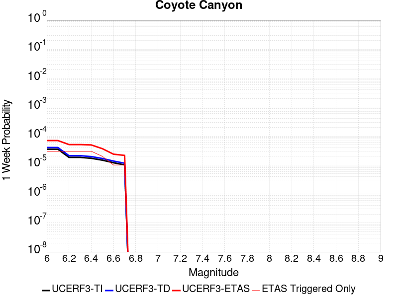 |  |  |  |

| Magnitude | 1 wk TI Prob | 1 wk TD Prob | 1 wk ETAS Prob | 1 wk ETAS/TD Gain | 1 wk ETAS Triggered Only | 1 mo TI Prob | 1 mo TD Prob | 1 mo ETAS Prob | 1 mo ETAS/TD Gain | 1 mo ETAS Triggered Only | 1 yr TI Prob | 1 yr TD Prob | 1 yr ETAS Prob | 1 yr ETAS/TD Gain | 1 yr ETAS Triggered Only | 10 yr TI Prob | 10 yr TD Prob | 10 yr ETAS Prob | 10 yr ETAS/TD Gain | 10 yr ETAS Triggered Only |
|-----|-----|-----|-----|-----|-----|-----|-----|-----|-----|-----|-----|-----|-----|-----|-----|-----|-----|-----|-----|-----|
| 6.0 | 3.5090034E-5 | 4.0368344E-5 | 7.036713E-5 | 1.7431266 | 3.0E-5 | 1.503772E-4 | 1.7299717E-4 | 2.9297642E-4 | 1.693533 | 1.2E-4 | 0.0018293047 | 0.002104463 | 0.002822948 | 1.34141 | 7.2E-4 | 0.018143194 | 0.020871267 | 0.022506412 | 1.0783443 | 0.00167 |
| 6.1 | 3.5090034E-5 | 4.0368344E-5 | 7.036713E-5 | 1.7431266 | 3.0E-5 | 1.503772E-4 | 1.7299717E-4 | 2.9297642E-4 | 1.693533 | 1.2E-4 | 0.0018293047 | 0.002104463 | 0.002822948 | 1.34141 | 7.2E-4 | 0.018143194 | 0.020871267 | 0.022506412 | 1.0783443 | 0.00167 |
| 6.2 | 1.841879E-5 | 2.1061796E-5 | 5.1061164E-5 | 2.42435 | 3.0E-5 | 7.8935285E-5 | 9.026229E-5 | 1.5025688E-4 | 1.6646694 | 6.0E-5 | 9.606133E-4 | 0.0010984915 | 0.0015180301 | 1.3819225 | 4.2E-4 | 0.0095647145 | 0.010940704 | 0.011909982 | 1.0885937 | 9.8E-4 |
| 6.3 | 1.841879E-5 | 2.1061796E-5 | 5.1061164E-5 | 2.42435 | 3.0E-5 | 7.8935285E-5 | 9.026229E-5 | 1.5025688E-4 | 1.6646694 | 6.0E-5 | 9.606133E-4 | 0.0010984915 | 0.0015180301 | 1.3819225 | 4.2E-4 | 0.0095647145 | 0.010940704 | 0.011909982 | 1.0885937 | 9.8E-4 |
| 6.4 | 1.712201E-5 | 1.9567064E-5 | 4.9566475E-5 | 2.5331585 | 3.0E-5 | 7.337798E-5 | 8.3856714E-5 | 1.4385169E-4 | 1.7154462 | 6.0E-5 | 8.930107E-4 | 0.0010205779 | 0.0014201697 | 1.3915348 | 4.0E-4 | 0.008894307 | 0.01016883 | 0.011049779 | 1.0866324 | 8.9E-4 |
| 6.5 | 1.4744935E-5 | 1.6838556E-5 | 3.683822E-5 | 2.1877303 | 2.0E-5 | 6.3191044E-5 | 7.216378E-5 | 1.2216017E-4 | 1.6928184 | 5.0E-5 | 7.6907943E-4 | 8.783333E-4 | 0.0012380171 | 1.4095072 | 3.6E-4 | 0.007664232 | 0.008757817 | 0.009540898 | 1.0894152 | 7.9E-4 |
| 6.6 | 1.2017839E-5 | 1.3725382E-5 | 2.3725244E-5 | 1.7285671 | 1.0E-5 | 5.150401E-5 | 5.882224E-5 | 9.881989E-5 | 1.6799749 | 4.0E-5 | 6.268809E-4 | 7.16014E-4 | 9.7582786E-4 | 1.3628614 | 2.6E-4 | 0.0062511545 | 0.0071457652 | 0.007741478 | 1.0833658 | 6.0E-4 |
| 6.7 | 1.00956095E-5 | 1.15346065E-5 | 2.1534492E-5 | 1.8669463 | 1.0E-5 | 4.326618E-5 | 4.943358E-5 | 8.94316E-5 | 1.8091265 | 4.0E-5 | 5.266384E-4 | 6.0177466E-4 | 8.1164826E-4 | 1.3487579 | 2.1E-4 | 0.005253921 | 0.0060099796 | 0.006497035 | 1.0810411 | 4.9E-4 |

## San Andreas (Mojave S)
*[(top)](#table-of-contents)*

| 1 Week | 1 Month | 1 Year | 10 Year |
|-----|-----|-----|-----|
| 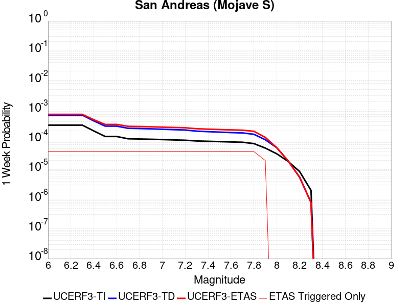 |  |  |  |

| Magnitude | 1 wk TI Prob | 1 wk TD Prob | 1 wk ETAS Prob | 1 wk ETAS/TD Gain | 1 wk ETAS Triggered Only | 1 mo TI Prob | 1 mo TD Prob | 1 mo ETAS Prob | 1 mo ETAS/TD Gain | 1 mo ETAS Triggered Only | 1 yr TI Prob | 1 yr TD Prob | 1 yr ETAS Prob | 1 yr ETAS/TD Gain | 1 yr ETAS Triggered Only | 10 yr TI Prob | 10 yr TD Prob | 10 yr ETAS Prob | 10 yr ETAS/TD Gain | 10 yr ETAS Triggered Only |
|-----|-----|-----|-----|-----|-----|-----|-----|-----|-----|-----|-----|-----|-----|-----|-----|-----|-----|-----|-----|-----|
| 6.0 | 3.1064058E-4 | 6.7510875E-4 | 7.1508175E-4 | 1.0592097 | 4.0E-5 | 0.0013306376 | 0.0028902432 | 0.003069723 | 1.0620985 | 1.8E-4 | 0.016080605 | 0.034590013 | 0.035188567 | 1.0173043 | 6.2E-4 | 0.1496549 | 0.2867214 | 0.2877699 | 1.003657 | 0.00147 |
| 6.1 | 3.1064058E-4 | 6.7510875E-4 | 7.1508175E-4 | 1.0592097 | 4.0E-5 | 0.0013306376 | 0.0028902432 | 0.003069723 | 1.0620985 | 1.8E-4 | 0.016080605 | 0.034590013 | 0.035188567 | 1.0173043 | 6.2E-4 | 0.1496549 | 0.2867214 | 0.2877699 | 1.003657 | 0.00147 |
| 6.2 | 3.1064058E-4 | 6.7510875E-4 | 7.1508175E-4 | 1.0592097 | 4.0E-5 | 0.0013306376 | 0.0028902432 | 0.003069723 | 1.0620985 | 1.8E-4 | 0.016080605 | 0.034590013 | 0.035188567 | 1.0173043 | 6.2E-4 | 0.1496549 | 0.2867214 | 0.2877699 | 1.003657 | 0.00147 |
| 6.3 | 3.1064058E-4 | 6.7510875E-4 | 7.1508175E-4 | 1.0592097 | 4.0E-5 | 0.0013306376 | 0.0028902432 | 0.003069723 | 1.0620985 | 1.8E-4 | 0.016080605 | 0.034590013 | 0.035188567 | 1.0173043 | 6.2E-4 | 0.1496549 | 0.2867214 | 0.2877699 | 1.003657 | 0.00147 |
| 6.4 | 1.9872203E-4 | 4.3227006E-4 | 4.7225275E-4 | 1.0924947 | 4.0E-5 | 8.5138786E-4 | 0.0018512988 | 0.0020209842 | 1.0916574 | 1.7E-4 | 0.010316478 | 0.022312758 | 0.02284071 | 1.0236614 | 5.4E-4 | 0.098504856 | 0.19715159 | 0.1981712 | 1.0051718 | 0.00127 |
| 6.5 | 1.291105E-4 | 2.8797862E-4 | 3.279671E-4 | 1.1388592 | 4.0E-5 | 5.5321335E-4 | 0.0012336131 | 0.0013934157 | 1.1295403 | 1.6E-4 | 0.006714592 | 0.014916636 | 0.015389476 | 1.0316988 | 4.8E-4 | 0.065152965 | 0.13823915 | 0.13920431 | 1.0069818 | 0.00112 |
| 6.6 | 1.291105E-4 | 2.8797862E-4 | 3.279671E-4 | 1.1388592 | 4.0E-5 | 5.5321335E-4 | 0.0012336131 | 0.0013934157 | 1.1295403 | 1.6E-4 | 0.006714592 | 0.014916636 | 0.015389476 | 1.0316988 | 4.8E-4 | 0.065152965 | 0.13823915 | 0.13920431 | 1.0069818 | 0.00112 |
| 6.7 | 1.08001186E-4 | 2.4378329E-4 | 2.8377352E-4 | 1.1640402 | 4.0E-5 | 4.6278012E-4 | 0.0010443678 | 0.0012042007 | 1.1530428 | 1.6E-4 | 0.0056198016 | 0.012641347 | 0.013075785 | 1.0343664 | 4.4E-4 | 0.054797906 | 0.11938139 | 0.12031485 | 1.007819 | 0.00106 |
| 6.8 | 1.0624356E-4 | 2.3895866E-4 | 2.789491E-4 | 1.1673529 | 4.0E-5 | 4.5525006E-4 | 0.0010237071 | 0.0011835434 | 1.1561347 | 1.6E-4 | 0.0055285925 | 0.012392684 | 0.012827231 | 1.0350648 | 4.4E-4 | 0.053930566 | 0.11733035 | 0.11826598 | 1.0079743 | 0.00106 |
| 6.9 | 1.0393785E-4 | 2.3266043E-4 | 2.7265112E-4 | 1.1718844 | 4.0E-5 | 4.4537184E-4 | 9.967355E-4 | 0.0011565761 | 1.160364 | 1.6E-4 | 0.0054089287 | 0.012067983 | 0.012502673 | 1.0360202 | 4.4E-4 | 0.05279156 | 0.11462616 | 0.11556466 | 1.0081874 | 0.00106 |
| 7.0 | 1.0155622E-4 | 2.263537E-4 | 2.6634464E-4 | 1.1766746 | 4.0E-5 | 4.3516833E-4 | 9.6972706E-4 | 0.0011295719 | 1.1648349 | 1.6E-4 | 0.005285311 | 0.01174274 | 0.01216769 | 1.0361884 | 4.3E-4 | 0.05161361 | 0.11188245 | 0.11280609 | 1.0082555 | 0.00104 |
| 7.1 | 9.885595E-5 | 2.192356E-4 | 2.5922683E-4 | 1.1824121 | 4.0E-5 | 4.2359953E-4 | 9.392432E-4 | 0.0010990929 | 1.17019 | 1.6E-4 | 0.0051451353 | 0.011375528 | 0.011800637 | 1.0373704 | 4.3E-4 | 0.05027629 | 0.10876294 | 0.10968091 | 1.0084401 | 0.00103 |
| 7.2 | 9.6411415E-5 | 2.1286341E-4 | 2.528549E-4 | 1.187874 | 4.0E-5 | 4.1312634E-4 | 9.119531E-4 | 0.0010718072 | 1.1752876 | 1.6E-4 | 0.005018219 | 0.011046687 | 0.011471937 | 1.0384957 | 4.3E-4 | 0.049064007 | 0.1059529 | 0.106864825 | 1.0086069 | 0.00102 |
| 7.3 | 9.1180635E-5 | 1.9513622E-4 | 2.3512842E-4 | 1.204945 | 4.0E-5 | 3.907156E-4 | 8.360302E-4 | 9.958964E-4 | 1.1912206 | 1.6E-4 | 0.004746591 | 0.010131276 | 0.0105569195 | 1.0420128 | 4.3E-4 | 0.046464786 | 0.09813878 | 0.099040635 | 1.0091896 | 0.001 |
| 7.4 | 8.887388E-5 | 1.876169E-4 | 2.276094E-4 | 1.2131604 | 4.0E-5 | 3.8083247E-4 | 8.0382475E-4 | 9.636961E-4 | 1.1988884 | 1.6E-4 | 0.0046267817 | 0.009742749 | 0.01016856 | 1.0437053 | 4.3E-4 | 0.045316286 | 0.094773374 | 0.09566955 | 1.0094559 | 9.9E-4 |
| 7.5 | 8.6750515E-5 | 1.8092788E-4 | 2.2092064E-4 | 1.2210425 | 4.0E-5 | 3.7173493E-4 | 7.751749E-4 | 9.3505083E-4 | 1.2062451 | 1.6E-4 | 0.004516484 | 0.009396999 | 0.009822959 | 1.0453293 | 4.3E-4 | 0.04425787 | 0.0917361 | 0.09263528 | 1.0098019 | 9.9E-4 |
| 7.6 | 8.453092E-5 | 1.7479878E-4 | 2.1479178E-4 | 1.2287946 | 4.0E-5 | 3.6222505E-4 | 7.489226E-4 | 9.088028E-4 | 1.2134802 | 1.6E-4 | 0.0044011753 | 0.009080087 | 0.009506183 | 1.0469264 | 4.3E-4 | 0.04315024 | 0.08889216 | 0.08979416 | 1.0101471 | 9.9E-4 |
| 7.7 | 8.259102E-5 | 1.7001547E-4 | 2.1000867E-4 | 1.2352327 | 4.0E-5 | 3.539135E-4 | 7.284343E-4 | 8.8831777E-4 | 1.2194892 | 1.6E-4 | 0.004300386 | 0.008832693 | 0.009258894 | 1.0482528 | 4.3E-4 | 0.042181134 | 0.08664159 | 0.08753668 | 1.0103309 | 9.8E-4 |
| 7.8 | 7.444844E-5 | 1.5320233E-4 | 1.931962E-4 | 1.2610526 | 4.0E-5 | 3.1902574E-4 | 6.564163E-4 | 7.963244E-4 | 1.2131393 | 1.4E-4 | 0.0038772223 | 0.007962632 | 0.008260244 | 1.0373759 | 3.0E-4 | 0.03810269 | 0.07845584 | 0.07915621 | 1.008927 | 7.6E-4 |
| 7.9 | 5.2586525E-5 | 1.0031395E-4 | 1.2031194E-4 | 1.199354 | 2.0E-5 | 2.2535135E-4 | 4.298461E-4 | 5.198074E-4 | 1.2092873 | 9.0E-5 | 0.0027402006 | 0.0052208295 | 0.0054098377 | 1.0362027 | 1.9E-4 | 0.027066574 | 0.052314375 | 0.05275979 | 1.0085142 | 4.7E-4 |
| 8.0 | 3.379877E-5 | 5.4216864E-5 | 5.4216864E-5 | 1.0 | 0.0 | 1.4484383E-4 | 2.323373E-4 | 2.72328E-4 | 1.1721234 | 4.0E-5 | 0.0017620471 | 0.0028250392 | 0.0028948414 | 1.0247084 | 7.0E-5 | 0.017481409 | 0.028905103 | 0.029031344 | 1.0043675 | 1.3E-4 |
| 8.1 | 1.8668277E-5 | 1.9375602E-5 | 1.9375602E-5 | 1.0 | 0.0 | 8.000444E-5 | 8.303566E-5 | 9.3034825E-5 | 1.1204202 | 1.0E-5 | 9.736188E-4 | 0.0010104909 | 0.0010204808 | 1.0098861 | 1.0E-5 | 0.009693642 | 0.010833839 | 0.010853623 | 1.001826 | 2.0E-5 |
| 8.2 | 8.541571E-6 | 5.4858997E-6 | 5.4858997E-6 | 1.0 | 0.0 | 3.660622E-5 | 2.3510787E-5 | 2.3510787E-5 | 1.0 | 0.0 | 4.455896E-4 | 2.862063E-4 | 2.862063E-4 | 1.0 | 0.0 | 0.0044469717 | 0.0032546876 | 0.0032546876 | 1.0 | 0.0 |
| 8.3 | 1.983087E-6 | 7.698541E-7 | 7.698541E-7 | 1.0 | 0.0 | 8.498917E-6 | 3.2993707E-6 | 3.2993707E-6 | 1.0 | 0.0 | 1.034694E-4 | 4.0169114E-5 | 4.0169114E-5 | 1.0 | 0.0 | 0.0010342124 | 4.7419698E-4 | 4.7419698E-4 | 1.0 | 0.0 |

## Nelson Lake
*[(top)](#table-of-contents)*

| 1 Week | 1 Month | 1 Year | 10 Year |
|-----|-----|-----|-----|
| 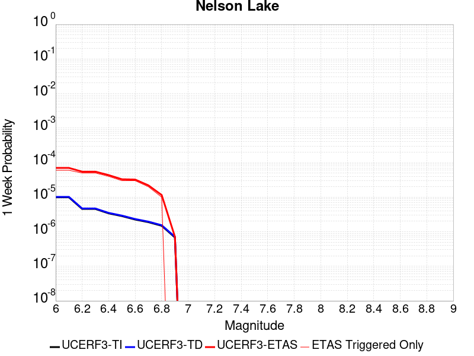 | 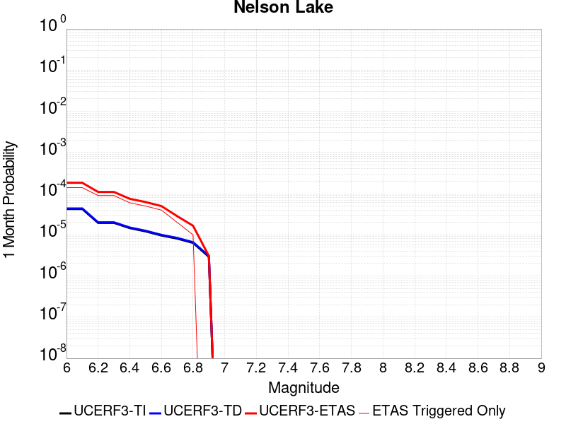 |  |  |

| Magnitude | 1 wk TI Prob | 1 wk TD Prob | 1 wk ETAS Prob | 1 wk ETAS/TD Gain | 1 wk ETAS Triggered Only | 1 mo TI Prob | 1 mo TD Prob | 1 mo ETAS Prob | 1 mo ETAS/TD Gain | 1 mo ETAS Triggered Only | 1 yr TI Prob | 1 yr TD Prob | 1 yr ETAS Prob | 1 yr ETAS/TD Gain | 1 yr ETAS Triggered Only | 10 yr TI Prob | 10 yr TD Prob | 10 yr ETAS Prob | 10 yr ETAS/TD Gain | 10 yr ETAS Triggered Only |
|-----|-----|-----|-----|-----|-----|-----|-----|-----|-----|-----|-----|-----|-----|-----|-----|-----|-----|-----|-----|-----|
| 6.0 | 9.913453E-6 | 1.0192446E-5 | 7.019183E-5 | 6.886653 | 6.0E-5 | 4.2485535E-5 | 4.3681237E-5 | 1.8367512E-4 | 4.2048974 | 1.4E-4 | 5.1713863E-4 | 5.316996E-4 | 0.0010614179 | 1.9962734 | 5.3E-4 | 0.0051593683 | 0.005305303 | 0.006608353 | 1.2456127 | 0.00131 |
| 6.1 | 9.913453E-6 | 1.0192446E-5 | 7.019183E-5 | 6.886653 | 6.0E-5 | 4.2485535E-5 | 4.3681237E-5 | 1.8367512E-4 | 4.2048974 | 1.4E-4 | 5.1713863E-4 | 5.316996E-4 | 0.0010614179 | 1.9962734 | 5.3E-4 | 0.0051593683 | 0.005305303 | 0.006608353 | 1.2456127 | 0.00131 |
| 6.2 | 4.5596407E-6 | 4.6964064E-6 | 5.469617E-5 | 11.646388 | 5.0E-5 | 1.954117E-5 | 2.0127309E-5 | 1.101255E-4 | 5.4714465 | 9.0E-5 | 2.3788778E-4 | 2.450237E-4 | 5.7494285E-4 | 2.3464785 | 3.3E-4 | 0.0023763329 | 0.0024476615 | 0.0031359727 | 1.2812117 | 6.9E-4 |
| 6.3 | 4.5596407E-6 | 4.6964064E-6 | 5.469617E-5 | 11.646388 | 5.0E-5 | 1.954117E-5 | 2.0127309E-5 | 1.101255E-4 | 5.4714465 | 9.0E-5 | 2.3788778E-4 | 2.450237E-4 | 5.7494285E-4 | 2.3464785 | 3.3E-4 | 0.0023763329 | 0.0024476615 | 0.0031359727 | 1.2812117 | 6.9E-4 |
| 6.4 | 3.4025713E-6 | 3.5099708E-6 | 4.350983E-5 | 12.396066 | 4.0E-5 | 1.4582367E-5 | 1.504265E-5 | 7.5041746E-5 | 4.988599 | 6.0E-5 | 1.7752586E-4 | 1.8312971E-4 | 4.2308576E-4 | 2.3103065 | 2.4E-4 | 0.001773841 | 0.001829871 | 0.0023489194 | 1.283653 | 5.2E-4 |
| 6.5 | 2.8352947E-6 | 2.9279197E-6 | 3.292783E-5 | 11.246153 | 3.0E-5 | 1.2151207E-5 | 1.2548171E-5 | 6.2547544E-5 | 4.9845943 | 5.0E-5 | 1.479309E-4 | 1.5276401E-4 | 3.6273195E-4 | 2.3744593 | 2.1E-4 | 0.0014783246 | 0.0015266639 | 0.0019560074 | 1.2812299 | 4.3E-4 |
| 6.6 | 2.251518E-6 | 2.329121E-6 | 3.232905E-5 | 13.880366 | 3.0E-5 | 9.649328E-6 | 9.981912E-6 | 4.9981514E-5 | 5.0072083 | 4.0E-5 | 1.1747423E-4 | 1.21523626E-4 | 3.0150174E-4 | 2.4810135 | 1.8E-4 | 0.0011741214 | 0.0012146335 | 0.0015841841 | 1.3042487 | 3.7E-4 |
| 6.7 | 1.8911853E-6 | 1.9591864E-6 | 2.1959147E-5 | 11.208299 | 2.0E-5 | 8.105055E-6 | 8.39649E-6 | 2.8396322E-5 | 3.3819277 | 2.0E-5 | 9.867457E-5 | 1.0222305E-4 | 2.4220874E-4 | 2.369414 | 1.4E-4 | 9.863076E-4 | 0.0010218178 | 0.0013414908 | 1.3128474 | 3.2E-4 |
| 6.8 | 1.4874814E-6 | 1.5438693E-6 | 1.1543854E-5 | 7.477222 | 1.0E-5 | 6.374905E-6 | 6.616569E-6 | 1.6616503E-5 | 2.5113473 | 1.0E-5 | 7.76117E-5 | 8.055427E-5 | 2.005446E-4 | 2.489559 | 1.2E-4 | 7.75846E-4 | 8.053018E-4 | 0.0010750843 | 1.335008 | 2.7E-4 |
| 6.9 | 6.835972E-7 | 7.140139E-7 | 7.140139E-7 | 1.0 | 0.0 | 2.9296991E-6 | 3.0600577E-6 | 3.0600577E-6 | 1.0 | 0.0 | 3.56685E-5 | 3.7255882E-5 | 5.725514E-5 | 1.5368079 | 2.0E-5 | 3.5662777E-4 | 3.7252763E-4 | 4.5249783E-4 | 1.2146691 | 8.0E-5 |

## Death Valley (So)
*[(top)](#table-of-contents)*

| 1 Week | 1 Month | 1 Year | 10 Year |
|-----|-----|-----|-----|
|  |  |  | 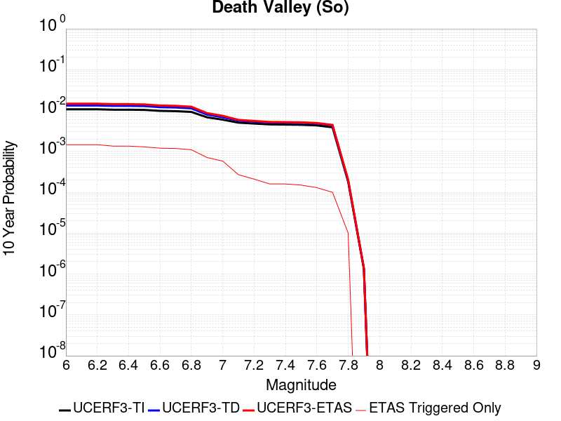 |

| Magnitude | 1 wk TI Prob | 1 wk TD Prob | 1 wk ETAS Prob | 1 wk ETAS/TD Gain | 1 wk ETAS Triggered Only | 1 mo TI Prob | 1 mo TD Prob | 1 mo ETAS Prob | 1 mo ETAS/TD Gain | 1 mo ETAS Triggered Only | 1 yr TI Prob | 1 yr TD Prob | 1 yr ETAS Prob | 1 yr ETAS/TD Gain | 1 yr ETAS Triggered Only | 10 yr TI Prob | 10 yr TD Prob | 10 yr ETAS Prob | 10 yr ETAS/TD Gain | 10 yr ETAS Triggered Only |
|-----|-----|-----|-----|-----|-----|-----|-----|-----|-----|-----|-----|-----|-----|-----|-----|-----|-----|-----|-----|-----|
| 6.0 | 2.0684236E-5 | 2.5621479E-5 | 5.5620712E-5 | 2.1708627 | 3.0E-5 | 8.864371E-5 | 1.0980181E-4 | 1.9979193E-4 | 1.8195686 | 9.0E-5 | 0.0010787029 | 0.0013360342 | 0.0019651924 | 1.4709148 | 6.3E-4 | 0.010734817 | 0.013283388 | 0.014723994 | 1.1084517 | 0.00146 |
| 6.1 | 2.0684236E-5 | 2.5621479E-5 | 5.5620712E-5 | 2.1708627 | 3.0E-5 | 8.864371E-5 | 1.0980181E-4 | 1.9979193E-4 | 1.8195686 | 9.0E-5 | 0.0010787029 | 0.0013360342 | 0.0019651924 | 1.4709148 | 6.3E-4 | 0.010734817 | 0.013283388 | 0.014723994 | 1.1084517 | 0.00146 |
| 6.2 | 2.0684236E-5 | 2.5621479E-5 | 5.5620712E-5 | 2.1708627 | 3.0E-5 | 8.864371E-5 | 1.0980181E-4 | 1.9979193E-4 | 1.8195686 | 9.0E-5 | 0.0010787029 | 0.0013360342 | 0.0019651924 | 1.4709148 | 6.3E-4 | 0.010734817 | 0.013283388 | 0.014723994 | 1.1084517 | 0.00146 |
| 6.3 | 2.0240292E-5 | 2.5121522E-5 | 5.5120767E-5 | 2.1941652 | 3.0E-5 | 8.6741224E-5 | 1.0765932E-4 | 1.9764963E-4 | 1.8358804 | 9.0E-5 | 0.0010555626 | 0.0013099808 | 0.001889221 | 1.4421746 | 5.8E-4 | 0.010505628 | 0.0130259255 | 0.014358341 | 1.1022894 | 0.00135 |
| 6.4 | 2.0240292E-5 | 2.5121522E-5 | 5.5120767E-5 | 2.1941652 | 3.0E-5 | 8.6741224E-5 | 1.0765932E-4 | 1.9764963E-4 | 1.8358804 | 9.0E-5 | 0.0010555626 | 0.0013099808 | 0.001889221 | 1.4421746 | 5.8E-4 | 0.010505628 | 0.0130259255 | 0.014358341 | 1.1022894 | 0.00135 |
| 6.5 | 1.9962767E-5 | 2.481075E-5 | 5.4810007E-5 | 2.2091234 | 3.0E-5 | 8.55519E-5 | 1.0632755E-4 | 1.9631798E-4 | 1.846351 | 9.0E-5 | 0.0010410968 | 0.0012937859 | 0.0018630484 | 1.4399976 | 5.7E-4 | 0.010362327 | 0.01286586 | 0.014139263 | 1.0989753 | 0.00129 |
| 6.6 | 1.8937297E-5 | 2.3314418E-5 | 5.331372E-5 | 2.2867274 | 3.0E-5 | 8.115732E-5 | 9.991519E-5 | 1.899062E-4 | 1.9006739 | 9.0E-5 | 9.876423E-4 | 0.0012158032 | 0.0017551467 | 1.4436108 | 5.4E-4 | 0.009832645 | 0.012094392 | 0.0132798795 | 1.0980195 | 0.0012 |
| 6.7 | 1.8621096E-5 | 2.2915021E-5 | 5.2914333E-5 | 2.309155 | 3.0E-5 | 7.980225E-5 | 9.820362E-5 | 1.8819478E-4 | 1.9163731 | 9.0E-5 | 9.711593E-4 | 0.0011949878 | 0.0017343425 | 1.4513475 | 5.4E-4 | 0.009669261 | 0.011888486 | 0.013054458 | 1.0980757 | 0.00118 |
| 6.8 | 1.7830353E-5 | 2.1808866E-5 | 2.1808866E-5 | 1.0 | 0.0 | 7.641356E-5 | 9.34633E-5 | 1.5345769E-4 | 1.6419033 | 6.0E-5 | 9.29938E-4 | 0.0011373357 | 0.0016267784 | 1.4303415 | 4.9E-4 | 0.009260561 | 0.011317221 | 0.012404772 | 1.096097 | 0.0011 |
| 6.9 | 1.3135183E-5 | 1.530561E-5 | 1.530561E-5 | 1.0 | 0.0 | 5.6292425E-5 | 6.559386E-5 | 8.559255E-5 | 1.3048866 | 2.0E-5 | 6.8514474E-4 | 7.9831906E-4 | 0.0010780955 | 1.350457 | 2.8E-4 | 0.006830362 | 0.007955994 | 0.008660345 | 1.0885309 | 7.1E-4 |
| 7.0 | 1.1507512E-5 | 1.3155456E-5 | 1.3155456E-5 | 1.0 | 0.0 | 4.9316975E-5 | 5.637934E-5 | 7.637821E-5 | 1.3547199 | 2.0E-5 | 6.002687E-4 | 6.86208E-4 | 9.060571E-4 | 1.3203825 | 2.2E-4 | 0.0059864987 | 0.006842054 | 0.0074180854 | 1.0841899 | 5.8E-4 |
| 7.1 | 9.715903E-6 | 1.0866167E-5 | 1.0866167E-5 | 1.0 | 0.0 | 4.1638916E-5 | 4.656848E-5 | 5.6568013E-5 | 1.2147275 | 1.0E-5 | 5.068359E-4 | 5.66828E-4 | 6.7676563E-4 | 1.1939524 | 1.1E-4 | 0.0050568148 | 0.005654366 | 0.0059228395 | 1.0474807 | 2.7E-4 |
| 7.2 | 9.233269E-6 | 1.0287126E-5 | 1.0287126E-5 | 1.0 | 0.0 | 3.9570554E-5 | 4.4086963E-5 | 5.4086522E-5 | 1.2268144 | 1.0E-5 | 4.81665E-4 | 5.366308E-4 | 6.165879E-4 | 1.1489983 | 8.0E-5 | 0.0048062233 | 0.0053537814 | 0.005562657 | 1.0390146 | 2.1E-4 |
| 7.3 | 8.8041315E-6 | 9.808909E-6 | 9.808909E-6 | 1.0 | 0.0 | 3.7731446E-5 | 4.203753E-5 | 5.203711E-5 | 1.2378727 | 1.0E-5 | 4.592835E-4 | 5.116909E-4 | 5.816551E-4 | 1.1367314 | 7.0E-5 | 0.0045833546 | 0.005105554 | 0.005264737 | 1.0311785 | 1.6E-4 |
| 7.4 | 8.708749E-6 | 9.707916E-6 | 9.707916E-6 | 1.0 | 0.0 | 3.7322676E-5 | 4.1604715E-5 | 5.16043E-5 | 1.2403474 | 1.0E-5 | 4.5430884E-4 | 5.064239E-4 | 5.7638844E-4 | 1.1381541 | 7.0E-5 | 0.004533812 | 0.0050531244 | 0.0052123163 | 1.0315036 | 1.6E-4 |
| 7.5 | 8.612678E-6 | 9.605554E-6 | 9.605554E-6 | 1.0 | 0.0 | 3.6910955E-5 | 4.1166033E-5 | 5.116562E-5 | 1.2429087 | 1.0E-5 | 4.492982E-4 | 5.010854E-4 | 5.7105033E-4 | 1.1396267 | 7.0E-5 | 0.004483909 | 0.0049999813 | 0.0051492313 | 1.0298501 | 1.5E-4 |
| 7.6 | 8.319024E-6 | 9.284633E-6 | 9.284633E-6 | 1.0 | 0.0 | 3.5652476E-5 | 3.9790702E-5 | 4.9790306E-5 | 1.251305 | 1.0E-5 | 4.3398244E-4 | 4.843483E-4 | 5.543144E-4 | 1.1444541 | 7.0E-5 | 0.0043313587 | 0.0048333504 | 0.0049627223 | 1.0267664 | 1.3E-4 |
| 7.7 | 7.4718328E-6 | 8.345819E-6 | 8.345819E-6 | 1.0 | 0.0 | 3.2021748E-5 | 3.5767327E-5 | 4.576697E-5 | 1.2795748 | 1.0E-5 | 3.8979502E-4 | 4.3538425E-4 | 4.8536249E-4 | 1.114791 | 5.0E-5 | 0.00389112 | 0.004345718 | 0.004445283 | 1.0229112 | 1.0E-4 |
| 7.8 | 3.4586725E-7 | 3.6483948E-7 | 3.6483948E-7 | 1.0 | 0.0 | 1.4822873E-6 | 1.5635968E-6 | 1.5635968E-6 | 1.0 | 0.0 | 1.80467E-5 | 1.903663E-5 | 2.9036439E-5 | 1.5252931 | 1.0E-5 | 1.8045233E-4 | 1.9035043E-4 | 2.0034853E-4 | 1.0525247 | 1.0E-5 |
| 7.9 | 2.5591178E-9 | 2.6697482E-9 | 2.6697482E-9 | 1.0 | 0.0 | 1.0967647E-8 | 1.1441778E-8 | 1.1441778E-8 | 1.0 | 0.0 | 1.335311E-7 | 1.3930365E-7 | 1.3930365E-7 | 1.0 | 0.0 | 1.3353102E-6 | 1.3930365E-6 | 1.3930365E-6 | 1.0 | 0.0 |

## San Andreas (Mojave N)
*[(top)](#table-of-contents)*

| 1 Week | 1 Month | 1 Year | 10 Year |
|-----|-----|-----|-----|
|  |  |  |  |

| Magnitude | 1 wk TI Prob | 1 wk TD Prob | 1 wk ETAS Prob | 1 wk ETAS/TD Gain | 1 wk ETAS Triggered Only | 1 mo TI Prob | 1 mo TD Prob | 1 mo ETAS Prob | 1 mo ETAS/TD Gain | 1 mo ETAS Triggered Only | 1 yr TI Prob | 1 yr TD Prob | 1 yr ETAS Prob | 1 yr ETAS/TD Gain | 1 yr ETAS Triggered Only | 10 yr TI Prob | 10 yr TD Prob | 10 yr ETAS Prob | 10 yr ETAS/TD Gain | 10 yr ETAS Triggered Only |
|-----|-----|-----|-----|-----|-----|-----|-----|-----|-----|-----|-----|-----|-----|-----|-----|-----|-----|-----|-----|-----|
| 6.0 | 9.877682E-5 | 1.9445624E-4 | 2.3444847E-4 | 1.2056618 | 4.0E-5 | 4.2326056E-4 | 8.331179E-4 | 0.001042943 | 1.2518551 | 2.1E-4 | 0.0051410277 | 0.010096164 | 0.010729702 | 1.0627505 | 6.4E-4 | 0.05023708 | 0.09851385 | 0.09976692 | 1.0127198 | 0.00139 |
| 6.1 | 9.877682E-5 | 1.9445624E-4 | 2.3444847E-4 | 1.2056618 | 4.0E-5 | 4.2326056E-4 | 8.331179E-4 | 0.001042943 | 1.2518551 | 2.1E-4 | 0.0051410277 | 0.010096164 | 0.010729702 | 1.0627505 | 6.4E-4 | 0.05023708 | 0.09851385 | 0.09976692 | 1.0127198 | 0.00139 |
| 6.2 | 9.877682E-5 | 1.9445624E-4 | 2.3444847E-4 | 1.2056618 | 4.0E-5 | 4.2326056E-4 | 8.331179E-4 | 0.001042943 | 1.2518551 | 2.1E-4 | 0.0051410277 | 0.010096164 | 0.010729702 | 1.0627505 | 6.4E-4 | 0.05023708 | 0.09851385 | 0.09976692 | 1.0127198 | 0.00139 |
| 6.3 | 9.877682E-5 | 1.9445624E-4 | 2.3444847E-4 | 1.2056618 | 4.0E-5 | 4.2326056E-4 | 8.331179E-4 | 0.001042943 | 1.2518551 | 2.1E-4 | 0.0051410277 | 0.010096164 | 0.010729702 | 1.0627505 | 6.4E-4 | 0.05023708 | 0.09851385 | 0.09976692 | 1.0127198 | 0.00139 |
| 6.4 | 9.877682E-5 | 1.9445624E-4 | 2.3444847E-4 | 1.2056618 | 4.0E-5 | 4.2326056E-4 | 8.331179E-4 | 0.001042943 | 1.2518551 | 2.1E-4 | 0.0051410277 | 0.010096164 | 0.010729702 | 1.0627505 | 6.4E-4 | 0.05023708 | 0.09851385 | 0.09976692 | 1.0127198 | 0.00139 |
| 6.5 | 9.861474E-5 | 1.9419378E-4 | 2.3418601E-4 | 1.2059398 | 4.0E-5 | 4.2256617E-4 | 8.3199376E-4 | 0.0010418191 | 1.2521957 | 2.1E-4 | 0.0051326132 | 0.010082604 | 0.010716151 | 1.0628357 | 6.4E-4 | 0.050156746 | 0.098391704 | 0.099644944 | 1.0127372 | 0.00139 |
| 6.6 | 9.861474E-5 | 1.9419378E-4 | 2.3418601E-4 | 1.2059398 | 4.0E-5 | 4.2256617E-4 | 8.3199376E-4 | 0.0010418191 | 1.2521957 | 2.1E-4 | 0.0051326132 | 0.010082604 | 0.010716151 | 1.0628357 | 6.4E-4 | 0.050156746 | 0.098391704 | 0.099644944 | 1.0127372 | 0.00139 |
| 6.7 | 9.8552715E-5 | 1.9409324E-4 | 2.3408548E-4 | 1.2060465 | 4.0E-5 | 4.223004E-4 | 8.315632E-4 | 0.0010413886 | 1.2523265 | 2.1E-4 | 0.0051293927 | 0.01007741 | 0.010710961 | 1.0628684 | 6.4E-4 | 0.050125998 | 0.09834491 | 0.09959821 | 1.012744 | 0.00139 |
| 6.8 | 9.8464974E-5 | 1.9394471E-4 | 2.3393695E-4 | 1.2062043 | 4.0E-5 | 4.219245E-4 | 8.3092705E-4 | 0.0010407525 | 1.2525197 | 2.1E-4 | 0.0051248376 | 0.010069737 | 0.010703293 | 1.0629168 | 6.4E-4 | 0.05008251 | 0.09827508 | 0.09952848 | 1.012754 | 0.00139 |
| 6.9 | 9.825824E-5 | 1.9362455E-4 | 2.3361681E-4 | 1.2065454 | 4.0E-5 | 4.2103877E-4 | 8.295558E-4 | 0.0010393816 | 1.2529376 | 2.1E-4 | 0.0051141046 | 0.010053196 | 0.010686763 | 1.0630213 | 6.4E-4 | 0.049980022 | 0.09812444 | 0.09937804 | 1.0127757 | 0.00139 |
| 7.0 | 9.781462E-5 | 1.9293769E-4 | 2.3292998E-4 | 1.2072809 | 4.0E-5 | 4.1913814E-4 | 8.26614E-4 | 0.0010364404 | 1.2538384 | 2.1E-4 | 0.005091073 | 0.01001771 | 0.010651299 | 1.0632468 | 6.4E-4 | 0.04976007 | 0.09780058 | 0.09905464 | 1.0128226 | 0.00139 |
| 7.1 | 9.7121134E-5 | 1.9195407E-4 | 2.319464E-4 | 1.2083431 | 4.0E-5 | 4.1616702E-4 | 8.2240114E-4 | 0.0010322285 | 1.2551398 | 2.1E-4 | 0.005055068 | 0.009966888 | 0.01060051 | 1.0635726 | 6.4E-4 | 0.04941613 | 0.09733692 | 0.098591626 | 1.0128903 | 0.00139 |
| 7.2 | 9.663819E-5 | 1.912614E-4 | 2.3125375E-4 | 1.2090979 | 4.0E-5 | 4.1409794E-4 | 8.194344E-4 | 0.0010292623 | 1.2560643 | 2.1E-4 | 0.0050299936 | 0.009931099 | 0.010564743 | 1.063804 | 6.4E-4 | 0.049176537 | 0.09701011 | 0.098265275 | 1.0129384 | 0.00139 |
| 7.3 | 9.6277574E-5 | 1.9078587E-4 | 2.3077824E-4 | 1.2096192 | 4.0E-5 | 4.125529E-4 | 8.173977E-4 | 0.0010272261 | 1.2567029 | 2.1E-4 | 0.0050112694 | 0.009906528 | 0.010540187 | 1.0639639 | 6.4E-4 | 0.04899759 | 0.096783414 | 0.09803889 | 1.012972 | 0.00139 |
| 7.4 | 9.593308E-5 | 1.9018292E-4 | 2.3017533E-4 | 1.2102839 | 4.0E-5 | 4.1107697E-4 | 8.148153E-4 | 0.0010246441 | 1.2575171 | 2.1E-4 | 0.0049933824 | 0.009875372 | 0.010509052 | 1.0641677 | 6.4E-4 | 0.04882661 | 0.09650147 | 0.097748294 | 1.0129203 | 0.00138 |
| 7.5 | 9.561707E-5 | 1.8964308E-4 | 2.296355E-4 | 1.2108825 | 4.0E-5 | 4.0972308E-4 | 8.125031E-4 | 0.0010223325 | 1.2582506 | 2.1E-4 | 0.0049769743 | 0.009847476 | 0.010481174 | 1.0643513 | 6.4E-4 | 0.048669744 | 0.096247554 | 0.09749474 | 1.012958 | 0.00138 |
| 7.6 | 9.418194E-5 | 1.8616221E-4 | 2.2615476E-4 | 1.2148263 | 4.0E-5 | 4.0357444E-4 | 7.975943E-4 | 0.0010074268 | 1.2630818 | 2.1E-4 | 0.004902454 | 0.009667586 | 0.010301399 | 1.0655606 | 6.4E-4 | 0.047957025 | 0.09462737 | 0.09587678 | 1.0132035 | 0.00138 |
| 7.7 | 8.202141E-5 | 1.6061509E-4 | 2.0060866E-4 | 1.2490026 | 4.0E-5 | 3.51473E-4 | 6.881688E-4 | 8.880312E-4 | 1.2904264 | 2.0E-4 | 0.00427079 | 0.008346326 | 0.008891735 | 1.0653473 | 5.5E-4 | 0.04189639 | 0.08241458 | 0.08356156 | 1.0139172 | 0.00125 |
| 7.8 | 7.2859846E-5 | 1.4552638E-4 | 1.8552056E-4 | 1.2748243 | 4.0E-5 | 3.1221908E-4 | 6.235354E-4 | 7.6344813E-4 | 1.2243861 | 1.4E-4 | 0.003794643 | 0.0075651607 | 0.007862891 | 1.0393555 | 3.0E-4 | 0.037304975 | 0.074888036 | 0.075591125 | 1.0093884 | 7.6E-4 |
| 7.9 | 5.3874453E-5 | 1.0070921E-4 | 1.2070719E-4 | 1.1985716 | 2.0E-5 | 2.3087008E-4 | 4.315395E-4 | 5.2150065E-4 | 1.2084657 | 9.0E-5 | 0.0028072202 | 0.0052413475 | 0.0054303515 | 1.0360602 | 1.9E-4 | 0.02772022 | 0.05254022 | 0.052985527 | 1.0084755 | 4.7E-4 |
| 8.0 | 3.468538E-5 | 5.440451E-5 | 5.440451E-5 | 1.0 | 0.0 | 1.4864317E-4 | 2.3314137E-4 | 2.7313203E-4 | 1.1715298 | 4.0E-5 | 0.0018082283 | 0.0028348032 | 0.002904605 | 1.024623 | 7.0E-5 | 0.017935853 | 0.029018594 | 0.029144822 | 1.0043498 | 1.3E-4 |
| 8.1 | 1.9152367E-5 | 1.946979E-5 | 1.946979E-5 | 1.0 | 0.0 | 8.207899E-5 | 8.3439285E-5 | 9.343845E-5 | 1.1198376 | 1.0E-5 | 9.988535E-4 | 0.0010154005 | 0.0010253903 | 1.0098383 | 1.0E-5 | 0.009943757 | 0.010891761 | 0.010911543 | 1.0018163 | 2.0E-5 |
| 8.2 | 8.643924E-6 | 5.5000196E-6 | 5.5000196E-6 | 1.0 | 0.0 | 3.704486E-5 | 2.35713E-5 | 2.35713E-5 | 1.0 | 0.0 | 4.5092785E-4 | 2.8694287E-4 | 2.8694287E-4 | 1.0 | 0.0 | 0.0045001395 | 0.0032626302 | 0.0032626302 | 1.0 | 0.0 |
| 8.3 | 1.983087E-6 | 7.698541E-7 | 7.698541E-7 | 1.0 | 0.0 | 8.498917E-6 | 3.2993707E-6 | 3.2993707E-6 | 1.0 | 0.0 | 1.034694E-4 | 4.0169114E-5 | 4.0169114E-5 | 1.0 | 0.0 | 0.0010342124 | 4.7419698E-4 | 4.7419698E-4 | 1.0 | 0.0 |

## Lenwood-Lockhart-Old Woman Springs
*[(top)](#table-of-contents)*

| 1 Week | 1 Month | 1 Year | 10 Year |
|-----|-----|-----|-----|
|  |  |  |  |

| Magnitude | 1 wk TI Prob | 1 wk TD Prob | 1 wk ETAS Prob | 1 wk ETAS/TD Gain | 1 wk ETAS Triggered Only | 1 mo TI Prob | 1 mo TD Prob | 1 mo ETAS Prob | 1 mo ETAS/TD Gain | 1 mo ETAS Triggered Only | 1 yr TI Prob | 1 yr TD Prob | 1 yr ETAS Prob | 1 yr ETAS/TD Gain | 1 yr ETAS Triggered Only | 10 yr TI Prob | 10 yr TD Prob | 10 yr ETAS Prob | 10 yr ETAS/TD Gain | 10 yr ETAS Triggered Only |
|-----|-----|-----|-----|-----|-----|-----|-----|-----|-----|-----|-----|-----|-----|-----|-----|-----|-----|-----|-----|-----|
| 6.0 | 3.744542E-5 | 4.396541E-5 | 6.396453E-5 | 1.4548831 | 2.0E-5 | 1.604705E-4 | 1.8841054E-4 | 3.1838604E-4 | 1.6898526 | 1.3E-4 | 0.0019519776 | 0.0022916573 | 0.002840397 | 1.2394509 | 5.5E-4 | 0.019349206 | 0.022698265 | 0.023919892 | 1.0538203 | 0.00125 |
| 6.1 | 3.744542E-5 | 4.396541E-5 | 6.396453E-5 | 1.4548831 | 2.0E-5 | 1.604705E-4 | 1.8841054E-4 | 3.1838604E-4 | 1.6898526 | 1.3E-4 | 0.0019519776 | 0.0022916573 | 0.002840397 | 1.2394509 | 5.5E-4 | 0.019349206 | 0.022698265 | 0.023919892 | 1.0538203 | 0.00125 |
| 6.2 | 3.744542E-5 | 4.396541E-5 | 6.396453E-5 | 1.4548831 | 2.0E-5 | 1.604705E-4 | 1.8841054E-4 | 3.1838604E-4 | 1.6898526 | 1.3E-4 | 0.0019519776 | 0.0022916573 | 0.002840397 | 1.2394509 | 5.5E-4 | 0.019349206 | 0.022698265 | 0.023919892 | 1.0538203 | 0.00125 |
| 6.3 | 2.1079984E-5 | 2.5354877E-5 | 3.5354624E-5 | 1.3943914 | 1.0E-5 | 9.0339665E-5 | 1.0865934E-4 | 1.6865283E-4 | 1.5521245 | 6.0E-5 | 0.0010993304 | 0.0013221446 | 0.0015019067 | 1.1359625 | 1.8E-4 | 0.010939079 | 0.013145001 | 0.013658165 | 1.0390388 | 5.2E-4 |
| 6.4 | 2.1079984E-5 | 2.5354877E-5 | 3.5354624E-5 | 1.3943914 | 1.0E-5 | 9.0339665E-5 | 1.0865934E-4 | 1.6865283E-4 | 1.5521245 | 6.0E-5 | 0.0010993304 | 0.0013221446 | 0.0015019067 | 1.1359625 | 1.8E-4 | 0.010939079 | 0.013145001 | 0.013658165 | 1.0390388 | 5.2E-4 |
| 6.5 | 1.7397282E-5 | 2.066365E-5 | 3.0663443E-5 | 1.4839317 | 1.0E-5 | 7.455765E-5 | 8.8555564E-5 | 1.3855113E-4 | 1.5645673 | 5.0E-5 | 9.073613E-4 | 0.0010776424 | 0.0012174916 | 1.1297733 | 1.4E-4 | 0.009036654 | 0.010725462 | 0.011131064 | 1.0378168 | 4.1E-4 |
| 6.6 | 1.52050325E-5 | 1.7680397E-5 | 2.768022E-5 | 1.5655881 | 1.0E-5 | 6.51628E-5 | 7.577097E-5 | 1.2576718E-4 | 1.6598333 | 5.0E-5 | 7.9306826E-4 | 9.221291E-4 | 0.0010520092 | 1.140848 | 1.3E-4 | 0.007902439 | 0.00918389 | 0.009550492 | 1.039918 | 3.7E-4 |
| 6.7 | 1.332523E-5 | 1.5264643E-5 | 2.526449E-5 | 1.6550987 | 1.0E-5 | 5.7106878E-5 | 6.541829E-5 | 9.5416326E-5 | 1.4585574 | 3.0E-5 | 6.950544E-4 | 7.961825E-4 | 8.9610287E-4 | 1.1254994 | 1.0E-4 | 0.006928845 | 0.0079339305 | 0.00822163 | 1.0362619 | 2.9E-4 |
| 6.8 | 1.1525329E-5 | 1.303158E-5 | 2.3031449E-5 | 1.7673566 | 1.0E-5 | 4.9393333E-5 | 5.5848457E-5 | 8.584678E-5 | 1.5371379 | 3.0E-5 | 6.011979E-4 | 6.797471E-4 | 7.596927E-4 | 1.1176108 | 8.0E-5 | 0.00599574 | 0.0067771305 | 0.0069857077 | 1.0307766 | 2.1E-4 |
| 6.9 | 1.0253909E-5 | 1.1515016E-5 | 2.1514901E-5 | 1.8684213 | 1.0E-5 | 4.3944583E-5 | 4.9349153E-5 | 7.934767E-5 | 1.6078831 | 3.0E-5 | 5.3489394E-4 | 6.0066395E-4 | 6.806159E-4 | 1.133106 | 8.0E-5 | 0.0053360825 | 0.0059907837 | 0.006169705 | 1.0298661 | 1.8E-4 |
| 7.0 | 8.104563E-6 | 8.991558E-6 | 8.991558E-6 | 1.0 | 0.0 | 3.4733377E-5 | 3.8534694E-5 | 4.8534308E-5 | 1.2594965 | 1.0E-5 | 4.2279682E-4 | 4.690613E-4 | 5.190379E-4 | 1.1065459 | 5.0E-5 | 0.0042199334 | 0.004680961 | 0.004830259 | 1.0318947 | 1.5E-4 |
| 7.1 | 6.7986157E-6 | 7.516075E-6 | 7.516075E-6 | 1.0 | 0.0 | 2.91366E-5 | 3.2211366E-5 | 4.2211042E-5 | 1.3104395 | 1.0E-5 | 3.5468035E-4 | 3.9210494E-4 | 4.3208926E-4 | 1.1019735 | 4.0E-5 | 0.003541148 | 0.0039143474 | 0.004023917 | 1.0279918 | 1.1E-4 |
| 7.2 | 5.6893327E-6 | 6.2802005E-6 | 6.2802005E-6 | 1.0 | 0.0 | 2.4382627E-5 | 2.6914879E-5 | 2.6914879E-5 | 1.0 | 0.0 | 2.9681803E-4 | 3.2764138E-4 | 3.5763154E-4 | 1.0915335 | 3.0E-5 | 0.002964219 | 0.0032717818 | 0.00335152 | 1.0243715 | 8.0E-5 |
| 7.3 | 4.253348E-6 | 4.707112E-6 | 4.707112E-6 | 1.0 | 0.0 | 1.8228506E-5 | 2.0173193E-5 | 2.0173193E-5 | 1.0 | 0.0 | 2.2190946E-4 | 2.4558278E-4 | 2.6557787E-4 | 1.081419 | 2.0E-5 | 0.00221688 | 0.0024532948 | 0.002523123 | 1.028463 | 7.0E-5 |
| 7.4 | 2.5448119E-6 | 2.8520694E-6 | 2.8520694E-6 | 1.0 | 0.0 | 1.0906291E-5 | 1.2223107E-5 | 1.2223107E-5 | 1.0 | 0.0 | 1.3277601E-4 | 1.4880781E-4 | 1.6880484E-4 | 1.1343815 | 2.0E-5 | 0.001326967 | 0.0014872439 | 0.0015371696 | 1.0335692 | 5.0E-5 |
| 7.5 | 4.3706837E-8 | 4.5630422E-8 | 4.5630422E-8 | 1.0 | 0.0 | 1.8731501E-7 | 1.9555894E-7 | 1.9555894E-7 | 1.0 | 0.0 | 2.2805577E-6 | 2.380928E-6 | 2.380928E-6 | 1.0 | 0.0 | 2.2805343E-5 | 2.380908E-5 | 2.380908E-5 | 1.0 | 0.0 |

## Towne Pass
*[(top)](#table-of-contents)*

| 1 Week | 1 Month | 1 Year | 10 Year |
|-----|-----|-----|-----|
|  |  |  |  |

| Magnitude | 1 wk TI Prob | 1 wk TD Prob | 1 wk ETAS Prob | 1 wk ETAS/TD Gain | 1 wk ETAS Triggered Only | 1 mo TI Prob | 1 mo TD Prob | 1 mo ETAS Prob | 1 mo ETAS/TD Gain | 1 mo ETAS Triggered Only | 1 yr TI Prob | 1 yr TD Prob | 1 yr ETAS Prob | 1 yr ETAS/TD Gain | 1 yr ETAS Triggered Only | 10 yr TI Prob | 10 yr TD Prob | 10 yr ETAS Prob | 10 yr ETAS/TD Gain | 10 yr ETAS Triggered Only |
|-----|-----|-----|-----|-----|-----|-----|-----|-----|-----|-----|-----|-----|-----|-----|-----|-----|-----|-----|-----|-----|
| 6.0 | 3.849728E-6 | 3.894583E-6 | 2.3894505E-5 | 6.135318 | 2.0E-5 | 1.649873E-5 | 1.6690989E-5 | 1.1668932E-4 | 6.991157 | 1.0E-4 | 2.0085352E-4 | 2.031982E-4 | 7.430885E-4 | 3.6569638 | 5.4E-4 | 0.0020067208 | 0.0020305533 | 0.003248076 | 1.5996015 | 0.00122 |
| 6.1 | 3.849728E-6 | 3.894583E-6 | 2.3894505E-5 | 6.135318 | 2.0E-5 | 1.649873E-5 | 1.6690989E-5 | 1.1668932E-4 | 6.991157 | 1.0E-4 | 2.0085352E-4 | 2.031982E-4 | 7.430885E-4 | 3.6569638 | 5.4E-4 | 0.0020067208 | 0.0020305533 | 0.003248076 | 1.5996015 | 0.00122 |
| 6.2 | 3.849728E-6 | 3.894583E-6 | 2.3894505E-5 | 6.135318 | 2.0E-5 | 1.649873E-5 | 1.6690989E-5 | 1.1668932E-4 | 6.991157 | 1.0E-4 | 2.0085352E-4 | 2.031982E-4 | 7.430885E-4 | 3.6569638 | 5.4E-4 | 0.0020067208 | 0.0020305533 | 0.003248076 | 1.5996015 | 0.00122 |
| 6.3 | 3.849728E-6 | 3.894583E-6 | 2.3894505E-5 | 6.135318 | 2.0E-5 | 1.649873E-5 | 1.6690989E-5 | 1.1668932E-4 | 6.991157 | 1.0E-4 | 2.0085352E-4 | 2.031982E-4 | 7.430885E-4 | 3.6569638 | 5.4E-4 | 0.0020067208 | 0.0020305533 | 0.003248076 | 1.5996015 | 0.00122 |
| 6.4 | 3.849728E-6 | 3.894583E-6 | 2.3894505E-5 | 6.135318 | 2.0E-5 | 1.649873E-5 | 1.6690989E-5 | 1.1668932E-4 | 6.991157 | 1.0E-4 | 2.0085352E-4 | 2.031982E-4 | 7.430885E-4 | 3.6569638 | 5.4E-4 | 0.0020067208 | 0.0020305533 | 0.003248076 | 1.5996015 | 0.00122 |
| 6.5 | 1.1953545E-6 | 1.2030688E-6 | 1.2030688E-6 | 1.0 | 0.0 | 5.1229376E-6 | 5.1559996E-6 | 1.5155948E-5 | 2.9394782 | 1.0E-5 | 6.236998E-5 | 6.2772604E-5 | 1.1276947E-4 | 1.7964758 | 5.0E-5 | 6.235248E-4 | 6.275605E-4 | 8.1744127E-4 | 1.3025696 | 1.9E-4 |
| 6.6 | 1.1953545E-6 | 1.2030688E-6 | 1.2030688E-6 | 1.0 | 0.0 | 5.1229376E-6 | 5.1559996E-6 | 1.5155948E-5 | 2.9394782 | 1.0E-5 | 6.236998E-5 | 6.2772604E-5 | 1.1276947E-4 | 1.7964758 | 5.0E-5 | 6.235248E-4 | 6.275605E-4 | 8.1744127E-4 | 1.3025696 | 1.9E-4 |
| 6.7 | 8.375951E-7 | 8.41081E-7 | 8.41081E-7 | 1.0 | 0.0 | 3.5896885E-6 | 3.604628E-6 | 1.3604592E-5 | 3.7742012 | 1.0E-5 | 4.370358E-5 | 4.388552E-5 | 6.388465E-5 | 1.4557111 | 2.0E-5 | 4.3694986E-4 | 4.3877427E-4 | 5.48726E-4 | 1.2505884 | 1.1E-4 |
| 6.8 | 6.38041E-7 | 6.3922806E-7 | 6.3922806E-7 | 1.0 | 0.0 | 2.7344586E-6 | 2.739546E-6 | 1.2739519E-5 | 4.65023 | 1.0E-5 | 3.3291526E-5 | 3.3353503E-5 | 4.3353168E-5 | 1.2998086 | 1.0E-5 | 3.3286537E-4 | 3.3348877E-4 | 4.1346208E-4 | 1.2398081 | 8.0E-5 |
| 6.9 | 5.3460053E-7 | 5.345449E-7 | 5.345449E-7 | 1.0 | 0.0 | 2.2911431E-6 | 2.2909048E-6 | 2.2909048E-6 | 1.0 | 0.0 | 2.789431E-5 | 2.7891443E-5 | 2.7891443E-5 | 1.0 | 0.0 | 2.789081E-4 | 2.7888274E-4 | 3.288688E-4 | 1.1792368 | 5.0E-5 |
| 7.0 | 3.557783E-7 | 3.5325218E-7 | 3.5325218E-7 | 1.0 | 0.0 | 1.5247632E-6 | 1.513937E-6 | 1.513937E-6 | 1.0 | 0.0 | 1.8563835E-5 | 1.8432036E-5 | 1.8432036E-5 | 1.0 | 0.0 | 1.8562283E-4 | 1.8430591E-4 | 2.0430223E-4 | 1.1084952 | 2.0E-5 |
| 7.1 | 3.037942E-7 | 3.0003125E-7 | 3.0003125E-7 | 1.0 | 0.0 | 1.3019744E-6 | 1.2858476E-6 | 1.2858476E-6 | 1.0 | 0.0 | 1.5851423E-5 | 1.565509E-5 | 1.565509E-5 | 1.0 | 0.0 | 1.5850292E-4 | 1.5654063E-4 | 1.7653749E-4 | 1.1277424 | 2.0E-5 |
| 7.2 | 2.0808248E-7 | 2.0218421E-7 | 2.0218421E-7 | 1.0 | 0.0 | 8.917818E-7 | 8.665035E-7 | 8.665035E-7 | 1.0 | 0.0 | 1.0857389E-5 | 1.0549634E-5 | 1.0549634E-5 | 1.0 | 0.0 | 1.0856859E-4 | 1.05491796E-4 | 1.2548968E-4 | 1.1895682 | 2.0E-5 |
| 7.3 | 1.1162073E-7 | 1.0637333E-7 | 1.0637333E-7 | 1.0 | 0.0 | 4.7837443E-7 | 4.5588564E-7 | 4.5588564E-7 | 1.0 | 0.0 | 5.8241935E-6 | 5.5503956E-6 | 5.5503956E-6 | 1.0 | 0.0 | 5.8240406E-5 | 5.550277E-5 | 5.550277E-5 | 1.0 | 0.0 |

## Paradise
*[(top)](#table-of-contents)*

| 1 Week | 1 Month | 1 Year | 10 Year |
|-----|-----|-----|-----|
|  | 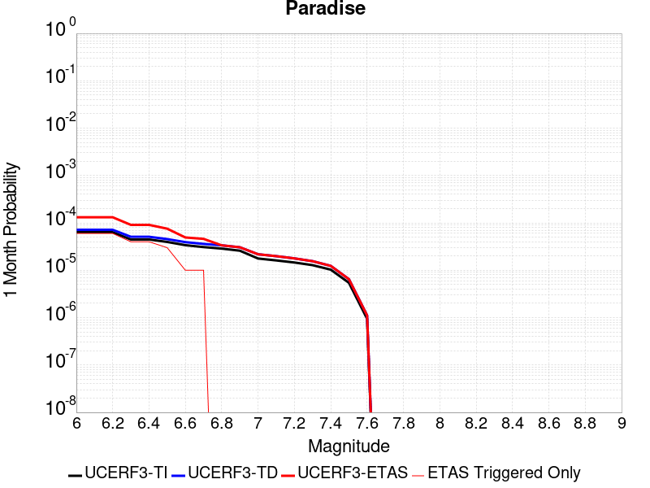 |  |  |

| Magnitude | 1 wk TI Prob | 1 wk TD Prob | 1 wk ETAS Prob | 1 wk ETAS/TD Gain | 1 wk ETAS Triggered Only | 1 mo TI Prob | 1 mo TD Prob | 1 mo ETAS Prob | 1 mo ETAS/TD Gain | 1 mo ETAS Triggered Only | 1 yr TI Prob | 1 yr TD Prob | 1 yr ETAS Prob | 1 yr ETAS/TD Gain | 1 yr ETAS Triggered Only | 10 yr TI Prob | 10 yr TD Prob | 10 yr ETAS Prob | 10 yr ETAS/TD Gain | 10 yr ETAS Triggered Only |
|-----|-----|-----|-----|-----|-----|-----|-----|-----|-----|-----|-----|-----|-----|-----|-----|-----|-----|-----|-----|-----|
| 6.0 | 1.4851273E-5 | 1.669559E-5 | 3.669526E-5 | 2.197901 | 2.0E-5 | 6.364676E-5 | 7.1550705E-5 | 1.3154642E-4 | 1.8385062 | 6.0E-5 | 7.7462377E-4 | 8.708053E-4 | 0.0012604657 | 1.4474713 | 3.9E-4 | 0.0077192914 | 0.00867631 | 0.009588328 | 1.1051159 | 9.2E-4 |
| 6.1 | 1.4851273E-5 | 1.669559E-5 | 3.669526E-5 | 2.197901 | 2.0E-5 | 6.364676E-5 | 7.1550705E-5 | 1.3154642E-4 | 1.8385062 | 6.0E-5 | 7.7462377E-4 | 8.708053E-4 | 0.0012604657 | 1.4474713 | 3.9E-4 | 0.0077192914 | 0.00867631 | 0.009588328 | 1.1051159 | 9.2E-4 |
| 6.2 | 1.4851273E-5 | 1.669559E-5 | 3.669526E-5 | 2.197901 | 2.0E-5 | 6.364676E-5 | 7.1550705E-5 | 1.3154642E-4 | 1.8385062 | 6.0E-5 | 7.7462377E-4 | 8.708053E-4 | 0.0012604657 | 1.4474713 | 3.9E-4 | 0.0077192914 | 0.00867631 | 0.009588328 | 1.1051159 | 9.2E-4 |
| 6.3 | 1.0426831E-5 | 1.1889245E-5 | 2.1889125E-5 | 1.8410863 | 1.0E-5 | 4.4685654E-5 | 5.0952945E-5 | 9.09509E-5 | 1.784998 | 4.0E-5 | 5.43912E-4 | 6.2018144E-4 | 8.200574E-4 | 1.3222862 | 2.0E-4 | 0.0054258266 | 0.0061851153 | 0.006622394 | 1.0706985 | 4.4E-4 |
| 6.4 | 1.0426831E-5 | 1.1889245E-5 | 2.1889125E-5 | 1.8410863 | 1.0E-5 | 4.4685654E-5 | 5.0952945E-5 | 9.09509E-5 | 1.784998 | 4.0E-5 | 5.43912E-4 | 6.2018144E-4 | 8.200574E-4 | 1.3222862 | 2.0E-4 | 0.0054258266 | 0.0061851153 | 0.006622394 | 1.0706985 | 4.4E-4 |
| 6.5 | 9.25027E-6 | 1.0620518E-5 | 1.0620518E-5 | 1.0 | 0.0 | 3.964341E-5 | 4.5515742E-5 | 7.551438E-5 | 1.6590827 | 3.0E-5 | 4.8255164E-4 | 5.5401813E-4 | 7.139295E-4 | 1.2886392 | 1.6E-4 | 0.0048150513 | 0.005526869 | 0.0059147137 | 1.0701743 | 3.9E-4 |
| 6.6 | 7.904275E-6 | 9.160001E-6 | 9.160001E-6 | 1.0 | 0.0 | 3.3875025E-5 | 3.9256578E-5 | 4.9256185E-5 | 1.2547244 | 1.0E-5 | 4.1235037E-4 | 4.7784796E-4 | 5.578097E-4 | 1.1673373 | 8.0E-5 | 0.0041158604 | 0.0047686016 | 0.0049576955 | 1.039654 | 1.9E-4 |
| 6.7 | 7.2061953E-6 | 8.4076855E-6 | 8.4076855E-6 | 1.0 | 0.0 | 3.088333E-5 | 3.603246E-5 | 4.6032103E-5 | 1.2775176 | 1.0E-5 | 3.7593965E-4 | 4.386106E-4 | 4.9858424E-4 | 1.1367356 | 6.0E-5 | 0.003753043 | 0.004377818 | 0.004517205 | 1.0318394 | 1.4E-4 |
| 6.8 | 6.6948724E-6 | 7.842574E-6 | 7.842574E-6 | 1.0 | 0.0 | 2.8691995E-5 | 3.3610617E-5 | 3.3610617E-5 | 1.0 | 0.0 | 3.4926904E-4 | 4.09136E-4 | 4.4911963E-4 | 1.097727 | 4.0E-5 | 0.003487206 | 0.004084185 | 0.0042036953 | 1.0292616 | 1.2E-4 |
| 6.9 | 6.0421025E-6 | 7.1309933E-6 | 7.1309933E-6 | 1.0 | 0.0 | 2.5894467E-5 | 3.056106E-5 | 3.056106E-5 | 1.0 | 0.0 | 3.1521954E-4 | 3.720208E-4 | 4.120059E-4 | 1.1074809 | 4.0E-5 | 0.0031477278 | 0.0037143182 | 0.0038139469 | 1.0268228 | 1.0E-4 |
| 7.0 | 4.134091E-6 | 5.0805916E-6 | 5.0805916E-6 | 1.0 | 0.0 | 1.7717413E-5 | 2.177379E-5 | 2.177379E-5 | 1.0 | 0.0 | 2.1568815E-4 | 2.650652E-4 | 2.850599E-4 | 1.0754331 | 2.0E-5 | 0.0021547892 | 0.0026476434 | 0.002677564 | 1.0113008 | 3.0E-5 |
| 7.1 | 3.7674888E-6 | 4.6321265E-6 | 4.6321265E-6 | 1.0 | 0.0 | 1.6146281E-5 | 1.9851828E-5 | 1.9851828E-5 | 1.0 | 0.0 | 1.9656324E-4 | 2.4167073E-4 | 2.616659E-4 | 1.0827372 | 2.0E-5 | 0.0019638946 | 0.0024142298 | 0.0024341815 | 1.0082642 | 2.0E-5 |
| 7.2 | 3.4065345E-6 | 4.1569524E-6 | 4.1569524E-6 | 1.0 | 0.0 | 1.4599351E-5 | 1.7815397E-5 | 1.7815397E-5 | 1.0 | 0.0 | 1.777326E-4 | 2.1688237E-4 | 2.3687804E-4 | 1.0921959 | 2.0E-5 | 0.0017759053 | 0.0021668554 | 0.002186812 | 1.00921 | 2.0E-5 |
| 7.3 | 2.9934936E-6 | 3.6295107E-6 | 3.6295107E-6 | 1.0 | 0.0 | 1.2829195E-5 | 1.555496E-5 | 1.555496E-5 | 1.0 | 0.0 | 1.5618425E-4 | 1.8936668E-4 | 2.0936289E-4 | 1.1055952 | 2.0E-5 | 0.0015607453 | 0.0018921985 | 0.0019121607 | 1.0105497 | 2.0E-5 |
| 7.4 | 2.4049796E-6 | 2.8891286E-6 | 2.8891286E-6 | 1.0 | 0.0 | 1.0307015E-5 | 1.2381929E-5 | 1.2381929E-5 | 1.0 | 0.0 | 1.2548068E-4 | 1.5074099E-4 | 1.7073797E-4 | 1.1326579 | 2.0E-5 | 0.0012540985 | 0.0015065289 | 0.0015264987 | 1.0132556 | 2.0E-5 |
| 7.5 | 1.2710091E-6 | 1.5135392E-6 | 1.5135392E-6 | 1.0 | 0.0 | 5.44717E-6 | 6.486588E-6 | 6.486588E-6 | 1.0 | 0.0 | 6.631728E-5 | 7.89726E-5 | 9.897102E-5 | 1.2532324 | 2.0E-5 | 6.6297496E-4 | 7.8956794E-4 | 8.0955215E-4 | 1.0253103 | 2.0E-5 |
| 7.6 | 2.21172E-7 | 2.6040485E-7 | 2.6040485E-7 | 1.0 | 0.0 | 9.478797E-7 | 1.1160205E-6 | 1.1160205E-6 | 1.0 | 0.0 | 1.1540374E-5 | 1.35874925E-5 | 1.35874925E-5 | 1.0 | 0.0 | 1.1539775E-4 | 1.3586943E-4 | 1.3586943E-4 | 1.0 | 0.0 |

## San Andreas (San Bernardino N)
*[(top)](#table-of-contents)*

| 1 Week | 1 Month | 1 Year | 10 Year |
|-----|-----|-----|-----|
|  |  | 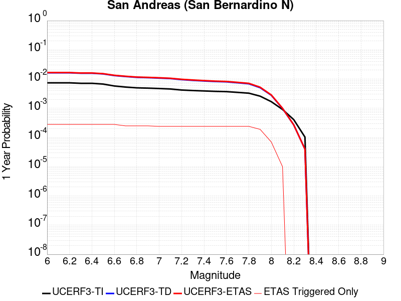 | 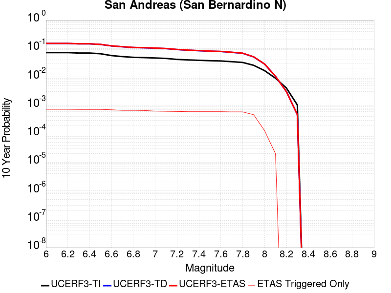 |

| Magnitude | 1 wk TI Prob | 1 wk TD Prob | 1 wk ETAS Prob | 1 wk ETAS/TD Gain | 1 wk ETAS Triggered Only | 1 mo TI Prob | 1 mo TD Prob | 1 mo ETAS Prob | 1 mo ETAS/TD Gain | 1 mo ETAS Triggered Only | 1 yr TI Prob | 1 yr TD Prob | 1 yr ETAS Prob | 1 yr ETAS/TD Gain | 1 yr ETAS Triggered Only | 10 yr TI Prob | 10 yr TD Prob | 10 yr ETAS Prob | 10 yr ETAS/TD Gain | 10 yr ETAS Triggered Only |
|-----|-----|-----|-----|-----|-----|-----|-----|-----|-----|-----|-----|-----|-----|-----|-----|-----|-----|-----|-----|-----|
| 6.0 | 1.4273766E-4 | 3.164439E-4 | 3.5643126E-4 | 1.1263647 | 4.0E-5 | 6.115894E-4 | 0.0013554894 | 0.0014653403 | 1.0810415 | 1.1E-4 | 0.0074207084 | 0.016379707 | 0.01665512 | 1.0168144 | 2.8E-4 | 0.07177748 | 0.1504194 | 0.1510396 | 1.0041231 | 7.3E-4 |
| 6.1 | 1.4273766E-4 | 3.164439E-4 | 3.5643126E-4 | 1.1263647 | 4.0E-5 | 6.115894E-4 | 0.0013554894 | 0.0014653403 | 1.0810415 | 1.1E-4 | 0.0074207084 | 0.016379707 | 0.01665512 | 1.0168144 | 2.8E-4 | 0.07177748 | 0.1504194 | 0.1510396 | 1.0041231 | 7.3E-4 |
| 6.2 | 1.4273766E-4 | 3.164439E-4 | 3.5643126E-4 | 1.1263647 | 4.0E-5 | 6.115894E-4 | 0.0013554894 | 0.0014653403 | 1.0810415 | 1.1E-4 | 0.0074207084 | 0.016379707 | 0.01665512 | 1.0168144 | 2.8E-4 | 0.07177748 | 0.1504194 | 0.1510396 | 1.0041231 | 7.3E-4 |
| 6.3 | 1.3730655E-4 | 3.054904E-4 | 3.4547818E-4 | 1.130897 | 4.0E-5 | 5.883239E-4 | 0.0013085933 | 0.0014184493 | 1.0839497 | 1.1E-4 | 0.0071393442 | 0.01581714 | 0.016092712 | 1.0174223 | 2.8E-4 | 0.06914291 | 0.14572014 | 0.14633521 | 1.004221 | 7.2E-4 |
| 6.4 | 1.3730655E-4 | 3.054904E-4 | 3.4547818E-4 | 1.130897 | 4.0E-5 | 5.883239E-4 | 0.0013085933 | 0.0014184493 | 1.0839497 | 1.1E-4 | 0.0071393442 | 0.01581714 | 0.016092712 | 1.0174223 | 2.8E-4 | 0.06914291 | 0.14572014 | 0.14633521 | 1.004221 | 7.2E-4 |
| 6.5 | 1.2942807E-4 | 2.8963236E-4 | 3.296208E-4 | 1.1380662 | 4.0E-5 | 5.545738E-4 | 0.0012406962 | 0.0013505598 | 1.0885499 | 1.1E-4 | 0.0067310524 | 0.0150021035 | 0.015277903 | 1.0183841 | 2.8E-4 | 0.06530788 | 0.13884512 | 0.13946515 | 1.0044656 | 7.2E-4 |
| 6.6 | 1.1125901E-4 | 2.5401433E-4 | 2.9400416E-4 | 1.1574315 | 4.0E-5 | 4.767372E-4 | 0.001088181 | 0.0011980613 | 1.1009761 | 1.1E-4 | 0.005788839 | 0.013168757 | 0.01344507 | 1.0209825 | 2.8E-4 | 0.056403454 | 0.1231628 | 0.12377658 | 1.0049835 | 7.0E-4 |
| 6.7 | 1.02209575E-4 | 2.3536144E-4 | 2.75352E-4 | 1.1699114 | 4.0E-5 | 4.3796748E-4 | 0.0010083034 | 0.0011181924 | 1.1089841 | 1.1E-4 | 0.0053192247 | 0.012207418 | 0.012454365 | 1.0202293 | 2.5E-4 | 0.051936906 | 0.11495103 | 0.11554401 | 1.0051585 | 6.7E-4 |
| 6.8 | 9.610582E-5 | 2.2061502E-4 | 2.606062E-4 | 1.1812713 | 4.0E-5 | 4.1181705E-4 | 9.45151E-4 | 0.001055047 | 1.1162735 | 1.1E-4 | 0.0050023515 | 0.011446766 | 0.011693904 | 1.0215902 | 2.5E-4 | 0.048912346 | 0.108361974 | 0.10895938 | 1.005513 | 6.7E-4 |
| 6.9 | 9.3877505E-5 | 2.151688E-4 | 2.5516018E-4 | 1.1858605 | 4.0E-5 | 4.0227012E-4 | 9.2182675E-4 | 0.0010317253 | 1.1192182 | 1.1E-4 | 0.0048866454 | 0.011165732 | 0.011412941 | 1.0221399 | 2.5E-4 | 0.04780577 | 0.10595147 | 0.106541544 | 1.0055692 | 6.6E-4 |
| 7.0 | 9.1019785E-5 | 2.0843578E-4 | 2.4842744E-4 | 1.1918657 | 4.0E-5 | 3.900265E-4 | 8.92991E-4 | 0.0010028927 | 1.1230716 | 1.1E-4 | 0.0047382377 | 0.010818193 | 0.011055597 | 1.0219449 | 2.4E-4 | 0.046384744 | 0.10291418 | 0.10347934 | 1.0054916 | 6.3E-4 |
| 7.1 | 8.771155E-5 | 2.0017877E-4 | 2.4017076E-4 | 1.1997814 | 4.0E-5 | 3.758525E-4 | 8.576275E-4 | 9.6753315E-4 | 1.1281508 | 1.1E-4 | 0.0045664064 | 0.010391822 | 0.010629328 | 1.022855 | 2.4E-4 | 0.044737056 | 0.099219196 | 0.099777676 | 1.0056288 | 6.2E-4 |
| 7.2 | 8.0830236E-5 | 1.842292E-4 | 2.2422183E-4 | 1.2170808 | 4.0E-5 | 3.4636928E-4 | 7.893149E-4 | 8.992281E-4 | 1.1392514 | 1.1E-4 | 0.0042088944 | 0.009567672 | 0.009805376 | 1.0248445 | 2.4E-4 | 0.041300658 | 0.09194353 | 0.092497446 | 1.0060245 | 6.1E-4 |
| 7.3 | 7.7668235E-5 | 1.7365825E-4 | 2.136513E-4 | 1.2302974 | 4.0E-5 | 3.328214E-4 | 7.4403745E-4 | 8.5395563E-4 | 1.147732 | 1.1E-4 | 0.0040445733 | 0.009021111 | 0.0092589455 | 1.0263642 | 2.4E-4 | 0.03971748 | 0.08721132 | 0.08775899 | 1.0062798 | 6.0E-4 |
| 7.4 | 7.520177E-5 | 1.6585423E-4 | 2.058476E-4 | 1.2411356 | 4.0E-5 | 3.2225347E-4 | 7.106103E-4 | 8.2053215E-4 | 1.1546866 | 1.1E-4 | 0.0039163795 | 0.008617427 | 0.008855359 | 1.0276105 | 2.4E-4 | 0.038480744 | 0.08366704 | 0.08421684 | 1.0065713 | 6.0E-4 |
| 7.5 | 7.274697E-5 | 1.5872616E-4 | 1.9871982E-4 | 1.2519664 | 4.0E-5 | 3.1173544E-4 | 6.800777E-4 | 7.900029E-4 | 1.1616362 | 1.1E-4 | 0.003788775 | 0.0082485685 | 0.008486589 | 1.0288559 | 2.4E-4 | 0.03724827 | 0.080382526 | 0.08093429 | 1.0068643 | 6.0E-4 |
| 7.6 | 7.1185845E-5 | 1.5442185E-4 | 1.9441568E-4 | 1.2589906 | 4.0E-5 | 3.0504653E-4 | 6.616402E-4 | 7.715674E-4 | 1.1661435 | 1.1E-4 | 0.0037076178 | 0.008025768 | 0.008263842 | 1.0296637 | 2.4E-4 | 0.036463667 | 0.078371026 | 0.07892401 | 1.0070559 | 6.0E-4 |
| 7.7 | 6.709961E-5 | 1.4350234E-4 | 1.8349661E-4 | 1.2787011 | 4.0E-5 | 2.8753807E-4 | 6.148651E-4 | 7.247975E-4 | 1.178791 | 1.1E-4 | 0.003495157 | 0.007460327 | 0.0076985364 | 1.0319302 | 2.4E-4 | 0.034406938 | 0.07319698 | 0.07374379 | 1.0074705 | 5.9E-4 |
| 7.8 | 6.300812E-5 | 1.3232665E-4 | 1.7232136E-4 | 1.3022423 | 4.0E-5 | 2.7000686E-4 | 5.66991E-4 | 6.769286E-4 | 1.1938967 | 1.1E-4 | 0.0032823787 | 0.006881295 | 0.0071196435 | 1.0346372 | 2.4E-4 | 0.032343175 | 0.067848824 | 0.068398796 | 1.0081058 | 5.9E-4 |
| 7.9 | 4.983037E-5 | 9.747226E-5 | 1.17470314E-4 | 1.2051666 | 2.0E-5 | 2.1354125E-4 | 4.176714E-4 | 5.076338E-4 | 1.2153904 | 9.0E-5 | 0.0025967648 | 0.005073303 | 0.005262339 | 1.0372609 | 1.9E-4 | 0.025666296 | 0.050757132 | 0.051203277 | 1.0087898 | 4.7E-4 |
| 8.0 | 3.2211527E-5 | 5.3441796E-5 | 5.3441796E-5 | 1.0 | 0.0 | 1.380421E-4 | 2.2901616E-4 | 2.69007E-4 | 1.1746202 | 4.0E-5 | 0.0016793669 | 0.0027847085 | 0.0028545135 | 1.0250673 | 7.0E-5 | 0.016667323 | 0.028428525 | 0.028554829 | 1.0044429 | 1.3E-4 |
| 8.1 | 1.743376E-5 | 1.8886456E-5 | 1.8886456E-5 | 1.0 | 0.0 | 7.471398E-5 | 8.093944E-5 | 9.0938636E-5 | 1.1235392 | 1.0E-5 | 9.0926304E-4 | 9.849928E-4 | 9.94983E-4 | 1.0101423 | 1.0E-5 | 0.009055517 | 0.010516589 | 0.010536378 | 1.0018817 | 2.0E-5 |
| 8.2 | 7.831616E-6 | 5.1776965E-6 | 5.1776965E-6 | 1.0 | 0.0 | 3.3563636E-5 | 2.2189939E-5 | 2.2189939E-5 | 1.0 | 0.0 | 4.0856065E-4 | 2.701291E-4 | 2.701291E-4 | 1.0 | 0.0 | 0.004078103 | 0.0030542305 | 0.0030542305 | 1.0 | 0.0 |
| 8.3 | 1.983087E-6 | 7.698541E-7 | 7.698541E-7 | 1.0 | 0.0 | 8.498917E-6 | 3.2993707E-6 | 3.2993707E-6 | 1.0 | 0.0 | 1.034694E-4 | 4.0169114E-5 | 4.0169114E-5 | 1.0 | 0.0 | 0.0010342124 | 4.7419698E-4 | 4.7419698E-4 | 1.0 | 0.0 |

## Bicycle Lake
*[(top)](#table-of-contents)*

| 1 Week | 1 Month | 1 Year | 10 Year |
|-----|-----|-----|-----|
|  |  |  |  |

| Magnitude | 1 wk TI Prob | 1 wk TD Prob | 1 wk ETAS Prob | 1 wk ETAS/TD Gain | 1 wk ETAS Triggered Only | 1 mo TI Prob | 1 mo TD Prob | 1 mo ETAS Prob | 1 mo ETAS/TD Gain | 1 mo ETAS Triggered Only | 1 yr TI Prob | 1 yr TD Prob | 1 yr ETAS Prob | 1 yr ETAS/TD Gain | 1 yr ETAS Triggered Only | 10 yr TI Prob | 10 yr TD Prob | 10 yr ETAS Prob | 10 yr ETAS/TD Gain | 10 yr ETAS Triggered Only |
|-----|-----|-----|-----|-----|-----|-----|-----|-----|-----|-----|-----|-----|-----|-----|-----|-----|-----|-----|-----|-----|
| 6.0 | 1.9621975E-5 | 2.2098928E-5 | 3.2098706E-5 | 1.4525007 | 1.0E-5 | 8.4091465E-5 | 9.4707015E-5 | 1.2470417E-4 | 1.3167365 | 3.0E-5 | 0.0010233327 | 0.0011525829 | 0.0014222717 | 1.2339865 | 2.7E-4 | 0.01018633 | 0.011479365 | 0.012181214 | 1.0611401 | 7.1E-4 |
| 6.1 | 1.9621975E-5 | 2.2098928E-5 | 3.2098706E-5 | 1.4525007 | 1.0E-5 | 8.4091465E-5 | 9.4707015E-5 | 1.2470417E-4 | 1.3167365 | 3.0E-5 | 0.0010233327 | 0.0011525829 | 0.0014222717 | 1.2339865 | 2.7E-4 | 0.01018633 | 0.011479365 | 0.012181214 | 1.0611401 | 7.1E-4 |
| 6.2 | 9.9971285E-6 | 1.12565795E-5 | 2.1256466E-5 | 1.8883593 | 1.0E-5 | 4.2844134E-5 | 4.8241884E-5 | 6.824092E-5 | 1.4145575 | 2.0E-5 | 5.2150246E-4 | 5.872387E-4 | 7.8712124E-4 | 1.340377 | 2.0E-4 | 0.0052028033 | 0.0058619753 | 0.00632922 | 1.0797077 | 4.7E-4 |
| 6.3 | 9.589428E-6 | 1.0799249E-5 | 2.0799142E-5 | 1.9259803 | 1.0E-5 | 4.10969E-5 | 4.6281966E-5 | 6.628104E-5 | 1.4321138 | 2.0E-5 | 5.002399E-4 | 5.6338916E-4 | 7.532821E-4 | 1.3370547 | 1.9E-4 | 0.0049911533 | 0.005624699 | 0.006072168 | 1.0795543 | 4.5E-4 |
| 6.4 | 9.589428E-6 | 1.0799249E-5 | 2.0799142E-5 | 1.9259803 | 1.0E-5 | 4.10969E-5 | 4.6281966E-5 | 6.628104E-5 | 1.4321138 | 2.0E-5 | 5.002399E-4 | 5.6338916E-4 | 7.532821E-4 | 1.3370547 | 1.9E-4 | 0.0049911533 | 0.005624699 | 0.006072168 | 1.0795543 | 4.5E-4 |
| 6.5 | 5.557707E-6 | 6.2861473E-6 | 1.6286085E-5 | 2.5907896 | 1.0E-5 | 2.3818526E-5 | 2.6940505E-5 | 4.6939967E-5 | 1.7423565 | 2.0E-5 | 2.8995197E-4 | 3.2797817E-4 | 4.77929E-4 | 1.4571975 | 1.5E-4 | 0.0028957394 | 0.003277578 | 0.0036064964 | 1.1003541 | 3.3E-4 |
| 6.6 | 4.8742945E-6 | 5.513769E-6 | 1.5513713E-5 | 2.8136315 | 1.0E-5 | 2.0889667E-5 | 2.3630373E-5 | 4.36299E-5 | 1.8463484 | 2.0E-5 | 2.54302E-4 | 2.8768802E-4 | 4.1765062E-4 | 1.4517484 | 1.3E-4 | 0.002540112 | 0.002875725 | 0.0031648912 | 1.1005541 | 2.9E-4 |
| 6.7 | 3.991108E-6 | 4.516304E-6 | 1.45162585E-5 | 3.2141898 | 1.0E-5 | 1.7104636E-5 | 1.935559E-5 | 3.9355204E-5 | 2.0332732 | 2.0E-5 | 2.0822904E-4 | 2.356543E-4 | 3.256331E-4 | 1.3818253 | 9.0E-5 | 0.0020803404 | 0.002356543 | 0.0025760245 | 1.0931371 | 2.2E-4 |

## Garlic Springs
*[(top)](#table-of-contents)*

| 1 Week | 1 Month | 1 Year | 10 Year |
|-----|-----|-----|-----|
|  |  | 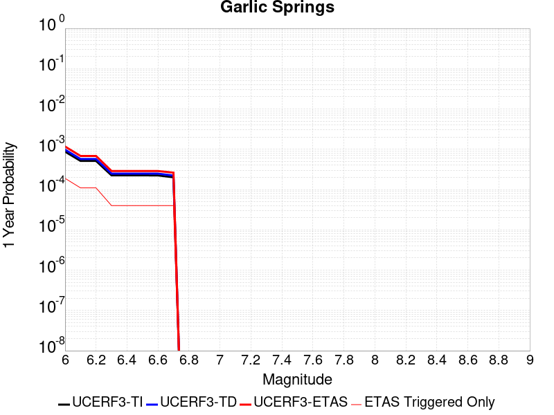 |  |

| Magnitude | 1 wk TI Prob | 1 wk TD Prob | 1 wk ETAS Prob | 1 wk ETAS/TD Gain | 1 wk ETAS Triggered Only | 1 mo TI Prob | 1 mo TD Prob | 1 mo ETAS Prob | 1 mo ETAS/TD Gain | 1 mo ETAS Triggered Only | 1 yr TI Prob | 1 yr TD Prob | 1 yr ETAS Prob | 1 yr ETAS/TD Gain | 1 yr ETAS Triggered Only | 10 yr TI Prob | 10 yr TD Prob | 10 yr ETAS Prob | 10 yr ETAS/TD Gain | 10 yr ETAS Triggered Only |
|-----|-----|-----|-----|-----|-----|-----|-----|-----|-----|-----|-----|-----|-----|-----|-----|-----|-----|-----|-----|-----|
| 6.0 | 1.6760017E-5 | 1.8778332E-5 | 1.8778332E-5 | 1.0 | 0.0 | 7.182667E-5 | 8.047675E-5 | 8.047675E-5 | 1.0 | 0.0 | 8.7413884E-4 | 9.794814E-4 | 0.0011692953 | 1.1937902 | 1.9E-4 | 0.008707083 | 0.00976319 | 0.010288015 | 1.0537555 | 5.3E-4 |
| 6.1 | 9.852767E-6 | 1.0974415E-5 | 1.0974415E-5 | 1.0 | 0.0 | 4.222546E-5 | 4.7032758E-5 | 4.7032758E-5 | 1.0 | 0.0 | 5.139737E-4 | 5.7254435E-4 | 6.824814E-4 | 1.1920148 | 1.1E-4 | 0.005127866 | 0.0057176524 | 0.0059761656 | 1.0452132 | 2.6E-4 |
| 6.2 | 9.852767E-6 | 1.0974415E-5 | 1.0974415E-5 | 1.0 | 0.0 | 4.222546E-5 | 4.7032758E-5 | 4.7032758E-5 | 1.0 | 0.0 | 5.139737E-4 | 5.7254435E-4 | 6.824814E-4 | 1.1920148 | 1.1E-4 | 0.005127866 | 0.0057176524 | 0.0059761656 | 1.0452132 | 2.6E-4 |
| 6.3 | 4.3167724E-6 | 4.7783674E-6 | 4.7783674E-6 | 1.0 | 0.0 | 1.8500323E-5 | 2.0478685E-5 | 2.0478685E-5 | 1.0 | 0.0 | 2.2521814E-4 | 2.493225E-4 | 2.8931253E-4 | 1.1603948 | 4.0E-5 | 0.0022499003 | 0.0024926865 | 0.0025824623 | 1.0360156 | 9.0E-5 |
| 6.4 | 4.3167724E-6 | 4.7783674E-6 | 4.7783674E-6 | 1.0 | 0.0 | 1.8500323E-5 | 2.0478685E-5 | 2.0478685E-5 | 1.0 | 0.0 | 2.2521814E-4 | 2.493225E-4 | 2.8931253E-4 | 1.1603948 | 4.0E-5 | 0.0022499003 | 0.0024926865 | 0.0025824623 | 1.0360156 | 9.0E-5 |
| 6.5 | 4.3167724E-6 | 4.7783674E-6 | 4.7783674E-6 | 1.0 | 0.0 | 1.8500323E-5 | 2.0478685E-5 | 2.0478685E-5 | 1.0 | 0.0 | 2.2521814E-4 | 2.493225E-4 | 2.8931253E-4 | 1.1603948 | 4.0E-5 | 0.0022499003 | 0.0024926865 | 0.0025824623 | 1.0360156 | 9.0E-5 |
| 6.6 | 4.301311E-6 | 4.7612343E-6 | 4.7612343E-6 | 1.0 | 0.0 | 1.8434059E-5 | 2.0405261E-5 | 2.0405261E-5 | 1.0 | 0.0 | 2.2441156E-4 | 2.4842875E-4 | 2.884188E-4 | 1.160972 | 4.0E-5 | 0.0022418506 | 0.002483769 | 0.0025735456 | 1.0361452 | 9.0E-5 |
| 6.7 | 3.8599724E-6 | 4.2713614E-6 | 4.2713614E-6 | 1.0 | 0.0 | 1.6542634E-5 | 1.8305835E-5 | 1.8305835E-5 | 1.0 | 0.0 | 2.0138794E-4 | 2.2287354E-4 | 2.6286463E-4 | 1.179434 | 4.0E-5 | 0.0020120554 | 0.0022287355 | 0.0023185348 | 1.0402917 | 9.0E-5 |

## Death Valley (Black Mtns Frontal)
*[(top)](#table-of-contents)*

| 1 Week | 1 Month | 1 Year | 10 Year |
|-----|-----|-----|-----|
|  | 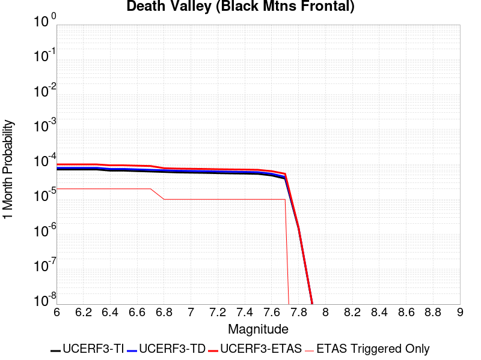 |  |  |

| Magnitude | 1 wk TI Prob | 1 wk TD Prob | 1 wk ETAS Prob | 1 wk ETAS/TD Gain | 1 wk ETAS Triggered Only | 1 mo TI Prob | 1 mo TD Prob | 1 mo ETAS Prob | 1 mo ETAS/TD Gain | 1 mo ETAS Triggered Only | 1 yr TI Prob | 1 yr TD Prob | 1 yr ETAS Prob | 1 yr ETAS/TD Gain | 1 yr ETAS Triggered Only | 10 yr TI Prob | 10 yr TD Prob | 10 yr ETAS Prob | 10 yr ETAS/TD Gain | 10 yr ETAS Triggered Only |
|-----|-----|-----|-----|-----|-----|-----|-----|-----|-----|-----|-----|-----|-----|-----|-----|-----|-----|-----|-----|-----|
| 6.0 | 1.6707214E-5 | 1.8671728E-5 | 2.867154E-5 | 1.535559 | 1.0E-5 | 7.160038E-5 | 8.001928E-5 | 1.0001768E-4 | 1.2499198 | 2.0E-5 | 8.71386E-4 | 9.738069E-4 | 0.0011736121 | 1.2051796 | 2.0E-4 | 0.00867977 | 0.009696251 | 0.010092372 | 1.040853 | 4.0E-4 |
| 6.1 | 1.6707214E-5 | 1.8671728E-5 | 2.867154E-5 | 1.535559 | 1.0E-5 | 7.160038E-5 | 8.001928E-5 | 1.0001768E-4 | 1.2499198 | 2.0E-5 | 8.71386E-4 | 9.738069E-4 | 0.0011736121 | 1.2051796 | 2.0E-4 | 0.00867977 | 0.009696251 | 0.010092372 | 1.040853 | 4.0E-4 |
| 6.2 | 1.6707214E-5 | 1.8671728E-5 | 2.867154E-5 | 1.535559 | 1.0E-5 | 7.160038E-5 | 8.001928E-5 | 1.0001768E-4 | 1.2499198 | 2.0E-5 | 8.71386E-4 | 9.738069E-4 | 0.0011736121 | 1.2051796 | 2.0E-4 | 0.00867977 | 0.009696251 | 0.010092372 | 1.040853 | 4.0E-4 |
| 6.3 | 1.6707214E-5 | 1.8671728E-5 | 2.867154E-5 | 1.535559 | 1.0E-5 | 7.160038E-5 | 8.001928E-5 | 1.0001768E-4 | 1.2499198 | 2.0E-5 | 8.71386E-4 | 9.738069E-4 | 0.0011736121 | 1.2051796 | 2.0E-4 | 0.00867977 | 0.009696251 | 0.010092372 | 1.040853 | 4.0E-4 |
| 6.4 | 1.5515609E-5 | 1.7339567E-5 | 2.7339394E-5 | 1.5767057 | 1.0E-5 | 6.649377E-5 | 7.431035E-5 | 9.430887E-5 | 1.2691215 | 2.0E-5 | 8.0926094E-4 | 9.043591E-4 | 0.0010642144 | 1.1767609 | 1.6E-4 | 0.008063202 | 0.0090074735 | 0.009344411 | 1.0374064 | 3.4E-4 |
| 6.5 | 1.5515609E-5 | 1.7339567E-5 | 2.7339394E-5 | 1.5767057 | 1.0E-5 | 6.649377E-5 | 7.431035E-5 | 9.430887E-5 | 1.2691215 | 2.0E-5 | 8.0926094E-4 | 9.043591E-4 | 0.0010642144 | 1.1767609 | 1.6E-4 | 0.008063202 | 0.0090074735 | 0.009344411 | 1.0374064 | 3.4E-4 |
| 6.6 | 1.5041828E-5 | 1.6810458E-5 | 2.681029E-5 | 1.5948578 | 1.0E-5 | 6.4463384E-5 | 7.2042865E-5 | 9.2041424E-5 | 1.2775925 | 2.0E-5 | 7.8455906E-4 | 8.7677484E-4 | 0.0010266433 | 1.1709316 | 1.5E-4 | 0.00781795 | 0.008733812 | 0.0090311915 | 1.0340493 | 3.0E-4 |
| 6.7 | 1.4634985E-5 | 1.6357295E-5 | 2.6357133E-5 | 1.611338 | 1.0E-5 | 6.271985E-5 | 7.010085E-5 | 9.009944E-5 | 1.2852832 | 2.0E-5 | 7.6334673E-4 | 8.5314934E-4 | 9.930299E-4 | 1.1639578 | 1.4E-4 | 0.007607299 | 0.008499377 | 0.008776998 | 1.0326636 | 2.8E-4 |
| 6.8 | 1.4209158E-5 | 1.5883292E-5 | 1.5883292E-5 | 1.0 | 0.0 | 6.089497E-5 | 6.806951E-5 | 7.806883E-5 | 1.1468986 | 1.0E-5 | 7.4114406E-4 | 8.2843675E-4 | 9.383456E-4 | 1.1326702 | 1.1E-4 | 0.007386771 | 0.008254101 | 0.008502036 | 1.030038 | 2.5E-4 |
| 6.9 | 1.3780098E-5 | 1.5405802E-5 | 1.5405802E-5 | 1.0 | 0.0 | 5.9056227E-5 | 6.6023225E-5 | 7.602256E-5 | 1.1514518 | 1.0E-5 | 7.1877235E-4 | 8.0354174E-4 | 9.034614E-4 | 1.124349 | 1.0E-4 | 0.0071645193 | 0.008006958 | 0.008245037 | 1.0297339 | 2.4E-4 |
| 7.0 | 1.3585064E-5 | 1.5189348E-5 | 1.5189348E-5 | 1.0 | 0.0 | 5.8220405E-5 | 6.509561E-5 | 7.509496E-5 | 1.1536102 | 1.0E-5 | 7.086029E-4 | 7.922563E-4 | 8.8218506E-4 | 1.1135095 | 9.0E-5 | 0.007063476 | 0.007894911 | 0.008113175 | 1.0276461 | 2.2E-4 |
| 7.1 | 1.3398601E-5 | 1.4982517E-5 | 1.4982517E-5 | 1.0 | 0.0 | 5.742131E-5 | 6.4209235E-5 | 7.42086E-5 | 1.1557308 | 1.0E-5 | 6.9888023E-4 | 7.8147254E-4 | 8.714022E-4 | 1.1150771 | 9.0E-5 | 0.0069668638 | 0.007787834 | 0.007986276 | 1.0254811 | 2.0E-4 |
| 7.2 | 1.3126312E-5 | 1.4680717E-5 | 1.4680717E-5 | 1.0 | 0.0 | 5.6254412E-5 | 6.291587E-5 | 7.291524E-5 | 1.1589324 | 1.0E-5 | 6.846822E-4 | 7.65737E-4 | 8.356834E-4 | 1.0913452 | 7.0E-5 | 0.006825765 | 0.0076315687 | 0.0077903476 | 1.0208056 | 1.6E-4 |
| 7.3 | 1.2922429E-5 | 1.4454928E-5 | 1.4454928E-5 | 1.0 | 0.0 | 5.5380664E-5 | 6.194825E-5 | 7.194763E-5 | 1.1614151 | 1.0E-5 | 6.74051E-4 | 7.5396436E-4 | 8.239116E-4 | 1.0927726 | 7.0E-5 | 0.006720101 | 0.007514645 | 0.007673443 | 1.0211318 | 1.6E-4 |
| 7.4 | 1.2768878E-5 | 1.42848985E-5 | 1.42848985E-5 | 1.0 | 0.0 | 5.4722615E-5 | 6.121959E-5 | 7.121898E-5 | 1.1633364 | 1.0E-5 | 6.660441E-4 | 7.4509904E-4 | 8.150469E-4 | 1.0938772 | 7.0E-5 | 0.0066405144 | 0.0074265874 | 0.0075853993 | 1.0213842 | 1.6E-4 |
| 7.5 | 1.2521929E-5 | 1.4013124E-5 | 1.4013124E-5 | 1.0 | 0.0 | 5.366431E-5 | 6.0054896E-5 | 7.0054295E-5 | 1.1665043 | 1.0E-5 | 6.531671E-4 | 7.309285E-4 | 8.0087734E-4 | 1.0956986 | 7.0E-5 | 0.006512506 | 0.0072858203 | 0.0074347276 | 1.020438 | 1.5E-4 |
| 7.6 | 1.1301089E-5 | 1.2649151E-5 | 1.2649151E-5 | 1.0 | 0.0 | 4.8432343E-5 | 5.4209555E-5 | 6.420901E-5 | 1.1844593 | 1.0E-5 | 5.895042E-4 | 6.5980677E-4 | 7.2976056E-4 | 1.1060216 | 7.0E-5 | 0.0058794282 | 0.0065790303 | 0.006708175 | 1.0196297 | 1.3E-4 |
| 7.7 | 9.189108E-6 | 1.0284173E-5 | 1.0284173E-5 | 1.0 | 0.0 | 3.93813E-5 | 4.407431E-5 | 5.407387E-5 | 1.2268796 | 1.0E-5 | 4.7936183E-4 | 5.3647766E-4 | 5.8645086E-4 | 1.0931505 | 5.0E-5 | 0.004783291 | 0.005352337 | 0.0054518017 | 1.0185834 | 1.0E-4 |
| 7.8 | 3.4586725E-7 | 3.6483948E-7 | 3.6483948E-7 | 1.0 | 0.0 | 1.4822873E-6 | 1.5635968E-6 | 1.5635968E-6 | 1.0 | 0.0 | 1.80467E-5 | 1.903663E-5 | 2.9036439E-5 | 1.5252931 | 1.0E-5 | 1.8045233E-4 | 1.9035043E-4 | 2.0034853E-4 | 1.0525247 | 1.0E-5 |
| 7.9 | 2.5591178E-9 | 2.6697482E-9 | 2.6697482E-9 | 1.0 | 0.0 | 1.0967647E-8 | 1.1441778E-8 | 1.1441778E-8 | 1.0 | 0.0 | 1.335311E-7 | 1.3930365E-7 | 1.3930365E-7 | 1.0 | 0.0 | 1.3353102E-6 | 1.3930365E-6 | 1.3930365E-6 | 1.0 | 0.0 |

## Helendale-So Lockhart
*[(top)](#table-of-contents)*

| 1 Week | 1 Month | 1 Year | 10 Year |
|-----|-----|-----|-----|
|  |  |  | 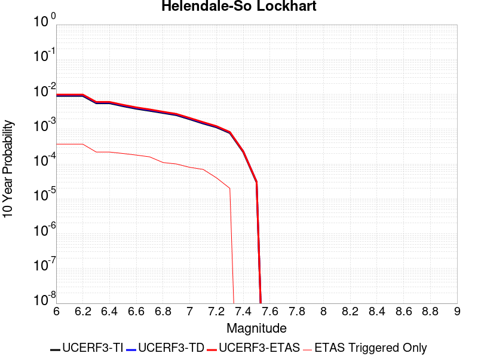 |

| Magnitude | 1 wk TI Prob | 1 wk TD Prob | 1 wk ETAS Prob | 1 wk ETAS/TD Gain | 1 wk ETAS Triggered Only | 1 mo TI Prob | 1 mo TD Prob | 1 mo ETAS Prob | 1 mo ETAS/TD Gain | 1 mo ETAS Triggered Only | 1 yr TI Prob | 1 yr TD Prob | 1 yr ETAS Prob | 1 yr ETAS/TD Gain | 1 yr ETAS Triggered Only | 10 yr TI Prob | 10 yr TD Prob | 10 yr ETAS Prob | 10 yr ETAS/TD Gain | 10 yr ETAS Triggered Only |
|-----|-----|-----|-----|-----|-----|-----|-----|-----|-----|-----|-----|-----|-----|-----|-----|-----|-----|-----|-----|-----|
| 6.0 | 1.7296055E-5 | 1.810429E-5 | 1.810429E-5 | 1.0 | 0.0 | 7.412385E-5 | 7.7587625E-5 | 1.075853E-4 | 1.3866296 | 3.0E-5 | 9.0208417E-4 | 9.442407E-4 | 0.0011140802 | 1.1798688 | 1.7E-4 | 0.008984311 | 0.009404407 | 0.009770927 | 1.0389732 | 3.7E-4 |
| 6.1 | 1.7296055E-5 | 1.810429E-5 | 1.810429E-5 | 1.0 | 0.0 | 7.412385E-5 | 7.7587625E-5 | 1.075853E-4 | 1.3866296 | 3.0E-5 | 9.0208417E-4 | 9.442407E-4 | 0.0011140802 | 1.1798688 | 1.7E-4 | 0.008984311 | 0.009404407 | 0.009770927 | 1.0389732 | 3.7E-4 |
| 6.2 | 1.7296055E-5 | 1.810429E-5 | 1.810429E-5 | 1.0 | 0.0 | 7.412385E-5 | 7.7587625E-5 | 1.075853E-4 | 1.3866296 | 3.0E-5 | 9.0208417E-4 | 9.442407E-4 | 0.0011140802 | 1.1798688 | 1.7E-4 | 0.008984311 | 0.009404407 | 0.009770927 | 1.0389732 | 3.7E-4 |
| 6.3 | 1.0669118E-5 | 1.1135748E-5 | 1.1135748E-5 | 1.0 | 0.0 | 4.5723988E-5 | 4.7723777E-5 | 7.772235E-5 | 1.6285875 | 3.0E-5 | 5.5654737E-4 | 5.8088487E-4 | 6.90821E-4 | 1.1892563 | 1.1E-4 | 0.0055515557 | 0.005793961 | 0.0060126865 | 1.0377506 | 2.2E-4 |
| 6.4 | 1.0669118E-5 | 1.1135748E-5 | 1.1135748E-5 | 1.0 | 0.0 | 4.5723988E-5 | 4.7723777E-5 | 7.772235E-5 | 1.6285875 | 3.0E-5 | 5.5654737E-4 | 5.8088487E-4 | 6.90821E-4 | 1.1892563 | 1.1E-4 | 0.0055515557 | 0.005793961 | 0.0060126865 | 1.0377506 | 2.2E-4 |
| 6.5 | 8.790038E-6 | 9.1704605E-6 | 9.1704605E-6 | 1.0 | 0.0 | 3.767105E-5 | 3.930139E-5 | 6.930021E-5 | 1.7633018 | 3.0E-5 | 4.585485E-4 | 4.783909E-4 | 5.7834305E-4 | 1.2089341 | 1.0E-4 | 0.0045760344 | 0.004773775 | 0.0049728206 | 1.0416956 | 2.0E-4 |
| 6.6 | 7.396949E-6 | 7.715757E-6 | 7.715757E-6 | 1.0 | 0.0 | 3.1700827E-5 | 3.306712E-5 | 6.306613E-5 | 1.9072156 | 3.0E-5 | 3.858892E-4 | 4.025188E-4 | 4.8248662E-4 | 1.1986685 | 8.0E-5 | 0.003852198 | 0.0040180045 | 0.0041972813 | 1.0446184 | 1.8E-4 |
| 6.7 | 6.4600285E-6 | 6.7382234E-6 | 6.7382234E-6 | 1.0 | 0.0 | 2.7685543E-5 | 2.8877786E-5 | 5.8876918E-5 | 2.0388308 | 3.0E-5 | 3.3701936E-4 | 3.515311E-4 | 4.31503E-4 | 1.2274959 | 8.0E-5 | 0.0033650869 | 0.003509832 | 0.0036692705 | 1.0454262 | 1.6E-4 |
| 6.8 | 5.600104E-6 | 5.8361725E-6 | 5.8361725E-6 | 1.0 | 0.0 | 2.4000226E-5 | 2.5011932E-5 | 4.501143E-5 | 1.7995983 | 2.0E-5 | 2.9216358E-4 | 3.044783E-4 | 3.6446005E-4 | 1.1969984 | 6.0E-5 | 0.0029177975 | 0.003040673 | 0.0031503385 | 1.0360662 | 1.1E-4 |
| 6.9 | 4.839122E-6 | 5.039648E-6 | 5.039648E-6 | 1.0 | 0.0 | 2.0738931E-5 | 2.1598315E-5 | 4.1597883E-5 | 1.9259782 | 2.0E-5 | 2.5246723E-4 | 2.629282E-4 | 3.2291244E-4 | 1.2281392 | 6.0E-5 | 0.002521806 | 0.0026262188 | 0.0027259563 | 1.0379776 | 1.0E-4 |
| 7.0 | 3.6937633E-6 | 3.8453127E-6 | 3.8453127E-6 | 1.0 | 0.0 | 1.5830317E-5 | 1.647981E-5 | 2.6479644E-5 | 1.6067932 | 1.0E-5 | 1.9271708E-4 | 2.0062352E-4 | 2.4061548E-4 | 1.1993384 | 4.0E-5 | 0.0019255003 | 0.0020044553 | 0.002084295 | 1.039831 | 8.0E-5 |
| 7.1 | 2.7858857E-6 | 2.8979312E-6 | 2.8979312E-6 | 1.0 | 0.0 | 1.1939455E-5 | 1.2419647E-5 | 2.2419523E-5 | 1.8051659 | 1.0E-5 | 1.4535317E-4 | 1.5119892E-4 | 1.8119438E-4 | 1.1983842 | 3.0E-5 | 0.0014525814 | 0.001510982 | 0.0015808762 | 1.0462575 | 7.0E-5 |
| 7.2 | 2.1672065E-6 | 2.2540726E-6 | 2.2540726E-6 | 1.0 | 0.0 | 9.2879945E-6 | 9.660277E-6 | 9.660277E-6 | 1.0 | 0.0 | 1.1307546E-4 | 1.17607706E-4 | 1.3760536E-4 | 1.1700369 | 2.0E-5 | 0.0011301794 | 0.0011754729 | 0.0012154258 | 1.0339888 | 4.0E-5 |
| 7.3 | 1.4823496E-6 | 1.5422515E-6 | 1.5422515E-6 | 1.0 | 0.0 | 6.3529114E-6 | 6.6096336E-6 | 6.6096336E-6 | 1.0 | 0.0 | 7.734395E-5 | 8.046947E-5 | 9.046867E-5 | 1.1242608 | 1.0E-5 | 7.731704E-4 | 8.044184E-4 | 8.244023E-4 | 1.0248427 | 2.0E-5 |
| 7.4 | 4.2321457E-7 | 4.411E-7 | 4.411E-7 | 1.0 | 0.0 | 1.8137755E-6 | 1.8904275E-6 | 1.8904275E-6 | 1.0 | 0.0 | 2.2082493E-5 | 2.3015758E-5 | 2.3015758E-5 | 1.0 | 0.0 | 2.2080299E-4 | 2.3013826E-4 | 2.3013826E-4 | 1.0 | 0.0 |
| 7.5 | 5.6942316E-8 | 5.9417356E-8 | 5.9417356E-8 | 1.0 | 0.0 | 2.440385E-7 | 2.5464578E-7 | 2.5464578E-7 | 1.0 | 0.0 | 2.9711643E-6 | 3.100309E-6 | 3.100309E-6 | 1.0 | 0.0 | 2.9711247E-5 | 3.1002735E-5 | 3.1002735E-5 | 1.0 | 0.0 |

## San Andreas (San Bernardino S)
*[(top)](#table-of-contents)*

| 1 Week | 1 Month | 1 Year | 10 Year |
|-----|-----|-----|-----|
|  |  |  |  |

| Magnitude | 1 wk TI Prob | 1 wk TD Prob | 1 wk ETAS Prob | 1 wk ETAS/TD Gain | 1 wk ETAS Triggered Only | 1 mo TI Prob | 1 mo TD Prob | 1 mo ETAS Prob | 1 mo ETAS/TD Gain | 1 mo ETAS Triggered Only | 1 yr TI Prob | 1 yr TD Prob | 1 yr ETAS Prob | 1 yr ETAS/TD Gain | 1 yr ETAS Triggered Only | 10 yr TI Prob | 10 yr TD Prob | 10 yr ETAS Prob | 10 yr ETAS/TD Gain | 10 yr ETAS Triggered Only |
|-----|-----|-----|-----|-----|-----|-----|-----|-----|-----|-----|-----|-----|-----|-----|-----|-----|-----|-----|-----|-----|
| 6.0 | 1.2336002E-4 | 3.0029865E-4 | 3.3028965E-4 | 1.0998706 | 3.0E-5 | 5.2857865E-4 | 0.0012863856 | 0.0013463084 | 1.0465823 | 6.0E-5 | 0.006416472 | 0.015554236 | 0.015711747 | 1.0101266 | 1.6E-4 | 0.06234337 | 0.1430301 | 0.1433386 | 1.002157 | 3.6E-4 |
| 6.1 | 1.2336002E-4 | 3.0029865E-4 | 3.3028965E-4 | 1.0998706 | 3.0E-5 | 5.2857865E-4 | 0.0012863856 | 0.0013463084 | 1.0465823 | 6.0E-5 | 0.006416472 | 0.015554236 | 0.015711747 | 1.0101266 | 1.6E-4 | 0.06234337 | 0.1430301 | 0.1433386 | 1.002157 | 3.6E-4 |
| 6.2 | 1.2336002E-4 | 3.0029865E-4 | 3.3028965E-4 | 1.0998706 | 3.0E-5 | 5.2857865E-4 | 0.0012863856 | 0.0013463084 | 1.0465823 | 6.0E-5 | 0.006416472 | 0.015554236 | 0.015711747 | 1.0101266 | 1.6E-4 | 0.06234337 | 0.1430301 | 0.1433386 | 1.002157 | 3.6E-4 |
| 6.3 | 1.1712257E-4 | 2.8817856E-4 | 3.181699E-4 | 1.1040721 | 3.0E-5 | 5.018573E-4 | 0.0012344922 | 0.001294418 | 1.048543 | 6.0E-5 | 0.006093008 | 0.01493121 | 0.01507897 | 1.009896 | 1.5E-4 | 0.059286322 | 0.13773979 | 0.13802433 | 1.0020658 | 3.3E-4 |
| 6.4 | 1.1712257E-4 | 2.8817856E-4 | 3.181699E-4 | 1.1040721 | 3.0E-5 | 5.018573E-4 | 0.0012344922 | 0.001294418 | 1.048543 | 6.0E-5 | 0.006093008 | 0.01493121 | 0.01507897 | 1.009896 | 1.5E-4 | 0.059286322 | 0.13773979 | 0.13802433 | 1.0020658 | 3.3E-4 |
| 6.5 | 1.0689076E-4 | 2.6830338E-4 | 2.9829532E-4 | 1.1117837 | 3.0E-5 | 4.5802278E-4 | 0.0011493897 | 0.0012093207 | 1.0521417 | 6.0E-5 | 0.0055621783 | 0.013908651 | 0.014056565 | 1.0106347 | 1.5E-4 | 0.05425003 | 0.12897986 | 0.12925859 | 1.002161 | 3.2E-4 |
| 6.6 | 9.7648895E-5 | 2.507473E-4 | 2.807398E-4 | 1.1196123 | 3.0E-5 | 4.1842813E-4 | 0.0010742124 | 0.001134148 | 1.0557948 | 6.0E-5 | 0.005082469 | 0.013004477 | 0.013152527 | 1.0113845 | 1.5E-4 | 0.049677886 | 0.12115746 | 0.12143869 | 1.0023212 | 3.2E-4 |
| 6.7 | 8.757013E-5 | 2.3145173E-4 | 2.614448E-4 | 1.1295867 | 3.0E-5 | 3.7524657E-4 | 9.915812E-4 | 0.0010515217 | 1.0604494 | 6.0E-5 | 0.00455906 | 0.012009764 | 0.012157963 | 1.0123398 | 1.5E-4 | 0.04466656 | 0.11245172 | 0.11273573 | 1.0025257 | 3.2E-4 |
| 6.8 | 8.562978E-5 | 2.2704867E-4 | 2.5704186E-4 | 1.1321002 | 3.0E-5 | 3.6693315E-4 | 9.727251E-4 | 0.0010326668 | 1.0616224 | 6.0E-5 | 0.004458263 | 0.011782689 | 0.011930922 | 1.0125805 | 1.5E-4 | 0.043698758 | 0.11046624 | 0.1107509 | 1.0025768 | 3.2E-4 |
| 6.9 | 6.124075E-5 | 1.708723E-4 | 2.0086717E-4 | 1.1755397 | 3.0E-5 | 2.6243398E-4 | 7.3210517E-4 | 7.9206127E-4 | 1.0818955 | 6.0E-5 | 0.0031904527 | 0.00887716 | 0.009015918 | 1.0156308 | 1.4E-4 | 0.031450346 | 0.08428216 | 0.08454772 | 1.0031508 | 2.9E-4 |
| 7.0 | 5.8598747E-5 | 1.6516054E-4 | 1.9515559E-4 | 1.1816114 | 3.0E-5 | 2.5111332E-4 | 7.0763973E-4 | 7.6759723E-4 | 1.084729 | 6.0E-5 | 0.0030530186 | 0.008581676 | 0.008720473 | 1.0161738 | 1.4E-4 | 0.03011414 | 0.08159626 | 0.0818626 | 1.0032641 | 2.9E-4 |
| 7.1 | 5.613814E-5 | 1.5934392E-4 | 1.8933915E-4 | 1.188242 | 3.0E-5 | 2.4056983E-4 | 6.827246E-4 | 7.426836E-4 | 1.0878232 | 6.0E-5 | 0.0029250039 | 0.008280673 | 0.008419514 | 1.0167668 | 1.4E-4 | 0.028868021 | 0.07889039 | 0.07915751 | 1.003386 | 2.9E-4 |
| 7.2 | 4.991222E-5 | 1.4540376E-4 | 1.753994E-4 | 1.206292 | 3.0E-5 | 2.1389198E-4 | 6.230105E-4 | 6.829731E-4 | 1.0962466 | 6.0E-5 | 0.002601025 | 0.007558876 | 0.007697818 | 1.0183812 | 1.4E-4 | 0.025707912 | 0.07233735 | 0.07260638 | 1.003719 | 2.9E-4 |
| 7.3 | 4.7410045E-5 | 1.3734143E-4 | 1.6733732E-4 | 1.2184037 | 3.0E-5 | 2.0317009E-4 | 5.884737E-4 | 6.484384E-4 | 1.1018987 | 6.0E-5 | 0.0024707897 | 0.0071412167 | 0.007280217 | 1.0194645 | 1.4E-4 | 0.024434982 | 0.068619706 | 0.06888049 | 1.0038005 | 2.8E-4 |
| 7.4 | 4.5556746E-5 | 1.3141689E-4 | 1.6141294E-4 | 1.2282512 | 3.0E-5 | 1.952286E-4 | 5.63094E-4 | 6.230602E-4 | 1.1064942 | 6.0E-5 | 0.002374317 | 0.006834198 | 0.006973241 | 1.0203452 | 1.4E-4 | 0.023491086 | 0.065872155 | 0.06613371 | 1.0039706 | 2.8E-4 |
| 7.5 | 4.3084514E-5 | 1.2376592E-4 | 1.537622E-4 | 1.2423631 | 3.0E-5 | 1.8463485E-4 | 5.3031783E-4 | 5.90286E-4 | 1.1130797 | 6.0E-5 | 0.0022456115 | 0.006437577 | 0.0065766755 | 1.0216073 | 1.4E-4 | 0.022230545 | 0.06227163 | 0.06253419 | 1.0042164 | 2.8E-4 |
| 7.6 | 3.408608E-5 | 9.85326E-5 | 1.2852965E-4 | 1.3044378 | 3.0E-5 | 1.4607502E-4 | 4.2221433E-4 | 4.82189E-4 | 1.1420479 | 6.0E-5 | 0.0017770125 | 0.005128369 | 0.0052676513 | 1.0271591 | 1.4E-4 | 0.017628696 | 0.05009692 | 0.050362896 | 1.0053092 | 2.8E-4 |
| 7.7 | 2.8315713E-5 | 8.265314E-5 | 1.1265066E-4 | 1.3629326 | 3.0E-5 | 1.2134742E-4 | 3.5417968E-4 | 4.1415842E-4 | 1.1693455 | 6.0E-5 | 0.0014764034 | 0.0043036207 | 0.004443018 | 1.0323907 | 1.4E-4 | 0.01466633 | 0.042343736 | 0.04261188 | 1.0063325 | 2.8E-4 |
| 7.8 | 2.6222975E-5 | 7.478628E-5 | 1.0478404E-4 | 1.401113 | 3.0E-5 | 1.1237934E-4 | 3.2047328E-4 | 3.8045406E-4 | 1.1871631 | 6.0E-5 | 0.0013673597 | 0.003894788 | 0.0040342426 | 1.0358055 | 1.4E-4 | 0.013589768 | 0.038504403 | 0.038773622 | 1.0069919 | 2.8E-4 |
| 7.9 | 2.1469694E-5 | 5.8007794E-5 | 7.800663E-5 | 1.3447613 | 2.0E-5 | 9.200973E-5 | 2.4858114E-4 | 2.9856872E-4 | 1.2010915 | 5.0E-5 | 0.0011196428 | 0.0030222784 | 0.0031518855 | 1.0428839 | 1.3E-4 | 0.011140184 | 0.030208817 | 0.030441565 | 1.0077047 | 2.4E-4 |
| 8.0 | 1.2420249E-5 | 3.1390075E-5 | 3.1390075E-5 | 1.0 | 0.0 | 5.322855E-5 | 1.3452196E-4 | 1.5451928E-4 | 1.1486546 | 2.0E-5 | 6.478649E-4 | 0.0016365756 | 0.0016765101 | 1.0244013 | 4.0E-5 | 0.0064597935 | 0.016556023 | 0.016624864 | 1.004158 | 7.0E-5 |
| 8.1 | 4.9197724E-6 | 7.847535E-6 | 7.847535E-6 | 1.0 | 0.0 | 2.1084568E-5 | 3.3631863E-5 | 3.3631863E-5 | 1.0 | 0.0 | 2.566744E-4 | 4.093911E-4 | 4.093911E-4 | 1.0 | 0.0 | 0.002563781 | 0.0043972456 | 0.0043972456 | 1.0 | 0.0 |
| 8.2 | 2.5634774E-6 | 2.9182086E-6 | 2.9182086E-6 | 1.0 | 0.0 | 1.0986286E-5 | 1.2506548E-5 | 1.2506548E-5 | 1.0 | 0.0 | 1.3374983E-4 | 1.5225663E-4 | 1.5225663E-4 | 1.0 | 0.0 | 0.0013366934 | 0.0017110575 | 0.0017110575 | 1.0 | 0.0 |
| 8.3 | 5.2850464E-7 | 3.2234308E-7 | 3.2234308E-7 | 1.0 | 0.0 | 2.2650179E-6 | 1.3814697E-6 | 1.3814697E-6 | 1.0 | 0.0 | 2.7576245E-5 | 1.6819276E-5 | 1.6819276E-5 | 1.0 | 0.0 | 2.7572823E-4 | 1.995184E-4 | 1.995184E-4 | 1.0 | 0.0 |

## Coyote Lake
*[(top)](#table-of-contents)*

| 1 Week | 1 Month | 1 Year | 10 Year |
|-----|-----|-----|-----|
|  | 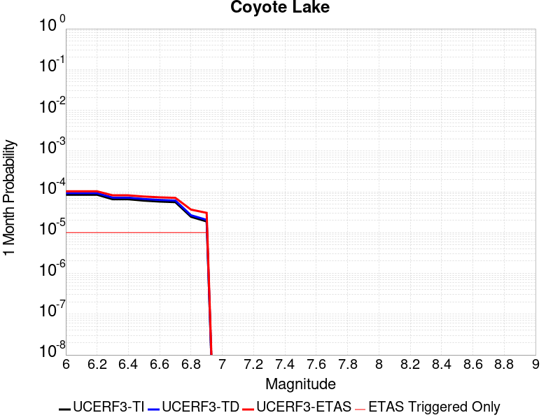 |  | 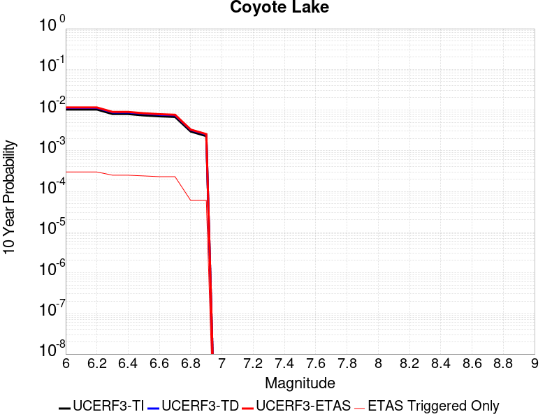 |

| Magnitude | 1 wk TI Prob | 1 wk TD Prob | 1 wk ETAS Prob | 1 wk ETAS/TD Gain | 1 wk ETAS Triggered Only | 1 mo TI Prob | 1 mo TD Prob | 1 mo ETAS Prob | 1 mo ETAS/TD Gain | 1 mo ETAS Triggered Only | 1 yr TI Prob | 1 yr TD Prob | 1 yr ETAS Prob | 1 yr ETAS/TD Gain | 1 yr ETAS Triggered Only | 10 yr TI Prob | 10 yr TD Prob | 10 yr ETAS Prob | 10 yr ETAS/TD Gain | 10 yr ETAS Triggered Only |
|-----|-----|-----|-----|-----|-----|-----|-----|-----|-----|-----|-----|-----|-----|-----|-----|-----|-----|-----|-----|-----|
| 6.0 | 1.980352E-5 | 2.1708129E-5 | 2.1708129E-5 | 1.0 | 0.0 | 8.486947E-5 | 9.303193E-5 | 1.03030994E-4 | 1.1074799 | 1.0E-5 | 0.0010327959 | 0.0011321472 | 0.001232034 | 1.0882277 | 1.0E-4 | 0.010280091 | 0.011270973 | 0.011567592 | 1.026317 | 3.0E-4 |
| 6.1 | 1.980352E-5 | 2.1708129E-5 | 2.1708129E-5 | 1.0 | 0.0 | 8.486947E-5 | 9.303193E-5 | 1.03030994E-4 | 1.1074799 | 1.0E-5 | 0.0010327959 | 0.0011321472 | 0.001232034 | 1.0882277 | 1.0E-4 | 0.010280091 | 0.011270973 | 0.011567592 | 1.026317 | 3.0E-4 |
| 6.2 | 1.980352E-5 | 2.1708129E-5 | 2.1708129E-5 | 1.0 | 0.0 | 8.486947E-5 | 9.303193E-5 | 1.03030994E-4 | 1.1074799 | 1.0E-5 | 0.0010327959 | 0.0011321472 | 0.001232034 | 1.0882277 | 1.0E-4 | 0.010280091 | 0.011270973 | 0.011567592 | 1.026317 | 3.0E-4 |
| 6.3 | 1.5344787E-5 | 1.6821743E-5 | 1.6821743E-5 | 1.0 | 0.0 | 6.576172E-5 | 7.2091534E-5 | 8.209082E-5 | 1.1387025 | 1.0E-5 | 8.003548E-4 | 8.774222E-4 | 9.773344E-4 | 1.1138703 | 1.0E-4 | 0.007974784 | 0.008745626 | 0.008993438 | 1.0283357 | 2.5E-4 |
| 6.4 | 1.5344787E-5 | 1.6821743E-5 | 1.6821743E-5 | 1.0 | 0.0 | 6.576172E-5 | 7.2091534E-5 | 8.209082E-5 | 1.1387025 | 1.0E-5 | 8.003548E-4 | 8.774222E-4 | 9.773344E-4 | 1.1138703 | 1.0E-4 | 0.007974784 | 0.008745626 | 0.008993438 | 1.0283357 | 2.5E-4 |
| 6.5 | 1.4189697E-5 | 1.5558982E-5 | 1.5558982E-5 | 1.0 | 0.0 | 6.081157E-5 | 6.667999E-5 | 7.6679324E-5 | 1.14996 | 1.0E-5 | 7.401293E-4 | 8.115868E-4 | 9.115056E-4 | 1.1231154 | 1.0E-4 | 0.0073766913 | 0.008092172 | 0.00833023 | 1.0294183 | 2.4E-4 |
| 6.6 | 1.3469301E-5 | 1.4772525E-5 | 1.4772525E-5 | 1.0 | 0.0 | 5.7724297E-5 | 6.330962E-5 | 7.330899E-5 | 1.1579438 | 1.0E-5 | 7.025667E-4 | 7.7058206E-4 | 8.605127E-4 | 1.1167048 | 9.0E-5 | 0.0070034964 | 0.0076850057 | 0.007913238 | 1.0296984 | 2.3E-4 |
| 6.7 | 1.3027966E-5 | 1.4282657E-5 | 1.4282657E-5 | 1.0 | 0.0 | 5.5832945E-5 | 6.121029E-5 | 7.120967E-5 | 1.1633612 | 1.0E-5 | 6.7955407E-4 | 7.450402E-4 | 8.349731E-4 | 1.1207088 | 9.0E-5 | 0.006774798 | 0.0074313018 | 0.0076595927 | 1.0307201 | 2.3E-4 |
| 6.8 | 5.695434E-6 | 6.224801E-6 | 6.224801E-6 | 1.0 | 0.0 | 2.4408775E-5 | 2.6677615E-5 | 3.667735E-5 | 1.3748361 | 1.0E-5 | 2.971363E-4 | 3.2478155E-4 | 3.4477506E-4 | 1.0615598 | 2.0E-5 | 0.0029673933 | 0.0032460103 | 0.0033058154 | 1.0184243 | 6.0E-5 |
| 6.9 | 4.385688E-6 | 4.7933504E-6 | 4.7933504E-6 | 1.0 | 0.0 | 1.879567E-5 | 2.0542931E-5 | 3.0542727E-5 | 1.4867754 | 1.0E-5 | 2.2881327E-4 | 2.501102E-4 | 2.7010517E-4 | 1.0799447 | 2.0E-5 | 0.002285778 | 0.002501102 | 0.0025609517 | 1.0239295 | 6.0E-5 |

## White Wolf (Extension)
*[(top)](#table-of-contents)*

| 1 Week | 1 Month | 1 Year | 10 Year |
|-----|-----|-----|-----|
|  | 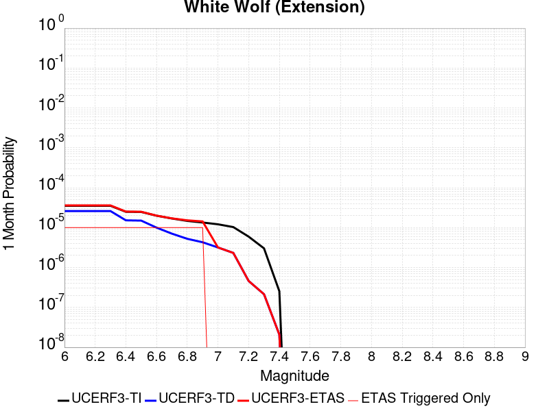 | 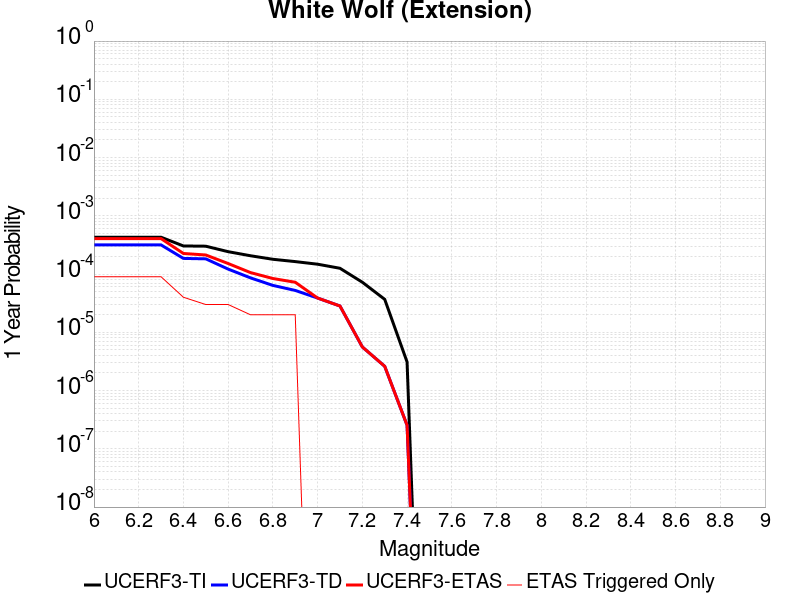 |  |

| Magnitude | 1 wk TI Prob | 1 wk TD Prob | 1 wk ETAS Prob | 1 wk ETAS/TD Gain | 1 wk ETAS Triggered Only | 1 mo TI Prob | 1 mo TD Prob | 1 mo ETAS Prob | 1 mo ETAS/TD Gain | 1 mo ETAS Triggered Only | 1 yr TI Prob | 1 yr TD Prob | 1 yr ETAS Prob | 1 yr ETAS/TD Gain | 1 yr ETAS Triggered Only | 10 yr TI Prob | 10 yr TD Prob | 10 yr ETAS Prob | 10 yr ETAS/TD Gain | 10 yr ETAS Triggered Only |
|-----|-----|-----|-----|-----|-----|-----|-----|-----|-----|-----|-----|-----|-----|-----|-----|-----|-----|-----|-----|-----|
| 6.0 | 8.222555E-6 | 6.066817E-6 | 6.066817E-6 | 1.0 | 0.0 | 3.5239045E-5 | 2.6000424E-5 | 3.6000165E-5 | 1.3845991 | 1.0E-5 | 4.289509E-4 | 3.165158E-4 | 4.0648732E-4 | 1.284256 | 9.0E-5 | 0.0042812387 | 0.0031613018 | 0.0033905748 | 1.0725248 | 2.3E-4 |
| 6.1 | 8.222555E-6 | 6.066817E-6 | 6.066817E-6 | 1.0 | 0.0 | 3.5239045E-5 | 2.6000424E-5 | 3.6000165E-5 | 1.3845991 | 1.0E-5 | 4.289509E-4 | 3.165158E-4 | 4.0648732E-4 | 1.284256 | 9.0E-5 | 0.0042812387 | 0.0031613018 | 0.0033905748 | 1.0725248 | 2.3E-4 |
| 6.2 | 8.222555E-6 | 6.066817E-6 | 6.066817E-6 | 1.0 | 0.0 | 3.5239045E-5 | 2.6000424E-5 | 3.6000165E-5 | 1.3845991 | 1.0E-5 | 4.289509E-4 | 3.165158E-4 | 4.0648732E-4 | 1.284256 | 9.0E-5 | 0.0042812387 | 0.0031613018 | 0.0033905748 | 1.0725248 | 2.3E-4 |
| 6.3 | 8.222555E-6 | 6.066817E-6 | 6.066817E-6 | 1.0 | 0.0 | 3.5239045E-5 | 2.6000424E-5 | 3.6000165E-5 | 1.3845991 | 1.0E-5 | 4.289509E-4 | 3.165158E-4 | 4.0648732E-4 | 1.284256 | 9.0E-5 | 0.0042812387 | 0.0031613018 | 0.0033905748 | 1.0725248 | 2.3E-4 |
| 6.4 | 5.821773E-6 | 3.5572525E-6 | 3.5572525E-6 | 1.0 | 0.0 | 2.4950215E-5 | 1.5245285E-5 | 2.5245134E-5 | 1.6559305 | 1.0E-5 | 3.0372653E-4 | 1.8559664E-4 | 2.2558922E-4 | 1.2154812 | 4.0E-5 | 0.0030331176 | 0.0018545247 | 0.0019543392 | 1.0538222 | 1.0E-4 |
| 6.5 | 5.766023E-6 | 3.4991851E-6 | 3.4991851E-6 | 1.0 | 0.0 | 2.4711293E-5 | 1.4996427E-5 | 2.4996278E-5 | 1.6668155 | 1.0E-5 | 3.0081844E-4 | 1.8256731E-4 | 2.1256183E-4 | 1.1642929 | 3.0E-5 | 0.0030041158 | 0.0018242814 | 0.0019141173 | 1.0492445 | 9.0E-5 |
| 6.6 | 4.643576E-6 | 2.3326681E-6 | 2.3326681E-6 | 1.0 | 0.0 | 1.9900888E-5 | 9.997114E-6 | 1.9997013E-5 | 2.0002787 | 1.0E-5 | 2.4226638E-4 | 1.21708494E-4 | 1.5170484E-4 | 1.2464606 | 3.0E-5 | 0.0024200242 | 0.0012164607 | 0.0012664 | 1.0410528 | 5.0E-5 |
| 6.7 | 3.9529173E-6 | 1.6483743E-6 | 1.6483743E-6 | 1.0 | 0.0 | 1.6940963E-5 | 7.0644433E-6 | 1.7064373E-5 | 2.4155297 | 1.0E-5 | 2.0623671E-4 | 8.600639E-5 | 1.0600467E-4 | 1.2325208 | 2.0E-5 | 0.002060454 | 8.5974956E-4 | 8.997152E-4 | 1.0464852 | 4.0E-5 |
| 6.8 | 3.4377522E-6 | 1.2245404E-6 | 1.2245404E-6 | 1.0 | 0.0 | 1.473314E-5 | 5.2480204E-6 | 1.5247968E-5 | 2.9054704 | 1.0E-5 | 1.7936122E-4 | 6.389287E-5 | 8.389159E-5 | 1.313004 | 2.0E-5 | 0.0017921652 | 6.3875405E-4 | 6.587413E-4 | 1.031291 | 2.0E-5 |
| 6.9 | 3.1367306E-6 | 1.0033883E-6 | 1.0033883E-6 | 1.0 | 0.0 | 1.3443062E-5 | 4.3002287E-6 | 1.4300186E-5 | 3.3254476 | 1.0E-5 | 1.63657E-4 | 5.2354106E-5 | 7.235306E-5 | 1.381994 | 2.0E-5 | 0.0016353652 | 5.2342535E-4 | 5.434149E-4 | 1.0381899 | 2.0E-5 |
| 7.0 | 2.8298145E-6 | 7.428724E-7 | 7.428724E-7 | 1.0 | 0.0 | 1.2127721E-5 | 3.1837353E-6 | 3.1837353E-6 | 1.0 | 0.0 | 1.47645E-4 | 3.8761336E-5 | 3.8761336E-5 | 1.0 | 0.0 | 0.0014754693 | 3.8755077E-4 | 3.8755077E-4 | 1.0 | 0.0 |
| 7.1 | 2.4091064E-6 | 5.422778E-7 | 5.422778E-7 | 1.0 | 0.0 | 1.03247E-5 | 2.324046E-6 | 2.324046E-6 | 1.0 | 0.0 | 1.2569598E-4 | 2.8294931E-5 | 2.8294931E-5 | 1.0 | 0.0 | 0.001256249 | 2.8291732E-4 | 2.8291732E-4 | 1.0 | 0.0 |
| 7.2 | 1.3875518E-6 | 1.0742177E-7 | 1.0742177E-7 | 1.0 | 0.0 | 5.9466374E-6 | 4.6037894E-7 | 4.6037894E-7 | 1.0 | 0.0 | 7.23979E-5 | 5.6051003E-6 | 5.6051003E-6 | 1.0 | 0.0 | 7.2374323E-4 | 5.6049703E-5 | 5.6049703E-5 | 1.0 | 0.0 |
| 7.3 | 7.056077E-7 | 5.001439E-8 | 5.001439E-8 | 1.0 | 0.0 | 3.0240296E-6 | 2.1434737E-7 | 2.1434737E-7 | 1.0 | 0.0 | 3.681694E-5 | 2.6096766E-6 | 2.6096766E-6 | 1.0 | 0.0 | 3.681084E-4 | 2.6096506E-5 | 2.6096506E-5 | 1.0 | 0.0 |
| 7.4 | 5.9334678E-8 | 4.864216E-9 | 4.864216E-9 | 1.0 | 0.0 | 2.5429145E-7 | 2.0846642E-8 | 2.0846642E-8 | 1.0 | 0.0 | 3.095994E-6 | 2.5380783E-7 | 2.5380783E-7 | 1.0 | 0.0 | 3.095951E-5 | 2.5380766E-6 | 2.5380766E-6 | 1.0 | 0.0 |

## Sierra Nevada  (No Extension)
*[(top)](#table-of-contents)*

| 1 Week | 1 Month | 1 Year | 10 Year |
|-----|-----|-----|-----|
| 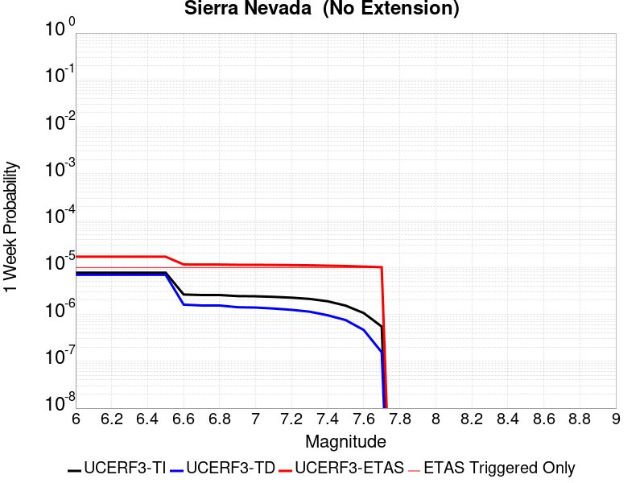 |  |  |  |

| Magnitude | 1 wk TI Prob | 1 wk TD Prob | 1 wk ETAS Prob | 1 wk ETAS/TD Gain | 1 wk ETAS Triggered Only | 1 mo TI Prob | 1 mo TD Prob | 1 mo ETAS Prob | 1 mo ETAS/TD Gain | 1 mo ETAS Triggered Only | 1 yr TI Prob | 1 yr TD Prob | 1 yr ETAS Prob | 1 yr ETAS/TD Gain | 1 yr ETAS Triggered Only | 10 yr TI Prob | 10 yr TD Prob | 10 yr ETAS Prob | 10 yr ETAS/TD Gain | 10 yr ETAS Triggered Only |
|-----|-----|-----|-----|-----|-----|-----|-----|-----|-----|-----|-----|-----|-----|-----|-----|-----|-----|-----|-----|-----|
| 6.0 | 7.7690465E-6 | 6.9765974E-6 | 1.6976528E-5 | 2.4333534 | 1.0E-5 | 3.329549E-5 | 2.9899562E-5 | 4.9898965E-5 | 1.6688861 | 2.0E-5 | 4.0529718E-4 | 3.6400222E-4 | 4.439731E-4 | 1.2196989 | 8.0E-5 | 0.004045588 | 0.0036375762 | 0.0038468123 | 1.0575207 | 2.1E-4 |
| 6.1 | 7.7690465E-6 | 6.9765974E-6 | 1.6976528E-5 | 2.4333534 | 1.0E-5 | 3.329549E-5 | 2.9899562E-5 | 4.9898965E-5 | 1.6688861 | 2.0E-5 | 4.0529718E-4 | 3.6400222E-4 | 4.439731E-4 | 1.2196989 | 8.0E-5 | 0.004045588 | 0.0036375762 | 0.0038468123 | 1.0575207 | 2.1E-4 |
| 6.2 | 7.7690465E-6 | 6.9765974E-6 | 1.6976528E-5 | 2.4333534 | 1.0E-5 | 3.329549E-5 | 2.9899562E-5 | 4.9898965E-5 | 1.6688861 | 2.0E-5 | 4.0529718E-4 | 3.6400222E-4 | 4.439731E-4 | 1.2196989 | 8.0E-5 | 0.004045588 | 0.0036375762 | 0.0038468123 | 1.0575207 | 2.1E-4 |
| 6.3 | 7.7690465E-6 | 6.9765974E-6 | 1.6976528E-5 | 2.4333534 | 1.0E-5 | 3.329549E-5 | 2.9899562E-5 | 4.9898965E-5 | 1.6688861 | 2.0E-5 | 4.0529718E-4 | 3.6400222E-4 | 4.439731E-4 | 1.2196989 | 8.0E-5 | 0.004045588 | 0.0036375762 | 0.0038468123 | 1.0575207 | 2.1E-4 |
| 6.4 | 7.7690465E-6 | 6.9765974E-6 | 1.6976528E-5 | 2.4333534 | 1.0E-5 | 3.329549E-5 | 2.9899562E-5 | 4.9898965E-5 | 1.6688861 | 2.0E-5 | 4.0529718E-4 | 3.6400222E-4 | 4.439731E-4 | 1.2196989 | 8.0E-5 | 0.004045588 | 0.0036375762 | 0.0038468123 | 1.0575207 | 2.1E-4 |
| 6.5 | 7.7690465E-6 | 6.9765974E-6 | 1.6976528E-5 | 2.4333534 | 1.0E-5 | 3.329549E-5 | 2.9899562E-5 | 4.9898965E-5 | 1.6688861 | 2.0E-5 | 4.0529718E-4 | 3.6400222E-4 | 4.439731E-4 | 1.2196989 | 8.0E-5 | 0.004045588 | 0.0036375762 | 0.0038468123 | 1.0575207 | 2.1E-4 |
| 6.6 | 2.653E-6 | 1.614959E-6 | 1.1614943E-5 | 7.192097 | 1.0E-5 | 1.136995E-5 | 6.921235E-6 | 2.6921096E-5 | 3.8896377 | 2.0E-5 | 1.3842035E-4 | 8.4262814E-5 | 1.6425607E-4 | 1.9493304 | 8.0E-5 | 0.0013833415 | 8.4231206E-4 | 0.0010021772 | 1.1897933 | 1.6E-4 |
| 6.7 | 2.5902466E-6 | 1.5502914E-6 | 1.1550276E-5 | 7.4503903 | 1.0E-5 | 1.11010095E-5 | 6.644089E-6 | 2.6643957E-5 | 4.0101743 | 2.0E-5 | 1.351464E-4 | 8.088881E-5 | 1.6088234E-4 | 1.988932 | 8.0E-5 | 0.0013506424 | 8.0859667E-4 | 9.6846727E-4 | 1.1977137 | 1.6E-4 |
| 6.8 | 2.5853892E-6 | 1.547091E-6 | 1.1547076E-5 | 7.463734 | 1.0E-5 | 1.1080193E-5 | 6.6303733E-6 | 2.6630241E-5 | 4.0164013 | 2.0E-5 | 1.34893E-4 | 8.072183E-5 | 1.6071537E-4 | 1.9909778 | 8.0E-5 | 0.0013481114 | 8.069281E-4 | 9.66799E-4 | 1.1981229 | 1.6E-4 |
| 6.9 | 2.458257E-6 | 1.4221621E-6 | 1.14221475E-5 | 8.031537 | 1.0E-5 | 1.0535345E-5 | 6.094966E-6 | 2.6094844E-5 | 4.2813764 | 2.0E-5 | 1.2826028E-4 | 7.420371E-5 | 1.5419777E-4 | 2.0780332 | 8.0E-5 | 0.0012818627 | 7.417913E-4 | 9.016726E-4 | 1.2155341 | 1.6E-4 |
| 7.0 | 2.4341468E-6 | 1.3991254E-6 | 1.1399112E-5 | 8.147312 | 1.0E-5 | 1.0432016E-5 | 5.996238E-6 | 2.5996118E-5 | 4.335405 | 2.0E-5 | 1.270024E-4 | 7.300177E-5 | 1.5299593E-4 | 2.095784 | 8.0E-5 | 0.0012692984 | 7.2977983E-4 | 8.8966306E-4 | 1.2190843 | 1.6E-4 |
| 7.1 | 2.3652476E-6 | 1.3340731E-6 | 1.1334059E-5 | 8.4958315 | 1.0E-5 | 1.0136736E-5 | 5.7174434E-6 | 2.5717329E-5 | 4.498047 | 2.0E-5 | 1.2340778E-4 | 6.960767E-5 | 1.496021E-4 | 2.1492186 | 8.0E-5 | 0.0012333926 | 6.9586036E-4 | 8.55749E-4 | 1.2297711 | 1.6E-4 |
| 7.2 | 2.272158E-6 | 1.2503771E-6 | 1.1250365E-5 | 8.997578 | 1.0E-5 | 9.737784E-6 | 5.358748E-6 | 2.535864E-5 | 4.7321954 | 2.0E-5 | 1.1855107E-4 | 6.524082E-5 | 1.3523625E-4 | 2.072878 | 7.0E-5 | 0.0011848784 | 6.522181E-4 | 8.021203E-4 | 1.2298344 | 1.5E-4 |
| 7.3 | 2.1382127E-6 | 1.1420617E-6 | 1.114205E-5 | 9.756084 | 1.0E-5 | 9.163737E-6 | 4.8945412E-6 | 2.4894443E-5 | 5.086165 | 2.0E-5 | 1.1156279E-4 | 5.958942E-5 | 1.2958524E-4 | 2.1746352 | 7.0E-5 | 0.001115068 | 5.9573556E-4 | 7.4564625E-4 | 1.2516396 | 1.5E-4 |
| 7.4 | 1.9048055E-6 | 9.576097E-7 | 1.09576E-5 | 11.442658 | 1.0E-5 | 8.163426E-6 | 4.1040353E-6 | 2.4103952E-5 | 5.873233 | 2.0E-5 | 9.9385186E-5 | 4.996549E-5 | 1.1996199E-4 | 2.400897 | 7.0E-5 | 9.934074E-4 | 4.995432E-4 | 6.4946833E-4 | 1.3001243 | 1.5E-4 |
| 7.5 | 1.5373403E-6 | 7.560755E-7 | 1.0756068E-5 | 14.226183 | 1.0E-5 | 6.5885843E-6 | 3.2403195E-6 | 2.3240254E-5 | 7.1722107 | 2.0E-5 | 8.021306E-5 | 3.945018E-5 | 8.944821E-5 | 2.2673714 | 5.0E-5 | 8.0184115E-4 | 3.9443225E-4 | 5.043889E-4 | 1.2787719 | 1.1E-4 |
| 7.6 | 1.0680322E-6 | 4.660118E-7 | 1.0466008E-5 | 22.458673 | 1.0E-5 | 4.577273E-6 | 1.997192E-6 | 1.1997172E-5 | 6.00702 | 1.0E-5 | 5.5726876E-5 | 2.4315543E-5 | 5.4314813E-5 | 2.2337487 | 3.0E-5 | 5.5712904E-4 | 2.4312909E-4 | 2.9311693E-4 | 1.205602 | 5.0E-5 |
| 7.7 | 5.509146E-7 | 1.5582113E-7 | 1.015582E-5 | 65.17614 | 1.0E-5 | 2.3610605E-6 | 6.6780467E-7 | 1.0667798E-5 | 15.974429 | 1.0E-5 | 2.8745531E-5 | 8.1304925E-6 | 2.813033E-5 | 3.4598556 | 2.0E-5 | 2.8741814E-4 | 8.130207E-5 | 1.0130044E-4 | 1.2459762 | 2.0E-5 |

## Elsinore (Glen Ivy) rev
*[(top)](#table-of-contents)*

| 1 Week | 1 Month | 1 Year | 10 Year |
|-----|-----|-----|-----|
|  | 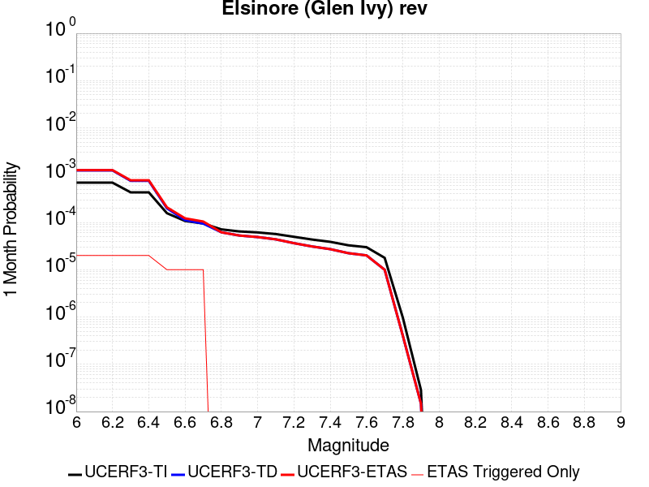 |  |  |

| Magnitude | 1 wk TI Prob | 1 wk TD Prob | 1 wk ETAS Prob | 1 wk ETAS/TD Gain | 1 wk ETAS Triggered Only | 1 mo TI Prob | 1 mo TD Prob | 1 mo ETAS Prob | 1 mo ETAS/TD Gain | 1 mo ETAS Triggered Only | 1 yr TI Prob | 1 yr TD Prob | 1 yr ETAS Prob | 1 yr ETAS/TD Gain | 1 yr ETAS Triggered Only | 10 yr TI Prob | 10 yr TD Prob | 10 yr ETAS Prob | 10 yr ETAS/TD Gain | 10 yr ETAS Triggered Only |
|-----|-----|-----|-----|-----|-----|-----|-----|-----|-----|-----|-----|-----|-----|-----|-----|-----|-----|-----|-----|-----|
| 6.0 | 1.6204086E-4 | 2.9377863E-4 | 2.9377863E-4 | 1.0 | 0.0 | 6.94276E-4 | 0.001258526 | 0.0012785009 | 1.0158716 | 2.0E-5 | 0.008420097 | 0.015236515 | 0.015325143 | 1.0058168 | 9.0E-5 | 0.081081145 | 0.13976179 | 0.13990803 | 1.0010463 | 1.7E-4 |
| 6.1 | 1.6204086E-4 | 2.9377863E-4 | 2.9377863E-4 | 1.0 | 0.0 | 6.94276E-4 | 0.001258526 | 0.0012785009 | 1.0158716 | 2.0E-5 | 0.008420097 | 0.015236515 | 0.015325143 | 1.0058168 | 9.0E-5 | 0.081081145 | 0.13976179 | 0.13990803 | 1.0010463 | 1.7E-4 |
| 6.2 | 1.6204086E-4 | 2.9377863E-4 | 2.9377863E-4 | 1.0 | 0.0 | 6.94276E-4 | 0.001258526 | 0.0012785009 | 1.0158716 | 2.0E-5 | 0.008420097 | 0.015236515 | 0.015325143 | 1.0058168 | 9.0E-5 | 0.081081145 | 0.13976179 | 0.13990803 | 1.0010463 | 1.7E-4 |
| 6.3 | 1.0111737E-4 | 1.7705848E-4 | 1.7705848E-4 | 1.0 | 0.0 | 4.332882E-4 | 7.587181E-4 | 7.7870296E-4 | 1.0263402 | 2.0E-5 | 0.005262531 | 0.00921896 | 0.009298223 | 1.0085977 | 8.0E-5 | 0.0513964 | 0.087001756 | 0.08710218 | 1.0011543 | 1.1E-4 |
| 6.4 | 1.0111737E-4 | 1.7705848E-4 | 1.7705848E-4 | 1.0 | 0.0 | 4.332882E-4 | 7.587181E-4 | 7.7870296E-4 | 1.0263402 | 2.0E-5 | 0.005262531 | 0.00921896 | 0.009298223 | 1.0085977 | 8.0E-5 | 0.0513964 | 0.087001756 | 0.08710218 | 1.0011543 | 1.1E-4 |
| 6.5 | 3.6624708E-5 | 4.640125E-5 | 4.640125E-5 | 1.0 | 0.0 | 1.569536E-4 | 1.9884938E-4 | 2.0884738E-4 | 1.0502794 | 1.0E-5 | 0.001909235 | 0.0024186643 | 0.0024286401 | 1.0041245 | 1.0E-5 | 0.01892915 | 0.023770541 | 0.023790065 | 1.0008214 | 2.0E-5 |
| 6.6 | 2.5051324E-5 | 2.6155105E-5 | 2.6155105E-5 | 1.0 | 0.0 | 1.073584E-4 | 1.1208874E-4 | 1.2208761E-4 | 1.089205 | 1.0E-5 | 0.0013063047 | 0.0013638707 | 0.001373857 | 1.0073221 | 1.0E-5 | 0.012986525 | 0.013565168 | 0.013584896 | 1.0014544 | 2.0E-5 |
| 6.7 | 2.2189772E-5 | 2.2079208E-5 | 2.2079208E-5 | 1.0 | 0.0 | 9.509556E-5 | 9.462195E-5 | 1.04621E-4 | 1.1056737 | 1.0E-5 | 0.0011571734 | 0.0011514499 | 0.0011614383 | 1.0086747 | 1.0E-5 | 0.011511663 | 0.011465619 | 0.01148539 | 1.0017244 | 2.0E-5 |
| 6.8 | 1.6654378E-5 | 1.4441152E-5 | 1.4441152E-5 | 1.0 | 0.0 | 7.137396E-5 | 6.1889215E-5 | 6.1889215E-5 | 1.0 | 0.0 | 8.686314E-4 | 7.5324584E-4 | 7.5324584E-4 | 1.0 | 0.0 | 0.008652439 | 0.007511923 | 0.0075218477 | 1.0013212 | 1.0E-5 |
| 6.9 | 1.5042909E-5 | 1.2335E-5 | 1.2335E-5 | 1.0 | 0.0 | 6.446802E-5 | 5.286323E-5 | 5.286323E-5 | 1.0 | 0.0 | 7.8461546E-4 | 6.434229E-4 | 6.434229E-4 | 1.0 | 0.0 | 0.007818509 | 0.0064195613 | 0.006429497 | 1.0015477 | 1.0E-5 |
| 7.0 | 1.4361385E-5 | 1.1454117E-5 | 1.1454117E-5 | 1.0 | 0.0 | 6.154734E-5 | 4.908817E-5 | 4.908817E-5 | 1.0 | 0.0 | 7.490812E-4 | 5.974875E-4 | 5.974875E-4 | 1.0 | 0.0 | 0.007465612 | 0.0059625315 | 0.005972472 | 1.0016671 | 1.0E-5 |
| 7.1 | 1.3265571E-5 | 1.0247333E-5 | 1.0247333E-5 | 1.0 | 0.0 | 5.6851208E-5 | 4.3916418E-5 | 4.3916418E-5 | 1.0 | 0.0 | 6.919436E-4 | 5.345537E-4 | 5.345537E-4 | 1.0 | 0.0 | 0.006897931 | 0.0053359456 | 0.0053359456 | 1.0 | 0.0 |
| 7.2 | 1.1596403E-5 | 8.507026E-6 | 8.507026E-6 | 1.0 | 0.0 | 4.9697923E-5 | 3.6458183E-5 | 3.6458183E-5 | 1.0 | 0.0 | 6.049042E-4 | 4.4378967E-4 | 4.4378967E-4 | 1.0 | 0.0 | 0.006032603 | 0.0044303816 | 0.0044303816 | 1.0 | 0.0 |
| 7.3 | 1.0150827E-5 | 7.240407E-6 | 7.240407E-6 | 1.0 | 0.0 | 4.3502816E-5 | 3.1029955E-5 | 3.1029955E-5 | 1.0 | 0.0 | 5.2951806E-4 | 3.7772564E-4 | 3.7772564E-4 | 1.0 | 0.0 | 0.005282581 | 0.0037712236 | 0.0037712236 | 1.0 | 0.0 |
| 7.4 | 9.080705E-6 | 6.3539555E-6 | 6.3539555E-6 | 1.0 | 0.0 | 3.8916725E-5 | 2.723096E-5 | 2.723096E-5 | 1.0 | 0.0 | 4.7370812E-4 | 3.3148788E-4 | 3.3148788E-4 | 1.0 | 0.0 | 0.004726996 | 0.0033100864 | 0.0033100864 | 1.0 | 0.0 |
| 7.5 | 7.671649E-6 | 5.226824E-6 | 5.226824E-6 | 1.0 | 0.0 | 3.287808E-5 | 2.2400489E-5 | 2.2400489E-5 | 1.0 | 0.0 | 4.0021708E-4 | 2.7269308E-4 | 2.7269308E-4 | 1.0 | 0.0 | 0.0039949706 | 0.0027237097 | 0.0027237097 | 1.0 | 0.0 |
| 7.6 | 6.990086E-6 | 4.688623E-6 | 4.688623E-6 | 1.0 | 0.0 | 2.9957167E-5 | 2.009395E-5 | 2.009395E-5 | 1.0 | 0.0 | 3.6466747E-4 | 2.4461755E-4 | 2.4461755E-4 | 1.0 | 0.0 | 0.0036406964 | 0.002443599 | 0.002443599 | 1.0 | 0.0 |
| 7.7 | 4.163505E-6 | 2.3302E-6 | 2.3302E-6 | 1.0 | 0.0 | 1.7843471E-5 | 9.986537E-6 | 9.986537E-6 | 1.0 | 0.0 | 2.172226E-4 | 1.2158005E-4 | 1.2158005E-4 | 1.0 | 0.0 | 0.0021701038 | 0.0012152084 | 0.0012152084 | 1.0 | 0.0 |
| 7.8 | 2.2692414E-7 | 9.3867996E-8 | 9.3867996E-8 | 1.0 | 0.0 | 9.725317E-7 | 4.0229136E-7 | 4.0229136E-7 | 1.0 | 0.0 | 1.1840509E-5 | 4.8978895E-6 | 4.8978895E-6 | 1.0 | 0.0 | 1.1839878E-4 | 4.8978145E-5 | 4.8978145E-5 | 1.0 | 0.0 |
| 7.9 | 6.676829E-9 | 3.440364E-9 | 3.440364E-9 | 1.0 | 0.0 | 2.861498E-8 | 1.4744418E-8 | 1.4744418E-8 | 1.0 | 0.0 | 3.4838732E-7 | 1.7951328E-7 | 1.7951328E-7 | 1.0 | 0.0 | 3.4838679E-6 | 1.7951315E-6 | 1.7951315E-6 | 1.0 | 0.0 |

## San Andreas (Big Bend)
*[(top)](#table-of-contents)*

| 1 Week | 1 Month | 1 Year | 10 Year |
|-----|-----|-----|-----|
|  |  | 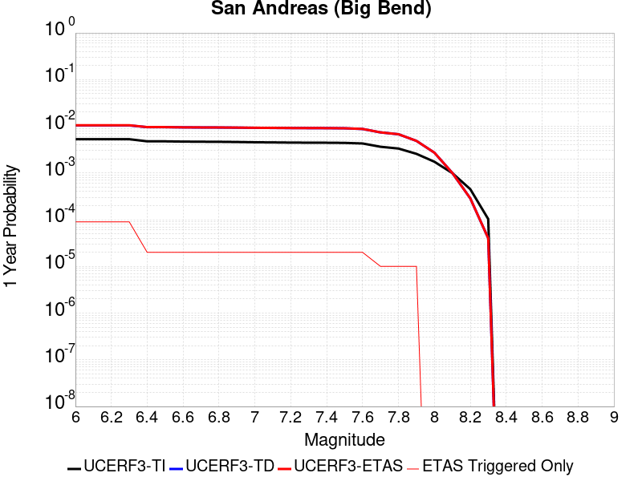 |  |

| Magnitude | 1 wk TI Prob | 1 wk TD Prob | 1 wk ETAS Prob | 1 wk ETAS/TD Gain | 1 wk ETAS Triggered Only | 1 mo TI Prob | 1 mo TD Prob | 1 mo ETAS Prob | 1 mo ETAS/TD Gain | 1 mo ETAS Triggered Only | 1 yr TI Prob | 1 yr TD Prob | 1 yr ETAS Prob | 1 yr ETAS/TD Gain | 1 yr ETAS Triggered Only | 10 yr TI Prob | 10 yr TD Prob | 10 yr ETAS Prob | 10 yr ETAS/TD Gain | 10 yr ETAS Triggered Only |
|-----|-----|-----|-----|-----|-----|-----|-----|-----|-----|-----|-----|-----|-----|-----|-----|-----|-----|-----|-----|-----|
| 6.0 | 1.0179969E-4 | 2.0116557E-4 | 2.0116557E-4 | 1.0 | 0.0 | 4.362114E-4 | 8.6185435E-4 | 8.6185435E-4 | 1.0 | 0.0 | 0.0052979486 | 0.010442877 | 0.010531937 | 1.0085284 | 9.0E-5 | 0.051734097 | 0.10162581 | 0.1017965 | 1.0016797 | 1.9E-4 |
| 6.1 | 1.0179969E-4 | 2.0116557E-4 | 2.0116557E-4 | 1.0 | 0.0 | 4.362114E-4 | 8.6185435E-4 | 8.6185435E-4 | 1.0 | 0.0 | 0.0052979486 | 0.010442877 | 0.010531937 | 1.0085284 | 9.0E-5 | 0.051734097 | 0.10162581 | 0.1017965 | 1.0016797 | 1.9E-4 |
| 6.2 | 1.0179969E-4 | 2.0116557E-4 | 2.0116557E-4 | 1.0 | 0.0 | 4.362114E-4 | 8.6185435E-4 | 8.6185435E-4 | 1.0 | 0.0 | 0.0052979486 | 0.010442877 | 0.010531937 | 1.0085284 | 9.0E-5 | 0.051734097 | 0.10162581 | 0.1017965 | 1.0016797 | 1.9E-4 |
| 6.3 | 1.0179969E-4 | 2.0116557E-4 | 2.0116557E-4 | 1.0 | 0.0 | 4.362114E-4 | 8.6185435E-4 | 8.6185435E-4 | 1.0 | 0.0 | 0.0052979486 | 0.010442877 | 0.010531937 | 1.0085284 | 9.0E-5 | 0.051734097 | 0.10162581 | 0.1017965 | 1.0016797 | 1.9E-4 |
| 6.4 | 9.1639464E-5 | 1.8472776E-4 | 1.8472776E-4 | 1.0 | 0.0 | 3.9268145E-4 | 7.9145044E-4 | 7.9145044E-4 | 1.0 | 0.0 | 0.0047704205 | 0.009593454 | 0.0096132625 | 1.0020647 | 2.0E-5 | 0.046693064 | 0.09397263 | 0.09404512 | 1.0007713 | 8.0E-5 |
| 6.5 | 9.1639464E-5 | 1.8472776E-4 | 1.8472776E-4 | 1.0 | 0.0 | 3.9268145E-4 | 7.9145044E-4 | 7.9145044E-4 | 1.0 | 0.0 | 0.0047704205 | 0.009593454 | 0.0096132625 | 1.0020647 | 2.0E-5 | 0.046693064 | 0.09397263 | 0.09404512 | 1.0007713 | 8.0E-5 |
| 6.6 | 9.042622E-5 | 1.8279755E-4 | 1.8279755E-4 | 1.0 | 0.0 | 3.8748336E-4 | 7.8318303E-4 | 7.8318303E-4 | 1.0 | 0.0 | 0.0047074095 | 0.009493679 | 0.009513489 | 1.0020866 | 2.0E-5 | 0.046089325 | 0.09306239 | 0.09313495 | 1.0007796 | 8.0E-5 |
| 6.7 | 8.9836685E-5 | 1.8194053E-4 | 1.8194053E-4 | 1.0 | 0.0 | 3.8495753E-4 | 7.7951234E-4 | 7.7951234E-4 | 1.0 | 0.0 | 0.00467679 | 0.009449375 | 0.009469186 | 1.0020965 | 2.0E-5 | 0.045795817 | 0.09265657 | 0.092720084 | 1.0006855 | 7.0E-5 |
| 6.8 | 8.9471854E-5 | 1.8140794E-4 | 1.8140794E-4 | 1.0 | 0.0 | 3.8339442E-4 | 7.772312E-4 | 7.772312E-4 | 1.0 | 0.0 | 0.004657841 | 0.009421842 | 0.009441654 | 1.0021027 | 2.0E-5 | 0.04561414 | 0.0924036 | 0.09246713 | 1.0006876 | 7.0E-5 |
| 6.9 | 8.858234E-5 | 1.8022698E-4 | 1.8022698E-4 | 1.0 | 0.0 | 3.7958333E-4 | 7.721729E-4 | 7.721729E-4 | 1.0 | 0.0 | 0.004611638 | 0.009360788 | 0.009380601 | 1.0021166 | 2.0E-5 | 0.04517103 | 0.09184343 | 0.091907 | 1.0006921 | 7.0E-5 |
| 7.0 | 8.7433385E-5 | 1.7861387E-4 | 1.7861387E-4 | 1.0 | 0.0 | 3.746607E-4 | 7.652637E-4 | 7.652637E-4 | 1.0 | 0.0 | 0.004551957 | 0.0092773875 | 0.009297202 | 1.0021358 | 2.0E-5 | 0.044598386 | 0.09107729 | 0.09114092 | 1.0006986 | 7.0E-5 |
| 7.1 | 8.684964E-5 | 1.7773268E-4 | 1.7773268E-4 | 1.0 | 0.0 | 3.7215967E-4 | 7.614893E-4 | 7.614893E-4 | 1.0 | 0.0 | 0.0045216335 | 0.009231825 | 0.009251641 | 1.0021464 | 2.0E-5 | 0.04430731 | 0.09065855 | 0.09072221 | 1.0007021 | 7.0E-5 |
| 7.2 | 8.606521E-5 | 1.766381E-4 | 1.766381E-4 | 1.0 | 0.0 | 3.6879873E-4 | 7.56801E-4 | 7.56801E-4 | 1.0 | 0.0 | 0.0044808835 | 0.009175227 | 0.009195044 | 1.0021598 | 2.0E-5 | 0.043916024 | 0.090139 | 0.09020269 | 1.0007066 | 7.0E-5 |
| 7.3 | 8.568266E-5 | 1.760573E-4 | 1.760573E-4 | 1.0 | 0.0 | 3.6715972E-4 | 7.543133E-4 | 7.543133E-4 | 1.0 | 0.0 | 0.0044610105 | 0.009145195 | 0.009165011 | 1.002167 | 2.0E-5 | 0.043725148 | 0.089859866 | 0.089923576 | 1.0007089 | 7.0E-5 |
| 7.4 | 8.5432206E-5 | 1.7568265E-4 | 1.7568265E-4 | 1.0 | 0.0 | 3.6608664E-4 | 7.527086E-4 | 7.527086E-4 | 1.0 | 0.0 | 0.004447999 | 0.00912582 | 0.009145638 | 1.0021716 | 2.0E-5 | 0.043600157 | 0.08967993 | 0.08974365 | 1.0007106 | 7.0E-5 |
| 7.5 | 8.4791965E-5 | 1.7437445E-4 | 1.7437445E-4 | 1.0 | 0.0 | 3.633435E-4 | 7.471052E-4 | 7.471052E-4 | 1.0 | 0.0 | 0.0044147377 | 0.009058169 | 0.009077988 | 1.002188 | 2.0E-5 | 0.043280575 | 0.08905501 | 0.08911877 | 1.0007161 | 7.0E-5 |
| 7.6 | 8.241105E-5 | 1.6882125E-4 | 1.6882125E-4 | 1.0 | 0.0 | 3.531424E-4 | 7.233192E-4 | 7.233192E-4 | 1.0 | 0.0 | 0.0042910352 | 0.008770941 | 0.008790766 | 1.0022602 | 2.0E-5 | 0.042091176 | 0.08643087 | 0.08649482 | 1.0007399 | 7.0E-5 |
| 7.7 | 7.00432E-5 | 1.4242032E-4 | 1.4242032E-4 | 1.0 | 0.0 | 3.001506E-4 | 6.102301E-4 | 6.102301E-4 | 1.0 | 0.0 | 0.0036482112 | 0.0074042818 | 0.007414208 | 1.0013406 | 1.0E-5 | 0.035888977 | 0.07368943 | 0.07373575 | 1.0006285 | 5.0E-5 |
| 7.8 | 6.415362E-5 | 1.300278E-4 | 1.300278E-4 | 1.0 | 0.0 | 2.749151E-4 | 5.57143E-4 | 5.57143E-4 | 1.0 | 0.0 | 0.0033419547 | 0.006762149 | 0.0067720814 | 1.0014688 | 1.0E-5 | 0.03292141 | 0.06740654 | 0.06744385 | 1.0005534 | 4.0E-5 |
| 7.9 | 4.939911E-5 | 9.36534E-5 | 9.36534E-5 | 1.0 | 0.0 | 2.116933E-4 | 4.0130998E-4 | 4.0130998E-4 | 1.0 | 0.0 | 0.0025743195 | 0.004875012 | 0.0048849634 | 1.0020412 | 1.0E-5 | 0.025447013 | 0.049025703 | 0.04905423 | 1.000582 | 3.0E-5 |
| 8.0 | 3.344983E-5 | 5.2369334E-5 | 5.2369334E-5 | 1.0 | 0.0 | 1.4334853E-4 | 2.244207E-4 | 2.244207E-4 | 1.0 | 0.0 | 0.0017438711 | 0.0027289002 | 0.0027289002 | 1.0 | 0.0 | 0.017302496 | 0.02799261 | 0.02800233 | 1.0003473 | 1.0E-5 |
| 8.1 | 1.9104898E-5 | 1.9241086E-5 | 1.9241086E-5 | 1.0 | 0.0 | 8.1875565E-5 | 8.245919E-5 | 8.245919E-5 | 1.0 | 0.0 | 9.963791E-4 | 0.0010034789 | 0.0010034789 | 1.0 | 0.0 | 0.009919235 | 0.010785992 | 0.010785992 | 1.0 | 0.0 |
| 8.2 | 8.643924E-6 | 5.5000196E-6 | 5.5000196E-6 | 1.0 | 0.0 | 3.704486E-5 | 2.35713E-5 | 2.35713E-5 | 1.0 | 0.0 | 4.5092785E-4 | 2.8694287E-4 | 2.8694287E-4 | 1.0 | 0.0 | 0.0045001395 | 0.0032626302 | 0.0032626302 | 1.0 | 0.0 |
| 8.3 | 1.983087E-6 | 7.698541E-7 | 7.698541E-7 | 1.0 | 0.0 | 8.498917E-6 | 3.2993707E-6 | 3.2993707E-6 | 1.0 | 0.0 | 1.034694E-4 | 4.0169114E-5 | 4.0169114E-5 | 1.0 | 0.0 | 0.0010342124 | 4.7419698E-4 | 4.7419698E-4 | 1.0 | 0.0 |

## Death Valley (No)
*[(top)](#table-of-contents)*

| 1 Week | 1 Month | 1 Year | 10 Year |
|-----|-----|-----|-----|
|  | 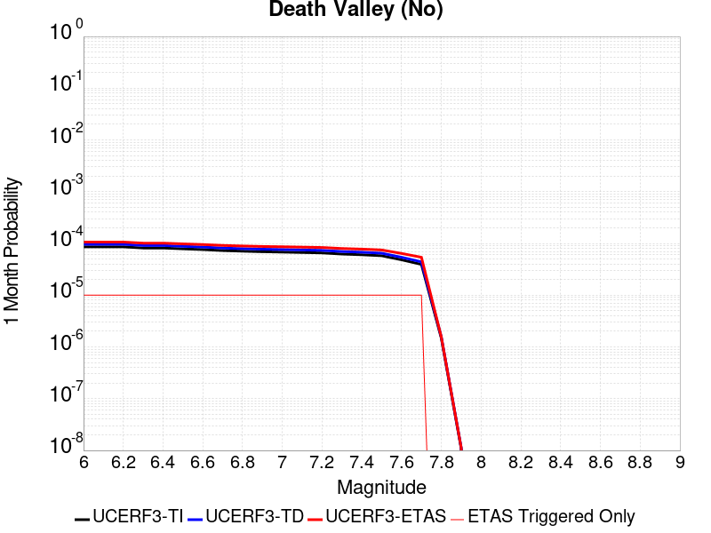 |  |  |

| Magnitude | 1 wk TI Prob | 1 wk TD Prob | 1 wk ETAS Prob | 1 wk ETAS/TD Gain | 1 wk ETAS Triggered Only | 1 mo TI Prob | 1 mo TD Prob | 1 mo ETAS Prob | 1 mo ETAS/TD Gain | 1 mo ETAS Triggered Only | 1 yr TI Prob | 1 yr TD Prob | 1 yr ETAS Prob | 1 yr ETAS/TD Gain | 1 yr ETAS Triggered Only | 10 yr TI Prob | 10 yr TD Prob | 10 yr ETAS Prob | 10 yr ETAS/TD Gain | 10 yr ETAS Triggered Only |
|-----|-----|-----|-----|-----|-----|-----|-----|-----|-----|-----|-----|-----|-----|-----|-----|-----|-----|-----|-----|-----|
| 6.0 | 2.0074807E-5 | 2.2501894E-5 | 2.2501894E-5 | 1.0 | 0.0 | 8.603206E-5 | 9.643317E-5 | 1.06432206E-4 | 1.1036887 | 1.0E-5 | 0.001046937 | 0.0011734489 | 0.0012733316 | 1.0851189 | 1.0E-4 | 0.010420183 | 0.011673441 | 0.011861223 | 1.0160862 | 1.9E-4 |
| 6.1 | 2.0074807E-5 | 2.2501894E-5 | 2.2501894E-5 | 1.0 | 0.0 | 8.603206E-5 | 9.643317E-5 | 1.06432206E-4 | 1.1036887 | 1.0E-5 | 0.001046937 | 0.0011734489 | 0.0012733316 | 1.0851189 | 1.0E-4 | 0.010420183 | 0.011673441 | 0.011861223 | 1.0160862 | 1.9E-4 |
| 6.2 | 2.0074807E-5 | 2.2501894E-5 | 2.2501894E-5 | 1.0 | 0.0 | 8.603206E-5 | 9.643317E-5 | 1.06432206E-4 | 1.1036887 | 1.0E-5 | 0.001046937 | 0.0011734489 | 0.0012733316 | 1.0851189 | 1.0E-4 | 0.010420183 | 0.011673441 | 0.011861223 | 1.0160862 | 1.9E-4 |
| 6.3 | 1.9050609E-5 | 2.1338654E-5 | 2.1338654E-5 | 1.0 | 0.0 | 8.164292E-5 | 9.144821E-5 | 1.01447295E-4 | 1.1093415 | 1.0E-5 | 9.935491E-4 | 0.00111282 | 0.0012027199 | 1.0807856 | 9.0E-5 | 0.009891188 | 0.0110733 | 0.011251306 | 1.0160754 | 1.8E-4 |
| 6.4 | 1.9050609E-5 | 2.1338654E-5 | 2.1338654E-5 | 1.0 | 0.0 | 8.164292E-5 | 9.144821E-5 | 1.01447295E-4 | 1.1093415 | 1.0E-5 | 9.935491E-4 | 0.00111282 | 0.0012027199 | 1.0807856 | 9.0E-5 | 0.009891188 | 0.0110733 | 0.011251306 | 1.0160754 | 1.8E-4 |
| 6.5 | 1.8367004E-5 | 2.0562646E-5 | 2.0562646E-5 | 1.0 | 0.0 | 7.8713354E-5 | 8.812268E-5 | 9.81218E-5 | 1.1134682 | 1.0E-5 | 9.5791375E-4 | 0.0010723722 | 0.0011522863 | 1.074521 | 8.0E-5 | 0.009537951 | 0.010672761 | 0.010840946 | 1.0157584 | 1.7E-4 |
| 6.6 | 1.779439E-5 | 1.9912506E-5 | 1.9912506E-5 | 1.0 | 0.0 | 7.625944E-5 | 8.533656E-5 | 9.533571E-5 | 1.1171731 | 1.0E-5 | 9.280632E-4 | 0.0010384838 | 0.0011184007 | 1.0769554 | 8.0E-5 | 0.009241969 | 0.010337068 | 0.01050531 | 1.0162756 | 1.7E-4 |
| 6.7 | 1.7025437E-5 | 1.904493E-5 | 1.904493E-5 | 1.0 | 0.0 | 7.296412E-5 | 8.161861E-5 | 9.1617796E-5 | 1.122511 | 1.0E-5 | 8.87976E-4 | 9.932597E-4 | 0.0010731802 | 1.0804629 | 8.0E-5 | 0.008844362 | 0.009888923 | 0.010057242 | 1.017021 | 1.7E-4 |
| 6.8 | 1.6545107E-5 | 1.8514012E-5 | 1.8514012E-5 | 1.0 | 0.0 | 7.090568E-5 | 7.934339E-5 | 8.93426E-5 | 1.1260245 | 1.0E-5 | 8.629347E-4 | 9.655837E-4 | 0.0010455064 | 1.0827714 | 8.0E-5 | 0.008595915 | 0.009614587 | 0.009782952 | 1.0175115 | 1.7E-4 |
| 6.9 | 1.615478E-5 | 1.8089035E-5 | 1.8089035E-5 | 1.0 | 0.0 | 6.9232934E-5 | 7.752216E-5 | 8.752139E-5 | 1.1289854 | 1.0E-5 | 8.4258494E-4 | 9.4342977E-4 | 0.0010133637 | 1.0741273 | 7.0E-5 | 0.008393973 | 0.009394941 | 0.009553437 | 1.0168705 | 1.6E-4 |
| 7.0 | 1.5894311E-5 | 1.7806975E-5 | 1.7806975E-5 | 1.0 | 0.0 | 6.81167E-5 | 7.631341E-5 | 8.631265E-5 | 1.1310285 | 1.0E-5 | 8.2900526E-4 | 9.287258E-4 | 9.986608E-4 | 1.0753021 | 7.0E-5 | 0.008259195 | 0.009249134 | 0.009407654 | 1.017139 | 1.6E-4 |
| 7.1 | 1.5602263E-5 | 1.7484906E-5 | 1.7484906E-5 | 1.0 | 0.0 | 6.6865134E-5 | 7.4933196E-5 | 8.493244E-5 | 1.1334422 | 1.0E-5 | 8.137789E-4 | 9.119359E-4 | 9.81872E-4 | 1.0766898 | 7.0E-5 | 0.008108052 | 0.009082619 | 0.0092411665 | 1.017456 | 1.6E-4 |
| 7.2 | 1.5323829E-5 | 1.7172008E-5 | 1.7172008E-5 | 1.0 | 0.0 | 6.56719E-5 | 7.359227E-5 | 8.359154E-5 | 1.1358738 | 1.0E-5 | 7.99262E-4 | 8.956237E-4 | 9.65561E-4 | 1.0780878 | 7.0E-5 | 0.007963934 | 0.008920819 | 0.009079391 | 1.0177755 | 1.6E-4 |
| 7.3 | 1.4556212E-5 | 1.6303757E-5 | 1.6303757E-5 | 1.0 | 0.0 | 6.238227E-5 | 6.987141E-5 | 7.9870704E-5 | 1.14311 | 1.0E-5 | 7.592395E-4 | 8.503582E-4 | 9.202987E-4 | 1.0822482 | 7.0E-5 | 0.0075665074 | 0.008471687 | 0.008630333 | 1.0187265 | 1.6E-4 |
| 7.4 | 1.411725E-5 | 1.5809219E-5 | 1.5809219E-5 | 1.0 | 0.0 | 6.0501097E-5 | 6.775207E-5 | 7.775139E-5 | 1.147587 | 1.0E-5 | 7.363519E-4 | 8.2457514E-4 | 8.945174E-4 | 1.0848222 | 7.0E-5 | 0.0073391674 | 0.008215791 | 0.00835464 | 1.0169003 | 1.4E-4 |
| 7.5 | 1.3503312E-5 | 1.5127498E-5 | 1.5127498E-5 | 1.0 | 0.0 | 5.7870053E-5 | 6.483056E-5 | 7.4829906E-5 | 1.1542382 | 1.0E-5 | 7.043401E-4 | 7.89032E-4 | 8.589768E-4 | 1.0886463 | 7.0E-5 | 0.007021119 | 0.00786293 | 0.007991908 | 1.0164033 | 1.3E-4 |
| 7.6 | 1.1279839E-5 | 1.2627329E-5 | 1.2627329E-5 | 1.0 | 0.0 | 4.834127E-5 | 5.4116033E-5 | 6.411549E-5 | 1.1847781 | 1.0E-5 | 5.88396E-4 | 6.586688E-4 | 7.1862934E-4 | 1.0910329 | 6.0E-5 | 0.005868405 | 0.0065677185 | 0.00668693 | 1.0181512 | 1.2E-4 |
| 7.7 | 9.189108E-6 | 1.0284173E-5 | 1.0284173E-5 | 1.0 | 0.0 | 3.93813E-5 | 4.407431E-5 | 5.407387E-5 | 1.2268796 | 1.0E-5 | 4.7936183E-4 | 5.3647766E-4 | 5.8645086E-4 | 1.0931505 | 5.0E-5 | 0.004783291 | 0.005352337 | 0.0054518017 | 1.0185834 | 1.0E-4 |
| 7.8 | 3.4586725E-7 | 3.6483948E-7 | 3.6483948E-7 | 1.0 | 0.0 | 1.4822873E-6 | 1.5635968E-6 | 1.5635968E-6 | 1.0 | 0.0 | 1.80467E-5 | 1.903663E-5 | 2.9036439E-5 | 1.5252931 | 1.0E-5 | 1.8045233E-4 | 1.9035043E-4 | 2.0034853E-4 | 1.0525247 | 1.0E-5 |
| 7.9 | 2.5591178E-9 | 2.6697482E-9 | 2.6697482E-9 | 1.0 | 0.0 | 1.0967647E-8 | 1.1441778E-8 | 1.1441778E-8 | 1.0 | 0.0 | 1.335311E-7 | 1.3930365E-7 | 1.3930365E-7 | 1.0 | 0.0 | 1.3353102E-6 | 1.3930365E-6 | 1.3930365E-6 | 1.0 | 0.0 |

## Scodie Lineament
*[(top)](#table-of-contents)*

| 1 Week | 1 Month | 1 Year | 10 Year |
|-----|-----|-----|-----|
| 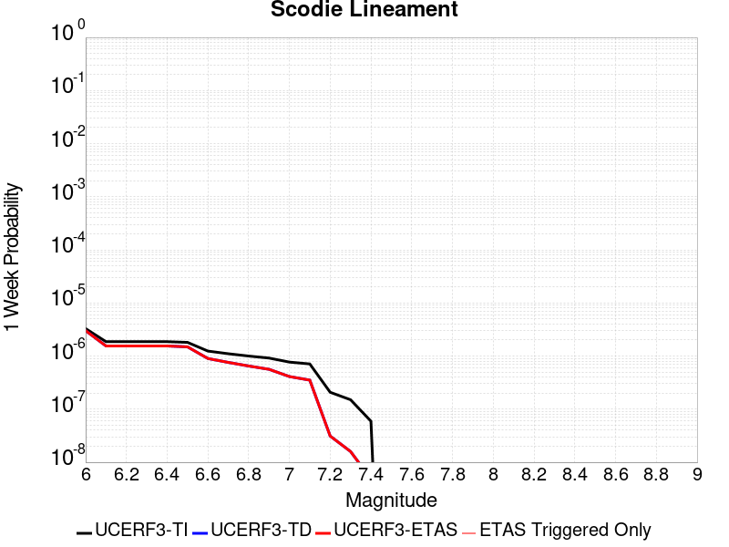 | 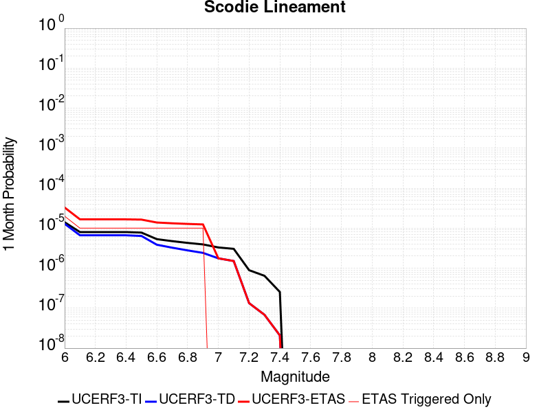 | 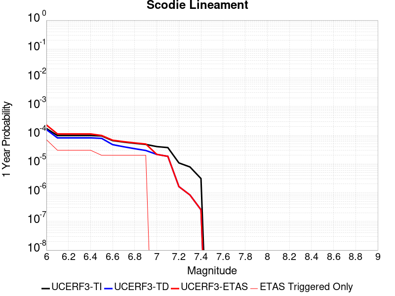 | 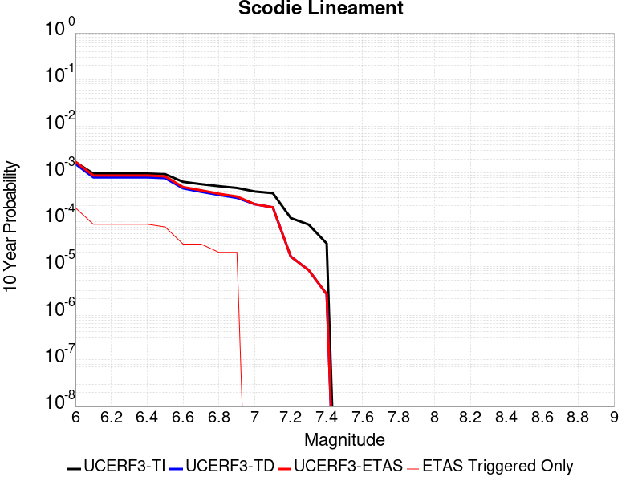 |

| Magnitude | 1 wk TI Prob | 1 wk TD Prob | 1 wk ETAS Prob | 1 wk ETAS/TD Gain | 1 wk ETAS Triggered Only | 1 mo TI Prob | 1 mo TD Prob | 1 mo ETAS Prob | 1 mo ETAS/TD Gain | 1 mo ETAS Triggered Only | 1 yr TI Prob | 1 yr TD Prob | 1 yr ETAS Prob | 1 yr ETAS/TD Gain | 1 yr ETAS Triggered Only | 10 yr TI Prob | 10 yr TD Prob | 10 yr ETAS Prob | 10 yr ETAS/TD Gain | 10 yr ETAS Triggered Only |
|-----|-----|-----|-----|-----|-----|-----|-----|-----|-----|-----|-----|-----|-----|-----|-----|-----|-----|-----|-----|-----|
| 6.0 | 3.2919327E-6 | 3.0134013E-6 | 3.0134013E-6 | 1.0 | 0.0 | 1.4108206E-5 | 1.291453E-5 | 3.291427E-5 | 2.5486233 | 2.0E-5 | 1.7175387E-4 | 1.5722624E-4 | 2.2721523E-4 | 1.4451483 | 7.0E-5 | 0.0017162118 | 0.0015714616 | 0.0017511788 | 1.1143631 | 1.8E-4 |
| 6.1 | 1.8663811E-6 | 1.5490825E-6 | 1.5490825E-6 | 1.0 | 0.0 | 7.998751E-6 | 6.6389107E-6 | 1.6638844E-5 | 2.506261 | 1.0E-5 | 9.738045E-5 | 8.082624E-5 | 1.10823814E-4 | 1.3711365 | 3.0E-5 | 9.7337784E-4 | 8.080172E-4 | 8.8795257E-4 | 1.0989277 | 8.0E-5 |
| 6.2 | 1.8663811E-6 | 1.5490825E-6 | 1.5490825E-6 | 1.0 | 0.0 | 7.998751E-6 | 6.6389107E-6 | 1.6638844E-5 | 2.506261 | 1.0E-5 | 9.738045E-5 | 8.082624E-5 | 1.10823814E-4 | 1.3711365 | 3.0E-5 | 9.7337784E-4 | 8.080172E-4 | 8.8795257E-4 | 1.0989277 | 8.0E-5 |
| 6.3 | 1.8663811E-6 | 1.5490825E-6 | 1.5490825E-6 | 1.0 | 0.0 | 7.998751E-6 | 6.6389107E-6 | 1.6638844E-5 | 2.506261 | 1.0E-5 | 9.738045E-5 | 8.082624E-5 | 1.10823814E-4 | 1.3711365 | 3.0E-5 | 9.7337784E-4 | 8.080172E-4 | 8.8795257E-4 | 1.0989277 | 8.0E-5 |
| 6.4 | 1.8663811E-6 | 1.5490825E-6 | 1.5490825E-6 | 1.0 | 0.0 | 7.998751E-6 | 6.6389107E-6 | 1.6638844E-5 | 2.506261 | 1.0E-5 | 9.738045E-5 | 8.082624E-5 | 1.10823814E-4 | 1.3711365 | 3.0E-5 | 9.7337784E-4 | 8.080172E-4 | 8.8795257E-4 | 1.0989277 | 8.0E-5 |
| 6.5 | 1.8106311E-6 | 1.4910149E-6 | 1.4910149E-6 | 1.0 | 0.0 | 7.759824E-6 | 6.390051E-6 | 1.6389988E-5 | 2.5649228 | 1.0E-5 | 9.447177E-5 | 7.779659E-5 | 9.779503E-5 | 1.2570606 | 2.0E-5 | 9.4431615E-4 | 7.7774224E-4 | 8.4768777E-4 | 1.0899341 | 7.0E-5 |
| 6.6 | 1.2414679E-6 | 8.997715E-7 | 8.997715E-7 | 1.0 | 0.0 | 5.320566E-6 | 3.8561584E-6 | 1.385612E-5 | 3.5932446 | 1.0E-5 | 6.477596E-5 | 4.6947807E-5 | 6.6946865E-5 | 1.425985 | 2.0E-5 | 6.475708E-4 | 4.6938754E-4 | 4.993734E-4 | 1.0638831 | 3.0E-5 |
| 6.7 | 1.1062215E-6 | 7.5944337E-7 | 7.5944337E-7 | 1.0 | 0.0 | 4.7409408E-6 | 3.2547537E-6 | 1.3254721E-5 | 4.072419 | 1.0E-5 | 5.7719422E-5 | 3.9625975E-5 | 5.9625185E-5 | 1.5046995 | 2.0E-5 | 5.770443E-4 | 3.961961E-4 | 4.261842E-4 | 1.07569 | 3.0E-5 |
| 6.8 | 1.0006736E-6 | 6.500493E-7 | 6.500493E-7 | 1.0 | 0.0 | 4.288594E-6 | 2.7859228E-6 | 1.2785895E-5 | 4.5894647 | 1.0E-5 | 5.221238E-5 | 3.3918146E-5 | 5.3917465E-5 | 1.5896349 | 2.0E-5 | 5.220012E-4 | 3.3913576E-4 | 3.59129E-4 | 1.0589534 | 2.0E-5 |
| 6.9 | 9.167364E-7 | 5.631701E-7 | 5.631701E-7 | 1.0 | 0.0 | 3.9288643E-6 | 2.413584E-6 | 1.241356E-5 | 5.143206 | 1.0E-5 | 4.7832873E-5 | 2.9385048E-5 | 4.938446E-5 | 1.6805983 | 2.0E-5 | 4.782258E-4 | 2.938173E-4 | 3.138114E-4 | 1.0680496 | 2.0E-5 |
| 7.0 | 7.6987664E-7 | 4.1134248E-7 | 4.1134248E-7 | 1.0 | 0.0 | 3.2994672E-6 | 1.7628954E-6 | 1.7628954E-6 | 1.0 | 0.0 | 4.0170275E-5 | 2.146308E-5 | 2.146308E-5 | 1.0 | 0.0 | 4.0163012E-4 | 2.1461393E-4 | 2.1461393E-4 | 1.0 | 0.0 |
| 7.1 | 7.1038727E-7 | 3.5211787E-7 | 3.5211787E-7 | 1.0 | 0.0 | 3.0445133E-6 | 1.5090759E-6 | 1.5090759E-6 | 1.0 | 0.0 | 3.706632E-5 | 1.8372879E-5 | 1.8372879E-5 | 1.0 | 0.0 | 3.7060137E-4 | 1.837171E-4 | 1.837171E-4 | 1.0 | 0.0 |
| 7.2 | 2.0799602E-7 | 3.1181454E-8 | 3.1181454E-8 | 1.0 | 0.0 | 8.914113E-7 | 1.336348E-7 | 1.336348E-7 | 1.0 | 0.0 | 1.0852878E-5 | 1.6270025E-6 | 1.6270025E-6 | 1.0 | 0.0 | 1.08523476E-4 | 1.6269913E-5 | 1.6269913E-5 | 1.0 | 0.0 |
| 7.3 | 1.5048182E-7 | 1.5941097E-8 | 1.5941097E-8 | 1.0 | 0.0 | 6.449219E-7 | 6.831899E-8 | 6.831899E-8 | 1.0 | 0.0 | 7.851896E-6 | 8.317834E-7 | 8.317834E-7 | 1.0 | 0.0 | 7.851618E-5 | 8.317806E-6 | 8.317806E-6 | 1.0 | 0.0 |
| 7.4 | 5.9334678E-8 | 4.864216E-9 | 4.864216E-9 | 1.0 | 0.0 | 2.5429145E-7 | 2.0846642E-8 | 2.0846642E-8 | 1.0 | 0.0 | 3.095994E-6 | 2.5380783E-7 | 2.5380783E-7 | 1.0 | 0.0 | 3.095951E-5 | 2.5380766E-6 | 2.5380766E-6 | 1.0 | 0.0 |

## Manix-Afton Hills
*[(top)](#table-of-contents)*

| 1 Week | 1 Month | 1 Year | 10 Year |
|-----|-----|-----|-----|
| 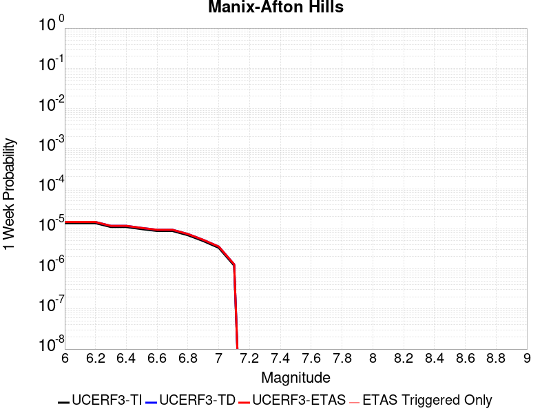 |  |  |  |

| Magnitude | 1 wk TI Prob | 1 wk TD Prob | 1 wk ETAS Prob | 1 wk ETAS/TD Gain | 1 wk ETAS Triggered Only | 1 mo TI Prob | 1 mo TD Prob | 1 mo ETAS Prob | 1 mo ETAS/TD Gain | 1 mo ETAS Triggered Only | 1 yr TI Prob | 1 yr TD Prob | 1 yr ETAS Prob | 1 yr ETAS/TD Gain | 1 yr ETAS Triggered Only | 10 yr TI Prob | 10 yr TD Prob | 10 yr ETAS Prob | 10 yr ETAS/TD Gain | 10 yr ETAS Triggered Only |
|-----|-----|-----|-----|-----|-----|-----|-----|-----|-----|-----|-----|-----|-----|-----|-----|-----|-----|-----|-----|-----|
| 6.0 | 1.3783202E-5 | 1.4711748E-5 | 1.4711748E-5 | 1.0 | 0.0 | 5.906953E-5 | 6.304892E-5 | 6.304892E-5 | 1.0 | 0.0 | 7.189342E-4 | 7.673678E-4 | 8.473064E-4 | 1.1041725 | 8.0E-5 | 0.0071661277 | 0.007648937 | 0.007807713 | 1.0207579 | 1.6E-4 |
| 6.1 | 1.3783202E-5 | 1.4711748E-5 | 1.4711748E-5 | 1.0 | 0.0 | 5.906953E-5 | 6.304892E-5 | 6.304892E-5 | 1.0 | 0.0 | 7.189342E-4 | 7.673678E-4 | 8.473064E-4 | 1.1041725 | 8.0E-5 | 0.0071661277 | 0.007648937 | 0.007807713 | 1.0207579 | 1.6E-4 |
| 6.2 | 1.3783202E-5 | 1.4711748E-5 | 1.4711748E-5 | 1.0 | 0.0 | 5.906953E-5 | 6.304892E-5 | 6.304892E-5 | 1.0 | 0.0 | 7.189342E-4 | 7.673678E-4 | 8.473064E-4 | 1.1041725 | 8.0E-5 | 0.0071661277 | 0.007648937 | 0.007807713 | 1.0207579 | 1.6E-4 |
| 6.3 | 1.10494875E-5 | 1.1793663E-5 | 1.1793663E-5 | 1.0 | 0.0 | 4.7354086E-5 | 5.054335E-5 | 5.054335E-5 | 1.0 | 0.0 | 5.763835E-4 | 6.152019E-4 | 6.851588E-4 | 1.1137137 | 7.0E-5 | 0.005748908 | 0.006136029 | 0.006255293 | 1.0194366 | 1.2E-4 |
| 6.4 | 1.10494875E-5 | 1.1793663E-5 | 1.1793663E-5 | 1.0 | 0.0 | 4.7354086E-5 | 5.054335E-5 | 5.054335E-5 | 1.0 | 0.0 | 5.763835E-4 | 6.152019E-4 | 6.851588E-4 | 1.1137137 | 7.0E-5 | 0.005748908 | 0.006136029 | 0.006255293 | 1.0194366 | 1.2E-4 |
| 6.5 | 9.788949E-6 | 1.0454792E-5 | 1.0454792E-5 | 1.0 | 0.0 | 4.1951964E-5 | 4.4805533E-5 | 4.4805533E-5 | 1.0 | 0.0 | 5.1064545E-4 | 5.453801E-4 | 5.9535285E-4 | 1.0916291 | 5.0E-5 | 0.0050947363 | 0.005441344 | 0.0055209086 | 1.0146222 | 8.0E-5 |
| 6.6 | 8.810006E-6 | 9.414057E-6 | 9.414057E-6 | 1.0 | 0.0 | 3.775662E-5 | 4.0345385E-5 | 4.0345385E-5 | 1.0 | 0.0 | 4.5958988E-4 | 4.911032E-4 | 5.310836E-4 | 1.0814092 | 4.0E-5 | 0.0045864056 | 0.0049010618 | 0.0049707186 | 1.0142126 | 7.0E-5 |
| 6.7 | 8.80128E-6 | 9.404536E-6 | 9.404536E-6 | 1.0 | 0.0 | 3.7719226E-5 | 4.030458E-5 | 4.030458E-5 | 1.0 | 0.0 | 4.591348E-4 | 4.906067E-4 | 5.3058704E-4 | 1.0814917 | 4.0E-5 | 0.004581874 | 0.0048961183 | 0.0049657756 | 1.014227 | 7.0E-5 |
| 6.8 | 6.8994877E-6 | 7.3804176E-6 | 7.3804176E-6 | 1.0 | 0.0 | 2.9568899E-5 | 3.1630025E-5 | 3.1630025E-5 | 1.0 | 0.0 | 3.5994186E-4 | 3.8503567E-4 | 4.1502411E-4 | 1.0778849 | 3.0E-5 | 0.003593594 | 0.0038444905 | 0.00390426 | 1.0155468 | 6.0E-5 |
| 6.9 | 4.9328037E-6 | 5.2712016E-6 | 5.2712016E-6 | 1.0 | 0.0 | 2.1140417E-5 | 2.2590704E-5 | 2.2590704E-5 | 1.0 | 0.0 | 2.5735417E-4 | 2.7501327E-4 | 3.05005E-4 | 1.1090556 | 3.0E-5 | 0.0025705635 | 0.0027473345 | 0.002797197 | 1.0181495 | 5.0E-5 |
| 7.0 | 3.347973E-6 | 3.5902026E-6 | 3.5902026E-6 | 1.0 | 0.0 | 1.4348378E-5 | 1.5386515E-5 | 1.5386515E-5 | 1.0 | 0.0 | 1.746775E-4 | 1.8731882E-4 | 2.0731507E-4 | 1.1067499 | 2.0E-5 | 0.0017454025 | 0.0018720119 | 0.0018919745 | 1.0106637 | 2.0E-5 |
| 7.1 | 1.2073567E-6 | 1.2935433E-6 | 1.2935433E-6 | 1.0 | 0.0 | 5.1743755E-6 | 5.543754E-6 | 5.543754E-6 | 1.0 | 0.0 | 6.29962E-5 | 6.749475E-5 | 7.749408E-5 | 1.1481497 | 1.0E-5 | 6.297835E-4 | 6.749027E-4 | 6.848959E-4 | 1.014807 | 1.0E-5 |

## Cady
*[(top)](#table-of-contents)*

| 1 Week | 1 Month | 1 Year | 10 Year |
|-----|-----|-----|-----|
| 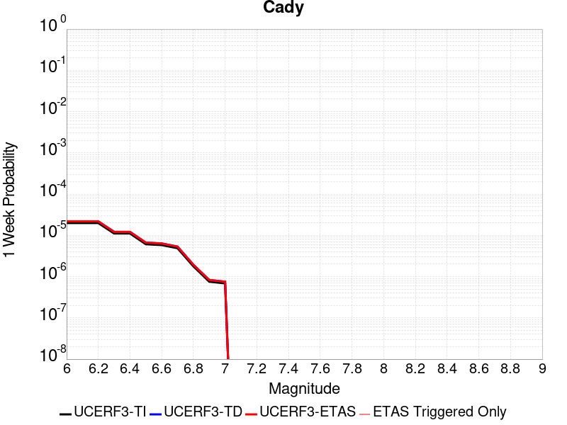 |  |  |  |

| Magnitude | 1 wk TI Prob | 1 wk TD Prob | 1 wk ETAS Prob | 1 wk ETAS/TD Gain | 1 wk ETAS Triggered Only | 1 mo TI Prob | 1 mo TD Prob | 1 mo ETAS Prob | 1 mo ETAS/TD Gain | 1 mo ETAS Triggered Only | 1 yr TI Prob | 1 yr TD Prob | 1 yr ETAS Prob | 1 yr ETAS/TD Gain | 1 yr ETAS Triggered Only | 10 yr TI Prob | 10 yr TD Prob | 10 yr ETAS Prob | 10 yr ETAS/TD Gain | 10 yr ETAS Triggered Only |
|-----|-----|-----|-----|-----|-----|-----|-----|-----|-----|-----|-----|-----|-----|-----|-----|-----|-----|-----|-----|-----|
| 6.0 | 1.9892565E-5 | 2.1860164E-5 | 2.1860164E-5 | 1.0 | 0.0 | 8.525106E-5 | 9.3683564E-5 | 9.3683564E-5 | 1.0 | 0.0 | 0.0010374374 | 0.0011400915 | 0.0011900344 | 1.0438061 | 5.0E-5 | 0.010326075 | 0.011351441 | 0.011499738 | 1.0130641 | 1.5E-4 |
| 6.1 | 1.9892565E-5 | 2.1860164E-5 | 2.1860164E-5 | 1.0 | 0.0 | 8.525106E-5 | 9.3683564E-5 | 9.3683564E-5 | 1.0 | 0.0 | 0.0010374374 | 0.0011400915 | 0.0011900344 | 1.0438061 | 5.0E-5 | 0.010326075 | 0.011351441 | 0.011499738 | 1.0130641 | 1.5E-4 |
| 6.2 | 1.9892565E-5 | 2.1860164E-5 | 2.1860164E-5 | 1.0 | 0.0 | 8.525106E-5 | 9.3683564E-5 | 9.3683564E-5 | 1.0 | 0.0 | 0.0010374374 | 0.0011400915 | 0.0011900344 | 1.0438061 | 5.0E-5 | 0.010326075 | 0.011351441 | 0.011499738 | 1.0130641 | 1.5E-4 |
| 6.3 | 1.1117327E-5 | 1.2177354E-5 | 1.2177354E-5 | 1.0 | 0.0 | 4.764482E-5 | 5.2187792E-5 | 5.2187792E-5 | 1.0 | 0.0 | 5.7992124E-4 | 6.3523266E-4 | 6.5521995E-4 | 1.0314646 | 2.0E-5 | 0.0057841022 | 0.006337275 | 0.0064267046 | 1.0141116 | 9.0E-5 |
| 6.4 | 1.1117327E-5 | 1.2177354E-5 | 1.2177354E-5 | 1.0 | 0.0 | 4.764482E-5 | 5.2187792E-5 | 5.2187792E-5 | 1.0 | 0.0 | 5.7992124E-4 | 6.3523266E-4 | 6.5521995E-4 | 1.0314646 | 2.0E-5 | 0.0057841022 | 0.006337275 | 0.0064267046 | 1.0141116 | 9.0E-5 |
| 6.5 | 6.103093E-6 | 6.6724333E-6 | 6.6724333E-6 | 1.0 | 0.0 | 2.615585E-5 | 2.8595901E-5 | 2.8595901E-5 | 1.0 | 0.0 | 3.1840094E-4 | 3.4811202E-4 | 3.4811202E-4 | 1.0 | 0.0 | 0.0031794512 | 0.0034769014 | 0.0035167623 | 1.0114645 | 4.0E-5 |
| 6.6 | 5.817237E-6 | 6.366057E-6 | 6.366057E-6 | 1.0 | 0.0 | 2.4930776E-5 | 2.7282886E-5 | 2.7282886E-5 | 1.0 | 0.0 | 3.034899E-4 | 3.3213093E-4 | 3.3213093E-4 | 1.0 | 0.0 | 0.0030307577 | 0.0033175678 | 0.0033474683 | 1.0090128 | 3.0E-5 |
| 6.7 | 4.8846314E-6 | 5.340899E-6 | 5.340899E-6 | 1.0 | 0.0 | 2.0933967E-5 | 2.2889433E-5 | 2.2889433E-5 | 1.0 | 0.0 | 2.5484123E-4 | 2.7865497E-4 | 2.7865497E-4 | 1.0 | 0.0 | 0.0025454918 | 0.0027842114 | 0.0028141278 | 1.010745 | 3.0E-5 |
| 6.8 | 1.7788773E-6 | 1.9400245E-6 | 1.9400245E-6 | 1.0 | 0.0 | 7.6237375E-6 | 8.314373E-6 | 8.314373E-6 | 1.0 | 0.0 | 9.281505E-5 | 1.0122437E-4 | 1.0122437E-4 | 1.0 | 0.0 | 9.2776294E-4 | 0.0010119373 | 0.0010119373 | 1.0 | 0.0 |
| 6.9 | 7.5455404E-7 | 8.29764E-7 | 8.29764E-7 | 1.0 | 0.0 | 3.233799E-6 | 3.5561286E-6 | 3.5561286E-6 | 1.0 | 0.0 | 3.937079E-5 | 4.3295342E-5 | 4.3295342E-5 | 1.0 | 0.0 | 3.9363815E-4 | 4.3290202E-4 | 4.3290202E-4 | 1.0 | 0.0 |
| 7.0 | 6.8578805E-7 | 7.542315E-7 | 7.542315E-7 | 1.0 | 0.0 | 2.9390883E-6 | 3.2324185E-6 | 3.2324185E-6 | 1.0 | 0.0 | 3.578281E-5 | 3.9354316E-5 | 3.9354316E-5 | 1.0 | 0.0 | 3.577705E-4 | 3.9350594E-4 | 3.9350594E-4 | 1.0 | 0.0 |

## Baker
*[(top)](#table-of-contents)*

| 1 Week | 1 Month | 1 Year | 10 Year |
|-----|-----|-----|-----|
|  |  |  |  |

| Magnitude | 1 wk TI Prob | 1 wk TD Prob | 1 wk ETAS Prob | 1 wk ETAS/TD Gain | 1 wk ETAS Triggered Only | 1 mo TI Prob | 1 mo TD Prob | 1 mo ETAS Prob | 1 mo ETAS/TD Gain | 1 mo ETAS Triggered Only | 1 yr TI Prob | 1 yr TD Prob | 1 yr ETAS Prob | 1 yr ETAS/TD Gain | 1 yr ETAS Triggered Only | 10 yr TI Prob | 10 yr TD Prob | 10 yr ETAS Prob | 10 yr ETAS/TD Gain | 10 yr ETAS Triggered Only |
|-----|-----|-----|-----|-----|-----|-----|-----|-----|-----|-----|-----|-----|-----|-----|-----|-----|-----|-----|-----|-----|
| 6.0 | 5.695525E-6 | 5.8349324E-6 | 5.8349324E-6 | 1.0 | 0.0 | 2.4409164E-5 | 2.5006635E-5 | 2.5006635E-5 | 1.0 | 0.0 | 2.9714106E-4 | 3.0441728E-4 | 3.444051E-4 | 1.1313586 | 4.0E-5 | 0.0029674405 | 0.0030403982 | 0.003189942 | 1.0491856 | 1.5E-4 |
| 6.1 | 5.695525E-6 | 5.8349324E-6 | 5.8349324E-6 | 1.0 | 0.0 | 2.4409164E-5 | 2.5006635E-5 | 2.5006635E-5 | 1.0 | 0.0 | 2.9714106E-4 | 3.0441728E-4 | 3.444051E-4 | 1.1313586 | 4.0E-5 | 0.0029674405 | 0.0030403982 | 0.003189942 | 1.0491856 | 1.5E-4 |
| 6.2 | 5.695525E-6 | 5.8349324E-6 | 5.8349324E-6 | 1.0 | 0.0 | 2.4409164E-5 | 2.5006635E-5 | 2.5006635E-5 | 1.0 | 0.0 | 2.9714106E-4 | 3.0441728E-4 | 3.444051E-4 | 1.1313586 | 4.0E-5 | 0.0029674405 | 0.0030403982 | 0.003189942 | 1.0491856 | 1.5E-4 |
| 6.3 | 3.2995713E-6 | 3.3837248E-6 | 3.3837248E-6 | 1.0 | 0.0 | 1.4140943E-5 | 1.45016E-5 | 1.45016E-5 | 1.0 | 0.0 | 1.7215237E-4 | 1.7654315E-4 | 2.1653608E-4 | 1.2265335 | 4.0E-5 | 0.0017201907 | 0.0017640761 | 0.001873882 | 1.0622456 | 1.1E-4 |
| 6.4 | 3.2995713E-6 | 3.3837248E-6 | 3.3837248E-6 | 1.0 | 0.0 | 1.4140943E-5 | 1.45016E-5 | 1.45016E-5 | 1.0 | 0.0 | 1.7215237E-4 | 1.7654315E-4 | 2.1653608E-4 | 1.2265335 | 4.0E-5 | 0.0017201907 | 0.0017640761 | 0.001873882 | 1.0622456 | 1.1E-4 |
| 6.5 | 2.782202E-6 | 2.8558911E-6 | 2.8558911E-6 | 1.0 | 0.0 | 1.1923668E-5 | 1.2239478E-5 | 1.2239478E-5 | 1.0 | 0.0 | 1.4516099E-4 | 1.4900578E-4 | 1.8899982E-4 | 1.2684059 | 4.0E-5 | 0.001450662 | 0.0014890914 | 0.0015989277 | 1.0737605 | 1.1E-4 |
| 6.6 | 2.3163404E-6 | 2.3809644E-6 | 2.3809644E-6 | 1.0 | 0.0 | 9.927136E-6 | 1.0204095E-5 | 1.0204095E-5 | 1.0 | 0.0 | 1.20856166E-4 | 1.2422797E-4 | 1.64223E-4 | 1.3219486 | 4.0E-5 | 0.0012079047 | 0.0012416055 | 0.001351469 | 1.088485 | 1.1E-4 |
| 6.7 | 2.037056E-6 | 2.0965415E-6 | 2.0965415E-6 | 1.0 | 0.0 | 8.7302105E-6 | 8.985147E-6 | 8.985147E-6 | 1.0 | 0.0 | 1.0628513E-4 | 1.0938884E-4 | 1.4938448E-4 | 1.365628 | 4.0E-5 | 0.0010623431 | 0.0010933661 | 0.0011932568 | 1.0913607 | 1.0E-4 |
| 6.8 | 1.8356744E-6 | 1.8915673E-6 | 1.8915673E-6 | 1.0 | 0.0 | 7.867153E-6 | 8.106693E-6 | 8.106693E-6 | 1.0 | 0.0 | 9.577837E-5 | 9.8694654E-5 | 1.3869071E-4 | 1.4052504 | 4.0E-5 | 9.57371E-4 | 9.865222E-4 | 0.0010864235 | 1.1012661 | 1.0E-4 |
| 6.9 | 1.6310546E-6 | 1.6832433E-6 | 1.6832433E-6 | 1.0 | 0.0 | 6.9902153E-6 | 7.2138805E-6 | 7.2138805E-6 | 1.0 | 0.0 | 8.510255E-5 | 8.782557E-5 | 1.17822936E-4 | 1.3415562 | 3.0E-5 | 8.5069967E-4 | 8.779199E-4 | 9.578496E-4 | 1.0910445 | 8.0E-5 |
| 7.0 | 1.2058036E-6 | 1.2508979E-6 | 1.2508979E-6 | 1.0 | 0.0 | 5.1677193E-6 | 5.36098E-6 | 5.36098E-6 | 1.0 | 0.0 | 6.291517E-5 | 6.5268E-5 | 9.526604E-5 | 1.4596133 | 3.0E-5 | 6.289736E-4 | 6.5249065E-4 | 7.324384E-4 | 1.1225271 | 8.0E-5 |
| 7.1 | 1.052382E-6 | 1.0951907E-6 | 1.0951907E-6 | 1.0 | 0.0 | 4.5102006E-6 | 4.6936657E-6 | 4.6936657E-6 | 1.0 | 0.0 | 5.491031E-5 | 5.714389E-5 | 8.714218E-5 | 1.5249605 | 3.0E-5 | 5.4896745E-4 | 5.712928E-4 | 6.4125285E-4 | 1.122459 | 7.0E-5 |
| 7.2 | 1.0067454E-6 | 1.0488003E-6 | 1.0488003E-6 | 1.0 | 0.0 | 4.3146156E-6 | 4.494851E-6 | 4.494851E-6 | 1.0 | 0.0 | 5.252918E-5 | 5.4723445E-5 | 8.47218E-5 | 1.548181 | 3.0E-5 | 5.251676E-4 | 5.4710056E-4 | 6.1706227E-4 | 1.1278772 | 7.0E-5 |
| 7.3 | 9.3596316E-7 | 9.768008E-7 | 9.768008E-7 | 1.0 | 0.0 | 4.0112645E-6 | 4.1862822E-6 | 4.1862822E-6 | 1.0 | 0.0 | 4.8836053E-5 | 5.0966803E-5 | 8.096528E-5 | 1.5885885 | 3.0E-5 | 4.8825322E-4 | 5.0955196E-4 | 5.795163E-4 | 1.1373056 | 7.0E-5 |
| 7.4 | 8.8117395E-7 | 9.20794E-7 | 9.20794E-7 | 1.0 | 0.0 | 3.7764542E-6 | 3.946254E-6 | 3.946254E-6 | 1.0 | 0.0 | 4.5977362E-5 | 4.804459E-5 | 7.804315E-5 | 1.62439 | 3.0E-5 | 4.596785E-4 | 4.8034277E-4 | 5.5030914E-4 | 1.1456592 | 7.0E-5 |
| 7.5 | 8.292386E-7 | 8.674863E-7 | 8.674863E-7 | 1.0 | 0.0 | 3.5538749E-6 | 3.7177929E-6 | 3.7177929E-6 | 1.0 | 0.0 | 4.326757E-5 | 4.5263198E-5 | 7.5261836E-5 | 1.6627601 | 3.0E-5 | 4.3259145E-4 | 4.5254052E-4 | 5.225088E-4 | 1.1546123 | 7.0E-5 |
| 7.6 | 7.553842E-7 | 7.9147225E-7 | 7.9147225E-7 | 1.0 | 0.0 | 3.2373566E-6 | 3.3920196E-6 | 3.3920196E-6 | 1.0 | 0.0 | 3.9414106E-5 | 4.1297062E-5 | 7.129582E-5 | 1.726414 | 3.0E-5 | 3.9407116E-4 | 4.128946E-4 | 4.6287396E-4 | 1.1210463 | 5.0E-5 |
| 7.7 | 6.5285366E-7 | 6.853024E-7 | 6.853024E-7 | 1.0 | 0.0 | 2.797941E-6 | 2.937007E-6 | 2.937007E-6 | 1.0 | 0.0 | 3.40644E-5 | 3.575748E-5 | 4.5757122E-5 | 1.2796518 | 1.0E-5 | 3.405918E-4 | 3.575179E-4 | 3.875072E-4 | 1.0838819 | 3.0E-5 |
| 7.8 | 3.4586725E-7 | 3.6483948E-7 | 3.6483948E-7 | 1.0 | 0.0 | 1.4822873E-6 | 1.5635968E-6 | 1.5635968E-6 | 1.0 | 0.0 | 1.80467E-5 | 1.903663E-5 | 2.9036439E-5 | 1.5252931 | 1.0E-5 | 1.8045233E-4 | 1.9035043E-4 | 2.0034853E-4 | 1.0525247 | 1.0E-5 |
| 7.9 | 2.5591178E-9 | 2.6697482E-9 | 2.6697482E-9 | 1.0 | 0.0 | 1.0967647E-8 | 1.1441778E-8 | 1.1441778E-8 | 1.0 | 0.0 | 1.335311E-7 | 1.3930365E-7 | 1.3930365E-7 | 1.0 | 0.0 | 1.3353102E-6 | 1.3930365E-6 | 1.3930365E-6 | 1.0 | 0.0 |

## Red Pass
*[(top)](#table-of-contents)*

| 1 Week | 1 Month | 1 Year | 10 Year |
|-----|-----|-----|-----|
|  |  |  | 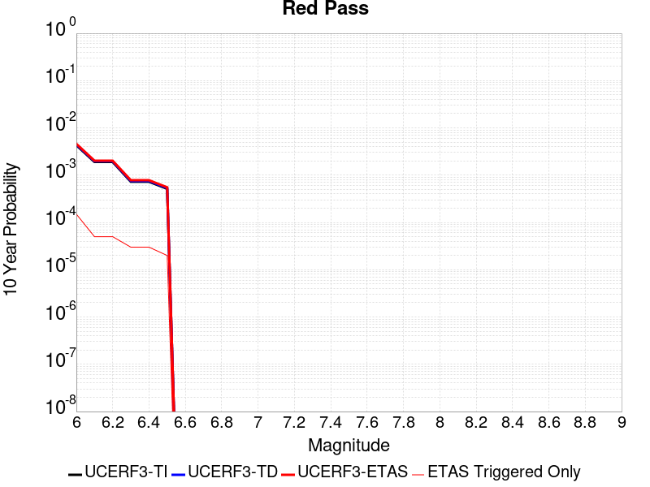 |

| Magnitude | 1 wk TI Prob | 1 wk TD Prob | 1 wk ETAS Prob | 1 wk ETAS/TD Gain | 1 wk ETAS Triggered Only | 1 mo TI Prob | 1 mo TD Prob | 1 mo ETAS Prob | 1 mo ETAS/TD Gain | 1 mo ETAS Triggered Only | 1 yr TI Prob | 1 yr TD Prob | 1 yr ETAS Prob | 1 yr ETAS/TD Gain | 1 yr ETAS Triggered Only | 10 yr TI Prob | 10 yr TD Prob | 10 yr ETAS Prob | 10 yr ETAS/TD Gain | 10 yr ETAS Triggered Only |
|-----|-----|-----|-----|-----|-----|-----|-----|-----|-----|-----|-----|-----|-----|-----|-----|-----|-----|-----|-----|-----|
| 6.0 | 8.258278E-6 | 8.551466E-6 | 8.551466E-6 | 1.0 | 0.0 | 3.539214E-5 | 3.6648726E-5 | 4.664836E-5 | 1.2728508 | 1.0E-5 | 4.308141E-4 | 4.4612476E-4 | 5.2608905E-4 | 1.179242 | 8.0E-5 | 0.0042997985 | 0.0044540493 | 0.0046033813 | 1.0335273 | 1.5E-4 |
| 6.1 | 3.649988E-6 | 3.775402E-6 | 3.775402E-6 | 1.0 | 0.0 | 1.5642712E-5 | 1.6180222E-5 | 1.6180222E-5 | 1.0 | 0.0 | 1.9043336E-4 | 1.9698114E-4 | 2.2697524E-4 | 1.1522689 | 3.0E-5 | 0.0019027026 | 0.0019685328 | 0.0020184345 | 1.0253496 | 5.0E-5 |
| 6.2 | 3.649988E-6 | 3.775402E-6 | 3.775402E-6 | 1.0 | 0.0 | 1.5642712E-5 | 1.6180222E-5 | 1.6180222E-5 | 1.0 | 0.0 | 1.9043336E-4 | 1.9698114E-4 | 2.2697524E-4 | 1.1522689 | 3.0E-5 | 0.0019027026 | 0.0019685328 | 0.0020184345 | 1.0253496 | 5.0E-5 |
| 6.3 | 1.3924937E-6 | 1.44115E-6 | 1.44115E-6 | 1.0 | 0.0 | 5.9678164E-6 | 6.1763503E-6 | 6.1763503E-6 | 1.0 | 0.0 | 7.265574E-5 | 7.519589E-5 | 9.519438E-5 | 1.265952 | 2.0E-5 | 7.263199E-4 | 7.518432E-4 | 7.818207E-4 | 1.0398719 | 3.0E-5 |
| 6.4 | 1.3924937E-6 | 1.44115E-6 | 1.44115E-6 | 1.0 | 0.0 | 5.9678164E-6 | 6.1763503E-6 | 6.1763503E-6 | 1.0 | 0.0 | 7.265574E-5 | 7.519589E-5 | 9.519438E-5 | 1.265952 | 2.0E-5 | 7.263199E-4 | 7.518432E-4 | 7.818207E-4 | 1.0398719 | 3.0E-5 |
| 6.5 | 9.876812E-7 | 1.0222149E-6 | 1.0222149E-6 | 1.0 | 0.0 | 4.2329125E-6 | 4.380921E-6 | 4.380921E-6 | 1.0 | 0.0 | 5.153449E-5 | 5.3337713E-5 | 7.333665E-5 | 1.3749492 | 2.0E-5 | 5.1522546E-4 | 5.333771E-4 | 5.5336644E-4 | 1.0374769 | 2.0E-5 |

## San Andreas (Parkfield)
*[(top)](#table-of-contents)*

| 1 Week | 1 Month | 1 Year | 10 Year |
|-----|-----|-----|-----|
| 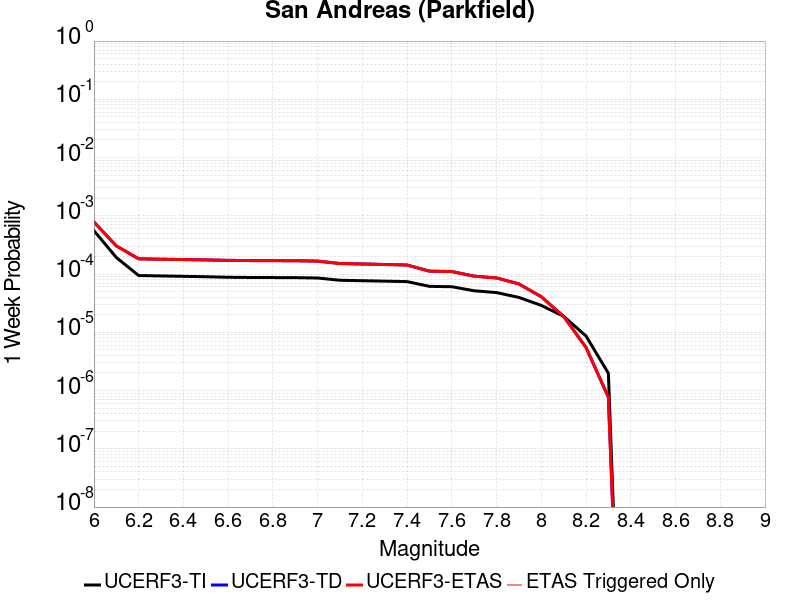 |  |  |  |

| Magnitude | 1 wk TI Prob | 1 wk TD Prob | 1 wk ETAS Prob | 1 wk ETAS/TD Gain | 1 wk ETAS Triggered Only | 1 mo TI Prob | 1 mo TD Prob | 1 mo ETAS Prob | 1 mo ETAS/TD Gain | 1 mo ETAS Triggered Only | 1 yr TI Prob | 1 yr TD Prob | 1 yr ETAS Prob | 1 yr ETAS/TD Gain | 1 yr ETAS Triggered Only | 10 yr TI Prob | 10 yr TD Prob | 10 yr ETAS Prob | 10 yr ETAS/TD Gain | 10 yr ETAS Triggered Only |
|-----|-----|-----|-----|-----|-----|-----|-----|-----|-----|-----|-----|-----|-----|-----|-----|-----|-----|-----|-----|-----|
| 6.0 | 5.556969E-4 | 7.8288006E-4 | 7.8288006E-4 | 1.0 | 0.0 | 0.0023793848 | 0.0033514427 | 0.0033813422 | 1.0089214 | 3.0E-5 | 0.028586963 | 0.04047351 | 0.040540677 | 1.0016595 | 7.0E-5 | 0.25176284 | 0.3380309 | 0.33813018 | 1.0002937 | 1.5E-4 |
| 6.1 | 1.925858E-4 | 3.04188E-4 | 3.04188E-4 | 1.0 | 0.0 | 8.2510663E-4 | 0.0013031069 | 0.0013031069 | 1.0 | 0.0 | 0.0099994885 | 0.015843313 | 0.015853155 | 1.0006212 | 1.0E-5 | 0.095613256 | 0.15010256 | 0.15013655 | 1.0002265 | 4.0E-5 |
| 6.2 | 9.4306815E-5 | 1.8282108E-4 | 1.8282108E-4 | 1.0 | 0.0 | 4.0410945E-4 | 7.832849E-4 | 7.832849E-4 | 1.0 | 0.0 | 0.0049089384 | 0.0094950255 | 0.009504931 | 1.0010432 | 1.0E-5 | 0.048019063 | 0.09202336 | 0.09205968 | 1.0003947 | 4.0E-5 |
| 6.3 | 9.283051E-5 | 1.7978501E-4 | 1.7978501E-4 | 1.0 | 0.0 | 3.9778434E-4 | 7.702809E-4 | 7.702809E-4 | 1.0 | 0.0 | 0.0048322747 | 0.009338059 | 0.009347966 | 1.0010608 | 1.0E-5 | 0.047285385 | 0.09067637 | 0.09071273 | 1.0004011 | 4.0E-5 |
| 6.4 | 9.138826E-5 | 1.7740422E-4 | 1.7740422E-4 | 1.0 | 0.0 | 3.916052E-4 | 7.6008344E-4 | 7.6008344E-4 | 1.0 | 0.0 | 0.0047573745 | 0.009214963 | 0.00922487 | 1.0010751 | 1.0E-5 | 0.046568092 | 0.08957917 | 0.08961558 | 1.0004065 | 4.0E-5 |
| 6.5 | 9.000255E-5 | 1.749823E-4 | 1.749823E-4 | 1.0 | 0.0 | 3.8566816E-4 | 7.497098E-4 | 7.497098E-4 | 1.0 | 0.0 | 0.0046854047 | 0.009089723 | 0.0090996325 | 1.0010902 | 1.0E-5 | 0.045878403 | 0.088467464 | 0.08850393 | 1.0004121 | 4.0E-5 |
| 6.6 | 8.8109264E-5 | 1.7178898E-4 | 1.7178898E-4 | 1.0 | 0.0 | 3.7755648E-4 | 7.360319E-4 | 7.360319E-4 | 1.0 | 0.0 | 0.0045870654 | 0.008924586 | 0.008934497 | 1.0011106 | 1.0E-5 | 0.04493529 | 0.08699838 | 0.087034896 | 1.0004197 | 4.0E-5 |
| 6.7 | 8.738073E-5 | 1.704587E-4 | 1.704587E-4 | 1.0 | 0.0 | 3.7443507E-4 | 7.3033397E-4 | 7.3033397E-4 | 1.0 | 0.0 | 0.0045492216 | 0.008855819 | 0.00886573 | 1.0011193 | 1.0E-5 | 0.04457213 | 0.08639851 | 0.08643505 | 1.000423 | 4.0E-5 |
| 6.8 | 8.710195E-5 | 1.6991285E-4 | 1.6991285E-4 | 1.0 | 0.0 | 3.7324068E-4 | 7.279959E-4 | 7.279959E-4 | 1.0 | 0.0 | 0.0045347405 | 0.008827592 | 0.008837504 | 1.0011228 | 1.0E-5 | 0.04443313 | 0.08614579 | 0.08618234 | 1.0004244 | 4.0E-5 |
| 6.9 | 8.6801556E-5 | 1.6932159E-4 | 1.6932159E-4 | 1.0 | 0.0 | 3.7195362E-4 | 7.254633E-4 | 7.254633E-4 | 1.0 | 0.0 | 0.0045191357 | 0.008797008 | 0.00880692 | 1.0011268 | 1.0E-5 | 0.044283327 | 0.08587156 | 0.08590813 | 1.0004258 | 4.0E-5 |
| 7.0 | 8.5571606E-5 | 1.6684656E-4 | 1.6684656E-4 | 1.0 | 0.0 | 3.6668387E-4 | 7.1486185E-4 | 7.1486185E-4 | 1.0 | 0.0 | 0.004455241 | 0.008668969 | 0.008678882 | 1.0011436 | 1.0E-5 | 0.043669727 | 0.08471923 | 0.084755845 | 1.0004321 | 4.0E-5 |
| 7.1 | 7.82589E-5 | 1.5164237E-4 | 1.5164237E-4 | 1.0 | 0.0 | 3.3535215E-4 | 6.4973475E-4 | 6.4973475E-4 | 1.0 | 0.0 | 0.0040752706 | 0.007881999 | 0.00789192 | 1.0012587 | 1.0E-5 | 0.040013418 | 0.07763116 | 0.077668056 | 1.0004753 | 4.0E-5 |
| 7.2 | 7.690929E-5 | 1.4901265E-4 | 1.4901265E-4 | 1.0 | 0.0 | 3.2956956E-4 | 6.3847005E-4 | 6.3847005E-4 | 1.0 | 0.0 | 0.004005129 | 0.007745834 | 0.007755757 | 1.001281 | 1.0E-5 | 0.0393371 | 0.07640345 | 0.076431155 | 1.0003626 | 3.0E-5 |
| 7.3 | 7.5543794E-5 | 1.4597391E-4 | 1.4597391E-4 | 1.0 | 0.0 | 3.2371894E-4 | 6.2545325E-4 | 6.2545325E-4 | 1.0 | 0.0 | 0.003934157 | 0.0075884685 | 0.0075983927 | 1.0013078 | 1.0E-5 | 0.038652334 | 0.07496768 | 0.074995436 | 1.0003701 | 3.0E-5 |
| 7.4 | 7.4214564E-5 | 1.4297884E-4 | 1.4297884E-4 | 1.0 | 0.0 | 3.1802364E-4 | 6.1262323E-4 | 6.1262323E-4 | 1.0 | 0.0 | 0.003865065 | 0.0074333395 | 0.007443265 | 1.0013353 | 1.0E-5 | 0.03798529 | 0.073539875 | 0.073567666 | 1.0003779 | 3.0E-5 |
| 7.5 | 6.149578E-5 | 1.1220936E-4 | 1.1220936E-4 | 1.0 | 0.0 | 2.6352672E-4 | 4.8080873E-4 | 4.8080873E-4 | 1.0 | 0.0 | 0.0032037178 | 0.005838166 | 0.005848108 | 1.0017029 | 1.0E-5 | 0.03157923 | 0.058694188 | 0.05872243 | 1.0004811 | 3.0E-5 |
| 7.6 | 6.0643448E-5 | 1.10492765E-4 | 1.10492765E-4 | 1.0 | 0.0 | 2.598746E-4 | 4.734546E-4 | 4.734546E-4 | 1.0 | 0.0 | 0.0031593828 | 0.0057491055 | 0.0057590483 | 1.0017294 | 1.0E-5 | 0.031148417 | 0.057853922 | 0.057882186 | 1.0004885 | 3.0E-5 |
| 7.7 | 5.1652263E-5 | 9.2014656E-5 | 9.2014656E-5 | 1.0 | 0.0 | 2.2134806E-4 | 3.9428895E-4 | 3.9428895E-4 | 1.0 | 0.0 | 0.002691582 | 0.0047899117 | 0.004799864 | 1.0020777 | 1.0E-5 | 0.026592141 | 0.048658498 | 0.048687037 | 1.0005865 | 3.0E-5 |
| 7.8 | 4.8090482E-5 | 8.5842796E-5 | 8.5842796E-5 | 1.0 | 0.0 | 2.060858E-4 | 3.6784585E-4 | 3.6784585E-4 | 1.0 | 0.0 | 0.0025062072 | 0.0044693346 | 0.00447929 | 1.0022274 | 1.0E-5 | 0.024781305 | 0.045415174 | 0.04544381 | 1.0006306 | 3.0E-5 |
| 7.9 | 3.970278E-5 | 6.769578E-5 | 6.769578E-5 | 1.0 | 0.0 | 1.7014367E-4 | 2.9009252E-4 | 2.9009252E-4 | 1.0 | 0.0 | 0.002069531 | 0.0035261605 | 0.0035361252 | 1.002826 | 1.0E-5 | 0.020503636 | 0.03597134 | 0.035990622 | 1.000536 | 2.0E-5 |
| 8.0 | 2.8982335E-5 | 4.0818166E-5 | 4.0818166E-5 | 1.0 | 0.0 | 1.2420409E-4 | 1.7492328E-4 | 1.7492328E-4 | 1.0 | 0.0 | 0.0015111357 | 0.002127612 | 0.002127612 | 1.0 | 0.0 | 0.015009012 | 0.022071373 | 0.022071373 | 1.0 | 0.0 |
| 8.1 | 1.8836186E-5 | 1.8748058E-5 | 1.8748058E-5 | 1.0 | 0.0 | 8.0724014E-5 | 8.034635E-5 | 8.034635E-5 | 1.0 | 0.0 | 9.823717E-4 | 9.777785E-4 | 9.777785E-4 | 1.0 | 0.0 | 0.009780403 | 0.0105239805 | 0.0105239805 | 1.0 | 0.0 |
| 8.2 | 8.643924E-6 | 5.5000196E-6 | 5.5000196E-6 | 1.0 | 0.0 | 3.704486E-5 | 2.35713E-5 | 2.35713E-5 | 1.0 | 0.0 | 4.5092785E-4 | 2.8694287E-4 | 2.8694287E-4 | 1.0 | 0.0 | 0.0045001395 | 0.0032626302 | 0.0032626302 | 1.0 | 0.0 |
| 8.3 | 1.983087E-6 | 7.698541E-7 | 7.698541E-7 | 1.0 | 0.0 | 8.498917E-6 | 3.2993707E-6 | 3.2993707E-6 | 1.0 | 0.0 | 1.034694E-4 | 4.0169114E-5 | 4.0169114E-5 | 1.0 | 0.0 | 0.0010342124 | 4.7419698E-4 | 4.7419698E-4 | 1.0 | 0.0 |

## San Andreas (Coachella) rev
*[(top)](#table-of-contents)*

| 1 Week | 1 Month | 1 Year | 10 Year |
|-----|-----|-----|-----|
|  |  |  |  |

| Magnitude | 1 wk TI Prob | 1 wk TD Prob | 1 wk ETAS Prob | 1 wk ETAS/TD Gain | 1 wk ETAS Triggered Only | 1 mo TI Prob | 1 mo TD Prob | 1 mo ETAS Prob | 1 mo ETAS/TD Gain | 1 mo ETAS Triggered Only | 1 yr TI Prob | 1 yr TD Prob | 1 yr ETAS Prob | 1 yr ETAS/TD Gain | 1 yr ETAS Triggered Only | 10 yr TI Prob | 10 yr TD Prob | 10 yr ETAS Prob | 10 yr ETAS/TD Gain | 10 yr ETAS Triggered Only |
|-----|-----|-----|-----|-----|-----|-----|-----|-----|-----|-----|-----|-----|-----|-----|-----|-----|-----|-----|-----|-----|
| 6.0 | 1.1925945E-4 | 3.2752907E-4 | 3.375258E-4 | 1.0305216 | 1.0E-5 | 5.110118E-4 | 0.0014029456 | 0.0014229176 | 1.0142357 | 2.0E-5 | 0.0062038354 | 0.016948426 | 0.017046731 | 1.0058002 | 1.0E-4 | 0.060334753 | 0.15273987 | 0.15285 | 1.0007211 | 1.3E-4 |
| 6.1 | 1.1925945E-4 | 3.2752907E-4 | 3.375258E-4 | 1.0305216 | 1.0E-5 | 5.110118E-4 | 0.0014029456 | 0.0014229176 | 1.0142357 | 2.0E-5 | 0.0062038354 | 0.016948426 | 0.017046731 | 1.0058002 | 1.0E-4 | 0.060334753 | 0.15273987 | 0.15285 | 1.0007211 | 1.3E-4 |
| 6.2 | 1.07432395E-4 | 3.0253446E-4 | 3.1253143E-4 | 1.0330441 | 1.0E-5 | 4.603433E-4 | 0.0012959361 | 0.0013159101 | 1.0154128 | 2.0E-5 | 0.005590286 | 0.015664974 | 0.015733879 | 1.0043986 | 7.0E-5 | 0.05451731 | 0.1419152 | 0.14200102 | 1.0006046 | 1.0E-4 |
| 6.3 | 1.0718766E-4 | 3.0198751E-4 | 3.1198448E-4 | 1.033104 | 1.0E-5 | 4.592948E-4 | 0.0012935943 | 0.0013135683 | 1.0154408 | 2.0E-5 | 0.005577586 | 0.015636874 | 0.01570578 | 1.0044066 | 7.0E-5 | 0.054396555 | 0.14168352 | 0.14176935 | 1.0006058 | 1.0E-4 |
| 6.4 | 1.0355944E-4 | 2.9406816E-4 | 3.040652E-4 | 1.0339957 | 1.0E-5 | 4.4375064E-4 | 0.0012596874 | 0.0012796621 | 1.015857 | 2.0E-5 | 0.0053892885 | 0.015229899 | 0.015298833 | 1.0045263 | 7.0E-5 | 0.052604496 | 0.13823467 | 0.13832085 | 1.0006235 | 1.0E-4 |
| 6.5 | 1.0227914E-4 | 2.9126237E-4 | 3.0125945E-4 | 1.0343233 | 1.0E-5 | 4.382655E-4 | 0.0012476741 | 0.0012676491 | 1.0160098 | 2.0E-5 | 0.0053228354 | 0.015085673 | 0.015154617 | 1.0045701 | 7.0E-5 | 0.051971316 | 0.13701342 | 0.13709971 | 1.0006299 | 1.0E-4 |
| 6.6 | 1.0116757E-4 | 2.8891978E-4 | 2.989169E-4 | 1.0346017 | 1.0E-5 | 4.3350324E-4 | 0.0012376439 | 0.0012576191 | 1.0161397 | 2.0E-5 | 0.0052651367 | 0.014965239 | 0.015034191 | 1.0046076 | 7.0E-5 | 0.051421247 | 0.1359916 | 0.136078 | 1.0006354 | 1.0E-4 |
| 6.7 | 1.0050676E-4 | 2.8750533E-4 | 2.9750244E-4 | 1.0347719 | 1.0E-5 | 4.3067214E-4 | 0.0012315877 | 0.0012515631 | 1.0162193 | 2.0E-5 | 0.005230834 | 0.014892516 | 0.014961473 | 1.0046303 | 7.0E-5 | 0.051094085 | 0.13537651 | 0.13546297 | 1.0006387 | 1.0E-4 |
| 6.8 | 9.976819E-5 | 2.855416E-4 | 2.9553875E-4 | 1.0350112 | 1.0E-5 | 4.2750788E-4 | 0.0012231797 | 0.0012431552 | 1.0163308 | 2.0E-5 | 0.0051924936 | 0.014791543 | 0.014860507 | 1.0046624 | 7.0E-5 | 0.050728295 | 0.13452816 | 0.1346147 | 1.0006434 | 1.0E-4 |
| 6.9 | 9.77719E-5 | 2.8050915E-4 | 2.9050634E-4 | 1.0356394 | 1.0E-5 | 4.1895514E-4 | 0.0012016321 | 0.001221608 | 1.016624 | 2.0E-5 | 0.0050888555 | 0.014532729 | 0.014601712 | 1.0047467 | 7.0E-5 | 0.049738888 | 0.13235609 | 0.13244285 | 1.0006555 | 1.0E-4 |
| 7.0 | 8.500761E-5 | 2.478426E-4 | 2.5784015E-4 | 1.0403382 | 1.0E-5 | 3.6426744E-4 | 0.0010617535 | 0.0010817322 | 1.0188167 | 2.0E-5 | 0.0044259406 | 0.012851005 | 0.012910235 | 1.0046089 | 6.0E-5 | 0.04338823 | 0.11822045 | 0.118299805 | 1.0006713 | 9.0E-5 |
| 7.1 | 8.319876E-5 | 2.4386762E-4 | 2.5386518E-4 | 1.0409958 | 1.0E-5 | 3.5651738E-4 | 0.0010447315 | 0.0010647107 | 1.0191237 | 2.0E-5 | 0.004331963 | 0.012646188 | 0.0127054285 | 1.0046846 | 6.0E-5 | 0.042484846 | 0.11644015 | 0.11651967 | 1.000683 | 9.0E-5 |
| 7.2 | 7.563917E-5 | 2.2434563E-4 | 2.3434339E-4 | 1.0445641 | 1.0E-5 | 3.2412758E-4 | 9.611301E-4 | 9.811108E-4 | 1.0207888 | 2.0E-5 | 0.0039391145 | 0.011639665 | 0.011698966 | 1.0050948 | 6.0E-5 | 0.03870018 | 0.107844144 | 0.10792444 | 1.0007446 | 9.0E-5 |
| 7.3 | 7.082985E-5 | 2.074991E-4 | 2.1749704E-4 | 1.048183 | 1.0E-5 | 3.0352117E-4 | 8.8898174E-4 | 9.0896396E-4 | 1.0224776 | 2.0E-5 | 0.0036891096 | 0.010770266 | 0.01082962 | 1.0055109 | 6.0E-5 | 0.03628465 | 0.10036448 | 0.10044545 | 1.0008067 | 9.0E-5 |
| 7.4 | 5.146215E-5 | 1.4290087E-4 | 1.5289943E-4 | 1.0699686 | 1.0E-5 | 2.2053342E-4 | 6.122894E-4 | 6.3227717E-4 | 1.0326443 | 2.0E-5 | 0.0026816884 | 0.007429333 | 0.0074789613 | 1.0066801 | 5.0E-5 | 0.02649557 | 0.07092053 | 0.070994854 | 1.001048 | 8.0E-5 |
| 7.5 | 4.0285166E-5 | 1.09556735E-4 | 1.1955564E-4 | 1.0912669 | 1.0E-5 | 1.7263928E-4 | 4.6944473E-4 | 4.8943533E-4 | 1.0425836 | 2.0E-5 | 0.002099857 | 0.005700581 | 0.0057502957 | 1.008721 | 5.0E-5 | 0.020801254 | 0.0550753 | 0.055150893 | 1.0013726 | 8.0E-5 |
| 7.6 | 3.1168736E-5 | 8.451401E-5 | 9.451316E-5 | 1.1183136 | 1.0E-5 | 1.3357346E-4 | 3.6215273E-4 | 3.821455E-4 | 1.0552053 | 2.0E-5 | 0.0016250437 | 0.004400322 | 0.004450102 | 1.0113128 | 5.0E-5 | 0.016132116 | 0.042867694 | 0.042944264 | 1.0017862 | 8.0E-5 |
| 7.7 | 2.2100989E-5 | 6.249717E-5 | 7.249655E-5 | 1.1599972 | 1.0E-5 | 9.4715084E-5 | 2.6781755E-4 | 2.878122E-4 | 1.0746577 | 2.0E-5 | 0.001152546 | 0.00325581 | 0.003305647 | 1.0153072 | 5.0E-5 | 0.011465867 | 0.031950787 | 0.032028228 | 1.0024239 | 8.0E-5 |
| 7.8 | 1.7484861E-5 | 5.1893294E-5 | 6.189277E-5 | 1.1926931 | 1.0E-5 | 7.493296E-5 | 2.2238088E-4 | 2.4237644E-4 | 1.0899158 | 2.0E-5 | 9.1192697E-4 | 0.0027041286 | 0.0027539935 | 1.0184402 | 5.0E-5 | 0.009081938 | 0.026685337 | 0.026763203 | 1.0029179 | 8.0E-5 |
| 7.9 | 1.3967285E-5 | 3.8302034E-5 | 3.8302034E-5 | 1.0 | 0.0 | 5.985842E-5 | 1.6414125E-4 | 1.7413961E-4 | 1.0609131 | 1.0E-5 | 7.2853256E-4 | 0.0019965894 | 0.0020365096 | 1.0199941 | 4.0E-5 | 0.0072614877 | 0.01994664 | 0.020005444 | 1.002948 | 6.0E-5 |
| 8.0 | 1.1887396E-5 | 3.113321E-5 | 3.113321E-5 | 1.0 | 0.0 | 5.094499E-5 | 1.3342123E-4 | 1.434199E-4 | 1.0749406 | 1.0E-5 | 6.200787E-4 | 0.0016231941 | 0.0016631292 | 1.0246028 | 4.0E-5 | 0.006183513 | 0.016311359 | 0.01637038 | 1.0036184 | 6.0E-5 |
| 8.1 | 5.100864E-6 | 9.000251E-6 | 9.000251E-6 | 1.0 | 0.0 | 2.1860664E-5 | 3.857194E-5 | 3.857194E-5 | 1.0 | 0.0 | 2.6612106E-4 | 4.6951228E-4 | 4.6951228E-4 | 1.0 | 0.0 | 0.002658026 | 0.004931497 | 0.004931497 | 1.0 | 0.0 |
| 8.2 | 2.3004484E-6 | 2.7970204E-6 | 2.7970204E-6 | 1.0 | 0.0 | 9.859027E-6 | 1.1987176E-5 | 1.1987176E-5 | 1.0 | 0.0 | 1.2002704E-4 | 1.4593413E-4 | 1.4593413E-4 | 1.0 | 0.0 | 0.0011996223 | 0.0016028945 | 0.0016028945 | 1.0 | 0.0 |
| 8.3 | 1.0424446E-7 | 5.8434058E-8 | 5.8434058E-8 | 1.0 | 0.0 | 4.4676187E-7 | 2.5043167E-7 | 2.5043167E-7 | 1.0 | 0.0 | 5.439312E-6 | 3.0490014E-6 | 3.0490014E-6 | 1.0 | 0.0 | 5.4391792E-5 | 3.2052183E-5 | 3.2052183E-5 | 1.0 | 0.0 |

## San Andreas (North Branch Mill Creek)
*[(top)](#table-of-contents)*

| 1 Week | 1 Month | 1 Year | 10 Year |
|-----|-----|-----|-----|
|  |  |  |  |

| Magnitude | 1 wk TI Prob | 1 wk TD Prob | 1 wk ETAS Prob | 1 wk ETAS/TD Gain | 1 wk ETAS Triggered Only | 1 mo TI Prob | 1 mo TD Prob | 1 mo ETAS Prob | 1 mo ETAS/TD Gain | 1 mo ETAS Triggered Only | 1 yr TI Prob | 1 yr TD Prob | 1 yr ETAS Prob | 1 yr ETAS/TD Gain | 1 yr ETAS Triggered Only | 10 yr TI Prob | 10 yr TD Prob | 10 yr ETAS Prob | 10 yr ETAS/TD Gain | 10 yr ETAS Triggered Only |
|-----|-----|-----|-----|-----|-----|-----|-----|-----|-----|-----|-----|-----|-----|-----|-----|-----|-----|-----|-----|-----|
| 6.0 | 1.3461156E-5 | 2.35353E-5 | 2.35353E-5 | 1.0 | 0.0 | 5.7689394E-5 | 1.008617E-4 | 1.1086069E-4 | 1.0991356 | 1.0E-5 | 7.02142E-4 | 0.0012273027 | 0.0012472782 | 1.0162759 | 2.0E-5 | 0.0069992766 | 0.012246693 | 0.012365223 | 1.0096786 | 1.2E-4 |
| 6.1 | 1.3461156E-5 | 2.35353E-5 | 2.35353E-5 | 1.0 | 0.0 | 5.7689394E-5 | 1.008617E-4 | 1.1086069E-4 | 1.0991356 | 1.0E-5 | 7.02142E-4 | 0.0012273027 | 0.0012472782 | 1.0162759 | 2.0E-5 | 0.0069992766 | 0.012246693 | 0.012365223 | 1.0096786 | 1.2E-4 |
| 6.2 | 1.3461156E-5 | 2.35353E-5 | 2.35353E-5 | 1.0 | 0.0 | 5.7689394E-5 | 1.008617E-4 | 1.1086069E-4 | 1.0991356 | 1.0E-5 | 7.02142E-4 | 0.0012273027 | 0.0012472782 | 1.0162759 | 2.0E-5 | 0.0069992766 | 0.012246693 | 0.012365223 | 1.0096786 | 1.2E-4 |
| 6.3 | 1.3461156E-5 | 2.35353E-5 | 2.35353E-5 | 1.0 | 0.0 | 5.7689394E-5 | 1.008617E-4 | 1.1086069E-4 | 1.0991356 | 1.0E-5 | 7.02142E-4 | 0.0012273027 | 0.0012472782 | 1.0162759 | 2.0E-5 | 0.0069992766 | 0.012246693 | 0.012365223 | 1.0096786 | 1.2E-4 |
| 6.4 | 1.3461156E-5 | 2.35353E-5 | 2.35353E-5 | 1.0 | 0.0 | 5.7689394E-5 | 1.008617E-4 | 1.1086069E-4 | 1.0991356 | 1.0E-5 | 7.02142E-4 | 0.0012273027 | 0.0012472782 | 1.0162759 | 2.0E-5 | 0.0069992766 | 0.012246693 | 0.012365223 | 1.0096786 | 1.2E-4 |
| 6.5 | 1.3450706E-5 | 2.352426E-5 | 2.352426E-5 | 1.0 | 0.0 | 5.764461E-5 | 1.0081438E-4 | 1.1081337E-4 | 1.0991822 | 1.0E-5 | 7.0159714E-4 | 0.0012267273 | 0.0012467027 | 1.0162835 | 2.0E-5 | 0.006993862 | 0.012241002 | 0.012359533 | 1.0096831 | 1.2E-4 |
| 6.6 | 1.3074523E-5 | 2.3138531E-5 | 2.3138531E-5 | 1.0 | 0.0 | 5.6032466E-5 | 9.9161385E-5 | 1.0916039E-4 | 1.1008357 | 1.0E-5 | 6.8198174E-4 | 0.0012066244 | 0.0012266004 | 1.0165552 | 2.0E-5 | 0.006798926 | 0.012042165 | 0.012160719 | 1.009845 | 1.2E-4 |
| 6.7 | 1.3050216E-5 | 2.3113827E-5 | 2.3113827E-5 | 1.0 | 0.0 | 5.59283E-5 | 9.905552E-5 | 1.0905453E-4 | 1.1009434 | 1.0E-5 | 6.8071426E-4 | 0.001205337 | 0.0012253129 | 1.0165728 | 2.0E-5 | 0.0067863287 | 0.01202943 | 0.012147986 | 1.0098555 | 1.2E-4 |
| 6.8 | 1.29049395E-5 | 2.2962231E-5 | 2.2962231E-5 | 1.0 | 0.0 | 5.530571E-5 | 9.8405864E-5 | 1.0840488E-4 | 1.10161 | 1.0E-5 | 6.73139E-4 | 0.0011974361 | 0.0012174122 | 1.0166824 | 2.0E-5 | 0.0067110364 | 0.011951272 | 0.012059958 | 1.009094 | 1.1E-4 |
| 6.9 | 1.2867369E-5 | 2.2921628E-5 | 2.2921628E-5 | 1.0 | 0.0 | 5.51447E-5 | 9.823187E-5 | 1.0823089E-4 | 1.10179 | 1.0E-5 | 6.711799E-4 | 0.00119532 | 0.0012152961 | 1.016712 | 2.0E-5 | 0.006691564 | 0.011930339 | 0.012039027 | 1.0091102 | 1.1E-4 |
| 7.0 | 1.2495996E-5 | 2.2321494E-5 | 2.2321494E-5 | 1.0 | 0.0 | 5.3553173E-5 | 9.5660056E-5 | 1.056591E-4 | 1.1045269 | 1.0E-5 | 6.518148E-4 | 0.0011640418 | 0.0011840184 | 1.0171615 | 2.0E-5 | 0.0064990623 | 0.011620839 | 0.011729561 | 1.0093558 | 1.1E-4 |
| 7.1 | 1.2452067E-5 | 2.2266555E-5 | 2.2266555E-5 | 1.0 | 0.0 | 5.3364907E-5 | 9.542462E-5 | 1.0542366E-4 | 1.1047847 | 1.0E-5 | 6.4952404E-4 | 0.0011611785 | 0.0011811552 | 1.0172039 | 2.0E-5 | 0.0064762887 | 0.011592505 | 0.01170123 | 1.0093789 | 1.1E-4 |
| 7.2 | 1.2002777E-5 | 2.1644972E-5 | 2.1644972E-5 | 1.0 | 0.0 | 5.143946E-5 | 9.2760885E-5 | 1.0275996E-4 | 1.107794 | 1.0E-5 | 6.2609545E-4 | 0.0011287814 | 0.0011487587 | 1.0176982 | 2.0E-5 | 0.006243344 | 0.011271874 | 0.011380634 | 1.0096488 | 1.1E-4 |
| 7.3 | 1.1923425E-5 | 2.151475E-5 | 2.151475E-5 | 1.0 | 0.0 | 5.109939E-5 | 9.220283E-5 | 1.02201906E-4 | 1.1084466 | 1.0E-5 | 6.219575E-4 | 0.001121994 | 0.0011419716 | 1.0178055 | 2.0E-5 | 0.0062021962 | 0.011204718 | 0.011313485 | 1.0097073 | 1.1E-4 |
| 7.4 | 1.16105175E-5 | 2.0888368E-5 | 2.0888368E-5 | 1.0 | 0.0 | 4.975841E-5 | 8.951852E-5 | 9.951763E-5 | 1.1116987 | 1.0E-5 | 6.0564023E-4 | 0.0010893457 | 0.0011093239 | 1.0183396 | 2.0E-5 | 0.006039923 | 0.010881904 | 0.010990707 | 1.0099986 | 1.1E-4 |
| 7.5 | 1.1037265E-5 | 1.958724E-5 | 1.958724E-5 | 1.0 | 0.0 | 4.7301706E-5 | 8.394263E-5 | 9.394179E-5 | 1.1191189 | 1.0E-5 | 5.757461E-4 | 0.0010215245 | 0.0010415041 | 1.0195585 | 2.0E-5 | 0.005742567 | 0.01021248 | 0.010321356 | 1.0106611 | 1.1E-4 |
| 7.6 | 1.0720915E-5 | 1.9028723E-5 | 1.9028723E-5 | 1.0 | 0.0 | 4.5945973E-5 | 8.154914E-5 | 9.154832E-5 | 1.1226155 | 1.0E-5 | 5.592486E-4 | 9.924107E-4 | 0.0010123908 | 1.0201329 | 2.0E-5 | 0.005578433 | 0.009923989 | 0.010032897 | 1.0109743 | 1.1E-4 |
| 7.7 | 9.276279E-6 | 1.6472937E-5 | 1.6472937E-5 | 1.0 | 0.0 | 3.9754876E-5 | 7.05964E-5 | 8.0595695E-5 | 1.1416403 | 1.0E-5 | 4.839081E-4 | 8.591739E-4 | 8.791567E-4 | 1.0232582 | 2.0E-5 | 0.0048285574 | 0.008602502 | 0.008711556 | 1.012677 | 1.1E-4 |
| 7.8 | 5.8346777E-6 | 1.1180302E-5 | 1.1180302E-5 | 1.0 | 0.0 | 2.5005522E-5 | 4.7914702E-5 | 5.791422E-5 | 1.2086942 | 1.0E-5 | 3.043997E-4 | 5.8320543E-4 | 6.0319377E-4 | 1.0342733 | 2.0E-5 | 0.0030398308 | 0.005860333 | 0.0059696883 | 1.0186603 | 1.1E-4 |
| 7.9 | 4.690204E-6 | 8.53008E-6 | 8.53008E-6 | 1.0 | 0.0 | 2.0100719E-5 | 3.6556972E-5 | 4.6556608E-5 | 1.2735356 | 1.0E-5 | 2.4469878E-4 | 4.4499032E-4 | 4.6498142E-4 | 1.0449249 | 2.0E-5 | 0.002444295 | 0.0044819275 | 0.0045814794 | 1.0222118 | 1.0E-4 |
| 8.0 | 2.9570454E-6 | 4.8596758E-6 | 4.8596758E-6 | 1.0 | 0.0 | 1.267299E-5 | 2.0827016E-5 | 2.0827016E-5 | 1.0 | 0.0 | 1.5428272E-4 | 2.5353945E-4 | 2.635369E-4 | 1.0394316 | 1.0E-5 | 0.0015417566 | 0.002556543 | 0.002576492 | 1.0078031 | 2.0E-5 |
| 8.1 | 1.6376824E-6 | 2.2034858E-6 | 2.2034858E-6 | 1.0 | 0.0 | 7.01862E-6 | 9.443476E-6 | 9.443476E-6 | 1.0 | 0.0 | 8.544835E-5 | 1.1496827E-4 | 1.1496827E-4 | 1.0 | 0.0 | 8.54155E-4 | 0.0011642908 | 0.0011642908 | 1.0 | 0.0 |
| 8.2 | 6.9631557E-7 | 4.5556786E-7 | 4.5556786E-7 | 1.0 | 0.0 | 2.984206E-6 | 1.952432E-6 | 1.952432E-6 | 1.0 | 0.0 | 3.63321E-5 | 2.3770603E-5 | 2.3770603E-5 | 1.0 | 0.0 | 3.6326164E-4 | 2.4619323E-4 | 2.4619323E-4 | 1.0 | 0.0 |
| 8.3 | 1.7876137E-7 | 8.3992745E-8 | 8.3992745E-8 | 1.0 | 0.0 | 7.661199E-7 | 3.5996885E-7 | 3.5996885E-7 | 1.0 | 0.0 | 9.32747E-6 | 4.382612E-6 | 4.382612E-6 | 1.0 | 0.0 | 9.3270784E-5 | 4.602688E-5 | 4.602688E-5 | 1.0 | 0.0 |

## San Andreas (Creeping Section) 2011 CFM
*[(top)](#table-of-contents)*

| 1 Week | 1 Month | 1 Year | 10 Year |
|-----|-----|-----|-----|
|  |  |  | 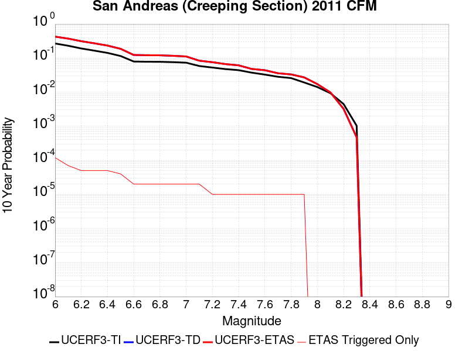 |

| Magnitude | 1 wk TI Prob | 1 wk TD Prob | 1 wk ETAS Prob | 1 wk ETAS/TD Gain | 1 wk ETAS Triggered Only | 1 mo TI Prob | 1 mo TD Prob | 1 mo ETAS Prob | 1 mo ETAS/TD Gain | 1 mo ETAS Triggered Only | 1 yr TI Prob | 1 yr TD Prob | 1 yr ETAS Prob | 1 yr ETAS/TD Gain | 1 yr ETAS Triggered Only | 10 yr TI Prob | 10 yr TD Prob | 10 yr ETAS Prob | 10 yr ETAS/TD Gain | 10 yr ETAS Triggered Only |
|-----|-----|-----|-----|-----|-----|-----|-----|-----|-----|-----|-----|-----|-----|-----|-----|-----|-----|-----|-----|-----|
| 6.0 | 5.986481E-4 | 0.0012282475 | 0.0012282475 | 1.0 | 0.0 | 0.0025631124 | 0.005248349 | 0.0052682445 | 1.0037907 | 2.0E-5 | 0.030762846 | 0.061237223 | 0.06131232 | 1.0012264 | 8.0E-5 | 0.26835477 | 0.42610177 | 0.42617065 | 1.0001616 | 1.2E-4 |
| 6.1 | 5.015945E-4 | 0.0010223581 | 0.0010223581 | 1.0 | 0.0 | 0.00214792 | 0.004370226 | 0.0043801824 | 1.0022782 | 1.0E-5 | 0.025839351 | 0.05127596 | 0.05131391 | 1.00074 | 4.0E-5 | 0.23032776 | 0.37301755 | 0.37306145 | 1.0001177 | 7.0E-5 |
| 6.2 | 4.073338E-4 | 8.11293E-4 | 8.11293E-4 | 1.0 | 0.0 | 0.0017445484 | 0.003469461 | 0.0034794265 | 1.0028723 | 1.0E-5 | 0.021034058 | 0.040960476 | 0.040989246 | 1.0007024 | 3.0E-5 | 0.19150782 | 0.3132062 | 0.31324056 | 1.0001097 | 5.0E-5 |
| 6.3 | 3.464099E-4 | 6.7448115E-4 | 6.7448115E-4 | 1.0 | 0.0 | 0.0014837692 | 0.0028852832 | 0.0028952544 | 1.0034559 | 1.0E-5 | 0.017915873 | 0.03421709 | 0.03424606 | 1.0008467 | 3.0E-5 | 0.16538359 | 0.27150005 | 0.27153647 | 1.0001341 | 5.0E-5 |
| 6.4 | 2.935057E-4 | 5.5499043E-4 | 5.5499043E-4 | 1.0 | 0.0 | 0.0012572751 | 0.002374872 | 0.0023848484 | 1.0042007 | 1.0E-5 | 0.015200248 | 0.028292272 | 0.028321423 | 1.0010303 | 3.0E-5 | 0.14201577 | 0.23317888 | 0.23321722 | 1.0001644 | 5.0E-5 |
| 6.5 | 2.3409708E-4 | 4.214854E-4 | 4.214854E-4 | 1.0 | 0.0 | 0.0010028875 | 0.001804309 | 0.001804309 | 1.0 | 0.0 | 0.012141965 | 0.021615412 | 0.021634981 | 1.0009053 | 2.0E-5 | 0.11499573 | 0.187029 | 0.18706152 | 1.0001739 | 4.0E-5 |
| 6.6 | 1.5842178E-4 | 2.51238E-4 | 2.51238E-4 | 1.0 | 0.0 | 6.7877385E-4 | 0.0010762803 | 0.0010762803 | 1.0 | 0.0 | 0.0082328 | 0.013023608 | 0.0130334785 | 1.0007578 | 1.0E-5 | 0.07934396 | 0.123367354 | 0.123384885 | 1.0001421 | 2.0E-5 |
| 6.7 | 1.5616413E-4 | 2.4660202E-4 | 2.4660202E-4 | 1.0 | 0.0 | 6.691031E-4 | 0.0010564321 | 0.0010564321 | 1.0 | 0.0 | 0.0081159435 | 0.012785416 | 0.012795288 | 1.0007721 | 1.0E-5 | 0.0782586 | 0.12139454 | 0.12141211 | 1.0001447 | 2.0E-5 |
| 6.8 | 1.5538467E-4 | 2.448396E-4 | 2.448396E-4 | 1.0 | 0.0 | 6.6576427E-4 | 0.0010488856 | 0.0010488856 | 1.0 | 0.0 | 0.008075596 | 0.012694767 | 0.01270464 | 1.0007777 | 1.0E-5 | 0.07788358 | 0.12062526 | 0.12064284 | 1.0001458 | 2.0E-5 |
| 6.9 | 1.5153569E-4 | 2.3592809E-4 | 2.3592809E-4 | 1.0 | 0.0 | 6.49277E-4 | 0.0010107305 | 0.0010107305 | 1.0 | 0.0 | 0.007876333 | 0.012236735 | 0.012246612 | 1.0008072 | 1.0E-5 | 0.07602952 | 0.116694726 | 0.11671239 | 1.0001514 | 2.0E-5 |
| 7.0 | 1.4588932E-4 | 2.2449507E-4 | 2.2449507E-4 | 1.0 | 0.0 | 6.250901E-4 | 9.6176896E-4 | 9.6176896E-4 | 1.0 | 0.0 | 0.0075839474 | 0.011647168 | 0.011657052 | 1.0008485 | 1.0E-5 | 0.073302895 | 0.11154015 | 0.11155792 | 1.0001593 | 2.0E-5 |
| 7.1 | 1.1565079E-4 | 1.632628E-4 | 1.632628E-4 | 1.0 | 0.0 | 4.955521E-4 | 6.99511E-4 | 6.99511E-4 | 1.0 | 0.0 | 0.006016669 | 0.008483492 | 0.008493408 | 1.0011687 | 1.0E-5 | 0.058563538 | 0.083867095 | 0.08388542 | 1.0002185 | 2.0E-5 |
| 7.2 | 1.0393792E-4 | 1.4657658E-4 | 1.4657658E-4 | 1.0 | 0.0 | 4.4537216E-4 | 6.280349E-4 | 6.280349E-4 | 1.0 | 0.0 | 0.005408933 | 0.0076196874 | 0.007629611 | 1.0013024 | 1.0E-5 | 0.052791595 | 0.075807944 | 0.07581718 | 1.000122 | 1.0E-5 |
| 7.3 | 9.332884E-5 | 1.2817747E-4 | 1.2817747E-4 | 1.0 | 0.0 | 3.999194E-4 | 5.49217E-4 | 5.49217E-4 | 1.0 | 0.0 | 0.0048581534 | 0.006666351 | 0.0066762846 | 1.0014901 | 1.0E-5 | 0.047533102 | 0.06665273 | 0.066662066 | 1.0001401 | 1.0E-5 |
| 7.4 | 8.670252E-5 | 1.1735693E-4 | 1.1735693E-4 | 1.0 | 0.0 | 3.715293E-4 | 5.028619E-4 | 5.028619E-4 | 1.0 | 0.0 | 0.004513991 | 0.0061052786 | 0.0061152177 | 1.0016279 | 1.0E-5 | 0.044233937 | 0.06130241 | 0.061311796 | 1.0001532 | 1.0E-5 |
| 7.5 | 7.3036405E-5 | 9.032877E-5 | 9.032877E-5 | 1.0 | 0.0 | 3.129756E-4 | 3.8706596E-4 | 3.8706596E-4 | 1.0 | 0.0 | 0.0038038217 | 0.0047023664 | 0.0047123195 | 1.0021166 | 1.0E-5 | 0.03739367 | 0.048006848 | 0.04801637 | 1.0001982 | 1.0E-5 |
| 7.6 | 6.3935775E-5 | 8.303757E-5 | 8.303757E-5 | 1.0 | 0.0 | 2.7398168E-4 | 3.5582684E-4 | 3.5582684E-4 | 1.0 | 0.0 | 0.0033306254 | 0.004323605 | 0.0043335618 | 1.0023029 | 1.0E-5 | 0.032811474 | 0.044104084 | 0.044113643 | 1.0002167 | 1.0E-5 |
| 7.7 | 5.5050095E-5 | 6.682495E-5 | 6.682495E-5 | 1.0 | 0.0 | 2.3590765E-4 | 2.8636123E-4 | 2.8636123E-4 | 1.0 | 0.0 | 0.0028683927 | 0.0034808784 | 0.0034908438 | 1.0028628 | 1.0E-5 | 0.0283165 | 0.03589715 | 0.03590679 | 1.0002686 | 1.0E-5 |
| 7.8 | 5.027131E-5 | 6.18174E-5 | 6.18174E-5 | 1.0 | 0.0 | 2.1543067E-4 | 2.6490484E-4 | 2.6490484E-4 | 1.0 | 0.0 | 0.0026197135 | 0.00322045 | 0.0032304176 | 1.0030951 | 1.0E-5 | 0.025890453 | 0.033219073 | 0.03322874 | 1.000291 | 1.0E-5 |
| 7.9 | 3.7271806E-5 | 5.03765E-5 | 5.03765E-5 | 1.0 | 0.0 | 1.5972654E-4 | 2.1588143E-4 | 2.1588143E-4 | 1.0 | 0.0 | 0.0019429359 | 0.0026251904 | 0.0026351642 | 1.0037992 | 1.0E-5 | 0.019260362 | 0.02714239 | 0.02715212 | 1.0003585 | 1.0E-5 |
| 8.0 | 2.7310243E-5 | 3.1528234E-5 | 3.1528234E-5 | 1.0 | 0.0 | 1.17038646E-4 | 1.3511401E-4 | 1.3511401E-4 | 1.0 | 0.0 | 0.0014240141 | 0.0016437726 | 0.0016437726 | 1.0 | 0.0 | 0.014149235 | 0.017265279 | 0.017265279 | 1.0 | 0.0 |
| 8.1 | 1.7940547E-5 | 1.7464334E-5 | 1.7464334E-5 | 1.0 | 0.0 | 7.688579E-5 | 7.4845E-5 | 7.4845E-5 | 1.0 | 0.0 | 9.3568244E-4 | 9.108574E-4 | 9.108574E-4 | 1.0 | 0.0 | 0.009317525 | 0.009833166 | 0.009833166 | 1.0 | 0.0 |
| 8.2 | 8.643924E-6 | 5.5000196E-6 | 5.5000196E-6 | 1.0 | 0.0 | 3.704486E-5 | 2.35713E-5 | 2.35713E-5 | 1.0 | 0.0 | 4.5092785E-4 | 2.8694287E-4 | 2.8694287E-4 | 1.0 | 0.0 | 0.0045001395 | 0.0032626302 | 0.0032626302 | 1.0 | 0.0 |
| 8.3 | 1.983087E-6 | 7.698541E-7 | 7.698541E-7 | 1.0 | 0.0 | 8.498917E-6 | 3.2993707E-6 | 3.2993707E-6 | 1.0 | 0.0 | 1.034694E-4 | 4.0169114E-5 | 4.0169114E-5 | 1.0 | 0.0 | 0.0010342124 | 4.7419698E-4 | 4.7419698E-4 | 1.0 | 0.0 |

## Pinto Mtn
*[(top)](#table-of-contents)*

| 1 Week | 1 Month | 1 Year | 10 Year |
|-----|-----|-----|-----|
|  | 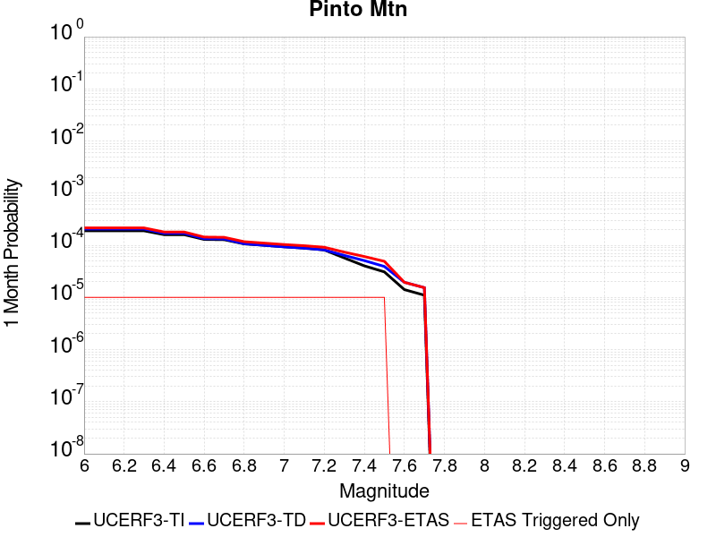 |  |  |

| Magnitude | 1 wk TI Prob | 1 wk TD Prob | 1 wk ETAS Prob | 1 wk ETAS/TD Gain | 1 wk ETAS Triggered Only | 1 mo TI Prob | 1 mo TD Prob | 1 mo ETAS Prob | 1 mo ETAS/TD Gain | 1 mo ETAS Triggered Only | 1 yr TI Prob | 1 yr TD Prob | 1 yr ETAS Prob | 1 yr ETAS/TD Gain | 1 yr ETAS Triggered Only | 10 yr TI Prob | 10 yr TD Prob | 10 yr ETAS Prob | 10 yr ETAS/TD Gain | 10 yr ETAS Triggered Only |
|-----|-----|-----|-----|-----|-----|-----|-----|-----|-----|-----|-----|-----|-----|-----|-----|-----|-----|-----|-----|-----|
| 6.0 | 4.4194956E-5 | 4.7861893E-5 | 4.7861893E-5 | 1.0 | 0.0 | 1.893932E-4 | 2.0510721E-4 | 2.1510516E-4 | 1.048745 | 1.0E-5 | 0.0023034236 | 0.002494484 | 0.0025443593 | 1.0199943 | 5.0E-5 | 0.022796938 | 0.02468237 | 0.024779899 | 1.0039514 | 1.0E-4 |
| 6.1 | 4.4194956E-5 | 4.7861893E-5 | 4.7861893E-5 | 1.0 | 0.0 | 1.893932E-4 | 2.0510721E-4 | 2.1510516E-4 | 1.048745 | 1.0E-5 | 0.0023034236 | 0.002494484 | 0.0025443593 | 1.0199943 | 5.0E-5 | 0.022796938 | 0.02468237 | 0.024779899 | 1.0039514 | 1.0E-4 |
| 6.2 | 4.4194956E-5 | 4.7861893E-5 | 4.7861893E-5 | 1.0 | 0.0 | 1.893932E-4 | 2.0510721E-4 | 2.1510516E-4 | 1.048745 | 1.0E-5 | 0.0023034236 | 0.002494484 | 0.0025443593 | 1.0199943 | 5.0E-5 | 0.022796938 | 0.02468237 | 0.024779899 | 1.0039514 | 1.0E-4 |
| 6.3 | 4.4194956E-5 | 4.7861893E-5 | 4.7861893E-5 | 1.0 | 0.0 | 1.893932E-4 | 2.0510721E-4 | 2.1510516E-4 | 1.048745 | 1.0E-5 | 0.0023034236 | 0.002494484 | 0.0025443593 | 1.0199943 | 5.0E-5 | 0.022796938 | 0.02468237 | 0.024779899 | 1.0039514 | 1.0E-4 |
| 6.4 | 3.729929E-5 | 3.9610393E-5 | 3.9610393E-5 | 1.0 | 0.0 | 1.5984432E-4 | 1.6974831E-4 | 1.7974661E-4 | 1.0589007 | 1.0E-5 | 0.0019443673 | 0.00206482 | 0.0021147167 | 1.0241652 | 5.0E-5 | 0.019274427 | 0.020466378 | 0.020554537 | 1.0043075 | 9.0E-5 |
| 6.5 | 3.729929E-5 | 3.9610393E-5 | 3.9610393E-5 | 1.0 | 0.0 | 1.5984432E-4 | 1.6974831E-4 | 1.7974661E-4 | 1.0589007 | 1.0E-5 | 0.0019443673 | 0.00206482 | 0.0021147167 | 1.0241652 | 5.0E-5 | 0.019274427 | 0.020466378 | 0.020554537 | 1.0043075 | 9.0E-5 |
| 6.6 | 3.0204548E-5 | 3.121148E-5 | 3.121148E-5 | 1.0 | 0.0 | 1.2944164E-4 | 1.3375682E-4 | 1.4375549E-4 | 1.0747526 | 1.0E-5 | 0.0015748127 | 0.0016273075 | 0.0016772262 | 1.0306756 | 5.0E-5 | 0.015636992 | 0.016157784 | 0.016216815 | 1.0036534 | 6.0E-5 |
| 6.7 | 2.9857754E-5 | 3.0820833E-5 | 3.0820833E-5 | 1.0 | 0.0 | 1.2795553E-4 | 1.3208279E-4 | 1.4208147E-4 | 1.0757 | 1.0E-5 | 0.0015567453 | 0.0016069564 | 0.001656876 | 1.0310647 | 5.0E-5 | 0.015458848 | 0.015957206 | 0.01601625 | 1.0037 | 6.0E-5 |
| 6.8 | 2.4819734E-5 | 2.5014922E-5 | 2.5014922E-5 | 1.0 | 0.0 | 1.0636595E-4 | 1.0720253E-4 | 1.1720146E-4 | 1.0932714 | 1.0E-5 | 0.0012942362 | 0.001304431 | 0.0013543657 | 1.0382808 | 5.0E-5 | 0.012867244 | 0.012970111 | 0.013029333 | 1.0045661 | 6.0E-5 |
| 6.9 | 2.331124E-5 | 2.3343082E-5 | 2.3343082E-5 | 1.0 | 0.0 | 9.990149E-5 | 1.0003806E-4 | 1.1003706E-4 | 1.099952 | 1.0E-5 | 0.001215622 | 0.0012173032 | 0.0012672424 | 1.0410244 | 5.0E-5 | 0.012089936 | 0.012108546 | 0.012167819 | 1.0048952 | 6.0E-5 |
| 7.0 | 2.1818534E-5 | 2.176611E-5 | 2.176611E-5 | 1.0 | 0.0 | 9.3504656E-5 | 9.328011E-5 | 1.0327918E-4 | 1.107194 | 1.0E-5 | 0.0011378246 | 0.0011351135 | 0.0011650794 | 1.026399 | 3.0E-5 | 0.011320163 | 0.011295259 | 0.011334807 | 1.0035013 | 4.0E-5 |
| 7.1 | 2.066081E-5 | 2.054566E-5 | 2.054566E-5 | 1.0 | 0.0 | 8.854332E-5 | 8.804997E-5 | 9.804909E-5 | 1.1135619 | 1.0E-5 | 0.0010774818 | 0.0010715007 | 0.0011014686 | 1.0279682 | 3.0E-5 | 0.010722724 | 0.010665395 | 0.010704969 | 1.0037104 | 4.0E-5 |
| 7.2 | 1.8990233E-5 | 1.9058845E-5 | 1.9058845E-5 | 1.0 | 0.0 | 8.138417E-5 | 8.167832E-5 | 9.16775E-5 | 1.1224215 | 1.0E-5 | 9.904018E-4 | 9.939992E-4 | 0.0010239694 | 1.0301511 | 3.0E-5 | 0.009859995 | 0.009897532 | 0.009937136 | 1.0040014 | 4.0E-5 |
| 7.3 | 1.3335872E-5 | 1.4911161E-5 | 1.4911161E-5 | 1.0 | 0.0 | 5.7152483E-5 | 6.3903484E-5 | 7.390284E-5 | 1.156476 | 1.0E-5 | 6.956093E-4 | 7.7775994E-4 | 7.977444E-4 | 1.0256948 | 2.0E-5 | 0.006934359 | 0.007751679 | 0.0077814464 | 1.0038401 | 3.0E-5 |
| 7.4 | 9.414066E-6 | 1.1865199E-5 | 1.1865199E-5 | 1.0 | 0.0 | 4.0345374E-5 | 5.0849914E-5 | 6.0849405E-5 | 1.1966472 | 1.0E-5 | 4.910942E-4 | 6.1893126E-4 | 6.389189E-4 | 1.0322938 | 2.0E-5 | 0.0049001034 | 0.006173024 | 0.0061929002 | 1.00322 | 2.0E-5 |
| 7.5 | 7.2101157E-6 | 9.162354E-6 | 9.162354E-6 | 1.0 | 0.0 | 3.090013E-5 | 3.9266684E-5 | 4.9266295E-5 | 1.2546588 | 1.0E-5 | 3.7614413E-4 | 4.7797483E-4 | 4.9796526E-4 | 1.0418231 | 2.0E-5 | 0.0037550807 | 0.004770244 | 0.004790148 | 1.0041727 | 2.0E-5 |
| 7.6 | 3.296375E-6 | 4.5495403E-6 | 4.5495403E-6 | 1.0 | 0.0 | 1.4127245E-5 | 1.9497893E-5 | 1.9497893E-5 | 1.0 | 0.0 | 1.7198564E-4 | 2.3736237E-4 | 2.3736237E-4 | 1.0 | 0.0 | 0.0017185259 | 0.0023712262 | 0.0023712262 | 1.0 | 0.0 |
| 7.7 | 2.5741092E-6 | 3.588218E-6 | 3.588218E-6 | 1.0 | 0.0 | 1.103185E-5 | 1.5377995E-5 | 1.5377995E-5 | 1.0 | 0.0 | 1.3430449E-4 | 1.8721231E-4 | 1.8721231E-4 | 1.0 | 0.0 | 0.0013422335 | 0.0018706762 | 0.0018706762 | 1.0 | 0.0 |

## San Andreas (San Gorgonio Pass-Garnet HIll)
*[(top)](#table-of-contents)*

| 1 Week | 1 Month | 1 Year | 10 Year |
|-----|-----|-----|-----|
|  |  |  |  |

| Magnitude | 1 wk TI Prob | 1 wk TD Prob | 1 wk ETAS Prob | 1 wk ETAS/TD Gain | 1 wk ETAS Triggered Only | 1 mo TI Prob | 1 mo TD Prob | 1 mo ETAS Prob | 1 mo ETAS/TD Gain | 1 mo ETAS Triggered Only | 1 yr TI Prob | 1 yr TD Prob | 1 yr ETAS Prob | 1 yr ETAS/TD Gain | 1 yr ETAS Triggered Only | 10 yr TI Prob | 10 yr TD Prob | 10 yr ETAS Prob | 10 yr ETAS/TD Gain | 10 yr ETAS Triggered Only |
|-----|-----|-----|-----|-----|-----|-----|-----|-----|-----|-----|-----|-----|-----|-----|-----|-----|-----|-----|-----|-----|
| 6.0 | 8.31567E-5 | 2.3403931E-4 | 2.4403697E-4 | 1.0427178 | 1.0E-5 | 3.5633717E-4 | 0.0010026413 | 0.0010326111 | 1.029891 | 3.0E-5 | 0.004329778 | 0.012138746 | 0.012207896 | 1.0056967 | 7.0E-5 | 0.042463828 | 0.11266401 | 0.11276162 | 1.0008664 | 1.1E-4 |
| 6.1 | 8.31567E-5 | 2.3403931E-4 | 2.4403697E-4 | 1.0427178 | 1.0E-5 | 3.5633717E-4 | 0.0010026413 | 0.0010326111 | 1.029891 | 3.0E-5 | 0.004329778 | 0.012138746 | 0.012207896 | 1.0056967 | 7.0E-5 | 0.042463828 | 0.11266401 | 0.11276162 | 1.0008664 | 1.1E-4 |
| 6.2 | 8.31567E-5 | 2.3403931E-4 | 2.4403697E-4 | 1.0427178 | 1.0E-5 | 3.5633717E-4 | 0.0010026413 | 0.0010326111 | 1.029891 | 3.0E-5 | 0.004329778 | 0.012138746 | 0.012207896 | 1.0056967 | 7.0E-5 | 0.042463828 | 0.11266401 | 0.11276162 | 1.0008664 | 1.1E-4 |
| 6.3 | 8.31567E-5 | 2.3403931E-4 | 2.4403697E-4 | 1.0427178 | 1.0E-5 | 3.5633717E-4 | 0.0010026413 | 0.0010326111 | 1.029891 | 3.0E-5 | 0.004329778 | 0.012138746 | 0.012207896 | 1.0056967 | 7.0E-5 | 0.042463828 | 0.11266401 | 0.11276162 | 1.0008664 | 1.1E-4 |
| 6.4 | 8.059055E-5 | 2.2961364E-4 | 2.3961134E-4 | 1.0435414 | 1.0E-5 | 3.4534236E-4 | 9.836889E-4 | 0.0010136593 | 1.0304674 | 3.0E-5 | 0.0041964394 | 0.0119108865 | 0.011980053 | 1.0058069 | 7.0E-5 | 0.041180745 | 0.110644795 | 0.11074262 | 1.0008842 | 1.1E-4 |
| 6.5 | 8.059055E-5 | 2.2961364E-4 | 2.3961134E-4 | 1.0435414 | 1.0E-5 | 3.4534236E-4 | 9.836889E-4 | 0.0010136593 | 1.0304674 | 3.0E-5 | 0.0041964394 | 0.0119108865 | 0.011980053 | 1.0058069 | 7.0E-5 | 0.041180745 | 0.110644795 | 0.11074262 | 1.0008842 | 1.1E-4 |
| 6.6 | 7.619237E-5 | 2.220582E-4 | 2.3205597E-4 | 1.0450232 | 1.0E-5 | 3.2649786E-4 | 9.5133315E-4 | 9.813047E-4 | 1.0315048 | 3.0E-5 | 0.0039678677 | 0.011521517 | 0.011580827 | 1.0051477 | 6.0E-5 | 0.03897764 | 0.107181 | 0.10727028 | 1.000833 | 1.0E-4 |
| 6.7 | 7.440636E-5 | 2.188159E-4 | 2.288137E-4 | 1.0456905 | 1.0E-5 | 3.188454E-4 | 9.3744765E-4 | 9.6741953E-4 | 1.0319718 | 3.0E-5 | 0.0038750346 | 0.011354231 | 0.01141355 | 1.0052243 | 6.0E-5 | 0.038081564 | 0.105689384 | 0.10577881 | 1.0008461 | 1.0E-4 |
| 6.8 | 7.3735864E-5 | 2.1728728E-4 | 2.2728511E-4 | 1.046012 | 1.0E-5 | 3.1597257E-4 | 9.3090115E-4 | 9.608732E-4 | 1.0321969 | 3.0E-5 | 0.0038401815 | 0.011275358 | 0.011334681 | 1.0052613 | 6.0E-5 | 0.03774495 | 0.10499097 | 0.10508047 | 1.0008525 | 1.0E-4 |
| 6.9 | 7.27575E-5 | 2.1497665E-4 | 2.249745E-4 | 1.0465066 | 1.0E-5 | 3.117806E-4 | 9.2100544E-4 | 9.5097785E-4 | 1.0325431 | 3.0E-5 | 0.003789323 | 0.011156118 | 0.011215448 | 1.0053182 | 6.0E-5 | 0.037253562 | 0.103938885 | 0.104028486 | 1.0008621 | 1.0E-4 |
| 7.0 | 7.102591E-5 | 2.1081619E-4 | 2.2081408E-4 | 1.0474247 | 1.0E-5 | 3.0436125E-4 | 9.031874E-4 | 9.3316025E-4 | 1.0331857 | 3.0E-5 | 0.003699303 | 0.010941379 | 0.011000723 | 1.0054238 | 6.0E-5 | 0.03638325 | 0.10204146 | 0.102131255 | 1.00088 | 1.0E-4 |
| 7.1 | 7.028513E-5 | 2.0917221E-4 | 2.1917012E-4 | 1.0477974 | 1.0E-5 | 3.0118722E-4 | 8.961466E-4 | 9.261197E-4 | 1.0334467 | 3.0E-5 | 0.0036607897 | 0.010856516 | 0.010915864 | 1.0054666 | 6.0E-5 | 0.036010686 | 0.101284504 | 0.10137437 | 1.0008873 | 1.0E-4 |
| 7.2 | 6.8498244E-5 | 2.0524992E-4 | 2.1524786E-4 | 1.0487111 | 1.0E-5 | 2.9353087E-4 | 8.7934814E-4 | 9.0932177E-4 | 1.0340862 | 3.0E-5 | 0.003567883 | 0.010654011 | 0.010713371 | 1.0055717 | 6.0E-5 | 0.035111405 | 0.09947617 | 0.09956623 | 1.0009053 | 1.0E-4 |
| 7.3 | 6.622592E-5 | 1.9752014E-4 | 2.0751817E-4 | 1.0506177 | 1.0E-5 | 2.8379448E-4 | 8.462424E-4 | 8.7621703E-4 | 1.0354208 | 3.0E-5 | 0.0034497243 | 0.010254811 | 0.010314195 | 1.005791 | 6.0E-5 | 0.033966612 | 0.09597213 | 0.09606253 | 1.000942 | 1.0E-4 |
| 7.4 | 5.1050705E-5 | 1.4706214E-4 | 1.5706065E-4 | 1.0679885 | 1.0E-5 | 2.1877038E-4 | 6.301149E-4 | 6.60096E-4 | 1.0475804 | 3.0E-5 | 0.002660276 | 0.007644857 | 0.007704398 | 1.0077884 | 6.0E-5 | 0.02628654 | 0.072938554 | 0.07303126 | 1.001271 | 1.0E-4 |
| 7.5 | 3.9302922E-5 | 1.1144718E-4 | 1.2144607E-4 | 1.0897186 | 1.0E-5 | 1.6843023E-4 | 4.7754368E-4 | 5.0752936E-4 | 1.0627915 | 3.0E-5 | 0.0020487092 | 0.0057986644 | 0.0058583166 | 1.0102872 | 6.0E-5 | 0.020299247 | 0.05607669 | 0.056171086 | 1.0016832 | 1.0E-4 |
| 7.6 | 2.9851626E-5 | 8.5081876E-5 | 9.508103E-5 | 1.1175238 | 1.0E-5 | 1.2792926E-4 | 3.6458578E-4 | 3.9457483E-4 | 1.0822551 | 3.0E-5 | 0.0015564259 | 0.0044298233 | 0.0044895574 | 1.0134846 | 6.0E-5 | 0.0154556995 | 0.04325414 | 0.043349814 | 1.0022119 | 1.0E-4 |
| 7.7 | 2.1135214E-5 | 6.364613E-5 | 7.364549E-5 | 1.1571088 | 1.0E-5 | 9.0576345E-5 | 2.727406E-4 | 3.0273243E-4 | 1.1099646 | 3.0E-5 | 0.0011022091 | 0.003315566 | 0.0033753673 | 1.0180365 | 6.0E-5 | 0.010967582 | 0.032636102 | 0.03273284 | 1.0029641 | 1.0E-4 |
| 7.8 | 1.883379E-5 | 5.57475E-5 | 6.574694E-5 | 1.1793703 | 1.0E-5 | 8.0713755E-5 | 2.38896E-4 | 2.6888883E-4 | 1.1255476 | 3.0E-5 | 9.822468E-4 | 0.0029046827 | 0.0029645083 | 1.0205963 | 6.0E-5 | 0.0097791655 | 0.02874446 | 0.028841585 | 1.003379 | 1.0E-4 |
| 7.9 | 1.5156185E-5 | 4.1746134E-5 | 4.1746134E-5 | 1.0 | 0.0 | 6.495346E-5 | 1.7889973E-4 | 1.9889616E-4 | 1.1117744 | 2.0E-5 | 7.9052144E-4 | 0.00217593 | 0.0022258211 | 1.0229287 | 5.0E-5 | 0.007877152 | 0.02180003 | 0.021888068 | 1.0040385 | 9.0E-5 |
| 8.0 | 1.1405907E-5 | 3.0040022E-5 | 3.0040022E-5 | 1.0 | 0.0 | 4.8881542E-5 | 1.287366E-4 | 1.4873403E-4 | 1.155336 | 2.0E-5 | 5.9497025E-4 | 0.0015662423 | 0.0016061796 | 1.0254989 | 4.0E-5 | 0.005933798 | 0.015803885 | 0.015862936 | 1.0037365 | 6.0E-5 |
| 8.1 | 4.3511436E-6 | 7.3921074E-6 | 7.3921074E-6 | 1.0 | 0.0 | 1.8647626E-5 | 3.1680076E-5 | 3.1680076E-5 | 1.0 | 0.0 | 2.2701119E-4 | 3.8563678E-4 | 3.8563678E-4 | 1.0 | 0.0 | 0.0022677942 | 0.004127946 | 0.004127946 | 1.0 | 0.0 |
| 8.2 | 2.3042528E-6 | 2.743404E-6 | 2.743404E-6 | 1.0 | 0.0 | 9.875332E-6 | 1.1757393E-5 | 1.1757393E-5 | 1.0 | 0.0 | 1.2022553E-4 | 1.4313689E-4 | 1.4313689E-4 | 1.0 | 0.0 | 0.0012016051 | 0.0016034873 | 0.0016034873 | 1.0 | 0.0 |
| 8.3 | 5.202968E-7 | 3.174151E-7 | 3.174151E-7 | 1.0 | 0.0 | 2.2298414E-6 | 1.3603499E-6 | 1.3603499E-6 | 1.0 | 0.0 | 2.714798E-5 | 1.6562146E-5 | 1.6562146E-5 | 1.0 | 0.0 | 2.7144665E-4 | 1.9643836E-4 | 1.9643836E-4 | 1.0 | 0.0 |

## Death Valley (Fish Lake Valley)
*[(top)](#table-of-contents)*

| 1 Week | 1 Month | 1 Year | 10 Year |
|-----|-----|-----|-----|
| 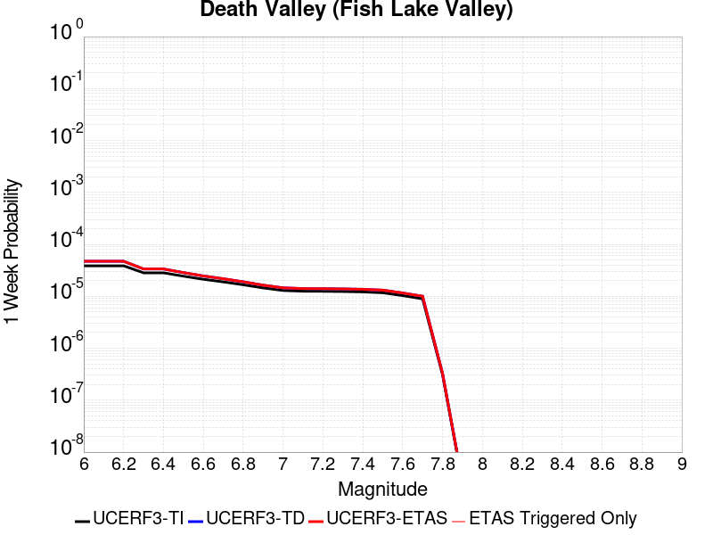 |  |  | 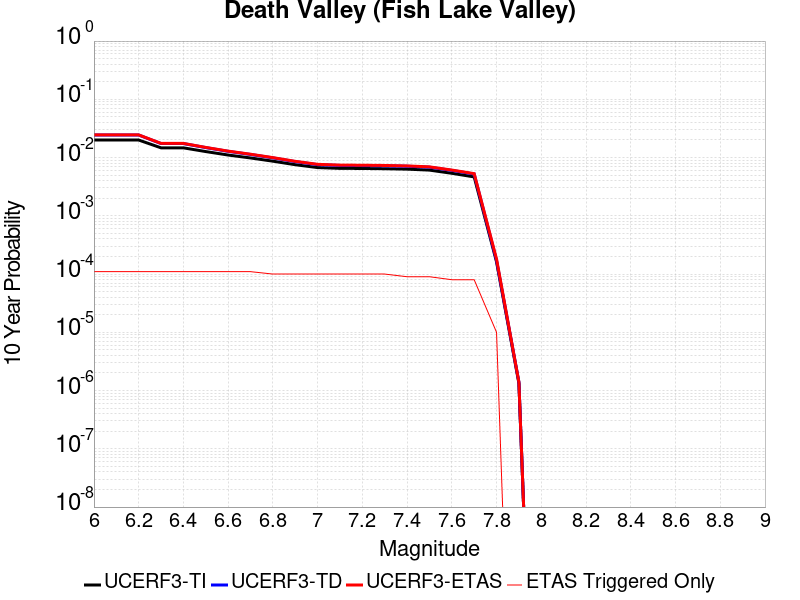 |

| Magnitude | 1 wk TI Prob | 1 wk TD Prob | 1 wk ETAS Prob | 1 wk ETAS/TD Gain | 1 wk ETAS Triggered Only | 1 mo TI Prob | 1 mo TD Prob | 1 mo ETAS Prob | 1 mo ETAS/TD Gain | 1 mo ETAS Triggered Only | 1 yr TI Prob | 1 yr TD Prob | 1 yr ETAS Prob | 1 yr ETAS/TD Gain | 1 yr ETAS Triggered Only | 10 yr TI Prob | 10 yr TD Prob | 10 yr ETAS Prob | 10 yr ETAS/TD Gain | 10 yr ETAS Triggered Only |
|-----|-----|-----|-----|-----|-----|-----|-----|-----|-----|-----|-----|-----|-----|-----|-----|-----|-----|-----|-----|-----|
| 6.0 | 3.872328E-5 | 4.7272795E-5 | 4.7272795E-5 | 1.0 | 0.0 | 1.6594635E-4 | 2.0258366E-4 | 2.1258164E-4 | 1.0493523 | 1.0E-5 | 0.0020185246 | 0.0024639224 | 0.0025237745 | 1.0242914 | 6.0E-5 | 0.02000288 | 0.024391858 | 0.024499174 | 1.0043997 | 1.1E-4 |
| 6.1 | 3.872328E-5 | 4.7272795E-5 | 4.7272795E-5 | 1.0 | 0.0 | 1.6594635E-4 | 2.0258366E-4 | 2.1258164E-4 | 1.0493523 | 1.0E-5 | 0.0020185246 | 0.0024639224 | 0.0025237745 | 1.0242914 | 6.0E-5 | 0.02000288 | 0.024391858 | 0.024499174 | 1.0043997 | 1.1E-4 |
| 6.2 | 3.872328E-5 | 4.7272795E-5 | 4.7272795E-5 | 1.0 | 0.0 | 1.6594635E-4 | 2.0258366E-4 | 2.1258164E-4 | 1.0493523 | 1.0E-5 | 0.0020185246 | 0.0024639224 | 0.0025237745 | 1.0242914 | 6.0E-5 | 0.02000288 | 0.024391858 | 0.024499174 | 1.0043997 | 1.1E-4 |
| 6.3 | 2.8356371E-5 | 3.361399E-5 | 3.361399E-5 | 1.0 | 0.0 | 1.2152165E-4 | 1.4405245E-4 | 1.54051E-4 | 1.0694091 | 1.0E-5 | 0.0014785219 | 0.0017524963 | 0.0018123912 | 1.0341768 | 6.0E-5 | 0.014687235 | 0.017393954 | 0.017502042 | 1.006214 | 1.1E-4 |
| 6.4 | 2.8356371E-5 | 3.361399E-5 | 3.361399E-5 | 1.0 | 0.0 | 1.2152165E-4 | 1.4405245E-4 | 1.54051E-4 | 1.0694091 | 1.0E-5 | 0.0014785219 | 0.0017524963 | 0.0018123912 | 1.0341768 | 6.0E-5 | 0.014687235 | 0.017393954 | 0.017502042 | 1.006214 | 1.1E-4 |
| 6.5 | 2.4448687E-5 | 2.861085E-5 | 2.861085E-5 | 1.0 | 0.0 | 1.0477588E-4 | 1.2261244E-4 | 1.3261123E-4 | 1.0815477 | 1.0E-5 | 0.0012748998 | 0.0014918318 | 0.0015517423 | 1.040159 | 6.0E-5 | 0.012676105 | 0.01482307 | 0.014931439 | 1.0073109 | 1.1E-4 |
| 6.6 | 2.1298161E-5 | 2.4662684E-5 | 2.4662684E-5 | 1.0 | 0.0 | 9.127464E-5 | 1.0569312E-4 | 1.1569207E-4 | 1.0946035 | 1.0E-5 | 0.0011107022 | 0.0012860873 | 0.0013460101 | 1.0465932 | 6.0E-5 | 0.011051672 | 0.012789875 | 0.012898468 | 1.0084906 | 1.1E-4 |
| 6.7 | 1.8959729E-5 | 2.1783198E-5 | 2.1783198E-5 | 1.0 | 0.0 | 8.125345E-5 | 9.335337E-5 | 1.0335243E-4 | 1.1071099 | 1.0E-5 | 9.888117E-4 | 0.0011360102 | 0.001195942 | 1.0527564 | 6.0E-5 | 0.009844234 | 0.011304691 | 0.011413448 | 1.0096204 | 1.1E-4 |
| 6.8 | 1.6691629E-5 | 1.9020123E-5 | 1.9020123E-5 | 1.0 | 0.0 | 7.153359E-5 | 8.1512364E-5 | 9.1511545E-5 | 1.1226708 | 1.0E-5 | 8.7057345E-4 | 9.919781E-4 | 0.0010519185 | 1.0604252 | 6.0E-5 | 0.008671708 | 0.009877259 | 0.009976272 | 1.0100243 | 1.0E-4 |
| 6.9 | 1.450505E-5 | 1.6390959E-5 | 1.6390959E-5 | 1.0 | 0.0 | 6.216302E-5 | 7.024512E-5 | 8.024442E-5 | 1.1423486 | 1.0E-5 | 7.5657194E-4 | 8.549076E-4 | 9.148563E-4 | 1.0701231 | 6.0E-5 | 0.007540013 | 0.00851712 | 0.008616269 | 1.011641 | 1.0E-4 |
| 7.0 | 1.2940855E-5 | 1.4539165E-5 | 1.4539165E-5 | 1.0 | 0.0 | 5.545963E-5 | 6.230925E-5 | 7.230863E-5 | 1.1604798 | 1.0E-5 | 6.750118E-4 | 7.583569E-4 | 8.183114E-4 | 1.0790584 | 6.0E-5 | 0.006729651 | 0.007558308 | 0.007657552 | 1.0131304 | 1.0E-4 |
| 7.1 | 1.2544658E-5 | 1.4079352E-5 | 1.4079352E-5 | 1.0 | 0.0 | 5.3761712E-5 | 6.0338716E-5 | 7.0338116E-5 | 1.165721 | 1.0E-5 | 6.5435225E-4 | 7.3438184E-4 | 7.943378E-4 | 1.0816413 | 6.0E-5 | 0.006524288 | 0.0073201437 | 0.0074194116 | 1.0135609 | 1.0E-4 |
| 7.2 | 1.2489416E-5 | 1.4016813E-5 | 1.4016813E-5 | 1.0 | 0.0 | 5.3524967E-5 | 6.0070703E-5 | 7.0070106E-5 | 1.1664605 | 1.0E-5 | 6.514716E-4 | 7.31121E-4 | 7.9107715E-4 | 1.0820057 | 6.0E-5 | 0.006495651 | 0.0072877496 | 0.0073870206 | 1.0136217 | 1.0E-4 |
| 7.3 | 1.2368307E-5 | 1.388094E-5 | 1.388094E-5 | 1.0 | 0.0 | 5.3005948E-5 | 5.948842E-5 | 6.9487825E-5 | 1.16809 | 1.0E-5 | 6.451563E-4 | 7.240364E-4 | 7.83993E-4 | 1.0828087 | 6.0E-5 | 0.0064328653 | 0.0072173662 | 0.0073166443 | 1.0137554 | 1.0E-4 |
| 7.4 | 1.2161707E-5 | 1.3648976E-5 | 1.3648976E-5 | 1.0 | 0.0 | 5.212056E-5 | 5.8494334E-5 | 6.849375E-5 | 1.1709467 | 1.0E-5 | 6.3438306E-4 | 7.119414E-4 | 7.7189866E-4 | 1.0842166 | 6.0E-5 | 0.006325751 | 0.007097195 | 0.0071865562 | 1.0125911 | 9.0E-5 |
| 7.5 | 1.1707948E-5 | 1.3146588E-5 | 1.3146588E-5 | 1.0 | 0.0 | 5.0175953E-5 | 5.6341334E-5 | 6.634077E-5 | 1.1774796 | 1.0E-5 | 6.10721E-4 | 6.8574544E-4 | 7.457043E-4 | 1.0874361 | 6.0E-5 | 0.0060904534 | 0.006836877 | 0.006926262 | 1.0130739 | 9.0E-5 |
| 7.6 | 1.0319538E-5 | 1.15805615E-5 | 1.15805615E-5 | 1.0 | 0.0 | 4.4225842E-5 | 4.9630064E-5 | 5.9629565E-5 | 1.2014807 | 1.0E-5 | 5.383166E-4 | 6.0408365E-4 | 6.5405347E-4 | 1.08272 | 5.0E-5 | 0.0053701443 | 0.0060249474 | 0.0061044656 | 1.0131981 | 8.0E-5 |
| 7.7 | 8.937764E-6 | 1.00235875E-5 | 1.00235875E-5 | 1.0 | 0.0 | 3.830414E-5 | 4.2957552E-5 | 5.2957123E-5 | 1.232778 | 1.0E-5 | 4.6625308E-4 | 5.2288774E-4 | 5.728616E-4 | 1.0955728 | 5.0E-5 | 0.0046527605 | 0.0052170837 | 0.0052966666 | 1.0152543 | 8.0E-5 |
| 7.8 | 3.108007E-7 | 3.2847782E-7 | 3.2847782E-7 | 1.0 | 0.0 | 1.3320023E-6 | 1.4077614E-6 | 1.4077614E-6 | 1.0 | 0.0 | 1.6217007E-5 | 1.7139364E-5 | 2.7139193E-5 | 1.5834422 | 1.0E-5 | 1.6215823E-4 | 1.713808E-4 | 1.8137909E-4 | 1.0583396 | 1.0E-5 |
| 7.9 | 2.5591178E-9 | 2.6697482E-9 | 2.6697482E-9 | 1.0 | 0.0 | 1.0967647E-8 | 1.1441778E-8 | 1.1441778E-8 | 1.0 | 0.0 | 1.335311E-7 | 1.3930365E-7 | 1.3930365E-7 | 1.0 | 0.0 | 1.3353102E-6 | 1.3930365E-6 | 1.3930365E-6 | 1.0 | 0.0 |

## Santa Ynez (West)
*[(top)](#table-of-contents)*

| 1 Week | 1 Month | 1 Year | 10 Year |
|-----|-----|-----|-----|
|  | 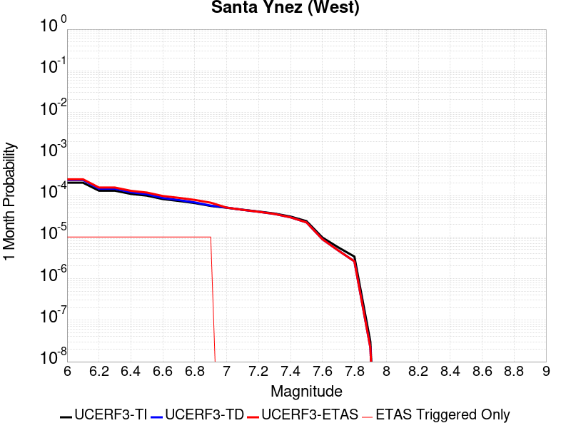 |  |  |

| Magnitude | 1 wk TI Prob | 1 wk TD Prob | 1 wk ETAS Prob | 1 wk ETAS/TD Gain | 1 wk ETAS Triggered Only | 1 mo TI Prob | 1 mo TD Prob | 1 mo ETAS Prob | 1 mo ETAS/TD Gain | 1 mo ETAS Triggered Only | 1 yr TI Prob | 1 yr TD Prob | 1 yr ETAS Prob | 1 yr ETAS/TD Gain | 1 yr ETAS Triggered Only | 10 yr TI Prob | 10 yr TD Prob | 10 yr ETAS Prob | 10 yr ETAS/TD Gain | 10 yr ETAS Triggered Only |
|-----|-----|-----|-----|-----|-----|-----|-----|-----|-----|-----|-----|-----|-----|-----|-----|-----|-----|-----|-----|-----|
| 6.0 | 4.7352758E-5 | 5.4977638E-5 | 5.4977638E-5 | 1.0 | 0.0 | 2.0292461E-4 | 2.3559884E-4 | 2.455965E-4 | 1.042435 | 1.0E-5 | 0.0024678076 | 0.0028649087 | 0.0029147654 | 1.0174025 | 5.0E-5 | 0.024405818 | 0.028307866 | 0.028375885 | 1.0024028 | 7.0E-5 |
| 6.1 | 4.7352758E-5 | 5.4977638E-5 | 5.4977638E-5 | 1.0 | 0.0 | 2.0292461E-4 | 2.3559884E-4 | 2.455965E-4 | 1.042435 | 1.0E-5 | 0.0024678076 | 0.0028649087 | 0.0029147654 | 1.0174025 | 5.0E-5 | 0.024405818 | 0.028307866 | 0.028375885 | 1.0024028 | 7.0E-5 |
| 6.2 | 3.0415853E-5 | 3.3928343E-5 | 3.3928343E-5 | 1.0 | 0.0 | 1.3034715E-4 | 1.453993E-4 | 1.5539785E-4 | 1.0687661 | 1.0E-5 | 0.0015858212 | 0.0017688345 | 0.0017887991 | 1.0112869 | 2.0E-5 | 0.015745522 | 0.017551502 | 0.0175908 | 1.002239 | 4.0E-5 |
| 6.3 | 3.0415853E-5 | 3.3928343E-5 | 3.3928343E-5 | 1.0 | 0.0 | 1.3034715E-4 | 1.453993E-4 | 1.5539785E-4 | 1.0687661 | 1.0E-5 | 0.0015858212 | 0.0017688345 | 0.0017887991 | 1.0112869 | 2.0E-5 | 0.015745522 | 0.017551502 | 0.0175908 | 1.002239 | 4.0E-5 |
| 6.4 | 2.5452082E-5 | 2.7914843E-5 | 2.7914843E-5 | 1.0 | 0.0 | 1.09075794E-4 | 1.19629665E-4 | 1.2962846E-4 | 1.0835813 | 1.0E-5 | 0.0013271887 | 0.0014555368 | 0.0014755077 | 1.0137206 | 2.0E-5 | 0.013192902 | 0.014462205 | 0.014501627 | 1.0027258 | 4.0E-5 |
| 6.5 | 2.3143784E-5 | 2.5130272E-5 | 2.5130272E-5 | 1.0 | 0.0 | 9.9183875E-5 | 1.07696804E-4 | 1.1769572E-4 | 1.0928433 | 1.0E-5 | 0.0012068948 | 0.0013104343 | 0.0013304082 | 1.0152421 | 2.0E-5 | 0.012003611 | 0.013028738 | 0.013058348 | 1.0022726 | 3.0E-5 |
| 6.6 | 1.9118515E-5 | 2.035579E-5 | 2.035579E-5 | 1.0 | 0.0 | 8.193392E-5 | 8.723623E-5 | 9.723536E-5 | 1.1146213 | 1.0E-5 | 9.97089E-4 | 0.0010615914 | 0.0010815703 | 1.0188197 | 2.0E-5 | 0.00992627 | 0.010566114 | 0.010585903 | 1.0018729 | 2.0E-5 |
| 6.7 | 1.722807E-5 | 1.814755E-5 | 1.814755E-5 | 1.0 | 0.0 | 7.3832496E-5 | 7.777293E-5 | 8.7772154E-5 | 1.1285695 | 1.0E-5 | 8.985399E-4 | 9.464797E-4 | 9.564702E-4 | 1.0105555 | 1.0E-5 | 0.008949154 | 0.009425132 | 0.009435038 | 1.001051 | 1.0E-5 |
| 6.8 | 1.5317364E-5 | 1.5927448E-5 | 1.5927448E-5 | 1.0 | 0.0 | 6.56442E-5 | 6.825873E-5 | 7.825805E-5 | 1.1464914 | 1.0E-5 | 7.98925E-4 | 8.3073747E-4 | 8.4072916E-4 | 1.0120275 | 1.0E-5 | 0.007960589 | 0.008276808 | 0.008286726 | 1.0011982 | 1.0E-5 |
| 6.9 | 1.3071226E-5 | 1.33303165E-5 | 1.33303165E-5 | 1.0 | 0.0 | 5.6018336E-5 | 5.7128687E-5 | 6.7128116E-5 | 1.1750335 | 1.0E-5 | 6.8180985E-4 | 6.9532206E-4 | 7.0531515E-4 | 1.0143719 | 1.0E-5 | 0.0067972173 | 0.006931726 | 0.0069416566 | 1.0014327 | 1.0E-5 |
| 7.0 | 1.1836986E-5 | 1.1933351E-5 | 1.1933351E-5 | 1.0 | 0.0 | 5.0728955E-5 | 5.114194E-5 | 5.114194E-5 | 1.0 | 0.0 | 6.1745E-4 | 6.224769E-4 | 6.224769E-4 | 1.0 | 0.0 | 0.006157372 | 0.006207526 | 0.006207526 | 1.0 | 0.0 |
| 7.1 | 1.0597169E-5 | 1.0542657E-5 | 1.0542657E-5 | 1.0 | 0.0 | 4.541565E-5 | 4.5182038E-5 | 4.5182038E-5 | 1.0 | 0.0 | 5.5279525E-4 | 5.499536E-4 | 5.499536E-4 | 1.0 | 0.0 | 0.0055142213 | 0.0054860576 | 0.0054860576 | 1.0 | 0.0 |
| 7.2 | 9.59113E-6 | 9.459544E-6 | 9.459544E-6 | 1.0 | 0.0 | 4.11042E-5 | 4.054028E-5 | 4.054028E-5 | 1.0 | 0.0 | 5.0032866E-4 | 4.934672E-4 | 4.934672E-4 | 1.0 | 0.0 | 0.004992037 | 0.004923833 | 0.004923833 | 1.0 | 0.0 |
| 7.3 | 8.586084E-6 | 8.3799305E-6 | 8.3799305E-6 | 1.0 | 0.0 | 3.679698E-5 | 3.5913497E-5 | 3.5913497E-5 | 1.0 | 0.0 | 4.4791115E-4 | 4.3716014E-4 | 4.3716014E-4 | 1.0 | 0.0 | 0.004470094 | 0.004363113 | 0.004363113 | 1.0 | 0.0 |
| 7.4 | 7.2622997E-6 | 6.9518123E-6 | 6.9518123E-6 | 1.0 | 0.0 | 3.112377E-5 | 2.9793147E-5 | 2.9793147E-5 | 1.0 | 0.0 | 3.78866E-4 | 3.6267214E-4 | 3.6267214E-4 | 1.0 | 0.0 | 0.0037822074 | 0.003620903 | 0.003620903 | 1.0 | 0.0 |
| 7.5 | 5.627296E-6 | 5.251761E-6 | 5.251761E-6 | 1.0 | 0.0 | 2.411676E-5 | 2.2507358E-5 | 2.2507358E-5 | 1.0 | 0.0 | 2.9358198E-4 | 2.7399333E-4 | 2.7399333E-4 | 1.0 | 0.0 | 0.0029319443 | 0.0027366271 | 0.0027366271 | 1.0 | 0.0 |
| 7.6 | 2.265244E-6 | 2.0609527E-6 | 2.0609527E-6 | 1.0 | 0.0 | 9.708152E-6 | 8.832625E-6 | 8.832625E-6 | 1.0 | 0.0 | 1.18190335E-4 | 1.07531996E-4 | 1.07531996E-4 | 1.0 | 0.0 | 0.001181275 | 0.0010748082 | 0.0010748082 | 1.0 | 0.0 |
| 7.7 | 1.3099874E-6 | 1.1016773E-6 | 1.1016773E-6 | 1.0 | 0.0 | 5.61422E-6 | 4.7214658E-6 | 4.7214658E-6 | 1.0 | 0.0 | 6.8350986E-5 | 5.7482353E-5 | 5.7482353E-5 | 1.0 | 0.0 | 6.832996E-4 | 5.7467725E-4 | 5.7467725E-4 | 1.0 | 0.0 |
| 7.8 | 7.903951E-7 | 6.071366E-7 | 6.071366E-7 | 1.0 | 0.0 | 3.3874032E-6 | 2.6020114E-6 | 2.6020114E-6 | 1.0 | 0.0 | 4.1240855E-5 | 3.1679043E-5 | 3.1679043E-5 | 1.0 | 0.0 | 4.12332E-4 | 3.167466E-4 | 3.167466E-4 | 1.0 | 0.0 |
| 7.9 | 7.0753297E-9 | 5.0902513E-9 | 5.0902513E-9 | 1.0 | 0.0 | 3.032284E-8 | 2.1815362E-8 | 2.1815362E-8 | 1.0 | 0.0 | 3.6918053E-7 | 2.65602E-7 | 2.65602E-7 | 1.0 | 0.0 | 3.691799E-6 | 2.656018E-6 | 2.656018E-6 | 1.0 | 0.0 |

## Ludlow
*[(top)](#table-of-contents)*

| 1 Week | 1 Month | 1 Year | 10 Year |
|-----|-----|-----|-----|
|  |  |  | 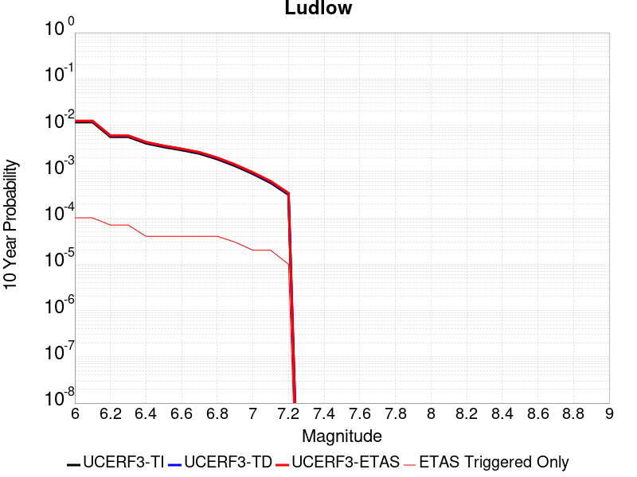 |

| Magnitude | 1 wk TI Prob | 1 wk TD Prob | 1 wk ETAS Prob | 1 wk ETAS/TD Gain | 1 wk ETAS Triggered Only | 1 mo TI Prob | 1 mo TD Prob | 1 mo ETAS Prob | 1 mo ETAS/TD Gain | 1 mo ETAS Triggered Only | 1 yr TI Prob | 1 yr TD Prob | 1 yr ETAS Prob | 1 yr ETAS/TD Gain | 1 yr ETAS Triggered Only | 10 yr TI Prob | 10 yr TD Prob | 10 yr ETAS Prob | 10 yr ETAS/TD Gain | 10 yr ETAS Triggered Only |
|-----|-----|-----|-----|-----|-----|-----|-----|-----|-----|-----|-----|-----|-----|-----|-----|-----|-----|-----|-----|-----|
| 6.0 | 2.2407607E-5 | 2.3658129E-5 | 2.3658129E-5 | 1.0 | 0.0 | 9.602906E-5 | 1.0138829E-4 | 1.3138526E-4 | 1.2958622 | 3.0E-5 | 0.0011685267 | 0.0012337476 | 0.0013236365 | 1.0728585 | 9.0E-5 | 0.011624013 | 0.012273493 | 0.0123722665 | 1.0080476 | 1.0E-4 |
| 6.1 | 2.2407607E-5 | 2.3658129E-5 | 2.3658129E-5 | 1.0 | 0.0 | 9.602906E-5 | 1.0138829E-4 | 1.3138526E-4 | 1.2958622 | 3.0E-5 | 0.0011685267 | 0.0012337476 | 0.0013236365 | 1.0728585 | 9.0E-5 | 0.011624013 | 0.012273493 | 0.0123722665 | 1.0080476 | 1.0E-4 |
| 6.2 | 1.0781252E-5 | 1.1366073E-5 | 1.1366073E-5 | 1.0 | 0.0 | 4.620455E-5 | 4.8710852E-5 | 7.870939E-5 | 1.6158491 | 3.0E-5 | 5.623952E-4 | 5.928973E-4 | 6.528617E-4 | 1.101138 | 6.0E-5 | 0.00560974 | 0.0059135733 | 0.0059831594 | 1.0117671 | 7.0E-5 |
| 6.3 | 1.0781252E-5 | 1.1366073E-5 | 1.1366073E-5 | 1.0 | 0.0 | 4.620455E-5 | 4.8710852E-5 | 7.870939E-5 | 1.6158491 | 3.0E-5 | 5.623952E-4 | 5.928973E-4 | 6.528617E-4 | 1.101138 | 6.0E-5 | 0.00560974 | 0.0059135733 | 0.0059831594 | 1.0117671 | 7.0E-5 |
| 6.4 | 7.814439E-6 | 8.238025E-6 | 8.238025E-6 | 1.0 | 0.0 | 3.3490025E-5 | 3.530535E-5 | 5.5304645E-5 | 1.5664663 | 2.0E-5 | 4.0766477E-4 | 4.2975927E-4 | 4.6974208E-4 | 1.0930353 | 4.0E-5 | 0.0040691774 | 0.0042894282 | 0.0043292567 | 1.0092852 | 4.0E-5 |
| 6.5 | 6.4986366E-6 | 6.8511663E-6 | 6.8511663E-6 | 1.0 | 0.0 | 2.7851002E-5 | 2.9361816E-5 | 4.9361228E-5 | 1.6811368 | 2.0E-5 | 3.390332E-4 | 3.574224E-4 | 3.974081E-4 | 1.1118724 | 4.0E-5 | 0.003385164 | 0.0035685715 | 0.0036084286 | 1.011169 | 4.0E-5 |
| 6.6 | 5.582177E-6 | 5.8862183E-6 | 5.8862183E-6 | 1.0 | 0.0 | 2.3923398E-5 | 2.5226409E-5 | 4.5225905E-5 | 1.7928 | 2.0E-5 | 2.9122844E-4 | 3.0708895E-4 | 3.4707668E-4 | 1.1302154 | 4.0E-5 | 0.0029084706 | 0.0030667195 | 0.0031065969 | 1.0130032 | 4.0E-5 |
| 6.7 | 4.6858763E-6 | 4.9406053E-6 | 4.9406053E-6 | 1.0 | 0.0 | 2.0082172E-5 | 2.1173853E-5 | 4.117343E-5 | 1.9445411 | 2.0E-5 | 2.4447302E-4 | 2.5776174E-4 | 2.9775142E-4 | 1.1551421 | 4.0E-5 | 0.0024420423 | 0.002574684 | 0.002614581 | 1.0154959 | 4.0E-5 |
| 6.8 | 3.5584908E-6 | 3.7521538E-6 | 3.7521538E-6 | 1.0 | 0.0 | 1.5250586E-5 | 1.6080561E-5 | 3.608024E-5 | 2.2437177 | 2.0E-5 | 1.8566006E-4 | 1.9576366E-4 | 2.3575583E-4 | 1.204288 | 4.0E-5 | 0.0018550502 | 0.0019559532 | 0.001995875 | 1.0204104 | 4.0E-5 |
| 6.9 | 2.532834E-6 | 2.6711E-6 | 2.6711E-6 | 1.0 | 0.0 | 1.0854958E-5 | 1.1447523E-5 | 3.1447293E-5 | 2.7470827 | 2.0E-5 | 1.3215111E-4 | 1.3936496E-4 | 1.6936078E-4 | 1.2152321 | 3.0E-5 | 0.0013207254 | 0.0013928032 | 0.0014227615 | 1.0215093 | 3.0E-5 |
| 7.0 | 1.7083285E-6 | 1.8020094E-6 | 1.8020094E-6 | 1.0 | 0.0 | 7.3213873E-6 | 7.722875E-6 | 1.7722798E-5 | 2.2948446 | 1.0E-5 | 8.913424E-5 | 9.4022114E-5 | 1.1402024E-4 | 1.212696 | 2.0E-5 | 8.9098496E-4 | 9.3983987E-4 | 9.598211E-4 | 1.0212603 | 2.0E-5 |
| 7.1 | 1.0905424E-6 | 1.1498034E-6 | 1.1498034E-6 | 1.0 | 0.0 | 4.6737446E-6 | 4.92772E-6 | 1.4927671E-5 | 3.029326 | 1.0E-5 | 5.6901354E-5 | 5.999344E-5 | 7.999224E-5 | 1.3333498 | 2.0E-5 | 5.6886784E-4 | 5.997822E-4 | 6.197702E-4 | 1.0333254 | 2.0E-5 |
| 7.2 | 6.06668E-7 | 6.387501E-7 | 6.387501E-7 | 1.0 | 0.0 | 2.600003E-6 | 2.737498E-6 | 2.737498E-6 | 1.0 | 0.0 | 3.1654577E-5 | 3.33286E-5 | 4.3328266E-5 | 1.3000326 | 1.0E-5 | 3.1650066E-4 | 3.3324285E-4 | 3.4323952E-4 | 1.0299982 | 1.0E-5 |

## Pisgah-Bullion Mtn-Mesquite Lk
*[(top)](#table-of-contents)*

| 1 Week | 1 Month | 1 Year | 10 Year |
|-----|-----|-----|-----|
|  |  |  |  |

| Magnitude | 1 wk TI Prob | 1 wk TD Prob | 1 wk ETAS Prob | 1 wk ETAS/TD Gain | 1 wk ETAS Triggered Only | 1 mo TI Prob | 1 mo TD Prob | 1 mo ETAS Prob | 1 mo ETAS/TD Gain | 1 mo ETAS Triggered Only | 1 yr TI Prob | 1 yr TD Prob | 1 yr ETAS Prob | 1 yr ETAS/TD Gain | 1 yr ETAS Triggered Only | 10 yr TI Prob | 10 yr TD Prob | 10 yr ETAS Prob | 10 yr ETAS/TD Gain | 10 yr ETAS Triggered Only |
|-----|-----|-----|-----|-----|-----|-----|-----|-----|-----|-----|-----|-----|-----|-----|-----|-----|-----|-----|-----|-----|
| 6.0 | 3.0240792E-5 | 2.4092637E-5 | 2.4092637E-5 | 1.0 | 0.0 | 1.2959696E-4 | 1.0325063E-4 | 1.132496E-4 | 1.0968417 | 1.0E-5 | 0.0015767008 | 0.0012564523 | 0.0012864146 | 1.0238467 | 3.0E-5 | 0.015655609 | 0.012503509 | 0.012592385 | 1.007108 | 9.0E-5 |
| 6.1 | 3.0240792E-5 | 2.4092637E-5 | 2.4092637E-5 | 1.0 | 0.0 | 1.2959696E-4 | 1.0325063E-4 | 1.132496E-4 | 1.0968417 | 1.0E-5 | 0.0015767008 | 0.0012564523 | 0.0012864146 | 1.0238467 | 3.0E-5 | 0.015655609 | 0.012503509 | 0.012592385 | 1.007108 | 9.0E-5 |
| 6.2 | 3.0240792E-5 | 2.4092637E-5 | 2.4092637E-5 | 1.0 | 0.0 | 1.2959696E-4 | 1.0325063E-4 | 1.132496E-4 | 1.0968417 | 1.0E-5 | 0.0015767008 | 0.0012564523 | 0.0012864146 | 1.0238467 | 3.0E-5 | 0.015655609 | 0.012503509 | 0.012592385 | 1.007108 | 9.0E-5 |
| 6.3 | 2.0498217E-5 | 1.3638837E-5 | 1.3638837E-5 | 1.0 | 0.0 | 8.784654E-5 | 5.845094E-5 | 6.8450354E-5 | 1.1710737 | 1.0E-5 | 0.0010690069 | 7.114241E-4 | 7.4140274E-4 | 1.0421389 | 3.0E-5 | 0.01063879 | 0.0070930924 | 0.007142738 | 1.0069991 | 5.0E-5 |
| 6.4 | 2.0498217E-5 | 1.3638837E-5 | 1.3638837E-5 | 1.0 | 0.0 | 8.784654E-5 | 5.845094E-5 | 6.8450354E-5 | 1.1710737 | 1.0E-5 | 0.0010690069 | 7.114241E-4 | 7.4140274E-4 | 1.0421389 | 3.0E-5 | 0.01063879 | 0.0070930924 | 0.007142738 | 1.0069991 | 5.0E-5 |
| 6.5 | 1.7316182E-5 | 1.0477527E-5 | 1.0477527E-5 | 1.0 | 0.0 | 7.42101E-5 | 4.4902972E-5 | 4.4902972E-5 | 1.0 | 0.0 | 9.0313336E-4 | 5.4656656E-4 | 5.665556E-4 | 1.0365721 | 2.0E-5 | 0.008994718 | 0.0054532187 | 0.005493 | 1.0072951 | 4.0E-5 |
| 6.6 | 1.5251077E-5 | 8.414515E-6 | 8.414515E-6 | 1.0 | 0.0 | 6.536012E-5 | 3.606175E-5 | 3.606175E-5 | 1.0 | 0.0 | 7.9546886E-4 | 4.3897057E-4 | 4.589618E-4 | 1.0455412 | 2.0E-5 | 0.007926274 | 0.004381752 | 0.004421577 | 1.0090888 | 4.0E-5 |
| 6.7 | 1.2997425E-5 | 6.4114724E-6 | 6.4114724E-6 | 1.0 | 0.0 | 5.570206E-5 | 2.7477476E-5 | 2.7477476E-5 | 1.0 | 0.0 | 6.7796157E-4 | 3.3449157E-4 | 3.544849E-4 | 1.0597723 | 2.0E-5 | 0.0067589693 | 0.0033403412 | 0.0033602742 | 1.0059674 | 2.0E-5 |
| 6.8 | 1.035386E-5 | 4.333387E-6 | 4.333387E-6 | 1.0 | 0.0 | 4.437293E-5 | 1.857153E-5 | 1.857153E-5 | 1.0 | 0.0 | 5.401065E-4 | 2.260858E-4 | 2.4608127E-4 | 1.088442 | 2.0E-5 | 0.0053879567 | 0.0022586447 | 0.0022785997 | 1.0088348 | 2.0E-5 |
| 6.9 | 8.816252E-6 | 3.5807984E-6 | 3.5807984E-6 | 1.0 | 0.0 | 3.778339E-5 | 1.5346192E-5 | 1.5346192E-5 | 1.0 | 0.0 | 4.5991567E-4 | 1.8682446E-4 | 2.0682072E-4 | 1.1070324 | 2.0E-5 | 0.00458965 | 0.0018667325 | 0.0018866952 | 1.0106939 | 2.0E-5 |
| 7.0 | 6.8232207E-6 | 2.5676209E-6 | 2.5676209E-6 | 1.0 | 0.0 | 2.9242048E-5 | 1.10040455E-5 | 1.10040455E-5 | 1.0 | 0.0 | 3.5596377E-4 | 1.3396633E-4 | 1.3396633E-4 | 1.0 | 0.0 | 0.0035539411 | 0.0013388868 | 0.0013388868 | 1.0 | 0.0 |
| 7.1 | 5.837013E-6 | 2.2274717E-6 | 2.2274717E-6 | 1.0 | 0.0 | 2.501553E-5 | 9.546274E-6 | 9.546274E-6 | 1.0 | 0.0 | 3.045215E-4 | 1.16219984E-4 | 1.16219984E-4 | 1.0 | 0.0 | 0.0030410455 | 0.0011616211 | 0.0011616211 | 1.0 | 0.0 |
| 7.2 | 4.278052E-6 | 1.6276119E-6 | 1.6276119E-6 | 1.0 | 0.0 | 1.833438E-5 | 6.9754624E-6 | 6.9754624E-6 | 1.0 | 0.0 | 2.231982E-4 | 8.492318E-5 | 8.492318E-5 | 1.0 | 0.0 | 0.0022297418 | 8.489305E-4 | 8.489305E-4 | 1.0 | 0.0 |
| 7.3 | 1.8803692E-6 | 8.345247E-7 | 8.345247E-7 | 1.0 | 0.0 | 8.0587E-6 | 3.5765304E-6 | 3.5765304E-6 | 1.0 | 0.0 | 9.811026E-5 | 4.3543536E-5 | 4.3543536E-5 | 1.0 | 0.0 | 9.806695E-4 | 4.353645E-4 | 4.353645E-4 | 1.0 | 0.0 |

## Red Mountain
*[(top)](#table-of-contents)*

| 1 Week | 1 Month | 1 Year | 10 Year |
|-----|-----|-----|-----|
|  |  | 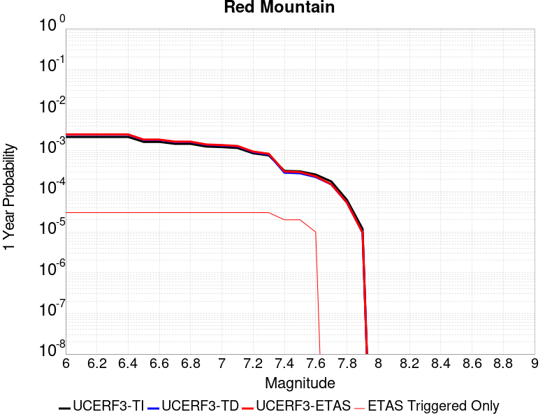 |  |

| Magnitude | 1 wk TI Prob | 1 wk TD Prob | 1 wk ETAS Prob | 1 wk ETAS/TD Gain | 1 wk ETAS Triggered Only | 1 mo TI Prob | 1 mo TD Prob | 1 mo ETAS Prob | 1 mo ETAS/TD Gain | 1 mo ETAS Triggered Only | 1 yr TI Prob | 1 yr TD Prob | 1 yr ETAS Prob | 1 yr ETAS/TD Gain | 1 yr ETAS Triggered Only | 10 yr TI Prob | 10 yr TD Prob | 10 yr ETAS Prob | 10 yr ETAS/TD Gain | 10 yr ETAS Triggered Only |
|-----|-----|-----|-----|-----|-----|-----|-----|-----|-----|-----|-----|-----|-----|-----|-----|-----|-----|-----|-----|-----|
| 6.0 | 4.1810763E-5 | 4.7595317E-5 | 4.7595317E-5 | 1.0 | 0.0 | 1.7917668E-4 | 2.0396493E-4 | 2.0396493E-4 | 1.0 | 0.0 | 0.0021792934 | 0.0024806093 | 0.002510535 | 1.0120639 | 3.0E-5 | 0.021580452 | 0.024546813 | 0.024605341 | 1.0023843 | 6.0E-5 |
| 6.1 | 4.1810763E-5 | 4.7595317E-5 | 4.7595317E-5 | 1.0 | 0.0 | 1.7917668E-4 | 2.0396493E-4 | 2.0396493E-4 | 1.0 | 0.0 | 0.0021792934 | 0.0024806093 | 0.002510535 | 1.0120639 | 3.0E-5 | 0.021580452 | 0.024546813 | 0.024605341 | 1.0023843 | 6.0E-5 |
| 6.2 | 4.1810763E-5 | 4.7595317E-5 | 4.7595317E-5 | 1.0 | 0.0 | 1.7917668E-4 | 2.0396493E-4 | 2.0396493E-4 | 1.0 | 0.0 | 0.0021792934 | 0.0024806093 | 0.002510535 | 1.0120639 | 3.0E-5 | 0.021580452 | 0.024546813 | 0.024605341 | 1.0023843 | 6.0E-5 |
| 6.3 | 4.1810763E-5 | 4.7595317E-5 | 4.7595317E-5 | 1.0 | 0.0 | 1.7917668E-4 | 2.0396493E-4 | 2.0396493E-4 | 1.0 | 0.0 | 0.0021792934 | 0.0024806093 | 0.002510535 | 1.0120639 | 3.0E-5 | 0.021580452 | 0.024546813 | 0.024605341 | 1.0023843 | 6.0E-5 |
| 6.4 | 4.1810763E-5 | 4.7595317E-5 | 4.7595317E-5 | 1.0 | 0.0 | 1.7917668E-4 | 2.0396493E-4 | 2.0396493E-4 | 1.0 | 0.0 | 0.0021792934 | 0.0024806093 | 0.002510535 | 1.0120639 | 3.0E-5 | 0.021580452 | 0.024546813 | 0.024605341 | 1.0023843 | 6.0E-5 |
| 6.5 | 3.154503E-5 | 3.536351E-5 | 3.536351E-5 | 1.0 | 0.0 | 1.3518598E-4 | 1.5154961E-4 | 1.5154961E-4 | 1.0 | 0.0 | 0.0016446467 | 0.0018436472 | 0.0018735919 | 1.0162421 | 3.0E-5 | 0.01632528 | 0.018293168 | 0.018342255 | 1.0026833 | 5.0E-5 |
| 6.6 | 3.1535834E-5 | 3.5352892E-5 | 3.5352892E-5 | 1.0 | 0.0 | 1.3514658E-4 | 1.5150411E-4 | 1.5150411E-4 | 1.0 | 0.0 | 0.0016441676 | 0.0018430941 | 0.0018730388 | 1.016247 | 3.0E-5 | 0.01632056 | 0.01828773 | 0.018336816 | 1.0026841 | 5.0E-5 |
| 6.7 | 2.8267326E-5 | 3.1472628E-5 | 3.1472628E-5 | 1.0 | 0.0 | 1.2114006E-4 | 1.3487619E-4 | 1.3487619E-4 | 1.0 | 0.0 | 0.0014738824 | 0.0016409658 | 0.0016709166 | 1.0182519 | 3.0E-5 | 0.014641452 | 0.016297253 | 0.016336601 | 1.0024143 | 4.0E-5 |
| 6.8 | 2.8212884E-5 | 3.1410505E-5 | 3.1410505E-5 | 1.0 | 0.0 | 1.20906756E-4 | 1.3460999E-4 | 1.3460999E-4 | 1.0 | 0.0 | 0.0014710457 | 0.0016377297 | 0.0016676806 | 1.018288 | 3.0E-5 | 0.014613459 | 0.016265366 | 0.016304715 | 1.0024192 | 4.0E-5 |
| 6.9 | 2.4227871E-5 | 2.6709698E-5 | 2.6709698E-5 | 1.0 | 0.0 | 1.03829596E-4 | 1.1446555E-4 | 1.1446555E-4 | 1.0 | 0.0 | 0.0012633923 | 0.001392803 | 0.0014227612 | 1.0215093 | 3.0E-5 | 0.012562336 | 0.013848428 | 0.013887874 | 1.0028484 | 4.0E-5 |
| 7.0 | 2.348524E-5 | 2.5838382E-5 | 2.5838382E-5 | 1.0 | 0.0 | 1.0064714E-4 | 1.1073166E-4 | 1.1073166E-4 | 1.0 | 0.0 | 0.0012246901 | 0.0013473998 | 0.0013773594 | 1.0222352 | 3.0E-5 | 0.012179627 | 0.013399941 | 0.013439405 | 1.0029451 | 4.0E-5 |
| 7.1 | 2.2311642E-5 | 2.4465295E-5 | 2.4465295E-5 | 1.0 | 0.0 | 9.561782E-5 | 1.04847466E-4 | 1.04847466E-4 | 1.0 | 0.0 | 0.0011635252 | 0.0012758452 | 0.001305807 | 1.0234839 | 3.0E-5 | 0.01157452 | 0.012692723 | 0.012732215 | 1.0031114 | 4.0E-5 |
| 7.2 | 1.6533986E-5 | 1.767202E-5 | 1.767202E-5 | 1.0 | 0.0 | 7.085802E-5 | 7.5735385E-5 | 7.5735385E-5 | 1.0 | 0.0 | 8.623549E-4 | 9.217517E-4 | 9.5172407E-4 | 1.0325167 | 3.0E-5 | 0.008590161 | 0.009185566 | 0.009225198 | 1.0043147 | 4.0E-5 |
| 7.3 | 1.4703092E-5 | 1.5560978E-5 | 1.5560978E-5 | 1.0 | 0.0 | 6.301173E-5 | 6.6688546E-5 | 6.6688546E-5 | 1.0 | 0.0 | 7.668978E-4 | 8.1169227E-4 | 8.416679E-4 | 1.0369298 | 3.0E-5 | 0.0076425658 | 0.0080933515 | 0.008123109 | 1.0036768 | 3.0E-5 |
| 7.4 | 6.1331984E-6 | 5.5291916E-6 | 5.5291916E-6 | 1.0 | 0.0 | 2.6284872E-5 | 2.3696324E-5 | 2.3696324E-5 | 1.0 | 0.0 | 3.199713E-4 | 2.884651E-4 | 3.084593E-4 | 1.0693125 | 2.0E-5 | 0.0031951098 | 0.0028809607 | 0.002900903 | 1.0069221 | 2.0E-5 |
| 7.5 | 5.954766E-6 | 5.3388108E-6 | 5.3388108E-6 | 1.0 | 0.0 | 2.5520176E-5 | 2.288042E-5 | 2.288042E-5 | 1.0 | 0.0 | 3.1066386E-4 | 2.7853402E-4 | 2.9852847E-4 | 1.0717845 | 2.0E-5 | 0.003102299 | 0.0027819031 | 0.0028018476 | 1.0071694 | 2.0E-5 |
| 7.6 | 4.9726646E-6 | 4.31555E-6 | 4.31555E-6 | 1.0 | 0.0 | 2.1311245E-5 | 1.8495086E-5 | 1.8495086E-5 | 1.0 | 0.0 | 2.5943352E-4 | 2.2515474E-4 | 2.3515249E-4 | 1.0444039 | 1.0E-5 | 0.0025913084 | 0.002249301 | 0.0022592784 | 1.0044358 | 1.0E-5 |
| 7.7 | 3.3613894E-6 | 2.8528355E-6 | 2.8528355E-6 | 1.0 | 0.0 | 1.4405875E-5 | 1.2226382E-5 | 1.2226382E-5 | 1.0 | 0.0 | 1.7537741E-4 | 1.488463E-4 | 1.488463E-4 | 1.0 | 0.0 | 0.0017523908 | 0.0014874922 | 0.0014874922 | 1.0 | 0.0 |
| 7.8 | 1.1828961E-6 | 1.0123364E-6 | 1.0123364E-6 | 1.0 | 0.0 | 5.069545E-6 | 4.338577E-6 | 4.338577E-6 | 1.0 | 0.0 | 6.171996E-5 | 5.2820928E-5 | 5.2820928E-5 | 1.0 | 0.0 | 6.170282E-4 | 5.280867E-4 | 5.280867E-4 | 1.0 | 0.0 |
| 7.9 | 2.2967266E-7 | 1.8619936E-7 | 1.8619936E-7 | 1.0 | 0.0 | 9.843111E-7 | 7.979971E-7 | 7.979971E-7 | 1.0 | 0.0 | 1.19839215E-5 | 9.7155735E-6 | 9.7155735E-6 | 1.0 | 0.0 | 1.1983275E-4 | 9.715178E-5 | 9.715178E-5 | 1.0 | 0.0 |

## San Andreas (Carrizo) rev
*[(top)](#table-of-contents)*

| 1 Week | 1 Month | 1 Year | 10 Year |
|-----|-----|-----|-----|
|  |  |  |  |

| Magnitude | 1 wk TI Prob | 1 wk TD Prob | 1 wk ETAS Prob | 1 wk ETAS/TD Gain | 1 wk ETAS Triggered Only | 1 mo TI Prob | 1 mo TD Prob | 1 mo ETAS Prob | 1 mo ETAS/TD Gain | 1 mo ETAS Triggered Only | 1 yr TI Prob | 1 yr TD Prob | 1 yr ETAS Prob | 1 yr ETAS/TD Gain | 1 yr ETAS Triggered Only | 10 yr TI Prob | 10 yr TD Prob | 10 yr ETAS Prob | 10 yr ETAS/TD Gain | 10 yr ETAS Triggered Only |
|-----|-----|-----|-----|-----|-----|-----|-----|-----|-----|-----|-----|-----|-----|-----|-----|-----|-----|-----|-----|-----|
| 6.0 | 1.1674632E-4 | 2.4372447E-4 | 2.4372447E-4 | 1.0 | 0.0 | 5.002454E-4 | 0.0010441169 | 0.0010441169 | 1.0 | 0.0 | 0.006073493 | 0.012638514 | 0.012668135 | 1.0023437 | 3.0E-5 | 0.0591016 | 0.12084356 | 0.12091389 | 1.000582 | 8.0E-5 |
| 6.1 | 1.1674632E-4 | 2.4372447E-4 | 2.4372447E-4 | 1.0 | 0.0 | 5.002454E-4 | 0.0010441169 | 0.0010441169 | 1.0 | 0.0 | 0.006073493 | 0.012638514 | 0.012668135 | 1.0023437 | 3.0E-5 | 0.0591016 | 0.12084356 | 0.12091389 | 1.000582 | 8.0E-5 |
| 6.2 | 1.1674632E-4 | 2.4372447E-4 | 2.4372447E-4 | 1.0 | 0.0 | 5.002454E-4 | 0.0010441169 | 0.0010441169 | 1.0 | 0.0 | 0.006073493 | 0.012638514 | 0.012668135 | 1.0023437 | 3.0E-5 | 0.0591016 | 0.12084356 | 0.12091389 | 1.000582 | 8.0E-5 |
| 6.3 | 1.1674632E-4 | 2.4372447E-4 | 2.4372447E-4 | 1.0 | 0.0 | 5.002454E-4 | 0.0010441169 | 0.0010441169 | 1.0 | 0.0 | 0.006073493 | 0.012638514 | 0.012668135 | 1.0023437 | 3.0E-5 | 0.0591016 | 0.12084356 | 0.12091389 | 1.000582 | 8.0E-5 |
| 6.4 | 1.1674632E-4 | 2.4372447E-4 | 2.4372447E-4 | 1.0 | 0.0 | 5.002454E-4 | 0.0010441169 | 0.0010441169 | 1.0 | 0.0 | 0.006073493 | 0.012638514 | 0.012668135 | 1.0023437 | 3.0E-5 | 0.0591016 | 0.12084356 | 0.12091389 | 1.000582 | 8.0E-5 |
| 6.5 | 1.13136164E-4 | 2.3692202E-4 | 2.3692202E-4 | 1.0 | 0.0 | 4.847792E-4 | 0.0010149864 | 0.0010149864 | 1.0 | 0.0 | 0.0058862255 | 0.0122878915 | 0.012307646 | 1.0016077 | 2.0E-5 | 0.057327334 | 0.117818706 | 0.117880456 | 1.0005242 | 7.0E-5 |
| 6.6 | 1.13136164E-4 | 2.3692202E-4 | 2.3692202E-4 | 1.0 | 0.0 | 4.847792E-4 | 0.0010149864 | 0.0010149864 | 1.0 | 0.0 | 0.0058862255 | 0.0122878915 | 0.012307646 | 1.0016077 | 2.0E-5 | 0.057327334 | 0.117818706 | 0.117880456 | 1.0005242 | 7.0E-5 |
| 6.7 | 1.1149675E-4 | 2.3383314E-4 | 2.3383314E-4 | 1.0 | 0.0 | 4.777557E-4 | 0.0010017586 | 0.0010017586 | 1.0 | 0.0 | 0.0058011734 | 0.012128645 | 0.012148402 | 1.001629 | 2.0E-5 | 0.05652051 | 0.11644284 | 0.116504684 | 1.0005312 | 7.0E-5 |
| 6.8 | 1.1103589E-4 | 2.3285425E-4 | 2.3285425E-4 | 1.0 | 0.0 | 4.7578133E-4 | 9.975666E-4 | 9.975666E-4 | 1.0 | 0.0 | 0.005777263 | 0.0120781725 | 0.0120979315 | 1.0016359 | 2.0E-5 | 0.056293584 | 0.11600256 | 0.116064444 | 1.0005335 | 7.0E-5 |
| 6.9 | 1.1053259E-4 | 2.3177748E-4 | 2.3177748E-4 | 1.0 | 0.0 | 4.7362508E-4 | 9.929554E-4 | 9.929554E-4 | 1.0 | 0.0 | 0.0057511497 | 0.012022653 | 0.012042413 | 1.0016435 | 2.0E-5 | 0.05604569 | 0.11551762 | 0.11557954 | 1.000536 | 7.0E-5 |
| 7.0 | 1.1005377E-4 | 2.3078514E-4 | 2.3078514E-4 | 1.0 | 0.0 | 4.7157376E-4 | 9.887058E-4 | 9.887058E-4 | 1.0 | 0.0 | 0.0057263062 | 0.011971484 | 0.011991244 | 1.0016507 | 2.0E-5 | 0.055809796 | 0.115070984 | 0.115132935 | 1.0005383 | 7.0E-5 |
| 7.1 | 1.0308142E-4 | 2.158735E-4 | 2.158735E-4 | 1.0 | 0.0 | 4.417027E-4 | 9.2484517E-4 | 9.2484517E-4 | 1.0 | 0.0 | 0.0053644776 | 0.011202172 | 0.011221948 | 1.0017654 | 2.0E-5 | 0.052368138 | 0.108311236 | 0.10836474 | 1.000494 | 6.0E-5 |
| 7.2 | 1.0027479E-4 | 2.0994888E-4 | 2.0994888E-4 | 1.0 | 0.0 | 4.296783E-4 | 8.994717E-4 | 8.994717E-4 | 1.0 | 0.0 | 0.0052187922 | 0.010896379 | 0.010916161 | 1.0018154 | 2.0E-5 | 0.050979212 | 0.10560969 | 0.10566335 | 1.0005082 | 6.0E-5 |
| 7.3 | 9.816942E-5 | 2.0469399E-4 | 2.0469399E-4 | 1.0 | 0.0 | 4.2065824E-4 | 8.76966E-4 | 8.76966E-4 | 1.0 | 0.0 | 0.005109493 | 0.010625077 | 0.010644864 | 1.0018623 | 2.0E-5 | 0.049935985 | 0.10319367 | 0.10324748 | 1.0005214 | 6.0E-5 |
| 7.4 | 9.5634205E-5 | 1.9838005E-4 | 1.9838005E-4 | 1.0 | 0.0 | 4.0979648E-4 | 8.499241E-4 | 8.499241E-4 | 1.0 | 0.0 | 0.0049778637 | 0.010298993 | 0.010318788 | 1.0019219 | 2.0E-5 | 0.048678253 | 0.10028377 | 0.10033776 | 1.0005383 | 6.0E-5 |
| 7.5 | 8.052417E-5 | 1.6153305E-4 | 1.6153305E-4 | 1.0 | 0.0 | 3.4505792E-4 | 6.92101E-4 | 6.92101E-4 | 1.0 | 0.0 | 0.0041929903 | 0.008393856 | 0.008413688 | 1.0023627 | 2.0E-5 | 0.04114753 | 0.082991876 | 0.0830469 | 1.0006629 | 6.0E-5 |
| 7.6 | 7.897024E-5 | 1.5805953E-4 | 1.5805953E-4 | 1.0 | 0.0 | 3.384E-4 | 6.7722227E-4 | 6.7722227E-4 | 1.0 | 0.0 | 0.0041122385 | 0.008214087 | 0.0082339225 | 1.0024148 | 2.0E-5 | 0.040369697 | 0.08133343 | 0.08138855 | 1.0006777 | 6.0E-5 |
| 7.7 | 6.707427E-5 | 1.3312123E-4 | 1.3312123E-4 | 1.0 | 0.0 | 2.8742946E-4 | 5.7039486E-4 | 5.7039486E-4 | 1.0 | 0.0 | 0.003493839 | 0.0069224774 | 0.006932408 | 1.0014346 | 1.0E-5 | 0.034394164 | 0.06921424 | 0.069260776 | 1.0006723 | 5.0E-5 |
| 7.8 | 6.147705E-5 | 1.2230095E-4 | 1.2230095E-4 | 1.0 | 0.0 | 2.6344648E-4 | 5.2404165E-4 | 5.2404165E-4 | 1.0 | 0.0 | 0.0032027436 | 0.006361568 | 0.006371504 | 1.0015619 | 1.0E-5 | 0.031569764 | 0.06366394 | 0.06370139 | 1.0005883 | 4.0E-5 |
| 7.9 | 4.7636717E-5 | 8.9032044E-5 | 8.9032044E-5 | 1.0 | 0.0 | 2.0414138E-4 | 3.8151012E-4 | 3.8151012E-4 | 1.0 | 0.0 | 0.0024825884 | 0.004635001 | 0.0046449546 | 1.0021476 | 1.0E-5 | 0.024550365 | 0.0467362 | 0.0467648 | 1.0006119 | 3.0E-5 |
| 8.0 | 3.3554235E-5 | 5.2279556E-5 | 5.2279556E-5 | 1.0 | 0.0 | 1.4379594E-4 | 2.24036E-4 | 2.24036E-4 | 1.0 | 0.0 | 0.0017493097 | 0.0027242284 | 0.0027242284 | 1.0 | 0.0 | 0.017356034 | 0.02795151 | 0.027961232 | 1.0003477 | 1.0E-5 |
| 8.1 | 1.9175432E-5 | 1.9253146E-5 | 1.9253146E-5 | 1.0 | 0.0 | 8.217783E-5 | 8.251087E-5 | 8.251087E-5 | 1.0 | 0.0 | 0.0010000558 | 0.0010041075 | 0.0010041075 | 1.0 | 0.0 | 0.009955673 | 0.010794313 | 0.010794313 | 1.0 | 0.0 |
| 8.2 | 8.643924E-6 | 5.5000196E-6 | 5.5000196E-6 | 1.0 | 0.0 | 3.704486E-5 | 2.35713E-5 | 2.35713E-5 | 1.0 | 0.0 | 4.5092785E-4 | 2.8694287E-4 | 2.8694287E-4 | 1.0 | 0.0 | 0.0045001395 | 0.0032626302 | 0.0032626302 | 1.0 | 0.0 |
| 8.3 | 1.983087E-6 | 7.698541E-7 | 7.698541E-7 | 1.0 | 0.0 | 8.498917E-6 | 3.2993707E-6 | 3.2993707E-6 | 1.0 | 0.0 | 1.034694E-4 | 4.0169114E-5 | 4.0169114E-5 | 1.0 | 0.0 | 0.0010342124 | 4.7419698E-4 | 4.7419698E-4 | 1.0 | 0.0 |

## Cleghorn Lake
*[(top)](#table-of-contents)*

| 1 Week | 1 Month | 1 Year | 10 Year |
|-----|-----|-----|-----|
|  |  | 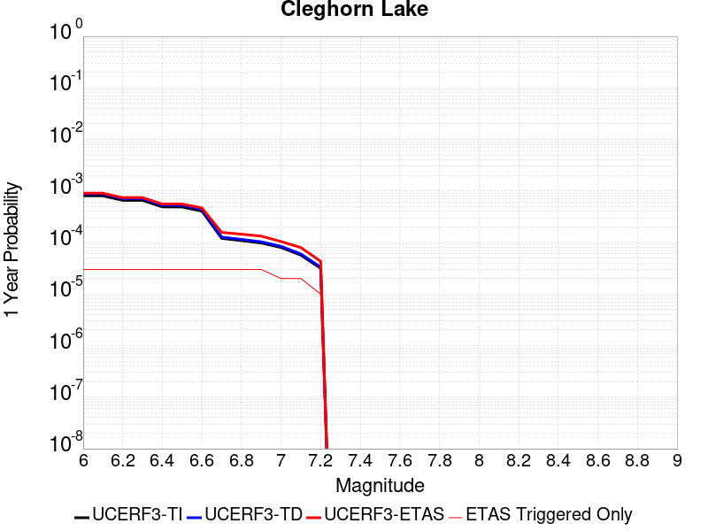 |  |

| Magnitude | 1 wk TI Prob | 1 wk TD Prob | 1 wk ETAS Prob | 1 wk ETAS/TD Gain | 1 wk ETAS Triggered Only | 1 mo TI Prob | 1 mo TD Prob | 1 mo ETAS Prob | 1 mo ETAS/TD Gain | 1 mo ETAS Triggered Only | 1 yr TI Prob | 1 yr TD Prob | 1 yr ETAS Prob | 1 yr ETAS/TD Gain | 1 yr ETAS Triggered Only | 10 yr TI Prob | 10 yr TD Prob | 10 yr ETAS Prob | 10 yr ETAS/TD Gain | 10 yr ETAS Triggered Only |
|-----|-----|-----|-----|-----|-----|-----|-----|-----|-----|-----|-----|-----|-----|-----|-----|-----|-----|-----|-----|-----|
| 6.0 | 1.5467183E-5 | 1.6795162E-5 | 1.6795162E-5 | 1.0 | 0.0 | 6.6286244E-5 | 7.197759E-5 | 9.197615E-5 | 1.2778443 | 2.0E-5 | 8.067362E-4 | 8.760297E-4 | 9.0600346E-4 | 1.0342155 | 3.0E-5 | 0.008038137 | 0.008731192 | 0.008800581 | 1.0079472 | 7.0E-5 |
| 6.1 | 1.5467183E-5 | 1.6795162E-5 | 1.6795162E-5 | 1.0 | 0.0 | 6.6286244E-5 | 7.197759E-5 | 9.197615E-5 | 1.2778443 | 2.0E-5 | 8.067362E-4 | 8.760297E-4 | 9.0600346E-4 | 1.0342155 | 3.0E-5 | 0.008038137 | 0.008731192 | 0.008800581 | 1.0079472 | 7.0E-5 |
| 6.2 | 1.2624631E-5 | 1.3682307E-5 | 1.3682307E-5 | 1.0 | 0.0 | 5.410444E-5 | 5.8637415E-5 | 7.863624E-5 | 1.3410592 | 2.0E-5 | 6.585225E-4 | 7.137254E-4 | 7.43704E-4 | 1.0420029 | 3.0E-5 | 0.0065657445 | 0.0071191275 | 0.0071787005 | 1.008368 | 6.0E-5 |
| 6.3 | 1.2624631E-5 | 1.3682307E-5 | 1.3682307E-5 | 1.0 | 0.0 | 5.410444E-5 | 5.8637415E-5 | 7.863624E-5 | 1.3410592 | 2.0E-5 | 6.585225E-4 | 7.137254E-4 | 7.43704E-4 | 1.0420029 | 3.0E-5 | 0.0065657445 | 0.0071191275 | 0.0071787005 | 1.008368 | 6.0E-5 |
| 6.4 | 9.417684E-6 | 1.0170659E-5 | 1.0170659E-5 | 1.0 | 0.0 | 4.036088E-5 | 4.3588043E-5 | 6.358717E-5 | 1.4588214 | 2.0E-5 | 4.912829E-4 | 5.305963E-4 | 5.6058035E-4 | 1.0565102 | 3.0E-5 | 0.004901982 | 0.0052973307 | 0.0053371186 | 1.007511 | 4.0E-5 |
| 6.5 | 9.368219E-6 | 1.0118083E-5 | 1.0118083E-5 | 1.0 | 0.0 | 4.014889E-5 | 4.3362725E-5 | 6.336186E-5 | 1.4612056 | 2.0E-5 | 4.8870314E-4 | 5.2785437E-4 | 5.5783853E-4 | 1.0568038 | 3.0E-5 | 0.004876298 | 0.005270042 | 0.005299884 | 1.0056626 | 3.0E-5 |
| 6.6 | 7.803798E-6 | 8.44229E-6 | 8.44229E-6 | 1.0 | 0.0 | 3.3444423E-5 | 3.618097E-5 | 5.6180244E-5 | 1.5527568 | 2.0E-5 | 4.0710976E-4 | 4.4045417E-4 | 4.7044095E-4 | 1.0680815 | 3.0E-5 | 0.0040636472 | 0.0043997294 | 0.0044295974 | 1.0067886 | 3.0E-5 |
| 6.7 | 2.3108669E-6 | 2.443927E-6 | 2.443927E-6 | 1.0 | 0.0 | 9.903678E-6 | 1.0473932E-5 | 3.0473722E-5 | 2.9094827 | 2.0E-5 | 1.205706E-4 | 1.2751285E-4 | 1.5750901E-4 | 1.2352405 | 3.0E-5 | 0.001205052 | 0.0012744154 | 0.0013043772 | 1.0235102 | 3.0E-5 |
| 6.8 | 2.0882828E-6 | 2.2063648E-6 | 2.2063648E-6 | 1.0 | 0.0 | 8.949753E-6 | 9.455816E-6 | 2.9455627E-5 | 3.1150804 | 2.0E-5 | 1.08957785E-4 | 1.1511865E-4 | 1.4511519E-4 | 1.2605706 | 3.0E-5 | 0.0010890438 | 0.001150607 | 0.0011805726 | 1.0260432 | 3.0E-5 |
| 6.9 | 1.876935E-6 | 1.981124E-6 | 1.981124E-6 | 1.0 | 0.0 | 8.043982E-6 | 8.490504E-6 | 2.8490334E-5 | 3.3555527 | 2.0E-5 | 9.7931086E-5 | 1.0336715E-4 | 1.3336404E-4 | 1.2901976 | 3.0E-5 | 9.788794E-4 | 0.0010332067 | 0.0010631756 | 1.0290058 | 3.0E-5 |
| 7.0 | 1.5357559E-6 | 1.6203398E-6 | 1.6203398E-6 | 1.0 | 0.0 | 6.5817944E-6 | 6.944296E-6 | 1.6944226E-5 | 2.4400208 | 1.0E-5 | 8.01304E-5 | 8.454365E-5 | 1.04541956E-4 | 1.2365441 | 2.0E-5 | 8.010151E-4 | 8.4512733E-4 | 8.651104E-4 | 1.023645 | 2.0E-5 |
| 7.1 | 1.0905424E-6 | 1.1498034E-6 | 1.1498034E-6 | 1.0 | 0.0 | 4.6737446E-6 | 4.92772E-6 | 1.4927671E-5 | 3.029326 | 1.0E-5 | 5.6901354E-5 | 5.999344E-5 | 7.999224E-5 | 1.3333498 | 2.0E-5 | 5.6886784E-4 | 5.997822E-4 | 6.197702E-4 | 1.0333254 | 2.0E-5 |
| 7.2 | 6.06668E-7 | 6.387501E-7 | 6.387501E-7 | 1.0 | 0.0 | 2.600003E-6 | 2.737498E-6 | 2.737498E-6 | 1.0 | 0.0 | 3.1654577E-5 | 3.33286E-5 | 4.3328266E-5 | 1.3000326 | 1.0E-5 | 3.1650066E-4 | 3.3324285E-4 | 3.4323952E-4 | 1.0299982 | 1.0E-5 |

## San Andreas (Cholame) rev
*[(top)](#table-of-contents)*

| 1 Week | 1 Month | 1 Year | 10 Year |
|-----|-----|-----|-----|
|  |  | 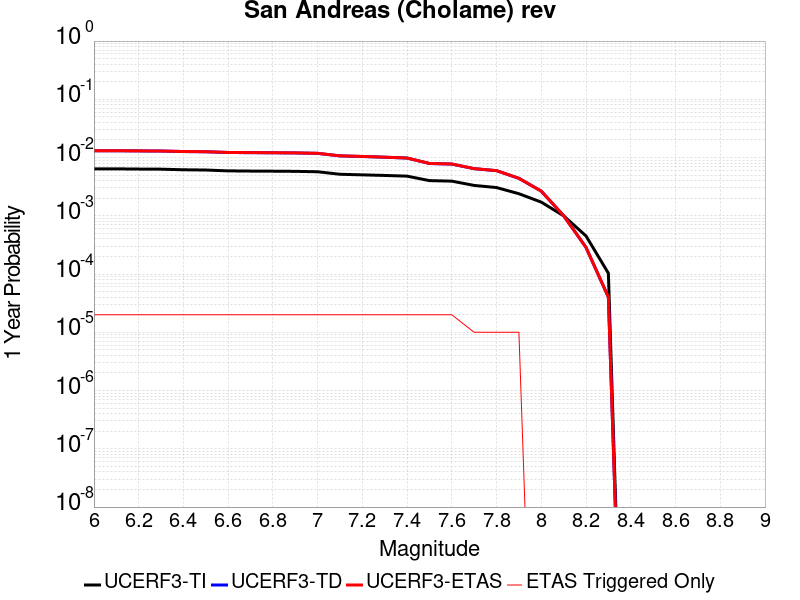 |  |

| Magnitude | 1 wk TI Prob | 1 wk TD Prob | 1 wk ETAS Prob | 1 wk ETAS/TD Gain | 1 wk ETAS Triggered Only | 1 mo TI Prob | 1 mo TD Prob | 1 mo ETAS Prob | 1 mo ETAS/TD Gain | 1 mo ETAS Triggered Only | 1 yr TI Prob | 1 yr TD Prob | 1 yr ETAS Prob | 1 yr ETAS/TD Gain | 1 yr ETAS Triggered Only | 10 yr TI Prob | 10 yr TD Prob | 10 yr ETAS Prob | 10 yr ETAS/TD Gain | 10 yr ETAS Triggered Only |
|-----|-----|-----|-----|-----|-----|-----|-----|-----|-----|-----|-----|-----|-----|-----|-----|-----|-----|-----|-----|-----|
| 6.0 | 1.2302514E-4 | 2.525446E-4 | 2.525446E-4 | 1.0 | 0.0 | 5.27144E-4 | 0.0010818866 | 0.0010818866 | 1.0 | 0.0 | 0.0063991086 | 0.013092926 | 0.013112664 | 1.0015075 | 2.0E-5 | 0.06217949 | 0.12457548 | 0.12464552 | 1.0005622 | 8.0E-5 |
| 6.1 | 1.2302514E-4 | 2.525446E-4 | 2.525446E-4 | 1.0 | 0.0 | 5.27144E-4 | 0.0010818866 | 0.0010818866 | 1.0 | 0.0 | 0.0063991086 | 0.013092926 | 0.013112664 | 1.0015075 | 2.0E-5 | 0.06217949 | 0.12457548 | 0.12464552 | 1.0005622 | 8.0E-5 |
| 6.2 | 1.2203569E-4 | 2.5071172E-4 | 2.5071172E-4 | 1.0 | 0.0 | 5.2290526E-4 | 0.001074038 | 0.001074038 | 1.0 | 0.0 | 0.006347804 | 0.012998513 | 0.013018253 | 1.0015186 | 2.0E-5 | 0.061695136 | 0.12376386 | 0.123833954 | 1.0005664 | 8.0E-5 |
| 6.3 | 1.2142645E-4 | 2.4957108E-4 | 2.4957108E-4 | 1.0 | 0.0 | 5.202953E-4 | 0.0010691535 | 0.0010691535 | 1.0 | 0.0 | 0.006316212 | 0.012939752 | 0.012959493 | 1.0015256 | 2.0E-5 | 0.06139677 | 0.123257056 | 0.123327196 | 1.0005691 | 8.0E-5 |
| 6.4 | 1.1865206E-4 | 2.4462308E-4 | 2.4462308E-4 | 1.0 | 0.0 | 5.0840975E-4 | 0.001047965 | 0.001047965 | 1.0 | 0.0 | 0.006172335 | 0.012684811 | 0.012704558 | 1.0015566 | 2.0E-5 | 0.060036868 | 0.12105244 | 0.121122755 | 1.0005809 | 8.0E-5 |
| 6.5 | 1.17443946E-4 | 2.425541E-4 | 2.425541E-4 | 1.0 | 0.0 | 5.032341E-4 | 0.001039105 | 0.001039105 | 1.0 | 0.0 | 0.006109677 | 0.012578189 | 0.012597937 | 1.0015701 | 2.0E-5 | 0.059444077 | 0.12012917 | 0.12019956 | 1.0005859 | 8.0E-5 |
| 6.6 | 1.13579066E-4 | 2.3563807E-4 | 2.3563807E-4 | 1.0 | 0.0 | 4.866766E-4 | 0.0010094881 | 0.0010094881 | 1.0 | 0.0 | 0.0059092017 | 0.012221701 | 0.012241457 | 1.0016165 | 2.0E-5 | 0.057545185 | 0.11704833 | 0.11711897 | 1.0006034 | 8.0E-5 |
| 6.7 | 1.1271412E-4 | 2.3408006E-4 | 2.3408006E-4 | 1.0 | 0.0 | 4.829711E-4 | 0.001002816 | 0.001002816 | 1.0 | 0.0 | 0.005864331 | 0.012141378 | 0.012161135 | 1.0016272 | 2.0E-5 | 0.057119697 | 0.116351984 | 0.116422676 | 1.0006076 | 8.0E-5 |
| 6.8 | 1.1217975E-4 | 2.3296323E-4 | 2.3296323E-4 | 1.0 | 0.0 | 4.8068175E-4 | 9.980333E-4 | 9.980333E-4 | 1.0 | 0.0 | 0.005836608 | 0.012083795 | 0.012103553 | 1.0016351 | 2.0E-5 | 0.056856725 | 0.11584953 | 0.11592027 | 1.0006106 | 8.0E-5 |
| 6.9 | 1.1146753E-4 | 2.3144946E-4 | 2.3144946E-4 | 1.0 | 0.0 | 4.7763053E-4 | 9.915507E-4 | 9.915507E-4 | 1.0 | 0.0 | 0.0057996577 | 0.012005742 | 0.012025502 | 1.0016459 | 2.0E-5 | 0.056506127 | 0.11516885 | 0.115239635 | 1.0006146 | 8.0E-5 |
| 7.0 | 1.0965793E-4 | 2.2767874E-4 | 2.2767874E-4 | 1.0 | 0.0 | 4.698779E-4 | 9.7540265E-4 | 9.7540265E-4 | 1.0 | 0.0 | 0.005705768 | 0.011811287 | 0.011831051 | 1.0016733 | 2.0E-5 | 0.055614736 | 0.11347137 | 0.11354229 | 1.000625 | 8.0E-5 |
| 7.1 | 9.927982E-5 | 2.0584992E-4 | 2.0584992E-4 | 1.0 | 0.0 | 4.2541555E-4 | 8.819167E-4 | 8.819167E-4 | 1.0 | 0.0 | 0.0051671406 | 0.010684769 | 0.010704555 | 1.0018518 | 2.0E-5 | 0.05048634 | 0.10357996 | 0.10364271 | 1.0006058 | 7.0E-5 |
| 7.2 | 9.696786E-5 | 2.0088936E-4 | 2.0088936E-4 | 1.0 | 0.0 | 4.1551032E-4 | 8.6067134E-4 | 8.6067134E-4 | 1.0 | 0.0 | 0.00504711 | 0.01042861 | 0.010448402 | 1.0018978 | 2.0E-5 | 0.04934009 | 0.10131455 | 0.10136848 | 1.0005323 | 6.0E-5 |
| 7.3 | 9.4727984E-5 | 1.9517449E-4 | 1.9517449E-4 | 1.0 | 0.0 | 4.0591392E-4 | 8.3619496E-4 | 8.3619496E-4 | 1.0 | 0.0 | 0.0049308087 | 0.01013342 | 0.010153217 | 1.0019537 | 2.0E-5 | 0.048228268 | 0.098685615 | 0.0987397 | 1.000548 | 6.0E-5 |
| 7.4 | 9.220358E-5 | 1.8887127E-4 | 1.8887127E-4 | 1.0 | 0.0 | 3.9509835E-4 | 8.091981E-4 | 8.091981E-4 | 1.0 | 0.0 | 0.004799717 | 0.009807732 | 0.009827536 | 1.0020192 | 2.0E-5 | 0.046973653 | 0.09576735 | 0.095821604 | 1.0005665 | 6.0E-5 |
| 7.5 | 7.71631E-5 | 1.5216727E-4 | 1.5216727E-4 | 1.0 | 0.0 | 3.306571E-4 | 6.519826E-4 | 6.519826E-4 | 1.0 | 0.0 | 0.0040183207 | 0.007909069 | 0.007928911 | 1.0025088 | 2.0E-5 | 0.03946433 | 0.07845872 | 0.07851402 | 1.0007048 | 6.0E-5 |
| 7.6 | 7.5634416E-5 | 1.4875608E-4 | 1.4875608E-4 | 1.0 | 0.0 | 3.241072E-4 | 6.3737045E-4 | 6.3737045E-4 | 1.0 | 0.0 | 0.0039388672 | 0.007732442 | 0.0077522877 | 1.0025665 | 2.0E-5 | 0.038697794 | 0.076822504 | 0.07687789 | 1.000721 | 6.0E-5 |
| 7.7 | 6.3783E-5 | 1.2392823E-4 | 1.2392823E-4 | 1.0 | 0.0 | 2.7332708E-4 | 5.310129E-4 | 5.310129E-4 | 1.0 | 0.0 | 0.0033226798 | 0.0064459443 | 0.0064558797 | 1.0015414 | 1.0E-5 | 0.032734364 | 0.06469847 | 0.06474524 | 1.0007228 | 5.0E-5 |
| 7.8 | 5.863422E-5 | 1.1447118E-4 | 1.1447118E-4 | 1.0 | 0.0 | 2.512653E-4 | 4.9049855E-4 | 4.9049855E-4 | 1.0 | 0.0 | 0.003054864 | 0.0059554894 | 0.00596543 | 1.0016692 | 1.0E-5 | 0.030132094 | 0.059802204 | 0.05983981 | 1.0006288 | 4.0E-5 |
| 7.9 | 4.595283E-5 | 8.4489315E-5 | 8.4489315E-5 | 1.0 | 0.0 | 1.9692584E-4 | 3.6204685E-4 | 3.6204685E-4 | 1.0 | 0.0 | 0.0023949358 | 0.004399018 | 0.004408974 | 1.0022632 | 1.0E-5 | 0.023692891 | 0.04446656 | 0.044495225 | 1.0006447 | 3.0E-5 |
| 8.0 | 3.2950178E-5 | 5.091287E-5 | 5.091287E-5 | 1.0 | 0.0 | 1.412074E-4 | 2.1817978E-4 | 2.1817978E-4 | 1.0 | 0.0 | 0.0017178444 | 0.0026531045 | 0.0026531045 | 1.0 | 0.0 | 0.017046256 | 0.027249493 | 0.027259221 | 1.000357 | 1.0E-5 |
| 8.1 | 1.9177472E-5 | 1.9253317E-5 | 1.9253317E-5 | 1.0 | 0.0 | 8.218658E-5 | 8.251161E-5 | 8.251161E-5 | 1.0 | 0.0 | 0.0010001622 | 0.0010041165 | 0.0010041165 | 1.0 | 0.0 | 0.009956728 | 0.010794429 | 0.010794429 | 1.0 | 0.0 |
| 8.2 | 8.643924E-6 | 5.5000196E-6 | 5.5000196E-6 | 1.0 | 0.0 | 3.704486E-5 | 2.35713E-5 | 2.35713E-5 | 1.0 | 0.0 | 4.5092785E-4 | 2.8694287E-4 | 2.8694287E-4 | 1.0 | 0.0 | 0.0045001395 | 0.0032626302 | 0.0032626302 | 1.0 | 0.0 |
| 8.3 | 1.983087E-6 | 7.698541E-7 | 7.698541E-7 | 1.0 | 0.0 | 8.498917E-6 | 3.2993707E-6 | 3.2993707E-6 | 1.0 | 0.0 | 1.034694E-4 | 4.0169114E-5 | 4.0169114E-5 | 1.0 | 0.0 | 0.0010342124 | 4.7419698E-4 | 4.7419698E-4 | 1.0 | 0.0 |

## Calico-Hidalgo
*[(top)](#table-of-contents)*

| 1 Week | 1 Month | 1 Year | 10 Year |
|-----|-----|-----|-----|
|  |  |  |  |

| Magnitude | 1 wk TI Prob | 1 wk TD Prob | 1 wk ETAS Prob | 1 wk ETAS/TD Gain | 1 wk ETAS Triggered Only | 1 mo TI Prob | 1 mo TD Prob | 1 mo ETAS Prob | 1 mo ETAS/TD Gain | 1 mo ETAS Triggered Only | 1 yr TI Prob | 1 yr TD Prob | 1 yr ETAS Prob | 1 yr ETAS/TD Gain | 1 yr ETAS Triggered Only | 10 yr TI Prob | 10 yr TD Prob | 10 yr ETAS Prob | 10 yr ETAS/TD Gain | 10 yr ETAS Triggered Only |
|-----|-----|-----|-----|-----|-----|-----|-----|-----|-----|-----|-----|-----|-----|-----|-----|-----|-----|-----|-----|-----|
| 6.0 | 4.0906612E-5 | 5.070939E-5 | 5.070939E-5 | 1.0 | 0.0 | 1.7530227E-4 | 2.1731014E-4 | 2.2730797E-4 | 1.0460072 | 1.0E-5 | 0.0021322158 | 0.002642939 | 0.002692807 | 1.0188683 | 5.0E-5 | 0.02111873 | 0.026155366 | 0.026233273 | 1.0029787 | 8.0E-5 |
| 6.1 | 4.0906612E-5 | 5.070939E-5 | 5.070939E-5 | 1.0 | 0.0 | 1.7530227E-4 | 2.1731014E-4 | 2.2730797E-4 | 1.0460072 | 1.0E-5 | 0.0021322158 | 0.002642939 | 0.002692807 | 1.0188683 | 5.0E-5 | 0.02111873 | 0.026155366 | 0.026233273 | 1.0029787 | 8.0E-5 |
| 6.2 | 4.0906612E-5 | 5.070939E-5 | 5.070939E-5 | 1.0 | 0.0 | 1.7530227E-4 | 2.1731014E-4 | 2.2730797E-4 | 1.0460072 | 1.0E-5 | 0.0021322158 | 0.002642939 | 0.002692807 | 1.0188683 | 5.0E-5 | 0.02111873 | 0.026155366 | 0.026233273 | 1.0029787 | 8.0E-5 |
| 6.3 | 2.4242801E-5 | 3.0093004E-5 | 3.0093004E-5 | 1.0 | 0.0 | 1.0389358E-4 | 1.2896383E-4 | 1.3896254E-4 | 1.0775311 | 1.0E-5 | 0.0012641704 | 0.0015690372 | 0.0016089744 | 1.0254533 | 4.0E-5 | 0.01257003 | 0.015583274 | 0.015622651 | 1.0025269 | 4.0E-5 |
| 6.4 | 2.4242801E-5 | 3.0093004E-5 | 3.0093004E-5 | 1.0 | 0.0 | 1.0389358E-4 | 1.2896383E-4 | 1.3896254E-4 | 1.0775311 | 1.0E-5 | 0.0012641704 | 0.0015690372 | 0.0016089744 | 1.0254533 | 4.0E-5 | 0.01257003 | 0.015583274 | 0.015622651 | 1.0025269 | 4.0E-5 |
| 6.5 | 2.0286952E-5 | 2.5317499E-5 | 2.5317499E-5 | 1.0 | 0.0 | 8.694118E-5 | 1.0849915E-4 | 1.18498065E-4 | 1.0921566 | 1.0E-5 | 0.0010579949 | 0.0013201938 | 0.001360141 | 1.0302585 | 4.0E-5 | 0.010529719 | 0.013125445 | 0.01316492 | 1.0030075 | 4.0E-5 |
| 6.6 | 2.0269223E-5 | 2.5298448E-5 | 2.5298448E-5 | 1.0 | 0.0 | 8.6865206E-5 | 1.0841751E-4 | 1.1841642E-4 | 1.092226 | 1.0E-5 | 0.0010570707 | 0.001319201 | 0.0013591482 | 1.0302814 | 4.0E-5 | 0.010520565 | 0.013115634 | 0.013155109 | 1.0030098 | 4.0E-5 |
| 6.7 | 1.799852E-5 | 2.2542112E-5 | 2.2542112E-5 | 1.0 | 0.0 | 7.713423E-5 | 9.660555E-5 | 1.0660459E-4 | 1.1035037 | 1.0E-5 | 9.3870464E-4 | 0.0011755526 | 0.0012155055 | 1.0339866 | 4.0E-5 | 0.009347493 | 0.011694953 | 0.011734485 | 1.0033803 | 4.0E-5 |
| 6.8 | 1.7458793E-5 | 2.1843452E-5 | 2.1843452E-5 | 1.0 | 0.0 | 7.4821255E-5 | 9.361152E-5 | 1.0361058E-4 | 1.1068145 | 1.0E-5 | 9.10568E-4 | 0.0011391388 | 0.0011790933 | 1.0350742 | 4.0E-5 | 0.009068459 | 0.01133458 | 0.011374127 | 1.003489 | 4.0E-5 |
| 6.9 | 1.542884E-5 | 1.9026953E-5 | 1.9026953E-5 | 1.0 | 0.0 | 6.612192E-5 | 8.154161E-5 | 9.1540795E-5 | 1.1226268 | 1.0E-5 | 8.04737E-4 | 9.923301E-4 | 0.0010322904 | 1.0402691 | 4.0E-5 | 0.008018291 | 0.009880388 | 0.009919993 | 1.0040084 | 4.0E-5 |
| 7.0 | 1.468253E-5 | 1.8031727E-5 | 1.8031727E-5 | 1.0 | 0.0 | 6.292361E-5 | 7.7276614E-5 | 8.727584E-5 | 1.1293952 | 1.0E-5 | 7.658257E-4 | 9.404497E-4 | 9.804121E-4 | 1.0424929 | 4.0E-5 | 0.0076319184 | 0.009366064 | 0.00940569 | 1.0042307 | 4.0E-5 |
| 7.1 | 1.3139281E-5 | 1.6201913E-5 | 1.6201913E-5 | 1.0 | 0.0 | 5.6309986E-5 | 6.9434995E-5 | 7.94343E-5 | 1.1440096 | 1.0E-5 | 6.853584E-4 | 8.450558E-4 | 8.85022E-4 | 1.0472941 | 4.0E-5 | 0.0068324856 | 0.008419721 | 0.008459385 | 1.0047108 | 4.0E-5 |
| 7.2 | 1.1127404E-5 | 1.38674195E-5 | 1.38674195E-5 | 1.0 | 0.0 | 4.7688E-5 | 5.9430506E-5 | 6.942991E-5 | 1.1682538 | 1.0E-5 | 5.8044674E-4 | 7.2333706E-4 | 7.533154E-4 | 1.0414444 | 3.0E-5 | 0.0057893298 | 0.0072109345 | 0.007240718 | 1.0041304 | 3.0E-5 |
| 7.3 | 9.808154E-6 | 1.2176909E-5 | 1.2176909E-5 | 1.0 | 0.0 | 4.2034266E-5 | 5.218577E-5 | 6.2185245E-5 | 1.1916131 | 1.0E-5 | 5.11647E-4 | 6.351872E-4 | 6.6516816E-4 | 1.0472002 | 3.0E-5 | 0.0051047057 | 0.006334793 | 0.006364603 | 1.0047058 | 3.0E-5 |
| 7.4 | 7.942452E-6 | 9.792603E-6 | 9.792603E-6 | 1.0 | 0.0 | 3.4038632E-5 | 4.1967676E-5 | 5.1967258E-5 | 1.2382686 | 1.0E-5 | 4.1434157E-4 | 5.1084615E-4 | 5.4083084E-4 | 1.0586962 | 3.0E-5 | 0.0041356985 | 0.00509766 | 0.005127507 | 1.0058551 | 3.0E-5 |
| 7.5 | 4.7121216E-6 | 5.7731E-6 | 5.7731E-6 | 1.0 | 0.0 | 2.019465E-5 | 2.4741666E-5 | 3.4741417E-5 | 1.4041665 | 1.0E-5 | 2.4584212E-4 | 3.011958E-4 | 3.3118678E-4 | 1.099573 | 3.0E-5 | 0.0024557032 | 0.0030086285 | 0.0030385382 | 1.0099413 | 3.0E-5 |
| 7.6 | 2.21172E-7 | 2.6040485E-7 | 2.6040485E-7 | 1.0 | 0.0 | 9.478797E-7 | 1.1160205E-6 | 1.1160205E-6 | 1.0 | 0.0 | 1.1540374E-5 | 1.35874925E-5 | 1.35874925E-5 | 1.0 | 0.0 | 1.1539775E-4 | 1.3586943E-4 | 1.3586943E-4 | 1.0 | 0.0 |

## Santa Rosa Island
*[(top)](#table-of-contents)*

| 1 Week | 1 Month | 1 Year | 10 Year |
|-----|-----|-----|-----|
|  |  |  |  |

| Magnitude | 1 wk TI Prob | 1 wk TD Prob | 1 wk ETAS Prob | 1 wk ETAS/TD Gain | 1 wk ETAS Triggered Only | 1 mo TI Prob | 1 mo TD Prob | 1 mo ETAS Prob | 1 mo ETAS/TD Gain | 1 mo ETAS Triggered Only | 1 yr TI Prob | 1 yr TD Prob | 1 yr ETAS Prob | 1 yr ETAS/TD Gain | 1 yr ETAS Triggered Only | 10 yr TI Prob | 10 yr TD Prob | 10 yr ETAS Prob | 10 yr ETAS/TD Gain | 10 yr ETAS Triggered Only |
|-----|-----|-----|-----|-----|-----|-----|-----|-----|-----|-----|-----|-----|-----|-----|-----|-----|-----|-----|-----|-----|
| 6.0 | 4.1143165E-5 | 4.709567E-5 | 4.709567E-5 | 1.0 | 0.0 | 1.7631594E-4 | 2.0182405E-4 | 2.0182405E-4 | 1.0 | 0.0 | 0.002144533 | 0.0024546355 | 0.0024845616 | 1.0121918 | 3.0E-5 | 0.021239553 | 0.024295872 | 0.024373928 | 1.0032127 | 8.0E-5 |
| 6.1 | 2.1061249E-5 | 2.3867078E-5 | 2.3867078E-5 | 1.0 | 0.0 | 9.0259375E-5 | 1.0228363E-4 | 1.0228363E-4 | 1.0 | 0.0 | 0.0010983539 | 0.0012446208 | 0.0012645959 | 1.0160491 | 2.0E-5 | 0.01092941 | 0.012379542 | 0.0124289235 | 1.0039889 | 5.0E-5 |
| 6.2 | 2.1061249E-5 | 2.3867078E-5 | 2.3867078E-5 | 1.0 | 0.0 | 9.0259375E-5 | 1.0228363E-4 | 1.0228363E-4 | 1.0 | 0.0 | 0.0010983539 | 0.0012446208 | 0.0012645959 | 1.0160491 | 2.0E-5 | 0.01092941 | 0.012379542 | 0.0124289235 | 1.0039889 | 5.0E-5 |
| 6.3 | 1.5158236E-5 | 1.707586E-5 | 1.707586E-5 | 1.0 | 0.0 | 6.496225E-5 | 7.3180265E-5 | 7.3180265E-5 | 1.0 | 0.0 | 7.906284E-4 | 8.9061755E-4 | 9.006086E-4 | 1.0112182 | 1.0E-5 | 0.007878214 | 0.008871735 | 0.008891557 | 1.0022343 | 2.0E-5 |
| 6.4 | 1.2341918E-5 | 1.3854049E-5 | 1.3854049E-5 | 1.0 | 0.0 | 5.2892858E-5 | 5.937319E-5 | 5.937319E-5 | 1.0 | 0.0 | 6.437803E-4 | 7.2263693E-4 | 7.3262973E-4 | 1.0138282 | 1.0E-5 | 0.006419184 | 0.0072037084 | 0.007223564 | 1.0027564 | 2.0E-5 |
| 6.5 | 9.061158E-6 | 1.0117819E-5 | 1.0117819E-5 | 1.0 | 0.0 | 3.883296E-5 | 4.3361393E-5 | 4.3361393E-5 | 1.0 | 0.0 | 4.726887E-4 | 5.278024E-4 | 5.377971E-4 | 1.0189365 | 1.0E-5 | 0.004716845 | 0.0052660266 | 0.0052859215 | 1.003778 | 2.0E-5 |
| 6.6 | 7.5461685E-6 | 8.401371E-6 | 8.401371E-6 | 1.0 | 0.0 | 3.2340322E-5 | 3.60054E-5 | 3.60054E-5 | 1.0 | 0.0 | 3.936723E-4 | 4.382819E-4 | 4.482775E-4 | 1.0228064 | 1.0E-5 | 0.003929756 | 0.0043746047 | 0.0043945173 | 1.0045519 | 2.0E-5 |
| 6.7 | 5.5023775E-6 | 6.087815E-6 | 6.087815E-6 | 1.0 | 0.0 | 2.3581404E-5 | 2.6090394E-5 | 2.6090394E-5 | 1.0 | 0.0 | 2.8706578E-4 | 3.176075E-4 | 3.2760433E-4 | 1.0314754 | 1.0E-5 | 0.0028669522 | 0.0031718577 | 0.003191794 | 1.0062854 | 2.0E-5 |
| 6.8 | 3.7351679E-6 | 4.0833966E-6 | 4.0833966E-6 | 1.0 | 0.0 | 1.6007763E-5 | 1.7500168E-5 | 1.7500168E-5 | 1.0 | 0.0 | 1.948771E-4 | 2.1304621E-4 | 2.2304407E-4 | 1.0469282 | 1.0E-5 | 0.0019470629 | 0.0021286649 | 0.0021386435 | 1.0046878 | 1.0E-5 |
| 6.9 | 2.456366E-6 | 2.6293949E-6 | 2.6293949E-6 | 1.0 | 0.0 | 1.0527241E-5 | 1.1268787E-5 | 1.1268787E-5 | 1.0 | 0.0 | 1.2816161E-4 | 1.3718886E-4 | 1.4718749E-4 | 1.0728822 | 1.0E-5 | 0.0012808773 | 0.0013710447 | 0.0013810309 | 1.0072837 | 1.0E-5 |
| 7.0 | 2.3245157E-6 | 2.4828917E-6 | 2.4828917E-6 | 1.0 | 0.0 | 9.962172E-6 | 1.0640922E-5 | 1.0640922E-5 | 1.0 | 0.0 | 1.2128269E-4 | 1.2954553E-4 | 1.3954424E-4 | 1.0771829 | 1.0E-5 | 0.0012121652 | 0.0012947024 | 0.0013046896 | 1.0077138 | 1.0E-5 |
| 7.1 | 2.2248344E-6 | 2.3733562E-6 | 2.3733562E-6 | 1.0 | 0.0 | 9.53497E-6 | 1.0171487E-5 | 1.0171487E-5 | 1.0 | 0.0 | 1.1608207E-4 | 1.2383083E-4 | 1.338296E-4 | 1.0807453 | 1.0E-5 | 0.0011602144 | 0.0012376204 | 0.001247608 | 1.00807 | 1.0E-5 |
| 7.2 | 2.1350402E-6 | 2.276255E-6 | 2.276255E-6 | 1.0 | 0.0 | 9.150141E-6 | 9.755342E-6 | 9.755342E-6 | 1.0 | 0.0 | 1.1139726E-4 | 1.1876483E-4 | 1.2876364E-4 | 1.08419 | 1.0E-5 | 0.0011134144 | 0.0011870156 | 0.0011970036 | 1.0084145 | 1.0E-5 |
| 7.3 | 1.9793572E-6 | 2.1088117E-6 | 2.1088117E-6 | 1.0 | 0.0 | 8.482932E-6 | 9.037733E-6 | 9.037733E-6 | 1.0 | 0.0 | 1.032748E-4 | 1.1002886E-4 | 1.2002776E-4 | 1.0908753 | 1.0E-5 | 0.0010322682 | 0.0010997456 | 0.0011097346 | 1.009083 | 1.0E-5 |
| 7.4 | 1.6951194E-6 | 1.8046518E-6 | 1.8046518E-6 | 1.0 | 0.0 | 7.264777E-6 | 7.734199E-6 | 7.734199E-6 | 1.0 | 0.0 | 8.844508E-5 | 9.415982E-5 | 1.04158884E-4 | 1.1061924 | 1.0E-5 | 8.840988E-4 | 9.4120094E-4 | 9.511915E-4 | 1.0106148 | 1.0E-5 |
| 7.5 | 8.987207E-7 | 9.512594E-7 | 9.512594E-7 | 1.0 | 0.0 | 3.8516546E-6 | 4.0768196E-6 | 4.0768196E-6 | 1.0 | 0.0 | 4.6892885E-5 | 4.963416E-5 | 4.963416E-5 | 1.0 | 0.0 | 4.688299E-4 | 4.962319E-4 | 4.962319E-4 | 1.0 | 0.0 |
| 7.6 | 3.8783037E-7 | 4.0530622E-7 | 4.0530622E-7 | 1.0 | 0.0 | 1.6621291E-6 | 1.7370255E-6 | 1.7370255E-6 | 1.0 | 0.0 | 2.0236233E-5 | 2.1148087E-5 | 2.1148087E-5 | 1.0 | 0.0 | 2.023439E-4 | 2.114614E-4 | 2.114614E-4 | 1.0 | 0.0 |
| 7.7 | 6.181804E-8 | 6.3392E-8 | 6.3392E-8 | 1.0 | 0.0 | 2.6493444E-7 | 2.7167997E-7 | 2.7167997E-7 | 1.0 | 0.0 | 3.225572E-6 | 3.3076988E-6 | 3.3076988E-6 | 1.0 | 0.0 | 3.225525E-5 | 3.3076503E-5 | 3.3076503E-5 | 1.0 | 0.0 |
| 7.8 | 1.3704449E-9 | 1.3964329E-9 | 1.3964329E-9 | 1.0 | 0.0 | 5.873335E-9 | 5.9847123E-9 | 5.9847123E-9 | 1.0 | 0.0 | 7.1507856E-8 | 7.286387E-8 | 7.286387E-8 | 1.0 | 0.0 | 7.1507833E-7 | 7.2863855E-7 | 7.2863855E-7 | 1.0 | 0.0 |

## Owens Valley
*[(top)](#table-of-contents)*

| 1 Week | 1 Month | 1 Year | 10 Year |
|-----|-----|-----|-----|
|  |  | 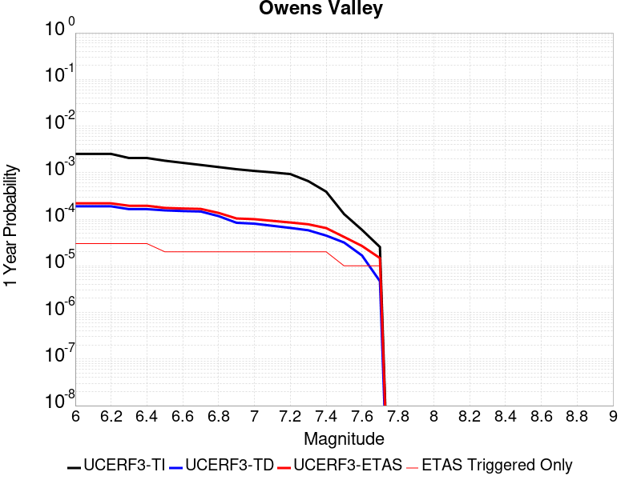 |  |

| Magnitude | 1 wk TI Prob | 1 wk TD Prob | 1 wk ETAS Prob | 1 wk ETAS/TD Gain | 1 wk ETAS Triggered Only | 1 mo TI Prob | 1 mo TD Prob | 1 mo ETAS Prob | 1 mo ETAS/TD Gain | 1 mo ETAS Triggered Only | 1 yr TI Prob | 1 yr TD Prob | 1 yr ETAS Prob | 1 yr ETAS/TD Gain | 1 yr ETAS Triggered Only | 10 yr TI Prob | 10 yr TD Prob | 10 yr ETAS Prob | 10 yr ETAS/TD Gain | 10 yr ETAS Triggered Only |
|-----|-----|-----|-----|-----|-----|-----|-----|-----|-----|-----|-----|-----|-----|-----|-----|-----|-----|-----|-----|-----|
| 6.0 | 4.83821E-5 | 3.6307986E-6 | 1.3630763E-5 | 3.754205 | 1.0E-5 | 2.0733538E-4 | 1.5560478E-5 | 2.5560323E-5 | 1.6426438 | 1.0E-5 | 0.002521386 | 1.8943335E-4 | 2.1942766E-4 | 1.158337 | 3.0E-5 | 0.024929691 | 0.0019204527 | 0.002000299 | 1.0415769 | 8.0E-5 |
| 6.1 | 4.83821E-5 | 3.6307986E-6 | 1.3630763E-5 | 3.754205 | 1.0E-5 | 2.0733538E-4 | 1.5560478E-5 | 2.5560323E-5 | 1.6426438 | 1.0E-5 | 0.002521386 | 1.8943335E-4 | 2.1942766E-4 | 1.158337 | 3.0E-5 | 0.024929691 | 0.0019204527 | 0.002000299 | 1.0415769 | 8.0E-5 |
| 6.2 | 4.83821E-5 | 3.6307986E-6 | 1.3630763E-5 | 3.754205 | 1.0E-5 | 2.0733538E-4 | 1.5560478E-5 | 2.5560323E-5 | 1.6426438 | 1.0E-5 | 0.002521386 | 1.8943335E-4 | 2.1942766E-4 | 1.158337 | 3.0E-5 | 0.024929691 | 0.0019204527 | 0.002000299 | 1.0415769 | 8.0E-5 |
| 6.3 | 3.953008E-5 | 3.157178E-6 | 1.3157147E-5 | 4.1673756 | 1.0E-5 | 1.6940363E-4 | 1.3530697E-5 | 2.3530562E-5 | 1.7390501 | 1.0E-5 | 0.002060538 | 1.6472452E-4 | 1.9471959E-4 | 1.1820922 | 3.0E-5 | 0.020415364 | 0.0016592578 | 0.0017391251 | 1.0481343 | 8.0E-5 |
| 6.4 | 3.953008E-5 | 3.157178E-6 | 1.3157147E-5 | 4.1673756 | 1.0E-5 | 1.6940363E-4 | 1.3530697E-5 | 2.3530562E-5 | 1.7390501 | 1.0E-5 | 0.002060538 | 1.6472452E-4 | 1.9471959E-4 | 1.1820922 | 3.0E-5 | 0.020415364 | 0.0016592578 | 0.0017391251 | 1.0481343 | 8.0E-5 |
| 6.5 | 3.457342E-5 | 2.9724474E-6 | 1.2972418E-5 | 4.364221 | 1.0E-5 | 1.4816338E-4 | 1.2739002E-5 | 2.2738875E-5 | 1.7849808 | 1.0E-5 | 0.0018023965 | 1.5508702E-4 | 1.7508391E-4 | 1.1289399 | 2.0E-5 | 0.017878477 | 0.001555904 | 0.0016257952 | 1.04492 | 7.0E-5 |
| 6.6 | 3.1127765E-5 | 2.875312E-6 | 1.2875284E-5 | 4.4778733 | 1.0E-5 | 1.3339789E-4 | 1.2322711E-5 | 2.2322589E-5 | 1.8114997 | 1.0E-5 | 0.0016229092 | 1.5001938E-4 | 1.7001637E-4 | 1.1332961 | 2.0E-5 | 0.016111081 | 0.0015010133 | 0.0015709082 | 1.0465652 | 7.0E-5 |
| 6.7 | 2.806885E-5 | 2.810933E-6 | 1.2810905E-5 | 4.5575275 | 1.0E-5 | 1.2028952E-4 | 1.2046804E-5 | 2.2046685E-5 | 1.8300856 | 1.0E-5 | 0.001463541 | 1.4666065E-4 | 1.6665772E-4 | 1.1363492 | 2.0E-5 | 0.014539397 | 0.001466014 | 0.0015359112 | 1.0476785 | 7.0E-5 |
| 6.8 | 2.524524E-5 | 2.2358179E-6 | 1.2235795E-5 | 5.472626 | 1.0E-5 | 1.0818939E-4 | 9.582042E-6 | 1.9581947E-5 | 2.043609 | 1.0E-5 | 0.0013164099 | 1.1665543E-4 | 1.3665309E-4 | 1.1714251 | 2.0E-5 | 0.01308639 | 0.0011661836 | 0.0012361021 | 1.0599549 | 7.0E-5 |
| 6.9 | 2.2704568E-5 | 1.6084754E-6 | 1.1608459E-5 | 7.2170577 | 1.0E-5 | 9.730166E-5 | 6.893448E-6 | 1.6893378E-5 | 2.4506428 | 1.0E-5 | 0.0011840039 | 8.392451E-5 | 1.0392283E-4 | 1.2382894 | 2.0E-5 | 0.011777153 | 8.3910255E-4 | 9.090438E-4 | 1.0833524 | 7.0E-5 |
| 7.0 | 2.0871712E-5 | 1.5398424E-6 | 1.1539827E-5 | 7.494161 | 1.0E-5 | 8.944713E-5 | 6.599308E-6 | 1.6599242E-5 | 2.5153003 | 1.0E-5 | 0.0010884746 | 8.034363E-5 | 1.00342026E-4 | 1.2489108 | 2.0E-5 | 0.010831586 | 8.032782E-4 | 8.7322196E-4 | 1.087073 | 7.0E-5 |
| 7.1 | 1.944928E-5 | 1.3866717E-6 | 1.1386658E-5 | 8.211502 | 1.0E-5 | 8.335139E-5 | 5.9428653E-6 | 1.5942805E-5 | 2.6826801 | 1.0E-5 | 0.0010143308 | 7.235199E-5 | 9.235054E-5 | 1.2764064 | 2.0E-5 | 0.010097133 | 7.2340306E-4 | 7.9335243E-4 | 1.0966948 | 7.0E-5 |
| 7.2 | 1.7876306E-5 | 1.2491367E-6 | 1.1249124E-5 | 9.005519 | 1.0E-5 | 7.6610486E-5 | 5.3534322E-6 | 1.5353378E-5 | 2.8679504 | 1.0E-5 | 9.3233347E-4 | 6.517609E-5 | 8.517479E-5 | 1.306841 | 2.0E-5 | 0.009284316 | 6.5167877E-4 | 7.2163314E-4 | 1.1073449 | 7.0E-5 |
| 7.3 | 1.2618672E-5 | 1.1117248E-6 | 1.1111713E-5 | 9.995021 | 1.0E-5 | 5.40789E-5 | 4.7645267E-6 | 1.4764479E-5 | 3.0988345 | 1.0E-5 | 6.582117E-4 | 5.800657E-5 | 7.800541E-5 | 1.3447685 | 2.0E-5 | 0.0065626553 | 5.800182E-4 | 6.4997765E-4 | 1.1206158 | 7.0E-5 |
| 7.4 | 7.4874442E-6 | 8.550399E-7 | 1.0855031E-5 | 12.695351 | 1.0E-5 | 3.208865E-5 | 3.6644517E-6 | 1.3664415E-5 | 3.7289112 | 1.0E-5 | 3.906093E-4 | 4.461379E-5 | 6.46129E-5 | 1.4482719 | 2.0E-5 | 0.003899234 | 4.461116E-4 | 5.1608036E-4 | 1.1568414 | 7.0E-5 |
| 7.5 | 2.4734156E-6 | 6.069805E-7 | 1.0606975E-5 | 17.474983 | 1.0E-5 | 1.060031E-5 | 2.6013424E-6 | 1.26013165E-5 | 4.844159 | 1.0E-5 | 1.2905113E-4 | 3.1670887E-5 | 4.167057E-5 | 1.3157374 | 1.0E-5 | 0.0012897621 | 3.1666405E-4 | 3.566514E-4 | 1.1262769 | 4.0E-5 |
| 7.6 | 1.1328841E-6 | 3.197108E-7 | 1.0319708E-5 | 32.278255 | 1.0E-5 | 4.8552088E-6 | 1.3701884E-6 | 1.1370174E-5 | 8.298256 | 1.0E-5 | 5.9110564E-5 | 1.6681919E-5 | 2.6681751E-5 | 1.5994414 | 1.0E-5 | 5.9094845E-4 | 1.6680686E-4 | 1.8680352E-4 | 1.1198791 | 2.0E-5 |
| 7.7 | 4.8613185E-7 | 8.966222E-8 | 1.0089661E-5 | 112.52968 | 1.0E-5 | 2.0834207E-6 | 3.8426663E-7 | 1.0384263E-5 | 27.023588 | 1.0E-5 | 2.536535E-5 | 4.6784367E-6 | 1.46783905E-5 | 3.1374562 | 1.0E-5 | 2.5362454E-4 | 4.678345E-5 | 5.6782985E-5 | 1.2137408 | 1.0E-5 |

## Santa Ynez (East)
*[(top)](#table-of-contents)*

| 1 Week | 1 Month | 1 Year | 10 Year |
|-----|-----|-----|-----|
|  |  |  |  |

| Magnitude | 1 wk TI Prob | 1 wk TD Prob | 1 wk ETAS Prob | 1 wk ETAS/TD Gain | 1 wk ETAS Triggered Only | 1 mo TI Prob | 1 mo TD Prob | 1 mo ETAS Prob | 1 mo ETAS/TD Gain | 1 mo ETAS Triggered Only | 1 yr TI Prob | 1 yr TD Prob | 1 yr ETAS Prob | 1 yr ETAS/TD Gain | 1 yr ETAS Triggered Only | 10 yr TI Prob | 10 yr TD Prob | 10 yr ETAS Prob | 10 yr ETAS/TD Gain | 10 yr ETAS Triggered Only |
|-----|-----|-----|-----|-----|-----|-----|-----|-----|-----|-----|-----|-----|-----|-----|-----|-----|-----|-----|-----|-----|
| 6.0 | 3.2269712E-5 | 3.6755E-5 | 3.6755E-5 | 1.0 | 0.0 | 1.3829143E-4 | 1.5751524E-4 | 1.6751366E-4 | 1.063476 | 1.0E-5 | 0.0016823979 | 0.0019166442 | 0.0019665484 | 1.0260372 | 5.0E-5 | 0.016697178 | 0.019058604 | 0.01912727 | 1.0036029 | 7.0E-5 |
| 6.1 | 3.2269712E-5 | 3.6755E-5 | 3.6755E-5 | 1.0 | 0.0 | 1.3829143E-4 | 1.5751524E-4 | 1.6751366E-4 | 1.063476 | 1.0E-5 | 0.0016823979 | 0.0019166442 | 0.0019665484 | 1.0260372 | 5.0E-5 | 0.016697178 | 0.019058604 | 0.01912727 | 1.0036029 | 7.0E-5 |
| 6.2 | 3.2269712E-5 | 3.6755E-5 | 3.6755E-5 | 1.0 | 0.0 | 1.3829143E-4 | 1.5751524E-4 | 1.6751366E-4 | 1.063476 | 1.0E-5 | 0.0016823979 | 0.0019166442 | 0.0019665484 | 1.0260372 | 5.0E-5 | 0.016697178 | 0.019058604 | 0.01912727 | 1.0036029 | 7.0E-5 |
| 6.3 | 3.2269712E-5 | 3.6755E-5 | 3.6755E-5 | 1.0 | 0.0 | 1.3829143E-4 | 1.5751524E-4 | 1.6751366E-4 | 1.063476 | 1.0E-5 | 0.0016823979 | 0.0019166442 | 0.0019665484 | 1.0260372 | 5.0E-5 | 0.016697178 | 0.019058604 | 0.01912727 | 1.0036029 | 7.0E-5 |
| 6.4 | 1.4404779E-5 | 1.4850231E-5 | 1.4850231E-5 | 1.0 | 0.0 | 6.1733306E-5 | 6.364233E-5 | 6.364233E-5 | 1.0 | 0.0 | 7.513438E-4 | 7.7457493E-4 | 7.7457493E-4 | 1.0 | 0.0 | 0.0074880854 | 0.007719302 | 0.007729225 | 1.0012854 | 1.0E-5 |
| 6.5 | 1.4404779E-5 | 1.4850231E-5 | 1.4850231E-5 | 1.0 | 0.0 | 6.1733306E-5 | 6.364233E-5 | 6.364233E-5 | 1.0 | 0.0 | 7.513438E-4 | 7.7457493E-4 | 7.7457493E-4 | 1.0 | 0.0 | 0.0074880854 | 0.007719302 | 0.007729225 | 1.0012854 | 1.0E-5 |
| 6.6 | 1.280208E-5 | 1.3012618E-5 | 1.3012618E-5 | 1.0 | 0.0 | 5.4864904E-5 | 5.576718E-5 | 5.576718E-5 | 1.0 | 0.0 | 6.6777546E-4 | 6.787557E-4 | 6.787557E-4 | 1.0 | 0.0 | 0.006657724 | 0.0067670364 | 0.0067670364 | 1.0 | 0.0 |
| 6.7 | 1.2457027E-5 | 1.262911E-5 | 1.262911E-5 | 1.0 | 0.0 | 5.3386164E-5 | 5.4123644E-5 | 5.4123644E-5 | 1.0 | 0.0 | 6.497827E-4 | 6.587578E-4 | 6.587578E-4 | 1.0 | 0.0 | 0.00647886 | 0.006568248 | 0.006568248 | 1.0 | 0.0 |
| 6.8 | 1.2095134E-5 | 1.22315305E-5 | 1.22315305E-5 | 1.0 | 0.0 | 5.1835254E-5 | 5.2419804E-5 | 5.2419804E-5 | 1.0 | 0.0 | 6.309115E-4 | 6.380258E-4 | 6.380258E-4 | 1.0 | 0.0 | 0.0062912325 | 0.0063621285 | 0.0063621285 | 1.0 | 0.0 |
| 6.9 | 1.1104036E-5 | 1.1157904E-5 | 1.1157904E-5 | 1.0 | 0.0 | 4.758786E-5 | 4.7818718E-5 | 4.7818718E-5 | 1.0 | 0.0 | 5.7922816E-4 | 5.820386E-4 | 5.820386E-4 | 1.0 | 0.0 | 0.005777207 | 0.0058052875 | 0.0058052875 | 1.0 | 0.0 |
| 7.0 | 1.0577444E-5 | 1.0582201E-5 | 1.0582201E-5 | 1.0 | 0.0 | 4.5331115E-5 | 4.5351506E-5 | 4.5351506E-5 | 1.0 | 0.0 | 5.5176654E-4 | 5.520159E-4 | 5.520159E-4 | 1.0 | 0.0 | 0.0055039856 | 0.005506586 | 0.005506586 | 1.0 | 0.0 |
| 7.1 | 1.0021775E-5 | 9.981475E-6 | 9.981475E-6 | 1.0 | 0.0 | 4.294976E-5 | 4.2777057E-5 | 4.2777057E-5 | 1.0 | 0.0 | 5.2278786E-4 | 5.206874E-4 | 5.206874E-4 | 1.0 | 0.0 | 0.0052155964 | 0.005194807 | 0.005194807 | 1.0 | 0.0 |
| 7.2 | 8.874109E-6 | 8.749213E-6 | 8.749213E-6 | 1.0 | 0.0 | 3.8031343E-5 | 3.7496095E-5 | 3.7496095E-5 | 1.0 | 0.0 | 4.629332E-4 | 4.564204E-4 | 4.564204E-4 | 1.0 | 0.0 | 0.0046197 | 0.004554948 | 0.004554948 | 1.0 | 0.0 |
| 7.3 | 7.5504267E-6 | 7.5054318E-6 | 7.5054318E-6 | 1.0 | 0.0 | 3.235857E-5 | 3.2165746E-5 | 3.2165746E-5 | 1.0 | 0.0 | 3.9389438E-4 | 3.915486E-4 | 3.915486E-4 | 1.0 | 0.0 | 0.0039319694 | 0.0039086943 | 0.0039086943 | 1.0 | 0.0 |
| 7.4 | 6.309394E-6 | 6.1833925E-6 | 6.1833925E-6 | 1.0 | 0.0 | 2.703998E-5 | 2.6499989E-5 | 2.6499989E-5 | 1.0 | 0.0 | 3.2916202E-4 | 3.2259055E-4 | 3.2259055E-4 | 1.0 | 0.0 | 0.003286749 | 0.0032213202 | 0.0032213202 | 1.0 | 0.0 |
| 7.5 | 4.6103073E-6 | 4.441022E-6 | 4.441022E-6 | 1.0 | 0.0 | 1.975831E-5 | 1.9032817E-5 | 1.9032817E-5 | 1.0 | 0.0 | 2.4053088E-4 | 2.317006E-4 | 2.317006E-4 | 1.0 | 0.0 | 0.002402707 | 0.0023146598 | 0.0023146598 | 1.0 | 0.0 |
| 7.6 | 1.2858658E-6 | 1.3008674E-6 | 1.3008674E-6 | 1.0 | 0.0 | 5.5108417E-6 | 5.5751348E-6 | 5.5751348E-6 | 1.0 | 0.0 | 6.7092435E-5 | 6.787522E-5 | 6.787522E-5 | 1.0 | 0.0 | 6.707218E-4 | 6.785518E-4 | 6.785518E-4 | 1.0 | 0.0 |
| 7.7 | 5.3302307E-7 | 5.6123366E-7 | 5.6123366E-7 | 1.0 | 0.0 | 2.2843826E-6 | 2.4052852E-6 | 2.4052852E-6 | 1.0 | 0.0 | 2.7812002E-5 | 2.9283989E-5 | 2.9283989E-5 | 1.0 | 0.0 | 2.7808524E-4 | 2.9280488E-4 | 2.9280488E-4 | 1.0 | 0.0 |
| 7.8 | 4.613933E-8 | 4.8031403E-8 | 4.8031403E-8 | 1.0 | 0.0 | 1.9773998E-7 | 2.0584885E-7 | 2.0584885E-7 | 1.0 | 0.0 | 2.4074816E-6 | 2.506207E-6 | 2.506207E-6 | 1.0 | 0.0 | 2.4074554E-5 | 2.5061798E-5 | 2.5061798E-5 | 1.0 | 0.0 |

## Kern Canyon (North Kern) 2011
*[(top)](#table-of-contents)*

| 1 Week | 1 Month | 1 Year | 10 Year |
|-----|-----|-----|-----|
| 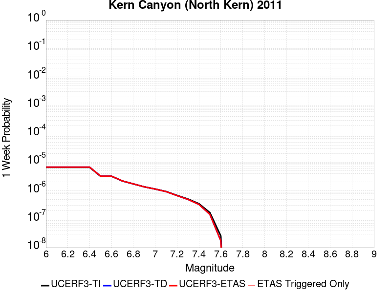 |  |  | 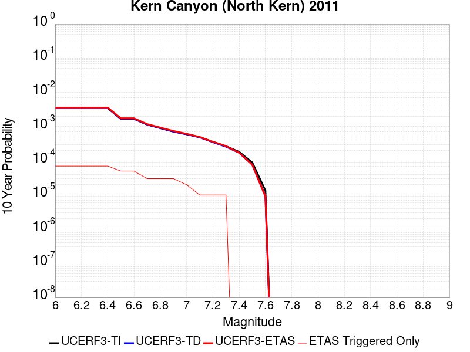 |

| Magnitude | 1 wk TI Prob | 1 wk TD Prob | 1 wk ETAS Prob | 1 wk ETAS/TD Gain | 1 wk ETAS Triggered Only | 1 mo TI Prob | 1 mo TD Prob | 1 mo ETAS Prob | 1 mo ETAS/TD Gain | 1 mo ETAS Triggered Only | 1 yr TI Prob | 1 yr TD Prob | 1 yr ETAS Prob | 1 yr ETAS/TD Gain | 1 yr ETAS Triggered Only | 10 yr TI Prob | 10 yr TD Prob | 10 yr ETAS Prob | 10 yr ETAS/TD Gain | 10 yr ETAS Triggered Only |
|-----|-----|-----|-----|-----|-----|-----|-----|-----|-----|-----|-----|-----|-----|-----|-----|-----|-----|-----|-----|-----|
| 6.0 | 6.6264497E-6 | 6.7574374E-6 | 6.7574374E-6 | 1.0 | 0.0 | 2.8398761E-5 | 2.8960168E-5 | 2.8960168E-5 | 1.0 | 0.0 | 3.4570007E-4 | 3.52541E-4 | 3.7253398E-4 | 1.056711 | 2.0E-5 | 0.0034516277 | 0.003520606 | 0.0035903596 | 1.019813 | 7.0E-5 |
| 6.1 | 6.6264497E-6 | 6.7574374E-6 | 6.7574374E-6 | 1.0 | 0.0 | 2.8398761E-5 | 2.8960168E-5 | 2.8960168E-5 | 1.0 | 0.0 | 3.4570007E-4 | 3.52541E-4 | 3.7253398E-4 | 1.056711 | 2.0E-5 | 0.0034516277 | 0.003520606 | 0.0035903596 | 1.019813 | 7.0E-5 |
| 6.2 | 6.6264497E-6 | 6.7574374E-6 | 6.7574374E-6 | 1.0 | 0.0 | 2.8398761E-5 | 2.8960168E-5 | 2.8960168E-5 | 1.0 | 0.0 | 3.4570007E-4 | 3.52541E-4 | 3.7253398E-4 | 1.056711 | 2.0E-5 | 0.0034516277 | 0.003520606 | 0.0035903596 | 1.019813 | 7.0E-5 |
| 6.3 | 6.6264497E-6 | 6.7574374E-6 | 6.7574374E-6 | 1.0 | 0.0 | 2.8398761E-5 | 2.8960168E-5 | 2.8960168E-5 | 1.0 | 0.0 | 3.4570007E-4 | 3.52541E-4 | 3.7253398E-4 | 1.056711 | 2.0E-5 | 0.0034516277 | 0.003520606 | 0.0035903596 | 1.019813 | 7.0E-5 |
| 6.4 | 6.6264497E-6 | 6.7574374E-6 | 6.7574374E-6 | 1.0 | 0.0 | 2.8398761E-5 | 2.8960168E-5 | 2.8960168E-5 | 1.0 | 0.0 | 3.4570007E-4 | 3.52541E-4 | 3.7253398E-4 | 1.056711 | 2.0E-5 | 0.0034516277 | 0.003520606 | 0.0035903596 | 1.019813 | 7.0E-5 |
| 6.5 | 3.2162225E-6 | 3.2571372E-6 | 3.2571372E-6 | 1.0 | 0.0 | 1.3783738E-5 | 1.3959089E-5 | 1.3959089E-5 | 1.0 | 0.0 | 1.6780409E-4 | 1.6993946E-4 | 1.7993776E-4 | 1.0588344 | 1.0E-5 | 0.0016767744 | 0.0016981749 | 0.0017480899 | 1.0293934 | 5.0E-5 |
| 6.6 | 3.2162225E-6 | 3.2571372E-6 | 3.2571372E-6 | 1.0 | 0.0 | 1.3783738E-5 | 1.3959089E-5 | 1.3959089E-5 | 1.0 | 0.0 | 1.6780409E-4 | 1.6993946E-4 | 1.7993776E-4 | 1.0588344 | 1.0E-5 | 0.0016767744 | 0.0016981749 | 0.0017480899 | 1.0293934 | 5.0E-5 |
| 6.7 | 2.1908265E-6 | 2.2071513E-6 | 2.2071513E-6 | 1.0 | 0.0 | 9.389223E-6 | 9.459187E-6 | 9.459187E-6 | 1.0 | 0.0 | 1.1430779E-4 | 1.1515971E-4 | 1.2515855E-4 | 1.086826 | 1.0E-5 | 0.0011424901 | 0.0011510197 | 0.0011809852 | 1.0260339 | 3.0E-5 |
| 6.8 | 1.7303895E-6 | 1.7365752E-6 | 1.7365752E-6 | 1.0 | 0.0 | 7.415934E-6 | 7.4424443E-6 | 7.4424443E-6 | 1.0 | 0.0 | 9.028525E-5 | 9.060809E-5 | 1.0060718E-4 | 1.1103554 | 1.0E-5 | 9.024858E-4 | 9.057212E-4 | 9.35694E-4 | 1.0330927 | 3.0E-5 |
| 6.9 | 1.3700314E-6 | 1.3688796E-6 | 1.3688796E-6 | 1.0 | 0.0 | 5.87155E-6 | 5.8666137E-6 | 5.8666137E-6 | 1.0 | 0.0 | 7.148377E-5 | 7.1423725E-5 | 8.1423015E-5 | 1.1399995 | 1.0E-5 | 7.146078E-4 | 7.1401225E-4 | 7.439909E-4 | 1.0419861 | 3.0E-5 |
| 7.0 | 1.1467797E-6 | 1.1413948E-6 | 1.1413948E-6 | 1.0 | 0.0 | 4.9147607E-6 | 4.891683E-6 | 4.891683E-6 | 1.0 | 0.0 | 5.983557E-5 | 5.9554648E-5 | 5.9554648E-5 | 1.0 | 0.0 | 5.981946E-4 | 5.9539004E-4 | 6.1537814E-4 | 1.0335715 | 2.0E-5 |
| 7.1 | 9.3952065E-7 | 9.3028086E-7 | 9.3028086E-7 | 1.0 | 0.0 | 4.026511E-6 | 3.986912E-6 | 3.986912E-6 | 1.0 | 0.0 | 4.9021666E-5 | 4.853959E-5 | 4.853959E-5 | 1.0 | 0.0 | 4.901085E-4 | 4.8529168E-4 | 4.9528683E-4 | 1.0205961 | 1.0E-5 |
| 7.2 | 6.858055E-7 | 6.719388E-7 | 6.719388E-7 | 1.0 | 0.0 | 2.939163E-6 | 2.8797344E-6 | 2.8797344E-6 | 1.0 | 0.0 | 3.5783723E-5 | 3.5060213E-5 | 3.5060213E-5 | 1.0 | 0.0 | 3.5777962E-4 | 3.505477E-4 | 3.605442E-4 | 1.0285168 | 1.0E-5 |
| 7.3 | 5.1101983E-7 | 4.939365E-7 | 4.939365E-7 | 1.0 | 0.0 | 2.1900833E-6 | 2.1168692E-6 | 2.1168692E-6 | 1.0 | 0.0 | 2.6663936E-5 | 2.5772582E-5 | 2.5772582E-5 | 1.0 | 0.0 | 2.6660739E-4 | 2.576964E-4 | 2.6769383E-4 | 1.0387954 | 1.0E-5 |
| 7.4 | 3.4999414E-7 | 3.2996363E-7 | 3.2996363E-7 | 1.0 | 0.0 | 1.499974E-6 | 1.414129E-6 | 1.414129E-6 | 1.0 | 0.0 | 1.8262032E-5 | 1.7216887E-5 | 1.7216887E-5 | 1.0 | 0.0 | 1.826053E-4 | 1.7215578E-4 | 1.7215578E-4 | 1.0 | 0.0 |
| 7.5 | 1.7021522E-7 | 1.4750277E-7 | 1.4750277E-7 | 1.0 | 0.0 | 7.2949354E-7 | 6.321546E-7 | 6.321546E-7 | 1.0 | 0.0 | 8.881548E-6 | 7.696456E-6 | 7.696456E-6 | 1.0 | 0.0 | 8.8811925E-5 | 7.696197E-5 | 7.696197E-5 | 1.0 | 0.0 |
| 7.6 | 2.572245E-8 | 1.7353022E-8 | 1.7353022E-8 | 1.0 | 0.0 | 1.10239064E-7 | 7.437009E-8 | 7.437009E-8 | 1.0 | 0.0 | 1.3421597E-6 | 9.054556E-7 | 9.054556E-7 | 1.0 | 0.0 | 1.3421517E-5 | 9.0545245E-6 | 9.0545245E-6 | 1.0 | 0.0 |

## Independence rev 2011
*[(top)](#table-of-contents)*

| 1 Week | 1 Month | 1 Year | 10 Year |
|-----|-----|-----|-----|
|  |  |  |  |

| Magnitude | 1 wk TI Prob | 1 wk TD Prob | 1 wk ETAS Prob | 1 wk ETAS/TD Gain | 1 wk ETAS Triggered Only | 1 mo TI Prob | 1 mo TD Prob | 1 mo ETAS Prob | 1 mo ETAS/TD Gain | 1 mo ETAS Triggered Only | 1 yr TI Prob | 1 yr TD Prob | 1 yr ETAS Prob | 1 yr ETAS/TD Gain | 1 yr ETAS Triggered Only | 10 yr TI Prob | 10 yr TD Prob | 10 yr ETAS Prob | 10 yr ETAS/TD Gain | 10 yr ETAS Triggered Only |
|-----|-----|-----|-----|-----|-----|-----|-----|-----|-----|-----|-----|-----|-----|-----|-----|-----|-----|-----|-----|-----|
| 6.0 | 4.422171E-6 | 4.3263203E-6 | 4.3263203E-6 | 1.0 | 0.0 | 1.8952025E-5 | 1.8541257E-5 | 2.8541072E-5 | 1.5393277 | 1.0E-5 | 2.3071647E-4 | 2.2571941E-4 | 2.6571038E-4 | 1.1771711 | 4.0E-5 | 0.0023047708 | 0.002255195 | 0.0023250373 | 1.0309695 | 7.0E-5 |
| 6.1 | 4.422171E-6 | 4.3263203E-6 | 4.3263203E-6 | 1.0 | 0.0 | 1.8952025E-5 | 1.8541257E-5 | 2.8541072E-5 | 1.5393277 | 1.0E-5 | 2.3071647E-4 | 2.2571941E-4 | 2.6571038E-4 | 1.1771711 | 4.0E-5 | 0.0023047708 | 0.002255195 | 0.0023250373 | 1.0309695 | 7.0E-5 |
| 6.2 | 4.422171E-6 | 4.3263203E-6 | 4.3263203E-6 | 1.0 | 0.0 | 1.8952025E-5 | 1.8541257E-5 | 2.8541072E-5 | 1.5393277 | 1.0E-5 | 2.3071647E-4 | 2.2571941E-4 | 2.6571038E-4 | 1.1771711 | 4.0E-5 | 0.0023047708 | 0.002255195 | 0.0023250373 | 1.0309695 | 7.0E-5 |
| 6.3 | 4.422171E-6 | 4.3263203E-6 | 4.3263203E-6 | 1.0 | 0.0 | 1.8952025E-5 | 1.8541257E-5 | 2.8541072E-5 | 1.5393277 | 1.0E-5 | 2.3071647E-4 | 2.2571941E-4 | 2.6571038E-4 | 1.1771711 | 4.0E-5 | 0.0023047708 | 0.002255195 | 0.0023250373 | 1.0309695 | 7.0E-5 |
| 6.4 | 4.422171E-6 | 4.3263203E-6 | 4.3263203E-6 | 1.0 | 0.0 | 1.8952025E-5 | 1.8541257E-5 | 2.8541072E-5 | 1.5393277 | 1.0E-5 | 2.3071647E-4 | 2.2571941E-4 | 2.6571038E-4 | 1.1771711 | 4.0E-5 | 0.0023047708 | 0.002255195 | 0.0023250373 | 1.0309695 | 7.0E-5 |
| 6.5 | 4.422171E-6 | 4.3263203E-6 | 4.3263203E-6 | 1.0 | 0.0 | 1.8952025E-5 | 1.8541257E-5 | 2.8541072E-5 | 1.5393277 | 1.0E-5 | 2.3071647E-4 | 2.2571941E-4 | 2.6571038E-4 | 1.1771711 | 4.0E-5 | 0.0023047708 | 0.002255195 | 0.0023250373 | 1.0309695 | 7.0E-5 |
| 6.6 | 2.663744E-6 | 2.532055E-6 | 2.532055E-6 | 1.0 | 0.0 | 1.1415996E-5 | 1.0851622E-5 | 2.0851514E-5 | 1.9215112 | 1.0E-5 | 1.3898089E-4 | 1.3211099E-4 | 1.6210701E-4 | 1.2270519 | 3.0E-5 | 0.0013889399 | 0.0013203727 | 0.0013802935 | 1.0453817 | 6.0E-5 |
| 6.7 | 2.663744E-6 | 2.532055E-6 | 2.532055E-6 | 1.0 | 0.0 | 1.1415996E-5 | 1.0851622E-5 | 2.0851514E-5 | 1.9215112 | 1.0E-5 | 1.3898089E-4 | 1.3211099E-4 | 1.6210701E-4 | 1.2270519 | 3.0E-5 | 0.0013889399 | 0.0013203727 | 0.0013802935 | 1.0453817 | 6.0E-5 |
| 6.8 | 1.9716529E-6 | 1.8323177E-6 | 1.8323177E-6 | 1.0 | 0.0 | 8.449913E-6 | 7.852767E-6 | 1.7852688E-5 | 2.2734265 | 1.0E-5 | 1.0287284E-4 | 9.560338E-5 | 1.256005E-4 | 1.3137665 | 3.0E-5 | 0.0010282523 | 9.556354E-4 | 0.001015578 | 1.0627254 | 6.0E-5 |
| 6.9 | 1.8788617E-6 | 1.7430564E-6 | 1.7430564E-6 | 1.0 | 0.0 | 8.0522395E-6 | 7.470221E-6 | 1.7470147E-5 | 2.3386385 | 1.0E-5 | 9.80316E-5 | 9.094627E-5 | 1.20943536E-4 | 1.329835 | 3.0E-5 | 9.798837E-4 | 9.091025E-4 | 9.6904795E-4 | 1.0659392 | 6.0E-5 |
| 7.0 | 1.5045488E-6 | 1.3849984E-6 | 1.3849984E-6 | 1.0 | 0.0 | 6.44805E-6 | 5.935694E-6 | 1.5935635E-5 | 2.684713 | 1.0E-5 | 7.8502184E-5 | 7.226473E-5 | 1.02262566E-4 | 1.4151102 | 3.0E-5 | 7.8474457E-4 | 7.224175E-4 | 7.823741E-4 | 1.0829945 | 6.0E-5 |
| 7.1 | 1.272341E-6 | 1.1625522E-6 | 1.1625522E-6 | 1.0 | 0.0 | 5.4528787E-6 | 4.982357E-6 | 1.4982307E-5 | 3.0070722 | 1.0E-5 | 6.6386776E-5 | 6.065854E-5 | 9.065672E-5 | 1.4945418 | 3.0E-5 | 6.636695E-4 | 6.06423E-4 | 6.663867E-4 | 1.0988809 | 6.0E-5 |
| 7.2 | 1.0416892E-6 | 9.4102455E-7 | 9.4102455E-7 | 1.0 | 0.0 | 4.464375E-6 | 4.032956E-6 | 1.4032916E-5 | 3.4795609 | 1.0E-5 | 5.4352407E-5 | 4.9100152E-5 | 7.909868E-5 | 1.6109661 | 3.0E-5 | 5.4339116E-4 | 4.908949E-4 | 5.508654E-4 | 1.1221658 | 6.0E-5 |
| 7.3 | 7.9450155E-7 | 7.2352736E-7 | 7.2352736E-7 | 1.0 | 0.0 | 3.4050022E-6 | 3.1008278E-6 | 1.3100796E-5 | 4.224935 | 1.0E-5 | 4.1455114E-5 | 3.7751935E-5 | 6.775081E-5 | 1.7946312 | 3.0E-5 | 4.144738E-4 | 3.7745634E-4 | 4.3743371E-4 | 1.1588988 | 6.0E-5 |
| 7.4 | 5.3893444E-7 | 5.01968E-7 | 5.01968E-7 | 1.0 | 0.0 | 2.309717E-6 | 2.1512894E-6 | 1.2151268E-5 | 5.648365 | 1.0E-5 | 2.8120441E-5 | 2.619164E-5 | 5.6190853E-5 | 2.1453736 | 3.0E-5 | 2.8116882E-4 | 2.61886E-4 | 3.2187026E-4 | 1.2290473 | 6.0E-5 |
| 7.5 | 3.8852085E-7 | 3.6826646E-7 | 3.6826646E-7 | 1.0 | 0.0 | 1.6650882E-6 | 1.5782839E-6 | 1.1578268E-5 | 7.3359857 | 1.0E-5 | 2.027226E-5 | 1.9215438E-5 | 4.921486E-5 | 2.5612147 | 3.0E-5 | 2.0270412E-4 | 1.9213799E-4 | 2.5212645E-4 | 1.3122156 | 6.0E-5 |
| 7.6 | 2.414929E-7 | 2.345816E-7 | 2.345816E-7 | 1.0 | 0.0 | 1.0349692E-6 | 1.0053493E-6 | 1.0053493E-6 | 1.0 | 0.0 | 1.2600677E-5 | 1.2240061E-5 | 3.2239815E-5 | 2.6339588 | 2.0E-5 | 1.2599962E-4 | 1.2239399E-4 | 1.5239032E-4 | 1.2450801 | 3.0E-5 |
| 7.7 | 6.8298014E-8 | 6.859089E-8 | 6.859089E-8 | 1.0 | 0.0 | 2.9270575E-7 | 2.9396097E-7 | 2.9396097E-7 | 1.0 | 0.0 | 3.5636867E-6 | 3.5789692E-6 | 1.3578933E-5 | 3.7940905 | 1.0E-5 | 3.5636294E-5 | 3.5789162E-5 | 4.5788805E-5 | 1.2794042 | 1.0E-5 |

## Mission Ridge-Arroyo Parida-Santa Ana
*[(top)](#table-of-contents)*

| 1 Week | 1 Month | 1 Year | 10 Year |
|-----|-----|-----|-----|
|  |  |  |  |

| Magnitude | 1 wk TI Prob | 1 wk TD Prob | 1 wk ETAS Prob | 1 wk ETAS/TD Gain | 1 wk ETAS Triggered Only | 1 mo TI Prob | 1 mo TD Prob | 1 mo ETAS Prob | 1 mo ETAS/TD Gain | 1 mo ETAS Triggered Only | 1 yr TI Prob | 1 yr TD Prob | 1 yr ETAS Prob | 1 yr ETAS/TD Gain | 1 yr ETAS Triggered Only | 10 yr TI Prob | 10 yr TD Prob | 10 yr ETAS Prob | 10 yr ETAS/TD Gain | 10 yr ETAS Triggered Only |
|-----|-----|-----|-----|-----|-----|-----|-----|-----|-----|-----|-----|-----|-----|-----|-----|-----|-----|-----|-----|-----|
| 6.0 | 4.169034E-5 | 4.714372E-5 | 4.714372E-5 | 1.0 | 0.0 | 1.7866064E-4 | 2.0203277E-4 | 2.0203277E-4 | 1.0 | 0.0 | 0.0021730233 | 0.0024578073 | 0.0024877335 | 1.012176 | 3.0E-5 | 0.021518968 | 0.024387937 | 0.024426961 | 1.0016001 | 4.0E-5 |
| 6.1 | 1.73813E-5 | 1.6855829E-5 | 1.6855829E-5 | 1.0 | 0.0 | 7.4489166E-5 | 7.223733E-5 | 7.223733E-5 | 1.0 | 0.0 | 9.065282E-4 | 8.791452E-4 | 8.991276E-4 | 1.0227294 | 2.0E-5 | 0.009028391 | 0.008757721 | 0.008777545 | 1.0022637 | 2.0E-5 |
| 6.2 | 1.4622182E-5 | 1.3674561E-5 | 1.3674561E-5 | 1.0 | 0.0 | 6.2664985E-5 | 5.8603964E-5 | 5.8603964E-5 | 1.0 | 0.0 | 7.6267915E-4 | 7.132736E-4 | 7.2326645E-4 | 1.0140098 | 1.0E-5 | 0.007600669 | 0.00711019 | 0.007130048 | 1.0027928 | 2.0E-5 |
| 6.3 | 1.3552434E-5 | 1.2483381E-5 | 1.2483381E-5 | 1.0 | 0.0 | 5.8080568E-5 | 5.3499127E-5 | 5.3499127E-5 | 1.0 | 0.0 | 7.069015E-4 | 6.511604E-4 | 6.611538E-4 | 1.0153472 | 1.0E-5 | 0.00704657 | 0.006492791 | 0.0065126615 | 1.0030603 | 2.0E-5 |
| 6.4 | 1.30977305E-5 | 1.1980301E-5 | 1.1980301E-5 | 1.0 | 0.0 | 5.613192E-5 | 5.134315E-5 | 5.134315E-5 | 1.0 | 0.0 | 6.831918E-4 | 6.249266E-4 | 6.349203E-4 | 1.0159919 | 1.0E-5 | 0.006810953 | 0.006231942 | 0.0062518176 | 1.0031893 | 2.0E-5 |
| 6.5 | 1.225205E-5 | 1.1049886E-5 | 1.1049886E-5 | 1.0 | 0.0 | 5.2507727E-5 | 4.7355807E-5 | 4.7355807E-5 | 1.0 | 0.0 | 6.3909404E-4 | 5.764071E-4 | 5.864014E-4 | 1.0173389 | 1.0E-5 | 0.006372592 | 0.005749335 | 0.0057692197 | 1.0034586 | 2.0E-5 |
| 6.6 | 1.1352241E-5 | 1.0064556E-5 | 1.0064556E-5 | 1.0 | 0.0 | 4.8651553E-5 | 4.3133106E-5 | 4.3133106E-5 | 1.0 | 0.0 | 5.921717E-4 | 5.2502117E-4 | 5.350159E-4 | 1.0190369 | 1.0E-5 | 0.0059059616 | 0.005237958 | 0.0052578533 | 1.0037982 | 2.0E-5 |
| 6.7 | 1.0864116E-5 | 9.518004E-6 | 9.518004E-6 | 1.0 | 0.0 | 4.6559664E-5 | 4.079082E-5 | 4.079082E-5 | 1.0 | 0.0 | 5.667165E-4 | 4.9651705E-4 | 5.0651206E-4 | 1.0201303 | 1.0E-5 | 0.005652734 | 0.0049542147 | 0.0049741156 | 1.004017 | 2.0E-5 |
| 6.8 | 1.0666365E-5 | 9.300741E-6 | 9.300741E-6 | 1.0 | 0.0 | 4.571219E-5 | 3.9859722E-5 | 3.9859722E-5 | 1.0 | 0.0 | 5.564038E-4 | 4.8518603E-4 | 4.951812E-4 | 1.0206007 | 1.0E-5 | 0.005550127 | 0.0048414036 | 0.004861307 | 1.004111 | 2.0E-5 |
| 6.9 | 1.0038665E-5 | 8.592948E-6 | 8.592948E-6 | 1.0 | 0.0 | 4.302214E-5 | 3.6826408E-5 | 3.6826408E-5 | 1.0 | 0.0 | 5.236687E-4 | 4.482711E-4 | 4.5826662E-4 | 1.022298 | 1.0E-5 | 0.005224364 | 0.0044737835 | 0.004493694 | 1.0044504 | 2.0E-5 |
| 7.0 | 9.5379955E-6 | 8.025923E-6 | 8.025923E-6 | 1.0 | 0.0 | 4.0876483E-5 | 3.439637E-5 | 3.439637E-5 | 1.0 | 0.0 | 4.975576E-4 | 4.1869705E-4 | 4.2869285E-4 | 1.0238736 | 1.0E-5 | 0.00496445 | 0.0041791853 | 0.0041991016 | 1.0047656 | 2.0E-5 |
| 7.1 | 9.207389E-6 | 7.65319E-6 | 7.65319E-6 | 1.0 | 0.0 | 3.945964E-5 | 3.279898E-5 | 3.279898E-5 | 1.0 | 0.0 | 4.803152E-4 | 3.992561E-4 | 4.092521E-4 | 1.0250366 | 1.0E-5 | 0.004792784 | 0.003985488 | 0.0040054084 | 1.0049982 | 2.0E-5 |
| 7.2 | 7.638091E-6 | 5.93175E-6 | 5.93175E-6 | 1.0 | 0.0 | 3.2734264E-5 | 2.542154E-5 | 2.542154E-5 | 1.0 | 0.0 | 3.984668E-4 | 3.094636E-4 | 3.094636E-4 | 1.0 | 0.0 | 0.0039775306 | 0.0030902869 | 0.003100256 | 1.0032259 | 1.0E-5 |
| 7.3 | 7.2500147E-6 | 5.596752E-6 | 5.596752E-6 | 1.0 | 0.0 | 3.1071122E-5 | 2.3985862E-5 | 2.3985862E-5 | 1.0 | 0.0 | 3.7822526E-4 | 2.9198904E-4 | 2.9198904E-4 | 1.0 | 0.0 | 0.0037758215 | 0.0029160131 | 0.0029259839 | 1.0034194 | 1.0E-5 |
| 7.4 | 6.3899715E-6 | 4.9190367E-6 | 4.9190367E-6 | 1.0 | 0.0 | 2.7385306E-5 | 2.1081416E-5 | 2.1081416E-5 | 1.0 | 0.0 | 3.3336508E-4 | 2.566362E-4 | 2.566362E-4 | 1.0 | 0.0 | 0.0033286542 | 0.0025633464 | 0.0025733209 | 1.0038911 | 1.0E-5 |
| 7.5 | 5.379025E-6 | 4.084277E-6 | 4.084277E-6 | 1.0 | 0.0 | 2.305276E-5 | 1.7503928E-5 | 1.7503928E-5 | 1.0 | 0.0 | 2.806312E-4 | 2.1308957E-4 | 2.1308957E-4 | 1.0 | 0.0 | 0.0028027708 | 0.002128864 | 0.0021388426 | 1.0046873 | 1.0E-5 |
| 7.6 | 4.1270696E-6 | 3.088612E-6 | 3.088612E-6 | 1.0 | 0.0 | 1.768732E-5 | 1.3236841E-5 | 1.3236841E-5 | 1.0 | 0.0 | 2.1532185E-4 | 1.611467E-4 | 1.611467E-4 | 1.0 | 0.0 | 0.0021511333 | 0.0016103066 | 0.0016103066 | 1.0 | 0.0 |
| 7.7 | 2.5406805E-6 | 1.8283671E-6 | 1.8283671E-6 | 1.0 | 0.0 | 1.0888585E-5 | 7.835836E-6 | 7.835836E-6 | 1.0 | 0.0 | 1.3256045E-4 | 9.539719E-5 | 9.539719E-5 | 1.0 | 0.0 | 0.0013248142 | 9.5356855E-4 | 9.5356855E-4 | 1.0 | 0.0 |
| 7.8 | 4.8608285E-7 | 3.5100925E-7 | 3.5100925E-7 | 1.0 | 0.0 | 2.0832106E-6 | 1.5043245E-6 | 1.5043245E-6 | 1.0 | 0.0 | 2.5362791E-5 | 1.8314999E-5 | 1.8314999E-5 | 1.0 | 0.0 | 2.5359896E-4 | 1.8313501E-4 | 1.8313501E-4 | 1.0 | 0.0 |
| 7.9 | 2.0472514E-8 | 1.2690167E-8 | 1.2690167E-8 | 1.0 | 0.0 | 8.7739345E-8 | 5.438643E-8 | 5.438643E-8 | 1.0 | 0.0 | 1.068226E-6 | 6.6215455E-7 | 6.6215455E-7 | 1.0 | 0.0 | 1.0682209E-5 | 6.621527E-6 | 6.621527E-6 | 1.0 | 0.0 |
| 8.0 | 4.443582E-9 | 2.0327304E-9 | 2.0327304E-9 | 1.0 | 0.0 | 1.9043922E-8 | 8.711702E-9 | 8.711702E-9 | 1.0 | 0.0 | 2.3185973E-7 | 1.0606496E-7 | 1.0606496E-7 | 1.0 | 0.0 | 2.3185949E-6 | 1.0606492E-6 | 1.0606492E-6 | 1.0 | 0.0 |

## Tin Mountain
*[(top)](#table-of-contents)*

| 1 Week | 1 Month | 1 Year | 10 Year |
|-----|-----|-----|-----|
|  | 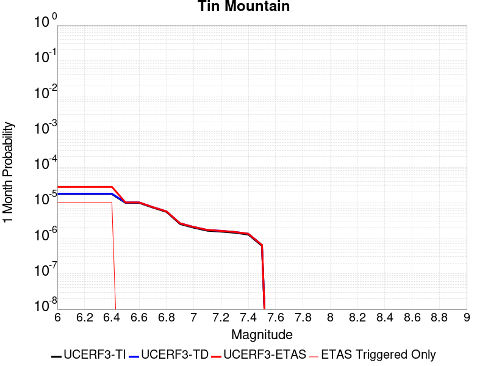 |  |  |

| Magnitude | 1 wk TI Prob | 1 wk TD Prob | 1 wk ETAS Prob | 1 wk ETAS/TD Gain | 1 wk ETAS Triggered Only | 1 mo TI Prob | 1 mo TD Prob | 1 mo ETAS Prob | 1 mo ETAS/TD Gain | 1 mo ETAS Triggered Only | 1 yr TI Prob | 1 yr TD Prob | 1 yr ETAS Prob | 1 yr ETAS/TD Gain | 1 yr ETAS Triggered Only | 10 yr TI Prob | 10 yr TD Prob | 10 yr ETAS Prob | 10 yr ETAS/TD Gain | 10 yr ETAS Triggered Only |
|-----|-----|-----|-----|-----|-----|-----|-----|-----|-----|-----|-----|-----|-----|-----|-----|-----|-----|-----|-----|-----|
| 6.0 | 4.083776E-6 | 4.1816033E-6 | 4.1816033E-6 | 1.0 | 0.0 | 1.750178E-5 | 1.7921055E-5 | 2.7920876E-5 | 1.5579928 | 1.0E-5 | 2.1306332E-4 | 2.1817072E-4 | 2.4816417E-4 | 1.137477 | 3.0E-5 | 0.0021285915 | 0.0021799312 | 0.0022398003 | 1.0274638 | 6.0E-5 |
| 6.1 | 4.083776E-6 | 4.1816033E-6 | 4.1816033E-6 | 1.0 | 0.0 | 1.750178E-5 | 1.7921055E-5 | 2.7920876E-5 | 1.5579928 | 1.0E-5 | 2.1306332E-4 | 2.1817072E-4 | 2.4816417E-4 | 1.137477 | 3.0E-5 | 0.0021285915 | 0.0021799312 | 0.0022398003 | 1.0274638 | 6.0E-5 |
| 6.2 | 4.083776E-6 | 4.1816033E-6 | 4.1816033E-6 | 1.0 | 0.0 | 1.750178E-5 | 1.7921055E-5 | 2.7920876E-5 | 1.5579928 | 1.0E-5 | 2.1306332E-4 | 2.1817072E-4 | 2.4816417E-4 | 1.137477 | 3.0E-5 | 0.0021285915 | 0.0021799312 | 0.0022398003 | 1.0274638 | 6.0E-5 |
| 6.3 | 4.083776E-6 | 4.1816033E-6 | 4.1816033E-6 | 1.0 | 0.0 | 1.750178E-5 | 1.7921055E-5 | 2.7920876E-5 | 1.5579928 | 1.0E-5 | 2.1306332E-4 | 2.1817072E-4 | 2.4816417E-4 | 1.137477 | 3.0E-5 | 0.0021285915 | 0.0021799312 | 0.0022398003 | 1.0274638 | 6.0E-5 |
| 6.4 | 4.083776E-6 | 4.1816033E-6 | 4.1816033E-6 | 1.0 | 0.0 | 1.750178E-5 | 1.7921055E-5 | 2.7920876E-5 | 1.5579928 | 1.0E-5 | 2.1306332E-4 | 2.1817072E-4 | 2.4816417E-4 | 1.137477 | 3.0E-5 | 0.0021285915 | 0.0021799312 | 0.0022398003 | 1.0274638 | 6.0E-5 |
| 6.5 | 2.3143427E-6 | 2.3731973E-6 | 2.3731973E-6 | 1.0 | 0.0 | 9.9185745E-6 | 1.017081E-5 | 1.017081E-5 | 1.0 | 0.0 | 1.2075195E-4 | 1.2382335E-4 | 1.4382087E-4 | 1.1615005 | 2.0E-5 | 0.0012068636 | 0.0012376196 | 0.00127757 | 1.0322801 | 4.0E-5 |
| 6.6 | 2.3143427E-6 | 2.3731973E-6 | 2.3731973E-6 | 1.0 | 0.0 | 9.9185745E-6 | 1.017081E-5 | 1.017081E-5 | 1.0 | 0.0 | 1.2075195E-4 | 1.2382335E-4 | 1.4382087E-4 | 1.1615005 | 2.0E-5 | 0.0012068636 | 0.0012376196 | 0.00127757 | 1.0322801 | 4.0E-5 |
| 6.7 | 1.7029532E-6 | 1.7498236E-6 | 1.7498236E-6 | 1.0 | 0.0 | 7.2983503E-6 | 7.4992254E-6 | 7.4992254E-6 | 1.0 | 0.0 | 8.885379E-5 | 9.129978E-5 | 1.1129795E-4 | 1.2190386 | 2.0E-5 | 8.881827E-4 | 9.1267534E-4 | 9.5263886E-4 | 1.0437872 | 4.0E-5 |
| 6.8 | 1.2914646E-6 | 1.3299643E-6 | 1.3299643E-6 | 1.0 | 0.0 | 5.534837E-6 | 5.699837E-6 | 5.699837E-6 | 1.0 | 0.0 | 6.738455E-5 | 6.939375E-5 | 8.939236E-5 | 1.2881904 | 2.0E-5 | 6.736412E-4 | 6.9376413E-4 | 7.337364E-4 | 1.0576165 | 4.0E-5 |
| 6.9 | 5.8708974E-7 | 6.117164E-7 | 6.117164E-7 | 1.0 | 0.0 | 2.5160964E-6 | 2.6216394E-6 | 2.6216394E-6 | 1.0 | 0.0 | 3.0633044E-5 | 3.1918033E-5 | 3.1918033E-5 | 1.0 | 0.0 | 3.0628822E-4 | 3.191386E-4 | 3.2913542E-4 | 1.0313244 | 1.0E-5 |
| 7.0 | 4.6248786E-7 | 4.832159E-7 | 4.832159E-7 | 1.0 | 0.0 | 1.9820893E-6 | 2.070924E-6 | 2.070924E-6 | 1.0 | 0.0 | 2.413167E-5 | 2.5213245E-5 | 2.5213245E-5 | 1.0 | 0.0 | 2.412905E-4 | 2.5210754E-4 | 2.62105E-4 | 1.0396556 | 1.0E-5 |
| 7.1 | 3.804606E-7 | 3.987274E-7 | 3.987274E-7 | 1.0 | 0.0 | 1.6305444E-6 | 1.7088307E-6 | 1.7088307E-6 | 1.0 | 0.0 | 1.9851697E-5 | 2.080485E-5 | 2.080485E-5 | 1.0 | 0.0 | 1.9849923E-4 | 2.0803239E-4 | 2.180303E-4 | 1.0480595 | 1.0E-5 |
| 7.2 | 3.5864858E-7 | 3.7618082E-7 | 3.7618082E-7 | 1.0 | 0.0 | 1.5370645E-6 | 1.6122027E-6 | 1.6122027E-6 | 1.0 | 0.0 | 1.87136E-5 | 1.9628425E-5 | 1.9628425E-5 | 1.0 | 0.0 | 1.8712023E-4 | 1.9627022E-4 | 2.0626826E-4 | 1.0509402 | 1.0E-5 |
| 7.3 | 3.342063E-7 | 3.5064616E-7 | 3.5064616E-7 | 1.0 | 0.0 | 1.4323119E-6 | 1.5027686E-6 | 1.5027686E-6 | 1.0 | 0.0 | 1.7438259E-5 | 1.8296087E-5 | 1.8296087E-5 | 1.0 | 0.0 | 1.743689E-4 | 1.8294911E-4 | 1.9294728E-4 | 1.05465 | 1.0E-5 |
| 7.4 | 2.971242E-7 | 3.116683E-7 | 3.116683E-7 | 1.0 | 0.0 | 1.2733886E-6 | 1.3357208E-6 | 1.3357208E-6 | 1.0 | 0.0 | 1.5503398E-5 | 1.6262313E-5 | 1.6262313E-5 | 1.0 | 0.0 | 1.5502315E-4 | 1.6261451E-4 | 1.6261451E-4 | 1.0 | 0.0 |
| 7.5 | 1.4326713E-7 | 1.5013E-7 | 1.5013E-7 | 1.0 | 0.0 | 6.140018E-7 | 6.434143E-7 | 6.434143E-7 | 1.0 | 0.0 | 7.4754466E-6 | 7.833569E-6 | 7.833569E-6 | 1.0 | 0.0 | 7.475195E-5 | 7.8335695E-5 | 7.8335695E-5 | 1.0 | 0.0 |

## Lake Isabella (Seismicity)
*[(top)](#table-of-contents)*

| 1 Week | 1 Month | 1 Year | 10 Year |
|-----|-----|-----|-----|
| 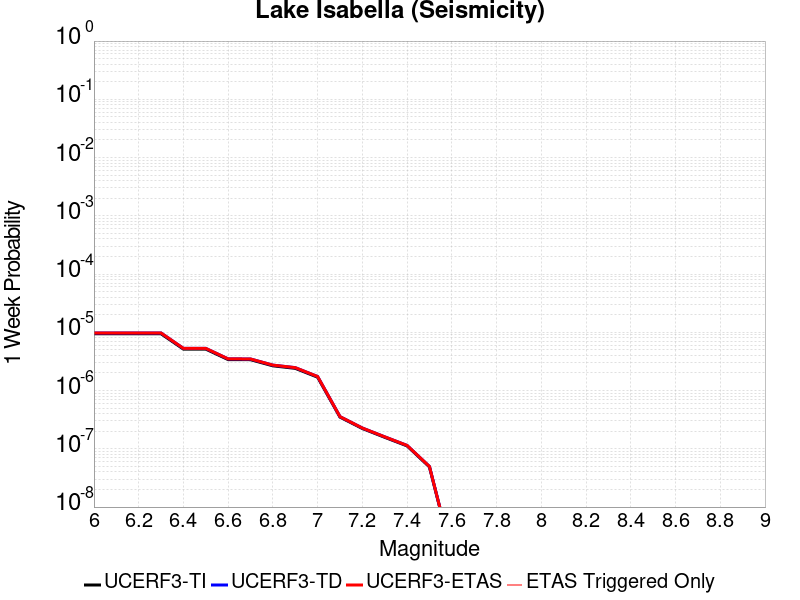 |  |  |  |

| Magnitude | 1 wk TI Prob | 1 wk TD Prob | 1 wk ETAS Prob | 1 wk ETAS/TD Gain | 1 wk ETAS Triggered Only | 1 mo TI Prob | 1 mo TD Prob | 1 mo ETAS Prob | 1 mo ETAS/TD Gain | 1 mo ETAS Triggered Only | 1 yr TI Prob | 1 yr TD Prob | 1 yr ETAS Prob | 1 yr ETAS/TD Gain | 1 yr ETAS Triggered Only | 10 yr TI Prob | 10 yr TD Prob | 10 yr ETAS Prob | 10 yr ETAS/TD Gain | 10 yr ETAS Triggered Only |
|-----|-----|-----|-----|-----|-----|-----|-----|-----|-----|-----|-----|-----|-----|-----|-----|-----|-----|-----|-----|-----|
| 6.0 | 9.431637E-6 | 9.741864E-6 | 9.741864E-6 | 1.0 | 0.0 | 4.0420677E-5 | 4.1750252E-5 | 5.1749834E-5 | 1.2395095 | 1.0E-5 | 4.920106E-4 | 5.082038E-4 | 5.2819366E-4 | 1.0393343 | 2.0E-5 | 0.004909227 | 0.0050717094 | 0.0051214555 | 1.0098087 | 5.0E-5 |
| 6.1 | 9.431637E-6 | 9.741864E-6 | 9.741864E-6 | 1.0 | 0.0 | 4.0420677E-5 | 4.1750252E-5 | 5.1749834E-5 | 1.2395095 | 1.0E-5 | 4.920106E-4 | 5.082038E-4 | 5.2819366E-4 | 1.0393343 | 2.0E-5 | 0.004909227 | 0.0050717094 | 0.0051214555 | 1.0098087 | 5.0E-5 |
| 6.2 | 9.431637E-6 | 9.741864E-6 | 9.741864E-6 | 1.0 | 0.0 | 4.0420677E-5 | 4.1750252E-5 | 5.1749834E-5 | 1.2395095 | 1.0E-5 | 4.920106E-4 | 5.082038E-4 | 5.2819366E-4 | 1.0393343 | 2.0E-5 | 0.004909227 | 0.0050717094 | 0.0051214555 | 1.0098087 | 5.0E-5 |
| 6.3 | 9.431637E-6 | 9.741864E-6 | 9.741864E-6 | 1.0 | 0.0 | 4.0420677E-5 | 4.1750252E-5 | 5.1749834E-5 | 1.2395095 | 1.0E-5 | 4.920106E-4 | 5.082038E-4 | 5.2819366E-4 | 1.0393343 | 2.0E-5 | 0.004909227 | 0.0050717094 | 0.0051214555 | 1.0098087 | 5.0E-5 |
| 6.4 | 5.144063E-6 | 5.3001827E-6 | 5.3001827E-6 | 1.0 | 0.0 | 2.2045799E-5 | 2.271489E-5 | 2.271489E-5 | 1.0 | 0.0 | 2.6837454E-4 | 2.7652216E-4 | 2.7652216E-4 | 1.0 | 0.0 | 0.0026805066 | 0.0027621211 | 0.0027920383 | 1.0108312 | 3.0E-5 |
| 6.5 | 5.144063E-6 | 5.3001827E-6 | 5.3001827E-6 | 1.0 | 0.0 | 2.2045799E-5 | 2.271489E-5 | 2.271489E-5 | 1.0 | 0.0 | 2.6837454E-4 | 2.7652216E-4 | 2.7652216E-4 | 1.0 | 0.0 | 0.0026805066 | 0.0027621211 | 0.0027920383 | 1.0108312 | 3.0E-5 |
| 6.6 | 3.4009804E-6 | 3.498853E-6 | 3.498853E-6 | 1.0 | 0.0 | 1.4575549E-5 | 1.49950065E-5 | 1.49950065E-5 | 1.0 | 0.0 | 1.7744285E-4 | 1.8255052E-4 | 1.8255052E-4 | 1.0 | 0.0 | 0.0017730123 | 0.0018241634 | 0.0018541086 | 1.016416 | 3.0E-5 |
| 6.7 | 3.3880428E-6 | 3.4857194E-6 | 3.4857194E-6 | 1.0 | 0.0 | 1.4520103E-5 | 1.4938721E-5 | 1.4938721E-5 | 1.0 | 0.0 | 1.767679E-4 | 1.8186535E-4 | 1.8186535E-4 | 1.0 | 0.0 | 0.0017662736 | 0.0018173229 | 0.0018472684 | 1.0164778 | 3.0E-5 |
| 6.8 | 2.6582E-6 | 2.7337517E-6 | 2.7337517E-6 | 1.0 | 0.0 | 1.1392236E-5 | 1.1716033E-5 | 1.1716033E-5 | 1.0 | 0.0 | 1.3869164E-4 | 1.4263472E-4 | 1.4263472E-4 | 1.0 | 0.0 | 0.0013860512 | 0.0014255638 | 0.001455521 | 1.0210143 | 3.0E-5 |
| 6.9 | 2.406011E-6 | 2.4743754E-6 | 2.4743754E-6 | 1.0 | 0.0 | 1.0311434E-5 | 1.0604431E-5 | 1.0604431E-5 | 1.0 | 0.0 | 1.2553448E-4 | 1.2910261E-4 | 1.2910261E-4 | 1.0 | 0.0 | 0.0012546359 | 0.0012904058 | 0.001320367 | 1.0232185 | 3.0E-5 |
| 7.0 | 1.6953097E-6 | 1.7429696E-6 | 1.7429696E-6 | 1.0 | 0.0 | 7.265593E-6 | 7.4698546E-6 | 7.4698546E-6 | 1.0 | 0.0 | 8.8455E-5 | 9.094273E-5 | 9.094273E-5 | 1.0 | 0.0 | 8.84198E-4 | 9.091579E-4 | 9.391306E-4 | 1.0329676 | 3.0E-5 |
| 7.1 | 3.5013824E-7 | 3.5715297E-7 | 3.5715297E-7 | 1.0 | 0.0 | 1.5005916E-6 | 1.5306547E-6 | 1.5306547E-6 | 1.0 | 0.0 | 1.826955E-5 | 1.8635565E-5 | 1.8635565E-5 | 1.0 | 0.0 | 1.8268047E-4 | 1.8634027E-4 | 1.963384E-4 | 1.0536553 | 1.0E-5 |
| 7.2 | 2.2321095E-7 | 2.2750864E-7 | 2.2750864E-7 | 1.0 | 0.0 | 9.56618E-7 | 9.750366E-7 | 9.750366E-7 | 1.0 | 0.0 | 1.1646762E-5 | 1.1871008E-5 | 1.1871008E-5 | 1.0 | 0.0 | 1.1646151E-4 | 1.18703836E-4 | 1.2870265E-4 | 1.0842333 | 1.0E-5 |
| 7.3 | 1.5760406E-7 | 1.6061125E-7 | 1.6061125E-7 | 1.0 | 0.0 | 6.7544585E-7 | 6.883338E-7 | 6.883338E-7 | 1.0 | 0.0 | 8.223522E-6 | 8.380432E-6 | 8.380432E-6 | 1.0 | 0.0 | 8.2232174E-5 | 8.380122E-5 | 9.380039E-5 | 1.11932 | 1.0E-5 |
| 7.4 | 1.1216497E-7 | 1.1431852E-7 | 1.1431852E-7 | 1.0 | 0.0 | 4.8070694E-7 | 4.899364E-7 | 4.899364E-7 | 1.0 | 0.0 | 5.852591E-6 | 5.96496E-6 | 5.96496E-6 | 1.0 | 0.0 | 5.8524372E-5 | 5.9648042E-5 | 5.9648042E-5 | 1.0 | 0.0 |
| 7.5 | 4.885185E-8 | 4.978837E-8 | 4.978837E-8 | 1.0 | 0.0 | 2.0936506E-7 | 2.1337871E-7 | 2.1337871E-7 | 1.0 | 0.0 | 2.5490165E-6 | 2.597883E-6 | 2.597883E-6 | 1.0 | 0.0 | 2.5489873E-5 | 2.5978543E-5 | 2.5978543E-5 | 1.0 | 0.0 |
| 7.6 | 1.504641E-9 | 1.5318086E-9 | 1.5318086E-9 | 1.0 | 0.0 | 6.4484613E-9 | 6.564894E-9 | 6.564894E-9 | 1.0 | 0.0 | 7.851001E-8 | 7.992759E-8 | 7.992759E-8 | 1.0 | 0.0 | 7.8509987E-7 | 7.992758E-7 | 7.992758E-7 | 1.0 | 0.0 |

## Cleghorn Pass
*[(top)](#table-of-contents)*

| 1 Week | 1 Month | 1 Year | 10 Year |
|-----|-----|-----|-----|
|  | 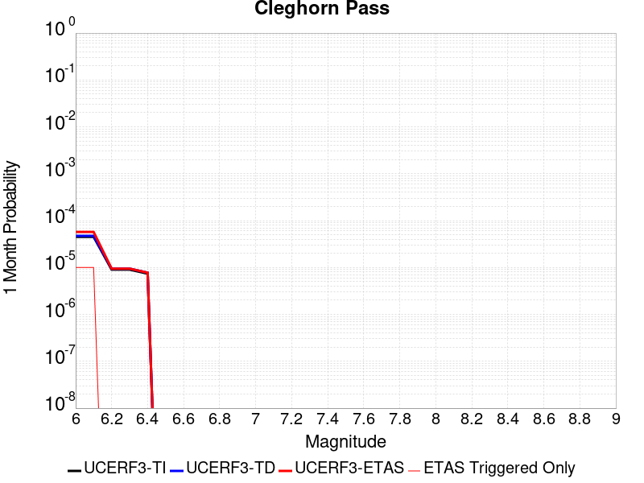 |  |  |

| Magnitude | 1 wk TI Prob | 1 wk TD Prob | 1 wk ETAS Prob | 1 wk ETAS/TD Gain | 1 wk ETAS Triggered Only | 1 mo TI Prob | 1 mo TD Prob | 1 mo ETAS Prob | 1 mo ETAS/TD Gain | 1 mo ETAS Triggered Only | 1 yr TI Prob | 1 yr TD Prob | 1 yr ETAS Prob | 1 yr ETAS/TD Gain | 1 yr ETAS Triggered Only | 10 yr TI Prob | 10 yr TD Prob | 10 yr ETAS Prob | 10 yr ETAS/TD Gain | 10 yr ETAS Triggered Only |
|-----|-----|-----|-----|-----|-----|-----|-----|-----|-----|-----|-----|-----|-----|-----|-----|-----|-----|-----|-----|-----|
| 6.0 | 1.0522846E-5 | 1.1041002E-5 | 1.1041002E-5 | 1.0 | 0.0 | 4.509713E-5 | 4.731802E-5 | 5.7317546E-5 | 1.211326 | 1.0E-5 | 5.4891926E-4 | 5.759972E-4 | 5.859915E-4 | 1.0173512 | 1.0E-5 | 0.0054756533 | 0.005750209 | 0.0057999217 | 1.0086453 | 5.0E-5 |
| 6.1 | 1.0522846E-5 | 1.1041002E-5 | 1.1041002E-5 | 1.0 | 0.0 | 4.509713E-5 | 4.731802E-5 | 5.7317546E-5 | 1.211326 | 1.0E-5 | 5.4891926E-4 | 5.759972E-4 | 5.859915E-4 | 1.0173512 | 1.0E-5 | 0.0054756533 | 0.005750209 | 0.0057999217 | 1.0086453 | 5.0E-5 |
| 6.2 | 2.1045846E-6 | 2.2082745E-6 | 2.2082745E-6 | 1.0 | 0.0 | 9.019617E-6 | 9.464023E-6 | 9.464023E-6 | 1.0 | 0.0 | 1.098083E-4 | 1.1522258E-4 | 1.1522258E-4 | 1.0 | 0.0 | 0.0010975406 | 0.0011520399 | 0.0011620283 | 1.0086702 | 1.0E-5 |
| 6.3 | 2.1045846E-6 | 2.2082745E-6 | 2.2082745E-6 | 1.0 | 0.0 | 9.019617E-6 | 9.464023E-6 | 9.464023E-6 | 1.0 | 0.0 | 1.098083E-4 | 1.1522258E-4 | 1.1522258E-4 | 1.0 | 0.0 | 0.0010975406 | 0.0011520399 | 0.0011620283 | 1.0086702 | 1.0E-5 |
| 6.4 | 1.7259927E-6 | 1.8109362E-6 | 1.8109362E-6 | 1.0 | 0.0 | 7.3970905E-6 | 7.761155E-6 | 7.761155E-6 | 1.0 | 0.0 | 9.005586E-5 | 9.449206E-5 | 9.449206E-5 | 1.0 | 0.0 | 9.001937E-4 | 9.449206E-4 | 9.549112E-4 | 1.0105729 | 1.0E-5 |

## Channel Islands Thrust
*[(top)](#table-of-contents)*

| 1 Week | 1 Month | 1 Year | 10 Year |
|-----|-----|-----|-----|
|  | 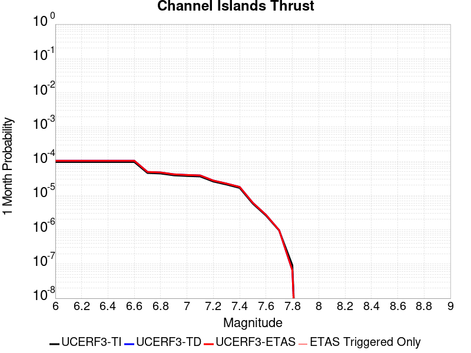 | 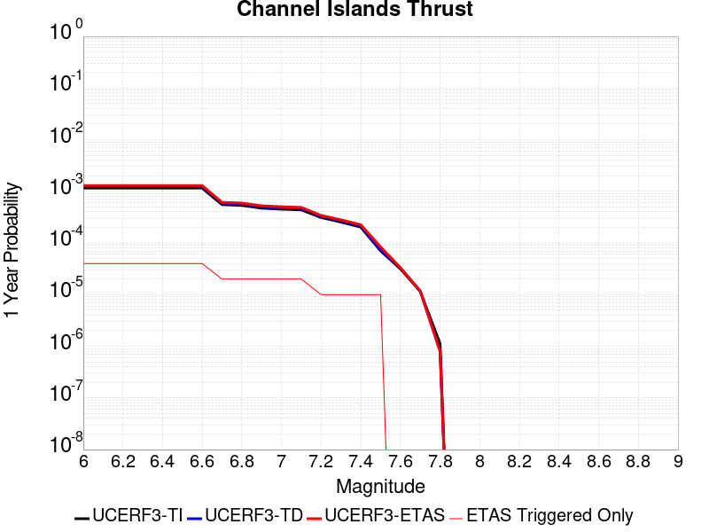 |  |

| Magnitude | 1 wk TI Prob | 1 wk TD Prob | 1 wk ETAS Prob | 1 wk ETAS/TD Gain | 1 wk ETAS Triggered Only | 1 mo TI Prob | 1 mo TD Prob | 1 mo ETAS Prob | 1 mo ETAS/TD Gain | 1 mo ETAS Triggered Only | 1 yr TI Prob | 1 yr TD Prob | 1 yr ETAS Prob | 1 yr ETAS/TD Gain | 1 yr ETAS Triggered Only | 10 yr TI Prob | 10 yr TD Prob | 10 yr ETAS Prob | 10 yr ETAS/TD Gain | 10 yr ETAS Triggered Only |
|-----|-----|-----|-----|-----|-----|-----|-----|-----|-----|-----|-----|-----|-----|-----|-----|-----|-----|-----|-----|-----|
| 6.0 | 2.2156251E-5 | 2.4093428E-5 | 2.4093428E-5 | 1.0 | 0.0 | 9.495191E-5 | 1.0325406E-4 | 1.0325406E-4 | 1.0 | 0.0 | 0.0011554264 | 0.0012564998 | 0.0012964496 | 1.0317944 | 4.0E-5 | 0.011494373 | 0.012504547 | 0.012563797 | 1.0047382 | 6.0E-5 |
| 6.1 | 2.2156251E-5 | 2.4093428E-5 | 2.4093428E-5 | 1.0 | 0.0 | 9.495191E-5 | 1.0325406E-4 | 1.0325406E-4 | 1.0 | 0.0 | 0.0011554264 | 0.0012564998 | 0.0012964496 | 1.0317944 | 4.0E-5 | 0.011494373 | 0.012504547 | 0.012563797 | 1.0047382 | 6.0E-5 |
| 6.2 | 2.2156251E-5 | 2.4093428E-5 | 2.4093428E-5 | 1.0 | 0.0 | 9.495191E-5 | 1.0325406E-4 | 1.0325406E-4 | 1.0 | 0.0 | 0.0011554264 | 0.0012564998 | 0.0012964496 | 1.0317944 | 4.0E-5 | 0.011494373 | 0.012504547 | 0.012563797 | 1.0047382 | 6.0E-5 |
| 6.3 | 2.2156251E-5 | 2.4093428E-5 | 2.4093428E-5 | 1.0 | 0.0 | 9.495191E-5 | 1.0325406E-4 | 1.0325406E-4 | 1.0 | 0.0 | 0.0011554264 | 0.0012564998 | 0.0012964496 | 1.0317944 | 4.0E-5 | 0.011494373 | 0.012504547 | 0.012563797 | 1.0047382 | 6.0E-5 |
| 6.4 | 2.2156251E-5 | 2.4093428E-5 | 2.4093428E-5 | 1.0 | 0.0 | 9.495191E-5 | 1.0325406E-4 | 1.0325406E-4 | 1.0 | 0.0 | 0.0011554264 | 0.0012564998 | 0.0012964496 | 1.0317944 | 4.0E-5 | 0.011494373 | 0.012504547 | 0.012563797 | 1.0047382 | 6.0E-5 |
| 6.5 | 2.2156251E-5 | 2.4093428E-5 | 2.4093428E-5 | 1.0 | 0.0 | 9.495191E-5 | 1.0325406E-4 | 1.0325406E-4 | 1.0 | 0.0 | 0.0011554264 | 0.0012564998 | 0.0012964496 | 1.0317944 | 4.0E-5 | 0.011494373 | 0.012504547 | 0.012563797 | 1.0047382 | 6.0E-5 |
| 6.6 | 2.2156251E-5 | 2.4093428E-5 | 2.4093428E-5 | 1.0 | 0.0 | 9.495191E-5 | 1.0325406E-4 | 1.0325406E-4 | 1.0 | 0.0 | 0.0011554264 | 0.0012564998 | 0.0012964496 | 1.0317944 | 4.0E-5 | 0.011494373 | 0.012504547 | 0.012563797 | 1.0047382 | 6.0E-5 |
| 6.7 | 1.0601296E-5 | 1.1380105E-5 | 1.1380105E-5 | 1.0 | 0.0 | 4.5433335E-5 | 4.8770995E-5 | 4.8770995E-5 | 1.0 | 0.0 | 5.5301044E-4 | 5.9362996E-4 | 6.136181E-4 | 1.033671 | 2.0E-5 | 0.005516363 | 0.0059209447 | 0.005950767 | 1.0050367 | 3.0E-5 |
| 6.8 | 1.0246747E-5 | 1.099721E-5 | 1.099721E-5 | 1.0 | 0.0 | 4.391389E-5 | 4.7130074E-5 | 4.7130074E-5 | 1.0 | 0.0 | 5.345204E-4 | 5.736624E-4 | 5.936509E-4 | 1.0348437 | 2.0E-5 | 0.0053323656 | 0.0057223057 | 0.005752134 | 1.0052127 | 3.0E-5 |
| 6.9 | 9.049551E-6 | 9.700114E-6 | 9.700114E-6 | 1.0 | 0.0 | 3.878322E-5 | 4.1571275E-5 | 4.1571275E-5 | 1.0 | 0.0 | 4.7208337E-4 | 5.0601683E-4 | 5.2600674E-4 | 1.0395044 | 2.0E-5 | 0.0047108172 | 0.005049064 | 0.0050789122 | 1.0059117 | 3.0E-5 |
| 7.0 | 8.6542195E-6 | 9.2750515E-6 | 9.2750515E-6 | 1.0 | 0.0 | 3.7088983E-5 | 3.9749637E-5 | 3.9749637E-5 | 1.0 | 0.0 | 4.5146482E-4 | 4.8384845E-4 | 5.0383876E-4 | 1.0413153 | 2.0E-5 | 0.004505487 | 0.004828362 | 0.0048482656 | 1.0041221 | 2.0E-5 |
| 7.1 | 8.391028E-6 | 8.99336E-6 | 8.99336E-6 | 1.0 | 0.0 | 3.5961057E-5 | 3.8542425E-5 | 3.8542425E-5 | 1.0 | 0.0 | 4.3773788E-4 | 4.6915704E-4 | 4.891477E-4 | 1.0426097 | 2.0E-5 | 0.004368766 | 0.004682076 | 0.0047019827 | 1.0042516 | 2.0E-5 |
| 7.2 | 5.965188E-6 | 6.37199E-6 | 6.37199E-6 | 1.0 | 0.0 | 2.556484E-5 | 2.7308246E-5 | 2.7308246E-5 | 1.0 | 0.0 | 3.1120746E-4 | 3.324277E-4 | 3.424244E-4 | 1.0300717 | 1.0E-5 | 0.00310772 | 0.0033193626 | 0.0033293294 | 1.0030026 | 1.0E-5 |
| 7.3 | 4.877518E-6 | 5.2062455E-6 | 5.2062455E-6 | 1.0 | 0.0 | 2.0903482E-5 | 2.2312293E-5 | 2.2312293E-5 | 1.0 | 0.0 | 2.5447016E-4 | 2.7161874E-4 | 2.8161606E-4 | 1.0368063 | 1.0E-5 | 0.0025417898 | 0.002712914 | 0.0027228869 | 1.003676 | 1.0E-5 |
| 7.4 | 3.8829853E-6 | 4.1420526E-6 | 4.1420526E-6 | 1.0 | 0.0 | 1.664126E-5 | 1.7751536E-5 | 1.7751536E-5 | 1.0 | 0.0 | 2.0258849E-4 | 2.1610393E-4 | 2.2610177E-4 | 1.046264 | 1.0E-5 | 0.002024039 | 0.0021589794 | 0.0021689578 | 1.0046219 | 1.0E-5 |
| 7.5 | 1.3489616E-6 | 1.427852E-6 | 1.427852E-6 | 1.0 | 0.0 | 5.7812517E-6 | 6.119352E-6 | 6.119352E-6 | 1.0 | 0.0 | 7.038446E-5 | 7.4500604E-5 | 8.449986E-5 | 1.1342171 | 1.0E-5 | 7.036218E-4 | 7.447602E-4 | 7.547528E-4 | 1.0134171 | 1.0E-5 |
| 7.6 | 6.058192E-7 | 6.3540455E-7 | 6.3540455E-7 | 1.0 | 0.0 | 2.5963652E-6 | 2.7231595E-6 | 2.7231595E-6 | 1.0 | 0.0 | 3.161029E-5 | 3.315398E-5 | 3.315398E-5 | 1.0 | 0.0 | 3.1605794E-4 | 3.3149196E-4 | 3.3149196E-4 | 1.0 | 0.0 |
| 7.7 | 2.2170494E-7 | 2.2608765E-7 | 2.2608765E-7 | 1.0 | 0.0 | 9.5016367E-7 | 9.689468E-7 | 9.689468E-7 | 1.0 | 0.0 | 1.1568181E-5 | 1.1796875E-5 | 1.1796875E-5 | 1.0 | 0.0 | 1.1567579E-4 | 1.1796359E-4 | 1.1796359E-4 | 1.0 | 0.0 |
| 7.8 | 2.1613102E-8 | 1.546703E-8 | 1.546703E-8 | 1.0 | 0.0 | 9.262757E-8 | 6.628727E-8 | 6.628727E-8 | 1.0 | 0.0 | 1.1277401E-6 | 8.070473E-7 | 8.070473E-7 | 1.0 | 0.0 | 1.1277344E-5 | 8.070451E-6 | 8.070451E-6 | 1.0 | 0.0 |

## Chino alt 1
*[(top)](#table-of-contents)*

| 1 Week | 1 Month | 1 Year | 10 Year |
|-----|-----|-----|-----|
|  |  | 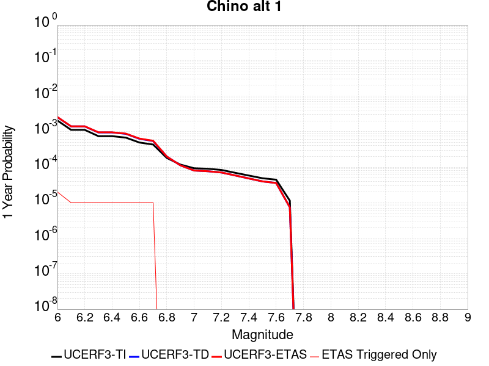 |  |

| Magnitude | 1 wk TI Prob | 1 wk TD Prob | 1 wk ETAS Prob | 1 wk ETAS/TD Gain | 1 wk ETAS Triggered Only | 1 mo TI Prob | 1 mo TD Prob | 1 mo ETAS Prob | 1 mo ETAS/TD Gain | 1 mo ETAS Triggered Only | 1 yr TI Prob | 1 yr TD Prob | 1 yr ETAS Prob | 1 yr ETAS/TD Gain | 1 yr ETAS Triggered Only | 10 yr TI Prob | 10 yr TD Prob | 10 yr ETAS Prob | 10 yr ETAS/TD Gain | 10 yr ETAS Triggered Only |
|-----|-----|-----|-----|-----|-----|-----|-----|-----|-----|-----|-----|-----|-----|-----|-----|-----|-----|-----|-----|-----|
| 6.0 | 3.939946E-5 | 4.89583E-5 | 4.89583E-5 | 1.0 | 0.0 | 1.6884391E-4 | 2.098073E-4 | 2.1980521E-4 | 1.0476528 | 1.0E-5 | 0.0020537362 | 0.00255192 | 0.002571869 | 1.0078173 | 2.0E-5 | 0.020348595 | 0.025278775 | 0.025337258 | 1.0023135 | 6.0E-5 |
| 6.1 | 2.1505624E-5 | 2.6885711E-5 | 2.6885711E-5 | 1.0 | 0.0 | 9.2163704E-5 | 1.1521997E-4 | 1.2521881E-4 | 1.0867805 | 1.0E-5 | 0.0011215154 | 0.0014020103 | 0.0014119962 | 1.0071226 | 1.0E-5 | 0.011158722 | 0.01394426 | 0.013973841 | 1.0021214 | 3.0E-5 |
| 6.2 | 2.1505624E-5 | 2.6885711E-5 | 2.6885711E-5 | 1.0 | 0.0 | 9.2163704E-5 | 1.1521997E-4 | 1.2521881E-4 | 1.0867805 | 1.0E-5 | 0.0011215154 | 0.0014020103 | 0.0014119962 | 1.0071226 | 1.0E-5 | 0.011158722 | 0.01394426 | 0.013973841 | 1.0021214 | 3.0E-5 |
| 6.3 | 1.4290785E-5 | 1.8170516E-5 | 1.8170516E-5 | 1.0 | 0.0 | 6.1244784E-5 | 7.787158E-5 | 8.7870794E-5 | 1.1284065 | 1.0E-5 | 7.454001E-4 | 9.4771927E-4 | 9.577098E-4 | 1.0105417 | 1.0E-5 | 0.007429048 | 0.0094429385 | 0.00946275 | 1.002098 | 2.0E-5 |
| 6.4 | 1.4290785E-5 | 1.8170516E-5 | 1.8170516E-5 | 1.0 | 0.0 | 6.1244784E-5 | 7.787158E-5 | 8.7870794E-5 | 1.1284065 | 1.0E-5 | 7.454001E-4 | 9.4771927E-4 | 9.577098E-4 | 1.0105417 | 1.0E-5 | 0.007429048 | 0.0094429385 | 0.00946275 | 1.002098 | 2.0E-5 |
| 6.5 | 1.3017944E-5 | 1.6657286E-5 | 1.6657286E-5 | 1.0 | 0.0 | 5.5789995E-5 | 7.138667E-5 | 8.138595E-5 | 1.1400722 | 1.0E-5 | 6.790315E-4 | 8.6882984E-4 | 8.788212E-4 | 1.0114998 | 1.0E-5 | 0.0067696036 | 0.008660331 | 0.008680157 | 1.0022894 | 2.0E-5 |
| 6.6 | 9.470016E-6 | 1.2043286E-5 | 1.2043286E-5 | 1.0 | 0.0 | 4.058515E-5 | 5.1613253E-5 | 6.1612736E-5 | 1.1937387 | 1.0E-5 | 4.940122E-4 | 6.2824413E-4 | 6.3823786E-4 | 1.0159074 | 1.0E-5 | 0.004929154 | 0.006270952 | 0.0062808893 | 1.0015846 | 1.0E-5 |
| 6.7 | 8.314155E-6 | 1.0411167E-5 | 1.0411167E-5 | 1.0 | 0.0 | 3.5631605E-5 | 4.4618704E-5 | 5.461826E-5 | 1.2241112 | 1.0E-5 | 4.3372845E-4 | 5.431296E-4 | 5.531242E-4 | 1.0184019 | 1.0E-5 | 0.004328829 | 0.0054247053 | 0.005434651 | 1.0018334 | 1.0E-5 |
| 6.8 | 3.4856364E-6 | 3.814167E-6 | 3.814167E-6 | 1.0 | 0.0 | 1.4938357E-5 | 1.634634E-5 | 1.634634E-5 | 1.0 | 0.0 | 1.8185932E-4 | 1.9900058E-4 | 1.9900058E-4 | 1.0 | 0.0 | 0.0018171056 | 0.001989779 | 0.001989779 | 1.0 | 0.0 |
| 6.9 | 2.2645952E-6 | 2.1533224E-6 | 2.1533224E-6 | 1.0 | 0.0 | 9.705372E-6 | 9.228494E-6 | 9.228494E-6 | 1.0 | 0.0 | 1.18156495E-4 | 1.1235133E-4 | 1.1235133E-4 | 1.0 | 0.0 | 0.0011809369 | 0.0011234711 | 0.0011234711 | 1.0 | 0.0 |
| 7.0 | 1.7864003E-6 | 1.5433969E-6 | 1.5433969E-6 | 1.0 | 0.0 | 7.655979E-6 | 6.6145417E-6 | 6.6145417E-6 | 1.0 | 0.0 | 9.3207556E-5 | 8.052913E-5 | 8.052913E-5 | 1.0 | 0.0 | 9.316847E-4 | 8.0539397E-4 | 8.0539397E-4 | 1.0 | 0.0 |
| 7.1 | 1.7315456E-6 | 1.473659E-6 | 1.473659E-6 | 1.0 | 0.0 | 7.420889E-6 | 6.3156667E-6 | 6.3156667E-6 | 1.0 | 0.0 | 9.034557E-5 | 7.689059E-5 | 7.689059E-5 | 1.0 | 0.0 | 9.0308854E-4 | 7.690257E-4 | 7.690257E-4 | 1.0 | 0.0 |
| 7.2 | 1.6008337E-6 | 1.3576902E-6 | 1.3576902E-6 | 1.0 | 0.0 | 6.860698E-6 | 5.8186597E-6 | 5.8186597E-6 | 1.0 | 0.0 | 8.352579E-5 | 7.083993E-5 | 7.083993E-5 | 1.0 | 0.0 | 8.34944E-4 | 7.0854387E-4 | 7.0854387E-4 | 1.0 | 0.0 |
| 7.3 | 1.3320939E-6 | 1.1219963E-6 | 1.1219963E-6 | 1.0 | 0.0 | 5.7089615E-6 | 4.8085467E-6 | 4.8085467E-6 | 1.0 | 0.0 | 6.9504385E-5 | 5.8542533E-5 | 5.8542533E-5 | 1.0 | 0.0 | 6.9482654E-4 | 5.853976E-4 | 5.853976E-4 | 1.0 | 0.0 |
| 7.4 | 1.114294E-6 | 9.2387853E-7 | 9.2387853E-7 | 1.0 | 0.0 | 4.775537E-6 | 3.959474E-6 | 3.959474E-6 | 1.0 | 0.0 | 5.8140613E-5 | 4.8205562E-5 | 4.8205562E-5 | 1.0 | 0.0 | 5.81254E-4 | 4.819691E-4 | 4.819691E-4 | 1.0 | 0.0 |
| 7.5 | 9.354081E-7 | 7.624753E-7 | 7.624753E-7 | 1.0 | 0.0 | 4.0088858E-6 | 3.2677472E-6 | 3.2677472E-6 | 1.0 | 0.0 | 4.8807087E-5 | 3.9784132E-5 | 3.9784132E-5 | 1.0 | 0.0 | 4.879637E-4 | 3.977735E-4 | 3.977735E-4 | 1.0 | 0.0 |
| 7.6 | 8.521771E-7 | 6.8818673E-7 | 6.8818673E-7 | 1.0 | 0.0 | 3.6521824E-6 | 2.9493685E-6 | 2.9493685E-6 | 1.0 | 0.0 | 4.4464414E-5 | 3.5908004E-5 | 3.5908004E-5 | 1.0 | 0.0 | 4.4455516E-4 | 3.5902517E-4 | 3.5902517E-4 | 1.0 | 0.0 |
| 7.7 | 2.1803626E-7 | 1.418904E-7 | 1.418904E-7 | 1.0 | 0.0 | 9.344408E-7 | 6.0810163E-7 | 6.0810163E-7 | 1.0 | 0.0 | 1.1376757E-5 | 7.4036216E-6 | 7.4036216E-6 | 1.0 | 0.0 | 1.13761744E-4 | 7.403471E-5 | 7.403471E-5 | 1.0 | 0.0 |

## Imperial
*[(top)](#table-of-contents)*

| 1 Week | 1 Month | 1 Year | 10 Year |
|-----|-----|-----|-----|
|  |  |  | 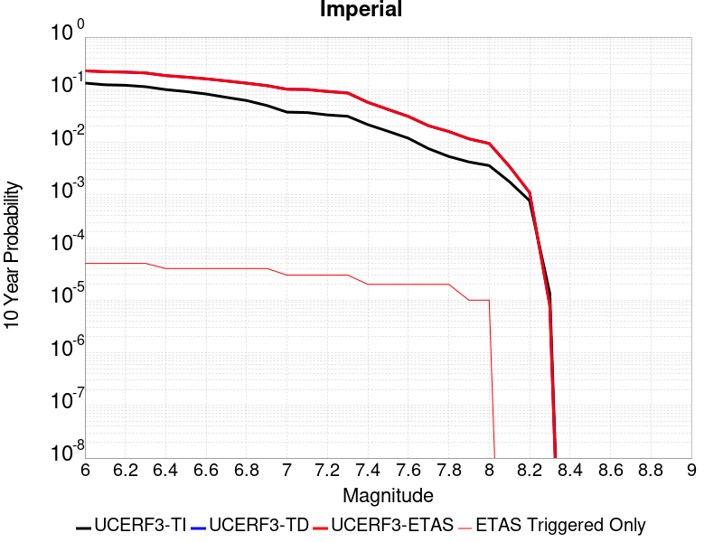 |

| Magnitude | 1 wk TI Prob | 1 wk TD Prob | 1 wk ETAS Prob | 1 wk ETAS/TD Gain | 1 wk ETAS Triggered Only | 1 mo TI Prob | 1 mo TD Prob | 1 mo ETAS Prob | 1 mo ETAS/TD Gain | 1 mo ETAS Triggered Only | 1 yr TI Prob | 1 yr TD Prob | 1 yr ETAS Prob | 1 yr ETAS/TD Gain | 1 yr ETAS Triggered Only | 10 yr TI Prob | 10 yr TD Prob | 10 yr ETAS Prob | 10 yr ETAS/TD Gain | 10 yr ETAS Triggered Only |
|-----|-----|-----|-----|-----|-----|-----|-----|-----|-----|-----|-----|-----|-----|-----|-----|-----|-----|-----|-----|-----|
| 6.0 | 2.7496446E-4 | 5.061943E-4 | 5.161892E-4 | 1.0197452 | 1.0E-5 | 0.0011778869 | 0.0021676398 | 0.0021776182 | 1.0046033 | 1.0E-5 | 0.0142467655 | 0.026060244 | 0.026099201 | 1.0014949 | 4.0E-5 | 0.13367249 | 0.22825114 | 0.22828972 | 1.000169 | 5.0E-5 |
| 6.1 | 2.5356023E-4 | 4.871527E-4 | 4.971478E-4 | 1.0205175 | 1.0E-5 | 0.001086234 | 0.0020861651 | 0.0020961442 | 1.0047835 | 1.0E-5 | 0.013144928 | 0.025097918 | 0.025136914 | 1.0015538 | 4.0E-5 | 0.123940155 | 0.21966921 | 0.21970822 | 1.0001776 | 5.0E-5 |
| 6.2 | 2.4820742E-4 | 4.780945E-4 | 4.8808972E-4 | 1.0209063 | 1.0E-5 | 0.0010633124 | 0.0020474053 | 0.002057385 | 1.0048742 | 1.0E-5 | 0.01286919 | 0.024637295 | 0.02467631 | 1.0015836 | 4.0E-5 | 0.12148927 | 0.21617226 | 0.21621145 | 1.0001813 | 5.0E-5 |
| 6.3 | 2.3205351E-4 | 4.5941645E-4 | 4.6941187E-4 | 1.0217568 | 1.0E-5 | 9.94136E-4 | 0.0019674788 | 0.0019774593 | 1.0050726 | 1.0E-5 | 0.012036599 | 0.023685196 | 0.023724249 | 1.0016488 | 4.0E-5 | 0.11405133 | 0.20811099 | 0.20815058 | 1.0001903 | 5.0E-5 |
| 6.4 | 2.0304754E-4 | 3.992632E-4 | 4.092592E-4 | 1.0250361 | 1.0E-5 | 8.6991355E-4 | 0.0017100205 | 0.0017200033 | 1.0058379 | 1.0E-5 | 0.010539869 | 0.020617373 | 0.020646755 | 1.001425 | 3.0E-5 | 0.100537635 | 0.18524332 | 0.18527591 | 1.000176 | 4.0E-5 |
| 6.5 | 1.854992E-4 | 3.7034982E-4 | 3.8034611E-4 | 1.0269915 | 1.0E-5 | 7.9475436E-4 | 0.0015862604 | 0.0015962445 | 1.0062941 | 1.0E-5 | 0.009633281 | 0.019141555 | 0.01917098 | 1.0015373 | 3.0E-5 | 0.0922623 | 0.17346627 | 0.17349933 | 1.0001906 | 4.0E-5 |
| 6.6 | 1.6586106E-4 | 3.4076622E-4 | 3.507628E-4 | 1.0293356 | 1.0E-5 | 7.106394E-4 | 0.0014596194 | 0.0014696048 | 1.0068411 | 1.0E-5 | 0.008617763 | 0.017631644 | 0.017661115 | 1.0016714 | 3.0E-5 | 0.08291132 | 0.1609323 | 0.16096586 | 1.0002085 | 4.0E-5 |
| 6.7 | 1.4224656E-4 | 3.0803535E-4 | 3.1803228E-4 | 1.0324538 | 1.0E-5 | 6.094856E-4 | 0.0013194918 | 0.0013294786 | 1.0075687 | 1.0E-5 | 0.0073952693 | 0.015949754 | 0.015979277 | 1.001851 | 3.0E-5 | 0.07153955 | 0.14662424 | 0.14665836 | 1.0002328 | 4.0E-5 |
| 6.8 | 1.2317259E-4 | 2.7822074E-4 | 2.8821797E-4 | 1.0359327 | 1.0E-5 | 5.2777573E-4 | 0.001191836 | 0.001201824 | 1.0083804 | 1.0E-5 | 0.0064067547 | 0.014415446 | 0.014445013 | 1.0020511 | 3.0E-5 | 0.06225166 | 0.13306132 | 0.133096 | 1.0002606 | 4.0E-5 |
| 6.9 | 9.859898E-5 | 2.5037592E-4 | 2.6037343E-4 | 1.03993 | 1.0E-5 | 4.2249862E-4 | 0.0010726027 | 0.001082592 | 1.0093131 | 1.0E-5 | 0.0051317946 | 0.012981709 | 0.01301132 | 1.002281 | 3.0E-5 | 0.05014893 | 0.11950297 | 0.11953819 | 1.0002947 | 4.0E-5 |
| 7.0 | 7.3191884E-5 | 2.1284306E-4 | 2.2284094E-4 | 1.046973 | 1.0E-5 | 3.136418E-4 | 9.118689E-4 | 9.2185976E-4 | 1.0109565 | 1.0E-5 | 0.003811904 | 0.011046177 | 0.011065955 | 1.0017905 | 2.0E-5 | 0.037471764 | 0.102136366 | 0.1021633 | 1.0002637 | 3.0E-5 |
| 7.1 | 7.1760296E-5 | 2.0985436E-4 | 2.1985227E-4 | 1.0476421 | 1.0E-5 | 3.0750787E-4 | 8.9906907E-4 | 9.0906007E-4 | 1.0111126 | 1.0E-5 | 0.003737482 | 0.010891907 | 0.010911689 | 1.0018163 | 2.0E-5 | 0.03675245 | 0.10077214 | 0.10079911 | 1.0002677 | 3.0E-5 |
| 7.2 | 6.46614E-5 | 1.9153346E-4 | 2.0153154E-4 | 1.0522002 | 1.0E-5 | 2.7709085E-4 | 8.2060246E-4 | 8.305943E-4 | 1.0121762 | 1.0E-5 | 0.0033683628 | 0.009945691 | 0.0099654915 | 1.0019909 | 2.0E-5 | 0.033177625 | 0.09257722 | 0.09260444 | 1.0002941 | 3.0E-5 |
| 7.3 | 6.088115E-5 | 1.7824314E-4 | 1.8824136E-4 | 1.0560931 | 1.0E-5 | 2.6089314E-4 | 7.636784E-4 | 7.736708E-4 | 1.0130845 | 1.0E-5 | 0.0031717476 | 0.009258723 | 0.009278538 | 1.0021402 | 2.0E-5 | 0.031268585 | 0.0866258 | 0.0866532 | 1.0003163 | 3.0E-5 |
| 7.4 | 4.199346E-5 | 1.1522572E-4 | 1.2522457E-4 | 1.0867761 | 1.0E-5 | 1.7995955E-4 | 4.9373193E-4 | 5.03727E-4 | 1.0202439 | 1.0E-5 | 0.0021888057 | 0.0059947874 | 0.0060047274 | 1.0016581 | 1.0E-5 | 0.02167372 | 0.057493515 | 0.057512365 | 1.0003278 | 2.0E-5 |
| 7.5 | 3.130448E-5 | 8.343315E-5 | 9.343232E-5 | 1.1198465 | 1.0E-5 | 1.3415517E-4 | 3.5752196E-4 | 3.675184E-4 | 1.0279603 | 1.0E-5 | 0.0016321153 | 0.004344202 | 0.004354159 | 1.0022919 | 1.0E-5 | 0.016201803 | 0.042178694 | 0.04219785 | 1.0004542 | 2.0E-5 |
| 7.6 | 2.3074248E-5 | 6.0930102E-5 | 7.092949E-5 | 1.1641124 | 1.0E-5 | 9.888588E-5 | 2.61103E-4 | 2.711004E-4 | 1.0382891 | 1.0E-5 | 0.0012032706 | 0.0031743185 | 0.0031842866 | 1.0031403 | 1.0E-5 | 0.011967761 | 0.031066626 | 0.031086005 | 1.0006238 | 2.0E-5 |
| 7.7 | 1.45864815E-5 | 4.019537E-5 | 5.019497E-5 | 1.2487749 | 1.0E-5 | 6.2511994E-5 | 1.7225453E-4 | 1.822528E-4 | 1.0580436 | 1.0E-5 | 7.608177E-4 | 0.002095187 | 0.0021051662 | 1.0047629 | 1.0E-5 | 0.007582182 | 0.02066087 | 0.020680457 | 1.0009481 | 2.0E-5 |
| 7.8 | 1.0352979E-5 | 3.1020892E-5 | 4.1020583E-5 | 1.3223534 | 1.0E-5 | 4.4369157E-5 | 1.3293992E-4 | 1.4293859E-4 | 1.075212 | 1.0E-5 | 5.400606E-4 | 0.0016173443 | 0.0016273281 | 1.006173 | 1.0E-5 | 0.0053875 | 0.016044978 | 0.016064657 | 1.0012265 | 2.0E-5 |
| 7.9 | 8.137906E-6 | 2.2197037E-5 | 2.2197037E-5 | 1.0 | 0.0 | 3.4876273E-5 | 9.512669E-5 | 9.512669E-5 | 1.0 | 0.0 | 4.2453592E-4 | 0.0011575532 | 0.0011575532 | 1.0 | 0.0 | 0.004237258 | 0.011640599 | 0.011650482 | 1.000849 | 1.0E-5 |
| 8.0 | 6.93792E-6 | 1.8049832E-5 | 1.8049832E-5 | 1.0 | 0.0 | 2.9733603E-5 | 7.735413E-5 | 7.735413E-5 | 1.0 | 0.0 | 3.6194647E-4 | 9.413804E-4 | 9.413804E-4 | 1.0 | 0.0 | 0.0036135751 | 0.009521148 | 0.009531053 | 1.0010403 | 1.0E-5 |
| 8.1 | 3.4286315E-6 | 6.3985403E-6 | 6.3985403E-6 | 1.0 | 0.0 | 1.4694053E-5 | 2.7422027E-5 | 2.7422027E-5 | 1.0 | 0.0 | 1.7888541E-4 | 3.3381218E-4 | 3.3381218E-4 | 1.0 | 0.0 | 0.0017874148 | 0.0034956532 | 0.0034956532 | 1.0 | 0.0 |
| 8.2 | 1.4906886E-6 | 1.9438073E-6 | 1.9438073E-6 | 1.0 | 0.0 | 6.3886496E-6 | 8.330577E-6 | 8.330577E-6 | 1.0 | 0.0 | 7.7779034E-5 | 1.01420075E-4 | 1.01420075E-4 | 1.0 | 0.0 | 7.775182E-4 | 0.0011112433 | 0.0011112433 | 1.0 | 0.0 |
| 8.3 | 2.5758007E-8 | 1.45684345E-8 | 1.45684345E-8 | 1.0 | 0.0 | 1.10391454E-7 | 6.243615E-8 | 6.243615E-8 | 1.0 | 0.0 | 1.3440151E-6 | 7.601601E-7 | 7.601601E-7 | 1.0 | 0.0 | 1.344007E-5 | 7.923065E-6 | 7.923065E-6 | 1.0 | 0.0 |

## Rose Canyon
*[(top)](#table-of-contents)*

| 1 Week | 1 Month | 1 Year | 10 Year |
|-----|-----|-----|-----|
|  |  | 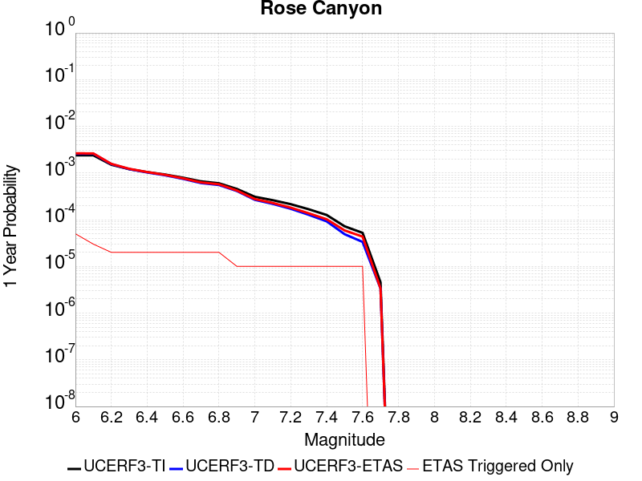 |  |

| Magnitude | 1 wk TI Prob | 1 wk TD Prob | 1 wk ETAS Prob | 1 wk ETAS/TD Gain | 1 wk ETAS Triggered Only | 1 mo TI Prob | 1 mo TD Prob | 1 mo ETAS Prob | 1 mo ETAS/TD Gain | 1 mo ETAS Triggered Only | 1 yr TI Prob | 1 yr TD Prob | 1 yr ETAS Prob | 1 yr ETAS/TD Gain | 1 yr ETAS Triggered Only | 10 yr TI Prob | 10 yr TD Prob | 10 yr ETAS Prob | 10 yr ETAS/TD Gain | 10 yr ETAS Triggered Only |
|-----|-----|-----|-----|-----|-----|-----|-----|-----|-----|-----|-----|-----|-----|-----|-----|-----|-----|-----|-----|-----|
| 6.0 | 4.5923203E-5 | 4.9785445E-5 | 4.9785445E-5 | 1.0 | 0.0 | 1.9679888E-4 | 2.1334889E-4 | 2.2334675E-4 | 1.0468615 | 1.0E-5 | 0.0023933933 | 0.002594629 | 0.0026444993 | 1.0192206 | 5.0E-5 | 0.023677798 | 0.025676774 | 0.02572549 | 1.0018973 | 5.0E-5 |
| 6.1 | 4.5923203E-5 | 4.9785445E-5 | 4.9785445E-5 | 1.0 | 0.0 | 1.9679888E-4 | 2.1334889E-4 | 2.1334889E-4 | 1.0 | 0.0 | 0.0023933933 | 0.002594629 | 0.0026245513 | 1.0115323 | 3.0E-5 | 0.023677798 | 0.025676774 | 0.025706004 | 1.0011383 | 3.0E-5 |
| 6.2 | 2.8844734E-5 | 2.9736191E-5 | 2.9736191E-5 | 1.0 | 0.0 | 1.2361443E-4 | 1.2743479E-4 | 1.2743479E-4 | 1.0 | 0.0 | 0.0015039665 | 0.0015504444 | 0.0015704135 | 1.0128795 | 2.0E-5 | 0.0149382865 | 0.015401139 | 0.015420831 | 1.0012786 | 2.0E-5 |
| 6.3 | 2.3171577E-5 | 2.3228093E-5 | 2.3228093E-5 | 1.0 | 0.0 | 9.9302975E-5 | 9.954524E-5 | 9.954524E-5 | 1.0 | 0.0 | 0.0012083431 | 0.001211303 | 0.0012312789 | 1.0164912 | 2.0E-5 | 0.012017938 | 0.012046046 | 0.012065805 | 1.0016403 | 2.0E-5 |
| 6.4 | 2.0066604E-5 | 1.9707615E-5 | 1.9707615E-5 | 1.0 | 0.0 | 8.599689E-5 | 8.445853E-5 | 8.445853E-5 | 1.0 | 0.0 | 0.0010465092 | 0.0010278076 | 0.001047787 | 1.0194389 | 2.0E-5 | 0.010415946 | 0.010234349 | 0.010254145 | 1.0019342 | 2.0E-5 |
| 6.5 | 1.776989E-5 | 1.71379E-5 | 1.71379E-5 | 1.0 | 0.0 | 7.615444E-5 | 7.3446114E-5 | 7.3446114E-5 | 1.0 | 0.0 | 9.267859E-4 | 8.9384656E-4 | 9.138287E-4 | 1.0223552 | 2.0E-5 | 0.009229303 | 0.00890198 | 0.008921802 | 1.0022267 | 2.0E-5 |
| 6.6 | 1.5227364E-5 | 1.4347262E-5 | 1.4347262E-5 | 1.0 | 0.0 | 6.52585E-5 | 6.148685E-5 | 6.148685E-5 | 1.0 | 0.0 | 7.942326E-4 | 7.483504E-4 | 7.683355E-4 | 1.0267055 | 2.0E-5 | 0.007914 | 0.0074495217 | 0.007469373 | 1.0026647 | 2.0E-5 |
| 6.7 | 1.2703898E-5 | 1.16748115E-5 | 1.16748115E-5 | 1.0 | 0.0 | 5.4444143E-5 | 5.003397E-5 | 5.003397E-5 | 1.0 | 0.0 | 6.626558E-4 | 6.0899754E-4 | 6.289854E-4 | 1.0328208 | 2.0E-5 | 0.006606833 | 0.0060652606 | 0.0060851392 | 1.0032774 | 2.0E-5 |
| 6.8 | 1.1554917E-5 | 1.06108355E-5 | 1.06108355E-5 | 1.0 | 0.0 | 4.9520135E-5 | 4.547424E-5 | 4.547424E-5 | 1.0 | 0.0 | 6.0274085E-4 | 5.535123E-4 | 5.735012E-4 | 1.0361129 | 2.0E-5 | 0.0060110865 | 0.005507485 | 0.005527375 | 1.0036114 | 2.0E-5 |
| 6.9 | 8.732078E-6 | 7.882601E-6 | 7.882601E-6 | 1.0 | 0.0 | 3.7422655E-5 | 3.3782155E-5 | 3.3782155E-5 | 1.0 | 0.0 | 4.5552556E-4 | 4.1122304E-4 | 4.2121892E-4 | 1.0243077 | 1.0E-5 | 0.0045459294 | 0.004089679 | 0.004099638 | 1.0024352 | 1.0E-5 |
| 7.0 | 5.9337494E-6 | 5.107666E-6 | 5.107666E-6 | 1.0 | 0.0 | 2.5430107E-5 | 2.1889813E-5 | 2.1889813E-5 | 1.0 | 0.0 | 3.0956755E-4 | 2.66476E-4 | 2.7647335E-4 | 1.0375168 | 1.0E-5 | 0.0030913667 | 0.0026615805 | 0.002671554 | 1.0037472 | 1.0E-5 |
| 7.1 | 5.013409E-6 | 4.177523E-6 | 4.177523E-6 | 1.0 | 0.0 | 2.1485863E-5 | 1.7903547E-5 | 1.7903547E-5 | 1.0 | 0.0 | 2.6155898E-4 | 2.17954E-4 | 2.2795182E-4 | 1.0458713 | 1.0E-5 | 0.0026125133 | 0.002177414 | 0.0021873922 | 1.0045826 | 1.0E-5 |
| 7.2 | 4.120763E-6 | 3.2822404E-6 | 3.2822404E-6 | 1.0 | 0.0 | 1.7660293E-5 | 1.406667E-5 | 1.406667E-5 | 1.0 | 0.0 | 2.1499286E-4 | 1.7124834E-4 | 1.8124662E-4 | 1.0583848 | 1.0E-5 | 0.0021478499 | 0.0017111732 | 0.0017211561 | 1.005834 | 1.0E-5 |
| 7.3 | 3.2081239E-6 | 2.440603E-6 | 2.440603E-6 | 1.0 | 0.0 | 1.374903E-5 | 1.0459687E-5 | 1.0459687E-5 | 1.0 | 0.0 | 1.6738157E-4 | 1.2733931E-4 | 1.3733804E-4 | 1.0785203 | 1.0E-5 | 0.0016725556 | 0.0012726703 | 0.0012826576 | 1.0078475 | 1.0E-5 |
| 7.4 | 2.4194755E-6 | 1.7681095E-6 | 1.7681095E-6 | 1.0 | 0.0 | 1.0369139E-5 | 7.5775906E-6 | 7.5775906E-6 | 1.0 | 0.0 | 1.2623696E-4 | 9.2253315E-5 | 1.02252394E-4 | 1.1083872 | 1.0E-5 | 0.0012616527 | 9.221555E-4 | 9.3214633E-4 | 1.0108342 | 1.0E-5 |
| 7.5 | 1.3842889E-6 | 9.378736E-7 | 9.378736E-7 | 1.0 | 0.0 | 5.9326535E-6 | 4.0194523E-6 | 4.0194523E-6 | 1.0 | 0.0 | 7.222766E-5 | 4.8935766E-5 | 5.893528E-5 | 1.2043395 | 1.0E-5 | 7.220419E-4 | 4.8925343E-4 | 4.9924856E-4 | 1.0204293 | 1.0E-5 |
| 7.6 | 1.0021575E-6 | 6.4117063E-7 | 6.4117063E-7 | 1.0 | 0.0 | 4.2949537E-6 | 2.7478713E-6 | 2.7478713E-6 | 1.0 | 0.0 | 5.2289808E-5 | 3.3454842E-5 | 4.3454507E-5 | 1.2989004 | 1.0E-5 | 5.2277505E-4 | 3.345002E-4 | 3.4449686E-4 | 1.0298853 | 1.0E-5 |
| 7.7 | 8.7620116E-8 | 6.449476E-8 | 6.449476E-8 | 1.0 | 0.0 | 3.7551473E-7 | 2.764061E-7 | 2.764061E-7 | 1.0 | 0.0 | 4.5718825E-6 | 3.3652393E-6 | 3.3652393E-6 | 1.0 | 0.0 | 4.5717883E-5 | 3.3651915E-5 | 3.3651915E-5 | 1.0 | 0.0 |

## Whittier alt 1
*[(top)](#table-of-contents)*

| 1 Week | 1 Month | 1 Year | 10 Year |
|-----|-----|-----|-----|
|  |  |  | 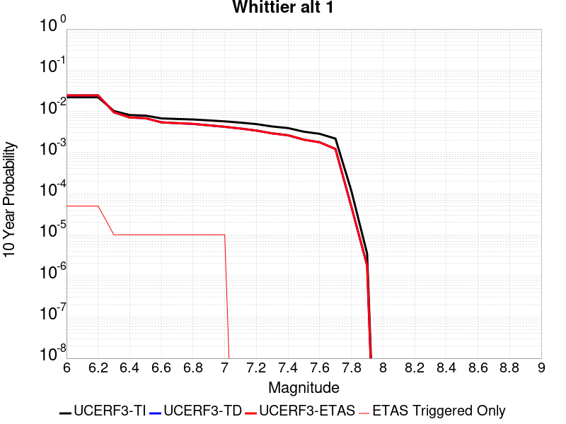 |

| Magnitude | 1 wk TI Prob | 1 wk TD Prob | 1 wk ETAS Prob | 1 wk ETAS/TD Gain | 1 wk ETAS Triggered Only | 1 mo TI Prob | 1 mo TD Prob | 1 mo ETAS Prob | 1 mo ETAS/TD Gain | 1 mo ETAS Triggered Only | 1 yr TI Prob | 1 yr TD Prob | 1 yr ETAS Prob | 1 yr ETAS/TD Gain | 1 yr ETAS Triggered Only | 10 yr TI Prob | 10 yr TD Prob | 10 yr ETAS Prob | 10 yr ETAS/TD Gain | 10 yr ETAS Triggered Only |
|-----|-----|-----|-----|-----|-----|-----|-----|-----|-----|-----|-----|-----|-----|-----|-----|-----|-----|-----|-----|-----|
| 6.0 | 4.2554693E-5 | 4.7258407E-5 | 4.7258407E-5 | 1.0 | 0.0 | 1.8236451E-4 | 2.0252213E-4 | 2.0252213E-4 | 1.0 | 0.0 | 0.002218027 | 0.0024632406 | 0.0024831914 | 1.0080994 | 2.0E-5 | 0.02196019 | 0.024393361 | 0.024442142 | 1.0019997 | 5.0E-5 |
| 6.1 | 4.2554693E-5 | 4.7258407E-5 | 4.7258407E-5 | 1.0 | 0.0 | 1.8236451E-4 | 2.0252213E-4 | 2.0252213E-4 | 1.0 | 0.0 | 0.002218027 | 0.0024632406 | 0.0024831914 | 1.0080994 | 2.0E-5 | 0.02196019 | 0.024393361 | 0.024442142 | 1.0019997 | 5.0E-5 |
| 6.2 | 4.2554693E-5 | 4.7258407E-5 | 4.7258407E-5 | 1.0 | 0.0 | 1.8236451E-4 | 2.0252213E-4 | 2.0252213E-4 | 1.0 | 0.0 | 0.002218027 | 0.0024632406 | 0.0024831914 | 1.0080994 | 2.0E-5 | 0.02196019 | 0.024393361 | 0.024442142 | 1.0019997 | 5.0E-5 |
| 6.3 | 1.9617712E-5 | 1.8271963E-5 | 1.8271963E-5 | 1.0 | 0.0 | 8.40732E-5 | 7.830617E-5 | 7.830617E-5 | 1.0 | 0.0 | 0.0010231105 | 9.5297967E-4 | 9.5297967E-4 | 1.0 | 0.0 | 0.01018413 | 0.009492154 | 0.00950206 | 1.0010436 | 1.0E-5 |
| 6.4 | 1.5611336E-5 | 1.3607148E-5 | 1.3607148E-5 | 1.0 | 0.0 | 6.690401E-5 | 5.831508E-5 | 5.831508E-5 | 1.0 | 0.0 | 8.142519E-4 | 7.0976076E-4 | 7.0976076E-4 | 1.0 | 0.0 | 0.008112748 | 0.00707684 | 0.007086769 | 1.0014031 | 1.0E-5 |
| 6.5 | 1.5150166E-5 | 1.31037705E-5 | 1.31037705E-5 | 1.0 | 0.0 | 6.492767E-5 | 5.615784E-5 | 5.615784E-5 | 1.0 | 0.0 | 7.9020765E-4 | 6.835131E-4 | 6.835131E-4 | 1.0 | 0.0 | 0.007874036 | 0.006815994 | 0.006825926 | 1.0014571 | 1.0E-5 |
| 6.6 | 1.295588E-5 | 1.0383021E-5 | 1.0383021E-5 | 1.0 | 0.0 | 5.552402E-5 | 4.4497912E-5 | 4.4497912E-5 | 1.0 | 0.0 | 6.7579525E-4 | 5.416293E-4 | 5.416293E-4 | 1.0 | 0.0 | 0.006737438 | 0.0054045757 | 0.0054145213 | 1.0018402 | 1.0E-5 |
| 6.7 | 1.2542085E-5 | 9.901608E-6 | 9.901608E-6 | 1.0 | 0.0 | 5.3750682E-5 | 4.243478E-5 | 4.243478E-5 | 1.0 | 0.0 | 6.542181E-4 | 5.165229E-4 | 5.165229E-4 | 1.0 | 0.0 | 0.006522954 | 0.005154706 | 0.0051646545 | 1.00193 | 1.0E-5 |
| 6.8 | 1.2195878E-5 | 9.497576E-6 | 9.497576E-6 | 1.0 | 0.0 | 5.2267E-5 | 4.070327E-5 | 4.070327E-5 | 1.0 | 0.0 | 6.36165E-4 | 4.954515E-4 | 4.954515E-4 | 1.0 | 0.0 | 0.0063434686 | 0.004944878 | 0.004954829 | 1.0020123 | 1.0E-5 |
| 6.9 | 1.1580298E-5 | 8.774936E-6 | 8.774936E-6 | 1.0 | 0.0 | 4.9628903E-5 | 3.7606333E-5 | 3.7606333E-5 | 1.0 | 0.0 | 6.040644E-4 | 4.5776257E-4 | 4.5776257E-4 | 1.0 | 0.0 | 0.00602425 | 0.0045695743 | 0.0045795282 | 1.0021784 | 1.0E-5 |
| 7.0 | 1.0964795E-5 | 8.085893E-6 | 8.085893E-6 | 1.0 | 0.0 | 4.6991136E-5 | 3.4653374E-5 | 3.4653374E-5 | 1.0 | 0.0 | 5.7196687E-4 | 4.2182466E-4 | 4.2182466E-4 | 1.0 | 0.0 | 0.0057049696 | 0.0042115105 | 0.004221468 | 1.0023644 | 1.0E-5 |
| 7.1 | 1.0230601E-5 | 7.3283227E-6 | 7.3283227E-6 | 1.0 | 0.0 | 4.3844695E-5 | 3.1406726E-5 | 3.1406726E-5 | 1.0 | 0.0 | 5.336784E-4 | 3.823111E-4 | 3.823111E-4 | 1.0 | 0.0 | 0.005323986 | 0.0038176724 | 0.0038176724 | 1.0 | 0.0 |
| 7.2 | 9.40865E-6 | 6.5447884E-6 | 6.5447884E-6 | 1.0 | 0.0 | 4.032216E-5 | 2.8048798E-5 | 2.8048798E-5 | 1.0 | 0.0 | 4.908117E-4 | 3.4144183E-4 | 3.4144183E-4 | 1.0 | 0.0 | 0.0048972913 | 0.0034102425 | 0.0034102425 | 1.0 | 0.0 |
| 7.3 | 8.237384E-6 | 5.599053E-6 | 5.599053E-6 | 1.0 | 0.0 | 3.5302593E-5 | 2.3995728E-5 | 2.3995728E-5 | 1.0 | 0.0 | 4.2972428E-4 | 2.9210985E-4 | 2.9210985E-4 | 1.0 | 0.0 | 0.0042889426 | 0.0029175924 | 0.0029175924 | 1.0 | 0.0 |
| 7.4 | 7.5316966E-6 | 5.0290073E-6 | 5.0290073E-6 | 1.0 | 0.0 | 3.2278298E-5 | 2.1552716E-5 | 2.1552716E-5 | 1.0 | 0.0 | 3.9291743E-4 | 2.6237374E-4 | 2.6237374E-4 | 1.0 | 0.0 | 0.0039222343 | 0.0026207527 | 0.0026207527 | 1.0 | 0.0 |
| 7.5 | 6.149649E-6 | 3.9347974E-6 | 3.9347974E-6 | 1.0 | 0.0 | 2.6355372E-5 | 1.6863314E-5 | 1.6863314E-5 | 1.0 | 0.0 | 3.208294E-4 | 2.0529241E-4 | 2.0529241E-4 | 1.0 | 0.0 | 0.003203666 | 0.002051117 | 0.002051117 | 1.0 | 0.0 |
| 7.6 | 5.457711E-6 | 3.396226E-6 | 3.396226E-6 | 1.0 | 0.0 | 2.338998E-5 | 1.4555178E-5 | 1.4555178E-5 | 1.0 | 0.0 | 2.8473578E-4 | 1.7719569E-4 | 1.7719569E-4 | 1.0 | 0.0 | 0.0028437122 | 0.0017706248 | 0.0017706248 | 1.0 | 0.0 |
| 7.7 | 4.1676276E-6 | 2.3338614E-6 | 2.3338614E-6 | 1.0 | 0.0 | 1.7861139E-5 | 1.0002229E-5 | 1.0002229E-5 | 1.0 | 0.0 | 2.1743766E-4 | 1.21771074E-4 | 1.21771074E-4 | 1.0 | 0.0 | 0.0021722503 | 0.0012171166 | 0.0012171166 | 1.0 | 0.0 |
| 7.8 | 2.2692414E-7 | 9.3867996E-8 | 9.3867996E-8 | 1.0 | 0.0 | 9.725317E-7 | 4.0229136E-7 | 4.0229136E-7 | 1.0 | 0.0 | 1.1840509E-5 | 4.8978895E-6 | 4.8978895E-6 | 1.0 | 0.0 | 1.1839878E-4 | 4.8978145E-5 | 4.8978145E-5 | 1.0 | 0.0 |
| 7.9 | 6.676829E-9 | 3.440364E-9 | 3.440364E-9 | 1.0 | 0.0 | 2.861498E-8 | 1.4744418E-8 | 1.4744418E-8 | 1.0 | 0.0 | 3.4838732E-7 | 1.7951328E-7 | 1.7951328E-7 | 1.0 | 0.0 | 3.4838679E-6 | 1.7951315E-6 | 1.7951315E-6 | 1.0 | 0.0 |

## Elysian Park (Upper)
*[(top)](#table-of-contents)*

| 1 Week | 1 Month | 1 Year | 10 Year |
|-----|-----|-----|-----|
|  |  |  | 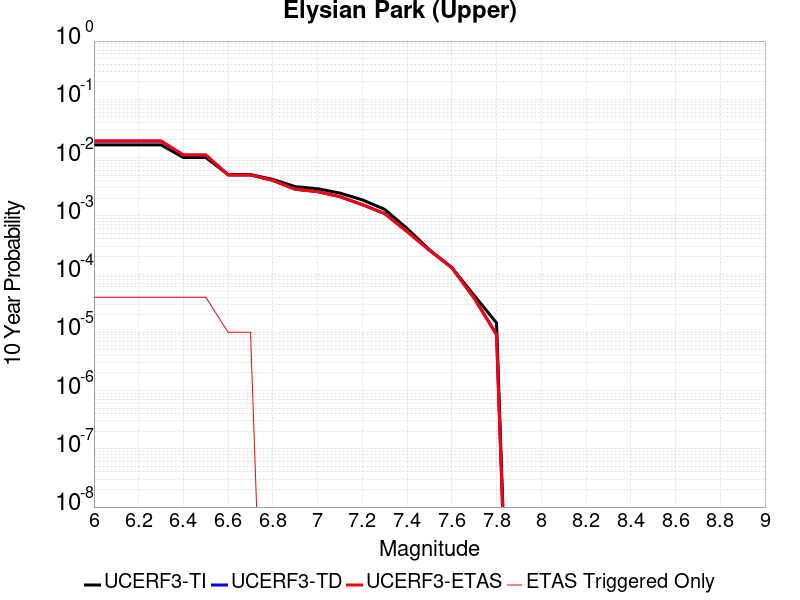 |

| Magnitude | 1 wk TI Prob | 1 wk TD Prob | 1 wk ETAS Prob | 1 wk ETAS/TD Gain | 1 wk ETAS Triggered Only | 1 mo TI Prob | 1 mo TD Prob | 1 mo ETAS Prob | 1 mo ETAS/TD Gain | 1 mo ETAS Triggered Only | 1 yr TI Prob | 1 yr TD Prob | 1 yr ETAS Prob | 1 yr ETAS/TD Gain | 1 yr ETAS Triggered Only | 10 yr TI Prob | 10 yr TD Prob | 10 yr ETAS Prob | 10 yr ETAS/TD Gain | 10 yr ETAS Triggered Only |
|-----|-----|-----|-----|-----|-----|-----|-----|-----|-----|-----|-----|-----|-----|-----|-----|-----|-----|-----|-----|-----|
| 6.0 | 3.1876025E-5 | 3.70402E-5 | 3.70402E-5 | 1.0 | 0.0 | 1.3660437E-4 | 1.5873666E-4 | 1.5873666E-4 | 1.0 | 0.0 | 0.0016618895 | 0.0019313812 | 0.0019513426 | 1.0103353 | 2.0E-5 | 0.016495159 | 0.019192416 | 0.01923165 | 1.0020442 | 4.0E-5 |
| 6.1 | 3.1876025E-5 | 3.70402E-5 | 3.70402E-5 | 1.0 | 0.0 | 1.3660437E-4 | 1.5873666E-4 | 1.5873666E-4 | 1.0 | 0.0 | 0.0016618895 | 0.0019313812 | 0.0019513426 | 1.0103353 | 2.0E-5 | 0.016495159 | 0.019192416 | 0.01923165 | 1.0020442 | 4.0E-5 |
| 6.2 | 3.1876025E-5 | 3.70402E-5 | 3.70402E-5 | 1.0 | 0.0 | 1.3660437E-4 | 1.5873666E-4 | 1.5873666E-4 | 1.0 | 0.0 | 0.0016618895 | 0.0019313812 | 0.0019513426 | 1.0103353 | 2.0E-5 | 0.016495159 | 0.019192416 | 0.01923165 | 1.0020442 | 4.0E-5 |
| 6.3 | 3.1876025E-5 | 3.70402E-5 | 3.70402E-5 | 1.0 | 0.0 | 1.3660437E-4 | 1.5873666E-4 | 1.5873666E-4 | 1.0 | 0.0 | 0.0016618895 | 0.0019313812 | 0.0019513426 | 1.0103353 | 2.0E-5 | 0.016495159 | 0.019192416 | 0.01923165 | 1.0020442 | 4.0E-5 |
| 6.4 | 1.9273462E-5 | 2.1204767E-5 | 2.1204767E-5 | 1.0 | 0.0 | 8.259794E-5 | 9.087539E-5 | 9.087539E-5 | 1.0 | 0.0 | 0.001005166 | 0.0011060176 | 0.0011259955 | 1.018063 | 2.0E-5 | 0.010006315 | 0.011021944 | 0.011061503 | 1.0035892 | 4.0E-5 |
| 6.5 | 1.9273462E-5 | 2.1204767E-5 | 2.1204767E-5 | 1.0 | 0.0 | 8.259794E-5 | 9.087539E-5 | 9.087539E-5 | 1.0 | 0.0 | 0.001005166 | 0.0011060176 | 0.0011259955 | 1.018063 | 2.0E-5 | 0.010006315 | 0.011021944 | 0.011061503 | 1.0035892 | 4.0E-5 |
| 6.6 | 9.813258E-6 | 9.666234E-6 | 9.666234E-6 | 1.0 | 0.0 | 4.205614E-5 | 4.14261E-5 | 4.14261E-5 | 1.0 | 0.0 | 5.119132E-4 | 5.042533E-4 | 5.042533E-4 | 1.0 | 0.0 | 0.005107356 | 0.0050318153 | 0.005041765 | 1.0019773 | 1.0E-5 |
| 6.7 | 9.801478E-6 | 9.653803E-6 | 9.653803E-6 | 1.0 | 0.0 | 4.2005657E-5 | 4.1372827E-5 | 4.1372827E-5 | 1.0 | 0.0 | 5.112989E-4 | 5.03605E-4 | 5.03605E-4 | 1.0 | 0.0 | 0.0051012407 | 0.005025361 | 0.005035311 | 1.00198 | 1.0E-5 |
| 6.8 | 8.102489E-6 | 7.773506E-6 | 7.773506E-6 | 1.0 | 0.0 | 3.4724493E-5 | 3.3314627E-5 | 3.3314627E-5 | 1.0 | 0.0 | 4.2268867E-4 | 4.0553507E-4 | 4.0553507E-4 | 1.0 | 0.0 | 0.004218856 | 0.0040484443 | 0.0040484443 | 1.0 | 0.0 |
| 6.9 | 6.08275E-6 | 5.4817488E-6 | 5.4817488E-6 | 1.0 | 0.0 | 2.6068668E-5 | 2.3493001E-5 | 2.3493001E-5 | 1.0 | 0.0 | 3.173398E-4 | 2.859905E-4 | 2.859905E-4 | 1.0 | 0.0 | 0.0031688702 | 0.0028563023 | 0.0028563023 | 1.0 | 0.0 |
| 7.0 | 5.5995934E-6 | 4.9830487E-6 | 4.9830487E-6 | 1.0 | 0.0 | 2.3998036E-5 | 2.135575E-5 | 2.135575E-5 | 1.0 | 0.0 | 2.9213692E-4 | 2.599759E-4 | 2.599759E-4 | 1.0 | 0.0 | 0.0029175316 | 0.002596785 | 0.002596785 | 1.0 | 0.0 |
| 7.1 | 4.709881E-6 | 4.0876193E-6 | 4.0876193E-6 | 1.0 | 0.0 | 2.0185047E-5 | 1.7518252E-5 | 1.7518252E-5 | 1.0 | 0.0 | 2.4572524E-4 | 2.1326427E-4 | 2.1326427E-4 | 1.0 | 0.0 | 0.002454537 | 0.0021306374 | 0.0021306374 | 1.0 | 0.0 |
| 7.2 | 3.6063436E-6 | 2.9781056E-6 | 2.9781056E-6 | 1.0 | 0.0 | 1.5455667E-5 | 1.27632475E-5 | 1.27632475E-5 | 1.0 | 0.0 | 1.881565E-4 | 1.5538157E-4 | 1.5538157E-4 | 1.0 | 0.0 | 0.0018799726 | 0.0015527406 | 0.0015527406 | 1.0 | 0.0 |
| 7.3 | 2.471135E-6 | 2.0955686E-6 | 2.0955686E-6 | 1.0 | 0.0 | 1.0590536E-5 | 8.980977E-6 | 8.980977E-6 | 1.0 | 0.0 | 1.2893214E-4 | 1.0933798E-4 | 1.0933798E-4 | 1.0 | 0.0 | 0.0012885736 | 0.0010928491 | 0.0010928491 | 1.0 | 0.0 |
| 7.4 | 1.163943E-6 | 1.0275672E-6 | 1.0275672E-6 | 1.0 | 0.0 | 4.988318E-6 | 4.4038525E-6 | 4.4038525E-6 | 1.0 | 0.0 | 6.0731076E-5 | 5.3615615E-5 | 5.3615615E-5 | 1.0 | 0.0 | 6.071448E-4 | 5.3602975E-4 | 5.3602975E-4 | 1.0 | 0.0 |
| 7.5 | 4.99459E-7 | 4.9178897E-7 | 4.9178897E-7 | 1.0 | 0.0 | 2.140537E-6 | 2.1076653E-6 | 2.1076653E-6 | 1.0 | 0.0 | 2.6060725E-5 | 2.566054E-5 | 2.566054E-5 | 1.0 | 0.0 | 2.605767E-4 | 2.5657733E-4 | 2.5657733E-4 | 1.0 | 0.0 |
| 7.6 | 2.4667852E-7 | 2.4780044E-7 | 2.4780044E-7 | 1.0 | 0.0 | 1.0571932E-6 | 1.0620015E-6 | 1.0620015E-6 | 1.0 | 0.0 | 1.2871251E-5 | 1.2929795E-5 | 1.2929795E-5 | 1.0 | 0.0 | 1.2870505E-4 | 1.292908E-4 | 1.292908E-4 | 1.0 | 0.0 |
| 7.7 | 8.2312795E-8 | 7.387377E-8 | 7.387377E-8 | 1.0 | 0.0 | 3.527691E-7 | 3.1660184E-7 | 3.1660184E-7 | 1.0 | 0.0 | 4.294955E-6 | 3.854622E-6 | 3.854622E-6 | 1.0 | 0.0 | 4.2948723E-5 | 3.8545662E-5 | 3.8545662E-5 | 1.0 | 0.0 |
| 7.8 | 2.7819295E-8 | 1.7572734E-8 | 1.7572734E-8 | 1.0 | 0.0 | 1.1922555E-7 | 7.531172E-8 | 7.531172E-8 | 1.0 | 0.0 | 1.45157E-6 | 9.1691993E-7 | 9.1691993E-7 | 1.0 | 0.0 | 1.45156055E-5 | 9.169176E-6 | 9.169176E-6 | 1.0 | 0.0 |

## Palos Verdes
*[(top)](#table-of-contents)*

| 1 Week | 1 Month | 1 Year | 10 Year |
|-----|-----|-----|-----|
|  |  |  |  |

| Magnitude | 1 wk TI Prob | 1 wk TD Prob | 1 wk ETAS Prob | 1 wk ETAS/TD Gain | 1 wk ETAS Triggered Only | 1 mo TI Prob | 1 mo TD Prob | 1 mo ETAS Prob | 1 mo ETAS/TD Gain | 1 mo ETAS Triggered Only | 1 yr TI Prob | 1 yr TD Prob | 1 yr ETAS Prob | 1 yr ETAS/TD Gain | 1 yr ETAS Triggered Only | 10 yr TI Prob | 10 yr TD Prob | 10 yr ETAS Prob | 10 yr ETAS/TD Gain | 10 yr ETAS Triggered Only |
|-----|-----|-----|-----|-----|-----|-----|-----|-----|-----|-----|-----|-----|-----|-----|-----|-----|-----|-----|-----|-----|
| 6.0 | 6.126063E-5 | 7.623824E-5 | 7.623824E-5 | 1.0 | 0.0 | 2.6251914E-4 | 3.2669774E-4 | 3.3669447E-4 | 1.0305994 | 1.0E-5 | 0.0031914865 | 0.003970812 | 0.0040106536 | 1.0100335 | 4.0E-5 | 0.031460393 | 0.03905523 | 0.039103277 | 1.0012302 | 5.0E-5 |
| 6.1 | 6.126063E-5 | 7.623824E-5 | 7.623824E-5 | 1.0 | 0.0 | 2.6251914E-4 | 3.2669774E-4 | 3.3669447E-4 | 1.0305994 | 1.0E-5 | 0.0031914865 | 0.003970812 | 0.0040106536 | 1.0100335 | 4.0E-5 | 0.031460393 | 0.03905523 | 0.039103277 | 1.0012302 | 5.0E-5 |
| 6.2 | 6.126063E-5 | 7.623824E-5 | 7.623824E-5 | 1.0 | 0.0 | 2.6251914E-4 | 3.2669774E-4 | 3.3669447E-4 | 1.0305994 | 1.0E-5 | 0.0031914865 | 0.003970812 | 0.0040106536 | 1.0100335 | 4.0E-5 | 0.031460393 | 0.03905523 | 0.039103277 | 1.0012302 | 5.0E-5 |
| 6.3 | 4.0838047E-5 | 4.975629E-5 | 4.975629E-5 | 1.0 | 0.0 | 1.7500846E-4 | 2.1322507E-4 | 2.2322293E-4 | 1.0468888 | 1.0E-5 | 0.0021286458 | 0.0025931296 | 0.0026230519 | 1.011539 | 3.0E-5 | 0.021083709 | 0.025650414 | 0.025689388 | 1.0015194 | 4.0E-5 |
| 6.4 | 4.0838047E-5 | 4.975629E-5 | 4.975629E-5 | 1.0 | 0.0 | 1.7500846E-4 | 2.1322507E-4 | 2.2322293E-4 | 1.0468888 | 1.0E-5 | 0.0021286458 | 0.0025931296 | 0.0026230519 | 1.011539 | 3.0E-5 | 0.021083709 | 0.025650414 | 0.025689388 | 1.0015194 | 4.0E-5 |
| 6.5 | 3.0512005E-5 | 3.656645E-5 | 3.656645E-5 | 1.0 | 0.0 | 1.3075917E-4 | 1.5670458E-4 | 1.6670302E-4 | 1.0638044 | 1.0E-5 | 0.0015908304 | 0.0019063241 | 0.0019362669 | 1.0157071 | 3.0E-5 | 0.015794903 | 0.018911652 | 0.018950894 | 1.0020751 | 4.0E-5 |
| 6.6 | 2.9255087E-5 | 3.5159133E-5 | 3.5159133E-5 | 1.0 | 0.0 | 1.2537291E-4 | 1.5067394E-4 | 1.6067243E-4 | 1.0663584 | 1.0E-5 | 0.0015253464 | 0.0018330244 | 0.0018629695 | 1.0163364 | 3.0E-5 | 0.015149189 | 0.018190667 | 0.018229939 | 1.0021589 | 4.0E-5 |
| 6.7 | 2.287198E-5 | 2.7251765E-5 | 2.7251765E-5 | 1.0 | 0.0 | 9.801909E-5 | 1.1678857E-4 | 1.267874E-4 | 1.0856148 | 1.0E-5 | 0.001192729 | 0.0014210651 | 0.0014410366 | 1.014054 | 2.0E-5 | 0.011863477 | 0.014129014 | 0.014148731 | 1.0013956 | 2.0E-5 |
| 6.8 | 2.1325764E-5 | 2.543515E-5 | 2.543515E-5 | 1.0 | 0.0 | 9.139293E-5 | 1.0900375E-4 | 1.1900265E-4 | 1.09173 | 1.0E-5 | 0.001112141 | 0.0013264029 | 0.0013463764 | 1.0150584 | 2.0E-5 | 0.011065915 | 0.0131939 | 0.013213635 | 1.0014958 | 2.0E-5 |
| 6.9 | 1.9009392E-5 | 2.2616416E-5 | 2.2616416E-5 | 1.0 | 0.0 | 8.1466285E-5 | 9.692439E-5 | 9.692439E-5 | 1.0 | 0.0 | 9.914007E-4 | 0.0011795029 | 0.0011894911 | 1.0084682 | 1.0E-5 | 0.009869894 | 0.011741114 | 0.011750997 | 1.0008417 | 1.0E-5 |
| 7.0 | 1.7098473E-5 | 2.0321919E-5 | 2.0321919E-5 | 1.0 | 0.0 | 7.3277115E-5 | 8.709151E-5 | 8.709151E-5 | 1.0 | 0.0 | 8.917837E-4 | 0.0010599085 | 0.001069898 | 1.0094248 | 1.0E-5 | 0.008882134 | 0.010556973 | 0.010566867 | 1.0009372 | 1.0E-5 |
| 7.1 | 1.5982785E-5 | 1.8997158E-5 | 1.8997158E-5 | 1.0 | 0.0 | 6.849585E-5 | 8.141433E-5 | 8.141433E-5 | 1.0 | 0.0 | 8.336179E-4 | 9.908534E-4 | 0.0010008435 | 1.0100824 | 1.0E-5 | 0.008304977 | 0.009872721 | 0.0098826215 | 1.0010029 | 1.0E-5 |
| 7.2 | 1.4468002E-5 | 1.7199409E-5 | 1.7199409E-5 | 1.0 | 0.0 | 6.200425E-5 | 7.371014E-5 | 7.371014E-5 | 1.0 | 0.0 | 7.546402E-4 | 8.971355E-4 | 9.071266E-4 | 1.0111365 | 1.0E-5 | 0.007520827 | 0.00894341 | 0.008953321 | 1.0011082 | 1.0E-5 |
| 7.3 | 5.288233E-6 | 6.204405E-6 | 6.204405E-6 | 1.0 | 0.0 | 2.2663658E-5 | 2.6590233E-5 | 2.6590233E-5 | 1.0 | 0.0 | 2.7589512E-4 | 3.237229E-4 | 3.3371968E-4 | 1.0308806 | 1.0E-5 | 0.0027555283 | 0.003235937 | 0.0032459048 | 1.0030802 | 1.0E-5 |
| 7.4 | 8.279556E-7 | 8.408433E-7 | 8.408433E-7 | 1.0 | 0.0 | 3.5483763E-6 | 3.6036097E-6 | 3.6036097E-6 | 1.0 | 0.0 | 4.3200624E-5 | 4.387314E-5 | 4.387314E-5 | 1.0 | 0.0 | 4.3192226E-4 | 4.38652E-4 | 4.38652E-4 | 1.0 | 0.0 |
| 7.5 | 6.559831E-7 | 6.667301E-7 | 6.667301E-7 | 1.0 | 0.0 | 2.8113532E-6 | 2.857412E-6 | 2.857412E-6 | 1.0 | 0.0 | 3.4227687E-5 | 3.4788503E-5 | 3.4788503E-5 | 1.0 | 0.0 | 3.4222414E-4 | 3.4783722E-4 | 3.4783722E-4 | 1.0 | 0.0 |
| 7.6 | 3.5018968E-7 | 3.5620434E-7 | 3.5620434E-7 | 1.0 | 0.0 | 1.500812E-6 | 1.5265894E-6 | 1.5265894E-6 | 1.0 | 0.0 | 1.8272232E-5 | 1.8586114E-5 | 1.8586114E-5 | 1.0 | 0.0 | 1.8270731E-4 | 1.858502E-4 | 1.858502E-4 | 1.0 | 0.0 |
| 7.7 | 1.1986104E-7 | 1.219852E-7 | 1.219852E-7 | 1.0 | 0.0 | 5.1369005E-7 | 5.227936E-7 | 5.227936E-7 | 1.0 | 0.0 | 6.2541585E-6 | 6.364994E-6 | 6.364994E-6 | 1.0 | 0.0 | 6.2539824E-5 | 6.3648156E-5 | 6.3648156E-5 | 1.0 | 0.0 |
| 7.8 | 3.0445005E-8 | 3.1027977E-8 | 3.1027977E-8 | 1.0 | 0.0 | 1.3047858E-7 | 1.3297704E-7 | 1.3297704E-7 | 1.0 | 0.0 | 1.5885756E-6 | 1.6189945E-6 | 1.6189945E-6 | 1.0 | 0.0 | 1.5885644E-5 | 1.6189848E-5 | 1.6189848E-5 | 1.0 | 0.0 |

## Oceanic - West Huasna
*[(top)](#table-of-contents)*

| 1 Week | 1 Month | 1 Year | 10 Year |
|-----|-----|-----|-----|
|  |  |  | 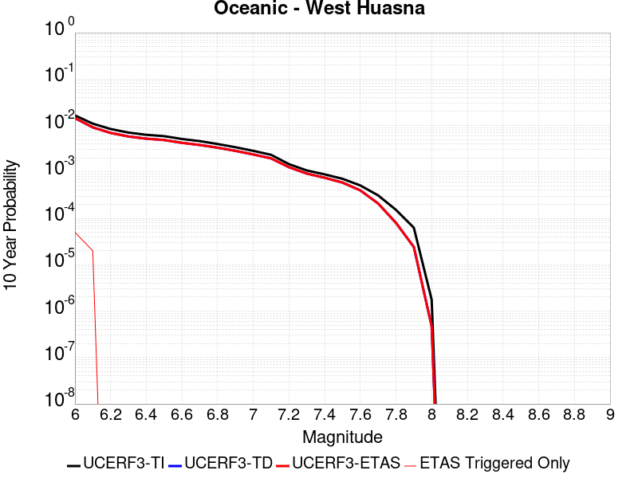 |

| Magnitude | 1 wk TI Prob | 1 wk TD Prob | 1 wk ETAS Prob | 1 wk ETAS/TD Gain | 1 wk ETAS Triggered Only | 1 mo TI Prob | 1 mo TD Prob | 1 mo ETAS Prob | 1 mo ETAS/TD Gain | 1 mo ETAS Triggered Only | 1 yr TI Prob | 1 yr TD Prob | 1 yr ETAS Prob | 1 yr ETAS/TD Gain | 1 yr ETAS Triggered Only | 10 yr TI Prob | 10 yr TD Prob | 10 yr ETAS Prob | 10 yr ETAS/TD Gain | 10 yr ETAS Triggered Only |
|-----|-----|-----|-----|-----|-----|-----|-----|-----|-----|-----|-----|-----|-----|-----|-----|-----|-----|-----|-----|-----|
| 6.0 | 3.195567E-5 | 2.7928725E-5 | 2.7928725E-5 | 1.0 | 0.0 | 1.3694567E-4 | 1.1968929E-4 | 1.1968929E-4 | 1.0 | 0.0 | 0.0016660384 | 0.0014562862 | 0.001476257 | 1.0137136 | 2.0E-5 | 0.016536033 | 0.014471984 | 0.01452126 | 1.003405 | 5.0E-5 |
| 6.1 | 2.1156782E-5 | 1.7574925E-5 | 1.7574925E-5 | 1.0 | 0.0 | 9.066878E-5 | 7.531898E-5 | 7.531898E-5 | 1.0 | 0.0 | 0.0011033333 | 9.1663224E-4 | 9.2662306E-4 | 1.0108995 | 1.0E-5 | 0.010978713 | 0.009129521 | 0.009149339 | 1.0021707 | 2.0E-5 |
| 6.2 | 1.6195117E-5 | 1.3327842E-5 | 1.3327842E-5 | 1.0 | 0.0 | 6.9405796E-5 | 5.7118086E-5 | 5.7118086E-5 | 1.0 | 0.0 | 8.44688E-4 | 6.951934E-4 | 6.951934E-4 | 1.0 | 0.0 | 0.008414844 | 0.0069304807 | 0.0069304807 | 1.0 | 0.0 |
| 6.3 | 1.3559345E-5 | 1.1179529E-5 | 1.1179529E-5 | 1.0 | 0.0 | 5.811018E-5 | 4.791139E-5 | 4.791139E-5 | 1.0 | 0.0 | 7.072618E-4 | 5.83166E-4 | 5.83166E-4 | 1.0 | 0.0 | 0.0070501505 | 0.0058164755 | 0.0058164755 | 1.0 | 0.0 |
| 6.4 | 1.2120619E-5 | 1.0001277E-5 | 1.0001277E-5 | 1.0 | 0.0 | 5.1944477E-5 | 4.2861913E-5 | 4.2861913E-5 | 1.0 | 0.0 | 6.322405E-4 | 5.2171934E-4 | 5.2171934E-4 | 1.0 | 0.0 | 0.006304447 | 0.005205013 | 0.005205013 | 1.0 | 0.0 |
| 6.5 | 1.13511915E-5 | 9.3677445E-6 | 9.3677445E-6 | 1.0 | 0.0 | 4.8647056E-5 | 4.014686E-5 | 4.014686E-5 | 1.0 | 0.0 | 5.9211696E-4 | 4.8867887E-4 | 4.8867887E-4 | 1.0 | 0.0 | 0.0059054173 | 0.0048761014 | 0.0048761014 | 1.0 | 0.0 |
| 6.6 | 9.850605E-6 | 8.135629E-6 | 8.135629E-6 | 1.0 | 0.0 | 4.2216197E-5 | 3.4866516E-5 | 3.4866516E-5 | 1.0 | 0.0 | 5.1386096E-4 | 4.2441738E-4 | 4.2441738E-4 | 1.0 | 0.0 | 0.0051267436 | 0.0042361007 | 0.0042361007 | 1.0 | 0.0 |
| 6.7 | 8.8558645E-6 | 7.318624E-6 | 7.318624E-6 | 1.0 | 0.0 | 3.7953152E-5 | 3.1365154E-5 | 3.1365154E-5 | 1.0 | 0.0 | 4.6198163E-4 | 3.81804E-4 | 3.81804E-4 | 1.0 | 0.0 | 0.004610224 | 0.003811506 | 0.003811506 | 1.0 | 0.0 |
| 6.8 | 7.67136E-6 | 6.3919397E-6 | 6.3919397E-6 | 1.0 | 0.0 | 3.2876844E-5 | 2.739374E-5 | 2.739374E-5 | 1.0 | 0.0 | 4.0020206E-4 | 3.334679E-4 | 3.334679E-4 | 1.0 | 0.0 | 0.003994821 | 0.0033296961 | 0.0033296961 | 1.0 | 0.0 |
| 6.9 | 6.534529E-6 | 5.458481E-6 | 5.458481E-6 | 1.0 | 0.0 | 2.8004823E-5 | 2.339328E-5 | 2.339328E-5 | 1.0 | 0.0 | 3.4090536E-4 | 2.8477612E-4 | 2.8477612E-4 | 1.0 | 0.0 | 0.0034038287 | 0.0028441285 | 0.0028441285 | 1.0 | 0.0 |
| 7.0 | 5.460525E-6 | 4.5701145E-6 | 4.5701145E-6 | 1.0 | 0.0 | 2.3402039E-5 | 1.9586058E-5 | 1.9586058E-5 | 1.0 | 0.0 | 2.8488258E-4 | 2.3843427E-4 | 2.3843427E-4 | 1.0 | 0.0 | 0.0028451765 | 0.0023817983 | 0.0023817983 | 1.0 | 0.0 |
| 7.1 | 4.4825083E-6 | 3.7525965E-6 | 3.7525965E-6 | 1.0 | 0.0 | 1.9210609E-5 | 1.6082458E-5 | 1.6082458E-5 | 1.0 | 0.0 | 2.3386406E-4 | 1.9578643E-4 | 1.9578643E-4 | 1.0 | 0.0 | 0.002336181 | 0.0019561516 | 0.0019561516 | 1.0 | 0.0 |
| 7.2 | 2.821708E-6 | 2.4250942E-6 | 2.4250942E-6 | 1.0 | 0.0 | 1.2092979E-5 | 1.0393219E-5 | 1.0393219E-5 | 1.0 | 0.0 | 1.4722206E-4 | 1.2653011E-4 | 1.2653011E-4 | 1.0 | 0.0 | 0.0014712457 | 0.0012645831 | 0.0012645831 | 1.0 | 0.0 |
| 7.3 | 2.0644757E-6 | 1.7688873E-6 | 1.7688873E-6 | 1.0 | 0.0 | 8.847723E-6 | 7.580923E-6 | 7.580923E-6 | 1.0 | 0.0 | 1.0771569E-4 | 9.2293834E-5 | 9.2293834E-5 | 1.0 | 0.0 | 0.001076635 | 9.2255673E-4 | 9.2255673E-4 | 1.0 | 0.0 |
| 7.4 | 1.6980367E-6 | 1.4381192E-6 | 1.4381192E-6 | 1.0 | 0.0 | 7.27728E-6 | 6.163353E-6 | 6.163353E-6 | 1.0 | 0.0 | 8.8597284E-5 | 7.5036245E-5 | 7.5036245E-5 | 1.0 | 0.0 | 8.8561967E-4 | 7.501107E-4 | 7.501107E-4 | 1.0 | 0.0 |
| 7.5 | 1.3637683E-6 | 1.1303871E-6 | 1.1303871E-6 | 1.0 | 0.0 | 5.844708E-6 | 4.8445067E-6 | 4.8445067E-6 | 1.0 | 0.0 | 7.1156996E-5 | 5.8980277E-5 | 5.8980277E-5 | 1.0 | 0.0 | 7.1134215E-4 | 5.8964774E-4 | 5.8964774E-4 | 1.0 | 0.0 |
| 7.6 | 9.802994E-7 | 7.678386E-7 | 7.678386E-7 | 1.0 | 0.0 | 4.2012766E-6 | 3.2907328E-6 | 3.2907328E-6 | 1.0 | 0.0 | 5.1149345E-5 | 4.0063936E-5 | 4.0063936E-5 | 1.0 | 0.0 | 5.113757E-4 | 4.0056853E-4 | 4.0056853E-4 | 1.0 | 0.0 |
| 7.7 | 5.986191E-7 | 4.005938E-7 | 4.005938E-7 | 1.0 | 0.0 | 2.5655079E-6 | 1.7168293E-6 | 1.7168293E-6 | 1.0 | 0.0 | 3.1234613E-5 | 2.0902196E-5 | 2.0902196E-5 | 1.0 | 0.0 | 3.123022E-4 | 2.0900364E-4 | 2.0900364E-4 | 1.0 | 0.0 |
| 7.8 | 2.9189815E-7 | 1.5292875E-7 | 1.5292875E-7 | 1.0 | 0.0 | 1.2509914E-6 | 6.5540877E-7 | 6.5540877E-7 | 1.0 | 0.0 | 1.5230714E-5 | 7.979573E-6 | 7.979573E-6 | 1.0 | 0.0 | 1.522967E-4 | 7.9794154E-5 | 7.9794154E-5 | 1.0 | 0.0 |
| 7.9 | 1.2057845E-7 | 4.6251042E-8 | 4.6251042E-8 | 1.0 | 0.0 | 5.1676466E-7 | 1.9821873E-7 | 1.9821873E-7 | 1.0 | 0.0 | 6.2915915E-6 | 2.4133103E-6 | 2.4133103E-6 | 1.0 | 0.0 | 6.2914136E-5 | 2.413413E-5 | 2.413413E-5 | 1.0 | 0.0 |
| 8.0 | 3.3806387E-9 | 9.0261165E-10 | 9.0261165E-10 | 1.0 | 0.0 | 1.4488451E-8 | 3.8683368E-9 | 3.8683368E-9 | 1.0 | 0.0 | 1.7639688E-7 | 4.7097007E-8 | 4.7097007E-8 | 1.0 | 0.0 | 1.7639674E-6 | 4.7208906E-7 | 4.7208906E-7 | 1.0 | 0.0 |

## Pleito
*[(top)](#table-of-contents)*

| 1 Week | 1 Month | 1 Year | 10 Year |
|-----|-----|-----|-----|
|  | 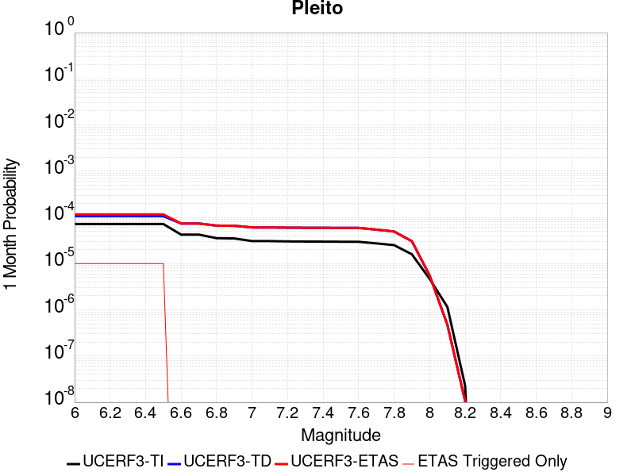 |  |  |

| Magnitude | 1 wk TI Prob | 1 wk TD Prob | 1 wk ETAS Prob | 1 wk ETAS/TD Gain | 1 wk ETAS Triggered Only | 1 mo TI Prob | 1 mo TD Prob | 1 mo ETAS Prob | 1 mo ETAS/TD Gain | 1 mo ETAS Triggered Only | 1 yr TI Prob | 1 yr TD Prob | 1 yr ETAS Prob | 1 yr ETAS/TD Gain | 1 yr ETAS Triggered Only | 10 yr TI Prob | 10 yr TD Prob | 10 yr ETAS Prob | 10 yr ETAS/TD Gain | 10 yr ETAS Triggered Only |
|-----|-----|-----|-----|-----|-----|-----|-----|-----|-----|-----|-----|-----|-----|-----|-----|-----|-----|-----|-----|-----|
| 6.0 | 1.6763008E-5 | 2.4798099E-5 | 3.479785E-5 | 1.4032468 | 1.0E-5 | 7.183948E-5 | 1.0627364E-4 | 1.1627258E-4 | 1.0940868 | 1.0E-5 | 8.742947E-4 | 0.0012931856 | 0.0013131598 | 1.0154457 | 2.0E-5 | 0.00870863 | 0.012971285 | 0.0130206365 | 1.0038047 | 5.0E-5 |
| 6.1 | 1.6763008E-5 | 2.4798099E-5 | 3.479785E-5 | 1.4032468 | 1.0E-5 | 7.183948E-5 | 1.0627364E-4 | 1.1627258E-4 | 1.0940868 | 1.0E-5 | 8.742947E-4 | 0.0012931856 | 0.0013131598 | 1.0154457 | 2.0E-5 | 0.00870863 | 0.012971285 | 0.0130206365 | 1.0038047 | 5.0E-5 |
| 6.2 | 1.6763008E-5 | 2.4798099E-5 | 3.479785E-5 | 1.4032468 | 1.0E-5 | 7.183948E-5 | 1.0627364E-4 | 1.1627258E-4 | 1.0940868 | 1.0E-5 | 8.742947E-4 | 0.0012931856 | 0.0013131598 | 1.0154457 | 2.0E-5 | 0.00870863 | 0.012971285 | 0.0130206365 | 1.0038047 | 5.0E-5 |
| 6.3 | 1.6763008E-5 | 2.4798099E-5 | 3.479785E-5 | 1.4032468 | 1.0E-5 | 7.183948E-5 | 1.0627364E-4 | 1.1627258E-4 | 1.0940868 | 1.0E-5 | 8.742947E-4 | 0.0012931856 | 0.0013131598 | 1.0154457 | 2.0E-5 | 0.00870863 | 0.012971285 | 0.0130206365 | 1.0038047 | 5.0E-5 |
| 6.4 | 1.6763008E-5 | 2.4798099E-5 | 3.479785E-5 | 1.4032468 | 1.0E-5 | 7.183948E-5 | 1.0627364E-4 | 1.1627258E-4 | 1.0940868 | 1.0E-5 | 8.742947E-4 | 0.0012931856 | 0.0013131598 | 1.0154457 | 2.0E-5 | 0.00870863 | 0.012971285 | 0.0130206365 | 1.0038047 | 5.0E-5 |
| 6.5 | 1.6763008E-5 | 2.4798099E-5 | 3.479785E-5 | 1.4032468 | 1.0E-5 | 7.183948E-5 | 1.0627364E-4 | 1.1627258E-4 | 1.0940868 | 1.0E-5 | 8.742947E-4 | 0.0012931856 | 0.0013131598 | 1.0154457 | 2.0E-5 | 0.00870863 | 0.012971285 | 0.0130206365 | 1.0038047 | 5.0E-5 |
| 6.6 | 9.910213E-6 | 1.7248374E-5 | 1.7248374E-5 | 1.0 | 0.0 | 4.247165E-5 | 7.391953E-5 | 7.391953E-5 | 1.0 | 0.0 | 5.169696E-4 | 8.996024E-4 | 8.996024E-4 | 1.0 | 0.0 | 0.0051576863 | 0.009067901 | 0.009077811 | 1.0010928 | 1.0E-5 |
| 6.7 | 9.910213E-6 | 1.7248374E-5 | 1.7248374E-5 | 1.0 | 0.0 | 4.247165E-5 | 7.391953E-5 | 7.391953E-5 | 1.0 | 0.0 | 5.169696E-4 | 8.996024E-4 | 8.996024E-4 | 1.0 | 0.0 | 0.0051576863 | 0.009067901 | 0.009077811 | 1.0010928 | 1.0E-5 |
| 6.8 | 8.300162E-6 | 1.550789E-5 | 1.550789E-5 | 1.0 | 0.0 | 3.557164E-5 | 6.64607E-5 | 6.64607E-5 | 1.0 | 0.0 | 4.3299864E-4 | 8.0886006E-4 | 8.0886006E-4 | 1.0 | 0.0 | 0.004321559 | 0.008167305 | 0.008167305 | 1.0 | 0.0 |
| 6.9 | 8.183114E-6 | 1.537909E-5 | 1.537909E-5 | 1.0 | 0.0 | 3.5070017E-5 | 6.590872E-5 | 6.590872E-5 | 1.0 | 0.0 | 4.2689382E-4 | 8.0214476E-4 | 8.0214476E-4 | 1.0 | 0.0 | 0.0042607468 | 0.008100643 | 0.008100643 | 1.0 | 0.0 |
| 7.0 | 7.1748823E-6 | 1.4165637E-5 | 1.4165637E-5 | 1.0 | 0.0 | 3.0749135E-5 | 6.0708466E-5 | 6.0708466E-5 | 1.0 | 0.0 | 3.743064E-4 | 7.388754E-4 | 7.388754E-4 | 1.0 | 0.0 | 0.0037367654 | 0.007471899 | 0.007471899 | 1.0 | 0.0 |
| 7.1 | 7.1671807E-6 | 1.4156004E-5 | 1.4156004E-5 | 1.0 | 0.0 | 3.0716128E-5 | 6.0667182E-5 | 6.0667182E-5 | 1.0 | 0.0 | 3.7390468E-4 | 7.3837314E-4 | 7.3837314E-4 | 1.0 | 0.0 | 0.0037327618 | 0.00746691 | 0.00746691 | 1.0 | 0.0 |
| 7.2 | 7.0649667E-6 | 1.40031825E-5 | 1.40031825E-5 | 1.0 | 0.0 | 3.0278077E-5 | 6.0012262E-5 | 6.0012262E-5 | 1.0 | 0.0 | 3.6857324E-4 | 7.3040486E-4 | 7.3040486E-4 | 1.0 | 0.0 | 0.0036796255 | 0.0073876088 | 0.0073876088 | 1.0 | 0.0 |
| 7.3 | 7.02082E-6 | 1.3946574E-5 | 1.3946574E-5 | 1.0 | 0.0 | 3.008888E-5 | 5.9769663E-5 | 5.9769663E-5 | 1.0 | 0.0 | 3.6627054E-4 | 7.274532E-4 | 7.274532E-4 | 1.0 | 0.0 | 0.0036566744 | 0.0073580695 | 0.0073580695 | 1.0 | 0.0 |
| 7.4 | 6.987146E-6 | 1.3906099E-5 | 1.3906099E-5 | 1.0 | 0.0 | 2.9944567E-5 | 5.959621E-5 | 5.959621E-5 | 1.0 | 0.0 | 3.6451413E-4 | 7.253428E-4 | 7.253428E-4 | 1.0 | 0.0 | 0.0036391679 | 0.0073369886 | 0.0073369886 | 1.0 | 0.0 |
| 7.5 | 6.9494554E-6 | 1.3862977E-5 | 1.3862977E-5 | 1.0 | 0.0 | 2.9783041E-5 | 5.9411406E-5 | 5.9411406E-5 | 1.0 | 0.0 | 3.625482E-4 | 7.2309433E-4 | 7.2309433E-4 | 1.0 | 0.0 | 0.0036195726 | 0.007314603 | 0.007314603 | 1.0 | 0.0 |
| 7.6 | 6.92694E-6 | 1.3822038E-5 | 1.3822038E-5 | 1.0 | 0.0 | 2.9686547E-5 | 5.9235965E-5 | 5.9235965E-5 | 1.0 | 0.0 | 3.6137376E-4 | 7.2095974E-4 | 7.2095974E-4 | 1.0 | 0.0 | 0.0036078666 | 0.0072933296 | 0.0072933296 | 1.0 | 0.0 |
| 7.7 | 6.395867E-6 | 1.2699696E-5 | 1.2699696E-5 | 1.0 | 0.0 | 2.741057E-5 | 5.4426135E-5 | 5.4426135E-5 | 1.0 | 0.0 | 3.336726E-4 | 6.6243706E-4 | 6.6243706E-4 | 1.0 | 0.0 | 0.0033317201 | 0.006711223 | 0.006711223 | 1.0 | 0.0 |
| 7.8 | 5.8664327E-6 | 1.1564613E-5 | 1.1564613E-5 | 1.0 | 0.0 | 2.5141611E-5 | 4.9561684E-5 | 4.9561684E-5 | 1.0 | 0.0 | 3.060561E-4 | 6.032467E-4 | 6.032467E-4 | 1.0 | 0.0 | 0.0030563495 | 0.0061153257 | 0.0061153257 | 1.0 | 0.0 |
| 7.9 | 3.7167474E-6 | 7.131473E-6 | 7.131473E-6 | 1.0 | 0.0 | 1.592882E-5 | 3.05631E-5 | 3.05631E-5 | 1.0 | 0.0 | 1.9391612E-4 | 3.7204236E-4 | 3.7204236E-4 | 1.0 | 0.0 | 0.0019374699 | 0.0037763321 | 0.0037763321 | 1.0 | 0.0 |
| 8.0 | 1.0903841E-6 | 1.2916432E-6 | 1.2916432E-6 | 1.0 | 0.0 | 4.6730665E-6 | 5.535602E-6 | 5.535602E-6 | 1.0 | 0.0 | 5.68931E-5 | 6.7393885E-5 | 6.7393885E-5 | 1.0 | 0.0 | 5.6878536E-4 | 6.961387E-4 | 6.961387E-4 | 1.0 | 0.0 |
| 8.1 | 2.6894583E-7 | 1.1119273E-7 | 1.1119273E-7 | 1.0 | 0.0 | 1.1526245E-6 | 4.7654018E-7 | 4.7654018E-7 | 1.0 | 0.0 | 1.4033113E-5 | 5.801862E-6 | 5.801862E-6 | 1.0 | 0.0 | 1.4032227E-4 | 6.48978E-5 | 6.48978E-5 | 1.0 | 0.0 |
| 8.2 | 5.2967013E-9 | 2.4719717E-9 | 2.4719717E-9 | 1.0 | 0.0 | 2.2700148E-8 | 1.0594164E-8 | 1.0594164E-8 | 1.0 | 0.0 | 2.7637427E-7 | 1.2898394E-7 | 1.2898394E-7 | 1.0 | 0.0 | 2.7637393E-6 | 1.4669745E-6 | 1.4669745E-6 | 1.0 | 0.0 |

## San Jacinto (San Bernardino)
*[(top)](#table-of-contents)*

| 1 Week | 1 Month | 1 Year | 10 Year |
|-----|-----|-----|-----|
|  |  |  |  |

| Magnitude | 1 wk TI Prob | 1 wk TD Prob | 1 wk ETAS Prob | 1 wk ETAS/TD Gain | 1 wk ETAS Triggered Only | 1 mo TI Prob | 1 mo TD Prob | 1 mo ETAS Prob | 1 mo ETAS/TD Gain | 1 mo ETAS Triggered Only | 1 yr TI Prob | 1 yr TD Prob | 1 yr ETAS Prob | 1 yr ETAS/TD Gain | 1 yr ETAS Triggered Only | 10 yr TI Prob | 10 yr TD Prob | 10 yr ETAS Prob | 10 yr ETAS/TD Gain | 10 yr ETAS Triggered Only |
|-----|-----|-----|-----|-----|-----|-----|-----|-----|-----|-----|-----|-----|-----|-----|-----|-----|-----|-----|-----|-----|
| 6.0 | 3.409352E-5 | 3.6064746E-5 | 3.6064746E-5 | 1.0 | 0.0 | 1.461069E-4 | 1.5455406E-4 | 1.7455097E-4 | 1.1293845 | 2.0E-5 | 0.0017774 | 0.0018800731 | 0.0019000355 | 1.0106179 | 2.0E-5 | 0.01763251 | 0.019389968 | 0.019438999 | 1.0025287 | 5.0E-5 |
| 6.1 | 3.409352E-5 | 3.6064746E-5 | 3.6064746E-5 | 1.0 | 0.0 | 1.461069E-4 | 1.5455406E-4 | 1.7455097E-4 | 1.1293845 | 2.0E-5 | 0.0017774 | 0.0018800731 | 0.0019000355 | 1.0106179 | 2.0E-5 | 0.01763251 | 0.019389968 | 0.019438999 | 1.0025287 | 5.0E-5 |
| 6.2 | 3.409352E-5 | 3.6064746E-5 | 3.6064746E-5 | 1.0 | 0.0 | 1.461069E-4 | 1.5455406E-4 | 1.7455097E-4 | 1.1293845 | 2.0E-5 | 0.0017774 | 0.0018800731 | 0.0019000355 | 1.0106179 | 2.0E-5 | 0.01763251 | 0.019389968 | 0.019438999 | 1.0025287 | 5.0E-5 |
| 6.3 | 3.409352E-5 | 3.6064746E-5 | 3.6064746E-5 | 1.0 | 0.0 | 1.461069E-4 | 1.5455406E-4 | 1.7455097E-4 | 1.1293845 | 2.0E-5 | 0.0017774 | 0.0018800731 | 0.0019000355 | 1.0106179 | 2.0E-5 | 0.01763251 | 0.019389968 | 0.019438999 | 1.0025287 | 5.0E-5 |
| 6.4 | 3.400795E-5 | 3.5957393E-5 | 3.5957393E-5 | 1.0 | 0.0 | 1.4574021E-4 | 1.5409403E-4 | 1.7409094E-4 | 1.1297709 | 2.0E-5 | 0.0017729428 | 0.001874482 | 0.0018944445 | 1.0106496 | 2.0E-5 | 0.017588645 | 0.019335043 | 0.019384077 | 1.0025359 | 5.0E-5 |
| 6.5 | 3.341482E-5 | 3.5217905E-5 | 3.5217905E-5 | 1.0 | 0.0 | 1.4319851E-4 | 1.5092515E-4 | 1.7092213E-4 | 1.132496 | 2.0E-5 | 0.0017420477 | 0.0018359664 | 0.0018559296 | 1.0108734 | 2.0E-5 | 0.017284546 | 0.018956538 | 0.019005591 | 1.0025876 | 5.0E-5 |
| 6.6 | 3.3364955E-5 | 3.515511E-5 | 3.515511E-5 | 1.0 | 0.0 | 1.4298483E-4 | 1.5065607E-4 | 1.7065305E-4 | 1.1327327 | 2.0E-5 | 0.0017394501 | 0.0018326959 | 0.0018526592 | 1.0108929 | 2.0E-5 | 0.017258976 | 0.018924398 | 0.018973453 | 1.0025921 | 5.0E-5 |
| 6.7 | 3.335922E-5 | 3.5144883E-5 | 3.5144883E-5 | 1.0 | 0.0 | 1.4296026E-4 | 1.5061224E-4 | 1.7060923E-4 | 1.1327714 | 2.0E-5 | 0.0017391514 | 0.0018321632 | 0.0018521266 | 1.0108961 | 2.0E-5 | 0.017256035 | 0.01891919 | 0.018968243 | 1.0025928 | 5.0E-5 |
| 6.8 | 3.327683E-5 | 3.503893E-5 | 3.503893E-5 | 1.0 | 0.0 | 1.4260718E-4 | 1.501582E-4 | 1.701552E-4 | 1.1331729 | 2.0E-5 | 0.0017348597 | 0.0018266445 | 0.001846608 | 1.010929 | 2.0E-5 | 0.017213784 | 0.018864954 | 0.01891401 | 1.0026004 | 5.0E-5 |
| 6.9 | 3.3235785E-5 | 3.4979872E-5 | 3.4979872E-5 | 1.0 | 0.0 | 1.4243131E-4 | 1.4990513E-4 | 1.6990212E-4 | 1.1333977 | 2.0E-5 | 0.0017327217 | 0.0018235685 | 0.0018435321 | 1.0109475 | 2.0E-5 | 0.017192734 | 0.018834818 | 0.018883877 | 1.0026046 | 5.0E-5 |
| 7.0 | 3.3197095E-5 | 3.4919787E-5 | 3.4919787E-5 | 1.0 | 0.0 | 1.422655E-4 | 1.4964765E-4 | 1.6964466E-4 | 1.1336273 | 2.0E-5 | 0.0017307063 | 0.001820439 | 0.0018404026 | 1.0109664 | 2.0E-5 | 0.017172894 | 0.01880419 | 0.018853249 | 1.002609 | 5.0E-5 |
| 7.1 | 3.3129716E-5 | 3.4799963E-5 | 3.4799963E-5 | 1.0 | 0.0 | 1.4197677E-4 | 1.4913418E-4 | 1.691312E-4 | 1.1340874 | 2.0E-5 | 0.0017271966 | 0.001814198 | 0.0018341617 | 1.0110042 | 2.0E-5 | 0.017138338 | 0.01874325 | 0.018792313 | 1.0026176 | 5.0E-5 |
| 7.2 | 3.3034008E-5 | 3.4667384E-5 | 3.4667384E-5 | 1.0 | 0.0 | 1.4156665E-4 | 1.4856606E-4 | 1.6856309E-4 | 1.1346003 | 2.0E-5 | 0.0017222111 | 0.0018072925 | 0.0018272564 | 1.0110463 | 2.0E-5 | 0.017089253 | 0.018675627 | 0.018724693 | 1.0026273 | 5.0E-5 |
| 7.3 | 3.2956614E-5 | 3.4535093E-5 | 3.4535093E-5 | 1.0 | 0.0 | 1.4123498E-4 | 1.4799916E-4 | 1.679962E-4 | 1.1351159 | 2.0E-5 | 0.0017181796 | 0.001800402 | 0.0018203659 | 1.0110886 | 2.0E-5 | 0.017049557 | 0.018608356 | 0.018657425 | 1.0026369 | 5.0E-5 |
| 7.4 | 3.2915937E-5 | 3.445675E-5 | 3.445675E-5 | 1.0 | 0.0 | 1.4106068E-4 | 1.4766344E-4 | 1.6766049E-4 | 1.1354232 | 2.0E-5 | 0.0017160608 | 0.0017963214 | 0.0018162854 | 1.0111139 | 2.0E-5 | 0.017028693 | 0.018568603 | 0.018617675 | 1.0026428 | 5.0E-5 |
| 7.5 | 3.281791E-5 | 3.4321605E-5 | 3.4321605E-5 | 1.0 | 0.0 | 1.406406E-4 | 1.470843E-4 | 1.6708137E-4 | 1.1359564 | 2.0E-5 | 0.0017109542 | 0.001789282 | 0.0018092461 | 1.0111576 | 2.0E-5 | 0.016978411 | 0.018499462 | 0.018548537 | 1.0026528 | 5.0E-5 |
| 7.6 | 3.2521442E-5 | 3.40464E-5 | 3.40464E-5 | 1.0 | 0.0 | 1.3937015E-4 | 1.45905E-4 | 1.6590208E-4 | 1.1370555 | 2.0E-5 | 0.0016955109 | 0.0017749474 | 0.0017949119 | 1.011248 | 2.0E-5 | 0.016826328 | 0.018357016 | 0.018406099 | 1.0026737 | 5.0E-5 |
| 7.7 | 3.0287873E-5 | 3.252959E-5 | 3.252959E-5 | 1.0 | 0.0 | 1.297987E-4 | 1.3940509E-4 | 1.594023E-4 | 1.1434468 | 2.0E-5 | 0.0015791537 | 0.0016959368 | 0.0017159028 | 1.0117729 | 2.0E-5 | 0.01567979 | 0.017567355 | 0.017616477 | 1.0027962 | 5.0E-5 |
| 7.8 | 2.6316151E-5 | 2.9737714E-5 | 2.9737714E-5 | 1.0 | 0.0 | 1.1277862E-4 | 1.2744112E-4 | 1.4743858E-4 | 1.1569152 | 2.0E-5 | 0.0013722149 | 0.0015504924 | 0.0015704613 | 1.0128791 | 2.0E-5 | 0.013637724 | 0.016107483 | 0.016156677 | 1.0030541 | 5.0E-5 |
| 7.9 | 2.0761147E-5 | 2.3482562E-5 | 2.3482562E-5 | 1.0 | 0.0 | 8.897331E-5 | 1.00635676E-4 | 1.2063366E-4 | 1.1987166 | 2.0E-5 | 0.0010827117 | 0.0012245515 | 0.001244527 | 1.0163125 | 2.0E-5 | 0.010774517 | 0.012826328 | 0.012875686 | 1.0038482 | 5.0E-5 |
| 8.0 | 1.5738568E-5 | 1.6081503E-5 | 1.6081503E-5 | 1.0 | 0.0 | 6.744926E-5 | 6.891891E-5 | 8.8917535E-5 | 1.2901762 | 2.0E-5 | 8.2088535E-4 | 8.387654E-4 | 8.587486E-4 | 1.0238246 | 2.0E-5 | 0.008178596 | 0.008890965 | 0.00893061 | 1.0044589 | 4.0E-5 |
| 8.1 | 1.0105832E-5 | 8.357863E-6 | 8.357863E-6 | 1.0 | 0.0 | 4.3309992E-5 | 3.5818925E-5 | 4.5818568E-5 | 1.2791721 | 1.0E-5 | 5.2717153E-4 | 4.3600865E-4 | 4.460043E-4 | 1.0229254 | 1.0E-5 | 0.005259227 | 0.0046917847 | 0.004711691 | 1.0042428 | 2.0E-5 |
| 8.2 | 4.189207E-6 | 1.5860433E-6 | 1.5860433E-6 | 1.0 | 0.0 | 1.7953622E-5 | 6.7973106E-6 | 6.7973106E-6 | 1.0 | 0.0 | 2.1856341E-4 | 8.275414E-5 | 8.275414E-5 | 1.0 | 0.0 | 0.0021834858 | 9.6104434E-4 | 9.6104434E-4 | 1.0 | 0.0 |
| 8.3 | 1.2758221E-6 | 3.6351847E-7 | 3.6351847E-7 | 1.0 | 0.0 | 5.4677976E-6 | 1.5579354E-6 | 1.5579354E-6 | 1.0 | 0.0 | 6.65684E-5 | 1.8967703E-5 | 1.8967703E-5 | 1.0 | 0.0 | 6.6548464E-4 | 2.2871704E-4 | 2.2871704E-4 | 1.0 | 0.0 |

## Brawley (Seismic Zone) alt 1
*[(top)](#table-of-contents)*

| 1 Week | 1 Month | 1 Year | 10 Year |
|-----|-----|-----|-----|
|  |  |  |  |

| Magnitude | 1 wk TI Prob | 1 wk TD Prob | 1 wk ETAS Prob | 1 wk ETAS/TD Gain | 1 wk ETAS Triggered Only | 1 mo TI Prob | 1 mo TD Prob | 1 mo ETAS Prob | 1 mo ETAS/TD Gain | 1 mo ETAS Triggered Only | 1 yr TI Prob | 1 yr TD Prob | 1 yr ETAS Prob | 1 yr ETAS/TD Gain | 1 yr ETAS Triggered Only | 10 yr TI Prob | 10 yr TD Prob | 10 yr ETAS Prob | 10 yr ETAS/TD Gain | 10 yr ETAS Triggered Only |
|-----|-----|-----|-----|-----|-----|-----|-----|-----|-----|-----|-----|-----|-----|-----|-----|-----|-----|-----|-----|-----|
| 6.0 | 2.2521618E-4 | 4.7679103E-4 | 4.8678624E-4 | 1.0209635 | 1.0E-5 | 9.6485513E-4 | 0.002041827 | 0.0020518065 | 1.0048876 | 1.0E-5 | 0.011683988 | 0.024573432 | 0.024612451 | 1.0015877 | 4.0E-5 | 0.11088423 | 0.21365511 | 0.21369442 | 1.000184 | 5.0E-5 |
| 6.1 | 2.2521618E-4 | 4.7679103E-4 | 4.8678624E-4 | 1.0209635 | 1.0E-5 | 9.6485513E-4 | 0.002041827 | 0.0020518065 | 1.0048876 | 1.0E-5 | 0.011683988 | 0.024573432 | 0.024612451 | 1.0015877 | 4.0E-5 | 0.11088423 | 0.21365511 | 0.21369442 | 1.000184 | 5.0E-5 |
| 6.2 | 2.198148E-4 | 4.6762463E-4 | 4.7761996E-4 | 1.0213747 | 1.0E-5 | 9.417233E-4 | 0.0020026031 | 0.002012583 | 1.0049835 | 1.0E-5 | 0.011405343 | 0.024107056 | 0.024146091 | 1.0016192 | 4.0E-5 | 0.10837428 | 0.21008883 | 0.21012834 | 1.000188 | 5.0E-5 |
| 6.3 | 2.1704129E-4 | 4.619798E-4 | 4.719752E-4 | 1.021636 | 1.0E-5 | 9.298453E-4 | 0.0019784477 | 0.001988428 | 1.0050445 | 1.0E-5 | 0.011262234 | 0.023820464 | 0.02385951 | 1.0016392 | 4.0E-5 | 0.107082725 | 0.20797996 | 0.20801955 | 1.0001904 | 5.0E-5 |
| 6.4 | 1.876142E-4 | 4.008874E-4 | 4.1088337E-4 | 1.0249346 | 1.0E-5 | 8.038131E-4 | 0.0017169719 | 0.0017269547 | 1.0058142 | 1.0E-5 | 0.00974259 | 0.02070505 | 0.020734427 | 1.001419 | 3.0E-5 | 0.093263686 | 0.18473 | 0.18476261 | 1.0001765 | 4.0E-5 |
| 6.5 | 1.7390939E-4 | 3.7519212E-4 | 3.8518835E-4 | 1.026643 | 1.0E-5 | 7.45113E-4 | 0.0016069874 | 0.0016169715 | 1.0062128 | 1.0E-5 | 0.009034078 | 0.019392345 | 0.019421762 | 1.001517 | 3.0E-5 | 0.086755216 | 0.1745491 | 0.17458211 | 1.0001892 | 4.0E-5 |
| 6.6 | 1.591791E-4 | 3.4931884E-4 | 3.5931534E-4 | 1.0286171 | 1.0E-5 | 6.8201777E-4 | 0.0014962319 | 0.0015062169 | 1.0066735 | 1.0E-5 | 0.008271996 | 0.018067902 | 0.01809736 | 1.0016304 | 3.0E-5 | 0.07970774 | 0.16395237 | 0.1639858 | 1.000204 | 4.0E-5 |
| 6.7 | 1.4268003E-4 | 3.2095716E-4 | 3.3095395E-4 | 1.0311468 | 1.0E-5 | 6.1134255E-4 | 0.0013748137 | 0.0013848001 | 1.0072637 | 1.0E-5 | 0.007417723 | 0.016613228 | 0.016642729 | 1.0017757 | 3.0E-5 | 0.07174956 | 0.15207507 | 0.15210898 | 1.000223 | 4.0E-5 |
| 6.8 | 1.239713E-4 | 2.9085507E-4 | 3.0085215E-4 | 1.0343714 | 1.0E-5 | 5.3119735E-4 | 0.0012459324 | 0.0012559199 | 1.0080161 | 1.0E-5 | 0.0064481674 | 0.015065154 | 0.015094702 | 1.0019614 | 3.0E-5 | 0.06264243 | 0.1385047 | 0.13853915 | 1.0002488 | 4.0E-5 |
| 6.9 | 1.0180238E-4 | 2.6279184E-4 | 2.727892E-4 | 1.0380429 | 1.0E-5 | 4.3622297E-4 | 0.0011257689 | 0.0011357577 | 1.0088729 | 1.0E-5 | 0.005298089 | 0.013621101 | 0.013650693 | 1.0021725 | 3.0E-5 | 0.05173543 | 0.12506339 | 0.12509839 | 1.0002798 | 4.0E-5 |
| 7.0 | 7.6619996E-5 | 2.241838E-4 | 2.3418156E-4 | 1.0445963 | 1.0E-5 | 3.283301E-4 | 9.604371E-4 | 9.704275E-4 | 1.010402 | 1.0E-5 | 0.0039900932 | 0.011631338 | 0.011651105 | 1.0016994 | 2.0E-5 | 0.039192066 | 0.1073444 | 0.107371174 | 1.0002495 | 3.0E-5 |
| 7.1 | 7.5127435E-5 | 2.2101306E-4 | 2.3101085E-4 | 1.0452362 | 1.0E-5 | 3.2193496E-4 | 9.468582E-4 | 9.5684873E-4 | 1.0105512 | 1.0E-5 | 0.0039125155 | 0.011467767 | 0.011487537 | 1.001724 | 2.0E-5 | 0.038443442 | 0.10590765 | 0.10593447 | 1.0002533 | 3.0E-5 |
| 7.2 | 6.788582E-5 | 2.0228398E-4 | 2.1228196E-4 | 1.0494255 | 1.0E-5 | 2.9090676E-4 | 8.666463E-4 | 8.7663764E-4 | 1.0115287 | 1.0E-5 | 0.0035360386 | 0.010501012 | 0.010520802 | 1.0018846 | 2.0E-5 | 0.034803 | 0.09757573 | 0.09760281 | 1.0002774 | 3.0E-5 |
| 7.3 | 6.399602E-5 | 1.8858587E-4 | 1.9858398E-4 | 1.0530162 | 1.0E-5 | 2.7423984E-4 | 8.0797763E-4 | 8.1796956E-4 | 1.0123665 | 1.0E-5 | 0.0033337586 | 0.009793349 | 0.009813153 | 1.0020221 | 2.0E-5 | 0.03284188 | 0.09146829 | 0.09149555 | 1.000298 | 3.0E-5 |
| 7.4 | 4.506759E-5 | 1.2542943E-4 | 1.3542818E-4 | 1.0797161 | 1.0E-5 | 1.9313251E-4 | 5.374449E-4 | 5.474395E-4 | 1.0185965 | 1.0E-5 | 0.0023488526 | 0.0065239347 | 0.0065338695 | 1.0015228 | 1.0E-5 | 0.023241805 | 0.06242391 | 0.062442664 | 1.0003004 | 2.0E-5 |
| 7.5 | 3.43289E-5 | 9.34697E-5 | 1.03468774E-4 | 1.1069765 | 1.0E-5 | 1.4711556E-4 | 4.0052328E-4 | 4.1051925E-4 | 1.0249573 | 1.0E-5 | 0.0017896603 | 0.00486553 | 0.004875481 | 1.0020453 | 1.0E-5 | 0.01775316 | 0.047108494 | 0.04712755 | 1.0004046 | 2.0E-5 |
| 7.6 | 2.5980507E-5 | 7.0631606E-5 | 8.0630896E-5 | 1.1415697 | 1.0E-5 | 1.1134028E-4 | 3.026719E-4 | 3.1266885E-4 | 1.0330291 | 1.0E-5 | 0.001354725 | 0.0036788278 | 0.003688791 | 1.0027083 | 1.0E-5 | 0.013464959 | 0.035887748 | 0.03590703 | 1.0005373 | 2.0E-5 |
| 7.7 | 1.7292105E-5 | 4.949296E-5 | 5.9492464E-5 | 1.2020389 | 1.0E-5 | 7.4106916E-5 | 2.1209546E-4 | 2.2209335E-4 | 1.0471386 | 1.0E-5 | 9.018782E-4 | 0.00257921 | 0.0025891843 | 1.0038671 | 1.0E-5 | 0.008982267 | 0.025330232 | 0.025349725 | 1.0007696 | 2.0E-5 |
| 7.8 | 1.2927471E-5 | 3.9767747E-5 | 4.976735E-5 | 1.2514501 | 1.0E-5 | 5.5402274E-5 | 1.7042208E-4 | 1.8042038E-4 | 1.0586679 | 1.0E-5 | 6.743139E-4 | 0.0020729168 | 0.0020828962 | 1.0048141 | 1.0E-5 | 0.0067227143 | 0.020466454 | 0.020486046 | 1.0009573 | 2.0E-5 |
| 7.9 | 1.0200774E-5 | 2.8805604E-5 | 2.8805604E-5 | 1.0 | 0.0 | 4.371687E-5 | 1.2344675E-4 | 1.2344675E-4 | 1.0 | 0.0 | 5.321229E-4 | 0.0015019291 | 0.0015019291 | 1.0 | 0.0 | 0.005308505 | 0.015019789 | 0.015029639 | 1.0006558 | 1.0E-5 |
| 8.0 | 8.650396E-6 | 2.3328555E-5 | 2.3328555E-5 | 1.0 | 0.0 | 3.70726E-5 | 9.9975696E-5 | 9.9975696E-5 | 1.0 | 0.0 | 4.5126543E-4 | 0.0012165253 | 0.0012165253 | 1.0 | 0.0 | 0.0045035016 | 0.012235316 | 0.012245194 | 1.0008073 | 1.0E-5 |
| 8.1 | 3.9368224E-6 | 7.3494957E-6 | 7.3494957E-6 | 1.0 | 0.0 | 1.6871985E-5 | 3.149746E-5 | 3.149746E-5 | 1.0 | 0.0 | 2.0539707E-4 | 3.834142E-4 | 3.834142E-4 | 1.0 | 0.0 | 0.0020520731 | 0.0040122294 | 0.0040122294 | 1.0 | 0.0 |
| 8.2 | 1.7101195E-6 | 2.2261302E-6 | 2.2261302E-6 | 1.0 | 0.0 | 7.329063E-6 | 9.540523E-6 | 9.540523E-6 | 1.0 | 0.0 | 8.922769E-5 | 1.16149706E-4 | 1.16149706E-4 | 1.0 | 0.0 | 8.9191867E-4 | 0.0012709602 | 0.0012709602 | 1.0 | 0.0 |
| 8.3 | 3.0346666E-8 | 1.729663E-8 | 1.729663E-8 | 1.0 | 0.0 | 1.3005713E-7 | 7.4128415E-8 | 7.4128415E-8 | 1.0 | 0.0 | 1.5834444E-6 | 9.025133E-7 | 9.025133E-7 | 1.0 | 0.0 | 1.5834332E-5 | 9.4093375E-6 | 9.4093375E-6 | 1.0 | 0.0 |

## Mission Creek
*[(top)](#table-of-contents)*

| 1 Week | 1 Month | 1 Year | 10 Year |
|-----|-----|-----|-----|
|  |  |  |  |

| Magnitude | 1 wk TI Prob | 1 wk TD Prob | 1 wk ETAS Prob | 1 wk ETAS/TD Gain | 1 wk ETAS Triggered Only | 1 mo TI Prob | 1 mo TD Prob | 1 mo ETAS Prob | 1 mo ETAS/TD Gain | 1 mo ETAS Triggered Only | 1 yr TI Prob | 1 yr TD Prob | 1 yr ETAS Prob | 1 yr ETAS/TD Gain | 1 yr ETAS Triggered Only | 10 yr TI Prob | 10 yr TD Prob | 10 yr ETAS Prob | 10 yr ETAS/TD Gain | 10 yr ETAS Triggered Only |
|-----|-----|-----|-----|-----|-----|-----|-----|-----|-----|-----|-----|-----|-----|-----|-----|-----|-----|-----|-----|-----|
| 6.0 | 1.1549387E-5 | 1.633457E-5 | 1.633457E-5 | 1.0 | 0.0 | 4.9496433E-5 | 7.000351E-5 | 7.000351E-5 | 1.0 | 0.0 | 6.0245243E-4 | 8.519744E-4 | 8.8194886E-4 | 1.0351824 | 3.0E-5 | 0.006008218 | 0.00851567 | 0.008555329 | 1.0046573 | 4.0E-5 |
| 6.1 | 1.1549387E-5 | 1.633457E-5 | 1.633457E-5 | 1.0 | 0.0 | 4.9496433E-5 | 7.000351E-5 | 7.000351E-5 | 1.0 | 0.0 | 6.0245243E-4 | 8.519744E-4 | 8.8194886E-4 | 1.0351824 | 3.0E-5 | 0.006008218 | 0.00851567 | 0.008555329 | 1.0046573 | 4.0E-5 |
| 6.2 | 1.1549387E-5 | 1.633457E-5 | 1.633457E-5 | 1.0 | 0.0 | 4.9496433E-5 | 7.000351E-5 | 7.000351E-5 | 1.0 | 0.0 | 6.0245243E-4 | 8.519744E-4 | 8.8194886E-4 | 1.0351824 | 3.0E-5 | 0.006008218 | 0.00851567 | 0.008555329 | 1.0046573 | 4.0E-5 |
| 6.3 | 1.1549387E-5 | 1.633457E-5 | 1.633457E-5 | 1.0 | 0.0 | 4.9496433E-5 | 7.000351E-5 | 7.000351E-5 | 1.0 | 0.0 | 6.0245243E-4 | 8.519744E-4 | 8.8194886E-4 | 1.0351824 | 3.0E-5 | 0.006008218 | 0.00851567 | 0.008555329 | 1.0046573 | 4.0E-5 |
| 6.4 | 1.1549387E-5 | 1.633457E-5 | 1.633457E-5 | 1.0 | 0.0 | 4.9496433E-5 | 7.000351E-5 | 7.000351E-5 | 1.0 | 0.0 | 6.0245243E-4 | 8.519744E-4 | 8.8194886E-4 | 1.0351824 | 3.0E-5 | 0.006008218 | 0.00851567 | 0.008555329 | 1.0046573 | 4.0E-5 |
| 6.5 | 1.1549387E-5 | 1.633457E-5 | 1.633457E-5 | 1.0 | 0.0 | 4.9496433E-5 | 7.000351E-5 | 7.000351E-5 | 1.0 | 0.0 | 6.0245243E-4 | 8.519744E-4 | 8.8194886E-4 | 1.0351824 | 3.0E-5 | 0.006008218 | 0.00851567 | 0.008555329 | 1.0046573 | 4.0E-5 |
| 6.6 | 9.202681E-6 | 1.3857755E-5 | 1.3857755E-5 | 1.0 | 0.0 | 3.9439463E-5 | 5.938908E-5 | 5.938908E-5 | 1.0 | 0.0 | 4.800697E-4 | 7.2283123E-4 | 7.528095E-4 | 1.0414735 | 3.0E-5 | 0.004790339 | 0.0072328136 | 0.0072725243 | 1.0054903 | 4.0E-5 |
| 6.7 | 9.019164E-6 | 1.3663417E-5 | 1.3663417E-5 | 1.0 | 0.0 | 3.8652986E-5 | 5.855624E-5 | 5.855624E-5 | 1.0 | 0.0 | 4.7049852E-4 | 7.1269803E-4 | 7.4267667E-4 | 1.0420636 | 3.0E-5 | 0.004695036 | 0.0071321344 | 0.0071718493 | 1.0055684 | 4.0E-5 |
| 6.8 | 8.673558E-6 | 1.3285503E-5 | 1.3285503E-5 | 1.0 | 0.0 | 3.717186E-5 | 5.693668E-5 | 5.693668E-5 | 1.0 | 0.0 | 4.524734E-4 | 6.929924E-4 | 7.229716E-4 | 1.0432606 | 3.0E-5 | 0.0045155324 | 0.006936311 | 0.0069760336 | 1.0057267 | 4.0E-5 |
| 6.9 | 7.002255E-6 | 1.1489643E-5 | 1.1489643E-5 | 1.0 | 0.0 | 3.000932E-5 | 4.9240436E-5 | 4.9240436E-5 | 1.0 | 0.0 | 3.653022E-4 | 5.9934426E-4 | 6.2932627E-4 | 1.0500247 | 3.0E-5 | 0.0036470229 | 0.0060050925 | 0.0060448525 | 1.006621 | 4.0E-5 |
| 7.0 | 5.84644E-6 | 9.686322E-6 | 9.686322E-6 | 1.0 | 0.0 | 2.5055931E-5 | 4.1512176E-5 | 4.1512176E-5 | 1.0 | 0.0 | 3.0501327E-4 | 5.052981E-4 | 5.3528295E-4 | 1.0593408 | 3.0E-5 | 0.0030459496 | 0.0050690984 | 0.0051088957 | 1.007851 | 4.0E-5 |
| 7.1 | 5.54703E-6 | 9.340757E-6 | 9.340757E-6 | 1.0 | 0.0 | 2.377277E-5 | 4.0031227E-5 | 4.0031227E-5 | 1.0 | 0.0 | 2.8939504E-4 | 4.8727568E-4 | 5.1726104E-4 | 1.0615368 | 3.0E-5 | 0.0028901845 | 0.004889672 | 0.0049294764 | 1.0081406 | 4.0E-5 |
| 7.2 | 4.384709E-6 | 7.692348E-6 | 7.692348E-6 | 1.0 | 0.0 | 1.8791474E-5 | 3.2966807E-5 | 3.2966807E-5 | 1.0 | 0.0 | 2.2876218E-4 | 4.013006E-4 | 4.312886E-4 | 1.0747269 | 3.0E-5 | 0.0022852682 | 0.0040333057 | 0.0040731444 | 1.0098774 | 4.0E-5 |
| 7.3 | 3.7888456E-6 | 6.926012E-6 | 6.926012E-6 | 1.0 | 0.0 | 1.623781E-5 | 2.968259E-5 | 2.968259E-5 | 1.0 | 0.0 | 1.9767738E-4 | 3.6132894E-4 | 3.813217E-4 | 1.0553312 | 2.0E-5 | 0.0019750162 | 0.0036349338 | 0.0036648246 | 1.0082233 | 3.0E-5 |
| 7.4 | 2.1982462E-6 | 5.034024E-6 | 5.034024E-6 | 1.0 | 0.0 | 9.421021E-6 | 2.1574211E-5 | 2.1574211E-5 | 1.0 | 0.0 | 1.1469489E-4 | 2.6263454E-4 | 2.826293E-4 | 1.0761315 | 2.0E-5 | 0.0011463572 | 0.002650543 | 0.0026804637 | 1.0112884 | 3.0E-5 |
| 7.5 | 2.051923E-6 | 4.624975E-6 | 4.624975E-6 | 1.0 | 0.0 | 8.793926E-6 | 1.9821173E-5 | 1.9821173E-5 | 1.0 | 0.0 | 1.0706078E-4 | 2.4129619E-4 | 2.6129137E-4 | 1.0828657 | 2.0E-5 | 0.0010700922 | 0.0024382165 | 0.0024681434 | 1.012274 | 3.0E-5 |
| 7.6 | 1.8733427E-6 | 4.1329827E-6 | 4.1329827E-6 | 1.0 | 0.0 | 8.028587E-6 | 1.7712662E-5 | 1.7712662E-5 | 1.0 | 0.0 | 9.774366E-5 | 2.1563041E-4 | 2.356261E-4 | 1.0927312 | 2.0E-5 | 9.770069E-4 | 0.0021826497 | 0.0022125843 | 1.0137148 | 3.0E-5 |
| 7.7 | 1.8411953E-6 | 4.052591E-6 | 4.052591E-6 | 1.0 | 0.0 | 7.890813E-6 | 1.7368131E-5 | 1.7368131E-5 | 1.0 | 0.0 | 9.606641E-5 | 2.1143656E-4 | 2.3143234E-4 | 1.094571 | 2.0E-5 | 9.6024893E-4 | 0.0021409008 | 0.0021708366 | 1.0139828 | 3.0E-5 |
| 7.8 | 1.7194251E-6 | 3.7193065E-6 | 3.7193065E-6 | 1.0 | 0.0 | 7.368944E-6 | 1.5939788E-5 | 1.5939788E-5 | 1.0 | 0.0 | 8.97132E-5 | 1.9404972E-4 | 2.1404584E-4 | 1.1030464 | 2.0E-5 | 8.967699E-4 | 0.0019665372 | 0.001996478 | 1.0152253 | 3.0E-5 |
| 7.9 | 1.4035052E-6 | 2.9573291E-6 | 2.9573291E-6 | 1.0 | 0.0 | 6.0150082E-6 | 1.2674206E-5 | 1.2674206E-5 | 1.0 | 0.0 | 7.3230265E-5 | 1.542976E-4 | 1.7429452E-4 | 1.1295997 | 2.0E-5 | 7.3206134E-4 | 0.0015665063 | 0.0015964594 | 1.0191209 | 3.0E-5 |
| 8.0 | 3.9318823E-7 | 5.5457883E-7 | 5.5457883E-7 | 1.0 | 0.0 | 1.6850913E-6 | 2.3767643E-6 | 2.3767643E-6 | 1.0 | 0.0 | 2.0515794E-5 | 2.8936727E-5 | 2.8936727E-5 | 1.0 | 0.0 | 2.0513899E-4 | 2.9979146E-4 | 3.0978848E-4 | 1.0333465 | 1.0E-5 |
| 8.1 | 1.596793E-7 | 1.14370124E-7 | 1.14370124E-7 | 1.0 | 0.0 | 6.8433974E-7 | 4.9015756E-7 | 4.9015756E-7 | 1.0 | 0.0 | 8.331805E-6 | 5.9676527E-6 | 5.9676527E-6 | 1.0 | 0.0 | 8.331492E-5 | 6.581545E-5 | 6.581545E-5 | 1.0 | 0.0 |
| 8.2 | 4.9003038E-8 | 2.5587116E-8 | 2.5587116E-8 | 1.0 | 0.0 | 2.10013E-7 | 1.0965906E-7 | 1.0965906E-7 | 1.0 | 0.0 | 2.5569052E-6 | 1.3350983E-6 | 1.3350983E-6 | 1.0 | 0.0 | 2.556876E-5 | 1.5035065E-5 | 1.5035065E-5 | 1.0 | 0.0 |

## Ortigalita (North)
*[(top)](#table-of-contents)*

| 1 Week | 1 Month | 1 Year | 10 Year |
|-----|-----|-----|-----|
|  |  |  |  |

| Magnitude | 1 wk TI Prob | 1 wk TD Prob | 1 wk ETAS Prob | 1 wk ETAS/TD Gain | 1 wk ETAS Triggered Only | 1 mo TI Prob | 1 mo TD Prob | 1 mo ETAS Prob | 1 mo ETAS/TD Gain | 1 mo ETAS Triggered Only | 1 yr TI Prob | 1 yr TD Prob | 1 yr ETAS Prob | 1 yr ETAS/TD Gain | 1 yr ETAS Triggered Only | 10 yr TI Prob | 10 yr TD Prob | 10 yr ETAS Prob | 10 yr ETAS/TD Gain | 10 yr ETAS Triggered Only |
|-----|-----|-----|-----|-----|-----|-----|-----|-----|-----|-----|-----|-----|-----|-----|-----|-----|-----|-----|-----|-----|
| 6.0 | 7.711876E-5 | 1.0507567E-4 | 1.0507567E-4 | 1.0 | 0.0 | 3.3046713E-4 | 4.502528E-4 | 4.502528E-4 | 1.0 | 0.0 | 0.004016016 | 0.0054692505 | 0.005479196 | 1.0018184 | 1.0E-5 | 0.039442103 | 0.053466924 | 0.053504784 | 1.0007081 | 4.0E-5 |
| 6.1 | 4.607858E-5 | 6.025188E-5 | 6.025188E-5 | 1.0 | 0.0 | 1.9746469E-4 | 2.5819952E-4 | 2.5819952E-4 | 1.0 | 0.0 | 0.0024014818 | 0.0031393582 | 0.003149327 | 1.0031754 | 1.0E-5 | 0.023756953 | 0.030981302 | 0.031010373 | 1.0009383 | 3.0E-5 |
| 6.2 | 4.607858E-5 | 6.025188E-5 | 6.025188E-5 | 1.0 | 0.0 | 1.9746469E-4 | 2.5819952E-4 | 2.5819952E-4 | 1.0 | 0.0 | 0.0024014818 | 0.0031393582 | 0.003149327 | 1.0031754 | 1.0E-5 | 0.023756953 | 0.030981302 | 0.031010373 | 1.0009383 | 3.0E-5 |
| 6.3 | 3.327423E-5 | 4.2484004E-5 | 4.2484004E-5 | 1.0 | 0.0 | 1.4259605E-4 | 1.8206329E-4 | 1.8206329E-4 | 1.0 | 0.0 | 0.0017347244 | 0.002214612 | 0.0022245897 | 1.0045055 | 1.0E-5 | 0.017212452 | 0.021949705 | 0.021979047 | 1.0013368 | 3.0E-5 |
| 6.4 | 2.7732503E-5 | 3.500514E-5 | 3.500514E-5 | 1.0 | 0.0 | 1.1884817E-4 | 1.5001488E-4 | 1.5001488E-4 | 1.0 | 0.0 | 0.001446016 | 0.0018251372 | 0.0018251372 | 1.0 | 0.0 | 0.014366428 | 0.018124456 | 0.018144093 | 1.0010835 | 2.0E-5 |
| 6.5 | 2.7689714E-5 | 3.495495E-5 | 3.495495E-5 | 1.0 | 0.0 | 1.186648E-4 | 1.497998E-4 | 1.497998E-4 | 1.0 | 0.0 | 0.0014437864 | 0.001822523 | 0.001822523 | 1.0 | 0.0 | 0.014344421 | 0.01809874 | 0.018118378 | 1.001085 | 2.0E-5 |
| 6.6 | 2.2976905E-5 | 2.8723198E-5 | 2.8723198E-5 | 1.0 | 0.0 | 9.846873E-5 | 1.2309501E-4 | 1.2309501E-4 | 1.0 | 0.0 | 0.0011981975 | 0.0014978898 | 0.0014978898 | 1.0 | 0.0 | 0.011917574 | 0.0149012515 | 0.014911103 | 1.0006611 | 1.0E-5 |
| 6.7 | 1.9871539E-5 | 2.4908974E-5 | 2.4908974E-5 | 1.0 | 0.0 | 8.516096E-5 | 1.0674978E-4 | 1.0674978E-4 | 1.0 | 0.0 | 0.0010363415 | 0.0012991446 | 0.0012991446 | 1.0 | 0.0 | 0.010315218 | 0.012939165 | 0.0129490355 | 1.0007628 | 1.0E-5 |
| 6.8 | 6.5640475E-6 | 7.6062943E-6 | 7.6062943E-6 | 1.0 | 0.0 | 2.813133E-5 | 3.259801E-5 | 3.259801E-5 | 1.0 | 0.0 | 3.424451E-4 | 3.9681137E-4 | 3.9681137E-4 | 1.0 | 0.0 | 0.0034191788 | 0.003961316 | 0.003961316 | 1.0 | 0.0 |
| 6.9 | 5.6219683E-6 | 6.5025133E-6 | 6.5025133E-6 | 1.0 | 0.0 | 2.4093928E-5 | 2.7867633E-5 | 2.7867633E-5 | 1.0 | 0.0 | 2.933041E-4 | 3.3923818E-4 | 3.3923818E-4 | 1.0 | 0.0 | 0.0029291727 | 0.0033874603 | 0.0033874603 | 1.0 | 0.0 |
| 7.0 | 3.875591E-6 | 4.485223E-6 | 4.485223E-6 | 1.0 | 0.0 | 1.6609569E-5 | 1.9222254E-5 | 1.9222254E-5 | 1.0 | 0.0 | 2.0220275E-4 | 2.3400792E-4 | 2.3400792E-4 | 1.0 | 0.0 | 0.0020201886 | 0.0023378236 | 0.0023378236 | 1.0 | 0.0 |
| 7.1 | 1.6017933E-6 | 1.8572383E-6 | 1.8572383E-6 | 1.0 | 0.0 | 6.8648105E-6 | 7.959574E-6 | 7.959574E-6 | 1.0 | 0.0 | 8.357586E-5 | 9.690457E-5 | 9.690457E-5 | 1.0 | 0.0 | 8.3544437E-4 | 9.687279E-4 | 9.687279E-4 | 1.0 | 0.0 |

## Blue Cut
*[(top)](#table-of-contents)*

| 1 Week | 1 Month | 1 Year | 10 Year |
|-----|-----|-----|-----|
|  | 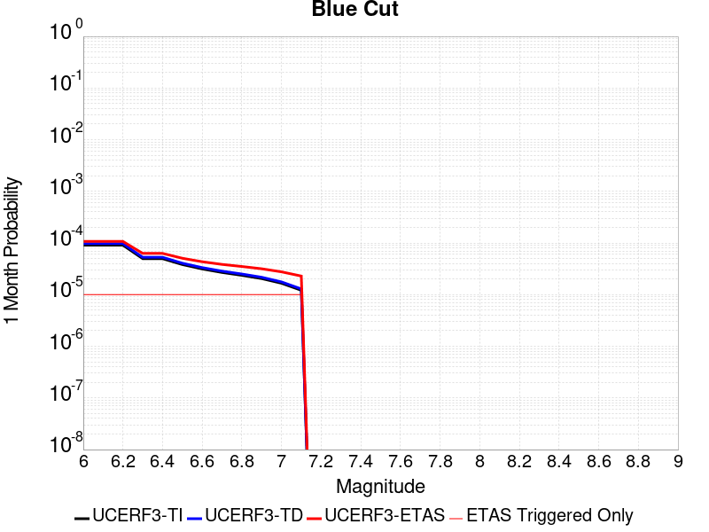 |  |  |

| Magnitude | 1 wk TI Prob | 1 wk TD Prob | 1 wk ETAS Prob | 1 wk ETAS/TD Gain | 1 wk ETAS Triggered Only | 1 mo TI Prob | 1 mo TD Prob | 1 mo ETAS Prob | 1 mo ETAS/TD Gain | 1 mo ETAS Triggered Only | 1 yr TI Prob | 1 yr TD Prob | 1 yr ETAS Prob | 1 yr ETAS/TD Gain | 1 yr ETAS Triggered Only | 10 yr TI Prob | 10 yr TD Prob | 10 yr ETAS Prob | 10 yr ETAS/TD Gain | 10 yr ETAS Triggered Only |
|-----|-----|-----|-----|-----|-----|-----|-----|-----|-----|-----|-----|-----|-----|-----|-----|-----|-----|-----|-----|-----|
| 6.0 | 2.1227985E-5 | 2.2720635E-5 | 2.2720635E-5 | 1.0 | 0.0 | 9.097391E-5 | 9.7370845E-5 | 1.0736987E-4 | 1.1026901 | 1.0E-5 | 0.0011070445 | 0.0011849034 | 0.0011948915 | 1.0084295 | 1.0E-5 | 0.011015458 | 0.011791699 | 0.01184111 | 1.0041903 | 5.0E-5 |
| 6.1 | 2.1227985E-5 | 2.2720635E-5 | 2.2720635E-5 | 1.0 | 0.0 | 9.097391E-5 | 9.7370845E-5 | 1.0736987E-4 | 1.1026901 | 1.0E-5 | 0.0011070445 | 0.0011849034 | 0.0011948915 | 1.0084295 | 1.0E-5 | 0.011015458 | 0.011791699 | 0.01184111 | 1.0041903 | 5.0E-5 |
| 6.2 | 2.1227985E-5 | 2.2720635E-5 | 2.2720635E-5 | 1.0 | 0.0 | 9.097391E-5 | 9.7370845E-5 | 1.0736987E-4 | 1.1026901 | 1.0E-5 | 0.0011070445 | 0.0011849034 | 0.0011948915 | 1.0084295 | 1.0E-5 | 0.011015458 | 0.011791699 | 0.01184111 | 1.0041903 | 5.0E-5 |
| 6.3 | 1.1613981E-5 | 1.2354064E-5 | 1.2354064E-5 | 1.0 | 0.0 | 4.9773254E-5 | 5.2944983E-5 | 6.2944455E-5 | 1.1888653 | 1.0E-5 | 6.0582085E-4 | 6.4442697E-4 | 6.544205E-4 | 1.0155077 | 1.0E-5 | 0.0060417196 | 0.00642683 | 0.0064765085 | 1.0077299 | 5.0E-5 |
| 6.4 | 1.1613981E-5 | 1.2354064E-5 | 1.2354064E-5 | 1.0 | 0.0 | 4.9773254E-5 | 5.2944983E-5 | 6.2944455E-5 | 1.1888653 | 1.0E-5 | 6.0582085E-4 | 6.4442697E-4 | 6.544205E-4 | 1.0155077 | 1.0E-5 | 0.0060417196 | 0.00642683 | 0.0064765085 | 1.0077299 | 5.0E-5 |
| 6.5 | 8.931326E-6 | 9.481987E-6 | 9.481987E-6 | 1.0 | 0.0 | 3.8276554E-5 | 4.0636507E-5 | 5.06361E-5 | 1.2460742 | 1.0E-5 | 4.6591737E-4 | 4.946463E-4 | 5.046414E-4 | 1.0202065 | 1.0E-5 | 0.0046494175 | 0.004936362 | 0.0049861157 | 1.0100789 | 5.0E-5 |
| 6.6 | 7.345353E-6 | 7.7905925E-6 | 7.7905925E-6 | 1.0 | 0.0 | 3.1479703E-5 | 3.338787E-5 | 4.3387536E-5 | 1.2995 | 1.0E-5 | 3.83198E-4 | 4.0642952E-4 | 4.1642544E-4 | 1.0245945 | 1.0E-5 | 0.0038253788 | 0.0040576537 | 0.004097491 | 1.009818 | 4.0E-5 |
| 6.7 | 6.2775666E-6 | 6.6554144E-6 | 6.6554144E-6 | 1.0 | 0.0 | 2.690358E-5 | 2.8522936E-5 | 3.852265E-5 | 1.3505851 | 1.0E-5 | 3.2750185E-4 | 3.472189E-4 | 3.5721547E-4 | 1.0287902 | 1.0E-5 | 0.0032701963 | 0.003467505 | 0.0034874359 | 1.0057478 | 2.0E-5 |
| 6.8 | 5.5234095E-6 | 5.8553446E-6 | 5.8553446E-6 | 1.0 | 0.0 | 2.367154E-5 | 2.5094132E-5 | 3.5093883E-5 | 1.3984895 | 1.0E-5 | 2.8816288E-4 | 3.054855E-4 | 3.1548247E-4 | 1.0327247 | 1.0E-5 | 0.002877895 | 0.003051372 | 0.003071311 | 1.0065345 | 2.0E-5 |
| 6.9 | 4.7780054E-6 | 5.0656226E-6 | 5.0656226E-6 | 1.0 | 0.0 | 2.0477004E-5 | 2.170967E-5 | 3.1709453E-5 | 1.4606142 | 1.0E-5 | 2.4927902E-4 | 2.6429023E-4 | 2.742876E-4 | 1.0378271 | 1.0E-5 | 0.0024899957 | 0.0026404513 | 0.0026603986 | 1.0075544 | 2.0E-5 |
| 7.0 | 3.883171E-6 | 4.1186527E-6 | 4.1186527E-6 | 1.0 | 0.0 | 1.6642054E-5 | 1.7651288E-5 | 2.7651111E-5 | 1.5665209 | 1.0E-5 | 2.0259817E-4 | 2.1489013E-4 | 2.2488798E-4 | 1.0465254 | 1.0E-5 | 0.0020241356 | 0.002147499 | 0.002167456 | 1.0092932 | 2.0E-5 |
| 7.1 | 2.8358215E-6 | 3.0098383E-6 | 3.0098383E-6 | 1.0 | 0.0 | 1.2153464E-5 | 1.289928E-5 | 2.289915E-5 | 1.7752271 | 1.0E-5 | 1.4795837E-4 | 1.5704399E-4 | 1.6704242E-4 | 1.0636665 | 1.0E-5 | 0.001478599 | 0.0015699754 | 0.001589944 | 1.012719 | 2.0E-5 |

## San Jacinto (Stepovers Combined)
*[(top)](#table-of-contents)*

| 1 Week | 1 Month | 1 Year | 10 Year |
|-----|-----|-----|-----|
|  |  |  |  |

| Magnitude | 1 wk TI Prob | 1 wk TD Prob | 1 wk ETAS Prob | 1 wk ETAS/TD Gain | 1 wk ETAS Triggered Only | 1 mo TI Prob | 1 mo TD Prob | 1 mo ETAS Prob | 1 mo ETAS/TD Gain | 1 mo ETAS Triggered Only | 1 yr TI Prob | 1 yr TD Prob | 1 yr ETAS Prob | 1 yr ETAS/TD Gain | 1 yr ETAS Triggered Only | 10 yr TI Prob | 10 yr TD Prob | 10 yr ETAS Prob | 10 yr ETAS/TD Gain | 10 yr ETAS Triggered Only |
|-----|-----|-----|-----|-----|-----|-----|-----|-----|-----|-----|-----|-----|-----|-----|-----|-----|-----|-----|-----|-----|
| 6.0 | 4.0667746E-5 | 3.5349825E-5 | 3.5349825E-5 | 1.0 | 0.0 | 1.742787E-4 | 1.5149047E-4 | 1.7148744E-4 | 1.1320015 | 2.0E-5 | 0.0021197782 | 0.0018428373 | 0.0018628004 | 1.0108328 | 2.0E-5 | 0.020996714 | 0.019026963 | 0.019066202 | 1.0020623 | 4.0E-5 |
| 6.1 | 4.0667746E-5 | 3.5349825E-5 | 3.5349825E-5 | 1.0 | 0.0 | 1.742787E-4 | 1.5149047E-4 | 1.7148744E-4 | 1.1320015 | 2.0E-5 | 0.0021197782 | 0.0018428373 | 0.0018628004 | 1.0108328 | 2.0E-5 | 0.020996714 | 0.019026963 | 0.019066202 | 1.0020623 | 4.0E-5 |
| 6.2 | 4.0667746E-5 | 3.5349825E-5 | 3.5349825E-5 | 1.0 | 0.0 | 1.742787E-4 | 1.5149047E-4 | 1.7148744E-4 | 1.1320015 | 2.0E-5 | 0.0021197782 | 0.0018428373 | 0.0018628004 | 1.0108328 | 2.0E-5 | 0.020996714 | 0.019026963 | 0.019066202 | 1.0020623 | 4.0E-5 |
| 6.3 | 4.0667746E-5 | 3.5349825E-5 | 3.5349825E-5 | 1.0 | 0.0 | 1.742787E-4 | 1.5149047E-4 | 1.7148744E-4 | 1.1320015 | 2.0E-5 | 0.0021197782 | 0.0018428373 | 0.0018628004 | 1.0108328 | 2.0E-5 | 0.020996714 | 0.019026963 | 0.019066202 | 1.0020623 | 4.0E-5 |
| 6.4 | 4.0577226E-5 | 3.5221707E-5 | 3.5221707E-5 | 1.0 | 0.0 | 1.738908E-4 | 1.5094144E-4 | 1.7093842E-4 | 1.1324817 | 2.0E-5 | 0.0021150648 | 0.0018361654 | 0.0018561287 | 1.0108722 | 2.0E-5 | 0.020950472 | 0.018961517 | 0.01900076 | 1.0020696 | 4.0E-5 |
| 6.5 | 4.0577226E-5 | 3.5221707E-5 | 3.5221707E-5 | 1.0 | 0.0 | 1.738908E-4 | 1.5094144E-4 | 1.7093842E-4 | 1.1324817 | 2.0E-5 | 0.0021150648 | 0.0018361654 | 0.0018561287 | 1.0108722 | 2.0E-5 | 0.020950472 | 0.018961517 | 0.01900076 | 1.0020696 | 4.0E-5 |
| 6.6 | 4.053861E-5 | 3.516703E-5 | 3.516703E-5 | 1.0 | 0.0 | 1.7372532E-4 | 1.5070717E-4 | 1.7070415E-4 | 1.1326877 | 2.0E-5 | 0.0021130538 | 0.0018333184 | 0.0018532817 | 1.0108892 | 2.0E-5 | 0.020930743 | 0.018933589 | 0.018972833 | 1.0020727 | 4.0E-5 |
| 6.7 | 4.0516545E-5 | 3.5136098E-5 | 3.5136098E-5 | 1.0 | 0.0 | 1.7363077E-4 | 1.505746E-4 | 1.705716E-4 | 1.1328045 | 2.0E-5 | 0.002111905 | 0.0018317074 | 0.0018516708 | 1.0108988 | 2.0E-5 | 0.020919468 | 0.018917782 | 0.018957026 | 1.0020744 | 4.0E-5 |
| 6.8 | 4.049434E-5 | 3.5107652E-5 | 3.5107652E-5 | 1.0 | 0.0 | 1.7353562E-4 | 1.5045272E-4 | 1.7044971E-4 | 1.1329122 | 2.0E-5 | 0.0021107488 | 0.0018302259 | 0.0018501894 | 1.0109076 | 2.0E-5 | 0.020908125 | 0.018903192 | 0.018942436 | 1.002076 | 4.0E-5 |
| 6.9 | 4.046386E-5 | 3.5070203E-5 | 3.5070203E-5 | 1.0 | 0.0 | 1.73405E-4 | 1.5029224E-4 | 1.7028923E-4 | 1.133054 | 2.0E-5 | 0.0021091616 | 0.0018282754 | 0.0018482389 | 1.0109192 | 2.0E-5 | 0.020892553 | 0.018883962 | 0.018923206 | 1.0020782 | 4.0E-5 |
| 7.0 | 4.036382E-5 | 3.495074E-5 | 3.495074E-5 | 1.0 | 0.0 | 1.7297632E-4 | 1.497803E-4 | 1.697773E-4 | 1.1335089 | 2.0E-5 | 0.0021039525 | 0.0018220531 | 0.0018420167 | 1.0109566 | 2.0E-5 | 0.02084144 | 0.01882256 | 0.018861808 | 1.0020851 | 4.0E-5 |
| 7.1 | 4.0343282E-5 | 3.4929195E-5 | 3.4929195E-5 | 1.0 | 0.0 | 1.7288832E-4 | 1.4968798E-4 | 1.6968498E-4 | 1.1335913 | 2.0E-5 | 0.002102883 | 0.001820931 | 0.0018408946 | 1.0109634 | 2.0E-5 | 0.020830948 | 0.01881143 | 0.018850679 | 1.0020864 | 4.0E-5 |
| 7.2 | 4.0257353E-5 | 3.483358E-5 | 3.483358E-5 | 1.0 | 0.0 | 1.725201E-4 | 1.4927826E-4 | 1.6927527E-4 | 1.133958 | 2.0E-5 | 0.0020984085 | 0.0018159511 | 0.0018359147 | 1.0109935 | 2.0E-5 | 0.020787042 | 0.018762115 | 0.018801363 | 1.002092 | 4.0E-5 |
| 7.3 | 3.9940667E-5 | 3.4660923E-5 | 3.4660923E-5 | 1.0 | 0.0 | 1.7116306E-4 | 1.4853837E-4 | 1.685354E-4 | 1.1346253 | 2.0E-5 | 0.0020819185 | 0.0018069579 | 0.0018269217 | 1.0110483 | 2.0E-5 | 0.020625217 | 0.018670587 | 0.01870984 | 1.0021024 | 4.0E-5 |
| 7.4 | 3.9721202E-5 | 3.4546167E-5 | 3.4546167E-5 | 1.0 | 0.0 | 1.7022261E-4 | 1.4804662E-4 | 1.6804365E-4 | 1.1350726 | 2.0E-5 | 0.0020704903 | 0.0018009807 | 0.0018209446 | 1.011085 | 2.0E-5 | 0.020513052 | 0.018609632 | 0.018648887 | 1.0021094 | 4.0E-5 |
| 7.5 | 3.7036873E-5 | 3.3611675E-5 | 3.3611675E-5 | 1.0 | 0.0 | 1.5871979E-4 | 1.440421E-4 | 1.6403923E-4 | 1.1388283 | 2.0E-5 | 0.0019307006 | 0.001752305 | 0.00177227 | 1.0113935 | 2.0E-5 | 0.019140124 | 0.018110158 | 0.018149434 | 1.0021687 | 4.0E-5 |
| 7.6 | 3.2940967E-5 | 3.1385196E-5 | 3.1385196E-5 | 1.0 | 0.0 | 1.4116794E-4 | 1.3450107E-4 | 1.5449838E-4 | 1.1486777 | 2.0E-5 | 0.0017173645 | 0.0016363227 | 0.00165629 | 1.0122025 | 2.0E-5 | 0.01704153 | 0.016939204 | 0.016978526 | 1.0023214 | 4.0E-5 |
| 7.7 | 2.8236149E-5 | 2.7949214E-5 | 2.7949214E-5 | 1.0 | 0.0 | 1.2100645E-4 | 1.1977685E-4 | 1.3977445E-4 | 1.1669571 | 2.0E-5 | 0.0014722579 | 0.0014573087 | 0.0014772796 | 1.013704 | 2.0E-5 | 0.014625421 | 0.015148922 | 0.015188316 | 1.0026004 | 4.0E-5 |
| 7.8 | 2.4329287E-5 | 2.5270367E-5 | 2.5270367E-5 | 1.0 | 0.0 | 1.042642E-4 | 1.0829708E-4 | 1.2829491E-4 | 1.1846572 | 2.0E-5 | 0.0012686774 | 0.0013177203 | 0.001337694 | 1.0151577 | 2.0E-5 | 0.012614589 | 0.01374489 | 0.01378434 | 1.0028702 | 4.0E-5 |
| 7.9 | 1.9370926E-5 | 2.0478037E-5 | 2.0478037E-5 | 1.0 | 0.0 | 8.301561E-5 | 8.776007E-5 | 1.07758315E-4 | 1.227874 | 2.0E-5 | 0.0010102465 | 0.0010679559 | 0.0010879345 | 1.0187074 | 2.0E-5 | 0.0100566605 | 0.011228893 | 0.011268444 | 1.0035223 | 4.0E-5 |
| 8.0 | 1.5583017E-5 | 1.5933803E-5 | 1.5933803E-5 | 1.0 | 0.0 | 6.6782646E-5 | 6.8285946E-5 | 8.828458E-5 | 1.292866 | 2.0E-5 | 8.127754E-4 | 8.3106494E-4 | 8.5104833E-4 | 1.0240455 | 2.0E-5 | 0.008098091 | 0.008806537 | 0.008846185 | 1.004502 | 4.0E-5 |
| 8.1 | 1.0024873E-5 | 8.3195555E-6 | 8.3195555E-6 | 1.0 | 0.0 | 4.2963035E-5 | 3.565475E-5 | 4.5654397E-5 | 1.2804575 | 1.0E-5 | 5.229494E-4 | 4.3401064E-4 | 4.4400632E-4 | 1.0230309 | 1.0E-5 | 0.0052172043 | 0.0046678404 | 0.004687747 | 1.0042646 | 2.0E-5 |
| 8.2 | 4.142796E-6 | 1.5685099E-6 | 1.5685099E-6 | 1.0 | 0.0 | 1.775472E-5 | 6.722168E-6 | 6.722168E-6 | 1.0 | 0.0 | 2.1614227E-4 | 8.1839346E-5 | 8.1839346E-5 | 1.0 | 0.0 | 0.0021593217 | 9.498617E-4 | 9.498617E-4 | 1.0 | 0.0 |
| 8.3 | 1.2750878E-6 | 3.6323098E-7 | 3.6323098E-7 | 1.0 | 0.0 | 5.4646503E-6 | 1.5567033E-6 | 1.5567033E-6 | 1.0 | 0.0 | 6.653009E-5 | 1.8952702E-5 | 1.8952702E-5 | 1.0 | 0.0 | 6.6510175E-4 | 2.2854589E-4 | 2.2854589E-4 | 1.0 | 0.0 |

## Big Pine (Central)
*[(top)](#table-of-contents)*

| 1 Week | 1 Month | 1 Year | 10 Year |
|-----|-----|-----|-----|
|  |  |  |  |

| Magnitude | 1 wk TI Prob | 1 wk TD Prob | 1 wk ETAS Prob | 1 wk ETAS/TD Gain | 1 wk ETAS Triggered Only | 1 mo TI Prob | 1 mo TD Prob | 1 mo ETAS Prob | 1 mo ETAS/TD Gain | 1 mo ETAS Triggered Only | 1 yr TI Prob | 1 yr TD Prob | 1 yr ETAS Prob | 1 yr ETAS/TD Gain | 1 yr ETAS Triggered Only | 10 yr TI Prob | 10 yr TD Prob | 10 yr ETAS Prob | 10 yr ETAS/TD Gain | 10 yr ETAS Triggered Only |
|-----|-----|-----|-----|-----|-----|-----|-----|-----|-----|-----|-----|-----|-----|-----|-----|-----|-----|-----|-----|-----|
| 6.0 | 1.2706755E-5 | 1.4253037E-5 | 1.4253037E-5 | 1.0 | 0.0 | 5.4456385E-5 | 6.108322E-5 | 7.1082606E-5 | 1.163701 | 1.0E-5 | 6.628048E-4 | 7.43471E-4 | 7.5346354E-4 | 1.0134404 | 1.0E-5 | 0.006608314 | 0.0074148336 | 0.0074545373 | 1.0053546 | 4.0E-5 |
| 6.1 | 8.342579E-6 | 9.512999E-6 | 9.512999E-6 | 1.0 | 0.0 | 3.5753423E-5 | 4.0769482E-5 | 4.0769482E-5 | 1.0 | 0.0 | 4.3521097E-4 | 4.962771E-4 | 4.962771E-4 | 1.0 | 0.0 | 0.0043435963 | 0.0049552117 | 0.0049651624 | 1.0020081 | 1.0E-5 |
| 6.2 | 6.923899E-6 | 7.969295E-6 | 7.969295E-6 | 1.0 | 0.0 | 2.9673516E-5 | 3.415378E-5 | 3.415378E-5 | 1.0 | 0.0 | 3.6121515E-4 | 4.1576222E-4 | 4.1576222E-4 | 1.0 | 0.0 | 0.003606286 | 0.0041531203 | 0.0041531203 | 1.0 | 0.0 |
| 6.3 | 2.728396E-6 | 3.426189E-6 | 3.426189E-6 | 1.0 | 0.0 | 1.1693074E-5 | 1.4683589E-5 | 1.4683589E-5 | 1.0 | 0.0 | 1.4235388E-4 | 1.787589E-4 | 1.787589E-4 | 1.0 | 0.0 | 0.0014226272 | 0.0017876263 | 0.0017876263 | 1.0 | 0.0 |
| 6.4 | 2.7136944E-6 | 3.4104817E-6 | 3.4104817E-6 | 1.0 | 0.0 | 1.1630066E-5 | 1.4616273E-5 | 1.4616273E-5 | 1.0 | 0.0 | 1.4158686E-4 | 1.7793947E-4 | 1.7793947E-4 | 1.0 | 0.0 | 0.0014149669 | 0.001779445 | 0.001779445 | 1.0 | 0.0 |
| 6.5 | 2.6971882E-6 | 3.3928259E-6 | 3.3928259E-6 | 1.0 | 0.0 | 1.1559327E-5 | 1.4540607E-5 | 1.4540607E-5 | 1.0 | 0.0 | 1.4072572E-4 | 1.7701837E-4 | 1.7701837E-4 | 1.0 | 0.0 | 0.0014063664 | 0.0017702488 | 0.0017702488 | 1.0 | 0.0 |
| 6.6 | 2.669092E-6 | 3.362845E-6 | 3.362845E-6 | 1.0 | 0.0 | 1.1438916E-5 | 1.4412119E-5 | 1.4412119E-5 | 1.0 | 0.0 | 1.3925991E-4 | 1.7545428E-4 | 1.7545428E-4 | 1.0 | 0.0 | 0.0013917267 | 0.0017546327 | 0.0017546327 | 1.0 | 0.0 |
| 6.7 | 2.6408059E-6 | 3.3328695E-6 | 3.3328695E-6 | 1.0 | 0.0 | 1.1317691E-5 | 1.4283653E-5 | 1.4283653E-5 | 1.0 | 0.0 | 1.3778417E-4 | 1.7389047E-4 | 1.7389047E-4 | 1.0 | 0.0 | 0.0013769877 | 0.0017390191 | 0.0017390191 | 1.0 | 0.0 |
| 6.8 | 2.1786943E-6 | 2.856317E-6 | 2.856317E-6 | 1.0 | 0.0 | 9.337228E-6 | 1.2241305E-5 | 1.2241305E-5 | 1.0 | 0.0 | 1.1367482E-4 | 1.4902842E-4 | 1.4902842E-4 | 1.0 | 0.0 | 0.0011361669 | 0.0014907464 | 0.0014907464 | 1.0 | 0.0 |
| 6.9 | 1.4411696E-6 | 2.0702996E-6 | 2.0702996E-6 | 1.0 | 0.0 | 6.1764263E-6 | 8.872685E-6 | 8.872685E-6 | 1.0 | 0.0 | 7.51954E-5 | 1.0801985E-4 | 1.0801985E-4 | 1.0 | 0.0 | 7.5169955E-4 | 0.0010810903 | 0.0010810903 | 1.0 | 0.0 |
| 7.0 | 1.0073411E-6 | 1.5558677E-6 | 1.5558677E-6 | 1.0 | 0.0 | 4.317169E-6 | 6.667988E-6 | 6.667988E-6 | 1.0 | 0.0 | 5.2560266E-5 | 8.117988E-5 | 8.117988E-5 | 1.0 | 0.0 | 5.2547833E-4 | 8.12908E-4 | 8.12908E-4 | 1.0 | 0.0 |
| 7.1 | 8.947104E-7 | 1.4318325E-6 | 1.4318325E-6 | 1.0 | 0.0 | 3.834468E-6 | 6.1364112E-6 | 6.1364112E-6 | 1.0 | 0.0 | 4.6683643E-5 | 7.47084E-5 | 7.47084E-5 | 1.0 | 0.0 | 4.6673836E-4 | 7.4823824E-4 | 7.4823824E-4 | 1.0 | 0.0 |
| 7.2 | 5.215166E-7 | 1.0126455E-6 | 1.0126455E-6 | 1.0 | 0.0 | 2.2350691E-6 | 4.3399023E-6 | 4.3399023E-6 | 1.0 | 0.0 | 2.7211627E-5 | 5.2837077E-5 | 5.2837077E-5 | 1.0 | 0.0 | 2.7208295E-4 | 5.296404E-4 | 5.296404E-4 | 1.0 | 0.0 |
| 7.3 | 4.4024807E-7 | 9.23394E-7 | 9.23394E-7 | 1.0 | 0.0 | 1.8867761E-6 | 3.957397E-6 | 3.957397E-6 | 1.0 | 0.0 | 2.2971257E-5 | 4.8180285E-5 | 4.8180285E-5 | 1.0 | 0.0 | 2.2968883E-4 | 4.830935E-4 | 4.830935E-4 | 1.0 | 0.0 |
| 7.4 | 3.6130905E-7 | 8.372436E-7 | 8.372436E-7 | 1.0 | 0.0 | 1.5484665E-6 | 3.5881822E-6 | 3.5881822E-6 | 1.0 | 0.0 | 1.8852415E-5 | 4.3685282E-5 | 4.3685282E-5 | 1.0 | 0.0 | 1.8850817E-4 | 4.3815238E-4 | 4.3815238E-4 | 1.0 | 0.0 |
| 7.5 | 3.408184E-7 | 8.121764E-7 | 8.121764E-7 | 1.0 | 0.0 | 1.4606494E-6 | 3.4807515E-6 | 3.4807515E-6 | 1.0 | 0.0 | 1.7783263E-5 | 4.2377364E-5 | 4.2377364E-5 | 1.0 | 0.0 | 1.778184E-4 | 4.2506E-4 | 4.2506E-4 | 1.0 | 0.0 |
| 7.6 | 3.1428627E-7 | 7.744745E-7 | 7.744745E-7 | 1.0 | 0.0 | 1.3469405E-6 | 3.3191723E-6 | 3.3191723E-6 | 1.0 | 0.0 | 1.6398877E-5 | 4.041021E-5 | 4.041021E-5 | 1.0 | 0.0 | 1.6397667E-4 | 4.0536863E-4 | 4.0536863E-4 | 1.0 | 0.0 |
| 7.7 | 1.7972785E-7 | 5.0878083E-7 | 5.0878083E-7 | 1.0 | 0.0 | 7.70262E-7 | 2.1804874E-6 | 2.1804874E-6 | 1.0 | 0.0 | 9.377899E-6 | 2.6547123E-5 | 2.6547123E-5 | 1.0 | 0.0 | 9.377503E-5 | 2.6680125E-4 | 2.6680125E-4 | 1.0 | 0.0 |
| 7.8 | 4.9230927E-8 | 1.2004362E-7 | 1.2004362E-7 | 1.0 | 0.0 | 2.1098968E-7 | 5.144726E-7 | 5.144726E-7 | 1.0 | 0.0 | 2.5687964E-6 | 6.2636873E-6 | 6.2636873E-6 | 1.0 | 0.0 | 2.5687666E-5 | 6.307411E-5 | 6.307411E-5 | 1.0 | 0.0 |
| 7.9 | 3.6805972E-9 | 4.114057E-9 | 4.114057E-9 | 1.0 | 0.0 | 1.5773987E-8 | 1.7631674E-8 | 1.7631674E-8 | 1.0 | 0.0 | 1.9204828E-7 | 2.146656E-7 | 2.146656E-7 | 1.0 | 0.0 | 1.920481E-6 | 2.1946187E-6 | 2.1946187E-6 | 1.0 | 0.0 |

## Sheephole
*[(top)](#table-of-contents)*

| 1 Week | 1 Month | 1 Year | 10 Year |
|-----|-----|-----|-----|
|  |  |  |  |

| Magnitude | 1 wk TI Prob | 1 wk TD Prob | 1 wk ETAS Prob | 1 wk ETAS/TD Gain | 1 wk ETAS Triggered Only | 1 mo TI Prob | 1 mo TD Prob | 1 mo ETAS Prob | 1 mo ETAS/TD Gain | 1 mo ETAS Triggered Only | 1 yr TI Prob | 1 yr TD Prob | 1 yr ETAS Prob | 1 yr ETAS/TD Gain | 1 yr ETAS Triggered Only | 10 yr TI Prob | 10 yr TD Prob | 10 yr ETAS Prob | 10 yr ETAS/TD Gain | 10 yr ETAS Triggered Only |
|-----|-----|-----|-----|-----|-----|-----|-----|-----|-----|-----|-----|-----|-----|-----|-----|-----|-----|-----|-----|-----|
| 6.0 | 4.5579695E-6 | 4.741389E-6 | 4.741389E-6 | 1.0 | 0.0 | 1.9534009E-5 | 2.0320113E-5 | 4.0319705E-5 | 1.9842265 | 2.0E-5 | 2.3780059E-4 | 2.4737482E-4 | 2.7736742E-4 | 1.1212435 | 3.0E-5 | 0.0023754628 | 0.0024715392 | 0.0025114403 | 1.0161443 | 4.0E-5 |
| 6.1 | 4.5579695E-6 | 4.741389E-6 | 4.741389E-6 | 1.0 | 0.0 | 1.9534009E-5 | 2.0320113E-5 | 4.0319705E-5 | 1.9842265 | 2.0E-5 | 2.3780059E-4 | 2.4737482E-4 | 2.7736742E-4 | 1.1212435 | 3.0E-5 | 0.0023754628 | 0.0024715392 | 0.0025114403 | 1.0161443 | 4.0E-5 |
| 6.2 | 2.6677674E-6 | 2.7874773E-6 | 2.7874773E-6 | 1.0 | 0.0 | 1.1433239E-5 | 1.1946282E-5 | 3.1946045E-5 | 2.674141 | 2.0E-5 | 1.3919079E-4 | 1.4543736E-4 | 1.75433E-4 | 1.2062443 | 3.0E-5 | 0.0013910364 | 0.0014535277 | 0.0014934696 | 1.0274793 | 4.0E-5 |
| 6.3 | 2.6677674E-6 | 2.7874773E-6 | 2.7874773E-6 | 1.0 | 0.0 | 1.1433239E-5 | 1.1946282E-5 | 3.1946045E-5 | 2.674141 | 2.0E-5 | 1.3919079E-4 | 1.4543736E-4 | 1.75433E-4 | 1.2062443 | 3.0E-5 | 0.0013910364 | 0.0014535277 | 0.0014934696 | 1.0274793 | 4.0E-5 |
| 6.4 | 2.2159759E-6 | 2.3229532E-6 | 2.3229532E-6 | 1.0 | 0.0 | 9.497005E-6 | 9.95548E-6 | 2.9955281E-5 | 3.0089238 | 2.0E-5 | 1.156199E-4 | 1.2120203E-4 | 1.511984E-4 | 1.2474906 | 3.0E-5 | 0.0011555976 | 0.0012114387 | 0.0012513902 | 1.0329785 | 4.0E-5 |
| 6.5 | 2.1986082E-6 | 2.3048328E-6 | 2.3048328E-6 | 1.0 | 0.0 | 9.4225725E-6 | 9.877823E-6 | 2.9877625E-5 | 3.0247178 | 2.0E-5 | 1.1471378E-4 | 1.2025666E-4 | 1.5025305E-4 | 1.2494364 | 3.0E-5 | 0.0011465458 | 0.0012019952 | 0.0012319591 | 1.0249285 | 3.0E-5 |
| 6.6 | 1.5232331E-6 | 1.6019467E-6 | 1.6019467E-6 | 1.0 | 0.0 | 6.5281256E-6 | 6.865469E-6 | 2.6865331E-5 | 3.9131095 | 2.0E-5 | 7.947703E-5 | 8.358407E-5 | 1.1358156E-4 | 1.35889 | 3.0E-5 | 7.9448614E-4 | 8.35545E-4 | 8.6552E-4 | 1.0358747 | 3.0E-5 |
| 6.7 | 1.3137362E-6 | 1.3828673E-6 | 1.3828673E-6 | 1.0 | 0.0 | 5.6302856E-6 | 5.9265612E-6 | 2.5926443E-5 | 4.374618 | 2.0E-5 | 6.854657E-5 | 7.2153634E-5 | 1.0215147E-4 | 1.4157494 | 3.0E-5 | 6.8525434E-4 | 7.2131597E-4 | 7.5129437E-4 | 1.0415606 | 3.0E-5 |
| 6.8 | 1.2275751E-6 | 1.2923298E-6 | 1.2923298E-6 | 1.0 | 0.0 | 5.2610258E-6 | 5.5385453E-6 | 2.5538435E-5 | 4.6110363 | 2.0E-5 | 6.4051106E-5 | 6.742984E-5 | 9.7427815E-5 | 1.4448769 | 3.0E-5 | 6.4032647E-4 | 6.7410717E-4 | 7.040869E-4 | 1.0444733 | 3.0E-5 |
| 6.9 | 1.1837088E-6 | 1.2461455E-6 | 1.2461455E-6 | 1.0 | 0.0 | 5.0730278E-6 | 5.340614E-6 | 2.5340507E-5 | 4.744868 | 2.0E-5 | 6.176237E-5 | 6.502016E-5 | 9.5018215E-5 | 1.4613653 | 3.0E-5 | 6.17452E-4 | 6.5002457E-4 | 6.8000506E-4 | 1.0461221 | 3.0E-5 |
| 7.0 | 9.849371E-7 | 1.0366649E-6 | 1.0366649E-6 | 1.0 | 0.0 | 4.2211523E-6 | 4.4428425E-6 | 1.4442798E-5 | 3.2508013 | 1.0E-5 | 5.1391315E-5 | 5.4090367E-5 | 7.408929E-5 | 1.3697315 | 2.0E-5 | 5.137943E-4 | 5.407821E-4 | 5.6077127E-4 | 1.0369635 | 2.0E-5 |
| 7.1 | 8.1643645E-7 | 8.591967E-7 | 8.591967E-7 | 1.0 | 0.0 | 3.4990085E-6 | 3.6822669E-6 | 1.368223E-5 | 3.7157085 | 1.0E-5 | 4.2599597E-5 | 4.4830766E-5 | 6.482987E-5 | 1.4461023 | 2.0E-5 | 4.259143E-4 | 4.4822585E-4 | 4.682169E-4 | 1.0446004 | 2.0E-5 |
| 7.2 | 5.7295756E-7 | 6.029711E-7 | 6.029711E-7 | 1.0 | 0.0 | 2.45553E-6 | 2.5841598E-6 | 2.5841598E-6 | 1.0 | 0.0 | 2.9895667E-5 | 3.146176E-5 | 4.1461444E-5 | 1.3178362 | 1.0E-5 | 2.9891645E-4 | 3.1457972E-4 | 3.245766E-4 | 1.0317785 | 1.0E-5 |

## San Jacinto (San Jacinto Valley) rev
*[(top)](#table-of-contents)*

| 1 Week | 1 Month | 1 Year | 10 Year |
|-----|-----|-----|-----|
|  |  |  |  |

| Magnitude | 1 wk TI Prob | 1 wk TD Prob | 1 wk ETAS Prob | 1 wk ETAS/TD Gain | 1 wk ETAS Triggered Only | 1 mo TI Prob | 1 mo TD Prob | 1 mo ETAS Prob | 1 mo ETAS/TD Gain | 1 mo ETAS Triggered Only | 1 yr TI Prob | 1 yr TD Prob | 1 yr ETAS Prob | 1 yr ETAS/TD Gain | 1 yr ETAS Triggered Only | 10 yr TI Prob | 10 yr TD Prob | 10 yr ETAS Prob | 10 yr ETAS/TD Gain | 10 yr ETAS Triggered Only |
|-----|-----|-----|-----|-----|-----|-----|-----|-----|-----|-----|-----|-----|-----|-----|-----|-----|-----|-----|-----|-----|
| 6.0 | 3.652694E-5 | 3.44809E-5 | 3.44809E-5 | 1.0 | 0.0 | 1.5653463E-4 | 1.4776694E-4 | 1.6776398E-4 | 1.1353283 | 2.0E-5 | 0.0019041431 | 0.0017975798 | 0.0018175439 | 1.011106 | 2.0E-5 | 0.018879099 | 0.018567242 | 0.018606499 | 1.0021143 | 4.0E-5 |
| 6.1 | 3.652694E-5 | 3.44809E-5 | 3.44809E-5 | 1.0 | 0.0 | 1.5653463E-4 | 1.4776694E-4 | 1.6776398E-4 | 1.1353283 | 2.0E-5 | 0.0019041431 | 0.0017975798 | 0.0018175439 | 1.011106 | 2.0E-5 | 0.018879099 | 0.018567242 | 0.018606499 | 1.0021143 | 4.0E-5 |
| 6.2 | 3.652694E-5 | 3.44809E-5 | 3.44809E-5 | 1.0 | 0.0 | 1.5653463E-4 | 1.4776694E-4 | 1.6776398E-4 | 1.1353283 | 2.0E-5 | 0.0019041431 | 0.0017975798 | 0.0018175439 | 1.011106 | 2.0E-5 | 0.018879099 | 0.018567242 | 0.018606499 | 1.0021143 | 4.0E-5 |
| 6.3 | 3.652694E-5 | 3.44809E-5 | 3.44809E-5 | 1.0 | 0.0 | 1.5653463E-4 | 1.4776694E-4 | 1.6776398E-4 | 1.1353283 | 2.0E-5 | 0.0019041431 | 0.0017975798 | 0.0018175439 | 1.011106 | 2.0E-5 | 0.018879099 | 0.018567242 | 0.018606499 | 1.0021143 | 4.0E-5 |
| 6.4 | 3.646941E-5 | 3.440246E-5 | 3.440246E-5 | 1.0 | 0.0 | 1.5628811E-4 | 1.474308E-4 | 1.6742785E-4 | 1.1356368 | 2.0E-5 | 0.0019011468 | 0.0017934944 | 0.0018134585 | 1.0111314 | 2.0E-5 | 0.018849645 | 0.018527115 | 0.018566374 | 1.002119 | 4.0E-5 |
| 6.5 | 3.646941E-5 | 3.440246E-5 | 3.440246E-5 | 1.0 | 0.0 | 1.5628811E-4 | 1.474308E-4 | 1.6742785E-4 | 1.1356368 | 2.0E-5 | 0.0019011468 | 0.0017934944 | 0.0018134585 | 1.0111314 | 2.0E-5 | 0.018849645 | 0.018527115 | 0.018566374 | 1.002119 | 4.0E-5 |
| 6.6 | 3.6442503E-5 | 3.436584E-5 | 3.436584E-5 | 1.0 | 0.0 | 1.561728E-4 | 1.4727387E-4 | 1.6727092E-4 | 1.1357814 | 2.0E-5 | 0.0018997455 | 0.0017915871 | 0.0018115513 | 1.0111433 | 2.0E-5 | 0.018835869 | 0.01850838 | 0.01854764 | 1.0021212 | 4.0E-5 |
| 6.7 | 3.6432113E-5 | 3.435141E-5 | 3.435141E-5 | 1.0 | 0.0 | 1.5612828E-4 | 1.4721203E-4 | 1.672091E-4 | 1.1358385 | 2.0E-5 | 0.0018992044 | 0.0017908356 | 0.0018107998 | 1.011148 | 2.0E-5 | 0.018830549 | 0.018501002 | 0.018540261 | 1.002122 | 4.0E-5 |
| 6.8 | 3.6409598E-5 | 3.432046E-5 | 3.432046E-5 | 1.0 | 0.0 | 1.560318E-4 | 1.4707941E-4 | 1.6707646E-4 | 1.1359609 | 2.0E-5 | 0.0018980318 | 0.0017892235 | 0.0018091877 | 1.011158 | 2.0E-5 | 0.018819023 | 0.018485153 | 0.018524414 | 1.002124 | 4.0E-5 |
| 6.9 | 3.638078E-5 | 3.4280874E-5 | 3.4280874E-5 | 1.0 | 0.0 | 1.5590832E-4 | 1.4690976E-4 | 1.6690683E-4 | 1.1361179 | 2.0E-5 | 0.0018965311 | 0.0017871616 | 0.0018071259 | 1.011171 | 2.0E-5 | 0.018804269 | 0.018464882 | 0.018504145 | 1.0021262 | 4.0E-5 |
| 7.0 | 3.6294874E-5 | 3.4162862E-5 | 3.4162862E-5 | 1.0 | 0.0 | 1.5554018E-4 | 1.4640407E-4 | 1.6640114E-4 | 1.1365882 | 2.0E-5 | 0.0018920569 | 0.0017810148 | 0.0018009793 | 1.0112096 | 2.0E-5 | 0.018760284 | 0.018404452 | 0.018443717 | 1.0021334 | 4.0E-5 |
| 7.1 | 3.6260717E-5 | 3.4119137E-5 | 3.4119137E-5 | 1.0 | 0.0 | 1.5539382E-4 | 1.462167E-4 | 1.6621378E-4 | 1.1367633 | 2.0E-5 | 0.001890278 | 0.0017787374 | 0.0017987018 | 1.0112239 | 2.0E-5 | 0.018742796 | 0.018382046 | 0.018421311 | 1.002136 | 4.0E-5 |
| 7.2 | 3.6210204E-5 | 3.4053264E-5 | 3.4053264E-5 | 1.0 | 0.0 | 1.5517735E-4 | 1.459344E-4 | 1.6593149E-4 | 1.1370279 | 2.0E-5 | 0.001887647 | 0.0017753061 | 0.0017952706 | 1.0112456 | 2.0E-5 | 0.01871693 | 0.018348275 | 0.01838754 | 1.00214 | 4.0E-5 |
| 7.3 | 3.6119454E-5 | 3.3941353E-5 | 3.3941353E-5 | 1.0 | 0.0 | 1.5478847E-4 | 1.4545483E-4 | 1.6545193E-4 | 1.1374798 | 2.0E-5 | 0.0018829206 | 0.0017694768 | 0.0017894414 | 1.0112828 | 2.0E-5 | 0.018670462 | 0.018290726 | 0.018329995 | 1.002147 | 4.0E-5 |
| 7.4 | 3.607848E-5 | 3.3888802E-5 | 3.3888802E-5 | 1.0 | 0.0 | 1.5461289E-4 | 1.4522964E-4 | 1.6522674E-4 | 1.1376929 | 2.0E-5 | 0.0018807866 | 0.0017667396 | 0.0017867043 | 1.0113003 | 2.0E-5 | 0.018649481 | 0.018263696 | 0.018302964 | 1.0021502 | 4.0E-5 |
| 7.5 | 3.5856774E-5 | 3.3697623E-5 | 3.3697623E-5 | 1.0 | 0.0 | 1.5366284E-4 | 1.4441041E-4 | 1.6440752E-4 | 1.1384742 | 2.0E-5 | 0.0018692396 | 0.0017567815 | 0.0017767464 | 1.0113645 | 2.0E-5 | 0.018535944 | 0.018164301 | 0.018203575 | 1.0021621 | 4.0E-5 |
| 7.6 | 3.286655E-5 | 3.2213695E-5 | 3.2213695E-5 | 1.0 | 0.0 | 1.4084904E-4 | 1.380514E-4 | 1.5804863E-4 | 1.1448536 | 2.0E-5 | 0.001713488 | 0.001679482 | 0.0016994484 | 1.0118884 | 2.0E-5 | 0.017003361 | 0.017380318 | 0.017419623 | 1.0022614 | 4.0E-5 |
| 7.7 | 2.8882527E-5 | 2.930491E-5 | 2.930491E-5 | 1.0 | 0.0 | 1.237764E-4 | 1.2558643E-4 | 1.4558392E-4 | 1.1592329 | 2.0E-5 | 0.0015059357 | 0.0015279434 | 0.001547913 | 1.0130695 | 2.0E-5 | 0.014957713 | 0.015865888 | 0.015905254 | 1.0024811 | 4.0E-5 |
| 7.8 | 2.4950225E-5 | 2.6593287E-5 | 2.6593287E-5 | 1.0 | 0.0 | 1.0692515E-4 | 1.13966256E-4 | 1.3396397E-4 | 1.1754706 | 2.0E-5 | 0.0013010362 | 0.0013866569 | 0.0014066291 | 1.0144032 | 2.0E-5 | 0.012934455 | 0.014445833 | 0.014485256 | 1.0027289 | 4.0E-5 |
| 7.9 | 1.9881603E-5 | 2.156676E-5 | 2.156676E-5 | 1.0 | 0.0 | 8.520408E-5 | 9.2425704E-5 | 1.12423855E-4 | 1.21637 | 2.0E-5 | 0.001036866 | 0.0011247029 | 0.0011446803 | 1.0177624 | 2.0E-5 | 0.010320415 | 0.011807773 | 0.0118473 | 1.0033476 | 4.0E-5 |
| 8.0 | 1.563292E-5 | 1.5984875E-5 | 1.5984875E-5 | 1.0 | 0.0 | 6.6996516E-5 | 6.8504814E-5 | 8.8503446E-5 | 1.2919303 | 2.0E-5 | 8.153773E-4 | 8.3372765E-4 | 8.53711E-4 | 1.0239687 | 2.0E-5 | 0.00812392 | 0.008835338 | 0.008874984 | 1.0044873 | 4.0E-5 |
| 8.1 | 1.0045313E-5 | 8.329004E-6 | 8.329004E-6 | 1.0 | 0.0 | 4.305063E-5 | 3.5695244E-5 | 4.5694887E-5 | 1.2801393 | 1.0E-5 | 5.2401534E-4 | 4.3450348E-4 | 4.4449914E-4 | 1.0230048 | 1.0E-5 | 0.0052278144 | 0.0046735723 | 0.004693479 | 1.0042593 | 2.0E-5 |
| 8.2 | 4.1554413E-6 | 1.5730919E-6 | 1.5730919E-6 | 1.0 | 0.0 | 1.7808914E-5 | 6.741805E-6 | 6.741805E-6 | 1.0 | 0.0 | 2.1680194E-4 | 8.207841E-5 | 8.207841E-5 | 1.0 | 0.0 | 0.0021659054 | 9.527024E-4 | 9.527024E-4 | 1.0 | 0.0 |
| 8.3 | 1.2758221E-6 | 3.6351847E-7 | 3.6351847E-7 | 1.0 | 0.0 | 5.4677976E-6 | 1.5579354E-6 | 1.5579354E-6 | 1.0 | 0.0 | 6.65684E-5 | 1.8967703E-5 | 1.8967703E-5 | 1.0 | 0.0 | 6.6548464E-4 | 2.2871704E-4 | 2.2871704E-4 | 1.0 | 0.0 |

## Camp Rock 2011
*[(top)](#table-of-contents)*

| 1 Week | 1 Month | 1 Year | 10 Year |
|-----|-----|-----|-----|
|  | 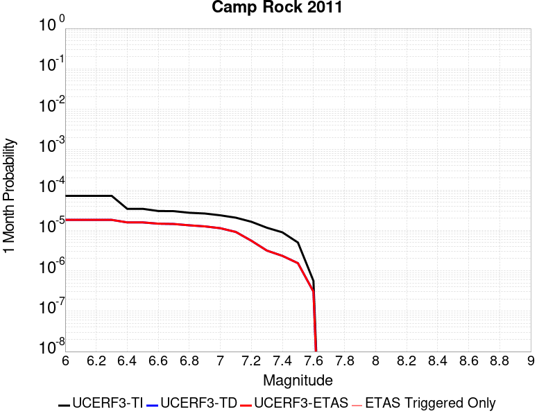 |  |  |

| Magnitude | 1 wk TI Prob | 1 wk TD Prob | 1 wk ETAS Prob | 1 wk ETAS/TD Gain | 1 wk ETAS Triggered Only | 1 mo TI Prob | 1 mo TD Prob | 1 mo ETAS Prob | 1 mo ETAS/TD Gain | 1 mo ETAS Triggered Only | 1 yr TI Prob | 1 yr TD Prob | 1 yr ETAS Prob | 1 yr ETAS/TD Gain | 1 yr ETAS Triggered Only | 10 yr TI Prob | 10 yr TD Prob | 10 yr ETAS Prob | 10 yr ETAS/TD Gain | 10 yr ETAS Triggered Only |
|-----|-----|-----|-----|-----|-----|-----|-----|-----|-----|-----|-----|-----|-----|-----|-----|-----|-----|-----|-----|-----|
| 6.0 | 1.6710783E-5 | 4.250202E-6 | 4.250202E-6 | 1.0 | 0.0 | 7.161568E-5 | 1.8215027E-5 | 1.8215027E-5 | 1.0 | 0.0 | 8.7157206E-4 | 2.217459E-4 | 2.217459E-4 | 1.0 | 0.0 | 0.008681616 | 0.0022152993 | 0.0022552107 | 1.0180162 | 4.0E-5 |
| 6.1 | 1.6710783E-5 | 4.250202E-6 | 4.250202E-6 | 1.0 | 0.0 | 7.161568E-5 | 1.8215027E-5 | 1.8215027E-5 | 1.0 | 0.0 | 8.7157206E-4 | 2.217459E-4 | 2.217459E-4 | 1.0 | 0.0 | 0.008681616 | 0.0022152993 | 0.0022552107 | 1.0180162 | 4.0E-5 |
| 6.2 | 1.6710783E-5 | 4.250202E-6 | 4.250202E-6 | 1.0 | 0.0 | 7.161568E-5 | 1.8215027E-5 | 1.8215027E-5 | 1.0 | 0.0 | 8.7157206E-4 | 2.217459E-4 | 2.217459E-4 | 1.0 | 0.0 | 0.008681616 | 0.0022152993 | 0.0022552107 | 1.0180162 | 4.0E-5 |
| 6.3 | 1.6710783E-5 | 4.250202E-6 | 4.250202E-6 | 1.0 | 0.0 | 7.161568E-5 | 1.8215027E-5 | 1.8215027E-5 | 1.0 | 0.0 | 8.7157206E-4 | 2.217459E-4 | 2.217459E-4 | 1.0 | 0.0 | 0.008681616 | 0.0022152993 | 0.0022552107 | 1.0180162 | 4.0E-5 |
| 6.4 | 7.982846E-6 | 3.6822273E-6 | 3.6822273E-6 | 1.0 | 0.0 | 3.421175E-5 | 1.578088E-5 | 1.578088E-5 | 1.0 | 0.0 | 4.1644843E-4 | 1.9211564E-4 | 1.9211564E-4 | 1.0 | 0.0 | 0.0041566887 | 0.0019195303 | 0.0019594536 | 1.0207984 | 4.0E-5 |
| 6.5 | 7.982846E-6 | 3.6822273E-6 | 3.6822273E-6 | 1.0 | 0.0 | 3.421175E-5 | 1.578088E-5 | 1.578088E-5 | 1.0 | 0.0 | 4.1644843E-4 | 1.9211564E-4 | 1.9211564E-4 | 1.0 | 0.0 | 0.0041566887 | 0.0019195303 | 0.0019594536 | 1.0207984 | 4.0E-5 |
| 6.6 | 7.048869E-6 | 3.4244836E-6 | 3.4244836E-6 | 1.0 | 0.0 | 3.0209088E-5 | 1.4676277E-5 | 1.4676277E-5 | 1.0 | 0.0 | 3.677336E-4 | 1.7866935E-4 | 1.7866935E-4 | 1.0 | 0.0 | 0.0036712566 | 0.0017852886 | 0.0018252172 | 1.0223653 | 4.0E-5 |
| 6.7 | 6.987307E-6 | 3.3624588E-6 | 3.3624588E-6 | 1.0 | 0.0 | 2.9945259E-5 | 1.441046E-5 | 1.441046E-5 | 1.0 | 0.0 | 3.6452254E-4 | 1.7543352E-4 | 1.7543352E-4 | 1.0 | 0.0 | 0.0036392517 | 0.0017529816 | 0.0017929114 | 1.0227783 | 4.0E-5 |
| 6.8 | 6.3737602E-6 | 3.118044E-6 | 3.118044E-6 | 1.0 | 0.0 | 2.731583E-5 | 1.3362979E-5 | 1.3362979E-5 | 1.0 | 0.0 | 3.3251947E-4 | 1.6268241E-4 | 1.6268241E-4 | 1.0 | 0.0 | 0.0033202237 | 0.0016256619 | 0.0016655967 | 1.0245653 | 4.0E-5 |
| 6.9 | 6.112211E-6 | 2.93325E-6 | 2.93325E-6 | 1.0 | 0.0 | 2.6194928E-5 | 1.2571012E-5 | 1.2571012E-5 | 1.0 | 0.0 | 3.1887658E-4 | 1.530416E-4 | 1.530416E-4 | 1.0 | 0.0 | 0.003184194 | 0.0015293899 | 0.0015693287 | 1.0261142 | 4.0E-5 |
| 7.0 | 5.5140117E-6 | 2.6420753E-6 | 2.6420753E-6 | 1.0 | 0.0 | 2.3631264E-5 | 1.1323133E-5 | 1.1323133E-5 | 1.0 | 0.0 | 2.8767265E-4 | 1.3785067E-4 | 1.3785067E-4 | 1.0 | 0.0 | 0.0028730053 | 0.0013776768 | 0.0014076355 | 1.0217458 | 3.0E-5 |
| 7.1 | 4.8151105E-6 | 2.1344006E-6 | 2.1344006E-6 | 1.0 | 0.0 | 2.0636026E-5 | 9.1474E-6 | 9.1474E-6 | 1.0 | 0.0 | 2.5121463E-4 | 1.11364134E-4 | 1.11364134E-4 | 1.0 | 0.0 | 0.0025093083 | 0.0011131051 | 0.0011430718 | 1.0269216 | 3.0E-5 |
| 7.2 | 3.818335E-6 | 1.293839E-6 | 1.293839E-6 | 1.0 | 0.0 | 1.6364189E-5 | 5.5450128E-6 | 5.5450128E-6 | 1.0 | 0.0 | 1.9921579E-4 | 6.7508525E-5 | 6.7508525E-5 | 1.0 | 0.0 | 0.0019903728 | 6.748884E-4 | 6.948749E-4 | 1.0296146 | 2.0E-5 |
| 7.3 | 2.7166698E-6 | 7.3838964E-7 | 7.3838964E-7 | 1.0 | 0.0 | 1.1642818E-5 | 3.1645232E-6 | 3.1645232E-6 | 1.0 | 0.0 | 1.4174209E-4 | 3.852741E-5 | 3.852741E-5 | 1.0 | 0.0 | 0.0014165172 | 3.852093E-4 | 3.852093E-4 | 1.0 | 0.0 |
| 7.4 | 2.0893426E-6 | 5.462106E-7 | 5.462106E-7 | 1.0 | 0.0 | 8.954295E-6 | 2.3409002E-6 | 2.3409002E-6 | 1.0 | 0.0 | 1.0901308E-4 | 2.8500093E-5 | 2.8500093E-5 | 1.0 | 0.0 | 0.0010895962 | 2.8496495E-4 | 2.8496495E-4 | 1.0 | 0.0 |
| 7.5 | 1.1681728E-6 | 3.6032037E-7 | 3.6032037E-7 | 1.0 | 0.0 | 5.0064455E-6 | 1.5442292E-6 | 1.5442292E-6 | 1.0 | 0.0 | 6.0951766E-5 | 1.8800833E-5 | 1.8800833E-5 | 1.0 | 0.0 | 6.093505E-4 | 1.8799289E-4 | 1.8799289E-4 | 1.0 | 0.0 |
| 7.6 | 1.3154387E-7 | 7.120029E-8 | 7.120029E-8 | 1.0 | 0.0 | 5.6375933E-7 | 3.0514406E-7 | 3.0514406E-7 | 1.0 | 0.0 | 6.863748E-6 | 3.7151242E-6 | 3.7151242E-6 | 1.0 | 0.0 | 6.863536E-5 | 3.715078E-5 | 3.715078E-5 | 1.0 | 0.0 |

## Santa Cruz Catalina Ridge alt1
*[(top)](#table-of-contents)*

| 1 Week | 1 Month | 1 Year | 10 Year |
|-----|-----|-----|-----|
| 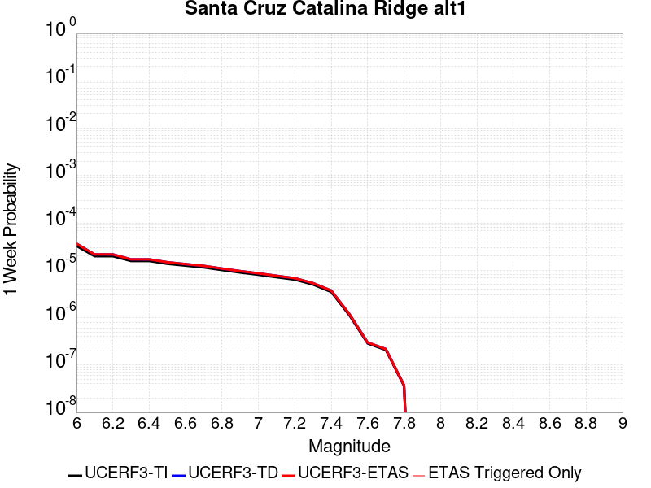 |  |  |  |

| Magnitude | 1 wk TI Prob | 1 wk TD Prob | 1 wk ETAS Prob | 1 wk ETAS/TD Gain | 1 wk ETAS Triggered Only | 1 mo TI Prob | 1 mo TD Prob | 1 mo ETAS Prob | 1 mo ETAS/TD Gain | 1 mo ETAS Triggered Only | 1 yr TI Prob | 1 yr TD Prob | 1 yr ETAS Prob | 1 yr ETAS/TD Gain | 1 yr ETAS Triggered Only | 10 yr TI Prob | 10 yr TD Prob | 10 yr ETAS Prob | 10 yr ETAS/TD Gain | 10 yr ETAS Triggered Only |
|-----|-----|-----|-----|-----|-----|-----|-----|-----|-----|-----|-----|-----|-----|-----|-----|-----|-----|-----|-----|-----|
| 6.0 | 3.2833184E-5 | 3.6561192E-5 | 3.6561192E-5 | 1.0 | 0.0 | 1.4070606E-4 | 1.5668235E-4 | 1.666808E-4 | 1.0638134 | 1.0E-5 | 0.00171175 | 0.0019061049 | 0.0019260667 | 1.0104727 | 2.0E-5 | 0.016986247 | 0.018914467 | 0.018953709 | 1.0020748 | 4.0E-5 |
| 6.1 | 1.9835548E-5 | 2.1660837E-5 | 2.1660837E-5 | 1.0 | 0.0 | 8.500672E-5 | 9.282897E-5 | 1.0282804E-4 | 1.107715 | 1.0E-5 | 0.0010344655 | 0.0011296269 | 0.0011496043 | 1.0176849 | 2.0E-5 | 0.010296632 | 0.011240983 | 0.011280534 | 1.0035185 | 4.0E-5 |
| 6.2 | 1.9835548E-5 | 2.1660837E-5 | 2.1660837E-5 | 1.0 | 0.0 | 8.500672E-5 | 9.282897E-5 | 1.0282804E-4 | 1.107715 | 1.0E-5 | 0.0010344655 | 0.0011296269 | 0.0011496043 | 1.0176849 | 2.0E-5 | 0.010296632 | 0.011240983 | 0.011280534 | 1.0035185 | 4.0E-5 |
| 6.3 | 1.5728183E-5 | 1.703489E-5 | 1.703489E-5 | 1.0 | 0.0 | 6.7404755E-5 | 7.300467E-5 | 7.300467E-5 | 1.0 | 0.0 | 8.2034385E-4 | 8.884755E-4 | 8.984666E-4 | 1.0112453 | 1.0E-5 | 0.008173222 | 0.008849914 | 0.008869737 | 1.00224 | 2.0E-5 |
| 6.4 | 1.5728183E-5 | 1.703489E-5 | 1.703489E-5 | 1.0 | 0.0 | 6.7404755E-5 | 7.300467E-5 | 7.300467E-5 | 1.0 | 0.0 | 8.2034385E-4 | 8.884755E-4 | 8.984666E-4 | 1.0112453 | 1.0E-5 | 0.008173222 | 0.008849914 | 0.008869737 | 1.00224 | 2.0E-5 |
| 6.5 | 1.3707734E-5 | 1.4795302E-5 | 1.4795302E-5 | 1.0 | 0.0 | 5.8746107E-5 | 6.3406915E-5 | 6.3406915E-5 | 1.0 | 0.0 | 7.1499916E-4 | 7.717093E-4 | 7.817016E-4 | 1.0129483 | 1.0E-5 | 0.0071270303 | 0.0076906937 | 0.0077105397 | 1.0025805 | 2.0E-5 |
| 6.6 | 1.2539813E-5 | 1.3510915E-5 | 1.3510915E-5 | 1.0 | 0.0 | 5.3740947E-5 | 5.790265E-5 | 5.790265E-5 | 1.0 | 0.0 | 6.540996E-4 | 7.047394E-4 | 7.147324E-4 | 1.0141796 | 1.0E-5 | 0.0065217763 | 0.0070253485 | 0.007045208 | 1.0028268 | 2.0E-5 |
| 6.7 | 1.1504083E-5 | 1.2377999E-5 | 1.2377999E-5 | 1.0 | 0.0 | 4.930228E-5 | 5.30475E-5 | 5.30475E-5 | 1.0 | 0.0 | 6.0008996E-4 | 6.4566394E-4 | 6.556575E-4 | 1.0154779 | 1.0E-5 | 0.005984721 | 0.0064381096 | 0.006457981 | 1.0030864 | 2.0E-5 |
| 6.8 | 1.012739E-5 | 1.0877607E-5 | 1.0877607E-5 | 1.0 | 0.0 | 4.340238E-5 | 4.661749E-5 | 4.661749E-5 | 1.0 | 0.0 | 5.282958E-4 | 5.674216E-4 | 5.774159E-4 | 1.0176135 | 1.0E-5 | 0.0052704164 | 0.0056598973 | 0.005679784 | 1.0035136 | 2.0E-5 |
| 6.9 | 8.9607865E-6 | 9.609579E-6 | 9.609579E-6 | 1.0 | 0.0 | 3.8402806E-5 | 4.1183266E-5 | 4.1183266E-5 | 1.0 | 0.0 | 4.6745385E-4 | 5.01292E-4 | 5.1128695E-4 | 1.0199385 | 1.0E-5 | 0.0046647177 | 0.0050017317 | 0.0050116815 | 1.0019894 | 1.0E-5 |
| 7.0 | 8.046829E-6 | 8.6201535E-6 | 8.6201535E-6 | 1.0 | 0.0 | 3.4485955E-5 | 3.6942998E-5 | 3.6942998E-5 | 1.0 | 0.0 | 4.1978562E-4 | 4.4968896E-4 | 4.5968447E-4 | 1.0222276 | 1.0E-5 | 0.004189935 | 0.0044878805 | 0.004497836 | 1.0022182 | 1.0E-5 |
| 7.1 | 7.136131E-6 | 7.638013E-6 | 7.638013E-6 | 1.0 | 0.0 | 3.0583058E-5 | 3.2733933E-5 | 3.2733933E-5 | 1.0 | 0.0 | 3.7228514E-4 | 3.9846345E-4 | 4.0845948E-4 | 1.0250864 | 1.0E-5 | 0.0037166206 | 0.0039775665 | 0.003987527 | 1.0025041 | 1.0E-5 |
| 7.2 | 6.362014E-6 | 6.805273E-6 | 6.805273E-6 | 1.0 | 0.0 | 2.726549E-5 | 2.9165134E-5 | 2.9165134E-5 | 1.0 | 0.0 | 3.3190678E-4 | 3.550283E-4 | 3.6502475E-4 | 1.0281568 | 1.0E-5 | 0.0033141149 | 0.0035446796 | 0.0035546443 | 1.0028111 | 1.0E-5 |
| 7.3 | 5.004101E-6 | 5.351962E-6 | 5.351962E-6 | 1.0 | 0.0 | 2.1445969E-5 | 2.2936782E-5 | 2.2936782E-5 | 1.0 | 0.0 | 2.6107338E-4 | 2.7922005E-4 | 2.8921728E-4 | 1.035804 | 1.0E-5 | 0.002607669 | 0.0027887472 | 0.0027987193 | 1.0035758 | 1.0E-5 |
| 7.4 | 3.4901443E-6 | 3.7322245E-6 | 3.7322245E-6 | 1.0 | 0.0 | 1.4957676E-5 | 1.5995152E-5 | 1.5995152E-5 | 1.0 | 0.0 | 1.8209449E-4 | 1.9472395E-4 | 2.04722E-4 | 1.0513448 | 1.0E-5 | 0.0018194534 | 0.0019455719 | 0.0019555525 | 1.0051299 | 1.0E-5 |
| 7.5 | 1.1215045E-6 | 1.189435E-6 | 1.189435E-6 | 1.0 | 0.0 | 4.806439E-6 | 5.0975686E-6 | 5.0975686E-6 | 1.0 | 0.0 | 5.851682E-5 | 6.206116E-5 | 6.206116E-5 | 1.0 | 0.0 | 5.850142E-4 | 6.2044134E-4 | 6.2044134E-4 | 1.0 | 0.0 |
| 7.6 | 2.8599047E-7 | 2.9952935E-7 | 2.9952935E-7 | 1.0 | 0.0 | 1.2256729E-6 | 1.2836965E-6 | 1.2836965E-6 | 1.0 | 0.0 | 1.4922465E-5 | 1.5628895E-5 | 1.5628895E-5 | 1.0 | 0.0 | 1.4921463E-4 | 1.562781E-4 | 1.562781E-4 | 1.0 | 0.0 |
| 7.7 | 2.0781519E-7 | 2.1744991E-7 | 2.1744991E-7 | 1.0 | 0.0 | 8.906362E-7 | 9.319279E-7 | 9.319279E-7 | 1.0 | 0.0 | 1.08434415E-5 | 1.1346164E-5 | 1.1346164E-5 | 1.0 | 0.0 | 1.0842913E-4 | 1.13455935E-4 | 1.13455935E-4 | 1.0 | 0.0 |
| 7.8 | 3.614776E-8 | 3.764205E-8 | 3.764205E-8 | 1.0 | 0.0 | 1.5491896E-7 | 1.6132306E-7 | 1.6132306E-7 | 1.0 | 0.0 | 1.8861368E-6 | 1.9641066E-6 | 1.9641066E-6 | 1.0 | 0.0 | 1.8861208E-5 | 1.9640904E-5 | 1.9640904E-5 | 1.0 | 0.0 |

## San Pedro Basin
*[(top)](#table-of-contents)*

| 1 Week | 1 Month | 1 Year | 10 Year |
|-----|-----|-----|-----|
|  |  |  | 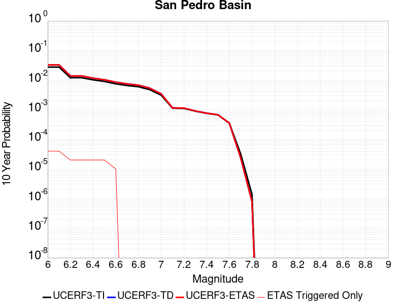 |

| Magnitude | 1 wk TI Prob | 1 wk TD Prob | 1 wk ETAS Prob | 1 wk ETAS/TD Gain | 1 wk ETAS Triggered Only | 1 mo TI Prob | 1 mo TD Prob | 1 mo ETAS Prob | 1 mo ETAS/TD Gain | 1 mo ETAS Triggered Only | 1 yr TI Prob | 1 yr TD Prob | 1 yr ETAS Prob | 1 yr ETAS/TD Gain | 1 yr ETAS Triggered Only | 10 yr TI Prob | 10 yr TD Prob | 10 yr ETAS Prob | 10 yr ETAS/TD Gain | 10 yr ETAS Triggered Only |
|-----|-----|-----|-----|-----|-----|-----|-----|-----|-----|-----|-----|-----|-----|-----|-----|-----|-----|-----|-----|-----|
| 6.0 | 5.3449043E-5 | 6.337812E-5 | 6.337812E-5 | 1.0 | 0.0 | 2.2904722E-4 | 2.715956E-4 | 2.715956E-4 | 1.0 | 0.0 | 0.0027850836 | 0.003302262 | 0.003302262 | 1.0 | 0.0 | 0.027504366 | 0.032593478 | 0.032632172 | 1.0011872 | 4.0E-5 |
| 6.1 | 5.3449043E-5 | 6.337812E-5 | 6.337812E-5 | 1.0 | 0.0 | 2.2904722E-4 | 2.715956E-4 | 2.715956E-4 | 1.0 | 0.0 | 0.0027850836 | 0.003302262 | 0.003302262 | 1.0 | 0.0 | 0.027504366 | 0.032593478 | 0.032632172 | 1.0011872 | 4.0E-5 |
| 6.2 | 2.3189454E-5 | 2.6645514E-5 | 2.6645514E-5 | 1.0 | 0.0 | 9.9379584E-5 | 1.1419033E-4 | 1.1419033E-4 | 1.0 | 0.0 | 0.0012092749 | 0.0013894276 | 0.0013894276 | 1.0 | 0.0 | 0.012027155 | 0.013812274 | 0.013831997 | 1.001428 | 2.0E-5 |
| 6.3 | 2.3189454E-5 | 2.6645514E-5 | 2.6645514E-5 | 1.0 | 0.0 | 9.9379584E-5 | 1.1419033E-4 | 1.1419033E-4 | 1.0 | 0.0 | 0.0012092749 | 0.0013894276 | 0.0013894276 | 1.0 | 0.0 | 0.012027155 | 0.013812274 | 0.013831997 | 1.001428 | 2.0E-5 |
| 6.4 | 1.966056E-5 | 2.2465596E-5 | 2.2465596E-5 | 1.0 | 0.0 | 8.425682E-5 | 9.62778E-5 | 9.62778E-5 | 1.0 | 0.0 | 0.001025344 | 0.001171592 | 0.001171592 | 1.0 | 0.0 | 0.010206259 | 0.011658242 | 0.011678008 | 1.0016955 | 2.0E-5 |
| 6.5 | 1.7342953E-5 | 1.9747014E-5 | 1.9747014E-5 | 1.0 | 0.0 | 7.4324824E-5 | 8.462753E-5 | 8.462753E-5 | 1.0 | 0.0 | 9.04529E-4 | 0.00102989 | 0.00102989 | 1.0 | 0.0 | 0.009008561 | 0.010254895 | 0.010274691 | 1.0019302 | 2.0E-5 |
| 6.6 | 1.439804E-5 | 1.6324211E-5 | 1.6324211E-5 | 1.0 | 0.0 | 6.170443E-5 | 6.995921E-5 | 6.995921E-5 | 1.0 | 0.0 | 7.509924E-4 | 8.5145264E-4 | 8.5145264E-4 | 1.0 | 0.0 | 0.0074845953 | 0.008485107 | 0.008495023 | 1.0011685 | 1.0E-5 |
| 6.7 | 1.2634884E-5 | 1.4286583E-5 | 1.4286583E-5 | 1.0 | 0.0 | 5.414838E-5 | 6.122694E-5 | 6.122694E-5 | 1.0 | 0.0 | 6.590571E-4 | 7.452136E-4 | 7.452136E-4 | 1.0 | 0.0 | 0.006571059 | 0.007430168 | 0.007430168 | 1.0 | 0.0 |
| 6.8 | 1.146091E-5 | 1.2934341E-5 | 1.2934341E-5 | 1.0 | 0.0 | 4.911726E-5 | 5.543188E-5 | 5.543188E-5 | 1.0 | 0.0 | 5.9783855E-4 | 6.747039E-4 | 6.747039E-4 | 1.0 | 0.0 | 0.0059623276 | 0.0067294952 | 0.0067294952 | 1.0 | 0.0 |
| 6.9 | 9.109035E-6 | 1.0235897E-5 | 1.0235897E-5 | 1.0 | 0.0 | 3.9038136E-5 | 4.3867552E-5 | 4.3867552E-5 | 1.0 | 0.0 | 4.7518566E-4 | 5.3398457E-4 | 5.3398457E-4 | 1.0 | 0.0 | 0.0047417083 | 0.005329769 | 0.005329769 | 1.0 | 0.0 |
| 7.0 | 5.9351028E-6 | 6.584485E-6 | 6.584485E-6 | 1.0 | 0.0 | 2.5435906E-5 | 2.821905E-5 | 2.821905E-5 | 1.0 | 0.0 | 3.0963816E-4 | 3.435364E-4 | 3.435364E-4 | 1.0 | 0.0 | 0.0030920706 | 0.0034323707 | 0.0034323707 | 1.0 | 0.0 |
| 7.1 | 2.1557585E-6 | 2.2097122E-6 | 2.2097122E-6 | 1.0 | 0.0 | 9.238933E-6 | 9.470162E-6 | 9.470162E-6 | 1.0 | 0.0 | 1.1247819E-4 | 1.15293275E-4 | 1.15293275E-4 | 1.0 | 0.0 | 0.0011242128 | 0.00115235 | 0.00115235 | 1.0 | 0.0 |
| 7.2 | 2.1251979E-6 | 2.1780577E-6 | 2.1780577E-6 | 1.0 | 0.0 | 9.107958E-6 | 9.334501E-6 | 9.334501E-6 | 1.0 | 0.0 | 1.1088375E-4 | 1.1364178E-4 | 1.1364178E-4 | 1.0 | 0.0 | 0.0011082845 | 0.001135852 | 0.001135852 | 1.0 | 0.0 |
| 7.3 | 1.7145798E-6 | 1.7443346E-6 | 1.7443346E-6 | 1.0 | 0.0 | 7.3481783E-6 | 7.475699E-6 | 7.475699E-6 | 1.0 | 0.0 | 8.94604E-5 | 9.1012924E-5 | 9.1012924E-5 | 1.0 | 0.0 | 8.9424395E-4 | 9.097656E-4 | 9.097656E-4 | 1.0 | 0.0 |
| 7.4 | 1.4467993E-6 | 1.4642253E-6 | 1.4642253E-6 | 1.0 | 0.0 | 6.200554E-6 | 6.275237E-6 | 6.275237E-6 | 1.0 | 0.0 | 7.548913E-5 | 7.63984E-5 | 7.63984E-5 | 1.0 | 0.0 | 7.546349E-4 | 7.637287E-4 | 7.637287E-4 | 1.0 | 0.0 |
| 7.5 | 1.2803735E-6 | 1.2931836E-6 | 1.2931836E-6 | 1.0 | 0.0 | 5.487303E-6 | 5.542204E-6 | 5.542204E-6 | 1.0 | 0.0 | 6.680587E-5 | 6.747431E-5 | 6.747431E-5 | 1.0 | 0.0 | 6.678579E-4 | 6.7454536E-4 | 6.7454536E-4 | 1.0 | 0.0 |
| 7.6 | 6.755009E-7 | 6.7696453E-7 | 6.7696453E-7 | 1.0 | 0.0 | 2.8950008E-6 | 2.9012735E-6 | 2.9012735E-6 | 1.0 | 0.0 | 3.5246063E-5 | 3.5322493E-5 | 3.5322493E-5 | 1.0 | 0.0 | 3.5240475E-4 | 3.531745E-4 | 3.531745E-4 | 1.0 | 0.0 |
| 7.7 | 6.211885E-8 | 4.570116E-8 | 4.570116E-8 | 1.0 | 0.0 | 2.6622362E-7 | 1.958621E-7 | 1.958621E-7 | 1.0 | 0.0 | 3.2412677E-6 | 2.3846187E-6 | 2.3846187E-6 | 1.0 | 0.0 | 3.2412205E-5 | 2.384595E-5 | 2.384595E-5 | 1.0 | 0.0 |
| 7.8 | 2.6580573E-9 | 1.5139658E-9 | 1.5139658E-9 | 1.0 | 0.0 | 1.1391674E-8 | 6.488425E-9 | 6.488425E-9 | 1.0 | 0.0 | 1.3869362E-7 | 7.899657E-8 | 7.899657E-8 | 1.0 | 0.0 | 1.3869354E-6 | 7.899657E-7 | 7.899657E-7 | 1.0 | 0.0 |

## Newport-Inglewood alt 1
*[(top)](#table-of-contents)*

| 1 Week | 1 Month | 1 Year | 10 Year |
|-----|-----|-----|-----|
|  |  |  |  |

| Magnitude | 1 wk TI Prob | 1 wk TD Prob | 1 wk ETAS Prob | 1 wk ETAS/TD Gain | 1 wk ETAS Triggered Only | 1 mo TI Prob | 1 mo TD Prob | 1 mo ETAS Prob | 1 mo ETAS/TD Gain | 1 mo ETAS Triggered Only | 1 yr TI Prob | 1 yr TD Prob | 1 yr ETAS Prob | 1 yr ETAS/TD Gain | 1 yr ETAS Triggered Only | 10 yr TI Prob | 10 yr TD Prob | 10 yr ETAS Prob | 10 yr ETAS/TD Gain | 10 yr ETAS Triggered Only |
|-----|-----|-----|-----|-----|-----|-----|-----|-----|-----|-----|-----|-----|-----|-----|-----|-----|-----|-----|-----|-----|
| 6.0 | 2.9668912E-5 | 3.0408064E-5 | 3.0408064E-5 | 1.0 | 0.0 | 1.2714628E-4 | 1.303165E-4 | 1.303165E-4 | 1.0 | 0.0 | 0.0015469068 | 0.0015859337 | 0.0015959179 | 1.0062954 | 1.0E-5 | 0.015361829 | 0.01579378 | 0.015823307 | 1.0018694 | 3.0E-5 |
| 6.1 | 2.9668912E-5 | 3.0408064E-5 | 3.0408064E-5 | 1.0 | 0.0 | 1.2714628E-4 | 1.303165E-4 | 1.303165E-4 | 1.0 | 0.0 | 0.0015469068 | 0.0015859337 | 0.0015959179 | 1.0062954 | 1.0E-5 | 0.015361829 | 0.01579378 | 0.015823307 | 1.0018694 | 3.0E-5 |
| 6.2 | 2.9668912E-5 | 3.0408064E-5 | 3.0408064E-5 | 1.0 | 0.0 | 1.2714628E-4 | 1.303165E-4 | 1.303165E-4 | 1.0 | 0.0 | 0.0015469068 | 0.0015859337 | 0.0015959179 | 1.0062954 | 1.0E-5 | 0.015361829 | 0.01579378 | 0.015823307 | 1.0018694 | 3.0E-5 |
| 6.3 | 2.9668912E-5 | 3.0408064E-5 | 3.0408064E-5 | 1.0 | 0.0 | 1.2714628E-4 | 1.303165E-4 | 1.303165E-4 | 1.0 | 0.0 | 0.0015469068 | 0.0015859337 | 0.0015959179 | 1.0062954 | 1.0E-5 | 0.015361829 | 0.01579378 | 0.015823307 | 1.0018694 | 3.0E-5 |
| 6.4 | 1.275942E-5 | 1.0273096E-5 | 1.0273096E-5 | 1.0 | 0.0 | 5.4682085E-5 | 4.4026838E-5 | 4.4026838E-5 | 1.0 | 0.0 | 6.65551E-4 | 5.358991E-4 | 5.458937E-4 | 1.0186502 | 1.0E-5 | 0.0066356123 | 0.0053464924 | 0.005356439 | 1.0018604 | 1.0E-5 |
| 6.5 | 1.275942E-5 | 1.0273096E-5 | 1.0273096E-5 | 1.0 | 0.0 | 5.4682085E-5 | 4.4026838E-5 | 4.4026838E-5 | 1.0 | 0.0 | 6.65551E-4 | 5.358991E-4 | 5.458937E-4 | 1.0186502 | 1.0E-5 | 0.0066356123 | 0.0053464924 | 0.005356439 | 1.0018604 | 1.0E-5 |
| 6.6 | 1.1255358E-5 | 8.6623395E-6 | 8.6623395E-6 | 1.0 | 0.0 | 4.8236358E-5 | 3.7123795E-5 | 3.7123795E-5 | 1.0 | 0.0 | 5.871194E-4 | 4.5189014E-4 | 4.6188565E-4 | 1.0221193 | 1.0E-5 | 0.005855706 | 0.00450989 | 0.004519845 | 1.0022074 | 1.0E-5 |
| 6.7 | 1.0504745E-5 | 7.900216E-6 | 7.900216E-6 | 1.0 | 0.0 | 4.5019555E-5 | 3.3857632E-5 | 3.3857632E-5 | 1.0 | 0.0 | 5.4797524E-4 | 4.1213995E-4 | 4.2213584E-4 | 1.0242536 | 1.0E-5 | 0.0054662596 | 0.004113886 | 0.004123845 | 1.0024208 | 1.0E-5 |
| 6.8 | 1.0476007E-5 | 7.8815965E-6 | 7.8815965E-6 | 1.0 | 0.0 | 4.4896402E-5 | 3.377784E-5 | 3.377784E-5 | 1.0 | 0.0 | 5.464766E-4 | 4.1116882E-4 | 4.211647E-4 | 1.024311 | 1.0E-5 | 0.005451347 | 0.0041042105 | 0.0041141696 | 1.0024265 | 1.0E-5 |
| 6.9 | 9.076797E-6 | 6.4899464E-6 | 6.4899464E-6 | 1.0 | 0.0 | 3.889998E-5 | 2.7813761E-5 | 2.7813761E-5 | 1.0 | 0.0 | 4.7350433E-4 | 3.3858026E-4 | 3.4857687E-4 | 1.029525 | 1.0E-5 | 0.004724967 | 0.0033806814 | 0.0033906477 | 1.0029479 | 1.0E-5 |
| 7.0 | 8.73795E-6 | 6.212338E-6 | 6.212338E-6 | 1.0 | 0.0 | 3.7447822E-5 | 2.6624035E-5 | 2.6624035E-5 | 1.0 | 0.0 | 4.5583185E-4 | 3.240997E-4 | 3.3409646E-4 | 1.0308447 | 1.0E-5 | 0.0045489795 | 0.003236302 | 0.0032462697 | 1.0030799 | 1.0E-5 |
| 7.1 | 8.391299E-6 | 5.956037E-6 | 5.956037E-6 | 1.0 | 0.0 | 3.5962214E-5 | 2.5525625E-5 | 2.5525625E-5 | 1.0 | 0.0 | 4.37752E-4 | 3.1073042E-4 | 3.2072733E-4 | 1.0321722 | 1.0E-5 | 0.004368907 | 0.0031029892 | 0.003112958 | 1.0032127 | 1.0E-5 |
| 7.2 | 7.796882E-6 | 5.4967554E-6 | 5.4967554E-6 | 1.0 | 0.0 | 3.341478E-5 | 2.3557312E-5 | 2.3557312E-5 | 1.0 | 0.0 | 4.06749E-4 | 2.8677273E-4 | 2.9676987E-4 | 1.0348608 | 1.0E-5 | 0.0040600533 | 0.0028640507 | 0.0028740221 | 1.0034815 | 1.0E-5 |
| 7.3 | 6.4738833E-6 | 4.6479563E-6 | 4.6479563E-6 | 1.0 | 0.0 | 2.774492E-5 | 1.9919662E-5 | 1.9919662E-5 | 1.0 | 0.0 | 3.3774204E-4 | 2.4249505E-4 | 2.524926E-4 | 1.0412279 | 1.0E-5 | 0.0033722918 | 0.0024223211 | 0.0024322968 | 1.0041183 | 1.0E-5 |
| 7.4 | 5.382145E-6 | 3.8858707E-6 | 3.8858707E-6 | 1.0 | 0.0 | 2.3066134E-5 | 1.6653627E-5 | 1.6653627E-5 | 1.0 | 0.0 | 2.8079396E-4 | 2.0273917E-4 | 2.1273714E-4 | 1.0493145 | 1.0E-5 | 0.0028043943 | 0.0020255568 | 0.0020355363 | 1.0049269 | 1.0E-5 |
| 7.5 | 3.648244E-6 | 2.5738568E-6 | 2.5738568E-6 | 1.0 | 0.0 | 1.5635238E-5 | 1.1030769E-5 | 1.1030769E-5 | 1.0 | 0.0 | 1.9034238E-4 | 1.3429145E-4 | 1.442901E-4 | 1.0744549 | 1.0E-5 | 0.0019017943 | 0.0013421134 | 0.0013520999 | 1.0074409 | 1.0E-5 |
| 7.6 | 2.2906888E-6 | 1.5480472E-6 | 1.5480472E-6 | 1.0 | 0.0 | 9.817201E-6 | 6.6344714E-6 | 6.6344714E-6 | 1.0 | 0.0 | 1.1951787E-4 | 8.0771766E-5 | 9.0770955E-5 | 1.1237956 | 1.0E-5 | 0.0011945361 | 8.0743077E-4 | 8.174227E-4 | 1.012375 | 1.0E-5 |
| 7.7 | 6.0479874E-7 | 3.3976093E-7 | 3.3976093E-7 | 1.0 | 0.0 | 2.5919921E-6 | 1.4561175E-6 | 1.4561175E-6 | 1.0 | 0.0 | 3.1557047E-5 | 1.77281E-5 | 1.77281E-5 | 1.0 | 0.0 | 3.1552566E-4 | 1.7726824E-4 | 1.7726824E-4 | 1.0 | 0.0 |
| 7.8 | 1.16056995E-8 | 9.783043E-9 | 9.783043E-9 | 1.0 | 0.0 | 4.9738713E-8 | 4.1927326E-8 | 4.1927326E-8 | 1.0 | 0.0 | 6.0556863E-7 | 5.104652E-7 | 5.104652E-7 | 1.0 | 0.0 | 6.05567E-6 | 5.1046522E-6 | 5.1046522E-6 | 1.0 | 0.0 |

## Mono Lake 2011 CFM
*[(top)](#table-of-contents)*

| 1 Week | 1 Month | 1 Year | 10 Year |
|-----|-----|-----|-----|
|  |  | 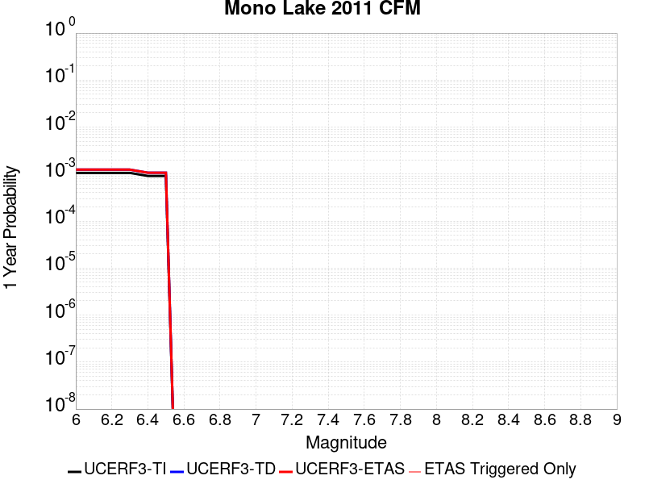 |  |

| Magnitude | 1 wk TI Prob | 1 wk TD Prob | 1 wk ETAS Prob | 1 wk ETAS/TD Gain | 1 wk ETAS Triggered Only | 1 mo TI Prob | 1 mo TD Prob | 1 mo ETAS Prob | 1 mo ETAS/TD Gain | 1 mo ETAS Triggered Only | 1 yr TI Prob | 1 yr TD Prob | 1 yr ETAS Prob | 1 yr ETAS/TD Gain | 1 yr ETAS Triggered Only | 10 yr TI Prob | 10 yr TD Prob | 10 yr ETAS Prob | 10 yr ETAS/TD Gain | 10 yr ETAS Triggered Only |
|-----|-----|-----|-----|-----|-----|-----|-----|-----|-----|-----|-----|-----|-----|-----|-----|-----|-----|-----|-----|-----|
| 6.0 | 2.0341662E-5 | 2.3830898E-5 | 2.3830898E-5 | 1.0 | 0.0 | 8.717564E-5 | 1.02131424E-4 | 1.02131424E-4 | 1.0 | 0.0 | 0.0010608466 | 0.001243272 | 0.001243272 | 1.0 | 0.0 | 0.010557966 | 0.012415249 | 0.012444876 | 1.0023863 | 3.0E-5 |
| 6.1 | 2.0341662E-5 | 2.3830898E-5 | 2.3830898E-5 | 1.0 | 0.0 | 8.717564E-5 | 1.02131424E-4 | 1.02131424E-4 | 1.0 | 0.0 | 0.0010608466 | 0.001243272 | 0.001243272 | 1.0 | 0.0 | 0.010557966 | 0.012415249 | 0.012444876 | 1.0023863 | 3.0E-5 |
| 6.2 | 2.0341662E-5 | 2.3830898E-5 | 2.3830898E-5 | 1.0 | 0.0 | 8.717564E-5 | 1.02131424E-4 | 1.02131424E-4 | 1.0 | 0.0 | 0.0010608466 | 0.001243272 | 0.001243272 | 1.0 | 0.0 | 0.010557966 | 0.012415249 | 0.012444876 | 1.0023863 | 3.0E-5 |
| 6.3 | 2.0341662E-5 | 2.3830898E-5 | 2.3830898E-5 | 1.0 | 0.0 | 8.717564E-5 | 1.02131424E-4 | 1.02131424E-4 | 1.0 | 0.0 | 0.0010608466 | 0.001243272 | 0.001243272 | 1.0 | 0.0 | 0.010557966 | 0.012415249 | 0.012444876 | 1.0023863 | 3.0E-5 |
| 6.4 | 1.749821E-5 | 2.0493333E-5 | 2.0493333E-5 | 1.0 | 0.0 | 7.499018E-5 | 8.782857E-5 | 8.782857E-5 | 1.0 | 0.0 | 9.1262296E-4 | 0.0010693126 | 0.0010693126 | 1.0 | 0.0 | 0.009088841 | 0.010693082 | 0.010722761 | 1.0027755 | 3.0E-5 |
| 6.5 | 1.749821E-5 | 2.0493333E-5 | 2.0493333E-5 | 1.0 | 0.0 | 7.499018E-5 | 8.782857E-5 | 8.782857E-5 | 1.0 | 0.0 | 9.1262296E-4 | 0.0010693126 | 0.0010693126 | 1.0 | 0.0 | 0.009088841 | 0.010693082 | 0.010722761 | 1.0027755 | 3.0E-5 |

## Gillem - Big Crack 2011 CFM
*[(top)](#table-of-contents)*

| 1 Week | 1 Month | 1 Year | 10 Year |
|-----|-----|-----|-----|
| 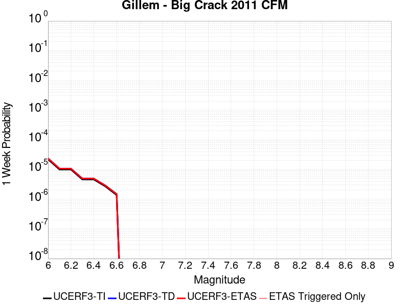 |  | 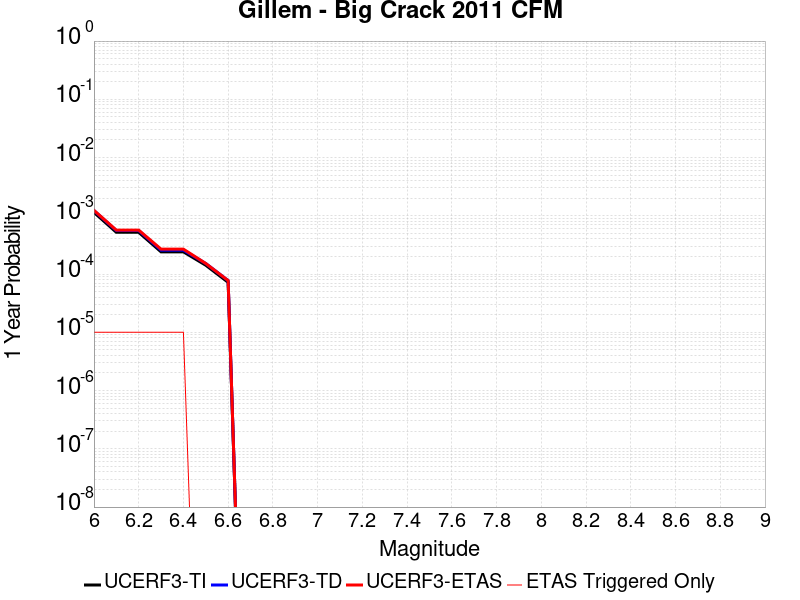 |  |

| Magnitude | 1 wk TI Prob | 1 wk TD Prob | 1 wk ETAS Prob | 1 wk ETAS/TD Gain | 1 wk ETAS Triggered Only | 1 mo TI Prob | 1 mo TD Prob | 1 mo ETAS Prob | 1 mo ETAS/TD Gain | 1 mo ETAS Triggered Only | 1 yr TI Prob | 1 yr TD Prob | 1 yr ETAS Prob | 1 yr ETAS/TD Gain | 1 yr ETAS Triggered Only | 10 yr TI Prob | 10 yr TD Prob | 10 yr ETAS Prob | 10 yr ETAS/TD Gain | 10 yr ETAS Triggered Only |
|-----|-----|-----|-----|-----|-----|-----|-----|-----|-----|-----|-----|-----|-----|-----|-----|-----|-----|-----|-----|-----|
| 6.0 | 2.196852E-5 | 2.3605651E-5 | 2.3605651E-5 | 1.0 | 0.0 | 9.4147406E-5 | 1.01163656E-4 | 1.01163656E-4 | 1.0 | 0.0 | 0.0011456419 | 0.0012310606 | 0.0012410482 | 1.008113 | 1.0E-5 | 0.011397537 | 0.012251272 | 0.012271026 | 1.0016124 | 2.0E-5 |
| 6.1 | 9.992795E-6 | 1.07124015E-5 | 1.07124015E-5 | 1.0 | 0.0 | 4.2825563E-5 | 4.5909586E-5 | 4.5909586E-5 | 1.0 | 0.0 | 5.2127644E-4 | 5.5882416E-4 | 5.688186E-4 | 1.0178847 | 1.0E-5 | 0.0052005537 | 0.005576 | 0.0055958885 | 1.0035667 | 2.0E-5 |
| 6.2 | 9.992795E-6 | 1.07124015E-5 | 1.07124015E-5 | 1.0 | 0.0 | 4.2825563E-5 | 4.5909586E-5 | 4.5909586E-5 | 1.0 | 0.0 | 5.2127644E-4 | 5.5882416E-4 | 5.688186E-4 | 1.0178847 | 1.0E-5 | 0.0052005537 | 0.005576 | 0.0055958885 | 1.0035667 | 2.0E-5 |
| 6.3 | 4.6127884E-6 | 4.9428913E-6 | 4.9428913E-6 | 1.0 | 0.0 | 1.9768944E-5 | 2.1183674E-5 | 2.1183674E-5 | 1.0 | 0.0 | 2.406603E-4 | 2.5788517E-4 | 2.6788257E-4 | 1.038767 | 1.0E-5 | 0.0024039985 | 0.0025762971 | 0.0025862714 | 1.0038716 | 1.0E-5 |
| 6.4 | 4.6127884E-6 | 4.9428913E-6 | 4.9428913E-6 | 1.0 | 0.0 | 1.9768944E-5 | 2.1183674E-5 | 2.1183674E-5 | 1.0 | 0.0 | 2.406603E-4 | 2.5788517E-4 | 2.6788257E-4 | 1.038767 | 1.0E-5 | 0.0024039985 | 0.0025762971 | 0.0025862714 | 1.0038716 | 1.0E-5 |
| 6.5 | 2.716712E-6 | 2.9112496E-6 | 2.9112496E-6 | 1.0 | 0.0 | 1.1643E-5 | 1.24767375E-5 | 1.24767375E-5 | 1.0 | 0.0 | 1.417443E-4 | 1.5189612E-4 | 1.5189612E-4 | 1.0 | 0.0 | 0.0014165393 | 0.001518161 | 0.001518161 | 1.0 | 0.0 |
| 6.6 | 1.3818255E-6 | 1.4821402E-6 | 1.4821402E-6 | 1.0 | 0.0 | 5.922096E-6 | 6.352021E-6 | 6.352021E-6 | 1.0 | 0.0 | 7.209913E-5 | 7.733434E-5 | 7.733434E-5 | 1.0 | 0.0 | 7.2075747E-4 | 7.7319524E-4 | 7.7319524E-4 | 1.0 | 0.0 |

## San Jacinto (Anza) rev
*[(top)](#table-of-contents)*

| 1 Week | 1 Month | 1 Year | 10 Year |
|-----|-----|-----|-----|
|  |  |  |  |

| Magnitude | 1 wk TI Prob | 1 wk TD Prob | 1 wk ETAS Prob | 1 wk ETAS/TD Gain | 1 wk ETAS Triggered Only | 1 mo TI Prob | 1 mo TD Prob | 1 mo ETAS Prob | 1 mo ETAS/TD Gain | 1 mo ETAS Triggered Only | 1 yr TI Prob | 1 yr TD Prob | 1 yr ETAS Prob | 1 yr ETAS/TD Gain | 1 yr ETAS Triggered Only | 10 yr TI Prob | 10 yr TD Prob | 10 yr ETAS Prob | 10 yr ETAS/TD Gain | 10 yr ETAS Triggered Only |
|-----|-----|-----|-----|-----|-----|-----|-----|-----|-----|-----|-----|-----|-----|-----|-----|-----|-----|-----|-----|-----|
| 6.0 | 6.3015636E-5 | 4.3392138E-5 | 4.3392138E-5 | 1.0 | 0.0 | 2.7003905E-4 | 1.8595312E-4 | 1.9595126E-4 | 1.053767 | 1.0E-5 | 0.0032827691 | 0.0022616405 | 0.0022716178 | 1.0044116 | 1.0E-5 | 0.032346968 | 0.023345133 | 0.023374433 | 1.001255 | 3.0E-5 |
| 6.1 | 6.3015636E-5 | 4.3392138E-5 | 4.3392138E-5 | 1.0 | 0.0 | 2.7003905E-4 | 1.8595312E-4 | 1.9595126E-4 | 1.053767 | 1.0E-5 | 0.0032827691 | 0.0022616405 | 0.0022716178 | 1.0044116 | 1.0E-5 | 0.032346968 | 0.023345133 | 0.023374433 | 1.001255 | 3.0E-5 |
| 6.2 | 6.3015636E-5 | 4.3392138E-5 | 4.3392138E-5 | 1.0 | 0.0 | 2.7003905E-4 | 1.8595312E-4 | 1.9595126E-4 | 1.053767 | 1.0E-5 | 0.0032827691 | 0.0022616405 | 0.0022716178 | 1.0044116 | 1.0E-5 | 0.032346968 | 0.023345133 | 0.023374433 | 1.001255 | 3.0E-5 |
| 6.3 | 6.3015636E-5 | 4.3392138E-5 | 4.3392138E-5 | 1.0 | 0.0 | 2.7003905E-4 | 1.8595312E-4 | 1.9595126E-4 | 1.053767 | 1.0E-5 | 0.0032827691 | 0.0022616405 | 0.0022716178 | 1.0044116 | 1.0E-5 | 0.032346968 | 0.023345133 | 0.023374433 | 1.001255 | 3.0E-5 |
| 6.4 | 6.3015636E-5 | 4.3392138E-5 | 4.3392138E-5 | 1.0 | 0.0 | 2.7003905E-4 | 1.8595312E-4 | 1.9595126E-4 | 1.053767 | 1.0E-5 | 0.0032827691 | 0.0022616405 | 0.0022716178 | 1.0044116 | 1.0E-5 | 0.032346968 | 0.023345133 | 0.023374433 | 1.001255 | 3.0E-5 |
| 6.5 | 5.811017E-5 | 4.0167408E-5 | 4.0167408E-5 | 1.0 | 0.0 | 2.4901982E-4 | 1.7213472E-4 | 1.82133E-4 | 1.058084 | 1.0E-5 | 0.0030276014 | 0.0020937314 | 0.0021037105 | 1.0047661 | 1.0E-5 | 0.02986684 | 0.02164069 | 0.021670042 | 1.0013562 | 3.0E-5 |
| 6.6 | 5.811017E-5 | 4.0167408E-5 | 4.0167408E-5 | 1.0 | 0.0 | 2.4901982E-4 | 1.7213472E-4 | 1.82133E-4 | 1.058084 | 1.0E-5 | 0.0030276014 | 0.0020937314 | 0.0021037105 | 1.0047661 | 1.0E-5 | 0.02986684 | 0.02164069 | 0.021670042 | 1.0013562 | 3.0E-5 |
| 6.7 | 5.712442E-5 | 3.9589282E-5 | 3.9589282E-5 | 1.0 | 0.0 | 2.4479596E-4 | 1.6965735E-4 | 1.7965565E-4 | 1.0589323 | 1.0E-5 | 0.0029763177 | 0.002063627 | 0.0020736062 | 1.0048358 | 1.0E-5 | 0.029367693 | 0.021332955 | 0.021362316 | 1.0013763 | 3.0E-5 |
| 6.8 | 5.6967532E-5 | 3.9445564E-5 | 3.9445564E-5 | 1.0 | 0.0 | 2.4412372E-4 | 1.690415E-4 | 1.790398E-4 | 1.0591471 | 1.0E-5 | 0.0029681553 | 0.002056143 | 0.0020661224 | 1.0048535 | 1.0E-5 | 0.029288229 | 0.021257114 | 0.021286476 | 1.0013813 | 3.0E-5 |
| 6.9 | 5.6211324E-5 | 3.9149603E-5 | 3.9149603E-5 | 1.0 | 0.0 | 2.4088343E-4 | 1.6777325E-4 | 1.7777157E-4 | 1.0595943 | 1.0E-5 | 0.0029288116 | 0.002040731 | 0.0020507106 | 1.0048902 | 1.0E-5 | 0.028905109 | 0.021097427 | 0.021126796 | 1.001392 | 3.0E-5 |
| 7.0 | 5.4383527E-5 | 3.8008824E-5 | 3.8008824E-5 | 1.0 | 0.0 | 2.3305144E-4 | 1.6288481E-4 | 1.7288318E-4 | 1.0613831 | 1.0E-5 | 0.0028337094 | 0.0019813236 | 0.0019913039 | 1.0050372 | 1.0E-5 | 0.027978465 | 0.020482743 | 0.020512128 | 1.0014347 | 3.0E-5 |
| 7.1 | 5.1393665E-5 | 3.646806E-5 | 3.646806E-5 | 1.0 | 0.0 | 2.2023996E-4 | 1.5628236E-4 | 1.6628079E-4 | 1.0639768 | 1.0E-5 | 0.0026781242 | 0.0019010813 | 0.0019110623 | 1.0052502 | 1.0E-5 | 0.026460782 | 0.01965647 | 0.019685881 | 1.0014962 | 3.0E-5 |
| 7.2 | 4.785222E-5 | 3.481756E-5 | 3.481756E-5 | 1.0 | 0.0 | 2.0506482E-4 | 1.492096E-4 | 1.5920811E-4 | 1.0670098 | 1.0E-5 | 0.0024938055 | 0.0018151168 | 0.0018250986 | 1.0054992 | 1.0E-5 | 0.024660049 | 0.018768447 | 0.018797884 | 1.0015684 | 3.0E-5 |
| 7.3 | 4.2143256E-5 | 3.390965E-5 | 3.390965E-5 | 1.0 | 0.0 | 1.8060145E-4 | 1.45319E-4 | 1.5531754E-4 | 1.0688041 | 1.0E-5 | 0.002196605 | 0.0017678265 | 0.0017778088 | 1.0056467 | 1.0E-5 | 0.02175019 | 0.018275578 | 0.01830503 | 1.0016116 | 3.0E-5 |
| 7.4 | 4.0264713E-5 | 3.3547265E-5 | 3.3547265E-5 | 1.0 | 0.0 | 1.7255165E-4 | 1.437661E-4 | 1.5376466E-4 | 1.0695474 | 1.0E-5 | 0.002098792 | 0.0017489503 | 0.0017589328 | 1.0057077 | 1.0E-5 | 0.020790804 | 0.018079914 | 0.018109372 | 1.0016294 | 3.0E-5 |
| 7.5 | 3.694492E-5 | 3.2259126E-5 | 3.2259126E-5 | 1.0 | 0.0 | 1.5832575E-4 | 1.3824609E-4 | 1.4824471E-4 | 1.0723248 | 1.0E-5 | 0.0019259118 | 0.0016818498 | 0.0016918329 | 1.0059358 | 1.0E-5 | 0.01909306 | 0.017395202 | 0.017424678 | 1.0016946 | 3.0E-5 |
| 7.6 | 3.200565E-5 | 2.9567162E-5 | 2.9567162E-5 | 1.0 | 0.0 | 1.3715986E-4 | 1.2671026E-4 | 1.36709E-4 | 1.0789102 | 1.0E-5 | 0.001668642 | 0.001541608 | 0.0015515926 | 1.0064768 | 1.0E-5 | 0.01656168 | 0.015979173 | 0.016008694 | 1.0018474 | 3.0E-5 |
| 7.7 | 2.731642E-5 | 2.6153964E-5 | 2.6153964E-5 | 1.0 | 0.0 | 1.1706512E-4 | 1.1208361E-4 | 1.2208249E-4 | 1.0892091 | 1.0E-5 | 0.001424336 | 0.0013637647 | 0.0013737511 | 1.0073227 | 1.0E-5 | 0.014152412 | 0.014198854 | 0.014228427 | 1.0020828 | 3.0E-5 |
| 7.8 | 2.3466424E-5 | 2.3563622E-5 | 2.3563622E-5 | 1.0 | 0.0 | 1.0056651E-4 | 1.0098305E-4 | 1.1098204E-4 | 1.0990165 | 1.0E-5 | 0.0012237094 | 0.001228776 | 0.0012387637 | 1.0081282 | 1.0E-5 | 0.012169928 | 0.012839439 | 0.0128690535 | 1.0023066 | 3.0E-5 |
| 7.9 | 1.8611925E-5 | 1.8961056E-5 | 1.8961056E-5 | 1.0 | 0.0 | 7.9762955E-5 | 8.1259146E-5 | 9.1258335E-5 | 1.1230531 | 1.0E-5 | 9.7068126E-4 | 9.888818E-4 | 9.988719E-4 | 1.0101024 | 1.0E-5 | 0.0096645225 | 0.010421471 | 0.010451158 | 1.0028486 | 3.0E-5 |
| 8.0 | 1.5460775E-5 | 1.5787895E-5 | 1.5787895E-5 | 1.0 | 0.0 | 6.6258784E-5 | 6.766066E-5 | 7.765998E-5 | 1.1477864 | 1.0E-5 | 8.0640207E-4 | 8.2345784E-4 | 8.334496E-4 | 1.012134 | 1.0E-5 | 0.008034821 | 0.008727415 | 0.0087571535 | 1.0034075 | 3.0E-5 |
| 8.1 | 9.983884E-6 | 8.296994E-6 | 8.296994E-6 | 1.0 | 0.0 | 4.2787375E-5 | 3.5558063E-5 | 4.5557706E-5 | 1.2812202 | 1.0E-5 | 5.2081177E-4 | 4.3283394E-4 | 4.428296E-4 | 1.0230936 | 1.0E-5 | 0.0051959283 | 0.0046543917 | 0.004674298 | 1.004277 | 2.0E-5 |
| 8.2 | 4.1226E-6 | 1.5604406E-6 | 1.5604406E-6 | 1.0 | 0.0 | 1.7668166E-5 | 6.6875855E-6 | 6.6875855E-6 | 1.0 | 0.0 | 2.1508869E-4 | 8.1418344E-5 | 8.1418344E-5 | 1.0 | 0.0 | 0.0021488064 | 9.448735E-4 | 9.448735E-4 | 1.0 | 0.0 |
| 8.3 | 1.2750878E-6 | 3.6323098E-7 | 3.6323098E-7 | 1.0 | 0.0 | 5.4646503E-6 | 1.5567033E-6 | 1.5567033E-6 | 1.0 | 0.0 | 6.653009E-5 | 1.8952702E-5 | 1.8952702E-5 | 1.0 | 0.0 | 6.6510175E-4 | 2.2854589E-4 | 2.2854589E-4 | 1.0 | 0.0 |

## Ventura-Pitas Point
*[(top)](#table-of-contents)*

| 1 Week | 1 Month | 1 Year | 10 Year |
|-----|-----|-----|-----|
|  |  |  |  |

| Magnitude | 1 wk TI Prob | 1 wk TD Prob | 1 wk ETAS Prob | 1 wk ETAS/TD Gain | 1 wk ETAS Triggered Only | 1 mo TI Prob | 1 mo TD Prob | 1 mo ETAS Prob | 1 mo ETAS/TD Gain | 1 mo ETAS Triggered Only | 1 yr TI Prob | 1 yr TD Prob | 1 yr ETAS Prob | 1 yr ETAS/TD Gain | 1 yr ETAS Triggered Only | 10 yr TI Prob | 10 yr TD Prob | 10 yr ETAS Prob | 10 yr ETAS/TD Gain | 10 yr ETAS Triggered Only |
|-----|-----|-----|-----|-----|-----|-----|-----|-----|-----|-----|-----|-----|-----|-----|-----|-----|-----|-----|-----|-----|
| 6.0 | 3.3179622E-5 | 3.373969E-5 | 3.373969E-5 | 1.0 | 0.0 | 1.4219063E-4 | 1.4459211E-4 | 1.4459211E-4 | 1.0 | 0.0 | 0.0017297962 | 0.0017592442 | 0.0017592442 | 1.0 | 0.0 | 0.017163932 | 0.017478643 | 0.01750812 | 1.0016863 | 3.0E-5 |
| 6.1 | 3.3179622E-5 | 3.373969E-5 | 3.373969E-5 | 1.0 | 0.0 | 1.4219063E-4 | 1.4459211E-4 | 1.4459211E-4 | 1.0 | 0.0 | 0.0017297962 | 0.0017592442 | 0.0017592442 | 1.0 | 0.0 | 0.017163932 | 0.017478643 | 0.01750812 | 1.0016863 | 3.0E-5 |
| 6.2 | 3.3179622E-5 | 3.373969E-5 | 3.373969E-5 | 1.0 | 0.0 | 1.4219063E-4 | 1.4459211E-4 | 1.4459211E-4 | 1.0 | 0.0 | 0.0017297962 | 0.0017592442 | 0.0017592442 | 1.0 | 0.0 | 0.017163932 | 0.017478643 | 0.01750812 | 1.0016863 | 3.0E-5 |
| 6.3 | 3.3179622E-5 | 3.373969E-5 | 3.373969E-5 | 1.0 | 0.0 | 1.4219063E-4 | 1.4459211E-4 | 1.4459211E-4 | 1.0 | 0.0 | 0.0017297962 | 0.0017592442 | 0.0017592442 | 1.0 | 0.0 | 0.017163932 | 0.017478643 | 0.01750812 | 1.0016863 | 3.0E-5 |
| 6.4 | 1.8754668E-5 | 1.702233E-5 | 1.702233E-5 | 1.0 | 0.0 | 8.037467E-5 | 7.2950934E-5 | 7.2950934E-5 | 1.0 | 0.0 | 9.781223E-4 | 8.8783883E-4 | 8.8783883E-4 | 1.0 | 0.0 | 0.009738282 | 0.00884519 | 0.008865013 | 1.0022411 | 2.0E-5 |
| 6.5 | 1.8754668E-5 | 1.702233E-5 | 1.702233E-5 | 1.0 | 0.0 | 8.037467E-5 | 7.2950934E-5 | 7.2950934E-5 | 1.0 | 0.0 | 9.781223E-4 | 8.8783883E-4 | 8.8783883E-4 | 1.0 | 0.0 | 0.009738282 | 0.00884519 | 0.008865013 | 1.0022411 | 2.0E-5 |
| 6.6 | 1.4361558E-5 | 1.2124622E-5 | 1.2124622E-5 | 1.0 | 0.0 | 6.154808E-5 | 5.1961644E-5 | 5.1961644E-5 | 1.0 | 0.0 | 7.490902E-4 | 6.324517E-4 | 6.324517E-4 | 1.0 | 0.0 | 0.0074657016 | 0.006306709 | 0.0063166455 | 1.0015756 | 1.0E-5 |
| 6.7 | 1.4361558E-5 | 1.2124622E-5 | 1.2124622E-5 | 1.0 | 0.0 | 6.154808E-5 | 5.1961644E-5 | 5.1961644E-5 | 1.0 | 0.0 | 7.490902E-4 | 6.324517E-4 | 6.324517E-4 | 1.0 | 0.0 | 0.0074657016 | 0.006306709 | 0.0063166455 | 1.0015756 | 1.0E-5 |
| 6.8 | 1.3663846E-5 | 1.1346706E-5 | 1.1346706E-5 | 1.0 | 0.0 | 5.8558027E-5 | 4.8627844E-5 | 4.8627844E-5 | 1.0 | 0.0 | 7.127108E-4 | 5.918851E-4 | 5.918851E-4 | 1.0 | 0.0 | 0.007104293 | 0.005903237 | 0.005913178 | 1.001684 | 1.0E-5 |
| 6.9 | 1.3644157E-5 | 1.1324805E-5 | 1.1324805E-5 | 1.0 | 0.0 | 5.8473648E-5 | 4.8533988E-5 | 4.8533988E-5 | 1.0 | 0.0 | 7.116841E-4 | 5.9074303E-4 | 5.9074303E-4 | 1.0 | 0.0 | 0.007094092 | 0.0058918763 | 0.0059018177 | 1.0016873 | 1.0E-5 |
| 7.0 | 1.3568845E-5 | 1.1244365E-5 | 1.1244365E-5 | 1.0 | 0.0 | 5.8150898E-5 | 4.8189253E-5 | 4.8189253E-5 | 1.0 | 0.0 | 7.077572E-4 | 5.865482E-4 | 5.865482E-4 | 1.0 | 0.0 | 0.007055073 | 0.00585015 | 0.005860091 | 1.0016993 | 1.0E-5 |
| 7.1 | 1.306572E-5 | 1.0722774E-5 | 1.0722774E-5 | 1.0 | 0.0 | 5.599474E-5 | 4.5953948E-5 | 4.5953948E-5 | 1.0 | 0.0 | 6.815227E-4 | 5.5934757E-4 | 5.5934757E-4 | 1.0 | 0.0 | 0.0067943637 | 0.005579536 | 0.00558948 | 1.0017823 | 1.0E-5 |
| 7.2 | 1.232604E-5 | 9.997297E-6 | 9.997297E-6 | 1.0 | 0.0 | 5.2824813E-5 | 4.2844866E-5 | 4.2844866E-5 | 1.0 | 0.0 | 6.429523E-4 | 5.2151317E-4 | 5.2151317E-4 | 1.0 | 0.0 | 0.0064109527 | 0.005203019 | 0.005212967 | 1.001912 | 1.0E-5 |
| 7.3 | 1.0917261E-5 | 8.844536E-6 | 8.844536E-6 | 1.0 | 0.0 | 4.678742E-5 | 3.790461E-5 | 3.790461E-5 | 1.0 | 0.0 | 5.69488E-4 | 4.6139245E-4 | 4.6139245E-4 | 1.0 | 0.0 | 0.0056803077 | 0.004604445 | 0.004604445 | 1.0 | 0.0 |
| 7.4 | 1.039959E-5 | 8.4242165E-6 | 8.4242165E-6 | 1.0 | 0.0 | 4.456891E-5 | 3.6103294E-5 | 3.6103294E-5 | 1.0 | 0.0 | 5.424914E-4 | 4.394705E-4 | 4.394705E-4 | 1.0 | 0.0 | 0.0054116896 | 0.0043861093 | 0.0043861093 | 1.0 | 0.0 |
| 7.5 | 9.015877E-6 | 7.2980215E-6 | 7.2980215E-6 | 1.0 | 0.0 | 3.86389E-5 | 3.1276868E-5 | 3.1276868E-5 | 1.0 | 0.0 | 4.7032707E-4 | 3.8073075E-4 | 3.8073075E-4 | 1.0 | 0.0 | 0.004693329 | 0.0038008648 | 0.0038008648 | 1.0 | 0.0 |
| 7.6 | 4.900162E-6 | 3.8743124E-6 | 3.8743124E-6 | 1.0 | 0.0 | 2.1000526E-5 | 1.6604092E-5 | 1.6604092E-5 | 1.0 | 0.0 | 2.556514E-4 | 2.0213619E-4 | 2.0213619E-4 | 1.0 | 0.0 | 0.0025535747 | 0.002019537 | 0.002019537 | 1.0 | 0.0 |
| 7.7 | 3.8850626E-6 | 3.126909E-6 | 3.126909E-6 | 1.0 | 0.0 | 1.6650163E-5 | 1.340097E-5 | 1.340097E-5 | 1.0 | 0.0 | 2.0269687E-4 | 1.6314468E-4 | 1.6314468E-4 | 1.0 | 0.0 | 0.002025121 | 0.0016302584 | 0.0016302584 | 1.0 | 0.0 |
| 7.8 | 2.4654719E-6 | 2.0299938E-6 | 2.0299938E-6 | 1.0 | 0.0 | 1.0566265E-5 | 8.699945E-6 | 8.699945E-6 | 1.0 | 0.0 | 1.2863669E-4 | 1.05916726E-4 | 1.05916726E-4 | 1.0 | 0.0 | 0.0012856225 | 0.0010586672 | 0.0010586672 | 1.0 | 0.0 |
| 7.9 | 4.095894E-7 | 3.2766874E-7 | 3.2766874E-7 | 1.0 | 0.0 | 1.7553821E-6 | 1.4042939E-6 | 1.4042939E-6 | 1.0 | 0.0 | 2.1371567E-5 | 1.7097147E-5 | 1.7097147E-5 | 1.0 | 0.0 | 2.1369511E-4 | 1.7095862E-4 | 1.7095862E-4 | 1.0 | 0.0 |
| 8.0 | 7.791402E-9 | 5.6840217E-9 | 5.6840217E-9 | 1.0 | 0.0 | 3.3391725E-8 | 2.4360093E-8 | 2.4360093E-8 | 1.0 | 0.0 | 4.0654416E-7 | 2.9658412E-7 | 2.9658412E-7 | 1.0 | 0.0 | 4.065434E-6 | 2.9658393E-6 | 2.9658393E-6 | 1.0 | 0.0 |

## Santa Susana East (connector)
*[(top)](#table-of-contents)*

| 1 Week | 1 Month | 1 Year | 10 Year |
|-----|-----|-----|-----|
|  |  |  |  |

| Magnitude | 1 wk TI Prob | 1 wk TD Prob | 1 wk ETAS Prob | 1 wk ETAS/TD Gain | 1 wk ETAS Triggered Only | 1 mo TI Prob | 1 mo TD Prob | 1 mo ETAS Prob | 1 mo ETAS/TD Gain | 1 mo ETAS Triggered Only | 1 yr TI Prob | 1 yr TD Prob | 1 yr ETAS Prob | 1 yr ETAS/TD Gain | 1 yr ETAS Triggered Only | 10 yr TI Prob | 10 yr TD Prob | 10 yr ETAS Prob | 10 yr ETAS/TD Gain | 10 yr ETAS Triggered Only |
|-----|-----|-----|-----|-----|-----|-----|-----|-----|-----|-----|-----|-----|-----|-----|-----|-----|-----|-----|-----|-----|
| 6.0 | 2.858397E-5 | 3.2026222E-5 | 3.2026222E-5 | 1.0 | 0.0 | 1.2249697E-4 | 1.372496E-4 | 1.372496E-4 | 1.0 | 0.0 | 0.0014903803 | 0.0016700036 | 0.0016899703 | 1.011956 | 2.0E-5 | 0.014804244 | 0.016601171 | 0.016630674 | 1.001777 | 3.0E-5 |
| 6.1 | 2.858397E-5 | 3.2026222E-5 | 3.2026222E-5 | 1.0 | 0.0 | 1.2249697E-4 | 1.372496E-4 | 1.372496E-4 | 1.0 | 0.0 | 0.0014903803 | 0.0016700036 | 0.0016899703 | 1.011956 | 2.0E-5 | 0.014804244 | 0.016601171 | 0.016630674 | 1.001777 | 3.0E-5 |
| 6.2 | 2.858397E-5 | 3.2026222E-5 | 3.2026222E-5 | 1.0 | 0.0 | 1.2249697E-4 | 1.372496E-4 | 1.372496E-4 | 1.0 | 0.0 | 0.0014903803 | 0.0016700036 | 0.0016899703 | 1.011956 | 2.0E-5 | 0.014804244 | 0.016601171 | 0.016630674 | 1.001777 | 3.0E-5 |
| 6.3 | 1.943582E-5 | 2.0369753E-5 | 2.0369753E-5 | 1.0 | 0.0 | 8.329371E-5 | 8.729665E-5 | 8.729665E-5 | 1.0 | 0.0 | 0.001013629 | 0.0010624306 | 0.0010724199 | 1.0094024 | 1.0E-5 | 0.010090181 | 0.010584646 | 0.010604435 | 1.0018696 | 2.0E-5 |
| 6.4 | 1.943582E-5 | 2.0369753E-5 | 2.0369753E-5 | 1.0 | 0.0 | 8.329371E-5 | 8.729665E-5 | 8.729665E-5 | 1.0 | 0.0 | 0.001013629 | 0.0010624306 | 0.0010724199 | 1.0094024 | 1.0E-5 | 0.010090181 | 0.010584646 | 0.010604435 | 1.0018696 | 2.0E-5 |
| 6.5 | 1.943582E-5 | 2.0369753E-5 | 2.0369753E-5 | 1.0 | 0.0 | 8.329371E-5 | 8.729665E-5 | 8.729665E-5 | 1.0 | 0.0 | 0.001013629 | 0.0010624306 | 0.0010724199 | 1.0094024 | 1.0E-5 | 0.010090181 | 0.010584646 | 0.010604435 | 1.0018696 | 2.0E-5 |
| 6.6 | 1.943582E-5 | 2.0369753E-5 | 2.0369753E-5 | 1.0 | 0.0 | 8.329371E-5 | 8.729665E-5 | 8.729665E-5 | 1.0 | 0.0 | 0.001013629 | 0.0010624306 | 0.0010724199 | 1.0094024 | 1.0E-5 | 0.010090181 | 0.010584646 | 0.010604435 | 1.0018696 | 2.0E-5 |
| 6.7 | 1.9404439E-5 | 2.0357173E-5 | 2.0357173E-5 | 1.0 | 0.0 | 8.3159226E-5 | 8.724273E-5 | 8.724273E-5 | 1.0 | 0.0 | 0.0010119933 | 0.0010617748 | 0.0010717642 | 1.0094082 | 1.0E-5 | 0.010073971 | 0.010578152 | 0.01059794 | 1.0018706 | 2.0E-5 |
| 6.8 | 1.2217526E-5 | 1.1594101E-5 | 1.1594101E-5 | 1.0 | 0.0 | 5.2359774E-5 | 4.968815E-5 | 4.968815E-5 | 1.0 | 0.0 | 6.372938E-4 | 6.0480216E-4 | 6.147961E-4 | 1.0165243 | 1.0E-5 | 0.0063546924 | 0.006033309 | 0.0060531884 | 1.003295 | 2.0E-5 |
| 6.9 | 1.2217526E-5 | 1.1594101E-5 | 1.1594101E-5 | 1.0 | 0.0 | 5.2359774E-5 | 4.968815E-5 | 4.968815E-5 | 1.0 | 0.0 | 6.372938E-4 | 6.0480216E-4 | 6.147961E-4 | 1.0165243 | 1.0E-5 | 0.0063546924 | 0.006033309 | 0.0060531884 | 1.003295 | 2.0E-5 |
| 7.0 | 9.276017E-6 | 8.059721E-6 | 8.059721E-6 | 1.0 | 0.0 | 3.9753755E-5 | 3.4541223E-5 | 3.4541223E-5 | 1.0 | 0.0 | 4.8389446E-4 | 4.204617E-4 | 4.304575E-4 | 1.0237734 | 1.0E-5 | 0.0048284214 | 0.0041970867 | 0.004217003 | 1.0047452 | 2.0E-5 |
| 7.1 | 9.130355E-6 | 7.9428855E-6 | 7.9428855E-6 | 1.0 | 0.0 | 3.9129503E-5 | 3.4040513E-5 | 3.4040513E-5 | 1.0 | 0.0 | 4.7629757E-4 | 4.1436785E-4 | 4.243637E-4 | 1.0241232 | 1.0E-5 | 0.00475278 | 0.0041363765 | 0.004156294 | 1.0048151 | 2.0E-5 |
| 7.2 | 8.851015E-6 | 7.7420345E-6 | 7.7420345E-6 | 1.0 | 0.0 | 3.7932372E-5 | 3.3179746E-5 | 3.3179746E-5 | 1.0 | 0.0 | 4.6172875E-4 | 4.0389193E-4 | 4.138879E-4 | 1.024749 | 1.0E-5 | 0.0046077054 | 0.0040320004 | 0.0040519196 | 1.0049403 | 2.0E-5 |
| 7.3 | 8.573006E-6 | 7.5507446E-6 | 7.5507446E-6 | 1.0 | 0.0 | 3.6740938E-5 | 3.2359952E-5 | 3.2359952E-5 | 1.0 | 0.0 | 4.472291E-4 | 3.939146E-4 | 4.0391067E-4 | 1.0253762 | 1.0E-5 | 0.004463301 | 0.0039325757 | 0.003952497 | 1.0050657 | 2.0E-5 |
| 7.4 | 7.852282E-6 | 6.8181876E-6 | 6.8181876E-6 | 1.0 | 0.0 | 3.36522E-5 | 2.9220493E-5 | 2.9220493E-5 | 1.0 | 0.0 | 4.096385E-4 | 3.5570445E-4 | 3.657009E-4 | 1.0281032 | 1.0E-5 | 0.0040888423 | 0.0035517104 | 0.0035716393 | 1.0056111 | 2.0E-5 |
| 7.5 | 4.8869324E-6 | 4.2793226E-6 | 4.2793226E-6 | 1.0 | 0.0 | 2.0943828E-5 | 1.8339833E-5 | 1.8339833E-5 | 1.0 | 0.0 | 2.5496128E-4 | 2.2326627E-4 | 2.3326403E-4 | 1.0447795 | 1.0E-5 | 0.0025466895 | 0.002230519 | 0.0022404965 | 1.0044732 | 1.0E-5 |
| 7.6 | 1.3894544E-6 | 1.1568766E-6 | 1.1568766E-6 | 1.0 | 0.0 | 5.954791E-6 | 4.958034E-6 | 4.958034E-6 | 1.0 | 0.0 | 7.249717E-5 | 6.0362614E-5 | 7.036201E-5 | 1.1656555 | 1.0E-5 | 7.247352E-4 | 6.03484E-4 | 6.1347795E-4 | 1.0165604 | 1.0E-5 |
| 7.7 | 2.9924632E-7 | 2.3721282E-7 | 2.3721282E-7 | 1.0 | 0.0 | 1.2824837E-6 | 1.016626E-6 | 1.016626E-6 | 1.0 | 0.0 | 1.5614127E-5 | 1.2377359E-5 | 2.2377235E-5 | 1.8079169 | 1.0E-5 | 1.5613029E-4 | 1.2376742E-4 | 1.3376617E-4 | 1.0807867 | 1.0E-5 |
| 7.8 | 4.8188564E-8 | 2.6329246E-8 | 2.6329246E-8 | 1.0 | 0.0 | 2.065224E-7 | 1.1283962E-7 | 1.1283962E-7 | 1.0 | 0.0 | 2.5144072E-6 | 1.3738216E-6 | 1.3738216E-6 | 1.0 | 0.0 | 2.5143789E-5 | 1.3738139E-5 | 1.3738139E-5 | 1.0 | 0.0 |
| 7.9 | 2.6127251E-9 | 2.7682194E-9 | 2.7682194E-9 | 1.0 | 0.0 | 1.1197393E-8 | 1.1863797E-8 | 1.1863797E-8 | 1.0 | 0.0 | 1.3632825E-7 | 1.4444173E-7 | 1.4444173E-7 | 1.0 | 0.0 | 1.3632817E-6 | 1.4444173E-6 | 1.4444173E-6 | 1.0 | 0.0 |

## Hollywood
*[(top)](#table-of-contents)*

| 1 Week | 1 Month | 1 Year | 10 Year |
|-----|-----|-----|-----|
| 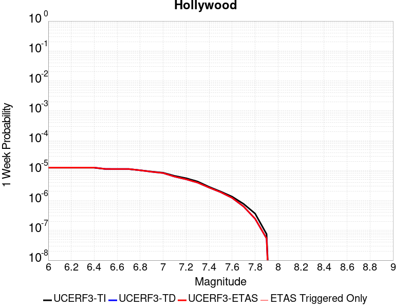 |  | 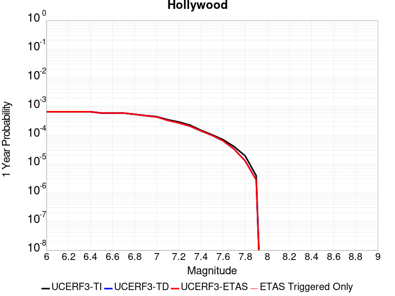 |  |

| Magnitude | 1 wk TI Prob | 1 wk TD Prob | 1 wk ETAS Prob | 1 wk ETAS/TD Gain | 1 wk ETAS Triggered Only | 1 mo TI Prob | 1 mo TD Prob | 1 mo ETAS Prob | 1 mo ETAS/TD Gain | 1 mo ETAS Triggered Only | 1 yr TI Prob | 1 yr TD Prob | 1 yr ETAS Prob | 1 yr ETAS/TD Gain | 1 yr ETAS Triggered Only | 10 yr TI Prob | 10 yr TD Prob | 10 yr ETAS Prob | 10 yr ETAS/TD Gain | 10 yr ETAS Triggered Only |
|-----|-----|-----|-----|-----|-----|-----|-----|-----|-----|-----|-----|-----|-----|-----|-----|-----|-----|-----|-----|-----|
| 6.0 | 1.24487615E-5 | 1.2594008E-5 | 1.2594008E-5 | 1.0 | 0.0 | 5.3350745E-5 | 5.397323E-5 | 5.397323E-5 | 1.0 | 0.0 | 6.4935174E-4 | 6.5693056E-4 | 6.5693056E-4 | 1.0 | 0.0 | 0.0064745755 | 0.006550374 | 0.0065801777 | 1.0045499 | 3.0E-5 |
| 6.1 | 1.24487615E-5 | 1.2594008E-5 | 1.2594008E-5 | 1.0 | 0.0 | 5.3350745E-5 | 5.397323E-5 | 5.397323E-5 | 1.0 | 0.0 | 6.4935174E-4 | 6.5693056E-4 | 6.5693056E-4 | 1.0 | 0.0 | 0.0064745755 | 0.006550374 | 0.0065801777 | 1.0045499 | 3.0E-5 |
| 6.2 | 1.24487615E-5 | 1.2594008E-5 | 1.2594008E-5 | 1.0 | 0.0 | 5.3350745E-5 | 5.397323E-5 | 5.397323E-5 | 1.0 | 0.0 | 6.4935174E-4 | 6.5693056E-4 | 6.5693056E-4 | 1.0 | 0.0 | 0.0064745755 | 0.006550374 | 0.0065801777 | 1.0045499 | 3.0E-5 |
| 6.3 | 1.24487615E-5 | 1.2594008E-5 | 1.2594008E-5 | 1.0 | 0.0 | 5.3350745E-5 | 5.397323E-5 | 5.397323E-5 | 1.0 | 0.0 | 6.4935174E-4 | 6.5693056E-4 | 6.5693056E-4 | 1.0 | 0.0 | 0.0064745755 | 0.006550374 | 0.0065801777 | 1.0045499 | 3.0E-5 |
| 6.4 | 1.2431024E-5 | 1.257462E-5 | 1.257462E-5 | 1.0 | 0.0 | 5.327473E-5 | 5.389014E-5 | 5.389014E-5 | 1.0 | 0.0 | 6.4842677E-4 | 6.559196E-4 | 6.559196E-4 | 1.0 | 0.0 | 0.0064653796 | 0.006540324 | 0.006570128 | 1.0045569 | 3.0E-5 |
| 6.5 | 1.1242222E-5 | 1.1318533E-5 | 1.1318533E-5 | 1.0 | 0.0 | 4.8180063E-5 | 4.8507114E-5 | 4.8507114E-5 | 1.0 | 0.0 | 5.864344E-4 | 5.904168E-4 | 5.904168E-4 | 1.0 | 0.0 | 0.0058488925 | 0.0058887685 | 0.005908651 | 1.0033762 | 2.0E-5 |
| 6.6 | 1.1234066E-5 | 1.1309647E-5 | 1.1309647E-5 | 1.0 | 0.0 | 4.8145106E-5 | 4.846903E-5 | 4.846903E-5 | 1.0 | 0.0 | 5.86009E-4 | 5.899533E-4 | 5.899533E-4 | 1.0 | 0.0 | 0.005844661 | 0.005884159 | 0.005904041 | 1.003379 | 2.0E-5 |
| 6.7 | 1.12294E-5 | 1.130439E-5 | 1.130439E-5 | 1.0 | 0.0 | 4.812511E-5 | 4.84465E-5 | 4.84465E-5 | 1.0 | 0.0 | 5.857657E-4 | 5.896792E-4 | 5.896792E-4 | 1.0 | 0.0 | 0.0058422405 | 0.0058814315 | 0.0059013143 | 1.0033805 | 2.0E-5 |
| 6.8 | 1.0252819E-5 | 1.0219096E-5 | 1.0219096E-5 | 1.0 | 0.0 | 4.3939912E-5 | 4.3795404E-5 | 4.3795404E-5 | 1.0 | 0.0 | 5.3483713E-4 | 5.330807E-4 | 5.330807E-4 | 1.0 | 0.0 | 0.005335517 | 0.005318246 | 0.005328193 | 1.0018703 | 1.0E-5 |
| 6.9 | 9.252289E-6 | 9.110879E-6 | 9.110879E-6 | 1.0 | 0.0 | 3.9652066E-5 | 3.904605E-5 | 3.904605E-5 | 1.0 | 0.0 | 4.8265693E-4 | 4.7528357E-4 | 4.7528357E-4 | 1.0 | 0.0 | 0.0048161 | 0.004742844 | 0.0047527966 | 1.0020984 | 1.0E-5 |
| 7.0 | 8.474604E-6 | 8.258775E-6 | 8.258775E-6 | 1.0 | 0.0 | 3.6319227E-5 | 3.5394278E-5 | 3.5394278E-5 | 1.0 | 0.0 | 4.4209688E-4 | 4.3084158E-4 | 4.3084158E-4 | 1.0 | 0.0 | 0.004412184 | 0.0043002134 | 0.00431017 | 1.0023155 | 1.0E-5 |
| 7.1 | 6.643643E-6 | 6.268762E-6 | 6.268762E-6 | 1.0 | 0.0 | 2.8472443E-5 | 2.6865848E-5 | 2.6865848E-5 | 1.0 | 0.0 | 3.4659685E-4 | 3.2704303E-4 | 3.2704303E-4 | 1.0 | 0.0 | 0.0034605677 | 0.0032656635 | 0.0032756308 | 1.0030521 | 1.0E-5 |
| 7.2 | 5.549002E-6 | 5.109036E-6 | 5.109036E-6 | 1.0 | 0.0 | 2.378122E-5 | 2.1895685E-5 | 2.1895685E-5 | 1.0 | 0.0 | 2.8949787E-4 | 2.6654752E-4 | 2.6654752E-4 | 1.0 | 0.0 | 0.0028912104 | 0.0026622945 | 0.0026722678 | 1.0037462 | 1.0E-5 |
| 7.3 | 4.3059727E-6 | 3.9601587E-6 | 3.9601587E-6 | 1.0 | 0.0 | 1.8454039E-5 | 1.6971999E-5 | 1.6971999E-5 | 1.0 | 0.0 | 2.2465475E-4 | 2.0661458E-4 | 2.0661458E-4 | 1.0 | 0.0 | 0.0022442779 | 0.0020642348 | 0.0020642348 | 1.0 | 0.0 |
| 7.4 | 2.8550733E-6 | 2.701513E-6 | 2.701513E-6 | 1.0 | 0.0 | 1.2235971E-5 | 1.1577862E-5 | 1.1577862E-5 | 1.0 | 0.0 | 1.4896276E-4 | 1.4095141E-4 | 1.4095141E-4 | 1.0 | 0.0 | 0.0014886294 | 0.001408625 | 0.001408625 | 1.0 | 0.0 |
| 7.5 | 1.9927045E-6 | 1.897809E-6 | 1.897809E-6 | 1.0 | 0.0 | 8.540134E-6 | 8.133442E-6 | 8.133442E-6 | 1.0 | 0.0 | 1.0397117E-4 | 9.9020195E-5 | 9.9020195E-5 | 1.0 | 0.0 | 0.0010392254 | 9.897643E-4 | 9.897643E-4 | 1.0 | 0.0 |
| 7.6 | 1.345084E-6 | 1.2217191E-6 | 1.2217191E-6 | 1.0 | 0.0 | 5.764633E-6 | 5.2359287E-6 | 5.2359287E-6 | 1.0 | 0.0 | 7.018215E-5 | 6.374559E-5 | 6.374559E-5 | 1.0 | 0.0 | 7.0159987E-4 | 6.37275E-4 | 6.37275E-4 | 1.0 | 0.0 |
| 7.7 | 7.6835164E-7 | 6.278585E-7 | 6.278585E-7 | 1.0 | 0.0 | 3.2929315E-6 | 2.6908194E-6 | 2.6908194E-6 | 1.0 | 0.0 | 4.00907E-5 | 3.276025E-5 | 3.276025E-5 | 1.0 | 0.0 | 4.0083472E-4 | 3.2755567E-4 | 3.2755567E-4 | 1.0 | 0.0 |
| 7.8 | 3.6562128E-7 | 2.4541959E-7 | 2.4541959E-7 | 1.0 | 0.0 | 1.5669474E-6 | 1.0517979E-6 | 1.0517979E-6 | 1.0 | 0.0 | 1.9077417E-5 | 1.2805567E-5 | 1.2805567E-5 | 1.0 | 0.0 | 1.907578E-4 | 1.2804866E-4 | 1.2804866E-4 | 1.0 | 0.0 |
| 7.9 | 7.5024424E-8 | 5.3832995E-8 | 5.3832995E-8 | 1.0 | 0.0 | 3.215332E-7 | 2.3071283E-7 | 2.3071283E-7 | 1.0 | 0.0 | 3.91466E-6 | 2.8089264E-6 | 2.8089264E-6 | 1.0 | 0.0 | 3.9145907E-5 | 2.8089038E-5 | 2.8089038E-5 | 1.0 | 0.0 |

## San Jacinto (Borrego)
*[(top)](#table-of-contents)*

| 1 Week | 1 Month | 1 Year | 10 Year |
|-----|-----|-----|-----|
|  | 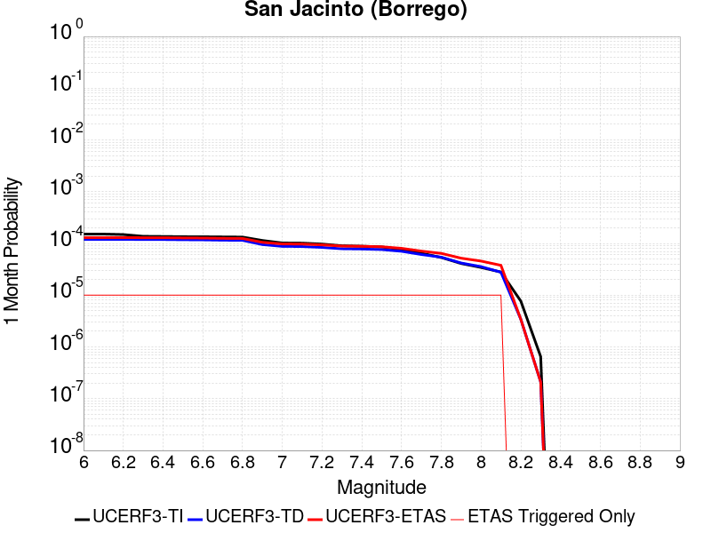 |  |  |

| Magnitude | 1 wk TI Prob | 1 wk TD Prob | 1 wk ETAS Prob | 1 wk ETAS/TD Gain | 1 wk ETAS Triggered Only | 1 mo TI Prob | 1 mo TD Prob | 1 mo ETAS Prob | 1 mo ETAS/TD Gain | 1 mo ETAS Triggered Only | 1 yr TI Prob | 1 yr TD Prob | 1 yr ETAS Prob | 1 yr ETAS/TD Gain | 1 yr ETAS Triggered Only | 10 yr TI Prob | 10 yr TD Prob | 10 yr ETAS Prob | 10 yr ETAS/TD Gain | 10 yr ETAS Triggered Only |
|-----|-----|-----|-----|-----|-----|-----|-----|-----|-----|-----|-----|-----|-----|-----|-----|-----|-----|-----|-----|-----|
| 6.0 | 3.543992E-5 | 2.796358E-5 | 2.796358E-5 | 1.0 | 0.0 | 1.5187653E-4 | 1.19838485E-4 | 1.2983728E-4 | 1.0834357 | 1.0E-5 | 0.0018475284 | 0.0014580693 | 0.0014680547 | 1.0068483 | 1.0E-5 | 0.018322436 | 0.014890327 | 0.014919881 | 1.0019847 | 3.0E-5 |
| 6.1 | 3.542281E-5 | 2.796358E-5 | 2.796358E-5 | 1.0 | 0.0 | 1.5180321E-4 | 1.19838485E-4 | 1.2983728E-4 | 1.0834357 | 1.0E-5 | 0.0018466372 | 0.0014580693 | 0.0014680547 | 1.0068483 | 1.0E-5 | 0.018313672 | 0.014890327 | 0.014919881 | 1.0019847 | 3.0E-5 |
| 6.2 | 3.4688688E-5 | 2.796358E-5 | 2.796358E-5 | 1.0 | 0.0 | 1.4865733E-4 | 1.1983848E-4 | 1.2983728E-4 | 1.0834357 | 1.0E-5 | 0.0018084005 | 0.0014580693 | 0.0014680547 | 1.0068483 | 1.0E-5 | 0.017937548 | 0.014890327 | 0.01491988 | 1.0019847 | 3.0E-5 |
| 6.3 | 3.2087122E-5 | 2.780893E-5 | 2.780893E-5 | 1.0 | 0.0 | 1.3750899E-4 | 1.19175755E-4 | 1.2917456E-4 | 1.0838997 | 1.0E-5 | 0.0016728862 | 0.0014500113 | 0.0014599968 | 1.0068865 | 1.0E-5 | 0.016603488 | 0.014809635 | 0.01483919 | 1.0019957 | 3.0E-5 |
| 6.4 | 3.1828724E-5 | 2.7775908E-5 | 2.7775908E-5 | 1.0 | 0.0 | 1.364017E-4 | 1.19034245E-4 | 1.2903305E-4 | 1.0839994 | 1.0E-5 | 0.0016594254 | 0.0014482907 | 0.0014582762 | 1.0068947 | 1.0E-5 | 0.016470885 | 0.014792828 | 0.014822384 | 1.0019981 | 3.0E-5 |
| 6.5 | 3.1563577E-5 | 2.751557E-5 | 2.751557E-5 | 1.0 | 0.0 | 1.3526545E-4 | 1.17918615E-4 | 1.2791743E-4 | 1.0847943 | 1.0E-5 | 0.0016456128 | 0.0014347258 | 0.0014447116 | 1.0069599 | 1.0E-5 | 0.0163348 | 0.014658882 | 0.014688442 | 1.0020165 | 3.0E-5 |
| 6.6 | 3.1467625E-5 | 2.735977E-5 | 2.735977E-5 | 1.0 | 0.0 | 1.3485427E-4 | 1.1725096E-4 | 1.2724979E-4 | 1.0852772 | 1.0E-5 | 0.0016406142 | 0.0014266078 | 0.0014365935 | 1.0069996 | 1.0E-5 | 0.016285548 | 0.014579042 | 0.014608605 | 1.0020278 | 3.0E-5 |
| 6.7 | 3.1223695E-5 | 2.6977714E-5 | 2.6977714E-5 | 1.0 | 0.0 | 1.3380898E-4 | 1.1561372E-4 | 1.2561257E-4 | 1.0864849 | 1.0E-5 | 0.0016279068 | 0.0014067002 | 0.0014166862 | 1.0070988 | 1.0E-5 | 0.01616033 | 0.014383528 | 0.014413097 | 1.0020558 | 3.0E-5 |
| 6.8 | 3.1015585E-5 | 2.6798656E-5 | 2.6798656E-5 | 1.0 | 0.0 | 1.3291716E-4 | 1.1484639E-4 | 1.2484525E-4 | 1.0870628 | 1.0E-5 | 0.001617065 | 0.0013973701 | 0.0014073561 | 1.0071464 | 1.0E-5 | 0.016053487 | 0.014290765 | 0.014320336 | 1.0020692 | 3.0E-5 |
| 6.9 | 2.6641965E-5 | 2.2218617E-5 | 2.2218617E-5 | 1.0 | 0.0 | 1.1417485E-4 | 9.521919E-5 | 1.0521824E-4 | 1.1050109 | 1.0E-5 | 0.0013891924 | 0.0011586811 | 0.0011686694 | 1.0086205 | 1.0E-5 | 0.0138054015 | 0.011900114 | 0.011929757 | 1.002491 | 3.0E-5 |
| 7.0 | 2.3854353E-5 | 2.0512207E-5 | 2.0512207E-5 | 1.0 | 0.0 | 1.02228936E-4 | 8.790651E-5 | 9.7905635E-5 | 1.1137472 | 1.0E-5 | 0.0012439266 | 0.0010697389 | 0.0010797281 | 1.009338 | 1.0E-5 | 0.012369866 | 0.010999902 | 0.011029572 | 1.0026973 | 3.0E-5 |
| 7.1 | 2.3672901E-5 | 2.034867E-5 | 2.034867E-5 | 1.0 | 0.0 | 1.0145135E-4 | 8.7205684E-5 | 9.7204815E-5 | 1.1146615 | 1.0E-5 | 0.0012344702 | 0.0010612146 | 0.001071204 | 1.0094131 | 1.0E-5 | 0.0122763505 | 0.010915071 | 0.010944743 | 1.0027184 | 3.0E-5 |
| 7.2 | 2.2717244E-5 | 1.9575766E-5 | 1.9575766E-5 | 1.0 | 0.0 | 9.735599E-5 | 8.389346E-5 | 9.389262E-5 | 1.1191888 | 1.0E-5 | 0.0011846646 | 0.0010209266 | 0.0010309163 | 1.009785 | 1.0E-5 | 0.01178369 | 0.010512349 | 0.010542033 | 1.0028238 | 3.0E-5 |
| 7.3 | 2.1016205E-5 | 1.8416953E-5 | 1.8416953E-5 | 1.0 | 0.0 | 9.006634E-5 | 7.892743E-5 | 8.892664E-5 | 1.1266887 | 1.0E-5 | 0.001096006 | 9.605198E-4 | 9.7051024E-4 | 1.010401 | 1.0E-5 | 0.010906163 | 0.0099077895 | 0.009937492 | 1.0029979 | 3.0E-5 |
| 7.4 | 2.0683625E-5 | 1.8219385E-5 | 1.8219385E-5 | 1.0 | 0.0 | 8.86411E-5 | 7.808075E-5 | 8.807997E-5 | 1.1280625 | 1.0E-5 | 0.001078671 | 9.502206E-4 | 9.602111E-4 | 1.0105139 | 1.0E-5 | 0.010734501 | 0.009804459 | 0.009834165 | 1.0030298 | 3.0E-5 |
| 7.5 | 1.9993966E-5 | 1.7814149E-5 | 1.7814149E-5 | 1.0 | 0.0 | 8.568561E-5 | 7.6344135E-5 | 8.6343374E-5 | 1.1309758 | 1.0E-5 | 0.001042723 | 9.290955E-4 | 9.390862E-4 | 1.0107532 | 1.0E-5 | 0.010378438 | 0.009591234 | 0.009620946 | 1.0030979 | 3.0E-5 |
| 7.6 | 1.788966E-5 | 1.6466598E-5 | 1.6466598E-5 | 1.0 | 0.0 | 7.666772E-5 | 7.056924E-5 | 8.0568534E-5 | 1.1416948 | 1.0E-5 | 9.3302975E-4 | 8.5884356E-4 | 8.6883496E-4 | 1.0116335 | 1.0E-5 | 0.00929122 | 0.008882635 | 0.008912369 | 1.0033474 | 3.0E-5 |
| 7.7 | 1.5125781E-5 | 1.4267522E-5 | 1.4267522E-5 | 1.0 | 0.0 | 6.4823165E-5 | 6.114509E-5 | 7.114448E-5 | 1.1635355 | 1.0E-5 | 7.889362E-4 | 7.4418803E-4 | 7.541806E-4 | 1.0134275 | 1.0E-5 | 0.007861412 | 0.0077297594 | 0.007759528 | 1.003851 | 3.0E-5 |
| 7.8 | 1.250089E-5 | 1.2659626E-5 | 1.2659626E-5 | 1.0 | 0.0 | 5.3574146E-5 | 5.4254415E-5 | 6.425387E-5 | 1.1843067 | 1.0E-5 | 6.5207E-4 | 6.603479E-4 | 6.703413E-4 | 1.0151335 | 1.0E-5 | 0.006501599 | 0.0068826615 | 0.006912455 | 1.0043287 | 3.0E-5 |
| 7.9 | 9.561E-6 | 9.78038E-6 | 9.78038E-6 | 1.0 | 0.0 | 4.0975072E-5 | 4.191525E-5 | 5.1914827E-5 | 1.2385666 | 1.0E-5 | 4.987573E-4 | 5.101992E-4 | 5.201941E-4 | 1.0195901 | 1.0E-5 | 0.0049763937 | 0.005365626 | 0.005395465 | 1.0055611 | 3.0E-5 |
| 8.0 | 8.01699E-6 | 8.316939E-6 | 8.316939E-6 | 1.0 | 0.0 | 3.4358076E-5 | 3.5643538E-5 | 4.5643184E-5 | 1.2805457 | 1.0E-5 | 4.1822926E-4 | 4.338742E-4 | 4.4386988E-4 | 1.0230381 | 1.0E-5 | 0.0041744304 | 0.0045854948 | 0.004615357 | 1.0065124 | 3.0E-5 |
| 8.1 | 6.541947E-6 | 6.481366E-6 | 6.481366E-6 | 1.0 | 0.0 | 2.8036617E-5 | 2.777699E-5 | 3.7776714E-5 | 1.3600003 | 1.0E-5 | 3.4129233E-4 | 3.3813287E-4 | 3.481295E-4 | 1.0295641 | 1.0E-5 | 0.0034076865 | 0.003590587 | 0.0036105153 | 1.0055501 | 2.0E-5 |
| 8.2 | 1.7968189E-6 | 8.0057777E-7 | 8.0057777E-7 | 1.0 | 0.0 | 7.70063E-6 | 3.431043E-6 | 3.431043E-6 | 1.0 | 0.0 | 9.3751136E-5 | 4.1772175E-5 | 4.1772175E-5 | 1.0 | 0.0 | 9.371159E-4 | 4.7314964E-4 | 4.7314964E-4 | 1.0 | 0.0 |
| 8.3 | 1.5167889E-7 | 4.9218865E-8 | 4.9218865E-8 | 1.0 | 0.0 | 6.500522E-7 | 2.1093798E-7 | 2.1093798E-7 | 1.0 | 0.0 | 7.9143565E-6 | 2.5681672E-6 | 2.5681672E-6 | 1.0 | 0.0 | 7.914075E-5 | 2.9837673E-5 | 2.9837673E-5 | 1.0 | 0.0 |

## White Mountains
*[(top)](#table-of-contents)*

| 1 Week | 1 Month | 1 Year | 10 Year |
|-----|-----|-----|-----|
| 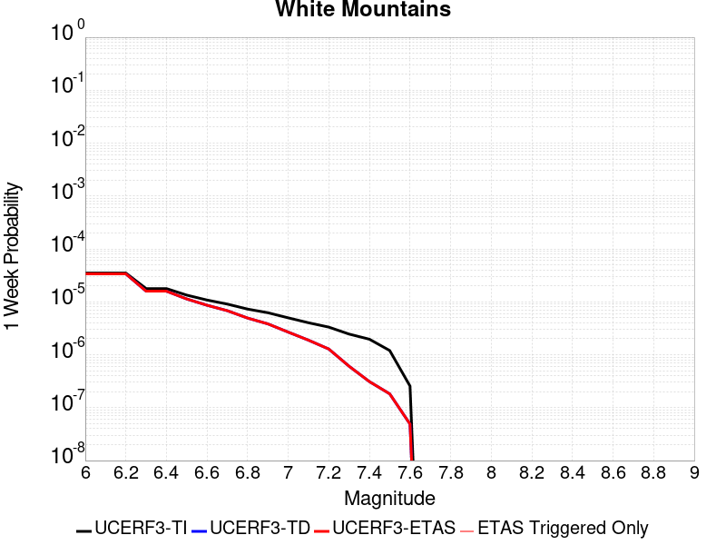 | 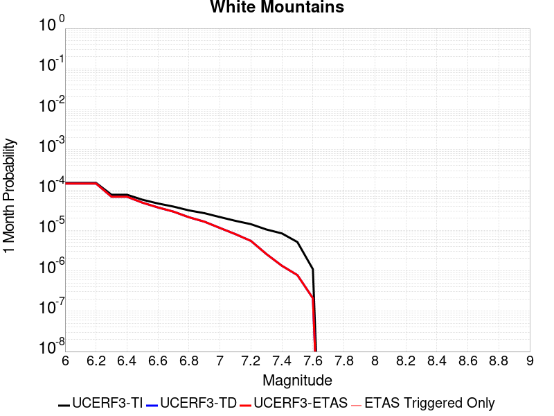 |  |  |

| Magnitude | 1 wk TI Prob | 1 wk TD Prob | 1 wk ETAS Prob | 1 wk ETAS/TD Gain | 1 wk ETAS Triggered Only | 1 mo TI Prob | 1 mo TD Prob | 1 mo ETAS Prob | 1 mo ETAS/TD Gain | 1 mo ETAS Triggered Only | 1 yr TI Prob | 1 yr TD Prob | 1 yr ETAS Prob | 1 yr ETAS/TD Gain | 1 yr ETAS Triggered Only | 10 yr TI Prob | 10 yr TD Prob | 10 yr ETAS Prob | 10 yr ETAS/TD Gain | 10 yr ETAS Triggered Only |
|-----|-----|-----|-----|-----|-----|-----|-----|-----|-----|-----|-----|-----|-----|-----|-----|-----|-----|-----|-----|-----|
| 6.0 | 3.503579E-5 | 3.378613E-5 | 3.378613E-5 | 1.0 | 0.0 | 1.5014476E-4 | 1.4479035E-4 | 1.4479035E-4 | 1.0 | 0.0 | 0.0018264796 | 0.0017615178 | 0.001791465 | 1.0170008 | 3.0E-5 | 0.018115403 | 0.017487885 | 0.017517362 | 1.0016855 | 3.0E-5 |
| 6.1 | 3.503579E-5 | 3.378613E-5 | 3.378613E-5 | 1.0 | 0.0 | 1.5014476E-4 | 1.4479035E-4 | 1.4479035E-4 | 1.0 | 0.0 | 0.0018264796 | 0.0017615178 | 0.001791465 | 1.0170008 | 3.0E-5 | 0.018115403 | 0.017487885 | 0.017517362 | 1.0016855 | 3.0E-5 |
| 6.2 | 3.503579E-5 | 3.378613E-5 | 3.378613E-5 | 1.0 | 0.0 | 1.5014476E-4 | 1.4479035E-4 | 1.4479035E-4 | 1.0 | 0.0 | 0.0018264796 | 0.0017615178 | 0.001791465 | 1.0170008 | 3.0E-5 | 0.018115403 | 0.017487885 | 0.017517362 | 1.0016855 | 3.0E-5 |
| 6.3 | 1.7818425E-5 | 1.5917105E-5 | 1.5917105E-5 | 1.0 | 0.0 | 7.636245E-5 | 6.821446E-5 | 6.821446E-5 | 1.0 | 0.0 | 9.293162E-4 | 8.302089E-4 | 8.402006E-4 | 1.0120351 | 1.0E-5 | 0.009254395 | 0.008272532 | 0.00828245 | 1.0011988 | 1.0E-5 |
| 6.4 | 1.7818425E-5 | 1.5917105E-5 | 1.5917105E-5 | 1.0 | 0.0 | 7.636245E-5 | 6.821446E-5 | 6.821446E-5 | 1.0 | 0.0 | 9.293162E-4 | 8.302089E-4 | 8.402006E-4 | 1.0120351 | 1.0E-5 | 0.009254395 | 0.008272532 | 0.00828245 | 1.0011988 | 1.0E-5 |
| 6.5 | 1.3397557E-5 | 1.1337075E-5 | 1.1337075E-5 | 1.0 | 0.0 | 5.741684E-5 | 4.85866E-5 | 4.85866E-5 | 1.0 | 0.0 | 6.988258E-4 | 5.9138826E-4 | 6.0138234E-4 | 1.0168993 | 1.0E-5 | 0.006966323 | 0.0058988505 | 0.0059087914 | 1.0016853 | 1.0E-5 |
| 6.6 | 1.0818695E-5 | 8.625926E-6 | 8.625926E-6 | 1.0 | 0.0 | 4.6365014E-5 | 3.6967755E-5 | 3.6967755E-5 | 1.0 | 0.0 | 5.6434784E-4 | 4.4999382E-4 | 4.4999382E-4 | 1.0 | 0.0 | 0.005629168 | 0.004491263 | 0.004491263 | 1.0 | 0.0 |
| 6.7 | 9.067908E-6 | 6.802839E-6 | 6.802839E-6 | 1.0 | 0.0 | 3.8861883E-5 | 2.9154717E-5 | 2.9154717E-5 | 1.0 | 0.0 | 4.7304068E-4 | 3.5490404E-4 | 3.5490404E-4 | 1.0 | 0.0 | 0.00472035 | 0.0035436898 | 0.0035436898 | 1.0 | 0.0 |
| 6.8 | 7.295947E-6 | 4.936682E-6 | 4.936682E-6 | 1.0 | 0.0 | 3.126797E-5 | 2.1157046E-5 | 2.1157046E-5 | 1.0 | 0.0 | 3.8062103E-4 | 2.5755772E-4 | 2.5755772E-4 | 1.0 | 0.0 | 0.0037996976 | 0.002572705 | 0.002572705 | 1.0 | 0.0 |
| 6.9 | 6.2243444E-6 | 3.8324615E-6 | 3.8324615E-6 | 1.0 | 0.0 | 2.6675489E-5 | 1.6424734E-5 | 1.6424734E-5 | 1.0 | 0.0 | 3.2472567E-4 | 1.9995331E-4 | 1.9995331E-4 | 1.0 | 0.0 | 0.0032425157 | 0.0019977868 | 0.0019977868 | 1.0 | 0.0 |
| 7.0 | 4.9878413E-6 | 2.6797236E-6 | 2.6797236E-6 | 1.0 | 0.0 | 2.1376287E-5 | 1.1484481E-5 | 1.1484481E-5 | 1.0 | 0.0 | 2.602252E-4 | 1.3981485E-4 | 1.3981485E-4 | 1.0 | 0.0 | 0.002599207 | 0.001397295 | 0.001397295 | 1.0 | 0.0 |
| 7.1 | 4.0252844E-6 | 1.8858553E-6 | 1.8858553E-6 | 1.0 | 0.0 | 1.7251105E-5 | 8.082213E-6 | 8.082213E-6 | 1.0 | 0.0 | 2.1001195E-4 | 9.8396624E-5 | 9.8396624E-5 | 1.0 | 0.0 | 0.0020981359 | 9.835433E-4 | 9.835433E-4 | 1.0 | 0.0 |
| 7.2 | 3.3284066E-6 | 1.2820389E-6 | 1.2820389E-6 | 1.0 | 0.0 | 1.4264522E-5 | 5.4944417E-6 | 5.4944417E-6 | 1.0 | 0.0 | 1.736567E-4 | 6.689287E-5 | 6.689287E-5 | 1.0 | 0.0 | 0.0017352107 | 6.6873746E-4 | 6.6873746E-4 | 1.0 | 0.0 |
| 7.3 | 2.458226E-6 | 6.058046E-7 | 6.058046E-7 | 1.0 | 0.0 | 1.0535211E-5 | 2.5963031E-6 | 2.5963031E-6 | 1.0 | 0.0 | 1.2825865E-4 | 3.160957E-5 | 3.160957E-5 | 1.0 | 0.0 | 0.0012818464 | 3.1605447E-4 | 3.1605447E-4 | 1.0 | 0.0 |
| 7.4 | 1.965953E-6 | 3.10965E-7 | 3.10965E-7 | 1.0 | 0.0 | 8.425486E-6 | 1.3327063E-6 | 1.3327063E-6 | 1.0 | 0.0 | 1.0257547E-4 | 1.622558E-5 | 1.622558E-5 | 1.0 | 0.0 | 0.0010252813 | 1.6224409E-4 | 1.6224409E-4 | 1.0 | 0.0 |
| 7.5 | 1.2014192E-6 | 1.8249273E-7 | 1.8249273E-7 | 1.0 | 0.0 | 5.148929E-6 | 7.8211144E-7 | 7.8211144E-7 | 1.0 | 0.0 | 6.2686406E-5 | 9.522166E-6 | 9.522166E-6 | 1.0 | 0.0 | 6.266873E-4 | 9.521766E-5 | 9.521766E-5 | 1.0 | 0.0 |
| 7.6 | 2.5612175E-7 | 4.8960615E-8 | 4.8960615E-8 | 1.0 | 0.0 | 1.0976642E-6 | 2.0983119E-7 | 2.0983119E-7 | 1.0 | 0.0 | 1.3363979E-5 | 2.5546922E-6 | 2.5546922E-6 | 1.0 | 0.0 | 1.3363175E-4 | 2.5546664E-5 | 2.5546664E-5 | 1.0 | 0.0 |

## San Jacinto (Coyote Creek)
*[(top)](#table-of-contents)*

| 1 Week | 1 Month | 1 Year | 10 Year |
|-----|-----|-----|-----|
| 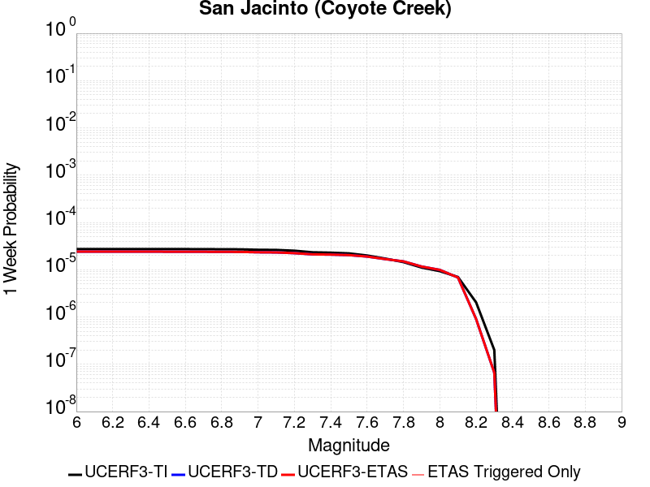 |  |  |  |

| Magnitude | 1 wk TI Prob | 1 wk TD Prob | 1 wk ETAS Prob | 1 wk ETAS/TD Gain | 1 wk ETAS Triggered Only | 1 mo TI Prob | 1 mo TD Prob | 1 mo ETAS Prob | 1 mo ETAS/TD Gain | 1 mo ETAS Triggered Only | 1 yr TI Prob | 1 yr TD Prob | 1 yr ETAS Prob | 1 yr ETAS/TD Gain | 1 yr ETAS Triggered Only | 10 yr TI Prob | 10 yr TD Prob | 10 yr ETAS Prob | 10 yr ETAS/TD Gain | 10 yr ETAS Triggered Only |
|-----|-----|-----|-----|-----|-----|-----|-----|-----|-----|-----|-----|-----|-----|-----|-----|-----|-----|-----|-----|-----|
| 6.0 | 2.7374346E-5 | 2.4184395E-5 | 2.4184395E-5 | 1.0 | 0.0 | 1.1731335E-4 | 1.0364331E-4 | 1.1364227E-4 | 1.0964748 | 1.0E-5 | 0.0014273542 | 0.0012611294 | 0.0012711168 | 1.0079194 | 1.0E-5 | 0.01418221 | 0.012948442 | 0.012978054 | 1.0022869 | 3.0E-5 |
| 6.1 | 2.7374346E-5 | 2.4184395E-5 | 2.4184395E-5 | 1.0 | 0.0 | 1.1731335E-4 | 1.0364331E-4 | 1.1364227E-4 | 1.0964748 | 1.0E-5 | 0.0014273542 | 0.0012611294 | 0.0012711168 | 1.0079194 | 1.0E-5 | 0.01418221 | 0.012948442 | 0.012978054 | 1.0022869 | 3.0E-5 |
| 6.2 | 2.7374346E-5 | 2.4184395E-5 | 2.4184395E-5 | 1.0 | 0.0 | 1.1731335E-4 | 1.0364331E-4 | 1.1364227E-4 | 1.0964748 | 1.0E-5 | 0.0014273542 | 0.0012611294 | 0.0012711168 | 1.0079194 | 1.0E-5 | 0.01418221 | 0.012948442 | 0.012978054 | 1.0022869 | 3.0E-5 |
| 6.3 | 2.7374346E-5 | 2.4184395E-5 | 2.4184395E-5 | 1.0 | 0.0 | 1.1731335E-4 | 1.0364331E-4 | 1.1364227E-4 | 1.0964748 | 1.0E-5 | 0.0014273542 | 0.0012611294 | 0.0012711168 | 1.0079194 | 1.0E-5 | 0.01418221 | 0.012948442 | 0.012978054 | 1.0022869 | 3.0E-5 |
| 6.4 | 2.7374346E-5 | 2.4184395E-5 | 2.4184395E-5 | 1.0 | 0.0 | 1.1731335E-4 | 1.0364331E-4 | 1.1364227E-4 | 1.0964748 | 1.0E-5 | 0.0014273542 | 0.0012611294 | 0.0012711168 | 1.0079194 | 1.0E-5 | 0.01418221 | 0.012948442 | 0.012978054 | 1.0022869 | 3.0E-5 |
| 6.5 | 2.7282445E-5 | 2.4070456E-5 | 2.4070456E-5 | 1.0 | 0.0 | 1.16919524E-4 | 1.03155035E-4 | 1.13154E-4 | 1.0969315 | 1.0E-5 | 0.0014225657 | 0.0012551916 | 0.001265179 | 1.0079569 | 1.0E-5 | 0.014134934 | 0.0128897615 | 0.012919375 | 1.0022974 | 3.0E-5 |
| 6.6 | 2.7282445E-5 | 2.4070456E-5 | 2.4070456E-5 | 1.0 | 0.0 | 1.16919524E-4 | 1.03155035E-4 | 1.13154E-4 | 1.0969315 | 1.0E-5 | 0.0014225657 | 0.0012551916 | 0.001265179 | 1.0079569 | 1.0E-5 | 0.014134934 | 0.0128897615 | 0.012919375 | 1.0022974 | 3.0E-5 |
| 6.7 | 2.7216198E-5 | 2.3995564E-5 | 2.3995564E-5 | 1.0 | 0.0 | 1.1663563E-4 | 1.0283409E-4 | 1.1283307E-4 | 1.097234 | 1.0E-5 | 0.0014191137 | 0.0012512887 | 0.0012612762 | 1.0079818 | 1.0E-5 | 0.014100855 | 0.0128511675 | 0.012880782 | 1.0023044 | 3.0E-5 |
| 6.8 | 2.7078617E-5 | 2.3912758E-5 | 2.3912758E-5 | 1.0 | 0.0 | 1.1604605E-4 | 1.0247924E-4 | 1.12478214E-4 | 1.0975708 | 1.0E-5 | 0.001411945 | 0.0012469733 | 0.0012569608 | 1.0080094 | 1.0E-5 | 0.014030075 | 0.012808303 | 0.0128379185 | 1.0023122 | 3.0E-5 |
| 6.9 | 2.6982952E-5 | 2.3832248E-5 | 2.3832248E-5 | 1.0 | 0.0 | 1.15636096E-4 | 1.02134225E-4 | 1.121332E-4 | 1.0979004 | 1.0E-5 | 0.0014069602 | 0.0012427776 | 0.0012527651 | 1.0080365 | 1.0E-5 | 0.013980856 | 0.012766566 | 0.012796183 | 1.0023199 | 3.0E-5 |
| 7.0 | 2.6449972E-5 | 2.3409188E-5 | 2.3409188E-5 | 1.0 | 0.0 | 1.1335209E-4 | 1.00321246E-4 | 1.10320245E-4 | 1.0996698 | 1.0E-5 | 0.001379188 | 0.0012207294 | 0.0012307172 | 1.0081818 | 1.0E-5 | 0.0137065975 | 0.012547894 | 0.012577518 | 1.0023608 | 3.0E-5 |
| 7.1 | 2.6257849E-5 | 2.3235194E-5 | 2.3235194E-5 | 1.0 | 0.0 | 1.1252879E-4 | 9.957561E-5 | 1.0957462E-4 | 1.1004162 | 1.0E-5 | 0.0013691769 | 0.0012116615 | 0.0012216493 | 1.0082431 | 1.0E-5 | 0.013607717 | 0.012457751 | 0.012487377 | 1.0023781 | 3.0E-5 |
| 7.2 | 2.5270041E-5 | 2.2429658E-5 | 2.2429658E-5 | 1.0 | 0.0 | 1.0829568E-4 | 9.612358E-5 | 1.06122614E-4 | 1.1040227 | 1.0E-5 | 0.0013177024 | 0.0011696786 | 0.001179667 | 1.0085393 | 1.0E-5 | 0.013099162 | 0.012038693 | 0.012068332 | 1.0024619 | 3.0E-5 |
| 7.3 | 2.339701E-5 | 2.1160973E-5 | 2.1160973E-5 | 1.0 | 0.0 | 1.0026905E-4 | 9.068674E-5 | 1.0068584E-4 | 1.1102597 | 1.0E-5 | 0.001220092 | 0.0011035539 | 0.0011135429 | 1.0090517 | 1.0E-5 | 0.012134149 | 0.011377435 | 0.011407093 | 1.0026067 | 3.0E-5 |
| 7.4 | 2.296333E-5 | 2.0891195E-5 | 2.0891195E-5 | 1.0 | 0.0 | 9.841056E-5 | 8.953063E-5 | 9.952974E-5 | 1.1116836 | 1.0E-5 | 0.0011974899 | 0.0010894925 | 0.0010994815 | 1.0091686 | 1.0E-5 | 0.011910575 | 0.011236471 | 0.011266134 | 1.0026399 | 3.0E-5 |
| 7.5 | 2.2188895E-5 | 2.0413825E-5 | 2.0413825E-5 | 1.0 | 0.0 | 9.50918E-5 | 8.74849E-5 | 9.748403E-5 | 1.1142955 | 1.0E-5 | 0.0011571277 | 0.0010646102 | 0.0010745996 | 1.0093831 | 1.0E-5 | 0.011511209 | 0.010985923 | 0.011015593 | 1.0027008 | 3.0E-5 |
| 7.6 | 2.0013189E-5 | 1.8999299E-5 | 1.8999299E-5 | 1.0 | 0.0 | 8.5767984E-5 | 8.142304E-5 | 9.1422226E-5 | 1.1228054 | 1.0E-5 | 0.001043725 | 9.908765E-4 | 0.0010008665 | 1.0100821 | 1.0E-5 | 0.010388365 | 0.0102434475 | 0.01027314 | 1.0028987 | 3.0E-5 |
| 7.7 | 1.7230794E-5 | 1.6779471E-5 | 1.6779471E-5 | 1.0 | 0.0 | 7.384417E-5 | 7.191004E-5 | 8.190932E-5 | 1.1390526 | 1.0E-5 | 8.986819E-4 | 8.7515387E-4 | 8.8514516E-4 | 1.0114166 | 1.0E-5 | 0.008950562 | 0.009081379 | 0.009111106 | 1.0032735 | 3.0E-5 |
| 7.8 | 1.4478809E-5 | 1.5025572E-5 | 1.5025572E-5 | 1.0 | 0.0 | 6.205057E-5 | 6.4393724E-5 | 7.439308E-5 | 1.1552846 | 1.0E-5 | 7.552038E-4 | 7.8371225E-4 | 7.937044E-4 | 1.0127498 | 1.0E-5 | 0.0075264242 | 0.008159076 | 0.008188831 | 1.0036469 | 3.0E-5 |
| 7.9 | 1.1114467E-5 | 1.1675761E-5 | 1.1675761E-5 | 1.0 | 0.0 | 4.7632562E-5 | 5.003802E-5 | 6.003752E-5 | 1.199838 | 1.0E-5 | 5.797721E-4 | 6.0904317E-4 | 6.190371E-4 | 1.0164092 | 1.0E-5 | 0.0057826187 | 0.0063961106 | 0.0064259185 | 1.0046604 | 3.0E-5 |
| 8.0 | 9.327402E-6 | 9.926991E-6 | 9.926991E-6 | 1.0 | 0.0 | 3.9973966E-5 | 4.2543557E-5 | 5.254313E-5 | 1.2350432 | 1.0E-5 | 4.8657437E-4 | 5.178452E-4 | 5.2784005E-4 | 1.0193008 | 1.0E-5 | 0.0048551033 | 0.005464306 | 0.005494142 | 1.0054601 | 3.0E-5 |
| 8.1 | 7.0235833E-6 | 6.847979E-6 | 6.847979E-6 | 1.0 | 0.0 | 3.0100724E-5 | 2.9348155E-5 | 3.9347862E-5 | 1.340727 | 1.0E-5 | 3.664147E-4 | 3.5725572E-4 | 3.6725213E-4 | 1.0279812 | 1.0E-5 | 0.003658111 | 0.0037982343 | 0.0038181583 | 1.0052456 | 2.0E-5 |
| 8.2 | 2.0358202E-6 | 9.033704E-7 | 9.033704E-7 | 1.0 | 0.0 | 8.724915E-6 | 3.8715816E-6 | 3.8715816E-6 | 1.0 | 0.0 | 1.06220665E-4 | 4.7135512E-5 | 4.7135512E-5 | 1.0 | 0.0 | 0.001061699 | 5.3476356E-4 | 5.3476356E-4 | 1.0 | 0.0 |
| 8.3 | 2.0051264E-7 | 6.6499084E-8 | 6.6499084E-8 | 1.0 | 0.0 | 8.5933965E-7 | 2.8499602E-7 | 2.8499602E-7 | 1.0 | 0.0 | 1.046241E-5 | 3.4698216E-6 | 3.4698216E-6 | 1.0 | 0.0 | 1.0461917E-4 | 4.0332718E-5 | 4.0332718E-5 | 1.0 | 0.0 |

## Pitas Point (Lower West)
*[(top)](#table-of-contents)*

| 1 Week | 1 Month | 1 Year | 10 Year |
|-----|-----|-----|-----|
|  |  | 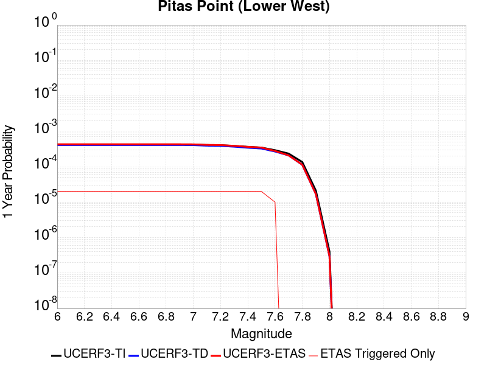 |  |

| Magnitude | 1 wk TI Prob | 1 wk TD Prob | 1 wk ETAS Prob | 1 wk ETAS/TD Gain | 1 wk ETAS Triggered Only | 1 mo TI Prob | 1 mo TD Prob | 1 mo ETAS Prob | 1 mo ETAS/TD Gain | 1 mo ETAS Triggered Only | 1 yr TI Prob | 1 yr TD Prob | 1 yr ETAS Prob | 1 yr ETAS/TD Gain | 1 yr ETAS Triggered Only | 10 yr TI Prob | 10 yr TD Prob | 10 yr ETAS Prob | 10 yr ETAS/TD Gain | 10 yr ETAS Triggered Only |
|-----|-----|-----|-----|-----|-----|-----|-----|-----|-----|-----|-----|-----|-----|-----|-----|-----|-----|-----|-----|-----|
| 6.0 | 8.151497E-6 | 7.856138E-6 | 7.856138E-6 | 1.0 | 0.0 | 3.493452E-5 | 3.3668734E-5 | 3.3668734E-5 | 1.0 | 0.0 | 4.252448E-4 | 4.0984046E-4 | 4.298323E-4 | 1.0487795 | 2.0E-5 | 0.0042443196 | 0.004090927 | 0.0041208044 | 1.0073034 | 3.0E-5 |
| 6.1 | 8.151497E-6 | 7.856138E-6 | 7.856138E-6 | 1.0 | 0.0 | 3.493452E-5 | 3.3668734E-5 | 3.3668734E-5 | 1.0 | 0.0 | 4.252448E-4 | 4.0984046E-4 | 4.298323E-4 | 1.0487795 | 2.0E-5 | 0.0042443196 | 0.004090927 | 0.0041208044 | 1.0073034 | 3.0E-5 |
| 6.2 | 8.151497E-6 | 7.856138E-6 | 7.856138E-6 | 1.0 | 0.0 | 3.493452E-5 | 3.3668734E-5 | 3.3668734E-5 | 1.0 | 0.0 | 4.252448E-4 | 4.0984046E-4 | 4.298323E-4 | 1.0487795 | 2.0E-5 | 0.0042443196 | 0.004090927 | 0.0041208044 | 1.0073034 | 3.0E-5 |
| 6.3 | 8.151497E-6 | 7.856138E-6 | 7.856138E-6 | 1.0 | 0.0 | 3.493452E-5 | 3.3668734E-5 | 3.3668734E-5 | 1.0 | 0.0 | 4.252448E-4 | 4.0984046E-4 | 4.298323E-4 | 1.0487795 | 2.0E-5 | 0.0042443196 | 0.004090927 | 0.0041208044 | 1.0073034 | 3.0E-5 |
| 6.4 | 8.151497E-6 | 7.856138E-6 | 7.856138E-6 | 1.0 | 0.0 | 3.493452E-5 | 3.3668734E-5 | 3.3668734E-5 | 1.0 | 0.0 | 4.252448E-4 | 4.0984046E-4 | 4.298323E-4 | 1.0487795 | 2.0E-5 | 0.0042443196 | 0.004090927 | 0.0041208044 | 1.0073034 | 3.0E-5 |
| 6.5 | 8.151497E-6 | 7.856138E-6 | 7.856138E-6 | 1.0 | 0.0 | 3.493452E-5 | 3.3668734E-5 | 3.3668734E-5 | 1.0 | 0.0 | 4.252448E-4 | 4.0984046E-4 | 4.298323E-4 | 1.0487795 | 2.0E-5 | 0.0042443196 | 0.004090927 | 0.0041208044 | 1.0073034 | 3.0E-5 |
| 6.6 | 8.151497E-6 | 7.856138E-6 | 7.856138E-6 | 1.0 | 0.0 | 3.493452E-5 | 3.3668734E-5 | 3.3668734E-5 | 1.0 | 0.0 | 4.252448E-4 | 4.0984046E-4 | 4.298323E-4 | 1.0487795 | 2.0E-5 | 0.0042443196 | 0.004090927 | 0.0041208044 | 1.0073034 | 3.0E-5 |
| 6.7 | 8.151497E-6 | 7.856138E-6 | 7.856138E-6 | 1.0 | 0.0 | 3.493452E-5 | 3.3668734E-5 | 3.3668734E-5 | 1.0 | 0.0 | 4.252448E-4 | 4.0984046E-4 | 4.298323E-4 | 1.0487795 | 2.0E-5 | 0.0042443196 | 0.004090927 | 0.0041208044 | 1.0073034 | 3.0E-5 |
| 6.8 | 8.151497E-6 | 7.856138E-6 | 7.856138E-6 | 1.0 | 0.0 | 3.493452E-5 | 3.3668734E-5 | 3.3668734E-5 | 1.0 | 0.0 | 4.252448E-4 | 4.0984046E-4 | 4.298323E-4 | 1.0487795 | 2.0E-5 | 0.0042443196 | 0.004090927 | 0.0041208044 | 1.0073034 | 3.0E-5 |
| 6.9 | 8.151497E-6 | 7.856138E-6 | 7.856138E-6 | 1.0 | 0.0 | 3.493452E-5 | 3.3668734E-5 | 3.3668734E-5 | 1.0 | 0.0 | 4.252448E-4 | 4.0984046E-4 | 4.298323E-4 | 1.0487795 | 2.0E-5 | 0.0042443196 | 0.004090927 | 0.0041208044 | 1.0073034 | 3.0E-5 |
| 7.0 | 8.103535E-6 | 7.805566E-6 | 7.805566E-6 | 1.0 | 0.0 | 3.4728975E-5 | 3.3452E-5 | 3.3452E-5 | 1.0 | 0.0 | 4.2274324E-4 | 4.0720275E-4 | 4.271946E-4 | 1.0490956 | 2.0E-5 | 0.0042193993 | 0.0040646465 | 0.0040945243 | 1.0073507 | 3.0E-5 |
| 7.1 | 7.853298E-6 | 7.5412477E-6 | 7.5412477E-6 | 1.0 | 0.0 | 3.3656554E-5 | 3.2319236E-5 | 3.2319236E-5 | 1.0 | 0.0 | 4.096915E-4 | 3.9341635E-4 | 4.1340847E-4 | 1.0508168 | 2.0E-5 | 0.00408937 | 0.003927275 | 0.003957157 | 1.0076089 | 3.0E-5 |
| 7.2 | 7.771102E-6 | 7.4535255E-6 | 7.4535255E-6 | 1.0 | 0.0 | 3.33043E-5 | 3.1943295E-5 | 3.1943295E-5 | 1.0 | 0.0 | 4.0540437E-4 | 3.8884088E-4 | 4.0883312E-4 | 1.051415 | 2.0E-5 | 0.0040466557 | 0.003881681 | 0.0039115646 | 1.0076987 | 3.0E-5 |
| 7.3 | 7.3945344E-6 | 7.0496108E-6 | 7.0496108E-6 | 1.0 | 0.0 | 3.1690477E-5 | 3.021227E-5 | 3.021227E-5 | 1.0 | 0.0 | 3.8576324E-4 | 3.6777294E-4 | 3.8776558E-4 | 1.0543613 | 2.0E-5 | 0.0038509427 | 0.0036717106 | 0.0037016005 | 1.0081406 | 3.0E-5 |
| 7.4 | 6.964645E-6 | 6.5904387E-6 | 6.5904387E-6 | 1.0 | 0.0 | 2.9848137E-5 | 2.8244434E-5 | 2.8244434E-5 | 1.0 | 0.0 | 3.6334046E-4 | 3.4382223E-4 | 3.6381534E-4 | 1.0581496 | 2.0E-5 | 0.0036274698 | 0.003432956 | 0.0034628531 | 1.0087088 | 3.0E-5 |
| 7.5 | 6.6525035E-6 | 6.259464E-6 | 6.259464E-6 | 1.0 | 0.0 | 2.851042E-5 | 2.6826001E-5 | 2.6826001E-5 | 1.0 | 0.0 | 3.4705905E-4 | 3.265581E-4 | 3.4655156E-4 | 1.0612248 | 2.0E-5 | 0.0034651754 | 0.003260834 | 0.0032907361 | 1.00917 | 3.0E-5 |
| 7.6 | 5.613338E-6 | 5.1516413E-6 | 5.1516413E-6 | 1.0 | 0.0 | 2.405694E-5 | 2.2078277E-5 | 2.2078277E-5 | 1.0 | 0.0 | 2.928539E-4 | 2.6877015E-4 | 2.7876746E-4 | 1.0371965 | 1.0E-5 | 0.0029246826 | 0.0026844826 | 0.002694456 | 1.0037152 | 1.0E-5 |
| 7.7 | 4.494704E-6 | 3.9971205E-6 | 3.9971205E-6 | 1.0 | 0.0 | 1.9262876E-5 | 1.7130405E-5 | 1.7130405E-5 | 1.0 | 0.0 | 2.3450027E-4 | 2.0854297E-4 | 2.0854297E-4 | 1.0 | 0.0 | 0.0023425296 | 0.002083497 | 0.002083497 | 1.0 | 0.0 |
| 7.8 | 2.6075882E-6 | 2.1837595E-6 | 2.1837595E-6 | 1.0 | 0.0 | 1.117533E-5 | 9.358936E-6 | 9.358936E-6 | 1.0 | 0.0 | 1.3605114E-4 | 1.1393914E-4 | 1.1393914E-4 | 1.0 | 0.0 | 0.0013596788 | 0.0011388119 | 0.0011388119 | 1.0 | 0.0 |
| 7.9 | 4.045984E-7 | 3.2425453E-7 | 3.2425453E-7 | 1.0 | 0.0 | 1.733992E-6 | 1.3896615E-6 | 1.3896615E-6 | 1.0 | 0.0 | 2.1111147E-5 | 1.6919E-5 | 1.6919E-5 | 1.0 | 0.0 | 2.1109142E-4 | 1.6917744E-4 | 1.6917744E-4 | 1.0 | 0.0 |
| 8.0 | 7.791402E-9 | 5.6840217E-9 | 5.6840217E-9 | 1.0 | 0.0 | 3.3391725E-8 | 2.4360093E-8 | 2.4360093E-8 | 1.0 | 0.0 | 4.0654416E-7 | 2.9658412E-7 | 2.9658412E-7 | 1.0 | 0.0 | 4.065434E-6 | 2.9658393E-6 | 2.9658393E-6 | 1.0 | 0.0 |

## San Clemente
*[(top)](#table-of-contents)*

| 1 Week | 1 Month | 1 Year | 10 Year |
|-----|-----|-----|-----|
|  |  |  |  |

| Magnitude | 1 wk TI Prob | 1 wk TD Prob | 1 wk ETAS Prob | 1 wk ETAS/TD Gain | 1 wk ETAS Triggered Only | 1 mo TI Prob | 1 mo TD Prob | 1 mo ETAS Prob | 1 mo ETAS/TD Gain | 1 mo ETAS Triggered Only | 1 yr TI Prob | 1 yr TD Prob | 1 yr ETAS Prob | 1 yr ETAS/TD Gain | 1 yr ETAS Triggered Only | 10 yr TI Prob | 10 yr TD Prob | 10 yr ETAS Prob | 10 yr ETAS/TD Gain | 10 yr ETAS Triggered Only |
|-----|-----|-----|-----|-----|-----|-----|-----|-----|-----|-----|-----|-----|-----|-----|-----|-----|-----|-----|-----|-----|
| 6.0 | 6.681379E-5 | 8.164981E-5 | 8.164981E-5 | 1.0 | 0.0 | 2.8631336E-4 | 3.4988407E-4 | 3.5988056E-4 | 1.0285709 | 1.0E-5 | 0.003480294 | 0.0042520324 | 0.0042619896 | 1.0023419 | 1.0E-5 | 0.03426291 | 0.04176202 | 0.04179077 | 1.0006883 | 3.0E-5 |
| 6.1 | 6.681379E-5 | 8.164981E-5 | 8.164981E-5 | 1.0 | 0.0 | 2.8631336E-4 | 3.4988407E-4 | 3.5988056E-4 | 1.0285709 | 1.0E-5 | 0.003480294 | 0.0042520324 | 0.0042619896 | 1.0023419 | 1.0E-5 | 0.03426291 | 0.04176202 | 0.041781187 | 1.000459 | 2.0E-5 |
| 6.2 | 3.9400576E-5 | 4.6457964E-5 | 4.6457964E-5 | 1.0 | 0.0 | 1.6884868E-4 | 1.9909069E-4 | 2.090887E-4 | 1.0502183 | 1.0E-5 | 0.0020537945 | 0.0024212878 | 0.0024312634 | 1.00412 | 1.0E-5 | 0.020349167 | 0.023955729 | 0.023965491 | 1.0004075 | 1.0E-5 |
| 6.3 | 3.2590255E-5 | 3.793327E-5 | 3.793327E-5 | 1.0 | 0.0 | 1.3966505E-4 | 1.6256118E-4 | 1.6256118E-4 | 1.0 | 0.0 | 0.0016990956 | 0.001977416 | 0.001977416 | 1.0 | 0.0 | 0.01686163 | 0.019602003 | 0.019602003 | 1.0 | 0.0 |
| 6.4 | 2.9454652E-5 | 3.4101347E-5 | 3.4101347E-5 | 1.0 | 0.0 | 1.2622811E-4 | 1.4614059E-4 | 1.4614059E-4 | 1.0 | 0.0 | 0.0015357438 | 0.001777836 | 0.001777836 | 1.0 | 0.0 | 0.015251739 | 0.017639307 | 0.017639307 | 1.0 | 0.0 |
| 6.5 | 2.790836E-5 | 3.2250806E-5 | 3.2250806E-5 | 1.0 | 0.0 | 1.1960178E-4 | 1.3821055E-4 | 1.3821055E-4 | 1.0 | 0.0 | 0.001455179 | 0.0016814404 | 0.0016814404 | 1.0 | 0.0 | 0.014456868 | 0.016690198 | 0.016690198 | 1.0 | 0.0 |
| 6.6 | 2.2492153E-5 | 2.5765194E-5 | 2.5765194E-5 | 1.0 | 0.0 | 9.639138E-5 | 1.1041766E-4 | 1.1041766E-4 | 1.0 | 0.0 | 0.0011729331 | 0.0013435208 | 0.0013435208 | 1.0 | 0.0 | 0.011667615 | 0.013355699 | 0.013355699 | 1.0 | 0.0 |
| 6.7 | 1.9862755E-5 | 2.2668548E-5 | 2.2668548E-5 | 1.0 | 0.0 | 8.512331E-5 | 9.714737E-5 | 9.714737E-5 | 1.0 | 0.0 | 0.0010358836 | 0.0011821387 | 0.0011821387 | 1.0 | 0.0 | 0.010310682 | 0.011759797 | 0.011759797 | 1.0 | 0.0 |
| 6.8 | 1.6697575E-5 | 1.897943E-5 | 1.897943E-5 | 1.0 | 0.0 | 7.155907E-5 | 8.133793E-5 | 8.133793E-5 | 1.0 | 0.0 | 8.7088346E-4 | 9.898487E-4 | 9.898487E-4 | 1.0 | 0.0 | 0.008674784 | 0.009855426 | 0.009855426 | 1.0 | 0.0 |
| 6.9 | 1.5218415E-5 | 1.7270944E-5 | 1.7270944E-5 | 1.0 | 0.0 | 6.522015E-5 | 7.401629E-5 | 7.401629E-5 | 1.0 | 0.0 | 7.93766E-4 | 9.007845E-4 | 9.007845E-4 | 1.0 | 0.0 | 0.007909367 | 0.008972279 | 0.008972279 | 1.0 | 0.0 |
| 7.0 | 1.2392958E-5 | 1.4034247E-5 | 1.4034247E-5 | 1.0 | 0.0 | 5.3111595E-5 | 6.014543E-5 | 6.014543E-5 | 1.0 | 0.0 | 6.4644177E-4 | 7.320322E-4 | 7.320322E-4 | 1.0 | 0.0 | 0.0064456454 | 0.007296995 | 0.007296995 | 1.0 | 0.0 |
| 7.1 | 1.0934128E-5 | 1.2376219E-5 | 1.2376219E-5 | 1.0 | 0.0 | 4.6859706E-5 | 5.3039905E-5 | 5.3039905E-5 | 1.0 | 0.0 | 5.7036756E-4 | 6.455768E-4 | 6.455768E-4 | 1.0 | 0.0 | 0.0056890585 | 0.006437761 | 0.006437761 | 1.0 | 0.0 |
| 7.2 | 9.5798805E-6 | 1.0845885E-5 | 1.0845885E-5 | 1.0 | 0.0 | 4.1055984E-5 | 4.648158E-5 | 4.648158E-5 | 1.0 | 0.0 | 4.9974193E-4 | 5.6577346E-4 | 5.6577346E-4 | 1.0 | 0.0 | 0.0049861963 | 0.0056440546 | 0.0056440546 | 1.0 | 0.0 |
| 7.3 | 8.0167365E-6 | 9.08472E-6 | 9.08472E-6 | 1.0 | 0.0 | 3.4356988E-5 | 3.893397E-5 | 3.893397E-5 | 1.0 | 0.0 | 4.1821605E-4 | 4.7392506E-4 | 4.7392506E-4 | 1.0 | 0.0 | 0.0041742986 | 0.0047298465 | 0.0047298465 | 1.0 | 0.0 |
| 7.4 | 2.9581017E-6 | 3.3626839E-6 | 3.3626839E-6 | 1.0 | 0.0 | 1.2677518E-5 | 1.4411452E-5 | 1.4411452E-5 | 1.0 | 0.0 | 1.5433785E-4 | 1.7545035E-4 | 1.7545035E-4 | 1.0 | 0.0 | 0.001542307 | 0.0017536134 | 0.0017536134 | 1.0 | 0.0 |

## Santa Cruz Island
*[(top)](#table-of-contents)*

| 1 Week | 1 Month | 1 Year | 10 Year |
|-----|-----|-----|-----|
|  |  | 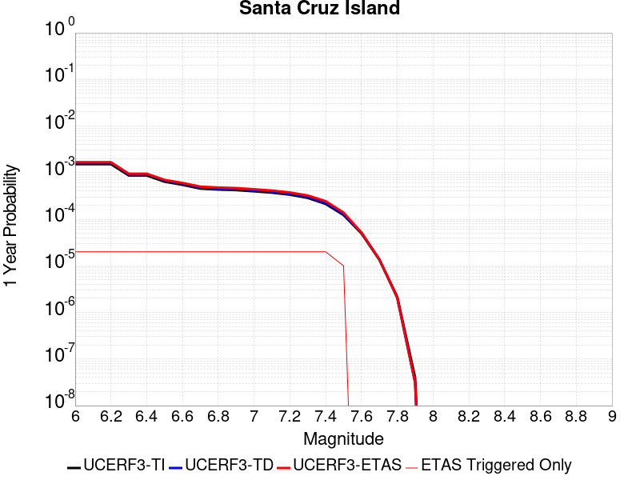 |  |

| Magnitude | 1 wk TI Prob | 1 wk TD Prob | 1 wk ETAS Prob | 1 wk ETAS/TD Gain | 1 wk ETAS Triggered Only | 1 mo TI Prob | 1 mo TD Prob | 1 mo ETAS Prob | 1 mo ETAS/TD Gain | 1 mo ETAS Triggered Only | 1 yr TI Prob | 1 yr TD Prob | 1 yr ETAS Prob | 1 yr ETAS/TD Gain | 1 yr ETAS Triggered Only | 10 yr TI Prob | 10 yr TD Prob | 10 yr ETAS Prob | 10 yr ETAS/TD Gain | 10 yr ETAS Triggered Only |
|-----|-----|-----|-----|-----|-----|-----|-----|-----|-----|-----|-----|-----|-----|-----|-----|-----|-----|-----|-----|-----|
| 6.0 | 2.9164563E-5 | 3.1601507E-5 | 3.1601507E-5 | 1.0 | 0.0 | 1.2498499E-4 | 1.3542877E-4 | 1.3542877E-4 | 1.0 | 0.0 | 0.0015206301 | 0.0016477344 | 0.0016677015 | 1.0121179 | 2.0E-5 | 0.015102667 | 0.016368907 | 0.016388578 | 1.0012019 | 2.0E-5 |
| 6.1 | 2.9164563E-5 | 3.1601507E-5 | 3.1601507E-5 | 1.0 | 0.0 | 1.2498499E-4 | 1.3542877E-4 | 1.3542877E-4 | 1.0 | 0.0 | 0.0015206301 | 0.0016477344 | 0.0016677015 | 1.0121179 | 2.0E-5 | 0.015102667 | 0.016368907 | 0.016388578 | 1.0012019 | 2.0E-5 |
| 6.2 | 2.9164563E-5 | 3.1601507E-5 | 3.1601507E-5 | 1.0 | 0.0 | 1.2498499E-4 | 1.3542877E-4 | 1.3542877E-4 | 1.0 | 0.0 | 0.0015206301 | 0.0016477344 | 0.0016677015 | 1.0121179 | 2.0E-5 | 0.015102667 | 0.016368907 | 0.016388578 | 1.0012019 | 2.0E-5 |
| 6.3 | 1.6635553E-5 | 1.7805196E-5 | 1.7805196E-5 | 1.0 | 0.0 | 7.1293274E-5 | 7.6305856E-5 | 7.6305856E-5 | 1.0 | 0.0 | 8.6765E-4 | 9.28646E-4 | 9.486275E-4 | 1.0215167 | 2.0E-5 | 0.008642701 | 0.009249527 | 0.009269342 | 1.0021423 | 2.0E-5 |
| 6.4 | 1.6635553E-5 | 1.7805196E-5 | 1.7805196E-5 | 1.0 | 0.0 | 7.1293274E-5 | 7.6305856E-5 | 7.6305856E-5 | 1.0 | 0.0 | 8.6765E-4 | 9.28646E-4 | 9.486275E-4 | 1.0215167 | 2.0E-5 | 0.008642701 | 0.009249527 | 0.009269342 | 1.0021423 | 2.0E-5 |
| 6.5 | 1.2238748E-5 | 1.3043571E-5 | 1.3043571E-5 | 1.0 | 0.0 | 5.2450723E-5 | 5.589984E-5 | 5.589984E-5 | 1.0 | 0.0 | 6.3840044E-4 | 6.803717E-4 | 7.003581E-4 | 1.0293757 | 2.0E-5 | 0.0063656955 | 0.006783286 | 0.0068031503 | 1.0029284 | 2.0E-5 |
| 6.6 | 1.0489767E-5 | 1.1157113E-5 | 1.1157113E-5 | 1.0 | 0.0 | 4.495537E-5 | 4.7815334E-5 | 4.7815334E-5 | 1.0 | 0.0 | 5.4719415E-4 | 5.8199844E-4 | 6.019868E-4 | 1.0343443 | 2.0E-5 | 0.005458487 | 0.005804983 | 0.005824867 | 1.0034254 | 2.0E-5 |
| 6.7 | 8.699222E-6 | 9.2371665E-6 | 9.2371665E-6 | 1.0 | 0.0 | 3.7281847E-5 | 3.958726E-5 | 3.958726E-5 | 1.0 | 0.0 | 4.5381195E-4 | 4.8186886E-4 | 5.0185923E-4 | 1.0414851 | 2.0E-5 | 0.0045288634 | 0.0048083076 | 0.0048282114 | 1.0041394 | 2.0E-5 |
| 6.8 | 8.307732E-6 | 8.817269E-6 | 8.817269E-6 | 1.0 | 0.0 | 3.560408E-5 | 3.778775E-5 | 3.778775E-5 | 1.0 | 0.0 | 4.3339343E-4 | 4.5996916E-4 | 4.7995997E-4 | 1.0434612 | 2.0E-5 | 0.004325492 | 0.0045902245 | 0.004610133 | 1.0043371 | 2.0E-5 |
| 6.9 | 8.073121E-6 | 8.565291E-6 | 8.565291E-6 | 1.0 | 0.0 | 3.459863E-5 | 3.6707876E-5 | 3.6707876E-5 | 1.0 | 0.0 | 4.2115687E-4 | 4.4682718E-4 | 4.6681822E-4 | 1.0447401 | 2.0E-5 | 0.004203596 | 0.004459339 | 0.00447925 | 1.004465 | 2.0E-5 |
| 7.0 | 7.617019E-6 | 8.074992E-6 | 8.074992E-6 | 1.0 | 0.0 | 3.264396E-5 | 3.460665E-5 | 3.460665E-5 | 1.0 | 0.0 | 3.9736772E-4 | 4.2125492E-4 | 4.412465E-4 | 1.0474572 | 2.0E-5 | 0.003966579 | 0.0042046113 | 0.004224527 | 1.0047367 | 2.0E-5 |
| 7.1 | 7.1224836E-6 | 7.546091E-6 | 7.546091E-6 | 1.0 | 0.0 | 3.052457E-5 | 3.233999E-5 | 3.233999E-5 | 1.0 | 0.0 | 3.715733E-4 | 3.9366863E-4 | 4.1366075E-4 | 1.0507841 | 2.0E-5 | 0.003709526 | 0.0039297557 | 0.0039496766 | 1.0050694 | 2.0E-5 |
| 7.2 | 6.441115E-6 | 6.8276604E-6 | 6.8276604E-6 | 1.0 | 0.0 | 2.7604487E-5 | 2.9261075E-5 | 2.9261075E-5 | 1.0 | 0.0 | 3.360328E-4 | 3.5619558E-4 | 3.7618846E-4 | 1.056129 | 2.0E-5 | 0.0033552512 | 0.003556275 | 0.003576204 | 1.0056039 | 2.0E-5 |
| 7.3 | 5.494274E-6 | 5.8202286E-6 | 5.8202286E-6 | 1.0 | 0.0 | 2.3546674E-5 | 2.49436E-5 | 2.49436E-5 | 1.0 | 0.0 | 2.8664304E-4 | 3.036462E-4 | 3.2364012E-4 | 1.0658461 | 2.0E-5 | 0.002862736 | 0.0030323362 | 0.0030522756 | 1.0065756 | 2.0E-5 |
| 7.4 | 4.0802624E-6 | 4.312424E-6 | 4.312424E-6 | 1.0 | 0.0 | 1.7486722E-5 | 1.8481687E-5 | 1.8481687E-5 | 1.0 | 0.0 | 2.1288003E-4 | 2.2499138E-4 | 2.4498688E-4 | 1.0888723 | 2.0E-5 | 0.0021267622 | 0.0022476448 | 0.0022675998 | 1.0088782 | 2.0E-5 |
| 7.5 | 2.3584746E-6 | 2.4753956E-6 | 2.4753956E-6 | 1.0 | 0.0 | 1.0107709E-5 | 1.06087955E-5 | 1.06087955E-5 | 1.0 | 0.0 | 1.2305441E-4 | 1.2915448E-4 | 1.3915318E-4 | 1.0774167 | 1.0E-5 | 0.0012298629 | 0.0012907992 | 0.0013007864 | 1.0077372 | 1.0E-5 |
| 7.6 | 9.4981914E-7 | 9.861221E-7 | 9.861221E-7 | 1.0 | 0.0 | 4.0706473E-6 | 4.226231E-6 | 4.226231E-6 | 1.0 | 0.0 | 4.9559E-5 | 5.1453157E-5 | 5.1453157E-5 | 1.0 | 0.0 | 4.954795E-4 | 5.1441375E-4 | 5.1441375E-4 | 1.0 | 0.0 |
| 7.7 | 2.6013532E-7 | 2.64172E-7 | 2.64172E-7 | 1.0 | 0.0 | 1.1148652E-6 | 1.1321652E-6 | 1.1321652E-6 | 1.0 | 0.0 | 1.3573399E-5 | 1.3784024E-5 | 1.3784024E-5 | 1.0 | 0.0 | 1.357257E-4 | 1.3783177E-4 | 1.3783177E-4 | 1.0 | 0.0 |
| 7.8 | 4.1522263E-8 | 3.9657554E-8 | 3.9657554E-8 | 1.0 | 0.0 | 1.7795254E-7 | 1.6996094E-7 | 1.6996094E-7 | 1.0 | 0.0 | 2.16657E-6 | 2.0692726E-6 | 2.0692726E-6 | 1.0 | 0.0 | 2.1665488E-5 | 2.0692556E-5 | 2.0692556E-5 | 1.0 | 0.0 |
| 7.9 | 7.7242046E-10 | 5.947626E-10 | 5.947626E-10 | 1.0 | 0.0 | 3.3103735E-9 | 2.548983E-9 | 2.548983E-9 | 1.0 | 0.0 | 4.0303796E-8 | 3.1033867E-8 | 3.1033867E-8 | 1.0 | 0.0 | 4.030379E-7 | 3.1033863E-7 | 3.1033863E-7 | 1.0 | 0.0 |

## Cucamonga
*[(top)](#table-of-contents)*

| 1 Week | 1 Month | 1 Year | 10 Year |
|-----|-----|-----|-----|
|  |  | 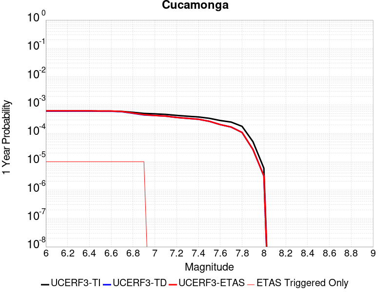 | 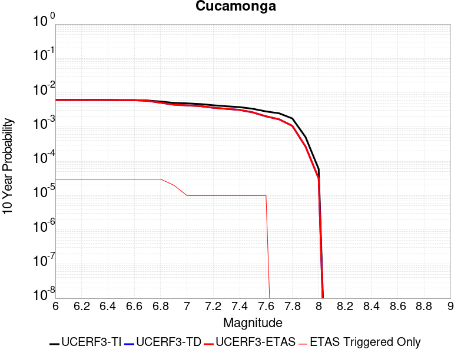 |

| Magnitude | 1 wk TI Prob | 1 wk TD Prob | 1 wk ETAS Prob | 1 wk ETAS/TD Gain | 1 wk ETAS Triggered Only | 1 mo TI Prob | 1 mo TD Prob | 1 mo ETAS Prob | 1 mo ETAS/TD Gain | 1 mo ETAS Triggered Only | 1 yr TI Prob | 1 yr TD Prob | 1 yr ETAS Prob | 1 yr ETAS/TD Gain | 1 yr ETAS Triggered Only | 10 yr TI Prob | 10 yr TD Prob | 10 yr ETAS Prob | 10 yr ETAS/TD Gain | 10 yr ETAS Triggered Only |
|-----|-----|-----|-----|-----|-----|-----|-----|-----|-----|-----|-----|-----|-----|-----|-----|-----|-----|-----|-----|-----|
| 6.0 | 1.1848348E-5 | 1.1740503E-5 | 1.1740503E-5 | 1.0 | 0.0 | 5.0777642E-5 | 5.0315488E-5 | 5.0315488E-5 | 1.0 | 0.0 | 6.180424E-4 | 6.124216E-4 | 6.2241545E-4 | 1.0163187 | 1.0E-5 | 0.0061632637 | 0.0061085485 | 0.0061383653 | 1.0048811 | 3.0E-5 |
| 6.1 | 1.1848348E-5 | 1.1740503E-5 | 1.1740503E-5 | 1.0 | 0.0 | 5.0777642E-5 | 5.0315488E-5 | 5.0315488E-5 | 1.0 | 0.0 | 6.180424E-4 | 6.124216E-4 | 6.2241545E-4 | 1.0163187 | 1.0E-5 | 0.0061632637 | 0.0061085485 | 0.0061383653 | 1.0048811 | 3.0E-5 |
| 6.2 | 1.1848348E-5 | 1.1740503E-5 | 1.1740503E-5 | 1.0 | 0.0 | 5.0777642E-5 | 5.0315488E-5 | 5.0315488E-5 | 1.0 | 0.0 | 6.180424E-4 | 6.124216E-4 | 6.2241545E-4 | 1.0163187 | 1.0E-5 | 0.0061632637 | 0.0061085485 | 0.0061383653 | 1.0048811 | 3.0E-5 |
| 6.3 | 1.1848348E-5 | 1.1740503E-5 | 1.1740503E-5 | 1.0 | 0.0 | 5.0777642E-5 | 5.0315488E-5 | 5.0315488E-5 | 1.0 | 0.0 | 6.180424E-4 | 6.124216E-4 | 6.2241545E-4 | 1.0163187 | 1.0E-5 | 0.0061632637 | 0.0061085485 | 0.0061383653 | 1.0048811 | 3.0E-5 |
| 6.4 | 1.1848348E-5 | 1.1740503E-5 | 1.1740503E-5 | 1.0 | 0.0 | 5.0777642E-5 | 5.0315488E-5 | 5.0315488E-5 | 1.0 | 0.0 | 6.180424E-4 | 6.124216E-4 | 6.2241545E-4 | 1.0163187 | 1.0E-5 | 0.0061632637 | 0.0061085485 | 0.0061383653 | 1.0048811 | 3.0E-5 |
| 6.5 | 1.16988695E-5 | 1.1579526E-5 | 1.1579526E-5 | 1.0 | 0.0 | 5.013705E-5 | 4.962561E-5 | 4.962561E-5 | 1.0 | 0.0 | 6.102476E-4 | 6.04027E-4 | 6.14021E-4 | 1.0165455 | 1.0E-5 | 0.006085745 | 0.0060250587 | 0.006054878 | 1.0049492 | 3.0E-5 |
| 6.6 | 1.16988695E-5 | 1.1579526E-5 | 1.1579526E-5 | 1.0 | 0.0 | 5.013705E-5 | 4.962561E-5 | 4.962561E-5 | 1.0 | 0.0 | 6.102476E-4 | 6.04027E-4 | 6.14021E-4 | 1.0165455 | 1.0E-5 | 0.006085745 | 0.0060250587 | 0.006054878 | 1.0049492 | 3.0E-5 |
| 6.7 | 1.1397107E-5 | 1.1118342E-5 | 1.1118342E-5 | 1.0 | 0.0 | 4.884383E-5 | 4.764918E-5 | 4.764918E-5 | 1.0 | 0.0 | 5.9451134E-4 | 5.799768E-4 | 5.89971E-4 | 1.0172321 | 1.0E-5 | 0.005929234 | 0.0057858177 | 0.005815644 | 1.0051551 | 3.0E-5 |
| 6.8 | 1.058387E-5 | 9.7879565E-6 | 9.7879565E-6 | 1.0 | 0.0 | 4.5358654E-5 | 4.194772E-5 | 4.194772E-5 | 1.0 | 0.0 | 5.521017E-4 | 5.1059487E-4 | 5.2058976E-4 | 1.019575 | 1.0E-5 | 0.00550732 | 0.0050952607 | 0.005125108 | 1.0058578 | 3.0E-5 |
| 6.9 | 9.690046E-6 | 8.582166E-6 | 8.582166E-6 | 1.0 | 0.0 | 4.1528107E-5 | 3.6780195E-5 | 3.6780195E-5 | 1.0 | 0.0 | 5.054874E-4 | 4.4770725E-4 | 4.577028E-4 | 1.022326 | 1.0E-5 | 0.005043391 | 0.0044690236 | 0.0044889343 | 1.0044552 | 2.0E-5 |
| 7.0 | 9.381461E-6 | 8.1897115E-6 | 8.1897115E-6 | 1.0 | 0.0 | 4.020564E-5 | 3.5098295E-5 | 3.5098295E-5 | 1.0 | 0.0 | 4.893937E-4 | 4.2723832E-4 | 4.2723832E-4 | 1.0 | 0.0 | 0.0048831734 | 0.004265141 | 0.0042750984 | 1.0023346 | 1.0E-5 |
| 7.1 | 8.946492E-6 | 7.7844425E-6 | 7.7844425E-6 | 1.0 | 0.0 | 3.8341543E-5 | 3.336147E-5 | 3.336147E-5 | 1.0 | 0.0 | 4.667083E-4 | 4.061005E-4 | 4.061005E-4 | 1.0 | 0.0 | 0.0046572937 | 0.0040545585 | 0.0040645176 | 1.0024563 | 1.0E-5 |
| 7.2 | 8.251016E-6 | 6.9776543E-6 | 6.9776543E-6 | 1.0 | 0.0 | 3.5361016E-5 | 2.9903891E-5 | 2.9903891E-5 | 1.0 | 0.0 | 4.3043532E-4 | 3.640193E-4 | 3.640193E-4 | 1.0 | 0.0 | 0.0042960253 | 0.0036352002 | 0.003645164 | 1.0027409 | 1.0E-5 |
| 7.3 | 7.717881E-6 | 6.48865E-6 | 6.48865E-6 | 1.0 | 0.0 | 3.3076216E-5 | 2.7808204E-5 | 2.7808204E-5 | 1.0 | 0.0 | 4.026285E-4 | 3.385125E-4 | 3.385125E-4 | 1.0 | 0.0 | 0.004018998 | 0.003380947 | 0.0033909134 | 1.0029478 | 1.0E-5 |
| 7.4 | 7.275623E-6 | 6.034204E-6 | 6.034204E-6 | 1.0 | 0.0 | 3.118087E-5 | 2.586062E-5 | 2.586062E-5 | 1.0 | 0.0 | 3.7956095E-4 | 3.1480778E-4 | 3.1480778E-4 | 1.0 | 0.0 | 0.0037891332 | 0.0031445946 | 0.003154563 | 1.00317 | 1.0E-5 |
| 7.5 | 6.5109502E-6 | 5.10255E-6 | 5.10255E-6 | 1.0 | 0.0 | 2.7903774E-5 | 2.1867889E-5 | 2.1867889E-5 | 1.0 | 0.0 | 3.3967546E-4 | 2.6620916E-4 | 2.6620916E-4 | 1.0 | 0.0 | 0.0033915674 | 0.0026598696 | 0.002669843 | 1.0037496 | 1.0E-5 |
| 7.6 | 5.4495326E-6 | 3.910293E-6 | 3.910293E-6 | 1.0 | 0.0 | 2.335493E-5 | 1.675829E-5 | 1.675829E-5 | 1.0 | 0.0 | 2.8430918E-4 | 2.0401315E-4 | 2.0401315E-4 | 1.0 | 0.0 | 0.0028394572 | 0.0020392216 | 0.0020492012 | 1.0048938 | 1.0E-5 |
| 7.7 | 4.7997164E-6 | 3.2018022E-6 | 3.2018022E-6 | 1.0 | 0.0 | 2.057005E-5 | 1.3721938E-5 | 1.3721938E-5 | 1.0 | 0.0 | 2.504116E-4 | 1.6705181E-4 | 1.6705181E-4 | 1.0 | 0.0 | 0.002501296 | 0.0016702361 | 0.0016702361 | 1.0 | 0.0 |
| 7.8 | 3.3941733E-6 | 2.0651007E-6 | 2.0651007E-6 | 1.0 | 0.0 | 1.4546376E-5 | 8.850401E-6 | 8.850401E-6 | 1.0 | 0.0 | 1.7708774E-4 | 1.07748325E-4 | 1.07748325E-4 | 1.0 | 0.0 | 0.0017694668 | 0.0010771834 | 0.0010771834 | 1.0 | 0.0 |
| 7.9 | 9.750552E-7 | 5.1587614E-7 | 5.1587614E-7 | 1.0 | 0.0 | 4.178801E-6 | 2.2108957E-6 | 2.2108957E-6 | 1.0 | 0.0 | 5.0875715E-5 | 2.6917327E-5 | 2.6917327E-5 | 1.0 | 0.0 | 5.086407E-4 | 2.6914108E-4 | 2.6914108E-4 | 1.0 | 0.0 |
| 8.0 | 1.133857E-7 | 6.055326E-8 | 6.055326E-8 | 1.0 | 0.0 | 4.8593864E-7 | 2.5951397E-7 | 2.5951397E-7 | 1.0 | 0.0 | 5.9162867E-6 | 3.159578E-6 | 3.159578E-6 | 1.0 | 0.0 | 5.916129E-5 | 3.1595348E-5 | 3.1595348E-5 | 1.0 | 0.0 |

## Raymond
*[(top)](#table-of-contents)*

| 1 Week | 1 Month | 1 Year | 10 Year |
|-----|-----|-----|-----|
|  |  |  |  |

| Magnitude | 1 wk TI Prob | 1 wk TD Prob | 1 wk ETAS Prob | 1 wk ETAS/TD Gain | 1 wk ETAS Triggered Only | 1 mo TI Prob | 1 mo TD Prob | 1 mo ETAS Prob | 1 mo ETAS/TD Gain | 1 mo ETAS Triggered Only | 1 yr TI Prob | 1 yr TD Prob | 1 yr ETAS Prob | 1 yr ETAS/TD Gain | 1 yr ETAS Triggered Only | 10 yr TI Prob | 10 yr TD Prob | 10 yr ETAS Prob | 10 yr ETAS/TD Gain | 10 yr ETAS Triggered Only |
|-----|-----|-----|-----|-----|-----|-----|-----|-----|-----|-----|-----|-----|-----|-----|-----|-----|-----|-----|-----|-----|
| 6.0 | 1.5157413E-5 | 1.581146E-5 | 1.581146E-5 | 1.0 | 0.0 | 6.4958724E-5 | 6.776178E-5 | 6.776178E-5 | 1.0 | 0.0 | 7.905855E-4 | 8.247125E-4 | 8.247125E-4 | 1.0 | 0.0 | 0.007877788 | 0.008219044 | 0.008238879 | 1.0024134 | 2.0E-5 |
| 6.1 | 1.5157413E-5 | 1.581146E-5 | 1.581146E-5 | 1.0 | 0.0 | 6.4958724E-5 | 6.776178E-5 | 6.776178E-5 | 1.0 | 0.0 | 7.905855E-4 | 8.247125E-4 | 8.247125E-4 | 1.0 | 0.0 | 0.007877788 | 0.008219044 | 0.008238879 | 1.0024134 | 2.0E-5 |
| 6.2 | 1.5157413E-5 | 1.581146E-5 | 1.581146E-5 | 1.0 | 0.0 | 6.4958724E-5 | 6.776178E-5 | 6.776178E-5 | 1.0 | 0.0 | 7.905855E-4 | 8.247125E-4 | 8.247125E-4 | 1.0 | 0.0 | 0.007877788 | 0.008219044 | 0.008238879 | 1.0024134 | 2.0E-5 |
| 6.3 | 1.5157413E-5 | 1.581146E-5 | 1.581146E-5 | 1.0 | 0.0 | 6.4958724E-5 | 6.776178E-5 | 6.776178E-5 | 1.0 | 0.0 | 7.905855E-4 | 8.247125E-4 | 8.247125E-4 | 1.0 | 0.0 | 0.007877788 | 0.008219044 | 0.008238879 | 1.0024134 | 2.0E-5 |
| 6.4 | 1.3941944E-5 | 1.4455919E-5 | 1.4455919E-5 | 1.0 | 0.0 | 5.9749822E-5 | 6.1952596E-5 | 6.1952596E-5 | 1.0 | 0.0 | 7.2721124E-4 | 7.540352E-4 | 7.540352E-4 | 1.0 | 0.0 | 0.007248361 | 0.0075171073 | 0.007536957 | 1.0026406 | 2.0E-5 |
| 6.5 | 1.3941944E-5 | 1.4455919E-5 | 1.4455919E-5 | 1.0 | 0.0 | 5.9749822E-5 | 6.1952596E-5 | 6.1952596E-5 | 1.0 | 0.0 | 7.2721124E-4 | 7.540352E-4 | 7.540352E-4 | 1.0 | 0.0 | 0.007248361 | 0.0075171073 | 0.007536957 | 1.0026406 | 2.0E-5 |
| 6.6 | 1.0542609E-5 | 1.0672057E-5 | 1.0672057E-5 | 1.0 | 0.0 | 4.5181827E-5 | 4.573662E-5 | 4.573662E-5 | 1.0 | 0.0 | 5.499499E-4 | 5.567065E-4 | 5.567065E-4 | 1.0 | 0.0 | 0.005485909 | 0.0055536865 | 0.0055735754 | 1.0035812 | 2.0E-5 |
| 6.7 | 1.0542609E-5 | 1.0672057E-5 | 1.0672057E-5 | 1.0 | 0.0 | 4.5181827E-5 | 4.573662E-5 | 4.573662E-5 | 1.0 | 0.0 | 5.499499E-4 | 5.567065E-4 | 5.567065E-4 | 1.0 | 0.0 | 0.005485909 | 0.0055536865 | 0.0055735754 | 1.0035812 | 2.0E-5 |
| 6.8 | 1.0079132E-5 | 1.0177569E-5 | 1.0177569E-5 | 1.0 | 0.0 | 4.3195567E-5 | 4.3617452E-5 | 4.3617452E-5 | 1.0 | 0.0 | 5.257791E-4 | 5.309184E-4 | 5.309184E-4 | 1.0 | 0.0 | 0.0052453685 | 0.005297056 | 0.00531695 | 1.0037557 | 2.0E-5 |
| 6.9 | 7.721598E-6 | 7.549625E-6 | 7.549625E-6 | 1.0 | 0.0 | 3.3092143E-5 | 3.2355143E-5 | 3.2355143E-5 | 1.0 | 0.0 | 4.0282236E-4 | 3.9385384E-4 | 3.9385384E-4 | 1.0 | 0.0 | 0.0040209293 | 0.003931698 | 0.0039516194 | 1.0050669 | 2.0E-5 |
| 7.0 | 7.137566E-6 | 6.911987E-6 | 6.911987E-6 | 1.0 | 0.0 | 3.058921E-5 | 2.962247E-5 | 2.962247E-5 | 1.0 | 0.0 | 3.7236E-4 | 3.6059498E-4 | 3.6059498E-4 | 1.0 | 0.0 | 0.0037173668 | 0.003600223 | 0.003620151 | 1.0055352 | 2.0E-5 |
| 7.1 | 5.654976E-6 | 5.300128E-6 | 5.300128E-6 | 1.0 | 0.0 | 2.4235387E-5 | 2.2714637E-5 | 2.2714637E-5 | 1.0 | 0.0 | 2.9502588E-4 | 2.7651584E-4 | 2.7651584E-4 | 1.0 | 0.0 | 0.0029463451 | 0.0027617547 | 0.0027816996 | 1.0072218 | 2.0E-5 |
| 7.2 | 4.9358455E-6 | 4.5272022E-6 | 4.5272022E-6 | 1.0 | 0.0 | 2.1153453E-5 | 1.9402152E-5 | 1.9402152E-5 | 1.0 | 0.0 | 2.5751285E-4 | 2.3619573E-4 | 2.3619573E-4 | 1.0 | 0.0 | 0.0025721465 | 0.002359475 | 0.002379428 | 1.0084565 | 2.0E-5 |
| 7.3 | 4.2368597E-6 | 3.8061232E-6 | 3.8061232E-6 | 1.0 | 0.0 | 1.8157843E-5 | 1.6311855E-5 | 1.6311855E-5 | 1.0 | 0.0 | 2.2104931E-4 | 1.9857884E-4 | 1.9857884E-4 | 1.0 | 0.0 | 0.0022082955 | 0.0019840386 | 0.001994019 | 1.0050303 | 1.0E-5 |
| 7.4 | 3.4999923E-6 | 3.0442052E-6 | 3.0442052E-6 | 1.0 | 0.0 | 1.49998805E-5 | 1.3046529E-5 | 1.3046529E-5 | 1.0 | 0.0 | 1.8260824E-4 | 1.5883E-4 | 1.5883E-4 | 1.0 | 0.0 | 0.0018245826 | 0.0015871865 | 0.0015971706 | 1.0062904 | 1.0E-5 |
| 7.5 | 2.738017E-6 | 2.30236E-6 | 2.30236E-6 | 1.0 | 0.0 | 1.1734306E-5 | 9.86722E-6 | 9.86722E-6 | 1.0 | 0.0 | 1.428558E-4 | 1.20126846E-4 | 1.20126846E-4 | 1.0 | 0.0 | 0.0014276401 | 0.0012006395 | 0.0012106275 | 1.0083189 | 1.0E-5 |
| 7.6 | 1.8186392E-6 | 1.4425223E-6 | 1.4425223E-6 | 1.0 | 0.0 | 7.794145E-6 | 6.182224E-6 | 6.182224E-6 | 1.0 | 0.0 | 9.488958E-5 | 7.526602E-5 | 7.526602E-5 | 1.0 | 0.0 | 9.4849075E-4 | 7.524228E-4 | 7.6241523E-4 | 1.0132804 | 1.0E-5 |
| 7.7 | 1.0660348E-6 | 7.645493E-7 | 7.645493E-7 | 1.0 | 0.0 | 4.5687125E-6 | 3.2766359E-6 | 3.2766359E-6 | 1.0 | 0.0 | 5.5622655E-5 | 3.989233E-5 | 3.989233E-5 | 1.0 | 0.0 | 5.5608735E-4 | 3.9886677E-4 | 3.9886677E-4 | 1.0 | 0.0 |
| 7.8 | 6.913602E-7 | 4.3218543E-7 | 4.3218543E-7 | 1.0 | 0.0 | 2.962969E-6 | 1.852222E-6 | 1.852222E-6 | 1.0 | 0.0 | 3.607355E-5 | 2.2550576E-5 | 2.2550576E-5 | 1.0 | 0.0 | 3.6067693E-4 | 2.2549674E-4 | 2.2549674E-4 | 1.0 | 0.0 |
| 7.9 | 7.425201E-8 | 5.323823E-8 | 5.323823E-8 | 1.0 | 0.0 | 3.1822285E-7 | 2.2816384E-7 | 2.2816384E-7 | 1.0 | 0.0 | 3.874356E-6 | 2.7778926E-6 | 2.7778926E-6 | 1.0 | 0.0 | 3.8742884E-5 | 2.7778708E-5 | 2.7778708E-5 | 1.0 | 0.0 |

## Oak Ridge (Onshore)
*[(top)](#table-of-contents)*

| 1 Week | 1 Month | 1 Year | 10 Year |
|-----|-----|-----|-----|
|  |  |  | 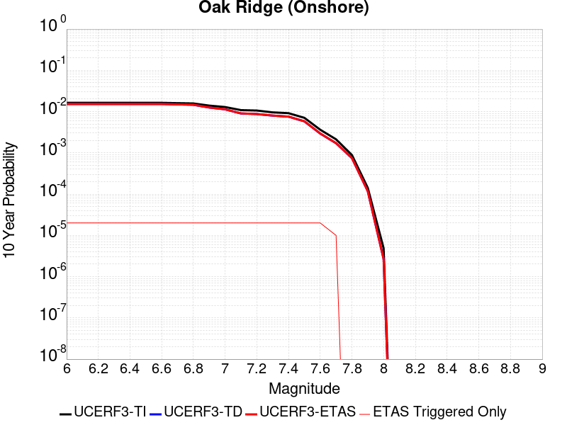 |

| Magnitude | 1 wk TI Prob | 1 wk TD Prob | 1 wk ETAS Prob | 1 wk ETAS/TD Gain | 1 wk ETAS Triggered Only | 1 mo TI Prob | 1 mo TD Prob | 1 mo ETAS Prob | 1 mo ETAS/TD Gain | 1 mo ETAS Triggered Only | 1 yr TI Prob | 1 yr TD Prob | 1 yr ETAS Prob | 1 yr ETAS/TD Gain | 1 yr ETAS Triggered Only | 10 yr TI Prob | 10 yr TD Prob | 10 yr ETAS Prob | 10 yr ETAS/TD Gain | 10 yr ETAS Triggered Only |
|-----|-----|-----|-----|-----|-----|-----|-----|-----|-----|-----|-----|-----|-----|-----|-----|-----|-----|-----|-----|-----|
| 6.0 | 3.155064E-5 | 2.9530109E-5 | 2.9530109E-5 | 1.0 | 0.0 | 1.3521002E-4 | 1.2655169E-4 | 1.2655169E-4 | 1.0 | 0.0 | 0.001644939 | 0.0015397159 | 0.0015497005 | 1.0064847 | 1.0E-5 | 0.01632816 | 0.01529468 | 0.015314375 | 1.0012877 | 2.0E-5 |
| 6.1 | 3.155064E-5 | 2.9530109E-5 | 2.9530109E-5 | 1.0 | 0.0 | 1.3521002E-4 | 1.2655169E-4 | 1.2655169E-4 | 1.0 | 0.0 | 0.001644939 | 0.0015397159 | 0.0015497005 | 1.0064847 | 1.0E-5 | 0.01632816 | 0.01529468 | 0.015314375 | 1.0012877 | 2.0E-5 |
| 6.2 | 3.155064E-5 | 2.9530109E-5 | 2.9530109E-5 | 1.0 | 0.0 | 1.3521002E-4 | 1.2655169E-4 | 1.2655169E-4 | 1.0 | 0.0 | 0.001644939 | 0.0015397159 | 0.0015497005 | 1.0064847 | 1.0E-5 | 0.01632816 | 0.01529468 | 0.015314375 | 1.0012877 | 2.0E-5 |
| 6.3 | 3.155064E-5 | 2.9530109E-5 | 2.9530109E-5 | 1.0 | 0.0 | 1.3521002E-4 | 1.2655169E-4 | 1.2655169E-4 | 1.0 | 0.0 | 0.001644939 | 0.0015397159 | 0.0015497005 | 1.0064847 | 1.0E-5 | 0.01632816 | 0.01529468 | 0.015314375 | 1.0012877 | 2.0E-5 |
| 6.4 | 3.155064E-5 | 2.9530109E-5 | 2.9530109E-5 | 1.0 | 0.0 | 1.3521002E-4 | 1.2655169E-4 | 1.2655169E-4 | 1.0 | 0.0 | 0.001644939 | 0.0015397159 | 0.0015497005 | 1.0064847 | 1.0E-5 | 0.01632816 | 0.01529468 | 0.015314375 | 1.0012877 | 2.0E-5 |
| 6.5 | 3.155064E-5 | 2.9530109E-5 | 2.9530109E-5 | 1.0 | 0.0 | 1.3521002E-4 | 1.2655169E-4 | 1.2655169E-4 | 1.0 | 0.0 | 0.001644939 | 0.0015397159 | 0.0015497005 | 1.0064847 | 1.0E-5 | 0.01632816 | 0.01529468 | 0.015314375 | 1.0012877 | 2.0E-5 |
| 6.6 | 3.155064E-5 | 2.9530109E-5 | 2.9530109E-5 | 1.0 | 0.0 | 1.3521002E-4 | 1.2655169E-4 | 1.2655169E-4 | 1.0 | 0.0 | 0.001644939 | 0.0015397159 | 0.0015497005 | 1.0064847 | 1.0E-5 | 0.01632816 | 0.01529468 | 0.015314375 | 1.0012877 | 2.0E-5 |
| 6.7 | 3.098897E-5 | 2.8868233E-5 | 2.8868233E-5 | 1.0 | 0.0 | 1.328031E-4 | 1.2371535E-4 | 1.2371535E-4 | 1.0 | 0.0 | 0.0016156785 | 0.0015052313 | 0.0015152162 | 1.0066335 | 1.0E-5 | 0.016039822 | 0.014954496 | 0.014974196 | 1.0013174 | 2.0E-5 |
| 6.8 | 3.0449872E-5 | 2.8243365E-5 | 2.8243365E-5 | 1.0 | 0.0 | 1.3049292E-4 | 1.21037585E-4 | 1.21037585E-4 | 1.0 | 0.0 | 0.0015875935 | 0.0014726736 | 0.0014826589 | 1.0067804 | 1.0E-5 | 0.015762992 | 0.01463321 | 0.014652918 | 1.0013467 | 2.0E-5 |
| 6.9 | 2.697928E-5 | 2.4223342E-5 | 2.4223342E-5 | 1.0 | 0.0 | 1.15620365E-4 | 1.03810315E-4 | 1.03810315E-4 | 1.0 | 0.0 | 0.0014067689 | 0.0012631794 | 0.0012731667 | 1.0079066 | 1.0E-5 | 0.0139789665 | 0.012562404 | 0.012582153 | 1.001572 | 2.0E-5 |
| 7.0 | 2.4893961E-5 | 2.186538E-5 | 2.186538E-5 | 1.0 | 0.0 | 1.0668404E-4 | 9.370551E-5 | 9.370551E-5 | 1.0 | 0.0 | 0.0012981043 | 0.0011402852 | 0.0011502737 | 1.0087597 | 1.0E-5 | 0.012905477 | 0.0113463225 | 0.011366095 | 1.0017427 | 2.0E-5 |
| 7.1 | 2.0945363E-5 | 1.7357392E-5 | 1.7357392E-5 | 1.0 | 0.0 | 8.976275E-5 | 7.438673E-5 | 7.438673E-5 | 1.0 | 0.0 | 0.0010923136 | 9.0528687E-4 | 9.152778E-4 | 1.0110363 | 1.0E-5 | 0.0108696 | 0.009016619 | 0.009036439 | 1.0021981 | 2.0E-5 |
| 7.2 | 2.0439404E-5 | 1.681228E-5 | 1.681228E-5 | 1.0 | 0.0 | 8.7594504E-5 | 7.205067E-5 | 7.205067E-5 | 1.0 | 0.0 | 0.0010659413 | 8.7686855E-4 | 8.868598E-4 | 1.0113943 | 1.0E-5 | 0.010608427 | 0.0087346975 | 0.008754523 | 1.0022697 | 2.0E-5 |
| 7.3 | 1.8463334E-5 | 1.5383186E-5 | 1.5383186E-5 | 1.0 | 0.0 | 7.912617E-5 | 6.59263E-5 | 6.59263E-5 | 1.0 | 0.0 | 9.6293533E-4 | 8.0236146E-4 | 8.1235345E-4 | 1.0124532 | 1.0E-5 | 0.009587734 | 0.007995202 | 0.008015042 | 1.0024815 | 2.0E-5 |
| 7.4 | 1.763139E-5 | 1.4518037E-5 | 1.4518037E-5 | 1.0 | 0.0 | 7.556091E-5 | 6.221869E-5 | 6.221869E-5 | 1.0 | 0.0 | 9.1956573E-4 | 7.5725326E-4 | 7.672457E-4 | 1.0131956 | 1.0E-5 | 0.009157699 | 0.007547224 | 0.007567073 | 1.00263 | 2.0E-5 |
| 7.5 | 1.3594944E-5 | 1.1164092E-5 | 1.1164092E-5 | 1.0 | 0.0 | 5.8262744E-5 | 4.7845246E-5 | 4.7845246E-5 | 1.0 | 0.0 | 7.0911803E-4 | 5.823627E-4 | 5.923569E-4 | 1.0171615 | 1.0E-5 | 0.007068595 | 0.0058085728 | 0.0058284565 | 1.0034232 | 2.0E-5 |
| 7.6 | 6.9889534E-6 | 5.636984E-6 | 5.636984E-6 | 1.0 | 0.0 | 2.9952313E-5 | 2.4158282E-5 | 2.4158282E-5 | 1.0 | 0.0 | 3.646084E-4 | 2.940878E-4 | 3.0408485E-4 | 1.0339935 | 1.0E-5 | 0.0036401073 | 0.0029370303 | 0.0029569715 | 1.0067896 | 2.0E-5 |
| 7.7 | 4.0824193E-6 | 3.283423E-6 | 3.283423E-6 | 1.0 | 0.0 | 1.7495966E-5 | 1.4071738E-5 | 1.4071738E-5 | 1.0 | 0.0 | 2.1299256E-4 | 1.7131008E-4 | 1.8130837E-4 | 1.0583637 | 1.0E-5 | 0.0021278851 | 0.0017117936 | 0.0017217764 | 1.0058318 | 1.0E-5 |
| 7.8 | 1.7023609E-6 | 1.4371175E-6 | 1.4371175E-6 | 1.0 | 0.0 | 7.295812E-6 | 6.1590604E-6 | 6.1590604E-6 | 1.0 | 0.0 | 8.882289E-5 | 7.498401E-5 | 7.498401E-5 | 1.0 | 0.0 | 8.8787393E-4 | 7.495899E-4 | 7.495899E-4 | 1.0 | 0.0 |
| 7.9 | 2.721225E-7 | 2.2618252E-7 | 2.2618252E-7 | 1.0 | 0.0 | 1.1662388E-6 | 9.693533E-7 | 9.693533E-7 | 1.0 | 0.0 | 1.4198865E-5 | 1.1801815E-5 | 1.1801815E-5 | 1.0 | 0.0 | 1.4197957E-4 | 1.1801216E-4 | 1.1801216E-4 | 1.0 | 0.0 |
| 8.0 | 9.364255E-9 | 5.121853E-9 | 5.121853E-9 | 1.0 | 0.0 | 4.0132523E-8 | 2.19508E-8 | 2.19508E-8 | 1.0 | 0.0 | 4.8861335E-7 | 2.6725098E-7 | 2.6725098E-7 | 1.0 | 0.0 | 4.8861225E-6 | 2.6725068E-6 | 2.6725068E-6 | 1.0 | 0.0 |

## Hunting Creek - Berryessa 2011 CFM
*[(top)](#table-of-contents)*

| 1 Week | 1 Month | 1 Year | 10 Year |
|-----|-----|-----|-----|
|  | 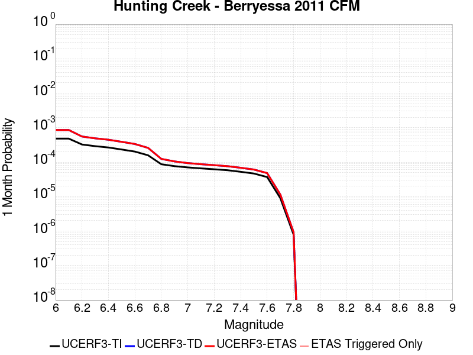 |  | 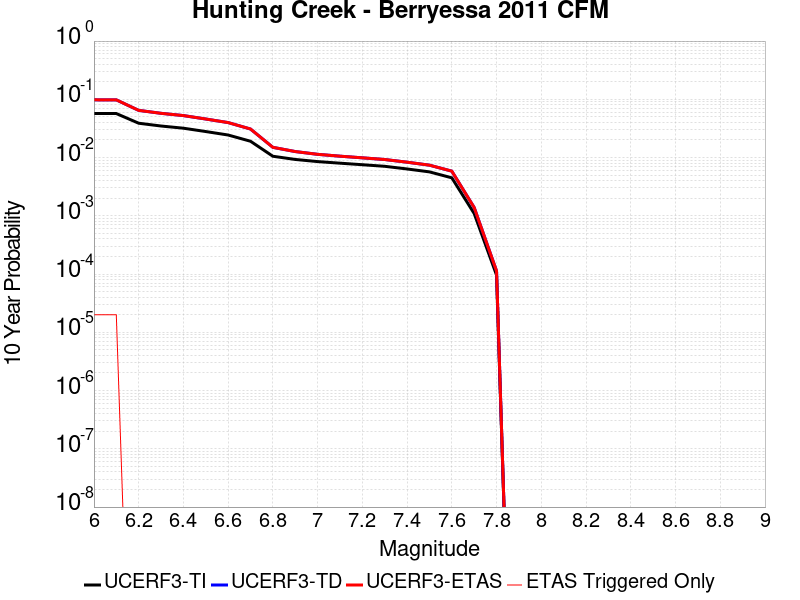 |

| Magnitude | 1 wk TI Prob | 1 wk TD Prob | 1 wk ETAS Prob | 1 wk ETAS/TD Gain | 1 wk ETAS Triggered Only | 1 mo TI Prob | 1 mo TD Prob | 1 mo ETAS Prob | 1 mo ETAS/TD Gain | 1 mo ETAS Triggered Only | 1 yr TI Prob | 1 yr TD Prob | 1 yr ETAS Prob | 1 yr ETAS/TD Gain | 1 yr ETAS Triggered Only | 10 yr TI Prob | 10 yr TD Prob | 10 yr ETAS Prob | 10 yr ETAS/TD Gain | 10 yr ETAS Triggered Only |
|-----|-----|-----|-----|-----|-----|-----|-----|-----|-----|-----|-----|-----|-----|-----|-----|-----|-----|-----|-----|-----|
| 6.0 | 1.1270982E-4 | 2.0031964E-4 | 2.0031964E-4 | 1.0 | 0.0 | 4.8295266E-4 | 8.581843E-4 | 8.581843E-4 | 1.0 | 0.0 | 0.0058641075 | 0.010388346 | 0.010388346 | 1.0 | 0.0 | 0.057117578 | 0.098059885 | 0.09807792 | 1.0001839 | 2.0E-5 |
| 6.1 | 1.1239393E-4 | 1.9980097E-4 | 1.9980097E-4 | 1.0 | 0.0 | 4.8159933E-4 | 8.559629E-4 | 8.559629E-4 | 1.0 | 0.0 | 0.0058477195 | 0.010361584 | 0.010361584 | 1.0 | 0.0 | 0.056962132 | 0.0978183 | 0.097836345 | 1.0001844 | 2.0E-5 |
| 6.2 | 7.596265E-5 | 1.2936273E-4 | 1.2936273E-4 | 1.0 | 0.0 | 3.2551357E-4 | 5.5427616E-4 | 5.5427616E-4 | 1.0 | 0.0 | 0.0039559277 | 0.006722758 | 0.006722758 | 1.0 | 0.0 | 0.038862433 | 0.064605676 | 0.064605676 | 1.0 | 0.0 |
| 6.3 | 6.78794E-5 | 1.14508424E-4 | 1.14508424E-4 | 1.0 | 0.0 | 2.9087928E-4 | 4.90639E-4 | 4.90639E-4 | 1.0 | 0.0 | 0.003535705 | 0.0059538744 | 0.0059538744 | 1.0 | 0.0 | 0.034799766 | 0.0574781 | 0.0574781 | 1.0 | 0.0 |
| 6.4 | 6.2165134E-5 | 1.04371895E-4 | 1.04371895E-4 | 1.0 | 0.0 | 2.6639478E-4 | 4.4721377E-4 | 4.4721377E-4 | 1.0 | 0.0 | 0.0032385332 | 0.0054285317 | 0.0054285317 | 1.0 | 0.0 | 0.03191742 | 0.05256231 | 0.05256231 | 1.0 | 0.0 |
| 6.5 | 5.4368087E-5 | 9.072284E-5 | 9.072284E-5 | 1.0 | 0.0 | 2.3298527E-4 | 3.8874368E-4 | 3.8874368E-4 | 1.0 | 0.0 | 0.0028329059 | 0.004720675 | 0.004720675 | 1.0 | 0.0 | 0.027970633 | 0.045890886 | 0.045890886 | 1.0 | 0.0 |
| 6.6 | 4.729947E-5 | 7.848632E-5 | 7.848632E-5 | 1.0 | 0.0 | 2.0269625E-4 | 3.3632113E-4 | 3.3632113E-4 | 1.0 | 0.0 | 0.002465034 | 0.0040855817 | 0.0040855817 | 1.0 | 0.0 | 0.02437869 | 0.039860826 | 0.039860826 | 1.0 | 0.0 |
| 6.7 | 3.6875328E-5 | 6.0457234E-5 | 6.0457234E-5 | 1.0 | 0.0 | 1.5802756E-4 | 2.590707E-4 | 2.590707E-4 | 1.0 | 0.0 | 0.0019222875 | 0.003148925 | 0.003148925 | 1.0 | 0.0 | 0.019057442 | 0.030900152 | 0.030900152 | 1.0 | 0.0 |
| 6.8 | 2.0292036E-5 | 2.898037E-5 | 2.898037E-5 | 1.0 | 0.0 | 8.6962966E-5 | 1.2419555E-4 | 1.2419555E-4 | 1.0 | 0.0 | 0.0010582599 | 0.001511019 | 0.001511019 | 1.0 | 0.0 | 0.010532344 | 0.014981191 | 0.014981191 | 1.0 | 0.0 |
| 6.9 | 1.7871042E-5 | 2.4475765E-5 | 2.4475765E-5 | 1.0 | 0.0 | 7.658793E-5 | 1.0489191E-4 | 1.0489191E-4 | 1.0 | 0.0 | 9.320591E-4 | 0.0012763102 | 0.0012763102 | 1.0 | 0.0 | 0.009281595 | 0.012681914 | 0.012681914 | 1.0 | 0.0 |
| 7.0 | 1.6415532E-5 | 2.190946E-5 | 2.190946E-5 | 1.0 | 0.0 | 7.035038E-5 | 9.389433E-5 | 9.389433E-5 | 1.0 | 0.0 | 8.561793E-4 | 0.001142565 | 0.001142565 | 1.0 | 0.0 | 0.008528882 | 0.01136625 | 0.01136625 | 1.0 | 0.0 |
| 7.1 | 1.5409885E-5 | 2.0349318E-5 | 2.0349318E-5 | 1.0 | 0.0 | 6.6040695E-5 | 8.7208464E-5 | 8.7208464E-5 | 1.0 | 0.0 | 8.0374884E-4 | 0.0010612486 | 0.0010612486 | 1.0 | 0.0 | 0.00800848 | 0.010562173 | 0.010562173 | 1.0 | 0.0 |
| 7.2 | 1.4497423E-5 | 1.9057747E-5 | 1.9057747E-5 | 1.0 | 0.0 | 6.213033E-5 | 8.167352E-5 | 8.167352E-5 | 1.0 | 0.0 | 7.5617427E-4 | 9.939246E-4 | 9.939246E-4 | 1.0 | 0.0 | 0.0075360634 | 0.009895432 | 0.009895432 | 1.0 | 0.0 |
| 7.3 | 1.3615175E-5 | 1.7828816E-5 | 1.7828816E-5 | 1.0 | 0.0 | 5.8349444E-5 | 7.640699E-5 | 7.640699E-5 | 1.0 | 0.0 | 7.101729E-4 | 9.2986104E-4 | 9.2986104E-4 | 1.0 | 0.0 | 0.0070790765 | 0.009260243 | 0.009260243 | 1.0 | 0.0 |
| 7.4 | 1.2252825E-5 | 1.6028685E-5 | 1.6028685E-5 | 1.0 | 0.0 | 5.251105E-5 | 6.869258E-5 | 6.869258E-5 | 1.0 | 0.0 | 6.391345E-4 | 8.36014E-4 | 8.36014E-4 | 1.0 | 0.0 | 0.0063729943 | 0.00832919 | 0.00832919 | 1.0 | 0.0 |
| 7.5 | 1.0913301E-5 | 1.4243256E-5 | 1.4243256E-5 | 1.0 | 0.0 | 4.6770452E-5 | 6.1041115E-5 | 6.1041115E-5 | 1.0 | 0.0 | 5.6928146E-4 | 7.429249E-4 | 7.429249E-4 | 1.0 | 0.0 | 0.0056782532 | 0.0074048787 | 0.0074048787 | 1.0 | 0.0 |
| 7.6 | 8.623192E-6 | 1.123624E-5 | 1.123624E-5 | 1.0 | 0.0 | 3.6956015E-5 | 4.815444E-5 | 4.815444E-5 | 1.0 | 0.0 | 4.4984656E-4 | 5.861252E-4 | 5.861252E-4 | 1.0 | 0.0 | 0.00448937 | 0.0058461623 | 0.0058461623 | 1.0 | 0.0 |
| 7.7 | 2.0993634E-6 | 2.662901E-6 | 2.662901E-6 | 1.0 | 0.0 | 8.997241E-6 | 1.1412383E-5 | 1.1412383E-5 | 1.0 | 0.0 | 1.09535904E-4 | 1.3893697E-4 | 1.3893697E-4 | 1.0 | 0.0 | 0.0010948193 | 0.0013885293 | 0.0013885293 | 1.0 | 0.0 |
| 7.8 | 1.8428308E-7 | 2.16765E-7 | 2.16765E-7 | 1.0 | 0.0 | 7.897844E-7 | 9.2899256E-7 | 9.2899256E-7 | 1.0 | 0.0 | 9.615583E-6 | 1.1310429E-5 | 1.1310429E-5 | 1.0 | 0.0 | 9.615166E-5 | 1.1309174E-4 | 1.1309174E-4 | 1.0 | 0.0 |

## Emerson-Copper Mtn 2011
*[(top)](#table-of-contents)*

| 1 Week | 1 Month | 1 Year | 10 Year |
|-----|-----|-----|-----|
|  | 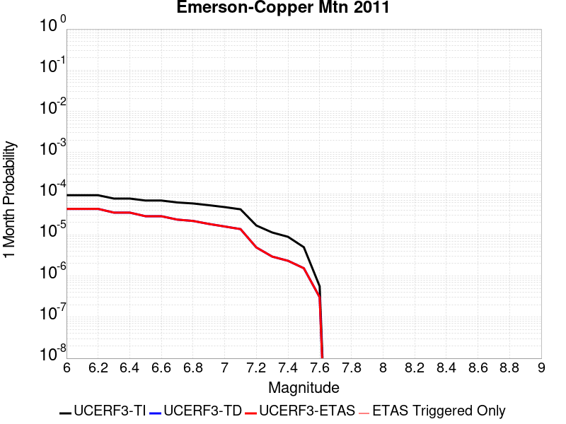 |  | 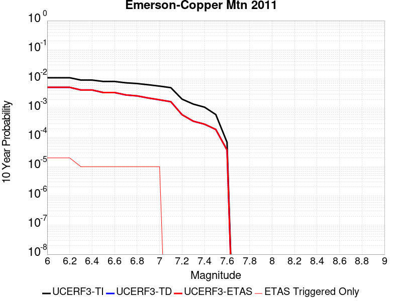 |

| Magnitude | 1 wk TI Prob | 1 wk TD Prob | 1 wk ETAS Prob | 1 wk ETAS/TD Gain | 1 wk ETAS Triggered Only | 1 mo TI Prob | 1 mo TD Prob | 1 mo ETAS Prob | 1 mo ETAS/TD Gain | 1 mo ETAS Triggered Only | 1 yr TI Prob | 1 yr TD Prob | 1 yr ETAS Prob | 1 yr ETAS/TD Gain | 1 yr ETAS Triggered Only | 10 yr TI Prob | 10 yr TD Prob | 10 yr ETAS Prob | 10 yr ETAS/TD Gain | 10 yr ETAS Triggered Only |
|-----|-----|-----|-----|-----|-----|-----|-----|-----|-----|-----|-----|-----|-----|-----|-----|-----|-----|-----|-----|-----|
| 6.0 | 2.1364202E-5 | 9.96896E-6 | 9.96896E-6 | 1.0 | 0.0 | 9.1557646E-5 | 4.2723463E-5 | 4.2723463E-5 | 1.0 | 0.0 | 0.0011141442 | 5.200427E-4 | 5.200427E-4 | 1.0 | 0.0 | 0.011085749 | 0.0051891273 | 0.0052090236 | 1.0038342 | 2.0E-5 |
| 6.1 | 2.1364202E-5 | 9.96896E-6 | 9.96896E-6 | 1.0 | 0.0 | 9.1557646E-5 | 4.2723463E-5 | 4.2723463E-5 | 1.0 | 0.0 | 0.0011141442 | 5.200427E-4 | 5.200427E-4 | 1.0 | 0.0 | 0.011085749 | 0.0051891273 | 0.0052090236 | 1.0038342 | 2.0E-5 |
| 6.2 | 2.1364202E-5 | 9.96896E-6 | 9.96896E-6 | 1.0 | 0.0 | 9.1557646E-5 | 4.2723463E-5 | 4.2723463E-5 | 1.0 | 0.0 | 0.0011141442 | 5.200427E-4 | 5.200427E-4 | 1.0 | 0.0 | 0.011085749 | 0.0051891273 | 0.0052090236 | 1.0038342 | 2.0E-5 |
| 6.3 | 1.7751237E-5 | 8.089945E-6 | 8.089945E-6 | 1.0 | 0.0 | 7.607452E-5 | 3.467077E-5 | 3.467077E-5 | 1.0 | 0.0 | 9.258136E-4 | 4.2204116E-4 | 4.2204116E-4 | 1.0 | 0.0 | 0.00921966 | 0.0042130193 | 0.004222977 | 1.0023636 | 1.0E-5 |
| 6.4 | 1.7751237E-5 | 8.089945E-6 | 8.089945E-6 | 1.0 | 0.0 | 7.607452E-5 | 3.467077E-5 | 3.467077E-5 | 1.0 | 0.0 | 9.258136E-4 | 4.2204116E-4 | 4.2204116E-4 | 1.0 | 0.0 | 0.00921966 | 0.0042130193 | 0.004222977 | 1.0023636 | 1.0E-5 |
| 6.5 | 1.5886664E-5 | 6.604409E-6 | 6.604409E-6 | 1.0 | 0.0 | 6.808392E-5 | 2.830433E-5 | 2.830433E-5 | 1.0 | 0.0 | 8.286065E-4 | 3.4455542E-4 | 3.4455542E-4 | 1.0 | 0.0 | 0.008255237 | 0.0034406765 | 0.003450642 | 1.0028964 | 1.0E-5 |
| 6.6 | 1.5886664E-5 | 6.604409E-6 | 6.604409E-6 | 1.0 | 0.0 | 6.808392E-5 | 2.830433E-5 | 2.830433E-5 | 1.0 | 0.0 | 8.286065E-4 | 3.4455542E-4 | 3.4455542E-4 | 1.0 | 0.0 | 0.008255237 | 0.0034406765 | 0.003450642 | 1.0028964 | 1.0E-5 |
| 6.7 | 1.428471E-5 | 5.4709003E-6 | 5.4709003E-6 | 1.0 | 0.0 | 6.121875E-5 | 2.3446528E-5 | 2.3446528E-5 | 1.0 | 0.0 | 7.450834E-4 | 2.8542802E-4 | 2.8542802E-4 | 1.0 | 0.0 | 0.007425902 | 0.0028510022 | 0.0028609738 | 1.0034975 | 1.0E-5 |
| 6.8 | 1.3490684E-5 | 5.0741583E-6 | 5.0741583E-6 | 1.0 | 0.0 | 5.7815934E-5 | 2.1746233E-5 | 2.1746233E-5 | 1.0 | 0.0 | 7.0368167E-4 | 2.6473208E-4 | 2.6473208E-4 | 1.0 | 0.0 | 0.007014576 | 0.0026445482 | 0.0026545217 | 1.0037713 | 1.0E-5 |
| 6.9 | 1.2235421E-5 | 4.29007E-6 | 4.29007E-6 | 1.0 | 0.0 | 5.2436466E-5 | 1.8385907E-5 | 1.8385907E-5 | 1.0 | 0.0 | 6.38227E-4 | 2.2382902E-4 | 2.2382902E-4 | 1.0 | 0.0 | 0.0063639707 | 0.0022363903 | 0.0022463677 | 1.0044615 | 1.0E-5 |
| 7.0 | 1.1009851E-5 | 3.7193458E-6 | 3.7193458E-6 | 1.0 | 0.0 | 4.7184225E-5 | 1.5939975E-5 | 1.5939975E-5 | 1.0 | 0.0 | 5.743165E-4 | 1.9405536E-4 | 1.9405536E-4 | 1.0 | 0.0 | 0.005728345 | 0.001939197 | 0.0019491776 | 1.0051467 | 1.0E-5 |
| 7.1 | 9.726373E-6 | 3.2120636E-6 | 3.2120636E-6 | 1.0 | 0.0 | 4.168379E-5 | 1.3765933E-5 | 1.3765933E-5 | 1.0 | 0.0 | 5.07382E-4 | 1.6759071E-4 | 1.6759071E-4 | 1.0 | 0.0 | 0.0050622504 | 0.0016749746 | 0.0016749746 | 1.0 | 0.0 |
| 7.2 | 3.9335127E-6 | 1.1525366E-6 | 1.1525366E-6 | 1.0 | 0.0 | 1.6857803E-5 | 4.9394334E-6 | 4.9394334E-6 | 1.0 | 0.0 | 2.0522442E-4 | 6.0136004E-5 | 6.0136004E-5 | 1.0 | 0.0 | 0.00205035 | 6.012033E-4 | 6.012033E-4 | 1.0 | 0.0 |
| 7.3 | 2.661632E-6 | 6.9117965E-7 | 6.9117965E-7 | 1.0 | 0.0 | 1.14069435E-5 | 2.9621951E-6 | 2.9621951E-6 | 1.0 | 0.0 | 1.3887069E-4 | 3.606414E-5 | 3.606414E-5 | 1.0 | 0.0 | 0.0013878393 | 3.6058392E-4 | 3.6058392E-4 | 1.0 | 0.0 |
| 7.4 | 2.0893426E-6 | 5.462106E-7 | 5.462106E-7 | 1.0 | 0.0 | 8.954295E-6 | 2.3409002E-6 | 2.3409002E-6 | 1.0 | 0.0 | 1.0901308E-4 | 2.8500093E-5 | 2.8500093E-5 | 1.0 | 0.0 | 0.0010895962 | 2.8496495E-4 | 2.8496495E-4 | 1.0 | 0.0 |
| 7.5 | 1.1681728E-6 | 3.6032037E-7 | 3.6032037E-7 | 1.0 | 0.0 | 5.0064455E-6 | 1.5442292E-6 | 1.5442292E-6 | 1.0 | 0.0 | 6.0951766E-5 | 1.8800833E-5 | 1.8800833E-5 | 1.0 | 0.0 | 6.093505E-4 | 1.8799289E-4 | 1.8799289E-4 | 1.0 | 0.0 |
| 7.6 | 1.3154387E-7 | 7.120029E-8 | 7.120029E-8 | 1.0 | 0.0 | 5.6375933E-7 | 3.0514406E-7 | 3.0514406E-7 | 1.0 | 0.0 | 6.863748E-6 | 3.7151242E-6 | 3.7151242E-6 | 1.0 | 0.0 | 6.863536E-5 | 3.715078E-5 | 3.715078E-5 | 1.0 | 0.0 |

## Malibu Coast (Extension) alt 1
*[(top)](#table-of-contents)*

| 1 Week | 1 Month | 1 Year | 10 Year |
|-----|-----|-----|-----|
|  |  |  |  |

| Magnitude | 1 wk TI Prob | 1 wk TD Prob | 1 wk ETAS Prob | 1 wk ETAS/TD Gain | 1 wk ETAS Triggered Only | 1 mo TI Prob | 1 mo TD Prob | 1 mo ETAS Prob | 1 mo ETAS/TD Gain | 1 mo ETAS Triggered Only | 1 yr TI Prob | 1 yr TD Prob | 1 yr ETAS Prob | 1 yr ETAS/TD Gain | 1 yr ETAS Triggered Only | 10 yr TI Prob | 10 yr TD Prob | 10 yr ETAS Prob | 10 yr ETAS/TD Gain | 10 yr ETAS Triggered Only |
|-----|-----|-----|-----|-----|-----|-----|-----|-----|-----|-----|-----|-----|-----|-----|-----|-----|-----|-----|-----|-----|
| 6.0 | 8.930738E-6 | 9.329624E-6 | 9.329624E-6 | 1.0 | 0.0 | 3.827403E-5 | 3.99835E-5 | 3.99835E-5 | 1.0 | 0.0 | 4.6588664E-4 | 4.866921E-4 | 4.9668725E-4 | 1.0205369 | 1.0E-5 | 0.0046491115 | 0.004856445 | 0.0048763477 | 1.0040983 | 2.0E-5 |
| 6.1 | 7.199952E-6 | 7.530598E-6 | 7.530598E-6 | 1.0 | 0.0 | 3.0856572E-5 | 3.2273594E-5 | 3.2273594E-5 | 1.0 | 0.0 | 3.75614E-4 | 3.9286076E-4 | 4.0285685E-4 | 1.0254443 | 1.0E-5 | 0.0037497976 | 0.003921729 | 0.0039416505 | 1.0050797 | 2.0E-5 |
| 6.2 | 6.3721413E-6 | 6.667068E-6 | 6.667068E-6 | 1.0 | 0.0 | 2.7308892E-5 | 2.8572838E-5 | 2.8572838E-5 | 1.0 | 0.0 | 3.3243504E-4 | 3.4781912E-4 | 3.5781565E-4 | 1.0287405 | 1.0E-5 | 0.0033193815 | 0.0034727876 | 0.003492718 | 1.0057391 | 2.0E-5 |
| 6.3 | 6.016345E-6 | 6.2954236E-6 | 6.2954236E-6 | 1.0 | 0.0 | 2.578408E-5 | 2.698011E-5 | 2.698011E-5 | 1.0 | 0.0 | 3.1387596E-4 | 3.2843367E-4 | 3.3843037E-4 | 1.0304376 | 1.0E-5 | 0.00313433 | 0.0032795188 | 0.0032994533 | 1.0060785 | 2.0E-5 |
| 6.4 | 5.8104883E-6 | 6.0798034E-6 | 6.0798034E-6 | 1.0 | 0.0 | 2.4901856E-5 | 2.6056041E-5 | 2.6056041E-5 | 1.0 | 0.0 | 3.031379E-4 | 3.1718644E-4 | 3.2718328E-4 | 1.0315171 | 1.0E-5 | 0.0030272473 | 0.003167372 | 0.0031873086 | 1.0062944 | 2.0E-5 |
| 6.5 | 5.476925E-6 | 5.727759E-6 | 5.727759E-6 | 1.0 | 0.0 | 2.3472323E-5 | 2.454731E-5 | 2.454731E-5 | 1.0 | 0.0 | 2.8573806E-4 | 2.988228E-4 | 3.088198E-4 | 1.0334547 | 1.0E-5 | 0.0028537093 | 0.0029842418 | 0.0030041821 | 1.0066819 | 2.0E-5 |
| 6.6 | 5.222387E-6 | 5.4588154E-6 | 5.4588154E-6 | 1.0 | 0.0 | 2.2381464E-5 | 2.3394716E-5 | 2.3394716E-5 | 1.0 | 0.0 | 2.7246025E-4 | 2.847937E-4 | 2.9479087E-4 | 1.0351031 | 1.0E-5 | 0.0027212645 | 0.002844318 | 0.0028642612 | 1.0070115 | 2.0E-5 |
| 6.7 | 5.0337076E-6 | 5.2593314E-6 | 5.2593314E-6 | 1.0 | 0.0 | 2.1572854E-5 | 2.2539798E-5 | 2.2539798E-5 | 1.0 | 0.0 | 2.6261783E-4 | 2.7438777E-4 | 2.8438502E-4 | 1.0364348 | 1.0E-5 | 0.002623077 | 0.0027405198 | 0.002760465 | 1.0072778 | 2.0E-5 |
| 6.8 | 4.5675624E-6 | 4.75892E-6 | 4.75892E-6 | 1.0 | 0.0 | 1.9575122E-5 | 2.0395213E-5 | 2.0395213E-5 | 1.0 | 0.0 | 2.3830103E-4 | 2.482836E-4 | 2.5828113E-4 | 1.0402665 | 1.0E-5 | 0.0023804565 | 0.002480082 | 0.0025000323 | 1.0080442 | 2.0E-5 |
| 6.9 | 4.2802412E-6 | 4.4522108E-6 | 4.4522108E-6 | 1.0 | 0.0 | 1.8343762E-5 | 1.9080764E-5 | 1.9080764E-5 | 1.0 | 0.0 | 2.2331243E-4 | 2.322837E-4 | 2.4228137E-4 | 1.0430408 | 1.0E-5 | 0.0022308815 | 0.0023204256 | 0.0023403792 | 1.0085992 | 2.0E-5 |
| 7.0 | 3.9794063E-6 | 4.130274E-6 | 4.130274E-6 | 1.0 | 0.0 | 1.7054486E-5 | 1.7701055E-5 | 1.7701055E-5 | 1.0 | 0.0 | 2.0761859E-4 | 2.1548916E-4 | 2.25487E-4 | 1.046396 | 1.0E-5 | 0.0020742472 | 0.0021528157 | 0.0021627941 | 1.0046351 | 1.0E-5 |
| 7.1 | 3.7730424E-6 | 3.9113834E-6 | 3.9113834E-6 | 1.0 | 0.0 | 1.6170083E-5 | 1.6762964E-5 | 1.6762964E-5 | 1.0 | 0.0 | 1.9685295E-4 | 2.040701E-4 | 2.1406804E-4 | 1.0489928 | 1.0E-5 | 0.0019667868 | 0.0020388397 | 0.0020488196 | 1.0048947 | 1.0E-5 |
| 7.2 | 3.424985E-6 | 3.5414878E-6 | 3.5414878E-6 | 1.0 | 0.0 | 1.4678424E-5 | 1.5177717E-5 | 1.5177717E-5 | 1.0 | 0.0 | 1.7869516E-4 | 1.8477315E-4 | 1.947713E-4 | 1.0541104 | 1.0E-5 | 0.0017855153 | 0.0018462073 | 0.0018561888 | 1.0054065 | 1.0E-5 |
| 7.3 | 2.6966375E-6 | 2.759766E-6 | 2.759766E-6 | 1.0 | 0.0 | 1.15569665E-5 | 1.1827515E-5 | 1.1827515E-5 | 1.0 | 0.0 | 1.4069698E-4 | 1.4399052E-4 | 1.5398908E-4 | 1.069439 | 1.0E-5 | 0.0014060794 | 0.0014389764 | 0.001448962 | 1.0069394 | 1.0E-5 |
| 7.4 | 2.215957E-6 | 2.2494685E-6 | 2.2494685E-6 | 1.0 | 0.0 | 9.496924E-6 | 9.640544E-6 | 9.640544E-6 | 1.0 | 0.0 | 1.1561892E-4 | 1.1736733E-4 | 1.2736616E-4 | 1.0851926 | 1.0E-5 | 0.0011555878 | 0.0011730571 | 0.0011830454 | 1.0085148 | 1.0E-5 |
| 7.5 | 1.2040218E-6 | 1.2219581E-6 | 1.2219581E-6 | 1.0 | 0.0 | 5.160083E-6 | 5.236953E-6 | 5.236953E-6 | 1.0 | 0.0 | 6.2822204E-5 | 6.375805E-5 | 7.3757416E-5 | 1.1568329 | 1.0E-5 | 6.280445E-4 | 6.3739944E-4 | 6.4739306E-4 | 1.0156788 | 1.0E-5 |
| 7.6 | 6.6157446E-7 | 6.679265E-7 | 6.679265E-7 | 1.0 | 0.0 | 2.835316E-6 | 2.8625388E-6 | 2.8625388E-6 | 1.0 | 0.0 | 3.4519428E-5 | 3.485087E-5 | 3.485087E-5 | 1.0 | 0.0 | 3.4514067E-4 | 3.4845556E-4 | 3.4845556E-4 | 1.0 | 0.0 |
| 7.7 | 2.6012302E-7 | 2.4358562E-7 | 2.4358562E-7 | 1.0 | 0.0 | 1.1148124E-6 | 1.043938E-6 | 1.043938E-6 | 1.0 | 0.0 | 1.3572758E-5 | 1.2709883E-5 | 1.2709883E-5 | 1.0 | 0.0 | 1.3571928E-4 | 1.2709263E-4 | 1.2709263E-4 | 1.0 | 0.0 |
| 7.8 | 2.8323132E-8 | 2.0267077E-8 | 2.0267077E-8 | 1.0 | 0.0 | 1.2138484E-7 | 8.68589E-8 | 8.68589E-8 | 1.0 | 0.0 | 1.4778595E-6 | 1.0575067E-6 | 1.0575067E-6 | 1.0 | 0.0 | 1.4778497E-5 | 1.0575024E-5 | 1.0575024E-5 | 1.0 | 0.0 |

## Santa Monica alt 1
*[(top)](#table-of-contents)*

| 1 Week | 1 Month | 1 Year | 10 Year |
|-----|-----|-----|-----|
|  |  |  | 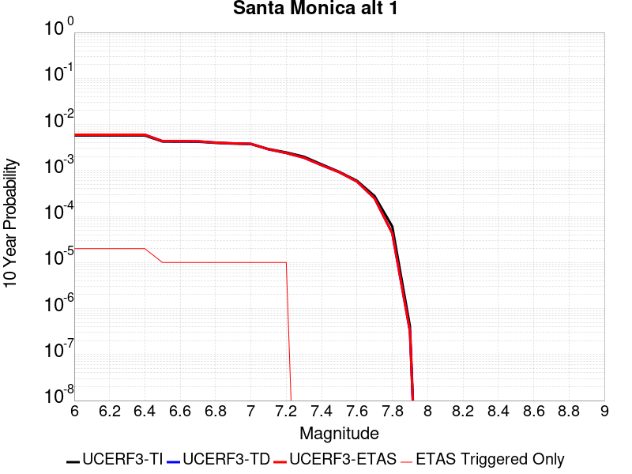 |

| Magnitude | 1 wk TI Prob | 1 wk TD Prob | 1 wk ETAS Prob | 1 wk ETAS/TD Gain | 1 wk ETAS Triggered Only | 1 mo TI Prob | 1 mo TD Prob | 1 mo ETAS Prob | 1 mo ETAS/TD Gain | 1 mo ETAS Triggered Only | 1 yr TI Prob | 1 yr TD Prob | 1 yr ETAS Prob | 1 yr ETAS/TD Gain | 1 yr ETAS Triggered Only | 10 yr TI Prob | 10 yr TD Prob | 10 yr ETAS Prob | 10 yr ETAS/TD Gain | 10 yr ETAS Triggered Only |
|-----|-----|-----|-----|-----|-----|-----|-----|-----|-----|-----|-----|-----|-----|-----|-----|-----|-----|-----|-----|-----|
| 6.0 | 1.1066008E-5 | 1.1480939E-5 | 1.1480939E-5 | 1.0 | 0.0 | 4.742488E-5 | 4.9203176E-5 | 4.9203176E-5 | 1.0 | 0.0 | 5.7724497E-4 | 5.98898E-4 | 6.08892E-4 | 1.0166874 | 1.0E-5 | 0.005757478 | 0.0059742266 | 0.0059941076 | 1.0033277 | 2.0E-5 |
| 6.1 | 1.1066008E-5 | 1.1480939E-5 | 1.1480939E-5 | 1.0 | 0.0 | 4.742488E-5 | 4.9203176E-5 | 4.9203176E-5 | 1.0 | 0.0 | 5.7724497E-4 | 5.98898E-4 | 6.08892E-4 | 1.0166874 | 1.0E-5 | 0.005757478 | 0.0059742266 | 0.0059941076 | 1.0033277 | 2.0E-5 |
| 6.2 | 1.1066008E-5 | 1.1480939E-5 | 1.1480939E-5 | 1.0 | 0.0 | 4.742488E-5 | 4.9203176E-5 | 4.9203176E-5 | 1.0 | 0.0 | 5.7724497E-4 | 5.98898E-4 | 6.08892E-4 | 1.0166874 | 1.0E-5 | 0.005757478 | 0.0059742266 | 0.0059941076 | 1.0033277 | 2.0E-5 |
| 6.3 | 1.1066008E-5 | 1.1480939E-5 | 1.1480939E-5 | 1.0 | 0.0 | 4.742488E-5 | 4.9203176E-5 | 4.9203176E-5 | 1.0 | 0.0 | 5.7724497E-4 | 5.98898E-4 | 6.08892E-4 | 1.0166874 | 1.0E-5 | 0.005757478 | 0.0059742266 | 0.0059941076 | 1.0033277 | 2.0E-5 |
| 6.4 | 1.1066008E-5 | 1.1480939E-5 | 1.1480939E-5 | 1.0 | 0.0 | 4.742488E-5 | 4.9203176E-5 | 4.9203176E-5 | 1.0 | 0.0 | 5.7724497E-4 | 5.98898E-4 | 6.08892E-4 | 1.0166874 | 1.0E-5 | 0.005757478 | 0.0059742266 | 0.0059941076 | 1.0033277 | 2.0E-5 |
| 6.5 | 8.183544E-6 | 8.335871E-6 | 8.335871E-6 | 1.0 | 0.0 | 3.5071862E-5 | 3.5724683E-5 | 3.5724683E-5 | 1.0 | 0.0 | 4.2691626E-4 | 4.3486277E-4 | 4.3486277E-4 | 1.0 | 0.0 | 0.0042609703 | 0.004340284 | 0.004350241 | 1.002294 | 1.0E-5 |
| 6.6 | 8.1543285E-6 | 8.304083E-6 | 8.304083E-6 | 1.0 | 0.0 | 3.4946657E-5 | 3.558845E-5 | 3.558845E-5 | 1.0 | 0.0 | 4.2539247E-4 | 4.3320487E-4 | 4.3320487E-4 | 1.0 | 0.0 | 0.0042457907 | 0.0043237694 | 0.004333726 | 1.0023028 | 1.0E-5 |
| 6.7 | 8.110878E-6 | 8.257478E-6 | 8.257478E-6 | 1.0 | 0.0 | 3.4760444E-5 | 3.538872E-5 | 3.538872E-5 | 1.0 | 0.0 | 4.231262E-4 | 4.3077406E-4 | 4.3077406E-4 | 1.0 | 0.0 | 0.0042232145 | 0.004299556 | 0.0043095127 | 1.0023159 | 1.0E-5 |
| 6.8 | 7.644036E-6 | 7.751468E-6 | 7.751468E-6 | 1.0 | 0.0 | 3.275974E-5 | 3.322016E-5 | 3.322016E-5 | 1.0 | 0.0 | 3.9877684E-4 | 4.043818E-4 | 4.043818E-4 | 1.0 | 0.0 | 0.00398062 | 0.0040366063 | 0.004046566 | 1.0024673 | 1.0E-5 |
| 6.9 | 7.3698293E-6 | 7.4561112E-6 | 7.4561112E-6 | 1.0 | 0.0 | 3.15846E-5 | 3.195438E-5 | 3.195438E-5 | 1.0 | 0.0 | 3.8447464E-4 | 3.889765E-4 | 3.889765E-4 | 1.0 | 0.0 | 0.0038381014 | 0.0038831003 | 0.0038930613 | 1.0025653 | 1.0E-5 |
| 7.0 | 7.209872E-6 | 7.2860107E-6 | 7.2860107E-6 | 1.0 | 0.0 | 3.0899086E-5 | 3.1225394E-5 | 3.1225394E-5 | 1.0 | 0.0 | 3.7613141E-4 | 3.8010423E-4 | 3.8010423E-4 | 1.0 | 0.0 | 0.0037549543 | 0.0037946838 | 0.0038046457 | 1.0026252 | 1.0E-5 |
| 7.1 | 5.603456E-6 | 5.524164E-6 | 5.524164E-6 | 1.0 | 0.0 | 2.4014591E-5 | 2.3674776E-5 | 2.3674776E-5 | 1.0 | 0.0 | 2.923384E-4 | 2.882027E-4 | 2.882027E-4 | 1.0 | 0.0 | 0.0029195412 | 0.0028783309 | 0.002888302 | 1.0034642 | 1.0E-5 |
| 7.2 | 4.7483613E-6 | 4.591348E-6 | 4.591348E-6 | 1.0 | 0.0 | 2.0349962E-5 | 1.9677058E-5 | 1.9677058E-5 | 1.0 | 0.0 | 2.4773262E-4 | 2.3954196E-4 | 2.3954196E-4 | 1.0 | 0.0 | 0.0024745662 | 0.0023928517 | 0.0024028278 | 1.0041691 | 1.0E-5 |
| 7.3 | 3.829015E-6 | 3.6343922E-6 | 3.6343922E-6 | 1.0 | 0.0 | 1.6409962E-5 | 1.5575873E-5 | 1.5575873E-5 | 1.0 | 0.0 | 1.9977297E-4 | 1.8961985E-4 | 1.8961985E-4 | 1.0 | 0.0 | 0.0019959346 | 0.0018945894 | 0.0018945894 | 1.0 | 0.0 |
| 7.4 | 2.610755E-6 | 2.4996884E-6 | 2.4996884E-6 | 1.0 | 0.0 | 1.1188902E-5 | 1.0712907E-5 | 1.0712907E-5 | 1.0 | 0.0 | 1.3621636E-4 | 1.3042187E-4 | 1.3042187E-4 | 1.0 | 0.0 | 0.001361329 | 0.0013034578 | 0.0013034578 | 1.0 | 0.0 |
| 7.5 | 1.792146E-6 | 1.7585058E-6 | 1.7585058E-6 | 1.0 | 0.0 | 7.680603E-6 | 7.5364323E-6 | 7.5364323E-6 | 1.0 | 0.0 | 9.3507326E-5 | 9.175223E-5 | 9.175223E-5 | 1.0 | 0.0 | 9.3467993E-4 | 9.171466E-4 | 9.171466E-4 | 1.0 | 0.0 |
| 7.6 | 1.1473018E-6 | 1.102973E-6 | 1.102973E-6 | 1.0 | 0.0 | 4.9169985E-6 | 4.7270187E-6 | 4.7270187E-6 | 1.0 | 0.0 | 5.986281E-5 | 5.7549947E-5 | 5.7549947E-5 | 1.0 | 0.0 | 5.984669E-4 | 5.753521E-4 | 5.753521E-4 | 1.0 | 0.0 |
| 7.7 | 5.330919E-7 | 4.745575E-7 | 4.745575E-7 | 1.0 | 0.0 | 2.2846775E-6 | 2.0338164E-6 | 2.0338164E-6 | 1.0 | 0.0 | 2.7815593E-5 | 2.4761444E-5 | 2.4761444E-5 | 1.0 | 0.0 | 2.7812112E-4 | 2.4758797E-4 | 2.4758797E-4 | 1.0 | 0.0 |
| 7.8 | 1.1668574E-7 | 8.2980684E-8 | 8.2980684E-8 | 1.0 | 0.0 | 5.000816E-7 | 3.5563144E-7 | 3.5563144E-7 | 1.0 | 0.0 | 6.0884768E-6 | 4.3298046E-6 | 4.3298046E-6 | 1.0 | 0.0 | 6.08831E-5 | 4.3297234E-5 | 4.3297234E-5 | 1.0 | 0.0 |
| 7.9 | 8.007447E-10 | 6.161718E-10 | 6.161718E-10 | 1.0 | 0.0 | 3.4317629E-9 | 2.6407367E-9 | 2.6407367E-9 | 1.0 | 0.0 | 4.1781714E-8 | 3.2150968E-8 | 3.2150968E-8 | 1.0 | 0.0 | 4.1781706E-7 | 3.2150967E-7 | 3.2150967E-7 | 1.0 | 0.0 |

## North Frontal  (West)
*[(top)](#table-of-contents)*

| 1 Week | 1 Month | 1 Year | 10 Year |
|-----|-----|-----|-----|
|  |  |  |  |

| Magnitude | 1 wk TI Prob | 1 wk TD Prob | 1 wk ETAS Prob | 1 wk ETAS/TD Gain | 1 wk ETAS Triggered Only | 1 mo TI Prob | 1 mo TD Prob | 1 mo ETAS Prob | 1 mo ETAS/TD Gain | 1 mo ETAS Triggered Only | 1 yr TI Prob | 1 yr TD Prob | 1 yr ETAS Prob | 1 yr ETAS/TD Gain | 1 yr ETAS Triggered Only | 10 yr TI Prob | 10 yr TD Prob | 10 yr ETAS Prob | 10 yr ETAS/TD Gain | 10 yr ETAS Triggered Only |
|-----|-----|-----|-----|-----|-----|-----|-----|-----|-----|-----|-----|-----|-----|-----|-----|-----|-----|-----|-----|-----|
| 6.0 | 4.7316266E-6 | 4.852768E-6 | 4.852768E-6 | 1.0 | 0.0 | 2.0278241E-5 | 2.0797419E-5 | 2.0797419E-5 | 1.0 | 0.0 | 2.4685962E-4 | 2.5318062E-4 | 2.5318062E-4 | 1.0 | 0.0 | 0.0024658558 | 0.0025290682 | 0.0025490175 | 1.0078881 | 2.0E-5 |
| 6.1 | 4.7316266E-6 | 4.852768E-6 | 4.852768E-6 | 1.0 | 0.0 | 2.0278241E-5 | 2.0797419E-5 | 2.0797419E-5 | 1.0 | 0.0 | 2.4685962E-4 | 2.5318062E-4 | 2.5318062E-4 | 1.0 | 0.0 | 0.0024658558 | 0.0025290682 | 0.0025490175 | 1.0078881 | 2.0E-5 |
| 6.2 | 4.7316266E-6 | 4.852768E-6 | 4.852768E-6 | 1.0 | 0.0 | 2.0278241E-5 | 2.0797419E-5 | 2.0797419E-5 | 1.0 | 0.0 | 2.4685962E-4 | 2.5318062E-4 | 2.5318062E-4 | 1.0 | 0.0 | 0.0024658558 | 0.0025290682 | 0.0025490175 | 1.0078881 | 2.0E-5 |
| 6.3 | 4.7316266E-6 | 4.852768E-6 | 4.852768E-6 | 1.0 | 0.0 | 2.0278241E-5 | 2.0797419E-5 | 2.0797419E-5 | 1.0 | 0.0 | 2.4685962E-4 | 2.5318062E-4 | 2.5318062E-4 | 1.0 | 0.0 | 0.0024658558 | 0.0025290682 | 0.0025490175 | 1.0078881 | 2.0E-5 |
| 6.4 | 4.7316266E-6 | 4.852768E-6 | 4.852768E-6 | 1.0 | 0.0 | 2.0278241E-5 | 2.0797419E-5 | 2.0797419E-5 | 1.0 | 0.0 | 2.4685962E-4 | 2.5318062E-4 | 2.5318062E-4 | 1.0 | 0.0 | 0.0024658558 | 0.0025290682 | 0.0025490175 | 1.0078881 | 2.0E-5 |
| 6.5 | 4.7316266E-6 | 4.852768E-6 | 4.852768E-6 | 1.0 | 0.0 | 2.0278241E-5 | 2.0797419E-5 | 2.0797419E-5 | 1.0 | 0.0 | 2.4685962E-4 | 2.5318062E-4 | 2.5318062E-4 | 1.0 | 0.0 | 0.0024658558 | 0.0025290682 | 0.0025490175 | 1.0078881 | 2.0E-5 |
| 6.6 | 4.7316266E-6 | 4.852768E-6 | 4.852768E-6 | 1.0 | 0.0 | 2.0278241E-5 | 2.0797419E-5 | 2.0797419E-5 | 1.0 | 0.0 | 2.4685962E-4 | 2.5318062E-4 | 2.5318062E-4 | 1.0 | 0.0 | 0.0024658558 | 0.0025290682 | 0.0025490175 | 1.0078881 | 2.0E-5 |
| 6.7 | 3.5382777E-6 | 3.630962E-6 | 3.630962E-6 | 1.0 | 0.0 | 1.516396E-5 | 1.5561178E-5 | 1.5561178E-5 | 1.0 | 0.0 | 1.8460557E-4 | 1.8944163E-4 | 1.8944163E-4 | 1.0 | 0.0 | 0.0018445229 | 0.0018928784 | 0.0019128406 | 1.010546 | 2.0E-5 |
| 6.8 | 3.5382777E-6 | 3.630962E-6 | 3.630962E-6 | 1.0 | 0.0 | 1.516396E-5 | 1.5561178E-5 | 1.5561178E-5 | 1.0 | 0.0 | 1.8460557E-4 | 1.8944163E-4 | 1.8944163E-4 | 1.0 | 0.0 | 0.0018445229 | 0.0018928784 | 0.0019128406 | 1.010546 | 2.0E-5 |
| 6.9 | 3.0428037E-6 | 3.122828E-6 | 3.122828E-6 | 1.0 | 0.0 | 1.30405215E-5 | 1.3383484E-5 | 1.3383484E-5 | 1.0 | 0.0 | 1.5875678E-4 | 1.6293241E-4 | 1.6293241E-4 | 1.0 | 0.0 | 0.0015864341 | 0.0016281967 | 0.0016381803 | 1.0061318 | 1.0E-5 |
| 7.0 | 2.538778E-6 | 2.606149E-6 | 2.606149E-6 | 1.0 | 0.0 | 1.0880432E-5 | 1.1169166E-5 | 1.1169166E-5 | 1.0 | 0.0 | 1.324612E-4 | 1.3597657E-4 | 1.3597657E-4 | 1.0 | 0.0 | 0.0013238228 | 0.0013589805 | 0.001368967 | 1.0073484 | 1.0E-5 |
| 7.1 | 2.2418935E-6 | 2.3012606E-6 | 2.3012606E-6 | 1.0 | 0.0 | 9.60808E-6 | 9.8625105E-6 | 9.8625105E-6 | 1.0 | 0.0 | 1.1697209E-4 | 1.200699E-4 | 1.200699E-4 | 1.0 | 0.0 | 0.0011691054 | 0.0012000942 | 0.0012100822 | 1.0083227 | 1.0E-5 |
| 7.2 | 1.6526745E-6 | 1.6925251E-6 | 1.6925251E-6 | 1.0 | 0.0 | 7.082872E-6 | 7.2536604E-6 | 7.2536604E-6 | 1.0 | 0.0 | 8.623055E-5 | 8.830999E-5 | 8.830999E-5 | 1.0 | 0.0 | 8.61971E-4 | 8.82774E-4 | 8.82774E-4 | 1.0 | 0.0 |
| 7.3 | 1.0246019E-6 | 1.0442523E-6 | 1.0442523E-6 | 1.0 | 0.0 | 4.391144E-6 | 4.4753597E-6 | 4.4753597E-6 | 1.0 | 0.0 | 5.3460866E-5 | 5.448626E-5 | 5.448626E-5 | 1.0 | 0.0 | 5.344801E-4 | 5.4474047E-4 | 5.4474047E-4 | 1.0 | 0.0 |
| 7.4 | 8.9045164E-7 | 9.0567903E-7 | 9.0567903E-7 | 1.0 | 0.0 | 3.8162157E-6 | 3.8814765E-6 | 3.8814765E-6 | 1.0 | 0.0 | 4.646144E-5 | 4.725606E-5 | 4.725606E-5 | 1.0 | 0.0 | 4.6451724E-4 | 4.72471E-4 | 4.72471E-4 | 1.0 | 0.0 |
| 7.5 | 6.3357E-7 | 6.402874E-7 | 6.402874E-7 | 1.0 | 0.0 | 2.7152971E-6 | 2.7440863E-6 | 2.7440863E-6 | 1.0 | 0.0 | 3.305824E-5 | 3.3408804E-5 | 3.3408804E-5 | 1.0 | 0.0 | 3.3053322E-4 | 3.340444E-4 | 3.340444E-4 | 1.0 | 0.0 |
| 7.6 | 2.5087024E-7 | 2.4361873E-7 | 2.4361873E-7 | 1.0 | 0.0 | 1.0751578E-6 | 1.0440799E-6 | 1.0440799E-6 | 1.0 | 0.0 | 1.3089967E-5 | 1.271162E-5 | 1.271162E-5 | 1.0 | 0.0 | 1.3089196E-4 | 1.27111E-4 | 1.27111E-4 | 1.0 | 0.0 |
| 7.7 | 3.282987E-8 | 2.2875998E-8 | 2.2875998E-8 | 1.0 | 0.0 | 1.4069944E-7 | 9.803998E-8 | 9.803998E-8 | 1.0 | 0.0 | 1.7130144E-6 | 1.1936362E-6 | 1.1936362E-6 | 1.0 | 0.0 | 1.7130013E-5 | 1.1936307E-5 | 1.1936307E-5 | 1.0 | 0.0 |
| 7.8 | 8.77499E-9 | 5.6820086E-9 | 5.6820086E-9 | 1.0 | 0.0 | 3.7607098E-8 | 2.4351465E-8 | 2.4351465E-8 | 1.0 | 0.0 | 4.578663E-7 | 2.9647907E-7 | 2.9647907E-7 | 1.0 | 0.0 | 4.5786537E-6 | 2.964788E-6 | 2.964788E-6 | 1.0 | 0.0 |

## Newport-Inglewood (Offshore)
*[(top)](#table-of-contents)*

| 1 Week | 1 Month | 1 Year | 10 Year |
|-----|-----|-----|-----|
|  | 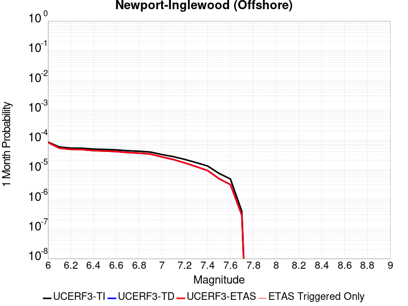 |  |  |

| Magnitude | 1 wk TI Prob | 1 wk TD Prob | 1 wk ETAS Prob | 1 wk ETAS/TD Gain | 1 wk ETAS Triggered Only | 1 mo TI Prob | 1 mo TD Prob | 1 mo ETAS Prob | 1 mo ETAS/TD Gain | 1 mo ETAS Triggered Only | 1 yr TI Prob | 1 yr TD Prob | 1 yr ETAS Prob | 1 yr ETAS/TD Gain | 1 yr ETAS Triggered Only | 10 yr TI Prob | 10 yr TD Prob | 10 yr ETAS Prob | 10 yr ETAS/TD Gain | 10 yr ETAS Triggered Only |
|-----|-----|-----|-----|-----|-----|-----|-----|-----|-----|-----|-----|-----|-----|-----|-----|-----|-----|-----|-----|-----|
| 6.0 | 1.9626508E-5 | 1.8966295E-5 | 1.8966295E-5 | 1.0 | 0.0 | 8.411089E-5 | 8.1281665E-5 | 8.1281665E-5 | 1.0 | 0.0 | 0.001023569 | 9.891676E-4 | 0.0010091477 | 1.0201991 | 2.0E-5 | 0.010188672 | 0.00984899 | 0.009868792 | 1.0020107 | 2.0E-5 |
| 6.1 | 1.331886E-5 | 1.2218719E-5 | 1.2218719E-5 | 1.0 | 0.0 | 5.707958E-5 | 5.23649E-5 | 5.23649E-5 | 1.0 | 0.0 | 6.947222E-4 | 6.3735765E-4 | 6.4735126E-4 | 1.0156798 | 1.0E-5 | 0.006925544 | 0.0063554742 | 0.006365411 | 1.0015634 | 1.0E-5 |
| 6.2 | 1.2250852E-5 | 1.1076604E-5 | 1.1076604E-5 | 1.0 | 0.0 | 5.2502597E-5 | 4.74703E-5 | 4.74703E-5 | 1.0 | 0.0 | 6.3903164E-4 | 5.777987E-4 | 5.877929E-4 | 1.017297 | 1.0E-5 | 0.006371971 | 0.005763085 | 0.0057730274 | 1.0017252 | 1.0E-5 |
| 6.3 | 1.2106258E-5 | 1.0919457E-5 | 1.0919457E-5 | 1.0 | 0.0 | 5.1882926E-5 | 4.679684E-5 | 4.679684E-5 | 1.0 | 0.0 | 6.3149154E-4 | 5.696035E-4 | 5.7959784E-4 | 1.017546 | 1.0E-5 | 0.0062970007 | 0.005681553 | 0.0056914957 | 1.0017501 | 1.0E-5 |
| 6.4 | 1.1348758E-5 | 1.0109891E-5 | 1.0109891E-5 | 1.0 | 0.0 | 4.8636626E-5 | 4.332739E-5 | 4.332739E-5 | 1.0 | 0.0 | 5.919901E-4 | 5.2738405E-4 | 5.3737883E-4 | 1.0189515 | 1.0E-5 | 0.005904155 | 0.005261421 | 0.005271368 | 1.0018907 | 1.0E-5 |
| 6.5 | 1.100837E-5 | 9.7439E-6 | 9.7439E-6 | 1.0 | 0.0 | 4.7177873E-5 | 4.1758907E-5 | 4.1758907E-5 | 1.0 | 0.0 | 5.7423924E-4 | 5.082968E-4 | 5.182918E-4 | 1.0196636 | 1.0E-5 | 0.005727576 | 0.0050714337 | 0.005081383 | 1.0019618 | 1.0E-5 |
| 6.6 | 1.0634696E-5 | 9.346034E-6 | 9.346034E-6 | 1.0 | 0.0 | 4.557647E-5 | 4.005382E-5 | 4.005382E-5 | 1.0 | 0.0 | 5.5475225E-4 | 4.875469E-4 | 4.9754203E-4 | 1.0205009 | 1.0E-5 | 0.0055336943 | 0.0048648594 | 0.0048748106 | 1.0020455 | 1.0E-5 |
| 6.7 | 9.9780855E-6 | 8.668361E-6 | 8.668361E-6 | 1.0 | 0.0 | 4.276252E-5 | 3.7149595E-5 | 3.7149595E-5 | 1.0 | 0.0 | 5.205093E-4 | 4.5220315E-4 | 4.6219863E-4 | 1.0221039 | 1.0E-5 | 0.0051929182 | 0.004512909 | 0.004522864 | 1.0022058 | 1.0E-5 |
| 6.8 | 9.59546E-6 | 8.2733795E-6 | 8.2733795E-6 | 1.0 | 0.0 | 4.1122752E-5 | 3.5456862E-5 | 3.5456862E-5 | 1.0 | 0.0 | 5.0055445E-4 | 4.3160244E-4 | 4.4159812E-4 | 1.0231595 | 1.0E-5 | 0.004994285 | 0.004307718 | 0.004317675 | 1.0023115 | 1.0E-5 |
| 6.9 | 9.000614E-6 | 7.707236E-6 | 7.707236E-6 | 1.0 | 0.0 | 3.857349E-5 | 3.30306E-5 | 3.30306E-5 | 1.0 | 0.0 | 4.6953102E-4 | 4.02074E-4 | 4.1207E-4 | 1.0248611 | 1.0E-5 | 0.004685402 | 0.004013537 | 0.004023497 | 1.0024816 | 1.0E-5 |
| 7.0 | 7.4070194E-6 | 6.1491874E-6 | 6.1491874E-6 | 1.0 | 0.0 | 3.1743984E-5 | 2.6353395E-5 | 2.6353395E-5 | 1.0 | 0.0 | 3.8641447E-4 | 3.208055E-4 | 3.308023E-4 | 1.0311615 | 1.0E-5 | 0.0038574322 | 0.0032034437 | 0.0032134117 | 1.0031116 | 1.0E-5 |
| 7.1 | 6.299615E-6 | 5.056832E-6 | 5.056832E-6 | 1.0 | 0.0 | 2.699807E-5 | 2.1671958E-5 | 2.1671958E-5 | 1.0 | 0.0 | 3.2865192E-4 | 2.6382427E-4 | 2.738216E-4 | 1.037894 | 1.0E-5 | 0.003281663 | 0.0026351253 | 0.002645099 | 1.0037849 | 1.0E-5 |
| 7.2 | 5.096653E-6 | 3.8929597E-6 | 3.8929597E-6 | 1.0 | 0.0 | 2.1842614E-5 | 1.6684007E-5 | 1.6684007E-5 | 1.0 | 0.0 | 2.6590136E-4 | 2.0310897E-4 | 2.1310693E-4 | 1.0492246 | 1.0E-5 | 0.0026558342 | 0.0020292446 | 0.0020392241 | 1.004918 | 1.0E-5 |
| 7.3 | 3.9753018E-6 | 2.9100152E-6 | 2.9100152E-6 | 1.0 | 0.0 | 1.7036897E-5 | 1.2471434E-5 | 1.2471434E-5 | 1.0 | 0.0 | 2.0740448E-4 | 1.5182921E-4 | 1.618277E-4 | 1.0658535 | 1.0E-5 | 0.00207211 | 0.0015172629 | 0.0015272477 | 1.0065808 | 1.0E-5 |
| 7.4 | 3.0568392E-6 | 2.1450792E-6 | 2.1450792E-6 | 1.0 | 0.0 | 1.3100675E-5 | 9.193164E-6 | 9.193164E-6 | 1.0 | 0.0 | 1.5948903E-4 | 1.1192109E-4 | 1.2191997E-4 | 1.0893387 | 1.0E-5 | 0.0015937461 | 0.0011186535 | 0.0011286424 | 1.0089294 | 1.0E-5 |
| 7.5 | 1.7279019E-6 | 1.1470205E-6 | 1.1470205E-6 | 1.0 | 0.0 | 7.405273E-6 | 4.915793E-6 | 4.915793E-6 | 1.0 | 0.0 | 9.015547E-5 | 5.9848175E-5 | 6.984758E-5 | 1.1670794 | 1.0E-5 | 9.01189E-4 | 5.9832446E-4 | 6.083185E-4 | 1.0167034 | 1.0E-5 |
| 7.6 | 1.1156416E-6 | 7.2233524E-7 | 7.2233524E-7 | 1.0 | 0.0 | 4.7813123E-6 | 3.095719E-6 | 3.095719E-6 | 1.0 | 0.0 | 5.821092E-5 | 3.768975E-5 | 4.7689373E-5 | 1.2653141 | 1.0E-5 | 5.8195676E-4 | 3.7683593E-4 | 3.8683217E-4 | 1.0265267 | 1.0E-5 |
| 7.7 | 9.117973E-8 | 6.7344054E-8 | 6.7344054E-8 | 1.0 | 0.0 | 3.907702E-7 | 2.8861734E-7 | 2.8861734E-7 | 1.0 | 0.0 | 4.757617E-6 | 3.5139108E-6 | 3.5139108E-6 | 1.0 | 0.0 | 4.7575148E-5 | 3.5138582E-5 | 3.5138582E-5 | 1.0 | 0.0 |

## Santa Susana alt 1
*[(top)](#table-of-contents)*

| 1 Week | 1 Month | 1 Year | 10 Year |
|-----|-----|-----|-----|
|  |  |  |  |

| Magnitude | 1 wk TI Prob | 1 wk TD Prob | 1 wk ETAS Prob | 1 wk ETAS/TD Gain | 1 wk ETAS Triggered Only | 1 mo TI Prob | 1 mo TD Prob | 1 mo ETAS Prob | 1 mo ETAS/TD Gain | 1 mo ETAS Triggered Only | 1 yr TI Prob | 1 yr TD Prob | 1 yr ETAS Prob | 1 yr ETAS/TD Gain | 1 yr ETAS Triggered Only | 10 yr TI Prob | 10 yr TD Prob | 10 yr ETAS Prob | 10 yr ETAS/TD Gain | 10 yr ETAS Triggered Only |
|-----|-----|-----|-----|-----|-----|-----|-----|-----|-----|-----|-----|-----|-----|-----|-----|-----|-----|-----|-----|-----|
| 6.0 | 2.674877E-5 | 2.7201415E-5 | 2.7201415E-5 | 1.0 | 0.0 | 1.1463255E-4 | 1.16572926E-4 | 1.16572926E-4 | 1.0 | 0.0 | 0.0013947578 | 0.0014184649 | 0.0014284508 | 1.0070399 | 1.0E-5 | 0.013860362 | 0.014105582 | 0.0141253 | 1.0013978 | 2.0E-5 |
| 6.1 | 2.674877E-5 | 2.7201415E-5 | 2.7201415E-5 | 1.0 | 0.0 | 1.1463255E-4 | 1.16572926E-4 | 1.16572926E-4 | 1.0 | 0.0 | 0.0013947578 | 0.0014184649 | 0.0014284508 | 1.0070399 | 1.0E-5 | 0.013860362 | 0.014105582 | 0.0141253 | 1.0013978 | 2.0E-5 |
| 6.2 | 2.674877E-5 | 2.7201415E-5 | 2.7201415E-5 | 1.0 | 0.0 | 1.1463255E-4 | 1.16572926E-4 | 1.16572926E-4 | 1.0 | 0.0 | 0.0013947578 | 0.0014184649 | 0.0014284508 | 1.0070399 | 1.0E-5 | 0.013860362 | 0.014105582 | 0.0141253 | 1.0013978 | 2.0E-5 |
| 6.3 | 2.674877E-5 | 2.7201415E-5 | 2.7201415E-5 | 1.0 | 0.0 | 1.1463255E-4 | 1.16572926E-4 | 1.16572926E-4 | 1.0 | 0.0 | 0.0013947578 | 0.0014184649 | 0.0014284508 | 1.0070399 | 1.0E-5 | 0.013860362 | 0.014105582 | 0.0141253 | 1.0013978 | 2.0E-5 |
| 6.4 | 2.674877E-5 | 2.7201415E-5 | 2.7201415E-5 | 1.0 | 0.0 | 1.1463255E-4 | 1.16572926E-4 | 1.16572926E-4 | 1.0 | 0.0 | 0.0013947578 | 0.0014184649 | 0.0014284508 | 1.0070399 | 1.0E-5 | 0.013860362 | 0.014105582 | 0.0141253 | 1.0013978 | 2.0E-5 |
| 6.5 | 2.674877E-5 | 2.7201415E-5 | 2.7201415E-5 | 1.0 | 0.0 | 1.1463255E-4 | 1.16572926E-4 | 1.16572926E-4 | 1.0 | 0.0 | 0.0013947578 | 0.0014184649 | 0.0014284508 | 1.0070399 | 1.0E-5 | 0.013860362 | 0.014105582 | 0.0141253 | 1.0013978 | 2.0E-5 |
| 6.6 | 2.6647976E-5 | 2.7077736E-5 | 2.7077736E-5 | 1.0 | 0.0 | 1.14200615E-4 | 1.1604292E-4 | 1.1604292E-4 | 1.0 | 0.0 | 0.0013895056 | 0.0014120205 | 0.0014220064 | 1.0070721 | 1.0E-5 | 0.013808494 | 0.014041957 | 0.014061676 | 1.0014043 | 2.0E-5 |
| 6.7 | 2.6647976E-5 | 2.7077736E-5 | 2.7077736E-5 | 1.0 | 0.0 | 1.14200615E-4 | 1.1604292E-4 | 1.1604292E-4 | 1.0 | 0.0 | 0.0013895056 | 0.0014120205 | 0.0014220064 | 1.0070721 | 1.0E-5 | 0.013808494 | 0.014041957 | 0.014061676 | 1.0014043 | 2.0E-5 |
| 6.8 | 1.9073179E-5 | 1.763911E-5 | 1.763911E-5 | 1.0 | 0.0 | 8.1739636E-5 | 7.559409E-5 | 7.559409E-5 | 1.0 | 0.0 | 9.947256E-4 | 9.199876E-4 | 9.2997844E-4 | 1.0108597 | 1.0E-5 | 0.009902848 | 0.009163752 | 0.009183569 | 1.0021625 | 2.0E-5 |
| 6.9 | 1.9041876E-5 | 1.762124E-5 | 1.762124E-5 | 1.0 | 0.0 | 8.160549E-5 | 7.551751E-5 | 7.551751E-5 | 1.0 | 0.0 | 9.930939E-4 | 9.19056E-4 | 9.2904683E-4 | 1.0108707 | 1.0E-5 | 0.0098866755 | 0.009154513 | 0.00917433 | 1.0021647 | 2.0E-5 |
| 7.0 | 1.5917482E-5 | 1.3865155E-5 | 1.3865155E-5 | 1.0 | 0.0 | 6.8215995E-5 | 5.9420767E-5 | 5.9420767E-5 | 1.0 | 0.0 | 8.302132E-4 | 7.232124E-4 | 7.332051E-4 | 1.0138172 | 1.0E-5 | 0.008271185 | 0.0072091757 | 0.0072290315 | 1.0027542 | 2.0E-5 |
| 7.1 | 1.577788E-5 | 1.3745152E-5 | 1.3745152E-5 | 1.0 | 0.0 | 6.761774E-5 | 5.890649E-5 | 5.890649E-5 | 1.0 | 0.0 | 8.2293496E-4 | 7.1695517E-4 | 7.26948E-4 | 1.0139378 | 1.0E-5 | 0.008198941 | 0.0071470076 | 0.007166865 | 1.0027784 | 2.0E-5 |
| 7.2 | 1.5416446E-5 | 1.3471202E-5 | 1.3471202E-5 | 1.0 | 0.0 | 6.606882E-5 | 5.7732468E-5 | 5.7732468E-5 | 1.0 | 0.0 | 8.0409093E-4 | 7.026708E-4 | 7.1266375E-4 | 1.0142214 | 1.0E-5 | 0.008011877 | 0.0070050675 | 0.0070249275 | 1.002835 | 2.0E-5 |
| 7.3 | 1.4534083E-5 | 1.2719039E-5 | 1.2719039E-5 | 1.0 | 0.0 | 6.228744E-5 | 5.4509055E-5 | 5.4509055E-5 | 1.0 | 0.0 | 7.580857E-4 | 6.634501E-4 | 6.734435E-4 | 1.0150627 | 1.0E-5 | 0.007555048 | 0.006615237 | 0.006635105 | 1.0030034 | 2.0E-5 |
| 7.4 | 1.2858995E-5 | 1.123065E-5 | 1.123065E-5 | 1.0 | 0.0 | 5.5108816E-5 | 4.8130492E-5 | 4.8130492E-5 | 1.0 | 0.0 | 6.7074323E-4 | 5.8583514E-4 | 5.958293E-4 | 1.0170597 | 1.0E-5 | 0.0066872234 | 0.0058433725 | 0.005863256 | 1.0034027 | 2.0E-5 |
| 7.5 | 8.827668E-6 | 7.805995E-6 | 7.805995E-6 | 1.0 | 0.0 | 3.7832317E-5 | 3.345385E-5 | 3.345385E-5 | 1.0 | 0.0 | 4.605111E-4 | 4.0722694E-4 | 4.1722285E-4 | 1.0245464 | 1.0E-5 | 0.0045955796 | 0.004064991 | 0.0040749502 | 1.00245 | 1.0E-5 |
| 7.6 | 3.2533426E-6 | 2.8721142E-6 | 2.8721142E-6 | 1.0 | 0.0 | 1.3942822E-5 | 1.2309005E-5 | 1.2309005E-5 | 1.0 | 0.0 | 1.6974064E-4 | 1.498522E-4 | 1.598507E-4 | 1.0667224 | 1.0E-5 | 0.0016961104 | 0.0014975483 | 0.0015075334 | 1.0066676 | 1.0E-5 |
| 7.7 | 1.2751709E-6 | 1.1491818E-6 | 1.1491818E-6 | 1.0 | 0.0 | 5.4650063E-6 | 4.925056E-6 | 4.925056E-6 | 1.0 | 0.0 | 6.653442E-5 | 5.9960996E-5 | 6.99604E-5 | 1.1667651 | 1.0E-5 | 6.6514505E-4 | 5.994571E-4 | 6.094511E-4 | 1.0166718 | 1.0E-5 |
| 7.8 | 3.067544E-7 | 3.2401925E-7 | 3.2401925E-7 | 1.0 | 0.0 | 1.3146611E-6 | 1.3886532E-6 | 1.3886532E-6 | 1.0 | 0.0 | 1.600588E-5 | 1.6906733E-5 | 1.6906733E-5 | 1.0 | 0.0 | 1.6004729E-4 | 1.690555E-4 | 1.690555E-4 | 1.0 | 0.0 |
| 7.9 | 7.622999E-8 | 8.088312E-8 | 8.088312E-8 | 1.0 | 0.0 | 3.2669993E-7 | 3.466419E-7 | 3.466419E-7 | 1.0 | 0.0 | 3.977564E-6 | 4.220359E-6 | 4.220359E-6 | 1.0 | 0.0 | 3.977493E-5 | 4.2203E-5 | 4.2203E-5 | 1.0 | 0.0 |

## San Juan
*[(top)](#table-of-contents)*

| 1 Week | 1 Month | 1 Year | 10 Year |
|-----|-----|-----|-----|
|  | 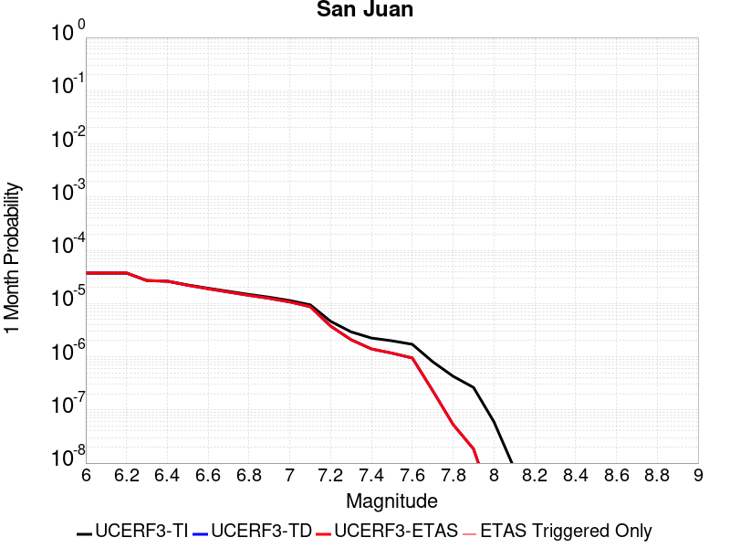 | 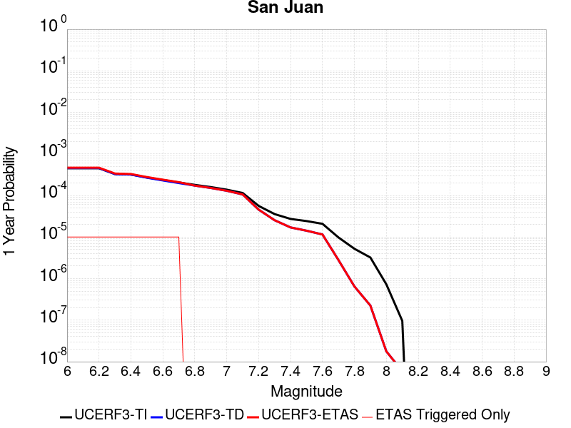 |  |

| Magnitude | 1 wk TI Prob | 1 wk TD Prob | 1 wk ETAS Prob | 1 wk ETAS/TD Gain | 1 wk ETAS Triggered Only | 1 mo TI Prob | 1 mo TD Prob | 1 mo ETAS Prob | 1 mo ETAS/TD Gain | 1 mo ETAS Triggered Only | 1 yr TI Prob | 1 yr TD Prob | 1 yr ETAS Prob | 1 yr ETAS/TD Gain | 1 yr ETAS Triggered Only | 10 yr TI Prob | 10 yr TD Prob | 10 yr ETAS Prob | 10 yr ETAS/TD Gain | 10 yr ETAS Triggered Only |
|-----|-----|-----|-----|-----|-----|-----|-----|-----|-----|-----|-----|-----|-----|-----|-----|-----|-----|-----|-----|-----|
| 6.0 | 8.682808E-6 | 8.751163E-6 | 8.751163E-6 | 1.0 | 0.0 | 3.72115E-5 | 3.750447E-5 | 3.750447E-5 | 1.0 | 0.0 | 4.5295584E-4 | 4.565261E-4 | 4.665215E-4 | 1.0218946 | 1.0E-5 | 0.004520337 | 0.004556423 | 0.004576332 | 1.0043694 | 2.0E-5 |
| 6.1 | 8.682808E-6 | 8.751163E-6 | 8.751163E-6 | 1.0 | 0.0 | 3.72115E-5 | 3.750447E-5 | 3.750447E-5 | 1.0 | 0.0 | 4.5295584E-4 | 4.565261E-4 | 4.665215E-4 | 1.0218946 | 1.0E-5 | 0.004520337 | 0.004556423 | 0.004576332 | 1.0043694 | 2.0E-5 |
| 6.2 | 8.682808E-6 | 8.751163E-6 | 8.751163E-6 | 1.0 | 0.0 | 3.72115E-5 | 3.750447E-5 | 3.750447E-5 | 1.0 | 0.0 | 4.5295584E-4 | 4.565261E-4 | 4.665215E-4 | 1.0218946 | 1.0E-5 | 0.004520337 | 0.004556423 | 0.004576332 | 1.0043694 | 2.0E-5 |
| 6.3 | 6.3054235E-6 | 6.284523E-6 | 6.284523E-6 | 1.0 | 0.0 | 2.7022963E-5 | 2.69334E-5 | 2.69334E-5 | 1.0 | 0.0 | 3.2895492E-4 | 3.278662E-4 | 3.378629E-4 | 1.0304903 | 1.0E-5 | 0.003284684 | 0.0032740245 | 0.0032839917 | 1.0030444 | 1.0E-5 |
| 6.4 | 6.1490473E-6 | 6.1161386E-6 | 6.1161386E-6 | 1.0 | 0.0 | 2.6352795E-5 | 2.6211766E-5 | 2.6211766E-5 | 1.0 | 0.0 | 3.2079802E-4 | 3.190829E-4 | 3.2907972E-4 | 1.0313299 | 1.0E-5 | 0.0032033534 | 0.0031864438 | 0.0031964118 | 1.0031283 | 1.0E-5 |
| 6.5 | 5.204848E-6 | 5.1388524E-6 | 5.1388524E-6 | 1.0 | 0.0 | 2.23063E-5 | 2.2023472E-5 | 2.2023472E-5 | 1.0 | 0.0 | 2.7154534E-4 | 2.6810376E-4 | 2.7810107E-4 | 1.037289 | 1.0E-5 | 0.0027121378 | 0.0026779568 | 0.0026879301 | 1.0037242 | 1.0E-5 |
| 6.6 | 4.5179986E-6 | 4.4162457E-6 | 4.4162457E-6 | 1.0 | 0.0 | 1.9362706E-5 | 1.8926634E-5 | 1.8926634E-5 | 1.0 | 0.0 | 2.3571544E-4 | 2.3040819E-4 | 2.4040589E-4 | 1.0433912 | 1.0E-5 | 0.0023546559 | 0.0023018299 | 0.002311807 | 1.0043343 | 1.0E-5 |
| 6.7 | 3.9442616E-6 | 3.8209155E-6 | 3.8209155E-6 | 1.0 | 0.0 | 1.6903869E-5 | 1.6375252E-5 | 1.6375252E-5 | 1.0 | 0.0 | 2.0578515E-4 | 1.9935114E-4 | 2.0934913E-4 | 1.0501528 | 1.0E-5 | 0.002055947 | 0.0019918478 | 0.0020018278 | 1.0050105 | 1.0E-5 |
| 6.8 | 3.4536245E-6 | 3.3173778E-6 | 3.3173778E-6 | 1.0 | 0.0 | 1.4801163E-5 | 1.4217259E-5 | 1.4217259E-5 | 1.0 | 0.0 | 1.8018926E-4 | 1.73082E-4 | 1.73082E-4 | 1.0 | 0.0 | 0.0018004322 | 0.0017295906 | 0.0017295906 | 1.0 | 0.0 |
| 6.9 | 3.059865E-6 | 2.9130274E-6 | 2.9130274E-6 | 1.0 | 0.0 | 1.3113641E-5 | 1.2484346E-5 | 1.2484346E-5 | 1.0 | 0.0 | 1.596469E-4 | 1.5198688E-4 | 1.5198688E-4 | 1.0 | 0.0 | 0.0015953224 | 0.0015189438 | 0.0015189438 | 1.0 | 0.0 |
| 7.0 | 2.6504351E-6 | 2.4929411E-6 | 2.4929411E-6 | 1.0 | 0.0 | 1.1358958E-5 | 1.06839925E-5 | 1.06839925E-5 | 1.0 | 0.0 | 1.3828653E-4 | 1.3007039E-4 | 1.3007039E-4 | 1.0 | 0.0 | 0.0013820052 | 0.0013000544 | 0.0013000544 | 1.0 | 0.0 |
| 7.1 | 2.2039317E-6 | 2.0345967E-6 | 2.0345967E-6 | 1.0 | 0.0 | 9.445387E-6 | 8.719674E-6 | 8.719674E-6 | 1.0 | 0.0 | 1.1499152E-4 | 1.06157386E-4 | 1.06157386E-4 | 1.0 | 0.0 | 0.0011493203 | 0.0010611765 | 0.0010611765 | 1.0 | 0.0 |
| 7.2 | 1.0786707E-6 | 8.776752E-7 | 8.776752E-7 | 1.0 | 0.0 | 4.622866E-6 | 3.7614595E-6 | 3.7614595E-6 | 1.0 | 0.0 | 5.628194E-5 | 4.579482E-5 | 4.579482E-5 | 1.0 | 0.0 | 5.6267687E-4 | 4.5791257E-4 | 4.5791257E-4 | 1.0 | 0.0 |
| 7.3 | 6.846433E-7 | 4.872928E-7 | 4.872928E-7 | 1.0 | 0.0 | 2.9341822E-6 | 2.088396E-6 | 2.088396E-6 | 1.0 | 0.0 | 3.5723086E-5 | 2.5425927E-5 | 2.5425927E-5 | 1.0 | 0.0 | 3.571734E-4 | 2.5426247E-4 | 2.5426247E-4 | 1.0 | 0.0 |
| 7.4 | 5.23043E-7 | 3.265856E-7 | 3.265856E-7 | 1.0 | 0.0 | 2.2416111E-6 | 1.3996518E-6 | 1.3996518E-6 | 1.0 | 0.0 | 2.7291273E-5 | 1.7040627E-5 | 1.7040627E-5 | 1.0 | 0.0 | 2.7287923E-4 | 1.7042385E-4 | 1.7042385E-4 | 1.0 | 0.0 |
| 7.5 | 4.648444E-7 | 2.726096E-7 | 2.726096E-7 | 1.0 | 0.0 | 1.9921886E-6 | 1.1683263E-6 | 1.1683263E-6 | 1.0 | 0.0 | 2.4254627E-5 | 1.4224281E-5 | 1.4224281E-5 | 1.0 | 0.0 | 2.425198E-4 | 1.4226203E-4 | 1.4226203E-4 | 1.0 | 0.0 |
| 7.6 | 3.9906567E-7 | 2.2103741E-7 | 2.2103741E-7 | 1.0 | 0.0 | 1.7102802E-6 | 9.473028E-7 | 9.473028E-7 | 1.0 | 0.0 | 2.0822463E-5 | 1.1533351E-5 | 1.1533351E-5 | 1.0 | 0.0 | 2.0820512E-4 | 1.1535125E-4 | 1.1535125E-4 | 1.0 | 0.0 |
| 7.7 | 1.8784601E-7 | 5.3740948E-8 | 5.3740948E-8 | 1.0 | 0.0 | 8.0505407E-7 | 2.3031835E-7 | 2.3031835E-7 | 1.0 | 0.0 | 9.80149E-6 | 2.8041222E-6 | 2.8041222E-6 | 1.0 | 0.0 | 9.801057E-5 | 2.8049404E-5 | 2.8049404E-5 | 1.0 | 0.0 |
| 7.8 | 1.00154914E-7 | 1.2437811E-8 | 1.2437811E-8 | 1.0 | 0.0 | 4.2923529E-7 | 5.3304905E-8 | 5.3304905E-8 | 1.0 | 0.0 | 5.225927E-6 | 6.4898705E-7 | 6.4898705E-7 | 1.0 | 0.0 | 5.225804E-5 | 6.4958394E-6 | 6.4958394E-6 | 1.0 | 0.0 |
| 7.9 | 6.171429E-8 | 4.3075605E-9 | 4.3075605E-9 | 1.0 | 0.0 | 2.6448978E-7 | 1.8460982E-8 | 1.8460982E-8 | 1.0 | 0.0 | 3.2201583E-6 | 2.2476243E-7 | 2.2476243E-7 | 1.0 | 0.0 | 3.2201115E-5 | 2.253001E-6 | 2.253001E-6 | 1.0 | 0.0 |
| 8.0 | 1.3974572E-8 | 3.3974434E-10 | 3.3974434E-10 | 1.0 | 0.0 | 5.989102E-8 | 1.4560528E-9 | 1.4560528E-9 | 1.0 | 0.0 | 7.2917294E-7 | 1.7727439E-8 | 1.7727439E-8 | 1.0 | 0.0 | 7.2917055E-6 | 1.8164991E-7 | 1.8164991E-7 | 1.0 | 0.0 |
| 8.1 | 1.8403477E-9 | 1.1350787E-10 | 1.1350787E-10 | 1.0 | 0.0 | 7.887204E-9 | 4.8646376E-10 | 4.8646376E-10 | 1.0 | 0.0 | 9.602671E-8 | 5.9226966E-9 | 5.9226966E-9 | 1.0 | 0.0 | 9.602667E-7 | 6.052197E-8 | 6.052197E-8 | 1.0 | 0.0 |

## Pitas Point (Lower)-Montalvo
*[(top)](#table-of-contents)*

| 1 Week | 1 Month | 1 Year | 10 Year |
|-----|-----|-----|-----|
|  |  |  | 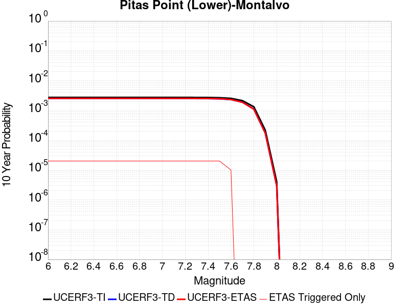 |

| Magnitude | 1 wk TI Prob | 1 wk TD Prob | 1 wk ETAS Prob | 1 wk ETAS/TD Gain | 1 wk ETAS Triggered Only | 1 mo TI Prob | 1 mo TD Prob | 1 mo ETAS Prob | 1 mo ETAS/TD Gain | 1 mo ETAS Triggered Only | 1 yr TI Prob | 1 yr TD Prob | 1 yr ETAS Prob | 1 yr ETAS/TD Gain | 1 yr ETAS Triggered Only | 10 yr TI Prob | 10 yr TD Prob | 10 yr ETAS Prob | 10 yr ETAS/TD Gain | 10 yr ETAS Triggered Only |
|-----|-----|-----|-----|-----|-----|-----|-----|-----|-----|-----|-----|-----|-----|-----|-----|-----|-----|-----|-----|-----|
| 6.0 | 5.2543637E-6 | 4.83811E-6 | 4.83811E-6 | 1.0 | 0.0 | 2.2518509E-5 | 2.0734593E-5 | 2.0734593E-5 | 1.0 | 0.0 | 2.7412834E-4 | 2.5241473E-4 | 2.724097E-4 | 1.0792147 | 2.0E-5 | 0.0027379042 | 0.0025213128 | 0.0025412624 | 1.0079124 | 2.0E-5 |
| 6.1 | 5.2543637E-6 | 4.83811E-6 | 4.83811E-6 | 1.0 | 0.0 | 2.2518509E-5 | 2.0734593E-5 | 2.0734593E-5 | 1.0 | 0.0 | 2.7412834E-4 | 2.5241473E-4 | 2.724097E-4 | 1.0792147 | 2.0E-5 | 0.0027379042 | 0.0025213128 | 0.0025412624 | 1.0079124 | 2.0E-5 |
| 6.2 | 5.2543637E-6 | 4.83811E-6 | 4.83811E-6 | 1.0 | 0.0 | 2.2518509E-5 | 2.0734593E-5 | 2.0734593E-5 | 1.0 | 0.0 | 2.7412834E-4 | 2.5241473E-4 | 2.724097E-4 | 1.0792147 | 2.0E-5 | 0.0027379042 | 0.0025213128 | 0.0025412624 | 1.0079124 | 2.0E-5 |
| 6.3 | 5.2543637E-6 | 4.83811E-6 | 4.83811E-6 | 1.0 | 0.0 | 2.2518509E-5 | 2.0734593E-5 | 2.0734593E-5 | 1.0 | 0.0 | 2.7412834E-4 | 2.5241473E-4 | 2.724097E-4 | 1.0792147 | 2.0E-5 | 0.0027379042 | 0.0025213128 | 0.0025412624 | 1.0079124 | 2.0E-5 |
| 6.4 | 5.2543637E-6 | 4.83811E-6 | 4.83811E-6 | 1.0 | 0.0 | 2.2518509E-5 | 2.0734593E-5 | 2.0734593E-5 | 1.0 | 0.0 | 2.7412834E-4 | 2.5241473E-4 | 2.724097E-4 | 1.0792147 | 2.0E-5 | 0.0027379042 | 0.0025213128 | 0.0025412624 | 1.0079124 | 2.0E-5 |
| 6.5 | 5.2543637E-6 | 4.83811E-6 | 4.83811E-6 | 1.0 | 0.0 | 2.2518509E-5 | 2.0734593E-5 | 2.0734593E-5 | 1.0 | 0.0 | 2.7412834E-4 | 2.5241473E-4 | 2.724097E-4 | 1.0792147 | 2.0E-5 | 0.0027379042 | 0.0025213128 | 0.0025412624 | 1.0079124 | 2.0E-5 |
| 6.6 | 5.2543637E-6 | 4.83811E-6 | 4.83811E-6 | 1.0 | 0.0 | 2.2518509E-5 | 2.0734593E-5 | 2.0734593E-5 | 1.0 | 0.0 | 2.7412834E-4 | 2.5241473E-4 | 2.724097E-4 | 1.0792147 | 2.0E-5 | 0.0027379042 | 0.0025213128 | 0.0025412624 | 1.0079124 | 2.0E-5 |
| 6.7 | 5.2543637E-6 | 4.83811E-6 | 4.83811E-6 | 1.0 | 0.0 | 2.2518509E-5 | 2.0734593E-5 | 2.0734593E-5 | 1.0 | 0.0 | 2.7412834E-4 | 2.5241473E-4 | 2.724097E-4 | 1.0792147 | 2.0E-5 | 0.0027379042 | 0.0025213128 | 0.0025412624 | 1.0079124 | 2.0E-5 |
| 6.8 | 5.2543637E-6 | 4.83811E-6 | 4.83811E-6 | 1.0 | 0.0 | 2.2518509E-5 | 2.0734593E-5 | 2.0734593E-5 | 1.0 | 0.0 | 2.7412834E-4 | 2.5241473E-4 | 2.724097E-4 | 1.0792147 | 2.0E-5 | 0.0027379042 | 0.0025213128 | 0.0025412624 | 1.0079124 | 2.0E-5 |
| 6.9 | 5.2543637E-6 | 4.83811E-6 | 4.83811E-6 | 1.0 | 0.0 | 2.2518509E-5 | 2.0734593E-5 | 2.0734593E-5 | 1.0 | 0.0 | 2.7412834E-4 | 2.5241473E-4 | 2.724097E-4 | 1.0792147 | 2.0E-5 | 0.0027379042 | 0.0025213128 | 0.0025412624 | 1.0079124 | 2.0E-5 |
| 7.0 | 5.2543637E-6 | 4.83811E-6 | 4.83811E-6 | 1.0 | 0.0 | 2.2518509E-5 | 2.0734593E-5 | 2.0734593E-5 | 1.0 | 0.0 | 2.7412834E-4 | 2.5241473E-4 | 2.724097E-4 | 1.0792147 | 2.0E-5 | 0.0027379042 | 0.0025213128 | 0.0025412624 | 1.0079124 | 2.0E-5 |
| 7.1 | 5.2543637E-6 | 4.83811E-6 | 4.83811E-6 | 1.0 | 0.0 | 2.2518509E-5 | 2.0734593E-5 | 2.0734593E-5 | 1.0 | 0.0 | 2.7412834E-4 | 2.5241473E-4 | 2.724097E-4 | 1.0792147 | 2.0E-5 | 0.0027379042 | 0.0025213128 | 0.0025412624 | 1.0079124 | 2.0E-5 |
| 7.2 | 5.2458695E-6 | 4.829263E-6 | 4.829263E-6 | 1.0 | 0.0 | 2.2482105E-5 | 2.069668E-5 | 2.069668E-5 | 1.0 | 0.0 | 2.7368523E-4 | 2.5195326E-4 | 2.719482E-4 | 1.0793598 | 2.0E-5 | 0.0027334841 | 0.0025167086 | 0.0025366582 | 1.007927 | 2.0E-5 |
| 7.3 | 5.22665E-6 | 4.8091797E-6 | 4.8091797E-6 | 1.0 | 0.0 | 2.2399736E-5 | 2.061061E-5 | 2.061061E-5 | 1.0 | 0.0 | 2.7268266E-4 | 2.509056E-4 | 2.7090058E-4 | 1.0796913 | 2.0E-5 | 0.002723483 | 0.0025062556 | 0.0025262055 | 1.0079601 | 2.0E-5 |
| 7.4 | 5.210642E-6 | 4.792392E-6 | 4.792392E-6 | 1.0 | 0.0 | 2.233113E-5 | 2.0538662E-5 | 2.0538662E-5 | 1.0 | 0.0 | 2.718476E-4 | 2.500298E-4 | 2.7002482E-4 | 1.0799705 | 2.0E-5 | 0.002715153 | 0.0024975175 | 0.0025174676 | 1.007988 | 2.0E-5 |
| 7.5 | 5.1226016E-6 | 4.7002754E-6 | 4.7002754E-6 | 1.0 | 0.0 | 2.1953823E-5 | 2.0143883E-5 | 2.0143883E-5 | 1.0 | 0.0 | 2.67255E-4 | 2.4522448E-4 | 2.652196E-4 | 1.081538 | 2.0E-5 | 0.0026693381 | 0.0024495707 | 0.0024695217 | 1.0081447 | 2.0E-5 |
| 7.6 | 4.8796987E-6 | 4.4451667E-6 | 4.4451667E-6 | 1.0 | 0.0 | 2.0912828E-5 | 1.9050576E-5 | 1.9050576E-5 | 1.0 | 0.0 | 2.5458392E-4 | 2.3191638E-4 | 2.4191405E-4 | 1.0431089 | 1.0E-5 | 0.0025429246 | 0.002316774 | 0.002326751 | 1.0043063 | 1.0E-5 |
| 7.7 | 4.0834398E-6 | 3.609307E-6 | 3.609307E-6 | 1.0 | 0.0 | 1.7500339E-5 | 1.546837E-5 | 1.546837E-5 | 1.0 | 0.0 | 2.1304579E-4 | 1.8831134E-4 | 1.8831134E-4 | 1.0 | 0.0 | 0.0021284167 | 0.0018815415 | 0.0018815415 | 1.0 | 0.0 |
| 7.8 | 2.5445438E-6 | 2.1213505E-6 | 2.1213505E-6 | 1.0 | 0.0 | 1.0905142E-5 | 9.091471E-6 | 9.091471E-6 | 1.0 | 0.0 | 1.3276201E-4 | 1.1068308E-4 | 1.1068308E-4 | 1.0 | 0.0 | 0.0013268272 | 0.0011062842 | 0.0011062842 | 1.0 | 0.0 |
| 7.9 | 4.1677114E-7 | 3.3295828E-7 | 3.3295828E-7 | 1.0 | 0.0 | 1.7861609E-6 | 1.4269632E-6 | 1.4269632E-6 | 1.0 | 0.0 | 2.1746291E-5 | 1.7373142E-5 | 1.7373142E-5 | 1.0 | 0.0 | 2.1744163E-4 | 1.7371814E-4 | 1.7371814E-4 | 1.0 | 0.0 |
| 8.0 | 7.791402E-9 | 5.6840217E-9 | 5.6840217E-9 | 1.0 | 0.0 | 3.3391725E-8 | 2.4360093E-8 | 2.4360093E-8 | 1.0 | 0.0 | 4.0654416E-7 | 2.9658412E-7 | 2.9658412E-7 | 1.0 | 0.0 | 4.065434E-6 | 2.9658393E-6 | 2.9658393E-6 | 1.0 | 0.0 |

## Deep Springs
*[(top)](#table-of-contents)*

| 1 Week | 1 Month | 1 Year | 10 Year |
|-----|-----|-----|-----|
|  |  |  |  |

| Magnitude | 1 wk TI Prob | 1 wk TD Prob | 1 wk ETAS Prob | 1 wk ETAS/TD Gain | 1 wk ETAS Triggered Only | 1 mo TI Prob | 1 mo TD Prob | 1 mo ETAS Prob | 1 mo ETAS/TD Gain | 1 mo ETAS Triggered Only | 1 yr TI Prob | 1 yr TD Prob | 1 yr ETAS Prob | 1 yr ETAS/TD Gain | 1 yr ETAS Triggered Only | 10 yr TI Prob | 10 yr TD Prob | 10 yr ETAS Prob | 10 yr ETAS/TD Gain | 10 yr ETAS Triggered Only |
|-----|-----|-----|-----|-----|-----|-----|-----|-----|-----|-----|-----|-----|-----|-----|-----|-----|-----|-----|-----|-----|
| 6.0 | 1.9810619E-5 | 2.3115073E-5 | 2.3115073E-5 | 1.0 | 0.0 | 8.489989E-5 | 9.9063705E-5 | 9.9063705E-5 | 1.0 | 0.0 | 0.001033166 | 0.001205941 | 0.0012259169 | 1.0165646 | 2.0E-5 | 0.010283757 | 0.012043758 | 0.012063517 | 1.0016406 | 2.0E-5 |
| 6.1 | 1.9810619E-5 | 2.3115073E-5 | 2.3115073E-5 | 1.0 | 0.0 | 8.489989E-5 | 9.9063705E-5 | 9.9063705E-5 | 1.0 | 0.0 | 0.001033166 | 0.001205941 | 0.0012259169 | 1.0165646 | 2.0E-5 | 0.010283757 | 0.012043758 | 0.012063517 | 1.0016406 | 2.0E-5 |
| 6.2 | 1.9810619E-5 | 2.3115073E-5 | 2.3115073E-5 | 1.0 | 0.0 | 8.489989E-5 | 9.9063705E-5 | 9.9063705E-5 | 1.0 | 0.0 | 0.001033166 | 0.001205941 | 0.0012259169 | 1.0165646 | 2.0E-5 | 0.010283757 | 0.012043758 | 0.012063517 | 1.0016406 | 2.0E-5 |
| 6.3 | 1.9810619E-5 | 2.3115073E-5 | 2.3115073E-5 | 1.0 | 0.0 | 8.489989E-5 | 9.9063705E-5 | 9.9063705E-5 | 1.0 | 0.0 | 0.001033166 | 0.001205941 | 0.0012259169 | 1.0165646 | 2.0E-5 | 0.010283757 | 0.012043758 | 0.012063517 | 1.0016406 | 2.0E-5 |
| 6.4 | 1.9810619E-5 | 2.3115073E-5 | 2.3115073E-5 | 1.0 | 0.0 | 8.489989E-5 | 9.9063705E-5 | 9.9063705E-5 | 1.0 | 0.0 | 0.001033166 | 0.001205941 | 0.0012259169 | 1.0165646 | 2.0E-5 | 0.010283757 | 0.012043758 | 0.012063517 | 1.0016406 | 2.0E-5 |
| 6.5 | 1.7190405E-5 | 2.005277E-5 | 2.005277E-5 | 1.0 | 0.0 | 7.367108E-5 | 8.594044E-5 | 8.594044E-5 | 1.0 | 0.0 | 8.9657627E-4 | 0.0010463246 | 0.0010563142 | 1.0095472 | 1.0E-5 | 0.008929676 | 0.0104632145 | 0.01047311 | 1.0009457 | 1.0E-5 |
| 6.6 | 1.7190405E-5 | 2.005277E-5 | 2.005277E-5 | 1.0 | 0.0 | 7.367108E-5 | 8.594044E-5 | 8.594044E-5 | 1.0 | 0.0 | 8.9657627E-4 | 0.0010463246 | 0.0010563142 | 1.0095472 | 1.0E-5 | 0.008929676 | 0.0104632145 | 0.01047311 | 1.0009457 | 1.0E-5 |

## Lost Hills
*[(top)](#table-of-contents)*

| 1 Week | 1 Month | 1 Year | 10 Year |
|-----|-----|-----|-----|
|  |  |  |  |

| Magnitude | 1 wk TI Prob | 1 wk TD Prob | 1 wk ETAS Prob | 1 wk ETAS/TD Gain | 1 wk ETAS Triggered Only | 1 mo TI Prob | 1 mo TD Prob | 1 mo ETAS Prob | 1 mo ETAS/TD Gain | 1 mo ETAS Triggered Only | 1 yr TI Prob | 1 yr TD Prob | 1 yr ETAS Prob | 1 yr ETAS/TD Gain | 1 yr ETAS Triggered Only | 10 yr TI Prob | 10 yr TD Prob | 10 yr ETAS Prob | 10 yr ETAS/TD Gain | 10 yr ETAS Triggered Only |
|-----|-----|-----|-----|-----|-----|-----|-----|-----|-----|-----|-----|-----|-----|-----|-----|-----|-----|-----|-----|-----|
| 6.0 | 2.233523E-5 | 2.5108648E-5 | 2.5108648E-5 | 1.0 | 0.0 | 9.571891E-5 | 1.07605E-4 | 1.1760393E-4 | 1.0929224 | 1.0E-5 | 0.0011647546 | 0.0013094717 | 0.0013194586 | 1.0076267 | 1.0E-5 | 0.011586686 | 0.013034157 | 0.013053897 | 1.0015144 | 2.0E-5 |
| 6.1 | 2.233523E-5 | 2.5108648E-5 | 2.5108648E-5 | 1.0 | 0.0 | 9.571891E-5 | 1.07605E-4 | 1.1760393E-4 | 1.0929224 | 1.0E-5 | 0.0011647546 | 0.0013094717 | 0.0013194586 | 1.0076267 | 1.0E-5 | 0.011586686 | 0.013034157 | 0.013053897 | 1.0015144 | 2.0E-5 |
| 6.2 | 2.233523E-5 | 2.5108648E-5 | 2.5108648E-5 | 1.0 | 0.0 | 9.571891E-5 | 1.07605E-4 | 1.1760393E-4 | 1.0929224 | 1.0E-5 | 0.0011647546 | 0.0013094717 | 0.0013194586 | 1.0076267 | 1.0E-5 | 0.011586686 | 0.013034157 | 0.013053897 | 1.0015144 | 2.0E-5 |
| 6.3 | 2.233523E-5 | 2.5108648E-5 | 2.5108648E-5 | 1.0 | 0.0 | 9.571891E-5 | 1.07605E-4 | 1.1760393E-4 | 1.0929224 | 1.0E-5 | 0.0011647546 | 0.0013094717 | 0.0013194586 | 1.0076267 | 1.0E-5 | 0.011586686 | 0.013034157 | 0.013053897 | 1.0015144 | 2.0E-5 |
| 6.4 | 1.2288092E-5 | 1.3782218E-5 | 1.3782218E-5 | 1.0 | 0.0 | 5.2662188E-5 | 5.906584E-5 | 5.906584E-5 | 1.0 | 0.0 | 6.409735E-4 | 7.189831E-4 | 7.189831E-4 | 1.0 | 0.0 | 0.006391279 | 0.0071757776 | 0.007185706 | 1.0013835 | 1.0E-5 |
| 6.5 | 1.2288092E-5 | 1.3782218E-5 | 1.3782218E-5 | 1.0 | 0.0 | 5.2662188E-5 | 5.906584E-5 | 5.906584E-5 | 1.0 | 0.0 | 6.409735E-4 | 7.189831E-4 | 7.189831E-4 | 1.0 | 0.0 | 0.006391279 | 0.0071757776 | 0.007185706 | 1.0013835 | 1.0E-5 |
| 6.6 | 8.58281E-6 | 9.634552E-6 | 9.634552E-6 | 1.0 | 0.0 | 3.6782953E-5 | 4.1290754E-5 | 4.1290754E-5 | 1.0 | 0.0 | 4.4774043E-4 | 5.026822E-4 | 5.026822E-4 | 1.0 | 0.0 | 0.0044683935 | 0.0050236126 | 0.0050335624 | 1.0019805 | 1.0E-5 |
| 6.7 | 7.205685E-6 | 8.088959E-6 | 8.088959E-6 | 1.0 | 0.0 | 3.088114E-5 | 3.4666966E-5 | 3.4666966E-5 | 1.0 | 0.0 | 3.7591302E-4 | 4.220703E-4 | 4.220703E-4 | 1.0 | 0.0 | 0.0037527776 | 0.004220703 | 0.004220703 | 1.0 | 0.0 |

## Great Valley 09 (Laguna Seca)
*[(top)](#table-of-contents)*

| 1 Week | 1 Month | 1 Year | 10 Year |
|-----|-----|-----|-----|
| 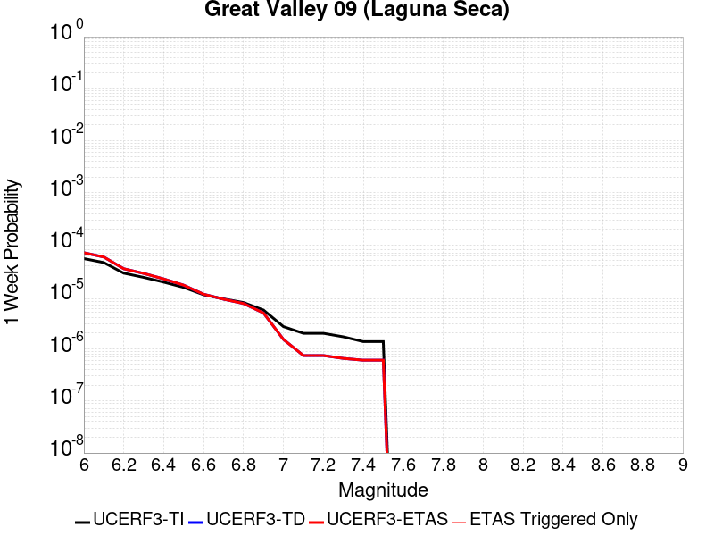 |  |  | 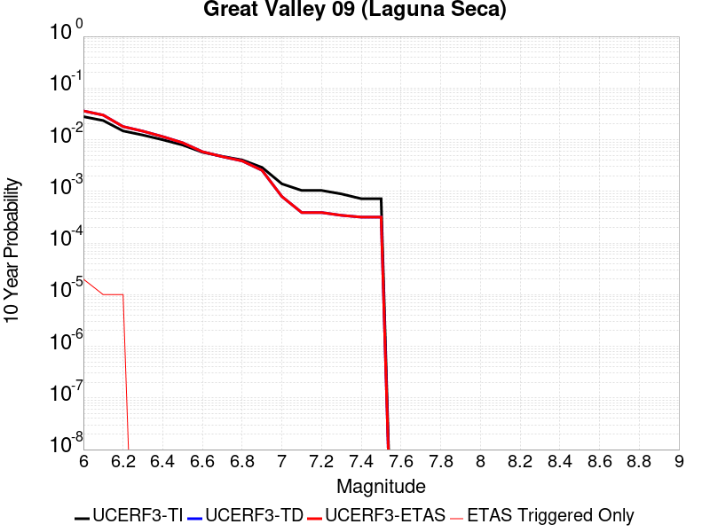 |

| Magnitude | 1 wk TI Prob | 1 wk TD Prob | 1 wk ETAS Prob | 1 wk ETAS/TD Gain | 1 wk ETAS Triggered Only | 1 mo TI Prob | 1 mo TD Prob | 1 mo ETAS Prob | 1 mo ETAS/TD Gain | 1 mo ETAS Triggered Only | 1 yr TI Prob | 1 yr TD Prob | 1 yr ETAS Prob | 1 yr ETAS/TD Gain | 1 yr ETAS Triggered Only | 10 yr TI Prob | 10 yr TD Prob | 10 yr ETAS Prob | 10 yr ETAS/TD Gain | 10 yr ETAS Triggered Only |
|-----|-----|-----|-----|-----|-----|-----|-----|-----|-----|-----|-----|-----|-----|-----|-----|-----|-----|-----|-----|-----|
| 6.0 | 5.4353277E-5 | 7.051561E-5 | 7.051561E-5 | 1.0 | 0.0 | 2.3292181E-4 | 3.0217398E-4 | 3.0217398E-4 | 1.0 | 0.0 | 0.0028321352 | 0.00367276 | 0.0036827233 | 1.0027127 | 1.0E-5 | 0.02796312 | 0.036123004 | 0.036142282 | 1.0005337 | 2.0E-5 |
| 6.1 | 4.5578287E-5 | 5.823264E-5 | 5.823264E-5 | 1.0 | 0.0 | 1.953209E-4 | 2.4954317E-4 | 2.4954317E-4 | 1.0 | 0.0 | 0.0023754383 | 0.0030339577 | 0.0030339577 | 1.0 | 0.0 | 0.023502063 | 0.029925657 | 0.029935358 | 1.0003241 | 1.0E-5 |
| 6.2 | 2.8536782E-5 | 3.474252E-5 | 3.474252E-5 | 1.0 | 0.0 | 1.2229476E-4 | 1.4888775E-4 | 1.4888775E-4 | 1.0 | 0.0 | 0.0014879217 | 0.0018111808 | 0.0018111808 | 1.0 | 0.0 | 0.014779986 | 0.017961416 | 0.017971236 | 1.0005467 | 1.0E-5 |
| 6.3 | 2.3698774E-5 | 2.8217906E-5 | 2.8217906E-5 | 1.0 | 0.0 | 1.01562226E-4 | 1.20928475E-4 | 1.20928475E-4 | 1.0 | 0.0 | 0.0012358186 | 0.0014713012 | 0.0014713012 | 1.0 | 0.0 | 0.012289686 | 0.014613895 | 0.014613895 | 1.0 | 0.0 |
| 6.4 | 1.9191197E-5 | 2.212631E-5 | 2.212631E-5 | 1.0 | 0.0 | 8.2245395E-5 | 9.4823794E-5 | 9.4823794E-5 | 1.0 | 0.0 | 0.0010008777 | 0.0011538719 | 0.0011538719 | 1.0 | 0.0 | 0.009963818 | 0.0114788 | 0.0114788 | 1.0 | 0.0 |
| 6.5 | 1.5203241E-5 | 1.680352E-5 | 1.680352E-5 | 1.0 | 0.0 | 6.5155116E-5 | 7.2013274E-5 | 7.2013274E-5 | 1.0 | 0.0 | 7.9297484E-4 | 8.7642414E-4 | 8.7642414E-4 | 1.0 | 0.0 | 0.007901512 | 0.008730795 | 0.008730795 | 1.0 | 0.0 |
| 6.6 | 1.0984925E-5 | 1.12438E-5 | 1.12438E-5 | 1.0 | 0.0 | 4.70774E-5 | 4.8186845E-5 | 4.8186845E-5 | 1.0 | 0.0 | 5.730166E-4 | 5.8652076E-4 | 5.8652076E-4 | 1.0 | 0.0 | 0.005715413 | 0.005850119 | 0.005850119 | 1.0 | 0.0 |
| 6.7 | 9.134616E-6 | 9.020813E-6 | 9.020813E-6 | 1.0 | 0.0 | 3.9147766E-5 | 3.866007E-5 | 3.866007E-5 | 1.0 | 0.0 | 4.7651984E-4 | 4.7058705E-4 | 4.7058705E-4 | 1.0 | 0.0 | 0.004754993 | 0.004696151 | 0.004696151 | 1.0 | 0.0 |
| 6.8 | 7.785589E-6 | 7.4526943E-6 | 7.4526943E-6 | 1.0 | 0.0 | 3.3366385E-5 | 3.193974E-5 | 3.193974E-5 | 1.0 | 0.0 | 4.0616E-4 | 3.8879894E-4 | 3.8879894E-4 | 1.0 | 0.0 | 0.0040541845 | 0.0038813914 | 0.0038813914 | 1.0 | 0.0 |
| 6.9 | 5.579095E-6 | 4.898976E-6 | 4.898976E-6 | 1.0 | 0.0 | 2.3910188E-5 | 2.099545E-5 | 2.099545E-5 | 1.0 | 0.0 | 2.9106764E-4 | 2.55591E-4 | 2.55591E-4 | 1.0 | 0.0 | 0.002906867 | 0.002553108 | 0.002553108 | 1.0 | 0.0 |
| 7.0 | 2.6816688E-6 | 1.5217252E-6 | 1.5217252E-6 | 1.0 | 0.0 | 1.1492816E-5 | 6.521663E-6 | 6.521663E-6 | 1.0 | 0.0 | 1.3991605E-4 | 7.939844E-5 | 7.939844E-5 | 1.0 | 0.0 | 0.0013982799 | 7.9370954E-4 | 7.9370954E-4 | 1.0 | 0.0 |
| 7.1 | 1.9951021E-6 | 7.454279E-7 | 7.454279E-7 | 1.0 | 0.0 | 8.55041E-6 | 3.1946872E-6 | 3.1946872E-6 | 1.0 | 0.0 | 1.0409627E-4 | 3.8894665E-5 | 3.8894665E-5 | 1.0 | 0.0 | 0.0010404752 | 3.888827E-4 | 3.888827E-4 | 1.0 | 0.0 |
| 7.2 | 1.9951021E-6 | 7.454279E-7 | 7.454279E-7 | 1.0 | 0.0 | 8.55041E-6 | 3.1946872E-6 | 3.1946872E-6 | 1.0 | 0.0 | 1.0409627E-4 | 3.8894665E-5 | 3.8894665E-5 | 1.0 | 0.0 | 0.0010404752 | 3.888827E-4 | 3.888827E-4 | 1.0 | 0.0 |
| 7.3 | 1.7087556E-6 | 6.5792716E-7 | 6.5792716E-7 | 1.0 | 0.0 | 7.3232177E-6 | 2.819685E-6 | 2.819685E-6 | 1.0 | 0.0 | 8.915652E-5 | 3.4329165E-5 | 3.4329165E-5 | 1.0 | 0.0 | 8.9120766E-4 | 3.432427E-4 | 3.432427E-4 | 1.0 | 0.0 |
| 7.4 | 1.3804846E-6 | 6.0742354E-7 | 6.0742354E-7 | 1.0 | 0.0 | 5.916349E-6 | 2.6032412E-6 | 2.6032412E-6 | 1.0 | 0.0 | 7.2029165E-5 | 3.1694042E-5 | 3.1694042E-5 | 1.0 | 0.0 | 7.200583E-4 | 3.1689924E-4 | 3.1689924E-4 | 1.0 | 0.0 |
| 7.5 | 1.3804846E-6 | 6.0742354E-7 | 6.0742354E-7 | 1.0 | 0.0 | 5.916349E-6 | 2.6032412E-6 | 2.6032412E-6 | 1.0 | 0.0 | 7.2029165E-5 | 3.1694042E-5 | 3.1694042E-5 | 1.0 | 0.0 | 7.200583E-4 | 3.1689924E-4 | 3.1689924E-4 | 1.0 | 0.0 |

## San Cayetano
*[(top)](#table-of-contents)*

| 1 Week | 1 Month | 1 Year | 10 Year |
|-----|-----|-----|-----|
|  |  |  |  |

| Magnitude | 1 wk TI Prob | 1 wk TD Prob | 1 wk ETAS Prob | 1 wk ETAS/TD Gain | 1 wk ETAS Triggered Only | 1 mo TI Prob | 1 mo TD Prob | 1 mo ETAS Prob | 1 mo ETAS/TD Gain | 1 mo ETAS Triggered Only | 1 yr TI Prob | 1 yr TD Prob | 1 yr ETAS Prob | 1 yr ETAS/TD Gain | 1 yr ETAS Triggered Only | 10 yr TI Prob | 10 yr TD Prob | 10 yr ETAS Prob | 10 yr ETAS/TD Gain | 10 yr ETAS Triggered Only |
|-----|-----|-----|-----|-----|-----|-----|-----|-----|-----|-----|-----|-----|-----|-----|-----|-----|-----|-----|-----|-----|
| 6.0 | 2.3476267E-5 | 1.8172597E-5 | 1.8172597E-5 | 1.0 | 0.0 | 1.0060869E-4 | 7.788026E-5 | 7.788026E-5 | 1.0 | 0.0 | 0.0012242225 | 9.477833E-4 | 9.477833E-4 | 1.0 | 0.0 | 0.012175002 | 0.009438034 | 0.009457845 | 1.002099 | 2.0E-5 |
| 6.1 | 2.3476267E-5 | 1.8172597E-5 | 1.8172597E-5 | 1.0 | 0.0 | 1.0060869E-4 | 7.788026E-5 | 7.788026E-5 | 1.0 | 0.0 | 0.0012242225 | 9.477833E-4 | 9.477833E-4 | 1.0 | 0.0 | 0.012175002 | 0.009438034 | 0.009457845 | 1.002099 | 2.0E-5 |
| 6.2 | 2.3476267E-5 | 1.8172597E-5 | 1.8172597E-5 | 1.0 | 0.0 | 1.0060869E-4 | 7.788026E-5 | 7.788026E-5 | 1.0 | 0.0 | 0.0012242225 | 9.477833E-4 | 9.477833E-4 | 1.0 | 0.0 | 0.012175002 | 0.009438034 | 0.009457845 | 1.002099 | 2.0E-5 |
| 6.3 | 2.3476267E-5 | 1.8172597E-5 | 1.8172597E-5 | 1.0 | 0.0 | 1.0060869E-4 | 7.788026E-5 | 7.788026E-5 | 1.0 | 0.0 | 0.0012242225 | 9.477833E-4 | 9.477833E-4 | 1.0 | 0.0 | 0.012175002 | 0.009438034 | 0.009457845 | 1.002099 | 2.0E-5 |
| 6.4 | 2.3476267E-5 | 1.8172597E-5 | 1.8172597E-5 | 1.0 | 0.0 | 1.0060869E-4 | 7.788026E-5 | 7.788026E-5 | 1.0 | 0.0 | 0.0012242225 | 9.477833E-4 | 9.477833E-4 | 1.0 | 0.0 | 0.012175002 | 0.009438034 | 0.009457845 | 1.002099 | 2.0E-5 |
| 6.5 | 2.3476267E-5 | 1.8172597E-5 | 1.8172597E-5 | 1.0 | 0.0 | 1.0060869E-4 | 7.788026E-5 | 7.788026E-5 | 1.0 | 0.0 | 0.0012242225 | 9.477833E-4 | 9.477833E-4 | 1.0 | 0.0 | 0.012175002 | 0.009438034 | 0.009457845 | 1.002099 | 2.0E-5 |
| 6.6 | 2.3476267E-5 | 1.8172597E-5 | 1.8172597E-5 | 1.0 | 0.0 | 1.0060869E-4 | 7.788026E-5 | 7.788026E-5 | 1.0 | 0.0 | 0.0012242225 | 9.477833E-4 | 9.477833E-4 | 1.0 | 0.0 | 0.012175002 | 0.009438034 | 0.009457845 | 1.002099 | 2.0E-5 |
| 6.7 | 2.3476267E-5 | 1.8172597E-5 | 1.8172597E-5 | 1.0 | 0.0 | 1.0060869E-4 | 7.788026E-5 | 7.788026E-5 | 1.0 | 0.0 | 0.0012242225 | 9.477833E-4 | 9.477833E-4 | 1.0 | 0.0 | 0.012175002 | 0.009438034 | 0.009457845 | 1.002099 | 2.0E-5 |
| 6.8 | 2.3241924E-5 | 1.7940256E-5 | 1.7940256E-5 | 1.0 | 0.0 | 9.960445E-5 | 7.6884564E-5 | 7.6884564E-5 | 1.0 | 0.0 | 0.0012120095 | 9.3567115E-4 | 9.3567115E-4 | 1.0 | 0.0 | 0.012054204 | 0.009317866 | 0.0093376795 | 1.0021265 | 2.0E-5 |
| 6.9 | 2.2761007E-5 | 1.7435643E-5 | 1.7435643E-5 | 1.0 | 0.0 | 9.7543525E-5 | 7.472206E-5 | 7.472206E-5 | 1.0 | 0.0 | 0.0011869454 | 9.0936484E-4 | 9.0936484E-4 | 1.0 | 0.0 | 0.011806256 | 0.009056962 | 0.009076781 | 1.0021882 | 2.0E-5 |
| 7.0 | 2.240283E-5 | 1.7069375E-5 | 1.7069375E-5 | 1.0 | 0.0 | 9.600859E-5 | 7.3152434E-5 | 7.3152434E-5 | 1.0 | 0.0 | 0.0011682777 | 8.902704E-4 | 8.902704E-4 | 1.0 | 0.0 | 0.011621549 | 0.008867547 | 0.00888737 | 1.0022354 | 2.0E-5 |
| 7.1 | 2.1871154E-5 | 1.6589227E-5 | 1.6589227E-5 | 1.0 | 0.0 | 9.373015E-5 | 7.109477E-5 | 7.109477E-5 | 1.0 | 0.0 | 0.0011405671 | 8.652384E-4 | 8.652384E-4 | 1.0 | 0.0 | 0.011347309 | 0.008619192 | 0.008639019 | 1.0023004 | 2.0E-5 |
| 7.2 | 2.0714133E-5 | 1.5567659E-5 | 1.5567659E-5 | 1.0 | 0.0 | 8.8771834E-5 | 6.671685E-5 | 6.671685E-5 | 1.0 | 0.0 | 0.0010802611 | 8.119782E-4 | 8.119782E-4 | 1.0 | 0.0 | 0.010750249 | 0.008090582 | 0.00811042 | 1.002452 | 2.0E-5 |
| 7.3 | 1.8408395E-5 | 1.39983495E-5 | 1.39983495E-5 | 1.0 | 0.0 | 7.8890735E-5 | 5.9991566E-5 | 5.9991566E-5 | 1.0 | 0.0 | 9.600714E-4 | 7.301555E-4 | 7.301555E-4 | 1.0 | 0.0 | 0.009559342 | 0.007277976 | 0.007287903 | 1.001364 | 1.0E-5 |
| 7.4 | 1.6856795E-5 | 1.2851356E-5 | 1.2851356E-5 | 1.0 | 0.0 | 7.2241404E-5 | 5.5076092E-5 | 5.5076092E-5 | 1.0 | 0.0 | 8.7918417E-4 | 6.70348E-4 | 6.70348E-4 | 1.0 | 0.0 | 0.00875714 | 0.00668363 | 0.006693563 | 1.0014862 | 1.0E-5 |
| 7.5 | 1.2822778E-5 | 9.578354E-6 | 9.578354E-6 | 1.0 | 0.0 | 5.495361E-5 | 4.1049454E-5 | 4.1049454E-5 | 1.0 | 0.0 | 6.688548E-4 | 4.996641E-4 | 4.996641E-4 | 1.0 | 0.0 | 0.006668452 | 0.0049855127 | 0.0049855127 | 1.0 | 0.0 |
| 7.6 | 5.6272684E-6 | 3.855289E-6 | 3.855289E-6 | 1.0 | 0.0 | 2.4116642E-5 | 1.6522563E-5 | 1.6522563E-5 | 1.0 | 0.0 | 2.9358055E-4 | 2.0114373E-4 | 2.0114373E-4 | 1.0 | 0.0 | 0.0029319301 | 0.0020096276 | 0.0020096276 | 1.0 | 0.0 |
| 7.7 | 3.5261346E-6 | 2.340946E-6 | 2.340946E-6 | 1.0 | 0.0 | 1.5111918E-5 | 1.0032587E-5 | 1.0032587E-5 | 1.0 | 0.0 | 1.8397206E-4 | 1.2213997E-4 | 1.2213997E-4 | 1.0 | 0.0 | 0.0018381984 | 0.0012207358 | 0.0012207358 | 1.0 | 0.0 |
| 7.8 | 1.4826929E-6 | 1.0565338E-6 | 1.0565338E-6 | 1.0 | 0.0 | 6.354383E-6 | 4.5279944E-6 | 4.5279944E-6 | 1.0 | 0.0 | 7.736187E-5 | 5.5126955E-5 | 5.5126955E-5 | 1.0 | 0.0 | 7.733494E-4 | 5.511348E-4 | 5.511348E-4 | 1.0 | 0.0 |
| 7.9 | 2.7568166E-7 | 1.6980103E-7 | 1.6980103E-7 | 1.0 | 0.0 | 1.1814923E-6 | 7.2771843E-7 | 7.2771843E-7 | 1.0 | 0.0 | 1.4384574E-5 | 8.859936E-6 | 8.859936E-6 | 1.0 | 0.0 | 1.4383643E-4 | 8.8595865E-5 | 8.8595865E-5 | 1.0 | 0.0 |
| 8.0 | 5.407832E-8 | 2.6893828E-8 | 2.6893828E-8 | 1.0 | 0.0 | 2.3176422E-7 | 1.15259255E-7 | 1.15259255E-7 | 1.0 | 0.0 | 2.8217257E-6 | 1.4032805E-6 | 1.4032805E-6 | 1.0 | 0.0 | 2.8216898E-5 | 1.4032721E-5 | 1.4032721E-5 | 1.0 | 0.0 |

## Bullion Mountains
*[(top)](#table-of-contents)*

| 1 Week | 1 Month | 1 Year | 10 Year |
|-----|-----|-----|-----|
|  | 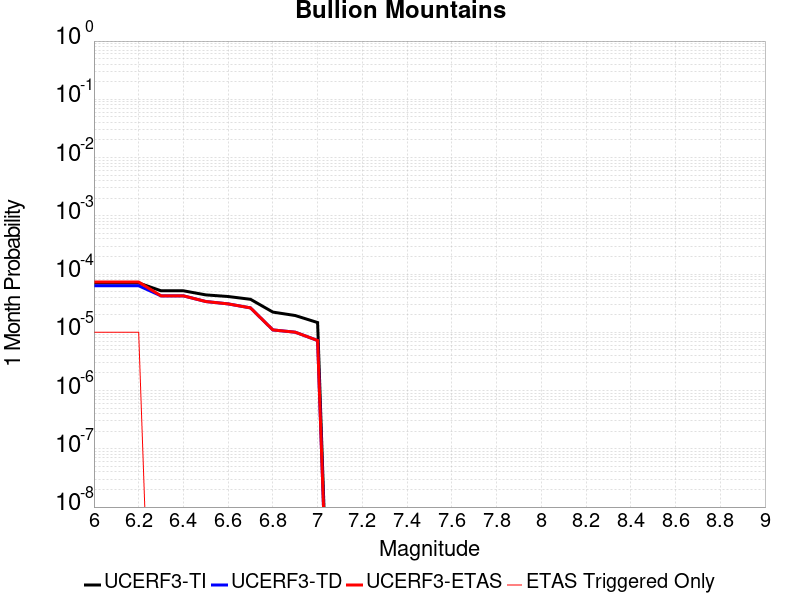 |  |  |

| Magnitude | 1 wk TI Prob | 1 wk TD Prob | 1 wk ETAS Prob | 1 wk ETAS/TD Gain | 1 wk ETAS Triggered Only | 1 mo TI Prob | 1 mo TD Prob | 1 mo ETAS Prob | 1 mo ETAS/TD Gain | 1 mo ETAS Triggered Only | 1 yr TI Prob | 1 yr TD Prob | 1 yr ETAS Prob | 1 yr ETAS/TD Gain | 1 yr ETAS Triggered Only | 10 yr TI Prob | 10 yr TD Prob | 10 yr ETAS Prob | 10 yr ETAS/TD Gain | 10 yr ETAS Triggered Only |
|-----|-----|-----|-----|-----|-----|-----|-----|-----|-----|-----|-----|-----|-----|-----|-----|-----|-----|-----|-----|-----|
| 6.0 | 1.6420427E-5 | 1.4693114E-5 | 1.4693114E-5 | 1.0 | 0.0 | 7.037136E-5 | 6.2969186E-5 | 7.2968556E-5 | 1.1587979 | 1.0E-5 | 8.5643446E-4 | 7.664186E-4 | 7.764109E-4 | 1.0130377 | 1.0E-5 | 0.008531413 | 0.0076415474 | 0.007661395 | 1.0025972 | 2.0E-5 |
| 6.1 | 1.6420427E-5 | 1.4693114E-5 | 1.4693114E-5 | 1.0 | 0.0 | 7.037136E-5 | 6.2969186E-5 | 7.2968556E-5 | 1.1587979 | 1.0E-5 | 8.5643446E-4 | 7.664186E-4 | 7.764109E-4 | 1.0130377 | 1.0E-5 | 0.008531413 | 0.0076415474 | 0.007661395 | 1.0025972 | 2.0E-5 |
| 6.2 | 1.6420427E-5 | 1.4693114E-5 | 1.4693114E-5 | 1.0 | 0.0 | 7.037136E-5 | 6.2969186E-5 | 7.2968556E-5 | 1.1587979 | 1.0E-5 | 8.5643446E-4 | 7.664186E-4 | 7.764109E-4 | 1.0130377 | 1.0E-5 | 0.008531413 | 0.0076415474 | 0.007661395 | 1.0025972 | 2.0E-5 |
| 6.3 | 1.2046778E-5 | 9.863026E-6 | 9.863026E-6 | 1.0 | 0.0 | 5.1628023E-5 | 4.226956E-5 | 4.226956E-5 | 1.0 | 0.0 | 6.283899E-4 | 5.1453355E-4 | 5.1453355E-4 | 1.0 | 0.0 | 0.0062661595 | 0.005135704 | 0.005135704 | 1.0 | 0.0 |
| 6.4 | 1.2046778E-5 | 9.863026E-6 | 9.863026E-6 | 1.0 | 0.0 | 5.1628023E-5 | 4.226956E-5 | 4.226956E-5 | 1.0 | 0.0 | 6.283899E-4 | 5.1453355E-4 | 5.1453355E-4 | 1.0 | 0.0 | 0.0062661595 | 0.005135704 | 0.005135704 | 1.0 | 0.0 |
| 6.5 | 1.0244343E-5 | 7.880018E-6 | 7.880018E-6 | 1.0 | 0.0 | 4.390359E-5 | 3.3771183E-5 | 3.3771183E-5 | 1.0 | 0.0 | 5.343951E-4 | 4.1110726E-4 | 4.1110726E-4 | 1.0 | 0.0 | 0.005331118 | 0.004105499 | 0.004105499 | 1.0 | 0.0 |
| 6.6 | 9.605408E-6 | 7.17801E-6 | 7.17801E-6 | 1.0 | 0.0 | 4.1165385E-5 | 3.076265E-5 | 3.076265E-5 | 1.0 | 0.0 | 5.010733E-4 | 3.7449127E-4 | 3.7449127E-4 | 1.0 | 0.0 | 0.00499945 | 0.0037405994 | 0.0037405994 | 1.0 | 0.0 |
| 6.7 | 8.60418E-6 | 6.1244477E-6 | 6.1244477E-6 | 1.0 | 0.0 | 3.687454E-5 | 2.6247479E-5 | 2.6247479E-5 | 1.0 | 0.0 | 4.48855E-4 | 3.1953567E-4 | 3.1953567E-4 | 1.0 | 0.0 | 0.004479495 | 0.0031926746 | 0.0031926746 | 1.0 | 0.0 |
| 6.8 | 5.187994E-6 | 2.5634079E-6 | 2.5634079E-6 | 1.0 | 0.0 | 2.223407E-5 | 1.0986009E-5 | 1.0986009E-5 | 1.0 | 0.0 | 2.7066618E-4 | 1.3375045E-4 | 1.3375045E-4 | 1.0 | 0.0 | 0.0027033675 | 0.0013370912 | 0.0013370912 | 1.0 | 0.0 |
| 6.9 | 4.5302368E-6 | 2.344533E-6 | 2.344533E-6 | 1.0 | 0.0 | 1.9415156E-5 | 1.0047982E-5 | 1.0047982E-5 | 1.0 | 0.0 | 2.3635388E-4 | 1.2233129E-4 | 1.2233129E-4 | 1.0 | 0.0 | 0.0023610266 | 0.0012230286 | 0.0012230286 | 1.0 | 0.0 |
| 7.0 | 3.431668E-6 | 1.6884135E-6 | 1.6884135E-6 | 1.0 | 0.0 | 1.4707065E-5 | 7.236058E-6 | 7.236058E-6 | 1.0 | 0.0 | 1.7904381E-4 | 8.8099005E-5 | 8.8099005E-5 | 1.0 | 0.0 | 0.0017889962 | 8.8099006E-4 | 8.8099006E-4 | 1.0 | 0.0 |

## Kern Canyon (Lake Isabella) 2011
*[(top)](#table-of-contents)*

| 1 Week | 1 Month | 1 Year | 10 Year |
|-----|-----|-----|-----|
|  |  |  | 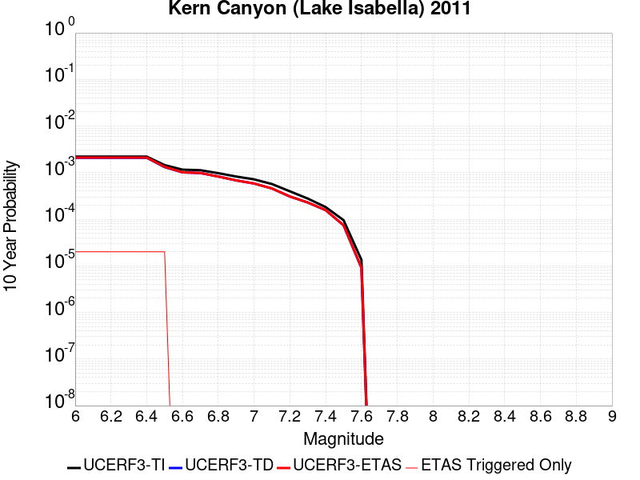 |

| Magnitude | 1 wk TI Prob | 1 wk TD Prob | 1 wk ETAS Prob | 1 wk ETAS/TD Gain | 1 wk ETAS Triggered Only | 1 mo TI Prob | 1 mo TD Prob | 1 mo ETAS Prob | 1 mo ETAS/TD Gain | 1 mo ETAS Triggered Only | 1 yr TI Prob | 1 yr TD Prob | 1 yr ETAS Prob | 1 yr ETAS/TD Gain | 1 yr ETAS Triggered Only | 10 yr TI Prob | 10 yr TD Prob | 10 yr ETAS Prob | 10 yr ETAS/TD Gain | 10 yr ETAS Triggered Only |
|-----|-----|-----|-----|-----|-----|-----|-----|-----|-----|-----|-----|-----|-----|-----|-----|-----|-----|-----|-----|-----|
| 6.0 | 4.2387383E-6 | 4.001695E-6 | 4.001695E-6 | 1.0 | 0.0 | 1.8165894E-5 | 1.7150018E-5 | 1.7150018E-5 | 1.0 | 0.0 | 2.2114732E-4 | 2.0878333E-4 | 2.1878124E-4 | 1.0478865 | 1.0E-5 | 0.0022092736 | 0.0020860557 | 0.002106014 | 1.0095675 | 2.0E-5 |
| 6.1 | 4.2387383E-6 | 4.001695E-6 | 4.001695E-6 | 1.0 | 0.0 | 1.8165894E-5 | 1.7150018E-5 | 1.7150018E-5 | 1.0 | 0.0 | 2.2114732E-4 | 2.0878333E-4 | 2.1878124E-4 | 1.0478865 | 1.0E-5 | 0.0022092736 | 0.0020860557 | 0.002106014 | 1.0095675 | 2.0E-5 |
| 6.2 | 4.2387383E-6 | 4.001695E-6 | 4.001695E-6 | 1.0 | 0.0 | 1.8165894E-5 | 1.7150018E-5 | 1.7150018E-5 | 1.0 | 0.0 | 2.2114732E-4 | 2.0878333E-4 | 2.1878124E-4 | 1.0478865 | 1.0E-5 | 0.0022092736 | 0.0020860557 | 0.002106014 | 1.0095675 | 2.0E-5 |
| 6.3 | 4.2387383E-6 | 4.001695E-6 | 4.001695E-6 | 1.0 | 0.0 | 1.8165894E-5 | 1.7150018E-5 | 1.7150018E-5 | 1.0 | 0.0 | 2.2114732E-4 | 2.0878333E-4 | 2.1878124E-4 | 1.0478865 | 1.0E-5 | 0.0022092736 | 0.0020860557 | 0.002106014 | 1.0095675 | 2.0E-5 |
| 6.4 | 4.2387383E-6 | 4.001695E-6 | 4.001695E-6 | 1.0 | 0.0 | 1.8165894E-5 | 1.7150018E-5 | 1.7150018E-5 | 1.0 | 0.0 | 2.2114732E-4 | 2.0878333E-4 | 2.1878124E-4 | 1.0478865 | 1.0E-5 | 0.0022092736 | 0.0020860557 | 0.002106014 | 1.0095675 | 2.0E-5 |
| 6.5 | 2.7857532E-6 | 2.517902E-6 | 2.517902E-6 | 1.0 | 0.0 | 1.1938888E-5 | 1.07909655E-5 | 1.07909655E-5 | 1.0 | 0.0 | 1.4534626E-4 | 1.3137242E-4 | 1.413711E-4 | 1.0761095 | 1.0E-5 | 0.0014525123 | 0.0013129803 | 0.001332954 | 1.0152125 | 2.0E-5 |
| 6.6 | 2.2233348E-6 | 1.944151E-6 | 1.944151E-6 | 1.0 | 0.0 | 9.528543E-6 | 8.332049E-6 | 8.332049E-6 | 1.0 | 0.0 | 1.1600384E-4 | 1.0143807E-4 | 1.0143807E-4 | 1.0 | 0.0 | 0.001159433 | 0.0010139263 | 0.0010139263 | 1.0 | 0.0 |
| 6.7 | 2.1635126E-6 | 1.8835304E-6 | 1.8835304E-6 | 1.0 | 0.0 | 9.272164E-6 | 8.072249E-6 | 8.072249E-6 | 1.0 | 0.0 | 1.1288274E-4 | 9.827528E-5 | 9.827528E-5 | 1.0 | 0.0 | 0.0011282542 | 9.823263E-4 | 9.823263E-4 | 1.0 | 0.0 |
| 6.8 | 1.8685711E-6 | 1.5831657E-6 | 1.5831657E-6 | 1.0 | 0.0 | 8.008137E-6 | 6.7849787E-6 | 6.7849787E-6 | 1.0 | 0.0 | 9.74947E-5 | 8.2604034E-5 | 8.2604034E-5 | 1.0 | 0.0 | 9.745194E-4 | 8.2573824E-4 | 8.2573824E-4 | 1.0 | 0.0 |
| 6.9 | 1.5815071E-6 | 1.3065126E-6 | 1.3065126E-6 | 1.0 | 0.0 | 6.77787E-6 | 5.5993273E-6 | 5.5993273E-6 | 1.0 | 0.0 | 8.251744E-5 | 6.8169706E-5 | 6.8169706E-5 | 1.0 | 0.0 | 8.248681E-4 | 6.8149064E-4 | 6.8149064E-4 | 1.0 | 0.0 |
| 7.0 | 1.3772564E-6 | 1.1210891E-6 | 1.1210891E-6 | 1.0 | 0.0 | 5.9025137E-6 | 4.804659E-6 | 4.804659E-6 | 1.0 | 0.0 | 7.186073E-5 | 5.849517E-5 | 5.849517E-5 | 1.0 | 0.0 | 7.18375E-4 | 5.847998E-4 | 5.847998E-4 | 1.0 | 0.0 |
| 7.1 | 1.0916998E-6 | 8.7639097E-7 | 8.7639097E-7 | 1.0 | 0.0 | 4.678705E-6 | 3.755956E-6 | 3.755956E-6 | 1.0 | 0.0 | 5.6961744E-5 | 4.572782E-5 | 4.572782E-5 | 1.0 | 0.0 | 5.6947145E-4 | 4.5718544E-4 | 4.5718544E-4 | 1.0 | 0.0 |
| 7.2 | 7.6277024E-7 | 5.901547E-7 | 5.901547E-7 | 1.0 | 0.0 | 3.2690114E-6 | 2.529232E-6 | 2.529232E-6 | 1.0 | 0.0 | 3.9799485E-5 | 3.079297E-5 | 3.079297E-5 | 1.0 | 0.0 | 3.9792358E-4 | 3.0788765E-4 | 3.0788765E-4 | 1.0 | 0.0 |
| 7.3 | 5.3265916E-7 | 4.382505E-7 | 4.382505E-7 | 1.0 | 0.0 | 2.282823E-6 | 1.8782151E-6 | 1.8782151E-6 | 1.0 | 0.0 | 2.7793016E-5 | 2.2867032E-5 | 2.2867032E-5 | 1.0 | 0.0 | 2.778954E-4 | 2.2864719E-4 | 2.2864719E-4 | 1.0 | 0.0 |
| 7.4 | 3.4946007E-7 | 3.006618E-7 | 3.006618E-7 | 1.0 | 0.0 | 1.497685E-6 | 1.2885499E-6 | 1.2885499E-6 | 1.0 | 0.0 | 1.8234163E-5 | 1.5687985E-5 | 1.5687985E-5 | 1.0 | 0.0 | 1.8232666E-4 | 1.5686899E-4 | 1.5686899E-4 | 1.0 | 0.0 |
| 7.5 | 1.8317026E-7 | 1.424506E-7 | 1.424506E-7 | 1.0 | 0.0 | 7.850152E-7 | 6.105024E-7 | 6.105024E-7 | 1.0 | 0.0 | 9.557518E-6 | 7.4328423E-6 | 7.4328423E-6 | 1.0 | 0.0 | 9.5571064E-5 | 7.432602E-5 | 7.432602E-5 | 1.0 | 0.0 |
| 7.6 | 2.572245E-8 | 1.7353022E-8 | 1.7353022E-8 | 1.0 | 0.0 | 1.10239064E-7 | 7.437009E-8 | 7.437009E-8 | 1.0 | 0.0 | 1.3421597E-6 | 9.054556E-7 | 9.054556E-7 | 1.0 | 0.0 | 1.3421517E-5 | 9.0545245E-6 | 9.0545245E-6 | 1.0 | 0.0 |

## Sierra Madre
*[(top)](#table-of-contents)*

| 1 Week | 1 Month | 1 Year | 10 Year |
|-----|-----|-----|-----|
|  | 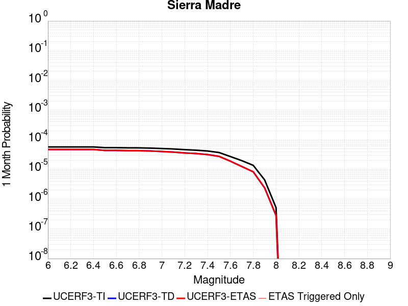 |  |  |

| Magnitude | 1 wk TI Prob | 1 wk TD Prob | 1 wk ETAS Prob | 1 wk ETAS/TD Gain | 1 wk ETAS Triggered Only | 1 mo TI Prob | 1 mo TD Prob | 1 mo ETAS Prob | 1 mo ETAS/TD Gain | 1 mo ETAS Triggered Only | 1 yr TI Prob | 1 yr TD Prob | 1 yr ETAS Prob | 1 yr ETAS/TD Gain | 1 yr ETAS Triggered Only | 10 yr TI Prob | 10 yr TD Prob | 10 yr ETAS Prob | 10 yr ETAS/TD Gain | 10 yr ETAS Triggered Only |
|-----|-----|-----|-----|-----|-----|-----|-----|-----|-----|-----|-----|-----|-----|-----|-----|-----|-----|-----|-----|-----|
| 6.0 | 1.3379373E-5 | 1.10025E-5 | 1.10025E-5 | 1.0 | 0.0 | 5.7338908E-5 | 4.7152727E-5 | 4.7152727E-5 | 1.0 | 0.0 | 6.978776E-4 | 5.7393475E-4 | 5.83929E-4 | 1.0174136 | 1.0E-5 | 0.0069569005 | 0.005724889 | 0.005744775 | 1.0034735 | 2.0E-5 |
| 6.1 | 1.3379373E-5 | 1.10025E-5 | 1.10025E-5 | 1.0 | 0.0 | 5.7338908E-5 | 4.7152727E-5 | 4.7152727E-5 | 1.0 | 0.0 | 6.978776E-4 | 5.7393475E-4 | 5.83929E-4 | 1.0174136 | 1.0E-5 | 0.0069569005 | 0.005724889 | 0.005744775 | 1.0034735 | 2.0E-5 |
| 6.2 | 1.3379373E-5 | 1.10025E-5 | 1.10025E-5 | 1.0 | 0.0 | 5.7338908E-5 | 4.7152727E-5 | 4.7152727E-5 | 1.0 | 0.0 | 6.978776E-4 | 5.7393475E-4 | 5.83929E-4 | 1.0174136 | 1.0E-5 | 0.0069569005 | 0.005724889 | 0.005744775 | 1.0034735 | 2.0E-5 |
| 6.3 | 1.3379373E-5 | 1.10025E-5 | 1.10025E-5 | 1.0 | 0.0 | 5.7338908E-5 | 4.7152727E-5 | 4.7152727E-5 | 1.0 | 0.0 | 6.978776E-4 | 5.7393475E-4 | 5.83929E-4 | 1.0174136 | 1.0E-5 | 0.0069569005 | 0.005724889 | 0.005744775 | 1.0034735 | 2.0E-5 |
| 6.4 | 1.3379373E-5 | 1.10025E-5 | 1.10025E-5 | 1.0 | 0.0 | 5.7338908E-5 | 4.7152727E-5 | 4.7152727E-5 | 1.0 | 0.0 | 6.978776E-4 | 5.7393475E-4 | 5.83929E-4 | 1.0174136 | 1.0E-5 | 0.0069569005 | 0.005724889 | 0.005744775 | 1.0034735 | 2.0E-5 |
| 6.5 | 1.26563245E-5 | 1.0231923E-5 | 1.0231923E-5 | 1.0 | 0.0 | 5.4240263E-5 | 4.3850367E-5 | 4.3850367E-5 | 1.0 | 0.0 | 6.601751E-4 | 5.3374853E-4 | 5.437432E-4 | 1.0187254 | 1.0E-5 | 0.006582173 | 0.0053249877 | 0.005344881 | 1.0037359 | 2.0E-5 |
| 6.6 | 1.26563245E-5 | 1.0231923E-5 | 1.0231923E-5 | 1.0 | 0.0 | 5.4240263E-5 | 4.3850367E-5 | 4.3850367E-5 | 1.0 | 0.0 | 6.601751E-4 | 5.3374853E-4 | 5.437432E-4 | 1.0187254 | 1.0E-5 | 0.006582173 | 0.0053249877 | 0.005344881 | 1.0037359 | 2.0E-5 |
| 6.7 | 1.2502474E-5 | 1.006806E-5 | 1.006806E-5 | 1.0 | 0.0 | 5.3580934E-5 | 4.314812E-5 | 4.314812E-5 | 1.0 | 0.0 | 6.521526E-4 | 5.252028E-4 | 5.3519756E-4 | 1.0190302 | 1.0E-5 | 0.0065024206 | 0.005239935 | 0.0052598305 | 1.0037968 | 2.0E-5 |
| 6.8 | 1.2454966E-5 | 1.0020342E-5 | 1.0020342E-5 | 1.0 | 0.0 | 5.3377335E-5 | 4.2943626E-5 | 4.2943626E-5 | 1.0 | 0.0 | 6.4967526E-4 | 5.227143E-4 | 5.3270906E-4 | 1.0191209 | 1.0E-5 | 0.006477792 | 0.005215167 | 0.0052350624 | 1.0038149 | 2.0E-5 |
| 6.9 | 1.2225574E-5 | 9.79431E-6 | 9.79431E-6 | 1.0 | 0.0 | 5.2394265E-5 | 4.1974945E-5 | 4.1974945E-5 | 1.0 | 0.0 | 6.3771347E-4 | 5.109262E-4 | 5.209211E-4 | 1.0195622 | 1.0E-5 | 0.006358865 | 0.0050978316 | 0.0051177293 | 1.0039033 | 2.0E-5 |
| 7.0 | 1.182946E-5 | 9.400835E-6 | 9.400835E-6 | 1.0 | 0.0 | 5.06967E-5 | 4.0288676E-5 | 4.0288676E-5 | 1.0 | 0.0 | 6.1705755E-4 | 4.9040525E-4 | 5.004003E-4 | 1.0203813 | 1.0E-5 | 0.006153469 | 0.0048935423 | 0.0049134446 | 1.0040671 | 2.0E-5 |
| 7.1 | 1.14369095E-5 | 8.987808E-6 | 8.987808E-6 | 1.0 | 0.0 | 4.9014405E-5 | 3.8518614E-5 | 3.8518614E-5 | 1.0 | 0.0 | 5.9658696E-4 | 4.6886416E-4 | 4.788595E-4 | 1.0213182 | 1.0E-5 | 0.005949879 | 0.0046790554 | 0.004698962 | 1.0042543 | 2.0E-5 |
| 7.2 | 1.0836419E-5 | 8.401161E-6 | 8.401161E-6 | 1.0 | 0.0 | 4.644097E-5 | 3.6004483E-5 | 3.6004483E-5 | 1.0 | 0.0 | 5.652721E-4 | 4.3826734E-4 | 4.4826293E-4 | 1.0228071 | 1.0E-5 | 0.0056383642 | 0.0043743276 | 0.00439424 | 1.0045521 | 2.0E-5 |
| 7.3 | 1.0403439E-5 | 8.022398E-6 | 8.022398E-6 | 1.0 | 0.0 | 4.4585406E-5 | 3.438126E-5 | 3.438126E-5 | 1.0 | 0.0 | 5.426921E-4 | 4.1851235E-4 | 4.2850815E-4 | 1.0238842 | 1.0E-5 | 0.005413687 | 0.0041775373 | 0.004197454 | 1.0047675 | 2.0E-5 |
| 7.4 | 9.768864E-6 | 7.4159825E-6 | 7.4159825E-6 | 1.0 | 0.0 | 4.186589E-5 | 3.17824E-5 | 3.17824E-5 | 1.0 | 0.0 | 5.09598E-4 | 3.868829E-4 | 3.9687904E-4 | 1.0258377 | 1.0E-5 | 0.0050843097 | 0.0038623859 | 0.0038823085 | 1.0051582 | 2.0E-5 |
| 7.5 | 8.687089E-6 | 6.4515207E-6 | 6.4515207E-6 | 1.0 | 0.0 | 3.722985E-5 | 2.7649086E-5 | 2.7649086E-5 | 1.0 | 0.0 | 4.5317915E-4 | 3.365765E-4 | 3.4657313E-4 | 1.0297009 | 1.0E-5 | 0.004522561 | 0.0033609548 | 0.0033808877 | 1.0059307 | 2.0E-5 |
| 7.6 | 6.3506063E-6 | 4.4315407E-6 | 4.4315407E-6 | 1.0 | 0.0 | 2.72166E-5 | 1.899218E-5 | 1.899218E-5 | 1.0 | 0.0 | 3.3131172E-4 | 2.3120551E-4 | 2.412032E-4 | 1.0432416 | 1.0E-5 | 0.003308182 | 0.0023098749 | 0.0023298285 | 1.0086385 | 2.0E-5 |
| 7.7 | 4.62223E-6 | 2.9340922E-6 | 2.9340922E-6 | 1.0 | 0.0 | 1.9809406E-5 | 1.257462E-5 | 1.257462E-5 | 1.0 | 0.0 | 2.4115283E-4 | 1.5308526E-4 | 1.6308374E-4 | 1.0653131 | 1.0E-5 | 0.0024089129 | 0.0015299994 | 0.0015399841 | 1.006526 | 1.0E-5 |
| 7.8 | 3.2145008E-6 | 1.9502497E-6 | 1.9502497E-6 | 1.0 | 0.0 | 1.3776359E-5 | 8.358186E-6 | 8.358186E-6 | 1.0 | 0.0 | 1.6771426E-4 | 1.0175618E-4 | 1.0175618E-4 | 1.0 | 0.0 | 0.0016758774 | 0.0010172396 | 0.0010172396 | 1.0 | 0.0 |
| 7.9 | 1.0391769E-6 | 5.605509E-7 | 5.605509E-7 | 1.0 | 0.0 | 4.4536077E-6 | 2.402359E-6 | 2.402359E-6 | 1.0 | 0.0 | 5.4221324E-5 | 2.9248333E-5 | 2.9248333E-5 | 1.0 | 0.0 | 5.4208096E-4 | 2.9244524E-4 | 2.9244524E-4 | 1.0 | 0.0 |
| 8.0 | 1.210983E-7 | 6.615493E-8 | 6.615493E-8 | 1.0 | 0.0 | 5.1899264E-7 | 2.835211E-7 | 2.835211E-7 | 1.0 | 0.0 | 6.3187167E-6 | 3.4518641E-6 | 3.4518641E-6 | 1.0 | 0.0 | 6.318537E-5 | 3.451812E-5 | 3.451812E-5 | 1.0 | 0.0 |

## Malibu Coast alt 1
*[(top)](#table-of-contents)*

| 1 Week | 1 Month | 1 Year | 10 Year |
|-----|-----|-----|-----|
| 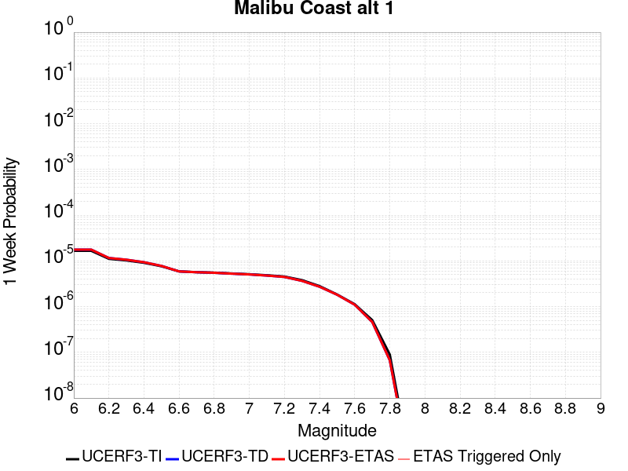 |  |  |  |

| Magnitude | 1 wk TI Prob | 1 wk TD Prob | 1 wk ETAS Prob | 1 wk ETAS/TD Gain | 1 wk ETAS Triggered Only | 1 mo TI Prob | 1 mo TD Prob | 1 mo ETAS Prob | 1 mo ETAS/TD Gain | 1 mo ETAS Triggered Only | 1 yr TI Prob | 1 yr TD Prob | 1 yr ETAS Prob | 1 yr ETAS/TD Gain | 1 yr ETAS Triggered Only | 10 yr TI Prob | 10 yr TD Prob | 10 yr ETAS Prob | 10 yr ETAS/TD Gain | 10 yr ETAS Triggered Only |
|-----|-----|-----|-----|-----|-----|-----|-----|-----|-----|-----|-----|-----|-----|-----|-----|-----|-----|-----|-----|-----|
| 6.0 | 1.6572556E-5 | 1.7599079E-5 | 1.7599079E-5 | 1.0 | 0.0 | 7.102331E-5 | 7.5422555E-5 | 7.5422555E-5 | 1.0 | 0.0 | 8.6436566E-4 | 9.1790163E-4 | 9.2789246E-4 | 1.0108844 | 1.0E-5 | 0.0086101135 | 0.009143037 | 0.0091628535 | 1.0021675 | 2.0E-5 |
| 6.1 | 1.6572556E-5 | 1.7599079E-5 | 1.7599079E-5 | 1.0 | 0.0 | 7.102331E-5 | 7.5422555E-5 | 7.5422555E-5 | 1.0 | 0.0 | 8.6436566E-4 | 9.1790163E-4 | 9.2789246E-4 | 1.0108844 | 1.0E-5 | 0.0086101135 | 0.009143037 | 0.0091628535 | 1.0021675 | 2.0E-5 |
| 6.2 | 1.1085717E-5 | 1.1557754E-5 | 1.1557754E-5 | 1.0 | 0.0 | 4.750935E-5 | 4.953231E-5 | 4.953231E-5 | 1.0 | 0.0 | 5.782728E-4 | 6.0289254E-4 | 6.1288656E-4 | 1.0165766 | 1.0E-5 | 0.0057677035 | 0.006012941 | 0.0060328203 | 1.0033062 | 2.0E-5 |
| 6.3 | 1.0208568E-5 | 1.059278E-5 | 1.059278E-5 | 1.0 | 0.0 | 4.375027E-5 | 4.5396857E-5 | 4.5396857E-5 | 1.0 | 0.0 | 5.325294E-4 | 5.525695E-4 | 5.62564E-4 | 1.0180873 | 1.0E-5 | 0.0053125503 | 0.0055122636 | 0.005532153 | 1.0036082 | 2.0E-5 |
| 6.4 | 9.0682315E-6 | 9.343101E-6 | 9.343101E-6 | 1.0 | 0.0 | 3.8863272E-5 | 4.0041257E-5 | 4.0041257E-5 | 1.0 | 0.0 | 4.730576E-4 | 4.873953E-4 | 4.973904E-4 | 1.0205072 | 1.0E-5 | 0.0047205184 | 0.004863477 | 0.0048833797 | 1.0040923 | 2.0E-5 |
| 6.5 | 7.605796E-6 | 7.748956E-6 | 7.748956E-6 | 1.0 | 0.0 | 3.259586E-5 | 3.3209395E-5 | 3.3209395E-5 | 1.0 | 0.0 | 3.9678233E-4 | 4.042507E-4 | 4.1424664E-4 | 1.0247271 | 1.0E-5 | 0.0039607463 | 0.0040352913 | 0.0040552104 | 1.0049362 | 2.0E-5 |
| 6.6 | 5.889873E-6 | 5.879796E-6 | 5.879796E-6 | 1.0 | 0.0 | 2.5242069E-5 | 2.5198882E-5 | 2.5198882E-5 | 1.0 | 0.0 | 3.0727885E-4 | 3.067533E-4 | 3.1675023E-4 | 1.0325894 | 1.0E-5 | 0.003068543 | 0.0030633116 | 0.0030832503 | 1.0065088 | 2.0E-5 |
| 6.7 | 5.66586E-6 | 5.6418885E-6 | 5.6418885E-6 | 1.0 | 0.0 | 2.428203E-5 | 2.4179299E-5 | 2.4179299E-5 | 1.0 | 0.0 | 2.955936E-4 | 2.9434328E-4 | 3.0434036E-4 | 1.0339639 | 1.0E-5 | 0.0029520073 | 0.0029395462 | 0.0029594875 | 1.0067837 | 2.0E-5 |
| 6.8 | 5.521556E-6 | 5.4896686E-6 | 5.4896686E-6 | 1.0 | 0.0 | 2.3663597E-5 | 2.352694E-5 | 2.352694E-5 | 1.0 | 0.0 | 2.880662E-4 | 2.8640294E-4 | 2.9640007E-4 | 1.0349058 | 1.0E-5 | 0.0028769306 | 0.0028603498 | 0.0028802927 | 1.0069722 | 2.0E-5 |
| 6.9 | 5.29752E-6 | 5.2501623E-6 | 5.2501623E-6 | 1.0 | 0.0 | 2.270346E-5 | 2.2500502E-5 | 2.2500502E-5 | 1.0 | 0.0 | 2.7637955E-4 | 2.7390925E-4 | 2.8390653E-4 | 1.0364984 | 1.0E-5 | 0.0027603607 | 0.0027357268 | 0.0027556722 | 1.0072907 | 2.0E-5 |
| 7.0 | 5.106743E-6 | 5.047901E-6 | 5.047901E-6 | 1.0 | 0.0 | 2.1885859E-5 | 2.1633683E-5 | 2.1633683E-5 | 1.0 | 0.0 | 2.6642776E-4 | 2.6335835E-4 | 2.733557E-4 | 1.0379611 | 1.0E-5 | 0.0026610855 | 0.002630472 | 0.0026504195 | 1.0075831 | 2.0E-5 |
| 7.1 | 4.8469647E-6 | 4.770583E-6 | 4.770583E-6 | 1.0 | 0.0 | 2.0772539E-5 | 2.0445195E-5 | 2.0445195E-5 | 1.0 | 0.0 | 2.528763E-4 | 2.4889188E-4 | 2.588894E-4 | 1.040168 | 1.0E-5 | 0.0025258875 | 0.0024861395 | 0.0025060899 | 1.0080246 | 2.0E-5 |
| 7.2 | 4.545514E-6 | 4.448389E-6 | 4.448389E-6 | 1.0 | 0.0 | 1.9480629E-5 | 1.9064384E-5 | 1.9064384E-5 | 1.0 | 0.0 | 2.3715083E-4 | 2.3208422E-4 | 2.4208191E-4 | 1.0430778 | 1.0E-5 | 0.0023689792 | 0.002318426 | 0.0023383796 | 1.0086066 | 2.0E-5 |
| 7.3 | 3.794097E-6 | 3.6520887E-6 | 3.6520887E-6 | 1.0 | 0.0 | 1.6260314E-5 | 1.5651716E-5 | 1.5651716E-5 | 1.0 | 0.0 | 1.9795135E-4 | 1.9054301E-4 | 2.0054111E-4 | 1.0524716 | 1.0E-5 | 0.001977751 | 0.001903801 | 0.001913782 | 1.0052427 | 1.0E-5 |
| 7.4 | 2.808217E-6 | 2.719192E-6 | 2.719192E-6 | 1.0 | 0.0 | 1.203516E-5 | 1.16536285E-5 | 1.16536285E-5 | 1.0 | 0.0 | 1.4651821E-4 | 1.4187371E-4 | 1.5187229E-4 | 1.0704752 | 1.0E-5 | 0.0014642165 | 0.0014178341 | 0.0014278198 | 1.007043 | 1.0E-5 |
| 7.5 | 1.83809E-6 | 1.8191502E-6 | 1.8191502E-6 | 1.0 | 0.0 | 7.877505E-6 | 7.796334E-6 | 7.796334E-6 | 1.0 | 0.0 | 9.59044E-5 | 9.491626E-5 | 1.0491531E-4 | 1.1053461 | 1.0E-5 | 9.5863023E-4 | 9.487592E-4 | 9.587497E-4 | 1.0105301 | 1.0E-5 |
| 7.6 | 1.1292672E-6 | 1.1001968E-6 | 1.1001968E-6 | 1.0 | 0.0 | 4.839708E-6 | 4.71512E-6 | 4.71512E-6 | 1.0 | 0.0 | 5.8921847E-5 | 5.7405094E-5 | 5.7405094E-5 | 1.0 | 0.0 | 5.890623E-4 | 5.739043E-4 | 5.739043E-4 | 1.0 | 0.0 |
| 7.7 | 5.065272E-7 | 4.6094115E-7 | 4.6094115E-7 | 1.0 | 0.0 | 2.170829E-6 | 1.9754607E-6 | 1.9754607E-6 | 1.0 | 0.0 | 2.6429525E-5 | 2.405098E-5 | 2.405098E-5 | 1.0 | 0.0 | 2.642638E-4 | 2.404849E-4 | 2.404849E-4 | 1.0 | 0.0 |
| 7.8 | 8.952991E-8 | 6.708761E-8 | 6.708761E-8 | 1.0 | 0.0 | 3.8369956E-7 | 2.875183E-7 | 2.875183E-7 | 1.0 | 0.0 | 4.671532E-6 | 3.5005298E-6 | 3.5005298E-6 | 1.0 | 0.0 | 4.671434E-5 | 3.5004767E-5 | 3.5004767E-5 | 1.0 | 0.0 |
| 7.9 | 8.007447E-10 | 6.161718E-10 | 6.161718E-10 | 1.0 | 0.0 | 3.4317629E-9 | 2.6407367E-9 | 2.6407367E-9 | 1.0 | 0.0 | 4.1781714E-8 | 3.2150968E-8 | 3.2150968E-8 | 1.0 | 0.0 | 4.1781706E-7 | 3.2150967E-7 | 3.2150967E-7 | 1.0 | 0.0 |

## Santa Ynez River
*[(top)](#table-of-contents)*

| 1 Week | 1 Month | 1 Year | 10 Year |
|-----|-----|-----|-----|
|  | 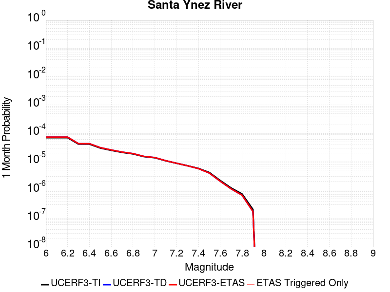 | 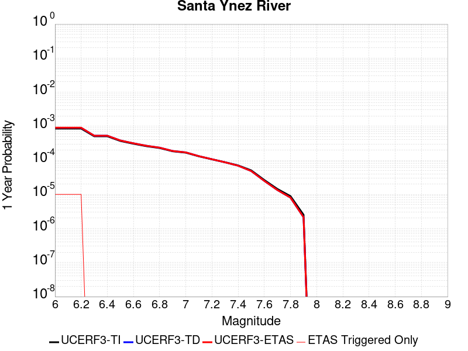 |  |

| Magnitude | 1 wk TI Prob | 1 wk TD Prob | 1 wk ETAS Prob | 1 wk ETAS/TD Gain | 1 wk ETAS Triggered Only | 1 mo TI Prob | 1 mo TD Prob | 1 mo ETAS Prob | 1 mo ETAS/TD Gain | 1 mo ETAS Triggered Only | 1 yr TI Prob | 1 yr TD Prob | 1 yr ETAS Prob | 1 yr ETAS/TD Gain | 1 yr ETAS Triggered Only | 10 yr TI Prob | 10 yr TD Prob | 10 yr ETAS Prob | 10 yr ETAS/TD Gain | 10 yr ETAS Triggered Only |
|-----|-----|-----|-----|-----|-----|-----|-----|-----|-----|-----|-----|-----|-----|-----|-----|-----|-----|-----|-----|-----|
| 6.0 | 1.6396456E-5 | 1.7210088E-5 | 1.7210088E-5 | 1.0 | 0.0 | 7.026863E-5 | 7.375564E-5 | 7.375564E-5 | 1.0 | 0.0 | 8.551848E-4 | 8.976405E-4 | 9.076315E-4 | 1.0111303 | 1.0E-5 | 0.0085190125 | 0.0089436965 | 0.008963517 | 1.0022162 | 2.0E-5 |
| 6.1 | 1.6396456E-5 | 1.7210088E-5 | 1.7210088E-5 | 1.0 | 0.0 | 7.026863E-5 | 7.375564E-5 | 7.375564E-5 | 1.0 | 0.0 | 8.551848E-4 | 8.976405E-4 | 9.076315E-4 | 1.0111303 | 1.0E-5 | 0.0085190125 | 0.0089436965 | 0.008963517 | 1.0022162 | 2.0E-5 |
| 6.2 | 1.6396456E-5 | 1.7210088E-5 | 1.7210088E-5 | 1.0 | 0.0 | 7.026863E-5 | 7.375564E-5 | 7.375564E-5 | 1.0 | 0.0 | 8.551848E-4 | 8.976405E-4 | 9.076315E-4 | 1.0111303 | 1.0E-5 | 0.0085190125 | 0.0089436965 | 0.008963517 | 1.0022162 | 2.0E-5 |
| 6.3 | 9.736976E-6 | 1.012268E-5 | 1.012268E-5 | 1.0 | 0.0 | 4.172923E-5 | 4.338222E-5 | 4.338222E-5 | 1.0 | 0.0 | 5.0793495E-4 | 5.2805553E-4 | 5.2805553E-4 | 1.0 | 0.0 | 0.005067755 | 0.0052685137 | 0.005278461 | 1.001888 | 1.0E-5 |
| 6.4 | 9.736976E-6 | 1.012268E-5 | 1.012268E-5 | 1.0 | 0.0 | 4.172923E-5 | 4.338222E-5 | 4.338222E-5 | 1.0 | 0.0 | 5.0793495E-4 | 5.2805553E-4 | 5.2805553E-4 | 1.0 | 0.0 | 0.005067755 | 0.0052685137 | 0.005278461 | 1.001888 | 1.0E-5 |
| 6.5 | 7.081964E-6 | 7.3301503E-6 | 7.3301503E-6 | 1.0 | 0.0 | 3.035092E-5 | 3.1414558E-5 | 3.1414558E-5 | 1.0 | 0.0 | 3.694598E-4 | 3.8240672E-4 | 3.8240672E-4 | 1.0 | 0.0 | 0.0036884616 | 0.0038176486 | 0.0038176486 | 1.0 | 0.0 |
| 6.6 | 5.873247E-6 | 6.059954E-6 | 6.059954E-6 | 1.0 | 0.0 | 2.5170815E-5 | 2.5970978E-5 | 2.5970978E-5 | 1.0 | 0.0 | 3.064116E-4 | 3.1615162E-4 | 3.1615162E-4 | 1.0 | 0.0 | 0.0030598943 | 0.003157106 | 0.003157106 | 1.0 | 0.0 |
| 6.7 | 4.973277E-6 | 5.1160814E-6 | 5.1160814E-6 | 1.0 | 0.0 | 2.1313872E-5 | 2.1925882E-5 | 2.1925882E-5 | 1.0 | 0.0 | 2.5946548E-4 | 2.669154E-4 | 2.669154E-4 | 1.0 | 0.0 | 0.0025916274 | 0.002665997 | 0.002665997 | 1.0 | 0.0 |
| 6.8 | 4.396492E-6 | 4.5111383E-6 | 4.5111383E-6 | 1.0 | 0.0 | 1.884197E-5 | 1.9333309E-5 | 1.9333309E-5 | 1.0 | 0.0 | 2.2937685E-4 | 2.3535796E-4 | 2.3535796E-4 | 1.0 | 0.0 | 0.0022914023 | 0.0023511224 | 0.0023511224 | 1.0 | 0.0 |
| 6.9 | 3.5255632E-6 | 3.6014671E-6 | 3.6014671E-6 | 1.0 | 0.0 | 1.5109469E-5 | 1.5434769E-5 | 1.5434769E-5 | 1.0 | 0.0 | 1.8394225E-4 | 1.8790226E-4 | 1.8790226E-4 | 1.0 | 0.0 | 0.0018379007 | 0.00187745 | 0.00187745 | 1.0 | 0.0 |
| 7.0 | 3.211603E-6 | 3.2737785E-6 | 3.2737785E-6 | 1.0 | 0.0 | 1.376394E-5 | 1.4030405E-5 | 1.4030405E-5 | 1.0 | 0.0 | 1.6756308E-4 | 1.7080692E-4 | 1.7080692E-4 | 1.0 | 0.0 | 0.0016743679 | 0.0017067705 | 0.0017067705 | 1.0 | 0.0 |
| 7.1 | 2.5094619E-6 | 2.5410236E-6 | 2.5410236E-6 | 1.0 | 0.0 | 1.0754793E-5 | 1.0890056E-5 | 1.0890056E-5 | 1.0 | 0.0 | 1.3093173E-4 | 1.3257843E-4 | 1.3257843E-4 | 1.0 | 0.0 | 0.0013085462 | 0.0013249994 | 0.0013249994 | 1.0 | 0.0 |
| 7.2 | 2.0515774E-6 | 2.0620262E-6 | 2.0620262E-6 | 1.0 | 0.0 | 8.792445E-6 | 8.837225E-6 | 8.837225E-6 | 1.0 | 0.0 | 1.0704277E-4 | 1.0758795E-4 | 1.0758795E-4 | 1.0 | 0.0 | 0.0010699122 | 0.0010753629 | 0.0010753629 | 1.0 | 0.0 |
| 7.3 | 1.6845745E-6 | 1.677467E-6 | 1.677467E-6 | 1.0 | 0.0 | 7.219585E-6 | 7.1891245E-6 | 7.1891245E-6 | 1.0 | 0.0 | 8.78949E-5 | 8.75241E-5 | 8.75241E-5 | 1.0 | 0.0 | 8.7860145E-4 | 8.748992E-4 | 8.748992E-4 | 1.0 | 0.0 |
| 7.4 | 1.3600285E-6 | 1.3333984E-6 | 1.3333984E-6 | 1.0 | 0.0 | 5.82868E-6 | 5.7145517E-6 | 5.7145517E-6 | 1.0 | 0.0 | 7.096187E-5 | 6.957247E-5 | 6.957247E-5 | 1.0 | 0.0 | 7.0939213E-4 | 6.9550914E-4 | 6.9550914E-4 | 1.0 | 0.0 |
| 7.5 | 9.735342E-7 | 9.290568E-7 | 9.290568E-7 | 1.0 | 0.0 | 4.172283E-6 | 3.981666E-6 | 3.981666E-6 | 1.0 | 0.0 | 5.079636E-5 | 4.8475722E-5 | 4.8475722E-5 | 1.0 | 0.0 | 5.0784746E-4 | 4.846532E-4 | 4.846532E-4 | 1.0 | 0.0 |
| 7.6 | 5.067187E-7 | 4.7787887E-7 | 4.7787887E-7 | 1.0 | 0.0 | 2.1716498E-6 | 2.0480506E-6 | 2.0480506E-6 | 1.0 | 0.0 | 2.6439517E-5 | 2.4934738E-5 | 2.4934738E-5 | 1.0 | 0.0 | 2.643637E-4 | 2.4932015E-4 | 2.4932015E-4 | 1.0 | 0.0 |
| 7.7 | 2.769089E-7 | 2.576031E-7 | 2.576031E-7 | 1.0 | 0.0 | 1.1867519E-6 | 1.1040128E-6 | 1.1040128E-6 | 1.0 | 0.0 | 1.4448608E-5 | 1.3441273E-5 | 1.3441273E-5 | 1.0 | 0.0 | 1.444767E-4 | 1.3440463E-4 | 1.3440463E-4 | 1.0 | 0.0 |
| 7.8 | 1.7044663E-7 | 1.544983E-7 | 1.544983E-7 | 1.0 | 0.0 | 7.3048534E-7 | 6.621354E-7 | 6.621354E-7 | 1.0 | 0.0 | 8.893623E-6 | 8.061469E-6 | 8.061469E-6 | 1.0 | 0.0 | 8.893267E-5 | 8.061178E-5 | 8.061178E-5 | 1.0 | 0.0 |
| 7.9 | 4.8344287E-8 | 4.0913342E-8 | 4.0913342E-8 | 1.0 | 0.0 | 2.0718979E-7 | 1.7534289E-7 | 1.7534289E-7 | 1.0 | 0.0 | 2.5225327E-6 | 2.1347976E-6 | 2.1347976E-6 | 1.0 | 0.0 | 2.5225041E-5 | 2.1347776E-5 | 2.1347776E-5 | 1.0 | 0.0 |

## San Jacinto (Lytle Creek connector)
*[(top)](#table-of-contents)*

| 1 Week | 1 Month | 1 Year | 10 Year |
|-----|-----|-----|-----|
| 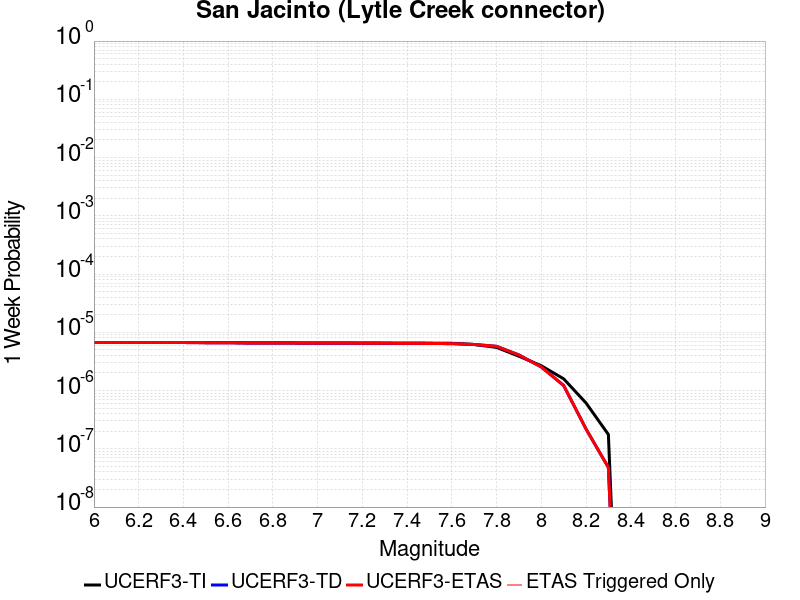 |  |  |  |

| Magnitude | 1 wk TI Prob | 1 wk TD Prob | 1 wk ETAS Prob | 1 wk ETAS/TD Gain | 1 wk ETAS Triggered Only | 1 mo TI Prob | 1 mo TD Prob | 1 mo ETAS Prob | 1 mo ETAS/TD Gain | 1 mo ETAS Triggered Only | 1 yr TI Prob | 1 yr TD Prob | 1 yr ETAS Prob | 1 yr ETAS/TD Gain | 1 yr ETAS Triggered Only | 10 yr TI Prob | 10 yr TD Prob | 10 yr ETAS Prob | 10 yr ETAS/TD Gain | 10 yr ETAS Triggered Only |
|-----|-----|-----|-----|-----|-----|-----|-----|-----|-----|-----|-----|-----|-----|-----|-----|-----|-----|-----|-----|-----|
| 6.0 | 6.693995E-6 | 6.6736684E-6 | 6.6736684E-6 | 1.0 | 0.0 | 2.8688235E-5 | 2.8601124E-5 | 3.8600836E-5 | 1.3496267 | 1.0E-5 | 3.492233E-4 | 3.4816313E-4 | 3.5815962E-4 | 1.0287122 | 1.0E-5 | 0.00348675 | 0.0035562338 | 0.0035761627 | 1.0056039 | 2.0E-5 |
| 6.1 | 6.693995E-6 | 6.6736684E-6 | 6.6736684E-6 | 1.0 | 0.0 | 2.8688235E-5 | 2.8601124E-5 | 3.8600836E-5 | 1.3496267 | 1.0E-5 | 3.492233E-4 | 3.4816313E-4 | 3.5815962E-4 | 1.0287122 | 1.0E-5 | 0.00348675 | 0.0035562338 | 0.0035761627 | 1.0056039 | 2.0E-5 |
| 6.2 | 6.693995E-6 | 6.6736684E-6 | 6.6736684E-6 | 1.0 | 0.0 | 2.8688235E-5 | 2.8601124E-5 | 3.8600836E-5 | 1.3496267 | 1.0E-5 | 3.492233E-4 | 3.4816313E-4 | 3.5815962E-4 | 1.0287122 | 1.0E-5 | 0.00348675 | 0.0035562338 | 0.0035761627 | 1.0056039 | 2.0E-5 |
| 6.3 | 6.693995E-6 | 6.6736684E-6 | 6.6736684E-6 | 1.0 | 0.0 | 2.8688235E-5 | 2.8601124E-5 | 3.8600836E-5 | 1.3496267 | 1.0E-5 | 3.492233E-4 | 3.4816313E-4 | 3.5815962E-4 | 1.0287122 | 1.0E-5 | 0.00348675 | 0.0035562338 | 0.0035761627 | 1.0056039 | 2.0E-5 |
| 6.4 | 6.693995E-6 | 6.6736684E-6 | 6.6736684E-6 | 1.0 | 0.0 | 2.8688235E-5 | 2.8601124E-5 | 3.8600836E-5 | 1.3496267 | 1.0E-5 | 3.492233E-4 | 3.4816313E-4 | 3.5815962E-4 | 1.0287122 | 1.0E-5 | 0.00348675 | 0.0035562338 | 0.0035761627 | 1.0056039 | 2.0E-5 |
| 6.5 | 6.6561875E-6 | 6.6338853E-6 | 6.6338853E-6 | 1.0 | 0.0 | 2.8526205E-5 | 2.8430626E-5 | 3.8430342E-5 | 1.3517233 | 1.0E-5 | 3.472512E-4 | 3.46088E-4 | 3.5608452E-4 | 1.0288844 | 1.0E-5 | 0.0034670907 | 0.003535549 | 0.003555478 | 1.0056368 | 2.0E-5 |
| 6.6 | 6.6561875E-6 | 6.6338853E-6 | 6.6338853E-6 | 1.0 | 0.0 | 2.8526205E-5 | 2.8430626E-5 | 3.8430342E-5 | 1.3517233 | 1.0E-5 | 3.472512E-4 | 3.46088E-4 | 3.5608452E-4 | 1.0288844 | 1.0E-5 | 0.0034670907 | 0.003535549 | 0.003555478 | 1.0056368 | 2.0E-5 |
| 6.7 | 6.5802237E-6 | 6.5530585E-6 | 6.5530585E-6 | 1.0 | 0.0 | 2.8200653E-5 | 2.8084234E-5 | 3.8083956E-5 | 1.3560617 | 1.0E-5 | 3.4328885E-4 | 3.41872E-4 | 3.5186857E-4 | 1.0292407 | 1.0E-5 | 0.0034275902 | 0.0034935218 | 0.003513452 | 1.0057049 | 2.0E-5 |
| 6.8 | 6.575632E-6 | 6.5475474E-6 | 6.5475474E-6 | 1.0 | 0.0 | 2.8180975E-5 | 2.8060616E-5 | 3.8060334E-5 | 1.3563614 | 1.0E-5 | 3.4304935E-4 | 3.4158453E-4 | 3.515811E-4 | 1.0292653 | 1.0E-5 | 0.0034252026 | 0.0034906561 | 0.0035105865 | 1.0057095 | 2.0E-5 |
| 6.9 | 6.570433E-6 | 6.5389395E-6 | 6.5389395E-6 | 1.0 | 0.0 | 2.8158694E-5 | 2.8023725E-5 | 3.8023445E-5 | 1.3568305 | 1.0E-5 | 3.4277816E-4 | 3.411355E-4 | 3.511321E-4 | 1.0293039 | 1.0E-5 | 0.0034224992 | 0.0034861802 | 0.0035061105 | 1.0057169 | 2.0E-5 |
| 7.0 | 6.5643826E-6 | 6.5290583E-6 | 6.5290583E-6 | 1.0 | 0.0 | 2.8132765E-5 | 2.7981378E-5 | 3.79811E-5 | 1.3573705 | 1.0E-5 | 3.424626E-4 | 3.4062008E-4 | 3.506167E-4 | 1.0293483 | 1.0E-5 | 0.0034193532 | 0.0034810423 | 0.0035009726 | 1.0057254 | 2.0E-5 |
| 7.1 | 6.557402E-6 | 6.517768E-6 | 6.517768E-6 | 1.0 | 0.0 | 2.8102848E-5 | 2.793299E-5 | 3.793271E-5 | 1.3579897 | 1.0E-5 | 3.4209844E-4 | 3.4003117E-4 | 3.5002775E-4 | 1.029399 | 1.0E-5 | 0.0034157229 | 0.0034751724 | 0.003495103 | 1.0057352 | 2.0E-5 |
| 7.2 | 6.546394E-6 | 6.4997294E-6 | 6.4997294E-6 | 1.0 | 0.0 | 2.8055672E-5 | 2.7855687E-5 | 3.7855407E-5 | 1.3589832 | 1.0E-5 | 3.4152428E-4 | 3.3909027E-4 | 3.4908688E-4 | 1.0294807 | 1.0E-5 | 0.0034099987 | 0.0034657973 | 0.0034857278 | 1.0057507 | 2.0E-5 |
| 7.3 | 6.5364216E-6 | 6.4805063E-6 | 6.4805063E-6 | 1.0 | 0.0 | 2.8012933E-5 | 2.7773303E-5 | 3.7773025E-5 | 1.360048 | 1.0E-5 | 3.4100408E-4 | 3.3808756E-4 | 3.480842E-4 | 1.0295681 | 1.0E-5 | 0.003404813 | 0.0034558144 | 0.0034757454 | 1.0057673 | 2.0E-5 |
| 7.4 | 6.5269523E-6 | 6.461583E-6 | 6.461583E-6 | 1.0 | 0.0 | 2.7972354E-5 | 2.7692206E-5 | 3.7691927E-5 | 1.3611025 | 1.0E-5 | 3.4051016E-4 | 3.371005E-4 | 3.4709714E-4 | 1.0296547 | 1.0E-5 | 0.0033998888 | 0.0034459915 | 0.0034659225 | 1.0057838 | 2.0E-5 |
| 7.5 | 6.5111835E-6 | 6.437846E-6 | 6.437846E-6 | 1.0 | 0.0 | 2.7904773E-5 | 2.7590477E-5 | 3.7590202E-5 | 1.3624339 | 1.0E-5 | 3.3968766E-4 | 3.3586237E-4 | 3.45859E-4 | 1.029764 | 1.0E-5 | 0.0033916887 | 0.003433662 | 0.0034535932 | 1.0058047 | 2.0E-5 |
| 7.6 | 6.4768806E-6 | 6.3969383E-6 | 6.3969383E-6 | 1.0 | 0.0 | 2.7757764E-5 | 2.7415163E-5 | 3.7414888E-5 | 1.3647517 | 1.0E-5 | 3.3789838E-4 | 3.3372856E-4 | 3.4372523E-4 | 1.0299544 | 1.0E-5 | 0.0033738504 | 0.0034123866 | 0.0034323186 | 1.005841 | 2.0E-5 |
| 7.7 | 6.1655364E-6 | 6.1893247E-6 | 6.1893247E-6 | 1.0 | 0.0 | 2.642346E-5 | 2.6525408E-5 | 3.6525144E-5 | 1.376987 | 1.0E-5 | 3.2165812E-4 | 3.2289905E-4 | 3.328958E-4 | 1.0309595 | 1.0E-5 | 0.0032119295 | 0.0033039444 | 0.0033238782 | 1.0060334 | 2.0E-5 |
| 7.8 | 5.5043524E-6 | 5.750021E-6 | 5.750021E-6 | 1.0 | 0.0 | 2.3589868E-5 | 2.4642715E-5 | 3.4642468E-5 | 1.4057895 | 1.0E-5 | 2.871688E-4 | 2.999838E-4 | 3.0998082E-4 | 1.0333251 | 1.0E-5 | 0.0028679797 | 0.0030738367 | 0.0030937754 | 1.0064865 | 2.0E-5 |
| 7.9 | 3.889249E-6 | 4.0872465E-6 | 4.0872465E-6 | 1.0 | 0.0 | 1.6668104E-5 | 1.7516653E-5 | 2.7516477E-5 | 1.5708753 | 1.0E-5 | 2.0291525E-4 | 2.1324442E-4 | 2.2324228E-4 | 1.0468845 | 1.0E-5 | 0.0020273007 | 0.0021996836 | 0.0022196395 | 1.0090722 | 2.0E-5 |
| 8.0 | 2.668535E-6 | 2.5387048E-6 | 2.5387048E-6 | 1.0 | 0.0 | 1.1436528E-5 | 1.0880119E-5 | 2.088001E-5 | 1.9190977 | 1.0E-5 | 1.3923083E-4 | 1.3245741E-4 | 1.4245609E-4 | 1.075486 | 1.0E-5 | 0.0013914363 | 0.0013794841 | 0.0013894703 | 1.0072391 | 1.0E-5 |
| 8.1 | 1.5911459E-6 | 1.2224899E-6 | 1.2224899E-6 | 1.0 | 0.0 | 6.8191785E-6 | 5.239232E-6 | 1.5239179E-5 | 2.9086666 | 1.0E-5 | 8.3020335E-5 | 6.37858E-5 | 7.3785166E-5 | 1.1567647 | 1.0E-5 | 8.298933E-4 | 6.7128515E-4 | 6.812784E-4 | 1.0148869 | 1.0E-5 |
| 8.2 | 6.1294963E-7 | 2.1918005E-7 | 2.1918005E-7 | 1.0 | 0.0 | 2.6269242E-6 | 9.393427E-7 | 9.393427E-7 | 1.0 | 0.0 | 3.1982334E-5 | 1.14364375E-5 | 1.14364375E-5 | 1.0 | 0.0 | 3.1977732E-4 | 1.284486E-4 | 1.284486E-4 | 1.0 | 0.0 |
| 8.3 | 1.762871E-7 | 4.781281E-8 | 4.781281E-8 | 1.0 | 0.0 | 7.5551594E-7 | 2.0491203E-7 | 2.0491203E-7 | 1.0 | 0.0 | 9.1983675E-6 | 2.4948013E-6 | 2.4948013E-6 | 1.0 | 0.0 | 9.197987E-5 | 2.8843791E-5 | 2.8843791E-5 | 1.0 | 0.0 |

## San Diego Trough south
*[(top)](#table-of-contents)*

| 1 Week | 1 Month | 1 Year | 10 Year |
|-----|-----|-----|-----|
|  | 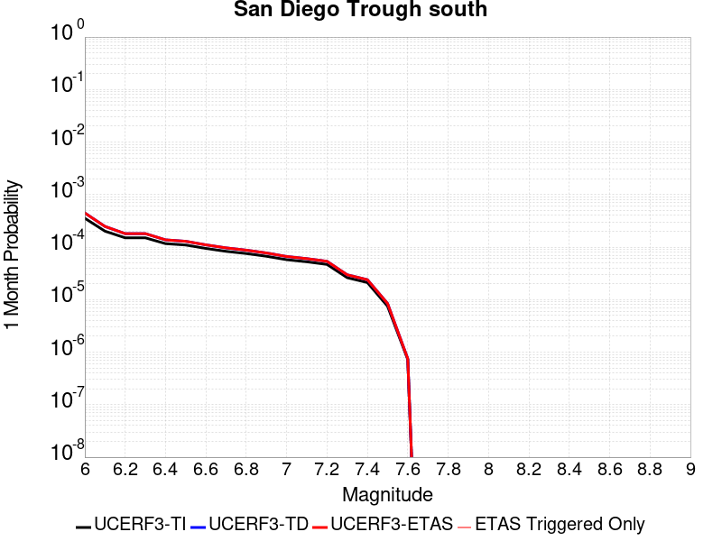 |  |  |

| Magnitude | 1 wk TI Prob | 1 wk TD Prob | 1 wk ETAS Prob | 1 wk ETAS/TD Gain | 1 wk ETAS Triggered Only | 1 mo TI Prob | 1 mo TD Prob | 1 mo ETAS Prob | 1 mo ETAS/TD Gain | 1 mo ETAS Triggered Only | 1 yr TI Prob | 1 yr TD Prob | 1 yr ETAS Prob | 1 yr ETAS/TD Gain | 1 yr ETAS Triggered Only | 10 yr TI Prob | 10 yr TD Prob | 10 yr ETAS Prob | 10 yr ETAS/TD Gain | 10 yr ETAS Triggered Only |
|-----|-----|-----|-----|-----|-----|-----|-----|-----|-----|-----|-----|-----|-----|-----|-----|-----|-----|-----|-----|-----|
| 6.0 | 8.279495E-5 | 1.04273386E-4 | 1.04273386E-4 | 1.0 | 0.0 | 3.5478722E-4 | 4.4681062E-4 | 4.4681062E-4 | 1.0 | 0.0 | 0.004310982 | 0.0054268134 | 0.005436759 | 1.0018327 | 1.0E-5 | 0.042283054 | 0.053001504 | 0.053010974 | 1.0001787 | 1.0E-5 |
| 6.1 | 4.6961468E-5 | 5.7738383E-5 | 5.7738383E-5 | 1.0 | 0.0 | 2.0124791E-4 | 2.474277E-4 | 2.474277E-4 | 1.0 | 0.0 | 0.00244744 | 0.0030083384 | 0.0030183084 | 1.0033141 | 1.0E-5 | 0.024206603 | 0.029684003 | 0.029693706 | 1.0003269 | 1.0E-5 |
| 6.2 | 3.5079658E-5 | 4.2148175E-5 | 4.2148175E-5 | 1.0 | 0.0 | 1.5033272E-4 | 1.8062278E-4 | 1.8062278E-4 | 1.0 | 0.0 | 0.0018287642 | 0.0021968817 | 0.0022068596 | 1.0045419 | 1.0E-5 | 0.018137876 | 0.021754058 | 0.021763839 | 1.0004497 | 1.0E-5 |
| 6.3 | 3.5079658E-5 | 4.2148175E-5 | 4.2148175E-5 | 1.0 | 0.0 | 1.5033272E-4 | 1.8062278E-4 | 1.8062278E-4 | 1.0 | 0.0 | 0.0018287642 | 0.0021968817 | 0.0022068596 | 1.0045419 | 1.0E-5 | 0.018137876 | 0.021754058 | 0.021763839 | 1.0004497 | 1.0E-5 |
| 6.4 | 2.7196904E-5 | 3.209098E-5 | 3.209098E-5 | 1.0 | 0.0 | 1.16552954E-4 | 1.3752561E-4 | 1.3752561E-4 | 1.0 | 0.0 | 0.0014181085 | 0.0016731002 | 0.0016830835 | 1.0059669 | 1.0E-5 | 0.014090929 | 0.01660664 | 0.016616475 | 1.0005921 | 1.0E-5 |
| 6.5 | 2.5584688E-5 | 3.010515E-5 | 3.010515E-5 | 1.0 | 0.0 | 1.0964406E-4 | 1.2901577E-4 | 1.2901577E-4 | 1.0 | 0.0 | 0.0013340989 | 0.0015696476 | 0.0015796319 | 1.0063609 | 1.0E-5 | 0.013261181 | 0.015587154 | 0.015596998 | 1.0006316 | 1.0E-5 |
| 6.6 | 2.2034688E-5 | 2.5745592E-5 | 2.5745592E-5 | 1.0 | 0.0 | 9.443096E-5 | 1.1033364E-4 | 1.1033364E-4 | 1.0 | 0.0 | 0.0011490905 | 0.001342492 | 0.0013524785 | 1.0074388 | 1.0E-5 | 0.011431668 | 0.013344813 | 0.01335468 | 1.0007393 | 1.0E-5 |
| 6.7 | 1.9394853E-5 | 2.2544202E-5 | 2.2544202E-5 | 1.0 | 0.0 | 8.311815E-5 | 9.6614465E-5 | 9.6614465E-5 | 1.0 | 0.0 | 0.0010114936 | 0.0011756516 | 0.0011856398 | 1.0084959 | 1.0E-5 | 0.01006902 | 0.0116950255 | 0.011704909 | 1.0008451 | 1.0E-5 |
| 6.8 | 1.7615313E-5 | 2.0405336E-5 | 2.0405336E-5 | 1.0 | 0.0 | 7.549201E-5 | 8.7448534E-5 | 8.7448534E-5 | 1.0 | 0.0 | 9.1872766E-4 | 0.0010641702 | 0.0010641702 | 1.0 | 0.0 | 0.009149387 | 0.01059131 | 0.01059131 | 1.0 | 0.0 |
| 6.9 | 1.5621423E-5 | 1.8027964E-5 | 1.8027964E-5 | 1.0 | 0.0 | 6.6947236E-5 | 7.726043E-5 | 7.726043E-5 | 1.0 | 0.0 | 8.147778E-4 | 9.4024336E-4 | 9.4024336E-4 | 1.0 | 0.0 | 0.008117969 | 0.009363097 | 0.009363097 | 1.0 | 0.0 |
| 7.0 | 1.3444376E-5 | 1.5449621E-5 | 1.5449621E-5 | 1.0 | 0.0 | 5.7617483E-5 | 6.6210996E-5 | 6.6210996E-5 | 1.0 | 0.0 | 7.0126704E-4 | 8.0582354E-4 | 8.0582354E-4 | 1.0 | 0.0 | 0.006990582 | 0.008029348 | 0.008029348 | 1.0 | 0.0 |
| 7.1 | 1.2268361E-5 | 1.4074408E-5 | 1.4074408E-5 | 1.0 | 0.0 | 5.2577634E-5 | 6.031751E-5 | 6.031751E-5 | 1.0 | 0.0 | 6.399447E-4 | 7.341209E-4 | 7.341209E-4 | 1.0 | 0.0 | 0.0063810493 | 0.007317263 | 0.007317263 | 1.0 | 0.0 |
| 7.2 | 1.0922655E-5 | 1.2514776E-5 | 1.2514776E-5 | 1.0 | 0.0 | 4.681054E-5 | 5.363367E-5 | 5.363367E-5 | 1.0 | 0.0 | 5.697693E-4 | 6.527968E-4 | 6.527968E-4 | 1.0 | 0.0 | 0.0056831064 | 0.006509073 | 0.006509073 | 1.0 | 0.0 |
| 7.3 | 6.1106753E-6 | 6.9295434E-6 | 6.9295434E-6 | 1.0 | 0.0 | 2.6188345E-5 | 2.9697707E-5 | 2.9697707E-5 | 1.0 | 0.0 | 3.1879646E-4 | 3.6151E-4 | 3.6151E-4 | 1.0 | 0.0 | 0.0031833951 | 0.0036092645 | 0.0036092645 | 1.0 | 0.0 |
| 7.4 | 4.933187E-6 | 5.5900487E-6 | 5.5900487E-6 | 1.0 | 0.0 | 2.114206E-5 | 2.3957133E-5 | 2.3957133E-5 | 1.0 | 0.0 | 2.5737417E-4 | 2.9163944E-4 | 2.9163944E-4 | 1.0 | 0.0 | 0.002570763 | 0.0029126084 | 0.0029126084 | 1.0 | 0.0 |
| 7.5 | 1.7489613E-6 | 1.969845E-6 | 1.969845E-6 | 1.0 | 0.0 | 7.495527E-6 | 8.442166E-6 | 8.442166E-6 | 1.0 | 0.0 | 9.125422E-5 | 1.0277875E-4 | 1.0277875E-4 | 1.0 | 0.0 | 9.1216754E-4 | 0.0010273342 | 0.0010273342 | 1.0 | 0.0 |
| 7.6 | 1.6988751E-7 | 1.7534197E-7 | 1.7534197E-7 | 1.0 | 0.0 | 7.2808916E-7 | 7.5146534E-7 | 7.5146534E-7 | 1.0 | 0.0 | 8.864449E-6 | 9.149055E-6 | 9.149055E-6 | 1.0 | 0.0 | 8.8640954E-5 | 9.1486974E-5 | 9.1486974E-5 | 1.0 | 0.0 |

## Cleghorn
*[(top)](#table-of-contents)*

| 1 Week | 1 Month | 1 Year | 10 Year |
|-----|-----|-----|-----|
| 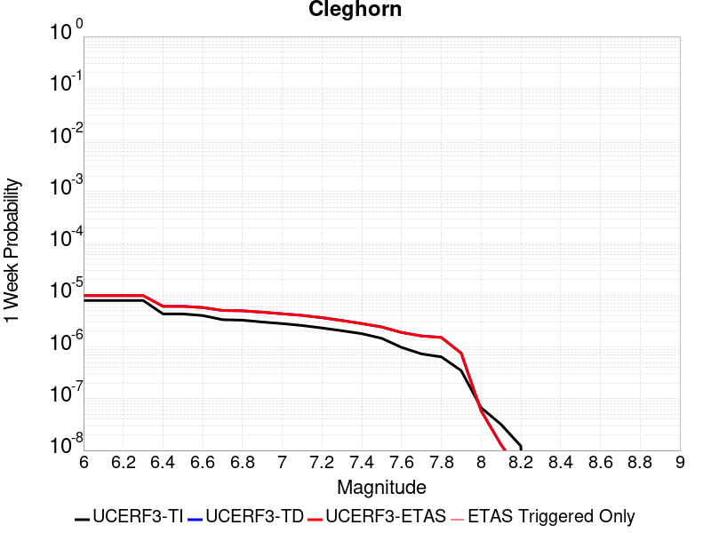 |  |  |  |

| Magnitude | 1 wk TI Prob | 1 wk TD Prob | 1 wk ETAS Prob | 1 wk ETAS/TD Gain | 1 wk ETAS Triggered Only | 1 mo TI Prob | 1 mo TD Prob | 1 mo ETAS Prob | 1 mo ETAS/TD Gain | 1 mo ETAS Triggered Only | 1 yr TI Prob | 1 yr TD Prob | 1 yr ETAS Prob | 1 yr ETAS/TD Gain | 1 yr ETAS Triggered Only | 10 yr TI Prob | 10 yr TD Prob | 10 yr ETAS Prob | 10 yr ETAS/TD Gain | 10 yr ETAS Triggered Only |
|-----|-----|-----|-----|-----|-----|-----|-----|-----|-----|-----|-----|-----|-----|-----|-----|-----|-----|-----|-----|-----|
| 6.0 | 7.9267165E-6 | 9.839554E-6 | 9.839554E-6 | 1.0 | 0.0 | 3.39712E-5 | 4.2168896E-5 | 4.2168896E-5 | 1.0 | 0.0 | 4.1352084E-4 | 5.13296E-4 | 5.2329083E-4 | 1.0194719 | 1.0E-5 | 0.004127522 | 0.0051361714 | 0.0051560686 | 1.003874 | 2.0E-5 |
| 6.1 | 7.9267165E-6 | 9.839554E-6 | 9.839554E-6 | 1.0 | 0.0 | 3.39712E-5 | 4.2168896E-5 | 4.2168896E-5 | 1.0 | 0.0 | 4.1352084E-4 | 5.13296E-4 | 5.2329083E-4 | 1.0194719 | 1.0E-5 | 0.004127522 | 0.0051361714 | 0.0051560686 | 1.003874 | 2.0E-5 |
| 6.2 | 7.9267165E-6 | 9.839554E-6 | 9.839554E-6 | 1.0 | 0.0 | 3.39712E-5 | 4.2168896E-5 | 4.2168896E-5 | 1.0 | 0.0 | 4.1352084E-4 | 5.13296E-4 | 5.2329083E-4 | 1.0194719 | 1.0E-5 | 0.004127522 | 0.0051361714 | 0.0051560686 | 1.003874 | 2.0E-5 |
| 6.3 | 7.9267165E-6 | 9.839554E-6 | 9.839554E-6 | 1.0 | 0.0 | 3.39712E-5 | 4.2168896E-5 | 4.2168896E-5 | 1.0 | 0.0 | 4.1352084E-4 | 5.13296E-4 | 5.2329083E-4 | 1.0194719 | 1.0E-5 | 0.004127522 | 0.0051361714 | 0.0051560686 | 1.003874 | 2.0E-5 |
| 6.4 | 4.3445207E-6 | 6.099305E-6 | 6.099305E-6 | 1.0 | 0.0 | 1.8619241E-5 | 2.6139624E-5 | 2.6139624E-5 | 1.0 | 0.0 | 2.2666567E-4 | 3.1820446E-4 | 3.2820128E-4 | 1.0314163 | 1.0E-5 | 0.0022643462 | 0.0031916327 | 0.0032016006 | 1.0031232 | 1.0E-5 |
| 6.5 | 4.3445207E-6 | 6.099305E-6 | 6.099305E-6 | 1.0 | 0.0 | 1.8619241E-5 | 2.6139624E-5 | 2.6139624E-5 | 1.0 | 0.0 | 2.2666567E-4 | 3.1820446E-4 | 3.2820128E-4 | 1.0314163 | 1.0E-5 | 0.0022643462 | 0.0031916327 | 0.0032016006 | 1.0031232 | 1.0E-5 |
| 6.6 | 4.040109E-6 | 5.7817037E-6 | 5.7817037E-6 | 1.0 | 0.0 | 1.7314638E-5 | 2.4778501E-5 | 2.4778501E-5 | 1.0 | 0.0 | 2.1078532E-4 | 3.0163742E-4 | 3.1163442E-4 | 1.0331423 | 1.0E-5 | 0.002105855 | 0.0030264184 | 0.003036388 | 1.0032942 | 1.0E-5 |
| 6.7 | 3.3632055E-6 | 5.0751805E-6 | 5.0751805E-6 | 1.0 | 0.0 | 1.4413658E-5 | 2.1750593E-5 | 2.1750593E-5 | 1.0 | 0.0 | 1.7547216E-4 | 2.647816E-4 | 2.7477898E-4 | 1.0377569 | 1.0E-5 | 0.0017533366 | 0.0026587434 | 0.002668717 | 1.0037512 | 1.0E-5 |
| 6.8 | 3.2902772E-6 | 4.997084E-6 | 4.997084E-6 | 1.0 | 0.0 | 1.4101111E-5 | 2.14159E-5 | 2.14159E-5 | 1.0 | 0.0 | 1.716675E-4 | 2.6070772E-4 | 2.7070512E-4 | 1.0383471 | 1.0E-5 | 0.0017153495 | 0.0026181005 | 0.0026280743 | 1.0038096 | 1.0E-5 |
| 6.9 | 3.031547E-6 | 4.698615E-6 | 4.698615E-6 | 1.0 | 0.0 | 1.299228E-5 | 2.0136767E-5 | 2.0136767E-5 | 1.0 | 0.0 | 1.5816953E-4 | 2.4513784E-4 | 2.5513538E-4 | 1.0407834 | 1.0E-5 | 0.00158057 | 0.002462754 | 0.0024727294 | 1.0040505 | 1.0E-5 |
| 7.0 | 2.8259715E-6 | 4.3775967E-6 | 4.3775967E-6 | 1.0 | 0.0 | 1.211125E-5 | 1.8760995E-5 | 1.8760995E-5 | 1.0 | 0.0 | 1.4744449E-4 | 2.2839142E-4 | 2.2839142E-4 | 1.0 | 0.0 | 0.001473467 | 0.0022956454 | 0.0022956454 | 1.0 | 0.0 |
| 7.1 | 2.5962665E-6 | 4.072574E-6 | 4.072574E-6 | 1.0 | 0.0 | 1.1126809E-5 | 1.7453773E-5 | 1.7453773E-5 | 1.0 | 0.0 | 1.3546048E-4 | 2.1247918E-4 | 2.1247918E-4 | 1.0 | 0.0 | 0.0013537793 | 0.0021368456 | 0.0021368456 | 1.0 | 0.0 |
| 7.2 | 2.3247253E-6 | 3.6828462E-6 | 3.6828462E-6 | 1.0 | 0.0 | 9.96307E-6 | 1.5783533E-5 | 1.5783533E-5 | 1.0 | 0.0 | 1.21293626E-4 | 1.9214775E-4 | 1.9214775E-4 | 1.0 | 0.0 | 0.0012122744 | 0.0019339235 | 0.0019339235 | 1.0 | 0.0 |
| 7.3 | 2.056928E-6 | 3.241008E-6 | 3.241008E-6 | 1.0 | 0.0 | 8.815376E-6 | 1.3889961E-5 | 1.3889961E-5 | 1.0 | 0.0 | 1.0732192E-4 | 1.6909731E-4 | 1.6909731E-4 | 1.0 | 0.0 | 0.001072701 | 0.0017038563 | 0.0017038563 | 1.0 | 0.0 |
| 7.4 | 1.8055999E-6 | 2.8309187E-6 | 2.8309187E-6 | 1.0 | 0.0 | 7.738263E-6 | 1.2132453E-5 | 1.2132453E-5 | 1.0 | 0.0 | 9.4209274E-5 | 1.4770274E-4 | 1.4770274E-4 | 1.0 | 0.0 | 9.4169343E-4 | 0.001490346 | 0.001490346 | 1.0 | 0.0 |
| 7.5 | 1.4683443E-6 | 2.4299427E-6 | 2.4299427E-6 | 1.0 | 0.0 | 6.292889E-6 | 1.0413999E-5 | 1.0413999E-5 | 1.0 | 0.0 | 7.661323E-5 | 1.2678315E-4 | 1.2678315E-4 | 1.0 | 0.0 | 7.658682E-4 | 0.001281453 | 0.001281453 | 1.0 | 0.0 |
| 7.6 | 9.804088E-7 | 1.9053567E-6 | 1.9053567E-6 | 1.0 | 0.0 | 4.201745E-6 | 8.165789E-6 | 8.165789E-6 | 1.0 | 0.0 | 5.1155046E-5 | 9.941399E-5 | 9.941399E-5 | 1.0 | 0.0 | 5.114327E-4 | 0.0010080716 | 0.0010080716 | 1.0 | 0.0 |
| 7.7 | 7.3434086E-7 | 1.6334122E-6 | 1.6334122E-6 | 1.0 | 0.0 | 3.1471714E-6 | 7.0003193E-6 | 7.0003193E-6 | 1.0 | 0.0 | 3.831614E-5 | 8.5225576E-5 | 8.5225576E-5 | 1.0 | 0.0 | 3.8309532E-4 | 8.663386E-4 | 8.663386E-4 | 1.0 | 0.0 |
| 7.8 | 6.434184E-7 | 1.5267399E-6 | 1.5267399E-6 | 1.0 | 0.0 | 2.7575045E-6 | 6.543155E-6 | 6.543155E-6 | 1.0 | 0.0 | 3.35721E-5 | 7.966002E-5 | 7.966002E-5 | 1.0 | 0.0 | 3.3567028E-4 | 8.103774E-4 | 8.103774E-4 | 1.0 | 0.0 |
| 7.9 | 3.4943926E-7 | 7.599429E-7 | 7.599429E-7 | 1.0 | 0.0 | 1.497596E-6 | 3.2568942E-6 | 3.2568942E-6 | 1.0 | 0.0 | 1.8233079E-5 | 3.965197E-5 | 3.965197E-5 | 1.0 | 0.0 | 1.8231584E-4 | 4.0525617E-4 | 4.0525617E-4 | 1.0 | 0.0 |
| 8.0 | 6.717524E-8 | 5.8652336E-8 | 5.8652336E-8 | 1.0 | 0.0 | 2.8789387E-7 | 2.5136714E-7 | 2.5136714E-7 | 1.0 | 0.0 | 3.505102E-6 | 3.0603906E-6 | 3.0603906E-6 | 1.0 | 0.0 | 3.5050467E-5 | 3.287143E-5 | 3.287143E-5 | 1.0 | 0.0 |
| 8.1 | 3.1984914E-8 | 1.3035431E-8 | 1.3035431E-8 | 1.0 | 0.0 | 1.370782E-7 | 5.5866135E-8 | 5.5866135E-8 | 1.0 | 0.0 | 1.6689258E-6 | 6.8017E-7 | 6.8017E-7 | 1.0 | 0.0 | 1.6689133E-5 | 7.789905E-6 | 7.789905E-6 | 1.0 | 0.0 |
| 8.2 | 1.21887656E-8 | 3.6736711E-9 | 3.6736711E-9 | 1.0 | 0.0 | 5.2237567E-8 | 1.5744305E-8 | 1.5744305E-8 | 1.0 | 0.0 | 6.359922E-7 | 1.916869E-7 | 1.916869E-7 | 1.0 | 0.0 | 6.3599036E-6 | 2.2609345E-6 | 2.2609345E-6 | 1.0 | 0.0 |

## Great Valley 07 (Orestimba)
*[(top)](#table-of-contents)*

| 1 Week | 1 Month | 1 Year | 10 Year |
|-----|-----|-----|-----|
|  | 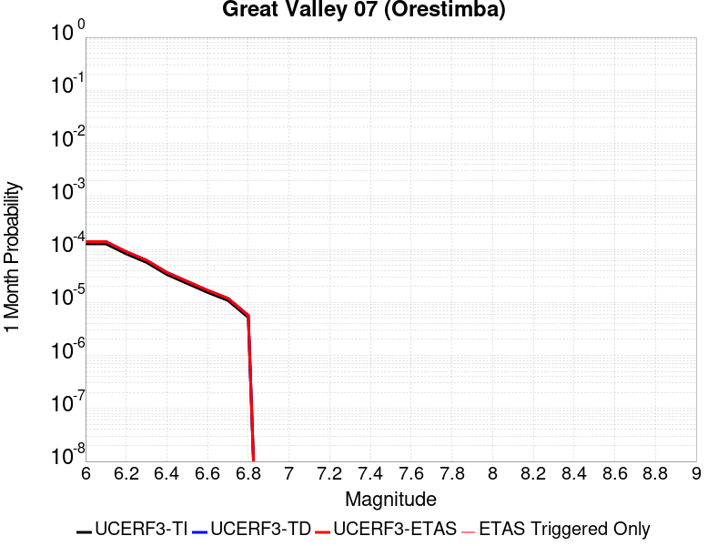 |  |  |

| Magnitude | 1 wk TI Prob | 1 wk TD Prob | 1 wk ETAS Prob | 1 wk ETAS/TD Gain | 1 wk ETAS Triggered Only | 1 mo TI Prob | 1 mo TD Prob | 1 mo ETAS Prob | 1 mo ETAS/TD Gain | 1 mo ETAS Triggered Only | 1 yr TI Prob | 1 yr TD Prob | 1 yr ETAS Prob | 1 yr ETAS/TD Gain | 1 yr ETAS Triggered Only | 10 yr TI Prob | 10 yr TD Prob | 10 yr ETAS Prob | 10 yr ETAS/TD Gain | 10 yr ETAS Triggered Only |
|-----|-----|-----|-----|-----|-----|-----|-----|-----|-----|-----|-----|-----|-----|-----|-----|-----|-----|-----|-----|-----|
| 6.0 | 2.9687902E-5 | 3.2759748E-5 | 3.2759748E-5 | 1.0 | 0.0 | 1.2722766E-4 | 1.4039177E-4 | 1.4039177E-4 | 1.0 | 0.0 | 0.0015478961 | 0.0017080016 | 0.0017179844 | 1.0058448 | 1.0E-5 | 0.015371585 | 0.01695629 | 0.01697595 | 1.0011595 | 2.0E-5 |
| 6.1 | 2.9687902E-5 | 3.2759748E-5 | 3.2759748E-5 | 1.0 | 0.0 | 1.2722766E-4 | 1.4039177E-4 | 1.4039177E-4 | 1.0 | 0.0 | 0.0015478961 | 0.0017080016 | 0.0017179844 | 1.0058448 | 1.0E-5 | 0.015371585 | 0.01695629 | 0.016966121 | 1.0005797 | 1.0E-5 |
| 6.2 | 1.9231524E-5 | 2.1160573E-5 | 2.1160573E-5 | 1.0 | 0.0 | 8.2418206E-5 | 9.068515E-5 | 9.068515E-5 | 1.0 | 0.0 | 0.0010029797 | 0.0011035557 | 0.0011035557 | 1.0 | 0.0 | 0.00998465 | 0.010983167 | 0.010983167 | 1.0 | 0.0 |
| 6.3 | 1.324766E-5 | 1.4549481E-5 | 1.4549481E-5 | 1.0 | 0.0 | 5.6774446E-5 | 6.235348E-5 | 6.235348E-5 | 1.0 | 0.0 | 6.910097E-4 | 7.588984E-4 | 7.588984E-4 | 1.0 | 0.0 | 0.006888649 | 0.0075640148 | 0.0075640148 | 1.0 | 0.0 |
| 6.4 | 7.818645E-6 | 8.573388E-6 | 8.573388E-6 | 1.0 | 0.0 | 3.3508048E-5 | 3.6742596E-5 | 3.6742596E-5 | 1.0 | 0.0 | 4.078841E-4 | 4.4725265E-4 | 4.4725265E-4 | 1.0 | 0.0 | 0.004071363 | 0.0044638654 | 0.0044638654 | 1.0 | 0.0 |
| 6.5 | 5.3076565E-6 | 5.8181718E-6 | 5.8181718E-6 | 1.0 | 0.0 | 2.27469E-5 | 2.4934794E-5 | 2.4934794E-5 | 1.0 | 0.0 | 2.7690834E-4 | 3.0354093E-4 | 3.0354093E-4 | 1.0 | 0.0 | 0.0027656353 | 0.003031473 | 0.003031473 | 1.0 | 0.0 |
| 6.6 | 3.6003578E-6 | 3.9487486E-6 | 3.9487486E-6 | 1.0 | 0.0 | 1.5430012E-5 | 1.6923108E-5 | 1.6923108E-5 | 1.0 | 0.0 | 1.8784421E-4 | 2.0602091E-4 | 2.0602091E-4 | 1.0 | 0.0 | 0.0018768552 | 0.0020584534 | 0.0020584534 | 1.0 | 0.0 |
| 6.7 | 2.5361826E-6 | 2.783648E-6 | 2.783648E-6 | 1.0 | 0.0 | 1.0869308E-5 | 1.1929872E-5 | 1.1929872E-5 | 1.0 | 0.0 | 1.3232579E-4 | 1.4523783E-4 | 1.4523783E-4 | 1.0 | 0.0 | 0.0013224703 | 0.0014515591 | 0.0014515591 | 1.0 | 0.0 |
| 6.8 | 1.2115831E-6 | 1.331467E-6 | 1.331467E-6 | 1.0 | 0.0 | 5.1924885E-6 | 5.7062807E-6 | 5.7062807E-6 | 1.0 | 0.0 | 6.3216714E-5 | 6.947272E-5 | 6.947272E-5 | 1.0 | 0.0 | 6.3198735E-4 | 6.946051E-4 | 6.946051E-4 | 1.0 | 0.0 |

## Kern Canyon (South Kern) 2011
*[(top)](#table-of-contents)*

| 1 Week | 1 Month | 1 Year | 10 Year |
|-----|-----|-----|-----|
| 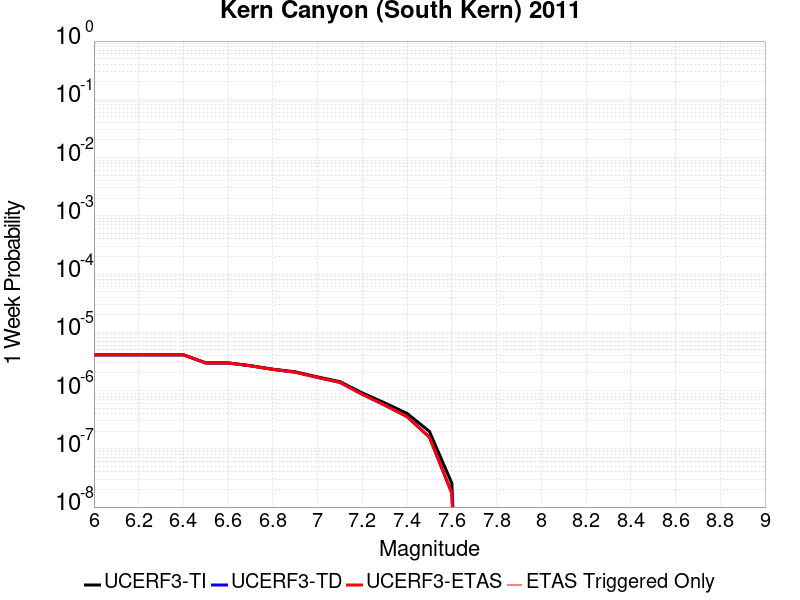 | 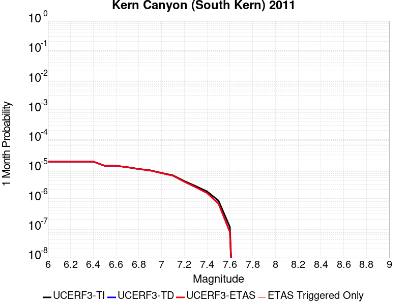 |  |  |

| Magnitude | 1 wk TI Prob | 1 wk TD Prob | 1 wk ETAS Prob | 1 wk ETAS/TD Gain | 1 wk ETAS Triggered Only | 1 mo TI Prob | 1 mo TD Prob | 1 mo ETAS Prob | 1 mo ETAS/TD Gain | 1 mo ETAS Triggered Only | 1 yr TI Prob | 1 yr TD Prob | 1 yr ETAS Prob | 1 yr ETAS/TD Gain | 1 yr ETAS Triggered Only | 10 yr TI Prob | 10 yr TD Prob | 10 yr ETAS Prob | 10 yr ETAS/TD Gain | 10 yr ETAS Triggered Only |
|-----|-----|-----|-----|-----|-----|-----|-----|-----|-----|-----|-----|-----|-----|-----|-----|-----|-----|-----|-----|-----|
| 6.0 | 4.105075E-6 | 4.1137773E-6 | 4.1137773E-6 | 1.0 | 0.0 | 1.7593058E-5 | 1.763036E-5 | 1.763036E-5 | 1.0 | 0.0 | 2.1417443E-4 | 2.1462912E-4 | 2.1462912E-4 | 1.0 | 0.0 | 0.0021396813 | 0.0021442822 | 0.0021642393 | 1.0093071 | 2.0E-5 |
| 6.1 | 4.105075E-6 | 4.1137773E-6 | 4.1137773E-6 | 1.0 | 0.0 | 1.7593058E-5 | 1.763036E-5 | 1.763036E-5 | 1.0 | 0.0 | 2.1417443E-4 | 2.1462912E-4 | 2.1462912E-4 | 1.0 | 0.0 | 0.0021396813 | 0.0021442822 | 0.0021642393 | 1.0093071 | 2.0E-5 |
| 6.2 | 4.105075E-6 | 4.1137773E-6 | 4.1137773E-6 | 1.0 | 0.0 | 1.7593058E-5 | 1.763036E-5 | 1.763036E-5 | 1.0 | 0.0 | 2.1417443E-4 | 2.1462912E-4 | 2.1462912E-4 | 1.0 | 0.0 | 0.0021396813 | 0.0021442822 | 0.0021642393 | 1.0093071 | 2.0E-5 |
| 6.3 | 4.105075E-6 | 4.1137773E-6 | 4.1137773E-6 | 1.0 | 0.0 | 1.7593058E-5 | 1.763036E-5 | 1.763036E-5 | 1.0 | 0.0 | 2.1417443E-4 | 2.1462912E-4 | 2.1462912E-4 | 1.0 | 0.0 | 0.0021396813 | 0.0021442822 | 0.0021642393 | 1.0093071 | 2.0E-5 |
| 6.4 | 4.105075E-6 | 4.1137773E-6 | 4.1137773E-6 | 1.0 | 0.0 | 1.7593058E-5 | 1.763036E-5 | 1.763036E-5 | 1.0 | 0.0 | 2.1417443E-4 | 2.1462912E-4 | 2.1462912E-4 | 1.0 | 0.0 | 0.0021396813 | 0.0021442822 | 0.0021642393 | 1.0093071 | 2.0E-5 |
| 6.5 | 2.9849807E-6 | 2.973192E-6 | 2.973192E-6 | 1.0 | 0.0 | 1.2792712E-5 | 1.274219E-5 | 1.274219E-5 | 1.0 | 0.0 | 1.5574014E-4 | 1.5512526E-4 | 1.5512526E-4 | 1.0 | 0.0 | 0.0015563103 | 0.001550185 | 0.001570154 | 1.0128816 | 2.0E-5 |
| 6.6 | 2.9849807E-6 | 2.973192E-6 | 2.973192E-6 | 1.0 | 0.0 | 1.2792712E-5 | 1.274219E-5 | 1.274219E-5 | 1.0 | 0.0 | 1.5574014E-4 | 1.5512526E-4 | 1.5512526E-4 | 1.0 | 0.0 | 0.0015563103 | 0.001550185 | 0.001570154 | 1.0128816 | 2.0E-5 |
| 6.7 | 2.6756725E-6 | 2.6582543E-6 | 2.6582543E-6 | 1.0 | 0.0 | 1.1467117E-5 | 1.1392469E-5 | 1.1392469E-5 | 1.0 | 0.0 | 1.396032E-4 | 1.386946E-4 | 1.386946E-4 | 1.0 | 0.0 | 0.0013951553 | 0.0013860912 | 0.0014060636 | 1.0144091 | 2.0E-5 |
| 6.8 | 2.3283721E-6 | 2.304808E-6 | 2.304808E-6 | 1.0 | 0.0 | 9.9787E-6 | 9.877712E-6 | 9.877712E-6 | 1.0 | 0.0 | 1.214839E-4 | 1.2025458E-4 | 1.2025458E-4 | 1.0 | 0.0 | 0.001214175 | 0.0012019026 | 0.0012218786 | 1.0166203 | 2.0E-5 |
| 6.9 | 2.0972677E-6 | 2.0696677E-6 | 2.0696677E-6 | 1.0 | 0.0 | 8.988259E-6 | 8.869974E-6 | 8.869974E-6 | 1.0 | 0.0 | 1.0942656E-4 | 1.0798665E-4 | 1.0798665E-4 | 1.0 | 0.0 | 0.0010937268 | 0.0010793476 | 0.001099326 | 1.0185097 | 2.0E-5 |
| 7.0 | 1.7132242E-6 | 1.6787255E-6 | 1.6787255E-6 | 1.0 | 0.0 | 7.3423685E-6 | 7.1945183E-6 | 7.1945183E-6 | 1.0 | 0.0 | 8.938967E-5 | 8.7589775E-5 | 8.7589775E-5 | 1.0 | 0.0 | 8.935372E-4 | 8.755564E-4 | 8.955389E-4 | 1.0228226 | 2.0E-5 |
| 7.1 | 1.4215541E-6 | 1.3815935E-6 | 1.3815935E-6 | 1.0 | 0.0 | 6.0923603E-6 | 5.9211015E-6 | 5.9211015E-6 | 1.0 | 0.0 | 7.417196E-5 | 7.208705E-5 | 7.208705E-5 | 1.0 | 0.0 | 7.414721E-4 | 7.206394E-4 | 7.306322E-4 | 1.0138665 | 1.0E-5 |
| 7.2 | 9.097853E-7 | 8.603895E-7 | 8.603895E-7 | 1.0 | 0.0 | 3.899074E-6 | 3.6873782E-6 | 3.6873782E-6 | 1.0 | 0.0 | 4.7470192E-5 | 4.4892917E-5 | 4.4892917E-5 | 1.0 | 0.0 | 4.7460053E-4 | 4.4883956E-4 | 4.5883507E-4 | 1.0222697 | 1.0E-5 |
| 7.3 | 6.144169E-7 | 5.628287E-7 | 5.628287E-7 | 1.0 | 0.0 | 2.6332125E-6 | 2.412121E-6 | 2.412121E-6 | 1.0 | 0.0 | 3.205889E-5 | 2.936718E-5 | 2.936718E-5 | 1.0 | 0.0 | 3.2054266E-4 | 2.936335E-4 | 3.0363057E-4 | 1.034046 | 1.0E-5 |
| 7.4 | 4.049844E-7 | 3.572886E-7 | 3.572886E-7 | 1.0 | 0.0 | 1.7356463E-6 | 1.531236E-6 | 1.531236E-6 | 1.0 | 0.0 | 2.1131287E-5 | 1.864264E-5 | 1.864264E-5 | 1.0 | 0.0 | 2.1129279E-4 | 1.8641101E-4 | 1.8641101E-4 | 1.0 | 0.0 |
| 7.5 | 1.9871162E-7 | 1.5830709E-7 | 1.5830709E-7 | 1.0 | 0.0 | 8.5162094E-7 | 6.784588E-7 | 6.784588E-7 | 1.0 | 0.0 | 1.0368436E-5 | 8.2602055E-6 | 8.2602055E-6 | 1.0 | 0.0 | 1.0367952E-4 | 8.2599065E-5 | 8.2599065E-5 | 1.0 | 0.0 |
| 7.6 | 2.572245E-8 | 1.7353022E-8 | 1.7353022E-8 | 1.0 | 0.0 | 1.10239064E-7 | 7.437009E-8 | 7.437009E-8 | 1.0 | 0.0 | 1.3421597E-6 | 9.054556E-7 | 9.054556E-7 | 1.0 | 0.0 | 1.3421517E-5 | 9.0545245E-6 | 9.0545245E-6 | 1.0 | 0.0 |

## Maacama 2011 CFM
*[(top)](#table-of-contents)*

| 1 Week | 1 Month | 1 Year | 10 Year |
|-----|-----|-----|-----|
|  | 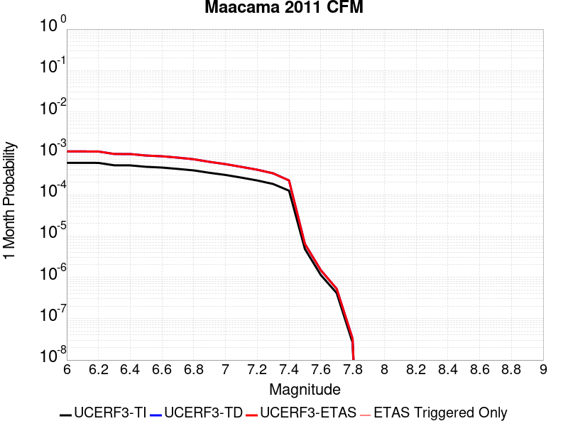 | 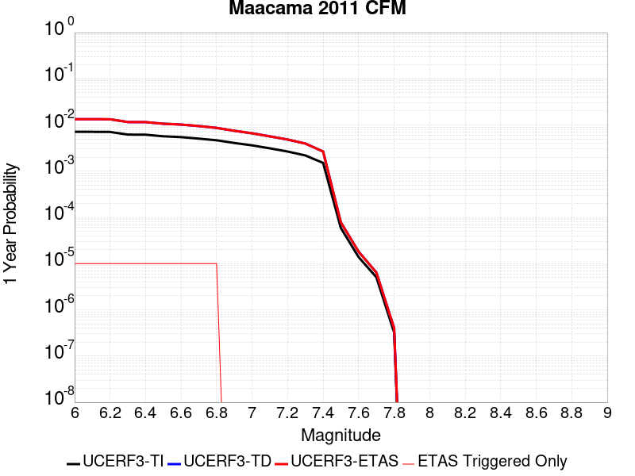 |  |

| Magnitude | 1 wk TI Prob | 1 wk TD Prob | 1 wk ETAS Prob | 1 wk ETAS/TD Gain | 1 wk ETAS Triggered Only | 1 mo TI Prob | 1 mo TD Prob | 1 mo ETAS Prob | 1 mo ETAS/TD Gain | 1 mo ETAS Triggered Only | 1 yr TI Prob | 1 yr TD Prob | 1 yr ETAS Prob | 1 yr ETAS/TD Gain | 1 yr ETAS Triggered Only | 10 yr TI Prob | 10 yr TD Prob | 10 yr ETAS Prob | 10 yr ETAS/TD Gain | 10 yr ETAS Triggered Only |
|-----|-----|-----|-----|-----|-----|-----|-----|-----|-----|-----|-----|-----|-----|-----|-----|-----|-----|-----|-----|-----|
| 6.0 | 1.368203E-4 | 2.5801515E-4 | 2.5801515E-4 | 1.0 | 0.0 | 5.862409E-4 | 0.0011051933 | 0.0011051933 | 1.0 | 0.0 | 0.0071141496 | 0.013355422 | 0.013365288 | 1.0007387 | 1.0E-5 | 0.06890667 | 0.12423398 | 0.124242745 | 1.0000705 | 1.0E-5 |
| 6.1 | 1.368203E-4 | 2.5801515E-4 | 2.5801515E-4 | 1.0 | 0.0 | 5.862409E-4 | 0.0011051933 | 0.0011051933 | 1.0 | 0.0 | 0.0071141496 | 0.013355422 | 0.013365288 | 1.0007387 | 1.0E-5 | 0.06890667 | 0.12423398 | 0.124242745 | 1.0000705 | 1.0E-5 |
| 6.2 | 1.360743E-4 | 2.5676176E-4 | 2.5676176E-4 | 1.0 | 0.0 | 5.8304524E-4 | 0.0010998268 | 0.0010998268 | 1.0 | 0.0 | 0.007075496 | 0.013290957 | 0.013300823 | 1.0007424 | 1.0E-5 | 0.06854413 | 0.12366826 | 0.12367702 | 1.0000708 | 1.0E-5 |
| 6.3 | 1.1917239E-4 | 2.2370262E-4 | 2.2370262E-4 | 1.0 | 0.0 | 5.1063887E-4 | 9.582752E-4 | 9.582752E-4 | 1.0 | 0.0 | 0.0061993203 | 0.0115920575 | 0.011601942 | 1.0008527 | 1.0E-5 | 0.060292065 | 0.108886205 | 0.108895116 | 1.0000819 | 1.0E-5 |
| 6.4 | 1.1859289E-4 | 2.2273831E-4 | 2.2273831E-4 | 1.0 | 0.0 | 5.0815626E-4 | 9.541456E-4 | 9.541456E-4 | 1.0 | 0.0 | 0.006169266 | 0.011542366 | 0.01155225 | 1.0008564 | 1.0E-5 | 0.06000784 | 0.10844296 | 0.10845187 | 1.0000823 | 1.0E-5 |
| 6.5 | 1.09512424E-4 | 2.0527204E-4 | 2.0527204E-4 | 1.0 | 0.0 | 4.6925453E-4 | 8.793649E-4 | 8.793649E-4 | 1.0 | 0.0 | 0.005698218 | 0.010643706 | 0.010653599 | 1.0009295 | 1.0E-5 | 0.055543028 | 0.10053401 | 0.100543 | 1.0000895 | 1.0E-5 |
| 6.6 | 1.0502928E-4 | 1.9684313E-4 | 1.9684313E-4 | 1.0 | 0.0 | 4.500478E-4 | 8.432803E-4 | 8.432803E-4 | 1.0 | 0.0 | 0.0054655746 | 0.0102097355 | 0.010219634 | 1.0009694 | 1.0E-5 | 0.053330887 | 0.096685916 | 0.09669495 | 1.0000935 | 1.0E-5 |
| 6.7 | 9.739358E-5 | 1.8267964E-4 | 1.8267964E-4 | 1.0 | 0.0 | 4.173343E-4 | 7.826182E-4 | 7.826182E-4 | 1.0 | 0.0 | 0.0050692135 | 0.009479622 | 0.009489527 | 1.0010449 | 1.0E-5 | 0.049551267 | 0.09015753 | 0.090166636 | 1.000101 | 1.0E-5 |
| 6.8 | 8.969524E-5 | 1.6665991E-4 | 1.6665991E-4 | 1.0 | 0.0 | 3.8435153E-4 | 7.14027E-4 | 7.14027E-4 | 1.0 | 0.0 | 0.0046694432 | 0.008653047 | 0.0086629605 | 1.0011457 | 1.0E-5 | 0.045725387 | 0.08268747 | 0.08269664 | 1.000111 | 1.0E-5 |
| 6.9 | 7.838291E-5 | 1.4425661E-4 | 1.4425661E-4 | 1.0 | 0.0 | 3.358835E-4 | 6.1807403E-4 | 6.1807403E-4 | 1.0 | 0.0 | 0.0040817154 | 0.007495224 | 0.007495224 | 1.0 | 0.0 | 0.04007554 | 0.07208445 | 0.07208445 | 1.0 | 0.0 |
| 7.0 | 6.961957E-5 | 1.2714425E-4 | 1.2714425E-4 | 1.0 | 0.0 | 2.9833548E-4 | 5.447678E-4 | 5.447678E-4 | 1.0 | 0.0 | 0.0036261857 | 0.0066098464 | 0.0066098464 | 1.0 | 0.0 | 0.035675827 | 0.06390053 | 0.06390053 | 1.0 | 0.0 |
| 7.1 | 5.999398E-5 | 1.0910829E-4 | 1.0910829E-4 | 1.0 | 0.0 | 2.570917E-4 | 4.6751226E-4 | 4.6751226E-4 | 1.0 | 0.0 | 0.0031255994 | 0.0056756274 | 0.0056756274 | 1.0 | 0.0 | 0.030820016 | 0.055164993 | 0.055164993 | 1.0 | 0.0 |
| 7.2 | 5.116532E-5 | 9.3102004E-5 | 9.3102004E-5 | 1.0 | 0.0 | 2.1926152E-4 | 3.9894466E-4 | 3.9894466E-4 | 1.0 | 0.0 | 0.002666241 | 0.0048456155 | 0.0048456155 | 1.0 | 0.0 | 0.026344774 | 0.047326665 | 0.047326665 | 1.0 | 0.0 |
| 7.3 | 4.2087835E-5 | 7.6208526E-5 | 7.6208526E-5 | 1.0 | 0.0 | 1.8036396E-4 | 3.2656634E-4 | 3.2656634E-4 | 1.0 | 0.0 | 0.0021937196 | 0.0039682453 | 0.0039682453 | 1.0 | 0.0 | 0.0217219 | 0.03892393 | 0.03892393 | 1.0 | 0.0 |
| 7.4 | 2.8991652E-5 | 5.1188505E-5 | 5.1188505E-5 | 1.0 | 0.0 | 1.2424402E-4 | 2.1936094E-4 | 2.1936094E-4 | 1.0 | 0.0 | 0.0015116213 | 0.0026674063 | 0.0026674063 | 1.0 | 0.0 | 0.015013801 | 0.02634449 | 0.02634449 | 1.0 | 0.0 |
| 7.5 | 1.1292299E-6 | 1.495407E-6 | 1.495407E-6 | 1.0 | 0.0 | 4.8395473E-6 | 6.408878E-6 | 6.408878E-6 | 1.0 | 0.0 | 5.8919897E-5 | 7.802655E-5 | 7.802655E-5 | 1.0 | 0.0 | 5.890428E-4 | 7.8071805E-4 | 7.8071805E-4 | 1.0 | 0.0 |
| 7.6 | 2.6535366E-7 | 3.4733952E-7 | 3.4733952E-7 | 1.0 | 0.0 | 1.1372296E-6 | 1.4885971E-6 | 1.4885971E-6 | 1.0 | 0.0 | 1.3845682E-5 | 1.8123521E-5 | 1.8123521E-5 | 1.0 | 0.0 | 1.3844819E-4 | 1.8178108E-4 | 1.8178108E-4 | 1.0 | 0.0 |
| 7.7 | 9.727789E-8 | 1.2309447E-7 | 1.2309447E-7 | 1.0 | 0.0 | 4.1690518E-7 | 5.2754757E-7 | 5.2754757E-7 | 1.0 | 0.0 | 5.0758085E-6 | 6.422873E-6 | 6.422873E-6 | 1.0 | 0.0 | 5.0756928E-5 | 6.461596E-5 | 6.461596E-5 | 1.0 | 0.0 |
| 7.8 | 6.1939325E-9 | 7.7158475E-9 | 7.7158475E-9 | 1.0 | 0.0 | 2.6545425E-8 | 3.3067916E-8 | 3.3067916E-8 | 1.0 | 0.0 | 3.231905E-7 | 4.026018E-7 | 4.026018E-7 | 1.0 | 0.0 | 3.2319003E-6 | 4.061451E-6 | 4.061451E-6 | 1.0 | 0.0 |

## Monterey Bay-Tularcitos
*[(top)](#table-of-contents)*

| 1 Week | 1 Month | 1 Year | 10 Year |
|-----|-----|-----|-----|
| 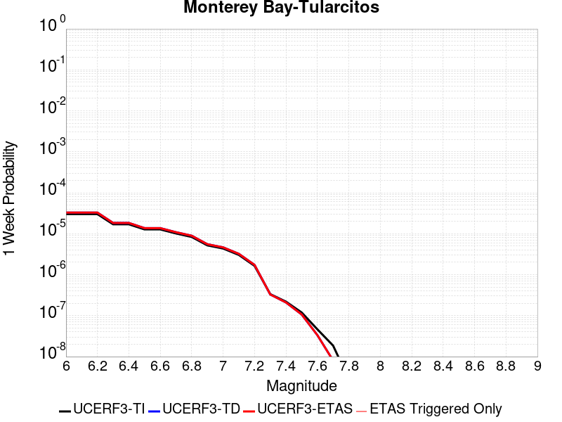 |  | 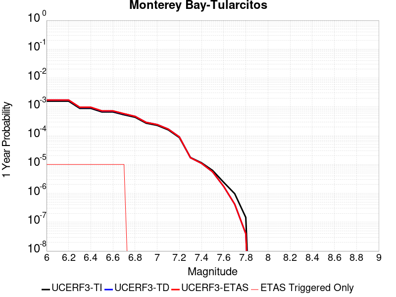 |  |

| Magnitude | 1 wk TI Prob | 1 wk TD Prob | 1 wk ETAS Prob | 1 wk ETAS/TD Gain | 1 wk ETAS Triggered Only | 1 mo TI Prob | 1 mo TD Prob | 1 mo ETAS Prob | 1 mo ETAS/TD Gain | 1 mo ETAS Triggered Only | 1 yr TI Prob | 1 yr TD Prob | 1 yr ETAS Prob | 1 yr ETAS/TD Gain | 1 yr ETAS Triggered Only | 10 yr TI Prob | 10 yr TD Prob | 10 yr ETAS Prob | 10 yr ETAS/TD Gain | 10 yr ETAS Triggered Only |
|-----|-----|-----|-----|-----|-----|-----|-----|-----|-----|-----|-----|-----|-----|-----|-----|-----|-----|-----|-----|-----|
| 6.0 | 3.0131365E-5 | 3.2800777E-5 | 3.2800777E-5 | 1.0 | 0.0 | 1.2912804E-4 | 1.4056778E-4 | 1.4056778E-4 | 1.0 | 0.0 | 0.001571 | 0.0017101747 | 0.0017201577 | 1.0058373 | 1.0E-5 | 0.015599402 | 0.016980948 | 0.017000608 | 1.0011578 | 2.0E-5 |
| 6.1 | 3.0131365E-5 | 3.2800777E-5 | 3.2800777E-5 | 1.0 | 0.0 | 1.2912804E-4 | 1.4056778E-4 | 1.4056778E-4 | 1.0 | 0.0 | 0.001571 | 0.0017101747 | 0.0017201577 | 1.0058373 | 1.0E-5 | 0.015599402 | 0.016980948 | 0.017000608 | 1.0011578 | 2.0E-5 |
| 6.2 | 3.0131365E-5 | 3.2800777E-5 | 3.2800777E-5 | 1.0 | 0.0 | 1.2912804E-4 | 1.4056778E-4 | 1.4056778E-4 | 1.0 | 0.0 | 0.001571 | 0.0017101747 | 0.0017201577 | 1.0058373 | 1.0E-5 | 0.015599402 | 0.016980948 | 0.017000608 | 1.0011578 | 2.0E-5 |
| 6.3 | 1.6998249E-5 | 1.8331826E-5 | 1.8331826E-5 | 1.0 | 0.0 | 7.28476E-5 | 7.856271E-5 | 7.856271E-5 | 1.0 | 0.0 | 8.865586E-4 | 9.5609995E-4 | 9.660904E-4 | 1.0104492 | 1.0E-5 | 0.0088303005 | 0.00952179 | 0.0095416 | 1.0020804 | 2.0E-5 |
| 6.4 | 1.6998249E-5 | 1.8331826E-5 | 1.8331826E-5 | 1.0 | 0.0 | 7.28476E-5 | 7.856271E-5 | 7.856271E-5 | 1.0 | 0.0 | 8.865586E-4 | 9.5609995E-4 | 9.660904E-4 | 1.0104492 | 1.0E-5 | 0.0088303005 | 0.00952179 | 0.0095416 | 1.0020804 | 2.0E-5 |
| 6.5 | 1.27470785E-5 | 1.3694062E-5 | 1.3694062E-5 | 1.0 | 0.0 | 5.4629192E-5 | 5.8687572E-5 | 5.8687572E-5 | 1.0 | 0.0 | 6.649074E-4 | 7.142973E-4 | 7.2429015E-4 | 1.0139898 | 1.0E-5 | 0.0066292146 | 0.0071210666 | 0.007140924 | 1.0027885 | 2.0E-5 |
| 6.6 | 1.2739422E-5 | 1.3686148E-5 | 1.3686148E-5 | 1.0 | 0.0 | 5.4596385E-5 | 5.8653663E-5 | 5.8653663E-5 | 1.0 | 0.0 | 6.645082E-4 | 7.138847E-4 | 7.238776E-4 | 1.0139979 | 1.0E-5 | 0.0066252467 | 0.007116967 | 0.0071368245 | 1.0027902 | 2.0E-5 |
| 6.7 | 1.0160109E-5 | 1.0886344E-5 | 1.0886344E-5 | 1.0 | 0.0 | 4.35426E-5 | 4.6654968E-5 | 4.6654968E-5 | 1.0 | 0.0 | 5.300022E-4 | 5.6788325E-4 | 5.7787757E-4 | 1.0175992 | 1.0E-5 | 0.005287399 | 0.005665032 | 0.005674976 | 1.0017552 | 1.0E-5 |
| 6.8 | 8.349859E-6 | 8.933074E-6 | 8.933074E-6 | 1.0 | 0.0 | 3.578462E-5 | 3.8284077E-5 | 3.8284077E-5 | 1.0 | 0.0 | 4.3559066E-4 | 4.6601458E-4 | 4.6601458E-4 | 1.0 | 0.0 | 0.004347378 | 0.004650939 | 0.004650939 | 1.0 | 0.0 |
| 6.9 | 5.193639E-6 | 5.5367464E-6 | 5.5367464E-6 | 1.0 | 0.0 | 2.2258262E-5 | 2.3728715E-5 | 2.3728715E-5 | 1.0 | 0.0 | 2.7096065E-4 | 2.8886207E-4 | 2.8886207E-4 | 1.0 | 0.0 | 0.0027063051 | 0.002885187 | 0.002885187 | 1.0 | 0.0 |
| 7.0 | 4.359381E-6 | 4.6436403E-6 | 4.6436403E-6 | 1.0 | 0.0 | 1.8682927E-5 | 1.9901181E-5 | 1.9901181E-5 | 1.0 | 0.0 | 2.274409E-4 | 2.4227292E-4 | 2.4227292E-4 | 1.0 | 0.0 | 0.0022720827 | 0.002420381 | 0.002420381 | 1.0 | 0.0 |
| 7.1 | 3.0398533E-6 | 3.2312512E-6 | 3.2312512E-6 | 1.0 | 0.0 | 1.3027877E-5 | 1.3848161E-5 | 1.3848161E-5 | 1.0 | 0.0 | 1.5860285E-4 | 1.6859094E-4 | 1.6859094E-4 | 1.0 | 0.0 | 0.001584897 | 0.001684888 | 0.001684888 | 1.0 | 0.0 |
| 7.2 | 1.642335E-6 | 1.7334526E-6 | 1.7334526E-6 | 1.0 | 0.0 | 7.0385595E-6 | 7.4290733E-6 | 7.4290733E-6 | 1.0 | 0.0 | 8.569109E-5 | 9.0447276E-5 | 9.0447276E-5 | 1.0 | 0.0 | 8.5658056E-4 | 9.043074E-4 | 9.043074E-4 | 1.0 | 0.0 |
| 7.3 | 3.356842E-7 | 3.295918E-7 | 3.295918E-7 | 1.0 | 0.0 | 1.4386458E-6 | 1.4125355E-6 | 1.4125355E-6 | 1.0 | 0.0 | 1.7515373E-5 | 1.7197484E-5 | 1.7197484E-5 | 1.0 | 0.0 | 1.7513991E-4 | 1.7196164E-4 | 1.7196164E-4 | 1.0 | 0.0 |
| 7.4 | 2.1973483E-7 | 2.1012964E-7 | 2.1012964E-7 | 1.0 | 0.0 | 9.417204E-7 | 9.005553E-7 | 9.005553E-7 | 1.0 | 0.0 | 1.1465385E-5 | 1.0964206E-5 | 1.0964206E-5 | 1.0 | 0.0 | 1.1464794E-4 | 1.0963668E-4 | 1.0963668E-4 | 1.0 | 0.0 |
| 7.5 | 1.1944135E-7 | 1.0702365E-7 | 1.0702365E-7 | 1.0 | 0.0 | 5.118914E-7 | 4.586727E-7 | 4.586727E-7 | 1.0 | 0.0 | 6.23226E-6 | 5.5843257E-6 | 5.5843257E-6 | 1.0 | 0.0 | 6.2320854E-5 | 5.584187E-5 | 5.584187E-5 | 1.0 | 0.0 |
| 7.6 | 4.636058E-8 | 3.3403484E-8 | 3.3403484E-8 | 1.0 | 0.0 | 1.9868818E-7 | 1.4315779E-7 | 1.4315779E-7 | 1.0 | 0.0 | 2.419026E-6 | 1.7429446E-6 | 1.7429446E-6 | 1.0 | 0.0 | 2.4189996E-5 | 1.7429313E-5 | 1.7429313E-5 | 1.0 | 0.0 |
| 7.7 | 1.8588572E-8 | 8.019531E-9 | 8.019531E-9 | 1.0 | 0.0 | 7.9665305E-8 | 3.4369418E-8 | 3.4369418E-8 | 1.0 | 0.0 | 9.699246E-7 | 4.1844757E-7 | 4.1844757E-7 | 1.0 | 0.0 | 9.699204E-6 | 4.1844683E-6 | 4.1844683E-6 | 1.0 | 0.0 |
| 7.8 | 2.7960154E-9 | 7.6332274E-10 | 7.6332274E-10 | 1.0 | 0.0 | 1.1982923E-8 | 3.2713838E-9 | 3.2713838E-9 | 1.0 | 0.0 | 1.4589209E-7 | 3.98291E-8 | 3.98291E-8 | 1.0 | 0.0 | 1.4589199E-6 | 3.9829095E-7 | 3.9829095E-7 | 1.0 | 0.0 |

## Dry Mountain
*[(top)](#table-of-contents)*

| 1 Week | 1 Month | 1 Year | 10 Year |
|-----|-----|-----|-----|
|  |  |  |  |

| Magnitude | 1 wk TI Prob | 1 wk TD Prob | 1 wk ETAS Prob | 1 wk ETAS/TD Gain | 1 wk ETAS Triggered Only | 1 mo TI Prob | 1 mo TD Prob | 1 mo ETAS Prob | 1 mo ETAS/TD Gain | 1 mo ETAS Triggered Only | 1 yr TI Prob | 1 yr TD Prob | 1 yr ETAS Prob | 1 yr ETAS/TD Gain | 1 yr ETAS Triggered Only | 10 yr TI Prob | 10 yr TD Prob | 10 yr ETAS Prob | 10 yr ETAS/TD Gain | 10 yr ETAS Triggered Only |
|-----|-----|-----|-----|-----|-----|-----|-----|-----|-----|-----|-----|-----|-----|-----|-----|-----|-----|-----|-----|-----|
| 6.0 | 6.222801E-6 | 6.43953E-6 | 6.43953E-6 | 1.0 | 0.0 | 2.6668875E-5 | 2.7597784E-5 | 2.7597784E-5 | 1.0 | 0.0 | 3.2464517E-4 | 3.359671E-4 | 3.4596375E-4 | 1.0297548 | 1.0E-5 | 0.0032417132 | 0.0033561543 | 0.0033760872 | 1.0059392 | 2.0E-5 |
| 6.1 | 6.222801E-6 | 6.43953E-6 | 6.43953E-6 | 1.0 | 0.0 | 2.6668875E-5 | 2.7597784E-5 | 2.7597784E-5 | 1.0 | 0.0 | 3.2464517E-4 | 3.359671E-4 | 3.4596375E-4 | 1.0297548 | 1.0E-5 | 0.0032417132 | 0.0033561543 | 0.0033760872 | 1.0059392 | 2.0E-5 |
| 6.2 | 6.222801E-6 | 6.43953E-6 | 6.43953E-6 | 1.0 | 0.0 | 2.6668875E-5 | 2.7597784E-5 | 2.7597784E-5 | 1.0 | 0.0 | 3.2464517E-4 | 3.359671E-4 | 3.4596375E-4 | 1.0297548 | 1.0E-5 | 0.0032417132 | 0.0033561543 | 0.0033760872 | 1.0059392 | 2.0E-5 |
| 6.3 | 6.222801E-6 | 6.43953E-6 | 6.43953E-6 | 1.0 | 0.0 | 2.6668875E-5 | 2.7597784E-5 | 2.7597784E-5 | 1.0 | 0.0 | 3.2464517E-4 | 3.359671E-4 | 3.4596375E-4 | 1.0297548 | 1.0E-5 | 0.0032417132 | 0.0033561543 | 0.0033760872 | 1.0059392 | 2.0E-5 |
| 6.4 | 6.222801E-6 | 6.43953E-6 | 6.43953E-6 | 1.0 | 0.0 | 2.6668875E-5 | 2.7597784E-5 | 2.7597784E-5 | 1.0 | 0.0 | 3.2464517E-4 | 3.359671E-4 | 3.4596375E-4 | 1.0297548 | 1.0E-5 | 0.0032417132 | 0.0033561543 | 0.0033760872 | 1.0059392 | 2.0E-5 |
| 6.5 | 2.8528623E-6 | 2.9522366E-6 | 2.9522366E-6 | 1.0 | 0.0 | 1.22264955E-5 | 1.265243E-5 | 1.265243E-5 | 1.0 | 0.0 | 1.4884741E-4 | 1.5404115E-4 | 1.6403961E-4 | 1.0649077 | 1.0E-5 | 0.0014874774 | 0.0015401972 | 0.0015501818 | 1.0064827 | 1.0E-5 |
| 6.6 | 2.8528623E-6 | 2.9522366E-6 | 2.9522366E-6 | 1.0 | 0.0 | 1.22264955E-5 | 1.265243E-5 | 1.265243E-5 | 1.0 | 0.0 | 1.4884741E-4 | 1.5404115E-4 | 1.6403961E-4 | 1.0649077 | 1.0E-5 | 0.0014874774 | 0.0015401972 | 0.0015501818 | 1.0064827 | 1.0E-5 |
| 6.7 | 2.541E-6 | 2.6294185E-6 | 2.6294185E-6 | 1.0 | 0.0 | 1.0889954E-5 | 1.1268937E-5 | 1.1268937E-5 | 1.0 | 0.0 | 1.3257713E-4 | 1.371993E-4 | 1.4719793E-4 | 1.0728767 | 1.0E-5 | 0.0013249806 | 0.001371993 | 0.0013819793 | 1.0072787 | 1.0E-5 |

## Coronado Bank alt1
*[(top)](#table-of-contents)*

| 1 Week | 1 Month | 1 Year | 10 Year |
|-----|-----|-----|-----|
| 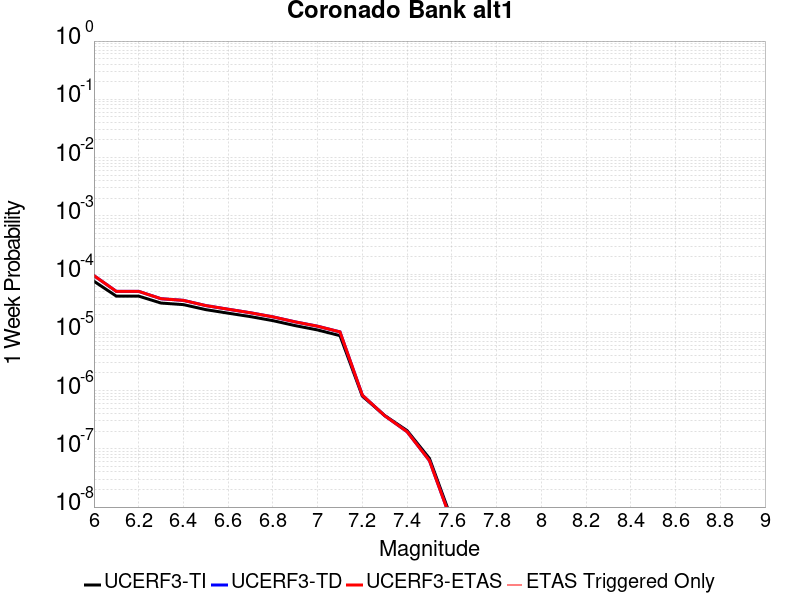 |  |  | 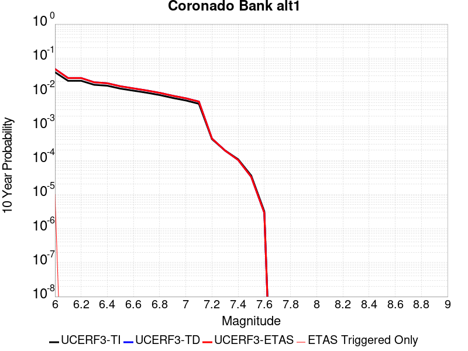 |

| Magnitude | 1 wk TI Prob | 1 wk TD Prob | 1 wk ETAS Prob | 1 wk ETAS/TD Gain | 1 wk ETAS Triggered Only | 1 mo TI Prob | 1 mo TD Prob | 1 mo ETAS Prob | 1 mo ETAS/TD Gain | 1 mo ETAS Triggered Only | 1 yr TI Prob | 1 yr TD Prob | 1 yr ETAS Prob | 1 yr ETAS/TD Gain | 1 yr ETAS Triggered Only | 10 yr TI Prob | 10 yr TD Prob | 10 yr ETAS Prob | 10 yr ETAS/TD Gain | 10 yr ETAS Triggered Only |
|-----|-----|-----|-----|-----|-----|-----|-----|-----|-----|-----|-----|-----|-----|-----|-----|-----|-----|-----|-----|-----|
| 6.0 | 7.533492E-5 | 9.396588E-5 | 9.396588E-5 | 1.0 | 0.0 | 3.22824E-4 | 4.0265295E-4 | 4.0265295E-4 | 1.0 | 0.0 | 0.0039233007 | 0.004891912 | 0.004901863 | 1.0020342 | 1.0E-5 | 0.03854755 | 0.047911543 | 0.047921065 | 1.0001987 | 1.0E-5 |
| 6.1 | 4.1807285E-5 | 5.0499926E-5 | 5.0499926E-5 | 1.0 | 0.0 | 1.7916178E-4 | 2.1641083E-4 | 2.1641083E-4 | 1.0 | 0.0 | 0.0021791123 | 0.0026317001 | 0.0026317001 | 1.0 | 0.0 | 0.021578677 | 0.02601467 | 0.02601467 | 1.0 | 0.0 |
| 6.2 | 4.1807285E-5 | 5.0499926E-5 | 5.0499926E-5 | 1.0 | 0.0 | 1.7916178E-4 | 2.1641083E-4 | 2.1641083E-4 | 1.0 | 0.0 | 0.0021791123 | 0.0026317001 | 0.0026317001 | 1.0 | 0.0 | 0.021578677 | 0.02601467 | 0.02601467 | 1.0 | 0.0 |
| 6.3 | 3.1793104E-5 | 3.771583E-5 | 3.771583E-5 | 1.0 | 0.0 | 1.3624904E-4 | 1.616294E-4 | 1.616294E-4 | 1.0 | 0.0 | 0.0016575698 | 0.001966094 | 0.001966094 | 1.0 | 0.0 | 0.016452603 | 0.019490898 | 0.019490898 | 1.0 | 0.0 |
| 6.4 | 2.9878007E-5 | 3.5340134E-5 | 3.5340134E-5 | 1.0 | 0.0 | 1.2804232E-4 | 1.5144906E-4 | 1.5144906E-4 | 1.0 | 0.0 | 0.0015578003 | 0.0018423647 | 0.0018423647 | 1.0 | 0.0 | 0.015469253 | 0.018274678 | 0.018274678 | 1.0 | 0.0 |
| 6.5 | 2.4512565E-5 | 2.8767454E-5 | 2.8767454E-5 | 1.0 | 0.0 | 1.0504962E-4 | 1.2328342E-4 | 1.2328342E-4 | 1.0 | 0.0 | 0.0012782287 | 0.0014999687 | 0.0014999687 | 1.0 | 0.0 | 0.012709012 | 0.014901414 | 0.014901414 | 1.0 | 0.0 |
| 6.6 | 2.1317413E-5 | 2.4909488E-5 | 2.4909488E-5 | 1.0 | 0.0 | 9.135714E-5 | 1.06750704E-4 | 1.06750704E-4 | 1.0 | 0.0 | 0.0011117056 | 0.0012989371 | 0.0012989371 | 1.0 | 0.0 | 0.011061605 | 0.012915859 | 0.012915859 | 1.0 | 0.0 |
| 6.7 | 1.8585655E-5 | 2.1637268E-5 | 2.1637268E-5 | 1.0 | 0.0 | 7.9650374E-5 | 9.272797E-5 | 9.272797E-5 | 1.0 | 0.0 | 9.6931186E-4 | 0.0011283988 | 0.0011283988 | 1.0 | 0.0 | 0.0096509475 | 0.011228855 | 0.011228855 | 1.0 | 0.0 |
| 6.8 | 1.5862879E-5 | 1.8421475E-5 | 1.8421475E-5 | 1.0 | 0.0 | 6.798199E-5 | 7.89469E-5 | 7.89469E-5 | 1.0 | 0.0 | 8.273665E-4 | 9.607739E-4 | 9.607739E-4 | 1.0 | 0.0 | 0.008242928 | 0.009568185 | 0.009568185 | 1.0 | 0.0 |
| 6.9 | 1.3021509E-5 | 1.5096889E-5 | 1.5096889E-5 | 1.0 | 0.0 | 5.5805274E-5 | 6.469945E-5 | 6.469945E-5 | 1.0 | 0.0 | 6.792174E-4 | 7.874492E-4 | 7.874492E-4 | 1.0 | 0.0 | 0.006771452 | 0.007848414 | 0.007848414 | 1.0 | 0.0 |
| 7.0 | 1.0974371E-5 | 1.2721474E-5 | 1.2721474E-5 | 1.0 | 0.0 | 4.7032172E-5 | 5.4519565E-5 | 5.4519565E-5 | 1.0 | 0.0 | 5.7246623E-4 | 6.6359114E-4 | 6.6359114E-4 | 1.0 | 0.0 | 0.0057099373 | 0.0066178455 | 0.0066178455 | 1.0 | 0.0 |
| 7.1 | 8.766221E-6 | 1.0164934E-5 | 1.0164934E-5 | 1.0 | 0.0 | 3.7568978E-5 | 4.3563374E-5 | 4.3563374E-5 | 1.0 | 0.0 | 4.573063E-4 | 5.302722E-4 | 5.302722E-4 | 1.0 | 0.0 | 0.0045636636 | 0.0052917693 | 0.0052917693 | 1.0 | 0.0 |
| 7.2 | 8.026024E-7 | 8.3321385E-7 | 8.3321385E-7 | 1.0 | 0.0 | 3.43972E-6 | 3.5709115E-6 | 3.5709115E-6 | 1.0 | 0.0 | 4.1877785E-5 | 4.3474993E-5 | 4.3474993E-5 | 1.0 | 0.0 | 4.1869894E-4 | 4.3466597E-4 | 4.3466597E-4 | 1.0 | 0.0 |
| 7.3 | 3.7293114E-7 | 3.7002252E-7 | 3.7002252E-7 | 1.0 | 0.0 | 1.5982754E-6 | 1.5858099E-6 | 1.5858099E-6 | 1.0 | 0.0 | 1.9458828E-5 | 1.9307065E-5 | 1.9307065E-5 | 1.0 | 0.0 | 1.9457124E-4 | 1.9305393E-4 | 1.9305393E-4 | 1.0 | 0.0 |
| 7.4 | 2.0557036E-7 | 1.9674945E-7 | 1.9674945E-7 | 1.0 | 0.0 | 8.810155E-7 | 8.4321164E-7 | 8.4321164E-7 | 1.0 | 0.0 | 1.0726311E-5 | 1.0266054E-5 | 1.0266054E-5 | 1.0 | 0.0 | 1.0725793E-4 | 1.0265583E-4 | 1.0265583E-4 | 1.0 | 0.0 |
| 7.5 | 6.845446E-8 | 6.279504E-8 | 6.279504E-8 | 1.0 | 0.0 | 2.9337625E-7 | 2.6912156E-7 | 2.6912156E-7 | 1.0 | 0.0 | 3.5718497E-6 | 3.2765502E-6 | 3.2765502E-6 | 1.0 | 0.0 | 3.5717923E-5 | 3.2765027E-5 | 3.2765027E-5 | 1.0 | 0.0 |
| 7.6 | 6.0975145E-9 | 5.5319433E-9 | 5.5319433E-9 | 1.0 | 0.0 | 2.6132206E-8 | 2.3708328E-8 | 2.3708328E-8 | 1.0 | 0.0 | 3.1815955E-7 | 2.8864886E-7 | 2.8864886E-7 | 1.0 | 0.0 | 3.181591E-6 | 2.8864858E-6 | 2.8864858E-6 | 1.0 | 0.0 |

## Great Valley 04a Trout Creek
*[(top)](#table-of-contents)*

| 1 Week | 1 Month | 1 Year | 10 Year |
|-----|-----|-----|-----|
|  |  |  | 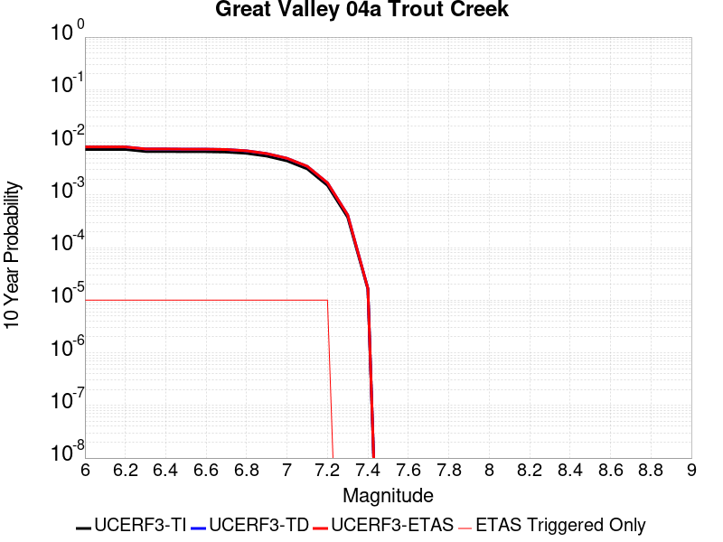 |

| Magnitude | 1 wk TI Prob | 1 wk TD Prob | 1 wk ETAS Prob | 1 wk ETAS/TD Gain | 1 wk ETAS Triggered Only | 1 mo TI Prob | 1 mo TD Prob | 1 mo ETAS Prob | 1 mo ETAS/TD Gain | 1 mo ETAS Triggered Only | 1 yr TI Prob | 1 yr TD Prob | 1 yr ETAS Prob | 1 yr ETAS/TD Gain | 1 yr ETAS Triggered Only | 10 yr TI Prob | 10 yr TD Prob | 10 yr ETAS Prob | 10 yr ETAS/TD Gain | 10 yr ETAS Triggered Only |
|-----|-----|-----|-----|-----|-----|-----|-----|-----|-----|-----|-----|-----|-----|-----|-----|-----|-----|-----|-----|-----|
| 6.0 | 1.4088538E-5 | 1.5720761E-5 | 1.5720761E-5 | 1.0 | 0.0 | 6.037805E-5 | 6.7373025E-5 | 6.7373025E-5 | 1.0 | 0.0 | 7.3485484E-4 | 8.199704E-4 | 8.199704E-4 | 1.0 | 0.0 | 0.007324295 | 0.008170733 | 0.008180652 | 1.0012139 | 1.0E-5 |
| 6.1 | 1.4088538E-5 | 1.5720761E-5 | 1.5720761E-5 | 1.0 | 0.0 | 6.037805E-5 | 6.7373025E-5 | 6.7373025E-5 | 1.0 | 0.0 | 7.3485484E-4 | 8.199704E-4 | 8.199704E-4 | 1.0 | 0.0 | 0.007324295 | 0.008170733 | 0.008180652 | 1.0012139 | 1.0E-5 |
| 6.2 | 1.4088538E-5 | 1.5720761E-5 | 1.5720761E-5 | 1.0 | 0.0 | 6.037805E-5 | 6.7373025E-5 | 6.7373025E-5 | 1.0 | 0.0 | 7.3485484E-4 | 8.199704E-4 | 8.199704E-4 | 1.0 | 0.0 | 0.007324295 | 0.008170733 | 0.008180652 | 1.0012139 | 1.0E-5 |
| 6.3 | 1.2882862E-5 | 1.4379711E-5 | 1.4379711E-5 | 1.0 | 0.0 | 5.5211098E-5 | 6.1625935E-5 | 6.1625935E-5 | 1.0 | 0.0 | 6.7198783E-4 | 7.5004785E-4 | 7.5004785E-4 | 1.0 | 0.0 | 0.0066995937 | 0.007476227 | 0.0074861525 | 1.0013275 | 1.0E-5 |
| 6.4 | 1.2882862E-5 | 1.4379711E-5 | 1.4379711E-5 | 1.0 | 0.0 | 5.5211098E-5 | 6.1625935E-5 | 6.1625935E-5 | 1.0 | 0.0 | 6.7198783E-4 | 7.5004785E-4 | 7.5004785E-4 | 1.0 | 0.0 | 0.0066995937 | 0.007476227 | 0.0074861525 | 1.0013275 | 1.0E-5 |
| 6.5 | 1.2762329E-5 | 1.4246259E-5 | 1.4246259E-5 | 1.0 | 0.0 | 5.469455E-5 | 6.105402E-5 | 6.105402E-5 | 1.0 | 0.0 | 6.657027E-4 | 7.430896E-4 | 7.430896E-4 | 1.0 | 0.0 | 0.00663712 | 0.0074071083 | 0.0074170344 | 1.00134 | 1.0E-5 |
| 6.6 | 1.2762329E-5 | 1.4246259E-5 | 1.4246259E-5 | 1.0 | 0.0 | 5.469455E-5 | 6.105402E-5 | 6.105402E-5 | 1.0 | 0.0 | 6.657027E-4 | 7.430896E-4 | 7.430896E-4 | 1.0 | 0.0 | 0.00663712 | 0.0074071083 | 0.0074170344 | 1.00134 | 1.0E-5 |
| 6.7 | 1.2557959E-5 | 1.4020478E-5 | 1.4020478E-5 | 1.0 | 0.0 | 5.3818712E-5 | 6.008644E-5 | 6.008644E-5 | 1.0 | 0.0 | 6.5504585E-4 | 7.3131715E-4 | 7.3131715E-4 | 1.0 | 0.0 | 0.006531183 | 0.00729016 | 0.007300087 | 1.0013617 | 1.0E-5 |
| 6.8 | 1.1871544E-5 | 1.3259852E-5 | 1.3259852E-5 | 1.0 | 0.0 | 5.0877054E-5 | 5.6826757E-5 | 5.6826757E-5 | 1.0 | 0.0 | 6.1925204E-4 | 6.9165614E-4 | 6.9165614E-4 | 1.0 | 0.0 | 0.0061752927 | 0.006896052 | 0.0069059827 | 1.00144 | 1.0E-5 |
| 6.9 | 1.0500373E-5 | 1.1732174E-5 | 1.1732174E-5 | 1.0 | 0.0 | 4.5000823E-5 | 5.027983E-5 | 5.027983E-5 | 1.0 | 0.0 | 5.4774724E-4 | 6.1199354E-4 | 6.1199354E-4 | 1.0 | 0.0 | 0.005463991 | 0.0061039478 | 0.006113887 | 1.0016283 | 1.0E-5 |
| 7.0 | 8.524332E-6 | 9.534233E-6 | 9.534233E-6 | 1.0 | 0.0 | 3.653234E-5 | 4.0860403E-5 | 4.0860403E-5 | 1.0 | 0.0 | 4.4469046E-4 | 4.9736915E-4 | 4.9736915E-4 | 1.0 | 0.0 | 0.0044380166 | 0.0049632913 | 0.0049732416 | 1.0020047 | 1.0E-5 |
| 7.1 | 6.006849E-6 | 6.7120823E-6 | 6.7120823E-6 | 1.0 | 0.0 | 2.5743384E-5 | 2.876578E-5 | 2.876578E-5 | 1.0 | 0.0 | 3.1338062E-4 | 3.501727E-4 | 3.501727E-4 | 1.0 | 0.0 | 0.0031293905 | 0.0034967596 | 0.0035067247 | 1.0028498 | 1.0E-5 |
| 7.2 | 2.9122193E-6 | 3.2467783E-6 | 3.2467783E-6 | 1.0 | 0.0 | 1.248088E-5 | 1.39147005E-5 | 1.39147005E-5 | 1.0 | 0.0 | 1.5194413E-4 | 1.6940005E-4 | 1.6940005E-4 | 1.0 | 0.0 | 0.0015184027 | 0.0016928812 | 0.0017028643 | 1.005897 | 1.0E-5 |
| 7.3 | 7.2194007E-7 | 7.989331E-7 | 7.989331E-7 | 1.0 | 0.0 | 3.0940253E-6 | 3.423997E-6 | 3.423997E-6 | 1.0 | 0.0 | 3.7669106E-5 | 4.1686824E-5 | 4.1686824E-5 | 1.0 | 0.0 | 3.766272E-4 | 4.1683504E-4 | 4.1683504E-4 | 1.0 | 0.0 |
| 7.4 | 3.112171E-8 | 3.2069014E-8 | 3.2069014E-8 | 1.0 | 0.0 | 1.3337875E-7 | 1.3743862E-7 | 1.3743862E-7 | 1.0 | 0.0 | 1.6238852E-6 | 1.673314E-6 | 1.673314E-6 | 1.0 | 0.0 | 1.6238733E-5 | 1.6733022E-5 | 1.6733022E-5 | 1.0 | 0.0 |

## Great Valley 03 Mysterious Ridge
*[(top)](#table-of-contents)*

| 1 Week | 1 Month | 1 Year | 10 Year |
|-----|-----|-----|-----|
|  | 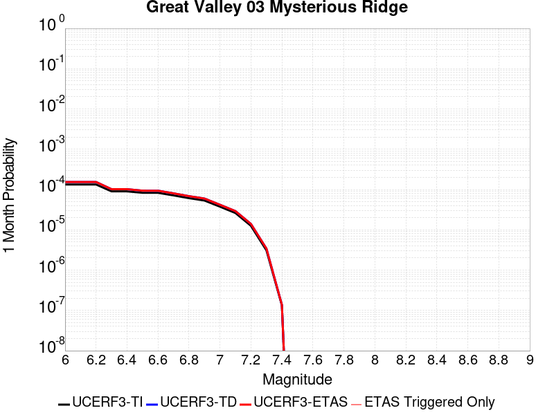 |  |  |

| Magnitude | 1 wk TI Prob | 1 wk TD Prob | 1 wk ETAS Prob | 1 wk ETAS/TD Gain | 1 wk ETAS Triggered Only | 1 mo TI Prob | 1 mo TD Prob | 1 mo ETAS Prob | 1 mo ETAS/TD Gain | 1 mo ETAS Triggered Only | 1 yr TI Prob | 1 yr TD Prob | 1 yr ETAS Prob | 1 yr ETAS/TD Gain | 1 yr ETAS Triggered Only | 10 yr TI Prob | 10 yr TD Prob | 10 yr ETAS Prob | 10 yr ETAS/TD Gain | 10 yr ETAS Triggered Only |
|-----|-----|-----|-----|-----|-----|-----|-----|-----|-----|-----|-----|-----|-----|-----|-----|-----|-----|-----|-----|-----|
| 6.0 | 3.1182444E-5 | 3.6037865E-5 | 3.6037865E-5 | 1.0 | 0.0 | 1.336322E-4 | 1.5443991E-4 | 1.5443991E-4 | 1.0 | 0.0 | 0.0016257578 | 0.0018788707 | 0.0018788707 | 1.0 | 0.0 | 0.016139153 | 0.018648598 | 0.01865841 | 1.0005262 | 1.0E-5 |
| 6.1 | 3.1182444E-5 | 3.6037865E-5 | 3.6037865E-5 | 1.0 | 0.0 | 1.336322E-4 | 1.5443991E-4 | 1.5443991E-4 | 1.0 | 0.0 | 0.0016257578 | 0.0018788707 | 0.0018788707 | 1.0 | 0.0 | 0.016139153 | 0.018648598 | 0.01865841 | 1.0005262 | 1.0E-5 |
| 6.2 | 3.1182444E-5 | 3.6037865E-5 | 3.6037865E-5 | 1.0 | 0.0 | 1.336322E-4 | 1.5443991E-4 | 1.5443991E-4 | 1.0 | 0.0 | 0.0016257578 | 0.0018788707 | 0.0018788707 | 1.0 | 0.0 | 0.016139153 | 0.018648598 | 0.01865841 | 1.0005262 | 1.0E-5 |
| 6.3 | 2.106934E-5 | 2.3852404E-5 | 2.3852404E-5 | 1.0 | 0.0 | 9.0294045E-5 | 1.0222076E-4 | 1.0222076E-4 | 1.0 | 0.0 | 0.0010987755 | 0.0012438584 | 0.0012438584 | 1.0 | 0.0 | 0.010933585 | 0.012372211 | 0.012382086 | 1.0007982 | 1.0E-5 |
| 6.4 | 2.106934E-5 | 2.3852404E-5 | 2.3852404E-5 | 1.0 | 0.0 | 9.0294045E-5 | 1.0222076E-4 | 1.0222076E-4 | 1.0 | 0.0 | 0.0010987755 | 0.0012438584 | 0.0012438584 | 1.0 | 0.0 | 0.010933585 | 0.012372211 | 0.012382086 | 1.0007982 | 1.0E-5 |
| 6.5 | 1.9389783E-5 | 2.1886859E-5 | 2.1886859E-5 | 1.0 | 0.0 | 8.309642E-5 | 9.379761E-5 | 9.379761E-5 | 1.0 | 0.0 | 0.0010112294 | 0.0011414154 | 0.0011414154 | 1.0 | 0.0 | 0.010066401 | 0.011358404 | 0.0113682905 | 1.0008703 | 1.0E-5 |
| 6.6 | 1.9370193E-5 | 2.186678E-5 | 2.186678E-5 | 1.0 | 0.0 | 8.301247E-5 | 9.371156E-5 | 9.371156E-5 | 1.0 | 0.0 | 0.0010102082 | 0.0011403689 | 0.0011403689 | 1.0 | 0.0 | 0.010056281 | 0.011348045 | 0.011357931 | 1.0008712 | 1.0E-5 |
| 6.7 | 1.6723505E-5 | 1.8800836E-5 | 1.8800836E-5 | 1.0 | 0.0 | 7.16702E-5 | 8.057263E-5 | 8.057263E-5 | 1.0 | 0.0 | 8.722353E-4 | 9.805498E-4 | 9.805498E-4 | 1.0 | 0.0 | 0.008688197 | 0.009764243 | 0.009774146 | 1.0010141 | 1.0E-5 |
| 6.8 | 1.426937E-5 | 1.59985E-5 | 1.59985E-5 | 1.0 | 0.0 | 6.115301E-5 | 6.856328E-5 | 6.856328E-5 | 1.0 | 0.0 | 7.4428355E-4 | 8.344526E-4 | 8.344526E-4 | 1.0 | 0.0 | 0.007417957 | 0.008314672 | 0.00832459 | 1.0011927 | 1.0E-5 |
| 6.9 | 1.2469891E-5 | 1.3958036E-5 | 1.3958036E-5 | 1.0 | 0.0 | 5.3441294E-5 | 5.981885E-5 | 5.981885E-5 | 1.0 | 0.0 | 6.504535E-4 | 7.280632E-4 | 7.280632E-4 | 1.0 | 0.0 | 0.006485529 | 0.007258004 | 0.0072679315 | 1.0013678 | 1.0E-5 |
| 7.0 | 8.7746275E-6 | 9.7924885E-6 | 9.7924885E-6 | 1.0 | 0.0 | 3.7605005E-5 | 4.1967174E-5 | 4.1967174E-5 | 1.0 | 0.0 | 4.5774475E-4 | 5.108379E-4 | 5.108379E-4 | 1.0 | 0.0 | 0.00456803 | 0.005097369 | 0.0051073185 | 1.0019518 | 1.0E-5 |
| 7.1 | 6.1067153E-6 | 6.8142504E-6 | 6.8142504E-6 | 1.0 | 0.0 | 2.6171374E-5 | 2.9203633E-5 | 2.9203633E-5 | 1.0 | 0.0 | 3.1858988E-4 | 3.555018E-4 | 3.555018E-4 | 1.0 | 0.0 | 0.0031813353 | 0.003549882 | 0.0035598464 | 1.002807 | 1.0E-5 |
| 7.2 | 2.939283E-6 | 3.2743542E-6 | 3.2743542E-6 | 1.0 | 0.0 | 1.2596866E-5 | 1.403288E-5 | 1.403288E-5 | 1.0 | 0.0 | 1.5335606E-4 | 1.7083867E-4 | 1.7083867E-4 | 1.0 | 0.0 | 0.0015325027 | 0.0017072455 | 0.0017172284 | 1.0058473 | 1.0E-5 |
| 7.3 | 7.2387763E-7 | 8.009075E-7 | 8.009075E-7 | 1.0 | 0.0 | 3.102329E-6 | 3.4324587E-6 | 3.4324587E-6 | 1.0 | 0.0 | 3.77702E-5 | 4.1789845E-5 | 4.1789845E-5 | 1.0 | 0.0 | 3.7763783E-4 | 4.1786482E-4 | 4.1786482E-4 | 1.0 | 0.0 |
| 7.4 | 3.112171E-8 | 3.2069014E-8 | 3.2069014E-8 | 1.0 | 0.0 | 1.3337875E-7 | 1.3743862E-7 | 1.3743862E-7 | 1.0 | 0.0 | 1.6238852E-6 | 1.673314E-6 | 1.673314E-6 | 1.0 | 0.0 | 1.6238733E-5 | 1.6733022E-5 | 1.6733022E-5 | 1.0 | 0.0 |

## Great Valley 08 (Quinto)
*[(top)](#table-of-contents)*

| 1 Week | 1 Month | 1 Year | 10 Year |
|-----|-----|-----|-----|
|  | 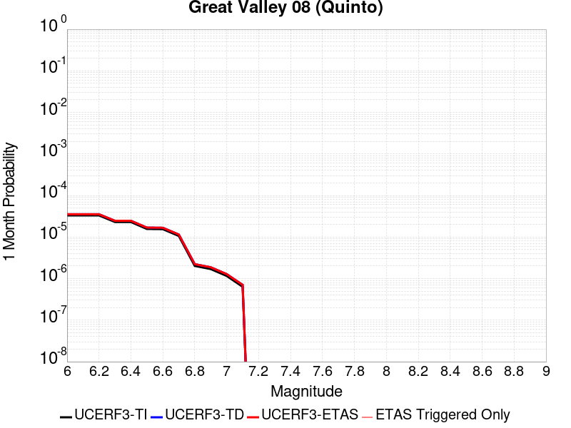 |  | 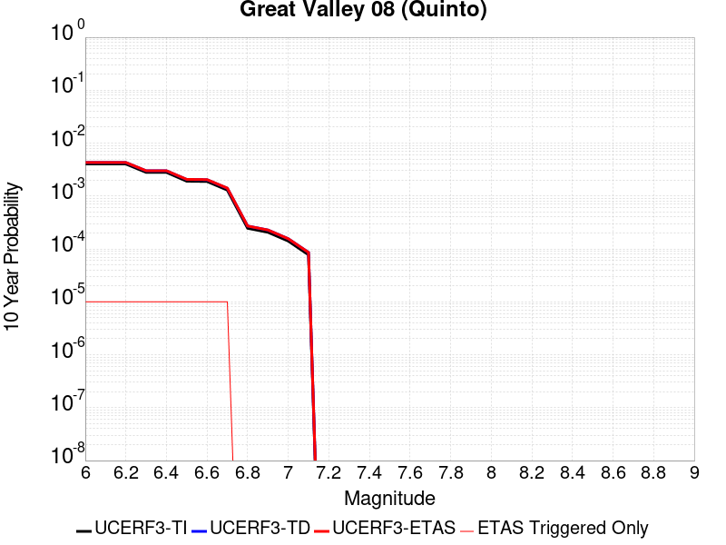 |

| Magnitude | 1 wk TI Prob | 1 wk TD Prob | 1 wk ETAS Prob | 1 wk ETAS/TD Gain | 1 wk ETAS Triggered Only | 1 mo TI Prob | 1 mo TD Prob | 1 mo ETAS Prob | 1 mo ETAS/TD Gain | 1 mo ETAS Triggered Only | 1 yr TI Prob | 1 yr TD Prob | 1 yr ETAS Prob | 1 yr ETAS/TD Gain | 1 yr ETAS Triggered Only | 10 yr TI Prob | 10 yr TD Prob | 10 yr ETAS Prob | 10 yr ETAS/TD Gain | 10 yr ETAS Triggered Only |
|-----|-----|-----|-----|-----|-----|-----|-----|-----|-----|-----|-----|-----|-----|-----|-----|-----|-----|-----|-----|-----|
| 6.0 | 7.737697E-6 | 8.253403E-6 | 8.253403E-6 | 1.0 | 0.0 | 3.3161137E-5 | 3.5371355E-5 | 3.5371355E-5 | 1.0 | 0.0 | 4.0366207E-4 | 4.3058002E-4 | 4.3058002E-4 | 1.0 | 0.0 | 0.004029296 | 0.0042993105 | 0.0043092677 | 1.002316 | 1.0E-5 |
| 6.1 | 7.737697E-6 | 8.253403E-6 | 8.253403E-6 | 1.0 | 0.0 | 3.3161137E-5 | 3.5371355E-5 | 3.5371355E-5 | 1.0 | 0.0 | 4.0366207E-4 | 4.3058002E-4 | 4.3058002E-4 | 1.0 | 0.0 | 0.004029296 | 0.0042993105 | 0.0043092677 | 1.002316 | 1.0E-5 |
| 6.2 | 7.737697E-6 | 8.253403E-6 | 8.253403E-6 | 1.0 | 0.0 | 3.3161137E-5 | 3.5371355E-5 | 3.5371355E-5 | 1.0 | 0.0 | 4.0366207E-4 | 4.3058002E-4 | 4.3058002E-4 | 1.0 | 0.0 | 0.004029296 | 0.0042993105 | 0.0043092677 | 1.002316 | 1.0E-5 |
| 6.3 | 5.374012E-6 | 5.7508414E-6 | 5.7508414E-6 | 1.0 | 0.0 | 2.3031276E-5 | 2.4646293E-5 | 2.4646293E-5 | 1.0 | 0.0 | 2.803697E-4 | 3.0003846E-4 | 3.0003846E-4 | 1.0 | 0.0 | 0.0028001624 | 0.002997427 | 0.003007397 | 1.0033262 | 1.0E-5 |
| 6.4 | 5.374012E-6 | 5.7508414E-6 | 5.7508414E-6 | 1.0 | 0.0 | 2.3031276E-5 | 2.4646293E-5 | 2.4646293E-5 | 1.0 | 0.0 | 2.803697E-4 | 3.0003846E-4 | 3.0003846E-4 | 1.0 | 0.0 | 0.0028001624 | 0.002997427 | 0.003007397 | 1.0033262 | 1.0E-5 |
| 6.5 | 3.65427E-6 | 3.9415295E-6 | 3.9415295E-6 | 1.0 | 0.0 | 1.5661062E-5 | 1.68922E-5 | 1.68922E-5 | 1.0 | 0.0 | 1.9065675E-4 | 2.0565017E-4 | 2.0565017E-4 | 1.0 | 0.0 | 0.0019049325 | 0.0020552904 | 0.0020652697 | 1.0048555 | 1.0E-5 |
| 6.6 | 3.6143538E-6 | 3.898714E-6 | 3.898714E-6 | 1.0 | 0.0 | 1.5489995E-5 | 1.6708707E-5 | 1.6708707E-5 | 1.0 | 0.0 | 1.8857437E-4 | 2.0341657E-4 | 2.0341657E-4 | 1.0 | 0.0 | 0.0018841444 | 0.0020329955 | 0.002042975 | 1.0049088 | 1.0E-5 |
| 6.7 | 2.4821015E-6 | 2.6858531E-6 | 2.6858531E-6 | 1.0 | 0.0 | 1.0637535E-5 | 1.151078E-5 | 1.151078E-5 | 1.0 | 0.0 | 1.2950429E-4 | 1.4014039E-4 | 1.4014039E-4 | 1.0 | 0.0 | 0.0012942884 | 0.0014010752 | 0.0014110612 | 1.0071274 | 1.0E-5 |
| 6.8 | 4.7110538E-7 | 5.1933733E-7 | 5.1933733E-7 | 1.0 | 0.0 | 2.0190216E-6 | 2.2257298E-6 | 2.2257298E-6 | 1.0 | 0.0 | 2.458131E-5 | 2.709794E-5 | 2.709794E-5 | 1.0 | 0.0 | 2.457859E-4 | 2.7094816E-4 | 2.7094816E-4 | 1.0 | 0.0 |
| 6.9 | 3.958685E-7 | 4.3706467E-7 | 4.3706467E-7 | 1.0 | 0.0 | 1.6965782E-6 | 1.8731331E-6 | 1.8731331E-6 | 1.0 | 0.0 | 2.0655643E-5 | 2.2805172E-5 | 2.2805172E-5 | 1.0 | 0.0 | 2.0653724E-4 | 2.2802995E-4 | 2.2802995E-4 | 1.0 | 0.0 |
| 7.0 | 2.70294E-7 | 2.992213E-7 | 2.992213E-7 | 1.0 | 0.0 | 1.1584025E-6 | 1.2823765E-6 | 1.2823765E-6 | 1.0 | 0.0 | 1.4103458E-5 | 1.5612835E-5 | 1.5612835E-5 | 1.0 | 0.0 | 1.4102564E-4 | 1.5611867E-4 | 1.5611867E-4 | 1.0 | 0.0 |
| 7.1 | 1.4828602E-7 | 1.6470315E-7 | 1.6470315E-7 | 1.0 | 0.0 | 6.3551136E-7 | 7.058705E-7 | 7.058705E-7 | 1.0 | 0.0 | 7.737323E-6 | 8.593948E-6 | 8.593948E-6 | 1.0 | 0.0 | 7.737054E-5 | 8.5936954E-5 | 8.5936954E-5 | 1.0 | 0.0 |

## Big Pine (East)
*[(top)](#table-of-contents)*

| 1 Week | 1 Month | 1 Year | 10 Year |
|-----|-----|-----|-----|
|  |  |  |  |

| Magnitude | 1 wk TI Prob | 1 wk TD Prob | 1 wk ETAS Prob | 1 wk ETAS/TD Gain | 1 wk ETAS Triggered Only | 1 mo TI Prob | 1 mo TD Prob | 1 mo ETAS Prob | 1 mo ETAS/TD Gain | 1 mo ETAS Triggered Only | 1 yr TI Prob | 1 yr TD Prob | 1 yr ETAS Prob | 1 yr ETAS/TD Gain | 1 yr ETAS Triggered Only | 10 yr TI Prob | 10 yr TD Prob | 10 yr ETAS Prob | 10 yr ETAS/TD Gain | 10 yr ETAS Triggered Only |
|-----|-----|-----|-----|-----|-----|-----|-----|-----|-----|-----|-----|-----|-----|-----|-----|-----|-----|-----|-----|-----|
| 6.0 | 9.916913E-6 | 1.2823549E-5 | 1.2823549E-5 | 1.0 | 0.0 | 4.250036E-5 | 5.4957032E-5 | 5.4957032E-5 | 1.0 | 0.0 | 5.173191E-4 | 6.6891854E-4 | 6.6891854E-4 | 1.0 | 0.0 | 0.0051611643 | 0.0066737933 | 0.0066837263 | 1.0014884 | 1.0E-5 |
| 6.1 | 9.916913E-6 | 1.2823549E-5 | 1.2823549E-5 | 1.0 | 0.0 | 4.250036E-5 | 5.4957032E-5 | 5.4957032E-5 | 1.0 | 0.0 | 5.173191E-4 | 6.6891854E-4 | 6.6891854E-4 | 1.0 | 0.0 | 0.0051611643 | 0.0066737933 | 0.0066837263 | 1.0014884 | 1.0E-5 |
| 6.2 | 9.916913E-6 | 1.2823549E-5 | 1.2823549E-5 | 1.0 | 0.0 | 4.250036E-5 | 5.4957032E-5 | 5.4957032E-5 | 1.0 | 0.0 | 5.173191E-4 | 6.6891854E-4 | 6.6891854E-4 | 1.0 | 0.0 | 0.0051611643 | 0.0066737933 | 0.0066837263 | 1.0014884 | 1.0E-5 |
| 6.3 | 5.479711E-6 | 8.119328E-6 | 8.119328E-6 | 1.0 | 0.0 | 2.3484265E-5 | 3.4796674E-5 | 3.4796674E-5 | 1.0 | 0.0 | 2.858834E-4 | 4.2357034E-4 | 4.2357034E-4 | 1.0 | 0.0 | 0.0028551589 | 0.0042305063 | 0.004240464 | 1.0023538 | 1.0E-5 |
| 6.4 | 5.465009E-6 | 8.1036205E-6 | 8.1036205E-6 | 1.0 | 0.0 | 2.3421257E-5 | 3.4729357E-5 | 3.4729357E-5 | 1.0 | 0.0 | 2.851165E-4 | 4.227511E-4 | 4.227511E-4 | 1.0 | 0.0 | 0.0028475097 | 0.004222345 | 0.004232303 | 1.0023583 | 1.0E-5 |
| 6.5 | 4.826767E-6 | 7.4286513E-6 | 7.4286513E-6 | 1.0 | 0.0 | 2.068598E-5 | 3.1836706E-5 | 3.1836706E-5 | 1.0 | 0.0 | 2.518227E-4 | 3.875457E-4 | 3.875457E-4 | 1.0 | 0.0 | 0.0025153751 | 0.003871533 | 0.0038814943 | 1.002573 | 1.0E-5 |
| 6.6 | 4.3146847E-6 | 6.888568E-6 | 6.888568E-6 | 1.0 | 0.0 | 1.8491375E-5 | 2.9522113E-5 | 2.9522113E-5 | 1.0 | 0.0 | 2.2510924E-4 | 3.5937488E-4 | 3.5937488E-4 | 1.0 | 0.0 | 0.0022488134 | 0.0035907393 | 0.0036007033 | 1.002775 | 1.0E-5 |
| 6.7 | 3.6968106E-6 | 6.0014227E-6 | 6.0014227E-6 | 1.0 | 0.0 | 1.5843378E-5 | 2.572014E-5 | 2.572014E-5 | 1.0 | 0.0 | 1.9287605E-4 | 3.130992E-4 | 3.130992E-4 | 1.0 | 0.0 | 0.0019270873 | 0.0031292925 | 0.0031292925 | 1.0 | 0.0 |
| 6.8 | 3.4671132E-6 | 5.7079696E-6 | 5.7079696E-6 | 1.0 | 0.0 | 1.4858972E-5 | 2.4462506E-5 | 2.4462506E-5 | 1.0 | 0.0 | 1.8089297E-4 | 2.9779176E-4 | 2.9779176E-4 | 1.0 | 0.0 | 0.0018074579 | 0.0029766299 | 0.0029766299 | 1.0 | 0.0 |
| 6.9 | 2.7686972E-6 | 4.8305756E-6 | 4.8305756E-6 | 1.0 | 0.0 | 1.1865792E-5 | 2.0702308E-5 | 2.0702308E-5 | 1.0 | 0.0 | 1.4445644E-4 | 2.520222E-4 | 2.520222E-4 | 1.0 | 0.0 | 0.0014436257 | 0.0025199987 | 0.0025199987 | 1.0 | 0.0 |
| 7.0 | 2.1472624E-6 | 3.989905E-6 | 3.989905E-6 | 1.0 | 0.0 | 9.20252E-6 | 1.7099484E-5 | 1.7099484E-5 | 1.0 | 0.0 | 1.12034926E-4 | 2.0816686E-4 | 2.0816686E-4 | 1.0 | 0.0 | 0.0011197845 | 0.0020823237 | 0.0020823237 | 1.0 | 0.0 |
| 7.1 | 1.7018335E-6 | 3.3492713E-6 | 3.3492713E-6 | 1.0 | 0.0 | 7.293552E-6 | 1.4353943E-5 | 1.4353943E-5 | 1.0 | 0.0 | 8.879537E-5 | 1.747456E-4 | 1.747456E-4 | 1.0 | 0.0 | 8.87599E-4 | 0.001748655 | 0.001748655 | 1.0 | 0.0 |
| 7.2 | 1.25603E-6 | 2.7986327E-6 | 2.7986327E-6 | 1.0 | 0.0 | 5.3829745E-6 | 1.1994086E-5 | 1.1994086E-5 | 1.0 | 0.0 | 6.553574E-5 | 1.4601844E-4 | 1.4601844E-4 | 1.0 | 0.0 | 6.551642E-4 | 0.0014617738 | 0.0014617738 | 1.0 | 0.0 |
| 7.3 | 1.112297E-6 | 2.6142536E-6 | 2.6142536E-6 | 1.0 | 0.0 | 4.7669787E-6 | 1.1203897E-5 | 1.1203897E-5 | 1.0 | 0.0 | 5.803642E-5 | 1.3639913E-4 | 1.3639913E-4 | 1.0 | 0.0 | 5.802127E-4 | 0.0013655405 | 0.0013655405 | 1.0 | 0.0 |
| 7.4 | 1.0137181E-6 | 2.487248E-6 | 2.487248E-6 | 1.0 | 0.0 | 4.3444993E-6 | 1.0659592E-5 | 1.0659592E-5 | 1.0 | 0.0 | 5.2892992E-5 | 1.29773E-4 | 1.29773E-4 | 1.0 | 0.0 | 5.288041E-4 | 0.0012991275 | 0.0012991275 | 1.0 | 0.0 |
| 7.5 | 9.598608E-7 | 2.4107944E-6 | 2.4107944E-6 | 1.0 | 0.0 | 4.1136827E-6 | 1.0331937E-5 | 1.0331937E-5 | 1.0 | 0.0 | 5.0082934E-5 | 1.2578428E-4 | 1.2578428E-4 | 1.0 | 0.0 | 5.007165E-4 | 0.0012590965 | 0.0012590965 | 1.0 | 0.0 |
| 7.6 | 7.929459E-7 | 2.048082E-6 | 2.048082E-6 | 1.0 | 0.0 | 3.3983351E-6 | 8.777466E-6 | 8.777466E-6 | 1.0 | 0.0 | 4.1373947E-5 | 1.06860585E-4 | 1.06860585E-4 | 1.0 | 0.0 | 4.1366243E-4 | 0.0010701608 | 0.0010701608 | 1.0 | 0.0 |
| 7.7 | 4.155788E-7 | 1.1628391E-6 | 1.1628391E-6 | 1.0 | 0.0 | 1.7810507E-6 | 4.9835867E-6 | 4.9835867E-6 | 1.0 | 0.0 | 2.1684076E-5 | 6.0673523E-5 | 6.0673523E-5 | 1.0 | 0.0 | 2.1681961E-4 | 6.0976873E-4 | 6.0976873E-4 | 1.0 | 0.0 |
| 7.8 | 1.14666925E-7 | 2.5971E-7 | 2.5971E-7 | 1.0 | 0.0 | 4.914296E-7 | 1.1130423E-6 | 1.1130423E-6 | 1.0 | 0.0 | 5.9831386E-6 | 1.3551211E-5 | 1.3551211E-5 | 1.0 | 0.0 | 5.9829777E-5 | 1.3661168E-4 | 1.3661168E-4 | 1.0 | 0.0 |
| 7.9 | 2.9231824E-8 | 4.154436E-8 | 4.154436E-8 | 1.0 | 0.0 | 1.2527924E-7 | 1.7804724E-7 | 1.7804724E-7 | 1.0 | 0.0 | 1.5252737E-6 | 2.1677233E-6 | 2.1677233E-6 | 1.0 | 0.0 | 1.5252632E-5 | 2.202209E-5 | 2.202209E-5 | 1.0 | 0.0 |

## Ozena
*[(top)](#table-of-contents)*

| 1 Week | 1 Month | 1 Year | 10 Year |
|-----|-----|-----|-----|
|  |  |  |  |

| Magnitude | 1 wk TI Prob | 1 wk TD Prob | 1 wk ETAS Prob | 1 wk ETAS/TD Gain | 1 wk ETAS Triggered Only | 1 mo TI Prob | 1 mo TD Prob | 1 mo ETAS Prob | 1 mo ETAS/TD Gain | 1 mo ETAS Triggered Only | 1 yr TI Prob | 1 yr TD Prob | 1 yr ETAS Prob | 1 yr ETAS/TD Gain | 1 yr ETAS Triggered Only | 10 yr TI Prob | 10 yr TD Prob | 10 yr ETAS Prob | 10 yr ETAS/TD Gain | 10 yr ETAS Triggered Only |
|-----|-----|-----|-----|-----|-----|-----|-----|-----|-----|-----|-----|-----|-----|-----|-----|-----|-----|-----|-----|-----|
| 6.0 | 1.4377547E-6 | 1.4513874E-6 | 1.4513874E-6 | 1.0 | 0.0 | 6.161791E-6 | 6.2202184E-6 | 6.2202184E-6 | 1.0 | 0.0 | 7.5017226E-5 | 7.57288E-5 | 7.57288E-5 | 1.0 | 0.0 | 7.4991904E-4 | 7.570566E-4 | 7.67049E-4 | 1.0131991 | 1.0E-5 |
| 6.1 | 1.4377547E-6 | 1.4513874E-6 | 1.4513874E-6 | 1.0 | 0.0 | 6.161791E-6 | 6.2202184E-6 | 6.2202184E-6 | 1.0 | 0.0 | 7.5017226E-5 | 7.57288E-5 | 7.57288E-5 | 1.0 | 0.0 | 7.4991904E-4 | 7.570566E-4 | 7.67049E-4 | 1.0131991 | 1.0E-5 |
| 6.2 | 1.4377547E-6 | 1.4513874E-6 | 1.4513874E-6 | 1.0 | 0.0 | 6.161791E-6 | 6.2202184E-6 | 6.2202184E-6 | 1.0 | 0.0 | 7.5017226E-5 | 7.57288E-5 | 7.57288E-5 | 1.0 | 0.0 | 7.4991904E-4 | 7.570566E-4 | 7.67049E-4 | 1.0131991 | 1.0E-5 |
| 6.3 | 1.4377547E-6 | 1.4513874E-6 | 1.4513874E-6 | 1.0 | 0.0 | 6.161791E-6 | 6.2202184E-6 | 6.2202184E-6 | 1.0 | 0.0 | 7.5017226E-5 | 7.57288E-5 | 7.57288E-5 | 1.0 | 0.0 | 7.4991904E-4 | 7.570566E-4 | 7.67049E-4 | 1.0131991 | 1.0E-5 |
| 6.4 | 1.4377547E-6 | 1.4513874E-6 | 1.4513874E-6 | 1.0 | 0.0 | 6.161791E-6 | 6.2202184E-6 | 6.2202184E-6 | 1.0 | 0.0 | 7.5017226E-5 | 7.57288E-5 | 7.57288E-5 | 1.0 | 0.0 | 7.4991904E-4 | 7.570566E-4 | 7.67049E-4 | 1.0131991 | 1.0E-5 |
| 6.5 | 1.4377547E-6 | 1.4513874E-6 | 1.4513874E-6 | 1.0 | 0.0 | 6.161791E-6 | 6.2202184E-6 | 6.2202184E-6 | 1.0 | 0.0 | 7.5017226E-5 | 7.57288E-5 | 7.57288E-5 | 1.0 | 0.0 | 7.4991904E-4 | 7.570566E-4 | 7.67049E-4 | 1.0131991 | 1.0E-5 |
| 6.6 | 1.4377547E-6 | 1.4513874E-6 | 1.4513874E-6 | 1.0 | 0.0 | 6.161791E-6 | 6.2202184E-6 | 6.2202184E-6 | 1.0 | 0.0 | 7.5017226E-5 | 7.57288E-5 | 7.57288E-5 | 1.0 | 0.0 | 7.4991904E-4 | 7.570566E-4 | 7.67049E-4 | 1.0131991 | 1.0E-5 |
| 6.7 | 1.4377547E-6 | 1.4513874E-6 | 1.4513874E-6 | 1.0 | 0.0 | 6.161791E-6 | 6.2202184E-6 | 6.2202184E-6 | 1.0 | 0.0 | 7.5017226E-5 | 7.57288E-5 | 7.57288E-5 | 1.0 | 0.0 | 7.4991904E-4 | 7.570566E-4 | 7.67049E-4 | 1.0131991 | 1.0E-5 |
| 6.8 | 9.223257E-7 | 9.317687E-7 | 9.317687E-7 | 1.0 | 0.0 | 3.9528186E-6 | 3.9932884E-6 | 3.9932884E-6 | 1.0 | 0.0 | 4.81245E-5 | 4.8617243E-5 | 4.8617243E-5 | 1.0 | 0.0 | 4.811408E-4 | 4.8607012E-4 | 4.9606524E-4 | 1.0205631 | 1.0E-5 |
| 6.9 | 9.141515E-7 | 9.235434E-7 | 9.235434E-7 | 1.0 | 0.0 | 3.917786E-6 | 3.9580373E-6 | 3.9580373E-6 | 1.0 | 0.0 | 4.7698002E-5 | 4.8188078E-5 | 4.8188078E-5 | 1.0 | 0.0 | 4.7687767E-4 | 4.8178033E-4 | 4.917755E-4 | 1.0207464 | 1.0E-5 |
| 7.0 | 8.767648E-7 | 8.858638E-7 | 8.858638E-7 | 1.0 | 0.0 | 3.757558E-6 | 3.7965538E-6 | 3.7965538E-6 | 1.0 | 0.0 | 4.5747307E-5 | 4.6222103E-5 | 4.6222103E-5 | 1.0 | 0.0 | 4.5737892E-4 | 4.621288E-4 | 4.721242E-4 | 1.021629 | 1.0E-5 |
| 7.1 | 8.199402E-7 | 8.2854564E-7 | 8.2854564E-7 | 1.0 | 0.0 | 3.5140247E-6 | 3.5509051E-6 | 3.5509051E-6 | 1.0 | 0.0 | 4.2782412E-5 | 4.3231452E-5 | 4.3231452E-5 | 1.0 | 0.0 | 4.2774176E-4 | 4.3223414E-4 | 4.422298E-4 | 1.0231256 | 1.0E-5 |
| 7.2 | 7.38705E-7 | 7.464314E-7 | 7.464314E-7 | 1.0 | 0.0 | 3.1658747E-6 | 3.198988E-6 | 3.198988E-6 | 1.0 | 0.0 | 3.8543843E-5 | 3.894702E-5 | 3.894702E-5 | 1.0 | 0.0 | 3.853716E-4 | 3.8940544E-4 | 3.9940156E-4 | 1.0256702 | 1.0E-5 |
| 7.3 | 6.490017E-7 | 6.5578473E-7 | 6.5578473E-7 | 1.0 | 0.0 | 2.7814328E-6 | 2.810503E-6 | 2.810503E-6 | 1.0 | 0.0 | 3.386342E-5 | 3.4217373E-5 | 3.4217373E-5 | 1.0 | 0.0 | 3.3858258E-4 | 3.421244E-4 | 3.52121E-4 | 1.0292192 | 1.0E-5 |
| 7.4 | 5.346736E-7 | 5.402298E-7 | 5.402298E-7 | 1.0 | 0.0 | 2.291456E-6 | 2.3152686E-6 | 2.3152686E-6 | 1.0 | 0.0 | 2.789812E-5 | 2.8188062E-5 | 2.8188062E-5 | 1.0 | 0.0 | 2.789462E-4 | 2.818479E-4 | 2.818479E-4 | 1.0 | 0.0 |
| 7.5 | 2.939325E-7 | 2.966624E-7 | 2.966624E-7 | 1.0 | 0.0 | 1.25971E-6 | 1.2714098E-6 | 1.2714098E-6 | 1.0 | 0.0 | 1.5336862E-5 | 1.547932E-5 | 1.547932E-5 | 1.0 | 0.0 | 1.5335804E-4 | 1.5478404E-4 | 1.5478404E-4 | 1.0 | 0.0 |
| 7.6 | 1.4151905E-7 | 1.4253332E-7 | 1.4253332E-7 | 1.0 | 0.0 | 6.065101E-7 | 6.10857E-7 | 6.10857E-7 | 1.0 | 0.0 | 7.3842357E-6 | 7.437159E-6 | 7.437159E-6 | 1.0 | 0.0 | 7.38399E-5 | 7.436918E-5 | 7.436918E-5 | 1.0 | 0.0 |
| 7.7 | 4.4957577E-8 | 4.525244E-8 | 4.525244E-8 | 1.0 | 0.0 | 1.9267533E-7 | 1.9393902E-7 | 1.9393902E-7 | 1.0 | 0.0 | 2.3458194E-6 | 2.3612051E-6 | 2.3612051E-6 | 1.0 | 0.0 | 2.3457947E-5 | 2.3611809E-5 | 2.3611809E-5 | 1.0 | 0.0 |
| 7.8 | 5.9993255E-9 | 6.041325E-9 | 6.041325E-9 | 1.0 | 0.0 | 2.5711394E-8 | 2.5891394E-8 | 2.5891394E-8 | 1.0 | 0.0 | 3.1303617E-7 | 3.1522768E-7 | 3.1522768E-7 | 1.0 | 0.0 | 3.1303573E-6 | 3.1522734E-6 | 3.1522734E-6 | 1.0 | 0.0 |

## Davis Creek
*[(top)](#table-of-contents)*

| 1 Week | 1 Month | 1 Year | 10 Year |
|-----|-----|-----|-----|
|  |  |  | 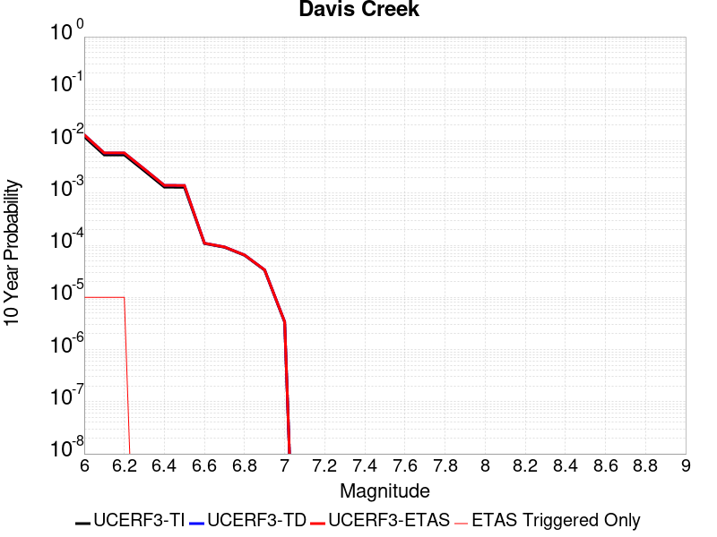 |

| Magnitude | 1 wk TI Prob | 1 wk TD Prob | 1 wk ETAS Prob | 1 wk ETAS/TD Gain | 1 wk ETAS Triggered Only | 1 mo TI Prob | 1 mo TD Prob | 1 mo ETAS Prob | 1 mo ETAS/TD Gain | 1 mo ETAS Triggered Only | 1 yr TI Prob | 1 yr TD Prob | 1 yr ETAS Prob | 1 yr ETAS/TD Gain | 1 yr ETAS Triggered Only | 10 yr TI Prob | 10 yr TD Prob | 10 yr ETAS Prob | 10 yr ETAS/TD Gain | 10 yr ETAS Triggered Only |
|-----|-----|-----|-----|-----|-----|-----|-----|-----|-----|-----|-----|-----|-----|-----|-----|-----|-----|-----|-----|-----|
| 6.0 | 2.331472E-5 | 2.5418734E-5 | 2.5418734E-5 | 1.0 | 0.0 | 9.99164E-5 | 1.0893356E-4 | 1.1893247E-4 | 1.0917891 | 1.0E-5 | 0.0012158032 | 0.0013255776 | 0.0013355644 | 1.0075339 | 1.0E-5 | 0.01209173 | 0.013188489 | 0.013198357 | 1.0007483 | 1.0E-5 |
| 6.1 | 1.0407654E-5 | 1.1317643E-5 | 1.1317643E-5 | 1.0 | 0.0 | 4.4603472E-5 | 4.8503436E-5 | 5.8502952E-5 | 1.2061609 | 1.0E-5 | 5.4291193E-4 | 5.9039646E-4 | 6.0039054E-4 | 1.0169277 | 1.0E-5 | 0.0054158745 | 0.005890952 | 0.0059008934 | 1.0016875 | 1.0E-5 |
| 6.2 | 1.0407654E-5 | 1.1317643E-5 | 1.1317643E-5 | 1.0 | 0.0 | 4.4603472E-5 | 4.8503436E-5 | 5.8502952E-5 | 1.2061609 | 1.0E-5 | 5.4291193E-4 | 5.9039646E-4 | 6.0039054E-4 | 1.0169277 | 1.0E-5 | 0.0054158745 | 0.005890952 | 0.0059008934 | 1.0016875 | 1.0E-5 |
| 6.3 | 5.1323277E-6 | 5.5688706E-6 | 5.5688706E-6 | 1.0 | 0.0 | 2.1995505E-5 | 2.386642E-5 | 2.386642E-5 | 1.0 | 0.0 | 2.6776237E-4 | 2.905435E-4 | 2.905435E-4 | 1.0 | 0.0 | 0.0026743996 | 0.0029024829 | 0.0029024829 | 1.0 | 0.0 |
| 6.4 | 2.4985154E-6 | 2.7046867E-6 | 2.7046867E-6 | 1.0 | 0.0 | 1.07078795E-5 | 1.1591484E-5 | 1.1591484E-5 | 1.0 | 0.0 | 1.3036063E-4 | 1.4112079E-4 | 1.4112079E-4 | 1.0 | 0.0 | 0.0013028418 | 0.0014106665 | 0.0014106665 | 1.0 | 0.0 |
| 6.5 | 2.4846438E-6 | 2.690621E-6 | 2.690621E-6 | 1.0 | 0.0 | 1.064843E-5 | 1.1531201E-5 | 1.1531201E-5 | 1.0 | 0.0 | 1.2963692E-4 | 1.4038695E-4 | 1.4038695E-4 | 1.0 | 0.0 | 0.0012956132 | 0.0014033375 | 0.0014033375 | 1.0 | 0.0 |
| 6.6 | 2.072566E-7 | 2.1018283E-7 | 2.1018283E-7 | 1.0 | 0.0 | 8.882423E-7 | 9.007833E-7 | 9.007833E-7 | 1.0 | 0.0 | 1.0814296E-5 | 1.0966984E-5 | 1.0966984E-5 | 1.0 | 0.0 | 1.081377E-4 | 1.096646E-4 | 1.096646E-4 | 1.0 | 0.0 |
| 6.7 | 1.7544528E-7 | 1.7790991E-7 | 1.7790991E-7 | 1.0 | 0.0 | 7.5190815E-7 | 7.6247085E-7 | 7.6247085E-7 | 1.0 | 0.0 | 9.154443E-6 | 9.283045E-6 | 9.283045E-6 | 1.0 | 0.0 | 9.1540656E-5 | 9.2826725E-5 | 9.2826725E-5 | 1.0 | 0.0 |
| 6.8 | 1.2320395E-7 | 1.2481246E-7 | 1.2481246E-7 | 1.0 | 0.0 | 5.280168E-7 | 5.3491044E-7 | 5.3491044E-7 | 1.0 | 0.0 | 6.428586E-6 | 6.512516E-6 | 6.512516E-6 | 1.0 | 0.0 | 6.4284E-5 | 6.5123364E-5 | 6.5123364E-5 | 1.0 | 0.0 |
| 6.9 | 6.399997E-8 | 6.4861155E-8 | 6.4861155E-8 | 1.0 | 0.0 | 2.7428555E-7 | 2.7797637E-7 | 2.7797637E-7 | 1.0 | 0.0 | 3.3394215E-6 | 3.3843576E-6 | 3.3843576E-6 | 1.0 | 0.0 | 3.3393713E-5 | 3.3843124E-5 | 3.3843124E-5 | 1.0 | 0.0 |
| 7.0 | 6.4455685E-9 | 6.5353243E-9 | 6.5353243E-9 | 1.0 | 0.0 | 2.7623864E-8 | 2.8008532E-8 | 2.8008532E-8 | 1.0 | 0.0 | 3.3632048E-7 | 3.410039E-7 | 3.410039E-7 | 1.0 | 0.0 | 3.3631998E-6 | 3.410039E-6 | 3.410039E-6 | 1.0 | 0.0 |

## Clamshell-Sawpit
*[(top)](#table-of-contents)*

| 1 Week | 1 Month | 1 Year | 10 Year |
|-----|-----|-----|-----|
| 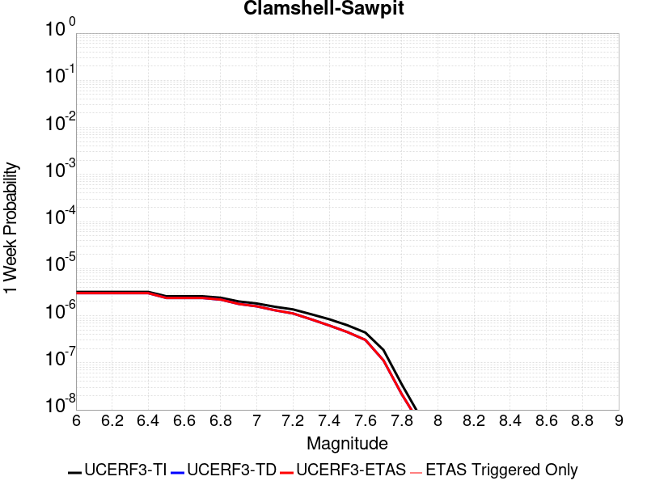 |  |  |  |

| Magnitude | 1 wk TI Prob | 1 wk TD Prob | 1 wk ETAS Prob | 1 wk ETAS/TD Gain | 1 wk ETAS Triggered Only | 1 mo TI Prob | 1 mo TD Prob | 1 mo ETAS Prob | 1 mo ETAS/TD Gain | 1 mo ETAS Triggered Only | 1 yr TI Prob | 1 yr TD Prob | 1 yr ETAS Prob | 1 yr ETAS/TD Gain | 1 yr ETAS Triggered Only | 10 yr TI Prob | 10 yr TD Prob | 10 yr ETAS Prob | 10 yr ETAS/TD Gain | 10 yr ETAS Triggered Only |
|-----|-----|-----|-----|-----|-----|-----|-----|-----|-----|-----|-----|-----|-----|-----|-----|-----|-----|-----|-----|-----|
| 6.0 | 3.202998E-6 | 3.0128656E-6 | 3.0128656E-6 | 1.0 | 0.0 | 1.3727062E-5 | 1.2912222E-5 | 1.2912222E-5 | 1.0 | 0.0 | 1.6711417E-4 | 1.5719577E-4 | 1.6719419E-4 | 1.063605 | 1.0E-5 | 0.0016698855 | 0.0015709251 | 0.0015809094 | 1.0063556 | 1.0E-5 |
| 6.1 | 3.202998E-6 | 3.0128656E-6 | 3.0128656E-6 | 1.0 | 0.0 | 1.3727062E-5 | 1.2912222E-5 | 1.2912222E-5 | 1.0 | 0.0 | 1.6711417E-4 | 1.5719577E-4 | 1.6719419E-4 | 1.063605 | 1.0E-5 | 0.0016698855 | 0.0015709251 | 0.0015809094 | 1.0063556 | 1.0E-5 |
| 6.2 | 3.202998E-6 | 3.0128656E-6 | 3.0128656E-6 | 1.0 | 0.0 | 1.3727062E-5 | 1.2912222E-5 | 1.2912222E-5 | 1.0 | 0.0 | 1.6711417E-4 | 1.5719577E-4 | 1.6719419E-4 | 1.063605 | 1.0E-5 | 0.0016698855 | 0.0015709251 | 0.0015809094 | 1.0063556 | 1.0E-5 |
| 6.3 | 3.202998E-6 | 3.0128656E-6 | 3.0128656E-6 | 1.0 | 0.0 | 1.3727062E-5 | 1.2912222E-5 | 1.2912222E-5 | 1.0 | 0.0 | 1.6711417E-4 | 1.5719577E-4 | 1.6719419E-4 | 1.063605 | 1.0E-5 | 0.0016698855 | 0.0015709251 | 0.0015809094 | 1.0063556 | 1.0E-5 |
| 6.4 | 3.202998E-6 | 3.0128656E-6 | 3.0128656E-6 | 1.0 | 0.0 | 1.3727062E-5 | 1.2912222E-5 | 1.2912222E-5 | 1.0 | 0.0 | 1.6711417E-4 | 1.5719577E-4 | 1.6719419E-4 | 1.063605 | 1.0E-5 | 0.0016698855 | 0.0015709251 | 0.0015809094 | 1.0063556 | 1.0E-5 |
| 6.5 | 2.5862723E-6 | 2.3808657E-6 | 2.3808657E-6 | 1.0 | 0.0 | 1.1083977E-5 | 1.0203672E-5 | 1.0203672E-5 | 1.0 | 0.0 | 1.3493907E-4 | 1.2422293E-4 | 1.2422293E-4 | 1.0 | 0.0 | 0.0013485716 | 0.0012415652 | 0.0012415652 | 1.0 | 0.0 |
| 6.6 | 2.5862723E-6 | 2.3808657E-6 | 2.3808657E-6 | 1.0 | 0.0 | 1.1083977E-5 | 1.0203672E-5 | 1.0203672E-5 | 1.0 | 0.0 | 1.3493907E-4 | 1.2422293E-4 | 1.2422293E-4 | 1.0 | 0.0 | 0.0013485716 | 0.0012415652 | 0.0012415652 | 1.0 | 0.0 |
| 6.7 | 2.5862723E-6 | 2.3808657E-6 | 2.3808657E-6 | 1.0 | 0.0 | 1.1083977E-5 | 1.0203672E-5 | 1.0203672E-5 | 1.0 | 0.0 | 1.3493907E-4 | 1.2422293E-4 | 1.2422293E-4 | 1.0 | 0.0 | 0.0013485716 | 0.0012415652 | 0.0012415652 | 1.0 | 0.0 |
| 6.8 | 2.4098806E-6 | 2.1978171E-6 | 2.1978171E-6 | 1.0 | 0.0 | 1.0328019E-5 | 9.419184E-6 | 9.419184E-6 | 1.0 | 0.0 | 1.2573638E-4 | 1.14672795E-4 | 1.14672795E-4 | 1.0 | 0.0 | 0.0012566525 | 0.0011461629 | 0.0011461629 | 1.0 | 0.0 |
| 6.9 | 2.0073985E-6 | 1.7784995E-6 | 1.7784995E-6 | 1.0 | 0.0 | 8.603109E-6 | 7.622119E-6 | 7.622119E-6 | 1.0 | 0.0 | 1.0473781E-4 | 9.279547E-5 | 9.279547E-5 | 1.0 | 0.0 | 0.0010468846 | 9.2757907E-4 | 9.2757907E-4 | 1.0 | 0.0 |
| 7.0 | 1.8166766E-6 | 1.5807794E-6 | 1.5807794E-6 | 1.0 | 0.0 | 7.785734E-6 | 6.774752E-6 | 6.774752E-6 | 1.0 | 0.0 | 9.478718E-5 | 8.2479586E-5 | 8.2479586E-5 | 1.0 | 0.0 | 9.4746763E-4 | 8.2449976E-4 | 8.2449976E-4 | 1.0 | 0.0 |
| 7.1 | 1.5471421E-6 | 1.3053569E-6 | 1.3053569E-6 | 1.0 | 0.0 | 6.6305925E-6 | 5.594375E-6 | 5.594375E-6 | 1.0 | 0.0 | 8.072447E-5 | 6.8109446E-5 | 6.8109446E-5 | 1.0 | 0.0 | 8.0695155E-4 | 6.8089116E-4 | 6.8089116E-4 | 1.0 | 0.0 |
| 7.2 | 1.3608037E-6 | 1.1153987E-6 | 1.1153987E-6 | 1.0 | 0.0 | 5.8320024E-6 | 4.780272E-6 | 4.780272E-6 | 1.0 | 0.0 | 7.1002316E-5 | 5.81983E-5 | 5.81983E-5 | 1.0 | 0.0 | 7.097964E-4 | 5.818352E-4 | 5.818352E-4 | 1.0 | 0.0 |
| 7.3 | 1.0749634E-6 | 8.384694E-7 | 8.384694E-7 | 1.0 | 0.0 | 4.6069777E-6 | 3.5934356E-6 | 3.5934356E-6 | 1.0 | 0.0 | 5.608851E-5 | 4.3749227E-5 | 4.3749227E-5 | 1.0 | 0.0 | 5.6074356E-4 | 4.3740898E-4 | 4.3740898E-4 | 1.0 | 0.0 |
| 7.4 | 8.416856E-7 | 6.2004017E-7 | 6.2004017E-7 | 1.0 | 0.0 | 3.607219E-6 | 2.6573125E-6 | 2.6573125E-6 | 1.0 | 0.0 | 4.3917007E-5 | 3.235232E-5 | 3.235232E-5 | 1.0 | 0.0 | 4.390833E-4 | 3.2347807E-4 | 3.2347807E-4 | 1.0 | 0.0 |
| 7.5 | 6.2779594E-7 | 4.4971804E-7 | 4.4971804E-7 | 1.0 | 0.0 | 2.6905511E-6 | 1.9273618E-6 | 1.9273618E-6 | 1.0 | 0.0 | 3.275697E-5 | 2.3465396E-5 | 2.3465396E-5 | 1.0 | 0.0 | 3.275214E-4 | 2.3463106E-4 | 2.3463106E-4 | 1.0 | 0.0 |
| 7.6 | 4.3822078E-7 | 3.0597857E-7 | 3.0597857E-7 | 1.0 | 0.0 | 1.8780877E-6 | 1.3113362E-6 | 1.3113362E-6 | 1.0 | 0.0 | 2.2865479E-5 | 1.5965417E-5 | 1.5965417E-5 | 1.0 | 0.0 | 2.2863125E-4 | 1.5964425E-4 | 1.5964425E-4 | 1.0 | 0.0 |
| 7.7 | 1.8704569E-7 | 1.123948E-7 | 1.123948E-7 | 1.0 | 0.0 | 8.0162414E-7 | 4.816919E-7 | 4.816919E-7 | 1.0 | 0.0 | 9.75973E-6 | 5.8645837E-6 | 5.8645837E-6 | 1.0 | 0.0 | 9.7593016E-5 | 5.8644353E-5 | 5.8644353E-5 | 1.0 | 0.0 |
| 7.8 | 3.5378733E-8 | 2.1839636E-8 | 2.1839636E-8 | 1.0 | 0.0 | 1.5162313E-7 | 9.359844E-8 | 9.359844E-8 | 1.0 | 0.0 | 1.84601E-6 | 1.1395604E-6 | 1.1395604E-6 | 1.0 | 0.0 | 1.8459947E-5 | 1.1395548E-5 | 1.1395548E-5 | 1.0 | 0.0 |
| 7.9 | 7.504945E-9 | 5.192497E-9 | 5.192497E-9 | 1.0 | 0.0 | 3.2164053E-8 | 2.2253559E-8 | 2.2253559E-8 | 1.0 | 0.0 | 3.9159727E-7 | 2.7093705E-7 | 2.7093705E-7 | 1.0 | 0.0 | 3.915966E-6 | 2.709368E-6 | 2.709368E-6 | 1.0 | 0.0 |
| 8.0 | 1.6554036E-10 | 1.4181756E-10 | 1.4181756E-10 | 1.0 | 0.0 | 7.0945894E-10 | 6.077895E-10 | 6.077895E-10 | 1.0 | 0.0 | 8.637662E-9 | 7.399838E-9 | 7.399838E-9 | 1.0 | 0.0 | 8.6376616E-8 | 7.399838E-8 | 7.399838E-8 | 1.0 | 0.0 |

## Channel Islands Western Deep Ramp
*[(top)](#table-of-contents)*

| 1 Week | 1 Month | 1 Year | 10 Year |
|-----|-----|-----|-----|
|  |  |  | 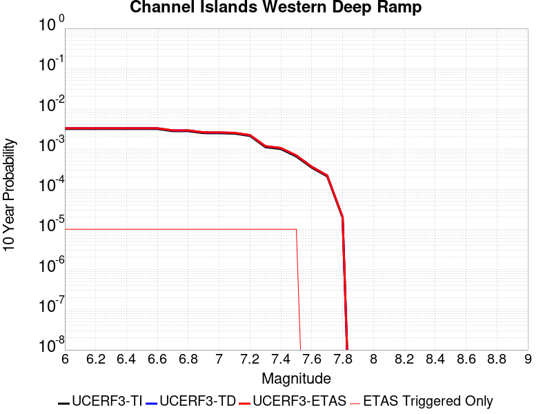 |

| Magnitude | 1 wk TI Prob | 1 wk TD Prob | 1 wk ETAS Prob | 1 wk ETAS/TD Gain | 1 wk ETAS Triggered Only | 1 mo TI Prob | 1 mo TD Prob | 1 mo ETAS Prob | 1 mo ETAS/TD Gain | 1 mo ETAS Triggered Only | 1 yr TI Prob | 1 yr TD Prob | 1 yr ETAS Prob | 1 yr ETAS/TD Gain | 1 yr ETAS Triggered Only | 10 yr TI Prob | 10 yr TD Prob | 10 yr ETAS Prob | 10 yr ETAS/TD Gain | 10 yr ETAS Triggered Only |
|-----|-----|-----|-----|-----|-----|-----|-----|-----|-----|-----|-----|-----|-----|-----|-----|-----|-----|-----|-----|-----|
| 6.0 | 6.0213506E-6 | 6.25503E-6 | 6.25503E-6 | 1.0 | 0.0 | 2.5805533E-5 | 2.680702E-5 | 2.680702E-5 | 1.0 | 0.0 | 3.1413708E-4 | 3.2633106E-4 | 3.363278E-4 | 1.0306337 | 1.0E-5 | 0.0031369338 | 0.00325896 | 0.0032689276 | 1.0030584 | 1.0E-5 |
| 6.1 | 6.0213506E-6 | 6.25503E-6 | 6.25503E-6 | 1.0 | 0.0 | 2.5805533E-5 | 2.680702E-5 | 2.680702E-5 | 1.0 | 0.0 | 3.1413708E-4 | 3.2633106E-4 | 3.363278E-4 | 1.0306337 | 1.0E-5 | 0.0031369338 | 0.00325896 | 0.0032689276 | 1.0030584 | 1.0E-5 |
| 6.2 | 6.0213506E-6 | 6.25503E-6 | 6.25503E-6 | 1.0 | 0.0 | 2.5805533E-5 | 2.680702E-5 | 2.680702E-5 | 1.0 | 0.0 | 3.1413708E-4 | 3.2633106E-4 | 3.363278E-4 | 1.0306337 | 1.0E-5 | 0.0031369338 | 0.00325896 | 0.0032689276 | 1.0030584 | 1.0E-5 |
| 6.3 | 6.0213506E-6 | 6.25503E-6 | 6.25503E-6 | 1.0 | 0.0 | 2.5805533E-5 | 2.680702E-5 | 2.680702E-5 | 1.0 | 0.0 | 3.1413708E-4 | 3.2633106E-4 | 3.363278E-4 | 1.0306337 | 1.0E-5 | 0.0031369338 | 0.00325896 | 0.0032689276 | 1.0030584 | 1.0E-5 |
| 6.4 | 6.0213506E-6 | 6.25503E-6 | 6.25503E-6 | 1.0 | 0.0 | 2.5805533E-5 | 2.680702E-5 | 2.680702E-5 | 1.0 | 0.0 | 3.1413708E-4 | 3.2633106E-4 | 3.363278E-4 | 1.0306337 | 1.0E-5 | 0.0031369338 | 0.00325896 | 0.0032689276 | 1.0030584 | 1.0E-5 |
| 6.5 | 6.0213506E-6 | 6.25503E-6 | 6.25503E-6 | 1.0 | 0.0 | 2.5805533E-5 | 2.680702E-5 | 2.680702E-5 | 1.0 | 0.0 | 3.1413708E-4 | 3.2633106E-4 | 3.363278E-4 | 1.0306337 | 1.0E-5 | 0.0031369338 | 0.00325896 | 0.0032689276 | 1.0030584 | 1.0E-5 |
| 6.6 | 6.0213506E-6 | 6.25503E-6 | 6.25503E-6 | 1.0 | 0.0 | 2.5805533E-5 | 2.680702E-5 | 2.680702E-5 | 1.0 | 0.0 | 3.1413708E-4 | 3.2633106E-4 | 3.363278E-4 | 1.0306337 | 1.0E-5 | 0.0031369338 | 0.00325896 | 0.0032689276 | 1.0030584 | 1.0E-5 |
| 6.7 | 5.313309E-6 | 5.5253868E-6 | 5.5253868E-6 | 1.0 | 0.0 | 2.2771126E-5 | 2.3680039E-5 | 2.3680039E-5 | 1.0 | 0.0 | 2.772032E-4 | 2.882704E-4 | 2.9826752E-4 | 1.0346797 | 1.0E-5 | 0.0027685766 | 0.002879368 | 0.002889339 | 1.003463 | 1.0E-5 |
| 6.8 | 5.313309E-6 | 5.5253868E-6 | 5.5253868E-6 | 1.0 | 0.0 | 2.2771126E-5 | 2.3680039E-5 | 2.3680039E-5 | 1.0 | 0.0 | 2.772032E-4 | 2.882704E-4 | 2.9826752E-4 | 1.0346797 | 1.0E-5 | 0.0027685766 | 0.002879368 | 0.002889339 | 1.003463 | 1.0E-5 |
| 6.9 | 4.744377E-6 | 4.9395653E-6 | 4.9395653E-6 | 1.0 | 0.0 | 2.0332885E-5 | 2.1169415E-5 | 2.1169415E-5 | 1.0 | 0.0 | 2.4752476E-4 | 2.577109E-4 | 2.677083E-4 | 1.0387932 | 1.0E-5 | 0.0024724922 | 0.0025744878 | 0.002584462 | 1.0038743 | 1.0E-5 |
| 7.0 | 4.722209E-6 | 4.9166074E-6 | 4.9166074E-6 | 1.0 | 0.0 | 2.0237881E-5 | 2.1071026E-5 | 2.1071026E-5 | 1.0 | 0.0 | 2.4636835E-4 | 2.5651327E-4 | 2.665107E-4 | 1.0389743 | 1.0E-5 | 0.002460954 | 0.0025625394 | 0.0025725137 | 1.0038924 | 1.0E-5 |
| 7.1 | 4.611174E-6 | 4.801541E-6 | 4.801541E-6 | 1.0 | 0.0 | 1.9762025E-5 | 2.057789E-5 | 2.057789E-5 | 1.0 | 0.0 | 2.4057609E-4 | 2.5051073E-4 | 2.6050824E-4 | 1.0399084 | 1.0E-5 | 0.002403158 | 0.0025026505 | 0.0025126254 | 1.0039858 | 1.0E-5 |
| 7.2 | 4.043994E-6 | 4.212143E-6 | 4.212143E-6 | 1.0 | 0.0 | 1.7331287E-5 | 1.8051936E-5 | 1.8051936E-5 | 1.0 | 0.0 | 2.10988E-4 | 2.1976374E-4 | 2.2976153E-4 | 1.0454934 | 1.0E-5 | 0.002107878 | 0.0021958149 | 0.0022057928 | 1.0045441 | 1.0E-5 |
| 7.3 | 2.1233036E-6 | 2.2298616E-6 | 2.2298616E-6 | 1.0 | 0.0 | 9.099841E-6 | 9.556516E-6 | 9.556516E-6 | 1.0 | 0.0 | 1.1078493E-4 | 1.1634442E-4 | 1.2634325E-4 | 1.0859417 | 1.0E-5 | 0.0011072971 | 0.0011628406 | 0.001172829 | 1.0085896 | 1.0E-5 |
| 7.4 | 1.9051884E-6 | 2.0015643E-6 | 2.0015643E-6 | 1.0 | 0.0 | 8.165067E-6 | 8.578106E-6 | 8.578106E-6 | 1.0 | 0.0 | 9.940516E-5 | 1.0443348E-4 | 1.14432434E-4 | 1.0957447 | 1.0E-5 | 9.93607E-4 | 0.0010438493 | 0.0010538389 | 1.0095699 | 1.0E-5 |
| 7.5 | 1.2408497E-6 | 1.3039279E-6 | 1.3039279E-6 | 1.0 | 0.0 | 5.317916E-6 | 5.5882506E-6 | 5.5882506E-6 | 1.0 | 0.0 | 6.4743705E-5 | 6.8034846E-5 | 7.8034165E-5 | 1.1469735 | 1.0E-5 | 6.4724847E-4 | 6.801424E-4 | 6.901356E-4 | 1.0146928 | 1.0E-5 |
| 7.6 | 6.5440025E-7 | 6.8869576E-7 | 6.8869576E-7 | 1.0 | 0.0 | 2.8045695E-6 | 2.95155E-6 | 2.95155E-6 | 1.0 | 0.0 | 3.4145098E-5 | 3.5934543E-5 | 3.5934543E-5 | 1.0 | 0.0 | 3.4139853E-4 | 3.5928874E-4 | 3.5928874E-4 | 1.0 | 0.0 |
| 7.7 | 3.985963E-7 | 4.1932233E-7 | 4.1932233E-7 | 1.0 | 0.0 | 1.7082689E-6 | 1.7970946E-6 | 1.7970946E-6 | 1.0 | 0.0 | 2.0797976E-5 | 2.187942E-5 | 2.187942E-5 | 1.0 | 0.0 | 2.0796029E-4 | 2.1877381E-4 | 2.1877381E-4 | 1.0 | 0.0 |
| 7.8 | 3.706329E-8 | 3.859285E-8 | 3.859285E-8 | 1.0 | 0.0 | 1.5884267E-7 | 1.6539792E-7 | 1.6539792E-7 | 1.0 | 0.0 | 1.9339077E-6 | 2.013718E-6 | 2.013718E-6 | 1.0 | 0.0 | 1.933891E-5 | 2.013701E-5 | 2.013701E-5 | 1.0 | 0.0 |

## Earthquake Valley (No  Extension)
*[(top)](#table-of-contents)*

| 1 Week | 1 Month | 1 Year | 10 Year |
|-----|-----|-----|-----|
|  |  | 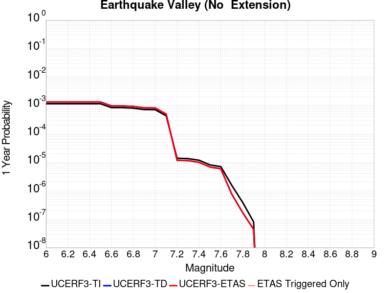 |  |

| Magnitude | 1 wk TI Prob | 1 wk TD Prob | 1 wk ETAS Prob | 1 wk ETAS/TD Gain | 1 wk ETAS Triggered Only | 1 mo TI Prob | 1 mo TD Prob | 1 mo ETAS Prob | 1 mo ETAS/TD Gain | 1 mo ETAS Triggered Only | 1 yr TI Prob | 1 yr TD Prob | 1 yr ETAS Prob | 1 yr ETAS/TD Gain | 1 yr ETAS Triggered Only | 10 yr TI Prob | 10 yr TD Prob | 10 yr ETAS Prob | 10 yr ETAS/TD Gain | 10 yr ETAS Triggered Only |
|-----|-----|-----|-----|-----|-----|-----|-----|-----|-----|-----|-----|-----|-----|-----|-----|-----|-----|-----|-----|-----|
| 6.0 | 2.1859703E-5 | 2.5200976E-5 | 2.5200976E-5 | 1.0 | 0.0 | 9.3681076E-5 | 1.08000524E-4 | 1.08000524E-4 | 1.0 | 0.0 | 0.0011399703 | 0.0013142584 | 0.0013142584 | 1.0 | 0.0 | 0.011341401 | 0.013079223 | 0.013089092 | 1.0007546 | 1.0E-5 |
| 6.1 | 2.1859703E-5 | 2.5200976E-5 | 2.5200976E-5 | 1.0 | 0.0 | 9.3681076E-5 | 1.08000524E-4 | 1.08000524E-4 | 1.0 | 0.0 | 0.0011399703 | 0.0013142584 | 0.0013142584 | 1.0 | 0.0 | 0.011341401 | 0.013079223 | 0.013089092 | 1.0007546 | 1.0E-5 |
| 6.2 | 2.1859703E-5 | 2.5200976E-5 | 2.5200976E-5 | 1.0 | 0.0 | 9.3681076E-5 | 1.08000524E-4 | 1.08000524E-4 | 1.0 | 0.0 | 0.0011399703 | 0.0013142584 | 0.0013142584 | 1.0 | 0.0 | 0.011341401 | 0.013079223 | 0.013089092 | 1.0007546 | 1.0E-5 |
| 6.3 | 2.1859703E-5 | 2.5200976E-5 | 2.5200976E-5 | 1.0 | 0.0 | 9.3681076E-5 | 1.08000524E-4 | 1.08000524E-4 | 1.0 | 0.0 | 0.0011399703 | 0.0013142584 | 0.0013142584 | 1.0 | 0.0 | 0.011341401 | 0.013079223 | 0.013089092 | 1.0007546 | 1.0E-5 |
| 6.4 | 2.1859703E-5 | 2.5200976E-5 | 2.5200976E-5 | 1.0 | 0.0 | 9.3681076E-5 | 1.08000524E-4 | 1.08000524E-4 | 1.0 | 0.0 | 0.0011399703 | 0.0013142584 | 0.0013142584 | 1.0 | 0.0 | 0.011341401 | 0.013079223 | 0.013089092 | 1.0007546 | 1.0E-5 |
| 6.5 | 2.1859703E-5 | 2.5200976E-5 | 2.5200976E-5 | 1.0 | 0.0 | 9.3681076E-5 | 1.08000524E-4 | 1.08000524E-4 | 1.0 | 0.0 | 0.0011399703 | 0.0013142584 | 0.0013142584 | 1.0 | 0.0 | 0.011341401 | 0.013079223 | 0.013089092 | 1.0007546 | 1.0E-5 |
| 6.6 | 1.597E-5 | 1.835816E-5 | 1.835816E-5 | 1.0 | 0.0 | 6.8441055E-5 | 7.867594E-5 | 7.867594E-5 | 1.0 | 0.0 | 8.329513E-4 | 9.57546E-4 | 9.57546E-4 | 1.0 | 0.0 | 0.008298361 | 0.009542811 | 0.009552715 | 1.001038 | 1.0E-5 |
| 6.7 | 1.597E-5 | 1.835816E-5 | 1.835816E-5 | 1.0 | 0.0 | 6.8441055E-5 | 7.867594E-5 | 7.867594E-5 | 1.0 | 0.0 | 8.329513E-4 | 9.57546E-4 | 9.57546E-4 | 1.0 | 0.0 | 0.008298361 | 0.009542811 | 0.009552715 | 1.001038 | 1.0E-5 |
| 6.8 | 1.5315149E-5 | 1.76039E-5 | 1.76039E-5 | 1.0 | 0.0 | 6.5634704E-5 | 7.544359E-5 | 7.544359E-5 | 1.0 | 0.0 | 7.988095E-4 | 9.182253E-4 | 9.182253E-4 | 1.0 | 0.0 | 0.007959441 | 0.009152856 | 0.009152856 | 1.0 | 0.0 |
| 6.9 | 1.3634728E-5 | 1.5677442E-5 | 1.5677442E-5 | 1.0 | 0.0 | 5.8433237E-5 | 6.718777E-5 | 6.718777E-5 | 1.0 | 0.0 | 7.1119244E-4 | 8.177862E-4 | 8.177862E-4 | 1.0 | 0.0 | 0.007089207 | 0.008155841 | 0.008155841 | 1.0 | 0.0 |
| 7.0 | 1.3496271E-5 | 1.551946E-5 | 1.551946E-5 | 1.0 | 0.0 | 5.783988E-5 | 6.6510736E-5 | 6.6510736E-5 | 1.0 | 0.0 | 7.03973E-4 | 8.095494E-4 | 8.095494E-4 | 1.0 | 0.0 | 0.007017471 | 0.008074074 | 0.008074074 | 1.0 | 0.0 |
| 7.1 | 8.242798E-6 | 9.4736015E-6 | 9.4736015E-6 | 1.0 | 0.0 | 3.53258E-5 | 4.0600895E-5 | 4.0600895E-5 | 1.0 | 0.0 | 4.300067E-4 | 4.942709E-4 | 4.942709E-4 | 1.0 | 0.0 | 0.004291756 | 0.0049382932 | 0.0049382932 | 1.0 | 0.0 |
| 7.2 | 2.6506527E-7 | 2.2562813E-7 | 2.2562813E-7 | 1.0 | 0.0 | 1.1359936E-6 | 9.669774E-7 | 9.669774E-7 | 1.0 | 0.0 | 1.3830633E-5 | 1.177289E-5 | 1.177289E-5 | 1.0 | 0.0 | 1.3829772E-4 | 1.1772307E-4 | 1.1772307E-4 | 1.0 | 0.0 |
| 7.3 | 2.5810488E-7 | 2.1957902E-7 | 2.1957902E-7 | 1.0 | 0.0 | 1.1061633E-6 | 9.4105263E-7 | 9.4105263E-7 | 1.0 | 0.0 | 1.3467455E-5 | 1.14572595E-5 | 1.14572595E-5 | 1.0 | 0.0 | 1.3466639E-4 | 1.14567105E-4 | 1.14567105E-4 | 1.0 | 0.0 |
| 7.4 | 2.2676066E-7 | 1.9112963E-7 | 1.9112963E-7 | 1.0 | 0.0 | 9.71831E-7 | 8.1912674E-7 | 8.1912674E-7 | 1.0 | 0.0 | 1.1831979E-5 | 9.972826E-6 | 9.972826E-6 | 1.0 | 0.0 | 1.1831349E-4 | 9.972418E-5 | 9.972418E-5 | 1.0 | 0.0 |
| 7.5 | 1.5553917E-7 | 1.3113939E-7 | 1.3113939E-7 | 1.0 | 0.0 | 6.6659624E-7 | 5.6202583E-7 | 5.6202583E-7 | 1.0 | 0.0 | 8.115779E-6 | 6.8426452E-6 | 6.8426452E-6 | 1.0 | 0.0 | 8.115482E-5 | 6.842456E-5 | 6.842456E-5 | 1.0 | 0.0 |
| 7.6 | 1.3448629E-7 | 1.1289983E-7 | 1.1289983E-7 | 1.0 | 0.0 | 5.7636964E-7 | 4.8385635E-7 | 4.8385635E-7 | 1.0 | 0.0 | 7.017278E-6 | 5.8909372E-6 | 5.8909372E-6 | 1.0 | 0.0 | 7.0170565E-5 | 5.8908023E-5 | 5.8908023E-5 | 1.0 | 0.0 |
| 7.7 | 2.9719402E-8 | 1.45847565E-8 | 1.45847565E-8 | 1.0 | 0.0 | 1.2736886E-7 | 6.2506096E-8 | 6.2506096E-8 | 1.0 | 0.0 | 1.5507147E-6 | 7.610115E-7 | 7.610115E-7 | 1.0 | 0.0 | 1.550704E-5 | 7.6100946E-6 | 7.6100946E-6 | 1.0 | 0.0 |
| 7.8 | 7.4390196E-9 | 3.250713E-9 | 3.250713E-9 | 1.0 | 0.0 | 3.1881513E-8 | 1.3931628E-8 | 1.3931628E-8 | 1.0 | 0.0 | 3.8815733E-7 | 1.6961756E-7 | 1.6961756E-7 | 1.0 | 0.0 | 3.8815665E-6 | 1.6961745E-6 | 1.6961745E-6 | 1.0 | 0.0 |
| 7.9 | 1.5373532E-9 | 8.4414387E-10 | 8.4414387E-10 | 1.0 | 0.0 | 6.5886567E-9 | 3.6177599E-9 | 3.6177599E-9 | 1.0 | 0.0 | 8.021689E-8 | 4.4046224E-8 | 4.4046224E-8 | 1.0 | 0.0 | 8.0216864E-7 | 4.4046223E-7 | 4.4046223E-7 | 1.0 | 0.0 |

## San Luis Range 2011 CFM
*[(top)](#table-of-contents)*

| 1 Week | 1 Month | 1 Year | 10 Year |
|-----|-----|-----|-----|
| 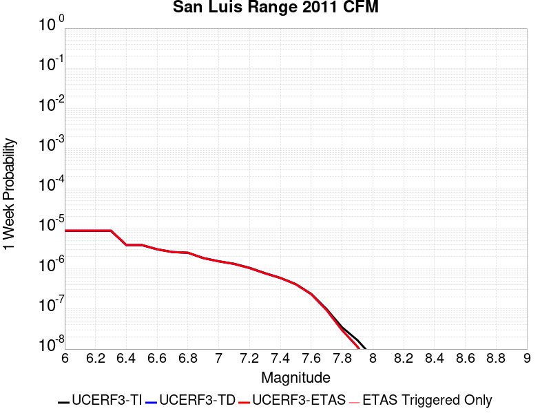 |  | 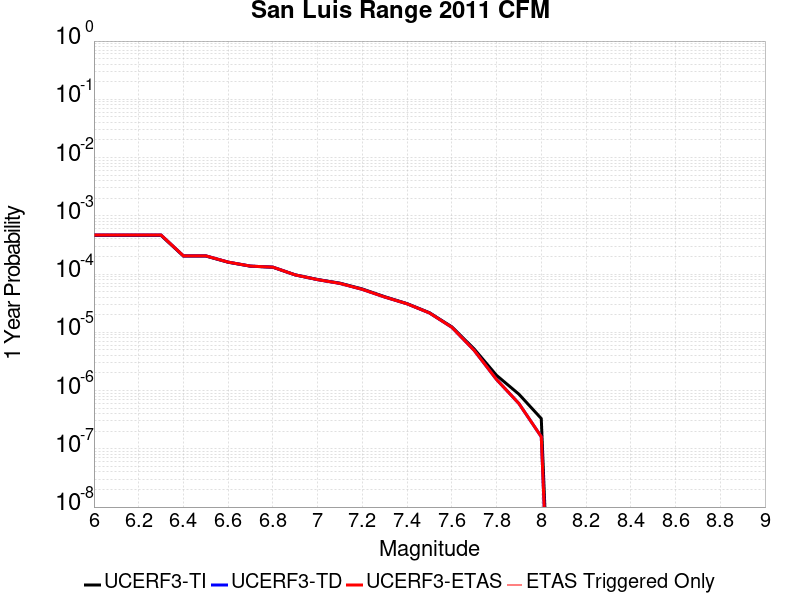 | 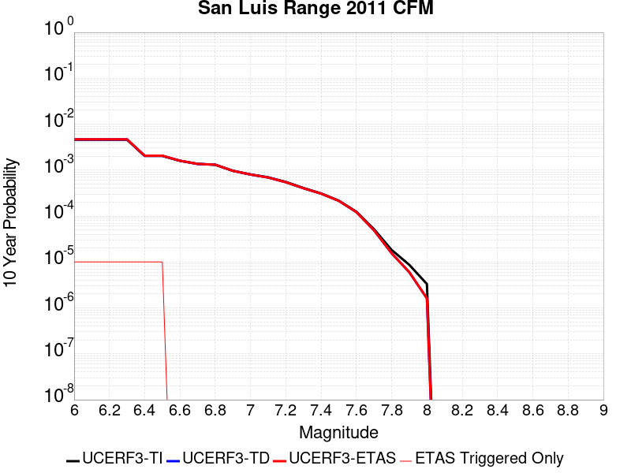 |

| Magnitude | 1 wk TI Prob | 1 wk TD Prob | 1 wk ETAS Prob | 1 wk ETAS/TD Gain | 1 wk ETAS Triggered Only | 1 mo TI Prob | 1 mo TD Prob | 1 mo ETAS Prob | 1 mo ETAS/TD Gain | 1 mo ETAS Triggered Only | 1 yr TI Prob | 1 yr TD Prob | 1 yr ETAS Prob | 1 yr ETAS/TD Gain | 1 yr ETAS Triggered Only | 10 yr TI Prob | 10 yr TD Prob | 10 yr ETAS Prob | 10 yr ETAS/TD Gain | 10 yr ETAS Triggered Only |
|-----|-----|-----|-----|-----|-----|-----|-----|-----|-----|-----|-----|-----|-----|-----|-----|-----|-----|-----|-----|-----|
| 6.0 | 8.8368415E-6 | 8.965572E-6 | 8.965572E-6 | 1.0 | 0.0 | 3.787163E-5 | 3.842336E-5 | 3.842336E-5 | 1.0 | 0.0 | 4.609895E-4 | 4.6771188E-4 | 4.6771188E-4 | 1.0 | 0.0 | 0.0046003438 | 0.004668058 | 0.0046780114 | 1.0021322 | 1.0E-5 |
| 6.1 | 8.8368415E-6 | 8.965572E-6 | 8.965572E-6 | 1.0 | 0.0 | 3.787163E-5 | 3.842336E-5 | 3.842336E-5 | 1.0 | 0.0 | 4.609895E-4 | 4.6771188E-4 | 4.6771188E-4 | 1.0 | 0.0 | 0.0046003438 | 0.004668058 | 0.0046780114 | 1.0021322 | 1.0E-5 |
| 6.2 | 8.8368415E-6 | 8.965572E-6 | 8.965572E-6 | 1.0 | 0.0 | 3.787163E-5 | 3.842336E-5 | 3.842336E-5 | 1.0 | 0.0 | 4.609895E-4 | 4.6771188E-4 | 4.6771188E-4 | 1.0 | 0.0 | 0.0046003438 | 0.004668058 | 0.0046780114 | 1.0021322 | 1.0E-5 |
| 6.3 | 8.8368415E-6 | 8.965572E-6 | 8.965572E-6 | 1.0 | 0.0 | 3.787163E-5 | 3.842336E-5 | 3.842336E-5 | 1.0 | 0.0 | 4.609895E-4 | 4.6771188E-4 | 4.6771188E-4 | 1.0 | 0.0 | 0.0046003438 | 0.004668058 | 0.0046780114 | 1.0021322 | 1.0E-5 |
| 6.4 | 3.9094193E-6 | 3.941256E-6 | 3.941256E-6 | 1.0 | 0.0 | 1.6754546E-5 | 1.689099E-5 | 1.689099E-5 | 1.0 | 0.0 | 2.039675E-4 | 2.0562868E-4 | 2.0562868E-4 | 1.0 | 0.0 | 0.0020378039 | 0.0020544128 | 0.0020643922 | 1.0048575 | 1.0E-5 |
| 6.5 | 3.9094193E-6 | 3.941256E-6 | 3.941256E-6 | 1.0 | 0.0 | 1.6754546E-5 | 1.689099E-5 | 1.689099E-5 | 1.0 | 0.0 | 2.039675E-4 | 2.0562868E-4 | 2.0562868E-4 | 1.0 | 0.0 | 0.0020378039 | 0.0020544128 | 0.0020643922 | 1.0048575 | 1.0E-5 |
| 6.6 | 3.0587726E-6 | 3.0754313E-6 | 3.0754313E-6 | 1.0 | 0.0 | 1.3108959E-5 | 1.3180354E-5 | 1.3180354E-5 | 1.0 | 0.0 | 1.595899E-4 | 1.6045911E-4 | 1.6045911E-4 | 1.0 | 0.0 | 0.0015947534 | 0.0016034445 | 0.0016034445 | 1.0 | 0.0 |
| 6.7 | 2.6160574E-6 | 2.6251653E-6 | 2.6251653E-6 | 1.0 | 0.0 | 1.1211626E-5 | 1.12506605E-5 | 1.12506605E-5 | 1.0 | 0.0 | 1.3649299E-4 | 1.3696824E-4 | 1.3696824E-4 | 1.0 | 0.0 | 0.0013640919 | 0.0013688444 | 0.0013688444 | 1.0 | 0.0 |
| 6.8 | 2.5110312E-6 | 2.5181769E-6 | 2.5181769E-6 | 1.0 | 0.0 | 1.0761518E-5 | 1.0792141E-5 | 1.0792141E-5 | 1.0 | 0.0 | 1.310136E-4 | 1.3138646E-4 | 1.3138646E-4 | 1.0 | 0.0 | 0.0013093639 | 0.0013130937 | 0.0013130937 | 1.0 | 0.0 |
| 6.9 | 1.8564405E-6 | 1.8525161E-6 | 1.8525161E-6 | 1.0 | 0.0 | 7.95615E-6 | 7.939331E-6 | 7.939331E-6 | 1.0 | 0.0 | 9.686181E-5 | 9.665709E-5 | 9.665709E-5 | 1.0 | 0.0 | 9.68196E-4 | 9.6615247E-4 | 9.6615247E-4 | 1.0 | 0.0 |
| 7.0 | 1.546127E-6 | 1.5369794E-6 | 1.5369794E-6 | 1.0 | 0.0 | 6.626242E-6 | 6.587038E-6 | 6.587038E-6 | 1.0 | 0.0 | 8.06715E-5 | 8.0194244E-5 | 8.0194244E-5 | 1.0 | 0.0 | 8.0642226E-4 | 8.016537E-4 | 8.016537E-4 | 1.0 | 0.0 |
| 7.1 | 1.3368208E-6 | 1.3235555E-6 | 1.3235555E-6 | 1.0 | 0.0 | 5.7292195E-6 | 5.6723684E-6 | 5.6723684E-6 | 1.0 | 0.0 | 6.975101E-5 | 6.90589E-5 | 6.90589E-5 | 1.0 | 0.0 | 6.972912E-4 | 6.903749E-4 | 6.903749E-4 | 1.0 | 0.0 |
| 7.2 | 1.0623363E-6 | 1.045456E-6 | 1.045456E-6 | 1.0 | 0.0 | 4.5528623E-6 | 4.480518E-6 | 4.480518E-6 | 1.0 | 0.0 | 5.5429686E-5 | 5.4548942E-5 | 5.4548942E-5 | 1.0 | 0.0 | 5.5415864E-4 | 5.453558E-4 | 5.453558E-4 | 1.0 | 0.0 |
| 7.3 | 7.831679E-7 | 7.727548E-7 | 7.727548E-7 | 1.0 | 0.0 | 3.3564295E-6 | 3.311802E-6 | 3.311802E-6 | 1.0 | 0.0 | 4.086376E-5 | 4.0320443E-5 | 4.0320443E-5 | 1.0 | 0.0 | 4.0856248E-4 | 4.0313142E-4 | 4.0313142E-4 | 1.0 | 0.0 |
| 7.4 | 5.9558846E-7 | 5.91077E-7 | 5.91077E-7 | 1.0 | 0.0 | 2.5525194E-6 | 2.5331847E-6 | 2.5331847E-6 | 1.0 | 0.0 | 3.107648E-5 | 3.084109E-5 | 3.084109E-5 | 1.0 | 0.0 | 3.1072134E-4 | 3.0836815E-4 | 3.0836815E-4 | 1.0 | 0.0 |
| 7.5 | 4.1616502E-7 | 4.1197424E-7 | 4.1197424E-7 | 1.0 | 0.0 | 1.7835631E-6 | 1.7656027E-6 | 1.7656027E-6 | 1.0 | 0.0 | 2.1714664E-5 | 2.1496002E-5 | 2.1496002E-5 | 1.0 | 0.0 | 2.1712543E-4 | 2.1493927E-4 | 2.1493927E-4 | 1.0 | 0.0 |
| 7.6 | 2.3816014E-7 | 2.3377399E-7 | 2.3377399E-7 | 1.0 | 0.0 | 1.0206859E-6 | 1.0018881E-6 | 1.0018881E-6 | 1.0 | 0.0 | 1.242678E-5 | 1.219792E-5 | 1.219792E-5 | 1.0 | 0.0 | 1.2426086E-4 | 1.2197252E-4 | 1.2197252E-4 | 1.0 | 0.0 |
| 7.7 | 9.918777E-8 | 9.3874064E-8 | 9.3874064E-8 | 1.0 | 0.0 | 4.2509038E-7 | 4.0231737E-7 | 4.0231737E-7 | 1.0 | 0.0 | 5.1754632E-6 | 4.898203E-6 | 4.898203E-6 | 1.0 | 0.0 | 5.1753424E-5 | 4.8980954E-5 | 4.8980954E-5 | 1.0 | 0.0 |
| 7.8 | 3.4982556E-8 | 2.969163E-8 | 2.969163E-8 | 1.0 | 0.0 | 1.4992524E-7 | 1.2724985E-7 | 1.2724985E-7 | 1.0 | 0.0 | 1.8253382E-6 | 1.5492658E-6 | 1.5492658E-6 | 1.0 | 0.0 | 1.8253233E-5 | 1.5492551E-5 | 1.5492551E-5 | 1.0 | 0.0 |
| 7.9 | 1.6624908E-8 | 1.14814815E-8 | 1.14814815E-8 | 1.0 | 0.0 | 7.12496E-8 | 4.9206353E-8 | 4.9206353E-8 | 1.0 | 0.0 | 8.6746354E-7 | 5.990872E-7 | 5.990872E-7 | 1.0 | 0.0 | 8.674601E-6 | 5.990856E-6 | 5.990856E-6 | 1.0 | 0.0 |
| 8.0 | 6.3352315E-9 | 3.0911786E-9 | 3.0911786E-9 | 1.0 | 0.0 | 2.715099E-8 | 1.3247911E-8 | 1.3247911E-8 | 1.0 | 0.0 | 3.3056327E-7 | 1.612933E-7 | 1.612933E-7 | 1.0 | 0.0 | 3.3056278E-6 | 1.6129319E-6 | 1.6129319E-6 | 1.0 | 0.0 |

## Green Valley 2011 CFM
*[(top)](#table-of-contents)*

| 1 Week | 1 Month | 1 Year | 10 Year |
|-----|-----|-----|-----|
| 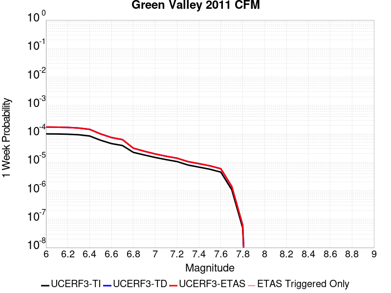 | 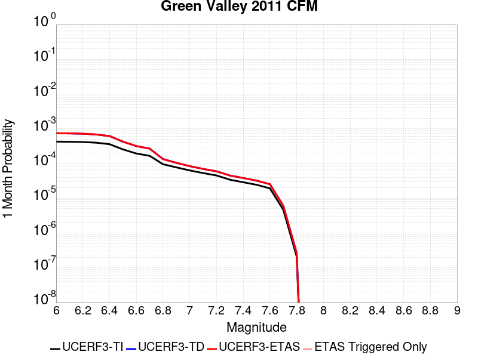 | 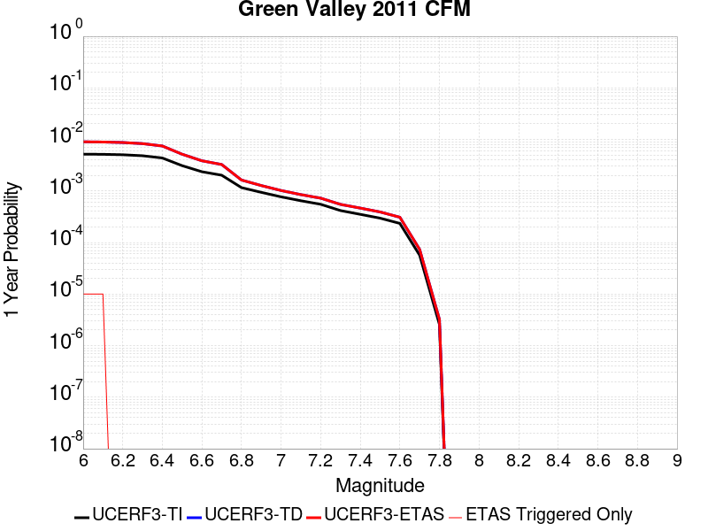 |  |

| Magnitude | 1 wk TI Prob | 1 wk TD Prob | 1 wk ETAS Prob | 1 wk ETAS/TD Gain | 1 wk ETAS Triggered Only | 1 mo TI Prob | 1 mo TD Prob | 1 mo ETAS Prob | 1 mo ETAS/TD Gain | 1 mo ETAS Triggered Only | 1 yr TI Prob | 1 yr TD Prob | 1 yr ETAS Prob | 1 yr ETAS/TD Gain | 1 yr ETAS Triggered Only | 10 yr TI Prob | 10 yr TD Prob | 10 yr ETAS Prob | 10 yr ETAS/TD Gain | 10 yr ETAS Triggered Only |
|-----|-----|-----|-----|-----|-----|-----|-----|-----|-----|-----|-----|-----|-----|-----|-----|-----|-----|-----|-----|-----|
| 6.0 | 9.9629346E-5 | 1.7305819E-4 | 1.7305819E-4 | 1.0 | 0.0 | 4.2691303E-4 | 7.414556E-4 | 7.414556E-4 | 1.0 | 0.0 | 0.0051852856 | 0.008988342 | 0.008998252 | 1.0011026 | 1.0E-5 | 0.050659515 | 0.085527964 | 0.085537106 | 1.0001069 | 1.0E-5 |
| 6.1 | 9.88615E-5 | 1.7152847E-4 | 1.7152847E-4 | 1.0 | 0.0 | 4.2362334E-4 | 7.349035E-4 | 7.349035E-4 | 1.0 | 0.0 | 0.0051454236 | 0.008909231 | 0.008919141 | 1.0011125 | 1.0E-5 | 0.050279044 | 0.08481443 | 0.08482358 | 1.0001079 | 1.0E-5 |
| 6.2 | 9.696895E-5 | 1.6791566E-4 | 1.6791566E-4 | 1.0 | 0.0 | 4.15515E-4 | 7.194289E-4 | 7.194289E-4 | 1.0 | 0.0 | 0.0050471667 | 0.008722439 | 0.008722439 | 1.0 | 0.0 | 0.04934063 | 0.08312177 | 0.08312177 | 1.0 | 0.0 |
| 6.3 | 9.275224E-5 | 1.5970865E-4 | 1.5970865E-4 | 1.0 | 0.0 | 3.9744904E-4 | 6.842747E-4 | 6.842747E-4 | 1.0 | 0.0 | 0.0048282105 | 0.008297743 | 0.008297743 | 1.0 | 0.0 | 0.047246475 | 0.07925965 | 0.07925965 | 1.0 | 0.0 |
| 6.4 | 8.391499E-5 | 1.4368097E-4 | 1.4368097E-4 | 1.0 | 0.0 | 3.595861E-4 | 6.156188E-4 | 6.156188E-4 | 1.0 | 0.0 | 0.004369175 | 0.007468189 | 0.007468189 | 1.0 | 0.0 | 0.04284265 | 0.071633935 | 0.071633935 | 1.0 | 0.0 |
| 6.5 | 5.9519385E-5 | 9.934348E-5 | 9.934348E-5 | 1.0 | 0.0 | 2.5505814E-4 | 4.2568066E-4 | 4.2568066E-4 | 1.0 | 0.0 | 0.0031009112 | 0.005169145 | 0.005169145 | 1.0 | 0.0 | 0.030579966 | 0.05015214 | 0.05015214 | 1.0 | 0.0 |
| 6.6 | 4.5361558E-5 | 7.4033116E-5 | 7.4033116E-5 | 1.0 | 0.0 | 1.9439218E-4 | 3.172405E-4 | 3.172405E-4 | 1.0 | 0.0 | 0.0023641558 | 0.0038545472 | 0.0038545472 | 1.0 | 0.0 | 0.023391623 | 0.037672307 | 0.037672307 | 1.0 | 0.0 |
| 6.7 | 3.8808106E-5 | 6.2656276E-5 | 6.2656276E-5 | 1.0 | 0.0 | 1.6630985E-4 | 2.684933E-4 | 2.684933E-4 | 1.0 | 0.0 | 0.0020229418 | 0.0032633205 | 0.0032633205 | 1.0 | 0.0 | 0.020046256 | 0.03201154 | 0.03201154 | 1.0 | 0.0 |
| 6.8 | 2.2284667E-5 | 3.1288222E-5 | 3.1288222E-5 | 1.0 | 0.0 | 9.550222E-5 | 1.340854E-4 | 1.340854E-4 | 1.0 | 0.0 | 0.0011621192 | 0.0016312655 | 0.0016312655 | 1.0 | 0.0 | 0.011560607 | 0.016166506 | 0.016166506 | 1.0 | 0.0 |
| 6.9 | 1.8050168E-5 | 2.4450452E-5 | 2.4450452E-5 | 1.0 | 0.0 | 7.735557E-5 | 1.04783445E-4 | 1.04783445E-4 | 1.0 | 0.0 | 9.4139716E-4 | 0.0012749945 | 0.0012749945 | 1.0 | 0.0 | 0.009374191 | 0.012669302 | 0.012669302 | 1.0 | 0.0 |
| 7.0 | 1.4763166E-5 | 1.9584939E-5 | 1.9584939E-5 | 1.0 | 0.0 | 6.326917E-5 | 8.393277E-5 | 8.393277E-5 | 1.0 | 0.0 | 7.7002996E-4 | 0.0010214036 | 0.0010214036 | 1.0 | 0.0 | 0.007673672 | 0.010166277 | 0.010166277 | 1.0 | 0.0 |
| 7.1 | 1.2399713E-5 | 1.6305557E-5 | 1.6305557E-5 | 1.0 | 0.0 | 5.3140546E-5 | 6.98791E-5 | 6.98791E-5 | 1.0 | 0.0 | 6.467941E-4 | 8.504479E-4 | 8.504479E-4 | 1.0 | 0.0 | 0.006449148 | 0.008472472 | 0.008472472 | 1.0 | 0.0 |
| 7.2 | 1.0584195E-5 | 1.3923078E-5 | 1.3923078E-5 | 1.0 | 0.0 | 4.5360044E-5 | 5.9668975E-5 | 5.9668975E-5 | 1.0 | 0.0 | 5.521186E-4 | 7.262293E-4 | 7.262293E-4 | 1.0 | 0.0 | 0.0055074887 | 0.007239231 | 0.007239231 | 1.0 | 0.0 |
| 7.3 | 7.998173E-6 | 1.0545176E-5 | 1.0545176E-5 | 1.0 | 0.0 | 3.4277433E-5 | 4.519284E-5 | 4.519284E-5 | 1.0 | 0.0 | 4.1724785E-4 | 5.50085E-4 | 5.50085E-4 | 1.0 | 0.0 | 0.004164653 | 0.005487497 | 0.005487497 | 1.0 | 0.0 |
| 7.4 | 6.7571127E-6 | 8.933762E-6 | 8.933762E-6 | 1.0 | 0.0 | 2.8958733E-5 | 3.8286995E-5 | 3.8286995E-5 | 1.0 | 0.0 | 3.5251552E-4 | 4.660454E-4 | 4.660454E-4 | 1.0 | 0.0 | 0.0035195686 | 0.004650942 | 0.004650942 | 1.0 | 0.0 |
| 7.5 | 5.69878E-6 | 7.517158E-6 | 7.517158E-6 | 1.0 | 0.0 | 2.4423114E-5 | 3.2215998E-5 | 3.2215998E-5 | 1.0 | 0.0 | 2.9731085E-4 | 3.9216006E-4 | 3.9216006E-4 | 1.0 | 0.0 | 0.002969134 | 0.003914924 | 0.003914924 | 1.0 | 0.0 |
| 7.6 | 4.503664E-6 | 5.93627E-6 | 5.93627E-6 | 1.0 | 0.0 | 1.9301275E-5 | 2.5440913E-5 | 2.5440913E-5 | 1.0 | 0.0 | 2.3496768E-4 | 3.0969994E-4 | 3.0969994E-4 | 1.0 | 0.0 | 0.002347194 | 0.003092863 | 0.003092863 | 1.0 | 0.0 |
| 7.7 | 1.0873546E-6 | 1.410817E-6 | 1.410817E-6 | 1.0 | 0.0 | 4.6600826E-6 | 6.0463453E-6 | 6.0463453E-6 | 1.0 | 0.0 | 5.6735033E-5 | 7.3611795E-5 | 7.3611795E-5 | 1.0 | 0.0 | 5.672055E-4 | 7.358978E-4 | 7.358978E-4 | 1.0 | 0.0 |
| 7.8 | 4.9373917E-8 | 6.1783126E-8 | 6.1783126E-8 | 1.0 | 0.0 | 2.1160248E-7 | 2.647848E-7 | 2.647848E-7 | 1.0 | 0.0 | 2.5762572E-6 | 3.2237517E-6 | 3.2237517E-6 | 1.0 | 0.0 | 2.5762274E-5 | 3.2230026E-5 | 3.2230026E-5 | 1.0 | 0.0 |

## Great Valley 05 Pittsburg - Kirby Hills alt1
*[(top)](#table-of-contents)*

| 1 Week | 1 Month | 1 Year | 10 Year |
|-----|-----|-----|-----|
|  |  |  |  |

| Magnitude | 1 wk TI Prob | 1 wk TD Prob | 1 wk ETAS Prob | 1 wk ETAS/TD Gain | 1 wk ETAS Triggered Only | 1 mo TI Prob | 1 mo TD Prob | 1 mo ETAS Prob | 1 mo ETAS/TD Gain | 1 mo ETAS Triggered Only | 1 yr TI Prob | 1 yr TD Prob | 1 yr ETAS Prob | 1 yr ETAS/TD Gain | 1 yr ETAS Triggered Only | 10 yr TI Prob | 10 yr TD Prob | 10 yr ETAS Prob | 10 yr ETAS/TD Gain | 10 yr ETAS Triggered Only |
|-----|-----|-----|-----|-----|-----|-----|-----|-----|-----|-----|-----|-----|-----|-----|-----|-----|-----|-----|-----|-----|
| 6.0 | 4.187212E-5 | 5.345271E-5 | 5.345271E-5 | 1.0 | 0.0 | 1.794396E-4 | 2.2906787E-4 | 2.2906787E-4 | 1.0 | 0.0 | 0.002182488 | 0.0027862994 | 0.0027862994 | 1.0 | 0.0 | 0.021611776 | 0.027608098 | 0.027617821 | 1.0003523 | 1.0E-5 |
| 6.1 | 4.187212E-5 | 5.345271E-5 | 5.345271E-5 | 1.0 | 0.0 | 1.794396E-4 | 2.2906787E-4 | 2.2906787E-4 | 1.0 | 0.0 | 0.002182488 | 0.0027862994 | 0.0027862994 | 1.0 | 0.0 | 0.021611776 | 0.027608098 | 0.027617821 | 1.0003523 | 1.0E-5 |
| 6.2 | 1.7353306E-5 | 2.2158747E-5 | 2.2158747E-5 | 1.0 | 0.0 | 7.436919E-5 | 9.496411E-5 | 9.496411E-5 | 1.0 | 0.0 | 9.050688E-4 | 0.0011559651 | 0.0011559651 | 1.0 | 0.0 | 0.009013915 | 0.0115372585 | 0.011547144 | 1.0008568 | 1.0E-5 |
| 6.3 | 1.7353306E-5 | 2.2158747E-5 | 2.2158747E-5 | 1.0 | 0.0 | 7.436919E-5 | 9.496411E-5 | 9.496411E-5 | 1.0 | 0.0 | 9.050688E-4 | 0.0011559651 | 0.0011559651 | 1.0 | 0.0 | 0.009013915 | 0.0115372585 | 0.011547144 | 1.0008568 | 1.0E-5 |
| 6.4 | 1.4028824E-5 | 1.7904345E-5 | 1.7904345E-5 | 1.0 | 0.0 | 6.0122147E-5 | 7.673215E-5 | 7.673215E-5 | 1.0 | 0.0 | 7.3174125E-4 | 9.3419786E-4 | 9.3419786E-4 | 1.0 | 0.0 | 0.0072933645 | 0.009339877 | 0.009349784 | 1.0010607 | 1.0E-5 |

## Elsinore (Coyote Mountains)
*[(top)](#table-of-contents)*

| 1 Week | 1 Month | 1 Year | 10 Year |
|-----|-----|-----|-----|
|  |  | 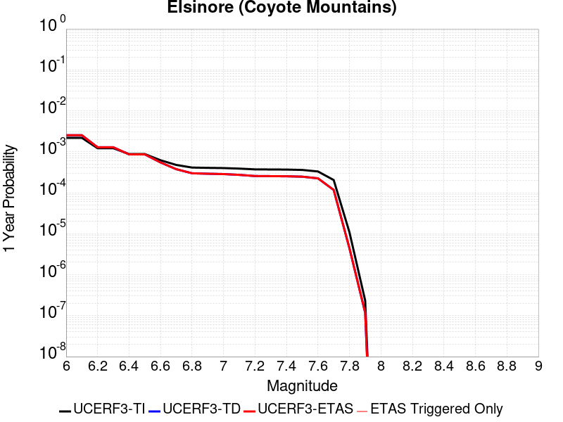 |  |

| Magnitude | 1 wk TI Prob | 1 wk TD Prob | 1 wk ETAS Prob | 1 wk ETAS/TD Gain | 1 wk ETAS Triggered Only | 1 mo TI Prob | 1 mo TD Prob | 1 mo ETAS Prob | 1 mo ETAS/TD Gain | 1 mo ETAS Triggered Only | 1 yr TI Prob | 1 yr TD Prob | 1 yr ETAS Prob | 1 yr ETAS/TD Gain | 1 yr ETAS Triggered Only | 10 yr TI Prob | 10 yr TD Prob | 10 yr ETAS Prob | 10 yr ETAS/TD Gain | 10 yr ETAS Triggered Only |
|-----|-----|-----|-----|-----|-----|-----|-----|-----|-----|-----|-----|-----|-----|-----|-----|-----|-----|-----|-----|-----|
| 6.0 | 4.20513E-5 | 4.8639726E-5 | 4.8639726E-5 | 1.0 | 0.0 | 1.8020741E-4 | 2.0844255E-4 | 2.0844255E-4 | 1.0 | 0.0 | 0.0021918174 | 0.0025353536 | 0.0025353536 | 1.0 | 0.0 | 0.021703249 | 0.025115568 | 0.025125317 | 1.0003881 | 1.0E-5 |
| 6.1 | 4.20513E-5 | 4.8639726E-5 | 4.8639726E-5 | 1.0 | 0.0 | 1.8020741E-4 | 2.0844255E-4 | 2.0844255E-4 | 1.0 | 0.0 | 0.0021918174 | 0.0025353536 | 0.0025353536 | 1.0 | 0.0 | 0.021703249 | 0.025115568 | 0.025125317 | 1.0003881 | 1.0E-5 |
| 6.2 | 2.3413893E-5 | 2.4699613E-5 | 2.4699613E-5 | 1.0 | 0.0 | 1.0034139E-4 | 1.0585173E-4 | 1.0585173E-4 | 1.0 | 0.0 | 0.0012209718 | 0.0012880701 | 0.0012880701 | 1.0 | 0.0 | 0.012142851 | 0.012814721 | 0.012814721 | 1.0 | 0.0 |
| 6.3 | 2.3413893E-5 | 2.4699613E-5 | 2.4699613E-5 | 1.0 | 0.0 | 1.0034139E-4 | 1.0585173E-4 | 1.0585173E-4 | 1.0 | 0.0 | 0.0012209718 | 0.0012880701 | 0.0012880701 | 1.0 | 0.0 | 0.012142851 | 0.012814721 | 0.012814721 | 1.0 | 0.0 |
| 6.4 | 1.6894814E-5 | 1.657106E-5 | 1.657106E-5 | 1.0 | 0.0 | 7.240433E-5 | 7.101712E-5 | 7.101712E-5 | 1.0 | 0.0 | 8.811662E-4 | 8.64328E-4 | 8.64328E-4 | 1.0 | 0.0 | 0.0087768035 | 0.008613323 | 0.008613323 | 1.0 | 0.0 |
| 6.5 | 1.6894814E-5 | 1.657106E-5 | 1.657106E-5 | 1.0 | 0.0 | 7.240433E-5 | 7.101712E-5 | 7.101712E-5 | 1.0 | 0.0 | 8.811662E-4 | 8.64328E-4 | 8.64328E-4 | 1.0 | 0.0 | 0.0087768035 | 0.008613323 | 0.008613323 | 1.0 | 0.0 |
| 6.6 | 1.1910969E-5 | 1.0532555E-5 | 1.0532555E-5 | 1.0 | 0.0 | 5.1046012E-5 | 4.513882E-5 | 4.513882E-5 | 1.0 | 0.0 | 6.21308E-4 | 5.494398E-4 | 5.494398E-4 | 1.0 | 0.0 | 0.0061957375 | 0.005482115 | 0.005482115 | 1.0 | 0.0 |
| 6.7 | 9.1486E-6 | 7.2042126E-6 | 7.2042126E-6 | 1.0 | 0.0 | 3.9207694E-5 | 3.0874853E-5 | 3.0874853E-5 | 1.0 | 0.0 | 4.7724912E-4 | 3.758403E-4 | 3.758403E-4 | 1.0 | 0.0 | 0.0047622547 | 0.0037524262 | 0.0037524262 | 1.0 | 0.0 |
| 6.8 | 7.90441E-6 | 5.7302E-6 | 5.7302E-6 | 1.0 | 0.0 | 3.3875604E-5 | 2.4557776E-5 | 2.4557776E-5 | 1.0 | 0.0 | 4.1235742E-4 | 2.9895117E-4 | 2.9895117E-4 | 1.0 | 0.0 | 0.0041159308 | 0.002985619 | 0.002985619 | 1.0 | 0.0 |
| 6.9 | 7.77015E-6 | 5.5841456E-6 | 5.5841456E-6 | 1.0 | 0.0 | 3.3300217E-5 | 2.393184E-5 | 2.393184E-5 | 1.0 | 0.0 | 4.0535472E-4 | 2.9133246E-4 | 2.9133246E-4 | 1.0 | 0.0 | 0.004046161 | 0.0029096326 | 0.0029096326 | 1.0 | 0.0 |
| 7.0 | 7.675798E-6 | 5.480998E-6 | 5.480998E-6 | 1.0 | 0.0 | 3.289586E-5 | 2.3489787E-5 | 2.3489787E-5 | 1.0 | 0.0 | 4.004335E-4 | 2.859519E-4 | 2.859519E-4 | 1.0 | 0.0 | 0.003997127 | 0.0028559659 | 0.0028559659 | 1.0 | 0.0 |
| 7.1 | 7.447814E-6 | 5.239861E-6 | 5.239861E-6 | 1.0 | 0.0 | 3.191881E-5 | 2.2456361E-5 | 2.2456361E-5 | 1.0 | 0.0 | 3.8854225E-4 | 2.7337315E-4 | 2.7337315E-4 | 1.0 | 0.0 | 0.003878636 | 0.002730493 | 0.002730493 | 1.0 | 0.0 |
| 7.2 | 7.128185E-6 | 4.9065006E-6 | 4.9065006E-6 | 1.0 | 0.0 | 3.0549007E-5 | 2.1027698E-5 | 2.1027698E-5 | 1.0 | 0.0 | 3.7187067E-4 | 2.5598335E-4 | 2.5598335E-4 | 1.0 | 0.0 | 0.00371249 | 0.0025570032 | 0.0025570032 | 1.0 | 0.0 |
| 7.3 | 7.0913875E-6 | 4.8751745E-6 | 4.8751745E-6 | 1.0 | 0.0 | 3.0391306E-5 | 2.0893443E-5 | 2.0893443E-5 | 1.0 | 0.0 | 3.6995133E-4 | 2.5434917E-4 | 2.5434917E-4 | 1.0 | 0.0 | 0.0036933604 | 0.002540699 | 0.002540699 | 1.0 | 0.0 |
| 7.4 | 7.051521E-6 | 4.8390243E-6 | 4.8390243E-6 | 1.0 | 0.0 | 3.0220453E-5 | 2.0738518E-5 | 2.0738518E-5 | 1.0 | 0.0 | 3.6787192E-4 | 2.524634E-4 | 2.524634E-4 | 1.0 | 0.0 | 0.0036726352 | 0.0025218842 | 0.0025218842 | 1.0 | 0.0 |
| 7.5 | 6.910666E-6 | 4.734498E-6 | 4.734498E-6 | 1.0 | 0.0 | 2.9616802E-5 | 2.0290554E-5 | 2.0290554E-5 | 1.0 | 0.0 | 3.605249E-4 | 2.4701067E-4 | 2.4701067E-4 | 1.0 | 0.0 | 0.0035994058 | 0.0024674793 | 0.0024674793 | 1.0 | 0.0 |
| 7.6 | 6.341753E-6 | 4.307556E-6 | 4.307556E-6 | 1.0 | 0.0 | 2.7178658E-5 | 1.846083E-5 | 1.846083E-5 | 1.0 | 0.0 | 3.3084993E-4 | 2.247386E-4 | 2.247386E-4 | 1.0 | 0.0 | 0.0033035777 | 0.0022452287 | 0.0022452287 | 1.0 | 0.0 |
| 7.7 | 3.9205916E-6 | 2.2445931E-6 | 2.2445931E-6 | 1.0 | 0.0 | 1.6802427E-5 | 9.619653E-6 | 9.619653E-6 | 1.0 | 0.0 | 2.0455034E-4 | 1.1711373E-4 | 1.1711373E-4 | 1.0 | 0.0 | 0.0020436216 | 0.0011705931 | 0.0011705931 | 1.0 | 0.0 |
| 7.8 | 2.0846227E-7 | 8.487604E-8 | 8.487604E-8 | 1.0 | 0.0 | 8.9340944E-7 | 3.6375442E-7 | 3.6375442E-7 | 1.0 | 0.0 | 1.0877206E-5 | 4.4287044E-6 | 4.4287044E-6 | 1.0 | 0.0 | 1.0876673E-4 | 4.428649E-5 | 4.428649E-5 | 1.0 | 0.0 |
| 7.9 | 4.4969806E-9 | 2.2695104E-9 | 2.2695104E-9 | 1.0 | 0.0 | 1.9272775E-8 | 9.726474E-9 | 9.726474E-9 | 1.0 | 0.0 | 2.3464601E-7 | 1.1841981E-7 | 1.1841981E-7 | 1.0 | 0.0 | 2.3464577E-6 | 1.1841976E-6 | 1.1841976E-6 | 1.0 | 0.0 |

## Los Alamos extension
*[(top)](#table-of-contents)*

| 1 Week | 1 Month | 1 Year | 10 Year |
|-----|-----|-----|-----|
|  | 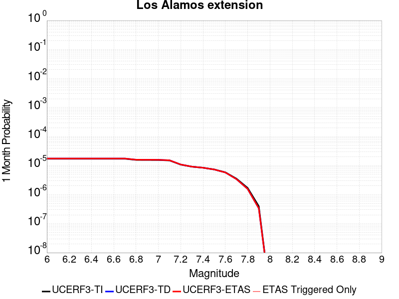 |  |  |

| Magnitude | 1 wk TI Prob | 1 wk TD Prob | 1 wk ETAS Prob | 1 wk ETAS/TD Gain | 1 wk ETAS Triggered Only | 1 mo TI Prob | 1 mo TD Prob | 1 mo ETAS Prob | 1 mo ETAS/TD Gain | 1 mo ETAS Triggered Only | 1 yr TI Prob | 1 yr TD Prob | 1 yr ETAS Prob | 1 yr ETAS/TD Gain | 1 yr ETAS Triggered Only | 10 yr TI Prob | 10 yr TD Prob | 10 yr ETAS Prob | 10 yr ETAS/TD Gain | 10 yr ETAS Triggered Only |
|-----|-----|-----|-----|-----|-----|-----|-----|-----|-----|-----|-----|-----|-----|-----|-----|-----|-----|-----|-----|-----|
| 6.0 | 4.0146506E-6 | 4.086269E-6 | 4.086269E-6 | 1.0 | 0.0 | 1.7205533E-5 | 1.7512471E-5 | 1.7512471E-5 | 1.0 | 0.0 | 2.0945723E-4 | 2.1319458E-4 | 2.1319458E-4 | 1.0 | 0.0 | 0.0020925992 | 0.0021300097 | 0.0021399884 | 1.0046848 | 1.0E-5 |
| 6.1 | 4.0146506E-6 | 4.086269E-6 | 4.086269E-6 | 1.0 | 0.0 | 1.7205533E-5 | 1.7512471E-5 | 1.7512471E-5 | 1.0 | 0.0 | 2.0945723E-4 | 2.1319458E-4 | 2.1319458E-4 | 1.0 | 0.0 | 0.0020925992 | 0.0021300097 | 0.0021399884 | 1.0046848 | 1.0E-5 |
| 6.2 | 4.0146506E-6 | 4.086269E-6 | 4.086269E-6 | 1.0 | 0.0 | 1.7205533E-5 | 1.7512471E-5 | 1.7512471E-5 | 1.0 | 0.0 | 2.0945723E-4 | 2.1319458E-4 | 2.1319458E-4 | 1.0 | 0.0 | 0.0020925992 | 0.0021300097 | 0.0021399884 | 1.0046848 | 1.0E-5 |
| 6.3 | 4.0146506E-6 | 4.086269E-6 | 4.086269E-6 | 1.0 | 0.0 | 1.7205533E-5 | 1.7512471E-5 | 1.7512471E-5 | 1.0 | 0.0 | 2.0945723E-4 | 2.1319458E-4 | 2.1319458E-4 | 1.0 | 0.0 | 0.0020925992 | 0.0021300097 | 0.0021399884 | 1.0046848 | 1.0E-5 |
| 6.4 | 4.0146506E-6 | 4.086269E-6 | 4.086269E-6 | 1.0 | 0.0 | 1.7205533E-5 | 1.7512471E-5 | 1.7512471E-5 | 1.0 | 0.0 | 2.0945723E-4 | 2.1319458E-4 | 2.1319458E-4 | 1.0 | 0.0 | 0.0020925992 | 0.0021300097 | 0.0021399884 | 1.0046848 | 1.0E-5 |
| 6.5 | 4.0146506E-6 | 4.086269E-6 | 4.086269E-6 | 1.0 | 0.0 | 1.7205533E-5 | 1.7512471E-5 | 1.7512471E-5 | 1.0 | 0.0 | 2.0945723E-4 | 2.1319458E-4 | 2.1319458E-4 | 1.0 | 0.0 | 0.0020925992 | 0.0021300097 | 0.0021399884 | 1.0046848 | 1.0E-5 |
| 6.6 | 4.0146506E-6 | 4.086269E-6 | 4.086269E-6 | 1.0 | 0.0 | 1.7205533E-5 | 1.7512471E-5 | 1.7512471E-5 | 1.0 | 0.0 | 2.0945723E-4 | 2.1319458E-4 | 2.1319458E-4 | 1.0 | 0.0 | 0.0020925992 | 0.0021300097 | 0.0021399884 | 1.0046848 | 1.0E-5 |
| 6.7 | 4.0146506E-6 | 4.086269E-6 | 4.086269E-6 | 1.0 | 0.0 | 1.7205533E-5 | 1.7512471E-5 | 1.7512471E-5 | 1.0 | 0.0 | 2.0945723E-4 | 2.1319458E-4 | 2.1319458E-4 | 1.0 | 0.0 | 0.0020925992 | 0.0021300097 | 0.0021399884 | 1.0046848 | 1.0E-5 |
| 6.8 | 3.6584688E-6 | 3.7189611E-6 | 3.7189611E-6 | 1.0 | 0.0 | 1.5679057E-5 | 1.5938313E-5 | 1.5938313E-5 | 1.0 | 0.0 | 1.9087581E-4 | 1.940326E-4 | 1.940326E-4 | 1.0 | 0.0 | 0.0019071194 | 0.0019387244 | 0.001948705 | 1.005148 | 1.0E-5 |
| 6.9 | 3.644631E-6 | 3.7046707E-6 | 3.7046707E-6 | 1.0 | 0.0 | 1.5619753E-5 | 1.5877069E-5 | 1.5877069E-5 | 1.0 | 0.0 | 1.901539E-4 | 1.932871E-4 | 1.932871E-4 | 1.0 | 0.0 | 0.0018999127 | 0.0019312822 | 0.001941263 | 1.005168 | 1.0E-5 |
| 7.0 | 3.6318522E-6 | 3.691431E-6 | 3.691431E-6 | 1.0 | 0.0 | 1.5564989E-5 | 1.5820327E-5 | 1.5820327E-5 | 1.0 | 0.0 | 1.8948725E-4 | 1.925964E-4 | 1.925964E-4 | 1.0 | 0.0 | 0.0018932576 | 0.0019243872 | 0.0019343679 | 1.0051864 | 1.0E-5 |
| 7.1 | 3.5001724E-6 | 3.5554986E-6 | 3.5554986E-6 | 1.0 | 0.0 | 1.5000653E-5 | 1.5237767E-5 | 1.5237767E-5 | 1.0 | 0.0 | 1.8261763E-4 | 1.8550493E-4 | 1.8550493E-4 | 1.0 | 0.0 | 0.0018246764 | 0.0018535915 | 0.0018635731 | 1.0053849 | 1.0E-5 |
| 7.2 | 2.5204702E-6 | 2.543771E-6 | 2.543771E-6 | 1.0 | 0.0 | 1.080197E-5 | 1.090183E-5 | 1.090183E-5 | 1.0 | 0.0 | 1.3150605E-4 | 1.3272175E-4 | 1.3272175E-4 | 1.0 | 0.0 | 0.0013142825 | 0.0013264305 | 0.0013364172 | 1.007529 | 1.0E-5 |
| 7.3 | 2.1399692E-6 | 2.1501992E-6 | 2.1501992E-6 | 1.0 | 0.0 | 9.1712645E-6 | 9.215108E-6 | 9.215108E-6 | 1.0 | 0.0 | 1.1165442E-4 | 1.1218819E-4 | 1.1218819E-4 | 1.0 | 0.0 | 0.0011159834 | 0.0011213188 | 0.0011313076 | 1.008908 | 1.0E-5 |
| 7.4 | 1.9660122E-6 | 1.9703E-6 | 1.9703E-6 | 1.0 | 0.0 | 8.42574E-6 | 8.444115E-6 | 8.444115E-6 | 1.0 | 0.0 | 1.0257855E-4 | 1.0280229E-4 | 1.0280229E-4 | 1.0 | 0.0 | 0.0010253121 | 0.0010275504 | 0.0010375401 | 1.0097219 | 1.0E-5 |
| 7.5 | 1.7204633E-6 | 1.7151552E-6 | 1.7151552E-6 | 1.0 | 0.0 | 7.373393E-6 | 7.350645E-6 | 7.350645E-6 | 1.0 | 0.0 | 8.976737E-5 | 8.949046E-5 | 8.949046E-5 | 1.0 | 0.0 | 8.9731114E-4 | 8.9454715E-4 | 9.045382E-4 | 1.0111688 | 1.0E-5 |
| 7.6 | 1.3717638E-6 | 1.3536296E-6 | 1.3536296E-6 | 1.0 | 0.0 | 5.878974E-6 | 5.801257E-6 | 5.801257E-6 | 1.0 | 0.0 | 7.157416E-5 | 7.062804E-5 | 7.062804E-5 | 1.0 | 0.0 | 7.1551115E-4 | 7.060586E-4 | 7.060586E-4 | 1.0 | 0.0 |
| 7.7 | 8.272564E-7 | 7.9579377E-7 | 7.9579377E-7 | 1.0 | 0.0 | 3.5453797E-6 | 3.4105403E-6 | 3.4105403E-6 | 1.0 | 0.0 | 4.3164142E-5 | 4.1522537E-5 | 4.1522537E-5 | 1.0 | 0.0 | 4.315576E-4 | 4.1514798E-4 | 4.1514798E-4 | 1.0 | 0.0 |
| 7.8 | 3.9708277E-7 | 3.6720724E-7 | 3.6720724E-7 | 1.0 | 0.0 | 1.7017821E-6 | 1.5737444E-6 | 1.5737444E-6 | 1.0 | 0.0 | 2.0719E-5 | 1.916017E-5 | 1.916017E-5 | 1.0 | 0.0 | 2.071707E-4 | 1.9158525E-4 | 1.9158525E-4 | 1.0 | 0.0 |
| 7.9 | 9.292528E-8 | 7.889545E-8 | 7.889545E-8 | 1.0 | 0.0 | 3.9825116E-7 | 3.381233E-7 | 3.381233E-7 | 1.0 | 0.0 | 4.848697E-6 | 4.1166436E-6 | 4.1166436E-6 | 1.0 | 0.0 | 4.8485912E-5 | 4.1165684E-5 | 4.1165684E-5 | 1.0 | 0.0 |
| 8.0 | 7.880441E-11 | 8.235557E-11 | 8.235557E-11 | 1.0 | 0.0 | 3.3773329E-10 | 3.5295256E-10 | 3.5295256E-10 | 1.0 | 0.0 | 4.1119033E-9 | 4.2971977E-9 | 4.2971977E-9 | 1.0 | 0.0 | 4.1119034E-8 | 4.297198E-8 | 4.297198E-8 | 1.0 | 0.0 |

## San Jacinto (Superstition Mtn)
*[(top)](#table-of-contents)*

| 1 Week | 1 Month | 1 Year | 10 Year |
|-----|-----|-----|-----|
| 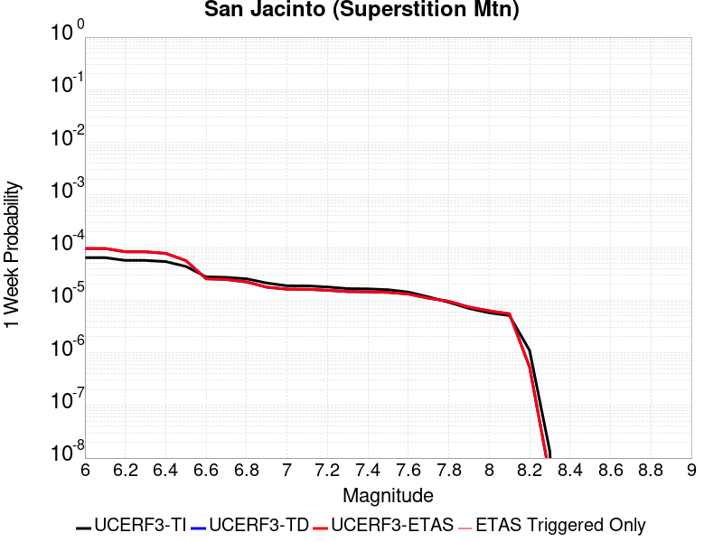 | 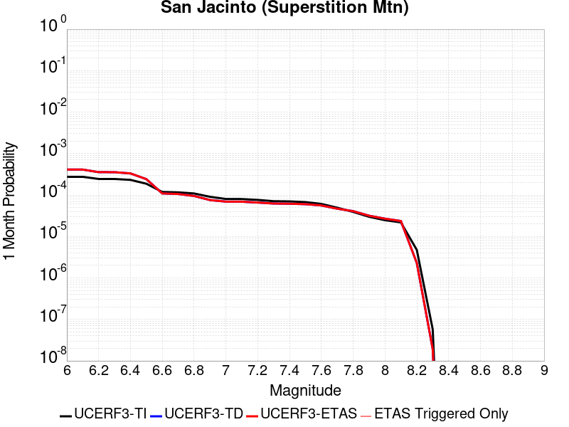 | 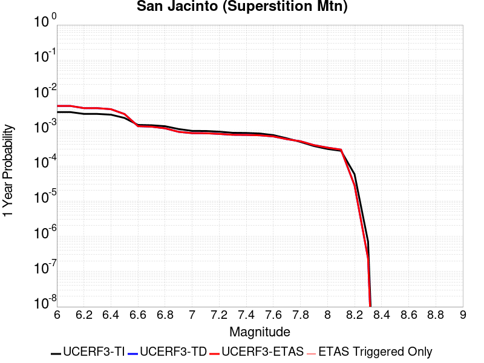 | 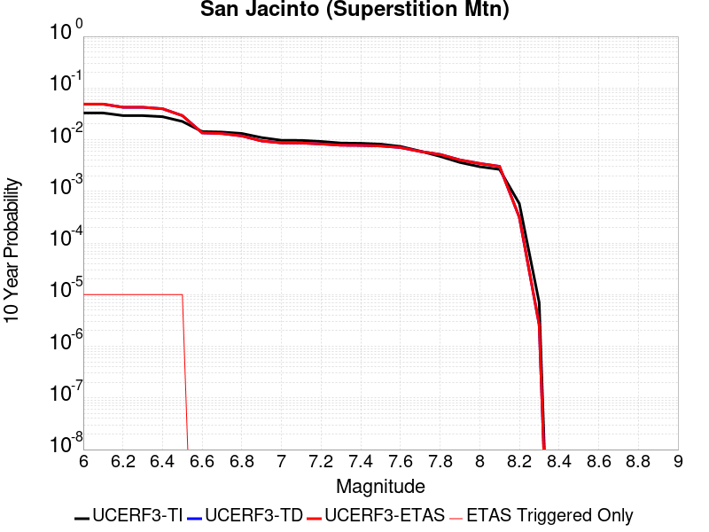 |

| Magnitude | 1 wk TI Prob | 1 wk TD Prob | 1 wk ETAS Prob | 1 wk ETAS/TD Gain | 1 wk ETAS Triggered Only | 1 mo TI Prob | 1 mo TD Prob | 1 mo ETAS Prob | 1 mo ETAS/TD Gain | 1 mo ETAS Triggered Only | 1 yr TI Prob | 1 yr TD Prob | 1 yr ETAS Prob | 1 yr ETAS/TD Gain | 1 yr ETAS Triggered Only | 10 yr TI Prob | 10 yr TD Prob | 10 yr ETAS Prob | 10 yr ETAS/TD Gain | 10 yr ETAS Triggered Only |
|-----|-----|-----|-----|-----|-----|-----|-----|-----|-----|-----|-----|-----|-----|-----|-----|-----|-----|-----|-----|-----|
| 6.0 | 6.4193904E-5 | 9.6031734E-5 | 9.6031734E-5 | 1.0 | 0.0 | 2.7508775E-4 | 4.1150753E-4 | 4.1150753E-4 | 1.0 | 0.0 | 0.0033440501 | 0.004999982 | 0.004999982 | 1.0 | 0.0 | 0.03294174 | 0.04884301 | 0.048852522 | 1.0001948 | 1.0E-5 |
| 6.1 | 6.4193904E-5 | 9.6031734E-5 | 9.6031734E-5 | 1.0 | 0.0 | 2.7508775E-4 | 4.1150753E-4 | 4.1150753E-4 | 1.0 | 0.0 | 0.0033440501 | 0.004999982 | 0.004999982 | 1.0 | 0.0 | 0.03294174 | 0.04884301 | 0.048852522 | 1.0001948 | 1.0E-5 |
| 6.2 | 5.7023593E-5 | 8.317745E-5 | 8.317745E-5 | 1.0 | 0.0 | 2.4436394E-4 | 3.5643548E-4 | 3.5643548E-4 | 1.0 | 0.0 | 0.002971072 | 0.004332609 | 0.004332609 | 1.0 | 0.0 | 0.029316625 | 0.042524595 | 0.04253417 | 1.0002252 | 1.0E-5 |
| 6.3 | 5.6940098E-5 | 8.302281E-5 | 8.302281E-5 | 1.0 | 0.0 | 2.4400617E-4 | 3.5577294E-4 | 3.5577294E-4 | 1.0 | 0.0 | 0.002966728 | 0.0043245745 | 0.0043245745 | 1.0 | 0.0 | 0.029274331 | 0.042446166 | 0.04245574 | 1.0002255 | 1.0E-5 |
| 6.4 | 5.4171585E-5 | 7.7516306E-5 | 7.7516306E-5 | 1.0 | 0.0 | 2.3214328E-4 | 3.3217974E-4 | 3.3217974E-4 | 1.0 | 0.0 | 0.0028226813 | 0.0040384373 | 0.0040384373 | 1.0 | 0.0 | 0.02787096 | 0.03973513 | 0.03974473 | 1.0002416 | 1.0E-5 |
| 6.5 | 4.375144E-5 | 5.645291E-5 | 5.645291E-5 | 1.0 | 0.0 | 1.874927E-4 | 2.4192524E-4 | 2.4192524E-4 | 1.0 | 0.0 | 0.0022803338 | 0.0029426373 | 0.0029426373 | 1.0 | 0.0 | 0.022570757 | 0.029255865 | 0.029265571 | 1.0003318 | 1.0E-5 |
| 6.6 | 2.772192E-5 | 2.5518191E-5 | 2.5518191E-5 | 1.0 | 0.0 | 1.1880282E-4 | 1.0935921E-4 | 1.0935921E-4 | 1.0 | 0.0 | 0.0014454646 | 0.0013306545 | 0.0013306545 | 1.0 | 0.0 | 0.014360986 | 0.013555608 | 0.013555608 | 1.0 | 0.0 |
| 6.7 | 2.7124124E-5 | 2.4729043E-5 | 2.4729043E-5 | 1.0 | 0.0 | 1.1624106E-4 | 1.0597741E-4 | 1.0597741E-4 | 1.0 | 0.0 | 0.0014143161 | 0.0012895304 | 0.0012895304 | 1.0 | 0.0 | 0.014053487 | 0.013149156 | 0.013149156 | 1.0 | 0.0 |
| 6.8 | 2.5475807E-5 | 2.219331E-5 | 2.219331E-5 | 1.0 | 0.0 | 1.0917746E-4 | 9.511079E-5 | 9.511079E-5 | 1.0 | 0.0 | 0.001328425 | 0.0011573706 | 0.0011573706 | 1.0 | 0.0 | 0.0132051185 | 0.01183661 | 0.01183661 | 1.0 | 0.0 |
| 6.9 | 2.1162023E-5 | 1.7652634E-5 | 1.7652634E-5 | 1.0 | 0.0 | 9.069123E-5 | 7.565197E-5 | 7.565197E-5 | 1.0 | 0.0 | 0.0011036064 | 9.206774E-4 | 9.206774E-4 | 1.0 | 0.0 | 0.010981417 | 0.009460494 | 0.009460494 | 1.0 | 0.0 |
| 7.0 | 1.8754288E-5 | 1.6186807E-5 | 1.6186807E-5 | 1.0 | 0.0 | 8.037304E-5 | 6.93702E-5 | 6.93702E-5 | 1.0 | 0.0 | 9.781026E-4 | 8.442574E-4 | 8.442574E-4 | 1.0 | 0.0 | 0.009738087 | 0.008683093 | 0.008683093 | 1.0 | 0.0 |
| 7.1 | 1.8678527E-5 | 1.6111935E-5 | 1.6111935E-5 | 1.0 | 0.0 | 8.0048376E-5 | 6.904934E-5 | 6.904934E-5 | 1.0 | 0.0 | 9.7415317E-4 | 8.403539E-4 | 8.403539E-4 | 1.0 | 0.0 | 0.009698939 | 0.008644051 | 0.008644051 | 1.0 | 0.0 |
| 7.2 | 1.7804578E-5 | 1.5406238E-5 | 1.5406238E-5 | 1.0 | 0.0 | 7.6303106E-5 | 6.602507E-5 | 6.602507E-5 | 1.0 | 0.0 | 9.285943E-4 | 8.0356107E-4 | 8.0356107E-4 | 1.0 | 0.0 | 0.009247236 | 0.008275284 | 0.008275284 | 1.0 | 0.0 |
| 7.3 | 1.6583685E-5 | 1.4555068E-5 | 1.4555068E-5 | 1.0 | 0.0 | 7.1070994E-5 | 6.237738E-5 | 6.237738E-5 | 1.0 | 0.0 | 8.649459E-4 | 7.5918203E-4 | 7.5918203E-4 | 1.0 | 0.0 | 0.00861587 | 0.007830473 | 0.007830473 | 1.0 | 0.0 |
| 7.4 | 1.6387552E-5 | 1.44199075E-5 | 1.44199075E-5 | 1.0 | 0.0 | 7.023047E-5 | 6.179815E-5 | 6.179815E-5 | 1.0 | 0.0 | 8.5472054E-4 | 7.521348E-4 | 7.521348E-4 | 1.0 | 0.0 | 0.008514405 | 0.007759824 | 0.007759824 | 1.0 | 0.0 |
| 7.5 | 1.5790754E-5 | 1.4060362E-5 | 1.4060362E-5 | 1.0 | 0.0 | 6.767291E-5 | 6.0257316E-5 | 6.0257316E-5 | 1.0 | 0.0 | 8.236062E-4 | 7.333879E-4 | 7.333879E-4 | 1.0 | 0.0 | 0.008205604 | 0.007570256 | 0.007570256 | 1.0 | 0.0 |
| 7.6 | 1.4248672E-5 | 1.307873E-5 | 1.307873E-5 | 1.0 | 0.0 | 6.106431E-5 | 5.6050507E-5 | 5.6050507E-5 | 1.0 | 0.0 | 7.432043E-4 | 6.82203E-4 | 6.82203E-4 | 1.0 | 0.0 | 0.007407237 | 0.0070524714 | 0.0070524714 | 1.0 | 0.0 |
| 7.7 | 1.15449975E-5 | 1.0926328E-5 | 1.0926328E-5 | 1.0 | 0.0 | 4.947762E-5 | 4.6826284E-5 | 4.6826284E-5 | 1.0 | 0.0 | 6.022235E-4 | 5.699617E-4 | 5.699617E-4 | 1.0 | 0.0 | 0.006005941 | 0.0059218984 | 0.0059218984 | 1.0 | 0.0 |
| 7.8 | 9.1391985E-6 | 9.536162E-6 | 9.536162E-6 | 1.0 | 0.0 | 3.9167408E-5 | 4.086863E-5 | 4.086863E-5 | 1.0 | 0.0 | 4.767588E-4 | 4.974625E-4 | 4.974625E-4 | 1.0 | 0.0 | 0.0047573727 | 0.0051878807 | 0.0051878807 | 1.0 | 0.0 |
| 7.9 | 6.973017E-6 | 7.4015866E-6 | 7.4015866E-6 | 1.0 | 0.0 | 2.9884017E-5 | 3.17207E-5 | 3.17207E-5 | 1.0 | 0.0 | 3.6377716E-4 | 3.8613164E-4 | 3.8613164E-4 | 1.0 | 0.0 | 0.0036318225 | 0.0040617753 | 0.0040617753 | 1.0 | 0.0 |
| 8.0 | 5.7638235E-6 | 6.2776808E-6 | 6.2776808E-6 | 1.0 | 0.0 | 2.4701867E-5 | 2.690407E-5 | 2.690407E-5 | 1.0 | 0.0 | 3.0070372E-4 | 3.2750834E-4 | 3.2750834E-4 | 1.0 | 0.0 | 0.0030029714 | 0.0034626245 | 0.0034626245 | 1.0 | 0.0 |
| 8.1 | 5.1124434E-6 | 5.511779E-6 | 5.511779E-6 | 1.0 | 0.0 | 2.1910288E-5 | 2.3621698E-5 | 2.3621698E-5 | 1.0 | 0.0 | 2.6672508E-4 | 2.875567E-4 | 2.875567E-4 | 1.0 | 0.0 | 0.0026640517 | 0.0030486921 | 0.0030486921 | 1.0 | 0.0 |
| 8.2 | 1.1075938E-6 | 5.3588E-7 | 5.3588E-7 | 1.0 | 0.0 | 4.7468216E-6 | 2.296627E-6 | 2.296627E-6 | 1.0 | 0.0 | 5.779102E-5 | 2.7961096E-5 | 2.7961096E-5 | 1.0 | 0.0 | 5.777599E-4 | 3.147075E-4 | 3.147075E-4 | 1.0 | 0.0 |
| 8.3 | 1.3584393E-8 | 4.4946056E-9 | 4.4946056E-9 | 1.0 | 0.0 | 5.8218827E-8 | 1.9262595E-8 | 1.9262595E-8 | 1.0 | 0.0 | 7.0881396E-7 | 2.3452209E-7 | 2.3452209E-7 | 1.0 | 0.0 | 7.0881174E-6 | 2.6288906E-6 | 2.6288906E-6 | 1.0 | 0.0 |

## North Salt Lake
*[(top)](#table-of-contents)*

| 1 Week | 1 Month | 1 Year | 10 Year |
|-----|-----|-----|-----|
| 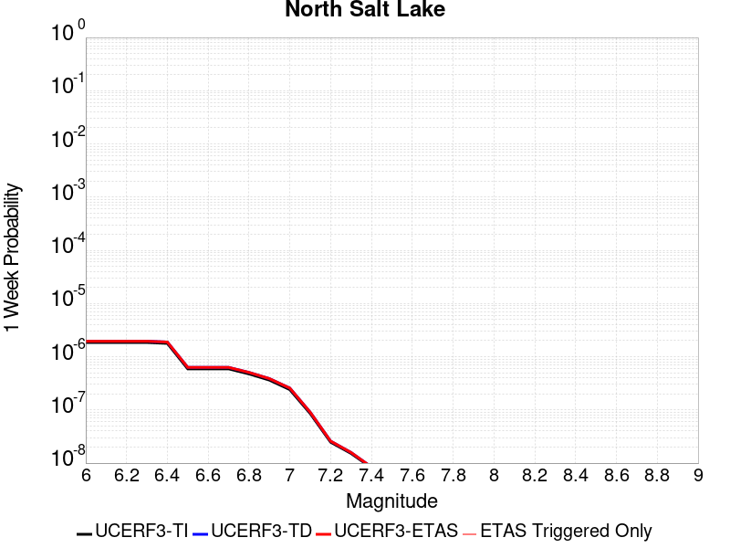 | 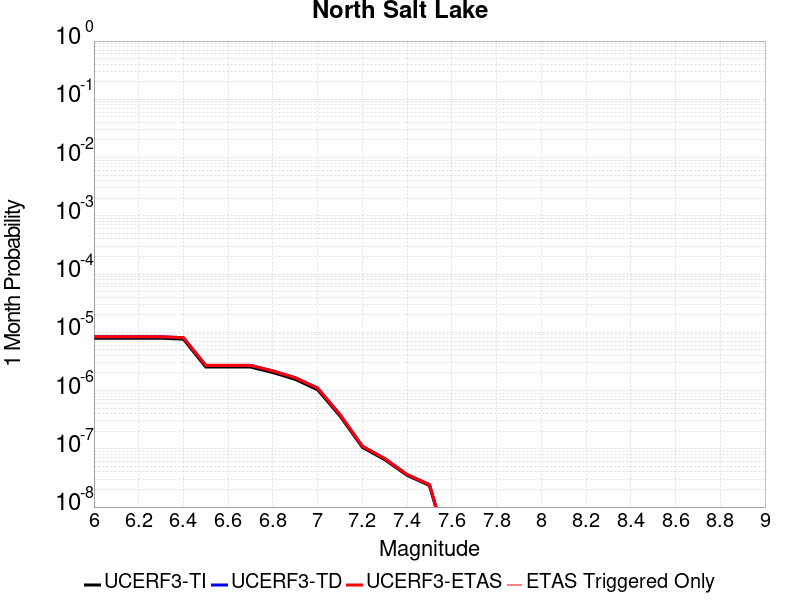 | 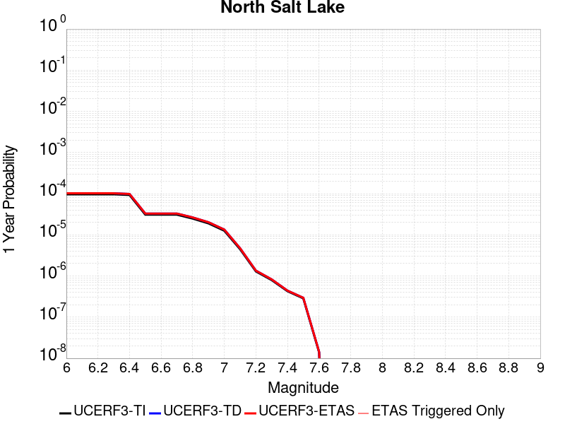 |  |

| Magnitude | 1 wk TI Prob | 1 wk TD Prob | 1 wk ETAS Prob | 1 wk ETAS/TD Gain | 1 wk ETAS Triggered Only | 1 mo TI Prob | 1 mo TD Prob | 1 mo ETAS Prob | 1 mo ETAS/TD Gain | 1 mo ETAS Triggered Only | 1 yr TI Prob | 1 yr TD Prob | 1 yr ETAS Prob | 1 yr ETAS/TD Gain | 1 yr ETAS Triggered Only | 10 yr TI Prob | 10 yr TD Prob | 10 yr ETAS Prob | 10 yr ETAS/TD Gain | 10 yr ETAS Triggered Only |
|-----|-----|-----|-----|-----|-----|-----|-----|-----|-----|-----|-----|-----|-----|-----|-----|-----|-----|-----|-----|-----|
| 6.0 | 1.849599E-6 | 1.9556455E-6 | 1.9556455E-6 | 1.0 | 0.0 | 7.926829E-6 | 8.381322E-6 | 8.381322E-6 | 1.0 | 0.0 | 9.650487E-5 | 1.02039834E-4 | 1.02039834E-4 | 1.0 | 0.0 | 9.646297E-4 | 0.0010201277 | 0.0010301175 | 1.0097927 | 1.0E-5 |
| 6.1 | 1.849599E-6 | 1.9556455E-6 | 1.9556455E-6 | 1.0 | 0.0 | 7.926829E-6 | 8.381322E-6 | 8.381322E-6 | 1.0 | 0.0 | 9.650487E-5 | 1.02039834E-4 | 1.02039834E-4 | 1.0 | 0.0 | 9.646297E-4 | 0.0010201277 | 0.0010301175 | 1.0097927 | 1.0E-5 |
| 6.2 | 1.849599E-6 | 1.9556455E-6 | 1.9556455E-6 | 1.0 | 0.0 | 7.926829E-6 | 8.381322E-6 | 8.381322E-6 | 1.0 | 0.0 | 9.650487E-5 | 1.02039834E-4 | 1.02039834E-4 | 1.0 | 0.0 | 9.646297E-4 | 0.0010201277 | 0.0010301175 | 1.0097927 | 1.0E-5 |
| 6.3 | 1.849599E-6 | 1.9556455E-6 | 1.9556455E-6 | 1.0 | 0.0 | 7.926829E-6 | 8.381322E-6 | 8.381322E-6 | 1.0 | 0.0 | 9.650487E-5 | 1.02039834E-4 | 1.02039834E-4 | 1.0 | 0.0 | 9.646297E-4 | 0.0010201277 | 0.0010301175 | 1.0097927 | 1.0E-5 |
| 6.4 | 1.7803909E-6 | 1.8861451E-6 | 1.8861451E-6 | 1.0 | 0.0 | 7.630225E-6 | 8.083465E-6 | 8.083465E-6 | 1.0 | 0.0 | 9.289402E-5 | 9.841376E-5 | 9.841376E-5 | 1.0 | 0.0 | 9.28552E-4 | 9.83899E-4 | 9.938892E-4 | 1.0101537 | 1.0E-5 |
| 6.5 | 5.9157696E-7 | 6.3004563E-7 | 6.3004563E-7 | 1.0 | 0.0 | 2.5353274E-6 | 2.7001931E-6 | 2.7001931E-6 | 1.0 | 0.0 | 3.0867173E-5 | 3.2874395E-5 | 3.2874395E-5 | 1.0 | 0.0 | 3.0862886E-4 | 3.2869924E-4 | 3.2869924E-4 | 1.0 | 0.0 |
| 6.6 | 5.9157696E-7 | 6.3004563E-7 | 6.3004563E-7 | 1.0 | 0.0 | 2.5353274E-6 | 2.7001931E-6 | 2.7001931E-6 | 1.0 | 0.0 | 3.0867173E-5 | 3.2874395E-5 | 3.2874395E-5 | 1.0 | 0.0 | 3.0862886E-4 | 3.2869924E-4 | 3.2869924E-4 | 1.0 | 0.0 |
| 6.7 | 5.9157696E-7 | 6.3004563E-7 | 6.3004563E-7 | 1.0 | 0.0 | 2.5353274E-6 | 2.7001931E-6 | 2.7001931E-6 | 1.0 | 0.0 | 3.0867173E-5 | 3.2874395E-5 | 3.2874395E-5 | 1.0 | 0.0 | 3.0862886E-4 | 3.2869924E-4 | 3.2869924E-4 | 1.0 | 0.0 |
| 6.8 | 4.7536267E-7 | 5.066241E-7 | 5.066241E-7 | 1.0 | 0.0 | 2.037267E-6 | 2.1712444E-6 | 2.1712444E-6 | 1.0 | 0.0 | 2.4803443E-5 | 2.6434604E-5 | 2.6434604E-5 | 1.0 | 0.0 | 2.4800675E-4 | 2.6431703E-4 | 2.6431703E-4 | 1.0 | 0.0 |
| 6.9 | 3.6345344E-7 | 3.8751756E-7 | 3.8751756E-7 | 1.0 | 0.0 | 1.5576567E-6 | 1.6607886E-6 | 1.6607886E-6 | 1.0 | 0.0 | 1.8964305E-5 | 2.0219932E-5 | 2.0219932E-5 | 1.0 | 0.0 | 1.8962687E-4 | 2.0218261E-4 | 2.0218261E-4 | 1.0 | 0.0 |
| 7.0 | 2.4087325E-7 | 2.5710486E-7 | 2.5710486E-7 | 1.0 | 0.0 | 1.0323135E-6 | 1.1018776E-6 | 1.1018776E-6 | 1.0 | 0.0 | 1.25683455E-5 | 1.3415291E-5 | 1.3415291E-5 | 1.0 | 0.0 | 1.2567634E-4 | 1.3414607E-4 | 1.3414607E-4 | 1.0 | 0.0 |
| 7.1 | 8.551555E-8 | 9.0448246E-8 | 9.0448246E-8 | 1.0 | 0.0 | 3.6649516E-7 | 3.8763528E-7 | 3.8763528E-7 | 1.0 | 0.0 | 4.4620692E-6 | 4.7194508E-6 | 4.7194508E-6 | 1.0 | 0.0 | 4.46198E-5 | 4.7193622E-5 | 4.7193622E-5 | 1.0 | 0.0 |
| 7.2 | 2.475279E-8 | 2.5893968E-8 | 2.5893968E-8 | 1.0 | 0.0 | 1.0608338E-7 | 1.1097414E-7 | 1.1097414E-7 | 1.0 | 0.0 | 1.2915643E-6 | 1.3511094E-6 | 1.3511094E-6 | 1.0 | 0.0 | 1.2915569E-5 | 1.3511019E-5 | 1.3511019E-5 | 1.0 | 0.0 |
| 7.3 | 1.5212393E-8 | 1.5847931E-8 | 1.5847931E-8 | 1.0 | 0.0 | 6.519597E-8 | 6.79197E-8 | 6.79197E-8 | 1.0 | 0.0 | 7.9376065E-7 | 8.269221E-7 | 8.269221E-7 | 1.0 | 0.0 | 7.937579E-6 | 8.269193E-6 | 8.269193E-6 | 1.0 | 0.0 |
| 7.4 | 8.182E-9 | 8.4474765E-9 | 8.4474765E-9 | 1.0 | 0.0 | 3.5065714E-8 | 3.620347E-8 | 3.620347E-8 | 1.0 | 0.0 | 4.26925E-7 | 4.4077714E-7 | 4.4077714E-7 | 1.0 | 0.0 | 4.269242E-6 | 4.4077633E-6 | 4.4077633E-6 | 1.0 | 0.0 |
| 7.5 | 5.479913E-9 | 5.6681726E-9 | 5.6681726E-9 | 1.0 | 0.0 | 2.3485342E-8 | 2.4292168E-8 | 2.4292168E-8 | 1.0 | 0.0 | 2.85934E-7 | 2.957571E-7 | 2.957571E-7 | 1.0 | 0.0 | 2.8593363E-6 | 2.9575676E-6 | 2.9575676E-6 | 1.0 | 0.0 |
| 7.6 | 2.6813562E-10 | 2.7732583E-10 | 2.7732583E-10 | 1.0 | 0.0 | 1.1491527E-9 | 1.1885393E-9 | 1.1885393E-9 | 1.0 | 0.0 | 1.3990933E-8 | 1.4470464E-8 | 1.4470464E-8 | 1.0 | 0.0 | 1.3990932E-7 | 1.4470464E-7 | 1.4470464E-7 | 1.0 | 0.0 |

## Bartlett Springs 2011 CFM
*[(top)](#table-of-contents)*

| 1 Week | 1 Month | 1 Year | 10 Year |
|-----|-----|-----|-----|
| 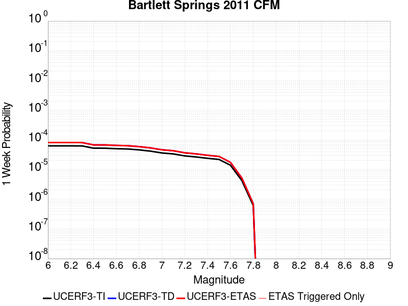 | 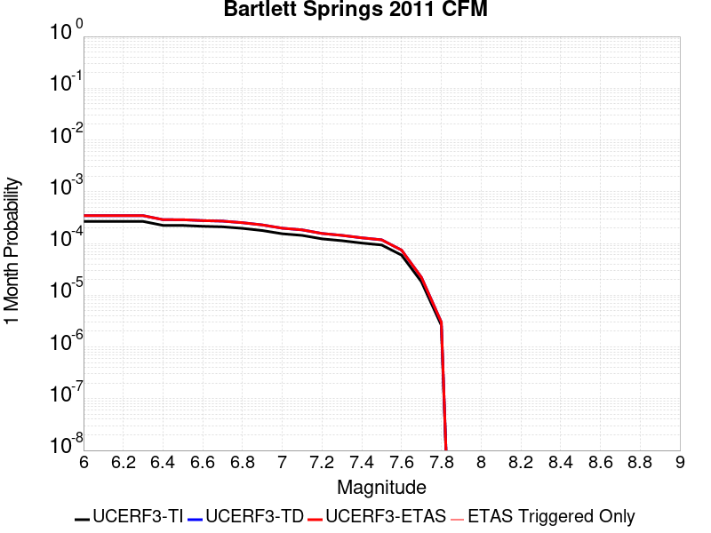 |  |  |

| Magnitude | 1 wk TI Prob | 1 wk TD Prob | 1 wk ETAS Prob | 1 wk ETAS/TD Gain | 1 wk ETAS Triggered Only | 1 mo TI Prob | 1 mo TD Prob | 1 mo ETAS Prob | 1 mo ETAS/TD Gain | 1 mo ETAS Triggered Only | 1 yr TI Prob | 1 yr TD Prob | 1 yr ETAS Prob | 1 yr ETAS/TD Gain | 1 yr ETAS Triggered Only | 10 yr TI Prob | 10 yr TD Prob | 10 yr ETAS Prob | 10 yr ETAS/TD Gain | 10 yr ETAS Triggered Only |
|-----|-----|-----|-----|-----|-----|-----|-----|-----|-----|-----|-----|-----|-----|-----|-----|-----|-----|-----|-----|-----|
| 6.0 | 6.2326144E-5 | 8.06206E-5 | 8.06206E-5 | 1.0 | 0.0 | 2.6708472E-4 | 3.454719E-4 | 3.454719E-4 | 1.0 | 0.0 | 0.003246908 | 0.00419811 | 0.00419811 | 1.0 | 0.0 | 0.031998757 | 0.04120504 | 0.041214626 | 1.0002327 | 1.0E-5 |
| 6.1 | 6.227657E-5 | 8.055809E-5 | 8.055809E-5 | 1.0 | 0.0 | 2.668723E-4 | 3.4520408E-4 | 3.4520408E-4 | 1.0 | 0.0 | 0.0032443295 | 0.004194862 | 0.004194862 | 1.0 | 0.0 | 0.031973712 | 0.04117377 | 0.041183356 | 1.0002328 | 1.0E-5 |
| 6.2 | 6.22452E-5 | 8.0518694E-5 | 8.0518694E-5 | 1.0 | 0.0 | 2.6673786E-4 | 3.4503525E-4 | 3.4503525E-4 | 1.0 | 0.0 | 0.0032426978 | 0.0041928147 | 0.0041928147 | 1.0 | 0.0 | 0.03195787 | 0.041154057 | 0.041163646 | 1.0002329 | 1.0E-5 |
| 6.3 | 6.219006E-5 | 8.044852E-5 | 8.044852E-5 | 1.0 | 0.0 | 2.6650162E-4 | 3.4473458E-4 | 3.4473458E-4 | 1.0 | 0.0 | 0.00323983 | 0.004189168 | 0.004189168 | 1.0 | 0.0 | 0.031930014 | 0.041118953 | 0.041128542 | 1.0002332 | 1.0E-5 |
| 6.4 | 5.2175856E-5 | 6.726549E-5 | 6.726549E-5 | 1.0 | 0.0 | 2.2359163E-4 | 2.8824917E-4 | 2.8824917E-4 | 1.0 | 0.0 | 0.0027188298 | 0.003503833 | 0.003503833 | 1.0 | 0.0 | 0.026858058 | 0.03449521 | 0.03449521 | 1.0 | 0.0 |
| 6.5 | 5.205166E-5 | 6.7108136E-5 | 6.7108136E-5 | 1.0 | 0.0 | 2.2305945E-4 | 2.8757492E-4 | 2.8757492E-4 | 1.0 | 0.0 | 0.0027123666 | 0.0034956504 | 0.0034956504 | 1.0 | 0.0 | 0.026794989 | 0.03441594 | 0.03441594 | 1.0 | 0.0 |
| 6.6 | 5.0085426E-5 | 6.450395E-5 | 6.450395E-5 | 1.0 | 0.0 | 2.1463417E-4 | 2.7641648E-4 | 2.7641648E-4 | 1.0 | 0.0 | 0.0026100394 | 0.003360227 | 0.003360227 | 1.0 | 0.0 | 0.025795965 | 0.033103265 | 0.033103265 | 1.0 | 0.0 |
| 6.7 | 4.8930866E-5 | 6.302835E-5 | 6.302835E-5 | 1.0 | 0.0 | 2.0968684E-4 | 2.7009382E-4 | 2.7009382E-4 | 1.0 | 0.0 | 0.0025499484 | 0.0032834832 | 0.0032834832 | 1.0 | 0.0 | 0.025208864 | 0.032358497 | 0.032358497 | 1.0 | 0.0 |
| 6.8 | 4.5679535E-5 | 5.8751884E-5 | 5.8751884E-5 | 1.0 | 0.0 | 1.9575475E-4 | 2.517697E-4 | 2.517697E-4 | 1.0 | 0.0 | 0.002380709 | 0.0030610252 | 0.0030610252 | 1.0 | 0.0 | 0.023553653 | 0.030195534 | 0.030195534 | 1.0 | 0.0 |
| 6.9 | 4.1439176E-5 | 5.3228985E-5 | 5.3228985E-5 | 1.0 | 0.0 | 1.7758438E-4 | 2.2810443E-4 | 2.2810443E-4 | 1.0 | 0.0 | 0.002159946 | 0.0027736598 | 0.0027736598 | 1.0 | 0.0 | 0.021390721 | 0.027395338 | 0.027395338 | 1.0 | 0.0 |
| 7.0 | 3.5920104E-5 | 4.601614E-5 | 4.601614E-5 | 1.0 | 0.0 | 1.5393422E-4 | 1.9719721E-4 | 1.9719721E-4 | 1.0 | 0.0 | 0.001872538 | 0.0023982483 | 0.0023982483 | 1.0 | 0.0 | 0.018568378 | 0.023726836 | 0.023726836 | 1.0 | 0.0 |
| 7.1 | 3.338812E-5 | 4.269631E-5 | 4.269631E-5 | 1.0 | 0.0 | 1.430841E-4 | 1.8297143E-4 | 1.8297143E-4 | 1.0 | 0.0 | 0.0017406568 | 0.0022254158 | 0.0022254158 | 1.0 | 0.0 | 0.017270854 | 0.022034027 | 0.022034027 | 1.0 | 0.0 |
| 7.2 | 2.8619615E-5 | 3.640718E-5 | 3.640718E-5 | 1.0 | 0.0 | 1.2264973E-4 | 1.5602149E-4 | 1.5602149E-4 | 1.0 | 0.0 | 0.0014922376 | 0.0018979164 | 0.0018979164 | 1.0 | 0.0 | 0.014822568 | 0.018819029 | 0.018819029 | 1.0 | 0.0 |
| 7.3 | 2.6376783E-5 | 3.342784E-5 | 3.342784E-5 | 1.0 | 0.0 | 1.13038455E-4 | 1.4325436E-4 | 1.4325436E-4 | 1.0 | 0.0 | 0.0013753743 | 0.0017427359 | 0.0017427359 | 1.0 | 0.0 | 0.01366893 | 0.017292362 | 0.017292362 | 1.0 | 0.0 |
| 7.4 | 2.3738676E-5 | 2.998346E-5 | 2.998346E-5 | 1.0 | 0.0 | 1.0173322E-4 | 1.2849426E-4 | 1.2849426E-4 | 1.0 | 0.0 | 0.0012378981 | 0.0015633029 | 0.0015633029 | 1.0 | 0.0 | 0.012310251 | 0.015524435 | 0.015524435 | 1.0 | 0.0 |
| 7.5 | 2.1789481E-5 | 2.7443455E-5 | 2.7443455E-5 | 1.0 | 0.0 | 9.338015E-5 | 1.1760955E-4 | 1.1760955E-4 | 1.0 | 0.0 | 0.0011363103 | 0.0014309636 | 0.0014309636 | 1.0 | 0.0 | 0.011305175 | 0.014218755 | 0.014218755 | 1.0 | 0.0 |
| 7.6 | 1.3895281E-5 | 1.7370703E-5 | 1.7370703E-5 | 1.0 | 0.0 | 5.9549846E-5 | 7.4443764E-5 | 7.4443764E-5 | 1.0 | 0.0 | 7.2477816E-4 | 9.059788E-4 | 9.059788E-4 | 1.0 | 0.0 | 0.0072241887 | 0.009023316 | 0.009023316 | 1.0 | 0.0 |
| 7.7 | 4.245981E-6 | 5.163062E-6 | 5.163062E-6 | 1.0 | 0.0 | 1.8196934E-5 | 2.212722E-5 | 2.212722E-5 | 1.0 | 0.0 | 2.2152514E-4 | 2.693658E-4 | 2.693658E-4 | 1.0 | 0.0 | 0.0022130446 | 0.002690434 | 0.002690434 | 1.0 | 0.0 |
| 7.8 | 6.145192E-7 | 7.047654E-7 | 7.047654E-7 | 1.0 | 0.0 | 2.633651E-6 | 3.0204196E-6 | 3.0204196E-6 | 1.0 | 0.0 | 3.206423E-5 | 3.6773003E-5 | 3.6773003E-5 | 1.0 | 0.0 | 3.2059604E-4 | 3.6766316E-4 | 3.6766316E-4 | 1.0 | 0.0 |

## Rodgers Creek - Healdsburg 2011 CFM
*[(top)](#table-of-contents)*

| 1 Week | 1 Month | 1 Year | 10 Year |
|-----|-----|-----|-----|
|  |  |  |  |

| Magnitude | 1 wk TI Prob | 1 wk TD Prob | 1 wk ETAS Prob | 1 wk ETAS/TD Gain | 1 wk ETAS Triggered Only | 1 mo TI Prob | 1 mo TD Prob | 1 mo ETAS Prob | 1 mo ETAS/TD Gain | 1 mo ETAS Triggered Only | 1 yr TI Prob | 1 yr TD Prob | 1 yr ETAS Prob | 1 yr ETAS/TD Gain | 1 yr ETAS Triggered Only | 10 yr TI Prob | 10 yr TD Prob | 10 yr ETAS Prob | 10 yr ETAS/TD Gain | 10 yr ETAS Triggered Only |
|-----|-----|-----|-----|-----|-----|-----|-----|-----|-----|-----|-----|-----|-----|-----|-----|-----|-----|-----|-----|-----|
| 6.0 | 7.390182E-5 | 1.3144419E-4 | 1.3144419E-4 | 1.0 | 0.0 | 3.1668364E-4 | 5.632102E-4 | 5.632102E-4 | 1.0 | 0.0 | 0.0038488081 | 0.0068354798 | 0.0068454114 | 1.0014529 | 1.0E-5 | 0.037828278 | 0.0662301 | 0.06623945 | 1.000141 | 1.0E-5 |
| 6.1 | 7.318768E-5 | 1.3042415E-4 | 1.3042415E-4 | 1.0 | 0.0 | 3.1362378E-4 | 5.5884046E-4 | 5.5884046E-4 | 1.0 | 0.0 | 0.0038116854 | 0.0067826263 | 0.0067925584 | 1.0014644 | 1.0E-5 | 0.037469655 | 0.06573461 | 0.06574395 | 1.0001421 | 1.0E-5 |
| 6.2 | 7.1379836E-5 | 1.2735245E-4 | 1.2735245E-4 | 1.0 | 0.0 | 3.058777E-4 | 5.456816E-4 | 5.456816E-4 | 1.0 | 0.0 | 0.003717703 | 0.0066234 | 0.006633334 | 1.0014998 | 1.0E-5 | 0.0365612 | 0.06424088 | 0.06425023 | 1.0001457 | 1.0E-5 |
| 6.3 | 6.9255926E-5 | 1.2389489E-4 | 1.2389489E-4 | 1.0 | 0.0 | 2.9677735E-4 | 5.3087E-4 | 5.3087E-4 | 1.0 | 0.0 | 0.0036072785 | 0.006444236 | 0.0064541716 | 1.0015417 | 1.0E-5 | 0.035492823 | 0.06257187 | 0.06258124 | 1.0001498 | 1.0E-5 |
| 6.4 | 6.6757144E-5 | 1.19660916E-4 | 1.19660916E-4 | 1.0 | 0.0 | 2.8607066E-4 | 5.12732E-4 | 5.12732E-4 | 1.0 | 0.0 | 0.0034773487 | 0.006224717 | 0.0062346547 | 1.0015965 | 1.0E-5 | 0.034234364 | 0.060521435 | 0.06053083 | 1.0001552 | 1.0E-5 |
| 6.5 | 6.5735134E-5 | 1.1815111E-4 | 1.1815111E-4 | 1.0 | 0.0 | 2.8169158E-4 | 5.0626404E-4 | 5.0626404E-4 | 1.0 | 0.0 | 0.003424202 | 0.006146429 | 0.0061563672 | 1.001617 | 1.0E-5 | 0.03371918 | 0.059785582 | 0.059794985 | 1.0001572 | 1.0E-5 |
| 6.6 | 6.289601E-5 | 1.1350398E-4 | 1.1350398E-4 | 1.0 | 0.0 | 2.6952647E-4 | 4.863553E-4 | 4.863553E-4 | 1.0 | 0.0 | 0.0032765474 | 0.005905379 | 0.00591532 | 1.0016834 | 1.0E-5 | 0.032286562 | 0.05752294 | 0.057532366 | 1.0001638 | 1.0E-5 |
| 6.7 | 6.115274E-5 | 1.1067318E-4 | 1.1067318E-4 | 1.0 | 0.0 | 2.6205686E-4 | 4.742278E-4 | 4.742278E-4 | 1.0 | 0.0 | 0.0031858748 | 0.0057585174 | 0.0057684598 | 1.0017265 | 1.0E-5 | 0.031405866 | 0.05614093 | 0.05615037 | 1.0001681 | 1.0E-5 |
| 6.8 | 5.9232367E-5 | 1.0734599E-4 | 1.0734599E-4 | 1.0 | 0.0 | 2.538283E-4 | 4.5997353E-4 | 4.5997353E-4 | 1.0 | 0.0 | 0.0030859804 | 0.0055858744 | 0.0055958186 | 1.0017803 | 1.0E-5 | 0.030434765 | 0.054507483 | 0.054516938 | 1.0001734 | 1.0E-5 |
| 6.9 | 5.4030377E-5 | 9.828622E-5 | 9.828622E-5 | 1.0 | 0.0 | 2.315382E-4 | 4.21159E-4 | 4.21159E-4 | 1.0 | 0.0 | 0.0028153337 | 0.0051156213 | 0.00512557 | 1.0019448 | 1.0E-5 | 0.027799325 | 0.050042935 | 0.050052434 | 1.0001898 | 1.0E-5 |
| 7.0 | 4.8260714E-5 | 8.746496E-5 | 8.746496E-5 | 1.0 | 0.0 | 2.0681522E-4 | 3.7479628E-4 | 3.7479628E-4 | 1.0 | 0.0 | 0.0025150678 | 0.0045536514 | 0.004563606 | 1.0021861 | 1.0E-5 | 0.024867928 | 0.04469602 | 0.044705573 | 1.0002137 | 1.0E-5 |
| 7.1 | 4.0294493E-5 | 7.394212E-5 | 7.394212E-5 | 1.0 | 0.0 | 1.7267925E-4 | 3.1685652E-4 | 3.1685652E-4 | 1.0 | 0.0 | 0.0021003427 | 0.0038509425 | 0.003860904 | 1.0025867 | 1.0E-5 | 0.02080602 | 0.03794796 | 0.03795758 | 1.0002536 | 1.0E-5 |
| 7.2 | 3.096388E-5 | 5.70266E-5 | 5.70266E-5 | 1.0 | 0.0 | 1.326956E-4 | 2.4437695E-4 | 2.4437695E-4 | 1.0 | 0.0 | 0.0016143717 | 0.002971252 | 0.002971252 | 1.0 | 0.0 | 0.01602694 | 0.02946091 | 0.02946091 | 1.0 | 0.0 |
| 7.3 | 2.3615226E-5 | 4.3672935E-5 | 4.3672935E-5 | 1.0 | 0.0 | 1.0120418E-4 | 1.8715637E-4 | 1.8715637E-4 | 1.0 | 0.0 | 0.0012314644 | 0.0022762613 | 0.0022762613 | 1.0 | 0.0 | 0.0122466255 | 0.022659717 | 0.022659717 | 1.0 | 0.0 |
| 7.4 | 1.8251132E-5 | 3.3580847E-5 | 3.3580847E-5 | 1.0 | 0.0 | 7.821679E-5 | 1.4391005E-4 | 1.4391005E-4 | 1.0 | 0.0 | 9.518733E-4 | 0.0017507065 | 0.0017507065 | 1.0 | 0.0 | 0.009478063 | 0.017485874 | 0.017485874 | 1.0 | 0.0 |
| 7.5 | 1.2411432E-5 | 2.2490634E-5 | 2.2490634E-5 | 1.0 | 0.0 | 5.3190768E-5 | 9.638491E-5 | 9.638491E-5 | 1.0 | 0.0 | 6.4740516E-4 | 0.0011728603 | 0.0011728603 | 1.0 | 0.0 | 0.006455223 | 0.011759526 | 0.011759526 | 1.0 | 0.0 |
| 7.6 | 4.4771446E-6 | 8.094205E-6 | 8.094205E-6 | 1.0 | 0.0 | 1.918762E-5 | 3.4688997E-5 | 3.4688997E-5 | 1.0 | 0.0 | 2.3358424E-4 | 4.2225793E-4 | 4.2225793E-4 | 1.0 | 0.0 | 0.0023333887 | 0.0042520305 | 0.0042520305 | 1.0 | 0.0 |
| 7.7 | 2.157941E-7 | 3.5411338E-7 | 3.5411338E-7 | 1.0 | 0.0 | 9.248315E-7 | 1.5176278E-6 | 1.5176278E-6 | 1.0 | 0.0 | 1.1259765E-5 | 1.8476961E-5 | 1.8476961E-5 | 1.0 | 0.0 | 1.1259195E-4 | 1.9099656E-4 | 1.9099656E-4 | 1.0 | 0.0 |
| 7.8 | 9.9623286E-8 | 1.9947142E-7 | 1.9947142E-7 | 1.0 | 0.0 | 4.269569E-7 | 8.5487716E-7 | 8.5487716E-7 | 1.0 | 0.0 | 5.1981874E-6 | 1.040808E-5 | 1.040808E-5 | 1.0 | 0.0 | 5.198066E-5 | 1.0924259E-4 | 1.0924259E-4 | 1.0 | 0.0 |
| 7.9 | 5.6745257E-8 | 1.1803542E-7 | 1.1803542E-7 | 1.0 | 0.0 | 2.4319394E-7 | 5.05866E-7 | 5.05866E-7 | 1.0 | 0.0 | 2.960882E-6 | 6.158901E-6 | 6.158901E-6 | 1.0 | 0.0 | 2.9608427E-5 | 6.485317E-5 | 6.485317E-5 | 1.0 | 0.0 |
| 8.0 | 2.8614323E-8 | 6.5945E-8 | 6.5945E-8 | 1.0 | 0.0 | 1.2263281E-7 | 2.8262141E-7 | 2.8262141E-7 | 1.0 | 0.0 | 1.4930534E-6 | 3.4409104E-6 | 3.4409104E-6 | 1.0 | 0.0 | 1.4930434E-5 | 3.590248E-5 | 3.590248E-5 | 1.0 | 0.0 |
| 8.1 | 3.5045191E-9 | 8.986112E-9 | 8.986112E-9 | 1.0 | 0.0 | 1.5019367E-8 | 3.851191E-8 | 3.851191E-8 | 1.0 | 0.0 | 1.8286079E-7 | 4.688824E-7 | 4.688824E-7 | 1.0 | 0.0 | 1.8286064E-6 | 4.8425136E-6 | 4.8425136E-6 | 1.0 | 0.0 |

## Great Valley 04b Gordon Valley
*[(top)](#table-of-contents)*

| 1 Week | 1 Month | 1 Year | 10 Year |
|-----|-----|-----|-----|
|  |  | 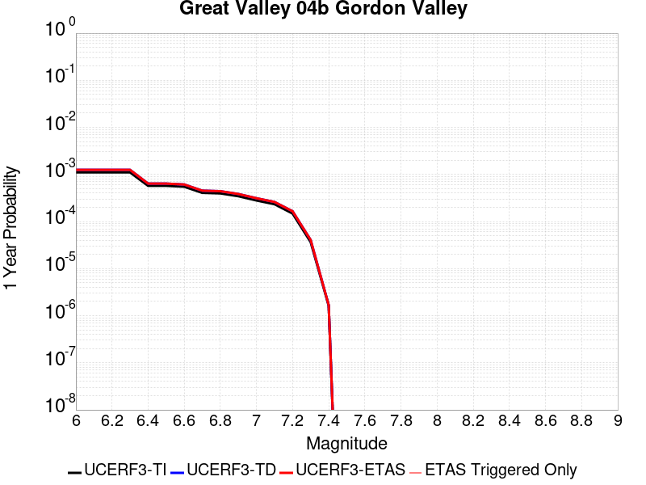 |  |

| Magnitude | 1 wk TI Prob | 1 wk TD Prob | 1 wk ETAS Prob | 1 wk ETAS/TD Gain | 1 wk ETAS Triggered Only | 1 mo TI Prob | 1 mo TD Prob | 1 mo ETAS Prob | 1 mo ETAS/TD Gain | 1 mo ETAS Triggered Only | 1 yr TI Prob | 1 yr TD Prob | 1 yr ETAS Prob | 1 yr ETAS/TD Gain | 1 yr ETAS Triggered Only | 10 yr TI Prob | 10 yr TD Prob | 10 yr ETAS Prob | 10 yr ETAS/TD Gain | 10 yr ETAS Triggered Only |
|-----|-----|-----|-----|-----|-----|-----|-----|-----|-----|-----|-----|-----|-----|-----|-----|-----|-----|-----|-----|-----|
| 6.0 | 2.1181217E-5 | 2.3984061E-5 | 2.3984061E-5 | 1.0 | 0.0 | 9.077348E-5 | 1.0278572E-4 | 1.0278572E-4 | 1.0 | 0.0 | 0.0011046068 | 0.0012508645 | 0.0012508645 | 1.0 | 0.0 | 0.010991322 | 0.01245469 | 0.012464566 | 1.0007929 | 1.0E-5 |
| 6.1 | 2.1181217E-5 | 2.3984061E-5 | 2.3984061E-5 | 1.0 | 0.0 | 9.077348E-5 | 1.0278572E-4 | 1.0278572E-4 | 1.0 | 0.0 | 0.0011046068 | 0.0012508645 | 0.0012508645 | 1.0 | 0.0 | 0.010991322 | 0.01245469 | 0.012464566 | 1.0007929 | 1.0E-5 |
| 6.2 | 2.1181217E-5 | 2.3984061E-5 | 2.3984061E-5 | 1.0 | 0.0 | 9.077348E-5 | 1.0278572E-4 | 1.0278572E-4 | 1.0 | 0.0 | 0.0011046068 | 0.0012508645 | 0.0012508645 | 1.0 | 0.0 | 0.010991322 | 0.01245469 | 0.012464566 | 1.0007929 | 1.0E-5 |
| 6.3 | 2.1181217E-5 | 2.3984061E-5 | 2.3984061E-5 | 1.0 | 0.0 | 9.077348E-5 | 1.0278572E-4 | 1.0278572E-4 | 1.0 | 0.0 | 0.0011046068 | 0.0012508645 | 0.0012508645 | 1.0 | 0.0 | 0.010991322 | 0.01245469 | 0.012464566 | 1.0007929 | 1.0E-5 |
| 6.4 | 1.0988268E-5 | 1.2255436E-5 | 1.2255436E-5 | 1.0 | 0.0 | 4.7091726E-5 | 5.252233E-5 | 5.252233E-5 | 1.0 | 0.0 | 5.731909E-4 | 6.392877E-4 | 6.392877E-4 | 1.0 | 0.0 | 0.005717147 | 0.0063760737 | 0.00638601 | 1.0015583 | 1.0E-5 |
| 6.5 | 1.0988268E-5 | 1.2255436E-5 | 1.2255436E-5 | 1.0 | 0.0 | 4.7091726E-5 | 5.252233E-5 | 5.252233E-5 | 1.0 | 0.0 | 5.731909E-4 | 6.392877E-4 | 6.392877E-4 | 1.0 | 0.0 | 0.005717147 | 0.0063760737 | 0.00638601 | 1.0015583 | 1.0E-5 |
| 6.6 | 1.0517822E-5 | 1.1724954E-5 | 1.1724954E-5 | 1.0 | 0.0 | 4.5075605E-5 | 5.0248924E-5 | 5.0248924E-5 | 1.0 | 0.0 | 5.4865726E-4 | 6.1162456E-4 | 6.1162456E-4 | 1.0 | 0.0 | 0.0054730466 | 0.006100966 | 0.006110905 | 1.0016291 | 1.0E-5 |
| 6.7 | 7.789219E-6 | 8.678301E-6 | 8.678301E-6 | 1.0 | 0.0 | 3.3381937E-5 | 3.7192218E-5 | 3.7192218E-5 | 1.0 | 0.0 | 4.063493E-4 | 4.5272635E-4 | 4.5272635E-4 | 1.0 | 0.0 | 0.004056071 | 0.004518558 | 0.0045285127 | 1.0022031 | 1.0E-5 |
| 6.8 | 7.5850853E-6 | 8.45303E-6 | 8.45303E-6 | 1.0 | 0.0 | 3.2507105E-5 | 3.62268E-5 | 3.62268E-5 | 1.0 | 0.0 | 3.957021E-4 | 4.4097716E-4 | 4.4097716E-4 | 1.0 | 0.0 | 0.0039499826 | 0.0044015334 | 0.0044114897 | 1.0022619 | 1.0E-5 |
| 6.9 | 6.604105E-6 | 7.3591073E-6 | 7.3591073E-6 | 1.0 | 0.0 | 2.8303E-5 | 3.153867E-5 | 3.153867E-5 | 1.0 | 0.0 | 3.4453452E-4 | 3.8391954E-4 | 3.8391954E-4 | 1.0 | 0.0 | 0.0034400085 | 0.0038329496 | 0.0038429112 | 1.002599 | 1.0E-5 |
| 7.0 | 5.3701115E-6 | 5.988876E-6 | 5.988876E-6 | 1.0 | 0.0 | 2.301456E-5 | 2.5666375E-5 | 2.5666375E-5 | 1.0 | 0.0 | 2.8016625E-4 | 3.1244624E-4 | 3.1244624E-4 | 1.0 | 0.0 | 0.0027981328 | 0.003120358 | 0.0031303267 | 1.0031948 | 1.0E-5 |
| 7.1 | 4.4685607E-6 | 4.9868618E-6 | 4.9868618E-6 | 1.0 | 0.0 | 1.9150835E-5 | 2.1372103E-5 | 2.1372103E-5 | 1.0 | 0.0 | 2.3313647E-4 | 2.6017678E-4 | 2.6017678E-4 | 1.0 | 0.0 | 0.0023289204 | 0.0025989667 | 0.0026089407 | 1.0038377 | 1.0E-5 |
| 7.2 | 2.833378E-6 | 3.1646648E-6 | 3.1646648E-6 | 1.0 | 0.0 | 1.2142991E-5 | 1.3562788E-5 | 1.3562788E-5 | 1.0 | 0.0 | 1.4783088E-4 | 1.6511619E-4 | 1.6511619E-4 | 1.0 | 0.0 | 0.0014773258 | 0.001650107 | 0.0016600904 | 1.0060502 | 1.0E-5 |
| 7.3 | 7.0087293E-7 | 7.773382E-7 | 7.773382E-7 | 1.0 | 0.0 | 3.0037377E-6 | 3.3314477E-6 | 3.3314477E-6 | 1.0 | 0.0 | 3.656989E-5 | 4.0560077E-5 | 4.0560077E-5 | 1.0 | 0.0 | 3.6563876E-4 | 4.0557174E-4 | 4.0557174E-4 | 1.0 | 0.0 |
| 7.4 | 3.112171E-8 | 3.2069014E-8 | 3.2069014E-8 | 1.0 | 0.0 | 1.3337875E-7 | 1.3743862E-7 | 1.3743862E-7 | 1.0 | 0.0 | 1.6238852E-6 | 1.673314E-6 | 1.673314E-6 | 1.0 | 0.0 | 1.6238733E-5 | 1.6733022E-5 | 1.6733022E-5 | 1.0 | 0.0 |

## Compton
*[(top)](#table-of-contents)*

| 1 Week | 1 Month | 1 Year | 10 Year |
|-----|-----|-----|-----|
|  |  |  |  |

| Magnitude | 1 wk TI Prob | 1 wk TD Prob | 1 wk ETAS Prob | 1 wk ETAS/TD Gain | 1 wk ETAS Triggered Only | 1 mo TI Prob | 1 mo TD Prob | 1 mo ETAS Prob | 1 mo ETAS/TD Gain | 1 mo ETAS Triggered Only | 1 yr TI Prob | 1 yr TD Prob | 1 yr ETAS Prob | 1 yr ETAS/TD Gain | 1 yr ETAS Triggered Only | 10 yr TI Prob | 10 yr TD Prob | 10 yr ETAS Prob | 10 yr ETAS/TD Gain | 10 yr ETAS Triggered Only |
|-----|-----|-----|-----|-----|-----|-----|-----|-----|-----|-----|-----|-----|-----|-----|-----|-----|-----|-----|-----|-----|
| 6.0 | 1.06050875E-5 | 6.3591924E-6 | 6.3591924E-6 | 1.0 | 0.0 | 4.5449582E-5 | 2.7253414E-5 | 2.7253414E-5 | 1.0 | 0.0 | 5.5320817E-4 | 3.3176265E-4 | 3.4175933E-4 | 1.030132 | 1.0E-5 | 0.0055183303 | 0.0033129577 | 0.0033229245 | 1.0030085 | 1.0E-5 |
| 6.1 | 1.06050875E-5 | 6.3591924E-6 | 6.3591924E-6 | 1.0 | 0.0 | 4.5449582E-5 | 2.7253414E-5 | 2.7253414E-5 | 1.0 | 0.0 | 5.5320817E-4 | 3.3176265E-4 | 3.4175933E-4 | 1.030132 | 1.0E-5 | 0.0055183303 | 0.0033129577 | 0.0033229245 | 1.0030085 | 1.0E-5 |
| 6.2 | 1.06050875E-5 | 6.3591924E-6 | 6.3591924E-6 | 1.0 | 0.0 | 4.5449582E-5 | 2.7253414E-5 | 2.7253414E-5 | 1.0 | 0.0 | 5.5320817E-4 | 3.3176265E-4 | 3.4175933E-4 | 1.030132 | 1.0E-5 | 0.0055183303 | 0.0033129577 | 0.0033229245 | 1.0030085 | 1.0E-5 |
| 6.3 | 1.06050875E-5 | 6.3591924E-6 | 6.3591924E-6 | 1.0 | 0.0 | 4.5449582E-5 | 2.7253414E-5 | 2.7253414E-5 | 1.0 | 0.0 | 5.5320817E-4 | 3.3176265E-4 | 3.4175933E-4 | 1.030132 | 1.0E-5 | 0.0055183303 | 0.0033129577 | 0.0033229245 | 1.0030085 | 1.0E-5 |
| 6.4 | 1.06050875E-5 | 6.3591924E-6 | 6.3591924E-6 | 1.0 | 0.0 | 4.5449582E-5 | 2.7253414E-5 | 2.7253414E-5 | 1.0 | 0.0 | 5.5320817E-4 | 3.3176265E-4 | 3.4175933E-4 | 1.030132 | 1.0E-5 | 0.0055183303 | 0.0033129577 | 0.0033229245 | 1.0030085 | 1.0E-5 |
| 6.5 | 1.06050875E-5 | 6.3591924E-6 | 6.3591924E-6 | 1.0 | 0.0 | 4.5449582E-5 | 2.7253414E-5 | 2.7253414E-5 | 1.0 | 0.0 | 5.5320817E-4 | 3.3176265E-4 | 3.4175933E-4 | 1.030132 | 1.0E-5 | 0.0055183303 | 0.0033129577 | 0.0033229245 | 1.0030085 | 1.0E-5 |
| 6.6 | 1.06050875E-5 | 6.3591924E-6 | 6.3591924E-6 | 1.0 | 0.0 | 4.5449582E-5 | 2.7253414E-5 | 2.7253414E-5 | 1.0 | 0.0 | 5.5320817E-4 | 3.3176265E-4 | 3.4175933E-4 | 1.030132 | 1.0E-5 | 0.0055183303 | 0.0033129577 | 0.0033229245 | 1.0030085 | 1.0E-5 |
| 6.7 | 1.06050875E-5 | 6.3591924E-6 | 6.3591924E-6 | 1.0 | 0.0 | 4.5449582E-5 | 2.7253414E-5 | 2.7253414E-5 | 1.0 | 0.0 | 5.5320817E-4 | 3.3176265E-4 | 3.4175933E-4 | 1.030132 | 1.0E-5 | 0.0055183303 | 0.0033129577 | 0.0033229245 | 1.0030085 | 1.0E-5 |
| 6.8 | 1.06050875E-5 | 6.3591924E-6 | 6.3591924E-6 | 1.0 | 0.0 | 4.5449582E-5 | 2.7253414E-5 | 2.7253414E-5 | 1.0 | 0.0 | 5.5320817E-4 | 3.3176265E-4 | 3.4175933E-4 | 1.030132 | 1.0E-5 | 0.0055183303 | 0.0033129577 | 0.0033229245 | 1.0030085 | 1.0E-5 |
| 6.9 | 1.06050875E-5 | 6.3591924E-6 | 6.3591924E-6 | 1.0 | 0.0 | 4.5449582E-5 | 2.7253414E-5 | 2.7253414E-5 | 1.0 | 0.0 | 5.5320817E-4 | 3.3176265E-4 | 3.4175933E-4 | 1.030132 | 1.0E-5 | 0.0055183303 | 0.0033129577 | 0.0033229245 | 1.0030085 | 1.0E-5 |
| 7.0 | 7.672486E-6 | 4.27235E-6 | 4.27235E-6 | 1.0 | 0.0 | 3.288167E-5 | 1.8309947E-5 | 1.8309947E-5 | 1.0 | 0.0 | 4.0026082E-4 | 2.2290142E-4 | 2.3289918E-4 | 1.0448529 | 1.0E-5 | 0.0039954064 | 0.0022268405 | 0.0022368182 | 1.0044807 | 1.0E-5 |
| 7.1 | 7.163992E-6 | 3.8840376E-6 | 3.8840376E-6 | 1.0 | 0.0 | 3.0702464E-5 | 1.6645774E-5 | 1.6645774E-5 | 1.0 | 0.0 | 3.7373835E-4 | 2.0264402E-4 | 2.1264199E-4 | 1.0493376 | 1.0E-5 | 0.0037311043 | 0.0020246492 | 0.002034629 | 1.0049292 | 1.0E-5 |
| 7.2 | 6.3689185E-6 | 3.3103513E-6 | 3.3103513E-6 | 1.0 | 0.0 | 2.729508E-5 | 1.4187145E-5 | 1.4187145E-5 | 1.0 | 0.0 | 3.322669E-4 | 1.7271521E-4 | 1.827135E-4 | 1.0578887 | 1.0E-5 | 0.0033177056 | 0.0017258517 | 0.0017358344 | 1.0057843 | 1.0E-5 |
| 7.3 | 4.4987873E-6 | 2.4481762E-6 | 2.4481762E-6 | 1.0 | 0.0 | 1.9280375E-5 | 1.0492143E-5 | 1.0492143E-5 | 1.0 | 0.0 | 2.3471327E-4 | 1.2773466E-4 | 1.3773338E-4 | 1.0782772 | 1.0E-5 | 0.002344655 | 0.0012766425 | 0.0012866298 | 1.007823 | 1.0E-5 |
| 7.4 | 2.987296E-6 | 1.7395311E-6 | 1.7395311E-6 | 1.0 | 0.0 | 1.2802635E-5 | 7.455112E-6 | 7.455112E-6 | 1.0 | 0.0 | 1.5586092E-4 | 9.076227E-5 | 1.0076136E-4 | 1.110168 | 1.0E-5 | 0.0015575165 | 9.072577E-4 | 9.1724866E-4 | 1.0110122 | 1.0E-5 |
| 7.5 | 2.4111696E-6 | 1.4472913E-6 | 1.4472913E-6 | 1.0 | 0.0 | 1.0333543E-5 | 6.202663E-6 | 6.202663E-6 | 1.0 | 0.0 | 1.2580362E-4 | 7.551485E-5 | 8.55141E-5 | 1.1324143 | 1.0E-5 | 0.0012573242 | 7.5489655E-4 | 7.64889E-4 | 1.0132369 | 1.0E-5 |
| 7.6 | 1.8783096E-6 | 1.1360983E-6 | 1.1360983E-6 | 1.0 | 0.0 | 8.049874E-6 | 4.8689835E-6 | 4.8689835E-6 | 1.0 | 0.0 | 9.8002805E-5 | 5.92783E-5 | 6.927771E-5 | 1.1686858 | 1.0E-5 | 9.795959E-4 | 5.9262884E-4 | 6.026229E-4 | 1.016864 | 1.0E-5 |
| 7.7 | 6.6646817E-7 | 3.5603722E-7 | 3.5603722E-7 | 1.0 | 0.0 | 2.856289E-6 | 1.525873E-6 | 1.525873E-6 | 1.0 | 0.0 | 3.4774763E-5 | 1.8577359E-5 | 1.8577359E-5 | 1.0 | 0.0 | 3.4769322E-4 | 1.857594E-4 | 1.857594E-4 | 1.0 | 0.0 |
| 7.8 | 7.054689E-8 | 4.1346322E-8 | 4.1346322E-8 | 1.0 | 0.0 | 3.0234378E-7 | 1.7719852E-7 | 1.7719852E-7 | 1.0 | 0.0 | 3.6810293E-6 | 2.1573899E-6 | 2.1573899E-6 | 1.0 | 0.0 | 3.6809684E-5 | 2.15737E-5 | 2.15737E-5 | 1.0 | 0.0 |
| 7.9 | 7.420925E-9 | 4.0137174E-9 | 4.0137174E-9 | 1.0 | 0.0 | 3.1803964E-8 | 1.7201648E-8 | 1.7201648E-8 | 1.0 | 0.0 | 3.872132E-7 | 2.0943004E-7 | 2.0943004E-7 | 1.0 | 0.0 | 3.872125E-6 | 2.0942987E-6 | 2.0942987E-6 | 1.0 | 0.0 |

## San Diego Trough north alt1
*[(top)](#table-of-contents)*

| 1 Week | 1 Month | 1 Year | 10 Year |
|-----|-----|-----|-----|
|  |  |  |  |

| Magnitude | 1 wk TI Prob | 1 wk TD Prob | 1 wk ETAS Prob | 1 wk ETAS/TD Gain | 1 wk ETAS Triggered Only | 1 mo TI Prob | 1 mo TD Prob | 1 mo ETAS Prob | 1 mo ETAS/TD Gain | 1 mo ETAS Triggered Only | 1 yr TI Prob | 1 yr TD Prob | 1 yr ETAS Prob | 1 yr ETAS/TD Gain | 1 yr ETAS Triggered Only | 10 yr TI Prob | 10 yr TD Prob | 10 yr ETAS Prob | 10 yr ETAS/TD Gain | 10 yr ETAS Triggered Only |
|-----|-----|-----|-----|-----|-----|-----|-----|-----|-----|-----|-----|-----|-----|-----|-----|-----|-----|-----|-----|-----|
| 6.0 | 7.329252E-5 | 8.822499E-5 | 8.822499E-5 | 1.0 | 0.0 | 3.14073E-4 | 3.780546E-4 | 3.780546E-4 | 1.0 | 0.0 | 0.0038171355 | 0.00459367 | 0.00459367 | 1.0 | 0.0 | 0.03752231 | 0.045051094 | 0.045060642 | 1.000212 | 1.0E-5 |
| 6.1 | 3.7940346E-5 | 4.4890505E-5 | 4.4890505E-5 | 1.0 | 0.0 | 1.6259136E-4 | 1.9237424E-4 | 1.9237424E-4 | 1.0 | 0.0 | 0.0019777524 | 0.0023397184 | 0.0023397184 | 1.0 | 0.0 | 0.019602431 | 0.023159537 | 0.023159537 | 1.0 | 0.0 |
| 6.2 | 2.8645263E-5 | 3.3300377E-5 | 3.3300377E-5 | 1.0 | 0.0 | 1.2275964E-4 | 1.4270825E-4 | 1.4270825E-4 | 1.0 | 0.0 | 0.0014935739 | 0.0017361098 | 0.0017361098 | 1.0 | 0.0 | 0.0148357535 | 0.017228128 | 0.017228128 | 1.0 | 0.0 |
| 6.3 | 2.8645263E-5 | 3.3300377E-5 | 3.3300377E-5 | 1.0 | 0.0 | 1.2275964E-4 | 1.4270825E-4 | 1.4270825E-4 | 1.0 | 0.0 | 0.0014935739 | 0.0017361098 | 0.0017361098 | 1.0 | 0.0 | 0.0148357535 | 0.017228128 | 0.017228128 | 1.0 | 0.0 |
| 6.4 | 2.2204576E-5 | 2.5450816E-5 | 2.5450816E-5 | 1.0 | 0.0 | 9.5159E-5 | 1.0907042E-4 | 1.0907042E-4 | 1.0 | 0.0 | 0.001157945 | 0.0013271327 | 0.0013271327 | 1.0 | 0.0 | 0.011519298 | 0.013193241 | 0.013193241 | 1.0 | 0.0 |
| 6.5 | 2.1004838E-5 | 2.4027013E-5 | 2.4027013E-5 | 1.0 | 0.0 | 9.0017624E-5 | 1.02968894E-4 | 1.02968894E-4 | 1.0 | 0.0 | 0.0010954136 | 0.0012529341 | 0.0012529341 | 1.0 | 0.0 | 0.010900296 | 0.012459784 | 0.012459784 | 1.0 | 0.0 |
| 6.6 | 1.820557E-5 | 2.0706693E-5 | 2.0706693E-5 | 1.0 | 0.0 | 7.802154E-5 | 8.873998E-5 | 8.873998E-5 | 1.0 | 0.0 | 9.4949827E-4 | 0.0010798791 | 0.0010798791 | 1.0 | 0.0 | 0.009454516 | 0.010746988 | 0.010746988 | 1.0 | 0.0 |
| 6.7 | 1.5884485E-5 | 1.7985236E-5 | 1.7985236E-5 | 1.0 | 0.0 | 6.807459E-5 | 7.707732E-5 | 7.707732E-5 | 1.0 | 0.0 | 8.284929E-4 | 9.380151E-4 | 9.380151E-4 | 1.0 | 0.0 | 0.008254109 | 0.009340925 | 0.009340925 | 1.0 | 0.0 |
| 6.8 | 1.4331171E-5 | 1.6202477E-5 | 1.6202477E-5 | 1.0 | 0.0 | 6.141786E-5 | 6.943735E-5 | 6.943735E-5 | 1.0 | 0.0 | 7.4750587E-4 | 8.4507384E-4 | 8.4507384E-4 | 1.0 | 0.0 | 0.0074499645 | 0.00841887 | 0.00841887 | 1.0 | 0.0 |
| 6.9 | 1.2574203E-5 | 1.4207066E-5 | 1.4207066E-5 | 1.0 | 0.0 | 5.3888325E-5 | 6.088601E-5 | 6.088601E-5 | 1.0 | 0.0 | 6.558929E-4 | 7.410365E-4 | 7.410365E-4 | 1.0 | 0.0 | 0.0065396037 | 0.007385841 | 0.007385841 | 1.0 | 0.0 |
| 7.0 | 1.0883844E-5 | 1.2290321E-5 | 1.2290321E-5 | 1.0 | 0.0 | 4.664421E-5 | 5.267175E-5 | 5.267175E-5 | 1.0 | 0.0 | 5.677453E-4 | 6.410908E-4 | 6.410908E-4 | 1.0 | 0.0 | 0.00566297 | 0.0063925423 | 0.0063925423 | 1.0 | 0.0 |
| 7.1 | 9.393088E-6 | 1.0607936E-5 | 1.0607936E-5 | 1.0 | 0.0 | 4.025547E-5 | 4.5461795E-5 | 4.5461795E-5 | 1.0 | 0.0 | 4.900001E-4 | 5.5335753E-4 | 5.5335753E-4 | 1.0 | 0.0 | 0.0048892107 | 0.005519893 | 0.005519893 | 1.0 | 0.0 |
| 7.2 | 8.190791E-6 | 9.259433E-6 | 9.259433E-6 | 1.0 | 0.0 | 3.510292E-5 | 3.9682684E-5 | 3.9682684E-5 | 1.0 | 0.0 | 4.2729423E-4 | 4.8303022E-4 | 4.8303022E-4 | 1.0 | 0.0 | 0.0042647356 | 0.0048198835 | 0.0048198835 | 1.0 | 0.0 |
| 7.3 | 6.268162E-6 | 7.090336E-6 | 7.090336E-6 | 1.0 | 0.0 | 2.6863276E-5 | 3.0386804E-5 | 3.0386804E-5 | 1.0 | 0.0 | 3.2701128E-4 | 3.6989694E-4 | 3.6989694E-4 | 1.0 | 0.0 | 0.003265305 | 0.0036928586 | 0.0036928586 | 1.0 | 0.0 |
| 7.4 | 4.985186E-6 | 5.643178E-6 | 5.643178E-6 | 1.0 | 0.0 | 2.1364907E-5 | 2.4184828E-5 | 2.4184828E-5 | 1.0 | 0.0 | 2.600867E-4 | 2.944109E-4 | 2.944109E-4 | 1.0 | 0.0 | 0.002597825 | 0.0029402499 | 0.0029402499 | 1.0 | 0.0 |
| 7.5 | 1.7489613E-6 | 1.969845E-6 | 1.969845E-6 | 1.0 | 0.0 | 7.495527E-6 | 8.442166E-6 | 8.442166E-6 | 1.0 | 0.0 | 9.125422E-5 | 1.0277875E-4 | 1.0277875E-4 | 1.0 | 0.0 | 9.1216754E-4 | 0.0010273342 | 0.0010273342 | 1.0 | 0.0 |
| 7.6 | 1.6988751E-7 | 1.7534197E-7 | 1.7534197E-7 | 1.0 | 0.0 | 7.2808916E-7 | 7.5146534E-7 | 7.5146534E-7 | 1.0 | 0.0 | 8.864449E-6 | 9.149055E-6 | 9.149055E-6 | 1.0 | 0.0 | 8.8640954E-5 | 9.1486974E-5 | 9.1486974E-5 | 1.0 | 0.0 |

## Simi-Santa Rosa
*[(top)](#table-of-contents)*

| 1 Week | 1 Month | 1 Year | 10 Year |
|-----|-----|-----|-----|
|  |  | 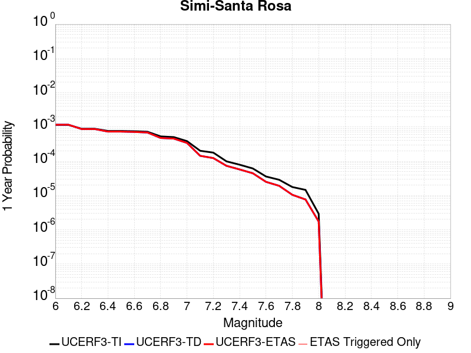 |  |

| Magnitude | 1 wk TI Prob | 1 wk TD Prob | 1 wk ETAS Prob | 1 wk ETAS/TD Gain | 1 wk ETAS Triggered Only | 1 mo TI Prob | 1 mo TD Prob | 1 mo ETAS Prob | 1 mo ETAS/TD Gain | 1 mo ETAS Triggered Only | 1 yr TI Prob | 1 yr TD Prob | 1 yr ETAS Prob | 1 yr ETAS/TD Gain | 1 yr ETAS Triggered Only | 10 yr TI Prob | 10 yr TD Prob | 10 yr ETAS Prob | 10 yr ETAS/TD Gain | 10 yr ETAS Triggered Only |
|-----|-----|-----|-----|-----|-----|-----|-----|-----|-----|-----|-----|-----|-----|-----|-----|-----|-----|-----|-----|-----|
| 6.0 | 2.198912E-5 | 2.2277492E-5 | 2.2277492E-5 | 1.0 | 0.0 | 9.4235686E-5 | 9.547172E-5 | 9.547172E-5 | 1.0 | 0.0 | 0.0011467156 | 0.0011617922 | 0.0011617922 | 1.0 | 0.0 | 0.011408163 | 0.011561633 | 0.011571518 | 1.000855 | 1.0E-5 |
| 6.1 | 2.198912E-5 | 2.2277492E-5 | 2.2277492E-5 | 1.0 | 0.0 | 9.4235686E-5 | 9.547172E-5 | 9.547172E-5 | 1.0 | 0.0 | 0.0011467156 | 0.0011617922 | 0.0011617922 | 1.0 | 0.0 | 0.011408163 | 0.011561633 | 0.011571518 | 1.000855 | 1.0E-5 |
| 6.2 | 1.69983E-5 | 1.667015E-5 | 1.667015E-5 | 1.0 | 0.0 | 7.284782E-5 | 7.144171E-5 | 7.144171E-5 | 1.0 | 0.0 | 8.865613E-4 | 8.694849E-4 | 8.694849E-4 | 1.0 | 0.0 | 0.008830327 | 0.008663751 | 0.008663751 | 1.0 | 0.0 |
| 6.3 | 1.69983E-5 | 1.667015E-5 | 1.667015E-5 | 1.0 | 0.0 | 7.284782E-5 | 7.144171E-5 | 7.144171E-5 | 1.0 | 0.0 | 8.865613E-4 | 8.694849E-4 | 8.694849E-4 | 1.0 | 0.0 | 0.008830327 | 0.008663751 | 0.008663751 | 1.0 | 0.0 |
| 6.4 | 1.4666188E-5 | 1.4053922E-5 | 1.4053922E-5 | 1.0 | 0.0 | 6.285358E-5 | 6.0229846E-5 | 6.0229846E-5 | 1.0 | 0.0 | 7.6497364E-4 | 7.330766E-4 | 7.330766E-4 | 1.0 | 0.0 | 0.0076234564 | 0.007309059 | 0.007309059 | 1.0 | 0.0 |
| 6.5 | 1.4666188E-5 | 1.4053922E-5 | 1.4053922E-5 | 1.0 | 0.0 | 6.285358E-5 | 6.0229846E-5 | 6.0229846E-5 | 1.0 | 0.0 | 7.6497364E-4 | 7.330766E-4 | 7.330766E-4 | 1.0 | 0.0 | 0.0076234564 | 0.007309059 | 0.007309059 | 1.0 | 0.0 |
| 6.6 | 1.4377586E-5 | 1.3730937E-5 | 1.3730937E-5 | 1.0 | 0.0 | 6.1616774E-5 | 5.8845686E-5 | 5.8845686E-5 | 1.0 | 0.0 | 7.4992597E-4 | 7.1623555E-4 | 7.1623555E-4 | 1.0 | 0.0 | 0.007474003 | 0.0071417405 | 0.0071417405 | 1.0 | 0.0 |
| 6.7 | 1.3881404E-5 | 1.32088635E-5 | 1.32088635E-5 | 1.0 | 0.0 | 5.9490372E-5 | 5.6608325E-5 | 5.6608325E-5 | 1.0 | 0.0 | 7.240546E-4 | 6.8901316E-4 | 6.8901316E-4 | 1.0 | 0.0 | 0.007217 | 0.006871219 | 0.006871219 | 1.0 | 0.0 |
| 6.8 | 1.0176516E-5 | 9.155126E-6 | 9.155126E-6 | 1.0 | 0.0 | 4.3612912E-5 | 3.9235754E-5 | 3.9235754E-5 | 1.0 | 0.0 | 5.308578E-4 | 4.776072E-4 | 4.776072E-4 | 1.0 | 0.0 | 0.0052959146 | 0.004767441 | 0.004767441 | 1.0 | 0.0 |
| 6.9 | 9.699797E-6 | 8.775658E-6 | 8.775658E-6 | 1.0 | 0.0 | 4.15699E-5 | 3.7609512E-5 | 3.7609512E-5 | 1.0 | 0.0 | 5.05996E-4 | 4.5781603E-4 | 4.5781603E-4 | 1.0 | 0.0 | 0.005048454 | 0.0045703473 | 0.0045703473 | 1.0 | 0.0 |
| 7.0 | 7.4049476E-6 | 6.56006E-6 | 6.56006E-6 | 1.0 | 0.0 | 3.1735104E-5 | 2.811431E-5 | 2.811431E-5 | 1.0 | 0.0 | 3.8630638E-4 | 3.422506E-4 | 3.422506E-4 | 1.0 | 0.0 | 0.0038563553 | 0.0034184777 | 0.0034184777 | 1.0 | 0.0 |
| 7.1 | 3.873439E-6 | 2.7598842E-6 | 2.7598842E-6 | 1.0 | 0.0 | 1.6600346E-5 | 1.1828023E-5 | 1.1828023E-5 | 1.0 | 0.0 | 2.0209046E-4 | 1.4399689E-4 | 1.4399689E-4 | 1.0 | 0.0 | 0.0020190678 | 0.0014390595 | 0.0014390595 | 1.0 | 0.0 |
| 7.2 | 3.417706E-6 | 2.3679959E-6 | 2.3679959E-6 | 1.0 | 0.0 | 1.4647229E-5 | 1.0148516E-5 | 1.0148516E-5 | 1.0 | 0.0 | 1.7831543E-4 | 1.2355139E-4 | 1.2355139E-4 | 1.0 | 0.0 | 0.0017817242 | 0.0012348493 | 0.0012348493 | 1.0 | 0.0 |
| 7.3 | 1.90225E-6 | 1.4076793E-6 | 1.4076793E-6 | 1.0 | 0.0 | 8.152474E-6 | 6.0328975E-6 | 6.0328975E-6 | 1.0 | 0.0 | 9.9251854E-5 | 7.344807E-5 | 7.344807E-5 | 1.0 | 0.0 | 9.920754E-4 | 7.342402E-4 | 7.342402E-4 | 1.0 | 0.0 |
| 7.4 | 1.5170556E-6 | 1.1027661E-6 | 1.1027661E-6 | 1.0 | 0.0 | 6.5016507E-6 | 4.726132E-6 | 4.726132E-6 | 1.0 | 0.0 | 7.915472E-5 | 5.753915E-5 | 5.753915E-5 | 1.0 | 0.0 | 7.9126534E-4 | 5.752436E-4 | 5.752436E-4 | 1.0 | 0.0 |
| 7.5 | 1.178732E-6 | 8.5378895E-7 | 8.5378895E-7 | 1.0 | 0.0 | 5.0516987E-6 | 3.6590905E-6 | 3.6590905E-6 | 1.0 | 0.0 | 6.1502695E-5 | 4.4548524E-5 | 4.4548524E-5 | 1.0 | 0.0 | 6.148568E-4 | 4.453969E-4 | 4.453969E-4 | 1.0 | 0.0 |
| 7.6 | 6.8722386E-7 | 4.795824E-7 | 4.795824E-7 | 1.0 | 0.0 | 2.9452417E-6 | 2.0553514E-6 | 2.0553514E-6 | 1.0 | 0.0 | 3.5857727E-5 | 2.5023619E-5 | 2.5023619E-5 | 1.0 | 0.0 | 3.5851944E-4 | 2.5020813E-4 | 2.5020813E-4 | 1.0 | 0.0 |
| 7.7 | 5.5126515E-7 | 3.675682E-7 | 3.675682E-7 | 1.0 | 0.0 | 2.3625628E-6 | 1.5752913E-6 | 1.5752913E-6 | 1.0 | 0.0 | 2.8763823E-5 | 1.9179004E-5 | 1.9179004E-5 | 1.0 | 0.0 | 2.87601E-4 | 1.9177361E-4 | 1.9177361E-4 | 1.0 | 0.0 |
| 7.8 | 3.3860243E-7 | 2.0094286E-7 | 2.0094286E-7 | 1.0 | 0.0 | 1.4511525E-6 | 8.611834E-7 | 8.611834E-7 | 1.0 | 0.0 | 1.7667637E-5 | 1.0484858E-5 | 1.0484858E-5 | 1.0 | 0.0 | 1.7666233E-4 | 1.0484369E-4 | 1.0484369E-4 | 1.0 | 0.0 |
| 7.9 | 2.7955386E-7 | 1.4666695E-7 | 1.4666695E-7 | 1.0 | 0.0 | 1.1980875E-6 | 6.285725E-7 | 6.285725E-7 | 1.0 | 0.0 | 1.4586617E-5 | 7.652843E-6 | 7.652843E-6 | 1.0 | 0.0 | 1.458566E-4 | 7.6525845E-5 | 7.6525845E-5 | 1.0 | 0.0 |
| 8.0 | 5.6259015E-8 | 3.3364568E-8 | 3.3364568E-8 | 1.0 | 0.0 | 2.4111003E-7 | 1.42991E-7 | 1.42991E-7 | 1.0 | 0.0 | 2.9355108E-6 | 1.7409141E-6 | 1.7409141E-6 | 1.0 | 0.0 | 2.935472E-5 | 1.7409018E-5 | 1.7409018E-5 | 1.0 | 0.0 |

## San Gregorio (South) 2011 CFM
*[(top)](#table-of-contents)*

| 1 Week | 1 Month | 1 Year | 10 Year |
|-----|-----|-----|-----|
| 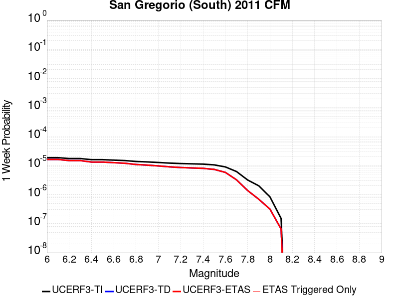 | 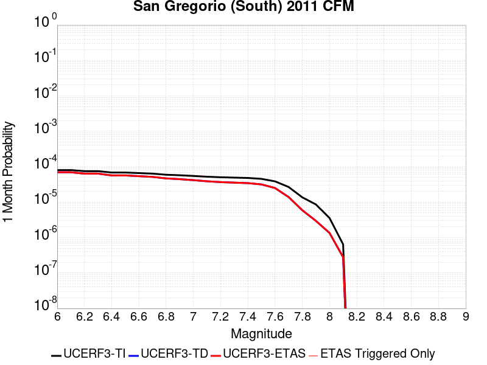 |  |  |

| Magnitude | 1 wk TI Prob | 1 wk TD Prob | 1 wk ETAS Prob | 1 wk ETAS/TD Gain | 1 wk ETAS Triggered Only | 1 mo TI Prob | 1 mo TD Prob | 1 mo ETAS Prob | 1 mo ETAS/TD Gain | 1 mo ETAS Triggered Only | 1 yr TI Prob | 1 yr TD Prob | 1 yr ETAS Prob | 1 yr ETAS/TD Gain | 1 yr ETAS Triggered Only | 10 yr TI Prob | 10 yr TD Prob | 10 yr ETAS Prob | 10 yr ETAS/TD Gain | 10 yr ETAS Triggered Only |
|-----|-----|-----|-----|-----|-----|-----|-----|-----|-----|-----|-----|-----|-----|-----|-----|-----|-----|-----|-----|-----|
| 6.0 | 1.8770423E-5 | 1.6282922E-5 | 1.6282922E-5 | 1.0 | 0.0 | 8.044219E-5 | 6.978211E-5 | 6.978211E-5 | 1.0 | 0.0 | 9.789435E-4 | 8.492698E-4 | 8.492698E-4 | 1.0 | 0.0 | 0.009746423 | 0.008472852 | 0.008482768 | 1.0011703 | 1.0E-5 |
| 6.1 | 1.8770423E-5 | 1.6282922E-5 | 1.6282922E-5 | 1.0 | 0.0 | 8.044219E-5 | 6.978211E-5 | 6.978211E-5 | 1.0 | 0.0 | 9.789435E-4 | 8.492698E-4 | 8.492698E-4 | 1.0 | 0.0 | 0.009746423 | 0.008472852 | 0.008482768 | 1.0011703 | 1.0E-5 |
| 6.2 | 1.7508692E-5 | 1.4902342E-5 | 1.4902342E-5 | 1.0 | 0.0 | 7.5035096E-5 | 6.3865635E-5 | 6.3865635E-5 | 1.0 | 0.0 | 9.1316935E-4 | 7.7728974E-4 | 7.7728974E-4 | 1.0 | 0.0 | 0.00909426 | 0.0077582374 | 0.0077681597 | 1.001279 | 1.0E-5 |
| 6.3 | 1.7508692E-5 | 1.4902342E-5 | 1.4902342E-5 | 1.0 | 0.0 | 7.5035096E-5 | 6.3865635E-5 | 6.3865635E-5 | 1.0 | 0.0 | 9.1316935E-4 | 7.7728974E-4 | 7.7728974E-4 | 1.0 | 0.0 | 0.00909426 | 0.0077582374 | 0.0077681597 | 1.001279 | 1.0E-5 |
| 6.4 | 1.6004591E-5 | 1.3252073E-5 | 1.3252073E-5 | 1.0 | 0.0 | 6.85893E-5 | 5.6793368E-5 | 5.6793368E-5 | 1.0 | 0.0 | 8.347548E-4 | 6.912409E-4 | 6.912409E-4 | 1.0 | 0.0 | 0.008316261 | 0.0069032344 | 0.0069131656 | 1.0014386 | 1.0E-5 |
| 6.5 | 1.6004591E-5 | 1.3252073E-5 | 1.3252073E-5 | 1.0 | 0.0 | 6.85893E-5 | 5.6793368E-5 | 5.6793368E-5 | 1.0 | 0.0 | 8.347548E-4 | 6.912409E-4 | 6.912409E-4 | 1.0 | 0.0 | 0.008316261 | 0.0069032344 | 0.0069131656 | 1.0014386 | 1.0E-5 |
| 6.6 | 1.5442201E-5 | 1.2636666E-5 | 1.2636666E-5 | 1.0 | 0.0 | 6.617918E-5 | 5.415602E-5 | 5.415602E-5 | 1.0 | 0.0 | 8.0543366E-4 | 6.591509E-4 | 6.591509E-4 | 1.0 | 0.0 | 0.008025207 | 0.0065842667 | 0.0065942006 | 1.0015087 | 1.0E-5 |
| 6.7 | 1.489921E-5 | 1.204514E-5 | 1.204514E-5 | 1.0 | 0.0 | 6.3852196E-5 | 5.162101E-5 | 5.162101E-5 | 1.0 | 0.0 | 7.7712315E-4 | 6.2830525E-4 | 6.2830525E-4 | 1.0 | 0.0 | 0.0077441116 | 0.006277582 | 0.0062875194 | 1.001583 | 1.0E-5 |
| 6.8 | 1.3876024E-5 | 1.0924018E-5 | 1.0924018E-5 | 1.0 | 0.0 | 5.9467322E-5 | 4.6816385E-5 | 4.6816385E-5 | 1.0 | 0.0 | 7.237741E-4 | 5.698408E-4 | 5.698408E-4 | 1.0 | 0.0 | 0.0072142133 | 0.005696055 | 0.005696055 | 1.0 | 0.0 |
| 6.9 | 1.33922495E-5 | 1.0395488E-5 | 1.0395488E-5 | 1.0 | 0.0 | 5.7394092E-5 | 4.4551332E-5 | 4.4551332E-5 | 1.0 | 0.0 | 6.9854903E-4 | 5.4227776E-4 | 5.4227776E-4 | 1.0 | 0.0 | 0.0069635725 | 0.005421796 | 0.005421796 | 1.0 | 0.0 |
| 7.0 | 1.2807324E-5 | 9.755409E-6 | 9.755409E-6 | 1.0 | 0.0 | 5.4887376E-5 | 4.1808227E-5 | 4.1808227E-5 | 1.0 | 0.0 | 6.680489E-4 | 5.088965E-4 | 5.088965E-4 | 1.0 | 0.0 | 0.006660442 | 0.0050895535 | 0.0050895535 | 1.0 | 0.0 |
| 7.1 | 1.2191438E-5 | 9.06424E-6 | 9.06424E-6 | 1.0 | 0.0 | 5.224797E-5 | 3.8846163E-5 | 3.8846163E-5 | 1.0 | 0.0 | 6.3593336E-4 | 4.728495E-4 | 4.728495E-4 | 1.0 | 0.0 | 0.0063411663 | 0.0047306684 | 0.0047306684 | 1.0 | 0.0 |
| 7.2 | 1.1769438E-5 | 8.58439E-6 | 8.58439E-6 | 1.0 | 0.0 | 5.0439474E-5 | 3.6789723E-5 | 3.6789723E-5 | 1.0 | 0.0 | 6.1392755E-4 | 4.478229E-4 | 4.478229E-4 | 1.0 | 0.0 | 0.0061223423 | 0.004481438 | 0.004481438 | 1.0 | 0.0 |
| 7.3 | 1.150374E-5 | 8.299803E-6 | 8.299803E-6 | 1.0 | 0.0 | 4.9300812E-5 | 3.55701E-5 | 3.55701E-5 | 1.0 | 0.0 | 6.0007203E-4 | 4.3297998E-4 | 4.3297998E-4 | 1.0 | 0.0 | 0.0059845424 | 0.0043335687 | 0.0043335687 | 1.0 | 0.0 |
| 7.4 | 1.12514E-5 | 8.045509E-6 | 8.045509E-6 | 1.0 | 0.0 | 4.8219394E-5 | 3.44803E-5 | 3.44803E-5 | 1.0 | 0.0 | 5.8691297E-4 | 4.1971685E-4 | 4.1971685E-4 | 1.0 | 0.0 | 0.005853653 | 0.004201436 | 0.004201436 | 1.0 | 0.0 |
| 7.5 | 1.059696E-5 | 7.3957576E-6 | 7.3957576E-6 | 1.0 | 0.0 | 4.5414752E-5 | 3.169572E-5 | 3.169572E-5 | 1.0 | 0.0 | 5.5278436E-4 | 3.858271E-4 | 3.858271E-4 | 1.0 | 0.0 | 0.0055141128 | 0.0038637212 | 0.0038637212 | 1.0 | 0.0 |
| 7.6 | 9.018592E-6 | 5.839385E-6 | 5.839385E-6 | 1.0 | 0.0 | 3.8650534E-5 | 2.5025694E-5 | 2.5025694E-5 | 1.0 | 0.0 | 4.7046866E-4 | 3.0464528E-4 | 3.0464528E-4 | 1.0 | 0.0 | 0.004694739 | 0.0030540384 | 0.0030540384 | 1.0 | 0.0 |
| 7.7 | 6.243489E-6 | 3.2414705E-6 | 3.2414705E-6 | 1.0 | 0.0 | 2.6757538E-5 | 1.3891942E-5 | 1.3891942E-5 | 1.0 | 0.0 | 3.257243E-4 | 1.6912128E-4 | 1.6912128E-4 | 1.0 | 0.0 | 0.003252473 | 0.0017001303 | 0.0017001303 | 1.0 | 0.0 |
| 7.8 | 3.1941963E-6 | 1.3821964E-6 | 1.3821964E-6 | 1.0 | 0.0 | 1.368934E-5 | 5.923685E-6 | 5.923685E-6 | 1.0 | 0.0 | 1.6665498E-4 | 7.211848E-5 | 7.211848E-5 | 1.0 | 0.0 | 0.0016653005 | 7.269855E-4 | 7.269855E-4 | 1.0 | 0.0 |
| 7.9 | 2.0098398E-6 | 6.9250325E-7 | 6.9250325E-7 | 1.0 | 0.0 | 8.6135715E-6 | 2.9678677E-6 | 2.9678677E-6 | 1.0 | 0.0 | 1.0486518E-4 | 3.6133188E-5 | 3.6133188E-5 | 1.0 | 0.0 | 0.0010481571 | 3.6622243E-4 | 3.6622243E-4 | 1.0 | 0.0 |
| 8.0 | 8.353119E-7 | 3.166628E-7 | 3.166628E-7 | 1.0 | 0.0 | 3.579903E-6 | 1.3571255E-6 | 1.3571255E-6 | 1.0 | 0.0 | 4.358445E-5 | 1.6522878E-5 | 1.6522878E-5 | 1.0 | 0.0 | 4.3575902E-4 | 1.6642496E-4 | 1.6642496E-4 | 1.0 | 0.0 |
| 8.1 | 1.5033264E-7 | 6.5349695E-8 | 6.5349695E-8 | 1.0 | 0.0 | 6.442826E-7 | 2.8007008E-7 | 2.8007008E-7 | 1.0 | 0.0 | 7.844113E-6 | 3.4098482E-6 | 3.4098482E-6 | 1.0 | 0.0 | 7.843835E-5 | 3.4114135E-5 | 3.4114135E-5 | 1.0 | 0.0 |

## Northridge
*[(top)](#table-of-contents)*

| 1 Week | 1 Month | 1 Year | 10 Year |
|-----|-----|-----|-----|
| 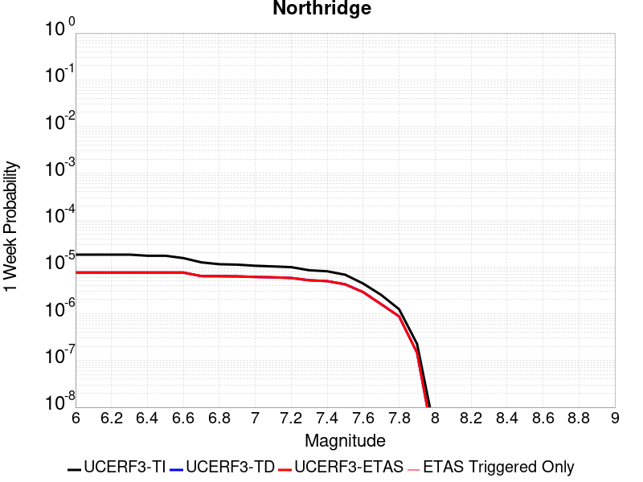 | 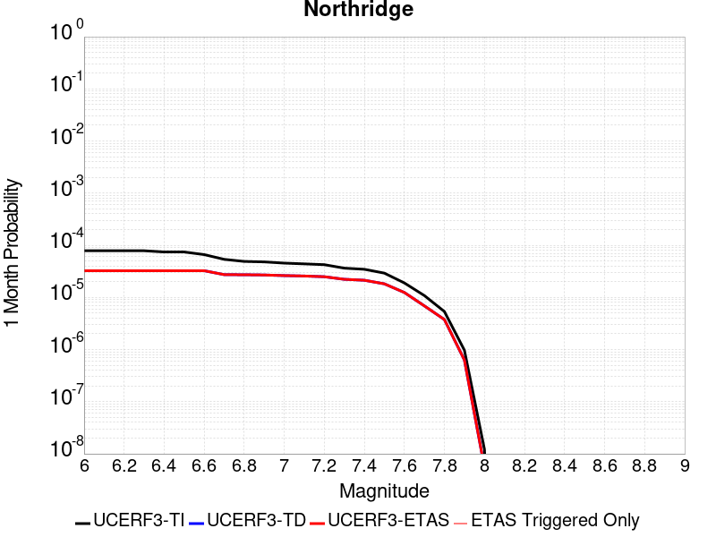 | 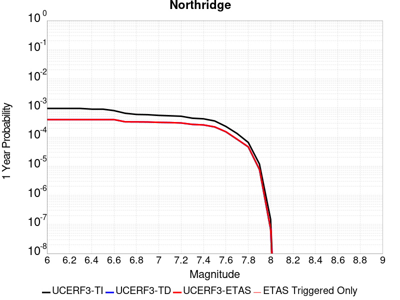 |  |

| Magnitude | 1 wk TI Prob | 1 wk TD Prob | 1 wk ETAS Prob | 1 wk ETAS/TD Gain | 1 wk ETAS Triggered Only | 1 mo TI Prob | 1 mo TD Prob | 1 mo ETAS Prob | 1 mo ETAS/TD Gain | 1 mo ETAS Triggered Only | 1 yr TI Prob | 1 yr TD Prob | 1 yr ETAS Prob | 1 yr ETAS/TD Gain | 1 yr ETAS Triggered Only | 10 yr TI Prob | 10 yr TD Prob | 10 yr ETAS Prob | 10 yr ETAS/TD Gain | 10 yr ETAS Triggered Only |
|-----|-----|-----|-----|-----|-----|-----|-----|-----|-----|-----|-----|-----|-----|-----|-----|-----|-----|-----|-----|-----|
| 6.0 | 1.8340852E-5 | 7.5889343E-6 | 7.5889343E-6 | 1.0 | 0.0 | 7.860128E-5 | 3.252361E-5 | 3.252361E-5 | 1.0 | 0.0 | 9.565505E-4 | 3.959052E-4 | 3.959052E-4 | 1.0 | 0.0 | 0.009524435 | 0.0039522345 | 0.003962195 | 1.0025202 | 1.0E-5 |
| 6.1 | 1.8340852E-5 | 7.5889343E-6 | 7.5889343E-6 | 1.0 | 0.0 | 7.860128E-5 | 3.252361E-5 | 3.252361E-5 | 1.0 | 0.0 | 9.565505E-4 | 3.959052E-4 | 3.959052E-4 | 1.0 | 0.0 | 0.009524435 | 0.0039522345 | 0.003962195 | 1.0025202 | 1.0E-5 |
| 6.2 | 1.8340852E-5 | 7.5889343E-6 | 7.5889343E-6 | 1.0 | 0.0 | 7.860128E-5 | 3.252361E-5 | 3.252361E-5 | 1.0 | 0.0 | 9.565505E-4 | 3.959052E-4 | 3.959052E-4 | 1.0 | 0.0 | 0.009524435 | 0.0039522345 | 0.003962195 | 1.0025202 | 1.0E-5 |
| 6.3 | 1.8340852E-5 | 7.5889343E-6 | 7.5889343E-6 | 1.0 | 0.0 | 7.860128E-5 | 3.252361E-5 | 3.252361E-5 | 1.0 | 0.0 | 9.565505E-4 | 3.959052E-4 | 3.959052E-4 | 1.0 | 0.0 | 0.009524435 | 0.0039522345 | 0.003962195 | 1.0025202 | 1.0E-5 |
| 6.4 | 1.7361892E-5 | 7.5889343E-6 | 7.5889343E-6 | 1.0 | 0.0 | 7.440598E-5 | 3.252361E-5 | 3.252361E-5 | 1.0 | 0.0 | 9.055163E-4 | 3.959052E-4 | 3.959052E-4 | 1.0 | 0.0 | 0.009018354 | 0.0039522345 | 0.003962195 | 1.0025202 | 1.0E-5 |
| 6.5 | 1.7361892E-5 | 7.5889343E-6 | 7.5889343E-6 | 1.0 | 0.0 | 7.440598E-5 | 3.252361E-5 | 3.252361E-5 | 1.0 | 0.0 | 9.055163E-4 | 3.959052E-4 | 3.959052E-4 | 1.0 | 0.0 | 0.009018354 | 0.0039522345 | 0.003962195 | 1.0025202 | 1.0E-5 |
| 6.6 | 1.5458201E-5 | 7.5889343E-6 | 7.5889343E-6 | 1.0 | 0.0 | 6.624775E-5 | 3.252361E-5 | 3.252361E-5 | 1.0 | 0.0 | 8.0626784E-4 | 3.959052E-4 | 3.959052E-4 | 1.0 | 0.0 | 0.008033488 | 0.0039522345 | 0.003962195 | 1.0025202 | 1.0E-5 |
| 6.7 | 1.2538368E-5 | 6.382405E-6 | 6.382405E-6 | 1.0 | 0.0 | 5.3734755E-5 | 2.735288E-5 | 2.735288E-5 | 1.0 | 0.0 | 6.5402425E-4 | 3.3297087E-4 | 3.3297087E-4 | 1.0 | 0.0 | 0.0065210275 | 0.0033247808 | 0.0033347476 | 1.0029978 | 1.0E-5 |
| 6.8 | 1.1438097E-5 | 6.351057E-6 | 6.351057E-6 | 1.0 | 0.0 | 4.9019498E-5 | 2.7218535E-5 | 2.7218535E-5 | 1.0 | 0.0 | 5.9664896E-4 | 3.313357E-4 | 3.313357E-4 | 1.0 | 0.0 | 0.005950495 | 0.003308478 | 0.003318445 | 1.0030125 | 1.0E-5 |
| 6.9 | 1.1204891E-5 | 6.287504E-6 | 6.287504E-6 | 1.0 | 0.0 | 4.8020076E-5 | 2.694617E-5 | 2.694617E-5 | 1.0 | 0.0 | 5.8448757E-4 | 3.280207E-4 | 3.280207E-4 | 1.0 | 0.0 | 0.0058295266 | 0.003275426 | 0.0032853934 | 1.003043 | 1.0E-5 |
| 7.0 | 1.061046E-5 | 6.116145E-6 | 6.116145E-6 | 1.0 | 0.0 | 4.5472607E-5 | 2.621179E-5 | 2.621179E-5 | 1.0 | 0.0 | 5.534883E-4 | 3.1908223E-4 | 3.1908223E-4 | 1.0 | 0.0 | 0.0055211177 | 0.0031862876 | 0.0031962555 | 1.0031284 | 1.0E-5 |
| 7.1 | 1.0266979E-5 | 6.005052E-6 | 6.005052E-6 | 1.0 | 0.0 | 4.40006E-5 | 2.5735686E-5 | 2.5735686E-5 | 1.0 | 0.0 | 5.355756E-4 | 3.1328737E-4 | 3.1328737E-4 | 1.0 | 0.0 | 0.0053428668 | 0.0031285032 | 0.0031384719 | 1.0031865 | 1.0E-5 |
| 7.2 | 9.91273E-6 | 5.8207515E-6 | 5.8207515E-6 | 1.0 | 0.0 | 4.248244E-5 | 2.494584E-5 | 2.494584E-5 | 1.0 | 0.0 | 5.171009E-4 | 3.036737E-4 | 3.036737E-4 | 1.0 | 0.0 | 0.0051589934 | 0.0030326326 | 0.0030426022 | 1.0032874 | 1.0E-5 |
| 7.3 | 8.4959265E-6 | 5.193802E-6 | 5.193802E-6 | 1.0 | 0.0 | 3.6410605E-5 | 2.2258962E-5 | 2.2258962E-5 | 1.0 | 0.0 | 4.4320893E-4 | 2.709694E-4 | 2.709694E-4 | 1.0 | 0.0 | 0.00442326 | 0.0027064166 | 0.0027163895 | 1.0036849 | 1.0E-5 |
| 7.4 | 8.0847185E-6 | 4.982575E-6 | 4.982575E-6 | 1.0 | 0.0 | 3.4648332E-5 | 2.135372E-5 | 2.135372E-5 | 1.0 | 0.0 | 4.2176177E-4 | 2.5995076E-4 | 2.5995076E-4 | 1.0 | 0.0 | 0.0042096223 | 0.0025964926 | 0.0026064666 | 1.0038414 | 1.0E-5 |
| 7.5 | 6.8220684E-6 | 4.253676E-6 | 4.253676E-6 | 1.0 | 0.0 | 2.9237108E-5 | 1.8229914E-5 | 1.8229914E-5 | 1.0 | 0.0 | 3.5590364E-4 | 2.2192679E-4 | 2.2192679E-4 | 1.0 | 0.0 | 0.0035533418 | 0.0022170725 | 0.0022270505 | 1.0045005 | 1.0E-5 |
| 7.6 | 4.4224143E-6 | 2.9001221E-6 | 2.9001221E-6 | 1.0 | 0.0 | 1.8953066E-5 | 1.2429036E-5 | 1.2429036E-5 | 1.0 | 0.0 | 2.3072914E-4 | 1.5131311E-4 | 1.5131311E-4 | 1.0 | 0.0 | 0.0023048974 | 0.0015121126 | 0.0015220974 | 1.0066032 | 1.0E-5 |
| 7.7 | 2.5297056E-6 | 1.6046802E-6 | 1.6046802E-6 | 1.0 | 0.0 | 1.0841551E-5 | 6.877183E-6 | 6.877183E-6 | 1.0 | 0.0 | 1.319879E-4 | 8.372653E-5 | 8.372653E-5 | 1.0 | 0.0 | 0.0013190953 | 8.3695457E-4 | 8.3695457E-4 | 1.0 | 0.0 |
| 7.8 | 1.2508156E-6 | 8.7805523E-7 | 8.7805523E-7 | 1.0 | 0.0 | 5.3606273E-6 | 3.7630884E-6 | 3.7630884E-6 | 1.0 | 0.0 | 6.526368E-5 | 4.581465E-5 | 4.581465E-5 | 1.0 | 0.0 | 6.524452E-4 | 4.5805334E-4 | 4.5805334E-4 | 1.0 | 0.0 |
| 7.9 | 2.262199E-7 | 1.466629E-7 | 1.466629E-7 | 1.0 | 0.0 | 9.695135E-7 | 6.2855514E-7 | 6.2855514E-7 | 1.0 | 0.0 | 1.1803763E-5 | 7.652633E-6 | 7.652633E-6 | 1.0 | 0.0 | 1.1803136E-4 | 7.652377E-5 | 7.652377E-5 | 1.0 | 0.0 |
| 8.0 | 2.865362E-9 | 1.275715E-9 | 1.275715E-9 | 1.0 | 0.0 | 1.2280123E-8 | 5.4673497E-9 | 5.4673497E-9 | 1.0 | 0.0 | 1.4951048E-7 | 6.6564986E-8 | 6.6564986E-8 | 1.0 | 0.0 | 1.4951038E-6 | 6.6564985E-7 | 6.6564985E-7 | 1.0 | 0.0 |

## Sisar
*[(top)](#table-of-contents)*

| 1 Week | 1 Month | 1 Year | 10 Year |
|-----|-----|-----|-----|
|  |  | 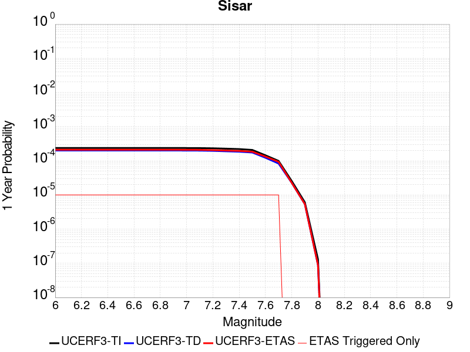 | 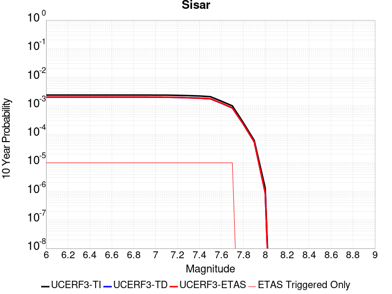 |

| Magnitude | 1 wk TI Prob | 1 wk TD Prob | 1 wk ETAS Prob | 1 wk ETAS/TD Gain | 1 wk ETAS Triggered Only | 1 mo TI Prob | 1 mo TD Prob | 1 mo ETAS Prob | 1 mo ETAS/TD Gain | 1 mo ETAS Triggered Only | 1 yr TI Prob | 1 yr TD Prob | 1 yr ETAS Prob | 1 yr ETAS/TD Gain | 1 yr ETAS Triggered Only | 10 yr TI Prob | 10 yr TD Prob | 10 yr ETAS Prob | 10 yr ETAS/TD Gain | 10 yr ETAS Triggered Only |
|-----|-----|-----|-----|-----|-----|-----|-----|-----|-----|-----|-----|-----|-----|-----|-----|-----|-----|-----|-----|-----|
| 6.0 | 4.544193E-6 | 3.839825E-6 | 3.839825E-6 | 1.0 | 0.0 | 1.9474966E-5 | 1.645629E-5 | 1.645629E-5 | 1.0 | 0.0 | 2.3708193E-4 | 2.0033725E-4 | 2.1033525E-4 | 1.0499058 | 1.0E-5 | 0.0023682916 | 0.0020016003 | 0.0020115802 | 1.004986 | 1.0E-5 |
| 6.1 | 4.544193E-6 | 3.839825E-6 | 3.839825E-6 | 1.0 | 0.0 | 1.9474966E-5 | 1.645629E-5 | 1.645629E-5 | 1.0 | 0.0 | 2.3708193E-4 | 2.0033725E-4 | 2.1033525E-4 | 1.0499058 | 1.0E-5 | 0.0023682916 | 0.0020016003 | 0.0020115802 | 1.004986 | 1.0E-5 |
| 6.2 | 4.544193E-6 | 3.839825E-6 | 3.839825E-6 | 1.0 | 0.0 | 1.9474966E-5 | 1.645629E-5 | 1.645629E-5 | 1.0 | 0.0 | 2.3708193E-4 | 2.0033725E-4 | 2.1033525E-4 | 1.0499058 | 1.0E-5 | 0.0023682916 | 0.0020016003 | 0.0020115802 | 1.004986 | 1.0E-5 |
| 6.3 | 4.544193E-6 | 3.839825E-6 | 3.839825E-6 | 1.0 | 0.0 | 1.9474966E-5 | 1.645629E-5 | 1.645629E-5 | 1.0 | 0.0 | 2.3708193E-4 | 2.0033725E-4 | 2.1033525E-4 | 1.0499058 | 1.0E-5 | 0.0023682916 | 0.0020016003 | 0.0020115802 | 1.004986 | 1.0E-5 |
| 6.4 | 4.544193E-6 | 3.839825E-6 | 3.839825E-6 | 1.0 | 0.0 | 1.9474966E-5 | 1.645629E-5 | 1.645629E-5 | 1.0 | 0.0 | 2.3708193E-4 | 2.0033725E-4 | 2.1033525E-4 | 1.0499058 | 1.0E-5 | 0.0023682916 | 0.0020016003 | 0.0020115802 | 1.004986 | 1.0E-5 |
| 6.5 | 4.544193E-6 | 3.839825E-6 | 3.839825E-6 | 1.0 | 0.0 | 1.9474966E-5 | 1.645629E-5 | 1.645629E-5 | 1.0 | 0.0 | 2.3708193E-4 | 2.0033725E-4 | 2.1033525E-4 | 1.0499058 | 1.0E-5 | 0.0023682916 | 0.0020016003 | 0.0020115802 | 1.004986 | 1.0E-5 |
| 6.6 | 4.544193E-6 | 3.839825E-6 | 3.839825E-6 | 1.0 | 0.0 | 1.9474966E-5 | 1.645629E-5 | 1.645629E-5 | 1.0 | 0.0 | 2.3708193E-4 | 2.0033725E-4 | 2.1033525E-4 | 1.0499058 | 1.0E-5 | 0.0023682916 | 0.0020016003 | 0.0020115802 | 1.004986 | 1.0E-5 |
| 6.7 | 4.544193E-6 | 3.839825E-6 | 3.839825E-6 | 1.0 | 0.0 | 1.9474966E-5 | 1.645629E-5 | 1.645629E-5 | 1.0 | 0.0 | 2.3708193E-4 | 2.0033725E-4 | 2.1033525E-4 | 1.0499058 | 1.0E-5 | 0.0023682916 | 0.0020016003 | 0.0020115802 | 1.004986 | 1.0E-5 |
| 6.8 | 4.544193E-6 | 3.839825E-6 | 3.839825E-6 | 1.0 | 0.0 | 1.9474966E-5 | 1.645629E-5 | 1.645629E-5 | 1.0 | 0.0 | 2.3708193E-4 | 2.0033725E-4 | 2.1033525E-4 | 1.0499058 | 1.0E-5 | 0.0023682916 | 0.0020016003 | 0.0020115802 | 1.004986 | 1.0E-5 |
| 6.9 | 4.542225E-6 | 3.8377866E-6 | 3.8377866E-6 | 1.0 | 0.0 | 1.9466532E-5 | 1.6447555E-5 | 1.6447555E-5 | 1.0 | 0.0 | 2.3697925E-4 | 2.0023092E-4 | 2.1022891E-4 | 1.0499324 | 1.0E-5 | 0.002367267 | 0.0020005389 | 0.002010519 | 1.0049887 | 1.0E-5 |
| 7.0 | 4.5278484E-6 | 3.8228504E-6 | 3.8228504E-6 | 1.0 | 0.0 | 1.940492E-5 | 1.6383543E-5 | 1.6383543E-5 | 1.0 | 0.0 | 2.3622929E-4 | 1.9945172E-4 | 2.0944973E-4 | 1.0501274 | 1.0E-5 | 0.0023597833 | 0.001992761 | 0.002002741 | 1.0050082 | 1.0E-5 |
| 7.1 | 4.5132488E-6 | 3.8076373E-6 | 3.8076373E-6 | 1.0 | 0.0 | 1.9342351E-5 | 1.6318347E-5 | 1.6318347E-5 | 1.0 | 0.0 | 2.3546767E-4 | 1.9865808E-4 | 2.086561E-4 | 1.0503278 | 1.0E-5 | 0.0023521832 | 0.0019848386 | 0.001994819 | 1.0050282 | 1.0E-5 |
| 7.2 | 4.448859E-6 | 3.7400957E-6 | 3.7400957E-6 | 1.0 | 0.0 | 1.9066398E-5 | 1.6028886E-5 | 1.6028886E-5 | 1.0 | 0.0 | 2.3210866E-4 | 1.9513453E-4 | 2.0513259E-4 | 1.0512367 | 1.0E-5 | 0.0023186638 | 0.0019496655 | 0.001959646 | 1.0051191 | 1.0E-5 |
| 7.3 | 4.3424366E-6 | 3.6339256E-6 | 3.6339256E-6 | 1.0 | 0.0 | 1.861031E-5 | 1.5573876E-5 | 1.5573876E-5 | 1.0 | 0.0 | 2.2655698E-4 | 1.8959578E-4 | 1.9959388E-4 | 1.0527338 | 1.0E-5 | 0.0022632615 | 0.0018943737 | 0.0019043548 | 1.0052688 | 1.0E-5 |
| 7.4 | 4.218641E-6 | 3.5332728E-6 | 3.5332728E-6 | 1.0 | 0.0 | 1.8079765E-5 | 1.5142511E-5 | 1.5142511E-5 | 1.0 | 0.0 | 2.2009891E-4 | 1.8434481E-4 | 1.9434297E-4 | 1.0542362 | 1.0E-5 | 0.0021988105 | 0.0018419523 | 0.0018519339 | 1.005419 | 1.0E-5 |
| 7.5 | 3.983779E-6 | 3.3480314E-6 | 3.3480314E-6 | 1.0 | 0.0 | 1.7073227E-5 | 1.4348629E-5 | 1.4348629E-5 | 1.0 | 0.0 | 2.0784672E-4 | 1.7468088E-4 | 1.8467914E-4 | 1.0572373 | 1.0E-5 | 0.0020765243 | 0.0017454688 | 0.0017554513 | 1.0057191 | 1.0E-5 |
| 7.6 | 2.777393E-6 | 2.3523978E-6 | 2.3523978E-6 | 1.0 | 0.0 | 1.1903058E-5 | 1.0081666E-5 | 1.0081666E-5 | 1.0 | 0.0 | 1.449101E-4 | 1.2273745E-4 | 1.3273623E-4 | 1.0814648 | 1.0E-5 | 0.0014481564 | 0.0012267043 | 0.0012366921 | 1.0081419 | 1.0E-5 |
| 7.7 | 1.9028433E-6 | 1.5939825E-6 | 1.5939825E-6 | 1.0 | 0.0 | 8.155017E-6 | 6.831336E-6 | 6.831336E-6 | 1.0 | 0.0 | 9.928281E-5 | 8.316839E-5 | 9.316756E-5 | 1.1202279 | 1.0E-5 | 9.923846E-4 | 8.313774E-4 | 8.413691E-4 | 1.0120182 | 1.0E-5 |
| 7.8 | 4.9095956E-7 | 4.3585936E-7 | 4.3585936E-7 | 1.0 | 0.0 | 2.1041105E-6 | 1.8679674E-6 | 1.8679674E-6 | 1.0 | 0.0 | 2.5617246E-5 | 2.2742266E-5 | 2.2742266E-5 | 1.0 | 0.0 | 2.5614293E-4 | 2.2739958E-4 | 2.2739958E-4 | 1.0 | 0.0 |
| 7.9 | 1.16657894E-7 | 1.0336326E-7 | 1.0336326E-7 | 1.0 | 0.0 | 4.999623E-7 | 4.4298534E-7 | 4.4298534E-7 | 1.0 | 0.0 | 6.087024E-6 | 5.3933336E-6 | 5.3933336E-6 | 1.0 | 0.0 | 6.0868573E-5 | 5.3932054E-5 | 5.3932054E-5 | 1.0 | 0.0 |
| 8.0 | 2.5100346E-9 | 1.7069958E-9 | 1.7069958E-9 | 1.0 | 0.0 | 1.0757291E-8 | 7.3156974E-9 | 7.3156974E-9 | 1.0 | 0.0 | 1.3097001E-7 | 8.906861E-8 | 8.906861E-8 | 1.0 | 0.0 | 1.3096993E-6 | 8.906858E-7 | 8.906858E-7 | 1.0 | 0.0 |

## San Andreas (North Coast) 2011 CFM
*[(top)](#table-of-contents)*

| 1 Week | 1 Month | 1 Year | 10 Year |
|-----|-----|-----|-----|
|  |  |  | 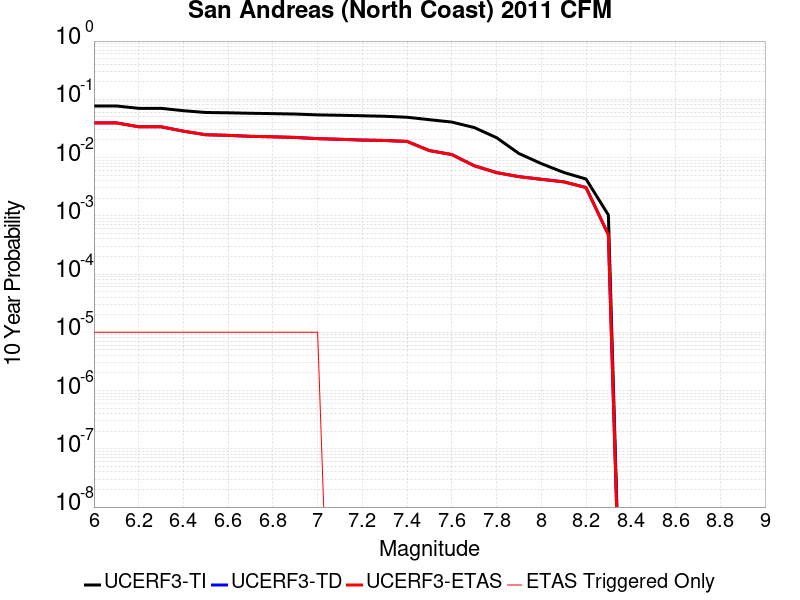 |

| Magnitude | 1 wk TI Prob | 1 wk TD Prob | 1 wk ETAS Prob | 1 wk ETAS/TD Gain | 1 wk ETAS Triggered Only | 1 mo TI Prob | 1 mo TD Prob | 1 mo ETAS Prob | 1 mo ETAS/TD Gain | 1 mo ETAS Triggered Only | 1 yr TI Prob | 1 yr TD Prob | 1 yr ETAS Prob | 1 yr ETAS/TD Gain | 1 yr ETAS Triggered Only | 10 yr TI Prob | 10 yr TD Prob | 10 yr ETAS Prob | 10 yr ETAS/TD Gain | 10 yr ETAS Triggered Only |
|-----|-----|-----|-----|-----|-----|-----|-----|-----|-----|-----|-----|-----|-----|-----|-----|-----|-----|-----|-----|-----|
| 6.0 | 1.5333705E-4 | 7.128706E-5 | 7.128706E-5 | 1.0 | 0.0 | 6.5699324E-4 | 3.0548038E-4 | 3.0548038E-4 | 1.0 | 0.0 | 0.007969595 | 0.003712915 | 0.003712915 | 1.0 | 0.0 | 0.0768977 | 0.03942418 | 0.03943379 | 1.0002437 | 1.0E-5 |
| 6.1 | 1.5333705E-4 | 7.128706E-5 | 7.128706E-5 | 1.0 | 0.0 | 6.5699324E-4 | 3.0548038E-4 | 3.0548038E-4 | 1.0 | 0.0 | 0.007969595 | 0.003712915 | 0.003712915 | 1.0 | 0.0 | 0.0768977 | 0.03942418 | 0.03943379 | 1.0002437 | 1.0E-5 |
| 6.2 | 1.3912938E-4 | 6.0656617E-5 | 6.0656617E-5 | 1.0 | 0.0 | 5.961325E-4 | 2.5993117E-4 | 2.5993117E-4 | 1.0 | 0.0 | 0.007233787 | 0.0031600967 | 0.0031600967 | 1.0 | 0.0 | 0.07002798 | 0.033769317 | 0.033778977 | 1.0002861 | 1.0E-5 |
| 6.3 | 1.3912938E-4 | 6.0656617E-5 | 6.0656617E-5 | 1.0 | 0.0 | 5.961325E-4 | 2.5993117E-4 | 2.5993117E-4 | 1.0 | 0.0 | 0.007233787 | 0.0031600967 | 0.0031600967 | 1.0 | 0.0 | 0.07002798 | 0.033769317 | 0.033778977 | 1.0002861 | 1.0E-5 |
| 6.4 | 1.2623647E-4 | 5.0576582E-5 | 5.0576582E-5 | 1.0 | 0.0 | 5.4090127E-4 | 2.1673887E-4 | 2.1673887E-4 | 1.0 | 0.0 | 0.0065656058 | 0.0026356226 | 0.0026356226 | 1.0 | 0.0 | 0.06374981 | 0.028374746 | 0.028384462 | 1.0003424 | 1.0E-5 |
| 6.5 | 1.1736096E-4 | 4.3645978E-5 | 4.3645978E-5 | 1.0 | 0.0 | 5.028786E-4 | 1.8704086E-4 | 1.8704086E-4 | 1.0 | 0.0 | 0.006105373 | 0.0022748606 | 0.0022748606 | 1.0 | 0.0 | 0.05940335 | 0.024646243 | 0.024655996 | 1.0003958 | 1.0E-5 |
| 6.6 | 1.1586959E-4 | 4.2543732E-5 | 4.2543732E-5 | 1.0 | 0.0 | 4.964894E-4 | 1.8231763E-4 | 1.8231763E-4 | 1.0 | 0.0 | 0.006028018 | 0.0022174737 | 0.0022174737 | 1.0 | 0.0 | 0.058671024 | 0.024051366 | 0.024061125 | 1.0004058 | 1.0E-5 |
| 6.7 | 1.13693764E-4 | 4.08529E-5 | 4.08529E-5 | 1.0 | 0.0 | 4.87168E-4 | 1.7507221E-4 | 1.7507221E-4 | 1.0 | 0.0 | 0.005915152 | 0.0021294365 | 0.0021294365 | 1.0 | 0.0 | 0.057601593 | 0.023140013 | 0.02314978 | 1.0004221 | 1.0E-5 |
| 6.8 | 1.1204889E-4 | 4.006811E-5 | 4.006811E-5 | 1.0 | 0.0 | 4.8012115E-4 | 1.7170925E-4 | 1.7170925E-4 | 1.0 | 0.0 | 0.005829819 | 0.0020885717 | 0.0020885717 | 1.0 | 0.0 | 0.05679232 | 0.022699496 | 0.02270927 | 1.0004306 | 1.0E-5 |
| 6.9 | 1.1005794E-4 | 3.912164E-5 | 3.912164E-5 | 1.0 | 0.0 | 4.7159163E-4 | 1.676535E-4 | 1.676535E-4 | 1.0 | 0.0 | 0.0057265228 | 0.0020392863 | 0.0020392863 | 1.0 | 0.0 | 0.055811852 | 0.022162868 | 0.022172647 | 1.0004412 | 1.0E-5 |
| 7.0 | 1.0647948E-4 | 3.72716E-5 | 3.72716E-5 | 1.0 | 0.0 | 4.562608E-4 | 1.5972572E-4 | 1.5972572E-4 | 1.0 | 0.0 | 0.0055408357 | 0.0019429418 | 0.0019429418 | 1.0 | 0.0 | 0.054047033 | 0.021117974 | 0.021127764 | 1.0004635 | 1.0E-5 |
| 7.1 | 1.04795035E-4 | 3.6318008E-5 | 3.6318008E-5 | 1.0 | 0.0 | 4.4904428E-4 | 1.556394E-4 | 1.556394E-4 | 1.0 | 0.0 | 0.0054534175 | 0.0018932783 | 0.0018932783 | 1.0 | 0.0 | 0.053215165 | 0.020585267 | 0.020585267 | 1.0 | 0.0 |
| 7.2 | 1.02724036E-4 | 3.522314E-5 | 3.522314E-5 | 1.0 | 0.0 | 4.401716E-4 | 1.5094766E-4 | 1.5094766E-4 | 1.0 | 0.0 | 0.0053459285 | 0.001836254 | 0.001836254 | 1.0 | 0.0 | 0.052191395 | 0.019972516 | 0.019972516 | 1.0 | 0.0 |
| 7.3 | 1.00650694E-4 | 3.4688153E-5 | 3.4688153E-5 | 1.0 | 0.0 | 4.312888E-4 | 1.4865513E-4 | 1.4865513E-4 | 1.0 | 0.0 | 0.005238306 | 0.0018083892 | 0.0018083892 | 1.0 | 0.0 | 0.051165357 | 0.019649228 | 0.019649228 | 1.0 | 0.0 |
| 7.4 | 9.672919E-5 | 3.3471766E-5 | 3.3471766E-5 | 1.0 | 0.0 | 4.144878E-4 | 1.4344264E-4 | 1.4344264E-4 | 1.0 | 0.0 | 0.005034718 | 0.0017450303 | 0.0017450303 | 1.0 | 0.0 | 0.049221683 | 0.018920073 | 0.018920073 | 1.0 | 0.0 |
| 7.5 | 8.7600405E-5 | 2.2773924E-5 | 2.2773924E-5 | 1.0 | 0.0 | 3.753763E-4 | 9.759889E-5 | 9.759889E-5 | 1.0 | 0.0 | 0.0045606326 | 0.0011876206 | 0.0011876206 | 1.0 | 0.0 | 0.04468165 | 0.013173995 | 0.013173995 | 1.0 | 0.0 |
| 7.6 | 7.9562284E-5 | 1.9293044E-5 | 1.9293044E-5 | 1.0 | 0.0 | 3.4093665E-4 | 8.268186E-5 | 8.268186E-5 | 1.0 | 0.0 | 0.0041430052 | 0.0010061882 | 0.0010061882 | 1.0 | 0.0 | 0.040666126 | 0.011262074 | 0.011262074 | 1.0 | 0.0 |
| 7.7 | 6.3866544E-5 | 1.1994551E-5 | 1.1994551E-5 | 1.0 | 0.0 | 2.7368503E-4 | 5.1404204E-5 | 5.1404204E-5 | 1.0 | 0.0 | 0.0033270244 | 6.2566675E-4 | 6.2566675E-4 | 1.0 | 0.0 | 0.032776527 | 0.007241801 | 0.007241801 | 1.0 | 0.0 |
| 7.8 | 4.2543215E-5 | 9.120454E-6 | 9.120454E-6 | 1.0 | 0.0 | 1.8231533E-4 | 3.9087074E-5 | 3.9087074E-5 | 1.0 | 0.0 | 0.0022174292 | 4.757813E-4 | 4.757813E-4 | 1.0 | 0.0 | 0.021954332 | 0.0055163945 | 0.0055163945 | 1.0 | 0.0 |
| 7.9 | 2.2636612E-5 | 7.8523E-6 | 7.8523E-6 | 1.0 | 0.0 | 9.7010445E-5 | 3.365228E-5 | 3.365228E-5 | 1.0 | 0.0 | 0.0011804621 | 4.096396E-4 | 4.096396E-4 | 1.0 | 0.0 | 0.011742111 | 0.00470505 | 0.00470505 | 1.0 | 0.0 |
| 8.0 | 1.5167874E-5 | 7.0841866E-6 | 7.0841866E-6 | 1.0 | 0.0 | 6.500356E-5 | 3.0360445E-5 | 3.0360445E-5 | 1.0 | 0.0 | 7.9113094E-4 | 3.695758E-4 | 3.695758E-4 | 1.0 | 0.0 | 0.007883203 | 0.0042351848 | 0.0042351848 | 1.0 | 0.0 |
| 8.1 | 1.0681047E-5 | 6.4188407E-6 | 6.4188407E-6 | 1.0 | 0.0 | 4.5775112E-5 | 2.7509028E-5 | 2.7509028E-5 | 1.0 | 0.0 | 5.5716943E-4 | 3.3487103E-4 | 3.3487103E-4 | 1.0 | 0.0 | 0.0055577457 | 0.0038352534 | 0.0038352534 | 1.0 | 0.0 |
| 8.2 | 8.226114E-6 | 5.138888E-6 | 5.138888E-6 | 1.0 | 0.0 | 3.52543E-5 | 2.202362E-5 | 2.202362E-5 | 1.0 | 0.0 | 4.2913653E-4 | 2.6810466E-4 | 2.6810466E-4 | 1.0 | 0.0 | 0.004283088 | 0.0030583192 | 0.0030583192 | 1.0 | 0.0 |
| 8.3 | 1.983087E-6 | 7.698541E-7 | 7.698541E-7 | 1.0 | 0.0 | 8.498917E-6 | 3.2993707E-6 | 3.2993707E-6 | 1.0 | 0.0 | 1.034694E-4 | 4.0169114E-5 | 4.0169114E-5 | 1.0 | 0.0 | 0.0010342124 | 4.7419698E-4 | 4.7419698E-4 | 1.0 | 0.0 |

## Johnson Valley (No) 2011 rev
*[(top)](#table-of-contents)*

| 1 Week | 1 Month | 1 Year | 10 Year |
|-----|-----|-----|-----|
|  |  | 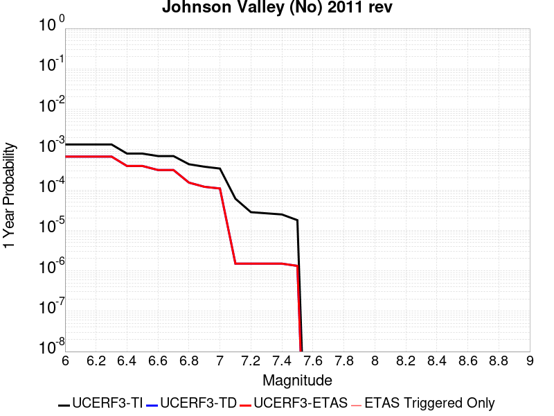 |  |

| Magnitude | 1 wk TI Prob | 1 wk TD Prob | 1 wk ETAS Prob | 1 wk ETAS/TD Gain | 1 wk ETAS Triggered Only | 1 mo TI Prob | 1 mo TD Prob | 1 mo ETAS Prob | 1 mo ETAS/TD Gain | 1 mo ETAS Triggered Only | 1 yr TI Prob | 1 yr TD Prob | 1 yr ETAS Prob | 1 yr ETAS/TD Gain | 1 yr ETAS Triggered Only | 10 yr TI Prob | 10 yr TD Prob | 10 yr ETAS Prob | 10 yr ETAS/TD Gain | 10 yr ETAS Triggered Only |
|-----|-----|-----|-----|-----|-----|-----|-----|-----|-----|-----|-----|-----|-----|-----|-----|-----|-----|-----|-----|-----|
| 6.0 | 2.577707E-5 | 1.2901988E-5 | 1.2901988E-5 | 1.0 | 0.0 | 1.1046848E-4 | 5.5293287E-5 | 5.5293287E-5 | 1.0 | 0.0 | 0.0013441239 | 6.7302753E-4 | 6.7302753E-4 | 1.0 | 0.0 | 0.013360229 | 0.0067138025 | 0.006723735 | 1.0014795 | 1.0E-5 |
| 6.1 | 2.577707E-5 | 1.2901988E-5 | 1.2901988E-5 | 1.0 | 0.0 | 1.1046848E-4 | 5.5293287E-5 | 5.5293287E-5 | 1.0 | 0.0 | 0.0013441239 | 6.7302753E-4 | 6.7302753E-4 | 1.0 | 0.0 | 0.013360229 | 0.0067138025 | 0.006723735 | 1.0014795 | 1.0E-5 |
| 6.2 | 2.577707E-5 | 1.2901988E-5 | 1.2901988E-5 | 1.0 | 0.0 | 1.1046848E-4 | 5.5293287E-5 | 5.5293287E-5 | 1.0 | 0.0 | 0.0013441239 | 6.7302753E-4 | 6.7302753E-4 | 1.0 | 0.0 | 0.013360229 | 0.0067138025 | 0.006723735 | 1.0014795 | 1.0E-5 |
| 6.3 | 2.577707E-5 | 1.2901988E-5 | 1.2901988E-5 | 1.0 | 0.0 | 1.1046848E-4 | 5.5293287E-5 | 5.5293287E-5 | 1.0 | 0.0 | 0.0013441239 | 6.7302753E-4 | 6.7302753E-4 | 1.0 | 0.0 | 0.013360229 | 0.0067138025 | 0.006723735 | 1.0014795 | 1.0E-5 |
| 6.4 | 1.5296591E-5 | 7.5373823E-6 | 7.5373823E-6 | 1.0 | 0.0 | 6.555518E-5 | 3.230277E-5 | 3.230277E-5 | 1.0 | 0.0 | 7.97842E-4 | 3.9323402E-4 | 3.9323402E-4 | 1.0 | 0.0 | 0.007949836 | 0.003927224 | 0.003927224 | 1.0 | 0.0 |
| 6.5 | 1.5296591E-5 | 7.5373823E-6 | 7.5373823E-6 | 1.0 | 0.0 | 6.555518E-5 | 3.230277E-5 | 3.230277E-5 | 1.0 | 0.0 | 7.97842E-4 | 3.9323402E-4 | 3.9323402E-4 | 1.0 | 0.0 | 0.007949836 | 0.003927224 | 0.003927224 | 1.0 | 0.0 |
| 6.6 | 1.3289383E-5 | 5.9922495E-6 | 5.9922495E-6 | 1.0 | 0.0 | 5.6953253E-5 | 2.568091E-5 | 2.568091E-5 | 1.0 | 0.0 | 6.9318525E-4 | 3.1263722E-4 | 3.1263722E-4 | 1.0 | 0.0 | 0.0069102696 | 0.0031236385 | 0.0031236385 | 1.0 | 0.0 |
| 6.7 | 1.3289383E-5 | 5.9922495E-6 | 5.9922495E-6 | 1.0 | 0.0 | 5.6953253E-5 | 2.568091E-5 | 2.568091E-5 | 1.0 | 0.0 | 6.9318525E-4 | 3.1263722E-4 | 3.1263722E-4 | 1.0 | 0.0 | 0.0069102696 | 0.0031236385 | 0.0031236385 | 1.0 | 0.0 |
| 6.8 | 8.330789E-6 | 2.9214666E-6 | 2.9214666E-6 | 1.0 | 0.0 | 3.570289E-5 | 1.2520543E-5 | 1.2520543E-5 | 1.0 | 0.0 | 4.34596E-4 | 1.5243267E-4 | 1.5243267E-4 | 1.0 | 0.0 | 0.0043374705 | 0.001523841 | 0.001523841 | 1.0 | 0.0 |
| 6.9 | 7.2359003E-6 | 2.301479E-6 | 2.301479E-6 | 1.0 | 0.0 | 3.1010633E-5 | 9.863475E-6 | 9.863475E-6 | 1.0 | 0.0 | 3.7748902E-4 | 1.20086515E-4 | 1.20086515E-4 | 1.0 | 0.0 | 0.0037684843 | 0.0012007392 | 0.0012007392 | 1.0 | 0.0 |
| 7.0 | 6.5149957E-6 | 2.0886487E-6 | 2.0886487E-6 | 1.0 | 0.0 | 2.792111E-5 | 8.9513505E-6 | 8.9513505E-6 | 1.0 | 0.0 | 3.398865E-4 | 1.08982545E-4 | 1.08982545E-4 | 1.0 | 0.0 | 0.003393671 | 0.0010898109 | 0.0010898109 | 1.0 | 0.0 |
| 7.1 | 1.1662233E-6 | 2.8802026E-8 | 2.8802026E-8 | 1.0 | 0.0 | 4.9980904E-6 | 1.2343725E-7 | 1.2343725E-7 | 1.0 | 0.0 | 6.0850052E-5 | 1.5028476E-6 | 1.5028476E-6 | 1.0 | 0.0 | 6.083339E-4 | 1.502839E-5 | 1.502839E-5 | 1.0 | 0.0 |
| 7.2 | 5.413881E-7 | 2.8802026E-8 | 2.8802026E-8 | 1.0 | 0.0 | 2.3202326E-6 | 1.2343725E-7 | 1.2343725E-7 | 1.0 | 0.0 | 2.8248465E-5 | 1.5028476E-6 | 1.5028476E-6 | 1.0 | 0.0 | 2.8244875E-4 | 1.502839E-5 | 1.502839E-5 | 1.0 | 0.0 |
| 7.3 | 5.076821E-7 | 2.8802026E-8 | 2.8802026E-8 | 1.0 | 0.0 | 2.1757785E-6 | 1.2343725E-7 | 1.2343725E-7 | 1.0 | 0.0 | 2.648978E-5 | 1.5028476E-6 | 1.5028476E-6 | 1.0 | 0.0 | 2.6486625E-4 | 1.502839E-5 | 1.502839E-5 | 1.0 | 0.0 |
| 7.4 | 4.7568687E-7 | 2.878396E-8 | 2.878396E-8 | 1.0 | 0.0 | 2.0386565E-6 | 1.2335983E-7 | 1.2335983E-7 | 1.0 | 0.0 | 2.482036E-5 | 1.501905E-6 | 1.501905E-6 | 1.0 | 0.0 | 2.4817587E-4 | 1.5018964E-5 | 1.5018964E-5 | 1.0 | 0.0 |
| 7.5 | 3.435626E-7 | 2.535784E-8 | 2.535784E-8 | 1.0 | 0.0 | 1.4724103E-6 | 1.0867645E-7 | 1.0867645E-7 | 1.0 | 0.0 | 1.7926448E-5 | 1.3231352E-6 | 1.3231352E-6 | 1.0 | 0.0 | 1.7925001E-4 | 1.323129E-5 | 1.323129E-5 | 1.0 | 0.0 |

## South Klamath Lake East
*[(top)](#table-of-contents)*

| 1 Week | 1 Month | 1 Year | 10 Year |
|-----|-----|-----|-----|
|  |  | 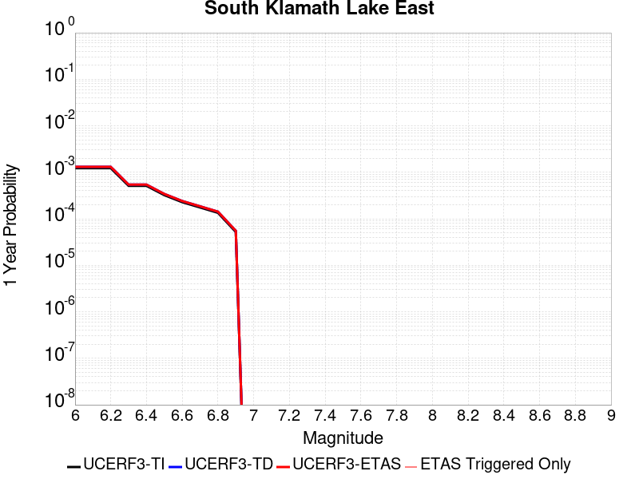 |  |

| Magnitude | 1 wk TI Prob | 1 wk TD Prob | 1 wk ETAS Prob | 1 wk ETAS/TD Gain | 1 wk ETAS Triggered Only | 1 mo TI Prob | 1 mo TD Prob | 1 mo ETAS Prob | 1 mo ETAS/TD Gain | 1 mo ETAS Triggered Only | 1 yr TI Prob | 1 yr TD Prob | 1 yr ETAS Prob | 1 yr ETAS/TD Gain | 1 yr ETAS Triggered Only | 10 yr TI Prob | 10 yr TD Prob | 10 yr ETAS Prob | 10 yr ETAS/TD Gain | 10 yr ETAS Triggered Only |
|-----|-----|-----|-----|-----|-----|-----|-----|-----|-----|-----|-----|-----|-----|-----|-----|-----|-----|-----|-----|-----|
| 6.0 | 2.3539369E-5 | 2.5048372E-5 | 2.5048372E-5 | 1.0 | 0.0 | 1.0087911E-4 | 1.0734622E-4 | 1.0734622E-4 | 1.0 | 0.0 | 0.0012275111 | 0.0013062399 | 0.0013062399 | 1.0 | 0.0 | 0.012207527 | 0.012993966 | 0.013003836 | 1.0007596 | 1.0E-5 |
| 6.1 | 2.3539369E-5 | 2.5048372E-5 | 2.5048372E-5 | 1.0 | 0.0 | 1.0087911E-4 | 1.0734622E-4 | 1.0734622E-4 | 1.0 | 0.0 | 0.0012275111 | 0.0013062399 | 0.0013062399 | 1.0 | 0.0 | 0.012207527 | 0.012993966 | 0.013003836 | 1.0007596 | 1.0E-5 |
| 6.2 | 2.3539369E-5 | 2.5048372E-5 | 2.5048372E-5 | 1.0 | 0.0 | 1.0087911E-4 | 1.0734622E-4 | 1.0734622E-4 | 1.0 | 0.0 | 0.0012275111 | 0.0013062399 | 0.0013062399 | 1.0 | 0.0 | 0.012207527 | 0.012993966 | 0.013003836 | 1.0007596 | 1.0E-5 |
| 6.3 | 9.807823E-6 | 1.0396457E-5 | 1.0396457E-5 | 1.0 | 0.0 | 4.2032847E-5 | 4.455553E-5 | 4.455553E-5 | 1.0 | 0.0 | 5.1162974E-4 | 5.4233696E-4 | 5.4233696E-4 | 1.0 | 0.0 | 0.005104534 | 0.0054109707 | 0.0054109707 | 1.0 | 0.0 |
| 6.4 | 9.807823E-6 | 1.0396457E-5 | 1.0396457E-5 | 1.0 | 0.0 | 4.2032847E-5 | 4.455553E-5 | 4.455553E-5 | 1.0 | 0.0 | 5.1162974E-4 | 5.4233696E-4 | 5.4233696E-4 | 1.0 | 0.0 | 0.005104534 | 0.0054109707 | 0.0054109707 | 1.0 | 0.0 |
| 6.5 | 6.191981E-6 | 6.5510917E-6 | 6.5510917E-6 | 1.0 | 0.0 | 2.653679E-5 | 2.8075821E-5 | 2.8075821E-5 | 1.0 | 0.0 | 3.2303753E-4 | 3.417723E-4 | 3.417723E-4 | 1.0 | 0.0 | 0.0032256835 | 0.003412745 | 0.003412745 | 1.0 | 0.0 |
| 6.6 | 4.3693776E-6 | 4.6167306E-6 | 4.6167306E-6 | 1.0 | 0.0 | 1.8725768E-5 | 1.9785844E-5 | 1.9785844E-5 | 1.0 | 0.0 | 2.2796239E-4 | 2.4086717E-4 | 2.4086717E-4 | 1.0 | 0.0 | 0.0022772867 | 0.0024061736 | 0.0024061736 | 1.0 | 0.0 |
| 6.7 | 3.360834E-6 | 3.5513738E-6 | 3.5513738E-6 | 1.0 | 0.0 | 1.4403494E-5 | 1.5220088E-5 | 1.5220088E-5 | 1.0 | 0.0 | 1.7534842E-4 | 1.8528962E-4 | 1.8528962E-4 | 1.0 | 0.0 | 0.0017521014 | 0.0018514313 | 0.0018514313 | 1.0 | 0.0 |
| 6.8 | 2.57873E-6 | 2.7252734E-6 | 2.7252734E-6 | 1.0 | 0.0 | 1.1051653E-5 | 1.1679695E-5 | 1.1679695E-5 | 1.0 | 0.0 | 1.3454557E-4 | 1.4219162E-4 | 1.4219162E-4 | 1.0 | 0.0 | 0.0013446413 | 0.001421067 | 0.001421067 | 1.0 | 0.0 |
| 6.9 | 9.987825E-7 | 1.0566619E-6 | 1.0566619E-6 | 1.0 | 0.0 | 4.2804895E-6 | 4.5285447E-6 | 4.5285447E-6 | 1.0 | 0.0 | 5.211371E-5 | 5.5133965E-5 | 5.5133965E-5 | 1.0 | 0.0 | 5.210149E-4 | 5.5123505E-4 | 5.5123505E-4 | 1.0 | 0.0 |

## Cedar Mtn-Mahogany Mtn
*[(top)](#table-of-contents)*

| 1 Week | 1 Month | 1 Year | 10 Year |
|-----|-----|-----|-----|
|  |  | 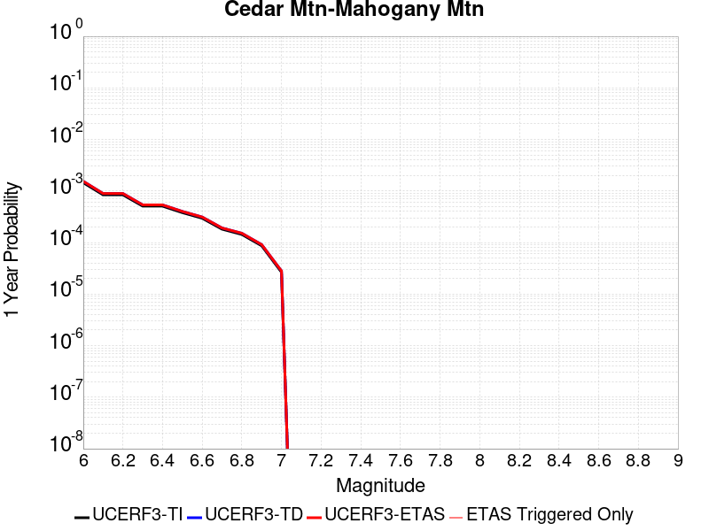 |  |

| Magnitude | 1 wk TI Prob | 1 wk TD Prob | 1 wk ETAS Prob | 1 wk ETAS/TD Gain | 1 wk ETAS Triggered Only | 1 mo TI Prob | 1 mo TD Prob | 1 mo ETAS Prob | 1 mo ETAS/TD Gain | 1 mo ETAS Triggered Only | 1 yr TI Prob | 1 yr TD Prob | 1 yr ETAS Prob | 1 yr ETAS/TD Gain | 1 yr ETAS Triggered Only | 10 yr TI Prob | 10 yr TD Prob | 10 yr ETAS Prob | 10 yr ETAS/TD Gain | 10 yr ETAS Triggered Only |
|-----|-----|-----|-----|-----|-----|-----|-----|-----|-----|-----|-----|-----|-----|-----|-----|-----|-----|-----|-----|-----|
| 6.0 | 2.7763876E-5 | 2.9590157E-5 | 2.9590157E-5 | 1.0 | 0.0 | 1.1898261E-4 | 1.2680919E-4 | 1.2680919E-4 | 1.0 | 0.0 | 0.0014476506 | 0.0015428786 | 0.0015428786 | 1.0 | 0.0 | 0.0143825635 | 0.01532889 | 0.015338737 | 1.0006424 | 1.0E-5 |
| 6.1 | 1.6162443E-5 | 1.7143657E-5 | 1.7143657E-5 | 1.0 | 0.0 | 6.926578E-5 | 7.3470845E-5 | 7.3470845E-5 | 1.0 | 0.0 | 8.4298453E-4 | 8.9415815E-4 | 8.9415815E-4 | 1.0 | 0.0 | 0.008397939 | 0.008907416 | 0.008917327 | 1.0011127 | 1.0E-5 |
| 6.2 | 1.6162443E-5 | 1.7143657E-5 | 1.7143657E-5 | 1.0 | 0.0 | 6.926578E-5 | 7.3470845E-5 | 7.3470845E-5 | 1.0 | 0.0 | 8.4298453E-4 | 8.9415815E-4 | 8.9415815E-4 | 1.0 | 0.0 | 0.008397939 | 0.008907416 | 0.008917327 | 1.0011127 | 1.0E-5 |
| 6.3 | 9.746053E-6 | 1.0303543E-5 | 1.0303543E-5 | 1.0 | 0.0 | 4.1768133E-5 | 4.4157314E-5 | 4.4157314E-5 | 1.0 | 0.0 | 5.0840835E-4 | 5.374868E-4 | 5.374868E-4 | 1.0 | 0.0 | 0.0050724675 | 0.005362287 | 0.0053722337 | 1.0018549 | 1.0E-5 |
| 6.4 | 9.746053E-6 | 1.0303543E-5 | 1.0303543E-5 | 1.0 | 0.0 | 4.1768133E-5 | 4.4157314E-5 | 4.4157314E-5 | 1.0 | 0.0 | 5.0840835E-4 | 5.374868E-4 | 5.374868E-4 | 1.0 | 0.0 | 0.0050724675 | 0.005362287 | 0.0053722337 | 1.0018549 | 1.0E-5 |
| 6.5 | 7.290083E-6 | 7.6956085E-6 | 7.6956085E-6 | 1.0 | 0.0 | 3.124284E-5 | 3.2980774E-5 | 3.2980774E-5 | 1.0 | 0.0 | 3.8031515E-4 | 4.014691E-4 | 4.014691E-4 | 1.0 | 0.0 | 0.0037966494 | 0.0040076585 | 0.0040176185 | 1.0024853 | 1.0E-5 |
| 6.6 | 5.67907E-6 | 5.9893696E-6 | 5.9893696E-6 | 1.0 | 0.0 | 2.4338644E-5 | 2.5668482E-5 | 2.5668482E-5 | 1.0 | 0.0 | 2.962827E-4 | 3.124703E-4 | 3.124703E-4 | 1.0 | 0.0 | 0.0029588798 | 0.0031204456 | 0.0031304145 | 1.0031947 | 1.0E-5 |
| 6.7 | 3.4853963E-6 | 3.672762E-6 | 3.672762E-6 | 1.0 | 0.0 | 1.4937327E-5 | 1.5740317E-5 | 1.5740317E-5 | 1.0 | 0.0 | 1.8184677E-4 | 1.9162212E-4 | 1.9162212E-4 | 1.0 | 0.0 | 0.0018169804 | 0.001914631 | 0.0019246119 | 1.0052129 | 1.0E-5 |
| 6.8 | 2.7535168E-6 | 2.9016799E-6 | 2.9016799E-6 | 1.0 | 0.0 | 1.1800733E-5 | 1.2435714E-5 | 1.2435714E-5 | 1.0 | 0.0 | 1.4366445E-4 | 1.5139478E-4 | 1.5139478E-4 | 1.0 | 0.0 | 0.0014357162 | 0.0015129637 | 0.0015129637 | 1.0 | 0.0 |
| 6.9 | 1.6594106E-6 | 1.7497617E-6 | 1.7497617E-6 | 1.0 | 0.0 | 7.1117406E-6 | 7.498959E-6 | 7.498959E-6 | 1.0 | 0.0 | 8.6582E-5 | 9.129631E-5 | 9.129631E-5 | 1.0 | 0.0 | 8.654827E-4 | 9.1261853E-4 | 9.1261853E-4 | 1.0 | 0.0 |
| 7.0 | 5.10215E-7 | 5.3894547E-7 | 5.3894547E-7 | 1.0 | 0.0 | 2.186634E-6 | 2.309765E-6 | 2.309765E-6 | 1.0 | 0.0 | 2.6621943E-5 | 2.8121154E-5 | 2.8121154E-5 | 1.0 | 0.0 | 2.6618753E-4 | 2.8118852E-4 | 2.8118852E-4 | 1.0 | 0.0 |

## South Klamath Lake West
*[(top)](#table-of-contents)*

| 1 Week | 1 Month | 1 Year | 10 Year |
|-----|-----|-----|-----|
|  | 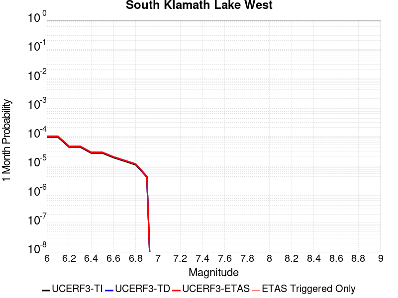 | 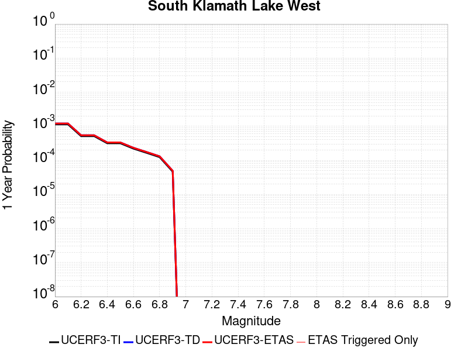 | 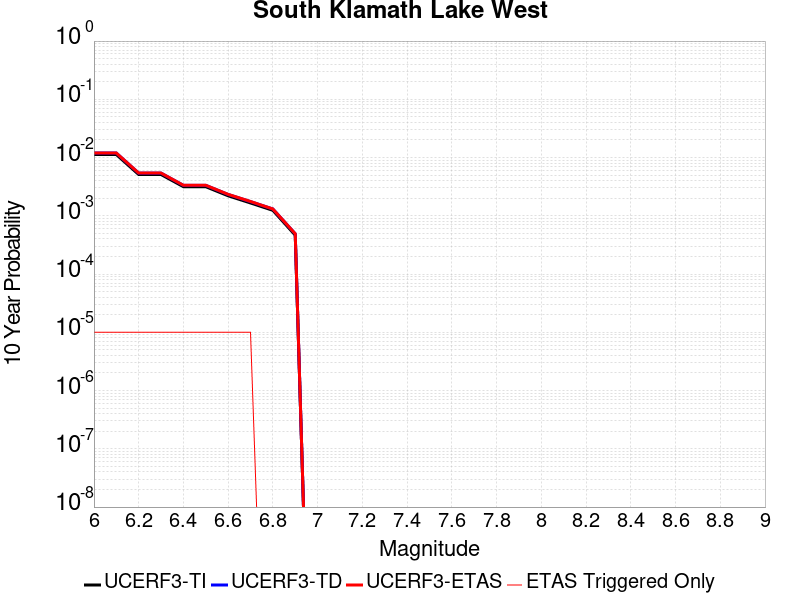 |

| Magnitude | 1 wk TI Prob | 1 wk TD Prob | 1 wk ETAS Prob | 1 wk ETAS/TD Gain | 1 wk ETAS Triggered Only | 1 mo TI Prob | 1 mo TD Prob | 1 mo ETAS Prob | 1 mo ETAS/TD Gain | 1 mo ETAS Triggered Only | 1 yr TI Prob | 1 yr TD Prob | 1 yr ETAS Prob | 1 yr ETAS/TD Gain | 1 yr ETAS Triggered Only | 10 yr TI Prob | 10 yr TD Prob | 10 yr ETAS Prob | 10 yr ETAS/TD Gain | 10 yr ETAS Triggered Only |
|-----|-----|-----|-----|-----|-----|-----|-----|-----|-----|-----|-----|-----|-----|-----|-----|-----|-----|-----|-----|-----|
| 6.0 | 2.174025E-5 | 2.3042941E-5 | 2.3042941E-5 | 1.0 | 0.0 | 9.3169176E-5 | 9.87521E-5 | 9.87521E-5 | 1.0 | 0.0 | 0.0011337444 | 0.0012017094 | 0.0012017094 | 1.0 | 0.0 | 0.011279777 | 0.011958713 | 0.011968593 | 1.0008262 | 1.0E-5 |
| 6.1 | 2.174025E-5 | 2.3042941E-5 | 2.3042941E-5 | 1.0 | 0.0 | 9.3169176E-5 | 9.87521E-5 | 9.87521E-5 | 1.0 | 0.0 | 0.0011337444 | 0.0012017094 | 0.0012017094 | 1.0 | 0.0 | 0.011279777 | 0.011958713 | 0.011968593 | 1.0008262 | 1.0E-5 |
| 6.2 | 9.834929E-6 | 1.0394233E-5 | 1.0394233E-5 | 1.0 | 0.0 | 4.2149015E-5 | 4.4546003E-5 | 4.4546003E-5 | 1.0 | 0.0 | 5.1304343E-4 | 5.4222165E-4 | 5.4222165E-4 | 1.0 | 0.0 | 0.0051186057 | 0.005409889 | 0.005419835 | 1.0018384 | 1.0E-5 |
| 6.3 | 9.834929E-6 | 1.0394233E-5 | 1.0394233E-5 | 1.0 | 0.0 | 4.2149015E-5 | 4.4546003E-5 | 4.4546003E-5 | 1.0 | 0.0 | 5.1304343E-4 | 5.4222165E-4 | 5.4222165E-4 | 1.0 | 0.0 | 0.0051186057 | 0.005409889 | 0.005419835 | 1.0018384 | 1.0E-5 |
| 6.4 | 6.066321E-6 | 6.4006636E-6 | 6.4006636E-6 | 1.0 | 0.0 | 2.5998259E-5 | 2.7431142E-5 | 2.7431142E-5 | 1.0 | 0.0 | 3.1648282E-4 | 3.339257E-4 | 3.339257E-4 | 1.0 | 0.0 | 0.0031603249 | 0.0033345097 | 0.0033444765 | 1.0029889 | 1.0E-5 |
| 6.5 | 6.066321E-6 | 6.4006636E-6 | 6.4006636E-6 | 1.0 | 0.0 | 2.5998259E-5 | 2.7431142E-5 | 2.7431142E-5 | 1.0 | 0.0 | 3.1648282E-4 | 3.339257E-4 | 3.339257E-4 | 1.0 | 0.0 | 0.0031603249 | 0.0033345097 | 0.0033444765 | 1.0029889 | 1.0E-5 |
| 6.6 | 4.2321803E-6 | 4.461451E-6 | 4.461451E-6 | 1.0 | 0.0 | 1.8137789E-5 | 1.912037E-5 | 1.912037E-5 | 1.0 | 0.0 | 2.208052E-4 | 2.3276669E-4 | 2.3276669E-4 | 1.0 | 0.0 | 0.0022058594 | 0.0023253306 | 0.0023353074 | 1.0042905 | 1.0E-5 |
| 6.7 | 3.186646E-6 | 3.3604267E-6 | 3.3604267E-6 | 1.0 | 0.0 | 1.3656982E-5 | 1.4401753E-5 | 1.4401753E-5 | 1.0 | 0.0 | 1.6626107E-4 | 1.753279E-4 | 1.753279E-4 | 1.0 | 0.0 | 0.0016613674 | 0.0017519629 | 0.0017619454 | 1.0056978 | 1.0E-5 |
| 6.8 | 2.380121E-6 | 2.5109985E-6 | 2.5109985E-6 | 1.0 | 0.0 | 1.0200479E-5 | 1.07613805E-5 | 1.07613805E-5 | 1.0 | 0.0 | 1.2418375E-4 | 1.3101239E-4 | 1.3101239E-4 | 1.0 | 0.0 | 0.0012411437 | 0.0013093974 | 0.0013093974 | 1.0 | 0.0 |
| 6.9 | 8.928287E-7 | 9.430602E-7 | 9.430602E-7 | 1.0 | 0.0 | 3.826403E-6 | 4.0416817E-6 | 4.0416817E-6 | 1.0 | 0.0 | 4.658546E-5 | 4.920658E-5 | 4.920658E-5 | 1.0 | 0.0 | 4.6575698E-4 | 4.919785E-4 | 4.919785E-4 | 1.0 | 0.0 |

## Pine Mtn
*[(top)](#table-of-contents)*

| 1 Week | 1 Month | 1 Year | 10 Year |
|-----|-----|-----|-----|
|  |  |  |  |

| Magnitude | 1 wk TI Prob | 1 wk TD Prob | 1 wk ETAS Prob | 1 wk ETAS/TD Gain | 1 wk ETAS Triggered Only | 1 mo TI Prob | 1 mo TD Prob | 1 mo ETAS Prob | 1 mo ETAS/TD Gain | 1 mo ETAS Triggered Only | 1 yr TI Prob | 1 yr TD Prob | 1 yr ETAS Prob | 1 yr ETAS/TD Gain | 1 yr ETAS Triggered Only | 10 yr TI Prob | 10 yr TD Prob | 10 yr ETAS Prob | 10 yr ETAS/TD Gain | 10 yr ETAS Triggered Only |
|-----|-----|-----|-----|-----|-----|-----|-----|-----|-----|-----|-----|-----|-----|-----|-----|-----|-----|-----|-----|-----|
| 6.0 | 6.894797E-6 | 7.225986E-6 | 7.225986E-6 | 1.0 | 0.0 | 2.9548795E-5 | 3.096816E-5 | 3.096816E-5 | 1.0 | 0.0 | 3.596972E-4 | 3.769751E-4 | 3.769751E-4 | 1.0 | 0.0 | 0.0035911554 | 0.0037636538 | 0.0037736162 | 1.002647 | 1.0E-5 |
| 6.1 | 6.894797E-6 | 7.225986E-6 | 7.225986E-6 | 1.0 | 0.0 | 2.9548795E-5 | 3.096816E-5 | 3.096816E-5 | 1.0 | 0.0 | 3.596972E-4 | 3.769751E-4 | 3.769751E-4 | 1.0 | 0.0 | 0.0035911554 | 0.0037636538 | 0.0037736162 | 1.002647 | 1.0E-5 |
| 6.2 | 6.894797E-6 | 7.225986E-6 | 7.225986E-6 | 1.0 | 0.0 | 2.9548795E-5 | 3.096816E-5 | 3.096816E-5 | 1.0 | 0.0 | 3.596972E-4 | 3.769751E-4 | 3.769751E-4 | 1.0 | 0.0 | 0.0035911554 | 0.0037636538 | 0.0037736162 | 1.002647 | 1.0E-5 |
| 6.3 | 6.894797E-6 | 7.225986E-6 | 7.225986E-6 | 1.0 | 0.0 | 2.9548795E-5 | 3.096816E-5 | 3.096816E-5 | 1.0 | 0.0 | 3.596972E-4 | 3.769751E-4 | 3.769751E-4 | 1.0 | 0.0 | 0.0035911554 | 0.0037636538 | 0.0037736162 | 1.002647 | 1.0E-5 |
| 6.4 | 6.894797E-6 | 7.225986E-6 | 7.225986E-6 | 1.0 | 0.0 | 2.9548795E-5 | 3.096816E-5 | 3.096816E-5 | 1.0 | 0.0 | 3.596972E-4 | 3.769751E-4 | 3.769751E-4 | 1.0 | 0.0 | 0.0035911554 | 0.0037636538 | 0.0037736162 | 1.002647 | 1.0E-5 |
| 6.5 | 6.894797E-6 | 7.225986E-6 | 7.225986E-6 | 1.0 | 0.0 | 2.9548795E-5 | 3.096816E-5 | 3.096816E-5 | 1.0 | 0.0 | 3.596972E-4 | 3.769751E-4 | 3.769751E-4 | 1.0 | 0.0 | 0.0035911554 | 0.0037636538 | 0.0037736162 | 1.002647 | 1.0E-5 |
| 6.6 | 6.894797E-6 | 7.225986E-6 | 7.225986E-6 | 1.0 | 0.0 | 2.9548795E-5 | 3.096816E-5 | 3.096816E-5 | 1.0 | 0.0 | 3.596972E-4 | 3.769751E-4 | 3.769751E-4 | 1.0 | 0.0 | 0.0035911554 | 0.0037636538 | 0.0037736162 | 1.002647 | 1.0E-5 |
| 6.7 | 6.0867933E-6 | 6.397624E-6 | 6.397624E-6 | 1.0 | 0.0 | 2.6085996E-5 | 2.7418113E-5 | 2.7418113E-5 | 1.0 | 0.0 | 3.1755073E-4 | 3.337666E-4 | 3.337666E-4 | 1.0 | 0.0 | 0.0031709734 | 0.0033328722 | 0.0033428387 | 1.0029904 | 1.0E-5 |
| 6.8 | 5.6530425E-6 | 5.9510976E-6 | 5.9510976E-6 | 1.0 | 0.0 | 2.42271E-5 | 2.5504467E-5 | 2.5504467E-5 | 1.0 | 0.0 | 2.94925E-4 | 3.104747E-4 | 3.104747E-4 | 1.0 | 0.0 | 0.002945339 | 0.003100614 | 0.0031105832 | 1.0032152 | 1.0E-5 |
| 6.9 | 4.6015225E-6 | 4.864312E-6 | 4.864312E-6 | 1.0 | 0.0 | 1.9720663E-5 | 2.0846894E-5 | 2.0846894E-5 | 1.0 | 0.0 | 2.4007261E-4 | 2.537828E-4 | 2.537828E-4 | 1.0 | 0.0 | 0.0023981342 | 0.0025350743 | 0.002545049 | 1.0039346 | 1.0E-5 |
| 7.0 | 4.4875965E-6 | 4.7479493E-6 | 4.7479493E-6 | 1.0 | 0.0 | 1.9232413E-5 | 2.0348205E-5 | 2.0348205E-5 | 1.0 | 0.0 | 2.3412947E-4 | 2.4771268E-4 | 2.4771268E-4 | 1.0 | 0.0 | 0.0023388295 | 0.0024745094 | 0.0024844846 | 1.0040312 | 1.0E-5 |
| 7.1 | 3.203907E-6 | 3.4298625E-6 | 3.4298625E-6 | 1.0 | 0.0 | 1.3730958E-5 | 1.4699332E-5 | 1.4699332E-5 | 1.0 | 0.0 | 1.6716159E-4 | 1.7895033E-4 | 1.7895033E-4 | 1.0 | 0.0 | 0.0016703589 | 0.0017881285 | 0.0017981107 | 1.0055825 | 1.0E-5 |
| 7.2 | 2.2060601E-6 | 2.378852E-6 | 2.378852E-6 | 1.0 | 0.0 | 9.4545085E-6 | 1.0195043E-5 | 1.0195043E-5 | 1.0 | 0.0 | 1.15102564E-4 | 1.2411803E-4 | 1.2411803E-4 | 1.0 | 0.0 | 0.0011504296 | 0.0012405319 | 0.0012505195 | 1.008051 | 1.0E-5 |
| 7.3 | 1.3765207E-6 | 1.5219823E-6 | 1.5219823E-6 | 1.0 | 0.0 | 5.899361E-6 | 6.5227655E-6 | 6.5227655E-6 | 1.0 | 0.0 | 7.182235E-5 | 7.941187E-5 | 7.941187E-5 | 1.0 | 0.0 | 7.1799144E-4 | 7.9384405E-4 | 8.038361E-4 | 1.012587 | 1.0E-5 |
| 7.4 | 1.1245983E-6 | 1.2590086E-6 | 1.2590086E-6 | 1.0 | 0.0 | 4.819698E-6 | 5.3957406E-6 | 5.3957406E-6 | 1.0 | 0.0 | 5.8678244E-5 | 6.5691245E-5 | 6.5691245E-5 | 1.0 | 0.0 | 5.866275E-4 | 6.567266E-4 | 6.567266E-4 | 1.0 | 0.0 |
| 7.5 | 8.031682E-7 | 9.279768E-7 | 9.279768E-7 | 1.0 | 0.0 | 3.4421448E-6 | 3.977038E-6 | 3.977038E-6 | 1.0 | 0.0 | 4.1907308E-5 | 4.8419428E-5 | 4.8419428E-5 | 1.0 | 0.0 | 4.1899405E-4 | 4.8409554E-4 | 4.8409554E-4 | 1.0 | 0.0 |
| 7.6 | 4.8953444E-7 | 6.0055186E-7 | 6.0055186E-7 | 1.0 | 0.0 | 2.098003E-6 | 2.5737913E-6 | 2.5737913E-6 | 1.0 | 0.0 | 2.5542888E-5 | 3.133551E-5 | 3.133551E-5 | 1.0 | 0.0 | 2.5539953E-4 | 3.1331577E-4 | 3.1331577E-4 | 1.0 | 0.0 |
| 7.7 | 6.634529E-8 | 6.788932E-8 | 6.788932E-8 | 1.0 | 0.0 | 2.843369E-7 | 2.9095418E-7 | 2.9095418E-7 | 1.0 | 0.0 | 3.4617963E-6 | 3.5423618E-6 | 3.5423618E-6 | 1.0 | 0.0 | 3.4617424E-5 | 3.54231E-5 | 3.54231E-5 | 1.0 | 0.0 |
| 7.8 | 9.235578E-9 | 9.488741E-9 | 9.488741E-9 | 1.0 | 0.0 | 3.9581046E-8 | 4.0666034E-8 | 4.0666034E-8 | 1.0 | 0.0 | 4.818991E-7 | 4.9510885E-7 | 4.9510885E-7 | 1.0 | 0.0 | 4.8189804E-6 | 4.9510795E-6 | 4.9510795E-6 | 1.0 | 0.0 |

## Anacapa-Dume alt 1
*[(top)](#table-of-contents)*

| 1 Week | 1 Month | 1 Year | 10 Year |
|-----|-----|-----|-----|
|  |  |  |  |

| Magnitude | 1 wk TI Prob | 1 wk TD Prob | 1 wk ETAS Prob | 1 wk ETAS/TD Gain | 1 wk ETAS Triggered Only | 1 mo TI Prob | 1 mo TD Prob | 1 mo ETAS Prob | 1 mo ETAS/TD Gain | 1 mo ETAS Triggered Only | 1 yr TI Prob | 1 yr TD Prob | 1 yr ETAS Prob | 1 yr ETAS/TD Gain | 1 yr ETAS Triggered Only | 10 yr TI Prob | 10 yr TD Prob | 10 yr ETAS Prob | 10 yr ETAS/TD Gain | 10 yr ETAS Triggered Only |
|-----|-----|-----|-----|-----|-----|-----|-----|-----|-----|-----|-----|-----|-----|-----|-----|-----|-----|-----|-----|-----|
| 6.0 | 5.1871802E-6 | 5.3675317E-6 | 5.3675317E-6 | 1.0 | 0.0 | 2.2230583E-5 | 2.300351E-5 | 2.300351E-5 | 1.0 | 0.0 | 2.7062374E-4 | 2.8003257E-4 | 2.9002977E-4 | 1.0357001 | 1.0E-5 | 0.002702944 | 0.0027968825 | 0.0028068544 | 1.0035654 | 1.0E-5 |
| 6.1 | 5.1871802E-6 | 5.3675317E-6 | 5.3675317E-6 | 1.0 | 0.0 | 2.2230583E-5 | 2.300351E-5 | 2.300351E-5 | 1.0 | 0.0 | 2.7062374E-4 | 2.8003257E-4 | 2.9002977E-4 | 1.0357001 | 1.0E-5 | 0.002702944 | 0.0027968825 | 0.0028068544 | 1.0035654 | 1.0E-5 |
| 6.2 | 5.1871802E-6 | 5.3675317E-6 | 5.3675317E-6 | 1.0 | 0.0 | 2.2230583E-5 | 2.300351E-5 | 2.300351E-5 | 1.0 | 0.0 | 2.7062374E-4 | 2.8003257E-4 | 2.9002977E-4 | 1.0357001 | 1.0E-5 | 0.002702944 | 0.0027968825 | 0.0028068544 | 1.0035654 | 1.0E-5 |
| 6.3 | 5.1871802E-6 | 5.3675317E-6 | 5.3675317E-6 | 1.0 | 0.0 | 2.2230583E-5 | 2.300351E-5 | 2.300351E-5 | 1.0 | 0.0 | 2.7062374E-4 | 2.8003257E-4 | 2.9002977E-4 | 1.0357001 | 1.0E-5 | 0.002702944 | 0.0027968825 | 0.0028068544 | 1.0035654 | 1.0E-5 |
| 6.4 | 5.1871802E-6 | 5.3675317E-6 | 5.3675317E-6 | 1.0 | 0.0 | 2.2230583E-5 | 2.300351E-5 | 2.300351E-5 | 1.0 | 0.0 | 2.7062374E-4 | 2.8003257E-4 | 2.9002977E-4 | 1.0357001 | 1.0E-5 | 0.002702944 | 0.0027968825 | 0.0028068544 | 1.0035654 | 1.0E-5 |
| 6.5 | 5.1871802E-6 | 5.3675317E-6 | 5.3675317E-6 | 1.0 | 0.0 | 2.2230583E-5 | 2.300351E-5 | 2.300351E-5 | 1.0 | 0.0 | 2.7062374E-4 | 2.8003257E-4 | 2.9002977E-4 | 1.0357001 | 1.0E-5 | 0.002702944 | 0.0027968825 | 0.0028068544 | 1.0035654 | 1.0E-5 |
| 6.6 | 5.1871802E-6 | 5.3675317E-6 | 5.3675317E-6 | 1.0 | 0.0 | 2.2230583E-5 | 2.300351E-5 | 2.300351E-5 | 1.0 | 0.0 | 2.7062374E-4 | 2.8003257E-4 | 2.9002977E-4 | 1.0357001 | 1.0E-5 | 0.002702944 | 0.0027968825 | 0.0028068544 | 1.0035654 | 1.0E-5 |
| 6.7 | 4.7693475E-6 | 4.9368236E-6 | 4.9368236E-6 | 1.0 | 0.0 | 2.04399E-5 | 2.1157648E-5 | 2.1157648E-5 | 1.0 | 0.0 | 2.4882736E-4 | 2.5756468E-4 | 2.675621E-4 | 1.0388151 | 1.0E-5 | 0.0024854892 | 0.0025727376 | 0.0025827119 | 1.0038769 | 1.0E-5 |
| 6.8 | 4.753408E-6 | 4.920372E-6 | 4.920372E-6 | 1.0 | 0.0 | 2.037159E-5 | 2.108714E-5 | 2.108714E-5 | 1.0 | 0.0 | 2.4799586E-4 | 2.5670644E-4 | 2.667039E-4 | 1.038945 | 1.0E-5 | 0.002477193 | 0.0025641753 | 0.0025741495 | 1.0038899 | 1.0E-5 |
| 6.9 | 3.800069E-6 | 3.9372376E-6 | 3.9372376E-6 | 1.0 | 0.0 | 1.6285909E-5 | 1.6873766E-5 | 1.6873766E-5 | 1.0 | 0.0 | 1.9826289E-4 | 2.0541898E-4 | 2.1541692E-4 | 1.048671 | 1.0E-5 | 0.001980861 | 0.0020523148 | 0.0020622942 | 1.0048625 | 1.0E-5 |
| 7.0 | 3.6671938E-6 | 3.8000267E-6 | 3.8000267E-6 | 1.0 | 0.0 | 1.571645E-5 | 1.6285729E-5 | 1.6285729E-5 | 1.0 | 0.0 | 1.9133097E-4 | 1.9826092E-4 | 2.0825895E-4 | 1.0504286 | 1.0E-5 | 0.0019116632 | 0.0019808637 | 0.001990844 | 1.0050383 | 1.0E-5 |
| 7.1 | 3.2394885E-6 | 3.3588924E-6 | 3.3588924E-6 | 1.0 | 0.0 | 1.3883448E-5 | 1.4395175E-5 | 1.4395175E-5 | 1.0 | 0.0 | 1.6901788E-4 | 1.7524726E-4 | 1.852455E-4 | 1.0570523 | 1.0E-5 | 0.0016888938 | 0.0017511018 | 0.0017610843 | 1.0057007 | 1.0E-5 |
| 7.2 | 3.0935948E-6 | 3.2080218E-6 | 3.2080218E-6 | 1.0 | 0.0 | 1.3258196E-5 | 1.3748592E-5 | 1.3748592E-5 | 1.0 | 0.0 | 1.6140658E-4 | 1.6737636E-4 | 1.7737469E-4 | 1.0597355 | 1.0E-5 | 0.001612894 | 0.001672514 | 0.0016824973 | 1.005969 | 1.0E-5 |
| 7.3 | 2.5604163E-6 | 2.6471496E-6 | 2.6471496E-6 | 1.0 | 0.0 | 1.0973167E-5 | 1.1344877E-5 | 1.1344877E-5 | 1.0 | 0.0 | 1.3359012E-4 | 1.3811517E-4 | 1.4811379E-4 | 1.0723933 | 1.0E-5 | 0.0013350984 | 0.0013802979 | 0.0013902842 | 1.0072348 | 1.0E-5 |
| 7.4 | 2.1429005E-6 | 2.210666E-6 | 2.210666E-6 | 1.0 | 0.0 | 9.1838265E-6 | 9.474248E-6 | 9.474248E-6 | 1.0 | 0.0 | 1.11807356E-4 | 1.153429E-4 | 1.2534174E-4 | 1.086688 | 1.0E-5 | 0.0011175112 | 0.001152833 | 0.0011628214 | 1.0086643 | 1.0E-5 |
| 7.5 | 1.7237151E-6 | 1.7761961E-6 | 1.7761961E-6 | 1.0 | 0.0 | 7.3873293E-6 | 7.612247E-6 | 7.612247E-6 | 1.0 | 0.0 | 8.993702E-5 | 9.267519E-5 | 1.0267426E-4 | 1.1078937 | 1.0E-5 | 8.990063E-4 | 9.263677E-4 | 9.3635847E-4 | 1.0107849 | 1.0E-5 |
| 7.6 | 9.541696E-7 | 9.823489E-7 | 9.823489E-7 | 1.0 | 0.0 | 4.089292E-6 | 4.2100596E-6 | 4.2100596E-6 | 1.0 | 0.0 | 4.9785995E-5 | 5.1256284E-5 | 5.1256284E-5 | 1.0 | 0.0 | 4.9774844E-4 | 5.1244587E-4 | 5.1244587E-4 | 1.0 | 0.0 |
| 7.7 | 2.7226676E-7 | 2.717306E-7 | 2.717306E-7 | 1.0 | 0.0 | 1.166857E-6 | 1.1645593E-6 | 1.1645593E-6 | 1.0 | 0.0 | 1.4206392E-5 | 1.4178418E-5 | 1.4178418E-5 | 1.0 | 0.0 | 1.4205484E-4 | 1.417752E-4 | 1.417752E-4 | 1.0 | 0.0 |
| 7.8 | 4.5017995E-8 | 4.215863E-8 | 4.215863E-8 | 1.0 | 0.0 | 1.9293425E-7 | 1.8067983E-7 | 1.8067983E-7 | 1.0 | 0.0 | 2.348972E-6 | 2.1997748E-6 | 2.1997748E-6 | 1.0 | 0.0 | 2.348947E-5 | 2.1997552E-5 | 2.1997552E-5 | 1.0 | 0.0 |
| 7.9 | 8.007447E-10 | 6.161718E-10 | 6.161718E-10 | 1.0 | 0.0 | 3.4317629E-9 | 2.6407367E-9 | 2.6407367E-9 | 1.0 | 0.0 | 4.1781714E-8 | 3.2150968E-8 | 3.2150968E-8 | 1.0 | 0.0 | 4.1781706E-7 | 3.2150967E-7 | 3.2150967E-7 | 1.0 | 0.0 |

## Del Valle
*[(top)](#table-of-contents)*

| 1 Week | 1 Month | 1 Year | 10 Year |
|-----|-----|-----|-----|
| 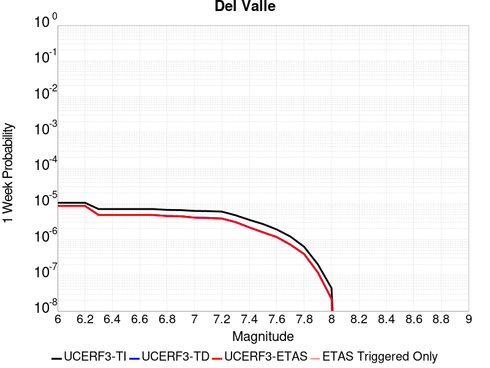 | 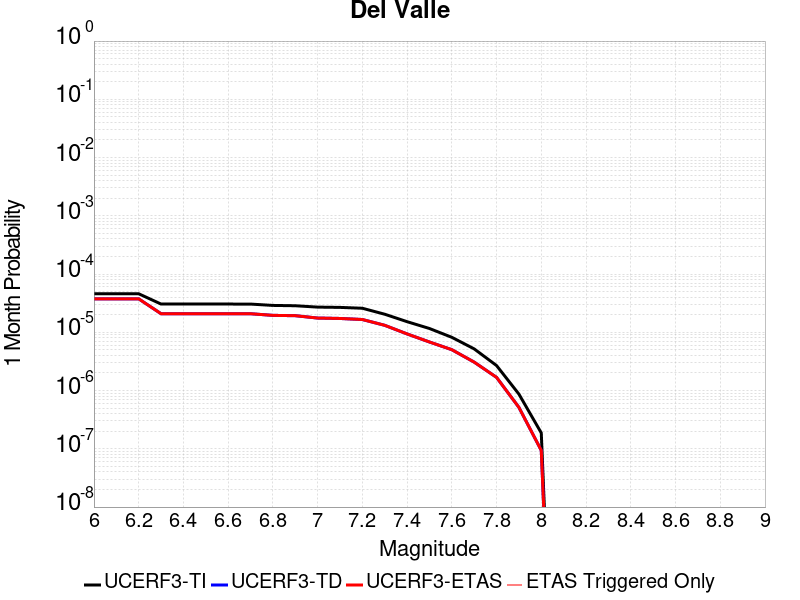 |  | 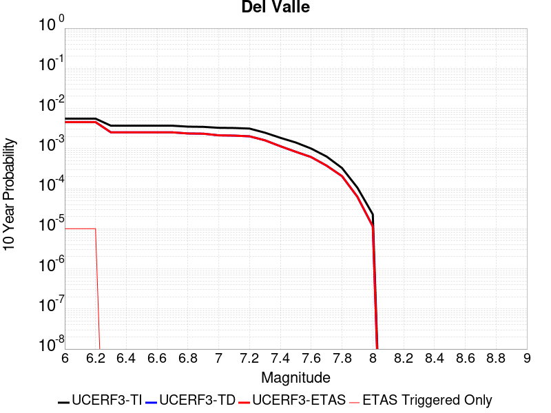 |

| Magnitude | 1 wk TI Prob | 1 wk TD Prob | 1 wk ETAS Prob | 1 wk ETAS/TD Gain | 1 wk ETAS Triggered Only | 1 mo TI Prob | 1 mo TD Prob | 1 mo ETAS Prob | 1 mo ETAS/TD Gain | 1 mo ETAS Triggered Only | 1 yr TI Prob | 1 yr TD Prob | 1 yr ETAS Prob | 1 yr ETAS/TD Gain | 1 yr ETAS Triggered Only | 10 yr TI Prob | 10 yr TD Prob | 10 yr ETAS Prob | 10 yr ETAS/TD Gain | 10 yr ETAS Triggered Only |
|-----|-----|-----|-----|-----|-----|-----|-----|-----|-----|-----|-----|-----|-----|-----|-----|-----|-----|-----|-----|-----|
| 6.0 | 1.0716125E-5 | 8.7687185E-6 | 8.7687185E-6 | 1.0 | 0.0 | 4.592544E-5 | 3.7579794E-5 | 3.7579794E-5 | 1.0 | 0.0 | 5.589988E-4 | 4.5745767E-4 | 4.5745767E-4 | 1.0 | 0.0 | 0.0055759475 | 0.0045671146 | 0.004577069 | 1.0021796 | 1.0E-5 |
| 6.1 | 1.0716125E-5 | 8.7687185E-6 | 8.7687185E-6 | 1.0 | 0.0 | 4.592544E-5 | 3.7579794E-5 | 3.7579794E-5 | 1.0 | 0.0 | 5.589988E-4 | 4.5745767E-4 | 4.5745767E-4 | 1.0 | 0.0 | 0.0055759475 | 0.0045671146 | 0.004577069 | 1.0021796 | 1.0E-5 |
| 6.2 | 1.0716125E-5 | 8.7687185E-6 | 8.7687185E-6 | 1.0 | 0.0 | 4.592544E-5 | 3.7579794E-5 | 3.7579794E-5 | 1.0 | 0.0 | 5.589988E-4 | 4.5745767E-4 | 4.5745767E-4 | 1.0 | 0.0 | 0.0055759475 | 0.0045671146 | 0.004577069 | 1.0021796 | 1.0E-5 |
| 6.3 | 7.1293784E-6 | 4.866432E-6 | 4.866432E-6 | 1.0 | 0.0 | 3.055412E-5 | 2.0855976E-5 | 2.0855976E-5 | 1.0 | 0.0 | 3.7193293E-4 | 2.5389265E-4 | 2.5389265E-4 | 1.0 | 0.0 | 0.0037131102 | 0.0025361115 | 0.0025361115 | 1.0 | 0.0 |
| 6.4 | 7.1293784E-6 | 4.866432E-6 | 4.866432E-6 | 1.0 | 0.0 | 3.055412E-5 | 2.0855976E-5 | 2.0855976E-5 | 1.0 | 0.0 | 3.7193293E-4 | 2.5389265E-4 | 2.5389265E-4 | 1.0 | 0.0 | 0.0037131102 | 0.0025361115 | 0.0025361115 | 1.0 | 0.0 |
| 6.5 | 7.1293784E-6 | 4.866432E-6 | 4.866432E-6 | 1.0 | 0.0 | 3.055412E-5 | 2.0855976E-5 | 2.0855976E-5 | 1.0 | 0.0 | 3.7193293E-4 | 2.5389265E-4 | 2.5389265E-4 | 1.0 | 0.0 | 0.0037131102 | 0.0025361115 | 0.0025361115 | 1.0 | 0.0 |
| 6.6 | 7.1293784E-6 | 4.866432E-6 | 4.866432E-6 | 1.0 | 0.0 | 3.055412E-5 | 2.0855976E-5 | 2.0855976E-5 | 1.0 | 0.0 | 3.7193293E-4 | 2.5389265E-4 | 2.5389265E-4 | 1.0 | 0.0 | 0.0037131102 | 0.0025361115 | 0.0025361115 | 1.0 | 0.0 |
| 6.7 | 7.12272E-6 | 4.8638076E-6 | 4.8638076E-6 | 1.0 | 0.0 | 3.0525585E-5 | 2.0844727E-5 | 2.0844727E-5 | 1.0 | 0.0 | 3.7158563E-4 | 2.5375572E-4 | 2.5375572E-4 | 1.0 | 0.0 | 0.003709649 | 0.0025347455 | 0.0025347455 | 1.0 | 0.0 |
| 6.8 | 6.7558703E-6 | 4.5599822E-6 | 4.5599822E-6 | 1.0 | 0.0 | 2.895341E-5 | 1.9542638E-5 | 1.9542638E-5 | 1.0 | 0.0 | 3.5245073E-4 | 2.3790628E-4 | 2.3790628E-4 | 1.0 | 0.0 | 0.0035189227 | 0.002376591 | 0.002376591 | 1.0 | 0.0 |
| 6.9 | 6.6700386E-6 | 4.5031084E-6 | 4.5031084E-6 | 1.0 | 0.0 | 2.8585566E-5 | 1.9298895E-5 | 1.9298895E-5 | 1.0 | 0.0 | 3.479737E-4 | 2.3493936E-4 | 2.3493936E-4 | 1.0 | 0.0 | 0.003474293 | 0.0023469846 | 0.0023469846 | 1.0 | 0.0 |
| 7.0 | 6.3181424E-6 | 4.0992304E-6 | 4.0992304E-6 | 1.0 | 0.0 | 2.7077473E-5 | 1.7568016E-5 | 1.7568016E-5 | 1.0 | 0.0 | 3.2961834E-4 | 2.1387002E-4 | 2.1387002E-4 | 1.0 | 0.0 | 0.0032912986 | 0.0021366966 | 0.0021366966 | 1.0 | 0.0 |
| 7.1 | 6.248759E-6 | 4.0344135E-6 | 4.0344135E-6 | 1.0 | 0.0 | 2.678012E-5 | 1.7290231E-5 | 1.7290231E-5 | 1.0 | 0.0 | 3.2599916E-4 | 2.1048865E-4 | 2.1048865E-4 | 1.0 | 0.0 | 0.0032552136 | 0.002102947 | 0.002102947 | 1.0 | 0.0 |
| 7.2 | 6.0411944E-6 | 3.8703847E-6 | 3.8703847E-6 | 1.0 | 0.0 | 2.5890577E-5 | 1.6587259E-5 | 1.6587259E-5 | 1.0 | 0.0 | 3.1517216E-4 | 2.0193159E-4 | 2.0193159E-4 | 1.0 | 0.0 | 0.0031472554 | 0.002017534 | 0.002017534 | 1.0 | 0.0 |
| 7.3 | 4.7691183E-6 | 3.078473E-6 | 3.078473E-6 | 1.0 | 0.0 | 2.0438918E-5 | 1.3193389E-5 | 1.3193389E-5 | 1.0 | 0.0 | 2.488154E-4 | 1.606179E-4 | 1.606179E-4 | 1.0 | 0.0 | 0.00248537 | 0.001605043 | 0.001605043 | 1.0 | 0.0 |
| 7.4 | 3.5524722E-6 | 2.1895892E-6 | 2.1895892E-6 | 1.0 | 0.0 | 1.5224792E-5 | 9.38392E-6 | 9.38392E-6 | 1.0 | 0.0 | 1.8534607E-4 | 1.1424332E-4 | 1.1424332E-4 | 1.0 | 0.0 | 0.0018519156 | 0.0011418541 | 0.0011418541 | 1.0 | 0.0 |
| 7.5 | 2.7133442E-6 | 1.5917929E-6 | 1.5917929E-6 | 1.0 | 0.0 | 1.1628566E-5 | 6.8219515E-6 | 6.8219515E-6 | 1.0 | 0.0 | 1.415686E-4 | 8.305412E-5 | 8.305412E-5 | 1.0 | 0.0 | 0.0014147845 | 8.302327E-4 | 8.302327E-4 | 1.0 | 0.0 |
| 7.6 | 1.915338E-6 | 1.1740519E-6 | 1.1740519E-6 | 1.0 | 0.0 | 8.208566E-6 | 5.031641E-6 | 5.031641E-6 | 1.0 | 0.0 | 9.993471E-5 | 6.125852E-5 | 6.125852E-5 | 1.0 | 0.0 | 9.988978E-4 | 6.124173E-4 | 6.124173E-4 | 1.0 | 0.0 |
| 7.7 | 1.2120448E-6 | 7.18124E-7 | 7.18124E-7 | 1.0 | 0.0 | 5.194467E-6 | 3.0776707E-6 | 3.0776707E-6 | 1.0 | 0.0 | 6.3240805E-5 | 3.747E-5 | 3.747E-5 | 1.0 | 0.0 | 6.322281E-4 | 3.746372E-4 | 3.746372E-4 | 1.0 | 0.0 |
| 7.8 | 6.272381E-7 | 3.9330214E-7 | 3.9330214E-7 | 1.0 | 0.0 | 2.6881603E-6 | 1.6855795E-6 | 1.6855795E-6 | 1.0 | 0.0 | 3.272786E-5 | 2.0521738E-5 | 2.0521738E-5 | 1.0 | 0.0 | 3.272304E-4 | 2.051986E-4 | 2.051986E-4 | 1.0 | 0.0 |
| 7.9 | 2.0292627E-7 | 1.2006181E-7 | 1.2006181E-7 | 1.0 | 0.0 | 8.6968373E-7 | 5.145505E-7 | 5.145505E-7 | 1.0 | 0.0 | 1.0588348E-5 | 6.2646345E-6 | 6.2646345E-6 | 1.0 | 0.0 | 1.0587843E-4 | 6.2644605E-5 | 6.2644605E-5 | 1.0 | 0.0 |
| 8.0 | 4.374492E-8 | 2.1904507E-8 | 2.1904507E-8 | 1.0 | 0.0 | 1.8747821E-7 | 9.387645E-8 | 9.387645E-8 | 1.0 | 0.0 | 2.2825448E-6 | 1.1429453E-6 | 1.1429453E-6 | 1.0 | 0.0 | 2.2825214E-5 | 1.1429398E-5 | 1.1429398E-5 | 1.0 | 0.0 |

## Hosgri (Extension)
*[(top)](#table-of-contents)*

| 1 Week | 1 Month | 1 Year | 10 Year |
|-----|-----|-----|-----|
| 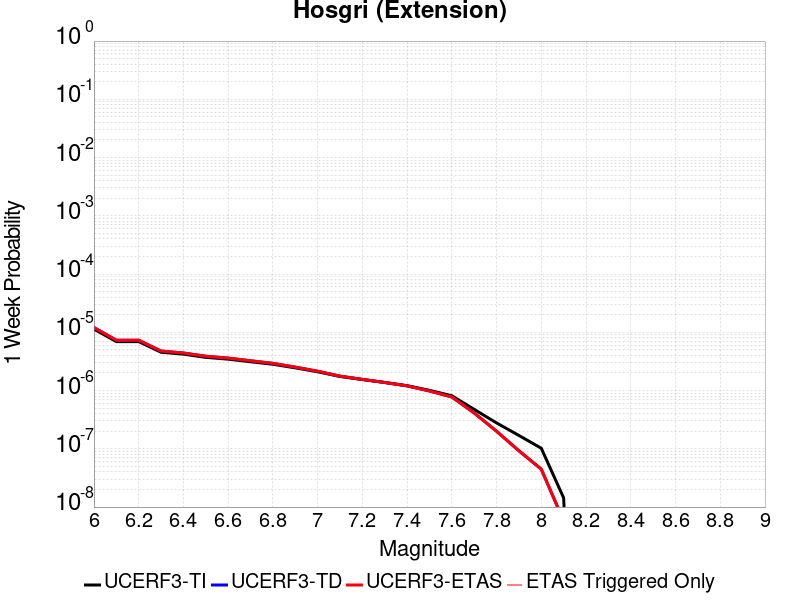 |  |  |  |

| Magnitude | 1 wk TI Prob | 1 wk TD Prob | 1 wk ETAS Prob | 1 wk ETAS/TD Gain | 1 wk ETAS Triggered Only | 1 mo TI Prob | 1 mo TD Prob | 1 mo ETAS Prob | 1 mo ETAS/TD Gain | 1 mo ETAS Triggered Only | 1 yr TI Prob | 1 yr TD Prob | 1 yr ETAS Prob | 1 yr ETAS/TD Gain | 1 yr ETAS Triggered Only | 10 yr TI Prob | 10 yr TD Prob | 10 yr ETAS Prob | 10 yr ETAS/TD Gain | 10 yr ETAS Triggered Only |
|-----|-----|-----|-----|-----|-----|-----|-----|-----|-----|-----|-----|-----|-----|-----|-----|-----|-----|-----|-----|-----|
| 6.0 | 1.1369135E-5 | 1.2083707E-5 | 1.2083707E-5 | 1.0 | 0.0 | 4.8723956E-5 | 5.1786417E-5 | 5.1786417E-5 | 1.0 | 0.0 | 5.9305265E-4 | 6.3033996E-4 | 6.4033363E-4 | 1.0158545 | 1.0E-5 | 0.005914725 | 0.0062877694 | 0.0062977066 | 1.0015804 | 1.0E-5 |
| 6.1 | 6.934979E-6 | 7.324959E-6 | 7.324959E-6 | 1.0 | 0.0 | 2.9721E-5 | 3.1392326E-5 | 3.1392326E-5 | 1.0 | 0.0 | 3.617931E-4 | 3.821387E-4 | 3.821387E-4 | 1.0 | 0.0 | 0.0036120464 | 0.0038152286 | 0.0038152286 | 1.0 | 0.0 |
| 6.2 | 6.934979E-6 | 7.324959E-6 | 7.324959E-6 | 1.0 | 0.0 | 2.9721E-5 | 3.1392326E-5 | 3.1392326E-5 | 1.0 | 0.0 | 3.617931E-4 | 3.821387E-4 | 3.821387E-4 | 1.0 | 0.0 | 0.0036120464 | 0.0038152286 | 0.0038152286 | 1.0 | 0.0 |
| 6.3 | 4.5484676E-6 | 4.7696144E-6 | 4.7696144E-6 | 1.0 | 0.0 | 1.9493287E-5 | 2.0441046E-5 | 2.0441046E-5 | 1.0 | 0.0 | 2.3730492E-4 | 2.4884174E-4 | 2.4884174E-4 | 1.0 | 0.0 | 0.0023705168 | 0.0024856736 | 0.0024856736 | 1.0 | 0.0 |
| 6.4 | 4.218095E-6 | 4.41713E-6 | 4.41713E-6 | 1.0 | 0.0 | 1.8077424E-5 | 1.8930423E-5 | 1.8930423E-5 | 1.0 | 0.0 | 2.2007042E-4 | 2.3045384E-4 | 2.3045384E-4 | 1.0 | 0.0 | 0.002198526 | 0.0023021821 | 0.0023021821 | 1.0 | 0.0 |
| 6.5 | 3.717374E-6 | 3.8841235E-6 | 3.8841235E-6 | 1.0 | 0.0 | 1.5931506E-5 | 1.6646138E-5 | 1.6646138E-5 | 1.0 | 0.0 | 1.9394881E-4 | 2.0264807E-4 | 2.0264807E-4 | 1.0 | 0.0 | 0.0019377962 | 0.0020246515 | 0.0020246515 | 1.0 | 0.0 |
| 6.6 | 3.4605036E-6 | 3.6085385E-6 | 3.6085385E-6 | 1.0 | 0.0 | 1.4830645E-5 | 1.5465073E-5 | 1.5465073E-5 | 1.0 | 0.0 | 1.8054814E-4 | 1.8827115E-4 | 1.8827115E-4 | 1.0 | 0.0 | 0.0018040152 | 0.0018811312 | 0.0018811312 | 1.0 | 0.0 |
| 6.7 | 3.123439E-6 | 3.2467835E-6 | 3.2467835E-6 | 1.0 | 0.0 | 1.33860985E-5 | 1.3914713E-5 | 1.3914713E-5 | 1.0 | 0.0 | 1.6296357E-4 | 1.6939857E-4 | 1.6939857E-4 | 1.0 | 0.0 | 0.001628441 | 0.0016927053 | 0.0016927053 | 1.0 | 0.0 |
| 6.8 | 2.8290783E-6 | 2.9307398E-6 | 2.9307398E-6 | 1.0 | 0.0 | 1.2124565E-5 | 1.2560254E-5 | 1.2560254E-5 | 1.0 | 0.0 | 1.4760658E-4 | 1.5291043E-4 | 1.5291043E-4 | 1.0 | 0.0 | 0.0014750857 | 0.001528061 | 0.001528061 | 1.0 | 0.0 |
| 6.9 | 2.454112E-6 | 2.5284996E-6 | 2.5284996E-6 | 1.0 | 0.0 | 1.0517581E-5 | 1.0836382E-5 | 1.0836382E-5 | 1.0 | 0.0 | 1.2804402E-4 | 1.3192503E-4 | 1.3192503E-4 | 1.0 | 0.0 | 0.0012797028 | 0.0013184733 | 0.0013184733 | 1.0 | 0.0 |
| 7.0 | 2.1008145E-6 | 2.1500325E-6 | 2.1500325E-6 | 1.0 | 0.0 | 9.003459E-6 | 9.214393E-6 | 9.214393E-6 | 1.0 | 0.0 | 1.096116E-4 | 1.1217949E-4 | 1.1217949E-4 | 1.0 | 0.0 | 0.0010955755 | 0.0011212324 | 0.0011212324 | 1.0 | 0.0 |
| 7.1 | 1.744384E-6 | 1.7687798E-6 | 1.7687798E-6 | 1.0 | 0.0 | 7.47591E-6 | 7.5804633E-6 | 7.5804633E-6 | 1.0 | 0.0 | 9.1015405E-5 | 9.228825E-5 | 9.228825E-5 | 1.0 | 0.0 | 9.097813E-4 | 9.2250097E-4 | 9.2250097E-4 | 1.0 | 0.0 |
| 7.2 | 1.5456587E-6 | 1.5564233E-6 | 1.5564233E-6 | 1.0 | 0.0 | 6.6242346E-6 | 6.6703683E-6 | 6.6703683E-6 | 1.0 | 0.0 | 8.064707E-5 | 8.120872E-5 | 8.120872E-5 | 1.0 | 0.0 | 8.0617814E-4 | 8.117917E-4 | 8.117917E-4 | 1.0 | 0.0 |
| 7.3 | 1.3775123E-6 | 1.376735E-6 | 1.376735E-6 | 1.0 | 0.0 | 5.9036106E-6 | 5.9002796E-6 | 5.9002796E-6 | 1.0 | 0.0 | 7.187409E-5 | 7.183354E-5 | 7.183354E-5 | 1.0 | 0.0 | 7.185085E-4 | 7.1810425E-4 | 7.1810425E-4 | 1.0 | 0.0 |
| 7.4 | 1.214491E-6 | 1.2024649E-6 | 1.2024649E-6 | 1.0 | 0.0 | 5.2049513E-6 | 5.1534107E-6 | 5.1534107E-6 | 1.0 | 0.0 | 6.336844E-5 | 6.2740975E-5 | 6.2740975E-5 | 1.0 | 0.0 | 6.335037E-4 | 6.272335E-4 | 6.272335E-4 | 1.0 | 0.0 |
| 7.5 | 1.0101123E-6 | 9.843337E-7 | 9.843337E-7 | 1.0 | 0.0 | 4.3290456E-6 | 4.218566E-6 | 4.218566E-6 | 1.0 | 0.0 | 5.2704854E-5 | 5.135984E-5 | 5.135984E-5 | 1.0 | 0.0 | 5.2692357E-4 | 5.134803E-4 | 5.134803E-4 | 1.0 | 0.0 |
| 7.6 | 8.1558215E-7 | 7.766965E-7 | 7.766965E-7 | 1.0 | 0.0 | 3.4953473E-6 | 3.328695E-6 | 3.328695E-6 | 1.0 | 0.0 | 4.255502E-5 | 4.0526113E-5 | 4.0526113E-5 | 1.0 | 0.0 | 4.2546875E-4 | 4.0518766E-4 | 4.0518766E-4 | 1.0 | 0.0 |
| 7.7 | 4.757816E-7 | 4.131719E-7 | 4.131719E-7 | 1.0 | 0.0 | 2.0390623E-6 | 1.7707355E-6 | 1.7707355E-6 | 1.0 | 0.0 | 2.4825302E-5 | 2.1558493E-5 | 2.1558493E-5 | 1.0 | 0.0 | 2.482253E-4 | 2.1556414E-4 | 2.1556414E-4 | 1.0 | 0.0 |
| 7.8 | 2.782787E-7 | 2.0054945E-7 | 2.0054945E-7 | 1.0 | 0.0 | 1.1926223E-6 | 8.5949733E-7 | 8.5949733E-7 | 1.0 | 0.0 | 1.452008E-5 | 1.046433E-5 | 1.046433E-5 | 1.0 | 0.0 | 1.4519131E-4 | 1.04638406E-4 | 1.04638406E-4 | 1.0 | 0.0 |
| 7.9 | 1.6948086E-7 | 9.250623E-8 | 9.250623E-8 | 1.0 | 0.0 | 7.2634634E-7 | 3.9645516E-7 | 3.9645516E-7 | 1.0 | 0.0 | 8.843231E-6 | 4.826831E-6 | 4.826831E-6 | 1.0 | 0.0 | 8.842879E-5 | 4.826727E-5 | 4.826727E-5 | 1.0 | 0.0 |
| 8.0 | 1.0225492E-7 | 4.4783903E-8 | 4.4783903E-8 | 1.0 | 0.0 | 4.382353E-7 | 1.91931E-7 | 1.91931E-7 | 1.0 | 0.0 | 5.335502E-6 | 2.3367575E-6 | 2.3367575E-6 | 1.0 | 0.0 | 5.335374E-5 | 2.336733E-5 | 2.336733E-5 | 1.0 | 0.0 |
| 8.1 | 1.43711345E-8 | 5.79466E-9 | 5.79466E-9 | 1.0 | 0.0 | 6.1590576E-8 | 2.4834256E-8 | 2.4834256E-8 | 1.0 | 0.0 | 7.4986497E-7 | 3.0235702E-7 | 3.0235702E-7 | 1.0 | 0.0 | 7.4986247E-6 | 3.0235667E-6 | 3.0235667E-6 | 1.0 | 0.0 |

## Los Alamos 2011 CFM
*[(top)](#table-of-contents)*

| 1 Week | 1 Month | 1 Year | 10 Year |
|-----|-----|-----|-----|
|  |  | 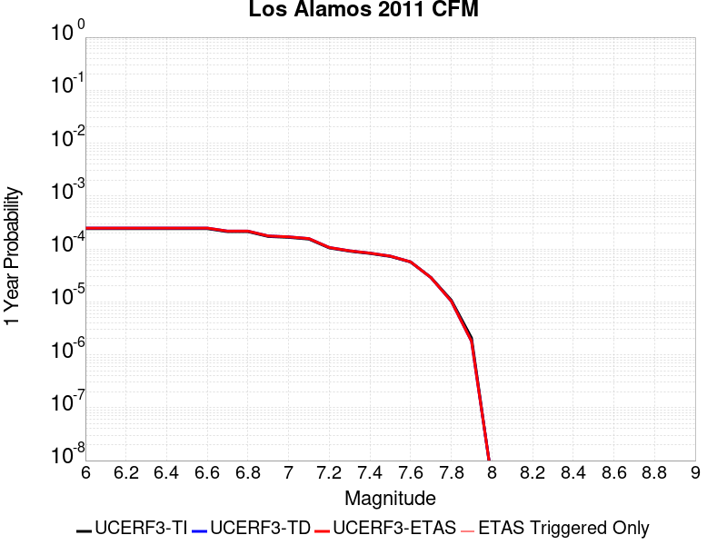 | 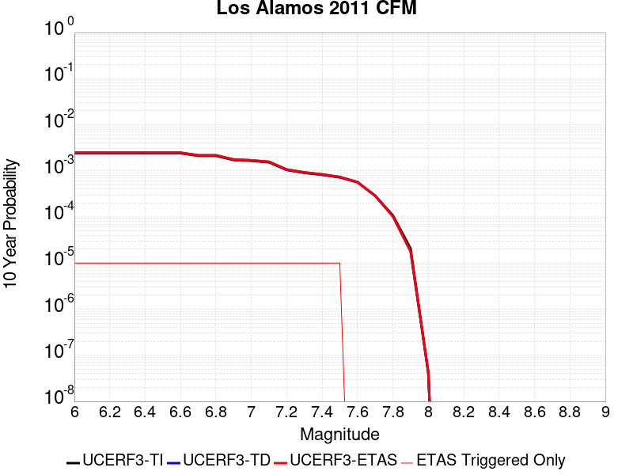 |

| Magnitude | 1 wk TI Prob | 1 wk TD Prob | 1 wk ETAS Prob | 1 wk ETAS/TD Gain | 1 wk ETAS Triggered Only | 1 mo TI Prob | 1 mo TD Prob | 1 mo ETAS Prob | 1 mo ETAS/TD Gain | 1 mo ETAS Triggered Only | 1 yr TI Prob | 1 yr TD Prob | 1 yr ETAS Prob | 1 yr ETAS/TD Gain | 1 yr ETAS Triggered Only | 10 yr TI Prob | 10 yr TD Prob | 10 yr ETAS Prob | 10 yr ETAS/TD Gain | 10 yr ETAS Triggered Only |
|-----|-----|-----|-----|-----|-----|-----|-----|-----|-----|-----|-----|-----|-----|-----|-----|-----|-----|-----|-----|-----|
| 6.0 | 4.6284417E-6 | 4.7518433E-6 | 4.7518433E-6 | 1.0 | 0.0 | 1.9836029E-5 | 2.0364894E-5 | 2.0364894E-5 | 1.0 | 0.0 | 2.4147688E-4 | 2.4791612E-4 | 2.4791612E-4 | 1.0 | 0.0 | 0.0024121467 | 0.0024765697 | 0.002486545 | 1.0040278 | 1.0E-5 |
| 6.1 | 4.6284417E-6 | 4.7518433E-6 | 4.7518433E-6 | 1.0 | 0.0 | 1.9836029E-5 | 2.0364894E-5 | 2.0364894E-5 | 1.0 | 0.0 | 2.4147688E-4 | 2.4791612E-4 | 2.4791612E-4 | 1.0 | 0.0 | 0.0024121467 | 0.0024765697 | 0.002486545 | 1.0040278 | 1.0E-5 |
| 6.2 | 4.6284417E-6 | 4.7518433E-6 | 4.7518433E-6 | 1.0 | 0.0 | 1.9836029E-5 | 2.0364894E-5 | 2.0364894E-5 | 1.0 | 0.0 | 2.4147688E-4 | 2.4791612E-4 | 2.4791612E-4 | 1.0 | 0.0 | 0.0024121467 | 0.0024765697 | 0.002486545 | 1.0040278 | 1.0E-5 |
| 6.3 | 4.6284417E-6 | 4.7518433E-6 | 4.7518433E-6 | 1.0 | 0.0 | 1.9836029E-5 | 2.0364894E-5 | 2.0364894E-5 | 1.0 | 0.0 | 2.4147688E-4 | 2.4791612E-4 | 2.4791612E-4 | 1.0 | 0.0 | 0.0024121467 | 0.0024765697 | 0.002486545 | 1.0040278 | 1.0E-5 |
| 6.4 | 4.6284417E-6 | 4.7518433E-6 | 4.7518433E-6 | 1.0 | 0.0 | 1.9836029E-5 | 2.0364894E-5 | 2.0364894E-5 | 1.0 | 0.0 | 2.4147688E-4 | 2.4791612E-4 | 2.4791612E-4 | 1.0 | 0.0 | 0.0024121467 | 0.0024765697 | 0.002486545 | 1.0040278 | 1.0E-5 |
| 6.5 | 4.6284417E-6 | 4.7518433E-6 | 4.7518433E-6 | 1.0 | 0.0 | 1.9836029E-5 | 2.0364894E-5 | 2.0364894E-5 | 1.0 | 0.0 | 2.4147688E-4 | 2.4791612E-4 | 2.4791612E-4 | 1.0 | 0.0 | 0.0024121467 | 0.0024765697 | 0.002486545 | 1.0040278 | 1.0E-5 |
| 6.6 | 4.6284417E-6 | 4.7518433E-6 | 4.7518433E-6 | 1.0 | 0.0 | 1.9836029E-5 | 2.0364894E-5 | 2.0364894E-5 | 1.0 | 0.0 | 2.4147688E-4 | 2.4791612E-4 | 2.4791612E-4 | 1.0 | 0.0 | 0.0024121467 | 0.0024765697 | 0.002486545 | 1.0040278 | 1.0E-5 |
| 6.7 | 4.062321E-6 | 4.1664475E-6 | 4.1664475E-6 | 1.0 | 0.0 | 1.7409831E-5 | 1.7856091E-5 | 1.7856091E-5 | 1.0 | 0.0 | 2.1194408E-4 | 2.1737773E-4 | 2.1737773E-4 | 1.0 | 0.0 | 0.0021174205 | 0.0021718007 | 0.002181779 | 1.0045944 | 1.0E-5 |
| 6.8 | 4.062321E-6 | 4.1664475E-6 | 4.1664475E-6 | 1.0 | 0.0 | 1.7409831E-5 | 1.7856091E-5 | 1.7856091E-5 | 1.0 | 0.0 | 2.1194408E-4 | 2.1737773E-4 | 2.1737773E-4 | 1.0 | 0.0 | 0.0021174205 | 0.0021718007 | 0.002181779 | 1.0045944 | 1.0E-5 |
| 6.9 | 3.2936077E-6 | 3.3730398E-6 | 3.3730398E-6 | 1.0 | 0.0 | 1.4115385E-5 | 1.4455811E-5 | 1.4455811E-5 | 1.0 | 0.0 | 1.7184127E-4 | 1.7598622E-4 | 1.7598622E-4 | 1.0 | 0.0 | 0.0017170844 | 0.0017585611 | 0.0017685435 | 1.0056765 | 1.0E-5 |
| 7.0 | 3.1687898E-6 | 3.2448952E-6 | 3.2448952E-6 | 1.0 | 0.0 | 1.3580457E-5 | 1.3906625E-5 | 1.3906625E-5 | 1.0 | 0.0 | 1.6532952E-4 | 1.6930094E-4 | 1.6930094E-4 | 1.0 | 0.0 | 0.0016520657 | 0.0016918111 | 0.0017017942 | 1.0059009 | 1.0E-5 |
| 7.1 | 2.9379228E-6 | 3.0074011E-6 | 3.0074011E-6 | 1.0 | 0.0 | 1.25910365E-5 | 1.2888803E-5 | 1.2888803E-5 | 1.0 | 0.0 | 1.5328509E-4 | 1.5691078E-4 | 1.5691078E-4 | 1.0 | 0.0 | 0.001531794 | 0.0015680891 | 0.0015780734 | 1.0063672 | 1.0E-5 |
| 7.2 | 2.0020686E-6 | 2.0416846E-6 | 2.0416846E-6 | 1.0 | 0.0 | 8.580266E-6 | 8.7500475E-6 | 8.7500475E-6 | 1.0 | 0.0 | 1.0445973E-4 | 1.0652667E-4 | 1.0652667E-4 | 1.0 | 0.0 | 0.0010441064 | 0.0010647605 | 0.0010747499 | 1.0093818 | 1.0E-5 |
| 7.3 | 1.7364243E-6 | 1.7679295E-6 | 1.7679295E-6 | 1.0 | 0.0 | 7.441797E-6 | 7.576819E-6 | 7.576819E-6 | 1.0 | 0.0 | 9.0600115E-5 | 9.224389E-5 | 9.224389E-5 | 1.0 | 0.0 | 9.0563187E-4 | 9.2205923E-4 | 9.3205E-4 | 1.0108353 | 1.0E-5 |
| 7.4 | 1.5718434E-6 | 1.5983635E-6 | 1.5983635E-6 | 1.0 | 0.0 | 6.7364545E-6 | 6.8501113E-6 | 6.8501113E-6 | 1.0 | 0.0 | 8.201325E-5 | 8.3396946E-5 | 8.3396946E-5 | 1.0 | 0.0 | 8.198299E-4 | 8.336595E-4 | 8.436511E-4 | 1.0119853 | 1.0E-5 |
| 7.5 | 1.3841119E-6 | 1.4043208E-6 | 1.4043208E-6 | 1.0 | 0.0 | 5.9318945E-6 | 6.018504E-6 | 6.018504E-6 | 1.0 | 0.0 | 7.221842E-5 | 7.327285E-5 | 7.327285E-5 | 1.0 | 0.0 | 7.2194956E-4 | 7.3248975E-4 | 7.424824E-4 | 1.0136421 | 1.0E-5 |
| 7.6 | 1.0843726E-6 | 1.0934759E-6 | 1.0934759E-6 | 1.0 | 0.0 | 4.647303E-6 | 4.6863174E-6 | 4.6863174E-6 | 1.0 | 0.0 | 5.6579443E-5 | 5.7054443E-5 | 5.7054443E-5 | 1.0 | 0.0 | 5.656504E-4 | 5.7040056E-4 | 5.7040056E-4 | 1.0 | 0.0 |
| 7.7 | 5.544814E-7 | 5.5020485E-7 | 5.5020485E-7 | 1.0 | 0.0 | 2.3763469E-6 | 2.3580187E-6 | 2.3580187E-6 | 1.0 | 0.0 | 2.8931638E-5 | 2.87085E-5 | 2.87085E-5 | 1.0 | 0.0 | 2.8927872E-4 | 2.8704808E-4 | 2.8704808E-4 | 1.0 | 0.0 |
| 7.8 | 2.0707465E-7 | 1.9779237E-7 | 1.9779237E-7 | 1.0 | 0.0 | 8.874625E-7 | 8.476813E-7 | 8.476813E-7 | 1.0 | 0.0 | 1.08048025E-5 | 1.0320471E-5 | 1.0320471E-5 | 1.0 | 0.0 | 1.0804277E-4 | 1.0319996E-4 | 1.0319996E-4 | 1.0 | 0.0 |
| 7.9 | 3.9821284E-8 | 3.4332903E-8 | 3.4332903E-8 | 1.0 | 0.0 | 1.7066264E-7 | 1.47141E-7 | 1.47141E-7 | 1.0 | 0.0 | 2.0778157E-6 | 1.7914402E-6 | 1.7914402E-6 | 1.0 | 0.0 | 2.0777963E-5 | 1.7914264E-5 | 1.7914264E-5 | 1.0 | 0.0 |
| 8.0 | 7.880441E-11 | 8.235557E-11 | 8.235557E-11 | 1.0 | 0.0 | 3.3773329E-10 | 3.5295256E-10 | 3.5295256E-10 | 1.0 | 0.0 | 4.1119033E-9 | 4.2971977E-9 | 4.2971977E-9 | 1.0 | 0.0 | 4.1119034E-8 | 4.297198E-8 | 4.297198E-8 | 1.0 | 0.0 |

## Hat Creek-McArthur-Mayfield
*[(top)](#table-of-contents)*

| 1 Week | 1 Month | 1 Year | 10 Year |
|-----|-----|-----|-----|
| 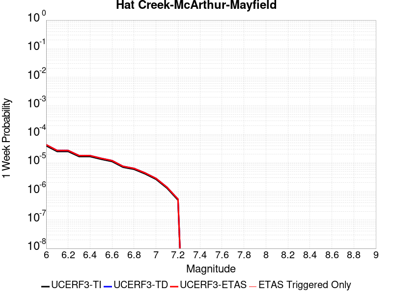 |  | 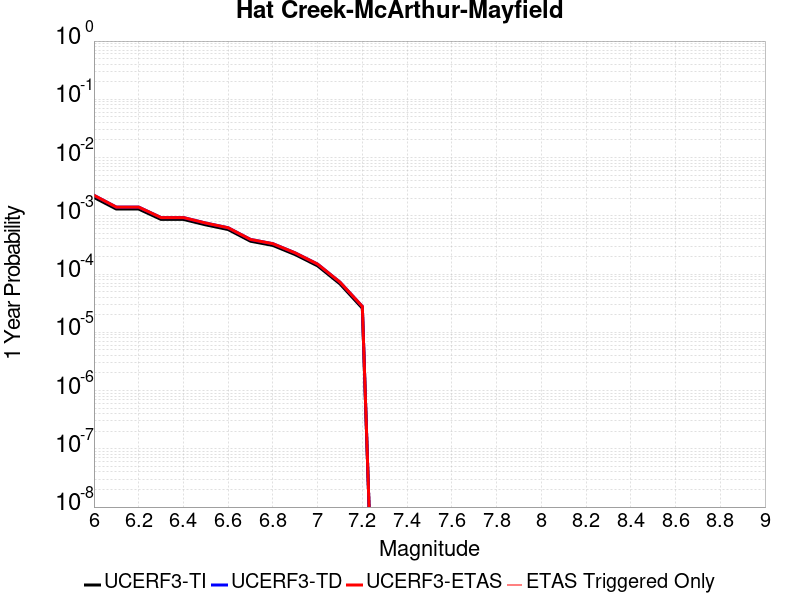 |  |

| Magnitude | 1 wk TI Prob | 1 wk TD Prob | 1 wk ETAS Prob | 1 wk ETAS/TD Gain | 1 wk ETAS Triggered Only | 1 mo TI Prob | 1 mo TD Prob | 1 mo ETAS Prob | 1 mo ETAS/TD Gain | 1 mo ETAS Triggered Only | 1 yr TI Prob | 1 yr TD Prob | 1 yr ETAS Prob | 1 yr ETAS/TD Gain | 1 yr ETAS Triggered Only | 10 yr TI Prob | 10 yr TD Prob | 10 yr ETAS Prob | 10 yr ETAS/TD Gain | 10 yr ETAS Triggered Only |
|-----|-----|-----|-----|-----|-----|-----|-----|-----|-----|-----|-----|-----|-----|-----|-----|-----|-----|-----|-----|-----|
| 6.0 | 3.967457E-5 | 4.3160835E-5 | 4.3160835E-5 | 1.0 | 0.0 | 1.7002279E-4 | 1.8496254E-4 | 1.8496254E-4 | 1.0 | 0.0 | 0.002068062 | 0.0022497075 | 0.0022497075 | 1.0 | 0.0 | 0.02048922 | 0.022281688 | 0.022291465 | 1.0004388 | 1.0E-5 |
| 6.1 | 2.5044013E-5 | 2.7072621E-5 | 2.7072621E-5 | 1.0 | 0.0 | 1.0732707E-4 | 1.1602054E-4 | 1.1602054E-4 | 1.0 | 0.0 | 0.0013059238 | 0.0014116666 | 0.0014116666 | 1.0 | 0.0 | 0.01298276 | 0.014030411 | 0.014040271 | 1.0007027 | 1.0E-5 |
| 6.2 | 2.5044013E-5 | 2.7072621E-5 | 2.7072621E-5 | 1.0 | 0.0 | 1.0732707E-4 | 1.1602054E-4 | 1.1602054E-4 | 1.0 | 0.0 | 0.0013059238 | 0.0014116666 | 0.0014116666 | 1.0 | 0.0 | 0.01298276 | 0.014030411 | 0.014040271 | 1.0007027 | 1.0E-5 |
| 6.3 | 1.6624012E-5 | 1.7891978E-5 | 1.7891978E-5 | 1.0 | 0.0 | 7.124382E-5 | 7.66777E-5 | 7.66777E-5 | 1.0 | 0.0 | 8.670483E-4 | 9.331597E-4 | 9.331597E-4 | 1.0 | 0.0 | 0.008636732 | 0.009293348 | 0.009303255 | 1.0010661 | 1.0E-5 |
| 6.4 | 1.6624012E-5 | 1.7891978E-5 | 1.7891978E-5 | 1.0 | 0.0 | 7.124382E-5 | 7.66777E-5 | 7.66777E-5 | 1.0 | 0.0 | 8.670483E-4 | 9.331597E-4 | 9.331597E-4 | 1.0 | 0.0 | 0.008636732 | 0.009293348 | 0.009303255 | 1.0010661 | 1.0E-5 |
| 6.5 | 1.3394842E-5 | 1.4392848E-5 | 1.4392848E-5 | 1.0 | 0.0 | 5.7405203E-5 | 6.168221E-5 | 6.168221E-5 | 1.0 | 0.0 | 6.986842E-4 | 7.507277E-4 | 7.507277E-4 | 1.0 | 0.0 | 0.006964916 | 0.007482509 | 0.007482509 | 1.0 | 0.0 |
| 6.6 | 1.1137514E-5 | 1.1955128E-5 | 1.1955128E-5 | 1.0 | 0.0 | 4.7731326E-5 | 5.1235278E-5 | 5.1235278E-5 | 1.0 | 0.0 | 5.809739E-4 | 6.23615E-4 | 6.23615E-4 | 1.0 | 0.0 | 0.005794574 | 0.0062190723 | 0.0062190723 | 1.0 | 0.0 |
| 6.7 | 7.0200663E-6 | 7.5246485E-6 | 7.5246485E-6 | 1.0 | 0.0 | 3.008565E-5 | 3.2248103E-5 | 3.2248103E-5 | 1.0 | 0.0 | 3.6623122E-4 | 3.925515E-4 | 3.925515E-4 | 1.0 | 0.0 | 0.0036562826 | 0.0039187437 | 0.0039187437 | 1.0 | 0.0 |
| 6.8 | 5.940172E-6 | 6.365779E-6 | 6.365779E-6 | 1.0 | 0.0 | 2.545763E-5 | 2.7281632E-5 | 2.7281632E-5 | 1.0 | 0.0 | 3.0990256E-4 | 3.321045E-4 | 3.321045E-4 | 1.0 | 0.0 | 0.0030947074 | 0.0033162108 | 0.0033162108 | 1.0 | 0.0 |
| 6.9 | 4.129831E-6 | 4.423756E-6 | 4.423756E-6 | 1.0 | 0.0 | 1.7699154E-5 | 1.895882E-5 | 1.895882E-5 | 1.0 | 0.0 | 2.154659E-4 | 2.3079997E-4 | 2.3079997E-4 | 1.0 | 0.0 | 0.002152571 | 0.0023056811 | 0.0023056811 | 1.0 | 0.0 |
| 7.0 | 2.6512955E-6 | 2.8375323E-6 | 2.8375323E-6 | 1.0 | 0.0 | 1.1362646E-5 | 1.2160798E-5 | 1.2160798E-5 | 1.0 | 0.0 | 1.3833142E-4 | 1.4804809E-4 | 1.4804809E-4 | 1.0 | 0.0 | 0.0013824535 | 0.0014795371 | 0.0014795371 | 1.0 | 0.0 |
| 7.1 | 1.2992575E-6 | 1.3909969E-6 | 1.3909969E-6 | 1.0 | 0.0 | 5.568235E-6 | 5.9614026E-6 | 5.9614026E-6 | 1.0 | 0.0 | 6.779115E-5 | 7.257788E-5 | 7.257788E-5 | 1.0 | 0.0 | 6.7770475E-4 | 7.255634E-4 | 7.255634E-4 | 1.0 | 0.0 |
| 7.2 | 4.968191E-7 | 5.327403E-7 | 5.327403E-7 | 1.0 | 0.0 | 2.1292228E-6 | 2.2831714E-6 | 2.2831714E-6 | 1.0 | 0.0 | 2.592298E-5 | 2.7797383E-5 | 2.7797383E-5 | 1.0 | 0.0 | 2.5919956E-4 | 2.7795142E-4 | 2.7795142E-4 | 1.0 | 0.0 |

## Hayward (So) 2011 CFM
*[(top)](#table-of-contents)*

| 1 Week | 1 Month | 1 Year | 10 Year |
|-----|-----|-----|-----|
|  |  |  |  |

| Magnitude | 1 wk TI Prob | 1 wk TD Prob | 1 wk ETAS Prob | 1 wk ETAS/TD Gain | 1 wk ETAS Triggered Only | 1 mo TI Prob | 1 mo TD Prob | 1 mo ETAS Prob | 1 mo ETAS/TD Gain | 1 mo ETAS Triggered Only | 1 yr TI Prob | 1 yr TD Prob | 1 yr ETAS Prob | 1 yr ETAS/TD Gain | 1 yr ETAS Triggered Only | 10 yr TI Prob | 10 yr TD Prob | 10 yr ETAS Prob | 10 yr ETAS/TD Gain | 10 yr ETAS Triggered Only |
|-----|-----|-----|-----|-----|-----|-----|-----|-----|-----|-----|-----|-----|-----|-----|-----|-----|-----|-----|-----|-----|
| 6.0 | 1.8091932E-4 | 3.5730877E-4 | 3.5730877E-4 | 1.0 | 0.0 | 7.751381E-4 | 0.0015304346 | 0.0015304346 | 1.0 | 0.0 | 0.00939654 | 0.018476259 | 0.018486073 | 1.0005312 | 1.0E-5 | 0.090090066 | 0.16684441 | 0.16685274 | 1.00005 | 1.0E-5 |
| 6.1 | 1.8091932E-4 | 3.5730877E-4 | 3.5730877E-4 | 1.0 | 0.0 | 7.751381E-4 | 0.0015304346 | 0.0015304346 | 1.0 | 0.0 | 0.00939654 | 0.018476259 | 0.018486073 | 1.0005312 | 1.0E-5 | 0.090090066 | 0.16684441 | 0.16685274 | 1.00005 | 1.0E-5 |
| 6.2 | 1.8091932E-4 | 3.5730877E-4 | 3.5730877E-4 | 1.0 | 0.0 | 7.751381E-4 | 0.0015304346 | 0.0015304346 | 1.0 | 0.0 | 0.00939654 | 0.018476259 | 0.018486073 | 1.0005312 | 1.0E-5 | 0.090090066 | 0.16684441 | 0.16685274 | 1.00005 | 1.0E-5 |
| 6.3 | 1.7322872E-4 | 3.4287322E-4 | 3.4287322E-4 | 1.0 | 0.0 | 7.4219756E-4 | 0.0014686388 | 0.0014686388 | 1.0 | 0.0 | 0.0089988755 | 0.017736355 | 0.017746178 | 1.0005538 | 1.0E-5 | 0.08643075 | 0.16077957 | 0.16078797 | 1.0000522 | 1.0E-5 |
| 6.4 | 1.6334097E-4 | 3.2368518E-4 | 3.2368518E-4 | 1.0 | 0.0 | 6.998449E-4 | 0.0013864933 | 0.0013864933 | 1.0 | 0.0 | 0.008487372 | 0.016751913 | 0.016761746 | 1.000587 | 1.0E-5 | 0.081704415 | 0.15266046 | 0.15266894 | 1.0000556 | 1.0E-5 |
| 6.5 | 1.5600289E-4 | 3.1042733E-4 | 3.1042733E-4 | 1.0 | 0.0 | 6.684125E-4 | 0.0013297328 | 0.0013297328 | 1.0 | 0.0 | 0.008107598 | 0.016071213 | 0.016071213 | 1.0 | 0.0 | 0.078181036 | 0.14693625 | 0.14693625 | 1.0 | 0.0 |
| 6.6 | 1.4046066E-4 | 2.805565E-4 | 2.805565E-4 | 1.0 | 0.0 | 6.018354E-4 | 0.0012018378 | 0.0012018378 | 1.0 | 0.0 | 0.0073027555 | 0.0145357065 | 0.0145357065 | 1.0 | 0.0 | 0.07067384 | 0.13401648 | 0.13401648 | 1.0 | 0.0 |
| 6.7 | 1.14696966E-4 | 2.3291982E-4 | 2.3291982E-4 | 1.0 | 0.0 | 4.914658E-4 | 9.97851E-4 | 9.97851E-4 | 1.0 | 0.0 | 0.0059671924 | 0.012082227 | 0.012082227 | 1.0 | 0.0 | 0.058094822 | 0.112824865 | 0.112824865 | 1.0 | 0.0 |
| 6.8 | 9.3874296E-5 | 1.8878336E-4 | 1.8878336E-4 | 1.0 | 0.0 | 4.0225635E-4 | 8.088244E-4 | 8.088244E-4 | 1.0 | 0.0 | 0.0048864787 | 0.00980371 | 0.00980371 | 1.0 | 0.0 | 0.047804173 | 0.09266631 | 0.09266631 | 1.0 | 0.0 |
| 6.9 | 5.551852E-5 | 1.0739205E-4 | 1.0739205E-4 | 1.0 | 0.0 | 2.3791482E-4 | 4.6017105E-4 | 4.6017105E-4 | 1.0 | 0.0 | 0.0028927654 | 0.0055883094 | 0.0055883094 | 1.0 | 0.0 | 0.028553981 | 0.054292552 | 0.054292552 | 1.0 | 0.0 |
| 7.0 | 4.2662363E-5 | 8.254104E-5 | 8.254104E-5 | 1.0 | 0.0 | 1.8282588E-4 | 3.5369975E-4 | 3.5369975E-4 | 1.0 | 0.0 | 0.0022236328 | 0.004297865 | 0.004297865 | 1.0 | 0.0 | 0.022015138 | 0.04210103 | 0.04210103 | 1.0 | 0.0 |
| 7.1 | 3.305886E-5 | 6.3082785E-5 | 6.3082785E-5 | 1.0 | 0.0 | 1.4167312E-4 | 2.7032688E-4 | 2.7032688E-4 | 1.0 | 0.0 | 0.0017235056 | 0.0032862818 | 0.0032862818 | 1.0 | 0.0 | 0.017101998 | 0.03248414 | 0.03248414 | 1.0 | 0.0 |
| 7.2 | 2.9856887E-5 | 5.7074543E-5 | 5.7074543E-5 | 1.0 | 0.0 | 1.2795182E-4 | 2.4458233E-4 | 2.4458233E-4 | 1.0 | 0.0 | 0.0015567001 | 0.0029737407 | 0.0029737407 | 1.0 | 0.0 | 0.015458403 | 0.029483564 | 0.029483564 | 1.0 | 0.0 |
| 7.3 | 2.4559737E-5 | 4.60418E-5 | 4.60418E-5 | 1.0 | 0.0 | 1.0525176E-4 | 1.9730715E-4 | 1.9730715E-4 | 1.0 | 0.0 | 0.0012806869 | 0.002399581 | 0.002399581 | 1.0 | 0.0 | 0.012733313 | 0.023882939 | 0.023882939 | 1.0 | 0.0 |
| 7.4 | 1.9002231E-5 | 3.5092216E-5 | 3.5092216E-5 | 1.0 | 0.0 | 8.143559E-5 | 1.503866E-4 | 1.503866E-4 | 1.0 | 0.0 | 9.910273E-4 | 0.001829429 | 0.001829429 | 1.0 | 0.0 | 0.009866194 | 0.018280044 | 0.018280044 | 1.0 | 0.0 |
| 7.5 | 1.2783333E-5 | 2.3363222E-5 | 2.3363222E-5 | 1.0 | 0.0 | 5.4784563E-5 | 1.00124285E-4 | 1.00124285E-4 | 1.0 | 0.0 | 6.667979E-4 | 0.0012183373 | 0.0012183373 | 1.0 | 0.0 | 0.006648007 | 0.012227025 | 0.012227025 | 1.0 | 0.0 |
| 7.6 | 4.8149627E-6 | 8.900173E-6 | 8.900173E-6 | 1.0 | 0.0 | 2.063539E-5 | 3.814305E-5 | 3.814305E-5 | 1.0 | 0.0 | 2.5120692E-4 | 4.642939E-4 | 4.642939E-4 | 1.0 | 0.0 | 0.0025092314 | 0.0046883537 | 0.0046883537 | 1.0 | 0.0 |
| 7.7 | 6.0838227E-7 | 1.2085997E-6 | 1.2085997E-6 | 1.0 | 0.0 | 2.6073499E-6 | 5.1797024E-6 | 5.1797024E-6 | 1.0 | 0.0 | 3.174402E-5 | 6.306106E-5 | 6.306106E-5 | 1.0 | 0.0 | 3.1739488E-4 | 6.5436406E-4 | 6.5436406E-4 | 1.0 | 0.0 |
| 7.8 | 4.5542808E-7 | 9.817826E-7 | 9.817826E-7 | 1.0 | 0.0 | 1.9518332E-6 | 4.2076326E-6 | 4.2076326E-6 | 1.0 | 0.0 | 2.376331E-5 | 5.1226725E-5 | 5.1226725E-5 | 1.0 | 0.0 | 2.3760769E-4 | 5.333797E-4 | 5.333797E-4 | 1.0 | 0.0 |
| 7.9 | 3.3016747E-7 | 7.405228E-7 | 7.405228E-7 | 1.0 | 0.0 | 1.4150027E-6 | 3.1736654E-6 | 3.1736654E-6 | 1.0 | 0.0 | 1.7227521E-5 | 3.8638693E-5 | 3.8638693E-5 | 1.0 | 0.0 | 1.7226185E-4 | 4.0022872E-4 | 4.0022872E-4 | 1.0 | 0.0 |
| 8.0 | 2.347038E-7 | 5.4847254E-7 | 5.4847254E-7 | 1.0 | 0.0 | 1.0058731E-6 | 2.3505945E-6 | 2.3505945E-6 | 1.0 | 0.0 | 1.2246436E-5 | 2.8618113E-5 | 2.8618113E-5 | 1.0 | 0.0 | 1.2245761E-4 | 2.9419552E-4 | 2.9419552E-4 | 1.0 | 0.0 |
| 8.1 | 1.18822804E-7 | 2.6117513E-7 | 2.6117513E-7 | 1.0 | 0.0 | 5.092405E-7 | 1.1193215E-6 | 1.1193215E-6 | 1.0 | 0.0 | 6.1999854E-6 | 1.3627655E-5 | 1.3627655E-5 | 1.0 | 0.0 | 6.199812E-5 | 1.3946928E-4 | 1.3946928E-4 | 1.0 | 0.0 |

## Hosgri
*[(top)](#table-of-contents)*

| 1 Week | 1 Month | 1 Year | 10 Year |
|-----|-----|-----|-----|
| 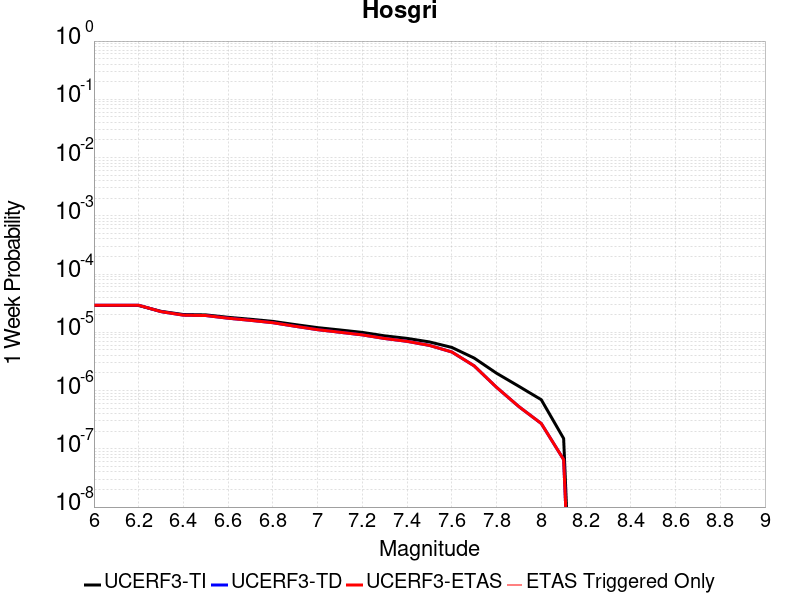 |  | 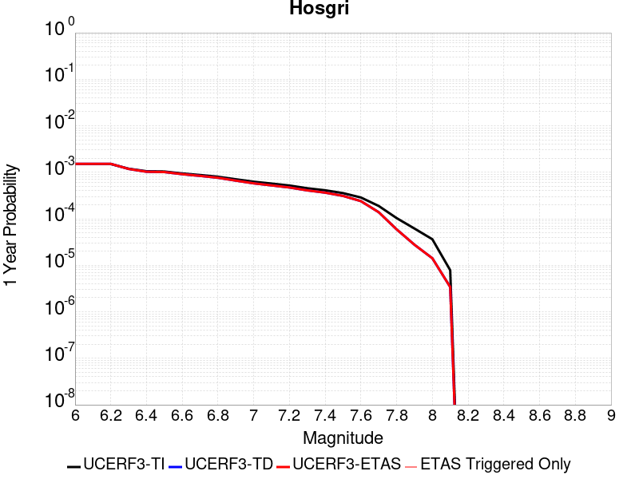 |  |

| Magnitude | 1 wk TI Prob | 1 wk TD Prob | 1 wk ETAS Prob | 1 wk ETAS/TD Gain | 1 wk ETAS Triggered Only | 1 mo TI Prob | 1 mo TD Prob | 1 mo ETAS Prob | 1 mo ETAS/TD Gain | 1 mo ETAS Triggered Only | 1 yr TI Prob | 1 yr TD Prob | 1 yr ETAS Prob | 1 yr ETAS/TD Gain | 1 yr ETAS Triggered Only | 10 yr TI Prob | 10 yr TD Prob | 10 yr ETAS Prob | 10 yr ETAS/TD Gain | 10 yr ETAS Triggered Only |
|-----|-----|-----|-----|-----|-----|-----|-----|-----|-----|-----|-----|-----|-----|-----|-----|-----|-----|-----|-----|-----|
| 6.0 | 2.883978E-5 | 2.9130495E-5 | 2.9130495E-5 | 1.0 | 0.0 | 1.235932E-4 | 1.2483916E-4 | 1.2483916E-4 | 1.0 | 0.0 | 0.0015037085 | 0.0015188843 | 0.0015188843 | 1.0 | 0.0 | 0.01493574 | 0.015088821 | 0.0150986705 | 1.0006528 | 1.0E-5 |
| 6.1 | 2.883978E-5 | 2.9130495E-5 | 2.9130495E-5 | 1.0 | 0.0 | 1.235932E-4 | 1.2483916E-4 | 1.2483916E-4 | 1.0 | 0.0 | 0.0015037085 | 0.0015188843 | 0.0015188843 | 1.0 | 0.0 | 0.01493574 | 0.015088821 | 0.0150986705 | 1.0006528 | 1.0E-5 |
| 6.2 | 2.883978E-5 | 2.9130495E-5 | 2.9130495E-5 | 1.0 | 0.0 | 1.235932E-4 | 1.2483916E-4 | 1.2483916E-4 | 1.0 | 0.0 | 0.0015037085 | 0.0015188843 | 0.0015188843 | 1.0 | 0.0 | 0.01493574 | 0.015088821 | 0.0150986705 | 1.0006528 | 1.0E-5 |
| 6.3 | 2.2914428E-5 | 2.264364E-5 | 2.264364E-5 | 1.0 | 0.0 | 9.8200995E-5 | 9.704059E-5 | 9.704059E-5 | 1.0 | 0.0 | 0.0011949413 | 0.0011808338 | 0.0011808338 | 1.0 | 0.0 | 0.011885363 | 0.011747007 | 0.0117568895 | 1.0008413 | 1.0E-5 |
| 6.4 | 2.0195741E-5 | 1.9698067E-5 | 1.9698067E-5 | 1.0 | 0.0 | 8.65503E-5 | 8.441757E-5 | 8.441757E-5 | 1.0 | 0.0 | 0.0010532405 | 0.0010273013 | 0.0010273013 | 1.0 | 0.0 | 0.010482626 | 0.010226584 | 0.010236481 | 1.0009679 | 1.0E-5 |
| 6.5 | 1.9924333E-5 | 1.9410476E-5 | 1.9410476E-5 | 1.0 | 0.0 | 8.53872E-5 | 8.3185114E-5 | 8.3185114E-5 | 1.0 | 0.0 | 0.0010390934 | 0.0010123102 | 0.0010123102 | 1.0 | 0.0 | 0.010342481 | 0.010078038 | 0.010087937 | 1.0009823 | 1.0E-5 |
| 6.6 | 1.809694E-5 | 1.7459703E-5 | 1.7459703E-5 | 1.0 | 0.0 | 7.7556004E-5 | 7.4825155E-5 | 7.4825155E-5 | 1.0 | 0.0 | 9.438353E-4 | 9.106168E-4 | 9.106168E-4 | 1.0 | 0.0 | 0.009398366 | 0.009069811 | 0.009069811 | 1.0 | 0.0 |
| 6.7 | 1.675989E-5 | 1.6044103E-5 | 1.6044103E-5 | 1.0 | 0.0 | 7.182612E-5 | 6.8758636E-5 | 6.8758636E-5 | 1.0 | 0.0 | 8.7413215E-4 | 8.3681603E-4 | 8.3681603E-4 | 1.0 | 0.0 | 0.008707017 | 0.0083375685 | 0.0083375685 | 1.0 | 0.0 |
| 6.8 | 1.5401129E-5 | 1.4615359E-5 | 1.4615359E-5 | 1.0 | 0.0 | 6.6003166E-5 | 6.263575E-5 | 6.263575E-5 | 1.0 | 0.0 | 8.032922E-4 | 7.623243E-4 | 7.623243E-4 | 1.0 | 0.0 | 0.008003947 | 0.0075979694 | 0.0075979694 | 1.0 | 0.0 |
| 6.9 | 1.356559E-5 | 1.269116E-5 | 1.269116E-5 | 1.0 | 0.0 | 5.8136946E-5 | 5.4389555E-5 | 5.4389555E-5 | 1.0 | 0.0 | 7.0758746E-4 | 6.6199206E-4 | 6.6199206E-4 | 1.0 | 0.0 | 0.007053386 | 0.0066010184 | 0.0066010184 | 1.0 | 0.0 |
| 7.0 | 1.2030819E-5 | 1.1097087E-5 | 1.1097087E-5 | 1.0 | 0.0 | 5.155963E-5 | 4.755808E-5 | 4.755808E-5 | 1.0 | 0.0 | 6.275577E-4 | 5.788659E-4 | 5.788659E-4 | 1.0 | 0.0 | 0.006257884 | 0.0057743536 | 0.0057743536 | 1.0 | 0.0 |
| 7.1 | 1.0972698E-5 | 1.00232655E-5 | 1.00232655E-5 | 1.0 | 0.0 | 4.7025E-5 | 4.2956144E-5 | 4.2956144E-5 | 1.0 | 0.0 | 5.72379E-4 | 5.228656E-4 | 5.228656E-4 | 1.0 | 0.0 | 0.0057090693 | 0.0052171187 | 0.0052171187 | 1.0 | 0.0 |
| 7.2 | 9.961926E-6 | 9.035797E-6 | 9.035797E-6 | 1.0 | 0.0 | 4.2693267E-5 | 3.872427E-5 | 3.872427E-5 | 1.0 | 0.0 | 5.1966653E-4 | 4.7136605E-4 | 4.7136605E-4 | 1.0 | 0.0 | 0.00518453 | 0.004704421 | 0.004704421 | 1.0 | 0.0 |
| 7.3 | 8.700929E-6 | 7.829111E-6 | 7.829111E-6 | 1.0 | 0.0 | 3.7289166E-5 | 3.3552904E-5 | 3.3552904E-5 | 1.0 | 0.0 | 4.53901E-4 | 4.0843006E-4 | 4.0843006E-4 | 1.0 | 0.0 | 0.00452975 | 0.0040775463 | 0.0040775463 | 1.0 | 0.0 |
| 7.4 | 7.866285E-6 | 6.9997163E-6 | 6.9997163E-6 | 1.0 | 0.0 | 3.3712215E-5 | 2.999844E-5 | 2.999844E-5 | 1.0 | 0.0 | 4.103689E-4 | 3.6516984E-4 | 3.6516984E-4 | 1.0 | 0.0 | 0.004096119 | 0.0036464473 | 0.0036464473 | 1.0 | 0.0 |
| 7.5 | 6.8381305E-6 | 5.96064E-6 | 5.96064E-6 | 1.0 | 0.0 | 2.9305946E-5 | 2.554535E-5 | 2.554535E-5 | 1.0 | 0.0 | 3.5674145E-4 | 3.1097027E-4 | 3.1097027E-4 | 1.0 | 0.0 | 0.0035616932 | 0.0031060986 | 0.0031060986 | 1.0 | 0.0 |
| 7.6 | 5.503376E-6 | 4.5961415E-6 | 4.5961415E-6 | 1.0 | 0.0 | 2.3585684E-5 | 1.9697602E-5 | 1.9697602E-5 | 1.0 | 0.0 | 2.8711787E-4 | 2.3979192E-4 | 2.3979192E-4 | 1.0 | 0.0 | 0.002867472 | 0.0023960772 | 0.0023960772 | 1.0 | 0.0 |
| 7.7 | 3.6144982E-6 | 2.6530217E-6 | 2.6530217E-6 | 1.0 | 0.0 | 1.5490614E-5 | 1.13700435E-5 | 1.13700435E-5 | 1.0 | 0.0 | 1.8858191E-4 | 1.3842148E-4 | 1.3842148E-4 | 1.0 | 0.0 | 0.0018842196 | 0.0013840962 | 0.0013840962 | 1.0 | 0.0 |
| 7.8 | 1.9853494E-6 | 1.1367723E-6 | 1.1367723E-6 | 1.0 | 0.0 | 8.508612E-6 | 4.871872E-6 | 4.871872E-6 | 1.0 | 0.0 | 1.0358743E-4 | 5.9313432E-5 | 5.9313432E-5 | 1.0 | 0.0 | 0.0010353916 | 5.9371814E-4 | 5.9371814E-4 | 1.0 | 0.0 |
| 7.9 | 1.1818757E-6 | 5.300232E-7 | 5.300232E-7 | 1.0 | 0.0 | 5.0651715E-6 | 2.271526E-6 | 2.271526E-6 | 1.0 | 0.0 | 6.1666724E-5 | 2.765548E-5 | 2.765548E-5 | 1.0 | 0.0 | 6.1649614E-4 | 2.772184E-4 | 2.772184E-4 | 1.0 | 0.0 |
| 8.0 | 6.962958E-7 | 2.7174556E-7 | 2.7174556E-7 | 1.0 | 0.0 | 2.9841215E-6 | 1.1646233E-6 | 1.1646233E-6 | 1.0 | 0.0 | 3.6331072E-5 | 1.4179196E-5 | 1.4179196E-5 | 1.0 | 0.0 | 3.6325134E-4 | 1.4235536E-4 | 1.4235536E-4 | 1.0 | 0.0 |
| 8.1 | 1.5033264E-7 | 6.5349695E-8 | 6.5349695E-8 | 1.0 | 0.0 | 6.442826E-7 | 2.8007008E-7 | 2.8007008E-7 | 1.0 | 0.0 | 7.844113E-6 | 3.4098482E-6 | 3.4098482E-6 | 1.0 | 0.0 | 7.843835E-5 | 3.4114135E-5 | 3.4114135E-5 | 1.0 | 0.0 |

## Verdugo
*[(top)](#table-of-contents)*

| 1 Week | 1 Month | 1 Year | 10 Year |
|-----|-----|-----|-----|
| 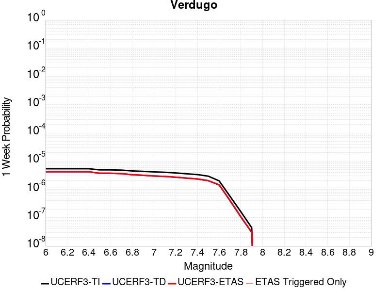 |  |  | 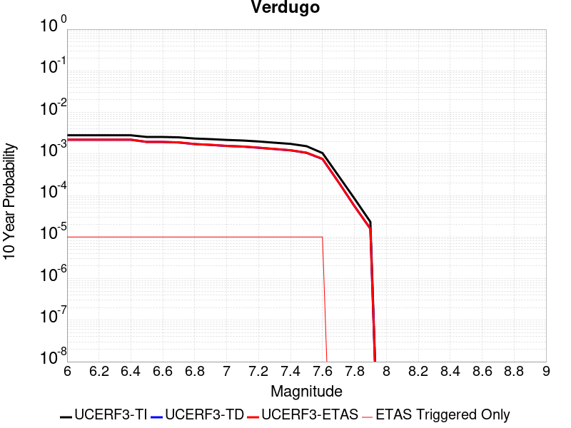 |

| Magnitude | 1 wk TI Prob | 1 wk TD Prob | 1 wk ETAS Prob | 1 wk ETAS/TD Gain | 1 wk ETAS Triggered Only | 1 mo TI Prob | 1 mo TD Prob | 1 mo ETAS Prob | 1 mo ETAS/TD Gain | 1 mo ETAS Triggered Only | 1 yr TI Prob | 1 yr TD Prob | 1 yr ETAS Prob | 1 yr ETAS/TD Gain | 1 yr ETAS Triggered Only | 10 yr TI Prob | 10 yr TD Prob | 10 yr ETAS Prob | 10 yr ETAS/TD Gain | 10 yr ETAS Triggered Only |
|-----|-----|-----|-----|-----|-----|-----|-----|-----|-----|-----|-----|-----|-----|-----|-----|-----|-----|-----|-----|-----|
| 6.0 | 5.392987E-6 | 4.2168413E-6 | 4.2168413E-6 | 1.0 | 0.0 | 2.3112598E-5 | 1.8072054E-5 | 1.8072054E-5 | 1.0 | 0.0 | 2.8135953E-4 | 2.2000552E-4 | 2.2000552E-4 | 1.0 | 0.0 | 0.0028100356 | 0.0021979248 | 0.002207903 | 1.0045397 | 1.0E-5 |
| 6.1 | 5.392987E-6 | 4.2168413E-6 | 4.2168413E-6 | 1.0 | 0.0 | 2.3112598E-5 | 1.8072054E-5 | 1.8072054E-5 | 1.0 | 0.0 | 2.8135953E-4 | 2.2000552E-4 | 2.2000552E-4 | 1.0 | 0.0 | 0.0028100356 | 0.0021979248 | 0.002207903 | 1.0045397 | 1.0E-5 |
| 6.2 | 5.392987E-6 | 4.2168413E-6 | 4.2168413E-6 | 1.0 | 0.0 | 2.3112598E-5 | 1.8072054E-5 | 1.8072054E-5 | 1.0 | 0.0 | 2.8135953E-4 | 2.2000552E-4 | 2.2000552E-4 | 1.0 | 0.0 | 0.0028100356 | 0.0021979248 | 0.002207903 | 1.0045397 | 1.0E-5 |
| 6.3 | 5.392987E-6 | 4.2168413E-6 | 4.2168413E-6 | 1.0 | 0.0 | 2.3112598E-5 | 1.8072054E-5 | 1.8072054E-5 | 1.0 | 0.0 | 2.8135953E-4 | 2.2000552E-4 | 2.2000552E-4 | 1.0 | 0.0 | 0.0028100356 | 0.0021979248 | 0.002207903 | 1.0045397 | 1.0E-5 |
| 6.4 | 5.392987E-6 | 4.2168413E-6 | 4.2168413E-6 | 1.0 | 0.0 | 2.3112598E-5 | 1.8072054E-5 | 1.8072054E-5 | 1.0 | 0.0 | 2.8135953E-4 | 2.2000552E-4 | 2.2000552E-4 | 1.0 | 0.0 | 0.0028100356 | 0.0021979248 | 0.002207903 | 1.0045397 | 1.0E-5 |
| 6.5 | 4.9154837E-6 | 3.7227776E-6 | 3.7227776E-6 | 1.0 | 0.0 | 2.1066187E-5 | 1.5954665E-5 | 1.5954665E-5 | 1.0 | 0.0 | 2.5645064E-4 | 1.9423093E-4 | 1.9423093E-4 | 1.0 | 0.0 | 0.002561549 | 0.0019406326 | 0.0019506132 | 1.0051429 | 1.0E-5 |
| 6.6 | 4.9154837E-6 | 3.7227776E-6 | 3.7227776E-6 | 1.0 | 0.0 | 2.1066187E-5 | 1.5954665E-5 | 1.5954665E-5 | 1.0 | 0.0 | 2.5645064E-4 | 1.9423093E-4 | 1.9423093E-4 | 1.0 | 0.0 | 0.002561549 | 0.0019406326 | 0.0019506132 | 1.0051429 | 1.0E-5 |
| 6.7 | 4.817006E-6 | 3.6209622E-6 | 3.6209622E-6 | 1.0 | 0.0 | 2.0644147E-5 | 1.5518317E-5 | 1.5518317E-5 | 1.0 | 0.0 | 2.513135E-4 | 1.8891932E-4 | 1.8891932E-4 | 1.0 | 0.0 | 0.0025102948 | 0.0018876069 | 0.001897588 | 1.0052878 | 1.0E-5 |
| 6.8 | 4.507407E-6 | 3.3074039E-6 | 3.3074039E-6 | 1.0 | 0.0 | 1.9317316E-5 | 1.4174511E-5 | 1.4174511E-5 | 1.0 | 0.0 | 2.3516294E-4 | 1.7256115E-4 | 1.7256115E-4 | 1.0 | 0.0 | 0.0023491425 | 0.0017242859 | 0.0017342686 | 1.0057895 | 1.0E-5 |
| 6.9 | 4.3573054E-6 | 3.1613058E-6 | 3.1613058E-6 | 1.0 | 0.0 | 1.8674033E-5 | 1.3548384E-5 | 1.3548384E-5 | 1.0 | 0.0 | 2.2733262E-4 | 1.649392E-4 | 1.649392E-4 | 1.0 | 0.0 | 0.0022710022 | 0.0016481803 | 0.0016581638 | 1.0060573 | 1.0E-5 |
| 7.0 | 4.171527E-6 | 2.983959E-6 | 2.983959E-6 | 1.0 | 0.0 | 1.787785E-5 | 1.2788333E-5 | 1.2788333E-5 | 1.0 | 0.0 | 2.1764109E-4 | 1.5568694E-4 | 1.5568694E-4 | 1.0 | 0.0 | 0.0021742806 | 0.00155579 | 0.0015657744 | 1.0064176 | 1.0E-5 |
| 7.1 | 4.0405484E-6 | 2.8825457E-6 | 2.8825457E-6 | 1.0 | 0.0 | 1.731652E-5 | 1.2353709E-5 | 1.2353709E-5 | 1.0 | 0.0 | 2.1080824E-4 | 1.5039614E-4 | 1.5039614E-4 | 1.0 | 0.0 | 0.0021060838 | 0.0015029545 | 0.0015129396 | 1.0066435 | 1.0E-5 |
| 7.2 | 3.8306007E-6 | 2.7021233E-6 | 2.7021233E-6 | 1.0 | 0.0 | 1.6416758E-5 | 1.1580477E-5 | 1.1580477E-5 | 1.0 | 0.0 | 1.9985568E-4 | 1.4098329E-4 | 1.4098329E-4 | 1.0 | 0.0 | 0.0019967605 | 0.0014089493 | 0.0014189351 | 1.0070875 | 1.0E-5 |
| 7.3 | 3.5750938E-6 | 2.5124446E-6 | 2.5124446E-6 | 1.0 | 0.0 | 1.532174E-5 | 1.0767575E-5 | 1.0767575E-5 | 1.0 | 0.0 | 1.8652623E-4 | 1.3108745E-4 | 1.3108745E-4 | 1.0 | 0.0 | 0.0018636974 | 0.0013101117 | 0.0013200986 | 1.007623 | 1.0E-5 |
| 7.4 | 3.3510041E-6 | 2.3411203E-6 | 2.3411203E-6 | 1.0 | 0.0 | 1.4361368E-5 | 1.0033335E-5 | 1.0033335E-5 | 1.0 | 0.0 | 1.7483562E-4 | 1.2214911E-4 | 1.2214911E-4 | 1.0 | 0.0 | 0.0017469813 | 0.0012208301 | 0.0012308179 | 1.0081811 | 1.0E-5 |
| 7.5 | 2.948287E-6 | 2.039238E-6 | 2.039238E-6 | 1.0 | 0.0 | 1.2635454E-5 | 8.739563E-6 | 8.739563E-6 | 1.0 | 0.0 | 1.538258E-4 | 1.06399086E-4 | 1.06399086E-4 | 1.0 | 0.0 | 0.0015371935 | 0.0010634917 | 0.001073481 | 1.009393 | 1.0E-5 |
| 7.6 | 2.0134323E-6 | 1.4472075E-6 | 1.4472075E-6 | 1.0 | 0.0 | 8.628967E-6 | 6.202304E-6 | 6.202304E-6 | 1.0 | 0.0 | 1.05052604E-4 | 7.551052E-5 | 7.551052E-5 | 1.0 | 0.0 | 0.0010500296 | 7.548575E-4 | 7.6484994E-4 | 1.0132375 | 1.0E-5 |
| 7.7 | 5.726436E-7 | 4.0455942E-7 | 4.0455942E-7 | 1.0 | 0.0 | 2.4541846E-6 | 1.733825E-6 | 1.733825E-6 | 1.0 | 0.0 | 2.9879287E-5 | 2.1109141E-5 | 2.1109141E-5 | 1.0 | 0.0 | 2.987527E-4 | 2.110739E-4 | 2.110739E-4 | 1.0 | 0.0 |
| 7.8 | 1.6248204E-7 | 1.0689921E-7 | 1.0689921E-7 | 1.0 | 0.0 | 6.963514E-7 | 4.581394E-7 | 4.581394E-7 | 1.0 | 0.0 | 8.478045E-6 | 5.5778332E-6 | 5.5778332E-6 | 1.0 | 0.0 | 8.477722E-5 | 5.5776964E-5 | 5.5776964E-5 | 1.0 | 0.0 |
| 7.9 | 4.4475744E-8 | 3.0379866E-8 | 3.0379866E-8 | 1.0 | 0.0 | 1.9061031E-7 | 1.3019942E-7 | 1.3019942E-7 | 1.0 | 0.0 | 2.320678E-6 | 1.585177E-6 | 1.585177E-6 | 1.0 | 0.0 | 2.3206538E-5 | 1.585167E-5 | 1.585167E-5 | 1.0 | 0.0 |

## Pittville 2011 CFM
*[(top)](#table-of-contents)*

| 1 Week | 1 Month | 1 Year | 10 Year |
|-----|-----|-----|-----|
| 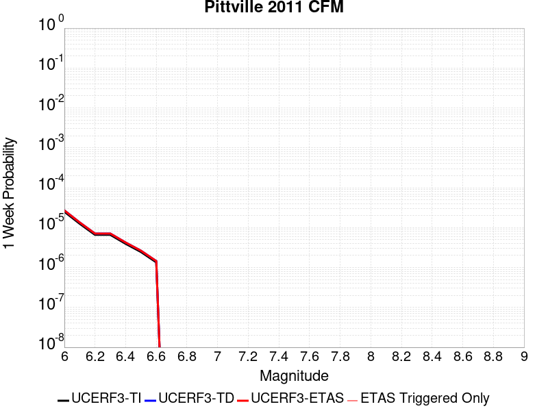 |  |  |  |

| Magnitude | 1 wk TI Prob | 1 wk TD Prob | 1 wk ETAS Prob | 1 wk ETAS/TD Gain | 1 wk ETAS Triggered Only | 1 mo TI Prob | 1 mo TD Prob | 1 mo ETAS Prob | 1 mo ETAS/TD Gain | 1 mo ETAS Triggered Only | 1 yr TI Prob | 1 yr TD Prob | 1 yr ETAS Prob | 1 yr ETAS/TD Gain | 1 yr ETAS Triggered Only | 10 yr TI Prob | 10 yr TD Prob | 10 yr ETAS Prob | 10 yr ETAS/TD Gain | 10 yr ETAS Triggered Only |
|-----|-----|-----|-----|-----|-----|-----|-----|-----|-----|-----|-----|-----|-----|-----|-----|-----|-----|-----|-----|-----|
| 6.0 | 2.5031832E-5 | 2.705842E-5 | 2.705842E-5 | 1.0 | 0.0 | 1.0727487E-4 | 1.1596006E-4 | 1.1596006E-4 | 1.0 | 0.0 | 0.001305289 | 0.0014109968 | 0.0014109968 | 1.0 | 0.0 | 0.012976485 | 0.014030164 | 0.014040024 | 1.0007027 | 1.0E-5 |
| 6.1 | 1.2540113E-5 | 1.3513762E-5 | 1.3513762E-5 | 1.0 | 0.0 | 5.3742235E-5 | 5.7914964E-5 | 5.7914964E-5 | 1.0 | 0.0 | 6.541153E-4 | 7.0490903E-4 | 7.0490903E-4 | 1.0 | 0.0 | 0.0065219323 | 0.007028965 | 0.0070388946 | 1.0014126 | 1.0E-5 |
| 6.2 | 6.603218E-6 | 7.1075488E-6 | 7.1075488E-6 | 1.0 | 0.0 | 2.8299199E-5 | 3.0460604E-5 | 3.0460604E-5 | 1.0 | 0.0 | 3.4448825E-4 | 3.7080125E-4 | 3.7080125E-4 | 1.0 | 0.0 | 0.0034395473 | 0.0037024661 | 0.0037124292 | 1.0026909 | 1.0E-5 |
| 6.3 | 6.603218E-6 | 7.1075488E-6 | 7.1075488E-6 | 1.0 | 0.0 | 2.8299199E-5 | 3.0460604E-5 | 3.0460604E-5 | 1.0 | 0.0 | 3.4448825E-4 | 3.7080125E-4 | 3.7080125E-4 | 1.0 | 0.0 | 0.0034395473 | 0.0037024661 | 0.0037124292 | 1.0026909 | 1.0E-5 |
| 6.4 | 3.9389015E-6 | 4.2393895E-6 | 4.2393895E-6 | 1.0 | 0.0 | 1.6880897E-5 | 1.8168703E-5 | 1.8168703E-5 | 1.0 | 0.0 | 2.0550552E-4 | 2.211846E-4 | 2.211846E-4 | 1.0 | 0.0 | 0.0020531558 | 0.0022099495 | 0.0022199275 | 1.0045149 | 1.0E-5 |
| 6.5 | 2.4533072E-6 | 2.6414027E-6 | 2.6414027E-6 | 1.0 | 0.0 | 1.0514132E-5 | 1.132026E-5 | 1.132026E-5 | 1.0 | 0.0 | 1.2800204E-4 | 1.3781738E-4 | 1.3781738E-4 | 1.0 | 0.0 | 0.0012792832 | 0.0013775093 | 0.0013874955 | 1.0072495 | 1.0E-5 |
| 6.6 | 1.3482367E-6 | 1.453068E-6 | 1.453068E-6 | 1.0 | 0.0 | 5.778144E-6 | 6.2274257E-6 | 6.2274257E-6 | 1.0 | 0.0 | 7.0346636E-5 | 7.58174E-5 | 7.58174E-5 | 1.0 | 0.0 | 7.032437E-4 | 7.5802644E-4 | 7.680189E-4 | 1.0131822 | 1.0E-5 |

## Mission (connected) 2011 CFM
*[(top)](#table-of-contents)*

| 1 Week | 1 Month | 1 Year | 10 Year |
|-----|-----|-----|-----|
| 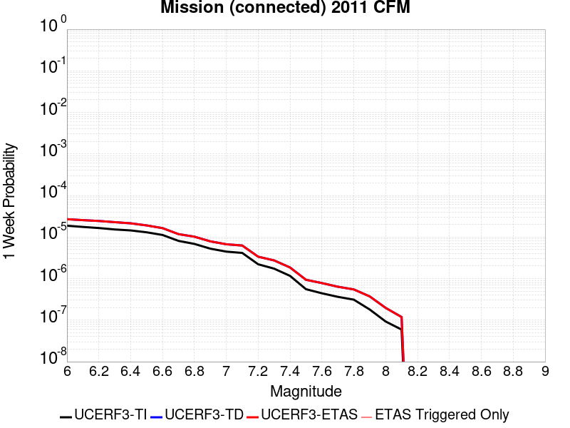 |  | 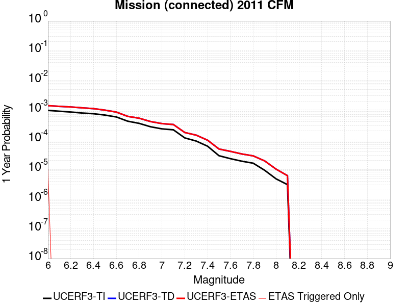 |  |

| Magnitude | 1 wk TI Prob | 1 wk TD Prob | 1 wk ETAS Prob | 1 wk ETAS/TD Gain | 1 wk ETAS Triggered Only | 1 mo TI Prob | 1 mo TD Prob | 1 mo ETAS Prob | 1 mo ETAS/TD Gain | 1 mo ETAS Triggered Only | 1 yr TI Prob | 1 yr TD Prob | 1 yr ETAS Prob | 1 yr ETAS/TD Gain | 1 yr ETAS Triggered Only | 10 yr TI Prob | 10 yr TD Prob | 10 yr ETAS Prob | 10 yr ETAS/TD Gain | 10 yr ETAS Triggered Only |
|-----|-----|-----|-----|-----|-----|-----|-----|-----|-----|-----|-----|-----|-----|-----|-----|-----|-----|-----|-----|-----|
| 6.0 | 1.8735573E-5 | 2.6896632E-5 | 2.6896632E-5 | 1.0 | 0.0 | 8.029284E-5 | 1.15265364E-4 | 1.15265364E-4 | 1.0 | 0.0 | 9.771269E-4 | 0.0014023508 | 0.0014123368 | 1.0071208 | 1.0E-5 | 0.009728416 | 0.013943307 | 0.013953168 | 1.0007071 | 1.0E-5 |
| 6.1 | 1.7515964E-5 | 2.5537805E-5 | 2.5537805E-5 | 1.0 | 0.0 | 7.506625E-5 | 1.0944233E-4 | 1.0944233E-4 | 1.0 | 0.0 | 9.135484E-4 | 0.0013315438 | 0.0013315438 | 1.0 | 0.0 | 0.009098019 | 0.013243862 | 0.013243862 | 1.0 | 0.0 |
| 6.2 | 1.6486343E-5 | 2.4382383E-5 | 2.4382383E-5 | 1.0 | 0.0 | 7.065384E-5 | 1.0449094E-4 | 1.0449094E-4 | 1.0 | 0.0 | 8.5987104E-4 | 0.0012713327 | 0.0012713327 | 1.0 | 0.0 | 0.008565514 | 0.012648793 | 0.012648793 | 1.0 | 0.0 |
| 6.3 | 1.5229385E-5 | 2.2811615E-5 | 2.2811615E-5 | 1.0 | 0.0 | 6.526716E-5 | 9.77596E-5 | 9.77596E-5 | 1.0 | 0.0 | 7.9433795E-4 | 0.0011894713 | 0.0011894713 | 1.0 | 0.0 | 0.007915046 | 0.011841914 | 0.011841914 | 1.0 | 0.0 |
| 6.4 | 1.4435828E-5 | 2.141124E-5 | 2.141124E-5 | 1.0 | 0.0 | 6.186637E-5 | 9.1758426E-5 | 9.1758426E-5 | 1.0 | 0.0 | 7.529627E-4 | 0.0011164856 | 0.0011164856 | 1.0 | 0.0 | 0.007504165 | 0.011124693 | 0.011124693 | 1.0 | 0.0 |
| 6.5 | 1.30127955E-5 | 1.9047564E-5 | 1.9047564E-5 | 1.0 | 0.0 | 5.576793E-5 | 8.1629725E-5 | 8.1629725E-5 | 1.0 | 0.0 | 6.78763E-4 | 9.933528E-4 | 9.933528E-4 | 1.0 | 0.0 | 0.0067669353 | 0.009916397 | 0.009916397 | 1.0 | 0.0 |
| 6.6 | 1.1220718E-5 | 1.6403386E-5 | 1.6403386E-5 | 1.0 | 0.0 | 4.8087906E-5 | 7.02983E-5 | 7.02983E-5 | 1.0 | 0.0 | 5.8531296E-4 | 8.555454E-4 | 8.555454E-4 | 1.0 | 0.0 | 0.005837737 | 0.008554118 | 0.008554118 | 1.0 | 0.0 |
| 6.7 | 8.086152E-6 | 1.175861E-5 | 1.175861E-5 | 1.0 | 0.0 | 3.4654473E-5 | 5.039307E-5 | 5.039307E-5 | 1.0 | 0.0 | 4.2183654E-4 | 6.133637E-4 | 6.133637E-4 | 1.0 | 0.0 | 0.004210367 | 0.006153818 | 0.006153818 | 1.0 | 0.0 |
| 6.8 | 6.8361655E-6 | 1.0202784E-5 | 1.0202784E-5 | 1.0 | 0.0 | 2.9297524E-5 | 4.372549E-5 | 4.372549E-5 | 1.0 | 0.0 | 3.5663895E-4 | 5.3222844E-4 | 5.3222844E-4 | 1.0 | 0.0 | 0.0035606713 | 0.005342394 | 0.005342394 | 1.0 | 0.0 |
| 6.9 | 5.2517353E-6 | 7.8749235E-6 | 7.8749235E-6 | 1.0 | 0.0 | 2.2507242E-5 | 3.374924E-5 | 3.374924E-5 | 1.0 | 0.0 | 2.739912E-4 | 4.1081975E-4 | 4.1081975E-4 | 1.0 | 0.0 | 0.0027365363 | 0.0041328142 | 0.0041328142 | 1.0 | 0.0 |
| 7.0 | 4.4602784E-6 | 6.7068913E-6 | 6.7068913E-6 | 1.0 | 0.0 | 1.911534E-5 | 2.8743505E-5 | 2.8743505E-5 | 1.0 | 0.0 | 2.327044E-4 | 3.4989612E-4 | 3.4989612E-4 | 1.0 | 0.0 | 0.0023246086 | 0.0035247658 | 0.0035247658 | 1.0 | 0.0 |
| 7.1 | 4.1492594E-6 | 6.2553067E-6 | 6.2553067E-6 | 1.0 | 0.0 | 1.7782419E-5 | 2.6808182E-5 | 2.6808182E-5 | 1.0 | 0.0 | 2.1647944E-4 | 3.2634087E-4 | 3.2634087E-4 | 1.0 | 0.0 | 0.0021626868 | 0.003289387 | 0.003289387 | 1.0 | 0.0 |
| 7.2 | 2.213247E-6 | 3.3665115E-6 | 3.3665115E-6 | 1.0 | 0.0 | 9.485309E-6 | 1.44278265E-5 | 1.44278265E-5 | 1.0 | 0.0 | 1.15477524E-4 | 1.7564466E-4 | 1.7564466E-4 | 1.0 | 0.0 | 0.0011541754 | 0.0017836785 | 0.0017836785 | 1.0 | 0.0 |
| 7.3 | 1.7362703E-6 | 2.7416309E-6 | 2.7416309E-6 | 1.0 | 0.0 | 7.4411373E-6 | 1.1749794E-5 | 1.1749794E-5 | 1.0 | 0.0 | 9.0592075E-5 | 1.4304437E-4 | 1.4304437E-4 | 1.0 | 0.0 | 9.0555154E-4 | 0.0014547716 | 0.0014547716 | 1.0 | 0.0 |
| 7.4 | 1.1628409E-6 | 1.8519061E-6 | 1.8519061E-6 | 1.0 | 0.0 | 4.9835944E-6 | 7.9367155E-6 | 7.9367155E-6 | 1.0 | 0.0 | 6.0673574E-5 | 9.662525E-5 | 9.662525E-5 | 1.0 | 0.0 | 6.065701E-4 | 9.865778E-4 | 9.865778E-4 | 1.0 | 0.0 |
| 7.5 | 5.5610667E-7 | 9.3647157E-7 | 9.3647157E-7 | 1.0 | 0.0 | 2.3833122E-6 | 4.0134432E-6 | 4.0134432E-6 | 1.0 | 0.0 | 2.9016439E-5 | 4.886258E-5 | 4.886258E-5 | 1.0 | 0.0 | 2.901265E-4 | 5.051476E-4 | 5.051476E-4 | 1.0 | 0.0 |
| 7.6 | 4.4307663E-7 | 7.804608E-7 | 7.804608E-7 | 1.0 | 0.0 | 1.8988985E-6 | 3.3448277E-6 | 3.3448277E-6 | 1.0 | 0.0 | 2.3118844E-5 | 4.072252E-5 | 4.072252E-5 | 1.0 | 0.0 | 2.3116439E-4 | 4.2309947E-4 | 4.2309947E-4 | 1.0 | 0.0 |
| 7.7 | 3.639119E-7 | 6.372846E-7 | 6.372846E-7 | 1.0 | 0.0 | 1.5596215E-6 | 2.7312167E-6 | 2.7312167E-6 | 1.0 | 0.0 | 1.8988227E-5 | 3.3252058E-5 | 3.3252058E-5 | 1.0 | 0.0 | 1.8986604E-4 | 3.4779165E-4 | 3.4779165E-4 | 1.0 | 0.0 |
| 7.8 | 3.1152942E-7 | 5.4899834E-7 | 5.4899834E-7 | 1.0 | 0.0 | 1.3351254E-6 | 2.3528478E-6 | 2.3528478E-6 | 1.0 | 0.0 | 1.6255031E-5 | 2.8645547E-5 | 2.8645547E-5 | 1.0 | 0.0 | 1.6253842E-4 | 2.9846895E-4 | 2.9846895E-4 | 1.0 | 0.0 |
| 7.9 | 1.8035962E-7 | 3.7279992E-7 | 3.7279992E-7 | 1.0 | 0.0 | 7.729696E-7 | 1.597713E-6 | 1.597713E-6 | 1.0 | 0.0 | 9.410865E-6 | 1.9451982E-5 | 1.9451982E-5 | 1.0 | 0.0 | 9.410465E-5 | 2.0117688E-4 | 2.0117688E-4 | 1.0 | 0.0 |
| 8.0 | 9.279334E-8 | 1.9742383E-7 | 1.9742383E-7 | 1.0 | 0.0 | 3.976857E-7 | 8.4610184E-7 | 8.4610184E-7 | 1.0 | 0.0 | 4.841813E-6 | 1.0301242E-5 | 1.0301242E-5 | 1.0 | 0.0 | 4.841707E-5 | 1.05515865E-4 | 1.05515865E-4 | 1.0 | 0.0 |
| 8.1 | 5.9253985E-8 | 1.1877655E-7 | 1.1877655E-7 | 1.0 | 0.0 | 2.5394561E-7 | 5.0904225E-7 | 5.0904225E-7 | 1.0 | 0.0 | 3.0917836E-6 | 6.197572E-6 | 6.197572E-6 | 1.0 | 0.0 | 3.0917407E-5 | 6.335164E-5 | 6.335164E-5 | 1.0 | 0.0 |

## Likely 2011 CFM
*[(top)](#table-of-contents)*

| 1 Week | 1 Month | 1 Year | 10 Year |
|-----|-----|-----|-----|
| 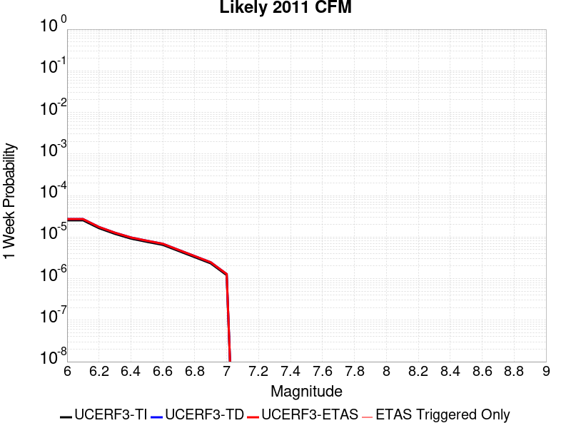 |  |  |  |

| Magnitude | 1 wk TI Prob | 1 wk TD Prob | 1 wk ETAS Prob | 1 wk ETAS/TD Gain | 1 wk ETAS Triggered Only | 1 mo TI Prob | 1 mo TD Prob | 1 mo ETAS Prob | 1 mo ETAS/TD Gain | 1 mo ETAS Triggered Only | 1 yr TI Prob | 1 yr TD Prob | 1 yr ETAS Prob | 1 yr ETAS/TD Gain | 1 yr ETAS Triggered Only | 10 yr TI Prob | 10 yr TD Prob | 10 yr ETAS Prob | 10 yr ETAS/TD Gain | 10 yr ETAS Triggered Only |
|-----|-----|-----|-----|-----|-----|-----|-----|-----|-----|-----|-----|-----|-----|-----|-----|-----|-----|-----|-----|-----|
| 6.0 | 2.5315949E-5 | 2.710602E-5 | 2.710602E-5 | 1.0 | 0.0 | 1.0849241E-4 | 1.1616374E-4 | 1.1616374E-4 | 1.0 | 0.0 | 0.0013200947 | 0.0014134205 | 0.0014234064 | 1.007065 | 1.0E-5 | 0.013122803 | 0.014048966 | 0.014058825 | 1.0007018 | 1.0E-5 |
| 6.1 | 2.5315949E-5 | 2.710602E-5 | 2.710602E-5 | 1.0 | 0.0 | 1.0849241E-4 | 1.1616374E-4 | 1.1616374E-4 | 1.0 | 0.0 | 0.0013200947 | 0.0014134205 | 0.0014234064 | 1.007065 | 1.0E-5 | 0.013122803 | 0.014048966 | 0.014058825 | 1.0007018 | 1.0E-5 |
| 6.2 | 1.6375941E-5 | 1.7466613E-5 | 1.7466613E-5 | 1.0 | 0.0 | 7.0180715E-5 | 7.485484E-5 | 7.485484E-5 | 1.0 | 0.0 | 8.5411523E-4 | 9.109889E-4 | 9.209798E-4 | 1.0109671 | 1.0E-5 | 0.008508399 | 0.009073832 | 0.009083741 | 1.0010921 | 1.0E-5 |
| 6.3 | 1.1945543E-5 | 1.2713129E-5 | 1.2713129E-5 | 1.0 | 0.0 | 5.119418E-5 | 5.4483728E-5 | 5.4483728E-5 | 1.0 | 0.0 | 6.2311086E-4 | 6.631428E-4 | 6.731362E-4 | 1.0150697 | 1.0E-5 | 0.0062136655 | 0.006612195 | 0.006622129 | 1.0015024 | 1.0E-5 |
| 6.4 | 9.192729E-6 | 9.7688935E-6 | 9.7688935E-6 | 1.0 | 0.0 | 3.939681E-5 | 4.186603E-5 | 4.186603E-5 | 1.0 | 0.0 | 4.7955062E-4 | 5.096024E-4 | 5.195973E-4 | 1.0196131 | 1.0E-5 | 0.004785171 | 0.00508462 | 0.005094569 | 1.0019567 | 1.0E-5 |
| 6.5 | 7.67906E-6 | 8.152956E-6 | 8.152956E-6 | 1.0 | 0.0 | 3.2909844E-5 | 3.4940782E-5 | 3.4940782E-5 | 1.0 | 0.0 | 4.006037E-4 | 4.2532285E-4 | 4.353186E-4 | 1.0235015 | 1.0E-5 | 0.0039988225 | 0.004245281 | 0.004255239 | 1.0023456 | 1.0E-5 |
| 6.6 | 6.4884057E-6 | 6.8850295E-6 | 6.8850295E-6 | 1.0 | 0.0 | 2.7807157E-5 | 2.9506944E-5 | 2.9506944E-5 | 1.0 | 0.0 | 3.3849955E-4 | 3.5918926E-4 | 3.6918564E-4 | 1.0278305 | 1.0E-5 | 0.003379844 | 0.0035862317 | 0.003596196 | 1.0027784 | 1.0E-5 |
| 6.7 | 4.6060636E-6 | 4.8842367E-6 | 4.8842367E-6 | 1.0 | 0.0 | 1.9740122E-5 | 2.093228E-5 | 2.093228E-5 | 1.0 | 0.0 | 2.403095E-4 | 2.5482153E-4 | 2.6481898E-4 | 1.0392332 | 1.0E-5 | 0.002400498 | 0.0025453763 | 0.002555351 | 1.0039186 | 1.0E-5 |
| 6.8 | 3.2795615E-6 | 3.477512E-6 | 3.477512E-6 | 1.0 | 0.0 | 1.4055187E-5 | 1.4903541E-5 | 1.4903541E-5 | 1.0 | 0.0 | 1.7110848E-4 | 1.8143607E-4 | 1.9143426E-4 | 1.0551058 | 1.0E-5 | 0.0017097679 | 0.0018129346 | 0.0018229166 | 1.0055059 | 1.0E-5 |
| 6.9 | 2.3289967E-6 | 2.4706565E-6 | 2.4706565E-6 | 1.0 | 0.0 | 9.981376E-6 | 1.0588487E-5 | 1.0588487E-5 | 1.0 | 0.0 | 1.2151648E-4 | 1.2890765E-4 | 1.2890765E-4 | 1.0 | 0.0 | 0.0012145005 | 0.0012883716 | 0.0012883716 | 1.0 | 0.0 |
| 7.0 | 1.211292E-6 | 1.2864487E-6 | 1.2864487E-6 | 1.0 | 0.0 | 5.1912407E-6 | 5.5133414E-6 | 5.5133414E-6 | 1.0 | 0.0 | 6.320152E-5 | 6.712317E-5 | 6.712317E-5 | 1.0 | 0.0 | 6.3183554E-4 | 6.710588E-4 | 6.710588E-4 | 1.0 | 0.0 |

## Casmalia 2011 CFM
*[(top)](#table-of-contents)*

| 1 Week | 1 Month | 1 Year | 10 Year |
|-----|-----|-----|-----|
| 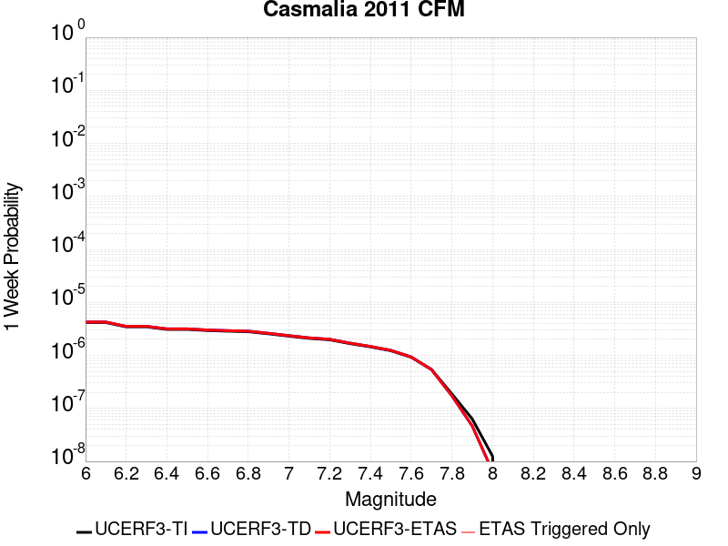 |  | 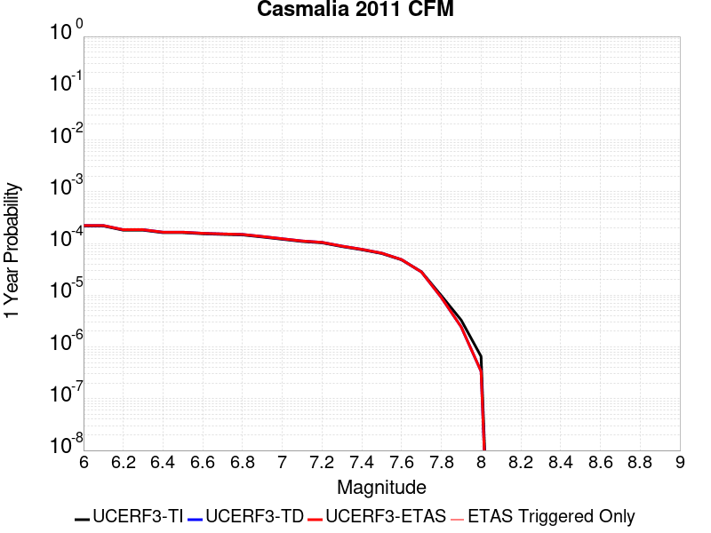 |  |

| Magnitude | 1 wk TI Prob | 1 wk TD Prob | 1 wk ETAS Prob | 1 wk ETAS/TD Gain | 1 wk ETAS Triggered Only | 1 mo TI Prob | 1 mo TD Prob | 1 mo ETAS Prob | 1 mo ETAS/TD Gain | 1 mo ETAS Triggered Only | 1 yr TI Prob | 1 yr TD Prob | 1 yr ETAS Prob | 1 yr ETAS/TD Gain | 1 yr ETAS Triggered Only | 10 yr TI Prob | 10 yr TD Prob | 10 yr ETAS Prob | 10 yr ETAS/TD Gain | 10 yr ETAS Triggered Only |
|-----|-----|-----|-----|-----|-----|-----|-----|-----|-----|-----|-----|-----|-----|-----|-----|-----|-----|-----|-----|-----|
| 6.0 | 4.1704893E-6 | 4.262579E-6 | 4.262579E-6 | 1.0 | 0.0 | 1.7873403E-5 | 1.8268069E-5 | 1.8268069E-5 | 1.0 | 0.0 | 2.1758694E-4 | 2.2239125E-4 | 2.2239125E-4 | 1.0 | 0.0 | 0.0021737402 | 0.0022217077 | 0.0022316857 | 1.0044911 | 1.0E-5 |
| 6.1 | 4.1704893E-6 | 4.262579E-6 | 4.262579E-6 | 1.0 | 0.0 | 1.7873403E-5 | 1.8268069E-5 | 1.8268069E-5 | 1.0 | 0.0 | 2.1758694E-4 | 2.2239125E-4 | 2.2239125E-4 | 1.0 | 0.0 | 0.0021737402 | 0.0022217077 | 0.0022316857 | 1.0044911 | 1.0E-5 |
| 6.2 | 3.457312E-6 | 3.5371097E-6 | 3.5371097E-6 | 1.0 | 0.0 | 1.4816967E-5 | 1.5158954E-5 | 1.5158954E-5 | 1.0 | 0.0 | 1.8038164E-4 | 1.8454473E-4 | 1.8454473E-4 | 1.0 | 0.0 | 0.001802353 | 0.0018439242 | 0.0018539057 | 1.0054132 | 1.0E-5 |
| 6.3 | 3.457312E-6 | 3.5371097E-6 | 3.5371097E-6 | 1.0 | 0.0 | 1.4816967E-5 | 1.5158954E-5 | 1.5158954E-5 | 1.0 | 0.0 | 1.8038164E-4 | 1.8454473E-4 | 1.8454473E-4 | 1.0 | 0.0 | 0.001802353 | 0.0018439242 | 0.0018539057 | 1.0054132 | 1.0E-5 |
| 6.4 | 3.0957337E-6 | 3.1693094E-6 | 3.1693094E-6 | 1.0 | 0.0 | 1.3267363E-5 | 1.3582684E-5 | 1.3582684E-5 | 1.0 | 0.0 | 1.6151817E-4 | 1.6535669E-4 | 1.6535669E-4 | 1.0 | 0.0 | 0.0016140083 | 0.0016523426 | 0.0016623262 | 1.006042 | 1.0E-5 |
| 6.5 | 3.0957337E-6 | 3.1693094E-6 | 3.1693094E-6 | 1.0 | 0.0 | 1.3267363E-5 | 1.3582684E-5 | 1.3582684E-5 | 1.0 | 0.0 | 1.6151817E-4 | 1.6535669E-4 | 1.6535669E-4 | 1.0 | 0.0 | 0.0016140083 | 0.0016523426 | 0.0016623262 | 1.006042 | 1.0E-5 |
| 6.6 | 2.9459152E-6 | 3.0166568E-6 | 3.0166568E-6 | 1.0 | 0.0 | 1.262529E-5 | 1.2928465E-5 | 1.2928465E-5 | 1.0 | 0.0 | 1.5370206E-4 | 1.5739276E-4 | 1.5739276E-4 | 1.0 | 0.0 | 0.0015359579 | 0.0015728184 | 0.0015828026 | 1.006348 | 1.0E-5 |
| 6.7 | 2.8634809E-6 | 2.9325531E-6 | 2.9325531E-6 | 1.0 | 0.0 | 1.2272003E-5 | 1.2568024E-5 | 1.2568024E-5 | 1.0 | 0.0 | 1.4940138E-4 | 1.53005E-4 | 1.53005E-4 | 1.0 | 0.0 | 0.0014930099 | 0.0015290021 | 0.0015389868 | 1.0065302 | 1.0E-5 |
| 6.8 | 2.7999822E-6 | 2.8676764E-6 | 2.8676764E-6 | 1.0 | 0.0 | 1.1999869E-5 | 1.2289984E-5 | 1.2289984E-5 | 1.0 | 0.0 | 1.460886E-4 | 1.4962033E-4 | 1.4962033E-4 | 1.0 | 0.0 | 0.001459926 | 0.0014952013 | 0.0015051863 | 1.0066781 | 1.0E-5 |
| 6.9 | 2.551052E-6 | 2.61204E-6 | 2.61204E-6 | 1.0 | 0.0 | 1.0933034E-5 | 1.1194409E-5 | 1.1194409E-5 | 1.0 | 0.0 | 1.3310155E-4 | 1.3628344E-4 | 1.3628344E-4 | 1.0 | 0.0 | 0.0013302186 | 0.0013620027 | 0.0013719891 | 1.0073321 | 1.0E-5 |
| 7.0 | 2.3081875E-6 | 2.3624793E-6 | 2.3624793E-6 | 1.0 | 0.0 | 9.892195E-6 | 1.01248725E-5 | 1.01248725E-5 | 1.0 | 0.0 | 1.20430814E-4 | 1.2326338E-4 | 1.2326338E-4 | 1.0 | 0.0 | 0.0012036557 | 0.0012319529 | 0.0012419407 | 1.0081072 | 1.0E-5 |
| 7.1 | 2.093245E-6 | 2.141791E-6 | 2.141791E-6 | 1.0 | 0.0 | 8.971019E-6 | 9.179072E-6 | 9.179072E-6 | 1.0 | 0.0 | 1.09216686E-4 | 1.1174949E-4 | 1.1174949E-4 | 1.0 | 0.0 | 0.0010916302 | 0.0011169349 | 0.0011269238 | 1.0089431 | 1.0E-5 |
| 7.2 | 1.9714576E-6 | 2.0165735E-6 | 2.0165735E-6 | 1.0 | 0.0 | 8.449076E-6 | 8.642429E-6 | 8.642429E-6 | 1.0 | 0.0 | 1.0286264E-4 | 1.0521651E-4 | 1.0521651E-4 | 1.0 | 0.0 | 0.0010281504 | 0.0010516688 | 0.0010616583 | 1.0094987 | 1.0E-5 |
| 7.3 | 1.6689512E-6 | 1.704771E-6 | 1.704771E-6 | 1.0 | 0.0 | 7.1526288E-6 | 7.306141E-6 | 7.306141E-6 | 1.0 | 0.0 | 8.7079774E-5 | 8.894864E-5 | 8.894864E-5 | 1.0 | 0.0 | 8.7045657E-4 | 8.891312E-4 | 8.9912233E-4 | 1.0112369 | 1.0E-5 |
| 7.4 | 1.4490954E-6 | 1.4779439E-6 | 1.4779439E-6 | 1.0 | 0.0 | 6.210394E-6 | 6.33403E-6 | 6.33403E-6 | 1.0 | 0.0 | 7.560892E-5 | 7.711409E-5 | 7.711409E-5 | 1.0 | 0.0 | 7.55832E-4 | 7.70874E-4 | 7.8086625E-4 | 1.0129623 | 1.0E-5 |
| 7.5 | 1.226873E-6 | 1.2482182E-6 | 1.2482182E-6 | 1.0 | 0.0 | 5.2580162E-6 | 5.349495E-6 | 5.349495E-6 | 1.0 | 0.0 | 6.401447E-5 | 6.5128166E-5 | 6.5128166E-5 | 1.0 | 0.0 | 6.399603E-4 | 6.510913E-4 | 6.610848E-4 | 1.0153488 | 1.0E-5 |
| 7.6 | 9.2561345E-7 | 9.3623294E-7 | 9.3623294E-7 | 1.0 | 0.0 | 3.966909E-6 | 4.0124205E-6 | 4.0124205E-6 | 1.0 | 0.0 | 4.8296046E-5 | 4.8850132E-5 | 4.8850132E-5 | 1.0 | 0.0 | 4.828555E-4 | 4.8839435E-4 | 4.8839435E-4 | 1.0 | 0.0 |
| 7.7 | 5.4367933E-7 | 5.393191E-7 | 5.393191E-7 | 1.0 | 0.0 | 2.3300522E-6 | 2.3113655E-6 | 2.3113655E-6 | 1.0 | 0.0 | 2.8368017E-5 | 2.8140514E-5 | 2.8140514E-5 | 1.0 | 0.0 | 2.8364395E-4 | 2.8136963E-4 | 2.8136963E-4 | 1.0 | 0.0 |
| 7.8 | 1.8825742E-7 | 1.7344266E-7 | 1.7344266E-7 | 1.0 | 0.0 | 8.068173E-7 | 7.433255E-7 | 7.433255E-7 | 1.0 | 0.0 | 9.822956E-6 | 9.049951E-6 | 9.049951E-6 | 1.0 | 0.0 | 9.822522E-5 | 9.049584E-5 | 9.049584E-5 | 1.0 | 0.0 |
| 7.9 | 6.342771E-8 | 4.680494E-8 | 4.680494E-8 | 1.0 | 0.0 | 2.7183304E-7 | 2.0059257E-7 | 2.0059257E-7 | 1.0 | 0.0 | 3.3095623E-6 | 2.4422118E-6 | 2.4422118E-6 | 1.0 | 0.0 | 3.309513E-5 | 2.4421854E-5 | 2.4421854E-5 | 1.0 | 0.0 |
| 8.0 | 1.2574819E-8 | 6.4776824E-9 | 6.4776824E-9 | 1.0 | 0.0 | 5.3892084E-8 | 2.7761494E-8 | 2.7761494E-8 | 1.0 | 0.0 | 6.561359E-7 | 3.3799614E-7 | 3.3799614E-7 | 1.0 | 0.0 | 6.56134E-6 | 3.3799565E-6 | 3.3799565E-6 | 1.0 | 0.0 |

## Los Osos 2011
*[(top)](#table-of-contents)*

| 1 Week | 1 Month | 1 Year | 10 Year |
|-----|-----|-----|-----|
|  |  |  |  |

| Magnitude | 1 wk TI Prob | 1 wk TD Prob | 1 wk ETAS Prob | 1 wk ETAS/TD Gain | 1 wk ETAS Triggered Only | 1 mo TI Prob | 1 mo TD Prob | 1 mo ETAS Prob | 1 mo ETAS/TD Gain | 1 mo ETAS Triggered Only | 1 yr TI Prob | 1 yr TD Prob | 1 yr ETAS Prob | 1 yr ETAS/TD Gain | 1 yr ETAS Triggered Only | 10 yr TI Prob | 10 yr TD Prob | 10 yr ETAS Prob | 10 yr ETAS/TD Gain | 10 yr ETAS Triggered Only |
|-----|-----|-----|-----|-----|-----|-----|-----|-----|-----|-----|-----|-----|-----|-----|-----|-----|-----|-----|-----|-----|
| 6.0 | 4.8871775E-6 | 4.9815844E-6 | 4.9815844E-6 | 1.0 | 0.0 | 2.0944879E-5 | 2.1349488E-5 | 3.1349275E-5 | 1.4683853 | 1.0E-5 | 2.5497406E-4 | 2.599018E-4 | 2.698992E-4 | 1.0384661 | 1.0E-5 | 0.002546817 | 0.0025962528 | 0.002606227 | 1.0038418 | 1.0E-5 |
| 6.1 | 4.8871775E-6 | 4.9815844E-6 | 4.9815844E-6 | 1.0 | 0.0 | 2.0944879E-5 | 2.1349488E-5 | 3.1349275E-5 | 1.4683853 | 1.0E-5 | 2.5497406E-4 | 2.599018E-4 | 2.698992E-4 | 1.0384661 | 1.0E-5 | 0.002546817 | 0.0025962528 | 0.002606227 | 1.0038418 | 1.0E-5 |
| 6.2 | 4.8871775E-6 | 4.9815844E-6 | 4.9815844E-6 | 1.0 | 0.0 | 2.0944879E-5 | 2.1349488E-5 | 3.1349275E-5 | 1.4683853 | 1.0E-5 | 2.5497406E-4 | 2.599018E-4 | 2.698992E-4 | 1.0384661 | 1.0E-5 | 0.002546817 | 0.0025962528 | 0.002606227 | 1.0038418 | 1.0E-5 |
| 6.3 | 4.8871775E-6 | 4.9815844E-6 | 4.9815844E-6 | 1.0 | 0.0 | 2.0944879E-5 | 2.1349488E-5 | 3.1349275E-5 | 1.4683853 | 1.0E-5 | 2.5497406E-4 | 2.599018E-4 | 2.698992E-4 | 1.0384661 | 1.0E-5 | 0.002546817 | 0.0025962528 | 0.002606227 | 1.0038418 | 1.0E-5 |
| 6.4 | 4.8871775E-6 | 4.9815844E-6 | 4.9815844E-6 | 1.0 | 0.0 | 2.0944879E-5 | 2.1349488E-5 | 3.1349275E-5 | 1.4683853 | 1.0E-5 | 2.5497406E-4 | 2.599018E-4 | 2.698992E-4 | 1.0384661 | 1.0E-5 | 0.002546817 | 0.0025962528 | 0.002606227 | 1.0038418 | 1.0E-5 |
| 6.5 | 3.1724062E-6 | 3.2234666E-6 | 3.2234666E-6 | 1.0 | 0.0 | 1.3595956E-5 | 1.3814784E-5 | 1.3814784E-5 | 1.0 | 0.0 | 1.6551818E-4 | 1.6818214E-4 | 1.6818214E-4 | 1.0 | 0.0 | 0.0016539496 | 0.0016805622 | 0.0016805622 | 1.0 | 0.0 |
| 6.6 | 3.1022591E-6 | 3.1511745E-6 | 3.1511745E-6 | 1.0 | 0.0 | 1.3295328E-5 | 1.3504964E-5 | 1.3504964E-5 | 1.0 | 0.0 | 1.618586E-4 | 1.6441067E-4 | 1.6441067E-4 | 1.0 | 0.0 | 0.0016174077 | 0.0016429031 | 0.0016429031 | 1.0 | 0.0 |
| 6.7 | 2.611518E-6 | 2.6492457E-6 | 2.6492457E-6 | 1.0 | 0.0 | 1.1192172E-5 | 1.1353861E-5 | 1.1353861E-5 | 1.0 | 0.0 | 1.3625617E-4 | 1.3822454E-4 | 1.3822454E-4 | 1.0 | 0.0 | 0.0013617266 | 0.0013813901 | 0.0013813901 | 1.0 | 0.0 |
| 6.8 | 2.4780884E-6 | 2.5122195E-6 | 2.5122195E-6 | 1.0 | 0.0 | 1.0620336E-5 | 1.076661E-5 | 1.076661E-5 | 1.0 | 0.0 | 1.2929492E-4 | 1.3107563E-4 | 1.3107563E-4 | 1.0 | 0.0 | 0.0012921972 | 0.0013099873 | 0.0013099873 | 1.0 | 0.0 |
| 6.9 | 2.1376322E-6 | 2.16356E-6 | 2.16356E-6 | 1.0 | 0.0 | 9.161248E-6 | 9.272368E-6 | 9.272368E-6 | 1.0 | 0.0 | 1.1153249E-4 | 1.12885245E-4 | 1.12885245E-4 | 1.0 | 0.0 | 0.0011147653 | 0.0011282809 | 0.0011282809 | 1.0 | 0.0 |
| 7.0 | 1.9282882E-6 | 1.9495099E-6 | 1.9495099E-6 | 1.0 | 0.0 | 8.264066E-6 | 8.355016E-6 | 8.355016E-6 | 1.0 | 0.0 | 1.0061036E-4 | 1.01717575E-4 | 1.01717575E-4 | 1.0 | 0.0 | 0.0010056482 | 0.0010167116 | 0.0010167116 | 1.0 | 0.0 |
| 7.1 | 1.6353226E-6 | 1.6501588E-6 | 1.6501588E-6 | 1.0 | 0.0 | 7.0085066E-6 | 7.07209E-6 | 7.07209E-6 | 1.0 | 0.0 | 8.532523E-5 | 8.60993E-5 | 8.60993E-5 | 1.0 | 0.0 | 8.529247E-4 | 8.6066016E-4 | 8.6066016E-4 | 1.0 | 0.0 |
| 7.2 | 1.4446276E-6 | 1.4553783E-6 | 1.4553783E-6 | 1.0 | 0.0 | 6.191247E-6 | 6.2373206E-6 | 6.2373206E-6 | 1.0 | 0.0 | 7.537582E-5 | 7.593674E-5 | 7.593674E-5 | 1.0 | 0.0 | 7.535026E-4 | 7.591085E-4 | 7.591085E-4 | 1.0 | 0.0 |
| 7.3 | 1.2014582E-6 | 1.2069479E-6 | 1.2069479E-6 | 1.0 | 0.0 | 5.149096E-6 | 5.172624E-6 | 5.172624E-6 | 1.0 | 0.0 | 6.268844E-5 | 6.2974876E-5 | 6.2974876E-5 | 1.0 | 0.0 | 6.267076E-4 | 6.295707E-4 | 6.295707E-4 | 1.0 | 0.0 |
| 7.4 | 9.707733E-7 | 9.710144E-7 | 9.710144E-7 | 1.0 | 0.0 | 4.16045E-6 | 4.1614835E-6 | 4.1614835E-6 | 1.0 | 0.0 | 5.0652303E-5 | 5.0664887E-5 | 5.0664887E-5 | 1.0 | 0.0 | 5.064076E-4 | 5.065336E-4 | 5.065336E-4 | 1.0 | 0.0 |
| 7.5 | 7.174908E-7 | 7.115242E-7 | 7.115242E-7 | 1.0 | 0.0 | 3.074957E-6 | 3.049386E-6 | 3.049386E-6 | 1.0 | 0.0 | 3.743696E-5 | 3.7125643E-5 | 3.7125643E-5 | 1.0 | 0.0 | 3.7430652E-4 | 3.711946E-4 | 3.711946E-4 | 1.0 | 0.0 |
| 7.6 | 4.5535776E-7 | 4.421071E-7 | 4.421071E-7 | 1.0 | 0.0 | 1.9515319E-6 | 1.8947433E-6 | 1.8947433E-6 | 1.0 | 0.0 | 2.3759641E-5 | 2.3068256E-5 | 2.3068256E-5 | 1.0 | 0.0 | 2.37571E-4 | 2.3065871E-4 | 2.3065871E-4 | 1.0 | 0.0 |
| 7.7 | 2.1173553E-7 | 1.9063046E-7 | 1.9063046E-7 | 1.0 | 0.0 | 9.0743765E-7 | 8.1698744E-7 | 8.1698744E-7 | 1.0 | 0.0 | 1.1047998E-5 | 9.946777E-6 | 9.946777E-6 | 1.0 | 0.0 | 1.1047449E-4 | 9.9463345E-5 | 9.9463345E-5 | 1.0 | 0.0 |
| 7.8 | 9.873608E-8 | 7.369467E-8 | 7.369467E-8 | 1.0 | 0.0 | 4.2315455E-7 | 3.1583426E-7 | 3.1583426E-7 | 1.0 | 0.0 | 5.1518946E-6 | 3.8452754E-6 | 3.8452754E-6 | 1.0 | 0.0 | 5.1517753E-5 | 3.8452094E-5 | 3.8452094E-5 | 1.0 | 0.0 |
| 7.9 | 5.4399106E-8 | 3.189717E-8 | 3.189717E-8 | 1.0 | 0.0 | 2.33139E-7 | 1.3670214E-7 | 1.3670214E-7 | 1.0 | 0.0 | 2.8384638E-6 | 1.6643473E-6 | 1.6643473E-6 | 1.0 | 0.0 | 2.8384275E-5 | 1.664335E-5 | 1.664335E-5 | 1.0 | 0.0 |
| 8.0 | 1.817203E-8 | 8.427704E-9 | 8.427704E-9 | 1.0 | 0.0 | 7.7880124E-8 | 3.6118728E-8 | 3.6118728E-8 | 1.0 | 0.0 | 9.481901E-7 | 4.3974543E-7 | 4.3974543E-7 | 1.0 | 0.0 | 9.481861E-6 | 4.3974464E-6 | 4.3974464E-6 | 1.0 | 0.0 |

## Hayward (No) 2011 CFM
*[(top)](#table-of-contents)*

| 1 Week | 1 Month | 1 Year | 10 Year |
|-----|-----|-----|-----|
|  |  |  |  |

| Magnitude | 1 wk TI Prob | 1 wk TD Prob | 1 wk ETAS Prob | 1 wk ETAS/TD Gain | 1 wk ETAS Triggered Only | 1 mo TI Prob | 1 mo TD Prob | 1 mo ETAS Prob | 1 mo ETAS/TD Gain | 1 mo ETAS Triggered Only | 1 yr TI Prob | 1 yr TD Prob | 1 yr ETAS Prob | 1 yr ETAS/TD Gain | 1 yr ETAS Triggered Only | 10 yr TI Prob | 10 yr TD Prob | 10 yr ETAS Prob | 10 yr ETAS/TD Gain | 10 yr ETAS Triggered Only |
|-----|-----|-----|-----|-----|-----|-----|-----|-----|-----|-----|-----|-----|-----|-----|-----|-----|-----|-----|-----|-----|
| 6.0 | 9.3068506E-5 | 1.7408976E-4 | 1.7408976E-4 | 1.0 | 0.0 | 3.9880406E-4 | 7.458851E-4 | 7.458851E-4 | 1.0 | 0.0 | 0.0048446343 | 0.009043226 | 0.009053135 | 1.0010958 | 1.0E-5 | 0.047403704 | 0.08643301 | 0.08644214 | 1.0001057 | 1.0E-5 |
| 6.1 | 9.055486E-5 | 1.6960083E-4 | 1.6960083E-4 | 1.0 | 0.0 | 3.880345E-4 | 7.266585E-4 | 7.266585E-4 | 1.0 | 0.0 | 0.0047140904 | 0.008811257 | 0.008821169 | 1.0011249 | 1.0E-5 | 0.046153355 | 0.08433062 | 0.084339775 | 1.0001086 | 1.0E-5 |
| 6.2 | 9.006742E-5 | 1.6880663E-4 | 1.6880663E-4 | 1.0 | 0.0 | 3.859461E-4 | 7.232567E-4 | 7.232567E-4 | 1.0 | 0.0 | 0.0046887742 | 0.008770212 | 0.008780124 | 1.0011302 | 1.0E-5 | 0.0459107 | 0.083954774 | 0.08396394 | 1.0001091 | 1.0E-5 |
| 6.3 | 8.8336754E-5 | 1.6560177E-4 | 1.6560177E-4 | 1.0 | 0.0 | 3.7853114E-4 | 7.0952927E-4 | 7.0952927E-4 | 1.0 | 0.0 | 0.004598882 | 0.008604462 | 0.008614376 | 1.0011522 | 1.0E-5 | 0.04504866 | 0.08244864 | 0.08245781 | 1.0001113 | 1.0E-5 |
| 6.4 | 8.526157E-5 | 1.5986615E-4 | 1.5986615E-4 | 1.0 | 0.0 | 3.6535555E-4 | 6.849614E-4 | 6.849614E-4 | 1.0 | 0.0 | 0.0044391346 | 0.008307678 | 0.008317594 | 1.0011938 | 1.0E-5 | 0.043514993 | 0.079729035 | 0.07973824 | 1.0001154 | 1.0E-5 |
| 6.5 | 8.152396E-5 | 1.5318881E-4 | 1.5318881E-4 | 1.0 | 0.0 | 3.493416E-4 | 6.5635896E-4 | 6.5635896E-4 | 1.0 | 0.0 | 0.0042449418 | 0.007962042 | 0.007971962 | 1.001246 | 1.0E-5 | 0.04164765 | 0.076567076 | 0.076576315 | 1.0001206 | 1.0E-5 |
| 6.6 | 7.987405E-5 | 1.5023047E-4 | 1.5023047E-4 | 1.0 | 0.0 | 3.4227243E-4 | 6.436867E-4 | 6.436867E-4 | 1.0 | 0.0 | 0.0041592065 | 0.007808883 | 0.007818805 | 1.0012707 | 1.0E-5 | 0.04082218 | 0.0751595 | 0.075168744 | 1.000123 | 1.0E-5 |
| 6.7 | 7.777665E-5 | 1.4661781E-4 | 1.4661781E-4 | 1.0 | 0.0 | 3.332859E-4 | 6.282114E-4 | 6.282114E-4 | 1.0 | 0.0 | 0.004050208 | 0.0076218066 | 0.0076317303 | 1.001302 | 1.0E-5 | 0.039771806 | 0.07343387 | 0.07344314 | 1.0001261 | 1.0E-5 |
| 6.8 | 7.3284005E-5 | 1.3811454E-4 | 1.3811454E-4 | 1.0 | 0.0 | 3.140365E-4 | 5.917858E-4 | 5.917858E-4 | 1.0 | 0.0 | 0.0038166929 | 0.0071813273 | 0.0071912557 | 1.0013825 | 1.0E-5 | 0.037518036 | 0.069343574 | 0.06935288 | 1.0001342 | 1.0E-5 |
| 6.9 | 6.458263E-5 | 1.2139991E-4 | 1.2139991E-4 | 1.0 | 0.0 | 2.7675333E-4 | 5.201821E-4 | 5.201821E-4 | 1.0 | 0.0 | 0.0033642664 | 0.0063149272 | 0.006324864 | 1.0015736 | 1.0E-5 | 0.033137884 | 0.061262958 | 0.061272345 | 1.0001532 | 1.0E-5 |
| 7.0 | 5.3853604E-5 | 1.00321944E-4 | 1.00321944E-4 | 1.0 | 0.0 | 2.3078074E-4 | 4.2988063E-4 | 4.2988063E-4 | 1.0 | 0.0 | 0.0028061352 | 0.005221301 | 0.005231249 | 1.0019052 | 1.0E-5 | 0.027709642 | 0.050990604 | 0.051000092 | 1.0001861 | 1.0E-5 |
| 7.1 | 4.4308683E-5 | 8.1763996E-5 | 8.1763996E-5 | 1.0 | 0.0 | 1.8988053E-4 | 3.503703E-4 | 3.503703E-4 | 1.0 | 0.0 | 0.0023093442 | 0.004257456 | 0.0042674136 | 1.0023388 | 1.0E-5 | 0.022854926 | 0.041851863 | 0.041861445 | 1.0002289 | 1.0E-5 |
| 7.2 | 3.295973E-5 | 6.082426E-5 | 6.082426E-5 | 1.0 | 0.0 | 1.4124835E-4 | 2.6064948E-4 | 2.6064948E-4 | 1.0 | 0.0 | 0.0017183421 | 0.0031688125 | 0.0031688125 | 1.0 | 0.0 | 0.017051157 | 0.03139558 | 0.03139558 | 1.0 | 0.0 |
| 7.3 | 2.452256E-5 | 4.522746E-5 | 4.522746E-5 | 1.0 | 0.0 | 1.05092455E-4 | 1.9381766E-4 | 1.9381766E-4 | 1.0 | 0.0 | 0.0012787496 | 0.00235719 | 0.00235719 | 1.0 | 0.0 | 0.0127141625 | 0.023464838 | 0.023464838 | 1.0 | 0.0 |
| 7.4 | 1.8829967E-5 | 3.4644054E-5 | 3.4644054E-5 | 1.0 | 0.0 | 8.069736E-5 | 1.4846612E-4 | 1.4846612E-4 | 1.0 | 0.0 | 9.820475E-4 | 0.0018060863 | 0.0018060863 | 1.0 | 0.0 | 0.009777189 | 0.018040622 | 0.018040622 | 1.0 | 0.0 |
| 7.5 | 1.26374125E-5 | 2.2952916E-5 | 2.2952916E-5 | 1.0 | 0.0 | 5.4159216E-5 | 9.836596E-5 | 9.836596E-5 | 1.0 | 0.0 | 6.5918895E-4 | 0.0011969535 | 0.0011969535 | 1.0 | 0.0 | 0.00657237 | 0.012005659 | 0.012005659 | 1.0 | 0.0 |
| 7.6 | 4.666429E-6 | 8.490473E-6 | 8.490473E-6 | 1.0 | 0.0 | 1.9998828E-5 | 3.638724E-5 | 3.638724E-5 | 1.0 | 0.0 | 2.4345852E-4 | 4.429258E-4 | 4.429258E-4 | 1.0 | 0.0 | 0.0024319198 | 0.0044656033 | 0.0044656033 | 1.0 | 0.0 |
| 7.7 | 3.8399318E-7 | 7.1503865E-7 | 7.1503865E-7 | 1.0 | 0.0 | 1.6456839E-6 | 3.0644476E-6 | 3.0644476E-6 | 1.0 | 0.0 | 2.003602E-5 | 3.730901E-5 | 3.730901E-5 | 1.0 | 0.0 | 2.0034213E-4 | 3.869657E-4 | 3.869657E-4 | 1.0 | 0.0 |
| 7.8 | 2.5637698E-7 | 5.380523E-7 | 5.380523E-7 | 1.0 | 0.0 | 1.098758E-6 | 2.3059363E-6 | 2.3059363E-6 | 1.0 | 0.0 | 1.3377297E-5 | 2.8074415E-5 | 2.8074415E-5 | 1.0 | 0.0 | 1.3376492E-4 | 2.9314222E-4 | 2.9314222E-4 | 1.0 | 0.0 |
| 7.9 | 1.7141245E-7 | 3.738943E-7 | 3.738943E-7 | 1.0 | 0.0 | 7.3462456E-7 | 1.602403E-6 | 1.602403E-6 | 1.0 | 0.0 | 8.944017E-6 | 1.9509083E-5 | 1.9509083E-5 | 1.0 | 0.0 | 8.943657E-5 | 2.0294152E-4 | 2.0294152E-4 | 1.0 | 0.0 |
| 8.0 | 1.1808895E-7 | 2.7578423E-7 | 2.7578423E-7 | 1.0 | 0.0 | 5.060954E-7 | 1.1819318E-6 | 1.1819318E-6 | 1.0 | 0.0 | 6.161694E-6 | 1.4389925E-5 | 1.4389925E-5 | 1.0 | 0.0 | 6.161523E-5 | 1.4850168E-4 | 1.4850168E-4 | 1.0 | 0.0 |
| 8.1 | 5.138535E-8 | 1.12556755E-7 | 1.12556755E-7 | 1.0 | 0.0 | 2.2022292E-7 | 4.82386E-7 | 4.82386E-7 | 1.0 | 0.0 | 2.6812106E-6 | 5.873034E-6 | 5.873034E-6 | 1.0 | 0.0 | 2.6811784E-5 | 6.0290684E-5 | 6.0290684E-5 | 1.0 | 0.0 |

## Trinidad (alt1)
*[(top)](#table-of-contents)*

| 1 Week | 1 Month | 1 Year | 10 Year |
|-----|-----|-----|-----|
| 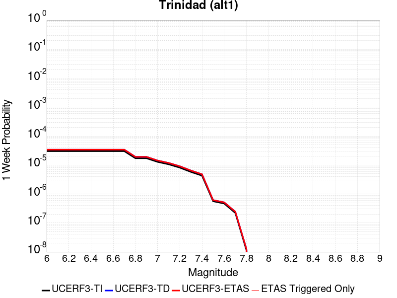 |  |  |  |

| Magnitude | 1 wk TI Prob | 1 wk TD Prob | 1 wk ETAS Prob | 1 wk ETAS/TD Gain | 1 wk ETAS Triggered Only | 1 mo TI Prob | 1 mo TD Prob | 1 mo ETAS Prob | 1 mo ETAS/TD Gain | 1 mo ETAS Triggered Only | 1 yr TI Prob | 1 yr TD Prob | 1 yr ETAS Prob | 1 yr ETAS/TD Gain | 1 yr ETAS Triggered Only | 10 yr TI Prob | 10 yr TD Prob | 10 yr ETAS Prob | 10 yr ETAS/TD Gain | 10 yr ETAS Triggered Only |
|-----|-----|-----|-----|-----|-----|-----|-----|-----|-----|-----|-----|-----|-----|-----|-----|-----|-----|-----|-----|-----|
| 6.0 | 3.0167168E-5 | 3.4036082E-5 | 3.4036082E-5 | 1.0 | 0.0 | 1.2928146E-4 | 1.4586172E-4 | 1.4586172E-4 | 1.0 | 0.0 | 0.0015728653 | 0.0017745883 | 0.0017845705 | 1.0056251 | 1.0E-5 | 0.0156177925 | 0.017621133 | 0.017630957 | 1.0005575 | 1.0E-5 |
| 6.1 | 3.0167168E-5 | 3.4036082E-5 | 3.4036082E-5 | 1.0 | 0.0 | 1.2928146E-4 | 1.4586172E-4 | 1.4586172E-4 | 1.0 | 0.0 | 0.0015728653 | 0.0017745883 | 0.0017845705 | 1.0056251 | 1.0E-5 | 0.0156177925 | 0.017621133 | 0.017630957 | 1.0005575 | 1.0E-5 |
| 6.2 | 3.0167168E-5 | 3.4036082E-5 | 3.4036082E-5 | 1.0 | 0.0 | 1.2928146E-4 | 1.4586172E-4 | 1.4586172E-4 | 1.0 | 0.0 | 0.0015728653 | 0.0017745883 | 0.0017845705 | 1.0056251 | 1.0E-5 | 0.0156177925 | 0.017621133 | 0.017630957 | 1.0005575 | 1.0E-5 |
| 6.3 | 3.0167168E-5 | 3.4036082E-5 | 3.4036082E-5 | 1.0 | 0.0 | 1.2928146E-4 | 1.4586172E-4 | 1.4586172E-4 | 1.0 | 0.0 | 0.0015728653 | 0.0017745883 | 0.0017845705 | 1.0056251 | 1.0E-5 | 0.0156177925 | 0.017621133 | 0.017630957 | 1.0005575 | 1.0E-5 |
| 6.4 | 3.0167168E-5 | 3.4036082E-5 | 3.4036082E-5 | 1.0 | 0.0 | 1.2928146E-4 | 1.4586172E-4 | 1.4586172E-4 | 1.0 | 0.0 | 0.0015728653 | 0.0017745883 | 0.0017845705 | 1.0056251 | 1.0E-5 | 0.0156177925 | 0.017621133 | 0.017630957 | 1.0005575 | 1.0E-5 |
| 6.5 | 3.0167168E-5 | 3.4036082E-5 | 3.4036082E-5 | 1.0 | 0.0 | 1.2928146E-4 | 1.4586172E-4 | 1.4586172E-4 | 1.0 | 0.0 | 0.0015728653 | 0.0017745883 | 0.0017845705 | 1.0056251 | 1.0E-5 | 0.0156177925 | 0.017621133 | 0.017630957 | 1.0005575 | 1.0E-5 |
| 6.6 | 3.0167168E-5 | 3.4036082E-5 | 3.4036082E-5 | 1.0 | 0.0 | 1.2928146E-4 | 1.4586172E-4 | 1.4586172E-4 | 1.0 | 0.0 | 0.0015728653 | 0.0017745883 | 0.0017845705 | 1.0056251 | 1.0E-5 | 0.0156177925 | 0.017621133 | 0.017630957 | 1.0005575 | 1.0E-5 |
| 6.7 | 3.0167168E-5 | 3.4036082E-5 | 3.4036082E-5 | 1.0 | 0.0 | 1.2928146E-4 | 1.4586172E-4 | 1.4586172E-4 | 1.0 | 0.0 | 0.0015728653 | 0.0017745883 | 0.0017845705 | 1.0056251 | 1.0E-5 | 0.0156177925 | 0.017621133 | 0.017630957 | 1.0005575 | 1.0E-5 |
| 6.8 | 1.717077E-5 | 1.9197187E-5 | 1.9197187E-5 | 1.0 | 0.0 | 7.358694E-5 | 8.227131E-5 | 8.227131E-5 | 1.0 | 0.0 | 8.9555274E-4 | 0.0010012374 | 0.0010012374 | 1.0 | 0.0 | 0.008919522 | 0.0099717155 | 0.0099717155 | 1.0 | 0.0 |
| 6.9 | 1.717077E-5 | 1.9197187E-5 | 1.9197187E-5 | 1.0 | 0.0 | 7.358694E-5 | 8.227131E-5 | 8.227131E-5 | 1.0 | 0.0 | 8.9555274E-4 | 0.0010012374 | 0.0010012374 | 1.0 | 0.0 | 0.008919522 | 0.0099717155 | 0.0099717155 | 1.0 | 0.0 |
| 7.0 | 1.2858572E-5 | 1.4338465E-5 | 1.4338465E-5 | 1.0 | 0.0 | 5.5107E-5 | 6.14493E-5 | 6.14493E-5 | 1.0 | 0.0 | 6.707212E-4 | 7.479205E-4 | 7.479205E-4 | 1.0 | 0.0 | 0.006687004 | 0.007457213 | 0.007457213 | 1.0 | 0.0 |
| 7.1 | 1.0588431E-5 | 1.1802166E-5 | 1.1802166E-5 | 1.0 | 0.0 | 4.53782E-5 | 5.0579896E-5 | 5.0579896E-5 | 1.0 | 0.0 | 5.5233954E-4 | 6.156651E-4 | 6.156651E-4 | 1.0 | 0.0 | 0.005509687 | 0.006142445 | 0.006142445 | 1.0 | 0.0 |
| 7.2 | 8.138061E-6 | 9.0679005E-6 | 9.0679005E-6 | 1.0 | 0.0 | 3.487694E-5 | 3.8861992E-5 | 3.8861992E-5 | 1.0 | 0.0 | 4.2454398E-4 | 4.7306687E-4 | 4.7306687E-4 | 1.0 | 0.0 | 0.0042373384 | 0.00472304 | 0.00472304 | 1.0 | 0.0 |
| 7.3 | 5.787542E-6 | 6.4608184E-6 | 6.4608184E-6 | 1.0 | 0.0 | 2.4803514E-5 | 2.768905E-5 | 2.768905E-5 | 1.0 | 0.0 | 3.0194095E-4 | 3.3708356E-4 | 3.3708356E-4 | 1.0 | 0.0 | 0.00301531 | 0.0033678338 | 0.0033678338 | 1.0 | 0.0 |
| 7.4 | 4.303563E-6 | 4.8012193E-6 | 4.8012193E-6 | 1.0 | 0.0 | 1.844371E-5 | 2.0576603E-5 | 2.0576603E-5 | 1.0 | 0.0 | 2.2452902E-4 | 2.505111E-4 | 2.505111E-4 | 1.0 | 0.0 | 0.0022430231 | 0.0025042258 | 0.0025042258 | 1.0 | 0.0 |
| 7.5 | 5.6063425E-7 | 6.1433724E-7 | 6.1433724E-7 | 1.0 | 0.0 | 2.402716E-6 | 2.6328712E-6 | 2.6328712E-6 | 1.0 | 0.0 | 2.9252675E-5 | 3.205475E-5 | 3.205475E-5 | 1.0 | 0.0 | 2.9248823E-4 | 3.2050285E-4 | 3.2050285E-4 | 1.0 | 0.0 |
| 7.6 | 4.6699128E-7 | 5.1261316E-7 | 5.1261316E-7 | 1.0 | 0.0 | 2.0013897E-6 | 2.1969117E-6 | 2.1969117E-6 | 1.0 | 0.0 | 2.4366647E-5 | 2.6747086E-5 | 2.6747086E-5 | 1.0 | 0.0 | 2.4363975E-4 | 2.6744007E-4 | 2.6744007E-4 | 1.0 | 0.0 |
| 7.7 | 2.2080937E-7 | 2.4348554E-7 | 2.4348554E-7 | 1.0 | 0.0 | 9.4632554E-7 | 1.0435091E-6 | 1.0435091E-6 | 1.0 | 0.0 | 1.15214525E-5 | 1.2704655E-5 | 1.2704655E-5 | 1.0 | 0.0 | 1.1520855E-4 | 1.270399E-4 | 1.270399E-4 | 1.0 | 0.0 |
| 7.8 | 1.1438307E-8 | 1.2683878E-8 | 1.2683878E-8 | 1.0 | 0.0 | 4.9021317E-8 | 5.435948E-8 | 5.435948E-8 | 1.0 | 0.0 | 5.9683435E-7 | 6.618267E-7 | 6.618267E-7 | 1.0 | 0.0 | 5.9683275E-6 | 6.6182665E-6 | 6.6182665E-6 | 1.0 | 0.0 |

## Sierra Madre (San Fernando)
*[(top)](#table-of-contents)*

| 1 Week | 1 Month | 1 Year | 10 Year |
|-----|-----|-----|-----|
|  |  |  |  |

| Magnitude | 1 wk TI Prob | 1 wk TD Prob | 1 wk ETAS Prob | 1 wk ETAS/TD Gain | 1 wk ETAS Triggered Only | 1 mo TI Prob | 1 mo TD Prob | 1 mo ETAS Prob | 1 mo ETAS/TD Gain | 1 mo ETAS Triggered Only | 1 yr TI Prob | 1 yr TD Prob | 1 yr ETAS Prob | 1 yr ETAS/TD Gain | 1 yr ETAS Triggered Only | 10 yr TI Prob | 10 yr TD Prob | 10 yr ETAS Prob | 10 yr ETAS/TD Gain | 10 yr ETAS Triggered Only |
|-----|-----|-----|-----|-----|-----|-----|-----|-----|-----|-----|-----|-----|-----|-----|-----|-----|-----|-----|-----|-----|
| 6.0 | 1.0346413E-5 | 6.2880144E-6 | 6.2880144E-6 | 1.0 | 0.0 | 4.4341014E-5 | 2.694836E-5 | 2.694836E-5 | 1.0 | 0.0 | 5.3971814E-4 | 3.2804802E-4 | 3.3804472E-4 | 1.0304734 | 1.0E-5 | 0.0053840918 | 0.0032757502 | 0.0032857175 | 1.0030427 | 1.0E-5 |
| 6.1 | 1.0346413E-5 | 6.2880144E-6 | 6.2880144E-6 | 1.0 | 0.0 | 4.4341014E-5 | 2.694836E-5 | 2.694836E-5 | 1.0 | 0.0 | 5.3971814E-4 | 3.2804802E-4 | 3.3804472E-4 | 1.0304734 | 1.0E-5 | 0.0053840918 | 0.0032757502 | 0.0032857175 | 1.0030427 | 1.0E-5 |
| 6.2 | 1.0346413E-5 | 6.2880144E-6 | 6.2880144E-6 | 1.0 | 0.0 | 4.4341014E-5 | 2.694836E-5 | 2.694836E-5 | 1.0 | 0.0 | 5.3971814E-4 | 3.2804802E-4 | 3.3804472E-4 | 1.0304734 | 1.0E-5 | 0.0053840918 | 0.0032757502 | 0.0032857175 | 1.0030427 | 1.0E-5 |
| 6.3 | 1.0346413E-5 | 6.2880144E-6 | 6.2880144E-6 | 1.0 | 0.0 | 4.4341014E-5 | 2.694836E-5 | 2.694836E-5 | 1.0 | 0.0 | 5.3971814E-4 | 3.2804802E-4 | 3.3804472E-4 | 1.0304734 | 1.0E-5 | 0.0053840918 | 0.0032757502 | 0.0032857175 | 1.0030427 | 1.0E-5 |
| 6.4 | 1.0249558E-5 | 6.2880144E-6 | 6.2880144E-6 | 1.0 | 0.0 | 4.392594E-5 | 2.694836E-5 | 2.694836E-5 | 1.0 | 0.0 | 5.3466705E-4 | 3.2804802E-4 | 3.3804472E-4 | 1.0304734 | 1.0E-5 | 0.0053338245 | 0.0032757502 | 0.0032857175 | 1.0030427 | 1.0E-5 |
| 6.5 | 1.0249558E-5 | 6.2880144E-6 | 6.2880144E-6 | 1.0 | 0.0 | 4.392594E-5 | 2.694836E-5 | 2.694836E-5 | 1.0 | 0.0 | 5.3466705E-4 | 3.2804802E-4 | 3.3804472E-4 | 1.0304734 | 1.0E-5 | 0.0053338245 | 0.0032757502 | 0.0032857175 | 1.0030427 | 1.0E-5 |
| 6.6 | 9.9035515E-6 | 6.2880144E-6 | 6.2880144E-6 | 1.0 | 0.0 | 4.2443102E-5 | 2.694836E-5 | 2.694836E-5 | 1.0 | 0.0 | 5.166222E-4 | 3.2804802E-4 | 3.3804472E-4 | 1.0304734 | 1.0E-5 | 0.0051542283 | 0.0032757502 | 0.0032857175 | 1.0030427 | 1.0E-5 |
| 6.7 | 9.87217E-6 | 6.2754343E-6 | 6.2754343E-6 | 1.0 | 0.0 | 4.2308613E-5 | 2.6894448E-5 | 2.6894448E-5 | 1.0 | 0.0 | 5.149856E-4 | 3.273918E-4 | 3.373885E-4 | 1.0305344 | 1.0E-5 | 0.005137938 | 0.0032692074 | 0.0032791747 | 1.0030489 | 1.0E-5 |
| 6.8 | 9.4359175E-6 | 6.1794035E-6 | 6.1794035E-6 | 1.0 | 0.0 | 4.043902E-5 | 2.6482896E-5 | 2.6482896E-5 | 1.0 | 0.0 | 4.9223384E-4 | 3.2238266E-4 | 3.3237942E-4 | 1.0310091 | 1.0E-5 | 0.0049114493 | 0.0032192615 | 0.0032292292 | 1.0030963 | 1.0E-5 |
| 6.9 | 8.700447E-6 | 6.040655E-6 | 6.040655E-6 | 1.0 | 0.0 | 3.72871E-5 | 2.588827E-5 | 2.588827E-5 | 1.0 | 0.0 | 4.5387587E-4 | 3.1514518E-4 | 3.2514203E-4 | 1.0317214 | 1.0E-5 | 0.0045295 | 0.0031470922 | 0.0031570608 | 1.0031675 | 1.0E-5 |
| 7.0 | 8.648878E-6 | 6.0155685E-6 | 6.0155685E-6 | 1.0 | 0.0 | 3.7066096E-5 | 2.5780759E-5 | 2.5780759E-5 | 1.0 | 0.0 | 4.5118626E-4 | 3.1383662E-4 | 3.238335E-4 | 1.0318537 | 1.0E-5 | 0.004502713 | 0.0031340434 | 0.003144012 | 1.0031807 | 1.0E-5 |
| 7.1 | 8.505786E-6 | 5.9251943E-6 | 5.9251943E-6 | 1.0 | 0.0 | 3.645286E-5 | 2.5393449E-5 | 2.5393449E-5 | 1.0 | 0.0 | 4.437232E-4 | 3.0912246E-4 | 3.1911937E-4 | 1.0323397 | 1.0E-5 | 0.0044283825 | 0.0030870338 | 0.0030970029 | 1.0032294 | 1.0E-5 |
| 7.2 | 8.139752E-6 | 5.6994786E-6 | 5.6994786E-6 | 1.0 | 0.0 | 3.4884186E-5 | 2.4426114E-5 | 2.4426114E-5 | 1.0 | 0.0 | 4.246322E-4 | 2.973484E-4 | 3.0734544E-4 | 1.0336206 | 1.0E-5 | 0.004238217 | 0.0029696114 | 0.002979582 | 1.0033574 | 1.0E-5 |
| 7.3 | 7.8816E-6 | 5.552787E-6 | 5.552787E-6 | 1.0 | 0.0 | 3.3777847E-5 | 2.379745E-5 | 2.379745E-5 | 1.0 | 0.0 | 4.111677E-4 | 2.8969647E-4 | 2.9969358E-4 | 1.034509 | 1.0E-5 | 0.004104078 | 0.0028932937 | 0.002903265 | 1.0034462 | 1.0E-5 |
| 7.4 | 7.5810603E-6 | 5.3570175E-6 | 5.3570175E-6 | 1.0 | 0.0 | 3.2489854E-5 | 2.2958451E-5 | 2.2958451E-5 | 1.0 | 0.0 | 3.9549218E-4 | 2.7948432E-4 | 2.8948154E-4 | 1.0357702 | 1.0E-5 | 0.0039478904 | 0.0027914336 | 0.0028014055 | 1.0035723 | 1.0E-5 |
| 7.5 | 6.349153E-6 | 4.408243E-6 | 4.408243E-6 | 1.0 | 0.0 | 2.7210372E-5 | 1.8892339E-5 | 1.8892339E-5 | 1.0 | 0.0 | 3.312359E-4 | 2.2999076E-4 | 2.3998847E-4 | 1.04347 | 1.0E-5 | 0.0033074263 | 0.0022976096 | 0.0023075866 | 1.0043423 | 1.0E-5 |
| 7.6 | 4.430576E-6 | 2.8911975E-6 | 2.8911975E-6 | 1.0 | 0.0 | 1.8988047E-5 | 1.23907885E-5 | 1.23907885E-5 | 1.0 | 0.0 | 2.3115493E-4 | 1.5084763E-4 | 1.6084612E-4 | 1.066282 | 1.0E-5 | 0.0023091463 | 0.0015074749 | 0.0015174599 | 1.0066236 | 1.0E-5 |
| 7.7 | 3.005066E-6 | 1.7515575E-6 | 1.7515575E-6 | 1.0 | 0.0 | 1.2878791E-5 | 7.5066537E-6 | 7.5066537E-6 | 1.0 | 0.0 | 1.56788E-4 | 9.138969E-5 | 1.0138877E-4 | 1.1094116 | 1.0E-5 | 0.0015667742 | 9.135222E-4 | 9.23513E-4 | 1.0109366 | 1.0E-5 |
| 7.8 | 1.8459098E-6 | 1.0586064E-6 | 1.0586064E-6 | 1.0 | 0.0 | 7.911018E-6 | 4.5368765E-6 | 4.5368765E-6 | 1.0 | 0.0 | 9.631238E-5 | 5.5235076E-5 | 5.5235076E-5 | 1.0 | 0.0 | 9.627065E-4 | 5.522139E-4 | 5.522139E-4 | 1.0 | 0.0 |
| 7.9 | 9.839262E-7 | 5.236886E-7 | 5.236886E-7 | 1.0 | 0.0 | 4.2168194E-6 | 2.2443778E-6 | 2.2443778E-6 | 1.0 | 0.0 | 5.1338568E-5 | 2.7324959E-5 | 2.7324959E-5 | 1.0 | 0.0 | 5.132671E-4 | 2.7321628E-4 | 2.7321628E-4 | 1.0 | 0.0 |
| 8.0 | 1.210983E-7 | 6.615493E-8 | 6.615493E-8 | 1.0 | 0.0 | 5.1899264E-7 | 2.835211E-7 | 2.835211E-7 | 1.0 | 0.0 | 6.3187167E-6 | 3.4518641E-6 | 3.4518641E-6 | 1.0 | 0.0 | 6.318537E-5 | 3.451812E-5 | 3.451812E-5 | 1.0 | 0.0 |

## Great Valley 06 (Midland) 2011 CFM alt1
*[(top)](#table-of-contents)*

| 1 Week | 1 Month | 1 Year | 10 Year |
|-----|-----|-----|-----|
| 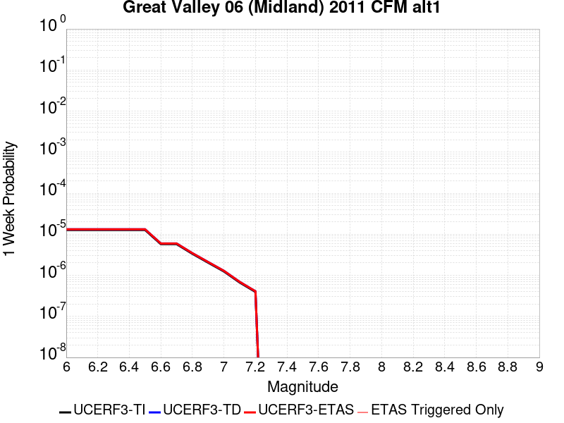 | 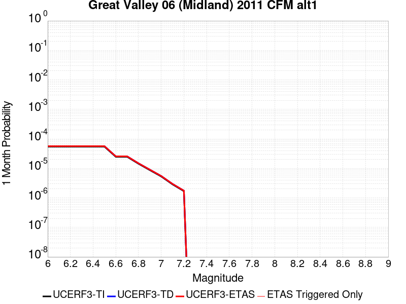 | 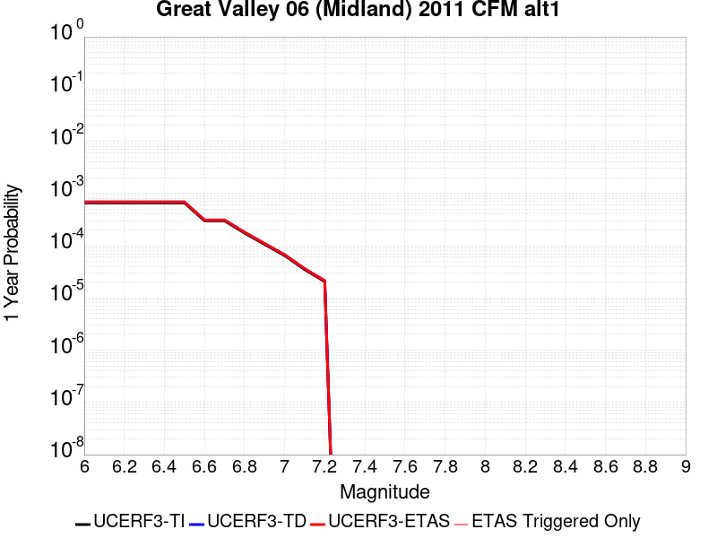 |  |

| Magnitude | 1 wk TI Prob | 1 wk TD Prob | 1 wk ETAS Prob | 1 wk ETAS/TD Gain | 1 wk ETAS Triggered Only | 1 mo TI Prob | 1 mo TD Prob | 1 mo ETAS Prob | 1 mo ETAS/TD Gain | 1 mo ETAS Triggered Only | 1 yr TI Prob | 1 yr TD Prob | 1 yr ETAS Prob | 1 yr ETAS/TD Gain | 1 yr ETAS Triggered Only | 10 yr TI Prob | 10 yr TD Prob | 10 yr ETAS Prob | 10 yr ETAS/TD Gain | 10 yr ETAS Triggered Only |
|-----|-----|-----|-----|-----|-----|-----|-----|-----|-----|-----|-----|-----|-----|-----|-----|-----|-----|-----|-----|-----|
| 6.0 | 1.2712525E-5 | 1.3210919E-5 | 1.3210919E-5 | 1.0 | 0.0 | 5.4481112E-5 | 5.661714E-5 | 5.661714E-5 | 1.0 | 0.0 | 6.6310563E-4 | 6.89121E-4 | 6.89121E-4 | 1.0 | 0.0 | 0.0066113044 | 0.006872357 | 0.006882288 | 1.001445 | 1.0E-5 |
| 6.1 | 1.2712525E-5 | 1.3210919E-5 | 1.3210919E-5 | 1.0 | 0.0 | 5.4481112E-5 | 5.661714E-5 | 5.661714E-5 | 1.0 | 0.0 | 6.6310563E-4 | 6.89121E-4 | 6.89121E-4 | 1.0 | 0.0 | 0.0066113044 | 0.006872357 | 0.006882288 | 1.001445 | 1.0E-5 |
| 6.2 | 1.2712525E-5 | 1.3210919E-5 | 1.3210919E-5 | 1.0 | 0.0 | 5.4481112E-5 | 5.661714E-5 | 5.661714E-5 | 1.0 | 0.0 | 6.6310563E-4 | 6.89121E-4 | 6.89121E-4 | 1.0 | 0.0 | 0.0066113044 | 0.006872357 | 0.006882288 | 1.001445 | 1.0E-5 |
| 6.3 | 1.2712525E-5 | 1.3210919E-5 | 1.3210919E-5 | 1.0 | 0.0 | 5.4481112E-5 | 5.661714E-5 | 5.661714E-5 | 1.0 | 0.0 | 6.6310563E-4 | 6.89121E-4 | 6.89121E-4 | 1.0 | 0.0 | 0.0066113044 | 0.006872357 | 0.006882288 | 1.001445 | 1.0E-5 |
| 6.4 | 1.2712525E-5 | 1.3210919E-5 | 1.3210919E-5 | 1.0 | 0.0 | 5.4481112E-5 | 5.661714E-5 | 5.661714E-5 | 1.0 | 0.0 | 6.6310563E-4 | 6.89121E-4 | 6.89121E-4 | 1.0 | 0.0 | 0.0066113044 | 0.006872357 | 0.006882288 | 1.001445 | 1.0E-5 |
| 6.5 | 1.2712525E-5 | 1.3210919E-5 | 1.3210919E-5 | 1.0 | 0.0 | 5.4481112E-5 | 5.661714E-5 | 5.661714E-5 | 1.0 | 0.0 | 6.6310563E-4 | 6.89121E-4 | 6.89121E-4 | 1.0 | 0.0 | 0.0066113044 | 0.006872357 | 0.006882288 | 1.001445 | 1.0E-5 |
| 6.6 | 5.7574384E-6 | 5.9707927E-6 | 5.9707927E-6 | 1.0 | 0.0 | 2.4674504E-5 | 2.5588883E-5 | 2.5588883E-5 | 1.0 | 0.0 | 3.0037065E-4 | 3.1150403E-4 | 3.1150403E-4 | 1.0 | 0.0 | 0.0029996498 | 0.0031110605 | 0.0031110605 | 1.0 | 0.0 |
| 6.7 | 5.7574384E-6 | 5.9707927E-6 | 5.9707927E-6 | 1.0 | 0.0 | 2.4674504E-5 | 2.5588883E-5 | 2.5588883E-5 | 1.0 | 0.0 | 3.0037065E-4 | 3.1150403E-4 | 3.1150403E-4 | 1.0 | 0.0 | 0.0029996498 | 0.0031110605 | 0.0031110605 | 1.0 | 0.0 |
| 6.8 | 3.3474828E-6 | 3.4694685E-6 | 3.4694685E-6 | 1.0 | 0.0 | 1.4346277E-5 | 1.4869074E-5 | 1.4869074E-5 | 1.0 | 0.0 | 1.7465191E-4 | 1.8101744E-4 | 1.8101744E-4 | 1.0 | 0.0 | 0.0017451472 | 0.001808847 | 0.001808847 | 1.0 | 0.0 |
| 6.9 | 2.035106E-6 | 2.1090864E-6 | 2.1090864E-6 | 1.0 | 0.0 | 8.721853E-6 | 9.038915E-6 | 9.038915E-6 | 1.0 | 0.0 | 1.0618339E-4 | 1.1004396E-4 | 1.1004396E-4 | 1.0 | 0.0 | 0.0010613267 | 0.0010999669 | 0.0010999669 | 1.0 | 0.0 |
| 7.0 | 1.2424716E-6 | 1.2879074E-6 | 1.2879074E-6 | 1.0 | 0.0 | 5.3248673E-6 | 5.519594E-6 | 5.519594E-6 | 1.0 | 0.0 | 6.482833E-5 | 6.7199435E-5 | 6.7199435E-5 | 1.0 | 0.0 | 6.480942E-4 | 6.718355E-4 | 6.718355E-4 | 1.0 | 0.0 |
| 7.1 | 6.6904556E-7 | 6.939206E-7 | 6.939206E-7 | 1.0 | 0.0 | 2.867335E-6 | 2.9739433E-6 | 2.9739433E-6 | 1.0 | 0.0 | 3.4909244E-5 | 3.6207417E-5 | 3.6207417E-5 | 1.0 | 0.0 | 3.490376E-4 | 3.620407E-4 | 3.620407E-4 | 1.0 | 0.0 |
| 7.2 | 3.948168E-7 | 4.0958065E-7 | 4.0958065E-7 | 1.0 | 0.0 | 1.6920709E-6 | 1.7553456E-6 | 1.7553456E-6 | 1.0 | 0.0 | 2.0600768E-5 | 2.1371332E-5 | 2.1371332E-5 | 1.0 | 0.0 | 2.0598859E-4 | 2.1371333E-4 | 2.1371333E-4 | 1.0 | 0.0 |

## North Frontal  (East)
*[(top)](#table-of-contents)*

| 1 Week | 1 Month | 1 Year | 10 Year |
|-----|-----|-----|-----|
| 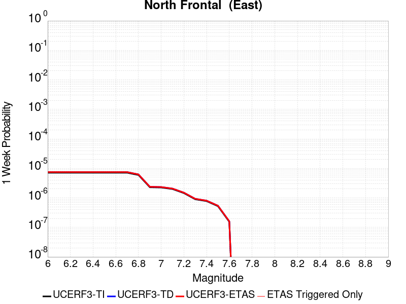 |  | 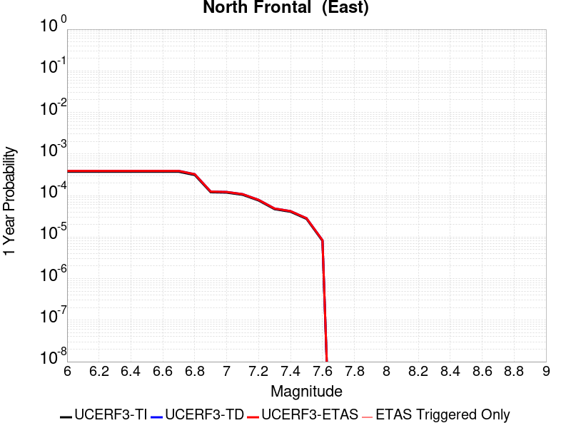 |  |

| Magnitude | 1 wk TI Prob | 1 wk TD Prob | 1 wk ETAS Prob | 1 wk ETAS/TD Gain | 1 wk ETAS Triggered Only | 1 mo TI Prob | 1 mo TD Prob | 1 mo ETAS Prob | 1 mo ETAS/TD Gain | 1 mo ETAS Triggered Only | 1 yr TI Prob | 1 yr TD Prob | 1 yr ETAS Prob | 1 yr ETAS/TD Gain | 1 yr ETAS Triggered Only | 10 yr TI Prob | 10 yr TD Prob | 10 yr ETAS Prob | 10 yr ETAS/TD Gain | 10 yr ETAS Triggered Only |
|-----|-----|-----|-----|-----|-----|-----|-----|-----|-----|-----|-----|-----|-----|-----|-----|-----|-----|-----|-----|-----|
| 6.0 | 7.135738E-6 | 7.4774143E-6 | 7.4774143E-6 | 1.0 | 0.0 | 3.0581377E-5 | 3.204578E-5 | 3.204578E-5 | 1.0 | 0.0 | 3.7226462E-4 | 3.9010745E-4 | 3.9010745E-4 | 1.0 | 0.0 | 0.0037164164 | 0.0038961845 | 0.0039061455 | 1.0025566 | 1.0E-5 |
| 6.1 | 7.135738E-6 | 7.4774143E-6 | 7.4774143E-6 | 1.0 | 0.0 | 3.0581377E-5 | 3.204578E-5 | 3.204578E-5 | 1.0 | 0.0 | 3.7226462E-4 | 3.9010745E-4 | 3.9010745E-4 | 1.0 | 0.0 | 0.0037164164 | 0.0038961845 | 0.0039061455 | 1.0025566 | 1.0E-5 |
| 6.2 | 7.135738E-6 | 7.4774143E-6 | 7.4774143E-6 | 1.0 | 0.0 | 3.0581377E-5 | 3.204578E-5 | 3.204578E-5 | 1.0 | 0.0 | 3.7226462E-4 | 3.9010745E-4 | 3.9010745E-4 | 1.0 | 0.0 | 0.0037164164 | 0.0038961845 | 0.0039061455 | 1.0025566 | 1.0E-5 |
| 6.3 | 7.135738E-6 | 7.4774143E-6 | 7.4774143E-6 | 1.0 | 0.0 | 3.0581377E-5 | 3.204578E-5 | 3.204578E-5 | 1.0 | 0.0 | 3.7226462E-4 | 3.9010745E-4 | 3.9010745E-4 | 1.0 | 0.0 | 0.0037164164 | 0.0038961845 | 0.0039061455 | 1.0025566 | 1.0E-5 |
| 6.4 | 7.135738E-6 | 7.4774143E-6 | 7.4774143E-6 | 1.0 | 0.0 | 3.0581377E-5 | 3.204578E-5 | 3.204578E-5 | 1.0 | 0.0 | 3.7226462E-4 | 3.9010745E-4 | 3.9010745E-4 | 1.0 | 0.0 | 0.0037164164 | 0.0038961845 | 0.0039061455 | 1.0025566 | 1.0E-5 |
| 6.5 | 7.135738E-6 | 7.4774143E-6 | 7.4774143E-6 | 1.0 | 0.0 | 3.0581377E-5 | 3.204578E-5 | 3.204578E-5 | 1.0 | 0.0 | 3.7226462E-4 | 3.9010745E-4 | 3.9010745E-4 | 1.0 | 0.0 | 0.0037164164 | 0.0038961845 | 0.0039061455 | 1.0025566 | 1.0E-5 |
| 6.6 | 7.135738E-6 | 7.4774143E-6 | 7.4774143E-6 | 1.0 | 0.0 | 3.0581377E-5 | 3.204578E-5 | 3.204578E-5 | 1.0 | 0.0 | 3.7226462E-4 | 3.9010745E-4 | 3.9010745E-4 | 1.0 | 0.0 | 0.0037164164 | 0.0038961845 | 0.0039061455 | 1.0025566 | 1.0E-5 |
| 6.7 | 7.135738E-6 | 7.4774143E-6 | 7.4774143E-6 | 1.0 | 0.0 | 3.0581377E-5 | 3.204578E-5 | 3.204578E-5 | 1.0 | 0.0 | 3.7226462E-4 | 3.9010745E-4 | 3.9010745E-4 | 1.0 | 0.0 | 0.0037164164 | 0.0038961845 | 0.0039061455 | 1.0025566 | 1.0E-5 |
| 6.8 | 5.959142E-6 | 6.236876E-6 | 6.236876E-6 | 1.0 | 0.0 | 2.553893E-5 | 2.6729294E-5 | 2.6729294E-5 | 1.0 | 0.0 | 3.108921E-4 | 3.2539864E-4 | 3.2539864E-4 | 1.0 | 0.0 | 0.0031045752 | 0.0032509952 | 0.0032609627 | 1.003066 | 1.0E-5 |
| 6.9 | 2.2946929E-6 | 2.382521E-6 | 2.382521E-6 | 1.0 | 0.0 | 9.834361E-6 | 1.0210767E-5 | 1.0210767E-5 | 1.0 | 0.0 | 1.1972676E-4 | 1.2430947E-4 | 1.2430947E-4 | 1.0 | 0.0 | 0.0011966228 | 0.0012424458 | 0.0012524334 | 1.0080386 | 1.0E-5 |
| 7.0 | 2.2468673E-6 | 2.3322125E-6 | 2.3322125E-6 | 1.0 | 0.0 | 9.629396E-6 | 9.995161E-6 | 9.995161E-6 | 1.0 | 0.0 | 1.1723159E-4 | 1.2168476E-4 | 1.2168476E-4 | 1.0 | 0.0 | 0.0011716976 | 0.0012162277 | 0.0012262154 | 1.0082121 | 1.0E-5 |
| 7.1 | 1.9921076E-6 | 2.064653E-6 | 2.064653E-6 | 1.0 | 0.0 | 8.537577E-6 | 8.848486E-6 | 8.848486E-6 | 1.0 | 0.0 | 1.0394004E-4 | 1.0772542E-4 | 1.0772542E-4 | 1.0 | 0.0 | 0.0010389143 | 0.0010767748 | 0.001086764 | 1.009277 | 1.0E-5 |
| 7.2 | 1.4524545E-6 | 1.5045506E-6 | 1.5045506E-6 | 1.0 | 0.0 | 6.2247905E-6 | 6.448059E-6 | 6.448059E-6 | 1.0 | 0.0 | 7.5784184E-5 | 7.850254E-5 | 7.850254E-5 | 1.0 | 0.0 | 7.575835E-4 | 7.8477256E-4 | 7.8477256E-4 | 1.0 | 0.0 |
| 7.3 | 8.9802575E-7 | 9.308954E-7 | 9.308954E-7 | 1.0 | 0.0 | 3.848676E-6 | 3.9895463E-6 | 3.9895463E-6 | 1.0 | 0.0 | 4.685662E-5 | 4.8571757E-5 | 4.8571757E-5 | 1.0 | 0.0 | 4.6846745E-4 | 4.8562273E-4 | 4.8562273E-4 | 1.0 | 0.0 |
| 7.4 | 7.776139E-7 | 8.06067E-7 | 8.06067E-7 | 1.0 | 0.0 | 3.3326266E-6 | 3.454569E-6 | 3.454569E-6 | 1.0 | 0.0 | 4.0573974E-5 | 4.2058677E-5 | 4.2058677E-5 | 1.0 | 0.0 | 4.0566566E-4 | 4.2051793E-4 | 4.2051793E-4 | 1.0 | 0.0 |
| 7.5 | 5.244417E-7 | 5.4413545E-7 | 5.4413545E-7 | 1.0 | 0.0 | 2.2476054E-6 | 2.3320074E-6 | 2.3320074E-6 | 1.0 | 0.0 | 2.7364253E-5 | 2.8391887E-5 | 2.8391887E-5 | 1.0 | 0.0 | 2.7360884E-4 | 2.8388912E-4 | 2.8388912E-4 | 1.0 | 0.0 |
| 7.6 | 1.5489647E-7 | 1.6089918E-7 | 1.6089918E-7 | 1.0 | 0.0 | 6.6384183E-7 | 6.895678E-7 | 6.895678E-7 | 1.0 | 0.0 | 8.082245E-6 | 8.3954765E-6 | 8.3954765E-6 | 1.0 | 0.0 | 8.08195E-5 | 8.3953586E-5 | 8.3953586E-5 | 1.0 | 0.0 |

