# Parent Section Magnitude-Probability Distributions

Only fault sections with at least one triggered aftershock are plotted. Sections are sorted by total supraseismogenic trigger rate (decreasing)

## Table Of Contents

* [Garlock (Central)](#garlock-central)
* [Tank Canyon](#tank-canyon)
* [Little Lake](#little-lake)
* [Airport Lake](#airport-lake)
* [Owl Lake](#owl-lake)
* [Panamint Valley](#panamint-valley)
* [Garlock (East)](#garlock-east)
* [Ash Hill](#ash-hill)
* [Hunter Mountain-Saline Valley](#hunter-mountain-saline-valley)
* [Blackwater](#blackwater)
* [Garlock (West)](#garlock-west)
* [McLean Lake](#mclean-lake)
* [Goldstone Lake](#goldstone-lake)
* [Gravel Hills-Harper Lk](#gravel-hills-harper-lk)
* [So Sierra Nevada](#so-sierra-nevada)
* [Coyote Canyon](#coyote-canyon)
* [San Andreas (Mojave S)](#san-andreas-mojave-s)
* [Nelson Lake](#nelson-lake)
* [Lenwood-Lockhart-Old Woman Springs](#lenwood-lockhart-old-woman-springs)
* [Death Valley (So)](#death-valley-so)
* [Towne Pass](#towne-pass)
* [San Andreas (Mojave N)](#san-andreas-mojave-n)
* [Paradise](#paradise)
* [Bicycle Lake](#bicycle-lake)
* [San Andreas (San Bernardino N)](#san-andreas-san-bernardino-n)
* [Garlic Springs](#garlic-springs)
* [Death Valley (Black Mtns Frontal)](#death-valley-black-mtns-frontal)
* [Helendale-So Lockhart](#helendale-so-lockhart)
* [Coyote Lake](#coyote-lake)
* [San Andreas (San Bernardino S)](#san-andreas-san-bernardino-s)
* [Sierra Nevada  (No Extension)](#sierra-nevada--no-extension)
* [Elsinore (Glen Ivy) rev](#elsinore-glen-ivy-rev)
* [White Wolf (Extension)](#white-wolf-extension)
* [Death Valley (No)](#death-valley-no)
* [San Andreas (Big Bend)](#san-andreas-big-bend)
* [Scodie Lineament](#scodie-lineament)
* [Red Pass](#red-pass)
* [Manix-Afton Hills](#manix-afton-hills)
* [Death Valley (Fish Lake Valley)](#death-valley-fish-lake-valley)
* [Cady](#cady)
* [Baker](#baker)
* [Pisgah-Bullion Mtn-Mesquite Lk](#pisgah-bullion-mtn-mesquite-lk)
* [San Andreas (North Branch Mill Creek)](#san-andreas-north-branch-mill-creek)
* [Pinto Mtn](#pinto-mtn)
* [San Andreas (Coachella) rev](#san-andreas-coachella-rev)
* [San Andreas (Parkfield)](#san-andreas-parkfield)
* [Ludlow](#ludlow)
* [Santa Rosa Island](#santa-rosa-island)
* [Owens Valley](#owens-valley)
* [Calico-Hidalgo](#calico-hidalgo)
* [Red Mountain](#red-mountain)
* [Santa Ynez (West)](#santa-ynez-west)
* [Channel Islands Thrust](#channel-islands-thrust)
* [Mission Creek](#mission-creek)
* [Mission Ridge-Arroyo Parida-Santa Ana](#mission-ridge-arroyo-parida-santa-ana)
* [Independence rev 2011](#independence-rev-2011)
* [San Andreas (Cholame) rev](#san-andreas-cholame-rev)
* [San Andreas (Carrizo) rev](#san-andreas-carrizo-rev)
* [Elysian Park (Upper)](#elysian-park-upper)
* [San Andreas (Creeping Section) 2011 CFM](#san-andreas-creeping-section-2011-cfm)
* [Santa Ynez (East)](#santa-ynez-east)
* [Camp Rock 2011](#camp-rock-2011)
* [Oceanic - West Huasna](#oceanic---west-huasna)
* [Lake Isabella (Seismicity)](#lake-isabella-seismicity)
* [Pleito](#pleito)
* [Chino alt 1](#chino-alt-1)
* [Palos Verdes](#palos-verdes)
* [San Jacinto (San Bernardino)](#san-jacinto-san-bernardino)
* [Ortigalita (North)](#ortigalita-north)
* [Cleghorn Lake](#cleghorn-lake)
* [Santa Cruz Catalina Ridge alt1](#santa-cruz-catalina-ridge-alt1)
* [Sheephole](#sheephole)
* [Raymond](#raymond)
* [Whittier alt 1](#whittier-alt-1)
* [Santa Cruz Island](#santa-cruz-island)
* [Cucamonga](#cucamonga)
* [San Jacinto (San Jacinto Valley) rev](#san-jacinto-san-jacinto-valley-rev)
* [Blue Cut](#blue-cut)
* [San Jacinto (Stepovers Combined)](#san-jacinto-stepovers-combined)
* [Cleghorn Pass](#cleghorn-pass)
* [San Pedro Basin](#san-pedro-basin)
* [Pitas Point (Lower West)](#pitas-point-lower-west)
* [Oak Ridge (Onshore)](#oak-ridge-onshore)
* [San Andreas (San Gorgonio Pass-Garnet HIll)](#san-andreas-san-gorgonio-pass-garnet-hill)
* [Santa Susana East (connector)](#santa-susana-east-connector)
* [Rose Canyon](#rose-canyon)
* [Emerson-Copper Mtn 2011](#emerson-copper-mtn-2011)
* [Hunting Creek - Berryessa 2011 CFM](#hunting-creek---berryessa-2011-cfm)
* [Santa Susana alt 1](#santa-susana-alt-1)
* [Newport-Inglewood alt 1](#newport-inglewood-alt-1)
* [North Frontal  (West)](#north-frontal--west)
* [San Jacinto (Anza) rev](#san-jacinto-anza-rev)
* [Big Pine (Central)](#big-pine-central)
* [Lost Hills](#lost-hills)
* [White Mountains](#white-mountains)
* [Kern Canyon (North Kern) 2011](#kern-canyon-north-kern-2011)
* [Dry Mountain](#dry-mountain)
* [Sierra Madre](#sierra-madre)
* [Tin Mountain](#tin-mountain)
* [Imperial](#imperial)
* [Mono Lake 2011 CFM](#mono-lake-2011-cfm)
* [Hollywood](#hollywood)
* [Malibu Coast alt 1](#malibu-coast-alt-1)
* [Kern Canyon (Lake Isabella) 2011](#kern-canyon-lake-isabella-2011)
* [Pitas Point (Lower)-Montalvo](#pitas-point-lower-montalvo)
* [Malibu Coast (Extension) alt 1](#malibu-coast-extension-alt-1)
* [Cleghorn](#cleghorn)
* [San Diego Trough south](#san-diego-trough-south)
* [Ventura-Pitas Point](#ventura-pitas-point)
* [San Jacinto (Coyote Creek)](#san-jacinto-coyote-creek)
* [Brawley (Seismic Zone) alt 1](#brawley-seismic-zone-alt-1)
* [Santa Ynez River](#santa-ynez-river)
* [San Jacinto (Borrego)](#san-jacinto-borrego)
* [San Clemente](#san-clemente)
* [Monterey Bay-Tularcitos](#monterey-bay-tularcitos)
* [Great Valley 09 (Laguna Seca)](#great-valley-09-laguna-seca)
* [Elsinore (Coyote Mountains)](#elsinore-coyote-mountains)
* [Earthquake Valley (No  Extension)](#earthquake-valley-no--extension)
* [Gillem - Big Crack 2011 CFM](#gillem---big-crack-2011-cfm)
* [Great Valley 08 (Quinto)](#great-valley-08-quinto)
* [Pine Mtn](#pine-mtn)
* [Great Valley 04b Gordon Valley](#great-valley-04b-gordon-valley)
* [Bartlett Springs 2011 CFM](#bartlett-springs-2011-cfm)
* [San Gregorio (South) 2011 CFM](#san-gregorio-south-2011-cfm)
* [Verdugo](#verdugo)
* [Great Valley 03 Mysterious Ridge](#great-valley-03-mysterious-ridge)
* [Casmalia 2011 CFM](#casmalia-2011-cfm)
* [Davis Creek](#davis-creek)
* [Channel Islands Western Deep Ramp](#channel-islands-western-deep-ramp)
* [San Andreas (North Coast) 2011 CFM](#san-andreas-north-coast-2011-cfm)
* [Hayward (No) 2011 CFM](#hayward-no-2011-cfm)
* [Johnson Valley (No) 2011 rev](#johnson-valley-no-2011-rev)
* [Sierra Madre (San Fernando)](#sierra-madre-san-fernando)
* [Great Valley 07 (Orestimba)](#great-valley-07-orestimba)
* [Great Valley 05 Pittsburg - Kirby Hills alt1](#great-valley-05-pittsburg---kirby-hills-alt1)
* [San Luis Range 2011 CFM](#san-luis-range-2011-cfm)
* [Coronado Bank alt1](#coronado-bank-alt1)
* [Ozena](#ozena)
* [San Diego Trough north alt1](#san-diego-trough-north-alt1)
* [Likely 2011 CFM](#likely-2011-cfm)
* [Northridge](#northridge)
* [Simi-Santa Rosa](#simi-santa-rosa)
* [San Jacinto (Lytle Creek connector)](#san-jacinto-lytle-creek-connector)
* [North Frontal  (East)](#north-frontal--east)
* [Los Alamos 2011 CFM](#los-alamos-2011-cfm)
* [Big Pine (East)](#big-pine-east)
* [Bullion Mountains](#bullion-mountains)
* [San Juan](#san-juan)
* [Hosgri (Extension)](#hosgri-extension)
* [Los Alamos extension](#los-alamos-extension)
* [San Cayetano](#san-cayetano)
* [Deep Springs](#deep-springs)
* [Rodgers Creek - Healdsburg 2011 CFM](#rodgers-creek---healdsburg-2011-cfm)
* [Mission (connected) 2011 CFM](#mission-connected-2011-cfm)
* [Santa Monica alt 1](#santa-monica-alt-1)
* [Great Valley 04a Trout Creek](#great-valley-04a-trout-creek)
* [Anacapa-Dume alt 1](#anacapa-dume-alt-1)
* [Sisar](#sisar)

## Garlock (Central)
*[(top)](#table-of-contents)*

| 1 Week | 1 Month | 1 Year | 10 Year |
|-----|-----|-----|-----|
|  |  |  |  |

| Magnitude | 1 wk TI Prob | 1 wk TD Prob | 1 wk ETAS Prob | 1 wk ETAS/TD Gain | 1 wk ETAS Triggered Only | 1 mo TI Prob | 1 mo TD Prob | 1 mo ETAS Prob | 1 mo ETAS/TD Gain | 1 mo ETAS Triggered Only | 1 yr TI Prob | 1 yr TD Prob | 1 yr ETAS Prob | 1 yr ETAS/TD Gain | 1 yr ETAS Triggered Only | 10 yr TI Prob | 10 yr TD Prob | 10 yr ETAS Prob | 10 yr ETAS/TD Gain | 10 yr ETAS Triggered Only |
|-----|-----|-----|-----|-----|-----|-----|-----|-----|-----|-----|-----|-----|-----|-----|-----|-----|-----|-----|-----|-----|
| 6.0 | 5.5131142E-5 | 7.027742E-5 | 0.002191601 | 31.184998 | 0.002121473 | 2.3625491E-4 | 3.0115453E-4 | 0.0071234177 | 23.653694 | 0.0068243183 | 0.0028726095 | 0.003660458 | 0.030133532 | 8.232176 | 0.026570335 | 0.028357591 | 0.036095187 | 0.08597354 | 2.381856 | 0.051746134 |
| 6.1 | 5.5131142E-5 | 7.027742E-5 | 0.002191601 | 31.184998 | 0.002121473 | 2.3625491E-4 | 3.0115453E-4 | 0.0071234177 | 23.653694 | 0.0068243183 | 0.0028726095 | 0.003660458 | 0.030133532 | 8.232176 | 0.026570335 | 0.028357591 | 0.036095187 | 0.08597354 | 2.381856 | 0.051746134 |
| 6.2 | 4.216245E-5 | 5.1689196E-5 | 0.0013126393 | 25.39485 | 0.0012610153 | 1.806837E-4 | 2.215065E-4 | 0.004359687 | 19.681982 | 0.0041390974 | 0.0021976046 | 0.002693538 | 0.018731875 | 6.9543757 | 0.016081654 | 0.021759989 | 0.026703848 | 0.057286307 | 2.1452453 | 0.031421535 |
| 6.3 | 4.216245E-5 | 5.1689196E-5 | 0.0013126393 | 25.39485 | 0.0012610153 | 1.806837E-4 | 2.215065E-4 | 0.004359687 | 19.681982 | 0.0041390974 | 0.0021976046 | 0.002693538 | 0.018731875 | 6.9543757 | 0.016081654 | 0.021759989 | 0.026703848 | 0.057286307 | 2.1452453 | 0.031421535 |
| 6.4 | 3.6858168E-5 | 4.413712E-5 | 0.0010232353 | 23.183098 | 9.791413E-4 | 1.5795401E-4 | 1.8914552E-4 | 0.0034226673 | 18.095419 | 0.0032341334 | 0.0019213937 | 0.0023004396 | 0.014748372 | 6.41111 | 0.012476634 | 0.019048655 | 0.02286248 | 0.046882845 | 2.0506458 | 0.024582382 |
| 6.5 | 3.39199E-5 | 4.0044175E-5 | 9.4497186E-4 | 23.598236 | 9.0496393E-4 | 1.453629E-4 | 1.7160672E-4 | 0.0030936936 | 18.027811 | 0.0029225885 | 0.0017683565 | 0.0020873316 | 0.013264735 | 6.354877 | 0.011200784 | 0.017543508 | 0.020773185 | 0.04233169 | 2.0378046 | 0.022015844 |
| 6.6 | 3.3571985E-5 | 3.9498296E-5 | 9.444265E-4 | 23.910563 | 9.0496393E-4 | 1.4387199E-4 | 1.6926754E-4 | 0.0030913614 | 18.263166 | 0.0029225885 | 0.0017502342 | 0.0020589062 | 0.013177409 | 6.4001985 | 0.011141442 | 0.017365133 | 0.020494469 | 0.041986454 | 2.0486724 | 0.021941667 |
| 6.7 | 3.2580007E-5 | 3.8114555E-5 | 8.688695E-4 | 22.796265 | 8.307866E-4 | 1.3962112E-4 | 1.6333799E-4 | 0.0028926195 | 17.70941 | 0.0027297274 | 0.0016985617 | 0.0019868477 | 0.012736003 | 6.410156 | 0.010770555 | 0.016856372 | 0.019787027 | 0.040552896 | 2.0494688 | 0.021185057 |
| 6.8 | 3.2185937E-5 | 3.7541675E-5 | 8.6829707E-4 | 23.128883 | 8.307866E-4 | 1.3793244E-4 | 1.608831E-4 | 0.0028901713 | 17.964418 | 0.0027297274 | 0.0016780337 | 0.0019570135 | 0.012543619 | 6.409572 | 0.010607365 | 0.016654192 | 0.019493783 | 0.03985857 | 2.044681 | 0.020769665 |
| 6.9 | 3.165394E-5 | 3.674612E-5 | 8.5266726E-4 | 23.204279 | 8.159511E-4 | 1.3565269E-4 | 1.5747399E-4 | 0.0028126058 | 17.860764 | 0.00265555 | 0.0016503202 | 0.0019155812 | 0.012250907 | 6.395399 | 0.0103551615 | 0.01638118 | 0.019086348 | 0.03886295 | 2.0361648 | 0.02016141 |
| 7.0 | 3.0903822E-5 | 3.5651196E-5 | 8.515732E-4 | 23.886246 | 8.159511E-4 | 1.3243823E-4 | 1.5278201E-4 | 0.002718927 | 17.79612 | 0.0025665371 | 0.0016112428 | 0.0018585551 | 0.011942737 | 6.4258175 | 0.010102958 | 0.015996104 | 0.01852543 | 0.037803717 | 2.0406394 | 0.019642169 |
| 7.1 | 3.0069863E-5 | 3.4417284E-5 | 8.058354E-4 | 23.413685 | 7.714447E-4 | 1.2886449E-4 | 1.4749441E-4 | 0.0025504867 | 17.29209 | 0.0024033468 | 0.0015677959 | 0.0017942865 | 0.011331189 | 6.3151503 | 0.009554045 | 0.01556781 | 0.017892988 | 0.036163796 | 2.0211155 | 0.018603684 |
| 7.2 | 2.7957109E-5 | 3.1306103E-5 | 7.1371655E-4 | 22.798 | 6.8243186E-4 | 1.1981068E-4 | 1.3416223E-4 | 0.0022256835 | 16.589495 | 0.002091802 | 0.0014577188 | 0.0016322208 | 0.0098080365 | 6.009013 | 0.008189182 | 0.014481937 | 0.016296342 | 0.031809457 | 1.9519384 | 0.01577011 |
| 7.3 | 2.4519275E-5 | 2.6737956E-5 | 4.5695523E-4 | 17.090132 | 4.3022877E-4 | 1.0507837E-4 | 1.1458629E-4 | 0.0016572989 | 14.4633255 | 0.0015428894 | 0.0012785783 | 0.00139421 | 0.007068275 | 5.0697346 | 0.005681987 | 0.012712469 | 0.013939967 | 0.024838325 | 1.7818066 | 0.011052429 |
| 7.4 | 2.3225532E-5 | 2.522209E-5 | 4.109347E-4 | 16.29265 | 3.8572235E-4 | 9.95342E-5 | 1.0809027E-4 | 0.0014876403 | 13.762942 | 0.0013796991 | 0.0012111551 | 0.0013152191 | 0.006426726 | 4.8864303 | 0.0051182387 | 0.012045753 | 0.013157406 | 0.022951752 | 1.744398 | 0.009924932 |
| 7.5 | 2.097765E-5 | 2.2505254E-5 | 3.340432E-4 | 14.842899 | 3.1154498E-4 | 8.9901114E-5 | 9.644759E-5 | 0.0012090008 | 12.535315 | 0.0011126606 | 0.0010939965 | 0.0011736286 | 0.0051596877 | 4.3963547 | 0.003990743 | 0.010886264 | 0.011751484 | 0.019257985 | 1.6387705 | 0.007595763 |
| 7.6 | 1.511254E-5 | 1.6011363E-5 | 1.7919896E-4 | 11.191988 | 1.6319023E-4 | 6.476642E-5 | 6.861836E-5 | 7.213345E-4 | 10.512265 | 6.527609E-4 | 7.882459E-4 | 8.351162E-4 | 0.0030289327 | 3.6269598 | 0.0021956502 | 0.007854558 | 0.00839392 | 0.012571829 | 1.4977304 | 0.004213275 |
| 7.7 | 9.934069E-6 | 1.069739E-5 | 4.036802E-5 | 3.7736328 | 2.967095E-5 | 4.2573887E-5 | 4.5845158E-5 | 2.6836706E-4 | 5.8537717 | 2.2253212E-4 | 5.182138E-4 | 5.5802224E-4 | 0.0011066284 | 1.9831262 | 5.4891256E-4 | 0.00517007 | 0.0056373305 | 0.0067732222 | 1.2014946 | 0.0011423315 |
| 7.8 | 6.7562896E-6 | 8.44361E-6 | 3.8114307E-5 | 4.513983 | 2.967095E-5 | 2.8955206E-5 | 3.6186397E-5 | 1.9937071E-4 | 5.5095487 | 1.6319023E-4 | 3.5247262E-4 | 4.4048048E-4 | 7.518882E-4 | 1.7069728 | 3.1154498E-4 | 0.0035191406 | 0.0044545215 | 0.005089605 | 1.1425706 | 6.379254E-4 |
| 7.9 | 3.975453E-6 | 5.3802805E-6 | 2.0215675E-5 | 3.7573647 | 1.4835475E-5 | 1.7037546E-5 | 2.305814E-5 | 1.2690407E-4 | 5.503656 | 1.03848324E-4 | 2.0741238E-4 | 2.806968E-4 | 4.7350384E-4 | 1.6868871 | 1.9286117E-4 | 0.002072189 | 0.0028384328 | 0.0032674402 | 1.1511424 | 4.3022877E-4 |
| 8.0 | 1.6729537E-6 | 2.0807186E-6 | 2.0807186E-6 | 1.0 | 0.0 | 7.169782E-6 | 8.917335E-6 | 5.3423362E-5 | 5.990956 | 4.4506425E-5 | 8.7288594E-5 | 1.0856318E-4 | 1.827325E-4 | 1.6831903 | 7.417738E-5 | 8.7254314E-4 | 0.0010986003 | 0.0012023345 | 1.094424 | 1.03848324E-4 |
| 8.1 | 3.6733252E-7 | 3.1536092E-7 | 3.1536092E-7 | 1.0 | 0.0 | 1.5742813E-6 | 1.3515462E-6 | 1.6187001E-5 | 11.976654 | 1.4835475E-5 | 1.9166706E-5 | 1.6454967E-5 | 3.1290198E-5 | 1.9015656 | 1.4835475E-5 | 1.9165053E-4 | 1.6662935E-4 | 1.9629535E-4 | 1.1780359 | 2.967095E-5 |

## Tank Canyon
*[(top)](#table-of-contents)*

| 1 Week | 1 Month | 1 Year | 10 Year |
|-----|-----|-----|-----|
|  |  |  |  |

| Magnitude | 1 wk TI Prob | 1 wk TD Prob | 1 wk ETAS Prob | 1 wk ETAS/TD Gain | 1 wk ETAS Triggered Only | 1 mo TI Prob | 1 mo TD Prob | 1 mo ETAS Prob | 1 mo ETAS/TD Gain | 1 mo ETAS Triggered Only | 1 yr TI Prob | 1 yr TD Prob | 1 yr ETAS Prob | 1 yr ETAS/TD Gain | 1 yr ETAS Triggered Only | 10 yr TI Prob | 10 yr TD Prob | 10 yr ETAS Prob | 10 yr ETAS/TD Gain | 10 yr ETAS Triggered Only |
|-----|-----|-----|-----|-----|-----|-----|-----|-----|-----|-----|-----|-----|-----|-----|-----|-----|-----|-----|-----|-----|
| 6.0 | 4.8284557E-5 | 5.7972447E-5 | 9.777185E-4 | 16.865229 | 9.1979944E-4 | 2.0691741E-4 | 2.4843353E-4 | 0.0037487356 | 15.089492 | 0.003501172 | 0.0025163088 | 0.0030211455 | 0.020429745 | 6.7622514 | 0.017461354 | 0.02488006 | 0.029867476 | 0.065646924 | 2.19794 | 0.03688099 |
| 6.1 | 1.7796336E-5 | 2.0875557E-5 | 3.3241403E-4 | 15.923599 | 3.1154498E-4 | 7.626778E-5 | 8.946383E-5 | 0.001216859 | 13.601687 | 0.001127496 | 9.281647E-4 | 0.0010887147 | 0.007134998 | 6.5535984 | 0.0060528736 | 0.009242975 | 0.010837899 | 0.024265239 | 2.2389247 | 0.01357446 |
| 6.2 | 1.7796336E-5 | 2.0875557E-5 | 3.3241403E-4 | 15.923599 | 3.1154498E-4 | 7.626778E-5 | 8.946383E-5 | 0.001216859 | 13.601687 | 0.001127496 | 9.281647E-4 | 0.0010887147 | 0.007134998 | 6.5535984 | 0.0060528736 | 0.009242975 | 0.010837899 | 0.024265239 | 2.2389247 | 0.01357446 |
| 6.3 | 1.3515912E-5 | 1.5761145E-5 | 2.53125E-4 | 16.060064 | 2.373676E-4 | 5.792405E-5 | 6.754615E-5 | 8.6860766E-4 | 12.85947 | 8.0111565E-4 | 7.049971E-4 | 8.220881E-4 | 0.005061546 | 6.156938 | 0.004242946 | 0.007027647 | 0.008193081 | 0.017815989 | 2.1745164 | 0.0097024 |
| 6.4 | 1.0870146E-5 | 1.2619209E-5 | 1.9064266E-4 | 15.107338 | 1.780257E-4 | 4.658551E-5 | 5.4081305E-5 | 6.326335E-4 | 11.697823 | 5.785835E-4 | 5.67031E-4 | 6.582589E-4 | 0.0037420064 | 5.6847034 | 0.0030857788 | 0.005655863 | 0.006565106 | 0.013683598 | 2.084292 | 0.0071655344 |
| 6.5 | 7.964826E-6 | 9.196881E-6 | 1.1304425E-4 | 12.291586 | 1.03848324E-4 | 3.4134522E-5 | 3.941467E-5 | 4.251218E-4 | 10.785878 | 3.8572235E-4 | 4.1550855E-4 | 4.797786E-4 | 0.0026002335 | 5.4196534 | 0.002121473 | 0.0041473247 | 0.0047887294 | 0.009601934 | 2.005111 | 0.0048363646 |
| 6.6 | 6.6317E-6 | 7.6128968E-6 | 6.6954344E-5 | 8.794858 | 5.93419E-5 | 2.8421264E-5 | 3.2626343E-5 | 3.1449116E-4 | 9.639179 | 2.81874E-4 | 3.4597394E-4 | 3.9716245E-4 | 0.0019839278 | 4.995255 | 0.0015873958 | 0.0034543579 | 0.0039656786 | 0.007748499 | 1.9538898 | 0.0037978815 |
| 6.7 | 4.793663E-6 | 5.431129E-6 | 5.431129E-6 | 1.0 | 0.0 | 2.0544108E-5 | 2.3276085E-5 | 1.4195712E-4 | 6.09884 | 1.186838E-4 | 2.500958E-4 | 2.8335385E-4 | 0.0010842425 | 3.826461 | 8.0111565E-4 | 0.0024981452 | 0.0028306183 | 0.0048425314 | 1.7107682 | 0.0020176244 |
| 6.8 | 4.382823E-6 | 4.9695514E-6 | 4.9695514E-6 | 1.0 | 0.0 | 1.8783392E-5 | 2.1297928E-5 | 1.2514404E-4 | 5.8758783 | 1.03848324E-4 | 2.286638E-4 | 2.592757E-4 | 9.860254E-4 | 3.803 | 7.2693825E-4 | 0.0022842865 | 0.002590406 | 0.0044400366 | 1.7140311 | 0.0018544344 |
| 6.9 | 2.729601E-6 | 3.0736796E-6 | 3.0736796E-6 | 1.0 | 0.0 | 1.1698237E-5 | 1.3172853E-5 | 1.0218453E-4 | 7.7572055 | 8.901285E-5 | 1.4241673E-4 | 1.6036892E-4 | 5.9052865E-4 | 3.682314 | 4.3022877E-4 | 0.001423255 | 0.0016026977 | 0.0025506464 | 1.5914707 | 9.494704E-4 |
| 7.0 | 1.8987357E-6 | 2.1270139E-6 | 2.1270139E-6 | 1.0 | 0.0 | 8.137413E-6 | 9.115746E-6 | 6.8457106E-5 | 7.509764 | 5.93419E-5 | 9.90685E-5 | 1.1097925E-4 | 3.92822E-4 | 3.5395985 | 2.81874E-4 | 9.902435E-4 | 0.0011093069 | 0.0016279726 | 1.4675583 | 5.192416E-4 |
| 7.1 | 1.4928986E-6 | 1.6641786E-6 | 1.6641786E-6 | 1.0 | 0.0 | 6.398121E-6 | 7.132178E-6 | 3.6802914E-5 | 5.160123 | 2.967095E-5 | 7.789434E-5 | 8.6831395E-5 | 2.3517325E-4 | 2.7083898 | 1.4835475E-4 | 7.786704E-4 | 8.6803257E-4 | 0.0011644845 | 1.3415216 | 2.967095E-4 |
| 7.2 | 1.069082E-6 | 1.18289E-6 | 1.18289E-6 | 1.0 | 0.0 | 4.581772E-6 | 5.069521E-6 | 1.9904921E-5 | 3.9263906 | 1.4835475E-5 | 5.5781646E-5 | 6.172021E-5 | 1.6556212E-4 | 2.6824622 | 1.03848324E-4 | 5.576765E-4 | 6.1708293E-4 | 7.653461E-4 | 1.2402647 | 1.4835475E-4 |
| 7.3 | 8.776551E-7 | 9.770242E-7 | 9.770242E-7 | 1.0 | 0.0 | 3.7613736E-6 | 4.187243E-6 | 1.9022655E-5 | 4.5430026 | 1.4835475E-5 | 4.579376E-5 | 5.097901E-5 | 1.3998731E-4 | 2.7459795 | 8.901285E-5 | 4.5784327E-4 | 5.097242E-4 | 6.283475E-4 | 1.2327206 | 1.186838E-4 |
| 7.4 | 7.55721E-7 | 8.5104415E-7 | 8.5104415E-7 | 1.0 | 0.0 | 3.2388E-6 | 3.6473298E-6 | 1.848275E-5 | 5.0674744 | 1.4835475E-5 | 3.9431678E-5 | 4.4405853E-5 | 1.3341475E-4 | 3.0044405 | 8.901285E-5 | 3.942468E-4 | 4.4402067E-4 | 5.626518E-4 | 1.2671747 | 1.186838E-4 |
| 7.5 | 5.587665E-7 | 6.3057615E-7 | 6.3057615E-7 | 1.0 | 0.0 | 2.3947114E-6 | 2.7024694E-6 | 1.7537905E-5 | 6.489585 | 1.4835475E-5 | 2.915522E-5 | 3.2902564E-5 | 6.257254E-5 | 1.9017526 | 2.967095E-5 | 2.9151395E-4 | 3.2902564E-4 | 3.5868684E-4 | 1.0901486 | 2.967095E-5 |

## Little Lake
*[(top)](#table-of-contents)*

| 1 Week | 1 Month | 1 Year | 10 Year |
|-----|-----|-----|-----|
|  | 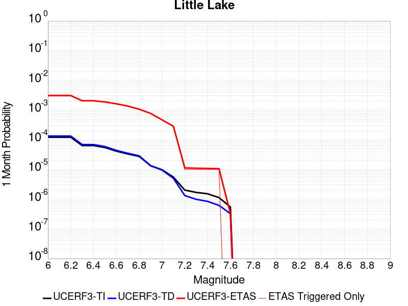 |  |  |

| Magnitude | 1 wk TI Prob | 1 wk TD Prob | 1 wk ETAS Prob | 1 wk ETAS/TD Gain | 1 wk ETAS Triggered Only | 1 mo TI Prob | 1 mo TD Prob | 1 mo ETAS Prob | 1 mo ETAS/TD Gain | 1 mo ETAS Triggered Only | 1 yr TI Prob | 1 yr TD Prob | 1 yr ETAS Prob | 1 yr ETAS/TD Gain | 1 yr ETAS Triggered Only | 10 yr TI Prob | 10 yr TD Prob | 10 yr ETAS Prob | 10 yr ETAS/TD Gain | 10 yr ETAS Triggered Only |
|-----|-----|-----|-----|-----|-----|-----|-----|-----|-----|-----|-----|-----|-----|-----|-----|-----|-----|-----|-----|-----|
| 6.0 | 2.8424427E-5 | 3.1207917E-5 | 6.9878343E-4 | 22.391224 | 6.6759635E-4 | 1.2181328E-4 | 1.3374211E-4 | 0.0030559397 | 22.849497 | 0.0029225885 | 0.0014820677 | 0.0016272271 | 0.013831766 | 8.500206 | 0.012224431 | 0.014722223 | 0.01616653 | 0.039125465 | 2.4201524 | 0.023336202 |
| 6.1 | 2.8424427E-5 | 3.1207917E-5 | 6.9878343E-4 | 22.391224 | 6.6759635E-4 | 1.2181328E-4 | 1.3374211E-4 | 0.0030559397 | 22.849497 | 0.0029225885 | 0.0014820677 | 0.0016272271 | 0.013831766 | 8.500206 | 0.012224431 | 0.014722223 | 0.01616653 | 0.039125465 | 2.4201524 | 0.023336202 |
| 6.2 | 2.8424427E-5 | 3.1207917E-5 | 6.9878343E-4 | 22.391224 | 6.6759635E-4 | 1.2181328E-4 | 1.3374211E-4 | 0.0030559397 | 22.849497 | 0.0029225885 | 0.0014820677 | 0.0016272271 | 0.013831766 | 8.500206 | 0.012224431 | 0.014722223 | 0.01616653 | 0.039125465 | 2.4201524 | 0.023336202 |
| 6.3 | 1.48860645E-5 | 1.608241E-5 | 4.4630424E-4 | 27.751081 | 4.3022877E-4 | 6.379586E-5 | 6.892295E-5 | 0.0020567395 | 29.841143 | 0.0019879537 | 7.7643775E-4 | 8.3884207E-4 | 0.009169385 | 10.931003 | 0.008337537 | 0.007737305 | 0.008359576 | 0.02376247 | 2.842545 | 0.015532742 |
| 6.4 | 1.48860645E-5 | 1.608241E-5 | 4.4630424E-4 | 27.751081 | 4.3022877E-4 | 6.379586E-5 | 6.892295E-5 | 0.0020567395 | 29.841143 | 0.0019879537 | 7.7643775E-4 | 8.3884207E-4 | 0.009169385 | 10.931003 | 0.008337537 | 0.007737305 | 0.008359576 | 0.02376247 | 2.842545 | 0.015532742 |
| 6.5 | 1.2797581E-5 | 1.3766417E-5 | 3.9948346E-4 | 29.018694 | 3.8572235E-4 | 5.4845623E-5 | 5.8997743E-5 | 0.0018539843 | 31.424664 | 0.0017950925 | 6.675408E-4 | 7.180865E-4 | 0.0081156725 | 11.301804 | 0.007402902 | 0.006655392 | 0.007160212 | 0.021035165 | 2.9377851 | 0.013975017 |
| 6.6 | 9.661896E-6 | 1.0289639E-5 | 3.6633736E-4 | 35.602547 | 3.560514E-4 | 4.1407468E-5 | 4.40978E-5 | 0.0015424147 | 34.97713 | 0.0014983829 | 5.040193E-4 | 5.367747E-4 | 0.0069422596 | 12.933284 | 0.006408925 | 0.005028777 | 0.0053563872 | 0.017205464 | 3.2121396 | 0.011912886 |
| 6.7 | 7.767871E-6 | 8.200145E-6 | 3.049072E-4 | 37.183144 | 2.967095E-4 | 3.329045E-5 | 3.5143086E-5 | 0.0013406189 | 38.147446 | 0.0013055218 | 4.0523586E-4 | 4.277968E-4 | 0.0060480363 | 14.137638 | 0.005622645 | 0.004044977 | 0.0042710844 | 0.01452293 | 3.4002907 | 0.0102958195 |
| 6.8 | 6.4235196E-6 | 6.7361166E-6 | 2.5893748E-4 | 38.440174 | 2.5220306E-4 | 2.752908E-5 | 2.8868824E-5 | 0.0010969922 | 37.9992 | 0.0010681541 | 3.35115E-4 | 3.5143408E-4 | 0.0049784756 | 14.166172 | 0.004628668 | 0.003346101 | 0.0035100437 | 0.0118478825 | 3.375423 | 0.008367208 |
| 6.9 | 3.1283696E-6 | 3.112312E-6 | 1.8113745E-4 | 58.200287 | 1.780257E-4 | 1.3407229E-5 | 1.3338421E-5 | 7.847728E-4 | 58.83551 | 7.714447E-4 | 1.6322079E-4 | 1.6238468E-4 | 0.003143831 | 19.360392 | 0.0029819305 | 0.0016310095 | 0.0016228085 | 0.0068364213 | 4.2127094 | 0.0052220873 |
| 7.0 | 2.290603E-6 | 2.228781E-6 | 9.124143E-5 | 40.937813 | 8.901285E-5 | 9.816834E-6 | 9.55189E-6 | 4.8428253E-4 | 50.70018 | 4.747352E-4 | 1.19513395E-4 | 1.162891E-4 | 0.0019705077 | 16.944906 | 0.0018544344 | 0.0011944914 | 0.0011623846 | 0.0045705778 | 3.9320698 | 0.0034121592 |
| 7.1 | 1.293693E-6 | 1.1777446E-6 | 4.5684115E-5 | 38.789494 | 4.4506425E-5 | 5.5443866E-6 | 5.047471E-6 | 2.7208467E-4 | 53.905148 | 2.6703853E-4 | 6.750081E-5 | 6.145192E-5 | 9.960294E-4 | 16.208271 | 9.346349E-4 | 6.7480316E-4 | 6.144178E-4 | 0.0024084072 | 3.9198203 | 0.0017950925 |
| 7.2 | 4.715842E-7 | 3.0920785E-7 | 3.0920785E-7 | 1.0 | 0.0 | 2.0210737E-6 | 1.3251758E-6 | 1.3251758E-6 | 1.0 | 0.0 | 2.4606294E-5 | 1.6133901E-5 | 4.5804372E-5 | 2.839014 | 2.967095E-5 | 2.460357E-4 | 1.6132784E-4 | 2.799925E-4 | 1.7355497 | 1.186838E-4 |
| 7.3 | 3.9430947E-7 | 2.3100176E-7 | 2.3100176E-7 | 1.0 | 0.0 | 1.6898966E-6 | 9.900072E-7 | 9.900072E-7 | 1.0 | 0.0 | 2.0574296E-5 | 1.2053271E-5 | 4.1723863E-5 | 3.4616215 | 2.967095E-5 | 2.0572392E-4 | 1.2052625E-4 | 2.0952837E-4 | 1.7384459 | 8.901285E-5 |
| 7.4 | 3.547123E-7 | 1.9681632E-7 | 1.9681632E-7 | 1.0 | 0.0 | 1.5201948E-6 | 8.4349824E-7 | 8.4349824E-7 | 1.0 | 0.0 | 1.8508214E-5 | 1.0269543E-5 | 3.9940187E-5 | 3.8891883 | 2.967095E-5 | 1.8506673E-4 | 1.02690756E-4 | 1.9169446E-4 | 1.8667159 | 8.901285E-5 |
| 7.5 | 2.6354266E-7 | 1.4424884E-7 | 1.4424884E-7 | 1.0 | 0.0 | 1.129468E-6 | 6.182092E-7 | 6.182092E-7 | 1.0 | 0.0 | 1.3751187E-5 | 7.5266717E-6 | 2.2362034E-5 | 2.971039 | 1.4835475E-5 | 1.3750336E-4 | 7.5264215E-5 | 1.1976729E-4 | 1.5912913 | 4.4506425E-5 |
| 7.6 | 1.269913E-7 | 7.573298E-8 | 7.573298E-8 | 1.0 | 0.0 | 5.4424834E-7 | 3.2456984E-7 | 3.2456984E-7 | 1.0 | 0.0 | 6.6262032E-6 | 3.9516312E-6 | 1.8787046E-5 | 4.754251 | 1.4835475E-5 | 6.626006E-5 | 3.9515646E-5 | 5.4350534E-5 | 1.3754181 | 1.4835475E-5 |

## Airport Lake
*[(top)](#table-of-contents)*

| 1 Week | 1 Month | 1 Year | 10 Year |
|-----|-----|-----|-----|
|  |  |  |  |

| Magnitude | 1 wk TI Prob | 1 wk TD Prob | 1 wk ETAS Prob | 1 wk ETAS/TD Gain | 1 wk ETAS Triggered Only | 1 mo TI Prob | 1 mo TD Prob | 1 mo ETAS Prob | 1 mo ETAS/TD Gain | 1 mo ETAS Triggered Only | 1 yr TI Prob | 1 yr TD Prob | 1 yr ETAS Prob | 1 yr ETAS/TD Gain | 1 yr ETAS Triggered Only | 10 yr TI Prob | 10 yr TD Prob | 10 yr ETAS Prob | 10 yr ETAS/TD Gain | 10 yr ETAS Triggered Only |
|-----|-----|-----|-----|-----|-----|-----|-----|-----|-----|-----|-----|-----|-----|-----|-----|-----|-----|-----|-----|-----|
| 6.0 | 1.2387061E-5 | 1.31036595E-5 | 6.806913E-4 | 51.946655 | 6.6759635E-4 | 5.3086325E-5 | 5.6157493E-5 | 0.002681889 | 47.75657 | 0.002625879 | 6.461343E-4 | 6.835314E-4 | 0.010972314 | 16.052391 | 0.0102958195 | 0.0064425888 | 0.0068171 | 0.02566232 | 3.7644043 | 0.018974572 |
| 6.1 | 1.2387061E-5 | 1.31036595E-5 | 6.806913E-4 | 51.946655 | 6.6759635E-4 | 5.3086325E-5 | 5.6157493E-5 | 0.002681889 | 47.75657 | 0.002625879 | 6.461343E-4 | 6.835314E-4 | 0.010972314 | 16.052391 | 0.0102958195 | 0.0064425888 | 0.0068171 | 0.02566232 | 3.7644043 | 0.018974572 |
| 6.2 | 1.2387061E-5 | 1.31036595E-5 | 6.806913E-4 | 51.946655 | 6.6759635E-4 | 5.3086325E-5 | 5.6157493E-5 | 0.002681889 | 47.75657 | 0.002625879 | 6.461343E-4 | 6.835314E-4 | 0.010972314 | 16.052391 | 0.0102958195 | 0.0064425888 | 0.0068171 | 0.02566232 | 3.7644043 | 0.018974572 |
| 6.3 | 1.2387061E-5 | 1.31036595E-5 | 6.806913E-4 | 51.946655 | 6.6759635E-4 | 5.3086325E-5 | 5.6157493E-5 | 0.002681889 | 47.75657 | 0.002625879 | 6.461343E-4 | 6.835314E-4 | 0.010972314 | 16.052391 | 0.0102958195 | 0.0064425888 | 0.0068171 | 0.02566232 | 3.7644043 | 0.018974572 |
| 6.4 | 1.2387061E-5 | 1.31036595E-5 | 6.806913E-4 | 51.946655 | 6.6759635E-4 | 5.3086325E-5 | 5.6157493E-5 | 0.002681889 | 47.75657 | 0.002625879 | 6.461343E-4 | 6.835314E-4 | 0.010972314 | 16.052391 | 0.0102958195 | 0.0064425888 | 0.0068171 | 0.02566232 | 3.7644043 | 0.018974572 |
| 6.5 | 6.9922594E-6 | 7.3852E-6 | 4.9695227E-4 | 67.29029 | 4.8957067E-4 | 2.996648E-5 | 3.1650507E-5 | 0.0018711911 | 59.12042 | 0.0018395989 | 3.6478083E-4 | 3.8528218E-4 | 0.008007778 | 20.78419 | 0.007625434 | 0.003641826 | 0.0038466796 | 0.017900946 | 4.6536093 | 0.014108537 |
| 6.6 | 6.9922594E-6 | 7.3852E-6 | 4.9695227E-4 | 67.29029 | 4.8957067E-4 | 2.996648E-5 | 3.1650507E-5 | 0.0018711911 | 59.12042 | 0.0018395989 | 3.6478083E-4 | 3.8528218E-4 | 0.008007778 | 20.78419 | 0.007625434 | 0.003641826 | 0.0038466796 | 0.017900946 | 4.6536093 | 0.014108537 |
| 6.7 | 5.477277E-6 | 5.786285E-6 | 4.3601255E-4 | 75.35277 | 4.3022877E-4 | 2.3473833E-5 | 2.479815E-5 | 0.0016269897 | 65.609314 | 0.0016022313 | 2.8575645E-4 | 3.0187954E-4 | 0.0067978557 | 22.518438 | 0.0064979377 | 0.0028538927 | 0.0030150784 | 0.014803302 | 4.9097567 | 0.011823873 |
| 6.8 | 3.9950432E-6 | 4.219244E-6 | 3.454337E-4 | 81.870995 | 3.4121593E-4 | 1.7121502E-5 | 1.8082364E-5 | 0.0012642397 | 69.91562 | 0.0012461799 | 2.0843433E-4 | 2.201333E-4 | 0.0051889233 | 23.571732 | 0.004969884 | 0.0020823893 | 0.0021994235 | 0.011140342 | 5.0651193 | 0.008960627 |
| 6.9 | 2.95695E-6 | 3.1231407E-6 | 2.5532543E-4 | 81.75278 | 2.5220306E-4 | 1.2672582E-5 | 1.33848325E-5 | 9.776778E-4 | 73.04371 | 9.6430583E-4 | 1.5427776E-4 | 1.6295041E-4 | 0.003960213 | 24.303179 | 0.0037978815 | 0.001541707 | 0.0016285317 | 0.008234378 | 5.05632 | 0.0066166217 |
| 7.0 | 1.456072E-6 | 1.5408715E-6 | 9.0553585E-5 | 58.767773 | 8.901285E-5 | 6.2402937E-6 | 6.6037237E-6 | 4.665004E-4 | 70.64202 | 4.5989972E-4 | 7.597293E-5 | 8.039838E-5 | 0.0018605122 | 23.141165 | 0.001780257 | 7.594696E-4 | 8.037918E-4 | 0.003931561 | 4.8912673 | 0.003130285 |
| 7.1 | 6.995192E-7 | 7.409265E-7 | 4.5247318E-5 | 61.068565 | 4.4506425E-5 | 2.997936E-6 | 3.1753993E-6 | 2.5537767E-4 | 80.4238 | 2.5220306E-4 | 3.649926E-5 | 3.8660488E-5 | 9.1391965E-4 | 23.639631 | 8.75293E-4 | 3.6493264E-4 | 3.8660486E-4 | 0.0019882168 | 5.1427617 | 0.0016022313 |

## Owl Lake
*[(top)](#table-of-contents)*

| 1 Week | 1 Month | 1 Year | 10 Year |
|-----|-----|-----|-----|
|  |  |  |  |

| Magnitude | 1 wk TI Prob | 1 wk TD Prob | 1 wk ETAS Prob | 1 wk ETAS/TD Gain | 1 wk ETAS Triggered Only | 1 mo TI Prob | 1 mo TD Prob | 1 mo ETAS Prob | 1 mo ETAS/TD Gain | 1 mo ETAS Triggered Only | 1 yr TI Prob | 1 yr TD Prob | 1 yr ETAS Prob | 1 yr ETAS/TD Gain | 1 yr ETAS Triggered Only | 10 yr TI Prob | 10 yr TD Prob | 10 yr ETAS Prob | 10 yr ETAS/TD Gain | 10 yr ETAS Triggered Only |
|-----|-----|-----|-----|-----|-----|-----|-----|-----|-----|-----|-----|-----|-----|-----|-----|-----|-----|-----|-----|-----|
| 6.0 | 5.0320643E-5 | 6.637491E-5 | 5.4107857E-4 | 8.1518545 | 4.747352E-4 | 2.1564208E-4 | 2.8443916E-4 | 0.0019752022 | 6.9441996 | 0.0016912441 | 0.0026222812 | 0.0034585977 | 0.010554996 | 3.0518138 | 0.007121028 | 0.02591553 | 0.034148652 | 0.048391543 | 1.4170849 | 0.014746462 |
| 6.1 | 5.0320643E-5 | 6.637491E-5 | 5.4107857E-4 | 8.1518545 | 4.747352E-4 | 2.1564208E-4 | 2.8443916E-4 | 0.0019752022 | 6.9441996 | 0.0016912441 | 0.0026222812 | 0.0034585977 | 0.010554996 | 3.0518138 | 0.007121028 | 0.02591553 | 0.034148652 | 0.048391543 | 1.4170849 | 0.014746462 |
| 6.2 | 2.4125871E-5 | 3.098937E-5 | 3.8702972E-4 | 12.489113 | 3.560514E-4 | 1.0339249E-4 | 1.3280599E-4 | 0.0013639869 | 10.270523 | 0.0012313444 | 0.0012580766 | 0.001615861 | 0.00712574 | 4.409872 | 0.0055187964 | 0.012509781 | 0.016074657 | 0.026964018 | 1.6774242 | 0.011067264 |
| 6.3 | 1.7433485E-5 | 2.236218E-5 | 3.487353E-4 | 15.5948715 | 3.2638045E-4 | 7.471279E-5 | 9.583528E-5 | 0.0011787211 | 12.299449 | 0.0010829896 | 9.0924866E-4 | 0.001166319 | 0.005997043 | 5.141855 | 0.0048363646 | 0.009055373 | 0.011632291 | 0.021148516 | 1.8180869 | 0.009628223 |
| 6.4 | 1.7433485E-5 | 2.236218E-5 | 3.487353E-4 | 15.5948715 | 3.2638045E-4 | 7.471279E-5 | 9.583528E-5 | 0.0011787211 | 12.299449 | 0.0010829896 | 9.0924866E-4 | 0.001166319 | 0.005997043 | 5.141855 | 0.0048363646 | 0.009055373 | 0.011632291 | 0.021148516 | 1.8180869 | 0.009628223 |
| 6.5 | 1.5182742E-5 | 1.943524E-5 | 3.4580933E-4 | 17.792904 | 3.2638045E-4 | 6.506727E-5 | 8.329208E-5 | 0.0011513573 | 13.823132 | 0.0010681541 | 7.919061E-4 | 0.0010137606 | 0.0056673773 | 5.5904493 | 0.004658339 | 0.0078909 | 0.010121547 | 0.019197073 | 1.8966541 | 0.009168323 |
| 6.6 | 6.7271576E-6 | 8.551396E-6 | 2.90423E-4 | 33.96206 | 2.81874E-4 | 2.8830356E-5 | 3.6648355E-5 | 8.377346E-4 | 22.858723 | 8.0111565E-4 | 3.5095305E-4 | 4.4610805E-4 | 0.003945718 | 8.844759 | 0.003501172 | 0.0035039932 | 0.004469907 | 0.011160337 | 2.4967718 | 0.00672047 |
| 6.7 | 6.682835E-6 | 8.483835E-6 | 2.9035547E-4 | 34.224552 | 2.81874E-4 | 2.8640408E-5 | 3.635882E-5 | 8.374453E-4 | 23.032797 | 8.0111565E-4 | 3.4864116E-4 | 4.4258437E-4 | 0.003942207 | 8.907244 | 0.003501172 | 0.003480947 | 0.00443483 | 0.011125496 | 2.5086634 | 0.00672047 |
| 6.8 | 6.5774975E-6 | 8.330289E-6 | 2.9020195E-4 | 34.83696 | 2.81874E-4 | 2.8188972E-5 | 3.5700785E-5 | 8.367878E-4 | 23.43892 | 8.0111565E-4 | 3.4314668E-4 | 4.34576E-4 | 0.0039342265 | 9.053022 | 0.003501172 | 0.0034261728 | 0.0043549663 | 0.011046168 | 2.5364535 | 0.00672047 |
| 6.9 | 6.363419E-6 | 8.003415E-6 | 2.8987517E-4 | 36.218937 | 2.81874E-4 | 2.727151E-5 | 3.429993E-5 | 8.205531E-4 | 23.92288 | 7.8628014E-4 | 3.3198006E-4 | 4.1752722E-4 | 0.0038875788 | 9.310959 | 0.003471501 | 0.0033148455 | 0.004184933 | 0.010788638 | 2.5779715 | 0.0066314572 |
| 7.0 | 6.1342453E-6 | 7.635553E-6 | 2.895074E-4 | 37.915714 | 2.81874E-4 | 2.6289357E-5 | 3.2723416E-5 | 8.1897783E-4 | 25.027271 | 7.8628014E-4 | 3.2002592E-4 | 3.9834026E-4 | 0.0038387994 | 9.636986 | 0.0034418302 | 0.0031956544 | 0.003993595 | 0.01055424 | 2.6427917 | 0.0065869507 |
| 7.1 | 5.842926E-6 | 7.146014E-6 | 2.7418265E-4 | 38.368614 | 2.6703853E-4 | 2.504087E-5 | 3.0625448E-5 | 7.723765E-4 | 25.220089 | 7.4177375E-4 | 3.0482994E-4 | 3.7280642E-4 | 0.0035909042 | 9.632088 | 0.003219298 | 0.0030441214 | 0.0037390096 | 0.009902271 | 2.6483674 | 0.006186393 |
| 7.2 | 4.77173E-6 | 5.3619383E-6 | 1.8338668E-4 | 34.201565 | 1.780257E-4 | 2.045011E-5 | 2.2979557E-5 | 5.1253894E-4 | 22.304127 | 4.8957067E-4 | 2.4895166E-4 | 2.7974424E-4 | 0.002415455 | 8.634512 | 0.0021363082 | 0.0024867293 | 0.002810445 | 0.006923116 | 2.4633522 | 0.004124262 |
| 7.3 | 3.0494948E-6 | 2.7130266E-6 | 3.2383894E-5 | 11.936446 | 2.967095E-5 | 1.3069198E-5 | 1.1627206E-5 | 1.3030962E-4 | 11.207303 | 1.186838E-4 | 1.5910587E-4 | 1.415522E-4 | 6.4588693E-4 | 4.5628886 | 5.044061E-4 | 0.0015899199 | 0.0014245788 | 0.0025060256 | 1.7591344 | 0.0010829896 |
| 7.4 | 2.7263884E-6 | 2.3080868E-6 | 2.3080868E-6 | 1.0 | 0.0 | 1.1684469E-5 | 9.8917635E-6 | 5.4397748E-5 | 5.499297 | 4.4506425E-5 | 1.4224913E-4 | 1.2042567E-4 | 3.7259836E-4 | 3.0940113 | 2.5220306E-4 | 0.0014215811 | 0.0012124818 | 0.0018496336 | 1.5254941 | 6.379254E-4 |
| 7.5 | 2.6090431E-6 | 2.1679805E-6 | 2.1679805E-6 | 1.0 | 0.0 | 1.1181565E-5 | 9.291312E-6 | 5.379732E-5 | 5.790067 | 4.4506425E-5 | 1.3612706E-4 | 1.1311595E-4 | 3.207891E-4 | 2.8359315 | 2.0769665E-4 | 0.001360437 | 0.001139216 | 0.0016578662 | 1.4552693 | 5.192416E-4 |
| 7.6 | 2.3008756E-6 | 1.8750153E-6 | 1.8750153E-6 | 1.0 | 0.0 | 9.860858E-6 | 8.035756E-6 | 5.254182E-5 | 6.538504 | 4.4506425E-5 | 1.20049335E-4 | 9.783101E-5 | 2.906733E-4 | 2.9711776 | 1.9286117E-4 | 0.001199845 | 9.86153E-4 | 0.0014307783 | 1.4508685 | 4.4506424E-4 |
| 7.7 | 1.7184348E-6 | 1.3439734E-6 | 1.3439734E-6 | 1.0 | 0.0 | 7.3646997E-6 | 5.7598736E-6 | 2.0595262E-5 | 3.575645 | 1.4835475E-5 | 8.966153E-5 | 7.0124246E-5 | 1.4429641E-4 | 2.057725 | 7.417738E-5 | 8.962536E-4 | 7.089096E-4 | 9.461089E-4 | 1.3345975 | 2.373676E-4 |
| 7.8 | 8.4612907E-7 | 8.4205374E-7 | 8.4205374E-7 | 1.0 | 0.0 | 3.6262625E-6 | 3.6087968E-6 | 1.8444218E-5 | 5.110905 | 1.4835475E-5 | 4.4148852E-5 | 4.3936237E-5 | 5.877106E-5 | 1.3376443 | 1.4835475E-5 | 4.414008E-4 | 4.447513E-4 | 5.188957E-4 | 1.1667098 | 7.417738E-5 |
| 7.9 | 2.716738E-7 | 3.774592E-7 | 3.774592E-7 | 1.0 | 0.0 | 1.1643157E-6 | 1.6176813E-6 | 1.6176813E-6 | 1.0 | 0.0 | 1.4175452E-5 | 1.9695102E-5 | 1.9695102E-5 | 1.0 | 0.0 | 1.4174548E-4 | 1.9870495E-4 | 2.4320252E-4 | 1.223938 | 4.4506425E-5 |
| 8.0 | 2.1995428E-8 | 3.3905536E-8 | 3.3905536E-8 | 1.0 | 0.0 | 9.426611E-8 | 1.4530943E-7 | 1.4530943E-7 | 1.0 | 0.0 | 1.1476893E-6 | 1.7691416E-6 | 1.7691416E-6 | 1.0 | 0.0 | 1.14768345E-5 | 1.799254E-5 | 1.799254E-5 | 1.0 | 0.0 |

## Panamint Valley
*[(top)](#table-of-contents)*

| 1 Week | 1 Month | 1 Year | 10 Year |
|-----|-----|-----|-----|
|  |  | 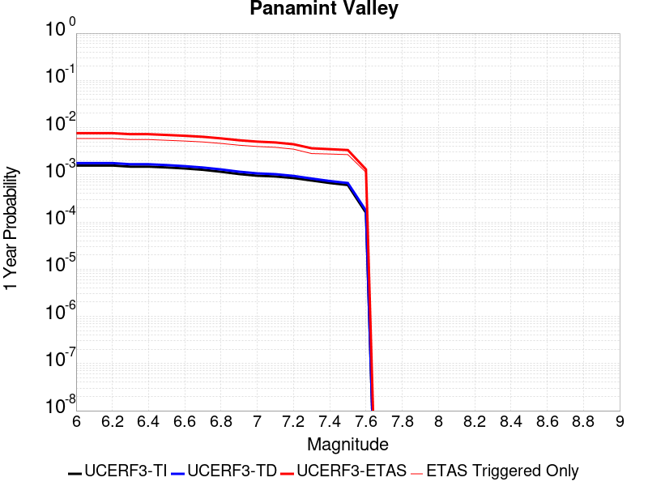 |  |

| Magnitude | 1 wk TI Prob | 1 wk TD Prob | 1 wk ETAS Prob | 1 wk ETAS/TD Gain | 1 wk ETAS Triggered Only | 1 mo TI Prob | 1 mo TD Prob | 1 mo ETAS Prob | 1 mo ETAS/TD Gain | 1 mo ETAS Triggered Only | 1 yr TI Prob | 1 yr TD Prob | 1 yr ETAS Prob | 1 yr ETAS/TD Gain | 1 yr ETAS Triggered Only | 10 yr TI Prob | 10 yr TD Prob | 10 yr ETAS Prob | 10 yr ETAS/TD Gain | 10 yr ETAS Triggered Only |
|-----|-----|-----|-----|-----|-----|-----|-----|-----|-----|-----|-----|-----|-----|-----|-----|-----|-----|-----|-----|-----|
| 6.0 | 3.0211835E-5 | 3.3988705E-5 | 3.90028E-4 | 11.475224 | 3.560514E-4 | 1.2947287E-4 | 1.456579E-4 | 0.0015103228 | 10.368972 | 0.0013648637 | 0.0015751923 | 0.001771972 | 0.007858547 | 4.4349165 | 0.00609738 | 0.015640736 | 0.017585287 | 0.03023603 | 1.7193936 | 0.012877192 |
| 6.1 | 3.0211835E-5 | 3.3988705E-5 | 3.90028E-4 | 11.475224 | 3.560514E-4 | 1.2947287E-4 | 1.456579E-4 | 0.0015103228 | 10.368972 | 0.0013648637 | 0.0015751923 | 0.001771972 | 0.007858547 | 4.4349165 | 0.00609738 | 0.015640736 | 0.017585287 | 0.03023603 | 1.7193936 | 0.012877192 |
| 6.2 | 3.0211835E-5 | 3.3988705E-5 | 3.90028E-4 | 11.475224 | 3.560514E-4 | 1.2947287E-4 | 1.456579E-4 | 0.0015103228 | 10.368972 | 0.0013648637 | 0.0015751923 | 0.001771972 | 0.007858547 | 4.4349165 | 0.00609738 | 0.015640736 | 0.017585287 | 0.03023603 | 1.7193936 | 0.012877192 |
| 6.3 | 2.8573924E-5 | 3.210665E-5 | 3.881466E-4 | 12.08929 | 3.560514E-4 | 1.2245393E-4 | 1.3759284E-4 | 0.0014726018 | 10.702605 | 0.0013351927 | 0.001489857 | 0.0016739334 | 0.007464894 | 4.459493 | 0.0058006705 | 0.01479908 | 0.016619839 | 0.028626513 | 1.7224302 | 0.012209595 |
| 6.4 | 2.8573924E-5 | 3.210665E-5 | 3.881466E-4 | 12.08929 | 3.560514E-4 | 1.2245393E-4 | 1.3759284E-4 | 0.0014726018 | 10.702605 | 0.0013351927 | 0.001489857 | 0.0016739334 | 0.007464894 | 4.459493 | 0.0058006705 | 0.01479908 | 0.016619839 | 0.028626513 | 1.7224302 | 0.012209595 |
| 6.5 | 2.7468774E-5 | 3.0832252E-5 | 3.8687268E-4 | 12.547661 | 3.560514E-4 | 1.1771801E-4 | 1.3213168E-4 | 0.001407814 | 10.654628 | 0.0012758508 | 0.0014322745 | 0.0016075436 | 0.007161903 | 4.4551845 | 0.005563303 | 0.014230782 | 0.015965639 | 0.027615335 | 1.729673 | 0.011838709 |
| 6.6 | 2.6135967E-5 | 2.925613E-5 | 3.852971E-4 | 13.16979 | 3.560514E-4 | 1.1200648E-4 | 1.2537754E-4 | 0.0013120667 | 10.464926 | 0.001186838 | 0.0013628257 | 0.0015254292 | 0.0068136146 | 4.4666867 | 0.0052962643 | 0.013544982 | 0.01515592 | 0.02631844 | 1.7365123 | 0.011334303 |
| 6.7 | 2.4498746E-5 | 2.7344862E-5 | 3.833865E-4 | 14.020422 | 3.560514E-4 | 1.04990395E-4 | 1.1718715E-4 | 0.0012593848 | 10.746783 | 0.0011423315 | 0.0012775084 | 0.0014258449 | 0.006418271 | 4.5013814 | 0.0049995547 | 0.012701893 | 0.01417309 | 0.02467399 | 1.7409041 | 0.010651871 |
| 6.8 | 2.2244329E-5 | 2.4938729E-5 | 3.5131103E-4 | 14.0869665 | 3.2638045E-4 | 9.532935E-5 | 1.0687601E-4 | 0.0012045838 | 11.270853 | 0.0010978251 | 0.0011600169 | 0.0013004605 | 0.0059527415 | 4.5774107 | 0.004658339 | 0.011539802 | 0.012934221 | 0.02264292 | 1.7506211 | 0.009835919 |
| 6.9 | 1.9902658E-5 | 2.229332E-5 | 3.4866648E-4 | 15.639955 | 3.2638045E-4 | 8.529431E-5 | 9.55394E-5 | 0.0011339234 | 11.868647 | 0.0010384832 | 0.0010379635 | 0.00116259 | 0.005459876 | 4.696304 | 0.0043022875 | 0.010331288 | 0.011570183 | 0.020309823 | 1.7553589 | 0.008841943 |
| 7.0 | 1.8353881E-5 | 2.0569065E-5 | 3.3210762E-4 | 16.145975 | 3.1154498E-4 | 7.865712E-5 | 8.815026E-5 | 0.0010672052 | 12.106661 | 9.791413E-4 | 9.5722964E-4 | 0.0010727186 | 0.0051184585 | 4.7714825 | 0.0040500844 | 0.009531168 | 0.0106803365 | 0.018738024 | 1.7544414 | 0.008144676 |
| 7.1 | 1.7667631E-5 | 1.9775405E-5 | 3.1647904E-4 | 16.00367 | 2.967095E-4 | 7.571623E-5 | 8.474908E-5 | 0.0010193047 | 12.027326 | 9.346349E-4 | 9.2145515E-4 | 0.0010313492 | 0.0048845946 | 4.7361207 | 0.0038572233 | 0.009176437 | 0.010270515 | 0.017979147 | 1.7505593 | 0.007788624 |
| 7.2 | 1.6381597E-5 | 1.816086E-5 | 3.1486497E-4 | 17.337559 | 2.967095E-4 | 7.020495E-5 | 7.7830024E-5 | 9.382206E-4 | 12.054738 | 8.6045754E-4 | 8.544101E-4 | 9.471859E-4 | 0.0045191487 | 4.7711315 | 0.0035753495 | 0.008511325 | 0.009436142 | 0.01637241 | 1.7350748 | 0.007002344 |
| 7.3 | 1.4520491E-5 | 1.5968588E-5 | 2.3849716E-4 | 14.935393 | 2.2253212E-4 | 6.222919E-5 | 6.84351E-5 | 7.9532363E-4 | 11.621573 | 7.2693825E-4 | 7.57377E-4 | 8.328951E-4 | 0.0036492876 | 4.381449 | 0.0028187402 | 0.0075480095 | 0.0083008455 | 0.013803256 | 1.6628735 | 0.0055484674 |
| 7.4 | 1.2852287E-5 | 1.4147312E-5 | 2.3667628E-4 | 16.729418 | 2.2253212E-4 | 5.5080065E-5 | 6.0630016E-5 | 7.875242E-4 | 12.989015 | 7.2693825E-4 | 6.7039346E-4 | 7.379363E-4 | 0.0034952983 | 4.7365856 | 0.0027593982 | 0.0066837464 | 0.007357781 | 0.012644529 | 1.7185248 | 0.0053259353 |
| 7.5 | 1.1637851E-5 | 1.2838557E-5 | 2.3536781E-4 | 18.332888 | 2.2253212E-4 | 4.987555E-5 | 5.5021315E-5 | 7.670849E-4 | 13.941595 | 7.121028E-4 | 6.070656E-4 | 6.696943E-4 | 0.0033234658 | 4.9626613 | 0.00265555 | 0.006054099 | 0.00667966 | 0.011793183 | 1.7655364 | 0.0051479097 |
| 7.6 | 3.0068115E-6 | 3.3337178E-6 | 9.234627E-5 | 27.700686 | 8.901285E-5 | 1.2886271E-5 | 1.4287325E-5 | 2.9615732E-4 | 20.728674 | 2.81874E-4 | 1.5687906E-4 | 1.7394157E-4 | 0.0012270771 | 7.0545354 | 0.0010533187 | 0.0015676835 | 0.0017394956 | 0.0038276587 | 2.2004418 | 0.002091802 |

## Garlock (East)
*[(top)](#table-of-contents)*

| 1 Week | 1 Month | 1 Year | 10 Year |
|-----|-----|-----|-----|
|  |  |  |  |

| Magnitude | 1 wk TI Prob | 1 wk TD Prob | 1 wk ETAS Prob | 1 wk ETAS/TD Gain | 1 wk ETAS Triggered Only | 1 mo TI Prob | 1 mo TD Prob | 1 mo ETAS Prob | 1 mo ETAS/TD Gain | 1 mo ETAS Triggered Only | 1 yr TI Prob | 1 yr TD Prob | 1 yr ETAS Prob | 1 yr ETAS/TD Gain | 1 yr ETAS Triggered Only | 10 yr TI Prob | 10 yr TD Prob | 10 yr ETAS Prob | 10 yr ETAS/TD Gain | 10 yr ETAS Triggered Only |
|-----|-----|-----|-----|-----|-----|-----|-----|-----|-----|-----|-----|-----|-----|-----|-----|-----|-----|-----|-----|-----|
| 6.0 | 4.5092507E-5 | 6.292097E-5 | 3.299427E-4 | 5.243764 | 2.6703853E-4 | 1.9323928E-4 | 2.6963596E-4 | 0.0013819966 | 5.1254168 | 0.0011126606 | 0.0023501497 | 0.0032783218 | 0.007877029 | 2.4027627 | 0.0046138326 | 0.023254504 | 0.032360826 | 0.042079423 | 1.3003198 | 0.010043616 |
| 6.1 | 4.5092507E-5 | 6.292097E-5 | 3.299427E-4 | 5.243764 | 2.6703853E-4 | 1.9323928E-4 | 2.6963596E-4 | 0.0013819966 | 5.1254168 | 0.0011126606 | 0.0023501497 | 0.0032783218 | 0.007877029 | 2.4027627 | 0.0046138326 | 0.023254504 | 0.032360826 | 0.042079423 | 1.3003198 | 0.010043616 |
| 6.2 | 2.6674514E-5 | 3.4523717E-5 | 2.7188312E-4 | 7.875256 | 2.373676E-4 | 1.1431433E-4 | 1.4795057E-4 | 0.0010379474 | 7.0155005 | 8.901285E-4 | 0.0013908884 | 0.0017998432 | 0.00522067 | 2.9006248 | 0.0034269947 | 0.01382215 | 0.01789747 | 0.02486191 | 1.3891299 | 0.007091357 |
| 6.3 | 2.6674514E-5 | 3.4523717E-5 | 2.7188312E-4 | 7.875256 | 2.373676E-4 | 1.1431433E-4 | 1.4795057E-4 | 0.0010379474 | 7.0155005 | 8.901285E-4 | 0.0013908884 | 0.0017998432 | 0.00522067 | 2.9006248 | 0.0034269947 | 0.01382215 | 0.01789747 | 0.02486191 | 1.3891299 | 0.007091357 |
| 6.4 | 2.5312667E-5 | 3.235266E-5 | 2.5487758E-4 | 7.8781033 | 2.2253212E-4 | 1.0847834E-4 | 1.3864704E-4 | 9.989853E-4 | 7.2052402 | 8.6045754E-4 | 0.0013199237 | 0.0016867501 | 0.0050487225 | 2.9931655 | 0.0033676527 | 0.013121112 | 0.016785357 | 0.023611818 | 1.4066914 | 0.006943002 |
| 6.5 | 2.5312667E-5 | 3.235266E-5 | 2.5487758E-4 | 7.8781033 | 2.2253212E-4 | 1.0847834E-4 | 1.3864704E-4 | 9.989853E-4 | 7.2052402 | 8.6045754E-4 | 0.0013199237 | 0.0016867501 | 0.0050487225 | 2.9931655 | 0.0033676527 | 0.013121112 | 0.016785357 | 0.023611818 | 1.4066914 | 0.006943002 |
| 6.6 | 2.246556E-5 | 2.8146991E-5 | 2.5067283E-4 | 8.905849 | 2.2253212E-4 | 9.627742E-5 | 1.20624514E-4 | 9.5131085E-4 | 7.8865466 | 8.307866E-4 | 0.0011715472 | 0.0014676376 | 0.004608142 | 3.1398365 | 0.0031451206 | 0.011653901 | 0.0146254385 | 0.021072198 | 1.4407908 | 0.006542444 |
| 6.7 | 2.2241198E-5 | 2.7816695E-5 | 2.5034262E-4 | 8.999725 | 2.2253212E-4 | 9.531594E-5 | 1.1920909E-4 | 9.4989664E-4 | 7.9683237 | 8.307866E-4 | 0.0011598538 | 0.0014504279 | 0.0045909868 | 3.1652637 | 0.0031451206 | 0.011538187 | 0.014455613 | 0.020903483 | 1.4460461 | 0.006542444 |
| 6.8 | 1.9528685E-5 | 2.3910501E-5 | 2.3160219E-4 | 9.686212 | 2.0769665E-4 | 8.369167E-5 | 1.0246966E-4 | 9.035032E-4 | 8.817275 | 8.0111565E-4 | 0.0010184698 | 0.0012468738 | 0.004343622 | 3.48361 | 0.0031006143 | 0.010138147 | 0.012442763 | 0.018625434 | 1.496889 | 0.00626057 |
| 6.9 | 1.3318621E-5 | 1.5209498E-5 | 2.0806774E-4 | 13.680119 | 1.9286117E-4 | 5.7078556E-5 | 6.5181965E-5 | 7.9207285E-4 | 12.151717 | 7.2693825E-4 | 6.9470983E-4 | 7.933072E-4 | 0.003624635 | 4.569018 | 0.0028335757 | 0.0069254204 | 0.007945379 | 0.013552785 | 1.7057443 | 0.005652316 |
| 7.0 | 1.1760853E-5 | 1.3118037E-5 | 2.0597667E-4 | 15.701792 | 1.9286117E-4 | 5.0402683E-5 | 5.6218974E-5 | 7.831164E-4 | 13.929751 | 7.2693825E-4 | 6.134799E-4 | 6.842561E-4 | 0.0034417661 | 5.0299387 | 0.0027593982 | 0.0061178906 | 0.0068618287 | 0.012342757 | 1.7987561 | 0.0055187964 |
| 7.1 | 1.0064758E-5 | 1.0912828E-5 | 2.037719E-4 | 18.672693 | 1.9286117E-4 | 4.3133965E-5 | 4.6768444E-5 | 7.736727E-4 | 16.542622 | 7.2693825E-4 | 5.2502943E-4 | 5.6926056E-4 | 0.0032529528 | 5.714348 | 0.002685221 | 0.005237907 | 0.005718132 | 0.01095461 | 1.9157673 | 0.0052665933 |
| 7.2 | 9.768808E-6 | 1.0508636E-5 | 2.0336777E-4 | 19.352444 | 1.9286117E-4 | 4.186565E-5 | 4.5036253E-5 | 7.57107E-4 | 16.811056 | 7.121028E-4 | 5.095951E-4 | 5.4818194E-4 | 0.0031577942 | 5.7604856 | 0.0026110436 | 0.0050842804 | 0.0055083632 | 0.010613163 | 1.9267361 | 0.0051330742 |
| 7.3 | 9.344516E-6 | 9.954109E-6 | 1.731427E-4 | 17.394093 | 1.6319023E-4 | 4.004731E-5 | 4.265979E-5 | 7.250625E-4 | 16.996391 | 6.8243186E-4 | 4.8746695E-4 | 5.192627E-4 | 0.002965845 | 5.7116466 | 0.0024478533 | 0.0048639905 | 0.005219948 | 0.009972035 | 1.9103706 | 0.0047770226 |
| 7.4 | 9.023491E-6 | 9.500109E-6 | 1.5785344E-4 | 16.615961 | 1.4835475E-4 | 3.867153E-5 | 4.0714134E-5 | 6.489438E-4 | 15.93903 | 6.0825446E-4 | 4.7072413E-4 | 4.955852E-4 | 0.0027198035 | 5.4880643 | 0.0022253213 | 0.004697283 | 0.0049833017 | 0.009278911 | 1.8620007 | 0.004317123 |
| 7.5 | 7.081253E-6 | 7.0960764E-6 | 8.127292E-5 | 11.45322 | 7.417738E-5 | 3.0347876E-5 | 3.0411406E-5 | 3.7161694E-4 | 12.219657 | 3.4121593E-4 | 3.6942272E-4 | 3.7019668E-4 | 0.0015121053 | 4.0846 | 0.0011423315 | 0.003688092 | 0.003728684 | 0.0058126864 | 1.558911 | 0.002091802 |
| 7.6 | 6.116396E-6 | 5.9672325E-6 | 5.047339E-5 | 8.4584255 | 4.4506425E-5 | 2.6212863E-5 | 2.5573605E-5 | 2.926053E-4 | 11.441692 | 2.6703853E-4 | 3.1909486E-4 | 3.1131442E-4 | 0.0010973498 | 3.5248923 | 7.8628014E-4 | 0.0031863707 | 0.003139911 | 0.004530067 | 1.4427373 | 0.0013945346 |
| 7.7 | 4.797145E-6 | 4.764839E-6 | 4.764839E-6 | 1.0 | 0.0 | 2.055903E-5 | 2.042058E-5 | 1.687723E-4 | 8.264814 | 1.4835475E-4 | 2.5027743E-4 | 2.4859232E-4 | 5.7489163E-4 | 2.312588 | 3.2638045E-4 | 0.0024999576 | 0.002513282 | 0.003149604 | 1.2531837 | 6.379254E-4 |
| 7.8 | 3.4028885E-6 | 3.985202E-6 | 3.985202E-6 | 1.0 | 0.0 | 1.4583726E-5 | 1.7079326E-5 | 1.0609065E-4 | 6.2116413 | 8.901285E-5 | 1.775424E-4 | 2.0792104E-4 | 3.8590972E-4 | 1.8560398 | 1.780257E-4 | 0.0017740062 | 0.0021047313 | 0.0024600334 | 1.1688111 | 3.560514E-4 |
| 7.9 | 2.5928412E-6 | 3.3781462E-6 | 3.3781462E-6 | 1.0 | 0.0 | 1.1112129E-5 | 1.447769E-5 | 8.8653986E-5 | 6.1234903 | 7.417738E-5 | 1.3528178E-4 | 1.7625168E-4 | 3.2458027E-4 | 1.8415726 | 1.4835475E-4 | 0.0013519945 | 0.0017842046 | 0.0020951936 | 1.1743013 | 3.1154498E-4 |
| 8.0 | 1.3743648E-6 | 1.6760575E-6 | 1.6760575E-6 | 1.0 | 0.0 | 5.8901214E-6 | 7.183084E-6 | 5.168919E-5 | 7.19596 | 4.4506425E-5 | 7.1709874E-5 | 8.745057E-5 | 1.6162146E-4 | 1.8481464 | 7.417738E-5 | 7.1686733E-4 | 8.850678E-4 | 9.888242E-4 | 1.1172299 | 1.03848324E-4 |
| 8.1 | 3.6733252E-7 | 3.1536092E-7 | 3.1536092E-7 | 1.0 | 0.0 | 1.5742813E-6 | 1.3515462E-6 | 1.6187001E-5 | 11.976654 | 1.4835475E-5 | 1.9166706E-5 | 1.6454967E-5 | 3.1290198E-5 | 1.9015656 | 1.4835475E-5 | 1.9165053E-4 | 1.6662935E-4 | 1.9629535E-4 | 1.1780359 | 2.967095E-5 |

## Ash Hill
*[(top)](#table-of-contents)*

| 1 Week | 1 Month | 1 Year | 10 Year |
|-----|-----|-----|-----|
|  |  |  |  |

| Magnitude | 1 wk TI Prob | 1 wk TD Prob | 1 wk ETAS Prob | 1 wk ETAS/TD Gain | 1 wk ETAS Triggered Only | 1 mo TI Prob | 1 mo TD Prob | 1 mo ETAS Prob | 1 mo ETAS/TD Gain | 1 mo ETAS Triggered Only | 1 yr TI Prob | 1 yr TD Prob | 1 yr ETAS Prob | 1 yr ETAS/TD Gain | 1 yr ETAS Triggered Only | 10 yr TI Prob | 10 yr TD Prob | 10 yr ETAS Prob | 10 yr ETAS/TD Gain | 10 yr ETAS Triggered Only |
|-----|-----|-----|-----|-----|-----|-----|-----|-----|-----|-----|-----|-----|-----|-----|-----|-----|-----|-----|-----|-----|
| 6.0 | 2.1545662E-5 | 2.3195624E-5 | 2.3088745E-4 | 9.953922 | 2.0769665E-4 | 9.2335285E-5 | 9.940648E-5 | 8.4110646E-4 | 8.461284 | 7.4177375E-4 | 0.0011236023 | 0.001209682 | 0.004262093 | 3.5233169 | 0.0030561078 | 0.011179381 | 0.012038956 | 0.018282784 | 1.5186353 | 0.006319912 |
| 6.1 | 2.1545662E-5 | 2.3195624E-5 | 2.3088745E-4 | 9.953922 | 2.0769665E-4 | 9.2335285E-5 | 9.940648E-5 | 8.4110646E-4 | 8.461284 | 7.4177375E-4 | 0.0011236023 | 0.001209682 | 0.004262093 | 3.5233169 | 0.0030561078 | 0.011179381 | 0.012038956 | 0.018282784 | 1.5186353 | 0.006319912 |
| 6.2 | 2.1545662E-5 | 2.3195624E-5 | 2.3088745E-4 | 9.953922 | 2.0769665E-4 | 9.2335285E-5 | 9.940648E-5 | 8.4110646E-4 | 8.461284 | 7.4177375E-4 | 0.0011236023 | 0.001209682 | 0.004262093 | 3.5233169 | 0.0030561078 | 0.011179381 | 0.012038956 | 0.018282784 | 1.5186353 | 0.006319912 |
| 6.3 | 1.0025529E-5 | 1.0747447E-5 | 7.008871E-5 | 6.5214286 | 5.93419E-5 | 4.2965847E-5 | 4.6059748E-5 | 2.2407724E-4 | 4.8649254 | 1.780257E-4 | 5.229836E-4 | 5.606464E-4 | 0.0017171646 | 3.0628302 | 0.001157167 | 0.005217545 | 0.005593633 | 0.008072051 | 1.4430785 | 0.0024923598 |
| 6.4 | 1.0025529E-5 | 1.0747447E-5 | 7.008871E-5 | 6.5214286 | 5.93419E-5 | 4.2965847E-5 | 4.6059748E-5 | 2.2407724E-4 | 4.8649254 | 1.780257E-4 | 5.229836E-4 | 5.606464E-4 | 0.0017171646 | 3.0628302 | 0.001157167 | 0.005217545 | 0.005593633 | 0.008072051 | 1.4430785 | 0.0024923598 |
| 6.5 | 6.9617327E-6 | 7.4569857E-6 | 5.1963078E-5 | 6.9683757 | 4.4506425E-5 | 2.9835655E-5 | 3.1958167E-5 | 1.5063817E-4 | 4.713605 | 1.186838E-4 | 3.6318856E-4 | 3.8902988E-4 | 0.0011898339 | 3.0584638 | 8.0111565E-4 | 0.0036259557 | 0.0038843432 | 0.0054951287 | 1.4146867 | 0.0016170667 |
| 6.6 | 4.9919777E-6 | 5.3469403E-6 | 4.9853126E-5 | 9.323674 | 4.4506425E-5 | 2.1394015E-5 | 2.2915294E-5 | 1.119261E-4 | 4.884341 | 8.901285E-5 | 2.60441E-4 | 2.789647E-4 | 8.722181E-4 | 3.1266255 | 5.93419E-4 | 0.0026013597 | 0.0027868038 | 0.0038815695 | 1.3928392 | 0.0010978251 |
| 6.7 | 3.6630722E-6 | 3.9248093E-6 | 3.3595643E-5 | 8.559814 | 2.967095E-5 | 1.5698786E-5 | 1.6820537E-5 | 9.099666E-5 | 5.409855 | 7.417738E-5 | 1.9111596E-4 | 2.0477652E-4 | 6.6458207E-4 | 3.2454016 | 4.5989972E-4 | 0.0019095168 | 0.0020464414 | 0.0028755278 | 1.4051356 | 8.307866E-4 |
| 6.8 | 2.5599613E-6 | 2.7450567E-6 | 1.758049E-5 | 6.404418 | 1.4835475E-5 | 1.0971216E-5 | 1.1764503E-5 | 7.11057E-5 | 6.044089 | 5.93419E-5 | 1.3356637E-4 | 1.4322836E-4 | 5.733955E-4 | 4.0033655 | 4.3022877E-4 | 0.0013348613 | 0.0014318455 | 0.0020836717 | 1.455235 | 6.527609E-4 |
| 6.9 | 1.7684905E-6 | 1.8969621E-6 | 1.8969621E-6 | 1.0 | 0.0 | 7.579223E-6 | 8.129838E-6 | 3.7800546E-5 | 4.6496067 | 2.967095E-5 | 9.2273134E-5 | 9.898077E-5 | 4.104949E-4 | 4.1472187 | 3.1154498E-4 | 9.223483E-4 | 9.898077E-4 | 0.0014492522 | 1.4641755 | 4.5989972E-4 |

## Hunter Mountain-Saline Valley
*[(top)](#table-of-contents)*

| 1 Week | 1 Month | 1 Year | 10 Year |
|-----|-----|-----|-----|
|  |  | 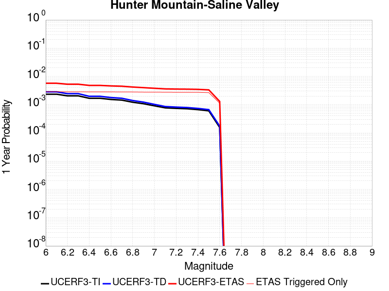 |  |

| Magnitude | 1 wk TI Prob | 1 wk TD Prob | 1 wk ETAS Prob | 1 wk ETAS/TD Gain | 1 wk ETAS Triggered Only | 1 mo TI Prob | 1 mo TD Prob | 1 mo ETAS Prob | 1 mo ETAS/TD Gain | 1 mo ETAS Triggered Only | 1 yr TI Prob | 1 yr TD Prob | 1 yr ETAS Prob | 1 yr ETAS/TD Gain | 1 yr ETAS Triggered Only | 10 yr TI Prob | 10 yr TD Prob | 10 yr ETAS Prob | 10 yr ETAS/TD Gain | 10 yr ETAS Triggered Only |
|-----|-----|-----|-----|-----|-----|-----|-----|-----|-----|-----|-----|-----|-----|-----|-----|-----|-----|-----|-----|-----|
| 6.0 | 4.5103672E-5 | 5.457696E-5 | 2.7709693E-4 | 5.0771775 | 2.2253212E-4 | 1.9328714E-4 | 2.3388151E-4 | 9.7548176E-4 | 4.1708374 | 7.4177375E-4 | 0.002350731 | 0.0028439506 | 0.005728641 | 2.014325 | 0.0028929175 | 0.023260195 | 0.028096225 | 0.033589732 | 1.1955247 | 0.005652316 |
| 6.1 | 4.5103672E-5 | 5.457696E-5 | 2.7709693E-4 | 5.0771775 | 2.2253212E-4 | 1.9328714E-4 | 2.3388151E-4 | 9.7548176E-4 | 4.1708374 | 7.4177375E-4 | 0.002350731 | 0.0028439506 | 0.005728641 | 2.014325 | 0.0028929175 | 0.023260195 | 0.028096225 | 0.033589732 | 1.1955247 | 0.005652316 |
| 6.2 | 3.9363465E-5 | 4.706861E-5 | 2.6959027E-4 | 5.7276015 | 2.2253212E-4 | 1.6868966E-4 | 2.017079E-4 | 9.43332E-4 | 4.676723 | 7.4177375E-4 | 0.002051862 | 0.0024531833 | 0.0053094057 | 2.1642923 | 0.0028632465 | 0.020330196 | 0.024277098 | 0.029748766 | 1.225384 | 0.0056078094 |
| 6.3 | 3.9363465E-5 | 4.706861E-5 | 2.6959027E-4 | 5.7276015 | 2.2253212E-4 | 1.6868966E-4 | 2.017079E-4 | 9.43332E-4 | 4.676723 | 7.4177375E-4 | 0.002051862 | 0.0024531833 | 0.0053094057 | 2.1642923 | 0.0028632465 | 0.020330196 | 0.024277098 | 0.029748766 | 1.225384 | 0.0056078094 |
| 6.4 | 3.2311684E-5 | 3.7956415E-5 | 2.604801E-4 | 6.8626103 | 2.2253212E-4 | 1.384713E-4 | 1.6266061E-4 | 9.043137E-4 | 5.559512 | 7.4177375E-4 | 0.0016845843 | 0.001978667 | 0.004821442 | 2.4367123 | 0.0028484112 | 0.016718714 | 0.019619243 | 0.025087941 | 1.2787416 | 0.0055781384 |
| 6.5 | 3.2311684E-5 | 3.7956415E-5 | 2.604801E-4 | 6.8626103 | 2.2253212E-4 | 1.384713E-4 | 1.6266061E-4 | 9.043137E-4 | 5.559512 | 7.4177375E-4 | 0.0016845843 | 0.001978667 | 0.004821442 | 2.4367123 | 0.0028484112 | 0.016718714 | 0.019619243 | 0.025087941 | 1.2787416 | 0.0055781384 |
| 6.6 | 2.9305844E-5 | 3.4186618E-5 | 2.5671112E-4 | 7.509112 | 2.2253212E-4 | 1.2559042E-4 | 1.4650621E-4 | 8.8817126E-4 | 6.062346 | 7.4177375E-4 | 0.0015279909 | 0.0017823164 | 0.0046256506 | 2.5953028 | 0.0028484112 | 0.015175272 | 0.017688144 | 0.023167616 | 1.3097821 | 0.0055781384 |
| 6.7 | 2.7826512E-5 | 3.2348766E-5 | 2.5487368E-4 | 7.878931 | 2.2253212E-4 | 1.19251024E-4 | 1.3863054E-4 | 8.803014E-4 | 6.3499823 | 7.4177375E-4 | 0.0014509142 | 0.0016865804 | 0.0045005665 | 2.6684566 | 0.0028187402 | 0.014414776 | 0.016745493 | 0.022186462 | 1.3249214 | 0.005533632 |
| 6.8 | 2.3389874E-5 | 2.687035E-5 | 2.493965E-4 | 9.281475 | 2.2253212E-4 | 1.0023846E-4 | 1.1515383E-4 | 8.5684215E-4 | 7.440848 | 7.4177375E-4 | 0.00121972 | 0.0014011435 | 0.0042159343 | 3.008924 | 0.0028187402 | 0.01213047 | 0.013929307 | 0.01938586 | 1.3917317 | 0.005533632 |
| 6.9 | 2.069209E-5 | 2.3573182E-5 | 2.4610007E-4 | 10.439832 | 2.2253212E-4 | 8.867737E-5 | 1.0102421E-4 | 8.42723E-4 | 8.341792 | 7.4177375E-4 | 0.0010791123 | 0.001229312 | 0.004000135 | 3.2539628 | 0.0027742337 | 0.010738871 | 0.0122301495 | 0.017622834 | 1.4409337 | 0.005459455 |
| 7.0 | 1.7462342E-5 | 1.9636125E-5 | 2.4216388E-4 | 12.332569 | 2.2253212E-4 | 7.483646E-5 | 8.4152234E-5 | 8.2586356E-4 | 9.813923 | 7.4177375E-4 | 9.1075303E-4 | 0.0010240945 | 0.003795487 | 3.7061884 | 0.0027742337 | 0.009070295 | 0.010197386 | 0.015571801 | 1.5270383 | 0.005429784 |
| 7.1 | 1.4807709E-5 | 1.64439E-5 | 2.3897237E-4 | 14.532584 | 2.2253212E-4 | 6.3460066E-5 | 7.0472044E-5 | 7.973591E-4 | 11.314544 | 7.2693825E-4 | 7.723524E-4 | 8.576759E-4 | 0.0036147076 | 4.2145376 | 0.0027593982 | 0.007696735 | 0.008546646 | 0.01385648 | 1.6212769 | 0.0053556063 |
| 7.2 | 1.4180048E-5 | 1.5700396E-5 | 2.3822903E-4 | 15.17344 | 2.2253212E-4 | 6.077022E-5 | 6.728577E-5 | 7.9417514E-4 | 11.803018 | 7.2693825E-4 | 7.396263E-4 | 8.189126E-4 | 0.0035612278 | 4.3487277 | 0.0027445627 | 0.0073716943 | 0.0081619015 | 0.013444367 | 1.6472102 | 0.0053259353 |
| 7.3 | 1.3730402E-5 | 1.5174075E-5 | 2.3770281E-4 | 15.665061 | 2.2253212E-4 | 5.8843252E-5 | 6.5030225E-5 | 7.919212E-4 | 12.177741 | 7.2693825E-4 | 7.161811E-4 | 7.9147145E-4 | 0.003533862 | 4.4649267 | 0.0027445627 | 0.007138774 | 0.00788946 | 0.013173376 | 1.6697438 | 0.0053259353 |
| 7.4 | 1.2810095E-5 | 1.4111166E-5 | 2.3664015E-4 | 16.769709 | 2.2253212E-4 | 5.489925E-5 | 6.0475115E-5 | 7.873694E-4 | 13.019726 | 7.2693825E-4 | 6.681934E-4 | 7.360516E-4 | 0.0034785944 | 4.7260194 | 0.0027445627 | 0.006661878 | 0.0073390333 | 0.012596428 | 1.7163607 | 0.0052962643 |
| 7.5 | 1.1595659E-5 | 1.2802411E-5 | 2.3533168E-4 | 18.381824 | 2.2253212E-4 | 4.9694736E-5 | 5.486641E-5 | 7.669301E-4 | 13.978135 | 7.121028E-4 | 6.0486543E-4 | 6.678095E-4 | 0.0033067605 | 4.9516525 | 0.0026407144 | 0.006032217 | 0.0066608996 | 0.011745047 | 1.7632823 | 0.0051182387 |
| 7.6 | 2.997694E-6 | 3.3258418E-6 | 9.233839E-5 | 27.763916 | 8.901285E-5 | 1.28471975E-5 | 1.4253571E-5 | 2.9612356E-4 | 20.775394 | 2.81874E-4 | 1.564034E-4 | 1.7353069E-4 | 0.0012266666 | 7.068874 | 0.0010533187 | 0.0015629337 | 0.001735389 | 0.003823561 | 2.2032874 | 0.002091802 |

## Blackwater
*[(top)](#table-of-contents)*

| 1 Week | 1 Month | 1 Year | 10 Year |
|-----|-----|-----|-----|
| 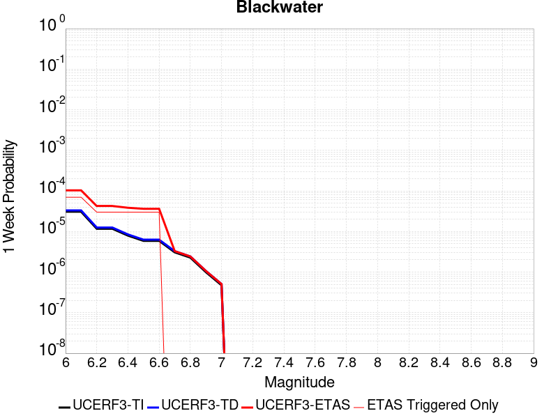 |  |  |  |

| Magnitude | 1 wk TI Prob | 1 wk TD Prob | 1 wk ETAS Prob | 1 wk ETAS/TD Gain | 1 wk ETAS Triggered Only | 1 mo TI Prob | 1 mo TD Prob | 1 mo ETAS Prob | 1 mo ETAS/TD Gain | 1 mo ETAS Triggered Only | 1 yr TI Prob | 1 yr TD Prob | 1 yr ETAS Prob | 1 yr ETAS/TD Gain | 1 yr ETAS Triggered Only | 10 yr TI Prob | 10 yr TD Prob | 10 yr ETAS Prob | 10 yr ETAS/TD Gain | 10 yr ETAS Triggered Only |
|-----|-----|-----|-----|-----|-----|-----|-----|-----|-----|-----|-----|-----|-----|-----|-----|-----|-----|-----|-----|-----|
| 6.0 | 3.0708583E-5 | 3.3097556E-5 | 9.243749E-5 | 2.7928796 | 5.93419E-5 | 1.3160157E-4 | 1.4183973E-4 | 5.2750733E-4 | 3.719038 | 3.8572235E-4 | 0.0016010714 | 0.0017256675 | 0.0037250004 | 2.1585853 | 0.0020027892 | 0.015895851 | 0.01713651 | 0.021612953 | 1.2612225 | 0.0045544906 |
| 6.1 | 3.0708583E-5 | 3.3097556E-5 | 9.243749E-5 | 2.7928796 | 5.93419E-5 | 1.3160157E-4 | 1.4183973E-4 | 5.2750733E-4 | 3.719038 | 3.8572235E-4 | 0.0016010714 | 0.0017256675 | 0.0037250004 | 2.1585853 | 0.0020027892 | 0.015895851 | 0.01713651 | 0.021612953 | 1.2612225 | 0.0045544906 |
| 6.2 | 1.1707779E-5 | 1.2545717E-5 | 4.2216296E-5 | 3.3649964 | 2.967095E-5 | 5.017523E-5 | 5.3766307E-5 | 1.872784E-4 | 3.4831924 | 1.3351926E-4 | 6.107122E-4 | 6.544178E-4 | 0.0014253577 | 2.1780546 | 7.714447E-4 | 0.006090366 | 0.0065258783 | 0.008397688 | 1.2868288 | 0.0018841053 |
| 6.3 | 1.1707779E-5 | 1.2545717E-5 | 4.2216296E-5 | 3.3649964 | 2.967095E-5 | 5.017523E-5 | 5.3766307E-5 | 1.872784E-4 | 3.4831924 | 1.3351926E-4 | 6.107122E-4 | 6.544178E-4 | 0.0014253577 | 2.1780546 | 7.714447E-4 | 0.006090366 | 0.0065258783 | 0.008397688 | 1.2868288 | 0.0018841053 |
| 6.4 | 7.929244E-6 | 8.480489E-6 | 3.8151185E-5 | 4.4987016 | 2.967095E-5 | 3.3982033E-5 | 3.6344467E-5 | 1.6985889E-4 | 4.673583 | 1.3351926E-4 | 4.136527E-4 | 4.424081E-4 | 0.0010503934 | 2.3742635 | 6.0825446E-4 | 0.0041288356 | 0.0044156793 | 0.0056711263 | 1.2843157 | 0.0012610153 |
| 6.5 | 5.8832115E-6 | 6.2862764E-6 | 3.595704E-5 | 5.7199264 | 2.967095E-5 | 2.521352E-5 | 2.6940921E-5 | 1.3078644E-4 | 4.8545647 | 1.03848324E-4 | 3.0693135E-4 | 3.2795887E-4 | 8.470302E-4 | 2.582733 | 5.192416E-4 | 0.0030650778 | 0.0032750024 | 0.0042509367 | 1.2979951 | 9.791413E-4 |
| 6.6 | 5.8832115E-6 | 6.2862764E-6 | 3.595704E-5 | 5.7199264 | 2.967095E-5 | 2.521352E-5 | 2.6940921E-5 | 1.3078644E-4 | 4.8545647 | 1.03848324E-4 | 3.0693135E-4 | 3.2795887E-4 | 8.470302E-4 | 2.582733 | 5.192416E-4 | 0.0030650778 | 0.0032750024 | 0.0042509367 | 1.2979951 | 9.791413E-4 |
| 6.7 | 3.0715053E-6 | 3.281615E-6 | 3.281615E-6 | 1.0 | 0.0 | 1.3163528E-5 | 1.4063995E-5 | 5.8569793E-5 | 4.1645203 | 4.4506425E-5 | 1.6025416E-4 | 1.7121685E-4 | 3.64045E-4 | 2.126222 | 1.9286117E-4 | 0.0016013865 | 0.0017109639 | 0.002051596 | 1.1990879 | 3.4121593E-4 |
| 6.8 | 2.2722281E-6 | 2.4288647E-6 | 2.4288647E-6 | 1.0 | 0.0 | 9.738084E-6 | 1.0409383E-5 | 5.4915345E-5 | 5.275562 | 4.4506425E-5 | 1.1855473E-4 | 1.2672778E-4 | 3.0473093E-4 | 2.4046102 | 1.780257E-4 | 0.001184915 | 0.0012666454 | 0.0015333457 | 1.2105564 | 2.6703853E-4 |
| 6.9 | 9.952399E-7 | 1.0653986E-6 | 1.0653986E-6 | 1.0 | 0.0 | 4.265307E-6 | 4.565989E-6 | 1.9401396E-5 | 4.249111 | 1.4835475E-5 | 5.1928873E-5 | 5.5590015E-5 | 1.5943256E-4 | 2.8680072 | 1.03848324E-4 | 5.191674E-4 | 5.558117E-4 | 6.8925676E-4 | 1.2400904 | 1.3351926E-4 |
| 7.0 | 4.7385504E-7 | 5.075799E-7 | 5.075799E-7 | 1.0 | 0.0 | 2.0308057E-6 | 2.1753424E-6 | 2.1753424E-6 | 1.0 | 0.0 | 2.4724779E-5 | 2.6484793E-5 | 7.099004E-5 | 2.6804075 | 4.4506425E-5 | 2.4722028E-4 | 2.6484794E-4 | 3.2417412E-4 | 1.2240009 | 5.93419E-5 |

## Garlock (West)
*[(top)](#table-of-contents)*

| 1 Week | 1 Month | 1 Year | 10 Year |
|-----|-----|-----|-----|
|  |  | 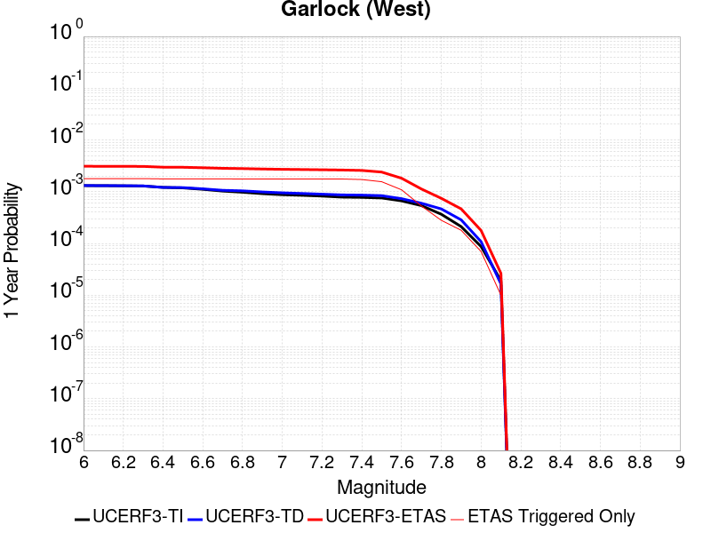 |  |

| Magnitude | 1 wk TI Prob | 1 wk TD Prob | 1 wk ETAS Prob | 1 wk ETAS/TD Gain | 1 wk ETAS Triggered Only | 1 mo TI Prob | 1 mo TD Prob | 1 mo ETAS Prob | 1 mo ETAS/TD Gain | 1 mo ETAS Triggered Only | 1 yr TI Prob | 1 yr TD Prob | 1 yr ETAS Prob | 1 yr ETAS/TD Gain | 1 yr ETAS Triggered Only | 10 yr TI Prob | 10 yr TD Prob | 10 yr ETAS Prob | 10 yr ETAS/TD Gain | 10 yr ETAS Triggered Only |
|-----|-----|-----|-----|-----|-----|-----|-----|-----|-----|-----|-----|-----|-----|-----|-----|-----|-----|-----|-----|-----|
| 6.0 | 2.5181727E-5 | 2.522157E-5 | 1.4390238E-4 | 5.705528 | 1.186838E-4 | 1.0791722E-4 | 1.0808798E-4 | 6.2727346E-4 | 5.80336 | 5.192416E-4 | 0.0013131002 | 0.0013151802 | 0.0030930957 | 2.3518417 | 0.001780257 | 0.013053683 | 0.013154429 | 0.016609546 | 1.262658 | 0.003501172 |
| 6.1 | 2.5077732E-5 | 2.5122632E-5 | 1.4380345E-4 | 5.7240596 | 1.186838E-4 | 1.0747157E-4 | 1.07664E-4 | 6.268497E-4 | 5.8222775 | 5.192416E-4 | 0.001307681 | 0.0013100244 | 0.0030879492 | 2.3571692 | 0.001780257 | 0.013000126 | 0.01310348 | 0.016558776 | 1.2636929 | 0.003501172 |
| 6.2 | 2.494612E-5 | 2.5004292E-5 | 1.4368512E-4 | 5.746418 | 1.186838E-4 | 1.0690756E-4 | 1.0715687E-4 | 6.2634284E-4 | 5.845102 | 5.192416E-4 | 0.0013008224 | 0.0013038575 | 0.0030817932 | 2.3635967 | 0.001780257 | 0.012932341 | 0.013042537 | 0.016498044 | 1.2649413 | 0.003501172 |
| 6.3 | 2.4733758E-5 | 2.4823634E-5 | 1.4350448E-4 | 5.780962 | 1.186838E-4 | 1.0599751E-4 | 1.0638268E-4 | 6.255691E-4 | 5.8803654 | 5.192416E-4 | 0.0012897556 | 0.001294443 | 0.0030723955 | 2.373527 | 0.001780257 | 0.012822957 | 0.012949493 | 0.016405327 | 1.2668701 | 0.003501172 |
| 6.4 | 2.3237335E-5 | 2.320277E-5 | 1.4188381E-4 | 6.114951 | 1.186838E-4 | 9.958477E-5 | 9.943667E-5 | 6.1862665E-4 | 6.221313 | 5.192416E-4 | 0.0012117702 | 0.001209972 | 0.0029732573 | 2.4572945 | 0.0017654215 | 0.012051838 | 0.012114263 | 0.015514398 | 1.2806721 | 0.0034418302 |
| 6.5 | 2.2732203E-5 | 2.3017217E-5 | 1.4169829E-4 | 6.1561866 | 1.186838E-4 | 9.742009E-5 | 9.86415E-5 | 6.178319E-4 | 6.263407 | 5.192416E-4 | 0.0011854442 | 0.0012003015 | 0.002963604 | 2.4690497 | 0.0017654215 | 0.011791403 | 0.012018609 | 0.0154190725 | 1.2829332 | 0.0034418302 |
| 6.6 | 2.1319436E-5 | 2.1797214E-5 | 1.4047843E-4 | 6.4447885 | 1.186838E-4 | 9.136581E-5 | 9.34133E-5 | 6.126064E-4 | 6.5580215 | 5.192416E-4 | 0.001111811 | 0.0011367159 | 0.0029001306 | 2.5513241 | 0.0017654215 | 0.011062649 | 0.011389415 | 0.014792045 | 1.2987537 | 0.0034418302 |
| 6.7 | 1.970802E-5 | 2.041686E-5 | 1.3909824E-4 | 6.8129106 | 1.186838E-4 | 8.446021E-5 | 8.74979E-5 | 6.066941E-4 | 6.933813 | 5.192416E-4 | 0.001027818 | 0.0010647681 | 0.0028283098 | 2.6562684 | 0.0017654215 | 0.010230771 | 0.010677032 | 0.014082113 | 1.3189164 | 0.0034418302 |
| 6.8 | 1.8744462E-5 | 1.9924373E-5 | 1.386058E-4 | 6.9565954 | 1.186838E-4 | 8.033094E-5 | 8.5387386E-5 | 6.0458464E-4 | 7.0804915 | 5.192416E-4 | 9.775903E-4 | 0.0010390973 | 0.0027878643 | 2.6829674 | 0.001750586 | 0.009733009 | 0.010422752 | 0.013799347 | 1.3239639 | 0.0034121592 |
| 6.9 | 1.7559682E-5 | 1.8976587E-5 | 1.3765813E-4 | 7.2541037 | 1.186838E-4 | 7.5253614E-5 | 8.13257E-5 | 6.0052506E-4 | 7.384198 | 5.192416E-4 | 9.158276E-4 | 9.89692E-4 | 0.0027385456 | 2.7670681 | 0.001750586 | 0.0091206245 | 0.009933158 | 0.0132967355 | 1.3386211 | 0.0033973237 |
| 7.0 | 1.6794445E-5 | 1.823924E-5 | 1.3692088E-4 | 7.5069394 | 1.186838E-4 | 7.197421E-5 | 7.816584E-5 | 5.973669E-4 | 7.642301 | 5.192416E-4 | 8.759337E-4 | 9.51255E-4 | 0.0027001756 | 2.8385406 | 0.001750586 | 0.008724891 | 0.009551984 | 0.012916857 | 1.3522694 | 0.0033973237 |
| 7.1 | 1.6337795E-5 | 1.7739923E-5 | 1.3642162E-4 | 7.6900907 | 1.186838E-4 | 7.0017246E-5 | 7.602604E-5 | 5.9522816E-4 | 7.8292675 | 5.192416E-4 | 8.521265E-4 | 9.2522526E-4 | 0.0026741915 | 2.890314 | 0.001750586 | 0.008488664 | 0.009293779 | 0.012644831 | 1.3605694 | 0.0033824882 |
| 7.2 | 1.5780008E-5 | 1.7188475E-5 | 1.3587023E-4 | 7.904729 | 1.186838E-4 | 6.762685E-5 | 7.366282E-5 | 5.9286616E-4 | 8.048378 | 5.192416E-4 | 8.2304585E-4 | 8.964771E-4 | 0.0026454937 | 2.9509885 | 0.001750586 | 0.008200042 | 0.009008578 | 0.012345893 | 1.3704597 | 0.0033676527 |
| 7.3 | 1.5058865E-5 | 1.6641377E-5 | 1.353232E-4 | 8.131731 | 1.186838E-4 | 6.45364E-5 | 7.1318245E-5 | 5.9052283E-4 | 8.280108 | 5.192416E-4 | 7.854473E-4 | 8.67955E-4 | 0.0026170216 | 3.0151582 | 0.001750586 | 0.00782677 | 0.008725193 | 0.012048757 | 1.3809158 | 0.0033528171 |
| 7.4 | 1.4887923E-5 | 1.6477275E-5 | 1.3515912E-4 | 8.202759 | 1.186838E-4 | 6.380382E-5 | 7.061499E-5 | 5.749855E-4 | 8.142542 | 5.044061E-4 | 7.7653467E-4 | 8.5939956E-4 | 0.002564013 | 2.9834933 | 0.0017060796 | 0.0077382675 | 0.008640017 | 0.011875622 | 1.3744906 | 0.0032638044 |
| 7.5 | 1.4509299E-5 | 1.6069142E-5 | 1.1991579E-4 | 7.4624896 | 1.03848324E-4 | 6.218123E-5 | 6.8865935E-5 | 5.28734E-4 | 7.6777287 | 4.5989972E-4 | 7.567935E-4 | 8.381214E-4 | 0.0023945407 | 2.8570333 | 0.0015577248 | 0.0075422134 | 0.008428247 | 0.011399755 | 1.3525654 | 0.0029967658 |
| 7.6 | 1.2756717E-5 | 1.4072296E-5 | 8.824863E-5 | 6.2710896 | 7.417738E-5 | 5.4670498E-5 | 6.0308448E-5 | 4.3117296E-4 | 7.1494617 | 3.7088688E-4 | 6.6541E-4 | 7.340087E-4 | 0.0018755017 | 2.5551493 | 0.0011423315 | 0.006634211 | 0.007392761 | 0.009513277 | 1.2868367 | 0.0021363082 |
| 7.7 | 1.0328985E-5 | 1.1480676E-5 | 4.1151285E-5 | 3.5843956 | 2.967095E-5 | 4.4266326E-5 | 4.920197E-5 | 2.7172314E-4 | 5.522607 | 2.2253212E-4 | 5.388092E-4 | 5.9886975E-4 | 0.0011474536 | 1.916032 | 5.4891256E-4 | 0.0053750467 | 0.006048927 | 0.0071843485 | 1.1877064 | 0.0011423315 |
| 7.8 | 7.0306583E-6 | 8.915699E-6 | 3.8586382E-5 | 4.3279147 | 2.967095E-5 | 3.0131043E-5 | 3.820958E-5 | 2.0139356E-4 | 5.270761 | 1.6319023E-4 | 3.667837E-4 | 4.651025E-4 | 7.7650254E-4 | 1.66953 | 3.1154498E-4 | 0.003661789 | 0.004703619 | 0.0053385436 | 1.1349864 | 6.379254E-4 |
| 7.9 | 4.060633E-6 | 5.4748184E-6 | 2.0310212E-5 | 3.709751 | 1.4835475E-5 | 1.7402595E-5 | 2.3463297E-5 | 1.2730918E-4 | 5.4258866 | 1.03848324E-4 | 2.11856E-4 | 2.8562828E-4 | 4.7843438E-4 | 1.6750245 | 1.9286117E-4 | 0.0021165414 | 0.0028890965 | 0.0033180823 | 1.1484845 | 4.3022877E-4 |
| 8.0 | 1.6729537E-6 | 2.0807186E-6 | 2.0807186E-6 | 1.0 | 0.0 | 7.169782E-6 | 8.917335E-6 | 5.3423362E-5 | 5.990956 | 4.4506425E-5 | 8.7288594E-5 | 1.0856318E-4 | 1.827325E-4 | 1.6831903 | 7.417738E-5 | 8.7254314E-4 | 0.0010986003 | 0.0012023345 | 1.094424 | 1.03848324E-4 |
| 8.1 | 3.6733252E-7 | 3.1536092E-7 | 3.1536092E-7 | 1.0 | 0.0 | 1.5742813E-6 | 1.3515462E-6 | 1.6187001E-5 | 11.976654 | 1.4835475E-5 | 1.9166706E-5 | 1.6454967E-5 | 3.1290198E-5 | 1.9015656 | 1.4835475E-5 | 1.9165053E-4 | 1.6662935E-4 | 1.9629535E-4 | 1.1780359 | 2.967095E-5 |

## McLean Lake
*[(top)](#table-of-contents)*

| 1 Week | 1 Month | 1 Year | 10 Year |
|-----|-----|-----|-----|
|  |  |  | 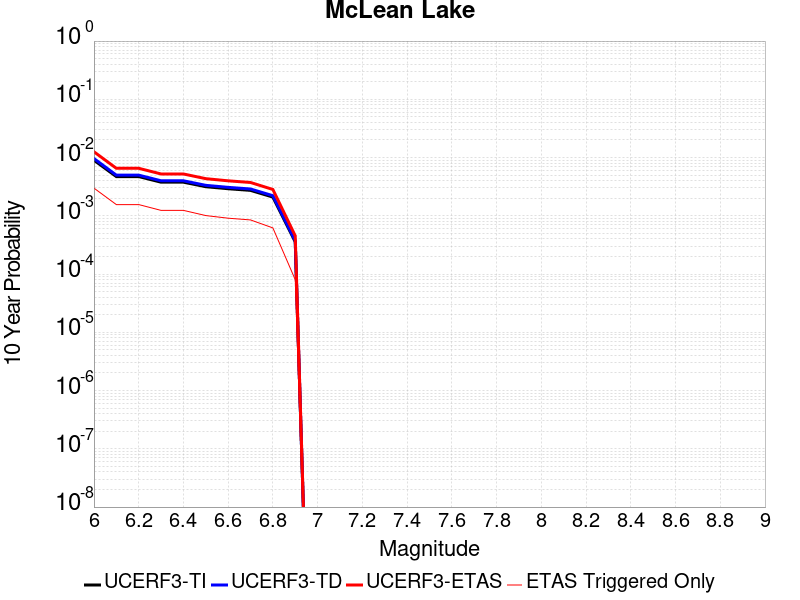 |

| Magnitude | 1 wk TI Prob | 1 wk TD Prob | 1 wk ETAS Prob | 1 wk ETAS/TD Gain | 1 wk ETAS Triggered Only | 1 mo TI Prob | 1 mo TD Prob | 1 mo ETAS Prob | 1 mo ETAS/TD Gain | 1 mo ETAS Triggered Only | 1 yr TI Prob | 1 yr TD Prob | 1 yr ETAS Prob | 1 yr ETAS/TD Gain | 1 yr ETAS Triggered Only | 10 yr TI Prob | 10 yr TD Prob | 10 yr ETAS Prob | 10 yr ETAS/TD Gain | 10 yr ETAS Triggered Only |
|-----|-----|-----|-----|-----|-----|-----|-----|-----|-----|-----|-----|-----|-----|-----|-----|-----|-----|-----|-----|-----|
| 6.0 | 1.7360222E-5 | 1.8502436E-5 | 7.784324E-5 | 4.2071886 | 5.93419E-5 | 7.439883E-5 | 7.929402E-5 | 3.314771E-4 | 4.180354 | 2.5220306E-4 | 9.0542925E-4 | 9.650257E-4 | 0.0020766126 | 2.1518729 | 0.0011126606 | 0.009017491 | 0.009613193 | 0.012522379 | 1.3026243 | 0.002937424 |
| 6.1 | 9.062689E-6 | 9.592565E-6 | 3.9263232E-5 | 4.0930896 | 2.967095E-5 | 3.8839516E-5 | 4.1110397E-5 | 1.8945904E-4 | 4.6085434 | 1.4835475E-4 | 4.727685E-4 | 5.00413E-4 | 0.0011231912 | 2.2445283 | 6.2308996E-4 | 0.0047176396 | 0.004993745 | 0.006587975 | 1.3192455 | 0.0016022313 |
| 6.2 | 9.062689E-6 | 9.592565E-6 | 3.9263232E-5 | 4.0930896 | 2.967095E-5 | 3.8839516E-5 | 4.1110397E-5 | 1.8945904E-4 | 4.6085434 | 1.4835475E-4 | 4.727685E-4 | 5.00413E-4 | 0.0011231912 | 2.2445283 | 6.2308996E-4 | 0.0047176396 | 0.004993745 | 0.006587975 | 1.3192455 | 0.0016022313 |
| 6.3 | 7.2575485E-6 | 7.667997E-6 | 2.2503358E-5 | 2.9347115 | 1.4835475E-5 | 3.110341E-5 | 3.286247E-5 | 1.2187239E-4 | 3.7085586 | 8.901285E-5 | 3.786182E-4 | 4.0003425E-4 | 9.338977E-4 | 2.3345444 | 5.3407706E-4 | 0.0037797375 | 0.0039938465 | 0.005294154 | 1.3255779 | 0.0013055218 |
| 6.4 | 7.2575485E-6 | 7.667997E-6 | 2.2503358E-5 | 2.9347115 | 1.4835475E-5 | 3.110341E-5 | 3.286247E-5 | 1.2187239E-4 | 3.7085586 | 8.901285E-5 | 3.786182E-4 | 4.0003425E-4 | 9.338977E-4 | 2.3345444 | 5.3407706E-4 | 0.0037797375 | 0.0039938465 | 0.005294154 | 1.3255779 | 0.0013055218 |
| 6.5 | 6.06582E-6 | 6.404114E-6 | 6.404114E-6 | 1.0 | 0.0 | 2.5996113E-5 | 2.744595E-5 | 1.01621285E-4 | 3.7025967 | 7.417738E-5 | 3.164567E-4 | 3.341097E-4 | 7.493642E-4 | 2.2428687 | 4.153933E-4 | 0.0031600643 | 0.0033367125 | 0.0043569445 | 1.3057597 | 0.0010236477 |
| 6.6 | 5.598744E-6 | 5.9104805E-6 | 5.9104805E-6 | 1.0 | 0.0 | 2.3994397E-5 | 2.533042E-5 | 8.467081E-5 | 3.3426533 | 5.93419E-5 | 2.9209262E-4 | 3.083606E-4 | 6.643022E-4 | 2.154303 | 3.560514E-4 | 0.0029170897 | 0.0030799566 | 0.003996923 | 1.2977206 | 9.1979944E-4 |
| 6.7 | 5.246996E-6 | 5.5393666E-6 | 5.5393666E-6 | 1.0 | 0.0 | 2.2486933E-5 | 2.3739964E-5 | 8.308045E-5 | 3.4996033 | 5.93419E-5 | 2.73744E-4 | 2.8900206E-4 | 6.1528815E-4 | 2.1290097 | 3.2638045E-4 | 0.0027340704 | 0.0028868862 | 0.003774445 | 1.307445 | 8.901285E-4 |
| 6.8 | 4.02324E-6 | 4.247061E-6 | 4.247061E-6 | 1.0 | 0.0 | 1.7242342E-5 | 1.8201597E-5 | 4.7872007E-5 | 2.6300993 | 2.967095E-5 | 2.099053E-4 | 2.2158786E-4 | 4.4407067E-4 | 2.0040388 | 2.2253212E-4 | 0.0020970714 | 0.0022142536 | 0.0028507665 | 1.2874616 | 6.379254E-4 |
| 6.9 | 6.835972E-7 | 7.140139E-7 | 7.140139E-7 | 1.0 | 0.0 | 2.9296991E-6 | 3.0600577E-6 | 3.0600577E-6 | 1.0 | 0.0 | 3.56685E-5 | 3.7255882E-5 | 5.2090807E-5 | 1.39819 | 1.4835475E-5 | 3.5662777E-4 | 3.7252763E-4 | 4.3184744E-4 | 1.159236 | 5.93419E-5 |

## Goldstone Lake
*[(top)](#table-of-contents)*

| 1 Week | 1 Month | 1 Year | 10 Year |
|-----|-----|-----|-----|
|  |  |  | 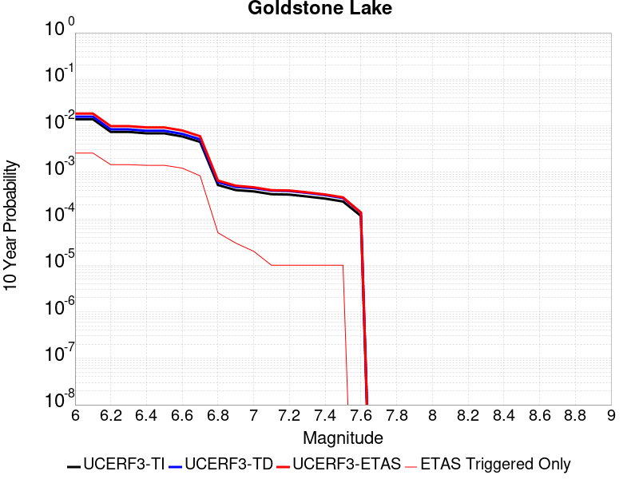 |

| Magnitude | 1 wk TI Prob | 1 wk TD Prob | 1 wk ETAS Prob | 1 wk ETAS/TD Gain | 1 wk ETAS Triggered Only | 1 mo TI Prob | 1 mo TD Prob | 1 mo ETAS Prob | 1 mo ETAS/TD Gain | 1 mo ETAS Triggered Only | 1 yr TI Prob | 1 yr TD Prob | 1 yr ETAS Prob | 1 yr ETAS/TD Gain | 1 yr ETAS Triggered Only | 10 yr TI Prob | 10 yr TD Prob | 10 yr ETAS Prob | 10 yr ETAS/TD Gain | 10 yr ETAS Triggered Only |
|-----|-----|-----|-----|-----|-----|-----|-----|-----|-----|-----|-----|-----|-----|-----|-----|-----|-----|-----|-----|-----|
| 6.0 | 2.671352E-5 | 3.037878E-5 | 8.971887E-5 | 2.9533403 | 5.93419E-5 | 1.1448149E-4 | 1.3018938E-4 | 3.2302545E-4 | 2.4811964 | 1.9286117E-4 | 0.001392921 | 0.0015840997 | 0.002576502 | 1.6264771 | 9.939768E-4 | 0.013842222 | 0.015747583 | 0.0182591 | 1.1594859 | 0.0025517016 |
| 6.1 | 2.671352E-5 | 3.037878E-5 | 8.971887E-5 | 2.9533403 | 5.93419E-5 | 1.1448149E-4 | 1.3018938E-4 | 3.2302545E-4 | 2.4811964 | 1.9286117E-4 | 0.001392921 | 0.0015840997 | 0.002576502 | 1.6264771 | 9.939768E-4 | 0.013842222 | 0.015747583 | 0.0182591 | 1.1594859 | 0.0025517016 |
| 6.2 | 1.4197047E-5 | 1.6097601E-5 | 4.5768073E-5 | 2.843161 | 2.967095E-5 | 6.0843064E-5 | 6.898845E-5 | 1.5799515E-4 | 2.2901683 | 8.901285E-5 | 7.4051257E-4 | 8.3970936E-4 | 0.001388161 | 1.6531446 | 5.4891256E-4 | 0.007380498 | 0.008375063 | 0.00978734 | 1.1686289 | 0.0014242056 |
| 6.3 | 1.4197047E-5 | 1.6097601E-5 | 4.5768073E-5 | 2.843161 | 2.967095E-5 | 6.0843064E-5 | 6.898845E-5 | 1.5799515E-4 | 2.2901683 | 8.901285E-5 | 7.4051257E-4 | 8.3970936E-4 | 0.001388161 | 1.6531446 | 5.4891256E-4 | 0.007380498 | 0.008375063 | 0.00978734 | 1.1686289 | 0.0014242056 |
| 6.4 | 1.3238931E-5 | 1.5009718E-5 | 4.4680222E-5 | 2.976753 | 2.967095E-5 | 5.6737044E-5 | 6.432633E-5 | 1.5333344E-4 | 2.383681 | 8.901285E-5 | 6.9055456E-4 | 7.8298966E-4 | 0.0013166486 | 1.6815658 | 5.3407706E-4 | 0.006884126 | 0.007811937 | 0.009180858 | 1.1752346 | 0.0013796991 |
| 6.5 | 1.3238931E-5 | 1.5009718E-5 | 4.4680222E-5 | 2.976753 | 2.967095E-5 | 5.6737044E-5 | 6.432633E-5 | 1.5333344E-4 | 2.383681 | 8.901285E-5 | 6.9055456E-4 | 7.8298966E-4 | 0.0013166486 | 1.6815658 | 5.3407706E-4 | 0.006884126 | 0.007811937 | 0.009180858 | 1.1752346 | 0.0013796991 |
| 6.6 | 1.1328278E-5 | 1.2856242E-5 | 4.252681E-5 | 3.3078725 | 2.967095E-5 | 4.8548856E-5 | 5.5097556E-5 | 1.441055E-4 | 2.6154609 | 8.901285E-5 | 5.90922E-4 | 6.70702E-4 | 0.0011451188 | 1.7073436 | 4.747352E-4 | 0.0058935313 | 0.0066961683 | 0.007875059 | 1.1760545 | 0.001186838 |
| 6.7 | 8.651175E-6 | 9.825376E-6 | 2.4660705E-5 | 2.5098994 | 1.4835475E-5 | 3.707594E-5 | 4.2108586E-5 | 1.01447986E-4 | 2.4091995 | 5.93419E-5 | 4.5130608E-4 | 5.12642E-4 | 7.647158E-4 | 1.4917151 | 2.5220306E-4 | 0.0045039062 | 0.005123474 | 0.005920485 | 1.1555607 | 8.0111565E-4 |
| 6.8 | 1.0215377E-6 | 1.1755152E-6 | 1.1755152E-6 | 1.0 | 0.0 | 4.378012E-6 | 5.037913E-6 | 5.037913E-6 | 1.0 | 0.0 | 5.3300988E-5 | 6.1334984E-5 | 6.1334984E-5 | 1.0 | 0.0 | 5.3288206E-4 | 6.131918E-4 | 6.4284453E-4 | 1.0483581 | 2.967095E-5 |
| 6.9 | 7.9360774E-7 | 9.283708E-7 | 9.283708E-7 | 1.0 | 0.0 | 3.4011714E-6 | 3.9787265E-6 | 3.9787265E-6 | 1.0 | 0.0 | 4.1408475E-5 | 4.843999E-5 | 4.843999E-5 | 1.0 | 0.0 | 4.140076E-4 | 4.843013E-4 | 4.991296E-4 | 1.030618 | 1.4835475E-5 |
| 7.0 | 7.4382757E-7 | 8.7476127E-7 | 8.7476127E-7 | 1.0 | 0.0 | 3.1878285E-6 | 3.748972E-6 | 3.748972E-6 | 1.0 | 0.0 | 3.8811122E-5 | 4.5642846E-5 | 4.5642846E-5 | 1.0 | 0.0 | 3.8804344E-4 | 4.5634134E-4 | 4.7117006E-4 | 1.0324948 | 1.4835475E-5 |
| 7.1 | 6.4709513E-7 | 7.7115357E-7 | 7.7115357E-7 | 1.0 | 0.0 | 2.773262E-6 | 3.30494E-6 | 3.30494E-6 | 1.0 | 0.0 | 3.376394E-5 | 4.0236962E-5 | 4.0236962E-5 | 1.0 | 0.0 | 3.375881E-4 | 4.023027E-4 | 4.023027E-4 | 1.0 | 0.0 |
| 7.2 | 6.356704E-7 | 7.588589E-7 | 7.588589E-7 | 1.0 | 0.0 | 2.7242988E-6 | 3.2522487E-6 | 3.2522487E-6 | 1.0 | 0.0 | 3.3167835E-5 | 3.959547E-5 | 3.959547E-5 | 1.0 | 0.0 | 3.3162883E-4 | 3.9589006E-4 | 3.9589006E-4 | 1.0 | 0.0 |
| 7.3 | 5.7695723E-7 | 6.896777E-7 | 6.896777E-7 | 1.0 | 0.0 | 2.4726714E-6 | 2.9557584E-6 | 2.9557584E-6 | 1.0 | 0.0 | 3.0104358E-5 | 3.5985824E-5 | 3.5985824E-5 | 1.0 | 0.0 | 3.0100282E-4 | 3.5980568E-4 | 3.5980568E-4 | 1.0 | 0.0 |
| 7.4 | 5.209647E-7 | 6.1936925E-7 | 6.1936925E-7 | 1.0 | 0.0 | 2.232704E-6 | 2.6544371E-6 | 2.6544371E-6 | 1.0 | 0.0 | 2.718283E-5 | 3.2317348E-5 | 3.2317348E-5 | 1.0 | 0.0 | 2.7179506E-4 | 3.2313206E-4 | 3.2313206E-4 | 1.0 | 0.0 |
| 7.5 | 4.512955E-7 | 5.349032E-7 | 5.349032E-7 | 1.0 | 0.0 | 1.934122E-6 | 2.2924405E-6 | 2.2924405E-6 | 1.0 | 0.0 | 2.3547682E-5 | 2.791016E-5 | 2.791016E-5 | 1.0 | 0.0 | 2.3545188E-4 | 2.7907186E-4 | 2.7907186E-4 | 1.0 | 0.0 |
| 7.6 | 2.21172E-7 | 2.6040254E-7 | 2.6040254E-7 | 1.0 | 0.0 | 9.478797E-7 | 1.1160106E-6 | 1.1160106E-6 | 1.0 | 0.0 | 1.1540374E-5 | 1.3587372E-5 | 1.3587372E-5 | 1.0 | 0.0 | 1.1539775E-4 | 1.3586823E-4 | 1.3586823E-4 | 1.0 | 0.0 |

## Gravel Hills-Harper Lk
*[(top)](#table-of-contents)*

| 1 Week | 1 Month | 1 Year | 10 Year |
|-----|-----|-----|-----|
| 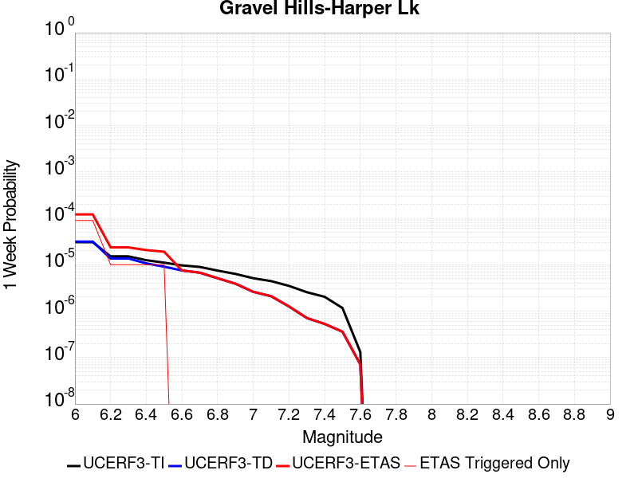 |  | 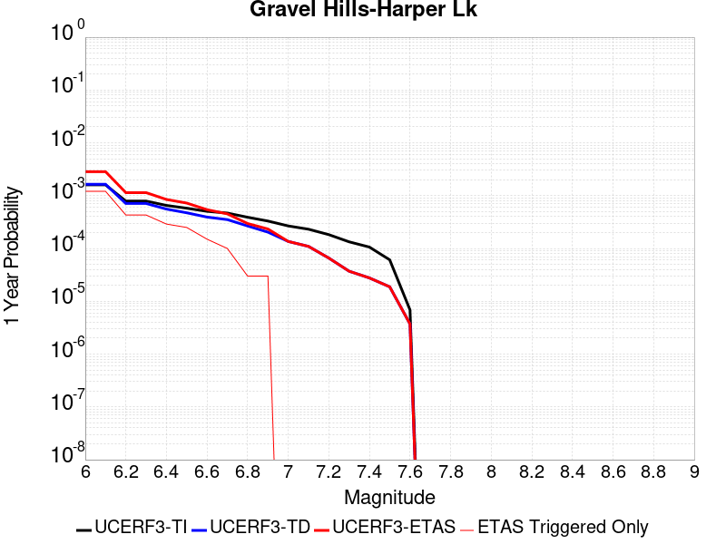 |  |

| Magnitude | 1 wk TI Prob | 1 wk TD Prob | 1 wk ETAS Prob | 1 wk ETAS/TD Gain | 1 wk ETAS Triggered Only | 1 mo TI Prob | 1 mo TD Prob | 1 mo ETAS Prob | 1 mo ETAS/TD Gain | 1 mo ETAS Triggered Only | 1 yr TI Prob | 1 yr TD Prob | 1 yr ETAS Prob | 1 yr ETAS/TD Gain | 1 yr ETAS Triggered Only | 10 yr TI Prob | 10 yr TD Prob | 10 yr ETAS Prob | 10 yr ETAS/TD Gain | 10 yr ETAS Triggered Only |
|-----|-----|-----|-----|-----|-----|-----|-----|-----|-----|-----|-----|-----|-----|-----|-----|-----|-----|-----|-----|-----|
| 6.0 | 3.0679566E-5 | 3.146734E-5 | 1.2047739E-4 | 3.8286486 | 8.901285E-5 | 1.3147724E-4 | 1.3485429E-4 | 4.018568E-4 | 2.9799337 | 2.6703853E-4 | 0.0015995599 | 0.0016408308 | 0.0028257214 | 1.7221284 | 0.001186838 | 0.015880952 | 0.016308727 | 0.018731251 | 1.1485417 | 0.0024626888 |
| 6.1 | 3.0679566E-5 | 3.146734E-5 | 1.2047739E-4 | 3.8286486 | 8.901285E-5 | 1.3147724E-4 | 1.3485429E-4 | 4.018568E-4 | 2.9799337 | 2.6703853E-4 | 0.0015995599 | 0.0016408308 | 0.0028257214 | 1.7221284 | 0.001186838 | 0.015880952 | 0.016308727 | 0.018731251 | 1.1485417 | 0.0024626888 |
| 6.2 | 1.514536E-5 | 1.3636135E-5 | 2.8471408E-5 | 2.087938 | 1.4835475E-5 | 6.490707E-5 | 5.843934E-5 | 1.3261237E-4 | 2.2692313 | 7.417738E-5 | 7.8995706E-4 | 7.112786E-4 | 0.0011115514 | 1.5627513 | 4.0055782E-4 | 0.007871548 | 0.007091222 | 0.007916117 | 1.1163262 | 8.307866E-4 |
| 6.3 | 1.514536E-5 | 1.3636135E-5 | 2.8471408E-5 | 2.087938 | 1.4835475E-5 | 6.490707E-5 | 5.843934E-5 | 1.3261237E-4 | 2.2692313 | 7.417738E-5 | 7.8995706E-4 | 7.112786E-4 | 0.0011115514 | 1.5627513 | 4.0055782E-4 | 0.007871548 | 0.007091222 | 0.007916117 | 1.1163262 | 8.307866E-4 |
| 6.4 | 1.2532521E-5 | 1.0690369E-5 | 2.5525685E-5 | 2.3877273 | 1.4835475E-5 | 5.37097E-5 | 4.5815097E-5 | 9.031948E-5 | 1.9713913 | 4.4506425E-5 | 6.537194E-4 | 5.576619E-4 | 7.800699E-4 | 1.3988223 | 2.2253212E-4 | 0.0065179965 | 0.005563215 | 0.0059615443 | 1.0716006 | 4.0055782E-4 |
| 6.5 | 1.1094058E-5 | 9.084217E-6 | 2.3919558E-5 | 2.6330895 | 1.4835475E-5 | 4.7545094E-5 | 3.89318E-5 | 8.343649E-5 | 2.1431448 | 4.4506425E-5 | 5.787078E-4 | 4.7389563E-4 | 6.51837E-4 | 1.3754864 | 1.780257E-4 | 0.0057720304 | 0.004729258 | 0.0050393296 | 1.0655645 | 3.1154498E-4 |
| 6.6 | 9.688328E-6 | 7.5321414E-6 | 7.5321414E-6 | 1.0 | 0.0 | 4.1520743E-5 | 3.2280223E-5 | 6.195021E-5 | 1.9191384 | 2.967095E-5 | 5.053978E-4 | 3.9294336E-4 | 5.1158055E-4 | 1.3019192 | 1.186838E-4 | 0.0050424994 | 0.0039227423 | 0.0041444018 | 1.0565062 | 2.2253212E-4 |
| 6.7 | 8.974824E-6 | 6.749809E-6 | 6.749809E-6 | 1.0 | 0.0 | 3.8462964E-5 | 2.8927445E-5 | 2.8927445E-5 | 1.0 | 0.0 | 4.6818596E-4 | 3.5213694E-4 | 4.2628817E-4 | 1.2105751 | 7.417738E-5 | 0.004672008 | 0.0035160105 | 0.0036490604 | 1.0378411 | 1.3351926E-4 |
| 6.8 | 7.4780046E-6 | 5.1164907E-6 | 5.1164907E-6 | 1.0 | 0.0 | 3.20482E-5 | 2.192764E-5 | 2.192764E-5 | 1.0 | 0.0 | 3.9011694E-4 | 2.669377E-4 | 2.9660072E-4 | 1.1111234 | 2.967095E-5 | 0.0038943281 | 0.0026663088 | 0.0027550843 | 1.0332953 | 8.901285E-5 |
| 6.9 | 6.3409307E-6 | 3.9077286E-6 | 3.9077286E-6 | 1.0 | 0.0 | 2.7175134E-5 | 1.6747306E-5 | 1.6747306E-5 | 1.0 | 0.0 | 3.3080703E-4 | 2.0388038E-4 | 2.3354527E-4 | 1.1455015 | 2.967095E-5 | 0.0033031502 | 0.0020370316 | 0.002125863 | 1.0436083 | 8.901285E-5 |
| 7.0 | 5.1239335E-6 | 2.606019E-6 | 2.606019E-6 | 1.0 | 0.0 | 2.195953E-5 | 1.1168607E-5 | 1.1168607E-5 | 1.0 | 0.0 | 2.6732447E-4 | 1.3596956E-4 | 1.3596956E-4 | 1.0 | 0.0 | 0.0026700313 | 0.0013588889 | 0.0014033349 | 1.0327076 | 4.4506425E-5 |
| 7.1 | 4.438899E-6 | 2.098609E-6 | 2.098609E-6 | 1.0 | 0.0 | 1.9023713E-5 | 8.994009E-6 | 8.994009E-6 | 1.0 | 0.0 | 2.315891E-4 | 1.09496774E-4 | 1.09496774E-4 | 1.0 | 0.0 | 0.002313479 | 0.0010944501 | 0.0011389079 | 1.040621 | 4.4506425E-5 |
| 7.2 | 3.50367E-6 | 1.261672E-6 | 1.261672E-6 | 1.0 | 0.0 | 1.5015643E-5 | 5.4071547E-6 | 5.4071547E-6 | 1.0 | 0.0 | 1.8280011E-4 | 6.58302E-5 | 6.58302E-5 | 1.0 | 0.0 | 0.0018264982 | 6.5811526E-4 | 6.8776665E-4 | 1.045055 | 2.967095E-5 |
| 7.3 | 2.561638E-6 | 7.119928E-7 | 7.119928E-7 | 1.0 | 0.0 | 1.0978401E-5 | 3.0513943E-6 | 3.0513943E-6 | 1.0 | 0.0 | 1.3365384E-4 | 3.7150112E-5 | 3.7150112E-5 | 1.0 | 0.0 | 0.0013357349 | 3.71441E-4 | 3.71441E-4 | 1.0 | 0.0 |
| 7.4 | 2.0368864E-6 | 5.305455E-7 | 5.305455E-7 | 1.0 | 0.0 | 8.729483E-6 | 2.2737645E-6 | 2.2737645E-6 | 1.0 | 0.0 | 1.06276275E-4 | 2.7682736E-5 | 2.7682736E-5 | 1.0 | 0.0 | 0.0010622547 | 2.767934E-4 | 2.767934E-4 | 1.0 | 0.0 |
| 7.5 | 1.1681728E-6 | 3.6034095E-7 | 3.6034095E-7 | 1.0 | 0.0 | 5.0064455E-6 | 1.5443175E-6 | 1.5443175E-6 | 1.0 | 0.0 | 6.0951766E-5 | 1.8801908E-5 | 1.8801908E-5 | 1.0 | 0.0 | 6.093505E-4 | 1.8800364E-4 | 1.8800364E-4 | 1.0 | 0.0 |
| 7.6 | 1.3154387E-7 | 7.120178E-8 | 7.120178E-8 | 1.0 | 0.0 | 5.6375933E-7 | 3.0515045E-7 | 3.0515045E-7 | 1.0 | 0.0 | 6.863748E-6 | 3.7152022E-6 | 3.7152022E-6 | 1.0 | 0.0 | 6.863536E-5 | 3.7151556E-5 | 3.7151556E-5 | 1.0 | 0.0 |

## So Sierra Nevada
*[(top)](#table-of-contents)*

| 1 Week | 1 Month | 1 Year | 10 Year |
|-----|-----|-----|-----|
|  |  |  |  |

| Magnitude | 1 wk TI Prob | 1 wk TD Prob | 1 wk ETAS Prob | 1 wk ETAS/TD Gain | 1 wk ETAS Triggered Only | 1 mo TI Prob | 1 mo TD Prob | 1 mo ETAS Prob | 1 mo ETAS/TD Gain | 1 mo ETAS Triggered Only | 1 yr TI Prob | 1 yr TD Prob | 1 yr ETAS Prob | 1 yr ETAS/TD Gain | 1 yr ETAS Triggered Only | 10 yr TI Prob | 10 yr TD Prob | 10 yr ETAS Prob | 10 yr ETAS/TD Gain | 10 yr ETAS Triggered Only |
|-----|-----|-----|-----|-----|-----|-----|-----|-----|-----|-----|-----|-----|-----|-----|-----|-----|-----|-----|-----|-----|
| 6.0 | 1.15488665E-5 | 1.1080037E-5 | 8.5256586E-5 | 7.6946115 | 7.417738E-5 | 4.9494203E-5 | 4.7485086E-5 | 2.2550233E-4 | 4.7489085 | 1.780257E-4 | 6.024253E-4 | 5.779903E-4 | 0.0014231236 | 2.4621928 | 8.4562204E-4 | 0.006007948 | 0.0057661394 | 0.0076983804 | 1.3351014 | 0.0019434472 |
| 6.1 | 1.15488665E-5 | 1.1080037E-5 | 8.5256586E-5 | 7.6946115 | 7.417738E-5 | 4.9494203E-5 | 4.7485086E-5 | 2.2550233E-4 | 4.7489085 | 1.780257E-4 | 6.024253E-4 | 5.779903E-4 | 0.0014231236 | 2.4621928 | 8.4562204E-4 | 0.006007948 | 0.0057661394 | 0.0076983804 | 1.3351014 | 0.0019434472 |
| 6.2 | 1.15488665E-5 | 1.1080037E-5 | 8.5256586E-5 | 7.6946115 | 7.417738E-5 | 4.9494203E-5 | 4.7485086E-5 | 2.2550233E-4 | 4.7489085 | 1.780257E-4 | 6.024253E-4 | 5.779903E-4 | 0.0014231236 | 2.4621928 | 8.4562204E-4 | 0.006007948 | 0.0057661394 | 0.0076983804 | 1.3351014 | 0.0019434472 |
| 6.3 | 1.15488665E-5 | 1.1080037E-5 | 8.5256586E-5 | 7.6946115 | 7.417738E-5 | 4.9494203E-5 | 4.7485086E-5 | 2.2550233E-4 | 4.7489085 | 1.780257E-4 | 6.024253E-4 | 5.779903E-4 | 0.0014231236 | 2.4621928 | 8.4562204E-4 | 0.006007948 | 0.0057661394 | 0.0076983804 | 1.3351014 | 0.0019434472 |
| 6.4 | 1.15488665E-5 | 1.1080037E-5 | 8.5256586E-5 | 7.6946115 | 7.417738E-5 | 4.9494203E-5 | 4.7485086E-5 | 2.2550233E-4 | 4.7489085 | 1.780257E-4 | 6.024253E-4 | 5.779903E-4 | 0.0014231236 | 2.4621928 | 8.4562204E-4 | 0.006007948 | 0.0057661394 | 0.0076983804 | 1.3351014 | 0.0019434472 |
| 6.5 | 1.15488665E-5 | 1.1080037E-5 | 8.5256586E-5 | 7.6946115 | 7.417738E-5 | 4.9494203E-5 | 4.7485086E-5 | 2.2550233E-4 | 4.7489085 | 1.780257E-4 | 6.024253E-4 | 5.779903E-4 | 0.0014231236 | 2.4621928 | 8.4562204E-4 | 0.006007948 | 0.0057661394 | 0.0076983804 | 1.3351014 | 0.0019434472 |
| 6.6 | 7.587044E-6 | 6.935904E-6 | 3.660665E-5 | 5.2778482 | 2.967095E-5 | 3.2515498E-5 | 2.972498E-5 | 1.0390015E-4 | 3.4953816 | 7.417738E-5 | 3.9580427E-4 | 3.6184446E-4 | 7.7708747E-4 | 2.1475732 | 4.153933E-4 | 0.003951 | 0.0036128445 | 0.0046919216 | 1.2986779 | 0.0010829896 |
| 6.7 | 7.587044E-6 | 6.935904E-6 | 3.660665E-5 | 5.2778482 | 2.967095E-5 | 3.2515498E-5 | 2.972498E-5 | 1.0390015E-4 | 3.4953816 | 7.417738E-5 | 3.9580427E-4 | 3.6184446E-4 | 7.7708747E-4 | 2.1475732 | 4.153933E-4 | 0.003951 | 0.0036128445 | 0.0046919216 | 1.2986779 | 0.0010829896 |
| 6.8 | 5.9026956E-6 | 5.179612E-6 | 3.4850407E-5 | 6.728382 | 2.967095E-5 | 2.5297022E-5 | 2.2198154E-5 | 9.637388E-5 | 4.341527 | 7.417738E-5 | 3.0794772E-4 | 2.7023017E-4 | 6.558483E-4 | 2.4269986 | 3.8572235E-4 | 0.0030752132 | 0.0026991318 | 0.0035720624 | 1.3234116 | 8.75293E-4 |
| 6.9 | 5.0118915E-6 | 4.2526194E-6 | 3.3923443E-5 | 7.97707 | 2.967095E-5 | 2.1479358E-5 | 1.8225388E-5 | 9.240141E-5 | 5.069928 | 7.417738E-5 | 2.614798E-4 | 2.2187224E-4 | 5.036837E-4 | 2.270152 | 2.81874E-4 | 0.0026117235 | 0.0022165799 | 0.0029123016 | 1.3138717 | 6.972673E-4 |
| 7.0 | 4.4924795E-6 | 3.7140983E-6 | 1.8549517E-5 | 4.994353 | 1.4835475E-5 | 1.925334E-5 | 1.591747E-5 | 7.5258424E-5 | 4.7280393 | 5.93419E-5 | 2.3438422E-4 | 1.9377861E-4 | 4.311002E-4 | 2.2247047 | 2.373676E-4 | 0.0023413717 | 0.0019361593 | 0.0025432361 | 1.3135469 | 6.0825446E-4 |
| 7.1 | 3.9118436E-6 | 3.1121424E-6 | 1.794757E-5 | 5.76695 | 1.4835475E-5 | 1.6764936E-5 | 1.3337688E-5 | 7.26788E-5 | 5.4491296 | 5.93419E-5 | 2.0409399E-4 | 1.6237482E-4 | 3.848708E-4 | 2.3702617 | 2.2253212E-4 | 0.0020390663 | 0.001622618 | 0.002141017 | 1.3194832 | 5.192416E-4 |
| 7.2 | 3.4200818E-6 | 2.6056064E-6 | 1.7441042E-5 | 6.69366 | 1.4835475E-5 | 1.4657411E-5 | 1.116684E-5 | 5.5672765E-5 | 4.9855437 | 4.4506425E-5 | 1.7843937E-4 | 1.359483E-4 | 3.2878324E-4 | 2.4184434 | 1.9286117E-4 | 0.0017829615 | 0.001358701 | 0.0017883452 | 1.316217 | 4.3022877E-4 |
| 7.3 | 2.6593618E-6 | 1.8285531E-6 | 1.6664E-5 | 9.113216 | 1.4835475E-5 | 1.13972155E-5 | 7.836634E-6 | 3.750735E-5 | 4.7861557 | 2.967095E-5 | 1.3875226E-4 | 9.540714E-5 | 2.2891368E-4 | 2.399335 | 1.3351926E-4 | 0.0013866565 | 9.536907E-4 | 0.0012649385 | 1.3263614 | 3.1154498E-4 |
| 7.4 | 2.2577992E-6 | 1.4365592E-6 | 1.6272012E-5 | 11.327075 | 1.4835475E-5 | 9.676246E-6 | 6.156669E-6 | 3.5827434E-5 | 5.8192887 | 2.967095E-5 | 1.1780193E-4 | 7.495512E-5 | 2.0846438E-4 | 2.7811894 | 1.3351926E-4 | 0.001177395 | 7.4932346E-4 | 0.0010458106 | 1.3956732 | 2.967095E-4 |
| 7.5 | 1.489319E-6 | 7.354887E-7 | 1.5570953E-5 | 21.170893 | 1.4835475E-5 | 6.3827797E-6 | 3.1520908E-6 | 1.7987519E-5 | 5.706536 | 1.4835475E-5 | 7.770758E-5 | 3.8376034E-5 | 8.2880746E-5 | 2.1597009 | 4.4506425E-5 | 7.7680405E-4 | 3.8369448E-4 | 4.8750298E-4 | 1.2705498 | 1.03848324E-4 |
| 7.6 | 1.0680322E-6 | 4.6603589E-7 | 1.5301504E-5 | 32.833317 | 1.4835475E-5 | 4.577273E-6 | 1.9972952E-6 | 1.683274E-5 | 8.427768 | 1.4835475E-5 | 5.5726876E-5 | 2.43168E-5 | 6.882214E-5 | 2.8302302 | 4.4506425E-5 | 5.5712904E-4 | 2.4314165E-4 | 3.0246913E-4 | 1.2440038 | 5.93419E-5 |
| 7.7 | 5.509146E-7 | 1.5584055E-7 | 1.4991313E-5 | 96.19649 | 1.4835475E-5 | 2.3610605E-6 | 6.678879E-7 | 1.5503352E-5 | 23.212507 | 1.4835475E-5 | 2.8745531E-5 | 8.131506E-6 | 3.7802212E-5 | 4.6488576 | 2.967095E-5 | 2.8741814E-4 | 8.13122E-5 | 1.10980734E-4 | 1.3648719 | 2.967095E-5 |

## Coyote Canyon
*[(top)](#table-of-contents)*

| 1 Week | 1 Month | 1 Year | 10 Year |
|-----|-----|-----|-----|
|  | 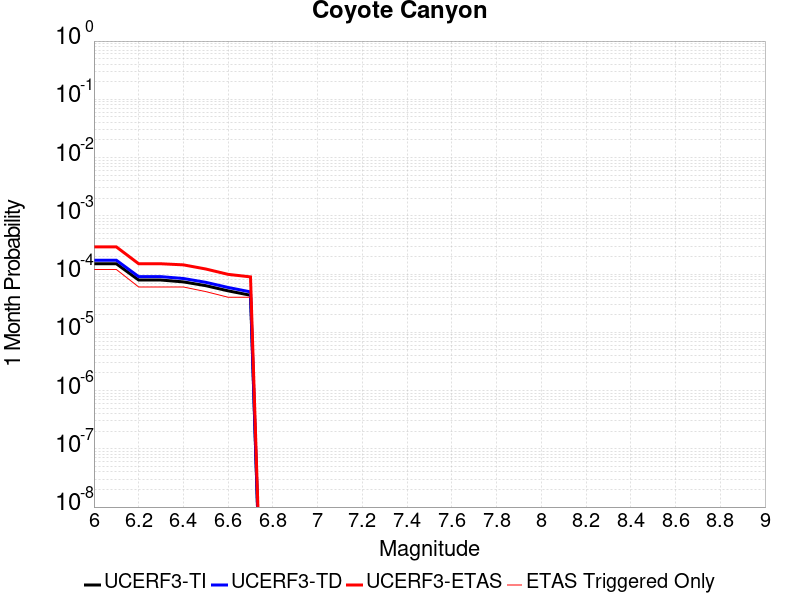 |  |  |

| Magnitude | 1 wk TI Prob | 1 wk TD Prob | 1 wk ETAS Prob | 1 wk ETAS/TD Gain | 1 wk ETAS Triggered Only | 1 mo TI Prob | 1 mo TD Prob | 1 mo ETAS Prob | 1 mo ETAS/TD Gain | 1 mo ETAS Triggered Only | 1 yr TI Prob | 1 yr TD Prob | 1 yr ETAS Prob | 1 yr ETAS/TD Gain | 1 yr ETAS Triggered Only | 10 yr TI Prob | 10 yr TD Prob | 10 yr ETAS Prob | 10 yr ETAS/TD Gain | 10 yr ETAS Triggered Only |
|-----|-----|-----|-----|-----|-----|-----|-----|-----|-----|-----|-----|-----|-----|-----|-----|-----|-----|-----|-----|-----|
| 6.0 | 3.5090034E-5 | 4.036835E-5 | 7.0038106E-5 | 1.7349756 | 2.967095E-5 | 1.503772E-4 | 1.729972E-4 | 3.0649337E-4 | 1.7716666 | 1.3351926E-4 | 0.0018293047 | 0.0021044624 | 0.002726241 | 1.2954572 | 6.2308996E-4 | 0.018143194 | 0.020871265 | 0.022338374 | 1.0702933 | 0.0014983829 |
| 6.1 | 3.5090034E-5 | 4.036835E-5 | 7.0038106E-5 | 1.7349756 | 2.967095E-5 | 1.503772E-4 | 1.729972E-4 | 3.0649337E-4 | 1.7716666 | 1.3351926E-4 | 0.0018293047 | 0.0021044624 | 0.002726241 | 1.2954572 | 6.2308996E-4 | 0.018143194 | 0.020871265 | 0.022338374 | 1.0702933 | 0.0014983829 |
| 6.2 | 1.841879E-5 | 2.1061796E-5 | 5.073212E-5 | 2.4087272 | 2.967095E-5 | 7.8935285E-5 | 9.02623E-5 | 1.6443297E-4 | 1.8217238 | 7.417738E-5 | 9.606133E-4 | 0.0010984914 | 0.0014689708 | 1.337262 | 3.7088688E-4 | 0.0095647145 | 0.010940703 | 0.01180642 | 1.079128 | 8.75293E-4 |
| 6.3 | 1.841879E-5 | 2.1061796E-5 | 5.073212E-5 | 2.4087272 | 2.967095E-5 | 7.8935285E-5 | 9.02623E-5 | 1.6443297E-4 | 1.8217238 | 7.417738E-5 | 9.606133E-4 | 0.0010984914 | 0.0014689708 | 1.337262 | 3.7088688E-4 | 0.0095647145 | 0.010940703 | 0.01180642 | 1.079128 | 8.75293E-4 |
| 6.4 | 1.712201E-5 | 1.9567064E-5 | 4.923743E-5 | 2.5163424 | 2.967095E-5 | 7.337798E-5 | 8.3856714E-5 | 1.5802788E-4 | 1.8844986 | 7.417738E-5 | 8.930107E-4 | 0.0010205779 | 0.0013762659 | 1.3485162 | 3.560514E-4 | 0.008894307 | 0.010168829 | 0.010961798 | 1.0779804 | 8.0111565E-4 |
| 6.5 | 1.4744935E-5 | 1.6838556E-5 | 4.6509005E-5 | 2.7620542 | 2.967095E-5 | 6.3191044E-5 | 7.216377E-5 | 1.4633579E-4 | 2.027829 | 7.417738E-5 | 7.6907943E-4 | 8.783333E-4 | 0.0012044271 | 1.3712642 | 3.2638045E-4 | 0.007664232 | 0.008757816 | 0.009493093 | 1.0839567 | 7.4177375E-4 |
| 6.6 | 1.2017839E-5 | 1.3725382E-5 | 2.8560653E-5 | 2.080864 | 1.4835475E-5 | 5.150401E-5 | 5.882224E-5 | 1.1816065E-4 | 2.008775 | 5.93419E-5 | 6.268809E-4 | 7.16014E-4 | 9.3838683E-4 | 1.3105705 | 2.2253212E-4 | 0.0062511545 | 0.0071457652 | 0.007690755 | 1.0762676 | 5.4891256E-4 |
| 6.7 | 1.00956095E-5 | 1.15346065E-5 | 2.636991E-5 | 2.286156 | 1.4835475E-5 | 4.326618E-5 | 4.943358E-5 | 1.0877255E-4 | 2.2003777 | 5.93419E-5 | 5.266384E-4 | 6.0177466E-4 | 7.945197E-4 | 1.3202945 | 1.9286117E-4 | 0.005253921 | 0.0060099796 | 0.006452369 | 1.0736091 | 4.4506424E-4 |

## San Andreas (Mojave S)
*[(top)](#table-of-contents)*

| 1 Week | 1 Month | 1 Year | 10 Year |
|-----|-----|-----|-----|
|  |  |  |  |

| Magnitude | 1 wk TI Prob | 1 wk TD Prob | 1 wk ETAS Prob | 1 wk ETAS/TD Gain | 1 wk ETAS Triggered Only | 1 mo TI Prob | 1 mo TD Prob | 1 mo ETAS Prob | 1 mo ETAS/TD Gain | 1 mo ETAS Triggered Only | 1 yr TI Prob | 1 yr TD Prob | 1 yr ETAS Prob | 1 yr ETAS/TD Gain | 1 yr ETAS Triggered Only | 10 yr TI Prob | 10 yr TD Prob | 10 yr ETAS Prob | 10 yr ETAS/TD Gain | 10 yr ETAS Triggered Only |
|-----|-----|-----|-----|-----|-----|-----|-----|-----|-----|-----|-----|-----|-----|-----|-----|-----|-----|-----|-----|-----|
| 6.0 | 3.1064058E-4 | 6.7509484E-4 | 7.0474576E-4 | 1.0439211 | 2.967095E-5 | 0.0013306376 | 0.0028901838 | 0.0030824875 | 1.0665369 | 1.9286117E-4 | 0.016080605 | 0.034646373 | 0.035233553 | 1.0169479 | 6.0825446E-4 | 0.1496549 | 0.2867713 | 0.28774473 | 1.0033946 | 0.0013648637 |
| 6.1 | 3.1064058E-4 | 6.7509484E-4 | 7.0474576E-4 | 1.0439211 | 2.967095E-5 | 0.0013306376 | 0.0028901838 | 0.0030824875 | 1.0665369 | 1.9286117E-4 | 0.016080605 | 0.034646373 | 0.035233553 | 1.0169479 | 6.0825446E-4 | 0.1496549 | 0.2867713 | 0.28774473 | 1.0033946 | 0.0013648637 |
| 6.2 | 3.1064058E-4 | 6.7509484E-4 | 7.0474576E-4 | 1.0439211 | 2.967095E-5 | 0.0013306376 | 0.0028901838 | 0.0030824875 | 1.0665369 | 1.9286117E-4 | 0.016080605 | 0.034646373 | 0.035233553 | 1.0169479 | 6.0825446E-4 | 0.1496549 | 0.2867713 | 0.28774473 | 1.0033946 | 0.0013648637 |
| 6.3 | 3.1064058E-4 | 6.7509484E-4 | 7.0474576E-4 | 1.0439211 | 2.967095E-5 | 0.0013306376 | 0.0028901838 | 0.0030824875 | 1.0665369 | 1.9286117E-4 | 0.016080605 | 0.034646373 | 0.035233553 | 1.0169479 | 6.0825446E-4 | 0.1496549 | 0.2867713 | 0.28774473 | 1.0033946 | 0.0013648637 |
| 6.4 | 1.9872203E-4 | 4.3225646E-4 | 4.619146E-4 | 1.0686123 | 2.967095E-5 | 8.5138786E-4 | 0.0018512408 | 0.0020289368 | 1.0959876 | 1.780257E-4 | 0.010316478 | 0.022312066 | 0.022805218 | 1.0221025 | 5.044061E-4 | 0.098504856 | 0.19717523 | 0.19809233 | 1.0046512 | 0.0011423315 |
| 6.5 | 1.291105E-4 | 2.879659E-4 | 3.176283E-4 | 1.1030066 | 2.967095E-5 | 5.5321335E-4 | 0.0012335586 | 0.0014113648 | 1.1441407 | 1.780257E-4 | 0.006714592 | 0.014915982 | 0.015369022 | 1.0303727 | 4.5989972E-4 | 0.065152965 | 0.13821632 | 0.1390857 | 1.00629 | 0.0010088122 |
| 6.6 | 1.291105E-4 | 2.879659E-4 | 3.176283E-4 | 1.1030066 | 2.967095E-5 | 5.5321335E-4 | 0.0012335586 | 0.0014113648 | 1.1441407 | 1.780257E-4 | 0.006714592 | 0.014915982 | 0.015369022 | 1.0303727 | 4.5989972E-4 | 0.065152965 | 0.13821632 | 0.1390857 | 1.00629 | 0.0010088122 |
| 6.7 | 1.08001186E-4 | 2.4377138E-4 | 2.734351E-4 | 1.1216866 | 2.967095E-5 | 4.6278012E-4 | 0.0010443168 | 0.0012221566 | 1.170293 | 1.780257E-4 | 0.0056198016 | 0.012640733 | 0.013065524 | 1.0336049 | 4.3022877E-4 | 0.054797906 | 0.1193604 | 0.12022267 | 1.0072241 | 9.791413E-4 |
| 6.8 | 1.0624356E-4 | 2.389468E-4 | 2.6861066E-4 | 1.1241442 | 2.967095E-5 | 4.5525006E-4 | 0.0010236563 | 0.0012014997 | 1.1737336 | 1.780257E-4 | 0.0055285925 | 0.012392072 | 0.012816969 | 1.0342878 | 4.3022877E-4 | 0.053930566 | 0.117309526 | 0.1181738 | 1.0073675 | 9.791413E-4 |
| 6.9 | 1.0393785E-4 | 2.3264858E-4 | 2.6231262E-4 | 1.1275058 | 2.967095E-5 | 4.4537184E-4 | 9.966849E-4 | 0.001174533 | 1.1784399 | 1.780257E-4 | 0.0054089287 | 0.012067372 | 0.012492409 | 1.035222 | 4.3022877E-4 | 0.05279156 | 0.11460693 | 0.11547386 | 1.0075643 | 9.791413E-4 |
| 7.0 | 1.0155622E-4 | 2.2634196E-4 | 2.560062E-4 | 1.1310594 | 2.967095E-5 | 4.3516833E-4 | 9.6967677E-4 | 0.0011475298 | 1.1834148 | 1.780257E-4 | 0.005285311 | 0.011742135 | 0.01215265 | 1.0349609 | 4.153933E-4 | 0.05161361 | 0.11186692 | 0.11271018 | 1.0075381 | 9.494704E-4 |
| 7.1 | 9.885595E-5 | 2.1922374E-4 | 2.488882E-4 | 1.1353159 | 2.967095E-5 | 4.2359953E-4 | 9.3919237E-4 | 0.0011170509 | 1.1893739 | 1.780257E-4 | 0.0051451353 | 0.011374916 | 0.011785584 | 1.036103 | 4.153933E-4 | 0.05027629 | 0.10875116 | 0.10959738 | 1.0077811 | 9.494704E-4 |
| 7.2 | 9.6411415E-5 | 2.1285148E-4 | 2.4251612E-4 | 1.1393677 | 2.967095E-5 | 4.1312634E-4 | 9.1190205E-4 | 0.0010897653 | 1.1950465 | 1.780257E-4 | 0.005018219 | 0.011046072 | 0.011456877 | 1.0371901 | 4.153933E-4 | 0.049064007 | 0.10594066 | 0.10677628 | 1.0078876 | 9.346349E-4 |
| 7.3 | 9.1180635E-5 | 1.9512358E-4 | 2.2478873E-4 | 1.1520327 | 2.967095E-5 | 3.907156E-4 | 8.35976E-4 | 0.0010138529 | 1.2127775 | 1.780257E-4 | 0.004746591 | 0.010130622 | 0.010541808 | 1.0405884 | 4.153933E-4 | 0.046464786 | 0.09813088 | 0.09894704 | 1.008317 | 9.0496393E-4 |
| 7.4 | 8.887388E-5 | 1.8760475E-4 | 2.1727012E-4 | 1.1581271 | 2.967095E-5 | 3.8083247E-4 | 8.0377265E-4 | 9.816552E-4 | 1.2213095 | 1.780257E-4 | 0.0046267817 | 0.00974212 | 0.010153467 | 1.0422235 | 4.153933E-4 | 0.045316286 | 0.094764486 | 0.095570266 | 1.008503 | 8.901285E-4 |
| 7.5 | 8.6750515E-5 | 1.809161E-4 | 2.1058168E-4 | 1.1639743 | 2.967095E-5 | 3.7173493E-4 | 7.751244E-4 | 9.530121E-4 | 1.2294956 | 1.780257E-4 | 0.004516484 | 0.00939639 | 0.00980788 | 1.0437924 | 4.153933E-4 | 0.04425787 | 0.09172703 | 0.09253551 | 1.008814 | 8.901285E-4 |
| 7.6 | 8.453092E-5 | 1.7478704E-4 | 2.0445281E-4 | 1.1697252 | 2.967095E-5 | 3.6222505E-4 | 7.4887235E-4 | 9.2676474E-4 | 1.237547 | 1.780257E-4 | 0.0044011753 | 0.009079481 | 0.009491102 | 1.0453354 | 4.153933E-4 | 0.04315024 | 0.08888449 | 0.0896955 | 1.0091243 | 8.901285E-4 |
| 7.7 | 8.259102E-5 | 1.7000404E-4 | 1.9966994E-4 | 1.1745012 | 2.967095E-5 | 3.539135E-4 | 7.2838535E-4 | 9.0628135E-4 | 1.2442334 | 1.780257E-4 | 0.004300386 | 0.008832102 | 0.009243826 | 1.0466168 | 4.153933E-4 | 0.042181134 | 0.086633824 | 0.08744683 | 1.0093845 | 8.901285E-4 |
| 7.8 | 7.444844E-5 | 1.5319212E-4 | 1.8285852E-4 | 1.1936549 | 2.967095E-5 | 3.1902574E-4 | 6.5637246E-4 | 8.194556E-4 | 1.2484612 | 1.6319023E-4 | 0.0038772223 | 0.007962103 | 0.008271168 | 1.0388169 | 3.1154498E-4 | 0.03810269 | 0.07845079 | 0.079066016 | 1.0078422 | 6.6759635E-4 |
| 7.9 | 5.2586525E-5 | 1.0030828E-4 | 1.1514226E-4 | 1.147884 | 1.4835475E-5 | 2.2535135E-4 | 4.298218E-4 | 5.336255E-4 | 1.241504 | 1.03848324E-4 | 0.0027402006 | 0.005220535 | 0.0054123895 | 1.03675 | 1.9286117E-4 | 0.027066574 | 0.05231402 | 0.0527358 | 1.0080625 | 4.4506424E-4 |
| 8.0 | 3.379877E-5 | 5.421551E-5 | 5.421551E-5 | 1.0 | 0.0 | 1.4484383E-4 | 2.323315E-4 | 2.7682757E-4 | 1.1915199 | 4.4506425E-5 | 0.0017620471 | 0.0028249687 | 0.0028989366 | 1.0261836 | 7.417738E-5 | 0.017481409 | 0.028904209 | 0.029005056 | 1.003489 | 1.03848324E-4 |
| 8.1 | 1.8668277E-5 | 1.937686E-5 | 1.937686E-5 | 1.0 | 0.0 | 8.000444E-5 | 8.304104E-5 | 9.787529E-5 | 1.1786375 | 1.4835475E-5 | 9.736188E-4 | 0.0010105564 | 0.0010253768 | 1.0146657 | 1.4835475E-5 | 0.009693642 | 0.010834236 | 0.010863585 | 1.0027089 | 2.967095E-5 |
| 8.2 | 8.541571E-6 | 5.487102E-6 | 5.487102E-6 | 1.0 | 0.0 | 3.660622E-5 | 2.3515939E-5 | 2.3515939E-5 | 1.0 | 0.0 | 4.455896E-4 | 2.8626903E-4 | 2.8626903E-4 | 1.0 | 0.0 | 0.0044469717 | 0.0032551887 | 0.0032551887 | 1.0 | 0.0 |
| 8.3 | 1.983087E-6 | 7.701989E-7 | 7.701989E-7 | 1.0 | 0.0 | 8.498917E-6 | 3.3008482E-6 | 3.3008482E-6 | 1.0 | 0.0 | 1.034694E-4 | 4.0187104E-5 | 4.0187104E-5 | 1.0 | 0.0 | 0.0010342124 | 4.7438307E-4 | 4.7438307E-4 | 1.0 | 0.0 |

## Nelson Lake
*[(top)](#table-of-contents)*

| 1 Week | 1 Month | 1 Year | 10 Year |
|-----|-----|-----|-----|
|  |  |  | 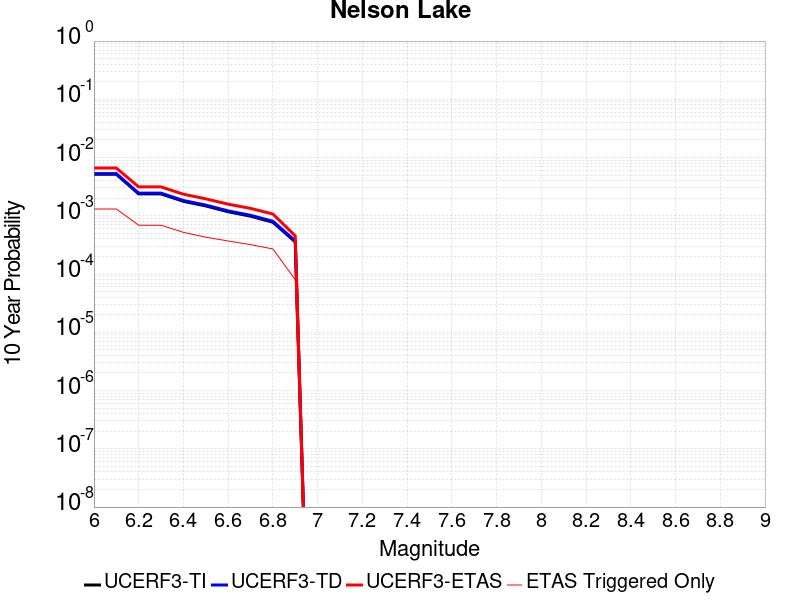 |

| Magnitude | 1 wk TI Prob | 1 wk TD Prob | 1 wk ETAS Prob | 1 wk ETAS/TD Gain | 1 wk ETAS Triggered Only | 1 mo TI Prob | 1 mo TD Prob | 1 mo ETAS Prob | 1 mo ETAS/TD Gain | 1 mo ETAS Triggered Only | 1 yr TI Prob | 1 yr TD Prob | 1 yr ETAS Prob | 1 yr ETAS/TD Gain | 1 yr ETAS Triggered Only | 10 yr TI Prob | 10 yr TD Prob | 10 yr ETAS Prob | 10 yr ETAS/TD Gain | 10 yr ETAS Triggered Only |
|-----|-----|-----|-----|-----|-----|-----|-----|-----|-----|-----|-----|-----|-----|-----|-----|-----|-----|-----|-----|-----|
| 6.0 | 9.913453E-6 | 1.0192446E-5 | 9.9204386E-5 | 9.733129 | 8.901285E-5 | 4.2485535E-5 | 4.3681237E-5 | 2.2169916E-4 | 5.0753865 | 1.780257E-4 | 5.1713863E-4 | 5.316996E-4 | 0.0010061824 | 1.8923888 | 4.747352E-4 | 0.0051593683 | 0.005305303 | 0.0065448713 | 1.2336471 | 0.0012461799 |
| 6.1 | 9.913453E-6 | 1.0192446E-5 | 9.9204386E-5 | 9.733129 | 8.901285E-5 | 4.2485535E-5 | 4.3681237E-5 | 2.2169916E-4 | 5.0753865 | 1.780257E-4 | 5.1713863E-4 | 5.316996E-4 | 0.0010061824 | 1.8923888 | 4.747352E-4 | 0.0051593683 | 0.005305303 | 0.0065448713 | 1.2336471 | 0.0012461799 |
| 6.2 | 4.5596407E-6 | 4.6964064E-6 | 7.887343E-5 | 16.794422 | 7.417738E-5 | 1.954117E-5 | 2.0127309E-5 | 1.536439E-4 | 7.6336036 | 1.3351926E-4 | 2.3788778E-4 | 2.450237E-4 | 5.564923E-4 | 2.2711775 | 3.1154498E-4 | 0.0023763329 | 0.0024476615 | 0.0030988248 | 1.2660348 | 6.527609E-4 |
| 6.3 | 4.5596407E-6 | 4.6964064E-6 | 7.887343E-5 | 16.794422 | 7.417738E-5 | 1.954117E-5 | 2.0127309E-5 | 1.536439E-4 | 7.6336036 | 1.3351926E-4 | 2.3788778E-4 | 2.450237E-4 | 5.564923E-4 | 2.2711775 | 3.1154498E-4 | 0.0023763329 | 0.0024476615 | 0.0030988248 | 1.2660348 | 6.527609E-4 |
| 6.4 | 3.4025713E-6 | 3.5099708E-6 | 6.285166E-5 | 17.906605 | 5.93419E-5 | 1.4582367E-5 | 1.504265E-5 | 1.0405416E-4 | 6.917276 | 8.901285E-5 | 1.7752586E-4 | 1.8312971E-4 | 3.907883E-4 | 2.1339428 | 2.0769665E-4 | 0.001773841 | 0.001829871 | 0.0023185457 | 1.2670542 | 4.8957067E-4 |
| 6.5 | 2.8352947E-6 | 2.9279197E-6 | 4.7434212E-5 | 16.200655 | 4.4506425E-5 | 1.2151207E-5 | 1.2548171E-5 | 8.672461E-5 | 6.911335 | 7.417738E-5 | 1.479309E-4 | 1.5276401E-4 | 3.3076253E-4 | 2.165186 | 1.780257E-4 | 0.0014783246 | 0.0015266639 | 0.0019117974 | 1.2522713 | 3.8572235E-4 |
| 6.6 | 2.251518E-6 | 2.329121E-6 | 4.683544E-5 | 20.108635 | 4.4506425E-5 | 9.649328E-6 | 9.981912E-6 | 6.932322E-5 | 6.944884 | 5.93419E-5 | 1.1747423E-4 | 1.21523626E-4 | 2.6986035E-4 | 2.220641 | 1.4835475E-4 | 0.0011741214 | 0.0012146335 | 0.0015406176 | 1.2683805 | 3.2638045E-4 |
| 6.7 | 1.8911853E-6 | 1.9591864E-6 | 3.1630076E-5 | 16.144495 | 2.967095E-5 | 8.105055E-6 | 8.39649E-6 | 3.8067188E-5 | 4.533703 | 2.967095E-5 | 9.867457E-5 | 1.0222305E-4 | 2.0606075E-4 | 2.0157955 | 1.03848324E-4 | 9.863076E-4 | 0.0010218178 | 0.0013034038 | 1.2755736 | 2.81874E-4 |
| 6.8 | 1.4874814E-6 | 1.5438693E-6 | 1.6379321E-5 | 10.609266 | 1.4835475E-5 | 6.374905E-6 | 6.616569E-6 | 2.1451946E-5 | 3.2421556 | 1.4835475E-5 | 7.76117E-5 | 8.055427E-5 | 1.5472567E-4 | 1.920763 | 7.417738E-5 | 7.75846E-4 | 8.053018E-4 | 0.0010276547 | 1.2761112 | 2.2253212E-4 |
| 6.9 | 6.835972E-7 | 7.140139E-7 | 7.140139E-7 | 1.0 | 0.0 | 2.9296991E-6 | 3.0600577E-6 | 3.0600577E-6 | 1.0 | 0.0 | 3.56685E-5 | 3.7255882E-5 | 5.2090807E-5 | 1.39819 | 1.4835475E-5 | 3.5662777E-4 | 3.7252763E-4 | 4.3184744E-4 | 1.159236 | 5.93419E-5 |

## Lenwood-Lockhart-Old Woman Springs
*[(top)](#table-of-contents)*

| 1 Week | 1 Month | 1 Year | 10 Year |
|-----|-----|-----|-----|
|  |  |  |  |

| Magnitude | 1 wk TI Prob | 1 wk TD Prob | 1 wk ETAS Prob | 1 wk ETAS/TD Gain | 1 wk ETAS Triggered Only | 1 mo TI Prob | 1 mo TD Prob | 1 mo ETAS Prob | 1 mo ETAS/TD Gain | 1 mo ETAS Triggered Only | 1 yr TI Prob | 1 yr TD Prob | 1 yr ETAS Prob | 1 yr ETAS/TD Gain | 1 yr ETAS Triggered Only | 10 yr TI Prob | 10 yr TD Prob | 10 yr ETAS Prob | 10 yr ETAS/TD Gain | 10 yr ETAS Triggered Only |
|-----|-----|-----|-----|-----|-----|-----|-----|-----|-----|-----|-----|-----|-----|-----|-----|-----|-----|-----|-----|-----|
| 6.0 | 3.744542E-5 | 4.3964752E-5 | 5.8799575E-5 | 1.3374254 | 1.4835475E-5 | 1.604705E-4 | 1.8840774E-4 | 2.9223648E-4 | 1.5510855 | 1.03848324E-4 | 0.0019519776 | 0.002291623 | 0.0028392777 | 1.2389811 | 5.4891256E-4 | 0.019349206 | 0.02269793 | 0.024017313 | 1.058128 | 0.0013500282 |
| 6.1 | 3.744542E-5 | 4.3964752E-5 | 5.8799575E-5 | 1.3374254 | 1.4835475E-5 | 1.604705E-4 | 1.8840774E-4 | 2.9223648E-4 | 1.5510855 | 1.03848324E-4 | 0.0019519776 | 0.002291623 | 0.0028392777 | 1.2389811 | 5.4891256E-4 | 0.019349206 | 0.02269793 | 0.024017313 | 1.058128 | 0.0013500282 |
| 6.2 | 3.744542E-5 | 4.3964752E-5 | 5.8799575E-5 | 1.3374254 | 1.4835475E-5 | 1.604705E-4 | 1.8840774E-4 | 2.9223648E-4 | 1.5510855 | 1.03848324E-4 | 0.0019519776 | 0.002291623 | 0.0028392777 | 1.2389811 | 5.4891256E-4 | 0.019349206 | 0.02269793 | 0.024017313 | 1.058128 | 0.0013500282 |
| 6.3 | 2.1079984E-5 | 2.5354248E-5 | 4.0189345E-5 | 1.5851129 | 1.4835475E-5 | 9.0339665E-5 | 1.0865665E-4 | 1.679921E-4 | 1.5460821 | 5.93419E-5 | 0.0010993304 | 0.0013221118 | 0.0015295339 | 1.1568869 | 2.0769665E-4 | 0.010939079 | 0.013144677 | 0.013701014 | 1.0423242 | 5.63748E-4 |
| 6.4 | 2.1079984E-5 | 2.5354248E-5 | 4.0189345E-5 | 1.5851129 | 1.4835475E-5 | 9.0339665E-5 | 1.0865665E-4 | 1.679921E-4 | 1.5460821 | 5.93419E-5 | 0.0010993304 | 0.0013221118 | 0.0015295339 | 1.1568869 | 2.0769665E-4 | 0.010939079 | 0.013144677 | 0.013701014 | 1.0423242 | 5.63748E-4 |
| 6.5 | 1.7397282E-5 | 2.066304E-5 | 3.5498208E-5 | 1.7179568 | 1.4835475E-5 | 7.455765E-5 | 8.8552944E-5 | 1.4788959E-4 | 1.6700697 | 5.93419E-5 | 9.073613E-4 | 0.0010776105 | 0.0012406249 | 1.151274 | 1.6319023E-4 | 0.009036654 | 0.010725146 | 0.011180113 | 1.0424206 | 4.5989972E-4 |
| 6.6 | 1.52050325E-5 | 1.7680222E-5 | 3.2515432E-5 | 1.8390852 | 1.4835475E-5 | 6.51628E-5 | 7.577022E-5 | 1.3510762E-4 | 1.783123 | 5.93419E-5 | 7.9306826E-4 | 9.221199E-4 | 0.0010703378 | 1.1607361 | 1.4835475E-4 | 0.007902439 | 0.009183799 | 0.009610076 | 1.0464163 | 4.3022877E-4 |
| 6.7 | 1.332523E-5 | 1.5264446E-5 | 3.0099694E-5 | 1.9718825 | 1.4835475E-5 | 5.7106878E-5 | 6.541745E-5 | 9.5086456E-5 | 1.4535335 | 2.967095E-5 | 6.950544E-4 | 7.9617224E-4 | 8.9993794E-4 | 1.1303307 | 1.03848324E-4 | 0.006928845 | 0.007933829 | 0.008272338 | 1.0426666 | 3.4121593E-4 |
| 6.8 | 1.1525329E-5 | 1.3031333E-5 | 2.7866614E-5 | 2.1384315 | 1.4835475E-5 | 4.9393333E-5 | 5.58474E-5 | 8.551669E-5 | 1.5312564 | 2.967095E-5 | 6.011979E-4 | 6.7973416E-4 | 7.686865E-4 | 1.1308634 | 8.901285E-5 | 0.00599574 | 0.0067770025 | 0.007042231 | 1.0391366 | 2.6703853E-4 |
| 6.9 | 1.0253909E-5 | 1.1514735E-5 | 2.6350039E-5 | 2.2883756 | 1.4835475E-5 | 4.3944583E-5 | 4.9347953E-5 | 7.901744E-5 | 1.6012303 | 2.967095E-5 | 5.3489394E-4 | 6.0064933E-4 | 6.896087E-4 | 1.1481054 | 8.901285E-5 | 0.0053360825 | 0.005990638 | 0.006211837 | 1.0369241 | 2.2253212E-4 |
| 7.0 | 8.104563E-6 | 8.991487E-6 | 8.991487E-6 | 1.0 | 0.0 | 3.4733377E-5 | 3.8534392E-5 | 5.3369295E-5 | 1.3849783 | 1.4835475E-5 | 4.2279682E-4 | 4.6905765E-4 | 5.283717E-4 | 1.1264536 | 5.93419E-5 | 0.0042199334 | 0.004680924 | 0.0048728823 | 1.0410087 | 1.9286117E-4 |
| 7.1 | 6.7986157E-6 | 7.5159787E-6 | 7.5159787E-6 | 1.0 | 0.0 | 2.91366E-5 | 3.221095E-5 | 4.704595E-5 | 1.4605576 | 1.4835475E-5 | 3.5468035E-4 | 3.920999E-4 | 4.3658886E-4 | 1.1134634 | 4.4506425E-5 | 0.003541148 | 0.003914297 | 0.0040472937 | 1.0339772 | 1.3351926E-4 |
| 7.2 | 5.6893327E-6 | 6.2801405E-6 | 6.2801405E-6 | 1.0 | 0.0 | 2.4382627E-5 | 2.6914622E-5 | 2.6914622E-5 | 1.0 | 0.0 | 2.9681803E-4 | 3.2763823E-4 | 3.5729946E-4 | 1.0905304 | 2.967095E-5 | 0.002964219 | 0.0032717506 | 0.0033604722 | 1.0271175 | 8.901285E-5 |
| 7.3 | 4.253348E-6 | 4.7069934E-6 | 4.7069934E-6 | 1.0 | 0.0 | 1.8228506E-5 | 2.0172683E-5 | 2.0172683E-5 | 1.0 | 0.0 | 2.2190946E-4 | 2.4557655E-4 | 2.604084E-4 | 1.060396 | 1.4835475E-5 | 0.00221688 | 0.0024532329 | 0.0025272283 | 1.0301625 | 7.417738E-5 |
| 7.4 | 2.5448119E-6 | 2.852087E-6 | 2.852087E-6 | 1.0 | 0.0 | 1.0906291E-5 | 1.2223182E-5 | 1.2223182E-5 | 1.0 | 0.0 | 1.3277601E-4 | 1.4880873E-4 | 1.6364199E-4 | 1.0996801 | 1.4835475E-5 | 0.001326967 | 0.001487253 | 0.0015316933 | 1.0298808 | 4.4506425E-5 |
| 7.5 | 4.3706837E-8 | 4.5630422E-8 | 4.5630422E-8 | 1.0 | 0.0 | 1.8731501E-7 | 1.9555894E-7 | 1.9555894E-7 | 1.0 | 0.0 | 2.2805577E-6 | 2.380928E-6 | 2.380928E-6 | 1.0 | 0.0 | 2.2805343E-5 | 2.380908E-5 | 2.380908E-5 | 1.0 | 0.0 |

## Death Valley (So)
*[(top)](#table-of-contents)*

| 1 Week | 1 Month | 1 Year | 10 Year |
|-----|-----|-----|-----|
|  |  |  |  |

| Magnitude | 1 wk TI Prob | 1 wk TD Prob | 1 wk ETAS Prob | 1 wk ETAS/TD Gain | 1 wk ETAS Triggered Only | 1 mo TI Prob | 1 mo TD Prob | 1 mo ETAS Prob | 1 mo ETAS/TD Gain | 1 mo ETAS Triggered Only | 1 yr TI Prob | 1 yr TD Prob | 1 yr ETAS Prob | 1 yr ETAS/TD Gain | 1 yr ETAS Triggered Only | 10 yr TI Prob | 10 yr TD Prob | 10 yr ETAS Prob | 10 yr ETAS/TD Gain | 10 yr ETAS Triggered Only |
|-----|-----|-----|-----|-----|-----|-----|-----|-----|-----|-----|-----|-----|-----|-----|-----|-----|-----|-----|-----|-----|
| 6.0 | 2.0684236E-5 | 2.5621006E-5 | 7.012629E-5 | 2.7370622 | 4.4506425E-5 | 8.864371E-5 | 1.0979979E-4 | 1.9880287E-4 | 1.8105942 | 8.901285E-5 | 0.0010787029 | 0.0013360096 | 0.0019730828 | 1.4768478 | 6.379254E-4 | 0.010734817 | 0.013283058 | 0.014659069 | 1.1035914 | 0.0013945346 |
| 6.1 | 2.0684236E-5 | 2.5621006E-5 | 7.012629E-5 | 2.7370622 | 4.4506425E-5 | 8.864371E-5 | 1.0979979E-4 | 1.9880287E-4 | 1.8105942 | 8.901285E-5 | 0.0010787029 | 0.0013360096 | 0.0019730828 | 1.4768478 | 6.379254E-4 | 0.010734817 | 0.013283058 | 0.014659069 | 1.1035914 | 0.0013945346 |
| 6.2 | 2.0684236E-5 | 2.5621006E-5 | 7.012629E-5 | 2.7370622 | 4.4506425E-5 | 8.864371E-5 | 1.0979979E-4 | 1.9880287E-4 | 1.8105942 | 8.901285E-5 | 0.0010787029 | 0.0013360096 | 0.0019730828 | 1.4768478 | 6.379254E-4 | 0.010734817 | 0.013283058 | 0.014659069 | 1.1035914 | 0.0013945346 |
| 6.3 | 2.0240292E-5 | 2.512105E-5 | 6.962635E-5 | 2.771634 | 4.4506425E-5 | 8.6741224E-5 | 1.07657295E-4 | 1.9666056E-4 | 1.8267277 | 8.901285E-5 | 0.0010555626 | 0.0013099562 | 0.0019025978 | 1.4524133 | 5.93419E-4 | 0.010505628 | 0.013025596 | 0.014343397 | 1.1011701 | 0.0013351927 |
| 6.4 | 2.0240292E-5 | 2.512105E-5 | 6.962635E-5 | 2.771634 | 4.4506425E-5 | 8.6741224E-5 | 1.07657295E-4 | 1.9666056E-4 | 1.8267277 | 8.901285E-5 | 0.0010555626 | 0.0013099562 | 0.0019025978 | 1.4524133 | 5.93419E-4 | 0.010505628 | 0.013025596 | 0.014343397 | 1.1011701 | 0.0013351927 |
| 6.5 | 1.9962767E-5 | 2.4810277E-5 | 6.9315596E-5 | 2.7938259 | 4.4506425E-5 | 8.55519E-5 | 1.06325526E-4 | 1.953289E-4 | 1.8370839 | 8.901285E-5 | 0.0010410968 | 0.0012937612 | 0.0018715962 | 1.4466318 | 5.785835E-4 | 0.010362327 | 0.01286553 | 0.014110322 | 1.0967541 | 0.0012610153 |
| 6.6 | 1.8937297E-5 | 2.3313984E-5 | 6.781937E-5 | 2.9089568 | 4.4506425E-5 | 8.115732E-5 | 9.9913326E-5 | 1.8891729E-4 | 1.8908116 | 8.901285E-5 | 9.876423E-4 | 0.0012157805 | 0.0017492083 | 1.4387534 | 5.3407706E-4 | 0.009832645 | 0.012094343 | 0.013252171 | 1.095733 | 0.0011720025 |
| 6.7 | 1.8621096E-5 | 2.2914594E-5 | 6.742E-5 | 2.9422297 | 4.4506425E-5 | 7.980225E-5 | 9.820178E-5 | 1.872059E-4 | 1.906339 | 8.901285E-5 | 9.711593E-4 | 0.0011949654 | 0.0017284043 | 1.4464053 | 5.3407706E-4 | 0.009669261 | 0.011888442 | 0.013031852 | 1.0961783 | 0.001157167 |
| 6.8 | 1.7830353E-5 | 2.1808488E-5 | 2.1808488E-5 | 1.0 | 0.0 | 7.641356E-5 | 9.346168E-5 | 1.3796394E-4 | 1.4761552 | 4.4506425E-5 | 9.29938E-4 | 0.0011373159 | 0.0016115112 | 1.4169425 | 4.747352E-4 | 0.009260561 | 0.011317797 | 0.012373862 | 1.0933101 | 0.0010681541 |
| 6.9 | 1.3135183E-5 | 1.5305506E-5 | 1.5305506E-5 | 1.0 | 0.0 | 5.6292425E-5 | 6.559341E-5 | 8.042792E-5 | 1.2261584 | 1.4835475E-5 | 6.8514474E-4 | 7.983137E-4 | 0.0010651391 | 1.3342363 | 2.6703853E-4 | 0.006830362 | 0.007955467 | 0.008661904 | 1.088799 | 7.121028E-4 |
| 7.0 | 1.1507512E-5 | 1.31554225E-5 | 1.31554225E-5 | 1.0 | 0.0 | 4.9316975E-5 | 5.6379195E-5 | 7.1213835E-5 | 1.2631226 | 1.4835475E-5 | 6.002687E-4 | 6.862063E-4 | 8.789351E-4 | 1.2808614 | 1.9286117E-4 | 0.0059864987 | 0.0068415753 | 0.0074014664 | 1.0818366 | 5.63748E-4 |
| 7.1 | 9.715903E-6 | 1.0866157E-5 | 1.0866157E-5 | 1.0 | 0.0 | 4.1638916E-5 | 4.656844E-5 | 6.140322E-5 | 1.3185588 | 1.4835475E-5 | 5.068359E-4 | 5.668275E-4 | 6.706169E-4 | 1.183106 | 1.03848324E-4 | 0.0050568148 | 0.0056542708 | 0.005905048 | 1.0443518 | 2.5220306E-4 |
| 7.2 | 9.233269E-6 | 1.0287124E-5 | 1.0287124E-5 | 1.0 | 0.0 | 3.9570554E-5 | 4.408695E-5 | 5.892177E-5 | 1.33649 | 1.4835475E-5 | 4.81665E-4 | 5.366307E-4 | 6.2559574E-4 | 1.1657846 | 8.901285E-5 | 0.0048062233 | 0.00535378 | 0.0055603646 | 1.0385867 | 2.0769665E-4 |
| 7.3 | 8.8041315E-6 | 9.808909E-6 | 9.808909E-6 | 1.0 | 0.0 | 3.7731446E-5 | 4.203753E-5 | 5.687238E-5 | 1.3528954 | 1.4835475E-5 | 4.592835E-4 | 5.116909E-4 | 5.8583036E-4 | 1.144891 | 7.417738E-5 | 0.0045833546 | 0.005105554 | 0.005267911 | 1.0318 | 1.6319023E-4 |
| 7.4 | 8.708749E-6 | 9.707916E-6 | 9.707916E-6 | 1.0 | 0.0 | 3.7322676E-5 | 4.1604715E-5 | 5.6439574E-5 | 1.3565667 | 1.4835475E-5 | 4.5430884E-4 | 5.064239E-4 | 5.805637E-4 | 1.1463987 | 7.417738E-5 | 0.004533812 | 0.0050531244 | 0.0052154902 | 1.0321317 | 1.6319023E-4 |
| 7.5 | 8.612678E-6 | 9.605554E-6 | 9.605554E-6 | 1.0 | 0.0 | 3.6910955E-5 | 4.1166033E-5 | 5.60009E-5 | 1.3603666 | 1.4835475E-5 | 4.492982E-4 | 5.010854E-4 | 5.752256E-4 | 1.1479592 | 7.417738E-5 | 0.004483909 | 0.0049999813 | 0.0051475945 | 1.0295227 | 1.4835475E-4 |
| 7.6 | 8.319024E-6 | 9.284633E-6 | 9.284633E-6 | 1.0 | 0.0 | 3.5652476E-5 | 3.9790702E-5 | 5.4625587E-5 | 1.3728229 | 1.4835475E-5 | 4.3398244E-4 | 4.843483E-4 | 5.5848976E-4 | 1.1530746 | 7.417738E-5 | 0.0043313587 | 0.0048333504 | 0.0049514608 | 1.0244365 | 1.186838E-4 |
| 7.7 | 7.4718328E-6 | 8.345819E-6 | 8.345819E-6 | 1.0 | 0.0 | 3.2021748E-5 | 3.5767327E-5 | 5.0602273E-5 | 1.4147624 | 1.4835475E-5 | 3.8979502E-4 | 4.3538425E-4 | 5.095293E-4 | 1.170298 | 7.417738E-5 | 0.00389112 | 0.004345718 | 0.004449115 | 1.0237929 | 1.03848324E-4 |
| 7.8 | 3.4586725E-7 | 3.6483948E-7 | 3.6483948E-7 | 1.0 | 0.0 | 1.4822873E-6 | 1.5635968E-6 | 1.5635968E-6 | 1.0 | 0.0 | 1.80467E-5 | 1.903663E-5 | 3.387182E-5 | 1.7792972 | 1.4835475E-5 | 1.8045233E-4 | 1.9035043E-4 | 2.0518308E-4 | 1.0779228 | 1.4835475E-5 |
| 7.9 | 2.5591178E-9 | 2.6697482E-9 | 2.6697482E-9 | 1.0 | 0.0 | 1.0967647E-8 | 1.1441778E-8 | 1.1441778E-8 | 1.0 | 0.0 | 1.335311E-7 | 1.3930365E-7 | 1.3930365E-7 | 1.0 | 0.0 | 1.3353102E-6 | 1.3930365E-6 | 1.3930365E-6 | 1.0 | 0.0 |

## Towne Pass
*[(top)](#table-of-contents)*

| 1 Week | 1 Month | 1 Year | 10 Year |
|-----|-----|-----|-----|
|  | 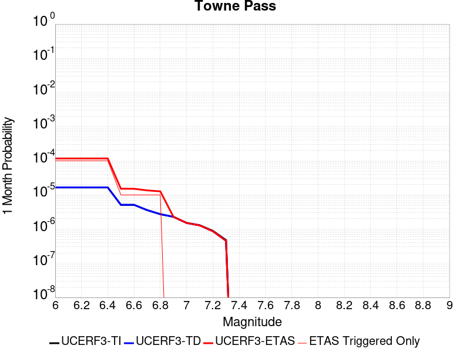 |  |  |

| Magnitude | 1 wk TI Prob | 1 wk TD Prob | 1 wk ETAS Prob | 1 wk ETAS/TD Gain | 1 wk ETAS Triggered Only | 1 mo TI Prob | 1 mo TD Prob | 1 mo ETAS Prob | 1 mo ETAS/TD Gain | 1 mo ETAS Triggered Only | 1 yr TI Prob | 1 yr TD Prob | 1 yr ETAS Prob | 1 yr ETAS/TD Gain | 1 yr ETAS Triggered Only | 10 yr TI Prob | 10 yr TD Prob | 10 yr ETAS Prob | 10 yr ETAS/TD Gain | 10 yr ETAS Triggered Only |
|-----|-----|-----|-----|-----|-----|-----|-----|-----|-----|-----|-----|-----|-----|-----|-----|-----|-----|-----|-----|-----|
| 6.0 | 3.849728E-6 | 3.8945827E-6 | 3.3565415E-5 | 8.618488 | 2.967095E-5 | 1.649873E-5 | 1.6690987E-5 | 1.353728E-4 | 8.110534 | 1.186838E-4 | 2.0085352E-4 | 2.0319817E-4 | 7.964966E-4 | 3.9198017 | 5.93419E-4 | 0.0020067208 | 0.0020305528 | 0.0033186185 | 1.6343422 | 0.0012906863 |
| 6.1 | 3.849728E-6 | 3.8945827E-6 | 3.3565415E-5 | 8.618488 | 2.967095E-5 | 1.649873E-5 | 1.6690987E-5 | 1.353728E-4 | 8.110534 | 1.186838E-4 | 2.0085352E-4 | 2.0319817E-4 | 7.964966E-4 | 3.9198017 | 5.93419E-4 | 0.0020067208 | 0.0020305528 | 0.0033186185 | 1.6343422 | 0.0012906863 |
| 6.2 | 3.849728E-6 | 3.8945827E-6 | 3.3565415E-5 | 8.618488 | 2.967095E-5 | 1.649873E-5 | 1.6690987E-5 | 1.353728E-4 | 8.110534 | 1.186838E-4 | 2.0085352E-4 | 2.0319817E-4 | 7.964966E-4 | 3.9198017 | 5.93419E-4 | 0.0020067208 | 0.0020305528 | 0.0033186185 | 1.6343422 | 0.0012906863 |
| 6.3 | 3.849728E-6 | 3.8945827E-6 | 3.3565415E-5 | 8.618488 | 2.967095E-5 | 1.649873E-5 | 1.6690987E-5 | 1.353728E-4 | 8.110534 | 1.186838E-4 | 2.0085352E-4 | 2.0319817E-4 | 7.964966E-4 | 3.9198017 | 5.93419E-4 | 0.0020067208 | 0.0020305528 | 0.0033186185 | 1.6343422 | 0.0012906863 |
| 6.4 | 3.849728E-6 | 3.8945827E-6 | 3.3565415E-5 | 8.618488 | 2.967095E-5 | 1.649873E-5 | 1.6690987E-5 | 1.353728E-4 | 8.110534 | 1.186838E-4 | 2.0085352E-4 | 2.0319817E-4 | 7.964966E-4 | 3.9198017 | 5.93419E-4 | 0.0020067208 | 0.0020305528 | 0.0033186185 | 1.6343422 | 0.0012906863 |
| 6.5 | 1.1953545E-6 | 1.2030682E-6 | 1.2030682E-6 | 1.0 | 0.0 | 5.1229376E-6 | 5.1559973E-6 | 1.9991396E-5 | 3.877309 | 1.4835475E-5 | 6.236998E-5 | 6.277258E-5 | 1.0727621E-4 | 1.7089661 | 4.4506425E-5 | 6.235248E-4 | 6.275602E-4 | 8.351265E-4 | 1.3307512 | 2.0769665E-4 |
| 6.6 | 1.1953545E-6 | 1.2030682E-6 | 1.2030682E-6 | 1.0 | 0.0 | 5.1229376E-6 | 5.1559973E-6 | 1.9991396E-5 | 3.877309 | 1.4835475E-5 | 6.236998E-5 | 6.277258E-5 | 1.0727621E-4 | 1.7089661 | 4.4506425E-5 | 6.235248E-4 | 6.275602E-4 | 8.351265E-4 | 1.3307512 | 2.0769665E-4 |
| 6.7 | 8.375951E-7 | 8.4108046E-7 | 8.4108046E-7 | 1.0 | 0.0 | 3.5896885E-6 | 3.6046258E-6 | 1.8440047E-5 | 5.1156616 | 1.4835475E-5 | 4.370358E-5 | 4.3885495E-5 | 5.8720318E-5 | 1.3380347 | 1.4835475E-5 | 4.3694986E-4 | 4.38774E-4 | 5.425768E-4 | 1.2365745 | 1.03848324E-4 |
| 6.8 | 6.38041E-7 | 6.3922755E-7 | 6.3922755E-7 | 1.0 | 0.0 | 2.7344586E-6 | 2.7395438E-6 | 1.7574977E-5 | 6.415293 | 1.4835475E-5 | 3.3291526E-5 | 3.3353474E-5 | 4.8188456E-5 | 1.4447806 | 1.4835475E-5 | 3.3286537E-4 | 3.334885E-4 | 4.373022E-4 | 1.3112961 | 1.03848324E-4 |
| 6.9 | 5.3460053E-7 | 5.3454437E-7 | 5.3454437E-7 | 1.0 | 0.0 | 2.2911431E-6 | 2.2909026E-6 | 2.2909026E-6 | 1.0 | 0.0 | 2.789431E-5 | 2.7891416E-5 | 2.7891416E-5 | 1.0 | 0.0 | 2.789081E-4 | 2.7888248E-4 | 3.382078E-4 | 1.2127253 | 5.93419E-5 |
| 7.0 | 3.557783E-7 | 3.5325164E-7 | 3.5325164E-7 | 1.0 | 0.0 | 1.5247632E-6 | 1.5139348E-6 | 1.5139348E-6 | 1.0 | 0.0 | 1.8563835E-5 | 1.8432009E-5 | 1.8432009E-5 | 1.0 | 0.0 | 1.8562283E-4 | 1.8430564E-4 | 2.1397113E-4 | 1.160958 | 2.967095E-5 |
| 7.1 | 3.037942E-7 | 3.0003073E-7 | 3.0003073E-7 | 1.0 | 0.0 | 1.3019744E-6 | 1.2858454E-6 | 1.2858454E-6 | 1.0 | 0.0 | 1.5851423E-5 | 1.5655063E-5 | 1.5655063E-5 | 1.0 | 0.0 | 1.5850292E-4 | 1.5654035E-4 | 1.8620666E-4 | 1.1895121 | 2.967095E-5 |
| 7.2 | 2.0808248E-7 | 2.0218393E-7 | 2.0218393E-7 | 1.0 | 0.0 | 8.917818E-7 | 8.6650226E-7 | 8.6650226E-7 | 1.0 | 0.0 | 1.0857389E-5 | 1.0549618E-5 | 1.0549618E-5 | 1.0 | 0.0 | 1.0856859E-4 | 1.0549164E-4 | 1.3515945E-4 | 1.2812338 | 2.967095E-5 |
| 7.3 | 1.1162073E-7 | 1.063734E-7 | 1.063734E-7 | 1.0 | 0.0 | 4.7837443E-7 | 4.5588592E-7 | 4.5588592E-7 | 1.0 | 0.0 | 5.8241935E-6 | 5.5503992E-6 | 5.5503992E-6 | 1.0 | 0.0 | 5.8240406E-5 | 5.5502805E-5 | 5.5502805E-5 | 1.0 | 0.0 |

## San Andreas (Mojave N)
*[(top)](#table-of-contents)*

| 1 Week | 1 Month | 1 Year | 10 Year |
|-----|-----|-----|-----|
|  | 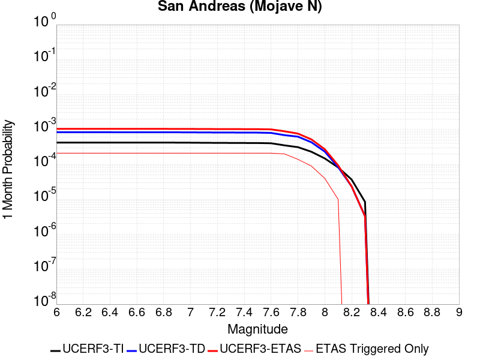 |  |  |

| Magnitude | 1 wk TI Prob | 1 wk TD Prob | 1 wk ETAS Prob | 1 wk ETAS/TD Gain | 1 wk ETAS Triggered Only | 1 mo TI Prob | 1 mo TD Prob | 1 mo ETAS Prob | 1 mo ETAS/TD Gain | 1 mo ETAS Triggered Only | 1 yr TI Prob | 1 yr TD Prob | 1 yr ETAS Prob | 1 yr ETAS/TD Gain | 1 yr ETAS Triggered Only | 10 yr TI Prob | 10 yr TD Prob | 10 yr ETAS Prob | 10 yr ETAS/TD Gain | 10 yr ETAS Triggered Only |
|-----|-----|-----|-----|-----|-----|-----|-----|-----|-----|-----|-----|-----|-----|-----|-----|-----|-----|-----|-----|-----|
| 6.0 | 9.877682E-5 | 1.9444349E-4 | 2.2410868E-4 | 1.1525645 | 2.967095E-5 | 4.2326056E-4 | 8.330633E-4 | 0.0010702332 | 1.2846961 | 2.373676E-4 | 0.0051410277 | 0.010095506 | 0.010712305 | 1.0610964 | 6.2308996E-4 | 0.05023708 | 0.09850562 | 0.099669166 | 1.011812 | 0.0012906863 |
| 6.1 | 9.877682E-5 | 1.9444349E-4 | 2.2410868E-4 | 1.1525645 | 2.967095E-5 | 4.2326056E-4 | 8.330633E-4 | 0.0010702332 | 1.2846961 | 2.373676E-4 | 0.0051410277 | 0.010095506 | 0.010712305 | 1.0610964 | 6.2308996E-4 | 0.05023708 | 0.09850562 | 0.099669166 | 1.011812 | 0.0012906863 |
| 6.2 | 9.877682E-5 | 1.9444349E-4 | 2.2410868E-4 | 1.1525645 | 2.967095E-5 | 4.2326056E-4 | 8.330633E-4 | 0.0010702332 | 1.2846961 | 2.373676E-4 | 0.0051410277 | 0.010095506 | 0.010712305 | 1.0610964 | 6.2308996E-4 | 0.05023708 | 0.09850562 | 0.099669166 | 1.011812 | 0.0012906863 |
| 6.3 | 9.877682E-5 | 1.9444349E-4 | 2.2410868E-4 | 1.1525645 | 2.967095E-5 | 4.2326056E-4 | 8.330633E-4 | 0.0010702332 | 1.2846961 | 2.373676E-4 | 0.0051410277 | 0.010095506 | 0.010712305 | 1.0610964 | 6.2308996E-4 | 0.05023708 | 0.09850562 | 0.099669166 | 1.011812 | 0.0012906863 |
| 6.4 | 9.877682E-5 | 1.9444349E-4 | 2.2410868E-4 | 1.1525645 | 2.967095E-5 | 4.2326056E-4 | 8.330633E-4 | 0.0010702332 | 1.2846961 | 2.373676E-4 | 0.0051410277 | 0.010095506 | 0.010712305 | 1.0610964 | 6.2308996E-4 | 0.05023708 | 0.09850562 | 0.099669166 | 1.011812 | 0.0012906863 |
| 6.5 | 9.861474E-5 | 1.9418103E-4 | 2.2384622E-4 | 1.1527708 | 2.967095E-5 | 4.2256617E-4 | 8.3193916E-4 | 0.0010691093 | 1.285081 | 2.373676E-4 | 0.0051326132 | 0.010081946 | 0.010698753 | 1.0611794 | 6.2308996E-4 | 0.050156746 | 0.09838338 | 0.09954709 | 1.0118283 | 0.0012906863 |
| 6.6 | 9.861474E-5 | 1.9418103E-4 | 2.2384622E-4 | 1.1527708 | 2.967095E-5 | 4.2256617E-4 | 8.3193916E-4 | 0.0010691093 | 1.285081 | 2.373676E-4 | 0.0051326132 | 0.010081946 | 0.010698753 | 1.0611794 | 6.2308996E-4 | 0.050156746 | 0.09838338 | 0.09954709 | 1.0118283 | 0.0012906863 |
| 6.7 | 9.8552715E-5 | 1.9408051E-4 | 2.237457E-4 | 1.1528499 | 2.967095E-5 | 4.223004E-4 | 8.3150866E-4 | 0.0010686789 | 1.2852288 | 2.373676E-4 | 0.0051293927 | 0.010076753 | 0.010693564 | 1.0612113 | 6.2308996E-4 | 0.050125998 | 0.09833656 | 0.09950033 | 1.0118345 | 0.0012906863 |
| 6.8 | 9.8464974E-5 | 1.93932E-4 | 2.235972E-4 | 1.152967 | 2.967095E-5 | 4.219245E-4 | 8.308726E-4 | 0.001068043 | 1.2854474 | 2.373676E-4 | 0.0051248376 | 0.010069081 | 0.0106858965 | 1.0612584 | 6.2308996E-4 | 0.05008251 | 0.09826654 | 0.0994304 | 1.0118438 | 0.0012906863 |
| 6.9 | 9.825824E-5 | 1.9361186E-4 | 2.2327708E-4 | 1.1532199 | 2.967095E-5 | 4.2103877E-4 | 8.295015E-4 | 0.0010666722 | 1.2859195 | 2.373676E-4 | 0.0051141046 | 0.010052541 | 0.010669367 | 1.0613602 | 6.2308996E-4 | 0.049980022 | 0.09811557 | 0.09927962 | 1.0118641 | 0.0012906863 |
| 7.0 | 9.781462E-5 | 1.9292503E-4 | 2.2259026E-4 | 1.1537656 | 2.967095E-5 | 4.1913814E-4 | 8.265597E-4 | 0.0010637311 | 1.286938 | 2.373676E-4 | 0.005091073 | 0.010017055 | 0.010633904 | 1.0615798 | 6.2308996E-4 | 0.04976007 | 0.0977918 | 0.09895627 | 1.0119076 | 0.0012906863 |
| 7.1 | 9.7121134E-5 | 1.9194146E-4 | 2.2160672E-4 | 1.1545537 | 2.967095E-5 | 4.1616702E-4 | 8.223471E-4 | 0.0010595195 | 1.2884091 | 2.373676E-4 | 0.005055068 | 0.0099662375 | 0.010583118 | 1.061897 | 6.2308996E-4 | 0.04941613 | 0.0973281 | 0.09849316 | 1.0119705 | 0.0012906863 |
| 7.2 | 9.663819E-5 | 1.9124882E-4 | 2.209141E-4 | 1.1551135 | 2.967095E-5 | 4.1409794E-4 | 8.1938057E-4 | 0.0010565537 | 1.2894541 | 2.373676E-4 | 0.0050299936 | 0.00993045 | 0.010547351 | 1.0621223 | 6.2308996E-4 | 0.049176537 | 0.0970012 | 0.09816669 | 1.0120152 | 0.0012906863 |
| 7.3 | 9.6277574E-5 | 1.9077334E-4 | 2.2043863E-4 | 1.1555002 | 2.967095E-5 | 4.125529E-4 | 8.1734406E-4 | 0.0010545176 | 1.2901759 | 2.373676E-4 | 0.0050112694 | 0.00990588 | 0.010522798 | 1.0622779 | 6.2308996E-4 | 0.04899759 | 0.09677443 | 0.09794021 | 1.0120463 | 0.0012906863 |
| 7.4 | 9.593308E-5 | 1.9017048E-4 | 2.1983578E-4 | 1.1559932 | 2.967095E-5 | 4.1107697E-4 | 8.1476197E-4 | 0.0010519362 | 1.2910963 | 2.373676E-4 | 0.0049933824 | 0.0098747285 | 0.010491665 | 1.0624764 | 6.2308996E-4 | 0.04882661 | 0.09649237 | 0.09764512 | 1.0119464 | 0.0012758508 |
| 7.5 | 9.561707E-5 | 1.8963068E-4 | 2.19296E-4 | 1.1564374 | 2.967095E-5 | 4.0972308E-4 | 8.1244996E-4 | 0.0010496246 | 1.2919253 | 2.373676E-4 | 0.0049769743 | 0.009846835 | 0.010463789 | 1.0626551 | 6.2308996E-4 | 0.048669744 | 0.09623834 | 0.097391404 | 1.0119814 | 0.0012758508 |
| 7.6 | 9.418194E-5 | 1.8614974E-4 | 2.1581518E-4 | 1.1593633 | 2.967095E-5 | 4.0357444E-4 | 7.975409E-4 | 0.0010347192 | 1.297387 | 2.373676E-4 | 0.004902454 | 0.009666942 | 0.010284008 | 1.0638326 | 6.2308996E-4 | 0.047957025 | 0.094619475 | 0.095774606 | 1.0122082 | 0.0012758508 |
| 7.7 | 8.202141E-5 | 1.6060482E-4 | 1.90271E-4 | 1.1847154 | 2.967095E-5 | 3.51473E-4 | 6.8812486E-4 | 9.1050385E-4 | 1.3231666 | 2.2253212E-4 | 0.00427079 | 0.008345795 | 0.008890126 | 1.0652223 | 5.4891256E-4 | 0.04189639 | 0.08240761 | 0.083496645 | 1.0132152 | 0.001186838 |
| 7.8 | 7.2859846E-5 | 1.4551693E-4 | 1.7518357E-4 | 1.2038707 | 2.967095E-5 | 3.1221908E-4 | 6.2349497E-4 | 7.8658346E-4 | 1.2615714 | 1.6319023E-4 | 0.003794643 | 0.0075646713 | 0.007873859 | 1.0408727 | 3.1154498E-4 | 0.037304975 | 0.07488363 | 0.07550123 | 1.0082475 | 6.6759635E-4 |
| 7.9 | 5.3874453E-5 | 1.0070371E-4 | 1.15537696E-4 | 1.1473032 | 1.4835475E-5 | 2.3087008E-4 | 4.3151597E-4 | 5.353195E-4 | 1.2405554 | 1.03848324E-4 | 0.0028072202 | 0.0052410625 | 0.005432913 | 1.0366052 | 1.9286117E-4 | 0.02772022 | 0.05253994 | 0.05296162 | 1.0080259 | 4.4506424E-4 |
| 8.0 | 3.468538E-5 | 5.440329E-5 | 5.440329E-5 | 1.0 | 0.0 | 1.4864317E-4 | 2.3313612E-4 | 2.7763215E-4 | 1.1908587 | 4.4506425E-5 | 0.0018082283 | 0.0028347394 | 0.0029087067 | 1.0260931 | 7.417738E-5 | 0.017935853 | 0.029017767 | 0.029118601 | 1.003475 | 1.03848324E-4 |
| 8.1 | 1.9152367E-5 | 1.9471117E-5 | 1.9471117E-5 | 1.0 | 0.0 | 8.207899E-5 | 8.344498E-5 | 9.827922E-5 | 1.1777726 | 1.4835475E-5 | 9.988535E-4 | 0.0010154698 | 0.0010302902 | 1.0145947 | 1.4835475E-5 | 0.009943757 | 0.010892194 | 0.010921542 | 1.0026944 | 2.967095E-5 |
| 8.2 | 8.643924E-6 | 5.501233E-6 | 5.501233E-6 | 1.0 | 0.0 | 3.704486E-5 | 2.3576498E-5 | 2.3576498E-5 | 1.0 | 0.0 | 4.5092785E-4 | 2.8700614E-4 | 2.8700614E-4 | 1.0 | 0.0 | 0.0045001395 | 0.0032631387 | 0.0032631387 | 1.0 | 0.0 |
| 8.3 | 1.983087E-6 | 7.701989E-7 | 7.701989E-7 | 1.0 | 0.0 | 8.498917E-6 | 3.3008482E-6 | 3.3008482E-6 | 1.0 | 0.0 | 1.034694E-4 | 4.0187104E-5 | 4.0187104E-5 | 1.0 | 0.0 | 0.0010342124 | 4.7438307E-4 | 4.7438307E-4 | 1.0 | 0.0 |

## Paradise
*[(top)](#table-of-contents)*

| 1 Week | 1 Month | 1 Year | 10 Year |
|-----|-----|-----|-----|
|  |  |  |  |

| Magnitude | 1 wk TI Prob | 1 wk TD Prob | 1 wk ETAS Prob | 1 wk ETAS/TD Gain | 1 wk ETAS Triggered Only | 1 mo TI Prob | 1 mo TD Prob | 1 mo ETAS Prob | 1 mo ETAS/TD Gain | 1 mo ETAS Triggered Only | 1 yr TI Prob | 1 yr TD Prob | 1 yr ETAS Prob | 1 yr ETAS/TD Gain | 1 yr ETAS Triggered Only | 10 yr TI Prob | 10 yr TD Prob | 10 yr ETAS Prob | 10 yr ETAS/TD Gain | 10 yr ETAS Triggered Only |
|-----|-----|-----|-----|-----|-----|-----|-----|-----|-----|-----|-----|-----|-----|-----|-----|-----|-----|-----|-----|-----|
| 6.0 | 1.4851273E-5 | 1.6695503E-5 | 3.153073E-5 | 1.8885761 | 1.4835475E-5 | 6.364676E-5 | 7.155033E-5 | 1.3088797E-4 | 1.8293135 | 5.93419E-5 | 7.7462377E-4 | 8.708007E-4 | 0.0011968969 | 1.3744786 | 3.2638045E-4 | 0.0077192914 | 0.008676264 | 0.009632204 | 1.1101787 | 9.6430583E-4 |
| 6.1 | 1.4851273E-5 | 1.6695503E-5 | 3.153073E-5 | 1.8885761 | 1.4835475E-5 | 6.364676E-5 | 7.155033E-5 | 1.3088797E-4 | 1.8293135 | 5.93419E-5 | 7.7462377E-4 | 8.708007E-4 | 0.0011968969 | 1.3744786 | 3.2638045E-4 | 0.0077192914 | 0.008676264 | 0.009632204 | 1.1101787 | 9.6430583E-4 |
| 6.2 | 1.4851273E-5 | 1.6695503E-5 | 3.153073E-5 | 1.8885761 | 1.4835475E-5 | 6.364676E-5 | 7.155033E-5 | 1.3088797E-4 | 1.8293135 | 5.93419E-5 | 7.7462377E-4 | 8.708007E-4 | 0.0011968969 | 1.3744786 | 3.2638045E-4 | 0.0077192914 | 0.008676264 | 0.009632204 | 1.1101787 | 9.6430583E-4 |
| 6.3 | 1.0426831E-5 | 1.1889157E-5 | 2.6724454E-5 | 2.2478008 | 1.4835475E-5 | 4.4685654E-5 | 5.0952567E-5 | 9.545672E-5 | 1.8734429 | 4.4506425E-5 | 5.43912E-4 | 6.201769E-4 | 8.277447E-4 | 1.3346914 | 2.0769665E-4 | 0.0054258266 | 0.0061850697 | 0.0066863564 | 1.0810478 | 5.044061E-4 |
| 6.4 | 1.0426831E-5 | 1.1889157E-5 | 2.6724454E-5 | 2.2478008 | 1.4835475E-5 | 4.4685654E-5 | 5.0952567E-5 | 9.545672E-5 | 1.8734429 | 4.4506425E-5 | 5.43912E-4 | 6.201769E-4 | 8.277447E-4 | 1.3346914 | 2.0769665E-4 | 0.0054258266 | 0.0061850697 | 0.0066863564 | 1.0810478 | 5.044061E-4 |
| 6.5 | 9.25027E-6 | 1.0620431E-5 | 1.0620431E-5 | 1.0 | 0.0 | 3.964341E-5 | 4.5515364E-5 | 7.518496E-5 | 1.651859 | 2.967095E-5 | 4.8255164E-4 | 5.5401353E-4 | 7.022861E-4 | 1.2676334 | 1.4835475E-4 | 0.0048150513 | 0.0055268235 | 0.0059546744 | 1.0774136 | 4.3022877E-4 |
| 6.6 | 7.904275E-6 | 9.159913E-6 | 9.159913E-6 | 1.0 | 0.0 | 3.3875025E-5 | 3.92562E-5 | 5.4091095E-5 | 1.3778993 | 1.4835475E-5 | 4.1235037E-4 | 4.7784336E-4 | 5.668137E-4 | 1.1861913 | 8.901285E-5 | 0.0041158604 | 0.004768556 | 0.0049604974 | 1.0402515 | 1.9286117E-4 |
| 6.7 | 7.2061953E-6 | 8.407597E-6 | 8.407597E-6 | 1.0 | 0.0 | 3.088333E-5 | 3.6032085E-5 | 5.0867024E-5 | 1.4117148 | 1.4835475E-5 | 3.7593965E-4 | 4.38606E-4 | 4.9792184E-4 | 1.1352372 | 5.93419E-5 | 0.003753043 | 0.0043777726 | 0.0044959364 | 1.0269918 | 1.186838E-4 |
| 6.8 | 6.6948724E-6 | 7.842487E-6 | 7.842487E-6 | 1.0 | 0.0 | 2.8691995E-5 | 3.361025E-5 | 3.361025E-5 | 1.0 | 0.0 | 3.4926904E-4 | 4.091315E-4 | 4.387903E-4 | 1.0724921 | 2.967095E-5 | 0.003487206 | 0.0040841405 | 0.00417279 | 1.0217057 | 8.901285E-5 |
| 6.9 | 6.0421025E-6 | 7.1309078E-6 | 7.1309078E-6 | 1.0 | 0.0 | 2.5894467E-5 | 3.0560695E-5 | 3.0560695E-5 | 1.0 | 0.0 | 3.1521954E-4 | 3.7201634E-4 | 4.0167625E-4 | 1.0797274 | 2.967095E-5 | 0.0031477278 | 0.003714274 | 0.0037881758 | 1.0198967 | 7.417738E-5 |
| 7.0 | 4.134091E-6 | 5.0805083E-6 | 5.0805083E-6 | 1.0 | 0.0 | 1.7717413E-5 | 2.1773434E-5 | 2.1773434E-5 | 1.0 | 0.0 | 2.1568815E-4 | 2.6506087E-4 | 2.798924E-4 | 1.0559553 | 1.4835475E-5 | 0.0021547892 | 0.0026476004 | 0.0026771927 | 1.0111771 | 2.967095E-5 |
| 7.1 | 3.7674888E-6 | 4.6320492E-6 | 4.6320492E-6 | 1.0 | 0.0 | 1.6146281E-5 | 1.9851497E-5 | 1.9851497E-5 | 1.0 | 0.0 | 1.9656324E-4 | 2.416667E-4 | 2.5649858E-4 | 1.0613734 | 1.4835475E-5 | 0.0019638946 | 0.0024141895 | 0.0024289892 | 1.0061303 | 1.4835475E-5 |
| 7.2 | 3.4065345E-6 | 4.1568837E-6 | 4.1568837E-6 | 1.0 | 0.0 | 1.4599351E-5 | 1.7815102E-5 | 1.7815102E-5 | 1.0 | 0.0 | 1.777326E-4 | 2.1687879E-4 | 2.3171105E-4 | 1.0683897 | 1.4835475E-5 | 0.0017759053 | 0.0021668195 | 0.002181623 | 1.0068318 | 1.4835475E-5 |
| 7.3 | 2.9934936E-6 | 3.6294496E-6 | 3.6294496E-6 | 1.0 | 0.0 | 1.2829195E-5 | 1.5554699E-5 | 1.5554699E-5 | 1.0 | 0.0 | 1.5618425E-4 | 1.8936348E-4 | 2.0419614E-4 | 1.0783291 | 1.4835475E-5 | 0.0015607453 | 0.0018921666 | 0.001906974 | 1.0078256 | 1.4835475E-5 |
| 7.4 | 2.4049796E-6 | 2.8890815E-6 | 2.8890815E-6 | 1.0 | 0.0 | 1.0307015E-5 | 1.2381727E-5 | 1.2381727E-5 | 1.0 | 0.0 | 1.2548068E-4 | 1.5073855E-4 | 1.6557178E-4 | 1.0984038 | 1.4835475E-5 | 0.0012540985 | 0.0015065044 | 0.0015213175 | 1.0098327 | 1.4835475E-5 |
| 7.5 | 1.2710091E-6 | 1.5135147E-6 | 1.5135147E-6 | 1.0 | 0.0 | 5.44717E-6 | 6.4864826E-6 | 6.4864826E-6 | 1.0 | 0.0 | 6.631728E-5 | 7.897131E-5 | 9.380562E-5 | 1.1878442 | 1.4835475E-5 | 6.6297496E-4 | 7.8955514E-4 | 8.043789E-4 | 1.0187749 | 1.4835475E-5 |
| 7.6 | 2.21172E-7 | 2.6040254E-7 | 2.6040254E-7 | 1.0 | 0.0 | 9.478797E-7 | 1.1160106E-6 | 1.1160106E-6 | 1.0 | 0.0 | 1.1540374E-5 | 1.3587372E-5 | 1.3587372E-5 | 1.0 | 0.0 | 1.1539775E-4 | 1.3586823E-4 | 1.3586823E-4 | 1.0 | 0.0 |

## Bicycle Lake
*[(top)](#table-of-contents)*

| 1 Week | 1 Month | 1 Year | 10 Year |
|-----|-----|-----|-----|
|  |  |  | 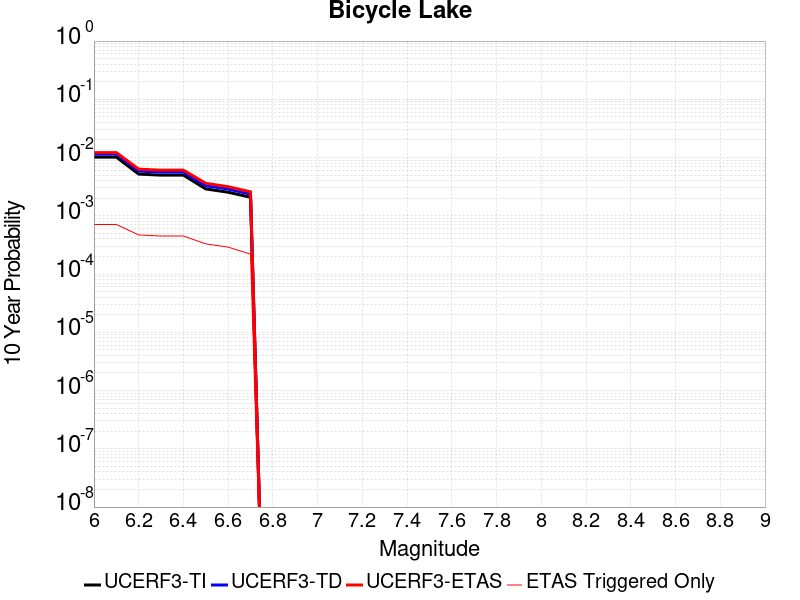 |

| Magnitude | 1 wk TI Prob | 1 wk TD Prob | 1 wk ETAS Prob | 1 wk ETAS/TD Gain | 1 wk ETAS Triggered Only | 1 mo TI Prob | 1 mo TD Prob | 1 mo ETAS Prob | 1 mo ETAS/TD Gain | 1 mo ETAS Triggered Only | 1 yr TI Prob | 1 yr TD Prob | 1 yr ETAS Prob | 1 yr ETAS/TD Gain | 1 yr ETAS Triggered Only | 10 yr TI Prob | 10 yr TD Prob | 10 yr ETAS Prob | 10 yr ETAS/TD Gain | 10 yr ETAS Triggered Only |
|-----|-----|-----|-----|-----|-----|-----|-----|-----|-----|-----|-----|-----|-----|-----|-----|-----|-----|-----|-----|-----|
| 6.0 | 1.9621975E-5 | 2.2098928E-5 | 3.6934074E-5 | 1.6713061 | 1.4835475E-5 | 8.4091465E-5 | 9.4707015E-5 | 1.3920922E-4 | 1.4698935 | 4.4506425E-5 | 0.0010233327 | 0.0011525829 | 0.0013896769 | 1.2057067 | 2.373676E-4 | 0.01018633 | 0.011479365 | 0.012183293 | 1.0613211 | 7.121028E-4 |
| 6.1 | 1.9621975E-5 | 2.2098928E-5 | 3.6934074E-5 | 1.6713061 | 1.4835475E-5 | 8.4091465E-5 | 9.4707015E-5 | 1.3920922E-4 | 1.4698935 | 4.4506425E-5 | 0.0010233327 | 0.0011525829 | 0.0013896769 | 1.2057067 | 2.373676E-4 | 0.01018633 | 0.011479365 | 0.012183293 | 1.0613211 | 7.121028E-4 |
| 6.2 | 9.9971285E-6 | 1.12565795E-5 | 2.6091888E-5 | 2.3179233 | 1.4835475E-5 | 4.2844134E-5 | 4.8241884E-5 | 7.7911405E-5 | 1.6150157 | 2.967095E-5 | 5.2150246E-4 | 5.872387E-4 | 7.6515984E-4 | 1.3029792 | 1.780257E-4 | 0.0052028033 | 0.0058619753 | 0.0063044303 | 1.0754789 | 4.4506424E-4 |
| 6.3 | 9.589428E-6 | 1.0799249E-5 | 2.5634563E-5 | 2.3737357 | 1.4835475E-5 | 4.10969E-5 | 4.6281966E-5 | 7.5951546E-5 | 1.6410613 | 2.967095E-5 | 5.002399E-4 | 5.6338916E-4 | 7.4131455E-4 | 1.3158126 | 1.780257E-4 | 0.0049911533 | 0.005624699 | 0.006052508 | 1.076059 | 4.3022877E-4 |
| 6.4 | 9.589428E-6 | 1.0799249E-5 | 2.5634563E-5 | 2.3737357 | 1.4835475E-5 | 4.10969E-5 | 4.6281966E-5 | 7.5951546E-5 | 1.6410613 | 2.967095E-5 | 5.002399E-4 | 5.6338916E-4 | 7.4131455E-4 | 1.3158126 | 1.780257E-4 | 0.0049911533 | 0.005624699 | 0.006052508 | 1.076059 | 4.3022877E-4 |
| 6.5 | 5.557707E-6 | 6.2861473E-6 | 2.1121528E-5 | 3.3600116 | 1.4835475E-5 | 2.3818526E-5 | 2.6940505E-5 | 5.6610654E-5 | 2.1013212 | 2.967095E-5 | 2.8995197E-4 | 3.2797817E-4 | 4.9111486E-4 | 1.4974011 | 1.6319023E-4 | 0.0028957394 | 0.003277578 | 0.0036176755 | 1.1037649 | 3.4121593E-4 |
| 6.6 | 4.8742945E-6 | 5.513769E-6 | 2.0349162E-5 | 3.6906083 | 1.4835475E-5 | 2.0889667E-5 | 2.3630373E-5 | 5.330062E-5 | 2.255598 | 2.967095E-5 | 2.54302E-4 | 2.8768802E-4 | 4.2116886E-4 | 1.4639778 | 1.3351926E-4 | 0.002540112 | 0.002875725 | 0.0031567884 | 1.0977366 | 2.81874E-4 |
| 6.7 | 3.991108E-6 | 4.516304E-6 | 1.9351712E-5 | 4.284856 | 1.4835475E-5 | 1.7104636E-5 | 1.935559E-5 | 4.9025963E-5 | 2.5329099 | 2.967095E-5 | 2.0822904E-4 | 2.356543E-4 | 3.3947814E-4 | 1.4405769 | 1.03848324E-4 | 0.0020803404 | 0.002356543 | 0.0025785507 | 1.0942091 | 2.2253212E-4 |

## San Andreas (San Bernardino N)
*[(top)](#table-of-contents)*

| 1 Week | 1 Month | 1 Year | 10 Year |
|-----|-----|-----|-----|
|  | 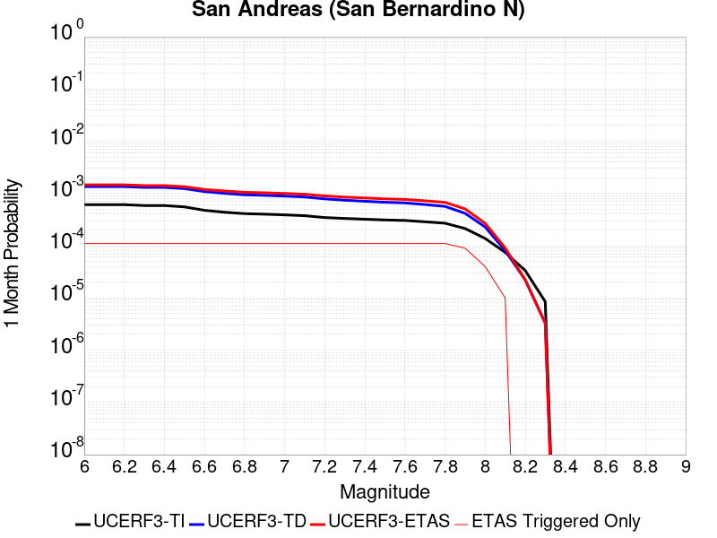 |  |  |

| Magnitude | 1 wk TI Prob | 1 wk TD Prob | 1 wk ETAS Prob | 1 wk ETAS/TD Gain | 1 wk ETAS Triggered Only | 1 mo TI Prob | 1 mo TD Prob | 1 mo ETAS Prob | 1 mo ETAS/TD Gain | 1 mo ETAS Triggered Only | 1 yr TI Prob | 1 yr TD Prob | 1 yr ETAS Prob | 1 yr ETAS/TD Gain | 1 yr ETAS Triggered Only | 10 yr TI Prob | 10 yr TD Prob | 10 yr ETAS Prob | 10 yr ETAS/TD Gain | 10 yr ETAS Triggered Only |
|-----|-----|-----|-----|-----|-----|-----|-----|-----|-----|-----|-----|-----|-----|-----|-----|-----|-----|-----|-----|-----|
| 6.0 | 1.4273766E-4 | 3.1643265E-4 | 3.460942E-4 | 1.0937374 | 2.967095E-5 | 6.115894E-4 | 0.001355441 | 0.001473964 | 1.0874423 | 1.186838E-4 | 0.0074207084 | 0.016379127 | 0.016641792 | 1.0160365 | 2.6703853E-4 | 0.07177748 | 0.15041703 | 0.15098421 | 1.0037707 | 6.6759635E-4 |
| 6.1 | 1.4273766E-4 | 3.1643265E-4 | 3.460942E-4 | 1.0937374 | 2.967095E-5 | 6.115894E-4 | 0.001355441 | 0.001473964 | 1.0874423 | 1.186838E-4 | 0.0074207084 | 0.016379127 | 0.016641792 | 1.0160365 | 2.6703853E-4 | 0.07177748 | 0.15041703 | 0.15098421 | 1.0037707 | 6.6759635E-4 |
| 6.2 | 1.4273766E-4 | 3.1643265E-4 | 3.460942E-4 | 1.0937374 | 2.967095E-5 | 6.115894E-4 | 0.001355441 | 0.001473964 | 1.0874423 | 1.186838E-4 | 0.0074207084 | 0.016379127 | 0.016641792 | 1.0160365 | 2.6703853E-4 | 0.07177748 | 0.15041703 | 0.15098421 | 1.0037707 | 6.6759635E-4 |
| 6.3 | 1.3730655E-4 | 3.054793E-4 | 3.351412E-4 | 1.0970995 | 2.967095E-5 | 5.883239E-4 | 0.0013085458 | 0.0014270743 | 1.0905803 | 1.186838E-4 | 0.0071393442 | 0.015816571 | 0.016079385 | 1.0166165 | 2.6703853E-4 | 0.06914291 | 0.14571694 | 0.14627458 | 1.0038269 | 6.527609E-4 |
| 6.4 | 1.3730655E-4 | 3.054793E-4 | 3.351412E-4 | 1.0970995 | 2.967095E-5 | 5.883239E-4 | 0.0013085458 | 0.0014270743 | 1.0905803 | 1.186838E-4 | 0.0071393442 | 0.015816571 | 0.016079385 | 1.0166165 | 2.6703853E-4 | 0.06914291 | 0.14571694 | 0.14627458 | 1.0038269 | 6.527609E-4 |
| 6.5 | 1.2942807E-4 | 2.8962124E-4 | 3.192836E-4 | 1.1024177 | 2.967095E-5 | 5.545738E-4 | 0.0012406486 | 0.0013591852 | 1.095544 | 1.186838E-4 | 0.0067310524 | 0.015001532 | 0.015264564 | 1.0175337 | 2.6703853E-4 | 0.06530788 | 0.13885975 | 0.13942187 | 1.0040481 | 6.527609E-4 |
| 6.6 | 1.1125901E-4 | 2.540032E-4 | 2.836666E-4 | 1.1167836 | 2.967095E-5 | 4.767372E-4 | 0.0010881333 | 0.001206688 | 1.1089523 | 1.186838E-4 | 0.005788839 | 0.013168183 | 0.013431706 | 1.020012 | 2.6703853E-4 | 0.056403454 | 0.123149484 | 0.12369584 | 1.0044365 | 6.2308996E-4 |
| 6.7 | 1.02209575E-4 | 2.3535028E-4 | 2.6501424E-4 | 1.1260418 | 2.967095E-5 | 4.3796748E-4 | 0.0010082555 | 0.0011268198 | 1.1175933 | 1.186838E-4 | 0.0053192247 | 0.012206842 | 0.012455966 | 1.0204086 | 2.5220306E-4 | 0.051936906 | 0.11494151 | 0.11547984 | 1.0046836 | 6.0825446E-4 |
| 6.8 | 9.610582E-5 | 2.2060354E-4 | 2.5026794E-4 | 1.1344693 | 2.967095E-5 | 4.1181705E-4 | 9.451019E-4 | 0.0010636735 | 1.1254591 | 1.186838E-4 | 0.0050023515 | 0.011446173 | 0.011695489 | 1.0217817 | 2.5220306E-4 | 0.048912346 | 0.10834267 | 0.10888502 | 1.005006 | 6.0825446E-4 |
| 6.9 | 9.3877505E-5 | 2.1515742E-4 | 2.4482197E-4 | 1.1378738 | 2.967095E-5 | 4.0227012E-4 | 9.2177803E-4 | 0.0010403524 | 1.1286366 | 1.186838E-4 | 0.0048866454 | 0.011165145 | 0.011414533 | 1.0223362 | 2.5220306E-4 | 0.04780577 | 0.10593271 | 0.10646327 | 1.0050085 | 5.93419E-4 |
| 7.0 | 9.1019785E-5 | 2.0842413E-4 | 2.3808889E-4 | 1.1423289 | 2.967095E-5 | 3.900265E-4 | 8.929411E-4 | 0.0010115189 | 1.1327946 | 1.186838E-4 | 0.0047382377 | 0.010817591 | 0.011052391 | 1.0217054 | 2.373676E-4 | 0.046384744 | 0.102902494 | 0.103408225 | 1.0049148 | 5.63748E-4 |
| 7.1 | 8.771155E-5 | 2.0016705E-4 | 2.2983206E-4 | 1.1482012 | 2.967095E-5 | 3.758525E-4 | 8.575773E-4 | 9.7615935E-4 | 1.1382756 | 1.186838E-4 | 0.0045664064 | 0.010391217 | 0.010626118 | 1.0226058 | 2.373676E-4 | 0.044737056 | 0.09921362 | 0.09972144 | 1.0051184 | 5.63748E-4 |
| 7.2 | 8.0830236E-5 | 1.8421745E-4 | 2.1388294E-4 | 1.1610352 | 2.967095E-5 | 3.4636928E-4 | 7.892647E-4 | 9.0785476E-4 | 1.1502539 | 1.186838E-4 | 0.0042088944 | 0.009567065 | 0.009802162 | 1.0245736 | 2.373676E-4 | 0.041300658 | 0.09194319 | 0.09244163 | 1.0054212 | 5.4891256E-4 |
| 7.3 | 7.7668235E-5 | 1.7364685E-4 | 2.0331265E-4 | 1.1708398 | 2.967095E-5 | 3.328214E-4 | 7.439886E-4 | 8.625841E-4 | 1.159405 | 1.186838E-4 | 0.0040445733 | 0.009020521 | 0.009255747 | 1.0260768 | 2.373676E-4 | 0.03971748 | 0.08720871 | 0.08769622 | 1.0055901 | 5.3407706E-4 |
| 7.4 | 7.520177E-5 | 1.6584329E-4 | 1.9550932E-4 | 1.1788799 | 2.967095E-5 | 3.2225347E-4 | 7.1056344E-4 | 8.291629E-4 | 1.1669091 | 1.186838E-4 | 0.0039163795 | 0.008616861 | 0.008852183 | 1.0273095 | 2.373676E-4 | 0.038480744 | 0.08366352 | 0.08415292 | 1.0058496 | 5.3407706E-4 |
| 7.5 | 7.274697E-5 | 1.5871559E-4 | 1.8838183E-4 | 1.1869144 | 2.967095E-5 | 3.1173544E-4 | 6.800324E-4 | 7.986355E-4 | 1.174408 | 1.186838E-4 | 0.003788775 | 0.008248022 | 0.008483431 | 1.0285413 | 2.373676E-4 | 0.03724827 | 0.08037899 | 0.08087014 | 1.0061104 | 5.3407706E-4 |
| 7.6 | 7.1185845E-5 | 1.5441148E-4 | 1.8407784E-4 | 1.1921254 | 2.967095E-5 | 3.0504653E-4 | 6.615957E-4 | 7.80201E-4 | 1.1792716 | 1.186838E-4 | 0.0037076178 | 0.008025231 | 0.008260693 | 1.0293403 | 2.373676E-4 | 0.036463667 | 0.07836779 | 0.078860015 | 1.0062809 | 5.3407706E-4 |
| 7.7 | 6.709961E-5 | 1.4349261E-4 | 1.7315931E-4 | 1.2067472 | 2.967095E-5 | 2.8753807E-4 | 6.148234E-4 | 7.334342E-4 | 1.1929185 | 1.186838E-4 | 0.003495157 | 0.0074598226 | 0.0076954192 | 1.0315821 | 2.373676E-4 | 0.034406938 | 0.07319395 | 0.07368894 | 1.0067626 | 5.3407706E-4 |
| 7.8 | 6.300812E-5 | 1.3231764E-4 | 1.6198467E-4 | 1.2242106 | 2.967095E-5 | 2.7000686E-4 | 5.669524E-4 | 6.855689E-4 | 1.2092178 | 1.186838E-4 | 0.0032823787 | 0.006880828 | 0.007116562 | 1.0342596 | 2.373676E-4 | 0.032343175 | 0.06784657 | 0.06834441 | 1.0073378 | 5.3407706E-4 |
| 7.9 | 4.983037E-5 | 9.74664E-5 | 1.1230043E-4 | 1.1521963 | 1.4835475E-5 | 2.1354125E-4 | 4.1764628E-4 | 5.2145123E-4 | 1.2485476 | 1.03848324E-4 | 0.0025967648 | 0.005072999 | 0.0052648815 | 1.0378243 | 1.9286117E-4 | 0.025666296 | 0.05075669 | 0.051179167 | 1.0083236 | 4.4506424E-4 |
| 8.0 | 3.2211527E-5 | 5.344018E-5 | 5.344018E-5 | 1.0 | 0.0 | 1.380421E-4 | 2.2900925E-4 | 2.735055E-4 | 1.1942989 | 4.4506425E-5 | 0.0016793669 | 0.0027846245 | 0.0028585952 | 1.026564 | 7.417738E-5 | 0.016667323 | 0.028427487 | 0.028528383 | 1.0035492 | 1.03848324E-4 |
| 8.1 | 1.743376E-5 | 1.8887473E-5 | 1.8887473E-5 | 1.0 | 0.0 | 7.471398E-5 | 8.0943806E-5 | 9.577808E-5 | 1.1832663 | 1.4835475E-5 | 9.0926304E-4 | 9.850459E-4 | 9.998668E-4 | 1.0150459 | 1.4835475E-5 | 0.009055517 | 0.010516889 | 0.0105462475 | 1.0027916 | 2.967095E-5 |
| 8.2 | 7.831616E-6 | 5.178766E-6 | 5.178766E-6 | 1.0 | 0.0 | 3.3563636E-5 | 2.2194523E-5 | 2.2194523E-5 | 1.0 | 0.0 | 4.0856065E-4 | 2.701849E-4 | 2.701849E-4 | 1.0 | 0.0 | 0.004078103 | 0.0030546775 | 0.0030546775 | 1.0 | 0.0 |
| 8.3 | 1.983087E-6 | 7.701989E-7 | 7.701989E-7 | 1.0 | 0.0 | 8.498917E-6 | 3.3008482E-6 | 3.3008482E-6 | 1.0 | 0.0 | 1.034694E-4 | 4.0187104E-5 | 4.0187104E-5 | 1.0 | 0.0 | 0.0010342124 | 4.7438307E-4 | 4.7438307E-4 | 1.0 | 0.0 |

## Garlic Springs
*[(top)](#table-of-contents)*

| 1 Week | 1 Month | 1 Year | 10 Year |
|-----|-----|-----|-----|
|  | 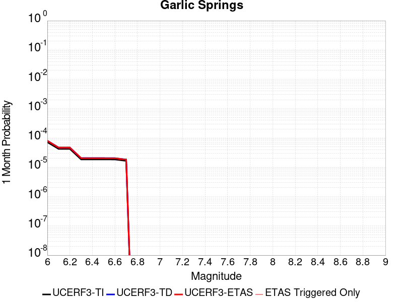 |  |  |

| Magnitude | 1 wk TI Prob | 1 wk TD Prob | 1 wk ETAS Prob | 1 wk ETAS/TD Gain | 1 wk ETAS Triggered Only | 1 mo TI Prob | 1 mo TD Prob | 1 mo ETAS Prob | 1 mo ETAS/TD Gain | 1 mo ETAS Triggered Only | 1 yr TI Prob | 1 yr TD Prob | 1 yr ETAS Prob | 1 yr ETAS/TD Gain | 1 yr ETAS Triggered Only | 10 yr TI Prob | 10 yr TD Prob | 10 yr ETAS Prob | 10 yr ETAS/TD Gain | 10 yr ETAS Triggered Only |
|-----|-----|-----|-----|-----|-----|-----|-----|-----|-----|-----|-----|-----|-----|-----|-----|-----|-----|-----|-----|-----|
| 6.0 | 1.6760017E-5 | 1.8778332E-5 | 1.8778332E-5 | 1.0 | 0.0 | 7.182667E-5 | 8.047675E-5 | 8.047675E-5 | 1.0 | 0.0 | 8.7413884E-4 | 9.794814E-4 | 0.0011573327 | 1.1815771 | 1.780257E-4 | 0.008707083 | 0.00976319 | 0.010336124 | 1.0586832 | 5.785835E-4 |
| 6.1 | 9.852767E-6 | 1.0974415E-5 | 1.0974415E-5 | 1.0 | 0.0 | 4.222546E-5 | 4.7032758E-5 | 4.7032758E-5 | 1.0 | 0.0 | 5.139737E-4 | 5.7254435E-4 | 6.763332E-4 | 1.1812766 | 1.03848324E-4 | 0.005127866 | 0.005717652 | 0.0059979144 | 1.0490171 | 2.81874E-4 |
| 6.2 | 9.852767E-6 | 1.0974415E-5 | 1.0974415E-5 | 1.0 | 0.0 | 4.222546E-5 | 4.7032758E-5 | 4.7032758E-5 | 1.0 | 0.0 | 5.139737E-4 | 5.7254435E-4 | 6.763332E-4 | 1.1812766 | 1.03848324E-4 | 0.005127866 | 0.005717652 | 0.0059979144 | 1.0490171 | 2.81874E-4 |
| 6.3 | 4.3167724E-6 | 4.7783674E-6 | 4.7783674E-6 | 1.0 | 0.0 | 1.8500323E-5 | 2.0478685E-5 | 2.0478685E-5 | 1.0 | 0.0 | 2.2521814E-4 | 2.493225E-4 | 3.086496E-4 | 1.2379533 | 5.93419E-5 | 0.0022499003 | 0.0024926865 | 0.0025962759 | 1.0415573 | 1.03848324E-4 |
| 6.4 | 4.3167724E-6 | 4.7783674E-6 | 4.7783674E-6 | 1.0 | 0.0 | 1.8500323E-5 | 2.0478685E-5 | 2.0478685E-5 | 1.0 | 0.0 | 2.2521814E-4 | 2.493225E-4 | 3.086496E-4 | 1.2379533 | 5.93419E-5 | 0.0022499003 | 0.0024926865 | 0.0025962759 | 1.0415573 | 1.03848324E-4 |
| 6.5 | 4.3167724E-6 | 4.7783674E-6 | 4.7783674E-6 | 1.0 | 0.0 | 1.8500323E-5 | 2.0478685E-5 | 2.0478685E-5 | 1.0 | 0.0 | 2.2521814E-4 | 2.493225E-4 | 3.086496E-4 | 1.2379533 | 5.93419E-5 | 0.0022499003 | 0.0024926865 | 0.0025962759 | 1.0415573 | 1.03848324E-4 |
| 6.6 | 4.301311E-6 | 4.7612343E-6 | 4.7612343E-6 | 1.0 | 0.0 | 1.8434059E-5 | 2.0405261E-5 | 2.0405261E-5 | 1.0 | 0.0 | 2.2441156E-4 | 2.4842875E-4 | 3.0775592E-4 | 1.2388096 | 5.93419E-5 | 0.0022418506 | 0.002483769 | 0.0025873594 | 1.0417069 | 1.03848324E-4 |
| 6.7 | 3.8599724E-6 | 4.2713614E-6 | 4.2713614E-6 | 1.0 | 0.0 | 1.6542634E-5 | 1.8305835E-5 | 1.8305835E-5 | 1.0 | 0.0 | 2.0138794E-4 | 2.2287354E-4 | 2.822022E-4 | 1.2661989 | 5.93419E-5 | 0.0020120554 | 0.0022287355 | 0.0023323523 | 1.0464914 | 1.03848324E-4 |

## Death Valley (Black Mtns Frontal)
*[(top)](#table-of-contents)*

| 1 Week | 1 Month | 1 Year | 10 Year |
|-----|-----|-----|-----|
|  |  | 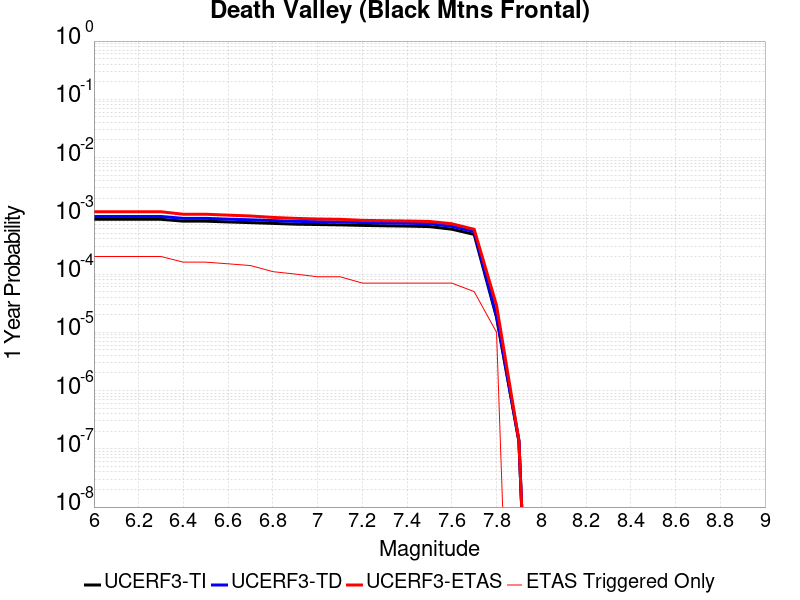 | 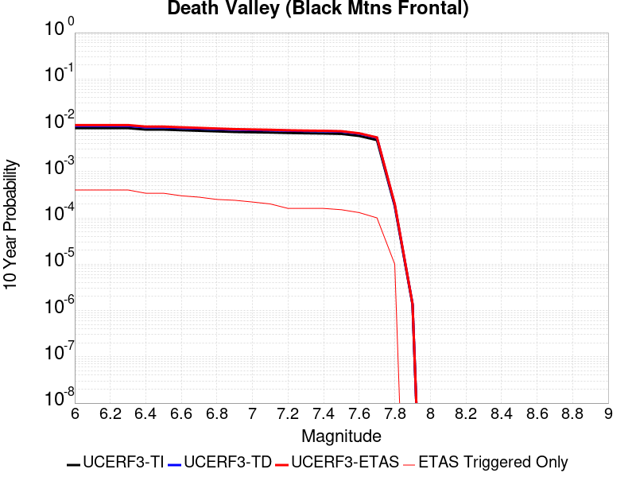 |

| Magnitude | 1 wk TI Prob | 1 wk TD Prob | 1 wk ETAS Prob | 1 wk ETAS/TD Gain | 1 wk ETAS Triggered Only | 1 mo TI Prob | 1 mo TD Prob | 1 mo ETAS Prob | 1 mo ETAS/TD Gain | 1 mo ETAS Triggered Only | 1 yr TI Prob | 1 yr TD Prob | 1 yr ETAS Prob | 1 yr ETAS/TD Gain | 1 yr ETAS Triggered Only | 10 yr TI Prob | 10 yr TD Prob | 10 yr ETAS Prob | 10 yr ETAS/TD Gain | 10 yr ETAS Triggered Only |
|-----|-----|-----|-----|-----|-----|-----|-----|-----|-----|-----|-----|-----|-----|-----|-----|-----|-----|-----|-----|-----|
| 6.0 | 1.6707214E-5 | 1.8671728E-5 | 3.3506924E-5 | 1.7945273 | 1.4835475E-5 | 7.160038E-5 | 8.001928E-5 | 1.09687855E-4 | 1.3707678 | 2.967095E-5 | 8.71386E-4 | 9.738069E-4 | 0.0011813013 | 1.2130755 | 2.0769665E-4 | 0.00867977 | 0.009696251 | 0.010122308 | 1.0439404 | 4.3022877E-4 |
| 6.1 | 1.6707214E-5 | 1.8671728E-5 | 3.3506924E-5 | 1.7945273 | 1.4835475E-5 | 7.160038E-5 | 8.001928E-5 | 1.09687855E-4 | 1.3707678 | 2.967095E-5 | 8.71386E-4 | 9.738069E-4 | 0.0011813013 | 1.2130755 | 2.0769665E-4 | 0.00867977 | 0.009696251 | 0.010122308 | 1.0439404 | 4.3022877E-4 |
| 6.2 | 1.6707214E-5 | 1.8671728E-5 | 3.3506924E-5 | 1.7945273 | 1.4835475E-5 | 7.160038E-5 | 8.001928E-5 | 1.09687855E-4 | 1.3707678 | 2.967095E-5 | 8.71386E-4 | 9.738069E-4 | 0.0011813013 | 1.2130755 | 2.0769665E-4 | 0.00867977 | 0.009696251 | 0.010122308 | 1.0439404 | 4.3022877E-4 |
| 6.3 | 1.6707214E-5 | 1.8671728E-5 | 3.3506924E-5 | 1.7945273 | 1.4835475E-5 | 7.160038E-5 | 8.001928E-5 | 1.09687855E-4 | 1.3707678 | 2.967095E-5 | 8.71386E-4 | 9.738069E-4 | 0.0011813013 | 1.2130755 | 2.0769665E-4 | 0.00867977 | 0.009696251 | 0.010122308 | 1.0439404 | 4.3022877E-4 |
| 6.4 | 1.5515609E-5 | 1.7339567E-5 | 3.2174787E-5 | 1.8555702 | 1.4835475E-5 | 6.649377E-5 | 7.431035E-5 | 1.03979095E-4 | 1.3992546 | 2.967095E-5 | 8.0926094E-4 | 9.043591E-4 | 0.0010674017 | 1.1802853 | 1.6319023E-4 | 0.008063202 | 0.0090074735 | 0.009360318 | 1.0391724 | 3.560514E-4 |
| 6.5 | 1.5515609E-5 | 1.7339567E-5 | 3.2174787E-5 | 1.8555702 | 1.4835475E-5 | 6.649377E-5 | 7.431035E-5 | 1.03979095E-4 | 1.3992546 | 2.967095E-5 | 8.0926094E-4 | 9.043591E-4 | 0.0010674017 | 1.1802853 | 1.6319023E-4 | 0.008063202 | 0.0090074735 | 0.009360318 | 1.0391724 | 3.560514E-4 |
| 6.6 | 1.5041828E-5 | 1.6810458E-5 | 3.1645683E-5 | 1.8824997 | 1.4835475E-5 | 6.4463384E-5 | 7.2042865E-5 | 1.01711674E-4 | 1.4118216 | 2.967095E-5 | 7.8455906E-4 | 8.7677484E-4 | 0.0010249995 | 1.1690568 | 1.4835475E-4 | 0.00781795 | 0.008733812 | 0.009042636 | 1.0353596 | 3.1154498E-4 |
| 6.7 | 1.4634985E-5 | 1.6357295E-5 | 3.119253E-5 | 1.9069489 | 1.4835475E-5 | 6.271985E-5 | 7.010085E-5 | 9.976971E-5 | 1.4232312 | 2.967095E-5 | 7.6334673E-4 | 8.5314934E-4 | 0.0010013776 | 1.1737423 | 1.4835475E-4 | 0.007607299 | 0.008499377 | 0.008793565 | 1.0346129 | 2.967095E-4 |
| 6.8 | 1.4209158E-5 | 1.5883292E-5 | 1.5883292E-5 | 1.0 | 0.0 | 6.089497E-5 | 6.806951E-5 | 8.290397E-5 | 1.2179312 | 1.4835475E-5 | 7.4114406E-4 | 8.2843675E-4 | 9.32199E-4 | 1.1252507 | 1.03848324E-4 | 0.007386771 | 0.008254101 | 0.008504221 | 1.0303026 | 2.5220306E-4 |
| 6.9 | 1.3780098E-5 | 1.5405802E-5 | 1.5405802E-5 | 1.0 | 0.0 | 5.9056227E-5 | 6.6023225E-5 | 8.085772E-5 | 1.224686 | 1.4835475E-5 | 7.1877235E-4 | 8.0354174E-4 | 8.9248305E-4 | 1.1106867 | 8.901285E-5 | 0.0071645193 | 0.008006958 | 0.0082424255 | 1.0294077 | 2.373676E-4 |
| 7.0 | 1.3585064E-5 | 1.5189348E-5 | 1.5189348E-5 | 1.0 | 0.0 | 5.8220405E-5 | 6.509561E-5 | 7.993012E-5 | 1.227888 | 1.4835475E-5 | 7.086029E-4 | 7.922563E-4 | 8.6637493E-4 | 1.0935538 | 7.417738E-5 | 0.007063476 | 0.007894911 | 0.008100968 | 1.0260999 | 2.0769665E-4 |
| 7.1 | 1.3398601E-5 | 1.4982517E-5 | 1.4982517E-5 | 1.0 | 0.0 | 5.742131E-5 | 6.4209235E-5 | 7.904376E-5 | 1.231034 | 1.4835475E-5 | 6.9888023E-4 | 7.8147254E-4 | 8.555919E-4 | 1.0948458 | 7.417738E-5 | 0.0069668638 | 0.007787834 | 0.007964473 | 1.0226815 | 1.780257E-4 |
| 7.2 | 1.3126312E-5 | 1.4680717E-5 | 1.4680717E-5 | 1.0 | 0.0 | 5.6254412E-5 | 6.291587E-5 | 7.775041E-5 | 1.2357838 | 1.4835475E-5 | 6.846822E-4 | 7.65737E-4 | 8.398575E-4 | 1.0967964 | 7.417738E-5 | 0.006825765 | 0.0076315687 | 0.0077935136 | 1.0212203 | 1.6319023E-4 |
| 7.3 | 1.2922429E-5 | 1.4454928E-5 | 1.4454928E-5 | 1.0 | 0.0 | 5.5380664E-5 | 6.194825E-5 | 7.67828E-5 | 1.2394669 | 1.4835475E-5 | 6.74051E-4 | 7.5396436E-4 | 8.280858E-4 | 1.0983089 | 7.417738E-5 | 0.006720101 | 0.007514645 | 0.007676609 | 1.0215532 | 1.6319023E-4 |
| 7.4 | 1.2768878E-5 | 1.42848985E-5 | 1.42848985E-5 | 1.0 | 0.0 | 5.4722615E-5 | 6.121959E-5 | 7.605416E-5 | 1.2423173 | 1.4835475E-5 | 6.660441E-4 | 7.4509904E-4 | 8.1922114E-4 | 1.0994796 | 7.417738E-5 | 0.0066405144 | 0.0074265874 | 0.007588566 | 1.0218107 | 1.6319023E-4 |
| 7.5 | 1.2521929E-5 | 1.4013124E-5 | 1.4013124E-5 | 1.0 | 0.0 | 5.366431E-5 | 6.0054896E-5 | 7.488948E-5 | 1.247017 | 1.4835475E-5 | 6.531671E-4 | 7.309285E-4 | 8.0505165E-4 | 1.1014096 | 7.417738E-5 | 0.006512506 | 0.0072858203 | 0.007433094 | 1.0202137 | 1.4835475E-4 |
| 7.6 | 1.1301089E-5 | 1.2649151E-5 | 1.2649151E-5 | 1.0 | 0.0 | 4.8432343E-5 | 5.4209555E-5 | 6.9044225E-5 | 1.2736542 | 1.4835475E-5 | 5.895042E-4 | 6.5980677E-4 | 7.339352E-4 | 1.1123487 | 7.417738E-5 | 0.0058794282 | 0.0065790303 | 0.006696933 | 1.017921 | 1.186838E-4 |
| 7.7 | 9.189108E-6 | 1.0284173E-5 | 1.0284173E-5 | 1.0 | 0.0 | 3.93813E-5 | 4.407431E-5 | 5.8909132E-5 | 1.3365866 | 1.4835475E-5 | 4.7936183E-4 | 5.3647766E-4 | 6.1061524E-4 | 1.1381932 | 7.417738E-5 | 0.004783291 | 0.005352337 | 0.005455629 | 1.0192986 | 1.03848324E-4 |
| 7.8 | 3.4586725E-7 | 3.6483948E-7 | 3.6483948E-7 | 1.0 | 0.0 | 1.4822873E-6 | 1.5635968E-6 | 1.5635968E-6 | 1.0 | 0.0 | 1.80467E-5 | 1.903663E-5 | 3.387182E-5 | 1.7792972 | 1.4835475E-5 | 1.8045233E-4 | 1.9035043E-4 | 2.0518308E-4 | 1.0779228 | 1.4835475E-5 |
| 7.9 | 2.5591178E-9 | 2.6697482E-9 | 2.6697482E-9 | 1.0 | 0.0 | 1.0967647E-8 | 1.1441778E-8 | 1.1441778E-8 | 1.0 | 0.0 | 1.335311E-7 | 1.3930365E-7 | 1.3930365E-7 | 1.0 | 0.0 | 1.3353102E-6 | 1.3930365E-6 | 1.3930365E-6 | 1.0 | 0.0 |

## Helendale-So Lockhart
*[(top)](#table-of-contents)*

| 1 Week | 1 Month | 1 Year | 10 Year |
|-----|-----|-----|-----|
|  |  |  |  |

| Magnitude | 1 wk TI Prob | 1 wk TD Prob | 1 wk ETAS Prob | 1 wk ETAS/TD Gain | 1 wk ETAS Triggered Only | 1 mo TI Prob | 1 mo TD Prob | 1 mo ETAS Prob | 1 mo ETAS/TD Gain | 1 mo ETAS Triggered Only | 1 yr TI Prob | 1 yr TD Prob | 1 yr ETAS Prob | 1 yr ETAS/TD Gain | 1 yr ETAS Triggered Only | 10 yr TI Prob | 10 yr TD Prob | 10 yr ETAS Prob | 10 yr ETAS/TD Gain | 10 yr ETAS Triggered Only |
|-----|-----|-----|-----|-----|-----|-----|-----|-----|-----|-----|-----|-----|-----|-----|-----|-----|-----|-----|-----|-----|
| 6.0 | 1.7296055E-5 | 1.810429E-5 | 1.810429E-5 | 1.0 | 0.0 | 7.412385E-5 | 7.7587625E-5 | 9.242195E-5 | 1.1911944 | 1.4835475E-5 | 9.0208417E-4 | 9.442407E-4 | 0.0011072769 | 1.1726637 | 1.6319023E-4 | 0.008984311 | 0.009404407 | 0.009801198 | 1.042192 | 4.0055782E-4 |
| 6.1 | 1.7296055E-5 | 1.810429E-5 | 1.810429E-5 | 1.0 | 0.0 | 7.412385E-5 | 7.7587625E-5 | 9.242195E-5 | 1.1911944 | 1.4835475E-5 | 9.0208417E-4 | 9.442407E-4 | 0.0011072769 | 1.1726637 | 1.6319023E-4 | 0.008984311 | 0.009404407 | 0.009801198 | 1.042192 | 4.0055782E-4 |
| 6.2 | 1.7296055E-5 | 1.810429E-5 | 1.810429E-5 | 1.0 | 0.0 | 7.412385E-5 | 7.7587625E-5 | 9.242195E-5 | 1.1911944 | 1.4835475E-5 | 9.0208417E-4 | 9.442407E-4 | 0.0011072769 | 1.1726637 | 1.6319023E-4 | 0.008984311 | 0.009404407 | 0.009801198 | 1.042192 | 4.0055782E-4 |
| 6.3 | 1.0669118E-5 | 1.1135748E-5 | 1.1135748E-5 | 1.0 | 0.0 | 4.5723988E-5 | 4.7723777E-5 | 6.2558545E-5 | 1.3108464 | 1.4835475E-5 | 5.5654737E-4 | 5.8088487E-4 | 6.69846E-4 | 1.1531476 | 8.901285E-5 | 0.0055515557 | 0.005793961 | 0.0060299537 | 1.0407307 | 2.373676E-4 |
| 6.4 | 1.0669118E-5 | 1.1135748E-5 | 1.1135748E-5 | 1.0 | 0.0 | 4.5723988E-5 | 4.7723777E-5 | 6.2558545E-5 | 1.3108464 | 1.4835475E-5 | 5.5654737E-4 | 5.8088487E-4 | 6.69846E-4 | 1.1531476 | 8.901285E-5 | 0.0055515557 | 0.005793961 | 0.0060299537 | 1.0407307 | 2.373676E-4 |
| 6.5 | 8.790038E-6 | 9.1704605E-6 | 9.1704605E-6 | 1.0 | 0.0 | 3.767105E-5 | 3.930139E-5 | 5.413628E-5 | 1.3774648 | 1.4835475E-5 | 4.585485E-4 | 4.783909E-4 | 5.525328E-4 | 1.1549819 | 7.417738E-5 | 0.0045760344 | 0.004773775 | 0.0049804803 | 1.0433002 | 2.0769665E-4 |
| 6.6 | 7.396949E-6 | 7.715757E-6 | 7.715757E-6 | 1.0 | 0.0 | 3.1700827E-5 | 3.306712E-5 | 4.7902104E-5 | 1.4486325 | 1.4835475E-5 | 3.858892E-4 | 4.025188E-4 | 4.6183684E-4 | 1.147367 | 5.93419E-5 | 0.003852198 | 0.0040180045 | 0.0042100907 | 1.0478064 | 1.9286117E-4 |
| 6.7 | 6.4600285E-6 | 6.7382234E-6 | 6.7382234E-6 | 1.0 | 0.0 | 2.7685543E-5 | 2.8877786E-5 | 4.3712833E-5 | 1.5137182 | 1.4835475E-5 | 3.3701936E-4 | 3.515311E-4 | 4.1085214E-4 | 1.1687505 | 5.93419E-5 | 0.0033650869 | 0.003509832 | 0.0036724496 | 1.046332 | 1.6319023E-4 |
| 6.8 | 5.600104E-6 | 5.8361725E-6 | 5.8361725E-6 | 1.0 | 0.0 | 2.4000226E-5 | 2.5011932E-5 | 3.9847037E-5 | 1.593121 | 1.4835475E-5 | 2.9216358E-4 | 3.044783E-4 | 3.6380213E-4 | 1.1948376 | 5.93419E-5 | 0.0029177975 | 0.003040673 | 0.0031589959 | 1.0389134 | 1.186838E-4 |
| 6.9 | 4.839122E-6 | 5.039648E-6 | 5.039648E-6 | 1.0 | 0.0 | 2.0738931E-5 | 2.1598315E-5 | 3.643347E-5 | 1.6868663 | 1.4835475E-5 | 2.5246723E-4 | 2.629282E-4 | 3.222545E-4 | 1.2256368 | 5.93419E-5 | 0.002521806 | 0.0026262188 | 0.0027297945 | 1.0394391 | 1.03848324E-4 |
| 7.0 | 3.6937633E-6 | 3.8453127E-6 | 3.8453127E-6 | 1.0 | 0.0 | 1.5830317E-5 | 1.647981E-5 | 3.1315038E-5 | 1.9002064 | 1.4835475E-5 | 1.9271708E-4 | 2.0062352E-4 | 2.599535E-4 | 1.295728 | 5.93419E-5 | 0.0019255003 | 0.0020044553 | 0.0021080957 | 1.0517049 | 1.03848324E-4 |
| 7.1 | 2.7858857E-6 | 2.8979312E-6 | 2.8979312E-6 | 1.0 | 0.0 | 1.1939455E-5 | 1.2419647E-5 | 2.7254937E-5 | 2.1945019 | 1.4835475E-5 | 1.4535317E-4 | 1.5119892E-4 | 1.9569861E-4 | 1.2943122 | 4.4506425E-5 | 0.0014525814 | 0.001510982 | 0.0015998604 | 1.0588216 | 8.901285E-5 |
| 7.2 | 2.1672065E-6 | 2.2540726E-6 | 2.2540726E-6 | 1.0 | 0.0 | 9.2879945E-6 | 9.660277E-6 | 9.660277E-6 | 1.0 | 0.0 | 1.1307546E-4 | 1.17607706E-4 | 1.4727516E-4 | 1.2522578 | 2.967095E-5 | 0.0011301794 | 0.0011754729 | 0.001219927 | 1.0378181 | 4.4506425E-5 |
| 7.3 | 1.4823496E-6 | 1.5422515E-6 | 1.5422515E-6 | 1.0 | 0.0 | 6.3529114E-6 | 6.6096336E-6 | 6.6096336E-6 | 1.0 | 0.0 | 7.734395E-5 | 8.046947E-5 | 9.530375E-5 | 1.1843467 | 1.4835475E-5 | 7.731704E-4 | 8.044184E-4 | 8.340655E-4 | 1.0368553 | 2.967095E-5 |
| 7.4 | 4.2321457E-7 | 4.411E-7 | 4.411E-7 | 1.0 | 0.0 | 1.8137755E-6 | 1.8904275E-6 | 1.8904275E-6 | 1.0 | 0.0 | 2.2082493E-5 | 2.3015758E-5 | 2.3015758E-5 | 1.0 | 0.0 | 2.2080299E-4 | 2.3013826E-4 | 2.3013826E-4 | 1.0 | 0.0 |
| 7.5 | 5.6942316E-8 | 5.9417356E-8 | 5.9417356E-8 | 1.0 | 0.0 | 2.440385E-7 | 2.5464578E-7 | 2.5464578E-7 | 1.0 | 0.0 | 2.9711643E-6 | 3.100309E-6 | 3.100309E-6 | 1.0 | 0.0 | 2.9711247E-5 | 3.1002735E-5 | 3.1002735E-5 | 1.0 | 0.0 |

## Coyote Lake
*[(top)](#table-of-contents)*

| 1 Week | 1 Month | 1 Year | 10 Year |
|-----|-----|-----|-----|
|  |  | 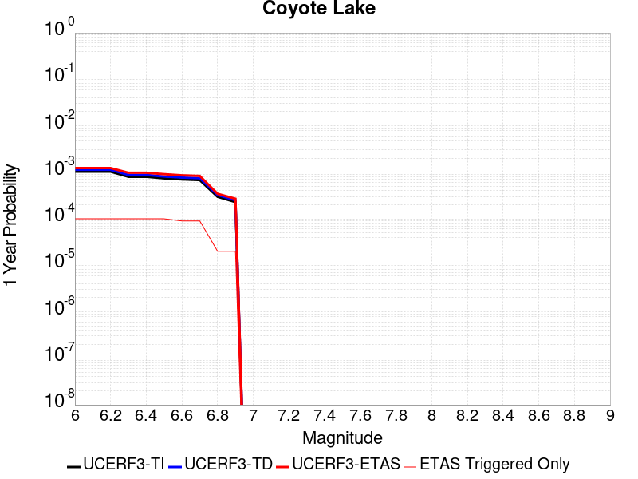 |  |

| Magnitude | 1 wk TI Prob | 1 wk TD Prob | 1 wk ETAS Prob | 1 wk ETAS/TD Gain | 1 wk ETAS Triggered Only | 1 mo TI Prob | 1 mo TD Prob | 1 mo ETAS Prob | 1 mo ETAS/TD Gain | 1 mo ETAS Triggered Only | 1 yr TI Prob | 1 yr TD Prob | 1 yr ETAS Prob | 1 yr ETAS/TD Gain | 1 yr ETAS Triggered Only | 10 yr TI Prob | 10 yr TD Prob | 10 yr ETAS Prob | 10 yr ETAS/TD Gain | 10 yr ETAS Triggered Only |
|-----|-----|-----|-----|-----|-----|-----|-----|-----|-----|-----|-----|-----|-----|-----|-----|-----|-----|-----|-----|-----|
| 6.0 | 1.980352E-5 | 2.1708129E-5 | 2.1708129E-5 | 1.0 | 0.0 | 8.486947E-5 | 9.303193E-5 | 1.0786602E-4 | 1.1594516 | 1.4835475E-5 | 0.0010327959 | 0.0011321472 | 0.0012655153 | 1.1178011 | 1.3351926E-4 | 0.010280091 | 0.011270973 | 0.011608344 | 1.0299326 | 3.4121593E-4 |
| 6.1 | 1.980352E-5 | 2.1708129E-5 | 2.1708129E-5 | 1.0 | 0.0 | 8.486947E-5 | 9.303193E-5 | 1.0786602E-4 | 1.1594516 | 1.4835475E-5 | 0.0010327959 | 0.0011321472 | 0.0012655153 | 1.1178011 | 1.3351926E-4 | 0.010280091 | 0.011270973 | 0.011608344 | 1.0299326 | 3.4121593E-4 |
| 6.2 | 1.980352E-5 | 2.1708129E-5 | 2.1708129E-5 | 1.0 | 0.0 | 8.486947E-5 | 9.303193E-5 | 1.0786602E-4 | 1.1594516 | 1.4835475E-5 | 0.0010327959 | 0.0011321472 | 0.0012655153 | 1.1178011 | 1.3351926E-4 | 0.010280091 | 0.011270973 | 0.011608344 | 1.0299326 | 3.4121593E-4 |
| 6.3 | 1.5344787E-5 | 1.6821743E-5 | 1.6821743E-5 | 1.0 | 0.0 | 6.576172E-5 | 7.2091534E-5 | 8.692594E-5 | 1.2057718 | 1.4835475E-5 | 8.003548E-4 | 8.774222E-4 | 0.0010108243 | 1.1520387 | 1.3351926E-4 | 0.007974784 | 0.008745626 | 0.00903974 | 1.0336299 | 2.967095E-4 |
| 6.4 | 1.5344787E-5 | 1.6821743E-5 | 1.6821743E-5 | 1.0 | 0.0 | 6.576172E-5 | 7.2091534E-5 | 8.692594E-5 | 1.2057718 | 1.4835475E-5 | 8.003548E-4 | 8.774222E-4 | 0.0010108243 | 1.1520387 | 1.3351926E-4 | 0.007974784 | 0.008745626 | 0.00903974 | 1.0336299 | 2.967095E-4 |
| 6.5 | 1.4189697E-5 | 1.5558982E-5 | 1.5558982E-5 | 1.0 | 0.0 | 6.081157E-5 | 6.667999E-5 | 8.1514474E-5 | 1.2224728 | 1.4835475E-5 | 7.401293E-4 | 8.115868E-4 | 9.449977E-4 | 1.1643828 | 1.3351926E-4 | 0.0073766913 | 0.008092172 | 0.008371765 | 1.034551 | 2.81874E-4 |
| 6.6 | 1.3469301E-5 | 1.4772525E-5 | 1.4772525E-5 | 1.0 | 0.0 | 5.7724297E-5 | 6.330962E-5 | 7.8144156E-5 | 1.2343172 | 1.4835475E-5 | 7.025667E-4 | 7.7058206E-4 | 8.891744E-4 | 1.1538997 | 1.186838E-4 | 0.0070034964 | 0.0076850057 | 0.007949992 | 1.0344809 | 2.6703853E-4 |
| 6.7 | 1.3027966E-5 | 1.4282657E-5 | 1.4282657E-5 | 1.0 | 0.0 | 5.5832945E-5 | 6.121029E-5 | 7.604485E-5 | 1.2423542 | 1.4835475E-5 | 6.7955407E-4 | 7.450402E-4 | 8.6363556E-4 | 1.1591798 | 1.186838E-4 | 0.006774798 | 0.0074313018 | 0.007696356 | 1.0356673 | 2.6703853E-4 |
| 6.8 | 5.695434E-6 | 6.224801E-6 | 6.224801E-6 | 1.0 | 0.0 | 2.4408775E-5 | 2.6677615E-5 | 4.1512696E-5 | 1.5560871 | 1.4835475E-5 | 2.971363E-4 | 3.2478155E-4 | 3.5444286E-4 | 1.091327 | 2.967095E-5 | 0.0029673933 | 0.0032460103 | 0.0033199468 | 1.0227777 | 7.417738E-5 |
| 6.9 | 4.385688E-6 | 4.7933504E-6 | 4.7933504E-6 | 1.0 | 0.0 | 1.879567E-5 | 2.0542931E-5 | 3.53781E-5 | 1.7221545 | 1.4835475E-5 | 2.2881327E-4 | 2.501102E-4 | 2.7977373E-4 | 1.1186018 | 2.967095E-5 | 0.002285778 | 0.002501102 | 0.0025750936 | 1.0295837 | 7.417738E-5 |

## San Andreas (San Bernardino S)
*[(top)](#table-of-contents)*

| 1 Week | 1 Month | 1 Year | 10 Year |
|-----|-----|-----|-----|
| 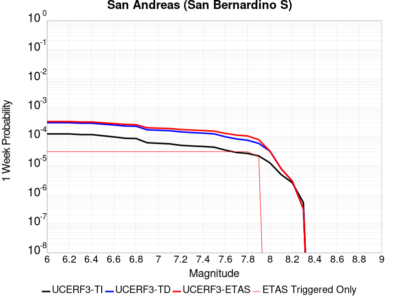 |  |  |  |

| Magnitude | 1 wk TI Prob | 1 wk TD Prob | 1 wk ETAS Prob | 1 wk ETAS/TD Gain | 1 wk ETAS Triggered Only | 1 mo TI Prob | 1 mo TD Prob | 1 mo ETAS Prob | 1 mo ETAS/TD Gain | 1 mo ETAS Triggered Only | 1 yr TI Prob | 1 yr TD Prob | 1 yr ETAS Prob | 1 yr ETAS/TD Gain | 1 yr ETAS Triggered Only | 10 yr TI Prob | 10 yr TD Prob | 10 yr ETAS Prob | 10 yr ETAS/TD Gain | 10 yr ETAS Triggered Only |
|-----|-----|-----|-----|-----|-----|-----|-----|-----|-----|-----|-----|-----|-----|-----|-----|-----|-----|-----|-----|-----|
| 6.0 | 1.2336002E-4 | 3.0028418E-4 | 3.151152E-4 | 1.04939 | 1.4835475E-5 | 5.2857865E-4 | 0.0012863235 | 0.0013307728 | 1.0345552 | 4.4506425E-5 | 0.006416472 | 0.015553492 | 0.015684934 | 1.008451 | 1.3351926E-4 | 0.06234337 | 0.14293301 | 0.14320002 | 1.0018681 | 3.1154498E-4 |
| 6.1 | 1.2336002E-4 | 3.0028418E-4 | 3.151152E-4 | 1.04939 | 1.4835475E-5 | 5.2857865E-4 | 0.0012863235 | 0.0013307728 | 1.0345552 | 4.4506425E-5 | 0.006416472 | 0.015553492 | 0.015684934 | 1.008451 | 1.3351926E-4 | 0.06234337 | 0.14293301 | 0.14320002 | 1.0018681 | 3.1154498E-4 |
| 6.2 | 1.2336002E-4 | 3.0028418E-4 | 3.151152E-4 | 1.04939 | 1.4835475E-5 | 5.2857865E-4 | 0.0012863235 | 0.0013307728 | 1.0345552 | 4.4506425E-5 | 0.006416472 | 0.015553492 | 0.015684934 | 1.008451 | 1.3351926E-4 | 0.06234337 | 0.14293301 | 0.14320002 | 1.0018681 | 3.1154498E-4 |
| 6.3 | 1.1712257E-4 | 2.8816468E-4 | 3.0299588E-4 | 1.0514678 | 1.4835475E-5 | 5.018573E-4 | 0.0012344327 | 0.0012788841 | 1.0360097 | 4.4506425E-5 | 0.006093008 | 0.014930496 | 0.015062021 | 1.0088092 | 1.3351926E-4 | 0.059286322 | 0.13764119 | 0.13789706 | 1.001859 | 2.967095E-4 |
| 6.4 | 1.1712257E-4 | 2.8816468E-4 | 3.0299588E-4 | 1.0514678 | 1.4835475E-5 | 5.018573E-4 | 0.0012344327 | 0.0012788841 | 1.0360097 | 4.4506425E-5 | 0.006093008 | 0.014930496 | 0.015062021 | 1.0088092 | 1.3351926E-4 | 0.059286322 | 0.13764119 | 0.13789706 | 1.001859 | 2.967095E-4 |
| 6.5 | 1.0689076E-4 | 2.6828906E-4 | 2.8312055E-4 | 1.0552818 | 1.4835475E-5 | 4.5802278E-4 | 0.0011493283 | 0.0011937836 | 1.0386794 | 4.4506425E-5 | 0.0055621783 | 0.013907914 | 0.014039576 | 1.0094668 | 1.3351926E-4 | 0.05425003 | 0.12888767 | 0.12913321 | 1.0019051 | 2.81874E-4 |
| 6.6 | 9.7648895E-5 | 2.507331E-4 | 2.655649E-4 | 1.0591536 | 1.4835475E-5 | 4.1842813E-4 | 0.0010741516 | 0.0011186103 | 1.0413895 | 4.4506425E-5 | 0.005082469 | 0.013003745 | 0.013135528 | 1.0101342 | 1.3351926E-4 | 0.049677886 | 0.12104674 | 0.12129449 | 1.0020467 | 2.81874E-4 |
| 6.7 | 8.757013E-5 | 2.3143708E-4 | 2.462691E-4 | 1.0640867 | 1.4835475E-5 | 3.7524657E-4 | 9.915185E-4 | 0.0010359808 | 1.0448426 | 4.4506425E-5 | 0.00455906 | 0.012009008 | 0.012140923 | 1.0109848 | 1.3351926E-4 | 0.04466656 | 0.1123545 | 0.11260471 | 1.002227 | 2.81874E-4 |
| 6.8 | 8.562978E-5 | 2.2703418E-4 | 2.4186629E-4 | 1.0653298 | 1.4835475E-5 | 3.6693315E-4 | 9.7266305E-4 | 0.0010171261 | 1.0457128 | 4.4506425E-5 | 0.004458263 | 0.011781941 | 0.011913887 | 1.011199 | 1.3351926E-4 | 0.043698758 | 0.11036427 | 0.11061504 | 1.0022721 | 2.81874E-4 |
| 6.9 | 6.124075E-5 | 1.708614E-4 | 1.8569434E-4 | 1.0868127 | 1.4835475E-5 | 2.6243398E-4 | 7.320585E-4 | 7.765323E-4 | 1.0607518 | 4.4506425E-5 | 0.0031904527 | 0.008876596 | 0.008994226 | 1.0132518 | 1.186838E-4 | 0.031450346 | 0.08426945 | 0.08448682 | 1.0025795 | 2.373676E-4 |
| 7.0 | 5.8598747E-5 | 1.6514942E-4 | 1.7998244E-4 | 1.0898157 | 1.4835475E-5 | 2.5111332E-4 | 7.0759206E-4 | 7.5206696E-4 | 1.0628539 | 4.4506425E-5 | 0.0030530186 | 0.008581099 | 0.008698764 | 1.0137122 | 1.186838E-4 | 0.03011414 | 0.08158649 | 0.08180449 | 1.0026721 | 2.373676E-4 |
| 7.1 | 5.613814E-5 | 1.593329E-4 | 1.7416601E-4 | 1.0930951 | 1.4835475E-5 | 2.4056983E-4 | 6.826774E-4 | 7.271534E-4 | 1.0651494 | 4.4506425E-5 | 0.0029250039 | 0.008280103 | 0.008397804 | 1.0142149 | 1.186838E-4 | 0.028868021 | 0.07888487 | 0.079103515 | 1.0027716 | 2.373676E-4 |
| 7.2 | 4.991222E-5 | 1.4539281E-4 | 1.6022613E-4 | 1.1020224 | 1.4835475E-5 | 2.1389198E-4 | 6.2296365E-4 | 6.6744233E-4 | 1.0713985 | 4.4506425E-5 | 0.002601025 | 0.0075583095 | 0.007676096 | 1.0155838 | 1.186838E-4 | 0.025707912 | 0.07233711 | 0.07255731 | 1.003044 | 2.373676E-4 |
| 7.3 | 4.7410045E-5 | 1.3733057E-4 | 1.5216401E-4 | 1.1080127 | 1.4835475E-5 | 2.0317009E-4 | 5.884272E-4 | 6.329074E-4 | 1.0755918 | 4.4506425E-5 | 0.0024707897 | 0.0071406537 | 0.00725849 | 1.0165021 | 1.186838E-4 | 0.024434982 | 0.06861821 | 0.06882547 | 1.0030205 | 2.2253212E-4 |
| 7.4 | 4.5556746E-5 | 1.3140634E-4 | 1.4623986E-4 | 1.1128829 | 1.4835475E-5 | 1.952286E-4 | 5.630488E-4 | 6.075302E-4 | 1.079001 | 4.4506425E-5 | 0.002374317 | 0.0068336516 | 0.0069515244 | 1.0172489 | 1.186838E-4 | 0.023491086 | 0.06586949 | 0.06607737 | 1.0031558 | 2.2253212E-4 |
| 7.5 | 4.3084514E-5 | 1.2375573E-4 | 1.3858937E-4 | 1.1198622 | 1.4835475E-5 | 1.8463485E-4 | 5.302742E-4 | 5.74757E-4 | 1.0838865 | 4.4506425E-5 | 0.0022456115 | 0.0064370483 | 0.006554968 | 1.0183189 | 1.186838E-4 | 0.022230545 | 0.062268913 | 0.06247759 | 1.0033512 | 2.2253212E-4 |
| 7.6 | 3.408608E-5 | 9.852347E-5 | 1.13357484E-4 | 1.1505632 | 1.4835475E-5 | 1.4607502E-4 | 4.2217522E-4 | 4.6666284E-4 | 1.1053772 | 4.4506425E-5 | 0.0017770125 | 0.005127895 | 0.0052459706 | 1.0230261 | 1.186838E-4 | 0.017628696 | 0.0500948 | 0.050306182 | 1.0042197 | 2.2253212E-4 |
| 7.7 | 2.8315713E-5 | 8.264487E-5 | 9.747912E-5 | 1.1794939 | 1.4835475E-5 | 1.2134742E-4 | 3.5414423E-4 | 3.986349E-4 | 1.1256287 | 4.4506425E-5 | 0.0014764034 | 0.004303191 | 0.004421364 | 1.0274618 | 1.186838E-4 | 0.01466633 | 0.04234195 | 0.04255506 | 1.005033 | 2.2253212E-4 |
| 7.8 | 2.6222975E-5 | 7.4778734E-5 | 8.96131E-5 | 1.1983768 | 1.4835475E-5 | 1.1237934E-4 | 3.2044094E-4 | 3.649331E-4 | 1.1388466 | 4.4506425E-5 | 0.0013673597 | 0.0038943957 | 0.0040126173 | 1.0303569 | 1.186838E-4 | 0.013589768 | 0.03850307 | 0.038717035 | 1.0055571 | 2.2253212E-4 |
| 7.9 | 2.1469694E-5 | 5.8002075E-5 | 7.283669E-5 | 1.2557601 | 1.4835475E-5 | 9.200973E-5 | 2.4855667E-4 | 2.9305203E-4 | 1.1790149 | 4.4506425E-5 | 0.0011196428 | 0.003021981 | 0.003140306 | 1.0391548 | 1.186838E-4 | 0.011140184 | 0.03020823 | 0.03042404 | 1.0071441 | 2.2253212E-4 |
| 8.0 | 1.2420249E-5 | 3.1387473E-5 | 3.1387473E-5 | 1.0 | 0.0 | 5.322855E-5 | 1.345108E-4 | 1.4934428E-4 | 1.1102772 | 1.4835475E-5 | 6.478649E-4 | 0.0016364399 | 0.0016808735 | 1.0271525 | 4.4506425E-5 | 0.0064597935 | 0.016554479 | 0.016612839 | 1.0035253 | 5.93419E-5 |
| 8.1 | 4.9197724E-6 | 7.84739E-6 | 7.84739E-6 | 1.0 | 0.0 | 2.1084568E-5 | 3.363124E-5 | 3.363124E-5 | 1.0 | 0.0 | 2.566744E-4 | 4.0938356E-4 | 4.0938356E-4 | 1.0 | 0.0 | 0.002563781 | 0.004396957 | 0.004396957 | 1.0 | 0.0 |
| 8.2 | 2.5634774E-6 | 2.9183652E-6 | 2.9183652E-6 | 1.0 | 0.0 | 1.0986286E-5 | 1.2507219E-5 | 1.2507219E-5 | 1.0 | 0.0 | 1.3374983E-4 | 1.5226481E-4 | 1.5226481E-4 | 1.0 | 0.0 | 0.0013366934 | 0.0017110866 | 0.0017110866 | 1.0 | 0.0 |
| 8.3 | 5.2850464E-7 | 3.224237E-7 | 3.224237E-7 | 1.0 | 0.0 | 2.2650179E-6 | 1.3818151E-6 | 1.3818151E-6 | 1.0 | 0.0 | 2.7576245E-5 | 1.6823482E-5 | 1.6823482E-5 | 1.0 | 0.0 | 2.7572823E-4 | 1.9956997E-4 | 1.9956997E-4 | 1.0 | 0.0 |

## Sierra Nevada  (No Extension)
*[(top)](#table-of-contents)*

| 1 Week | 1 Month | 1 Year | 10 Year |
|-----|-----|-----|-----|
|  | 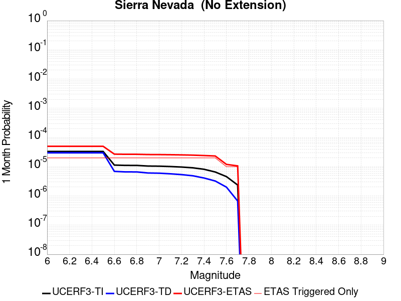 |  |  |

| Magnitude | 1 wk TI Prob | 1 wk TD Prob | 1 wk ETAS Prob | 1 wk ETAS/TD Gain | 1 wk ETAS Triggered Only | 1 mo TI Prob | 1 mo TD Prob | 1 mo ETAS Prob | 1 mo ETAS/TD Gain | 1 mo ETAS Triggered Only | 1 yr TI Prob | 1 yr TD Prob | 1 yr ETAS Prob | 1 yr ETAS/TD Gain | 1 yr ETAS Triggered Only | 10 yr TI Prob | 10 yr TD Prob | 10 yr ETAS Prob | 10 yr ETAS/TD Gain | 10 yr ETAS Triggered Only |
|-----|-----|-----|-----|-----|-----|-----|-----|-----|-----|-----|-----|-----|-----|-----|-----|-----|-----|-----|-----|-----|
| 6.0 | 7.7690465E-6 | 6.9766293E-6 | 2.1812E-5 | 3.1264381 | 1.4835475E-5 | 3.329549E-5 | 2.9899698E-5 | 4.473473E-5 | 1.4961599 | 1.4835475E-5 | 4.0529718E-4 | 3.6400388E-4 | 4.3815424E-4 | 1.2037077 | 7.417738E-5 | 0.004045588 | 0.0036375928 | 0.0038445338 | 1.0568895 | 2.0769665E-4 |
| 6.1 | 7.7690465E-6 | 6.9766293E-6 | 2.1812E-5 | 3.1264381 | 1.4835475E-5 | 3.329549E-5 | 2.9899698E-5 | 4.473473E-5 | 1.4961599 | 1.4835475E-5 | 4.0529718E-4 | 3.6400388E-4 | 4.3815424E-4 | 1.2037077 | 7.417738E-5 | 0.004045588 | 0.0036375928 | 0.0038445338 | 1.0568895 | 2.0769665E-4 |
| 6.2 | 7.7690465E-6 | 6.9766293E-6 | 2.1812E-5 | 3.1264381 | 1.4835475E-5 | 3.329549E-5 | 2.9899698E-5 | 4.473473E-5 | 1.4961599 | 1.4835475E-5 | 4.0529718E-4 | 3.6400388E-4 | 4.3815424E-4 | 1.2037077 | 7.417738E-5 | 0.004045588 | 0.0036375928 | 0.0038445338 | 1.0568895 | 2.0769665E-4 |
| 6.3 | 7.7690465E-6 | 6.9766293E-6 | 2.1812E-5 | 3.1264381 | 1.4835475E-5 | 3.329549E-5 | 2.9899698E-5 | 4.473473E-5 | 1.4961599 | 1.4835475E-5 | 4.0529718E-4 | 3.6400388E-4 | 4.3815424E-4 | 1.2037077 | 7.417738E-5 | 0.004045588 | 0.0036375928 | 0.0038445338 | 1.0568895 | 2.0769665E-4 |
| 6.4 | 7.7690465E-6 | 6.9766293E-6 | 2.1812E-5 | 3.1264381 | 1.4835475E-5 | 3.329549E-5 | 2.9899698E-5 | 4.473473E-5 | 1.4961599 | 1.4835475E-5 | 4.0529718E-4 | 3.6400388E-4 | 4.3815424E-4 | 1.2037077 | 7.417738E-5 | 0.004045588 | 0.0036375928 | 0.0038445338 | 1.0568895 | 2.0769665E-4 |
| 6.5 | 7.7690465E-6 | 6.9766293E-6 | 2.1812E-5 | 3.1264381 | 1.4835475E-5 | 3.329549E-5 | 2.9899698E-5 | 4.473473E-5 | 1.4961599 | 1.4835475E-5 | 4.0529718E-4 | 3.6400388E-4 | 4.3815424E-4 | 1.2037077 | 7.417738E-5 | 0.004045588 | 0.0036375928 | 0.0038445338 | 1.0568895 | 2.0769665E-4 |
| 6.6 | 2.653E-6 | 1.6149909E-6 | 1.6450442E-5 | 10.1860895 | 1.4835475E-5 | 1.136995E-5 | 6.921371E-6 | 2.1756743E-5 | 3.1434152 | 1.4835475E-5 | 1.3842035E-4 | 8.426447E-5 | 1.5843559E-4 | 1.8802183 | 7.417738E-5 | 0.0013833415 | 8.4232865E-4 | 0.0010053813 | 1.1935738 | 1.6319023E-4 |
| 6.7 | 2.5902466E-6 | 1.5503231E-6 | 1.6385775E-5 | 10.569264 | 1.4835475E-5 | 1.11010095E-5 | 6.644225E-6 | 2.1479602E-5 | 3.2328227 | 1.4835475E-5 | 1.351464E-4 | 8.0890466E-5 | 1.5506183E-4 | 1.9169359 | 7.417738E-5 | 0.0013506424 | 8.086132E-4 | 9.716715E-4 | 1.2016517 | 1.6319023E-4 |
| 6.8 | 2.5853892E-6 | 1.5471227E-6 | 1.6382573E-5 | 10.58906 | 1.4835475E-5 | 1.1080193E-5 | 6.6305092E-6 | 2.1465885E-5 | 3.2374415 | 1.4835475E-5 | 1.34893E-4 | 8.072349E-5 | 1.5489488E-4 | 1.9188328 | 7.417738E-5 | 0.0013481114 | 8.069446E-4 | 9.700032E-4 | 1.202069 | 1.6319023E-4 |
| 6.9 | 2.458257E-6 | 1.4221939E-6 | 1.6257647E-5 | 11.431386 | 1.4835475E-5 | 1.0535345E-5 | 6.0951024E-6 | 2.0930487E-5 | 3.4339843 | 1.4835475E-5 | 1.2826028E-4 | 7.420537E-5 | 1.4837724E-4 | 1.9995486 | 7.417738E-5 | 0.0012818627 | 7.4180786E-4 | 9.0487703E-4 | 1.2198267 | 1.6319023E-4 |
| 7.0 | 2.4341468E-6 | 1.3991571E-6 | 1.6234611E-5 | 11.603137 | 1.4835475E-5 | 1.0432016E-5 | 5.996374E-6 | 2.083176E-5 | 3.4740596 | 1.4835475E-5 | 1.270024E-4 | 7.300342E-5 | 1.4717538E-4 | 2.0160065 | 7.417738E-5 | 0.0012692984 | 7.2979636E-4 | 8.9286745E-4 | 1.2234474 | 1.6319023E-4 |
| 7.1 | 2.3652476E-6 | 1.3341048E-6 | 1.6169559E-5 | 12.120156 | 1.4835475E-5 | 1.0136736E-5 | 5.71758E-6 | 2.055297E-5 | 3.5946975 | 1.4835475E-5 | 1.2340778E-4 | 6.960933E-5 | 1.4378154E-4 | 2.0655499 | 7.417738E-5 | 0.0012333926 | 6.9587695E-4 | 8.589536E-4 | 1.234347 | 1.6319023E-4 |
| 7.2 | 2.272158E-6 | 1.2504086E-6 | 1.6085865E-5 | 12.864488 | 1.4835475E-5 | 9.737784E-6 | 5.358883E-6 | 2.0194278E-5 | 3.7683747 | 1.4835475E-5 | 1.1855107E-4 | 6.524246E-5 | 1.3941499E-4 | 2.1368752 | 7.417738E-5 | 0.0011848784 | 6.5223454E-4 | 8.153183E-4 | 1.2500385 | 1.6319023E-4 |
| 7.3 | 2.1382127E-6 | 1.1420926E-6 | 1.597755E-5 | 13.989715 | 1.4835475E-5 | 9.163737E-6 | 4.8946736E-6 | 1.9730076E-5 | 4.0309277 | 1.4835475E-5 | 1.1156279E-4 | 5.9591035E-5 | 1.3376398E-4 | 2.2447 | 7.417738E-5 | 0.001115068 | 5.9575174E-4 | 7.588447E-4 | 1.27376 | 1.6319023E-4 |
| 7.4 | 1.9048055E-6 | 9.576402E-7 | 1.57931E-5 | 16.491686 | 1.4835475E-5 | 8.163426E-6 | 4.1041653E-6 | 1.893958E-5 | 4.6147213 | 1.4835475E-5 | 9.9385186E-5 | 4.9967075E-5 | 1.2414074E-4 | 2.4844508 | 7.417738E-5 | 9.934074E-4 | 4.995591E-4 | 6.626678E-4 | 1.3265053 | 1.6319023E-4 |
| 7.5 | 1.5373403E-6 | 7.561029E-7 | 1.5591566E-5 | 20.620956 | 1.4835475E-5 | 6.5885843E-6 | 3.240437E-6 | 1.8075863E-5 | 5.5782175 | 1.4835475E-5 | 8.021306E-5 | 3.9451614E-5 | 8.395628E-5 | 2.1280823 | 4.4506425E-5 | 8.0184115E-4 | 3.9444657E-4 | 4.982539E-4 | 1.2631721 | 1.03848324E-4 |
| 7.6 | 1.0680322E-6 | 4.6603589E-7 | 1.5301504E-5 | 32.833317 | 1.4835475E-5 | 4.577273E-6 | 1.9972952E-6 | 1.683274E-5 | 8.427768 | 1.4835475E-5 | 5.5726876E-5 | 2.43168E-5 | 6.882214E-5 | 2.8302302 | 4.4506425E-5 | 5.5712904E-4 | 2.4314165E-4 | 3.0246913E-4 | 1.2440038 | 5.93419E-5 |
| 7.7 | 5.509146E-7 | 1.5584055E-7 | 1.4991313E-5 | 96.19649 | 1.4835475E-5 | 2.3610605E-6 | 6.678879E-7 | 1.5503352E-5 | 23.212507 | 1.4835475E-5 | 2.8745531E-5 | 8.131506E-6 | 3.7802212E-5 | 4.6488576 | 2.967095E-5 | 2.8741814E-4 | 8.13122E-5 | 1.10980734E-4 | 1.3648719 | 2.967095E-5 |

## Elsinore (Glen Ivy) rev
*[(top)](#table-of-contents)*

| 1 Week | 1 Month | 1 Year | 10 Year |
|-----|-----|-----|-----|
| 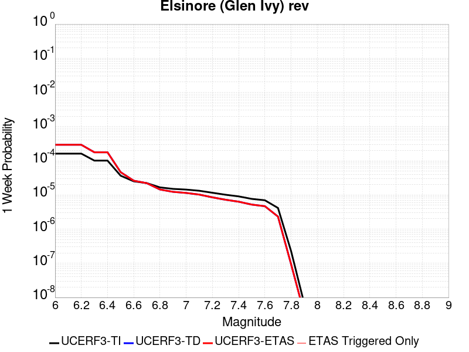 |  |  | 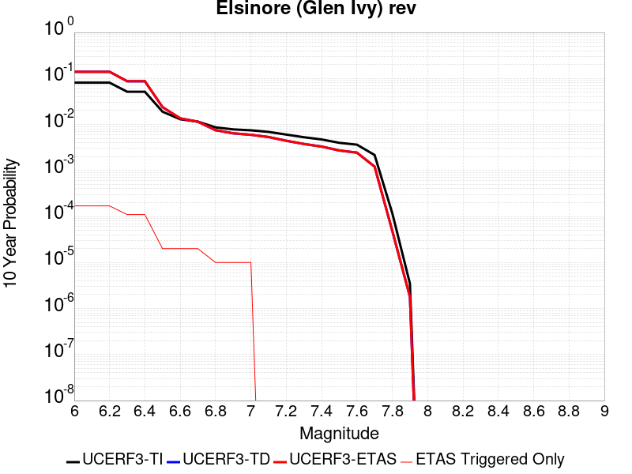 |

| Magnitude | 1 wk TI Prob | 1 wk TD Prob | 1 wk ETAS Prob | 1 wk ETAS/TD Gain | 1 wk ETAS Triggered Only | 1 mo TI Prob | 1 mo TD Prob | 1 mo ETAS Prob | 1 mo ETAS/TD Gain | 1 mo ETAS Triggered Only | 1 yr TI Prob | 1 yr TD Prob | 1 yr ETAS Prob | 1 yr ETAS/TD Gain | 1 yr ETAS Triggered Only | 10 yr TI Prob | 10 yr TD Prob | 10 yr ETAS Prob | 10 yr ETAS/TD Gain | 10 yr ETAS Triggered Only |
|-----|-----|-----|-----|-----|-----|-----|-----|-----|-----|-----|-----|-----|-----|-----|-----|-----|-----|-----|-----|-----|
| 6.0 | 1.6204086E-4 | 2.9367238E-4 | 2.9367238E-4 | 1.0 | 0.0 | 6.94276E-4 | 0.0012581435 | 0.0012877771 | 1.0235535 | 2.967095E-5 | 0.008420097 | 0.015237851 | 0.015325507 | 1.0057526 | 8.901285E-5 | 0.081081145 | 0.13970873 | 0.13986188 | 1.0010962 | 1.780257E-4 |
| 6.1 | 1.6204086E-4 | 2.9367238E-4 | 2.9367238E-4 | 1.0 | 0.0 | 6.94276E-4 | 0.0012581435 | 0.0012877771 | 1.0235535 | 2.967095E-5 | 0.008420097 | 0.015237851 | 0.015325507 | 1.0057526 | 8.901285E-5 | 0.081081145 | 0.13970873 | 0.13986188 | 1.0010962 | 1.780257E-4 |
| 6.2 | 1.6204086E-4 | 2.9367238E-4 | 2.9367238E-4 | 1.0 | 0.0 | 6.94276E-4 | 0.0012581435 | 0.0012877771 | 1.0235535 | 2.967095E-5 | 0.008420097 | 0.015237851 | 0.015325507 | 1.0057526 | 8.901285E-5 | 0.081081145 | 0.13970873 | 0.13986188 | 1.0010962 | 1.780257E-4 |
| 6.3 | 1.0111737E-4 | 1.7705272E-4 | 1.7705272E-4 | 1.0 | 0.0 | 4.332882E-4 | 7.586934E-4 | 7.883418E-4 | 1.0390782 | 2.967095E-5 | 0.005262531 | 0.009218662 | 0.009306855 | 1.0095667 | 8.901285E-5 | 0.0513964 | 0.08702751 | 0.08713587 | 1.001245 | 1.186838E-4 |
| 6.4 | 1.0111737E-4 | 1.7705272E-4 | 1.7705272E-4 | 1.0 | 0.0 | 4.332882E-4 | 7.586934E-4 | 7.883418E-4 | 1.0390782 | 2.967095E-5 | 0.005262531 | 0.009218662 | 0.009306855 | 1.0095667 | 8.901285E-5 | 0.0513964 | 0.08702751 | 0.08713587 | 1.001245 | 1.186838E-4 |
| 6.5 | 3.6624708E-5 | 4.6400255E-5 | 4.6400255E-5 | 1.0 | 0.0 | 1.569536E-4 | 1.9884513E-4 | 2.1367765E-4 | 1.0745933 | 1.4835475E-5 | 0.001909235 | 0.0024186145 | 0.002433414 | 1.006119 | 1.4835475E-5 | 0.01892915 | 0.02374451 | 0.023773478 | 1.0012199 | 2.967095E-5 |
| 6.6 | 2.5051324E-5 | 2.6154066E-5 | 2.6154066E-5 | 1.0 | 0.0 | 1.073584E-4 | 1.12084286E-4 | 1.269181E-4 | 1.1323452 | 1.4835475E-5 | 0.0013063047 | 0.0013638166 | 0.0013786318 | 1.0108631 | 1.4835475E-5 | 0.012986525 | 0.013567863 | 0.013597132 | 1.0021572 | 2.967095E-5 |
| 6.7 | 2.2189772E-5 | 2.2078293E-5 | 2.2078293E-5 | 1.0 | 0.0 | 9.509556E-5 | 9.461803E-5 | 1.0945211E-4 | 1.1567785 | 1.4835475E-5 | 0.0011571734 | 0.0011514021 | 0.0011662205 | 1.0128698 | 1.4835475E-5 | 0.011511663 | 0.011468212 | 0.011497543 | 1.0025575 | 2.967095E-5 |
| 6.8 | 1.6654378E-5 | 1.4440944E-5 | 1.4440944E-5 | 1.0 | 0.0 | 7.137396E-5 | 6.188832E-5 | 6.188832E-5 | 1.0 | 0.0 | 8.686314E-4 | 7.5323496E-4 | 7.5323496E-4 | 1.0 | 0.0 | 0.008652439 | 0.007512156 | 0.00752688 | 1.00196 | 1.4835475E-5 |
| 6.9 | 1.5042909E-5 | 1.2334823E-5 | 1.2334823E-5 | 1.0 | 0.0 | 6.446802E-5 | 5.2862473E-5 | 5.2862473E-5 | 1.0 | 0.0 | 7.8461546E-4 | 6.434137E-4 | 6.434137E-4 | 1.0 | 0.0 | 0.007818509 | 0.0064197313 | 0.0064344713 | 1.0022961 | 1.4835475E-5 |
| 7.0 | 1.4361385E-5 | 1.1453959E-5 | 1.1453959E-5 | 1.0 | 0.0 | 6.154734E-5 | 4.9087488E-5 | 4.9087488E-5 | 1.0 | 0.0 | 7.490812E-4 | 5.9747923E-4 | 5.9747923E-4 | 1.0 | 0.0 | 0.007465612 | 0.005962719 | 0.0059774662 | 1.0024732 | 1.4835475E-5 |
| 7.1 | 1.3265571E-5 | 1.02471995E-5 | 1.02471995E-5 | 1.0 | 0.0 | 5.6851208E-5 | 4.3915843E-5 | 4.3915843E-5 | 1.0 | 0.0 | 6.919436E-4 | 5.345468E-4 | 5.345468E-4 | 1.0 | 0.0 | 0.006897931 | 0.005335966 | 0.005335966 | 1.0 | 0.0 |
| 7.2 | 1.1596403E-5 | 8.506924E-6 | 8.506924E-6 | 1.0 | 0.0 | 4.9697923E-5 | 3.6457746E-5 | 3.6457746E-5 | 1.0 | 0.0 | 6.049042E-4 | 4.4378437E-4 | 4.4378437E-4 | 1.0 | 0.0 | 0.006032603 | 0.0044303965 | 0.0044303965 | 1.0 | 0.0 |
| 7.3 | 1.0150827E-5 | 7.2403E-6 | 7.2403E-6 | 1.0 | 0.0 | 4.3502816E-5 | 3.1029496E-5 | 3.1029496E-5 | 1.0 | 0.0 | 5.2951806E-4 | 3.7772005E-4 | 3.7772005E-4 | 1.0 | 0.0 | 0.005282581 | 0.0037711672 | 0.0037711672 | 1.0 | 0.0 |
| 7.4 | 9.080705E-6 | 6.3538396E-6 | 6.3538396E-6 | 1.0 | 0.0 | 3.8916725E-5 | 2.7230464E-5 | 2.7230464E-5 | 1.0 | 0.0 | 4.7370812E-4 | 3.3148183E-4 | 3.3148183E-4 | 1.0 | 0.0 | 0.004726996 | 0.003310025 | 0.003310025 | 1.0 | 0.0 |
| 7.5 | 7.671649E-6 | 5.226707E-6 | 5.226707E-6 | 1.0 | 0.0 | 3.287808E-5 | 2.2399987E-5 | 2.2399987E-5 | 1.0 | 0.0 | 4.0021708E-4 | 2.7268694E-4 | 2.7268694E-4 | 1.0 | 0.0 | 0.0039949706 | 0.0027236487 | 0.0027236487 | 1.0 | 0.0 |
| 7.6 | 6.990086E-6 | 4.6885066E-6 | 4.6885066E-6 | 1.0 | 0.0 | 2.9957167E-5 | 2.0093452E-5 | 2.0093452E-5 | 1.0 | 0.0 | 3.6466747E-4 | 2.446115E-4 | 2.446115E-4 | 1.0 | 0.0 | 0.0036406964 | 0.0024435387 | 0.0024435387 | 1.0 | 0.0 |
| 7.7 | 4.163505E-6 | 2.330101E-6 | 2.330101E-6 | 1.0 | 0.0 | 1.7843471E-5 | 9.986114E-6 | 9.986114E-6 | 1.0 | 0.0 | 2.172226E-4 | 1.21574885E-4 | 1.21574885E-4 | 1.0 | 0.0 | 0.0021701038 | 0.0012151569 | 0.0012151569 | 1.0 | 0.0 |
| 7.8 | 2.2692414E-7 | 9.387862E-8 | 9.387862E-8 | 1.0 | 0.0 | 9.725317E-7 | 4.023369E-7 | 4.023369E-7 | 1.0 | 0.0 | 1.1840509E-5 | 4.898444E-6 | 4.898444E-6 | 1.0 | 0.0 | 1.1839878E-4 | 4.898369E-5 | 4.898369E-5 | 1.0 | 0.0 |
| 7.9 | 6.676829E-9 | 3.4404741E-9 | 3.4404741E-9 | 1.0 | 0.0 | 2.861498E-8 | 1.4744889E-8 | 1.4744889E-8 | 1.0 | 0.0 | 3.4838732E-7 | 1.79519E-7 | 1.79519E-7 | 1.0 | 0.0 | 3.4838679E-6 | 1.7951887E-6 | 1.7951887E-6 | 1.0 | 0.0 |

## White Wolf (Extension)
*[(top)](#table-of-contents)*

| 1 Week | 1 Month | 1 Year | 10 Year |
|-----|-----|-----|-----|
|  |  |  |  |

| Magnitude | 1 wk TI Prob | 1 wk TD Prob | 1 wk ETAS Prob | 1 wk ETAS/TD Gain | 1 wk ETAS Triggered Only | 1 mo TI Prob | 1 mo TD Prob | 1 mo ETAS Prob | 1 mo ETAS/TD Gain | 1 mo ETAS Triggered Only | 1 yr TI Prob | 1 yr TD Prob | 1 yr ETAS Prob | 1 yr ETAS/TD Gain | 1 yr ETAS Triggered Only | 10 yr TI Prob | 10 yr TD Prob | 10 yr ETAS Prob | 10 yr ETAS/TD Gain | 10 yr ETAS Triggered Only |
|-----|-----|-----|-----|-----|-----|-----|-----|-----|-----|-----|-----|-----|-----|-----|-----|-----|-----|-----|-----|-----|
| 6.0 | 8.222555E-6 | 6.0668667E-6 | 6.0668667E-6 | 1.0 | 0.0 | 3.5239045E-5 | 2.6000635E-5 | 4.0835723E-5 | 1.5705664 | 1.4835475E-5 | 4.289509E-4 | 3.165184E-4 | 3.6101072E-4 | 1.1405679 | 4.4506425E-5 | 0.0042812387 | 0.0031613277 | 0.0033831561 | 1.0701694 | 2.2253212E-4 |
| 6.1 | 8.222555E-6 | 6.0668667E-6 | 6.0668667E-6 | 1.0 | 0.0 | 3.5239045E-5 | 2.6000635E-5 | 4.0835723E-5 | 1.5705664 | 1.4835475E-5 | 4.289509E-4 | 3.165184E-4 | 3.6101072E-4 | 1.1405679 | 4.4506425E-5 | 0.0042812387 | 0.0031613277 | 0.0033831561 | 1.0701694 | 2.2253212E-4 |
| 6.2 | 8.222555E-6 | 6.0668667E-6 | 6.0668667E-6 | 1.0 | 0.0 | 3.5239045E-5 | 2.6000635E-5 | 4.0835723E-5 | 1.5705664 | 1.4835475E-5 | 4.289509E-4 | 3.165184E-4 | 3.6101072E-4 | 1.1405679 | 4.4506425E-5 | 0.0042812387 | 0.0031613277 | 0.0033831561 | 1.0701694 | 2.2253212E-4 |
| 6.3 | 8.222555E-6 | 6.0668667E-6 | 6.0668667E-6 | 1.0 | 0.0 | 3.5239045E-5 | 2.6000635E-5 | 4.0835723E-5 | 1.5705664 | 1.4835475E-5 | 4.289509E-4 | 3.165184E-4 | 3.6101072E-4 | 1.1405679 | 4.4506425E-5 | 0.0042812387 | 0.0031613277 | 0.0033831561 | 1.0701694 | 2.2253212E-4 |
| 6.4 | 5.821773E-6 | 3.557302E-6 | 3.557302E-6 | 1.0 | 0.0 | 2.4950215E-5 | 1.5245498E-5 | 3.0080746E-5 | 1.9730905 | 1.4835475E-5 | 3.0372653E-4 | 1.8559922E-4 | 2.1526466E-4 | 1.159836 | 2.967095E-5 | 0.0030331176 | 0.0018545504 | 0.001973014 | 1.0638773 | 1.186838E-4 |
| 6.5 | 5.766023E-6 | 3.4992347E-6 | 3.4992347E-6 | 1.0 | 0.0 | 2.4711293E-5 | 1.499664E-5 | 2.9831892E-5 | 1.9892384 | 1.4835475E-5 | 3.0081844E-4 | 1.8256989E-4 | 2.1223542E-4 | 1.1624886 | 2.967095E-5 | 0.0030041158 | 0.0018243071 | 0.0019427745 | 1.0649382 | 1.186838E-4 |
| 6.6 | 4.643576E-6 | 2.3327177E-6 | 2.3327177E-6 | 1.0 | 0.0 | 1.9900888E-5 | 9.997326E-6 | 2.4832652E-5 | 2.4839294 | 1.4835475E-5 | 2.4226638E-4 | 1.2171108E-4 | 1.5137841E-4 | 1.2437521 | 2.967095E-5 | 0.0024200242 | 0.0012164866 | 0.0012757563 | 1.048722 | 5.93419E-5 |
| 6.7 | 3.9529173E-6 | 1.648423E-6 | 1.648423E-6 | 1.0 | 0.0 | 1.6940963E-5 | 7.064652E-6 | 2.1900021E-5 | 3.0999434 | 1.4835475E-5 | 2.0623671E-4 | 8.6008935E-5 | 1.0084313E-4 | 1.1724727 | 1.4835475E-5 | 0.002060454 | 8.5977494E-4 | 9.042431E-4 | 1.0517207 | 4.4506425E-5 |
| 6.8 | 3.4377522E-6 | 1.224586E-6 | 1.224586E-6 | 1.0 | 0.0 | 1.473314E-5 | 5.2482155E-6 | 2.0083613E-5 | 3.8267505 | 1.4835475E-5 | 1.7936122E-4 | 6.389524E-5 | 7.872977E-5 | 1.2321695 | 1.4835475E-5 | 0.0017921652 | 6.3877786E-4 | 6.536038E-4 | 1.0232099 | 1.4835475E-5 |
| 6.9 | 3.1367306E-6 | 1.0034331E-6 | 1.0034331E-6 | 1.0 | 0.0 | 1.3443062E-5 | 4.300421E-6 | 1.9135832E-5 | 4.449758 | 1.4835475E-5 | 1.63657E-4 | 5.2356445E-5 | 6.719114E-5 | 1.2833405 | 1.4835475E-5 | 0.0016353652 | 5.2344875E-4 | 5.3827645E-4 | 1.028327 | 1.4835475E-5 |
| 7.0 | 2.8298145E-6 | 7.42914E-7 | 7.42914E-7 | 1.0 | 0.0 | 1.2127721E-5 | 3.1839136E-6 | 3.1839136E-6 | 1.0 | 0.0 | 1.47645E-4 | 3.876351E-5 | 3.876351E-5 | 1.0 | 0.0 | 0.0014754693 | 3.8757248E-4 | 3.8757248E-4 | 1.0 | 0.0 |
| 7.1 | 2.4091064E-6 | 5.4231344E-7 | 5.4231344E-7 | 1.0 | 0.0 | 1.03247E-5 | 2.3241985E-6 | 2.3241985E-6 | 1.0 | 0.0 | 1.2569598E-4 | 2.829679E-5 | 2.829679E-5 | 1.0 | 0.0 | 0.001256249 | 2.8293591E-4 | 2.8293591E-4 | 1.0 | 0.0 |
| 7.2 | 1.3875518E-6 | 1.0744938E-7 | 1.0744938E-7 | 1.0 | 0.0 | 5.9466374E-6 | 4.604973E-7 | 4.604973E-7 | 1.0 | 0.0 | 7.23979E-5 | 5.606541E-6 | 5.606541E-6 | 1.0 | 0.0 | 7.2374323E-4 | 5.606411E-5 | 5.606411E-5 | 1.0 | 0.0 |
| 7.3 | 7.056077E-7 | 5.003111E-8 | 5.003111E-8 | 1.0 | 0.0 | 3.0240296E-6 | 2.1441903E-7 | 2.1441903E-7 | 1.0 | 0.0 | 3.681694E-5 | 2.6105492E-6 | 2.6105492E-6 | 1.0 | 0.0 | 3.681084E-4 | 2.6105232E-5 | 2.6105232E-5 | 1.0 | 0.0 |
| 7.4 | 5.9334678E-8 | 4.869399E-9 | 4.869399E-9 | 1.0 | 0.0 | 2.5429145E-7 | 2.0868853E-8 | 2.0868853E-8 | 1.0 | 0.0 | 3.095994E-6 | 2.540783E-7 | 2.540783E-7 | 1.0 | 0.0 | 3.095951E-5 | 2.540781E-6 | 2.540781E-6 | 1.0 | 0.0 |

## Death Valley (No)
*[(top)](#table-of-contents)*

| 1 Week | 1 Month | 1 Year | 10 Year |
|-----|-----|-----|-----|
| 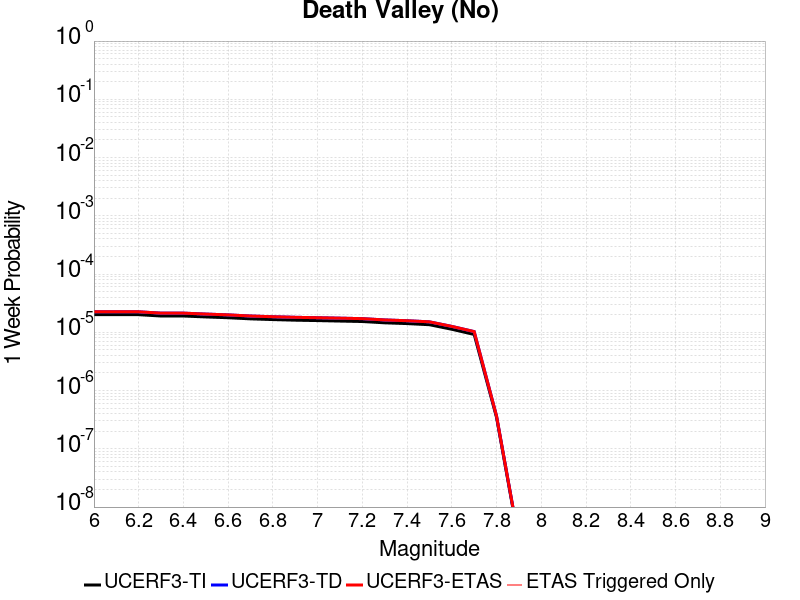 |  | 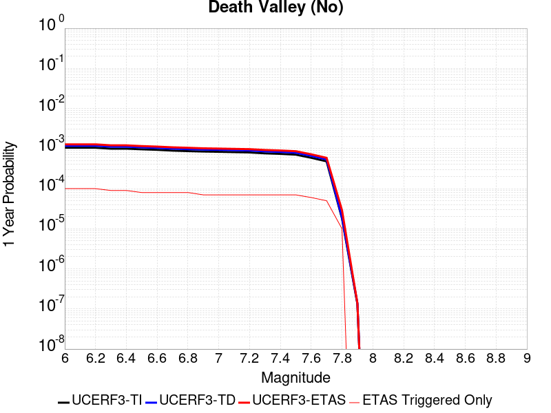 |  |

| Magnitude | 1 wk TI Prob | 1 wk TD Prob | 1 wk ETAS Prob | 1 wk ETAS/TD Gain | 1 wk ETAS Triggered Only | 1 mo TI Prob | 1 mo TD Prob | 1 mo ETAS Prob | 1 mo ETAS/TD Gain | 1 mo ETAS Triggered Only | 1 yr TI Prob | 1 yr TD Prob | 1 yr ETAS Prob | 1 yr ETAS/TD Gain | 1 yr ETAS Triggered Only | 10 yr TI Prob | 10 yr TD Prob | 10 yr ETAS Prob | 10 yr ETAS/TD Gain | 10 yr ETAS Triggered Only |
|-----|-----|-----|-----|-----|-----|-----|-----|-----|-----|-----|-----|-----|-----|-----|-----|-----|-----|-----|-----|-----|
| 6.0 | 2.0074807E-5 | 2.2501894E-5 | 2.2501894E-5 | 1.0 | 0.0 | 8.603206E-5 | 9.643317E-5 | 1.1126721E-4 | 1.1538272 | 1.4835475E-5 | 0.001046937 | 0.0011734489 | 0.0012771754 | 1.0883945 | 1.03848324E-4 | 0.010420183 | 0.01167344 | 0.01186405 | 1.0163285 | 1.9286117E-4 |
| 6.1 | 2.0074807E-5 | 2.2501894E-5 | 2.2501894E-5 | 1.0 | 0.0 | 8.603206E-5 | 9.643317E-5 | 1.1126721E-4 | 1.1538272 | 1.4835475E-5 | 0.001046937 | 0.0011734489 | 0.0012771754 | 1.0883945 | 1.03848324E-4 | 0.010420183 | 0.01167344 | 0.01186405 | 1.0163285 | 1.9286117E-4 |
| 6.2 | 2.0074807E-5 | 2.2501894E-5 | 2.2501894E-5 | 1.0 | 0.0 | 8.603206E-5 | 9.643317E-5 | 1.1126721E-4 | 1.1538272 | 1.4835475E-5 | 0.001046937 | 0.0011734489 | 0.0012771754 | 1.0883945 | 1.03848324E-4 | 0.010420183 | 0.01167344 | 0.01186405 | 1.0163285 | 1.9286117E-4 |
| 6.3 | 1.9050609E-5 | 2.1338654E-5 | 2.1338654E-5 | 1.0 | 0.0 | 8.164292E-5 | 9.144821E-5 | 1.0628232E-4 | 1.1622133 | 1.4835475E-5 | 9.935491E-4 | 0.00111282 | 0.0012165528 | 1.0932161 | 1.03848324E-4 | 0.009891188 | 0.0110733 | 0.011264025 | 1.017224 | 1.9286117E-4 |
| 6.4 | 1.9050609E-5 | 2.1338654E-5 | 2.1338654E-5 | 1.0 | 0.0 | 8.164292E-5 | 9.144821E-5 | 1.0628232E-4 | 1.1622133 | 1.4835475E-5 | 9.935491E-4 | 0.00111282 | 0.0012165528 | 1.0932161 | 1.03848324E-4 | 0.009891188 | 0.0110733 | 0.011264025 | 1.017224 | 1.9286117E-4 |
| 6.5 | 1.8367004E-5 | 2.0562646E-5 | 2.0562646E-5 | 1.0 | 0.0 | 7.8713354E-5 | 8.812268E-5 | 1.0295685E-4 | 1.1683354 | 1.4835475E-5 | 9.5791375E-4 | 0.0010723722 | 0.0011612895 | 1.0829165 | 8.901285E-5 | 0.009537951 | 0.01067276 | 0.010848886 | 1.0165024 | 1.780257E-4 |
| 6.6 | 1.779439E-5 | 1.9912506E-5 | 1.9912506E-5 | 1.0 | 0.0 | 7.625944E-5 | 8.533656E-5 | 1.00170764E-4 | 1.1738318 | 1.4835475E-5 | 9.280632E-4 | 0.0010384838 | 0.0011274042 | 1.0856252 | 8.901285E-5 | 0.009241969 | 0.010337068 | 0.0105132535 | 1.0170441 | 1.780257E-4 |
| 6.7 | 1.7025437E-5 | 1.904493E-5 | 1.904493E-5 | 1.0 | 0.0 | 7.296412E-5 | 8.161861E-5 | 9.645287E-5 | 1.181751 | 1.4835475E-5 | 8.87976E-4 | 9.932597E-4 | 0.0010821841 | 1.0895278 | 8.901285E-5 | 0.008844362 | 0.009888923 | 0.010065188 | 1.0178245 | 1.780257E-4 |
| 6.8 | 1.6545107E-5 | 1.8514012E-5 | 1.8514012E-5 | 1.0 | 0.0 | 7.090568E-5 | 7.934339E-5 | 9.417769E-5 | 1.1869632 | 1.4835475E-5 | 8.629347E-4 | 9.655837E-4 | 0.0010545106 | 1.0920966 | 8.901285E-5 | 0.008595915 | 0.009614587 | 0.009790901 | 1.0183382 | 1.780257E-4 |
| 6.9 | 1.615478E-5 | 1.8089035E-5 | 1.8089035E-5 | 1.0 | 0.0 | 6.9232934E-5 | 7.752216E-5 | 9.235649E-5 | 1.191356 | 1.4835475E-5 | 8.4258494E-4 | 9.4342977E-4 | 0.0010323586 | 1.0942613 | 8.901285E-5 | 0.008393973 | 0.009394941 | 0.009571293 | 1.018771 | 1.780257E-4 |
| 7.0 | 1.5894311E-5 | 1.7806975E-5 | 1.7806975E-5 | 1.0 | 0.0 | 6.81167E-5 | 7.631341E-5 | 9.1147755E-5 | 1.1943871 | 1.4835475E-5 | 8.2900526E-4 | 9.287258E-4 | 0.001017656 | 1.0957551 | 8.901285E-5 | 0.008259195 | 0.009249134 | 0.009425513 | 1.0190698 | 1.780257E-4 |
| 7.1 | 1.5602263E-5 | 1.7484906E-5 | 1.7484906E-5 | 1.0 | 0.0 | 6.6865134E-5 | 7.4933196E-5 | 8.9767556E-5 | 1.1979679 | 1.4835475E-5 | 8.137789E-4 | 9.119359E-4 | 0.0010008676 | 1.0975196 | 8.901285E-5 | 0.008108052 | 0.009082619 | 0.009259028 | 1.0194227 | 1.780257E-4 |
| 7.2 | 1.5323829E-5 | 1.7172008E-5 | 1.7172008E-5 | 1.0 | 0.0 | 6.56719E-5 | 7.359227E-5 | 8.8426656E-5 | 1.2015753 | 1.4835475E-5 | 7.99262E-4 | 8.956237E-4 | 9.845569E-4 | 1.0992974 | 8.901285E-5 | 0.007963934 | 0.008920819 | 0.009097257 | 1.0197781 | 1.780257E-4 |
| 7.3 | 1.4556212E-5 | 1.6303757E-5 | 1.6303757E-5 | 1.0 | 0.0 | 6.238227E-5 | 6.987141E-5 | 8.470584E-5 | 1.2123106 | 1.4835475E-5 | 7.592395E-4 | 8.503582E-4 | 9.3929534E-4 | 1.1045879 | 8.901285E-5 | 0.0075665074 | 0.008471687 | 0.008648206 | 1.0208361 | 1.780257E-4 |
| 7.4 | 1.411725E-5 | 1.5809219E-5 | 1.5809219E-5 | 1.0 | 0.0 | 6.0501097E-5 | 6.775207E-5 | 8.258654E-5 | 1.2189523 | 1.4835475E-5 | 7.363519E-4 | 8.2457514E-4 | 9.135146E-4 | 1.1078609 | 8.901285E-5 | 0.0073391674 | 0.008215791 | 0.008362927 | 1.0179089 | 1.4835475E-4 |
| 7.5 | 1.3503312E-5 | 1.5127498E-5 | 1.5127498E-5 | 1.0 | 0.0 | 5.7870053E-5 | 6.483056E-5 | 7.966507E-5 | 1.2288197 | 1.4835475E-5 | 7.043401E-4 | 7.89032E-4 | 8.779746E-4 | 1.1127237 | 8.901285E-5 | 0.007021119 | 0.00786293 | 0.0079954 | 1.0168474 | 1.3351926E-4 |
| 7.6 | 1.1279839E-5 | 1.2627329E-5 | 1.2627329E-5 | 1.0 | 0.0 | 4.834127E-5 | 5.4116033E-5 | 6.895071E-5 | 1.2741271 | 1.4835475E-5 | 5.88396E-4 | 6.586688E-4 | 7.327974E-4 | 1.1125429 | 7.417738E-5 | 0.005868405 | 0.0065677185 | 0.0066856225 | 1.0179521 | 1.186838E-4 |
| 7.7 | 9.189108E-6 | 1.0284173E-5 | 1.0284173E-5 | 1.0 | 0.0 | 3.93813E-5 | 4.407431E-5 | 5.8909132E-5 | 1.3365866 | 1.4835475E-5 | 4.7936183E-4 | 5.3647766E-4 | 6.1061524E-4 | 1.1381932 | 7.417738E-5 | 0.004783291 | 0.005352337 | 0.005455629 | 1.0192986 | 1.03848324E-4 |
| 7.8 | 3.4586725E-7 | 3.6483948E-7 | 3.6483948E-7 | 1.0 | 0.0 | 1.4822873E-6 | 1.5635968E-6 | 1.5635968E-6 | 1.0 | 0.0 | 1.80467E-5 | 1.903663E-5 | 3.387182E-5 | 1.7792972 | 1.4835475E-5 | 1.8045233E-4 | 1.9035043E-4 | 2.0518308E-4 | 1.0779228 | 1.4835475E-5 |
| 7.9 | 2.5591178E-9 | 2.6697482E-9 | 2.6697482E-9 | 1.0 | 0.0 | 1.0967647E-8 | 1.1441778E-8 | 1.1441778E-8 | 1.0 | 0.0 | 1.335311E-7 | 1.3930365E-7 | 1.3930365E-7 | 1.0 | 0.0 | 1.3353102E-6 | 1.3930365E-6 | 1.3930365E-6 | 1.0 | 0.0 |

## San Andreas (Big Bend)
*[(top)](#table-of-contents)*

| 1 Week | 1 Month | 1 Year | 10 Year |
|-----|-----|-----|-----|
|  |  |  |  |

| Magnitude | 1 wk TI Prob | 1 wk TD Prob | 1 wk ETAS Prob | 1 wk ETAS/TD Gain | 1 wk ETAS Triggered Only | 1 mo TI Prob | 1 mo TD Prob | 1 mo ETAS Prob | 1 mo ETAS/TD Gain | 1 mo ETAS Triggered Only | 1 yr TI Prob | 1 yr TD Prob | 1 yr ETAS Prob | 1 yr ETAS/TD Gain | 1 yr ETAS Triggered Only | 10 yr TI Prob | 10 yr TD Prob | 10 yr ETAS Prob | 10 yr ETAS/TD Gain | 10 yr ETAS Triggered Only |
|-----|-----|-----|-----|-----|-----|-----|-----|-----|-----|-----|-----|-----|-----|-----|-----|-----|-----|-----|-----|-----|
| 6.0 | 1.0179969E-4 | 2.0115077E-4 | 2.0115077E-4 | 1.0 | 0.0 | 4.362114E-4 | 8.6179096E-4 | 8.6179096E-4 | 1.0 | 0.0 | 0.0052979486 | 0.010442113 | 0.010544877 | 1.0098413 | 1.03848324E-4 | 0.051734097 | 0.101635575 | 0.1017955 | 1.0015736 | 1.780257E-4 |
| 6.1 | 1.0179969E-4 | 2.0115077E-4 | 2.0115077E-4 | 1.0 | 0.0 | 4.362114E-4 | 8.6179096E-4 | 8.6179096E-4 | 1.0 | 0.0 | 0.0052979486 | 0.010442113 | 0.010544877 | 1.0098413 | 1.03848324E-4 | 0.051734097 | 0.101635575 | 0.1017955 | 1.0015736 | 1.780257E-4 |
| 6.2 | 1.0179969E-4 | 2.0115077E-4 | 2.0115077E-4 | 1.0 | 0.0 | 4.362114E-4 | 8.6179096E-4 | 8.6179096E-4 | 1.0 | 0.0 | 0.0052979486 | 0.010442113 | 0.010544877 | 1.0098413 | 1.03848324E-4 | 0.051734097 | 0.101635575 | 0.1017955 | 1.0015736 | 1.780257E-4 |
| 6.3 | 1.0179969E-4 | 2.0115077E-4 | 2.0115077E-4 | 1.0 | 0.0 | 4.362114E-4 | 8.6179096E-4 | 8.6179096E-4 | 1.0 | 0.0 | 0.0052979486 | 0.010442113 | 0.010544877 | 1.0098413 | 1.03848324E-4 | 0.051734097 | 0.101635575 | 0.1017955 | 1.0015736 | 1.780257E-4 |
| 6.4 | 9.1639464E-5 | 1.8471511E-4 | 1.8471511E-4 | 1.0 | 0.0 | 3.9268145E-4 | 7.9139625E-4 | 7.9139625E-4 | 1.0 | 0.0 | 0.0047704205 | 0.0095928 | 0.009607494 | 1.0015317 | 1.4835475E-5 | 0.046693064 | 0.09395977 | 0.09401354 | 1.0005722 | 5.93419E-5 |
| 6.5 | 9.1639464E-5 | 1.8471511E-4 | 1.8471511E-4 | 1.0 | 0.0 | 3.9268145E-4 | 7.9139625E-4 | 7.9139625E-4 | 1.0 | 0.0 | 0.0047704205 | 0.0095928 | 0.009607494 | 1.0015317 | 1.4835475E-5 | 0.046693064 | 0.09395977 | 0.09401354 | 1.0005722 | 5.93419E-5 |
| 6.6 | 9.042622E-5 | 1.8278466E-4 | 1.8278466E-4 | 1.0 | 0.0 | 3.8748336E-4 | 7.8312785E-4 | 7.8312785E-4 | 1.0 | 0.0 | 0.0047074095 | 0.009493012 | 0.009507707 | 1.0015479 | 1.4835475E-5 | 0.046089325 | 0.093053535 | 0.09310736 | 1.0005784 | 5.93419E-5 |
| 6.7 | 8.9836685E-5 | 1.8192767E-4 | 1.8192767E-4 | 1.0 | 0.0 | 3.8495753E-4 | 7.794572E-4 | 7.794572E-4 | 1.0 | 0.0 | 0.00467679 | 0.00944871 | 0.009463405 | 1.0015553 | 1.4835475E-5 | 0.045795817 | 0.092647724 | 0.092688106 | 1.0004358 | 4.4506425E-5 |
| 6.8 | 8.9471854E-5 | 1.813951E-4 | 1.813951E-4 | 1.0 | 0.0 | 3.8339442E-4 | 7.771761E-4 | 7.771761E-4 | 1.0 | 0.0 | 0.004657841 | 0.009421178 | 0.009435874 | 1.0015599 | 1.4835475E-5 | 0.04561414 | 0.09239481 | 0.0924352 | 1.0004371 | 4.4506425E-5 |
| 6.9 | 8.858234E-5 | 1.8021415E-4 | 1.8021415E-4 | 1.0 | 0.0 | 3.7958333E-4 | 7.721179E-4 | 7.721179E-4 | 1.0 | 0.0 | 0.004611638 | 0.009360125 | 0.009374822 | 1.0015701 | 1.4835475E-5 | 0.04517103 | 0.091834724 | 0.09187514 | 1.0004401 | 4.4506425E-5 |
| 7.0 | 8.7433385E-5 | 1.786011E-4 | 1.786011E-4 | 1.0 | 0.0 | 3.746607E-4 | 7.652089E-4 | 7.652089E-4 | 1.0 | 0.0 | 0.004551957 | 0.009276727 | 0.009291424 | 1.0015844 | 1.4835475E-5 | 0.044598386 | 0.091068834 | 0.09110928 | 1.0004442 | 4.4506425E-5 |
| 7.1 | 8.684964E-5 | 1.7771998E-4 | 1.7771998E-4 | 1.0 | 0.0 | 3.7215967E-4 | 7.614349E-4 | 7.614349E-4 | 1.0 | 0.0 | 0.0045216335 | 0.009231169 | 0.009245867 | 1.0015923 | 1.4835475E-5 | 0.04430731 | 0.090650156 | 0.09069063 | 1.0004464 | 4.4506425E-5 |
| 7.2 | 8.606521E-5 | 1.7662546E-4 | 1.7662546E-4 | 1.0 | 0.0 | 3.6879873E-4 | 7.5674686E-4 | 7.5674686E-4 | 1.0 | 0.0 | 0.0044808835 | 0.009174574 | 0.009189273 | 1.0016022 | 1.4835475E-5 | 0.043916024 | 0.09013047 | 0.090170965 | 1.0004493 | 4.4506425E-5 |
| 7.3 | 8.568266E-5 | 1.7604475E-4 | 1.7604475E-4 | 1.0 | 0.0 | 3.6715972E-4 | 7.542595E-4 | 7.542595E-4 | 1.0 | 0.0 | 0.0044610105 | 0.009144545 | 0.009159245 | 1.0016075 | 1.4835475E-5 | 0.043725148 | 0.089851335 | 0.08989184 | 1.0004508 | 4.4506425E-5 |
| 7.4 | 8.5432206E-5 | 1.7567012E-4 | 1.7567012E-4 | 1.0 | 0.0 | 3.6608664E-4 | 7.526549E-4 | 7.526549E-4 | 1.0 | 0.0 | 0.004447999 | 0.009125173 | 0.009139873 | 1.001611 | 1.4835475E-5 | 0.043600157 | 0.08967133 | 0.089711845 | 1.0004518 | 4.4506425E-5 |
| 7.5 | 8.4791965E-5 | 1.743617E-4 | 1.743617E-4 | 1.0 | 0.0 | 3.633435E-4 | 7.470506E-4 | 7.470506E-4 | 1.0 | 0.0 | 0.0044147377 | 0.00905751 | 0.009072211 | 1.001623 | 1.4835475E-5 | 0.043280575 | 0.08904837 | 0.08908891 | 1.0004553 | 4.4506425E-5 |
| 7.6 | 8.241105E-5 | 1.688091E-4 | 1.688091E-4 | 1.0 | 0.0 | 3.531424E-4 | 7.2326715E-4 | 7.2326715E-4 | 1.0 | 0.0 | 0.0042910352 | 0.008770313 | 0.008785019 | 1.0016767 | 1.4835475E-5 | 0.042091176 | 0.086422965 | 0.08646362 | 1.0004705 | 4.4506425E-5 |
| 7.7 | 7.00432E-5 | 1.4241059E-4 | 1.4241059E-4 | 1.0 | 0.0 | 3.001506E-4 | 6.1018835E-4 | 6.1018835E-4 | 1.0 | 0.0 | 0.0036482112 | 0.0074037774 | 0.0074037774 | 1.0 | 0.0 | 0.035888977 | 0.073682405 | 0.07370989 | 1.000373 | 2.967095E-5 |
| 7.8 | 6.415362E-5 | 1.3001903E-4 | 1.3001903E-4 | 1.0 | 0.0 | 2.749151E-4 | 5.5710546E-4 | 5.5710546E-4 | 1.0 | 0.0 | 0.0033419547 | 0.006761695 | 0.006761695 | 1.0 | 0.0 | 0.03292141 | 0.06740221 | 0.06741604 | 1.0002053 | 1.4835475E-5 |
| 7.9 | 4.939911E-5 | 9.3648094E-5 | 9.3648094E-5 | 1.0 | 0.0 | 2.116933E-4 | 4.0128725E-4 | 4.0128725E-4 | 1.0 | 0.0 | 0.0025743195 | 0.0048747365 | 0.0048747365 | 1.0 | 0.0 | 0.025447013 | 0.049025428 | 0.049039535 | 1.0002878 | 1.4835475E-5 |
| 8.0 | 3.344983E-5 | 5.2368203E-5 | 5.2368203E-5 | 1.0 | 0.0 | 1.4334853E-4 | 2.2441585E-4 | 2.2441585E-4 | 1.0 | 0.0 | 0.0017438711 | 0.0027288413 | 0.0027288413 | 1.0 | 0.0 | 0.017302496 | 0.02799183 | 0.02799183 | 1.0 | 0.0 |
| 8.1 | 1.9104898E-5 | 1.9242472E-5 | 1.9242472E-5 | 1.0 | 0.0 | 8.1875565E-5 | 8.246513E-5 | 8.246513E-5 | 1.0 | 0.0 | 9.963791E-4 | 0.0010035512 | 0.0010035512 | 1.0 | 0.0 | 0.009919235 | 0.010786349 | 0.010786349 | 1.0 | 0.0 |
| 8.2 | 8.643924E-6 | 5.501233E-6 | 5.501233E-6 | 1.0 | 0.0 | 3.704486E-5 | 2.3576498E-5 | 2.3576498E-5 | 1.0 | 0.0 | 4.5092785E-4 | 2.8700614E-4 | 2.8700614E-4 | 1.0 | 0.0 | 0.0045001395 | 0.0032631387 | 0.0032631387 | 1.0 | 0.0 |
| 8.3 | 1.983087E-6 | 7.701989E-7 | 7.701989E-7 | 1.0 | 0.0 | 8.498917E-6 | 3.3008482E-6 | 3.3008482E-6 | 1.0 | 0.0 | 1.034694E-4 | 4.0187104E-5 | 4.0187104E-5 | 1.0 | 0.0 | 0.0010342124 | 4.7438307E-4 | 4.7438307E-4 | 1.0 | 0.0 |

## Scodie Lineament
*[(top)](#table-of-contents)*

| 1 Week | 1 Month | 1 Year | 10 Year |
|-----|-----|-----|-----|
|  |  |  |  |

| Magnitude | 1 wk TI Prob | 1 wk TD Prob | 1 wk ETAS Prob | 1 wk ETAS/TD Gain | 1 wk ETAS Triggered Only | 1 mo TI Prob | 1 mo TD Prob | 1 mo ETAS Prob | 1 mo ETAS/TD Gain | 1 mo ETAS Triggered Only | 1 yr TI Prob | 1 yr TD Prob | 1 yr ETAS Prob | 1 yr ETAS/TD Gain | 1 yr ETAS Triggered Only | 10 yr TI Prob | 10 yr TD Prob | 10 yr ETAS Prob | 10 yr ETAS/TD Gain | 10 yr ETAS Triggered Only |
|-----|-----|-----|-----|-----|-----|-----|-----|-----|-----|-----|-----|-----|-----|-----|-----|-----|-----|-----|-----|-----|
| 6.0 | 3.2919327E-6 | 3.0134136E-6 | 3.0134136E-6 | 1.0 | 0.0 | 1.4108206E-5 | 1.2914583E-5 | 2.7749866E-5 | 2.1487234 | 1.4835475E-5 | 1.7175387E-4 | 1.5722688E-4 | 2.017263E-4 | 1.2830268 | 4.4506425E-5 | 0.0017162118 | 0.001571468 | 0.0017492139 | 1.1131082 | 1.780257E-4 |
| 6.1 | 1.8663811E-6 | 1.5490948E-6 | 1.5490948E-6 | 1.0 | 0.0 | 7.998751E-6 | 6.6389634E-6 | 2.147434E-5 | 3.2345922 | 1.4835475E-5 | 9.738045E-5 | 8.082688E-5 | 9.5661155E-5 | 1.1835314 | 1.4835475E-5 | 9.7337784E-4 | 8.080236E-4 | 8.969646E-4 | 1.1100721 | 8.901285E-5 |
| 6.2 | 1.8663811E-6 | 1.5490948E-6 | 1.5490948E-6 | 1.0 | 0.0 | 7.998751E-6 | 6.6389634E-6 | 2.147434E-5 | 3.2345922 | 1.4835475E-5 | 9.738045E-5 | 8.082688E-5 | 9.5661155E-5 | 1.1835314 | 1.4835475E-5 | 9.7337784E-4 | 8.080236E-4 | 8.969646E-4 | 1.1100721 | 8.901285E-5 |
| 6.3 | 1.8663811E-6 | 1.5490948E-6 | 1.5490948E-6 | 1.0 | 0.0 | 7.998751E-6 | 6.6389634E-6 | 2.147434E-5 | 3.2345922 | 1.4835475E-5 | 9.738045E-5 | 8.082688E-5 | 9.5661155E-5 | 1.1835314 | 1.4835475E-5 | 9.7337784E-4 | 8.080236E-4 | 8.969646E-4 | 1.1100721 | 8.901285E-5 |
| 6.4 | 1.8663811E-6 | 1.5490948E-6 | 1.5490948E-6 | 1.0 | 0.0 | 7.998751E-6 | 6.6389634E-6 | 2.147434E-5 | 3.2345922 | 1.4835475E-5 | 9.738045E-5 | 8.082688E-5 | 9.5661155E-5 | 1.1835314 | 1.4835475E-5 | 9.7337784E-4 | 8.080236E-4 | 8.969646E-4 | 1.1100721 | 8.901285E-5 |
| 6.5 | 1.8106311E-6 | 1.4910272E-6 | 1.4910272E-6 | 1.0 | 0.0 | 7.759824E-6 | 6.390104E-6 | 2.1225484E-5 | 3.321618 | 1.4835475E-5 | 9.447177E-5 | 7.779723E-5 | 9.263155E-5 | 1.1906793 | 1.4835475E-5 | 9.4431615E-4 | 7.7774865E-4 | 8.666922E-4 | 1.1143603 | 8.901285E-5 |
| 6.6 | 1.2414679E-6 | 8.997838E-7 | 8.997838E-7 | 1.0 | 0.0 | 5.320566E-6 | 3.856211E-6 | 1.8691628E-5 | 4.847149 | 1.4835475E-5 | 6.477596E-5 | 4.6948448E-5 | 6.178323E-5 | 1.3159802 | 1.4835475E-5 | 6.475708E-4 | 4.6939394E-4 | 4.9905095E-4 | 1.0631815 | 2.967095E-5 |
| 6.7 | 1.1062215E-6 | 7.5945565E-7 | 7.5945565E-7 | 1.0 | 0.0 | 4.7409408E-6 | 3.2548062E-6 | 1.8090233E-5 | 5.558006 | 1.4835475E-5 | 5.7719422E-5 | 3.9626615E-5 | 5.4461503E-5 | 1.3743668 | 1.4835475E-5 | 5.770443E-4 | 3.962025E-4 | 4.2586168E-4 | 1.0748587 | 2.967095E-5 |
| 6.8 | 1.0006736E-6 | 6.5006157E-7 | 6.5006157E-7 | 1.0 | 0.0 | 4.288594E-6 | 2.7859755E-6 | 1.7621409E-5 | 6.325041 | 1.4835475E-5 | 5.221238E-5 | 3.3918786E-5 | 4.8753758E-5 | 1.4373674 | 1.4835475E-5 | 5.220012E-4 | 3.3914216E-4 | 3.539726E-4 | 1.0437293 | 1.4835475E-5 |
| 6.9 | 9.167364E-7 | 5.6318237E-7 | 5.6318237E-7 | 1.0 | 0.0 | 3.9288643E-6 | 2.4136368E-6 | 1.7249076E-5 | 7.1465087 | 1.4835475E-5 | 4.7832873E-5 | 2.9385688E-5 | 4.4220727E-5 | 1.504839 | 1.4835475E-5 | 4.782258E-4 | 2.9382372E-4 | 3.0865482E-4 | 1.0504762 | 1.4835475E-5 |
| 7.0 | 7.6987664E-7 | 4.113548E-7 | 4.113548E-7 | 1.0 | 0.0 | 3.2994672E-6 | 1.762948E-6 | 1.762948E-6 | 1.0 | 0.0 | 4.0170275E-5 | 2.146372E-5 | 2.146372E-5 | 1.0 | 0.0 | 4.0163012E-4 | 2.1462033E-4 | 2.1462033E-4 | 1.0 | 0.0 |
| 7.1 | 7.1038727E-7 | 3.521301E-7 | 3.521301E-7 | 1.0 | 0.0 | 3.0445133E-6 | 1.5091283E-6 | 1.5091283E-6 | 1.0 | 0.0 | 3.706632E-5 | 1.8373517E-5 | 1.8373517E-5 | 1.0 | 0.0 | 3.7060137E-4 | 1.8372349E-4 | 1.8372349E-4 | 1.0 | 0.0 |
| 7.2 | 2.0799602E-7 | 3.119102E-8 | 3.119102E-8 | 1.0 | 0.0 | 8.914113E-7 | 1.336758E-7 | 1.336758E-7 | 1.0 | 0.0 | 1.0852878E-5 | 1.6275017E-6 | 1.6275017E-6 | 1.0 | 0.0 | 1.08523476E-4 | 1.6274904E-5 | 1.6274904E-5 | 1.0 | 0.0 |
| 7.3 | 1.5048182E-7 | 1.5948528E-8 | 1.5948528E-8 | 1.0 | 0.0 | 6.449219E-7 | 6.835083E-8 | 6.835083E-8 | 1.0 | 0.0 | 7.851896E-6 | 8.3217105E-7 | 8.3217105E-7 | 1.0 | 0.0 | 7.851618E-5 | 8.321683E-6 | 8.321683E-6 | 1.0 | 0.0 |
| 7.4 | 5.9334678E-8 | 4.869399E-9 | 4.869399E-9 | 1.0 | 0.0 | 2.5429145E-7 | 2.0868853E-8 | 2.0868853E-8 | 1.0 | 0.0 | 3.095994E-6 | 2.540783E-7 | 2.540783E-7 | 1.0 | 0.0 | 3.095951E-5 | 2.540781E-6 | 2.540781E-6 | 1.0 | 0.0 |

## Red Pass
*[(top)](#table-of-contents)*

| 1 Week | 1 Month | 1 Year | 10 Year |
|-----|-----|-----|-----|
|  |  | 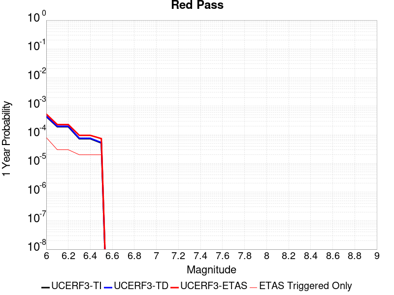 |  |

| Magnitude | 1 wk TI Prob | 1 wk TD Prob | 1 wk ETAS Prob | 1 wk ETAS/TD Gain | 1 wk ETAS Triggered Only | 1 mo TI Prob | 1 mo TD Prob | 1 mo ETAS Prob | 1 mo ETAS/TD Gain | 1 mo ETAS Triggered Only | 1 yr TI Prob | 1 yr TD Prob | 1 yr ETAS Prob | 1 yr ETAS/TD Gain | 1 yr ETAS Triggered Only | 10 yr TI Prob | 10 yr TD Prob | 10 yr ETAS Prob | 10 yr ETAS/TD Gain | 10 yr ETAS Triggered Only |
|-----|-----|-----|-----|-----|-----|-----|-----|-----|-----|-----|-----|-----|-----|-----|-----|-----|-----|-----|-----|-----|
| 6.0 | 8.258278E-6 | 8.551466E-6 | 8.551466E-6 | 1.0 | 0.0 | 3.539214E-5 | 3.6648726E-5 | 5.1483657E-5 | 1.4047871 | 1.4835475E-5 | 4.308141E-4 | 4.4612476E-4 | 5.499268E-4 | 1.2326748 | 1.03848324E-4 | 0.0042997985 | 0.0044540493 | 0.004616513 | 1.0364754 | 1.6319023E-4 |
| 6.1 | 3.649988E-6 | 3.775402E-6 | 3.775402E-6 | 1.0 | 0.0 | 1.5642712E-5 | 1.6180222E-5 | 1.6180222E-5 | 1.0 | 0.0 | 1.9043336E-4 | 1.9698114E-4 | 2.2664625E-4 | 1.1505986 | 2.967095E-5 | 0.0019027026 | 0.0019685328 | 0.002027758 | 1.0300859 | 5.93419E-5 |
| 6.2 | 3.649988E-6 | 3.775402E-6 | 3.775402E-6 | 1.0 | 0.0 | 1.5642712E-5 | 1.6180222E-5 | 1.6180222E-5 | 1.0 | 0.0 | 1.9043336E-4 | 1.9698114E-4 | 2.2664625E-4 | 1.1505986 | 2.967095E-5 | 0.0019027026 | 0.0019685328 | 0.002027758 | 1.0300859 | 5.93419E-5 |
| 6.3 | 1.3924937E-6 | 1.44115E-6 | 1.44115E-6 | 1.0 | 0.0 | 5.9678164E-6 | 6.1763503E-6 | 6.1763503E-6 | 1.0 | 0.0 | 7.265574E-5 | 7.519589E-5 | 1.0486461E-4 | 1.3945524 | 2.967095E-5 | 7.263199E-4 | 7.518432E-4 | 7.963162E-4 | 1.0591519 | 4.4506425E-5 |
| 6.4 | 1.3924937E-6 | 1.44115E-6 | 1.44115E-6 | 1.0 | 0.0 | 5.9678164E-6 | 6.1763503E-6 | 6.1763503E-6 | 1.0 | 0.0 | 7.265574E-5 | 7.519589E-5 | 1.0486461E-4 | 1.3945524 | 2.967095E-5 | 7.263199E-4 | 7.518432E-4 | 7.963162E-4 | 1.0591519 | 4.4506425E-5 |
| 6.5 | 9.876812E-7 | 1.0222149E-6 | 1.0222149E-6 | 1.0 | 0.0 | 4.2329125E-6 | 4.380921E-6 | 4.380921E-6 | 1.0 | 0.0 | 5.153449E-5 | 5.3337713E-5 | 8.300708E-5 | 1.556255 | 2.967095E-5 | 5.1522546E-4 | 5.333771E-4 | 5.630322E-4 | 1.0555987 | 2.967095E-5 |

## Manix-Afton Hills
*[(top)](#table-of-contents)*

| 1 Week | 1 Month | 1 Year | 10 Year |
|-----|-----|-----|-----|
|  |  |  |  |

| Magnitude | 1 wk TI Prob | 1 wk TD Prob | 1 wk ETAS Prob | 1 wk ETAS/TD Gain | 1 wk ETAS Triggered Only | 1 mo TI Prob | 1 mo TD Prob | 1 mo ETAS Prob | 1 mo ETAS/TD Gain | 1 mo ETAS Triggered Only | 1 yr TI Prob | 1 yr TD Prob | 1 yr ETAS Prob | 1 yr ETAS/TD Gain | 1 yr ETAS Triggered Only | 10 yr TI Prob | 10 yr TD Prob | 10 yr ETAS Prob | 10 yr ETAS/TD Gain | 10 yr ETAS Triggered Only |
|-----|-----|-----|-----|-----|-----|-----|-----|-----|-----|-----|-----|-----|-----|-----|-----|-----|-----|-----|-----|-----|
| 6.0 | 1.3783202E-5 | 1.4711748E-5 | 1.4711748E-5 | 1.0 | 0.0 | 5.906953E-5 | 6.304892E-5 | 6.304892E-5 | 1.0 | 0.0 | 7.189342E-4 | 7.673678E-4 | 8.1184E-4 | 1.0579543 | 4.4506425E-5 | 0.0071661277 | 0.007648937 | 0.007781435 | 1.0173224 | 1.3351926E-4 |
| 6.1 | 1.3783202E-5 | 1.4711748E-5 | 1.4711748E-5 | 1.0 | 0.0 | 5.906953E-5 | 6.304892E-5 | 6.304892E-5 | 1.0 | 0.0 | 7.189342E-4 | 7.673678E-4 | 8.1184E-4 | 1.0579543 | 4.4506425E-5 | 0.0071661277 | 0.007648937 | 0.007781435 | 1.0173224 | 1.3351926E-4 |
| 6.2 | 1.3783202E-5 | 1.4711748E-5 | 1.4711748E-5 | 1.0 | 0.0 | 5.906953E-5 | 6.304892E-5 | 6.304892E-5 | 1.0 | 0.0 | 7.189342E-4 | 7.673678E-4 | 8.1184E-4 | 1.0579543 | 4.4506425E-5 | 0.0071661277 | 0.007648937 | 0.007781435 | 1.0173224 | 1.3351926E-4 |
| 6.3 | 1.10494875E-5 | 1.1793663E-5 | 1.1793663E-5 | 1.0 | 0.0 | 4.7354086E-5 | 5.054335E-5 | 5.054335E-5 | 1.0 | 0.0 | 5.763835E-4 | 6.152019E-4 | 6.448546E-4 | 1.0481999 | 2.967095E-5 | 0.005748908 | 0.006136029 | 0.0062097516 | 1.0120146 | 7.417738E-5 |
| 6.4 | 1.10494875E-5 | 1.1793663E-5 | 1.1793663E-5 | 1.0 | 0.0 | 4.7354086E-5 | 5.054335E-5 | 5.054335E-5 | 1.0 | 0.0 | 5.763835E-4 | 6.152019E-4 | 6.448546E-4 | 1.0481999 | 2.967095E-5 | 0.005748908 | 0.006136029 | 0.0062097516 | 1.0120146 | 7.417738E-5 |
| 6.5 | 9.788949E-6 | 1.0454792E-5 | 1.0454792E-5 | 1.0 | 0.0 | 4.1951964E-5 | 4.4805533E-5 | 4.4805533E-5 | 1.0 | 0.0 | 5.1064545E-4 | 5.453801E-4 | 5.750349E-4 | 1.0543745 | 2.967095E-5 | 0.0050947363 | 0.005441344 | 0.0055003627 | 1.0108464 | 5.93419E-5 |
| 6.6 | 8.810006E-6 | 9.414057E-6 | 9.414057E-6 | 1.0 | 0.0 | 3.775662E-5 | 4.0345385E-5 | 4.0345385E-5 | 1.0 | 0.0 | 4.5958988E-4 | 4.911032E-4 | 5.0593144E-4 | 1.0301937 | 1.4835475E-5 | 0.0045864056 | 0.0049010618 | 0.0049453503 | 1.0090364 | 4.4506425E-5 |
| 6.7 | 8.80128E-6 | 9.404536E-6 | 9.404536E-6 | 1.0 | 0.0 | 3.7719226E-5 | 4.030458E-5 | 4.030458E-5 | 1.0 | 0.0 | 4.591348E-4 | 4.906067E-4 | 5.054349E-4 | 1.0302242 | 1.4835475E-5 | 0.004581874 | 0.0048961183 | 0.004940407 | 1.0090456 | 4.4506425E-5 |
| 6.8 | 6.8994877E-6 | 7.3804176E-6 | 7.3804176E-6 | 1.0 | 0.0 | 2.9568899E-5 | 3.1630025E-5 | 3.1630025E-5 | 1.0 | 0.0 | 3.5994186E-4 | 3.8503567E-4 | 3.9986544E-4 | 1.0385153 | 1.4835475E-5 | 0.003593594 | 0.0038444905 | 0.003888826 | 1.0115322 | 4.4506425E-5 |
| 6.9 | 4.9328037E-6 | 5.2712016E-6 | 5.2712016E-6 | 1.0 | 0.0 | 2.1140417E-5 | 2.2590704E-5 | 2.2590704E-5 | 1.0 | 0.0 | 2.5735417E-4 | 2.7501327E-4 | 2.8984467E-4 | 1.0539297 | 1.4835475E-5 | 0.0025705635 | 0.0027473345 | 0.002776924 | 1.0107702 | 2.967095E-5 |
| 7.0 | 3.347973E-6 | 3.5902026E-6 | 3.5902026E-6 | 1.0 | 0.0 | 1.4348378E-5 | 1.5386515E-5 | 1.5386515E-5 | 1.0 | 0.0 | 1.746775E-4 | 1.8731882E-4 | 1.8731882E-4 | 1.0 | 0.0 | 0.0017454025 | 0.0018720119 | 0.0018720119 | 1.0 | 0.0 |
| 7.1 | 1.2073567E-6 | 1.2935433E-6 | 1.2935433E-6 | 1.0 | 0.0 | 5.1743755E-6 | 5.543754E-6 | 5.543754E-6 | 1.0 | 0.0 | 6.29962E-5 | 6.749475E-5 | 6.749475E-5 | 1.0 | 0.0 | 6.297835E-4 | 6.749027E-4 | 6.749027E-4 | 1.0 | 0.0 |

## Death Valley (Fish Lake Valley)
*[(top)](#table-of-contents)*

| 1 Week | 1 Month | 1 Year | 10 Year |
|-----|-----|-----|-----|
|  | 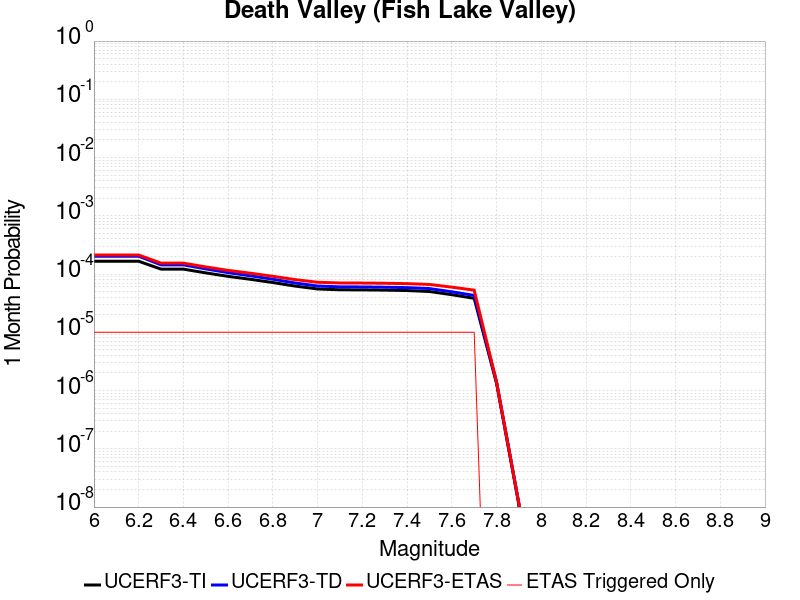 | 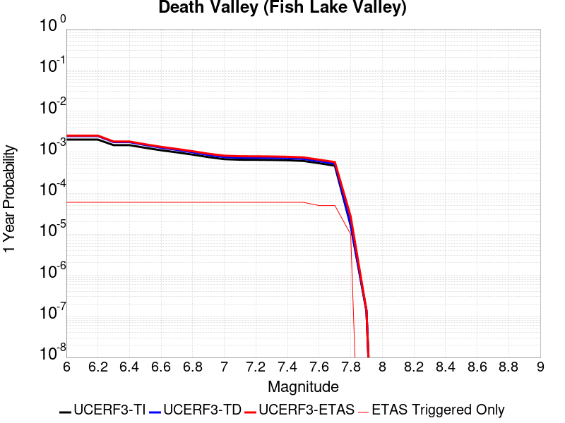 |  |

| Magnitude | 1 wk TI Prob | 1 wk TD Prob | 1 wk ETAS Prob | 1 wk ETAS/TD Gain | 1 wk ETAS Triggered Only | 1 mo TI Prob | 1 mo TD Prob | 1 mo ETAS Prob | 1 mo ETAS/TD Gain | 1 mo ETAS Triggered Only | 1 yr TI Prob | 1 yr TD Prob | 1 yr ETAS Prob | 1 yr ETAS/TD Gain | 1 yr ETAS Triggered Only | 10 yr TI Prob | 10 yr TD Prob | 10 yr ETAS Prob | 10 yr ETAS/TD Gain | 10 yr ETAS Triggered Only |
|-----|-----|-----|-----|-----|-----|-----|-----|-----|-----|-----|-----|-----|-----|-----|-----|-----|-----|-----|-----|-----|
| 6.0 | 3.872328E-5 | 4.727458E-5 | 4.727458E-5 | 1.0 | 0.0 | 1.6594635E-4 | 2.0259131E-4 | 2.1742377E-4 | 1.0732137 | 1.4835475E-5 | 0.0020185246 | 0.0024638833 | 0.0025526767 | 1.036038 | 8.901285E-5 | 0.02000288 | 0.024391687 | 0.024536423 | 1.0059339 | 1.4835475E-4 |
| 6.1 | 3.872328E-5 | 4.727458E-5 | 4.727458E-5 | 1.0 | 0.0 | 1.6594635E-4 | 2.0259131E-4 | 2.1742377E-4 | 1.0732137 | 1.4835475E-5 | 0.0020185246 | 0.0024638833 | 0.0025526767 | 1.036038 | 8.901285E-5 | 0.02000288 | 0.024391687 | 0.024536423 | 1.0059339 | 1.4835475E-4 |
| 6.2 | 3.872328E-5 | 4.727458E-5 | 4.727458E-5 | 1.0 | 0.0 | 1.6594635E-4 | 2.0259131E-4 | 2.1742377E-4 | 1.0732137 | 1.4835475E-5 | 0.0020185246 | 0.0024638833 | 0.0025526767 | 1.036038 | 8.901285E-5 | 0.02000288 | 0.024391687 | 0.024536423 | 1.0059339 | 1.4835475E-4 |
| 6.3 | 2.8356371E-5 | 3.3614066E-5 | 3.3614066E-5 | 1.0 | 0.0 | 1.2152165E-4 | 1.4405277E-4 | 1.588861E-4 | 1.1029716 | 1.4835475E-5 | 0.0014785219 | 0.0017525106 | 0.0018413675 | 1.0507026 | 8.901285E-5 | 0.014687235 | 0.01739392 | 0.017539695 | 1.0083808 | 1.4835475E-4 |
| 6.4 | 2.8356371E-5 | 3.3614066E-5 | 3.3614066E-5 | 1.0 | 0.0 | 1.2152165E-4 | 1.4405277E-4 | 1.588861E-4 | 1.1029716 | 1.4835475E-5 | 0.0014785219 | 0.0017525106 | 0.0018413675 | 1.0507026 | 8.901285E-5 | 0.014687235 | 0.01739392 | 0.017539695 | 1.0083808 | 1.4835475E-4 |
| 6.5 | 2.4448687E-5 | 2.8610832E-5 | 2.8610832E-5 | 1.0 | 0.0 | 1.0477588E-4 | 1.2261237E-4 | 1.3744603E-4 | 1.1209801 | 1.4835475E-5 | 0.0012748998 | 0.001491834 | 0.001580714 | 1.0595777 | 8.901285E-5 | 0.012676105 | 0.014823054 | 0.014969209 | 1.00986 | 1.4835475E-4 |
| 6.6 | 2.1298161E-5 | 2.4662699E-5 | 2.4662699E-5 | 1.0 | 0.0 | 9.127464E-5 | 1.0569319E-4 | 1.2052709E-4 | 1.1403488 | 1.4835475E-5 | 0.0011107022 | 0.0012860888 | 0.0013749872 | 1.069123 | 8.901285E-5 | 0.011051672 | 0.01278987 | 0.012936328 | 1.011451 | 1.4835475E-4 |
| 6.7 | 1.8959729E-5 | 2.1783197E-5 | 2.1783197E-5 | 1.0 | 0.0 | 8.125345E-5 | 9.335337E-5 | 1.0818745E-4 | 1.1589025 | 1.4835475E-5 | 9.888117E-4 | 0.0011360102 | 0.0012249219 | 1.0782666 | 8.901285E-5 | 0.009844234 | 0.0113046905 | 0.011451368 | 1.012975 | 1.4835475E-4 |
| 6.8 | 1.6691629E-5 | 1.9020124E-5 | 1.9020124E-5 | 1.0 | 0.0 | 7.153359E-5 | 8.1512364E-5 | 9.634663E-5 | 1.1819879 | 1.4835475E-5 | 8.7057345E-4 | 9.91978E-4 | 0.0010809026 | 1.0896437 | 8.901285E-5 | 0.008671708 | 0.009877259 | 0.01000946 | 1.0133843 | 1.3351926E-4 |
| 6.9 | 1.450505E-5 | 1.6390959E-5 | 1.6390959E-5 | 1.0 | 0.0 | 6.216302E-5 | 7.024512E-5 | 8.5079555E-5 | 1.2111809 | 1.4835475E-5 | 7.5657194E-4 | 8.549076E-4 | 9.438444E-4 | 1.1040308 | 8.901285E-5 | 0.007540013 | 0.00851712 | 0.008649502 | 1.0155431 | 1.3351926E-4 |
| 7.0 | 1.2940855E-5 | 1.4539165E-5 | 1.4539165E-5 | 1.0 | 0.0 | 5.545963E-5 | 6.230925E-5 | 7.71438E-5 | 1.2380794 | 1.4835475E-5 | 6.750118E-4 | 7.583569E-4 | 8.4730226E-4 | 1.1172869 | 8.901285E-5 | 0.006729651 | 0.007558308 | 0.007690818 | 1.0175318 | 1.3351926E-4 |
| 7.1 | 1.2544658E-5 | 1.4079352E-5 | 1.4079352E-5 | 1.0 | 0.0 | 5.3761712E-5 | 6.0338716E-5 | 7.5173295E-5 | 1.2458551 | 1.4835475E-5 | 6.5435225E-4 | 7.3438184E-4 | 8.233293E-4 | 1.1211188 | 8.901285E-5 | 0.006524288 | 0.0073201437 | 0.0074526854 | 1.0181065 | 1.3351926E-4 |
| 7.2 | 1.2489416E-5 | 1.4016813E-5 | 1.4016813E-5 | 1.0 | 0.0 | 5.3524967E-5 | 6.0070703E-5 | 7.4905285E-5 | 1.246952 | 1.4835475E-5 | 6.514716E-4 | 7.31121E-4 | 8.2006876E-4 | 1.1216594 | 8.901285E-5 | 0.006495651 | 0.0072877496 | 0.007420296 | 1.0181875 | 1.3351926E-4 |
| 7.3 | 1.2368307E-5 | 1.388094E-5 | 1.388094E-5 | 1.0 | 0.0 | 5.3005948E-5 | 5.948842E-5 | 7.432301E-5 | 1.2493694 | 1.4835475E-5 | 6.451563E-4 | 7.240364E-4 | 8.129848E-4 | 1.1228508 | 8.901285E-5 | 0.0064328653 | 0.0072173662 | 0.007349922 | 1.0183662 | 1.3351926E-4 |
| 7.4 | 1.2161707E-5 | 1.3648976E-5 | 1.3648976E-5 | 1.0 | 0.0 | 5.212056E-5 | 5.8494334E-5 | 7.332894E-5 | 1.2536076 | 1.4835475E-5 | 6.3438306E-4 | 7.119414E-4 | 8.008909E-4 | 1.1249393 | 8.901285E-5 | 0.006325751 | 0.007097195 | 0.0072150365 | 1.016604 | 1.186838E-4 |
| 7.5 | 1.1707948E-5 | 1.3146588E-5 | 1.3146588E-5 | 1.0 | 0.0 | 5.0175953E-5 | 5.6341334E-5 | 7.117597E-5 | 1.2632993 | 1.4835475E-5 | 6.10721E-4 | 6.8574544E-4 | 7.746972E-4 | 1.1297154 | 8.901285E-5 | 0.0060904534 | 0.006836877 | 0.0069547496 | 1.0172406 | 1.186838E-4 |
| 7.6 | 1.0319538E-5 | 1.15805615E-5 | 1.15805615E-5 | 1.0 | 0.0 | 4.4225842E-5 | 4.9630064E-5 | 6.44648E-5 | 1.2989063 | 1.4835475E-5 | 5.383166E-4 | 6.0408365E-4 | 6.782162E-4 | 1.122719 | 7.417738E-5 | 0.0053701443 | 0.0060249474 | 0.00612817 | 1.0171325 | 1.03848324E-4 |
| 7.7 | 8.937764E-6 | 1.00235875E-5 | 1.00235875E-5 | 1.0 | 0.0 | 3.830414E-5 | 4.2957552E-5 | 5.779239E-5 | 1.3453372 | 1.4835475E-5 | 4.6625308E-4 | 5.2288774E-4 | 5.970263E-4 | 1.1417868 | 7.417738E-5 | 0.0046527605 | 0.0052170837 | 0.00532039 | 1.0198016 | 1.03848324E-4 |
| 7.8 | 3.108007E-7 | 3.2847782E-7 | 3.2847782E-7 | 1.0 | 0.0 | 1.3320023E-6 | 1.4077614E-6 | 1.4077614E-6 | 1.0 | 0.0 | 1.6217007E-5 | 1.7139364E-5 | 3.1974585E-5 | 1.8655642 | 1.4835475E-5 | 1.6215823E-4 | 1.713808E-4 | 1.8621374E-4 | 1.0865495 | 1.4835475E-5 |
| 7.9 | 2.5591178E-9 | 2.6697482E-9 | 2.6697482E-9 | 1.0 | 0.0 | 1.0967647E-8 | 1.1441778E-8 | 1.1441778E-8 | 1.0 | 0.0 | 1.335311E-7 | 1.3930365E-7 | 1.3930365E-7 | 1.0 | 0.0 | 1.3353102E-6 | 1.3930365E-6 | 1.3930365E-6 | 1.0 | 0.0 |

## Cady
*[(top)](#table-of-contents)*

| 1 Week | 1 Month | 1 Year | 10 Year |
|-----|-----|-----|-----|
|  |  |  |  |

| Magnitude | 1 wk TI Prob | 1 wk TD Prob | 1 wk ETAS Prob | 1 wk ETAS/TD Gain | 1 wk ETAS Triggered Only | 1 mo TI Prob | 1 mo TD Prob | 1 mo ETAS Prob | 1 mo ETAS/TD Gain | 1 mo ETAS Triggered Only | 1 yr TI Prob | 1 yr TD Prob | 1 yr ETAS Prob | 1 yr ETAS/TD Gain | 1 yr ETAS Triggered Only | 10 yr TI Prob | 10 yr TD Prob | 10 yr ETAS Prob | 10 yr ETAS/TD Gain | 10 yr ETAS Triggered Only |
|-----|-----|-----|-----|-----|-----|-----|-----|-----|-----|-----|-----|-----|-----|-----|-----|-----|-----|-----|-----|-----|
| 6.0 | 1.9892565E-5 | 2.1860164E-5 | 2.1860164E-5 | 1.0 | 0.0 | 8.525106E-5 | 9.3683564E-5 | 9.3683564E-5 | 1.0 | 0.0 | 0.0010374374 | 0.0011400915 | 0.0011697286 | 1.0259954 | 2.967095E-5 | 0.010326075 | 0.011351441 | 0.011468778 | 1.0103368 | 1.186838E-4 |
| 6.1 | 1.9892565E-5 | 2.1860164E-5 | 2.1860164E-5 | 1.0 | 0.0 | 8.525106E-5 | 9.3683564E-5 | 9.3683564E-5 | 1.0 | 0.0 | 0.0010374374 | 0.0011400915 | 0.0011697286 | 1.0259954 | 2.967095E-5 | 0.010326075 | 0.011351441 | 0.011468778 | 1.0103368 | 1.186838E-4 |
| 6.2 | 1.9892565E-5 | 2.1860164E-5 | 2.1860164E-5 | 1.0 | 0.0 | 8.525106E-5 | 9.3683564E-5 | 9.3683564E-5 | 1.0 | 0.0 | 0.0010374374 | 0.0011400915 | 0.0011697286 | 1.0259954 | 2.967095E-5 | 0.010326075 | 0.011351441 | 0.011468778 | 1.0103368 | 1.186838E-4 |
| 6.3 | 1.1117327E-5 | 1.2177354E-5 | 1.2177354E-5 | 1.0 | 0.0 | 4.764482E-5 | 5.2187792E-5 | 5.2187792E-5 | 1.0 | 0.0 | 5.7992124E-4 | 6.3523266E-4 | 6.3523266E-4 | 1.0 | 0.0 | 0.0057841022 | 0.006337275 | 0.0064109825 | 1.0116308 | 7.417738E-5 |
| 6.4 | 1.1117327E-5 | 1.2177354E-5 | 1.2177354E-5 | 1.0 | 0.0 | 4.764482E-5 | 5.2187792E-5 | 5.2187792E-5 | 1.0 | 0.0 | 5.7992124E-4 | 6.3523266E-4 | 6.3523266E-4 | 1.0 | 0.0 | 0.0057841022 | 0.006337275 | 0.0064109825 | 1.0116308 | 7.417738E-5 |
| 6.5 | 6.103093E-6 | 6.6724333E-6 | 6.6724333E-6 | 1.0 | 0.0 | 2.615585E-5 | 2.8595901E-5 | 2.8595901E-5 | 1.0 | 0.0 | 3.1840094E-4 | 3.4811202E-4 | 3.4811202E-4 | 1.0 | 0.0 | 0.0031794512 | 0.0034769014 | 0.0035212531 | 1.0127561 | 4.4506425E-5 |
| 6.6 | 5.817237E-6 | 6.366057E-6 | 6.366057E-6 | 1.0 | 0.0 | 2.4930776E-5 | 2.7282886E-5 | 2.7282886E-5 | 1.0 | 0.0 | 3.034899E-4 | 3.3213093E-4 | 3.3213093E-4 | 1.0 | 0.0 | 0.0030307577 | 0.0033175678 | 0.0033471403 | 1.0089139 | 2.967095E-5 |
| 6.7 | 4.8846314E-6 | 5.340899E-6 | 5.340899E-6 | 1.0 | 0.0 | 2.0933967E-5 | 2.2889433E-5 | 2.2889433E-5 | 1.0 | 0.0 | 2.5484123E-4 | 2.7865497E-4 | 2.7865497E-4 | 1.0 | 0.0 | 0.0025454918 | 0.0027842114 | 0.0028137998 | 1.0106272 | 2.967095E-5 |
| 6.8 | 1.7788773E-6 | 1.9400245E-6 | 1.9400245E-6 | 1.0 | 0.0 | 7.6237375E-6 | 8.314373E-6 | 8.314373E-6 | 1.0 | 0.0 | 9.281505E-5 | 1.0122437E-4 | 1.0122437E-4 | 1.0 | 0.0 | 9.2776294E-4 | 0.0010119373 | 0.0010119373 | 1.0 | 0.0 |
| 6.9 | 7.5455404E-7 | 8.29764E-7 | 8.29764E-7 | 1.0 | 0.0 | 3.233799E-6 | 3.5561286E-6 | 3.5561286E-6 | 1.0 | 0.0 | 3.937079E-5 | 4.3295342E-5 | 4.3295342E-5 | 1.0 | 0.0 | 3.9363815E-4 | 4.3290202E-4 | 4.3290202E-4 | 1.0 | 0.0 |
| 7.0 | 6.8578805E-7 | 7.542315E-7 | 7.542315E-7 | 1.0 | 0.0 | 2.9390883E-6 | 3.2324185E-6 | 3.2324185E-6 | 1.0 | 0.0 | 3.578281E-5 | 3.9354316E-5 | 3.9354316E-5 | 1.0 | 0.0 | 3.577705E-4 | 3.9350594E-4 | 3.9350594E-4 | 1.0 | 0.0 |

## Baker
*[(top)](#table-of-contents)*

| 1 Week | 1 Month | 1 Year | 10 Year |
|-----|-----|-----|-----|
| 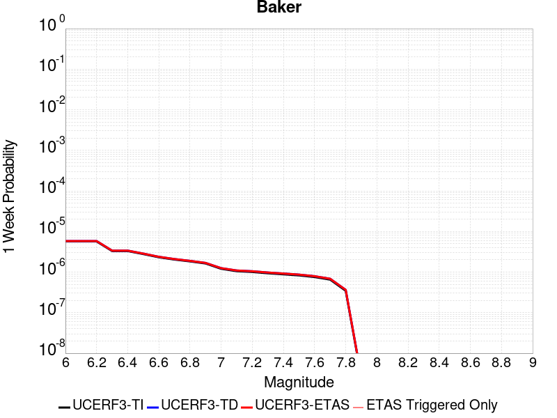 |  | 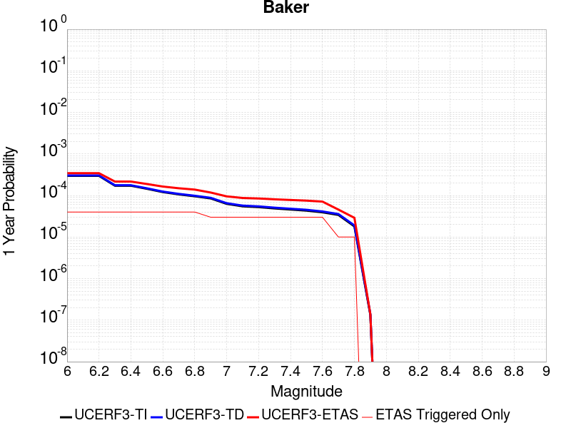 |  |

| Magnitude | 1 wk TI Prob | 1 wk TD Prob | 1 wk ETAS Prob | 1 wk ETAS/TD Gain | 1 wk ETAS Triggered Only | 1 mo TI Prob | 1 mo TD Prob | 1 mo ETAS Prob | 1 mo ETAS/TD Gain | 1 mo ETAS Triggered Only | 1 yr TI Prob | 1 yr TD Prob | 1 yr ETAS Prob | 1 yr ETAS/TD Gain | 1 yr ETAS Triggered Only | 10 yr TI Prob | 10 yr TD Prob | 10 yr ETAS Prob | 10 yr ETAS/TD Gain | 10 yr ETAS Triggered Only |
|-----|-----|-----|-----|-----|-----|-----|-----|-----|-----|-----|-----|-----|-----|-----|-----|-----|-----|-----|-----|-----|
| 6.0 | 5.695525E-6 | 5.8349324E-6 | 5.8349324E-6 | 1.0 | 0.0 | 2.4409164E-5 | 2.5006635E-5 | 2.5006635E-5 | 1.0 | 0.0 | 2.9714106E-4 | 3.0441728E-4 | 3.192482E-4 | 1.0487192 | 1.4835475E-5 | 0.0029674405 | 0.0030403982 | 0.0031735115 | 1.0437815 | 1.3351926E-4 |
| 6.1 | 5.695525E-6 | 5.8349324E-6 | 5.8349324E-6 | 1.0 | 0.0 | 2.4409164E-5 | 2.5006635E-5 | 2.5006635E-5 | 1.0 | 0.0 | 2.9714106E-4 | 3.0441728E-4 | 3.192482E-4 | 1.0487192 | 1.4835475E-5 | 0.0029674405 | 0.0030403982 | 0.0031735115 | 1.0437815 | 1.3351926E-4 |
| 6.2 | 5.695525E-6 | 5.8349324E-6 | 5.8349324E-6 | 1.0 | 0.0 | 2.4409164E-5 | 2.5006635E-5 | 2.5006635E-5 | 1.0 | 0.0 | 2.9714106E-4 | 3.0441728E-4 | 3.192482E-4 | 1.0487192 | 1.4835475E-5 | 0.0029674405 | 0.0030403982 | 0.0031735115 | 1.0437815 | 1.3351926E-4 |
| 6.3 | 3.2995713E-6 | 3.3837248E-6 | 3.3837248E-6 | 1.0 | 0.0 | 1.4140943E-5 | 1.45016E-5 | 1.45016E-5 | 1.0 | 0.0 | 1.7215237E-4 | 1.7654315E-4 | 1.91376E-4 | 1.0840183 | 1.4835475E-5 | 0.0017201907 | 0.0017640761 | 0.0018529319 | 1.0503696 | 8.901285E-5 |
| 6.4 | 3.2995713E-6 | 3.3837248E-6 | 3.3837248E-6 | 1.0 | 0.0 | 1.4140943E-5 | 1.45016E-5 | 1.45016E-5 | 1.0 | 0.0 | 1.7215237E-4 | 1.7654315E-4 | 1.91376E-4 | 1.0840183 | 1.4835475E-5 | 0.0017201907 | 0.0017640761 | 0.0018529319 | 1.0503696 | 8.901285E-5 |
| 6.5 | 2.782202E-6 | 2.8558911E-6 | 2.8558911E-6 | 1.0 | 0.0 | 1.1923668E-5 | 1.2239478E-5 | 1.2239478E-5 | 1.0 | 0.0 | 1.4516099E-4 | 1.4900578E-4 | 1.6383904E-4 | 1.0995482 | 1.4835475E-5 | 0.001450662 | 0.0014890914 | 0.0015779717 | 1.0596876 | 8.901285E-5 |
| 6.6 | 2.3163404E-6 | 2.3809644E-6 | 2.3809644E-6 | 1.0 | 0.0 | 9.927136E-6 | 1.0204095E-5 | 1.0204095E-5 | 1.0 | 0.0 | 1.20856166E-4 | 1.2422797E-4 | 1.3906161E-4 | 1.1194066 | 1.4835475E-5 | 0.0012079047 | 0.0012416055 | 0.0013305078 | 1.0716027 | 8.901285E-5 |
| 6.7 | 2.037056E-6 | 2.0965415E-6 | 2.0965415E-6 | 1.0 | 0.0 | 8.7302105E-6 | 8.985147E-6 | 8.985147E-6 | 1.0 | 0.0 | 1.0628513E-4 | 1.0938884E-4 | 1.242227E-4 | 1.1356066 | 1.4835475E-5 | 0.0010623431 | 0.0010933661 | 0.0011674624 | 1.0677689 | 7.417738E-5 |
| 6.8 | 1.8356744E-6 | 1.8915673E-6 | 1.8915673E-6 | 1.0 | 0.0 | 7.867153E-6 | 8.106693E-6 | 8.106693E-6 | 1.0 | 0.0 | 9.577837E-5 | 9.8694654E-5 | 1.13528666E-4 | 1.150302 | 1.4835475E-5 | 9.57371E-4 | 9.865222E-4 | 0.0010606264 | 1.0751166 | 7.417738E-5 |
| 6.9 | 1.6310546E-6 | 1.6832433E-6 | 1.6832433E-6 | 1.0 | 0.0 | 6.9902153E-6 | 7.2138805E-6 | 7.2138805E-6 | 1.0 | 0.0 | 8.510255E-5 | 8.782557E-5 | 1.0265974E-4 | 1.1689049 | 1.4835475E-5 | 8.5069967E-4 | 8.779199E-4 | 9.372097E-4 | 1.0675344 | 5.93419E-5 |
| 7.0 | 1.2058036E-6 | 1.2508979E-6 | 1.2508979E-6 | 1.0 | 0.0 | 5.1677193E-6 | 5.36098E-6 | 5.36098E-6 | 1.0 | 0.0 | 6.291517E-5 | 6.5268E-5 | 8.010251E-5 | 1.2272861 | 1.4835475E-5 | 6.289736E-4 | 6.5249065E-4 | 7.117938E-4 | 1.0908874 | 5.93419E-5 |
| 7.1 | 1.052382E-6 | 1.0951907E-6 | 1.0951907E-6 | 1.0 | 0.0 | 4.5102006E-6 | 4.6936657E-6 | 4.6936657E-6 | 1.0 | 0.0 | 5.491031E-5 | 5.714389E-5 | 7.197852E-5 | 1.2596012 | 1.4835475E-5 | 5.4896745E-4 | 5.712928E-4 | 6.1577384E-4 | 1.0778602 | 4.4506425E-5 |
| 7.2 | 1.0067454E-6 | 1.0488003E-6 | 1.0488003E-6 | 1.0 | 0.0 | 4.3146156E-6 | 4.494851E-6 | 4.494851E-6 | 1.0 | 0.0 | 5.252918E-5 | 5.4723445E-5 | 6.9558104E-5 | 1.2710842 | 1.4835475E-5 | 5.251676E-4 | 5.4710056E-4 | 5.915826E-4 | 1.0813051 | 4.4506425E-5 |
| 7.3 | 9.3596316E-7 | 9.768008E-7 | 9.768008E-7 | 1.0 | 0.0 | 4.0112645E-6 | 4.1862822E-6 | 4.1862822E-6 | 1.0 | 0.0 | 4.8836053E-5 | 5.0966803E-5 | 6.580152E-5 | 1.2910663 | 1.4835475E-5 | 4.8825322E-4 | 5.0955196E-4 | 5.540357E-4 | 1.0872997 | 4.4506425E-5 |
| 7.4 | 8.8117395E-7 | 9.20794E-7 | 9.20794E-7 | 1.0 | 0.0 | 3.7764542E-6 | 3.946254E-6 | 3.946254E-6 | 1.0 | 0.0 | 4.5977362E-5 | 4.804459E-5 | 6.287935E-5 | 1.3087707 | 1.4835475E-5 | 4.596785E-4 | 4.8034277E-4 | 5.248278E-4 | 1.0926111 | 4.4506425E-5 |
| 7.5 | 8.292386E-7 | 8.674863E-7 | 8.674863E-7 | 1.0 | 0.0 | 3.5538749E-6 | 3.7177929E-6 | 3.7177929E-6 | 1.0 | 0.0 | 4.326757E-5 | 4.5263198E-5 | 6.0098E-5 | 1.3277453 | 1.4835475E-5 | 4.3259145E-4 | 4.5254052E-4 | 4.970268E-4 | 1.0983034 | 4.4506425E-5 |
| 7.6 | 7.553842E-7 | 7.9147225E-7 | 7.9147225E-7 | 1.0 | 0.0 | 3.2373566E-6 | 3.3920196E-6 | 3.3920196E-6 | 1.0 | 0.0 | 3.9414106E-5 | 4.1297062E-5 | 5.6131925E-5 | 1.3592231 | 1.4835475E-5 | 3.9407116E-4 | 4.128946E-4 | 4.2772395E-4 | 1.0359156 | 1.4835475E-5 |
| 7.7 | 6.5285366E-7 | 6.853024E-7 | 6.853024E-7 | 1.0 | 0.0 | 2.797941E-6 | 2.937007E-6 | 2.937007E-6 | 1.0 | 0.0 | 3.40644E-5 | 3.575748E-5 | 5.059242E-5 | 1.4148767 | 1.4835475E-5 | 3.405918E-4 | 3.575179E-4 | 3.723481E-4 | 1.0414809 | 1.4835475E-5 |
| 7.8 | 3.4586725E-7 | 3.6483948E-7 | 3.6483948E-7 | 1.0 | 0.0 | 1.4822873E-6 | 1.5635968E-6 | 1.5635968E-6 | 1.0 | 0.0 | 1.80467E-5 | 1.903663E-5 | 3.387182E-5 | 1.7792972 | 1.4835475E-5 | 1.8045233E-4 | 1.9035043E-4 | 2.0518308E-4 | 1.0779228 | 1.4835475E-5 |
| 7.9 | 2.5591178E-9 | 2.6697482E-9 | 2.6697482E-9 | 1.0 | 0.0 | 1.0967647E-8 | 1.1441778E-8 | 1.1441778E-8 | 1.0 | 0.0 | 1.335311E-7 | 1.3930365E-7 | 1.3930365E-7 | 1.0 | 0.0 | 1.3353102E-6 | 1.3930365E-6 | 1.3930365E-6 | 1.0 | 0.0 |

## Pisgah-Bullion Mtn-Mesquite Lk
*[(top)](#table-of-contents)*

| 1 Week | 1 Month | 1 Year | 10 Year |
|-----|-----|-----|-----|
| 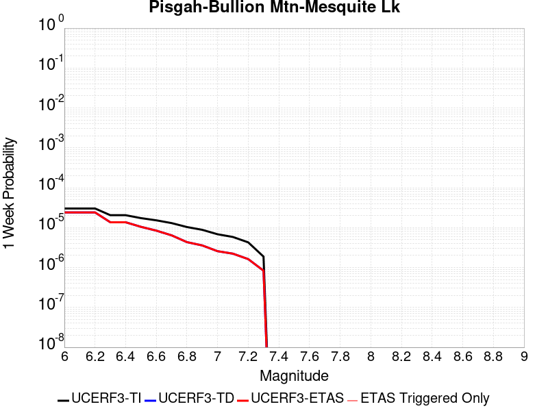 |  |  |  |

| Magnitude | 1 wk TI Prob | 1 wk TD Prob | 1 wk ETAS Prob | 1 wk ETAS/TD Gain | 1 wk ETAS Triggered Only | 1 mo TI Prob | 1 mo TD Prob | 1 mo ETAS Prob | 1 mo ETAS/TD Gain | 1 mo ETAS Triggered Only | 1 yr TI Prob | 1 yr TD Prob | 1 yr ETAS Prob | 1 yr ETAS/TD Gain | 1 yr ETAS Triggered Only | 10 yr TI Prob | 10 yr TD Prob | 10 yr ETAS Prob | 10 yr ETAS/TD Gain | 10 yr ETAS Triggered Only |
|-----|-----|-----|-----|-----|-----|-----|-----|-----|-----|-----|-----|-----|-----|-----|-----|-----|-----|-----|-----|-----|
| 6.0 | 3.0240792E-5 | 2.4093022E-5 | 2.4093022E-5 | 1.0 | 0.0 | 1.2959696E-4 | 1.0325229E-4 | 1.1808624E-4 | 1.143667 | 1.4835475E-5 | 0.0015767008 | 0.0012564722 | 0.0013009227 | 1.0353773 | 4.4506425E-5 | 0.015655609 | 0.012503706 | 0.012620906 | 1.0093732 | 1.186838E-4 |
| 6.1 | 3.0240792E-5 | 2.4093022E-5 | 2.4093022E-5 | 1.0 | 0.0 | 1.2959696E-4 | 1.0325229E-4 | 1.1808624E-4 | 1.143667 | 1.4835475E-5 | 0.0015767008 | 0.0012564722 | 0.0013009227 | 1.0353773 | 4.4506425E-5 | 0.015655609 | 0.012503706 | 0.012620906 | 1.0093732 | 1.186838E-4 |
| 6.2 | 3.0240792E-5 | 2.4093022E-5 | 2.4093022E-5 | 1.0 | 0.0 | 1.2959696E-4 | 1.0325229E-4 | 1.1808624E-4 | 1.143667 | 1.4835475E-5 | 0.0015767008 | 0.0012564722 | 0.0013009227 | 1.0353773 | 4.4506425E-5 | 0.015655609 | 0.012503706 | 0.012620906 | 1.0093732 | 1.186838E-4 |
| 6.3 | 2.0498217E-5 | 1.3638994E-5 | 1.3638994E-5 | 1.0 | 0.0 | 8.784654E-5 | 5.845161E-5 | 7.328622E-5 | 1.253793 | 1.4835475E-5 | 0.0010690069 | 7.1143225E-4 | 7.55907E-4 | 1.0625144 | 4.4506425E-5 | 0.01063879 | 0.0070931735 | 0.0071520945 | 1.0083067 | 5.93419E-5 |
| 6.4 | 2.0498217E-5 | 1.3638994E-5 | 1.3638994E-5 | 1.0 | 0.0 | 8.784654E-5 | 5.845161E-5 | 7.328622E-5 | 1.253793 | 1.4835475E-5 | 0.0010690069 | 7.1143225E-4 | 7.55907E-4 | 1.0625144 | 4.4506425E-5 | 0.01063879 | 0.0070931735 | 0.0071520945 | 1.0083067 | 5.93419E-5 |
| 6.5 | 1.7316182E-5 | 1.0477717E-5 | 1.0477717E-5 | 1.0 | 0.0 | 7.42101E-5 | 4.4903783E-5 | 4.4903783E-5 | 1.0 | 0.0 | 9.0313336E-4 | 5.4657646E-4 | 5.7623116E-4 | 1.0542554 | 2.967095E-5 | 0.008994718 | 0.005453317 | 0.005497581 | 1.0081168 | 4.4506425E-5 |
| 6.6 | 1.5251077E-5 | 8.414797E-6 | 8.414797E-6 | 1.0 | 0.0 | 6.536012E-5 | 3.6062956E-5 | 3.6062956E-5 | 1.0 | 0.0 | 7.9546886E-4 | 4.3898527E-4 | 4.6864318E-4 | 1.0675602 | 2.967095E-5 | 0.007926274 | 0.0043818983 | 0.0044262097 | 1.0101124 | 4.4506425E-5 |
| 6.7 | 1.2997425E-5 | 6.41188E-6 | 6.41188E-6 | 1.0 | 0.0 | 5.570206E-5 | 2.7479222E-5 | 2.7479222E-5 | 1.0 | 0.0 | 6.7796157E-4 | 3.3451282E-4 | 3.6417384E-4 | 1.0886693 | 2.967095E-5 | 0.0067589693 | 0.0033405533 | 0.003370125 | 1.0088524 | 2.967095E-5 |
| 6.8 | 1.035386E-5 | 4.333537E-6 | 4.333537E-6 | 1.0 | 0.0 | 4.437293E-5 | 1.8572175E-5 | 1.8572175E-5 | 1.0 | 0.0 | 5.401065E-4 | 2.2609363E-4 | 2.5575786E-4 | 1.1312033 | 2.967095E-5 | 0.0053879567 | 0.002258723 | 0.0022883269 | 1.0131065 | 2.967095E-5 |
| 6.9 | 8.816252E-6 | 3.5809092E-6 | 3.5809092E-6 | 1.0 | 0.0 | 3.778339E-5 | 1.5346666E-5 | 1.5346666E-5 | 1.0 | 0.0 | 4.5991567E-4 | 1.8683024E-4 | 2.1649564E-4 | 1.1587827 | 2.967095E-5 | 0.00458965 | 0.0018667901 | 0.0018964057 | 1.0158644 | 2.967095E-5 |
| 7.0 | 6.8232207E-6 | 2.5677912E-6 | 2.5677912E-6 | 1.0 | 0.0 | 2.9242048E-5 | 1.1004774E-5 | 1.1004774E-5 | 1.0 | 0.0 | 3.5596377E-4 | 1.339752E-4 | 1.339752E-4 | 1.0 | 0.0 | 0.0035539411 | 0.0013389754 | 0.0013389754 | 1.0 | 0.0 |
| 7.1 | 5.837013E-6 | 2.227558E-6 | 2.227558E-6 | 1.0 | 0.0 | 2.501553E-5 | 9.546644E-6 | 9.546644E-6 | 1.0 | 0.0 | 3.045215E-4 | 1.1622449E-4 | 1.1622449E-4 | 1.0 | 0.0 | 0.0030410455 | 0.0011616661 | 0.0011616661 | 1.0 | 0.0 |
| 7.2 | 4.278052E-6 | 1.6276981E-6 | 1.6276981E-6 | 1.0 | 0.0 | 1.833438E-5 | 6.975832E-6 | 6.975832E-6 | 1.0 | 0.0 | 2.231982E-4 | 8.492768E-5 | 8.492768E-5 | 1.0 | 0.0 | 0.0022297418 | 8.4897544E-4 | 8.4897544E-4 | 1.0 | 0.0 |
| 7.3 | 1.8803692E-6 | 8.34549E-7 | 8.34549E-7 | 1.0 | 0.0 | 8.0587E-6 | 3.5766343E-6 | 3.5766343E-6 | 1.0 | 0.0 | 9.811026E-5 | 4.3544802E-5 | 4.3544802E-5 | 1.0 | 0.0 | 9.806695E-4 | 4.3537715E-4 | 4.3537715E-4 | 1.0 | 0.0 |

## San Andreas (North Branch Mill Creek)
*[(top)](#table-of-contents)*

| 1 Week | 1 Month | 1 Year | 10 Year |
|-----|-----|-----|-----|
|  |  |  |  |

| Magnitude | 1 wk TI Prob | 1 wk TD Prob | 1 wk ETAS Prob | 1 wk ETAS/TD Gain | 1 wk ETAS Triggered Only | 1 mo TI Prob | 1 mo TD Prob | 1 mo ETAS Prob | 1 mo ETAS/TD Gain | 1 mo ETAS Triggered Only | 1 yr TI Prob | 1 yr TD Prob | 1 yr ETAS Prob | 1 yr ETAS/TD Gain | 1 yr ETAS Triggered Only | 10 yr TI Prob | 10 yr TD Prob | 10 yr ETAS Prob | 10 yr ETAS/TD Gain | 10 yr ETAS Triggered Only |
|-----|-----|-----|-----|-----|-----|-----|-----|-----|-----|-----|-----|-----|-----|-----|-----|-----|-----|-----|-----|-----|
| 6.0 | 1.3461156E-5 | 2.3534305E-5 | 2.3534305E-5 | 1.0 | 0.0 | 5.7689394E-5 | 1.0085743E-4 | 1.1569141E-4 | 1.1470786 | 1.4835475E-5 | 7.02142E-4 | 0.0012272508 | 0.0012420681 | 1.0120735 | 1.4835475E-5 | 0.0069992766 | 0.012247188 | 0.012364418 | 1.009572 | 1.186838E-4 |
| 6.1 | 1.3461156E-5 | 2.3534305E-5 | 2.3534305E-5 | 1.0 | 0.0 | 5.7689394E-5 | 1.0085743E-4 | 1.1569141E-4 | 1.1470786 | 1.4835475E-5 | 7.02142E-4 | 0.0012272508 | 0.0012420681 | 1.0120735 | 1.4835475E-5 | 0.0069992766 | 0.012247188 | 0.012364418 | 1.009572 | 1.186838E-4 |
| 6.2 | 1.3461156E-5 | 2.3534305E-5 | 2.3534305E-5 | 1.0 | 0.0 | 5.7689394E-5 | 1.0085743E-4 | 1.1569141E-4 | 1.1470786 | 1.4835475E-5 | 7.02142E-4 | 0.0012272508 | 0.0012420681 | 1.0120735 | 1.4835475E-5 | 0.0069992766 | 0.012247188 | 0.012364418 | 1.009572 | 1.186838E-4 |
| 6.3 | 1.3461156E-5 | 2.3534305E-5 | 2.3534305E-5 | 1.0 | 0.0 | 5.7689394E-5 | 1.0085743E-4 | 1.1569141E-4 | 1.1470786 | 1.4835475E-5 | 7.02142E-4 | 0.0012272508 | 0.0012420681 | 1.0120735 | 1.4835475E-5 | 0.0069992766 | 0.012247188 | 0.012364418 | 1.009572 | 1.186838E-4 |
| 6.4 | 1.3461156E-5 | 2.3534305E-5 | 2.3534305E-5 | 1.0 | 0.0 | 5.7689394E-5 | 1.0085743E-4 | 1.1569141E-4 | 1.1470786 | 1.4835475E-5 | 7.02142E-4 | 0.0012272508 | 0.0012420681 | 1.0120735 | 1.4835475E-5 | 0.0069992766 | 0.012247188 | 0.012364418 | 1.009572 | 1.186838E-4 |
| 6.5 | 1.3450706E-5 | 2.3523266E-5 | 2.3523266E-5 | 1.0 | 0.0 | 5.764461E-5 | 1.0081012E-4 | 1.156441E-4 | 1.1471478 | 1.4835475E-5 | 7.0159714E-4 | 0.0012266755 | 0.0012414927 | 1.0120792 | 1.4835475E-5 | 0.006993862 | 0.012241498 | 0.012358729 | 1.0095766 | 1.186838E-4 |
| 6.6 | 1.3074523E-5 | 2.3137536E-5 | 2.3137536E-5 | 1.0 | 0.0 | 5.6032466E-5 | 9.9157114E-5 | 1.1399112E-4 | 1.149601 | 1.4835475E-5 | 6.8198174E-4 | 0.0012065725 | 0.0012213901 | 1.0122807 | 1.4835475E-5 | 0.006798926 | 0.01204266 | 0.012159915 | 1.0097365 | 1.186838E-4 |
| 6.7 | 1.3050216E-5 | 2.311283E-5 | 2.311283E-5 | 1.0 | 0.0 | 5.59283E-5 | 9.905124E-5 | 1.13885246E-4 | 1.149761 | 1.4835475E-5 | 6.8071426E-4 | 0.001205285 | 0.0012201025 | 1.0122938 | 1.4835475E-5 | 0.0067863287 | 0.0120299235 | 0.01214718 | 1.009747 | 1.186838E-4 |
| 6.8 | 1.29049395E-5 | 2.2961232E-5 | 2.2961232E-5 | 1.0 | 0.0 | 5.530571E-5 | 9.8401586E-5 | 1.132356E-4 | 1.1507498 | 1.4835475E-5 | 6.73139E-4 | 0.0011973841 | 0.0012122018 | 1.0123751 | 1.4835475E-5 | 0.0067110364 | 0.011951766 | 0.0120543735 | 1.0085851 | 1.03848324E-4 |
| 6.9 | 1.2867369E-5 | 2.292063E-5 | 2.292063E-5 | 1.0 | 0.0 | 5.51447E-5 | 9.822759E-5 | 1.1306161E-4 | 1.1510168 | 1.4835475E-5 | 6.711799E-4 | 0.001195268 | 0.0012100858 | 1.012397 | 1.4835475E-5 | 0.006691564 | 0.011930834 | 0.012033443 | 1.0086004 | 1.03848324E-4 |
| 7.0 | 1.2495996E-5 | 2.2320472E-5 | 2.2320472E-5 | 1.0 | 0.0 | 5.3553173E-5 | 9.5655676E-5 | 1.1048973E-4 | 1.1550776 | 1.4835475E-5 | 6.518148E-4 | 0.0011639885 | 0.0011788066 | 1.0127306 | 1.4835475E-5 | 0.0064990623 | 0.011621321 | 0.011723963 | 1.0088322 | 1.03848324E-4 |
| 7.1 | 1.2452067E-5 | 2.2265534E-5 | 2.2265534E-5 | 1.0 | 0.0 | 5.3364907E-5 | 9.542025E-5 | 1.102543E-4 | 1.1554602 | 1.4835475E-5 | 6.4952404E-4 | 0.0011611251 | 0.0011759434 | 1.012762 | 1.4835475E-5 | 0.0064762887 | 0.011592987 | 0.011695632 | 1.008854 | 1.03848324E-4 |
| 7.2 | 1.2002777E-5 | 2.1643915E-5 | 2.1643915E-5 | 1.0 | 0.0 | 5.143946E-5 | 9.275635E-5 | 1.0759045E-4 | 1.1599255 | 1.4835475E-5 | 6.2609545E-4 | 0.0011287262 | 0.0011435449 | 1.0131288 | 1.4835475E-5 | 0.006243344 | 0.011272321 | 0.011374999 | 1.0091088 | 1.03848324E-4 |
| 7.3 | 1.1923425E-5 | 2.1513708E-5 | 2.1513708E-5 | 1.0 | 0.0 | 5.109939E-5 | 9.219837E-5 | 1.0703247E-4 | 1.1608934 | 1.4835475E-5 | 6.219575E-4 | 0.0011219397 | 0.0011367585 | 1.0132083 | 1.4835475E-5 | 0.0062021962 | 0.011205169 | 0.011307854 | 1.0091641 | 1.03848324E-4 |
| 7.4 | 1.16105175E-5 | 2.0887355E-5 | 2.0887355E-5 | 1.0 | 0.0 | 4.975841E-5 | 8.951418E-5 | 1.0434833E-4 | 1.1657184 | 1.4835475E-5 | 6.0564023E-4 | 0.0010892928 | 0.0011041121 | 1.0136045 | 1.4835475E-5 | 0.006039923 | 0.010882614 | 0.010985333 | 1.0094388 | 1.03848324E-4 |
| 7.5 | 1.1037265E-5 | 1.9586316E-5 | 1.9586316E-5 | 1.0 | 0.0 | 4.7301706E-5 | 8.393866E-5 | 9.877289E-5 | 1.176727 | 1.4835475E-5 | 5.757461E-4 | 0.0010214763 | 0.0010362966 | 1.0145087 | 1.4835475E-5 | 0.005742567 | 0.010211526 | 0.010314315 | 1.0100659 | 1.03848324E-4 |
| 7.6 | 1.0720915E-5 | 1.9027822E-5 | 1.9027822E-5 | 1.0 | 0.0 | 4.5945973E-5 | 8.154527E-5 | 9.637954E-5 | 1.1819144 | 1.4835475E-5 | 5.592486E-4 | 9.923637E-4 | 0.0010071844 | 1.0149348 | 1.4835475E-5 | 0.005578433 | 0.009923047 | 0.010025865 | 1.0103616 | 1.03848324E-4 |
| 7.7 | 9.276279E-6 | 1.6472126E-5 | 1.6472126E-5 | 1.0 | 0.0 | 3.9754876E-5 | 7.059293E-5 | 8.542735E-5 | 1.2101405 | 1.4835475E-5 | 4.839081E-4 | 8.5913163E-4 | 8.739543E-4 | 1.0172532 | 1.4835475E-5 | 0.0048285574 | 0.008601698 | 0.008704653 | 1.0119692 | 1.03848324E-4 |
| 7.8 | 5.8346777E-6 | 1.1179766E-5 | 1.1179766E-5 | 1.0 | 0.0 | 2.5005522E-5 | 4.7912403E-5 | 6.274717E-5 | 1.3096226 | 1.4835475E-5 | 3.043997E-4 | 5.831775E-4 | 5.980043E-4 | 1.0254242 | 1.4835475E-5 | 0.0030398308 | 0.005859658 | 0.0059628976 | 1.0176188 | 1.03848324E-4 |
| 7.9 | 4.690204E-6 | 8.529714E-6 | 8.529714E-6 | 1.0 | 0.0 | 2.0100719E-5 | 3.6555408E-5 | 5.139034E-5 | 1.4058205 | 1.4835475E-5 | 2.4469878E-4 | 4.449713E-4 | 4.5980018E-4 | 1.0333254 | 1.4835475E-5 | 0.002444295 | 0.0044813636 | 0.0045699775 | 1.0197738 | 8.901285E-5 |
| 8.0 | 2.9570454E-6 | 4.8595525E-6 | 4.8595525E-6 | 1.0 | 0.0 | 1.267299E-5 | 2.0826488E-5 | 2.0826488E-5 | 1.0 | 0.0 | 1.5428272E-4 | 2.53533E-4 | 2.53533E-4 | 1.0 | 0.0 | 0.0015417566 | 0.0025562004 | 0.0025562004 | 1.0 | 0.0 |
| 8.1 | 1.6376824E-6 | 2.2035097E-6 | 2.2035097E-6 | 1.0 | 0.0 | 7.01862E-6 | 9.443578E-6 | 9.443578E-6 | 1.0 | 0.0 | 8.544835E-5 | 1.14969516E-4 | 1.14969516E-4 | 1.0 | 0.0 | 8.54155E-4 | 0.0011641198 | 0.0011641198 | 1.0 | 0.0 |
| 8.2 | 6.9631557E-7 | 4.5566856E-7 | 4.5566856E-7 | 1.0 | 0.0 | 2.984206E-6 | 1.9528638E-6 | 1.9528638E-6 | 1.0 | 0.0 | 3.63321E-5 | 2.3775858E-5 | 2.3775858E-5 | 1.0 | 0.0 | 3.6326164E-4 | 2.462535E-4 | 2.462535E-4 | 1.0 | 0.0 |
| 8.3 | 1.7876137E-7 | 8.4022915E-8 | 8.4022915E-8 | 1.0 | 0.0 | 7.661199E-7 | 3.6009814E-7 | 3.6009814E-7 | 1.0 | 0.0 | 9.32747E-6 | 4.3841865E-6 | 4.3841865E-6 | 1.0 | 0.0 | 9.3270784E-5 | 4.6041914E-5 | 4.6041914E-5 | 1.0 | 0.0 |

## Pinto Mtn
*[(top)](#table-of-contents)*

| 1 Week | 1 Month | 1 Year | 10 Year |
|-----|-----|-----|-----|
|  |  | 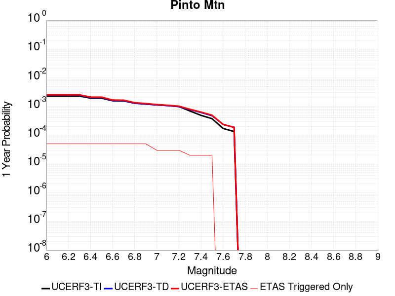 |  |

| Magnitude | 1 wk TI Prob | 1 wk TD Prob | 1 wk ETAS Prob | 1 wk ETAS/TD Gain | 1 wk ETAS Triggered Only | 1 mo TI Prob | 1 mo TD Prob | 1 mo ETAS Prob | 1 mo ETAS/TD Gain | 1 mo ETAS Triggered Only | 1 yr TI Prob | 1 yr TD Prob | 1 yr ETAS Prob | 1 yr ETAS/TD Gain | 1 yr ETAS Triggered Only | 10 yr TI Prob | 10 yr TD Prob | 10 yr ETAS Prob | 10 yr ETAS/TD Gain | 10 yr ETAS Triggered Only |
|-----|-----|-----|-----|-----|-----|-----|-----|-----|-----|-----|-----|-----|-----|-----|-----|-----|-----|-----|-----|-----|
| 6.0 | 4.4194956E-5 | 4.7861668E-5 | 4.7861668E-5 | 1.0 | 0.0 | 1.893932E-4 | 2.0510623E-4 | 2.1993867E-4 | 1.0723158 | 1.4835475E-5 | 0.0023034236 | 0.0024944732 | 0.0025536672 | 1.02373 | 5.93419E-5 | 0.022796938 | 0.024682244 | 0.02478353 | 1.0041035 | 1.03848324E-4 |
| 6.1 | 4.4194956E-5 | 4.7861668E-5 | 4.7861668E-5 | 1.0 | 0.0 | 1.893932E-4 | 2.0510623E-4 | 2.1993867E-4 | 1.0723158 | 1.4835475E-5 | 0.0023034236 | 0.0024944732 | 0.0025536672 | 1.02373 | 5.93419E-5 | 0.022796938 | 0.024682244 | 0.02478353 | 1.0041035 | 1.03848324E-4 |
| 6.2 | 4.4194956E-5 | 4.7861668E-5 | 4.7861668E-5 | 1.0 | 0.0 | 1.893932E-4 | 2.0510623E-4 | 2.1993867E-4 | 1.0723158 | 1.4835475E-5 | 0.0023034236 | 0.0024944732 | 0.0025536672 | 1.02373 | 5.93419E-5 | 0.022796938 | 0.024682244 | 0.02478353 | 1.0041035 | 1.03848324E-4 |
| 6.3 | 4.4194956E-5 | 4.7861668E-5 | 4.7861668E-5 | 1.0 | 0.0 | 1.893932E-4 | 2.0510623E-4 | 2.1993867E-4 | 1.0723158 | 1.4835475E-5 | 0.0023034236 | 0.0024944732 | 0.0025536672 | 1.02373 | 5.93419E-5 | 0.022796938 | 0.024682244 | 0.02478353 | 1.0041035 | 1.03848324E-4 |
| 6.4 | 3.729929E-5 | 3.9610157E-5 | 3.9610157E-5 | 1.0 | 0.0 | 1.5984432E-4 | 1.697473E-4 | 1.8458026E-4 | 1.0873826 | 1.4835475E-5 | 0.0019443673 | 0.002064808 | 0.0021240276 | 1.0286803 | 5.93419E-5 | 0.019274427 | 0.020466255 | 0.020553447 | 1.0042602 | 8.901285E-5 |
| 6.5 | 3.729929E-5 | 3.9610157E-5 | 3.9610157E-5 | 1.0 | 0.0 | 1.5984432E-4 | 1.697473E-4 | 1.8458026E-4 | 1.0873826 | 1.4835475E-5 | 0.0019443673 | 0.002064808 | 0.0021240276 | 1.0286803 | 5.93419E-5 | 0.019274427 | 0.020466255 | 0.020553447 | 1.0042602 | 8.901285E-5 |
| 6.6 | 3.0204548E-5 | 3.1211246E-5 | 3.1211246E-5 | 1.0 | 0.0 | 1.2944164E-4 | 1.3375582E-4 | 1.4858932E-4 | 1.1108998 | 1.4835475E-5 | 0.0015748127 | 0.0016272953 | 0.0016865407 | 1.0364072 | 5.93419E-5 | 0.015636992 | 0.016157662 | 0.016230643 | 1.0045167 | 7.417738E-5 |
| 6.7 | 2.9857754E-5 | 3.0820596E-5 | 3.0820596E-5 | 1.0 | 0.0 | 1.2795553E-4 | 1.3208178E-4 | 1.4691529E-4 | 1.1123055 | 1.4835475E-5 | 0.0015567453 | 0.0016069441 | 0.0016661907 | 1.036869 | 5.93419E-5 | 0.015458848 | 0.015957087 | 0.01603008 | 1.0045744 | 7.417738E-5 |
| 6.8 | 2.4819734E-5 | 2.501469E-5 | 2.501469E-5 | 1.0 | 0.0 | 1.0636595E-4 | 1.0720152E-4 | 1.2203541E-4 | 1.1383739 | 1.4835475E-5 | 0.0012942362 | 0.0013044188 | 0.0013636833 | 1.0454336 | 5.93419E-5 | 0.012867244 | 0.01296999 | 0.013043206 | 1.0056449 | 7.417738E-5 |
| 6.9 | 2.331124E-5 | 2.3342847E-5 | 2.3342847E-5 | 1.0 | 0.0 | 9.990149E-5 | 1.00037054E-4 | 1.1487104E-4 | 1.1482849 | 1.4835475E-5 | 0.001215622 | 0.001217291 | 0.0012765607 | 1.0486898 | 5.93419E-5 | 0.012089936 | 0.012108425 | 0.012181704 | 1.0060519 | 7.417738E-5 |
| 7.0 | 2.1818534E-5 | 2.1765876E-5 | 2.1765876E-5 | 1.0 | 0.0 | 9.3504656E-5 | 9.327911E-5 | 1.081132E-4 | 1.1590291 | 1.4835475E-5 | 0.0011378246 | 0.0011351013 | 0.0011647386 | 1.0261098 | 2.967095E-5 | 0.011320163 | 0.011295138 | 0.011339141 | 1.0038958 | 4.4506425E-5 |
| 7.1 | 2.066081E-5 | 2.0545427E-5 | 2.0545427E-5 | 1.0 | 0.0 | 8.854332E-5 | 8.804897E-5 | 1.0288313E-4 | 1.1684763 | 1.4835475E-5 | 0.0010774818 | 0.0010714886 | 0.0011011277 | 1.0276617 | 2.967095E-5 | 0.010722724 | 0.010665275 | 0.010709306 | 1.0041285 | 4.4506425E-5 |
| 7.2 | 1.8990233E-5 | 1.9058614E-5 | 1.9058614E-5 | 1.0 | 0.0 | 8.138417E-5 | 8.1677324E-5 | 9.651159E-5 | 1.1816204 | 1.4835475E-5 | 9.904018E-4 | 9.939871E-4 | 0.0010236286 | 1.0298208 | 2.967095E-5 | 0.009859995 | 0.009897412 | 0.009941478 | 1.0044522 | 4.4506425E-5 |
| 7.3 | 1.3335872E-5 | 1.4910893E-5 | 1.4910893E-5 | 1.0 | 0.0 | 5.7152483E-5 | 6.3902335E-5 | 7.873686E-5 | 1.2321438 | 1.4835475E-5 | 6.956093E-4 | 7.7774597E-4 | 7.925699E-4 | 1.0190601 | 1.4835475E-5 | 0.006934359 | 0.0077515403 | 0.0077809813 | 1.0037981 | 2.967095E-5 |
| 7.4 | 9.414066E-6 | 1.1864909E-5 | 1.1864909E-5 | 1.0 | 0.0 | 4.0345374E-5 | 5.084867E-5 | 6.5683394E-5 | 1.2917426 | 1.4835475E-5 | 4.910942E-4 | 6.189161E-4 | 6.337424E-4 | 1.0239552 | 1.4835475E-5 | 0.0049001034 | 0.0061728735 | 0.0061876173 | 1.0023885 | 1.4835475E-5 |
| 7.5 | 7.2101157E-6 | 9.16209E-6 | 9.16209E-6 | 1.0 | 0.0 | 3.090013E-5 | 3.926555E-5 | 5.410044E-5 | 1.3778094 | 1.4835475E-5 | 3.7614413E-4 | 4.77961E-4 | 4.927894E-4 | 1.0310242 | 1.4835475E-5 | 0.0037550807 | 0.004770106 | 0.004784871 | 1.0030953 | 1.4835475E-5 |
| 7.6 | 3.296375E-6 | 4.549339E-6 | 4.549339E-6 | 1.0 | 0.0 | 1.4127245E-5 | 1.9497029E-5 | 1.9497029E-5 | 1.0 | 0.0 | 1.7198564E-4 | 2.3735187E-4 | 2.3735187E-4 | 1.0 | 0.0 | 0.0017185259 | 0.0023711212 | 0.0023711212 | 1.0 | 0.0 |
| 7.7 | 2.5741092E-6 | 3.5880394E-6 | 3.5880394E-6 | 1.0 | 0.0 | 1.103185E-5 | 1.5377229E-5 | 1.5377229E-5 | 1.0 | 0.0 | 1.3430449E-4 | 1.87203E-4 | 1.87203E-4 | 1.0 | 0.0 | 0.0013422335 | 0.0018705832 | 0.0018705832 | 1.0 | 0.0 |

## San Andreas (Coachella) rev
*[(top)](#table-of-contents)*

| 1 Week | 1 Month | 1 Year | 10 Year |
|-----|-----|-----|-----|
|  |  |  |  |

| Magnitude | 1 wk TI Prob | 1 wk TD Prob | 1 wk ETAS Prob | 1 wk ETAS/TD Gain | 1 wk ETAS Triggered Only | 1 mo TI Prob | 1 mo TD Prob | 1 mo ETAS Prob | 1 mo ETAS/TD Gain | 1 mo ETAS Triggered Only | 1 yr TI Prob | 1 yr TD Prob | 1 yr ETAS Prob | 1 yr ETAS/TD Gain | 1 yr ETAS Triggered Only | 10 yr TI Prob | 10 yr TD Prob | 10 yr ETAS Prob | 10 yr ETAS/TD Gain | 10 yr ETAS Triggered Only |
|-----|-----|-----|-----|-----|-----|-----|-----|-----|-----|-----|-----|-----|-----|-----|-----|-----|-----|-----|-----|-----|
| 6.0 | 1.1925945E-4 | 3.275145E-4 | 3.275145E-4 | 1.0 | 0.0 | 5.110118E-4 | 0.0014028832 | 0.0014176979 | 1.0105602 | 1.4835475E-5 | 0.0062038354 | 0.01694768 | 0.017049767 | 1.0060238 | 1.03848324E-4 | 0.060334753 | 0.15273918 | 0.15283974 | 1.0006584 | 1.186838E-4 |
| 6.1 | 1.1925945E-4 | 3.275145E-4 | 3.275145E-4 | 1.0 | 0.0 | 5.110118E-4 | 0.0014028832 | 0.0014176979 | 1.0105602 | 1.4835475E-5 | 0.0062038354 | 0.01694768 | 0.017049767 | 1.0060238 | 1.03848324E-4 | 0.060334753 | 0.15273918 | 0.15283974 | 1.0006584 | 1.186838E-4 |
| 6.2 | 1.07432395E-4 | 3.0252046E-4 | 3.0252046E-4 | 1.0 | 0.0 | 4.603433E-4 | 0.0012958761 | 0.0013106923 | 1.0114334 | 1.4835475E-5 | 0.005590286 | 0.015664255 | 0.015737271 | 1.0046613 | 7.417738E-5 | 0.05451731 | 0.14191051 | 0.14198689 | 1.0005382 | 8.901285E-5 |
| 6.3 | 1.0718766E-4 | 3.0197352E-4 | 3.0197352E-4 | 1.0 | 0.0 | 4.592948E-4 | 0.0012935343 | 0.0013083506 | 1.0114541 | 1.4835475E-5 | 0.005577586 | 0.015636155 | 0.015709173 | 1.0046698 | 7.417738E-5 | 0.054396555 | 0.14167878 | 0.14175518 | 1.0005393 | 8.901285E-5 |
| 6.4 | 1.0355944E-4 | 2.9405407E-4 | 2.9405407E-4 | 1.0 | 0.0 | 4.4375064E-4 | 0.001259627 | 0.0012744439 | 1.0117629 | 1.4835475E-5 | 0.0053892885 | 0.015229177 | 0.015302224 | 1.0047965 | 7.417738E-5 | 0.052604496 | 0.13823903 | 0.13831574 | 1.0005549 | 8.901285E-5 |
| 6.5 | 1.0227914E-4 | 2.9124832E-4 | 2.9124832E-4 | 1.0 | 0.0 | 4.382655E-4 | 0.0012476139 | 0.0012624309 | 1.0118762 | 1.4835475E-5 | 0.0053228354 | 0.015084951 | 0.015158009 | 1.0048431 | 7.417738E-5 | 0.051971316 | 0.13701828 | 0.1370951 | 1.0005606 | 8.901285E-5 |
| 6.6 | 1.0116757E-4 | 2.8890572E-4 | 2.8890572E-4 | 1.0 | 0.0 | 4.3350324E-4 | 0.0012375838 | 0.0012524009 | 1.0119727 | 1.4835475E-5 | 0.0052651367 | 0.014964517 | 0.015037584 | 1.0048827 | 7.417738E-5 | 0.051421247 | 0.13599652 | 0.13607343 | 1.0005655 | 8.901285E-5 |
| 6.7 | 1.0050676E-4 | 2.874913E-4 | 2.874913E-4 | 1.0 | 0.0 | 4.3067214E-4 | 0.0012315277 | 0.0012463449 | 1.0120316 | 1.4835475E-5 | 0.005230834 | 0.014891794 | 0.014964867 | 1.0049069 | 7.417738E-5 | 0.051094085 | 0.13538128 | 0.13545823 | 1.0005685 | 8.901285E-5 |
| 6.8 | 9.976819E-5 | 2.855276E-4 | 2.855276E-4 | 1.0 | 0.0 | 4.2750788E-4 | 0.0012231198 | 0.0012379371 | 1.0121144 | 1.4835475E-5 | 0.0051924936 | 0.014790823 | 0.014863903 | 1.0049409 | 7.417738E-5 | 0.050728295 | 0.13453294 | 0.13460998 | 1.0005727 | 8.901285E-5 |
| 6.9 | 9.77719E-5 | 2.804952E-4 | 2.804952E-4 | 1.0 | 0.0 | 4.1895514E-4 | 0.0012015724 | 0.00121639 | 1.0123318 | 1.4835475E-5 | 0.0050888555 | 0.014532012 | 0.014605111 | 1.0050303 | 7.417738E-5 | 0.049738888 | 0.1323611 | 0.13243833 | 1.0005835 | 8.901285E-5 |
| 7.0 | 8.500761E-5 | 2.4782924E-4 | 2.4782924E-4 | 1.0 | 0.0 | 3.6426744E-4 | 0.0010616962 | 0.001076516 | 1.0139586 | 1.4835475E-5 | 0.0044259406 | 0.012850317 | 0.012908896 | 1.0045586 | 5.93419E-5 | 0.04338823 | 0.11821593 | 0.11828134 | 1.0005533 | 7.417738E-5 |
| 7.1 | 8.319876E-5 | 2.4385435E-4 | 2.4385435E-4 | 1.0 | 0.0 | 3.5651738E-4 | 0.0010446747 | 0.0010594947 | 1.0141863 | 1.4835475E-5 | 0.004331963 | 0.012645504 | 0.012704096 | 1.0046334 | 5.93419E-5 | 0.042484846 | 0.11643544 | 0.11650097 | 1.0005629 | 7.417738E-5 |
| 7.2 | 7.563917E-5 | 2.2433265E-4 | 2.2433265E-4 | 1.0 | 0.0 | 3.2412758E-4 | 9.6107443E-4 | 9.758957E-4 | 1.0154215 | 1.4835475E-5 | 0.0039391145 | 0.011638994 | 0.011697645 | 1.0050392 | 5.93419E-5 | 0.03870018 | 0.10784007 | 0.107906245 | 1.0006137 | 7.417738E-5 |
| 7.3 | 7.082985E-5 | 2.0748671E-4 | 2.0748671E-4 | 1.0 | 0.0 | 3.0352117E-4 | 8.889286E-4 | 9.037509E-4 | 1.0166743 | 1.4835475E-5 | 0.0036891096 | 0.010769626 | 0.010828328 | 1.0054507 | 5.93419E-5 | 0.03628465 | 0.100360475 | 0.10042721 | 1.000665 | 7.417738E-5 |
| 7.4 | 5.146215E-5 | 1.4289128E-4 | 1.4289128E-4 | 1.0 | 0.0 | 2.2053342E-4 | 6.122484E-4 | 6.270748E-4 | 1.0242163 | 1.4835475E-5 | 0.0026816884 | 0.0074288365 | 0.0074730124 | 1.0059465 | 4.4506425E-5 | 0.02649557 | 0.07091647 | 0.0709716 | 1.0007775 | 5.93419E-5 |
| 7.5 | 4.0285166E-5 | 1.0954905E-4 | 1.0954905E-4 | 1.0 | 0.0 | 1.7263928E-4 | 4.6941178E-4 | 4.842403E-4 | 1.0315895 | 1.4835475E-5 | 0.002099857 | 0.0057001817 | 0.0057444344 | 1.0077634 | 4.4506425E-5 | 0.020801254 | 0.055070374 | 0.055126447 | 1.0010182 | 5.93419E-5 |
| 7.6 | 3.1168736E-5 | 8.450738E-5 | 8.450738E-5 | 1.0 | 0.0 | 1.3357346E-4 | 3.6212435E-4 | 3.7695447E-4 | 1.040953 | 1.4835475E-5 | 0.0016250437 | 0.0043999776 | 0.0044442886 | 1.0100707 | 4.4506425E-5 | 0.016132116 | 0.042863373 | 0.04292017 | 1.0013251 | 5.93419E-5 |
| 7.7 | 2.2100989E-5 | 6.249158E-5 | 6.249158E-5 | 1.0 | 0.0 | 9.4715084E-5 | 2.677936E-4 | 2.826251E-4 | 1.055384 | 1.4835475E-5 | 0.001152546 | 0.0032555189 | 0.0032998805 | 1.0136266 | 4.4506425E-5 | 0.011465867 | 0.03194744 | 0.032004885 | 1.0017982 | 5.93419E-5 |
| 7.8 | 1.7484861E-5 | 5.1888477E-5 | 5.1888477E-5 | 1.0 | 0.0 | 7.493296E-5 | 2.2236025E-4 | 2.3719242E-4 | 1.0667033 | 1.4835475E-5 | 9.1192697E-4 | 0.0027038779 | 0.002748264 | 1.0164157 | 4.4506425E-5 | 0.009081938 | 0.026682366 | 0.026740123 | 1.0021647 | 5.93419E-5 |
| 7.9 | 1.3967285E-5 | 3.829856E-5 | 3.829856E-5 | 1.0 | 0.0 | 5.985842E-5 | 1.6412637E-4 | 1.7895941E-4 | 1.0903758 | 1.4835475E-5 | 7.2853256E-4 | 0.0019964084 | 0.002040826 | 1.0222487 | 4.4506425E-5 | 0.0072614877 | 0.019944582 | 0.019988202 | 1.002187 | 4.4506425E-5 |
| 8.0 | 1.1887396E-5 | 3.113051E-5 | 3.113051E-5 | 1.0 | 0.0 | 5.094499E-5 | 1.3340965E-4 | 1.4824314E-4 | 1.1111876 | 1.4835475E-5 | 6.200787E-4 | 0.0016230532 | 0.0016674874 | 1.0273769 | 4.4506425E-5 | 0.006183513 | 0.016309703 | 0.016353484 | 1.0026844 | 4.4506425E-5 |
| 8.1 | 5.100864E-6 | 8.999921E-6 | 8.999921E-6 | 1.0 | 0.0 | 2.1860664E-5 | 3.8570524E-5 | 3.8570524E-5 | 1.0 | 0.0 | 2.6612106E-4 | 4.6949505E-4 | 4.6949505E-4 | 1.0 | 0.0 | 0.002658026 | 0.0049309437 | 0.0049309437 | 1.0 | 0.0 |
| 8.2 | 2.3004484E-6 | 2.7971203E-6 | 2.7971203E-6 | 1.0 | 0.0 | 9.859027E-6 | 1.1987604E-5 | 1.1987604E-5 | 1.0 | 0.0 | 1.2002704E-4 | 1.4593934E-4 | 1.4593934E-4 | 1.0 | 0.0 | 0.0011996223 | 0.001602901 | 0.001602901 | 1.0 | 0.0 |
| 8.3 | 1.0424446E-7 | 5.8452187E-8 | 5.8452187E-8 | 1.0 | 0.0 | 4.4676187E-7 | 2.5050934E-7 | 2.5050934E-7 | 1.0 | 0.0 | 5.439312E-6 | 3.0499475E-6 | 3.0499475E-6 | 1.0 | 0.0 | 5.4391792E-5 | 3.2062468E-5 | 3.2062468E-5 | 1.0 | 0.0 |

## San Andreas (Parkfield)
*[(top)](#table-of-contents)*

| 1 Week | 1 Month | 1 Year | 10 Year |
|-----|-----|-----|-----|
|  |  | 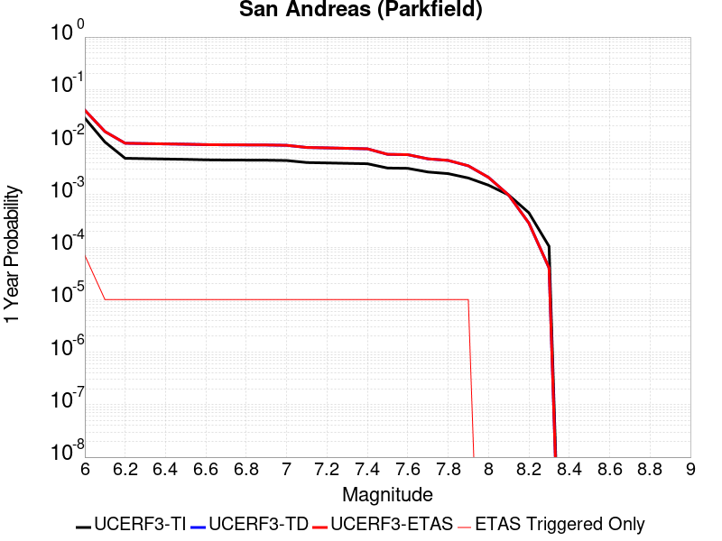 | 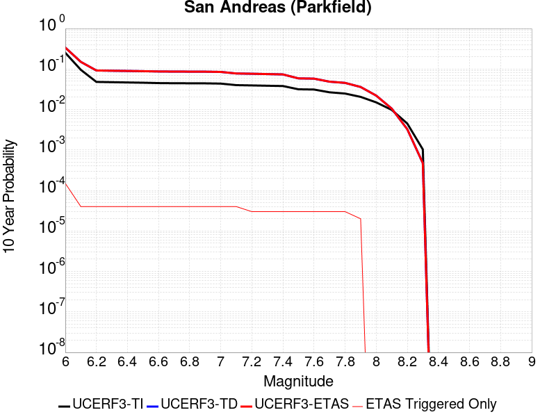 |

| Magnitude | 1 wk TI Prob | 1 wk TD Prob | 1 wk ETAS Prob | 1 wk ETAS/TD Gain | 1 wk ETAS Triggered Only | 1 mo TI Prob | 1 mo TD Prob | 1 mo ETAS Prob | 1 mo ETAS/TD Gain | 1 mo ETAS Triggered Only | 1 yr TI Prob | 1 yr TD Prob | 1 yr ETAS Prob | 1 yr ETAS/TD Gain | 1 yr ETAS Triggered Only | 10 yr TI Prob | 10 yr TD Prob | 10 yr ETAS Prob | 10 yr ETAS/TD Gain | 10 yr ETAS Triggered Only |
|-----|-----|-----|-----|-----|-----|-----|-----|-----|-----|-----|-----|-----|-----|-----|-----|-----|-----|-----|-----|-----|
| 6.0 | 5.556969E-4 | 7.829294E-4 | 7.829294E-4 | 1.0 | 0.0 | 0.0023793848 | 0.0033516537 | 0.0033516537 | 1.0 | 0.0 | 0.028586963 | 0.040434137 | 0.040476844 | 1.0010562 | 4.4506425E-5 | 0.25176284 | 0.33793005 | 0.3379988 | 1.0002035 | 1.03848324E-4 |
| 6.1 | 1.925858E-4 | 3.0419437E-4 | 3.0419437E-4 | 1.0 | 0.0 | 8.2510663E-4 | 0.0013031343 | 0.0013031343 | 1.0 | 0.0 | 0.0099994885 | 0.015848812 | 0.015848812 | 1.0 | 0.0 | 0.095613256 | 0.15007141 | 0.15009663 | 1.0001681 | 2.967095E-5 |
| 6.2 | 9.4306815E-5 | 1.8281303E-4 | 1.8281303E-4 | 1.0 | 0.0 | 4.0410945E-4 | 7.832504E-4 | 7.832504E-4 | 1.0 | 0.0 | 0.0049089384 | 0.009494586 | 0.009494586 | 1.0 | 0.0 | 0.048019063 | 0.09202119 | 0.09204813 | 1.0002928 | 2.967095E-5 |
| 6.3 | 9.283051E-5 | 1.7977698E-4 | 1.7977698E-4 | 1.0 | 0.0 | 3.9778434E-4 | 7.702465E-4 | 7.702465E-4 | 1.0 | 0.0 | 0.0048322747 | 0.009337631 | 0.009337631 | 1.0 | 0.0 | 0.047285385 | 0.090673946 | 0.090700924 | 1.0002975 | 2.967095E-5 |
| 6.4 | 9.138826E-5 | 1.7739642E-4 | 1.7739642E-4 | 1.0 | 0.0 | 3.916052E-4 | 7.6005E-4 | 7.6005E-4 | 1.0 | 0.0 | 0.0047573745 | 0.0092145465 | 0.0092145465 | 1.0 | 0.0 | 0.046568092 | 0.08957534 | 0.08960236 | 1.0003016 | 2.967095E-5 |
| 6.5 | 9.000255E-5 | 1.749746E-4 | 1.749746E-4 | 1.0 | 0.0 | 3.8566816E-4 | 7.496768E-4 | 7.496768E-4 | 1.0 | 0.0 | 0.0046854047 | 0.009089324 | 0.009089324 | 1.0 | 0.0 | 0.045878403 | 0.08846042 | 0.08848747 | 1.0003058 | 2.967095E-5 |
| 6.6 | 8.8109264E-5 | 1.7178143E-4 | 1.7178143E-4 | 1.0 | 0.0 | 3.7755648E-4 | 7.3599955E-4 | 7.3599955E-4 | 1.0 | 0.0 | 0.0045870654 | 0.008924194 | 0.008924194 | 1.0 | 0.0 | 0.04493529 | 0.08699042 | 0.087017514 | 1.0003114 | 2.967095E-5 |
| 6.7 | 8.738073E-5 | 1.7045115E-4 | 1.7045115E-4 | 1.0 | 0.0 | 3.7443507E-4 | 7.3030154E-4 | 7.3030154E-4 | 1.0 | 0.0 | 0.0045492216 | 0.008855429 | 0.008855429 | 1.0 | 0.0 | 0.04457213 | 0.08639047 | 0.086417586 | 1.0003138 | 2.967095E-5 |
| 6.8 | 8.710195E-5 | 1.6990531E-4 | 1.6990531E-4 | 1.0 | 0.0 | 3.7324068E-4 | 7.279636E-4 | 7.279636E-4 | 1.0 | 0.0 | 0.0045347405 | 0.008827203 | 0.008827203 | 1.0 | 0.0 | 0.04443313 | 0.08613779 | 0.08616491 | 1.0003148 | 2.967095E-5 |
| 6.9 | 8.6801556E-5 | 1.6931405E-4 | 1.6931405E-4 | 1.0 | 0.0 | 3.7195362E-4 | 7.25431E-4 | 7.25431E-4 | 1.0 | 0.0 | 0.0045191357 | 0.008796618 | 0.008796618 | 1.0 | 0.0 | 0.044283327 | 0.085863575 | 0.085890695 | 1.0003159 | 2.967095E-5 |
| 7.0 | 8.5571606E-5 | 1.6683916E-4 | 1.6683916E-4 | 1.0 | 0.0 | 3.6668387E-4 | 7.148302E-4 | 7.148302E-4 | 1.0 | 0.0 | 0.004455241 | 0.008668587 | 0.008668587 | 1.0 | 0.0 | 0.043669727 | 0.084710866 | 0.08473802 | 1.0003206 | 2.967095E-5 |
| 7.1 | 7.82589E-5 | 1.5163586E-4 | 1.5163586E-4 | 1.0 | 0.0 | 3.3535215E-4 | 6.497068E-4 | 6.497068E-4 | 1.0 | 0.0 | 0.0040752706 | 0.007881662 | 0.007881662 | 1.0 | 0.0 | 0.040013418 | 0.07761868 | 0.07764605 | 1.0003526 | 2.967095E-5 |
| 7.2 | 7.690929E-5 | 1.4900621E-4 | 1.4900621E-4 | 1.0 | 0.0 | 3.2956956E-4 | 6.3844246E-4 | 6.3844246E-4 | 1.0 | 0.0 | 0.004005129 | 0.007745501 | 0.007745501 | 1.0 | 0.0 | 0.0393371 | 0.07639118 | 0.076404884 | 1.0001794 | 1.4835475E-5 |
| 7.3 | 7.5543794E-5 | 1.459678E-4 | 1.459678E-4 | 1.0 | 0.0 | 3.2371894E-4 | 6.2542706E-4 | 6.2542706E-4 | 1.0 | 0.0 | 0.003934157 | 0.007588152 | 0.007588152 | 1.0 | 0.0 | 0.038652334 | 0.07495276 | 0.07496648 | 1.0001831 | 1.4835475E-5 |
| 7.4 | 7.4214564E-5 | 1.429729E-4 | 1.429729E-4 | 1.0 | 0.0 | 3.1802364E-4 | 6.125978E-4 | 6.125978E-4 | 1.0 | 0.0 | 0.003865065 | 0.0074330317 | 0.0074330317 | 1.0 | 0.0 | 0.03798529 | 0.07352493 | 0.073538676 | 1.0001869 | 1.4835475E-5 |
| 7.5 | 6.149578E-5 | 1.1220332E-4 | 1.1220332E-4 | 1.0 | 0.0 | 2.6352672E-4 | 4.8078288E-4 | 4.8078288E-4 | 1.0 | 0.0 | 0.0032037178 | 0.005837853 | 0.005837853 | 1.0 | 0.0 | 0.03157923 | 0.05869399 | 0.058707956 | 1.000238 | 1.4835475E-5 |
| 7.6 | 6.0643448E-5 | 1.1048682E-4 | 1.1048682E-4 | 1.0 | 0.0 | 2.598746E-4 | 4.734291E-4 | 4.734291E-4 | 1.0 | 0.0 | 0.0031593828 | 0.0057487967 | 0.0057487967 | 1.0 | 0.0 | 0.031148417 | 0.057853807 | 0.057867784 | 1.0002416 | 1.4835475E-5 |
| 7.7 | 5.1652263E-5 | 9.201012E-5 | 9.201012E-5 | 1.0 | 0.0 | 2.2134806E-4 | 3.9426953E-4 | 3.9426953E-4 | 1.0 | 0.0 | 0.002691582 | 0.004789676 | 0.004789676 | 1.0 | 0.0 | 0.026592141 | 0.048659526 | 0.04867364 | 1.00029 | 1.4835475E-5 |
| 7.8 | 4.8090482E-5 | 8.5838656E-5 | 8.5838656E-5 | 1.0 | 0.0 | 2.060858E-4 | 3.6782812E-4 | 3.6782812E-4 | 1.0 | 0.0 | 0.0025062072 | 0.00446912 | 0.00446912 | 1.0 | 0.0 | 0.024781305 | 0.045416377 | 0.04543054 | 1.0003119 | 1.4835475E-5 |
| 7.9 | 3.970278E-5 | 6.769294E-5 | 6.769294E-5 | 1.0 | 0.0 | 1.7014367E-4 | 2.9008035E-4 | 2.9008035E-4 | 1.0 | 0.0 | 0.002069531 | 0.0035260126 | 0.0035260126 | 1.0 | 0.0 | 0.020503636 | 0.035971887 | 0.03598619 | 1.0003976 | 1.4835475E-5 |
| 8.0 | 2.8982335E-5 | 4.0817988E-5 | 4.0817988E-5 | 1.0 | 0.0 | 1.2420409E-4 | 1.7492252E-4 | 1.7492252E-4 | 1.0 | 0.0 | 0.0015111357 | 0.0021276027 | 0.0021276027 | 1.0 | 0.0 | 0.015009012 | 0.022070821 | 0.022070821 | 1.0 | 0.0 |
| 8.1 | 1.8836186E-5 | 1.87495E-5 | 1.87495E-5 | 1.0 | 0.0 | 8.0724014E-5 | 8.035253E-5 | 8.035253E-5 | 1.0 | 0.0 | 9.823717E-4 | 9.778537E-4 | 9.778537E-4 | 1.0 | 0.0 | 0.009780403 | 0.010524153 | 0.010524153 | 1.0 | 0.0 |
| 8.2 | 8.643924E-6 | 5.501233E-6 | 5.501233E-6 | 1.0 | 0.0 | 3.704486E-5 | 2.3576498E-5 | 2.3576498E-5 | 1.0 | 0.0 | 4.5092785E-4 | 2.8700614E-4 | 2.8700614E-4 | 1.0 | 0.0 | 0.0045001395 | 0.0032631387 | 0.0032631387 | 1.0 | 0.0 |
| 8.3 | 1.983087E-6 | 7.701989E-7 | 7.701989E-7 | 1.0 | 0.0 | 8.498917E-6 | 3.3008482E-6 | 3.3008482E-6 | 1.0 | 0.0 | 1.034694E-4 | 4.0187104E-5 | 4.0187104E-5 | 1.0 | 0.0 | 0.0010342124 | 4.7438307E-4 | 4.7438307E-4 | 1.0 | 0.0 |

## Ludlow
*[(top)](#table-of-contents)*

| 1 Week | 1 Month | 1 Year | 10 Year |
|-----|-----|-----|-----|
|  | 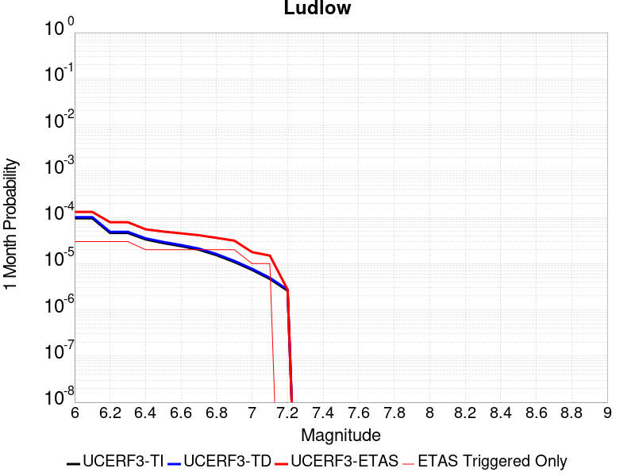 | 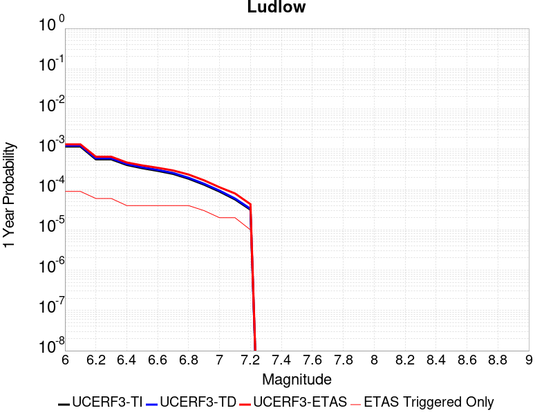 |  |

| Magnitude | 1 wk TI Prob | 1 wk TD Prob | 1 wk ETAS Prob | 1 wk ETAS/TD Gain | 1 wk ETAS Triggered Only | 1 mo TI Prob | 1 mo TD Prob | 1 mo ETAS Prob | 1 mo ETAS/TD Gain | 1 mo ETAS Triggered Only | 1 yr TI Prob | 1 yr TD Prob | 1 yr ETAS Prob | 1 yr ETAS/TD Gain | 1 yr ETAS Triggered Only | 10 yr TI Prob | 10 yr TD Prob | 10 yr ETAS Prob | 10 yr ETAS/TD Gain | 10 yr ETAS Triggered Only |
|-----|-----|-----|-----|-----|-----|-----|-----|-----|-----|-----|-----|-----|-----|-----|-----|-----|-----|-----|-----|-----|
| 6.0 | 2.2407607E-5 | 2.3658129E-5 | 2.3658129E-5 | 1.0 | 0.0 | 9.602906E-5 | 1.0138829E-4 | 1.3105624E-4 | 1.2926171 | 2.967095E-5 | 0.0011685267 | 0.0012337476 | 0.0013374677 | 1.0840693 | 1.03848324E-4 | 0.011624013 | 0.012273493 | 0.012376067 | 1.0083573 | 1.03848324E-4 |
| 6.1 | 2.2407607E-5 | 2.3658129E-5 | 2.3658129E-5 | 1.0 | 0.0 | 9.602906E-5 | 1.0138829E-4 | 1.3105624E-4 | 1.2926171 | 2.967095E-5 | 0.0011685267 | 0.0012337476 | 0.0013374677 | 1.0840693 | 1.03848324E-4 | 0.011624013 | 0.012273493 | 0.012376067 | 1.0083573 | 1.03848324E-4 |
| 6.2 | 1.0781252E-5 | 1.1366073E-5 | 1.1366073E-5 | 1.0 | 0.0 | 4.620455E-5 | 4.8710852E-5 | 7.8380355E-5 | 1.6090944 | 2.967095E-5 | 5.623952E-4 | 5.928973E-4 | 6.670307E-4 | 1.1250358 | 7.417738E-5 | 0.00560974 | 0.0059135733 | 0.005987312 | 1.0124694 | 7.417738E-5 |
| 6.3 | 1.0781252E-5 | 1.1366073E-5 | 1.1366073E-5 | 1.0 | 0.0 | 4.620455E-5 | 4.8710852E-5 | 7.8380355E-5 | 1.6090944 | 2.967095E-5 | 5.623952E-4 | 5.928973E-4 | 6.670307E-4 | 1.1250358 | 7.417738E-5 | 0.00560974 | 0.0059135733 | 0.005987312 | 1.0124694 | 7.417738E-5 |
| 6.4 | 7.814439E-6 | 8.238025E-6 | 8.238025E-6 | 1.0 | 0.0 | 3.3490025E-5 | 3.530535E-5 | 5.01403E-5 | 1.4201899 | 1.4835475E-5 | 4.0766477E-4 | 4.2975927E-4 | 4.7424657E-4 | 1.1035168 | 4.4506425E-5 | 0.0040691774 | 0.0042894282 | 0.004333744 | 1.0103314 | 4.4506425E-5 |
| 6.5 | 6.4986366E-6 | 6.8511663E-6 | 6.8511663E-6 | 1.0 | 0.0 | 2.7851002E-5 | 2.9361816E-5 | 4.4196855E-5 | 1.5052494 | 1.4835475E-5 | 3.390332E-4 | 3.574224E-4 | 4.019129E-4 | 1.1244761 | 4.4506425E-5 | 0.003385164 | 0.0035685715 | 0.003612919 | 1.0124272 | 4.4506425E-5 |
| 6.6 | 5.582177E-6 | 5.8862183E-6 | 5.8862183E-6 | 1.0 | 0.0 | 2.3923398E-5 | 2.5226409E-5 | 4.006151E-5 | 1.5880781 | 1.4835475E-5 | 2.9122844E-4 | 3.0708895E-4 | 3.5158172E-4 | 1.1448855 | 4.4506425E-5 | 0.0029084706 | 0.0030667195 | 0.0031110893 | 1.0144682 | 4.4506425E-5 |
| 6.7 | 4.6858763E-6 | 4.9406053E-6 | 4.9406053E-6 | 1.0 | 0.0 | 2.0082172E-5 | 2.1173853E-5 | 3.6009016E-5 | 1.7006358 | 1.4835475E-5 | 2.4447302E-4 | 2.5776174E-4 | 3.022567E-4 | 1.1726204 | 4.4506425E-5 | 0.0024420423 | 0.002574684 | 0.0026190758 | 1.0172417 | 4.4506425E-5 |
| 6.8 | 3.5584908E-6 | 3.7521538E-6 | 3.7521538E-6 | 1.0 | 0.0 | 1.5250586E-5 | 1.6080561E-5 | 3.09158E-5 | 1.9225571 | 1.4835475E-5 | 1.8566006E-4 | 1.9576366E-4 | 2.4026138E-4 | 1.2273033 | 4.4506425E-5 | 0.0018550502 | 0.0019559532 | 0.0020003726 | 1.0227098 | 4.4506425E-5 |
| 6.9 | 2.532834E-6 | 2.6711E-6 | 2.6711E-6 | 1.0 | 0.0 | 1.0854958E-5 | 1.1447523E-5 | 2.6282827E-5 | 2.2959402 | 1.4835475E-5 | 1.3215111E-4 | 1.3936496E-4 | 1.6903177E-4 | 1.2128714 | 2.967095E-5 | 0.0013207254 | 0.0013928032 | 0.0014224328 | 1.0212734 | 2.967095E-5 |
| 7.0 | 1.7083285E-6 | 1.8020094E-6 | 1.8020094E-6 | 1.0 | 0.0 | 7.3213873E-6 | 7.722875E-6 | 2.2558235E-5 | 2.9209633 | 1.4835475E-5 | 8.913424E-5 | 9.4022114E-5 | 1.2369028E-4 | 1.3155445 | 2.967095E-5 | 8.9098496E-4 | 9.3983987E-4 | 9.6948294E-4 | 1.0315405 | 2.967095E-5 |
| 7.1 | 1.0905424E-6 | 1.1498034E-6 | 1.1498034E-6 | 1.0 | 0.0 | 4.6737446E-6 | 4.92772E-6 | 1.9763122E-5 | 4.0106015 | 1.4835475E-5 | 5.6901354E-5 | 5.999344E-5 | 8.966261E-5 | 1.4945402 | 2.967095E-5 | 5.6886784E-4 | 5.997822E-4 | 6.2943535E-4 | 1.0494399 | 2.967095E-5 |
| 7.2 | 6.06668E-7 | 6.387501E-7 | 6.387501E-7 | 1.0 | 0.0 | 2.600003E-6 | 2.737498E-6 | 2.737498E-6 | 1.0 | 0.0 | 3.1654577E-5 | 3.33286E-5 | 4.816358E-5 | 1.4451126 | 1.4835475E-5 | 3.1650066E-4 | 3.3324285E-4 | 3.4807337E-4 | 1.0445037 | 1.4835475E-5 |

## Santa Rosa Island
*[(top)](#table-of-contents)*

| 1 Week | 1 Month | 1 Year | 10 Year |
|-----|-----|-----|-----|
|  | 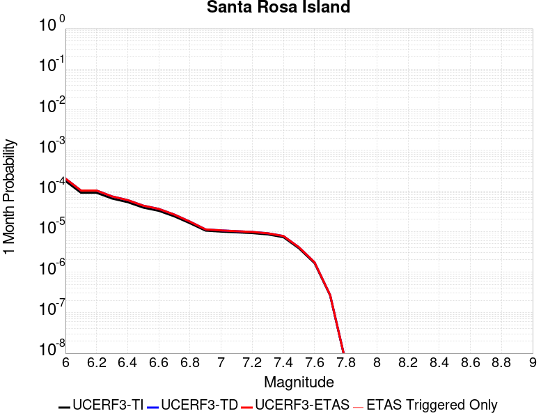 |  | 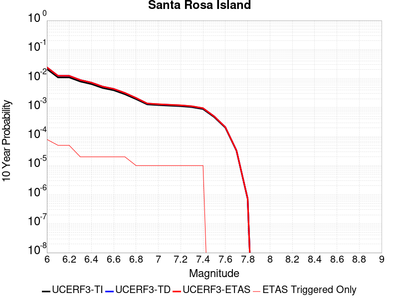 |

| Magnitude | 1 wk TI Prob | 1 wk TD Prob | 1 wk ETAS Prob | 1 wk ETAS/TD Gain | 1 wk ETAS Triggered Only | 1 mo TI Prob | 1 mo TD Prob | 1 mo ETAS Prob | 1 mo ETAS/TD Gain | 1 mo ETAS Triggered Only | 1 yr TI Prob | 1 yr TD Prob | 1 yr ETAS Prob | 1 yr ETAS/TD Gain | 1 yr ETAS Triggered Only | 10 yr TI Prob | 10 yr TD Prob | 10 yr ETAS Prob | 10 yr ETAS/TD Gain | 10 yr ETAS Triggered Only |
|-----|-----|-----|-----|-----|-----|-----|-----|-----|-----|-----|-----|-----|-----|-----|-----|-----|-----|-----|-----|-----|
| 6.0 | 4.1143165E-5 | 4.7095673E-5 | 4.7095673E-5 | 1.0 | 0.0 | 1.7631594E-4 | 2.018241E-4 | 2.018241E-4 | 1.0 | 0.0 | 0.002144533 | 0.0024546364 | 0.0024842345 | 1.012058 | 2.967095E-5 | 0.021239553 | 0.024295866 | 0.024397193 | 1.0041704 | 1.03848324E-4 |
| 6.1 | 2.1061249E-5 | 2.3867078E-5 | 2.3867078E-5 | 1.0 | 0.0 | 9.0259375E-5 | 1.0228364E-4 | 1.0228364E-4 | 1.0 | 0.0 | 0.0010983539 | 0.0012446208 | 0.0012742548 | 1.0238097 | 2.967095E-5 | 0.01092941 | 0.012379541 | 0.0124528 | 1.0059178 | 7.417738E-5 |
| 6.2 | 2.1061249E-5 | 2.3867078E-5 | 2.3867078E-5 | 1.0 | 0.0 | 9.0259375E-5 | 1.0228364E-4 | 1.0228364E-4 | 1.0 | 0.0 | 0.0010983539 | 0.0012446208 | 0.0012742548 | 1.0238097 | 2.967095E-5 | 0.01092941 | 0.012379541 | 0.0124528 | 1.0059178 | 7.417738E-5 |
| 6.3 | 1.5158236E-5 | 1.707586E-5 | 1.707586E-5 | 1.0 | 0.0 | 6.496225E-5 | 7.318027E-5 | 7.318027E-5 | 1.0 | 0.0 | 7.906284E-4 | 8.906175E-4 | 9.054398E-4 | 1.0166427 | 1.4835475E-5 | 0.007878214 | 0.008871734 | 0.0089011425 | 1.0033147 | 2.967095E-5 |
| 6.4 | 1.2341918E-5 | 1.3854049E-5 | 1.3854049E-5 | 1.0 | 0.0 | 5.2892858E-5 | 5.937319E-5 | 5.937319E-5 | 1.0 | 0.0 | 6.437803E-4 | 7.2263693E-4 | 7.374617E-4 | 1.0205148 | 1.4835475E-5 | 0.006419184 | 0.007203708 | 0.007233165 | 1.0040891 | 2.967095E-5 |
| 6.5 | 9.061158E-6 | 1.0117819E-5 | 1.0117819E-5 | 1.0 | 0.0 | 3.883296E-5 | 4.3361393E-5 | 4.3361393E-5 | 1.0 | 0.0 | 4.726887E-4 | 5.278024E-4 | 5.4263003E-4 | 1.0280932 | 1.4835475E-5 | 0.004716845 | 0.0052660266 | 0.005295541 | 1.0056047 | 2.967095E-5 |
| 6.6 | 7.5461685E-6 | 8.401371E-6 | 8.401371E-6 | 1.0 | 0.0 | 3.2340322E-5 | 3.60054E-5 | 3.60054E-5 | 1.0 | 0.0 | 3.936723E-4 | 4.382819E-4 | 4.5311084E-4 | 1.0338343 | 1.4835475E-5 | 0.003929756 | 0.0043746047 | 0.0044041458 | 1.0067528 | 2.967095E-5 |
| 6.7 | 5.5023775E-6 | 6.087815E-6 | 6.087815E-6 | 1.0 | 0.0 | 2.3581404E-5 | 2.6090394E-5 | 2.6090394E-5 | 1.0 | 0.0 | 2.8706578E-4 | 3.1760748E-4 | 3.3243827E-4 | 1.0466952 | 1.4835475E-5 | 0.0028669522 | 0.0031718574 | 0.0032014344 | 1.0093248 | 2.967095E-5 |
| 6.8 | 3.7351679E-6 | 4.0833966E-6 | 4.0833966E-6 | 1.0 | 0.0 | 1.6007763E-5 | 1.7500168E-5 | 1.7500168E-5 | 1.0 | 0.0 | 1.948771E-4 | 2.1304621E-4 | 2.2787851E-4 | 1.0696201 | 1.4835475E-5 | 0.0019470629 | 0.0021286649 | 0.0021434687 | 1.0069546 | 1.4835475E-5 |
| 6.9 | 2.456366E-6 | 2.6293947E-6 | 2.6293947E-6 | 1.0 | 0.0 | 1.0527241E-5 | 1.1268786E-5 | 1.1268786E-5 | 1.0 | 0.0 | 1.2816161E-4 | 1.3718885E-4 | 1.520223E-4 | 1.1081243 | 1.4835475E-5 | 0.0012808773 | 0.0013710445 | 0.0013858598 | 1.0108057 | 1.4835475E-5 |
| 7.0 | 2.3245157E-6 | 2.4828917E-6 | 2.4828917E-6 | 1.0 | 0.0 | 9.962172E-6 | 1.0640921E-5 | 1.0640921E-5 | 1.0 | 0.0 | 1.2128269E-4 | 1.2954553E-4 | 1.4437908E-4 | 1.1145046 | 1.4835475E-5 | 0.0012121652 | 0.0012947024 | 0.0013095187 | 1.0114437 | 1.4835475E-5 |
| 7.1 | 2.2248344E-6 | 2.3733562E-6 | 2.3733562E-6 | 1.0 | 0.0 | 9.53497E-6 | 1.0171487E-5 | 1.0171487E-5 | 1.0 | 0.0 | 1.1608207E-4 | 1.2383083E-4 | 1.3866447E-4 | 1.1197895 | 1.4835475E-5 | 0.0011602144 | 0.0012376203 | 0.0012524374 | 1.0119723 | 1.4835475E-5 |
| 7.2 | 2.1350402E-6 | 2.276255E-6 | 2.276255E-6 | 1.0 | 0.0 | 9.150141E-6 | 9.755341E-6 | 9.755341E-6 | 1.0 | 0.0 | 1.1139726E-4 | 1.1876483E-4 | 1.3359854E-4 | 1.1248999 | 1.4835475E-5 | 0.0011134144 | 0.0011870154 | 0.0012018334 | 1.0124832 | 1.4835475E-5 |
| 7.3 | 1.9793572E-6 | 2.1088115E-6 | 2.1088115E-6 | 1.0 | 0.0 | 8.482932E-6 | 9.0377325E-6 | 9.0377325E-6 | 1.0 | 0.0 | 1.032748E-4 | 1.1002886E-4 | 1.248627E-4 | 1.1348177 | 1.4835475E-5 | 0.0010322682 | 0.0010997456 | 0.0011145647 | 1.0134751 | 1.4835475E-5 |
| 7.4 | 1.6951194E-6 | 1.8046517E-6 | 1.8046517E-6 | 1.0 | 0.0 | 7.264777E-6 | 7.734198E-6 | 7.734198E-6 | 1.0 | 0.0 | 8.844508E-5 | 9.415982E-5 | 1.08993896E-4 | 1.1575415 | 1.4835475E-5 | 8.840988E-4 | 9.412009E-4 | 9.560224E-4 | 1.0157474 | 1.4835475E-5 |
| 7.5 | 8.987207E-7 | 9.5125927E-7 | 9.5125927E-7 | 1.0 | 0.0 | 3.8516546E-6 | 4.076819E-6 | 4.076819E-6 | 1.0 | 0.0 | 4.6892885E-5 | 4.9634153E-5 | 4.9634153E-5 | 1.0 | 0.0 | 4.688299E-4 | 4.9623183E-4 | 4.9623183E-4 | 1.0 | 0.0 |
| 7.6 | 3.8783037E-7 | 4.053061E-7 | 4.053061E-7 | 1.0 | 0.0 | 1.6621291E-6 | 1.7370251E-6 | 1.7370251E-6 | 1.0 | 0.0 | 2.0236233E-5 | 2.1148082E-5 | 2.1148082E-5 | 1.0 | 0.0 | 2.023439E-4 | 2.1146135E-4 | 2.1146135E-4 | 1.0 | 0.0 |
| 7.7 | 6.181804E-8 | 6.3391916E-8 | 6.3391916E-8 | 1.0 | 0.0 | 2.6493444E-7 | 2.716796E-7 | 2.716796E-7 | 1.0 | 0.0 | 3.225572E-6 | 3.3076942E-6 | 3.3076942E-6 | 1.0 | 0.0 | 3.225525E-5 | 3.3076456E-5 | 3.3076456E-5 | 1.0 | 0.0 |
| 7.8 | 1.3704449E-9 | 1.3964329E-9 | 1.3964329E-9 | 1.0 | 0.0 | 5.873335E-9 | 5.9847123E-9 | 5.9847123E-9 | 1.0 | 0.0 | 7.1507856E-8 | 7.286387E-8 | 7.286387E-8 | 1.0 | 0.0 | 7.1507833E-7 | 7.2863855E-7 | 7.2863855E-7 | 1.0 | 0.0 |

## Owens Valley
*[(top)](#table-of-contents)*

| 1 Week | 1 Month | 1 Year | 10 Year |
|-----|-----|-----|-----|
| 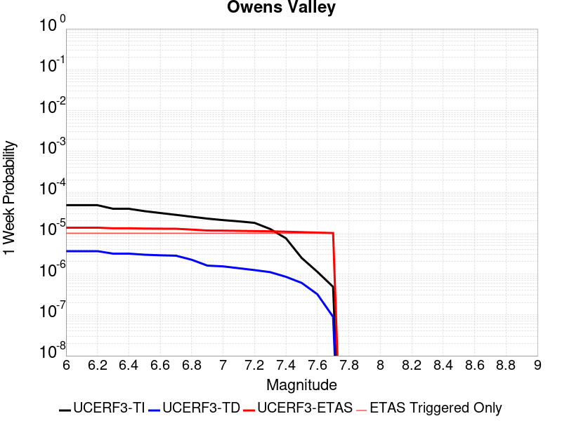 | 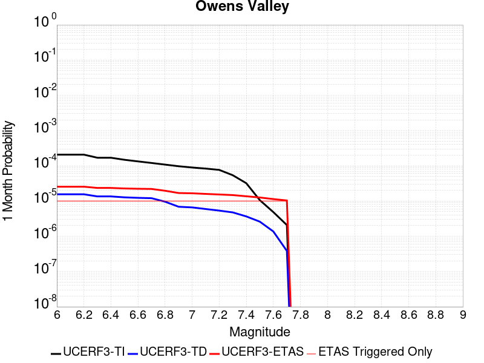 |  |  |

| Magnitude | 1 wk TI Prob | 1 wk TD Prob | 1 wk ETAS Prob | 1 wk ETAS/TD Gain | 1 wk ETAS Triggered Only | 1 mo TI Prob | 1 mo TD Prob | 1 mo ETAS Prob | 1 mo ETAS/TD Gain | 1 mo ETAS Triggered Only | 1 yr TI Prob | 1 yr TD Prob | 1 yr ETAS Prob | 1 yr ETAS/TD Gain | 1 yr ETAS Triggered Only | 10 yr TI Prob | 10 yr TD Prob | 10 yr ETAS Prob | 10 yr ETAS/TD Gain | 10 yr ETAS Triggered Only |
|-----|-----|-----|-----|-----|-----|-----|-----|-----|-----|-----|-----|-----|-----|-----|-----|-----|-----|-----|-----|-----|
| 6.0 | 4.83821E-5 | 3.6307124E-6 | 1.8466133E-5 | 5.0860906 | 1.4835475E-5 | 2.0733538E-4 | 1.556011E-5 | 3.0395353E-5 | 1.9534152 | 1.4835475E-5 | 0.002521386 | 1.8942886E-4 | 2.1909419E-4 | 1.156604 | 2.967095E-5 | 0.024929691 | 0.0019271498 | 0.0020159911 | 1.0460999 | 8.901285E-5 |
| 6.1 | 4.83821E-5 | 3.6307124E-6 | 1.8466133E-5 | 5.0860906 | 1.4835475E-5 | 2.0733538E-4 | 1.556011E-5 | 3.0395353E-5 | 1.9534152 | 1.4835475E-5 | 0.002521386 | 1.8942886E-4 | 2.1909419E-4 | 1.156604 | 2.967095E-5 | 0.024929691 | 0.0019271498 | 0.0020159911 | 1.0460999 | 8.901285E-5 |
| 6.2 | 4.83821E-5 | 3.6307124E-6 | 1.8466133E-5 | 5.0860906 | 1.4835475E-5 | 2.0733538E-4 | 1.556011E-5 | 3.0395353E-5 | 1.9534152 | 1.4835475E-5 | 0.002521386 | 1.8942886E-4 | 2.1909419E-4 | 1.156604 | 2.967095E-5 | 0.024929691 | 0.0019271498 | 0.0020159911 | 1.0460999 | 8.901285E-5 |
| 6.3 | 3.953008E-5 | 3.1576442E-6 | 1.7993072E-5 | 5.6982584 | 1.4835475E-5 | 1.6940363E-4 | 1.35326945E-5 | 2.836797E-5 | 2.096254 | 1.4835475E-5 | 0.002060538 | 1.6474884E-4 | 1.944149E-4 | 1.1800684 | 2.967095E-5 | 0.020415364 | 0.0016603973 | 0.0017492623 | 1.0535203 | 8.901285E-5 |
| 6.4 | 3.953008E-5 | 3.1576442E-6 | 1.7993072E-5 | 5.6982584 | 1.4835475E-5 | 1.6940363E-4 | 1.35326945E-5 | 2.836797E-5 | 2.096254 | 1.4835475E-5 | 0.002060538 | 1.6474884E-4 | 1.944149E-4 | 1.1800684 | 2.967095E-5 | 0.020415364 | 0.0016603973 | 0.0017492623 | 1.0535203 | 8.901285E-5 |
| 6.5 | 3.457342E-5 | 2.9730538E-6 | 1.7808485E-5 | 5.9899635 | 1.4835475E-5 | 1.4816338E-4 | 1.27416015E-5 | 2.7576887E-5 | 2.1643188 | 1.4835475E-5 | 0.0018023965 | 1.5511864E-4 | 1.8478499E-4 | 1.1912494 | 2.967095E-5 | 0.017878477 | 0.001556508 | 0.0016453824 | 1.0570985 | 8.901285E-5 |
| 6.6 | 3.1127765E-5 | 2.8755162E-6 | 1.7710949E-5 | 6.159224 | 1.4835475E-5 | 1.3339789E-4 | 1.2323587E-5 | 2.7158878E-5 | 2.2038128 | 1.4835475E-5 | 0.0016229092 | 1.5003003E-4 | 1.7969652E-4 | 1.1977371 | 2.967095E-5 | 0.016111081 | 0.0015018013 | 0.0015906804 | 1.0591817 | 8.901285E-5 |
| 6.7 | 2.806885E-5 | 2.8111767E-6 | 1.764661E-5 | 6.2773037 | 1.4835475E-5 | 1.2028952E-4 | 1.2047849E-5 | 2.6883145E-5 | 2.2313647 | 1.4835475E-5 | 0.001463541 | 1.4667337E-4 | 1.7633996E-4 | 1.202263 | 2.967095E-5 | 0.014539397 | 0.0014661505 | 0.0015550329 | 1.0606229 | 8.901285E-5 |
| 6.8 | 2.524524E-5 | 2.2360293E-6 | 1.707147E-5 | 7.6347256 | 1.4835475E-5 | 1.0818939E-4 | 9.58295E-6 | 2.4418283E-5 | 2.5480967 | 1.4835475E-5 | 0.0013164099 | 1.16666466E-4 | 1.4633396E-4 | 1.2542932 | 2.967095E-5 | 0.01308639 | 0.001166326 | 0.0012552349 | 1.07623 | 8.901285E-5 |
| 6.9 | 2.2704568E-5 | 1.6086552E-6 | 1.6444106E-5 | 10.222269 | 1.4835475E-5 | 9.730166E-5 | 6.8942186E-6 | 2.1729591E-5 | 3.1518571 | 1.4835475E-5 | 0.0011840039 | 8.39339E-5 | 1.1360235E-4 | 1.3534741 | 2.967095E-5 | 0.011777153 | 8.3923474E-4 | 9.2817284E-4 | 1.1059753 | 8.901285E-5 |
| 7.0 | 2.0871712E-5 | 1.5400055E-6 | 1.6375458E-5 | 10.633376 | 1.4835475E-5 | 8.944713E-5 | 6.600007E-6 | 2.1435384E-5 | 3.247782 | 1.4835475E-5 | 0.0010884746 | 8.035214E-5 | 1.100207E-4 | 1.3692318 | 2.967095E-5 | 0.010831586 | 8.0340425E-4 | 8.923456E-4 | 1.1107056 | 8.901285E-5 |
| 7.1 | 1.944928E-5 | 1.3868112E-6 | 1.6222266E-5 | 11.69753 | 1.4835475E-5 | 8.335139E-5 | 5.943463E-6 | 2.0778849E-5 | 3.4960847 | 1.4835475E-5 | 0.0010143308 | 7.235927E-5 | 1.0202807E-4 | 1.4100207 | 2.967095E-5 | 0.010097133 | 7.2351634E-4 | 8.124648E-4 | 1.1229391 | 8.901285E-5 |
| 7.2 | 1.7876306E-5 | 1.2492602E-6 | 1.6084716E-5 | 12.875393 | 1.4835475E-5 | 7.6610486E-5 | 5.3539616E-6 | 2.0189356E-5 | 3.7709193 | 1.4835475E-5 | 9.3233347E-4 | 6.518254E-5 | 9.485155E-5 | 1.4551681 | 2.967095E-5 | 0.009284316 | 6.517728E-4 | 7.407276E-4 | 1.1364814 | 8.901285E-5 |
| 7.3 | 1.2618672E-5 | 1.1118423E-6 | 1.59473E-5 | 14.343132 | 1.4835475E-5 | 5.40789E-5 | 4.7650296E-6 | 1.9600433E-5 | 4.113392 | 1.4835475E-5 | 6.582117E-4 | 5.8012698E-5 | 8.7681925E-5 | 1.5114264 | 2.967095E-5 | 0.0065626553 | 5.801092E-4 | 6.690704E-4 | 1.1533525 | 8.901285E-5 |
| 7.4 | 7.4874442E-6 | 8.551346E-7 | 1.5690597E-5 | 18.348686 | 1.4835475E-5 | 3.208865E-5 | 3.6648576E-6 | 1.8500277E-5 | 5.048021 | 1.4835475E-5 | 3.906093E-4 | 4.4618733E-5 | 7.428836E-5 | 1.664959 | 2.967095E-5 | 0.003899234 | 4.4619094E-4 | 5.351641E-4 | 1.1994059 | 8.901285E-5 |
| 7.5 | 2.4734156E-6 | 6.0704144E-7 | 1.5442507E-5 | 25.438967 | 1.4835475E-5 | 1.060031E-5 | 2.6016037E-6 | 1.743704E-5 | 6.7024198 | 1.4835475E-5 | 1.2905113E-4 | 3.1674066E-5 | 4.650907E-5 | 1.4683644 | 1.4835475E-5 | 0.0012897621 | 3.1669586E-4 | 3.6118817E-4 | 1.1404891 | 4.4506425E-5 |
| 7.6 | 1.1328841E-6 | 3.1974233E-7 | 1.5155212E-5 | 47.398205 | 1.4835475E-5 | 4.8552088E-6 | 1.3703236E-6 | 1.6205779E-5 | 11.8262415 | 1.4835475E-5 | 5.9110564E-5 | 1.6683563E-5 | 3.151879E-5 | 1.8892121 | 1.4835475E-5 | 5.9094845E-4 | 1.668233E-4 | 1.964893E-4 | 1.1778289 | 2.967095E-5 |
| 7.7 | 4.8613185E-7 | 8.968165E-8 | 1.4925155E-5 | 166.42374 | 1.4835475E-5 | 2.0834207E-6 | 3.8434987E-7 | 1.5219819E-5 | 39.598866 | 1.4835475E-5 | 2.536535E-5 | 4.6794503E-6 | 1.9514855E-5 | 4.170331 | 1.4835475E-5 | 2.5362454E-4 | 4.6793586E-5 | 6.1628365E-5 | 1.3170259 | 1.4835475E-5 |

## Calico-Hidalgo
*[(top)](#table-of-contents)*

| 1 Week | 1 Month | 1 Year | 10 Year |
|-----|-----|-----|-----|
|  |  |  |  |

| Magnitude | 1 wk TI Prob | 1 wk TD Prob | 1 wk ETAS Prob | 1 wk ETAS/TD Gain | 1 wk ETAS Triggered Only | 1 mo TI Prob | 1 mo TD Prob | 1 mo ETAS Prob | 1 mo ETAS/TD Gain | 1 mo ETAS Triggered Only | 1 yr TI Prob | 1 yr TD Prob | 1 yr ETAS Prob | 1 yr ETAS/TD Gain | 1 yr ETAS Triggered Only | 10 yr TI Prob | 10 yr TD Prob | 10 yr ETAS Prob | 10 yr ETAS/TD Gain | 10 yr ETAS Triggered Only |
|-----|-----|-----|-----|-----|-----|-----|-----|-----|-----|-----|-----|-----|-----|-----|-----|-----|-----|-----|-----|-----|
| 6.0 | 4.0906612E-5 | 5.070851E-5 | 5.070851E-5 | 1.0 | 0.0 | 1.7530227E-4 | 2.1730637E-4 | 2.3213863E-4 | 1.0682551 | 1.4835475E-5 | 0.0021322158 | 0.0026428988 | 0.0026872875 | 1.0167955 | 4.4506425E-5 | 0.02111873 | 0.026155056 | 0.02624174 | 1.0033143 | 8.901285E-5 |
| 6.1 | 4.0906612E-5 | 5.070851E-5 | 5.070851E-5 | 1.0 | 0.0 | 1.7530227E-4 | 2.1730637E-4 | 2.3213863E-4 | 1.0682551 | 1.4835475E-5 | 0.0021322158 | 0.0026428988 | 0.0026872875 | 1.0167955 | 4.4506425E-5 | 0.02111873 | 0.026155056 | 0.02624174 | 1.0033143 | 8.901285E-5 |
| 6.2 | 4.0906612E-5 | 5.070851E-5 | 5.070851E-5 | 1.0 | 0.0 | 1.7530227E-4 | 2.1730637E-4 | 2.3213863E-4 | 1.0682551 | 1.4835475E-5 | 0.0021322158 | 0.0026428988 | 0.0026872875 | 1.0167955 | 4.4506425E-5 | 0.02111873 | 0.026155056 | 0.02624174 | 1.0033143 | 8.901285E-5 |
| 6.3 | 2.4242801E-5 | 3.0092484E-5 | 3.0092484E-5 | 1.0 | 0.0 | 1.0389358E-4 | 1.289616E-4 | 1.4379517E-4 | 1.1150231 | 1.4835475E-5 | 0.0012641704 | 0.0015690094 | 0.0015986337 | 1.018881 | 2.967095E-5 | 0.01257003 | 0.015582993 | 0.015612201 | 1.0018744 | 2.967095E-5 |
| 6.4 | 2.4242801E-5 | 3.0092484E-5 | 3.0092484E-5 | 1.0 | 0.0 | 1.0389358E-4 | 1.289616E-4 | 1.4379517E-4 | 1.1150231 | 1.4835475E-5 | 0.0012641704 | 0.0015690094 | 0.0015986337 | 1.018881 | 2.967095E-5 | 0.01257003 | 0.015582993 | 0.015612201 | 1.0018744 | 2.967095E-5 |
| 6.5 | 2.0286952E-5 | 2.5316975E-5 | 2.5316975E-5 | 1.0 | 0.0 | 8.694118E-5 | 1.08496904E-4 | 1.2333077E-4 | 1.1367216 | 1.4835475E-5 | 0.0010579949 | 0.0013201665 | 0.0013497983 | 1.0224454 | 2.967095E-5 | 0.010529719 | 0.013125175 | 0.013154455 | 1.002231 | 2.967095E-5 |
| 6.6 | 2.0269223E-5 | 2.5297923E-5 | 2.5297923E-5 | 1.0 | 0.0 | 8.6865206E-5 | 1.0841526E-4 | 1.2324912E-4 | 1.1368245 | 1.4835475E-5 | 0.0010570707 | 0.0013191737 | 0.0013488055 | 1.0224624 | 2.967095E-5 | 0.010520565 | 0.013115364 | 0.013144646 | 1.0022327 | 2.967095E-5 |
| 6.7 | 1.799852E-5 | 2.25416E-5 | 2.25416E-5 | 1.0 | 0.0 | 7.713423E-5 | 9.660337E-5 | 1.1143741E-4 | 1.1535561 | 1.4835475E-5 | 9.3870464E-4 | 0.001175526 | 0.001205162 | 1.0252109 | 2.967095E-5 | 0.009347493 | 0.01169469 | 0.011724014 | 1.0025074 | 2.967095E-5 |
| 6.8 | 1.7458793E-5 | 2.1843085E-5 | 2.1843085E-5 | 1.0 | 0.0 | 7.4821255E-5 | 9.3609946E-5 | 1.0844403E-4 | 1.1584669 | 1.4835475E-5 | 9.10568E-4 | 0.0011391196 | 0.0011687569 | 1.0260175 | 2.967095E-5 | 0.009068459 | 0.011334391 | 0.011363726 | 1.0025882 | 2.967095E-5 |
| 6.9 | 1.542884E-5 | 1.9026726E-5 | 1.9026726E-5 | 1.0 | 0.0 | 6.612192E-5 | 8.154064E-5 | 9.6374904E-5 | 1.1819248 | 1.4835475E-5 | 8.04737E-4 | 9.923183E-4 | 0.0010219598 | 1.029871 | 2.967095E-5 | 0.008018291 | 0.009880271 | 0.009909648 | 1.0029734 | 2.967095E-5 |
| 7.0 | 1.468253E-5 | 1.8031338E-5 | 1.8031338E-5 | 1.0 | 0.0 | 6.292361E-5 | 7.727495E-5 | 9.210928E-5 | 1.1919681 | 1.4835475E-5 | 7.658257E-4 | 9.4042945E-4 | 9.700725E-4 | 1.0315207 | 2.967095E-5 | 0.0076319184 | 0.009365864 | 0.009395257 | 1.0031383 | 2.967095E-5 |
| 7.1 | 1.3139281E-5 | 1.6201577E-5 | 1.6201577E-5 | 1.0 | 0.0 | 5.6309986E-5 | 6.9433554E-5 | 8.4267995E-5 | 1.2136495 | 1.4835475E-5 | 6.853584E-4 | 8.450382E-4 | 8.746841E-4 | 1.0350823 | 2.967095E-5 | 0.0068324856 | 0.008419547 | 0.008448968 | 1.0034944 | 2.967095E-5 |
| 7.2 | 1.1127404E-5 | 1.3867125E-5 | 1.3867125E-5 | 1.0 | 0.0 | 4.7688E-5 | 5.9429243E-5 | 7.426384E-5 | 1.2496177 | 1.4835475E-5 | 5.8044674E-4 | 7.2332175E-4 | 7.529712E-4 | 1.0409907 | 2.967095E-5 | 0.0057893298 | 0.007210782 | 0.007240239 | 1.0040852 | 2.967095E-5 |
| 7.3 | 9.808154E-6 | 1.2176646E-5 | 1.2176646E-5 | 1.0 | 0.0 | 4.2034266E-5 | 5.218464E-5 | 6.701934E-5 | 1.2842733 | 1.4835475E-5 | 5.11647E-4 | 6.351735E-4 | 6.648256E-4 | 1.0466834 | 2.967095E-5 | 0.0051047057 | 0.0063346564 | 0.0063641393 | 1.0046543 | 2.967095E-5 |
| 7.4 | 7.942452E-6 | 9.792465E-6 | 9.792465E-6 | 1.0 | 0.0 | 3.4038632E-5 | 4.1967083E-5 | 5.6801935E-5 | 1.3534877 | 1.4835475E-5 | 4.1434157E-4 | 5.1083893E-4 | 5.4049474E-4 | 1.0580531 | 2.967095E-5 | 0.0041356985 | 0.005097588 | 0.0051271077 | 1.005791 | 2.967095E-5 |
| 7.5 | 4.7121216E-6 | 5.773011E-6 | 5.773011E-6 | 1.0 | 0.0 | 2.019465E-5 | 2.4741283E-5 | 3.957639E-5 | 1.5996095 | 1.4835475E-5 | 2.4584212E-4 | 3.0119115E-4 | 3.3085316E-4 | 1.0984824 | 2.967095E-5 | 0.0024557032 | 0.0030085817 | 0.0030381635 | 1.0098324 | 2.967095E-5 |
| 7.6 | 2.21172E-7 | 2.6040254E-7 | 2.6040254E-7 | 1.0 | 0.0 | 9.478797E-7 | 1.1160106E-6 | 1.1160106E-6 | 1.0 | 0.0 | 1.1540374E-5 | 1.3587372E-5 | 1.3587372E-5 | 1.0 | 0.0 | 1.1539775E-4 | 1.3586823E-4 | 1.3586823E-4 | 1.0 | 0.0 |

## Red Mountain
*[(top)](#table-of-contents)*

| 1 Week | 1 Month | 1 Year | 10 Year |
|-----|-----|-----|-----|
|  |  |  |  |

| Magnitude | 1 wk TI Prob | 1 wk TD Prob | 1 wk ETAS Prob | 1 wk ETAS/TD Gain | 1 wk ETAS Triggered Only | 1 mo TI Prob | 1 mo TD Prob | 1 mo ETAS Prob | 1 mo ETAS/TD Gain | 1 mo ETAS Triggered Only | 1 yr TI Prob | 1 yr TD Prob | 1 yr ETAS Prob | 1 yr ETAS/TD Gain | 1 yr ETAS Triggered Only | 10 yr TI Prob | 10 yr TD Prob | 10 yr ETAS Prob | 10 yr ETAS/TD Gain | 10 yr ETAS Triggered Only |
|-----|-----|-----|-----|-----|-----|-----|-----|-----|-----|-----|-----|-----|-----|-----|-----|-----|-----|-----|-----|-----|
| 6.0 | 4.1810763E-5 | 4.7595237E-5 | 4.7595237E-5 | 1.0 | 0.0 | 1.7917668E-4 | 2.0396458E-4 | 2.0396458E-4 | 1.0 | 0.0 | 0.0021792934 | 0.0024806063 | 0.0025250022 | 1.0178972 | 4.4506425E-5 | 0.021580452 | 0.024546789 | 0.024604674 | 1.0023582 | 5.93419E-5 |
| 6.1 | 4.1810763E-5 | 4.7595237E-5 | 4.7595237E-5 | 1.0 | 0.0 | 1.7917668E-4 | 2.0396458E-4 | 2.0396458E-4 | 1.0 | 0.0 | 0.0021792934 | 0.0024806063 | 0.0025250022 | 1.0178972 | 4.4506425E-5 | 0.021580452 | 0.024546789 | 0.024604674 | 1.0023582 | 5.93419E-5 |
| 6.2 | 4.1810763E-5 | 4.7595237E-5 | 4.7595237E-5 | 1.0 | 0.0 | 1.7917668E-4 | 2.0396458E-4 | 2.0396458E-4 | 1.0 | 0.0 | 0.0021792934 | 0.0024806063 | 0.0025250022 | 1.0178972 | 4.4506425E-5 | 0.021580452 | 0.024546789 | 0.024604674 | 1.0023582 | 5.93419E-5 |
| 6.3 | 4.1810763E-5 | 4.7595237E-5 | 4.7595237E-5 | 1.0 | 0.0 | 1.7917668E-4 | 2.0396458E-4 | 2.0396458E-4 | 1.0 | 0.0 | 0.0021792934 | 0.0024806063 | 0.0025250022 | 1.0178972 | 4.4506425E-5 | 0.021580452 | 0.024546789 | 0.024604674 | 1.0023582 | 5.93419E-5 |
| 6.4 | 4.1810763E-5 | 4.7595237E-5 | 4.7595237E-5 | 1.0 | 0.0 | 1.7917668E-4 | 2.0396458E-4 | 2.0396458E-4 | 1.0 | 0.0 | 0.0021792934 | 0.0024806063 | 0.0025250022 | 1.0178972 | 4.4506425E-5 | 0.021580452 | 0.024546789 | 0.024604674 | 1.0023582 | 5.93419E-5 |
| 6.5 | 3.154503E-5 | 3.5363464E-5 | 3.5363464E-5 | 1.0 | 0.0 | 1.3518598E-4 | 1.5154942E-4 | 1.5154942E-4 | 1.0 | 0.0 | 0.0016446467 | 0.001843645 | 0.0018880693 | 1.0240959 | 4.4506425E-5 | 0.01632528 | 0.018293152 | 0.01835141 | 1.0031846 | 5.93419E-5 |
| 6.6 | 3.1535834E-5 | 3.5352845E-5 | 3.5352845E-5 | 1.0 | 0.0 | 1.3514658E-4 | 1.5150392E-4 | 1.5150392E-4 | 1.0 | 0.0 | 0.0016441676 | 0.0018430919 | 0.0018875164 | 1.0241032 | 4.4506425E-5 | 0.01632056 | 0.018287713 | 0.018345969 | 1.0031855 | 5.93419E-5 |
| 6.7 | 2.8267326E-5 | 3.14726E-5 | 3.14726E-5 | 1.0 | 0.0 | 1.2114006E-4 | 1.3487607E-4 | 1.3487607E-4 | 1.0 | 0.0 | 0.0014738824 | 0.0016409643 | 0.0016853977 | 1.0270776 | 4.4506425E-5 | 0.014641452 | 0.016297238 | 0.01634102 | 1.0026864 | 4.4506425E-5 |
| 6.8 | 2.8212884E-5 | 3.1410476E-5 | 3.1410476E-5 | 1.0 | 0.0 | 1.20906756E-4 | 1.3460987E-4 | 1.3460987E-4 | 1.0 | 0.0 | 0.0014710457 | 0.0016377282 | 0.0016821617 | 1.0271312 | 4.4506425E-5 | 0.014613459 | 0.016265351 | 0.016309135 | 1.0026917 | 4.4506425E-5 |
| 6.9 | 2.4227871E-5 | 2.6709671E-5 | 2.6709671E-5 | 1.0 | 0.0 | 1.03829596E-4 | 1.1446542E-4 | 1.1446542E-4 | 1.0 | 0.0 | 0.0012633923 | 0.0013928015 | 0.001437246 | 1.0319101 | 4.4506425E-5 | 0.012562336 | 0.013848414 | 0.013892303 | 1.0031693 | 4.4506425E-5 |
| 7.0 | 2.348524E-5 | 2.5838355E-5 | 2.5838355E-5 | 1.0 | 0.0 | 1.0064714E-4 | 1.1073154E-4 | 1.1073154E-4 | 1.0 | 0.0 | 0.0012246901 | 0.0013473984 | 0.0013918448 | 1.0329869 | 4.4506425E-5 | 0.012179627 | 0.013399926 | 0.013443836 | 1.003277 | 4.4506425E-5 |
| 7.1 | 2.2311642E-5 | 2.4465267E-5 | 2.4465267E-5 | 1.0 | 0.0 | 9.561782E-5 | 1.0484735E-4 | 1.0484735E-4 | 1.0 | 0.0 | 0.0011635252 | 0.0012758438 | 0.0013202934 | 1.0348394 | 4.4506425E-5 | 0.01157452 | 0.012692709 | 0.01273665 | 1.003462 | 4.4506425E-5 |
| 7.2 | 1.6533986E-5 | 1.7671993E-5 | 1.7671993E-5 | 1.0 | 0.0 | 7.085802E-5 | 7.573527E-5 | 7.573527E-5 | 1.0 | 0.0 | 8.623549E-4 | 9.217503E-4 | 9.662157E-4 | 1.0482402 | 4.4506425E-5 | 0.008590161 | 0.009185552 | 0.009229649 | 1.0048008 | 4.4506425E-5 |
| 7.3 | 1.4703092E-5 | 1.556095E-5 | 1.556095E-5 | 1.0 | 0.0 | 6.301173E-5 | 6.668843E-5 | 6.668843E-5 | 1.0 | 0.0 | 7.668978E-4 | 8.116908E-4 | 8.561611E-4 | 1.0547873 | 4.4506425E-5 | 0.0076425658 | 0.0080933375 | 0.008137483 | 1.0054547 | 4.4506425E-5 |
| 7.4 | 6.1331984E-6 | 5.5291644E-6 | 5.5291644E-6 | 1.0 | 0.0 | 2.6284872E-5 | 2.3696206E-5 | 2.3696206E-5 | 1.0 | 0.0 | 3.199713E-4 | 2.8846363E-4 | 3.1812603E-4 | 1.1028289 | 2.967095E-5 | 0.0031951098 | 0.0028809465 | 0.002910532 | 1.0102694 | 2.967095E-5 |
| 7.5 | 5.954766E-6 | 5.3387835E-6 | 5.3387835E-6 | 1.0 | 0.0 | 2.5520176E-5 | 2.2880302E-5 | 2.2880302E-5 | 1.0 | 0.0 | 3.1066386E-4 | 2.785326E-4 | 3.0819527E-4 | 1.1064963 | 2.967095E-5 | 0.003102299 | 0.002781889 | 0.0028114773 | 1.0106361 | 2.967095E-5 |
| 7.6 | 4.9726646E-6 | 4.3155237E-6 | 4.3155237E-6 | 1.0 | 0.0 | 2.1311245E-5 | 1.8494973E-5 | 1.8494973E-5 | 1.0 | 0.0 | 2.5943352E-4 | 2.2515336E-4 | 2.399855E-4 | 1.0658756 | 1.4835475E-5 | 0.0025913084 | 0.0022492872 | 0.0022640892 | 1.0065808 | 1.4835475E-5 |
| 7.7 | 3.3613894E-6 | 2.8528143E-6 | 2.8528143E-6 | 1.0 | 0.0 | 1.4405875E-5 | 1.2226292E-5 | 1.2226292E-5 | 1.0 | 0.0 | 1.7537741E-4 | 1.488452E-4 | 1.488452E-4 | 1.0 | 0.0 | 0.0017523908 | 0.0014874813 | 0.0014874813 | 1.0 | 0.0 |
| 7.8 | 1.1828961E-6 | 1.01232E-6 | 1.01232E-6 | 1.0 | 0.0 | 5.069545E-6 | 4.338507E-6 | 4.338507E-6 | 1.0 | 0.0 | 6.171996E-5 | 5.2820076E-5 | 5.2820076E-5 | 1.0 | 0.0 | 6.170282E-4 | 5.280781E-4 | 5.280781E-4 | 1.0 | 0.0 |
| 7.9 | 2.2967266E-7 | 1.8619781E-7 | 1.8619781E-7 | 1.0 | 0.0 | 9.843111E-7 | 7.9799037E-7 | 7.9799037E-7 | 1.0 | 0.0 | 1.19839215E-5 | 9.7154925E-6 | 9.7154925E-6 | 1.0 | 0.0 | 1.1983275E-4 | 9.7150965E-5 | 9.7150965E-5 | 1.0 | 0.0 |

## Santa Ynez (West)
*[(top)](#table-of-contents)*

| 1 Week | 1 Month | 1 Year | 10 Year |
|-----|-----|-----|-----|
|  |  | 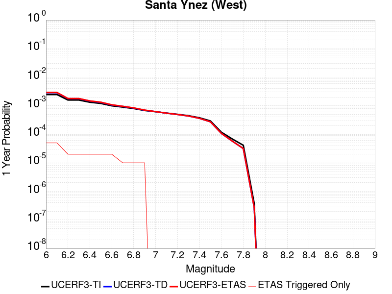 |  |

| Magnitude | 1 wk TI Prob | 1 wk TD Prob | 1 wk ETAS Prob | 1 wk ETAS/TD Gain | 1 wk ETAS Triggered Only | 1 mo TI Prob | 1 mo TD Prob | 1 mo ETAS Prob | 1 mo ETAS/TD Gain | 1 mo ETAS Triggered Only | 1 yr TI Prob | 1 yr TD Prob | 1 yr ETAS Prob | 1 yr ETAS/TD Gain | 1 yr ETAS Triggered Only | 10 yr TI Prob | 10 yr TD Prob | 10 yr ETAS Prob | 10 yr ETAS/TD Gain | 10 yr ETAS Triggered Only |
|-----|-----|-----|-----|-----|-----|-----|-----|-----|-----|-----|-----|-----|-----|-----|-----|-----|-----|-----|-----|-----|
| 6.0 | 4.7352758E-5 | 5.497896E-5 | 5.497896E-5 | 1.0 | 0.0 | 2.0292461E-4 | 2.3560449E-4 | 2.3560449E-4 | 1.0 | 0.0 | 0.0024678076 | 0.0028648688 | 0.0029092478 | 1.0154908 | 4.4506425E-5 | 0.024405818 | 0.02830781 | 0.028365472 | 1.0020369 | 5.93419E-5 |
| 6.1 | 4.7352758E-5 | 5.497896E-5 | 5.497896E-5 | 1.0 | 0.0 | 2.0292461E-4 | 2.3560449E-4 | 2.3560449E-4 | 1.0 | 0.0 | 0.0024678076 | 0.0028648688 | 0.0029092478 | 1.0154908 | 4.4506425E-5 | 0.024405818 | 0.02830781 | 0.028365472 | 1.0020369 | 5.93419E-5 |
| 6.2 | 3.0415853E-5 | 3.3928485E-5 | 3.3928485E-5 | 1.0 | 0.0 | 1.3034715E-4 | 1.453999E-4 | 1.453999E-4 | 1.0 | 0.0 | 0.0015858212 | 0.0017688414 | 0.0017836506 | 1.0083723 | 1.4835475E-5 | 0.015745522 | 0.017551528 | 0.017595252 | 1.0024912 | 4.4506425E-5 |
| 6.3 | 3.0415853E-5 | 3.3928485E-5 | 3.3928485E-5 | 1.0 | 0.0 | 1.3034715E-4 | 1.453999E-4 | 1.453999E-4 | 1.0 | 0.0 | 0.0015858212 | 0.0017688414 | 0.0017836506 | 1.0083723 | 1.4835475E-5 | 0.015745522 | 0.017551528 | 0.017595252 | 1.0024912 | 4.4506425E-5 |
| 6.4 | 2.5452082E-5 | 2.7914939E-5 | 2.7914939E-5 | 1.0 | 0.0 | 1.09075794E-4 | 1.1963007E-4 | 1.1963007E-4 | 1.0 | 0.0 | 0.0013271887 | 0.0014555396 | 0.0014703535 | 1.0101776 | 1.4835475E-5 | 0.013192902 | 0.014462244 | 0.014506106 | 1.0030329 | 4.4506425E-5 |
| 6.5 | 2.3143784E-5 | 2.513039E-5 | 2.513039E-5 | 1.0 | 0.0 | 9.9183875E-5 | 1.076973E-4 | 1.076973E-4 | 1.0 | 0.0 | 0.0012068948 | 0.0013104375 | 0.0013252535 | 1.0113062 | 1.4835475E-5 | 0.012003611 | 0.013028777 | 0.013058062 | 1.0022477 | 2.967095E-5 |
| 6.6 | 1.9118515E-5 | 2.035588E-5 | 2.035588E-5 | 1.0 | 0.0 | 8.193392E-5 | 8.723661E-5 | 8.723661E-5 | 1.0 | 0.0 | 9.97089E-4 | 0.0010615962 | 0.001076416 | 1.0139599 | 1.4835475E-5 | 0.00992627 | 0.010566159 | 0.010580839 | 1.0013893 | 1.4835475E-5 |
| 6.7 | 1.722807E-5 | 1.8147639E-5 | 1.8147639E-5 | 1.0 | 0.0 | 7.3832496E-5 | 7.777331E-5 | 7.777331E-5 | 1.0 | 0.0 | 8.985399E-4 | 9.464843E-4 | 9.464843E-4 | 1.0 | 0.0 | 0.008949154 | 0.009425177 | 0.009425177 | 1.0 | 0.0 |
| 6.8 | 1.5317364E-5 | 1.5927537E-5 | 1.5927537E-5 | 1.0 | 0.0 | 6.56442E-5 | 6.8259105E-5 | 6.8259105E-5 | 1.0 | 0.0 | 7.98925E-4 | 8.3074206E-4 | 8.3074206E-4 | 1.0 | 0.0 | 0.007960589 | 0.008276854 | 0.008276854 | 1.0 | 0.0 |
| 6.9 | 1.3071226E-5 | 1.3330405E-5 | 1.3330405E-5 | 1.0 | 0.0 | 5.6018336E-5 | 5.7129066E-5 | 5.7129066E-5 | 1.0 | 0.0 | 6.8180985E-4 | 6.9532666E-4 | 6.9532666E-4 | 1.0 | 0.0 | 0.0067972173 | 0.0069317715 | 0.0069317715 | 1.0 | 0.0 |
| 7.0 | 1.1836986E-5 | 1.1933439E-5 | 1.1933439E-5 | 1.0 | 0.0 | 5.0728955E-5 | 5.1142317E-5 | 5.1142317E-5 | 1.0 | 0.0 | 6.1745E-4 | 6.224815E-4 | 6.224815E-4 | 1.0 | 0.0 | 0.006157372 | 0.006207572 | 0.006207572 | 1.0 | 0.0 |
| 7.1 | 1.0597169E-5 | 1.0542745E-5 | 1.0542745E-5 | 1.0 | 0.0 | 4.541565E-5 | 4.5182416E-5 | 4.5182416E-5 | 1.0 | 0.0 | 5.5279525E-4 | 5.499582E-4 | 5.499582E-4 | 1.0 | 0.0 | 0.0055142213 | 0.0054861032 | 0.0054861032 | 1.0 | 0.0 |
| 7.2 | 9.59113E-6 | 9.459633E-6 | 9.459633E-6 | 1.0 | 0.0 | 4.11042E-5 | 4.0540657E-5 | 4.0540657E-5 | 1.0 | 0.0 | 5.0032866E-4 | 4.934718E-4 | 4.934718E-4 | 1.0 | 0.0 | 0.004992037 | 0.0049238787 | 0.0049238787 | 1.0 | 0.0 |
| 7.3 | 8.586084E-6 | 8.380018E-6 | 8.380018E-6 | 1.0 | 0.0 | 3.679698E-5 | 3.5913876E-5 | 3.5913876E-5 | 1.0 | 0.0 | 4.4791115E-4 | 4.3716474E-4 | 4.3716474E-4 | 1.0 | 0.0 | 0.004470094 | 0.0043631587 | 0.0043631587 | 1.0 | 0.0 |
| 7.4 | 7.2622997E-6 | 6.9519006E-6 | 6.9519006E-6 | 1.0 | 0.0 | 3.112377E-5 | 2.9793526E-5 | 2.9793526E-5 | 1.0 | 0.0 | 3.78866E-4 | 3.6267677E-4 | 3.6267677E-4 | 1.0 | 0.0 | 0.0037822074 | 0.003620949 | 0.003620949 | 1.0 | 0.0 |
| 7.5 | 5.627296E-6 | 5.2518485E-6 | 5.2518485E-6 | 1.0 | 0.0 | 2.411676E-5 | 2.2507731E-5 | 2.2507731E-5 | 1.0 | 0.0 | 2.9358198E-4 | 2.7399787E-4 | 2.7399787E-4 | 1.0 | 0.0 | 0.0029319443 | 0.0027366725 | 0.0027366725 | 1.0 | 0.0 |
| 7.6 | 2.265244E-6 | 2.0609473E-6 | 2.0609473E-6 | 1.0 | 0.0 | 9.708152E-6 | 8.832602E-6 | 8.832602E-6 | 1.0 | 0.0 | 1.18190335E-4 | 1.0753171E-4 | 1.0753171E-4 | 1.0 | 0.0 | 0.001181275 | 0.0010748054 | 0.0010748054 | 1.0 | 0.0 |
| 7.7 | 1.3099874E-6 | 1.1016746E-6 | 1.1016746E-6 | 1.0 | 0.0 | 5.61422E-6 | 4.721454E-6 | 4.721454E-6 | 1.0 | 0.0 | 6.8350986E-5 | 5.748221E-5 | 5.748221E-5 | 1.0 | 0.0 | 6.832996E-4 | 5.746758E-4 | 5.746758E-4 | 1.0 | 0.0 |
| 7.8 | 7.903951E-7 | 6.071387E-7 | 6.071387E-7 | 1.0 | 0.0 | 3.3874032E-6 | 2.6020205E-6 | 2.6020205E-6 | 1.0 | 0.0 | 4.1240855E-5 | 3.1679152E-5 | 3.1679152E-5 | 1.0 | 0.0 | 4.12332E-4 | 3.167477E-4 | 3.167477E-4 | 1.0 | 0.0 |
| 7.9 | 7.0753297E-9 | 5.090102E-9 | 5.090102E-9 | 1.0 | 0.0 | 3.032284E-8 | 2.1814724E-8 | 2.1814724E-8 | 1.0 | 0.0 | 3.6918053E-7 | 2.6559422E-7 | 2.6559422E-7 | 1.0 | 0.0 | 3.691799E-6 | 2.65594E-6 | 2.65594E-6 | 1.0 | 0.0 |

## Channel Islands Thrust
*[(top)](#table-of-contents)*

| 1 Week | 1 Month | 1 Year | 10 Year |
|-----|-----|-----|-----|
| 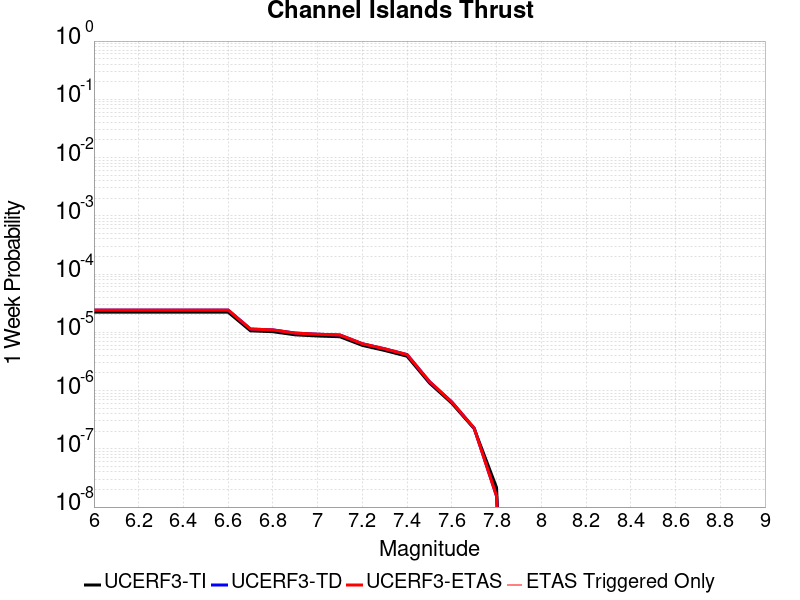 |  |  |  |

| Magnitude | 1 wk TI Prob | 1 wk TD Prob | 1 wk ETAS Prob | 1 wk ETAS/TD Gain | 1 wk ETAS Triggered Only | 1 mo TI Prob | 1 mo TD Prob | 1 mo ETAS Prob | 1 mo ETAS/TD Gain | 1 mo ETAS Triggered Only | 1 yr TI Prob | 1 yr TD Prob | 1 yr ETAS Prob | 1 yr ETAS/TD Gain | 1 yr ETAS Triggered Only | 10 yr TI Prob | 10 yr TD Prob | 10 yr ETAS Prob | 10 yr ETAS/TD Gain | 10 yr ETAS Triggered Only |
|-----|-----|-----|-----|-----|-----|-----|-----|-----|-----|-----|-----|-----|-----|-----|-----|-----|-----|-----|-----|-----|
| 6.0 | 2.2156251E-5 | 2.4093428E-5 | 2.4093428E-5 | 1.0 | 0.0 | 9.495191E-5 | 1.0325406E-4 | 1.0325406E-4 | 1.0 | 0.0 | 0.0011554264 | 0.0012564998 | 0.0013009503 | 1.0353764 | 4.4506425E-5 | 0.011494373 | 0.012504547 | 0.012577796 | 1.0058578 | 7.417738E-5 |
| 6.1 | 2.2156251E-5 | 2.4093428E-5 | 2.4093428E-5 | 1.0 | 0.0 | 9.495191E-5 | 1.0325406E-4 | 1.0325406E-4 | 1.0 | 0.0 | 0.0011554264 | 0.0012564998 | 0.0013009503 | 1.0353764 | 4.4506425E-5 | 0.011494373 | 0.012504547 | 0.012577796 | 1.0058578 | 7.417738E-5 |
| 6.2 | 2.2156251E-5 | 2.4093428E-5 | 2.4093428E-5 | 1.0 | 0.0 | 9.495191E-5 | 1.0325406E-4 | 1.0325406E-4 | 1.0 | 0.0 | 0.0011554264 | 0.0012564998 | 0.0013009503 | 1.0353764 | 4.4506425E-5 | 0.011494373 | 0.012504547 | 0.012577796 | 1.0058578 | 7.417738E-5 |
| 6.3 | 2.2156251E-5 | 2.4093428E-5 | 2.4093428E-5 | 1.0 | 0.0 | 9.495191E-5 | 1.0325406E-4 | 1.0325406E-4 | 1.0 | 0.0 | 0.0011554264 | 0.0012564998 | 0.0013009503 | 1.0353764 | 4.4506425E-5 | 0.011494373 | 0.012504547 | 0.012577796 | 1.0058578 | 7.417738E-5 |
| 6.4 | 2.2156251E-5 | 2.4093428E-5 | 2.4093428E-5 | 1.0 | 0.0 | 9.495191E-5 | 1.0325406E-4 | 1.0325406E-4 | 1.0 | 0.0 | 0.0011554264 | 0.0012564998 | 0.0013009503 | 1.0353764 | 4.4506425E-5 | 0.011494373 | 0.012504547 | 0.012577796 | 1.0058578 | 7.417738E-5 |
| 6.5 | 2.2156251E-5 | 2.4093428E-5 | 2.4093428E-5 | 1.0 | 0.0 | 9.495191E-5 | 1.0325406E-4 | 1.0325406E-4 | 1.0 | 0.0 | 0.0011554264 | 0.0012564998 | 0.0013009503 | 1.0353764 | 4.4506425E-5 | 0.011494373 | 0.012504547 | 0.012577796 | 1.0058578 | 7.417738E-5 |
| 6.6 | 2.2156251E-5 | 2.4093428E-5 | 2.4093428E-5 | 1.0 | 0.0 | 9.495191E-5 | 1.0325406E-4 | 1.0325406E-4 | 1.0 | 0.0 | 0.0011554264 | 0.0012564998 | 0.0013009503 | 1.0353764 | 4.4506425E-5 | 0.011494373 | 0.012504547 | 0.012577796 | 1.0058578 | 7.417738E-5 |
| 6.7 | 1.0601296E-5 | 1.1380105E-5 | 1.1380105E-5 | 1.0 | 0.0 | 4.5433335E-5 | 4.8770995E-5 | 4.8770995E-5 | 1.0 | 0.0 | 5.5301044E-4 | 5.9362996E-4 | 6.232833E-4 | 1.0499525 | 2.967095E-5 | 0.005516363 | 0.0059209447 | 0.0059651877 | 1.0074723 | 4.4506425E-5 |
| 6.8 | 1.0246747E-5 | 1.099721E-5 | 1.099721E-5 | 1.0 | 0.0 | 4.391389E-5 | 4.7130077E-5 | 4.7130077E-5 | 1.0 | 0.0 | 5.345204E-4 | 5.736624E-4 | 6.033163E-4 | 1.0516922 | 2.967095E-5 | 0.0053323656 | 0.0057223057 | 0.0057665575 | 1.0077332 | 4.4506425E-5 |
| 6.9 | 9.049551E-6 | 9.700114E-6 | 9.700114E-6 | 1.0 | 0.0 | 3.878322E-5 | 4.157128E-5 | 4.157128E-5 | 1.0 | 0.0 | 4.7208337E-4 | 5.060169E-4 | 5.356728E-4 | 1.0586066 | 2.967095E-5 | 0.0047108172 | 0.005049064 | 0.005093346 | 1.0087702 | 4.4506425E-5 |
| 7.0 | 8.6542195E-6 | 9.2750515E-6 | 9.2750515E-6 | 1.0 | 0.0 | 3.7088983E-5 | 3.9749637E-5 | 3.9749637E-5 | 1.0 | 0.0 | 4.5146482E-4 | 4.8384845E-4 | 5.13505E-4 | 1.0612931 | 2.967095E-5 | 0.004505487 | 0.004828362 | 0.00485789 | 1.0061154 | 2.967095E-5 |
| 7.1 | 8.391028E-6 | 8.99336E-6 | 8.99336E-6 | 1.0 | 0.0 | 3.5961057E-5 | 3.8542425E-5 | 3.8542425E-5 | 1.0 | 0.0 | 4.3773788E-4 | 4.6915706E-4 | 4.988141E-4 | 1.0632135 | 2.967095E-5 | 0.004368766 | 0.004682076 | 0.0047116084 | 1.0063075 | 2.967095E-5 |
| 7.2 | 5.965188E-6 | 6.3719904E-6 | 6.3719904E-6 | 1.0 | 0.0 | 2.556484E-5 | 2.7308246E-5 | 2.7308246E-5 | 1.0 | 0.0 | 3.1120746E-4 | 3.3242773E-4 | 3.4725826E-4 | 1.0446129 | 1.4835475E-5 | 0.00310772 | 0.0033193626 | 0.003334149 | 1.0044545 | 1.4835475E-5 |
| 7.3 | 4.877518E-6 | 5.206246E-6 | 5.206246E-6 | 1.0 | 0.0 | 2.0903482E-5 | 2.2312295E-5 | 2.2312295E-5 | 1.0 | 0.0 | 2.5447016E-4 | 2.7161877E-4 | 2.864502E-4 | 1.0546039 | 1.4835475E-5 | 0.0025417898 | 0.002712914 | 0.0027277092 | 1.0054536 | 1.4835475E-5 |
| 7.4 | 3.8829853E-6 | 4.1420526E-6 | 4.1420526E-6 | 1.0 | 0.0 | 1.664126E-5 | 1.7751536E-5 | 1.7751536E-5 | 1.0 | 0.0 | 2.0258849E-4 | 2.1610393E-4 | 2.309362E-4 | 1.0686349 | 1.4835475E-5 | 0.002024039 | 0.0021589797 | 0.002173783 | 1.0068567 | 1.4835475E-5 |
| 7.5 | 1.3489616E-6 | 1.4278522E-6 | 1.4278522E-6 | 1.0 | 0.0 | 5.7812517E-6 | 6.1193527E-6 | 6.1193527E-6 | 1.0 | 0.0 | 7.038446E-5 | 7.450061E-5 | 8.933498E-5 | 1.1991174 | 1.4835475E-5 | 7.036218E-4 | 7.447603E-4 | 7.595848E-4 | 1.019905 | 1.4835475E-5 |
| 7.6 | 6.058192E-7 | 6.354047E-7 | 6.354047E-7 | 1.0 | 0.0 | 2.5963652E-6 | 2.7231604E-6 | 2.7231604E-6 | 1.0 | 0.0 | 3.161029E-5 | 3.315399E-5 | 3.315399E-5 | 1.0 | 0.0 | 3.1605794E-4 | 3.3149205E-4 | 3.3149205E-4 | 1.0 | 0.0 |
| 7.7 | 2.2170494E-7 | 2.2608788E-7 | 2.2608788E-7 | 1.0 | 0.0 | 9.5016367E-7 | 9.689477E-7 | 9.689477E-7 | 1.0 | 0.0 | 1.1568181E-5 | 1.1796886E-5 | 1.1796886E-5 | 1.0 | 0.0 | 1.1567579E-4 | 1.17963704E-4 | 1.17963704E-4 | 1.0 | 0.0 |
| 7.8 | 2.1613102E-8 | 1.5467215E-8 | 1.5467215E-8 | 1.0 | 0.0 | 9.262757E-8 | 6.628806E-8 | 6.628806E-8 | 1.0 | 0.0 | 1.1277401E-6 | 8.070569E-7 | 8.070569E-7 | 1.0 | 0.0 | 1.1277344E-5 | 8.070548E-6 | 8.070548E-6 | 1.0 | 0.0 |

## Mission Creek
*[(top)](#table-of-contents)*

| 1 Week | 1 Month | 1 Year | 10 Year |
|-----|-----|-----|-----|
|  |  |  |  |

| Magnitude | 1 wk TI Prob | 1 wk TD Prob | 1 wk ETAS Prob | 1 wk ETAS/TD Gain | 1 wk ETAS Triggered Only | 1 mo TI Prob | 1 mo TD Prob | 1 mo ETAS Prob | 1 mo ETAS/TD Gain | 1 mo ETAS Triggered Only | 1 yr TI Prob | 1 yr TD Prob | 1 yr ETAS Prob | 1 yr ETAS/TD Gain | 1 yr ETAS Triggered Only | 10 yr TI Prob | 10 yr TD Prob | 10 yr ETAS Prob | 10 yr ETAS/TD Gain | 10 yr ETAS Triggered Only |
|-----|-----|-----|-----|-----|-----|-----|-----|-----|-----|-----|-----|-----|-----|-----|-----|-----|-----|-----|-----|-----|
| 6.0 | 1.1549387E-5 | 1.6334085E-5 | 1.6334085E-5 | 1.0 | 0.0 | 4.9496433E-5 | 7.000143E-5 | 7.000143E-5 | 1.0 | 0.0 | 6.0245243E-4 | 8.5194915E-4 | 8.9641765E-4 | 1.0521961 | 4.4506425E-5 | 0.006008218 | 0.008515928 | 0.008574765 | 1.006909 | 5.93419E-5 |
| 6.1 | 1.1549387E-5 | 1.6334085E-5 | 1.6334085E-5 | 1.0 | 0.0 | 4.9496433E-5 | 7.000143E-5 | 7.000143E-5 | 1.0 | 0.0 | 6.0245243E-4 | 8.5194915E-4 | 8.9641765E-4 | 1.0521961 | 4.4506425E-5 | 0.006008218 | 0.008515928 | 0.008574765 | 1.006909 | 5.93419E-5 |
| 6.2 | 1.1549387E-5 | 1.6334085E-5 | 1.6334085E-5 | 1.0 | 0.0 | 4.9496433E-5 | 7.000143E-5 | 7.000143E-5 | 1.0 | 0.0 | 6.0245243E-4 | 8.5194915E-4 | 8.9641765E-4 | 1.0521961 | 4.4506425E-5 | 0.006008218 | 0.008515928 | 0.008574765 | 1.006909 | 5.93419E-5 |
| 6.3 | 1.1549387E-5 | 1.6334085E-5 | 1.6334085E-5 | 1.0 | 0.0 | 4.9496433E-5 | 7.000143E-5 | 7.000143E-5 | 1.0 | 0.0 | 6.0245243E-4 | 8.5194915E-4 | 8.9641765E-4 | 1.0521961 | 4.4506425E-5 | 0.006008218 | 0.008515928 | 0.008574765 | 1.006909 | 5.93419E-5 |
| 6.4 | 1.1549387E-5 | 1.6334085E-5 | 1.6334085E-5 | 1.0 | 0.0 | 4.9496433E-5 | 7.000143E-5 | 7.000143E-5 | 1.0 | 0.0 | 6.0245243E-4 | 8.5194915E-4 | 8.9641765E-4 | 1.0521961 | 4.4506425E-5 | 0.006008218 | 0.008515928 | 0.008574765 | 1.006909 | 5.93419E-5 |
| 6.5 | 1.1549387E-5 | 1.6334085E-5 | 1.6334085E-5 | 1.0 | 0.0 | 4.9496433E-5 | 7.000143E-5 | 7.000143E-5 | 1.0 | 0.0 | 6.0245243E-4 | 8.5194915E-4 | 8.9641765E-4 | 1.0521961 | 4.4506425E-5 | 0.006008218 | 0.008515928 | 0.008574765 | 1.006909 | 5.93419E-5 |
| 6.6 | 9.202681E-6 | 1.38572705E-5 | 1.38572705E-5 | 1.0 | 0.0 | 3.9439463E-5 | 5.9387003E-5 | 5.9387003E-5 | 1.0 | 0.0 | 4.800697E-4 | 7.228059E-4 | 7.672802E-4 | 1.06153 | 4.4506425E-5 | 0.004790339 | 0.0072330725 | 0.007291985 | 1.0081449 | 5.93419E-5 |
| 6.7 | 9.019164E-6 | 1.3662932E-5 | 1.3662932E-5 | 1.0 | 0.0 | 3.8652986E-5 | 5.855416E-5 | 5.855416E-5 | 1.0 | 0.0 | 4.7049852E-4 | 7.126727E-4 | 7.5714744E-4 | 1.0624055 | 4.4506425E-5 | 0.004695036 | 0.0071323933 | 0.007191312 | 1.0082607 | 5.93419E-5 |
| 6.8 | 8.673558E-6 | 1.3285018E-5 | 1.3285018E-5 | 1.0 | 0.0 | 3.717186E-5 | 5.69346E-5 | 5.69346E-5 | 1.0 | 0.0 | 4.524734E-4 | 6.9296715E-4 | 7.3744275E-4 | 1.0641813 | 4.4506425E-5 | 0.0045155324 | 0.00693657 | 0.0069955 | 1.0084956 | 5.93419E-5 |
| 6.9 | 7.002255E-6 | 1.1489158E-5 | 1.1489158E-5 | 1.0 | 0.0 | 3.000932E-5 | 4.923836E-5 | 4.923836E-5 | 1.0 | 0.0 | 3.653022E-4 | 5.99319E-4 | 6.4379873E-4 | 1.0742172 | 4.4506425E-5 | 0.0036470229 | 0.006005352 | 0.0060643377 | 1.0098221 | 5.93419E-5 |
| 7.0 | 5.84644E-6 | 9.685895E-6 | 9.685895E-6 | 1.0 | 0.0 | 2.5055931E-5 | 4.1510346E-5 | 4.1510346E-5 | 1.0 | 0.0 | 3.0501327E-4 | 5.052758E-4 | 5.497598E-4 | 1.0880389 | 4.4506425E-5 | 0.0030459496 | 0.0050693876 | 0.005128429 | 1.0116466 | 5.93419E-5 |
| 7.1 | 5.54703E-6 | 9.340331E-6 | 9.340331E-6 | 1.0 | 0.0 | 2.377277E-5 | 4.0029405E-5 | 4.0029405E-5 | 1.0 | 0.0 | 2.8939504E-4 | 4.8725348E-4 | 5.317382E-4 | 1.0912969 | 4.4506425E-5 | 0.0028901845 | 0.0048899623 | 0.004949014 | 1.0120761 | 5.93419E-5 |
| 7.2 | 4.384709E-6 | 7.691962E-6 | 7.691962E-6 | 1.0 | 0.0 | 1.8791474E-5 | 3.2965156E-5 | 3.2965156E-5 | 1.0 | 0.0 | 2.2876218E-4 | 4.012805E-4 | 4.4576908E-4 | 1.1108665 | 4.4506425E-5 | 0.0022852682 | 0.004033635 | 0.004092737 | 1.0146524 | 5.93419E-5 |
| 7.3 | 3.7888456E-6 | 6.9256384E-6 | 6.9256384E-6 | 1.0 | 0.0 | 1.623781E-5 | 2.9680989E-5 | 2.9680989E-5 | 1.0 | 0.0 | 1.9767738E-4 | 3.6130947E-4 | 3.9096968E-4 | 1.082091 | 2.967095E-5 | 0.0019750162 | 0.0036352798 | 0.0036796245 | 1.0121984 | 4.4506425E-5 |
| 7.4 | 2.1982462E-6 | 5.0336607E-6 | 5.0336607E-6 | 1.0 | 0.0 | 9.421021E-6 | 2.1572656E-5 | 2.1572656E-5 | 1.0 | 0.0 | 1.1469489E-4 | 2.6261562E-4 | 2.9227877E-4 | 1.1129527 | 2.967095E-5 | 0.0011463572 | 0.0026508973 | 0.0026952857 | 1.0167447 | 4.4506425E-5 |
| 7.5 | 2.051923E-6 | 4.624632E-6 | 4.624632E-6 | 1.0 | 0.0 | 8.793926E-6 | 1.9819701E-5 | 1.9819701E-5 | 1.0 | 0.0 | 1.0706078E-4 | 2.4127828E-4 | 2.7094205E-4 | 1.1229444 | 2.967095E-5 | 0.0010700922 | 0.002438417 | 0.0024828147 | 1.0182077 | 4.4506425E-5 |
| 7.6 | 1.8733427E-6 | 4.1326616E-6 | 4.1326616E-6 | 1.0 | 0.0 | 8.028587E-6 | 1.7711287E-5 | 1.7711287E-5 | 1.0 | 0.0 | 9.774366E-5 | 2.1561366E-4 | 2.452782E-4 | 1.137582 | 2.967095E-5 | 9.770069E-4 | 0.0021827868 | 0.002227196 | 1.0203452 | 4.4506425E-5 |
| 7.7 | 1.8411953E-6 | 4.052274E-6 | 4.052274E-6 | 1.0 | 0.0 | 7.890813E-6 | 1.7366774E-5 | 1.7366774E-5 | 1.0 | 0.0 | 9.606641E-5 | 2.1142005E-4 | 2.4108472E-4 | 1.1403116 | 2.967095E-5 | 9.6024893E-4 | 0.0021410403 | 0.0021854516 | 1.0207428 | 4.4506425E-5 |
| 7.8 | 1.7194251E-6 | 3.7190198E-6 | 3.7190198E-6 | 1.0 | 0.0 | 7.368944E-6 | 1.593856E-5 | 1.593856E-5 | 1.0 | 0.0 | 8.97132E-5 | 1.9403476E-4 | 2.2369994E-4 | 1.1528859 | 2.967095E-5 | 8.967699E-4 | 0.0019667058 | 0.0020111247 | 1.0225854 | 4.4506425E-5 |
| 7.9 | 1.4035052E-6 | 2.9571077E-6 | 2.9571077E-6 | 1.0 | 0.0 | 6.0150082E-6 | 1.26732575E-5 | 1.26732575E-5 | 1.0 | 0.0 | 7.3230265E-5 | 1.5428604E-4 | 1.8395242E-4 | 1.1922816 | 2.967095E-5 | 7.3206134E-4 | 0.0015666767 | 0.0016111133 | 1.0283637 | 4.4506425E-5 |
| 8.0 | 3.9318823E-7 | 5.545711E-7 | 5.545711E-7 | 1.0 | 0.0 | 1.6850913E-6 | 2.3767311E-6 | 2.3767311E-6 | 1.0 | 0.0 | 2.0515794E-5 | 2.8936322E-5 | 2.8936322E-5 | 1.0 | 0.0 | 2.0513899E-4 | 2.9988916E-4 | 3.1472018E-4 | 1.049455 | 1.4835475E-5 |
| 8.1 | 1.596793E-7 | 1.1439565E-7 | 1.1439565E-7 | 1.0 | 0.0 | 6.8433974E-7 | 4.90267E-7 | 4.90267E-7 | 1.0 | 0.0 | 8.331805E-6 | 5.968984E-6 | 5.968984E-6 | 1.0 | 0.0 | 8.331492E-5 | 6.5823275E-5 | 6.5823275E-5 | 1.0 | 0.0 |
| 8.2 | 4.9003038E-8 | 2.5596048E-8 | 2.5596048E-8 | 1.0 | 0.0 | 2.10013E-7 | 1.0969734E-7 | 1.0969734E-7 | 1.0 | 0.0 | 2.5569052E-6 | 1.3355643E-6 | 1.3355643E-6 | 1.0 | 0.0 | 2.556876E-5 | 1.5040106E-5 | 1.5040106E-5 | 1.0 | 0.0 |

## Mission Ridge-Arroyo Parida-Santa Ana
*[(top)](#table-of-contents)*

| 1 Week | 1 Month | 1 Year | 10 Year |
|-----|-----|-----|-----|
|  |  |  |  |

| Magnitude | 1 wk TI Prob | 1 wk TD Prob | 1 wk ETAS Prob | 1 wk ETAS/TD Gain | 1 wk ETAS Triggered Only | 1 mo TI Prob | 1 mo TD Prob | 1 mo ETAS Prob | 1 mo ETAS/TD Gain | 1 mo ETAS Triggered Only | 1 yr TI Prob | 1 yr TD Prob | 1 yr ETAS Prob | 1 yr ETAS/TD Gain | 1 yr ETAS Triggered Only | 10 yr TI Prob | 10 yr TD Prob | 10 yr ETAS Prob | 10 yr ETAS/TD Gain | 10 yr ETAS Triggered Only |
|-----|-----|-----|-----|-----|-----|-----|-----|-----|-----|-----|-----|-----|-----|-----|-----|-----|-----|-----|-----|-----|
| 6.0 | 4.169034E-5 | 4.7144917E-5 | 4.7144917E-5 | 1.0 | 0.0 | 1.7866064E-4 | 2.0203886E-4 | 2.0203886E-4 | 1.0 | 0.0 | 0.0021730233 | 0.0024577766 | 0.0025021737 | 1.0180639 | 4.4506425E-5 | 0.021518968 | 0.024387965 | 0.024431387 | 1.0017804 | 4.4506425E-5 |
| 6.1 | 1.73813E-5 | 1.6855834E-5 | 1.6855834E-5 | 1.0 | 0.0 | 7.4489166E-5 | 7.223735E-5 | 7.223735E-5 | 1.0 | 0.0 | 9.065282E-4 | 8.791457E-4 | 9.0879056E-4 | 1.0337201 | 2.967095E-5 | 0.009028391 | 0.00875782 | 0.0087872315 | 1.0033582 | 2.967095E-5 |
| 6.2 | 1.4622182E-5 | 1.3674571E-5 | 1.3674571E-5 | 1.0 | 0.0 | 6.2664985E-5 | 5.860401E-5 | 5.860401E-5 | 1.0 | 0.0 | 7.6267915E-4 | 7.132741E-4 | 7.28099E-4 | 1.0207843 | 1.4835475E-5 | 0.007600669 | 0.007110291 | 0.007139751 | 1.0041432 | 2.967095E-5 |
| 6.3 | 1.3552434E-5 | 1.2483391E-5 | 1.2483391E-5 | 1.0 | 0.0 | 5.8080568E-5 | 5.349917E-5 | 5.349917E-5 | 1.0 | 0.0 | 7.069015E-4 | 6.511609E-4 | 6.6598674E-4 | 1.0227683 | 1.4835475E-5 | 0.00704657 | 0.0064928923 | 0.0065223705 | 1.0045401 | 2.967095E-5 |
| 6.4 | 1.30977305E-5 | 1.1980312E-5 | 1.1980312E-5 | 1.0 | 0.0 | 5.613192E-5 | 5.13432E-5 | 5.13432E-5 | 1.0 | 0.0 | 6.831918E-4 | 6.2492717E-4 | 6.3975336E-4 | 1.0237247 | 1.4835475E-5 | 0.006810953 | 0.0062320433 | 0.0062615294 | 1.0047314 | 2.967095E-5 |
| 6.5 | 1.225205E-5 | 1.1049896E-5 | 1.1049896E-5 | 1.0 | 0.0 | 5.2507727E-5 | 4.7355854E-5 | 4.7355854E-5 | 1.0 | 0.0 | 6.3909404E-4 | 5.764077E-4 | 5.912346E-4 | 1.025723 | 1.4835475E-5 | 0.006372592 | 0.005749436 | 0.0057789367 | 1.005131 | 2.967095E-5 |
| 6.6 | 1.1352241E-5 | 1.0064566E-5 | 1.0064566E-5 | 1.0 | 0.0 | 4.8651553E-5 | 4.3133154E-5 | 4.3133154E-5 | 1.0 | 0.0 | 5.921717E-4 | 5.250217E-4 | 5.398494E-4 | 1.028242 | 1.4835475E-5 | 0.0059059616 | 0.0052380594 | 0.005267575 | 1.0056348 | 2.967095E-5 |
| 6.7 | 1.0864116E-5 | 9.518014E-6 | 9.518014E-6 | 1.0 | 0.0 | 4.6559664E-5 | 4.0790863E-5 | 4.0790863E-5 | 1.0 | 0.0 | 5.667165E-4 | 4.965176E-4 | 5.113457E-4 | 1.0298642 | 1.4835475E-5 | 0.005652734 | 0.004954316 | 0.00498384 | 1.0059593 | 2.967095E-5 |
| 6.8 | 1.0666365E-5 | 9.300751E-6 | 9.300751E-6 | 1.0 | 0.0 | 4.571219E-5 | 3.9859766E-5 | 3.9859766E-5 | 1.0 | 0.0 | 5.564038E-4 | 4.8518658E-4 | 5.0001487E-4 | 1.030562 | 1.4835475E-5 | 0.005550127 | 0.004841505 | 0.0048710327 | 1.0060987 | 2.967095E-5 |
| 6.9 | 1.0038665E-5 | 8.592958E-6 | 8.592958E-6 | 1.0 | 0.0 | 4.302214E-5 | 3.6826452E-5 | 3.6826452E-5 | 1.0 | 0.0 | 5.236687E-4 | 4.4827163E-4 | 4.6310047E-4 | 1.03308 | 1.4835475E-5 | 0.005224364 | 0.004473885 | 0.0045034233 | 1.0066024 | 2.967095E-5 |
| 7.0 | 9.5379955E-6 | 8.025933E-6 | 8.025933E-6 | 1.0 | 0.0 | 4.0876483E-5 | 3.4396413E-5 | 3.4396413E-5 | 1.0 | 0.0 | 4.975576E-4 | 4.1869757E-4 | 4.3352685E-4 | 1.0354176 | 1.4835475E-5 | 0.00496445 | 0.004179287 | 0.004208834 | 1.0070698 | 2.967095E-5 |
| 7.1 | 9.207389E-6 | 7.6532E-6 | 7.6532E-6 | 1.0 | 0.0 | 3.945964E-5 | 3.2799024E-5 | 3.2799024E-5 | 1.0 | 0.0 | 4.803152E-4 | 3.9925665E-4 | 4.140862E-4 | 1.0371429 | 1.4835475E-5 | 0.004792784 | 0.00398559 | 0.0040151426 | 1.0074149 | 2.967095E-5 |
| 7.2 | 7.638091E-6 | 5.931759E-6 | 5.931759E-6 | 1.0 | 0.0 | 3.2734264E-5 | 2.5421577E-5 | 2.5421577E-5 | 1.0 | 0.0 | 3.984668E-4 | 3.0946406E-4 | 3.0946406E-4 | 1.0 | 0.0 | 0.0039775306 | 0.003090388 | 0.0031051775 | 1.0047857 | 1.4835475E-5 |
| 7.3 | 7.2500147E-6 | 5.596759E-6 | 5.596759E-6 | 1.0 | 0.0 | 3.1071122E-5 | 2.3985891E-5 | 2.3985891E-5 | 1.0 | 0.0 | 3.7822526E-4 | 2.919894E-4 | 2.919894E-4 | 1.0 | 0.0 | 0.0037758215 | 0.002916113 | 0.0029309052 | 1.0050726 | 1.4835475E-5 |
| 7.4 | 6.3899715E-6 | 4.91903E-6 | 4.91903E-6 | 1.0 | 0.0 | 2.7385306E-5 | 2.1081387E-5 | 2.1081387E-5 | 1.0 | 0.0 | 3.3336508E-4 | 2.5663586E-4 | 2.5663586E-4 | 1.0 | 0.0 | 0.0033286542 | 0.0025634393 | 0.0025782369 | 1.0057725 | 1.4835475E-5 |
| 7.5 | 5.379025E-6 | 4.0842747E-6 | 4.0842747E-6 | 1.0 | 0.0 | 2.305276E-5 | 1.7503917E-5 | 1.7503917E-5 | 1.0 | 0.0 | 2.806312E-4 | 2.1308946E-4 | 2.1308946E-4 | 1.0 | 0.0 | 0.0028027708 | 0.0021288625 | 0.0021436666 | 1.006954 | 1.4835475E-5 |
| 7.6 | 4.1270696E-6 | 3.0886058E-6 | 3.0886058E-6 | 1.0 | 0.0 | 1.768732E-5 | 1.3236815E-5 | 1.3236815E-5 | 1.0 | 0.0 | 2.1532185E-4 | 1.6114638E-4 | 1.6114638E-4 | 1.0 | 0.0 | 0.0021511333 | 0.0016103034 | 0.0016103034 | 1.0 | 0.0 |
| 7.7 | 2.5406805E-6 | 1.8283661E-6 | 1.8283661E-6 | 1.0 | 0.0 | 1.0888585E-5 | 7.835832E-6 | 7.835832E-6 | 1.0 | 0.0 | 1.3256045E-4 | 9.539713E-5 | 9.539713E-5 | 1.0 | 0.0 | 0.0013248142 | 9.53568E-4 | 9.53568E-4 | 1.0 | 0.0 |
| 7.8 | 4.8608285E-7 | 3.5101087E-7 | 3.5101087E-7 | 1.0 | 0.0 | 2.0832106E-6 | 1.5043314E-6 | 1.5043314E-6 | 1.0 | 0.0 | 2.5362791E-5 | 1.8315082E-5 | 1.8315082E-5 | 1.0 | 0.0 | 2.5359896E-4 | 1.8313585E-4 | 1.8313585E-4 | 1.0 | 0.0 |
| 7.9 | 2.0472514E-8 | 1.2690334E-8 | 1.2690334E-8 | 1.0 | 0.0 | 8.7739345E-8 | 5.4387147E-8 | 5.4387147E-8 | 1.0 | 0.0 | 1.068226E-6 | 6.621633E-7 | 6.621633E-7 | 1.0 | 0.0 | 1.0682209E-5 | 6.6216144E-6 | 6.6216144E-6 | 1.0 | 0.0 |
| 8.0 | 4.443582E-9 | 2.0328206E-9 | 2.0328206E-9 | 1.0 | 0.0 | 1.9043922E-8 | 8.712088E-9 | 8.712088E-9 | 1.0 | 0.0 | 2.3185973E-7 | 1.0606966E-7 | 1.0606966E-7 | 1.0 | 0.0 | 2.3185949E-6 | 1.0606963E-6 | 1.0606963E-6 | 1.0 | 0.0 |

## Independence rev 2011
*[(top)](#table-of-contents)*

| 1 Week | 1 Month | 1 Year | 10 Year |
|-----|-----|-----|-----|
|  |  |  |  |

| Magnitude | 1 wk TI Prob | 1 wk TD Prob | 1 wk ETAS Prob | 1 wk ETAS/TD Gain | 1 wk ETAS Triggered Only | 1 mo TI Prob | 1 mo TD Prob | 1 mo ETAS Prob | 1 mo ETAS/TD Gain | 1 mo ETAS Triggered Only | 1 yr TI Prob | 1 yr TD Prob | 1 yr ETAS Prob | 1 yr ETAS/TD Gain | 1 yr ETAS Triggered Only | 10 yr TI Prob | 10 yr TD Prob | 10 yr ETAS Prob | 10 yr ETAS/TD Gain | 10 yr ETAS Triggered Only |
|-----|-----|-----|-----|-----|-----|-----|-----|-----|-----|-----|-----|-----|-----|-----|-----|-----|-----|-----|-----|-----|
| 6.0 | 4.422171E-6 | 4.3263185E-6 | 4.3263185E-6 | 1.0 | 0.0 | 1.8952025E-5 | 1.854125E-5 | 1.854125E-5 | 1.0 | 0.0 | 2.3071647E-4 | 2.2571931E-4 | 2.702157E-4 | 1.1971315 | 4.4506425E-5 | 0.0023047708 | 0.0022551941 | 0.0023292042 | 1.0328176 | 7.417738E-5 |
| 6.1 | 4.422171E-6 | 4.3263185E-6 | 4.3263185E-6 | 1.0 | 0.0 | 1.8952025E-5 | 1.854125E-5 | 1.854125E-5 | 1.0 | 0.0 | 2.3071647E-4 | 2.2571931E-4 | 2.702157E-4 | 1.1971315 | 4.4506425E-5 | 0.0023047708 | 0.0022551941 | 0.0023292042 | 1.0328176 | 7.417738E-5 |
| 6.2 | 4.422171E-6 | 4.3263185E-6 | 4.3263185E-6 | 1.0 | 0.0 | 1.8952025E-5 | 1.854125E-5 | 1.854125E-5 | 1.0 | 0.0 | 2.3071647E-4 | 2.2571931E-4 | 2.702157E-4 | 1.1971315 | 4.4506425E-5 | 0.0023047708 | 0.0022551941 | 0.0023292042 | 1.0328176 | 7.417738E-5 |
| 6.3 | 4.422171E-6 | 4.3263185E-6 | 4.3263185E-6 | 1.0 | 0.0 | 1.8952025E-5 | 1.854125E-5 | 1.854125E-5 | 1.0 | 0.0 | 2.3071647E-4 | 2.2571931E-4 | 2.702157E-4 | 1.1971315 | 4.4506425E-5 | 0.0023047708 | 0.0022551941 | 0.0023292042 | 1.0328176 | 7.417738E-5 |
| 6.4 | 4.422171E-6 | 4.3263185E-6 | 4.3263185E-6 | 1.0 | 0.0 | 1.8952025E-5 | 1.854125E-5 | 1.854125E-5 | 1.0 | 0.0 | 2.3071647E-4 | 2.2571931E-4 | 2.702157E-4 | 1.1971315 | 4.4506425E-5 | 0.0023047708 | 0.0022551941 | 0.0023292042 | 1.0328176 | 7.417738E-5 |
| 6.5 | 4.422171E-6 | 4.3263185E-6 | 4.3263185E-6 | 1.0 | 0.0 | 1.8952025E-5 | 1.854125E-5 | 1.854125E-5 | 1.0 | 0.0 | 2.3071647E-4 | 2.2571931E-4 | 2.702157E-4 | 1.1971315 | 4.4506425E-5 | 0.0023047708 | 0.0022551941 | 0.0023292042 | 1.0328176 | 7.417738E-5 |
| 6.6 | 2.663744E-6 | 2.5320535E-6 | 2.5320535E-6 | 1.0 | 0.0 | 1.1415996E-5 | 1.0851615E-5 | 1.0851615E-5 | 1.0 | 0.0 | 1.3898089E-4 | 1.3211089E-4 | 1.6177792E-4 | 1.2245616 | 2.967095E-5 | 0.0013889399 | 0.0013203718 | 0.0013796353 | 1.044884 | 5.93419E-5 |
| 6.7 | 2.663744E-6 | 2.5320535E-6 | 2.5320535E-6 | 1.0 | 0.0 | 1.1415996E-5 | 1.0851615E-5 | 1.0851615E-5 | 1.0 | 0.0 | 1.3898089E-4 | 1.3211089E-4 | 1.6177792E-4 | 1.2245616 | 2.967095E-5 | 0.0013889399 | 0.0013203718 | 0.0013796353 | 1.044884 | 5.93419E-5 |
| 6.8 | 1.9716529E-6 | 1.832316E-6 | 1.832316E-6 | 1.0 | 0.0 | 8.449913E-6 | 7.85276E-6 | 7.85276E-6 | 1.0 | 0.0 | 1.0287284E-4 | 9.560329E-5 | 1.252714E-4 | 1.3103253 | 2.967095E-5 | 0.0010282523 | 9.5563446E-4 | 0.0010149197 | 1.0620375 | 5.93419E-5 |
| 6.9 | 1.8788617E-6 | 1.7430546E-6 | 1.7430546E-6 | 1.0 | 0.0 | 8.0522395E-6 | 7.4702134E-6 | 7.4702134E-6 | 1.0 | 0.0 | 9.80316E-5 | 9.0946174E-5 | 1.2061442E-4 | 1.3262177 | 2.967095E-5 | 9.798837E-4 | 9.0910157E-4 | 9.683895E-4 | 1.065216 | 5.93419E-5 |
| 7.0 | 1.5045488E-6 | 1.3849962E-6 | 1.3849962E-6 | 1.0 | 0.0 | 6.44805E-6 | 5.9356844E-6 | 5.9356844E-6 | 1.0 | 0.0 | 7.8502184E-5 | 7.2264615E-5 | 1.01933416E-4 | 1.4105579 | 2.967095E-5 | 7.8474457E-4 | 7.2241627E-4 | 7.817153E-4 | 1.0820843 | 5.93419E-5 |
| 7.1 | 1.272341E-6 | 1.1625496E-6 | 1.1625496E-6 | 1.0 | 0.0 | 5.4528787E-6 | 4.982346E-6 | 4.982346E-6 | 1.0 | 0.0 | 6.6386776E-5 | 6.0658407E-5 | 9.032756E-5 | 1.4891185 | 2.967095E-5 | 6.636695E-4 | 6.064217E-4 | 6.657276E-4 | 1.0977964 | 5.93419E-5 |
| 7.2 | 1.0416892E-6 | 9.410224E-7 | 9.410224E-7 | 1.0 | 0.0 | 4.464375E-6 | 4.032947E-6 | 4.032947E-6 | 1.0 | 0.0 | 5.4352407E-5 | 4.9100043E-5 | 7.876953E-5 | 1.6042662 | 2.967095E-5 | 5.4339116E-4 | 4.908938E-4 | 5.502066E-4 | 1.1208261 | 5.93419E-5 |
| 7.3 | 7.9450155E-7 | 7.235259E-7 | 7.235259E-7 | 1.0 | 0.0 | 3.4050022E-6 | 3.1008217E-6 | 3.1008217E-6 | 1.0 | 0.0 | 4.1455114E-5 | 3.7751863E-5 | 6.742169E-5 | 1.785917 | 2.967095E-5 | 4.144738E-4 | 3.774556E-4 | 4.367751E-4 | 1.1571562 | 5.93419E-5 |
| 7.4 | 5.3893444E-7 | 5.0196724E-7 | 5.0196724E-7 | 1.0 | 0.0 | 2.309717E-6 | 2.1512863E-6 | 2.1512863E-6 | 1.0 | 0.0 | 2.8120441E-5 | 2.6191601E-5 | 5.5861772E-5 | 2.1328125 | 2.967095E-5 | 2.8116882E-4 | 2.618856E-4 | 3.2121196E-4 | 1.2265354 | 5.93419E-5 |
| 7.5 | 3.8852085E-7 | 3.6826586E-7 | 3.6826586E-7 | 1.0 | 0.0 | 1.6650882E-6 | 1.5782813E-6 | 1.5782813E-6 | 1.0 | 0.0 | 2.027226E-5 | 1.9215408E-5 | 4.8885788E-5 | 2.5440931 | 2.967095E-5 | 2.0270412E-4 | 1.9213767E-4 | 2.5146815E-4 | 1.3087916 | 5.93419E-5 |
| 7.6 | 2.414929E-7 | 2.3458097E-7 | 2.3458097E-7 | 1.0 | 0.0 | 1.0349692E-6 | 1.0053466E-6 | 1.0053466E-6 | 1.0 | 0.0 | 1.2600677E-5 | 1.2240028E-5 | 4.1910615E-5 | 3.424062 | 2.967095E-5 | 1.2599962E-4 | 1.2239366E-4 | 1.5206098E-4 | 1.2423927 | 2.967095E-5 |
| 7.7 | 6.8298014E-8 | 6.859084E-8 | 6.859084E-8 | 1.0 | 0.0 | 2.9270575E-7 | 2.9396074E-7 | 2.9396074E-7 | 1.0 | 0.0 | 3.5636867E-6 | 3.5789667E-6 | 1.8414388E-5 | 5.1451693 | 1.4835475E-5 | 3.5636294E-5 | 3.5789137E-5 | 5.062408E-5 | 1.4145097 | 1.4835475E-5 |

## San Andreas (Cholame) rev
*[(top)](#table-of-contents)*

| 1 Week | 1 Month | 1 Year | 10 Year |
|-----|-----|-----|-----|
|  |  |  | 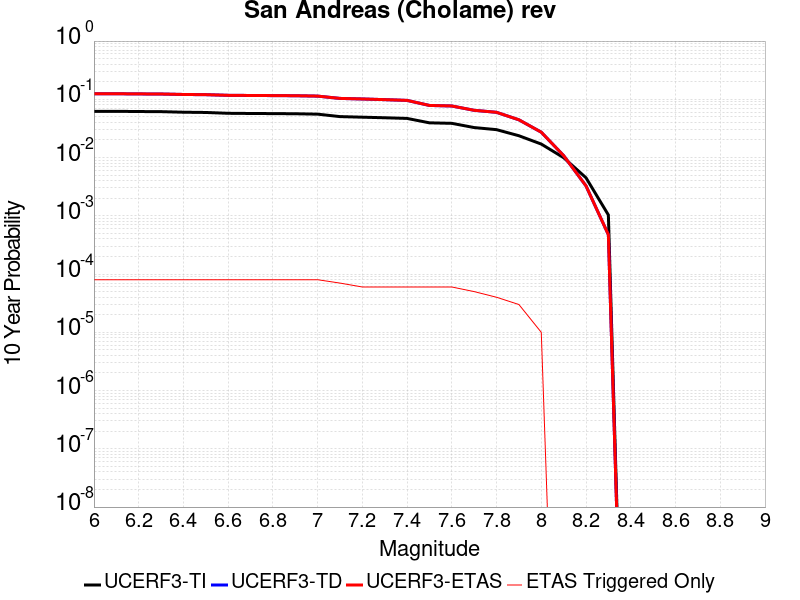 |

| Magnitude | 1 wk TI Prob | 1 wk TD Prob | 1 wk ETAS Prob | 1 wk ETAS/TD Gain | 1 wk ETAS Triggered Only | 1 mo TI Prob | 1 mo TD Prob | 1 mo ETAS Prob | 1 mo ETAS/TD Gain | 1 mo ETAS Triggered Only | 1 yr TI Prob | 1 yr TD Prob | 1 yr ETAS Prob | 1 yr ETAS/TD Gain | 1 yr ETAS Triggered Only | 10 yr TI Prob | 10 yr TD Prob | 10 yr ETAS Prob | 10 yr ETAS/TD Gain | 10 yr ETAS Triggered Only |
|-----|-----|-----|-----|-----|-----|-----|-----|-----|-----|-----|-----|-----|-----|-----|-----|-----|-----|-----|-----|-----|
| 6.0 | 1.2302514E-4 | 2.5252937E-4 | 2.5252937E-4 | 1.0 | 0.0 | 5.27144E-4 | 0.0010818215 | 0.0010818215 | 1.0 | 0.0 | 0.0063991086 | 0.0130921425 | 0.013106784 | 1.0011183 | 1.4835475E-5 | 0.06217949 | 0.124593556 | 0.12465849 | 1.0005212 | 7.417738E-5 |
| 6.1 | 1.2302514E-4 | 2.5252937E-4 | 2.5252937E-4 | 1.0 | 0.0 | 5.27144E-4 | 0.0010818215 | 0.0010818215 | 1.0 | 0.0 | 0.0063991086 | 0.0130921425 | 0.013106784 | 1.0011183 | 1.4835475E-5 | 0.06217949 | 0.124593556 | 0.12465849 | 1.0005212 | 7.417738E-5 |
| 6.2 | 1.2203569E-4 | 2.5069673E-4 | 2.5069673E-4 | 1.0 | 0.0 | 5.2290526E-4 | 0.0010739737 | 0.0010739737 | 1.0 | 0.0 | 0.006347804 | 0.01299774 | 0.013012383 | 1.0011265 | 1.4835475E-5 | 0.061695136 | 0.123779684 | 0.123844676 | 1.0005251 | 7.417738E-5 |
| 6.3 | 1.2142645E-4 | 2.4955606E-4 | 2.4955606E-4 | 1.0 | 0.0 | 5.202953E-4 | 0.0010690893 | 0.0010690893 | 1.0 | 0.0 | 0.006316212 | 0.01293898 | 0.012953623 | 1.0011318 | 1.4835475E-5 | 0.06139677 | 0.123273775 | 0.1233388 | 1.0005275 | 7.417738E-5 |
| 6.4 | 1.1865206E-4 | 2.4460847E-4 | 2.4460847E-4 | 1.0 | 0.0 | 5.0840975E-4 | 0.0010479024 | 0.0010479024 | 1.0 | 0.0 | 0.006172335 | 0.012684058 | 0.012698705 | 1.0011548 | 1.4835475E-5 | 0.060036868 | 0.1210659 | 0.1211311 | 1.0005385 | 7.417738E-5 |
| 6.5 | 1.17443946E-4 | 2.4253961E-4 | 2.4253961E-4 | 1.0 | 0.0 | 5.032341E-4 | 0.001039043 | 0.001039043 | 1.0 | 0.0 | 0.006109677 | 0.0125774415 | 0.01259209 | 1.0011647 | 1.4835475E-5 | 0.059444077 | 0.120139554 | 0.120204814 | 1.0005432 | 7.417738E-5 |
| 6.6 | 1.13579066E-4 | 2.3562409E-4 | 2.3562409E-4 | 1.0 | 0.0 | 4.866766E-4 | 0.0010094283 | 0.0010094283 | 1.0 | 0.0 | 0.0059092017 | 0.012220981 | 0.012235634 | 1.0011991 | 1.4835475E-5 | 0.057545185 | 0.11705217 | 0.11711766 | 1.0005596 | 7.417738E-5 |
| 6.7 | 1.1271412E-4 | 2.3406607E-4 | 2.3406607E-4 | 1.0 | 0.0 | 4.829711E-4 | 0.0010027562 | 0.0010027562 | 1.0 | 0.0 | 0.005864331 | 0.012140656 | 0.012155311 | 1.0012071 | 1.4835475E-5 | 0.057119697 | 0.11635545 | 0.116421 | 1.0005634 | 7.417738E-5 |
| 6.8 | 1.1217975E-4 | 2.3294917E-4 | 2.3294917E-4 | 1.0 | 0.0 | 4.8068175E-4 | 9.979731E-4 | 9.979731E-4 | 1.0 | 0.0 | 0.005836608 | 0.01208307 | 0.012097727 | 1.001213 | 1.4835475E-5 | 0.056856725 | 0.11585338 | 0.11591896 | 1.0005661 | 7.417738E-5 |
| 6.9 | 1.1146753E-4 | 2.3143539E-4 | 2.3143539E-4 | 1.0 | 0.0 | 4.7763053E-4 | 9.914904E-4 | 9.914904E-4 | 1.0 | 0.0 | 0.0057996577 | 0.012005016 | 0.012019673 | 1.001221 | 1.4835475E-5 | 0.056506127 | 0.11517345 | 0.115239084 | 1.0005698 | 7.417738E-5 |
| 7.0 | 1.0965793E-4 | 2.2766505E-4 | 2.2766505E-4 | 1.0 | 0.0 | 4.698779E-4 | 9.75344E-4 | 9.75344E-4 | 1.0 | 0.0 | 0.005705768 | 0.011810581 | 0.011825241 | 1.0012413 | 1.4835475E-5 | 0.055614736 | 0.11347394 | 0.113539696 | 1.0005795 | 7.417738E-5 |
| 7.1 | 9.927982E-5 | 2.0583862E-4 | 2.0583862E-4 | 1.0 | 0.0 | 4.2541555E-4 | 8.818683E-4 | 8.818683E-4 | 1.0 | 0.0 | 0.0051671406 | 0.010684185 | 0.010698861 | 1.0013738 | 1.4835475E-5 | 0.05048634 | 0.103563815 | 0.103617005 | 1.0005137 | 5.93419E-5 |
| 7.2 | 9.696786E-5 | 2.0087796E-4 | 2.0087796E-4 | 1.0 | 0.0 | 4.1551032E-4 | 8.6062244E-4 | 8.6062244E-4 | 1.0 | 0.0 | 0.00504711 | 0.010428021 | 0.010442701 | 1.0014079 | 1.4835475E-5 | 0.04934009 | 0.10130096 | 0.101340964 | 1.0003948 | 4.4506425E-5 |
| 7.3 | 9.4727984E-5 | 1.9516371E-4 | 1.9516371E-4 | 1.0 | 0.0 | 4.0591392E-4 | 8.361488E-4 | 8.361488E-4 | 1.0 | 0.0 | 0.0049308087 | 0.010132864 | 0.010147549 | 1.0014492 | 1.4835475E-5 | 0.048228268 | 0.09866964 | 0.098709755 | 1.0004065 | 4.4506425E-5 |
| 7.4 | 9.220358E-5 | 1.8886142E-4 | 1.8886142E-4 | 1.0 | 0.0 | 3.9509835E-4 | 8.091559E-4 | 8.091559E-4 | 1.0 | 0.0 | 0.004799717 | 0.0098072225 | 0.009821912 | 1.0014979 | 1.4835475E-5 | 0.046973653 | 0.09574487 | 0.09578511 | 1.0004203 | 4.4506425E-5 |
| 7.5 | 7.71631E-5 | 1.5215653E-4 | 1.5215653E-4 | 1.0 | 0.0 | 3.306571E-4 | 6.519366E-4 | 6.519366E-4 | 1.0 | 0.0 | 0.0040183207 | 0.007908514 | 0.007923231 | 1.0018611 | 1.4835475E-5 | 0.03946433 | 0.07845421 | 0.07849523 | 1.0005227 | 4.4506425E-5 |
| 7.6 | 7.5634416E-5 | 1.4874605E-4 | 1.4874605E-4 | 1.0 | 0.0 | 3.241072E-4 | 6.373275E-4 | 6.373275E-4 | 1.0 | 0.0 | 0.0039388672 | 0.007731923 | 0.007746644 | 1.0019039 | 1.4835475E-5 | 0.038697794 | 0.07681574 | 0.07685683 | 1.0005349 | 4.4506425E-5 |
| 7.7 | 6.3783E-5 | 1.2392044E-4 | 1.2392044E-4 | 1.0 | 0.0 | 2.7332708E-4 | 5.309796E-4 | 5.309796E-4 | 1.0 | 0.0 | 0.0033226798 | 0.006445541 | 0.006445541 | 1.0 | 0.0 | 0.032734364 | 0.06469272 | 0.064720474 | 1.0004289 | 2.967095E-5 |
| 7.8 | 5.863422E-5 | 1.14464085E-4 | 1.14464085E-4 | 1.0 | 0.0 | 2.512653E-4 | 4.9046817E-4 | 4.9046817E-4 | 1.0 | 0.0 | 0.003054864 | 0.005955121 | 0.005955121 | 1.0 | 0.0 | 0.030132094 | 0.059798453 | 0.0598124 | 1.0002333 | 1.4835475E-5 |
| 7.9 | 4.595283E-5 | 8.448475E-5 | 8.448475E-5 | 1.0 | 0.0 | 1.9692584E-4 | 3.6202726E-4 | 3.6202726E-4 | 1.0 | 0.0 | 0.0023949358 | 0.004398781 | 0.004398781 | 1.0 | 0.0 | 0.023692891 | 0.044466715 | 0.044480894 | 1.0003188 | 1.4835475E-5 |
| 8.0 | 3.2950178E-5 | 5.0911865E-5 | 5.0911865E-5 | 1.0 | 0.0 | 1.412074E-4 | 2.1817547E-4 | 2.1817547E-4 | 1.0 | 0.0 | 0.0017178444 | 0.0026530523 | 0.0026530523 | 1.0 | 0.0 | 0.017046256 | 0.027248744 | 0.027248744 | 1.0 | 0.0 |
| 8.1 | 1.9177472E-5 | 1.9254714E-5 | 1.9254714E-5 | 1.0 | 0.0 | 8.218658E-5 | 8.2517596E-5 | 8.2517596E-5 | 1.0 | 0.0 | 0.0010001622 | 0.0010041894 | 0.0010041894 | 1.0 | 0.0 | 0.009956728 | 0.0107947895 | 0.0107947895 | 1.0 | 0.0 |
| 8.2 | 8.643924E-6 | 5.501233E-6 | 5.501233E-6 | 1.0 | 0.0 | 3.704486E-5 | 2.3576498E-5 | 2.3576498E-5 | 1.0 | 0.0 | 4.5092785E-4 | 2.8700614E-4 | 2.8700614E-4 | 1.0 | 0.0 | 0.0045001395 | 0.0032631387 | 0.0032631387 | 1.0 | 0.0 |
| 8.3 | 1.983087E-6 | 7.701989E-7 | 7.701989E-7 | 1.0 | 0.0 | 8.498917E-6 | 3.3008482E-6 | 3.3008482E-6 | 1.0 | 0.0 | 1.034694E-4 | 4.0187104E-5 | 4.0187104E-5 | 1.0 | 0.0 | 0.0010342124 | 4.7438307E-4 | 4.7438307E-4 | 1.0 | 0.0 |

## San Andreas (Carrizo) rev
*[(top)](#table-of-contents)*

| 1 Week | 1 Month | 1 Year | 10 Year |
|-----|-----|-----|-----|
| 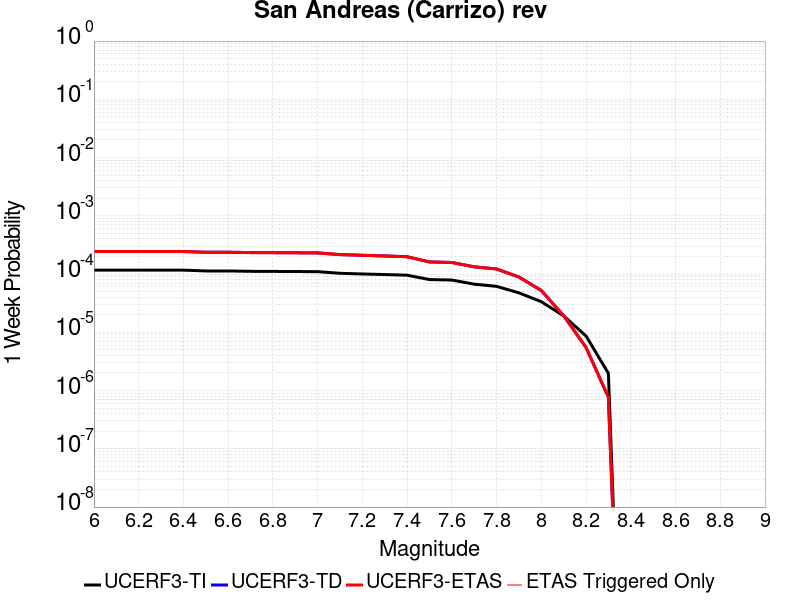 | 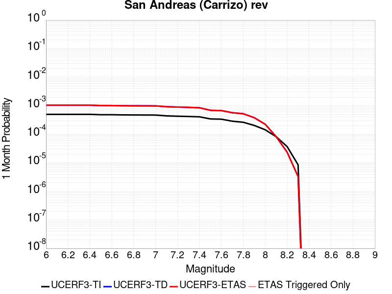 |  |  |

| Magnitude | 1 wk TI Prob | 1 wk TD Prob | 1 wk ETAS Prob | 1 wk ETAS/TD Gain | 1 wk ETAS Triggered Only | 1 mo TI Prob | 1 mo TD Prob | 1 mo ETAS Prob | 1 mo ETAS/TD Gain | 1 mo ETAS Triggered Only | 1 yr TI Prob | 1 yr TD Prob | 1 yr ETAS Prob | 1 yr ETAS/TD Gain | 1 yr ETAS Triggered Only | 10 yr TI Prob | 10 yr TD Prob | 10 yr ETAS Prob | 10 yr ETAS/TD Gain | 10 yr ETAS Triggered Only |
|-----|-----|-----|-----|-----|-----|-----|-----|-----|-----|-----|-----|-----|-----|-----|-----|-----|-----|-----|-----|-----|
| 6.0 | 1.1674632E-4 | 2.4371163E-4 | 2.4371163E-4 | 1.0 | 0.0 | 5.002454E-4 | 0.001044062 | 0.001044062 | 1.0 | 0.0 | 0.006073493 | 0.012637852 | 0.012667148 | 1.0023181 | 2.967095E-5 | 0.0591016 | 0.12081685 | 0.12088207 | 1.0005398 | 7.417738E-5 |
| 6.1 | 1.1674632E-4 | 2.4371163E-4 | 2.4371163E-4 | 1.0 | 0.0 | 5.002454E-4 | 0.001044062 | 0.001044062 | 1.0 | 0.0 | 0.006073493 | 0.012637852 | 0.012667148 | 1.0023181 | 2.967095E-5 | 0.0591016 | 0.12081685 | 0.12088207 | 1.0005398 | 7.417738E-5 |
| 6.2 | 1.1674632E-4 | 2.4371163E-4 | 2.4371163E-4 | 1.0 | 0.0 | 5.002454E-4 | 0.001044062 | 0.001044062 | 1.0 | 0.0 | 0.006073493 | 0.012637852 | 0.012667148 | 1.0023181 | 2.967095E-5 | 0.0591016 | 0.12081685 | 0.12088207 | 1.0005398 | 7.417738E-5 |
| 6.3 | 1.1674632E-4 | 2.4371163E-4 | 2.4371163E-4 | 1.0 | 0.0 | 5.002454E-4 | 0.001044062 | 0.001044062 | 1.0 | 0.0 | 0.006073493 | 0.012637852 | 0.012667148 | 1.0023181 | 2.967095E-5 | 0.0591016 | 0.12081685 | 0.12088207 | 1.0005398 | 7.417738E-5 |
| 6.4 | 1.1674632E-4 | 2.4371163E-4 | 2.4371163E-4 | 1.0 | 0.0 | 5.002454E-4 | 0.001044062 | 0.001044062 | 1.0 | 0.0 | 0.006073493 | 0.012637852 | 0.012667148 | 1.0023181 | 2.967095E-5 | 0.0591016 | 0.12081685 | 0.12088207 | 1.0005398 | 7.417738E-5 |
| 6.5 | 1.13136164E-4 | 2.369096E-4 | 2.369096E-4 | 1.0 | 0.0 | 4.847792E-4 | 0.0010149333 | 0.0010149333 | 1.0 | 0.0 | 0.0058862255 | 0.012287252 | 0.012301905 | 1.0011926 | 1.4835475E-5 | 0.057327334 | 0.117788024 | 0.11784038 | 1.0004444 | 5.93419E-5 |
| 6.6 | 1.13136164E-4 | 2.369096E-4 | 2.369096E-4 | 1.0 | 0.0 | 4.847792E-4 | 0.0010149333 | 0.0010149333 | 1.0 | 0.0 | 0.0058862255 | 0.012287252 | 0.012301905 | 1.0011926 | 1.4835475E-5 | 0.057327334 | 0.117788024 | 0.11784038 | 1.0004444 | 5.93419E-5 |
| 6.7 | 1.1149675E-4 | 2.3382084E-4 | 2.3382084E-4 | 1.0 | 0.0 | 4.777557E-4 | 0.001001706 | 0.001001706 | 1.0 | 0.0 | 0.0058011734 | 0.01212801 | 0.012142666 | 1.0012084 | 1.4835475E-5 | 0.05652051 | 0.11640947 | 0.1164619 | 1.0004504 | 5.93419E-5 |
| 6.8 | 1.1103589E-4 | 2.3284185E-4 | 2.3284185E-4 | 1.0 | 0.0 | 4.7578133E-4 | 9.975135E-4 | 9.975135E-4 | 1.0 | 0.0 | 0.005777263 | 0.012077535 | 0.012092191 | 1.0012136 | 1.4835475E-5 | 0.056293584 | 0.11596964 | 0.1160221 | 1.0004524 | 5.93419E-5 |
| 6.9 | 1.1053259E-4 | 2.3176504E-4 | 2.3176504E-4 | 1.0 | 0.0 | 4.7362508E-4 | 9.929021E-4 | 9.929021E-4 | 1.0 | 0.0 | 0.0057511497 | 0.012022012 | 0.012036669 | 1.0012192 | 1.4835475E-5 | 0.05604569 | 0.1154857 | 0.11553819 | 1.0004545 | 5.93419E-5 |
| 7.0 | 1.1005377E-4 | 2.3077287E-4 | 2.3077287E-4 | 1.0 | 0.0 | 4.7157376E-4 | 9.886532E-4 | 9.886532E-4 | 1.0 | 0.0 | 0.0057263062 | 0.011970851 | 0.011985509 | 1.0012245 | 1.4835475E-5 | 0.055809796 | 0.11503787 | 0.11509039 | 1.0004565 | 5.93419E-5 |
| 7.1 | 1.0308142E-4 | 2.1586102E-4 | 2.1586102E-4 | 1.0 | 0.0 | 4.417027E-4 | 9.247917E-4 | 9.247917E-4 | 1.0 | 0.0 | 0.0053644776 | 0.011201528 | 0.011216197 | 1.0013096 | 1.4835475E-5 | 0.052368138 | 0.10829218 | 0.10833187 | 1.0003664 | 4.4506425E-5 |
| 7.2 | 1.0027479E-4 | 2.099363E-4 | 2.099363E-4 | 1.0 | 0.0 | 4.296783E-4 | 8.994178E-4 | 8.994178E-4 | 1.0 | 0.0 | 0.0052187922 | 0.01089573 | 0.010910404 | 1.0013467 | 1.4835475E-5 | 0.050979212 | 0.105595276 | 0.105635084 | 1.0003769 | 4.4506425E-5 |
| 7.3 | 9.816942E-5 | 2.0468206E-4 | 2.0468206E-4 | 1.0 | 0.0 | 4.2065824E-4 | 8.7691494E-4 | 8.7691494E-4 | 1.0 | 0.0 | 0.005109493 | 0.010624462 | 0.010639139 | 1.0013815 | 1.4835475E-5 | 0.049935985 | 0.10317698 | 0.103216894 | 1.0003868 | 4.4506425E-5 |
| 7.4 | 9.5634205E-5 | 1.9836906E-4 | 1.9836906E-4 | 1.0 | 0.0 | 4.0979648E-4 | 8.49877E-4 | 8.49877E-4 | 1.0 | 0.0 | 0.0049778637 | 0.010298425 | 0.010313109 | 1.0014257 | 1.4835475E-5 | 0.048678253 | 0.10026059 | 0.10030064 | 1.0003994 | 4.4506425E-5 |
| 7.5 | 8.052417E-5 | 1.6152121E-4 | 1.6152121E-4 | 1.0 | 0.0 | 3.4505792E-4 | 6.920503E-4 | 6.920503E-4 | 1.0 | 0.0 | 0.0041929903 | 0.008393243 | 0.008407954 | 1.0017527 | 1.4835475E-5 | 0.04114753 | 0.08298649 | 0.0830273 | 1.0004919 | 4.4506425E-5 |
| 7.6 | 7.897024E-5 | 1.580484E-4 | 1.580484E-4 | 1.0 | 0.0 | 3.384E-4 | 6.771746E-4 | 6.771746E-4 | 1.0 | 0.0 | 0.0041122385 | 0.008213511 | 0.008228225 | 1.0017914 | 1.4835475E-5 | 0.040369697 | 0.08132582 | 0.08136671 | 1.0005027 | 4.4506425E-5 |
| 7.7 | 6.707427E-5 | 1.3311235E-4 | 1.3311235E-4 | 1.0 | 0.0 | 2.8742946E-4 | 5.7035685E-4 | 5.7035685E-4 | 1.0 | 0.0 | 0.003493839 | 0.0069220173 | 0.0069220173 | 1.0 | 0.0 | 0.034394164 | 0.06920771 | 0.06923533 | 1.000399 | 2.967095E-5 |
| 7.8 | 6.147705E-5 | 1.2229287E-4 | 1.2229287E-4 | 1.0 | 0.0 | 2.6344648E-4 | 5.240071E-4 | 5.240071E-4 | 1.0 | 0.0 | 0.0032027436 | 0.006361149 | 0.006361149 | 1.0 | 0.0 | 0.031569764 | 0.06365994 | 0.06367384 | 1.0002182 | 1.4835475E-5 |
| 7.9 | 4.7636717E-5 | 8.90271E-5 | 8.90271E-5 | 1.0 | 0.0 | 2.0414138E-4 | 3.8148894E-4 | 3.8148894E-4 | 1.0 | 0.0 | 0.0024825884 | 0.004634744 | 0.004634744 | 1.0 | 0.0 | 0.024550365 | 0.04673616 | 0.0467503 | 1.0003026 | 1.4835475E-5 |
| 8.0 | 3.3554235E-5 | 5.227846E-5 | 5.227846E-5 | 1.0 | 0.0 | 1.4379594E-4 | 2.240313E-4 | 2.240313E-4 | 1.0 | 0.0 | 0.0017493097 | 0.0027241712 | 0.0027241712 | 1.0 | 0.0 | 0.017356034 | 0.027950747 | 0.027950747 | 1.0 | 0.0 |
| 8.1 | 1.9175432E-5 | 1.9254543E-5 | 1.9254543E-5 | 1.0 | 0.0 | 8.217783E-5 | 8.251687E-5 | 8.251687E-5 | 1.0 | 0.0 | 0.0010000558 | 0.0010041804 | 0.0010041804 | 1.0 | 0.0 | 0.009955673 | 0.010794673 | 0.010794673 | 1.0 | 0.0 |
| 8.2 | 8.643924E-6 | 5.501233E-6 | 5.501233E-6 | 1.0 | 0.0 | 3.704486E-5 | 2.3576498E-5 | 2.3576498E-5 | 1.0 | 0.0 | 4.5092785E-4 | 2.8700614E-4 | 2.8700614E-4 | 1.0 | 0.0 | 0.0045001395 | 0.0032631387 | 0.0032631387 | 1.0 | 0.0 |
| 8.3 | 1.983087E-6 | 7.701989E-7 | 7.701989E-7 | 1.0 | 0.0 | 8.498917E-6 | 3.3008482E-6 | 3.3008482E-6 | 1.0 | 0.0 | 1.034694E-4 | 4.0187104E-5 | 4.0187104E-5 | 1.0 | 0.0 | 0.0010342124 | 4.7438307E-4 | 4.7438307E-4 | 1.0 | 0.0 |

## Elysian Park (Upper)
*[(top)](#table-of-contents)*

| 1 Week | 1 Month | 1 Year | 10 Year |
|-----|-----|-----|-----|
|  |  |  |  |

| Magnitude | 1 wk TI Prob | 1 wk TD Prob | 1 wk ETAS Prob | 1 wk ETAS/TD Gain | 1 wk ETAS Triggered Only | 1 mo TI Prob | 1 mo TD Prob | 1 mo ETAS Prob | 1 mo ETAS/TD Gain | 1 mo ETAS Triggered Only | 1 yr TI Prob | 1 yr TD Prob | 1 yr ETAS Prob | 1 yr ETAS/TD Gain | 1 yr ETAS Triggered Only | 10 yr TI Prob | 10 yr TD Prob | 10 yr ETAS Prob | 10 yr ETAS/TD Gain | 10 yr ETAS Triggered Only |
|-----|-----|-----|-----|-----|-----|-----|-----|-----|-----|-----|-----|-----|-----|-----|-----|-----|-----|-----|-----|-----|
| 6.0 | 3.1876025E-5 | 3.7040536E-5 | 3.7040536E-5 | 1.0 | 0.0 | 1.3660437E-4 | 1.5873823E-4 | 1.5873823E-4 | 1.0 | 0.0 | 0.0016618895 | 0.001931362 | 0.0019461688 | 1.0076665 | 1.4835475E-5 | 0.016495159 | 0.01919234 | 0.019235991 | 1.0022745 | 4.4506425E-5 |
| 6.1 | 3.1876025E-5 | 3.7040536E-5 | 3.7040536E-5 | 1.0 | 0.0 | 1.3660437E-4 | 1.5873823E-4 | 1.5873823E-4 | 1.0 | 0.0 | 0.0016618895 | 0.001931362 | 0.0019461688 | 1.0076665 | 1.4835475E-5 | 0.016495159 | 0.01919234 | 0.019235991 | 1.0022745 | 4.4506425E-5 |
| 6.2 | 3.1876025E-5 | 3.7040536E-5 | 3.7040536E-5 | 1.0 | 0.0 | 1.3660437E-4 | 1.5873823E-4 | 1.5873823E-4 | 1.0 | 0.0 | 0.0016618895 | 0.001931362 | 0.0019461688 | 1.0076665 | 1.4835475E-5 | 0.016495159 | 0.01919234 | 0.019235991 | 1.0022745 | 4.4506425E-5 |
| 6.3 | 3.1876025E-5 | 3.7040536E-5 | 3.7040536E-5 | 1.0 | 0.0 | 1.3660437E-4 | 1.5873823E-4 | 1.5873823E-4 | 1.0 | 0.0 | 0.0016618895 | 0.001931362 | 0.0019461688 | 1.0076665 | 1.4835475E-5 | 0.016495159 | 0.01919234 | 0.019235991 | 1.0022745 | 4.4506425E-5 |
| 6.4 | 1.9273462E-5 | 2.1204592E-5 | 2.1204592E-5 | 1.0 | 0.0 | 8.259794E-5 | 9.087464E-5 | 9.087464E-5 | 1.0 | 0.0 | 0.001005166 | 0.0011060105 | 0.0011208296 | 1.0133986 | 1.4835475E-5 | 0.010006315 | 0.011021925 | 0.01106594 | 1.0039935 | 4.4506425E-5 |
| 6.5 | 1.9273462E-5 | 2.1204592E-5 | 2.1204592E-5 | 1.0 | 0.0 | 8.259794E-5 | 9.087464E-5 | 9.087464E-5 | 1.0 | 0.0 | 0.001005166 | 0.0011060105 | 0.0011208296 | 1.0133986 | 1.4835475E-5 | 0.010006315 | 0.011021925 | 0.01106594 | 1.0039935 | 4.4506425E-5 |
| 6.6 | 9.813258E-6 | 9.666245E-6 | 9.666245E-6 | 1.0 | 0.0 | 4.205614E-5 | 4.142615E-5 | 4.142615E-5 | 1.0 | 0.0 | 5.119132E-4 | 5.042539E-4 | 5.042539E-4 | 1.0 | 0.0 | 0.005107356 | 0.0050318204 | 0.0050465814 | 1.0029335 | 1.4835475E-5 |
| 6.7 | 9.801478E-6 | 9.653814E-6 | 9.653814E-6 | 1.0 | 0.0 | 4.2005657E-5 | 4.1372874E-5 | 4.1372874E-5 | 1.0 | 0.0 | 5.112989E-4 | 5.036056E-4 | 5.036056E-4 | 1.0 | 0.0 | 0.0051012407 | 0.005025367 | 0.005040128 | 1.0029373 | 1.4835475E-5 |
| 6.8 | 8.102489E-6 | 7.773517E-6 | 7.773517E-6 | 1.0 | 0.0 | 3.4724493E-5 | 3.3314675E-5 | 3.3314675E-5 | 1.0 | 0.0 | 4.2268867E-4 | 4.0553563E-4 | 4.0553563E-4 | 1.0 | 0.0 | 0.004218856 | 0.00404845 | 0.00404845 | 1.0 | 0.0 |
| 6.9 | 6.08275E-6 | 5.481759E-6 | 5.481759E-6 | 1.0 | 0.0 | 2.6068668E-5 | 2.3493047E-5 | 2.3493047E-5 | 1.0 | 0.0 | 3.173398E-4 | 2.8599106E-4 | 2.8599106E-4 | 1.0 | 0.0 | 0.0031688702 | 0.002856308 | 0.002856308 | 1.0 | 0.0 |
| 7.0 | 5.5995934E-6 | 4.9830583E-6 | 4.9830583E-6 | 1.0 | 0.0 | 2.3998036E-5 | 2.1355792E-5 | 2.1355792E-5 | 1.0 | 0.0 | 2.9213692E-4 | 2.5997643E-4 | 2.5997643E-4 | 1.0 | 0.0 | 0.0029175316 | 0.0025967902 | 0.0025967902 | 1.0 | 0.0 |
| 7.1 | 4.709881E-6 | 4.0876275E-6 | 4.0876275E-6 | 1.0 | 0.0 | 2.0185047E-5 | 1.7518289E-5 | 1.7518289E-5 | 1.0 | 0.0 | 2.4572524E-4 | 2.132647E-4 | 2.132647E-4 | 1.0 | 0.0 | 0.002454537 | 0.0021306418 | 0.0021306418 | 1.0 | 0.0 |
| 7.2 | 3.6063436E-6 | 2.9781152E-6 | 2.9781152E-6 | 1.0 | 0.0 | 1.5455667E-5 | 1.2763288E-5 | 1.2763288E-5 | 1.0 | 0.0 | 1.881565E-4 | 1.5538206E-4 | 1.5538206E-4 | 1.0 | 0.0 | 0.0018799726 | 0.0015527455 | 0.0015527455 | 1.0 | 0.0 |
| 7.3 | 2.471135E-6 | 2.0955745E-6 | 2.0955745E-6 | 1.0 | 0.0 | 1.0590536E-5 | 8.981004E-6 | 8.981004E-6 | 1.0 | 0.0 | 1.2893214E-4 | 1.093383E-4 | 1.093383E-4 | 1.0 | 0.0 | 0.0012885736 | 0.0010928523 | 0.0010928523 | 1.0 | 0.0 |
| 7.4 | 1.163943E-6 | 1.0275695E-6 | 1.0275695E-6 | 1.0 | 0.0 | 4.988318E-6 | 4.403862E-6 | 4.403862E-6 | 1.0 | 0.0 | 6.0731076E-5 | 5.361573E-5 | 5.361573E-5 | 1.0 | 0.0 | 6.071448E-4 | 5.360309E-4 | 5.360309E-4 | 1.0 | 0.0 |
| 7.5 | 4.99459E-7 | 4.9178874E-7 | 4.9178874E-7 | 1.0 | 0.0 | 2.140537E-6 | 2.1076644E-6 | 2.1076644E-6 | 1.0 | 0.0 | 2.6060725E-5 | 2.5660527E-5 | 2.5660527E-5 | 1.0 | 0.0 | 2.605767E-4 | 2.5657722E-4 | 2.5657722E-4 | 1.0 | 0.0 |
| 7.6 | 2.4667852E-7 | 2.478003E-7 | 2.478003E-7 | 1.0 | 0.0 | 1.0571932E-6 | 1.0620009E-6 | 1.0620009E-6 | 1.0 | 0.0 | 1.2871251E-5 | 1.2929788E-5 | 1.2929788E-5 | 1.0 | 0.0 | 1.2870505E-4 | 1.2929073E-4 | 1.2929073E-4 | 1.0 | 0.0 |
| 7.7 | 8.2312795E-8 | 7.387364E-8 | 7.387364E-8 | 1.0 | 0.0 | 3.527691E-7 | 3.166013E-7 | 3.166013E-7 | 1.0 | 0.0 | 4.294955E-6 | 3.854615E-6 | 3.854615E-6 | 1.0 | 0.0 | 4.2948723E-5 | 3.8545597E-5 | 3.8545597E-5 | 1.0 | 0.0 |
| 7.8 | 2.7819295E-8 | 1.7572518E-8 | 1.7572518E-8 | 1.0 | 0.0 | 1.1922555E-7 | 7.531079E-8 | 7.531079E-8 | 1.0 | 0.0 | 1.45157E-6 | 9.1690856E-7 | 9.1690856E-7 | 1.0 | 0.0 | 1.45156055E-5 | 9.169063E-6 | 9.169063E-6 | 1.0 | 0.0 |

## San Andreas (Creeping Section) 2011 CFM
*[(top)](#table-of-contents)*

| 1 Week | 1 Month | 1 Year | 10 Year |
|-----|-----|-----|-----|
|  | 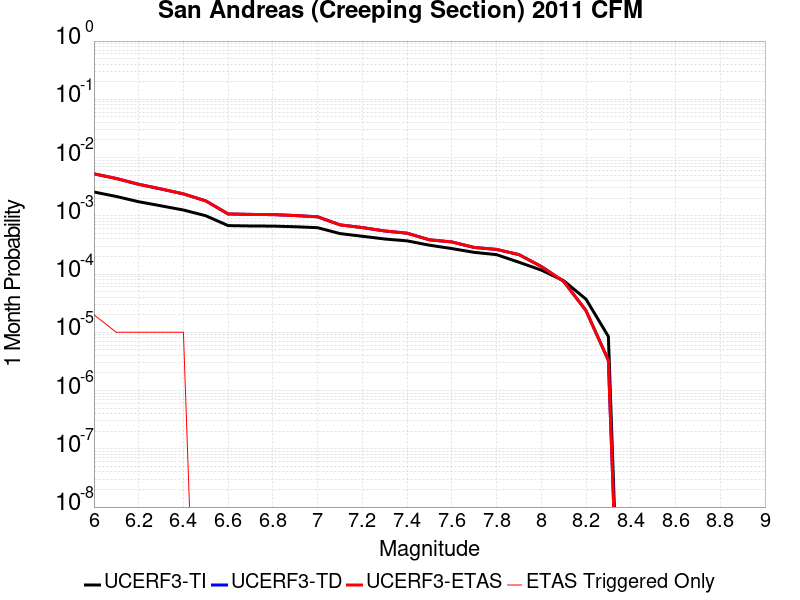 | 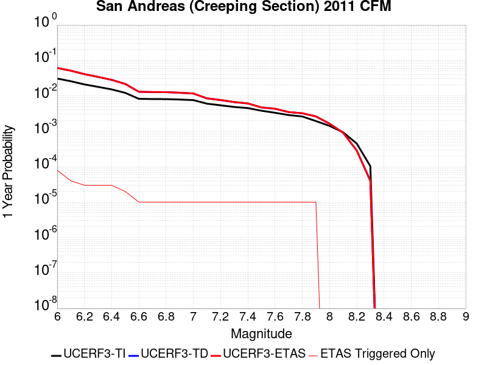 |  |

| Magnitude | 1 wk TI Prob | 1 wk TD Prob | 1 wk ETAS Prob | 1 wk ETAS/TD Gain | 1 wk ETAS Triggered Only | 1 mo TI Prob | 1 mo TD Prob | 1 mo ETAS Prob | 1 mo ETAS/TD Gain | 1 mo ETAS Triggered Only | 1 yr TI Prob | 1 yr TD Prob | 1 yr ETAS Prob | 1 yr ETAS/TD Gain | 1 yr ETAS Triggered Only | 10 yr TI Prob | 10 yr TD Prob | 10 yr ETAS Prob | 10 yr ETAS/TD Gain | 10 yr ETAS Triggered Only |
|-----|-----|-----|-----|-----|-----|-----|-----|-----|-----|-----|-----|-----|-----|-----|-----|-----|-----|-----|-----|-----|
| 6.0 | 5.986481E-4 | 0.0012277956 | 0.0012277956 | 1.0 | 0.0 | 0.0025631124 | 0.005245582 | 0.00526034 | 1.0028133 | 1.4835475E-5 | 0.030762846 | 0.0612356 | 0.061263453 | 1.0004549 | 2.967095E-5 | 0.26835477 | 0.4260997 | 0.42613375 | 1.0000799 | 5.93419E-5 |
| 6.1 | 5.015945E-4 | 0.0010216961 | 0.0010216961 | 1.0 | 0.0 | 0.00214792 | 0.0043676817 | 0.0043824525 | 1.0033818 | 1.4835475E-5 | 0.025839351 | 0.051274505 | 0.05128858 | 1.0002745 | 1.4835475E-5 | 0.23032776 | 0.37301552 | 0.37304342 | 1.0000749 | 4.4506425E-5 |
| 6.2 | 4.073338E-4 | 8.1083504E-4 | 8.1083504E-4 | 1.0 | 0.0 | 0.0017445484 | 0.0034678474 | 0.0034826314 | 1.0042632 | 1.4835475E-5 | 0.021034058 | 0.04095867 | 0.0409729 | 1.0003474 | 1.4835475E-5 | 0.19150782 | 0.31320518 | 0.31323576 | 1.0000976 | 4.4506425E-5 |
| 6.3 | 3.464099E-4 | 6.7425723E-4 | 6.7425723E-4 | 1.0 | 0.0 | 0.0014837692 | 0.0028845523 | 0.002899345 | 1.0051283 | 1.4835475E-5 | 0.017915873 | 0.034215774 | 0.0342301 | 1.0004188 | 1.4835475E-5 | 0.16538359 | 0.27149883 | 0.27153125 | 1.0001194 | 4.4506425E-5 |
| 6.4 | 2.935057E-4 | 5.544402E-4 | 5.544402E-4 | 1.0 | 0.0 | 0.0012572751 | 0.0023737296 | 0.00238853 | 1.006235 | 1.4835475E-5 | 0.015200248 | 0.028291056 | 0.028305471 | 1.0005095 | 1.4835475E-5 | 0.14201577 | 0.23317762 | 0.23321174 | 1.0001464 | 4.4506425E-5 |
| 6.5 | 2.3409708E-4 | 4.2125006E-4 | 4.2125006E-4 | 1.0 | 0.0 | 0.0010028875 | 0.0018040538 | 0.0018040538 | 1.0 | 0.0 | 0.012141965 | 0.021614527 | 0.021614527 | 1.0 | 0.0 | 0.11499573 | 0.18702777 | 0.18705189 | 1.000129 | 2.967095E-5 |
| 6.6 | 1.5842178E-4 | 2.5123512E-4 | 2.5123512E-4 | 1.0 | 0.0 | 6.7877385E-4 | 0.0010762685 | 0.0010762685 | 1.0 | 0.0 | 0.0082328 | 0.013023272 | 0.013023272 | 1.0 | 0.0 | 0.07934396 | 0.123365805 | 0.12337881 | 1.0001054 | 1.4835475E-5 |
| 6.7 | 1.5616413E-4 | 2.465974E-4 | 2.465974E-4 | 1.0 | 0.0 | 6.691031E-4 | 0.0010564087 | 0.0010564087 | 1.0 | 0.0 | 0.0081159435 | 0.012785076 | 0.012785076 | 1.0 | 0.0 | 0.0782586 | 0.12139298 | 0.12140602 | 1.0001074 | 1.4835475E-5 |
| 6.8 | 1.5538467E-4 | 2.448347E-4 | 2.448347E-4 | 1.0 | 0.0 | 6.6576427E-4 | 0.0010488626 | 0.0010488626 | 1.0 | 0.0 | 0.008075596 | 0.012694411 | 0.012694411 | 1.0 | 0.0 | 0.07788358 | 0.12062367 | 0.12063672 | 1.0001081 | 1.4835475E-5 |
| 6.9 | 1.5153569E-4 | 2.359214E-4 | 2.359214E-4 | 1.0 | 0.0 | 6.49277E-4 | 0.0010107019 | 0.0010107019 | 1.0 | 0.0 | 0.007876333 | 0.012236397 | 0.012236397 | 1.0 | 0.0 | 0.07602952 | 0.116693184 | 0.11670629 | 1.0001123 | 1.4835475E-5 |
| 7.0 | 1.4588932E-4 | 2.2448885E-4 | 2.2448885E-4 | 1.0 | 0.0 | 6.250901E-4 | 9.6174225E-4 | 9.6174225E-4 | 1.0 | 0.0 | 0.0075839474 | 0.011646846 | 0.011646846 | 1.0 | 0.0 | 0.073302895 | 0.111538805 | 0.11155199 | 1.0001181 | 1.4835475E-5 |
| 7.1 | 1.1565079E-4 | 1.6325762E-4 | 1.6325762E-4 | 1.0 | 0.0 | 4.955521E-4 | 6.9948874E-4 | 6.9948874E-4 | 1.0 | 0.0 | 0.006016669 | 0.008483224 | 0.008483224 | 1.0 | 0.0 | 0.058563538 | 0.0838645 | 0.08387809 | 1.000162 | 1.4835475E-5 |
| 7.2 | 1.0393792E-4 | 1.4657193E-4 | 1.4657193E-4 | 1.0 | 0.0 | 4.4537216E-4 | 6.2801497E-4 | 6.2801497E-4 | 1.0 | 0.0 | 0.005408933 | 0.0076194466 | 0.0076194466 | 1.0 | 0.0 | 0.052791595 | 0.075804874 | 0.075804874 | 1.0 | 0.0 |
| 7.3 | 9.332884E-5 | 1.2817381E-4 | 1.2817381E-4 | 1.0 | 0.0 | 3.999194E-4 | 5.4920133E-4 | 5.4920133E-4 | 1.0 | 0.0 | 0.0048581534 | 0.006666161 | 0.006666161 | 1.0 | 0.0 | 0.047533102 | 0.06665032 | 0.06665032 | 1.0 | 0.0 |
| 7.4 | 8.670252E-5 | 1.1735373E-4 | 1.1735373E-4 | 1.0 | 0.0 | 3.715293E-4 | 5.0284824E-4 | 5.0284824E-4 | 1.0 | 0.0 | 0.004513991 | 0.006105113 | 0.006105113 | 1.0 | 0.0 | 0.044233937 | 0.061299954 | 0.061299954 | 1.0 | 0.0 |
| 7.5 | 7.3036405E-5 | 9.032695E-5 | 9.032695E-5 | 1.0 | 0.0 | 3.129756E-4 | 3.8705816E-4 | 3.8705816E-4 | 1.0 | 0.0 | 0.0038038217 | 0.004702272 | 0.004702272 | 1.0 | 0.0 | 0.03739367 | 0.048005212 | 0.048005212 | 1.0 | 0.0 |
| 7.6 | 6.3935775E-5 | 8.30357E-5 | 8.30357E-5 | 1.0 | 0.0 | 2.7398168E-4 | 3.5581883E-4 | 3.5581883E-4 | 1.0 | 0.0 | 0.0033306254 | 0.004323508 | 0.004323508 | 1.0 | 0.0 | 0.032811474 | 0.044102132 | 0.044102132 | 1.0 | 0.0 |
| 7.7 | 5.5050095E-5 | 6.68238E-5 | 6.68238E-5 | 1.0 | 0.0 | 2.3590765E-4 | 2.8635628E-4 | 2.8635628E-4 | 1.0 | 0.0 | 0.0028683927 | 0.0034808186 | 0.0034808186 | 1.0 | 0.0 | 0.0283165 | 0.035895597 | 0.035895597 | 1.0 | 0.0 |
| 7.8 | 5.027131E-5 | 6.181635E-5 | 6.181635E-5 | 1.0 | 0.0 | 2.1543067E-4 | 2.6490033E-4 | 2.6490033E-4 | 1.0 | 0.0 | 0.0026197135 | 0.0032203952 | 0.0032203952 | 1.0 | 0.0 | 0.025890453 | 0.033217743 | 0.033217743 | 1.0 | 0.0 |
| 7.9 | 3.7271806E-5 | 5.0375736E-5 | 5.0375736E-5 | 1.0 | 0.0 | 1.5972654E-4 | 2.1587816E-4 | 2.1587816E-4 | 1.0 | 0.0 | 0.0019429359 | 0.0026251506 | 0.0026251506 | 1.0 | 0.0 | 0.019260362 | 0.027141241 | 0.027141241 | 1.0 | 0.0 |
| 8.0 | 2.7310243E-5 | 3.1528878E-5 | 3.1528878E-5 | 1.0 | 0.0 | 1.17038646E-4 | 1.3511677E-4 | 1.3511677E-4 | 1.0 | 0.0 | 0.0014240141 | 0.0016438062 | 0.0016438062 | 1.0 | 0.0 | 0.014149235 | 0.01726511 | 0.01726511 | 1.0 | 0.0 |
| 8.1 | 1.7940547E-5 | 1.7465765E-5 | 1.7465765E-5 | 1.0 | 0.0 | 7.688579E-5 | 7.485113E-5 | 7.485113E-5 | 1.0 | 0.0 | 9.3568244E-4 | 9.109321E-4 | 9.109321E-4 | 1.0 | 0.0 | 0.009317525 | 0.009833381 | 0.009833381 | 1.0 | 0.0 |
| 8.2 | 8.643924E-6 | 5.501233E-6 | 5.501233E-6 | 1.0 | 0.0 | 3.704486E-5 | 2.3576498E-5 | 2.3576498E-5 | 1.0 | 0.0 | 4.5092785E-4 | 2.8700614E-4 | 2.8700614E-4 | 1.0 | 0.0 | 0.0045001395 | 0.0032631387 | 0.0032631387 | 1.0 | 0.0 |
| 8.3 | 1.983087E-6 | 7.701989E-7 | 7.701989E-7 | 1.0 | 0.0 | 8.498917E-6 | 3.3008482E-6 | 3.3008482E-6 | 1.0 | 0.0 | 1.034694E-4 | 4.0187104E-5 | 4.0187104E-5 | 1.0 | 0.0 | 0.0010342124 | 4.7438307E-4 | 4.7438307E-4 | 1.0 | 0.0 |

## Santa Ynez (East)
*[(top)](#table-of-contents)*

| 1 Week | 1 Month | 1 Year | 10 Year |
|-----|-----|-----|-----|
|  | 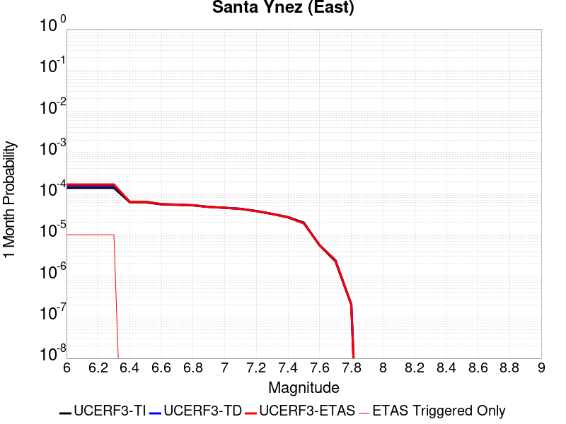 |  |  |

| Magnitude | 1 wk TI Prob | 1 wk TD Prob | 1 wk ETAS Prob | 1 wk ETAS/TD Gain | 1 wk ETAS Triggered Only | 1 mo TI Prob | 1 mo TD Prob | 1 mo ETAS Prob | 1 mo ETAS/TD Gain | 1 mo ETAS Triggered Only | 1 yr TI Prob | 1 yr TD Prob | 1 yr ETAS Prob | 1 yr ETAS/TD Gain | 1 yr ETAS Triggered Only | 10 yr TI Prob | 10 yr TD Prob | 10 yr ETAS Prob | 10 yr ETAS/TD Gain | 10 yr ETAS Triggered Only |
|-----|-----|-----|-----|-----|-----|-----|-----|-----|-----|-----|-----|-----|-----|-----|-----|-----|-----|-----|-----|-----|
| 6.0 | 3.2269712E-5 | 3.6754725E-5 | 3.6754725E-5 | 1.0 | 0.0 | 1.3829143E-4 | 1.5751406E-4 | 1.7234721E-4 | 1.0941702 | 1.4835475E-5 | 0.0016823979 | 0.0019166367 | 0.0019610578 | 1.0231766 | 4.4506425E-5 | 0.016697178 | 0.01905861 | 0.01911682 | 1.0030543 | 5.93419E-5 |
| 6.1 | 3.2269712E-5 | 3.6754725E-5 | 3.6754725E-5 | 1.0 | 0.0 | 1.3829143E-4 | 1.5751406E-4 | 1.7234721E-4 | 1.0941702 | 1.4835475E-5 | 0.0016823979 | 0.0019166367 | 0.0019610578 | 1.0231766 | 4.4506425E-5 | 0.016697178 | 0.01905861 | 0.01911682 | 1.0030543 | 5.93419E-5 |
| 6.2 | 3.2269712E-5 | 3.6754725E-5 | 3.6754725E-5 | 1.0 | 0.0 | 1.3829143E-4 | 1.5751406E-4 | 1.7234721E-4 | 1.0941702 | 1.4835475E-5 | 0.0016823979 | 0.0019166367 | 0.0019610578 | 1.0231766 | 4.4506425E-5 | 0.016697178 | 0.01905861 | 0.01911682 | 1.0030543 | 5.93419E-5 |
| 6.3 | 3.2269712E-5 | 3.6754725E-5 | 3.6754725E-5 | 1.0 | 0.0 | 1.3829143E-4 | 1.5751406E-4 | 1.7234721E-4 | 1.0941702 | 1.4835475E-5 | 0.0016823979 | 0.0019166367 | 0.0019610578 | 1.0231766 | 4.4506425E-5 | 0.016697178 | 0.01905861 | 0.01911682 | 1.0030543 | 5.93419E-5 |
| 6.4 | 1.4404779E-5 | 1.4850318E-5 | 1.4850318E-5 | 1.0 | 0.0 | 6.1733306E-5 | 6.364269E-5 | 6.364269E-5 | 1.0 | 0.0 | 7.513438E-4 | 7.7457936E-4 | 7.7457936E-4 | 1.0 | 0.0 | 0.0074880854 | 0.0077193463 | 0.0077340673 | 1.001907 | 1.4835475E-5 |
| 6.5 | 1.4404779E-5 | 1.4850318E-5 | 1.4850318E-5 | 1.0 | 0.0 | 6.1733306E-5 | 6.364269E-5 | 6.364269E-5 | 1.0 | 0.0 | 7.513438E-4 | 7.7457936E-4 | 7.7457936E-4 | 1.0 | 0.0 | 0.0074880854 | 0.0077193463 | 0.0077340673 | 1.001907 | 1.4835475E-5 |
| 6.6 | 1.280208E-5 | 1.3012704E-5 | 1.3012704E-5 | 1.0 | 0.0 | 5.4864904E-5 | 5.5767545E-5 | 5.5767545E-5 | 1.0 | 0.0 | 6.6777546E-4 | 6.787601E-4 | 6.787601E-4 | 1.0 | 0.0 | 0.006657724 | 0.0067670806 | 0.0067670806 | 1.0 | 0.0 |
| 6.7 | 1.2457027E-5 | 1.2629195E-5 | 1.2629195E-5 | 1.0 | 0.0 | 5.3386164E-5 | 5.4124008E-5 | 5.4124008E-5 | 1.0 | 0.0 | 6.497827E-4 | 6.5876223E-4 | 6.5876223E-4 | 1.0 | 0.0 | 0.00647886 | 0.006568292 | 0.006568292 | 1.0 | 0.0 |
| 6.8 | 1.2095134E-5 | 1.2231616E-5 | 1.2231616E-5 | 1.0 | 0.0 | 5.1835254E-5 | 5.2420168E-5 | 5.2420168E-5 | 1.0 | 0.0 | 6.309115E-4 | 6.3803024E-4 | 6.3803024E-4 | 1.0 | 0.0 | 0.0062912325 | 0.006362173 | 0.006362173 | 1.0 | 0.0 |
| 6.9 | 1.1104036E-5 | 1.1157988E-5 | 1.1157988E-5 | 1.0 | 0.0 | 4.758786E-5 | 4.781908E-5 | 4.781908E-5 | 1.0 | 0.0 | 5.7922816E-4 | 5.820431E-4 | 5.820431E-4 | 1.0 | 0.0 | 0.005777207 | 0.0058053317 | 0.0058053317 | 1.0 | 0.0 |
| 7.0 | 1.0577444E-5 | 1.0582286E-5 | 1.0582286E-5 | 1.0 | 0.0 | 4.5331115E-5 | 4.5351873E-5 | 4.5351873E-5 | 1.0 | 0.0 | 5.5176654E-4 | 5.520204E-4 | 5.520204E-4 | 1.0 | 0.0 | 0.0055039856 | 0.00550663 | 0.00550663 | 1.0 | 0.0 |
| 7.1 | 1.0021775E-5 | 9.981561E-6 | 9.981561E-6 | 1.0 | 0.0 | 4.294976E-5 | 4.277742E-5 | 4.277742E-5 | 1.0 | 0.0 | 5.2278786E-4 | 5.2069186E-4 | 5.2069186E-4 | 1.0 | 0.0 | 0.0052155964 | 0.005194851 | 0.005194851 | 1.0 | 0.0 |
| 7.2 | 8.874109E-6 | 8.749298E-6 | 8.749298E-6 | 1.0 | 0.0 | 3.8031343E-5 | 3.749646E-5 | 3.749646E-5 | 1.0 | 0.0 | 4.629332E-4 | 4.5642487E-4 | 4.5642487E-4 | 1.0 | 0.0 | 0.0046197 | 0.0045549925 | 0.0045549925 | 1.0 | 0.0 |
| 7.3 | 7.5504267E-6 | 7.5055245E-6 | 7.5055245E-6 | 1.0 | 0.0 | 3.235857E-5 | 3.2166143E-5 | 3.2166143E-5 | 1.0 | 0.0 | 3.9389438E-4 | 3.9155345E-4 | 3.9155345E-4 | 1.0 | 0.0 | 0.0039319694 | 0.0039087427 | 0.0039087427 | 1.0 | 0.0 |
| 7.4 | 6.309394E-6 | 6.183485E-6 | 6.183485E-6 | 1.0 | 0.0 | 2.703998E-5 | 2.6500386E-5 | 2.6500386E-5 | 1.0 | 0.0 | 3.2916202E-4 | 3.2259538E-4 | 3.2259538E-4 | 1.0 | 0.0 | 0.003286749 | 0.0032213682 | 0.0032213682 | 1.0 | 0.0 |
| 7.5 | 4.6103073E-6 | 4.441113E-6 | 4.441113E-6 | 1.0 | 0.0 | 1.975831E-5 | 1.9033208E-5 | 1.9033208E-5 | 1.0 | 0.0 | 2.4053088E-4 | 2.3170536E-4 | 2.3170536E-4 | 1.0 | 0.0 | 0.002402707 | 0.0023147073 | 0.0023147073 | 1.0 | 0.0 |
| 7.6 | 1.2858658E-6 | 1.3008648E-6 | 1.3008648E-6 | 1.0 | 0.0 | 5.5108417E-6 | 5.5751234E-6 | 5.5751234E-6 | 1.0 | 0.0 | 6.7092435E-5 | 6.787509E-5 | 6.787509E-5 | 1.0 | 0.0 | 6.707218E-4 | 6.7855045E-4 | 6.7855045E-4 | 1.0 | 0.0 |
| 7.7 | 5.3302307E-7 | 5.612336E-7 | 5.612336E-7 | 1.0 | 0.0 | 2.2843826E-6 | 2.405285E-6 | 2.405285E-6 | 1.0 | 0.0 | 2.7812002E-5 | 2.9283987E-5 | 2.9283987E-5 | 1.0 | 0.0 | 2.7808524E-4 | 2.9280485E-4 | 2.9280485E-4 | 1.0 | 0.0 |
| 7.8 | 4.613933E-8 | 4.8031403E-8 | 4.8031403E-8 | 1.0 | 0.0 | 1.9773998E-7 | 2.0584885E-7 | 2.0584885E-7 | 1.0 | 0.0 | 2.4074816E-6 | 2.506207E-6 | 2.506207E-6 | 1.0 | 0.0 | 2.4074554E-5 | 2.5061798E-5 | 2.5061798E-5 | 1.0 | 0.0 |

## Camp Rock 2011
*[(top)](#table-of-contents)*

| 1 Week | 1 Month | 1 Year | 10 Year |
|-----|-----|-----|-----|
| 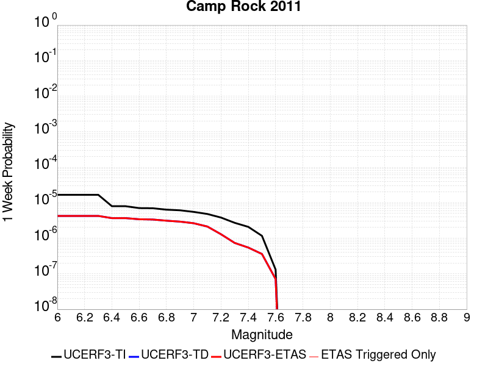 |  |  |  |

| Magnitude | 1 wk TI Prob | 1 wk TD Prob | 1 wk ETAS Prob | 1 wk ETAS/TD Gain | 1 wk ETAS Triggered Only | 1 mo TI Prob | 1 mo TD Prob | 1 mo ETAS Prob | 1 mo ETAS/TD Gain | 1 mo ETAS Triggered Only | 1 yr TI Prob | 1 yr TD Prob | 1 yr ETAS Prob | 1 yr ETAS/TD Gain | 1 yr ETAS Triggered Only | 10 yr TI Prob | 10 yr TD Prob | 10 yr ETAS Prob | 10 yr ETAS/TD Gain | 10 yr ETAS Triggered Only |
|-----|-----|-----|-----|-----|-----|-----|-----|-----|-----|-----|-----|-----|-----|-----|-----|-----|-----|-----|-----|-----|
| 6.0 | 1.6710783E-5 | 4.250515E-6 | 4.250515E-6 | 1.0 | 0.0 | 7.161568E-5 | 1.8216368E-5 | 1.8216368E-5 | 1.0 | 0.0 | 8.7157206E-4 | 2.2176222E-4 | 2.2176222E-4 | 1.0 | 0.0 | 0.008681616 | 0.0022154623 | 0.0022746727 | 1.026726 | 5.93419E-5 |
| 6.1 | 1.6710783E-5 | 4.250515E-6 | 4.250515E-6 | 1.0 | 0.0 | 7.161568E-5 | 1.8216368E-5 | 1.8216368E-5 | 1.0 | 0.0 | 8.7157206E-4 | 2.2176222E-4 | 2.2176222E-4 | 1.0 | 0.0 | 0.008681616 | 0.0022154623 | 0.0022746727 | 1.026726 | 5.93419E-5 |
| 6.2 | 1.6710783E-5 | 4.250515E-6 | 4.250515E-6 | 1.0 | 0.0 | 7.161568E-5 | 1.8216368E-5 | 1.8216368E-5 | 1.0 | 0.0 | 8.7157206E-4 | 2.2176222E-4 | 2.2176222E-4 | 1.0 | 0.0 | 0.008681616 | 0.0022154623 | 0.0022746727 | 1.026726 | 5.93419E-5 |
| 6.3 | 1.6710783E-5 | 4.250515E-6 | 4.250515E-6 | 1.0 | 0.0 | 7.161568E-5 | 1.8216368E-5 | 1.8216368E-5 | 1.0 | 0.0 | 8.7157206E-4 | 2.2176222E-4 | 2.2176222E-4 | 1.0 | 0.0 | 0.008681616 | 0.0022154623 | 0.0022746727 | 1.026726 | 5.93419E-5 |
| 6.4 | 7.982846E-6 | 3.6823128E-6 | 3.6823128E-6 | 1.0 | 0.0 | 3.421175E-5 | 1.5781246E-5 | 1.5781246E-5 | 1.0 | 0.0 | 4.1644843E-4 | 1.9212009E-4 | 1.9212009E-4 | 1.0 | 0.0 | 0.0041566887 | 0.0019195748 | 0.0019788027 | 1.0308547 | 5.93419E-5 |
| 6.5 | 7.982846E-6 | 3.6823128E-6 | 3.6823128E-6 | 1.0 | 0.0 | 3.421175E-5 | 1.5781246E-5 | 1.5781246E-5 | 1.0 | 0.0 | 4.1644843E-4 | 1.9212009E-4 | 1.9212009E-4 | 1.0 | 0.0 | 0.0041566887 | 0.0019195748 | 0.0019788027 | 1.0308547 | 5.93419E-5 |
| 6.6 | 7.048869E-6 | 3.4245718E-6 | 3.4245718E-6 | 1.0 | 0.0 | 3.0209088E-5 | 1.4676656E-5 | 1.4676656E-5 | 1.0 | 0.0 | 3.677336E-4 | 1.7867394E-4 | 1.7867394E-4 | 1.0 | 0.0 | 0.0036712566 | 0.0017853345 | 0.0018445705 | 1.0331792 | 5.93419E-5 |
| 6.7 | 6.987307E-6 | 3.362547E-6 | 3.362547E-6 | 1.0 | 0.0 | 2.9945259E-5 | 1.4410838E-5 | 1.4410838E-5 | 1.0 | 0.0 | 3.6452254E-4 | 1.7543814E-4 | 1.7543814E-4 | 1.0 | 0.0 | 0.0036392517 | 0.0017530276 | 0.0018122654 | 1.0337918 | 5.93419E-5 |
| 6.8 | 6.3737602E-6 | 3.1181078E-6 | 3.1181078E-6 | 1.0 | 0.0 | 2.731583E-5 | 1.3363252E-5 | 1.3363252E-5 | 1.0 | 0.0 | 3.3251947E-4 | 1.6268574E-4 | 1.6268574E-4 | 1.0 | 0.0 | 0.0033202237 | 0.001625695 | 0.0016849404 | 1.0364431 | 5.93419E-5 |
| 6.9 | 6.112211E-6 | 2.9333075E-6 | 2.9333075E-6 | 1.0 | 0.0 | 2.6194928E-5 | 1.2571259E-5 | 1.2571259E-5 | 1.0 | 0.0 | 3.1887658E-4 | 1.530446E-4 | 1.530446E-4 | 1.0 | 0.0 | 0.003184194 | 0.0015294199 | 0.001588671 | 1.0387409 | 5.93419E-5 |
| 7.0 | 5.5140117E-6 | 2.6420923E-6 | 2.6420923E-6 | 1.0 | 0.0 | 2.3631264E-5 | 1.13232045E-5 | 1.13232045E-5 | 1.0 | 0.0 | 2.8767265E-4 | 1.3785154E-4 | 1.3785154E-4 | 1.0 | 0.0 | 0.0028730053 | 0.0013776857 | 0.0014221307 | 1.0322607 | 4.4506425E-5 |
| 7.1 | 4.8151105E-6 | 2.134413E-6 | 2.134413E-6 | 1.0 | 0.0 | 2.0636026E-5 | 9.147454E-6 | 9.147454E-6 | 1.0 | 0.0 | 2.5121463E-4 | 1.1136478E-4 | 1.1136478E-4 | 1.0 | 0.0 | 0.0025093083 | 0.0011131116 | 0.0011575685 | 1.0399393 | 4.4506425E-5 |
| 7.2 | 3.818335E-6 | 1.2938482E-6 | 1.2938482E-6 | 1.0 | 0.0 | 1.6364189E-5 | 5.5450523E-6 | 5.5450523E-6 | 1.0 | 0.0 | 1.9921579E-4 | 6.7509005E-5 | 6.7509005E-5 | 1.0 | 0.0 | 0.0019903728 | 6.748932E-4 | 7.0454413E-4 | 1.0439342 | 2.967095E-5 |
| 7.3 | 2.7166698E-6 | 7.3843864E-7 | 7.3843864E-7 | 1.0 | 0.0 | 1.1642818E-5 | 3.1647332E-6 | 3.1647332E-6 | 1.0 | 0.0 | 1.4174209E-4 | 3.8529965E-5 | 3.8529965E-5 | 1.0 | 0.0 | 0.0014165172 | 3.8523486E-4 | 3.8523486E-4 | 1.0 | 0.0 |
| 7.4 | 2.0893426E-6 | 5.462476E-7 | 5.462476E-7 | 1.0 | 0.0 | 8.954295E-6 | 2.3410591E-6 | 2.3410591E-6 | 1.0 | 0.0 | 1.0901308E-4 | 2.8502027E-5 | 2.8502027E-5 | 1.0 | 0.0 | 0.0010895962 | 2.8498424E-4 | 2.8498424E-4 | 1.0 | 0.0 |
| 7.5 | 1.1681728E-6 | 3.6034095E-7 | 3.6034095E-7 | 1.0 | 0.0 | 5.0064455E-6 | 1.5443175E-6 | 1.5443175E-6 | 1.0 | 0.0 | 6.0951766E-5 | 1.8801908E-5 | 1.8801908E-5 | 1.0 | 0.0 | 6.093505E-4 | 1.8800364E-4 | 1.8800364E-4 | 1.0 | 0.0 |
| 7.6 | 1.3154387E-7 | 7.120178E-8 | 7.120178E-8 | 1.0 | 0.0 | 5.6375933E-7 | 3.0515045E-7 | 3.0515045E-7 | 1.0 | 0.0 | 6.863748E-6 | 3.7152022E-6 | 3.7152022E-6 | 1.0 | 0.0 | 6.863536E-5 | 3.7151556E-5 | 3.7151556E-5 | 1.0 | 0.0 |

## Oceanic - West Huasna
*[(top)](#table-of-contents)*

| 1 Week | 1 Month | 1 Year | 10 Year |
|-----|-----|-----|-----|
|  |  | 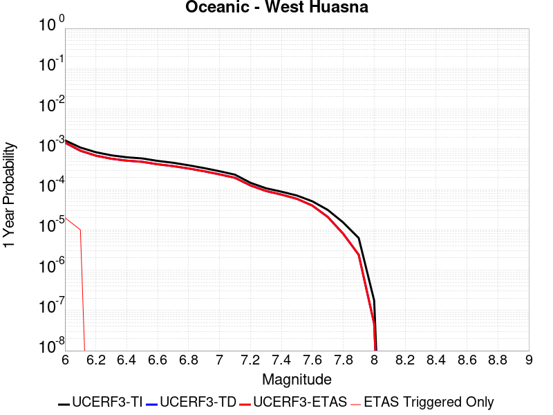 |  |

| Magnitude | 1 wk TI Prob | 1 wk TD Prob | 1 wk ETAS Prob | 1 wk ETAS/TD Gain | 1 wk ETAS Triggered Only | 1 mo TI Prob | 1 mo TD Prob | 1 mo ETAS Prob | 1 mo ETAS/TD Gain | 1 mo ETAS Triggered Only | 1 yr TI Prob | 1 yr TD Prob | 1 yr ETAS Prob | 1 yr ETAS/TD Gain | 1 yr ETAS Triggered Only | 10 yr TI Prob | 10 yr TD Prob | 10 yr ETAS Prob | 10 yr ETAS/TD Gain | 10 yr ETAS Triggered Only |
|-----|-----|-----|-----|-----|-----|-----|-----|-----|-----|-----|-----|-----|-----|-----|-----|-----|-----|-----|-----|-----|
| 6.0 | 3.195567E-5 | 2.7928321E-5 | 2.7928321E-5 | 1.0 | 0.0 | 1.3694567E-4 | 1.1968755E-4 | 1.1968755E-4 | 1.0 | 0.0 | 0.0016660384 | 0.0014562651 | 0.0014858928 | 1.020345 | 2.967095E-5 | 0.016536033 | 0.014471775 | 0.014530258 | 1.0040412 | 5.93419E-5 |
| 6.1 | 2.1156782E-5 | 1.757435E-5 | 1.757435E-5 | 1.0 | 0.0 | 9.066878E-5 | 7.531652E-5 | 7.531652E-5 | 1.0 | 0.0 | 0.0011033333 | 9.1660226E-4 | 9.3142415E-4 | 1.0161705 | 1.4835475E-5 | 0.010978713 | 0.009129224 | 0.009158625 | 1.0032204 | 2.967095E-5 |
| 6.2 | 1.6195117E-5 | 1.3327761E-5 | 1.3327761E-5 | 1.0 | 0.0 | 6.9405796E-5 | 5.711774E-5 | 5.711774E-5 | 1.0 | 0.0 | 8.44688E-4 | 6.9518917E-4 | 6.9518917E-4 | 1.0 | 0.0 | 0.008414844 | 0.0069304383 | 0.0069304383 | 1.0 | 0.0 |
| 6.3 | 1.3559345E-5 | 1.1179624E-5 | 1.1179624E-5 | 1.0 | 0.0 | 5.811018E-5 | 4.7911803E-5 | 4.7911803E-5 | 1.0 | 0.0 | 7.072618E-4 | 5.8317103E-4 | 5.8317103E-4 | 1.0 | 0.0 | 0.0070501505 | 0.0058165253 | 0.0058165253 | 1.0 | 0.0 |
| 6.4 | 1.2120619E-5 | 1.0001396E-5 | 1.0001396E-5 | 1.0 | 0.0 | 5.1944477E-5 | 4.2862423E-5 | 4.2862423E-5 | 1.0 | 0.0 | 6.322405E-4 | 5.217255E-4 | 5.217255E-4 | 1.0 | 0.0 | 0.006304447 | 0.0052050743 | 0.0052050743 | 1.0 | 0.0 |
| 6.5 | 1.13511915E-5 | 9.367862E-6 | 9.367862E-6 | 1.0 | 0.0 | 4.8647056E-5 | 4.0147366E-5 | 4.0147366E-5 | 1.0 | 0.0 | 5.9211696E-4 | 4.88685E-4 | 4.88685E-4 | 1.0 | 0.0 | 0.0059054173 | 0.0048761624 | 0.0048761624 | 1.0 | 0.0 |
| 6.6 | 9.850605E-6 | 8.135751E-6 | 8.135751E-6 | 1.0 | 0.0 | 4.2216197E-5 | 3.486704E-5 | 3.486704E-5 | 1.0 | 0.0 | 5.1386096E-4 | 4.2442378E-4 | 4.2442378E-4 | 1.0 | 0.0 | 0.0051267436 | 0.004236164 | 0.004236164 | 1.0 | 0.0 |
| 6.7 | 8.8558645E-6 | 7.318733E-6 | 7.318733E-6 | 1.0 | 0.0 | 3.7953152E-5 | 3.1365624E-5 | 3.1365624E-5 | 1.0 | 0.0 | 4.6198163E-4 | 3.8180972E-4 | 3.8180972E-4 | 1.0 | 0.0 | 0.004610224 | 0.003811563 | 0.003811563 | 1.0 | 0.0 |
| 6.8 | 7.67136E-6 | 6.392021E-6 | 6.392021E-6 | 1.0 | 0.0 | 3.2876844E-5 | 2.739409E-5 | 2.739409E-5 | 1.0 | 0.0 | 4.0020206E-4 | 3.3347216E-4 | 3.3347216E-4 | 1.0 | 0.0 | 0.003994821 | 0.0033297385 | 0.0033297385 | 1.0 | 0.0 |
| 6.9 | 6.534529E-6 | 5.458561E-6 | 5.458561E-6 | 1.0 | 0.0 | 2.8004823E-5 | 2.3393624E-5 | 2.3393624E-5 | 1.0 | 0.0 | 3.4090536E-4 | 2.8478028E-4 | 2.8478028E-4 | 1.0 | 0.0 | 0.0034038287 | 0.0028441702 | 0.0028441702 | 1.0 | 0.0 |
| 7.0 | 5.460525E-6 | 4.5701554E-6 | 4.5701554E-6 | 1.0 | 0.0 | 2.3402039E-5 | 1.9586234E-5 | 1.9586234E-5 | 1.0 | 0.0 | 2.8488258E-4 | 2.384364E-4 | 2.384364E-4 | 1.0 | 0.0 | 0.0028451765 | 0.0023818198 | 0.0023818198 | 1.0 | 0.0 |
| 7.1 | 4.4825083E-6 | 3.7526281E-6 | 3.7526281E-6 | 1.0 | 0.0 | 1.9210609E-5 | 1.6082593E-5 | 1.6082593E-5 | 1.0 | 0.0 | 2.3386406E-4 | 1.9578807E-4 | 1.9578807E-4 | 1.0 | 0.0 | 0.002336181 | 0.0019561679 | 0.0019561679 | 1.0 | 0.0 |
| 7.2 | 2.821708E-6 | 2.4250867E-6 | 2.4250867E-6 | 1.0 | 0.0 | 1.2092979E-5 | 1.0393187E-5 | 1.0393187E-5 | 1.0 | 0.0 | 1.4722206E-4 | 1.265297E-4 | 1.265297E-4 | 1.0 | 0.0 | 0.0014712457 | 0.0012645791 | 0.0012645791 | 1.0 | 0.0 |
| 7.3 | 2.0644757E-6 | 1.76888E-6 | 1.76888E-6 | 1.0 | 0.0 | 8.847723E-6 | 7.580892E-6 | 7.580892E-6 | 1.0 | 0.0 | 1.0771569E-4 | 9.2293456E-5 | 9.2293456E-5 | 1.0 | 0.0 | 0.001076635 | 9.22553E-4 | 9.22553E-4 | 1.0 | 0.0 |
| 7.4 | 1.6980367E-6 | 1.4381133E-6 | 1.4381133E-6 | 1.0 | 0.0 | 7.27728E-6 | 6.1633277E-6 | 6.1633277E-6 | 1.0 | 0.0 | 8.8597284E-5 | 7.503593E-5 | 7.503593E-5 | 1.0 | 0.0 | 8.8561967E-4 | 7.501076E-4 | 7.501076E-4 | 1.0 | 0.0 |
| 7.5 | 1.3637683E-6 | 1.1303825E-6 | 1.1303825E-6 | 1.0 | 0.0 | 5.844708E-6 | 4.844487E-6 | 4.844487E-6 | 1.0 | 0.0 | 7.1156996E-5 | 5.898004E-5 | 5.898004E-5 | 1.0 | 0.0 | 7.1134215E-4 | 5.8964535E-4 | 5.8964535E-4 | 1.0 | 0.0 |
| 7.6 | 9.802994E-7 | 7.678364E-7 | 7.678364E-7 | 1.0 | 0.0 | 4.2012766E-6 | 3.2907233E-6 | 3.2907233E-6 | 1.0 | 0.0 | 5.1149345E-5 | 4.006382E-5 | 4.006382E-5 | 1.0 | 0.0 | 5.113757E-4 | 4.005674E-4 | 4.005674E-4 | 1.0 | 0.0 |
| 7.7 | 5.986191E-7 | 4.0059376E-7 | 4.0059376E-7 | 1.0 | 0.0 | 2.5655079E-6 | 1.7168292E-6 | 1.7168292E-6 | 1.0 | 0.0 | 3.1234613E-5 | 2.0902195E-5 | 2.0902195E-5 | 1.0 | 0.0 | 3.123022E-4 | 2.0900364E-4 | 2.0900364E-4 | 1.0 | 0.0 |
| 7.8 | 2.9189815E-7 | 1.5293615E-7 | 1.5293615E-7 | 1.0 | 0.0 | 1.2509914E-6 | 6.554405E-7 | 6.554405E-7 | 1.0 | 0.0 | 1.5230714E-5 | 7.979958E-6 | 7.979958E-6 | 1.0 | 0.0 | 1.522967E-4 | 7.979803E-5 | 7.979803E-5 | 1.0 | 0.0 |
| 7.9 | 1.2057845E-7 | 4.6255913E-8 | 4.6255913E-8 | 1.0 | 0.0 | 5.1676466E-7 | 1.982396E-7 | 1.982396E-7 | 1.0 | 0.0 | 6.2915915E-6 | 2.4135645E-6 | 2.4135645E-6 | 1.0 | 0.0 | 6.2914136E-5 | 2.4136689E-5 | 2.4136689E-5 | 1.0 | 0.0 |
| 8.0 | 3.3806387E-9 | 9.0281727E-10 | 9.0281727E-10 | 1.0 | 0.0 | 1.4488451E-8 | 3.8692174E-9 | 3.8692174E-9 | 1.0 | 0.0 | 1.7639688E-7 | 4.710772E-8 | 4.710772E-8 | 1.0 | 0.0 | 1.7639674E-6 | 4.7217176E-7 | 4.7217176E-7 | 1.0 | 0.0 |

## Lake Isabella (Seismicity)
*[(top)](#table-of-contents)*

| 1 Week | 1 Month | 1 Year | 10 Year |
|-----|-----|-----|-----|
|  | 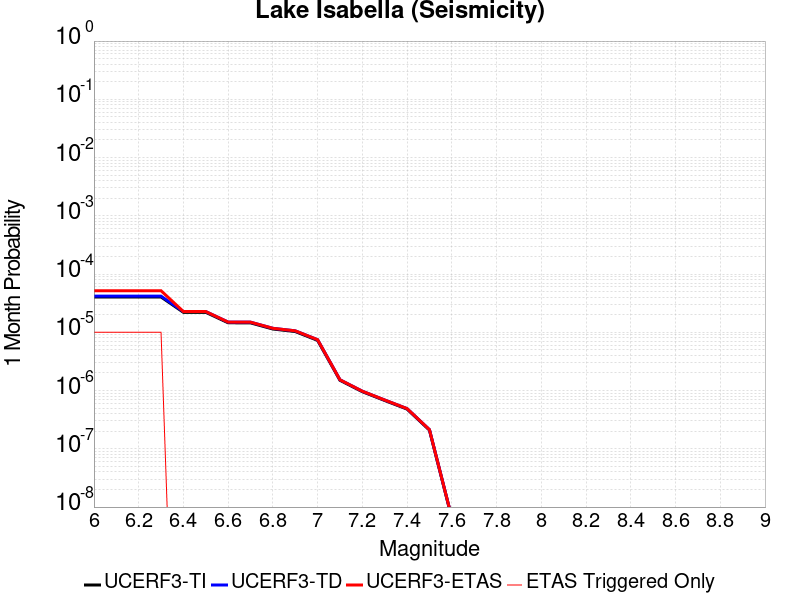 |  | 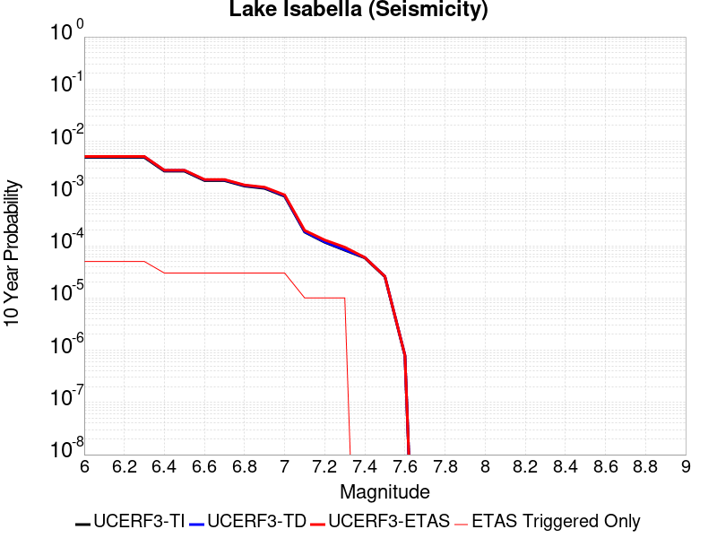 |

| Magnitude | 1 wk TI Prob | 1 wk TD Prob | 1 wk ETAS Prob | 1 wk ETAS/TD Gain | 1 wk ETAS Triggered Only | 1 mo TI Prob | 1 mo TD Prob | 1 mo ETAS Prob | 1 mo ETAS/TD Gain | 1 mo ETAS Triggered Only | 1 yr TI Prob | 1 yr TD Prob | 1 yr ETAS Prob | 1 yr ETAS/TD Gain | 1 yr ETAS Triggered Only | 10 yr TI Prob | 10 yr TD Prob | 10 yr ETAS Prob | 10 yr ETAS/TD Gain | 10 yr ETAS Triggered Only |
|-----|-----|-----|-----|-----|-----|-----|-----|-----|-----|-----|-----|-----|-----|-----|-----|-----|-----|-----|-----|-----|
| 6.0 | 9.431637E-6 | 9.741864E-6 | 9.741864E-6 | 1.0 | 0.0 | 4.0420677E-5 | 4.1750252E-5 | 5.6585108E-5 | 1.3553237 | 1.4835475E-5 | 4.920106E-4 | 5.082038E-4 | 5.378597E-4 | 1.0583543 | 2.967095E-5 | 0.004909227 | 0.0050717094 | 0.00513075 | 1.0116413 | 5.93419E-5 |
| 6.1 | 9.431637E-6 | 9.741864E-6 | 9.741864E-6 | 1.0 | 0.0 | 4.0420677E-5 | 4.1750252E-5 | 5.6585108E-5 | 1.3553237 | 1.4835475E-5 | 4.920106E-4 | 5.082038E-4 | 5.378597E-4 | 1.0583543 | 2.967095E-5 | 0.004909227 | 0.0050717094 | 0.00513075 | 1.0116413 | 5.93419E-5 |
| 6.2 | 9.431637E-6 | 9.741864E-6 | 9.741864E-6 | 1.0 | 0.0 | 4.0420677E-5 | 4.1750252E-5 | 5.6585108E-5 | 1.3553237 | 1.4835475E-5 | 4.920106E-4 | 5.082038E-4 | 5.378597E-4 | 1.0583543 | 2.967095E-5 | 0.004909227 | 0.0050717094 | 0.00513075 | 1.0116413 | 5.93419E-5 |
| 6.3 | 9.431637E-6 | 9.741864E-6 | 9.741864E-6 | 1.0 | 0.0 | 4.0420677E-5 | 4.1750252E-5 | 5.6585108E-5 | 1.3553237 | 1.4835475E-5 | 4.920106E-4 | 5.082038E-4 | 5.378597E-4 | 1.0583543 | 2.967095E-5 | 0.004909227 | 0.0050717094 | 0.00513075 | 1.0116413 | 5.93419E-5 |
| 6.4 | 5.144063E-6 | 5.3001827E-6 | 5.3001827E-6 | 1.0 | 0.0 | 2.2045799E-5 | 2.271489E-5 | 2.271489E-5 | 1.0 | 0.0 | 2.6837454E-4 | 2.7652216E-4 | 2.7652216E-4 | 1.0 | 0.0 | 0.0026805066 | 0.0027621211 | 0.0027917102 | 1.0107124 | 2.967095E-5 |
| 6.5 | 5.144063E-6 | 5.3001827E-6 | 5.3001827E-6 | 1.0 | 0.0 | 2.2045799E-5 | 2.271489E-5 | 2.271489E-5 | 1.0 | 0.0 | 2.6837454E-4 | 2.7652216E-4 | 2.7652216E-4 | 1.0 | 0.0 | 0.0026805066 | 0.0027621211 | 0.0027917102 | 1.0107124 | 2.967095E-5 |
| 6.6 | 3.4009804E-6 | 3.498853E-6 | 3.498853E-6 | 1.0 | 0.0 | 1.4575549E-5 | 1.49950065E-5 | 1.49950065E-5 | 1.0 | 0.0 | 1.7744285E-4 | 1.8255052E-4 | 1.8255052E-4 | 1.0 | 0.0 | 0.0017730123 | 0.0018241634 | 0.0018537802 | 1.0162358 | 2.967095E-5 |
| 6.7 | 3.3880428E-6 | 3.4857194E-6 | 3.4857194E-6 | 1.0 | 0.0 | 1.4520103E-5 | 1.4938721E-5 | 1.4938721E-5 | 1.0 | 0.0 | 1.767679E-4 | 1.8186535E-4 | 1.8186535E-4 | 1.0 | 0.0 | 0.0017662736 | 0.0018173229 | 0.0018469399 | 1.0162971 | 2.967095E-5 |
| 6.8 | 2.6582E-6 | 2.7337517E-6 | 2.7337517E-6 | 1.0 | 0.0 | 1.1392236E-5 | 1.1716033E-5 | 1.1716033E-5 | 1.0 | 0.0 | 1.3869164E-4 | 1.4263472E-4 | 1.4263472E-4 | 1.0 | 0.0 | 0.0013860512 | 0.0014255638 | 0.0014551925 | 1.0207838 | 2.967095E-5 |
| 6.9 | 2.406011E-6 | 2.4743754E-6 | 2.4743754E-6 | 1.0 | 0.0 | 1.0311434E-5 | 1.0604431E-5 | 1.0604431E-5 | 1.0 | 0.0 | 1.2553448E-4 | 1.2910261E-4 | 1.2910261E-4 | 1.0 | 0.0 | 0.0012546359 | 0.0012904058 | 0.0013200383 | 1.0229639 | 2.967095E-5 |
| 7.0 | 1.6953097E-6 | 1.7429696E-6 | 1.7429696E-6 | 1.0 | 0.0 | 7.265593E-6 | 7.4698546E-6 | 7.4698546E-6 | 1.0 | 0.0 | 8.8455E-5 | 9.094273E-5 | 9.094273E-5 | 1.0 | 0.0 | 8.84198E-4 | 9.091579E-4 | 9.3880185E-4 | 1.032606 | 2.967095E-5 |
| 7.1 | 3.5013824E-7 | 3.5715297E-7 | 3.5715297E-7 | 1.0 | 0.0 | 1.5005916E-6 | 1.5306547E-6 | 1.5306547E-6 | 1.0 | 0.0 | 1.826955E-5 | 1.8635565E-5 | 1.8635565E-5 | 1.0 | 0.0 | 1.8268047E-4 | 1.8634027E-4 | 1.8634027E-4 | 1.0 | 0.0 |
| 7.2 | 2.2321095E-7 | 2.2750864E-7 | 2.2750864E-7 | 1.0 | 0.0 | 9.56618E-7 | 9.750366E-7 | 9.750366E-7 | 1.0 | 0.0 | 1.1646762E-5 | 1.1871008E-5 | 1.1871008E-5 | 1.0 | 0.0 | 1.1646151E-4 | 1.18703836E-4 | 1.18703836E-4 | 1.0 | 0.0 |
| 7.3 | 1.5760406E-7 | 1.6061125E-7 | 1.6061125E-7 | 1.0 | 0.0 | 6.7544585E-7 | 6.883338E-7 | 6.883338E-7 | 1.0 | 0.0 | 8.223522E-6 | 8.380432E-6 | 8.380432E-6 | 1.0 | 0.0 | 8.2232174E-5 | 8.380122E-5 | 8.380122E-5 | 1.0 | 0.0 |
| 7.4 | 1.1216497E-7 | 1.1431852E-7 | 1.1431852E-7 | 1.0 | 0.0 | 4.8070694E-7 | 4.899364E-7 | 4.899364E-7 | 1.0 | 0.0 | 5.852591E-6 | 5.96496E-6 | 5.96496E-6 | 1.0 | 0.0 | 5.8524372E-5 | 5.9648042E-5 | 5.9648042E-5 | 1.0 | 0.0 |
| 7.5 | 4.885185E-8 | 4.978837E-8 | 4.978837E-8 | 1.0 | 0.0 | 2.0936506E-7 | 2.1337871E-7 | 2.1337871E-7 | 1.0 | 0.0 | 2.5490165E-6 | 2.597883E-6 | 2.597883E-6 | 1.0 | 0.0 | 2.5489873E-5 | 2.5978543E-5 | 2.5978543E-5 | 1.0 | 0.0 |
| 7.6 | 1.504641E-9 | 1.5318086E-9 | 1.5318086E-9 | 1.0 | 0.0 | 6.4484613E-9 | 6.564894E-9 | 6.564894E-9 | 1.0 | 0.0 | 7.851001E-8 | 7.992759E-8 | 7.992759E-8 | 1.0 | 0.0 | 7.8509987E-7 | 7.992758E-7 | 7.992758E-7 | 1.0 | 0.0 |

## Pleito
*[(top)](#table-of-contents)*

| 1 Week | 1 Month | 1 Year | 10 Year |
|-----|-----|-----|-----|
|  |  | 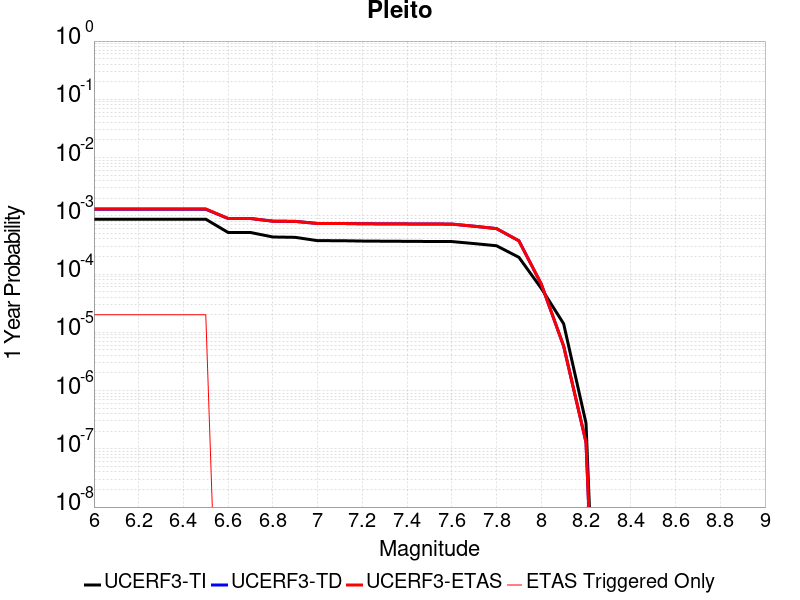 |  |

| Magnitude | 1 wk TI Prob | 1 wk TD Prob | 1 wk ETAS Prob | 1 wk ETAS/TD Gain | 1 wk ETAS Triggered Only | 1 mo TI Prob | 1 mo TD Prob | 1 mo ETAS Prob | 1 mo ETAS/TD Gain | 1 mo ETAS Triggered Only | 1 yr TI Prob | 1 yr TD Prob | 1 yr ETAS Prob | 1 yr ETAS/TD Gain | 1 yr ETAS Triggered Only | 10 yr TI Prob | 10 yr TD Prob | 10 yr ETAS Prob | 10 yr ETAS/TD Gain | 10 yr ETAS Triggered Only |
|-----|-----|-----|-----|-----|-----|-----|-----|-----|-----|-----|-----|-----|-----|-----|-----|-----|-----|-----|-----|-----|
| 6.0 | 1.6763008E-5 | 2.4797213E-5 | 3.963232E-5 | 1.5982571 | 1.4835475E-5 | 7.183948E-5 | 1.0626984E-4 | 1.2110374E-4 | 1.139587 | 1.4835475E-5 | 8.742947E-4 | 0.0012931395 | 0.001322772 | 1.0229152 | 2.967095E-5 | 0.00870863 | 0.012970737 | 0.013029309 | 1.0045158 | 5.93419E-5 |
| 6.1 | 1.6763008E-5 | 2.4797213E-5 | 3.963232E-5 | 1.5982571 | 1.4835475E-5 | 7.183948E-5 | 1.0626984E-4 | 1.2110374E-4 | 1.139587 | 1.4835475E-5 | 8.742947E-4 | 0.0012931395 | 0.001322772 | 1.0229152 | 2.967095E-5 | 0.00870863 | 0.012970737 | 0.013029309 | 1.0045158 | 5.93419E-5 |
| 6.2 | 1.6763008E-5 | 2.4797213E-5 | 3.963232E-5 | 1.5982571 | 1.4835475E-5 | 7.183948E-5 | 1.0626984E-4 | 1.2110374E-4 | 1.139587 | 1.4835475E-5 | 8.742947E-4 | 0.0012931395 | 0.001322772 | 1.0229152 | 2.967095E-5 | 0.00870863 | 0.012970737 | 0.013029309 | 1.0045158 | 5.93419E-5 |
| 6.3 | 1.6763008E-5 | 2.4797213E-5 | 3.963232E-5 | 1.5982571 | 1.4835475E-5 | 7.183948E-5 | 1.0626984E-4 | 1.2110374E-4 | 1.139587 | 1.4835475E-5 | 8.742947E-4 | 0.0012931395 | 0.001322772 | 1.0229152 | 2.967095E-5 | 0.00870863 | 0.012970737 | 0.013029309 | 1.0045158 | 5.93419E-5 |
| 6.4 | 1.6763008E-5 | 2.4797213E-5 | 3.963232E-5 | 1.5982571 | 1.4835475E-5 | 7.183948E-5 | 1.0626984E-4 | 1.2110374E-4 | 1.139587 | 1.4835475E-5 | 8.742947E-4 | 0.0012931395 | 0.001322772 | 1.0229152 | 2.967095E-5 | 0.00870863 | 0.012970737 | 0.013029309 | 1.0045158 | 5.93419E-5 |
| 6.5 | 1.6763008E-5 | 2.4797213E-5 | 3.963232E-5 | 1.5982571 | 1.4835475E-5 | 7.183948E-5 | 1.0626984E-4 | 1.2110374E-4 | 1.139587 | 1.4835475E-5 | 8.742947E-4 | 0.0012931395 | 0.001322772 | 1.0229152 | 2.967095E-5 | 0.00870863 | 0.012970737 | 0.013029309 | 1.0045158 | 5.93419E-5 |
| 6.6 | 9.910213E-6 | 1.7247488E-5 | 1.7247488E-5 | 1.0 | 0.0 | 4.247165E-5 | 7.391573E-5 | 7.391573E-5 | 1.0 | 0.0 | 5.169696E-4 | 8.995562E-4 | 8.995562E-4 | 1.0 | 0.0 | 0.0051576863 | 0.009067351 | 0.009067351 | 1.0 | 0.0 |
| 6.7 | 9.910213E-6 | 1.7247488E-5 | 1.7247488E-5 | 1.0 | 0.0 | 4.247165E-5 | 7.391573E-5 | 7.391573E-5 | 1.0 | 0.0 | 5.169696E-4 | 8.995562E-4 | 8.995562E-4 | 1.0 | 0.0 | 0.0051576863 | 0.009067351 | 0.009067351 | 1.0 | 0.0 |
| 6.8 | 8.300162E-6 | 1.5507003E-5 | 1.5507003E-5 | 1.0 | 0.0 | 3.557164E-5 | 6.64569E-5 | 6.64569E-5 | 1.0 | 0.0 | 4.3299864E-4 | 8.0881384E-4 | 8.0881384E-4 | 1.0 | 0.0 | 0.004321559 | 0.008166755 | 0.008166755 | 1.0 | 0.0 |
| 6.9 | 8.183114E-6 | 1.5378204E-5 | 1.5378204E-5 | 1.0 | 0.0 | 3.5070017E-5 | 6.590493E-5 | 6.590493E-5 | 1.0 | 0.0 | 4.2689382E-4 | 8.0209854E-4 | 8.0209854E-4 | 1.0 | 0.0 | 0.0042607468 | 0.008100093 | 0.008100093 | 1.0 | 0.0 |
| 7.0 | 7.1748823E-6 | 1.4164783E-5 | 1.4164783E-5 | 1.0 | 0.0 | 3.0749135E-5 | 6.0704806E-5 | 6.0704806E-5 | 1.0 | 0.0 | 3.743064E-4 | 7.3883095E-4 | 7.3883095E-4 | 1.0 | 0.0 | 0.0037367654 | 0.007471346 | 0.007471346 | 1.0 | 0.0 |
| 7.1 | 7.1671807E-6 | 1.415515E-5 | 1.415515E-5 | 1.0 | 0.0 | 3.0716128E-5 | 6.066352E-5 | 6.066352E-5 | 1.0 | 0.0 | 3.7390468E-4 | 7.383286E-4 | 7.383286E-4 | 1.0 | 0.0 | 0.0037327618 | 0.0074663567 | 0.0074663567 | 1.0 | 0.0 |
| 7.2 | 7.0649667E-6 | 1.4002334E-5 | 1.4002334E-5 | 1.0 | 0.0 | 3.0278077E-5 | 6.0008624E-5 | 6.0008624E-5 | 1.0 | 0.0 | 3.6857324E-4 | 7.303606E-4 | 7.303606E-4 | 1.0 | 0.0 | 0.0036796255 | 0.00738706 | 0.00738706 | 1.0 | 0.0 |
| 7.3 | 7.02082E-6 | 1.3945726E-5 | 1.3945726E-5 | 1.0 | 0.0 | 3.008888E-5 | 5.9766033E-5 | 5.9766033E-5 | 1.0 | 0.0 | 3.6627054E-4 | 7.2740903E-4 | 7.2740903E-4 | 1.0 | 0.0 | 0.0036566744 | 0.0073575284 | 0.0073575284 | 1.0 | 0.0 |
| 7.4 | 6.987146E-6 | 1.3905253E-5 | 1.3905253E-5 | 1.0 | 0.0 | 2.9944567E-5 | 5.959258E-5 | 5.959258E-5 | 1.0 | 0.0 | 3.6451413E-4 | 7.2529865E-4 | 7.2529865E-4 | 1.0 | 0.0 | 0.0036391679 | 0.0073364456 | 0.0073364456 | 1.0 | 0.0 |
| 7.5 | 6.9494554E-6 | 1.3862132E-5 | 1.3862132E-5 | 1.0 | 0.0 | 2.9783041E-5 | 5.9407786E-5 | 5.9407786E-5 | 1.0 | 0.0 | 3.625482E-4 | 7.2305027E-4 | 7.2305027E-4 | 1.0 | 0.0 | 0.0036195726 | 0.007314061 | 0.007314061 | 1.0 | 0.0 |
| 7.6 | 6.92694E-6 | 1.3821195E-5 | 1.3821195E-5 | 1.0 | 0.0 | 2.9686547E-5 | 5.9232352E-5 | 5.9232352E-5 | 1.0 | 0.0 | 3.6137376E-4 | 7.209158E-4 | 7.209158E-4 | 1.0 | 0.0 | 0.0036078666 | 0.007292789 | 0.007292789 | 1.0 | 0.0 |
| 7.7 | 6.395867E-6 | 1.2698913E-5 | 1.2698913E-5 | 1.0 | 0.0 | 2.741057E-5 | 5.442278E-5 | 5.442278E-5 | 1.0 | 0.0 | 3.336726E-4 | 6.6239625E-4 | 6.6239625E-4 | 1.0 | 0.0 | 0.0033317201 | 0.0067107705 | 0.0067107705 | 1.0 | 0.0 |
| 7.8 | 5.8664327E-6 | 1.1563894E-5 | 1.1563894E-5 | 1.0 | 0.0 | 2.5141611E-5 | 4.9558606E-5 | 4.9558606E-5 | 1.0 | 0.0 | 3.060561E-4 | 6.032092E-4 | 6.032092E-4 | 1.0 | 0.0 | 0.0030563495 | 0.006114913 | 0.006114913 | 1.0 | 0.0 |
| 7.9 | 3.7167474E-6 | 7.131041E-6 | 7.131041E-6 | 1.0 | 0.0 | 1.592882E-5 | 3.056125E-5 | 3.056125E-5 | 1.0 | 0.0 | 1.9391612E-4 | 3.720198E-4 | 3.720198E-4 | 1.0 | 0.0 | 0.0019374699 | 0.0037761168 | 0.0037761168 | 1.0 | 0.0 |
| 8.0 | 1.0903841E-6 | 1.2916613E-6 | 1.2916613E-6 | 1.0 | 0.0 | 4.6730665E-6 | 5.5356795E-6 | 5.5356795E-6 | 1.0 | 0.0 | 5.68931E-5 | 6.739483E-5 | 6.739483E-5 | 1.0 | 0.0 | 5.6878536E-4 | 6.961499E-4 | 6.961499E-4 | 1.0 | 0.0 |
| 8.1 | 2.6894583E-7 | 1.11232666E-7 | 1.11232666E-7 | 1.0 | 0.0 | 1.1526245E-6 | 4.767113E-7 | 4.767113E-7 | 1.0 | 0.0 | 1.4033113E-5 | 5.803945E-6 | 5.803945E-6 | 1.0 | 0.0 | 1.4032227E-4 | 6.4920496E-5 | 6.4920496E-5 | 1.0 | 0.0 |
| 8.2 | 5.2967013E-9 | 2.4728761E-9 | 2.4728761E-9 | 1.0 | 0.0 | 2.2700148E-8 | 1.059804E-8 | 1.059804E-8 | 1.0 | 0.0 | 2.7637427E-7 | 1.2903112E-7 | 1.2903112E-7 | 1.0 | 0.0 | 2.7637393E-6 | 1.4676939E-6 | 1.4676939E-6 | 1.0 | 0.0 |

## Chino alt 1
*[(top)](#table-of-contents)*

| 1 Week | 1 Month | 1 Year | 10 Year |
|-----|-----|-----|-----|
| 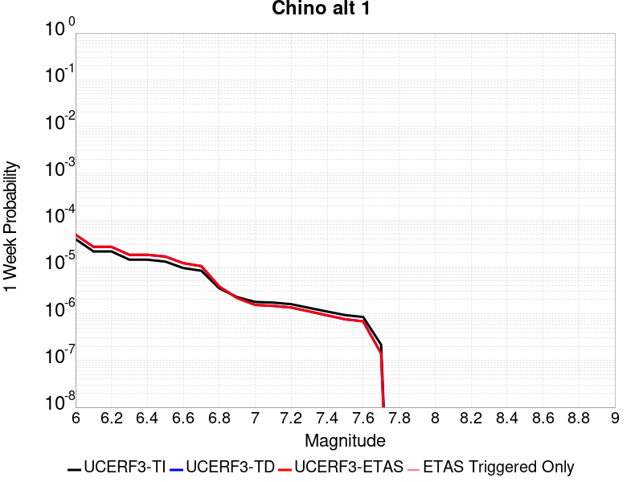 |  |  | 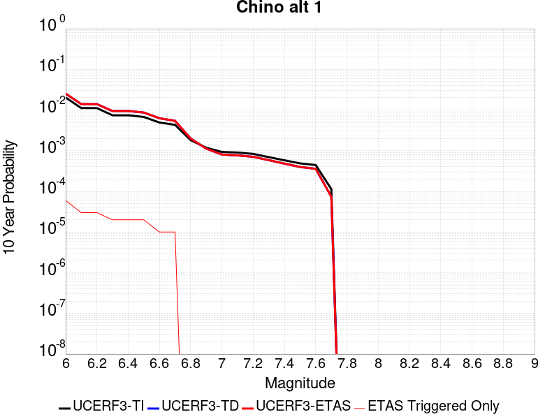 |

| Magnitude | 1 wk TI Prob | 1 wk TD Prob | 1 wk ETAS Prob | 1 wk ETAS/TD Gain | 1 wk ETAS Triggered Only | 1 mo TI Prob | 1 mo TD Prob | 1 mo ETAS Prob | 1 mo ETAS/TD Gain | 1 mo ETAS Triggered Only | 1 yr TI Prob | 1 yr TD Prob | 1 yr ETAS Prob | 1 yr ETAS/TD Gain | 1 yr ETAS Triggered Only | 10 yr TI Prob | 10 yr TD Prob | 10 yr ETAS Prob | 10 yr ETAS/TD Gain | 10 yr ETAS Triggered Only |
|-----|-----|-----|-----|-----|-----|-----|-----|-----|-----|-----|-----|-----|-----|-----|-----|-----|-----|-----|-----|-----|
| 6.0 | 3.939946E-5 | 4.895755E-5 | 4.895755E-5 | 1.0 | 0.0 | 1.6884391E-4 | 2.0980414E-4 | 2.246365E-4 | 1.0706962 | 1.4835475E-5 | 0.0020537362 | 0.0025518565 | 0.0025814516 | 1.0115975 | 2.967095E-5 | 0.020348595 | 0.02528239 | 0.025340231 | 1.0022879 | 5.93419E-5 |
| 6.1 | 2.1505624E-5 | 2.688459E-5 | 2.688459E-5 | 1.0 | 0.0 | 9.2163704E-5 | 1.1521521E-4 | 1.3004898E-4 | 1.1287483 | 1.4835475E-5 | 0.0011215154 | 0.001401954 | 0.0014167686 | 1.0105672 | 1.4835475E-5 | 0.011158722 | 0.013947982 | 0.013991867 | 1.0031464 | 4.4506425E-5 |
| 6.2 | 2.1505624E-5 | 2.688459E-5 | 2.688459E-5 | 1.0 | 0.0 | 9.2163704E-5 | 1.1521521E-4 | 1.3004898E-4 | 1.1287483 | 1.4835475E-5 | 0.0011215154 | 0.001401954 | 0.0014167686 | 1.0105672 | 1.4835475E-5 | 0.011158722 | 0.013947982 | 0.013991867 | 1.0031464 | 4.4506425E-5 |
| 6.3 | 1.4290785E-5 | 1.8169489E-5 | 1.8169489E-5 | 1.0 | 0.0 | 6.1244784E-5 | 7.786717E-5 | 9.2701484E-5 | 1.190508 | 1.4835475E-5 | 7.454001E-4 | 9.4766583E-4 | 9.6248725E-4 | 1.0156399 | 1.4835475E-5 | 0.007429048 | 0.00944669 | 0.009476081 | 1.0031112 | 2.967095E-5 |
| 6.4 | 1.4290785E-5 | 1.8169489E-5 | 1.8169489E-5 | 1.0 | 0.0 | 6.1244784E-5 | 7.786717E-5 | 9.2701484E-5 | 1.190508 | 1.4835475E-5 | 7.454001E-4 | 9.4766583E-4 | 9.6248725E-4 | 1.0156399 | 1.4835475E-5 | 0.007429048 | 0.00944669 | 0.009476081 | 1.0031112 | 2.967095E-5 |
| 6.5 | 1.3017944E-5 | 1.6656259E-5 | 1.6656259E-5 | 1.0 | 0.0 | 5.5789995E-5 | 7.138226E-5 | 8.621668E-5 | 1.2078166 | 1.4835475E-5 | 6.790315E-4 | 8.6877635E-4 | 8.835989E-4 | 1.0170615 | 1.4835475E-5 | 0.0067696036 | 0.0086640855 | 0.0086934995 | 1.003395 | 2.967095E-5 |
| 6.6 | 9.470016E-6 | 1.2042512E-5 | 1.2042512E-5 | 1.0 | 0.0 | 4.058515E-5 | 5.1609935E-5 | 6.644464E-5 | 1.287439 | 1.4835475E-5 | 4.940122E-4 | 6.282038E-4 | 6.430299E-4 | 1.0236008 | 1.4835475E-5 | 0.004929154 | 0.0062734867 | 0.006288229 | 1.00235 | 1.4835475E-5 |
| 6.7 | 8.314155E-6 | 1.0410444E-5 | 1.0410444E-5 | 1.0 | 0.0 | 3.5631605E-5 | 4.4615605E-5 | 5.9450416E-5 | 1.3325027 | 1.4835475E-5 | 4.3372845E-4 | 5.4309185E-4 | 5.5791927E-4 | 1.0273019 | 1.4835475E-5 | 0.004328829 | 0.00542717 | 0.005441925 | 1.0027187 | 1.4835475E-5 |
| 6.8 | 3.4856364E-6 | 3.814128E-6 | 3.814128E-6 | 1.0 | 0.0 | 1.4938357E-5 | 1.6346172E-5 | 1.6346172E-5 | 1.0 | 0.0 | 1.8185932E-4 | 1.9899855E-4 | 1.9899855E-4 | 1.0 | 0.0 | 0.0018171056 | 0.0019898796 | 0.0019898796 | 1.0 | 0.0 |
| 6.9 | 2.2645952E-6 | 2.1533108E-6 | 2.1533108E-6 | 1.0 | 0.0 | 9.705372E-6 | 9.228443E-6 | 9.228443E-6 | 1.0 | 0.0 | 1.18156495E-4 | 1.1235072E-4 | 1.1235072E-4 | 1.0 | 0.0 | 0.0011809369 | 0.0011235552 | 0.0011235552 | 1.0 | 0.0 |
| 7.0 | 1.7864003E-6 | 1.5433981E-6 | 1.5433981E-6 | 1.0 | 0.0 | 7.655979E-6 | 6.614547E-6 | 6.614547E-6 | 1.0 | 0.0 | 9.3207556E-5 | 8.052919E-5 | 8.052919E-5 | 1.0 | 0.0 | 9.316847E-4 | 8.054473E-4 | 8.054473E-4 | 1.0 | 0.0 |
| 7.1 | 1.7315456E-6 | 1.4736598E-6 | 1.4736598E-6 | 1.0 | 0.0 | 7.420889E-6 | 6.31567E-6 | 6.31567E-6 | 1.0 | 0.0 | 9.034557E-5 | 7.6890625E-5 | 7.6890625E-5 | 1.0 | 0.0 | 9.0308854E-4 | 7.6907815E-4 | 7.6907815E-4 | 1.0 | 0.0 |
| 7.2 | 1.6008337E-6 | 1.3576906E-6 | 1.3576906E-6 | 1.0 | 0.0 | 6.860698E-6 | 5.818661E-6 | 5.818661E-6 | 1.0 | 0.0 | 8.352579E-5 | 7.083995E-5 | 7.083995E-5 | 1.0 | 0.0 | 8.34944E-4 | 7.0859795E-4 | 7.0859795E-4 | 1.0 | 0.0 |
| 7.3 | 1.3320939E-6 | 1.1219976E-6 | 1.1219976E-6 | 1.0 | 0.0 | 5.7089615E-6 | 4.808552E-6 | 4.808552E-6 | 1.0 | 0.0 | 6.9504385E-5 | 5.85426E-5 | 5.85426E-5 | 1.0 | 0.0 | 6.9482654E-4 | 5.8541633E-4 | 5.8541633E-4 | 1.0 | 0.0 |
| 7.4 | 1.114294E-6 | 9.238818E-7 | 9.238818E-7 | 1.0 | 0.0 | 4.775537E-6 | 3.9594875E-6 | 3.9594875E-6 | 1.0 | 0.0 | 5.8140613E-5 | 4.8205733E-5 | 4.8205733E-5 | 1.0 | 0.0 | 5.81254E-4 | 4.8196956E-4 | 4.8196956E-4 | 1.0 | 0.0 |
| 7.5 | 9.354081E-7 | 7.6247795E-7 | 7.6247795E-7 | 1.0 | 0.0 | 4.0088858E-6 | 3.2677588E-6 | 3.2677588E-6 | 1.0 | 0.0 | 4.8807087E-5 | 3.978427E-5 | 3.978427E-5 | 1.0 | 0.0 | 4.879637E-4 | 3.977749E-4 | 3.977749E-4 | 1.0 | 0.0 |
| 7.6 | 8.521771E-7 | 6.8819065E-7 | 6.8819065E-7 | 1.0 | 0.0 | 3.6521824E-6 | 2.9493854E-6 | 2.9493854E-6 | 1.0 | 0.0 | 4.4464414E-5 | 3.5908208E-5 | 3.5908208E-5 | 1.0 | 0.0 | 4.4455516E-4 | 3.590272E-4 | 3.590272E-4 | 1.0 | 0.0 |
| 7.7 | 2.1803626E-7 | 1.4189794E-7 | 1.4189794E-7 | 1.0 | 0.0 | 9.344408E-7 | 6.08134E-7 | 6.08134E-7 | 1.0 | 0.0 | 1.1376757E-5 | 7.404016E-6 | 7.404016E-6 | 1.0 | 0.0 | 1.13761744E-4 | 7.403865E-5 | 7.403865E-5 | 1.0 | 0.0 |

## Palos Verdes
*[(top)](#table-of-contents)*

| 1 Week | 1 Month | 1 Year | 10 Year |
|-----|-----|-----|-----|
| 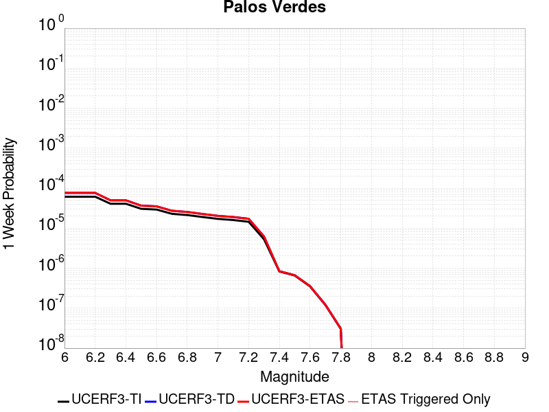 | 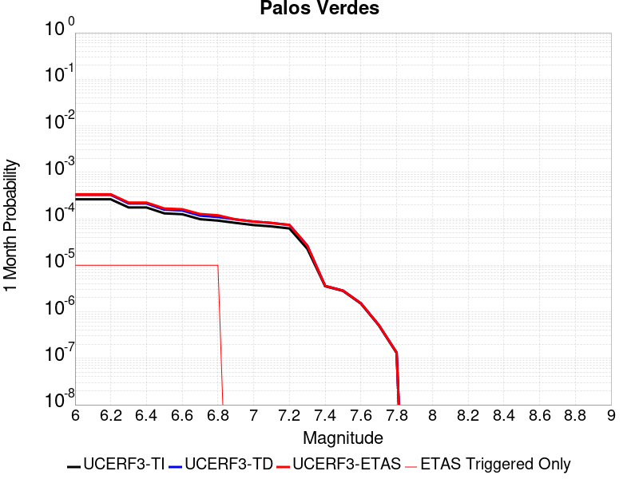 |  |  |

| Magnitude | 1 wk TI Prob | 1 wk TD Prob | 1 wk ETAS Prob | 1 wk ETAS/TD Gain | 1 wk ETAS Triggered Only | 1 mo TI Prob | 1 mo TD Prob | 1 mo ETAS Prob | 1 mo ETAS/TD Gain | 1 mo ETAS Triggered Only | 1 yr TI Prob | 1 yr TD Prob | 1 yr ETAS Prob | 1 yr ETAS/TD Gain | 1 yr ETAS Triggered Only | 10 yr TI Prob | 10 yr TD Prob | 10 yr ETAS Prob | 10 yr ETAS/TD Gain | 10 yr ETAS Triggered Only |
|-----|-----|-----|-----|-----|-----|-----|-----|-----|-----|-----|-----|-----|-----|-----|-----|-----|-----|-----|-----|-----|
| 6.0 | 6.126063E-5 | 7.623865E-5 | 7.623865E-5 | 1.0 | 0.0 | 2.6251914E-4 | 3.266995E-4 | 3.415301E-4 | 1.0453954 | 1.4835475E-5 | 0.0031914865 | 0.0039708 | 0.0040151295 | 1.011164 | 4.4506425E-5 | 0.031460393 | 0.03905503 | 0.039112054 | 1.0014601 | 5.93419E-5 |
| 6.1 | 6.126063E-5 | 7.623865E-5 | 7.623865E-5 | 1.0 | 0.0 | 2.6251914E-4 | 3.266995E-4 | 3.415301E-4 | 1.0453954 | 1.4835475E-5 | 0.0031914865 | 0.0039708 | 0.0040151295 | 1.011164 | 4.4506425E-5 | 0.031460393 | 0.03905503 | 0.039112054 | 1.0014601 | 5.93419E-5 |
| 6.2 | 6.126063E-5 | 7.623865E-5 | 7.623865E-5 | 1.0 | 0.0 | 2.6251914E-4 | 3.266995E-4 | 3.415301E-4 | 1.0453954 | 1.4835475E-5 | 0.0031914865 | 0.0039708 | 0.0040151295 | 1.011164 | 4.4506425E-5 | 0.031460393 | 0.03905503 | 0.039112054 | 1.0014601 | 5.93419E-5 |
| 6.3 | 4.0838047E-5 | 4.975672E-5 | 4.975672E-5 | 1.0 | 0.0 | 1.7500846E-4 | 2.1322693E-4 | 2.2805925E-4 | 1.0695611 | 1.4835475E-5 | 0.0021286458 | 0.0025931497 | 0.0026227438 | 1.0114124 | 2.967095E-5 | 0.021083709 | 0.025650347 | 0.025693713 | 1.0016906 | 4.4506425E-5 |
| 6.4 | 4.0838047E-5 | 4.975672E-5 | 4.975672E-5 | 1.0 | 0.0 | 1.7500846E-4 | 2.1322693E-4 | 2.2805925E-4 | 1.0695611 | 1.4835475E-5 | 0.0021286458 | 0.0025931497 | 0.0026227438 | 1.0114124 | 2.967095E-5 | 0.021083709 | 0.025650347 | 0.025693713 | 1.0016906 | 4.4506425E-5 |
| 6.5 | 3.0512005E-5 | 3.656648E-5 | 3.656648E-5 | 1.0 | 0.0 | 1.3075917E-4 | 1.5670473E-4 | 1.7153787E-4 | 1.0946567 | 1.4835475E-5 | 0.0015908304 | 0.0019063281 | 0.0019359424 | 1.0155348 | 2.967095E-5 | 0.015794903 | 0.018911632 | 0.018955296 | 1.0023088 | 4.4506425E-5 |
| 6.6 | 2.9255087E-5 | 3.5159163E-5 | 3.5159163E-5 | 1.0 | 0.0 | 1.2537291E-4 | 1.5067408E-4 | 1.6550731E-4 | 1.0984459 | 1.4835475E-5 | 0.0015253464 | 0.0018330285 | 0.001862645 | 1.0161572 | 2.967095E-5 | 0.015149189 | 0.018190648 | 0.018234344 | 1.0024022 | 4.4506425E-5 |
| 6.7 | 2.287198E-5 | 2.7251765E-5 | 2.7251765E-5 | 1.0 | 0.0 | 9.801909E-5 | 1.16788564E-4 | 1.316223E-4 | 1.1270137 | 1.4835475E-5 | 0.001192729 | 0.0014210651 | 0.0014506938 | 1.0208497 | 2.967095E-5 | 0.011863477 | 0.014129014 | 0.014158265 | 1.0020703 | 2.967095E-5 |
| 6.8 | 2.1325764E-5 | 2.543515E-5 | 2.543515E-5 | 1.0 | 0.0 | 9.139293E-5 | 1.0900374E-4 | 1.238376E-4 | 1.1360857 | 1.4835475E-5 | 0.001112141 | 0.0013264029 | 0.0013560344 | 1.0223398 | 2.967095E-5 | 0.011065915 | 0.013193899 | 0.013223179 | 1.0022192 | 2.967095E-5 |
| 6.9 | 1.9009392E-5 | 2.2616416E-5 | 2.2616416E-5 | 1.0 | 0.0 | 8.1466285E-5 | 9.6924385E-5 | 9.6924385E-5 | 1.0 | 0.0 | 9.914007E-4 | 0.0011795029 | 0.001194321 | 1.0125629 | 1.4835475E-5 | 0.009869894 | 0.011741114 | 0.011755776 | 1.0012487 | 1.4835475E-5 |
| 7.0 | 1.7098473E-5 | 2.0321919E-5 | 2.0321919E-5 | 1.0 | 0.0 | 7.3277115E-5 | 8.709151E-5 | 8.709151E-5 | 1.0 | 0.0 | 8.917837E-4 | 0.0010599085 | 0.0010747283 | 1.013982 | 1.4835475E-5 | 0.008882134 | 0.010556972 | 0.010571651 | 1.0013905 | 1.4835475E-5 |
| 7.1 | 1.5982785E-5 | 1.8997158E-5 | 1.8997158E-5 | 1.0 | 0.0 | 6.849585E-5 | 8.141433E-5 | 8.141433E-5 | 1.0 | 0.0 | 8.336179E-4 | 9.908534E-4 | 0.0010056741 | 1.0149575 | 1.4835475E-5 | 0.008304977 | 0.009872721 | 0.009887409 | 1.0014879 | 1.4835475E-5 |
| 7.2 | 1.4468002E-5 | 1.7199409E-5 | 1.7199409E-5 | 1.0 | 0.0 | 6.200425E-5 | 7.371014E-5 | 7.371014E-5 | 1.0 | 0.0 | 7.546402E-4 | 8.971355E-4 | 9.119577E-4 | 1.0165217 | 1.4835475E-5 | 0.007520827 | 0.00894341 | 0.008958112 | 1.001644 | 1.4835475E-5 |
| 7.3 | 5.288233E-6 | 6.204405E-6 | 6.204405E-6 | 1.0 | 0.0 | 2.2663658E-5 | 2.6590233E-5 | 2.6590233E-5 | 1.0 | 0.0 | 2.7589512E-4 | 3.237229E-4 | 3.3855357E-4 | 1.0458128 | 1.4835475E-5 | 0.0027555283 | 0.003235937 | 0.0032507246 | 1.0045698 | 1.4835475E-5 |
| 7.4 | 8.279556E-7 | 8.408433E-7 | 8.408433E-7 | 1.0 | 0.0 | 3.5483763E-6 | 3.6036097E-6 | 3.6036097E-6 | 1.0 | 0.0 | 4.3200624E-5 | 4.387314E-5 | 4.387314E-5 | 1.0 | 0.0 | 4.3192226E-4 | 4.38652E-4 | 4.38652E-4 | 1.0 | 0.0 |
| 7.5 | 6.559831E-7 | 6.667301E-7 | 6.667301E-7 | 1.0 | 0.0 | 2.8113532E-6 | 2.857412E-6 | 2.857412E-6 | 1.0 | 0.0 | 3.4227687E-5 | 3.4788503E-5 | 3.4788503E-5 | 1.0 | 0.0 | 3.4222414E-4 | 3.4783722E-4 | 3.4783722E-4 | 1.0 | 0.0 |
| 7.6 | 3.5018968E-7 | 3.5620434E-7 | 3.5620434E-7 | 1.0 | 0.0 | 1.500812E-6 | 1.5265894E-6 | 1.5265894E-6 | 1.0 | 0.0 | 1.8272232E-5 | 1.8586114E-5 | 1.8586114E-5 | 1.0 | 0.0 | 1.8270731E-4 | 1.858502E-4 | 1.858502E-4 | 1.0 | 0.0 |
| 7.7 | 1.1986104E-7 | 1.219852E-7 | 1.219852E-7 | 1.0 | 0.0 | 5.1369005E-7 | 5.227936E-7 | 5.227936E-7 | 1.0 | 0.0 | 6.2541585E-6 | 6.364994E-6 | 6.364994E-6 | 1.0 | 0.0 | 6.2539824E-5 | 6.3648156E-5 | 6.3648156E-5 | 1.0 | 0.0 |
| 7.8 | 3.0445005E-8 | 3.1027977E-8 | 3.1027977E-8 | 1.0 | 0.0 | 1.3047858E-7 | 1.3297704E-7 | 1.3297704E-7 | 1.0 | 0.0 | 1.5885756E-6 | 1.6189945E-6 | 1.6189945E-6 | 1.0 | 0.0 | 1.5885644E-5 | 1.6189848E-5 | 1.6189848E-5 | 1.0 | 0.0 |

## San Jacinto (San Bernardino)
*[(top)](#table-of-contents)*

| 1 Week | 1 Month | 1 Year | 10 Year |
|-----|-----|-----|-----|
|  | 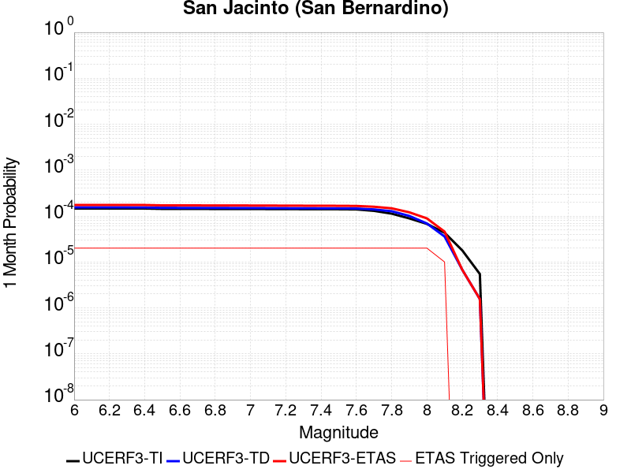 |  |  |

| Magnitude | 1 wk TI Prob | 1 wk TD Prob | 1 wk ETAS Prob | 1 wk ETAS/TD Gain | 1 wk ETAS Triggered Only | 1 mo TI Prob | 1 mo TD Prob | 1 mo ETAS Prob | 1 mo ETAS/TD Gain | 1 mo ETAS Triggered Only | 1 yr TI Prob | 1 yr TD Prob | 1 yr ETAS Prob | 1 yr ETAS/TD Gain | 1 yr ETAS Triggered Only | 10 yr TI Prob | 10 yr TD Prob | 10 yr ETAS Prob | 10 yr ETAS/TD Gain | 10 yr ETAS Triggered Only |
|-----|-----|-----|-----|-----|-----|-----|-----|-----|-----|-----|-----|-----|-----|-----|-----|-----|-----|-----|-----|-----|
| 6.0 | 3.409352E-5 | 3.6065667E-5 | 3.6065667E-5 | 1.0 | 0.0 | 1.461069E-4 | 1.5455799E-4 | 1.8422435E-4 | 1.1919433 | 2.967095E-5 | 0.0017774 | 0.0018801213 | 0.0019097364 | 1.0157517 | 2.967095E-5 | 0.01763251 | 0.019390382 | 0.019448573 | 1.0030011 | 5.93419E-5 |
| 6.1 | 3.409352E-5 | 3.6065667E-5 | 3.6065667E-5 | 1.0 | 0.0 | 1.461069E-4 | 1.5455799E-4 | 1.8422435E-4 | 1.1919433 | 2.967095E-5 | 0.0017774 | 0.0018801213 | 0.0019097364 | 1.0157517 | 2.967095E-5 | 0.01763251 | 0.019390382 | 0.019448573 | 1.0030011 | 5.93419E-5 |
| 6.2 | 3.409352E-5 | 3.6065667E-5 | 3.6065667E-5 | 1.0 | 0.0 | 1.461069E-4 | 1.5455799E-4 | 1.8422435E-4 | 1.1919433 | 2.967095E-5 | 0.0017774 | 0.0018801213 | 0.0019097364 | 1.0157517 | 2.967095E-5 | 0.01763251 | 0.019390382 | 0.019448573 | 1.0030011 | 5.93419E-5 |
| 6.3 | 3.409352E-5 | 3.6065667E-5 | 3.6065667E-5 | 1.0 | 0.0 | 1.461069E-4 | 1.5455799E-4 | 1.8422435E-4 | 1.1919433 | 2.967095E-5 | 0.0017774 | 0.0018801213 | 0.0019097364 | 1.0157517 | 2.967095E-5 | 0.01763251 | 0.019390382 | 0.019448573 | 1.0030011 | 5.93419E-5 |
| 6.4 | 3.400795E-5 | 3.595831E-5 | 3.595831E-5 | 1.0 | 0.0 | 1.4574021E-4 | 1.5409796E-4 | 1.8376434E-4 | 1.1925163 | 2.967095E-5 | 0.0017729428 | 0.0018745301 | 0.0019041455 | 1.0157988 | 2.967095E-5 | 0.017588645 | 0.019335456 | 0.01939365 | 1.0030097 | 5.93419E-5 |
| 6.5 | 3.341482E-5 | 3.521883E-5 | 3.521883E-5 | 1.0 | 0.0 | 1.4319851E-4 | 1.509291E-4 | 1.8059558E-4 | 1.196559 | 2.967095E-5 | 0.0017420477 | 0.0018360146 | 0.0018656311 | 1.0161308 | 2.967095E-5 | 0.017284546 | 0.018956954 | 0.01901517 | 1.003071 | 5.93419E-5 |
| 6.6 | 3.3364955E-5 | 3.5156037E-5 | 3.5156037E-5 | 1.0 | 0.0 | 1.4298483E-4 | 1.5066004E-4 | 1.803265E-4 | 1.19691 | 2.967095E-5 | 0.0017394501 | 0.0018327441 | 0.0018623606 | 1.0161597 | 2.967095E-5 | 0.017258976 | 0.018924814 | 0.018983033 | 1.0030763 | 5.93419E-5 |
| 6.7 | 3.335922E-5 | 3.5145807E-5 | 3.5145807E-5 | 1.0 | 0.0 | 1.4296026E-4 | 1.5061621E-4 | 1.8028269E-4 | 1.1969674 | 2.967095E-5 | 0.0017391514 | 0.0018322114 | 0.0018618279 | 1.0161644 | 2.967095E-5 | 0.017256035 | 0.018919604 | 0.018977825 | 1.0030771 | 5.93419E-5 |
| 6.8 | 3.327683E-5 | 3.5039855E-5 | 3.5039855E-5 | 1.0 | 0.0 | 1.4260718E-4 | 1.5016217E-4 | 1.7982867E-4 | 1.197563 | 2.967095E-5 | 0.0017348597 | 0.0018266928 | 0.0018563095 | 1.0162133 | 2.967095E-5 | 0.017213784 | 0.01886537 | 0.018923592 | 1.0030862 | 5.93419E-5 |
| 6.9 | 3.3235785E-5 | 3.4980796E-5 | 3.4980796E-5 | 1.0 | 0.0 | 1.4243131E-4 | 1.499091E-4 | 1.795756E-4 | 1.1978966 | 2.967095E-5 | 0.0017327217 | 0.0018236168 | 0.0018532336 | 1.0162407 | 2.967095E-5 | 0.017192734 | 0.018835234 | 0.018893456 | 1.0030912 | 5.93419E-5 |
| 7.0 | 3.3197095E-5 | 3.4920715E-5 | 3.4920715E-5 | 1.0 | 0.0 | 1.422655E-4 | 1.4965162E-4 | 1.7931813E-4 | 1.1982372 | 2.967095E-5 | 0.0017307063 | 0.0018204873 | 0.0018501042 | 1.0162687 | 2.967095E-5 | 0.017172894 | 0.018804604 | 0.01886283 | 1.0030963 | 5.93419E-5 |
| 7.1 | 3.3129716E-5 | 3.4800894E-5 | 3.4800894E-5 | 1.0 | 0.0 | 1.4197677E-4 | 1.4913817E-4 | 1.788047E-4 | 1.1989198 | 2.967095E-5 | 0.0017271966 | 0.0018142464 | 0.0018438635 | 1.0163248 | 2.967095E-5 | 0.017138338 | 0.018743671 | 0.0188019 | 1.0031066 | 5.93419E-5 |
| 7.2 | 3.3034008E-5 | 3.4668315E-5 | 3.4668315E-5 | 1.0 | 0.0 | 1.4156665E-4 | 1.4857003E-4 | 1.7823659E-4 | 1.1996804 | 2.967095E-5 | 0.0017222111 | 0.001807341 | 0.0018369583 | 1.0163872 | 2.967095E-5 | 0.017089253 | 0.018676054 | 0.018734287 | 1.003118 | 5.93419E-5 |
| 7.3 | 3.2956614E-5 | 3.4536028E-5 | 3.4536028E-5 | 1.0 | 0.0 | 1.4123498E-4 | 1.4800315E-4 | 1.776697E-4 | 1.2004454 | 2.967095E-5 | 0.0017181796 | 0.0018004505 | 0.0018300681 | 1.01645 | 2.967095E-5 | 0.017049557 | 0.018608782 | 0.01866702 | 1.0031296 | 5.93419E-5 |
| 7.4 | 3.2915937E-5 | 3.4457684E-5 | 3.4457684E-5 | 1.0 | 0.0 | 1.4106068E-4 | 1.4766744E-4 | 1.77334E-4 | 1.2009012 | 2.967095E-5 | 0.0017160608 | 0.00179637 | 0.0018259877 | 1.0164875 | 2.967095E-5 | 0.017028693 | 0.018569032 | 0.018627271 | 1.0031364 | 5.93419E-5 |
| 7.5 | 3.281791E-5 | 3.4322544E-5 | 3.4322544E-5 | 1.0 | 0.0 | 1.406406E-4 | 1.4708833E-4 | 1.7675491E-4 | 1.2016923 | 2.967095E-5 | 0.0017109542 | 0.0017893309 | 0.0018189488 | 1.0165524 | 2.967095E-5 | 0.016978411 | 0.018499894 | 0.018558137 | 1.0031483 | 5.93419E-5 |
| 7.6 | 3.2521442E-5 | 3.4047338E-5 | 3.4047338E-5 | 1.0 | 0.0 | 1.3937015E-4 | 1.4590901E-4 | 1.7557564E-4 | 1.2033228 | 2.967095E-5 | 0.0016955109 | 0.0017749962 | 0.0018046146 | 1.0166864 | 2.967095E-5 | 0.016826328 | 0.018357448 | 0.0184157 | 1.0031732 | 5.93419E-5 |
| 7.7 | 3.0287873E-5 | 3.2530454E-5 | 3.2530454E-5 | 1.0 | 0.0 | 1.297987E-4 | 1.3940879E-4 | 1.690756E-4 | 1.2128044 | 2.967095E-5 | 0.0015791537 | 0.0016959818 | 0.0017256024 | 1.0174652 | 2.967095E-5 | 0.01567979 | 0.017567866 | 0.017626164 | 1.0033185 | 5.93419E-5 |
| 7.8 | 2.6316151E-5 | 2.9738434E-5 | 2.9738434E-5 | 1.0 | 0.0 | 1.1277862E-4 | 1.274442E-4 | 1.5711138E-4 | 1.2327856 | 2.967095E-5 | 0.0013722149 | 0.0015505299 | 0.0015801548 | 1.0191064 | 2.967095E-5 | 0.013637724 | 0.016108006 | 0.01616639 | 1.0036247 | 5.93419E-5 |
| 7.9 | 2.0761147E-5 | 2.3483364E-5 | 2.3483364E-5 | 1.0 | 0.0 | 8.897331E-5 | 1.0063911E-4 | 1.3030707E-4 | 1.2947955 | 2.967095E-5 | 0.0010827117 | 0.0012245933 | 0.001254228 | 1.0241996 | 2.967095E-5 | 0.010774517 | 0.012826892 | 0.012885472 | 1.004567 | 5.93419E-5 |
| 8.0 | 1.5738568E-5 | 1.608255E-5 | 1.608255E-5 | 1.0 | 0.0 | 6.744926E-5 | 6.892339E-5 | 9.8592296E-5 | 1.430462 | 2.967095E-5 | 8.2088535E-4 | 8.388199E-4 | 8.68466E-4 | 1.0353426 | 2.967095E-5 | 0.008178596 | 0.008891695 | 0.008935806 | 1.0049609 | 4.4506425E-5 |
| 8.1 | 1.0105832E-5 | 8.3588775E-6 | 8.3588775E-6 | 1.0 | 0.0 | 4.3309992E-5 | 3.5823272E-5 | 5.0658215E-5 | 1.4141147 | 1.4835475E-5 | 5.2717153E-4 | 4.360616E-4 | 4.5089057E-4 | 1.0340067 | 1.4835475E-5 | 0.005259227 | 0.0046924953 | 0.004722027 | 1.0062934 | 2.967095E-5 |
| 8.2 | 4.189207E-6 | 1.5867982E-6 | 1.5867982E-6 | 1.0 | 0.0 | 1.7953622E-5 | 6.800546E-6 | 6.800546E-6 | 1.0 | 0.0 | 2.1856341E-4 | 8.279353E-5 | 8.279353E-5 | 1.0 | 0.0 | 0.0021834858 | 9.613657E-4 | 9.613657E-4 | 1.0 | 0.0 |
| 8.3 | 1.2758221E-6 | 3.6375246E-7 | 3.6375246E-7 | 1.0 | 0.0 | 5.4677976E-6 | 1.5589382E-6 | 1.5589382E-6 | 1.0 | 0.0 | 6.65684E-5 | 1.897991E-5 | 1.897991E-5 | 1.0 | 0.0 | 6.6548464E-4 | 2.2883656E-4 | 2.2883656E-4 | 1.0 | 0.0 |

## Ortigalita (North)
*[(top)](#table-of-contents)*

| 1 Week | 1 Month | 1 Year | 10 Year |
|-----|-----|-----|-----|
| 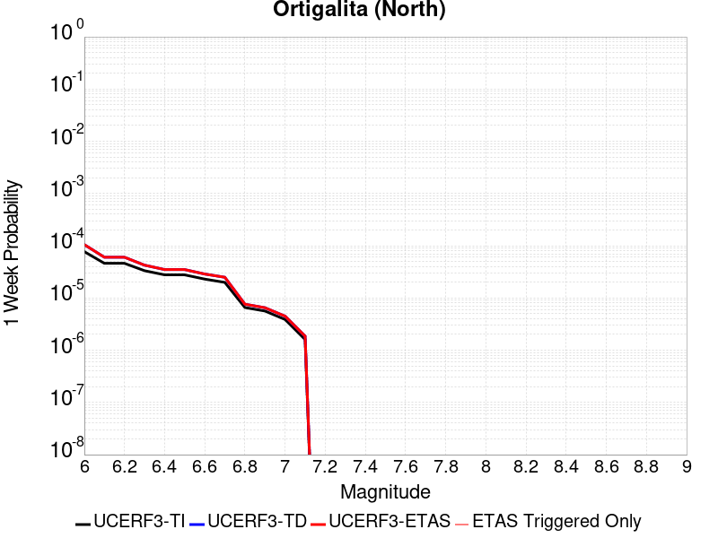 |  | 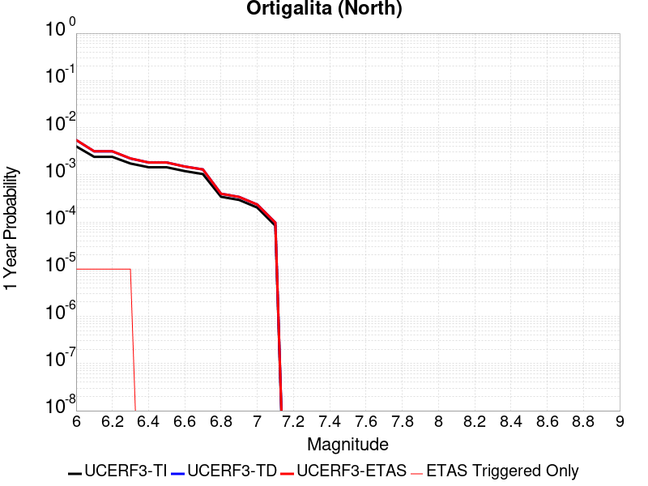 | 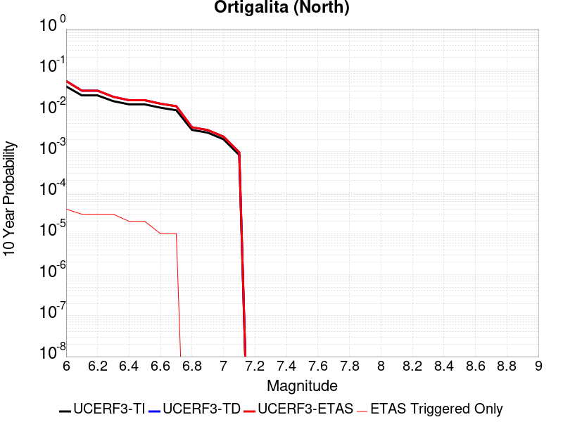 |

| Magnitude | 1 wk TI Prob | 1 wk TD Prob | 1 wk ETAS Prob | 1 wk ETAS/TD Gain | 1 wk ETAS Triggered Only | 1 mo TI Prob | 1 mo TD Prob | 1 mo ETAS Prob | 1 mo ETAS/TD Gain | 1 mo ETAS Triggered Only | 1 yr TI Prob | 1 yr TD Prob | 1 yr ETAS Prob | 1 yr ETAS/TD Gain | 1 yr ETAS Triggered Only | 10 yr TI Prob | 10 yr TD Prob | 10 yr ETAS Prob | 10 yr ETAS/TD Gain | 10 yr ETAS Triggered Only |
|-----|-----|-----|-----|-----|-----|-----|-----|-----|-----|-----|-----|-----|-----|-----|-----|-----|-----|-----|-----|-----|
| 6.0 | 7.711876E-5 | 1.05091276E-4 | 1.05091276E-4 | 1.0 | 0.0 | 3.3046713E-4 | 4.503243E-4 | 4.503243E-4 | 1.0 | 0.0 | 0.004016016 | 0.0054691676 | 0.0054839216 | 1.0026977 | 1.4835475E-5 | 0.039442103 | 0.05346601 | 0.05350814 | 1.000788 | 4.4506425E-5 |
| 6.1 | 4.607858E-5 | 6.025189E-5 | 6.025189E-5 | 1.0 | 0.0 | 1.9746469E-4 | 2.581996E-4 | 2.581996E-4 | 1.0 | 0.0 | 0.0024014818 | 0.003139375 | 0.003154164 | 1.0047108 | 1.4835475E-5 | 0.023756953 | 0.030981056 | 0.031009808 | 1.000928 | 2.967095E-5 |
| 6.2 | 4.607858E-5 | 6.025189E-5 | 6.025189E-5 | 1.0 | 0.0 | 1.9746469E-4 | 2.581996E-4 | 2.581996E-4 | 1.0 | 0.0 | 0.0024014818 | 0.003139375 | 0.003154164 | 1.0047108 | 1.4835475E-5 | 0.023756953 | 0.030981056 | 0.031009808 | 1.000928 | 2.967095E-5 |
| 6.3 | 3.327423E-5 | 4.2483174E-5 | 4.2483174E-5 | 1.0 | 0.0 | 1.4259605E-4 | 1.8205978E-4 | 1.8205978E-4 | 1.0 | 0.0 | 0.0017347244 | 0.0022146103 | 0.002229413 | 1.0066841 | 1.4835475E-5 | 0.017212452 | 0.02194961 | 0.02197863 | 1.0013222 | 2.967095E-5 |
| 6.4 | 2.7732503E-5 | 3.5004894E-5 | 3.5004894E-5 | 1.0 | 0.0 | 1.1884817E-4 | 1.5001385E-4 | 1.5001385E-4 | 1.0 | 0.0 | 0.001446016 | 0.001825132 | 0.001825132 | 1.0 | 0.0 | 0.014366428 | 0.018124387 | 0.018138953 | 1.0008037 | 1.4835475E-5 |
| 6.5 | 2.7689714E-5 | 3.49547E-5 | 3.49547E-5 | 1.0 | 0.0 | 1.186648E-4 | 1.4979875E-4 | 1.4979875E-4 | 1.0 | 0.0 | 0.0014437864 | 0.0018225177 | 0.0018225177 | 1.0 | 0.0 | 0.014344421 | 0.018098671 | 0.018113237 | 1.0008049 | 1.4835475E-5 |
| 6.6 | 2.2976905E-5 | 2.8723218E-5 | 2.8723218E-5 | 1.0 | 0.0 | 9.846873E-5 | 1.2309512E-4 | 1.2309512E-4 | 1.0 | 0.0 | 0.0011981975 | 0.0014978896 | 0.0014978896 | 1.0 | 0.0 | 0.011917574 | 0.014901216 | 0.01491583 | 1.0009807 | 1.4835475E-5 |
| 6.7 | 1.9871539E-5 | 2.490875E-5 | 2.490875E-5 | 1.0 | 0.0 | 8.516096E-5 | 1.0674882E-4 | 1.0674882E-4 | 1.0 | 0.0 | 0.0010363415 | 0.0012991407 | 0.0012991407 | 1.0 | 0.0 | 0.010315218 | 0.0129391495 | 0.012953793 | 1.0011318 | 1.4835475E-5 |
| 6.8 | 6.5640475E-6 | 7.6062943E-6 | 7.6062943E-6 | 1.0 | 0.0 | 2.813133E-5 | 3.259801E-5 | 3.259801E-5 | 1.0 | 0.0 | 3.424451E-4 | 3.9681137E-4 | 3.9681137E-4 | 1.0 | 0.0 | 0.0034191788 | 0.003961316 | 0.003961316 | 1.0 | 0.0 |
| 6.9 | 5.6219683E-6 | 6.5025133E-6 | 6.5025133E-6 | 1.0 | 0.0 | 2.4093928E-5 | 2.7867633E-5 | 2.7867633E-5 | 1.0 | 0.0 | 2.933041E-4 | 3.3923818E-4 | 3.3923818E-4 | 1.0 | 0.0 | 0.0029291727 | 0.0033874603 | 0.0033874603 | 1.0 | 0.0 |
| 7.0 | 3.875591E-6 | 4.485223E-6 | 4.485223E-6 | 1.0 | 0.0 | 1.6609569E-5 | 1.9222254E-5 | 1.9222254E-5 | 1.0 | 0.0 | 2.0220275E-4 | 2.3400792E-4 | 2.3400792E-4 | 1.0 | 0.0 | 0.0020201886 | 0.0023378236 | 0.0023378236 | 1.0 | 0.0 |
| 7.1 | 1.6017933E-6 | 1.8572383E-6 | 1.8572383E-6 | 1.0 | 0.0 | 6.8648105E-6 | 7.959574E-6 | 7.959574E-6 | 1.0 | 0.0 | 8.357586E-5 | 9.690457E-5 | 9.690457E-5 | 1.0 | 0.0 | 8.3544437E-4 | 9.687279E-4 | 9.687279E-4 | 1.0 | 0.0 |

## Cleghorn Lake
*[(top)](#table-of-contents)*

| 1 Week | 1 Month | 1 Year | 10 Year |
|-----|-----|-----|-----|
|  |  |  |  |

| Magnitude | 1 wk TI Prob | 1 wk TD Prob | 1 wk ETAS Prob | 1 wk ETAS/TD Gain | 1 wk ETAS Triggered Only | 1 mo TI Prob | 1 mo TD Prob | 1 mo ETAS Prob | 1 mo ETAS/TD Gain | 1 mo ETAS Triggered Only | 1 yr TI Prob | 1 yr TD Prob | 1 yr ETAS Prob | 1 yr ETAS/TD Gain | 1 yr ETAS Triggered Only | 10 yr TI Prob | 10 yr TD Prob | 10 yr ETAS Prob | 10 yr ETAS/TD Gain | 10 yr ETAS Triggered Only |
|-----|-----|-----|-----|-----|-----|-----|-----|-----|-----|-----|-----|-----|-----|-----|-----|-----|-----|-----|-----|-----|
| 6.0 | 1.5467183E-5 | 1.6795162E-5 | 1.6795162E-5 | 1.0 | 0.0 | 6.6286244E-5 | 7.197759E-5 | 8.6812E-5 | 1.2060976 | 1.4835475E-5 | 8.067362E-4 | 8.760297E-4 | 9.0567465E-4 | 1.0338402 | 2.967095E-5 | 0.008038137 | 0.008731192 | 0.008790016 | 1.0067372 | 5.93419E-5 |
| 6.1 | 1.5467183E-5 | 1.6795162E-5 | 1.6795162E-5 | 1.0 | 0.0 | 6.6286244E-5 | 7.197759E-5 | 8.6812E-5 | 1.2060976 | 1.4835475E-5 | 8.067362E-4 | 8.760297E-4 | 9.0567465E-4 | 1.0338402 | 2.967095E-5 | 0.008038137 | 0.008731192 | 0.008790016 | 1.0067372 | 5.93419E-5 |
| 6.2 | 1.2624631E-5 | 1.3682307E-5 | 1.3682307E-5 | 1.0 | 0.0 | 5.410444E-5 | 5.8637415E-5 | 7.347202E-5 | 1.2529887 | 1.4835475E-5 | 6.585225E-4 | 7.137254E-4 | 7.4337516E-4 | 1.0415423 | 2.967095E-5 | 0.0065657445 | 0.0071191275 | 0.0071780467 | 1.0082762 | 5.93419E-5 |
| 6.3 | 1.2624631E-5 | 1.3682307E-5 | 1.3682307E-5 | 1.0 | 0.0 | 5.410444E-5 | 5.8637415E-5 | 7.347202E-5 | 1.2529887 | 1.4835475E-5 | 6.585225E-4 | 7.137254E-4 | 7.4337516E-4 | 1.0415423 | 2.967095E-5 | 0.0065657445 | 0.0071191275 | 0.0071780467 | 1.0082762 | 5.93419E-5 |
| 6.4 | 9.417684E-6 | 1.0170659E-5 | 1.0170659E-5 | 1.0 | 0.0 | 4.036088E-5 | 4.3588043E-5 | 5.842287E-5 | 1.3403417 | 1.4835475E-5 | 4.912829E-4 | 5.305963E-4 | 5.602515E-4 | 1.0558903 | 2.967095E-5 | 0.004901982 | 0.0052973307 | 0.005341601 | 1.0083572 | 4.4506425E-5 |
| 6.5 | 9.368219E-6 | 1.0118083E-5 | 1.0118083E-5 | 1.0 | 0.0 | 4.014889E-5 | 4.3362725E-5 | 5.819756E-5 | 1.3421102 | 1.4835475E-5 | 4.8870314E-4 | 5.2785437E-4 | 5.5750966E-4 | 1.0561808 | 2.967095E-5 | 0.004876298 | 0.005270042 | 0.0052995565 | 1.0056005 | 2.967095E-5 |
| 6.6 | 7.803798E-6 | 8.44229E-6 | 8.44229E-6 | 1.0 | 0.0 | 3.3444423E-5 | 3.618097E-5 | 5.1015904E-5 | 1.4100205 | 1.4835475E-5 | 4.0710976E-4 | 4.4045417E-4 | 4.7011205E-4 | 1.0673348 | 2.967095E-5 | 0.0040636472 | 0.0043997294 | 0.00442927 | 1.0067141 | 2.967095E-5 |
| 6.7 | 2.3108669E-6 | 2.443927E-6 | 2.443927E-6 | 1.0 | 0.0 | 9.903678E-6 | 1.0473932E-5 | 2.5309251E-5 | 2.416404 | 1.4835475E-5 | 1.205706E-4 | 1.2751285E-4 | 1.5718001E-4 | 1.2326602 | 2.967095E-5 | 0.001205052 | 0.0012744154 | 0.0013040486 | 1.0232524 | 2.967095E-5 |
| 6.8 | 2.0882828E-6 | 2.2063648E-6 | 2.2063648E-6 | 1.0 | 0.0 | 8.949753E-6 | 9.455816E-6 | 2.429115E-5 | 2.568911 | 1.4835475E-5 | 1.08957785E-4 | 1.1511865E-4 | 1.4478619E-4 | 1.2577126 | 2.967095E-5 | 0.0010890438 | 0.001150607 | 0.0011802439 | 1.0257576 | 2.967095E-5 |
| 6.9 | 1.876935E-6 | 1.981124E-6 | 1.981124E-6 | 1.0 | 0.0 | 8.043982E-6 | 8.490504E-6 | 2.3325852E-5 | 2.747287 | 1.4835475E-5 | 9.7931086E-5 | 1.0336715E-4 | 1.3303504E-4 | 1.2870146 | 2.967095E-5 | 9.788794E-4 | 0.0010332067 | 0.001062847 | 1.0286877 | 2.967095E-5 |
| 7.0 | 1.5357559E-6 | 1.6203398E-6 | 1.6203398E-6 | 1.0 | 0.0 | 6.5817944E-6 | 6.944296E-6 | 2.1779668E-5 | 3.1363392 | 1.4835475E-5 | 8.01304E-5 | 8.454365E-5 | 1.1421209E-4 | 1.3509245 | 2.967095E-5 | 8.010151E-4 | 8.4512733E-4 | 8.747732E-4 | 1.0350786 | 2.967095E-5 |
| 7.1 | 1.0905424E-6 | 1.1498034E-6 | 1.1498034E-6 | 1.0 | 0.0 | 4.6737446E-6 | 4.92772E-6 | 1.9763122E-5 | 4.0106015 | 1.4835475E-5 | 5.6901354E-5 | 5.999344E-5 | 8.966261E-5 | 1.4945402 | 2.967095E-5 | 5.6886784E-4 | 5.997822E-4 | 6.2943535E-4 | 1.0494399 | 2.967095E-5 |
| 7.2 | 6.06668E-7 | 6.387501E-7 | 6.387501E-7 | 1.0 | 0.0 | 2.600003E-6 | 2.737498E-6 | 2.737498E-6 | 1.0 | 0.0 | 3.1654577E-5 | 3.33286E-5 | 4.816358E-5 | 1.4451126 | 1.4835475E-5 | 3.1650066E-4 | 3.3324285E-4 | 3.4807337E-4 | 1.0445037 | 1.4835475E-5 |

## Santa Cruz Catalina Ridge alt1
*[(top)](#table-of-contents)*

| 1 Week | 1 Month | 1 Year | 10 Year |
|-----|-----|-----|-----|
|  |  |  |  |

| Magnitude | 1 wk TI Prob | 1 wk TD Prob | 1 wk ETAS Prob | 1 wk ETAS/TD Gain | 1 wk ETAS Triggered Only | 1 mo TI Prob | 1 mo TD Prob | 1 mo ETAS Prob | 1 mo ETAS/TD Gain | 1 mo ETAS Triggered Only | 1 yr TI Prob | 1 yr TD Prob | 1 yr ETAS Prob | 1 yr ETAS/TD Gain | 1 yr ETAS Triggered Only | 10 yr TI Prob | 10 yr TD Prob | 10 yr ETAS Prob | 10 yr ETAS/TD Gain | 10 yr ETAS Triggered Only |
|-----|-----|-----|-----|-----|-----|-----|-----|-----|-----|-----|-----|-----|-----|-----|-----|-----|-----|-----|-----|-----|
| 6.0 | 3.2833184E-5 | 3.6561192E-5 | 3.6561192E-5 | 1.0 | 0.0 | 1.4070606E-4 | 1.5668235E-4 | 1.715155E-4 | 1.0946702 | 1.4835475E-5 | 0.00171175 | 0.0019061051 | 0.0019357194 | 1.0155365 | 2.967095E-5 | 0.016986247 | 0.018914463 | 0.018972682 | 1.003078 | 5.93419E-5 |
| 6.1 | 1.9835548E-5 | 2.1660837E-5 | 2.1660837E-5 | 1.0 | 0.0 | 8.500672E-5 | 9.282897E-5 | 1.07663065E-4 | 1.1598003 | 1.4835475E-5 | 0.0010344655 | 0.0011296269 | 0.0011592644 | 1.0262365 | 2.967095E-5 | 0.010296632 | 0.011240982 | 0.011299658 | 1.0052197 | 5.93419E-5 |
| 6.2 | 1.9835548E-5 | 2.1660837E-5 | 2.1660837E-5 | 1.0 | 0.0 | 8.500672E-5 | 9.282897E-5 | 1.07663065E-4 | 1.1598003 | 1.4835475E-5 | 0.0010344655 | 0.0011296269 | 0.0011592644 | 1.0262365 | 2.967095E-5 | 0.010296632 | 0.011240982 | 0.011299658 | 1.0052197 | 5.93419E-5 |
| 6.3 | 1.5728183E-5 | 1.703489E-5 | 1.703489E-5 | 1.0 | 0.0 | 6.7404755E-5 | 7.300467E-5 | 7.300467E-5 | 1.0 | 0.0 | 8.2034385E-4 | 8.884755E-4 | 9.032978E-4 | 1.0166829 | 1.4835475E-5 | 0.008173222 | 0.008849914 | 0.008879323 | 1.003323 | 2.967095E-5 |
| 6.4 | 1.5728183E-5 | 1.703489E-5 | 1.703489E-5 | 1.0 | 0.0 | 6.7404755E-5 | 7.300467E-5 | 7.300467E-5 | 1.0 | 0.0 | 8.2034385E-4 | 8.884755E-4 | 9.032978E-4 | 1.0166829 | 1.4835475E-5 | 0.008173222 | 0.008849914 | 0.008879323 | 1.003323 | 2.967095E-5 |
| 6.5 | 1.3707734E-5 | 1.4795302E-5 | 1.4795302E-5 | 1.0 | 0.0 | 5.8746107E-5 | 6.3406915E-5 | 6.3406915E-5 | 1.0 | 0.0 | 7.1499916E-4 | 7.717093E-4 | 7.8653335E-4 | 1.0192094 | 1.4835475E-5 | 0.0071270303 | 0.0076906937 | 0.0077201365 | 1.0038284 | 2.967095E-5 |
| 6.6 | 1.2539813E-5 | 1.3510915E-5 | 1.3510915E-5 | 1.0 | 0.0 | 5.3740947E-5 | 5.790265E-5 | 5.790265E-5 | 1.0 | 0.0 | 6.540996E-4 | 7.047394E-4 | 7.1956444E-4 | 1.0210361 | 1.4835475E-5 | 0.0065217763 | 0.0070253485 | 0.0070548113 | 1.0041938 | 2.967095E-5 |
| 6.7 | 1.1504083E-5 | 1.2377999E-5 | 1.2377999E-5 | 1.0 | 0.0 | 4.930228E-5 | 5.30475E-5 | 5.30475E-5 | 1.0 | 0.0 | 6.0008996E-4 | 6.4566394E-4 | 6.6048984E-4 | 1.0229622 | 1.4835475E-5 | 0.005984721 | 0.0064381096 | 0.0064675896 | 1.004579 | 2.967095E-5 |
| 6.8 | 1.012739E-5 | 1.0877607E-5 | 1.0877607E-5 | 1.0 | 0.0 | 4.340238E-5 | 4.661749E-5 | 4.661749E-5 | 1.0 | 0.0 | 5.282958E-4 | 5.674216E-4 | 5.822487E-4 | 1.0261306 | 1.4835475E-5 | 0.0052704164 | 0.0056598973 | 0.0056894002 | 1.0052127 | 2.967095E-5 |
| 6.9 | 8.9607865E-6 | 9.609579E-6 | 9.609579E-6 | 1.0 | 0.0 | 3.8402806E-5 | 4.1183266E-5 | 4.1183266E-5 | 1.0 | 0.0 | 4.6745385E-4 | 5.01292E-4 | 5.1612E-4 | 1.0295796 | 1.4835475E-5 | 0.0046647177 | 0.0050017317 | 0.0050164927 | 1.0029513 | 1.4835475E-5 |
| 7.0 | 8.046829E-6 | 8.6201535E-6 | 8.6201535E-6 | 1.0 | 0.0 | 3.4485955E-5 | 3.6942998E-5 | 3.6942998E-5 | 1.0 | 0.0 | 4.1978562E-4 | 4.4968896E-4 | 4.6451777E-4 | 1.0329757 | 1.4835475E-5 | 0.004189935 | 0.0044878805 | 0.0045026494 | 1.0032909 | 1.4835475E-5 |
| 7.1 | 7.136131E-6 | 7.638013E-6 | 7.638013E-6 | 1.0 | 0.0 | 3.0583058E-5 | 3.2733933E-5 | 3.2733933E-5 | 1.0 | 0.0 | 3.7228514E-4 | 3.9846345E-4 | 4.1329302E-4 | 1.0372169 | 1.4835475E-5 | 0.0037166206 | 0.0039775665 | 0.003992343 | 1.0037149 | 1.4835475E-5 |
| 7.2 | 6.362014E-6 | 6.805273E-6 | 6.805273E-6 | 1.0 | 0.0 | 2.726549E-5 | 2.9165134E-5 | 2.9165134E-5 | 1.0 | 0.0 | 3.3190678E-4 | 3.550283E-4 | 3.6985852E-4 | 1.0417719 | 1.4835475E-5 | 0.0033141149 | 0.0035446796 | 0.0035594625 | 1.0041704 | 1.4835475E-5 |
| 7.3 | 5.004101E-6 | 5.351962E-6 | 5.351962E-6 | 1.0 | 0.0 | 2.1445969E-5 | 2.2936782E-5 | 2.2936782E-5 | 1.0 | 0.0 | 2.6107338E-4 | 2.7922005E-4 | 2.940514E-4 | 1.053117 | 1.4835475E-5 | 0.002607669 | 0.0027887472 | 0.0028035413 | 1.0053049 | 1.4835475E-5 |
| 7.4 | 3.4901443E-6 | 3.7322245E-6 | 3.7322245E-6 | 1.0 | 0.0 | 1.4957676E-5 | 1.5995152E-5 | 1.5995152E-5 | 1.0 | 0.0 | 1.8209449E-4 | 1.9472395E-4 | 2.0955654E-4 | 1.0761724 | 1.4835475E-5 | 0.0018194534 | 0.0019455719 | 0.0019603786 | 1.0076104 | 1.4835475E-5 |
| 7.5 | 1.1215045E-6 | 1.189435E-6 | 1.189435E-6 | 1.0 | 0.0 | 4.806439E-6 | 5.0975686E-6 | 5.0975686E-6 | 1.0 | 0.0 | 5.851682E-5 | 6.206116E-5 | 6.206116E-5 | 1.0 | 0.0 | 5.850142E-4 | 6.2044134E-4 | 6.2044134E-4 | 1.0 | 0.0 |
| 7.6 | 2.8599047E-7 | 2.9952935E-7 | 2.9952935E-7 | 1.0 | 0.0 | 1.2256729E-6 | 1.2836965E-6 | 1.2836965E-6 | 1.0 | 0.0 | 1.4922465E-5 | 1.5628895E-5 | 1.5628895E-5 | 1.0 | 0.0 | 1.4921463E-4 | 1.562781E-4 | 1.562781E-4 | 1.0 | 0.0 |
| 7.7 | 2.0781519E-7 | 2.1744991E-7 | 2.1744991E-7 | 1.0 | 0.0 | 8.906362E-7 | 9.319279E-7 | 9.319279E-7 | 1.0 | 0.0 | 1.08434415E-5 | 1.1346164E-5 | 1.1346164E-5 | 1.0 | 0.0 | 1.0842913E-4 | 1.13455935E-4 | 1.13455935E-4 | 1.0 | 0.0 |
| 7.8 | 3.614776E-8 | 3.764205E-8 | 3.764205E-8 | 1.0 | 0.0 | 1.5491896E-7 | 1.6132306E-7 | 1.6132306E-7 | 1.0 | 0.0 | 1.8861368E-6 | 1.9641066E-6 | 1.9641066E-6 | 1.0 | 0.0 | 1.8861208E-5 | 1.9640904E-5 | 1.9640904E-5 | 1.0 | 0.0 |

## Sheephole
*[(top)](#table-of-contents)*

| 1 Week | 1 Month | 1 Year | 10 Year |
|-----|-----|-----|-----|
|  | 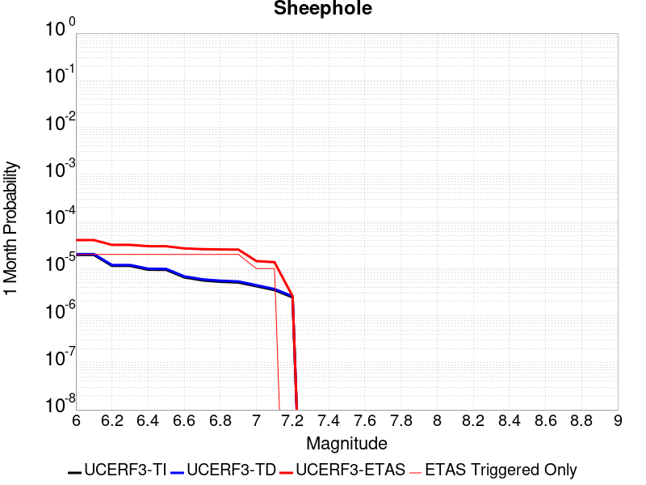 | 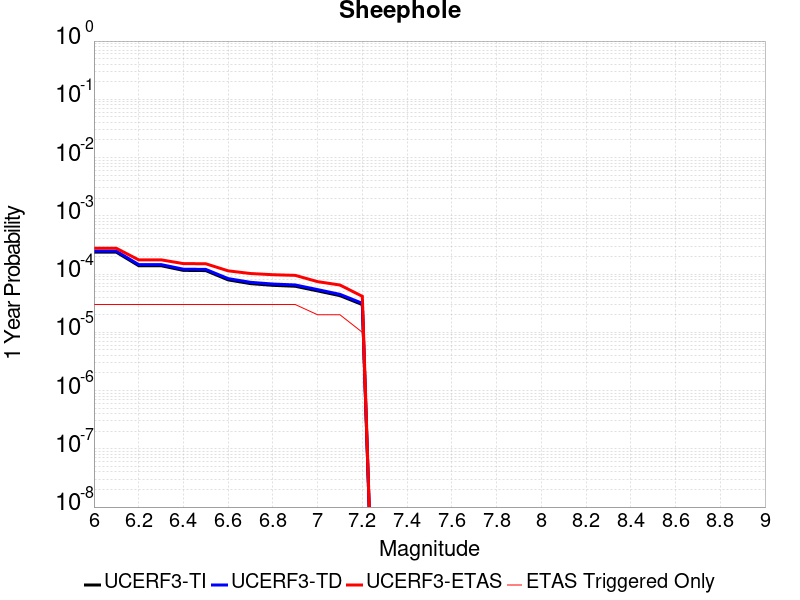 |  |

| Magnitude | 1 wk TI Prob | 1 wk TD Prob | 1 wk ETAS Prob | 1 wk ETAS/TD Gain | 1 wk ETAS Triggered Only | 1 mo TI Prob | 1 mo TD Prob | 1 mo ETAS Prob | 1 mo ETAS/TD Gain | 1 mo ETAS Triggered Only | 1 yr TI Prob | 1 yr TD Prob | 1 yr ETAS Prob | 1 yr ETAS/TD Gain | 1 yr ETAS Triggered Only | 10 yr TI Prob | 10 yr TD Prob | 10 yr ETAS Prob | 10 yr ETAS/TD Gain | 10 yr ETAS Triggered Only |
|-----|-----|-----|-----|-----|-----|-----|-----|-----|-----|-----|-----|-----|-----|-----|-----|-----|-----|-----|-----|-----|
| 6.0 | 4.5579695E-6 | 4.741389E-6 | 4.741389E-6 | 1.0 | 0.0 | 1.9534009E-5 | 2.0320113E-5 | 3.5155284E-5 | 1.7300733 | 1.4835475E-5 | 2.3780059E-4 | 2.4737482E-4 | 2.7703843E-4 | 1.1199136 | 2.967095E-5 | 0.0023754628 | 0.0024715392 | 0.0025159356 | 1.017963 | 4.4506425E-5 |
| 6.1 | 4.5579695E-6 | 4.741389E-6 | 4.741389E-6 | 1.0 | 0.0 | 1.9534009E-5 | 2.0320113E-5 | 3.5155284E-5 | 1.7300733 | 1.4835475E-5 | 2.3780059E-4 | 2.4737482E-4 | 2.7703843E-4 | 1.1199136 | 2.967095E-5 | 0.0023754628 | 0.0024715392 | 0.0025159356 | 1.017963 | 4.4506425E-5 |
| 6.2 | 2.6677674E-6 | 2.7874773E-6 | 2.7874773E-6 | 1.0 | 0.0 | 1.1433239E-5 | 1.1946282E-5 | 2.678158E-5 | 2.2418337 | 1.4835475E-5 | 1.3919079E-4 | 1.4543736E-4 | 1.75104E-4 | 1.2039822 | 2.967095E-5 | 0.0013910364 | 0.0014535277 | 0.0014979694 | 1.030575 | 4.4506425E-5 |
| 6.3 | 2.6677674E-6 | 2.7874773E-6 | 2.7874773E-6 | 1.0 | 0.0 | 1.1433239E-5 | 1.1946282E-5 | 2.678158E-5 | 2.2418337 | 1.4835475E-5 | 1.3919079E-4 | 1.4543736E-4 | 1.75104E-4 | 1.2039822 | 2.967095E-5 | 0.0013910364 | 0.0014535277 | 0.0014979694 | 1.030575 | 4.4506425E-5 |
| 6.4 | 2.2159759E-6 | 2.3229532E-6 | 2.3229532E-6 | 1.0 | 0.0 | 9.497005E-6 | 9.95548E-6 | 2.4790806E-5 | 2.490167 | 1.4835475E-5 | 1.156199E-4 | 1.2120203E-4 | 1.5086938E-4 | 1.244776 | 2.967095E-5 | 0.0011555976 | 0.0012114387 | 0.0012558912 | 1.0366939 | 4.4506425E-5 |
| 6.5 | 2.1986082E-6 | 2.3048328E-6 | 2.3048328E-6 | 1.0 | 0.0 | 9.4225725E-6 | 9.877823E-6 | 2.471315E-5 | 2.5018826 | 1.4835475E-5 | 1.1471378E-4 | 1.2025666E-4 | 1.4992403E-4 | 1.2467005 | 2.967095E-5 | 0.0011465458 | 0.0012019952 | 0.0012316304 | 1.0246551 | 2.967095E-5 |
| 6.6 | 1.5232331E-6 | 1.6019467E-6 | 1.6019467E-6 | 1.0 | 0.0 | 6.5281256E-6 | 6.865469E-6 | 2.1700842E-5 | 3.1608682 | 1.4835475E-5 | 7.947703E-5 | 8.358407E-5 | 1.13252536E-4 | 1.3549536 | 2.967095E-5 | 7.9448614E-4 | 8.35545E-4 | 8.6519116E-4 | 1.0354812 | 2.967095E-5 |
| 6.7 | 1.3137362E-6 | 1.3828673E-6 | 1.3828673E-6 | 1.0 | 0.0 | 5.6302856E-6 | 5.9265612E-6 | 2.0761949E-5 | 3.5032032 | 1.4835475E-5 | 6.854657E-5 | 7.2153634E-5 | 1.0182244E-4 | 1.4111893 | 2.967095E-5 | 6.8525434E-4 | 7.2131597E-4 | 7.5096556E-4 | 1.0411048 | 2.967095E-5 |
| 6.8 | 1.2275751E-6 | 1.2923298E-6 | 1.2923298E-6 | 1.0 | 0.0 | 5.2610258E-6 | 5.5385453E-6 | 2.0373938E-5 | 3.678572 | 1.4835475E-5 | 6.4051106E-5 | 6.742984E-5 | 9.709879E-5 | 1.4399973 | 2.967095E-5 | 6.4032647E-4 | 6.7410717E-4 | 7.037581E-4 | 1.0439855 | 2.967095E-5 |
| 6.9 | 1.1837088E-6 | 1.2461455E-6 | 1.2461455E-6 | 1.0 | 0.0 | 5.0730278E-6 | 5.340614E-6 | 2.0176009E-5 | 3.7778447 | 1.4835475E-5 | 6.176237E-5 | 6.502016E-5 | 9.468918E-5 | 1.4563049 | 2.967095E-5 | 6.17452E-4 | 6.5002457E-4 | 6.7967625E-4 | 1.0456163 | 2.967095E-5 |
| 7.0 | 9.849371E-7 | 1.0366649E-6 | 1.0366649E-6 | 1.0 | 0.0 | 4.2211523E-6 | 4.4428425E-6 | 1.9278252E-5 | 4.3391705 | 1.4835475E-5 | 5.1391315E-5 | 5.4090367E-5 | 8.375971E-5 | 1.5485144 | 2.967095E-5 | 5.137943E-4 | 5.407821E-4 | 5.70437E-4 | 1.0548371 | 2.967095E-5 |
| 7.1 | 8.1643645E-7 | 8.591967E-7 | 8.591967E-7 | 1.0 | 0.0 | 3.4990085E-6 | 3.6822669E-6 | 1.8517687E-5 | 5.028882 | 1.4835475E-5 | 4.2599597E-5 | 4.4830766E-5 | 7.4500385E-5 | 1.6618137 | 2.967095E-5 | 4.259143E-4 | 4.4822585E-4 | 4.778835E-4 | 1.0661668 | 2.967095E-5 |
| 7.2 | 5.7295756E-7 | 6.029711E-7 | 6.029711E-7 | 1.0 | 0.0 | 2.45553E-6 | 2.5841598E-6 | 2.5841598E-6 | 1.0 | 0.0 | 2.9895667E-5 | 3.146176E-5 | 4.6296766E-5 | 1.4715251 | 1.4835475E-5 | 2.9891645E-4 | 3.1457972E-4 | 3.2941054E-4 | 1.0471448 | 1.4835475E-5 |

## Raymond
*[(top)](#table-of-contents)*

| 1 Week | 1 Month | 1 Year | 10 Year |
|-----|-----|-----|-----|
|  |  |  |  |

| Magnitude | 1 wk TI Prob | 1 wk TD Prob | 1 wk ETAS Prob | 1 wk ETAS/TD Gain | 1 wk ETAS Triggered Only | 1 mo TI Prob | 1 mo TD Prob | 1 mo ETAS Prob | 1 mo ETAS/TD Gain | 1 mo ETAS Triggered Only | 1 yr TI Prob | 1 yr TD Prob | 1 yr ETAS Prob | 1 yr ETAS/TD Gain | 1 yr ETAS Triggered Only | 10 yr TI Prob | 10 yr TD Prob | 10 yr ETAS Prob | 10 yr ETAS/TD Gain | 10 yr ETAS Triggered Only |
|-----|-----|-----|-----|-----|-----|-----|-----|-----|-----|-----|-----|-----|-----|-----|-----|-----|-----|-----|-----|-----|
| 6.0 | 1.5157413E-5 | 1.5811462E-5 | 1.5811462E-5 | 1.0 | 0.0 | 6.4958724E-5 | 6.776179E-5 | 6.776179E-5 | 1.0 | 0.0 | 7.905855E-4 | 8.247126E-4 | 8.247126E-4 | 1.0 | 0.0 | 0.007877788 | 0.008219039 | 0.008248466 | 1.0035803 | 2.967095E-5 |
| 6.1 | 1.5157413E-5 | 1.5811462E-5 | 1.5811462E-5 | 1.0 | 0.0 | 6.4958724E-5 | 6.776179E-5 | 6.776179E-5 | 1.0 | 0.0 | 7.905855E-4 | 8.247126E-4 | 8.247126E-4 | 1.0 | 0.0 | 0.007877788 | 0.008219039 | 0.008248466 | 1.0035803 | 2.967095E-5 |
| 6.2 | 1.5157413E-5 | 1.5811462E-5 | 1.5811462E-5 | 1.0 | 0.0 | 6.4958724E-5 | 6.776179E-5 | 6.776179E-5 | 1.0 | 0.0 | 7.905855E-4 | 8.247126E-4 | 8.247126E-4 | 1.0 | 0.0 | 0.007877788 | 0.008219039 | 0.008248466 | 1.0035803 | 2.967095E-5 |
| 6.3 | 1.5157413E-5 | 1.5811462E-5 | 1.5811462E-5 | 1.0 | 0.0 | 6.4958724E-5 | 6.776179E-5 | 6.776179E-5 | 1.0 | 0.0 | 7.905855E-4 | 8.247126E-4 | 8.247126E-4 | 1.0 | 0.0 | 0.007877788 | 0.008219039 | 0.008248466 | 1.0035803 | 2.967095E-5 |
| 6.4 | 1.3941944E-5 | 1.4455922E-5 | 1.4455922E-5 | 1.0 | 0.0 | 5.9749822E-5 | 6.195261E-5 | 6.195261E-5 | 1.0 | 0.0 | 7.2721124E-4 | 7.540353E-4 | 7.540353E-4 | 1.0 | 0.0 | 0.007248361 | 0.0075171026 | 0.0075465506 | 1.0039175 | 2.967095E-5 |
| 6.5 | 1.3941944E-5 | 1.4455922E-5 | 1.4455922E-5 | 1.0 | 0.0 | 5.9749822E-5 | 6.195261E-5 | 6.195261E-5 | 1.0 | 0.0 | 7.2721124E-4 | 7.540353E-4 | 7.540353E-4 | 1.0 | 0.0 | 0.007248361 | 0.0075171026 | 0.0075465506 | 1.0039175 | 2.967095E-5 |
| 6.6 | 1.0542609E-5 | 1.067206E-5 | 1.067206E-5 | 1.0 | 0.0 | 4.5181827E-5 | 4.573663E-5 | 4.573663E-5 | 1.0 | 0.0 | 5.499499E-4 | 5.567066E-4 | 5.567066E-4 | 1.0 | 0.0 | 0.005485909 | 0.005553682 | 0.005583188 | 1.0053129 | 2.967095E-5 |
| 6.7 | 1.0542609E-5 | 1.067206E-5 | 1.067206E-5 | 1.0 | 0.0 | 4.5181827E-5 | 4.573663E-5 | 4.573663E-5 | 1.0 | 0.0 | 5.499499E-4 | 5.567066E-4 | 5.567066E-4 | 1.0 | 0.0 | 0.005485909 | 0.005553682 | 0.005583188 | 1.0053129 | 2.967095E-5 |
| 6.8 | 1.0079132E-5 | 1.017757E-5 | 1.017757E-5 | 1.0 | 0.0 | 4.3195567E-5 | 4.3617463E-5 | 4.3617463E-5 | 1.0 | 0.0 | 5.257791E-4 | 5.309186E-4 | 5.309186E-4 | 1.0 | 0.0 | 0.0052453685 | 0.0052970513 | 0.005326565 | 1.0055717 | 2.967095E-5 |
| 6.9 | 7.721598E-6 | 7.5496278E-6 | 7.5496278E-6 | 1.0 | 0.0 | 3.3092143E-5 | 3.2355154E-5 | 3.2355154E-5 | 1.0 | 0.0 | 4.0282236E-4 | 3.93854E-4 | 3.93854E-4 | 1.0 | 0.0 | 0.0040209293 | 0.0039316933 | 0.003961248 | 1.007517 | 2.967095E-5 |
| 7.0 | 7.137566E-6 | 6.9119897E-6 | 6.9119897E-6 | 1.0 | 0.0 | 3.058921E-5 | 2.9622483E-5 | 2.9622483E-5 | 1.0 | 0.0 | 3.7236E-4 | 3.605951E-4 | 3.605951E-4 | 1.0 | 0.0 | 0.0037173668 | 0.0036002183 | 0.0036297825 | 1.0082117 | 2.967095E-5 |
| 7.1 | 5.654976E-6 | 5.300131E-6 | 5.300131E-6 | 1.0 | 0.0 | 2.4235387E-5 | 2.2714648E-5 | 2.2714648E-5 | 1.0 | 0.0 | 2.9502588E-4 | 2.7651596E-4 | 2.7651596E-4 | 1.0 | 0.0 | 0.0029463451 | 0.0027617502 | 0.002791339 | 1.0107138 | 2.967095E-5 |
| 7.2 | 4.9358455E-6 | 4.527205E-6 | 4.527205E-6 | 1.0 | 0.0 | 2.1153453E-5 | 1.9402163E-5 | 1.9402163E-5 | 1.0 | 0.0 | 2.5751285E-4 | 2.3619588E-4 | 2.3619588E-4 | 1.0 | 0.0 | 0.0025721465 | 0.0023594704 | 0.0023890715 | 1.0125456 | 2.967095E-5 |
| 7.3 | 4.2368597E-6 | 3.8061273E-6 | 3.8061273E-6 | 1.0 | 0.0 | 1.8157843E-5 | 1.6311873E-5 | 1.6311873E-5 | 1.0 | 0.0 | 2.2104931E-4 | 1.9857906E-4 | 1.9857906E-4 | 1.0 | 0.0 | 0.0022082955 | 0.001984035 | 0.001998841 | 1.0074626 | 1.4835475E-5 |
| 7.4 | 3.4999923E-6 | 3.0442097E-6 | 3.0442097E-6 | 1.0 | 0.0 | 1.49998805E-5 | 1.3046548E-5 | 1.3046548E-5 | 1.0 | 0.0 | 1.8260824E-4 | 1.5883023E-4 | 1.5883023E-4 | 1.0 | 0.0 | 0.0018245826 | 0.0015871827 | 0.0016019947 | 1.0093322 | 1.4835475E-5 |
| 7.5 | 2.738017E-6 | 2.3023647E-6 | 2.3023647E-6 | 1.0 | 0.0 | 1.1734306E-5 | 9.867241E-6 | 9.867241E-6 | 1.0 | 0.0 | 1.428558E-4 | 1.201271E-4 | 1.201271E-4 | 1.0 | 0.0 | 0.0014276401 | 0.001200636 | 0.0012154536 | 1.0123415 | 1.4835475E-5 |
| 7.6 | 1.8186392E-6 | 1.4425348E-6 | 1.4425348E-6 | 1.0 | 0.0 | 7.794145E-6 | 6.1822775E-6 | 6.1822775E-6 | 1.0 | 0.0 | 9.488958E-5 | 7.526667E-5 | 7.526667E-5 | 1.0 | 0.0 | 9.4849075E-4 | 7.524233E-4 | 7.6724763E-4 | 1.0197021 | 1.4835475E-5 |
| 7.7 | 1.0660348E-6 | 7.645604E-7 | 7.645604E-7 | 1.0 | 0.0 | 4.5687125E-6 | 3.2766836E-6 | 3.2766836E-6 | 1.0 | 0.0 | 5.5622655E-5 | 3.9892908E-5 | 3.9892908E-5 | 1.0 | 0.0 | 5.5608735E-4 | 3.988666E-4 | 3.988666E-4 | 1.0 | 0.0 |
| 7.8 | 6.913602E-7 | 4.3219174E-7 | 4.3219174E-7 | 1.0 | 0.0 | 2.962969E-6 | 1.8522489E-6 | 1.8522489E-6 | 1.0 | 0.0 | 3.607355E-5 | 2.2550905E-5 | 2.2550905E-5 | 1.0 | 0.0 | 3.6067693E-4 | 2.2549402E-4 | 2.2549402E-4 | 1.0 | 0.0 |
| 7.9 | 7.425201E-8 | 5.3237354E-8 | 5.3237354E-8 | 1.0 | 0.0 | 3.1822285E-7 | 2.2816008E-7 | 2.2816008E-7 | 1.0 | 0.0 | 3.874356E-6 | 2.7778467E-6 | 2.7778467E-6 | 1.0 | 0.0 | 3.8742884E-5 | 2.777825E-5 | 2.777825E-5 | 1.0 | 0.0 |

## Whittier alt 1
*[(top)](#table-of-contents)*

| 1 Week | 1 Month | 1 Year | 10 Year |
|-----|-----|-----|-----|
| 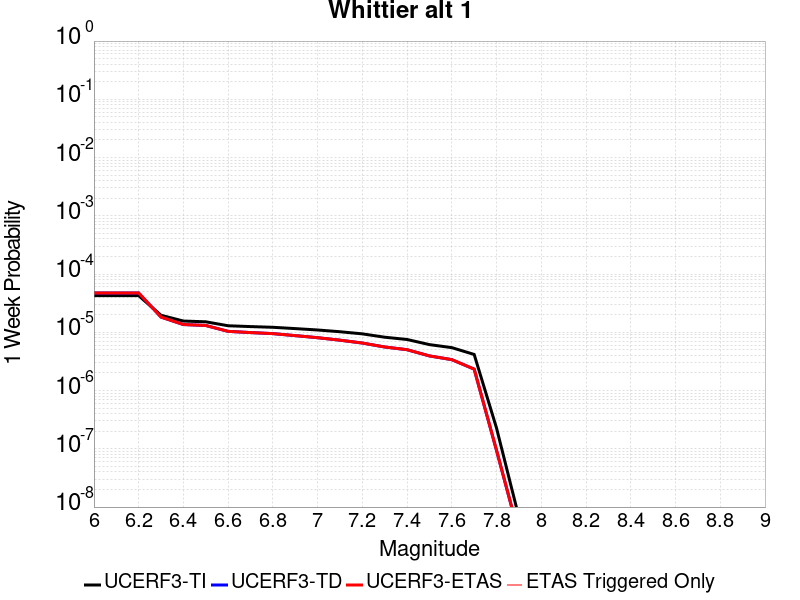 |  |  |  |

| Magnitude | 1 wk TI Prob | 1 wk TD Prob | 1 wk ETAS Prob | 1 wk ETAS/TD Gain | 1 wk ETAS Triggered Only | 1 mo TI Prob | 1 mo TD Prob | 1 mo ETAS Prob | 1 mo ETAS/TD Gain | 1 mo ETAS Triggered Only | 1 yr TI Prob | 1 yr TD Prob | 1 yr ETAS Prob | 1 yr ETAS/TD Gain | 1 yr ETAS Triggered Only | 10 yr TI Prob | 10 yr TD Prob | 10 yr ETAS Prob | 10 yr ETAS/TD Gain | 10 yr ETAS Triggered Only |
|-----|-----|-----|-----|-----|-----|-----|-----|-----|-----|-----|-----|-----|-----|-----|-----|-----|-----|-----|-----|-----|
| 6.0 | 4.2554693E-5 | 4.7258174E-5 | 4.7258174E-5 | 1.0 | 0.0 | 1.8236451E-4 | 2.0252111E-4 | 2.0252111E-4 | 1.0 | 0.0 | 0.002218027 | 0.0024632271 | 0.002478026 | 1.0060079 | 1.4835475E-5 | 0.02196019 | 0.024393288 | 0.024436709 | 1.00178 | 4.4506425E-5 |
| 6.1 | 4.2554693E-5 | 4.7258174E-5 | 4.7258174E-5 | 1.0 | 0.0 | 1.8236451E-4 | 2.0252111E-4 | 2.0252111E-4 | 1.0 | 0.0 | 0.002218027 | 0.0024632271 | 0.002478026 | 1.0060079 | 1.4835475E-5 | 0.02196019 | 0.024393288 | 0.024436709 | 1.00178 | 4.4506425E-5 |
| 6.2 | 4.2554693E-5 | 4.7258174E-5 | 4.7258174E-5 | 1.0 | 0.0 | 1.8236451E-4 | 2.0252111E-4 | 2.0252111E-4 | 1.0 | 0.0 | 0.002218027 | 0.0024632271 | 0.002478026 | 1.0060079 | 1.4835475E-5 | 0.02196019 | 0.024393288 | 0.024436709 | 1.00178 | 4.4506425E-5 |
| 6.3 | 1.9617712E-5 | 1.8271776E-5 | 1.8271776E-5 | 1.0 | 0.0 | 8.40732E-5 | 7.830537E-5 | 7.830537E-5 | 1.0 | 0.0 | 0.0010231105 | 9.5296995E-4 | 9.5296995E-4 | 1.0 | 0.0 | 0.01018413 | 0.009492118 | 0.009506812 | 1.001548 | 1.4835475E-5 |
| 6.4 | 1.5611336E-5 | 1.36069575E-5 | 1.36069575E-5 | 1.0 | 0.0 | 6.690401E-5 | 5.8314265E-5 | 5.8314265E-5 | 1.0 | 0.0 | 8.142519E-4 | 7.0975086E-4 | 7.0975086E-4 | 1.0 | 0.0 | 0.008112748 | 0.007076804 | 0.007091535 | 1.0020815 | 1.4835475E-5 |
| 6.5 | 1.5150166E-5 | 1.310358E-5 | 1.310358E-5 | 1.0 | 0.0 | 6.492767E-5 | 5.6157027E-5 | 5.6157027E-5 | 1.0 | 0.0 | 7.9020765E-4 | 6.835032E-4 | 6.835032E-4 | 1.0 | 0.0 | 0.007874036 | 0.0068159583 | 0.0068306928 | 1.0021617 | 1.4835475E-5 |
| 6.6 | 1.295588E-5 | 1.0382919E-5 | 1.0382919E-5 | 1.0 | 0.0 | 5.552402E-5 | 4.4497476E-5 | 4.4497476E-5 | 1.0 | 0.0 | 6.7579525E-4 | 5.416241E-4 | 5.416241E-4 | 1.0 | 0.0 | 0.006737438 | 0.0054044737 | 0.0054192287 | 1.0027303 | 1.4835475E-5 |
| 6.7 | 1.2542085E-5 | 9.901508E-6 | 9.901508E-6 | 1.0 | 0.0 | 5.3750682E-5 | 4.2434353E-5 | 4.2434353E-5 | 1.0 | 0.0 | 6.542181E-4 | 5.1651767E-4 | 5.1651767E-4 | 1.0 | 0.0 | 0.006522954 | 0.005154589 | 0.0051693483 | 1.0028633 | 1.4835475E-5 |
| 6.8 | 1.2195878E-5 | 9.497479E-6 | 9.497479E-6 | 1.0 | 0.0 | 5.2267E-5 | 4.070286E-5 | 4.070286E-5 | 1.0 | 0.0 | 6.36165E-4 | 4.954465E-4 | 4.954465E-4 | 1.0 | 0.0 | 0.0063434686 | 0.0049447604 | 0.0049595223 | 1.0029854 | 1.4835475E-5 |
| 6.9 | 1.1580298E-5 | 8.774845E-6 | 8.774845E-6 | 1.0 | 0.0 | 4.9628903E-5 | 3.7605947E-5 | 3.7605947E-5 | 1.0 | 0.0 | 6.040644E-4 | 4.5775785E-4 | 4.5775785E-4 | 1.0 | 0.0 | 0.00602425 | 0.004569409 | 0.0045841765 | 1.0032319 | 1.4835475E-5 |
| 7.0 | 1.0964795E-5 | 8.085805E-6 | 8.085805E-6 | 1.0 | 0.0 | 4.6991136E-5 | 3.4653E-5 | 3.4653E-5 | 1.0 | 0.0 | 5.7196687E-4 | 4.2182012E-4 | 4.2182012E-4 | 1.0 | 0.0 | 0.0057049696 | 0.004211403 | 0.004226176 | 1.0035079 | 1.4835475E-5 |
| 7.1 | 1.0230601E-5 | 7.32823E-6 | 7.32823E-6 | 1.0 | 0.0 | 4.3844695E-5 | 3.140633E-5 | 3.140633E-5 | 1.0 | 0.0 | 5.336784E-4 | 3.8230626E-4 | 3.8230626E-4 | 1.0 | 0.0 | 0.005323986 | 0.003817649 | 0.003817649 | 1.0 | 0.0 |
| 7.2 | 9.40865E-6 | 6.5446966E-6 | 6.5446966E-6 | 1.0 | 0.0 | 4.032216E-5 | 2.8048406E-5 | 2.8048406E-5 | 1.0 | 0.0 | 4.908117E-4 | 3.4143703E-4 | 3.4143703E-4 | 1.0 | 0.0 | 0.0048972913 | 0.0034102171 | 0.0034102171 | 1.0 | 0.0 |
| 7.3 | 8.237384E-6 | 5.598953E-6 | 5.598953E-6 | 1.0 | 0.0 | 3.5302593E-5 | 2.3995299E-5 | 2.3995299E-5 | 1.0 | 0.0 | 4.2972428E-4 | 2.9210464E-4 | 2.9210464E-4 | 1.0 | 0.0 | 0.0042889426 | 0.002917528 | 0.002917528 | 1.0 | 0.0 |
| 7.4 | 7.5316966E-6 | 5.0289045E-6 | 5.0289045E-6 | 1.0 | 0.0 | 3.2278298E-5 | 2.1552274E-5 | 2.1552274E-5 | 1.0 | 0.0 | 3.9291743E-4 | 2.6236835E-4 | 2.6236835E-4 | 1.0 | 0.0 | 0.0039222343 | 0.002620698 | 0.002620698 | 1.0 | 0.0 |
| 7.5 | 6.149649E-6 | 3.9346914E-6 | 3.9346914E-6 | 1.0 | 0.0 | 2.6355372E-5 | 1.686286E-5 | 1.686286E-5 | 1.0 | 0.0 | 3.208294E-4 | 2.0528687E-4 | 2.0528687E-4 | 1.0 | 0.0 | 0.003203666 | 0.0020510615 | 0.0020510615 | 1.0 | 0.0 |
| 7.6 | 5.457711E-6 | 3.39612E-6 | 3.39612E-6 | 1.0 | 0.0 | 2.338998E-5 | 1.4554724E-5 | 1.4554724E-5 | 1.0 | 0.0 | 2.8473578E-4 | 1.7719017E-4 | 1.7719017E-4 | 1.0 | 0.0 | 0.0028437122 | 0.0017705697 | 0.0017705697 | 1.0 | 0.0 |
| 7.7 | 4.1676276E-6 | 2.333762E-6 | 2.333762E-6 | 1.0 | 0.0 | 1.7861139E-5 | 1.0001803E-5 | 1.0001803E-5 | 1.0 | 0.0 | 2.1743766E-4 | 1.21765894E-4 | 1.21765894E-4 | 1.0 | 0.0 | 0.0021722503 | 0.0012170648 | 0.0012170648 | 1.0 | 0.0 |
| 7.8 | 2.2692414E-7 | 9.387862E-8 | 9.387862E-8 | 1.0 | 0.0 | 9.725317E-7 | 4.023369E-7 | 4.023369E-7 | 1.0 | 0.0 | 1.1840509E-5 | 4.898444E-6 | 4.898444E-6 | 1.0 | 0.0 | 1.1839878E-4 | 4.898369E-5 | 4.898369E-5 | 1.0 | 0.0 |
| 7.9 | 6.676829E-9 | 3.4404741E-9 | 3.4404741E-9 | 1.0 | 0.0 | 2.861498E-8 | 1.4744889E-8 | 1.4744889E-8 | 1.0 | 0.0 | 3.4838732E-7 | 1.79519E-7 | 1.79519E-7 | 1.0 | 0.0 | 3.4838679E-6 | 1.7951887E-6 | 1.7951887E-6 | 1.0 | 0.0 |

## Santa Cruz Island
*[(top)](#table-of-contents)*

| 1 Week | 1 Month | 1 Year | 10 Year |
|-----|-----|-----|-----|
| 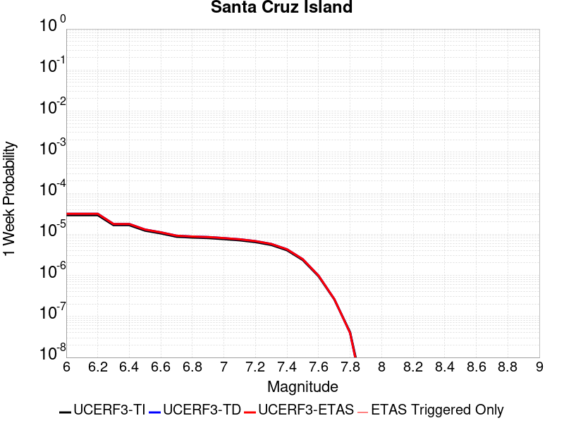 |  |  | 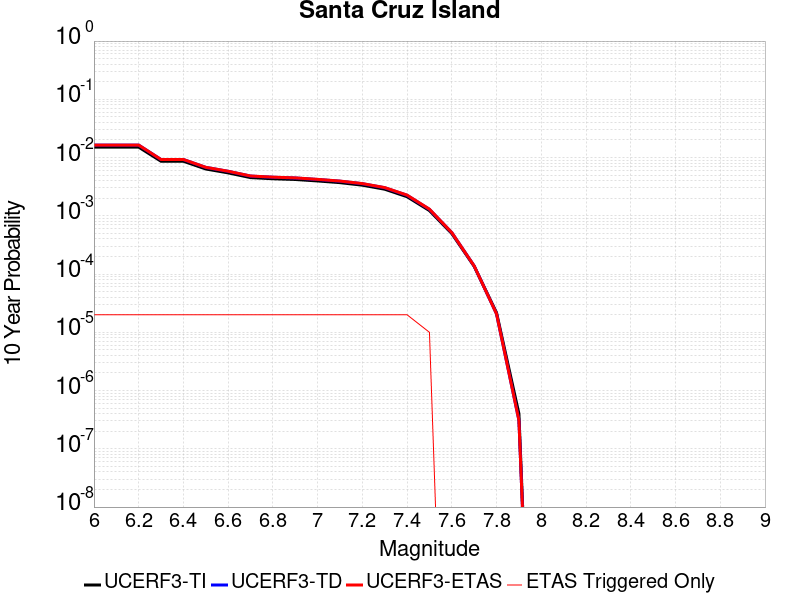 |

| Magnitude | 1 wk TI Prob | 1 wk TD Prob | 1 wk ETAS Prob | 1 wk ETAS/TD Gain | 1 wk ETAS Triggered Only | 1 mo TI Prob | 1 mo TD Prob | 1 mo ETAS Prob | 1 mo ETAS/TD Gain | 1 mo ETAS Triggered Only | 1 yr TI Prob | 1 yr TD Prob | 1 yr ETAS Prob | 1 yr ETAS/TD Gain | 1 yr ETAS Triggered Only | 10 yr TI Prob | 10 yr TD Prob | 10 yr ETAS Prob | 10 yr ETAS/TD Gain | 10 yr ETAS Triggered Only |
|-----|-----|-----|-----|-----|-----|-----|-----|-----|-----|-----|-----|-----|-----|-----|-----|-----|-----|-----|-----|-----|
| 6.0 | 2.9164563E-5 | 3.1601507E-5 | 3.1601507E-5 | 1.0 | 0.0 | 1.2498499E-4 | 1.3542877E-4 | 1.3542877E-4 | 1.0 | 0.0 | 0.0015206301 | 0.0016477344 | 0.0016773564 | 1.0179775 | 2.967095E-5 | 0.015102667 | 0.016368907 | 0.01639809 | 1.001783 | 2.967095E-5 |
| 6.1 | 2.9164563E-5 | 3.1601507E-5 | 3.1601507E-5 | 1.0 | 0.0 | 1.2498499E-4 | 1.3542877E-4 | 1.3542877E-4 | 1.0 | 0.0 | 0.0015206301 | 0.0016477344 | 0.0016773564 | 1.0179775 | 2.967095E-5 | 0.015102667 | 0.016368907 | 0.01639809 | 1.001783 | 2.967095E-5 |
| 6.2 | 2.9164563E-5 | 3.1601507E-5 | 3.1601507E-5 | 1.0 | 0.0 | 1.2498499E-4 | 1.3542877E-4 | 1.3542877E-4 | 1.0 | 0.0 | 0.0015206301 | 0.0016477344 | 0.0016773564 | 1.0179775 | 2.967095E-5 | 0.015102667 | 0.016368907 | 0.01639809 | 1.001783 | 2.967095E-5 |
| 6.3 | 1.6635553E-5 | 1.7805196E-5 | 1.7805196E-5 | 1.0 | 0.0 | 7.1293274E-5 | 7.630585E-5 | 7.630585E-5 | 1.0 | 0.0 | 8.6765E-4 | 9.28646E-4 | 9.582894E-4 | 1.0319211 | 2.967095E-5 | 0.008642701 | 0.009249526 | 0.009278923 | 1.0031781 | 2.967095E-5 |
| 6.4 | 1.6635553E-5 | 1.7805196E-5 | 1.7805196E-5 | 1.0 | 0.0 | 7.1293274E-5 | 7.630585E-5 | 7.630585E-5 | 1.0 | 0.0 | 8.6765E-4 | 9.28646E-4 | 9.582894E-4 | 1.0319211 | 2.967095E-5 | 0.008642701 | 0.009249526 | 0.009278923 | 1.0031781 | 2.967095E-5 |
| 6.5 | 1.2238748E-5 | 1.304357E-5 | 1.304357E-5 | 1.0 | 0.0 | 5.2450723E-5 | 5.589984E-5 | 5.589984E-5 | 1.0 | 0.0 | 6.3840044E-4 | 6.803717E-4 | 7.1002246E-4 | 1.0435803 | 2.967095E-5 | 0.0063656955 | 0.0067832856 | 0.0068127555 | 1.0043445 | 2.967095E-5 |
| 6.6 | 1.0489767E-5 | 1.1157113E-5 | 1.1157113E-5 | 1.0 | 0.0 | 4.495537E-5 | 4.7815334E-5 | 4.7815334E-5 | 1.0 | 0.0 | 5.4719415E-4 | 5.819984E-4 | 6.116521E-4 | 1.0509515 | 2.967095E-5 | 0.005458487 | 0.005804983 | 0.0058344817 | 1.0050817 | 2.967095E-5 |
| 6.7 | 8.699222E-6 | 9.2371665E-6 | 9.2371665E-6 | 1.0 | 0.0 | 3.7281847E-5 | 3.958726E-5 | 3.958726E-5 | 1.0 | 0.0 | 4.5381195E-4 | 4.8186886E-4 | 5.115255E-4 | 1.061545 | 2.967095E-5 | 0.0045288634 | 0.0048083076 | 0.0048378357 | 1.0061411 | 2.967095E-5 |
| 6.8 | 8.307732E-6 | 8.817268E-6 | 8.817268E-6 | 1.0 | 0.0 | 3.560408E-5 | 3.7787748E-5 | 3.7787748E-5 | 1.0 | 0.0 | 4.3339343E-4 | 4.5996916E-4 | 4.896264E-4 | 1.0644767 | 2.967095E-5 | 0.004325492 | 0.0045902245 | 0.0046197595 | 1.0064343 | 2.967095E-5 |
| 6.9 | 8.073121E-6 | 8.565291E-6 | 8.565291E-6 | 1.0 | 0.0 | 3.459863E-5 | 3.6707876E-5 | 3.6707876E-5 | 1.0 | 0.0 | 4.2115687E-4 | 4.4682715E-4 | 4.7648486E-4 | 1.066374 | 2.967095E-5 | 0.004203596 | 0.0044593387 | 0.0044888775 | 1.006624 | 2.967095E-5 |
| 7.0 | 7.617019E-6 | 8.0749915E-6 | 8.0749915E-6 | 1.0 | 0.0 | 3.264396E-5 | 3.460665E-5 | 3.460665E-5 | 1.0 | 0.0 | 3.9736772E-4 | 4.212549E-4 | 4.5091336E-4 | 1.070405 | 2.967095E-5 | 0.003966579 | 0.0042046113 | 0.0042341575 | 1.0070271 | 2.967095E-5 |
| 7.1 | 7.1224836E-6 | 7.5460907E-6 | 7.5460907E-6 | 1.0 | 0.0 | 3.052457E-5 | 3.233999E-5 | 3.233999E-5 | 1.0 | 0.0 | 3.715733E-4 | 3.936686E-4 | 4.2332787E-4 | 1.0753407 | 2.967095E-5 | 0.003709526 | 0.003929755 | 0.00395931 | 1.0075207 | 2.967095E-5 |
| 7.2 | 6.441115E-6 | 6.82766E-6 | 6.82766E-6 | 1.0 | 0.0 | 2.7604487E-5 | 2.9261073E-5 | 2.9261073E-5 | 1.0 | 0.0 | 3.360328E-4 | 3.5619558E-4 | 3.8585596E-4 | 1.08327 | 2.967095E-5 | 0.0033552512 | 0.003556275 | 0.0035858403 | 1.0083135 | 2.967095E-5 |
| 7.3 | 5.494274E-6 | 5.820228E-6 | 5.820228E-6 | 1.0 | 0.0 | 2.3546674E-5 | 2.4943598E-5 | 2.4943598E-5 | 1.0 | 0.0 | 2.8664304E-4 | 3.036462E-4 | 3.3330813E-4 | 1.0976858 | 2.967095E-5 | 0.002862736 | 0.003032336 | 0.0030619171 | 1.0097551 | 2.967095E-5 |
| 7.4 | 4.0802624E-6 | 4.3124237E-6 | 4.3124237E-6 | 1.0 | 0.0 | 1.7486722E-5 | 1.8481685E-5 | 1.8481685E-5 | 1.0 | 0.0 | 2.1288003E-4 | 2.2499137E-4 | 2.5465564E-4 | 1.1318463 | 2.967095E-5 | 0.0021267622 | 0.0022476448 | 0.002277249 | 1.0131712 | 2.967095E-5 |
| 7.5 | 2.3584746E-6 | 2.4753954E-6 | 2.4753954E-6 | 1.0 | 0.0 | 1.0107709E-5 | 1.0608795E-5 | 1.0608795E-5 | 1.0 | 0.0 | 1.2305441E-4 | 1.2915448E-4 | 1.4398803E-4 | 1.1148514 | 1.4835475E-5 | 0.0012298629 | 0.0012907991 | 0.0013056154 | 1.0114784 | 1.4835475E-5 |
| 7.6 | 9.4981914E-7 | 9.861219E-7 | 9.861219E-7 | 1.0 | 0.0 | 4.0706473E-6 | 4.22623E-6 | 4.22623E-6 | 1.0 | 0.0 | 4.9559E-5 | 5.1453146E-5 | 5.1453146E-5 | 1.0 | 0.0 | 4.954795E-4 | 5.1441364E-4 | 5.1441364E-4 | 1.0 | 0.0 |
| 7.7 | 2.6013532E-7 | 2.6417183E-7 | 2.6417183E-7 | 1.0 | 0.0 | 1.1148652E-6 | 1.1321645E-6 | 1.1321645E-6 | 1.0 | 0.0 | 1.3573399E-5 | 1.3784016E-5 | 1.3784016E-5 | 1.0 | 0.0 | 1.357257E-4 | 1.3783168E-4 | 1.3783168E-4 | 1.0 | 0.0 |
| 7.8 | 4.1522263E-8 | 3.9657433E-8 | 3.9657433E-8 | 1.0 | 0.0 | 1.7795254E-7 | 1.6996042E-7 | 1.6996042E-7 | 1.0 | 0.0 | 2.16657E-6 | 2.0692664E-6 | 2.0692664E-6 | 1.0 | 0.0 | 2.1665488E-5 | 2.0692492E-5 | 2.0692492E-5 | 1.0 | 0.0 |
| 7.9 | 7.7242046E-10 | 5.9469774E-10 | 5.9469774E-10 | 1.0 | 0.0 | 3.3103735E-9 | 2.5487044E-9 | 2.5487044E-9 | 1.0 | 0.0 | 4.0303796E-8 | 3.1030474E-8 | 3.1030474E-8 | 1.0 | 0.0 | 4.030379E-7 | 3.1030473E-7 | 3.1030473E-7 | 1.0 | 0.0 |

## Cucamonga
*[(top)](#table-of-contents)*

| 1 Week | 1 Month | 1 Year | 10 Year |
|-----|-----|-----|-----|
|  | 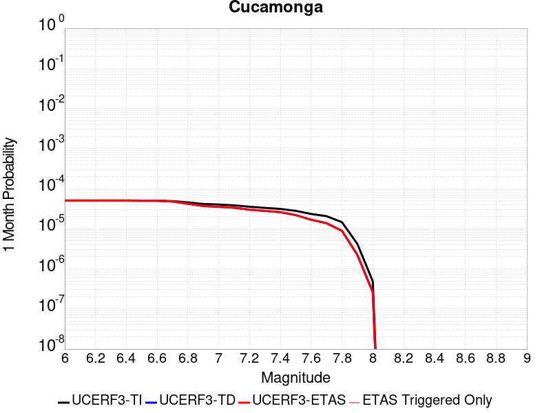 |  |  |

| Magnitude | 1 wk TI Prob | 1 wk TD Prob | 1 wk ETAS Prob | 1 wk ETAS/TD Gain | 1 wk ETAS Triggered Only | 1 mo TI Prob | 1 mo TD Prob | 1 mo ETAS Prob | 1 mo ETAS/TD Gain | 1 mo ETAS Triggered Only | 1 yr TI Prob | 1 yr TD Prob | 1 yr ETAS Prob | 1 yr ETAS/TD Gain | 1 yr ETAS Triggered Only | 10 yr TI Prob | 10 yr TD Prob | 10 yr ETAS Prob | 10 yr ETAS/TD Gain | 10 yr ETAS Triggered Only |
|-----|-----|-----|-----|-----|-----|-----|-----|-----|-----|-----|-----|-----|-----|-----|-----|-----|-----|-----|-----|-----|
| 6.0 | 1.1848348E-5 | 1.1740426E-5 | 1.1740426E-5 | 1.0 | 0.0 | 5.0777642E-5 | 5.0315157E-5 | 5.0315157E-5 | 1.0 | 0.0 | 6.180424E-4 | 6.124175E-4 | 6.2724395E-4 | 1.0242096 | 1.4835475E-5 | 0.0061632637 | 0.0061084684 | 0.006152703 | 1.0072415 | 4.4506425E-5 |
| 6.1 | 1.1848348E-5 | 1.1740426E-5 | 1.1740426E-5 | 1.0 | 0.0 | 5.0777642E-5 | 5.0315157E-5 | 5.0315157E-5 | 1.0 | 0.0 | 6.180424E-4 | 6.124175E-4 | 6.2724395E-4 | 1.0242096 | 1.4835475E-5 | 0.0061632637 | 0.0061084684 | 0.006152703 | 1.0072415 | 4.4506425E-5 |
| 6.2 | 1.1848348E-5 | 1.1740426E-5 | 1.1740426E-5 | 1.0 | 0.0 | 5.0777642E-5 | 5.0315157E-5 | 5.0315157E-5 | 1.0 | 0.0 | 6.180424E-4 | 6.124175E-4 | 6.2724395E-4 | 1.0242096 | 1.4835475E-5 | 0.0061632637 | 0.0061084684 | 0.006152703 | 1.0072415 | 4.4506425E-5 |
| 6.3 | 1.1848348E-5 | 1.1740426E-5 | 1.1740426E-5 | 1.0 | 0.0 | 5.0777642E-5 | 5.0315157E-5 | 5.0315157E-5 | 1.0 | 0.0 | 6.180424E-4 | 6.124175E-4 | 6.2724395E-4 | 1.0242096 | 1.4835475E-5 | 0.0061632637 | 0.0061084684 | 0.006152703 | 1.0072415 | 4.4506425E-5 |
| 6.4 | 1.1848348E-5 | 1.1740426E-5 | 1.1740426E-5 | 1.0 | 0.0 | 5.0777642E-5 | 5.0315157E-5 | 5.0315157E-5 | 1.0 | 0.0 | 6.180424E-4 | 6.124175E-4 | 6.2724395E-4 | 1.0242096 | 1.4835475E-5 | 0.0061632637 | 0.0061084684 | 0.006152703 | 1.0072415 | 4.4506425E-5 |
| 6.5 | 1.16988695E-5 | 1.1579448E-5 | 1.1579448E-5 | 1.0 | 0.0 | 5.013705E-5 | 4.962528E-5 | 4.962528E-5 | 1.0 | 0.0 | 6.102476E-4 | 6.0402293E-4 | 6.188495E-4 | 1.0245463 | 1.4835475E-5 | 0.006085745 | 0.0060249786 | 0.006069217 | 1.0073425 | 4.4506425E-5 |
| 6.6 | 1.16988695E-5 | 1.1579448E-5 | 1.1579448E-5 | 1.0 | 0.0 | 5.013705E-5 | 4.962528E-5 | 4.962528E-5 | 1.0 | 0.0 | 6.102476E-4 | 6.0402293E-4 | 6.188495E-4 | 1.0245463 | 1.4835475E-5 | 0.006085745 | 0.0060249786 | 0.006069217 | 1.0073425 | 4.4506425E-5 |
| 6.7 | 1.1397107E-5 | 1.1118271E-5 | 1.1118271E-5 | 1.0 | 0.0 | 4.884383E-5 | 4.7648875E-5 | 4.7648875E-5 | 1.0 | 0.0 | 5.9451134E-4 | 5.7997316E-4 | 5.9480005E-4 | 1.0255648 | 1.4835475E-5 | 0.005929234 | 0.005785741 | 0.00582999 | 1.0076479 | 4.4506425E-5 |
| 6.8 | 1.058387E-5 | 9.787918E-6 | 9.787918E-6 | 1.0 | 0.0 | 4.5358654E-5 | 4.1947555E-5 | 4.1947555E-5 | 1.0 | 0.0 | 5.521017E-4 | 5.105929E-4 | 5.254208E-4 | 1.0290406 | 1.4835475E-5 | 0.00550732 | 0.005095201 | 0.005139481 | 1.0086905 | 4.4506425E-5 |
| 6.9 | 9.690046E-6 | 8.5821475E-6 | 8.5821475E-6 | 1.0 | 0.0 | 4.1528107E-5 | 3.6780115E-5 | 3.6780115E-5 | 1.0 | 0.0 | 5.054874E-4 | 4.477063E-4 | 4.6253513E-4 | 1.0331218 | 1.4835475E-5 | 0.005043391 | 0.0044689737 | 0.004498512 | 1.0066097 | 2.967095E-5 |
| 7.0 | 9.381461E-6 | 8.189699E-6 | 8.189699E-6 | 1.0 | 0.0 | 4.020564E-5 | 3.509824E-5 | 3.509824E-5 | 1.0 | 0.0 | 4.893937E-4 | 4.2723765E-4 | 4.2723765E-4 | 1.0 | 0.0 | 0.0048831734 | 0.0042650914 | 0.0042798636 | 1.0034635 | 1.4835475E-5 |
| 7.1 | 8.946492E-6 | 7.7844325E-6 | 7.7844325E-6 | 1.0 | 0.0 | 3.8341543E-5 | 3.336143E-5 | 3.336143E-5 | 1.0 | 0.0 | 4.667083E-4 | 4.0610004E-4 | 4.0610004E-4 | 1.0 | 0.0 | 0.0046572937 | 0.00405451 | 0.0040692855 | 1.0036442 | 1.4835475E-5 |
| 7.2 | 8.251016E-6 | 6.977657E-6 | 6.977657E-6 | 1.0 | 0.0 | 3.5361016E-5 | 2.9903904E-5 | 2.9903904E-5 | 1.0 | 0.0 | 4.3043532E-4 | 3.6401945E-4 | 3.6401945E-4 | 1.0 | 0.0 | 0.0042960253 | 0.0036351592 | 0.0036499407 | 1.0040662 | 1.4835475E-5 |
| 7.3 | 7.717881E-6 | 6.4886526E-6 | 6.4886526E-6 | 1.0 | 0.0 | 3.3076216E-5 | 2.7808215E-5 | 2.7808215E-5 | 1.0 | 0.0 | 4.026285E-4 | 3.3851265E-4 | 3.3851265E-4 | 1.0 | 0.0 | 0.004018998 | 0.0033809014 | 0.0033956869 | 1.0043732 | 1.4835475E-5 |
| 7.4 | 7.275623E-6 | 6.034209E-6 | 6.034209E-6 | 1.0 | 0.0 | 3.118087E-5 | 2.586064E-5 | 2.586064E-5 | 1.0 | 0.0 | 3.7956095E-4 | 3.14808E-4 | 3.14808E-4 | 1.0 | 0.0 | 0.0037891332 | 0.0031445508 | 0.0031593398 | 1.004703 | 1.4835475E-5 |
| 7.5 | 6.5109502E-6 | 5.102568E-6 | 5.102568E-6 | 1.0 | 0.0 | 2.7903774E-5 | 2.1867967E-5 | 2.1867967E-5 | 1.0 | 0.0 | 3.3967546E-4 | 2.6621012E-4 | 2.6621012E-4 | 1.0 | 0.0 | 0.0033915674 | 0.002659831 | 0.002674627 | 1.0055628 | 1.4835475E-5 |
| 7.6 | 5.4495326E-6 | 3.910321E-6 | 3.910321E-6 | 1.0 | 0.0 | 2.335493E-5 | 1.6758411E-5 | 1.6758411E-5 | 1.0 | 0.0 | 2.8430918E-4 | 2.0401462E-4 | 2.0401462E-4 | 1.0 | 0.0 | 0.0028394572 | 0.0020391883 | 0.0020539935 | 1.0072603 | 1.4835475E-5 |
| 7.7 | 4.7997164E-6 | 3.2018365E-6 | 3.2018365E-6 | 1.0 | 0.0 | 2.057005E-5 | 1.3722084E-5 | 1.3722084E-5 | 1.0 | 0.0 | 2.504116E-4 | 1.670536E-4 | 1.670536E-4 | 1.0 | 0.0 | 0.002501296 | 0.0016702064 | 0.0016702064 | 1.0 | 0.0 |
| 7.8 | 3.3941733E-6 | 2.0651269E-6 | 2.0651269E-6 | 1.0 | 0.0 | 1.4546376E-5 | 8.850514E-6 | 8.850514E-6 | 1.0 | 0.0 | 1.7708774E-4 | 1.077497E-4 | 1.077497E-4 | 1.0 | 0.0 | 0.0017694668 | 0.0010772117 | 0.0010772117 | 1.0 | 0.0 |
| 7.9 | 9.750552E-7 | 5.158902E-7 | 5.158902E-7 | 1.0 | 0.0 | 4.178801E-6 | 2.210956E-6 | 2.210956E-6 | 1.0 | 0.0 | 5.0875715E-5 | 2.691806E-5 | 2.691806E-5 | 1.0 | 0.0 | 5.086407E-4 | 2.691484E-4 | 2.691484E-4 | 1.0 | 0.0 |
| 8.0 | 1.133857E-7 | 6.055432E-8 | 6.055432E-8 | 1.0 | 0.0 | 4.8593864E-7 | 2.595185E-7 | 2.595185E-7 | 1.0 | 0.0 | 5.9162867E-6 | 3.1596333E-6 | 3.1596333E-6 | 1.0 | 0.0 | 5.916129E-5 | 3.15959E-5 | 3.15959E-5 | 1.0 | 0.0 |

## San Jacinto (San Jacinto Valley) rev
*[(top)](#table-of-contents)*

| 1 Week | 1 Month | 1 Year | 10 Year |
|-----|-----|-----|-----|
|  |  | 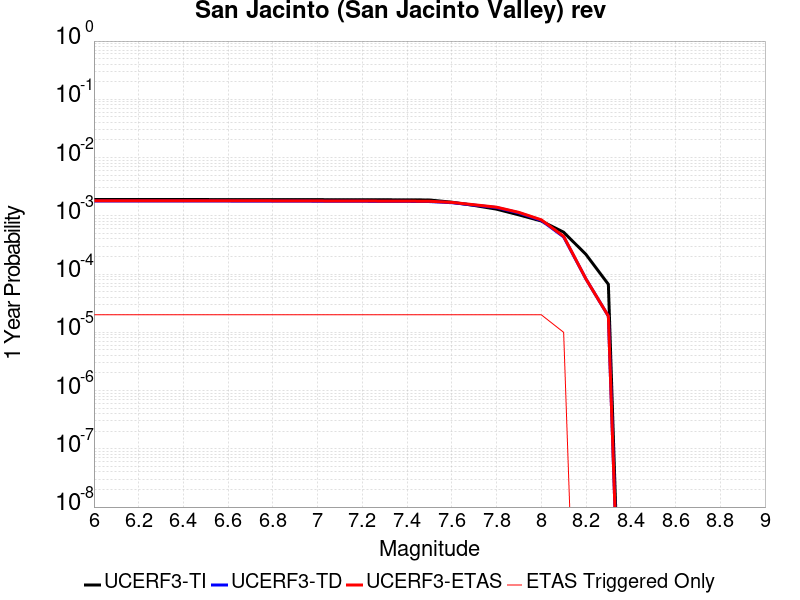 |  |

| Magnitude | 1 wk TI Prob | 1 wk TD Prob | 1 wk ETAS Prob | 1 wk ETAS/TD Gain | 1 wk ETAS Triggered Only | 1 mo TI Prob | 1 mo TD Prob | 1 mo ETAS Prob | 1 mo ETAS/TD Gain | 1 mo ETAS Triggered Only | 1 yr TI Prob | 1 yr TD Prob | 1 yr ETAS Prob | 1 yr ETAS/TD Gain | 1 yr ETAS Triggered Only | 10 yr TI Prob | 10 yr TD Prob | 10 yr ETAS Prob | 10 yr ETAS/TD Gain | 10 yr ETAS Triggered Only |
|-----|-----|-----|-----|-----|-----|-----|-----|-----|-----|-----|-----|-----|-----|-----|-----|-----|-----|-----|-----|-----|
| 6.0 | 3.652694E-5 | 3.448228E-5 | 3.448228E-5 | 1.0 | 0.0 | 1.5653463E-4 | 1.4777284E-4 | 1.774394E-4 | 1.2007579 | 2.967095E-5 | 0.0019041431 | 0.0017976513 | 0.001827269 | 1.0164757 | 2.967095E-5 | 0.018879099 | 0.0185679 | 0.01861158 | 1.0023525 | 4.4506425E-5 |
| 6.1 | 3.652694E-5 | 3.448228E-5 | 3.448228E-5 | 1.0 | 0.0 | 1.5653463E-4 | 1.4777284E-4 | 1.774394E-4 | 1.2007579 | 2.967095E-5 | 0.0019041431 | 0.0017976513 | 0.001827269 | 1.0164757 | 2.967095E-5 | 0.018879099 | 0.0185679 | 0.01861158 | 1.0023525 | 4.4506425E-5 |
| 6.2 | 3.652694E-5 | 3.448228E-5 | 3.448228E-5 | 1.0 | 0.0 | 1.5653463E-4 | 1.4777284E-4 | 1.774394E-4 | 1.2007579 | 2.967095E-5 | 0.0019041431 | 0.0017976513 | 0.001827269 | 1.0164757 | 2.967095E-5 | 0.018879099 | 0.0185679 | 0.01861158 | 1.0023525 | 4.4506425E-5 |
| 6.3 | 3.652694E-5 | 3.448228E-5 | 3.448228E-5 | 1.0 | 0.0 | 1.5653463E-4 | 1.4777284E-4 | 1.774394E-4 | 1.2007579 | 2.967095E-5 | 0.0019041431 | 0.0017976513 | 0.001827269 | 1.0164757 | 2.967095E-5 | 0.018879099 | 0.0185679 | 0.01861158 | 1.0023525 | 4.4506425E-5 |
| 6.4 | 3.646941E-5 | 3.4403838E-5 | 3.4403838E-5 | 1.0 | 0.0 | 1.5628811E-4 | 1.474367E-4 | 1.7710327E-4 | 1.2012156 | 2.967095E-5 | 0.0019011468 | 0.0017935662 | 0.0018231838 | 1.0165133 | 2.967095E-5 | 0.018849645 | 0.018527774 | 0.018571455 | 1.0023576 | 4.4506425E-5 |
| 6.5 | 3.646941E-5 | 3.4403838E-5 | 3.4403838E-5 | 1.0 | 0.0 | 1.5628811E-4 | 1.474367E-4 | 1.7710327E-4 | 1.2012156 | 2.967095E-5 | 0.0019011468 | 0.0017935662 | 0.0018231838 | 1.0165133 | 2.967095E-5 | 0.018849645 | 0.018527774 | 0.018571455 | 1.0023576 | 4.4506425E-5 |
| 6.6 | 3.6442503E-5 | 3.4367215E-5 | 3.4367215E-5 | 1.0 | 0.0 | 1.561728E-4 | 1.4727976E-4 | 1.7694633E-4 | 1.2014301 | 2.967095E-5 | 0.0018997455 | 0.0017916586 | 0.0018212763 | 1.016531 | 2.967095E-5 | 0.018835869 | 0.01850904 | 0.018552722 | 1.0023601 | 4.4506425E-5 |
| 6.7 | 3.6432113E-5 | 3.4352783E-5 | 3.4352783E-5 | 1.0 | 0.0 | 1.5612828E-4 | 1.4721791E-4 | 1.768845E-4 | 1.2015147 | 2.967095E-5 | 0.0018992044 | 0.0017909071 | 0.0018205249 | 1.0165379 | 2.967095E-5 | 0.018830549 | 0.018501662 | 0.018545344 | 1.002361 | 4.4506425E-5 |
| 6.8 | 3.6409598E-5 | 3.4321827E-5 | 3.4321827E-5 | 1.0 | 0.0 | 1.560318E-4 | 1.4708527E-4 | 1.7675186E-4 | 1.2016965 | 2.967095E-5 | 0.0018980318 | 0.001789295 | 0.0018189128 | 1.0165528 | 2.967095E-5 | 0.018819023 | 0.018485812 | 0.018529497 | 1.0023631 | 4.4506425E-5 |
| 6.9 | 3.638078E-5 | 3.4282242E-5 | 3.4282242E-5 | 1.0 | 0.0 | 1.5590832E-4 | 1.4691564E-4 | 1.7658222E-4 | 1.2019295 | 2.967095E-5 | 0.0018965311 | 0.001787233 | 0.001816851 | 1.016572 | 2.967095E-5 | 0.018804269 | 0.018465543 | 0.018509228 | 1.0023657 | 4.4506425E-5 |
| 7.0 | 3.6294874E-5 | 3.4164237E-5 | 3.4164237E-5 | 1.0 | 0.0 | 1.5554018E-4 | 1.4640996E-4 | 1.7607657E-4 | 1.202627 | 2.967095E-5 | 0.0018920569 | 0.0017810866 | 0.0018107046 | 1.0166292 | 2.967095E-5 | 0.018760284 | 0.018405113 | 0.0184488 | 1.0023737 | 4.4506425E-5 |
| 7.1 | 3.6260717E-5 | 3.4120512E-5 | 3.4120512E-5 | 1.0 | 0.0 | 1.5539382E-4 | 1.4622259E-4 | 1.758892E-4 | 1.2028867 | 2.967095E-5 | 0.001890278 | 0.001778809 | 0.0018084272 | 1.0166506 | 2.967095E-5 | 0.018742796 | 0.01838271 | 0.018426398 | 1.0023766 | 4.4506425E-5 |
| 7.2 | 3.6210204E-5 | 3.405464E-5 | 3.405464E-5 | 1.0 | 0.0 | 1.5517735E-4 | 1.459403E-4 | 1.7560693E-4 | 1.2032791 | 2.967095E-5 | 0.001887647 | 0.0017753778 | 0.001804996 | 1.0166827 | 2.967095E-5 | 0.01871693 | 0.018348943 | 0.018392634 | 1.0023811 | 4.4506425E-5 |
| 7.3 | 3.6119454E-5 | 3.3942728E-5 | 3.3942728E-5 | 1.0 | 0.0 | 1.5478847E-4 | 1.4546074E-4 | 1.7512737E-4 | 1.2039495 | 2.967095E-5 | 0.0018829206 | 0.0017695485 | 0.001799167 | 1.0167378 | 2.967095E-5 | 0.018670462 | 0.018291397 | 0.01833509 | 1.0023887 | 4.4506425E-5 |
| 7.4 | 3.607848E-5 | 3.3890177E-5 | 3.3890177E-5 | 1.0 | 0.0 | 1.5461289E-4 | 1.4523555E-4 | 1.7490219E-4 | 1.2042657 | 2.967095E-5 | 0.0018807866 | 0.0017668114 | 0.0017964299 | 1.0167638 | 2.967095E-5 | 0.018649481 | 0.018264368 | 0.018308062 | 1.0023923 | 4.4506425E-5 |
| 7.5 | 3.5856774E-5 | 3.3698998E-5 | 3.3698998E-5 | 1.0 | 0.0 | 1.5366284E-4 | 1.4441629E-4 | 1.7408296E-4 | 1.2054247 | 2.967095E-5 | 0.0018692396 | 0.0017568531 | 0.0017864718 | 1.016859 | 2.967095E-5 | 0.018535944 | 0.01816497 | 0.01820867 | 1.0024056 | 4.4506425E-5 |
| 7.6 | 3.286655E-5 | 3.221489E-5 | 3.221489E-5 | 1.0 | 0.0 | 1.4084904E-4 | 1.3805652E-4 | 1.6772338E-4 | 1.2148892 | 2.967095E-5 | 0.001713488 | 0.0016795443 | 0.0017091655 | 1.0176364 | 2.967095E-5 | 0.017003361 | 0.017380942 | 0.017424675 | 1.0025162 | 4.4506425E-5 |
| 7.7 | 2.8882527E-5 | 2.9306017E-5 | 2.9306017E-5 | 1.0 | 0.0 | 1.237764E-4 | 1.2559118E-4 | 1.552584E-4 | 1.2362206 | 2.967095E-5 | 0.0015059357 | 0.0015280012 | 0.0015576268 | 1.0193884 | 2.967095E-5 | 0.014957713 | 0.015866537 | 0.015910339 | 1.0027605 | 4.4506425E-5 |
| 7.8 | 2.4950225E-5 | 2.6594244E-5 | 2.6594244E-5 | 1.0 | 0.0 | 1.0692515E-4 | 1.1397035E-4 | 1.4363792E-4 | 1.2603095 | 2.967095E-5 | 0.0013010362 | 0.0013867067 | 0.0014163365 | 1.0213671 | 2.967095E-5 | 0.012934455 | 0.014446498 | 0.014490361 | 1.0030363 | 4.4506425E-5 |
| 7.9 | 1.9881603E-5 | 2.1567712E-5 | 2.1567712E-5 | 1.0 | 0.0 | 8.520408E-5 | 9.2429786E-5 | 1.2209799E-4 | 1.320981 | 2.967095E-5 | 0.001036866 | 0.0011247525 | 0.00115439 | 1.0263503 | 2.967095E-5 | 0.010320415 | 0.01180839 | 0.011852371 | 1.0037246 | 4.4506425E-5 |
| 8.0 | 1.563292E-5 | 1.5985908E-5 | 1.5985908E-5 | 1.0 | 0.0 | 6.6996516E-5 | 6.8509245E-5 | 9.8178156E-5 | 1.4330645 | 2.967095E-5 | 8.153773E-4 | 8.337815E-4 | 8.634277E-4 | 1.0355563 | 2.967095E-5 | 0.00812392 | 0.008836063 | 0.008880176 | 1.0049924 | 4.4506425E-5 |
| 8.1 | 1.0045313E-5 | 8.330007E-6 | 8.330007E-6 | 1.0 | 0.0 | 4.305063E-5 | 3.5699544E-5 | 5.053449E-5 | 1.41555 | 1.4835475E-5 | 5.2401534E-4 | 4.3455578E-4 | 4.4938482E-4 | 1.0341246 | 1.4835475E-5 | 0.0052278144 | 0.004674277 | 0.004703809 | 1.0063181 | 2.967095E-5 |
| 8.2 | 4.1554413E-6 | 1.5738398E-6 | 1.5738398E-6 | 1.0 | 0.0 | 1.7808914E-5 | 6.7450105E-6 | 6.7450105E-6 | 1.0 | 0.0 | 2.1680194E-4 | 8.211743E-5 | 8.211743E-5 | 1.0 | 0.0 | 0.0021659054 | 9.5302076E-4 | 9.5302076E-4 | 1.0 | 0.0 |
| 8.3 | 1.2758221E-6 | 3.6375246E-7 | 3.6375246E-7 | 1.0 | 0.0 | 5.4677976E-6 | 1.5589382E-6 | 1.5589382E-6 | 1.0 | 0.0 | 6.65684E-5 | 1.897991E-5 | 1.897991E-5 | 1.0 | 0.0 | 6.6548464E-4 | 2.2883656E-4 | 2.2883656E-4 | 1.0 | 0.0 |

## Blue Cut
*[(top)](#table-of-contents)*

| 1 Week | 1 Month | 1 Year | 10 Year |
|-----|-----|-----|-----|
|  |  |  |  |

| Magnitude | 1 wk TI Prob | 1 wk TD Prob | 1 wk ETAS Prob | 1 wk ETAS/TD Gain | 1 wk ETAS Triggered Only | 1 mo TI Prob | 1 mo TD Prob | 1 mo ETAS Prob | 1 mo ETAS/TD Gain | 1 mo ETAS Triggered Only | 1 yr TI Prob | 1 yr TD Prob | 1 yr ETAS Prob | 1 yr ETAS/TD Gain | 1 yr ETAS Triggered Only | 10 yr TI Prob | 10 yr TD Prob | 10 yr ETAS Prob | 10 yr ETAS/TD Gain | 10 yr ETAS Triggered Only |
|-----|-----|-----|-----|-----|-----|-----|-----|-----|-----|-----|-----|-----|-----|-----|-----|-----|-----|-----|-----|-----|
| 6.0 | 2.1227985E-5 | 2.2720635E-5 | 2.2720635E-5 | 1.0 | 0.0 | 9.097391E-5 | 9.7370845E-5 | 9.7370845E-5 | 1.0 | 0.0 | 0.0011070445 | 0.0011849034 | 0.0011849034 | 1.0 | 0.0 | 0.011015458 | 0.011791699 | 0.01183568 | 1.0037298 | 4.4506425E-5 |
| 6.1 | 2.1227985E-5 | 2.2720635E-5 | 2.2720635E-5 | 1.0 | 0.0 | 9.097391E-5 | 9.7370845E-5 | 9.7370845E-5 | 1.0 | 0.0 | 0.0011070445 | 0.0011849034 | 0.0011849034 | 1.0 | 0.0 | 0.011015458 | 0.011791699 | 0.01183568 | 1.0037298 | 4.4506425E-5 |
| 6.2 | 2.1227985E-5 | 2.2720635E-5 | 2.2720635E-5 | 1.0 | 0.0 | 9.097391E-5 | 9.7370845E-5 | 9.7370845E-5 | 1.0 | 0.0 | 0.0011070445 | 0.0011849034 | 0.0011849034 | 1.0 | 0.0 | 0.011015458 | 0.011791699 | 0.01183568 | 1.0037298 | 4.4506425E-5 |
| 6.3 | 1.1613981E-5 | 1.2354064E-5 | 1.2354064E-5 | 1.0 | 0.0 | 4.9773254E-5 | 5.2944983E-5 | 5.2944983E-5 | 1.0 | 0.0 | 6.0582085E-4 | 6.4442697E-4 | 6.4442697E-4 | 1.0 | 0.0 | 0.0060417196 | 0.00642683 | 0.0064710504 | 1.0068806 | 4.4506425E-5 |
| 6.4 | 1.1613981E-5 | 1.2354064E-5 | 1.2354064E-5 | 1.0 | 0.0 | 4.9773254E-5 | 5.2944983E-5 | 5.2944983E-5 | 1.0 | 0.0 | 6.0582085E-4 | 6.4442697E-4 | 6.4442697E-4 | 1.0 | 0.0 | 0.0060417196 | 0.00642683 | 0.0064710504 | 1.0068806 | 4.4506425E-5 |
| 6.5 | 8.931326E-6 | 9.481987E-6 | 9.481987E-6 | 1.0 | 0.0 | 3.8276554E-5 | 4.0636507E-5 | 4.0636507E-5 | 1.0 | 0.0 | 4.6591737E-4 | 4.946463E-4 | 4.946463E-4 | 1.0 | 0.0 | 0.0046494175 | 0.004936362 | 0.004980649 | 1.0089716 | 4.4506425E-5 |
| 6.6 | 7.345353E-6 | 7.7905925E-6 | 7.7905925E-6 | 1.0 | 0.0 | 3.1479703E-5 | 3.338787E-5 | 3.338787E-5 | 1.0 | 0.0 | 3.83198E-4 | 4.0642952E-4 | 4.0642952E-4 | 1.0 | 0.0 | 0.0038253788 | 0.0040576537 | 0.0041019795 | 1.010924 | 4.4506425E-5 |
| 6.7 | 6.2775666E-6 | 6.6554144E-6 | 6.6554144E-6 | 1.0 | 0.0 | 2.690358E-5 | 2.8522936E-5 | 2.8522936E-5 | 1.0 | 0.0 | 3.2750185E-4 | 3.472189E-4 | 3.472189E-4 | 1.0 | 0.0 | 0.0032701963 | 0.003467505 | 0.0034822891 | 1.0042636 | 1.4835475E-5 |
| 6.8 | 5.5234095E-6 | 5.8553446E-6 | 5.8553446E-6 | 1.0 | 0.0 | 2.367154E-5 | 2.5094132E-5 | 2.5094132E-5 | 1.0 | 0.0 | 2.8816288E-4 | 3.054855E-4 | 3.054855E-4 | 1.0 | 0.0 | 0.002877895 | 0.003051372 | 0.003066162 | 1.004847 | 1.4835475E-5 |
| 6.9 | 4.7780054E-6 | 5.0656226E-6 | 5.0656226E-6 | 1.0 | 0.0 | 2.0477004E-5 | 2.170967E-5 | 2.170967E-5 | 1.0 | 0.0 | 2.4927902E-4 | 2.6429023E-4 | 2.6429023E-4 | 1.0 | 0.0 | 0.0024899957 | 0.0026404513 | 0.0026552477 | 1.0056037 | 1.4835475E-5 |
| 7.0 | 3.883171E-6 | 4.1186527E-6 | 4.1186527E-6 | 1.0 | 0.0 | 1.6642054E-5 | 1.7651288E-5 | 1.7651288E-5 | 1.0 | 0.0 | 2.0259817E-4 | 2.1489013E-4 | 2.1489013E-4 | 1.0 | 0.0 | 0.0020241356 | 0.002147499 | 0.0021623026 | 1.0068934 | 1.4835475E-5 |
| 7.1 | 2.8358215E-6 | 3.0098383E-6 | 3.0098383E-6 | 1.0 | 0.0 | 1.2153464E-5 | 1.289928E-5 | 1.289928E-5 | 1.0 | 0.0 | 1.4795837E-4 | 1.5704399E-4 | 1.5704399E-4 | 1.0 | 0.0 | 0.001478599 | 0.0015699754 | 0.0015847876 | 1.0094347 | 1.4835475E-5 |

## San Jacinto (Stepovers Combined)
*[(top)](#table-of-contents)*

| 1 Week | 1 Month | 1 Year | 10 Year |
|-----|-----|-----|-----|
|  |  |  | 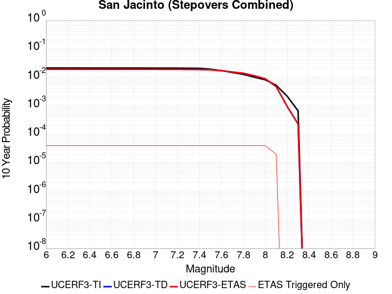 |

| Magnitude | 1 wk TI Prob | 1 wk TD Prob | 1 wk ETAS Prob | 1 wk ETAS/TD Gain | 1 wk ETAS Triggered Only | 1 mo TI Prob | 1 mo TD Prob | 1 mo ETAS Prob | 1 mo ETAS/TD Gain | 1 mo ETAS Triggered Only | 1 yr TI Prob | 1 yr TD Prob | 1 yr ETAS Prob | 1 yr ETAS/TD Gain | 1 yr ETAS Triggered Only | 10 yr TI Prob | 10 yr TD Prob | 10 yr ETAS Prob | 10 yr ETAS/TD Gain | 10 yr ETAS Triggered Only |
|-----|-----|-----|-----|-----|-----|-----|-----|-----|-----|-----|-----|-----|-----|-----|-----|-----|-----|-----|-----|-----|
| 6.0 | 4.0667746E-5 | 3.5351568E-5 | 3.5351568E-5 | 1.0 | 0.0 | 1.742787E-4 | 1.5149794E-4 | 1.8116439E-4 | 1.1958208 | 2.967095E-5 | 0.0021197782 | 0.0018429277 | 0.001872544 | 1.0160702 | 2.967095E-5 | 0.020996714 | 0.019027738 | 0.019071396 | 1.0022945 | 4.4506425E-5 |
| 6.1 | 4.0667746E-5 | 3.5351568E-5 | 3.5351568E-5 | 1.0 | 0.0 | 1.742787E-4 | 1.5149794E-4 | 1.8116439E-4 | 1.1958208 | 2.967095E-5 | 0.0021197782 | 0.0018429277 | 0.001872544 | 1.0160702 | 2.967095E-5 | 0.020996714 | 0.019027738 | 0.019071396 | 1.0022945 | 4.4506425E-5 |
| 6.2 | 4.0667746E-5 | 3.5351568E-5 | 3.5351568E-5 | 1.0 | 0.0 | 1.742787E-4 | 1.5149794E-4 | 1.8116439E-4 | 1.1958208 | 2.967095E-5 | 0.0021197782 | 0.0018429277 | 0.001872544 | 1.0160702 | 2.967095E-5 | 0.020996714 | 0.019027738 | 0.019071396 | 1.0022945 | 4.4506425E-5 |
| 6.3 | 4.0667746E-5 | 3.5351568E-5 | 3.5351568E-5 | 1.0 | 0.0 | 1.742787E-4 | 1.5149794E-4 | 1.8116439E-4 | 1.1958208 | 2.967095E-5 | 0.0021197782 | 0.0018429277 | 0.001872544 | 1.0160702 | 2.967095E-5 | 0.020996714 | 0.019027738 | 0.019071396 | 1.0022945 | 4.4506425E-5 |
| 6.4 | 4.0577226E-5 | 3.522343E-5 | 3.522343E-5 | 1.0 | 0.0 | 1.738908E-4 | 1.5094884E-4 | 1.8061532E-4 | 1.1965333 | 2.967095E-5 | 0.0021150648 | 0.0018362557 | 0.0018658721 | 1.0161288 | 2.967095E-5 | 0.020950472 | 0.018962294 | 0.019005956 | 1.0023026 | 4.4506425E-5 |
| 6.5 | 4.0577226E-5 | 3.522343E-5 | 3.522343E-5 | 1.0 | 0.0 | 1.738908E-4 | 1.5094884E-4 | 1.8061532E-4 | 1.1965333 | 2.967095E-5 | 0.0021150648 | 0.0018362557 | 0.0018658721 | 1.0161288 | 2.967095E-5 | 0.020950472 | 0.018962294 | 0.019005956 | 1.0023026 | 4.4506425E-5 |
| 6.6 | 4.053861E-5 | 3.516876E-5 | 3.516876E-5 | 1.0 | 0.0 | 1.7372532E-4 | 1.5071456E-4 | 1.8038104E-4 | 1.1968389 | 2.967095E-5 | 0.0021130538 | 0.0018334081 | 0.0018630248 | 1.0161538 | 2.967095E-5 | 0.020930743 | 0.018934365 | 0.01897803 | 1.0023061 | 4.4506425E-5 |
| 6.7 | 4.0516545E-5 | 3.513782E-5 | 3.513782E-5 | 1.0 | 0.0 | 1.7363077E-4 | 1.5058198E-4 | 1.8024846E-4 | 1.1970122 | 2.967095E-5 | 0.002111905 | 0.0018317973 | 0.0018614138 | 1.016168 | 2.967095E-5 | 0.020919468 | 0.018918559 | 0.018962223 | 1.002308 | 4.4506425E-5 |
| 6.8 | 4.049434E-5 | 3.5109377E-5 | 3.5109377E-5 | 1.0 | 0.0 | 1.7353562E-4 | 1.504601E-4 | 1.8012658E-4 | 1.1971718 | 2.967095E-5 | 0.0021107488 | 0.0018303157 | 0.0018599323 | 1.0161811 | 2.967095E-5 | 0.020908125 | 0.018903969 | 0.018947635 | 1.0023098 | 4.4506425E-5 |
| 6.9 | 4.046386E-5 | 3.5071927E-5 | 3.5071927E-5 | 1.0 | 0.0 | 1.73405E-4 | 1.5029962E-4 | 1.799661E-4 | 1.1973823 | 2.967095E-5 | 0.0021091616 | 0.0018283651 | 0.0018579819 | 1.0161985 | 2.967095E-5 | 0.020892553 | 0.018884739 | 0.018928405 | 1.0023122 | 4.4506425E-5 |
| 7.0 | 4.036382E-5 | 3.4952467E-5 | 3.4952467E-5 | 1.0 | 0.0 | 1.7297632E-4 | 1.497877E-4 | 1.794542E-4 | 1.198057 | 2.967095E-5 | 0.0021039525 | 0.0018221431 | 0.00185176 | 1.0162538 | 2.967095E-5 | 0.02084144 | 0.018823337 | 0.018867005 | 1.0023199 | 4.4506425E-5 |
| 7.1 | 4.0343282E-5 | 3.4930923E-5 | 3.4930923E-5 | 1.0 | 0.0 | 1.7288832E-4 | 1.4969538E-4 | 1.7936189E-4 | 1.1981791 | 2.967095E-5 | 0.002102883 | 0.001821021 | 0.0018506378 | 1.016264 | 2.967095E-5 | 0.020830948 | 0.018812211 | 0.01885588 | 1.0023214 | 4.4506425E-5 |
| 7.2 | 4.0257353E-5 | 3.483531E-5 | 3.483531E-5 | 1.0 | 0.0 | 1.725201E-4 | 1.4928565E-4 | 1.7895218E-4 | 1.1987232 | 2.967095E-5 | 0.0020984085 | 0.001816041 | 0.0018456581 | 1.0163085 | 2.967095E-5 | 0.020787042 | 0.018762894 | 0.018806566 | 1.0023276 | 4.4506425E-5 |
| 7.3 | 3.9940667E-5 | 3.4662633E-5 | 3.4662633E-5 | 1.0 | 0.0 | 1.7116306E-4 | 1.4854569E-4 | 1.7821224E-4 | 1.1997132 | 2.967095E-5 | 0.0020819185 | 0.0018070469 | 0.0018366643 | 1.01639 | 2.967095E-5 | 0.020625217 | 0.018671356 | 0.018715031 | 1.0023391 | 4.4506425E-5 |
| 7.4 | 3.9721202E-5 | 3.454787E-5 | 3.454787E-5 | 1.0 | 0.0 | 1.7022261E-4 | 1.4805392E-4 | 1.7772047E-4 | 1.2003767 | 2.967095E-5 | 0.0020704903 | 0.0018010695 | 0.0018306869 | 1.0164444 | 2.967095E-5 | 0.020513052 | 0.018610401 | 0.018654078 | 1.002347 | 4.4506425E-5 |
| 7.5 | 3.7036873E-5 | 3.36132E-5 | 3.36132E-5 | 1.0 | 0.0 | 1.5871979E-4 | 1.4404862E-4 | 1.737153E-4 | 1.2059491 | 2.967095E-5 | 0.0019307006 | 0.0017523842 | 0.0017820032 | 1.0169021 | 2.967095E-5 | 0.019140124 | 0.018110877 | 0.018154578 | 1.0024129 | 4.4506425E-5 |
| 7.6 | 3.2940967E-5 | 3.1386513E-5 | 3.1386513E-5 | 1.0 | 0.0 | 1.4116794E-4 | 1.3450671E-4 | 1.6417366E-4 | 1.2205611 | 2.967095E-5 | 0.0017173645 | 0.0016363913 | 0.0016660137 | 1.0181023 | 2.967095E-5 | 0.01704153 | 0.016939873 | 0.016983625 | 1.0025828 | 4.4506425E-5 |
| 7.7 | 2.8236149E-5 | 2.795042E-5 | 2.795042E-5 | 1.0 | 0.0 | 1.2100645E-4 | 1.19782024E-4 | 1.4944942E-4 | 1.2476782 | 2.967095E-5 | 0.0014722579 | 0.0014573716 | 0.0014869993 | 1.0203296 | 2.967095E-5 | 0.014625421 | 0.015149644 | 0.015193475 | 1.0028933 | 4.4506425E-5 |
| 7.8 | 2.4329287E-5 | 2.5271422E-5 | 2.5271422E-5 | 1.0 | 0.0 | 1.042642E-4 | 1.083016E-4 | 1.3796934E-4 | 1.2739363 | 2.967095E-5 | 0.0012686774 | 0.0013177752 | 0.0013474071 | 1.0224862 | 2.967095E-5 | 0.012614589 | 0.013745625 | 0.01378952 | 1.0031934 | 4.4506425E-5 |
| 7.9 | 1.9370926E-5 | 2.0479067E-5 | 2.0479067E-5 | 1.0 | 0.0 | 8.301561E-5 | 8.7764485E-5 | 1.1743283E-4 | 1.338045 | 2.967095E-5 | 0.0010102465 | 0.0010680095 | 0.0010976489 | 1.0277519 | 2.967095E-5 | 0.0100566605 | 0.011229568 | 0.011273575 | 1.0039188 | 4.4506425E-5 |
| 8.0 | 1.5583017E-5 | 1.5934833E-5 | 1.5934833E-5 | 1.0 | 0.0 | 6.6782646E-5 | 6.8290356E-5 | 9.795928E-5 | 1.4344527 | 2.967095E-5 | 8.127754E-4 | 8.311186E-4 | 8.6076494E-4 | 1.0356704 | 2.967095E-5 | 0.008098091 | 0.0088072615 | 0.008851376 | 1.0050088 | 4.4506425E-5 |
| 8.1 | 1.0024873E-5 | 8.320555E-6 | 8.320555E-6 | 1.0 | 0.0 | 4.2963035E-5 | 3.5659035E-5 | 5.049398E-5 | 1.4160221 | 1.4835475E-5 | 5.229494E-4 | 4.340628E-4 | 4.488918E-4 | 1.0341634 | 1.4835475E-5 | 0.0052172043 | 0.0046685436 | 0.004698076 | 1.0063258 | 2.967095E-5 |
| 8.2 | 4.142796E-6 | 1.5692555E-6 | 1.5692555E-6 | 1.0 | 0.0 | 1.775472E-5 | 6.725363E-6 | 6.725363E-6 | 1.0 | 0.0 | 2.1614227E-4 | 8.187825E-5 | 8.187825E-5 | 1.0 | 0.0 | 0.0021593217 | 9.501789E-4 | 9.501789E-4 | 1.0 | 0.0 |
| 8.3 | 1.2750878E-6 | 3.6346486E-7 | 3.6346486E-7 | 1.0 | 0.0 | 5.4646503E-6 | 1.5577056E-6 | 1.5577056E-6 | 1.0 | 0.0 | 6.653009E-5 | 1.8964905E-5 | 1.8964905E-5 | 1.0 | 0.0 | 6.6510175E-4 | 2.2866535E-4 | 2.2866535E-4 | 1.0 | 0.0 |

## Cleghorn Pass
*[(top)](#table-of-contents)*

| 1 Week | 1 Month | 1 Year | 10 Year |
|-----|-----|-----|-----|
| 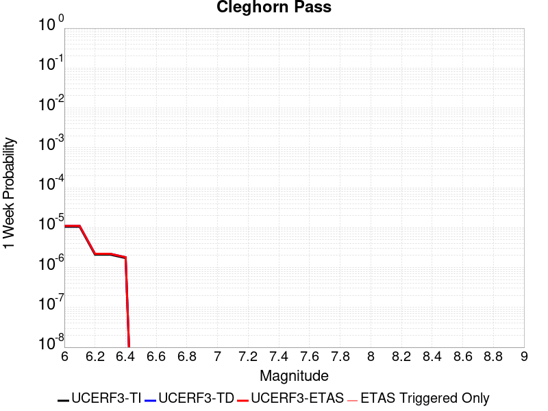 |  |  |  |

| Magnitude | 1 wk TI Prob | 1 wk TD Prob | 1 wk ETAS Prob | 1 wk ETAS/TD Gain | 1 wk ETAS Triggered Only | 1 mo TI Prob | 1 mo TD Prob | 1 mo ETAS Prob | 1 mo ETAS/TD Gain | 1 mo ETAS Triggered Only | 1 yr TI Prob | 1 yr TD Prob | 1 yr ETAS Prob | 1 yr ETAS/TD Gain | 1 yr ETAS Triggered Only | 10 yr TI Prob | 10 yr TD Prob | 10 yr ETAS Prob | 10 yr ETAS/TD Gain | 10 yr ETAS Triggered Only |
|-----|-----|-----|-----|-----|-----|-----|-----|-----|-----|-----|-----|-----|-----|-----|-----|-----|-----|-----|-----|-----|
| 6.0 | 1.0522846E-5 | 1.1041002E-5 | 1.1041002E-5 | 1.0 | 0.0 | 4.509713E-5 | 4.731802E-5 | 4.731802E-5 | 1.0 | 0.0 | 5.4891926E-4 | 5.759972E-4 | 5.759972E-4 | 1.0 | 0.0 | 0.0054756533 | 0.005750209 | 0.0057944595 | 1.0076954 | 4.4506425E-5 |
| 6.1 | 1.0522846E-5 | 1.1041002E-5 | 1.1041002E-5 | 1.0 | 0.0 | 4.509713E-5 | 4.731802E-5 | 4.731802E-5 | 1.0 | 0.0 | 5.4891926E-4 | 5.759972E-4 | 5.759972E-4 | 1.0 | 0.0 | 0.0054756533 | 0.005750209 | 0.0057944595 | 1.0076954 | 4.4506425E-5 |
| 6.2 | 2.1045846E-6 | 2.2082745E-6 | 2.2082745E-6 | 1.0 | 0.0 | 9.019617E-6 | 9.464023E-6 | 9.464023E-6 | 1.0 | 0.0 | 1.098083E-4 | 1.1522258E-4 | 1.1522258E-4 | 1.0 | 0.0 | 0.0010975406 | 0.0011520399 | 0.0011520399 | 1.0 | 0.0 |
| 6.3 | 2.1045846E-6 | 2.2082745E-6 | 2.2082745E-6 | 1.0 | 0.0 | 9.019617E-6 | 9.464023E-6 | 9.464023E-6 | 1.0 | 0.0 | 1.098083E-4 | 1.1522258E-4 | 1.1522258E-4 | 1.0 | 0.0 | 0.0010975406 | 0.0011520399 | 0.0011520399 | 1.0 | 0.0 |
| 6.4 | 1.7259927E-6 | 1.8109362E-6 | 1.8109362E-6 | 1.0 | 0.0 | 7.3970905E-6 | 7.761155E-6 | 7.761155E-6 | 1.0 | 0.0 | 9.005586E-5 | 9.449206E-5 | 9.449206E-5 | 1.0 | 0.0 | 9.001937E-4 | 9.449206E-4 | 9.449206E-4 | 1.0 | 0.0 |

## San Pedro Basin
*[(top)](#table-of-contents)*

| 1 Week | 1 Month | 1 Year | 10 Year |
|-----|-----|-----|-----|
| 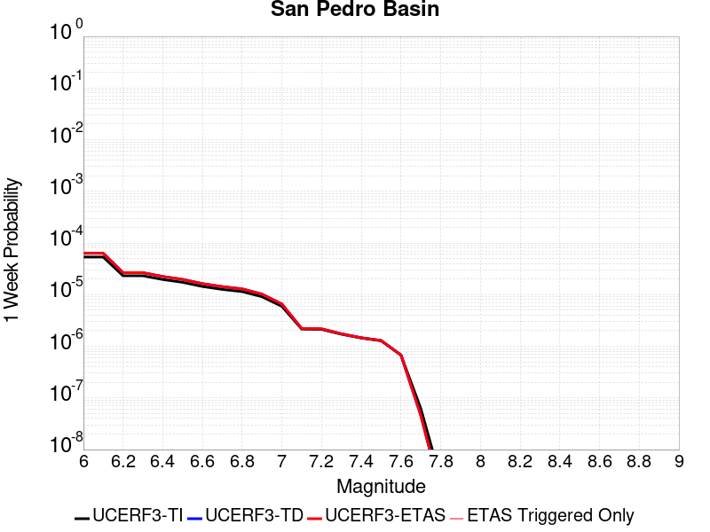 | 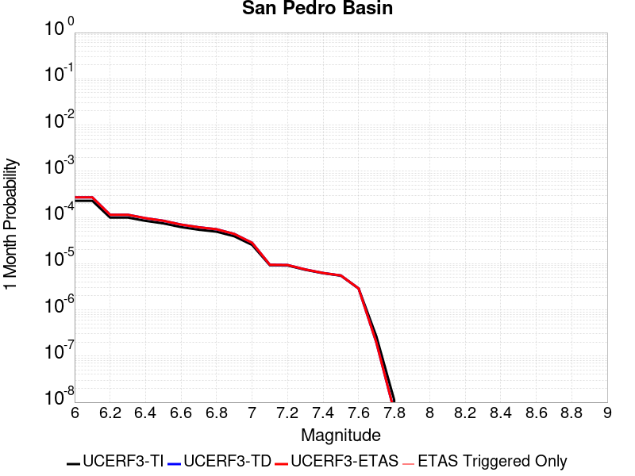 |  |  |

| Magnitude | 1 wk TI Prob | 1 wk TD Prob | 1 wk ETAS Prob | 1 wk ETAS/TD Gain | 1 wk ETAS Triggered Only | 1 mo TI Prob | 1 mo TD Prob | 1 mo ETAS Prob | 1 mo ETAS/TD Gain | 1 mo ETAS Triggered Only | 1 yr TI Prob | 1 yr TD Prob | 1 yr ETAS Prob | 1 yr ETAS/TD Gain | 1 yr ETAS Triggered Only | 10 yr TI Prob | 10 yr TD Prob | 10 yr ETAS Prob | 10 yr ETAS/TD Gain | 10 yr ETAS Triggered Only |
|-----|-----|-----|-----|-----|-----|-----|-----|-----|-----|-----|-----|-----|-----|-----|-----|-----|-----|-----|-----|-----|
| 6.0 | 5.3449043E-5 | 6.3377476E-5 | 6.3377476E-5 | 1.0 | 0.0 | 2.2904722E-4 | 2.7159284E-4 | 2.7159284E-4 | 1.0 | 0.0 | 0.0027850836 | 0.003302238 | 0.003302238 | 1.0 | 0.0 | 0.027504366 | 0.032593444 | 0.032636497 | 1.001321 | 4.4506425E-5 |
| 6.1 | 5.3449043E-5 | 6.3377476E-5 | 6.3377476E-5 | 1.0 | 0.0 | 2.2904722E-4 | 2.7159284E-4 | 2.7159284E-4 | 1.0 | 0.0 | 0.0027850836 | 0.003302238 | 0.003302238 | 1.0 | 0.0 | 0.027504366 | 0.032593444 | 0.032636497 | 1.001321 | 4.4506425E-5 |
| 6.2 | 2.3189454E-5 | 2.6645484E-5 | 2.6645484E-5 | 1.0 | 0.0 | 9.9379584E-5 | 1.141902E-4 | 1.141902E-4 | 1.0 | 0.0 | 0.0012092749 | 0.0013894265 | 0.0013894265 | 1.0 | 0.0 | 0.012027155 | 0.013812267 | 0.013841528 | 1.0021185 | 2.967095E-5 |
| 6.3 | 2.3189454E-5 | 2.6645484E-5 | 2.6645484E-5 | 1.0 | 0.0 | 9.9379584E-5 | 1.141902E-4 | 1.141902E-4 | 1.0 | 0.0 | 0.0012092749 | 0.0013894265 | 0.0013894265 | 1.0 | 0.0 | 0.012027155 | 0.013812267 | 0.013841528 | 1.0021185 | 2.967095E-5 |
| 6.4 | 1.966056E-5 | 2.2465589E-5 | 2.2465589E-5 | 1.0 | 0.0 | 8.425682E-5 | 9.627777E-5 | 9.627777E-5 | 1.0 | 0.0 | 0.001025344 | 0.0011715917 | 0.0011715917 | 1.0 | 0.0 | 0.010206259 | 0.011658239 | 0.011687565 | 1.0025154 | 2.967095E-5 |
| 6.5 | 1.7342953E-5 | 1.9747013E-5 | 1.9747013E-5 | 1.0 | 0.0 | 7.4324824E-5 | 8.4627514E-5 | 8.4627514E-5 | 1.0 | 0.0 | 9.04529E-4 | 0.0010298899 | 0.0010298899 | 1.0 | 0.0 | 0.009008561 | 0.010254894 | 0.010284261 | 1.0028636 | 2.967095E-5 |
| 6.6 | 1.439804E-5 | 1.6324211E-5 | 1.6324211E-5 | 1.0 | 0.0 | 6.170443E-5 | 6.9959206E-5 | 6.9959206E-5 | 1.0 | 0.0 | 7.509924E-4 | 8.5145264E-4 | 8.5145264E-4 | 1.0 | 0.0 | 0.0074845953 | 0.008485107 | 0.008499816 | 1.0017335 | 1.4835475E-5 |
| 6.7 | 1.2634884E-5 | 1.4286582E-5 | 1.4286582E-5 | 1.0 | 0.0 | 5.414838E-5 | 6.122694E-5 | 6.122694E-5 | 1.0 | 0.0 | 6.590571E-4 | 7.4521353E-4 | 7.4521353E-4 | 1.0 | 0.0 | 0.006571059 | 0.0074301674 | 0.0074301674 | 1.0 | 0.0 |
| 6.8 | 1.146091E-5 | 1.2934341E-5 | 1.2934341E-5 | 1.0 | 0.0 | 4.911726E-5 | 5.5431876E-5 | 5.5431876E-5 | 1.0 | 0.0 | 5.9783855E-4 | 6.7470386E-4 | 6.7470386E-4 | 1.0 | 0.0 | 0.0059623276 | 0.0067294952 | 0.0067294952 | 1.0 | 0.0 |
| 6.9 | 9.109035E-6 | 1.0235896E-5 | 1.0235896E-5 | 1.0 | 0.0 | 3.9038136E-5 | 4.386755E-5 | 4.386755E-5 | 1.0 | 0.0 | 4.7518566E-4 | 5.339845E-4 | 5.339845E-4 | 1.0 | 0.0 | 0.0047417083 | 0.0053297686 | 0.0053297686 | 1.0 | 0.0 |
| 7.0 | 5.9351028E-6 | 6.5844843E-6 | 6.5844843E-6 | 1.0 | 0.0 | 2.5435906E-5 | 2.8219047E-5 | 2.8219047E-5 | 1.0 | 0.0 | 3.0963816E-4 | 3.4353635E-4 | 3.4353635E-4 | 1.0 | 0.0 | 0.0030920706 | 0.0034323703 | 0.0034323703 | 1.0 | 0.0 |
| 7.1 | 2.1557585E-6 | 2.2097115E-6 | 2.2097115E-6 | 1.0 | 0.0 | 9.238933E-6 | 9.470159E-6 | 9.470159E-6 | 1.0 | 0.0 | 1.1247819E-4 | 1.1529324E-4 | 1.1529324E-4 | 1.0 | 0.0 | 0.0011242128 | 0.0011523496 | 0.0011523496 | 1.0 | 0.0 |
| 7.2 | 2.1251979E-6 | 2.178057E-6 | 2.178057E-6 | 1.0 | 0.0 | 9.107958E-6 | 9.334498E-6 | 9.334498E-6 | 1.0 | 0.0 | 1.1088375E-4 | 1.13641734E-4 | 1.13641734E-4 | 1.0 | 0.0 | 0.0011082845 | 0.0011358516 | 0.0011358516 | 1.0 | 0.0 |
| 7.3 | 1.7145798E-6 | 1.7443339E-6 | 1.7443339E-6 | 1.0 | 0.0 | 7.3481783E-6 | 7.475696E-6 | 7.475696E-6 | 1.0 | 0.0 | 8.94604E-5 | 9.101289E-5 | 9.101289E-5 | 1.0 | 0.0 | 8.9424395E-4 | 9.0976525E-4 | 9.0976525E-4 | 1.0 | 0.0 |
| 7.4 | 1.4467993E-6 | 1.4642246E-6 | 1.4642246E-6 | 1.0 | 0.0 | 6.200554E-6 | 6.2752338E-6 | 6.2752338E-6 | 1.0 | 0.0 | 7.548913E-5 | 7.639836E-5 | 7.639836E-5 | 1.0 | 0.0 | 7.546349E-4 | 7.637283E-4 | 7.637283E-4 | 1.0 | 0.0 |
| 7.5 | 1.2803735E-6 | 1.2931831E-6 | 1.2931831E-6 | 1.0 | 0.0 | 5.487303E-6 | 5.542202E-6 | 5.542202E-6 | 1.0 | 0.0 | 6.680587E-5 | 6.747429E-5 | 6.747429E-5 | 1.0 | 0.0 | 6.678579E-4 | 6.745451E-4 | 6.745451E-4 | 1.0 | 0.0 |
| 7.6 | 6.755009E-7 | 6.769642E-7 | 6.769642E-7 | 1.0 | 0.0 | 2.8950008E-6 | 2.9012724E-6 | 2.9012724E-6 | 1.0 | 0.0 | 3.5246063E-5 | 3.5322475E-5 | 3.5322475E-5 | 1.0 | 0.0 | 3.5240475E-4 | 3.5317434E-4 | 3.5317434E-4 | 1.0 | 0.0 |
| 7.7 | 6.211885E-8 | 4.570119E-8 | 4.570119E-8 | 1.0 | 0.0 | 2.6622362E-7 | 1.9586223E-7 | 1.9586223E-7 | 1.0 | 0.0 | 3.2412677E-6 | 2.38462E-6 | 2.38462E-6 | 1.0 | 0.0 | 3.2412205E-5 | 2.3845967E-5 | 2.3845967E-5 | 1.0 | 0.0 |
| 7.8 | 2.6580573E-9 | 1.5140755E-9 | 1.5140755E-9 | 1.0 | 0.0 | 1.1391674E-8 | 6.4888948E-9 | 6.4888948E-9 | 1.0 | 0.0 | 1.3869362E-7 | 7.90023E-8 | 7.90023E-8 | 1.0 | 0.0 | 1.3869354E-6 | 7.9002297E-7 | 7.9002297E-7 | 1.0 | 0.0 |

## Pitas Point (Lower West)
*[(top)](#table-of-contents)*

| 1 Week | 1 Month | 1 Year | 10 Year |
|-----|-----|-----|-----|
|  |  |  |  |

| Magnitude | 1 wk TI Prob | 1 wk TD Prob | 1 wk ETAS Prob | 1 wk ETAS/TD Gain | 1 wk ETAS Triggered Only | 1 mo TI Prob | 1 mo TD Prob | 1 mo ETAS Prob | 1 mo ETAS/TD Gain | 1 mo ETAS Triggered Only | 1 yr TI Prob | 1 yr TD Prob | 1 yr ETAS Prob | 1 yr ETAS/TD Gain | 1 yr ETAS Triggered Only | 10 yr TI Prob | 10 yr TD Prob | 10 yr ETAS Prob | 10 yr ETAS/TD Gain | 10 yr ETAS Triggered Only |
|-----|-----|-----|-----|-----|-----|-----|-----|-----|-----|-----|-----|-----|-----|-----|-----|-----|-----|-----|-----|-----|
| 6.0 | 8.151497E-6 | 7.856098E-6 | 7.856098E-6 | 1.0 | 0.0 | 3.493452E-5 | 3.366856E-5 | 3.366856E-5 | 1.0 | 0.0 | 4.252448E-4 | 4.0983837E-4 | 4.3949715E-4 | 1.0723671 | 2.967095E-5 | 0.0042443196 | 0.004090906 | 0.0041352306 | 1.0108348 | 4.4506425E-5 |
| 6.1 | 8.151497E-6 | 7.856098E-6 | 7.856098E-6 | 1.0 | 0.0 | 3.493452E-5 | 3.366856E-5 | 3.366856E-5 | 1.0 | 0.0 | 4.252448E-4 | 4.0983837E-4 | 4.3949715E-4 | 1.0723671 | 2.967095E-5 | 0.0042443196 | 0.004090906 | 0.0041352306 | 1.0108348 | 4.4506425E-5 |
| 6.2 | 8.151497E-6 | 7.856098E-6 | 7.856098E-6 | 1.0 | 0.0 | 3.493452E-5 | 3.366856E-5 | 3.366856E-5 | 1.0 | 0.0 | 4.252448E-4 | 4.0983837E-4 | 4.3949715E-4 | 1.0723671 | 2.967095E-5 | 0.0042443196 | 0.004090906 | 0.0041352306 | 1.0108348 | 4.4506425E-5 |
| 6.3 | 8.151497E-6 | 7.856098E-6 | 7.856098E-6 | 1.0 | 0.0 | 3.493452E-5 | 3.366856E-5 | 3.366856E-5 | 1.0 | 0.0 | 4.252448E-4 | 4.0983837E-4 | 4.3949715E-4 | 1.0723671 | 2.967095E-5 | 0.0042443196 | 0.004090906 | 0.0041352306 | 1.0108348 | 4.4506425E-5 |
| 6.4 | 8.151497E-6 | 7.856098E-6 | 7.856098E-6 | 1.0 | 0.0 | 3.493452E-5 | 3.366856E-5 | 3.366856E-5 | 1.0 | 0.0 | 4.252448E-4 | 4.0983837E-4 | 4.3949715E-4 | 1.0723671 | 2.967095E-5 | 0.0042443196 | 0.004090906 | 0.0041352306 | 1.0108348 | 4.4506425E-5 |
| 6.5 | 8.151497E-6 | 7.856098E-6 | 7.856098E-6 | 1.0 | 0.0 | 3.493452E-5 | 3.366856E-5 | 3.366856E-5 | 1.0 | 0.0 | 4.252448E-4 | 4.0983837E-4 | 4.3949715E-4 | 1.0723671 | 2.967095E-5 | 0.0042443196 | 0.004090906 | 0.0041352306 | 1.0108348 | 4.4506425E-5 |
| 6.6 | 8.151497E-6 | 7.856098E-6 | 7.856098E-6 | 1.0 | 0.0 | 3.493452E-5 | 3.366856E-5 | 3.366856E-5 | 1.0 | 0.0 | 4.252448E-4 | 4.0983837E-4 | 4.3949715E-4 | 1.0723671 | 2.967095E-5 | 0.0042443196 | 0.004090906 | 0.0041352306 | 1.0108348 | 4.4506425E-5 |
| 6.7 | 8.151497E-6 | 7.856098E-6 | 7.856098E-6 | 1.0 | 0.0 | 3.493452E-5 | 3.366856E-5 | 3.366856E-5 | 1.0 | 0.0 | 4.252448E-4 | 4.0983837E-4 | 4.3949715E-4 | 1.0723671 | 2.967095E-5 | 0.0042443196 | 0.004090906 | 0.0041352306 | 1.0108348 | 4.4506425E-5 |
| 6.8 | 8.151497E-6 | 7.856098E-6 | 7.856098E-6 | 1.0 | 0.0 | 3.493452E-5 | 3.366856E-5 | 3.366856E-5 | 1.0 | 0.0 | 4.252448E-4 | 4.0983837E-4 | 4.3949715E-4 | 1.0723671 | 2.967095E-5 | 0.0042443196 | 0.004090906 | 0.0041352306 | 1.0108348 | 4.4506425E-5 |
| 6.9 | 8.151497E-6 | 7.856098E-6 | 7.856098E-6 | 1.0 | 0.0 | 3.493452E-5 | 3.366856E-5 | 3.366856E-5 | 1.0 | 0.0 | 4.252448E-4 | 4.0983837E-4 | 4.3949715E-4 | 1.0723671 | 2.967095E-5 | 0.0042443196 | 0.004090906 | 0.0041352306 | 1.0108348 | 4.4506425E-5 |
| 7.0 | 8.103535E-6 | 7.8055255E-6 | 7.8055255E-6 | 1.0 | 0.0 | 3.4728975E-5 | 3.345183E-5 | 3.345183E-5 | 1.0 | 0.0 | 4.2274324E-4 | 4.0720063E-4 | 4.368595E-4 | 1.072836 | 2.967095E-5 | 0.0042193993 | 0.0040646256 | 0.004108951 | 1.0109051 | 4.4506425E-5 |
| 7.1 | 7.853298E-6 | 7.541207E-6 | 7.541207E-6 | 1.0 | 0.0 | 3.3656554E-5 | 3.231906E-5 | 3.231906E-5 | 1.0 | 0.0 | 4.096915E-4 | 3.9341423E-4 | 4.230735E-4 | 1.0753894 | 2.967095E-5 | 0.00408937 | 0.003927254 | 0.0039715855 | 1.0112882 | 4.4506425E-5 |
| 7.2 | 7.771102E-6 | 7.453485E-6 | 7.453485E-6 | 1.0 | 0.0 | 3.33043E-5 | 3.194312E-5 | 3.194312E-5 | 1.0 | 0.0 | 4.0540437E-4 | 3.888388E-4 | 4.1849818E-4 | 1.0762769 | 2.967095E-5 | 0.0040466557 | 0.0038816598 | 0.0039259936 | 1.0114213 | 4.4506425E-5 |
| 7.3 | 7.3945344E-6 | 7.0495703E-6 | 7.0495703E-6 | 1.0 | 0.0 | 3.1690477E-5 | 3.0212097E-5 | 3.0212097E-5 | 1.0 | 0.0 | 3.8576324E-4 | 3.6777082E-4 | 3.9743085E-4 | 1.0806482 | 2.967095E-5 | 0.0038509427 | 0.0036716897 | 0.0037160327 | 1.012077 | 4.4506425E-5 |
| 7.4 | 6.964645E-6 | 6.5903982E-6 | 6.5903982E-6 | 1.0 | 0.0 | 2.9848137E-5 | 2.8244262E-5 | 2.8244262E-5 | 1.0 | 0.0 | 3.6334046E-4 | 3.438201E-4 | 3.7348087E-4 | 1.0862682 | 2.967095E-5 | 0.0036274698 | 0.003432935 | 0.0034772886 | 1.01292 | 4.4506425E-5 |
| 7.5 | 6.6525035E-6 | 6.2594236E-6 | 6.2594236E-6 | 1.0 | 0.0 | 2.851042E-5 | 2.6825828E-5 | 2.6825828E-5 | 1.0 | 0.0 | 3.4705905E-4 | 3.2655598E-4 | 3.5621726E-4 | 1.0908306 | 2.967095E-5 | 0.0034651754 | 0.003260813 | 0.0033051742 | 1.0136044 | 4.4506425E-5 |
| 7.6 | 5.613338E-6 | 5.151601E-6 | 5.151601E-6 | 1.0 | 0.0 | 2.405694E-5 | 2.2078106E-5 | 2.2078106E-5 | 1.0 | 0.0 | 2.928539E-4 | 2.6876808E-4 | 2.8359957E-4 | 1.0551832 | 1.4835475E-5 | 0.0029246826 | 0.002684462 | 0.0026992576 | 1.0055116 | 1.4835475E-5 |
| 7.7 | 4.494704E-6 | 3.997082E-6 | 3.997082E-6 | 1.0 | 0.0 | 1.9262876E-5 | 1.713024E-5 | 1.713024E-5 | 1.0 | 0.0 | 2.3450027E-4 | 2.0854094E-4 | 2.0854094E-4 | 1.0 | 0.0 | 0.0023425296 | 0.0020834766 | 0.0020834766 | 1.0 | 0.0 |
| 7.8 | 2.6075882E-6 | 2.1837272E-6 | 2.1837272E-6 | 1.0 | 0.0 | 1.117533E-5 | 9.358798E-6 | 9.358798E-6 | 1.0 | 0.0 | 1.3605114E-4 | 1.1393746E-4 | 1.1393746E-4 | 1.0 | 0.0 | 0.0013596788 | 0.0011387952 | 0.0011387952 | 1.0 | 0.0 |
| 7.9 | 4.045984E-7 | 3.2425146E-7 | 3.2425146E-7 | 1.0 | 0.0 | 1.733992E-6 | 1.3896483E-6 | 1.3896483E-6 | 1.0 | 0.0 | 2.1111147E-5 | 1.691884E-5 | 1.691884E-5 | 1.0 | 0.0 | 2.1109142E-4 | 1.6917584E-4 | 1.6917584E-4 | 1.0 | 0.0 |
| 8.0 | 7.791402E-9 | 5.683778E-9 | 5.683778E-9 | 1.0 | 0.0 | 3.3391725E-8 | 2.4359048E-8 | 2.4359048E-8 | 1.0 | 0.0 | 4.0654416E-7 | 2.965714E-7 | 2.965714E-7 | 1.0 | 0.0 | 4.065434E-6 | 2.965712E-6 | 2.965712E-6 | 1.0 | 0.0 |

## Oak Ridge (Onshore)
*[(top)](#table-of-contents)*

| 1 Week | 1 Month | 1 Year | 10 Year |
|-----|-----|-----|-----|
|  |  |  |  |

| Magnitude | 1 wk TI Prob | 1 wk TD Prob | 1 wk ETAS Prob | 1 wk ETAS/TD Gain | 1 wk ETAS Triggered Only | 1 mo TI Prob | 1 mo TD Prob | 1 mo ETAS Prob | 1 mo ETAS/TD Gain | 1 mo ETAS Triggered Only | 1 yr TI Prob | 1 yr TD Prob | 1 yr ETAS Prob | 1 yr ETAS/TD Gain | 1 yr ETAS Triggered Only | 10 yr TI Prob | 10 yr TD Prob | 10 yr ETAS Prob | 10 yr ETAS/TD Gain | 10 yr ETAS Triggered Only |
|-----|-----|-----|-----|-----|-----|-----|-----|-----|-----|-----|-----|-----|-----|-----|-----|-----|-----|-----|-----|-----|
| 6.0 | 3.155064E-5 | 2.9530047E-5 | 2.9530047E-5 | 1.0 | 0.0 | 1.3521002E-4 | 1.2655141E-4 | 1.2655141E-4 | 1.0 | 0.0 | 0.001644939 | 0.0015397127 | 0.0015545252 | 1.0096204 | 1.4835475E-5 | 0.01632816 | 0.015294952 | 0.01532417 | 1.0019102 | 2.967095E-5 |
| 6.1 | 3.155064E-5 | 2.9530047E-5 | 2.9530047E-5 | 1.0 | 0.0 | 1.3521002E-4 | 1.2655141E-4 | 1.2655141E-4 | 1.0 | 0.0 | 0.001644939 | 0.0015397127 | 0.0015545252 | 1.0096204 | 1.4835475E-5 | 0.01632816 | 0.015294952 | 0.01532417 | 1.0019102 | 2.967095E-5 |
| 6.2 | 3.155064E-5 | 2.9530047E-5 | 2.9530047E-5 | 1.0 | 0.0 | 1.3521002E-4 | 1.2655141E-4 | 1.2655141E-4 | 1.0 | 0.0 | 0.001644939 | 0.0015397127 | 0.0015545252 | 1.0096204 | 1.4835475E-5 | 0.01632816 | 0.015294952 | 0.01532417 | 1.0019102 | 2.967095E-5 |
| 6.3 | 3.155064E-5 | 2.9530047E-5 | 2.9530047E-5 | 1.0 | 0.0 | 1.3521002E-4 | 1.2655141E-4 | 1.2655141E-4 | 1.0 | 0.0 | 0.001644939 | 0.0015397127 | 0.0015545252 | 1.0096204 | 1.4835475E-5 | 0.01632816 | 0.015294952 | 0.01532417 | 1.0019102 | 2.967095E-5 |
| 6.4 | 3.155064E-5 | 2.9530047E-5 | 2.9530047E-5 | 1.0 | 0.0 | 1.3521002E-4 | 1.2655141E-4 | 1.2655141E-4 | 1.0 | 0.0 | 0.001644939 | 0.0015397127 | 0.0015545252 | 1.0096204 | 1.4835475E-5 | 0.01632816 | 0.015294952 | 0.01532417 | 1.0019102 | 2.967095E-5 |
| 6.5 | 3.155064E-5 | 2.9530047E-5 | 2.9530047E-5 | 1.0 | 0.0 | 1.3521002E-4 | 1.2655141E-4 | 1.2655141E-4 | 1.0 | 0.0 | 0.001644939 | 0.0015397127 | 0.0015545252 | 1.0096204 | 1.4835475E-5 | 0.01632816 | 0.015294952 | 0.01532417 | 1.0019102 | 2.967095E-5 |
| 6.6 | 3.155064E-5 | 2.9530047E-5 | 2.9530047E-5 | 1.0 | 0.0 | 1.3521002E-4 | 1.2655141E-4 | 1.2655141E-4 | 1.0 | 0.0 | 0.001644939 | 0.0015397127 | 0.0015545252 | 1.0096204 | 1.4835475E-5 | 0.01632816 | 0.015294952 | 0.01532417 | 1.0019102 | 2.967095E-5 |
| 6.7 | 3.098897E-5 | 2.886817E-5 | 2.886817E-5 | 1.0 | 0.0 | 1.328031E-4 | 1.2371507E-4 | 1.2371507E-4 | 1.0 | 0.0 | 0.0016156785 | 0.001505228 | 0.0015200411 | 1.0098411 | 1.4835475E-5 | 0.016039822 | 0.014954767 | 0.014983995 | 1.0019543 | 2.967095E-5 |
| 6.8 | 3.0449872E-5 | 2.8243301E-5 | 2.8243301E-5 | 1.0 | 0.0 | 1.3049292E-4 | 1.2103731E-4 | 1.2103731E-4 | 1.0 | 0.0 | 0.0015875935 | 0.0014726704 | 0.001487484 | 1.010059 | 1.4835475E-5 | 0.015762992 | 0.014633482 | 0.014662719 | 1.001998 | 2.967095E-5 |
| 6.9 | 2.697928E-5 | 2.4223278E-5 | 2.4223278E-5 | 1.0 | 0.0 | 1.15620365E-4 | 1.03810045E-4 | 1.03810045E-4 | 1.0 | 0.0 | 0.0014067689 | 0.001263176 | 0.0012779927 | 1.0117297 | 1.4835475E-5 | 0.0139789665 | 0.012562676 | 0.012591975 | 1.0023322 | 2.967095E-5 |
| 7.0 | 2.4893961E-5 | 2.1865315E-5 | 2.1865315E-5 | 1.0 | 0.0 | 1.0668404E-4 | 9.370523E-5 | 9.370523E-5 | 1.0 | 0.0 | 0.0012981043 | 0.0011402818 | 0.0011551004 | 1.0129955 | 1.4835475E-5 | 0.012905477 | 0.011346594 | 0.011375929 | 1.0025853 | 2.967095E-5 |
| 7.1 | 2.0945363E-5 | 1.7357328E-5 | 1.7357328E-5 | 1.0 | 0.0 | 8.976275E-5 | 7.438646E-5 | 7.438646E-5 | 1.0 | 0.0 | 0.0010923136 | 9.0528355E-4 | 9.201056E-4 | 1.0163728 | 1.4835475E-5 | 0.0108696 | 0.009016892 | 0.009046296 | 1.003261 | 2.967095E-5 |
| 7.2 | 2.0439404E-5 | 1.6812217E-5 | 1.6812217E-5 | 1.0 | 0.0 | 8.7594504E-5 | 7.205039E-5 | 7.205039E-5 | 1.0 | 0.0 | 0.0010659413 | 8.768652E-4 | 8.9168764E-4 | 1.0169039 | 1.4835475E-5 | 0.010608427 | 0.00873497 | 0.008764382 | 1.0033672 | 2.967095E-5 |
| 7.3 | 1.8463334E-5 | 1.5383097E-5 | 1.5383097E-5 | 1.0 | 0.0 | 7.912617E-5 | 6.592592E-5 | 6.592592E-5 | 1.0 | 0.0 | 9.6293533E-4 | 8.023568E-4 | 8.171804E-4 | 1.018475 | 1.4835475E-5 | 0.009587734 | 0.007995463 | 0.0080248965 | 1.0036813 | 2.967095E-5 |
| 7.4 | 1.763139E-5 | 1.4517945E-5 | 1.4517945E-5 | 1.0 | 0.0 | 7.556091E-5 | 6.22183E-5 | 6.22183E-5 | 1.0 | 0.0 | 9.1956573E-4 | 7.5724855E-4 | 7.7207276E-4 | 1.0195764 | 1.4835475E-5 | 0.009157699 | 0.007547486 | 0.007576933 | 1.0039016 | 2.967095E-5 |
| 7.5 | 1.3594944E-5 | 1.1164066E-5 | 1.1164066E-5 | 1.0 | 0.0 | 5.8262744E-5 | 4.7845133E-5 | 4.7845133E-5 | 1.0 | 0.0 | 7.0911803E-4 | 5.8236136E-4 | 5.971882E-4 | 1.0254599 | 1.4835475E-5 | 0.007068595 | 0.005808624 | 0.0058381227 | 1.0050784 | 2.967095E-5 |
| 7.6 | 6.9889534E-6 | 5.6369727E-6 | 5.6369727E-6 | 1.0 | 0.0 | 2.9952313E-5 | 2.4158233E-5 | 2.4158233E-5 | 1.0 | 0.0 | 3.646084E-4 | 2.9408722E-4 | 3.0891833E-4 | 1.050431 | 1.4835475E-5 | 0.0036401073 | 0.0029370242 | 0.0029666082 | 1.0100727 | 2.967095E-5 |
| 7.7 | 4.0824193E-6 | 3.2834118E-6 | 3.2834118E-6 | 1.0 | 0.0 | 1.7495966E-5 | 1.4071689E-5 | 1.4071689E-5 | 1.0 | 0.0 | 2.1299256E-4 | 1.7130948E-4 | 1.8614241E-4 | 1.0865856 | 1.4835475E-5 | 0.0021278851 | 0.0017117877 | 0.0017265978 | 1.0086519 | 1.4835475E-5 |
| 7.8 | 1.7023609E-6 | 1.4371072E-6 | 1.4371072E-6 | 1.0 | 0.0 | 7.295812E-6 | 6.1590163E-6 | 6.1590163E-6 | 1.0 | 0.0 | 8.882289E-5 | 7.498347E-5 | 7.498347E-5 | 1.0 | 0.0 | 8.8787393E-4 | 7.495845E-4 | 7.495845E-4 | 1.0 | 0.0 |
| 7.9 | 2.721225E-7 | 2.2617958E-7 | 2.2617958E-7 | 1.0 | 0.0 | 1.1662388E-6 | 9.693407E-7 | 9.693407E-7 | 1.0 | 0.0 | 1.4198865E-5 | 1.18016615E-5 | 1.18016615E-5 | 1.0 | 0.0 | 1.4197957E-4 | 1.18010634E-4 | 1.18010634E-4 | 1.0 | 0.0 |
| 8.0 | 9.364255E-9 | 5.12195E-9 | 5.12195E-9 | 1.0 | 0.0 | 4.0132523E-8 | 2.1951216E-8 | 2.1951216E-8 | 1.0 | 0.0 | 4.8861335E-7 | 2.67256E-7 | 2.67256E-7 | 1.0 | 0.0 | 4.8861225E-6 | 2.6725572E-6 | 2.6725572E-6 | 1.0 | 0.0 |

## San Andreas (San Gorgonio Pass-Garnet HIll)
*[(top)](#table-of-contents)*

| 1 Week | 1 Month | 1 Year | 10 Year |
|-----|-----|-----|-----|
|  |  |  |  |

| Magnitude | 1 wk TI Prob | 1 wk TD Prob | 1 wk ETAS Prob | 1 wk ETAS/TD Gain | 1 wk ETAS Triggered Only | 1 mo TI Prob | 1 mo TD Prob | 1 mo ETAS Prob | 1 mo ETAS/TD Gain | 1 mo ETAS Triggered Only | 1 yr TI Prob | 1 yr TD Prob | 1 yr ETAS Prob | 1 yr ETAS/TD Gain | 1 yr ETAS Triggered Only | 10 yr TI Prob | 10 yr TD Prob | 10 yr ETAS Prob | 10 yr ETAS/TD Gain | 10 yr ETAS Triggered Only |
|-----|-----|-----|-----|-----|-----|-----|-----|-----|-----|-----|-----|-----|-----|-----|-----|-----|-----|-----|-----|-----|
| 6.0 | 8.31567E-5 | 2.340238E-4 | 2.340238E-4 | 1.0 | 0.0 | 3.5633717E-4 | 0.0010025762 | 0.0010173968 | 1.0147825 | 1.4835475E-5 | 0.004329778 | 0.012138056 | 0.0121820215 | 1.0036222 | 4.4506425E-5 | 0.042463828 | 0.11265958 | 0.11269907 | 1.0003506 | 4.4506425E-5 |
| 6.1 | 8.31567E-5 | 2.340238E-4 | 2.340238E-4 | 1.0 | 0.0 | 3.5633717E-4 | 0.0010025762 | 0.0010173968 | 1.0147825 | 1.4835475E-5 | 0.004329778 | 0.012138056 | 0.0121820215 | 1.0036222 | 4.4506425E-5 | 0.042463828 | 0.11265958 | 0.11269907 | 1.0003506 | 4.4506425E-5 |
| 6.2 | 8.31567E-5 | 2.340238E-4 | 2.340238E-4 | 1.0 | 0.0 | 3.5633717E-4 | 0.0010025762 | 0.0010173968 | 1.0147825 | 1.4835475E-5 | 0.004329778 | 0.012138056 | 0.0121820215 | 1.0036222 | 4.4506425E-5 | 0.042463828 | 0.11265958 | 0.11269907 | 1.0003506 | 4.4506425E-5 |
| 6.3 | 8.31567E-5 | 2.340238E-4 | 2.340238E-4 | 1.0 | 0.0 | 3.5633717E-4 | 0.0010025762 | 0.0010173968 | 1.0147825 | 1.4835475E-5 | 0.004329778 | 0.012138056 | 0.0121820215 | 1.0036222 | 4.4506425E-5 | 0.042463828 | 0.11265958 | 0.11269907 | 1.0003506 | 4.4506425E-5 |
| 6.4 | 8.059055E-5 | 2.2960478E-4 | 2.2960478E-4 | 1.0 | 0.0 | 3.4534236E-4 | 9.836518E-4 | 9.984728E-4 | 1.0150672 | 1.4835475E-5 | 0.0041964394 | 0.011910193 | 0.01195417 | 1.0036923 | 4.4506425E-5 | 0.041180745 | 0.110640466 | 0.11068005 | 1.0003577 | 4.4506425E-5 |
| 6.5 | 8.059055E-5 | 2.2960478E-4 | 2.2960478E-4 | 1.0 | 0.0 | 3.4534236E-4 | 9.836518E-4 | 9.984728E-4 | 1.0150672 | 1.4835475E-5 | 0.0041964394 | 0.011910193 | 0.01195417 | 1.0036923 | 4.4506425E-5 | 0.041180745 | 0.110640466 | 0.11068005 | 1.0003577 | 4.4506425E-5 |
| 6.6 | 7.619237E-5 | 2.2204516E-4 | 2.2204516E-4 | 1.0 | 0.0 | 3.2649786E-4 | 9.512773E-4 | 9.660987E-4 | 1.0155805 | 1.4835475E-5 | 0.0039678677 | 0.0115208505 | 0.011564844 | 1.0038186 | 4.4506425E-5 | 0.03897764 | 0.10717673 | 0.10721646 | 1.0003707 | 4.4506425E-5 |
| 6.7 | 7.440636E-5 | 2.1880298E-4 | 2.1880298E-4 | 1.0 | 0.0 | 3.188454E-4 | 9.373923E-4 | 9.522138E-4 | 1.0158114 | 1.4835475E-5 | 0.0038750346 | 0.011353567 | 0.0113975685 | 1.0038755 | 4.4506425E-5 | 0.038081564 | 0.105685115 | 0.105724916 | 1.0003766 | 4.4506425E-5 |
| 6.8 | 7.3735864E-5 | 2.1727443E-4 | 2.1727443E-4 | 1.0 | 0.0 | 3.1597257E-4 | 9.308461E-4 | 9.4566774E-4 | 1.0159228 | 1.4835475E-5 | 0.0038401815 | 0.011274695 | 0.011318699 | 1.0039029 | 4.4506425E-5 | 0.03774495 | 0.104986615 | 0.105026454 | 1.0003794 | 4.4506425E-5 |
| 6.9 | 7.27575E-5 | 2.1496385E-4 | 2.1496385E-4 | 1.0 | 0.0 | 3.117806E-4 | 9.209506E-4 | 9.3577243E-4 | 1.0160941 | 1.4835475E-5 | 0.003789323 | 0.011155457 | 0.011199467 | 1.0039451 | 4.4506425E-5 | 0.037253562 | 0.10393449 | 0.10397437 | 1.0003837 | 4.4506425E-5 |
| 7.0 | 7.102591E-5 | 2.1080342E-4 | 2.1080342E-4 | 1.0 | 0.0 | 3.0436125E-4 | 9.031327E-4 | 9.179548E-4 | 1.0164119 | 1.4835475E-5 | 0.003699303 | 0.01094072 | 0.01098474 | 1.0040234 | 4.4506425E-5 | 0.03638325 | 0.102036506 | 0.10207647 | 1.0003917 | 4.4506425E-5 |
| 7.1 | 7.028513E-5 | 2.0915951E-4 | 2.0915951E-4 | 1.0 | 0.0 | 3.0118722E-4 | 8.9609216E-4 | 9.109144E-4 | 1.0165409 | 1.4835475E-5 | 0.0036607897 | 0.01085586 | 0.010899883 | 1.0040553 | 4.4506425E-5 | 0.036010686 | 0.101279445 | 0.10131944 | 1.0003949 | 4.4506425E-5 |
| 7.2 | 6.8498244E-5 | 2.0523732E-4 | 2.0523732E-4 | 1.0 | 0.0 | 2.9353087E-4 | 8.792942E-4 | 8.9411665E-4 | 1.0168571 | 1.4835475E-5 | 0.003567883 | 0.01065336 | 0.010697392 | 1.0041332 | 4.4506425E-5 | 0.035111405 | 0.09947123 | 0.09951131 | 1.0004029 | 4.4506425E-5 |
| 7.3 | 6.622592E-5 | 1.9750783E-4 | 1.9750783E-4 | 1.0 | 0.0 | 2.8379448E-4 | 8.4618974E-4 | 8.6101267E-4 | 1.0175172 | 1.4835475E-5 | 0.0034497243 | 0.010254175 | 0.010298225 | 1.0042958 | 4.4506425E-5 | 0.033966612 | 0.095966995 | 0.09600723 | 1.0004193 | 4.4506425E-5 |
| 7.4 | 5.1050705E-5 | 1.4705211E-4 | 1.4705211E-4 | 1.0 | 0.0 | 2.1877038E-4 | 6.30072E-4 | 6.4489816E-4 | 1.0235308 | 1.4835475E-5 | 0.002660276 | 0.007644338 | 0.007688504 | 1.0057776 | 4.4506425E-5 | 0.02628654 | 0.07293289 | 0.07297415 | 1.0005658 | 4.4506425E-5 |
| 7.5 | 3.9302922E-5 | 1.1143911E-4 | 1.1143911E-4 | 1.0 | 0.0 | 1.6843023E-4 | 4.775091E-4 | 4.923375E-4 | 1.0310537 | 1.4835475E-5 | 0.0020487092 | 0.005798246 | 0.0058424943 | 1.0076313 | 4.4506425E-5 | 0.020299247 | 0.056071587 | 0.056113597 | 1.0007492 | 4.4506425E-5 |
| 7.6 | 2.9851626E-5 | 8.507491E-5 | 8.507491E-5 | 1.0 | 0.0 | 1.2792926E-4 | 3.6455595E-4 | 3.79386E-4 | 1.0406798 | 1.4835475E-5 | 0.0015564259 | 0.0044294614 | 0.0044737705 | 1.0100033 | 4.4506425E-5 | 0.0154556995 | 0.04324971 | 0.04329229 | 1.0009845 | 4.4506425E-5 |
| 7.7 | 2.1135214E-5 | 6.364017E-5 | 6.364017E-5 | 1.0 | 0.0 | 9.0576345E-5 | 2.727151E-4 | 2.875465E-4 | 1.0543844 | 1.4835475E-5 | 0.0011022091 | 0.0033152564 | 0.0033596153 | 1.0133802 | 4.4506425E-5 | 0.010967582 | 0.032632638 | 0.03267569 | 1.0013194 | 4.4506425E-5 |
| 7.8 | 1.883379E-5 | 5.5742243E-5 | 5.5742243E-5 | 1.0 | 0.0 | 8.0713755E-5 | 2.3887347E-4 | 2.537054E-4 | 1.0620911 | 1.4835475E-5 | 9.822468E-4 | 0.002904409 | 0.0029487861 | 1.0152793 | 4.4506425E-5 | 0.0097791655 | 0.028741343 | 0.028784571 | 1.0015041 | 4.4506425E-5 |
| 7.9 | 1.5156185E-5 | 4.174227E-5 | 4.174227E-5 | 1.0 | 0.0 | 6.495346E-5 | 1.7888319E-4 | 1.9371601E-4 | 1.082919 | 1.4835475E-5 | 7.9052144E-4 | 0.0021757288 | 0.0022201384 | 1.0204114 | 4.4506425E-5 | 0.007877152 | 0.021797907 | 0.021841442 | 1.0019972 | 4.4506425E-5 |
| 8.0 | 1.1405907E-5 | 3.0037427E-5 | 3.0037427E-5 | 1.0 | 0.0 | 4.8881542E-5 | 1.2872549E-4 | 1.4355904E-4 | 1.1152341 | 1.4835475E-5 | 5.9497025E-4 | 0.001566107 | 0.0016105438 | 1.028374 | 4.4506425E-5 | 0.005933798 | 0.01580218 | 0.015845984 | 1.002772 | 4.4506425E-5 |
| 8.1 | 4.3511436E-6 | 7.391877E-6 | 7.391877E-6 | 1.0 | 0.0 | 1.8647626E-5 | 3.167909E-5 | 3.167909E-5 | 1.0 | 0.0 | 2.2701119E-4 | 3.8562476E-4 | 3.8562476E-4 | 1.0 | 0.0 | 0.0022677942 | 0.004127633 | 0.004127633 | 1.0 | 0.0 |
| 8.2 | 2.3042528E-6 | 2.7435121E-6 | 2.7435121E-6 | 1.0 | 0.0 | 9.875332E-6 | 1.1757857E-5 | 1.1757857E-5 | 1.0 | 0.0 | 1.2022553E-4 | 1.4314255E-4 | 1.4314255E-4 | 1.0 | 0.0 | 0.0012016051 | 0.0016034961 | 0.0016034961 | 1.0 | 0.0 |
| 8.3 | 5.202968E-7 | 3.1749468E-7 | 3.1749468E-7 | 1.0 | 0.0 | 2.2298414E-6 | 1.3606908E-6 | 1.3606908E-6 | 1.0 | 0.0 | 2.714798E-5 | 1.6566297E-5 | 1.6566297E-5 | 1.0 | 0.0 | 2.7144665E-4 | 1.9648387E-4 | 1.9648387E-4 | 1.0 | 0.0 |

## Santa Susana East (connector)
*[(top)](#table-of-contents)*

| 1 Week | 1 Month | 1 Year | 10 Year |
|-----|-----|-----|-----|
| 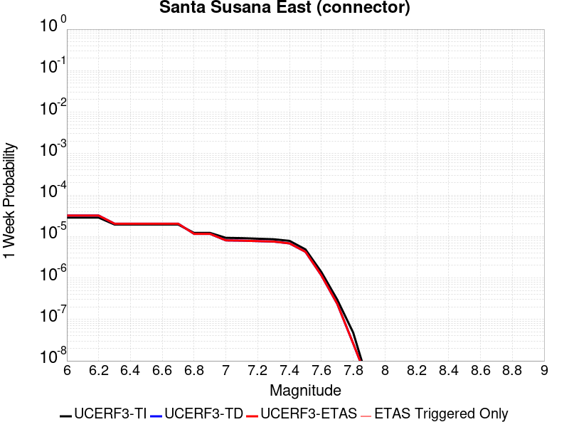 |  | 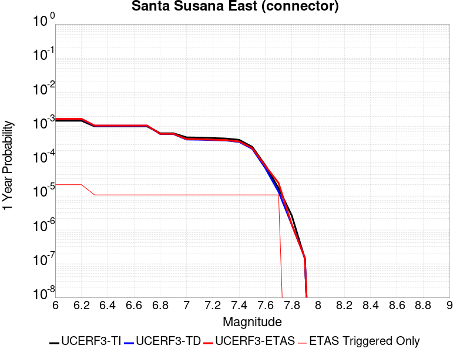 | 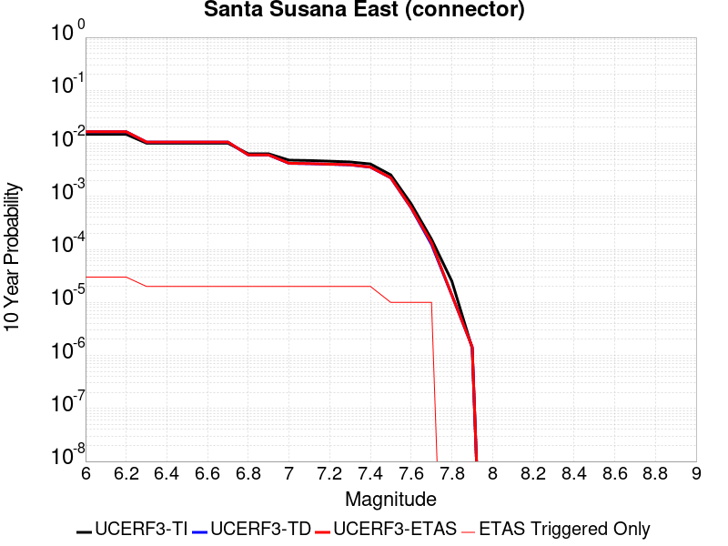 |

| Magnitude | 1 wk TI Prob | 1 wk TD Prob | 1 wk ETAS Prob | 1 wk ETAS/TD Gain | 1 wk ETAS Triggered Only | 1 mo TI Prob | 1 mo TD Prob | 1 mo ETAS Prob | 1 mo ETAS/TD Gain | 1 mo ETAS Triggered Only | 1 yr TI Prob | 1 yr TD Prob | 1 yr ETAS Prob | 1 yr ETAS/TD Gain | 1 yr ETAS Triggered Only | 10 yr TI Prob | 10 yr TD Prob | 10 yr ETAS Prob | 10 yr ETAS/TD Gain | 10 yr ETAS Triggered Only |
|-----|-----|-----|-----|-----|-----|-----|-----|-----|-----|-----|-----|-----|-----|-----|-----|-----|-----|-----|-----|-----|
| 6.0 | 2.858397E-5 | 3.2025506E-5 | 3.2025506E-5 | 1.0 | 0.0 | 1.2249697E-4 | 1.3724653E-4 | 1.3724653E-4 | 1.0 | 0.0 | 0.0014903803 | 0.0016699776 | 0.0016847883 | 1.0088688 | 1.4835475E-5 | 0.014804244 | 0.01660139 | 0.016630568 | 1.0017576 | 2.967095E-5 |
| 6.1 | 2.858397E-5 | 3.2025506E-5 | 3.2025506E-5 | 1.0 | 0.0 | 1.2249697E-4 | 1.3724653E-4 | 1.3724653E-4 | 1.0 | 0.0 | 0.0014903803 | 0.0016699776 | 0.0016847883 | 1.0088688 | 1.4835475E-5 | 0.014804244 | 0.01660139 | 0.016630568 | 1.0017576 | 2.967095E-5 |
| 6.2 | 2.858397E-5 | 3.2025506E-5 | 3.2025506E-5 | 1.0 | 0.0 | 1.2249697E-4 | 1.3724653E-4 | 1.3724653E-4 | 1.0 | 0.0 | 0.0014903803 | 0.0016699776 | 0.0016847883 | 1.0088688 | 1.4835475E-5 | 0.014804244 | 0.01660139 | 0.016630568 | 1.0017576 | 2.967095E-5 |
| 6.3 | 1.943582E-5 | 2.0369653E-5 | 2.0369653E-5 | 1.0 | 0.0 | 8.329371E-5 | 8.729623E-5 | 8.729623E-5 | 1.0 | 0.0 | 0.001013629 | 0.0010624256 | 0.0010772453 | 1.0139489 | 1.4835475E-5 | 0.010090181 | 0.010584899 | 0.010614255 | 1.0027735 | 2.967095E-5 |
| 6.4 | 1.943582E-5 | 2.0369653E-5 | 2.0369653E-5 | 1.0 | 0.0 | 8.329371E-5 | 8.729623E-5 | 8.729623E-5 | 1.0 | 0.0 | 0.001013629 | 0.0010624256 | 0.0010772453 | 1.0139489 | 1.4835475E-5 | 0.010090181 | 0.010584899 | 0.010614255 | 1.0027735 | 2.967095E-5 |
| 6.5 | 1.943582E-5 | 2.0369653E-5 | 2.0369653E-5 | 1.0 | 0.0 | 8.329371E-5 | 8.729623E-5 | 8.729623E-5 | 1.0 | 0.0 | 0.001013629 | 0.0010624256 | 0.0010772453 | 1.0139489 | 1.4835475E-5 | 0.010090181 | 0.010584899 | 0.010614255 | 1.0027735 | 2.967095E-5 |
| 6.6 | 1.943582E-5 | 2.0369653E-5 | 2.0369653E-5 | 1.0 | 0.0 | 8.329371E-5 | 8.729623E-5 | 8.729623E-5 | 1.0 | 0.0 | 0.001013629 | 0.0010624256 | 0.0010772453 | 1.0139489 | 1.4835475E-5 | 0.010090181 | 0.010584899 | 0.010614255 | 1.0027735 | 2.967095E-5 |
| 6.7 | 1.9404439E-5 | 2.0357073E-5 | 2.0357073E-5 | 1.0 | 0.0 | 8.3159226E-5 | 8.724231E-5 | 8.724231E-5 | 1.0 | 0.0 | 0.0010119933 | 0.0010617698 | 0.0010765896 | 1.0139576 | 1.4835475E-5 | 0.010073971 | 0.010578403 | 0.01060776 | 1.0027752 | 2.967095E-5 |
| 6.8 | 1.2217526E-5 | 1.15940065E-5 | 1.15940065E-5 | 1.0 | 0.0 | 5.2359774E-5 | 4.9687747E-5 | 4.9687747E-5 | 1.0 | 0.0 | 6.372938E-4 | 6.047973E-4 | 6.1962375E-4 | 1.0245148 | 1.4835475E-5 | 0.0063546924 | 0.0060335603 | 0.0060630525 | 1.0048879 | 2.967095E-5 |
| 6.9 | 1.2217526E-5 | 1.15940065E-5 | 1.15940065E-5 | 1.0 | 0.0 | 5.2359774E-5 | 4.9687747E-5 | 4.9687747E-5 | 1.0 | 0.0 | 6.372938E-4 | 6.047973E-4 | 6.1962375E-4 | 1.0245148 | 1.4835475E-5 | 0.0063546924 | 0.0060335603 | 0.0060630525 | 1.0048879 | 2.967095E-5 |
| 7.0 | 9.276017E-6 | 8.0596255E-6 | 8.0596255E-6 | 1.0 | 0.0 | 3.9753755E-5 | 3.4540815E-5 | 3.4540815E-5 | 1.0 | 0.0 | 4.8389446E-4 | 4.2045672E-4 | 4.3528597E-4 | 1.0352694 | 1.4835475E-5 | 0.0048284214 | 0.0041973386 | 0.0042268853 | 1.0070393 | 2.967095E-5 |
| 7.1 | 9.130355E-6 | 7.94279E-6 | 7.94279E-6 | 1.0 | 0.0 | 3.9129503E-5 | 3.4040102E-5 | 3.4040102E-5 | 1.0 | 0.0 | 4.7629757E-4 | 4.1436288E-4 | 4.291922E-4 | 1.0357883 | 1.4835475E-5 | 0.00475278 | 0.0041366285 | 0.0041661765 | 1.007143 | 2.967095E-5 |
| 7.2 | 8.851015E-6 | 7.741937E-6 | 7.741937E-6 | 1.0 | 0.0 | 3.7932372E-5 | 3.317933E-5 | 3.317933E-5 | 1.0 | 0.0 | 4.6172875E-4 | 4.038869E-4 | 4.1871637E-4 | 1.0367169 | 1.4835475E-5 | 0.0046077054 | 0.0040322514 | 0.0040618028 | 1.0073287 | 2.967095E-5 |
| 7.3 | 8.573006E-6 | 7.5506455E-6 | 7.5506455E-6 | 1.0 | 0.0 | 3.6740938E-5 | 3.2359527E-5 | 3.2359527E-5 | 1.0 | 0.0 | 4.472291E-4 | 3.9390943E-4 | 4.0873908E-4 | 1.0376474 | 1.4835475E-5 | 0.004463301 | 0.00393283 | 0.003962384 | 1.0075147 | 2.967095E-5 |
| 7.4 | 7.852282E-6 | 6.818087E-6 | 6.818087E-6 | 1.0 | 0.0 | 3.36522E-5 | 2.9220064E-5 | 2.9220064E-5 | 1.0 | 0.0 | 4.096385E-4 | 3.5569922E-4 | 3.7052942E-4 | 1.0416931 | 1.4835475E-5 | 0.0040888423 | 0.0035519635 | 0.003581529 | 1.0083237 | 2.967095E-5 |
| 7.5 | 4.8869324E-6 | 4.2792767E-6 | 4.2792767E-6 | 1.0 | 0.0 | 2.0943828E-5 | 1.8339639E-5 | 1.8339639E-5 | 1.0 | 0.0 | 2.5496128E-4 | 2.2326388E-4 | 2.3809604E-4 | 1.0664333 | 1.4835475E-5 | 0.0025466895 | 0.0022305602 | 0.0022453624 | 1.0066361 | 1.4835475E-5 |
| 7.6 | 1.3894544E-6 | 1.1568562E-6 | 1.1568562E-6 | 1.0 | 0.0 | 5.954791E-6 | 4.957947E-6 | 4.957947E-6 | 1.0 | 0.0 | 7.249717E-5 | 6.0361555E-5 | 7.5196134E-5 | 1.245762 | 1.4835475E-5 | 7.247352E-4 | 6.0347345E-4 | 6.1829994E-4 | 1.0245687 | 1.4835475E-5 |
| 7.7 | 2.9924632E-7 | 2.3721022E-7 | 2.3721022E-7 | 1.0 | 0.0 | 1.2824837E-6 | 1.0166149E-6 | 1.0166149E-6 | 1.0 | 0.0 | 1.5614127E-5 | 1.2377223E-5 | 2.7212514E-5 | 2.198596 | 1.4835475E-5 | 1.5613029E-4 | 1.2376606E-4 | 1.3859969E-4 | 1.1198522 | 1.4835475E-5 |
| 7.8 | 4.8188564E-8 | 2.6330254E-8 | 2.6330254E-8 | 1.0 | 0.0 | 2.065224E-7 | 1.12843935E-7 | 1.12843935E-7 | 1.0 | 0.0 | 2.5144072E-6 | 1.3738742E-6 | 1.3738742E-6 | 1.0 | 0.0 | 2.5143789E-5 | 1.3738665E-5 | 1.3738665E-5 | 1.0 | 0.0 |
| 7.9 | 2.6127251E-9 | 2.7682194E-9 | 2.7682194E-9 | 1.0 | 0.0 | 1.1197393E-8 | 1.1863797E-8 | 1.1863797E-8 | 1.0 | 0.0 | 1.3632825E-7 | 1.4444173E-7 | 1.4444173E-7 | 1.0 | 0.0 | 1.3632817E-6 | 1.4444173E-6 | 1.4444173E-6 | 1.0 | 0.0 |

## Rose Canyon
*[(top)](#table-of-contents)*

| 1 Week | 1 Month | 1 Year | 10 Year |
|-----|-----|-----|-----|
|  |  |  | 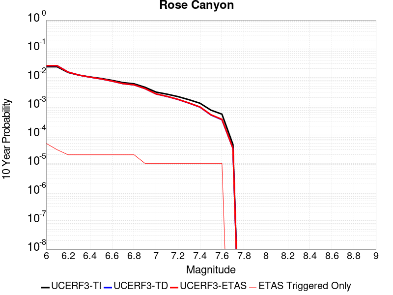 |

| Magnitude | 1 wk TI Prob | 1 wk TD Prob | 1 wk ETAS Prob | 1 wk ETAS/TD Gain | 1 wk ETAS Triggered Only | 1 mo TI Prob | 1 mo TD Prob | 1 mo ETAS Prob | 1 mo ETAS/TD Gain | 1 mo ETAS Triggered Only | 1 yr TI Prob | 1 yr TD Prob | 1 yr ETAS Prob | 1 yr ETAS/TD Gain | 1 yr ETAS Triggered Only | 10 yr TI Prob | 10 yr TD Prob | 10 yr ETAS Prob | 10 yr ETAS/TD Gain | 10 yr ETAS Triggered Only |
|-----|-----|-----|-----|-----|-----|-----|-----|-----|-----|-----|-----|-----|-----|-----|-----|-----|-----|-----|-----|-----|
| 6.0 | 4.5923203E-5 | 4.9784816E-5 | 4.9784816E-5 | 1.0 | 0.0 | 1.9679888E-4 | 2.133474E-4 | 2.133474E-4 | 1.0 | 0.0 | 0.0023933933 | 0.0025946267 | 0.0026242207 | 1.0114058 | 2.967095E-5 | 0.023677798 | 0.025676042 | 0.02570495 | 1.0011259 | 2.967095E-5 |
| 6.1 | 4.5923203E-5 | 4.9784816E-5 | 4.9784816E-5 | 1.0 | 0.0 | 1.9679888E-4 | 2.133474E-4 | 2.133474E-4 | 1.0 | 0.0 | 0.0023933933 | 0.0025946267 | 0.0026094238 | 1.005703 | 1.4835475E-5 | 0.023677798 | 0.025676042 | 0.025690496 | 1.0005629 | 1.4835475E-5 |
| 6.2 | 2.8844734E-5 | 2.9734936E-5 | 2.9734936E-5 | 1.0 | 0.0 | 1.2361443E-4 | 1.2742942E-4 | 1.2742942E-4 | 1.0 | 0.0 | 0.0015039665 | 0.0015503841 | 0.0015503841 | 1.0 | 0.0 | 0.0149382865 | 0.015408575 | 0.015408575 | 1.0 | 0.0 |
| 6.3 | 2.3171577E-5 | 2.3226945E-5 | 2.3226945E-5 | 1.0 | 0.0 | 9.9302975E-5 | 9.9540324E-5 | 9.9540324E-5 | 1.0 | 0.0 | 0.0012083431 | 0.0012112432 | 0.0012112432 | 1.0 | 0.0 | 0.012017938 | 0.012056183 | 0.012056183 | 1.0 | 0.0 |
| 6.4 | 2.0066604E-5 | 1.9706498E-5 | 1.9706498E-5 | 1.0 | 0.0 | 8.599689E-5 | 8.445374E-5 | 8.445374E-5 | 1.0 | 0.0 | 0.0010465092 | 0.0010277494 | 0.0010277494 | 1.0 | 0.0 | 0.010415946 | 0.010237875 | 0.010237875 | 1.0 | 0.0 |
| 6.5 | 1.776989E-5 | 1.7136832E-5 | 1.7136832E-5 | 1.0 | 0.0 | 7.615444E-5 | 7.344154E-5 | 7.344154E-5 | 1.0 | 0.0 | 9.267859E-4 | 8.937909E-4 | 8.937909E-4 | 1.0 | 0.0 | 0.009229303 | 0.008908085 | 0.008908085 | 1.0 | 0.0 |
| 6.6 | 1.5227364E-5 | 1.4346162E-5 | 1.4346162E-5 | 1.0 | 0.0 | 6.52585E-5 | 6.148213E-5 | 6.148213E-5 | 1.0 | 0.0 | 7.942326E-4 | 7.4829307E-4 | 7.4829307E-4 | 1.0 | 0.0 | 0.007914 | 0.0074619283 | 0.0074619283 | 1.0 | 0.0 |
| 6.7 | 1.2703898E-5 | 1.1674157E-5 | 1.1674157E-5 | 1.0 | 0.0 | 5.4444143E-5 | 5.0031165E-5 | 5.0031165E-5 | 1.0 | 0.0 | 6.626558E-4 | 6.089634E-4 | 6.089634E-4 | 1.0 | 0.0 | 0.006606833 | 0.006075542 | 0.006075542 | 1.0 | 0.0 |
| 6.8 | 1.1554917E-5 | 1.0610078E-5 | 1.0610078E-5 | 1.0 | 0.0 | 4.9520135E-5 | 4.547099E-5 | 4.547099E-5 | 1.0 | 0.0 | 6.0274085E-4 | 5.534728E-4 | 5.534728E-4 | 1.0 | 0.0 | 0.0060110865 | 0.005522951 | 0.005522951 | 1.0 | 0.0 |
| 6.9 | 8.732078E-6 | 7.881811E-6 | 7.881811E-6 | 1.0 | 0.0 | 3.7422655E-5 | 3.3778768E-5 | 3.3778768E-5 | 1.0 | 0.0 | 4.5552556E-4 | 4.1118183E-4 | 4.1118183E-4 | 1.0 | 0.0 | 0.0045459294 | 0.004105043 | 0.004105043 | 1.0 | 0.0 |
| 7.0 | 5.9337494E-6 | 5.107713E-6 | 5.107713E-6 | 1.0 | 0.0 | 2.5430107E-5 | 2.1890017E-5 | 2.1890017E-5 | 1.0 | 0.0 | 3.0956755E-4 | 2.6647848E-4 | 2.6647848E-4 | 1.0 | 0.0 | 0.0030913667 | 0.0026616051 | 0.0026616051 | 1.0 | 0.0 |
| 7.1 | 5.013409E-6 | 4.1775643E-6 | 4.1775643E-6 | 1.0 | 0.0 | 2.1485863E-5 | 1.7903723E-5 | 1.7903723E-5 | 1.0 | 0.0 | 2.6155898E-4 | 2.1795614E-4 | 2.1795614E-4 | 1.0 | 0.0 | 0.0026125133 | 0.0021774354 | 0.0021774354 | 1.0 | 0.0 |
| 7.2 | 4.120763E-6 | 3.282285E-6 | 3.282285E-6 | 1.0 | 0.0 | 1.7660293E-5 | 1.4066861E-5 | 1.4066861E-5 | 1.0 | 0.0 | 2.1499286E-4 | 1.7125066E-4 | 1.7125066E-4 | 1.0 | 0.0 | 0.0021478499 | 0.0017111964 | 0.0017111964 | 1.0 | 0.0 |
| 7.3 | 3.2081239E-6 | 2.440649E-6 | 2.440649E-6 | 1.0 | 0.0 | 1.374903E-5 | 1.0459883E-5 | 1.0459883E-5 | 1.0 | 0.0 | 1.6738157E-4 | 1.273417E-4 | 1.273417E-4 | 1.0 | 0.0 | 0.0016725556 | 0.0012726943 | 0.0012726943 | 1.0 | 0.0 |
| 7.4 | 2.4194755E-6 | 1.7681483E-6 | 1.7681483E-6 | 1.0 | 0.0 | 1.0369139E-5 | 7.5777566E-6 | 7.5777566E-6 | 1.0 | 0.0 | 1.2623696E-4 | 9.225534E-5 | 9.225534E-5 | 1.0 | 0.0 | 0.0012616527 | 9.221757E-4 | 9.221757E-4 | 1.0 | 0.0 |
| 7.5 | 1.3842889E-6 | 9.379177E-7 | 9.379177E-7 | 1.0 | 0.0 | 5.9326535E-6 | 4.0196414E-6 | 4.0196414E-6 | 1.0 | 0.0 | 7.222766E-5 | 4.8938073E-5 | 4.8938073E-5 | 1.0 | 0.0 | 7.220419E-4 | 4.892765E-4 | 4.892765E-4 | 1.0 | 0.0 |
| 7.6 | 1.0021575E-6 | 6.4118905E-7 | 6.4118905E-7 | 1.0 | 0.0 | 4.2949537E-6 | 2.7479502E-6 | 2.7479502E-6 | 1.0 | 0.0 | 5.2289808E-5 | 3.3455803E-5 | 3.3455803E-5 | 1.0 | 0.0 | 5.2277505E-4 | 3.345098E-4 | 3.345098E-4 | 1.0 | 0.0 |
| 7.7 | 8.7620116E-8 | 6.449458E-8 | 6.449458E-8 | 1.0 | 0.0 | 3.7551473E-7 | 2.764053E-7 | 2.764053E-7 | 1.0 | 0.0 | 4.5718825E-6 | 3.3652298E-6 | 3.3652298E-6 | 1.0 | 0.0 | 4.5717883E-5 | 3.3651817E-5 | 3.3651817E-5 | 1.0 | 0.0 |

## Emerson-Copper Mtn 2011
*[(top)](#table-of-contents)*

| 1 Week | 1 Month | 1 Year | 10 Year |
|-----|-----|-----|-----|
|  |  |  |  |

| Magnitude | 1 wk TI Prob | 1 wk TD Prob | 1 wk ETAS Prob | 1 wk ETAS/TD Gain | 1 wk ETAS Triggered Only | 1 mo TI Prob | 1 mo TD Prob | 1 mo ETAS Prob | 1 mo ETAS/TD Gain | 1 mo ETAS Triggered Only | 1 yr TI Prob | 1 yr TD Prob | 1 yr ETAS Prob | 1 yr ETAS/TD Gain | 1 yr ETAS Triggered Only | 10 yr TI Prob | 10 yr TD Prob | 10 yr ETAS Prob | 10 yr ETAS/TD Gain | 10 yr ETAS Triggered Only |
|-----|-----|-----|-----|-----|-----|-----|-----|-----|-----|-----|-----|-----|-----|-----|-----|-----|-----|-----|-----|-----|
| 6.0 | 2.1364202E-5 | 9.968933E-6 | 9.968933E-6 | 1.0 | 0.0 | 9.1557646E-5 | 4.272335E-5 | 4.272335E-5 | 1.0 | 0.0 | 0.0011141442 | 5.200414E-4 | 5.200414E-4 | 1.0 | 0.0 | 0.011085749 | 0.005189114 | 0.005218631 | 1.0056883 | 2.967095E-5 |
| 6.1 | 2.1364202E-5 | 9.968933E-6 | 9.968933E-6 | 1.0 | 0.0 | 9.1557646E-5 | 4.272335E-5 | 4.272335E-5 | 1.0 | 0.0 | 0.0011141442 | 5.200414E-4 | 5.200414E-4 | 1.0 | 0.0 | 0.011085749 | 0.005189114 | 0.005218631 | 1.0056883 | 2.967095E-5 |
| 6.2 | 2.1364202E-5 | 9.968933E-6 | 9.968933E-6 | 1.0 | 0.0 | 9.1557646E-5 | 4.272335E-5 | 4.272335E-5 | 1.0 | 0.0 | 0.0011141442 | 5.200414E-4 | 5.200414E-4 | 1.0 | 0.0 | 0.011085749 | 0.005189114 | 0.005218631 | 1.0056883 | 2.967095E-5 |
| 6.3 | 1.7751237E-5 | 8.089922E-6 | 8.089922E-6 | 1.0 | 0.0 | 7.607452E-5 | 3.4670666E-5 | 3.4670666E-5 | 1.0 | 0.0 | 9.258136E-4 | 4.2203988E-4 | 4.2203988E-4 | 1.0 | 0.0 | 0.00921966 | 0.0042130067 | 0.0042277793 | 1.0035065 | 1.4835475E-5 |
| 6.4 | 1.7751237E-5 | 8.089922E-6 | 8.089922E-6 | 1.0 | 0.0 | 7.607452E-5 | 3.4670666E-5 | 3.4670666E-5 | 1.0 | 0.0 | 9.258136E-4 | 4.2203988E-4 | 4.2203988E-4 | 1.0 | 0.0 | 0.00921966 | 0.0042130067 | 0.0042277793 | 1.0035065 | 1.4835475E-5 |
| 6.5 | 1.5886664E-5 | 6.6044036E-6 | 6.6044036E-6 | 1.0 | 0.0 | 6.808392E-5 | 2.8304306E-5 | 2.8304306E-5 | 1.0 | 0.0 | 8.286065E-4 | 3.4455513E-4 | 3.4455513E-4 | 1.0 | 0.0 | 0.008255237 | 0.0034406735 | 0.003455458 | 1.0042969 | 1.4835475E-5 |
| 6.6 | 1.5886664E-5 | 6.6044036E-6 | 6.6044036E-6 | 1.0 | 0.0 | 6.808392E-5 | 2.8304306E-5 | 2.8304306E-5 | 1.0 | 0.0 | 8.286065E-4 | 3.4455513E-4 | 3.4455513E-4 | 1.0 | 0.0 | 0.008255237 | 0.0034406735 | 0.003455458 | 1.0042969 | 1.4835475E-5 |
| 6.7 | 1.428471E-5 | 5.470906E-6 | 5.470906E-6 | 1.0 | 0.0 | 6.121875E-5 | 2.3446553E-5 | 2.3446553E-5 | 1.0 | 0.0 | 7.450834E-4 | 2.8542834E-4 | 2.8542834E-4 | 1.0 | 0.0 | 0.007425902 | 0.0028510054 | 0.0028657985 | 1.0051887 | 1.4835475E-5 |
| 6.8 | 1.3490684E-5 | 5.074172E-6 | 5.074172E-6 | 1.0 | 0.0 | 5.7815934E-5 | 2.1746291E-5 | 2.1746291E-5 | 1.0 | 0.0 | 7.0368167E-4 | 2.647328E-4 | 2.647328E-4 | 1.0 | 0.0 | 0.007014576 | 0.0026445554 | 0.0026593516 | 1.005595 | 1.4835475E-5 |
| 6.9 | 1.2235421E-5 | 4.2901083E-6 | 4.2901083E-6 | 1.0 | 0.0 | 5.2436466E-5 | 1.8386068E-5 | 1.8386068E-5 | 1.0 | 0.0 | 6.38227E-4 | 2.23831E-4 | 2.23831E-4 | 1.0 | 0.0 | 0.0063639707 | 0.00223641 | 0.0022512123 | 1.0066187 | 1.4835475E-5 |
| 7.0 | 1.1009851E-5 | 3.7193834E-6 | 3.7193834E-6 | 1.0 | 0.0 | 4.7184225E-5 | 1.5940135E-5 | 1.5940135E-5 | 1.0 | 0.0 | 5.743165E-4 | 1.9405731E-4 | 1.9405731E-4 | 1.0 | 0.0 | 0.005728345 | 0.0019392164 | 0.0019540233 | 1.0076354 | 1.4835475E-5 |
| 7.1 | 9.726373E-6 | 3.2121422E-6 | 3.2121422E-6 | 1.0 | 0.0 | 4.168379E-5 | 1.376627E-5 | 1.376627E-5 | 1.0 | 0.0 | 5.07382E-4 | 1.6759483E-4 | 1.6759483E-4 | 1.0 | 0.0 | 0.0050622504 | 0.0016750157 | 0.0016750157 | 1.0 | 0.0 |
| 7.2 | 3.9335127E-6 | 1.1526026E-6 | 1.1526026E-6 | 1.0 | 0.0 | 1.6857803E-5 | 4.9397163E-6 | 4.9397163E-6 | 1.0 | 0.0 | 2.0522442E-4 | 6.0139446E-5 | 6.0139446E-5 | 1.0 | 0.0 | 0.00205035 | 6.012377E-4 | 6.012377E-4 | 1.0 | 0.0 |
| 7.3 | 2.661632E-6 | 6.912311E-7 | 6.912311E-7 | 1.0 | 0.0 | 1.14069435E-5 | 2.9624157E-6 | 2.9624157E-6 | 1.0 | 0.0 | 1.3887069E-4 | 3.6066824E-5 | 3.6066824E-5 | 1.0 | 0.0 | 0.0013878393 | 3.6061075E-4 | 3.6061075E-4 | 1.0 | 0.0 |
| 7.4 | 2.0893426E-6 | 5.462476E-7 | 5.462476E-7 | 1.0 | 0.0 | 8.954295E-6 | 2.3410591E-6 | 2.3410591E-6 | 1.0 | 0.0 | 1.0901308E-4 | 2.8502027E-5 | 2.8502027E-5 | 1.0 | 0.0 | 0.0010895962 | 2.8498424E-4 | 2.8498424E-4 | 1.0 | 0.0 |
| 7.5 | 1.1681728E-6 | 3.6034095E-7 | 3.6034095E-7 | 1.0 | 0.0 | 5.0064455E-6 | 1.5443175E-6 | 1.5443175E-6 | 1.0 | 0.0 | 6.0951766E-5 | 1.8801908E-5 | 1.8801908E-5 | 1.0 | 0.0 | 6.093505E-4 | 1.8800364E-4 | 1.8800364E-4 | 1.0 | 0.0 |
| 7.6 | 1.3154387E-7 | 7.120178E-8 | 7.120178E-8 | 1.0 | 0.0 | 5.6375933E-7 | 3.0515045E-7 | 3.0515045E-7 | 1.0 | 0.0 | 6.863748E-6 | 3.7152022E-6 | 3.7152022E-6 | 1.0 | 0.0 | 6.863536E-5 | 3.7151556E-5 | 3.7151556E-5 | 1.0 | 0.0 |

## Hunting Creek - Berryessa 2011 CFM
*[(top)](#table-of-contents)*

| 1 Week | 1 Month | 1 Year | 10 Year |
|-----|-----|-----|-----|
| 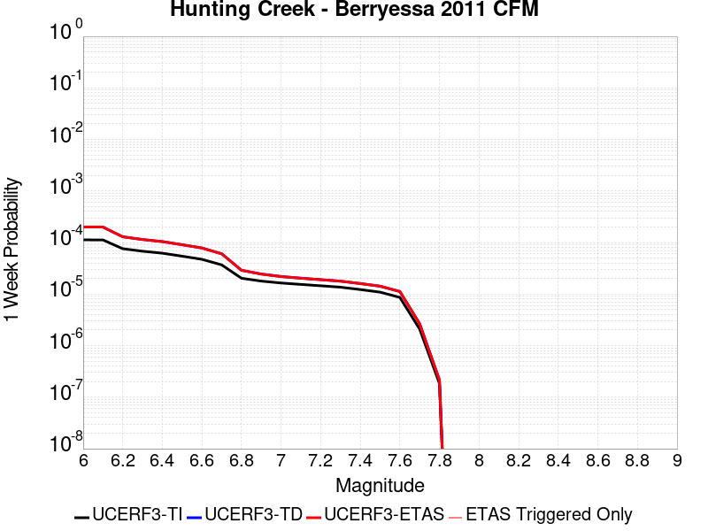 |  |  |  |

| Magnitude | 1 wk TI Prob | 1 wk TD Prob | 1 wk ETAS Prob | 1 wk ETAS/TD Gain | 1 wk ETAS Triggered Only | 1 mo TI Prob | 1 mo TD Prob | 1 mo ETAS Prob | 1 mo ETAS/TD Gain | 1 mo ETAS Triggered Only | 1 yr TI Prob | 1 yr TD Prob | 1 yr ETAS Prob | 1 yr ETAS/TD Gain | 1 yr ETAS Triggered Only | 10 yr TI Prob | 10 yr TD Prob | 10 yr ETAS Prob | 10 yr ETAS/TD Gain | 10 yr ETAS Triggered Only |
|-----|-----|-----|-----|-----|-----|-----|-----|-----|-----|-----|-----|-----|-----|-----|-----|-----|-----|-----|-----|-----|
| 6.0 | 1.1270982E-4 | 2.0012796E-4 | 2.0012796E-4 | 1.0 | 0.0 | 4.8295266E-4 | 8.5744646E-4 | 8.5744646E-4 | 1.0 | 0.0 | 0.0058641075 | 0.010388402 | 0.010388402 | 1.0 | 0.0 | 0.057117578 | 0.0980554 | 0.09808216 | 1.0002729 | 2.967095E-5 |
| 6.1 | 1.1239393E-4 | 1.9960912E-4 | 1.9960912E-4 | 1.0 | 0.0 | 4.8159933E-4 | 8.5522473E-4 | 8.5522473E-4 | 1.0 | 0.0 | 0.0058477195 | 0.010361633 | 0.010361633 | 1.0 | 0.0 | 0.056962132 | 0.09781382 | 0.09784059 | 1.0002737 | 2.967095E-5 |
| 6.2 | 7.596265E-5 | 1.2934823E-4 | 1.2934823E-4 | 1.0 | 0.0 | 3.2551357E-4 | 5.542368E-4 | 5.542368E-4 | 1.0 | 0.0 | 0.0039559277 | 0.006722056 | 0.006722056 | 1.0 | 0.0 | 0.038862433 | 0.06460324 | 0.06460324 | 1.0 | 0.0 |
| 6.3 | 6.78794E-5 | 1.1453318E-4 | 1.1453318E-4 | 1.0 | 0.0 | 2.9087928E-4 | 4.9076776E-4 | 4.9076776E-4 | 1.0 | 0.0 | 0.003535705 | 0.0059535922 | 0.0059535922 | 1.0 | 0.0 | 0.034799766 | 0.05747597 | 0.05747597 | 1.0 | 0.0 |
| 6.4 | 6.2165134E-5 | 1.0440085E-4 | 1.0440085E-4 | 1.0 | 0.0 | 2.6639478E-4 | 4.4735897E-4 | 4.4735897E-4 | 1.0 | 0.0 | 0.0032385332 | 0.0054283976 | 0.0054283976 | 1.0 | 0.0 | 0.03191742 | 0.052560356 | 0.052560356 | 1.0 | 0.0 |
| 6.5 | 5.4368087E-5 | 9.0743E-5 | 9.0743E-5 | 1.0 | 0.0 | 2.3298527E-4 | 3.888438E-4 | 3.888438E-4 | 1.0 | 0.0 | 0.0028329059 | 0.0047206227 | 0.0047206227 | 1.0 | 0.0 | 0.027970633 | 0.045888808 | 0.045888808 | 1.0 | 0.0 |
| 6.6 | 4.729947E-5 | 7.849963E-5 | 7.849963E-5 | 1.0 | 0.0 | 2.0269625E-4 | 3.3638658E-4 | 3.3638658E-4 | 1.0 | 0.0 | 0.002465034 | 0.0040856204 | 0.0040856204 | 1.0 | 0.0 | 0.02437869 | 0.039859172 | 0.039859172 | 1.0 | 0.0 |
| 6.7 | 3.6875328E-5 | 6.046878E-5 | 6.046878E-5 | 1.0 | 0.0 | 1.5802756E-4 | 2.591286E-4 | 2.591286E-4 | 1.0 | 0.0 | 0.0019222875 | 0.0031487672 | 0.0031487672 | 1.0 | 0.0 | 0.019057442 | 0.030898392 | 0.030898392 | 1.0 | 0.0 |
| 6.8 | 2.0292036E-5 | 2.8979985E-5 | 2.8979985E-5 | 1.0 | 0.0 | 8.6962966E-5 | 1.2419392E-4 | 1.2419392E-4 | 1.0 | 0.0 | 0.0010582599 | 0.0015109939 | 0.0015109939 | 1.0 | 0.0 | 0.010532344 | 0.014980361 | 0.014980361 | 1.0 | 0.0 |
| 6.9 | 1.7871042E-5 | 2.4475365E-5 | 2.4475365E-5 | 1.0 | 0.0 | 7.658793E-5 | 1.0489008E-4 | 1.0489008E-4 | 1.0 | 0.0 | 9.320591E-4 | 0.0012762914 | 0.0012762914 | 1.0 | 0.0 | 0.009281595 | 0.012681361 | 0.012681361 | 1.0 | 0.0 |
| 7.0 | 1.6415532E-5 | 2.1909143E-5 | 2.1909143E-5 | 1.0 | 0.0 | 7.035038E-5 | 9.389297E-5 | 9.389297E-5 | 1.0 | 0.0 | 8.561793E-4 | 0.0011425508 | 0.0011425508 | 1.0 | 0.0 | 0.008528882 | 0.011365991 | 0.011365991 | 1.0 | 0.0 |
| 7.1 | 1.5409885E-5 | 2.0349065E-5 | 2.0349065E-5 | 1.0 | 0.0 | 6.6040695E-5 | 8.720738E-5 | 8.720738E-5 | 1.0 | 0.0 | 8.0374884E-4 | 0.0010612357 | 0.0010612357 | 1.0 | 0.0 | 0.00800848 | 0.010561999 | 0.010561999 | 1.0 | 0.0 |
| 7.2 | 1.4497423E-5 | 1.905751E-5 | 1.905751E-5 | 1.0 | 0.0 | 6.213033E-5 | 8.167251E-5 | 8.167251E-5 | 1.0 | 0.0 | 7.5617427E-4 | 9.939122E-4 | 9.939122E-4 | 1.0 | 0.0 | 0.0075360634 | 0.009895244 | 0.009895244 | 1.0 | 0.0 |
| 7.3 | 1.3615175E-5 | 1.7828592E-5 | 1.7828592E-5 | 1.0 | 0.0 | 5.8349444E-5 | 7.6406024E-5 | 7.6406024E-5 | 1.0 | 0.0 | 7.101729E-4 | 9.298493E-4 | 9.298493E-4 | 1.0 | 0.0 | 0.0070790765 | 0.009260096 | 0.009260096 | 1.0 | 0.0 |
| 7.4 | 1.2252825E-5 | 1.6028474E-5 | 1.6028474E-5 | 1.0 | 0.0 | 5.251105E-5 | 6.869167E-5 | 6.869167E-5 | 1.0 | 0.0 | 6.391345E-4 | 8.36003E-4 | 8.36003E-4 | 1.0 | 0.0 | 0.0063729943 | 0.008329023 | 0.008329023 | 1.0 | 0.0 |
| 7.5 | 1.0913301E-5 | 1.4243081E-5 | 1.4243081E-5 | 1.0 | 0.0 | 4.6770452E-5 | 6.1040366E-5 | 6.1040366E-5 | 1.0 | 0.0 | 5.6928146E-4 | 7.429157E-4 | 7.429157E-4 | 1.0 | 0.0 | 0.0056782532 | 0.0074046967 | 0.0074046967 | 1.0 | 0.0 |
| 7.6 | 8.623192E-6 | 1.1236095E-5 | 1.1236095E-5 | 1.0 | 0.0 | 3.6956015E-5 | 4.8153815E-5 | 4.8153815E-5 | 1.0 | 0.0 | 4.4984656E-4 | 5.8611756E-4 | 5.8611756E-4 | 1.0 | 0.0 | 0.00448937 | 0.005846032 | 0.005846032 | 1.0 | 0.0 |
| 7.7 | 2.0993634E-6 | 2.6628463E-6 | 2.6628463E-6 | 1.0 | 0.0 | 8.997241E-6 | 1.1412149E-5 | 1.1412149E-5 | 1.0 | 0.0 | 1.09535904E-4 | 1.3893413E-4 | 1.3893413E-4 | 1.0 | 0.0 | 0.0010948193 | 0.0013884791 | 0.0013884791 | 1.0 | 0.0 |
| 7.8 | 1.8428308E-7 | 2.1676266E-7 | 2.1676266E-7 | 1.0 | 0.0 | 7.897844E-7 | 9.289825E-7 | 9.289825E-7 | 1.0 | 0.0 | 9.615583E-6 | 1.1310307E-5 | 1.1310307E-5 | 1.0 | 0.0 | 9.615166E-5 | 1.1309593E-4 | 1.1309593E-4 | 1.0 | 0.0 |

## Santa Susana alt 1
*[(top)](#table-of-contents)*

| 1 Week | 1 Month | 1 Year | 10 Year |
|-----|-----|-----|-----|
|  |  |  | 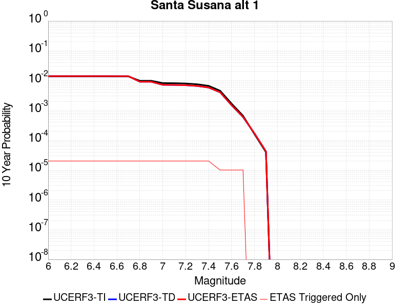 |

| Magnitude | 1 wk TI Prob | 1 wk TD Prob | 1 wk ETAS Prob | 1 wk ETAS/TD Gain | 1 wk ETAS Triggered Only | 1 mo TI Prob | 1 mo TD Prob | 1 mo ETAS Prob | 1 mo ETAS/TD Gain | 1 mo ETAS Triggered Only | 1 yr TI Prob | 1 yr TD Prob | 1 yr ETAS Prob | 1 yr ETAS/TD Gain | 1 yr ETAS Triggered Only | 10 yr TI Prob | 10 yr TD Prob | 10 yr ETAS Prob | 10 yr ETAS/TD Gain | 10 yr ETAS Triggered Only |
|-----|-----|-----|-----|-----|-----|-----|-----|-----|-----|-----|-----|-----|-----|-----|-----|-----|-----|-----|-----|-----|
| 6.0 | 2.674877E-5 | 2.7201304E-5 | 2.7201304E-5 | 1.0 | 0.0 | 1.1463255E-4 | 1.1657245E-4 | 1.1657245E-4 | 1.0 | 0.0 | 0.0013947578 | 0.0014184592 | 0.0014332737 | 1.010444 | 1.4835475E-5 | 0.013860362 | 0.01410582 | 0.014135072 | 1.0020738 | 2.967095E-5 |
| 6.1 | 2.674877E-5 | 2.7201304E-5 | 2.7201304E-5 | 1.0 | 0.0 | 1.1463255E-4 | 1.1657245E-4 | 1.1657245E-4 | 1.0 | 0.0 | 0.0013947578 | 0.0014184592 | 0.0014332737 | 1.010444 | 1.4835475E-5 | 0.013860362 | 0.01410582 | 0.014135072 | 1.0020738 | 2.967095E-5 |
| 6.2 | 2.674877E-5 | 2.7201304E-5 | 2.7201304E-5 | 1.0 | 0.0 | 1.1463255E-4 | 1.1657245E-4 | 1.1657245E-4 | 1.0 | 0.0 | 0.0013947578 | 0.0014184592 | 0.0014332737 | 1.010444 | 1.4835475E-5 | 0.013860362 | 0.01410582 | 0.014135072 | 1.0020738 | 2.967095E-5 |
| 6.3 | 2.674877E-5 | 2.7201304E-5 | 2.7201304E-5 | 1.0 | 0.0 | 1.1463255E-4 | 1.1657245E-4 | 1.1657245E-4 | 1.0 | 0.0 | 0.0013947578 | 0.0014184592 | 0.0014332737 | 1.010444 | 1.4835475E-5 | 0.013860362 | 0.01410582 | 0.014135072 | 1.0020738 | 2.967095E-5 |
| 6.4 | 2.674877E-5 | 2.7201304E-5 | 2.7201304E-5 | 1.0 | 0.0 | 1.1463255E-4 | 1.1657245E-4 | 1.1657245E-4 | 1.0 | 0.0 | 0.0013947578 | 0.0014184592 | 0.0014332737 | 1.010444 | 1.4835475E-5 | 0.013860362 | 0.01410582 | 0.014135072 | 1.0020738 | 2.967095E-5 |
| 6.5 | 2.674877E-5 | 2.7201304E-5 | 2.7201304E-5 | 1.0 | 0.0 | 1.1463255E-4 | 1.1657245E-4 | 1.1657245E-4 | 1.0 | 0.0 | 0.0013947578 | 0.0014184592 | 0.0014332737 | 1.010444 | 1.4835475E-5 | 0.013860362 | 0.01410582 | 0.014135072 | 1.0020738 | 2.967095E-5 |
| 6.6 | 2.6647976E-5 | 2.7077624E-5 | 2.7077624E-5 | 1.0 | 0.0 | 1.14200615E-4 | 1.16042436E-4 | 1.16042436E-4 | 1.0 | 0.0 | 0.0013895056 | 0.001412015 | 0.0014268294 | 1.0104917 | 1.4835475E-5 | 0.013808494 | 0.014042196 | 0.01407145 | 1.0020833 | 2.967095E-5 |
| 6.7 | 2.6647976E-5 | 2.7077624E-5 | 2.7077624E-5 | 1.0 | 0.0 | 1.14200615E-4 | 1.16042436E-4 | 1.16042436E-4 | 1.0 | 0.0 | 0.0013895056 | 0.001412015 | 0.0014268294 | 1.0104917 | 1.4835475E-5 | 0.013808494 | 0.014042196 | 0.01407145 | 1.0020833 | 2.967095E-5 |
| 6.8 | 1.9073179E-5 | 1.7639008E-5 | 1.7639008E-5 | 1.0 | 0.0 | 8.1739636E-5 | 7.5593656E-5 | 7.5593656E-5 | 1.0 | 0.0 | 9.947256E-4 | 9.199823E-4 | 9.3480415E-4 | 1.016111 | 1.4835475E-5 | 0.009902848 | 0.0091639925 | 0.009193392 | 1.0032082 | 2.967095E-5 |
| 6.9 | 1.9041876E-5 | 1.7621136E-5 | 1.7621136E-5 | 1.0 | 0.0 | 8.160549E-5 | 7.551707E-5 | 7.551707E-5 | 1.0 | 0.0 | 9.930939E-4 | 9.190507E-4 | 9.3387254E-4 | 1.0161273 | 1.4835475E-5 | 0.0098866755 | 0.009154753 | 0.009184152 | 1.0032114 | 2.967095E-5 |
| 7.0 | 1.5917482E-5 | 1.386505E-5 | 1.386505E-5 | 1.0 | 0.0 | 6.8215995E-5 | 5.9420316E-5 | 5.9420316E-5 | 1.0 | 0.0 | 8.302132E-4 | 7.232069E-4 | 7.3803164E-4 | 1.0204986 | 1.4835475E-5 | 0.008271185 | 0.0072094286 | 0.007238886 | 1.0040859 | 2.967095E-5 |
| 7.1 | 1.577788E-5 | 1.3745048E-5 | 1.3745048E-5 | 1.0 | 0.0 | 6.761774E-5 | 5.8906044E-5 | 5.8906044E-5 | 1.0 | 0.0 | 8.2293496E-4 | 7.1694975E-4 | 7.3177455E-4 | 1.0206777 | 1.4835475E-5 | 0.008198941 | 0.007147261 | 0.00717672 | 1.0041217 | 2.967095E-5 |
| 7.2 | 1.5416446E-5 | 1.34710945E-5 | 1.34710945E-5 | 1.0 | 0.0 | 6.606882E-5 | 5.7732013E-5 | 5.7732013E-5 | 1.0 | 0.0 | 8.0409093E-4 | 7.026652E-4 | 7.174902E-4 | 1.0210983 | 1.4835475E-5 | 0.008011877 | 0.0070053195 | 0.007034783 | 1.0042058 | 2.967095E-5 |
| 7.3 | 1.4534083E-5 | 1.2718939E-5 | 1.2718939E-5 | 1.0 | 0.0 | 6.228744E-5 | 5.4508626E-5 | 5.4508626E-5 | 1.0 | 0.0 | 7.580857E-4 | 6.634449E-4 | 6.7827053E-4 | 1.0223465 | 1.4835475E-5 | 0.007555048 | 0.006615494 | 0.006644969 | 1.0044554 | 2.967095E-5 |
| 7.4 | 1.2858995E-5 | 1.12305415E-5 | 1.12305415E-5 | 1.0 | 0.0 | 5.5108816E-5 | 4.8130027E-5 | 4.8130027E-5 | 1.0 | 0.0 | 6.7074323E-4 | 5.8582943E-4 | 6.006562E-4 | 1.0253091 | 1.4835475E-5 | 0.0066872234 | 0.0058436263 | 0.0058731236 | 1.0050478 | 2.967095E-5 |
| 7.5 | 8.827668E-6 | 7.805944E-6 | 7.805944E-6 | 1.0 | 0.0 | 3.7832317E-5 | 3.3453627E-5 | 3.3453627E-5 | 1.0 | 0.0 | 4.605111E-4 | 4.0722426E-4 | 4.2205368E-4 | 1.0364159 | 1.4835475E-5 | 0.0045955796 | 0.0040650293 | 0.0040798043 | 1.0036347 | 1.4835475E-5 |
| 7.6 | 3.2533426E-6 | 2.872088E-6 | 2.872088E-6 | 1.0 | 0.0 | 1.3942822E-5 | 1.2308893E-5 | 1.2308893E-5 | 1.0 | 0.0 | 1.6974064E-4 | 1.4985084E-4 | 1.646841E-4 | 1.0989867 | 1.4835475E-5 | 0.0016961104 | 0.0014975348 | 0.0015123481 | 1.0098917 | 1.4835475E-5 |
| 7.7 | 1.2751709E-6 | 1.1491634E-6 | 1.1491634E-6 | 1.0 | 0.0 | 5.4650063E-6 | 4.924977E-6 | 4.924977E-6 | 1.0 | 0.0 | 6.653442E-5 | 5.9960035E-5 | 7.479462E-5 | 1.2474079 | 1.4835475E-5 | 6.6514505E-4 | 5.9944746E-4 | 6.1427406E-4 | 1.0247338 | 1.4835475E-5 |
| 7.8 | 3.067544E-7 | 3.2401852E-7 | 3.2401852E-7 | 1.0 | 0.0 | 1.3146611E-6 | 1.38865E-6 | 1.38865E-6 | 1.0 | 0.0 | 1.600588E-5 | 1.6906693E-5 | 1.6906693E-5 | 1.0 | 0.0 | 1.6004729E-4 | 1.690551E-4 | 1.690551E-4 | 1.0 | 0.0 |
| 7.9 | 7.622999E-8 | 8.0883055E-8 | 8.0883055E-8 | 1.0 | 0.0 | 3.2669993E-7 | 3.4664163E-7 | 3.4664163E-7 | 1.0 | 0.0 | 3.977564E-6 | 4.220356E-6 | 4.220356E-6 | 1.0 | 0.0 | 3.977493E-5 | 4.2202966E-5 | 4.2202966E-5 | 1.0 | 0.0 |

## Newport-Inglewood alt 1
*[(top)](#table-of-contents)*

| 1 Week | 1 Month | 1 Year | 10 Year |
|-----|-----|-----|-----|
|  | 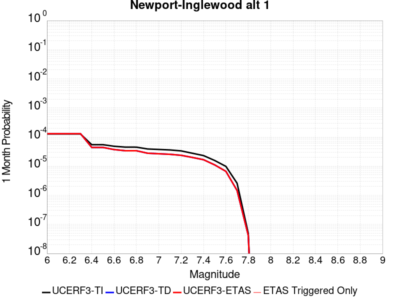 |  |  |

| Magnitude | 1 wk TI Prob | 1 wk TD Prob | 1 wk ETAS Prob | 1 wk ETAS/TD Gain | 1 wk ETAS Triggered Only | 1 mo TI Prob | 1 mo TD Prob | 1 mo ETAS Prob | 1 mo ETAS/TD Gain | 1 mo ETAS Triggered Only | 1 yr TI Prob | 1 yr TD Prob | 1 yr ETAS Prob | 1 yr ETAS/TD Gain | 1 yr ETAS Triggered Only | 10 yr TI Prob | 10 yr TD Prob | 10 yr ETAS Prob | 10 yr ETAS/TD Gain | 10 yr ETAS Triggered Only |
|-----|-----|-----|-----|-----|-----|-----|-----|-----|-----|-----|-----|-----|-----|-----|-----|-----|-----|-----|-----|-----|
| 6.0 | 2.9668912E-5 | 3.0408093E-5 | 3.0408093E-5 | 1.0 | 0.0 | 1.2714628E-4 | 1.3031664E-4 | 1.3031664E-4 | 1.0 | 0.0 | 0.0015469068 | 0.0015859316 | 0.0015859316 | 1.0 | 0.0 | 0.015361829 | 0.015793733 | 0.015822934 | 1.0018489 | 2.967095E-5 |
| 6.1 | 2.9668912E-5 | 3.0408093E-5 | 3.0408093E-5 | 1.0 | 0.0 | 1.2714628E-4 | 1.3031664E-4 | 1.3031664E-4 | 1.0 | 0.0 | 0.0015469068 | 0.0015859316 | 0.0015859316 | 1.0 | 0.0 | 0.015361829 | 0.015793733 | 0.015822934 | 1.0018489 | 2.967095E-5 |
| 6.2 | 2.9668912E-5 | 3.0408093E-5 | 3.0408093E-5 | 1.0 | 0.0 | 1.2714628E-4 | 1.3031664E-4 | 1.3031664E-4 | 1.0 | 0.0 | 0.0015469068 | 0.0015859316 | 0.0015859316 | 1.0 | 0.0 | 0.015361829 | 0.015793733 | 0.015822934 | 1.0018489 | 2.967095E-5 |
| 6.3 | 2.9668912E-5 | 3.0408093E-5 | 3.0408093E-5 | 1.0 | 0.0 | 1.2714628E-4 | 1.3031664E-4 | 1.3031664E-4 | 1.0 | 0.0 | 0.0015469068 | 0.0015859316 | 0.0015859316 | 1.0 | 0.0 | 0.015361829 | 0.015793733 | 0.015822934 | 1.0018489 | 2.967095E-5 |
| 6.4 | 1.275942E-5 | 1.0273099E-5 | 1.0273099E-5 | 1.0 | 0.0 | 5.4682085E-5 | 4.402685E-5 | 4.402685E-5 | 1.0 | 0.0 | 6.65551E-4 | 5.358992E-4 | 5.358992E-4 | 1.0 | 0.0 | 0.0066356123 | 0.005346494 | 0.005346494 | 1.0 | 0.0 |
| 6.5 | 1.275942E-5 | 1.0273099E-5 | 1.0273099E-5 | 1.0 | 0.0 | 5.4682085E-5 | 4.402685E-5 | 4.402685E-5 | 1.0 | 0.0 | 6.65551E-4 | 5.358992E-4 | 5.358992E-4 | 1.0 | 0.0 | 0.0066356123 | 0.005346494 | 0.005346494 | 1.0 | 0.0 |
| 6.6 | 1.1255358E-5 | 8.662341E-6 | 8.662341E-6 | 1.0 | 0.0 | 4.8236358E-5 | 3.71238E-5 | 3.71238E-5 | 1.0 | 0.0 | 5.871194E-4 | 4.5189023E-4 | 4.5189023E-4 | 1.0 | 0.0 | 0.005855706 | 0.0045098905 | 0.0045098905 | 1.0 | 0.0 |
| 6.7 | 1.0504745E-5 | 7.900201E-6 | 7.900201E-6 | 1.0 | 0.0 | 4.5019555E-5 | 3.385757E-5 | 3.385757E-5 | 1.0 | 0.0 | 5.4797524E-4 | 4.121392E-4 | 4.121392E-4 | 1.0 | 0.0 | 0.0054662596 | 0.0041138786 | 0.0041138786 | 1.0 | 0.0 |
| 6.8 | 1.0476007E-5 | 7.881582E-6 | 7.881582E-6 | 1.0 | 0.0 | 4.4896402E-5 | 3.3777775E-5 | 3.3777775E-5 | 1.0 | 0.0 | 5.464766E-4 | 4.1116806E-4 | 4.1116806E-4 | 1.0 | 0.0 | 0.005451347 | 0.004104203 | 0.004104203 | 1.0 | 0.0 |
| 6.9 | 9.076797E-6 | 6.489951E-6 | 6.489951E-6 | 1.0 | 0.0 | 3.889998E-5 | 2.7813781E-5 | 2.7813781E-5 | 1.0 | 0.0 | 4.7350433E-4 | 3.385805E-4 | 3.385805E-4 | 1.0 | 0.0 | 0.004724967 | 0.003380684 | 0.003380684 | 1.0 | 0.0 |
| 7.0 | 8.73795E-6 | 6.2123268E-6 | 6.2123268E-6 | 1.0 | 0.0 | 3.7447822E-5 | 2.6623988E-5 | 2.6623988E-5 | 1.0 | 0.0 | 4.5583185E-4 | 3.2409912E-4 | 3.2409912E-4 | 1.0 | 0.0 | 0.0045489795 | 0.0032362961 | 0.0032362961 | 1.0 | 0.0 |
| 7.1 | 8.391299E-6 | 5.9560944E-6 | 5.9560944E-6 | 1.0 | 0.0 | 3.5962214E-5 | 2.5525871E-5 | 2.5525871E-5 | 1.0 | 0.0 | 4.37752E-4 | 3.1073342E-4 | 3.1073342E-4 | 1.0 | 0.0 | 0.004368907 | 0.003103019 | 0.003103019 | 1.0 | 0.0 |
| 7.2 | 7.796882E-6 | 5.4968236E-6 | 5.4968236E-6 | 1.0 | 0.0 | 3.341478E-5 | 2.3557604E-5 | 2.3557604E-5 | 1.0 | 0.0 | 4.06749E-4 | 2.867763E-4 | 2.867763E-4 | 1.0 | 0.0 | 0.0040600533 | 0.0028640863 | 0.0028640863 | 1.0 | 0.0 |
| 7.3 | 6.4738833E-6 | 4.648006E-6 | 4.648006E-6 | 1.0 | 0.0 | 2.774492E-5 | 1.9919873E-5 | 1.9919873E-5 | 1.0 | 0.0 | 3.3774204E-4 | 2.4249761E-4 | 2.4249761E-4 | 1.0 | 0.0 | 0.0033722918 | 0.0024223467 | 0.0024223467 | 1.0 | 0.0 |
| 7.4 | 5.382145E-6 | 3.885914E-6 | 3.885914E-6 | 1.0 | 0.0 | 2.3066134E-5 | 1.6653812E-5 | 1.6653812E-5 | 1.0 | 0.0 | 2.8079396E-4 | 2.0274143E-4 | 2.0274143E-4 | 1.0 | 0.0 | 0.0028043943 | 0.002025579 | 0.002025579 | 1.0 | 0.0 |
| 7.5 | 3.648244E-6 | 2.5738873E-6 | 2.5738873E-6 | 1.0 | 0.0 | 1.5635238E-5 | 1.1030899E-5 | 1.1030899E-5 | 1.0 | 0.0 | 1.9034238E-4 | 1.3429303E-4 | 1.3429303E-4 | 1.0 | 0.0 | 0.0019017943 | 0.0013421292 | 0.0013421292 | 1.0 | 0.0 |
| 7.6 | 2.2906888E-6 | 1.5480547E-6 | 1.5480547E-6 | 1.0 | 0.0 | 9.817201E-6 | 6.6345037E-6 | 6.6345037E-6 | 1.0 | 0.0 | 1.1951787E-4 | 8.077216E-5 | 8.077216E-5 | 1.0 | 0.0 | 0.0011945361 | 8.074347E-4 | 8.074347E-4 | 1.0 | 0.0 |
| 7.7 | 6.0479874E-7 | 3.3976897E-7 | 3.3976897E-7 | 1.0 | 0.0 | 2.5919921E-6 | 1.456152E-6 | 1.456152E-6 | 1.0 | 0.0 | 3.1557047E-5 | 1.772852E-5 | 1.772852E-5 | 1.0 | 0.0 | 3.1552566E-4 | 1.7727244E-4 | 1.7727244E-4 | 1.0 | 0.0 |
| 7.8 | 1.16056995E-8 | 9.782468E-9 | 9.782468E-9 | 1.0 | 0.0 | 4.9738713E-8 | 4.1924864E-8 | 4.1924864E-8 | 1.0 | 0.0 | 6.0556863E-7 | 5.104352E-7 | 5.104352E-7 | 1.0 | 0.0 | 6.05567E-6 | 5.104352E-6 | 5.104352E-6 | 1.0 | 0.0 |

## North Frontal  (West)
*[(top)](#table-of-contents)*

| 1 Week | 1 Month | 1 Year | 10 Year |
|-----|-----|-----|-----|
|  | 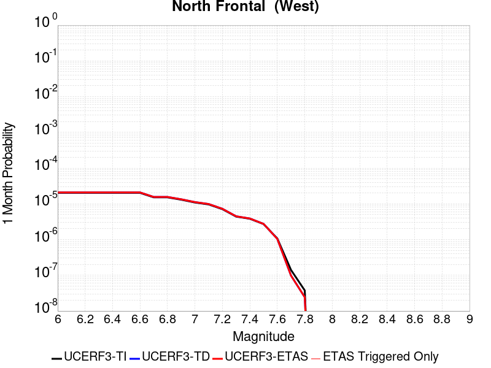 | 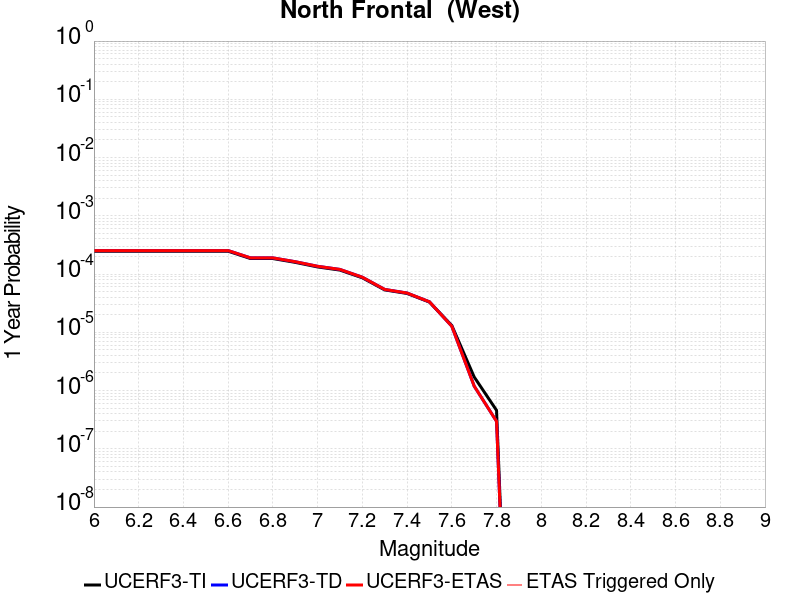 | 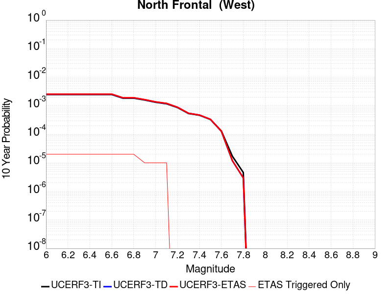 |

| Magnitude | 1 wk TI Prob | 1 wk TD Prob | 1 wk ETAS Prob | 1 wk ETAS/TD Gain | 1 wk ETAS Triggered Only | 1 mo TI Prob | 1 mo TD Prob | 1 mo ETAS Prob | 1 mo ETAS/TD Gain | 1 mo ETAS Triggered Only | 1 yr TI Prob | 1 yr TD Prob | 1 yr ETAS Prob | 1 yr ETAS/TD Gain | 1 yr ETAS Triggered Only | 10 yr TI Prob | 10 yr TD Prob | 10 yr ETAS Prob | 10 yr ETAS/TD Gain | 10 yr ETAS Triggered Only |
|-----|-----|-----|-----|-----|-----|-----|-----|-----|-----|-----|-----|-----|-----|-----|-----|-----|-----|-----|-----|-----|
| 6.0 | 4.7316266E-6 | 4.8527663E-6 | 4.8527663E-6 | 1.0 | 0.0 | 2.0278241E-5 | 2.0797414E-5 | 2.0797414E-5 | 1.0 | 0.0 | 2.4685962E-4 | 2.5318057E-4 | 2.5318057E-4 | 1.0 | 0.0 | 0.0024658558 | 0.0025290672 | 0.002558663 | 1.0117023 | 2.967095E-5 |
| 6.1 | 4.7316266E-6 | 4.8527663E-6 | 4.8527663E-6 | 1.0 | 0.0 | 2.0278241E-5 | 2.0797414E-5 | 2.0797414E-5 | 1.0 | 0.0 | 2.4685962E-4 | 2.5318057E-4 | 2.5318057E-4 | 1.0 | 0.0 | 0.0024658558 | 0.0025290672 | 0.002558663 | 1.0117023 | 2.967095E-5 |
| 6.2 | 4.7316266E-6 | 4.8527663E-6 | 4.8527663E-6 | 1.0 | 0.0 | 2.0278241E-5 | 2.0797414E-5 | 2.0797414E-5 | 1.0 | 0.0 | 2.4685962E-4 | 2.5318057E-4 | 2.5318057E-4 | 1.0 | 0.0 | 0.0024658558 | 0.0025290672 | 0.002558663 | 1.0117023 | 2.967095E-5 |
| 6.3 | 4.7316266E-6 | 4.8527663E-6 | 4.8527663E-6 | 1.0 | 0.0 | 2.0278241E-5 | 2.0797414E-5 | 2.0797414E-5 | 1.0 | 0.0 | 2.4685962E-4 | 2.5318057E-4 | 2.5318057E-4 | 1.0 | 0.0 | 0.0024658558 | 0.0025290672 | 0.002558663 | 1.0117023 | 2.967095E-5 |
| 6.4 | 4.7316266E-6 | 4.8527663E-6 | 4.8527663E-6 | 1.0 | 0.0 | 2.0278241E-5 | 2.0797414E-5 | 2.0797414E-5 | 1.0 | 0.0 | 2.4685962E-4 | 2.5318057E-4 | 2.5318057E-4 | 1.0 | 0.0 | 0.0024658558 | 0.0025290672 | 0.002558663 | 1.0117023 | 2.967095E-5 |
| 6.5 | 4.7316266E-6 | 4.8527663E-6 | 4.8527663E-6 | 1.0 | 0.0 | 2.0278241E-5 | 2.0797414E-5 | 2.0797414E-5 | 1.0 | 0.0 | 2.4685962E-4 | 2.5318057E-4 | 2.5318057E-4 | 1.0 | 0.0 | 0.0024658558 | 0.0025290672 | 0.002558663 | 1.0117023 | 2.967095E-5 |
| 6.6 | 4.7316266E-6 | 4.8527663E-6 | 4.8527663E-6 | 1.0 | 0.0 | 2.0278241E-5 | 2.0797414E-5 | 2.0797414E-5 | 1.0 | 0.0 | 2.4685962E-4 | 2.5318057E-4 | 2.5318057E-4 | 1.0 | 0.0 | 0.0024658558 | 0.0025290672 | 0.002558663 | 1.0117023 | 2.967095E-5 |
| 6.7 | 3.5382777E-6 | 3.6309605E-6 | 3.6309605E-6 | 1.0 | 0.0 | 1.516396E-5 | 1.556117E-5 | 1.556117E-5 | 1.0 | 0.0 | 1.8460557E-4 | 1.8944156E-4 | 1.8944156E-4 | 1.0 | 0.0 | 0.0018445229 | 0.0018928776 | 0.0019224924 | 1.0156454 | 2.967095E-5 |
| 6.8 | 3.5382777E-6 | 3.6309605E-6 | 3.6309605E-6 | 1.0 | 0.0 | 1.516396E-5 | 1.556117E-5 | 1.556117E-5 | 1.0 | 0.0 | 1.8460557E-4 | 1.8944156E-4 | 1.8944156E-4 | 1.0 | 0.0 | 0.0018445229 | 0.0018928776 | 0.0019224924 | 1.0156454 | 2.967095E-5 |
| 6.9 | 3.0428037E-6 | 3.1228265E-6 | 3.1228265E-6 | 1.0 | 0.0 | 1.30405215E-5 | 1.3383477E-5 | 1.3383477E-5 | 1.0 | 0.0 | 1.5875678E-4 | 1.6293232E-4 | 1.6293232E-4 | 1.0 | 0.0 | 0.0015864341 | 0.0016281959 | 0.0016430072 | 1.0090967 | 1.4835475E-5 |
| 7.0 | 2.538778E-6 | 2.6061475E-6 | 2.6061475E-6 | 1.0 | 0.0 | 1.0880432E-5 | 1.1169159E-5 | 1.1169159E-5 | 1.0 | 0.0 | 1.324612E-4 | 1.359765E-4 | 1.359765E-4 | 1.0 | 0.0 | 0.0013238228 | 0.0013589797 | 0.0013737951 | 1.0109018 | 1.4835475E-5 |
| 7.1 | 2.2418935E-6 | 2.301259E-6 | 2.301259E-6 | 1.0 | 0.0 | 9.60808E-6 | 9.862504E-6 | 9.862504E-6 | 1.0 | 0.0 | 1.1697209E-4 | 1.2006982E-4 | 1.2006982E-4 | 1.0 | 0.0 | 0.0011691054 | 0.0012000934 | 0.0012149111 | 1.0123471 | 1.4835475E-5 |
| 7.2 | 1.6526745E-6 | 1.6925236E-6 | 1.6925236E-6 | 1.0 | 0.0 | 7.082872E-6 | 7.2536536E-6 | 7.2536536E-6 | 1.0 | 0.0 | 8.623055E-5 | 8.8309906E-5 | 8.8309906E-5 | 1.0 | 0.0 | 8.61971E-4 | 8.827732E-4 | 8.827732E-4 | 1.0 | 0.0 |
| 7.3 | 1.0246019E-6 | 1.0442507E-6 | 1.0442507E-6 | 1.0 | 0.0 | 4.391144E-6 | 4.475353E-6 | 4.475353E-6 | 1.0 | 0.0 | 5.3460866E-5 | 5.4486176E-5 | 5.4486176E-5 | 1.0 | 0.0 | 5.344801E-4 | 5.4473965E-4 | 5.4473965E-4 | 1.0 | 0.0 |
| 7.4 | 8.9045164E-7 | 9.0567744E-7 | 9.0567744E-7 | 1.0 | 0.0 | 3.8162157E-6 | 3.8814696E-6 | 3.8814696E-6 | 1.0 | 0.0 | 4.646144E-5 | 4.725598E-5 | 4.725598E-5 | 1.0 | 0.0 | 4.6451724E-4 | 4.724702E-4 | 4.724702E-4 | 1.0 | 0.0 |
| 7.5 | 6.3357E-7 | 6.402858E-7 | 6.402858E-7 | 1.0 | 0.0 | 2.7152971E-6 | 2.7440794E-6 | 2.7440794E-6 | 1.0 | 0.0 | 3.305824E-5 | 3.3408724E-5 | 3.3408724E-5 | 1.0 | 0.0 | 3.3053322E-4 | 3.3404358E-4 | 3.3404358E-4 | 1.0 | 0.0 |
| 7.6 | 2.5087024E-7 | 2.4361714E-7 | 2.4361714E-7 | 1.0 | 0.0 | 1.0751578E-6 | 1.0440732E-6 | 1.0440732E-6 | 1.0 | 0.0 | 1.3089967E-5 | 1.2711538E-5 | 1.2711538E-5 | 1.0 | 0.0 | 1.3089196E-4 | 1.2711016E-4 | 1.2711016E-4 | 1.0 | 0.0 |
| 7.7 | 3.282987E-8 | 2.2874929E-8 | 2.2874929E-8 | 1.0 | 0.0 | 1.4069944E-7 | 9.803541E-8 | 9.803541E-8 | 1.0 | 0.0 | 1.7130144E-6 | 1.1935805E-6 | 1.1935805E-6 | 1.0 | 0.0 | 1.7130013E-5 | 1.1935749E-5 | 1.1935749E-5 | 1.0 | 0.0 |
| 7.8 | 8.77499E-9 | 5.6819123E-9 | 5.6819123E-9 | 1.0 | 0.0 | 3.7607098E-8 | 2.4351053E-8 | 2.4351053E-8 | 1.0 | 0.0 | 4.578663E-7 | 2.9647404E-7 | 2.9647404E-7 | 1.0 | 0.0 | 4.5786537E-6 | 2.9647379E-6 | 2.9647379E-6 | 1.0 | 0.0 |

## San Jacinto (Anza) rev
*[(top)](#table-of-contents)*

| 1 Week | 1 Month | 1 Year | 10 Year |
|-----|-----|-----|-----|
|  | 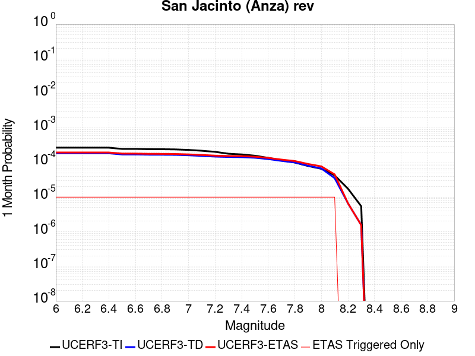 |  |  |

| Magnitude | 1 wk TI Prob | 1 wk TD Prob | 1 wk ETAS Prob | 1 wk ETAS/TD Gain | 1 wk ETAS Triggered Only | 1 mo TI Prob | 1 mo TD Prob | 1 mo ETAS Prob | 1 mo ETAS/TD Gain | 1 mo ETAS Triggered Only | 1 yr TI Prob | 1 yr TD Prob | 1 yr ETAS Prob | 1 yr ETAS/TD Gain | 1 yr ETAS Triggered Only | 10 yr TI Prob | 10 yr TD Prob | 10 yr ETAS Prob | 10 yr ETAS/TD Gain | 10 yr ETAS Triggered Only |
|-----|-----|-----|-----|-----|-----|-----|-----|-----|-----|-----|-----|-----|-----|-----|-----|-----|-----|-----|-----|-----|
| 6.0 | 6.3015636E-5 | 4.3394146E-5 | 4.3394146E-5 | 1.0 | 0.0 | 2.7003905E-4 | 1.8596172E-4 | 2.0079443E-4 | 1.0797622 | 1.4835475E-5 | 0.0032827691 | 0.0022617448 | 0.0022765468 | 1.0065445 | 1.4835475E-5 | 0.032346968 | 0.023343509 | 0.023372488 | 1.0012414 | 2.967095E-5 |
| 6.1 | 6.3015636E-5 | 4.3394146E-5 | 4.3394146E-5 | 1.0 | 0.0 | 2.7003905E-4 | 1.8596172E-4 | 2.0079443E-4 | 1.0797622 | 1.4835475E-5 | 0.0032827691 | 0.0022617448 | 0.0022765468 | 1.0065445 | 1.4835475E-5 | 0.032346968 | 0.023343509 | 0.023372488 | 1.0012414 | 2.967095E-5 |
| 6.2 | 6.3015636E-5 | 4.3394146E-5 | 4.3394146E-5 | 1.0 | 0.0 | 2.7003905E-4 | 1.8596172E-4 | 2.0079443E-4 | 1.0797622 | 1.4835475E-5 | 0.0032827691 | 0.0022617448 | 0.0022765468 | 1.0065445 | 1.4835475E-5 | 0.032346968 | 0.023343509 | 0.023372488 | 1.0012414 | 2.967095E-5 |
| 6.3 | 6.3015636E-5 | 4.3394146E-5 | 4.3394146E-5 | 1.0 | 0.0 | 2.7003905E-4 | 1.8596172E-4 | 2.0079443E-4 | 1.0797622 | 1.4835475E-5 | 0.0032827691 | 0.0022617448 | 0.0022765468 | 1.0065445 | 1.4835475E-5 | 0.032346968 | 0.023343509 | 0.023372488 | 1.0012414 | 2.967095E-5 |
| 6.4 | 6.3015636E-5 | 4.3394146E-5 | 4.3394146E-5 | 1.0 | 0.0 | 2.7003905E-4 | 1.8596172E-4 | 2.0079443E-4 | 1.0797622 | 1.4835475E-5 | 0.0032827691 | 0.0022617448 | 0.0022765468 | 1.0065445 | 1.4835475E-5 | 0.032346968 | 0.023343509 | 0.023372488 | 1.0012414 | 2.967095E-5 |
| 6.5 | 5.811017E-5 | 4.0169714E-5 | 4.0169714E-5 | 1.0 | 0.0 | 2.4901982E-4 | 1.7214459E-4 | 1.869775E-4 | 1.0861654 | 1.4835475E-5 | 0.0030276014 | 0.0020938513 | 0.0021086559 | 1.0070704 | 1.4835475E-5 | 0.02986684 | 0.021638965 | 0.021667995 | 1.0013415 | 2.967095E-5 |
| 6.6 | 5.811017E-5 | 4.0169714E-5 | 4.0169714E-5 | 1.0 | 0.0 | 2.4901982E-4 | 1.7214459E-4 | 1.869775E-4 | 1.0861654 | 1.4835475E-5 | 0.0030276014 | 0.0020938513 | 0.0021086559 | 1.0070704 | 1.4835475E-5 | 0.02986684 | 0.021638965 | 0.021667995 | 1.0013415 | 2.967095E-5 |
| 6.7 | 5.712442E-5 | 3.959151E-5 | 3.959151E-5 | 1.0 | 0.0 | 2.4479596E-4 | 1.6966689E-4 | 1.8449985E-4 | 1.087424 | 1.4835475E-5 | 0.0029763177 | 0.0020637428 | 0.0020785478 | 1.0071738 | 1.4835475E-5 | 0.029367693 | 0.021330344 | 0.02135938 | 1.0013614 | 2.967095E-5 |
| 6.8 | 5.6967532E-5 | 3.9447772E-5 | 3.9447772E-5 | 1.0 | 0.0 | 2.4412372E-4 | 1.6905095E-4 | 1.8388391E-4 | 1.0877426 | 1.4835475E-5 | 0.0029681553 | 0.002056258 | 0.0020710628 | 1.0072 | 1.4835475E-5 | 0.029288229 | 0.021254996 | 0.021284036 | 1.0013663 | 2.967095E-5 |
| 6.9 | 5.6211324E-5 | 3.9152E-5 | 3.9152E-5 | 1.0 | 0.0 | 2.4088343E-4 | 1.6778352E-4 | 1.8261651E-4 | 1.0884055 | 1.4835475E-5 | 0.0029288116 | 0.002040856 | 0.002055661 | 1.0072544 | 1.4835475E-5 | 0.028905109 | 0.021094138 | 0.021123184 | 1.0013769 | 2.967095E-5 |
| 7.0 | 5.4383527E-5 | 3.8010658E-5 | 3.8010658E-5 | 1.0 | 0.0 | 2.3305144E-4 | 1.6289267E-4 | 1.7772573E-4 | 1.0910603 | 1.4835475E-5 | 0.0028337094 | 0.0019814193 | 0.0019962252 | 1.0074725 | 1.4835475E-5 | 0.027978465 | 0.02048416 | 0.020513225 | 1.0014188 | 2.967095E-5 |
| 7.1 | 5.1393665E-5 | 3.6470683E-5 | 3.6470683E-5 | 1.0 | 0.0 | 2.2023996E-4 | 1.562936E-4 | 1.7112675E-4 | 1.0949057 | 1.4835475E-5 | 0.0026781242 | 0.001901218 | 0.0019160252 | 1.0077883 | 1.4835475E-5 | 0.026460782 | 0.019656375 | 0.019685462 | 1.0014799 | 2.967095E-5 |
| 7.2 | 4.785222E-5 | 3.4819386E-5 | 3.4819386E-5 | 1.0 | 0.0 | 2.0506482E-4 | 1.4921742E-4 | 1.6405068E-4 | 1.0994071 | 1.4835475E-5 | 0.0024938055 | 0.0018152118 | 0.0018300203 | 1.008158 | 1.4835475E-5 | 0.024660049 | 0.01876943 | 0.018798545 | 1.0015512 | 2.967095E-5 |
| 7.3 | 4.2143256E-5 | 3.3911667E-5 | 3.3911667E-5 | 1.0 | 0.0 | 1.8060145E-4 | 1.4532765E-4 | 1.6016095E-4 | 1.1020681 | 1.4835475E-5 | 0.002196605 | 0.0017679315 | 0.0017827408 | 1.0083766 | 1.4835475E-5 | 0.02175019 | 0.018276474 | 0.018305602 | 1.0015938 | 2.967095E-5 |
| 7.4 | 4.0264713E-5 | 3.3549157E-5 | 3.3549157E-5 | 1.0 | 0.0 | 1.7255165E-4 | 1.4377419E-4 | 1.5860754E-4 | 1.1031711 | 1.4835475E-5 | 0.002098792 | 0.0017490487 | 0.0017638583 | 1.0084672 | 1.4835475E-5 | 0.020790804 | 0.018080678 | 0.018109811 | 1.0016114 | 2.967095E-5 |
| 7.5 | 3.694492E-5 | 3.2260803E-5 | 3.2260803E-5 | 1.0 | 0.0 | 1.5832575E-4 | 1.3825326E-4 | 1.530867E-4 | 1.1072917 | 1.4835475E-5 | 0.0019259118 | 0.0016819371 | 0.0016967476 | 1.0088056 | 1.4835475E-5 | 0.01909306 | 0.017395914 | 0.017425068 | 1.001676 | 2.967095E-5 |
| 7.6 | 3.200565E-5 | 2.9568597E-5 | 2.9568597E-5 | 1.0 | 0.0 | 1.3715986E-4 | 1.2671642E-4 | 1.4155002E-4 | 1.1170614 | 1.4835475E-5 | 0.001668642 | 0.0015416828 | 0.0015564954 | 1.009608 | 1.4835475E-5 | 0.01656168 | 0.015979866 | 0.01600906 | 1.0018271 | 2.967095E-5 |
| 7.7 | 2.731642E-5 | 2.615529E-5 | 2.615529E-5 | 1.0 | 0.0 | 1.1706512E-4 | 1.1208929E-4 | 1.269231E-4 | 1.1323392 | 1.4835475E-5 | 0.001424336 | 0.0013638338 | 0.001378649 | 1.010863 | 1.4835475E-5 | 0.014152412 | 0.014199599 | 0.014228848 | 1.0020599 | 2.967095E-5 |
| 7.8 | 2.3466424E-5 | 2.3564788E-5 | 2.3564788E-5 | 1.0 | 0.0 | 1.0056651E-4 | 1.0098804E-4 | 1.1582202E-4 | 1.1468885 | 1.4835475E-5 | 0.0012237094 | 0.0012288367 | 0.001243654 | 1.0120579 | 1.4835475E-5 | 0.012169928 | 0.01284022 | 0.01286951 | 1.0022811 | 2.967095E-5 |
| 7.9 | 1.8611925E-5 | 1.8962188E-5 | 1.8962188E-5 | 1.0 | 0.0 | 7.9762955E-5 | 8.126399E-5 | 9.609826E-5 | 1.1825442 | 1.4835475E-5 | 9.7068126E-4 | 9.889407E-4 | 0.0010037615 | 1.0149865 | 1.4835475E-5 | 0.0096645225 | 0.010422182 | 0.010451544 | 1.0028173 | 2.967095E-5 |
| 8.0 | 1.5460775E-5 | 1.5788923E-5 | 1.5788923E-5 | 1.0 | 0.0 | 6.6258784E-5 | 6.766506E-5 | 8.249953E-5 | 1.2192339 | 1.4835475E-5 | 8.0640207E-4 | 8.235114E-4 | 8.383347E-4 | 1.018 | 1.4835475E-5 | 0.008034821 | 0.008728126 | 0.008757538 | 1.0033698 | 2.967095E-5 |
| 8.1 | 9.983884E-6 | 8.297987E-6 | 8.297987E-6 | 1.0 | 0.0 | 4.2787375E-5 | 3.556232E-5 | 5.0397266E-5 | 1.4171536 | 1.4835475E-5 | 5.2081177E-4 | 4.3288572E-4 | 4.477148E-4 | 1.0342562 | 1.4835475E-5 | 0.0051959283 | 0.0046550906 | 0.0046846233 | 1.0063442 | 2.967095E-5 |
| 8.2 | 4.1226E-6 | 1.5611827E-6 | 1.5611827E-6 | 1.0 | 0.0 | 1.7668166E-5 | 6.690766E-6 | 6.690766E-6 | 1.0 | 0.0 | 2.1508869E-4 | 8.145706E-5 | 8.145706E-5 | 1.0 | 0.0 | 0.0021488064 | 9.451884E-4 | 9.451884E-4 | 1.0 | 0.0 |
| 8.3 | 1.2750878E-6 | 3.6346486E-7 | 3.6346486E-7 | 1.0 | 0.0 | 5.4646503E-6 | 1.5577056E-6 | 1.5577056E-6 | 1.0 | 0.0 | 6.653009E-5 | 1.8964905E-5 | 1.8964905E-5 | 1.0 | 0.0 | 6.6510175E-4 | 2.2866535E-4 | 2.2866535E-4 | 1.0 | 0.0 |

## Big Pine (Central)
*[(top)](#table-of-contents)*

| 1 Week | 1 Month | 1 Year | 10 Year |
|-----|-----|-----|-----|
|  | 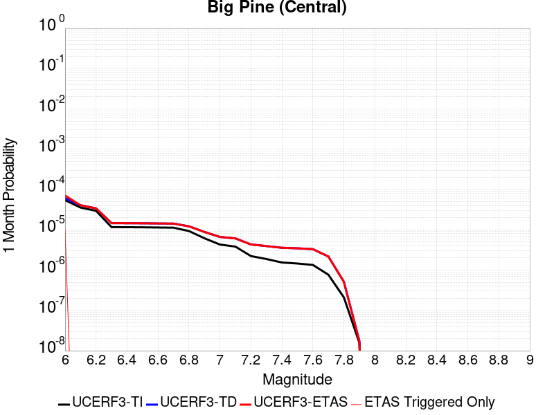 |  | 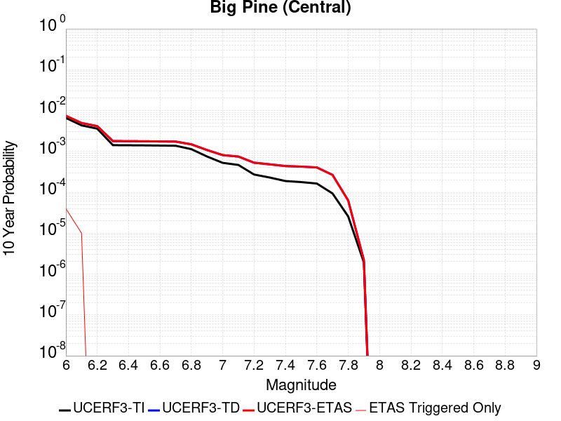 |

| Magnitude | 1 wk TI Prob | 1 wk TD Prob | 1 wk ETAS Prob | 1 wk ETAS/TD Gain | 1 wk ETAS Triggered Only | 1 mo TI Prob | 1 mo TD Prob | 1 mo ETAS Prob | 1 mo ETAS/TD Gain | 1 mo ETAS Triggered Only | 1 yr TI Prob | 1 yr TD Prob | 1 yr ETAS Prob | 1 yr ETAS/TD Gain | 1 yr ETAS Triggered Only | 10 yr TI Prob | 10 yr TD Prob | 10 yr ETAS Prob | 10 yr ETAS/TD Gain | 10 yr ETAS Triggered Only |
|-----|-----|-----|-----|-----|-----|-----|-----|-----|-----|-----|-----|-----|-----|-----|-----|-----|-----|-----|-----|-----|
| 6.0 | 1.2706755E-5 | 1.4252947E-5 | 1.4252947E-5 | 1.0 | 0.0 | 5.4456385E-5 | 6.1082836E-5 | 6.1082836E-5 | 1.0 | 0.0 | 6.628048E-4 | 7.434663E-4 | 7.434663E-4 | 1.0 | 0.0 | 0.006608314 | 0.007414805 | 0.0074442555 | 1.0039719 | 2.967095E-5 |
| 6.1 | 8.342579E-6 | 9.51291E-6 | 9.51291E-6 | 1.0 | 0.0 | 3.5753423E-5 | 4.07691E-5 | 4.07691E-5 | 1.0 | 0.0 | 4.3521097E-4 | 4.9627246E-4 | 4.9627246E-4 | 1.0 | 0.0 | 0.0043435963 | 0.004955183 | 0.0049699447 | 1.002979 | 1.4835475E-5 |
| 6.2 | 6.923899E-6 | 7.969205E-6 | 7.969205E-6 | 1.0 | 0.0 | 2.9673516E-5 | 3.41534E-5 | 3.41534E-5 | 1.0 | 0.0 | 3.6121515E-4 | 4.1575753E-4 | 4.1575753E-4 | 1.0 | 0.0 | 0.003606286 | 0.004153091 | 0.004153091 | 1.0 | 0.0 |
| 6.3 | 2.728396E-6 | 3.4260995E-6 | 3.4260995E-6 | 1.0 | 0.0 | 1.1693074E-5 | 1.4683206E-5 | 1.4683206E-5 | 1.0 | 0.0 | 1.4235388E-4 | 1.7875424E-4 | 1.7875424E-4 | 1.0 | 0.0 | 0.0014226272 | 0.0017875971 | 0.0017875971 | 1.0 | 0.0 |
| 6.4 | 2.7136944E-6 | 3.4103923E-6 | 3.4103923E-6 | 1.0 | 0.0 | 1.1630066E-5 | 1.461589E-5 | 1.461589E-5 | 1.0 | 0.0 | 1.4158686E-4 | 1.779348E-4 | 1.779348E-4 | 1.0 | 0.0 | 0.0014149669 | 0.0017794158 | 0.0017794158 | 1.0 | 0.0 |
| 6.5 | 2.6971882E-6 | 3.3927365E-6 | 3.3927365E-6 | 1.0 | 0.0 | 1.1559327E-5 | 1.4540224E-5 | 1.4540224E-5 | 1.0 | 0.0 | 1.4072572E-4 | 1.770137E-4 | 1.770137E-4 | 1.0 | 0.0 | 0.0014063664 | 0.0017702195 | 0.0017702195 | 1.0 | 0.0 |
| 6.6 | 2.669092E-6 | 3.3627557E-6 | 3.3627557E-6 | 1.0 | 0.0 | 1.1438916E-5 | 1.4411736E-5 | 1.4411736E-5 | 1.0 | 0.0 | 1.3925991E-4 | 1.7544962E-4 | 1.7544962E-4 | 1.0 | 0.0 | 0.0013917267 | 0.0017546033 | 0.0017546033 | 1.0 | 0.0 |
| 6.7 | 2.6408059E-6 | 3.3327801E-6 | 3.3327801E-6 | 1.0 | 0.0 | 1.1317691E-5 | 1.428327E-5 | 1.428327E-5 | 1.0 | 0.0 | 1.3778417E-4 | 1.7388581E-4 | 1.7388581E-4 | 1.0 | 0.0 | 0.0013769877 | 0.0017389898 | 0.0017389898 | 1.0 | 0.0 |
| 6.8 | 2.1786943E-6 | 2.8562276E-6 | 2.8562276E-6 | 1.0 | 0.0 | 9.337228E-6 | 1.2240922E-5 | 1.2240922E-5 | 1.0 | 0.0 | 1.1367482E-4 | 1.4902376E-4 | 1.4902376E-4 | 1.0 | 0.0 | 0.0011361669 | 0.0014907172 | 0.0014907172 | 1.0 | 0.0 |
| 6.9 | 1.4411696E-6 | 2.0702144E-6 | 2.0702144E-6 | 1.0 | 0.0 | 6.1764263E-6 | 8.872318E-6 | 8.872318E-6 | 1.0 | 0.0 | 7.51954E-5 | 1.08015396E-4 | 1.08015396E-4 | 1.0 | 0.0 | 7.5169955E-4 | 0.0010810632 | 0.0010810632 | 1.0 | 0.0 |
| 7.0 | 1.0073411E-6 | 1.5557927E-6 | 1.5557927E-6 | 1.0 | 0.0 | 4.317169E-6 | 6.6676666E-6 | 6.6676666E-6 | 1.0 | 0.0 | 5.2560266E-5 | 8.1175975E-5 | 8.1175975E-5 | 1.0 | 0.0 | 5.2547833E-4 | 8.1288617E-4 | 8.1288617E-4 | 1.0 | 0.0 |
| 7.1 | 8.947104E-7 | 1.4317593E-6 | 1.4317593E-6 | 1.0 | 0.0 | 3.834468E-6 | 6.136098E-6 | 6.136098E-6 | 1.0 | 0.0 | 4.6683643E-5 | 7.470458E-5 | 7.470458E-5 | 1.0 | 0.0 | 4.6673836E-4 | 7.4821746E-4 | 7.4821746E-4 | 1.0 | 0.0 |
| 7.2 | 5.215166E-7 | 1.012577E-6 | 1.012577E-6 | 1.0 | 0.0 | 2.2350691E-6 | 4.3396085E-6 | 4.3396085E-6 | 1.0 | 0.0 | 2.7211627E-5 | 5.2833497E-5 | 5.2833497E-5 | 1.0 | 0.0 | 2.7208295E-4 | 5.2962196E-4 | 5.2962196E-4 | 1.0 | 0.0 |
| 7.3 | 4.4024807E-7 | 9.233262E-7 | 9.233262E-7 | 1.0 | 0.0 | 1.8867761E-6 | 3.9571064E-6 | 3.9571064E-6 | 1.0 | 0.0 | 2.2971257E-5 | 4.8176746E-5 | 4.8176746E-5 | 1.0 | 0.0 | 2.2968883E-4 | 4.8307548E-4 | 4.8307548E-4 | 1.0 | 0.0 |
| 7.4 | 3.6130905E-7 | 8.3717714E-7 | 8.3717714E-7 | 1.0 | 0.0 | 1.5484665E-6 | 3.5878973E-6 | 3.5878973E-6 | 1.0 | 0.0 | 1.8852415E-5 | 4.368181E-5 | 4.368181E-5 | 1.0 | 0.0 | 1.8850817E-4 | 4.3813515E-4 | 4.3813515E-4 | 1.0 | 0.0 |
| 7.5 | 3.408184E-7 | 8.121106E-7 | 8.121106E-7 | 1.0 | 0.0 | 1.4606494E-6 | 3.4804696E-6 | 3.4804696E-6 | 1.0 | 0.0 | 1.7783263E-5 | 4.2373933E-5 | 4.2373933E-5 | 1.0 | 0.0 | 1.778184E-4 | 4.2503997E-4 | 4.2503997E-4 | 1.0 | 0.0 |
| 7.6 | 3.1428627E-7 | 7.744099E-7 | 7.744099E-7 | 1.0 | 0.0 | 1.3469405E-6 | 3.3188956E-6 | 3.3188956E-6 | 1.0 | 0.0 | 1.6398877E-5 | 4.0406845E-5 | 4.0406845E-5 | 1.0 | 0.0 | 1.6397667E-4 | 4.053476E-4 | 4.053476E-4 | 1.0 | 0.0 |
| 7.7 | 1.7972785E-7 | 5.0873047E-7 | 5.0873047E-7 | 1.0 | 0.0 | 7.70262E-7 | 2.1802716E-6 | 2.1802716E-6 | 1.0 | 0.0 | 9.377899E-6 | 2.6544494E-5 | 2.6544494E-5 | 1.0 | 0.0 | 9.377503E-5 | 2.6677348E-4 | 2.6677348E-4 | 1.0 | 0.0 |
| 7.8 | 4.9230927E-8 | 1.200333E-7 | 1.200333E-7 | 1.0 | 0.0 | 2.1098968E-7 | 5.1442834E-7 | 5.1442834E-7 | 1.0 | 0.0 | 2.5687964E-6 | 6.263149E-6 | 6.263149E-6 | 1.0 | 0.0 | 2.5687666E-5 | 6.306952E-5 | 6.306952E-5 | 1.0 | 0.0 |
| 7.9 | 3.6805972E-9 | 4.1141734E-9 | 4.1141734E-9 | 1.0 | 0.0 | 1.5773987E-8 | 1.7632171E-8 | 1.7632171E-8 | 1.0 | 0.0 | 1.9204828E-7 | 2.1467167E-7 | 2.1467167E-7 | 1.0 | 0.0 | 1.920481E-6 | 2.1947176E-6 | 2.1947176E-6 | 1.0 | 0.0 |

## Lost Hills
*[(top)](#table-of-contents)*

| 1 Week | 1 Month | 1 Year | 10 Year |
|-----|-----|-----|-----|
|  |  |  | 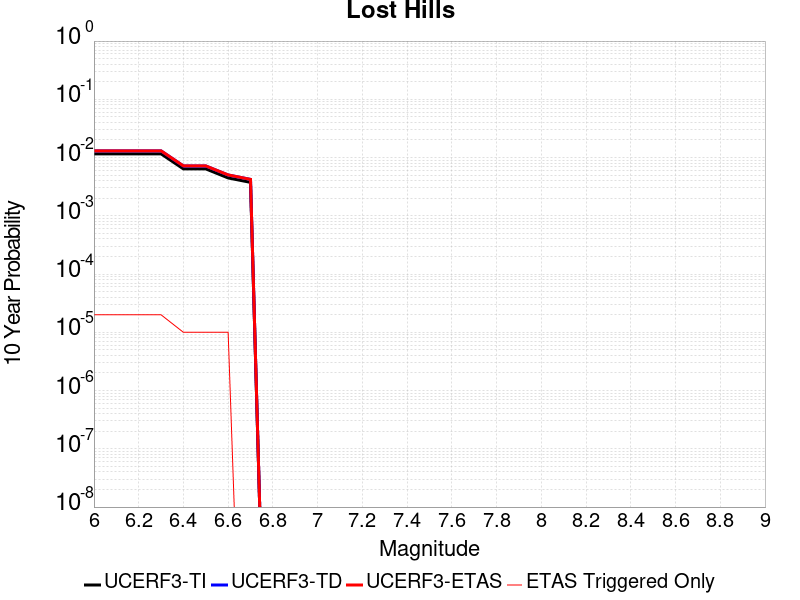 |

| Magnitude | 1 wk TI Prob | 1 wk TD Prob | 1 wk ETAS Prob | 1 wk ETAS/TD Gain | 1 wk ETAS Triggered Only | 1 mo TI Prob | 1 mo TD Prob | 1 mo ETAS Prob | 1 mo ETAS/TD Gain | 1 mo ETAS Triggered Only | 1 yr TI Prob | 1 yr TD Prob | 1 yr ETAS Prob | 1 yr ETAS/TD Gain | 1 yr ETAS Triggered Only | 10 yr TI Prob | 10 yr TD Prob | 10 yr ETAS Prob | 10 yr ETAS/TD Gain | 10 yr ETAS Triggered Only |
|-----|-----|-----|-----|-----|-----|-----|-----|-----|-----|-----|-----|-----|-----|-----|-----|-----|-----|-----|-----|-----|
| 6.0 | 2.233523E-5 | 2.5108648E-5 | 2.5108648E-5 | 1.0 | 0.0 | 9.571891E-5 | 1.07605E-4 | 1.2243888E-4 | 1.1378549 | 1.4835475E-5 | 0.0011647546 | 0.0013094717 | 0.0013242877 | 1.0113145 | 1.4835475E-5 | 0.011586686 | 0.013034157 | 0.013063442 | 1.0022467 | 2.967095E-5 |
| 6.1 | 2.233523E-5 | 2.5108648E-5 | 2.5108648E-5 | 1.0 | 0.0 | 9.571891E-5 | 1.07605E-4 | 1.2243888E-4 | 1.1378549 | 1.4835475E-5 | 0.0011647546 | 0.0013094717 | 0.0013242877 | 1.0113145 | 1.4835475E-5 | 0.011586686 | 0.013034157 | 0.013063442 | 1.0022467 | 2.967095E-5 |
| 6.2 | 2.233523E-5 | 2.5108648E-5 | 2.5108648E-5 | 1.0 | 0.0 | 9.571891E-5 | 1.07605E-4 | 1.2243888E-4 | 1.1378549 | 1.4835475E-5 | 0.0011647546 | 0.0013094717 | 0.0013242877 | 1.0113145 | 1.4835475E-5 | 0.011586686 | 0.013034157 | 0.013063442 | 1.0022467 | 2.967095E-5 |
| 6.3 | 2.233523E-5 | 2.5108648E-5 | 2.5108648E-5 | 1.0 | 0.0 | 9.571891E-5 | 1.07605E-4 | 1.2243888E-4 | 1.1378549 | 1.4835475E-5 | 0.0011647546 | 0.0013094717 | 0.0013242877 | 1.0113145 | 1.4835475E-5 | 0.011586686 | 0.013034157 | 0.013063442 | 1.0022467 | 2.967095E-5 |
| 6.4 | 1.2288092E-5 | 1.3782218E-5 | 1.3782218E-5 | 1.0 | 0.0 | 5.2662188E-5 | 5.906584E-5 | 5.906584E-5 | 1.0 | 0.0 | 6.409735E-4 | 7.189831E-4 | 7.189831E-4 | 1.0 | 0.0 | 0.006391279 | 0.0071757776 | 0.0071905064 | 1.0020525 | 1.4835475E-5 |
| 6.5 | 1.2288092E-5 | 1.3782218E-5 | 1.3782218E-5 | 1.0 | 0.0 | 5.2662188E-5 | 5.906584E-5 | 5.906584E-5 | 1.0 | 0.0 | 6.409735E-4 | 7.189831E-4 | 7.189831E-4 | 1.0 | 0.0 | 0.006391279 | 0.0071757776 | 0.0071905064 | 1.0020525 | 1.4835475E-5 |
| 6.6 | 8.58281E-6 | 9.634552E-6 | 9.634552E-6 | 1.0 | 0.0 | 3.6782953E-5 | 4.1290754E-5 | 4.1290754E-5 | 1.0 | 0.0 | 4.4774043E-4 | 5.026822E-4 | 5.026822E-4 | 1.0 | 0.0 | 0.0044683935 | 0.0050236126 | 0.0050383736 | 1.0029383 | 1.4835475E-5 |
| 6.7 | 7.205685E-6 | 8.088959E-6 | 8.088959E-6 | 1.0 | 0.0 | 3.088114E-5 | 3.4666966E-5 | 3.4666966E-5 | 1.0 | 0.0 | 3.7591302E-4 | 4.220703E-4 | 4.220703E-4 | 1.0 | 0.0 | 0.0037527776 | 0.004220703 | 0.004220703 | 1.0 | 0.0 |

## White Mountains
*[(top)](#table-of-contents)*

| 1 Week | 1 Month | 1 Year | 10 Year |
|-----|-----|-----|-----|
|  |  | 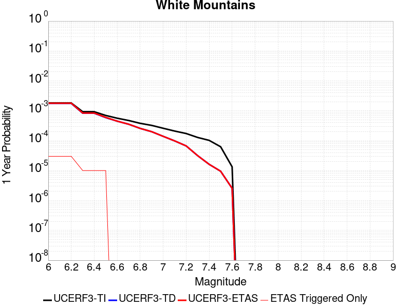 | 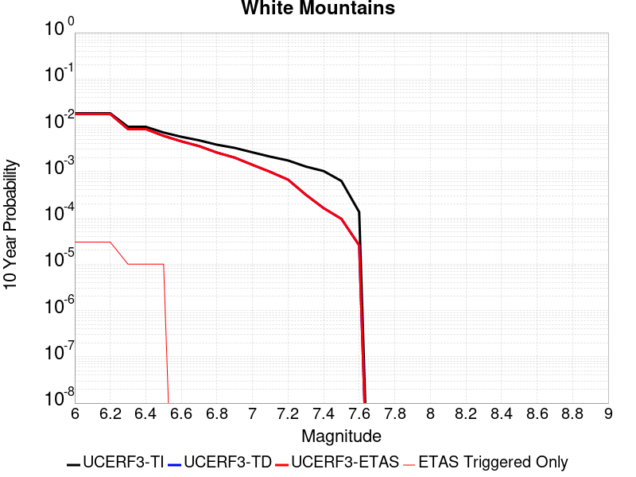 |

| Magnitude | 1 wk TI Prob | 1 wk TD Prob | 1 wk ETAS Prob | 1 wk ETAS/TD Gain | 1 wk ETAS Triggered Only | 1 mo TI Prob | 1 mo TD Prob | 1 mo ETAS Prob | 1 mo ETAS/TD Gain | 1 mo ETAS Triggered Only | 1 yr TI Prob | 1 yr TD Prob | 1 yr ETAS Prob | 1 yr ETAS/TD Gain | 1 yr ETAS Triggered Only | 10 yr TI Prob | 10 yr TD Prob | 10 yr ETAS Prob | 10 yr ETAS/TD Gain | 10 yr ETAS Triggered Only |
|-----|-----|-----|-----|-----|-----|-----|-----|-----|-----|-----|-----|-----|-----|-----|-----|-----|-----|-----|-----|-----|
| 6.0 | 3.503579E-5 | 3.3786066E-5 | 3.3786066E-5 | 1.0 | 0.0 | 1.5014476E-4 | 1.4479007E-4 | 1.4479007E-4 | 1.0 | 0.0 | 0.0018264796 | 0.0017615146 | 0.0017911333 | 1.0168144 | 2.967095E-5 | 0.018115403 | 0.017487854 | 0.017517006 | 1.001667 | 2.967095E-5 |
| 6.1 | 3.503579E-5 | 3.3786066E-5 | 3.3786066E-5 | 1.0 | 0.0 | 1.5014476E-4 | 1.4479007E-4 | 1.4479007E-4 | 1.0 | 0.0 | 0.0018264796 | 0.0017615146 | 0.0017911333 | 1.0168144 | 2.967095E-5 | 0.018115403 | 0.017487854 | 0.017517006 | 1.001667 | 2.967095E-5 |
| 6.2 | 3.503579E-5 | 3.3786066E-5 | 3.3786066E-5 | 1.0 | 0.0 | 1.5014476E-4 | 1.4479007E-4 | 1.4479007E-4 | 1.0 | 0.0 | 0.0018264796 | 0.0017615146 | 0.0017911333 | 1.0168144 | 2.967095E-5 | 0.018115403 | 0.017487854 | 0.017517006 | 1.001667 | 2.967095E-5 |
| 6.3 | 1.7818425E-5 | 1.591703E-5 | 1.591703E-5 | 1.0 | 0.0 | 7.636245E-5 | 6.821414E-5 | 6.821414E-5 | 1.0 | 0.0 | 9.293162E-4 | 8.302049E-4 | 8.450281E-4 | 1.0178548 | 1.4835475E-5 | 0.009254395 | 0.008272493 | 0.008287206 | 1.0017785 | 1.4835475E-5 |
| 6.4 | 1.7818425E-5 | 1.591703E-5 | 1.591703E-5 | 1.0 | 0.0 | 7.636245E-5 | 6.821414E-5 | 6.821414E-5 | 1.0 | 0.0 | 9.293162E-4 | 8.302049E-4 | 8.450281E-4 | 1.0178548 | 1.4835475E-5 | 0.009254395 | 0.008272493 | 0.008287206 | 1.0017785 | 1.4835475E-5 |
| 6.5 | 1.3397557E-5 | 1.1336976E-5 | 1.1336976E-5 | 1.0 | 0.0 | 5.741684E-5 | 4.858617E-5 | 4.858617E-5 | 1.0 | 0.0 | 6.988258E-4 | 5.913831E-4 | 6.062098E-4 | 1.0250713 | 1.4835475E-5 | 0.006966323 | 0.005898799 | 0.005913547 | 1.0025002 | 1.4835475E-5 |
| 6.6 | 1.0818695E-5 | 8.6258615E-6 | 8.6258615E-6 | 1.0 | 0.0 | 4.6365014E-5 | 3.6967478E-5 | 3.6967478E-5 | 1.0 | 0.0 | 5.6434784E-4 | 4.4999045E-4 | 4.4999045E-4 | 1.0 | 0.0 | 0.005629168 | 0.0044912295 | 0.0044912295 | 1.0 | 0.0 |
| 6.7 | 9.067908E-6 | 6.802806E-6 | 6.802806E-6 | 1.0 | 0.0 | 3.8861883E-5 | 2.9154577E-5 | 2.9154577E-5 | 1.0 | 0.0 | 4.7304068E-4 | 3.5490232E-4 | 3.5490232E-4 | 1.0 | 0.0 | 0.00472035 | 0.0035436729 | 0.0035436729 | 1.0 | 0.0 |
| 6.8 | 7.295947E-6 | 4.9366454E-6 | 4.9366454E-6 | 1.0 | 0.0 | 3.126797E-5 | 2.1156886E-5 | 2.1156886E-5 | 1.0 | 0.0 | 3.8062103E-4 | 2.5755577E-4 | 2.5755577E-4 | 1.0 | 0.0 | 0.0037996976 | 0.0025726857 | 0.0025726857 | 1.0 | 0.0 |
| 6.9 | 6.2243444E-6 | 3.8324215E-6 | 3.8324215E-6 | 1.0 | 0.0 | 2.6675489E-5 | 1.6424563E-5 | 1.6424563E-5 | 1.0 | 0.0 | 3.2472567E-4 | 1.9995125E-4 | 1.9995125E-4 | 1.0 | 0.0 | 0.0032425157 | 0.001997766 | 0.001997766 | 1.0 | 0.0 |
| 7.0 | 4.9878413E-6 | 2.679712E-6 | 2.679712E-6 | 1.0 | 0.0 | 2.1376287E-5 | 1.1484431E-5 | 1.1484431E-5 | 1.0 | 0.0 | 2.602252E-4 | 1.3981423E-4 | 1.3981423E-4 | 1.0 | 0.0 | 0.002599207 | 0.001397289 | 0.001397289 | 1.0 | 0.0 |
| 7.1 | 4.0252844E-6 | 1.8859204E-6 | 1.8859204E-6 | 1.0 | 0.0 | 1.7251105E-5 | 8.082492E-6 | 8.082492E-6 | 1.0 | 0.0 | 2.1001195E-4 | 9.840002E-5 | 9.840002E-5 | 1.0 | 0.0 | 0.0020981359 | 9.835773E-4 | 9.835773E-4 | 1.0 | 0.0 |
| 7.2 | 3.3284066E-6 | 1.2821155E-6 | 1.2821155E-6 | 1.0 | 0.0 | 1.4264522E-5 | 5.4947695E-6 | 5.4947695E-6 | 1.0 | 0.0 | 1.736567E-4 | 6.6896864E-5 | 6.6896864E-5 | 1.0 | 0.0 | 0.0017352107 | 6.687774E-4 | 6.687774E-4 | 1.0 | 0.0 |
| 7.3 | 2.458226E-6 | 6.0585836E-7 | 6.0585836E-7 | 1.0 | 0.0 | 1.0535211E-5 | 2.5965335E-6 | 2.5965335E-6 | 1.0 | 0.0 | 1.2825865E-4 | 3.1612377E-5 | 3.1612377E-5 | 1.0 | 0.0 | 0.0012818464 | 3.1608253E-4 | 3.1608253E-4 | 1.0 | 0.0 |
| 7.4 | 1.965953E-6 | 3.110113E-7 | 3.110113E-7 | 1.0 | 0.0 | 8.425486E-6 | 1.3329048E-6 | 1.3329048E-6 | 1.0 | 0.0 | 1.0257547E-4 | 1.6227998E-5 | 1.6227998E-5 | 1.0 | 0.0 | 0.0010252813 | 1.6226825E-4 | 1.6226825E-4 | 1.0 | 0.0 |
| 7.5 | 1.2014192E-6 | 1.8252439E-7 | 1.8252439E-7 | 1.0 | 0.0 | 5.148929E-6 | 7.822471E-7 | 7.822471E-7 | 1.0 | 0.0 | 6.2686406E-5 | 9.523818E-6 | 9.523818E-6 | 1.0 | 0.0 | 6.266873E-4 | 9.523418E-5 | 9.523418E-5 | 1.0 | 0.0 |
| 7.6 | 2.5612175E-7 | 4.8968072E-8 | 4.8968072E-8 | 1.0 | 0.0 | 1.0976642E-6 | 2.0986316E-7 | 2.0986316E-7 | 1.0 | 0.0 | 1.3363979E-5 | 2.5550814E-6 | 2.5550814E-6 | 1.0 | 0.0 | 1.3363175E-4 | 2.5550557E-5 | 2.5550557E-5 | 1.0 | 0.0 |

## Kern Canyon (North Kern) 2011
*[(top)](#table-of-contents)*

| 1 Week | 1 Month | 1 Year | 10 Year |
|-----|-----|-----|-----|
|  |  | 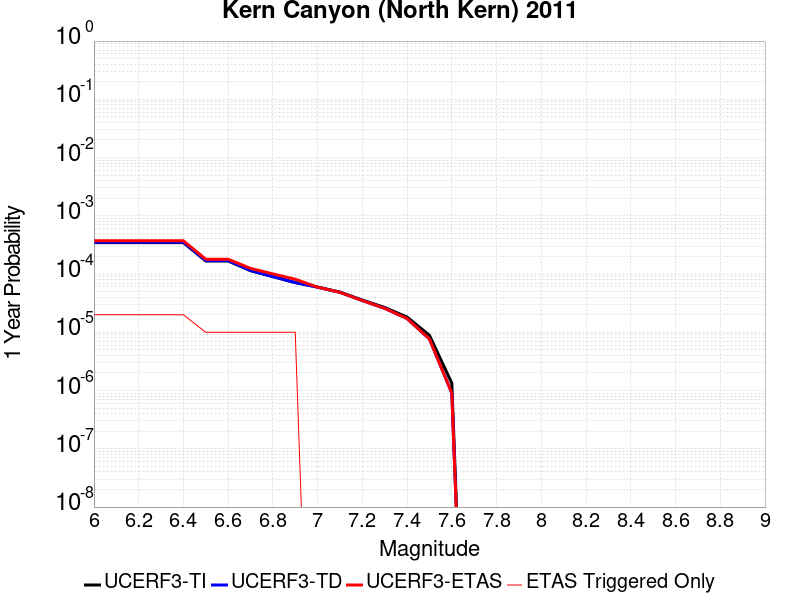 |  |

| Magnitude | 1 wk TI Prob | 1 wk TD Prob | 1 wk ETAS Prob | 1 wk ETAS/TD Gain | 1 wk ETAS Triggered Only | 1 mo TI Prob | 1 mo TD Prob | 1 mo ETAS Prob | 1 mo ETAS/TD Gain | 1 mo ETAS Triggered Only | 1 yr TI Prob | 1 yr TD Prob | 1 yr ETAS Prob | 1 yr ETAS/TD Gain | 1 yr ETAS Triggered Only | 10 yr TI Prob | 10 yr TD Prob | 10 yr ETAS Prob | 10 yr ETAS/TD Gain | 10 yr ETAS Triggered Only |
|-----|-----|-----|-----|-----|-----|-----|-----|-----|-----|-----|-----|-----|-----|-----|-----|-----|-----|-----|-----|-----|
| 6.0 | 6.6264497E-6 | 6.7574374E-6 | 6.7574374E-6 | 1.0 | 0.0 | 2.8398761E-5 | 2.8960168E-5 | 2.8960168E-5 | 1.0 | 0.0 | 3.4570007E-4 | 3.52541E-4 | 3.52541E-4 | 1.0 | 0.0 | 0.0034516277 | 0.003520606 | 0.0035501726 | 1.0083982 | 2.967095E-5 |
| 6.1 | 6.6264497E-6 | 6.7574374E-6 | 6.7574374E-6 | 1.0 | 0.0 | 2.8398761E-5 | 2.8960168E-5 | 2.8960168E-5 | 1.0 | 0.0 | 3.4570007E-4 | 3.52541E-4 | 3.52541E-4 | 1.0 | 0.0 | 0.0034516277 | 0.003520606 | 0.0035501726 | 1.0083982 | 2.967095E-5 |
| 6.2 | 6.6264497E-6 | 6.7574374E-6 | 6.7574374E-6 | 1.0 | 0.0 | 2.8398761E-5 | 2.8960168E-5 | 2.8960168E-5 | 1.0 | 0.0 | 3.4570007E-4 | 3.52541E-4 | 3.52541E-4 | 1.0 | 0.0 | 0.0034516277 | 0.003520606 | 0.0035501726 | 1.0083982 | 2.967095E-5 |
| 6.3 | 6.6264497E-6 | 6.7574374E-6 | 6.7574374E-6 | 1.0 | 0.0 | 2.8398761E-5 | 2.8960168E-5 | 2.8960168E-5 | 1.0 | 0.0 | 3.4570007E-4 | 3.52541E-4 | 3.52541E-4 | 1.0 | 0.0 | 0.0034516277 | 0.003520606 | 0.0035501726 | 1.0083982 | 2.967095E-5 |
| 6.4 | 6.6264497E-6 | 6.7574374E-6 | 6.7574374E-6 | 1.0 | 0.0 | 2.8398761E-5 | 2.8960168E-5 | 2.8960168E-5 | 1.0 | 0.0 | 3.4570007E-4 | 3.52541E-4 | 3.52541E-4 | 1.0 | 0.0 | 0.0034516277 | 0.003520606 | 0.0035501726 | 1.0083982 | 2.967095E-5 |
| 6.5 | 3.2162225E-6 | 3.2571372E-6 | 3.2571372E-6 | 1.0 | 0.0 | 1.3783738E-5 | 1.3959089E-5 | 1.3959089E-5 | 1.0 | 0.0 | 1.6780409E-4 | 1.6993946E-4 | 1.6993946E-4 | 1.0 | 0.0 | 0.0016767744 | 0.0016981749 | 0.0017129851 | 1.0087214 | 1.4835475E-5 |
| 6.6 | 3.2162225E-6 | 3.2571372E-6 | 3.2571372E-6 | 1.0 | 0.0 | 1.3783738E-5 | 1.3959089E-5 | 1.3959089E-5 | 1.0 | 0.0 | 1.6780409E-4 | 1.6993946E-4 | 1.6993946E-4 | 1.0 | 0.0 | 0.0016767744 | 0.0016981749 | 0.0017129851 | 1.0087214 | 1.4835475E-5 |
| 6.7 | 2.1908265E-6 | 2.2071513E-6 | 2.2071513E-6 | 1.0 | 0.0 | 9.389223E-6 | 9.459187E-6 | 9.459187E-6 | 1.0 | 0.0 | 1.1430779E-4 | 1.1515971E-4 | 1.1515971E-4 | 1.0 | 0.0 | 0.0011424901 | 0.0011510197 | 0.0011510197 | 1.0 | 0.0 |
| 6.8 | 1.7303895E-6 | 1.7365752E-6 | 1.7365752E-6 | 1.0 | 0.0 | 7.415934E-6 | 7.4424443E-6 | 7.4424443E-6 | 1.0 | 0.0 | 9.028525E-5 | 9.060809E-5 | 9.060809E-5 | 1.0 | 0.0 | 9.024858E-4 | 9.057212E-4 | 9.057212E-4 | 1.0 | 0.0 |
| 6.9 | 1.3700314E-6 | 1.3688796E-6 | 1.3688796E-6 | 1.0 | 0.0 | 5.87155E-6 | 5.8666137E-6 | 5.8666137E-6 | 1.0 | 0.0 | 7.148377E-5 | 7.1423725E-5 | 7.1423725E-5 | 1.0 | 0.0 | 7.146078E-4 | 7.1401225E-4 | 7.1401225E-4 | 1.0 | 0.0 |
| 7.0 | 1.1467797E-6 | 1.1413948E-6 | 1.1413948E-6 | 1.0 | 0.0 | 4.9147607E-6 | 4.891683E-6 | 4.891683E-6 | 1.0 | 0.0 | 5.983557E-5 | 5.9554648E-5 | 5.9554648E-5 | 1.0 | 0.0 | 5.981946E-4 | 5.9539004E-4 | 5.9539004E-4 | 1.0 | 0.0 |
| 7.1 | 9.3952065E-7 | 9.3028086E-7 | 9.3028086E-7 | 1.0 | 0.0 | 4.026511E-6 | 3.986912E-6 | 3.986912E-6 | 1.0 | 0.0 | 4.9021666E-5 | 4.853959E-5 | 4.853959E-5 | 1.0 | 0.0 | 4.901085E-4 | 4.8529168E-4 | 4.8529168E-4 | 1.0 | 0.0 |
| 7.2 | 6.858055E-7 | 6.719388E-7 | 6.719388E-7 | 1.0 | 0.0 | 2.939163E-6 | 2.8797344E-6 | 2.8797344E-6 | 1.0 | 0.0 | 3.5783723E-5 | 3.506021E-5 | 3.506021E-5 | 1.0 | 0.0 | 3.5777962E-4 | 3.505477E-4 | 3.505477E-4 | 1.0 | 0.0 |
| 7.3 | 5.1101983E-7 | 4.939365E-7 | 4.939365E-7 | 1.0 | 0.0 | 2.1900833E-6 | 2.1168692E-6 | 2.1168692E-6 | 1.0 | 0.0 | 2.6663936E-5 | 2.577258E-5 | 2.577258E-5 | 1.0 | 0.0 | 2.6660739E-4 | 2.576964E-4 | 2.576964E-4 | 1.0 | 0.0 |
| 7.4 | 3.4999414E-7 | 3.299636E-7 | 3.299636E-7 | 1.0 | 0.0 | 1.499974E-6 | 1.414129E-6 | 1.414129E-6 | 1.0 | 0.0 | 1.8262032E-5 | 1.7216887E-5 | 1.7216887E-5 | 1.0 | 0.0 | 1.826053E-4 | 1.7215578E-4 | 1.7215578E-4 | 1.0 | 0.0 |
| 7.5 | 1.7021522E-7 | 1.4750276E-7 | 1.4750276E-7 | 1.0 | 0.0 | 7.2949354E-7 | 6.321546E-7 | 6.321546E-7 | 1.0 | 0.0 | 8.881548E-6 | 7.696455E-6 | 7.696455E-6 | 1.0 | 0.0 | 8.8811925E-5 | 7.696197E-5 | 7.696197E-5 | 1.0 | 0.0 |
| 7.6 | 2.572245E-8 | 1.7352965E-8 | 1.7352965E-8 | 1.0 | 0.0 | 1.10239064E-7 | 7.436985E-8 | 7.436985E-8 | 1.0 | 0.0 | 1.3421597E-6 | 9.054526E-7 | 9.054526E-7 | 1.0 | 0.0 | 1.3421517E-5 | 9.0544945E-6 | 9.0544945E-6 | 1.0 | 0.0 |

## Dry Mountain
*[(top)](#table-of-contents)*

| 1 Week | 1 Month | 1 Year | 10 Year |
|-----|-----|-----|-----|
|  |  | 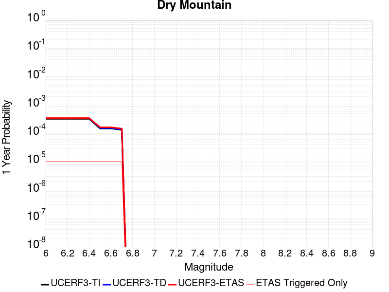 |  |

| Magnitude | 1 wk TI Prob | 1 wk TD Prob | 1 wk ETAS Prob | 1 wk ETAS/TD Gain | 1 wk ETAS Triggered Only | 1 mo TI Prob | 1 mo TD Prob | 1 mo ETAS Prob | 1 mo ETAS/TD Gain | 1 mo ETAS Triggered Only | 1 yr TI Prob | 1 yr TD Prob | 1 yr ETAS Prob | 1 yr ETAS/TD Gain | 1 yr ETAS Triggered Only | 10 yr TI Prob | 10 yr TD Prob | 10 yr ETAS Prob | 10 yr ETAS/TD Gain | 10 yr ETAS Triggered Only |
|-----|-----|-----|-----|-----|-----|-----|-----|-----|-----|-----|-----|-----|-----|-----|-----|-----|-----|-----|-----|-----|
| 6.0 | 6.222801E-6 | 6.43953E-6 | 6.43953E-6 | 1.0 | 0.0 | 2.6668875E-5 | 2.7597784E-5 | 2.7597784E-5 | 1.0 | 0.0 | 3.2464517E-4 | 3.359671E-4 | 3.507976E-4 | 1.0441427 | 1.4835475E-5 | 0.0032417132 | 0.0033561543 | 0.0033857257 | 1.0088111 | 2.967095E-5 |
| 6.1 | 6.222801E-6 | 6.43953E-6 | 6.43953E-6 | 1.0 | 0.0 | 2.6668875E-5 | 2.7597784E-5 | 2.7597784E-5 | 1.0 | 0.0 | 3.2464517E-4 | 3.359671E-4 | 3.507976E-4 | 1.0441427 | 1.4835475E-5 | 0.0032417132 | 0.0033561543 | 0.0033857257 | 1.0088111 | 2.967095E-5 |
| 6.2 | 6.222801E-6 | 6.43953E-6 | 6.43953E-6 | 1.0 | 0.0 | 2.6668875E-5 | 2.7597784E-5 | 2.7597784E-5 | 1.0 | 0.0 | 3.2464517E-4 | 3.359671E-4 | 3.507976E-4 | 1.0441427 | 1.4835475E-5 | 0.0032417132 | 0.0033561543 | 0.0033857257 | 1.0088111 | 2.967095E-5 |
| 6.3 | 6.222801E-6 | 6.43953E-6 | 6.43953E-6 | 1.0 | 0.0 | 2.6668875E-5 | 2.7597784E-5 | 2.7597784E-5 | 1.0 | 0.0 | 3.2464517E-4 | 3.359671E-4 | 3.507976E-4 | 1.0441427 | 1.4835475E-5 | 0.0032417132 | 0.0033561543 | 0.0033857257 | 1.0088111 | 2.967095E-5 |
| 6.4 | 6.222801E-6 | 6.43953E-6 | 6.43953E-6 | 1.0 | 0.0 | 2.6668875E-5 | 2.7597784E-5 | 2.7597784E-5 | 1.0 | 0.0 | 3.2464517E-4 | 3.359671E-4 | 3.507976E-4 | 1.0441427 | 1.4835475E-5 | 0.0032417132 | 0.0033561543 | 0.0033857257 | 1.0088111 | 2.967095E-5 |
| 6.5 | 2.8528623E-6 | 2.9522366E-6 | 2.9522366E-6 | 1.0 | 0.0 | 1.22264955E-5 | 1.265243E-5 | 1.265243E-5 | 1.0 | 0.0 | 1.4884741E-4 | 1.5404115E-4 | 1.6887434E-4 | 1.0962937 | 1.4835475E-5 | 0.0014874774 | 0.0015401972 | 0.0015550097 | 1.0096173 | 1.4835475E-5 |
| 6.6 | 2.8528623E-6 | 2.9522366E-6 | 2.9522366E-6 | 1.0 | 0.0 | 1.22264955E-5 | 1.265243E-5 | 1.265243E-5 | 1.0 | 0.0 | 1.4884741E-4 | 1.5404115E-4 | 1.6887434E-4 | 1.0962937 | 1.4835475E-5 | 0.0014874774 | 0.0015401972 | 0.0015550097 | 1.0096173 | 1.4835475E-5 |
| 6.7 | 2.541E-6 | 2.6294185E-6 | 2.6294185E-6 | 1.0 | 0.0 | 1.0889954E-5 | 1.1268937E-5 | 1.1268937E-5 | 1.0 | 0.0 | 1.3257713E-4 | 1.371993E-4 | 1.5203274E-4 | 1.108116 | 1.4835475E-5 | 0.0013249806 | 0.001371993 | 0.0013868081 | 1.0107982 | 1.4835475E-5 |

## Sierra Madre
*[(top)](#table-of-contents)*

| 1 Week | 1 Month | 1 Year | 10 Year |
|-----|-----|-----|-----|
|  |  |  | 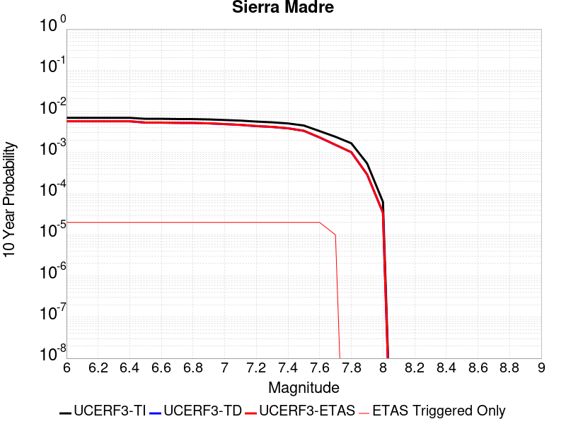 |

| Magnitude | 1 wk TI Prob | 1 wk TD Prob | 1 wk ETAS Prob | 1 wk ETAS/TD Gain | 1 wk ETAS Triggered Only | 1 mo TI Prob | 1 mo TD Prob | 1 mo ETAS Prob | 1 mo ETAS/TD Gain | 1 mo ETAS Triggered Only | 1 yr TI Prob | 1 yr TD Prob | 1 yr ETAS Prob | 1 yr ETAS/TD Gain | 1 yr ETAS Triggered Only | 10 yr TI Prob | 10 yr TD Prob | 10 yr ETAS Prob | 10 yr ETAS/TD Gain | 10 yr ETAS Triggered Only |
|-----|-----|-----|-----|-----|-----|-----|-----|-----|-----|-----|-----|-----|-----|-----|-----|-----|-----|-----|-----|-----|
| 6.0 | 1.3379373E-5 | 1.1002494E-5 | 1.1002494E-5 | 1.0 | 0.0 | 5.7338908E-5 | 4.71527E-5 | 4.71527E-5 | 1.0 | 0.0 | 6.978776E-4 | 5.7393435E-4 | 5.8876135E-4 | 1.0258338 | 1.4835475E-5 | 0.0069569005 | 0.0057248855 | 0.0057543865 | 1.0051532 | 2.967095E-5 |
| 6.1 | 1.3379373E-5 | 1.1002494E-5 | 1.1002494E-5 | 1.0 | 0.0 | 5.7338908E-5 | 4.71527E-5 | 4.71527E-5 | 1.0 | 0.0 | 6.978776E-4 | 5.7393435E-4 | 5.8876135E-4 | 1.0258338 | 1.4835475E-5 | 0.0069569005 | 0.0057248855 | 0.0057543865 | 1.0051532 | 2.967095E-5 |
| 6.2 | 1.3379373E-5 | 1.1002494E-5 | 1.1002494E-5 | 1.0 | 0.0 | 5.7338908E-5 | 4.71527E-5 | 4.71527E-5 | 1.0 | 0.0 | 6.978776E-4 | 5.7393435E-4 | 5.8876135E-4 | 1.0258338 | 1.4835475E-5 | 0.0069569005 | 0.0057248855 | 0.0057543865 | 1.0051532 | 2.967095E-5 |
| 6.3 | 1.3379373E-5 | 1.1002494E-5 | 1.1002494E-5 | 1.0 | 0.0 | 5.7338908E-5 | 4.71527E-5 | 4.71527E-5 | 1.0 | 0.0 | 6.978776E-4 | 5.7393435E-4 | 5.8876135E-4 | 1.0258338 | 1.4835475E-5 | 0.0069569005 | 0.0057248855 | 0.0057543865 | 1.0051532 | 2.967095E-5 |
| 6.4 | 1.3379373E-5 | 1.1002494E-5 | 1.1002494E-5 | 1.0 | 0.0 | 5.7338908E-5 | 4.71527E-5 | 4.71527E-5 | 1.0 | 0.0 | 6.978776E-4 | 5.7393435E-4 | 5.8876135E-4 | 1.0258338 | 1.4835475E-5 | 0.0069569005 | 0.0057248855 | 0.0057543865 | 1.0051532 | 2.967095E-5 |
| 6.5 | 1.26563245E-5 | 1.0231915E-5 | 1.0231915E-5 | 1.0 | 0.0 | 5.4240263E-5 | 4.3850338E-5 | 4.3850338E-5 | 1.0 | 0.0 | 6.601751E-4 | 5.337481E-4 | 5.485757E-4 | 1.02778 | 1.4835475E-5 | 0.006582173 | 0.005324984 | 0.0053544967 | 1.0055424 | 2.967095E-5 |
| 6.6 | 1.26563245E-5 | 1.0231915E-5 | 1.0231915E-5 | 1.0 | 0.0 | 5.4240263E-5 | 4.3850338E-5 | 4.3850338E-5 | 1.0 | 0.0 | 6.601751E-4 | 5.337481E-4 | 5.485757E-4 | 1.02778 | 1.4835475E-5 | 0.006582173 | 0.005324984 | 0.0053544967 | 1.0055424 | 2.967095E-5 |
| 6.7 | 1.2502474E-5 | 1.0068053E-5 | 1.0068053E-5 | 1.0 | 0.0 | 5.3580934E-5 | 4.314809E-5 | 4.314809E-5 | 1.0 | 0.0 | 6.521526E-4 | 5.252024E-4 | 5.4003013E-4 | 1.0282323 | 1.4835475E-5 | 0.0065024206 | 0.0052399314 | 0.005269447 | 1.0056328 | 2.967095E-5 |
| 6.8 | 1.2454966E-5 | 1.0020336E-5 | 1.0020336E-5 | 1.0 | 0.0 | 5.3377335E-5 | 4.2943597E-5 | 4.2943597E-5 | 1.0 | 0.0 | 6.4967526E-4 | 5.2271393E-4 | 5.3754164E-4 | 1.0283668 | 1.4835475E-5 | 0.006477792 | 0.0052151633 | 0.0052446793 | 1.0056597 | 2.967095E-5 |
| 6.9 | 1.2225574E-5 | 9.794303E-6 | 9.794303E-6 | 1.0 | 0.0 | 5.2394265E-5 | 4.1974916E-5 | 4.1974916E-5 | 1.0 | 0.0 | 6.3771347E-4 | 5.1092583E-4 | 5.257537E-4 | 1.0290216 | 1.4835475E-5 | 0.006358865 | 0.0050978274 | 0.005127347 | 1.0057906 | 2.967095E-5 |
| 7.0 | 1.182946E-5 | 9.400827E-6 | 9.400827E-6 | 1.0 | 0.0 | 5.06967E-5 | 4.0288644E-5 | 4.0288644E-5 | 1.0 | 0.0 | 6.1705755E-4 | 4.904049E-4 | 5.0523307E-4 | 1.0302366 | 1.4835475E-5 | 0.006153469 | 0.0048935385 | 0.0049230643 | 1.0060337 | 2.967095E-5 |
| 7.1 | 1.14369095E-5 | 8.987801E-6 | 8.987801E-6 | 1.0 | 0.0 | 4.9014405E-5 | 3.8518585E-5 | 3.8518585E-5 | 1.0 | 0.0 | 5.9658696E-4 | 4.6886384E-4 | 4.8369236E-4 | 1.0316265 | 1.4835475E-5 | 0.005949879 | 0.004679052 | 0.0047085844 | 1.0063115 | 2.967095E-5 |
| 7.2 | 1.0836419E-5 | 8.401154E-6 | 8.401154E-6 | 1.0 | 0.0 | 4.644097E-5 | 3.6004454E-5 | 3.6004454E-5 | 1.0 | 0.0 | 5.652721E-4 | 4.38267E-4 | 4.5309594E-4 | 1.0338355 | 1.4835475E-5 | 0.0056383642 | 0.004374324 | 0.004403865 | 1.0067533 | 2.967095E-5 |
| 7.3 | 1.0403439E-5 | 8.022391E-6 | 8.022391E-6 | 1.0 | 0.0 | 4.4585406E-5 | 3.4381228E-5 | 3.4381228E-5 | 1.0 | 0.0 | 5.426921E-4 | 4.1851195E-4 | 4.3334122E-4 | 1.0354333 | 1.4835475E-5 | 0.005413687 | 0.004177533 | 0.00420708 | 1.0070728 | 2.967095E-5 |
| 7.4 | 9.768864E-6 | 7.415975E-6 | 7.415975E-6 | 1.0 | 0.0 | 4.186589E-5 | 3.1782365E-5 | 3.1782365E-5 | 1.0 | 0.0 | 5.09598E-4 | 3.868825E-4 | 4.0171223E-4 | 1.0383314 | 1.4835475E-5 | 0.0050843097 | 0.0038623814 | 0.003891938 | 1.0076524 | 2.967095E-5 |
| 7.5 | 8.687089E-6 | 6.4515225E-6 | 6.4515225E-6 | 1.0 | 0.0 | 3.722985E-5 | 2.7649094E-5 | 2.7649094E-5 | 1.0 | 0.0 | 4.5317915E-4 | 3.3657657E-4 | 3.5140707E-4 | 1.0440627 | 1.4835475E-5 | 0.004522561 | 0.0033609555 | 0.0033905266 | 1.0087985 | 2.967095E-5 |
| 7.6 | 6.3506063E-6 | 4.4315548E-6 | 4.4315548E-6 | 1.0 | 0.0 | 2.72166E-5 | 1.8992241E-5 | 1.8992241E-5 | 1.0 | 0.0 | 3.3131172E-4 | 2.3120626E-4 | 2.460383E-4 | 1.0641507 | 1.4835475E-5 | 0.003308182 | 0.002309882 | 0.0023394844 | 1.0128156 | 2.967095E-5 |
| 7.7 | 4.62223E-6 | 2.934125E-6 | 2.934125E-6 | 1.0 | 0.0 | 1.9809406E-5 | 1.257476E-5 | 1.257476E-5 | 1.0 | 0.0 | 2.4115283E-4 | 1.5308698E-4 | 1.6792018E-4 | 1.0968939 | 1.4835475E-5 | 0.0024089129 | 0.0015300162 | 0.001544829 | 1.0096815 | 1.4835475E-5 |
| 7.8 | 3.2145008E-6 | 1.9502786E-6 | 1.9502786E-6 | 1.0 | 0.0 | 1.3776359E-5 | 8.35831E-6 | 8.35831E-6 | 1.0 | 0.0 | 1.6771426E-4 | 1.0175769E-4 | 1.0175769E-4 | 1.0 | 0.0 | 0.0016758774 | 0.0010172554 | 0.0010172554 | 1.0 | 0.0 |
| 7.9 | 1.0391769E-6 | 5.6056507E-7 | 5.6056507E-7 | 1.0 | 0.0 | 4.4536077E-6 | 2.4024196E-6 | 2.4024196E-6 | 1.0 | 0.0 | 5.4221324E-5 | 2.924907E-5 | 2.924907E-5 | 1.0 | 0.0 | 5.4208096E-4 | 2.924526E-4 | 2.924526E-4 | 1.0 | 0.0 |
| 8.0 | 1.210983E-7 | 6.615574E-8 | 6.615574E-8 | 1.0 | 0.0 | 5.1899264E-7 | 2.8352457E-7 | 2.8352457E-7 | 1.0 | 0.0 | 6.3187167E-6 | 3.4519064E-6 | 3.4519064E-6 | 1.0 | 0.0 | 6.318537E-5 | 3.4518547E-5 | 3.4518547E-5 | 1.0 | 0.0 |

## Tin Mountain
*[(top)](#table-of-contents)*

| 1 Week | 1 Month | 1 Year | 10 Year |
|-----|-----|-----|-----|
|  |  |  |  |

| Magnitude | 1 wk TI Prob | 1 wk TD Prob | 1 wk ETAS Prob | 1 wk ETAS/TD Gain | 1 wk ETAS Triggered Only | 1 mo TI Prob | 1 mo TD Prob | 1 mo ETAS Prob | 1 mo ETAS/TD Gain | 1 mo ETAS Triggered Only | 1 yr TI Prob | 1 yr TD Prob | 1 yr ETAS Prob | 1 yr ETAS/TD Gain | 1 yr ETAS Triggered Only | 10 yr TI Prob | 10 yr TD Prob | 10 yr ETAS Prob | 10 yr ETAS/TD Gain | 10 yr ETAS Triggered Only |
|-----|-----|-----|-----|-----|-----|-----|-----|-----|-----|-----|-----|-----|-----|-----|-----|-----|-----|-----|-----|-----|
| 6.0 | 4.083776E-6 | 4.1816033E-6 | 4.1816033E-6 | 1.0 | 0.0 | 1.750178E-5 | 1.7921055E-5 | 1.7921055E-5 | 1.0 | 0.0 | 2.1306332E-4 | 2.1817072E-4 | 2.1817072E-4 | 1.0 | 0.0 | 0.0021285915 | 0.0021799312 | 0.0022095372 | 1.0135813 | 2.967095E-5 |
| 6.1 | 4.083776E-6 | 4.1816033E-6 | 4.1816033E-6 | 1.0 | 0.0 | 1.750178E-5 | 1.7921055E-5 | 1.7921055E-5 | 1.0 | 0.0 | 2.1306332E-4 | 2.1817072E-4 | 2.1817072E-4 | 1.0 | 0.0 | 0.0021285915 | 0.0021799312 | 0.0022095372 | 1.0135813 | 2.967095E-5 |
| 6.2 | 4.083776E-6 | 4.1816033E-6 | 4.1816033E-6 | 1.0 | 0.0 | 1.750178E-5 | 1.7921055E-5 | 1.7921055E-5 | 1.0 | 0.0 | 2.1306332E-4 | 2.1817072E-4 | 2.1817072E-4 | 1.0 | 0.0 | 0.0021285915 | 0.0021799312 | 0.0022095372 | 1.0135813 | 2.967095E-5 |
| 6.3 | 4.083776E-6 | 4.1816033E-6 | 4.1816033E-6 | 1.0 | 0.0 | 1.750178E-5 | 1.7921055E-5 | 1.7921055E-5 | 1.0 | 0.0 | 2.1306332E-4 | 2.1817072E-4 | 2.1817072E-4 | 1.0 | 0.0 | 0.0021285915 | 0.0021799312 | 0.0022095372 | 1.0135813 | 2.967095E-5 |
| 6.4 | 4.083776E-6 | 4.1816033E-6 | 4.1816033E-6 | 1.0 | 0.0 | 1.750178E-5 | 1.7921055E-5 | 1.7921055E-5 | 1.0 | 0.0 | 2.1306332E-4 | 2.1817072E-4 | 2.1817072E-4 | 1.0 | 0.0 | 0.0021285915 | 0.0021799312 | 0.0022095372 | 1.0135813 | 2.967095E-5 |
| 6.5 | 2.3143427E-6 | 2.3731973E-6 | 2.3731973E-6 | 1.0 | 0.0 | 9.9185745E-6 | 1.017081E-5 | 1.017081E-5 | 1.0 | 0.0 | 1.2075195E-4 | 1.2382335E-4 | 1.2382335E-4 | 1.0 | 0.0 | 0.0012068636 | 0.0012376196 | 0.0012672538 | 1.0239445 | 2.967095E-5 |
| 6.6 | 2.3143427E-6 | 2.3731973E-6 | 2.3731973E-6 | 1.0 | 0.0 | 9.9185745E-6 | 1.017081E-5 | 1.017081E-5 | 1.0 | 0.0 | 1.2075195E-4 | 1.2382335E-4 | 1.2382335E-4 | 1.0 | 0.0 | 0.0012068636 | 0.0012376196 | 0.0012672538 | 1.0239445 | 2.967095E-5 |
| 6.7 | 1.7029532E-6 | 1.7498236E-6 | 1.7498236E-6 | 1.0 | 0.0 | 7.2983503E-6 | 7.4992254E-6 | 7.4992254E-6 | 1.0 | 0.0 | 8.885379E-5 | 9.129978E-5 | 9.129978E-5 | 1.0 | 0.0 | 8.881827E-4 | 9.1267534E-4 | 9.423192E-4 | 1.0324802 | 2.967095E-5 |
| 6.8 | 1.2914646E-6 | 1.3299643E-6 | 1.3299643E-6 | 1.0 | 0.0 | 5.534837E-6 | 5.699837E-6 | 5.699837E-6 | 1.0 | 0.0 | 6.738455E-5 | 6.939375E-5 | 6.939375E-5 | 1.0 | 0.0 | 6.736412E-4 | 6.9376413E-4 | 7.234145E-4 | 1.0427384 | 2.967095E-5 |
| 6.9 | 5.8708974E-7 | 6.117164E-7 | 6.117164E-7 | 1.0 | 0.0 | 2.5160964E-6 | 2.6216394E-6 | 2.6216394E-6 | 1.0 | 0.0 | 3.0633044E-5 | 3.1918033E-5 | 3.1918033E-5 | 1.0 | 0.0 | 3.0628822E-4 | 3.191386E-4 | 3.3396934E-4 | 1.0464711 | 1.4835475E-5 |
| 7.0 | 4.6248786E-7 | 4.832159E-7 | 4.832159E-7 | 1.0 | 0.0 | 1.9820893E-6 | 2.070924E-6 | 2.070924E-6 | 1.0 | 0.0 | 2.413167E-5 | 2.5213245E-5 | 2.5213245E-5 | 1.0 | 0.0 | 2.412905E-4 | 2.5210754E-4 | 2.6693926E-4 | 1.058831 | 1.4835475E-5 |
| 7.1 | 3.804606E-7 | 3.987274E-7 | 3.987274E-7 | 1.0 | 0.0 | 1.6305444E-6 | 1.7088307E-6 | 1.7088307E-6 | 1.0 | 0.0 | 1.9851697E-5 | 2.080485E-5 | 2.080485E-5 | 1.0 | 0.0 | 1.9849923E-4 | 2.0803239E-4 | 2.2286478E-4 | 1.0712985 | 1.4835475E-5 |
| 7.2 | 3.5864858E-7 | 3.7618082E-7 | 3.7618082E-7 | 1.0 | 0.0 | 1.5370645E-6 | 1.6122027E-6 | 1.6122027E-6 | 1.0 | 0.0 | 1.87136E-5 | 1.9628425E-5 | 1.9628425E-5 | 1.0 | 0.0 | 1.8712023E-4 | 1.9627022E-4 | 2.1110279E-4 | 1.0755721 | 1.4835475E-5 |
| 7.3 | 3.342063E-7 | 3.5064616E-7 | 3.5064616E-7 | 1.0 | 0.0 | 1.4323119E-6 | 1.5027686E-6 | 1.5027686E-6 | 1.0 | 0.0 | 1.7438259E-5 | 1.8296087E-5 | 1.8296087E-5 | 1.0 | 0.0 | 1.743689E-4 | 1.8294911E-4 | 1.9778188E-4 | 1.0810759 | 1.4835475E-5 |
| 7.4 | 2.971242E-7 | 3.116683E-7 | 3.116683E-7 | 1.0 | 0.0 | 1.2733886E-6 | 1.3357208E-6 | 1.3357208E-6 | 1.0 | 0.0 | 1.5503398E-5 | 1.6262313E-5 | 1.6262313E-5 | 1.0 | 0.0 | 1.5502315E-4 | 1.6261451E-4 | 1.6261451E-4 | 1.0 | 0.0 |
| 7.5 | 1.4326713E-7 | 1.5013E-7 | 1.5013E-7 | 1.0 | 0.0 | 6.140018E-7 | 6.434143E-7 | 6.434143E-7 | 1.0 | 0.0 | 7.4754466E-6 | 7.833569E-6 | 7.833569E-6 | 1.0 | 0.0 | 7.475195E-5 | 7.8335695E-5 | 7.8335695E-5 | 1.0 | 0.0 |

## Imperial
*[(top)](#table-of-contents)*

| 1 Week | 1 Month | 1 Year | 10 Year |
|-----|-----|-----|-----|
| 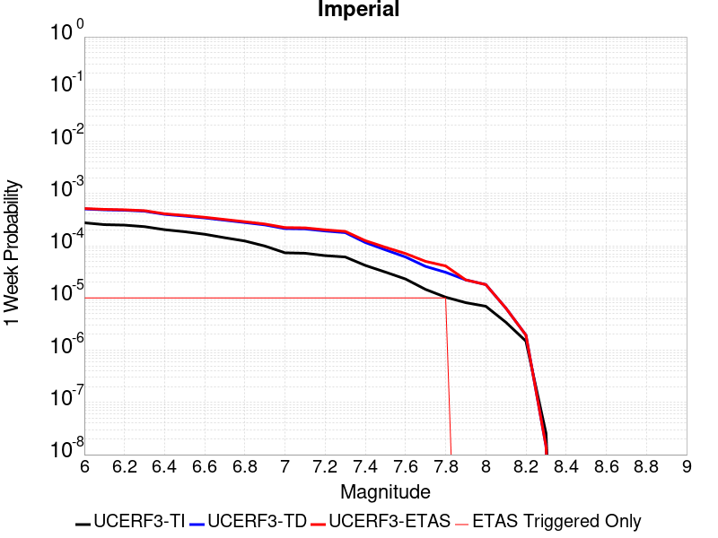 |  | 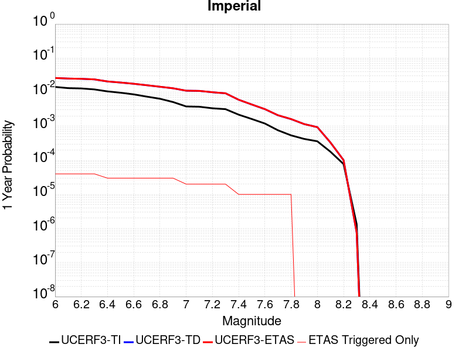 |  |

| Magnitude | 1 wk TI Prob | 1 wk TD Prob | 1 wk ETAS Prob | 1 wk ETAS/TD Gain | 1 wk ETAS Triggered Only | 1 mo TI Prob | 1 mo TD Prob | 1 mo ETAS Prob | 1 mo ETAS/TD Gain | 1 mo ETAS Triggered Only | 1 yr TI Prob | 1 yr TD Prob | 1 yr ETAS Prob | 1 yr ETAS/TD Gain | 1 yr ETAS Triggered Only | 10 yr TI Prob | 10 yr TD Prob | 10 yr ETAS Prob | 10 yr ETAS/TD Gain | 10 yr ETAS Triggered Only |
|-----|-----|-----|-----|-----|-----|-----|-----|-----|-----|-----|-----|-----|-----|-----|-----|-----|-----|-----|-----|-----|
| 6.0 | 2.7496446E-4 | 5.0617394E-4 | 5.0617394E-4 | 1.0 | 0.0 | 0.0011778869 | 0.0021675527 | 0.0021675527 | 1.0 | 0.0 | 0.0142467655 | 0.026071765 | 0.026100662 | 1.0011084 | 2.967095E-5 | 0.13367249 | 0.22825943 | 0.22828233 | 1.0001004 | 2.967095E-5 |
| 6.1 | 2.5356023E-4 | 4.871314E-4 | 4.871314E-4 | 1.0 | 0.0 | 0.001086234 | 0.0020860739 | 0.0020860739 | 1.0 | 0.0 | 0.013144928 | 0.025099972 | 0.0251289 | 1.0011524 | 2.967095E-5 | 0.123940155 | 0.2196713 | 0.21969445 | 1.0001054 | 2.967095E-5 |
| 6.2 | 2.4820742E-4 | 4.780734E-4 | 4.780734E-4 | 1.0 | 0.0 | 0.0010633124 | 0.0020473152 | 0.0020473152 | 1.0 | 0.0 | 0.01286919 | 0.02463939 | 0.02466833 | 1.0011746 | 2.967095E-5 | 0.12148927 | 0.21617451 | 0.21619777 | 1.0001075 | 2.967095E-5 |
| 6.3 | 2.3205351E-4 | 4.5939727E-4 | 4.5939727E-4 | 1.0 | 0.0 | 9.94136E-4 | 0.0019673968 | 0.0019673968 | 1.0 | 0.0 | 0.012036599 | 0.023686247 | 0.023715215 | 1.001223 | 2.967095E-5 | 0.11405133 | 0.20810692 | 0.20813042 | 1.0001129 | 2.967095E-5 |
| 6.4 | 2.0304754E-4 | 3.9924437E-4 | 3.9924437E-4 | 1.0 | 0.0 | 8.6991355E-4 | 0.0017099399 | 0.0017099399 | 1.0 | 0.0 | 0.010539869 | 0.020620007 | 0.020649066 | 1.0014093 | 2.967095E-5 | 0.100537635 | 0.18524034 | 0.18526451 | 1.0001305 | 2.967095E-5 |
| 6.5 | 1.854992E-4 | 3.7033422E-4 | 3.7033422E-4 | 1.0 | 0.0 | 7.9475436E-4 | 0.0015861937 | 0.0015861937 | 1.0 | 0.0 | 0.009633281 | 0.019142171 | 0.019171275 | 1.0015204 | 2.967095E-5 | 0.0922623 | 0.17346317 | 0.1734877 | 1.0001414 | 2.967095E-5 |
| 6.6 | 1.6586106E-4 | 3.407536E-4 | 3.407536E-4 | 1.0 | 0.0 | 7.106394E-4 | 0.0014595655 | 0.0014595655 | 1.0 | 0.0 | 0.008617763 | 0.017627055 | 0.017656203 | 1.0016536 | 2.967095E-5 | 0.08291132 | 0.1609287 | 0.1609536 | 1.0001547 | 2.967095E-5 |
| 6.7 | 1.4224656E-4 | 3.080211E-4 | 3.080211E-4 | 1.0 | 0.0 | 6.094856E-4 | 0.0013194308 | 0.0013194308 | 1.0 | 0.0 | 0.0073952693 | 0.015947655 | 0.015976852 | 1.0018308 | 2.967095E-5 | 0.07153955 | 0.14662142 | 0.14664674 | 1.0001727 | 2.967095E-5 |
| 6.8 | 1.2317259E-4 | 2.782082E-4 | 2.782082E-4 | 1.0 | 0.0 | 5.2777573E-4 | 0.0011917822 | 0.0011917822 | 1.0 | 0.0 | 0.0064067547 | 0.014414799 | 0.014444043 | 1.0020287 | 2.967095E-5 | 0.06225166 | 0.13305615 | 0.13308187 | 1.0001934 | 2.967095E-5 |
| 6.9 | 9.859898E-5 | 2.5036454E-4 | 2.5036454E-4 | 1.0 | 0.0 | 4.2249862E-4 | 0.0010725539 | 0.0010725539 | 1.0 | 0.0 | 0.0051317946 | 0.012981123 | 0.013010409 | 1.002256 | 2.967095E-5 | 0.05014893 | 0.11949689 | 0.11952302 | 1.0002186 | 2.967095E-5 |
| 7.0 | 7.3191884E-5 | 2.1283218E-4 | 2.1283218E-4 | 1.0 | 0.0 | 3.136418E-4 | 9.118222E-4 | 9.118222E-4 | 1.0 | 0.0 | 0.003811904 | 0.011045614 | 0.011060286 | 1.0013282 | 1.4835475E-5 | 0.037471764 | 0.10213272 | 0.102146044 | 1.0001304 | 1.4835475E-5 |
| 7.1 | 7.1760296E-5 | 2.0984357E-4 | 2.0984357E-4 | 1.0 | 0.0 | 3.0750787E-4 | 8.990228E-4 | 8.990228E-4 | 1.0 | 0.0 | 0.003737482 | 0.010891349 | 0.010906023 | 1.0013473 | 1.4835475E-5 | 0.03675245 | 0.10076844 | 0.100781776 | 1.0001324 | 1.4835475E-5 |
| 7.2 | 6.46614E-5 | 1.9152292E-4 | 1.9152292E-4 | 1.0 | 0.0 | 2.7709085E-4 | 8.2055735E-4 | 8.2055735E-4 | 1.0 | 0.0 | 0.0033683628 | 0.009945146 | 0.009959834 | 1.0014769 | 1.4835475E-5 | 0.033177625 | 0.092574164 | 0.09258763 | 1.0001454 | 1.4835475E-5 |
| 7.3 | 6.088115E-5 | 1.7823307E-4 | 1.7823307E-4 | 1.0 | 0.0 | 2.6089314E-4 | 7.6363527E-4 | 7.6363527E-4 | 1.0 | 0.0 | 0.0031717476 | 0.009258202 | 0.0092729 | 1.0015876 | 1.4835475E-5 | 0.031268585 | 0.08662278 | 0.086636335 | 1.0001564 | 1.4835475E-5 |
| 7.4 | 4.199346E-5 | 1.15218405E-4 | 1.15218405E-4 | 1.0 | 0.0 | 1.7995955E-4 | 4.937006E-4 | 4.937006E-4 | 1.0 | 0.0 | 0.0021888057 | 0.0059944084 | 0.0059944084 | 1.0 | 0.0 | 0.02167372 | 0.0574905 | 0.0574905 | 1.0 | 0.0 |
| 7.5 | 3.130448E-5 | 8.342767E-5 | 8.342767E-5 | 1.0 | 0.0 | 1.3415517E-4 | 3.5749847E-4 | 3.5749847E-4 | 1.0 | 0.0 | 0.0016321153 | 0.004343917 | 0.004343917 | 1.0 | 0.0 | 0.016201803 | 0.042174812 | 0.042174812 | 1.0 | 0.0 |
| 7.6 | 2.3074248E-5 | 6.0925595E-5 | 6.0925595E-5 | 1.0 | 0.0 | 9.888588E-5 | 2.6108368E-4 | 2.6108368E-4 | 1.0 | 0.0 | 0.0012032706 | 0.003174084 | 0.003174084 | 1.0 | 0.0 | 0.011967761 | 0.031063339 | 0.031063339 | 1.0 | 0.0 |
| 7.7 | 1.45864815E-5 | 4.0191844E-5 | 4.0191844E-5 | 1.0 | 0.0 | 6.2511994E-5 | 1.7223942E-4 | 1.7223942E-4 | 1.0 | 0.0 | 7.608177E-4 | 0.0020950034 | 0.0020950034 | 1.0 | 0.0 | 0.007582182 | 0.02065856 | 0.02065856 | 1.0 | 0.0 |
| 7.8 | 1.0352979E-5 | 3.1018015E-5 | 3.1018015E-5 | 1.0 | 0.0 | 4.4369157E-5 | 1.329276E-4 | 1.329276E-4 | 1.0 | 0.0 | 5.400606E-4 | 0.0016171944 | 0.0016171944 | 1.0 | 0.0 | 0.0053875 | 0.016043035 | 0.016043035 | 1.0 | 0.0 |
| 7.9 | 8.137906E-6 | 2.2195005E-5 | 2.2195005E-5 | 1.0 | 0.0 | 3.4876273E-5 | 9.511799E-5 | 9.511799E-5 | 1.0 | 0.0 | 4.2453592E-4 | 0.0011574472 | 0.0011574472 | 1.0 | 0.0 | 0.004237258 | 0.011639292 | 0.011639292 | 1.0 | 0.0 |
| 8.0 | 6.93792E-6 | 1.8048257E-5 | 1.8048257E-5 | 1.0 | 0.0 | 2.9733603E-5 | 7.734738E-5 | 7.734738E-5 | 1.0 | 0.0 | 3.6194647E-4 | 9.412983E-4 | 9.412983E-4 | 1.0 | 0.0 | 0.0036135751 | 0.009520078 | 0.009520078 | 1.0 | 0.0 |
| 8.1 | 3.4286315E-6 | 6.398254E-6 | 6.398254E-6 | 1.0 | 0.0 | 1.4694053E-5 | 2.7420801E-5 | 2.7420801E-5 | 1.0 | 0.0 | 1.7888541E-4 | 3.3379722E-4 | 3.3379722E-4 | 1.0 | 0.0 | 0.0017874148 | 0.0034951582 | 0.0034951582 | 1.0 | 0.0 |
| 8.2 | 1.4906886E-6 | 1.9438494E-6 | 1.9438494E-6 | 1.0 | 0.0 | 6.3886496E-6 | 8.330757E-6 | 8.330757E-6 | 1.0 | 0.0 | 7.7779034E-5 | 1.0142227E-4 | 1.0142227E-4 | 1.0 | 0.0 | 7.775182E-4 | 0.0011112177 | 0.0011112177 | 1.0 | 0.0 |
| 8.3 | 2.5758007E-8 | 1.4573161E-8 | 1.4573161E-8 | 1.0 | 0.0 | 1.10391454E-7 | 6.245641E-8 | 6.245641E-8 | 1.0 | 0.0 | 1.3440151E-6 | 7.6040675E-7 | 7.6040675E-7 | 1.0 | 0.0 | 1.344007E-5 | 7.926732E-6 | 7.926732E-6 | 1.0 | 0.0 |

## Mono Lake 2011 CFM
*[(top)](#table-of-contents)*

| 1 Week | 1 Month | 1 Year | 10 Year |
|-----|-----|-----|-----|
|  |  |  | 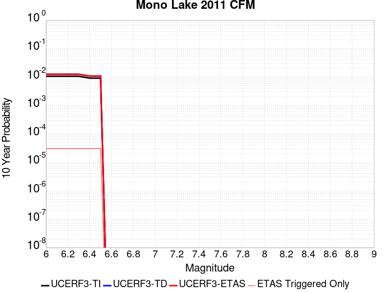 |

| Magnitude | 1 wk TI Prob | 1 wk TD Prob | 1 wk ETAS Prob | 1 wk ETAS/TD Gain | 1 wk ETAS Triggered Only | 1 mo TI Prob | 1 mo TD Prob | 1 mo ETAS Prob | 1 mo ETAS/TD Gain | 1 mo ETAS Triggered Only | 1 yr TI Prob | 1 yr TD Prob | 1 yr ETAS Prob | 1 yr ETAS/TD Gain | 1 yr ETAS Triggered Only | 10 yr TI Prob | 10 yr TD Prob | 10 yr ETAS Prob | 10 yr ETAS/TD Gain | 10 yr ETAS Triggered Only |
|-----|-----|-----|-----|-----|-----|-----|-----|-----|-----|-----|-----|-----|-----|-----|-----|-----|-----|-----|-----|-----|
| 6.0 | 2.0341662E-5 | 2.3830875E-5 | 2.3830875E-5 | 1.0 | 0.0 | 8.717564E-5 | 1.0213132E-4 | 1.0213132E-4 | 1.0 | 0.0 | 0.0010608466 | 0.001243271 | 0.001243271 | 1.0 | 0.0 | 0.010557966 | 0.012415242 | 0.0124445455 | 1.0023602 | 2.967095E-5 |
| 6.1 | 2.0341662E-5 | 2.3830875E-5 | 2.3830875E-5 | 1.0 | 0.0 | 8.717564E-5 | 1.0213132E-4 | 1.0213132E-4 | 1.0 | 0.0 | 0.0010608466 | 0.001243271 | 0.001243271 | 1.0 | 0.0 | 0.010557966 | 0.012415242 | 0.0124445455 | 1.0023602 | 2.967095E-5 |
| 6.2 | 2.0341662E-5 | 2.3830875E-5 | 2.3830875E-5 | 1.0 | 0.0 | 8.717564E-5 | 1.0213132E-4 | 1.0213132E-4 | 1.0 | 0.0 | 0.0010608466 | 0.001243271 | 0.001243271 | 1.0 | 0.0 | 0.010557966 | 0.012415242 | 0.0124445455 | 1.0023602 | 2.967095E-5 |
| 6.3 | 2.0341662E-5 | 2.3830875E-5 | 2.3830875E-5 | 1.0 | 0.0 | 8.717564E-5 | 1.0213132E-4 | 1.0213132E-4 | 1.0 | 0.0 | 0.0010608466 | 0.001243271 | 0.001243271 | 1.0 | 0.0 | 0.010557966 | 0.012415242 | 0.0124445455 | 1.0023602 | 2.967095E-5 |
| 6.4 | 1.749821E-5 | 2.049331E-5 | 2.049331E-5 | 1.0 | 0.0 | 7.499018E-5 | 8.782847E-5 | 8.782847E-5 | 1.0 | 0.0 | 9.1262296E-4 | 0.0010693116 | 0.0010693116 | 1.0 | 0.0 | 0.009088841 | 0.010693077 | 0.01072243 | 1.0027452 | 2.967095E-5 |
| 6.5 | 1.749821E-5 | 2.049331E-5 | 2.049331E-5 | 1.0 | 0.0 | 7.499018E-5 | 8.782847E-5 | 8.782847E-5 | 1.0 | 0.0 | 9.1262296E-4 | 0.0010693116 | 0.0010693116 | 1.0 | 0.0 | 0.009088841 | 0.010693077 | 0.01072243 | 1.0027452 | 2.967095E-5 |

## Hollywood
*[(top)](#table-of-contents)*

| 1 Week | 1 Month | 1 Year | 10 Year |
|-----|-----|-----|-----|
|  |  |  |  |

| Magnitude | 1 wk TI Prob | 1 wk TD Prob | 1 wk ETAS Prob | 1 wk ETAS/TD Gain | 1 wk ETAS Triggered Only | 1 mo TI Prob | 1 mo TD Prob | 1 mo ETAS Prob | 1 mo ETAS/TD Gain | 1 mo ETAS Triggered Only | 1 yr TI Prob | 1 yr TD Prob | 1 yr ETAS Prob | 1 yr ETAS/TD Gain | 1 yr ETAS Triggered Only | 10 yr TI Prob | 10 yr TD Prob | 10 yr ETAS Prob | 10 yr ETAS/TD Gain | 10 yr ETAS Triggered Only |
|-----|-----|-----|-----|-----|-----|-----|-----|-----|-----|-----|-----|-----|-----|-----|-----|-----|-----|-----|-----|-----|
| 6.0 | 1.24487615E-5 | 1.2594004E-5 | 1.2594004E-5 | 1.0 | 0.0 | 5.3350745E-5 | 5.397321E-5 | 5.397321E-5 | 1.0 | 0.0 | 6.4935174E-4 | 6.569304E-4 | 6.569304E-4 | 1.0 | 0.0 | 0.0064745755 | 0.006550372 | 0.006579849 | 1.0045 | 2.967095E-5 |
| 6.1 | 1.24487615E-5 | 1.2594004E-5 | 1.2594004E-5 | 1.0 | 0.0 | 5.3350745E-5 | 5.397321E-5 | 5.397321E-5 | 1.0 | 0.0 | 6.4935174E-4 | 6.569304E-4 | 6.569304E-4 | 1.0 | 0.0 | 0.0064745755 | 0.006550372 | 0.006579849 | 1.0045 | 2.967095E-5 |
| 6.2 | 1.24487615E-5 | 1.2594004E-5 | 1.2594004E-5 | 1.0 | 0.0 | 5.3350745E-5 | 5.397321E-5 | 5.397321E-5 | 1.0 | 0.0 | 6.4935174E-4 | 6.569304E-4 | 6.569304E-4 | 1.0 | 0.0 | 0.0064745755 | 0.006550372 | 0.006579849 | 1.0045 | 2.967095E-5 |
| 6.3 | 1.24487615E-5 | 1.2594004E-5 | 1.2594004E-5 | 1.0 | 0.0 | 5.3350745E-5 | 5.397321E-5 | 5.397321E-5 | 1.0 | 0.0 | 6.4935174E-4 | 6.569304E-4 | 6.569304E-4 | 1.0 | 0.0 | 0.0064745755 | 0.006550372 | 0.006579849 | 1.0045 | 2.967095E-5 |
| 6.4 | 1.2431024E-5 | 1.2574616E-5 | 1.2574616E-5 | 1.0 | 0.0 | 5.327473E-5 | 5.3890126E-5 | 5.3890126E-5 | 1.0 | 0.0 | 6.4842677E-4 | 6.5591943E-4 | 6.5591943E-4 | 1.0 | 0.0 | 0.0064653796 | 0.006540322 | 0.006569799 | 1.004507 | 2.967095E-5 |
| 6.5 | 1.1242222E-5 | 1.131853E-5 | 1.131853E-5 | 1.0 | 0.0 | 4.8180063E-5 | 4.85071E-5 | 4.85071E-5 | 1.0 | 0.0 | 5.864344E-4 | 5.904166E-4 | 5.904166E-4 | 1.0 | 0.0 | 0.0058488925 | 0.0058887666 | 0.0059182625 | 1.0050089 | 2.967095E-5 |
| 6.6 | 1.1234066E-5 | 1.1309643E-5 | 1.1309643E-5 | 1.0 | 0.0 | 4.8145106E-5 | 4.8469014E-5 | 4.8469014E-5 | 1.0 | 0.0 | 5.86009E-4 | 5.8995315E-4 | 5.8995315E-4 | 1.0 | 0.0 | 0.005844661 | 0.005884157 | 0.005913653 | 1.0050129 | 2.967095E-5 |
| 6.7 | 1.12294E-5 | 1.1304386E-5 | 1.1304386E-5 | 1.0 | 0.0 | 4.812511E-5 | 4.8446484E-5 | 4.8446484E-5 | 1.0 | 0.0 | 5.857657E-4 | 5.89679E-4 | 5.89679E-4 | 1.0 | 0.0 | 0.0058422405 | 0.0058814296 | 0.0059109265 | 1.0050151 | 2.967095E-5 |
| 6.8 | 1.0252819E-5 | 1.02190925E-5 | 1.02190925E-5 | 1.0 | 0.0 | 4.3939912E-5 | 4.379539E-5 | 4.379539E-5 | 1.0 | 0.0 | 5.3483713E-4 | 5.3308054E-4 | 5.3308054E-4 | 1.0 | 0.0 | 0.005335517 | 0.005318244 | 0.005333001 | 1.0027747 | 1.4835475E-5 |
| 6.9 | 9.252289E-6 | 9.110875E-6 | 9.110875E-6 | 1.0 | 0.0 | 3.9652066E-5 | 3.904603E-5 | 3.904603E-5 | 1.0 | 0.0 | 4.8265693E-4 | 4.752834E-4 | 4.752834E-4 | 1.0 | 0.0 | 0.0048161 | 0.004742842 | 0.0047576074 | 1.0031132 | 1.4835475E-5 |
| 7.0 | 8.474604E-6 | 8.258771E-6 | 8.258771E-6 | 1.0 | 0.0 | 3.6319227E-5 | 3.5394263E-5 | 3.5394263E-5 | 1.0 | 0.0 | 4.4209688E-4 | 4.3084138E-4 | 4.3084138E-4 | 1.0 | 0.0 | 0.004412184 | 0.0043002116 | 0.0043149833 | 1.0034351 | 1.4835475E-5 |
| 7.1 | 6.643643E-6 | 6.268758E-6 | 6.268758E-6 | 1.0 | 0.0 | 2.8472443E-5 | 2.6865831E-5 | 2.6865831E-5 | 1.0 | 0.0 | 3.4659685E-4 | 3.2704283E-4 | 3.2704283E-4 | 1.0 | 0.0 | 0.0034605677 | 0.0032656614 | 0.0032804485 | 1.004528 | 1.4835475E-5 |
| 7.2 | 5.549002E-6 | 5.1090346E-6 | 5.1090346E-6 | 1.0 | 0.0 | 2.378122E-5 | 2.1895681E-5 | 2.1895681E-5 | 1.0 | 0.0 | 2.8949787E-4 | 2.6654746E-4 | 2.6654746E-4 | 1.0 | 0.0 | 0.0028912104 | 0.0026622938 | 0.00267709 | 1.0055577 | 1.4835475E-5 |
| 7.3 | 4.3059727E-6 | 3.960157E-6 | 3.960157E-6 | 1.0 | 0.0 | 1.8454039E-5 | 1.6971991E-5 | 1.6971991E-5 | 1.0 | 0.0 | 2.2465475E-4 | 2.066145E-4 | 2.066145E-4 | 1.0 | 0.0 | 0.0022442779 | 0.002064234 | 0.002064234 | 1.0 | 0.0 |
| 7.4 | 2.8550733E-6 | 2.7015085E-6 | 2.7015085E-6 | 1.0 | 0.0 | 1.2235971E-5 | 1.1577842E-5 | 1.1577842E-5 | 1.0 | 0.0 | 1.4896276E-4 | 1.4095116E-4 | 1.4095116E-4 | 1.0 | 0.0 | 0.0014886294 | 0.0014086227 | 0.0014086227 | 1.0 | 0.0 |
| 7.5 | 1.9927045E-6 | 1.8978045E-6 | 1.8978045E-6 | 1.0 | 0.0 | 8.540134E-6 | 8.133423E-6 | 8.133423E-6 | 1.0 | 0.0 | 1.0397117E-4 | 9.901996E-5 | 9.901996E-5 | 1.0 | 0.0 | 0.0010392254 | 9.89762E-4 | 9.89762E-4 | 1.0 | 0.0 |
| 7.6 | 1.345084E-6 | 1.2217173E-6 | 1.2217173E-6 | 1.0 | 0.0 | 5.764633E-6 | 5.2359205E-6 | 5.2359205E-6 | 1.0 | 0.0 | 7.018215E-5 | 6.374549E-5 | 6.374549E-5 | 1.0 | 0.0 | 7.0159987E-4 | 6.37274E-4 | 6.37274E-4 | 1.0 | 0.0 |
| 7.7 | 7.6835164E-7 | 6.2785705E-7 | 6.2785705E-7 | 1.0 | 0.0 | 3.2929315E-6 | 2.6908133E-6 | 2.6908133E-6 | 1.0 | 0.0 | 4.00907E-5 | 3.2760174E-5 | 3.2760174E-5 | 1.0 | 0.0 | 4.0083472E-4 | 3.275549E-4 | 3.275549E-4 | 1.0 | 0.0 |
| 7.8 | 3.6562128E-7 | 2.4541984E-7 | 2.4541984E-7 | 1.0 | 0.0 | 1.5669474E-6 | 1.0517989E-6 | 1.0517989E-6 | 1.0 | 0.0 | 1.9077417E-5 | 1.280558E-5 | 1.280558E-5 | 1.0 | 0.0 | 1.907578E-4 | 1.2804879E-4 | 1.2804879E-4 | 1.0 | 0.0 |
| 7.9 | 7.5024424E-8 | 5.383205E-8 | 5.383205E-8 | 1.0 | 0.0 | 3.215332E-7 | 2.3070878E-7 | 2.3070878E-7 | 1.0 | 0.0 | 3.91466E-6 | 2.808877E-6 | 2.808877E-6 | 1.0 | 0.0 | 3.9145907E-5 | 2.8088545E-5 | 2.8088545E-5 | 1.0 | 0.0 |

## Malibu Coast alt 1
*[(top)](#table-of-contents)*

| 1 Week | 1 Month | 1 Year | 10 Year |
|-----|-----|-----|-----|
|  |  | 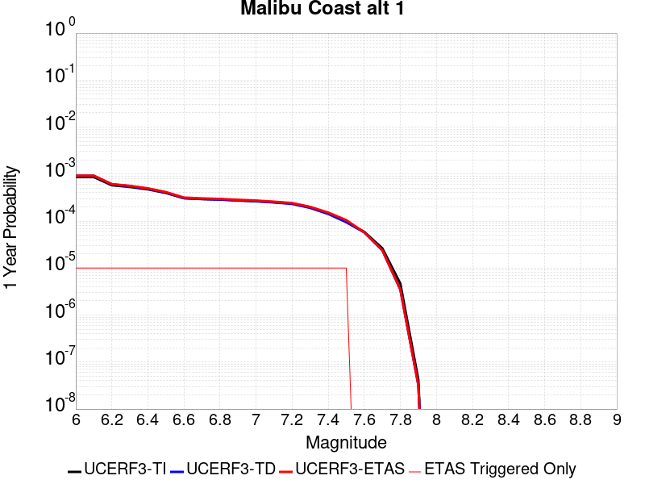 |  |

| Magnitude | 1 wk TI Prob | 1 wk TD Prob | 1 wk ETAS Prob | 1 wk ETAS/TD Gain | 1 wk ETAS Triggered Only | 1 mo TI Prob | 1 mo TD Prob | 1 mo ETAS Prob | 1 mo ETAS/TD Gain | 1 mo ETAS Triggered Only | 1 yr TI Prob | 1 yr TD Prob | 1 yr ETAS Prob | 1 yr ETAS/TD Gain | 1 yr ETAS Triggered Only | 10 yr TI Prob | 10 yr TD Prob | 10 yr ETAS Prob | 10 yr ETAS/TD Gain | 10 yr ETAS Triggered Only |
|-----|-----|-----|-----|-----|-----|-----|-----|-----|-----|-----|-----|-----|-----|-----|-----|-----|-----|-----|-----|-----|
| 6.0 | 1.6572556E-5 | 1.7599077E-5 | 1.7599077E-5 | 1.0 | 0.0 | 7.102331E-5 | 7.542255E-5 | 7.542255E-5 | 1.0 | 0.0 | 8.6436566E-4 | 9.179015E-4 | 9.327234E-4 | 1.0161475 | 1.4835475E-5 | 0.0086101135 | 0.009143036 | 0.009172436 | 1.0032156 | 2.967095E-5 |
| 6.1 | 1.6572556E-5 | 1.7599077E-5 | 1.7599077E-5 | 1.0 | 0.0 | 7.102331E-5 | 7.542255E-5 | 7.542255E-5 | 1.0 | 0.0 | 8.6436566E-4 | 9.179015E-4 | 9.327234E-4 | 1.0161475 | 1.4835475E-5 | 0.0086101135 | 0.009143036 | 0.009172436 | 1.0032156 | 2.967095E-5 |
| 6.2 | 1.1085717E-5 | 1.1557752E-5 | 1.1557752E-5 | 1.0 | 0.0 | 4.750935E-5 | 4.9532304E-5 | 4.9532304E-5 | 1.0 | 0.0 | 5.782728E-4 | 6.028925E-4 | 6.17719E-4 | 1.0245923 | 1.4835475E-5 | 0.0057677035 | 0.00601294 | 0.0060424325 | 1.0049049 | 2.967095E-5 |
| 6.3 | 1.0208568E-5 | 1.0592778E-5 | 1.0592778E-5 | 1.0 | 0.0 | 4.375027E-5 | 4.539685E-5 | 4.539685E-5 | 1.0 | 0.0 | 5.325294E-4 | 5.525694E-4 | 5.673967E-4 | 1.0268333 | 1.4835475E-5 | 0.0053125503 | 0.0055122627 | 0.00554177 | 1.0053531 | 2.967095E-5 |
| 6.4 | 9.0682315E-6 | 9.343099E-6 | 9.343099E-6 | 1.0 | 0.0 | 3.8863272E-5 | 4.004125E-5 | 4.004125E-5 | 1.0 | 0.0 | 4.730576E-4 | 4.873952E-4 | 5.0222344E-4 | 1.0304234 | 1.4835475E-5 | 0.0047205184 | 0.004863476 | 0.0048930026 | 1.0060711 | 2.967095E-5 |
| 6.5 | 7.605796E-6 | 7.748954E-6 | 7.748954E-6 | 1.0 | 0.0 | 3.259586E-5 | 3.3209388E-5 | 3.3209388E-5 | 1.0 | 0.0 | 3.9678233E-4 | 4.0425058E-4 | 4.1908005E-4 | 1.0366839 | 1.4835475E-5 | 0.0039607463 | 0.0040352903 | 0.004064841 | 1.0073231 | 2.967095E-5 |
| 6.6 | 5.889873E-6 | 5.879794E-6 | 5.879794E-6 | 1.0 | 0.0 | 2.5242069E-5 | 2.5198875E-5 | 2.5198875E-5 | 1.0 | 0.0 | 3.0727885E-4 | 3.067532E-4 | 3.215841E-4 | 1.0483481 | 1.4835475E-5 | 0.003068543 | 0.0030633106 | 0.0030928906 | 1.0096562 | 2.967095E-5 |
| 6.7 | 5.66586E-6 | 5.6418867E-6 | 5.6418867E-6 | 1.0 | 0.0 | 2.428203E-5 | 2.4179291E-5 | 2.4179291E-5 | 1.0 | 0.0 | 2.955936E-4 | 2.943432E-4 | 3.091743E-4 | 1.0503871 | 1.4835475E-5 | 0.0029520073 | 0.0029395455 | 0.0029691292 | 1.010064 | 2.967095E-5 |
| 6.8 | 5.521556E-6 | 5.489667E-6 | 5.489667E-6 | 1.0 | 0.0 | 2.3663597E-5 | 2.3526933E-5 | 2.3526933E-5 | 1.0 | 0.0 | 2.880662E-4 | 2.8640285E-4 | 3.0123407E-4 | 1.0517845 | 1.4835475E-5 | 0.0028769306 | 0.0028603491 | 0.0028899352 | 1.0103436 | 2.967095E-5 |
| 6.9 | 5.29752E-6 | 5.2501605E-6 | 5.2501605E-6 | 1.0 | 0.0 | 2.270346E-5 | 2.2500495E-5 | 2.2500495E-5 | 1.0 | 0.0 | 2.7637955E-4 | 2.7390916E-4 | 2.887406E-4 | 1.0541472 | 1.4835475E-5 | 0.0027603607 | 0.0027357258 | 0.0027653158 | 1.0108161 | 2.967095E-5 |
| 7.0 | 5.106743E-6 | 5.0478993E-6 | 5.0478993E-6 | 1.0 | 0.0 | 2.1885859E-5 | 2.1633676E-5 | 2.1633676E-5 | 1.0 | 0.0 | 2.6642776E-4 | 2.6335823E-4 | 2.781898E-4 | 1.0563171 | 1.4835475E-5 | 0.0026610855 | 0.002630471 | 0.002660064 | 1.01125 | 2.967095E-5 |
| 7.1 | 4.8469647E-6 | 4.770581E-6 | 4.770581E-6 | 1.0 | 0.0 | 2.0772539E-5 | 2.0445188E-5 | 2.0445188E-5 | 1.0 | 0.0 | 2.528763E-4 | 2.488918E-4 | 2.6372357E-4 | 1.0595913 | 1.4835475E-5 | 0.0025258875 | 0.0024861386 | 0.0025157358 | 1.0119048 | 2.967095E-5 |
| 7.2 | 4.545514E-6 | 4.4483872E-6 | 4.4483872E-6 | 1.0 | 0.0 | 1.9480629E-5 | 1.9064377E-5 | 1.9064377E-5 | 1.0 | 0.0 | 2.3715083E-4 | 2.3208413E-4 | 2.4691617E-4 | 1.063908 | 1.4835475E-5 | 0.0023689792 | 0.002318425 | 0.0023480272 | 1.0127683 | 2.967095E-5 |
| 7.3 | 3.794097E-6 | 3.6520878E-6 | 3.6520878E-6 | 1.0 | 0.0 | 1.6260314E-5 | 1.565171E-5 | 1.565171E-5 | 1.0 | 0.0 | 1.9795135E-4 | 1.9054295E-4 | 2.053756E-4 | 1.0778441 | 1.4835475E-5 | 0.001977751 | 0.0019038005 | 0.0019186077 | 1.0077777 | 1.4835475E-5 |
| 7.4 | 2.808217E-6 | 2.7191927E-6 | 2.7191927E-6 | 1.0 | 0.0 | 1.203516E-5 | 1.1653631E-5 | 1.1653631E-5 | 1.0 | 0.0 | 1.4651821E-4 | 1.4187374E-4 | 1.5670712E-4 | 1.1045533 | 1.4835475E-5 | 0.0014642165 | 0.0014178344 | 0.0014326489 | 1.0104487 | 1.4835475E-5 |
| 7.5 | 1.83809E-6 | 1.8191497E-6 | 1.8191497E-6 | 1.0 | 0.0 | 7.877505E-6 | 7.796332E-6 | 7.796332E-6 | 1.0 | 0.0 | 9.59044E-5 | 9.4916235E-5 | 1.097503E-4 | 1.1562859 | 1.4835475E-5 | 9.5863023E-4 | 9.4875897E-4 | 9.635804E-4 | 1.0156219 | 1.4835475E-5 |
| 7.6 | 1.1292672E-6 | 1.1001966E-6 | 1.1001966E-6 | 1.0 | 0.0 | 4.839708E-6 | 4.71512E-6 | 4.71512E-6 | 1.0 | 0.0 | 5.8921847E-5 | 5.7405094E-5 | 5.7405094E-5 | 1.0 | 0.0 | 5.890623E-4 | 5.7390425E-4 | 5.7390425E-4 | 1.0 | 0.0 |
| 7.7 | 5.065272E-7 | 4.6094138E-7 | 4.6094138E-7 | 1.0 | 0.0 | 2.170829E-6 | 1.9754616E-6 | 1.9754616E-6 | 1.0 | 0.0 | 2.6429525E-5 | 2.405099E-5 | 2.405099E-5 | 1.0 | 0.0 | 2.642638E-4 | 2.40485E-4 | 2.40485E-4 | 1.0 | 0.0 |
| 7.8 | 8.952991E-8 | 6.708902E-8 | 6.708902E-8 | 1.0 | 0.0 | 3.8369956E-7 | 2.8752436E-7 | 2.8752436E-7 | 1.0 | 0.0 | 4.671532E-6 | 3.5006035E-6 | 3.5006035E-6 | 1.0 | 0.0 | 4.671434E-5 | 3.50055E-5 | 3.50055E-5 | 1.0 | 0.0 |
| 7.9 | 8.007447E-10 | 6.161065E-10 | 6.161065E-10 | 1.0 | 0.0 | 3.4317629E-9 | 2.640456E-9 | 2.640456E-9 | 1.0 | 0.0 | 4.1781714E-8 | 3.2147554E-8 | 3.2147554E-8 | 1.0 | 0.0 | 4.1781706E-7 | 3.214755E-7 | 3.214755E-7 | 1.0 | 0.0 |

## Kern Canyon (Lake Isabella) 2011
*[(top)](#table-of-contents)*

| 1 Week | 1 Month | 1 Year | 10 Year |
|-----|-----|-----|-----|
|  |  |  |  |

| Magnitude | 1 wk TI Prob | 1 wk TD Prob | 1 wk ETAS Prob | 1 wk ETAS/TD Gain | 1 wk ETAS Triggered Only | 1 mo TI Prob | 1 mo TD Prob | 1 mo ETAS Prob | 1 mo ETAS/TD Gain | 1 mo ETAS Triggered Only | 1 yr TI Prob | 1 yr TD Prob | 1 yr ETAS Prob | 1 yr ETAS/TD Gain | 1 yr ETAS Triggered Only | 10 yr TI Prob | 10 yr TD Prob | 10 yr ETAS Prob | 10 yr ETAS/TD Gain | 10 yr ETAS Triggered Only |
|-----|-----|-----|-----|-----|-----|-----|-----|-----|-----|-----|-----|-----|-----|-----|-----|-----|-----|-----|-----|-----|
| 6.0 | 4.2387383E-6 | 4.001699E-6 | 4.001699E-6 | 1.0 | 0.0 | 1.8165894E-5 | 1.7150036E-5 | 1.7150036E-5 | 1.0 | 0.0 | 2.2114732E-4 | 2.0878355E-4 | 2.2361592E-4 | 1.071042 | 1.4835475E-5 | 0.0022092736 | 0.0020860578 | 0.0021156669 | 1.0141938 | 2.967095E-5 |
| 6.1 | 4.2387383E-6 | 4.001699E-6 | 4.001699E-6 | 1.0 | 0.0 | 1.8165894E-5 | 1.7150036E-5 | 1.7150036E-5 | 1.0 | 0.0 | 2.2114732E-4 | 2.0878355E-4 | 2.2361592E-4 | 1.071042 | 1.4835475E-5 | 0.0022092736 | 0.0020860578 | 0.0021156669 | 1.0141938 | 2.967095E-5 |
| 6.2 | 4.2387383E-6 | 4.001699E-6 | 4.001699E-6 | 1.0 | 0.0 | 1.8165894E-5 | 1.7150036E-5 | 1.7150036E-5 | 1.0 | 0.0 | 2.2114732E-4 | 2.0878355E-4 | 2.2361592E-4 | 1.071042 | 1.4835475E-5 | 0.0022092736 | 0.0020860578 | 0.0021156669 | 1.0141938 | 2.967095E-5 |
| 6.3 | 4.2387383E-6 | 4.001699E-6 | 4.001699E-6 | 1.0 | 0.0 | 1.8165894E-5 | 1.7150036E-5 | 1.7150036E-5 | 1.0 | 0.0 | 2.2114732E-4 | 2.0878355E-4 | 2.2361592E-4 | 1.071042 | 1.4835475E-5 | 0.0022092736 | 0.0020860578 | 0.0021156669 | 1.0141938 | 2.967095E-5 |
| 6.4 | 4.2387383E-6 | 4.001699E-6 | 4.001699E-6 | 1.0 | 0.0 | 1.8165894E-5 | 1.7150036E-5 | 1.7150036E-5 | 1.0 | 0.0 | 2.2114732E-4 | 2.0878355E-4 | 2.2361592E-4 | 1.071042 | 1.4835475E-5 | 0.0022092736 | 0.0020860578 | 0.0021156669 | 1.0141938 | 2.967095E-5 |
| 6.5 | 2.7857532E-6 | 2.517906E-6 | 2.517906E-6 | 1.0 | 0.0 | 1.1938888E-5 | 1.0790984E-5 | 1.0790984E-5 | 1.0 | 0.0 | 1.4534626E-4 | 1.3137264E-4 | 1.4620616E-4 | 1.1129118 | 1.4835475E-5 | 0.0014525123 | 0.0013129824 | 0.0013426144 | 1.0225685 | 2.967095E-5 |
| 6.6 | 2.2233348E-6 | 1.9441552E-6 | 1.9441552E-6 | 1.0 | 0.0 | 9.528543E-6 | 8.332067E-6 | 8.332067E-6 | 1.0 | 0.0 | 1.1600384E-4 | 1.0143829E-4 | 1.0143829E-4 | 1.0 | 0.0 | 0.001159433 | 0.0010139284 | 0.0010139284 | 1.0 | 0.0 |
| 6.7 | 2.1635126E-6 | 1.8835347E-6 | 1.8835347E-6 | 1.0 | 0.0 | 9.272164E-6 | 8.072267E-6 | 8.072267E-6 | 1.0 | 0.0 | 1.1288274E-4 | 9.8275494E-5 | 9.8275494E-5 | 1.0 | 0.0 | 0.0011282542 | 9.823286E-4 | 9.823286E-4 | 1.0 | 0.0 |
| 6.8 | 1.8685711E-6 | 1.5831699E-6 | 1.5831699E-6 | 1.0 | 0.0 | 8.008137E-6 | 6.7849965E-6 | 6.7849965E-6 | 1.0 | 0.0 | 9.74947E-5 | 8.260425E-5 | 8.260425E-5 | 1.0 | 0.0 | 9.745194E-4 | 8.257404E-4 | 8.257404E-4 | 1.0 | 0.0 |
| 6.9 | 1.5815071E-6 | 1.3065162E-6 | 1.3065162E-6 | 1.0 | 0.0 | 6.77787E-6 | 5.5993432E-6 | 5.5993432E-6 | 1.0 | 0.0 | 8.251744E-5 | 6.81699E-5 | 6.81699E-5 | 1.0 | 0.0 | 8.248681E-4 | 6.8149256E-4 | 6.8149256E-4 | 1.0 | 0.0 |
| 7.0 | 1.3772564E-6 | 1.121092E-6 | 1.121092E-6 | 1.0 | 0.0 | 5.9025137E-6 | 4.804672E-6 | 4.804672E-6 | 1.0 | 0.0 | 7.186073E-5 | 5.8495327E-5 | 5.8495327E-5 | 1.0 | 0.0 | 7.18375E-4 | 5.8480137E-4 | 5.8480137E-4 | 1.0 | 0.0 |
| 7.1 | 1.0916998E-6 | 8.763932E-7 | 8.763932E-7 | 1.0 | 0.0 | 4.678705E-6 | 3.7559655E-6 | 3.7559655E-6 | 1.0 | 0.0 | 5.6961744E-5 | 4.5727935E-5 | 4.5727935E-5 | 1.0 | 0.0 | 5.6947145E-4 | 4.571866E-4 | 4.571866E-4 | 1.0 | 0.0 |
| 7.2 | 7.6277024E-7 | 5.901559E-7 | 5.901559E-7 | 1.0 | 0.0 | 3.2690114E-6 | 2.529237E-6 | 2.529237E-6 | 1.0 | 0.0 | 3.9799485E-5 | 3.079303E-5 | 3.079303E-5 | 1.0 | 0.0 | 3.9792358E-4 | 3.0788826E-4 | 3.0788826E-4 | 1.0 | 0.0 |
| 7.3 | 5.3265916E-7 | 4.3825156E-7 | 4.3825156E-7 | 1.0 | 0.0 | 2.282823E-6 | 1.8782196E-6 | 1.8782196E-6 | 1.0 | 0.0 | 2.7793016E-5 | 2.2867087E-5 | 2.2867087E-5 | 1.0 | 0.0 | 2.778954E-4 | 2.2864772E-4 | 2.2864772E-4 | 1.0 | 0.0 |
| 7.4 | 3.4946007E-7 | 3.0066207E-7 | 3.0066207E-7 | 1.0 | 0.0 | 1.497685E-6 | 1.2885511E-6 | 1.2885511E-6 | 1.0 | 0.0 | 1.8234163E-5 | 1.5688E-5 | 1.5688E-5 | 1.0 | 0.0 | 1.8232666E-4 | 1.5686914E-4 | 1.5686914E-4 | 1.0 | 0.0 |
| 7.5 | 1.8317026E-7 | 1.4245093E-7 | 1.4245093E-7 | 1.0 | 0.0 | 7.850152E-7 | 6.1050383E-7 | 6.1050383E-7 | 1.0 | 0.0 | 9.557518E-6 | 7.4328595E-6 | 7.4328595E-6 | 1.0 | 0.0 | 9.5571064E-5 | 7.432619E-5 | 7.432619E-5 | 1.0 | 0.0 |
| 7.6 | 2.572245E-8 | 1.7352965E-8 | 1.7352965E-8 | 1.0 | 0.0 | 1.10239064E-7 | 7.436985E-8 | 7.436985E-8 | 1.0 | 0.0 | 1.3421597E-6 | 9.054526E-7 | 9.054526E-7 | 1.0 | 0.0 | 1.3421517E-5 | 9.0544945E-6 | 9.0544945E-6 | 1.0 | 0.0 |

## Pitas Point (Lower)-Montalvo
*[(top)](#table-of-contents)*

| 1 Week | 1 Month | 1 Year | 10 Year |
|-----|-----|-----|-----|
|  |  |  |  |

| Magnitude | 1 wk TI Prob | 1 wk TD Prob | 1 wk ETAS Prob | 1 wk ETAS/TD Gain | 1 wk ETAS Triggered Only | 1 mo TI Prob | 1 mo TD Prob | 1 mo ETAS Prob | 1 mo ETAS/TD Gain | 1 mo ETAS Triggered Only | 1 yr TI Prob | 1 yr TD Prob | 1 yr ETAS Prob | 1 yr ETAS/TD Gain | 1 yr ETAS Triggered Only | 10 yr TI Prob | 10 yr TD Prob | 10 yr ETAS Prob | 10 yr ETAS/TD Gain | 10 yr ETAS Triggered Only |
|-----|-----|-----|-----|-----|-----|-----|-----|-----|-----|-----|-----|-----|-----|-----|-----|-----|-----|-----|-----|-----|
| 6.0 | 5.2543637E-6 | 4.838073E-6 | 4.838073E-6 | 1.0 | 0.0 | 2.2518509E-5 | 2.0734435E-5 | 2.0734435E-5 | 1.0 | 0.0 | 2.7412834E-4 | 2.5241284E-4 | 2.8207627E-4 | 1.1175196 | 2.967095E-5 | 0.0027379042 | 0.0025212937 | 0.00255089 | 1.0117384 | 2.967095E-5 |
| 6.1 | 5.2543637E-6 | 4.838073E-6 | 4.838073E-6 | 1.0 | 0.0 | 2.2518509E-5 | 2.0734435E-5 | 2.0734435E-5 | 1.0 | 0.0 | 2.7412834E-4 | 2.5241284E-4 | 2.8207627E-4 | 1.1175196 | 2.967095E-5 | 0.0027379042 | 0.0025212937 | 0.00255089 | 1.0117384 | 2.967095E-5 |
| 6.2 | 5.2543637E-6 | 4.838073E-6 | 4.838073E-6 | 1.0 | 0.0 | 2.2518509E-5 | 2.0734435E-5 | 2.0734435E-5 | 1.0 | 0.0 | 2.7412834E-4 | 2.5241284E-4 | 2.8207627E-4 | 1.1175196 | 2.967095E-5 | 0.0027379042 | 0.0025212937 | 0.00255089 | 1.0117384 | 2.967095E-5 |
| 6.3 | 5.2543637E-6 | 4.838073E-6 | 4.838073E-6 | 1.0 | 0.0 | 2.2518509E-5 | 2.0734435E-5 | 2.0734435E-5 | 1.0 | 0.0 | 2.7412834E-4 | 2.5241284E-4 | 2.8207627E-4 | 1.1175196 | 2.967095E-5 | 0.0027379042 | 0.0025212937 | 0.00255089 | 1.0117384 | 2.967095E-5 |
| 6.4 | 5.2543637E-6 | 4.838073E-6 | 4.838073E-6 | 1.0 | 0.0 | 2.2518509E-5 | 2.0734435E-5 | 2.0734435E-5 | 1.0 | 0.0 | 2.7412834E-4 | 2.5241284E-4 | 2.8207627E-4 | 1.1175196 | 2.967095E-5 | 0.0027379042 | 0.0025212937 | 0.00255089 | 1.0117384 | 2.967095E-5 |
| 6.5 | 5.2543637E-6 | 4.838073E-6 | 4.838073E-6 | 1.0 | 0.0 | 2.2518509E-5 | 2.0734435E-5 | 2.0734435E-5 | 1.0 | 0.0 | 2.7412834E-4 | 2.5241284E-4 | 2.8207627E-4 | 1.1175196 | 2.967095E-5 | 0.0027379042 | 0.0025212937 | 0.00255089 | 1.0117384 | 2.967095E-5 |
| 6.6 | 5.2543637E-6 | 4.838073E-6 | 4.838073E-6 | 1.0 | 0.0 | 2.2518509E-5 | 2.0734435E-5 | 2.0734435E-5 | 1.0 | 0.0 | 2.7412834E-4 | 2.5241284E-4 | 2.8207627E-4 | 1.1175196 | 2.967095E-5 | 0.0027379042 | 0.0025212937 | 0.00255089 | 1.0117384 | 2.967095E-5 |
| 6.7 | 5.2543637E-6 | 4.838073E-6 | 4.838073E-6 | 1.0 | 0.0 | 2.2518509E-5 | 2.0734435E-5 | 2.0734435E-5 | 1.0 | 0.0 | 2.7412834E-4 | 2.5241284E-4 | 2.8207627E-4 | 1.1175196 | 2.967095E-5 | 0.0027379042 | 0.0025212937 | 0.00255089 | 1.0117384 | 2.967095E-5 |
| 6.8 | 5.2543637E-6 | 4.838073E-6 | 4.838073E-6 | 1.0 | 0.0 | 2.2518509E-5 | 2.0734435E-5 | 2.0734435E-5 | 1.0 | 0.0 | 2.7412834E-4 | 2.5241284E-4 | 2.8207627E-4 | 1.1175196 | 2.967095E-5 | 0.0027379042 | 0.0025212937 | 0.00255089 | 1.0117384 | 2.967095E-5 |
| 6.9 | 5.2543637E-6 | 4.838073E-6 | 4.838073E-6 | 1.0 | 0.0 | 2.2518509E-5 | 2.0734435E-5 | 2.0734435E-5 | 1.0 | 0.0 | 2.7412834E-4 | 2.5241284E-4 | 2.8207627E-4 | 1.1175196 | 2.967095E-5 | 0.0027379042 | 0.0025212937 | 0.00255089 | 1.0117384 | 2.967095E-5 |
| 7.0 | 5.2543637E-6 | 4.838073E-6 | 4.838073E-6 | 1.0 | 0.0 | 2.2518509E-5 | 2.0734435E-5 | 2.0734435E-5 | 1.0 | 0.0 | 2.7412834E-4 | 2.5241284E-4 | 2.8207627E-4 | 1.1175196 | 2.967095E-5 | 0.0027379042 | 0.0025212937 | 0.00255089 | 1.0117384 | 2.967095E-5 |
| 7.1 | 5.2543637E-6 | 4.838073E-6 | 4.838073E-6 | 1.0 | 0.0 | 2.2518509E-5 | 2.0734435E-5 | 2.0734435E-5 | 1.0 | 0.0 | 2.7412834E-4 | 2.5241284E-4 | 2.8207627E-4 | 1.1175196 | 2.967095E-5 | 0.0027379042 | 0.0025212937 | 0.00255089 | 1.0117384 | 2.967095E-5 |
| 7.2 | 5.2458695E-6 | 4.8292263E-6 | 4.8292263E-6 | 1.0 | 0.0 | 2.2482105E-5 | 2.0696523E-5 | 2.0696523E-5 | 1.0 | 0.0 | 2.7368523E-4 | 2.5195134E-4 | 2.816148E-4 | 1.1177349 | 2.967095E-5 | 0.0027334841 | 0.0025166895 | 0.0025462857 | 1.01176 | 2.967095E-5 |
| 7.3 | 5.22665E-6 | 4.8091433E-6 | 4.8091433E-6 | 1.0 | 0.0 | 2.2399736E-5 | 2.0610452E-5 | 2.0610452E-5 | 1.0 | 0.0 | 2.7268266E-4 | 2.509037E-4 | 2.8056718E-4 | 1.1182266 | 2.967095E-5 | 0.002723483 | 0.0025062365 | 0.002535833 | 1.0118092 | 2.967095E-5 |
| 7.4 | 5.210642E-6 | 4.792355E-6 | 4.792355E-6 | 1.0 | 0.0 | 2.233113E-5 | 2.0538504E-5 | 2.0538504E-5 | 1.0 | 0.0 | 2.718476E-4 | 2.5002792E-4 | 2.7969145E-4 | 1.1186409 | 2.967095E-5 | 0.002715153 | 0.0024974986 | 0.0025270954 | 1.0118506 | 2.967095E-5 |
| 7.5 | 5.1226016E-6 | 4.700239E-6 | 4.700239E-6 | 1.0 | 0.0 | 2.1953823E-5 | 2.0143727E-5 | 2.0143727E-5 | 1.0 | 0.0 | 2.67255E-4 | 2.452226E-4 | 2.7488626E-4 | 1.1209663 | 2.967095E-5 | 0.0026693381 | 0.0024495516 | 0.0024791497 | 1.0120832 | 2.967095E-5 |
| 7.6 | 4.8796987E-6 | 4.44513E-6 | 4.44513E-6 | 1.0 | 0.0 | 2.0912828E-5 | 1.905042E-5 | 1.905042E-5 | 1.0 | 0.0 | 2.5458392E-4 | 2.3191447E-4 | 2.467465E-4 | 1.0639547 | 1.4835475E-5 | 0.0025429246 | 0.0023167552 | 0.0023315563 | 1.0063887 | 1.4835475E-5 |
| 7.7 | 4.0834398E-6 | 3.6092706E-6 | 3.6092706E-6 | 1.0 | 0.0 | 1.7500339E-5 | 1.5468213E-5 | 1.5468213E-5 | 1.0 | 0.0 | 2.1304579E-4 | 1.8830945E-4 | 1.8830945E-4 | 1.0 | 0.0 | 0.0021284167 | 0.0018815226 | 0.0018815226 | 1.0 | 0.0 |
| 7.8 | 2.5445438E-6 | 2.1213184E-6 | 2.1213184E-6 | 1.0 | 0.0 | 1.0905142E-5 | 9.091333E-6 | 9.091333E-6 | 1.0 | 0.0 | 1.3276201E-4 | 1.106814E-4 | 1.106814E-4 | 1.0 | 0.0 | 0.0013268272 | 0.0011062674 | 0.0011062674 | 1.0 | 0.0 |
| 7.9 | 4.1677114E-7 | 3.3295507E-7 | 3.3295507E-7 | 1.0 | 0.0 | 1.7861609E-6 | 1.4269496E-6 | 1.4269496E-6 | 1.0 | 0.0 | 2.1746291E-5 | 1.7372975E-5 | 1.7372975E-5 | 1.0 | 0.0 | 2.1744163E-4 | 1.7371649E-4 | 1.7371649E-4 | 1.0 | 0.0 |
| 8.0 | 7.791402E-9 | 5.683778E-9 | 5.683778E-9 | 1.0 | 0.0 | 3.3391725E-8 | 2.4359048E-8 | 2.4359048E-8 | 1.0 | 0.0 | 4.0654416E-7 | 2.965714E-7 | 2.965714E-7 | 1.0 | 0.0 | 4.065434E-6 | 2.965712E-6 | 2.965712E-6 | 1.0 | 0.0 |

## Malibu Coast (Extension) alt 1
*[(top)](#table-of-contents)*

| 1 Week | 1 Month | 1 Year | 10 Year |
|-----|-----|-----|-----|
|  |  | 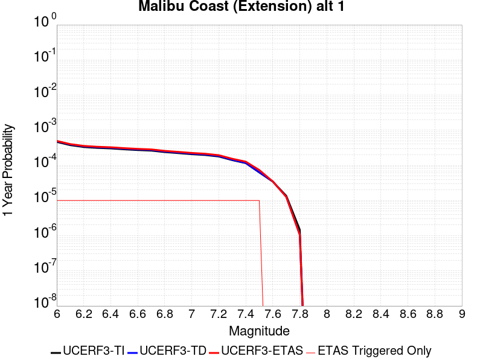 |  |

| Magnitude | 1 wk TI Prob | 1 wk TD Prob | 1 wk ETAS Prob | 1 wk ETAS/TD Gain | 1 wk ETAS Triggered Only | 1 mo TI Prob | 1 mo TD Prob | 1 mo ETAS Prob | 1 mo ETAS/TD Gain | 1 mo ETAS Triggered Only | 1 yr TI Prob | 1 yr TD Prob | 1 yr ETAS Prob | 1 yr ETAS/TD Gain | 1 yr ETAS Triggered Only | 10 yr TI Prob | 10 yr TD Prob | 10 yr ETAS Prob | 10 yr ETAS/TD Gain | 10 yr ETAS Triggered Only |
|-----|-----|-----|-----|-----|-----|-----|-----|-----|-----|-----|-----|-----|-----|-----|-----|-----|-----|-----|-----|-----|
| 6.0 | 8.930738E-6 | 9.329624E-6 | 9.329624E-6 | 1.0 | 0.0 | 3.827403E-5 | 3.99835E-5 | 3.99835E-5 | 1.0 | 0.0 | 4.6588664E-4 | 4.8669212E-4 | 5.0152035E-4 | 1.0304674 | 1.4835475E-5 | 0.0046491115 | 0.004856445 | 0.004885972 | 1.0060799 | 2.967095E-5 |
| 6.1 | 7.199952E-6 | 7.530598E-6 | 7.530598E-6 | 1.0 | 0.0 | 3.0856572E-5 | 3.2273594E-5 | 3.2273594E-5 | 1.0 | 0.0 | 3.75614E-4 | 3.928608E-4 | 4.0769042E-4 | 1.0377479 | 1.4835475E-5 | 0.0037497976 | 0.003921729 | 0.0039512836 | 1.007536 | 2.967095E-5 |
| 6.2 | 6.3721413E-6 | 6.667068E-6 | 6.667068E-6 | 1.0 | 0.0 | 2.7308892E-5 | 2.8572838E-5 | 2.8572838E-5 | 1.0 | 0.0 | 3.3243504E-4 | 3.4781915E-4 | 3.6264944E-4 | 1.0426381 | 1.4835475E-5 | 0.0033193815 | 0.0034727876 | 0.0035023557 | 1.0085142 | 2.967095E-5 |
| 6.3 | 6.016345E-6 | 6.295424E-6 | 6.295424E-6 | 1.0 | 0.0 | 2.578408E-5 | 2.6980111E-5 | 2.6980111E-5 | 1.0 | 0.0 | 3.1387596E-4 | 3.2843367E-4 | 3.4326428E-4 | 1.0451555 | 1.4835475E-5 | 0.00313433 | 0.003279519 | 0.0033090925 | 1.0090177 | 2.967095E-5 |
| 6.4 | 5.8104883E-6 | 6.079804E-6 | 6.079804E-6 | 1.0 | 0.0 | 2.4901856E-5 | 2.6056043E-5 | 2.6056043E-5 | 1.0 | 0.0 | 3.031379E-4 | 3.1718647E-4 | 3.3201723E-4 | 1.0467572 | 1.4835475E-5 | 0.0030272473 | 0.003167372 | 0.0031969491 | 1.009338 | 2.967095E-5 |
| 6.5 | 5.476925E-6 | 5.7277593E-6 | 5.7277593E-6 | 1.0 | 0.0 | 2.3472323E-5 | 2.454731E-5 | 2.454731E-5 | 1.0 | 0.0 | 2.8573806E-4 | 2.9882282E-4 | 3.1365384E-4 | 1.0496316 | 1.4835475E-5 | 0.0028537093 | 0.0029842418 | 0.0030138243 | 1.0099128 | 2.967095E-5 |
| 6.6 | 5.222387E-6 | 5.458816E-6 | 5.458816E-6 | 1.0 | 0.0 | 2.2381464E-5 | 2.3394716E-5 | 2.3394716E-5 | 1.0 | 0.0 | 2.7246025E-4 | 2.8479373E-4 | 2.9962498E-4 | 1.0520772 | 1.4835475E-5 | 0.0027212645 | 0.0028443183 | 0.0028739048 | 1.010402 | 2.967095E-5 |
| 6.7 | 5.0337076E-6 | 5.2593314E-6 | 5.2593314E-6 | 1.0 | 0.0 | 2.1572854E-5 | 2.2539798E-5 | 2.2539798E-5 | 1.0 | 0.0 | 2.6261783E-4 | 2.7438777E-4 | 2.8921917E-4 | 1.0540527 | 1.4835475E-5 | 0.002623077 | 0.00274052 | 0.0027701096 | 1.0107971 | 2.967095E-5 |
| 6.8 | 4.5675624E-6 | 4.7589206E-6 | 4.7589206E-6 | 1.0 | 0.0 | 1.9575122E-5 | 2.0395215E-5 | 2.0395215E-5 | 1.0 | 0.0 | 2.3830103E-4 | 2.4828364E-4 | 2.6311542E-4 | 1.0597373 | 1.4835475E-5 | 0.0023804565 | 0.0024800822 | 0.0025096794 | 1.011934 | 2.967095E-5 |
| 6.9 | 4.2802412E-6 | 4.4522108E-6 | 4.4522108E-6 | 1.0 | 0.0 | 1.8343762E-5 | 1.9080764E-5 | 1.9080764E-5 | 1.0 | 0.0 | 2.2331243E-4 | 2.322837E-4 | 2.4711573E-4 | 1.063853 | 1.4835475E-5 | 0.0022308815 | 0.0023204258 | 0.002350028 | 1.0127572 | 2.967095E-5 |
| 7.0 | 3.9794063E-6 | 4.130274E-6 | 4.130274E-6 | 1.0 | 0.0 | 1.7054486E-5 | 1.7701057E-5 | 1.7701057E-5 | 1.0 | 0.0 | 2.0761859E-4 | 2.1548917E-4 | 2.3032146E-4 | 1.0688307 | 1.4835475E-5 | 0.0020742472 | 0.0021528157 | 0.0021676193 | 1.0068763 | 1.4835475E-5 |
| 7.1 | 3.7730424E-6 | 3.9113834E-6 | 3.9113834E-6 | 1.0 | 0.0 | 1.6170083E-5 | 1.6762964E-5 | 1.6762964E-5 | 1.0 | 0.0 | 1.9685295E-4 | 2.0407011E-4 | 2.1890255E-4 | 1.0726831 | 1.4835475E-5 | 0.0019667868 | 0.00203884 | 0.0020536452 | 1.0072616 | 1.4835475E-5 |
| 7.2 | 3.424985E-6 | 3.541488E-6 | 3.541488E-6 | 1.0 | 0.0 | 1.4678424E-5 | 1.51777185E-5 | 1.51777185E-5 | 1.0 | 0.0 | 1.7869516E-4 | 1.8477316E-4 | 1.996059E-4 | 1.0802754 | 1.4835475E-5 | 0.0017855153 | 0.0018462074 | 0.0018610155 | 1.0080208 | 1.4835475E-5 |
| 7.3 | 2.6966375E-6 | 2.7597662E-6 | 2.7597662E-6 | 1.0 | 0.0 | 1.15569665E-5 | 1.1827516E-5 | 1.1827516E-5 | 1.0 | 0.0 | 1.4069698E-4 | 1.4399053E-4 | 1.5882387E-4 | 1.103016 | 1.4835475E-5 | 0.0014060794 | 0.0014389765 | 0.0014537906 | 1.0102949 | 1.4835475E-5 |
| 7.4 | 2.215957E-6 | 2.249469E-6 | 2.249469E-6 | 1.0 | 0.0 | 9.496924E-6 | 9.640546E-6 | 9.640546E-6 | 1.0 | 0.0 | 1.1561892E-4 | 1.1736735E-4 | 1.322011E-4 | 1.1263872 | 1.4835475E-5 | 0.0011555878 | 0.0011730574 | 0.0011878755 | 1.012632 | 1.4835475E-5 |
| 7.5 | 1.2040218E-6 | 1.2219583E-6 | 1.2219583E-6 | 1.0 | 0.0 | 5.160083E-6 | 5.2369537E-6 | 5.2369537E-6 | 1.0 | 0.0 | 6.2822204E-5 | 6.375807E-5 | 7.8592595E-5 | 1.232669 | 1.4835475E-5 | 6.280445E-4 | 6.373996E-4 | 6.5222563E-4 | 1.0232601 | 1.4835475E-5 |
| 7.6 | 6.6157446E-7 | 6.6792677E-7 | 6.6792677E-7 | 1.0 | 0.0 | 2.835316E-6 | 2.8625402E-6 | 2.8625402E-6 | 1.0 | 0.0 | 3.4519428E-5 | 3.4850884E-5 | 3.4850884E-5 | 1.0 | 0.0 | 3.4514067E-4 | 3.484557E-4 | 3.484557E-4 | 1.0 | 0.0 |
| 7.7 | 2.6012302E-7 | 2.4358602E-7 | 2.4358602E-7 | 1.0 | 0.0 | 1.1148124E-6 | 1.0439397E-6 | 1.0439397E-6 | 1.0 | 0.0 | 1.3572758E-5 | 1.2709903E-5 | 1.2709903E-5 | 1.0 | 0.0 | 1.3571928E-4 | 1.2709283E-4 | 1.2709283E-4 | 1.0 | 0.0 |
| 7.8 | 2.8323132E-8 | 2.0267551E-8 | 2.0267551E-8 | 1.0 | 0.0 | 1.2138484E-7 | 8.686093E-8 | 8.686093E-8 | 1.0 | 0.0 | 1.4778595E-6 | 1.0575314E-6 | 1.0575314E-6 | 1.0 | 0.0 | 1.4778497E-5 | 1.05752715E-5 | 1.05752715E-5 | 1.0 | 0.0 |

## Cleghorn
*[(top)](#table-of-contents)*

| 1 Week | 1 Month | 1 Year | 10 Year |
|-----|-----|-----|-----|
|  | 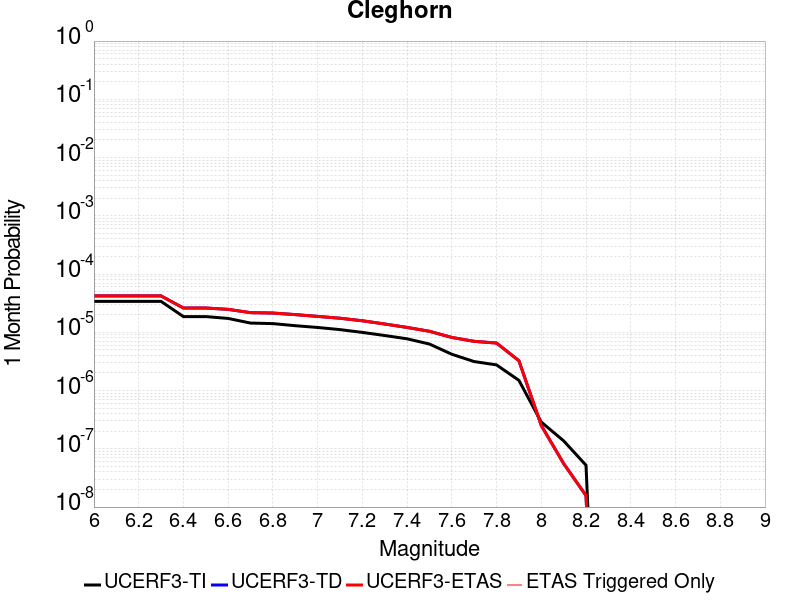 |  | 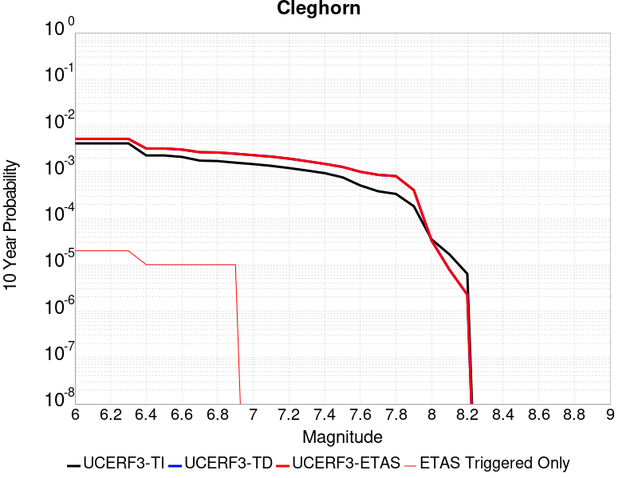 |

| Magnitude | 1 wk TI Prob | 1 wk TD Prob | 1 wk ETAS Prob | 1 wk ETAS/TD Gain | 1 wk ETAS Triggered Only | 1 mo TI Prob | 1 mo TD Prob | 1 mo ETAS Prob | 1 mo ETAS/TD Gain | 1 mo ETAS Triggered Only | 1 yr TI Prob | 1 yr TD Prob | 1 yr ETAS Prob | 1 yr ETAS/TD Gain | 1 yr ETAS Triggered Only | 10 yr TI Prob | 10 yr TD Prob | 10 yr ETAS Prob | 10 yr ETAS/TD Gain | 10 yr ETAS Triggered Only |
|-----|-----|-----|-----|-----|-----|-----|-----|-----|-----|-----|-----|-----|-----|-----|-----|-----|-----|-----|-----|-----|
| 6.0 | 7.9267165E-6 | 9.839363E-6 | 9.839363E-6 | 1.0 | 0.0 | 3.39712E-5 | 4.2168074E-5 | 4.2168074E-5 | 1.0 | 0.0 | 4.1352084E-4 | 5.13286E-4 | 5.2811386E-4 | 1.0288881 | 1.4835475E-5 | 0.004127522 | 0.0051360265 | 0.0051655453 | 1.0057473 | 2.967095E-5 |
| 6.1 | 7.9267165E-6 | 9.839363E-6 | 9.839363E-6 | 1.0 | 0.0 | 3.39712E-5 | 4.2168074E-5 | 4.2168074E-5 | 1.0 | 0.0 | 4.1352084E-4 | 5.13286E-4 | 5.2811386E-4 | 1.0288881 | 1.4835475E-5 | 0.004127522 | 0.0051360265 | 0.0051655453 | 1.0057473 | 2.967095E-5 |
| 6.2 | 7.9267165E-6 | 9.839363E-6 | 9.839363E-6 | 1.0 | 0.0 | 3.39712E-5 | 4.2168074E-5 | 4.2168074E-5 | 1.0 | 0.0 | 4.1352084E-4 | 5.13286E-4 | 5.2811386E-4 | 1.0288881 | 1.4835475E-5 | 0.004127522 | 0.0051360265 | 0.0051655453 | 1.0057473 | 2.967095E-5 |
| 6.3 | 7.9267165E-6 | 9.839363E-6 | 9.839363E-6 | 1.0 | 0.0 | 3.39712E-5 | 4.2168074E-5 | 4.2168074E-5 | 1.0 | 0.0 | 4.1352084E-4 | 5.13286E-4 | 5.2811386E-4 | 1.0288881 | 1.4835475E-5 | 0.004127522 | 0.0051360265 | 0.0051655453 | 1.0057473 | 2.967095E-5 |
| 6.4 | 4.3445207E-6 | 6.0991138E-6 | 6.0991138E-6 | 1.0 | 0.0 | 1.8619241E-5 | 2.6138803E-5 | 2.6138803E-5 | 1.0 | 0.0 | 2.2666567E-4 | 3.1819448E-4 | 3.3302524E-4 | 1.046609 | 1.4835475E-5 | 0.0022643462 | 0.0031914874 | 0.0032062756 | 1.0046337 | 1.4835475E-5 |
| 6.5 | 4.3445207E-6 | 6.0991138E-6 | 6.0991138E-6 | 1.0 | 0.0 | 1.8619241E-5 | 2.6138803E-5 | 2.6138803E-5 | 1.0 | 0.0 | 2.2666567E-4 | 3.1819448E-4 | 3.3302524E-4 | 1.046609 | 1.4835475E-5 | 0.0022643462 | 0.0031914874 | 0.0032062756 | 1.0046337 | 1.4835475E-5 |
| 6.6 | 4.040109E-6 | 5.7815123E-6 | 5.7815123E-6 | 1.0 | 0.0 | 1.7314638E-5 | 2.477768E-5 | 2.477768E-5 | 1.0 | 0.0 | 2.1078532E-4 | 3.0162744E-4 | 3.1645843E-4 | 1.0491699 | 1.4835475E-5 | 0.002105855 | 0.003026273 | 0.0030410637 | 1.0048873 | 1.4835475E-5 |
| 6.7 | 3.3632055E-6 | 5.074989E-6 | 5.074989E-6 | 1.0 | 0.0 | 1.4413658E-5 | 2.1749775E-5 | 2.1749775E-5 | 1.0 | 0.0 | 1.7547216E-4 | 2.6477163E-4 | 2.7960318E-4 | 1.0560163 | 1.4835475E-5 | 0.0017533366 | 0.0026585984 | 0.0026733943 | 1.0055654 | 1.4835475E-5 |
| 6.8 | 3.2902772E-6 | 4.996893E-6 | 4.996893E-6 | 1.0 | 0.0 | 1.4101111E-5 | 2.1415082E-5 | 2.1415082E-5 | 1.0 | 0.0 | 1.716675E-4 | 2.6069774E-4 | 2.7552934E-4 | 1.0568919 | 1.4835475E-5 | 0.0017153495 | 0.0026179554 | 0.002632752 | 1.005652 | 1.4835475E-5 |
| 6.9 | 3.031547E-6 | 4.698425E-6 | 4.698425E-6 | 1.0 | 0.0 | 1.299228E-5 | 2.0135954E-5 | 2.0135954E-5 | 1.0 | 0.0 | 1.5816953E-4 | 2.4512794E-4 | 2.5995978E-4 | 1.0605065 | 1.4835475E-5 | 0.00158057 | 0.0024626097 | 0.0024774086 | 1.0060095 | 1.4835475E-5 |
| 7.0 | 2.8259715E-6 | 4.377412E-6 | 4.377412E-6 | 1.0 | 0.0 | 1.211125E-5 | 1.8760204E-5 | 1.8760204E-5 | 1.0 | 0.0 | 1.4744449E-4 | 2.2838179E-4 | 2.2838179E-4 | 1.0 | 0.0 | 0.001473467 | 0.0022955036 | 0.0022955036 | 1.0 | 0.0 |
| 7.1 | 2.5962665E-6 | 4.072391E-6 | 4.072391E-6 | 1.0 | 0.0 | 1.1126809E-5 | 1.745299E-5 | 1.745299E-5 | 1.0 | 0.0 | 1.3546048E-4 | 2.1246966E-4 | 2.1246966E-4 | 1.0 | 0.0 | 0.0013537793 | 0.0021367029 | 0.0021367029 | 1.0 | 0.0 |
| 7.2 | 2.3247253E-6 | 3.6826675E-6 | 3.6826675E-6 | 1.0 | 0.0 | 9.96307E-6 | 1.5782765E-5 | 1.5782765E-5 | 1.0 | 0.0 | 1.21293626E-4 | 1.9213842E-4 | 1.9213842E-4 | 1.0 | 0.0 | 0.0012122744 | 0.0019337821 | 0.0019337821 | 1.0 | 0.0 |
| 7.3 | 2.056928E-6 | 3.240837E-6 | 3.240837E-6 | 1.0 | 0.0 | 8.815376E-6 | 1.3889228E-5 | 1.3889228E-5 | 1.0 | 0.0 | 1.0732192E-4 | 1.690884E-4 | 1.690884E-4 | 1.0 | 0.0 | 0.001072701 | 0.001703723 | 0.001703723 | 1.0 | 0.0 |
| 7.4 | 1.8055999E-6 | 2.8307588E-6 | 2.8307588E-6 | 1.0 | 0.0 | 7.738263E-6 | 1.2131768E-5 | 1.2131768E-5 | 1.0 | 0.0 | 9.4209274E-5 | 1.476944E-4 | 1.476944E-4 | 1.0 | 0.0 | 9.4169343E-4 | 0.0014902257 | 0.0014902257 | 1.0 | 0.0 |
| 7.5 | 1.4683443E-6 | 2.4297867E-6 | 2.4297867E-6 | 1.0 | 0.0 | 6.292889E-6 | 1.04133305E-5 | 1.04133305E-5 | 1.0 | 0.0 | 7.661323E-5 | 1.2677502E-4 | 1.2677502E-4 | 1.0 | 0.0 | 7.658682E-4 | 0.001281333 | 0.001281333 | 1.0 | 0.0 |
| 7.6 | 9.804088E-7 | 1.9052035E-6 | 1.9052035E-6 | 1.0 | 0.0 | 4.201745E-6 | 8.165132E-6 | 8.165132E-6 | 1.0 | 0.0 | 5.1155046E-5 | 9.9405996E-5 | 9.9405996E-5 | 1.0 | 0.0 | 5.114327E-4 | 0.0010079566 | 0.0010079566 | 1.0 | 0.0 |
| 7.7 | 7.3434086E-7 | 1.6332618E-6 | 1.6332618E-6 | 1.0 | 0.0 | 3.1471714E-6 | 6.999675E-6 | 6.999675E-6 | 1.0 | 0.0 | 3.831614E-5 | 8.521773E-5 | 8.521773E-5 | 1.0 | 0.0 | 3.8309532E-4 | 8.662266E-4 | 8.662266E-4 | 1.0 | 0.0 |
| 7.8 | 6.434184E-7 | 1.5265971E-6 | 1.5265971E-6 | 1.0 | 0.0 | 2.7575045E-6 | 6.5425425E-6 | 6.5425425E-6 | 1.0 | 0.0 | 3.35721E-5 | 7.965257E-5 | 7.965257E-5 | 1.0 | 0.0 | 3.3567028E-4 | 8.1027765E-4 | 8.1027765E-4 | 1.0 | 0.0 |
| 7.9 | 3.4943926E-7 | 7.598694E-7 | 7.598694E-7 | 1.0 | 0.0 | 1.497596E-6 | 3.2565792E-6 | 3.2565792E-6 | 1.0 | 0.0 | 1.8233079E-5 | 3.964814E-5 | 3.964814E-5 | 1.0 | 0.0 | 1.8231584E-4 | 4.0523792E-4 | 4.0523792E-4 | 1.0 | 0.0 |
| 8.0 | 6.717524E-8 | 5.8654035E-8 | 5.8654035E-8 | 1.0 | 0.0 | 2.8789387E-7 | 2.5137442E-7 | 2.5137442E-7 | 1.0 | 0.0 | 3.505102E-6 | 3.0604792E-6 | 3.0604792E-6 | 1.0 | 0.0 | 3.5050467E-5 | 3.2877728E-5 | 3.2877728E-5 | 1.0 | 0.0 |
| 8.1 | 3.1984914E-8 | 1.3041839E-8 | 1.3041839E-8 | 1.0 | 0.0 | 1.370782E-7 | 5.5893594E-8 | 5.5893594E-8 | 1.0 | 0.0 | 1.6689258E-6 | 6.805043E-7 | 6.805043E-7 | 1.0 | 0.0 | 1.6689133E-5 | 7.792919E-6 | 7.792919E-6 | 1.0 | 0.0 |
| 8.2 | 1.21887656E-8 | 3.6759729E-9 | 3.6759729E-9 | 1.0 | 0.0 | 5.2237567E-8 | 1.5754168E-8 | 1.5754168E-8 | 1.0 | 0.0 | 6.359922E-7 | 1.9180699E-7 | 1.9180699E-7 | 1.0 | 0.0 | 6.3599036E-6 | 2.2623635E-6 | 2.2623635E-6 | 1.0 | 0.0 |

## San Diego Trough south
*[(top)](#table-of-contents)*

| 1 Week | 1 Month | 1 Year | 10 Year |
|-----|-----|-----|-----|
| 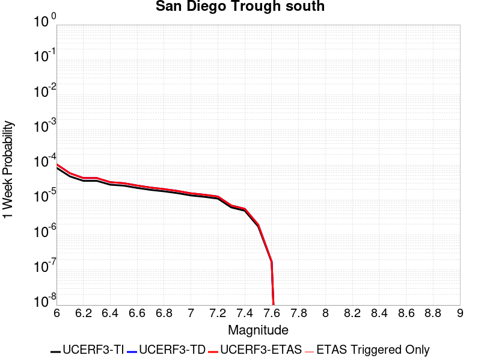 |  |  | 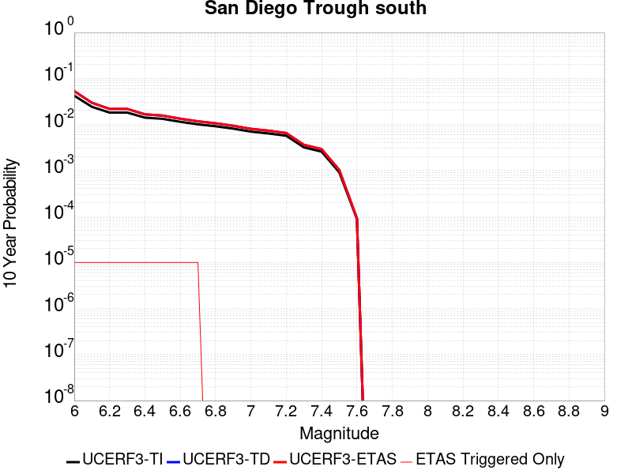 |

| Magnitude | 1 wk TI Prob | 1 wk TD Prob | 1 wk ETAS Prob | 1 wk ETAS/TD Gain | 1 wk ETAS Triggered Only | 1 mo TI Prob | 1 mo TD Prob | 1 mo ETAS Prob | 1 mo ETAS/TD Gain | 1 mo ETAS Triggered Only | 1 yr TI Prob | 1 yr TD Prob | 1 yr ETAS Prob | 1 yr ETAS/TD Gain | 1 yr ETAS Triggered Only | 10 yr TI Prob | 10 yr TD Prob | 10 yr ETAS Prob | 10 yr ETAS/TD Gain | 10 yr ETAS Triggered Only |
|-----|-----|-----|-----|-----|-----|-----|-----|-----|-----|-----|-----|-----|-----|-----|-----|-----|-----|-----|-----|-----|
| 6.0 | 8.279495E-5 | 1.0426024E-4 | 1.0426024E-4 | 1.0 | 0.0 | 3.5478722E-4 | 4.4675806E-4 | 4.4675806E-4 | 1.0 | 0.0 | 0.004310982 | 0.00542657 | 0.005441325 | 1.002719 | 1.4835475E-5 | 0.042283054 | 0.053000752 | 0.0530148 | 1.0002651 | 1.4835475E-5 |
| 6.1 | 4.6961468E-5 | 5.7738573E-5 | 5.7738573E-5 | 1.0 | 0.0 | 2.0124791E-4 | 2.4742854E-4 | 2.4742854E-4 | 1.0 | 0.0 | 0.00244744 | 0.0030084206 | 0.0030232114 | 1.0049164 | 1.4835475E-5 | 0.024206603 | 0.029683843 | 0.029698238 | 1.000485 | 1.4835475E-5 |
| 6.2 | 3.5079658E-5 | 4.2147305E-5 | 4.2147305E-5 | 1.0 | 0.0 | 1.5033272E-4 | 1.8061906E-4 | 1.8061906E-4 | 1.0 | 0.0 | 0.0018287642 | 0.0021968624 | 0.0022116653 | 1.0067382 | 1.4835475E-5 | 0.018137876 | 0.021753997 | 0.02176851 | 1.0006671 | 1.4835475E-5 |
| 6.3 | 3.5079658E-5 | 4.2147305E-5 | 4.2147305E-5 | 1.0 | 0.0 | 1.5033272E-4 | 1.8061906E-4 | 1.8061906E-4 | 1.0 | 0.0 | 0.0018287642 | 0.0021968624 | 0.0022116653 | 1.0067382 | 1.4835475E-5 | 0.018137876 | 0.021753997 | 0.02176851 | 1.0006671 | 1.4835475E-5 |
| 6.4 | 2.7196904E-5 | 3.209104E-5 | 3.209104E-5 | 1.0 | 0.0 | 1.16552954E-4 | 1.3752587E-4 | 1.3752587E-4 | 1.0 | 0.0 | 0.0014181085 | 0.001673105 | 0.0016879156 | 1.0088522 | 1.4835475E-5 | 0.014090929 | 0.016606618 | 0.016621208 | 1.0008785 | 1.4835475E-5 |
| 6.5 | 2.5584688E-5 | 3.0105204E-5 | 3.0105204E-5 | 1.0 | 0.0 | 1.0964406E-4 | 1.2901601E-4 | 1.2901601E-4 | 1.0 | 0.0 | 0.0013340989 | 0.0015696503 | 0.0015844625 | 1.0094366 | 1.4835475E-5 | 0.013261181 | 0.015587135 | 0.015601739 | 1.000937 | 1.4835475E-5 |
| 6.6 | 2.2034688E-5 | 2.5745636E-5 | 2.5745636E-5 | 1.0 | 0.0 | 9.443096E-5 | 1.1033382E-4 | 1.1033382E-4 | 1.0 | 0.0 | 0.0011490905 | 0.0013424925 | 0.0013573081 | 1.0110358 | 1.4835475E-5 | 0.011431668 | 0.013344807 | 0.013359444 | 1.0010968 | 1.4835475E-5 |
| 6.7 | 1.9394853E-5 | 2.2544202E-5 | 2.2544202E-5 | 1.0 | 0.0 | 8.311815E-5 | 9.661446E-5 | 9.661446E-5 | 1.0 | 0.0 | 0.0010114936 | 0.0011756516 | 0.0011904696 | 1.0126041 | 1.4835475E-5 | 0.01006902 | 0.0116950255 | 0.011709687 | 1.0012537 | 1.4835475E-5 |
| 6.8 | 1.7615313E-5 | 2.0405336E-5 | 2.0405336E-5 | 1.0 | 0.0 | 7.549201E-5 | 8.7448534E-5 | 8.7448534E-5 | 1.0 | 0.0 | 9.1872766E-4 | 0.0010641702 | 0.0010641702 | 1.0 | 0.0 | 0.009149387 | 0.0105913095 | 0.0105913095 | 1.0 | 0.0 |
| 6.9 | 1.5621423E-5 | 1.8027964E-5 | 1.8027964E-5 | 1.0 | 0.0 | 6.6947236E-5 | 7.726043E-5 | 7.726043E-5 | 1.0 | 0.0 | 8.147778E-4 | 9.4024336E-4 | 9.4024336E-4 | 1.0 | 0.0 | 0.008117969 | 0.009363097 | 0.009363097 | 1.0 | 0.0 |
| 7.0 | 1.3444376E-5 | 1.5449621E-5 | 1.5449621E-5 | 1.0 | 0.0 | 5.7617483E-5 | 6.6210996E-5 | 6.6210996E-5 | 1.0 | 0.0 | 7.0126704E-4 | 8.0582354E-4 | 8.0582354E-4 | 1.0 | 0.0 | 0.006990582 | 0.008029348 | 0.008029348 | 1.0 | 0.0 |
| 7.1 | 1.2268361E-5 | 1.4074408E-5 | 1.4074408E-5 | 1.0 | 0.0 | 5.2577634E-5 | 6.031751E-5 | 6.031751E-5 | 1.0 | 0.0 | 6.399447E-4 | 7.341209E-4 | 7.341209E-4 | 1.0 | 0.0 | 0.0063810493 | 0.007317263 | 0.007317263 | 1.0 | 0.0 |
| 7.2 | 1.0922655E-5 | 1.2514776E-5 | 1.2514776E-5 | 1.0 | 0.0 | 4.681054E-5 | 5.363367E-5 | 5.363367E-5 | 1.0 | 0.0 | 5.697693E-4 | 6.527968E-4 | 6.527968E-4 | 1.0 | 0.0 | 0.0056831064 | 0.006509073 | 0.006509073 | 1.0 | 0.0 |
| 7.3 | 6.1106753E-6 | 6.9295434E-6 | 6.9295434E-6 | 1.0 | 0.0 | 2.6188345E-5 | 2.9697707E-5 | 2.9697707E-5 | 1.0 | 0.0 | 3.1879646E-4 | 3.6151E-4 | 3.6151E-4 | 1.0 | 0.0 | 0.0031833951 | 0.0036092645 | 0.0036092645 | 1.0 | 0.0 |
| 7.4 | 4.933187E-6 | 5.5900487E-6 | 5.5900487E-6 | 1.0 | 0.0 | 2.114206E-5 | 2.3957133E-5 | 2.3957133E-5 | 1.0 | 0.0 | 2.5737417E-4 | 2.9163944E-4 | 2.9163944E-4 | 1.0 | 0.0 | 0.002570763 | 0.0029126084 | 0.0029126084 | 1.0 | 0.0 |
| 7.5 | 1.7489613E-6 | 1.969845E-6 | 1.969845E-6 | 1.0 | 0.0 | 7.495527E-6 | 8.442166E-6 | 8.442166E-6 | 1.0 | 0.0 | 9.125422E-5 | 1.0277875E-4 | 1.0277875E-4 | 1.0 | 0.0 | 9.1216754E-4 | 0.0010273342 | 0.0010273342 | 1.0 | 0.0 |
| 7.6 | 1.6988751E-7 | 1.7534197E-7 | 1.7534197E-7 | 1.0 | 0.0 | 7.2808916E-7 | 7.5146534E-7 | 7.5146534E-7 | 1.0 | 0.0 | 8.864449E-6 | 9.149055E-6 | 9.149055E-6 | 1.0 | 0.0 | 8.8640954E-5 | 9.1486974E-5 | 9.1486974E-5 | 1.0 | 0.0 |

## Ventura-Pitas Point
*[(top)](#table-of-contents)*

| 1 Week | 1 Month | 1 Year | 10 Year |
|-----|-----|-----|-----|
|  |  |  |  |

| Magnitude | 1 wk TI Prob | 1 wk TD Prob | 1 wk ETAS Prob | 1 wk ETAS/TD Gain | 1 wk ETAS Triggered Only | 1 mo TI Prob | 1 mo TD Prob | 1 mo ETAS Prob | 1 mo ETAS/TD Gain | 1 mo ETAS Triggered Only | 1 yr TI Prob | 1 yr TD Prob | 1 yr ETAS Prob | 1 yr ETAS/TD Gain | 1 yr ETAS Triggered Only | 10 yr TI Prob | 10 yr TD Prob | 10 yr ETAS Prob | 10 yr ETAS/TD Gain | 10 yr ETAS Triggered Only |
|-----|-----|-----|-----|-----|-----|-----|-----|-----|-----|-----|-----|-----|-----|-----|-----|-----|-----|-----|-----|-----|
| 6.0 | 3.3179622E-5 | 3.3739674E-5 | 3.3739674E-5 | 1.0 | 0.0 | 1.4219063E-4 | 1.4459204E-4 | 1.4459204E-4 | 1.0 | 0.0 | 0.0017297962 | 0.0017592435 | 0.0017592435 | 1.0 | 0.0 | 0.017163932 | 0.017478708 | 0.01750786 | 1.0016679 | 2.967095E-5 |
| 6.1 | 3.3179622E-5 | 3.3739674E-5 | 3.3739674E-5 | 1.0 | 0.0 | 1.4219063E-4 | 1.4459204E-4 | 1.4459204E-4 | 1.0 | 0.0 | 0.0017297962 | 0.0017592435 | 0.0017592435 | 1.0 | 0.0 | 0.017163932 | 0.017478708 | 0.01750786 | 1.0016679 | 2.967095E-5 |
| 6.2 | 3.3179622E-5 | 3.3739674E-5 | 3.3739674E-5 | 1.0 | 0.0 | 1.4219063E-4 | 1.4459204E-4 | 1.4459204E-4 | 1.0 | 0.0 | 0.0017297962 | 0.0017592435 | 0.0017592435 | 1.0 | 0.0 | 0.017163932 | 0.017478708 | 0.01750786 | 1.0016679 | 2.967095E-5 |
| 6.3 | 3.3179622E-5 | 3.3739674E-5 | 3.3739674E-5 | 1.0 | 0.0 | 1.4219063E-4 | 1.4459204E-4 | 1.4459204E-4 | 1.0 | 0.0 | 0.0017297962 | 0.0017592435 | 0.0017592435 | 1.0 | 0.0 | 0.017163932 | 0.017478708 | 0.01750786 | 1.0016679 | 2.967095E-5 |
| 6.4 | 1.8754668E-5 | 1.7022334E-5 | 1.7022334E-5 | 1.0 | 0.0 | 8.037467E-5 | 7.2950956E-5 | 7.2950956E-5 | 1.0 | 0.0 | 9.781223E-4 | 8.87839E-4 | 8.87839E-4 | 1.0 | 0.0 | 0.009738282 | 0.008845257 | 0.008859961 | 1.0016624 | 1.4835475E-5 |
| 6.5 | 1.8754668E-5 | 1.7022334E-5 | 1.7022334E-5 | 1.0 | 0.0 | 8.037467E-5 | 7.2950956E-5 | 7.2950956E-5 | 1.0 | 0.0 | 9.781223E-4 | 8.87839E-4 | 8.87839E-4 | 1.0 | 0.0 | 0.009738282 | 0.008845257 | 0.008859961 | 1.0016624 | 1.4835475E-5 |
| 6.6 | 1.4361558E-5 | 1.2124626E-5 | 1.2124626E-5 | 1.0 | 0.0 | 6.154808E-5 | 5.196166E-5 | 5.196166E-5 | 1.0 | 0.0 | 7.490902E-4 | 6.3245185E-4 | 6.3245185E-4 | 1.0 | 0.0 | 0.0074657016 | 0.0063067763 | 0.0063067763 | 1.0 | 0.0 |
| 6.7 | 1.4361558E-5 | 1.2124626E-5 | 1.2124626E-5 | 1.0 | 0.0 | 6.154808E-5 | 5.196166E-5 | 5.196166E-5 | 1.0 | 0.0 | 7.490902E-4 | 6.3245185E-4 | 6.3245185E-4 | 1.0 | 0.0 | 0.0074657016 | 0.0063067763 | 0.0063067763 | 1.0 | 0.0 |
| 6.8 | 1.3663846E-5 | 1.13467095E-5 | 1.13467095E-5 | 1.0 | 0.0 | 5.8558027E-5 | 4.862786E-5 | 4.862786E-5 | 1.0 | 0.0 | 7.127108E-4 | 5.918853E-4 | 5.918853E-4 | 1.0 | 0.0 | 0.007104293 | 0.005903305 | 0.005903305 | 1.0 | 0.0 |
| 6.9 | 1.3644157E-5 | 1.1324809E-5 | 1.1324809E-5 | 1.0 | 0.0 | 5.8473648E-5 | 4.8534002E-5 | 4.8534002E-5 | 1.0 | 0.0 | 7.116841E-4 | 5.907432E-4 | 5.907432E-4 | 1.0 | 0.0 | 0.007094092 | 0.0058919443 | 0.0058919443 | 1.0 | 0.0 |
| 7.0 | 1.3568845E-5 | 1.1244368E-5 | 1.1244368E-5 | 1.0 | 0.0 | 5.8150898E-5 | 4.8189268E-5 | 4.8189268E-5 | 1.0 | 0.0 | 7.077572E-4 | 5.8654835E-4 | 5.8654835E-4 | 1.0 | 0.0 | 0.007055073 | 0.005850218 | 0.005850218 | 1.0 | 0.0 |
| 7.1 | 1.306572E-5 | 1.0722776E-5 | 1.0722776E-5 | 1.0 | 0.0 | 5.599474E-5 | 4.595396E-5 | 4.595396E-5 | 1.0 | 0.0 | 6.815227E-4 | 5.593477E-4 | 5.593477E-4 | 1.0 | 0.0 | 0.0067943637 | 0.005579603 | 0.005579603 | 1.0 | 0.0 |
| 7.2 | 1.232604E-5 | 9.997297E-6 | 9.997297E-6 | 1.0 | 0.0 | 5.2824813E-5 | 4.2844866E-5 | 4.2844866E-5 | 1.0 | 0.0 | 6.429523E-4 | 5.215131E-4 | 5.215131E-4 | 1.0 | 0.0 | 0.0064109527 | 0.005203085 | 0.005203085 | 1.0 | 0.0 |
| 7.3 | 1.0917261E-5 | 8.844541E-6 | 8.844541E-6 | 1.0 | 0.0 | 4.678742E-5 | 3.7904636E-5 | 3.7904636E-5 | 1.0 | 0.0 | 5.69488E-4 | 4.6139277E-4 | 4.6139277E-4 | 1.0 | 0.0 | 0.0056803077 | 0.004604514 | 0.004604514 | 1.0 | 0.0 |
| 7.4 | 1.039959E-5 | 8.4242165E-6 | 8.4242165E-6 | 1.0 | 0.0 | 4.456891E-5 | 3.6103294E-5 | 3.6103294E-5 | 1.0 | 0.0 | 5.424914E-4 | 4.3947046E-4 | 4.3947046E-4 | 1.0 | 0.0 | 0.0054116896 | 0.004386176 | 0.004386176 | 1.0 | 0.0 |
| 7.5 | 9.015877E-6 | 7.2980242E-6 | 7.2980242E-6 | 1.0 | 0.0 | 3.86389E-5 | 3.127688E-5 | 3.127688E-5 | 1.0 | 0.0 | 4.7032707E-4 | 3.807309E-4 | 3.807309E-4 | 1.0 | 0.0 | 0.004693329 | 0.0038009312 | 0.0038009312 | 1.0 | 0.0 |
| 7.6 | 4.900162E-6 | 3.8743037E-6 | 3.8743037E-6 | 1.0 | 0.0 | 2.1000526E-5 | 1.6604054E-5 | 1.6604054E-5 | 1.0 | 0.0 | 2.556514E-4 | 2.0213572E-4 | 2.0213572E-4 | 1.0 | 0.0 | 0.0025535747 | 0.0020195323 | 0.0020195323 | 1.0 | 0.0 |
| 7.7 | 3.8850626E-6 | 3.1268771E-6 | 3.1268771E-6 | 1.0 | 0.0 | 1.6650163E-5 | 1.3400834E-5 | 1.3400834E-5 | 1.0 | 0.0 | 2.0269687E-4 | 1.6314304E-4 | 1.6314304E-4 | 1.0 | 0.0 | 0.002025121 | 0.001630242 | 0.001630242 | 1.0 | 0.0 |
| 7.8 | 2.4654719E-6 | 2.0299628E-6 | 2.0299628E-6 | 1.0 | 0.0 | 1.0566265E-5 | 8.6998125E-6 | 8.6998125E-6 | 1.0 | 0.0 | 1.2863669E-4 | 1.0591512E-4 | 1.0591512E-4 | 1.0 | 0.0 | 0.0012856225 | 0.001058651 | 0.001058651 | 1.0 | 0.0 |
| 7.9 | 4.095894E-7 | 3.2766556E-7 | 3.2766556E-7 | 1.0 | 0.0 | 1.7553821E-6 | 1.4042802E-6 | 1.4042802E-6 | 1.0 | 0.0 | 2.1371567E-5 | 1.709698E-5 | 1.709698E-5 | 1.0 | 0.0 | 2.1369511E-4 | 1.7095696E-4 | 1.7095696E-4 | 1.0 | 0.0 |
| 8.0 | 7.791402E-9 | 5.683778E-9 | 5.683778E-9 | 1.0 | 0.0 | 3.3391725E-8 | 2.4359048E-8 | 2.4359048E-8 | 1.0 | 0.0 | 4.0654416E-7 | 2.965714E-7 | 2.965714E-7 | 1.0 | 0.0 | 4.065434E-6 | 2.965712E-6 | 2.965712E-6 | 1.0 | 0.0 |

## San Jacinto (Coyote Creek)
*[(top)](#table-of-contents)*

| 1 Week | 1 Month | 1 Year | 10 Year |
|-----|-----|-----|-----|
|  |  | 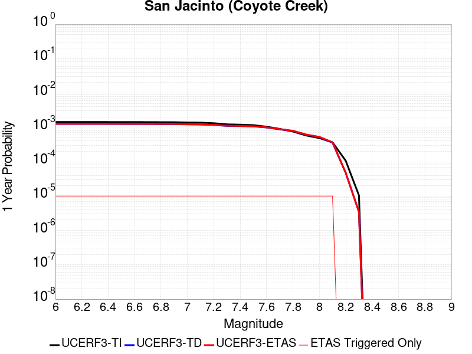 | 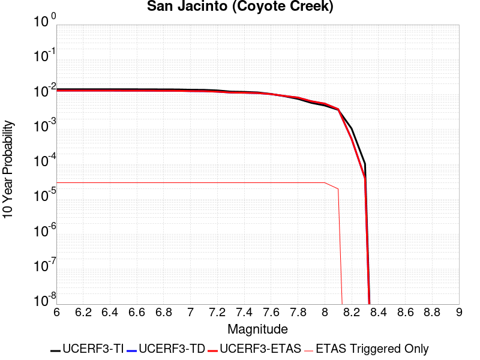 |

| Magnitude | 1 wk TI Prob | 1 wk TD Prob | 1 wk ETAS Prob | 1 wk ETAS/TD Gain | 1 wk ETAS Triggered Only | 1 mo TI Prob | 1 mo TD Prob | 1 mo ETAS Prob | 1 mo ETAS/TD Gain | 1 mo ETAS Triggered Only | 1 yr TI Prob | 1 yr TD Prob | 1 yr ETAS Prob | 1 yr ETAS/TD Gain | 1 yr ETAS Triggered Only | 10 yr TI Prob | 10 yr TD Prob | 10 yr ETAS Prob | 10 yr ETAS/TD Gain | 10 yr ETAS Triggered Only |
|-----|-----|-----|-----|-----|-----|-----|-----|-----|-----|-----|-----|-----|-----|-----|-----|-----|-----|-----|-----|-----|
| 6.0 | 2.7374346E-5 | 2.4185267E-5 | 2.4185267E-5 | 1.0 | 0.0 | 1.1731335E-4 | 1.0364704E-4 | 1.1848097E-4 | 1.1431197 | 1.4835475E-5 | 0.0014273542 | 0.0012611748 | 0.0012759916 | 1.0117484 | 1.4835475E-5 | 0.01418221 | 0.012949167 | 0.012978454 | 1.0022616 | 2.967095E-5 |
| 6.1 | 2.7374346E-5 | 2.4185267E-5 | 2.4185267E-5 | 1.0 | 0.0 | 1.1731335E-4 | 1.0364704E-4 | 1.1848097E-4 | 1.1431197 | 1.4835475E-5 | 0.0014273542 | 0.0012611748 | 0.0012759916 | 1.0117484 | 1.4835475E-5 | 0.01418221 | 0.012949167 | 0.012978454 | 1.0022616 | 2.967095E-5 |
| 6.2 | 2.7374346E-5 | 2.4185267E-5 | 2.4185267E-5 | 1.0 | 0.0 | 1.1731335E-4 | 1.0364704E-4 | 1.1848097E-4 | 1.1431197 | 1.4835475E-5 | 0.0014273542 | 0.0012611748 | 0.0012759916 | 1.0117484 | 1.4835475E-5 | 0.01418221 | 0.012949167 | 0.012978454 | 1.0022616 | 2.967095E-5 |
| 6.3 | 2.7374346E-5 | 2.4185267E-5 | 2.4185267E-5 | 1.0 | 0.0 | 1.1731335E-4 | 1.0364704E-4 | 1.1848097E-4 | 1.1431197 | 1.4835475E-5 | 0.0014273542 | 0.0012611748 | 0.0012759916 | 1.0117484 | 1.4835475E-5 | 0.01418221 | 0.012949167 | 0.012978454 | 1.0022616 | 2.967095E-5 |
| 6.4 | 2.7374346E-5 | 2.4185267E-5 | 2.4185267E-5 | 1.0 | 0.0 | 1.1731335E-4 | 1.0364704E-4 | 1.1848097E-4 | 1.1431197 | 1.4835475E-5 | 0.0014273542 | 0.0012611748 | 0.0012759916 | 1.0117484 | 1.4835475E-5 | 0.01418221 | 0.012949167 | 0.012978454 | 1.0022616 | 2.967095E-5 |
| 6.5 | 2.7282445E-5 | 2.4071327E-5 | 2.4071327E-5 | 1.0 | 0.0 | 1.16919524E-4 | 1.0315877E-4 | 1.17992706E-4 | 1.1437973 | 1.4835475E-5 | 0.0014225657 | 0.0012552369 | 0.0012700538 | 1.011804 | 1.4835475E-5 | 0.014134934 | 0.012890487 | 0.012919775 | 1.0022721 | 2.967095E-5 |
| 6.6 | 2.7282445E-5 | 2.4071327E-5 | 2.4071327E-5 | 1.0 | 0.0 | 1.16919524E-4 | 1.0315877E-4 | 1.17992706E-4 | 1.1437973 | 1.4835475E-5 | 0.0014225657 | 0.0012552369 | 0.0012700538 | 1.011804 | 1.4835475E-5 | 0.014134934 | 0.012890487 | 0.012919775 | 1.0022721 | 2.967095E-5 |
| 6.7 | 2.7216198E-5 | 2.3996436E-5 | 2.3996436E-5 | 1.0 | 0.0 | 1.1663563E-4 | 1.0283783E-4 | 1.1767178E-4 | 1.144246 | 1.4835475E-5 | 0.0014191137 | 0.0012513341 | 0.001266151 | 1.0118409 | 1.4835475E-5 | 0.014100855 | 0.012851892 | 0.012881182 | 1.002279 | 2.967095E-5 |
| 6.8 | 2.7078617E-5 | 2.3913628E-5 | 2.3913628E-5 | 1.0 | 0.0 | 1.1604605E-4 | 1.0248297E-4 | 1.1731692E-4 | 1.1447456 | 1.4835475E-5 | 0.001411945 | 0.0012470187 | 0.0012618356 | 1.011882 | 1.4835475E-5 | 0.014030075 | 0.012809023 | 0.012838314 | 1.0022868 | 2.967095E-5 |
| 6.9 | 2.6982952E-5 | 2.3833116E-5 | 2.3833116E-5 | 1.0 | 0.0 | 1.15636096E-4 | 1.02137936E-4 | 1.16971896E-4 | 1.1452346 | 1.4835475E-5 | 0.0014069602 | 0.0012428226 | 0.0012576397 | 1.0119221 | 1.4835475E-5 | 0.013980856 | 0.012767327 | 0.012796619 | 1.0022943 | 2.967095E-5 |
| 7.0 | 2.6449972E-5 | 2.3410048E-5 | 2.3410048E-5 | 1.0 | 0.0 | 1.1335209E-4 | 1.00324934E-4 | 1.15158924E-4 | 1.1478595 | 1.4835475E-5 | 0.001379188 | 0.0012207743 | 0.0012355916 | 1.0121377 | 1.4835475E-5 | 0.0137065975 | 0.012548647 | 0.012577946 | 1.0023348 | 2.967095E-5 |
| 7.1 | 2.6257849E-5 | 2.3236043E-5 | 2.3236043E-5 | 1.0 | 0.0 | 1.1252879E-4 | 9.957926E-5 | 1.14413255E-4 | 1.1489668 | 1.4835475E-5 | 0.0013691769 | 0.0012117057 | 0.0012265233 | 1.0122286 | 1.4835475E-5 | 0.013607717 | 0.012458493 | 0.012487794 | 1.0023519 | 2.967095E-5 |
| 7.2 | 2.5270041E-5 | 2.2430508E-5 | 2.2430508E-5 | 1.0 | 0.0 | 1.0829568E-4 | 9.612722E-5 | 1.1096127E-4 | 1.1543168 | 1.4835475E-5 | 0.0013177024 | 0.001169723 | 0.001184541 | 1.012668 | 1.4835475E-5 | 0.013099162 | 0.012039383 | 0.012068696 | 1.0024348 | 2.967095E-5 |
| 7.3 | 2.339701E-5 | 2.1161795E-5 | 2.1161795E-5 | 1.0 | 0.0 | 1.0026905E-4 | 9.0690264E-5 | 1.0552439E-4 | 1.1635691 | 1.4835475E-5 | 0.001220092 | 0.0011035968 | 0.0011184159 | 1.013428 | 1.4835475E-5 | 0.012134149 | 0.011378024 | 0.011407357 | 1.002578 | 2.967095E-5 |
| 7.4 | 2.296333E-5 | 2.0892008E-5 | 2.0892008E-5 | 1.0 | 0.0 | 9.841056E-5 | 8.9534115E-5 | 1.04368264E-4 | 1.1656815 | 1.4835475E-5 | 0.0011974899 | 0.0010895348 | 0.001104354 | 1.0136015 | 1.4835475E-5 | 0.011910575 | 0.011237065 | 0.011266403 | 1.0026108 | 2.967095E-5 |
| 7.5 | 2.2188895E-5 | 2.0414609E-5 | 2.0414609E-5 | 1.0 | 0.0 | 9.50918E-5 | 8.748826E-5 | 1.0232243E-4 | 1.1695561 | 1.4835475E-5 | 0.0011571277 | 0.0010646511 | 0.0010794707 | 1.0139197 | 1.4835475E-5 | 0.011511209 | 0.010986521 | 0.011015866 | 1.002671 | 2.967095E-5 |
| 7.6 | 2.0013189E-5 | 1.9000014E-5 | 1.9000014E-5 | 1.0 | 0.0 | 8.5767984E-5 | 8.14261E-5 | 9.6260366E-5 | 1.1821808 | 1.4835475E-5 | 0.001043725 | 9.909137E-4 | 0.0010057344 | 1.0149567 | 1.4835475E-5 | 0.010388365 | 0.010244091 | 0.010273458 | 1.0028667 | 2.967095E-5 |
| 7.7 | 1.7230794E-5 | 1.678015E-5 | 1.678015E-5 | 1.0 | 0.0 | 7.384417E-5 | 7.1912946E-5 | 8.674736E-5 | 1.2062829 | 1.4835475E-5 | 8.986819E-4 | 8.7518926E-4 | 8.900118E-4 | 1.0169363 | 1.4835475E-5 | 0.008950562 | 0.009082006 | 0.009111408 | 1.0032374 | 2.967095E-5 |
| 7.8 | 1.4478809E-5 | 1.5026132E-5 | 1.5026132E-5 | 1.0 | 0.0 | 6.205057E-5 | 6.4396125E-5 | 7.9230645E-5 | 1.2303635 | 1.4835475E-5 | 7.552038E-4 | 7.837414E-4 | 7.985653E-4 | 1.0189142 | 1.4835475E-5 | 0.0075264242 | 0.008159787 | 0.008189216 | 1.0036066 | 2.967095E-5 |
| 7.9 | 1.1114467E-5 | 1.1676309E-5 | 1.1676309E-5 | 1.0 | 0.0 | 4.7632562E-5 | 5.004037E-5 | 6.48751E-5 | 1.2964553 | 1.4835475E-5 | 5.797721E-4 | 6.0907175E-4 | 6.238982E-4 | 1.0243427 | 1.4835475E-5 | 0.0057826187 | 0.006396713 | 0.0064261947 | 1.0046088 | 2.967095E-5 |
| 8.0 | 9.327402E-6 | 9.927497E-6 | 9.927497E-6 | 1.0 | 0.0 | 3.9973966E-5 | 4.2545722E-5 | 5.7380566E-5 | 1.34868 | 1.4835475E-5 | 4.8657437E-4 | 5.178716E-4 | 5.326994E-4 | 1.0286322 | 1.4835475E-5 | 0.0048551033 | 0.005464863 | 0.0054943715 | 1.0053997 | 2.967095E-5 |
| 8.1 | 7.0235833E-6 | 6.8484787E-6 | 6.8484787E-6 | 1.0 | 0.0 | 3.0100724E-5 | 2.9350296E-5 | 4.4185337E-5 | 1.5054476 | 1.4835475E-5 | 3.664147E-4 | 3.5728177E-4 | 3.7211194E-4 | 1.0415083 | 1.4835475E-5 | 0.003658111 | 0.003798733 | 0.0038282913 | 1.007781 | 2.967095E-5 |
| 8.2 | 2.0358202E-6 | 9.0370713E-7 | 9.0370713E-7 | 1.0 | 0.0 | 8.724915E-6 | 3.873025E-6 | 3.873025E-6 | 1.0 | 0.0 | 1.06220665E-4 | 4.715308E-5 | 4.715308E-5 | 1.0 | 0.0 | 0.001061699 | 5.3492823E-4 | 5.3492823E-4 | 1.0 | 0.0 |
| 8.3 | 2.0051264E-7 | 6.6533794E-8 | 6.6533794E-8 | 1.0 | 0.0 | 8.5933965E-7 | 2.8514478E-7 | 2.8514478E-7 | 1.0 | 0.0 | 1.046241E-5 | 3.4716327E-6 | 3.4716327E-6 | 1.0 | 0.0 | 1.0461917E-4 | 4.034583E-5 | 4.034583E-5 | 1.0 | 0.0 |

## Brawley (Seismic Zone) alt 1
*[(top)](#table-of-contents)*

| 1 Week | 1 Month | 1 Year | 10 Year |
|-----|-----|-----|-----|
|  | 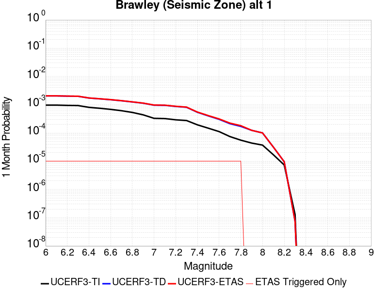 | 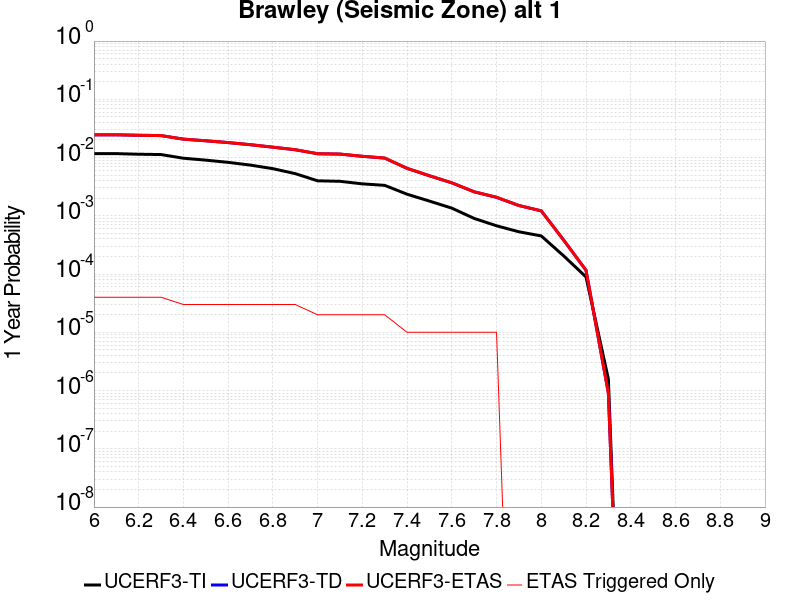 | 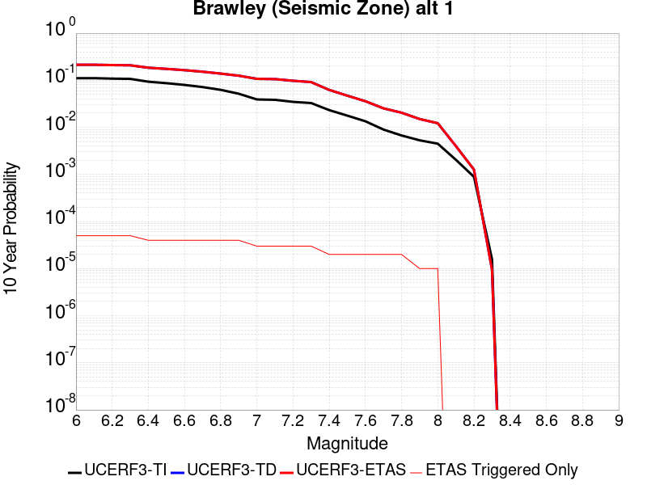 |

| Magnitude | 1 wk TI Prob | 1 wk TD Prob | 1 wk ETAS Prob | 1 wk ETAS/TD Gain | 1 wk ETAS Triggered Only | 1 mo TI Prob | 1 mo TD Prob | 1 mo ETAS Prob | 1 mo ETAS/TD Gain | 1 mo ETAS Triggered Only | 1 yr TI Prob | 1 yr TD Prob | 1 yr ETAS Prob | 1 yr ETAS/TD Gain | 1 yr ETAS Triggered Only | 10 yr TI Prob | 10 yr TD Prob | 10 yr ETAS Prob | 10 yr ETAS/TD Gain | 10 yr ETAS Triggered Only |
|-----|-----|-----|-----|-----|-----|-----|-----|-----|-----|-----|-----|-----|-----|-----|-----|-----|-----|-----|-----|-----|
| 6.0 | 2.2521618E-4 | 4.7677188E-4 | 4.7677188E-4 | 1.0 | 0.0 | 9.6485513E-4 | 0.002041745 | 0.002041745 | 1.0 | 0.0 | 0.011683988 | 0.024568956 | 0.024597898 | 1.001178 | 2.967095E-5 | 0.11088423 | 0.21365345 | 0.21367678 | 1.0001092 | 2.967095E-5 |
| 6.1 | 2.2521618E-4 | 4.7677188E-4 | 4.7677188E-4 | 1.0 | 0.0 | 9.6485513E-4 | 0.002041745 | 0.002041745 | 1.0 | 0.0 | 0.011683988 | 0.024568956 | 0.024597898 | 1.001178 | 2.967095E-5 | 0.11088423 | 0.21365345 | 0.21367678 | 1.0001092 | 2.967095E-5 |
| 6.2 | 2.198148E-4 | 4.676057E-4 | 4.676057E-4 | 1.0 | 0.0 | 9.417233E-4 | 0.0020025221 | 0.0020025221 | 1.0 | 0.0 | 0.011405343 | 0.024102617 | 0.024131574 | 1.0012014 | 2.967095E-5 | 0.10837428 | 0.21008731 | 0.21011075 | 1.0001116 | 2.967095E-5 |
| 6.3 | 2.1704129E-4 | 4.6196094E-4 | 4.6196094E-4 | 1.0 | 0.0 | 9.298453E-4 | 0.001978367 | 0.001978367 | 1.0 | 0.0 | 0.011262234 | 0.0238157 | 0.023844665 | 1.0012162 | 2.967095E-5 | 0.107082725 | 0.20797825 | 0.20800175 | 1.000113 | 2.967095E-5 |
| 6.4 | 1.876142E-4 | 4.008689E-4 | 4.008689E-4 | 1.0 | 0.0 | 8.038131E-4 | 0.0017168928 | 0.0017168928 | 1.0 | 0.0 | 0.00974259 | 0.020701854 | 0.020730909 | 1.0014036 | 2.967095E-5 | 0.093263686 | 0.18472944 | 0.18475363 | 1.0001309 | 2.967095E-5 |
| 6.5 | 1.7390939E-4 | 3.7517402E-4 | 3.7517402E-4 | 1.0 | 0.0 | 7.45113E-4 | 0.00160691 | 0.00160691 | 1.0 | 0.0 | 0.009034078 | 0.01938936 | 0.019418454 | 1.0015006 | 2.967095E-5 | 0.086755216 | 0.17454848 | 0.17457296 | 1.0001403 | 2.967095E-5 |
| 6.6 | 1.591791E-4 | 3.493013E-4 | 3.493013E-4 | 1.0 | 0.0 | 6.8201777E-4 | 0.0014961568 | 0.0014961568 | 1.0 | 0.0 | 0.008271996 | 0.01806513 | 0.018094266 | 1.0016128 | 2.967095E-5 | 0.07970774 | 0.1639518 | 0.16397661 | 1.0001513 | 2.967095E-5 |
| 6.7 | 1.4268003E-4 | 3.2094057E-4 | 3.2094057E-4 | 1.0 | 0.0 | 6.1134255E-4 | 0.0013747427 | 0.0013747427 | 1.0 | 0.0 | 0.007417723 | 0.016611008 | 0.016640186 | 1.0017565 | 2.967095E-5 | 0.07174956 | 0.15207092 | 0.1520961 | 1.0001655 | 2.967095E-5 |
| 6.8 | 1.239713E-4 | 2.908404E-4 | 2.908404E-4 | 1.0 | 0.0 | 5.3119735E-4 | 0.0012458697 | 0.0012458697 | 1.0 | 0.0 | 0.0064481674 | 0.015064401 | 0.015093625 | 1.0019399 | 2.967095E-5 | 0.06264243 | 0.13849835 | 0.1385239 | 1.0001845 | 2.967095E-5 |
| 6.9 | 1.0180238E-4 | 2.6277915E-4 | 2.6277915E-4 | 1.0 | 0.0 | 4.3622297E-4 | 0.0011257146 | 0.0011257146 | 1.0 | 0.0 | 0.005298089 | 0.013620448 | 0.013649715 | 1.0021487 | 2.967095E-5 | 0.05173543 | 0.12505713 | 0.12508309 | 1.0002075 | 2.967095E-5 |
| 7.0 | 7.6619996E-5 | 2.241719E-4 | 2.241719E-4 | 1.0 | 0.0 | 3.283301E-4 | 9.603862E-4 | 9.603862E-4 | 1.0 | 0.0 | 0.0039900932 | 0.011630724 | 0.011645387 | 1.0012608 | 1.4835475E-5 | 0.039192066 | 0.107340224 | 0.10735347 | 1.0001234 | 1.4835475E-5 |
| 7.1 | 7.5127435E-5 | 2.2100126E-4 | 2.2100126E-4 | 1.0 | 0.0 | 3.2193496E-4 | 9.468076E-4 | 9.468076E-4 | 1.0 | 0.0 | 0.0039125155 | 0.011467158 | 0.0114818225 | 1.0012789 | 1.4835475E-5 | 0.038443442 | 0.10590341 | 0.10591667 | 1.0001253 | 1.4835475E-5 |
| 7.2 | 6.788582E-5 | 2.0227244E-4 | 2.0227244E-4 | 1.0 | 0.0 | 2.9090676E-4 | 8.665969E-4 | 8.665969E-4 | 1.0 | 0.0 | 0.0035360386 | 0.010500415 | 0.010515096 | 1.001398 | 1.4835475E-5 | 0.034803 | 0.09757214 | 0.09758553 | 1.0001372 | 1.4835475E-5 |
| 7.3 | 6.399602E-5 | 1.8857479E-4 | 1.8857479E-4 | 1.0 | 0.0 | 2.7423984E-4 | 8.0793025E-4 | 8.0793025E-4 | 1.0 | 0.0 | 0.0033337586 | 0.009792777 | 0.009807467 | 1.0015001 | 1.4835475E-5 | 0.03284188 | 0.09146473 | 0.091478206 | 1.0001473 | 1.4835475E-5 |
| 7.4 | 4.506759E-5 | 1.2542114E-4 | 1.2542114E-4 | 1.0 | 0.0 | 1.9313251E-4 | 5.3740933E-4 | 5.3740933E-4 | 1.0 | 0.0 | 0.0023488526 | 0.0065235044 | 0.0065235044 | 1.0 | 0.0 | 0.023241805 | 0.062420327 | 0.062420327 | 1.0 | 0.0 |
| 7.5 | 3.43289E-5 | 9.346325E-5 | 9.346325E-5 | 1.0 | 0.0 | 1.4711556E-4 | 4.004956E-4 | 4.004956E-4 | 1.0 | 0.0 | 0.0017896603 | 0.0048651947 | 0.0048651947 | 1.0 | 0.0 | 0.01775316 | 0.047104035 | 0.047104035 | 1.0 | 0.0 |
| 7.6 | 2.5980507E-5 | 7.062613E-5 | 7.062613E-5 | 1.0 | 0.0 | 1.1134028E-4 | 3.0264843E-4 | 3.0264843E-4 | 1.0 | 0.0 | 0.001354725 | 0.0036785433 | 0.0036785433 | 1.0 | 0.0 | 0.013464959 | 0.03588388 | 0.03588388 | 1.0 | 0.0 |
| 7.7 | 1.7292105E-5 | 4.9488484E-5 | 4.9488484E-5 | 1.0 | 0.0 | 7.4106916E-5 | 2.120763E-4 | 2.120763E-4 | 1.0 | 0.0 | 9.018782E-4 | 0.0025789773 | 0.0025789773 | 1.0 | 0.0 | 0.008982267 | 0.02532734 | 0.02532734 | 1.0 | 0.0 |
| 7.8 | 1.2927471E-5 | 3.9763974E-5 | 3.9763974E-5 | 1.0 | 0.0 | 5.5402274E-5 | 1.7040591E-4 | 1.7040591E-4 | 1.0 | 0.0 | 6.743139E-4 | 0.0020727203 | 0.0020727203 | 1.0 | 0.0 | 0.0067227143 | 0.020463936 | 0.020463936 | 1.0 | 0.0 |
| 7.9 | 1.0200774E-5 | 2.88029E-5 | 2.88029E-5 | 1.0 | 0.0 | 4.371687E-5 | 1.2343517E-4 | 1.2343517E-4 | 1.0 | 0.0 | 5.321229E-4 | 0.0015017883 | 0.0015017883 | 1.0 | 0.0 | 0.005308505 | 0.015018113 | 0.015018113 | 1.0 | 0.0 |
| 8.0 | 8.650396E-6 | 2.3326458E-5 | 2.3326458E-5 | 1.0 | 0.0 | 3.70726E-5 | 9.996671E-5 | 9.996671E-5 | 1.0 | 0.0 | 4.5126543E-4 | 0.001216416 | 0.001216416 | 1.0 | 0.0 | 0.0045035016 | 0.012233974 | 0.012233974 | 1.0 | 0.0 |
| 8.1 | 3.9368224E-6 | 7.3491633E-6 | 7.3491633E-6 | 1.0 | 0.0 | 1.6871985E-5 | 3.1496034E-5 | 3.1496034E-5 | 1.0 | 0.0 | 2.0539707E-4 | 3.833969E-4 | 3.833969E-4 | 1.0 | 0.0 | 0.0020520731 | 0.0040116915 | 0.0040116915 | 1.0 | 0.0 |
| 8.2 | 1.7101195E-6 | 2.2261775E-6 | 2.2261775E-6 | 1.0 | 0.0 | 7.329063E-6 | 9.540726E-6 | 9.540726E-6 | 1.0 | 0.0 | 8.922769E-5 | 1.1615218E-4 | 1.1615218E-4 | 1.0 | 0.0 | 8.9191867E-4 | 0.0012709344 | 0.0012709344 | 1.0 | 0.0 |
| 8.3 | 3.0346666E-8 | 1.7302092E-8 | 1.7302092E-8 | 1.0 | 0.0 | 1.3005713E-7 | 7.415182E-8 | 7.415182E-8 | 1.0 | 0.0 | 1.5834444E-6 | 9.027983E-7 | 9.027983E-7 | 1.0 | 0.0 | 1.5834332E-5 | 9.413726E-6 | 9.413726E-6 | 1.0 | 0.0 |

## Santa Ynez River
*[(top)](#table-of-contents)*

| 1 Week | 1 Month | 1 Year | 10 Year |
|-----|-----|-----|-----|
|  |  |  |  |

| Magnitude | 1 wk TI Prob | 1 wk TD Prob | 1 wk ETAS Prob | 1 wk ETAS/TD Gain | 1 wk ETAS Triggered Only | 1 mo TI Prob | 1 mo TD Prob | 1 mo ETAS Prob | 1 mo ETAS/TD Gain | 1 mo ETAS Triggered Only | 1 yr TI Prob | 1 yr TD Prob | 1 yr ETAS Prob | 1 yr ETAS/TD Gain | 1 yr ETAS Triggered Only | 10 yr TI Prob | 10 yr TD Prob | 10 yr ETAS Prob | 10 yr ETAS/TD Gain | 10 yr ETAS Triggered Only |
|-----|-----|-----|-----|-----|-----|-----|-----|-----|-----|-----|-----|-----|-----|-----|-----|-----|-----|-----|-----|-----|
| 6.0 | 1.6396456E-5 | 1.721008E-5 | 1.721008E-5 | 1.0 | 0.0 | 7.026863E-5 | 7.3755604E-5 | 7.3755604E-5 | 1.0 | 0.0 | 8.551848E-4 | 8.976401E-4 | 9.1246224E-4 | 1.0165124 | 1.4835475E-5 | 0.0085190125 | 0.008943693 | 0.008973098 | 1.0032879 | 2.967095E-5 |
| 6.1 | 1.6396456E-5 | 1.721008E-5 | 1.721008E-5 | 1.0 | 0.0 | 7.026863E-5 | 7.3755604E-5 | 7.3755604E-5 | 1.0 | 0.0 | 8.551848E-4 | 8.976401E-4 | 9.1246224E-4 | 1.0165124 | 1.4835475E-5 | 0.0085190125 | 0.008943693 | 0.008973098 | 1.0032879 | 2.967095E-5 |
| 6.2 | 1.6396456E-5 | 1.721008E-5 | 1.721008E-5 | 1.0 | 0.0 | 7.026863E-5 | 7.3755604E-5 | 7.3755604E-5 | 1.0 | 0.0 | 8.551848E-4 | 8.976401E-4 | 9.1246224E-4 | 1.0165124 | 1.4835475E-5 | 0.0085190125 | 0.008943693 | 0.008973098 | 1.0032879 | 2.967095E-5 |
| 6.3 | 9.736976E-6 | 1.0122673E-5 | 1.0122673E-5 | 1.0 | 0.0 | 4.172923E-5 | 4.338219E-5 | 4.338219E-5 | 1.0 | 0.0 | 5.0793495E-4 | 5.280552E-4 | 5.280552E-4 | 1.0 | 0.0 | 0.005067755 | 0.00526851 | 0.0052832672 | 1.0028011 | 1.4835475E-5 |
| 6.4 | 9.736976E-6 | 1.0122673E-5 | 1.0122673E-5 | 1.0 | 0.0 | 4.172923E-5 | 4.338219E-5 | 4.338219E-5 | 1.0 | 0.0 | 5.0793495E-4 | 5.280552E-4 | 5.280552E-4 | 1.0 | 0.0 | 0.005067755 | 0.00526851 | 0.0052832672 | 1.0028011 | 1.4835475E-5 |
| 6.5 | 7.081964E-6 | 7.330143E-6 | 7.330143E-6 | 1.0 | 0.0 | 3.035092E-5 | 3.141453E-5 | 3.141453E-5 | 1.0 | 0.0 | 3.694598E-4 | 3.8240635E-4 | 3.8240635E-4 | 1.0 | 0.0 | 0.0036884616 | 0.003817645 | 0.003817645 | 1.0 | 0.0 |
| 6.6 | 5.873247E-6 | 6.059947E-6 | 6.059947E-6 | 1.0 | 0.0 | 2.5170815E-5 | 2.5970947E-5 | 2.5970947E-5 | 1.0 | 0.0 | 3.064116E-4 | 3.1615124E-4 | 3.1615124E-4 | 1.0 | 0.0 | 0.0030598943 | 0.0031571023 | 0.0031571023 | 1.0 | 0.0 |
| 6.7 | 4.973277E-6 | 5.116074E-6 | 5.116074E-6 | 1.0 | 0.0 | 2.1313872E-5 | 2.192585E-5 | 2.192585E-5 | 1.0 | 0.0 | 2.5946548E-4 | 2.66915E-4 | 2.66915E-4 | 1.0 | 0.0 | 0.0025916274 | 0.0026659933 | 0.0026659933 | 1.0 | 0.0 |
| 6.8 | 4.396492E-6 | 4.5111315E-6 | 4.5111315E-6 | 1.0 | 0.0 | 1.884197E-5 | 1.9333278E-5 | 1.9333278E-5 | 1.0 | 0.0 | 2.2937685E-4 | 2.3535758E-4 | 2.3535758E-4 | 1.0 | 0.0 | 0.0022914023 | 0.0023511187 | 0.0023511187 | 1.0 | 0.0 |
| 6.9 | 3.5255632E-6 | 3.60146E-6 | 3.60146E-6 | 1.0 | 0.0 | 1.5109469E-5 | 1.5434738E-5 | 1.5434738E-5 | 1.0 | 0.0 | 1.8394225E-4 | 1.8790188E-4 | 1.8790188E-4 | 1.0 | 0.0 | 0.0018379007 | 0.0018774463 | 0.0018774463 | 1.0 | 0.0 |
| 7.0 | 3.211603E-6 | 3.2737712E-6 | 3.2737712E-6 | 1.0 | 0.0 | 1.376394E-5 | 1.4030374E-5 | 1.4030374E-5 | 1.0 | 0.0 | 1.6756308E-4 | 1.7080655E-4 | 1.7080655E-4 | 1.0 | 0.0 | 0.0016743679 | 0.0017067668 | 0.0017067668 | 1.0 | 0.0 |
| 7.1 | 2.5094619E-6 | 2.5410166E-6 | 2.5410166E-6 | 1.0 | 0.0 | 1.0754793E-5 | 1.0890026E-5 | 1.0890026E-5 | 1.0 | 0.0 | 1.3093173E-4 | 1.3257805E-4 | 1.3257805E-4 | 1.0 | 0.0 | 0.0013085462 | 0.0013249955 | 0.0013249955 | 1.0 | 0.0 |
| 7.2 | 2.0515774E-6 | 2.062019E-6 | 2.062019E-6 | 1.0 | 0.0 | 8.792445E-6 | 8.837194E-6 | 8.837194E-6 | 1.0 | 0.0 | 1.0704277E-4 | 1.0758757E-4 | 1.0758757E-4 | 1.0 | 0.0 | 0.0010699122 | 0.0010753592 | 0.0010753592 | 1.0 | 0.0 |
| 7.3 | 1.6845745E-6 | 1.6774597E-6 | 1.6774597E-6 | 1.0 | 0.0 | 7.219585E-6 | 7.1890936E-6 | 7.1890936E-6 | 1.0 | 0.0 | 8.78949E-5 | 8.752373E-5 | 8.752373E-5 | 1.0 | 0.0 | 8.7860145E-4 | 8.748954E-4 | 8.748954E-4 | 1.0 | 0.0 |
| 7.4 | 1.3600285E-6 | 1.3333911E-6 | 1.3333911E-6 | 1.0 | 0.0 | 5.82868E-6 | 5.7145207E-6 | 5.7145207E-6 | 1.0 | 0.0 | 7.096187E-5 | 6.9572096E-5 | 6.9572096E-5 | 1.0 | 0.0 | 7.0939213E-4 | 6.9550535E-4 | 6.9550535E-4 | 1.0 | 0.0 |
| 7.5 | 9.735342E-7 | 9.290503E-7 | 9.290503E-7 | 1.0 | 0.0 | 4.172283E-6 | 3.981638E-6 | 3.981638E-6 | 1.0 | 0.0 | 5.079636E-5 | 4.8475384E-5 | 4.8475384E-5 | 1.0 | 0.0 | 5.0784746E-4 | 4.8464982E-4 | 4.8464982E-4 | 1.0 | 0.0 |
| 7.6 | 5.067187E-7 | 4.778754E-7 | 4.778754E-7 | 1.0 | 0.0 | 2.1716498E-6 | 2.0480359E-6 | 2.0480359E-6 | 1.0 | 0.0 | 2.6439517E-5 | 2.4934558E-5 | 2.4934558E-5 | 1.0 | 0.0 | 2.643637E-4 | 2.4931834E-4 | 2.4931834E-4 | 1.0 | 0.0 |
| 7.7 | 2.769089E-7 | 2.576005E-7 | 2.576005E-7 | 1.0 | 0.0 | 1.1867519E-6 | 1.1040016E-6 | 1.1040016E-6 | 1.0 | 0.0 | 1.4448608E-5 | 1.34411375E-5 | 1.34411375E-5 | 1.0 | 0.0 | 1.444767E-4 | 1.3440328E-4 | 1.3440328E-4 | 1.0 | 0.0 |
| 7.8 | 1.7044663E-7 | 1.5449572E-7 | 1.5449572E-7 | 1.0 | 0.0 | 7.3048534E-7 | 6.6212436E-7 | 6.6212436E-7 | 1.0 | 0.0 | 8.893623E-6 | 8.0613345E-6 | 8.0613345E-6 | 1.0 | 0.0 | 8.893267E-5 | 8.061044E-5 | 8.061044E-5 | 1.0 | 0.0 |
| 7.9 | 4.8344287E-8 | 4.0912493E-8 | 4.0912493E-8 | 1.0 | 0.0 | 2.0718979E-7 | 1.7533924E-7 | 1.7533924E-7 | 1.0 | 0.0 | 2.5225327E-6 | 2.1347532E-6 | 2.1347532E-6 | 1.0 | 0.0 | 2.5225041E-5 | 2.134733E-5 | 2.134733E-5 | 1.0 | 0.0 |

## San Jacinto (Borrego)
*[(top)](#table-of-contents)*

| 1 Week | 1 Month | 1 Year | 10 Year |
|-----|-----|-----|-----|
|  |  | 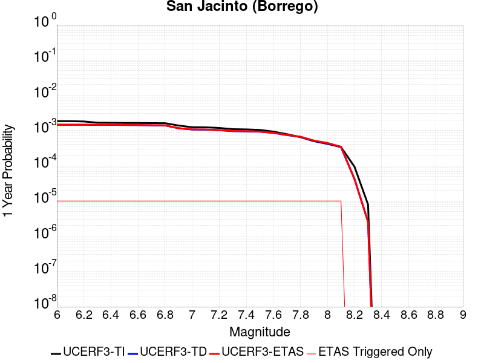 |  |

| Magnitude | 1 wk TI Prob | 1 wk TD Prob | 1 wk ETAS Prob | 1 wk ETAS/TD Gain | 1 wk ETAS Triggered Only | 1 mo TI Prob | 1 mo TD Prob | 1 mo ETAS Prob | 1 mo ETAS/TD Gain | 1 mo ETAS Triggered Only | 1 yr TI Prob | 1 yr TD Prob | 1 yr ETAS Prob | 1 yr ETAS/TD Gain | 1 yr ETAS Triggered Only | 10 yr TI Prob | 10 yr TD Prob | 10 yr ETAS Prob | 10 yr ETAS/TD Gain | 10 yr ETAS Triggered Only |
|-----|-----|-----|-----|-----|-----|-----|-----|-----|-----|-----|-----|-----|-----|-----|-----|-----|-----|-----|-----|-----|
| 6.0 | 3.543992E-5 | 2.796431E-5 | 2.796431E-5 | 1.0 | 0.0 | 1.5187653E-4 | 1.1984161E-4 | 1.346753E-4 | 1.1237775 | 1.4835475E-5 | 0.0018475284 | 0.0014581073 | 0.0014729211 | 1.0101596 | 1.4835475E-5 | 0.018322436 | 0.014889292 | 0.014918521 | 1.0019631 | 2.967095E-5 |
| 6.1 | 3.542281E-5 | 2.796431E-5 | 2.796431E-5 | 1.0 | 0.0 | 1.5180321E-4 | 1.1984161E-4 | 1.346753E-4 | 1.1237775 | 1.4835475E-5 | 0.0018466372 | 0.0014581073 | 0.0014729211 | 1.0101596 | 1.4835475E-5 | 0.018313672 | 0.014889292 | 0.014918521 | 1.0019631 | 2.967095E-5 |
| 6.2 | 3.4688688E-5 | 2.796431E-5 | 2.796431E-5 | 1.0 | 0.0 | 1.4865733E-4 | 1.1984161E-4 | 1.346753E-4 | 1.1237775 | 1.4835475E-5 | 0.0018084005 | 0.0014581073 | 0.0014729211 | 1.0101596 | 1.4835475E-5 | 0.017937548 | 0.0148892915 | 0.014918521 | 1.0019631 | 2.967095E-5 |
| 6.3 | 3.2087122E-5 | 2.7809638E-5 | 2.7809638E-5 | 1.0 | 0.0 | 1.3750899E-4 | 1.1917879E-4 | 1.340125E-4 | 1.124466 | 1.4835475E-5 | 0.0016728862 | 0.0014500482 | 0.0014648621 | 1.0102162 | 1.4835475E-5 | 0.016603488 | 0.014810317 | 0.014839549 | 1.0019737 | 2.967095E-5 |
| 6.4 | 3.1828724E-5 | 2.7776618E-5 | 2.7776618E-5 | 1.0 | 0.0 | 1.364017E-4 | 1.19037286E-4 | 1.33871E-4 | 1.124614 | 1.4835475E-5 | 0.0016594254 | 0.0014483277 | 0.0014631416 | 1.0102284 | 1.4835475E-5 | 0.016470885 | 0.014793392 | 0.014822624 | 1.001976 | 2.967095E-5 |
| 6.5 | 3.1563577E-5 | 2.7516275E-5 | 2.7516275E-5 | 1.0 | 0.0 | 1.3526545E-4 | 1.17921634E-4 | 1.3275536E-4 | 1.1257931 | 1.4835475E-5 | 0.0016456128 | 0.0014347626 | 0.0014495767 | 1.0103252 | 1.4835475E-5 | 0.0163348 | 0.01465995 | 0.014689186 | 1.0019943 | 2.967095E-5 |
| 6.6 | 3.1467625E-5 | 2.7360473E-5 | 2.7360473E-5 | 1.0 | 0.0 | 1.3485427E-4 | 1.1725396E-4 | 1.320877E-4 | 1.1265094 | 1.4835475E-5 | 0.0016406142 | 0.0014266444 | 0.0014414587 | 1.0103841 | 1.4835475E-5 | 0.016285548 | 0.014580184 | 0.014609423 | 1.0020053 | 2.967095E-5 |
| 6.7 | 3.1223695E-5 | 2.6978434E-5 | 2.6978434E-5 | 1.0 | 0.0 | 1.3380898E-4 | 1.1561681E-4 | 1.3045057E-4 | 1.128301 | 1.4835475E-5 | 0.0016279068 | 0.0014067378 | 0.0014215524 | 1.0105312 | 1.4835475E-5 | 0.01616033 | 0.014384531 | 0.014413776 | 1.002033 | 2.967095E-5 |
| 6.8 | 3.1015585E-5 | 2.6799376E-5 | 2.6799376E-5 | 1.0 | 0.0 | 1.3291716E-4 | 1.14849485E-4 | 1.2968325E-4 | 1.1291584 | 1.4835475E-5 | 0.001617065 | 0.0013974076 | 0.0014122224 | 1.0106016 | 1.4835475E-5 | 0.016053487 | 0.01429178 | 0.014321026 | 1.0020465 | 2.967095E-5 |
| 6.9 | 2.6641965E-5 | 2.221954E-5 | 2.221954E-5 | 1.0 | 0.0 | 1.1417485E-4 | 9.522314E-5 | 1.10057204E-4 | 1.1557821 | 1.4835475E-5 | 0.0013891924 | 0.0011587291 | 0.0011735475 | 1.0127884 | 1.4835475E-5 | 0.0138054015 | 0.011900866 | 0.011930184 | 1.0024635 | 2.967095E-5 |
| 7.0 | 2.3854353E-5 | 2.051304E-5 | 2.051304E-5 | 1.0 | 0.0 | 1.02228936E-4 | 8.791008E-5 | 1.0274425E-4 | 1.1687425 | 1.4835475E-5 | 0.0012439266 | 0.0010697822 | 0.0010846019 | 1.013853 | 1.4835475E-5 | 0.012369866 | 0.011000569 | 0.011029914 | 1.0026675 | 2.967095E-5 |
| 7.1 | 2.3672901E-5 | 2.0349491E-5 | 2.0349491E-5 | 1.0 | 0.0 | 1.0145135E-4 | 8.7209206E-5 | 1.02043385E-4 | 1.1700988 | 1.4835475E-5 | 0.0012344702 | 0.0010612574 | 0.0010760771 | 1.0139643 | 1.4835475E-5 | 0.0122763505 | 0.010915728 | 0.010945076 | 1.0026885 | 2.967095E-5 |
| 7.2 | 2.2717244E-5 | 1.9576588E-5 | 1.9576588E-5 | 1.0 | 0.0 | 9.735599E-5 | 8.389697E-5 | 9.87312E-5 | 1.1768148 | 1.4835475E-5 | 0.0011846646 | 0.0010209694 | 0.0010357897 | 1.014516 | 1.4835475E-5 | 0.01178369 | 0.010512954 | 0.010542313 | 1.0027926 | 2.967095E-5 |
| 7.3 | 2.1016205E-5 | 1.8417742E-5 | 1.8417742E-5 | 1.0 | 0.0 | 9.006634E-5 | 7.893081E-5 | 9.376511E-5 | 1.1879406 | 1.4835475E-5 | 0.001096006 | 9.60561E-4 | 9.753822E-4 | 1.0154297 | 1.4835475E-5 | 0.010906163 | 0.009908342 | 0.009937719 | 1.0029649 | 2.967095E-5 |
| 7.4 | 2.0683625E-5 | 1.8220166E-5 | 1.8220166E-5 | 1.0 | 0.0 | 8.86411E-5 | 7.80841E-5 | 9.291842E-5 | 1.1899787 | 1.4835475E-5 | 0.001078671 | 9.502613E-4 | 9.650827E-4 | 1.0155971 | 1.4835475E-5 | 0.010734501 | 0.009805017 | 0.009834398 | 1.0029964 | 2.967095E-5 |
| 7.5 | 1.9993966E-5 | 1.7814898E-5 | 1.7814898E-5 | 1.0 | 0.0 | 8.568561E-5 | 7.634734E-5 | 9.118169E-5 | 1.1943007 | 1.4835475E-5 | 0.001042723 | 9.2913455E-4 | 9.4395626E-4 | 1.0159521 | 1.4835475E-5 | 0.010378438 | 0.00959179 | 0.009621177 | 1.0030637 | 2.967095E-5 |
| 7.6 | 1.788966E-5 | 1.6467278E-5 | 1.6467278E-5 | 1.0 | 0.0 | 7.666772E-5 | 7.0572154E-5 | 8.540658E-5 | 1.2102023 | 1.4835475E-5 | 9.3302975E-4 | 8.58879E-4 | 8.7370176E-4 | 1.0172583 | 1.4835475E-5 | 0.00929122 | 0.008883239 | 0.008912645 | 1.0033104 | 2.967095E-5 |
| 7.7 | 1.5125781E-5 | 1.4268165E-5 | 1.4268165E-5 | 1.0 | 0.0 | 6.4823165E-5 | 6.1147846E-5 | 7.598242E-5 | 1.2426016 | 1.4835475E-5 | 7.889362E-4 | 7.4422156E-4 | 7.59046E-4 | 1.0199194 | 1.4835475E-5 | 0.007861412 | 0.0077303485 | 0.00775979 | 1.0038086 | 2.967095E-5 |
| 7.8 | 1.250089E-5 | 1.2660149E-5 | 1.2660149E-5 | 1.0 | 0.0 | 5.3574146E-5 | 5.4256656E-5 | 6.909133E-5 | 1.2734165 | 1.4835475E-5 | 6.5207E-4 | 6.603752E-4 | 6.752009E-4 | 1.0224503 | 1.4835475E-5 | 0.006501599 | 0.0068833292 | 0.006912796 | 1.0042809 | 2.967095E-5 |
| 7.9 | 9.561E-6 | 9.780887E-6 | 9.780887E-6 | 1.0 | 0.0 | 4.0975072E-5 | 4.1917418E-5 | 5.675227E-5 | 1.3539066 | 1.4835475E-5 | 4.987573E-4 | 5.102256E-4 | 5.2505353E-4 | 1.0290614 | 1.4835475E-5 | 0.0049763937 | 0.0053661815 | 0.0053956932 | 1.0054996 | 2.967095E-5 |
| 8.0 | 8.01699E-6 | 8.317406E-6 | 8.317406E-6 | 1.0 | 0.0 | 3.4358076E-5 | 3.5645542E-5 | 5.048049E-5 | 1.4161795 | 1.4835475E-5 | 4.1822926E-4 | 4.338986E-4 | 4.4872763E-4 | 1.0341762 | 1.4835475E-5 | 0.0041744304 | 0.0045859925 | 0.004615527 | 1.0064403 | 2.967095E-5 |
| 8.1 | 6.541947E-6 | 6.48181E-6 | 6.48181E-6 | 1.0 | 0.0 | 2.8036617E-5 | 2.7778893E-5 | 4.2613956E-5 | 1.5340408 | 1.4835475E-5 | 3.4129233E-4 | 3.3815604E-4 | 3.529865E-4 | 1.0438569 | 1.4835475E-5 | 0.0034076865 | 0.0035910707 | 0.003620635 | 1.0082327 | 2.967095E-5 |
| 8.2 | 1.7968189E-6 | 8.0087233E-7 | 8.0087233E-7 | 1.0 | 0.0 | 7.70063E-6 | 3.4323054E-6 | 3.4323054E-6 | 1.0 | 0.0 | 9.3751136E-5 | 4.178754E-5 | 4.178754E-5 | 1.0 | 0.0 | 9.371159E-4 | 4.7330037E-4 | 4.7330037E-4 | 1.0 | 0.0 |
| 8.3 | 1.5167889E-7 | 4.9244502E-8 | 4.9244502E-8 | 1.0 | 0.0 | 6.500522E-7 | 2.1104785E-7 | 2.1104785E-7 | 1.0 | 0.0 | 7.9143565E-6 | 2.5695049E-6 | 2.5695049E-6 | 1.0 | 0.0 | 7.914075E-5 | 2.9848346E-5 | 2.9848346E-5 | 1.0 | 0.0 |

## San Clemente
*[(top)](#table-of-contents)*

| 1 Week | 1 Month | 1 Year | 10 Year |
|-----|-----|-----|-----|
| 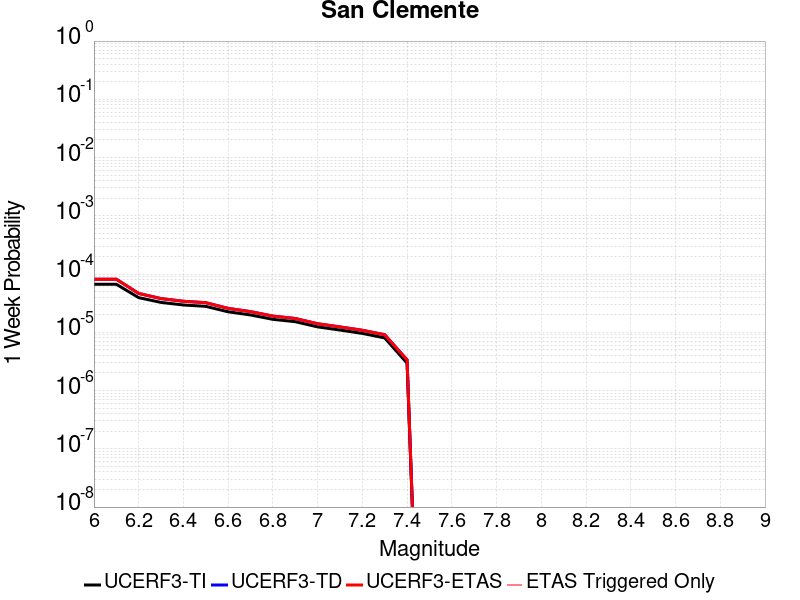 |  | 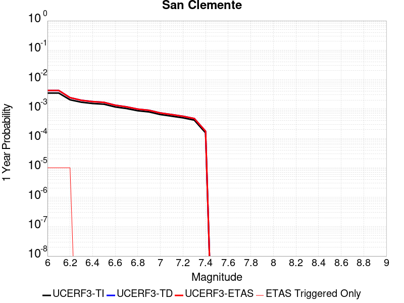 |  |

| Magnitude | 1 wk TI Prob | 1 wk TD Prob | 1 wk ETAS Prob | 1 wk ETAS/TD Gain | 1 wk ETAS Triggered Only | 1 mo TI Prob | 1 mo TD Prob | 1 mo ETAS Prob | 1 mo ETAS/TD Gain | 1 mo ETAS Triggered Only | 1 yr TI Prob | 1 yr TD Prob | 1 yr ETAS Prob | 1 yr ETAS/TD Gain | 1 yr ETAS Triggered Only | 10 yr TI Prob | 10 yr TD Prob | 10 yr ETAS Prob | 10 yr ETAS/TD Gain | 10 yr ETAS Triggered Only |
|-----|-----|-----|-----|-----|-----|-----|-----|-----|-----|-----|-----|-----|-----|-----|-----|-----|-----|-----|-----|-----|
| 6.0 | 6.681379E-5 | 8.1646554E-5 | 8.1646554E-5 | 1.0 | 0.0 | 2.8631336E-4 | 3.4987013E-4 | 3.6470042E-4 | 1.042388 | 1.4835475E-5 | 0.003480294 | 0.004251928 | 0.0042667007 | 1.0034742 | 1.4835475E-5 | 0.03426291 | 0.041761722 | 0.041790154 | 1.0006808 | 2.967095E-5 |
| 6.1 | 6.681379E-5 | 8.1646554E-5 | 8.1646554E-5 | 1.0 | 0.0 | 2.8631336E-4 | 3.4987013E-4 | 3.6470042E-4 | 1.042388 | 1.4835475E-5 | 0.003480294 | 0.004251928 | 0.0042667007 | 1.0034742 | 1.4835475E-5 | 0.03426291 | 0.041761722 | 0.041775938 | 1.0003405 | 1.4835475E-5 |
| 6.2 | 3.9400576E-5 | 4.645757E-5 | 4.645757E-5 | 1.0 | 0.0 | 1.6884868E-4 | 1.9908903E-4 | 2.1392155E-4 | 1.074502 | 1.4835475E-5 | 0.0020537945 | 0.0024212755 | 0.0024360751 | 1.0061123 | 1.4835475E-5 | 0.020349167 | 0.023955684 | 0.023970164 | 1.0006045 | 1.4835475E-5 |
| 6.3 | 3.2590255E-5 | 3.7933234E-5 | 3.7933234E-5 | 1.0 | 0.0 | 1.3966505E-4 | 1.6256105E-4 | 1.6256105E-4 | 1.0 | 0.0 | 0.0016990956 | 0.0019774144 | 0.0019774144 | 1.0 | 0.0 | 0.01686163 | 0.019601986 | 0.019601986 | 1.0 | 0.0 |
| 6.4 | 2.9454652E-5 | 3.4101355E-5 | 3.4101355E-5 | 1.0 | 0.0 | 1.2622811E-4 | 1.461406E-4 | 1.461406E-4 | 1.0 | 0.0 | 0.0015357438 | 0.0017778344 | 0.0017778344 | 1.0 | 0.0 | 0.015251739 | 0.017639294 | 0.017639294 | 1.0 | 0.0 |
| 6.5 | 2.790836E-5 | 3.2250795E-5 | 3.2250795E-5 | 1.0 | 0.0 | 1.1960178E-4 | 1.382105E-4 | 1.382105E-4 | 1.0 | 0.0 | 0.001455179 | 0.0016814389 | 0.0016814389 | 1.0 | 0.0 | 0.014456868 | 0.016690189 | 0.016690189 | 1.0 | 0.0 |
| 6.6 | 2.2492153E-5 | 2.5765197E-5 | 2.5765197E-5 | 1.0 | 0.0 | 9.639138E-5 | 1.1041767E-4 | 1.1041767E-4 | 1.0 | 0.0 | 0.0011729331 | 0.0013435206 | 0.0013435206 | 1.0 | 0.0 | 0.011667615 | 0.013355698 | 0.013355698 | 1.0 | 0.0 |
| 6.7 | 1.9862755E-5 | 2.2668548E-5 | 2.2668548E-5 | 1.0 | 0.0 | 8.512331E-5 | 9.714737E-5 | 9.714737E-5 | 1.0 | 0.0 | 0.0010358836 | 0.0011821387 | 0.0011821387 | 1.0 | 0.0 | 0.010310682 | 0.011759797 | 0.011759797 | 1.0 | 0.0 |
| 6.8 | 1.6697575E-5 | 1.897943E-5 | 1.897943E-5 | 1.0 | 0.0 | 7.155907E-5 | 8.133793E-5 | 8.133793E-5 | 1.0 | 0.0 | 8.7088346E-4 | 9.898487E-4 | 9.898487E-4 | 1.0 | 0.0 | 0.008674784 | 0.009855426 | 0.009855426 | 1.0 | 0.0 |
| 6.9 | 1.5218415E-5 | 1.7270944E-5 | 1.7270944E-5 | 1.0 | 0.0 | 6.522015E-5 | 7.401629E-5 | 7.401629E-5 | 1.0 | 0.0 | 7.93766E-4 | 9.007845E-4 | 9.007845E-4 | 1.0 | 0.0 | 0.007909367 | 0.008972279 | 0.008972279 | 1.0 | 0.0 |
| 7.0 | 1.2392958E-5 | 1.4034247E-5 | 1.4034247E-5 | 1.0 | 0.0 | 5.3111595E-5 | 6.014543E-5 | 6.014543E-5 | 1.0 | 0.0 | 6.4644177E-4 | 7.320322E-4 | 7.320322E-4 | 1.0 | 0.0 | 0.0064456454 | 0.007296995 | 0.007296995 | 1.0 | 0.0 |
| 7.1 | 1.0934128E-5 | 1.2376219E-5 | 1.2376219E-5 | 1.0 | 0.0 | 4.6859706E-5 | 5.3039905E-5 | 5.3039905E-5 | 1.0 | 0.0 | 5.7036756E-4 | 6.455768E-4 | 6.455768E-4 | 1.0 | 0.0 | 0.0056890585 | 0.006437761 | 0.006437761 | 1.0 | 0.0 |
| 7.2 | 9.5798805E-6 | 1.0845885E-5 | 1.0845885E-5 | 1.0 | 0.0 | 4.1055984E-5 | 4.648158E-5 | 4.648158E-5 | 1.0 | 0.0 | 4.9974193E-4 | 5.6577346E-4 | 5.6577346E-4 | 1.0 | 0.0 | 0.0049861963 | 0.0056440546 | 0.0056440546 | 1.0 | 0.0 |
| 7.3 | 8.0167365E-6 | 9.08472E-6 | 9.08472E-6 | 1.0 | 0.0 | 3.4356988E-5 | 3.893397E-5 | 3.893397E-5 | 1.0 | 0.0 | 4.1821605E-4 | 4.7392506E-4 | 4.7392506E-4 | 1.0 | 0.0 | 0.0041742986 | 0.0047298465 | 0.0047298465 | 1.0 | 0.0 |
| 7.4 | 2.9581017E-6 | 3.3626839E-6 | 3.3626839E-6 | 1.0 | 0.0 | 1.2677518E-5 | 1.4411452E-5 | 1.4411452E-5 | 1.0 | 0.0 | 1.5433785E-4 | 1.7545035E-4 | 1.7545035E-4 | 1.0 | 0.0 | 0.001542307 | 0.0017536134 | 0.0017536134 | 1.0 | 0.0 |

## Monterey Bay-Tularcitos
*[(top)](#table-of-contents)*

| 1 Week | 1 Month | 1 Year | 10 Year |
|-----|-----|-----|-----|
|  |  |  |  |

| Magnitude | 1 wk TI Prob | 1 wk TD Prob | 1 wk ETAS Prob | 1 wk ETAS/TD Gain | 1 wk ETAS Triggered Only | 1 mo TI Prob | 1 mo TD Prob | 1 mo ETAS Prob | 1 mo ETAS/TD Gain | 1 mo ETAS Triggered Only | 1 yr TI Prob | 1 yr TD Prob | 1 yr ETAS Prob | 1 yr ETAS/TD Gain | 1 yr ETAS Triggered Only | 10 yr TI Prob | 10 yr TD Prob | 10 yr ETAS Prob | 10 yr ETAS/TD Gain | 10 yr ETAS Triggered Only |
|-----|-----|-----|-----|-----|-----|-----|-----|-----|-----|-----|-----|-----|-----|-----|-----|-----|-----|-----|-----|-----|
| 6.0 | 3.0131365E-5 | 3.2800777E-5 | 3.2800777E-5 | 1.0 | 0.0 | 1.2912804E-4 | 1.4056778E-4 | 1.4056778E-4 | 1.0 | 0.0 | 0.001571 | 0.0017101747 | 0.0017249848 | 1.00866 | 1.4835475E-5 | 0.015599402 | 0.016980948 | 0.017010115 | 1.0017177 | 2.967095E-5 |
| 6.1 | 3.0131365E-5 | 3.2800777E-5 | 3.2800777E-5 | 1.0 | 0.0 | 1.2912804E-4 | 1.4056778E-4 | 1.4056778E-4 | 1.0 | 0.0 | 0.001571 | 0.0017101747 | 0.0017249848 | 1.00866 | 1.4835475E-5 | 0.015599402 | 0.016980948 | 0.017010115 | 1.0017177 | 2.967095E-5 |
| 6.2 | 3.0131365E-5 | 3.2800777E-5 | 3.2800777E-5 | 1.0 | 0.0 | 1.2912804E-4 | 1.4056778E-4 | 1.4056778E-4 | 1.0 | 0.0 | 0.001571 | 0.0017101747 | 0.0017249848 | 1.00866 | 1.4835475E-5 | 0.015599402 | 0.016980948 | 0.017010115 | 1.0017177 | 2.967095E-5 |
| 6.3 | 1.6998249E-5 | 1.8331826E-5 | 1.8331826E-5 | 1.0 | 0.0 | 7.28476E-5 | 7.856271E-5 | 7.856271E-5 | 1.0 | 0.0 | 8.865586E-4 | 9.561E-4 | 9.709213E-4 | 1.0155019 | 1.4835475E-5 | 0.0088303005 | 0.00952179 | 0.009551179 | 1.0030864 | 2.967095E-5 |
| 6.4 | 1.6998249E-5 | 1.8331826E-5 | 1.8331826E-5 | 1.0 | 0.0 | 7.28476E-5 | 7.856271E-5 | 7.856271E-5 | 1.0 | 0.0 | 8.865586E-4 | 9.561E-4 | 9.709213E-4 | 1.0155019 | 1.4835475E-5 | 0.0088303005 | 0.00952179 | 0.009551179 | 1.0030864 | 2.967095E-5 |
| 6.5 | 1.27470785E-5 | 1.3694062E-5 | 1.3694062E-5 | 1.0 | 0.0 | 5.4629192E-5 | 5.8687576E-5 | 5.8687576E-5 | 1.0 | 0.0 | 6.649074E-4 | 7.1429735E-4 | 7.291222E-4 | 1.0207545 | 1.4835475E-5 | 0.0066292146 | 0.0071210666 | 0.007150526 | 1.0041369 | 2.967095E-5 |
| 6.6 | 1.2739422E-5 | 1.3686149E-5 | 1.3686149E-5 | 1.0 | 0.0 | 5.4596385E-5 | 5.8653663E-5 | 5.8653663E-5 | 1.0 | 0.0 | 6.645082E-4 | 7.138847E-4 | 7.287096E-4 | 1.0207665 | 1.4835475E-5 | 0.0066252467 | 0.007116967 | 0.007146427 | 1.0041394 | 2.967095E-5 |
| 6.7 | 1.0160109E-5 | 1.0886345E-5 | 1.0886345E-5 | 1.0 | 0.0 | 4.35426E-5 | 4.6654968E-5 | 4.6654968E-5 | 1.0 | 0.0 | 5.300022E-4 | 5.6788325E-4 | 5.827103E-4 | 1.0261093 | 1.4835475E-5 | 0.005287399 | 0.0056650327 | 0.005679784 | 1.0026039 | 1.4835475E-5 |
| 6.8 | 8.349859E-6 | 8.933075E-6 | 8.933075E-6 | 1.0 | 0.0 | 3.578462E-5 | 3.8284077E-5 | 3.8284077E-5 | 1.0 | 0.0 | 4.3559066E-4 | 4.660146E-4 | 4.660146E-4 | 1.0 | 0.0 | 0.004347378 | 0.004650939 | 0.004650939 | 1.0 | 0.0 |
| 6.9 | 5.193639E-6 | 5.536747E-6 | 5.536747E-6 | 1.0 | 0.0 | 2.2258262E-5 | 2.3728717E-5 | 2.3728717E-5 | 1.0 | 0.0 | 2.7096065E-4 | 2.888621E-4 | 2.888621E-4 | 1.0 | 0.0 | 0.0027063051 | 0.002885187 | 0.002885187 | 1.0 | 0.0 |
| 7.0 | 4.359381E-6 | 4.6436408E-6 | 4.6436408E-6 | 1.0 | 0.0 | 1.8682927E-5 | 1.9901183E-5 | 1.9901183E-5 | 1.0 | 0.0 | 2.274409E-4 | 2.4227293E-4 | 2.4227293E-4 | 1.0 | 0.0 | 0.0022720827 | 0.0024203812 | 0.0024203812 | 1.0 | 0.0 |
| 7.1 | 3.0398533E-6 | 3.2312516E-6 | 3.2312516E-6 | 1.0 | 0.0 | 1.3027877E-5 | 1.3848162E-5 | 1.3848162E-5 | 1.0 | 0.0 | 1.5860285E-4 | 1.6859095E-4 | 1.6859095E-4 | 1.0 | 0.0 | 0.001584897 | 0.0016848883 | 0.0016848883 | 1.0 | 0.0 |
| 7.2 | 1.642335E-6 | 1.7334529E-6 | 1.7334529E-6 | 1.0 | 0.0 | 7.0385595E-6 | 7.4290747E-6 | 7.4290747E-6 | 1.0 | 0.0 | 8.569109E-5 | 9.04473E-5 | 9.04473E-5 | 1.0 | 0.0 | 8.5658056E-4 | 9.043076E-4 | 9.043076E-4 | 1.0 | 0.0 |
| 7.3 | 3.356842E-7 | 3.2959213E-7 | 3.2959213E-7 | 1.0 | 0.0 | 1.4386458E-6 | 1.4125369E-6 | 1.4125369E-6 | 1.0 | 0.0 | 1.7515373E-5 | 1.7197503E-5 | 1.7197503E-5 | 1.0 | 0.0 | 1.7513991E-4 | 1.719618E-4 | 1.719618E-4 | 1.0 | 0.0 |
| 7.4 | 2.1973483E-7 | 2.1012997E-7 | 2.1012997E-7 | 1.0 | 0.0 | 9.417204E-7 | 9.005567E-7 | 9.005567E-7 | 1.0 | 0.0 | 1.1465385E-5 | 1.0964222E-5 | 1.0964222E-5 | 1.0 | 0.0 | 1.1464794E-4 | 1.0963686E-4 | 1.0963686E-4 | 1.0 | 0.0 |
| 7.5 | 1.1944135E-7 | 1.07024064E-7 | 1.07024064E-7 | 1.0 | 0.0 | 5.118914E-7 | 4.586745E-7 | 4.586745E-7 | 1.0 | 0.0 | 6.23226E-6 | 5.5843475E-6 | 5.5843475E-6 | 1.0 | 0.0 | 6.2320854E-5 | 5.5842087E-5 | 5.5842087E-5 | 1.0 | 0.0 |
| 7.6 | 4.636058E-8 | 3.3404227E-8 | 3.3404227E-8 | 1.0 | 0.0 | 1.9868818E-7 | 1.4316096E-7 | 1.4316096E-7 | 1.0 | 0.0 | 2.419026E-6 | 1.7429833E-6 | 1.7429833E-6 | 1.0 | 0.0 | 2.4189996E-5 | 1.7429698E-5 | 1.7429698E-5 | 1.0 | 0.0 |
| 7.7 | 1.8588572E-8 | 8.020388E-9 | 8.020388E-9 | 1.0 | 0.0 | 7.9665305E-8 | 3.4373095E-8 | 3.4373095E-8 | 1.0 | 0.0 | 9.699246E-7 | 4.1849233E-7 | 4.1849233E-7 | 1.0 | 0.0 | 9.699204E-6 | 4.1849157E-6 | 4.1849157E-6 | 1.0 | 0.0 |
| 7.8 | 2.7960154E-9 | 7.635025E-10 | 7.635025E-10 | 1.0 | 0.0 | 1.1982923E-8 | 3.2721537E-9 | 3.2721537E-9 | 1.0 | 0.0 | 1.4589209E-7 | 3.9838472E-8 | 3.9838472E-8 | 1.0 | 0.0 | 1.4589199E-6 | 3.9838469E-7 | 3.9838469E-7 | 1.0 | 0.0 |

## Great Valley 09 (Laguna Seca)
*[(top)](#table-of-contents)*

| 1 Week | 1 Month | 1 Year | 10 Year |
|-----|-----|-----|-----|
|  |  | 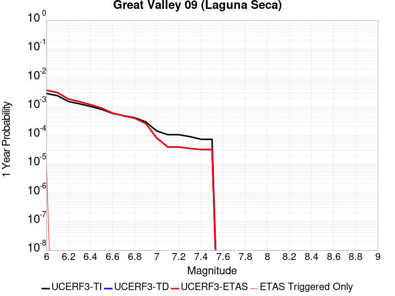 |  |

| Magnitude | 1 wk TI Prob | 1 wk TD Prob | 1 wk ETAS Prob | 1 wk ETAS/TD Gain | 1 wk ETAS Triggered Only | 1 mo TI Prob | 1 mo TD Prob | 1 mo ETAS Prob | 1 mo ETAS/TD Gain | 1 mo ETAS Triggered Only | 1 yr TI Prob | 1 yr TD Prob | 1 yr ETAS Prob | 1 yr ETAS/TD Gain | 1 yr ETAS Triggered Only | 10 yr TI Prob | 10 yr TD Prob | 10 yr ETAS Prob | 10 yr ETAS/TD Gain | 10 yr ETAS Triggered Only |
|-----|-----|-----|-----|-----|-----|-----|-----|-----|-----|-----|-----|-----|-----|-----|-----|-----|-----|-----|-----|-----|
| 6.0 | 5.4353277E-5 | 7.051605E-5 | 7.051605E-5 | 1.0 | 0.0 | 2.3292181E-4 | 3.0217879E-4 | 3.0217879E-4 | 1.0 | 0.0 | 0.0028321352 | 0.0036729057 | 0.0036876868 | 1.0040244 | 1.4835475E-5 | 0.02796312 | 0.036122676 | 0.036151275 | 1.0007917 | 2.967095E-5 |
| 6.1 | 4.5578287E-5 | 5.82317E-5 | 5.82317E-5 | 1.0 | 0.0 | 1.953209E-4 | 2.495421E-4 | 2.495421E-4 | 1.0 | 0.0 | 0.0023754383 | 0.003034024 | 0.003034024 | 1.0 | 0.0 | 0.023502063 | 0.02992534 | 0.029939733 | 1.0004809 | 1.4835475E-5 |
| 6.2 | 2.8536782E-5 | 3.4741766E-5 | 3.4741766E-5 | 1.0 | 0.0 | 1.2229476E-4 | 1.4888523E-4 | 1.4888523E-4 | 1.0 | 0.0 | 0.0014879217 | 0.0018111365 | 0.0018111365 | 1.0 | 0.0 | 0.014779986 | 0.01796127 | 0.017975839 | 1.0008111 | 1.4835475E-5 |
| 6.3 | 2.3698774E-5 | 2.8216242E-5 | 2.8216242E-5 | 1.0 | 0.0 | 1.01562226E-4 | 1.2092145E-4 | 1.2092145E-4 | 1.0 | 0.0 | 0.0012358186 | 0.0014712807 | 0.0014712807 | 1.0 | 0.0 | 0.012289686 | 0.014613791 | 0.014613791 | 1.0 | 0.0 |
| 6.4 | 1.9191197E-5 | 2.2124681E-5 | 2.2124681E-5 | 1.0 | 0.0 | 8.2245395E-5 | 9.4816845E-5 | 9.4816845E-5 | 1.0 | 0.0 | 0.0010008777 | 0.0011538268 | 0.0011538268 | 1.0 | 0.0 | 0.009963818 | 0.011478737 | 0.011478737 | 1.0 | 0.0 |
| 6.5 | 1.5203241E-5 | 1.68025E-5 | 1.68025E-5 | 1.0 | 0.0 | 6.5155116E-5 | 7.200888E-5 | 7.200888E-5 | 1.0 | 0.0 | 7.9297484E-4 | 8.763874E-4 | 8.763874E-4 | 1.0 | 0.0 | 0.007901512 | 0.008730734 | 0.008730734 | 1.0 | 0.0 |
| 6.6 | 1.0984925E-5 | 1.124381E-5 | 1.124381E-5 | 1.0 | 0.0 | 4.70774E-5 | 4.818687E-5 | 4.818687E-5 | 1.0 | 0.0 | 5.730166E-4 | 5.8652123E-4 | 5.8652123E-4 | 1.0 | 0.0 | 0.005715413 | 0.00585013 | 0.00585013 | 1.0 | 0.0 |
| 6.7 | 9.134616E-6 | 9.0208405E-6 | 9.0208405E-6 | 1.0 | 0.0 | 3.9147766E-5 | 3.8660186E-5 | 3.8660186E-5 | 1.0 | 0.0 | 4.7651984E-4 | 4.705885E-4 | 4.705885E-4 | 1.0 | 0.0 | 0.004754993 | 0.004696165 | 0.004696165 | 1.0 | 0.0 |
| 6.8 | 7.785589E-6 | 7.452722E-6 | 7.452722E-6 | 1.0 | 0.0 | 3.3366385E-5 | 3.1939857E-5 | 3.1939857E-5 | 1.0 | 0.0 | 4.0616E-4 | 3.888004E-4 | 3.888004E-4 | 1.0 | 0.0 | 0.0040541845 | 0.0038814058 | 0.0038814058 | 1.0 | 0.0 |
| 6.9 | 5.579095E-6 | 4.8990037E-6 | 4.8990037E-6 | 1.0 | 0.0 | 2.3910188E-5 | 2.0995569E-5 | 2.0995569E-5 | 1.0 | 0.0 | 2.9106764E-4 | 2.5559246E-4 | 2.5559246E-4 | 1.0 | 0.0 | 0.002906867 | 0.0025531224 | 0.0025531224 | 1.0 | 0.0 |
| 7.0 | 2.6816688E-6 | 1.5217529E-6 | 1.5217529E-6 | 1.0 | 0.0 | 1.1492816E-5 | 6.5217823E-6 | 6.5217823E-6 | 1.0 | 0.0 | 1.3991605E-4 | 7.93999E-5 | 7.93999E-5 | 1.0 | 0.0 | 0.0013982799 | 7.93724E-4 | 7.93724E-4 | 1.0 | 0.0 |
| 7.1 | 1.9951021E-6 | 7.454556E-7 | 7.454556E-7 | 1.0 | 0.0 | 8.55041E-6 | 3.1948064E-6 | 3.1948064E-6 | 1.0 | 0.0 | 1.0409627E-4 | 3.8896113E-5 | 3.8896113E-5 | 1.0 | 0.0 | 0.0010404752 | 3.888972E-4 | 3.888972E-4 | 1.0 | 0.0 |
| 7.2 | 1.9951021E-6 | 7.454556E-7 | 7.454556E-7 | 1.0 | 0.0 | 8.55041E-6 | 3.1948064E-6 | 3.1948064E-6 | 1.0 | 0.0 | 1.0409627E-4 | 3.8896113E-5 | 3.8896113E-5 | 1.0 | 0.0 | 0.0010404752 | 3.888972E-4 | 3.888972E-4 | 1.0 | 0.0 |
| 7.3 | 1.7087556E-6 | 6.5794904E-7 | 6.5794904E-7 | 1.0 | 0.0 | 7.3232177E-6 | 2.819779E-6 | 2.819779E-6 | 1.0 | 0.0 | 8.915652E-5 | 3.4330307E-5 | 3.4330307E-5 | 1.0 | 0.0 | 8.9120766E-4 | 3.432541E-4 | 3.432541E-4 | 1.0 | 0.0 |
| 7.4 | 1.3804846E-6 | 6.0743554E-7 | 6.0743554E-7 | 1.0 | 0.0 | 5.916349E-6 | 2.6032928E-6 | 2.6032928E-6 | 1.0 | 0.0 | 7.2029165E-5 | 3.1694668E-5 | 3.1694668E-5 | 1.0 | 0.0 | 7.200583E-4 | 3.169055E-4 | 3.169055E-4 | 1.0 | 0.0 |
| 7.5 | 1.3804846E-6 | 6.0743554E-7 | 6.0743554E-7 | 1.0 | 0.0 | 5.916349E-6 | 2.6032928E-6 | 2.6032928E-6 | 1.0 | 0.0 | 7.2029165E-5 | 3.1694668E-5 | 3.1694668E-5 | 1.0 | 0.0 | 7.200583E-4 | 3.169055E-4 | 3.169055E-4 | 1.0 | 0.0 |

## Elsinore (Coyote Mountains)
*[(top)](#table-of-contents)*

| 1 Week | 1 Month | 1 Year | 10 Year |
|-----|-----|-----|-----|
| 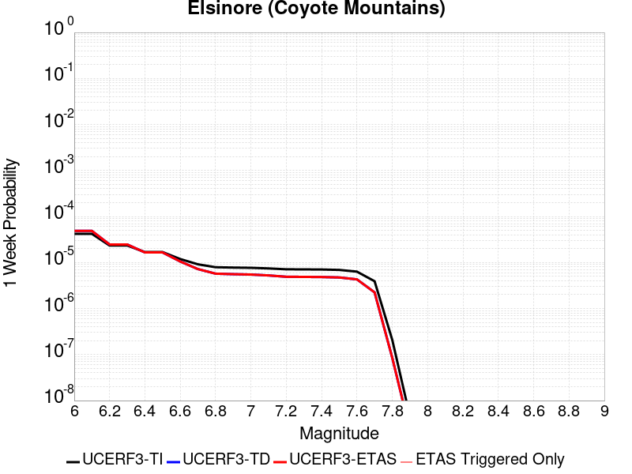 | 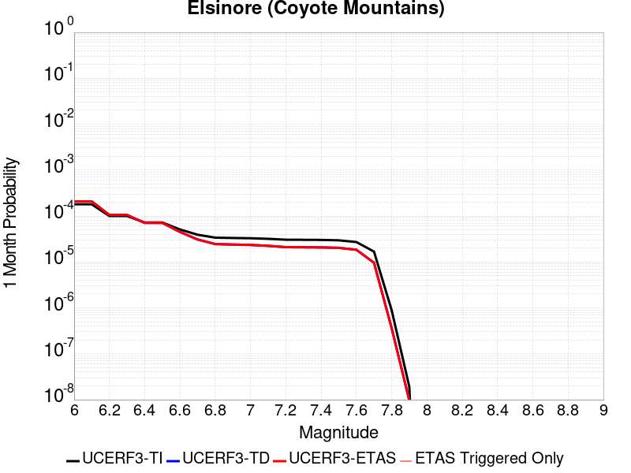 |  | 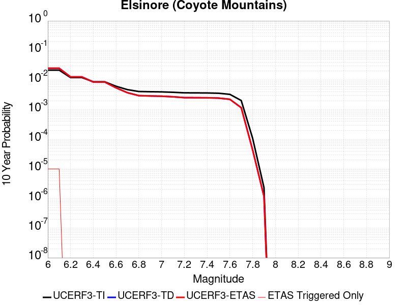 |

| Magnitude | 1 wk TI Prob | 1 wk TD Prob | 1 wk ETAS Prob | 1 wk ETAS/TD Gain | 1 wk ETAS Triggered Only | 1 mo TI Prob | 1 mo TD Prob | 1 mo ETAS Prob | 1 mo ETAS/TD Gain | 1 mo ETAS Triggered Only | 1 yr TI Prob | 1 yr TD Prob | 1 yr ETAS Prob | 1 yr ETAS/TD Gain | 1 yr ETAS Triggered Only | 10 yr TI Prob | 10 yr TD Prob | 10 yr ETAS Prob | 10 yr ETAS/TD Gain | 10 yr ETAS Triggered Only |
|-----|-----|-----|-----|-----|-----|-----|-----|-----|-----|-----|-----|-----|-----|-----|-----|-----|-----|-----|-----|-----|
| 6.0 | 4.20513E-5 | 4.8640344E-5 | 4.8640344E-5 | 1.0 | 0.0 | 1.8020741E-4 | 2.0844521E-4 | 2.0844521E-4 | 1.0 | 0.0 | 0.0021918174 | 0.0025354403 | 0.0025354403 | 1.0 | 0.0 | 0.021703249 | 0.025115484 | 0.025129948 | 1.0005759 | 1.4835475E-5 |
| 6.1 | 4.20513E-5 | 4.8640344E-5 | 4.8640344E-5 | 1.0 | 0.0 | 1.8020741E-4 | 2.0844521E-4 | 2.0844521E-4 | 1.0 | 0.0 | 0.0021918174 | 0.0025354403 | 0.0025354403 | 1.0 | 0.0 | 0.021703249 | 0.025115484 | 0.025129948 | 1.0005759 | 1.4835475E-5 |
| 6.2 | 2.3413893E-5 | 2.469953E-5 | 2.469953E-5 | 1.0 | 0.0 | 1.0034139E-4 | 1.05851366E-4 | 1.05851366E-4 | 1.0 | 0.0 | 0.0012209718 | 0.0012880719 | 0.0012880719 | 1.0 | 0.0 | 0.012142851 | 0.012814616 | 0.012814616 | 1.0 | 0.0 |
| 6.3 | 2.3413893E-5 | 2.469953E-5 | 2.469953E-5 | 1.0 | 0.0 | 1.0034139E-4 | 1.05851366E-4 | 1.05851366E-4 | 1.0 | 0.0 | 0.0012209718 | 0.0012880719 | 0.0012880719 | 1.0 | 0.0 | 0.012142851 | 0.012814616 | 0.012814616 | 1.0 | 0.0 |
| 6.4 | 1.6894814E-5 | 1.6570888E-5 | 1.6570888E-5 | 1.0 | 0.0 | 7.240433E-5 | 7.101637E-5 | 7.101637E-5 | 1.0 | 0.0 | 8.811662E-4 | 8.6431793E-4 | 8.6431793E-4 | 1.0 | 0.0 | 0.0087768035 | 0.008613244 | 0.008613244 | 1.0 | 0.0 |
| 6.5 | 1.6894814E-5 | 1.6570888E-5 | 1.6570888E-5 | 1.0 | 0.0 | 7.240433E-5 | 7.101637E-5 | 7.101637E-5 | 1.0 | 0.0 | 8.811662E-4 | 8.6431793E-4 | 8.6431793E-4 | 1.0 | 0.0 | 0.0087768035 | 0.008613244 | 0.008613244 | 1.0 | 0.0 |
| 6.6 | 1.1910969E-5 | 1.0532448E-5 | 1.0532448E-5 | 1.0 | 0.0 | 5.1046012E-5 | 4.5138357E-5 | 4.5138357E-5 | 1.0 | 0.0 | 6.21308E-4 | 5.494322E-4 | 5.494322E-4 | 1.0 | 0.0 | 0.0061957375 | 0.005482042 | 0.005482042 | 1.0 | 0.0 |
| 6.7 | 9.1486E-6 | 7.204081E-6 | 7.204081E-6 | 1.0 | 0.0 | 3.9207694E-5 | 3.087429E-5 | 3.087429E-5 | 1.0 | 0.0 | 4.7724912E-4 | 3.7583348E-4 | 3.7583348E-4 | 1.0 | 0.0 | 0.0047622547 | 0.0037523583 | 0.0037523583 | 1.0 | 0.0 |
| 6.8 | 7.90441E-6 | 5.730069E-6 | 5.730069E-6 | 1.0 | 0.0 | 3.3875604E-5 | 2.4557214E-5 | 2.4557214E-5 | 1.0 | 0.0 | 4.1235742E-4 | 2.9894433E-4 | 2.9894433E-4 | 1.0 | 0.0 | 0.0041159308 | 0.0029855508 | 0.0029855508 | 1.0 | 0.0 |
| 6.9 | 7.77015E-6 | 5.5840146E-6 | 5.5840146E-6 | 1.0 | 0.0 | 3.3300217E-5 | 2.393128E-5 | 2.393128E-5 | 1.0 | 0.0 | 4.0535472E-4 | 2.9132565E-4 | 2.9132565E-4 | 1.0 | 0.0 | 0.004046161 | 0.0029095644 | 0.0029095644 | 1.0 | 0.0 |
| 7.0 | 7.675798E-6 | 5.480867E-6 | 5.480867E-6 | 1.0 | 0.0 | 3.289586E-5 | 2.3489225E-5 | 2.3489225E-5 | 1.0 | 0.0 | 4.004335E-4 | 2.8594505E-4 | 2.8594505E-4 | 1.0 | 0.0 | 0.003997127 | 0.0028558976 | 0.0028558976 | 1.0 | 0.0 |
| 7.1 | 7.447814E-6 | 5.239731E-6 | 5.239731E-6 | 1.0 | 0.0 | 3.191881E-5 | 2.2455803E-5 | 2.2455803E-5 | 1.0 | 0.0 | 3.8854225E-4 | 2.7336634E-4 | 2.7336634E-4 | 1.0 | 0.0 | 0.003878636 | 0.0027304252 | 0.0027304252 | 1.0 | 0.0 |
| 7.2 | 7.128185E-6 | 4.9063833E-6 | 4.9063833E-6 | 1.0 | 0.0 | 3.0549007E-5 | 2.1027194E-5 | 2.1027194E-5 | 1.0 | 0.0 | 3.7187067E-4 | 2.559772E-4 | 2.559772E-4 | 1.0 | 0.0 | 0.00371249 | 0.002556942 | 0.002556942 | 1.0 | 0.0 |
| 7.3 | 7.0913875E-6 | 4.8750567E-6 | 4.8750567E-6 | 1.0 | 0.0 | 3.0391306E-5 | 2.089294E-5 | 2.089294E-5 | 1.0 | 0.0 | 3.6995133E-4 | 2.5434303E-4 | 2.5434303E-4 | 1.0 | 0.0 | 0.0036933604 | 0.0025406377 | 0.0025406377 | 1.0 | 0.0 |
| 7.4 | 7.051521E-6 | 4.8389065E-6 | 4.8389065E-6 | 1.0 | 0.0 | 3.0220453E-5 | 2.0738013E-5 | 2.0738013E-5 | 1.0 | 0.0 | 3.6787192E-4 | 2.5245725E-4 | 2.5245725E-4 | 1.0 | 0.0 | 0.0036726352 | 0.0025218227 | 0.0025218227 | 1.0 | 0.0 |
| 7.5 | 6.910666E-6 | 4.7343788E-6 | 4.7343788E-6 | 1.0 | 0.0 | 2.9616802E-5 | 2.0290043E-5 | 2.0290043E-5 | 1.0 | 0.0 | 3.605249E-4 | 2.4700447E-4 | 2.4700447E-4 | 1.0 | 0.0 | 0.0035994058 | 0.0024674174 | 0.0024674174 | 1.0 | 0.0 |
| 7.6 | 6.341753E-6 | 4.307434E-6 | 4.307434E-6 | 1.0 | 0.0 | 2.7178658E-5 | 1.8460309E-5 | 1.8460309E-5 | 1.0 | 0.0 | 3.3084993E-4 | 2.2473223E-4 | 2.2473223E-4 | 1.0 | 0.0 | 0.0033035777 | 0.002245165 | 0.002245165 | 1.0 | 0.0 |
| 7.7 | 3.9205916E-6 | 2.2444822E-6 | 2.2444822E-6 | 1.0 | 0.0 | 1.6802427E-5 | 9.619178E-6 | 9.619178E-6 | 1.0 | 0.0 | 2.0455034E-4 | 1.1710794E-4 | 1.1710794E-4 | 1.0 | 0.0 | 0.0020436216 | 0.0011705353 | 0.0011705353 | 1.0 | 0.0 |
| 7.8 | 2.0846227E-7 | 8.4886196E-8 | 8.4886196E-8 | 1.0 | 0.0 | 8.9340944E-7 | 3.6379797E-7 | 3.6379797E-7 | 1.0 | 0.0 | 1.0877206E-5 | 4.4292347E-6 | 4.4292347E-6 | 1.0 | 0.0 | 1.0876673E-4 | 4.4291788E-5 | 4.4291788E-5 | 1.0 | 0.0 |
| 7.9 | 4.4969806E-9 | 2.2696005E-9 | 2.2696005E-9 | 1.0 | 0.0 | 1.9272775E-8 | 9.726859E-9 | 9.726859E-9 | 1.0 | 0.0 | 2.3464601E-7 | 1.1842451E-7 | 1.1842451E-7 | 1.0 | 0.0 | 2.3464577E-6 | 1.1842445E-6 | 1.1842445E-6 | 1.0 | 0.0 |

## Earthquake Valley (No  Extension)
*[(top)](#table-of-contents)*

| 1 Week | 1 Month | 1 Year | 10 Year |
|-----|-----|-----|-----|
|  |  |  |  |

| Magnitude | 1 wk TI Prob | 1 wk TD Prob | 1 wk ETAS Prob | 1 wk ETAS/TD Gain | 1 wk ETAS Triggered Only | 1 mo TI Prob | 1 mo TD Prob | 1 mo ETAS Prob | 1 mo ETAS/TD Gain | 1 mo ETAS Triggered Only | 1 yr TI Prob | 1 yr TD Prob | 1 yr ETAS Prob | 1 yr ETAS/TD Gain | 1 yr ETAS Triggered Only | 10 yr TI Prob | 10 yr TD Prob | 10 yr ETAS Prob | 10 yr ETAS/TD Gain | 10 yr ETAS Triggered Only |
|-----|-----|-----|-----|-----|-----|-----|-----|-----|-----|-----|-----|-----|-----|-----|-----|-----|-----|-----|-----|-----|
| 6.0 | 2.1859703E-5 | 2.5200983E-5 | 2.5200983E-5 | 1.0 | 0.0 | 9.3681076E-5 | 1.0800057E-4 | 1.0800057E-4 | 1.0 | 0.0 | 0.0011399703 | 0.0013142587 | 0.0013142587 | 1.0 | 0.0 | 0.011341401 | 0.013079225 | 0.013093866 | 1.0011195 | 1.4835475E-5 |
| 6.1 | 2.1859703E-5 | 2.5200983E-5 | 2.5200983E-5 | 1.0 | 0.0 | 9.3681076E-5 | 1.0800057E-4 | 1.0800057E-4 | 1.0 | 0.0 | 0.0011399703 | 0.0013142587 | 0.0013142587 | 1.0 | 0.0 | 0.011341401 | 0.013079225 | 0.013093866 | 1.0011195 | 1.4835475E-5 |
| 6.2 | 2.1859703E-5 | 2.5200983E-5 | 2.5200983E-5 | 1.0 | 0.0 | 9.3681076E-5 | 1.0800057E-4 | 1.0800057E-4 | 1.0 | 0.0 | 0.0011399703 | 0.0013142587 | 0.0013142587 | 1.0 | 0.0 | 0.011341401 | 0.013079225 | 0.013093866 | 1.0011195 | 1.4835475E-5 |
| 6.3 | 2.1859703E-5 | 2.5200983E-5 | 2.5200983E-5 | 1.0 | 0.0 | 9.3681076E-5 | 1.0800057E-4 | 1.0800057E-4 | 1.0 | 0.0 | 0.0011399703 | 0.0013142587 | 0.0013142587 | 1.0 | 0.0 | 0.011341401 | 0.013079225 | 0.013093866 | 1.0011195 | 1.4835475E-5 |
| 6.4 | 2.1859703E-5 | 2.5200983E-5 | 2.5200983E-5 | 1.0 | 0.0 | 9.3681076E-5 | 1.0800057E-4 | 1.0800057E-4 | 1.0 | 0.0 | 0.0011399703 | 0.0013142587 | 0.0013142587 | 1.0 | 0.0 | 0.011341401 | 0.013079225 | 0.013093866 | 1.0011195 | 1.4835475E-5 |
| 6.5 | 2.1859703E-5 | 2.5200983E-5 | 2.5200983E-5 | 1.0 | 0.0 | 9.3681076E-5 | 1.0800057E-4 | 1.0800057E-4 | 1.0 | 0.0 | 0.0011399703 | 0.0013142587 | 0.0013142587 | 1.0 | 0.0 | 0.011341401 | 0.013079225 | 0.013093866 | 1.0011195 | 1.4835475E-5 |
| 6.6 | 1.597E-5 | 1.8358165E-5 | 1.8358165E-5 | 1.0 | 0.0 | 6.8441055E-5 | 7.867597E-5 | 7.867597E-5 | 1.0 | 0.0 | 8.329513E-4 | 9.575463E-4 | 9.575463E-4 | 1.0 | 0.0 | 0.008298361 | 0.009542814 | 0.009557508 | 1.0015398 | 1.4835475E-5 |
| 6.7 | 1.597E-5 | 1.8358165E-5 | 1.8358165E-5 | 1.0 | 0.0 | 6.8441055E-5 | 7.867597E-5 | 7.867597E-5 | 1.0 | 0.0 | 8.329513E-4 | 9.575463E-4 | 9.575463E-4 | 1.0 | 0.0 | 0.008298361 | 0.009542814 | 0.009557508 | 1.0015398 | 1.4835475E-5 |
| 6.8 | 1.5315149E-5 | 1.7603905E-5 | 1.7603905E-5 | 1.0 | 0.0 | 6.5634704E-5 | 7.544361E-5 | 7.544361E-5 | 1.0 | 0.0 | 7.988095E-4 | 9.182256E-4 | 9.182256E-4 | 1.0 | 0.0 | 0.007959441 | 0.0091528585 | 0.0091528585 | 1.0 | 0.0 |
| 6.9 | 1.3634728E-5 | 1.5677448E-5 | 1.5677448E-5 | 1.0 | 0.0 | 5.8433237E-5 | 6.718779E-5 | 6.718779E-5 | 1.0 | 0.0 | 7.1119244E-4 | 8.177865E-4 | 8.177865E-4 | 1.0 | 0.0 | 0.007089207 | 0.008155844 | 0.008155844 | 1.0 | 0.0 |
| 7.0 | 1.3496271E-5 | 1.5519465E-5 | 1.5519465E-5 | 1.0 | 0.0 | 5.783988E-5 | 6.651076E-5 | 6.651076E-5 | 1.0 | 0.0 | 7.03973E-4 | 8.095497E-4 | 8.095497E-4 | 1.0 | 0.0 | 0.007017471 | 0.008074077 | 0.008074077 | 1.0 | 0.0 |
| 7.1 | 8.242798E-6 | 9.473607E-6 | 9.473607E-6 | 1.0 | 0.0 | 3.53258E-5 | 4.060092E-5 | 4.060092E-5 | 1.0 | 0.0 | 4.300067E-4 | 4.9427117E-4 | 4.9427117E-4 | 1.0 | 0.0 | 0.004291756 | 0.004938296 | 0.004938296 | 1.0 | 0.0 |
| 7.2 | 2.6506527E-7 | 2.2563411E-7 | 2.2563411E-7 | 1.0 | 0.0 | 1.1359936E-6 | 9.67003E-7 | 9.67003E-7 | 1.0 | 0.0 | 1.3830633E-5 | 1.17732025E-5 | 1.17732025E-5 | 1.0 | 0.0 | 1.3829772E-4 | 1.177262E-4 | 1.177262E-4 | 1.0 | 0.0 |
| 7.3 | 2.5810488E-7 | 2.1958502E-7 | 2.1958502E-7 | 1.0 | 0.0 | 1.1061633E-6 | 9.410784E-7 | 9.410784E-7 | 1.0 | 0.0 | 1.3467455E-5 | 1.1457573E-5 | 1.1457573E-5 | 1.0 | 0.0 | 1.3466639E-4 | 1.1457023E-4 | 1.1457023E-4 | 1.0 | 0.0 |
| 7.4 | 2.2676066E-7 | 1.9113536E-7 | 1.9113536E-7 | 1.0 | 0.0 | 9.71831E-7 | 8.191513E-7 | 8.191513E-7 | 1.0 | 0.0 | 1.1831979E-5 | 9.973126E-6 | 9.973126E-6 | 1.0 | 0.0 | 1.1831349E-4 | 9.972717E-5 | 9.972717E-5 | 1.0 | 0.0 |
| 7.5 | 1.5553917E-7 | 1.3114463E-7 | 1.3114463E-7 | 1.0 | 0.0 | 6.6659624E-7 | 5.620483E-7 | 5.620483E-7 | 1.0 | 0.0 | 8.115779E-6 | 6.8429185E-6 | 6.8429185E-6 | 1.0 | 0.0 | 8.115482E-5 | 6.8427296E-5 | 6.8427296E-5 | 1.0 | 0.0 |
| 7.6 | 1.3448629E-7 | 1.1290504E-7 | 1.1290504E-7 | 1.0 | 0.0 | 5.7636964E-7 | 4.8387864E-7 | 4.8387864E-7 | 1.0 | 0.0 | 7.017278E-6 | 5.8912087E-6 | 5.8912087E-6 | 1.0 | 0.0 | 7.0170565E-5 | 5.891074E-5 | 5.891074E-5 | 1.0 | 0.0 |
| 7.7 | 2.9719402E-8 | 1.4585718E-8 | 1.4585718E-8 | 1.0 | 0.0 | 1.2736886E-7 | 6.2510225E-8 | 6.2510225E-8 | 1.0 | 0.0 | 1.5507147E-6 | 7.6106176E-7 | 7.6106176E-7 | 1.0 | 0.0 | 1.550704E-5 | 7.6105966E-6 | 7.6105966E-6 | 1.0 | 0.0 |
| 7.8 | 7.4390196E-9 | 3.2509981E-9 | 3.2509981E-9 | 1.0 | 0.0 | 3.1881513E-8 | 1.3932849E-8 | 1.3932849E-8 | 1.0 | 0.0 | 3.8815733E-7 | 1.6963241E-7 | 1.6963241E-7 | 1.0 | 0.0 | 3.8815665E-6 | 1.6963231E-6 | 1.6963231E-6 | 1.0 | 0.0 |
| 7.9 | 1.5373532E-9 | 8.4416063E-10 | 8.4416063E-10 | 1.0 | 0.0 | 6.5886567E-9 | 3.6178314E-9 | 3.6178314E-9 | 1.0 | 0.0 | 8.021689E-8 | 4.40471E-8 | 4.40471E-8 | 1.0 | 0.0 | 8.0216864E-7 | 4.4047096E-7 | 4.4047096E-7 | 1.0 | 0.0 |

## Gillem - Big Crack 2011 CFM
*[(top)](#table-of-contents)*

| 1 Week | 1 Month | 1 Year | 10 Year |
|-----|-----|-----|-----|
|  |  |  |  |

| Magnitude | 1 wk TI Prob | 1 wk TD Prob | 1 wk ETAS Prob | 1 wk ETAS/TD Gain | 1 wk ETAS Triggered Only | 1 mo TI Prob | 1 mo TD Prob | 1 mo ETAS Prob | 1 mo ETAS/TD Gain | 1 mo ETAS Triggered Only | 1 yr TI Prob | 1 yr TD Prob | 1 yr ETAS Prob | 1 yr ETAS/TD Gain | 1 yr ETAS Triggered Only | 10 yr TI Prob | 10 yr TD Prob | 10 yr ETAS Prob | 10 yr ETAS/TD Gain | 10 yr ETAS Triggered Only |
|-----|-----|-----|-----|-----|-----|-----|-----|-----|-----|-----|-----|-----|-----|-----|-----|-----|-----|-----|-----|-----|
| 6.0 | 2.196852E-5 | 2.3605651E-5 | 2.3605651E-5 | 1.0 | 0.0 | 9.4147406E-5 | 1.01163656E-4 | 1.01163656E-4 | 1.0 | 0.0 | 0.0011456419 | 0.0012310606 | 0.0012458777 | 1.0120361 | 1.4835475E-5 | 0.011397537 | 0.012251272 | 0.012265925 | 1.0011961 | 1.4835475E-5 |
| 6.1 | 9.992795E-6 | 1.07124015E-5 | 1.07124015E-5 | 1.0 | 0.0 | 4.2825563E-5 | 4.5909586E-5 | 4.5909586E-5 | 1.0 | 0.0 | 5.2127644E-4 | 5.5882416E-4 | 5.736514E-4 | 1.0265328 | 1.4835475E-5 | 0.0052005537 | 0.005576 | 0.0055907527 | 1.0026457 | 1.4835475E-5 |
| 6.2 | 9.992795E-6 | 1.07124015E-5 | 1.07124015E-5 | 1.0 | 0.0 | 4.2825563E-5 | 4.5909586E-5 | 4.5909586E-5 | 1.0 | 0.0 | 5.2127644E-4 | 5.5882416E-4 | 5.736514E-4 | 1.0265328 | 1.4835475E-5 | 0.0052005537 | 0.005576 | 0.0055907527 | 1.0026457 | 1.4835475E-5 |
| 6.3 | 4.6127884E-6 | 4.9428913E-6 | 4.9428913E-6 | 1.0 | 0.0 | 1.9768944E-5 | 2.1183674E-5 | 2.1183674E-5 | 1.0 | 0.0 | 2.406603E-4 | 2.5788517E-4 | 2.727168E-4 | 1.0575126 | 1.4835475E-5 | 0.0024039985 | 0.0025762971 | 0.0025910945 | 1.0057436 | 1.4835475E-5 |
| 6.4 | 4.6127884E-6 | 4.9428913E-6 | 4.9428913E-6 | 1.0 | 0.0 | 1.9768944E-5 | 2.1183674E-5 | 2.1183674E-5 | 1.0 | 0.0 | 2.406603E-4 | 2.5788517E-4 | 2.727168E-4 | 1.0575126 | 1.4835475E-5 | 0.0024039985 | 0.0025762971 | 0.0025910945 | 1.0057436 | 1.4835475E-5 |
| 6.5 | 2.716712E-6 | 2.9112496E-6 | 2.9112496E-6 | 1.0 | 0.0 | 1.1643E-5 | 1.24767375E-5 | 1.24767375E-5 | 1.0 | 0.0 | 1.417443E-4 | 1.5189612E-4 | 1.5189612E-4 | 1.0 | 0.0 | 0.0014165393 | 0.001518161 | 0.001518161 | 1.0 | 0.0 |
| 6.6 | 1.3818255E-6 | 1.4821402E-6 | 1.4821402E-6 | 1.0 | 0.0 | 5.922096E-6 | 6.352021E-6 | 6.352021E-6 | 1.0 | 0.0 | 7.209913E-5 | 7.733434E-5 | 7.733434E-5 | 1.0 | 0.0 | 7.2075747E-4 | 7.7319524E-4 | 7.7319524E-4 | 1.0 | 0.0 |

## Great Valley 08 (Quinto)
*[(top)](#table-of-contents)*

| 1 Week | 1 Month | 1 Year | 10 Year |
|-----|-----|-----|-----|
| 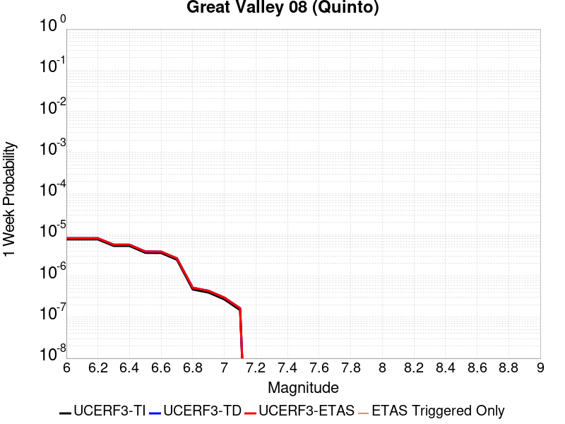 |  | 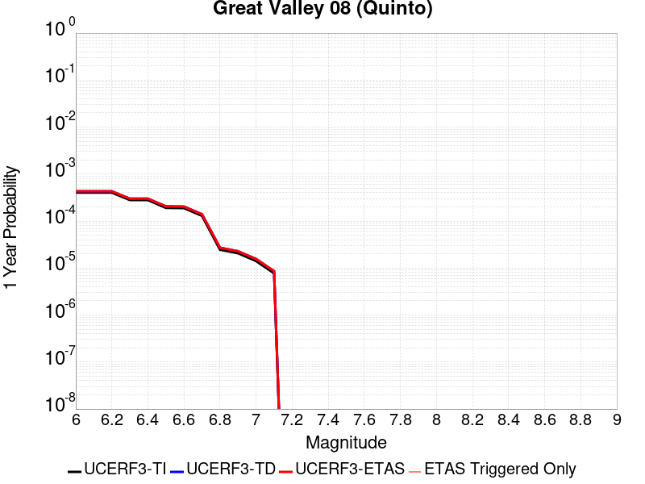 |  |

| Magnitude | 1 wk TI Prob | 1 wk TD Prob | 1 wk ETAS Prob | 1 wk ETAS/TD Gain | 1 wk ETAS Triggered Only | 1 mo TI Prob | 1 mo TD Prob | 1 mo ETAS Prob | 1 mo ETAS/TD Gain | 1 mo ETAS Triggered Only | 1 yr TI Prob | 1 yr TD Prob | 1 yr ETAS Prob | 1 yr ETAS/TD Gain | 1 yr ETAS Triggered Only | 10 yr TI Prob | 10 yr TD Prob | 10 yr ETAS Prob | 10 yr ETAS/TD Gain | 10 yr ETAS Triggered Only |
|-----|-----|-----|-----|-----|-----|-----|-----|-----|-----|-----|-----|-----|-----|-----|-----|-----|-----|-----|-----|-----|
| 6.0 | 7.737697E-6 | 8.253403E-6 | 8.253403E-6 | 1.0 | 0.0 | 3.3161137E-5 | 3.5371355E-5 | 3.5371355E-5 | 1.0 | 0.0 | 4.0366207E-4 | 4.3058002E-4 | 4.3058002E-4 | 1.0 | 0.0 | 0.004029296 | 0.0042993105 | 0.004314082 | 1.0034359 | 1.4835475E-5 |
| 6.1 | 7.737697E-6 | 8.253403E-6 | 8.253403E-6 | 1.0 | 0.0 | 3.3161137E-5 | 3.5371355E-5 | 3.5371355E-5 | 1.0 | 0.0 | 4.0366207E-4 | 4.3058002E-4 | 4.3058002E-4 | 1.0 | 0.0 | 0.004029296 | 0.0042993105 | 0.004314082 | 1.0034359 | 1.4835475E-5 |
| 6.2 | 7.737697E-6 | 8.253403E-6 | 8.253403E-6 | 1.0 | 0.0 | 3.3161137E-5 | 3.5371355E-5 | 3.5371355E-5 | 1.0 | 0.0 | 4.0366207E-4 | 4.3058002E-4 | 4.3058002E-4 | 1.0 | 0.0 | 0.004029296 | 0.0042993105 | 0.004314082 | 1.0034359 | 1.4835475E-5 |
| 6.3 | 5.374012E-6 | 5.7508414E-6 | 5.7508414E-6 | 1.0 | 0.0 | 2.3031276E-5 | 2.4646293E-5 | 2.4646293E-5 | 1.0 | 0.0 | 2.803697E-4 | 3.0003846E-4 | 3.0003846E-4 | 1.0 | 0.0 | 0.0028001624 | 0.002997427 | 0.003012218 | 1.0049345 | 1.4835475E-5 |
| 6.4 | 5.374012E-6 | 5.7508414E-6 | 5.7508414E-6 | 1.0 | 0.0 | 2.3031276E-5 | 2.4646293E-5 | 2.4646293E-5 | 1.0 | 0.0 | 2.803697E-4 | 3.0003846E-4 | 3.0003846E-4 | 1.0 | 0.0 | 0.0028001624 | 0.002997427 | 0.003012218 | 1.0049345 | 1.4835475E-5 |
| 6.5 | 3.65427E-6 | 3.9415295E-6 | 3.9415295E-6 | 1.0 | 0.0 | 1.5661062E-5 | 1.68922E-5 | 1.68922E-5 | 1.0 | 0.0 | 1.9065675E-4 | 2.0565017E-4 | 2.0565017E-4 | 1.0 | 0.0 | 0.0019049325 | 0.0020552904 | 0.0020700954 | 1.0072033 | 1.4835475E-5 |
| 6.6 | 3.6143538E-6 | 3.898714E-6 | 3.898714E-6 | 1.0 | 0.0 | 1.5489995E-5 | 1.6708707E-5 | 1.6708707E-5 | 1.0 | 0.0 | 1.8857437E-4 | 2.0341657E-4 | 2.0341657E-4 | 1.0 | 0.0 | 0.0018841444 | 0.0020329955 | 0.0020478007 | 1.0072825 | 1.4835475E-5 |
| 6.7 | 2.4821015E-6 | 2.6858531E-6 | 2.6858531E-6 | 1.0 | 0.0 | 1.0637535E-5 | 1.151078E-5 | 1.151078E-5 | 1.0 | 0.0 | 1.2950429E-4 | 1.4014039E-4 | 1.4014039E-4 | 1.0 | 0.0 | 0.0012942884 | 0.0014010752 | 0.0014158898 | 1.0105737 | 1.4835475E-5 |
| 6.8 | 4.7110538E-7 | 5.1933733E-7 | 5.1933733E-7 | 1.0 | 0.0 | 2.0190216E-6 | 2.2257298E-6 | 2.2257298E-6 | 1.0 | 0.0 | 2.458131E-5 | 2.709794E-5 | 2.709794E-5 | 1.0 | 0.0 | 2.457859E-4 | 2.7094816E-4 | 2.7094816E-4 | 1.0 | 0.0 |
| 6.9 | 3.958685E-7 | 4.3706467E-7 | 4.3706467E-7 | 1.0 | 0.0 | 1.6965782E-6 | 1.8731331E-6 | 1.8731331E-6 | 1.0 | 0.0 | 2.0655643E-5 | 2.2805172E-5 | 2.2805172E-5 | 1.0 | 0.0 | 2.0653724E-4 | 2.2802995E-4 | 2.2802995E-4 | 1.0 | 0.0 |
| 7.0 | 2.70294E-7 | 2.992213E-7 | 2.992213E-7 | 1.0 | 0.0 | 1.1584025E-6 | 1.2823765E-6 | 1.2823765E-6 | 1.0 | 0.0 | 1.4103458E-5 | 1.5612835E-5 | 1.5612835E-5 | 1.0 | 0.0 | 1.4102564E-4 | 1.5611867E-4 | 1.5611867E-4 | 1.0 | 0.0 |
| 7.1 | 1.4828602E-7 | 1.6470315E-7 | 1.6470315E-7 | 1.0 | 0.0 | 6.3551136E-7 | 7.058705E-7 | 7.058705E-7 | 1.0 | 0.0 | 7.737323E-6 | 8.593948E-6 | 8.593948E-6 | 1.0 | 0.0 | 7.737054E-5 | 8.5936954E-5 | 8.5936954E-5 | 1.0 | 0.0 |

## Pine Mtn
*[(top)](#table-of-contents)*

| 1 Week | 1 Month | 1 Year | 10 Year |
|-----|-----|-----|-----|
|  |  |  | 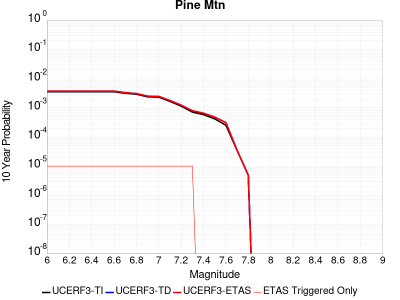 |

| Magnitude | 1 wk TI Prob | 1 wk TD Prob | 1 wk ETAS Prob | 1 wk ETAS/TD Gain | 1 wk ETAS Triggered Only | 1 mo TI Prob | 1 mo TD Prob | 1 mo ETAS Prob | 1 mo ETAS/TD Gain | 1 mo ETAS Triggered Only | 1 yr TI Prob | 1 yr TD Prob | 1 yr ETAS Prob | 1 yr ETAS/TD Gain | 1 yr ETAS Triggered Only | 10 yr TI Prob | 10 yr TD Prob | 10 yr ETAS Prob | 10 yr ETAS/TD Gain | 10 yr ETAS Triggered Only |
|-----|-----|-----|-----|-----|-----|-----|-----|-----|-----|-----|-----|-----|-----|-----|-----|-----|-----|-----|-----|-----|
| 6.0 | 6.894797E-6 | 7.2259727E-6 | 7.2259727E-6 | 1.0 | 0.0 | 2.9548795E-5 | 3.09681E-5 | 3.09681E-5 | 1.0 | 0.0 | 3.596972E-4 | 3.769744E-4 | 3.769744E-4 | 1.0 | 0.0 | 0.0035911554 | 0.0037636468 | 0.0037784264 | 1.003927 | 1.4835475E-5 |
| 6.1 | 6.894797E-6 | 7.2259727E-6 | 7.2259727E-6 | 1.0 | 0.0 | 2.9548795E-5 | 3.09681E-5 | 3.09681E-5 | 1.0 | 0.0 | 3.596972E-4 | 3.769744E-4 | 3.769744E-4 | 1.0 | 0.0 | 0.0035911554 | 0.0037636468 | 0.0037784264 | 1.003927 | 1.4835475E-5 |
| 6.2 | 6.894797E-6 | 7.2259727E-6 | 7.2259727E-6 | 1.0 | 0.0 | 2.9548795E-5 | 3.09681E-5 | 3.09681E-5 | 1.0 | 0.0 | 3.596972E-4 | 3.769744E-4 | 3.769744E-4 | 1.0 | 0.0 | 0.0035911554 | 0.0037636468 | 0.0037784264 | 1.003927 | 1.4835475E-5 |
| 6.3 | 6.894797E-6 | 7.2259727E-6 | 7.2259727E-6 | 1.0 | 0.0 | 2.9548795E-5 | 3.09681E-5 | 3.09681E-5 | 1.0 | 0.0 | 3.596972E-4 | 3.769744E-4 | 3.769744E-4 | 1.0 | 0.0 | 0.0035911554 | 0.0037636468 | 0.0037784264 | 1.003927 | 1.4835475E-5 |
| 6.4 | 6.894797E-6 | 7.2259727E-6 | 7.2259727E-6 | 1.0 | 0.0 | 2.9548795E-5 | 3.09681E-5 | 3.09681E-5 | 1.0 | 0.0 | 3.596972E-4 | 3.769744E-4 | 3.769744E-4 | 1.0 | 0.0 | 0.0035911554 | 0.0037636468 | 0.0037784264 | 1.003927 | 1.4835475E-5 |
| 6.5 | 6.894797E-6 | 7.2259727E-6 | 7.2259727E-6 | 1.0 | 0.0 | 2.9548795E-5 | 3.09681E-5 | 3.09681E-5 | 1.0 | 0.0 | 3.596972E-4 | 3.769744E-4 | 3.769744E-4 | 1.0 | 0.0 | 0.0035911554 | 0.0037636468 | 0.0037784264 | 1.003927 | 1.4835475E-5 |
| 6.6 | 6.894797E-6 | 7.2259727E-6 | 7.2259727E-6 | 1.0 | 0.0 | 2.9548795E-5 | 3.09681E-5 | 3.09681E-5 | 1.0 | 0.0 | 3.596972E-4 | 3.769744E-4 | 3.769744E-4 | 1.0 | 0.0 | 0.0035911554 | 0.0037636468 | 0.0037784264 | 1.003927 | 1.4835475E-5 |
| 6.7 | 6.0867933E-6 | 6.397611E-6 | 6.397611E-6 | 1.0 | 0.0 | 2.6085996E-5 | 2.7418055E-5 | 2.7418055E-5 | 1.0 | 0.0 | 3.1755073E-4 | 3.337659E-4 | 3.337659E-4 | 1.0 | 0.0 | 0.0031709734 | 0.0033328652 | 0.003347651 | 1.0044364 | 1.4835475E-5 |
| 6.8 | 5.6530425E-6 | 5.9510844E-6 | 5.9510844E-6 | 1.0 | 0.0 | 2.42271E-5 | 2.5504409E-5 | 2.5504409E-5 | 1.0 | 0.0 | 2.94925E-4 | 3.10474E-4 | 3.10474E-4 | 1.0 | 0.0 | 0.002945339 | 0.003100607 | 0.0031153965 | 1.0047699 | 1.4835475E-5 |
| 6.9 | 4.6015225E-6 | 4.8642987E-6 | 4.8642987E-6 | 1.0 | 0.0 | 1.9720663E-5 | 2.0846835E-5 | 2.0846835E-5 | 1.0 | 0.0 | 2.4007261E-4 | 2.537821E-4 | 2.537821E-4 | 1.0 | 0.0 | 0.0023981342 | 0.0025350673 | 0.002549865 | 1.0058373 | 1.4835475E-5 |
| 7.0 | 4.4875965E-6 | 4.747936E-6 | 4.747936E-6 | 1.0 | 0.0 | 1.9232413E-5 | 2.0348147E-5 | 2.0348147E-5 | 1.0 | 0.0 | 2.3412947E-4 | 2.4771199E-4 | 2.4771199E-4 | 1.0 | 0.0 | 0.0023388295 | 0.0024745024 | 0.0024893011 | 1.0059805 | 1.4835475E-5 |
| 7.1 | 3.203907E-6 | 3.429849E-6 | 3.429849E-6 | 1.0 | 0.0 | 1.3730958E-5 | 1.4699273E-5 | 1.4699273E-5 | 1.0 | 0.0 | 1.6716159E-4 | 1.7894963E-4 | 1.7894963E-4 | 1.0 | 0.0 | 0.0016703589 | 0.0017881214 | 0.0018029304 | 1.0082818 | 1.4835475E-5 |
| 7.2 | 2.2060601E-6 | 2.378841E-6 | 2.378841E-6 | 1.0 | 0.0 | 9.4545085E-6 | 1.0194995E-5 | 1.0194995E-5 | 1.0 | 0.0 | 1.15102564E-4 | 1.2411746E-4 | 1.2411746E-4 | 1.0 | 0.0 | 0.0011504296 | 0.0012405262 | 0.0012553432 | 1.0119442 | 1.4835475E-5 |
| 7.3 | 1.3765207E-6 | 1.5219713E-6 | 1.5219713E-6 | 1.0 | 0.0 | 5.899361E-6 | 6.5227186E-6 | 6.5227186E-6 | 1.0 | 0.0 | 7.182235E-5 | 7.941129E-5 | 7.941129E-5 | 1.0 | 0.0 | 7.1799144E-4 | 7.938383E-4 | 8.08662E-4 | 1.0186734 | 1.4835475E-5 |
| 7.4 | 1.1245983E-6 | 1.2589986E-6 | 1.2589986E-6 | 1.0 | 0.0 | 4.819698E-6 | 5.3956974E-6 | 5.3956974E-6 | 1.0 | 0.0 | 5.8678244E-5 | 6.569072E-5 | 6.569072E-5 | 1.0 | 0.0 | 5.866275E-4 | 6.5672136E-4 | 6.5672136E-4 | 1.0 | 0.0 |
| 7.5 | 8.031682E-7 | 9.2796694E-7 | 9.2796694E-7 | 1.0 | 0.0 | 3.4421448E-6 | 3.9769957E-6 | 3.9769957E-6 | 1.0 | 0.0 | 4.1907308E-5 | 4.841891E-5 | 4.841891E-5 | 1.0 | 0.0 | 4.1899405E-4 | 4.840904E-4 | 4.840904E-4 | 1.0 | 0.0 |
| 7.6 | 4.8953444E-7 | 6.005421E-7 | 6.005421E-7 | 1.0 | 0.0 | 2.098003E-6 | 2.5737495E-6 | 2.5737495E-6 | 1.0 | 0.0 | 2.5542888E-5 | 3.1335E-5 | 3.1335E-5 | 1.0 | 0.0 | 2.5539953E-4 | 3.1331068E-4 | 3.1331068E-4 | 1.0 | 0.0 |
| 7.7 | 6.634529E-8 | 6.788932E-8 | 6.788932E-8 | 1.0 | 0.0 | 2.843369E-7 | 2.9095418E-7 | 2.9095418E-7 | 1.0 | 0.0 | 3.4617963E-6 | 3.5423618E-6 | 3.5423618E-6 | 1.0 | 0.0 | 3.4617424E-5 | 3.54231E-5 | 3.54231E-5 | 1.0 | 0.0 |
| 7.8 | 9.235578E-9 | 9.488741E-9 | 9.488741E-9 | 1.0 | 0.0 | 3.9581046E-8 | 4.0666034E-8 | 4.0666034E-8 | 1.0 | 0.0 | 4.818991E-7 | 4.9510885E-7 | 4.9510885E-7 | 1.0 | 0.0 | 4.8189804E-6 | 4.9510795E-6 | 4.9510795E-6 | 1.0 | 0.0 |

## Great Valley 04b Gordon Valley
*[(top)](#table-of-contents)*

| 1 Week | 1 Month | 1 Year | 10 Year |
|-----|-----|-----|-----|
| 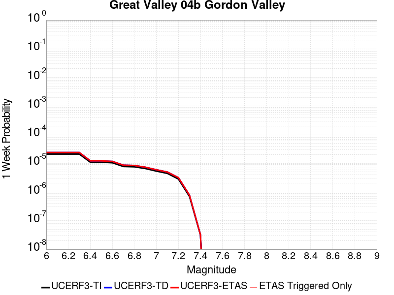 |  |  |  |

| Magnitude | 1 wk TI Prob | 1 wk TD Prob | 1 wk ETAS Prob | 1 wk ETAS/TD Gain | 1 wk ETAS Triggered Only | 1 mo TI Prob | 1 mo TD Prob | 1 mo ETAS Prob | 1 mo ETAS/TD Gain | 1 mo ETAS Triggered Only | 1 yr TI Prob | 1 yr TD Prob | 1 yr ETAS Prob | 1 yr ETAS/TD Gain | 1 yr ETAS Triggered Only | 10 yr TI Prob | 10 yr TD Prob | 10 yr ETAS Prob | 10 yr ETAS/TD Gain | 10 yr ETAS Triggered Only |
|-----|-----|-----|-----|-----|-----|-----|-----|-----|-----|-----|-----|-----|-----|-----|-----|-----|-----|-----|-----|-----|
| 6.0 | 2.1181217E-5 | 2.3984063E-5 | 2.3984063E-5 | 1.0 | 0.0 | 9.077348E-5 | 1.0278573E-4 | 1.0278573E-4 | 1.0 | 0.0 | 0.0011046068 | 0.0012508646 | 0.0012508646 | 1.0 | 0.0 | 0.010991322 | 0.0124546895 | 0.01246934 | 1.0011764 | 1.4835475E-5 |
| 6.1 | 2.1181217E-5 | 2.3984063E-5 | 2.3984063E-5 | 1.0 | 0.0 | 9.077348E-5 | 1.0278573E-4 | 1.0278573E-4 | 1.0 | 0.0 | 0.0011046068 | 0.0012508646 | 0.0012508646 | 1.0 | 0.0 | 0.010991322 | 0.0124546895 | 0.01246934 | 1.0011764 | 1.4835475E-5 |
| 6.2 | 2.1181217E-5 | 2.3984063E-5 | 2.3984063E-5 | 1.0 | 0.0 | 9.077348E-5 | 1.0278573E-4 | 1.0278573E-4 | 1.0 | 0.0 | 0.0011046068 | 0.0012508646 | 0.0012508646 | 1.0 | 0.0 | 0.010991322 | 0.0124546895 | 0.01246934 | 1.0011764 | 1.4835475E-5 |
| 6.3 | 2.1181217E-5 | 2.3984063E-5 | 2.3984063E-5 | 1.0 | 0.0 | 9.077348E-5 | 1.0278573E-4 | 1.0278573E-4 | 1.0 | 0.0 | 0.0011046068 | 0.0012508646 | 0.0012508646 | 1.0 | 0.0 | 0.010991322 | 0.0124546895 | 0.01246934 | 1.0011764 | 1.4835475E-5 |
| 6.4 | 1.0988268E-5 | 1.2255436E-5 | 1.2255436E-5 | 1.0 | 0.0 | 4.7091726E-5 | 5.2522326E-5 | 5.2522326E-5 | 1.0 | 0.0 | 5.731909E-4 | 6.3928764E-4 | 6.3928764E-4 | 1.0 | 0.0 | 0.005717147 | 0.0063760737 | 0.0063908147 | 1.002312 | 1.4835475E-5 |
| 6.5 | 1.0988268E-5 | 1.2255436E-5 | 1.2255436E-5 | 1.0 | 0.0 | 4.7091726E-5 | 5.2522326E-5 | 5.2522326E-5 | 1.0 | 0.0 | 5.731909E-4 | 6.3928764E-4 | 6.3928764E-4 | 1.0 | 0.0 | 0.005717147 | 0.0063760737 | 0.0063908147 | 1.002312 | 1.4835475E-5 |
| 6.6 | 1.0517822E-5 | 1.1724954E-5 | 1.1724954E-5 | 1.0 | 0.0 | 4.5075605E-5 | 5.0248924E-5 | 5.0248924E-5 | 1.0 | 0.0 | 5.4865726E-4 | 6.1162456E-4 | 6.1162456E-4 | 1.0 | 0.0 | 0.0054730466 | 0.006100966 | 0.0061157113 | 1.0024168 | 1.4835475E-5 |
| 6.7 | 7.789219E-6 | 8.678301E-6 | 8.678301E-6 | 1.0 | 0.0 | 3.3381937E-5 | 3.7192218E-5 | 3.7192218E-5 | 1.0 | 0.0 | 4.063493E-4 | 4.5272635E-4 | 4.5272635E-4 | 1.0 | 0.0 | 0.004056071 | 0.004518558 | 0.0045333263 | 1.0032684 | 1.4835475E-5 |
| 6.8 | 7.5850853E-6 | 8.45303E-6 | 8.45303E-6 | 1.0 | 0.0 | 3.2507105E-5 | 3.62268E-5 | 3.62268E-5 | 1.0 | 0.0 | 3.957021E-4 | 4.4097716E-4 | 4.4097716E-4 | 1.0 | 0.0 | 0.0039499826 | 0.0044015334 | 0.0044163037 | 1.0033557 | 1.4835475E-5 |
| 6.9 | 6.604105E-6 | 7.3591073E-6 | 7.3591073E-6 | 1.0 | 0.0 | 2.8303E-5 | 3.153867E-5 | 3.153867E-5 | 1.0 | 0.0 | 3.4453452E-4 | 3.8391954E-4 | 3.8391954E-4 | 1.0 | 0.0 | 0.0034400085 | 0.0038329496 | 0.0038477283 | 1.0038557 | 1.4835475E-5 |
| 7.0 | 5.3701115E-6 | 5.988876E-6 | 5.988876E-6 | 1.0 | 0.0 | 2.301456E-5 | 2.5666375E-5 | 2.5666375E-5 | 1.0 | 0.0 | 2.8016625E-4 | 3.1244624E-4 | 3.1244624E-4 | 1.0 | 0.0 | 0.0027981328 | 0.003120358 | 0.0031351473 | 1.0047395 | 1.4835475E-5 |
| 7.1 | 4.4685607E-6 | 4.9868618E-6 | 4.9868618E-6 | 1.0 | 0.0 | 1.9150835E-5 | 2.1372103E-5 | 2.1372103E-5 | 1.0 | 0.0 | 2.3313647E-4 | 2.6017678E-4 | 2.6017678E-4 | 1.0 | 0.0 | 0.0023289204 | 0.0025989667 | 0.0026137636 | 1.0056934 | 1.4835475E-5 |
| 7.2 | 2.833378E-6 | 3.1646648E-6 | 3.1646648E-6 | 1.0 | 0.0 | 1.2142991E-5 | 1.3562788E-5 | 1.3562788E-5 | 1.0 | 0.0 | 1.4783088E-4 | 1.6511619E-4 | 1.6511619E-4 | 1.0 | 0.0 | 0.0014773258 | 0.001650107 | 0.0016649179 | 1.0089757 | 1.4835475E-5 |
| 7.3 | 7.0087293E-7 | 7.773382E-7 | 7.773382E-7 | 1.0 | 0.0 | 3.0037377E-6 | 3.3314477E-6 | 3.3314477E-6 | 1.0 | 0.0 | 3.656989E-5 | 4.0560077E-5 | 4.0560077E-5 | 1.0 | 0.0 | 3.6563876E-4 | 4.0557174E-4 | 4.0557174E-4 | 1.0 | 0.0 |
| 7.4 | 3.112171E-8 | 3.2069014E-8 | 3.2069014E-8 | 1.0 | 0.0 | 1.3337875E-7 | 1.3743862E-7 | 1.3743862E-7 | 1.0 | 0.0 | 1.6238852E-6 | 1.673314E-6 | 1.673314E-6 | 1.0 | 0.0 | 1.6238733E-5 | 1.6733022E-5 | 1.6733022E-5 | 1.0 | 0.0 |

## Bartlett Springs 2011 CFM
*[(top)](#table-of-contents)*

| 1 Week | 1 Month | 1 Year | 10 Year |
|-----|-----|-----|-----|
|  |  |  |  |

| Magnitude | 1 wk TI Prob | 1 wk TD Prob | 1 wk ETAS Prob | 1 wk ETAS/TD Gain | 1 wk ETAS Triggered Only | 1 mo TI Prob | 1 mo TD Prob | 1 mo ETAS Prob | 1 mo ETAS/TD Gain | 1 mo ETAS Triggered Only | 1 yr TI Prob | 1 yr TD Prob | 1 yr ETAS Prob | 1 yr ETAS/TD Gain | 1 yr ETAS Triggered Only | 10 yr TI Prob | 10 yr TD Prob | 10 yr ETAS Prob | 10 yr ETAS/TD Gain | 10 yr ETAS Triggered Only |
|-----|-----|-----|-----|-----|-----|-----|-----|-----|-----|-----|-----|-----|-----|-----|-----|-----|-----|-----|-----|-----|
| 6.0 | 6.2326144E-5 | 8.062046E-5 | 8.062046E-5 | 1.0 | 0.0 | 2.6708472E-4 | 3.4547132E-4 | 3.4547132E-4 | 1.0 | 0.0 | 0.003246908 | 0.0041981386 | 0.0041981386 | 1.0 | 0.0 | 0.031998757 | 0.04120476 | 0.041218985 | 1.0003452 | 1.4835475E-5 |
| 6.1 | 6.227657E-5 | 8.0557955E-5 | 8.0557955E-5 | 1.0 | 0.0 | 2.668723E-4 | 3.452035E-4 | 3.452035E-4 | 1.0 | 0.0 | 0.0032443295 | 0.00419489 | 0.00419489 | 1.0 | 0.0 | 0.031973712 | 0.04117349 | 0.041187715 | 1.0003455 | 1.4835475E-5 |
| 6.2 | 6.22452E-5 | 8.051855E-5 | 8.051855E-5 | 1.0 | 0.0 | 2.6673786E-4 | 3.4503467E-4 | 3.4503467E-4 | 1.0 | 0.0 | 0.0032426978 | 0.0041928426 | 0.0041928426 | 1.0 | 0.0 | 0.03195787 | 0.041153777 | 0.041168004 | 1.0003457 | 1.4835475E-5 |
| 6.3 | 6.219006E-5 | 8.044837E-5 | 8.044837E-5 | 1.0 | 0.0 | 2.6650162E-4 | 3.4473397E-4 | 3.4473397E-4 | 1.0 | 0.0 | 0.00323983 | 0.0041891965 | 0.0041891965 | 1.0 | 0.0 | 0.031930014 | 0.041118674 | 0.041132897 | 1.000346 | 1.4835475E-5 |
| 6.4 | 5.2175856E-5 | 6.726493E-5 | 6.726493E-5 | 1.0 | 0.0 | 2.2359163E-4 | 2.8824678E-4 | 2.8824678E-4 | 1.0 | 0.0 | 0.0027188298 | 0.003503809 | 0.003503809 | 1.0 | 0.0 | 0.026858058 | 0.034494992 | 0.034494992 | 1.0 | 0.0 |
| 6.5 | 5.205166E-5 | 6.7107576E-5 | 6.7107576E-5 | 1.0 | 0.0 | 2.2305945E-4 | 2.8757253E-4 | 2.8757253E-4 | 1.0 | 0.0 | 0.0027123666 | 0.0034956269 | 0.0034956269 | 1.0 | 0.0 | 0.026794989 | 0.034415726 | 0.034415726 | 1.0 | 0.0 |
| 6.6 | 5.0085426E-5 | 6.45037E-5 | 6.45037E-5 | 1.0 | 0.0 | 2.1463417E-4 | 2.7641543E-4 | 2.7641543E-4 | 1.0 | 0.0 | 0.0026100394 | 0.0033602125 | 0.0033602125 | 1.0 | 0.0 | 0.025795965 | 0.03310307 | 0.03310307 | 1.0 | 0.0 |
| 6.7 | 4.8930866E-5 | 6.302805E-5 | 6.302805E-5 | 1.0 | 0.0 | 2.0968684E-4 | 2.7009254E-4 | 2.7009254E-4 | 1.0 | 0.0 | 0.0025499484 | 0.0032834713 | 0.0032834713 | 1.0 | 0.0 | 0.025208864 | 0.032358307 | 0.032358307 | 1.0 | 0.0 |
| 6.8 | 4.5679535E-5 | 5.8751615E-5 | 5.8751615E-5 | 1.0 | 0.0 | 1.9575475E-4 | 2.5176856E-4 | 2.5176856E-4 | 1.0 | 0.0 | 0.002380709 | 0.0030610138 | 0.0030610138 | 1.0 | 0.0 | 0.023553653 | 0.030195348 | 0.030195348 | 1.0 | 0.0 |
| 6.9 | 4.1439176E-5 | 5.3228745E-5 | 5.3228745E-5 | 1.0 | 0.0 | 1.7758438E-4 | 2.281034E-4 | 2.281034E-4 | 1.0 | 0.0 | 0.002159946 | 0.002773649 | 0.002773649 | 1.0 | 0.0 | 0.021390721 | 0.027395153 | 0.027395153 | 1.0 | 0.0 |
| 7.0 | 3.5920104E-5 | 4.6015888E-5 | 4.6015888E-5 | 1.0 | 0.0 | 1.5393422E-4 | 1.9719615E-4 | 1.9719615E-4 | 1.0 | 0.0 | 0.001872538 | 0.0023982362 | 0.0023982362 | 1.0 | 0.0 | 0.018568378 | 0.023726657 | 0.023726657 | 1.0 | 0.0 |
| 7.1 | 3.338812E-5 | 4.2696076E-5 | 4.2696076E-5 | 1.0 | 0.0 | 1.430841E-4 | 1.8297043E-4 | 1.8297043E-4 | 1.0 | 0.0 | 0.0017406568 | 0.0022254037 | 0.0022254037 | 1.0 | 0.0 | 0.017270854 | 0.02203385 | 0.02203385 | 1.0 | 0.0 |
| 7.2 | 2.8619615E-5 | 3.640696E-5 | 3.640696E-5 | 1.0 | 0.0 | 1.2264973E-4 | 1.5602056E-4 | 1.5602056E-4 | 1.0 | 0.0 | 0.0014922376 | 0.001897905 | 0.001897905 | 1.0 | 0.0 | 0.014822568 | 0.018818848 | 0.018818848 | 1.0 | 0.0 |
| 7.3 | 2.6376783E-5 | 3.342763E-5 | 3.342763E-5 | 1.0 | 0.0 | 1.13038455E-4 | 1.4325346E-4 | 1.4325346E-4 | 1.0 | 0.0 | 0.0013753743 | 0.0017427249 | 0.0017427249 | 1.0 | 0.0 | 0.01366893 | 0.01729222 | 0.01729222 | 1.0 | 0.0 |
| 7.4 | 2.3738676E-5 | 2.9983255E-5 | 2.9983255E-5 | 1.0 | 0.0 | 1.0173322E-4 | 1.2849338E-4 | 1.2849338E-4 | 1.0 | 0.0 | 0.0012378981 | 0.0015632923 | 0.0015632923 | 1.0 | 0.0 | 0.012310251 | 0.015524272 | 0.015524272 | 1.0 | 0.0 |
| 7.5 | 2.1789481E-5 | 2.744328E-5 | 2.744328E-5 | 1.0 | 0.0 | 9.338015E-5 | 1.17608804E-4 | 1.17608804E-4 | 1.0 | 0.0 | 0.0011363103 | 0.0014309546 | 0.0014309546 | 1.0 | 0.0 | 0.011305175 | 0.014218578 | 0.014218578 | 1.0 | 0.0 |
| 7.6 | 1.3895281E-5 | 1.7370558E-5 | 1.7370558E-5 | 1.0 | 0.0 | 5.9549846E-5 | 7.444314E-5 | 7.444314E-5 | 1.0 | 0.0 | 7.2477816E-4 | 9.0597116E-4 | 9.0597116E-4 | 1.0 | 0.0 | 0.0072241887 | 0.009023187 | 0.009023187 | 1.0 | 0.0 |
| 7.7 | 4.245981E-6 | 5.163007E-6 | 5.163007E-6 | 1.0 | 0.0 | 1.8196934E-5 | 2.2126986E-5 | 2.2126986E-5 | 1.0 | 0.0 | 2.2152514E-4 | 2.6936294E-4 | 2.6936294E-4 | 1.0 | 0.0 | 0.0022130446 | 0.0026903842 | 0.0026903842 | 1.0 | 0.0 |
| 7.8 | 6.145192E-7 | 7.0476307E-7 | 7.0476307E-7 | 1.0 | 0.0 | 2.633651E-6 | 3.0204096E-6 | 3.0204096E-6 | 1.0 | 0.0 | 3.206423E-5 | 3.677288E-5 | 3.677288E-5 | 1.0 | 0.0 | 3.2059604E-4 | 3.6766735E-4 | 3.6766735E-4 | 1.0 | 0.0 |

## San Gregorio (South) 2011 CFM
*[(top)](#table-of-contents)*

| 1 Week | 1 Month | 1 Year | 10 Year |
|-----|-----|-----|-----|
|  |  |  |  |

| Magnitude | 1 wk TI Prob | 1 wk TD Prob | 1 wk ETAS Prob | 1 wk ETAS/TD Gain | 1 wk ETAS Triggered Only | 1 mo TI Prob | 1 mo TD Prob | 1 mo ETAS Prob | 1 mo ETAS/TD Gain | 1 mo ETAS Triggered Only | 1 yr TI Prob | 1 yr TD Prob | 1 yr ETAS Prob | 1 yr ETAS/TD Gain | 1 yr ETAS Triggered Only | 10 yr TI Prob | 10 yr TD Prob | 10 yr ETAS Prob | 10 yr ETAS/TD Gain | 10 yr ETAS Triggered Only |
|-----|-----|-----|-----|-----|-----|-----|-----|-----|-----|-----|-----|-----|-----|-----|-----|-----|-----|-----|-----|-----|
| 6.0 | 1.8770423E-5 | 1.6283077E-5 | 1.6283077E-5 | 1.0 | 0.0 | 8.044219E-5 | 6.978277E-5 | 6.978277E-5 | 1.0 | 0.0 | 9.789435E-4 | 8.492779E-4 | 8.492779E-4 | 1.0 | 0.0 | 0.009746423 | 0.00847305 | 0.00848776 | 1.001736 | 1.4835475E-5 |
| 6.1 | 1.8770423E-5 | 1.6283077E-5 | 1.6283077E-5 | 1.0 | 0.0 | 8.044219E-5 | 6.978277E-5 | 6.978277E-5 | 1.0 | 0.0 | 9.789435E-4 | 8.492779E-4 | 8.492779E-4 | 1.0 | 0.0 | 0.009746423 | 0.00847305 | 0.00848776 | 1.001736 | 1.4835475E-5 |
| 6.2 | 1.7508692E-5 | 1.4902496E-5 | 1.4902496E-5 | 1.0 | 0.0 | 7.5035096E-5 | 6.38663E-5 | 6.38663E-5 | 1.0 | 0.0 | 9.1316935E-4 | 7.7729777E-4 | 7.7729777E-4 | 1.0 | 0.0 | 0.00909426 | 0.0077584344 | 0.007773155 | 1.0018973 | 1.4835475E-5 |
| 6.3 | 1.7508692E-5 | 1.4902496E-5 | 1.4902496E-5 | 1.0 | 0.0 | 7.5035096E-5 | 6.38663E-5 | 6.38663E-5 | 1.0 | 0.0 | 9.1316935E-4 | 7.7729777E-4 | 7.7729777E-4 | 1.0 | 0.0 | 0.00909426 | 0.0077584344 | 0.007773155 | 1.0018973 | 1.4835475E-5 |
| 6.4 | 1.6004591E-5 | 1.3252228E-5 | 1.3252228E-5 | 1.0 | 0.0 | 6.85893E-5 | 5.679403E-5 | 5.679403E-5 | 1.0 | 0.0 | 8.347548E-4 | 6.91249E-4 | 6.91249E-4 | 1.0 | 0.0 | 0.008316261 | 0.006903432 | 0.006918165 | 1.0021342 | 1.4835475E-5 |
| 6.5 | 1.6004591E-5 | 1.3252228E-5 | 1.3252228E-5 | 1.0 | 0.0 | 6.85893E-5 | 5.679403E-5 | 5.679403E-5 | 1.0 | 0.0 | 8.347548E-4 | 6.91249E-4 | 6.91249E-4 | 1.0 | 0.0 | 0.008316261 | 0.006903432 | 0.006918165 | 1.0021342 | 1.4835475E-5 |
| 6.6 | 1.5442201E-5 | 1.263682E-5 | 1.263682E-5 | 1.0 | 0.0 | 6.617918E-5 | 5.415668E-5 | 5.415668E-5 | 1.0 | 0.0 | 8.0543366E-4 | 6.59159E-4 | 6.59159E-4 | 1.0 | 0.0 | 0.008025207 | 0.006584464 | 0.006599202 | 1.0022383 | 1.4835475E-5 |
| 6.7 | 1.489921E-5 | 1.2045294E-5 | 1.2045294E-5 | 1.0 | 0.0 | 6.3852196E-5 | 5.162167E-5 | 5.162167E-5 | 1.0 | 0.0 | 7.7712315E-4 | 6.2831334E-4 | 6.2831334E-4 | 1.0 | 0.0 | 0.0077441116 | 0.0062777796 | 0.006292522 | 1.0023483 | 1.4835475E-5 |
| 6.8 | 1.3876024E-5 | 1.0924173E-5 | 1.0924173E-5 | 1.0 | 0.0 | 5.9467322E-5 | 4.6817047E-5 | 4.6817047E-5 | 1.0 | 0.0 | 7.237741E-4 | 5.698488E-4 | 5.698488E-4 | 1.0 | 0.0 | 0.0072142133 | 0.0056962525 | 0.0056962525 | 1.0 | 0.0 |
| 6.9 | 1.33922495E-5 | 1.0395643E-5 | 1.0395643E-5 | 1.0 | 0.0 | 5.7394092E-5 | 4.4551995E-5 | 4.4551995E-5 | 1.0 | 0.0 | 6.9854903E-4 | 5.422858E-4 | 5.422858E-4 | 1.0 | 0.0 | 0.0069635725 | 0.0054219933 | 0.0054219933 | 1.0 | 0.0 |
| 7.0 | 1.2807324E-5 | 9.755564E-6 | 9.755564E-6 | 1.0 | 0.0 | 5.4887376E-5 | 4.180889E-5 | 4.180889E-5 | 1.0 | 0.0 | 6.680489E-4 | 5.089045E-4 | 5.089045E-4 | 1.0 | 0.0 | 0.006660442 | 0.0050897514 | 0.0050897514 | 1.0 | 0.0 |
| 7.1 | 1.2191438E-5 | 9.064394E-6 | 9.064394E-6 | 1.0 | 0.0 | 5.224797E-5 | 3.884683E-5 | 3.884683E-5 | 1.0 | 0.0 | 6.3593336E-4 | 4.7285756E-4 | 4.7285756E-4 | 1.0 | 0.0 | 0.0063411663 | 0.0047308663 | 0.0047308663 | 1.0 | 0.0 |
| 7.2 | 1.1769438E-5 | 8.584545E-6 | 8.584545E-6 | 1.0 | 0.0 | 5.0439474E-5 | 3.679039E-5 | 3.679039E-5 | 1.0 | 0.0 | 6.1392755E-4 | 4.4783097E-4 | 4.4783097E-4 | 1.0 | 0.0 | 0.0061223423 | 0.004481636 | 0.004481636 | 1.0 | 0.0 |
| 7.3 | 1.150374E-5 | 8.299959E-6 | 8.299959E-6 | 1.0 | 0.0 | 4.9300812E-5 | 3.5570767E-5 | 3.5570767E-5 | 1.0 | 0.0 | 6.0007203E-4 | 4.3298808E-4 | 4.3298808E-4 | 1.0 | 0.0 | 0.0059845424 | 0.0043337774 | 0.0043337774 | 1.0 | 0.0 |
| 7.4 | 1.12514E-5 | 8.045666E-6 | 8.045666E-6 | 1.0 | 0.0 | 4.8219394E-5 | 3.4480967E-5 | 3.4480967E-5 | 1.0 | 0.0 | 5.8691297E-4 | 4.1972497E-4 | 4.1972497E-4 | 1.0 | 0.0 | 0.005853653 | 0.004201642 | 0.004201642 | 1.0 | 0.0 |
| 7.5 | 1.059696E-5 | 7.3959213E-6 | 7.3959213E-6 | 1.0 | 0.0 | 4.5414752E-5 | 3.169642E-5 | 3.169642E-5 | 1.0 | 0.0 | 5.5278436E-4 | 3.8583562E-4 | 3.8583562E-4 | 1.0 | 0.0 | 0.0055141128 | 0.0038639125 | 0.0038639125 | 1.0 | 0.0 |
| 7.6 | 9.018592E-6 | 5.839561E-6 | 5.839561E-6 | 1.0 | 0.0 | 3.8650534E-5 | 2.502645E-5 | 2.502645E-5 | 1.0 | 0.0 | 4.7046866E-4 | 3.0465444E-4 | 3.0465444E-4 | 1.0 | 0.0 | 0.004694739 | 0.0030542447 | 0.0030542447 | 1.0 | 0.0 |
| 7.7 | 6.243489E-6 | 3.2416654E-6 | 3.2416654E-6 | 1.0 | 0.0 | 2.6757538E-5 | 1.3892777E-5 | 1.3892777E-5 | 1.0 | 0.0 | 3.257243E-4 | 1.6913144E-4 | 1.6913144E-4 | 1.0 | 0.0 | 0.003252473 | 0.0017002295 | 0.0017002295 | 1.0 | 0.0 |
| 7.8 | 3.1941963E-6 | 1.3823159E-6 | 1.3823159E-6 | 1.0 | 0.0 | 1.368934E-5 | 5.9241975E-6 | 5.9241975E-6 | 1.0 | 0.0 | 1.6665498E-4 | 7.212471E-5 | 7.212471E-5 | 1.0 | 0.0 | 0.0016653005 | 7.270166E-4 | 7.270166E-4 | 1.0 | 0.0 |
| 7.9 | 2.0098398E-6 | 6.926062E-7 | 6.926062E-7 | 1.0 | 0.0 | 8.6135715E-6 | 2.968309E-6 | 2.968309E-6 | 1.0 | 0.0 | 1.0486518E-4 | 3.613856E-5 | 3.613856E-5 | 1.0 | 0.0 | 0.0010481571 | 3.6625154E-4 | 3.6625154E-4 | 1.0 | 0.0 |
| 8.0 | 8.353119E-7 | 3.167011E-7 | 3.167011E-7 | 1.0 | 0.0 | 3.579903E-6 | 1.3572896E-6 | 1.3572896E-6 | 1.0 | 0.0 | 4.358445E-5 | 1.6524877E-5 | 1.6524877E-5 | 1.0 | 0.0 | 4.3575902E-4 | 1.6643778E-4 | 1.6643778E-4 | 1.0 | 0.0 |
| 8.1 | 1.5033264E-7 | 6.535448E-8 | 6.535448E-8 | 1.0 | 0.0 | 6.442826E-7 | 2.8009057E-7 | 2.8009057E-7 | 1.0 | 0.0 | 7.844113E-6 | 3.4100976E-6 | 3.4100976E-6 | 1.0 | 0.0 | 7.843835E-5 | 3.411775E-5 | 3.411775E-5 | 1.0 | 0.0 |

## Verdugo
*[(top)](#table-of-contents)*

| 1 Week | 1 Month | 1 Year | 10 Year |
|-----|-----|-----|-----|
|  |  |  |  |

| Magnitude | 1 wk TI Prob | 1 wk TD Prob | 1 wk ETAS Prob | 1 wk ETAS/TD Gain | 1 wk ETAS Triggered Only | 1 mo TI Prob | 1 mo TD Prob | 1 mo ETAS Prob | 1 mo ETAS/TD Gain | 1 mo ETAS Triggered Only | 1 yr TI Prob | 1 yr TD Prob | 1 yr ETAS Prob | 1 yr ETAS/TD Gain | 1 yr ETAS Triggered Only | 10 yr TI Prob | 10 yr TD Prob | 10 yr ETAS Prob | 10 yr ETAS/TD Gain | 10 yr ETAS Triggered Only |
|-----|-----|-----|-----|-----|-----|-----|-----|-----|-----|-----|-----|-----|-----|-----|-----|-----|-----|-----|-----|-----|
| 6.0 | 5.392987E-6 | 4.2168676E-6 | 4.2168676E-6 | 1.0 | 0.0 | 2.3112598E-5 | 1.8072167E-5 | 1.8072167E-5 | 1.0 | 0.0 | 2.8135953E-4 | 2.2000688E-4 | 2.2000688E-4 | 1.0 | 0.0 | 0.0028100356 | 0.0021979385 | 0.0022127414 | 1.0067348 | 1.4835475E-5 |
| 6.1 | 5.392987E-6 | 4.2168676E-6 | 4.2168676E-6 | 1.0 | 0.0 | 2.3112598E-5 | 1.8072167E-5 | 1.8072167E-5 | 1.0 | 0.0 | 2.8135953E-4 | 2.2000688E-4 | 2.2000688E-4 | 1.0 | 0.0 | 0.0028100356 | 0.0021979385 | 0.0022127414 | 1.0067348 | 1.4835475E-5 |
| 6.2 | 5.392987E-6 | 4.2168676E-6 | 4.2168676E-6 | 1.0 | 0.0 | 2.3112598E-5 | 1.8072167E-5 | 1.8072167E-5 | 1.0 | 0.0 | 2.8135953E-4 | 2.2000688E-4 | 2.2000688E-4 | 1.0 | 0.0 | 0.0028100356 | 0.0021979385 | 0.0022127414 | 1.0067348 | 1.4835475E-5 |
| 6.3 | 5.392987E-6 | 4.2168676E-6 | 4.2168676E-6 | 1.0 | 0.0 | 2.3112598E-5 | 1.8072167E-5 | 1.8072167E-5 | 1.0 | 0.0 | 2.8135953E-4 | 2.2000688E-4 | 2.2000688E-4 | 1.0 | 0.0 | 0.0028100356 | 0.0021979385 | 0.0022127414 | 1.0067348 | 1.4835475E-5 |
| 6.4 | 5.392987E-6 | 4.2168676E-6 | 4.2168676E-6 | 1.0 | 0.0 | 2.3112598E-5 | 1.8072167E-5 | 1.8072167E-5 | 1.0 | 0.0 | 2.8135953E-4 | 2.2000688E-4 | 2.2000688E-4 | 1.0 | 0.0 | 0.0028100356 | 0.0021979385 | 0.0022127414 | 1.0067348 | 1.4835475E-5 |
| 6.5 | 4.9154837E-6 | 3.722804E-6 | 3.722804E-6 | 1.0 | 0.0 | 2.1066187E-5 | 1.5954778E-5 | 1.5954778E-5 | 1.0 | 0.0 | 2.5645064E-4 | 1.9423231E-4 | 1.9423231E-4 | 1.0 | 0.0 | 0.002561549 | 0.0019406463 | 0.001955453 | 1.0076298 | 1.4835475E-5 |
| 6.6 | 4.9154837E-6 | 3.722804E-6 | 3.722804E-6 | 1.0 | 0.0 | 2.1066187E-5 | 1.5954778E-5 | 1.5954778E-5 | 1.0 | 0.0 | 2.5645064E-4 | 1.9423231E-4 | 1.9423231E-4 | 1.0 | 0.0 | 0.002561549 | 0.0019406463 | 0.001955453 | 1.0076298 | 1.4835475E-5 |
| 6.7 | 4.817006E-6 | 3.6209885E-6 | 3.6209885E-6 | 1.0 | 0.0 | 2.0644147E-5 | 1.551843E-5 | 1.551843E-5 | 1.0 | 0.0 | 2.513135E-4 | 1.889207E-4 | 1.889207E-4 | 1.0 | 0.0 | 0.0025102948 | 0.0018876207 | 0.0019024281 | 1.0078446 | 1.4835475E-5 |
| 6.8 | 4.507407E-6 | 3.3074298E-6 | 3.3074298E-6 | 1.0 | 0.0 | 1.9317316E-5 | 1.4174623E-5 | 1.4174623E-5 | 1.0 | 0.0 | 2.3516294E-4 | 1.725625E-4 | 1.725625E-4 | 1.0 | 0.0 | 0.0023491425 | 0.0017242995 | 0.0017391094 | 1.0085889 | 1.4835475E-5 |
| 6.9 | 4.3573054E-6 | 3.1613317E-6 | 3.1613317E-6 | 1.0 | 0.0 | 1.8674033E-5 | 1.3548494E-5 | 1.3548494E-5 | 1.0 | 0.0 | 2.2733262E-4 | 1.6494056E-4 | 1.6494056E-4 | 1.0 | 0.0 | 0.0022710022 | 0.0016481938 | 0.0016630047 | 1.0089862 | 1.4835475E-5 |
| 7.0 | 4.171527E-6 | 2.983985E-6 | 2.983985E-6 | 1.0 | 0.0 | 1.787785E-5 | 1.2788445E-5 | 1.2788445E-5 | 1.0 | 0.0 | 2.1764109E-4 | 1.556883E-4 | 1.556883E-4 | 1.0 | 0.0 | 0.0021742806 | 0.0015558037 | 0.001570616 | 1.0095208 | 1.4835475E-5 |
| 7.1 | 4.0405484E-6 | 2.8825712E-6 | 2.8825712E-6 | 1.0 | 0.0 | 1.731652E-5 | 1.2353818E-5 | 1.2353818E-5 | 1.0 | 0.0 | 2.1080824E-4 | 1.5039746E-4 | 1.5039746E-4 | 1.0 | 0.0 | 0.0021060838 | 0.0015029679 | 0.001517781 | 1.009856 | 1.4835475E-5 |
| 7.2 | 3.8306007E-6 | 2.7021476E-6 | 2.7021476E-6 | 1.0 | 0.0 | 1.6416758E-5 | 1.1580582E-5 | 1.1580582E-5 | 1.0 | 0.0 | 1.9985568E-4 | 1.4098457E-4 | 1.4098457E-4 | 1.0 | 0.0 | 0.0019967605 | 0.001408962 | 0.0014237766 | 1.0105145 | 1.4835475E-5 |
| 7.3 | 3.5750938E-6 | 2.5124693E-6 | 2.5124693E-6 | 1.0 | 0.0 | 1.532174E-5 | 1.07676815E-5 | 1.07676815E-5 | 1.0 | 0.0 | 1.8652623E-4 | 1.3108875E-4 | 1.3108875E-4 | 1.0 | 0.0 | 0.0018636974 | 0.0013101246 | 0.0013249407 | 1.0113089 | 1.4835475E-5 |
| 7.4 | 3.3510041E-6 | 2.341144E-6 | 2.341144E-6 | 1.0 | 0.0 | 1.4361368E-5 | 1.00334355E-5 | 1.00334355E-5 | 1.0 | 0.0 | 1.7483562E-4 | 1.2215033E-4 | 1.2215033E-4 | 1.0 | 0.0 | 0.0017469813 | 0.0012208424 | 0.0012356598 | 1.012137 | 1.4835475E-5 |
| 7.5 | 2.948287E-6 | 2.039259E-6 | 2.039259E-6 | 1.0 | 0.0 | 1.2635454E-5 | 8.739653E-6 | 8.739653E-6 | 1.0 | 0.0 | 1.538258E-4 | 1.0640018E-4 | 1.0640018E-4 | 1.0 | 0.0 | 0.0015371935 | 0.0010635026 | 0.0010783223 | 1.0139349 | 1.4835475E-5 |
| 7.6 | 2.0134323E-6 | 1.447226E-6 | 1.447226E-6 | 1.0 | 0.0 | 8.628967E-6 | 6.2023832E-6 | 6.2023832E-6 | 1.0 | 0.0 | 1.05052604E-4 | 7.551149E-5 | 7.551149E-5 | 1.0 | 0.0 | 0.0010500296 | 7.548671E-4 | 7.6969137E-4 | 1.0196383 | 1.4835475E-5 |
| 7.7 | 5.726436E-7 | 4.0455552E-7 | 4.0455552E-7 | 1.0 | 0.0 | 2.4541846E-6 | 1.7338083E-6 | 1.7338083E-6 | 1.0 | 0.0 | 2.9879287E-5 | 2.1108937E-5 | 2.1108937E-5 | 1.0 | 0.0 | 2.987527E-4 | 2.1107188E-4 | 2.1107188E-4 | 1.0 | 0.0 |
| 7.8 | 1.6248204E-7 | 1.06896664E-7 | 1.06896664E-7 | 1.0 | 0.0 | 6.963514E-7 | 4.5812848E-7 | 4.5812848E-7 | 1.0 | 0.0 | 8.478045E-6 | 5.5777004E-6 | 5.5777004E-6 | 1.0 | 0.0 | 8.477722E-5 | 5.5775636E-5 | 5.5775636E-5 | 1.0 | 0.0 |
| 7.9 | 4.4475744E-8 | 3.037667E-8 | 3.037667E-8 | 1.0 | 0.0 | 1.9061031E-7 | 1.3018571E-7 | 1.3018571E-7 | 1.0 | 0.0 | 2.320678E-6 | 1.5850101E-6 | 1.5850101E-6 | 1.0 | 0.0 | 2.3206538E-5 | 1.585E-5 | 1.585E-5 | 1.0 | 0.0 |

## Great Valley 03 Mysterious Ridge
*[(top)](#table-of-contents)*

| 1 Week | 1 Month | 1 Year | 10 Year |
|-----|-----|-----|-----|
|  |  | 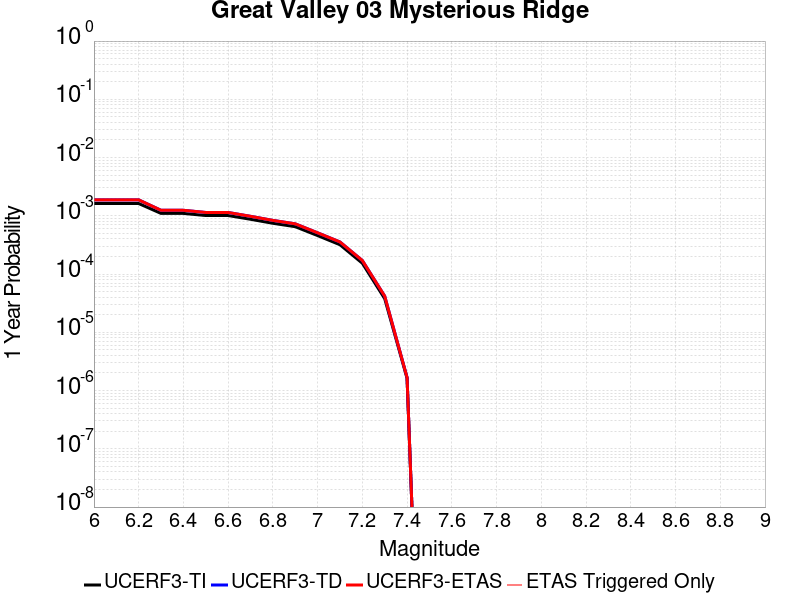 |  |

| Magnitude | 1 wk TI Prob | 1 wk TD Prob | 1 wk ETAS Prob | 1 wk ETAS/TD Gain | 1 wk ETAS Triggered Only | 1 mo TI Prob | 1 mo TD Prob | 1 mo ETAS Prob | 1 mo ETAS/TD Gain | 1 mo ETAS Triggered Only | 1 yr TI Prob | 1 yr TD Prob | 1 yr ETAS Prob | 1 yr ETAS/TD Gain | 1 yr ETAS Triggered Only | 10 yr TI Prob | 10 yr TD Prob | 10 yr ETAS Prob | 10 yr ETAS/TD Gain | 10 yr ETAS Triggered Only |
|-----|-----|-----|-----|-----|-----|-----|-----|-----|-----|-----|-----|-----|-----|-----|-----|-----|-----|-----|-----|-----|
| 6.0 | 3.1182444E-5 | 3.603773E-5 | 3.603773E-5 | 1.0 | 0.0 | 1.336322E-4 | 1.5443933E-4 | 1.5443933E-4 | 1.0 | 0.0 | 0.0016257578 | 0.0018788645 | 0.0018788645 | 1.0 | 0.0 | 0.016139153 | 0.018648576 | 0.018663136 | 1.0007807 | 1.4835475E-5 |
| 6.1 | 3.1182444E-5 | 3.603773E-5 | 3.603773E-5 | 1.0 | 0.0 | 1.336322E-4 | 1.5443933E-4 | 1.5443933E-4 | 1.0 | 0.0 | 0.0016257578 | 0.0018788645 | 0.0018788645 | 1.0 | 0.0 | 0.016139153 | 0.018648576 | 0.018663136 | 1.0007807 | 1.4835475E-5 |
| 6.2 | 3.1182444E-5 | 3.603773E-5 | 3.603773E-5 | 1.0 | 0.0 | 1.336322E-4 | 1.5443933E-4 | 1.5443933E-4 | 1.0 | 0.0 | 0.0016257578 | 0.0018788645 | 0.0018788645 | 1.0 | 0.0 | 0.016139153 | 0.018648576 | 0.018663136 | 1.0007807 | 1.4835475E-5 |
| 6.3 | 2.106934E-5 | 2.3852408E-5 | 2.3852408E-5 | 1.0 | 0.0 | 9.0294045E-5 | 1.0222078E-4 | 1.0222078E-4 | 1.0 | 0.0 | 0.0010987755 | 0.0012438584 | 0.0012438584 | 1.0 | 0.0 | 0.010933585 | 0.01237221 | 0.012386861 | 1.0011842 | 1.4835475E-5 |
| 6.4 | 2.106934E-5 | 2.3852408E-5 | 2.3852408E-5 | 1.0 | 0.0 | 9.0294045E-5 | 1.0222078E-4 | 1.0222078E-4 | 1.0 | 0.0 | 0.0010987755 | 0.0012438584 | 0.0012438584 | 1.0 | 0.0 | 0.010933585 | 0.01237221 | 0.012386861 | 1.0011842 | 1.4835475E-5 |
| 6.5 | 1.9389783E-5 | 2.1886863E-5 | 2.1886863E-5 | 1.0 | 0.0 | 8.309642E-5 | 9.379762E-5 | 9.379762E-5 | 1.0 | 0.0 | 0.0010112294 | 0.0011414153 | 0.0011414153 | 1.0 | 0.0 | 0.010066401 | 0.011358404 | 0.01137307 | 1.0012913 | 1.4835475E-5 |
| 6.6 | 1.9370193E-5 | 2.1866783E-5 | 2.1866783E-5 | 1.0 | 0.0 | 8.301247E-5 | 9.371157E-5 | 9.371157E-5 | 1.0 | 0.0 | 0.0010102082 | 0.0011403688 | 0.0011403688 | 1.0 | 0.0 | 0.010056281 | 0.0113480445 | 0.011362712 | 1.0012925 | 1.4835475E-5 |
| 6.7 | 1.6723505E-5 | 1.8800836E-5 | 1.8800836E-5 | 1.0 | 0.0 | 7.16702E-5 | 8.057263E-5 | 8.057263E-5 | 1.0 | 0.0 | 8.722353E-4 | 9.805498E-4 | 9.805498E-4 | 1.0 | 0.0 | 0.008688197 | 0.009764243 | 0.009778934 | 1.0015045 | 1.4835475E-5 |
| 6.8 | 1.426937E-5 | 1.59985E-5 | 1.59985E-5 | 1.0 | 0.0 | 6.115301E-5 | 6.856328E-5 | 6.856328E-5 | 1.0 | 0.0 | 7.4428355E-4 | 8.344526E-4 | 8.344526E-4 | 1.0 | 0.0 | 0.007417957 | 0.008314672 | 0.008329384 | 1.0017694 | 1.4835475E-5 |
| 6.9 | 1.2469891E-5 | 1.3958036E-5 | 1.3958036E-5 | 1.0 | 0.0 | 5.3441294E-5 | 5.981885E-5 | 5.981885E-5 | 1.0 | 0.0 | 6.504535E-4 | 7.280632E-4 | 7.280632E-4 | 1.0 | 0.0 | 0.006485529 | 0.007258004 | 0.007272732 | 1.0020292 | 1.4835475E-5 |
| 7.0 | 8.7746275E-6 | 9.7924885E-6 | 9.7924885E-6 | 1.0 | 0.0 | 3.7605005E-5 | 4.1967174E-5 | 4.1967174E-5 | 1.0 | 0.0 | 4.5774475E-4 | 5.108379E-4 | 5.108379E-4 | 1.0 | 0.0 | 0.00456803 | 0.005097369 | 0.0051121293 | 1.0028956 | 1.4835475E-5 |
| 7.1 | 6.1067153E-6 | 6.8142504E-6 | 6.8142504E-6 | 1.0 | 0.0 | 2.6171374E-5 | 2.9203633E-5 | 2.9203633E-5 | 1.0 | 0.0 | 3.1858988E-4 | 3.555018E-4 | 3.555018E-4 | 1.0 | 0.0 | 0.0031813353 | 0.003549882 | 0.0035646649 | 1.0041643 | 1.4835475E-5 |
| 7.2 | 2.939283E-6 | 3.2743542E-6 | 3.2743542E-6 | 1.0 | 0.0 | 1.2596866E-5 | 1.403288E-5 | 1.403288E-5 | 1.0 | 0.0 | 1.5335606E-4 | 1.7083867E-4 | 1.7083867E-4 | 1.0 | 0.0 | 0.0015325027 | 0.0017072455 | 0.0017220556 | 1.0086749 | 1.4835475E-5 |
| 7.3 | 7.2387763E-7 | 8.009075E-7 | 8.009075E-7 | 1.0 | 0.0 | 3.102329E-6 | 3.4324587E-6 | 3.4324587E-6 | 1.0 | 0.0 | 3.77702E-5 | 4.1789845E-5 | 4.1789845E-5 | 1.0 | 0.0 | 3.7763783E-4 | 4.1786482E-4 | 4.1786482E-4 | 1.0 | 0.0 |
| 7.4 | 3.112171E-8 | 3.2069014E-8 | 3.2069014E-8 | 1.0 | 0.0 | 1.3337875E-7 | 1.3743862E-7 | 1.3743862E-7 | 1.0 | 0.0 | 1.6238852E-6 | 1.673314E-6 | 1.673314E-6 | 1.0 | 0.0 | 1.6238733E-5 | 1.6733022E-5 | 1.6733022E-5 | 1.0 | 0.0 |

## Casmalia 2011 CFM
*[(top)](#table-of-contents)*

| 1 Week | 1 Month | 1 Year | 10 Year |
|-----|-----|-----|-----|
|  |  |  |  |

| Magnitude | 1 wk TI Prob | 1 wk TD Prob | 1 wk ETAS Prob | 1 wk ETAS/TD Gain | 1 wk ETAS Triggered Only | 1 mo TI Prob | 1 mo TD Prob | 1 mo ETAS Prob | 1 mo ETAS/TD Gain | 1 mo ETAS Triggered Only | 1 yr TI Prob | 1 yr TD Prob | 1 yr ETAS Prob | 1 yr ETAS/TD Gain | 1 yr ETAS Triggered Only | 10 yr TI Prob | 10 yr TD Prob | 10 yr ETAS Prob | 10 yr ETAS/TD Gain | 10 yr ETAS Triggered Only |
|-----|-----|-----|-----|-----|-----|-----|-----|-----|-----|-----|-----|-----|-----|-----|-----|-----|-----|-----|-----|-----|
| 6.0 | 4.1704893E-6 | 4.2625766E-6 | 4.2625766E-6 | 1.0 | 0.0 | 1.7873403E-5 | 1.8268058E-5 | 1.8268058E-5 | 1.0 | 0.0 | 2.1758694E-4 | 2.2239111E-4 | 2.2239111E-4 | 1.0 | 0.0 | 0.0021737402 | 0.0022217066 | 0.002236509 | 1.0066627 | 1.4835475E-5 |
| 6.1 | 4.1704893E-6 | 4.2625766E-6 | 4.2625766E-6 | 1.0 | 0.0 | 1.7873403E-5 | 1.8268058E-5 | 1.8268058E-5 | 1.0 | 0.0 | 2.1758694E-4 | 2.2239111E-4 | 2.2239111E-4 | 1.0 | 0.0 | 0.0021737402 | 0.0022217066 | 0.002236509 | 1.0066627 | 1.4835475E-5 |
| 6.2 | 3.457312E-6 | 3.5371072E-6 | 3.5371072E-6 | 1.0 | 0.0 | 1.4816967E-5 | 1.5158943E-5 | 1.5158943E-5 | 1.0 | 0.0 | 1.8038164E-4 | 1.845446E-4 | 1.845446E-4 | 1.0 | 0.0 | 0.001802353 | 0.0018439229 | 0.0018587309 | 1.0080308 | 1.4835475E-5 |
| 6.3 | 3.457312E-6 | 3.5371072E-6 | 3.5371072E-6 | 1.0 | 0.0 | 1.4816967E-5 | 1.5158943E-5 | 1.5158943E-5 | 1.0 | 0.0 | 1.8038164E-4 | 1.845446E-4 | 1.845446E-4 | 1.0 | 0.0 | 0.001802353 | 0.0018439229 | 0.0018587309 | 1.0080308 | 1.4835475E-5 |
| 6.4 | 3.0957337E-6 | 3.1693069E-6 | 3.1693069E-6 | 1.0 | 0.0 | 1.3267363E-5 | 1.3582674E-5 | 1.3582674E-5 | 1.0 | 0.0 | 1.6151817E-4 | 1.6535656E-4 | 1.6535656E-4 | 1.0 | 0.0 | 0.0016140083 | 0.0016523413 | 0.0016671523 | 1.0089636 | 1.4835475E-5 |
| 6.5 | 3.0957337E-6 | 3.1693069E-6 | 3.1693069E-6 | 1.0 | 0.0 | 1.3267363E-5 | 1.3582674E-5 | 1.3582674E-5 | 1.0 | 0.0 | 1.6151817E-4 | 1.6535656E-4 | 1.6535656E-4 | 1.0 | 0.0 | 0.0016140083 | 0.0016523413 | 0.0016671523 | 1.0089636 | 1.4835475E-5 |
| 6.6 | 2.9459152E-6 | 3.0166543E-6 | 3.0166543E-6 | 1.0 | 0.0 | 1.262529E-5 | 1.2928455E-5 | 1.2928455E-5 | 1.0 | 0.0 | 1.5370206E-4 | 1.5739263E-4 | 1.5739263E-4 | 1.0 | 0.0 | 0.0015359579 | 0.0015728171 | 0.0015876292 | 1.0094175 | 1.4835475E-5 |
| 6.7 | 2.8634809E-6 | 2.9325508E-6 | 2.9325508E-6 | 1.0 | 0.0 | 1.2272003E-5 | 1.2568014E-5 | 1.2568014E-5 | 1.0 | 0.0 | 1.4940138E-4 | 1.5300488E-4 | 1.5300488E-4 | 1.0 | 0.0 | 0.0014930099 | 0.0015290008 | 0.0015438136 | 1.0096879 | 1.4835475E-5 |
| 6.8 | 2.7999822E-6 | 2.8676739E-6 | 2.8676739E-6 | 1.0 | 0.0 | 1.1999869E-5 | 1.2289974E-5 | 1.2289974E-5 | 1.0 | 0.0 | 1.460886E-4 | 1.496202E-4 | 1.496202E-4 | 1.0 | 0.0 | 0.001459926 | 0.0014952 | 0.0015100132 | 1.0099072 | 1.4835475E-5 |
| 6.9 | 2.551052E-6 | 2.6120374E-6 | 2.6120374E-6 | 1.0 | 0.0 | 1.0933034E-5 | 1.1194398E-5 | 1.1194398E-5 | 1.0 | 0.0 | 1.3310155E-4 | 1.3628331E-4 | 1.3628331E-4 | 1.0 | 0.0 | 0.0013302186 | 0.0013620014 | 0.0013768167 | 1.0108776 | 1.4835475E-5 |
| 7.0 | 2.3081875E-6 | 2.3624768E-6 | 2.3624768E-6 | 1.0 | 0.0 | 9.892195E-6 | 1.01248625E-5 | 1.01248625E-5 | 1.0 | 0.0 | 1.20430814E-4 | 1.2326325E-4 | 1.2326325E-4 | 1.0 | 0.0 | 0.0012036557 | 0.0012319516 | 0.0012467689 | 1.0120274 | 1.4835475E-5 |
| 7.1 | 2.093245E-6 | 2.1417884E-6 | 2.1417884E-6 | 1.0 | 0.0 | 8.971019E-6 | 9.179062E-6 | 9.179062E-6 | 1.0 | 0.0 | 1.09216686E-4 | 1.1174936E-4 | 1.1174936E-4 | 1.0 | 0.0 | 0.0010916302 | 0.0011169337 | 0.0011317526 | 1.0132675 | 1.4835475E-5 |
| 7.2 | 1.9714576E-6 | 2.016571E-6 | 2.016571E-6 | 1.0 | 0.0 | 8.449076E-6 | 8.642418E-6 | 8.642418E-6 | 1.0 | 0.0 | 1.0286264E-4 | 1.0521638E-4 | 1.0521638E-4 | 1.0 | 0.0 | 0.0010281504 | 0.0010516675 | 0.0010664874 | 1.0140917 | 1.4835475E-5 |
| 7.3 | 1.6689512E-6 | 1.7047686E-6 | 1.7047686E-6 | 1.0 | 0.0 | 7.1526288E-6 | 7.3061306E-6 | 7.3061306E-6 | 1.0 | 0.0 | 8.7079774E-5 | 8.8948516E-5 | 8.8948516E-5 | 1.0 | 0.0 | 8.7045657E-4 | 8.891299E-4 | 9.0395217E-4 | 1.0166706 | 1.4835475E-5 |
| 7.4 | 1.4490954E-6 | 1.4779415E-6 | 1.4779415E-6 | 1.0 | 0.0 | 6.210394E-6 | 6.3340194E-6 | 6.3340194E-6 | 1.0 | 0.0 | 7.560892E-5 | 7.711397E-5 | 7.711397E-5 | 1.0 | 0.0 | 7.55832E-4 | 7.708727E-4 | 7.856967E-4 | 1.0192302 | 1.4835475E-5 |
| 7.5 | 1.226873E-6 | 1.2482157E-6 | 1.2482157E-6 | 1.0 | 0.0 | 5.2580162E-6 | 5.3494846E-6 | 5.3494846E-6 | 1.0 | 0.0 | 6.401447E-5 | 6.5128035E-5 | 6.5128035E-5 | 1.0 | 0.0 | 6.399603E-4 | 6.5109E-4 | 6.659158E-4 | 1.0227708 | 1.4835475E-5 |
| 7.6 | 9.2561345E-7 | 9.362305E-7 | 9.362305E-7 | 1.0 | 0.0 | 3.966909E-6 | 4.01241E-6 | 4.01241E-6 | 1.0 | 0.0 | 4.8296046E-5 | 4.885E-5 | 4.885E-5 | 1.0 | 0.0 | 4.828555E-4 | 4.8839307E-4 | 4.8839307E-4 | 1.0 | 0.0 |
| 7.7 | 5.4367933E-7 | 5.3931666E-7 | 5.3931666E-7 | 1.0 | 0.0 | 2.3300522E-6 | 2.311355E-6 | 2.311355E-6 | 1.0 | 0.0 | 2.8368017E-5 | 2.8140385E-5 | 2.8140385E-5 | 1.0 | 0.0 | 2.8364395E-4 | 2.8136835E-4 | 2.8136835E-4 | 1.0 | 0.0 |
| 7.8 | 1.8825742E-7 | 1.7344021E-7 | 1.7344021E-7 | 1.0 | 0.0 | 8.068173E-7 | 7.4331496E-7 | 7.4331496E-7 | 1.0 | 0.0 | 9.822956E-6 | 9.049822E-6 | 9.049822E-6 | 1.0 | 0.0 | 9.822522E-5 | 9.049456E-5 | 9.049456E-5 | 1.0 | 0.0 |
| 7.9 | 6.342771E-8 | 4.6804544E-8 | 4.6804544E-8 | 1.0 | 0.0 | 2.7183304E-7 | 2.0059088E-7 | 2.0059088E-7 | 1.0 | 0.0 | 3.3095623E-6 | 2.4421913E-6 | 2.4421913E-6 | 1.0 | 0.0 | 3.309513E-5 | 2.4421648E-5 | 2.4421648E-5 | 1.0 | 0.0 |
| 8.0 | 1.2574819E-8 | 6.478116E-9 | 6.478116E-9 | 1.0 | 0.0 | 5.3892084E-8 | 2.7763353E-8 | 2.7763353E-8 | 1.0 | 0.0 | 6.561359E-7 | 3.3801876E-7 | 3.3801876E-7 | 1.0 | 0.0 | 6.56134E-6 | 3.3801828E-6 | 3.3801828E-6 | 1.0 | 0.0 |

## Davis Creek
*[(top)](#table-of-contents)*

| 1 Week | 1 Month | 1 Year | 10 Year |
|-----|-----|-----|-----|
| 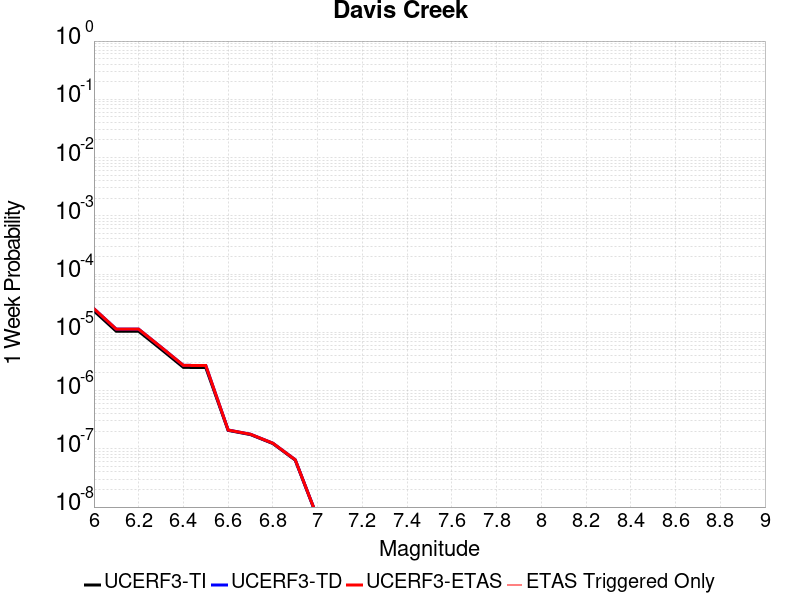 |  | 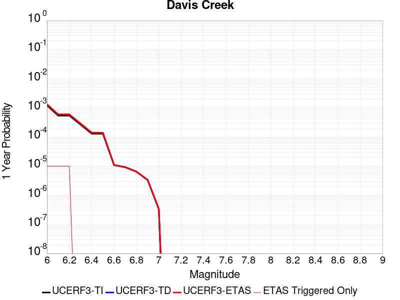 |  |

| Magnitude | 1 wk TI Prob | 1 wk TD Prob | 1 wk ETAS Prob | 1 wk ETAS/TD Gain | 1 wk ETAS Triggered Only | 1 mo TI Prob | 1 mo TD Prob | 1 mo ETAS Prob | 1 mo ETAS/TD Gain | 1 mo ETAS Triggered Only | 1 yr TI Prob | 1 yr TD Prob | 1 yr ETAS Prob | 1 yr ETAS/TD Gain | 1 yr ETAS Triggered Only | 10 yr TI Prob | 10 yr TD Prob | 10 yr ETAS Prob | 10 yr ETAS/TD Gain | 10 yr ETAS Triggered Only |
|-----|-----|-----|-----|-----|-----|-----|-----|-----|-----|-----|-----|-----|-----|-----|-----|-----|-----|-----|-----|-----|
| 6.0 | 2.331472E-5 | 2.5418734E-5 | 2.5418734E-5 | 1.0 | 0.0 | 9.99164E-5 | 1.0893356E-4 | 1.2376742E-4 | 1.1361735 | 1.4835475E-5 | 0.0012158032 | 0.0013255776 | 0.0013403934 | 1.0111768 | 1.4835475E-5 | 0.01209173 | 0.013188489 | 0.013203129 | 1.0011101 | 1.4835475E-5 |
| 6.1 | 1.0407654E-5 | 1.1317643E-5 | 1.1317643E-5 | 1.0 | 0.0 | 4.4603472E-5 | 4.8503436E-5 | 6.333819E-5 | 1.3058496 | 1.4835475E-5 | 5.4291193E-4 | 5.9039646E-4 | 6.052232E-4 | 1.0251131 | 1.4835475E-5 | 0.0054158745 | 0.005890952 | 0.0059057 | 1.0025035 | 1.4835475E-5 |
| 6.2 | 1.0407654E-5 | 1.1317643E-5 | 1.1317643E-5 | 1.0 | 0.0 | 4.4603472E-5 | 4.8503436E-5 | 6.333819E-5 | 1.3058496 | 1.4835475E-5 | 5.4291193E-4 | 5.9039646E-4 | 6.052232E-4 | 1.0251131 | 1.4835475E-5 | 0.0054158745 | 0.005890952 | 0.0059057 | 1.0025035 | 1.4835475E-5 |
| 6.3 | 5.1323277E-6 | 5.5688706E-6 | 5.5688706E-6 | 1.0 | 0.0 | 2.1995505E-5 | 2.386642E-5 | 2.386642E-5 | 1.0 | 0.0 | 2.6776237E-4 | 2.905435E-4 | 2.905435E-4 | 1.0 | 0.0 | 0.0026743996 | 0.0029024829 | 0.0029024829 | 1.0 | 0.0 |
| 6.4 | 2.4985154E-6 | 2.7046867E-6 | 2.7046867E-6 | 1.0 | 0.0 | 1.07078795E-5 | 1.1591484E-5 | 1.1591484E-5 | 1.0 | 0.0 | 1.3036063E-4 | 1.4112079E-4 | 1.4112079E-4 | 1.0 | 0.0 | 0.0013028418 | 0.0014106665 | 0.0014106665 | 1.0 | 0.0 |
| 6.5 | 2.4846438E-6 | 2.690621E-6 | 2.690621E-6 | 1.0 | 0.0 | 1.064843E-5 | 1.1531201E-5 | 1.1531201E-5 | 1.0 | 0.0 | 1.2963692E-4 | 1.4038695E-4 | 1.4038695E-4 | 1.0 | 0.0 | 0.0012956132 | 0.0014033375 | 0.0014033375 | 1.0 | 0.0 |
| 6.6 | 2.072566E-7 | 2.1018283E-7 | 2.1018283E-7 | 1.0 | 0.0 | 8.882423E-7 | 9.007833E-7 | 9.007833E-7 | 1.0 | 0.0 | 1.0814296E-5 | 1.0966984E-5 | 1.0966984E-5 | 1.0 | 0.0 | 1.081377E-4 | 1.096646E-4 | 1.096646E-4 | 1.0 | 0.0 |
| 6.7 | 1.7544528E-7 | 1.7790991E-7 | 1.7790991E-7 | 1.0 | 0.0 | 7.5190815E-7 | 7.6247085E-7 | 7.6247085E-7 | 1.0 | 0.0 | 9.154443E-6 | 9.283045E-6 | 9.283045E-6 | 1.0 | 0.0 | 9.1540656E-5 | 9.2826725E-5 | 9.2826725E-5 | 1.0 | 0.0 |
| 6.8 | 1.2320395E-7 | 1.2481246E-7 | 1.2481246E-7 | 1.0 | 0.0 | 5.280168E-7 | 5.3491044E-7 | 5.3491044E-7 | 1.0 | 0.0 | 6.428586E-6 | 6.512516E-6 | 6.512516E-6 | 1.0 | 0.0 | 6.4284E-5 | 6.5123364E-5 | 6.5123364E-5 | 1.0 | 0.0 |
| 6.9 | 6.399997E-8 | 6.4861155E-8 | 6.4861155E-8 | 1.0 | 0.0 | 2.7428555E-7 | 2.7797637E-7 | 2.7797637E-7 | 1.0 | 0.0 | 3.3394215E-6 | 3.3843576E-6 | 3.3843576E-6 | 1.0 | 0.0 | 3.3393713E-5 | 3.3843124E-5 | 3.3843124E-5 | 1.0 | 0.0 |
| 7.0 | 6.4455685E-9 | 6.5353243E-9 | 6.5353243E-9 | 1.0 | 0.0 | 2.7623864E-8 | 2.8008532E-8 | 2.8008532E-8 | 1.0 | 0.0 | 3.3632048E-7 | 3.410039E-7 | 3.410039E-7 | 1.0 | 0.0 | 3.3631998E-6 | 3.410039E-6 | 3.410039E-6 | 1.0 | 0.0 |

## Channel Islands Western Deep Ramp
*[(top)](#table-of-contents)*

| 1 Week | 1 Month | 1 Year | 10 Year |
|-----|-----|-----|-----|
|  |  | 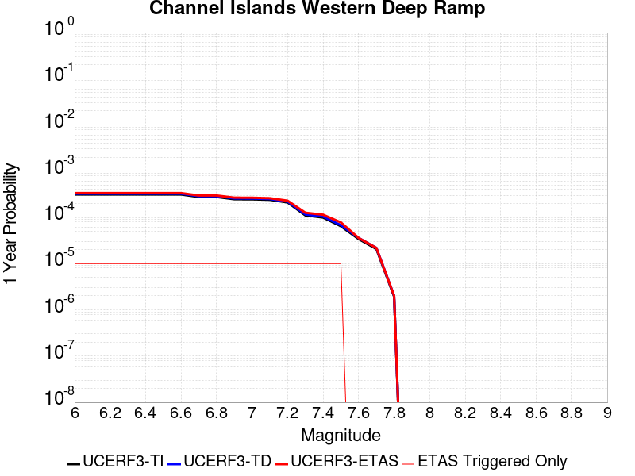 |  |

| Magnitude | 1 wk TI Prob | 1 wk TD Prob | 1 wk ETAS Prob | 1 wk ETAS/TD Gain | 1 wk ETAS Triggered Only | 1 mo TI Prob | 1 mo TD Prob | 1 mo ETAS Prob | 1 mo ETAS/TD Gain | 1 mo ETAS Triggered Only | 1 yr TI Prob | 1 yr TD Prob | 1 yr ETAS Prob | 1 yr ETAS/TD Gain | 1 yr ETAS Triggered Only | 10 yr TI Prob | 10 yr TD Prob | 10 yr ETAS Prob | 10 yr ETAS/TD Gain | 10 yr ETAS Triggered Only |
|-----|-----|-----|-----|-----|-----|-----|-----|-----|-----|-----|-----|-----|-----|-----|-----|-----|-----|-----|-----|-----|
| 6.0 | 6.0213506E-6 | 6.25503E-6 | 6.25503E-6 | 1.0 | 0.0 | 2.5805533E-5 | 2.680702E-5 | 2.680702E-5 | 1.0 | 0.0 | 3.1413708E-4 | 3.2633106E-4 | 3.4116168E-4 | 1.0454466 | 1.4835475E-5 | 0.0031369338 | 0.00325896 | 0.0032737474 | 1.0045373 | 1.4835475E-5 |
| 6.1 | 6.0213506E-6 | 6.25503E-6 | 6.25503E-6 | 1.0 | 0.0 | 2.5805533E-5 | 2.680702E-5 | 2.680702E-5 | 1.0 | 0.0 | 3.1413708E-4 | 3.2633106E-4 | 3.4116168E-4 | 1.0454466 | 1.4835475E-5 | 0.0031369338 | 0.00325896 | 0.0032737474 | 1.0045373 | 1.4835475E-5 |
| 6.2 | 6.0213506E-6 | 6.25503E-6 | 6.25503E-6 | 1.0 | 0.0 | 2.5805533E-5 | 2.680702E-5 | 2.680702E-5 | 1.0 | 0.0 | 3.1413708E-4 | 3.2633106E-4 | 3.4116168E-4 | 1.0454466 | 1.4835475E-5 | 0.0031369338 | 0.00325896 | 0.0032737474 | 1.0045373 | 1.4835475E-5 |
| 6.3 | 6.0213506E-6 | 6.25503E-6 | 6.25503E-6 | 1.0 | 0.0 | 2.5805533E-5 | 2.680702E-5 | 2.680702E-5 | 1.0 | 0.0 | 3.1413708E-4 | 3.2633106E-4 | 3.4116168E-4 | 1.0454466 | 1.4835475E-5 | 0.0031369338 | 0.00325896 | 0.0032737474 | 1.0045373 | 1.4835475E-5 |
| 6.4 | 6.0213506E-6 | 6.25503E-6 | 6.25503E-6 | 1.0 | 0.0 | 2.5805533E-5 | 2.680702E-5 | 2.680702E-5 | 1.0 | 0.0 | 3.1413708E-4 | 3.2633106E-4 | 3.4116168E-4 | 1.0454466 | 1.4835475E-5 | 0.0031369338 | 0.00325896 | 0.0032737474 | 1.0045373 | 1.4835475E-5 |
| 6.5 | 6.0213506E-6 | 6.25503E-6 | 6.25503E-6 | 1.0 | 0.0 | 2.5805533E-5 | 2.680702E-5 | 2.680702E-5 | 1.0 | 0.0 | 3.1413708E-4 | 3.2633106E-4 | 3.4116168E-4 | 1.0454466 | 1.4835475E-5 | 0.0031369338 | 0.00325896 | 0.0032737474 | 1.0045373 | 1.4835475E-5 |
| 6.6 | 6.0213506E-6 | 6.25503E-6 | 6.25503E-6 | 1.0 | 0.0 | 2.5805533E-5 | 2.680702E-5 | 2.680702E-5 | 1.0 | 0.0 | 3.1413708E-4 | 3.2633106E-4 | 3.4116168E-4 | 1.0454466 | 1.4835475E-5 | 0.0031369338 | 0.00325896 | 0.0032737474 | 1.0045373 | 1.4835475E-5 |
| 6.7 | 5.313309E-6 | 5.5253868E-6 | 5.5253868E-6 | 1.0 | 0.0 | 2.2771126E-5 | 2.3680039E-5 | 2.3680039E-5 | 1.0 | 0.0 | 2.772032E-4 | 2.882704E-4 | 3.031016E-4 | 1.051449 | 1.4835475E-5 | 0.0027685766 | 0.002879368 | 0.0028941606 | 1.0051374 | 1.4835475E-5 |
| 6.8 | 5.313309E-6 | 5.5253868E-6 | 5.5253868E-6 | 1.0 | 0.0 | 2.2771126E-5 | 2.3680039E-5 | 2.3680039E-5 | 1.0 | 0.0 | 2.772032E-4 | 2.882704E-4 | 3.031016E-4 | 1.051449 | 1.4835475E-5 | 0.0027685766 | 0.002879368 | 0.0028941606 | 1.0051374 | 1.4835475E-5 |
| 6.9 | 4.744377E-6 | 4.9395653E-6 | 4.9395653E-6 | 1.0 | 0.0 | 2.0332885E-5 | 2.1169415E-5 | 2.1169415E-5 | 1.0 | 0.0 | 2.4752476E-4 | 2.577109E-4 | 2.7254253E-4 | 1.0575515 | 1.4835475E-5 | 0.0024724922 | 0.0025744878 | 0.002589285 | 1.0057477 | 1.4835475E-5 |
| 7.0 | 4.722209E-6 | 4.9166074E-6 | 4.9166074E-6 | 1.0 | 0.0 | 2.0237881E-5 | 2.1071026E-5 | 2.1071026E-5 | 1.0 | 0.0 | 2.4636835E-4 | 2.5651327E-4 | 2.7134494E-4 | 1.0578203 | 1.4835475E-5 | 0.002460954 | 0.0025625394 | 0.0025773367 | 1.0057745 | 1.4835475E-5 |
| 7.1 | 4.611174E-6 | 4.801541E-6 | 4.801541E-6 | 1.0 | 0.0 | 1.9762025E-5 | 2.057789E-5 | 2.057789E-5 | 1.0 | 0.0 | 2.4057609E-4 | 2.5051073E-4 | 2.653425E-4 | 1.0592061 | 1.4835475E-5 | 0.002403158 | 0.0025026505 | 0.0025174487 | 1.005913 | 1.4835475E-5 |
| 7.2 | 4.043994E-6 | 4.212143E-6 | 4.212143E-6 | 1.0 | 0.0 | 1.7331287E-5 | 1.8051936E-5 | 1.8051936E-5 | 1.0 | 0.0 | 2.10988E-4 | 2.1976374E-4 | 2.3459595E-4 | 1.0674917 | 1.4835475E-5 | 0.002107878 | 0.0021958149 | 0.0022106178 | 1.0067414 | 1.4835475E-5 |
| 7.3 | 2.1233036E-6 | 2.2298616E-6 | 2.2298616E-6 | 1.0 | 0.0 | 9.099841E-6 | 9.556516E-6 | 9.556516E-6 | 1.0 | 0.0 | 1.1078493E-4 | 1.1634442E-4 | 1.3117817E-4 | 1.1274986 | 1.4835475E-5 | 0.0011072971 | 0.0011628406 | 0.0011776589 | 1.0127431 | 1.4835475E-5 |
| 7.4 | 1.9051884E-6 | 2.0015643E-6 | 2.0015643E-6 | 1.0 | 0.0 | 8.165067E-6 | 8.578106E-6 | 8.578106E-6 | 1.0 | 0.0 | 9.940516E-5 | 1.0443348E-4 | 1.192674E-4 | 1.1420418 | 1.4835475E-5 | 9.93607E-4 | 0.0010438493 | 0.0010586693 | 1.0141975 | 1.4835475E-5 |
| 7.5 | 1.2408497E-6 | 1.3039279E-6 | 1.3039279E-6 | 1.0 | 0.0 | 5.317916E-6 | 5.5882506E-6 | 5.5882506E-6 | 1.0 | 0.0 | 6.4743705E-5 | 6.8034846E-5 | 8.2869316E-5 | 1.2180421 | 1.4835475E-5 | 6.4724847E-4 | 6.801424E-4 | 6.9496775E-4 | 1.0217974 | 1.4835475E-5 |
| 7.6 | 6.5440025E-7 | 6.8869576E-7 | 6.8869576E-7 | 1.0 | 0.0 | 2.8045695E-6 | 2.95155E-6 | 2.95155E-6 | 1.0 | 0.0 | 3.4145098E-5 | 3.5934543E-5 | 3.5934543E-5 | 1.0 | 0.0 | 3.4139853E-4 | 3.5928874E-4 | 3.5928874E-4 | 1.0 | 0.0 |
| 7.7 | 3.985963E-7 | 4.1932233E-7 | 4.1932233E-7 | 1.0 | 0.0 | 1.7082689E-6 | 1.7970946E-6 | 1.7970946E-6 | 1.0 | 0.0 | 2.0797976E-5 | 2.187942E-5 | 2.187942E-5 | 1.0 | 0.0 | 2.0796029E-4 | 2.1877381E-4 | 2.1877381E-4 | 1.0 | 0.0 |
| 7.8 | 3.706329E-8 | 3.859285E-8 | 3.859285E-8 | 1.0 | 0.0 | 1.5884267E-7 | 1.6539792E-7 | 1.6539792E-7 | 1.0 | 0.0 | 1.9339077E-6 | 2.013718E-6 | 2.013718E-6 | 1.0 | 0.0 | 1.933891E-5 | 2.013701E-5 | 2.013701E-5 | 1.0 | 0.0 |

## San Andreas (North Coast) 2011 CFM
*[(top)](#table-of-contents)*

| 1 Week | 1 Month | 1 Year | 10 Year |
|-----|-----|-----|-----|
|  |  |  |  |

| Magnitude | 1 wk TI Prob | 1 wk TD Prob | 1 wk ETAS Prob | 1 wk ETAS/TD Gain | 1 wk ETAS Triggered Only | 1 mo TI Prob | 1 mo TD Prob | 1 mo ETAS Prob | 1 mo ETAS/TD Gain | 1 mo ETAS Triggered Only | 1 yr TI Prob | 1 yr TD Prob | 1 yr ETAS Prob | 1 yr ETAS/TD Gain | 1 yr ETAS Triggered Only | 10 yr TI Prob | 10 yr TD Prob | 10 yr ETAS Prob | 10 yr ETAS/TD Gain | 10 yr ETAS Triggered Only |
|-----|-----|-----|-----|-----|-----|-----|-----|-----|-----|-----|-----|-----|-----|-----|-----|-----|-----|-----|-----|-----|
| 6.0 | 1.5333705E-4 | 7.128748E-5 | 7.128748E-5 | 1.0 | 0.0 | 6.5699324E-4 | 3.054822E-4 | 3.054822E-4 | 1.0 | 0.0 | 0.007969595 | 0.003712937 | 0.003712937 | 1.0 | 0.0 | 0.0768977 | 0.039447084 | 0.039461333 | 1.0003612 | 1.4835475E-5 |
| 6.1 | 1.5333705E-4 | 7.128748E-5 | 7.128748E-5 | 1.0 | 0.0 | 6.5699324E-4 | 3.054822E-4 | 3.054822E-4 | 1.0 | 0.0 | 0.007969595 | 0.003712937 | 0.003712937 | 1.0 | 0.0 | 0.0768977 | 0.039447084 | 0.039461333 | 1.0003612 | 1.4835475E-5 |
| 6.2 | 1.3912938E-4 | 6.0662453E-5 | 6.0662453E-5 | 1.0 | 0.0 | 5.961325E-4 | 2.5995617E-4 | 2.5995617E-4 | 1.0 | 0.0 | 0.007233787 | 0.0031604003 | 0.0031604003 | 1.0 | 0.0 | 0.07002798 | 0.033777144 | 0.03379148 | 1.0004244 | 1.4835475E-5 |
| 6.3 | 1.3912938E-4 | 6.0662453E-5 | 6.0662453E-5 | 1.0 | 0.0 | 5.961325E-4 | 2.5995617E-4 | 2.5995617E-4 | 1.0 | 0.0 | 0.007233787 | 0.0031604003 | 0.0031604003 | 1.0 | 0.0 | 0.07002798 | 0.033777144 | 0.03379148 | 1.0004244 | 1.4835475E-5 |
| 6.4 | 1.2623647E-4 | 5.0583407E-5 | 5.0583407E-5 | 1.0 | 0.0 | 5.4090127E-4 | 2.1676812E-4 | 2.1676812E-4 | 1.0 | 0.0 | 0.0065656058 | 0.0026359777 | 0.0026359777 | 1.0 | 0.0 | 0.06374981 | 0.028379405 | 0.02839382 | 1.000508 | 1.4835475E-5 |
| 6.5 | 1.1736096E-4 | 4.3652064E-5 | 4.3652064E-5 | 1.0 | 0.0 | 5.028786E-4 | 1.8706695E-4 | 1.8706695E-4 | 1.0 | 0.0 | 0.006105373 | 0.0022751775 | 0.0022751775 | 1.0 | 0.0 | 0.05940335 | 0.02464936 | 0.024663828 | 1.000587 | 1.4835475E-5 |
| 6.6 | 1.1586959E-4 | 4.2549796E-5 | 4.2549796E-5 | 1.0 | 0.0 | 4.964894E-4 | 1.823436E-4 | 1.823436E-4 | 1.0 | 0.0 | 0.006028018 | 0.0022177892 | 0.0022177892 | 1.0 | 0.0 | 0.058671024 | 0.02405402 | 0.024068499 | 1.0006019 | 1.4835475E-5 |
| 6.7 | 1.13693764E-4 | 4.0858973E-5 | 4.0858973E-5 | 1.0 | 0.0 | 4.87168E-4 | 1.7509822E-4 | 1.7509822E-4 | 1.0 | 0.0 | 0.005915152 | 0.0021297524 | 0.0021297524 | 1.0 | 0.0 | 0.057601593 | 0.023143966 | 0.023158459 | 1.0006262 | 1.4835475E-5 |
| 6.8 | 1.1204889E-4 | 4.00743E-5 | 4.00743E-5 | 1.0 | 0.0 | 4.8012115E-4 | 1.7173578E-4 | 1.7173578E-4 | 1.0 | 0.0 | 0.005829819 | 0.0020888941 | 0.0020888941 | 1.0 | 0.0 | 0.05679232 | 0.0227031 | 0.022717599 | 1.0006386 | 1.4835475E-5 |
| 6.9 | 1.1005794E-4 | 3.9127604E-5 | 3.9127604E-5 | 1.0 | 0.0 | 4.7159163E-4 | 1.6767904E-4 | 1.6767904E-4 | 1.0 | 0.0 | 0.0057265228 | 0.0020395967 | 0.0020395967 | 1.0 | 0.0 | 0.055811852 | 0.022167552 | 0.022182059 | 1.0006545 | 1.4835475E-5 |
| 7.0 | 1.0647948E-4 | 3.727736E-5 | 3.727736E-5 | 1.0 | 0.0 | 4.562608E-4 | 1.5975042E-4 | 1.5975042E-4 | 1.0 | 0.0 | 0.0055408357 | 0.0019432419 | 0.0019432419 | 1.0 | 0.0 | 0.054047033 | 0.02112374 | 0.021138262 | 1.0006875 | 1.4835475E-5 |
| 7.1 | 1.04795035E-4 | 3.6323967E-5 | 3.6323967E-5 | 1.0 | 0.0 | 4.4904428E-4 | 1.5566494E-4 | 1.5566494E-4 | 1.0 | 0.0 | 0.0054534175 | 0.0018935887 | 0.0018935887 | 1.0 | 0.0 | 0.053215165 | 0.020590276 | 0.020590276 | 1.0 | 0.0 |
| 7.2 | 1.02724036E-4 | 3.5229205E-5 | 3.5229205E-5 | 1.0 | 0.0 | 4.401716E-4 | 1.5097365E-4 | 1.5097365E-4 | 1.0 | 0.0 | 0.0053459285 | 0.0018365699 | 0.0018365699 | 1.0 | 0.0 | 0.052191395 | 0.019977523 | 0.019977523 | 1.0 | 0.0 |
| 7.3 | 1.00650694E-4 | 3.4694094E-5 | 3.4694094E-5 | 1.0 | 0.0 | 4.312888E-4 | 1.4868058E-4 | 1.4868058E-4 | 1.0 | 0.0 | 0.005238306 | 0.0018086985 | 0.0018086985 | 1.0 | 0.0 | 0.051165357 | 0.019653296 | 0.019653296 | 1.0 | 0.0 |
| 7.4 | 9.672919E-5 | 3.347788E-5 | 3.347788E-5 | 1.0 | 0.0 | 4.144878E-4 | 1.4346883E-4 | 1.4346883E-4 | 1.0 | 0.0 | 0.005034718 | 0.0017453488 | 0.0017453488 | 1.0 | 0.0 | 0.049221683 | 0.01892362 | 0.01892362 | 1.0 | 0.0 |
| 7.5 | 8.7600405E-5 | 2.2781232E-5 | 2.2781232E-5 | 1.0 | 0.0 | 3.753763E-4 | 9.763021E-5 | 9.763021E-5 | 1.0 | 0.0 | 0.0045606326 | 0.0011880015 | 0.0011880015 | 1.0 | 0.0 | 0.04468165 | 0.013176378 | 0.013176378 | 1.0 | 0.0 |
| 7.6 | 7.9562284E-5 | 1.92998E-5 | 1.92998E-5 | 1.0 | 0.0 | 3.4093665E-4 | 8.2710816E-5 | 8.2710816E-5 | 1.0 | 0.0 | 0.0041430052 | 0.0010065405 | 0.0010065405 | 1.0 | 0.0 | 0.040666126 | 0.011264201 | 0.011264201 | 1.0 | 0.0 |
| 7.7 | 6.3866544E-5 | 1.1999986E-5 | 1.1999986E-5 | 1.0 | 0.0 | 2.7368503E-4 | 5.1427498E-5 | 5.1427498E-5 | 1.0 | 0.0 | 0.0033270244 | 6.2595017E-4 | 6.2595017E-4 | 1.0 | 0.0 | 0.032776527 | 0.007244729 | 0.007244729 | 1.0 | 0.0 |
| 7.8 | 4.2543215E-5 | 9.124294E-6 | 9.124294E-6 | 1.0 | 0.0 | 1.8231533E-4 | 3.9103532E-5 | 3.9103532E-5 | 1.0 | 0.0 | 0.0022174292 | 4.759816E-4 | 4.759816E-4 | 1.0 | 0.0 | 0.021954332 | 0.0055184197 | 0.0055184197 | 1.0 | 0.0 |
| 7.9 | 2.2636612E-5 | 7.854815E-6 | 7.854815E-6 | 1.0 | 0.0 | 9.7010445E-5 | 3.366306E-5 | 3.366306E-5 | 1.0 | 0.0 | 0.0011804621 | 4.0977073E-4 | 4.0977073E-4 | 1.0 | 0.0 | 0.011742111 | 0.004706186 | 0.004706186 | 1.0 | 0.0 |
| 8.0 | 1.5167874E-5 | 7.0860933E-6 | 7.0860933E-6 | 1.0 | 0.0 | 6.500356E-5 | 3.0368617E-5 | 3.0368617E-5 | 1.0 | 0.0 | 7.9113094E-4 | 3.6967528E-4 | 3.6967528E-4 | 1.0 | 0.0 | 0.007883203 | 0.0042360118 | 0.0042360118 | 1.0 | 0.0 |
| 8.1 | 1.0681047E-5 | 6.42039E-6 | 6.42039E-6 | 1.0 | 0.0 | 4.5775112E-5 | 2.7515667E-5 | 2.7515667E-5 | 1.0 | 0.0 | 5.5716943E-4 | 3.3495185E-4 | 3.3495185E-4 | 1.0 | 0.0 | 0.0055577457 | 0.0038358835 | 0.0038358835 | 1.0 | 0.0 |
| 8.2 | 8.226114E-6 | 5.1400584E-6 | 5.1400584E-6 | 1.0 | 0.0 | 3.52543E-5 | 2.2028637E-5 | 2.2028637E-5 | 1.0 | 0.0 | 4.2913653E-4 | 2.6816572E-4 | 2.6816572E-4 | 1.0 | 0.0 | 0.004283088 | 0.003058804 | 0.003058804 | 1.0 | 0.0 |
| 8.3 | 1.983087E-6 | 7.701989E-7 | 7.701989E-7 | 1.0 | 0.0 | 8.498917E-6 | 3.3008482E-6 | 3.3008482E-6 | 1.0 | 0.0 | 1.034694E-4 | 4.0187104E-5 | 4.0187104E-5 | 1.0 | 0.0 | 0.0010342124 | 4.7438307E-4 | 4.7438307E-4 | 1.0 | 0.0 |

## Hayward (No) 2011 CFM
*[(top)](#table-of-contents)*

| 1 Week | 1 Month | 1 Year | 10 Year |
|-----|-----|-----|-----|
|  | 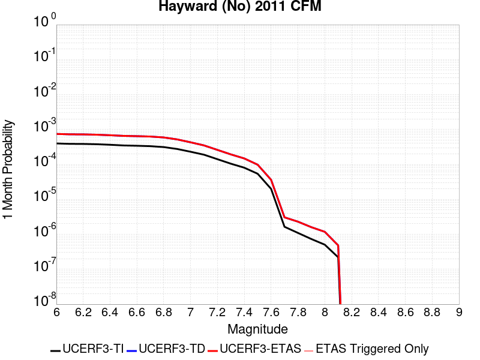 |  |  |

| Magnitude | 1 wk TI Prob | 1 wk TD Prob | 1 wk ETAS Prob | 1 wk ETAS/TD Gain | 1 wk ETAS Triggered Only | 1 mo TI Prob | 1 mo TD Prob | 1 mo ETAS Prob | 1 mo ETAS/TD Gain | 1 mo ETAS Triggered Only | 1 yr TI Prob | 1 yr TD Prob | 1 yr ETAS Prob | 1 yr ETAS/TD Gain | 1 yr ETAS Triggered Only | 10 yr TI Prob | 10 yr TD Prob | 10 yr ETAS Prob | 10 yr ETAS/TD Gain | 10 yr ETAS Triggered Only |
|-----|-----|-----|-----|-----|-----|-----|-----|-----|-----|-----|-----|-----|-----|-----|-----|-----|-----|-----|-----|-----|
| 6.0 | 9.3068506E-5 | 1.7408066E-4 | 1.7408066E-4 | 1.0 | 0.0 | 3.9880406E-4 | 7.458475E-4 | 7.458475E-4 | 1.0 | 0.0 | 0.0048446343 | 0.009042923 | 0.009057624 | 1.0016258 | 1.4835475E-5 | 0.047403704 | 0.08643094 | 0.08644449 | 1.0001568 | 1.4835475E-5 |
| 6.1 | 9.055486E-5 | 1.6959467E-4 | 1.6959467E-4 | 1.0 | 0.0 | 3.880345E-4 | 7.2663266E-4 | 7.2663266E-4 | 1.0 | 0.0 | 0.0047140904 | 0.008810966 | 0.008825671 | 1.0016689 | 1.4835475E-5 | 0.046153355 | 0.084323876 | 0.084337465 | 1.000161 | 1.4835475E-5 |
| 6.2 | 9.006742E-5 | 1.6880028E-4 | 1.6880028E-4 | 1.0 | 0.0 | 3.859461E-4 | 7.2323007E-4 | 7.2323007E-4 | 1.0 | 0.0 | 0.0046887742 | 0.008769929 | 0.008784634 | 1.0016768 | 1.4835475E-5 | 0.0459107 | 0.083948046 | 0.083961636 | 1.0001619 | 1.4835475E-5 |
| 6.3 | 8.8336754E-5 | 1.6559624E-4 | 1.6559624E-4 | 1.0 | 0.0 | 3.7853114E-4 | 7.095059E-4 | 7.095059E-4 | 1.0 | 0.0 | 0.004598882 | 0.008604183 | 0.008618891 | 1.0017093 | 1.4835475E-5 | 0.04504866 | 0.08244117 | 0.082454786 | 1.0001651 | 1.4835475E-5 |
| 6.4 | 8.526157E-5 | 1.5986027E-4 | 1.5986027E-4 | 1.0 | 0.0 | 3.6535555E-4 | 6.849363E-4 | 6.849363E-4 | 1.0 | 0.0 | 0.0044391346 | 0.0083073685 | 0.008322081 | 1.001771 | 1.4835475E-5 | 0.043514993 | 0.07973557 | 0.07974923 | 1.0001712 | 1.4835475E-5 |
| 6.5 | 8.152396E-5 | 1.5318343E-4 | 1.5318343E-4 | 1.0 | 0.0 | 3.493416E-4 | 6.5633596E-4 | 6.5633596E-4 | 1.0 | 0.0 | 0.0042449418 | 0.0079617575 | 0.007976475 | 1.0018485 | 1.4835475E-5 | 0.04164765 | 0.07656633 | 0.076580025 | 1.0001789 | 1.4835475E-5 |
| 6.6 | 7.987405E-5 | 1.5022504E-4 | 1.5022504E-4 | 1.0 | 0.0 | 3.4227243E-4 | 6.4366346E-4 | 6.4366346E-4 | 1.0 | 0.0 | 0.0041592065 | 0.0078085996 | 0.007823319 | 1.001885 | 1.4835475E-5 | 0.04082218 | 0.07515873 | 0.075172454 | 1.0001825 | 1.4835475E-5 |
| 6.7 | 7.777665E-5 | 1.4661244E-4 | 1.4661244E-4 | 1.0 | 0.0 | 3.332859E-4 | 6.281884E-4 | 6.281884E-4 | 1.0 | 0.0 | 0.004050208 | 0.0076215286 | 0.007636251 | 1.0019317 | 1.4835475E-5 | 0.039771806 | 0.0734329 | 0.07344665 | 1.0001872 | 1.4835475E-5 |
| 6.8 | 7.3284005E-5 | 1.3810949E-4 | 1.3810949E-4 | 1.0 | 0.0 | 3.140365E-4 | 5.9176417E-4 | 5.9176417E-4 | 1.0 | 0.0 | 0.0038166929 | 0.0071810656 | 0.0071957945 | 1.0020511 | 1.4835475E-5 | 0.037518036 | 0.06934252 | 0.06935632 | 1.0001991 | 1.4835475E-5 |
| 6.9 | 6.458263E-5 | 1.2139544E-4 | 1.2139544E-4 | 1.0 | 0.0 | 2.7675333E-4 | 5.2016287E-4 | 5.2016287E-4 | 1.0 | 0.0 | 0.0033642664 | 0.006314695 | 0.006329437 | 1.0023345 | 1.4835475E-5 | 0.033137884 | 0.061262455 | 0.06127638 | 1.0002273 | 1.4835475E-5 |
| 7.0 | 5.3853604E-5 | 1.0031813E-4 | 1.0031813E-4 | 1.0 | 0.0 | 2.3078074E-4 | 4.2986433E-4 | 4.2986433E-4 | 1.0 | 0.0 | 0.0028061352 | 0.005221104 | 0.0052358615 | 1.0028266 | 1.4835475E-5 | 0.027709642 | 0.050989695 | 0.051003773 | 1.0002761 | 1.4835475E-5 |
| 7.1 | 4.4308683E-5 | 8.176076E-5 | 8.176076E-5 | 1.0 | 0.0 | 1.8988053E-4 | 3.503564E-4 | 3.503564E-4 | 1.0 | 0.0 | 0.0023093442 | 0.0042572874 | 0.00427206 | 1.00347 | 1.4835475E-5 | 0.022854926 | 0.041850768 | 0.04186498 | 1.0003396 | 1.4835475E-5 |
| 7.2 | 3.295973E-5 | 6.0821552E-5 | 6.0821552E-5 | 1.0 | 0.0 | 1.4124835E-4 | 2.606379E-4 | 2.606379E-4 | 1.0 | 0.0 | 0.0017183421 | 0.0031686716 | 0.0031686716 | 1.0 | 0.0 | 0.017051157 | 0.03139427 | 0.03139427 | 1.0 | 0.0 |
| 7.3 | 2.452256E-5 | 4.5225428E-5 | 4.5225428E-5 | 1.0 | 0.0 | 1.05092455E-4 | 1.9380894E-4 | 1.9380894E-4 | 1.0 | 0.0 | 0.0012787496 | 0.002357084 | 0.002357084 | 1.0 | 0.0 | 0.0127141625 | 0.023463134 | 0.023463134 | 1.0 | 0.0 |
| 7.4 | 1.8829967E-5 | 3.46425E-5 | 3.46425E-5 | 1.0 | 0.0 | 8.069736E-5 | 1.4845947E-4 | 1.4845947E-4 | 1.0 | 0.0 | 9.820475E-4 | 0.0018060054 | 0.0018060054 | 1.0 | 0.0 | 0.009777189 | 0.018039148 | 0.018039148 | 1.0 | 0.0 |
| 7.5 | 1.26374125E-5 | 2.2951968E-5 | 2.2951968E-5 | 1.0 | 0.0 | 5.4159216E-5 | 9.83619E-5 | 9.83619E-5 | 1.0 | 0.0 | 6.5918895E-4 | 0.001196904 | 0.001196904 | 1.0 | 0.0 | 0.00657237 | 0.012004128 | 0.012004128 | 1.0 | 0.0 |
| 7.6 | 4.666429E-6 | 8.490153E-6 | 8.490153E-6 | 1.0 | 0.0 | 1.9998828E-5 | 3.638587E-5 | 3.638587E-5 | 1.0 | 0.0 | 2.4345852E-4 | 4.4290916E-4 | 4.4290916E-4 | 1.0 | 0.0 | 0.0024319198 | 0.004464514 | 0.004464514 | 1.0 | 0.0 |
| 7.7 | 3.8399318E-7 | 7.1499454E-7 | 7.1499454E-7 | 1.0 | 0.0 | 1.6456839E-6 | 3.0642586E-6 | 3.0642586E-6 | 1.0 | 0.0 | 2.003602E-5 | 3.7306712E-5 | 3.7306712E-5 | 1.0 | 0.0 | 2.0034213E-4 | 3.869335E-4 | 3.869335E-4 | 1.0 | 0.0 |
| 7.8 | 2.5637698E-7 | 5.3801284E-7 | 5.3801284E-7 | 1.0 | 0.0 | 1.098758E-6 | 2.3057673E-6 | 2.3057673E-6 | 1.0 | 0.0 | 1.3377297E-5 | 2.8072356E-5 | 2.8072356E-5 | 1.0 | 0.0 | 1.3376492E-4 | 2.9311943E-4 | 2.9311943E-4 | 1.0 | 0.0 |
| 7.9 | 1.7141245E-7 | 3.738675E-7 | 3.738675E-7 | 1.0 | 0.0 | 7.3462456E-7 | 1.6022882E-6 | 1.6022882E-6 | 1.0 | 0.0 | 8.944017E-6 | 1.9507685E-5 | 1.9507685E-5 | 1.0 | 0.0 | 8.943657E-5 | 2.029198E-4 | 2.029198E-4 | 1.0 | 0.0 |
| 8.0 | 1.1808895E-7 | 2.7576218E-7 | 2.7576218E-7 | 1.0 | 0.0 | 5.060954E-7 | 1.1818373E-6 | 1.1818373E-6 | 1.0 | 0.0 | 6.161694E-6 | 1.43887755E-5 | 1.43887755E-5 | 1.0 | 0.0 | 6.161523E-5 | 1.4848281E-4 | 1.4848281E-4 | 1.0 | 0.0 |
| 8.1 | 5.138535E-8 | 1.1255054E-7 | 1.1255054E-7 | 1.0 | 0.0 | 2.2022292E-7 | 4.823593E-7 | 4.823593E-7 | 1.0 | 0.0 | 2.6812106E-6 | 5.8727096E-6 | 5.8727096E-6 | 1.0 | 0.0 | 2.6811784E-5 | 6.0281684E-5 | 6.0281684E-5 | 1.0 | 0.0 |

## Johnson Valley (No) 2011 rev
*[(top)](#table-of-contents)*

| 1 Week | 1 Month | 1 Year | 10 Year |
|-----|-----|-----|-----|
|  | 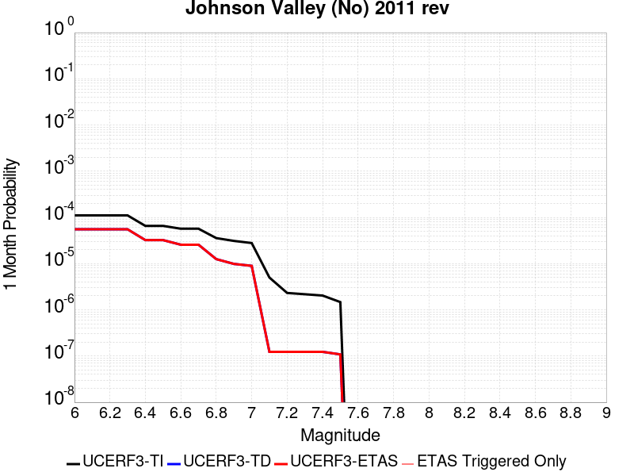 |  |  |

| Magnitude | 1 wk TI Prob | 1 wk TD Prob | 1 wk ETAS Prob | 1 wk ETAS/TD Gain | 1 wk ETAS Triggered Only | 1 mo TI Prob | 1 mo TD Prob | 1 mo ETAS Prob | 1 mo ETAS/TD Gain | 1 mo ETAS Triggered Only | 1 yr TI Prob | 1 yr TD Prob | 1 yr ETAS Prob | 1 yr ETAS/TD Gain | 1 yr ETAS Triggered Only | 10 yr TI Prob | 10 yr TD Prob | 10 yr ETAS Prob | 10 yr ETAS/TD Gain | 10 yr ETAS Triggered Only |
|-----|-----|-----|-----|-----|-----|-----|-----|-----|-----|-----|-----|-----|-----|-----|-----|-----|-----|-----|-----|-----|
| 6.0 | 2.577707E-5 | 1.2902E-5 | 1.2902E-5 | 1.0 | 0.0 | 1.1046848E-4 | 5.5293338E-5 | 5.5293338E-5 | 1.0 | 0.0 | 0.0013441239 | 6.730281E-4 | 6.730281E-4 | 1.0 | 0.0 | 0.013360229 | 0.006713808 | 0.006728544 | 1.0021949 | 1.4835475E-5 |
| 6.1 | 2.577707E-5 | 1.2902E-5 | 1.2902E-5 | 1.0 | 0.0 | 1.1046848E-4 | 5.5293338E-5 | 5.5293338E-5 | 1.0 | 0.0 | 0.0013441239 | 6.730281E-4 | 6.730281E-4 | 1.0 | 0.0 | 0.013360229 | 0.006713808 | 0.006728544 | 1.0021949 | 1.4835475E-5 |
| 6.2 | 2.577707E-5 | 1.2902E-5 | 1.2902E-5 | 1.0 | 0.0 | 1.1046848E-4 | 5.5293338E-5 | 5.5293338E-5 | 1.0 | 0.0 | 0.0013441239 | 6.730281E-4 | 6.730281E-4 | 1.0 | 0.0 | 0.013360229 | 0.006713808 | 0.006728544 | 1.0021949 | 1.4835475E-5 |
| 6.3 | 2.577707E-5 | 1.2902E-5 | 1.2902E-5 | 1.0 | 0.0 | 1.1046848E-4 | 5.5293338E-5 | 5.5293338E-5 | 1.0 | 0.0 | 0.0013441239 | 6.730281E-4 | 6.730281E-4 | 1.0 | 0.0 | 0.013360229 | 0.006713808 | 0.006728544 | 1.0021949 | 1.4835475E-5 |
| 6.4 | 1.5296591E-5 | 7.5374137E-6 | 7.5374137E-6 | 1.0 | 0.0 | 6.555518E-5 | 3.230291E-5 | 3.230291E-5 | 1.0 | 0.0 | 7.97842E-4 | 3.9323568E-4 | 3.9323568E-4 | 1.0 | 0.0 | 0.007949836 | 0.00392724 | 0.00392724 | 1.0 | 0.0 |
| 6.5 | 1.5296591E-5 | 7.5374137E-6 | 7.5374137E-6 | 1.0 | 0.0 | 6.555518E-5 | 3.230291E-5 | 3.230291E-5 | 1.0 | 0.0 | 7.97842E-4 | 3.9323568E-4 | 3.9323568E-4 | 1.0 | 0.0 | 0.007949836 | 0.00392724 | 0.00392724 | 1.0 | 0.0 |
| 6.6 | 1.3289383E-5 | 5.992296E-6 | 5.992296E-6 | 1.0 | 0.0 | 5.6953253E-5 | 2.568111E-5 | 2.568111E-5 | 1.0 | 0.0 | 6.9318525E-4 | 3.1263963E-4 | 3.1263963E-4 | 1.0 | 0.0 | 0.0069102696 | 0.0031236627 | 0.0031236627 | 1.0 | 0.0 |
| 6.7 | 1.3289383E-5 | 5.992296E-6 | 5.992296E-6 | 1.0 | 0.0 | 5.6953253E-5 | 2.568111E-5 | 2.568111E-5 | 1.0 | 0.0 | 6.9318525E-4 | 3.1263963E-4 | 3.1263963E-4 | 1.0 | 0.0 | 0.0069102696 | 0.0031236627 | 0.0031236627 | 1.0 | 0.0 |
| 6.8 | 8.330789E-6 | 2.9215316E-6 | 2.9215316E-6 | 1.0 | 0.0 | 3.570289E-5 | 1.2520822E-5 | 1.2520822E-5 | 1.0 | 0.0 | 4.34596E-4 | 1.5243606E-4 | 1.5243606E-4 | 1.0 | 0.0 | 0.0043374705 | 0.0015238749 | 0.0015238749 | 1.0 | 0.0 |
| 6.9 | 7.2359003E-6 | 2.3016303E-6 | 2.3016303E-6 | 1.0 | 0.0 | 3.1010633E-5 | 9.864123E-6 | 9.864123E-6 | 1.0 | 0.0 | 3.7748902E-4 | 1.2009441E-4 | 1.2009441E-4 | 1.0 | 0.0 | 0.0037684843 | 0.0012008181 | 0.0012008181 | 1.0 | 0.0 |
| 7.0 | 6.5149957E-6 | 2.0887633E-6 | 2.0887633E-6 | 1.0 | 0.0 | 2.792111E-5 | 8.951842E-6 | 8.951842E-6 | 1.0 | 0.0 | 3.398865E-4 | 1.0898852E-4 | 1.0898852E-4 | 1.0 | 0.0 | 0.003393671 | 0.0010898706 | 0.0010898706 | 1.0 | 0.0 |
| 7.1 | 1.1662233E-6 | 2.8811186E-8 | 2.8811186E-8 | 1.0 | 0.0 | 4.9980904E-6 | 1.2347651E-7 | 1.2347651E-7 | 1.0 | 0.0 | 6.0850052E-5 | 1.5033256E-6 | 1.5033256E-6 | 1.0 | 0.0 | 6.083339E-4 | 1.5033171E-5 | 1.5033171E-5 | 1.0 | 0.0 |
| 7.2 | 5.413881E-7 | 2.8811186E-8 | 2.8811186E-8 | 1.0 | 0.0 | 2.3202326E-6 | 1.2347651E-7 | 1.2347651E-7 | 1.0 | 0.0 | 2.8248465E-5 | 1.5033256E-6 | 1.5033256E-6 | 1.0 | 0.0 | 2.8244875E-4 | 1.5033171E-5 | 1.5033171E-5 | 1.0 | 0.0 |
| 7.3 | 5.076821E-7 | 2.8811186E-8 | 2.8811186E-8 | 1.0 | 0.0 | 2.1757785E-6 | 1.2347651E-7 | 1.2347651E-7 | 1.0 | 0.0 | 2.648978E-5 | 1.5033256E-6 | 1.5033256E-6 | 1.0 | 0.0 | 2.6486625E-4 | 1.5033171E-5 | 1.5033171E-5 | 1.0 | 0.0 |
| 7.4 | 4.7568687E-7 | 2.8793096E-8 | 2.8793096E-8 | 1.0 | 0.0 | 2.0386565E-6 | 1.2339898E-7 | 1.2339898E-7 | 1.0 | 0.0 | 2.482036E-5 | 1.5023817E-6 | 1.5023817E-6 | 1.0 | 0.0 | 2.4817587E-4 | 1.5023732E-5 | 1.5023732E-5 | 1.0 | 0.0 |
| 7.5 | 3.435626E-7 | 2.5365386E-8 | 2.5365386E-8 | 1.0 | 0.0 | 1.4724103E-6 | 1.087088E-7 | 1.087088E-7 | 1.0 | 0.0 | 1.7926448E-5 | 1.323529E-6 | 1.323529E-6 | 1.0 | 0.0 | 1.7925001E-4 | 1.3235227E-5 | 1.3235227E-5 | 1.0 | 0.0 |

## Sierra Madre (San Fernando)
*[(top)](#table-of-contents)*

| 1 Week | 1 Month | 1 Year | 10 Year |
|-----|-----|-----|-----|
|  |  | 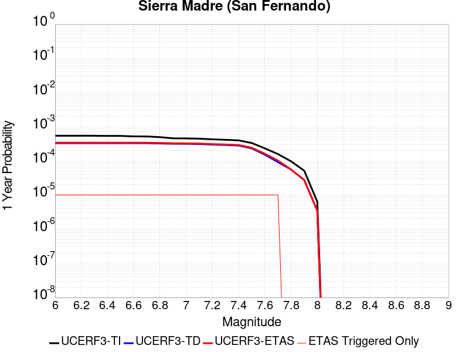 |  |

| Magnitude | 1 wk TI Prob | 1 wk TD Prob | 1 wk ETAS Prob | 1 wk ETAS/TD Gain | 1 wk ETAS Triggered Only | 1 mo TI Prob | 1 mo TD Prob | 1 mo ETAS Prob | 1 mo ETAS/TD Gain | 1 mo ETAS Triggered Only | 1 yr TI Prob | 1 yr TD Prob | 1 yr ETAS Prob | 1 yr ETAS/TD Gain | 1 yr ETAS Triggered Only | 10 yr TI Prob | 10 yr TD Prob | 10 yr ETAS Prob | 10 yr ETAS/TD Gain | 10 yr ETAS Triggered Only |
|-----|-----|-----|-----|-----|-----|-----|-----|-----|-----|-----|-----|-----|-----|-----|-----|-----|-----|-----|-----|-----|
| 6.0 | 1.0346413E-5 | 6.288036E-6 | 6.288036E-6 | 1.0 | 0.0 | 4.4341014E-5 | 2.6948452E-5 | 2.6948452E-5 | 1.0 | 0.0 | 5.3971814E-4 | 3.2804912E-4 | 3.4287974E-4 | 1.0452085 | 1.4835475E-5 | 0.0053840918 | 0.0032757611 | 0.0032905482 | 1.004514 | 1.4835475E-5 |
| 6.1 | 1.0346413E-5 | 6.288036E-6 | 6.288036E-6 | 1.0 | 0.0 | 4.4341014E-5 | 2.6948452E-5 | 2.6948452E-5 | 1.0 | 0.0 | 5.3971814E-4 | 3.2804912E-4 | 3.4287974E-4 | 1.0452085 | 1.4835475E-5 | 0.0053840918 | 0.0032757611 | 0.0032905482 | 1.004514 | 1.4835475E-5 |
| 6.2 | 1.0346413E-5 | 6.288036E-6 | 6.288036E-6 | 1.0 | 0.0 | 4.4341014E-5 | 2.6948452E-5 | 2.6948452E-5 | 1.0 | 0.0 | 5.3971814E-4 | 3.2804912E-4 | 3.4287974E-4 | 1.0452085 | 1.4835475E-5 | 0.0053840918 | 0.0032757611 | 0.0032905482 | 1.004514 | 1.4835475E-5 |
| 6.3 | 1.0346413E-5 | 6.288036E-6 | 6.288036E-6 | 1.0 | 0.0 | 4.4341014E-5 | 2.6948452E-5 | 2.6948452E-5 | 1.0 | 0.0 | 5.3971814E-4 | 3.2804912E-4 | 3.4287974E-4 | 1.0452085 | 1.4835475E-5 | 0.0053840918 | 0.0032757611 | 0.0032905482 | 1.004514 | 1.4835475E-5 |
| 6.4 | 1.0249558E-5 | 6.288036E-6 | 6.288036E-6 | 1.0 | 0.0 | 4.392594E-5 | 2.6948452E-5 | 2.6948452E-5 | 1.0 | 0.0 | 5.3466705E-4 | 3.2804912E-4 | 3.4287974E-4 | 1.0452085 | 1.4835475E-5 | 0.0053338245 | 0.0032757611 | 0.0032905482 | 1.004514 | 1.4835475E-5 |
| 6.5 | 1.0249558E-5 | 6.288036E-6 | 6.288036E-6 | 1.0 | 0.0 | 4.392594E-5 | 2.6948452E-5 | 2.6948452E-5 | 1.0 | 0.0 | 5.3466705E-4 | 3.2804912E-4 | 3.4287974E-4 | 1.0452085 | 1.4835475E-5 | 0.0053338245 | 0.0032757611 | 0.0032905482 | 1.004514 | 1.4835475E-5 |
| 6.6 | 9.9035515E-6 | 6.288036E-6 | 6.288036E-6 | 1.0 | 0.0 | 4.2443102E-5 | 2.6948452E-5 | 2.6948452E-5 | 1.0 | 0.0 | 5.166222E-4 | 3.2804912E-4 | 3.4287974E-4 | 1.0452085 | 1.4835475E-5 | 0.0051542283 | 0.0032757611 | 0.0032905482 | 1.004514 | 1.4835475E-5 |
| 6.7 | 9.87217E-6 | 6.275455E-6 | 6.275455E-6 | 1.0 | 0.0 | 4.2308613E-5 | 2.6894535E-5 | 2.6894535E-5 | 1.0 | 0.0 | 5.149856E-4 | 3.2739286E-4 | 3.422235E-4 | 1.0452992 | 1.4835475E-5 | 0.005137938 | 0.0032692181 | 0.003284005 | 1.004523 | 1.4835475E-5 |
| 6.8 | 9.4359175E-6 | 6.179416E-6 | 6.179416E-6 | 1.0 | 0.0 | 4.043902E-5 | 2.6482949E-5 | 2.6482949E-5 | 1.0 | 0.0 | 4.9223384E-4 | 3.2238328E-4 | 3.3721398E-4 | 1.0460033 | 1.4835475E-5 | 0.0049114493 | 0.0032192678 | 0.0032340556 | 1.0045935 | 1.4835475E-5 |
| 6.9 | 8.700447E-6 | 6.0406524E-6 | 6.0406524E-6 | 1.0 | 0.0 | 3.72871E-5 | 2.588826E-5 | 2.588826E-5 | 1.0 | 0.0 | 4.5387587E-4 | 3.1514504E-4 | 3.2997585E-4 | 1.0470603 | 1.4835475E-5 | 0.0045295 | 0.0031470908 | 0.0031618797 | 1.0046992 | 1.4835475E-5 |
| 7.0 | 8.648878E-6 | 6.0155653E-6 | 6.0155653E-6 | 1.0 | 0.0 | 3.7066096E-5 | 2.5780746E-5 | 2.5780746E-5 | 1.0 | 0.0 | 4.5118626E-4 | 3.1383647E-4 | 3.286673E-4 | 1.0472565 | 1.4835475E-5 | 0.004502713 | 0.003134042 | 0.003148831 | 1.0047188 | 1.4835475E-5 |
| 7.1 | 8.505786E-6 | 5.925191E-6 | 5.925191E-6 | 1.0 | 0.0 | 3.645286E-5 | 2.5393434E-5 | 2.5393434E-5 | 1.0 | 0.0 | 4.437232E-4 | 3.091223E-4 | 3.2395317E-4 | 1.0479774 | 1.4835475E-5 | 0.0044283825 | 0.003087032 | 0.0031018218 | 1.0047909 | 1.4835475E-5 |
| 7.2 | 8.139752E-6 | 5.6994727E-6 | 5.6994727E-6 | 1.0 | 0.0 | 3.4884186E-5 | 2.4426088E-5 | 2.4426088E-5 | 1.0 | 0.0 | 4.246322E-4 | 2.973481E-4 | 3.1217915E-4 | 1.0498778 | 1.4835475E-5 | 0.004238217 | 0.0029696084 | 0.0029844 | 1.0049809 | 1.4835475E-5 |
| 7.3 | 7.8816E-6 | 5.55278E-6 | 5.55278E-6 | 1.0 | 0.0 | 3.3777847E-5 | 2.3797416E-5 | 2.3797416E-5 | 1.0 | 0.0 | 4.111677E-4 | 2.8969607E-4 | 3.0452723E-4 | 1.0511956 | 1.4835475E-5 | 0.004104078 | 0.0028932898 | 0.0029080824 | 1.0051128 | 1.4835475E-5 |
| 7.4 | 7.5810603E-6 | 5.3570075E-6 | 5.3570075E-6 | 1.0 | 0.0 | 3.2489854E-5 | 2.2958407E-5 | 2.2958407E-5 | 1.0 | 0.0 | 3.9549218E-4 | 2.794838E-4 | 2.9431513E-4 | 1.0530668 | 1.4835475E-5 | 0.0039478904 | 0.0027914282 | 0.0028062223 | 1.0052998 | 1.4835475E-5 |
| 7.5 | 6.349153E-6 | 4.4082417E-6 | 4.4082417E-6 | 1.0 | 0.0 | 2.7210372E-5 | 1.8892331E-5 | 1.8892331E-5 | 1.0 | 0.0 | 3.312359E-4 | 2.2999069E-4 | 2.4482276E-4 | 1.0644898 | 1.4835475E-5 | 0.0033074263 | 0.0022976086 | 0.0023124102 | 1.0064421 | 1.4835475E-5 |
| 7.6 | 4.430576E-6 | 2.891209E-6 | 2.891209E-6 | 1.0 | 0.0 | 1.8988047E-5 | 1.23908385E-5 | 1.23908385E-5 | 1.0 | 0.0 | 2.3115493E-4 | 1.5084824E-4 | 1.6568149E-4 | 1.0983322 | 1.4835475E-5 | 0.0023091463 | 0.0015074811 | 0.0015222941 | 1.0098264 | 1.4835475E-5 |
| 7.7 | 3.005066E-6 | 1.7515898E-6 | 1.7515898E-6 | 1.0 | 0.0 | 1.2878791E-5 | 7.506792E-6 | 7.506792E-6 | 1.0 | 0.0 | 1.56788E-4 | 9.139137E-5 | 1.0622549E-4 | 1.1623142 | 1.4835475E-5 | 0.0015667742 | 9.13539E-4 | 9.283609E-4 | 1.0162247 | 1.4835475E-5 |
| 7.8 | 1.8459098E-6 | 1.058631E-6 | 1.058631E-6 | 1.0 | 0.0 | 7.911018E-6 | 4.536982E-6 | 4.536982E-6 | 1.0 | 0.0 | 9.631238E-5 | 5.5236364E-5 | 5.5236364E-5 | 1.0 | 0.0 | 9.627065E-4 | 5.522268E-4 | 5.522268E-4 | 1.0 | 0.0 |
| 7.9 | 9.839262E-7 | 5.2370365E-7 | 5.2370365E-7 | 1.0 | 0.0 | 4.2168194E-6 | 2.2444424E-6 | 2.2444424E-6 | 1.0 | 0.0 | 5.1338568E-5 | 2.7325745E-5 | 2.7325745E-5 | 1.0 | 0.0 | 5.132671E-4 | 2.7322414E-4 | 2.7322414E-4 | 1.0 | 0.0 |
| 8.0 | 1.210983E-7 | 6.615574E-8 | 6.615574E-8 | 1.0 | 0.0 | 5.1899264E-7 | 2.8352457E-7 | 2.8352457E-7 | 1.0 | 0.0 | 6.3187167E-6 | 3.4519064E-6 | 3.4519064E-6 | 1.0 | 0.0 | 6.318537E-5 | 3.4518547E-5 | 3.4518547E-5 | 1.0 | 0.0 |

## Great Valley 07 (Orestimba)
*[(top)](#table-of-contents)*

| 1 Week | 1 Month | 1 Year | 10 Year |
|-----|-----|-----|-----|
|  |  | 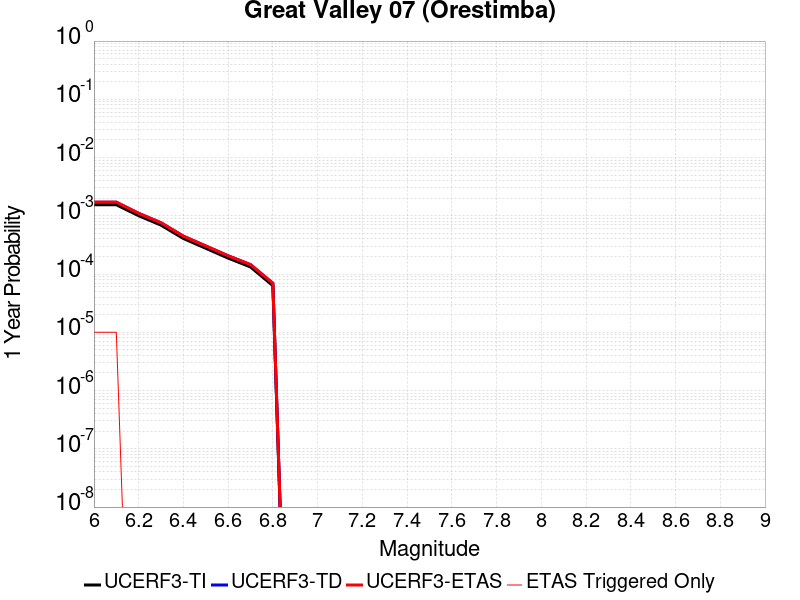 |  |

| Magnitude | 1 wk TI Prob | 1 wk TD Prob | 1 wk ETAS Prob | 1 wk ETAS/TD Gain | 1 wk ETAS Triggered Only | 1 mo TI Prob | 1 mo TD Prob | 1 mo ETAS Prob | 1 mo ETAS/TD Gain | 1 mo ETAS Triggered Only | 1 yr TI Prob | 1 yr TD Prob | 1 yr ETAS Prob | 1 yr ETAS/TD Gain | 1 yr ETAS Triggered Only | 10 yr TI Prob | 10 yr TD Prob | 10 yr ETAS Prob | 10 yr ETAS/TD Gain | 10 yr ETAS Triggered Only |
|-----|-----|-----|-----|-----|-----|-----|-----|-----|-----|-----|-----|-----|-----|-----|-----|-----|-----|-----|-----|-----|
| 6.0 | 2.9687902E-5 | 3.2759748E-5 | 3.2759748E-5 | 1.0 | 0.0 | 1.2722766E-4 | 1.4039177E-4 | 1.4039177E-4 | 1.0 | 0.0 | 0.0015478961 | 0.0017080016 | 0.0017228117 | 1.008671 | 1.4835475E-5 | 0.015371585 | 0.01695629 | 0.016970875 | 1.0008601 | 1.4835475E-5 |
| 6.1 | 2.9687902E-5 | 3.2759748E-5 | 3.2759748E-5 | 1.0 | 0.0 | 1.2722766E-4 | 1.4039177E-4 | 1.4039177E-4 | 1.0 | 0.0 | 0.0015478961 | 0.0017080016 | 0.0017228117 | 1.008671 | 1.4835475E-5 | 0.015371585 | 0.01695629 | 0.016970875 | 1.0008601 | 1.4835475E-5 |
| 6.2 | 1.9231524E-5 | 2.1160573E-5 | 2.1160573E-5 | 1.0 | 0.0 | 8.2418206E-5 | 9.068515E-5 | 9.068515E-5 | 1.0 | 0.0 | 0.0010029797 | 0.0011035556 | 0.0011035556 | 1.0 | 0.0 | 0.00998465 | 0.010983167 | 0.010983167 | 1.0 | 0.0 |
| 6.3 | 1.324766E-5 | 1.4549481E-5 | 1.4549481E-5 | 1.0 | 0.0 | 5.6774446E-5 | 6.235348E-5 | 6.235348E-5 | 1.0 | 0.0 | 6.910097E-4 | 7.588984E-4 | 7.588984E-4 | 1.0 | 0.0 | 0.006888649 | 0.0075640148 | 0.0075640148 | 1.0 | 0.0 |
| 6.4 | 7.818645E-6 | 8.573388E-6 | 8.573388E-6 | 1.0 | 0.0 | 3.3508048E-5 | 3.6742596E-5 | 3.6742596E-5 | 1.0 | 0.0 | 4.078841E-4 | 4.4725265E-4 | 4.4725265E-4 | 1.0 | 0.0 | 0.004071363 | 0.0044638654 | 0.0044638654 | 1.0 | 0.0 |
| 6.5 | 5.3076565E-6 | 5.8181718E-6 | 5.8181718E-6 | 1.0 | 0.0 | 2.27469E-5 | 2.4934794E-5 | 2.4934794E-5 | 1.0 | 0.0 | 2.7690834E-4 | 3.0354093E-4 | 3.0354093E-4 | 1.0 | 0.0 | 0.0027656353 | 0.003031473 | 0.003031473 | 1.0 | 0.0 |
| 6.6 | 3.6003578E-6 | 3.9487486E-6 | 3.9487486E-6 | 1.0 | 0.0 | 1.5430012E-5 | 1.6923108E-5 | 1.6923108E-5 | 1.0 | 0.0 | 1.8784421E-4 | 2.0602091E-4 | 2.0602091E-4 | 1.0 | 0.0 | 0.0018768552 | 0.0020584534 | 0.0020584534 | 1.0 | 0.0 |
| 6.7 | 2.5361826E-6 | 2.783648E-6 | 2.783648E-6 | 1.0 | 0.0 | 1.0869308E-5 | 1.1929872E-5 | 1.1929872E-5 | 1.0 | 0.0 | 1.3232579E-4 | 1.4523783E-4 | 1.4523783E-4 | 1.0 | 0.0 | 0.0013224703 | 0.0014515591 | 0.0014515591 | 1.0 | 0.0 |
| 6.8 | 1.2115831E-6 | 1.331467E-6 | 1.331467E-6 | 1.0 | 0.0 | 5.1924885E-6 | 5.7062807E-6 | 5.7062807E-6 | 1.0 | 0.0 | 6.3216714E-5 | 6.947272E-5 | 6.947272E-5 | 1.0 | 0.0 | 6.3198735E-4 | 6.946051E-4 | 6.946051E-4 | 1.0 | 0.0 |

## Great Valley 05 Pittsburg - Kirby Hills alt1
*[(top)](#table-of-contents)*

| 1 Week | 1 Month | 1 Year | 10 Year |
|-----|-----|-----|-----|
| 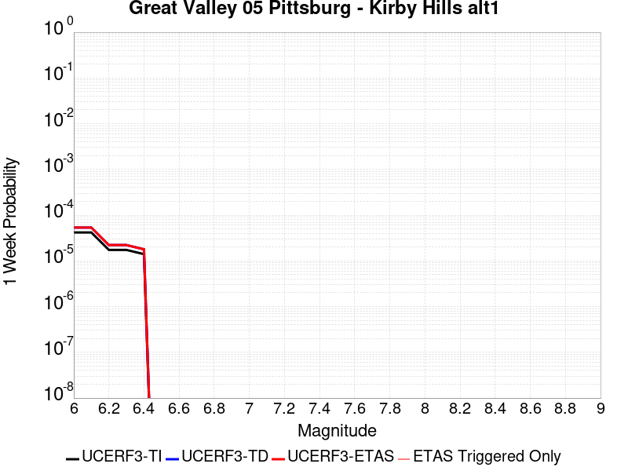 |  | 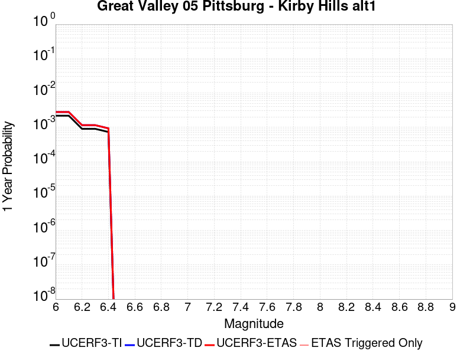 |  |

| Magnitude | 1 wk TI Prob | 1 wk TD Prob | 1 wk ETAS Prob | 1 wk ETAS/TD Gain | 1 wk ETAS Triggered Only | 1 mo TI Prob | 1 mo TD Prob | 1 mo ETAS Prob | 1 mo ETAS/TD Gain | 1 mo ETAS Triggered Only | 1 yr TI Prob | 1 yr TD Prob | 1 yr ETAS Prob | 1 yr ETAS/TD Gain | 1 yr ETAS Triggered Only | 10 yr TI Prob | 10 yr TD Prob | 10 yr ETAS Prob | 10 yr ETAS/TD Gain | 10 yr ETAS Triggered Only |
|-----|-----|-----|-----|-----|-----|-----|-----|-----|-----|-----|-----|-----|-----|-----|-----|-----|-----|-----|-----|-----|
| 6.0 | 4.187212E-5 | 5.345189E-5 | 5.345189E-5 | 1.0 | 0.0 | 1.794396E-4 | 2.2906518E-4 | 2.2906518E-4 | 1.0 | 0.0 | 0.002182488 | 0.0027862855 | 0.0027862855 | 1.0 | 0.0 | 0.021611776 | 0.02760792 | 0.027622346 | 1.0005225 | 1.4835475E-5 |
| 6.1 | 4.187212E-5 | 5.345189E-5 | 5.345189E-5 | 1.0 | 0.0 | 1.794396E-4 | 2.2906518E-4 | 2.2906518E-4 | 1.0 | 0.0 | 0.002182488 | 0.0027862855 | 0.0027862855 | 1.0 | 0.0 | 0.021611776 | 0.02760792 | 0.027622346 | 1.0005225 | 1.4835475E-5 |
| 6.2 | 1.7353306E-5 | 2.2158449E-5 | 2.2158449E-5 | 1.0 | 0.0 | 7.436919E-5 | 9.4963645E-5 | 9.4963645E-5 | 1.0 | 0.0 | 9.050688E-4 | 0.0011559651 | 0.0011559651 | 1.0 | 0.0 | 0.009013915 | 0.011537171 | 0.011551835 | 1.001271 | 1.4835475E-5 |
| 6.3 | 1.7353306E-5 | 2.2158449E-5 | 2.2158449E-5 | 1.0 | 0.0 | 7.436919E-5 | 9.4963645E-5 | 9.4963645E-5 | 1.0 | 0.0 | 9.050688E-4 | 0.0011559651 | 0.0011559651 | 1.0 | 0.0 | 0.009013915 | 0.011537171 | 0.011551835 | 1.001271 | 1.4835475E-5 |
| 6.4 | 1.4028824E-5 | 1.790388E-5 | 1.790388E-5 | 1.0 | 0.0 | 6.0122147E-5 | 7.673092E-5 | 7.673092E-5 | 1.0 | 0.0 | 7.3174125E-4 | 9.341989E-4 | 9.341989E-4 | 1.0 | 0.0 | 0.0072933645 | 0.009339802 | 0.009354499 | 1.0015736 | 1.4835475E-5 |

## San Luis Range 2011 CFM
*[(top)](#table-of-contents)*

| 1 Week | 1 Month | 1 Year | 10 Year |
|-----|-----|-----|-----|
|  |  |  |  |

| Magnitude | 1 wk TI Prob | 1 wk TD Prob | 1 wk ETAS Prob | 1 wk ETAS/TD Gain | 1 wk ETAS Triggered Only | 1 mo TI Prob | 1 mo TD Prob | 1 mo ETAS Prob | 1 mo ETAS/TD Gain | 1 mo ETAS Triggered Only | 1 yr TI Prob | 1 yr TD Prob | 1 yr ETAS Prob | 1 yr ETAS/TD Gain | 1 yr ETAS Triggered Only | 10 yr TI Prob | 10 yr TD Prob | 10 yr ETAS Prob | 10 yr ETAS/TD Gain | 10 yr ETAS Triggered Only |
|-----|-----|-----|-----|-----|-----|-----|-----|-----|-----|-----|-----|-----|-----|-----|-----|-----|-----|-----|-----|-----|
| 6.0 | 8.8368415E-6 | 8.965571E-6 | 8.965571E-6 | 1.0 | 0.0 | 3.787163E-5 | 3.8423357E-5 | 3.8423357E-5 | 1.0 | 0.0 | 4.609895E-4 | 4.6771183E-4 | 4.6771183E-4 | 1.0 | 0.0 | 0.0046003438 | 0.0046680574 | 0.0046828235 | 1.0031632 | 1.4835475E-5 |
| 6.1 | 8.8368415E-6 | 8.965571E-6 | 8.965571E-6 | 1.0 | 0.0 | 3.787163E-5 | 3.8423357E-5 | 3.8423357E-5 | 1.0 | 0.0 | 4.609895E-4 | 4.6771183E-4 | 4.6771183E-4 | 1.0 | 0.0 | 0.0046003438 | 0.0046680574 | 0.0046828235 | 1.0031632 | 1.4835475E-5 |
| 6.2 | 8.8368415E-6 | 8.965571E-6 | 8.965571E-6 | 1.0 | 0.0 | 3.787163E-5 | 3.8423357E-5 | 3.8423357E-5 | 1.0 | 0.0 | 4.609895E-4 | 4.6771183E-4 | 4.6771183E-4 | 1.0 | 0.0 | 0.0046003438 | 0.0046680574 | 0.0046828235 | 1.0031632 | 1.4835475E-5 |
| 6.3 | 8.8368415E-6 | 8.965571E-6 | 8.965571E-6 | 1.0 | 0.0 | 3.787163E-5 | 3.8423357E-5 | 3.8423357E-5 | 1.0 | 0.0 | 4.609895E-4 | 4.6771183E-4 | 4.6771183E-4 | 1.0 | 0.0 | 0.0046003438 | 0.0046680574 | 0.0046828235 | 1.0031632 | 1.4835475E-5 |
| 6.4 | 3.9094193E-6 | 3.9412553E-6 | 3.9412553E-6 | 1.0 | 0.0 | 1.6754546E-5 | 1.6890986E-5 | 1.6890986E-5 | 1.0 | 0.0 | 2.039675E-4 | 2.0562863E-4 | 2.0562863E-4 | 1.0 | 0.0 | 0.0020378039 | 0.0020544124 | 0.0020692174 | 1.0072064 | 1.4835475E-5 |
| 6.5 | 3.9094193E-6 | 3.9412553E-6 | 3.9412553E-6 | 1.0 | 0.0 | 1.6754546E-5 | 1.6890986E-5 | 1.6890986E-5 | 1.0 | 0.0 | 2.039675E-4 | 2.0562863E-4 | 2.0562863E-4 | 1.0 | 0.0 | 0.0020378039 | 0.0020544124 | 0.0020692174 | 1.0072064 | 1.4835475E-5 |
| 6.6 | 3.0587726E-6 | 3.0754304E-6 | 3.0754304E-6 | 1.0 | 0.0 | 1.3108959E-5 | 1.318035E-5 | 1.318035E-5 | 1.0 | 0.0 | 1.595899E-4 | 1.6045907E-4 | 1.6045907E-4 | 1.0 | 0.0 | 0.0015947534 | 0.0016034441 | 0.0016034441 | 1.0 | 0.0 |
| 6.7 | 2.6160574E-6 | 2.6251644E-6 | 2.6251644E-6 | 1.0 | 0.0 | 1.1211626E-5 | 1.1250657E-5 | 1.1250657E-5 | 1.0 | 0.0 | 1.3649299E-4 | 1.3696818E-4 | 1.3696818E-4 | 1.0 | 0.0 | 0.0013640919 | 0.001368844 | 0.001368844 | 1.0 | 0.0 |
| 6.8 | 2.5110312E-6 | 2.518176E-6 | 2.518176E-6 | 1.0 | 0.0 | 1.0761518E-5 | 1.0792138E-5 | 1.0792138E-5 | 1.0 | 0.0 | 1.310136E-4 | 1.3138642E-4 | 1.3138642E-4 | 1.0 | 0.0 | 0.0013093639 | 0.0013130932 | 0.0013130932 | 1.0 | 0.0 |
| 6.9 | 1.8564405E-6 | 1.8525153E-6 | 1.8525153E-6 | 1.0 | 0.0 | 7.95615E-6 | 7.939328E-6 | 7.939328E-6 | 1.0 | 0.0 | 9.686181E-5 | 9.6657044E-5 | 9.6657044E-5 | 1.0 | 0.0 | 9.68196E-4 | 9.6615206E-4 | 9.6615206E-4 | 1.0 | 0.0 |
| 7.0 | 1.546127E-6 | 1.5369785E-6 | 1.5369785E-6 | 1.0 | 0.0 | 6.626242E-6 | 6.5870345E-6 | 6.5870345E-6 | 1.0 | 0.0 | 8.06715E-5 | 8.01942E-5 | 8.01942E-5 | 1.0 | 0.0 | 8.0642226E-4 | 8.016533E-4 | 8.016533E-4 | 1.0 | 0.0 |
| 7.1 | 1.3368208E-6 | 1.3235546E-6 | 1.3235546E-6 | 1.0 | 0.0 | 5.7292195E-6 | 5.6723648E-6 | 5.6723648E-6 | 1.0 | 0.0 | 6.975101E-5 | 6.905886E-5 | 6.905886E-5 | 1.0 | 0.0 | 6.972912E-4 | 6.903744E-4 | 6.903744E-4 | 1.0 | 0.0 |
| 7.2 | 1.0623363E-6 | 1.0454552E-6 | 1.0454552E-6 | 1.0 | 0.0 | 4.5528623E-6 | 4.4805142E-6 | 4.4805142E-6 | 1.0 | 0.0 | 5.5429686E-5 | 5.45489E-5 | 5.45489E-5 | 1.0 | 0.0 | 5.5415864E-4 | 5.453554E-4 | 5.453554E-4 | 1.0 | 0.0 |
| 7.3 | 7.831679E-7 | 7.727538E-7 | 7.727538E-7 | 1.0 | 0.0 | 3.3564295E-6 | 3.3117979E-6 | 3.3117979E-6 | 1.0 | 0.0 | 4.086376E-5 | 4.0320396E-5 | 4.0320396E-5 | 1.0 | 0.0 | 4.0856248E-4 | 4.0313092E-4 | 4.0313092E-4 | 1.0 | 0.0 |
| 7.4 | 5.9558846E-7 | 5.91076E-7 | 5.91076E-7 | 1.0 | 0.0 | 2.5525194E-6 | 2.5331803E-6 | 2.5331803E-6 | 1.0 | 0.0 | 3.107648E-5 | 3.0841034E-5 | 3.0841034E-5 | 1.0 | 0.0 | 3.1072134E-4 | 3.0836763E-4 | 3.0836763E-4 | 1.0 | 0.0 |
| 7.5 | 4.1616502E-7 | 4.1197322E-7 | 4.1197322E-7 | 1.0 | 0.0 | 1.7835631E-6 | 1.7655983E-6 | 1.7655983E-6 | 1.0 | 0.0 | 2.1714664E-5 | 2.1495947E-5 | 2.1495947E-5 | 1.0 | 0.0 | 2.1712543E-4 | 2.1493873E-4 | 2.1493873E-4 | 1.0 | 0.0 |
| 7.6 | 2.3816014E-7 | 2.3377329E-7 | 2.3377329E-7 | 1.0 | 0.0 | 1.0206859E-6 | 1.0018852E-6 | 1.0018852E-6 | 1.0 | 0.0 | 1.242678E-5 | 1.2197884E-5 | 1.2197884E-5 | 1.0 | 0.0 | 1.2426086E-4 | 1.2197216E-4 | 1.2197216E-4 | 1.0 | 0.0 |
| 7.7 | 9.918777E-8 | 9.387351E-8 | 9.387351E-8 | 1.0 | 0.0 | 4.2509038E-7 | 4.0231498E-7 | 4.0231498E-7 | 1.0 | 0.0 | 5.1754632E-6 | 4.8981738E-6 | 4.8981738E-6 | 1.0 | 0.0 | 5.1753424E-5 | 4.8980663E-5 | 4.8980663E-5 | 1.0 | 0.0 |
| 7.8 | 3.4982556E-8 | 2.9691448E-8 | 2.9691448E-8 | 1.0 | 0.0 | 1.4992524E-7 | 1.2724907E-7 | 1.2724907E-7 | 1.0 | 0.0 | 1.8253382E-6 | 1.5492561E-6 | 1.5492561E-6 | 1.0 | 0.0 | 1.8253233E-5 | 1.5492455E-5 | 1.5492455E-5 | 1.0 | 0.0 |
| 7.9 | 1.6624908E-8 | 1.1481518E-8 | 1.1481518E-8 | 1.0 | 0.0 | 7.12496E-8 | 4.9206513E-8 | 4.9206513E-8 | 1.0 | 0.0 | 8.6746354E-7 | 5.990891E-7 | 5.990891E-7 | 1.0 | 0.0 | 8.674601E-6 | 5.9908753E-6 | 5.9908753E-6 | 1.0 | 0.0 |
| 8.0 | 6.3352315E-9 | 3.091377E-9 | 3.091377E-9 | 1.0 | 0.0 | 2.715099E-8 | 1.3248759E-8 | 1.3248759E-8 | 1.0 | 0.0 | 3.3056327E-7 | 1.6130362E-7 | 1.6130362E-7 | 1.0 | 0.0 | 3.3056278E-6 | 1.6130351E-6 | 1.6130351E-6 | 1.0 | 0.0 |

## Coronado Bank alt1
*[(top)](#table-of-contents)*

| 1 Week | 1 Month | 1 Year | 10 Year |
|-----|-----|-----|-----|
|  | 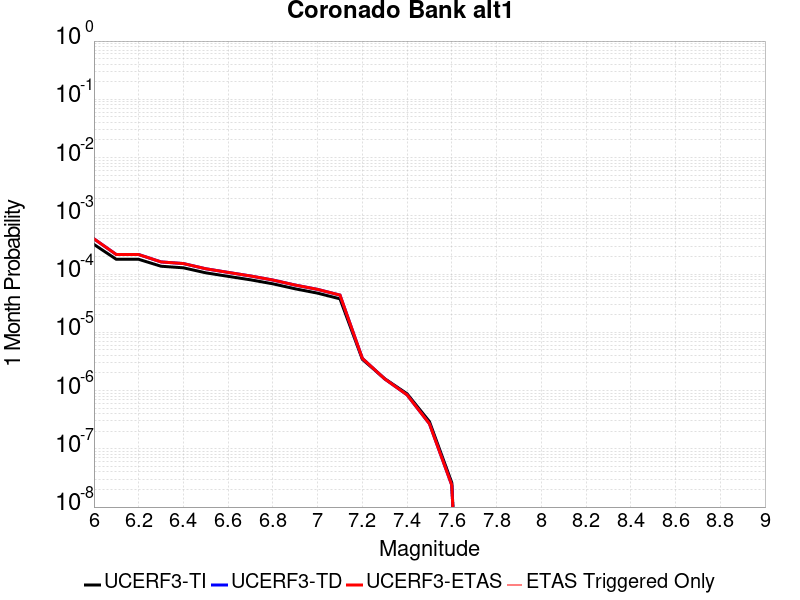 |  |  |

| Magnitude | 1 wk TI Prob | 1 wk TD Prob | 1 wk ETAS Prob | 1 wk ETAS/TD Gain | 1 wk ETAS Triggered Only | 1 mo TI Prob | 1 mo TD Prob | 1 mo ETAS Prob | 1 mo ETAS/TD Gain | 1 mo ETAS Triggered Only | 1 yr TI Prob | 1 yr TD Prob | 1 yr ETAS Prob | 1 yr ETAS/TD Gain | 1 yr ETAS Triggered Only | 10 yr TI Prob | 10 yr TD Prob | 10 yr ETAS Prob | 10 yr ETAS/TD Gain | 10 yr ETAS Triggered Only |
|-----|-----|-----|-----|-----|-----|-----|-----|-----|-----|-----|-----|-----|-----|-----|-----|-----|-----|-----|-----|-----|
| 6.0 | 7.533492E-5 | 9.396496E-5 | 9.396496E-5 | 1.0 | 0.0 | 3.22824E-4 | 4.0264908E-4 | 4.0264908E-4 | 1.0 | 0.0 | 0.0039233007 | 0.0048917583 | 0.004906521 | 1.0030179 | 1.4835475E-5 | 0.03854755 | 0.047911122 | 0.04792525 | 1.0002948 | 1.4835475E-5 |
| 6.1 | 4.1807285E-5 | 5.049993E-5 | 5.049993E-5 | 1.0 | 0.0 | 1.7916178E-4 | 2.164109E-4 | 2.164109E-4 | 1.0 | 0.0 | 0.0021791123 | 0.002631715 | 0.002631715 | 1.0 | 0.0 | 0.021578677 | 0.026014598 | 0.026014598 | 1.0 | 0.0 |
| 6.2 | 4.1807285E-5 | 5.049993E-5 | 5.049993E-5 | 1.0 | 0.0 | 1.7916178E-4 | 2.164109E-4 | 2.164109E-4 | 1.0 | 0.0 | 0.0021791123 | 0.002631715 | 0.002631715 | 1.0 | 0.0 | 0.021578677 | 0.026014598 | 0.026014598 | 1.0 | 0.0 |
| 6.3 | 3.1793104E-5 | 3.771584E-5 | 3.771584E-5 | 1.0 | 0.0 | 1.3624904E-4 | 1.616295E-4 | 1.616295E-4 | 1.0 | 0.0 | 0.0016575698 | 0.0019660923 | 0.0019660923 | 1.0 | 0.0 | 0.016452603 | 0.019490868 | 0.019490868 | 1.0 | 0.0 |
| 6.4 | 2.9878007E-5 | 3.5340134E-5 | 3.5340134E-5 | 1.0 | 0.0 | 1.2804232E-4 | 1.5144913E-4 | 1.5144913E-4 | 1.0 | 0.0 | 0.0015578003 | 0.0018423634 | 0.0018423634 | 1.0 | 0.0 | 0.015469253 | 0.018274656 | 0.018274656 | 1.0 | 0.0 |
| 6.5 | 2.4512565E-5 | 2.8767396E-5 | 2.8767396E-5 | 1.0 | 0.0 | 1.0504962E-4 | 1.2328317E-4 | 1.2328317E-4 | 1.0 | 0.0 | 0.0012782287 | 0.0014999667 | 0.0014999667 | 1.0 | 0.0 | 0.012709012 | 0.014901404 | 0.014901404 | 1.0 | 0.0 |
| 6.6 | 2.1317413E-5 | 2.4909488E-5 | 2.4909488E-5 | 1.0 | 0.0 | 9.135714E-5 | 1.0675071E-4 | 1.0675071E-4 | 1.0 | 0.0 | 0.0011117056 | 0.0012989372 | 0.0012989372 | 1.0 | 0.0 | 0.011061605 | 0.012915855 | 0.012915855 | 1.0 | 0.0 |
| 6.7 | 1.8585655E-5 | 2.1637266E-5 | 2.1637266E-5 | 1.0 | 0.0 | 7.9650374E-5 | 9.272796E-5 | 9.272796E-5 | 1.0 | 0.0 | 9.6931186E-4 | 0.0011283987 | 0.0011283987 | 1.0 | 0.0 | 0.0096509475 | 0.011228854 | 0.011228854 | 1.0 | 0.0 |
| 6.8 | 1.5862879E-5 | 1.8421473E-5 | 1.8421473E-5 | 1.0 | 0.0 | 6.798199E-5 | 7.894689E-5 | 7.894689E-5 | 1.0 | 0.0 | 8.273665E-4 | 9.6077385E-4 | 9.6077385E-4 | 1.0 | 0.0 | 0.008242928 | 0.009568184 | 0.009568184 | 1.0 | 0.0 |
| 6.9 | 1.3021509E-5 | 1.5096887E-5 | 1.5096887E-5 | 1.0 | 0.0 | 5.5805274E-5 | 6.4699445E-5 | 6.4699445E-5 | 1.0 | 0.0 | 6.792174E-4 | 7.874491E-4 | 7.874491E-4 | 1.0 | 0.0 | 0.006771452 | 0.007848413 | 0.007848413 | 1.0 | 0.0 |
| 7.0 | 1.0974371E-5 | 1.27214735E-5 | 1.27214735E-5 | 1.0 | 0.0 | 4.7032172E-5 | 5.4519558E-5 | 5.4519558E-5 | 1.0 | 0.0 | 5.7246623E-4 | 6.63591E-4 | 6.63591E-4 | 1.0 | 0.0 | 0.0057099373 | 0.006617845 | 0.006617845 | 1.0 | 0.0 |
| 7.1 | 8.766221E-6 | 1.0164933E-5 | 1.0164933E-5 | 1.0 | 0.0 | 3.7568978E-5 | 4.3563366E-5 | 4.3563366E-5 | 1.0 | 0.0 | 4.573063E-4 | 5.3027214E-4 | 5.3027214E-4 | 1.0 | 0.0 | 0.0045636636 | 0.0052917683 | 0.0052917683 | 1.0 | 0.0 |
| 7.2 | 8.026024E-7 | 8.332126E-7 | 8.332126E-7 | 1.0 | 0.0 | 3.43972E-6 | 3.5709063E-6 | 3.5709063E-6 | 1.0 | 0.0 | 4.1877785E-5 | 4.3474927E-5 | 4.3474927E-5 | 1.0 | 0.0 | 4.1869894E-4 | 4.3466533E-4 | 4.3466533E-4 | 1.0 | 0.0 |
| 7.3 | 3.7293114E-7 | 3.700213E-7 | 3.700213E-7 | 1.0 | 0.0 | 1.5982754E-6 | 1.5858046E-6 | 1.5858046E-6 | 1.0 | 0.0 | 1.9458828E-5 | 1.9307001E-5 | 1.9307001E-5 | 1.0 | 0.0 | 1.9457124E-4 | 1.930533E-4 | 1.930533E-4 | 1.0 | 0.0 |
| 7.4 | 2.0557036E-7 | 1.9674867E-7 | 1.9674867E-7 | 1.0 | 0.0 | 8.810155E-7 | 8.432083E-7 | 8.432083E-7 | 1.0 | 0.0 | 1.0726311E-5 | 1.0266013E-5 | 1.0266013E-5 | 1.0 | 0.0 | 1.0725793E-4 | 1.0265542E-4 | 1.0265542E-4 | 1.0 | 0.0 |
| 7.5 | 6.845446E-8 | 6.279465E-8 | 6.279465E-8 | 1.0 | 0.0 | 2.9337625E-7 | 2.6911988E-7 | 2.6911988E-7 | 1.0 | 0.0 | 3.5718497E-6 | 3.2765297E-6 | 3.2765297E-6 | 1.0 | 0.0 | 3.5717923E-5 | 3.2764823E-5 | 3.2764823E-5 | 1.0 | 0.0 |
| 7.6 | 6.0975145E-9 | 5.5319043E-9 | 5.5319043E-9 | 1.0 | 0.0 | 2.6132206E-8 | 2.3708163E-8 | 2.3708163E-8 | 1.0 | 0.0 | 3.1815955E-7 | 2.8864685E-7 | 2.8864685E-7 | 1.0 | 0.0 | 3.181591E-6 | 2.8864656E-6 | 2.8864656E-6 | 1.0 | 0.0 |

## Ozena
*[(top)](#table-of-contents)*

| 1 Week | 1 Month | 1 Year | 10 Year |
|-----|-----|-----|-----|
|  |  |  |  |

| Magnitude | 1 wk TI Prob | 1 wk TD Prob | 1 wk ETAS Prob | 1 wk ETAS/TD Gain | 1 wk ETAS Triggered Only | 1 mo TI Prob | 1 mo TD Prob | 1 mo ETAS Prob | 1 mo ETAS/TD Gain | 1 mo ETAS Triggered Only | 1 yr TI Prob | 1 yr TD Prob | 1 yr ETAS Prob | 1 yr ETAS/TD Gain | 1 yr ETAS Triggered Only | 10 yr TI Prob | 10 yr TD Prob | 10 yr ETAS Prob | 10 yr ETAS/TD Gain | 10 yr ETAS Triggered Only |
|-----|-----|-----|-----|-----|-----|-----|-----|-----|-----|-----|-----|-----|-----|-----|-----|-----|-----|-----|-----|-----|
| 6.0 | 1.4377547E-6 | 1.4513874E-6 | 1.4513874E-6 | 1.0 | 0.0 | 6.161791E-6 | 6.2202184E-6 | 6.2202184E-6 | 1.0 | 0.0 | 7.5017226E-5 | 7.57288E-5 | 7.57288E-5 | 1.0 | 0.0 | 7.4991904E-4 | 7.570566E-4 | 7.718808E-4 | 1.0195814 | 1.4835475E-5 |
| 6.1 | 1.4377547E-6 | 1.4513874E-6 | 1.4513874E-6 | 1.0 | 0.0 | 6.161791E-6 | 6.2202184E-6 | 6.2202184E-6 | 1.0 | 0.0 | 7.5017226E-5 | 7.57288E-5 | 7.57288E-5 | 1.0 | 0.0 | 7.4991904E-4 | 7.570566E-4 | 7.718808E-4 | 1.0195814 | 1.4835475E-5 |
| 6.2 | 1.4377547E-6 | 1.4513874E-6 | 1.4513874E-6 | 1.0 | 0.0 | 6.161791E-6 | 6.2202184E-6 | 6.2202184E-6 | 1.0 | 0.0 | 7.5017226E-5 | 7.57288E-5 | 7.57288E-5 | 1.0 | 0.0 | 7.4991904E-4 | 7.570566E-4 | 7.718808E-4 | 1.0195814 | 1.4835475E-5 |
| 6.3 | 1.4377547E-6 | 1.4513874E-6 | 1.4513874E-6 | 1.0 | 0.0 | 6.161791E-6 | 6.2202184E-6 | 6.2202184E-6 | 1.0 | 0.0 | 7.5017226E-5 | 7.57288E-5 | 7.57288E-5 | 1.0 | 0.0 | 7.4991904E-4 | 7.570566E-4 | 7.718808E-4 | 1.0195814 | 1.4835475E-5 |
| 6.4 | 1.4377547E-6 | 1.4513874E-6 | 1.4513874E-6 | 1.0 | 0.0 | 6.161791E-6 | 6.2202184E-6 | 6.2202184E-6 | 1.0 | 0.0 | 7.5017226E-5 | 7.57288E-5 | 7.57288E-5 | 1.0 | 0.0 | 7.4991904E-4 | 7.570566E-4 | 7.718808E-4 | 1.0195814 | 1.4835475E-5 |
| 6.5 | 1.4377547E-6 | 1.4513874E-6 | 1.4513874E-6 | 1.0 | 0.0 | 6.161791E-6 | 6.2202184E-6 | 6.2202184E-6 | 1.0 | 0.0 | 7.5017226E-5 | 7.57288E-5 | 7.57288E-5 | 1.0 | 0.0 | 7.4991904E-4 | 7.570566E-4 | 7.718808E-4 | 1.0195814 | 1.4835475E-5 |
| 6.6 | 1.4377547E-6 | 1.4513874E-6 | 1.4513874E-6 | 1.0 | 0.0 | 6.161791E-6 | 6.2202184E-6 | 6.2202184E-6 | 1.0 | 0.0 | 7.5017226E-5 | 7.57288E-5 | 7.57288E-5 | 1.0 | 0.0 | 7.4991904E-4 | 7.570566E-4 | 7.718808E-4 | 1.0195814 | 1.4835475E-5 |
| 6.7 | 1.4377547E-6 | 1.4513874E-6 | 1.4513874E-6 | 1.0 | 0.0 | 6.161791E-6 | 6.2202184E-6 | 6.2202184E-6 | 1.0 | 0.0 | 7.5017226E-5 | 7.57288E-5 | 7.57288E-5 | 1.0 | 0.0 | 7.4991904E-4 | 7.570566E-4 | 7.718808E-4 | 1.0195814 | 1.4835475E-5 |
| 6.8 | 9.223257E-7 | 9.317687E-7 | 9.317687E-7 | 1.0 | 0.0 | 3.9528186E-6 | 3.9932884E-6 | 3.9932884E-6 | 1.0 | 0.0 | 4.81245E-5 | 4.8617243E-5 | 4.8617243E-5 | 1.0 | 0.0 | 4.811408E-4 | 4.8607012E-4 | 5.0089834E-4 | 1.0305064 | 1.4835475E-5 |
| 6.9 | 9.141515E-7 | 9.235434E-7 | 9.235434E-7 | 1.0 | 0.0 | 3.917786E-6 | 3.9580373E-6 | 3.9580373E-6 | 1.0 | 0.0 | 4.7698002E-5 | 4.8188078E-5 | 4.8188078E-5 | 1.0 | 0.0 | 4.7687767E-4 | 4.8178033E-4 | 4.9660867E-4 | 1.0307782 | 1.4835475E-5 |
| 7.0 | 8.767648E-7 | 8.858638E-7 | 8.858638E-7 | 1.0 | 0.0 | 3.757558E-6 | 3.7965538E-6 | 3.7965538E-6 | 1.0 | 0.0 | 4.5747307E-5 | 4.6222103E-5 | 4.6222103E-5 | 1.0 | 0.0 | 4.5737892E-4 | 4.621288E-4 | 4.7695744E-4 | 1.0320877 | 1.4835475E-5 |
| 7.1 | 8.199402E-7 | 8.2854564E-7 | 8.2854564E-7 | 1.0 | 0.0 | 3.5140247E-6 | 3.5509051E-6 | 3.5509051E-6 | 1.0 | 0.0 | 4.2782412E-5 | 4.3231452E-5 | 4.3231452E-5 | 1.0 | 0.0 | 4.2774176E-4 | 4.3223414E-4 | 4.4706318E-4 | 1.034308 | 1.4835475E-5 |
| 7.2 | 7.38705E-7 | 7.464314E-7 | 7.464314E-7 | 1.0 | 0.0 | 3.1658747E-6 | 3.198988E-6 | 3.198988E-6 | 1.0 | 0.0 | 3.8543843E-5 | 3.894702E-5 | 3.894702E-5 | 1.0 | 0.0 | 3.853716E-4 | 3.8940544E-4 | 4.0423515E-4 | 1.038083 | 1.4835475E-5 |
| 7.3 | 6.490017E-7 | 6.5578473E-7 | 6.5578473E-7 | 1.0 | 0.0 | 2.7814328E-6 | 2.810503E-6 | 2.810503E-6 | 1.0 | 0.0 | 3.386342E-5 | 3.4217373E-5 | 3.4217373E-5 | 1.0 | 0.0 | 3.3858258E-4 | 3.421244E-4 | 3.569548E-4 | 1.043348 | 1.4835475E-5 |
| 7.4 | 5.346736E-7 | 5.402298E-7 | 5.402298E-7 | 1.0 | 0.0 | 2.291456E-6 | 2.3152686E-6 | 2.3152686E-6 | 1.0 | 0.0 | 2.789812E-5 | 2.8188062E-5 | 2.8188062E-5 | 1.0 | 0.0 | 2.789462E-4 | 2.818479E-4 | 2.818479E-4 | 1.0 | 0.0 |
| 7.5 | 2.939325E-7 | 2.966624E-7 | 2.966624E-7 | 1.0 | 0.0 | 1.25971E-6 | 1.2714098E-6 | 1.2714098E-6 | 1.0 | 0.0 | 1.5336862E-5 | 1.547932E-5 | 1.547932E-5 | 1.0 | 0.0 | 1.5335804E-4 | 1.5478404E-4 | 1.5478404E-4 | 1.0 | 0.0 |
| 7.6 | 1.4151905E-7 | 1.4253332E-7 | 1.4253332E-7 | 1.0 | 0.0 | 6.065101E-7 | 6.10857E-7 | 6.10857E-7 | 1.0 | 0.0 | 7.3842357E-6 | 7.437159E-6 | 7.437159E-6 | 1.0 | 0.0 | 7.38399E-5 | 7.436918E-5 | 7.436918E-5 | 1.0 | 0.0 |
| 7.7 | 4.4957577E-8 | 4.525244E-8 | 4.525244E-8 | 1.0 | 0.0 | 1.9267533E-7 | 1.9393902E-7 | 1.9393902E-7 | 1.0 | 0.0 | 2.3458194E-6 | 2.3612051E-6 | 2.3612051E-6 | 1.0 | 0.0 | 2.3457947E-5 | 2.3611809E-5 | 2.3611809E-5 | 1.0 | 0.0 |
| 7.8 | 5.9993255E-9 | 6.041325E-9 | 6.041325E-9 | 1.0 | 0.0 | 2.5711394E-8 | 2.5891394E-8 | 2.5891394E-8 | 1.0 | 0.0 | 3.1303617E-7 | 3.1522768E-7 | 3.1522768E-7 | 1.0 | 0.0 | 3.1303573E-6 | 3.1522734E-6 | 3.1522734E-6 | 1.0 | 0.0 |

## San Diego Trough north alt1
*[(top)](#table-of-contents)*

| 1 Week | 1 Month | 1 Year | 10 Year |
|-----|-----|-----|-----|
|  |  |  |  |

| Magnitude | 1 wk TI Prob | 1 wk TD Prob | 1 wk ETAS Prob | 1 wk ETAS/TD Gain | 1 wk ETAS Triggered Only | 1 mo TI Prob | 1 mo TD Prob | 1 mo ETAS Prob | 1 mo ETAS/TD Gain | 1 mo ETAS Triggered Only | 1 yr TI Prob | 1 yr TD Prob | 1 yr ETAS Prob | 1 yr ETAS/TD Gain | 1 yr ETAS Triggered Only | 10 yr TI Prob | 10 yr TD Prob | 10 yr ETAS Prob | 10 yr ETAS/TD Gain | 10 yr ETAS Triggered Only |
|-----|-----|-----|-----|-----|-----|-----|-----|-----|-----|-----|-----|-----|-----|-----|-----|-----|-----|-----|-----|-----|
| 6.0 | 7.329252E-5 | 8.822323E-5 | 8.822323E-5 | 1.0 | 0.0 | 3.14073E-4 | 3.780484E-4 | 3.780484E-4 | 1.0 | 0.0 | 0.0038171355 | 0.0045936634 | 0.0045936634 | 1.0 | 0.0 | 0.03752231 | 0.045050975 | 0.045065142 | 1.0003145 | 1.4835475E-5 |
| 6.1 | 3.7940346E-5 | 4.48906E-5 | 4.48906E-5 | 1.0 | 0.0 | 1.6259136E-4 | 1.9237466E-4 | 1.9237466E-4 | 1.0 | 0.0 | 0.0019777524 | 0.0023397321 | 0.0023397321 | 1.0 | 0.0 | 0.019602431 | 0.023159496 | 0.023159496 | 1.0 | 0.0 |
| 6.2 | 2.8645263E-5 | 3.3300435E-5 | 3.3300435E-5 | 1.0 | 0.0 | 1.2275964E-4 | 1.4270851E-4 | 1.4270851E-4 | 1.0 | 0.0 | 0.0014935739 | 0.0017361068 | 0.0017361068 | 1.0 | 0.0 | 0.0148357535 | 0.01722811 | 0.01722811 | 1.0 | 0.0 |
| 6.3 | 2.8645263E-5 | 3.3300435E-5 | 3.3300435E-5 | 1.0 | 0.0 | 1.2275964E-4 | 1.4270851E-4 | 1.4270851E-4 | 1.0 | 0.0 | 0.0014935739 | 0.0017361068 | 0.0017361068 | 1.0 | 0.0 | 0.0148357535 | 0.01722811 | 0.01722811 | 1.0 | 0.0 |
| 6.4 | 2.2204576E-5 | 2.5450814E-5 | 2.5450814E-5 | 1.0 | 0.0 | 9.5159E-5 | 1.0907041E-4 | 1.0907041E-4 | 1.0 | 0.0 | 0.001157945 | 0.0013271334 | 0.0013271334 | 1.0 | 0.0 | 0.011519298 | 0.013193238 | 0.013193238 | 1.0 | 0.0 |
| 6.5 | 2.1004838E-5 | 2.4027011E-5 | 2.4027011E-5 | 1.0 | 0.0 | 9.0017624E-5 | 1.02968894E-4 | 1.02968894E-4 | 1.0 | 0.0 | 0.0010954136 | 0.0012529346 | 0.0012529346 | 1.0 | 0.0 | 0.010900296 | 0.012459781 | 0.012459781 | 1.0 | 0.0 |
| 6.6 | 1.820557E-5 | 2.070669E-5 | 2.070669E-5 | 1.0 | 0.0 | 7.802154E-5 | 8.8739966E-5 | 8.8739966E-5 | 1.0 | 0.0 | 9.4949827E-4 | 0.0010798791 | 0.0010798791 | 1.0 | 0.0 | 0.009454516 | 0.010746987 | 0.010746987 | 1.0 | 0.0 |
| 6.7 | 1.5884485E-5 | 1.7985236E-5 | 1.7985236E-5 | 1.0 | 0.0 | 6.807459E-5 | 7.707732E-5 | 7.707732E-5 | 1.0 | 0.0 | 8.284929E-4 | 9.380151E-4 | 9.380151E-4 | 1.0 | 0.0 | 0.008254109 | 0.009340925 | 0.009340925 | 1.0 | 0.0 |
| 6.8 | 1.4331171E-5 | 1.6202477E-5 | 1.6202477E-5 | 1.0 | 0.0 | 6.141786E-5 | 6.943735E-5 | 6.943735E-5 | 1.0 | 0.0 | 7.4750587E-4 | 8.4507384E-4 | 8.4507384E-4 | 1.0 | 0.0 | 0.0074499645 | 0.00841887 | 0.00841887 | 1.0 | 0.0 |
| 6.9 | 1.2574203E-5 | 1.4207066E-5 | 1.4207066E-5 | 1.0 | 0.0 | 5.3888325E-5 | 6.088601E-5 | 6.088601E-5 | 1.0 | 0.0 | 6.558929E-4 | 7.410365E-4 | 7.410365E-4 | 1.0 | 0.0 | 0.0065396037 | 0.007385841 | 0.007385841 | 1.0 | 0.0 |
| 7.0 | 1.0883844E-5 | 1.2290321E-5 | 1.2290321E-5 | 1.0 | 0.0 | 4.664421E-5 | 5.267175E-5 | 5.267175E-5 | 1.0 | 0.0 | 5.677453E-4 | 6.410908E-4 | 6.410908E-4 | 1.0 | 0.0 | 0.00566297 | 0.0063925423 | 0.0063925423 | 1.0 | 0.0 |
| 7.1 | 9.393088E-6 | 1.0607936E-5 | 1.0607936E-5 | 1.0 | 0.0 | 4.025547E-5 | 4.5461795E-5 | 4.5461795E-5 | 1.0 | 0.0 | 4.900001E-4 | 5.5335753E-4 | 5.5335753E-4 | 1.0 | 0.0 | 0.0048892107 | 0.005519893 | 0.005519893 | 1.0 | 0.0 |
| 7.2 | 8.190791E-6 | 9.259433E-6 | 9.259433E-6 | 1.0 | 0.0 | 3.510292E-5 | 3.9682684E-5 | 3.9682684E-5 | 1.0 | 0.0 | 4.2729423E-4 | 4.8303022E-4 | 4.8303022E-4 | 1.0 | 0.0 | 0.0042647356 | 0.0048198835 | 0.0048198835 | 1.0 | 0.0 |
| 7.3 | 6.268162E-6 | 7.090336E-6 | 7.090336E-6 | 1.0 | 0.0 | 2.6863276E-5 | 3.0386804E-5 | 3.0386804E-5 | 1.0 | 0.0 | 3.2701128E-4 | 3.6989694E-4 | 3.6989694E-4 | 1.0 | 0.0 | 0.003265305 | 0.0036928586 | 0.0036928586 | 1.0 | 0.0 |
| 7.4 | 4.985186E-6 | 5.643178E-6 | 5.643178E-6 | 1.0 | 0.0 | 2.1364907E-5 | 2.4184828E-5 | 2.4184828E-5 | 1.0 | 0.0 | 2.600867E-4 | 2.944109E-4 | 2.944109E-4 | 1.0 | 0.0 | 0.002597825 | 0.0029402499 | 0.0029402499 | 1.0 | 0.0 |
| 7.5 | 1.7489613E-6 | 1.969845E-6 | 1.969845E-6 | 1.0 | 0.0 | 7.495527E-6 | 8.442166E-6 | 8.442166E-6 | 1.0 | 0.0 | 9.125422E-5 | 1.0277875E-4 | 1.0277875E-4 | 1.0 | 0.0 | 9.1216754E-4 | 0.0010273342 | 0.0010273342 | 1.0 | 0.0 |
| 7.6 | 1.6988751E-7 | 1.7534197E-7 | 1.7534197E-7 | 1.0 | 0.0 | 7.2808916E-7 | 7.5146534E-7 | 7.5146534E-7 | 1.0 | 0.0 | 8.864449E-6 | 9.149055E-6 | 9.149055E-6 | 1.0 | 0.0 | 8.8640954E-5 | 9.1486974E-5 | 9.1486974E-5 | 1.0 | 0.0 |

## Likely 2011 CFM
*[(top)](#table-of-contents)*

| 1 Week | 1 Month | 1 Year | 10 Year |
|-----|-----|-----|-----|
|  |  |  |  |

| Magnitude | 1 wk TI Prob | 1 wk TD Prob | 1 wk ETAS Prob | 1 wk ETAS/TD Gain | 1 wk ETAS Triggered Only | 1 mo TI Prob | 1 mo TD Prob | 1 mo ETAS Prob | 1 mo ETAS/TD Gain | 1 mo ETAS Triggered Only | 1 yr TI Prob | 1 yr TD Prob | 1 yr ETAS Prob | 1 yr ETAS/TD Gain | 1 yr ETAS Triggered Only | 10 yr TI Prob | 10 yr TD Prob | 10 yr ETAS Prob | 10 yr ETAS/TD Gain | 10 yr ETAS Triggered Only |
|-----|-----|-----|-----|-----|-----|-----|-----|-----|-----|-----|-----|-----|-----|-----|-----|-----|-----|-----|-----|-----|
| 6.0 | 2.5315949E-5 | 2.710602E-5 | 2.710602E-5 | 1.0 | 0.0 | 1.0849241E-4 | 1.1616374E-4 | 1.1616374E-4 | 1.0 | 0.0 | 0.0013200947 | 0.0014134205 | 0.001428235 | 1.0104814 | 1.4835475E-5 | 0.013122803 | 0.014048966 | 0.014063592 | 1.0010412 | 1.4835475E-5 |
| 6.1 | 2.5315949E-5 | 2.710602E-5 | 2.710602E-5 | 1.0 | 0.0 | 1.0849241E-4 | 1.1616374E-4 | 1.1616374E-4 | 1.0 | 0.0 | 0.0013200947 | 0.0014134205 | 0.001428235 | 1.0104814 | 1.4835475E-5 | 0.013122803 | 0.014048966 | 0.014063592 | 1.0010412 | 1.4835475E-5 |
| 6.2 | 1.6375941E-5 | 1.7466613E-5 | 1.7466613E-5 | 1.0 | 0.0 | 7.0180715E-5 | 7.485484E-5 | 7.485484E-5 | 1.0 | 0.0 | 8.5411523E-4 | 9.109889E-4 | 9.2581083E-4 | 1.0162702 | 1.4835475E-5 | 0.008508399 | 0.009073832 | 0.009088532 | 1.0016202 | 1.4835475E-5 |
| 6.3 | 1.1945543E-5 | 1.2713129E-5 | 1.2713129E-5 | 1.0 | 0.0 | 5.119418E-5 | 5.4483728E-5 | 5.4483728E-5 | 1.0 | 0.0 | 6.2311086E-4 | 6.631428E-4 | 6.779685E-4 | 1.0223566 | 1.4835475E-5 | 0.0062136655 | 0.006612195 | 0.0066269324 | 1.0022289 | 1.4835475E-5 |
| 6.4 | 9.192729E-6 | 9.7688935E-6 | 9.7688935E-6 | 1.0 | 0.0 | 3.939681E-5 | 4.186603E-5 | 4.186603E-5 | 1.0 | 0.0 | 4.7955062E-4 | 5.096024E-4 | 5.2443036E-4 | 1.0290971 | 1.4835475E-5 | 0.004785171 | 0.00508462 | 0.00509938 | 1.0029029 | 1.4835475E-5 |
| 6.5 | 7.67906E-6 | 8.152956E-6 | 8.152956E-6 | 1.0 | 0.0 | 3.2909844E-5 | 3.4940782E-5 | 3.4940782E-5 | 1.0 | 0.0 | 4.006037E-4 | 4.2532285E-4 | 4.40152E-4 | 1.0348656 | 1.4835475E-5 | 0.0039988225 | 0.004245281 | 0.004260054 | 1.0034797 | 1.4835475E-5 |
| 6.6 | 6.4884057E-6 | 6.8850295E-6 | 6.8850295E-6 | 1.0 | 0.0 | 2.7807157E-5 | 2.9506944E-5 | 2.9506944E-5 | 1.0 | 0.0 | 3.3849955E-4 | 3.5918926E-4 | 3.7401938E-4 | 1.0412878 | 1.4835475E-5 | 0.003379844 | 0.0035862317 | 0.0036010141 | 1.0041219 | 1.4835475E-5 |
| 6.7 | 4.6060636E-6 | 4.8842367E-6 | 4.8842367E-6 | 1.0 | 0.0 | 1.9740122E-5 | 2.093228E-5 | 2.093228E-5 | 1.0 | 0.0 | 2.403095E-4 | 2.5482153E-4 | 2.6965322E-4 | 1.0582043 | 1.4835475E-5 | 0.002400498 | 0.0025453763 | 0.002560174 | 1.0058136 | 1.4835475E-5 |
| 6.8 | 3.2795615E-6 | 3.477512E-6 | 3.477512E-6 | 1.0 | 0.0 | 1.4055187E-5 | 1.4903541E-5 | 1.4903541E-5 | 1.0 | 0.0 | 1.7110848E-4 | 1.8143607E-4 | 1.9626885E-4 | 1.0817521 | 1.4835475E-5 | 0.0017097679 | 0.0018129346 | 0.0018277433 | 1.0081683 | 1.4835475E-5 |
| 6.9 | 2.3289967E-6 | 2.4706565E-6 | 2.4706565E-6 | 1.0 | 0.0 | 9.981376E-6 | 1.0588487E-5 | 1.0588487E-5 | 1.0 | 0.0 | 1.2151648E-4 | 1.2890765E-4 | 1.2890765E-4 | 1.0 | 0.0 | 0.0012145005 | 0.0012883716 | 0.0012883716 | 1.0 | 0.0 |
| 7.0 | 1.211292E-6 | 1.2864487E-6 | 1.2864487E-6 | 1.0 | 0.0 | 5.1912407E-6 | 5.5133414E-6 | 5.5133414E-6 | 1.0 | 0.0 | 6.320152E-5 | 6.712317E-5 | 6.712317E-5 | 1.0 | 0.0 | 6.3183554E-4 | 6.710588E-4 | 6.710588E-4 | 1.0 | 0.0 |

## Northridge
*[(top)](#table-of-contents)*

| 1 Week | 1 Month | 1 Year | 10 Year |
|-----|-----|-----|-----|
|  |  |  |  |

| Magnitude | 1 wk TI Prob | 1 wk TD Prob | 1 wk ETAS Prob | 1 wk ETAS/TD Gain | 1 wk ETAS Triggered Only | 1 mo TI Prob | 1 mo TD Prob | 1 mo ETAS Prob | 1 mo ETAS/TD Gain | 1 mo ETAS Triggered Only | 1 yr TI Prob | 1 yr TD Prob | 1 yr ETAS Prob | 1 yr ETAS/TD Gain | 1 yr ETAS Triggered Only | 10 yr TI Prob | 10 yr TD Prob | 10 yr ETAS Prob | 10 yr ETAS/TD Gain | 10 yr ETAS Triggered Only |
|-----|-----|-----|-----|-----|-----|-----|-----|-----|-----|-----|-----|-----|-----|-----|-----|-----|-----|-----|-----|-----|
| 6.0 | 1.8340852E-5 | 7.5890657E-6 | 7.5890657E-6 | 1.0 | 0.0 | 7.860128E-5 | 3.2524174E-5 | 3.2524174E-5 | 1.0 | 0.0 | 9.565505E-4 | 3.9591207E-4 | 3.9591207E-4 | 1.0 | 0.0 | 0.009524435 | 0.00395229 | 0.0039670668 | 1.0037388 | 1.4835475E-5 |
| 6.1 | 1.8340852E-5 | 7.5890657E-6 | 7.5890657E-6 | 1.0 | 0.0 | 7.860128E-5 | 3.2524174E-5 | 3.2524174E-5 | 1.0 | 0.0 | 9.565505E-4 | 3.9591207E-4 | 3.9591207E-4 | 1.0 | 0.0 | 0.009524435 | 0.00395229 | 0.0039670668 | 1.0037388 | 1.4835475E-5 |
| 6.2 | 1.8340852E-5 | 7.5890657E-6 | 7.5890657E-6 | 1.0 | 0.0 | 7.860128E-5 | 3.2524174E-5 | 3.2524174E-5 | 1.0 | 0.0 | 9.565505E-4 | 3.9591207E-4 | 3.9591207E-4 | 1.0 | 0.0 | 0.009524435 | 0.00395229 | 0.0039670668 | 1.0037388 | 1.4835475E-5 |
| 6.3 | 1.8340852E-5 | 7.5890657E-6 | 7.5890657E-6 | 1.0 | 0.0 | 7.860128E-5 | 3.2524174E-5 | 3.2524174E-5 | 1.0 | 0.0 | 9.565505E-4 | 3.9591207E-4 | 3.9591207E-4 | 1.0 | 0.0 | 0.009524435 | 0.00395229 | 0.0039670668 | 1.0037388 | 1.4835475E-5 |
| 6.4 | 1.7361892E-5 | 7.5890657E-6 | 7.5890657E-6 | 1.0 | 0.0 | 7.440598E-5 | 3.2524174E-5 | 3.2524174E-5 | 1.0 | 0.0 | 9.055163E-4 | 3.9591207E-4 | 3.9591207E-4 | 1.0 | 0.0 | 0.009018354 | 0.00395229 | 0.0039670668 | 1.0037388 | 1.4835475E-5 |
| 6.5 | 1.7361892E-5 | 7.5890657E-6 | 7.5890657E-6 | 1.0 | 0.0 | 7.440598E-5 | 3.2524174E-5 | 3.2524174E-5 | 1.0 | 0.0 | 9.055163E-4 | 3.9591207E-4 | 3.9591207E-4 | 1.0 | 0.0 | 0.009018354 | 0.00395229 | 0.0039670668 | 1.0037388 | 1.4835475E-5 |
| 6.6 | 1.5458201E-5 | 7.5890657E-6 | 7.5890657E-6 | 1.0 | 0.0 | 6.624775E-5 | 3.2524174E-5 | 3.2524174E-5 | 1.0 | 0.0 | 8.0626784E-4 | 3.9591207E-4 | 3.9591207E-4 | 1.0 | 0.0 | 0.008033488 | 0.00395229 | 0.0039670668 | 1.0037388 | 1.4835475E-5 |
| 6.7 | 1.2538368E-5 | 6.3824987E-6 | 6.3824987E-6 | 1.0 | 0.0 | 5.3734755E-5 | 2.7353282E-5 | 2.7353282E-5 | 1.0 | 0.0 | 6.5402425E-4 | 3.3297576E-4 | 3.3297576E-4 | 1.0 | 0.0 | 0.0065210275 | 0.0033248165 | 0.0033396026 | 1.0044472 | 1.4835475E-5 |
| 6.8 | 1.1438097E-5 | 6.351145E-6 | 6.351145E-6 | 1.0 | 0.0 | 4.9019498E-5 | 2.7218912E-5 | 2.7218912E-5 | 1.0 | 0.0 | 5.9664896E-4 | 3.313403E-4 | 3.313403E-4 | 1.0 | 0.0 | 0.005950495 | 0.0033085106 | 0.003323297 | 1.0044692 | 1.4835475E-5 |
| 6.9 | 1.1204891E-5 | 6.2875874E-6 | 6.2875874E-6 | 1.0 | 0.0 | 4.8020076E-5 | 2.6946527E-5 | 2.6946527E-5 | 1.0 | 0.0 | 5.8448757E-4 | 3.2802502E-4 | 3.2802502E-4 | 1.0 | 0.0 | 0.0058295266 | 0.0032754561 | 0.003290243 | 1.0045145 | 1.4835475E-5 |
| 7.0 | 1.061046E-5 | 6.116221E-6 | 6.116221E-6 | 1.0 | 0.0 | 4.5472607E-5 | 2.6212114E-5 | 2.6212114E-5 | 1.0 | 0.0 | 5.534883E-4 | 3.190862E-4 | 3.190862E-4 | 1.0 | 0.0 | 0.0055211177 | 0.0031863267 | 0.003201115 | 1.0046412 | 1.4835475E-5 |
| 7.1 | 1.0266979E-5 | 6.005121E-6 | 6.005121E-6 | 1.0 | 0.0 | 4.40006E-5 | 2.5735982E-5 | 2.5735982E-5 | 1.0 | 0.0 | 5.355756E-4 | 3.1329095E-4 | 3.1329095E-4 | 1.0 | 0.0 | 0.0053428668 | 0.0031285388 | 0.003143328 | 1.0047271 | 1.4835475E-5 |
| 7.2 | 9.91273E-6 | 5.820817E-6 | 5.820817E-6 | 1.0 | 0.0 | 4.248244E-5 | 2.4946123E-5 | 2.4946123E-5 | 1.0 | 0.0 | 5.171009E-4 | 3.0367714E-4 | 3.0367714E-4 | 1.0 | 0.0 | 0.0051589934 | 0.0030326669 | 0.0030474572 | 1.0048771 | 1.4835475E-5 |
| 7.3 | 8.4959265E-6 | 5.1938355E-6 | 5.1938355E-6 | 1.0 | 0.0 | 3.6410605E-5 | 2.2259106E-5 | 2.2259106E-5 | 1.0 | 0.0 | 4.4320893E-4 | 2.7097116E-4 | 2.7097116E-4 | 1.0 | 0.0 | 0.00442326 | 0.0027064339 | 0.0027212293 | 1.0054667 | 1.4835475E-5 |
| 7.4 | 8.0847185E-6 | 4.9826044E-6 | 4.9826044E-6 | 1.0 | 0.0 | 3.4648332E-5 | 2.1353844E-5 | 2.1353844E-5 | 1.0 | 0.0 | 4.2176177E-4 | 2.5995227E-4 | 2.5995227E-4 | 1.0 | 0.0 | 0.0042096223 | 0.002596508 | 0.0026113049 | 1.0056988 | 1.4835475E-5 |
| 7.5 | 6.8220684E-6 | 4.253715E-6 | 4.253715E-6 | 1.0 | 0.0 | 2.9237108E-5 | 1.823008E-5 | 1.823008E-5 | 1.0 | 0.0 | 3.5590364E-4 | 2.2192881E-4 | 2.2192881E-4 | 1.0 | 0.0 | 0.0035533418 | 0.0022170928 | 0.0022318955 | 1.0066766 | 1.4835475E-5 |
| 7.6 | 4.4224143E-6 | 2.9001428E-6 | 2.9001428E-6 | 1.0 | 0.0 | 1.8953066E-5 | 1.2429125E-5 | 1.2429125E-5 | 1.0 | 0.0 | 2.3072914E-4 | 1.513142E-4 | 1.513142E-4 | 1.0 | 0.0 | 0.0023048974 | 0.0015121233 | 0.0015269363 | 1.0097961 | 1.4835475E-5 |
| 7.7 | 2.5297056E-6 | 1.6046778E-6 | 1.6046778E-6 | 1.0 | 0.0 | 1.0841551E-5 | 6.877173E-6 | 6.877173E-6 | 1.0 | 0.0 | 1.319879E-4 | 8.372641E-5 | 8.372641E-5 | 1.0 | 0.0 | 0.0013190953 | 8.3695335E-4 | 8.3695335E-4 | 1.0 | 0.0 |
| 7.8 | 1.2508156E-6 | 8.780481E-7 | 8.780481E-7 | 1.0 | 0.0 | 5.3606273E-6 | 3.763058E-6 | 3.763058E-6 | 1.0 | 0.0 | 6.526368E-5 | 4.5814282E-5 | 4.5814282E-5 | 1.0 | 0.0 | 6.524452E-4 | 4.5804965E-4 | 4.5804965E-4 | 1.0 | 0.0 |
| 7.9 | 2.262199E-7 | 1.4666149E-7 | 1.4666149E-7 | 1.0 | 0.0 | 9.695135E-7 | 6.285491E-7 | 6.285491E-7 | 1.0 | 0.0 | 1.1803763E-5 | 7.652559E-6 | 7.652559E-6 | 1.0 | 0.0 | 1.1803136E-4 | 7.6523036E-5 | 7.6523036E-5 | 1.0 | 0.0 |
| 8.0 | 2.865362E-9 | 1.2757365E-9 | 1.2757365E-9 | 1.0 | 0.0 | 1.2280123E-8 | 5.467442E-9 | 5.467442E-9 | 1.0 | 0.0 | 1.4951048E-7 | 6.656611E-8 | 6.656611E-8 | 1.0 | 0.0 | 1.4951038E-6 | 6.656611E-7 | 6.656611E-7 | 1.0 | 0.0 |

## Simi-Santa Rosa
*[(top)](#table-of-contents)*

| 1 Week | 1 Month | 1 Year | 10 Year |
|-----|-----|-----|-----|
|  | 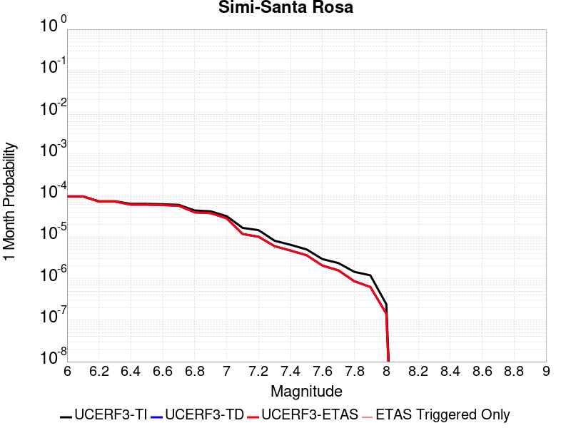 |  |  |

| Magnitude | 1 wk TI Prob | 1 wk TD Prob | 1 wk ETAS Prob | 1 wk ETAS/TD Gain | 1 wk ETAS Triggered Only | 1 mo TI Prob | 1 mo TD Prob | 1 mo ETAS Prob | 1 mo ETAS/TD Gain | 1 mo ETAS Triggered Only | 1 yr TI Prob | 1 yr TD Prob | 1 yr ETAS Prob | 1 yr ETAS/TD Gain | 1 yr ETAS Triggered Only | 10 yr TI Prob | 10 yr TD Prob | 10 yr ETAS Prob | 10 yr ETAS/TD Gain | 10 yr ETAS Triggered Only |
|-----|-----|-----|-----|-----|-----|-----|-----|-----|-----|-----|-----|-----|-----|-----|-----|-----|-----|-----|-----|-----|
| 6.0 | 2.198912E-5 | 2.2277538E-5 | 2.2277538E-5 | 1.0 | 0.0 | 9.4235686E-5 | 9.5471914E-5 | 9.5471914E-5 | 1.0 | 0.0 | 0.0011467156 | 0.0011617946 | 0.0011617946 | 1.0 | 0.0 | 0.011408163 | 0.011561656 | 0.011576321 | 1.0012683 | 1.4835475E-5 |
| 6.1 | 2.198912E-5 | 2.2277538E-5 | 2.2277538E-5 | 1.0 | 0.0 | 9.4235686E-5 | 9.5471914E-5 | 9.5471914E-5 | 1.0 | 0.0 | 0.0011467156 | 0.0011617946 | 0.0011617946 | 1.0 | 0.0 | 0.011408163 | 0.011561656 | 0.011576321 | 1.0012683 | 1.4835475E-5 |
| 6.2 | 1.69983E-5 | 1.6670196E-5 | 1.6670196E-5 | 1.0 | 0.0 | 7.284782E-5 | 7.14419E-5 | 7.14419E-5 | 1.0 | 0.0 | 8.865613E-4 | 8.6948724E-4 | 8.6948724E-4 | 1.0 | 0.0 | 0.008830327 | 0.0086637745 | 0.0086637745 | 1.0 | 0.0 |
| 6.3 | 1.69983E-5 | 1.6670196E-5 | 1.6670196E-5 | 1.0 | 0.0 | 7.284782E-5 | 7.14419E-5 | 7.14419E-5 | 1.0 | 0.0 | 8.865613E-4 | 8.6948724E-4 | 8.6948724E-4 | 1.0 | 0.0 | 0.008830327 | 0.0086637745 | 0.0086637745 | 1.0 | 0.0 |
| 6.4 | 1.4666188E-5 | 1.4053968E-5 | 1.4053968E-5 | 1.0 | 0.0 | 6.285358E-5 | 6.0230042E-5 | 6.0230042E-5 | 1.0 | 0.0 | 7.6497364E-4 | 7.330789E-4 | 7.330789E-4 | 1.0 | 0.0 | 0.0076234564 | 0.007309083 | 0.007309083 | 1.0 | 0.0 |
| 6.5 | 1.4666188E-5 | 1.4053968E-5 | 1.4053968E-5 | 1.0 | 0.0 | 6.285358E-5 | 6.0230042E-5 | 6.0230042E-5 | 1.0 | 0.0 | 7.6497364E-4 | 7.330789E-4 | 7.330789E-4 | 1.0 | 0.0 | 0.0076234564 | 0.007309083 | 0.007309083 | 1.0 | 0.0 |
| 6.6 | 1.4377586E-5 | 1.3730983E-5 | 1.3730983E-5 | 1.0 | 0.0 | 6.1616774E-5 | 5.884588E-5 | 5.884588E-5 | 1.0 | 0.0 | 7.4992597E-4 | 7.1623793E-4 | 7.1623793E-4 | 1.0 | 0.0 | 0.007474003 | 0.007141764 | 0.007141764 | 1.0 | 0.0 |
| 6.7 | 1.3881404E-5 | 1.3208908E-5 | 1.3208908E-5 | 1.0 | 0.0 | 5.9490372E-5 | 5.660852E-5 | 5.660852E-5 | 1.0 | 0.0 | 7.240546E-4 | 6.890155E-4 | 6.890155E-4 | 1.0 | 0.0 | 0.007217 | 0.006871242 | 0.006871242 | 1.0 | 0.0 |
| 6.8 | 1.0176516E-5 | 9.155167E-6 | 9.155167E-6 | 1.0 | 0.0 | 4.3612912E-5 | 3.9235936E-5 | 3.9235936E-5 | 1.0 | 0.0 | 5.308578E-4 | 4.776094E-4 | 4.776094E-4 | 1.0 | 0.0 | 0.0052959146 | 0.004767463 | 0.004767463 | 1.0 | 0.0 |
| 6.9 | 9.699797E-6 | 8.775696E-6 | 8.775696E-6 | 1.0 | 0.0 | 4.15699E-5 | 3.7609676E-5 | 3.7609676E-5 | 1.0 | 0.0 | 5.05996E-4 | 4.5781804E-4 | 4.5781804E-4 | 1.0 | 0.0 | 0.005048454 | 0.004570367 | 0.004570367 | 1.0 | 0.0 |
| 7.0 | 7.4049476E-6 | 6.560092E-6 | 6.560092E-6 | 1.0 | 0.0 | 3.1735104E-5 | 2.8114448E-5 | 2.8114448E-5 | 1.0 | 0.0 | 3.8630638E-4 | 3.422523E-4 | 3.422523E-4 | 1.0 | 0.0 | 0.0038563553 | 0.0034184945 | 0.0034184945 | 1.0 | 0.0 |
| 7.1 | 3.873439E-6 | 2.7599103E-6 | 2.7599103E-6 | 1.0 | 0.0 | 1.6600346E-5 | 1.1828135E-5 | 1.1828135E-5 | 1.0 | 0.0 | 2.0209046E-4 | 1.4399827E-4 | 1.4399827E-4 | 1.0 | 0.0 | 0.0020190678 | 0.0014390731 | 0.0014390731 | 1.0 | 0.0 |
| 7.2 | 3.417706E-6 | 2.3680202E-6 | 2.3680202E-6 | 1.0 | 0.0 | 1.4647229E-5 | 1.014862E-5 | 1.014862E-5 | 1.0 | 0.0 | 1.7831543E-4 | 1.2355267E-4 | 1.2355267E-4 | 1.0 | 0.0 | 0.0017817242 | 0.001234862 | 0.001234862 | 1.0 | 0.0 |
| 7.3 | 1.90225E-6 | 1.4076751E-6 | 1.4076751E-6 | 1.0 | 0.0 | 8.152474E-6 | 6.0328794E-6 | 6.0328794E-6 | 1.0 | 0.0 | 9.9251854E-5 | 7.344785E-5 | 7.344785E-5 | 1.0 | 0.0 | 9.920754E-4 | 7.34238E-4 | 7.34238E-4 | 1.0 | 0.0 |
| 7.4 | 1.5170556E-6 | 1.102761E-6 | 1.102761E-6 | 1.0 | 0.0 | 6.5016507E-6 | 4.72611E-6 | 4.72611E-6 | 1.0 | 0.0 | 7.915472E-5 | 5.753888E-5 | 5.753888E-5 | 1.0 | 0.0 | 7.9126534E-4 | 5.7524093E-4 | 5.7524093E-4 | 1.0 | 0.0 |
| 7.5 | 1.178732E-6 | 8.537837E-7 | 8.537837E-7 | 1.0 | 0.0 | 5.0516987E-6 | 3.659068E-6 | 3.659068E-6 | 1.0 | 0.0 | 6.1502695E-5 | 4.454825E-5 | 4.454825E-5 | 1.0 | 0.0 | 6.148568E-4 | 4.4539417E-4 | 4.4539417E-4 | 1.0 | 0.0 |
| 7.6 | 6.8722386E-7 | 4.7957803E-7 | 4.7957803E-7 | 1.0 | 0.0 | 2.9452417E-6 | 2.0553327E-6 | 2.0553327E-6 | 1.0 | 0.0 | 3.5857727E-5 | 2.5023392E-5 | 2.5023392E-5 | 1.0 | 0.0 | 3.5851944E-4 | 2.5020586E-4 | 2.5020586E-4 | 1.0 | 0.0 |
| 7.7 | 5.5126515E-7 | 3.675663E-7 | 3.675663E-7 | 1.0 | 0.0 | 2.3625628E-6 | 1.5752831E-6 | 1.5752831E-6 | 1.0 | 0.0 | 2.8763823E-5 | 1.9178904E-5 | 1.9178904E-5 | 1.0 | 0.0 | 2.87601E-4 | 1.917726E-4 | 1.917726E-4 | 1.0 | 0.0 |
| 7.8 | 3.3860243E-7 | 2.009467E-7 | 2.009467E-7 | 1.0 | 0.0 | 1.4511525E-6 | 8.6119985E-7 | 8.6119985E-7 | 1.0 | 0.0 | 1.7667637E-5 | 1.0485058E-5 | 1.0485058E-5 | 1.0 | 0.0 | 1.7666233E-4 | 1.0484569E-4 | 1.0484569E-4 | 1.0 | 0.0 |
| 7.9 | 2.7955386E-7 | 1.4667073E-7 | 1.4667073E-7 | 1.0 | 0.0 | 1.1980875E-6 | 6.285887E-7 | 6.285887E-7 | 1.0 | 0.0 | 1.4586617E-5 | 7.6530405E-6 | 7.6530405E-6 | 1.0 | 0.0 | 1.458566E-4 | 7.652782E-5 | 7.652782E-5 | 1.0 | 0.0 |
| 8.0 | 5.6259015E-8 | 3.336415E-8 | 3.336415E-8 | 1.0 | 0.0 | 2.4111003E-7 | 1.4298921E-7 | 1.4298921E-7 | 1.0 | 0.0 | 2.9355108E-6 | 1.7408923E-6 | 1.7408923E-6 | 1.0 | 0.0 | 2.935472E-5 | 1.74088E-5 | 1.74088E-5 | 1.0 | 0.0 |

## San Jacinto (Lytle Creek connector)
*[(top)](#table-of-contents)*

| 1 Week | 1 Month | 1 Year | 10 Year |
|-----|-----|-----|-----|
|  | 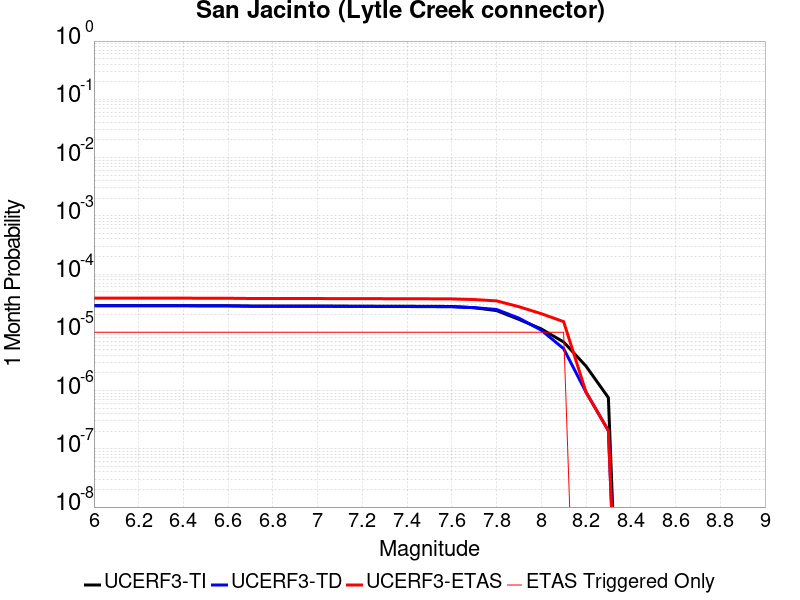 |  |  |

| Magnitude | 1 wk TI Prob | 1 wk TD Prob | 1 wk ETAS Prob | 1 wk ETAS/TD Gain | 1 wk ETAS Triggered Only | 1 mo TI Prob | 1 mo TD Prob | 1 mo ETAS Prob | 1 mo ETAS/TD Gain | 1 mo ETAS Triggered Only | 1 yr TI Prob | 1 yr TD Prob | 1 yr ETAS Prob | 1 yr ETAS/TD Gain | 1 yr ETAS Triggered Only | 10 yr TI Prob | 10 yr TD Prob | 10 yr ETAS Prob | 10 yr ETAS/TD Gain | 10 yr ETAS Triggered Only |
|-----|-----|-----|-----|-----|-----|-----|-----|-----|-----|-----|-----|-----|-----|-----|-----|-----|-----|-----|-----|-----|
| 6.0 | 6.693995E-6 | 6.6737616E-6 | 6.6737616E-6 | 1.0 | 0.0 | 2.8688235E-5 | 2.8601522E-5 | 4.3436572E-5 | 1.5186805 | 1.4835475E-5 | 3.492233E-4 | 3.4816796E-4 | 3.6299828E-4 | 1.0425953 | 1.4835475E-5 | 0.00348675 | 0.0035564206 | 0.0035712032 | 1.0041566 | 1.4835475E-5 |
| 6.1 | 6.693995E-6 | 6.6737616E-6 | 6.6737616E-6 | 1.0 | 0.0 | 2.8688235E-5 | 2.8601522E-5 | 4.3436572E-5 | 1.5186805 | 1.4835475E-5 | 3.492233E-4 | 3.4816796E-4 | 3.6299828E-4 | 1.0425953 | 1.4835475E-5 | 0.00348675 | 0.0035564206 | 0.0035712032 | 1.0041566 | 1.4835475E-5 |
| 6.2 | 6.693995E-6 | 6.6737616E-6 | 6.6737616E-6 | 1.0 | 0.0 | 2.8688235E-5 | 2.8601522E-5 | 4.3436572E-5 | 1.5186805 | 1.4835475E-5 | 3.492233E-4 | 3.4816796E-4 | 3.6299828E-4 | 1.0425953 | 1.4835475E-5 | 0.00348675 | 0.0035564206 | 0.0035712032 | 1.0041566 | 1.4835475E-5 |
| 6.3 | 6.693995E-6 | 6.6737616E-6 | 6.6737616E-6 | 1.0 | 0.0 | 2.8688235E-5 | 2.8601522E-5 | 4.3436572E-5 | 1.5186805 | 1.4835475E-5 | 3.492233E-4 | 3.4816796E-4 | 3.6299828E-4 | 1.0425953 | 1.4835475E-5 | 0.00348675 | 0.0035564206 | 0.0035712032 | 1.0041566 | 1.4835475E-5 |
| 6.4 | 6.693995E-6 | 6.6737616E-6 | 6.6737616E-6 | 1.0 | 0.0 | 2.8688235E-5 | 2.8601522E-5 | 4.3436572E-5 | 1.5186805 | 1.4835475E-5 | 3.492233E-4 | 3.4816796E-4 | 3.6299828E-4 | 1.0425953 | 1.4835475E-5 | 0.00348675 | 0.0035564206 | 0.0035712032 | 1.0041566 | 1.4835475E-5 |
| 6.5 | 6.6561875E-6 | 6.633978E-6 | 6.633978E-6 | 1.0 | 0.0 | 2.8526205E-5 | 2.8431026E-5 | 4.3266078E-5 | 1.521791 | 1.4835475E-5 | 3.472512E-4 | 3.4609283E-4 | 3.6092318E-4 | 1.0428507 | 1.4835475E-5 | 0.0034670907 | 0.0035357354 | 0.0035505185 | 1.004181 | 1.4835475E-5 |
| 6.6 | 6.6561875E-6 | 6.633978E-6 | 6.633978E-6 | 1.0 | 0.0 | 2.8526205E-5 | 2.8431026E-5 | 4.3266078E-5 | 1.521791 | 1.4835475E-5 | 3.472512E-4 | 3.4609283E-4 | 3.6092318E-4 | 1.0428507 | 1.4835475E-5 | 0.0034670907 | 0.0035357354 | 0.0035505185 | 1.004181 | 1.4835475E-5 |
| 6.7 | 6.5802237E-6 | 6.5531517E-6 | 6.5531517E-6 | 1.0 | 0.0 | 2.8200653E-5 | 2.8084634E-5 | 4.291969E-5 | 1.5282269 | 1.4835475E-5 | 3.4328885E-4 | 3.4187685E-4 | 3.5670726E-4 | 1.0433794 | 1.4835475E-5 | 0.0034275902 | 0.0034937086 | 0.0035084921 | 1.0042315 | 1.4835475E-5 |
| 6.8 | 6.575632E-6 | 6.5476406E-6 | 6.5476406E-6 | 1.0 | 0.0 | 2.8180975E-5 | 2.8061017E-5 | 4.2896074E-5 | 1.5286715 | 1.4835475E-5 | 3.4304935E-4 | 3.415894E-4 | 3.564198E-4 | 1.0434159 | 1.4835475E-5 | 0.0034252026 | 0.0034908429 | 0.0035056265 | 1.004235 | 1.4835475E-5 |
| 6.9 | 6.570433E-6 | 6.5390327E-6 | 6.5390327E-6 | 1.0 | 0.0 | 2.8158694E-5 | 2.8024126E-5 | 4.2859185E-5 | 1.5293674 | 1.4835475E-5 | 3.4277816E-4 | 3.4114037E-4 | 3.559708E-4 | 1.043473 | 1.4835475E-5 | 0.0034224992 | 0.0034863672 | 0.0035011508 | 1.0042404 | 1.4835475E-5 |
| 7.0 | 6.5643826E-6 | 6.5291515E-6 | 6.5291515E-6 | 1.0 | 0.0 | 2.8132765E-5 | 2.798178E-5 | 4.281684E-5 | 1.5301685 | 1.4835475E-5 | 3.424626E-4 | 3.4062497E-4 | 3.5545538E-4 | 1.0435388 | 1.4835475E-5 | 0.0034193532 | 0.003481229 | 0.0034960129 | 1.0042467 | 1.4835475E-5 |
| 7.1 | 6.557402E-6 | 6.517861E-6 | 6.517861E-6 | 1.0 | 0.0 | 2.8102848E-5 | 2.7933393E-5 | 4.2768454E-5 | 1.5310869 | 1.4835475E-5 | 3.4209844E-4 | 3.4003606E-4 | 3.5486647E-4 | 1.0436143 | 1.4835475E-5 | 0.0034157229 | 0.0034753594 | 0.0034901432 | 1.004254 | 1.4835475E-5 |
| 7.2 | 6.546394E-6 | 6.4998235E-6 | 6.4998235E-6 | 1.0 | 0.0 | 2.8055672E-5 | 2.785609E-5 | 4.269115E-5 | 1.5325608 | 1.4835475E-5 | 3.4152428E-4 | 3.3909516E-4 | 3.5392563E-4 | 1.0437354 | 1.4835475E-5 | 0.0034099987 | 0.0034659845 | 0.0034807685 | 1.0042654 | 1.4835475E-5 |
| 7.3 | 6.5364216E-6 | 6.4806004E-6 | 6.4806004E-6 | 1.0 | 0.0 | 2.8012933E-5 | 2.7773707E-5 | 4.2608768E-5 | 1.5341405 | 1.4835475E-5 | 3.4100408E-4 | 3.380925E-4 | 3.5292294E-4 | 1.0438651 | 1.4835475E-5 | 0.003404813 | 0.0034560016 | 0.003470786 | 1.0042778 | 1.4835475E-5 |
| 7.4 | 6.5269523E-6 | 6.461678E-6 | 6.461678E-6 | 1.0 | 0.0 | 2.7972354E-5 | 2.7692611E-5 | 4.2527674E-5 | 1.5357047 | 1.4835475E-5 | 3.4051016E-4 | 3.3710545E-4 | 3.5193595E-4 | 1.0439936 | 1.4835475E-5 | 0.0033998888 | 0.0034461787 | 0.0034609633 | 1.0042901 | 1.4835475E-5 |
| 7.5 | 6.5111835E-6 | 6.4379415E-6 | 6.4379415E-6 | 1.0 | 0.0 | 2.7904773E-5 | 2.7590888E-5 | 4.2425952E-5 | 1.5376799 | 1.4835475E-5 | 3.3968766E-4 | 3.3586734E-4 | 3.5069784E-4 | 1.0441558 | 1.4835475E-5 | 0.0033916887 | 0.0034338466 | 0.0034486311 | 1.0043055 | 1.4835475E-5 |
| 7.6 | 6.4768806E-6 | 6.3970347E-6 | 6.3970347E-6 | 1.0 | 0.0 | 2.7757764E-5 | 2.7415575E-5 | 4.2250642E-5 | 1.5411183 | 1.4835475E-5 | 3.3789838E-4 | 3.337336E-4 | 3.485641E-4 | 1.0444382 | 1.4835475E-5 | 0.0033738504 | 0.0034125706 | 0.0034273556 | 1.0043324 | 1.4835475E-5 |
| 7.7 | 6.1655364E-6 | 6.1894134E-6 | 6.1894134E-6 | 1.0 | 0.0 | 2.642346E-5 | 2.6525788E-5 | 4.136087E-5 | 1.5592701 | 1.4835475E-5 | 3.2165812E-4 | 3.2290368E-4 | 3.3773435E-4 | 1.0459291 | 1.4835475E-5 | 0.0032119295 | 0.0033041306 | 0.003318917 | 1.0044751 | 1.4835475E-5 |
| 7.8 | 5.5043524E-6 | 5.750099E-6 | 5.750099E-6 | 1.0 | 0.0 | 2.3589868E-5 | 2.4643048E-5 | 3.9478156E-5 | 1.6019998 | 1.4835475E-5 | 2.871688E-4 | 2.9998788E-4 | 3.148189E-4 | 1.0494387 | 1.4835475E-5 | 0.0028679797 | 0.0030740385 | 0.0030888284 | 1.0048112 | 1.4835475E-5 |
| 7.9 | 3.889249E-6 | 4.087368E-6 | 4.087368E-6 | 1.0 | 0.0 | 1.6668104E-5 | 1.7517172E-5 | 3.2352385E-5 | 1.8468955 | 1.4835475E-5 | 2.0291525E-4 | 2.1325074E-4 | 2.2808305E-4 | 1.0695534 | 1.4835475E-5 | 0.0020273007 | 0.0021998736 | 0.0022146765 | 1.006729 | 1.4835475E-5 |
| 8.0 | 2.668535E-6 | 2.5388786E-6 | 2.5388786E-6 | 1.0 | 0.0 | 1.1436528E-5 | 1.0880864E-5 | 2.5716176E-5 | 2.3634317 | 1.4835475E-5 | 1.3923083E-4 | 1.3246648E-4 | 1.4729999E-4 | 1.1119794 | 1.4835475E-5 | 0.0013914363 | 0.0013796939 | 0.0013945089 | 1.0107379 | 1.4835475E-5 |
| 8.1 | 1.5911459E-6 | 1.2226496E-6 | 1.2226496E-6 | 1.0 | 0.0 | 6.8191785E-6 | 5.239917E-6 | 2.0075313E-5 | 3.8312275 | 1.4835475E-5 | 8.3020335E-5 | 6.379414E-5 | 7.862867E-5 | 1.2325375 | 1.4835475E-5 | 8.298933E-4 | 6.7146524E-4 | 6.8629073E-4 | 1.0220793 | 1.4835475E-5 |
| 8.2 | 6.1294963E-7 | 2.192845E-7 | 2.192845E-7 | 1.0 | 0.0 | 2.6269242E-6 | 9.3979037E-7 | 9.3979037E-7 | 1.0 | 0.0 | 3.1982334E-5 | 1.1441888E-5 | 1.1441888E-5 | 1.0 | 0.0 | 3.1977732E-4 | 1.284983E-4 | 1.284983E-4 | 1.0 | 0.0 |
| 8.3 | 1.762871E-7 | 4.7843645E-8 | 4.7843645E-8 | 1.0 | 0.0 | 7.5551594E-7 | 2.0504417E-7 | 2.0504417E-7 | 1.0 | 0.0 | 9.1983675E-6 | 2.4964102E-6 | 2.4964102E-6 | 1.0 | 0.0 | 9.197987E-5 | 2.885802E-5 | 2.885802E-5 | 1.0 | 0.0 |

## North Frontal  (East)
*[(top)](#table-of-contents)*

| 1 Week | 1 Month | 1 Year | 10 Year |
|-----|-----|-----|-----|
|  | 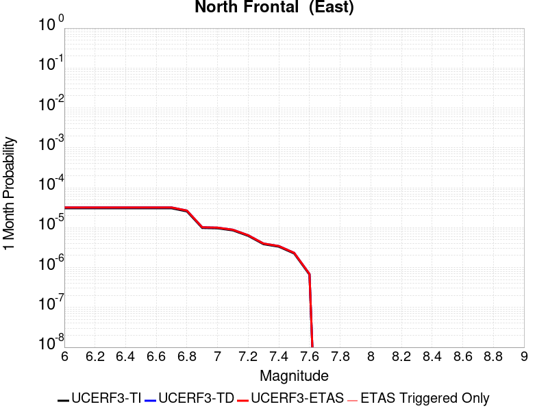 |  | 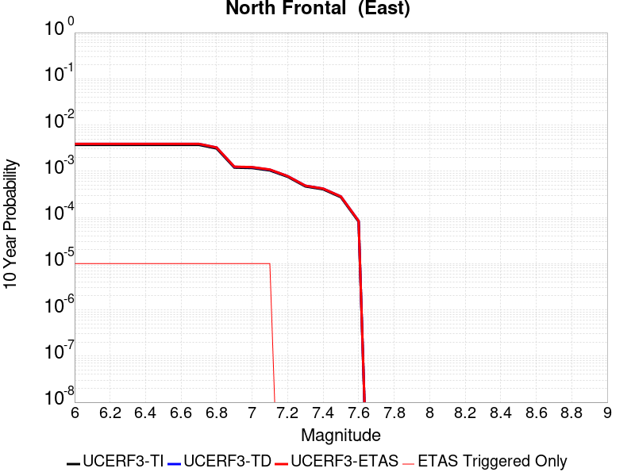 |

| Magnitude | 1 wk TI Prob | 1 wk TD Prob | 1 wk ETAS Prob | 1 wk ETAS/TD Gain | 1 wk ETAS Triggered Only | 1 mo TI Prob | 1 mo TD Prob | 1 mo ETAS Prob | 1 mo ETAS/TD Gain | 1 mo ETAS Triggered Only | 1 yr TI Prob | 1 yr TD Prob | 1 yr ETAS Prob | 1 yr ETAS/TD Gain | 1 yr ETAS Triggered Only | 10 yr TI Prob | 10 yr TD Prob | 10 yr ETAS Prob | 10 yr ETAS/TD Gain | 10 yr ETAS Triggered Only |
|-----|-----|-----|-----|-----|-----|-----|-----|-----|-----|-----|-----|-----|-----|-----|-----|-----|-----|-----|-----|-----|
| 6.0 | 7.135738E-6 | 7.4774143E-6 | 7.4774143E-6 | 1.0 | 0.0 | 3.0581377E-5 | 3.204578E-5 | 3.204578E-5 | 1.0 | 0.0 | 3.7226462E-4 | 3.9010745E-4 | 3.9010745E-4 | 1.0 | 0.0 | 0.0037164164 | 0.0038961845 | 0.003910962 | 1.0037929 | 1.4835475E-5 |
| 6.1 | 7.135738E-6 | 7.4774143E-6 | 7.4774143E-6 | 1.0 | 0.0 | 3.0581377E-5 | 3.204578E-5 | 3.204578E-5 | 1.0 | 0.0 | 3.7226462E-4 | 3.9010745E-4 | 3.9010745E-4 | 1.0 | 0.0 | 0.0037164164 | 0.0038961845 | 0.003910962 | 1.0037929 | 1.4835475E-5 |
| 6.2 | 7.135738E-6 | 7.4774143E-6 | 7.4774143E-6 | 1.0 | 0.0 | 3.0581377E-5 | 3.204578E-5 | 3.204578E-5 | 1.0 | 0.0 | 3.7226462E-4 | 3.9010745E-4 | 3.9010745E-4 | 1.0 | 0.0 | 0.0037164164 | 0.0038961845 | 0.003910962 | 1.0037929 | 1.4835475E-5 |
| 6.3 | 7.135738E-6 | 7.4774143E-6 | 7.4774143E-6 | 1.0 | 0.0 | 3.0581377E-5 | 3.204578E-5 | 3.204578E-5 | 1.0 | 0.0 | 3.7226462E-4 | 3.9010745E-4 | 3.9010745E-4 | 1.0 | 0.0 | 0.0037164164 | 0.0038961845 | 0.003910962 | 1.0037929 | 1.4835475E-5 |
| 6.4 | 7.135738E-6 | 7.4774143E-6 | 7.4774143E-6 | 1.0 | 0.0 | 3.0581377E-5 | 3.204578E-5 | 3.204578E-5 | 1.0 | 0.0 | 3.7226462E-4 | 3.9010745E-4 | 3.9010745E-4 | 1.0 | 0.0 | 0.0037164164 | 0.0038961845 | 0.003910962 | 1.0037929 | 1.4835475E-5 |
| 6.5 | 7.135738E-6 | 7.4774143E-6 | 7.4774143E-6 | 1.0 | 0.0 | 3.0581377E-5 | 3.204578E-5 | 3.204578E-5 | 1.0 | 0.0 | 3.7226462E-4 | 3.9010745E-4 | 3.9010745E-4 | 1.0 | 0.0 | 0.0037164164 | 0.0038961845 | 0.003910962 | 1.0037929 | 1.4835475E-5 |
| 6.6 | 7.135738E-6 | 7.4774143E-6 | 7.4774143E-6 | 1.0 | 0.0 | 3.0581377E-5 | 3.204578E-5 | 3.204578E-5 | 1.0 | 0.0 | 3.7226462E-4 | 3.9010745E-4 | 3.9010745E-4 | 1.0 | 0.0 | 0.0037164164 | 0.0038961845 | 0.003910962 | 1.0037929 | 1.4835475E-5 |
| 6.7 | 7.135738E-6 | 7.4774143E-6 | 7.4774143E-6 | 1.0 | 0.0 | 3.0581377E-5 | 3.204578E-5 | 3.204578E-5 | 1.0 | 0.0 | 3.7226462E-4 | 3.9010745E-4 | 3.9010745E-4 | 1.0 | 0.0 | 0.0037164164 | 0.0038961845 | 0.003910962 | 1.0037929 | 1.4835475E-5 |
| 6.8 | 5.959142E-6 | 6.236876E-6 | 6.236876E-6 | 1.0 | 0.0 | 2.553893E-5 | 2.6729294E-5 | 2.6729294E-5 | 1.0 | 0.0 | 3.108921E-4 | 3.2539864E-4 | 3.2539864E-4 | 1.0 | 0.0 | 0.0031045752 | 0.0032509952 | 0.0032657825 | 1.0045485 | 1.4835475E-5 |
| 6.9 | 2.2946929E-6 | 2.382521E-6 | 2.382521E-6 | 1.0 | 0.0 | 9.834361E-6 | 1.0210767E-5 | 1.0210767E-5 | 1.0 | 0.0 | 1.1972676E-4 | 1.2430947E-4 | 1.2430947E-4 | 1.0 | 0.0 | 0.0011966228 | 0.0012424458 | 0.0012572629 | 1.0119257 | 1.4835475E-5 |
| 7.0 | 2.2468673E-6 | 2.3322125E-6 | 2.3322125E-6 | 1.0 | 0.0 | 9.629396E-6 | 9.995161E-6 | 9.995161E-6 | 1.0 | 0.0 | 1.1723159E-4 | 1.2168476E-4 | 1.2168476E-4 | 1.0 | 0.0 | 0.0011716976 | 0.0012162277 | 0.001231045 | 1.0121831 | 1.4835475E-5 |
| 7.1 | 1.9921076E-6 | 2.064653E-6 | 2.064653E-6 | 1.0 | 0.0 | 8.537577E-6 | 8.848486E-6 | 8.848486E-6 | 1.0 | 0.0 | 1.0394004E-4 | 1.0772542E-4 | 1.0772542E-4 | 1.0 | 0.0 | 0.0010389143 | 0.0010767748 | 0.0010915942 | 1.0137628 | 1.4835475E-5 |
| 7.2 | 1.4524545E-6 | 1.5045506E-6 | 1.5045506E-6 | 1.0 | 0.0 | 6.2247905E-6 | 6.448059E-6 | 6.448059E-6 | 1.0 | 0.0 | 7.5784184E-5 | 7.850254E-5 | 7.850254E-5 | 1.0 | 0.0 | 7.575835E-4 | 7.8477256E-4 | 7.8477256E-4 | 1.0 | 0.0 |
| 7.3 | 8.9802575E-7 | 9.308954E-7 | 9.308954E-7 | 1.0 | 0.0 | 3.848676E-6 | 3.9895463E-6 | 3.9895463E-6 | 1.0 | 0.0 | 4.685662E-5 | 4.8571757E-5 | 4.8571757E-5 | 1.0 | 0.0 | 4.6846745E-4 | 4.8562273E-4 | 4.8562273E-4 | 1.0 | 0.0 |
| 7.4 | 7.776139E-7 | 8.06067E-7 | 8.06067E-7 | 1.0 | 0.0 | 3.3326266E-6 | 3.454569E-6 | 3.454569E-6 | 1.0 | 0.0 | 4.0573974E-5 | 4.2058677E-5 | 4.2058677E-5 | 1.0 | 0.0 | 4.0566566E-4 | 4.2051793E-4 | 4.2051793E-4 | 1.0 | 0.0 |
| 7.5 | 5.244417E-7 | 5.4413545E-7 | 5.4413545E-7 | 1.0 | 0.0 | 2.2476054E-6 | 2.3320074E-6 | 2.3320074E-6 | 1.0 | 0.0 | 2.7364253E-5 | 2.8391887E-5 | 2.8391887E-5 | 1.0 | 0.0 | 2.7360884E-4 | 2.8388912E-4 | 2.8388912E-4 | 1.0 | 0.0 |
| 7.6 | 1.5489647E-7 | 1.6089918E-7 | 1.6089918E-7 | 1.0 | 0.0 | 6.6384183E-7 | 6.895678E-7 | 6.895678E-7 | 1.0 | 0.0 | 8.082245E-6 | 8.3954765E-6 | 8.3954765E-6 | 1.0 | 0.0 | 8.08195E-5 | 8.3953586E-5 | 8.3953586E-5 | 1.0 | 0.0 |

## Los Alamos 2011 CFM
*[(top)](#table-of-contents)*

| 1 Week | 1 Month | 1 Year | 10 Year |
|-----|-----|-----|-----|
| 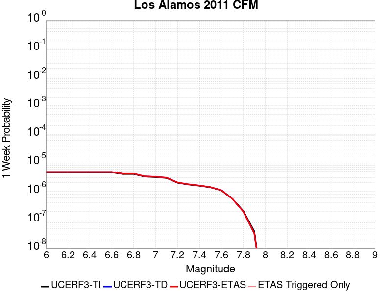 |  |  |  |

| Magnitude | 1 wk TI Prob | 1 wk TD Prob | 1 wk ETAS Prob | 1 wk ETAS/TD Gain | 1 wk ETAS Triggered Only | 1 mo TI Prob | 1 mo TD Prob | 1 mo ETAS Prob | 1 mo ETAS/TD Gain | 1 mo ETAS Triggered Only | 1 yr TI Prob | 1 yr TD Prob | 1 yr ETAS Prob | 1 yr ETAS/TD Gain | 1 yr ETAS Triggered Only | 10 yr TI Prob | 10 yr TD Prob | 10 yr ETAS Prob | 10 yr ETAS/TD Gain | 10 yr ETAS Triggered Only |
|-----|-----|-----|-----|-----|-----|-----|-----|-----|-----|-----|-----|-----|-----|-----|-----|-----|-----|-----|-----|-----|
| 6.0 | 4.6284417E-6 | 4.75184E-6 | 4.75184E-6 | 1.0 | 0.0 | 1.9836029E-5 | 2.0364881E-5 | 2.0364881E-5 | 1.0 | 0.0 | 2.4147688E-4 | 2.4791597E-4 | 2.4791597E-4 | 1.0 | 0.0 | 0.0024121467 | 0.002476568 | 0.0024913668 | 1.0059755 | 1.4835475E-5 |
| 6.1 | 4.6284417E-6 | 4.75184E-6 | 4.75184E-6 | 1.0 | 0.0 | 1.9836029E-5 | 2.0364881E-5 | 2.0364881E-5 | 1.0 | 0.0 | 2.4147688E-4 | 2.4791597E-4 | 2.4791597E-4 | 1.0 | 0.0 | 0.0024121467 | 0.002476568 | 0.0024913668 | 1.0059755 | 1.4835475E-5 |
| 6.2 | 4.6284417E-6 | 4.75184E-6 | 4.75184E-6 | 1.0 | 0.0 | 1.9836029E-5 | 2.0364881E-5 | 2.0364881E-5 | 1.0 | 0.0 | 2.4147688E-4 | 2.4791597E-4 | 2.4791597E-4 | 1.0 | 0.0 | 0.0024121467 | 0.002476568 | 0.0024913668 | 1.0059755 | 1.4835475E-5 |
| 6.3 | 4.6284417E-6 | 4.75184E-6 | 4.75184E-6 | 1.0 | 0.0 | 1.9836029E-5 | 2.0364881E-5 | 2.0364881E-5 | 1.0 | 0.0 | 2.4147688E-4 | 2.4791597E-4 | 2.4791597E-4 | 1.0 | 0.0 | 0.0024121467 | 0.002476568 | 0.0024913668 | 1.0059755 | 1.4835475E-5 |
| 6.4 | 4.6284417E-6 | 4.75184E-6 | 4.75184E-6 | 1.0 | 0.0 | 1.9836029E-5 | 2.0364881E-5 | 2.0364881E-5 | 1.0 | 0.0 | 2.4147688E-4 | 2.4791597E-4 | 2.4791597E-4 | 1.0 | 0.0 | 0.0024121467 | 0.002476568 | 0.0024913668 | 1.0059755 | 1.4835475E-5 |
| 6.5 | 4.6284417E-6 | 4.75184E-6 | 4.75184E-6 | 1.0 | 0.0 | 1.9836029E-5 | 2.0364881E-5 | 2.0364881E-5 | 1.0 | 0.0 | 2.4147688E-4 | 2.4791597E-4 | 2.4791597E-4 | 1.0 | 0.0 | 0.0024121467 | 0.002476568 | 0.0024913668 | 1.0059755 | 1.4835475E-5 |
| 6.6 | 4.6284417E-6 | 4.75184E-6 | 4.75184E-6 | 1.0 | 0.0 | 1.9836029E-5 | 2.0364881E-5 | 2.0364881E-5 | 1.0 | 0.0 | 2.4147688E-4 | 2.4791597E-4 | 2.4791597E-4 | 1.0 | 0.0 | 0.0024121467 | 0.002476568 | 0.0024913668 | 1.0059755 | 1.4835475E-5 |
| 6.7 | 4.062321E-6 | 4.166445E-6 | 4.166445E-6 | 1.0 | 0.0 | 1.7409831E-5 | 1.7856079E-5 | 1.7856079E-5 | 1.0 | 0.0 | 2.1194408E-4 | 2.1737757E-4 | 2.1737757E-4 | 1.0 | 0.0 | 0.0021174205 | 0.002171799 | 0.0021866024 | 1.0068161 | 1.4835475E-5 |
| 6.8 | 4.062321E-6 | 4.166445E-6 | 4.166445E-6 | 1.0 | 0.0 | 1.7409831E-5 | 1.7856079E-5 | 1.7856079E-5 | 1.0 | 0.0 | 2.1194408E-4 | 2.1737757E-4 | 2.1737757E-4 | 1.0 | 0.0 | 0.0021174205 | 0.002171799 | 0.0021866024 | 1.0068161 | 1.4835475E-5 |
| 6.9 | 3.2936077E-6 | 3.3730369E-6 | 3.3730369E-6 | 1.0 | 0.0 | 1.4115385E-5 | 1.4455798E-5 | 1.4455798E-5 | 1.0 | 0.0 | 1.7184127E-4 | 1.7598606E-4 | 1.7598606E-4 | 1.0 | 0.0 | 0.0017170844 | 0.0017585596 | 0.0017733689 | 1.0084213 | 1.4835475E-5 |
| 7.0 | 3.1687898E-6 | 3.2448922E-6 | 3.2448922E-6 | 1.0 | 0.0 | 1.3580457E-5 | 1.3906612E-5 | 1.3906612E-5 | 1.0 | 0.0 | 1.6532952E-4 | 1.6930078E-4 | 1.6930078E-4 | 1.0 | 0.0 | 0.0016520657 | 0.0016918096 | 0.00170662 | 1.0087541 | 1.4835475E-5 |
| 7.1 | 2.9379228E-6 | 3.007398E-6 | 3.007398E-6 | 1.0 | 0.0 | 1.25910365E-5 | 1.28887905E-5 | 1.28887905E-5 | 1.0 | 0.0 | 1.5328509E-4 | 1.5691062E-4 | 1.5691062E-4 | 1.0 | 0.0 | 0.001531794 | 0.0015680875 | 0.0015828997 | 1.009446 | 1.4835475E-5 |
| 7.2 | 2.0020686E-6 | 2.0416817E-6 | 2.0416817E-6 | 1.0 | 0.0 | 8.580266E-6 | 8.750035E-6 | 8.750035E-6 | 1.0 | 0.0 | 1.0445973E-4 | 1.0652651E-4 | 1.0652651E-4 | 1.0 | 0.0 | 0.0010441064 | 0.001064759 | 0.0010795787 | 1.0139184 | 1.4835475E-5 |
| 7.3 | 1.7364243E-6 | 1.7679265E-6 | 1.7679265E-6 | 1.0 | 0.0 | 7.441797E-6 | 7.576806E-6 | 7.576806E-6 | 1.0 | 0.0 | 9.0600115E-5 | 9.224374E-5 | 9.224374E-5 | 1.0 | 0.0 | 9.0563187E-4 | 9.2205766E-4 | 9.368794E-4 | 1.0160747 | 1.4835475E-5 |
| 7.4 | 1.5718434E-6 | 1.5983605E-6 | 1.5983605E-6 | 1.0 | 0.0 | 6.7364545E-6 | 6.8500985E-6 | 6.8500985E-6 | 1.0 | 0.0 | 8.201325E-5 | 8.3396786E-5 | 8.3396786E-5 | 1.0 | 0.0 | 8.198299E-4 | 8.336579E-4 | 8.48481E-4 | 1.0177808 | 1.4835475E-5 |
| 7.5 | 1.3841119E-6 | 1.4043178E-6 | 1.4043178E-6 | 1.0 | 0.0 | 5.9318945E-6 | 6.018491E-6 | 6.018491E-6 | 1.0 | 0.0 | 7.221842E-5 | 7.327269E-5 | 7.327269E-5 | 1.0 | 0.0 | 7.2194956E-4 | 7.3248823E-4 | 7.473128E-4 | 1.0202388 | 1.4835475E-5 |
| 7.6 | 1.0843726E-6 | 1.093473E-6 | 1.093473E-6 | 1.0 | 0.0 | 4.647303E-6 | 4.6863047E-6 | 4.6863047E-6 | 1.0 | 0.0 | 5.6579443E-5 | 5.705429E-5 | 5.705429E-5 | 1.0 | 0.0 | 5.656504E-4 | 5.70399E-4 | 5.70399E-4 | 1.0 | 0.0 |
| 7.7 | 5.544814E-7 | 5.5020325E-7 | 5.5020325E-7 | 1.0 | 0.0 | 2.3763469E-6 | 2.3580117E-6 | 2.3580117E-6 | 1.0 | 0.0 | 2.8931638E-5 | 2.8708417E-5 | 2.8708417E-5 | 1.0 | 0.0 | 2.8927872E-4 | 2.8704724E-4 | 2.8704724E-4 | 1.0 | 0.0 |
| 7.8 | 2.0707465E-7 | 1.9779092E-7 | 1.9779092E-7 | 1.0 | 0.0 | 8.874625E-7 | 8.4767515E-7 | 8.4767515E-7 | 1.0 | 0.0 | 1.08048025E-5 | 1.03203965E-5 | 1.03203965E-5 | 1.0 | 0.0 | 1.0804277E-4 | 1.03199214E-4 | 1.03199214E-4 | 1.0 | 0.0 |
| 7.9 | 3.9821284E-8 | 3.4332256E-8 | 3.4332256E-8 | 1.0 | 0.0 | 1.7066264E-7 | 1.4713824E-7 | 1.4713824E-7 | 1.0 | 0.0 | 2.0778157E-6 | 1.7914066E-6 | 1.7914066E-6 | 1.0 | 0.0 | 2.0777963E-5 | 1.7913928E-5 | 1.7913928E-5 | 1.0 | 0.0 |
| 8.0 | 7.880441E-11 | 8.235557E-11 | 8.235557E-11 | 1.0 | 0.0 | 3.3773329E-10 | 3.5295256E-10 | 3.5295256E-10 | 1.0 | 0.0 | 4.1119033E-9 | 4.2971977E-9 | 4.2971977E-9 | 1.0 | 0.0 | 4.1119034E-8 | 4.297198E-8 | 4.297198E-8 | 1.0 | 0.0 |

## Big Pine (East)
*[(top)](#table-of-contents)*

| 1 Week | 1 Month | 1 Year | 10 Year |
|-----|-----|-----|-----|
|  |  | 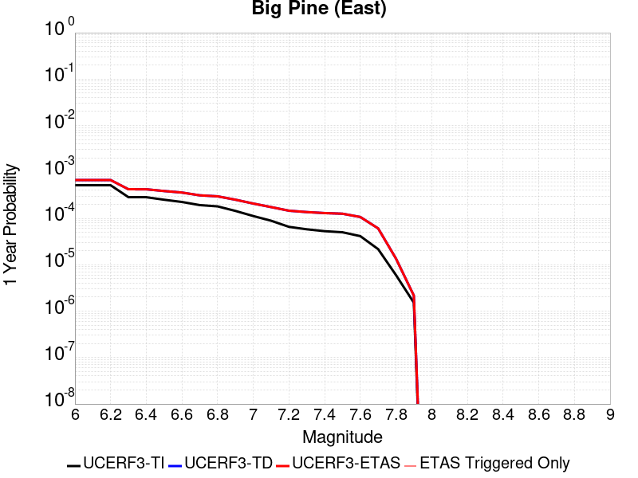 |  |

| Magnitude | 1 wk TI Prob | 1 wk TD Prob | 1 wk ETAS Prob | 1 wk ETAS/TD Gain | 1 wk ETAS Triggered Only | 1 mo TI Prob | 1 mo TD Prob | 1 mo ETAS Prob | 1 mo ETAS/TD Gain | 1 mo ETAS Triggered Only | 1 yr TI Prob | 1 yr TD Prob | 1 yr ETAS Prob | 1 yr ETAS/TD Gain | 1 yr ETAS Triggered Only | 10 yr TI Prob | 10 yr TD Prob | 10 yr ETAS Prob | 10 yr ETAS/TD Gain | 10 yr ETAS Triggered Only |
|-----|-----|-----|-----|-----|-----|-----|-----|-----|-----|-----|-----|-----|-----|-----|-----|-----|-----|-----|-----|-----|
| 6.0 | 9.916913E-6 | 1.2823216E-5 | 1.2823216E-5 | 1.0 | 0.0 | 4.250036E-5 | 5.495561E-5 | 5.495561E-5 | 1.0 | 0.0 | 5.173191E-4 | 6.6890125E-4 | 6.6890125E-4 | 1.0 | 0.0 | 0.0051611643 | 0.0066736178 | 0.0066883545 | 1.0022081 | 1.4835475E-5 |
| 6.1 | 9.916913E-6 | 1.2823216E-5 | 1.2823216E-5 | 1.0 | 0.0 | 4.250036E-5 | 5.495561E-5 | 5.495561E-5 | 1.0 | 0.0 | 5.173191E-4 | 6.6890125E-4 | 6.6890125E-4 | 1.0 | 0.0 | 0.0051611643 | 0.0066736178 | 0.0066883545 | 1.0022081 | 1.4835475E-5 |
| 6.2 | 9.916913E-6 | 1.2823216E-5 | 1.2823216E-5 | 1.0 | 0.0 | 4.250036E-5 | 5.495561E-5 | 5.495561E-5 | 1.0 | 0.0 | 5.173191E-4 | 6.6890125E-4 | 6.6890125E-4 | 1.0 | 0.0 | 0.0051611643 | 0.0066736178 | 0.0066883545 | 1.0022081 | 1.4835475E-5 |
| 6.3 | 5.479711E-6 | 8.1189955E-6 | 8.1189955E-6 | 1.0 | 0.0 | 2.3484265E-5 | 3.479525E-5 | 3.479525E-5 | 1.0 | 0.0 | 2.858834E-4 | 4.2355302E-4 | 4.2355302E-4 | 1.0 | 0.0 | 0.0028551589 | 0.0042303307 | 0.0042451033 | 1.0034921 | 1.4835475E-5 |
| 6.4 | 5.465009E-6 | 8.103289E-6 | 8.103289E-6 | 1.0 | 0.0 | 2.3421257E-5 | 3.4727935E-5 | 3.4727935E-5 | 1.0 | 0.0 | 2.851165E-4 | 4.2273378E-4 | 4.2273378E-4 | 1.0 | 0.0 | 0.0028475097 | 0.004222169 | 0.004236942 | 1.0034989 | 1.4835475E-5 |
| 6.5 | 4.826767E-6 | 7.428319E-6 | 7.428319E-6 | 1.0 | 0.0 | 2.068598E-5 | 3.183528E-5 | 3.183528E-5 | 1.0 | 0.0 | 2.518227E-4 | 3.875284E-4 | 3.875284E-4 | 1.0 | 0.0 | 0.0025153751 | 0.0038713573 | 0.0038861353 | 1.0038173 | 1.4835475E-5 |
| 6.6 | 4.3146847E-6 | 6.8882355E-6 | 6.8882355E-6 | 1.0 | 0.0 | 1.8491375E-5 | 2.9520688E-5 | 2.9520688E-5 | 1.0 | 0.0 | 2.2510924E-4 | 3.5935757E-4 | 3.5935757E-4 | 1.0 | 0.0 | 0.0022488134 | 0.0035905635 | 0.0036053457 | 1.004117 | 1.4835475E-5 |
| 6.7 | 3.6968106E-6 | 6.001117E-6 | 6.001117E-6 | 1.0 | 0.0 | 1.5843378E-5 | 2.5718828E-5 | 2.5718828E-5 | 1.0 | 0.0 | 1.9287605E-4 | 3.1308326E-4 | 3.1308326E-4 | 1.0 | 0.0 | 0.0019270873 | 0.0031291305 | 0.0031291305 | 1.0 | 0.0 |
| 6.8 | 3.4671132E-6 | 5.7076686E-6 | 5.7076686E-6 | 1.0 | 0.0 | 1.4858972E-5 | 2.4461215E-5 | 2.4461215E-5 | 1.0 | 0.0 | 1.8089297E-4 | 2.9777605E-4 | 2.9777605E-4 | 1.0 | 0.0 | 0.0018074579 | 0.0029764702 | 0.0029764702 | 1.0 | 0.0 |
| 6.9 | 2.7686972E-6 | 4.830293E-6 | 4.830293E-6 | 1.0 | 0.0 | 1.1865792E-5 | 2.0701096E-5 | 2.0701096E-5 | 1.0 | 0.0 | 1.4445644E-4 | 2.5200745E-4 | 2.5200745E-4 | 1.0 | 0.0 | 0.0014436257 | 0.0025198488 | 0.0025198488 | 1.0 | 0.0 |
| 7.0 | 2.1472624E-6 | 3.9896463E-6 | 3.9896463E-6 | 1.0 | 0.0 | 9.20252E-6 | 1.7098375E-5 | 1.7098375E-5 | 1.0 | 0.0 | 1.12034926E-4 | 2.0815336E-4 | 2.0815336E-4 | 1.0 | 0.0 | 0.0011197845 | 0.0020821837 | 0.0020821837 | 1.0 | 0.0 |
| 7.1 | 1.7018335E-6 | 3.3490674E-6 | 3.3490674E-6 | 1.0 | 0.0 | 7.293552E-6 | 1.4353069E-5 | 1.4353069E-5 | 1.0 | 0.0 | 8.879537E-5 | 1.7473496E-4 | 1.7473496E-4 | 1.0 | 0.0 | 8.87599E-4 | 0.0017485439 | 0.0017485439 | 1.0 | 0.0 |
| 7.2 | 1.25603E-6 | 2.7984436E-6 | 2.7984436E-6 | 1.0 | 0.0 | 5.3829745E-6 | 1.1993276E-5 | 1.1993276E-5 | 1.0 | 0.0 | 6.553574E-5 | 1.4600858E-4 | 1.4600858E-4 | 1.0 | 0.0 | 6.551642E-4 | 0.0014616703 | 0.0014616703 | 1.0 | 0.0 |
| 7.3 | 1.112297E-6 | 2.6140708E-6 | 2.6140708E-6 | 1.0 | 0.0 | 4.7669787E-6 | 1.1203114E-5 | 1.1203114E-5 | 1.0 | 0.0 | 5.803642E-5 | 1.3638959E-4 | 1.3638959E-4 | 1.0 | 0.0 | 5.802127E-4 | 0.0013654345 | 0.0013654345 | 1.0 | 0.0 |
| 7.4 | 1.0137181E-6 | 2.48707E-6 | 2.48707E-6 | 1.0 | 0.0 | 4.3444993E-6 | 1.06588295E-5 | 1.06588295E-5 | 1.0 | 0.0 | 5.2892992E-5 | 1.2976374E-4 | 1.2976374E-4 | 1.0 | 0.0 | 5.288041E-4 | 0.0012990395 | 0.0012990395 | 1.0 | 0.0 |
| 7.5 | 9.598608E-7 | 2.41062E-6 | 2.41062E-6 | 1.0 | 0.0 | 4.1136827E-6 | 1.03311895E-5 | 1.03311895E-5 | 1.0 | 0.0 | 5.0082934E-5 | 1.2577519E-4 | 1.2577519E-4 | 1.0 | 0.0 | 5.007165E-4 | 0.0012590082 | 0.0012590082 | 1.0 | 0.0 |
| 7.6 | 7.929459E-7 | 2.0479251E-6 | 2.0479251E-6 | 1.0 | 0.0 | 3.3983351E-6 | 8.776794E-6 | 8.776794E-6 | 1.0 | 0.0 | 4.1373947E-5 | 1.068524E-4 | 1.068524E-4 | 1.0 | 0.0 | 4.1366243E-4 | 0.0010700724 | 0.0010700724 | 1.0 | 0.0 |
| 7.7 | 4.155788E-7 | 1.1627328E-6 | 1.1627328E-6 | 1.0 | 0.0 | 1.7810507E-6 | 4.9831315E-6 | 4.9831315E-6 | 1.0 | 0.0 | 2.1684076E-5 | 6.0667975E-5 | 6.0667975E-5 | 1.0 | 0.0 | 2.1681961E-4 | 6.096704E-4 | 6.096704E-4 | 1.0 | 0.0 |
| 7.8 | 1.14666925E-7 | 2.5968978E-7 | 2.5968978E-7 | 1.0 | 0.0 | 4.914296E-7 | 1.1129557E-6 | 1.1129557E-6 | 1.0 | 0.0 | 5.9831386E-6 | 1.3550157E-5 | 1.3550157E-5 | 1.0 | 0.0 | 5.9829777E-5 | 1.3659144E-4 | 1.3659144E-4 | 1.0 | 0.0 |
| 7.9 | 2.9231824E-8 | 4.154539E-8 | 4.154539E-8 | 1.0 | 0.0 | 1.2527924E-7 | 1.7805166E-7 | 1.7805166E-7 | 1.0 | 0.0 | 1.5252737E-6 | 2.167777E-6 | 2.167777E-6 | 1.0 | 0.0 | 1.5252632E-5 | 2.2010365E-5 | 2.2010365E-5 | 1.0 | 0.0 |

## Bullion Mountains
*[(top)](#table-of-contents)*

| 1 Week | 1 Month | 1 Year | 10 Year |
|-----|-----|-----|-----|
|  |  |  |  |

| Magnitude | 1 wk TI Prob | 1 wk TD Prob | 1 wk ETAS Prob | 1 wk ETAS/TD Gain | 1 wk ETAS Triggered Only | 1 mo TI Prob | 1 mo TD Prob | 1 mo ETAS Prob | 1 mo ETAS/TD Gain | 1 mo ETAS Triggered Only | 1 yr TI Prob | 1 yr TD Prob | 1 yr ETAS Prob | 1 yr ETAS/TD Gain | 1 yr ETAS Triggered Only | 10 yr TI Prob | 10 yr TD Prob | 10 yr ETAS Prob | 10 yr ETAS/TD Gain | 10 yr ETAS Triggered Only |
|-----|-----|-----|-----|-----|-----|-----|-----|-----|-----|-----|-----|-----|-----|-----|-----|-----|-----|-----|-----|-----|
| 6.0 | 1.6420427E-5 | 1.4693172E-5 | 1.4693172E-5 | 1.0 | 0.0 | 7.037136E-5 | 6.296943E-5 | 7.7803976E-5 | 1.2355832 | 1.4835475E-5 | 8.5643446E-4 | 7.6642155E-4 | 7.8124565E-4 | 1.019342 | 1.4835475E-5 | 0.008531413 | 0.007641577 | 0.007656299 | 1.0019265 | 1.4835475E-5 |
| 6.1 | 1.6420427E-5 | 1.4693172E-5 | 1.4693172E-5 | 1.0 | 0.0 | 7.037136E-5 | 6.296943E-5 | 7.7803976E-5 | 1.2355832 | 1.4835475E-5 | 8.5643446E-4 | 7.6642155E-4 | 7.8124565E-4 | 1.019342 | 1.4835475E-5 | 0.008531413 | 0.007641577 | 0.007656299 | 1.0019265 | 1.4835475E-5 |
| 6.2 | 1.6420427E-5 | 1.4693172E-5 | 1.4693172E-5 | 1.0 | 0.0 | 7.037136E-5 | 6.296943E-5 | 7.7803976E-5 | 1.2355832 | 1.4835475E-5 | 8.5643446E-4 | 7.6642155E-4 | 7.8124565E-4 | 1.019342 | 1.4835475E-5 | 0.008531413 | 0.007641577 | 0.007656299 | 1.0019265 | 1.4835475E-5 |
| 6.3 | 1.2046778E-5 | 9.8630835E-6 | 9.8630835E-6 | 1.0 | 0.0 | 5.1628023E-5 | 4.2269803E-5 | 4.2269803E-5 | 1.0 | 0.0 | 6.283899E-4 | 5.145365E-4 | 5.145365E-4 | 1.0 | 0.0 | 0.0062661595 | 0.0051357336 | 0.0051357336 | 1.0 | 0.0 |
| 6.4 | 1.2046778E-5 | 9.8630835E-6 | 9.8630835E-6 | 1.0 | 0.0 | 5.1628023E-5 | 4.2269803E-5 | 4.2269803E-5 | 1.0 | 0.0 | 6.283899E-4 | 5.145365E-4 | 5.145365E-4 | 1.0 | 0.0 | 0.0062661595 | 0.0051357336 | 0.0051357336 | 1.0 | 0.0 |
| 6.5 | 1.0244343E-5 | 7.880075E-6 | 7.880075E-6 | 1.0 | 0.0 | 4.390359E-5 | 3.377143E-5 | 3.377143E-5 | 1.0 | 0.0 | 5.343951E-4 | 4.1111026E-4 | 4.1111026E-4 | 1.0 | 0.0 | 0.005331118 | 0.004105529 | 0.004105529 | 1.0 | 0.0 |
| 6.6 | 9.605408E-6 | 7.178067E-6 | 7.178067E-6 | 1.0 | 0.0 | 4.1165385E-5 | 3.0762898E-5 | 3.0762898E-5 | 1.0 | 0.0 | 5.010733E-4 | 3.7449424E-4 | 3.7449424E-4 | 1.0 | 0.0 | 0.00499945 | 0.003740629 | 0.003740629 | 1.0 | 0.0 |
| 6.7 | 8.60418E-6 | 6.124503E-6 | 6.124503E-6 | 1.0 | 0.0 | 3.687454E-5 | 2.6247717E-5 | 2.6247717E-5 | 1.0 | 0.0 | 4.48855E-4 | 3.1953858E-4 | 3.1953858E-4 | 1.0 | 0.0 | 0.004479495 | 0.0031927035 | 0.0031927035 | 1.0 | 0.0 |
| 6.8 | 5.187994E-6 | 2.5634306E-6 | 2.5634306E-6 | 1.0 | 0.0 | 2.223407E-5 | 1.0986107E-5 | 1.0986107E-5 | 1.0 | 0.0 | 2.7066618E-4 | 1.3375163E-4 | 1.3375163E-4 | 1.0 | 0.0 | 0.0027033675 | 0.0013371031 | 0.0013371031 | 1.0 | 0.0 |
| 6.9 | 4.5302368E-6 | 2.344545E-6 | 2.344545E-6 | 1.0 | 0.0 | 1.9415156E-5 | 1.0048033E-5 | 1.0048033E-5 | 1.0 | 0.0 | 2.3635388E-4 | 1.2233191E-4 | 1.2233191E-4 | 1.0 | 0.0 | 0.0023610266 | 0.0012230348 | 0.0012230348 | 1.0 | 0.0 |
| 7.0 | 3.431668E-6 | 1.6884175E-6 | 1.6884175E-6 | 1.0 | 0.0 | 1.4707065E-5 | 7.236075E-6 | 7.236075E-6 | 1.0 | 0.0 | 1.7904381E-4 | 8.809921E-5 | 8.809921E-5 | 1.0 | 0.0 | 0.0017889962 | 8.809921E-4 | 8.809921E-4 | 1.0 | 0.0 |

## San Juan
*[(top)](#table-of-contents)*

| 1 Week | 1 Month | 1 Year | 10 Year |
|-----|-----|-----|-----|
| 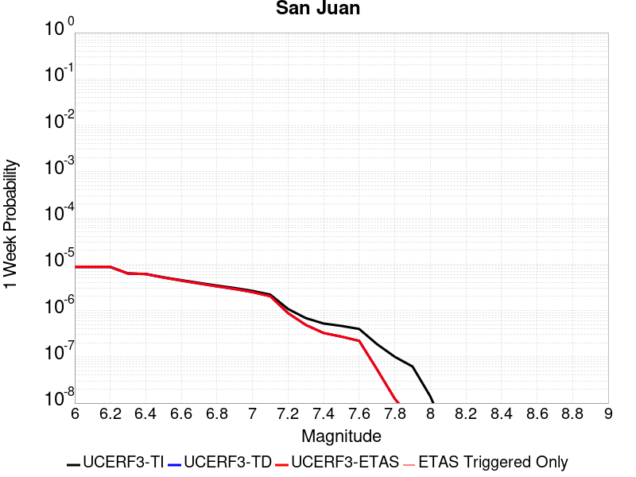 |  |  |  |

| Magnitude | 1 wk TI Prob | 1 wk TD Prob | 1 wk ETAS Prob | 1 wk ETAS/TD Gain | 1 wk ETAS Triggered Only | 1 mo TI Prob | 1 mo TD Prob | 1 mo ETAS Prob | 1 mo ETAS/TD Gain | 1 mo ETAS Triggered Only | 1 yr TI Prob | 1 yr TD Prob | 1 yr ETAS Prob | 1 yr ETAS/TD Gain | 1 yr ETAS Triggered Only | 10 yr TI Prob | 10 yr TD Prob | 10 yr ETAS Prob | 10 yr ETAS/TD Gain | 10 yr ETAS Triggered Only |
|-----|-----|-----|-----|-----|-----|-----|-----|-----|-----|-----|-----|-----|-----|-----|-----|-----|-----|-----|-----|-----|
| 6.0 | 8.682808E-6 | 8.751145E-6 | 8.751145E-6 | 1.0 | 0.0 | 3.72115E-5 | 3.7504396E-5 | 3.7504396E-5 | 1.0 | 0.0 | 4.5295584E-4 | 4.565252E-4 | 4.713539E-4 | 1.0324817 | 1.4835475E-5 | 0.004520337 | 0.0045564147 | 0.0045711827 | 1.0032411 | 1.4835475E-5 |
| 6.1 | 8.682808E-6 | 8.751145E-6 | 8.751145E-6 | 1.0 | 0.0 | 3.72115E-5 | 3.7504396E-5 | 3.7504396E-5 | 1.0 | 0.0 | 4.5295584E-4 | 4.565252E-4 | 4.713539E-4 | 1.0324817 | 1.4835475E-5 | 0.004520337 | 0.0045564147 | 0.0045711827 | 1.0032411 | 1.4835475E-5 |
| 6.2 | 8.682808E-6 | 8.751145E-6 | 8.751145E-6 | 1.0 | 0.0 | 3.72115E-5 | 3.7504396E-5 | 3.7504396E-5 | 1.0 | 0.0 | 4.5295584E-4 | 4.565252E-4 | 4.713539E-4 | 1.0324817 | 1.4835475E-5 | 0.004520337 | 0.0045564147 | 0.0045711827 | 1.0032411 | 1.4835475E-5 |
| 6.3 | 6.3054235E-6 | 6.2845056E-6 | 6.2845056E-6 | 1.0 | 0.0 | 2.7022963E-5 | 2.6933325E-5 | 2.6933325E-5 | 1.0 | 0.0 | 3.2895492E-4 | 3.278653E-4 | 3.4269592E-4 | 1.0452338 | 1.4835475E-5 | 0.003284684 | 0.003274016 | 0.003288803 | 1.0045165 | 1.4835475E-5 |
| 6.4 | 6.1490473E-6 | 6.1161227E-6 | 6.1161227E-6 | 1.0 | 0.0 | 2.6352795E-5 | 2.6211697E-5 | 2.6211697E-5 | 1.0 | 0.0 | 3.2079802E-4 | 3.1908206E-4 | 3.339128E-4 | 1.0464793 | 1.4835475E-5 | 0.0032033534 | 0.0031864357 | 0.003201224 | 1.0046409 | 1.4835475E-5 |
| 6.5 | 5.204848E-6 | 5.1388365E-6 | 5.1388365E-6 | 1.0 | 0.0 | 2.23063E-5 | 2.2023405E-5 | 2.2023405E-5 | 1.0 | 0.0 | 2.7154534E-4 | 2.6810291E-4 | 2.8293443E-4 | 1.0553201 | 1.4835475E-5 | 0.0027121378 | 0.002677949 | 0.0026927446 | 1.005525 | 1.4835475E-5 |
| 6.6 | 4.5179986E-6 | 4.4162307E-6 | 4.4162307E-6 | 1.0 | 0.0 | 1.9362706E-5 | 1.892657E-5 | 1.892657E-5 | 1.0 | 0.0 | 2.3571544E-4 | 2.3040742E-4 | 2.4523947E-4 | 1.0643731 | 1.4835475E-5 | 0.0023546559 | 0.0023018224 | 0.0023166237 | 1.0064303 | 1.4835475E-5 |
| 6.7 | 3.9442616E-6 | 3.820901E-6 | 3.820901E-6 | 1.0 | 0.0 | 1.6903869E-5 | 1.637519E-5 | 1.637519E-5 | 1.0 | 0.0 | 2.0578515E-4 | 1.9935038E-4 | 2.141829E-4 | 1.0744042 | 1.4835475E-5 | 0.002055947 | 0.0019918405 | 0.0020066465 | 1.0074333 | 1.4835475E-5 |
| 6.8 | 3.4536245E-6 | 3.3173635E-6 | 3.3173635E-6 | 1.0 | 0.0 | 1.4801163E-5 | 1.4217198E-5 | 1.4217198E-5 | 1.0 | 0.0 | 1.8018926E-4 | 1.7308125E-4 | 1.7308125E-4 | 1.0 | 0.0 | 0.0018004322 | 0.0017295835 | 0.0017295835 | 1.0 | 0.0 |
| 6.9 | 3.059865E-6 | 2.9130135E-6 | 2.9130135E-6 | 1.0 | 0.0 | 1.3113641E-5 | 1.2484286E-5 | 1.2484286E-5 | 1.0 | 0.0 | 1.596469E-4 | 1.5198615E-4 | 1.5198615E-4 | 1.0 | 0.0 | 0.0015953224 | 0.001518937 | 0.001518937 | 1.0 | 0.0 |
| 7.0 | 2.6504351E-6 | 2.4929275E-6 | 2.4929275E-6 | 1.0 | 0.0 | 1.1358958E-5 | 1.0683934E-5 | 1.0683934E-5 | 1.0 | 0.0 | 1.3828653E-4 | 1.3006967E-4 | 1.3006967E-4 | 1.0 | 0.0 | 0.0013820052 | 0.0013000475 | 0.0013000475 | 1.0 | 0.0 |
| 7.1 | 2.2039317E-6 | 2.034589E-6 | 2.034589E-6 | 1.0 | 0.0 | 9.445387E-6 | 8.719641E-6 | 8.719641E-6 | 1.0 | 0.0 | 1.1499152E-4 | 1.06156986E-4 | 1.06156986E-4 | 1.0 | 0.0 | 0.0011493203 | 0.0010611729 | 0.0010611729 | 1.0 | 0.0 |
| 7.2 | 1.0786707E-6 | 8.776708E-7 | 8.776708E-7 | 1.0 | 0.0 | 4.622866E-6 | 3.761441E-6 | 3.761441E-6 | 1.0 | 0.0 | 5.628194E-5 | 4.579459E-5 | 4.579459E-5 | 1.0 | 0.0 | 5.6267687E-4 | 4.579107E-4 | 4.579107E-4 | 1.0 | 0.0 |
| 7.3 | 6.846433E-7 | 4.872939E-7 | 4.872939E-7 | 1.0 | 0.0 | 2.9341822E-6 | 2.0884008E-6 | 2.0884008E-6 | 1.0 | 0.0 | 3.5723086E-5 | 2.5425983E-5 | 2.5425983E-5 | 1.0 | 0.0 | 3.571734E-4 | 2.542643E-4 | 2.542643E-4 | 1.0 | 0.0 |
| 7.4 | 5.23043E-7 | 3.265887E-7 | 3.265887E-7 | 1.0 | 0.0 | 2.2416111E-6 | 1.3996649E-6 | 1.3996649E-6 | 1.0 | 0.0 | 2.7291273E-5 | 1.7040787E-5 | 1.7040787E-5 | 1.0 | 0.0 | 2.7287923E-4 | 1.704268E-4 | 1.704268E-4 | 1.0 | 0.0 |
| 7.5 | 4.648444E-7 | 2.7261393E-7 | 2.7261393E-7 | 1.0 | 0.0 | 1.9921886E-6 | 1.1683449E-6 | 1.1683449E-6 | 1.0 | 0.0 | 2.4254627E-5 | 1.4224506E-5 | 1.4224506E-5 | 1.0 | 0.0 | 2.425198E-4 | 1.4226562E-4 | 1.4226562E-4 | 1.0 | 0.0 |
| 7.6 | 3.9906567E-7 | 2.2104172E-7 | 2.2104172E-7 | 1.0 | 0.0 | 1.7102802E-6 | 9.473213E-7 | 9.473213E-7 | 1.0 | 0.0 | 2.0822463E-5 | 1.1533576E-5 | 1.1533576E-5 | 1.0 | 0.0 | 2.0820512E-4 | 1.1535443E-4 | 1.1535443E-4 | 1.0 | 0.0 |
| 7.7 | 1.8784601E-7 | 5.3744596E-8 | 5.3744596E-8 | 1.0 | 0.0 | 8.0505407E-7 | 2.3033395E-7 | 2.3033395E-7 | 1.0 | 0.0 | 9.80149E-6 | 2.8043123E-6 | 2.8043123E-6 | 1.0 | 0.0 | 9.801057E-5 | 2.8051863E-5 | 2.8051863E-5 | 1.0 | 0.0 |
| 7.8 | 1.00154914E-7 | 1.2440756E-8 | 1.2440756E-8 | 1.0 | 0.0 | 4.2923529E-7 | 5.3317514E-8 | 5.3317514E-8 | 1.0 | 0.0 | 5.225927E-6 | 6.4914053E-7 | 6.4914053E-7 | 1.0 | 0.0 | 5.225804E-5 | 6.4973246E-6 | 6.4973246E-6 | 1.0 | 0.0 |
| 7.9 | 6.171429E-8 | 4.3095527E-9 | 4.3095527E-9 | 1.0 | 0.0 | 2.6448978E-7 | 1.8469507E-8 | 1.8469507E-8 | 1.0 | 0.0 | 3.2201583E-6 | 2.2486621E-7 | 2.2486621E-7 | 1.0 | 0.0 | 3.2201115E-5 | 2.2539916E-6 | 2.2539916E-6 | 1.0 | 0.0 |
| 8.0 | 1.3974572E-8 | 3.4024528E-10 | 3.4024528E-10 | 1.0 | 0.0 | 5.989102E-8 | 1.4581939E-9 | 1.4581939E-9 | 1.0 | 0.0 | 7.2917294E-7 | 1.7753502E-8 | 1.7753502E-8 | 1.0 | 0.0 | 7.2917055E-6 | 1.8186677E-7 | 1.8186677E-7 | 1.0 | 0.0 |
| 8.1 | 1.8403477E-9 | 1.1361301E-10 | 1.1361301E-10 | 1.0 | 0.0 | 7.887204E-9 | 4.869126E-10 | 4.869126E-10 | 1.0 | 0.0 | 9.602671E-8 | 5.9281637E-9 | 5.9281637E-9 | 1.0 | 0.0 | 9.602667E-7 | 6.0530375E-8 | 6.0530375E-8 | 1.0 | 0.0 |

## Hosgri (Extension)
*[(top)](#table-of-contents)*

| 1 Week | 1 Month | 1 Year | 10 Year |
|-----|-----|-----|-----|
|  | 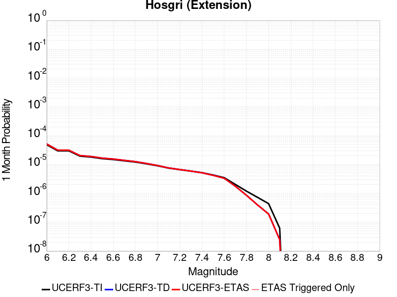 |  |  |

| Magnitude | 1 wk TI Prob | 1 wk TD Prob | 1 wk ETAS Prob | 1 wk ETAS/TD Gain | 1 wk ETAS Triggered Only | 1 mo TI Prob | 1 mo TD Prob | 1 mo ETAS Prob | 1 mo ETAS/TD Gain | 1 mo ETAS Triggered Only | 1 yr TI Prob | 1 yr TD Prob | 1 yr ETAS Prob | 1 yr ETAS/TD Gain | 1 yr ETAS Triggered Only | 10 yr TI Prob | 10 yr TD Prob | 10 yr ETAS Prob | 10 yr ETAS/TD Gain | 10 yr ETAS Triggered Only |
|-----|-----|-----|-----|-----|-----|-----|-----|-----|-----|-----|-----|-----|-----|-----|-----|-----|-----|-----|-----|-----|
| 6.0 | 1.1369135E-5 | 1.2083706E-5 | 1.2083706E-5 | 1.0 | 0.0 | 4.8723956E-5 | 5.178641E-5 | 5.178641E-5 | 1.0 | 0.0 | 5.9305265E-4 | 6.303399E-4 | 6.4516603E-4 | 1.0235208 | 1.4835475E-5 | 0.005914725 | 0.0062877685 | 0.006302511 | 1.0023446 | 1.4835475E-5 |
| 6.1 | 6.934979E-6 | 7.3249576E-6 | 7.3249576E-6 | 1.0 | 0.0 | 2.9721E-5 | 3.1392323E-5 | 3.1392323E-5 | 1.0 | 0.0 | 3.617931E-4 | 3.8213865E-4 | 3.8213865E-4 | 1.0 | 0.0 | 0.0036120464 | 0.003815228 | 0.003815228 | 1.0 | 0.0 |
| 6.2 | 6.934979E-6 | 7.3249576E-6 | 7.3249576E-6 | 1.0 | 0.0 | 2.9721E-5 | 3.1392323E-5 | 3.1392323E-5 | 1.0 | 0.0 | 3.617931E-4 | 3.8213865E-4 | 3.8213865E-4 | 1.0 | 0.0 | 0.0036120464 | 0.003815228 | 0.003815228 | 1.0 | 0.0 |
| 6.3 | 4.5484676E-6 | 4.769613E-6 | 4.769613E-6 | 1.0 | 0.0 | 1.9493287E-5 | 2.0441043E-5 | 2.0441043E-5 | 1.0 | 0.0 | 2.3730492E-4 | 2.4884168E-4 | 2.4884168E-4 | 1.0 | 0.0 | 0.0023705168 | 0.002485673 | 0.002485673 | 1.0 | 0.0 |
| 6.4 | 4.218095E-6 | 4.417129E-6 | 4.417129E-6 | 1.0 | 0.0 | 1.8077424E-5 | 1.8930417E-5 | 1.8930417E-5 | 1.0 | 0.0 | 2.2007042E-4 | 2.3045378E-4 | 2.3045378E-4 | 1.0 | 0.0 | 0.002198526 | 0.0023021814 | 0.0023021814 | 1.0 | 0.0 |
| 6.5 | 3.717374E-6 | 3.884122E-6 | 3.884122E-6 | 1.0 | 0.0 | 1.5931506E-5 | 1.6646132E-5 | 1.6646132E-5 | 1.0 | 0.0 | 1.9394881E-4 | 2.02648E-4 | 2.02648E-4 | 1.0 | 0.0 | 0.0019377962 | 0.0020246508 | 0.0020246508 | 1.0 | 0.0 |
| 6.6 | 3.4605036E-6 | 3.6085373E-6 | 3.6085373E-6 | 1.0 | 0.0 | 1.4830645E-5 | 1.546507E-5 | 1.546507E-5 | 1.0 | 0.0 | 1.8054814E-4 | 1.882711E-4 | 1.882711E-4 | 1.0 | 0.0 | 0.0018040152 | 0.0018811306 | 0.0018811306 | 1.0 | 0.0 |
| 6.7 | 3.123439E-6 | 3.2467824E-6 | 3.2467824E-6 | 1.0 | 0.0 | 1.33860985E-5 | 1.3914708E-5 | 1.3914708E-5 | 1.0 | 0.0 | 1.6296357E-4 | 1.6939851E-4 | 1.6939851E-4 | 1.0 | 0.0 | 0.001628441 | 0.0016927047 | 0.0016927047 | 1.0 | 0.0 |
| 6.8 | 2.8290783E-6 | 2.9307387E-6 | 2.9307387E-6 | 1.0 | 0.0 | 1.2124565E-5 | 1.2560248E-5 | 1.2560248E-5 | 1.0 | 0.0 | 1.4760658E-4 | 1.5291038E-4 | 1.5291038E-4 | 1.0 | 0.0 | 0.0014750857 | 0.0015280603 | 0.0015280603 | 1.0 | 0.0 |
| 6.9 | 2.454112E-6 | 2.5284985E-6 | 2.5284985E-6 | 1.0 | 0.0 | 1.0517581E-5 | 1.0836377E-5 | 1.0836377E-5 | 1.0 | 0.0 | 1.2804402E-4 | 1.3192497E-4 | 1.3192497E-4 | 1.0 | 0.0 | 0.0012797028 | 0.0013184726 | 0.0013184726 | 1.0 | 0.0 |
| 7.0 | 2.1008145E-6 | 2.1500314E-6 | 2.1500314E-6 | 1.0 | 0.0 | 9.003459E-6 | 9.214388E-6 | 9.214388E-6 | 1.0 | 0.0 | 1.096116E-4 | 1.12179434E-4 | 1.12179434E-4 | 1.0 | 0.0 | 0.0010955755 | 0.0011212318 | 0.0011212318 | 1.0 | 0.0 |
| 7.1 | 1.744384E-6 | 1.7687787E-6 | 1.7687787E-6 | 1.0 | 0.0 | 7.47591E-6 | 7.5804583E-6 | 7.5804583E-6 | 1.0 | 0.0 | 9.1015405E-5 | 9.228819E-5 | 9.228819E-5 | 1.0 | 0.0 | 9.097813E-4 | 9.2250033E-4 | 9.2250033E-4 | 1.0 | 0.0 |
| 7.2 | 1.5456587E-6 | 1.556422E-6 | 1.556422E-6 | 1.0 | 0.0 | 6.6242346E-6 | 6.6703633E-6 | 6.6703633E-6 | 1.0 | 0.0 | 8.064707E-5 | 8.120866E-5 | 8.120866E-5 | 1.0 | 0.0 | 8.0617814E-4 | 8.1179105E-4 | 8.1179105E-4 | 1.0 | 0.0 |
| 7.3 | 1.3775123E-6 | 1.3767338E-6 | 1.3767338E-6 | 1.0 | 0.0 | 5.9036106E-6 | 5.9002746E-6 | 5.9002746E-6 | 1.0 | 0.0 | 7.187409E-5 | 7.1833485E-5 | 7.1833485E-5 | 1.0 | 0.0 | 7.185085E-4 | 7.1810366E-4 | 7.1810366E-4 | 1.0 | 0.0 |
| 7.4 | 1.214491E-6 | 1.2024636E-6 | 1.2024636E-6 | 1.0 | 0.0 | 5.2049513E-6 | 5.1534057E-6 | 5.1534057E-6 | 1.0 | 0.0 | 6.336844E-5 | 6.274092E-5 | 6.274092E-5 | 1.0 | 0.0 | 6.335037E-4 | 6.2723283E-4 | 6.2723283E-4 | 1.0 | 0.0 |
| 7.5 | 1.0101123E-6 | 9.843325E-7 | 9.843325E-7 | 1.0 | 0.0 | 4.3290456E-6 | 4.218561E-6 | 4.218561E-6 | 1.0 | 0.0 | 5.2704854E-5 | 5.1359773E-5 | 5.1359773E-5 | 1.0 | 0.0 | 5.2692357E-4 | 5.1347964E-4 | 5.1347964E-4 | 1.0 | 0.0 |
| 7.6 | 8.1558215E-7 | 7.766953E-7 | 7.766953E-7 | 1.0 | 0.0 | 3.4953473E-6 | 3.3286897E-6 | 3.3286897E-6 | 1.0 | 0.0 | 4.255502E-5 | 4.0526047E-5 | 4.0526047E-5 | 1.0 | 0.0 | 4.2546875E-4 | 4.0518702E-4 | 4.0518702E-4 | 1.0 | 0.0 |
| 7.7 | 4.757816E-7 | 4.131707E-7 | 4.131707E-7 | 1.0 | 0.0 | 2.0390623E-6 | 1.7707304E-6 | 1.7707304E-6 | 1.0 | 0.0 | 2.4825302E-5 | 2.155843E-5 | 2.155843E-5 | 1.0 | 0.0 | 2.482253E-4 | 2.1556352E-4 | 2.1556352E-4 | 1.0 | 0.0 |
| 7.8 | 2.782787E-7 | 2.0054826E-7 | 2.0054826E-7 | 1.0 | 0.0 | 1.1926223E-6 | 8.594922E-7 | 8.594922E-7 | 1.0 | 0.0 | 1.452008E-5 | 1.0464268E-5 | 1.0464268E-5 | 1.0 | 0.0 | 1.4519131E-4 | 1.0463778E-4 | 1.0463778E-4 | 1.0 | 0.0 |
| 7.9 | 1.6948086E-7 | 9.2509254E-8 | 9.2509254E-8 | 1.0 | 0.0 | 7.2634634E-7 | 3.9646815E-7 | 3.9646815E-7 | 1.0 | 0.0 | 8.843231E-6 | 4.8269894E-6 | 4.8269894E-6 | 1.0 | 0.0 | 8.842879E-5 | 4.8268852E-5 | 4.8268852E-5 | 1.0 | 0.0 |
| 8.0 | 1.0225492E-7 | 4.4787335E-8 | 4.4787335E-8 | 1.0 | 0.0 | 4.382353E-7 | 1.9194572E-7 | 1.9194572E-7 | 1.0 | 0.0 | 5.335502E-6 | 2.3369366E-6 | 2.3369366E-6 | 1.0 | 0.0 | 5.335374E-5 | 2.3369123E-5 | 2.3369123E-5 | 1.0 | 0.0 |
| 8.1 | 1.43711345E-8 | 5.7952327E-9 | 5.7952327E-9 | 1.0 | 0.0 | 6.1590576E-8 | 2.483671E-8 | 2.483671E-8 | 1.0 | 0.0 | 7.4986497E-7 | 3.0238692E-7 | 3.0238692E-7 | 1.0 | 0.0 | 7.4986247E-6 | 3.0238655E-6 | 3.0238655E-6 | 1.0 | 0.0 |

## Los Alamos extension
*[(top)](#table-of-contents)*

| 1 Week | 1 Month | 1 Year | 10 Year |
|-----|-----|-----|-----|
| 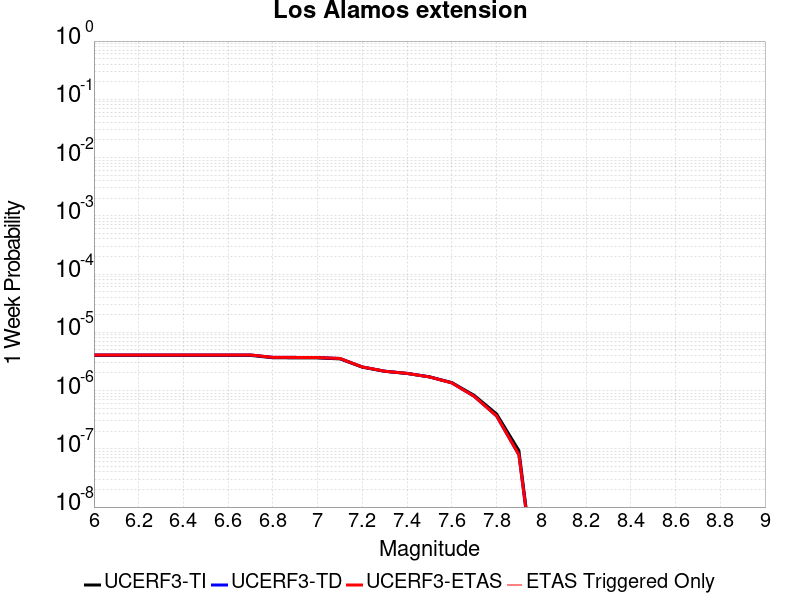 |  |  |  |

| Magnitude | 1 wk TI Prob | 1 wk TD Prob | 1 wk ETAS Prob | 1 wk ETAS/TD Gain | 1 wk ETAS Triggered Only | 1 mo TI Prob | 1 mo TD Prob | 1 mo ETAS Prob | 1 mo ETAS/TD Gain | 1 mo ETAS Triggered Only | 1 yr TI Prob | 1 yr TD Prob | 1 yr ETAS Prob | 1 yr ETAS/TD Gain | 1 yr ETAS Triggered Only | 10 yr TI Prob | 10 yr TD Prob | 10 yr ETAS Prob | 10 yr ETAS/TD Gain | 10 yr ETAS Triggered Only |
|-----|-----|-----|-----|-----|-----|-----|-----|-----|-----|-----|-----|-----|-----|-----|-----|-----|-----|-----|-----|-----|
| 6.0 | 4.0146506E-6 | 4.0862633E-6 | 4.0862633E-6 | 1.0 | 0.0 | 1.7205533E-5 | 1.7512446E-5 | 1.7512446E-5 | 1.0 | 0.0 | 2.0945723E-4 | 2.1319426E-4 | 2.1319426E-4 | 1.0 | 0.0 | 0.0020925992 | 0.0021300064 | 0.0021448105 | 1.0069501 | 1.4835475E-5 |
| 6.1 | 4.0146506E-6 | 4.0862633E-6 | 4.0862633E-6 | 1.0 | 0.0 | 1.7205533E-5 | 1.7512446E-5 | 1.7512446E-5 | 1.0 | 0.0 | 2.0945723E-4 | 2.1319426E-4 | 2.1319426E-4 | 1.0 | 0.0 | 0.0020925992 | 0.0021300064 | 0.0021448105 | 1.0069501 | 1.4835475E-5 |
| 6.2 | 4.0146506E-6 | 4.0862633E-6 | 4.0862633E-6 | 1.0 | 0.0 | 1.7205533E-5 | 1.7512446E-5 | 1.7512446E-5 | 1.0 | 0.0 | 2.0945723E-4 | 2.1319426E-4 | 2.1319426E-4 | 1.0 | 0.0 | 0.0020925992 | 0.0021300064 | 0.0021448105 | 1.0069501 | 1.4835475E-5 |
| 6.3 | 4.0146506E-6 | 4.0862633E-6 | 4.0862633E-6 | 1.0 | 0.0 | 1.7205533E-5 | 1.7512446E-5 | 1.7512446E-5 | 1.0 | 0.0 | 2.0945723E-4 | 2.1319426E-4 | 2.1319426E-4 | 1.0 | 0.0 | 0.0020925992 | 0.0021300064 | 0.0021448105 | 1.0069501 | 1.4835475E-5 |
| 6.4 | 4.0146506E-6 | 4.0862633E-6 | 4.0862633E-6 | 1.0 | 0.0 | 1.7205533E-5 | 1.7512446E-5 | 1.7512446E-5 | 1.0 | 0.0 | 2.0945723E-4 | 2.1319426E-4 | 2.1319426E-4 | 1.0 | 0.0 | 0.0020925992 | 0.0021300064 | 0.0021448105 | 1.0069501 | 1.4835475E-5 |
| 6.5 | 4.0146506E-6 | 4.0862633E-6 | 4.0862633E-6 | 1.0 | 0.0 | 1.7205533E-5 | 1.7512446E-5 | 1.7512446E-5 | 1.0 | 0.0 | 2.0945723E-4 | 2.1319426E-4 | 2.1319426E-4 | 1.0 | 0.0 | 0.0020925992 | 0.0021300064 | 0.0021448105 | 1.0069501 | 1.4835475E-5 |
| 6.6 | 4.0146506E-6 | 4.0862633E-6 | 4.0862633E-6 | 1.0 | 0.0 | 1.7205533E-5 | 1.7512446E-5 | 1.7512446E-5 | 1.0 | 0.0 | 2.0945723E-4 | 2.1319426E-4 | 2.1319426E-4 | 1.0 | 0.0 | 0.0020925992 | 0.0021300064 | 0.0021448105 | 1.0069501 | 1.4835475E-5 |
| 6.7 | 4.0146506E-6 | 4.0862633E-6 | 4.0862633E-6 | 1.0 | 0.0 | 1.7205533E-5 | 1.7512446E-5 | 1.7512446E-5 | 1.0 | 0.0 | 2.0945723E-4 | 2.1319426E-4 | 2.1319426E-4 | 1.0 | 0.0 | 0.0020925992 | 0.0021300064 | 0.0021448105 | 1.0069501 | 1.4835475E-5 |
| 6.8 | 3.6584688E-6 | 3.7189548E-6 | 3.7189548E-6 | 1.0 | 0.0 | 1.5679057E-5 | 1.5938285E-5 | 1.5938285E-5 | 1.0 | 0.0 | 1.9087581E-4 | 1.9403228E-4 | 1.9403228E-4 | 1.0 | 0.0 | 0.0019071194 | 0.0019387212 | 0.0019535278 | 1.0076374 | 1.4835475E-5 |
| 6.9 | 3.644631E-6 | 3.7046646E-6 | 3.7046646E-6 | 1.0 | 0.0 | 1.5619753E-5 | 1.5877042E-5 | 1.5877042E-5 | 1.0 | 0.0 | 1.901539E-4 | 1.9328677E-4 | 1.9328677E-4 | 1.0 | 0.0 | 0.0018999127 | 0.0019312791 | 0.0019460858 | 1.0076668 | 1.4835475E-5 |
| 7.0 | 3.6318522E-6 | 3.6914248E-6 | 3.6914248E-6 | 1.0 | 0.0 | 1.5564989E-5 | 1.58203E-5 | 1.58203E-5 | 1.0 | 0.0 | 1.8948725E-4 | 1.9259607E-4 | 1.9259607E-4 | 1.0 | 0.0 | 0.0018932576 | 0.001924384 | 0.0019391909 | 1.0076944 | 1.4835475E-5 |
| 7.1 | 3.5001724E-6 | 3.5554924E-6 | 3.5554924E-6 | 1.0 | 0.0 | 1.5000653E-5 | 1.5237741E-5 | 1.5237741E-5 | 1.0 | 0.0 | 1.8261763E-4 | 1.8550461E-4 | 1.8550461E-4 | 1.0 | 0.0 | 0.0018246764 | 0.0018535884 | 0.0018683963 | 1.0079888 | 1.4835475E-5 |
| 7.2 | 2.5204702E-6 | 2.5437648E-6 | 2.5437648E-6 | 1.0 | 0.0 | 1.080197E-5 | 1.0901804E-5 | 1.0901804E-5 | 1.0 | 0.0 | 1.3150605E-4 | 1.3272143E-4 | 1.3272143E-4 | 1.0 | 0.0 | 0.0013142825 | 0.0013264272 | 0.001341243 | 1.0111697 | 1.4835475E-5 |
| 7.3 | 2.1399692E-6 | 2.150193E-6 | 2.150193E-6 | 1.0 | 0.0 | 9.1712645E-6 | 9.215081E-6 | 9.215081E-6 | 1.0 | 0.0 | 1.1165442E-4 | 1.1218787E-4 | 1.1218787E-4 | 1.0 | 0.0 | 0.0011159834 | 0.0011213155 | 0.0011361344 | 1.0132155 | 1.4835475E-5 |
| 7.4 | 1.9660122E-6 | 1.9702939E-6 | 1.9702939E-6 | 1.0 | 0.0 | 8.42574E-6 | 8.444089E-6 | 8.444089E-6 | 1.0 | 0.0 | 1.0257855E-4 | 1.0280196E-4 | 1.0280196E-4 | 1.0 | 0.0 | 0.0010253121 | 0.0010275472 | 0.0010423674 | 1.0144229 | 1.4835475E-5 |
| 7.5 | 1.7204633E-6 | 1.7151491E-6 | 1.7151491E-6 | 1.0 | 0.0 | 7.373393E-6 | 7.3506185E-6 | 7.3506185E-6 | 1.0 | 0.0 | 8.976737E-5 | 8.949013E-5 | 8.949013E-5 | 1.0 | 0.0 | 8.9731114E-4 | 8.9454395E-4 | 9.093661E-4 | 1.0165696 | 1.4835475E-5 |
| 7.6 | 1.3717638E-6 | 1.3536236E-6 | 1.3536236E-6 | 1.0 | 0.0 | 5.878974E-6 | 5.801231E-6 | 5.801231E-6 | 1.0 | 0.0 | 7.157416E-5 | 7.062772E-5 | 7.062772E-5 | 1.0 | 0.0 | 7.1551115E-4 | 7.060554E-4 | 7.060554E-4 | 1.0 | 0.0 |
| 7.7 | 8.272564E-7 | 7.9578916E-7 | 7.9578916E-7 | 1.0 | 0.0 | 3.5453797E-6 | 3.4105205E-6 | 3.4105205E-6 | 1.0 | 0.0 | 4.3164142E-5 | 4.1522297E-5 | 4.1522297E-5 | 1.0 | 0.0 | 4.315576E-4 | 4.151456E-4 | 4.151456E-4 | 1.0 | 0.0 |
| 7.8 | 3.9708277E-7 | 3.672029E-7 | 3.672029E-7 | 1.0 | 0.0 | 1.7017821E-6 | 1.5737257E-6 | 1.5737257E-6 | 1.0 | 0.0 | 2.0719E-5 | 1.9159943E-5 | 1.9159943E-5 | 1.0 | 0.0 | 2.071707E-4 | 1.9158298E-4 | 1.9158298E-4 | 1.0 | 0.0 |
| 7.9 | 9.292528E-8 | 7.889375E-8 | 7.889375E-8 | 1.0 | 0.0 | 3.9825116E-7 | 3.3811602E-7 | 3.3811602E-7 | 1.0 | 0.0 | 4.848697E-6 | 4.116555E-6 | 4.116555E-6 | 1.0 | 0.0 | 4.8485912E-5 | 4.1164796E-5 | 4.1164796E-5 | 1.0 | 0.0 |
| 8.0 | 7.880441E-11 | 8.235557E-11 | 8.235557E-11 | 1.0 | 0.0 | 3.3773329E-10 | 3.5295256E-10 | 3.5295256E-10 | 1.0 | 0.0 | 4.1119033E-9 | 4.2971977E-9 | 4.2971977E-9 | 1.0 | 0.0 | 4.1119034E-8 | 4.297198E-8 | 4.297198E-8 | 1.0 | 0.0 |

## San Cayetano
*[(top)](#table-of-contents)*

| 1 Week | 1 Month | 1 Year | 10 Year |
|-----|-----|-----|-----|
|  |  | 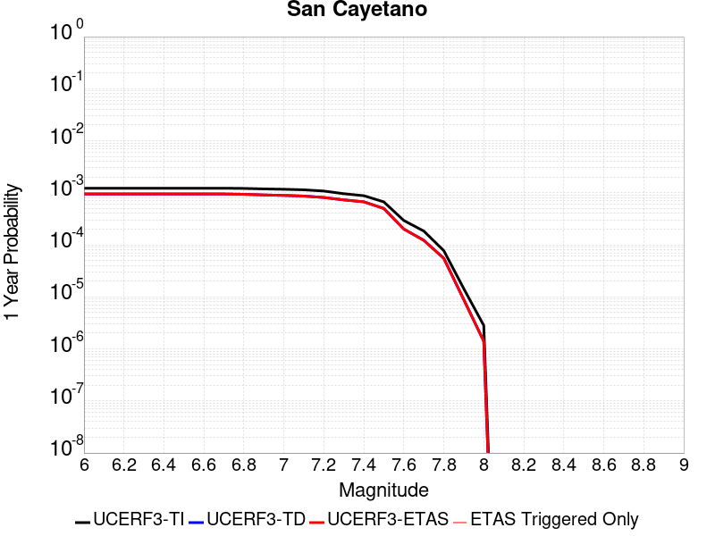 |  |

| Magnitude | 1 wk TI Prob | 1 wk TD Prob | 1 wk ETAS Prob | 1 wk ETAS/TD Gain | 1 wk ETAS Triggered Only | 1 mo TI Prob | 1 mo TD Prob | 1 mo ETAS Prob | 1 mo ETAS/TD Gain | 1 mo ETAS Triggered Only | 1 yr TI Prob | 1 yr TD Prob | 1 yr ETAS Prob | 1 yr ETAS/TD Gain | 1 yr ETAS Triggered Only | 10 yr TI Prob | 10 yr TD Prob | 10 yr ETAS Prob | 10 yr ETAS/TD Gain | 10 yr ETAS Triggered Only |
|-----|-----|-----|-----|-----|-----|-----|-----|-----|-----|-----|-----|-----|-----|-----|-----|-----|-----|-----|-----|-----|
| 6.0 | 2.3476267E-5 | 1.817272E-5 | 1.817272E-5 | 1.0 | 0.0 | 1.0060869E-4 | 7.788078E-5 | 7.788078E-5 | 1.0 | 0.0 | 0.0012242225 | 9.477897E-4 | 9.477897E-4 | 1.0 | 0.0 | 0.012175002 | 0.009438363 | 0.009453058 | 1.001557 | 1.4835475E-5 |
| 6.1 | 2.3476267E-5 | 1.817272E-5 | 1.817272E-5 | 1.0 | 0.0 | 1.0060869E-4 | 7.788078E-5 | 7.788078E-5 | 1.0 | 0.0 | 0.0012242225 | 9.477897E-4 | 9.477897E-4 | 1.0 | 0.0 | 0.012175002 | 0.009438363 | 0.009453058 | 1.001557 | 1.4835475E-5 |
| 6.2 | 2.3476267E-5 | 1.817272E-5 | 1.817272E-5 | 1.0 | 0.0 | 1.0060869E-4 | 7.788078E-5 | 7.788078E-5 | 1.0 | 0.0 | 0.0012242225 | 9.477897E-4 | 9.477897E-4 | 1.0 | 0.0 | 0.012175002 | 0.009438363 | 0.009453058 | 1.001557 | 1.4835475E-5 |
| 6.3 | 2.3476267E-5 | 1.817272E-5 | 1.817272E-5 | 1.0 | 0.0 | 1.0060869E-4 | 7.788078E-5 | 7.788078E-5 | 1.0 | 0.0 | 0.0012242225 | 9.477897E-4 | 9.477897E-4 | 1.0 | 0.0 | 0.012175002 | 0.009438363 | 0.009453058 | 1.001557 | 1.4835475E-5 |
| 6.4 | 2.3476267E-5 | 1.817272E-5 | 1.817272E-5 | 1.0 | 0.0 | 1.0060869E-4 | 7.788078E-5 | 7.788078E-5 | 1.0 | 0.0 | 0.0012242225 | 9.477897E-4 | 9.477897E-4 | 1.0 | 0.0 | 0.012175002 | 0.009438363 | 0.009453058 | 1.001557 | 1.4835475E-5 |
| 6.5 | 2.3476267E-5 | 1.817272E-5 | 1.817272E-5 | 1.0 | 0.0 | 1.0060869E-4 | 7.788078E-5 | 7.788078E-5 | 1.0 | 0.0 | 0.0012242225 | 9.477897E-4 | 9.477897E-4 | 1.0 | 0.0 | 0.012175002 | 0.009438363 | 0.009453058 | 1.001557 | 1.4835475E-5 |
| 6.6 | 2.3476267E-5 | 1.817272E-5 | 1.817272E-5 | 1.0 | 0.0 | 1.0060869E-4 | 7.788078E-5 | 7.788078E-5 | 1.0 | 0.0 | 0.0012242225 | 9.477897E-4 | 9.477897E-4 | 1.0 | 0.0 | 0.012175002 | 0.009438363 | 0.009453058 | 1.001557 | 1.4835475E-5 |
| 6.7 | 2.3476267E-5 | 1.817272E-5 | 1.817272E-5 | 1.0 | 0.0 | 1.0060869E-4 | 7.788078E-5 | 7.788078E-5 | 1.0 | 0.0 | 0.0012242225 | 9.477897E-4 | 9.477897E-4 | 1.0 | 0.0 | 0.012175002 | 0.009438363 | 0.009453058 | 1.001557 | 1.4835475E-5 |
| 6.8 | 2.3241924E-5 | 1.7940394E-5 | 1.7940394E-5 | 1.0 | 0.0 | 9.960445E-5 | 7.688516E-5 | 7.688516E-5 | 1.0 | 0.0 | 0.0012120095 | 9.356785E-4 | 9.356785E-4 | 1.0 | 0.0 | 0.012054204 | 0.009318244 | 0.009332941 | 1.0015773 | 1.4835475E-5 |
| 6.9 | 2.2761007E-5 | 1.743578E-5 | 1.743578E-5 | 1.0 | 0.0 | 9.7543525E-5 | 7.472265E-5 | 7.472265E-5 | 1.0 | 0.0 | 0.0011869454 | 9.09372E-4 | 9.09372E-4 | 1.0 | 0.0 | 0.011806256 | 0.009057338 | 0.00907204 | 1.0016232 | 1.4835475E-5 |
| 7.0 | 2.240283E-5 | 1.7069491E-5 | 1.7069491E-5 | 1.0 | 0.0 | 9.600859E-5 | 7.3152936E-5 | 7.3152936E-5 | 1.0 | 0.0 | 0.0011682777 | 8.9027645E-4 | 8.9027645E-4 | 1.0 | 0.0 | 0.011621549 | 0.008867914 | 0.0088826185 | 1.0016581 | 1.4835475E-5 |
| 7.1 | 2.1871154E-5 | 1.6589285E-5 | 1.6589285E-5 | 1.0 | 0.0 | 9.373015E-5 | 7.109502E-5 | 7.109502E-5 | 1.0 | 0.0 | 0.0011405671 | 8.6524145E-4 | 8.6524145E-4 | 1.0 | 0.0 | 0.011347309 | 0.008619529 | 0.008634237 | 1.0017064 | 1.4835475E-5 |
| 7.2 | 2.0714133E-5 | 1.5567712E-5 | 1.5567712E-5 | 1.0 | 0.0 | 8.8771834E-5 | 6.6717075E-5 | 6.6717075E-5 | 1.0 | 0.0 | 0.0010802611 | 8.11981E-4 | 8.11981E-4 | 1.0 | 0.0 | 0.010750249 | 0.008090916 | 0.008105632 | 1.0018188 | 1.4835475E-5 |
| 7.3 | 1.8408395E-5 | 1.3998414E-5 | 1.3998414E-5 | 1.0 | 0.0 | 7.8890735E-5 | 5.9991842E-5 | 5.9991842E-5 | 1.0 | 0.0 | 9.600714E-4 | 7.301589E-4 | 7.301589E-4 | 1.0 | 0.0 | 0.009559342 | 0.007278318 | 0.007293046 | 1.0020235 | 1.4835475E-5 |
| 7.4 | 1.6856795E-5 | 1.2851405E-5 | 1.2851405E-5 | 1.0 | 0.0 | 7.2241404E-5 | 5.5076303E-5 | 5.5076303E-5 | 1.0 | 0.0 | 8.7918417E-4 | 6.703505E-4 | 6.703505E-4 | 1.0 | 0.0 | 0.00875714 | 0.0066839647 | 0.006698701 | 1.0022048 | 1.4835475E-5 |
| 7.5 | 1.2822778E-5 | 9.578445E-6 | 9.578445E-6 | 1.0 | 0.0 | 5.495361E-5 | 4.104984E-5 | 4.104984E-5 | 1.0 | 0.0 | 6.688548E-4 | 4.996688E-4 | 4.996688E-4 | 1.0 | 0.0 | 0.006668452 | 0.0049856245 | 0.0049856245 | 1.0 | 0.0 |
| 7.6 | 5.6272684E-6 | 3.8552707E-6 | 3.8552707E-6 | 1.0 | 0.0 | 2.4116642E-5 | 1.6522485E-5 | 1.6522485E-5 | 1.0 | 0.0 | 2.9358055E-4 | 2.0114277E-4 | 2.0114277E-4 | 1.0 | 0.0 | 0.0029319301 | 0.002009618 | 0.002009618 | 1.0 | 0.0 |
| 7.7 | 3.5261346E-6 | 2.3409332E-6 | 2.3409332E-6 | 1.0 | 0.0 | 1.5111918E-5 | 1.0032532E-5 | 1.0032532E-5 | 1.0 | 0.0 | 1.8397206E-4 | 1.2213932E-4 | 1.2213932E-4 | 1.0 | 0.0 | 0.0018381984 | 0.0012207292 | 0.0012207292 | 1.0 | 0.0 |
| 7.8 | 1.4826929E-6 | 1.0565172E-6 | 1.0565172E-6 | 1.0 | 0.0 | 6.354383E-6 | 4.5279235E-6 | 4.5279235E-6 | 1.0 | 0.0 | 7.736187E-5 | 5.5126093E-5 | 5.5126093E-5 | 1.0 | 0.0 | 7.733494E-4 | 5.511262E-4 | 5.511262E-4 | 1.0 | 0.0 |
| 7.9 | 2.7568166E-7 | 1.6980378E-7 | 1.6980378E-7 | 1.0 | 0.0 | 1.1814923E-6 | 7.277303E-7 | 7.277303E-7 | 1.0 | 0.0 | 1.4384574E-5 | 8.860081E-6 | 8.860081E-6 | 1.0 | 0.0 | 1.4383643E-4 | 8.859731E-5 | 8.859731E-5 | 1.0 | 0.0 |
| 8.0 | 5.407832E-8 | 2.689489E-8 | 2.689489E-8 | 1.0 | 0.0 | 2.3176422E-7 | 1.152638E-7 | 1.152638E-7 | 1.0 | 0.0 | 2.8217257E-6 | 1.403336E-6 | 1.403336E-6 | 1.0 | 0.0 | 2.8216898E-5 | 1.4033275E-5 | 1.4033275E-5 | 1.0 | 0.0 |

## Deep Springs
*[(top)](#table-of-contents)*

| 1 Week | 1 Month | 1 Year | 10 Year |
|-----|-----|-----|-----|
|  | 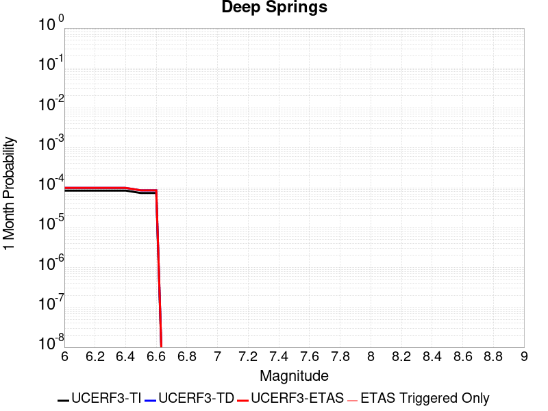 |  |  |

| Magnitude | 1 wk TI Prob | 1 wk TD Prob | 1 wk ETAS Prob | 1 wk ETAS/TD Gain | 1 wk ETAS Triggered Only | 1 mo TI Prob | 1 mo TD Prob | 1 mo ETAS Prob | 1 mo ETAS/TD Gain | 1 mo ETAS Triggered Only | 1 yr TI Prob | 1 yr TD Prob | 1 yr ETAS Prob | 1 yr ETAS/TD Gain | 1 yr ETAS Triggered Only | 10 yr TI Prob | 10 yr TD Prob | 10 yr ETAS Prob | 10 yr ETAS/TD Gain | 10 yr ETAS Triggered Only |
|-----|-----|-----|-----|-----|-----|-----|-----|-----|-----|-----|-----|-----|-----|-----|-----|-----|-----|-----|-----|-----|
| 6.0 | 1.9810619E-5 | 2.3115075E-5 | 2.3115075E-5 | 1.0 | 0.0 | 8.489989E-5 | 9.9063705E-5 | 9.9063705E-5 | 1.0 | 0.0 | 0.001033166 | 0.0012059412 | 0.0012207588 | 1.0122871 | 1.4835475E-5 | 0.010283757 | 0.012043753 | 0.01205841 | 1.001217 | 1.4835475E-5 |
| 6.1 | 1.9810619E-5 | 2.3115075E-5 | 2.3115075E-5 | 1.0 | 0.0 | 8.489989E-5 | 9.9063705E-5 | 9.9063705E-5 | 1.0 | 0.0 | 0.001033166 | 0.0012059412 | 0.0012207588 | 1.0122871 | 1.4835475E-5 | 0.010283757 | 0.012043753 | 0.01205841 | 1.001217 | 1.4835475E-5 |
| 6.2 | 1.9810619E-5 | 2.3115075E-5 | 2.3115075E-5 | 1.0 | 0.0 | 8.489989E-5 | 9.9063705E-5 | 9.9063705E-5 | 1.0 | 0.0 | 0.001033166 | 0.0012059412 | 0.0012207588 | 1.0122871 | 1.4835475E-5 | 0.010283757 | 0.012043753 | 0.01205841 | 1.001217 | 1.4835475E-5 |
| 6.3 | 1.9810619E-5 | 2.3115075E-5 | 2.3115075E-5 | 1.0 | 0.0 | 8.489989E-5 | 9.9063705E-5 | 9.9063705E-5 | 1.0 | 0.0 | 0.001033166 | 0.0012059412 | 0.0012207588 | 1.0122871 | 1.4835475E-5 | 0.010283757 | 0.012043753 | 0.01205841 | 1.001217 | 1.4835475E-5 |
| 6.4 | 1.9810619E-5 | 2.3115075E-5 | 2.3115075E-5 | 1.0 | 0.0 | 8.489989E-5 | 9.9063705E-5 | 9.9063705E-5 | 1.0 | 0.0 | 0.001033166 | 0.0012059412 | 0.0012207588 | 1.0122871 | 1.4835475E-5 | 0.010283757 | 0.012043753 | 0.01205841 | 1.001217 | 1.4835475E-5 |
| 6.5 | 1.7190405E-5 | 2.0052768E-5 | 2.0052768E-5 | 1.0 | 0.0 | 7.367108E-5 | 8.594043E-5 | 8.594043E-5 | 1.0 | 0.0 | 8.9657627E-4 | 0.0010463247 | 0.0010611448 | 1.0141639 | 1.4835475E-5 | 0.008929676 | 0.01046321 | 0.01047789 | 1.0014031 | 1.4835475E-5 |
| 6.6 | 1.7190405E-5 | 2.0052768E-5 | 2.0052768E-5 | 1.0 | 0.0 | 7.367108E-5 | 8.594043E-5 | 8.594043E-5 | 1.0 | 0.0 | 8.9657627E-4 | 0.0010463247 | 0.0010611448 | 1.0141639 | 1.4835475E-5 | 0.008929676 | 0.01046321 | 0.01047789 | 1.0014031 | 1.4835475E-5 |

## Rodgers Creek - Healdsburg 2011 CFM
*[(top)](#table-of-contents)*

| 1 Week | 1 Month | 1 Year | 10 Year |
|-----|-----|-----|-----|
| 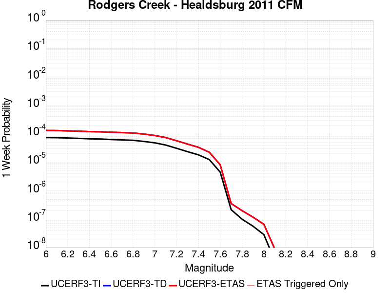 |  | 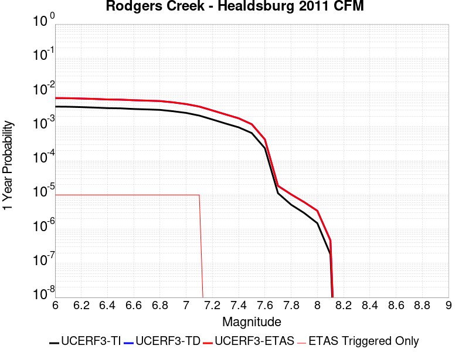 |  |

| Magnitude | 1 wk TI Prob | 1 wk TD Prob | 1 wk ETAS Prob | 1 wk ETAS/TD Gain | 1 wk ETAS Triggered Only | 1 mo TI Prob | 1 mo TD Prob | 1 mo ETAS Prob | 1 mo ETAS/TD Gain | 1 mo ETAS Triggered Only | 1 yr TI Prob | 1 yr TD Prob | 1 yr ETAS Prob | 1 yr ETAS/TD Gain | 1 yr ETAS Triggered Only | 10 yr TI Prob | 10 yr TD Prob | 10 yr ETAS Prob | 10 yr ETAS/TD Gain | 10 yr ETAS Triggered Only |
|-----|-----|-----|-----|-----|-----|-----|-----|-----|-----|-----|-----|-----|-----|-----|-----|-----|-----|-----|-----|-----|
| 6.0 | 7.390182E-5 | 1.3143745E-4 | 1.3143745E-4 | 1.0 | 0.0 | 3.1668364E-4 | 5.6318217E-4 | 5.6318217E-4 | 1.0 | 0.0 | 0.0038488081 | 0.0068352153 | 0.0068499492 | 1.0021557 | 1.4835475E-5 | 0.037828278 | 0.06622508 | 0.06623893 | 1.0002092 | 1.4835475E-5 |
| 6.1 | 7.318768E-5 | 1.3041799E-4 | 1.3041799E-4 | 1.0 | 0.0 | 3.1362378E-4 | 5.5881485E-4 | 5.5881485E-4 | 1.0 | 0.0 | 0.0038116854 | 0.0067823753 | 0.00679711 | 1.0021725 | 1.4835475E-5 | 0.037469655 | 0.065729596 | 0.06574346 | 1.0002109 | 1.4835475E-5 |
| 6.2 | 7.1379836E-5 | 1.2734602E-4 | 1.2734602E-4 | 1.0 | 0.0 | 3.058777E-4 | 5.456549E-4 | 5.456549E-4 | 1.0 | 0.0 | 0.003717703 | 0.006623136 | 0.006637873 | 1.0022252 | 1.4835475E-5 | 0.0365612 | 0.06424759 | 0.06426147 | 1.0002161 | 1.4835475E-5 |
| 6.3 | 6.9255926E-5 | 1.2389064E-4 | 1.2389064E-4 | 1.0 | 0.0 | 2.9677735E-4 | 5.308522E-4 | 5.308522E-4 | 1.0 | 0.0 | 0.0036072785 | 0.006443995 | 0.006458735 | 1.0022874 | 1.4835475E-5 | 0.035492823 | 0.062573664 | 0.062587574 | 1.0002222 | 1.4835475E-5 |
| 6.4 | 6.6757144E-5 | 1.1965663E-4 | 1.1965663E-4 | 1.0 | 0.0 | 2.8607066E-4 | 5.127136E-4 | 5.127136E-4 | 1.0 | 0.0 | 0.0034773487 | 0.006224491 | 0.0062392345 | 1.0023686 | 1.4835475E-5 | 0.034234364 | 0.06052265 | 0.06053659 | 1.0002303 | 1.4835475E-5 |
| 6.5 | 6.5735134E-5 | 1.1814685E-4 | 1.1814685E-4 | 1.0 | 0.0 | 2.8169158E-4 | 5.0624576E-4 | 5.0624576E-4 | 1.0 | 0.0 | 0.003424202 | 0.00614621 | 0.006160954 | 1.002399 | 1.4835475E-5 | 0.03371918 | 0.05978634 | 0.059800286 | 1.0002333 | 1.4835475E-5 |
| 6.6 | 6.289601E-5 | 1.1349982E-4 | 1.1349982E-4 | 1.0 | 0.0 | 2.6952647E-4 | 4.863375E-4 | 4.863375E-4 | 1.0 | 0.0 | 0.0032765474 | 0.005905164 | 0.005919912 | 1.0024974 | 1.4835475E-5 | 0.032286562 | 0.057523638 | 0.057537623 | 1.0002431 | 1.4835475E-5 |
| 6.7 | 6.115274E-5 | 1.10669054E-4 | 1.10669054E-4 | 1.0 | 0.0 | 2.6205686E-4 | 4.7421013E-4 | 4.7421013E-4 | 1.0 | 0.0 | 0.0031858748 | 0.005758303 | 0.005773053 | 1.0025616 | 1.4835475E-5 | 0.031405866 | 0.056141403 | 0.056155406 | 1.0002494 | 1.4835475E-5 |
| 6.8 | 5.9232367E-5 | 1.0734196E-4 | 1.0734196E-4 | 1.0 | 0.0 | 2.538283E-4 | 4.5995624E-4 | 4.5995624E-4 | 1.0 | 0.0 | 0.0030859804 | 0.005585665 | 0.0056004175 | 1.0026412 | 1.4835475E-5 | 0.030434765 | 0.054507937 | 0.054521963 | 1.0002574 | 1.4835475E-5 |
| 6.9 | 5.4030377E-5 | 9.828254E-5 | 9.828254E-5 | 1.0 | 0.0 | 2.315382E-4 | 4.211432E-4 | 4.211432E-4 | 1.0 | 0.0 | 0.0028153337 | 0.00511543 | 0.0051301895 | 1.0028853 | 1.4835475E-5 | 0.027799325 | 0.050042816 | 0.05005691 | 1.0002816 | 1.4835475E-5 |
| 7.0 | 4.8260714E-5 | 8.74617E-5 | 8.74617E-5 | 1.0 | 0.0 | 2.0681522E-4 | 3.7478228E-4 | 3.7478228E-4 | 1.0 | 0.0 | 0.0025150678 | 0.004553482 | 0.00456825 | 1.0032432 | 1.4835475E-5 | 0.024867928 | 0.044694696 | 0.04470887 | 1.0003171 | 1.4835475E-5 |
| 7.1 | 4.0294493E-5 | 7.39392E-5 | 7.39392E-5 | 1.0 | 0.0 | 1.7267925E-4 | 3.16844E-4 | 3.16844E-4 | 1.0 | 0.0 | 0.0021003427 | 0.0038507904 | 0.0038655687 | 1.0038377 | 1.4835475E-5 | 0.02080602 | 0.03794689 | 0.037961163 | 1.0003761 | 1.4835475E-5 |
| 7.2 | 3.096388E-5 | 5.702407E-5 | 5.702407E-5 | 1.0 | 0.0 | 1.326956E-4 | 2.443661E-4 | 2.443661E-4 | 1.0 | 0.0 | 0.0016143717 | 0.0029711204 | 0.0029711204 | 1.0 | 0.0 | 0.01602694 | 0.029459624 | 0.029459624 | 1.0 | 0.0 |
| 7.3 | 2.3615226E-5 | 4.3670978E-5 | 4.3670978E-5 | 1.0 | 0.0 | 1.0120418E-4 | 1.8714799E-4 | 1.8714799E-4 | 1.0 | 0.0 | 0.0012314644 | 0.0022761594 | 0.0022761594 | 1.0 | 0.0 | 0.0122466255 | 0.022658028 | 0.022658028 | 1.0 | 0.0 |
| 7.4 | 1.8251132E-5 | 3.3579356E-5 | 3.3579356E-5 | 1.0 | 0.0 | 7.821679E-5 | 1.4390364E-4 | 1.4390364E-4 | 1.0 | 0.0 | 9.518733E-4 | 0.0017506287 | 0.0017506287 | 1.0 | 0.0 | 0.009478063 | 0.017484413 | 0.017484413 | 1.0 | 0.0 |
| 7.5 | 1.2411432E-5 | 2.2489716E-5 | 2.2489716E-5 | 1.0 | 0.0 | 5.3190768E-5 | 9.638097E-5 | 9.638097E-5 | 1.0 | 0.0 | 6.4740516E-4 | 0.0011728124 | 0.0011728124 | 1.0 | 0.0 | 0.006455223 | 0.011758021 | 0.011758021 | 1.0 | 0.0 |
| 7.6 | 4.4771446E-6 | 8.0939135E-6 | 8.0939135E-6 | 1.0 | 0.0 | 1.918762E-5 | 3.4687746E-5 | 3.4687746E-5 | 1.0 | 0.0 | 2.3358424E-4 | 4.2224268E-4 | 4.2224268E-4 | 1.0 | 0.0 | 0.0023333887 | 0.004250967 | 0.004250967 | 1.0 | 0.0 |
| 7.7 | 2.157941E-7 | 3.540952E-7 | 3.540952E-7 | 1.0 | 0.0 | 9.248315E-7 | 1.5175499E-6 | 1.5175499E-6 | 1.0 | 0.0 | 1.1259765E-5 | 1.8476014E-5 | 1.8476014E-5 | 1.0 | 0.0 | 1.1259195E-4 | 1.909893E-4 | 1.909893E-4 | 1.0 | 0.0 |
| 7.8 | 9.9623286E-8 | 1.994565E-7 | 1.994565E-7 | 1.0 | 0.0 | 4.269569E-7 | 8.5481327E-7 | 8.5481327E-7 | 1.0 | 0.0 | 5.1981874E-6 | 1.04073015E-5 | 1.04073015E-5 | 1.0 | 0.0 | 5.198066E-5 | 1.0924356E-4 | 1.0924356E-4 | 1.0 | 0.0 |
| 7.9 | 5.6745257E-8 | 1.18026804E-7 | 1.18026804E-7 | 1.0 | 0.0 | 2.4319394E-7 | 5.05829E-7 | 5.05829E-7 | 1.0 | 0.0 | 2.960882E-6 | 6.158451E-6 | 6.158451E-6 | 1.0 | 0.0 | 2.9608427E-5 | 6.48495E-5 | 6.48495E-5 | 1.0 | 0.0 |
| 8.0 | 2.8614323E-8 | 6.593933E-8 | 6.593933E-8 | 1.0 | 0.0 | 1.2263281E-7 | 2.8259709E-7 | 2.8259709E-7 | 1.0 | 0.0 | 1.4930534E-6 | 3.4406141E-6 | 3.4406141E-6 | 1.0 | 0.0 | 1.4930434E-5 | 3.5900197E-5 | 3.5900197E-5 | 1.0 | 0.0 |
| 8.1 | 3.5045191E-9 | 8.9853405E-9 | 8.9853405E-9 | 1.0 | 0.0 | 1.5019367E-8 | 3.8508603E-8 | 3.8508603E-8 | 1.0 | 0.0 | 1.8286079E-7 | 4.6884213E-7 | 4.6884213E-7 | 1.0 | 0.0 | 1.8286064E-6 | 4.8420384E-6 | 4.8420384E-6 | 1.0 | 0.0 |

## Mission (connected) 2011 CFM
*[(top)](#table-of-contents)*

| 1 Week | 1 Month | 1 Year | 10 Year |
|-----|-----|-----|-----|
|  | 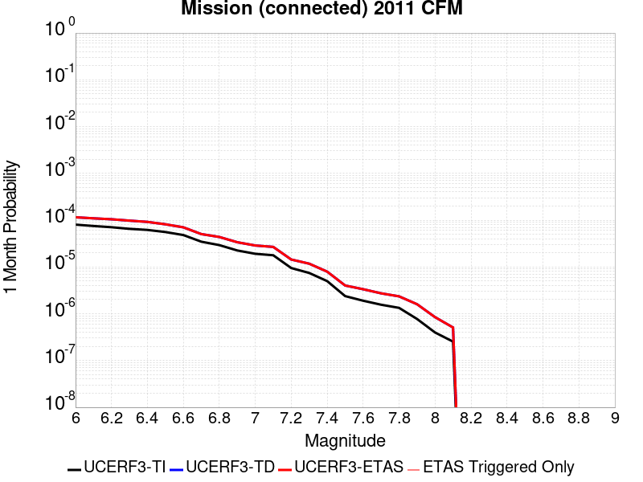 |  |  |

| Magnitude | 1 wk TI Prob | 1 wk TD Prob | 1 wk ETAS Prob | 1 wk ETAS/TD Gain | 1 wk ETAS Triggered Only | 1 mo TI Prob | 1 mo TD Prob | 1 mo ETAS Prob | 1 mo ETAS/TD Gain | 1 mo ETAS Triggered Only | 1 yr TI Prob | 1 yr TD Prob | 1 yr ETAS Prob | 1 yr ETAS/TD Gain | 1 yr ETAS Triggered Only | 10 yr TI Prob | 10 yr TD Prob | 10 yr ETAS Prob | 10 yr ETAS/TD Gain | 10 yr ETAS Triggered Only |
|-----|-----|-----|-----|-----|-----|-----|-----|-----|-----|-----|-----|-----|-----|-----|-----|-----|-----|-----|-----|-----|
| 6.0 | 1.8735573E-5 | 2.6894611E-5 | 2.6894611E-5 | 1.0 | 0.0 | 8.029284E-5 | 1.1525757E-4 | 1.1525757E-4 | 1.0 | 0.0 | 9.771269E-4 | 0.0014022886 | 0.0014171032 | 1.0105647 | 1.4835475E-5 | 0.009728416 | 0.013943479 | 0.013958108 | 1.0010492 | 1.4835475E-5 |
| 6.1 | 1.7515964E-5 | 2.5535785E-5 | 2.5535785E-5 | 1.0 | 0.0 | 7.506625E-5 | 1.0943453E-4 | 1.0943453E-4 | 1.0 | 0.0 | 9.135484E-4 | 0.0013314815 | 0.0013314815 | 1.0 | 0.0 | 0.009098019 | 0.013244035 | 0.013244035 | 1.0 | 0.0 |
| 6.2 | 1.6486343E-5 | 2.4380344E-5 | 2.4380344E-5 | 1.0 | 0.0 | 7.065384E-5 | 1.0448305E-4 | 1.0448305E-4 | 1.0 | 0.0 | 8.5987104E-4 | 0.0012712709 | 0.0012712709 | 1.0 | 0.0 | 0.008565514 | 0.012648967 | 0.012648967 | 1.0 | 0.0 |
| 6.3 | 1.5229385E-5 | 2.2809578E-5 | 2.2809578E-5 | 1.0 | 0.0 | 6.526716E-5 | 9.7751705E-5 | 9.7751705E-5 | 1.0 | 0.0 | 7.9433795E-4 | 0.0011894096 | 0.0011894096 | 1.0 | 0.0 | 0.007915046 | 0.011842069 | 0.011842069 | 1.0 | 0.0 |
| 6.4 | 1.4435828E-5 | 2.1409222E-5 | 2.1409222E-5 | 1.0 | 0.0 | 6.186637E-5 | 9.1750604E-5 | 9.1750604E-5 | 1.0 | 0.0 | 7.529627E-4 | 0.0011164254 | 0.0011164254 | 1.0 | 0.0 | 0.007504165 | 0.011124866 | 0.011124866 | 1.0 | 0.0 |
| 6.5 | 1.30127955E-5 | 1.9047517E-5 | 1.9047517E-5 | 1.0 | 0.0 | 5.576793E-5 | 8.162968E-5 | 8.162968E-5 | 1.0 | 0.0 | 6.78763E-4 | 9.933239E-4 | 9.933239E-4 | 1.0 | 0.0 | 0.0067669353 | 0.009916679 | 0.009916679 | 1.0 | 0.0 |
| 6.6 | 1.1220718E-5 | 1.6403003E-5 | 1.6403003E-5 | 1.0 | 0.0 | 4.8087906E-5 | 7.02967E-5 | 7.02967E-5 | 1.0 | 0.0 | 5.8531296E-4 | 8.555237E-4 | 8.555237E-4 | 1.0 | 0.0 | 0.005837737 | 0.008554443 | 0.008554443 | 1.0 | 0.0 |
| 6.7 | 8.086152E-6 | 1.1758285E-5 | 1.1758285E-5 | 1.0 | 0.0 | 3.4654473E-5 | 5.039168E-5 | 5.039168E-5 | 1.0 | 0.0 | 4.2183654E-4 | 6.133468E-4 | 6.133468E-4 | 1.0 | 0.0 | 0.004210367 | 0.00615377 | 0.00615377 | 1.0 | 0.0 |
| 6.8 | 6.8361655E-6 | 1.02025E-5 | 1.02025E-5 | 1.0 | 0.0 | 2.9297524E-5 | 4.3724267E-5 | 4.3724267E-5 | 1.0 | 0.0 | 3.5663895E-4 | 5.322136E-4 | 5.322136E-4 | 1.0 | 0.0 | 0.0035606713 | 0.005342292 | 0.005342292 | 1.0 | 0.0 |
| 6.9 | 5.2517353E-6 | 7.8747125E-6 | 7.8747125E-6 | 1.0 | 0.0 | 2.2507242E-5 | 3.3748332E-5 | 3.3748332E-5 | 1.0 | 0.0 | 2.739912E-4 | 4.1080872E-4 | 4.1080872E-4 | 1.0 | 0.0 | 0.0027365363 | 0.004132696 | 0.004132696 | 1.0 | 0.0 |
| 7.0 | 4.4602784E-6 | 6.7067094E-6 | 6.7067094E-6 | 1.0 | 0.0 | 1.911534E-5 | 2.8742725E-5 | 2.8742725E-5 | 1.0 | 0.0 | 2.327044E-4 | 3.4988666E-4 | 3.4988666E-4 | 1.0 | 0.0 | 0.0023246086 | 0.0035247384 | 0.0035247384 | 1.0 | 0.0 |
| 7.1 | 4.1492594E-6 | 6.255137E-6 | 6.255137E-6 | 1.0 | 0.0 | 1.7782419E-5 | 2.6807455E-5 | 2.6807455E-5 | 1.0 | 0.0 | 2.1647944E-4 | 3.2633205E-4 | 3.2633205E-4 | 1.0 | 0.0 | 0.0021626868 | 0.0032893845 | 0.0032893845 | 1.0 | 0.0 |
| 7.2 | 2.213247E-6 | 3.3664066E-6 | 3.3664066E-6 | 1.0 | 0.0 | 9.485309E-6 | 1.4427377E-5 | 1.4427377E-5 | 1.0 | 0.0 | 1.15477524E-4 | 1.7563919E-4 | 1.7563919E-4 | 1.0 | 0.0 | 0.0011541754 | 0.0017836265 | 0.0017836265 | 1.0 | 0.0 |
| 7.3 | 1.7362703E-6 | 2.7415333E-6 | 2.7415333E-6 | 1.0 | 0.0 | 7.4411373E-6 | 1.17493755E-5 | 1.17493755E-5 | 1.0 | 0.0 | 9.0592075E-5 | 1.4303927E-4 | 1.4303927E-4 | 1.0 | 0.0 | 9.0555154E-4 | 0.001454755 | 0.001454755 | 1.0 | 0.0 |
| 7.4 | 1.1628409E-6 | 1.85184E-6 | 1.85184E-6 | 1.0 | 0.0 | 4.9835944E-6 | 7.936434E-6 | 7.936434E-6 | 1.0 | 0.0 | 6.0673574E-5 | 9.662181E-5 | 9.662181E-5 | 1.0 | 0.0 | 6.065701E-4 | 9.865506E-4 | 9.865506E-4 | 1.0 | 0.0 |
| 7.5 | 5.5610667E-7 | 9.36433E-7 | 9.36433E-7 | 1.0 | 0.0 | 2.3833122E-6 | 4.013278E-6 | 4.013278E-6 | 1.0 | 0.0 | 2.9016439E-5 | 4.8860573E-5 | 4.8860573E-5 | 1.0 | 0.0 | 2.901265E-4 | 5.0513475E-4 | 5.0513475E-4 | 1.0 | 0.0 |
| 7.6 | 4.4307663E-7 | 7.8042586E-7 | 7.8042586E-7 | 1.0 | 0.0 | 1.8988985E-6 | 3.344678E-6 | 3.344678E-6 | 1.0 | 0.0 | 2.3118844E-5 | 4.0720694E-5 | 4.0720694E-5 | 1.0 | 0.0 | 2.3116439E-4 | 4.2308407E-4 | 4.2308407E-4 | 1.0 | 0.0 |
| 7.7 | 3.639119E-7 | 6.372569E-7 | 6.372569E-7 | 1.0 | 0.0 | 1.5596215E-6 | 2.7310982E-6 | 2.7310982E-6 | 1.0 | 0.0 | 1.8988227E-5 | 3.3250613E-5 | 3.3250613E-5 | 1.0 | 0.0 | 1.8986604E-4 | 3.4778018E-4 | 3.4778018E-4 | 1.0 | 0.0 |
| 7.8 | 3.1152942E-7 | 5.489749E-7 | 5.489749E-7 | 1.0 | 0.0 | 1.3351254E-6 | 2.3527475E-6 | 2.3527475E-6 | 1.0 | 0.0 | 1.6255031E-5 | 2.8644325E-5 | 2.8644325E-5 | 1.0 | 0.0 | 1.6253842E-4 | 2.984546E-4 | 2.984546E-4 | 1.0 | 0.0 |
| 7.9 | 1.8035962E-7 | 3.7277437E-7 | 3.7277437E-7 | 1.0 | 0.0 | 7.729696E-7 | 1.5976035E-6 | 1.5976035E-6 | 1.0 | 0.0 | 9.410865E-6 | 1.945065E-5 | 1.945065E-5 | 1.0 | 0.0 | 9.410465E-5 | 2.0116694E-4 | 2.0116694E-4 | 1.0 | 0.0 |
| 8.0 | 9.279334E-8 | 1.9740988E-7 | 1.9740988E-7 | 1.0 | 0.0 | 3.976857E-7 | 8.4604204E-7 | 8.4604204E-7 | 1.0 | 0.0 | 4.841813E-6 | 1.0300514E-5 | 1.0300514E-5 | 1.0 | 0.0 | 4.841707E-5 | 1.05513136E-4 | 1.05513136E-4 | 1.0 | 0.0 |
| 8.1 | 5.9253985E-8 | 1.1876892E-7 | 1.1876892E-7 | 1.0 | 0.0 | 2.5394561E-7 | 5.0900957E-7 | 5.0900957E-7 | 1.0 | 0.0 | 3.0917836E-6 | 6.197174E-6 | 6.197174E-6 | 1.0 | 0.0 | 3.0917407E-5 | 6.3351916E-5 | 6.3351916E-5 | 1.0 | 0.0 |

## Santa Monica alt 1
*[(top)](#table-of-contents)*

| 1 Week | 1 Month | 1 Year | 10 Year |
|-----|-----|-----|-----|
|  | 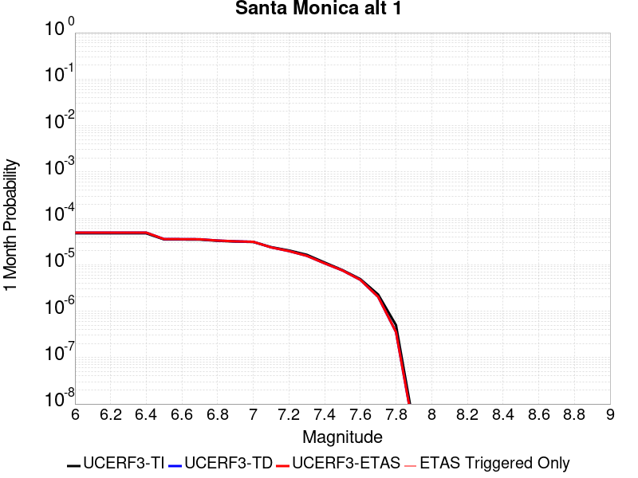 |  |  |

| Magnitude | 1 wk TI Prob | 1 wk TD Prob | 1 wk ETAS Prob | 1 wk ETAS/TD Gain | 1 wk ETAS Triggered Only | 1 mo TI Prob | 1 mo TD Prob | 1 mo ETAS Prob | 1 mo ETAS/TD Gain | 1 mo ETAS Triggered Only | 1 yr TI Prob | 1 yr TD Prob | 1 yr ETAS Prob | 1 yr ETAS/TD Gain | 1 yr ETAS Triggered Only | 10 yr TI Prob | 10 yr TD Prob | 10 yr ETAS Prob | 10 yr ETAS/TD Gain | 10 yr ETAS Triggered Only |
|-----|-----|-----|-----|-----|-----|-----|-----|-----|-----|-----|-----|-----|-----|-----|-----|-----|-----|-----|-----|-----|
| 6.0 | 1.1066008E-5 | 1.1480937E-5 | 1.1480937E-5 | 1.0 | 0.0 | 4.742488E-5 | 4.920317E-5 | 4.920317E-5 | 1.0 | 0.0 | 5.7724497E-4 | 5.9889787E-4 | 5.9889787E-4 | 1.0 | 0.0 | 0.005757478 | 0.0059742257 | 0.0059889727 | 1.0024685 | 1.4835475E-5 |
| 6.1 | 1.1066008E-5 | 1.1480937E-5 | 1.1480937E-5 | 1.0 | 0.0 | 4.742488E-5 | 4.920317E-5 | 4.920317E-5 | 1.0 | 0.0 | 5.7724497E-4 | 5.9889787E-4 | 5.9889787E-4 | 1.0 | 0.0 | 0.005757478 | 0.0059742257 | 0.0059889727 | 1.0024685 | 1.4835475E-5 |
| 6.2 | 1.1066008E-5 | 1.1480937E-5 | 1.1480937E-5 | 1.0 | 0.0 | 4.742488E-5 | 4.920317E-5 | 4.920317E-5 | 1.0 | 0.0 | 5.7724497E-4 | 5.9889787E-4 | 5.9889787E-4 | 1.0 | 0.0 | 0.005757478 | 0.0059742257 | 0.0059889727 | 1.0024685 | 1.4835475E-5 |
| 6.3 | 1.1066008E-5 | 1.1480937E-5 | 1.1480937E-5 | 1.0 | 0.0 | 4.742488E-5 | 4.920317E-5 | 4.920317E-5 | 1.0 | 0.0 | 5.7724497E-4 | 5.9889787E-4 | 5.9889787E-4 | 1.0 | 0.0 | 0.005757478 | 0.0059742257 | 0.0059889727 | 1.0024685 | 1.4835475E-5 |
| 6.4 | 1.1066008E-5 | 1.1480937E-5 | 1.1480937E-5 | 1.0 | 0.0 | 4.742488E-5 | 4.920317E-5 | 4.920317E-5 | 1.0 | 0.0 | 5.7724497E-4 | 5.9889787E-4 | 5.9889787E-4 | 1.0 | 0.0 | 0.005757478 | 0.0059742257 | 0.0059889727 | 1.0024685 | 1.4835475E-5 |
| 6.5 | 8.183544E-6 | 8.335869E-6 | 8.335869E-6 | 1.0 | 0.0 | 3.5071862E-5 | 3.572467E-5 | 3.572467E-5 | 1.0 | 0.0 | 4.2691626E-4 | 4.3486268E-4 | 4.3486268E-4 | 1.0 | 0.0 | 0.0042609703 | 0.004340283 | 0.0043550543 | 1.0034033 | 1.4835475E-5 |
| 6.6 | 8.1543285E-6 | 8.304081E-6 | 8.304081E-6 | 1.0 | 0.0 | 3.4946657E-5 | 3.5588444E-5 | 3.5588444E-5 | 1.0 | 0.0 | 4.2539247E-4 | 4.3320475E-4 | 4.3320475E-4 | 1.0 | 0.0 | 0.0042457907 | 0.0043237684 | 0.0043385397 | 1.0034163 | 1.4835475E-5 |
| 6.7 | 8.110878E-6 | 8.257476E-6 | 8.257476E-6 | 1.0 | 0.0 | 3.4760444E-5 | 3.538871E-5 | 3.538871E-5 | 1.0 | 0.0 | 4.231262E-4 | 4.3077397E-4 | 4.3077397E-4 | 1.0 | 0.0 | 0.0042232145 | 0.004299555 | 0.0043143267 | 1.0034356 | 1.4835475E-5 |
| 6.8 | 7.644036E-6 | 7.751466E-6 | 7.751466E-6 | 1.0 | 0.0 | 3.275974E-5 | 3.3220153E-5 | 3.3220153E-5 | 1.0 | 0.0 | 3.9877684E-4 | 4.0438172E-4 | 4.0438172E-4 | 1.0 | 0.0 | 0.00398062 | 0.0040366054 | 0.004051381 | 1.0036604 | 1.4835475E-5 |
| 6.9 | 7.3698293E-6 | 7.4561094E-6 | 7.4561094E-6 | 1.0 | 0.0 | 3.15846E-5 | 3.195437E-5 | 3.195437E-5 | 1.0 | 0.0 | 3.8447464E-4 | 3.8897642E-4 | 3.8897642E-4 | 1.0 | 0.0 | 0.0038381014 | 0.0038830992 | 0.0038978772 | 1.0038056 | 1.4835475E-5 |
| 7.0 | 7.209872E-6 | 7.286009E-6 | 7.286009E-6 | 1.0 | 0.0 | 3.0899086E-5 | 3.1225387E-5 | 3.1225387E-5 | 1.0 | 0.0 | 3.7613141E-4 | 3.8010415E-4 | 3.8010415E-4 | 1.0 | 0.0 | 0.0037549543 | 0.0037946827 | 0.003809462 | 1.0038947 | 1.4835475E-5 |
| 7.1 | 5.603456E-6 | 5.524162E-6 | 5.524162E-6 | 1.0 | 0.0 | 2.4014591E-5 | 2.367477E-5 | 2.367477E-5 | 1.0 | 0.0 | 2.923384E-4 | 2.8820257E-4 | 2.8820257E-4 | 1.0 | 0.0 | 0.0029195412 | 0.00287833 | 0.0028931226 | 1.0051394 | 1.4835475E-5 |
| 7.2 | 4.7483613E-6 | 4.591346E-6 | 4.591346E-6 | 1.0 | 0.0 | 2.0349962E-5 | 1.9677049E-5 | 1.9677049E-5 | 1.0 | 0.0 | 2.4773262E-4 | 2.3954187E-4 | 2.3954187E-4 | 1.0 | 0.0 | 0.0024745662 | 0.0023928508 | 0.002407651 | 1.006185 | 1.4835475E-5 |
| 7.3 | 3.829015E-6 | 3.6343924E-6 | 3.6343924E-6 | 1.0 | 0.0 | 1.6409962E-5 | 1.5575875E-5 | 1.5575875E-5 | 1.0 | 0.0 | 1.9977297E-4 | 1.8961985E-4 | 1.8961985E-4 | 1.0 | 0.0 | 0.0019959346 | 0.0018945895 | 0.0018945895 | 1.0 | 0.0 |
| 7.4 | 2.610755E-6 | 2.4996893E-6 | 2.4996893E-6 | 1.0 | 0.0 | 1.1188902E-5 | 1.071291E-5 | 1.071291E-5 | 1.0 | 0.0 | 1.3621636E-4 | 1.3042192E-4 | 1.3042192E-4 | 1.0 | 0.0 | 0.001361329 | 0.0013034581 | 0.0013034581 | 1.0 | 0.0 |
| 7.5 | 1.792146E-6 | 1.7585055E-6 | 1.7585055E-6 | 1.0 | 0.0 | 7.680603E-6 | 7.5364305E-6 | 7.5364305E-6 | 1.0 | 0.0 | 9.3507326E-5 | 9.175221E-5 | 9.175221E-5 | 1.0 | 0.0 | 9.3467993E-4 | 9.1714645E-4 | 9.1714645E-4 | 1.0 | 0.0 |
| 7.6 | 1.1473018E-6 | 1.1029731E-6 | 1.1029731E-6 | 1.0 | 0.0 | 4.9169985E-6 | 4.7270187E-6 | 4.7270187E-6 | 1.0 | 0.0 | 5.986281E-5 | 5.754995E-5 | 5.754995E-5 | 1.0 | 0.0 | 5.984669E-4 | 5.753521E-4 | 5.753521E-4 | 1.0 | 0.0 |
| 7.7 | 5.330919E-7 | 4.7455796E-7 | 4.7455796E-7 | 1.0 | 0.0 | 2.2846775E-6 | 2.0338182E-6 | 2.0338182E-6 | 1.0 | 0.0 | 2.7815593E-5 | 2.4761468E-5 | 2.4761468E-5 | 1.0 | 0.0 | 2.7812112E-4 | 2.475882E-4 | 2.475882E-4 | 1.0 | 0.0 |
| 7.8 | 1.1668574E-7 | 8.2982545E-8 | 8.2982545E-8 | 1.0 | 0.0 | 5.000816E-7 | 3.5563943E-7 | 3.5563943E-7 | 1.0 | 0.0 | 6.0884768E-6 | 4.329902E-6 | 4.329902E-6 | 1.0 | 0.0 | 6.08831E-5 | 4.3298205E-5 | 4.3298205E-5 | 1.0 | 0.0 |
| 7.9 | 8.007447E-10 | 6.161065E-10 | 6.161065E-10 | 1.0 | 0.0 | 3.4317629E-9 | 2.640456E-9 | 2.640456E-9 | 1.0 | 0.0 | 4.1781714E-8 | 3.2147554E-8 | 3.2147554E-8 | 1.0 | 0.0 | 4.1781706E-7 | 3.214755E-7 | 3.214755E-7 | 1.0 | 0.0 |

## Great Valley 04a Trout Creek
*[(top)](#table-of-contents)*

| 1 Week | 1 Month | 1 Year | 10 Year |
|-----|-----|-----|-----|
|  |  | 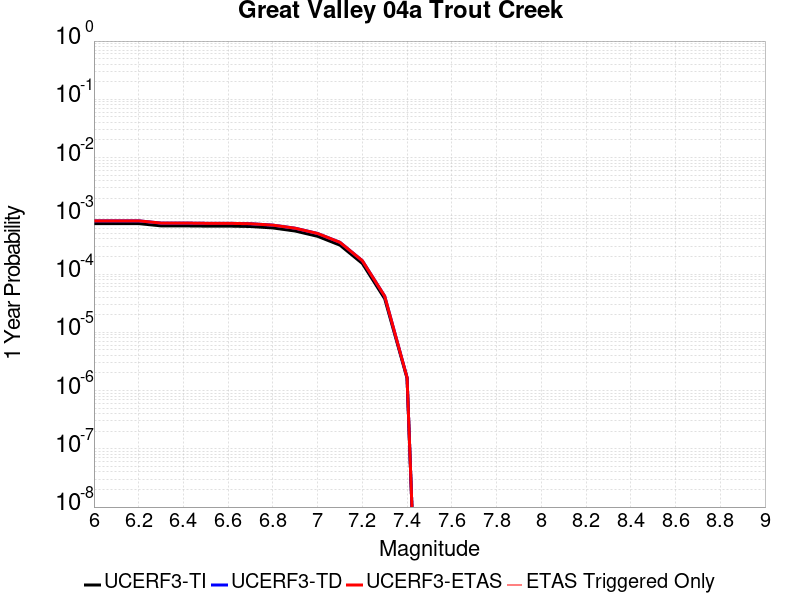 |  |

| Magnitude | 1 wk TI Prob | 1 wk TD Prob | 1 wk ETAS Prob | 1 wk ETAS/TD Gain | 1 wk ETAS Triggered Only | 1 mo TI Prob | 1 mo TD Prob | 1 mo ETAS Prob | 1 mo ETAS/TD Gain | 1 mo ETAS Triggered Only | 1 yr TI Prob | 1 yr TD Prob | 1 yr ETAS Prob | 1 yr ETAS/TD Gain | 1 yr ETAS Triggered Only | 10 yr TI Prob | 10 yr TD Prob | 10 yr ETAS Prob | 10 yr ETAS/TD Gain | 10 yr ETAS Triggered Only |
|-----|-----|-----|-----|-----|-----|-----|-----|-----|-----|-----|-----|-----|-----|-----|-----|-----|-----|-----|-----|-----|
| 6.0 | 1.4088538E-5 | 1.5720761E-5 | 1.5720761E-5 | 1.0 | 0.0 | 6.037805E-5 | 6.7373025E-5 | 6.7373025E-5 | 1.0 | 0.0 | 7.3485484E-4 | 8.199704E-4 | 8.199704E-4 | 1.0 | 0.0 | 0.007324295 | 0.008170733 | 0.008185448 | 1.0018009 | 1.4835475E-5 |
| 6.1 | 1.4088538E-5 | 1.5720761E-5 | 1.5720761E-5 | 1.0 | 0.0 | 6.037805E-5 | 6.7373025E-5 | 6.7373025E-5 | 1.0 | 0.0 | 7.3485484E-4 | 8.199704E-4 | 8.199704E-4 | 1.0 | 0.0 | 0.007324295 | 0.008170733 | 0.008185448 | 1.0018009 | 1.4835475E-5 |
| 6.2 | 1.4088538E-5 | 1.5720761E-5 | 1.5720761E-5 | 1.0 | 0.0 | 6.037805E-5 | 6.7373025E-5 | 6.7373025E-5 | 1.0 | 0.0 | 7.3485484E-4 | 8.199704E-4 | 8.199704E-4 | 1.0 | 0.0 | 0.007324295 | 0.008170733 | 0.008185448 | 1.0018009 | 1.4835475E-5 |
| 6.3 | 1.2882862E-5 | 1.4379711E-5 | 1.4379711E-5 | 1.0 | 0.0 | 5.5211098E-5 | 6.1625935E-5 | 6.1625935E-5 | 1.0 | 0.0 | 6.7198783E-4 | 7.5004785E-4 | 7.5004785E-4 | 1.0 | 0.0 | 0.0066995937 | 0.007476227 | 0.0074909516 | 1.0019696 | 1.4835475E-5 |
| 6.4 | 1.2882862E-5 | 1.4379711E-5 | 1.4379711E-5 | 1.0 | 0.0 | 5.5211098E-5 | 6.1625935E-5 | 6.1625935E-5 | 1.0 | 0.0 | 6.7198783E-4 | 7.5004785E-4 | 7.5004785E-4 | 1.0 | 0.0 | 0.0066995937 | 0.007476227 | 0.0074909516 | 1.0019696 | 1.4835475E-5 |
| 6.5 | 1.2762329E-5 | 1.4246259E-5 | 1.4246259E-5 | 1.0 | 0.0 | 5.469455E-5 | 6.105402E-5 | 6.105402E-5 | 1.0 | 0.0 | 6.657027E-4 | 7.430896E-4 | 7.430896E-4 | 1.0 | 0.0 | 0.00663712 | 0.0074071083 | 0.007421834 | 1.001988 | 1.4835475E-5 |
| 6.6 | 1.2762329E-5 | 1.4246259E-5 | 1.4246259E-5 | 1.0 | 0.0 | 5.469455E-5 | 6.105402E-5 | 6.105402E-5 | 1.0 | 0.0 | 6.657027E-4 | 7.430896E-4 | 7.430896E-4 | 1.0 | 0.0 | 0.00663712 | 0.0074071083 | 0.007421834 | 1.001988 | 1.4835475E-5 |
| 6.7 | 1.2557959E-5 | 1.4020478E-5 | 1.4020478E-5 | 1.0 | 0.0 | 5.3818712E-5 | 6.008644E-5 | 6.008644E-5 | 1.0 | 0.0 | 6.5504585E-4 | 7.3131715E-4 | 7.3131715E-4 | 1.0 | 0.0 | 0.006531183 | 0.00729016 | 0.007304887 | 1.0020201 | 1.4835475E-5 |
| 6.8 | 1.1871544E-5 | 1.3259852E-5 | 1.3259852E-5 | 1.0 | 0.0 | 5.0877054E-5 | 5.6826757E-5 | 5.6826757E-5 | 1.0 | 0.0 | 6.1925204E-4 | 6.9165614E-4 | 6.9165614E-4 | 1.0 | 0.0 | 0.0061752927 | 0.006896052 | 0.006910785 | 1.0021365 | 1.4835475E-5 |
| 6.9 | 1.0500373E-5 | 1.1732174E-5 | 1.1732174E-5 | 1.0 | 0.0 | 4.5000823E-5 | 5.027983E-5 | 5.027983E-5 | 1.0 | 0.0 | 5.4774724E-4 | 6.1199354E-4 | 6.1199354E-4 | 1.0 | 0.0 | 0.005463991 | 0.0061039478 | 0.0061186925 | 1.0024157 | 1.4835475E-5 |
| 7.0 | 8.524332E-6 | 9.534233E-6 | 9.534233E-6 | 1.0 | 0.0 | 3.653234E-5 | 4.0860403E-5 | 4.0860403E-5 | 1.0 | 0.0 | 4.4469046E-4 | 4.9736915E-4 | 4.9736915E-4 | 1.0 | 0.0 | 0.0044380166 | 0.0049632913 | 0.0049780533 | 1.0029742 | 1.4835475E-5 |
| 7.1 | 6.006849E-6 | 6.7120823E-6 | 6.7120823E-6 | 1.0 | 0.0 | 2.5743384E-5 | 2.876578E-5 | 2.876578E-5 | 1.0 | 0.0 | 3.1338062E-4 | 3.501727E-4 | 3.501727E-4 | 1.0 | 0.0 | 0.0031293905 | 0.0034967596 | 0.0035115434 | 1.0042278 | 1.4835475E-5 |
| 7.2 | 2.9122193E-6 | 3.2467783E-6 | 3.2467783E-6 | 1.0 | 0.0 | 1.248088E-5 | 1.39147005E-5 | 1.39147005E-5 | 1.0 | 0.0 | 1.5194413E-4 | 1.6940005E-4 | 1.6940005E-4 | 1.0 | 0.0 | 0.0015184027 | 0.0016928812 | 0.0017076916 | 1.0087487 | 1.4835475E-5 |
| 7.3 | 7.2194007E-7 | 7.989331E-7 | 7.989331E-7 | 1.0 | 0.0 | 3.0940253E-6 | 3.423997E-6 | 3.423997E-6 | 1.0 | 0.0 | 3.7669106E-5 | 4.1686824E-5 | 4.1686824E-5 | 1.0 | 0.0 | 3.766272E-4 | 4.1683504E-4 | 4.1683504E-4 | 1.0 | 0.0 |
| 7.4 | 3.112171E-8 | 3.2069014E-8 | 3.2069014E-8 | 1.0 | 0.0 | 1.3337875E-7 | 1.3743862E-7 | 1.3743862E-7 | 1.0 | 0.0 | 1.6238852E-6 | 1.673314E-6 | 1.673314E-6 | 1.0 | 0.0 | 1.6238733E-5 | 1.6733022E-5 | 1.6733022E-5 | 1.0 | 0.0 |

## Anacapa-Dume alt 1
*[(top)](#table-of-contents)*

| 1 Week | 1 Month | 1 Year | 10 Year |
|-----|-----|-----|-----|
|  |  |  |  |

| Magnitude | 1 wk TI Prob | 1 wk TD Prob | 1 wk ETAS Prob | 1 wk ETAS/TD Gain | 1 wk ETAS Triggered Only | 1 mo TI Prob | 1 mo TD Prob | 1 mo ETAS Prob | 1 mo ETAS/TD Gain | 1 mo ETAS Triggered Only | 1 yr TI Prob | 1 yr TD Prob | 1 yr ETAS Prob | 1 yr ETAS/TD Gain | 1 yr ETAS Triggered Only | 10 yr TI Prob | 10 yr TD Prob | 10 yr ETAS Prob | 10 yr ETAS/TD Gain | 10 yr ETAS Triggered Only |
|-----|-----|-----|-----|-----|-----|-----|-----|-----|-----|-----|-----|-----|-----|-----|-----|-----|-----|-----|-----|-----|
| 6.0 | 5.1871802E-6 | 5.3675312E-6 | 5.3675312E-6 | 1.0 | 0.0 | 2.2230583E-5 | 2.3003508E-5 | 2.3003508E-5 | 1.0 | 0.0 | 2.7062374E-4 | 2.8003255E-4 | 2.9486386E-4 | 1.0529629 | 1.4835475E-5 | 0.002702944 | 0.002796882 | 0.0028116761 | 1.0052894 | 1.4835475E-5 |
| 6.1 | 5.1871802E-6 | 5.3675312E-6 | 5.3675312E-6 | 1.0 | 0.0 | 2.2230583E-5 | 2.3003508E-5 | 2.3003508E-5 | 1.0 | 0.0 | 2.7062374E-4 | 2.8003255E-4 | 2.9486386E-4 | 1.0529629 | 1.4835475E-5 | 0.002702944 | 0.002796882 | 0.0028116761 | 1.0052894 | 1.4835475E-5 |
| 6.2 | 5.1871802E-6 | 5.3675312E-6 | 5.3675312E-6 | 1.0 | 0.0 | 2.2230583E-5 | 2.3003508E-5 | 2.3003508E-5 | 1.0 | 0.0 | 2.7062374E-4 | 2.8003255E-4 | 2.9486386E-4 | 1.0529629 | 1.4835475E-5 | 0.002702944 | 0.002796882 | 0.0028116761 | 1.0052894 | 1.4835475E-5 |
| 6.3 | 5.1871802E-6 | 5.3675312E-6 | 5.3675312E-6 | 1.0 | 0.0 | 2.2230583E-5 | 2.3003508E-5 | 2.3003508E-5 | 1.0 | 0.0 | 2.7062374E-4 | 2.8003255E-4 | 2.9486386E-4 | 1.0529629 | 1.4835475E-5 | 0.002702944 | 0.002796882 | 0.0028116761 | 1.0052894 | 1.4835475E-5 |
| 6.4 | 5.1871802E-6 | 5.3675312E-6 | 5.3675312E-6 | 1.0 | 0.0 | 2.2230583E-5 | 2.3003508E-5 | 2.3003508E-5 | 1.0 | 0.0 | 2.7062374E-4 | 2.8003255E-4 | 2.9486386E-4 | 1.0529629 | 1.4835475E-5 | 0.002702944 | 0.002796882 | 0.0028116761 | 1.0052894 | 1.4835475E-5 |
| 6.5 | 5.1871802E-6 | 5.3675312E-6 | 5.3675312E-6 | 1.0 | 0.0 | 2.2230583E-5 | 2.3003508E-5 | 2.3003508E-5 | 1.0 | 0.0 | 2.7062374E-4 | 2.8003255E-4 | 2.9486386E-4 | 1.0529629 | 1.4835475E-5 | 0.002702944 | 0.002796882 | 0.0028116761 | 1.0052894 | 1.4835475E-5 |
| 6.6 | 5.1871802E-6 | 5.3675312E-6 | 5.3675312E-6 | 1.0 | 0.0 | 2.2230583E-5 | 2.3003508E-5 | 2.3003508E-5 | 1.0 | 0.0 | 2.7062374E-4 | 2.8003255E-4 | 2.9486386E-4 | 1.0529629 | 1.4835475E-5 | 0.002702944 | 0.002796882 | 0.0028116761 | 1.0052894 | 1.4835475E-5 |
| 6.7 | 4.7693475E-6 | 4.936823E-6 | 4.936823E-6 | 1.0 | 0.0 | 2.04399E-5 | 2.1157646E-5 | 2.1157646E-5 | 1.0 | 0.0 | 2.4882736E-4 | 2.5756465E-4 | 2.723963E-4 | 1.0575842 | 1.4835475E-5 | 0.0024854892 | 0.0025727374 | 0.0025875347 | 1.0057516 | 1.4835475E-5 |
| 6.8 | 4.753408E-6 | 4.920371E-6 | 4.920371E-6 | 1.0 | 0.0 | 2.037159E-5 | 2.1087139E-5 | 2.1087139E-5 | 1.0 | 0.0 | 2.4799586E-4 | 2.567064E-4 | 2.715381E-4 | 1.0577768 | 1.4835475E-5 | 0.002477193 | 0.0025641748 | 0.0025789724 | 1.0057708 | 1.4835475E-5 |
| 6.9 | 3.800069E-6 | 3.9372367E-6 | 3.9372367E-6 | 1.0 | 0.0 | 1.6285909E-5 | 1.6873764E-5 | 1.6873764E-5 | 1.0 | 0.0 | 1.9826289E-4 | 2.0541894E-4 | 2.2025137E-4 | 1.0722058 | 1.4835475E-5 | 0.001980861 | 0.0020523143 | 0.0020671196 | 1.0072138 | 1.4835475E-5 |
| 7.0 | 3.6671938E-6 | 3.800026E-6 | 3.800026E-6 | 1.0 | 0.0 | 1.571645E-5 | 1.6285725E-5 | 1.6285725E-5 | 1.0 | 0.0 | 1.9133097E-4 | 1.982609E-4 | 2.1309343E-4 | 1.0748132 | 1.4835475E-5 | 0.0019116632 | 0.0019808635 | 0.0019956694 | 1.0074745 | 1.4835475E-5 |
| 7.1 | 3.2394885E-6 | 3.358892E-6 | 3.358892E-6 | 1.0 | 0.0 | 1.3883448E-5 | 1.4395172E-5 | 1.4395172E-5 | 1.0 | 0.0 | 1.6901788E-4 | 1.7524723E-4 | 1.900801E-4 | 1.0846397 | 1.4835475E-5 | 0.0016888938 | 0.0017511016 | 0.001765911 | 1.0084573 | 1.4835475E-5 |
| 7.2 | 3.0935948E-6 | 3.208021E-6 | 3.208021E-6 | 1.0 | 0.0 | 1.3258196E-5 | 1.374859E-5 | 1.374859E-5 | 1.0 | 0.0 | 1.6140658E-4 | 1.6737633E-4 | 1.8220932E-4 | 1.0886205 | 1.4835475E-5 | 0.001612894 | 0.0016725137 | 0.0016873244 | 1.0088553 | 1.4835475E-5 |
| 7.3 | 2.5604163E-6 | 2.647149E-6 | 2.647149E-6 | 1.0 | 0.0 | 1.0973167E-5 | 1.1344875E-5 | 1.1344875E-5 | 1.0 | 0.0 | 1.3359012E-4 | 1.3811514E-4 | 1.5294856E-4 | 1.107399 | 1.4835475E-5 | 0.0013350984 | 0.0013802976 | 0.0013951126 | 1.0107332 | 1.4835475E-5 |
| 7.4 | 2.1429005E-6 | 2.2106653E-6 | 2.2106653E-6 | 1.0 | 0.0 | 9.1838265E-6 | 9.474246E-6 | 9.474246E-6 | 1.0 | 0.0 | 1.11807356E-4 | 1.1534286E-4 | 1.3017663E-4 | 1.1286058 | 1.4835475E-5 | 0.0011175112 | 0.0011528326 | 0.001167651 | 1.0128539 | 1.4835475E-5 |
| 7.5 | 1.7237151E-6 | 1.7761955E-6 | 1.7761955E-6 | 1.0 | 0.0 | 7.3873293E-6 | 7.612244E-6 | 7.612244E-6 | 1.0 | 0.0 | 8.993702E-5 | 9.267516E-5 | 1.0750926E-4 | 1.1600655 | 1.4835475E-5 | 8.990063E-4 | 9.263674E-4 | 9.411892E-4 | 1.0159998 | 1.4835475E-5 |
| 7.6 | 9.541696E-7 | 9.823485E-7 | 9.823485E-7 | 1.0 | 0.0 | 4.089292E-6 | 4.2100583E-6 | 4.2100583E-6 | 1.0 | 0.0 | 4.9785995E-5 | 5.1256266E-5 | 5.1256266E-5 | 1.0 | 0.0 | 4.9774844E-4 | 5.124457E-4 | 5.124457E-4 | 1.0 | 0.0 |
| 7.7 | 2.7226676E-7 | 2.7173039E-7 | 2.7173039E-7 | 1.0 | 0.0 | 1.166857E-6 | 1.1645582E-6 | 1.1645582E-6 | 1.0 | 0.0 | 1.4206392E-5 | 1.4178405E-5 | 1.4178405E-5 | 1.0 | 0.0 | 1.4205484E-4 | 1.4177508E-4 | 1.4177508E-4 | 1.0 | 0.0 |
| 7.8 | 4.5017995E-8 | 4.2158504E-8 | 4.2158504E-8 | 1.0 | 0.0 | 1.9293425E-7 | 1.806793E-7 | 1.806793E-7 | 1.0 | 0.0 | 2.348972E-6 | 2.1997685E-6 | 2.1997685E-6 | 1.0 | 0.0 | 2.348947E-5 | 2.1997488E-5 | 2.1997488E-5 | 1.0 | 0.0 |
| 7.9 | 8.007447E-10 | 6.161065E-10 | 6.161065E-10 | 1.0 | 0.0 | 3.4317629E-9 | 2.640456E-9 | 2.640456E-9 | 1.0 | 0.0 | 4.1781714E-8 | 3.2147554E-8 | 3.2147554E-8 | 1.0 | 0.0 | 4.1781706E-7 | 3.214755E-7 | 3.214755E-7 | 1.0 | 0.0 |

## Sisar
*[(top)](#table-of-contents)*

| 1 Week | 1 Month | 1 Year | 10 Year |
|-----|-----|-----|-----|
| 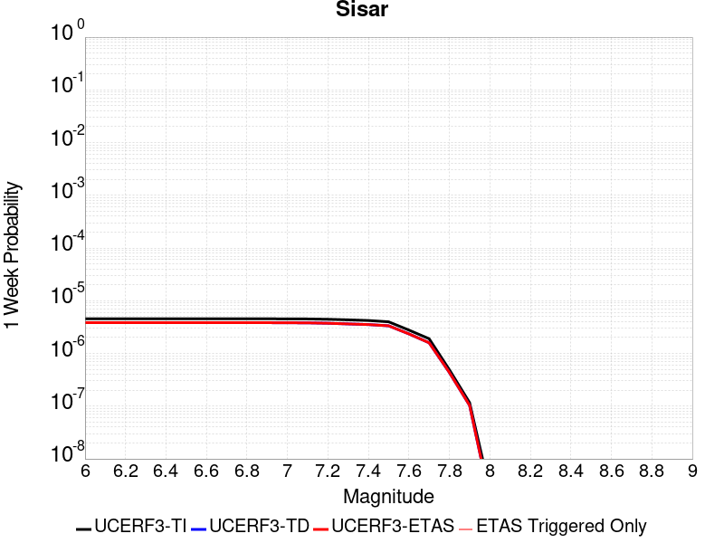 |  |  |  |

| Magnitude | 1 wk TI Prob | 1 wk TD Prob | 1 wk ETAS Prob | 1 wk ETAS/TD Gain | 1 wk ETAS Triggered Only | 1 mo TI Prob | 1 mo TD Prob | 1 mo ETAS Prob | 1 mo ETAS/TD Gain | 1 mo ETAS Triggered Only | 1 yr TI Prob | 1 yr TD Prob | 1 yr ETAS Prob | 1 yr ETAS/TD Gain | 1 yr ETAS Triggered Only | 10 yr TI Prob | 10 yr TD Prob | 10 yr ETAS Prob | 10 yr ETAS/TD Gain | 10 yr ETAS Triggered Only |
|-----|-----|-----|-----|-----|-----|-----|-----|-----|-----|-----|-----|-----|-----|-----|-----|-----|-----|-----|-----|-----|
| 6.0 | 4.544193E-6 | 3.8397834E-6 | 3.8397834E-6 | 1.0 | 0.0 | 1.9474966E-5 | 1.6456112E-5 | 1.6456112E-5 | 1.0 | 0.0 | 2.3708193E-4 | 2.0033508E-4 | 2.1516759E-4 | 1.0740385 | 1.4835475E-5 | 0.0023682916 | 0.0020015787 | 0.0020163844 | 1.007397 | 1.4835475E-5 |
| 6.1 | 4.544193E-6 | 3.8397834E-6 | 3.8397834E-6 | 1.0 | 0.0 | 1.9474966E-5 | 1.6456112E-5 | 1.6456112E-5 | 1.0 | 0.0 | 2.3708193E-4 | 2.0033508E-4 | 2.1516759E-4 | 1.0740385 | 1.4835475E-5 | 0.0023682916 | 0.0020015787 | 0.0020163844 | 1.007397 | 1.4835475E-5 |
| 6.2 | 4.544193E-6 | 3.8397834E-6 | 3.8397834E-6 | 1.0 | 0.0 | 1.9474966E-5 | 1.6456112E-5 | 1.6456112E-5 | 1.0 | 0.0 | 2.3708193E-4 | 2.0033508E-4 | 2.1516759E-4 | 1.0740385 | 1.4835475E-5 | 0.0023682916 | 0.0020015787 | 0.0020163844 | 1.007397 | 1.4835475E-5 |
| 6.3 | 4.544193E-6 | 3.8397834E-6 | 3.8397834E-6 | 1.0 | 0.0 | 1.9474966E-5 | 1.6456112E-5 | 1.6456112E-5 | 1.0 | 0.0 | 2.3708193E-4 | 2.0033508E-4 | 2.1516759E-4 | 1.0740385 | 1.4835475E-5 | 0.0023682916 | 0.0020015787 | 0.0020163844 | 1.007397 | 1.4835475E-5 |
| 6.4 | 4.544193E-6 | 3.8397834E-6 | 3.8397834E-6 | 1.0 | 0.0 | 1.9474966E-5 | 1.6456112E-5 | 1.6456112E-5 | 1.0 | 0.0 | 2.3708193E-4 | 2.0033508E-4 | 2.1516759E-4 | 1.0740385 | 1.4835475E-5 | 0.0023682916 | 0.0020015787 | 0.0020163844 | 1.007397 | 1.4835475E-5 |
| 6.5 | 4.544193E-6 | 3.8397834E-6 | 3.8397834E-6 | 1.0 | 0.0 | 1.9474966E-5 | 1.6456112E-5 | 1.6456112E-5 | 1.0 | 0.0 | 2.3708193E-4 | 2.0033508E-4 | 2.1516759E-4 | 1.0740385 | 1.4835475E-5 | 0.0023682916 | 0.0020015787 | 0.0020163844 | 1.007397 | 1.4835475E-5 |
| 6.6 | 4.544193E-6 | 3.8397834E-6 | 3.8397834E-6 | 1.0 | 0.0 | 1.9474966E-5 | 1.6456112E-5 | 1.6456112E-5 | 1.0 | 0.0 | 2.3708193E-4 | 2.0033508E-4 | 2.1516759E-4 | 1.0740385 | 1.4835475E-5 | 0.0023682916 | 0.0020015787 | 0.0020163844 | 1.007397 | 1.4835475E-5 |
| 6.7 | 4.544193E-6 | 3.8397834E-6 | 3.8397834E-6 | 1.0 | 0.0 | 1.9474966E-5 | 1.6456112E-5 | 1.6456112E-5 | 1.0 | 0.0 | 2.3708193E-4 | 2.0033508E-4 | 2.1516759E-4 | 1.0740385 | 1.4835475E-5 | 0.0023682916 | 0.0020015787 | 0.0020163844 | 1.007397 | 1.4835475E-5 |
| 6.8 | 4.544193E-6 | 3.8397834E-6 | 3.8397834E-6 | 1.0 | 0.0 | 1.9474966E-5 | 1.6456112E-5 | 1.6456112E-5 | 1.0 | 0.0 | 2.3708193E-4 | 2.0033508E-4 | 2.1516759E-4 | 1.0740385 | 1.4835475E-5 | 0.0023682916 | 0.0020015787 | 0.0020163844 | 1.007397 | 1.4835475E-5 |
| 6.9 | 4.542225E-6 | 3.837745E-6 | 3.837745E-6 | 1.0 | 0.0 | 1.9466532E-5 | 1.6447377E-5 | 1.6447377E-5 | 1.0 | 0.0 | 2.3697925E-4 | 2.0022875E-4 | 2.1506126E-4 | 1.0740778 | 1.4835475E-5 | 0.002367267 | 0.0020005172 | 0.0020153231 | 1.007401 | 1.4835475E-5 |
| 7.0 | 4.5278484E-6 | 3.822809E-6 | 3.822809E-6 | 1.0 | 0.0 | 1.940492E-5 | 1.6383365E-5 | 1.6383365E-5 | 1.0 | 0.0 | 2.3622929E-4 | 1.9944955E-4 | 2.1428207E-4 | 1.0743673 | 1.4835475E-5 | 0.0023597833 | 0.0019927393 | 0.0020075452 | 1.00743 | 1.4835475E-5 |
| 7.1 | 4.5132488E-6 | 3.807596E-6 | 3.807596E-6 | 1.0 | 0.0 | 1.9342351E-5 | 1.6318168E-5 | 1.6318168E-5 | 1.0 | 0.0 | 2.3546767E-4 | 1.9865591E-4 | 2.1348844E-4 | 1.0746645 | 1.4835475E-5 | 0.0023521832 | 0.001984817 | 0.0019996231 | 1.0074596 | 1.4835475E-5 |
| 7.2 | 4.448859E-6 | 3.7400541E-6 | 3.7400541E-6 | 1.0 | 0.0 | 1.9066398E-5 | 1.6028707E-5 | 1.6028707E-5 | 1.0 | 0.0 | 2.3210866E-4 | 1.9513236E-4 | 2.0996494E-4 | 1.076013 | 1.4835475E-5 | 0.0023186638 | 0.0019496438 | 0.0019644503 | 1.0075945 | 1.4835475E-5 |
| 7.3 | 4.3424366E-6 | 3.6338845E-6 | 3.6338845E-6 | 1.0 | 0.0 | 1.861031E-5 | 1.55737E-5 | 1.55737E-5 | 1.0 | 0.0 | 2.2655698E-4 | 1.8959363E-4 | 2.0442628E-4 | 1.078234 | 1.4835475E-5 | 0.0022632615 | 0.0018943521 | 0.0019091596 | 1.0078166 | 1.4835475E-5 |
| 7.4 | 4.218641E-6 | 3.5332316E-6 | 3.5332316E-6 | 1.0 | 0.0 | 1.8079765E-5 | 1.51423355E-5 | 1.51423355E-5 | 1.0 | 0.0 | 2.2009891E-4 | 1.8434267E-4 | 1.9917541E-4 | 1.0804628 | 1.4835475E-5 | 0.0021988105 | 0.0018419309 | 0.001856739 | 1.0080395 | 1.4835475E-5 |
| 7.5 | 3.983779E-6 | 3.3479891E-6 | 3.3479891E-6 | 1.0 | 0.0 | 1.7073227E-5 | 1.4348448E-5 | 1.4348448E-5 | 1.0 | 0.0 | 2.0784672E-4 | 1.7467867E-4 | 1.8951156E-4 | 1.0849153 | 1.4835475E-5 | 0.0020765243 | 0.0017454468 | 0.0017602564 | 1.0084847 | 1.4835475E-5 |
| 7.6 | 2.777393E-6 | 2.3523735E-6 | 2.3523735E-6 | 1.0 | 0.0 | 1.1903058E-5 | 1.0081561E-5 | 1.0081561E-5 | 1.0 | 0.0 | 1.449101E-4 | 1.2273618E-4 | 1.3756983E-4 | 1.1208581 | 1.4835475E-5 | 0.0014481564 | 0.0012266916 | 0.001241509 | 1.012079 | 1.4835475E-5 |
| 7.7 | 1.9028433E-6 | 1.5939672E-6 | 1.5939672E-6 | 1.0 | 0.0 | 8.155017E-6 | 6.83127E-6 | 6.83127E-6 | 1.0 | 0.0 | 9.928281E-5 | 8.3167586E-5 | 9.800183E-5 | 1.1783656 | 1.4835475E-5 | 9.923846E-4 | 8.3136937E-4 | 8.4619253E-4 | 1.0178298 | 1.4835475E-5 |
| 7.8 | 4.9095956E-7 | 4.358552E-7 | 4.358552E-7 | 1.0 | 0.0 | 2.1041105E-6 | 1.8679495E-6 | 1.8679495E-6 | 1.0 | 0.0 | 2.5617246E-5 | 2.2742051E-5 | 2.2742051E-5 | 1.0 | 0.0 | 2.5614293E-4 | 2.2739741E-4 | 2.2739741E-4 | 1.0 | 0.0 |
| 7.9 | 1.16657894E-7 | 1.0336267E-7 | 1.0336267E-7 | 1.0 | 0.0 | 4.999623E-7 | 4.429828E-7 | 4.429828E-7 | 1.0 | 0.0 | 6.087024E-6 | 5.3933027E-6 | 5.3933027E-6 | 1.0 | 0.0 | 6.0868573E-5 | 5.3931748E-5 | 5.3931748E-5 | 1.0 | 0.0 |
| 8.0 | 2.5100346E-9 | 1.7070134E-9 | 1.7070134E-9 | 1.0 | 0.0 | 1.0757291E-8 | 7.3157724E-9 | 7.3157724E-9 | 1.0 | 0.0 | 1.3097001E-7 | 8.906952E-8 | 8.906952E-8 | 1.0 | 0.0 | 1.3096993E-6 | 8.9069493E-7 | 8.9069493E-7 | 1.0 | 0.0 |

