# Parent Section Magnitude-Probability Distributions

Only fault sections with at least one triggered aftershock are plotted. Sections are sorted by total supraseismogenic trigger rate (decreasing)

## Table Of Contents

* [Garlock (Central)](#garlock-central)
* [Tank Canyon](#tank-canyon)
* [Little Lake](#little-lake)
* [Owl Lake](#owl-lake)
* [Airport Lake](#airport-lake)
* [Garlock (East)](#garlock-east)
* [Panamint Valley](#panamint-valley)
* [Ash Hill](#ash-hill)
* [Gravel Hills-Harper Lk](#gravel-hills-harper-lk)
* [Garlock (West)](#garlock-west)
* [Goldstone Lake](#goldstone-lake)
* [McLean Lake](#mclean-lake)
* [San Andreas (Mojave N)](#san-andreas-mojave-n)
* [Hunter Mountain-Saline Valley](#hunter-mountain-saline-valley)
* [San Andreas (Mojave S)](#san-andreas-mojave-s)
* [Blackwater](#blackwater)
* [So Sierra Nevada](#so-sierra-nevada)
* [Lenwood-Lockhart-Old Woman Springs](#lenwood-lockhart-old-woman-springs)
* [Nelson Lake](#nelson-lake)
* [Ventura-Pitas Point](#ventura-pitas-point)
* [Coyote Canyon](#coyote-canyon)
* [San Andreas (San Bernardino N)](#san-andreas-san-bernardino-n)
* [Garlic Springs](#garlic-springs)
* [Mono Lake 2011 CFM](#mono-lake-2011-cfm)
* [Death Valley (Black Mtns Frontal)](#death-valley-black-mtns-frontal)
* [San Andreas (Big Bend)](#san-andreas-big-bend)
* [Big Pine (East)](#big-pine-east)
* [Oceanic - West Huasna](#oceanic---west-huasna)
* [Towne Pass](#towne-pass)
* [Helendale-So Lockhart](#helendale-so-lockhart)
* [Death Valley (No)](#death-valley-no)

## Garlock (Central)
*[(top)](#table-of-contents)*

| 1 Week | 1 Month | 1 Year | 10 Year |
|-----|-----|-----|-----|
|  |  |  | 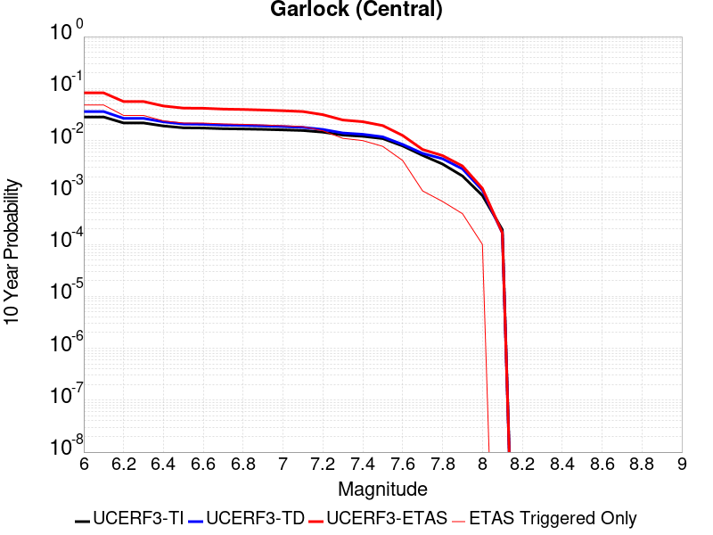 |

| Magnitude | 1 wk TI Prob | 1 wk TD Prob | 1 wk ETAS Prob | 1 wk ETAS/TD Gain | 1 wk ETAS Triggered Only | 1 mo TI Prob | 1 mo TD Prob | 1 mo ETAS Prob | 1 mo ETAS/TD Gain | 1 mo ETAS Triggered Only | 1 yr TI Prob | 1 yr TD Prob | 1 yr ETAS Prob | 1 yr ETAS/TD Gain | 1 yr ETAS Triggered Only | 10 yr TI Prob | 10 yr TD Prob | 10 yr ETAS Prob | 10 yr ETAS/TD Gain | 10 yr ETAS Triggered Only |
|-----|-----|-----|-----|-----|-----|-----|-----|-----|-----|-----|-----|-----|-----|-----|-----|-----|-----|-----|-----|-----|
| 6.0 | 5.5131142E-5 | 7.028353E-5 | 0.0013973303 | 19.881332 | 0.00132714 | 2.3625491E-4 | 3.0118073E-4 | 0.006934882 | 23.02565 | 0.0066357 | 0.0028726095 | 0.0036607755 | 0.028784126 | 7.862849 | 0.025215661 | 0.028357591 | 0.03609825 | 0.08087139 | 2.2403133 | 0.0464499 |
| 6.1 | 5.5131142E-5 | 7.028353E-5 | 0.0013973303 | 19.881332 | 0.00132714 | 2.3625491E-4 | 3.0118073E-4 | 0.006934882 | 23.02565 | 0.0066357 | 0.0028726095 | 0.0036607755 | 0.028784126 | 7.862849 | 0.025215661 | 0.028357591 | 0.03609825 | 0.08087139 | 2.2403133 | 0.0464499 |
| 6.2 | 4.216245E-5 | 5.1694726E-5 | 5.1694726E-5 | 1.0 | 0.0 | 1.806837E-4 | 2.2153018E-4 | 0.0042020683 | 18.968378 | 0.00398142 | 0.0021976046 | 0.0026938256 | 0.01725304 | 6.4046607 | 0.01459854 | 0.021759989 | 0.026706655 | 0.05124889 | 1.9189557 | 0.025215661 |
| 6.3 | 4.216245E-5 | 5.1694726E-5 | 5.1694726E-5 | 1.0 | 0.0 | 1.806837E-4 | 2.2153018E-4 | 0.0042020683 | 18.968378 | 0.00398142 | 0.0021976046 | 0.0026938256 | 0.01725304 | 6.4046607 | 0.01459854 | 0.021759989 | 0.026706655 | 0.05124889 | 1.9189557 | 0.025215661 |
| 6.4 | 3.6858168E-5 | 4.4142424E-5 | 4.4142424E-5 | 1.0 | 0.0 | 1.5795401E-4 | 1.8916825E-4 | 0.0021795016 | 11.521499 | 0.00199071 | 0.0019213937 | 0.0023007158 | 0.012231366 | 5.3163304 | 0.00995355 | 0.019048655 | 0.02286518 | 0.0423171 | 1.8507224 | 0.0199071 |
| 6.5 | 3.39199E-5 | 4.004938E-5 | 4.004938E-5 | 1.0 | 0.0 | 1.453629E-4 | 1.7162903E-4 | 0.0021619974 | 12.596922 | 0.00199071 | 0.0017683565 | 0.0020876026 | 0.011358188 | 5.440781 | 0.00928998 | 0.017543508 | 0.020775842 | 0.038320005 | 1.8444501 | 0.01791639 |
| 6.6 | 3.3571985E-5 | 3.9503488E-5 | 3.9503488E-5 | 1.0 | 0.0 | 1.4387199E-4 | 1.692898E-4 | 0.0021596628 | 12.7571945 | 0.00199071 | 0.0017502342 | 0.0020591766 | 0.011330027 | 5.5022125 | 0.00928998 | 0.017365133 | 0.02049712 | 0.038046274 | 1.8561766 | 0.01791639 |
| 6.7 | 3.2580007E-5 | 3.8119713E-5 | 3.8119713E-5 | 1.0 | 0.0 | 1.3962112E-4 | 1.6336009E-4 | 0.002153745 | 13.184033 | 0.00199071 | 0.0016985617 | 0.0019871162 | 0.011258636 | 5.6658163 | 0.00928998 | 0.016856372 | 0.019789662 | 0.037351493 | 1.8874245 | 0.01791639 |
| 6.8 | 3.2185937E-5 | 3.7546815E-5 | 3.7546815E-5 | 1.0 | 0.0 | 1.3793244E-4 | 1.6090513E-4 | 0.0021512948 | 13.369959 | 0.00199071 | 0.0016780337 | 0.001957281 | 0.011229078 | 5.73708 | 0.00928998 | 0.016654192 | 0.01949641 | 0.037063494 | 1.9010421 | 0.01791639 |
| 6.9 | 3.165394E-5 | 3.6751233E-5 | 3.6751233E-5 | 1.0 | 0.0 | 1.3565269E-4 | 1.5749589E-4 | 0.0021478925 | 13.637768 | 0.00199071 | 0.0016503202 | 0.0019158474 | 0.011188029 | 5.839729 | 0.00928998 | 0.01638118 | 0.019088961 | 0.036663346 | 1.9206569 | 0.01791639 |
| 7.0 | 3.0903822E-5 | 3.5656267E-5 | 3.5656267E-5 | 1.0 | 0.0 | 1.3243823E-4 | 1.5280375E-4 | 0.0021432096 | 14.025897 | 0.00199071 | 0.0016112428 | 0.0018588194 | 0.011131531 | 5.9884953 | 0.00928998 | 0.015996104 | 0.018528024 | 0.036112458 | 1.9490724 | 0.01791639 |
| 7.1 | 3.0069863E-5 | 3.442231E-5 | 3.442231E-5 | 1.0 | 0.0 | 1.2886449E-4 | 1.4751598E-4 | 0.0021379322 | 14.492887 | 0.00199071 | 0.0015677959 | 0.0017945486 | 0.011067857 | 6.1674886 | 0.00928998 | 0.01556781 | 0.017895563 | 0.03549133 | 1.9832474 | 0.01791639 |
| 7.2 | 2.7957109E-5 | 3.131102E-5 | 3.131102E-5 | 1.0 | 0.0 | 1.1981068E-4 | 1.341833E-4 | 0.0021246262 | 15.83376 | 0.00199071 | 0.0014577188 | 0.0016324769 | 0.009582317 | 5.869803 | 0.00796284 | 0.014481937 | 0.016298864 | 0.031964973 | 1.961178 | 0.01592568 |
| 7.3 | 2.4519275E-5 | 2.6742577E-5 | 2.6742577E-5 | 1.0 | 0.0 | 1.0507837E-4 | 1.1460609E-4 | 0.001441594 | 12.578686 | 0.00132714 | 0.0012785783 | 0.0013944508 | 0.0060329637 | 4.3264084 | 0.00464499 | 0.012712469 | 0.013942342 | 0.025065754 | 1.7978151 | 0.01128069 |
| 7.4 | 2.3225532E-5 | 2.5226616E-5 | 2.5226616E-5 | 1.0 | 0.0 | 9.95342E-5 | 1.0810967E-4 | 0.0014351062 | 13.274541 | 0.00132714 | 0.0012111551 | 0.001315455 | 0.0052916375 | 4.0226674 | 0.00398142 | 0.012045753 | 0.013159735 | 0.0229823 | 1.7464105 | 0.00995355 |
| 7.5 | 2.097765E-5 | 2.2509554E-5 | 2.2509554E-5 | 1.0 | 0.0 | 8.9901114E-5 | 9.646602E-5 | 7.59972E-4 | 7.878132 | 6.6357E-4 | 0.0010939965 | 0.0011738528 | 0.003162226 | 2.6938863 | 0.00199071 | 0.010886264 | 0.011753701 | 0.017655635 | 1.5021342 | 0.00597213 |
| 7.6 | 1.511254E-5 | 1.6015367E-5 | 1.6015367E-5 | 1.0 | 0.0 | 6.476642E-5 | 6.863553E-5 | 7.3216E-4 | 10.667362 | 6.6357E-4 | 7.882459E-4 | 8.35325E-4 | 0.0014983407 | 1.7937219 | 6.6357E-4 | 0.007854558 | 0.008395991 | 0.011685984 | 1.3918529 | 0.00331785 |
| 7.7 | 9.934069E-6 | 1.0701108E-5 | 1.0701108E-5 | 1.0 | 0.0 | 4.2573887E-5 | 4.586109E-5 | 7.094007E-4 | 15.468465 | 6.6357E-4 | 5.182138E-4 | 5.582161E-4 | 0.0012214157 | 2.1880696 | 6.6357E-4 | 0.00517007 | 0.0056392583 | 0.00827857 | 1.4680246 | 0.00265428 |
| 7.8 | 6.7562896E-6 | 8.44664E-6 | 8.44664E-6 | 1.0 | 0.0 | 2.8955206E-5 | 3.6199384E-5 | 6.997454E-4 | 19.33031 | 6.6357E-4 | 3.5247262E-4 | 4.4063854E-4 | 0.0011039161 | 2.5052648 | 6.6357E-4 | 0.0035191406 | 0.0044560935 | 0.00577732 | 1.2964988 | 0.00132714 |
| 7.9 | 3.975453E-6 | 5.3821313E-6 | 5.3821313E-6 | 1.0 | 0.0 | 1.7037546E-5 | 2.3066073E-5 | 2.3066073E-5 | 1.0 | 0.0 | 2.0741238E-4 | 2.8079335E-4 | 2.8079335E-4 | 1.0 | 0.0 | 0.002072189 | 0.002839394 | 0.002839394 | 1.0 | 0.0 |
| 8.0 | 1.6729537E-6 | 2.0813598E-6 | 2.0813598E-6 | 1.0 | 0.0 | 7.169782E-6 | 8.920083E-6 | 8.920083E-6 | 1.0 | 0.0 | 8.7288594E-5 | 1.08596636E-4 | 1.08596636E-4 | 1.0 | 0.0 | 8.7254314E-4 | 0.0010989337 | 0.0010989337 | 1.0 | 0.0 |
| 8.1 | 3.6733252E-7 | 3.154532E-7 | 3.154532E-7 | 1.0 | 0.0 | 1.5742813E-6 | 1.3519417E-6 | 1.3519417E-6 | 1.0 | 0.0 | 1.9166706E-5 | 1.6459782E-5 | 1.6459782E-5 | 1.0 | 0.0 | 1.9165053E-4 | 1.6667772E-4 | 1.6667772E-4 | 1.0 | 0.0 |

## Tank Canyon
*[(top)](#table-of-contents)*

| 1 Week | 1 Month | 1 Year | 10 Year |
|-----|-----|-----|-----|
|  |  |  |  |

| Magnitude | 1 wk TI Prob | 1 wk TD Prob | 1 wk ETAS Prob | 1 wk ETAS/TD Gain | 1 wk ETAS Triggered Only | 1 mo TI Prob | 1 mo TD Prob | 1 mo ETAS Prob | 1 mo ETAS/TD Gain | 1 mo ETAS Triggered Only | 1 yr TI Prob | 1 yr TD Prob | 1 yr ETAS Prob | 1 yr ETAS/TD Gain | 1 yr ETAS Triggered Only | 10 yr TI Prob | 10 yr TD Prob | 10 yr ETAS Prob | 10 yr ETAS/TD Gain | 10 yr ETAS Triggered Only |
|-----|-----|-----|-----|-----|-----|-----|-----|-----|-----|-----|-----|-----|-----|-----|-----|-----|-----|-----|-----|-----|
| 6.0 | 4.8284557E-5 | 5.7973975E-5 | 0.0013850371 | 23.890669 | 0.00132714 | 2.0691741E-4 | 2.4844008E-4 | 0.0022386555 | 9.010847 | 0.00199071 | 0.0025163088 | 0.0030212225 | 0.017575657 | 5.817399 | 0.01459854 | 0.02488006 | 0.029868243 | 0.05948076 | 1.9914382 | 0.03052422 |
| 6.1 | 1.7796336E-5 | 2.0876007E-5 | 2.0876007E-5 | 1.0 | 0.0 | 7.626778E-5 | 8.946575E-5 | 8.946575E-5 | 1.0 | 0.0 | 9.281647E-4 | 0.001088738 | 0.0044029756 | 4.04411 | 0.00331785 | 0.009242975 | 0.01083813 | 0.018714668 | 1.7267432 | 0.00796284 |
| 6.2 | 1.7796336E-5 | 2.0876007E-5 | 2.0876007E-5 | 1.0 | 0.0 | 7.626778E-5 | 8.946575E-5 | 8.946575E-5 | 1.0 | 0.0 | 9.281647E-4 | 0.001088738 | 0.0044029756 | 4.04411 | 0.00331785 | 0.009242975 | 0.01083813 | 0.018714668 | 1.7267432 | 0.00796284 |
| 6.3 | 1.3515912E-5 | 1.576146E-5 | 1.576146E-5 | 1.0 | 0.0 | 5.792405E-5 | 6.75475E-5 | 6.75475E-5 | 1.0 | 0.0 | 7.049971E-4 | 8.221046E-4 | 0.002811178 | 3.4194896 | 0.00199071 | 0.007027647 | 0.008193244 | 0.014774577 | 1.8032633 | 0.0066357 |
| 6.4 | 1.0870146E-5 | 1.2619447E-5 | 1.2619447E-5 | 1.0 | 0.0 | 4.658551E-5 | 5.4082324E-5 | 5.4082324E-5 | 1.0 | 0.0 | 5.67031E-4 | 6.582713E-4 | 0.002647671 | 4.0221577 | 0.00199071 | 0.005655863 | 0.0065652295 | 0.012498151 | 1.9036884 | 0.00597213 |
| 6.5 | 7.964826E-6 | 9.197039E-6 | 9.197039E-6 | 1.0 | 0.0 | 3.4134522E-5 | 3.9415343E-5 | 3.9415343E-5 | 1.0 | 0.0 | 4.1550855E-4 | 4.797868E-4 | 0.0024695417 | 5.147165 | 0.00199071 | 0.0041473247 | 0.004788811 | 0.009411557 | 1.9653223 | 0.00464499 |
| 6.6 | 6.6317E-6 | 7.6130164E-6 | 7.6130164E-6 | 1.0 | 0.0 | 2.8421264E-5 | 3.2626856E-5 | 3.2626856E-5 | 1.0 | 0.0 | 3.4597394E-4 | 3.971687E-4 | 0.0017237816 | 4.3401747 | 0.00132714 | 0.0034543579 | 0.0039657406 | 0.0066094943 | 1.6666481 | 0.00265428 |
| 6.7 | 4.793663E-6 | 5.4311977E-6 | 5.4311977E-6 | 1.0 | 0.0 | 2.0544108E-5 | 2.327638E-5 | 2.327638E-5 | 1.0 | 0.0 | 2.500958E-4 | 2.8335745E-4 | 2.8335745E-4 | 1.0 | 0.0 | 0.0024981452 | 0.002830654 | 0.0034923456 | 1.2337593 | 6.6357E-4 |
| 6.8 | 4.382823E-6 | 4.9696105E-6 | 4.9696105E-6 | 1.0 | 0.0 | 1.8783392E-5 | 2.1298181E-5 | 2.1298181E-5 | 1.0 | 0.0 | 2.286638E-4 | 2.5927878E-4 | 2.5927878E-4 | 1.0 | 0.0 | 0.0022842865 | 0.0025904367 | 0.0032522879 | 1.2554979 | 6.6357E-4 |
| 6.9 | 2.729601E-6 | 3.0737074E-6 | 3.0737074E-6 | 1.0 | 0.0 | 1.1698237E-5 | 1.3172971E-5 | 1.3172971E-5 | 1.0 | 0.0 | 1.4241673E-4 | 1.6037036E-4 | 1.6037036E-4 | 1.0 | 0.0 | 0.001423255 | 0.0016027121 | 0.0016027121 | 1.0 | 0.0 |
| 7.0 | 1.8987357E-6 | 2.127029E-6 | 2.127029E-6 | 1.0 | 0.0 | 8.137413E-6 | 9.11581E-6 | 9.11581E-6 | 1.0 | 0.0 | 9.90685E-5 | 1.10980036E-4 | 1.10980036E-4 | 1.0 | 0.0 | 9.902435E-4 | 0.0011093147 | 0.0011093147 | 1.0 | 0.0 |
| 7.1 | 1.4928986E-6 | 1.664189E-6 | 1.664189E-6 | 1.0 | 0.0 | 6.398121E-6 | 7.132222E-6 | 7.132222E-6 | 1.0 | 0.0 | 7.789434E-5 | 8.683193E-5 | 8.683193E-5 | 1.0 | 0.0 | 7.786704E-4 | 8.680379E-4 | 8.680379E-4 | 1.0 | 0.0 |
| 7.2 | 1.069082E-6 | 1.1828964E-6 | 1.1828964E-6 | 1.0 | 0.0 | 4.581772E-6 | 5.0695494E-6 | 5.0695494E-6 | 1.0 | 0.0 | 5.5781646E-5 | 6.1720544E-5 | 6.1720544E-5 | 1.0 | 0.0 | 5.576765E-4 | 6.170863E-4 | 6.170863E-4 | 1.0 | 0.0 |
| 7.3 | 8.776551E-7 | 9.77029E-7 | 9.77029E-7 | 1.0 | 0.0 | 3.7613736E-6 | 4.1872636E-6 | 4.1872636E-6 | 1.0 | 0.0 | 4.579376E-5 | 5.097926E-5 | 5.097926E-5 | 1.0 | 0.0 | 4.5784327E-4 | 5.0972664E-4 | 5.0972664E-4 | 1.0 | 0.0 |
| 7.4 | 7.55721E-7 | 8.5104807E-7 | 8.5104807E-7 | 1.0 | 0.0 | 3.2388E-6 | 3.6473468E-6 | 3.6473468E-6 | 1.0 | 0.0 | 3.9431678E-5 | 4.440606E-5 | 4.440606E-5 | 1.0 | 0.0 | 3.942468E-4 | 4.4402273E-4 | 4.4402273E-4 | 1.0 | 0.0 |
| 7.5 | 5.587665E-7 | 6.3057905E-7 | 6.3057905E-7 | 1.0 | 0.0 | 2.3947114E-6 | 2.7024817E-6 | 2.7024817E-6 | 1.0 | 0.0 | 2.915522E-5 | 3.2902713E-5 | 3.2902713E-5 | 1.0 | 0.0 | 2.9151395E-4 | 3.2902713E-4 | 3.2902713E-4 | 1.0 | 0.0 |

## Little Lake
*[(top)](#table-of-contents)*

| 1 Week | 1 Month | 1 Year | 10 Year |
|-----|-----|-----|-----|
|  | 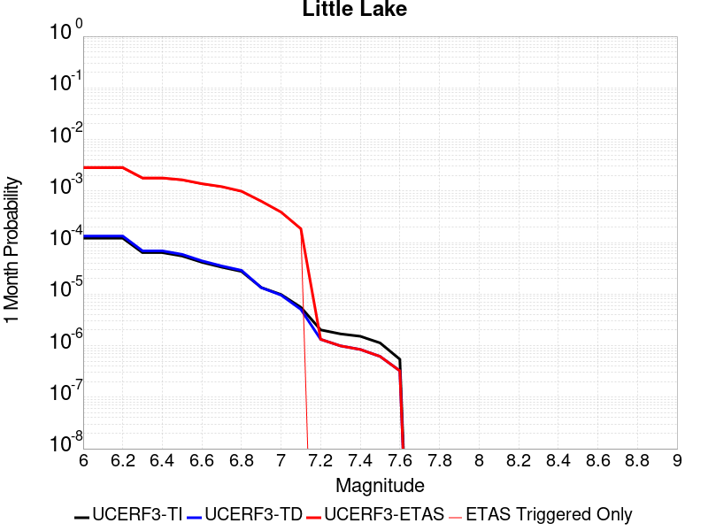 | 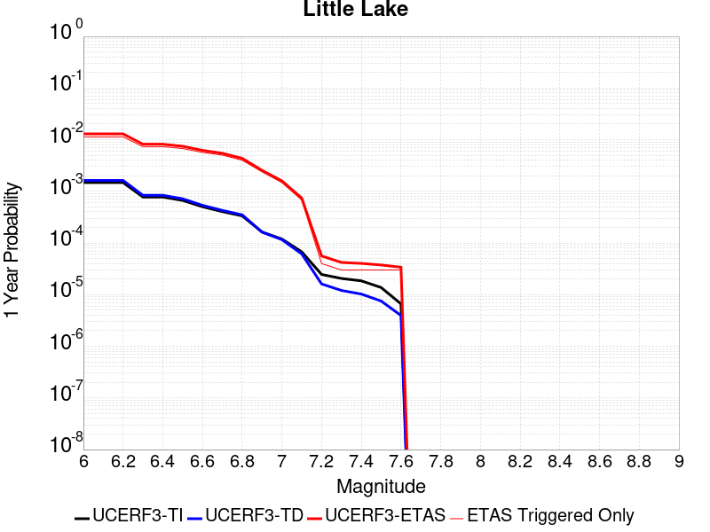 |  |

| Magnitude | 1 wk TI Prob | 1 wk TD Prob | 1 wk ETAS Prob | 1 wk ETAS/TD Gain | 1 wk ETAS Triggered Only | 1 mo TI Prob | 1 mo TD Prob | 1 mo ETAS Prob | 1 mo ETAS/TD Gain | 1 mo ETAS Triggered Only | 1 yr TI Prob | 1 yr TD Prob | 1 yr ETAS Prob | 1 yr ETAS/TD Gain | 1 yr ETAS Triggered Only | 10 yr TI Prob | 10 yr TD Prob | 10 yr ETAS Prob | 10 yr ETAS/TD Gain | 10 yr ETAS Triggered Only |
|-----|-----|-----|-----|-----|-----|-----|-----|-----|-----|-----|-----|-----|-----|-----|-----|-----|-----|-----|-----|-----|
| 6.0 | 2.8424427E-5 | 3.1208354E-5 | 3.1208354E-5 | 1.0 | 0.0 | 1.2181328E-4 | 1.3374399E-4 | 0.0034511504 | 25.804153 | 0.00331785 | 0.0014820677 | 0.00162725 | 0.010902113 | 6.699716 | 0.00928998 | 0.014722223 | 0.016166756 | 0.03444634 | 2.1306896 | 0.01857996 |
| 6.1 | 2.8424427E-5 | 3.1208354E-5 | 3.1208354E-5 | 1.0 | 0.0 | 1.2181328E-4 | 1.3374399E-4 | 0.0034511504 | 25.804153 | 0.00331785 | 0.0014820677 | 0.00162725 | 0.010902113 | 6.699716 | 0.00928998 | 0.014722223 | 0.016166756 | 0.03444634 | 2.1306896 | 0.01857996 |
| 6.2 | 2.8424427E-5 | 3.1208354E-5 | 3.1208354E-5 | 1.0 | 0.0 | 1.2181328E-4 | 1.3374399E-4 | 0.0034511504 | 25.804153 | 0.00331785 | 0.0014820677 | 0.00162725 | 0.010902113 | 6.699716 | 0.00928998 | 0.014722223 | 0.016166756 | 0.03444634 | 2.1306896 | 0.01857996 |
| 6.3 | 1.48860645E-5 | 1.6082613E-5 | 1.6082613E-5 | 1.0 | 0.0 | 6.379586E-5 | 6.892382E-5 | 0.002723021 | 39.507687 | 0.00265428 | 7.7643775E-4 | 8.3885266E-4 | 0.0074689863 | 8.903811 | 0.0066357 | 0.007737305 | 0.008359682 | 0.020204091 | 2.4168494 | 0.01194426 |
| 6.4 | 1.48860645E-5 | 1.6082613E-5 | 1.6082613E-5 | 1.0 | 0.0 | 6.379586E-5 | 6.892382E-5 | 0.002723021 | 39.507687 | 0.00265428 | 7.7643775E-4 | 8.3885266E-4 | 0.0074689863 | 8.903811 | 0.0066357 | 0.007737305 | 0.008359682 | 0.020204091 | 2.4168494 | 0.01194426 |
| 6.5 | 1.2797581E-5 | 1.3766588E-5 | 1.3766588E-5 | 1.0 | 0.0 | 5.4845623E-5 | 5.8998474E-5 | 0.0020495912 | 34.73973 | 0.00199071 | 6.675408E-4 | 7.180954E-4 | 0.006685937 | 9.310653 | 0.00597213 | 0.006655392 | 0.0071603004 | 0.018360218 | 2.5641685 | 0.01128069 |
| 6.6 | 9.661896E-6 | 1.028976E-5 | 1.028976E-5 | 1.0 | 0.0 | 4.1407468E-5 | 4.4098317E-5 | 0.0020347205 | 46.14055 | 0.00199071 | 5.040193E-4 | 5.36781E-4 | 0.0065057054 | 12.11985 | 0.00597213 | 0.005028777 | 0.0053564496 | 0.016576715 | 3.0947206 | 0.01128069 |
| 6.7 | 7.767871E-6 | 8.200237E-6 | 8.200237E-6 | 1.0 | 0.0 | 3.329045E-5 | 3.514348E-5 | 0.0013622368 | 38.762154 | 0.00132714 | 4.0523586E-4 | 4.2780157E-4 | 0.0057340907 | 13.403622 | 0.00530856 | 0.004044977 | 0.0042711324 | 0.01418217 | 3.3204706 | 0.00995355 |
| 6.8 | 6.4235196E-6 | 6.736191E-6 | 6.736191E-6 | 1.0 | 0.0 | 2.752908E-5 | 2.8869143E-5 | 0.0013559709 | 46.969555 | 0.00132714 | 3.35115E-4 | 3.5143795E-4 | 0.0049947957 | 14.212453 | 0.00464499 | 0.003346101 | 0.0035100824 | 0.012106213 | 3.4489825 | 0.00862641 |
| 6.9 | 3.1283696E-6 | 3.1123384E-6 | 3.1123384E-6 | 1.0 | 0.0 | 1.3407229E-5 | 1.3338534E-5 | 6.768997E-4 | 50.747684 | 6.6357E-4 | 1.6322079E-4 | 1.6238606E-4 | 0.002816235 | 17.342838 | 0.00265428 | 0.0016310095 | 0.0016228223 | 0.0062602744 | 3.8576462 | 0.00464499 |
| 7.0 | 2.290603E-6 | 2.2288011E-6 | 2.2288011E-6 | 1.0 | 0.0 | 9.816834E-6 | 9.551975E-6 | 6.7311566E-4 | 70.468735 | 6.6357E-4 | 1.19513395E-4 | 1.1629014E-4 | 0.0014432758 | 12.410991 | 0.00132714 | 0.0011944914 | 0.001162395 | 0.0044763885 | 3.8510044 | 0.00331785 |
| 7.1 | 1.293693E-6 | 1.177757E-6 | 1.177757E-6 | 1.0 | 0.0 | 5.5443866E-6 | 5.0475237E-6 | 5.0475237E-6 | 1.0 | 0.0 | 6.750081E-5 | 6.145257E-5 | 6.145257E-5 | 1.0 | 0.0 | 6.7480316E-4 | 6.1442424E-4 | 0.0019407488 | 3.1586463 | 0.00132714 |
| 7.2 | 4.715842E-7 | 3.092137E-7 | 3.092137E-7 | 1.0 | 0.0 | 2.0210737E-6 | 1.3252009E-6 | 1.3252009E-6 | 1.0 | 0.0 | 2.4606294E-5 | 1.6134207E-5 | 1.6134207E-5 | 1.0 | 0.0 | 2.460357E-4 | 1.613309E-4 | 1.613309E-4 | 1.0 | 0.0 |
| 7.3 | 3.9430947E-7 | 2.3100714E-7 | 2.3100714E-7 | 1.0 | 0.0 | 1.6898966E-6 | 9.900302E-7 | 9.900302E-7 | 1.0 | 0.0 | 2.0574296E-5 | 1.2053552E-5 | 1.2053552E-5 | 1.0 | 0.0 | 2.0572392E-4 | 1.2052906E-4 | 1.2052906E-4 | 1.0 | 0.0 |
| 7.4 | 3.547123E-7 | 1.9682132E-7 | 1.9682132E-7 | 1.0 | 0.0 | 1.5201948E-6 | 8.435197E-7 | 8.435197E-7 | 1.0 | 0.0 | 1.8508214E-5 | 1.0269804E-5 | 1.0269804E-5 | 1.0 | 0.0 | 1.8506673E-4 | 1.0269336E-4 | 1.0269336E-4 | 1.0 | 0.0 |
| 7.5 | 2.6354266E-7 | 1.4425234E-7 | 1.4425234E-7 | 1.0 | 0.0 | 1.129468E-6 | 6.182242E-7 | 6.182242E-7 | 1.0 | 0.0 | 1.3751187E-5 | 7.5268536E-6 | 7.5268536E-6 | 1.0 | 0.0 | 1.3750336E-4 | 7.526604E-5 | 7.526604E-5 | 1.0 | 0.0 |
| 7.6 | 1.269913E-7 | 7.5734455E-8 | 7.5734455E-8 | 1.0 | 0.0 | 5.4424834E-7 | 3.245762E-7 | 3.245762E-7 | 1.0 | 0.0 | 6.6262032E-6 | 3.9517085E-6 | 3.9517085E-6 | 1.0 | 0.0 | 6.626006E-5 | 3.9516417E-5 | 3.9516417E-5 | 1.0 | 0.0 |

## Owl Lake
*[(top)](#table-of-contents)*

| 1 Week | 1 Month | 1 Year | 10 Year |
|-----|-----|-----|-----|
|  |  |  |  |

| Magnitude | 1 wk TI Prob | 1 wk TD Prob | 1 wk ETAS Prob | 1 wk ETAS/TD Gain | 1 wk ETAS Triggered Only | 1 mo TI Prob | 1 mo TD Prob | 1 mo ETAS Prob | 1 mo ETAS/TD Gain | 1 mo ETAS Triggered Only | 1 yr TI Prob | 1 yr TD Prob | 1 yr ETAS Prob | 1 yr ETAS/TD Gain | 1 yr ETAS Triggered Only | 10 yr TI Prob | 10 yr TD Prob | 10 yr ETAS Prob | 10 yr ETAS/TD Gain | 10 yr ETAS Triggered Only |
|-----|-----|-----|-----|-----|-----|-----|-----|-----|-----|-----|-----|-----|-----|-----|-----|-----|-----|-----|-----|-----|
| 6.0 | 5.0320643E-5 | 6.637825E-5 | 6.637825E-5 | 1.0 | 0.0 | 2.1564208E-4 | 2.8445345E-4 | 0.0022745973 | 7.9963775 | 0.00199071 | 0.0026222812 | 0.003458769 | 0.010071518 | 2.9118793 | 0.0066357 | 0.02591553 | 0.034150235 | 0.048891142 | 1.4316487 | 0.01526211 |
| 6.1 | 5.0320643E-5 | 6.637825E-5 | 6.637825E-5 | 1.0 | 0.0 | 2.1564208E-4 | 2.8445345E-4 | 0.0022745973 | 7.9963775 | 0.00199071 | 0.0026222812 | 0.003458769 | 0.010071518 | 2.9118793 | 0.0066357 | 0.02591553 | 0.034150235 | 0.048891142 | 1.4316487 | 0.01526211 |
| 6.2 | 2.4125871E-5 | 3.0991025E-5 | 3.0991025E-5 | 1.0 | 0.0 | 1.0339249E-4 | 1.3281307E-4 | 0.0021232588 | 15.986819 | 0.00199071 | 0.0012580766 | 0.0016159448 | 0.007578424 | 4.6897793 | 0.00597213 | 0.012509781 | 0.01607549 | 0.027174838 | 1.6904516 | 0.01128069 |
| 6.3 | 1.7433485E-5 | 2.2363502E-5 | 2.2363502E-5 | 1.0 | 0.0 | 7.471279E-5 | 9.584095E-5 | 0.0014228538 | 14.845989 | 0.00132714 | 9.0924866E-4 | 0.0011663875 | 0.0064687557 | 5.545975 | 0.00530856 | 0.009055373 | 0.011632964 | 0.022126576 | 1.9020582 | 0.01061712 |
| 6.4 | 1.7433485E-5 | 2.2363502E-5 | 2.2363502E-5 | 1.0 | 0.0 | 7.471279E-5 | 9.584095E-5 | 0.0014228538 | 14.845989 | 0.00132714 | 9.0924866E-4 | 0.0011663875 | 0.0064687557 | 5.545975 | 0.00530856 | 0.009055373 | 0.011632964 | 0.022126576 | 1.9020582 | 0.01061712 |
| 6.5 | 1.5182742E-5 | 1.9436447E-5 | 1.9436447E-5 | 1.0 | 0.0 | 6.506727E-5 | 8.329725E-5 | 7.46812E-4 | 8.965626 | 6.6357E-4 | 7.919061E-4 | 0.0010138236 | 0.00432831 | 4.269293 | 0.00331785 | 0.0078909 | 0.010122164 | 0.01734755 | 1.7138182 | 0.00729927 |
| 6.6 | 6.7271576E-6 | 8.552192E-6 | 8.552192E-6 | 1.0 | 0.0 | 2.8830356E-5 | 3.6651767E-5 | 3.6651767E-5 | 1.0 | 0.0 | 3.5095305E-4 | 4.4614958E-4 | 0.0024359715 | 5.459988 | 0.00199071 | 0.0035039932 | 0.00447032 | 0.0097551495 | 2.1822038 | 0.00530856 |
| 6.7 | 6.682835E-6 | 8.484631E-6 | 8.484631E-6 | 1.0 | 0.0 | 2.8640408E-5 | 3.6362228E-5 | 3.6362228E-5 | 1.0 | 0.0 | 3.4864116E-4 | 4.4262584E-4 | 0.0024324546 | 5.49551 | 0.00199071 | 0.003480947 | 0.0044352426 | 0.0097202575 | 2.1915956 | 0.00530856 |
| 6.8 | 6.5774975E-6 | 8.331081E-6 | 8.331081E-6 | 1.0 | 0.0 | 2.8188972E-5 | 3.5704175E-5 | 3.5704175E-5 | 1.0 | 0.0 | 3.4314668E-4 | 4.3461728E-4 | 0.002424462 | 5.578384 | 0.00199071 | 0.0034261728 | 0.004355377 | 0.009640817 | 2.2135434 | 0.00530856 |
| 6.9 | 6.363419E-6 | 8.004196E-6 | 8.004196E-6 | 1.0 | 0.0 | 2.727151E-5 | 3.4303277E-5 | 3.4303277E-5 | 1.0 | 0.0 | 3.3198006E-4 | 4.1756796E-4 | 0.0024074467 | 5.765401 | 0.00199071 | 0.0033148455 | 0.004185339 | 0.009471681 | 2.2630618 | 0.00530856 |
| 7.0 | 6.1342453E-6 | 7.636321E-6 | 7.636321E-6 | 1.0 | 0.0 | 2.6289357E-5 | 3.272671E-5 | 3.272671E-5 | 1.0 | 0.0 | 3.2002592E-4 | 3.9838036E-4 | 0.0023882973 | 5.9950175 | 0.00199071 | 0.0031956544 | 0.003993994 | 0.009281352 | 2.323827 | 0.00530856 |
| 7.1 | 5.842926E-6 | 7.1467643E-6 | 7.1467643E-6 | 1.0 | 0.0 | 2.504087E-5 | 3.062866E-5 | 3.062866E-5 | 1.0 | 0.0 | 3.0482994E-4 | 3.7284556E-4 | 0.0023628133 | 6.337244 | 0.00199071 | 0.0030441214 | 0.0037393996 | 0.009028109 | 2.4143205 | 0.00530856 |
| 7.2 | 4.77173E-6 | 5.362619E-6 | 5.362619E-6 | 1.0 | 0.0 | 2.045011E-5 | 2.2982473E-5 | 2.2982473E-5 | 1.0 | 0.0 | 2.4895166E-4 | 2.7977975E-4 | 0.0016065484 | 5.74219 | 0.00132714 | 0.0024867293 | 0.0028107993 | 0.0067810286 | 2.412491 | 0.00398142 |
| 7.3 | 3.0494948E-6 | 2.7135288E-6 | 2.7135288E-6 | 1.0 | 0.0 | 1.3069198E-5 | 1.1629358E-5 | 1.1629358E-5 | 1.0 | 0.0 | 1.5910587E-4 | 1.4157839E-4 | 1.4157839E-4 | 1.0 | 0.0 | 0.0015899199 | 0.0014248409 | 0.0027500899 | 1.9301032 | 0.00132714 |
| 7.4 | 2.7263884E-6 | 2.3085581E-6 | 2.3085581E-6 | 1.0 | 0.0 | 1.1684469E-5 | 9.893784E-6 | 9.893784E-6 | 1.0 | 0.0 | 1.4224913E-4 | 1.2045026E-4 | 1.2045026E-4 | 1.0 | 0.0 | 0.0014215811 | 0.0012127279 | 0.0025382584 | 2.0930157 | 0.00132714 |
| 7.5 | 2.6090431E-6 | 2.1684432E-6 | 2.1684432E-6 | 1.0 | 0.0 | 1.1181565E-5 | 9.293296E-6 | 9.293296E-6 | 1.0 | 0.0 | 1.3612706E-4 | 1.131401E-4 | 1.131401E-4 | 1.0 | 0.0 | 0.001360437 | 0.0011394577 | 0.0018022716 | 1.5816925 | 6.6357E-4 |
| 7.6 | 2.3008756E-6 | 1.8754599E-6 | 1.8754599E-6 | 1.0 | 0.0 | 9.860858E-6 | 8.037661E-6 | 8.037661E-6 | 1.0 | 0.0 | 1.20049335E-4 | 9.7854216E-5 | 9.7854216E-5 | 1.0 | 0.0 | 0.001199845 | 9.863852E-4 | 0.0016493007 | 1.6720655 | 6.6357E-4 |
| 7.7 | 1.7184348E-6 | 1.3443848E-6 | 1.3443848E-6 | 1.0 | 0.0 | 7.3646997E-6 | 5.761637E-6 | 5.761637E-6 | 1.0 | 0.0 | 8.966153E-5 | 7.014571E-5 | 7.014571E-5 | 1.0 | 0.0 | 8.962536E-4 | 7.091248E-4 | 0.0013722243 | 1.9350955 | 6.6357E-4 |
| 7.8 | 8.4612907E-7 | 8.4234745E-7 | 8.4234745E-7 | 1.0 | 0.0 | 3.6262625E-6 | 3.6100557E-6 | 3.6100557E-6 | 1.0 | 0.0 | 4.4148852E-5 | 4.3951564E-5 | 4.3951564E-5 | 1.0 | 0.0 | 4.414008E-4 | 4.449048E-4 | 4.449048E-4 | 1.0 | 0.0 |
| 7.9 | 2.716738E-7 | 3.7758898E-7 | 3.7758898E-7 | 1.0 | 0.0 | 1.1643157E-6 | 1.6182375E-6 | 1.6182375E-6 | 1.0 | 0.0 | 1.4175452E-5 | 1.9701874E-5 | 1.9701874E-5 | 1.0 | 0.0 | 1.4174548E-4 | 1.9877256E-4 | 1.9877256E-4 | 1.0 | 0.0 |
| 8.0 | 2.1995428E-8 | 3.391689E-8 | 3.391689E-8 | 1.0 | 0.0 | 9.426611E-8 | 1.453581E-7 | 1.453581E-7 | 1.0 | 0.0 | 1.1476893E-6 | 1.7697341E-6 | 1.7697341E-6 | 1.0 | 0.0 | 1.14768345E-5 | 1.7998429E-5 | 1.7998429E-5 | 1.0 | 0.0 |

## Airport Lake
*[(top)](#table-of-contents)*

| 1 Week | 1 Month | 1 Year | 10 Year |
|-----|-----|-----|-----|
|  | 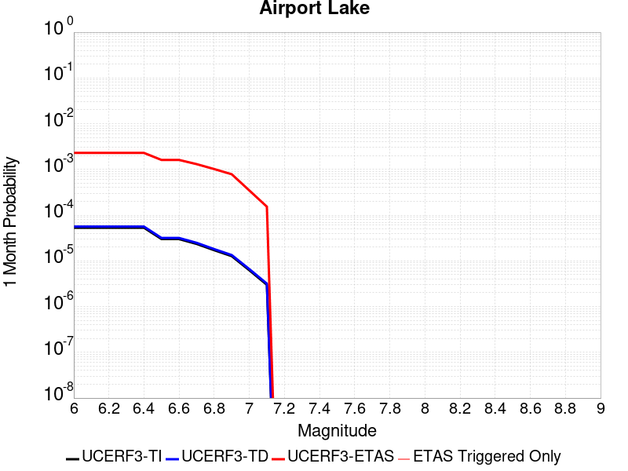 |  | 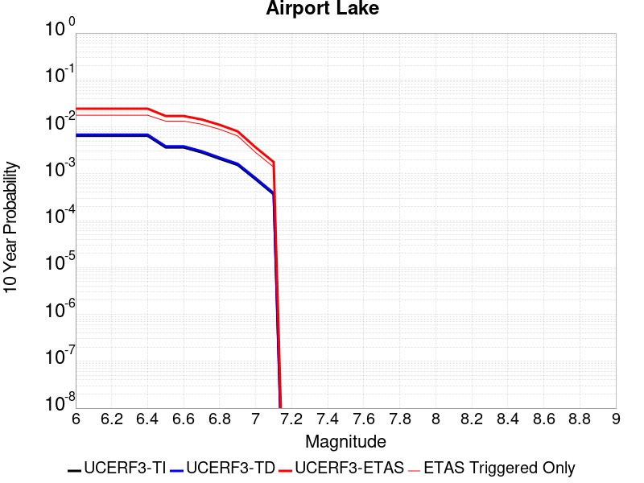 |

| Magnitude | 1 wk TI Prob | 1 wk TD Prob | 1 wk ETAS Prob | 1 wk ETAS/TD Gain | 1 wk ETAS Triggered Only | 1 mo TI Prob | 1 mo TD Prob | 1 mo ETAS Prob | 1 mo ETAS/TD Gain | 1 mo ETAS Triggered Only | 1 yr TI Prob | 1 yr TD Prob | 1 yr ETAS Prob | 1 yr ETAS/TD Gain | 1 yr ETAS Triggered Only | 10 yr TI Prob | 10 yr TD Prob | 10 yr ETAS Prob | 10 yr ETAS/TD Gain | 10 yr ETAS Triggered Only |
|-----|-----|-----|-----|-----|-----|-----|-----|-----|-----|-----|-----|-----|-----|-----|-----|-----|-----|-----|-----|-----|
| 6.0 | 1.2387061E-5 | 1.310376E-5 | 1.310376E-5 | 1.0 | 0.0 | 5.3086325E-5 | 5.615792E-5 | 0.0020467562 | 36.446438 | 0.00199071 | 6.461343E-4 | 6.8353664E-4 | 0.007977817 | 11.671383 | 0.00729927 | 0.0064425888 | 0.0068171523 | 0.01999808 | 2.9334946 | 0.0132714 |
| 6.1 | 1.2387061E-5 | 1.310376E-5 | 1.310376E-5 | 1.0 | 0.0 | 5.3086325E-5 | 5.615792E-5 | 0.0020467562 | 36.446438 | 0.00199071 | 6.461343E-4 | 6.8353664E-4 | 0.007977817 | 11.671383 | 0.00729927 | 0.0064425888 | 0.0068171523 | 0.01999808 | 2.9334946 | 0.0132714 |
| 6.2 | 1.2387061E-5 | 1.310376E-5 | 1.310376E-5 | 1.0 | 0.0 | 5.3086325E-5 | 5.615792E-5 | 0.0020467562 | 36.446438 | 0.00199071 | 6.461343E-4 | 6.8353664E-4 | 0.007977817 | 11.671383 | 0.00729927 | 0.0064425888 | 0.0068171523 | 0.01999808 | 2.9334946 | 0.0132714 |
| 6.3 | 1.2387061E-5 | 1.310376E-5 | 1.310376E-5 | 1.0 | 0.0 | 5.3086325E-5 | 5.615792E-5 | 0.0020467562 | 36.446438 | 0.00199071 | 6.461343E-4 | 6.8353664E-4 | 0.007977817 | 11.671383 | 0.00729927 | 0.0064425888 | 0.0068171523 | 0.01999808 | 2.9334946 | 0.0132714 |
| 6.4 | 1.2387061E-5 | 1.310376E-5 | 1.310376E-5 | 1.0 | 0.0 | 5.3086325E-5 | 5.615792E-5 | 0.0020467562 | 36.446438 | 0.00199071 | 6.461343E-4 | 6.8353664E-4 | 0.007977817 | 11.671383 | 0.00729927 | 0.0064425888 | 0.0068171523 | 0.01999808 | 2.9334946 | 0.0132714 |
| 6.5 | 6.9922594E-6 | 7.3852552E-6 | 7.3852552E-6 | 1.0 | 0.0 | 2.996648E-5 | 3.165074E-5 | 0.0020222978 | 63.89417 | 0.00199071 | 3.6478083E-4 | 3.8528506E-4 | 0.007681743 | 19.937817 | 0.00729927 | 0.003641826 | 0.0038467082 | 0.015084005 | 3.921276 | 0.01128069 |
| 6.6 | 6.9922594E-6 | 7.3852552E-6 | 7.3852552E-6 | 1.0 | 0.0 | 2.996648E-5 | 3.165074E-5 | 0.0020222978 | 63.89417 | 0.00199071 | 3.6478083E-4 | 3.8528506E-4 | 0.007681743 | 19.937817 | 0.00729927 | 0.003641826 | 0.0038467082 | 0.015084005 | 3.921276 | 0.01128069 |
| 6.7 | 5.477277E-6 | 5.786328E-6 | 5.786328E-6 | 1.0 | 0.0 | 2.3473833E-5 | 2.4798335E-5 | 0.002015459 | 81.273964 | 0.00199071 | 2.8575645E-4 | 3.0188178E-4 | 0.0056088394 | 18.579588 | 0.00530856 | 0.0028538927 | 0.003015101 | 0.011615502 | 3.852442 | 0.00862641 |
| 6.8 | 3.9950432E-6 | 4.2192755E-6 | 4.2192755E-6 | 1.0 | 0.0 | 1.7121502E-5 | 1.8082499E-5 | 0.0020087566 | 111.08843 | 0.00199071 | 2.0843433E-4 | 2.2013494E-4 | 0.0042006783 | 19.082289 | 0.00398142 | 0.0020823893 | 0.0021994398 | 0.008820545 | 4.01036 | 0.0066357 |
| 6.9 | 2.95695E-6 | 3.1231639E-6 | 3.1231639E-6 | 1.0 | 0.0 | 1.2672582E-5 | 1.3384933E-5 | 0.0013405072 | 100.15047 | 0.00132714 | 1.5427776E-4 | 1.6295163E-4 | 0.003480261 | 21.357632 | 0.00331785 | 0.001541707 | 0.0016285438 | 0.0062659695 | 3.8475902 | 0.00464499 |
| 7.0 | 1.456072E-6 | 1.5408833E-6 | 1.5408833E-6 | 1.0 | 0.0 | 6.2402937E-6 | 6.6037746E-6 | 6.701694E-4 | 101.48277 | 6.6357E-4 | 7.597293E-5 | 8.0399E-5 | 0.0014074324 | 17.505594 | 0.00132714 | 7.594696E-4 | 8.0379803E-4 | 0.0034559446 | 4.2995186 | 0.00265428 |
| 7.1 | 6.995192E-7 | 7.409323E-7 | 7.409323E-7 | 1.0 | 0.0 | 2.997936E-6 | 3.1754241E-6 | 3.1754241E-6 | 1.0 | 0.0 | 3.649926E-5 | 3.866079E-5 | 3.866079E-5 | 1.0 | 0.0 | 3.6493264E-4 | 3.866079E-4 | 0.0010499214 | 2.7157266 | 6.6357E-4 |

## Garlock (East)
*[(top)](#table-of-contents)*

| 1 Week | 1 Month | 1 Year | 10 Year |
|-----|-----|-----|-----|
|  |  |  |  |

| Magnitude | 1 wk TI Prob | 1 wk TD Prob | 1 wk ETAS Prob | 1 wk ETAS/TD Gain | 1 wk ETAS Triggered Only | 1 mo TI Prob | 1 mo TD Prob | 1 mo ETAS Prob | 1 mo ETAS/TD Gain | 1 mo ETAS Triggered Only | 1 yr TI Prob | 1 yr TD Prob | 1 yr ETAS Prob | 1 yr ETAS/TD Gain | 1 yr ETAS Triggered Only | 10 yr TI Prob | 10 yr TD Prob | 10 yr ETAS Prob | 10 yr ETAS/TD Gain | 10 yr ETAS Triggered Only |
|-----|-----|-----|-----|-----|-----|-----|-----|-----|-----|-----|-----|-----|-----|-----|-----|-----|-----|-----|-----|-----|
| 6.0 | 4.5092507E-5 | 6.292451E-5 | 6.292451E-5 | 1.0 | 0.0 | 1.9323928E-4 | 2.6965112E-4 | 0.0015964332 | 5.9203653 | 0.00132714 | 0.0023501497 | 0.0032785062 | 0.008569662 | 2.6138923 | 0.00530856 | 0.023254504 | 0.032362625 | 0.042636145 | 1.3174502 | 0.01061712 |
| 6.1 | 4.5092507E-5 | 6.292451E-5 | 6.292451E-5 | 1.0 | 0.0 | 1.9323928E-4 | 2.6965112E-4 | 0.0015964332 | 5.9203653 | 0.00132714 | 0.0023501497 | 0.0032785062 | 0.008569662 | 2.6138923 | 0.00530856 | 0.023254504 | 0.032362625 | 0.042636145 | 1.3174502 | 0.01061712 |
| 6.2 | 2.6674514E-5 | 3.4526525E-5 | 3.4526525E-5 | 1.0 | 0.0 | 1.1431433E-4 | 1.4796262E-4 | 0.0014749062 | 9.968101 | 0.00132714 | 0.0013908884 | 0.0017999895 | 0.007098994 | 3.9439087 | 0.00530856 | 0.01382215 | 0.017898904 | 0.027022604 | 1.5097351 | 0.00928998 |
| 6.3 | 2.6674514E-5 | 3.4526525E-5 | 3.4526525E-5 | 1.0 | 0.0 | 1.1431433E-4 | 1.4796262E-4 | 0.0014749062 | 9.968101 | 0.00132714 | 0.0013908884 | 0.0017999895 | 0.007098994 | 3.9439087 | 0.00530856 | 0.01382215 | 0.017898904 | 0.027022604 | 1.5097351 | 0.00928998 |
| 6.4 | 2.5312667E-5 | 3.23554E-5 | 3.23554E-5 | 1.0 | 0.0 | 1.0847834E-4 | 1.3865881E-4 | 0.0014656148 | 10.569937 | 0.00132714 | 0.0013199237 | 0.0016868932 | 0.0069864984 | 4.1416364 | 0.00530856 | 0.013121112 | 0.016786762 | 0.025920792 | 1.5441211 | 0.00928998 |
| 6.5 | 2.5312667E-5 | 3.23554E-5 | 3.23554E-5 | 1.0 | 0.0 | 1.0847834E-4 | 1.3865881E-4 | 0.0014656148 | 10.569937 | 0.00132714 | 0.0013199237 | 0.0016868932 | 0.0069864984 | 4.1416364 | 0.00530856 | 0.013121112 | 0.016786762 | 0.025920792 | 1.5441211 | 0.00928998 |
| 6.6 | 2.246556E-5 | 2.8149634E-5 | 2.8149634E-5 | 1.0 | 0.0 | 9.627742E-5 | 1.2063584E-4 | 0.0014476158 | 11.999881 | 0.00132714 | 0.0011715472 | 0.0014677754 | 0.006105948 | 4.1600013 | 0.00464499 | 0.011653901 | 0.0146267945 | 0.023127029 | 1.5811412 | 0.00862641 |
| 6.7 | 2.2241198E-5 | 2.7819331E-5 | 2.7819331E-5 | 1.0 | 0.0 | 9.531594E-5 | 1.19220385E-4 | 0.0014462022 | 12.130494 | 0.00132714 | 0.0011598538 | 0.0014505653 | 0.0060888175 | 4.197548 | 0.00464499 | 0.011538187 | 0.014456965 | 0.022958664 | 1.5880693 | 0.00862641 |
| 6.8 | 1.9528685E-5 | 2.3912964E-5 | 2.3912964E-5 | 1.0 | 0.0 | 8.369167E-5 | 1.0248022E-4 | 0.0014294842 | 13.94888 | 0.00132714 | 0.0010184698 | 0.0012470022 | 0.0058862 | 4.7202806 | 0.00464499 | 0.010138147 | 0.0124440305 | 0.020963093 | 1.6845903 | 0.00862641 |
| 6.9 | 1.3318621E-5 | 1.5211622E-5 | 1.5211622E-5 | 1.0 | 0.0 | 5.7078556E-5 | 6.519107E-5 | 0.0013922446 | 21.35637 | 0.00132714 | 6.9470983E-4 | 7.934179E-4 | 0.004771679 | 6.01408 | 0.00398142 | 0.0069254204 | 0.007946478 | 0.015187744 | 1.9112549 | 0.00729927 |
| 7.0 | 1.1760853E-5 | 1.3120087E-5 | 1.3120087E-5 | 1.0 | 0.0 | 5.0402683E-5 | 5.622776E-5 | 0.0013832932 | 24.601604 | 0.00132714 | 6.134799E-4 | 6.84363E-4 | 0.004663058 | 6.8137207 | 0.00398142 | 0.0061178906 | 0.0068628904 | 0.0141120665 | 2.056286 | 0.00729927 |
| 7.1 | 1.0064758E-5 | 1.0914809E-5 | 1.0914809E-5 | 1.0 | 0.0 | 4.3133965E-5 | 4.677693E-5 | 0.0013738548 | 29.37035 | 0.00132714 | 5.2502943E-4 | 5.693638E-4 | 0.004548517 | 7.9887705 | 0.00398142 | 0.005237907 | 0.005719159 | 0.012976683 | 2.2689846 | 0.00729927 |
| 7.2 | 9.768808E-6 | 1.0510603E-5 | 1.0510603E-5 | 1.0 | 0.0 | 4.186565E-5 | 4.5044682E-5 | 0.0013721249 | 30.46142 | 0.00132714 | 5.095951E-4 | 5.482845E-4 | 0.004527522 | 8.257614 | 0.00398142 | 0.0050842804 | 0.005509383 | 0.012768439 | 2.3175805 | 0.00729927 |
| 7.3 | 9.344516E-6 | 9.956039E-6 | 9.956039E-6 | 1.0 | 0.0 | 4.004731E-5 | 4.266806E-5 | 0.0013697514 | 32.1025 | 0.00132714 | 4.8746695E-4 | 5.1936327E-4 | 0.0038354902 | 7.3849854 | 0.00331785 | 0.0048639905 | 0.005220949 | 0.011822005 | 2.2643402 | 0.0066357 |
| 7.4 | 9.023491E-6 | 9.502E-6 | 9.502E-6 | 1.0 | 0.0 | 3.867153E-5 | 4.0722236E-5 | 0.0013678082 | 33.58873 | 0.00132714 | 4.7072413E-4 | 4.956838E-4 | 0.0031486482 | 6.3521304 | 0.00265428 | 0.004697283 | 0.004984283 | 0.010266384 | 2.0597513 | 0.00530856 |
| 7.5 | 7.081253E-6 | 7.0977576E-6 | 7.0977576E-6 | 1.0 | 0.0 | 3.0347876E-5 | 3.0418612E-5 | 6.9396844E-4 | 22.813942 | 6.6357E-4 | 3.6942272E-4 | 3.702844E-4 | 0.0010336087 | 2.7913914 | 6.6357E-4 | 0.003688092 | 0.0037295583 | 0.005712844 | 1.5317749 | 0.00199071 |
| 7.6 | 6.116396E-6 | 5.968831E-6 | 5.968831E-6 | 1.0 | 0.0 | 2.6212863E-5 | 2.5580453E-5 | 6.891335E-4 | 26.939846 | 6.6357E-4 | 3.1909486E-4 | 3.1139777E-4 | 9.7476115E-4 | 3.1302764 | 6.6357E-4 | 0.0031863707 | 0.0031407424 | 0.0051252004 | 1.6318434 | 0.00199071 |
| 7.7 | 4.797145E-6 | 4.7663516E-6 | 4.7663516E-6 | 1.0 | 0.0 | 2.055903E-5 | 2.0427062E-5 | 6.839835E-4 | 33.484184 | 6.6357E-4 | 2.5027743E-4 | 2.4867122E-4 | 9.120762E-4 | 3.6677997 | 6.6357E-4 | 0.0024999576 | 0.0025140692 | 0.0038378728 | 1.526558 | 0.00132714 |
| 7.8 | 3.4028885E-6 | 3.9865513E-6 | 3.9865513E-6 | 1.0 | 0.0 | 1.4583726E-5 | 1.7085107E-5 | 6.806438E-4 | 39.838425 | 6.6357E-4 | 1.775424E-4 | 2.079914E-4 | 8.714234E-4 | 4.1897087 | 6.6357E-4 | 0.0017740062 | 0.0021054333 | 0.0027676062 | 1.3145068 | 6.6357E-4 |
| 7.9 | 2.5928412E-6 | 3.3792862E-6 | 3.3792862E-6 | 1.0 | 0.0 | 1.1112129E-5 | 1.4482575E-5 | 1.4482575E-5 | 1.0 | 0.0 | 1.3528178E-4 | 1.7631115E-4 | 1.7631115E-4 | 1.0 | 0.0 | 0.0013519945 | 0.0017847975 | 0.0017847975 | 1.0 | 0.0 |
| 8.0 | 1.3743648E-6 | 1.6765744E-6 | 1.6765744E-6 | 1.0 | 0.0 | 5.8901214E-6 | 7.185299E-6 | 7.185299E-6 | 1.0 | 0.0 | 7.1709874E-5 | 8.7477536E-5 | 8.7477536E-5 | 1.0 | 0.0 | 7.1686733E-4 | 8.853369E-4 | 8.853369E-4 | 1.0 | 0.0 |
| 8.1 | 3.6733252E-7 | 3.154532E-7 | 3.154532E-7 | 1.0 | 0.0 | 1.5742813E-6 | 1.3519417E-6 | 1.3519417E-6 | 1.0 | 0.0 | 1.9166706E-5 | 1.6459782E-5 | 1.6459782E-5 | 1.0 | 0.0 | 1.9165053E-4 | 1.6667772E-4 | 1.6667772E-4 | 1.0 | 0.0 |

## Panamint Valley
*[(top)](#table-of-contents)*

| 1 Week | 1 Month | 1 Year | 10 Year |
|-----|-----|-----|-----|
|  |  |  |  |

| Magnitude | 1 wk TI Prob | 1 wk TD Prob | 1 wk ETAS Prob | 1 wk ETAS/TD Gain | 1 wk ETAS Triggered Only | 1 mo TI Prob | 1 mo TD Prob | 1 mo ETAS Prob | 1 mo ETAS/TD Gain | 1 mo ETAS Triggered Only | 1 yr TI Prob | 1 yr TD Prob | 1 yr ETAS Prob | 1 yr ETAS/TD Gain | 1 yr ETAS Triggered Only | 10 yr TI Prob | 10 yr TD Prob | 10 yr ETAS Prob | 10 yr ETAS/TD Gain | 10 yr ETAS Triggered Only |
|-----|-----|-----|-----|-----|-----|-----|-----|-----|-----|-----|-----|-----|-----|-----|-----|-----|-----|-----|-----|-----|
| 6.0 | 3.0211835E-5 | 3.3989538E-5 | 3.3989538E-5 | 1.0 | 0.0 | 1.2947287E-4 | 1.4566147E-4 | 8.091348E-4 | 5.554899 | 6.6357E-4 | 0.0015751923 | 0.0017720154 | 0.0064087743 | 3.6166584 | 0.00464499 | 0.015640736 | 0.017585713 | 0.025408521 | 1.4448389 | 0.00796284 |
| 6.1 | 3.0211835E-5 | 3.3989538E-5 | 3.3989538E-5 | 1.0 | 0.0 | 1.2947287E-4 | 1.4566147E-4 | 8.091348E-4 | 5.554899 | 6.6357E-4 | 0.0015751923 | 0.0017720154 | 0.0064087743 | 3.6166584 | 0.00464499 | 0.015640736 | 0.017585713 | 0.025408521 | 1.4448389 | 0.00796284 |
| 6.2 | 3.0211835E-5 | 3.3989538E-5 | 3.3989538E-5 | 1.0 | 0.0 | 1.2947287E-4 | 1.4566147E-4 | 8.091348E-4 | 5.554899 | 6.6357E-4 | 0.0015751923 | 0.0017720154 | 0.0064087743 | 3.6166584 | 0.00464499 | 0.015640736 | 0.017585713 | 0.025408521 | 1.4448389 | 0.00796284 |
| 6.3 | 2.8573924E-5 | 3.210744E-5 | 3.210744E-5 | 1.0 | 0.0 | 1.2245393E-4 | 1.3759622E-4 | 8.010749E-4 | 5.8219256 | 6.6357E-4 | 0.001489857 | 0.0016739744 | 0.00564873 | 3.374442 | 0.00398142 | 0.01479908 | 0.016620243 | 0.023798198 | 1.4318802 | 0.00729927 |
| 6.4 | 2.8573924E-5 | 3.210744E-5 | 3.210744E-5 | 1.0 | 0.0 | 1.2245393E-4 | 1.3759622E-4 | 8.010749E-4 | 5.8219256 | 6.6357E-4 | 0.001489857 | 0.0016739744 | 0.00564873 | 3.374442 | 0.00398142 | 0.01479908 | 0.016620243 | 0.023798198 | 1.4318802 | 0.00729927 |
| 6.5 | 2.7468774E-5 | 3.083301E-5 | 3.083301E-5 | 1.0 | 0.0 | 1.1771801E-4 | 1.3213494E-4 | 7.9561723E-4 | 6.0212483 | 6.6357E-4 | 0.0014322745 | 0.001607583 | 0.0055826027 | 3.4726682 | 0.00398142 | 0.014230782 | 0.015966026 | 0.022495782 | 1.408978 | 0.0066357 |
| 6.6 | 2.6135967E-5 | 2.9256855E-5 | 2.9256855E-5 | 1.0 | 0.0 | 1.1200648E-4 | 1.2538064E-4 | 7.888675E-4 | 6.2917805 | 6.6357E-4 | 0.0013628257 | 0.0015254669 | 0.0055008135 | 3.6059866 | 0.00398142 | 0.013544982 | 0.015156291 | 0.02169142 | 1.4311825 | 0.0066357 |
| 6.7 | 2.4498746E-5 | 2.7345563E-5 | 2.7345563E-5 | 1.0 | 0.0 | 1.04990395E-4 | 1.17190146E-4 | 7.8068237E-4 | 6.6616726 | 6.6357E-4 | 0.0012775084 | 0.0014258813 | 0.0047390005 | 3.323559 | 0.00331785 | 0.012701893 | 0.01417345 | 0.01940677 | 1.369234 | 0.00530856 |
| 6.8 | 2.2244329E-5 | 2.4939382E-5 | 2.4939382E-5 | 1.0 | 0.0 | 9.532935E-5 | 1.0687881E-4 | 7.7037787E-4 | 7.2079573 | 6.6357E-4 | 0.0011600169 | 0.0013004945 | 0.0046140295 | 3.5479038 | 0.00331785 | 0.011539802 | 0.012934558 | 0.018174455 | 1.4051082 | 0.00530856 |
| 6.9 | 1.9902658E-5 | 2.2293923E-5 | 2.2293923E-5 | 1.0 | 0.0 | 8.529431E-5 | 9.554199E-5 | 7.590486E-4 | 7.9446597 | 6.6357E-4 | 0.0010379635 | 0.0011626214 | 0.0044766143 | 3.8504486 | 0.00331785 | 0.010331288 | 0.011570494 | 0.01616174 | 1.3968064 | 0.00464499 |
| 7.0 | 1.8353881E-5 | 2.0569634E-5 | 2.0569634E-5 | 1.0 | 0.0 | 7.865712E-5 | 8.81527E-5 | 7.516642E-4 | 8.526843 | 6.6357E-4 | 9.5722964E-4 | 0.0010727483 | 0.004387039 | 4.0895324 | 0.00331785 | 0.009531168 | 0.01068063 | 0.015276009 | 1.4302535 | 0.00464499 |
| 7.1 | 1.7667631E-5 | 1.9775962E-5 | 1.9775962E-5 | 1.0 | 0.0 | 7.571623E-5 | 8.475147E-5 | 7.4826524E-4 | 8.828936 | 6.6357E-4 | 9.2145515E-4 | 0.0010313783 | 0.0043458063 | 4.213591 | 0.00331785 | 0.009176437 | 0.010270803 | 0.014868085 | 1.4476069 | 0.00464499 |
| 7.2 | 1.6381597E-5 | 1.816138E-5 | 1.816138E-5 | 1.0 | 0.0 | 7.020495E-5 | 7.783226E-5 | 7.4135064E-4 | 9.524979 | 6.6357E-4 | 8.544101E-4 | 9.472131E-4 | 0.003598979 | 3.7995453 | 0.00265428 | 0.008511325 | 0.009436411 | 0.01338026 | 1.4179397 | 0.00398142 |
| 7.3 | 1.4520491E-5 | 1.5969023E-5 | 1.5969023E-5 | 1.0 | 0.0 | 6.222919E-5 | 6.8436966E-5 | 6.8436966E-5 | 1.0 | 0.0 | 7.57377E-4 | 8.3291775E-4 | 0.0021589524 | 2.5920355 | 0.00132714 | 0.0075480095 | 0.008301071 | 0.010933317 | 1.3170972 | 0.00265428 |
| 7.4 | 1.2852287E-5 | 1.4147676E-5 | 1.4147676E-5 | 1.0 | 0.0 | 5.5080065E-5 | 6.0631577E-5 | 6.0631577E-5 | 1.0 | 0.0 | 6.7039346E-4 | 7.3795527E-4 | 0.0020641158 | 2.7970746 | 0.00132714 | 0.0066837464 | 0.0073579694 | 0.00999272 | 1.3580811 | 0.00265428 |
| 7.5 | 1.1637851E-5 | 1.2838909E-5 | 1.2838909E-5 | 1.0 | 0.0 | 4.987555E-5 | 5.5022825E-5 | 5.5022825E-5 | 1.0 | 0.0 | 6.070656E-4 | 6.6971267E-4 | 0.001995964 | 2.9803288 | 0.00132714 | 0.006054099 | 0.0066798427 | 0.009316392 | 1.3947024 | 0.00265428 |
| 7.6 | 3.0068115E-6 | 3.3338551E-6 | 3.3338551E-6 | 1.0 | 0.0 | 1.2886271E-5 | 1.42879135E-5 | 1.42879135E-5 | 1.0 | 0.0 | 1.5687906E-4 | 1.7394875E-4 | 1.7394875E-4 | 1.0 | 0.0 | 0.0015676835 | 0.0017395673 | 0.0017395673 | 1.0 | 0.0 |

## Ash Hill
*[(top)](#table-of-contents)*

| 1 Week | 1 Month | 1 Year | 10 Year |
|-----|-----|-----|-----|
|  |  |  |  |

| Magnitude | 1 wk TI Prob | 1 wk TD Prob | 1 wk ETAS Prob | 1 wk ETAS/TD Gain | 1 wk ETAS Triggered Only | 1 mo TI Prob | 1 mo TD Prob | 1 mo ETAS Prob | 1 mo ETAS/TD Gain | 1 mo ETAS Triggered Only | 1 yr TI Prob | 1 yr TD Prob | 1 yr ETAS Prob | 1 yr ETAS/TD Gain | 1 yr ETAS Triggered Only | 10 yr TI Prob | 10 yr TD Prob | 10 yr ETAS Prob | 10 yr ETAS/TD Gain | 10 yr ETAS Triggered Only |
|-----|-----|-----|-----|-----|-----|-----|-----|-----|-----|-----|-----|-----|-----|-----|-----|-----|-----|-----|-----|-----|
| 6.0 | 2.1545662E-5 | 2.319586E-5 | 2.319586E-5 | 1.0 | 0.0 | 9.2335285E-5 | 9.9407494E-5 | 7.629115E-4 | 7.6745877 | 6.6357E-4 | 0.0011236023 | 0.0012096942 | 0.0045235306 | 3.7394 | 0.00331785 | 0.011179381 | 0.012039078 | 0.017283728 | 1.4356354 | 0.00530856 |
| 6.1 | 2.1545662E-5 | 2.319586E-5 | 2.319586E-5 | 1.0 | 0.0 | 9.2335285E-5 | 9.9407494E-5 | 7.629115E-4 | 7.6745877 | 6.6357E-4 | 0.0011236023 | 0.0012096942 | 0.0045235306 | 3.7394 | 0.00331785 | 0.011179381 | 0.012039078 | 0.017283728 | 1.4356354 | 0.00530856 |
| 6.2 | 2.1545662E-5 | 2.319586E-5 | 2.319586E-5 | 1.0 | 0.0 | 9.2335285E-5 | 9.9407494E-5 | 7.629115E-4 | 7.6745877 | 6.6357E-4 | 0.0011236023 | 0.0012096942 | 0.0045235306 | 3.7394 | 0.00331785 | 0.011179381 | 0.012039078 | 0.017283728 | 1.4356354 | 0.00530856 |
| 6.3 | 1.0025529E-5 | 1.074755E-5 | 1.074755E-5 | 1.0 | 0.0 | 4.2965847E-5 | 4.6060188E-5 | 4.6060188E-5 | 1.0 | 0.0 | 5.229836E-4 | 5.6065177E-4 | 0.0012238497 | 2.1829054 | 6.6357E-4 | 0.005217545 | 0.005593686 | 0.0075732605 | 1.3538945 | 0.00199071 |
| 6.4 | 1.0025529E-5 | 1.074755E-5 | 1.074755E-5 | 1.0 | 0.0 | 4.2965847E-5 | 4.6060188E-5 | 4.6060188E-5 | 1.0 | 0.0 | 5.229836E-4 | 5.6065177E-4 | 0.0012238497 | 2.1829054 | 6.6357E-4 | 0.005217545 | 0.005593686 | 0.0075732605 | 1.3538945 | 0.00199071 |
| 6.5 | 6.9617327E-6 | 7.4570557E-6 | 7.4570557E-6 | 1.0 | 0.0 | 2.9835655E-5 | 3.195847E-5 | 3.195847E-5 | 1.0 | 0.0 | 3.6318856E-4 | 3.8903355E-4 | 0.0010523454 | 2.7050247 | 6.6357E-4 | 0.0036259557 | 0.0038843798 | 0.0052063647 | 1.3403336 | 0.00132714 |
| 6.6 | 4.9919777E-6 | 5.3469907E-6 | 5.3469907E-6 | 1.0 | 0.0 | 2.1394015E-5 | 2.291551E-5 | 2.291551E-5 | 1.0 | 0.0 | 2.60441E-4 | 2.7896732E-4 | 9.423522E-4 | 3.3780022 | 6.6357E-4 | 0.0026013597 | 0.00278683 | 0.0034485508 | 1.2374457 | 6.6357E-4 |
| 6.7 | 3.6630722E-6 | 3.9248466E-6 | 3.9248466E-6 | 1.0 | 0.0 | 1.5698786E-5 | 1.6820695E-5 | 1.6820695E-5 | 1.0 | 0.0 | 1.9111596E-4 | 2.0477847E-4 | 8.682126E-4 | 4.239765 | 6.6357E-4 | 0.0019095168 | 0.0020464608 | 0.0027086728 | 1.323589 | 6.6357E-4 |
| 6.8 | 2.5599613E-6 | 2.7450828E-6 | 2.7450828E-6 | 1.0 | 0.0 | 1.0971216E-5 | 1.1764616E-5 | 1.1764616E-5 | 1.0 | 0.0 | 1.3356637E-4 | 1.4322973E-4 | 8.067047E-4 | 5.632243 | 6.6357E-4 | 0.0013348613 | 0.0014318592 | 0.002094479 | 1.4627689 | 6.6357E-4 |
| 6.9 | 1.7684905E-6 | 1.8969803E-6 | 1.8969803E-6 | 1.0 | 0.0 | 7.579223E-6 | 8.129916E-6 | 8.129916E-6 | 1.0 | 0.0 | 9.2273134E-5 | 9.898172E-5 | 9.898172E-5 | 1.0 | 0.0 | 9.223483E-4 | 9.898172E-4 | 9.898172E-4 | 1.0 | 0.0 |

## Gravel Hills-Harper Lk
*[(top)](#table-of-contents)*

| 1 Week | 1 Month | 1 Year | 10 Year |
|-----|-----|-----|-----|
|  |  |  |  |

| Magnitude | 1 wk TI Prob | 1 wk TD Prob | 1 wk ETAS Prob | 1 wk ETAS/TD Gain | 1 wk ETAS Triggered Only | 1 mo TI Prob | 1 mo TD Prob | 1 mo ETAS Prob | 1 mo ETAS/TD Gain | 1 mo ETAS Triggered Only | 1 yr TI Prob | 1 yr TD Prob | 1 yr ETAS Prob | 1 yr ETAS/TD Gain | 1 yr ETAS Triggered Only | 10 yr TI Prob | 10 yr TD Prob | 10 yr ETAS Prob | 10 yr ETAS/TD Gain | 10 yr ETAS Triggered Only |
|-----|-----|-----|-----|-----|-----|-----|-----|-----|-----|-----|-----|-----|-----|-----|-----|-----|-----|-----|-----|-----|
| 6.0 | 3.0679566E-5 | 3.146788E-5 | 3.146788E-5 | 1.0 | 0.0 | 1.3147724E-4 | 1.3485659E-4 | 1.3485659E-4 | 1.0 | 0.0 | 0.0015995599 | 0.0016408587 | 0.0036283024 | 2.2112217 | 0.00199071 | 0.015880952 | 0.016309002 | 0.02022549 | 1.2401426 | 0.00398142 |
| 6.1 | 3.0679566E-5 | 3.146788E-5 | 3.146788E-5 | 1.0 | 0.0 | 1.3147724E-4 | 1.3485659E-4 | 1.3485659E-4 | 1.0 | 0.0 | 0.0015995599 | 0.0016408587 | 0.0036283024 | 2.2112217 | 0.00199071 | 0.015880952 | 0.016309002 | 0.02022549 | 1.2401426 | 0.00398142 |
| 6.2 | 1.514536E-5 | 1.3636321E-5 | 1.3636321E-5 | 1.0 | 0.0 | 6.490707E-5 | 5.844013E-5 | 5.844013E-5 | 1.0 | 0.0 | 7.8995706E-4 | 7.1128824E-4 | 7.1128824E-4 | 1.0 | 0.0 | 0.007871548 | 0.007091318 | 0.007091318 | 1.0 | 0.0 |
| 6.3 | 1.514536E-5 | 1.3636321E-5 | 1.3636321E-5 | 1.0 | 0.0 | 6.490707E-5 | 5.844013E-5 | 5.844013E-5 | 1.0 | 0.0 | 7.8995706E-4 | 7.1128824E-4 | 7.1128824E-4 | 1.0 | 0.0 | 0.007871548 | 0.007091318 | 0.007091318 | 1.0 | 0.0 |
| 6.4 | 1.2532521E-5 | 1.06905045E-5 | 1.06905045E-5 | 1.0 | 0.0 | 5.37097E-5 | 4.5815676E-5 | 4.5815676E-5 | 1.0 | 0.0 | 6.537194E-4 | 5.576689E-4 | 5.576689E-4 | 1.0 | 0.0 | 0.0065179965 | 0.005563285 | 0.005563285 | 1.0 | 0.0 |
| 6.5 | 1.1094058E-5 | 9.084328E-6 | 9.084328E-6 | 1.0 | 0.0 | 4.7545094E-5 | 3.8932274E-5 | 3.8932274E-5 | 1.0 | 0.0 | 5.787078E-4 | 4.7390137E-4 | 4.7390137E-4 | 1.0 | 0.0 | 0.0057720304 | 0.004729315 | 0.004729315 | 1.0 | 0.0 |
| 6.6 | 9.688328E-6 | 7.53223E-6 | 7.53223E-6 | 1.0 | 0.0 | 4.1520743E-5 | 3.22806E-5 | 3.22806E-5 | 1.0 | 0.0 | 5.053978E-4 | 3.92948E-4 | 3.92948E-4 | 1.0 | 0.0 | 0.0050424994 | 0.0039227884 | 0.0039227884 | 1.0 | 0.0 |
| 6.7 | 8.974824E-6 | 6.7498877E-6 | 6.7498877E-6 | 1.0 | 0.0 | 3.8462964E-5 | 2.8927781E-5 | 2.8927781E-5 | 1.0 | 0.0 | 4.6818596E-4 | 3.5214104E-4 | 3.5214104E-4 | 1.0 | 0.0 | 0.004672008 | 0.0035160515 | 0.0035160515 | 1.0 | 0.0 |
| 6.8 | 7.4780046E-6 | 5.1165493E-6 | 5.1165493E-6 | 1.0 | 0.0 | 3.20482E-5 | 2.1927892E-5 | 2.1927892E-5 | 1.0 | 0.0 | 3.9011694E-4 | 2.6694077E-4 | 2.6694077E-4 | 1.0 | 0.0 | 0.0038943281 | 0.0026663395 | 0.0026663395 | 1.0 | 0.0 |
| 6.9 | 6.3409307E-6 | 3.9077745E-6 | 3.9077745E-6 | 1.0 | 0.0 | 2.7175134E-5 | 1.6747503E-5 | 1.6747503E-5 | 1.0 | 0.0 | 3.3080703E-4 | 2.0388277E-4 | 2.0388277E-4 | 1.0 | 0.0 | 0.0033031502 | 0.0020370553 | 0.0020370553 | 1.0 | 0.0 |
| 7.0 | 5.1239335E-6 | 2.606051E-6 | 2.606051E-6 | 1.0 | 0.0 | 2.195953E-5 | 1.1168744E-5 | 1.1168744E-5 | 1.0 | 0.0 | 2.6732447E-4 | 1.3597123E-4 | 1.3597123E-4 | 1.0 | 0.0 | 0.0026700313 | 0.0013589056 | 0.0013589056 | 1.0 | 0.0 |
| 7.1 | 4.438899E-6 | 2.0986356E-6 | 2.0986356E-6 | 1.0 | 0.0 | 1.9023713E-5 | 8.994123E-6 | 8.994123E-6 | 1.0 | 0.0 | 2.315891E-4 | 1.0949816E-4 | 1.0949816E-4 | 1.0 | 0.0 | 0.002313479 | 0.001094464 | 0.001094464 | 1.0 | 0.0 |
| 7.2 | 3.50367E-6 | 1.2616914E-6 | 1.2616914E-6 | 1.0 | 0.0 | 1.5015643E-5 | 5.4072384E-6 | 5.4072384E-6 | 1.0 | 0.0 | 1.8280011E-4 | 6.583122E-5 | 6.583122E-5 | 1.0 | 0.0 | 0.0018264982 | 6.5812544E-4 | 6.5812544E-4 | 1.0 | 0.0 |
| 7.3 | 2.561638E-6 | 7.1200765E-7 | 7.1200765E-7 | 1.0 | 0.0 | 1.0978401E-5 | 3.051458E-6 | 3.051458E-6 | 1.0 | 0.0 | 1.3365384E-4 | 3.7150887E-5 | 3.7150887E-5 | 1.0 | 0.0 | 0.0013357349 | 3.7144875E-4 | 3.7144875E-4 | 1.0 | 0.0 |
| 7.4 | 2.0368864E-6 | 5.305573E-7 | 5.305573E-7 | 1.0 | 0.0 | 8.729483E-6 | 2.273815E-6 | 2.273815E-6 | 1.0 | 0.0 | 1.06276275E-4 | 2.7683353E-5 | 2.7683353E-5 | 1.0 | 0.0 | 0.0010622547 | 2.7679958E-4 | 2.7679958E-4 | 1.0 | 0.0 |
| 7.5 | 1.1681728E-6 | 3.6034797E-7 | 3.6034797E-7 | 1.0 | 0.0 | 5.0064455E-6 | 1.5443476E-6 | 1.5443476E-6 | 1.0 | 0.0 | 6.0951766E-5 | 1.8802275E-5 | 1.8802275E-5 | 1.0 | 0.0 | 6.093505E-4 | 1.880073E-4 | 1.880073E-4 | 1.0 | 0.0 |
| 7.6 | 1.3154387E-7 | 7.1202656E-8 | 7.1202656E-8 | 1.0 | 0.0 | 5.6375933E-7 | 3.0515423E-7 | 3.0515423E-7 | 1.0 | 0.0 | 6.863748E-6 | 3.7152479E-6 | 3.7152479E-6 | 1.0 | 0.0 | 6.863536E-5 | 3.715202E-5 | 3.715202E-5 | 1.0 | 0.0 |

## Garlock (West)
*[(top)](#table-of-contents)*

| 1 Week | 1 Month | 1 Year | 10 Year |
|-----|-----|-----|-----|
|  |  |  |  |

| Magnitude | 1 wk TI Prob | 1 wk TD Prob | 1 wk ETAS Prob | 1 wk ETAS/TD Gain | 1 wk ETAS Triggered Only | 1 mo TI Prob | 1 mo TD Prob | 1 mo ETAS Prob | 1 mo ETAS/TD Gain | 1 mo ETAS Triggered Only | 1 yr TI Prob | 1 yr TD Prob | 1 yr ETAS Prob | 1 yr ETAS/TD Gain | 1 yr ETAS Triggered Only | 10 yr TI Prob | 10 yr TD Prob | 10 yr ETAS Prob | 10 yr ETAS/TD Gain | 10 yr ETAS Triggered Only |
|-----|-----|-----|-----|-----|-----|-----|-----|-----|-----|-----|-----|-----|-----|-----|-----|-----|-----|-----|-----|-----|
| 6.0 | 2.5181727E-5 | 2.5226447E-5 | 2.5226447E-5 | 1.0 | 0.0 | 1.0791722E-4 | 1.08108885E-4 | 7.7160716E-4 | 7.137315 | 6.6357E-4 | 0.0013131002 | 0.0013154343 | 0.0026408287 | 2.0075715 | 0.00132714 | 0.013053683 | 0.013156932 | 0.017740808 | 1.3484001 | 0.00464499 |
| 6.1 | 2.5077732E-5 | 2.5127507E-5 | 2.5127507E-5 | 1.0 | 0.0 | 1.0747157E-4 | 1.0768489E-4 | 7.7118346E-4 | 7.1614823 | 6.6357E-4 | 0.001307681 | 0.0013102784 | 0.0026356794 | 2.0115416 | 0.00132714 | 0.013000126 | 0.013105982 | 0.017690094 | 1.3497726 | 0.00464499 |
| 6.2 | 2.494612E-5 | 2.5009165E-5 | 2.5009165E-5 | 1.0 | 0.0 | 1.0690756E-4 | 1.0717775E-4 | 7.7067665E-4 | 7.1906404 | 6.6357E-4 | 0.0013008224 | 0.0013041114 | 0.0026295206 | 2.0163312 | 0.00132714 | 0.012932341 | 0.013045037 | 0.017629433 | 1.3514284 | 0.00464499 |
| 6.3 | 2.4733758E-5 | 2.48285E-5 | 2.48285E-5 | 1.0 | 0.0 | 1.0599751E-4 | 1.0640353E-4 | 7.6990295E-4 | 7.2356896 | 6.6357E-4 | 0.0012897556 | 0.0012946966 | 0.0026201184 | 2.0237315 | 0.00132714 | 0.012822957 | 0.01295199 | 0.017536819 | 1.3539864 | 0.00464499 |
| 6.4 | 2.3237335E-5 | 2.3207602E-5 | 2.3207602E-5 | 1.0 | 0.0 | 9.958477E-5 | 9.945738E-5 | 7.629614E-4 | 7.67124 | 6.6357E-4 | 0.0012117702 | 0.0012102238 | 0.0025357576 | 2.09528 | 0.00132714 | 0.012051838 | 0.012116745 | 0.016705453 | 1.378708 | 0.00464499 |
| 6.5 | 2.2732203E-5 | 2.3022025E-5 | 2.3022025E-5 | 1.0 | 0.0 | 9.742009E-5 | 9.86621E-5 | 7.6216663E-4 | 7.725019 | 6.6357E-4 | 0.0011854442 | 0.001200552 | 0.0025260986 | 2.1041143 | 0.00132714 | 0.011791403 | 0.012021078 | 0.01661023 | 1.3817588 | 0.00464499 |
| 6.6 | 2.1319436E-5 | 2.180198E-5 | 2.180198E-5 | 1.0 | 0.0 | 9.136581E-5 | 9.343372E-5 | 7.5694174E-4 | 8.101377 | 6.6357E-4 | 0.001111811 | 0.0011369642 | 0.0024625952 | 2.165939 | 0.00132714 | 0.011062649 | 0.011391864 | 0.01598394 | 1.4031013 | 0.00464499 |
| 6.7 | 1.970802E-5 | 2.0421574E-5 | 2.0421574E-5 | 1.0 | 0.0 | 8.446021E-5 | 8.751811E-5 | 7.5103005E-4 | 8.581425 | 6.6357E-4 | 0.001027818 | 0.0010650138 | 0.0023907404 | 2.2447975 | 0.00132714 | 0.010230771 | 0.010679457 | 0.015274841 | 1.4303013 | 0.00464499 |
| 6.8 | 1.8744462E-5 | 1.9929063E-5 | 1.9929063E-5 | 1.0 | 0.0 | 8.033094E-5 | 8.540748E-5 | 7.4892084E-4 | 8.768796 | 6.6357E-4 | 9.775903E-4 | 0.0010393417 | 0.0023651023 | 2.2755773 | 0.00132714 | 0.009733009 | 0.010425164 | 0.015021729 | 1.4409106 | 0.00464499 |
| 6.9 | 1.7559682E-5 | 1.8981244E-5 | 1.8981244E-5 | 1.0 | 0.0 | 7.5253614E-5 | 8.1345665E-5 | 7.4486167E-4 | 9.156748 | 6.6357E-4 | 9.158276E-4 | 9.899349E-4 | 0.002315761 | 2.3393066 | 0.00132714 | 0.0091206245 | 0.009935555 | 0.014534394 | 1.4628669 | 0.00464499 |
| 7.0 | 1.6794445E-5 | 1.8243863E-5 | 1.8243863E-5 | 1.0 | 0.0 | 7.197421E-5 | 7.818565E-5 | 7.417038E-4 | 9.4864435 | 6.6357E-4 | 8.759337E-4 | 9.51496E-4 | 0.0022773733 | 2.393466 | 0.00132714 | 0.008724891 | 0.009554366 | 0.014154975 | 1.4815192 | 0.00464499 |
| 7.1 | 1.6337795E-5 | 1.7744522E-5 | 1.7744522E-5 | 1.0 | 0.0 | 7.0017246E-5 | 7.604574E-5 | 7.395653E-4 | 9.725268 | 6.6357E-4 | 8.521265E-4 | 9.2546496E-4 | 0.0022513769 | 2.432698 | 0.00132714 | 0.008488664 | 0.009296147 | 0.013897957 | 1.4950233 | 0.00464499 |
| 7.2 | 1.5780008E-5 | 1.7193055E-5 | 1.7193055E-5 | 1.0 | 0.0 | 6.762685E-5 | 7.368245E-5 | 7.372036E-4 | 10.005145 | 6.6357E-4 | 8.2304585E-4 | 8.967159E-4 | 0.0022226658 | 2.4786735 | 0.00132714 | 0.008200042 | 0.009010938 | 0.013614072 | 1.5108385 | 0.00464499 |
| 7.3 | 1.5058865E-5 | 1.6645923E-5 | 1.6645923E-5 | 1.0 | 0.0 | 6.45364E-5 | 7.133773E-5 | 7.348604E-4 | 10.3011465 | 6.6357E-4 | 7.854473E-4 | 8.68192E-4 | 0.0021941797 | 2.527298 | 0.00132714 | 0.00782677 | 0.008727536 | 0.013331987 | 1.5275774 | 0.00464499 |
| 7.4 | 1.4887923E-5 | 1.6481807E-5 | 1.6481807E-5 | 1.0 | 0.0 | 6.380382E-5 | 7.063441E-5 | 7.3415757E-4 | 10.393766 | 6.6357E-4 | 7.7653467E-4 | 8.596358E-4 | 0.002185635 | 2.5425127 | 0.00132714 | 0.0077382675 | 0.008642353 | 0.013247199 | 1.5328232 | 0.00464499 |
| 7.5 | 1.4509299E-5 | 1.6073642E-5 | 1.6073642E-5 | 1.0 | 0.0 | 6.218123E-5 | 6.888522E-5 | 7.3240953E-4 | 10.632317 | 6.6357E-4 | 7.567935E-4 | 8.383561E-4 | 0.0021643834 | 2.5816994 | 0.00132714 | 0.0075422134 | 0.008430568 | 0.012378422 | 1.4682786 | 0.00398142 |
| 7.6 | 1.2756717E-5 | 1.4076619E-5 | 1.4076619E-5 | 1.0 | 0.0 | 5.4670498E-5 | 6.0326976E-5 | 7.2385697E-4 | 11.998894 | 6.6357E-4 | 6.6541E-4 | 7.3423405E-4 | 0.0013973168 | 1.9030945 | 6.6357E-4 | 0.006634211 | 0.007394993 | 0.010688308 | 1.4453439 | 0.00331785 |
| 7.7 | 1.0328985E-5 | 1.14847335E-5 | 1.14847335E-5 | 1.0 | 0.0 | 4.4266326E-5 | 4.921936E-5 | 7.127567E-4 | 14.481226 | 6.6357E-4 | 5.388092E-4 | 5.9908134E-4 | 0.0012622538 | 2.1069822 | 6.6357E-4 | 0.0053750467 | 0.0060510277 | 0.008689246 | 1.4359952 | 0.00265428 |
| 7.8 | 7.0306583E-6 | 8.9189525E-6 | 8.9189525E-6 | 1.0 | 0.0 | 3.0131043E-5 | 3.8223523E-5 | 7.0176815E-4 | 18.359589 | 6.6357E-4 | 3.667837E-4 | 4.6527217E-4 | 0.0011285334 | 2.425534 | 6.6357E-4 | 0.003661789 | 0.0047053057 | 0.006026201 | 1.2807246 | 0.00132714 |
| 7.9 | 4.060633E-6 | 5.476743E-6 | 5.476743E-6 | 1.0 | 0.0 | 1.7402595E-5 | 2.3471544E-5 | 2.3471544E-5 | 1.0 | 0.0 | 2.11856E-4 | 2.857287E-4 | 2.857287E-4 | 1.0 | 0.0 | 0.0021165414 | 0.0028900965 | 0.0028900965 | 1.0 | 0.0 |
| 8.0 | 1.6729537E-6 | 2.0813598E-6 | 2.0813598E-6 | 1.0 | 0.0 | 7.169782E-6 | 8.920083E-6 | 8.920083E-6 | 1.0 | 0.0 | 8.7288594E-5 | 1.08596636E-4 | 1.08596636E-4 | 1.0 | 0.0 | 8.7254314E-4 | 0.0010989337 | 0.0010989337 | 1.0 | 0.0 |
| 8.1 | 3.6733252E-7 | 3.154532E-7 | 3.154532E-7 | 1.0 | 0.0 | 1.5742813E-6 | 1.3519417E-6 | 1.3519417E-6 | 1.0 | 0.0 | 1.9166706E-5 | 1.6459782E-5 | 1.6459782E-5 | 1.0 | 0.0 | 1.9165053E-4 | 1.6667772E-4 | 1.6667772E-4 | 1.0 | 0.0 |

## Goldstone Lake
*[(top)](#table-of-contents)*

| 1 Week | 1 Month | 1 Year | 10 Year |
|-----|-----|-----|-----|
|  |  |  |  |

| Magnitude | 1 wk TI Prob | 1 wk TD Prob | 1 wk ETAS Prob | 1 wk ETAS/TD Gain | 1 wk ETAS Triggered Only | 1 mo TI Prob | 1 mo TD Prob | 1 mo ETAS Prob | 1 mo ETAS/TD Gain | 1 mo ETAS Triggered Only | 1 yr TI Prob | 1 yr TD Prob | 1 yr ETAS Prob | 1 yr ETAS/TD Gain | 1 yr ETAS Triggered Only | 10 yr TI Prob | 10 yr TD Prob | 10 yr ETAS Prob | 10 yr ETAS/TD Gain | 10 yr ETAS Triggered Only |
|-----|-----|-----|-----|-----|-----|-----|-----|-----|-----|-----|-----|-----|-----|-----|-----|-----|-----|-----|-----|-----|
| 6.0 | 2.671352E-5 | 3.0379319E-5 | 3.0379319E-5 | 1.0 | 0.0 | 1.1448149E-4 | 1.301917E-4 | 1.301917E-4 | 1.0 | 0.0 | 0.001392921 | 0.0015841278 | 0.0022466467 | 1.4182231 | 6.6357E-4 | 0.013842222 | 0.01574786 | 0.018360341 | 1.1658944 | 0.00265428 |
| 6.1 | 2.671352E-5 | 3.0379319E-5 | 3.0379319E-5 | 1.0 | 0.0 | 1.1448149E-4 | 1.301917E-4 | 1.301917E-4 | 1.0 | 0.0 | 0.001392921 | 0.0015841278 | 0.0022466467 | 1.4182231 | 6.6357E-4 | 0.013842222 | 0.01574786 | 0.018360341 | 1.1658944 | 0.00265428 |
| 6.2 | 1.4197047E-5 | 1.6097873E-5 | 1.6097873E-5 | 1.0 | 0.0 | 6.0843064E-5 | 6.898961E-5 | 6.898961E-5 | 1.0 | 0.0 | 7.4051257E-4 | 8.397235E-4 | 8.397235E-4 | 1.0 | 0.0 | 0.007380498 | 0.008375203 | 0.008375203 | 1.0 | 0.0 |
| 6.3 | 1.4197047E-5 | 1.6097873E-5 | 1.6097873E-5 | 1.0 | 0.0 | 6.0843064E-5 | 6.898961E-5 | 6.898961E-5 | 1.0 | 0.0 | 7.4051257E-4 | 8.397235E-4 | 8.397235E-4 | 1.0 | 0.0 | 0.007380498 | 0.008375203 | 0.008375203 | 1.0 | 0.0 |
| 6.4 | 1.3238931E-5 | 1.50099695E-5 | 1.50099695E-5 | 1.0 | 0.0 | 5.6737044E-5 | 6.432741E-5 | 6.432741E-5 | 1.0 | 0.0 | 6.9055456E-4 | 7.8300276E-4 | 7.8300276E-4 | 1.0 | 0.0 | 0.006884126 | 0.0078120674 | 0.0078120674 | 1.0 | 0.0 |
| 6.5 | 1.3238931E-5 | 1.50099695E-5 | 1.50099695E-5 | 1.0 | 0.0 | 5.6737044E-5 | 6.432741E-5 | 6.432741E-5 | 1.0 | 0.0 | 6.9055456E-4 | 7.8300276E-4 | 7.8300276E-4 | 1.0 | 0.0 | 0.006884126 | 0.0078120674 | 0.0078120674 | 1.0 | 0.0 |
| 6.6 | 1.1328278E-5 | 1.2856458E-5 | 1.2856458E-5 | 1.0 | 0.0 | 4.8548856E-5 | 5.509848E-5 | 5.509848E-5 | 1.0 | 0.0 | 5.90922E-4 | 6.7071326E-4 | 6.7071326E-4 | 1.0 | 0.0 | 0.0058935313 | 0.0066962806 | 0.0066962806 | 1.0 | 0.0 |
| 6.7 | 8.651175E-6 | 9.825539E-6 | 9.825539E-6 | 1.0 | 0.0 | 3.707594E-5 | 4.210928E-5 | 4.210928E-5 | 1.0 | 0.0 | 4.5130608E-4 | 5.126504E-4 | 5.126504E-4 | 1.0 | 0.0 | 0.0045039062 | 0.005123559 | 0.005123559 | 1.0 | 0.0 |
| 6.8 | 1.0215377E-6 | 1.1755242E-6 | 1.1755242E-6 | 1.0 | 0.0 | 4.378012E-6 | 5.0379517E-6 | 5.0379517E-6 | 1.0 | 0.0 | 5.3300988E-5 | 6.133545E-5 | 6.133545E-5 | 1.0 | 0.0 | 5.3288206E-4 | 6.1319646E-4 | 6.1319646E-4 | 1.0 | 0.0 |
| 6.9 | 7.9360774E-7 | 9.2837706E-7 | 9.2837706E-7 | 1.0 | 0.0 | 3.4011714E-6 | 3.9787533E-6 | 3.9787533E-6 | 1.0 | 0.0 | 4.1408475E-5 | 4.8440314E-5 | 4.8440314E-5 | 1.0 | 0.0 | 4.140076E-4 | 4.8430456E-4 | 4.8430456E-4 | 1.0 | 0.0 |
| 7.0 | 7.4382757E-7 | 8.74767E-7 | 8.74767E-7 | 1.0 | 0.0 | 3.1878285E-6 | 3.7489963E-6 | 3.7489963E-6 | 1.0 | 0.0 | 3.8811122E-5 | 4.564314E-5 | 4.564314E-5 | 1.0 | 0.0 | 3.8804344E-4 | 4.563443E-4 | 4.563443E-4 | 1.0 | 0.0 |
| 7.1 | 6.4709513E-7 | 7.711583E-7 | 7.711583E-7 | 1.0 | 0.0 | 2.773262E-6 | 3.30496E-6 | 3.30496E-6 | 1.0 | 0.0 | 3.376394E-5 | 4.0237206E-5 | 4.0237206E-5 | 1.0 | 0.0 | 3.375881E-4 | 4.023052E-4 | 4.023052E-4 | 1.0 | 0.0 |
| 7.2 | 6.356704E-7 | 7.588635E-7 | 7.588635E-7 | 1.0 | 0.0 | 2.7242988E-6 | 3.2522685E-6 | 3.2522685E-6 | 1.0 | 0.0 | 3.3167835E-5 | 3.9595707E-5 | 3.9595707E-5 | 1.0 | 0.0 | 3.3162883E-4 | 3.9589248E-4 | 3.9589248E-4 | 1.0 | 0.0 |
| 7.3 | 5.7695723E-7 | 6.896819E-7 | 6.896819E-7 | 1.0 | 0.0 | 2.4726714E-6 | 2.9557766E-6 | 2.9557766E-6 | 1.0 | 0.0 | 3.0104358E-5 | 3.5986042E-5 | 3.5986042E-5 | 1.0 | 0.0 | 3.0100282E-4 | 3.598079E-4 | 3.598079E-4 | 1.0 | 0.0 |
| 7.4 | 5.209647E-7 | 6.1937277E-7 | 6.1937277E-7 | 1.0 | 0.0 | 2.232704E-6 | 2.6544524E-6 | 2.6544524E-6 | 1.0 | 0.0 | 2.718283E-5 | 3.2317537E-5 | 3.2317537E-5 | 1.0 | 0.0 | 2.7179506E-4 | 3.2313392E-4 | 3.2313392E-4 | 1.0 | 0.0 |
| 7.5 | 4.512955E-7 | 5.349061E-7 | 5.349061E-7 | 1.0 | 0.0 | 1.934122E-6 | 2.2924532E-6 | 2.2924532E-6 | 1.0 | 0.0 | 2.3547682E-5 | 2.7910315E-5 | 2.7910315E-5 | 1.0 | 0.0 | 2.3545188E-4 | 2.790734E-4 | 2.790734E-4 | 1.0 | 0.0 |
| 7.6 | 2.21172E-7 | 2.6040382E-7 | 2.6040382E-7 | 1.0 | 0.0 | 9.478797E-7 | 1.1160162E-6 | 1.1160162E-6 | 1.0 | 0.0 | 1.1540374E-5 | 1.358744E-5 | 1.358744E-5 | 1.0 | 0.0 | 1.1539775E-4 | 1.358689E-4 | 1.358689E-4 | 1.0 | 0.0 |

## McLean Lake
*[(top)](#table-of-contents)*

| 1 Week | 1 Month | 1 Year | 10 Year |
|-----|-----|-----|-----|
|  | 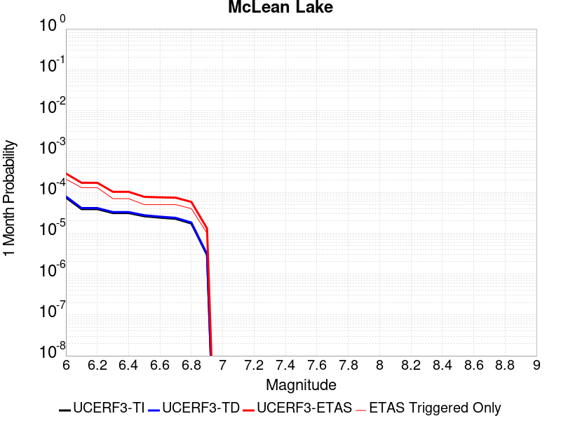 |  |  |

| Magnitude | 1 wk TI Prob | 1 wk TD Prob | 1 wk ETAS Prob | 1 wk ETAS/TD Gain | 1 wk ETAS Triggered Only | 1 mo TI Prob | 1 mo TD Prob | 1 mo ETAS Prob | 1 mo ETAS/TD Gain | 1 mo ETAS Triggered Only | 1 yr TI Prob | 1 yr TD Prob | 1 yr ETAS Prob | 1 yr ETAS/TD Gain | 1 yr ETAS Triggered Only | 10 yr TI Prob | 10 yr TD Prob | 10 yr ETAS Prob | 10 yr ETAS/TD Gain | 10 yr ETAS Triggered Only |
|-----|-----|-----|-----|-----|-----|-----|-----|-----|-----|-----|-----|-----|-----|-----|-----|-----|-----|-----|-----|-----|
| 6.0 | 1.7360222E-5 | 1.8502597E-5 | 1.8502597E-5 | 1.0 | 0.0 | 7.439883E-5 | 7.929471E-5 | 7.929471E-5 | 1.0 | 0.0 | 9.0542925E-4 | 9.650341E-4 | 0.0016279637 | 1.6869494 | 6.6357E-4 | 0.009017491 | 0.009613276 | 0.011584849 | 1.2050885 | 0.00199071 |
| 6.1 | 9.062689E-6 | 9.59264E-6 | 9.59264E-6 | 1.0 | 0.0 | 3.8839516E-5 | 4.1110718E-5 | 4.1110718E-5 | 1.0 | 0.0 | 4.727685E-4 | 5.004169E-4 | 0.0011636548 | 2.3253708 | 6.6357E-4 | 0.0047176396 | 0.004993784 | 0.0069745523 | 1.3966469 | 0.00199071 |
| 6.2 | 9.062689E-6 | 9.59264E-6 | 9.59264E-6 | 1.0 | 0.0 | 3.8839516E-5 | 4.1110718E-5 | 4.1110718E-5 | 1.0 | 0.0 | 4.727685E-4 | 5.004169E-4 | 0.0011636548 | 2.3253708 | 6.6357E-4 | 0.0047176396 | 0.004993784 | 0.0069745523 | 1.3966469 | 0.00199071 |
| 6.3 | 7.2575485E-6 | 7.668054E-6 | 7.668054E-6 | 1.0 | 0.0 | 3.110341E-5 | 3.2862717E-5 | 3.2862717E-5 | 1.0 | 0.0 | 3.786182E-4 | 4.0003724E-4 | 0.0010633419 | 2.658107 | 6.6357E-4 | 0.0037797375 | 0.0039938763 | 0.005315716 | 1.3309666 | 0.00132714 |
| 6.4 | 7.2575485E-6 | 7.668054E-6 | 7.668054E-6 | 1.0 | 0.0 | 3.110341E-5 | 3.2862717E-5 | 3.2862717E-5 | 1.0 | 0.0 | 3.786182E-4 | 4.0003724E-4 | 0.0010633419 | 2.658107 | 6.6357E-4 | 0.0037797375 | 0.0039938763 | 0.005315716 | 1.3309666 | 0.00132714 |
| 6.5 | 6.06582E-6 | 6.4041615E-6 | 6.4041615E-6 | 1.0 | 0.0 | 2.5996113E-5 | 2.7446154E-5 | 2.7446154E-5 | 1.0 | 0.0 | 3.164567E-4 | 3.3411218E-4 | 9.974604E-4 | 2.985406 | 6.6357E-4 | 0.0031600643 | 0.0033367372 | 0.0046594488 | 1.3964087 | 0.00132714 |
| 6.6 | 5.598744E-6 | 5.910524E-6 | 5.910524E-6 | 1.0 | 0.0 | 2.3994397E-5 | 2.5330608E-5 | 2.5330608E-5 | 1.0 | 0.0 | 2.9209262E-4 | 3.083629E-4 | 9.717283E-4 | 3.151249 | 6.6357E-4 | 0.0029170897 | 0.0030799794 | 0.004403032 | 1.4295653 | 0.00132714 |
| 6.7 | 5.246996E-6 | 5.5394075E-6 | 5.5394075E-6 | 1.0 | 0.0 | 2.2486933E-5 | 2.3740138E-5 | 2.3740138E-5 | 1.0 | 0.0 | 2.73744E-4 | 2.890042E-4 | 2.890042E-4 | 1.0 | 0.0 | 0.0027340704 | 0.0028869074 | 0.0035485618 | 1.2291914 | 6.6357E-4 |
| 6.8 | 4.02324E-6 | 4.2470924E-6 | 4.2470924E-6 | 1.0 | 0.0 | 1.7242342E-5 | 1.8201732E-5 | 1.8201732E-5 | 1.0 | 0.0 | 2.099053E-4 | 2.2158951E-4 | 2.2158951E-4 | 1.0 | 0.0 | 0.0020970714 | 0.00221427 | 0.00221427 | 1.0 | 0.0 |
| 6.9 | 6.835972E-7 | 7.140181E-7 | 7.140181E-7 | 1.0 | 0.0 | 2.9296991E-6 | 3.0600756E-6 | 3.0600756E-6 | 1.0 | 0.0 | 3.56685E-5 | 3.7256104E-5 | 3.7256104E-5 | 1.0 | 0.0 | 3.5662777E-4 | 3.7252984E-4 | 3.7252984E-4 | 1.0 | 0.0 |

## San Andreas (Mojave N)
*[(top)](#table-of-contents)*

| 1 Week | 1 Month | 1 Year | 10 Year |
|-----|-----|-----|-----|
|  |  |  |  |

| Magnitude | 1 wk TI Prob | 1 wk TD Prob | 1 wk ETAS Prob | 1 wk ETAS/TD Gain | 1 wk ETAS Triggered Only | 1 mo TI Prob | 1 mo TD Prob | 1 mo ETAS Prob | 1 mo ETAS/TD Gain | 1 mo ETAS Triggered Only | 1 yr TI Prob | 1 yr TD Prob | 1 yr ETAS Prob | 1 yr ETAS/TD Gain | 1 yr ETAS Triggered Only | 10 yr TI Prob | 10 yr TD Prob | 10 yr ETAS Prob | 10 yr ETAS/TD Gain | 10 yr ETAS Triggered Only |
|-----|-----|-----|-----|-----|-----|-----|-----|-----|-----|-----|-----|-----|-----|-----|-----|-----|-----|-----|-----|-----|
| 6.0 | 9.877682E-5 | 1.9452986E-4 | 1.9452986E-4 | 1.0 | 0.0 | 4.2326056E-4 | 8.334332E-4 | 0.0014964502 | 1.7955251 | 6.6357E-4 | 0.0051410277 | 0.010099967 | 0.010756835 | 1.0650367 | 6.6357E-4 | 0.05023708 | 0.09854343 | 0.10093615 | 1.0242809 | 0.00265428 |
| 6.1 | 9.877682E-5 | 1.9452986E-4 | 1.9452986E-4 | 1.0 | 0.0 | 4.2326056E-4 | 8.334332E-4 | 0.0014964502 | 1.7955251 | 6.6357E-4 | 0.0051410277 | 0.010099967 | 0.010756835 | 1.0650367 | 6.6357E-4 | 0.05023708 | 0.09854343 | 0.10093615 | 1.0242809 | 0.00265428 |
| 6.2 | 9.877682E-5 | 1.9452986E-4 | 1.9452986E-4 | 1.0 | 0.0 | 4.2326056E-4 | 8.334332E-4 | 0.0014964502 | 1.7955251 | 6.6357E-4 | 0.0051410277 | 0.010099967 | 0.010756835 | 1.0650367 | 6.6357E-4 | 0.05023708 | 0.09854343 | 0.10093615 | 1.0242809 | 0.00265428 |
| 6.3 | 9.877682E-5 | 1.9452986E-4 | 1.9452986E-4 | 1.0 | 0.0 | 4.2326056E-4 | 8.334332E-4 | 0.0014964502 | 1.7955251 | 6.6357E-4 | 0.0051410277 | 0.010099967 | 0.010756835 | 1.0650367 | 6.6357E-4 | 0.05023708 | 0.09854343 | 0.10093615 | 1.0242809 | 0.00265428 |
| 6.4 | 9.877682E-5 | 1.9452986E-4 | 1.9452986E-4 | 1.0 | 0.0 | 4.2326056E-4 | 8.334332E-4 | 0.0014964502 | 1.7955251 | 6.6357E-4 | 0.0051410277 | 0.010099967 | 0.010756835 | 1.0650367 | 6.6357E-4 | 0.05023708 | 0.09854343 | 0.10093615 | 1.0242809 | 0.00265428 |
| 6.5 | 9.861474E-5 | 1.9426736E-4 | 1.9426736E-4 | 1.0 | 0.0 | 4.2256617E-4 | 8.323089E-4 | 0.0014953266 | 1.7966005 | 6.6357E-4 | 0.0051326132 | 0.010086406 | 0.010743283 | 1.065125 | 6.6357E-4 | 0.050156746 | 0.098421186 | 0.10081423 | 1.0243143 | 0.00265428 |
| 6.6 | 9.861474E-5 | 1.9426736E-4 | 1.9426736E-4 | 1.0 | 0.0 | 4.2256617E-4 | 8.323089E-4 | 0.0014953266 | 1.7966005 | 6.6357E-4 | 0.0051326132 | 0.010086406 | 0.010743283 | 1.065125 | 6.6357E-4 | 0.050156746 | 0.098421186 | 0.10081423 | 1.0243143 | 0.00265428 |
| 6.7 | 9.8552715E-5 | 1.9416683E-4 | 1.9416683E-4 | 1.0 | 0.0 | 4.223004E-4 | 8.3187834E-4 | 0.0014948964 | 1.7970132 | 6.6357E-4 | 0.0051293927 | 0.010081212 | 0.0107380925 | 1.0651588 | 6.6357E-4 | 0.050125998 | 0.09837436 | 0.10076753 | 1.0243272 | 0.00265428 |
| 6.8 | 9.8464974E-5 | 1.940183E-4 | 1.940183E-4 | 1.0 | 0.0 | 4.219245E-4 | 8.3124224E-4 | 0.0014942606 | 1.7976236 | 6.6357E-4 | 0.0051248376 | 0.010073539 | 0.010730425 | 1.065209 | 6.6357E-4 | 0.05008251 | 0.09830434 | 0.10069769 | 1.0243464 | 0.00265428 |
| 6.9 | 9.825824E-5 | 1.9369811E-4 | 1.9369811E-4 | 1.0 | 0.0 | 4.2103877E-4 | 8.2987087E-4 | 0.0014928902 | 1.7989428 | 6.6357E-4 | 0.0051141046 | 0.010056997 | 0.010713894 | 1.0653174 | 6.6357E-4 | 0.049980022 | 0.09815335 | 0.100547105 | 1.0243878 | 0.00265428 |
| 7.0 | 9.781462E-5 | 1.9301118E-4 | 1.9301118E-4 | 1.0 | 0.0 | 4.1913814E-4 | 8.269287E-4 | 0.00148995 | 1.8017877 | 6.6357E-4 | 0.005091073 | 0.010021506 | 0.010678426 | 1.065551 | 6.6357E-4 | 0.04976007 | 0.09782955 | 0.10022416 | 1.0244774 | 0.00265428 |
| 7.1 | 9.7121134E-5 | 1.9202747E-4 | 1.9202747E-4 | 1.0 | 0.0 | 4.1616702E-4 | 8.227155E-4 | 0.0014857396 | 1.8058971 | 6.6357E-4 | 0.005055068 | 0.009970682 | 0.010627635 | 1.0658885 | 6.6357E-4 | 0.04941613 | 0.0973658 | 0.09976164 | 1.0246066 | 0.00265428 |
| 7.2 | 9.663819E-5 | 1.9133474E-4 | 1.9133474E-4 | 1.0 | 0.0 | 4.1409794E-4 | 8.197485E-4 | 0.0014827745 | 1.8088164 | 6.6357E-4 | 0.0050299936 | 0.009934888 | 0.0105918655 | 1.0661284 | 6.6357E-4 | 0.049176537 | 0.09703887 | 0.09943559 | 1.0246985 | 0.00265428 |
| 7.3 | 9.6277574E-5 | 1.9085912E-4 | 1.9085912E-4 | 1.0 | 0.0 | 4.125529E-4 | 8.1771147E-4 | 0.0014807389 | 1.810833 | 6.6357E-4 | 0.0050112694 | 0.009910313 | 0.010567307 | 1.066294 | 6.6357E-4 | 0.04899759 | 0.096812055 | 0.09920937 | 1.0247625 | 0.00265428 |
| 7.4 | 9.593308E-5 | 1.9025613E-4 | 1.9025613E-4 | 1.0 | 0.0 | 4.1107697E-4 | 8.151288E-4 | 0.0014781579 | 1.8134041 | 6.6357E-4 | 0.0049933824 | 0.009879155 | 0.01053617 | 1.0665051 | 6.6357E-4 | 0.04882661 | 0.09652995 | 0.09892802 | 1.0248426 | 0.00265428 |
| 7.5 | 9.561707E-5 | 1.897162E-4 | 1.897162E-4 | 1.0 | 0.0 | 4.0972308E-4 | 8.1281626E-4 | 0.0014758469 | 1.8157202 | 6.6357E-4 | 0.0049769743 | 0.0098512545 | 0.010508288 | 1.0666953 | 6.6357E-4 | 0.048669744 | 0.09627587 | 0.09867461 | 1.0249152 | 0.00265428 |
| 7.6 | 9.418194E-5 | 1.8623457E-4 | 1.8623457E-4 | 1.0 | 0.0 | 4.0357444E-4 | 7.9790415E-4 | 0.0014609447 | 1.8309777 | 6.6357E-4 | 0.004902454 | 0.009671325 | 0.010328477 | 1.0679486 | 6.6357E-4 | 0.047957025 | 0.09465678 | 0.097059816 | 1.0253868 | 0.00265428 |
| 7.7 | 8.202141E-5 | 1.6068226E-4 | 1.6068226E-4 | 1.0 | 0.0 | 3.51473E-4 | 6.884566E-4 | 0.0013515698 | 1.963188 | 6.6357E-4 | 0.00427079 | 0.008349802 | 0.009007831 | 1.0788078 | 6.6357E-4 | 0.04189639 | 0.08244225 | 0.0848777 | 1.0295414 | 0.00265428 |
| 7.8 | 7.2859846E-5 | 1.4558651E-4 | 1.4558651E-4 | 1.0 | 0.0 | 3.1221908E-4 | 6.23793E-4 | 0.0012869491 | 2.0631027 | 6.6357E-4 | 0.003794643 | 0.007568275 | 0.008226823 | 1.0870143 | 6.6357E-4 | 0.037304975 | 0.07491499 | 0.076142706 | 1.0163882 | 0.00132714 |
| 7.9 | 5.3874453E-5 | 1.0075245E-4 | 1.0075245E-4 | 1.0 | 0.0 | 2.3087008E-4 | 4.3172477E-4 | 4.3172477E-4 | 1.0 | 0.0 | 0.0028072202 | 0.0052435924 | 0.0052435924 | 1.0 | 0.0 | 0.02772022 | 0.0525627 | 0.0525627 | 1.0 | 0.0 |
| 8.0 | 3.468538E-5 | 5.4431417E-5 | 5.4431417E-5 | 1.0 | 0.0 | 1.4864317E-4 | 2.3325665E-4 | 2.3325665E-4 | 1.0 | 0.0 | 0.0018082283 | 0.0028362032 | 0.0028362032 | 1.0 | 0.0 | 0.017935853 | 0.029031547 | 0.029031547 | 1.0 | 0.0 |
| 8.1 | 1.9152367E-5 | 1.9484323E-5 | 1.9484323E-5 | 1.0 | 0.0 | 8.207899E-5 | 8.350157E-5 | 8.350157E-5 | 1.0 | 0.0 | 9.988535E-4 | 0.0010161581 | 0.0010161581 | 1.0 | 0.0 | 0.009943757 | 0.010899102 | 0.010899102 | 1.0 | 0.0 |
| 8.2 | 8.643924E-6 | 5.506234E-6 | 5.506234E-6 | 1.0 | 0.0 | 3.704486E-5 | 2.3597933E-5 | 2.3597933E-5 | 1.0 | 0.0 | 4.5092785E-4 | 2.8726703E-4 | 2.8726703E-4 | 1.0 | 0.0 | 0.0045001395 | 0.0032658712 | 0.0032658712 | 1.0 | 0.0 |
| 8.3 | 1.983087E-6 | 7.7104113E-7 | 7.7104113E-7 | 1.0 | 0.0 | 8.498917E-6 | 3.3044578E-6 | 3.3044578E-6 | 1.0 | 0.0 | 1.034694E-4 | 4.0231047E-5 | 4.0231047E-5 | 1.0 | 0.0 | 0.0010342124 | 4.7486598E-4 | 4.7486598E-4 | 1.0 | 0.0 |

## Hunter Mountain-Saline Valley
*[(top)](#table-of-contents)*

| 1 Week | 1 Month | 1 Year | 10 Year |
|-----|-----|-----|-----|
| 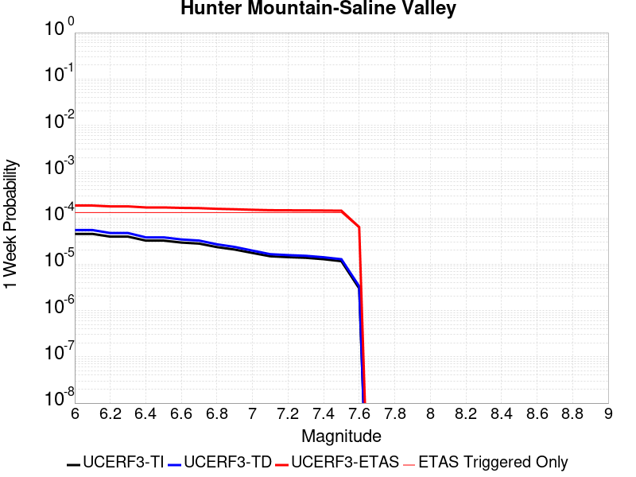 |  |  |  |

| Magnitude | 1 wk TI Prob | 1 wk TD Prob | 1 wk ETAS Prob | 1 wk ETAS/TD Gain | 1 wk ETAS Triggered Only | 1 mo TI Prob | 1 mo TD Prob | 1 mo ETAS Prob | 1 mo ETAS/TD Gain | 1 mo ETAS Triggered Only | 1 yr TI Prob | 1 yr TD Prob | 1 yr ETAS Prob | 1 yr ETAS/TD Gain | 1 yr ETAS Triggered Only | 10 yr TI Prob | 10 yr TD Prob | 10 yr ETAS Prob | 10 yr ETAS/TD Gain | 10 yr ETAS Triggered Only |
|-----|-----|-----|-----|-----|-----|-----|-----|-----|-----|-----|-----|-----|-----|-----|-----|-----|-----|-----|-----|-----|
| 6.0 | 4.5103672E-5 | 5.4578726E-5 | 5.4578726E-5 | 1.0 | 0.0 | 1.9328714E-4 | 2.3388906E-4 | 2.3388906E-4 | 1.0 | 0.0 | 0.002350731 | 0.0028440403 | 0.004167406 | 1.4653119 | 0.00132714 | 0.023260195 | 0.0280971 | 0.030676803 | 1.0918138 | 0.00265428 |
| 6.1 | 4.5103672E-5 | 5.4578726E-5 | 5.4578726E-5 | 1.0 | 0.0 | 1.9328714E-4 | 2.3388906E-4 | 2.3388906E-4 | 1.0 | 0.0 | 0.002350731 | 0.0028440403 | 0.004167406 | 1.4653119 | 0.00132714 | 0.023260195 | 0.0280971 | 0.030676803 | 1.0918138 | 0.00265428 |
| 6.2 | 3.9363465E-5 | 4.7070065E-5 | 4.7070065E-5 | 1.0 | 0.0 | 1.6868966E-4 | 2.0171412E-4 | 2.0171412E-4 | 1.0 | 0.0 | 0.002051862 | 0.002453259 | 0.003777143 | 1.539643 | 0.00132714 | 0.020330196 | 0.02427783 | 0.02686767 | 1.1066751 | 0.00265428 |
| 6.3 | 3.9363465E-5 | 4.7070065E-5 | 4.7070065E-5 | 1.0 | 0.0 | 1.6868966E-4 | 2.0171412E-4 | 2.0171412E-4 | 1.0 | 0.0 | 0.002051862 | 0.002453259 | 0.003777143 | 1.539643 | 0.00132714 | 0.020330196 | 0.02427783 | 0.02686767 | 1.1066751 | 0.00265428 |
| 6.4 | 3.2311684E-5 | 3.795751E-5 | 3.795751E-5 | 1.0 | 0.0 | 1.384713E-4 | 1.6266532E-4 | 1.6266532E-4 | 1.0 | 0.0 | 0.0016845843 | 0.001978724 | 0.003303238 | 1.6693778 | 0.00132714 | 0.016718714 | 0.019619802 | 0.022222007 | 1.1326315 | 0.00265428 |
| 6.5 | 3.2311684E-5 | 3.795751E-5 | 3.795751E-5 | 1.0 | 0.0 | 1.384713E-4 | 1.6266532E-4 | 1.6266532E-4 | 1.0 | 0.0 | 0.0016845843 | 0.001978724 | 0.003303238 | 1.6693778 | 0.00132714 | 0.016718714 | 0.019619802 | 0.022222007 | 1.1326315 | 0.00265428 |
| 6.6 | 2.9305844E-5 | 3.4187586E-5 | 3.4187586E-5 | 1.0 | 0.0 | 1.2559042E-4 | 1.4651036E-4 | 1.4651036E-4 | 1.0 | 0.0 | 0.0015279909 | 0.0017823668 | 0.0031071415 | 1.743267 | 0.00132714 | 0.015175272 | 0.017688641 | 0.02029597 | 1.1474013 | 0.00265428 |
| 6.7 | 2.7826512E-5 | 3.2349675E-5 | 3.2349675E-5 | 1.0 | 0.0 | 1.19251024E-4 | 1.3863444E-4 | 1.3863444E-4 | 1.0 | 0.0 | 0.0014509142 | 0.0016866277 | 0.0030115293 | 1.785533 | 0.00132714 | 0.014414776 | 0.01674596 | 0.01935579 | 1.1558484 | 0.00265428 |
| 6.8 | 2.3389874E-5 | 2.687109E-5 | 2.687109E-5 | 1.0 | 0.0 | 1.0023846E-4 | 1.15156996E-4 | 1.15156996E-4 | 1.0 | 0.0 | 0.00121972 | 0.001401182 | 0.0027264624 | 1.9458303 | 0.00132714 | 0.01213047 | 0.013929688 | 0.016546994 | 1.1878941 | 0.00265428 |
| 6.9 | 2.069209E-5 | 2.3573824E-5 | 2.3573824E-5 | 1.0 | 0.0 | 8.867737E-5 | 1.0102697E-4 | 1.0102697E-4 | 1.0 | 0.0 | 0.0010791123 | 0.0012293454 | 0.002554854 | 2.078223 | 0.00132714 | 0.010738871 | 0.012230481 | 0.0148522975 | 1.2143674 | 0.00265428 |
| 7.0 | 1.7462342E-5 | 1.9636653E-5 | 1.9636653E-5 | 1.0 | 0.0 | 7.483646E-5 | 8.41545E-5 | 8.41545E-5 | 1.0 | 0.0 | 9.1075303E-4 | 0.001024122 | 0.0023499029 | 2.2945535 | 0.00132714 | 0.009070295 | 0.010197659 | 0.012824872 | 1.257629 | 0.00265428 |
| 7.1 | 1.4807709E-5 | 1.6444343E-5 | 1.6444343E-5 | 1.0 | 0.0 | 6.3460066E-5 | 7.047394E-5 | 7.047394E-5 | 1.0 | 0.0 | 7.723524E-4 | 8.5769896E-4 | 0.0021837007 | 2.545999 | 0.00132714 | 0.007696735 | 0.008546875 | 0.011178469 | 1.3079014 | 0.00265428 |
| 7.2 | 1.4180048E-5 | 1.570082E-5 | 1.570082E-5 | 1.0 | 0.0 | 6.077022E-5 | 6.728758E-5 | 6.728758E-5 | 1.0 | 0.0 | 7.396263E-4 | 8.1893464E-4 | 0.002144988 | 2.6192417 | 0.00132714 | 0.0073716943 | 0.008162121 | 0.010794736 | 1.3225406 | 0.00265428 |
| 7.3 | 1.3730402E-5 | 1.5174488E-5 | 1.5174488E-5 | 1.0 | 0.0 | 5.8843252E-5 | 6.5031985E-5 | 6.5031985E-5 | 1.0 | 0.0 | 7.161811E-4 | 7.9149293E-4 | 0.0021175826 | 2.6754282 | 0.00132714 | 0.007138774 | 0.007889673 | 0.010523012 | 1.3337703 | 0.00265428 |
| 7.4 | 1.2810095E-5 | 1.4111528E-5 | 1.4111528E-5 | 1.0 | 0.0 | 5.489925E-5 | 6.0476665E-5 | 6.0476665E-5 | 1.0 | 0.0 | 6.681934E-4 | 7.3607045E-4 | 0.0020622336 | 2.8016796 | 0.00132714 | 0.006661878 | 0.007339221 | 0.0099740205 | 1.3590026 | 0.00265428 |
| 7.5 | 1.1595659E-5 | 1.28027605E-5 | 1.28027605E-5 | 1.0 | 0.0 | 4.9694736E-5 | 5.486791E-5 | 5.486791E-5 | 1.0 | 0.0 | 6.0486543E-4 | 6.678277E-4 | 0.0019940815 | 2.9859219 | 0.00132714 | 0.006032217 | 0.006661081 | 0.009297681 | 1.3958216 | 0.00265428 |
| 7.6 | 2.997694E-6 | 3.3259787E-6 | 3.3259787E-6 | 1.0 | 0.0 | 1.28471975E-5 | 1.4254158E-5 | 1.4254158E-5 | 1.0 | 0.0 | 1.564034E-4 | 1.7353783E-4 | 1.7353783E-4 | 1.0 | 0.0 | 0.0015629337 | 0.0017354605 | 0.0017354605 | 1.0 | 0.0 |

## San Andreas (Mojave S)
*[(top)](#table-of-contents)*

| 1 Week | 1 Month | 1 Year | 10 Year |
|-----|-----|-----|-----|
|  |  |  |  |

| Magnitude | 1 wk TI Prob | 1 wk TD Prob | 1 wk ETAS Prob | 1 wk ETAS/TD Gain | 1 wk ETAS Triggered Only | 1 mo TI Prob | 1 mo TD Prob | 1 mo ETAS Prob | 1 mo ETAS/TD Gain | 1 mo ETAS Triggered Only | 1 yr TI Prob | 1 yr TD Prob | 1 yr ETAS Prob | 1 yr ETAS/TD Gain | 1 yr ETAS Triggered Only | 10 yr TI Prob | 10 yr TD Prob | 10 yr ETAS Prob | 10 yr ETAS/TD Gain | 10 yr ETAS Triggered Only |
|-----|-----|-----|-----|-----|-----|-----|-----|-----|-----|-----|-----|-----|-----|-----|-----|-----|-----|-----|-----|-----|
| 6.0 | 3.1064058E-4 | 6.75191E-4 | 6.75191E-4 | 1.0 | 0.0 | 0.0013306376 | 0.002890595 | 0.0035522468 | 1.2288982 | 6.6357E-4 | 0.016080605 | 0.034651246 | 0.03529182 | 1.0184864 | 6.6357E-4 | 0.1496549 | 0.28680432 | 0.2877508 | 1.0033002 | 0.00132714 |
| 6.1 | 3.1064058E-4 | 6.75191E-4 | 6.75191E-4 | 1.0 | 0.0 | 0.0013306376 | 0.002890595 | 0.0035522468 | 1.2288982 | 6.6357E-4 | 0.016080605 | 0.034651246 | 0.03529182 | 1.0184864 | 6.6357E-4 | 0.1496549 | 0.28680432 | 0.2877508 | 1.0033002 | 0.00132714 |
| 6.2 | 3.1064058E-4 | 6.75191E-4 | 6.75191E-4 | 1.0 | 0.0 | 0.0013306376 | 0.002890595 | 0.0035522468 | 1.2288982 | 6.6357E-4 | 0.016080605 | 0.034651246 | 0.03529182 | 1.0184864 | 6.6357E-4 | 0.1496549 | 0.28680432 | 0.2877508 | 1.0033002 | 0.00132714 |
| 6.3 | 3.1064058E-4 | 6.75191E-4 | 6.75191E-4 | 1.0 | 0.0 | 0.0013306376 | 0.002890595 | 0.0035522468 | 1.2288982 | 6.6357E-4 | 0.016080605 | 0.034651246 | 0.03529182 | 1.0184864 | 6.6357E-4 | 0.1496549 | 0.28680432 | 0.2877508 | 1.0033002 | 0.00132714 |
| 6.4 | 1.9872203E-4 | 4.323479E-4 | 4.323479E-4 | 1.0 | 0.0 | 8.5138786E-4 | 0.001851632 | 0.0025139733 | 1.3577068 | 6.6357E-4 | 0.010316478 | 0.022316733 | 0.022965495 | 1.0290706 | 6.6357E-4 | 0.098504856 | 0.19721039 | 0.1982758 | 1.0054024 | 0.00132714 |
| 6.5 | 1.291105E-4 | 2.880526E-4 | 2.880526E-4 | 1.0 | 0.0 | 5.5321335E-4 | 0.0012339299 | 0.001896681 | 1.537106 | 6.6357E-4 | 0.006714592 | 0.01492044 | 0.015574109 | 1.0438104 | 6.6357E-4 | 0.065152965 | 0.13825214 | 0.1393958 | 1.0082723 | 0.00132714 |
| 6.6 | 1.291105E-4 | 2.880526E-4 | 2.880526E-4 | 1.0 | 0.0 | 5.5321335E-4 | 0.0012339299 | 0.001896681 | 1.537106 | 6.6357E-4 | 0.006714592 | 0.01492044 | 0.015574109 | 1.0438104 | 6.6357E-4 | 0.065152965 | 0.13825214 | 0.1393958 | 1.0082723 | 0.00132714 |
| 6.7 | 1.08001186E-4 | 2.4385673E-4 | 2.4385673E-4 | 1.0 | 0.0 | 4.6278012E-4 | 0.0010446823 | 0.0017075591 | 1.6345248 | 6.6357E-4 | 0.0056198016 | 0.012645132 | 0.013300311 | 1.0518128 | 6.6357E-4 | 0.054797906 | 0.11939663 | 0.12056531 | 1.0097883 | 0.00132714 |
| 6.8 | 1.0624356E-4 | 2.3903191E-4 | 2.3903191E-4 | 1.0 | 0.0 | 4.5525006E-4 | 0.0010240208 | 0.0016869113 | 1.6473409 | 6.6357E-4 | 0.0055285925 | 0.012396459 | 0.013051803 | 1.0528654 | 6.6357E-4 | 0.053930566 | 0.11734573 | 0.11851713 | 1.0099825 | 0.00132714 |
| 6.9 | 1.0393785E-4 | 2.3273338E-4 | 2.3273338E-4 | 1.0 | 0.0 | 4.4537184E-4 | 9.970479E-4 | 0.0016599563 | 1.6648711 | 6.6357E-4 | 0.0054089287 | 0.012071744 | 0.012727303 | 1.0543053 | 6.6357E-4 | 0.05279156 | 0.11464312 | 0.11581811 | 1.0102491 | 0.00132714 |
| 7.0 | 1.0155622E-4 | 2.2642637E-4 | 2.2642637E-4 | 1.0 | 0.0 | 4.3516833E-4 | 9.700383E-4 | 0.0016329646 | 1.6834022 | 6.6357E-4 | 0.005285311 | 0.0117464885 | 0.0124022635 | 1.0558274 | 6.6357E-4 | 0.05161361 | 0.111903064 | 0.113081686 | 1.0105326 | 0.00132714 |
| 7.1 | 9.885595E-5 | 2.1930772E-4 | 2.1930772E-4 | 1.0 | 0.0 | 4.2359953E-4 | 9.3955203E-4 | 0.0016024986 | 1.7055986 | 6.6357E-4 | 0.0051451353 | 0.011379248 | 0.012035268 | 1.0576504 | 6.6357E-4 | 0.05027629 | 0.10878728 | 0.10997005 | 1.0108722 | 0.00132714 |
| 7.2 | 9.6411415E-5 | 2.1293506E-4 | 2.1293506E-4 | 1.0 | 0.0 | 4.1312634E-4 | 9.1226003E-4 | 0.0015752247 | 1.7267277 | 6.6357E-4 | 0.005018219 | 0.011050386 | 0.011706623 | 1.0593859 | 6.6357E-4 | 0.049064007 | 0.10597674 | 0.107163236 | 1.0111958 | 0.00132714 |
| 7.3 | 9.1180635E-5 | 1.952049E-4 | 1.952049E-4 | 1.0 | 0.0 | 3.907156E-4 | 8.3632435E-4 | 0.0014993394 | 1.7927727 | 6.6357E-4 | 0.004746591 | 0.010134824 | 0.010791669 | 1.0648106 | 6.6357E-4 | 0.046464786 | 0.0981664 | 0.09936326 | 1.0121921 | 0.00132714 |
| 7.4 | 8.887388E-5 | 1.8768513E-4 | 1.8768513E-4 | 1.0 | 0.0 | 3.8083247E-4 | 8.0411695E-4 | 0.0014671534 | 1.8245522 | 6.6357E-4 | 0.0046267817 | 0.009746275 | 0.010403378 | 1.067421 | 6.6357E-4 | 0.045316286 | 0.094799764 | 0.096001096 | 1.0126723 | 0.00132714 |
| 7.5 | 8.6750515E-5 | 1.8099563E-4 | 1.8099563E-4 | 1.0 | 0.0 | 3.7173493E-4 | 7.7546504E-4 | 0.0014385205 | 1.8550423 | 6.6357E-4 | 0.004516484 | 0.009400502 | 0.010057834 | 1.0699252 | 6.6357E-4 | 0.04425787 | 0.09176208 | 0.092967436 | 1.0131357 | 0.00132714 |
| 7.6 | 8.453092E-5 | 1.7486555E-4 | 1.7486555E-4 | 1.0 | 0.0 | 3.6222505E-4 | 7.4920856E-4 | 0.0014122814 | 1.8850311 | 6.6357E-4 | 0.0044011753 | 0.009083539 | 0.009741082 | 1.0723883 | 6.6357E-4 | 0.04315024 | 0.088919215 | 0.09012835 | 1.0135981 | 0.00132714 |
| 7.7 | 8.259102E-5 | 1.7008166E-4 | 1.7008166E-4 | 1.0 | 0.0 | 3.539135E-4 | 7.2871783E-4 | 0.0013918043 | 1.9099358 | 6.6357E-4 | 0.004300386 | 0.008836117 | 0.009493823 | 1.0744339 | 6.6357E-4 | 0.042181134 | 0.086668245 | 0.087880366 | 1.0139858 | 0.00132714 |
| 7.8 | 7.444844E-5 | 1.5326278E-4 | 1.5326278E-4 | 1.0 | 0.0 | 3.1902574E-4 | 6.566752E-4 | 0.0013198095 | 2.009836 | 6.6357E-4 | 0.0038772223 | 0.007965761 | 0.008624046 | 1.0826392 | 6.6357E-4 | 0.03810269 | 0.078482434 | 0.07970542 | 1.0155829 | 0.00132714 |
| 7.9 | 5.2586525E-5 | 1.0035652E-4 | 1.0035652E-4 | 1.0 | 0.0 | 2.2535135E-4 | 4.3002848E-4 | 4.3002848E-4 | 1.0 | 0.0 | 0.0027402006 | 0.005223039 | 0.005223039 | 1.0 | 0.0 | 0.027066574 | 0.052336518 | 0.052336518 | 1.0 | 0.0 |
| 8.0 | 3.379877E-5 | 5.424338E-5 | 5.424338E-5 | 1.0 | 0.0 | 1.4484383E-4 | 2.3245093E-4 | 2.3245093E-4 | 1.0 | 0.0 | 0.0017620471 | 0.002826419 | 0.002826419 | 1.0 | 0.0 | 0.017481409 | 0.028917845 | 0.028917845 | 1.0 | 0.0 |
| 8.1 | 1.8668277E-5 | 1.9389938E-5 | 1.9389938E-5 | 1.0 | 0.0 | 8.000444E-5 | 8.309709E-5 | 8.309709E-5 | 1.0 | 0.0 | 9.736188E-4 | 0.0010112381 | 0.0010112381 | 1.0 | 0.0 | 0.009693642 | 0.010841073 | 0.010841073 | 1.0 | 0.0 |
| 8.2 | 8.541571E-6 | 5.4920856E-6 | 5.4920856E-6 | 1.0 | 0.0 | 3.660622E-5 | 2.3537297E-5 | 2.3537297E-5 | 1.0 | 0.0 | 4.455896E-4 | 2.8652902E-4 | 2.8652902E-4 | 1.0 | 0.0 | 0.0044469717 | 0.0032579117 | 0.0032579117 | 1.0 | 0.0 |
| 8.3 | 1.983087E-6 | 7.7104113E-7 | 7.7104113E-7 | 1.0 | 0.0 | 8.498917E-6 | 3.3044578E-6 | 3.3044578E-6 | 1.0 | 0.0 | 1.034694E-4 | 4.0231047E-5 | 4.0231047E-5 | 1.0 | 0.0 | 0.0010342124 | 4.7486598E-4 | 4.7486598E-4 | 1.0 | 0.0 |

## Blackwater
*[(top)](#table-of-contents)*

| 1 Week | 1 Month | 1 Year | 10 Year |
|-----|-----|-----|-----|
|  | 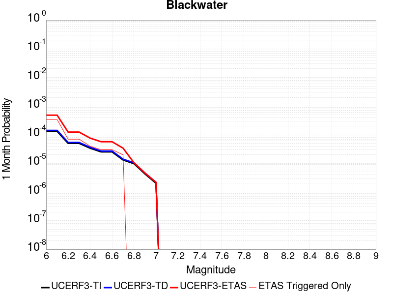 | 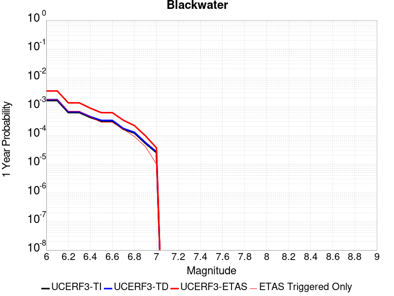 |  |

| Magnitude | 1 wk TI Prob | 1 wk TD Prob | 1 wk ETAS Prob | 1 wk ETAS/TD Gain | 1 wk ETAS Triggered Only | 1 mo TI Prob | 1 mo TD Prob | 1 mo ETAS Prob | 1 mo ETAS/TD Gain | 1 mo ETAS Triggered Only | 1 yr TI Prob | 1 yr TD Prob | 1 yr ETAS Prob | 1 yr ETAS/TD Gain | 1 yr ETAS Triggered Only | 10 yr TI Prob | 10 yr TD Prob | 10 yr ETAS Prob | 10 yr ETAS/TD Gain | 10 yr ETAS Triggered Only |
|-----|-----|-----|-----|-----|-----|-----|-----|-----|-----|-----|-----|-----|-----|-----|-----|-----|-----|-----|-----|-----|
| 6.0 | 3.0708583E-5 | 3.30979E-5 | 3.30979E-5 | 1.0 | 0.0 | 1.3160157E-4 | 1.418412E-4 | 1.418412E-4 | 1.0 | 0.0 | 0.0016010714 | 0.0017256853 | 0.0023881102 | 1.3838619 | 6.6357E-4 | 0.015895851 | 0.017136687 | 0.019093283 | 1.1141758 | 0.00199071 |
| 6.1 | 3.0708583E-5 | 3.30979E-5 | 3.30979E-5 | 1.0 | 0.0 | 1.3160157E-4 | 1.418412E-4 | 1.418412E-4 | 1.0 | 0.0 | 0.0016010714 | 0.0017256853 | 0.0023881102 | 1.3838619 | 6.6357E-4 | 0.015895851 | 0.017136687 | 0.019093283 | 1.1141758 | 0.00199071 |
| 6.2 | 1.1707779E-5 | 1.2545836E-5 | 1.2545836E-5 | 1.0 | 0.0 | 5.017523E-5 | 5.3766817E-5 | 5.3766817E-5 | 1.0 | 0.0 | 6.107122E-4 | 6.54424E-4 | 6.54424E-4 | 1.0 | 0.0 | 0.006090366 | 0.00652594 | 0.007844419 | 1.2020366 | 0.00132714 |
| 6.3 | 1.1707779E-5 | 1.2545836E-5 | 1.2545836E-5 | 1.0 | 0.0 | 5.017523E-5 | 5.3766817E-5 | 5.3766817E-5 | 1.0 | 0.0 | 6.107122E-4 | 6.54424E-4 | 6.54424E-4 | 1.0 | 0.0 | 0.006090366 | 0.00652594 | 0.007844419 | 1.2020366 | 0.00132714 |
| 6.4 | 7.929244E-6 | 8.480567E-6 | 8.480567E-6 | 1.0 | 0.0 | 3.3982033E-5 | 3.6344805E-5 | 3.6344805E-5 | 1.0 | 0.0 | 4.136527E-4 | 4.424122E-4 | 4.424122E-4 | 1.0 | 0.0 | 0.0041288356 | 0.00441572 | 0.0050763595 | 1.1496109 | 6.6357E-4 |
| 6.5 | 5.8832115E-6 | 6.2863332E-6 | 6.2863332E-6 | 1.0 | 0.0 | 2.521352E-5 | 2.6941165E-5 | 2.6941165E-5 | 1.0 | 0.0 | 3.0693135E-4 | 3.2796187E-4 | 3.2796187E-4 | 1.0 | 0.0 | 0.0030650778 | 0.003275032 | 0.0039364286 | 1.2019513 | 6.6357E-4 |
| 6.6 | 5.8832115E-6 | 6.2863332E-6 | 6.2863332E-6 | 1.0 | 0.0 | 2.521352E-5 | 2.6941165E-5 | 2.6941165E-5 | 1.0 | 0.0 | 3.0693135E-4 | 3.2796187E-4 | 3.2796187E-4 | 1.0 | 0.0 | 0.0030650778 | 0.003275032 | 0.0039364286 | 1.2019513 | 6.6357E-4 |
| 6.7 | 3.0715053E-6 | 3.2816447E-6 | 3.2816447E-6 | 1.0 | 0.0 | 1.3163528E-5 | 1.4064122E-5 | 1.4064122E-5 | 1.0 | 0.0 | 1.6025416E-4 | 1.712184E-4 | 1.712184E-4 | 1.0 | 0.0 | 0.0016013865 | 0.0017109794 | 0.0017109794 | 1.0 | 0.0 |
| 6.8 | 2.2722281E-6 | 2.4288868E-6 | 2.4288868E-6 | 1.0 | 0.0 | 9.738084E-6 | 1.0409479E-5 | 1.0409479E-5 | 1.0 | 0.0 | 1.1855473E-4 | 1.2672895E-4 | 1.2672895E-4 | 1.0 | 0.0 | 0.001184915 | 0.001266657 | 0.001266657 | 1.0 | 0.0 |
| 6.9 | 9.952399E-7 | 1.0654086E-6 | 1.0654086E-6 | 1.0 | 0.0 | 4.265307E-6 | 4.5660317E-6 | 4.5660317E-6 | 1.0 | 0.0 | 5.1928873E-5 | 5.5590535E-5 | 5.5590535E-5 | 1.0 | 0.0 | 5.191674E-4 | 5.558169E-4 | 5.558169E-4 | 1.0 | 0.0 |
| 7.0 | 4.7385504E-7 | 5.075847E-7 | 5.075847E-7 | 1.0 | 0.0 | 2.0308057E-6 | 2.1753629E-6 | 2.1753629E-6 | 1.0 | 0.0 | 2.4724779E-5 | 2.6485042E-5 | 2.6485042E-5 | 1.0 | 0.0 | 2.4722028E-4 | 2.6485045E-4 | 2.6485045E-4 | 1.0 | 0.0 |

## So Sierra Nevada
*[(top)](#table-of-contents)*

| 1 Week | 1 Month | 1 Year | 10 Year |
|-----|-----|-----|-----|
|  |  |  |  |

| Magnitude | 1 wk TI Prob | 1 wk TD Prob | 1 wk ETAS Prob | 1 wk ETAS/TD Gain | 1 wk ETAS Triggered Only | 1 mo TI Prob | 1 mo TD Prob | 1 mo ETAS Prob | 1 mo ETAS/TD Gain | 1 mo ETAS Triggered Only | 1 yr TI Prob | 1 yr TD Prob | 1 yr ETAS Prob | 1 yr ETAS/TD Gain | 1 yr ETAS Triggered Only | 10 yr TI Prob | 10 yr TD Prob | 10 yr ETAS Prob | 10 yr ETAS/TD Gain | 10 yr ETAS Triggered Only |
|-----|-----|-----|-----|-----|-----|-----|-----|-----|-----|-----|-----|-----|-----|-----|-----|-----|-----|-----|-----|-----|
| 6.0 | 1.15488665E-5 | 1.1080117E-5 | 1.1080117E-5 | 1.0 | 0.0 | 4.9494203E-5 | 4.7485424E-5 | 4.7485424E-5 | 1.0 | 0.0 | 6.024253E-4 | 5.7799445E-4 | 0.0012411809 | 2.1473925 | 6.6357E-4 | 0.006007948 | 0.0057661803 | 0.0077454117 | 1.3432482 | 0.00199071 |
| 6.1 | 1.15488665E-5 | 1.1080117E-5 | 1.1080117E-5 | 1.0 | 0.0 | 4.9494203E-5 | 4.7485424E-5 | 4.7485424E-5 | 1.0 | 0.0 | 6.024253E-4 | 5.7799445E-4 | 0.0012411809 | 2.1473925 | 6.6357E-4 | 0.006007948 | 0.0057661803 | 0.0077454117 | 1.3432482 | 0.00199071 |
| 6.2 | 1.15488665E-5 | 1.1080117E-5 | 1.1080117E-5 | 1.0 | 0.0 | 4.9494203E-5 | 4.7485424E-5 | 4.7485424E-5 | 1.0 | 0.0 | 6.024253E-4 | 5.7799445E-4 | 0.0012411809 | 2.1473925 | 6.6357E-4 | 0.006007948 | 0.0057661803 | 0.0077454117 | 1.3432482 | 0.00199071 |
| 6.3 | 1.15488665E-5 | 1.1080117E-5 | 1.1080117E-5 | 1.0 | 0.0 | 4.9494203E-5 | 4.7485424E-5 | 4.7485424E-5 | 1.0 | 0.0 | 6.024253E-4 | 5.7799445E-4 | 0.0012411809 | 2.1473925 | 6.6357E-4 | 0.006007948 | 0.0057661803 | 0.0077454117 | 1.3432482 | 0.00199071 |
| 6.4 | 1.15488665E-5 | 1.1080117E-5 | 1.1080117E-5 | 1.0 | 0.0 | 4.9494203E-5 | 4.7485424E-5 | 4.7485424E-5 | 1.0 | 0.0 | 6.024253E-4 | 5.7799445E-4 | 0.0012411809 | 2.1473925 | 6.6357E-4 | 0.006007948 | 0.0057661803 | 0.0077454117 | 1.3432482 | 0.00199071 |
| 6.5 | 1.15488665E-5 | 1.1080117E-5 | 1.1080117E-5 | 1.0 | 0.0 | 4.9494203E-5 | 4.7485424E-5 | 4.7485424E-5 | 1.0 | 0.0 | 6.024253E-4 | 5.7799445E-4 | 0.0012411809 | 2.1473925 | 6.6357E-4 | 0.006007948 | 0.0057661803 | 0.0077454117 | 1.3432482 | 0.00199071 |
| 6.6 | 7.587044E-6 | 6.9359576E-6 | 6.9359576E-6 | 1.0 | 0.0 | 3.2515498E-5 | 2.972521E-5 | 2.972521E-5 | 1.0 | 0.0 | 3.9580427E-4 | 3.6184725E-4 | 0.0010251772 | 2.8331764 | 6.6357E-4 | 0.003951 | 0.0036128724 | 0.0049352176 | 1.3660094 | 0.00132714 |
| 6.7 | 7.587044E-6 | 6.9359576E-6 | 6.9359576E-6 | 1.0 | 0.0 | 3.2515498E-5 | 2.972521E-5 | 2.972521E-5 | 1.0 | 0.0 | 3.9580427E-4 | 3.6184725E-4 | 0.0010251772 | 2.8331764 | 6.6357E-4 | 0.003951 | 0.0036128724 | 0.0049352176 | 1.3660094 | 0.00132714 |
| 6.8 | 5.9026956E-6 | 5.1796555E-6 | 5.1796555E-6 | 1.0 | 0.0 | 2.5297022E-5 | 2.2198341E-5 | 2.2198341E-5 | 1.0 | 0.0 | 3.0794772E-4 | 2.7023244E-4 | 9.336231E-4 | 3.454889 | 6.6357E-4 | 0.0030752132 | 0.0026991547 | 0.004022713 | 1.4903601 | 0.00132714 |
| 6.9 | 5.0118915E-6 | 4.252658E-6 | 4.252658E-6 | 1.0 | 0.0 | 2.1479358E-5 | 1.8225555E-5 | 1.8225555E-5 | 1.0 | 0.0 | 2.614798E-4 | 2.2187426E-4 | 8.85297E-4 | 3.9900844 | 6.6357E-4 | 0.0026117235 | 0.0022166 | 0.0035407983 | 1.5974007 | 0.00132714 |
| 7.0 | 4.4924795E-6 | 3.7141344E-6 | 3.7141344E-6 | 1.0 | 0.0 | 1.925334E-5 | 1.5917625E-5 | 1.5917625E-5 | 1.0 | 0.0 | 2.3438422E-4 | 1.9378049E-4 | 8.572219E-4 | 4.423675 | 6.6357E-4 | 0.0023413717 | 0.0019361782 | 0.0032607487 | 1.684116 | 0.00132714 |
| 7.1 | 3.9118436E-6 | 3.1121754E-6 | 3.1121754E-6 | 1.0 | 0.0 | 1.6764936E-5 | 1.333783E-5 | 1.333783E-5 | 1.0 | 0.0 | 2.0409399E-4 | 1.6237654E-4 | 1.6237654E-4 | 1.0 | 0.0 | 0.0020390663 | 0.001622635 | 0.0022851285 | 1.4082824 | 6.6357E-4 |
| 7.2 | 3.4200818E-6 | 2.6056368E-6 | 2.6056368E-6 | 1.0 | 0.0 | 1.4657411E-5 | 1.116697E-5 | 1.116697E-5 | 1.0 | 0.0 | 1.7843937E-4 | 1.3594989E-4 | 1.3594989E-4 | 1.0 | 0.0 | 0.0017829615 | 0.0013587169 | 0.0013587169 | 1.0 | 0.0 |
| 7.3 | 2.6593618E-6 | 1.8285797E-6 | 1.8285797E-6 | 1.0 | 0.0 | 1.13972155E-5 | 7.836748E-6 | 7.836748E-6 | 1.0 | 0.0 | 1.3875226E-4 | 9.5408526E-5 | 9.5408526E-5 | 1.0 | 0.0 | 0.0013866565 | 9.537045E-4 | 9.537045E-4 | 1.0 | 0.0 |
| 7.4 | 2.2577992E-6 | 1.4365834E-6 | 1.4365834E-6 | 1.0 | 0.0 | 9.676246E-6 | 6.1567725E-6 | 6.1567725E-6 | 1.0 | 0.0 | 1.1780193E-4 | 7.4956384E-5 | 7.4956384E-5 | 1.0 | 0.0 | 0.001177395 | 7.493361E-4 | 7.493361E-4 | 1.0 | 0.0 |
| 7.5 | 1.489319E-6 | 7.3550774E-7 | 7.3550774E-7 | 1.0 | 0.0 | 6.3827797E-6 | 3.1521722E-6 | 3.1521722E-6 | 1.0 | 0.0 | 7.770758E-5 | 3.8377028E-5 | 3.8377028E-5 | 1.0 | 0.0 | 7.7680405E-4 | 3.837044E-4 | 3.837044E-4 | 1.0 | 0.0 |
| 7.6 | 1.0680322E-6 | 4.6604995E-7 | 4.6604995E-7 | 1.0 | 0.0 | 4.577273E-6 | 1.9973554E-6 | 1.9973554E-6 | 1.0 | 0.0 | 5.5726876E-5 | 2.4317533E-5 | 2.4317533E-5 | 1.0 | 0.0 | 5.5712904E-4 | 2.4314898E-4 | 2.4314898E-4 | 1.0 | 0.0 |
| 7.7 | 5.509146E-7 | 1.5584769E-7 | 1.5584769E-7 | 1.0 | 0.0 | 2.3610605E-6 | 6.6791847E-7 | 6.6791847E-7 | 1.0 | 0.0 | 2.8745531E-5 | 8.1318785E-6 | 8.1318785E-6 | 1.0 | 0.0 | 2.8741814E-4 | 8.131592E-5 | 8.131592E-5 | 1.0 | 0.0 |

## Lenwood-Lockhart-Old Woman Springs
*[(top)](#table-of-contents)*

| 1 Week | 1 Month | 1 Year | 10 Year |
|-----|-----|-----|-----|
|  |  |  |  |

| Magnitude | 1 wk TI Prob | 1 wk TD Prob | 1 wk ETAS Prob | 1 wk ETAS/TD Gain | 1 wk ETAS Triggered Only | 1 mo TI Prob | 1 mo TD Prob | 1 mo ETAS Prob | 1 mo ETAS/TD Gain | 1 mo ETAS Triggered Only | 1 yr TI Prob | 1 yr TD Prob | 1 yr ETAS Prob | 1 yr ETAS/TD Gain | 1 yr ETAS Triggered Only | 10 yr TI Prob | 10 yr TD Prob | 10 yr ETAS Prob | 10 yr ETAS/TD Gain | 10 yr ETAS Triggered Only |
|-----|-----|-----|-----|-----|-----|-----|-----|-----|-----|-----|-----|-----|-----|-----|-----|-----|-----|-----|-----|-----|
| 6.0 | 3.744542E-5 | 4.39652E-5 | 4.39652E-5 | 1.0 | 0.0 | 1.604705E-4 | 1.8840964E-4 | 1.8840964E-4 | 1.0 | 0.0 | 0.0019519776 | 0.0022916463 | 0.0029536956 | 1.2888968 | 6.6357E-4 | 0.019349206 | 0.022698157 | 0.024643682 | 1.0857129 | 0.00199071 |
| 6.1 | 3.744542E-5 | 4.39652E-5 | 4.39652E-5 | 1.0 | 0.0 | 1.604705E-4 | 1.8840964E-4 | 1.8840964E-4 | 1.0 | 0.0 | 0.0019519776 | 0.0022916463 | 0.0029536956 | 1.2888968 | 6.6357E-4 | 0.019349206 | 0.022698157 | 0.024643682 | 1.0857129 | 0.00199071 |
| 6.2 | 3.744542E-5 | 4.39652E-5 | 4.39652E-5 | 1.0 | 0.0 | 1.604705E-4 | 1.8840964E-4 | 1.8840964E-4 | 1.0 | 0.0 | 0.0019519776 | 0.0022916463 | 0.0029536956 | 1.2888968 | 6.6357E-4 | 0.019349206 | 0.022698157 | 0.024643682 | 1.0857129 | 0.00199071 |
| 6.3 | 2.1079984E-5 | 2.535441E-5 | 2.535441E-5 | 1.0 | 0.0 | 9.0339665E-5 | 1.0865735E-4 | 1.0865735E-4 | 1.0 | 0.0 | 0.0010993304 | 0.0013221203 | 0.0013221203 | 1.0 | 0.0 | 0.010939079 | 0.01314476 | 0.01314476 | 1.0 | 0.0 |
| 6.4 | 2.1079984E-5 | 2.535441E-5 | 2.535441E-5 | 1.0 | 0.0 | 9.0339665E-5 | 1.0865735E-4 | 1.0865735E-4 | 1.0 | 0.0 | 0.0010993304 | 0.0013221203 | 0.0013221203 | 1.0 | 0.0 | 0.010939079 | 0.01314476 | 0.01314476 | 1.0 | 0.0 |
| 6.5 | 1.7397282E-5 | 2.0663165E-5 | 2.0663165E-5 | 1.0 | 0.0 | 7.455765E-5 | 8.855348E-5 | 8.855348E-5 | 1.0 | 0.0 | 9.073613E-4 | 0.0010776172 | 0.0010776172 | 1.0 | 0.0 | 0.009036654 | 0.01072521 | 0.01072521 | 1.0 | 0.0 |
| 6.6 | 1.52050325E-5 | 1.7680328E-5 | 1.7680328E-5 | 1.0 | 0.0 | 6.51628E-5 | 7.577067E-5 | 7.577067E-5 | 1.0 | 0.0 | 7.9306826E-4 | 9.221254E-4 | 9.221254E-4 | 1.0 | 0.0 | 0.007902439 | 0.009183854 | 0.009183854 | 1.0 | 0.0 |
| 6.7 | 1.332523E-5 | 1.5264535E-5 | 1.5264535E-5 | 1.0 | 0.0 | 5.7106878E-5 | 6.541783E-5 | 6.541783E-5 | 1.0 | 0.0 | 6.950544E-4 | 7.961769E-4 | 7.961769E-4 | 1.0 | 0.0 | 0.006928845 | 0.007933875 | 0.007933875 | 1.0 | 0.0 |
| 6.8 | 1.1525329E-5 | 1.3031403E-5 | 1.3031403E-5 | 1.0 | 0.0 | 4.9393333E-5 | 5.58477E-5 | 5.58477E-5 | 1.0 | 0.0 | 6.011979E-4 | 6.797379E-4 | 6.797379E-4 | 1.0 | 0.0 | 0.00599574 | 0.006777039 | 0.006777039 | 1.0 | 0.0 |
| 6.9 | 1.0253909E-5 | 1.1514794E-5 | 1.1514794E-5 | 1.0 | 0.0 | 4.3944583E-5 | 4.9348204E-5 | 4.9348204E-5 | 1.0 | 0.0 | 5.3489394E-4 | 6.006524E-4 | 6.006524E-4 | 1.0 | 0.0 | 0.0053360825 | 0.0059906687 | 0.0059906687 | 1.0 | 0.0 |
| 7.0 | 8.104563E-6 | 8.991529E-6 | 8.991529E-6 | 1.0 | 0.0 | 3.4733377E-5 | 3.853457E-5 | 3.853457E-5 | 1.0 | 0.0 | 4.2279682E-4 | 4.690598E-4 | 4.690598E-4 | 1.0 | 0.0 | 0.0042199334 | 0.0046809455 | 0.0046809455 | 1.0 | 0.0 |
| 7.1 | 6.7986157E-6 | 7.516011E-6 | 7.516011E-6 | 1.0 | 0.0 | 2.91366E-5 | 3.221109E-5 | 3.221109E-5 | 1.0 | 0.0 | 3.5468035E-4 | 3.921016E-4 | 3.921016E-4 | 1.0 | 0.0 | 0.003541148 | 0.0039143143 | 0.0039143143 | 1.0 | 0.0 |
| 7.2 | 5.6893327E-6 | 6.280166E-6 | 6.280166E-6 | 1.0 | 0.0 | 2.4382627E-5 | 2.6914731E-5 | 2.6914731E-5 | 1.0 | 0.0 | 2.9681803E-4 | 3.2763954E-4 | 3.2763954E-4 | 1.0 | 0.0 | 0.002964219 | 0.0032717637 | 0.0032717637 | 1.0 | 0.0 |
| 7.3 | 4.253348E-6 | 4.70701E-6 | 4.70701E-6 | 1.0 | 0.0 | 1.8228506E-5 | 2.0172753E-5 | 2.0172753E-5 | 1.0 | 0.0 | 2.2190946E-4 | 2.4557742E-4 | 2.4557742E-4 | 1.0 | 0.0 | 0.00221688 | 0.0024532415 | 0.0024532415 | 1.0 | 0.0 |
| 7.4 | 2.5448119E-6 | 2.8520953E-6 | 2.8520953E-6 | 1.0 | 0.0 | 1.0906291E-5 | 1.2223218E-5 | 1.2223218E-5 | 1.0 | 0.0 | 1.3277601E-4 | 1.4880917E-4 | 1.4880917E-4 | 1.0 | 0.0 | 0.001326967 | 0.0014872574 | 0.0014872574 | 1.0 | 0.0 |
| 7.5 | 4.3706837E-8 | 4.563069E-8 | 4.563069E-8 | 1.0 | 0.0 | 1.8731501E-7 | 1.9556008E-7 | 1.9556008E-7 | 1.0 | 0.0 | 2.2805577E-6 | 2.3809419E-6 | 2.3809419E-6 | 1.0 | 0.0 | 2.2805343E-5 | 2.380922E-5 | 2.380922E-5 | 1.0 | 0.0 |

## Nelson Lake
*[(top)](#table-of-contents)*

| 1 Week | 1 Month | 1 Year | 10 Year |
|-----|-----|-----|-----|
|  |  |  |  |

| Magnitude | 1 wk TI Prob | 1 wk TD Prob | 1 wk ETAS Prob | 1 wk ETAS/TD Gain | 1 wk ETAS Triggered Only | 1 mo TI Prob | 1 mo TD Prob | 1 mo ETAS Prob | 1 mo ETAS/TD Gain | 1 mo ETAS Triggered Only | 1 yr TI Prob | 1 yr TD Prob | 1 yr ETAS Prob | 1 yr ETAS/TD Gain | 1 yr ETAS Triggered Only | 10 yr TI Prob | 10 yr TD Prob | 10 yr ETAS Prob | 10 yr ETAS/TD Gain | 10 yr ETAS Triggered Only |
|-----|-----|-----|-----|-----|-----|-----|-----|-----|-----|-----|-----|-----|-----|-----|-----|-----|-----|-----|-----|-----|
| 6.0 | 9.913453E-6 | 1.0192483E-5 | 1.0192483E-5 | 1.0 | 0.0 | 4.2485535E-5 | 4.36814E-5 | 4.36814E-5 | 1.0 | 0.0 | 5.1713863E-4 | 5.317016E-4 | 5.317016E-4 | 1.0 | 0.0 | 0.0051593683 | 0.0053053224 | 0.006625422 | 1.2488254 | 0.00132714 |
| 6.1 | 9.913453E-6 | 1.0192483E-5 | 1.0192483E-5 | 1.0 | 0.0 | 4.2485535E-5 | 4.36814E-5 | 4.36814E-5 | 1.0 | 0.0 | 5.1713863E-4 | 5.317016E-4 | 5.317016E-4 | 1.0 | 0.0 | 0.0051593683 | 0.0053053224 | 0.006625422 | 1.2488254 | 0.00132714 |
| 6.2 | 4.5596407E-6 | 4.696425E-6 | 4.696425E-6 | 1.0 | 0.0 | 1.954117E-5 | 2.0127389E-5 | 2.0127389E-5 | 1.0 | 0.0 | 2.3788778E-4 | 2.4502468E-4 | 2.4502468E-4 | 1.0 | 0.0 | 0.0023763329 | 0.0024476713 | 0.0031096172 | 1.270439 | 6.6357E-4 |
| 6.3 | 4.5596407E-6 | 4.696425E-6 | 4.696425E-6 | 1.0 | 0.0 | 1.954117E-5 | 2.0127389E-5 | 2.0127389E-5 | 1.0 | 0.0 | 2.3788778E-4 | 2.4502468E-4 | 2.4502468E-4 | 1.0 | 0.0 | 0.0023763329 | 0.0024476713 | 0.0031096172 | 1.270439 | 6.6357E-4 |
| 6.4 | 3.4025713E-6 | 3.5099856E-6 | 3.5099856E-6 | 1.0 | 0.0 | 1.4582367E-5 | 1.5042713E-5 | 1.5042713E-5 | 1.0 | 0.0 | 1.7752586E-4 | 1.8313048E-4 | 1.8313048E-4 | 1.0 | 0.0 | 0.001773841 | 0.0018298787 | 0.0024922343 | 1.3619671 | 6.6357E-4 |
| 6.5 | 2.8352947E-6 | 2.9279324E-6 | 2.9279324E-6 | 1.0 | 0.0 | 1.2151207E-5 | 1.2548226E-5 | 1.2548226E-5 | 1.0 | 0.0 | 1.479309E-4 | 1.5276468E-4 | 1.5276468E-4 | 1.0 | 0.0 | 0.0014783246 | 0.0015266705 | 0.0021892276 | 1.4339882 | 6.6357E-4 |
| 6.6 | 2.251518E-6 | 2.3291316E-6 | 2.3291316E-6 | 1.0 | 0.0 | 9.649328E-6 | 9.981958E-6 | 9.981958E-6 | 1.0 | 0.0 | 1.1747423E-4 | 1.2152419E-4 | 1.2152419E-4 | 1.0 | 0.0 | 0.0011741214 | 0.001214639 | 0.0018774031 | 1.5456469 | 6.6357E-4 |
| 6.7 | 1.8911853E-6 | 1.9591957E-6 | 1.9591957E-6 | 1.0 | 0.0 | 8.105055E-6 | 8.39653E-6 | 8.39653E-6 | 1.0 | 0.0 | 9.867457E-5 | 1.0222354E-4 | 1.0222354E-4 | 1.0 | 0.0 | 9.863076E-4 | 0.0010218227 | 0.0016847147 | 1.6487348 | 6.6357E-4 |
| 6.8 | 1.4874814E-6 | 1.5438771E-6 | 1.5438771E-6 | 1.0 | 0.0 | 6.374905E-6 | 6.616602E-6 | 6.616602E-6 | 1.0 | 0.0 | 7.76117E-5 | 8.055467E-5 | 8.055467E-5 | 1.0 | 0.0 | 7.75846E-4 | 8.0530584E-4 | 0.0014683414 | 1.8233339 | 6.6357E-4 |
| 6.9 | 6.835972E-7 | 7.140181E-7 | 7.140181E-7 | 1.0 | 0.0 | 2.9296991E-6 | 3.0600756E-6 | 3.0600756E-6 | 1.0 | 0.0 | 3.56685E-5 | 3.7256104E-5 | 3.7256104E-5 | 1.0 | 0.0 | 3.5662777E-4 | 3.7252984E-4 | 3.7252984E-4 | 1.0 | 0.0 |

## Ventura-Pitas Point
*[(top)](#table-of-contents)*

| 1 Week | 1 Month | 1 Year | 10 Year |
|-----|-----|-----|-----|
|  |  |  |  |

| Magnitude | 1 wk TI Prob | 1 wk TD Prob | 1 wk ETAS Prob | 1 wk ETAS/TD Gain | 1 wk ETAS Triggered Only | 1 mo TI Prob | 1 mo TD Prob | 1 mo ETAS Prob | 1 mo ETAS/TD Gain | 1 mo ETAS Triggered Only | 1 yr TI Prob | 1 yr TD Prob | 1 yr ETAS Prob | 1 yr ETAS/TD Gain | 1 yr ETAS Triggered Only | 10 yr TI Prob | 10 yr TD Prob | 10 yr ETAS Prob | 10 yr ETAS/TD Gain | 10 yr ETAS Triggered Only |
|-----|-----|-----|-----|-----|-----|-----|-----|-----|-----|-----|-----|-----|-----|-----|-----|-----|-----|-----|-----|-----|
| 6.0 | 3.3179622E-5 | 3.3740303E-5 | 3.3740303E-5 | 1.0 | 0.0 | 1.4219063E-4 | 1.4459473E-4 | 1.4459473E-4 | 1.0 | 0.0 | 0.0017297962 | 0.0017592763 | 0.0017592763 | 1.0 | 0.0 | 0.017163932 | 0.017479032 | 0.018131003 | 1.0373002 | 6.6357E-4 |
| 6.1 | 3.3179622E-5 | 3.3740303E-5 | 3.3740303E-5 | 1.0 | 0.0 | 1.4219063E-4 | 1.4459473E-4 | 1.4459473E-4 | 1.0 | 0.0 | 0.0017297962 | 0.0017592763 | 0.0017592763 | 1.0 | 0.0 | 0.017163932 | 0.017479032 | 0.018131003 | 1.0373002 | 6.6357E-4 |
| 6.2 | 3.3179622E-5 | 3.3740303E-5 | 3.3740303E-5 | 1.0 | 0.0 | 1.4219063E-4 | 1.4459473E-4 | 1.4459473E-4 | 1.0 | 0.0 | 0.0017297962 | 0.0017592763 | 0.0017592763 | 1.0 | 0.0 | 0.017163932 | 0.017479032 | 0.018131003 | 1.0373002 | 6.6357E-4 |
| 6.3 | 3.3179622E-5 | 3.3740303E-5 | 3.3740303E-5 | 1.0 | 0.0 | 1.4219063E-4 | 1.4459473E-4 | 1.4459473E-4 | 1.0 | 0.0 | 0.0017297962 | 0.0017592763 | 0.0017592763 | 1.0 | 0.0 | 0.017163932 | 0.017479032 | 0.018131003 | 1.0373002 | 6.6357E-4 |
| 6.4 | 1.8754668E-5 | 1.702261E-5 | 1.702261E-5 | 1.0 | 0.0 | 8.037467E-5 | 7.2952134E-5 | 7.2952134E-5 | 1.0 | 0.0 | 9.781223E-4 | 8.8785344E-4 | 8.8785344E-4 | 1.0 | 0.0 | 0.009738282 | 0.0088454 | 0.0088454 | 1.0 | 0.0 |
| 6.5 | 1.8754668E-5 | 1.702261E-5 | 1.702261E-5 | 1.0 | 0.0 | 8.037467E-5 | 7.2952134E-5 | 7.2952134E-5 | 1.0 | 0.0 | 9.781223E-4 | 8.8785344E-4 | 8.8785344E-4 | 1.0 | 0.0 | 0.009738282 | 0.0088454 | 0.0088454 | 1.0 | 0.0 |
| 6.6 | 1.4361558E-5 | 1.2124828E-5 | 1.2124828E-5 | 1.0 | 0.0 | 6.154808E-5 | 5.1962525E-5 | 5.1962525E-5 | 1.0 | 0.0 | 7.490902E-4 | 6.324624E-4 | 6.324624E-4 | 1.0 | 0.0 | 0.0074657016 | 0.006306881 | 0.006306881 | 1.0 | 0.0 |
| 6.7 | 1.4361558E-5 | 1.2124828E-5 | 1.2124828E-5 | 1.0 | 0.0 | 6.154808E-5 | 5.1962525E-5 | 5.1962525E-5 | 1.0 | 0.0 | 7.490902E-4 | 6.324624E-4 | 6.324624E-4 | 1.0 | 0.0 | 0.0074657016 | 0.006306881 | 0.006306881 | 1.0 | 0.0 |
| 6.8 | 1.3663846E-5 | 1.13469E-5 | 1.13469E-5 | 1.0 | 0.0 | 5.8558027E-5 | 4.8628674E-5 | 4.8628674E-5 | 1.0 | 0.0 | 7.127108E-4 | 5.918952E-4 | 5.918952E-4 | 1.0 | 0.0 | 0.007104293 | 0.0059034033 | 0.0059034033 | 1.0 | 0.0 |
| 6.9 | 1.3644157E-5 | 1.1324998E-5 | 1.1324998E-5 | 1.0 | 0.0 | 5.8473648E-5 | 4.8534814E-5 | 4.8534814E-5 | 1.0 | 0.0 | 7.116841E-4 | 5.907531E-4 | 5.907531E-4 | 1.0 | 0.0 | 0.007094092 | 0.005892043 | 0.005892043 | 1.0 | 0.0 |
| 7.0 | 1.3568845E-5 | 1.1244556E-5 | 1.1244556E-5 | 1.0 | 0.0 | 5.8150898E-5 | 4.8190075E-5 | 4.8190075E-5 | 1.0 | 0.0 | 7.077572E-4 | 5.865582E-4 | 5.865582E-4 | 1.0 | 0.0 | 0.007055073 | 0.005850315 | 0.005850315 | 1.0 | 0.0 |
| 7.1 | 1.306572E-5 | 1.0722955E-5 | 1.0722955E-5 | 1.0 | 0.0 | 5.599474E-5 | 4.5954726E-5 | 4.5954726E-5 | 1.0 | 0.0 | 6.815227E-4 | 5.59357E-4 | 5.59357E-4 | 1.0 | 0.0 | 0.0067943637 | 0.005579696 | 0.005579696 | 1.0 | 0.0 |
| 7.2 | 1.232604E-5 | 9.9974595E-6 | 9.9974595E-6 | 1.0 | 0.0 | 5.2824813E-5 | 4.284556E-5 | 4.284556E-5 | 1.0 | 0.0 | 6.429523E-4 | 5.215216E-4 | 5.215216E-4 | 1.0 | 0.0 | 0.0064109527 | 0.0052031693 | 0.0052031693 | 1.0 | 0.0 |
| 7.3 | 1.0917261E-5 | 8.844676E-6 | 8.844676E-6 | 1.0 | 0.0 | 4.678742E-5 | 3.790521E-5 | 3.790521E-5 | 1.0 | 0.0 | 5.69488E-4 | 4.613998E-4 | 4.613998E-4 | 1.0 | 0.0 | 0.0056803077 | 0.004604584 | 0.004604584 | 1.0 | 0.0 |
| 7.4 | 1.039959E-5 | 8.424341E-6 | 8.424341E-6 | 1.0 | 0.0 | 4.456891E-5 | 3.610383E-5 | 3.610383E-5 | 1.0 | 0.0 | 5.424914E-4 | 4.3947698E-4 | 4.3947698E-4 | 1.0 | 0.0 | 0.0054116896 | 0.0043862406 | 0.0043862406 | 1.0 | 0.0 |
| 7.5 | 9.015877E-6 | 7.2981265E-6 | 7.2981265E-6 | 1.0 | 0.0 | 3.86389E-5 | 3.127732E-5 | 3.127732E-5 | 1.0 | 0.0 | 4.7032707E-4 | 3.807362E-4 | 3.807362E-4 | 1.0 | 0.0 | 0.004693329 | 0.0038009842 | 0.0038009842 | 1.0 | 0.0 |
| 7.6 | 4.900162E-6 | 3.8743474E-6 | 3.8743474E-6 | 1.0 | 0.0 | 2.1000526E-5 | 1.6604241E-5 | 1.6604241E-5 | 1.0 | 0.0 | 2.556514E-4 | 2.02138E-4 | 2.02138E-4 | 1.0 | 0.0 | 0.0025535747 | 0.002019555 | 0.002019555 | 1.0 | 0.0 |
| 7.7 | 3.8850626E-6 | 3.1269049E-6 | 3.1269049E-6 | 1.0 | 0.0 | 1.6650163E-5 | 1.3400952E-5 | 1.3400952E-5 | 1.0 | 0.0 | 2.0269687E-4 | 1.6314448E-4 | 1.6314448E-4 | 1.0 | 0.0 | 0.002025121 | 0.0016302564 | 0.0016302564 | 1.0 | 0.0 |
| 7.8 | 2.4654719E-6 | 2.02998E-6 | 2.02998E-6 | 1.0 | 0.0 | 1.0566265E-5 | 8.699884E-6 | 8.699884E-6 | 1.0 | 0.0 | 1.2863669E-4 | 1.0591599E-4 | 1.0591599E-4 | 1.0 | 0.0 | 0.0012856225 | 0.0010586599 | 0.0010586599 | 1.0 | 0.0 |
| 7.9 | 4.095894E-7 | 3.2766837E-7 | 3.2766837E-7 | 1.0 | 0.0 | 1.7553821E-6 | 1.4042923E-6 | 1.4042923E-6 | 1.0 | 0.0 | 2.1371567E-5 | 1.7097129E-5 | 1.7097129E-5 | 1.0 | 0.0 | 2.1369511E-4 | 1.7095843E-4 | 1.7095843E-4 | 1.0 | 0.0 |
| 8.0 | 7.791402E-9 | 5.683834E-9 | 5.683834E-9 | 1.0 | 0.0 | 3.3391725E-8 | 2.4359288E-8 | 2.4359288E-8 | 1.0 | 0.0 | 4.0654416E-7 | 2.965743E-7 | 2.965743E-7 | 1.0 | 0.0 | 4.065434E-6 | 2.9657413E-6 | 2.9657413E-6 | 1.0 | 0.0 |

## Coyote Canyon
*[(top)](#table-of-contents)*

| 1 Week | 1 Month | 1 Year | 10 Year |
|-----|-----|-----|-----|
|  |  |  |  |

| Magnitude | 1 wk TI Prob | 1 wk TD Prob | 1 wk ETAS Prob | 1 wk ETAS/TD Gain | 1 wk ETAS Triggered Only | 1 mo TI Prob | 1 mo TD Prob | 1 mo ETAS Prob | 1 mo ETAS/TD Gain | 1 mo ETAS Triggered Only | 1 yr TI Prob | 1 yr TD Prob | 1 yr ETAS Prob | 1 yr ETAS/TD Gain | 1 yr ETAS Triggered Only | 10 yr TI Prob | 10 yr TD Prob | 10 yr ETAS Prob | 10 yr ETAS/TD Gain | 10 yr ETAS Triggered Only |
|-----|-----|-----|-----|-----|-----|-----|-----|-----|-----|-----|-----|-----|-----|-----|-----|-----|-----|-----|-----|-----|
| 6.0 | 3.5090034E-5 | 4.0369156E-5 | 4.0369156E-5 | 1.0 | 0.0 | 1.503772E-4 | 1.7300063E-4 | 1.7300063E-4 | 1.0 | 0.0 | 0.0018293047 | 0.0021045043 | 0.0021045043 | 1.0 | 0.0 | 0.018143194 | 0.020871677 | 0.021521397 | 1.0311292 | 6.6357E-4 |
| 6.1 | 3.5090034E-5 | 4.0369156E-5 | 4.0369156E-5 | 1.0 | 0.0 | 1.503772E-4 | 1.7300063E-4 | 1.7300063E-4 | 1.0 | 0.0 | 0.0018293047 | 0.0021045043 | 0.0021045043 | 1.0 | 0.0 | 0.018143194 | 0.020871677 | 0.021521397 | 1.0311292 | 6.6357E-4 |
| 6.2 | 1.841879E-5 | 2.1062198E-5 | 2.1062198E-5 | 1.0 | 0.0 | 7.8935285E-5 | 9.026402E-5 | 9.026402E-5 | 1.0 | 0.0 | 9.606133E-4 | 0.0010985123 | 0.0010985123 | 1.0 | 0.0 | 0.0095647145 | 0.01094091 | 0.01159722 | 1.0599868 | 6.6357E-4 |
| 6.3 | 1.841879E-5 | 2.1062198E-5 | 2.1062198E-5 | 1.0 | 0.0 | 7.8935285E-5 | 9.026402E-5 | 9.026402E-5 | 1.0 | 0.0 | 9.606133E-4 | 0.0010985123 | 0.0010985123 | 1.0 | 0.0 | 0.0095647145 | 0.01094091 | 0.01159722 | 1.0599868 | 6.6357E-4 |
| 6.4 | 1.712201E-5 | 1.9567435E-5 | 1.9567435E-5 | 1.0 | 0.0 | 7.337798E-5 | 8.385831E-5 | 8.385831E-5 | 1.0 | 0.0 | 8.930107E-4 | 0.0010205972 | 0.0010205972 | 1.0 | 0.0 | 0.008894307 | 0.010169021 | 0.010825843 | 1.0645905 | 6.6357E-4 |
| 6.5 | 1.4744935E-5 | 1.6838874E-5 | 1.6838874E-5 | 1.0 | 0.0 | 6.3191044E-5 | 7.216513E-5 | 7.216513E-5 | 1.0 | 0.0 | 7.6907943E-4 | 8.783498E-4 | 8.783498E-4 | 1.0 | 0.0 | 0.007664232 | 0.008757981 | 0.009415739 | 1.0751039 | 6.6357E-4 |
| 6.6 | 1.2017839E-5 | 1.372564E-5 | 1.372564E-5 | 1.0 | 0.0 | 5.150401E-5 | 5.882335E-5 | 5.882335E-5 | 1.0 | 0.0 | 6.268809E-4 | 7.160275E-4 | 7.160275E-4 | 1.0 | 0.0 | 0.0062511545 | 0.0071459 | 0.0078047276 | 1.0921967 | 6.6357E-4 |
| 6.7 | 1.00956095E-5 | 1.1534825E-5 | 1.1534825E-5 | 1.0 | 0.0 | 4.326618E-5 | 4.9434515E-5 | 4.9434515E-5 | 1.0 | 0.0 | 5.266384E-4 | 6.01786E-4 | 6.01786E-4 | 1.0 | 0.0 | 0.005253921 | 0.006010093 | 0.006669675 | 1.1097457 | 6.6357E-4 |

## San Andreas (San Bernardino N)
*[(top)](#table-of-contents)*

| 1 Week | 1 Month | 1 Year | 10 Year |
|-----|-----|-----|-----|
|  |  |  |  |

| Magnitude | 1 wk TI Prob | 1 wk TD Prob | 1 wk ETAS Prob | 1 wk ETAS/TD Gain | 1 wk ETAS Triggered Only | 1 mo TI Prob | 1 mo TD Prob | 1 mo ETAS Prob | 1 mo ETAS/TD Gain | 1 mo ETAS Triggered Only | 1 yr TI Prob | 1 yr TD Prob | 1 yr ETAS Prob | 1 yr ETAS/TD Gain | 1 yr ETAS Triggered Only | 10 yr TI Prob | 10 yr TD Prob | 10 yr ETAS Prob | 10 yr ETAS/TD Gain | 10 yr ETAS Triggered Only |
|-----|-----|-----|-----|-----|-----|-----|-----|-----|-----|-----|-----|-----|-----|-----|-----|-----|-----|-----|-----|-----|
| 6.0 | 1.4273766E-4 | 3.1650547E-4 | 3.1650547E-4 | 1.0 | 0.0 | 6.115894E-4 | 0.0013557528 | 0.002018423 | 1.4887841 | 6.6357E-4 | 0.0074207084 | 0.016382866 | 0.017035564 | 1.0398403 | 6.6357E-4 | 0.07177748 | 0.15044673 | 0.15101047 | 1.0037471 | 6.6357E-4 |
| 6.1 | 1.4273766E-4 | 3.1650547E-4 | 3.1650547E-4 | 1.0 | 0.0 | 6.115894E-4 | 0.0013557528 | 0.002018423 | 1.4887841 | 6.6357E-4 | 0.0074207084 | 0.016382866 | 0.017035564 | 1.0398403 | 6.6357E-4 | 0.07177748 | 0.15044673 | 0.15101047 | 1.0037471 | 6.6357E-4 |
| 6.2 | 1.4273766E-4 | 3.1650547E-4 | 3.1650547E-4 | 1.0 | 0.0 | 6.115894E-4 | 0.0013557528 | 0.002018423 | 1.4887841 | 6.6357E-4 | 0.0074207084 | 0.016382866 | 0.017035564 | 1.0398403 | 6.6357E-4 | 0.07177748 | 0.15044673 | 0.15101047 | 1.0037471 | 6.6357E-4 |
| 6.3 | 1.3730655E-4 | 3.0555174E-4 | 3.0555174E-4 | 1.0 | 0.0 | 5.883239E-4 | 0.001308856 | 0.0019715575 | 1.5063212 | 6.6357E-4 | 0.0071393442 | 0.01582029 | 0.016473364 | 1.0412806 | 6.6357E-4 | 0.06914291 | 0.14574665 | 0.1463135 | 1.0038893 | 6.6357E-4 |
| 6.4 | 1.3730655E-4 | 3.0555174E-4 | 3.0555174E-4 | 1.0 | 0.0 | 5.883239E-4 | 0.001308856 | 0.0019715575 | 1.5063212 | 6.6357E-4 | 0.0071393442 | 0.01582029 | 0.016473364 | 1.0412806 | 6.6357E-4 | 0.06914291 | 0.14574665 | 0.1463135 | 1.0038893 | 6.6357E-4 |
| 6.5 | 1.2942807E-4 | 2.8969313E-4 | 2.8969313E-4 | 1.0 | 0.0 | 5.545738E-4 | 0.0012409564 | 0.001903703 | 1.5340611 | 6.6357E-4 | 0.0067310524 | 0.015005227 | 0.01565884 | 1.0435591 | 6.6357E-4 | 0.06530788 | 0.13888949 | 0.13946089 | 1.0041142 | 6.6357E-4 |
| 6.6 | 1.1125901E-4 | 2.5407365E-4 | 2.5407365E-4 | 1.0 | 0.0 | 4.767372E-4 | 0.001088435 | 0.0017512827 | 1.6089916 | 6.6357E-4 | 0.005788839 | 0.013171812 | 0.013826641 | 1.0497144 | 6.6357E-4 | 0.056403454 | 0.123179205 | 0.123761036 | 1.0047234 | 6.6357E-4 |
| 6.7 | 1.02209575E-4 | 2.3542019E-4 | 2.3542019E-4 | 1.0 | 0.0 | 4.3796748E-4 | 0.001008555 | 0.001008555 | 1.0 | 0.0 | 0.0053192247 | 0.012210446 | 0.012210446 | 1.0 | 0.0 | 0.051936906 | 0.114971295 | 0.114971295 | 1.0 | 0.0 |
| 6.8 | 9.610582E-5 | 2.2067246E-4 | 2.2067246E-4 | 1.0 | 0.0 | 4.1181705E-4 | 9.45397E-4 | 9.45397E-4 | 1.0 | 0.0 | 0.0050023515 | 0.011449729 | 0.011449729 | 1.0 | 0.0 | 0.048912346 | 0.10837227 | 0.10837227 | 1.0 | 0.0 |
| 6.9 | 9.3877505E-5 | 2.1522604E-4 | 2.1522604E-4 | 1.0 | 0.0 | 4.0227012E-4 | 9.2207186E-4 | 9.2207186E-4 | 1.0 | 0.0 | 0.0048866454 | 0.011168686 | 0.011168686 | 1.0 | 0.0 | 0.04780577 | 0.10596228 | 0.10596228 | 1.0 | 0.0 |
| 7.0 | 9.1019785E-5 | 2.084923E-4 | 2.084923E-4 | 1.0 | 0.0 | 3.900265E-4 | 8.9323305E-4 | 8.9323305E-4 | 1.0 | 0.0 | 0.0047382377 | 0.010821111 | 0.010821111 | 1.0 | 0.0 | 0.046384744 | 0.10293196 | 0.10293196 | 1.0 | 0.0 |
| 7.1 | 8.771155E-5 | 2.0023472E-4 | 2.0023472E-4 | 1.0 | 0.0 | 3.758525E-4 | 8.5786707E-4 | 8.5786707E-4 | 1.0 | 0.0 | 0.0045664064 | 0.010394711 | 0.010394711 | 1.0 | 0.0 | 0.044737056 | 0.09924303 | 0.09924303 | 1.0 | 0.0 |
| 7.2 | 8.0830236E-5 | 1.8428403E-4 | 1.8428403E-4 | 1.0 | 0.0 | 3.4636928E-4 | 7.895498E-4 | 7.895498E-4 | 1.0 | 0.0 | 0.0042088944 | 0.009570506 | 0.009570506 | 1.0 | 0.0 | 0.041300658 | 0.09197235 | 0.09197235 | 1.0 | 0.0 |
| 7.3 | 7.7668235E-5 | 1.7371225E-4 | 1.7371225E-4 | 1.0 | 0.0 | 3.328214E-4 | 7.4426876E-4 | 7.4426876E-4 | 1.0 | 0.0 | 0.0040445733 | 0.009023904 | 0.009023904 | 1.0 | 0.0 | 0.03971748 | 0.08723758 | 0.08723758 | 1.0 | 0.0 |
| 7.4 | 7.520177E-5 | 1.6590777E-4 | 1.6590777E-4 | 1.0 | 0.0 | 3.2225347E-4 | 7.1083964E-4 | 7.1083964E-4 | 1.0 | 0.0 | 0.0039163795 | 0.008620197 | 0.008620197 | 1.0 | 0.0 | 0.038480744 | 0.08369214 | 0.08369214 | 1.0 | 0.0 |
| 7.5 | 7.274697E-5 | 1.5877924E-4 | 1.5877924E-4 | 1.0 | 0.0 | 3.1173544E-4 | 6.80305E-4 | 6.80305E-4 | 1.0 | 0.0 | 0.003788775 | 0.008251315 | 0.008251315 | 1.0 | 0.0 | 0.03724827 | 0.08040736 | 0.08040736 | 1.0 | 0.0 |
| 7.6 | 7.1185845E-5 | 1.5447458E-4 | 1.5447458E-4 | 1.0 | 0.0 | 3.0504653E-4 | 6.61866E-4 | 6.61866E-4 | 1.0 | 0.0 | 0.0037076178 | 0.008028497 | 0.008028497 | 1.0 | 0.0 | 0.036463667 | 0.07839599 | 0.07839599 | 1.0 | 0.0 |
| 7.7 | 6.709961E-5 | 1.4355418E-4 | 1.4355418E-4 | 1.0 | 0.0 | 2.8753807E-4 | 6.1508716E-4 | 6.1508716E-4 | 1.0 | 0.0 | 0.003495157 | 0.0074630114 | 0.0074630114 | 1.0 | 0.0 | 0.034406938 | 0.07322164 | 0.07322164 | 1.0 | 0.0 |
| 7.8 | 6.300812E-5 | 1.3237604E-4 | 1.3237604E-4 | 1.0 | 0.0 | 2.7000686E-4 | 5.672026E-4 | 5.672026E-4 | 1.0 | 0.0 | 0.0032823787 | 0.0068838545 | 0.0068838545 | 1.0 | 0.0 | 0.032343175 | 0.06787302 | 0.06787302 | 1.0 | 0.0 |
| 7.9 | 4.983037E-5 | 9.751246E-5 | 9.751246E-5 | 1.0 | 0.0 | 2.1354125E-4 | 4.178436E-4 | 4.178436E-4 | 1.0 | 0.0 | 0.0025967648 | 0.00507539 | 0.00507539 | 1.0 | 0.0 | 0.025666296 | 0.050778136 | 0.050778136 | 1.0 | 0.0 |
| 8.0 | 3.2211527E-5 | 5.3467174E-5 | 5.3467174E-5 | 1.0 | 0.0 | 1.380421E-4 | 2.2912493E-4 | 2.2912493E-4 | 1.0 | 0.0 | 0.0016793669 | 0.0027860291 | 0.0027860291 | 1.0 | 0.0 | 0.016667323 | 0.02844064 | 0.02844064 | 1.0 | 0.0 |
| 8.1 | 1.743376E-5 | 1.889994E-5 | 1.889994E-5 | 1.0 | 0.0 | 7.471398E-5 | 8.0997226E-5 | 8.0997226E-5 | 1.0 | 0.0 | 9.0926304E-4 | 9.856957E-4 | 9.856957E-4 | 1.0 | 0.0 | 0.009055517 | 0.01052337 | 0.01052337 | 1.0 | 0.0 |
| 8.2 | 7.831616E-6 | 5.1833786E-6 | 5.1833786E-6 | 1.0 | 0.0 | 3.3563636E-5 | 2.2214292E-5 | 2.2214292E-5 | 1.0 | 0.0 | 4.0856065E-4 | 2.7042552E-4 | 2.7042552E-4 | 1.0 | 0.0 | 0.004078103 | 0.0030571844 | 0.0030571844 | 1.0 | 0.0 |
| 8.3 | 1.983087E-6 | 7.7104113E-7 | 7.7104113E-7 | 1.0 | 0.0 | 8.498917E-6 | 3.3044578E-6 | 3.3044578E-6 | 1.0 | 0.0 | 1.034694E-4 | 4.0231047E-5 | 4.0231047E-5 | 1.0 | 0.0 | 0.0010342124 | 4.7486598E-4 | 4.7486598E-4 | 1.0 | 0.0 |

## Garlic Springs
*[(top)](#table-of-contents)*

| 1 Week | 1 Month | 1 Year | 10 Year |
|-----|-----|-----|-----|
|  |  |  |  |

| Magnitude | 1 wk TI Prob | 1 wk TD Prob | 1 wk ETAS Prob | 1 wk ETAS/TD Gain | 1 wk ETAS Triggered Only | 1 mo TI Prob | 1 mo TD Prob | 1 mo ETAS Prob | 1 mo ETAS/TD Gain | 1 mo ETAS Triggered Only | 1 yr TI Prob | 1 yr TD Prob | 1 yr ETAS Prob | 1 yr ETAS/TD Gain | 1 yr ETAS Triggered Only | 10 yr TI Prob | 10 yr TD Prob | 10 yr ETAS Prob | 10 yr ETAS/TD Gain | 10 yr ETAS Triggered Only |
|-----|-----|-----|-----|-----|-----|-----|-----|-----|-----|-----|-----|-----|-----|-----|-----|-----|-----|-----|-----|-----|
| 6.0 | 1.6760017E-5 | 1.8778632E-5 | 1.8778632E-5 | 1.0 | 0.0 | 7.182667E-5 | 8.047803E-5 | 8.047803E-5 | 1.0 | 0.0 | 8.7413884E-4 | 9.79497E-4 | 9.79497E-4 | 1.0 | 0.0 | 0.008707083 | 0.009763345 | 0.010420436 | 1.0673019 | 6.6357E-4 |
| 6.1 | 9.852767E-6 | 1.0974581E-5 | 1.0974581E-5 | 1.0 | 0.0 | 4.222546E-5 | 4.703347E-5 | 4.703347E-5 | 1.0 | 0.0 | 5.139737E-4 | 5.72553E-4 | 5.72553E-4 | 1.0 | 0.0 | 0.005127866 | 0.0057177385 | 0.0057177385 | 1.0 | 0.0 |
| 6.2 | 9.852767E-6 | 1.0974581E-5 | 1.0974581E-5 | 1.0 | 0.0 | 4.222546E-5 | 4.703347E-5 | 4.703347E-5 | 1.0 | 0.0 | 5.139737E-4 | 5.72553E-4 | 5.72553E-4 | 1.0 | 0.0 | 0.005127866 | 0.0057177385 | 0.0057177385 | 1.0 | 0.0 |
| 6.3 | 4.3167724E-6 | 4.7784347E-6 | 4.7784347E-6 | 1.0 | 0.0 | 1.8500323E-5 | 2.0478976E-5 | 2.0478976E-5 | 1.0 | 0.0 | 2.2521814E-4 | 2.4932603E-4 | 2.4932603E-4 | 1.0 | 0.0 | 0.0022499003 | 0.002492722 | 0.002492722 | 1.0 | 0.0 |
| 6.4 | 4.3167724E-6 | 4.7784347E-6 | 4.7784347E-6 | 1.0 | 0.0 | 1.8500323E-5 | 2.0478976E-5 | 2.0478976E-5 | 1.0 | 0.0 | 2.2521814E-4 | 2.4932603E-4 | 2.4932603E-4 | 1.0 | 0.0 | 0.0022499003 | 0.002492722 | 0.002492722 | 1.0 | 0.0 |
| 6.5 | 4.3167724E-6 | 4.7784347E-6 | 4.7784347E-6 | 1.0 | 0.0 | 1.8500323E-5 | 2.0478976E-5 | 2.0478976E-5 | 1.0 | 0.0 | 2.2521814E-4 | 2.4932603E-4 | 2.4932603E-4 | 1.0 | 0.0 | 0.0022499003 | 0.002492722 | 0.002492722 | 1.0 | 0.0 |
| 6.6 | 4.301311E-6 | 4.761302E-6 | 4.761302E-6 | 1.0 | 0.0 | 1.8434059E-5 | 2.040555E-5 | 2.040555E-5 | 1.0 | 0.0 | 2.2441156E-4 | 2.4843228E-4 | 2.4843228E-4 | 1.0 | 0.0 | 0.0022418506 | 0.0024838042 | 0.0024838042 | 1.0 | 0.0 |
| 6.7 | 3.8599724E-6 | 4.271422E-6 | 4.271422E-6 | 1.0 | 0.0 | 1.6542634E-5 | 1.8306093E-5 | 1.8306093E-5 | 1.0 | 0.0 | 2.0138794E-4 | 2.2287668E-4 | 2.2287668E-4 | 1.0 | 0.0 | 0.0020120554 | 0.002228767 | 0.002228767 | 1.0 | 0.0 |

## Mono Lake 2011 CFM
*[(top)](#table-of-contents)*

| 1 Week | 1 Month | 1 Year | 10 Year |
|-----|-----|-----|-----|
|  |  | 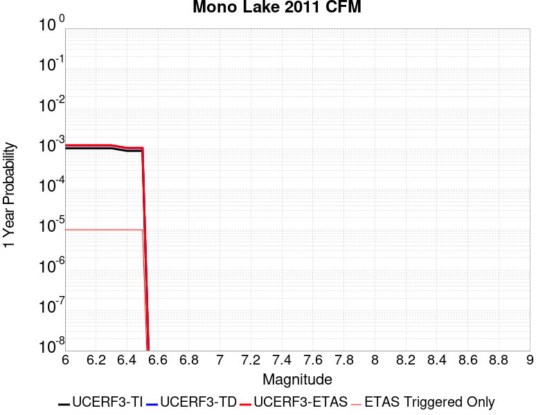 |  |

| Magnitude | 1 wk TI Prob | 1 wk TD Prob | 1 wk ETAS Prob | 1 wk ETAS/TD Gain | 1 wk ETAS Triggered Only | 1 mo TI Prob | 1 mo TD Prob | 1 mo ETAS Prob | 1 mo ETAS/TD Gain | 1 mo ETAS Triggered Only | 1 yr TI Prob | 1 yr TD Prob | 1 yr ETAS Prob | 1 yr ETAS/TD Gain | 1 yr ETAS Triggered Only | 10 yr TI Prob | 10 yr TD Prob | 10 yr ETAS Prob | 10 yr ETAS/TD Gain | 10 yr ETAS Triggered Only |
|-----|-----|-----|-----|-----|-----|-----|-----|-----|-----|-----|-----|-----|-----|-----|-----|-----|-----|-----|-----|-----|
| 6.0 | 2.0341662E-5 | 2.3831417E-5 | 2.3831417E-5 | 1.0 | 0.0 | 8.717564E-5 | 1.0213364E-4 | 7.6563586E-4 | 7.4964123 | 6.6357E-4 | 0.0010608466 | 0.0012432993 | 0.0019060443 | 1.5330534 | 6.6357E-4 | 0.010557966 | 0.012415525 | 0.013070855 | 1.0527833 | 6.6357E-4 |
| 6.1 | 2.0341662E-5 | 2.3831417E-5 | 2.3831417E-5 | 1.0 | 0.0 | 8.717564E-5 | 1.0213364E-4 | 7.6563586E-4 | 7.4964123 | 6.6357E-4 | 0.0010608466 | 0.0012432993 | 0.0019060443 | 1.5330534 | 6.6357E-4 | 0.010557966 | 0.012415525 | 0.013070855 | 1.0527833 | 6.6357E-4 |
| 6.2 | 2.0341662E-5 | 2.3831417E-5 | 2.3831417E-5 | 1.0 | 0.0 | 8.717564E-5 | 1.0213364E-4 | 7.6563586E-4 | 7.4964123 | 6.6357E-4 | 0.0010608466 | 0.0012432993 | 0.0019060443 | 1.5330534 | 6.6357E-4 | 0.010557966 | 0.012415525 | 0.013070855 | 1.0527833 | 6.6357E-4 |
| 6.3 | 2.0341662E-5 | 2.3831417E-5 | 2.3831417E-5 | 1.0 | 0.0 | 8.717564E-5 | 1.0213364E-4 | 7.6563586E-4 | 7.4964123 | 6.6357E-4 | 0.0010608466 | 0.0012432993 | 0.0019060443 | 1.5330534 | 6.6357E-4 | 0.010557966 | 0.012415525 | 0.013070855 | 1.0527833 | 6.6357E-4 |
| 6.4 | 1.749821E-5 | 2.0493775E-5 | 2.0493775E-5 | 1.0 | 0.0 | 7.499018E-5 | 8.783046E-5 | 7.5134216E-4 | 8.554461 | 6.6357E-4 | 9.1262296E-4 | 0.0010693358 | 0.0017321963 | 1.6198804 | 6.6357E-4 | 0.009088841 | 0.010693319 | 0.0113497935 | 1.0613911 | 6.6357E-4 |
| 6.5 | 1.749821E-5 | 2.0493775E-5 | 2.0493775E-5 | 1.0 | 0.0 | 7.499018E-5 | 8.783046E-5 | 7.5134216E-4 | 8.554461 | 6.6357E-4 | 9.1262296E-4 | 0.0010693358 | 0.0017321963 | 1.6198804 | 6.6357E-4 | 0.009088841 | 0.010693319 | 0.0113497935 | 1.0613911 | 6.6357E-4 |

## Death Valley (Black Mtns Frontal)
*[(top)](#table-of-contents)*

| 1 Week | 1 Month | 1 Year | 10 Year |
|-----|-----|-----|-----|
|  |  |  | 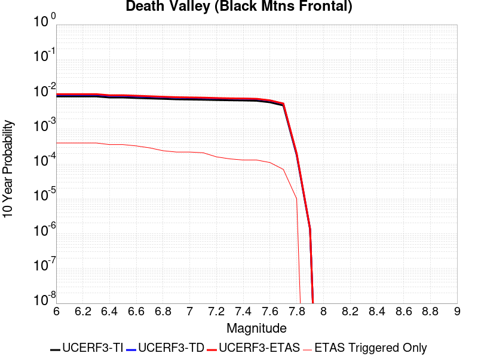 |

| Magnitude | 1 wk TI Prob | 1 wk TD Prob | 1 wk ETAS Prob | 1 wk ETAS/TD Gain | 1 wk ETAS Triggered Only | 1 mo TI Prob | 1 mo TD Prob | 1 mo ETAS Prob | 1 mo ETAS/TD Gain | 1 mo ETAS Triggered Only | 1 yr TI Prob | 1 yr TD Prob | 1 yr ETAS Prob | 1 yr ETAS/TD Gain | 1 yr ETAS Triggered Only | 10 yr TI Prob | 10 yr TD Prob | 10 yr ETAS Prob | 10 yr ETAS/TD Gain | 10 yr ETAS Triggered Only |
|-----|-----|-----|-----|-----|-----|-----|-----|-----|-----|-----|-----|-----|-----|-----|-----|-----|-----|-----|-----|-----|
| 6.0 | 1.6707214E-5 | 1.8672019E-5 | 1.8672019E-5 | 1.0 | 0.0 | 7.160038E-5 | 8.002053E-5 | 8.002053E-5 | 1.0 | 0.0 | 8.71386E-4 | 9.738221E-4 | 9.738221E-4 | 1.0 | 0.0 | 0.00867977 | 0.009696402 | 0.010353537 | 1.0677711 | 6.6357E-4 |
| 6.1 | 1.6707214E-5 | 1.8672019E-5 | 1.8672019E-5 | 1.0 | 0.0 | 7.160038E-5 | 8.002053E-5 | 8.002053E-5 | 1.0 | 0.0 | 8.71386E-4 | 9.738221E-4 | 9.738221E-4 | 1.0 | 0.0 | 0.00867977 | 0.009696402 | 0.010353537 | 1.0677711 | 6.6357E-4 |
| 6.2 | 1.6707214E-5 | 1.8672019E-5 | 1.8672019E-5 | 1.0 | 0.0 | 7.160038E-5 | 8.002053E-5 | 8.002053E-5 | 1.0 | 0.0 | 8.71386E-4 | 9.738221E-4 | 9.738221E-4 | 1.0 | 0.0 | 0.00867977 | 0.009696402 | 0.010353537 | 1.0677711 | 6.6357E-4 |
| 6.3 | 1.6707214E-5 | 1.8672019E-5 | 1.8672019E-5 | 1.0 | 0.0 | 7.160038E-5 | 8.002053E-5 | 8.002053E-5 | 1.0 | 0.0 | 8.71386E-4 | 9.738221E-4 | 9.738221E-4 | 1.0 | 0.0 | 0.00867977 | 0.009696402 | 0.010353537 | 1.0677711 | 6.6357E-4 |
| 6.4 | 1.5515609E-5 | 1.7339838E-5 | 1.7339838E-5 | 1.0 | 0.0 | 6.649377E-5 | 7.4311516E-5 | 7.4311516E-5 | 1.0 | 0.0 | 8.0926094E-4 | 9.0437324E-4 | 9.0437324E-4 | 1.0 | 0.0 | 0.008063202 | 0.009007613 | 0.009007613 | 1.0 | 0.0 |
| 6.5 | 1.5515609E-5 | 1.7339838E-5 | 1.7339838E-5 | 1.0 | 0.0 | 6.649377E-5 | 7.4311516E-5 | 7.4311516E-5 | 1.0 | 0.0 | 8.0926094E-4 | 9.0437324E-4 | 9.0437324E-4 | 1.0 | 0.0 | 0.008063202 | 0.009007613 | 0.009007613 | 1.0 | 0.0 |
| 6.6 | 1.5041828E-5 | 1.6810722E-5 | 1.6810722E-5 | 1.0 | 0.0 | 6.4463384E-5 | 7.204399E-5 | 7.204399E-5 | 1.0 | 0.0 | 7.8455906E-4 | 8.767885E-4 | 8.767885E-4 | 1.0 | 0.0 | 0.00781795 | 0.008733948 | 0.008733948 | 1.0 | 0.0 |
| 6.7 | 1.4634985E-5 | 1.6357551E-5 | 1.6357551E-5 | 1.0 | 0.0 | 6.271985E-5 | 7.0101945E-5 | 7.0101945E-5 | 1.0 | 0.0 | 7.6334673E-4 | 8.531627E-4 | 8.531627E-4 | 1.0 | 0.0 | 0.007607299 | 0.008499511 | 0.008499511 | 1.0 | 0.0 |
| 6.8 | 1.4209158E-5 | 1.5883541E-5 | 1.5883541E-5 | 1.0 | 0.0 | 6.089497E-5 | 6.807057E-5 | 6.807057E-5 | 1.0 | 0.0 | 7.4114406E-4 | 8.2844973E-4 | 8.2844973E-4 | 1.0 | 0.0 | 0.007386771 | 0.008254229 | 0.008254229 | 1.0 | 0.0 |
| 6.9 | 1.3780098E-5 | 1.5406044E-5 | 1.5406044E-5 | 1.0 | 0.0 | 5.9056227E-5 | 6.602426E-5 | 6.602426E-5 | 1.0 | 0.0 | 7.1877235E-4 | 8.035544E-4 | 8.035544E-4 | 1.0 | 0.0 | 0.0071645193 | 0.008007083 | 0.008007083 | 1.0 | 0.0 |
| 7.0 | 1.3585064E-5 | 1.51895865E-5 | 1.51895865E-5 | 1.0 | 0.0 | 5.8220405E-5 | 6.509663E-5 | 6.509663E-5 | 1.0 | 0.0 | 7.086029E-4 | 7.922688E-4 | 7.922688E-4 | 1.0 | 0.0 | 0.007063476 | 0.007895035 | 0.007895035 | 1.0 | 0.0 |
| 7.1 | 1.3398601E-5 | 1.4982753E-5 | 1.4982753E-5 | 1.0 | 0.0 | 5.742131E-5 | 6.4210246E-5 | 6.4210246E-5 | 1.0 | 0.0 | 6.9888023E-4 | 7.814848E-4 | 7.814848E-4 | 1.0 | 0.0 | 0.0069668638 | 0.007787956 | 0.007787956 | 1.0 | 0.0 |
| 7.2 | 1.3126312E-5 | 1.4680948E-5 | 1.4680948E-5 | 1.0 | 0.0 | 5.6254412E-5 | 6.291686E-5 | 6.291686E-5 | 1.0 | 0.0 | 6.846822E-4 | 7.65749E-4 | 7.65749E-4 | 1.0 | 0.0 | 0.006825765 | 0.0076316884 | 0.0076316884 | 1.0 | 0.0 |
| 7.3 | 1.2922429E-5 | 1.4455156E-5 | 1.4455156E-5 | 1.0 | 0.0 | 5.5380664E-5 | 6.194923E-5 | 6.194923E-5 | 1.0 | 0.0 | 6.74051E-4 | 7.539763E-4 | 7.539763E-4 | 1.0 | 0.0 | 0.006720101 | 0.007514763 | 0.007514763 | 1.0 | 0.0 |
| 7.4 | 1.2768878E-5 | 1.4285124E-5 | 1.4285124E-5 | 1.0 | 0.0 | 5.4722615E-5 | 6.1220555E-5 | 6.1220555E-5 | 1.0 | 0.0 | 6.660441E-4 | 7.451108E-4 | 7.451108E-4 | 1.0 | 0.0 | 0.0066405144 | 0.0074267043 | 0.0074267043 | 1.0 | 0.0 |
| 7.5 | 1.2521929E-5 | 1.4013346E-5 | 1.4013346E-5 | 1.0 | 0.0 | 5.366431E-5 | 6.0055845E-5 | 6.0055845E-5 | 1.0 | 0.0 | 6.531671E-4 | 7.309401E-4 | 7.309401E-4 | 1.0 | 0.0 | 0.006512506 | 0.0072859353 | 0.0072859353 | 1.0 | 0.0 |
| 7.6 | 1.1301089E-5 | 1.2649352E-5 | 1.2649352E-5 | 1.0 | 0.0 | 4.8432343E-5 | 5.4210414E-5 | 5.4210414E-5 | 1.0 | 0.0 | 5.895042E-4 | 6.598172E-4 | 6.598172E-4 | 1.0 | 0.0 | 0.0058794282 | 0.006579134 | 0.006579134 | 1.0 | 0.0 |
| 7.7 | 9.189108E-6 | 1.0284336E-5 | 1.0284336E-5 | 1.0 | 0.0 | 3.93813E-5 | 4.407501E-5 | 4.407501E-5 | 1.0 | 0.0 | 4.7936183E-4 | 5.3648616E-4 | 5.3648616E-4 | 1.0 | 0.0 | 0.004783291 | 0.005352421 | 0.005352421 | 1.0 | 0.0 |
| 7.8 | 3.4586725E-7 | 3.6484212E-7 | 3.6484212E-7 | 1.0 | 0.0 | 1.4822873E-6 | 1.5636082E-6 | 1.5636082E-6 | 1.0 | 0.0 | 1.80467E-5 | 1.9036768E-5 | 1.9036768E-5 | 1.0 | 0.0 | 1.8045233E-4 | 1.9035181E-4 | 1.9035181E-4 | 1.0 | 0.0 |
| 7.9 | 2.5591178E-9 | 2.6697635E-9 | 2.6697635E-9 | 1.0 | 0.0 | 1.0967647E-8 | 1.1441844E-8 | 1.1441844E-8 | 1.0 | 0.0 | 1.335311E-7 | 1.3930445E-7 | 1.3930445E-7 | 1.0 | 0.0 | 1.3353102E-6 | 1.3930445E-6 | 1.3930445E-6 | 1.0 | 0.0 |

## San Andreas (Big Bend)
*[(top)](#table-of-contents)*

| 1 Week | 1 Month | 1 Year | 10 Year |
|-----|-----|-----|-----|
|  |  |  |  |

| Magnitude | 1 wk TI Prob | 1 wk TD Prob | 1 wk ETAS Prob | 1 wk ETAS/TD Gain | 1 wk ETAS Triggered Only | 1 mo TI Prob | 1 mo TD Prob | 1 mo ETAS Prob | 1 mo ETAS/TD Gain | 1 mo ETAS Triggered Only | 1 yr TI Prob | 1 yr TD Prob | 1 yr ETAS Prob | 1 yr ETAS/TD Gain | 1 yr ETAS Triggered Only | 10 yr TI Prob | 10 yr TD Prob | 10 yr ETAS Prob | 10 yr ETAS/TD Gain | 10 yr ETAS Triggered Only |
|-----|-----|-----|-----|-----|-----|-----|-----|-----|-----|-----|-----|-----|-----|-----|-----|-----|-----|-----|-----|-----|
| 6.0 | 1.0179969E-4 | 2.0123523E-4 | 2.0123523E-4 | 1.0 | 0.0 | 4.362114E-4 | 8.621527E-4 | 8.621527E-4 | 1.0 | 0.0 | 0.0052979486 | 0.010446475 | 0.010446475 | 1.0 | 0.0 | 0.051734097 | 0.10167231 | 0.102268405 | 1.005863 | 6.6357E-4 |
| 6.1 | 1.0179969E-4 | 2.0123523E-4 | 2.0123523E-4 | 1.0 | 0.0 | 4.362114E-4 | 8.621527E-4 | 8.621527E-4 | 1.0 | 0.0 | 0.0052979486 | 0.010446475 | 0.010446475 | 1.0 | 0.0 | 0.051734097 | 0.10167231 | 0.102268405 | 1.005863 | 6.6357E-4 |
| 6.2 | 1.0179969E-4 | 2.0123523E-4 | 2.0123523E-4 | 1.0 | 0.0 | 4.362114E-4 | 8.621527E-4 | 8.621527E-4 | 1.0 | 0.0 | 0.0052979486 | 0.010446475 | 0.010446475 | 1.0 | 0.0 | 0.051734097 | 0.10167231 | 0.102268405 | 1.005863 | 6.6357E-4 |
| 6.3 | 1.0179969E-4 | 2.0123523E-4 | 2.0123523E-4 | 1.0 | 0.0 | 4.362114E-4 | 8.621527E-4 | 8.621527E-4 | 1.0 | 0.0 | 0.0052979486 | 0.010446475 | 0.010446475 | 1.0 | 0.0 | 0.051734097 | 0.10167231 | 0.102268405 | 1.005863 | 6.6357E-4 |
| 6.4 | 9.1639464E-5 | 1.847979E-4 | 1.847979E-4 | 1.0 | 0.0 | 3.9268145E-4 | 7.9175085E-4 | 7.9175085E-4 | 1.0 | 0.0 | 0.0047704205 | 0.00959708 | 0.00959708 | 1.0 | 0.0 | 0.046693064 | 0.09399609 | 0.09459729 | 1.0063959 | 6.6357E-4 |
| 6.5 | 9.1639464E-5 | 1.847979E-4 | 1.847979E-4 | 1.0 | 0.0 | 3.9268145E-4 | 7.9175085E-4 | 7.9175085E-4 | 1.0 | 0.0 | 0.0047704205 | 0.00959708 | 0.00959708 | 1.0 | 0.0 | 0.046693064 | 0.09399609 | 0.09459729 | 1.0063959 | 6.6357E-4 |
| 6.6 | 9.042622E-5 | 1.8286724E-4 | 1.8286724E-4 | 1.0 | 0.0 | 3.8748336E-4 | 7.834816E-4 | 7.834816E-4 | 1.0 | 0.0 | 0.0047074095 | 0.009497281 | 0.009497281 | 1.0 | 0.0 | 0.046089325 | 0.09308981 | 0.09369161 | 1.0064647 | 6.6357E-4 |
| 6.7 | 8.9836685E-5 | 1.8201018E-4 | 1.8201018E-4 | 1.0 | 0.0 | 3.8495753E-4 | 7.7981065E-4 | 7.7981065E-4 | 1.0 | 0.0 | 0.00467679 | 0.009452975 | 0.009452975 | 1.0 | 0.0 | 0.045795817 | 0.09268398 | 0.09268398 | 1.0 | 0.0 |
| 6.8 | 8.9471854E-5 | 1.8147753E-4 | 1.8147753E-4 | 1.0 | 0.0 | 3.8339442E-4 | 7.775292E-4 | 7.775292E-4 | 1.0 | 0.0 | 0.004657841 | 0.00942544 | 0.00942544 | 1.0 | 0.0 | 0.04561414 | 0.09243104 | 0.09243104 | 1.0 | 0.0 |
| 6.9 | 8.858234E-5 | 1.8029644E-4 | 1.8029644E-4 | 1.0 | 0.0 | 3.7958333E-4 | 7.724704E-4 | 7.724704E-4 | 1.0 | 0.0 | 0.004611638 | 0.00936438 | 0.00936438 | 1.0 | 0.0 | 0.04517103 | 0.09187091 | 0.09187091 | 1.0 | 0.0 |
| 7.0 | 8.7433385E-5 | 1.7868317E-4 | 1.7868317E-4 | 1.0 | 0.0 | 3.746607E-4 | 7.655605E-4 | 7.655605E-4 | 1.0 | 0.0 | 0.004551957 | 0.009280971 | 0.009280971 | 1.0 | 0.0 | 0.044598386 | 0.091104954 | 0.091104954 | 1.0 | 0.0 |
| 7.1 | 8.684964E-5 | 1.7780192E-4 | 1.7780192E-4 | 1.0 | 0.0 | 3.7215967E-4 | 7.617859E-4 | 7.617859E-4 | 1.0 | 0.0 | 0.0045216335 | 0.009235405 | 0.009235405 | 1.0 | 0.0 | 0.04430731 | 0.09068624 | 0.09068624 | 1.0 | 0.0 |
| 7.2 | 8.606521E-5 | 1.7670728E-4 | 1.7670728E-4 | 1.0 | 0.0 | 3.6879873E-4 | 7.570973E-4 | 7.570973E-4 | 1.0 | 0.0 | 0.0044808835 | 0.009178804 | 0.009178804 | 1.0 | 0.0 | 0.043916024 | 0.09016651 | 0.09016651 | 1.0 | 0.0 |
| 7.3 | 8.568266E-5 | 1.7612641E-4 | 1.7612641E-4 | 1.0 | 0.0 | 3.6715972E-4 | 7.546093E-4 | 7.546093E-4 | 1.0 | 0.0 | 0.0044610105 | 0.009148768 | 0.009148768 | 1.0 | 0.0 | 0.043725148 | 0.08988731 | 0.08988731 | 1.0 | 0.0 |
| 7.4 | 8.5432206E-5 | 1.7575169E-4 | 1.7575169E-4 | 1.0 | 0.0 | 3.6608664E-4 | 7.530043E-4 | 7.530043E-4 | 1.0 | 0.0 | 0.004447999 | 0.009129391 | 0.009129391 | 1.0 | 0.0 | 0.043600157 | 0.08970727 | 0.08970727 | 1.0 | 0.0 |
| 7.5 | 8.4791965E-5 | 1.7444292E-4 | 1.7444292E-4 | 1.0 | 0.0 | 3.633435E-4 | 7.4739853E-4 | 7.4739853E-4 | 1.0 | 0.0 | 0.0044147377 | 0.00906171 | 0.00906171 | 1.0 | 0.0 | 0.043280575 | 0.08908419 | 0.08908419 | 1.0 | 0.0 |
| 7.6 | 8.241105E-5 | 1.6888895E-4 | 1.6888895E-4 | 1.0 | 0.0 | 3.531424E-4 | 7.236092E-4 | 7.236092E-4 | 1.0 | 0.0 | 0.0042910352 | 0.0087744435 | 0.0087744435 | 1.0 | 0.0 | 0.042091176 | 0.08645832 | 0.08645832 | 1.0 | 0.0 |
| 7.7 | 7.00432E-5 | 1.4248259E-4 | 1.4248259E-4 | 1.0 | 0.0 | 3.001506E-4 | 6.104968E-4 | 6.104968E-4 | 1.0 | 0.0 | 0.0036482112 | 0.007407507 | 0.007407507 | 1.0 | 0.0 | 0.035888977 | 0.07371485 | 0.07371485 | 1.0 | 0.0 |
| 7.8 | 6.415362E-5 | 1.3008392E-4 | 1.3008392E-4 | 1.0 | 0.0 | 2.749151E-4 | 5.5738346E-4 | 5.5738346E-4 | 1.0 | 0.0 | 0.0033419547 | 0.0067650583 | 0.0067650583 | 1.0 | 0.0 | 0.03292141 | 0.06743165 | 0.06743165 | 1.0 | 0.0 |
| 7.9 | 4.939911E-5 | 9.369456E-5 | 9.369456E-5 | 1.0 | 0.0 | 2.116933E-4 | 4.0148632E-4 | 4.0148632E-4 | 1.0 | 0.0 | 0.0025743195 | 0.0048771496 | 0.0048771496 | 1.0 | 0.0 | 0.025447013 | 0.049047172 | 0.049047172 | 1.0 | 0.0 |
| 8.0 | 3.344983E-5 | 5.2395848E-5 | 5.2395848E-5 | 1.0 | 0.0 | 1.4334853E-4 | 2.2453432E-4 | 2.2453432E-4 | 1.0 | 0.0 | 0.0017438711 | 0.00273028 | 0.00273028 | 1.0 | 0.0 | 0.017302496 | 0.028005397 | 0.028005397 | 1.0 | 0.0 |
| 8.1 | 1.9104898E-5 | 1.9255709E-5 | 1.9255709E-5 | 1.0 | 0.0 | 8.1875565E-5 | 8.252186E-5 | 8.252186E-5 | 1.0 | 0.0 | 9.963791E-4 | 0.0010042412 | 0.0010042412 | 1.0 | 0.0 | 0.009919235 | 0.010793286 | 0.010793286 | 1.0 | 0.0 |
| 8.2 | 8.643924E-6 | 5.506234E-6 | 5.506234E-6 | 1.0 | 0.0 | 3.704486E-5 | 2.3597933E-5 | 2.3597933E-5 | 1.0 | 0.0 | 4.5092785E-4 | 2.8726703E-4 | 2.8726703E-4 | 1.0 | 0.0 | 0.0045001395 | 0.0032658712 | 0.0032658712 | 1.0 | 0.0 |
| 8.3 | 1.983087E-6 | 7.7104113E-7 | 7.7104113E-7 | 1.0 | 0.0 | 8.498917E-6 | 3.3044578E-6 | 3.3044578E-6 | 1.0 | 0.0 | 1.034694E-4 | 4.0231047E-5 | 4.0231047E-5 | 1.0 | 0.0 | 0.0010342124 | 4.7486598E-4 | 4.7486598E-4 | 1.0 | 0.0 |

## Big Pine (East)
*[(top)](#table-of-contents)*

| 1 Week | 1 Month | 1 Year | 10 Year |
|-----|-----|-----|-----|
|  |  |  |  |

| Magnitude | 1 wk TI Prob | 1 wk TD Prob | 1 wk ETAS Prob | 1 wk ETAS/TD Gain | 1 wk ETAS Triggered Only | 1 mo TI Prob | 1 mo TD Prob | 1 mo ETAS Prob | 1 mo ETAS/TD Gain | 1 mo ETAS Triggered Only | 1 yr TI Prob | 1 yr TD Prob | 1 yr ETAS Prob | 1 yr ETAS/TD Gain | 1 yr ETAS Triggered Only | 10 yr TI Prob | 10 yr TD Prob | 10 yr ETAS Prob | 10 yr ETAS/TD Gain | 10 yr ETAS Triggered Only |
|-----|-----|-----|-----|-----|-----|-----|-----|-----|-----|-----|-----|-----|-----|-----|-----|-----|-----|-----|-----|-----|
| 6.0 | 9.916913E-6 | 1.2824463E-5 | 1.2824463E-5 | 1.0 | 0.0 | 4.250036E-5 | 5.496095E-5 | 5.496095E-5 | 1.0 | 0.0 | 5.173191E-4 | 6.689662E-4 | 6.689662E-4 | 1.0 | 0.0 | 0.0051611643 | 0.0066742534 | 0.007333394 | 1.0987588 | 6.6357E-4 |
| 6.1 | 9.916913E-6 | 1.2824463E-5 | 1.2824463E-5 | 1.0 | 0.0 | 4.250036E-5 | 5.496095E-5 | 5.496095E-5 | 1.0 | 0.0 | 5.173191E-4 | 6.689662E-4 | 6.689662E-4 | 1.0 | 0.0 | 0.0051611643 | 0.0066742534 | 0.007333394 | 1.0987588 | 6.6357E-4 |
| 6.2 | 9.916913E-6 | 1.2824463E-5 | 1.2824463E-5 | 1.0 | 0.0 | 4.250036E-5 | 5.496095E-5 | 5.496095E-5 | 1.0 | 0.0 | 5.173191E-4 | 6.689662E-4 | 6.689662E-4 | 1.0 | 0.0 | 0.0051611643 | 0.0066742534 | 0.007333394 | 1.0987588 | 6.6357E-4 |
| 6.3 | 5.479711E-6 | 8.120204E-6 | 8.120204E-6 | 1.0 | 0.0 | 2.3484265E-5 | 3.480043E-5 | 3.480043E-5 | 1.0 | 0.0 | 2.858834E-4 | 4.2361606E-4 | 4.2361606E-4 | 1.0 | 0.0 | 0.0028551589 | 0.0042309477 | 0.0048917104 | 1.1561736 | 6.6357E-4 |
| 6.4 | 5.465009E-6 | 8.104497E-6 | 8.104497E-6 | 1.0 | 0.0 | 2.3421257E-5 | 3.4733115E-5 | 3.4733115E-5 | 1.0 | 0.0 | 2.851165E-4 | 4.227968E-4 | 4.227968E-4 | 1.0 | 0.0 | 0.0028475097 | 0.0042227865 | 0.0048835543 | 1.1564767 | 6.6357E-4 |
| 6.5 | 4.826767E-6 | 7.429522E-6 | 7.429522E-6 | 1.0 | 0.0 | 2.068598E-5 | 3.1840438E-5 | 3.1840438E-5 | 1.0 | 0.0 | 2.518227E-4 | 3.8759114E-4 | 3.8759114E-4 | 1.0 | 0.0 | 0.0025153751 | 0.003871972 | 0.004532973 | 1.1707143 | 6.6357E-4 |
| 6.6 | 4.3146847E-6 | 6.889435E-6 | 6.889435E-6 | 1.0 | 0.0 | 1.8491375E-5 | 2.9525829E-5 | 2.9525829E-5 | 1.0 | 0.0 | 2.2510924E-4 | 3.5942014E-4 | 3.5942014E-4 | 1.0 | 0.0 | 0.0022488134 | 0.0035911764 | 0.0042523635 | 1.1841143 | 6.6357E-4 |
| 6.7 | 3.6968106E-6 | 6.0022458E-6 | 6.0022458E-6 | 1.0 | 0.0 | 1.5843378E-5 | 2.5723666E-5 | 2.5723666E-5 | 1.0 | 0.0 | 1.9287605E-4 | 3.1314217E-4 | 3.1314217E-4 | 1.0 | 0.0 | 0.0019270873 | 0.003129707 | 0.003129707 | 1.0 | 0.0 |
| 6.8 | 3.4671132E-6 | 5.708767E-6 | 5.708767E-6 | 1.0 | 0.0 | 1.4858972E-5 | 2.446592E-5 | 2.446592E-5 | 1.0 | 0.0 | 1.8089297E-4 | 2.9783332E-4 | 2.9783332E-4 | 1.0 | 0.0 | 0.0018074579 | 0.0029770308 | 0.0029770308 | 1.0 | 0.0 |
| 6.9 | 2.7686972E-6 | 4.831307E-6 | 4.831307E-6 | 1.0 | 0.0 | 1.1865792E-5 | 2.0705442E-5 | 2.0705442E-5 | 1.0 | 0.0 | 1.4445644E-4 | 2.5206033E-4 | 2.5206033E-4 | 1.0 | 0.0 | 0.0014436257 | 0.0025203656 | 0.0025203656 | 1.0 | 0.0 |
| 7.0 | 2.1472624E-6 | 3.990567E-6 | 3.990567E-6 | 1.0 | 0.0 | 9.20252E-6 | 1.7102322E-5 | 1.7102322E-5 | 1.0 | 0.0 | 1.12034926E-4 | 2.0820141E-4 | 2.0820141E-4 | 1.0 | 0.0 | 0.0011197845 | 0.0020826526 | 0.0020826526 | 1.0 | 0.0 |
| 7.1 | 1.7018335E-6 | 3.3499055E-6 | 3.3499055E-6 | 1.0 | 0.0 | 7.293552E-6 | 1.4356661E-5 | 1.4356661E-5 | 1.0 | 0.0 | 8.879537E-5 | 1.7477869E-4 | 1.7477869E-4 | 1.0 | 0.0 | 8.87599E-4 | 0.0017489698 | 0.0017489698 | 1.0 | 0.0 |
| 7.2 | 1.25603E-6 | 2.7992353E-6 | 2.7992353E-6 | 1.0 | 0.0 | 5.3829745E-6 | 1.1996669E-5 | 1.1996669E-5 | 1.0 | 0.0 | 6.553574E-5 | 1.4604988E-4 | 1.4604988E-4 | 1.0 | 0.0 | 6.551642E-4 | 0.0014620721 | 0.0014620721 | 1.0 | 0.0 |
| 7.3 | 1.112297E-6 | 2.6148184E-6 | 2.6148184E-6 | 1.0 | 0.0 | 4.7669787E-6 | 1.1206318E-5 | 1.1206318E-5 | 1.0 | 0.0 | 5.803642E-5 | 1.364286E-4 | 1.364286E-4 | 1.0 | 0.0 | 5.802127E-4 | 0.0013658132 | 0.0013658132 | 1.0 | 0.0 |
| 7.4 | 1.0137181E-6 | 2.4877857E-6 | 2.4877857E-6 | 1.0 | 0.0 | 4.3444993E-6 | 1.0661896E-5 | 1.0661896E-5 | 1.0 | 0.0 | 5.2892992E-5 | 1.2980108E-4 | 1.2980108E-4 | 1.0 | 0.0 | 5.288041E-4 | 0.0012994015 | 0.0012994015 | 1.0 | 0.0 |
| 7.5 | 9.598608E-7 | 2.4113144E-6 | 2.4113144E-6 | 1.0 | 0.0 | 4.1136827E-6 | 1.03341645E-5 | 1.03341645E-5 | 1.0 | 0.0 | 5.0082934E-5 | 1.258114E-4 | 1.258114E-4 | 1.0 | 0.0 | 5.007165E-4 | 0.0012593593 | 0.0012593593 | 1.0 | 0.0 |
| 7.6 | 7.929459E-7 | 2.0485384E-6 | 2.0485384E-6 | 1.0 | 0.0 | 3.3983351E-6 | 8.779422E-6 | 8.779422E-6 | 1.0 | 0.0 | 4.1373947E-5 | 1.0688439E-4 | 1.0688439E-4 | 1.0 | 0.0 | 4.1366243E-4 | 0.0010703824 | 0.0010703824 | 1.0 | 0.0 |
| 7.7 | 4.155788E-7 | 1.1631677E-6 | 1.1631677E-6 | 1.0 | 0.0 | 1.7810507E-6 | 4.984995E-6 | 4.984995E-6 | 1.0 | 0.0 | 2.1684076E-5 | 6.0690665E-5 | 6.0690665E-5 | 1.0 | 0.0 | 2.1681961E-4 | 6.0988986E-4 | 6.0988986E-4 | 1.0 | 0.0 |
| 7.8 | 1.14666925E-7 | 2.5978747E-7 | 2.5978747E-7 | 1.0 | 0.0 | 4.914296E-7 | 1.1133744E-6 | 1.1133744E-6 | 1.0 | 0.0 | 5.9831386E-6 | 1.3555254E-5 | 1.3555254E-5 | 1.0 | 0.0 | 5.9829777E-5 | 1.366415E-4 | 1.366415E-4 | 1.0 | 0.0 |
| 7.9 | 2.9231824E-8 | 4.1561687E-8 | 4.1561687E-8 | 1.0 | 0.0 | 1.2527924E-7 | 1.781215E-7 | 1.781215E-7 | 1.0 | 0.0 | 1.5252737E-6 | 2.1686274E-6 | 2.1686274E-6 | 1.0 | 0.0 | 1.5252632E-5 | 2.2018894E-5 | 2.2018894E-5 | 1.0 | 0.0 |

## Oceanic - West Huasna
*[(top)](#table-of-contents)*

| 1 Week | 1 Month | 1 Year | 10 Year |
|-----|-----|-----|-----|
|  |  |  |  |

| Magnitude | 1 wk TI Prob | 1 wk TD Prob | 1 wk ETAS Prob | 1 wk ETAS/TD Gain | 1 wk ETAS Triggered Only | 1 mo TI Prob | 1 mo TD Prob | 1 mo ETAS Prob | 1 mo ETAS/TD Gain | 1 mo ETAS Triggered Only | 1 yr TI Prob | 1 yr TD Prob | 1 yr ETAS Prob | 1 yr ETAS/TD Gain | 1 yr ETAS Triggered Only | 10 yr TI Prob | 10 yr TD Prob | 10 yr ETAS Prob | 10 yr ETAS/TD Gain | 10 yr ETAS Triggered Only |
|-----|-----|-----|-----|-----|-----|-----|-----|-----|-----|-----|-----|-----|-----|-----|-----|-----|-----|-----|-----|-----|
| 6.0 | 3.195567E-5 | 2.7928618E-5 | 2.7928618E-5 | 1.0 | 0.0 | 1.3694567E-4 | 1.19688826E-4 | 1.19688826E-4 | 1.0 | 0.0 | 0.0016660384 | 0.0014562806 | 0.0014562806 | 1.0 | 0.0 | 0.016536033 | 0.014471928 | 0.015125895 | 1.0451887 | 6.6357E-4 |
| 6.1 | 2.1156782E-5 | 1.757453E-5 | 1.757453E-5 | 1.0 | 0.0 | 9.066878E-5 | 7.531729E-5 | 7.531729E-5 | 1.0 | 0.0 | 0.0011033333 | 9.1661164E-4 | 9.1661164E-4 | 1.0 | 0.0 | 0.010978713 | 0.0091293175 | 0.0091293175 | 1.0 | 0.0 |
| 6.2 | 1.6195117E-5 | 1.3327889E-5 | 1.3327889E-5 | 1.0 | 0.0 | 6.9405796E-5 | 5.7118286E-5 | 5.7118286E-5 | 1.0 | 0.0 | 8.44688E-4 | 6.9519586E-4 | 6.9519586E-4 | 1.0 | 0.0 | 0.008414844 | 0.006930505 | 0.006930505 | 1.0 | 0.0 |
| 6.3 | 1.3559345E-5 | 1.1179727E-5 | 1.1179727E-5 | 1.0 | 0.0 | 5.811018E-5 | 4.7912243E-5 | 4.7912243E-5 | 1.0 | 0.0 | 7.072618E-4 | 5.831764E-4 | 5.831764E-4 | 1.0 | 0.0 | 0.0070501505 | 0.0058165784 | 0.0058165784 | 1.0 | 0.0 |
| 6.4 | 1.2120619E-5 | 1.0001485E-5 | 1.0001485E-5 | 1.0 | 0.0 | 5.1944477E-5 | 4.286281E-5 | 4.286281E-5 | 1.0 | 0.0 | 6.322405E-4 | 5.217302E-4 | 5.217302E-4 | 1.0 | 0.0 | 0.006304447 | 0.005205121 | 0.005205121 | 1.0 | 0.0 |
| 6.5 | 1.13511915E-5 | 9.367946E-6 | 9.367946E-6 | 1.0 | 0.0 | 4.8647056E-5 | 4.0147723E-5 | 4.0147723E-5 | 1.0 | 0.0 | 5.9211696E-4 | 4.8868934E-4 | 4.8868934E-4 | 1.0 | 0.0 | 0.0059054173 | 0.004876206 | 0.004876206 | 1.0 | 0.0 |
| 6.6 | 9.850605E-6 | 8.135825E-6 | 8.135825E-6 | 1.0 | 0.0 | 4.2216197E-5 | 3.4867353E-5 | 3.4867353E-5 | 1.0 | 0.0 | 5.1386096E-4 | 4.2442756E-4 | 4.2442756E-4 | 1.0 | 0.0 | 0.0051267436 | 0.004236202 | 0.004236202 | 1.0 | 0.0 |
| 6.7 | 8.8558645E-6 | 7.3187994E-6 | 7.3187994E-6 | 1.0 | 0.0 | 3.7953152E-5 | 3.1365907E-5 | 3.1365907E-5 | 1.0 | 0.0 | 4.6198163E-4 | 3.8181318E-4 | 3.8181318E-4 | 1.0 | 0.0 | 0.004610224 | 0.0038115974 | 0.0038115974 | 1.0 | 0.0 |
| 6.8 | 7.67136E-6 | 6.39208E-6 | 6.39208E-6 | 1.0 | 0.0 | 3.2876844E-5 | 2.7394342E-5 | 2.7394342E-5 | 1.0 | 0.0 | 4.0020206E-4 | 3.3347524E-4 | 3.3347524E-4 | 1.0 | 0.0 | 0.003994821 | 0.0033297692 | 0.0033297692 | 1.0 | 0.0 |
| 6.9 | 6.534529E-6 | 5.4586135E-6 | 5.4586135E-6 | 1.0 | 0.0 | 2.8004823E-5 | 2.339385E-5 | 2.339385E-5 | 1.0 | 0.0 | 3.4090536E-4 | 2.8478302E-4 | 2.8478302E-4 | 1.0 | 0.0 | 0.0034038287 | 0.0028441974 | 0.0028441974 | 1.0 | 0.0 |
| 7.0 | 5.460525E-6 | 4.5702022E-6 | 4.5702022E-6 | 1.0 | 0.0 | 2.3402039E-5 | 1.9586434E-5 | 1.9586434E-5 | 1.0 | 0.0 | 2.8488258E-4 | 2.3843886E-4 | 2.3843886E-4 | 1.0 | 0.0 | 0.0028451765 | 0.0023818442 | 0.0023818442 | 1.0 | 0.0 |
| 7.1 | 4.4825083E-6 | 3.7526715E-6 | 3.7526715E-6 | 1.0 | 0.0 | 1.9210609E-5 | 1.6082779E-5 | 1.6082779E-5 | 1.0 | 0.0 | 2.3386406E-4 | 1.9579034E-4 | 1.9579034E-4 | 1.0 | 0.0 | 0.002336181 | 0.0019561904 | 0.0019561904 | 1.0 | 0.0 |
| 7.2 | 2.821708E-6 | 2.4251235E-6 | 2.4251235E-6 | 1.0 | 0.0 | 1.2092979E-5 | 1.0393345E-5 | 1.0393345E-5 | 1.0 | 0.0 | 1.4722206E-4 | 1.2653164E-4 | 1.2653164E-4 | 1.0 | 0.0 | 0.0014712457 | 0.0012645983 | 0.0012645983 | 1.0 | 0.0 |
| 7.3 | 2.0644757E-6 | 1.768914E-6 | 1.768914E-6 | 1.0 | 0.0 | 8.847723E-6 | 7.581038E-6 | 7.581038E-6 | 1.0 | 0.0 | 1.0771569E-4 | 9.229523E-5 | 9.229523E-5 | 1.0 | 0.0 | 0.001076635 | 9.225707E-4 | 9.225707E-4 | 1.0 | 0.0 |
| 7.4 | 1.6980367E-6 | 1.438146E-6 | 1.438146E-6 | 1.0 | 0.0 | 7.27728E-6 | 6.1634687E-6 | 6.1634687E-6 | 1.0 | 0.0 | 8.8597284E-5 | 7.503765E-5 | 7.503765E-5 | 1.0 | 0.0 | 8.8561967E-4 | 7.501247E-4 | 7.501247E-4 | 1.0 | 0.0 |
| 7.5 | 1.3637683E-6 | 1.1304143E-6 | 1.1304143E-6 | 1.0 | 0.0 | 5.844708E-6 | 4.8446236E-6 | 4.8446236E-6 | 1.0 | 0.0 | 7.1156996E-5 | 5.89817E-5 | 5.89817E-5 | 1.0 | 0.0 | 7.1134215E-4 | 5.8966194E-4 | 5.8966194E-4 | 1.0 | 0.0 |
| 7.6 | 9.802994E-7 | 7.678671E-7 | 7.678671E-7 | 1.0 | 0.0 | 4.2012766E-6 | 3.290855E-6 | 3.290855E-6 | 1.0 | 0.0 | 5.1149345E-5 | 4.0065424E-5 | 4.0065424E-5 | 1.0 | 0.0 | 5.113757E-4 | 4.005834E-4 | 4.005834E-4 | 1.0 | 0.0 |
| 7.7 | 5.986191E-7 | 4.0061522E-7 | 4.0061522E-7 | 1.0 | 0.0 | 2.5655079E-6 | 1.7169212E-6 | 1.7169212E-6 | 1.0 | 0.0 | 3.1234613E-5 | 2.0903315E-5 | 2.0903315E-5 | 1.0 | 0.0 | 3.123022E-4 | 2.0901485E-4 | 2.0901485E-4 | 1.0 | 0.0 |
| 7.8 | 2.9189815E-7 | 1.5295181E-7 | 1.5295181E-7 | 1.0 | 0.0 | 1.2509914E-6 | 6.5550756E-7 | 6.5550756E-7 | 1.0 | 0.0 | 1.5230714E-5 | 7.980775E-6 | 7.980775E-6 | 1.0 | 0.0 | 1.522967E-4 | 7.98062E-5 | 7.98062E-5 | 1.0 | 0.0 |
| 7.9 | 1.2057845E-7 | 4.6264603E-8 | 4.6264603E-8 | 1.0 | 0.0 | 5.1676466E-7 | 1.9827685E-7 | 1.9827685E-7 | 1.0 | 0.0 | 6.2915915E-6 | 2.414018E-6 | 2.414018E-6 | 1.0 | 0.0 | 6.2914136E-5 | 2.4141224E-5 | 2.4141224E-5 | 1.0 | 0.0 |
| 8.0 | 3.3806387E-9 | 9.031532E-10 | 9.031532E-10 | 1.0 | 0.0 | 1.4488451E-8 | 3.870657E-9 | 3.870657E-9 | 1.0 | 0.0 | 1.7639688E-7 | 4.7125248E-8 | 4.7125248E-8 | 1.0 | 0.0 | 1.7639674E-6 | 4.72347E-7 | 4.72347E-7 | 1.0 | 0.0 |

## Towne Pass
*[(top)](#table-of-contents)*

| 1 Week | 1 Month | 1 Year | 10 Year |
|-----|-----|-----|-----|
|  |  |  |  |

| Magnitude | 1 wk TI Prob | 1 wk TD Prob | 1 wk ETAS Prob | 1 wk ETAS/TD Gain | 1 wk ETAS Triggered Only | 1 mo TI Prob | 1 mo TD Prob | 1 mo ETAS Prob | 1 mo ETAS/TD Gain | 1 mo ETAS Triggered Only | 1 yr TI Prob | 1 yr TD Prob | 1 yr ETAS Prob | 1 yr ETAS/TD Gain | 1 yr ETAS Triggered Only | 10 yr TI Prob | 10 yr TD Prob | 10 yr ETAS Prob | 10 yr ETAS/TD Gain | 10 yr ETAS Triggered Only |
|-----|-----|-----|-----|-----|-----|-----|-----|-----|-----|-----|-----|-----|-----|-----|-----|-----|-----|-----|-----|-----|
| 6.0 | 3.849728E-6 | 3.894591E-6 | 3.894591E-6 | 1.0 | 0.0 | 1.649873E-5 | 1.6691021E-5 | 1.6691021E-5 | 1.0 | 0.0 | 2.0085352E-4 | 2.0319861E-4 | 8.666338E-4 | 4.2649593 | 6.6357E-4 | 0.0020067208 | 0.0020305573 | 0.0026927798 | 1.3261285 | 6.6357E-4 |
| 6.1 | 3.849728E-6 | 3.894591E-6 | 3.894591E-6 | 1.0 | 0.0 | 1.649873E-5 | 1.6691021E-5 | 1.6691021E-5 | 1.0 | 0.0 | 2.0085352E-4 | 2.0319861E-4 | 8.666338E-4 | 4.2649593 | 6.6357E-4 | 0.0020067208 | 0.0020305573 | 0.0026927798 | 1.3261285 | 6.6357E-4 |
| 6.2 | 3.849728E-6 | 3.894591E-6 | 3.894591E-6 | 1.0 | 0.0 | 1.649873E-5 | 1.6691021E-5 | 1.6691021E-5 | 1.0 | 0.0 | 2.0085352E-4 | 2.0319861E-4 | 8.666338E-4 | 4.2649593 | 6.6357E-4 | 0.0020067208 | 0.0020305573 | 0.0026927798 | 1.3261285 | 6.6357E-4 |
| 6.3 | 3.849728E-6 | 3.894591E-6 | 3.894591E-6 | 1.0 | 0.0 | 1.649873E-5 | 1.6691021E-5 | 1.6691021E-5 | 1.0 | 0.0 | 2.0085352E-4 | 2.0319861E-4 | 8.666338E-4 | 4.2649593 | 6.6357E-4 | 0.0020067208 | 0.0020305573 | 0.0026927798 | 1.3261285 | 6.6357E-4 |
| 6.4 | 3.849728E-6 | 3.894591E-6 | 3.894591E-6 | 1.0 | 0.0 | 1.649873E-5 | 1.6691021E-5 | 1.6691021E-5 | 1.0 | 0.0 | 2.0085352E-4 | 2.0319861E-4 | 8.666338E-4 | 4.2649593 | 6.6357E-4 | 0.0020067208 | 0.0020305573 | 0.0026927798 | 1.3261285 | 6.6357E-4 |
| 6.5 | 1.1953545E-6 | 1.2030715E-6 | 1.2030715E-6 | 1.0 | 0.0 | 5.1229376E-6 | 5.1560114E-6 | 5.1560114E-6 | 1.0 | 0.0 | 6.236998E-5 | 6.277275E-5 | 6.277275E-5 | 1.0 | 0.0 | 6.235248E-4 | 6.275619E-4 | 6.275619E-4 | 1.0 | 0.0 |
| 6.6 | 1.1953545E-6 | 1.2030715E-6 | 1.2030715E-6 | 1.0 | 0.0 | 5.1229376E-6 | 5.1560114E-6 | 5.1560114E-6 | 1.0 | 0.0 | 6.236998E-5 | 6.277275E-5 | 6.277275E-5 | 1.0 | 0.0 | 6.235248E-4 | 6.275619E-4 | 6.275619E-4 | 1.0 | 0.0 |
| 6.7 | 8.375951E-7 | 8.4108314E-7 | 8.4108314E-7 | 1.0 | 0.0 | 3.5896885E-6 | 3.6046374E-6 | 3.6046374E-6 | 1.0 | 0.0 | 4.370358E-5 | 4.3885633E-5 | 4.3885633E-5 | 1.0 | 0.0 | 4.3694986E-4 | 4.387754E-4 | 4.387754E-4 | 1.0 | 0.0 |
| 6.8 | 6.38041E-7 | 6.392299E-7 | 6.392299E-7 | 1.0 | 0.0 | 2.7344586E-6 | 2.739554E-6 | 2.739554E-6 | 1.0 | 0.0 | 3.3291526E-5 | 3.3353597E-5 | 3.3353597E-5 | 1.0 | 0.0 | 3.3286537E-4 | 3.3348973E-4 | 3.3348973E-4 | 1.0 | 0.0 |
| 6.9 | 5.3460053E-7 | 5.345466E-7 | 5.345466E-7 | 1.0 | 0.0 | 2.2911431E-6 | 2.290912E-6 | 2.290912E-6 | 1.0 | 0.0 | 2.789431E-5 | 2.789153E-5 | 2.789153E-5 | 1.0 | 0.0 | 2.789081E-4 | 2.788836E-4 | 2.788836E-4 | 1.0 | 0.0 |
| 7.0 | 3.557783E-7 | 3.532535E-7 | 3.532535E-7 | 1.0 | 0.0 | 1.5247632E-6 | 1.5139428E-6 | 1.5139428E-6 | 1.0 | 0.0 | 1.8563835E-5 | 1.8432107E-5 | 1.8432107E-5 | 1.0 | 0.0 | 1.8562283E-4 | 1.8430663E-4 | 1.8430663E-4 | 1.0 | 0.0 |
| 7.1 | 3.037942E-7 | 3.0003244E-7 | 3.0003244E-7 | 1.0 | 0.0 | 1.3019744E-6 | 1.2858527E-6 | 1.2858527E-6 | 1.0 | 0.0 | 1.5851423E-5 | 1.5655152E-5 | 1.5655152E-5 | 1.0 | 0.0 | 1.5850292E-4 | 1.5654124E-4 | 1.5654124E-4 | 1.0 | 0.0 |
| 7.2 | 2.0808248E-7 | 2.0218533E-7 | 2.0218533E-7 | 1.0 | 0.0 | 8.917818E-7 | 8.665083E-7 | 8.665083E-7 | 1.0 | 0.0 | 1.0857389E-5 | 1.0549692E-5 | 1.0549692E-5 | 1.0 | 0.0 | 1.0856859E-4 | 1.0549238E-4 | 1.0549238E-4 | 1.0 | 0.0 |
| 7.3 | 1.1162073E-7 | 1.06374294E-7 | 1.06374294E-7 | 1.0 | 0.0 | 4.7837443E-7 | 4.5588976E-7 | 4.5588976E-7 | 1.0 | 0.0 | 5.8241935E-6 | 5.5504456E-6 | 5.5504456E-6 | 1.0 | 0.0 | 5.8240406E-5 | 5.550327E-5 | 5.550327E-5 | 1.0 | 0.0 |

## Helendale-So Lockhart
*[(top)](#table-of-contents)*

| 1 Week | 1 Month | 1 Year | 10 Year |
|-----|-----|-----|-----|
|  |  |  |  |

| Magnitude | 1 wk TI Prob | 1 wk TD Prob | 1 wk ETAS Prob | 1 wk ETAS/TD Gain | 1 wk ETAS Triggered Only | 1 mo TI Prob | 1 mo TD Prob | 1 mo ETAS Prob | 1 mo ETAS/TD Gain | 1 mo ETAS Triggered Only | 1 yr TI Prob | 1 yr TD Prob | 1 yr ETAS Prob | 1 yr ETAS/TD Gain | 1 yr ETAS Triggered Only | 10 yr TI Prob | 10 yr TD Prob | 10 yr ETAS Prob | 10 yr ETAS/TD Gain | 10 yr ETAS Triggered Only |
|-----|-----|-----|-----|-----|-----|-----|-----|-----|-----|-----|-----|-----|-----|-----|-----|-----|-----|-----|-----|-----|
| 6.0 | 1.7296055E-5 | 1.8104403E-5 | 1.8104403E-5 | 1.0 | 0.0 | 7.412385E-5 | 7.758811E-5 | 7.758811E-5 | 1.0 | 0.0 | 9.0208417E-4 | 9.442466E-4 | 0.00160719 | 1.7020872 | 6.6357E-4 | 0.008984311 | 0.009404465 | 0.010061795 | 1.0698955 | 6.6357E-4 |
| 6.1 | 1.7296055E-5 | 1.8104403E-5 | 1.8104403E-5 | 1.0 | 0.0 | 7.412385E-5 | 7.758811E-5 | 7.758811E-5 | 1.0 | 0.0 | 9.0208417E-4 | 9.442466E-4 | 0.00160719 | 1.7020872 | 6.6357E-4 | 0.008984311 | 0.009404465 | 0.010061795 | 1.0698955 | 6.6357E-4 |
| 6.2 | 1.7296055E-5 | 1.8104403E-5 | 1.8104403E-5 | 1.0 | 0.0 | 7.412385E-5 | 7.758811E-5 | 7.758811E-5 | 1.0 | 0.0 | 9.0208417E-4 | 9.442466E-4 | 0.00160719 | 1.7020872 | 6.6357E-4 | 0.008984311 | 0.009404465 | 0.010061795 | 1.0698955 | 6.6357E-4 |
| 6.3 | 1.0669118E-5 | 1.1135812E-5 | 1.1135812E-5 | 1.0 | 0.0 | 4.5723988E-5 | 4.7724054E-5 | 4.7724054E-5 | 1.0 | 0.0 | 5.5654737E-4 | 5.8088824E-4 | 0.0012440728 | 2.1416733 | 6.6357E-4 | 0.0055515557 | 0.0057939948 | 0.00645372 | 1.1138636 | 6.6357E-4 |
| 6.4 | 1.0669118E-5 | 1.1135812E-5 | 1.1135812E-5 | 1.0 | 0.0 | 4.5723988E-5 | 4.7724054E-5 | 4.7724054E-5 | 1.0 | 0.0 | 5.5654737E-4 | 5.8088824E-4 | 0.0012440728 | 2.1416733 | 6.6357E-4 | 0.0055515557 | 0.0057939948 | 0.00645372 | 1.1138636 | 6.6357E-4 |
| 6.5 | 8.790038E-6 | 9.170513E-6 | 9.170513E-6 | 1.0 | 0.0 | 3.767105E-5 | 3.9301616E-5 | 3.9301616E-5 | 1.0 | 0.0 | 4.585485E-4 | 4.7839366E-4 | 0.0011416462 | 2.386416 | 6.6357E-4 | 0.0045760344 | 0.0047738026 | 0.005434205 | 1.1383388 | 6.6357E-4 |
| 6.6 | 7.396949E-6 | 7.715802E-6 | 7.715802E-6 | 1.0 | 0.0 | 3.1700827E-5 | 3.306731E-5 | 3.306731E-5 | 1.0 | 0.0 | 3.858892E-4 | 4.025211E-4 | 0.0010658241 | 2.647871 | 6.6357E-4 | 0.003852198 | 0.0040180273 | 0.004678931 | 1.1644846 | 6.6357E-4 |
| 6.7 | 6.4600285E-6 | 6.738262E-6 | 6.738262E-6 | 1.0 | 0.0 | 2.7685543E-5 | 2.887795E-5 | 2.887795E-5 | 1.0 | 0.0 | 3.3701936E-4 | 3.5153312E-4 | 0.0010148699 | 2.8869822 | 6.6357E-4 | 0.0033650869 | 0.003509852 | 0.004171093 | 1.1883957 | 6.6357E-4 |
| 6.8 | 5.600104E-6 | 5.836205E-6 | 5.836205E-6 | 1.0 | 0.0 | 2.4000226E-5 | 2.5012072E-5 | 2.5012072E-5 | 1.0 | 0.0 | 2.9216358E-4 | 3.0448003E-4 | 9.67848E-4 | 3.1786914 | 6.6357E-4 | 0.0029177975 | 0.00304069 | 0.0037022422 | 1.2175665 | 6.6357E-4 |
| 6.9 | 4.839122E-6 | 5.0396757E-6 | 5.0396757E-6 | 1.0 | 0.0 | 2.0738931E-5 | 2.1598433E-5 | 2.1598433E-5 | 1.0 | 0.0 | 2.5246723E-4 | 2.6292965E-4 | 2.6292965E-4 | 1.0 | 0.0 | 0.002521806 | 0.0026262333 | 0.0026262333 | 1.0 | 0.0 |
| 7.0 | 3.6937633E-6 | 3.8453336E-6 | 3.8453336E-6 | 1.0 | 0.0 | 1.5830317E-5 | 1.6479898E-5 | 1.6479898E-5 | 1.0 | 0.0 | 1.9271708E-4 | 2.006246E-4 | 2.006246E-4 | 1.0 | 0.0 | 0.0019255003 | 0.0020044663 | 0.0020044663 | 1.0 | 0.0 |
| 7.1 | 2.7858857E-6 | 2.8979466E-6 | 2.8979466E-6 | 1.0 | 0.0 | 1.1939455E-5 | 1.2419713E-5 | 1.2419713E-5 | 1.0 | 0.0 | 1.4535317E-4 | 1.5119973E-4 | 1.5119973E-4 | 1.0 | 0.0 | 0.0014525814 | 0.0015109901 | 0.0015109901 | 1.0 | 0.0 |
| 7.2 | 2.1672065E-6 | 2.2540846E-6 | 2.2540846E-6 | 1.0 | 0.0 | 9.2879945E-6 | 9.660328E-6 | 9.660328E-6 | 1.0 | 0.0 | 1.1307546E-4 | 1.1760833E-4 | 1.1760833E-4 | 1.0 | 0.0 | 0.0011301794 | 0.0011754791 | 0.0011754791 | 1.0 | 0.0 |
| 7.3 | 1.4823496E-6 | 1.5422597E-6 | 1.5422597E-6 | 1.0 | 0.0 | 6.3529114E-6 | 6.609669E-6 | 6.609669E-6 | 1.0 | 0.0 | 7.734395E-5 | 8.04699E-5 | 8.04699E-5 | 1.0 | 0.0 | 7.731704E-4 | 8.044227E-4 | 8.044227E-4 | 1.0 | 0.0 |
| 7.4 | 4.2321457E-7 | 4.411025E-7 | 4.411025E-7 | 1.0 | 0.0 | 1.8137755E-6 | 1.890438E-6 | 1.890438E-6 | 1.0 | 0.0 | 2.2082493E-5 | 2.3015888E-5 | 2.3015888E-5 | 1.0 | 0.0 | 2.2080299E-4 | 2.3013956E-4 | 2.3013956E-4 | 1.0 | 0.0 |
| 7.5 | 5.6942316E-8 | 5.94177E-8 | 5.94177E-8 | 1.0 | 0.0 | 2.440385E-7 | 2.5464726E-7 | 2.5464726E-7 | 1.0 | 0.0 | 2.9711643E-6 | 3.100327E-6 | 3.100327E-6 | 1.0 | 0.0 | 2.9711247E-5 | 3.1002914E-5 | 3.1002914E-5 | 1.0 | 0.0 |

## Death Valley (No)
*[(top)](#table-of-contents)*

| 1 Week | 1 Month | 1 Year | 10 Year |
|-----|-----|-----|-----|
|  |  |  |  |

| Magnitude | 1 wk TI Prob | 1 wk TD Prob | 1 wk ETAS Prob | 1 wk ETAS/TD Gain | 1 wk ETAS Triggered Only | 1 mo TI Prob | 1 mo TD Prob | 1 mo ETAS Prob | 1 mo ETAS/TD Gain | 1 mo ETAS Triggered Only | 1 yr TI Prob | 1 yr TD Prob | 1 yr ETAS Prob | 1 yr ETAS/TD Gain | 1 yr ETAS Triggered Only | 10 yr TI Prob | 10 yr TD Prob | 10 yr ETAS Prob | 10 yr ETAS/TD Gain | 10 yr ETAS Triggered Only |
|-----|-----|-----|-----|-----|-----|-----|-----|-----|-----|-----|-----|-----|-----|-----|-----|-----|-----|-----|-----|-----|
| 6.0 | 2.0074807E-5 | 2.2502258E-5 | 2.2502258E-5 | 1.0 | 0.0 | 8.603206E-5 | 9.643472E-5 | 9.643472E-5 | 1.0 | 0.0 | 0.001046937 | 0.0011734677 | 0.0011734677 | 1.0 | 0.0 | 0.010420183 | 0.011673627 | 0.012329451 | 1.05618 | 6.6357E-4 |
| 6.1 | 2.0074807E-5 | 2.2502258E-5 | 2.2502258E-5 | 1.0 | 0.0 | 8.603206E-5 | 9.643472E-5 | 9.643472E-5 | 1.0 | 0.0 | 0.001046937 | 0.0011734677 | 0.0011734677 | 1.0 | 0.0 | 0.010420183 | 0.011673627 | 0.012329451 | 1.05618 | 6.6357E-4 |
| 6.2 | 2.0074807E-5 | 2.2502258E-5 | 2.2502258E-5 | 1.0 | 0.0 | 8.603206E-5 | 9.643472E-5 | 9.643472E-5 | 1.0 | 0.0 | 0.001046937 | 0.0011734677 | 0.0011734677 | 1.0 | 0.0 | 0.010420183 | 0.011673627 | 0.012329451 | 1.05618 | 6.6357E-4 |
| 6.3 | 1.9050609E-5 | 2.1338996E-5 | 2.1338996E-5 | 1.0 | 0.0 | 8.164292E-5 | 9.144967E-5 | 9.144967E-5 | 1.0 | 0.0 | 9.935491E-4 | 0.0011128378 | 0.0011128378 | 1.0 | 0.0 | 0.009891188 | 0.011073476 | 0.011729698 | 1.0592607 | 6.6357E-4 |
| 6.4 | 1.9050609E-5 | 2.1338996E-5 | 2.1338996E-5 | 1.0 | 0.0 | 8.164292E-5 | 9.144967E-5 | 9.144967E-5 | 1.0 | 0.0 | 9.935491E-4 | 0.0011128378 | 0.0011128378 | 1.0 | 0.0 | 0.009891188 | 0.011073476 | 0.011729698 | 1.0592607 | 6.6357E-4 |
| 6.5 | 1.8367004E-5 | 2.0562973E-5 | 2.0562973E-5 | 1.0 | 0.0 | 7.8713354E-5 | 8.8124085E-5 | 8.8124085E-5 | 1.0 | 0.0 | 9.5791375E-4 | 0.0010723892 | 0.0010723892 | 1.0 | 0.0 | 0.009537951 | 0.01067293 | 0.011329417 | 1.0615096 | 6.6357E-4 |
| 6.6 | 1.779439E-5 | 1.9912823E-5 | 1.9912823E-5 | 1.0 | 0.0 | 7.625944E-5 | 8.533791E-5 | 8.533791E-5 | 1.0 | 0.0 | 9.280632E-4 | 0.0010385002 | 0.0010385002 | 1.0 | 0.0 | 0.009241969 | 0.010337231 | 0.010993942 | 1.0635287 | 6.6357E-4 |
| 6.7 | 1.7025437E-5 | 1.904523E-5 | 1.904523E-5 | 1.0 | 0.0 | 7.296412E-5 | 8.16199E-5 | 8.16199E-5 | 1.0 | 0.0 | 8.87976E-4 | 9.932754E-4 | 9.932754E-4 | 1.0 | 0.0 | 0.008844362 | 0.009889078 | 0.010546086 | 1.0664377 | 6.6357E-4 |
| 6.8 | 1.6545107E-5 | 1.8514305E-5 | 1.8514305E-5 | 1.0 | 0.0 | 7.090568E-5 | 7.9344645E-5 | 7.9344645E-5 | 1.0 | 0.0 | 8.629347E-4 | 9.65599E-4 | 9.65599E-4 | 1.0 | 0.0 | 0.008595915 | 0.009614739 | 0.010271928 | 1.0683523 | 6.6357E-4 |
| 6.9 | 1.615478E-5 | 1.8089324E-5 | 1.8089324E-5 | 1.0 | 0.0 | 6.9232934E-5 | 7.75234E-5 | 7.75234E-5 | 1.0 | 0.0 | 8.4258494E-4 | 9.434448E-4 | 9.434448E-4 | 1.0 | 0.0 | 0.008393973 | 0.00939509 | 0.010052425 | 1.0699658 | 6.6357E-4 |
| 7.0 | 1.5894311E-5 | 1.780726E-5 | 1.780726E-5 | 1.0 | 0.0 | 6.81167E-5 | 7.631463E-5 | 7.631463E-5 | 1.0 | 0.0 | 8.2900526E-4 | 9.2874066E-4 | 9.2874066E-4 | 1.0 | 0.0 | 0.008259195 | 0.009249282 | 0.009906714 | 1.0710793 | 6.6357E-4 |
| 7.1 | 1.5602263E-5 | 1.7485187E-5 | 1.7485187E-5 | 1.0 | 0.0 | 6.6865134E-5 | 7.4934396E-5 | 7.4934396E-5 | 1.0 | 0.0 | 8.137789E-4 | 9.119505E-4 | 9.119505E-4 | 1.0 | 0.0 | 0.008108052 | 0.009082764 | 0.009740307 | 1.0723946 | 6.6357E-4 |
| 7.2 | 1.5323829E-5 | 1.7172282E-5 | 1.7172282E-5 | 1.0 | 0.0 | 6.56719E-5 | 7.359345E-5 | 7.359345E-5 | 1.0 | 0.0 | 7.99262E-4 | 8.956381E-4 | 8.956381E-4 | 1.0 | 0.0 | 0.007963934 | 0.008920961 | 0.008920961 | 1.0 | 0.0 |
| 7.3 | 1.4556212E-5 | 1.6304017E-5 | 1.6304017E-5 | 1.0 | 0.0 | 6.238227E-5 | 6.987252E-5 | 6.987252E-5 | 1.0 | 0.0 | 7.592395E-4 | 8.503718E-4 | 8.503718E-4 | 1.0 | 0.0 | 0.0075665074 | 0.008471822 | 0.008471822 | 1.0 | 0.0 |
| 7.4 | 1.411725E-5 | 1.5809472E-5 | 1.5809472E-5 | 1.0 | 0.0 | 6.0501097E-5 | 6.775315E-5 | 6.775315E-5 | 1.0 | 0.0 | 7.363519E-4 | 8.2458823E-4 | 8.2458823E-4 | 1.0 | 0.0 | 0.0073391674 | 0.008215921 | 0.008215921 | 1.0 | 0.0 |
| 7.5 | 1.3503312E-5 | 1.512774E-5 | 1.512774E-5 | 1.0 | 0.0 | 5.7870053E-5 | 6.483159E-5 | 6.483159E-5 | 1.0 | 0.0 | 7.043401E-4 | 7.890446E-4 | 7.890446E-4 | 1.0 | 0.0 | 0.007021119 | 0.007863056 | 0.007863056 | 1.0 | 0.0 |
| 7.6 | 1.1279839E-5 | 1.262753E-5 | 1.262753E-5 | 1.0 | 0.0 | 4.834127E-5 | 5.4116892E-5 | 5.4116892E-5 | 1.0 | 0.0 | 5.88396E-4 | 6.586793E-4 | 6.586793E-4 | 1.0 | 0.0 | 0.005868405 | 0.0065678223 | 0.0065678223 | 1.0 | 0.0 |
| 7.7 | 9.189108E-6 | 1.0284336E-5 | 1.0284336E-5 | 1.0 | 0.0 | 3.93813E-5 | 4.407501E-5 | 4.407501E-5 | 1.0 | 0.0 | 4.7936183E-4 | 5.3648616E-4 | 5.3648616E-4 | 1.0 | 0.0 | 0.004783291 | 0.005352421 | 0.005352421 | 1.0 | 0.0 |
| 7.8 | 3.4586725E-7 | 3.6484212E-7 | 3.6484212E-7 | 1.0 | 0.0 | 1.4822873E-6 | 1.5636082E-6 | 1.5636082E-6 | 1.0 | 0.0 | 1.80467E-5 | 1.9036768E-5 | 1.9036768E-5 | 1.0 | 0.0 | 1.8045233E-4 | 1.9035181E-4 | 1.9035181E-4 | 1.0 | 0.0 |
| 7.9 | 2.5591178E-9 | 2.6697635E-9 | 2.6697635E-9 | 1.0 | 0.0 | 1.0967647E-8 | 1.1441844E-8 | 1.1441844E-8 | 1.0 | 0.0 | 1.335311E-7 | 1.3930445E-7 | 1.3930445E-7 | 1.0 | 0.0 | 1.3353102E-6 | 1.3930445E-6 | 1.3930445E-6 | 1.0 | 0.0 |

