# Parent Section Magnitude-Probability Distributions

Only fault sections with at least one triggered aftershock are plotted. Sections are sorted by total supraseismogenic trigger rate (decreasing)

## Table Of Contents

* [Garlock (Central)](#garlock-central)
* [Tank Canyon](#tank-canyon)
* [Little Lake](#little-lake)
* [Airport Lake](#airport-lake)
* [Owl Lake](#owl-lake)
* [Panamint Valley](#panamint-valley)
* [Garlock (East)](#garlock-east)
* [Ash Hill](#ash-hill)
* [Hunter Mountain-Saline Valley](#hunter-mountain-saline-valley)
* [Blackwater](#blackwater)
* [Garlock (West)](#garlock-west)
* [McLean Lake](#mclean-lake)
* [Gravel Hills-Harper Lk](#gravel-hills-harper-lk)
* [Goldstone Lake](#goldstone-lake)
* [So Sierra Nevada](#so-sierra-nevada)
* [Coyote Canyon](#coyote-canyon)
* [Lenwood-Lockhart-Old Woman Springs](#lenwood-lockhart-old-woman-springs)
* [Death Valley (So)](#death-valley-so)
* [Nelson Lake](#nelson-lake)
* [Towne Pass](#towne-pass)
* [San Andreas (Mojave S)](#san-andreas-mojave-s)
* [San Andreas (Mojave N)](#san-andreas-mojave-n)
* [Bicycle Lake](#bicycle-lake)
* [Sierra Nevada  (No Extension)](#sierra-nevada--no-extension)
* [Garlic Springs](#garlic-springs)
* [Death Valley (Black Mtns Frontal)](#death-valley-black-mtns-frontal)
* [Paradise](#paradise)
* [Death Valley (No)](#death-valley-no)
* [Owens Valley](#owens-valley)
* [San Andreas (Big Bend)](#san-andreas-big-bend)
* [San Andreas (Cholame) rev](#san-andreas-cholame-rev)
* [San Andreas (Parkfield)](#san-andreas-parkfield)
* [San Andreas (San Bernardino N)](#san-andreas-san-bernardino-n)
* [Helendale-So Lockhart](#helendale-so-lockhart)
* [Ortigalita (North)](#ortigalita-north)
* [Independence rev 2011](#independence-rev-2011)
* [San Andreas (Carrizo) rev](#san-andreas-carrizo-rev)
* [Coyote Lake](#coyote-lake)
* [San Andreas (San Bernardino S)](#san-andreas-san-bernardino-s)
* [Lake Isabella (Seismicity)](#lake-isabella-seismicity)
* [White Wolf (Extension)](#white-wolf-extension)
* [Death Valley (Fish Lake Valley)](#death-valley-fish-lake-valley)
* [Tin Mountain](#tin-mountain)
* [Rose Canyon](#rose-canyon)
* [Great Valley 09 (Laguna Seca)](#great-valley-09-laguna-seca)
* [Ventura-Pitas Point](#ventura-pitas-point)
* [Cleghorn Lake](#cleghorn-lake)
* [San Pedro Basin](#san-pedro-basin)
* [Palos Verdes](#palos-verdes)
* [Blue Cut](#blue-cut)
* [Ludlow](#ludlow)
* [Scodie Lineament](#scodie-lineament)
* [Deep Springs](#deep-springs)
* [Verdugo](#verdugo)
* [Mono Lake 2011 CFM](#mono-lake-2011-cfm)
* [Red Mountain](#red-mountain)
* [Big Pine (East)](#big-pine-east)
* [Kern Canyon (South Kern) 2011](#kern-canyon-south-kern-2011)
* [Santa Cruz Catalina Ridge alt1](#santa-cruz-catalina-ridge-alt1)
* [San Juan](#san-juan)
* [Manix-Afton Hills](#manix-afton-hills)
* [Santa Ynez (East)](#santa-ynez-east)
* [Newport-Inglewood (Offshore)](#newport-inglewood-offshore)
* [Goose Lake 2011 CFM](#goose-lake-2011-cfm)
* [Pleito](#pleito)
* [Great Valley 08 (Quinto)](#great-valley-08-quinto)
* [San Andreas (San Gorgonio Pass-Garnet HIll)](#san-andreas-san-gorgonio-pass-garnet-hill)
* [Raymond](#raymond)
* [Elsinore (Glen Ivy) rev](#elsinore-glen-ivy-rev)
* [San Andreas (Creeping Section) 2011 CFM](#san-andreas-creeping-section-2011-cfm)
* [Great Valley 10 (Panoche)](#great-valley-10-panoche)
* [Oceanic - West Huasna](#oceanic---west-huasna)
* [Ortigalita (South)](#ortigalita-south)
* [Bullion Mountains](#bullion-mountains)
* [North Frontal  (East)](#north-frontal--east)
* [Kern Canyon (North Kern) 2011](#kern-canyon-north-kern-2011)
* [Pinto Mtn](#pinto-mtn)
* [Pisgah-Bullion Mtn-Mesquite Lk](#pisgah-bullion-mtn-mesquite-lk)
* [Sierra Madre](#sierra-madre)
* [Lost Hills](#lost-hills)
* [Cady](#cady)
* [Likely 2011 CFM](#likely-2011-cfm)
* [Cleghorn Pass](#cleghorn-pass)

## Garlock (Central)
*[(top)](#table-of-contents)*

| 1 Week | 1 Month | 1 Year | 10 Year |
|-----|-----|-----|-----|
|  |  |  |  |

| Magnitude | 1 wk TI Prob | 1 wk TD Prob | 1 wk ETAS Prob | 1 wk ETAS/TD Gain | 1 wk ETAS Triggered Only | 1 mo TI Prob | 1 mo TD Prob | 1 mo ETAS Prob | 1 mo ETAS/TD Gain | 1 mo ETAS Triggered Only | 1 yr TI Prob | 1 yr TD Prob | 1 yr ETAS Prob | 1 yr ETAS/TD Gain | 1 yr ETAS Triggered Only | 10 yr TI Prob | 10 yr TD Prob | 10 yr ETAS Prob | 10 yr ETAS/TD Gain | 10 yr ETAS Triggered Only |
|-----|-----|-----|-----|-----|-----|-----|-----|-----|-----|-----|-----|-----|-----|-----|-----|-----|-----|-----|-----|-----|
| 6.0 | 5.5131142E-5 | 7.028353E-5 | 0.0017615212 | 25.063072 | 0.0016913565 | 2.3625491E-4 | 3.0118073E-4 | 0.005956773 | 19.778069 | 0.005657296 | 0.0028726095 | 0.0036607755 | 0.028415266 | 7.7620893 | 0.024845446 | 0.028357591 | 0.03609825 | 0.08433269 | 2.3361988 | 0.050040826 |
| 6.1 | 5.5131142E-5 | 7.028353E-5 | 0.0017615212 | 25.063072 | 0.0016913565 | 2.3625491E-4 | 3.0118073E-4 | 0.005956773 | 19.778069 | 0.005657296 | 0.0028726095 | 0.0036607755 | 0.028415266 | 7.7620893 | 0.024845446 | 0.028357591 | 0.03609825 | 0.08433269 | 2.3361988 | 0.050040826 |
| 6.2 | 4.216245E-5 | 5.1694726E-5 | 9.264891E-4 | 17.922314 | 8.748396E-4 | 1.806837E-4 | 2.2153018E-4 | 0.0036618037 | 16.529593 | 0.0034410357 | 0.0021976046 | 0.0026938256 | 0.017758697 | 6.592371 | 0.015105564 | 0.021759989 | 0.026706655 | 0.05684889 | 2.1286414 | 0.030969322 |
| 6.3 | 4.216245E-5 | 5.1694726E-5 | 9.264891E-4 | 17.922314 | 8.748396E-4 | 1.806837E-4 | 2.2153018E-4 | 0.0036618037 | 16.529593 | 0.0034410357 | 0.0021976046 | 0.0026938256 | 0.017758697 | 6.592371 | 0.015105564 | 0.021759989 | 0.026706655 | 0.05684889 | 2.1286414 | 0.030969322 |
| 6.4 | 3.6858168E-5 | 4.4142424E-5 | 8.023033E-4 | 18.175333 | 7.581943E-4 | 1.5795401E-4 | 1.8916825E-4 | 0.0031047487 | 16.412632 | 0.002916132 | 0.0019213937 | 0.0023007158 | 0.014171161 | 6.159457 | 0.011897819 | 0.019048655 | 0.02286518 | 0.047484465 | 2.076715 | 0.02519538 |
| 6.5 | 3.39199E-5 | 4.004938E-5 | 6.232524E-4 | 15.562099 | 5.832264E-4 | 1.453629E-4 | 1.7162903E-4 | 0.0027373848 | 15.949428 | 0.0025661963 | 0.0017683565 | 0.0020876026 | 0.013203972 | 6.324945 | 0.011139625 | 0.017543508 | 0.020775842 | 0.04322044 | 2.080322 | 0.022920799 |
| 6.6 | 3.3571985E-5 | 3.9503488E-5 | 6.2270684E-4 | 15.763339 | 5.832264E-4 | 1.4387199E-4 | 1.692898E-4 | 0.0027350516 | 16.156033 | 0.0025661963 | 0.0017502342 | 0.0020591766 | 0.013175863 | 6.3986073 | 0.011139625 | 0.017365133 | 0.02049712 | 0.04294811 | 2.095324 | 0.022920799 |
| 6.7 | 3.2580007E-5 | 3.8119713E-5 | 6.213239E-4 | 16.29928 | 5.832264E-4 | 1.3962112E-4 | 1.6336009E-4 | 0.002670824 | 16.349306 | 0.0025078736 | 0.0016985617 | 0.0019871162 | 0.012580744 | 6.3311567 | 0.01061472 | 0.016856372 | 0.019789662 | 0.041113496 | 2.077524 | 0.021754345 |
| 6.8 | 3.2185937E-5 | 3.7546815E-5 | 6.2075135E-4 | 16.53273 | 5.832264E-4 | 1.3793244E-4 | 1.6090513E-4 | 0.0026683751 | 16.583532 | 0.0025078736 | 0.0016780337 | 0.001957281 | 0.012318391 | 6.2936244 | 0.01038143 | 0.016654192 | 0.01949641 | 0.04042632 | 2.0735266 | 0.021346087 |
| 6.9 | 3.165394E-5 | 3.6751233E-5 | 5.616357E-4 | 15.282092 | 5.2490376E-4 | 1.3565269E-4 | 1.5749589E-4 | 0.0025483475 | 16.180407 | 0.0023912282 | 0.0016503202 | 0.0019158474 | 0.0119281225 | 6.22603 | 0.010031494 | 0.01638118 | 0.019088961 | 0.039226644 | 2.0549386 | 0.02052957 |
| 7.0 | 3.0903822E-5 | 3.5656267E-5 | 5.0222076E-4 | 14.085062 | 4.665811E-4 | 1.3243823E-4 | 1.5280375E-4 | 0.0024853528 | 16.265 | 0.0023329055 | 0.0016112428 | 0.0018588194 | 0.0118134525 | 6.3553524 | 0.009973171 | 0.015996104 | 0.018528024 | 0.03833377 | 2.0689616 | 0.020179633 |
| 7.1 | 3.0069863E-5 | 3.442231E-5 | 4.4266676E-4 | 12.859878 | 4.082585E-4 | 1.2886449E-4 | 1.4751598E-4 | 0.0024217635 | 16.416958 | 0.002274583 | 0.0015677959 | 0.0017945486 | 0.011284079 | 6.2879763 | 0.009506591 | 0.01556781 | 0.017895563 | 0.037026722 | 2.0690448 | 0.019479763 |
| 7.2 | 2.7957109E-5 | 3.131102E-5 | 3.812359E-4 | 12.175774 | 3.4993584E-4 | 1.1981068E-4 | 1.341833E-4 | 0.0020585721 | 15.341494 | 0.0019246471 | 0.0014577188 | 0.0016324769 | 0.009318498 | 5.7081957 | 0.0076985885 | 0.014481937 | 0.016298864 | 0.03184669 | 1.9539207 | 0.015805436 |
| 7.3 | 2.4519275E-5 | 2.6742577E-5 | 1.4338474E-4 | 5.361665 | 1.1664528E-4 | 1.0507837E-4 | 1.1460609E-4 | 0.0014558731 | 12.703279 | 0.0013414207 | 0.0012785783 | 0.0013944508 | 0.0069273757 | 4.9678164 | 0.005540651 | 0.012712469 | 0.013942342 | 0.024926655 | 1.7878383 | 0.011139625 |
| 7.4 | 2.3225532E-5 | 2.5226616E-5 | 1.4186895E-4 | 5.6237807 | 1.1664528E-4 | 9.95342E-5 | 1.0810967E-4 | 0.001391069 | 12.867203 | 0.0012830981 | 0.0012111551 | 0.001315455 | 0.0062663583 | 4.7636433 | 0.0049574245 | 0.012045753 | 0.013159735 | 0.022886552 | 1.7391347 | 0.009856527 |
| 7.5 | 2.097765E-5 | 2.2509554E-5 | 1.3915221E-4 | 6.1819177 | 1.1664528E-4 | 8.9901114E-5 | 9.646602E-5 | 0.0011461723 | 11.881617 | 0.0010498075 | 0.0010939965 | 0.0011738528 | 0.00490212 | 4.1760945 | 0.003732649 | 0.010886264 | 0.011753701 | 0.01941944 | 1.652198 | 0.007756911 |
| 7.6 | 1.511254E-5 | 1.6015367E-5 | 1.6015367E-5 | 1.0 | 0.0 | 6.476642E-5 | 6.863553E-5 | 7.1014056E-4 | 10.346545 | 6.4154906E-4 | 7.882459E-4 | 8.35325E-4 | 0.0028166384 | 3.3719072 | 0.0019829697 | 0.007854558 | 0.008395991 | 0.012155134 | 1.4477307 | 0.0037909716 |
| 7.7 | 9.934069E-6 | 1.0701108E-5 | 1.0701108E-5 | 1.0 | 0.0 | 4.2573887E-5 | 4.586109E-5 | 1.04181054E-4 | 2.2716656 | 5.832264E-5 | 5.182138E-4 | 5.582161E-4 | 8.4966654E-4 | 1.5221103 | 2.916132E-4 | 0.00517007 | 0.0056392583 | 0.006335183 | 1.1234071 | 6.998717E-4 |
| 7.8 | 6.7562896E-6 | 8.44664E-6 | 8.44664E-6 | 1.0 | 0.0 | 2.8955206E-5 | 3.6199384E-5 | 9.451991E-5 | 2.6110919 | 5.832264E-5 | 3.5247262E-4 | 4.4063854E-4 | 6.1552937E-4 | 1.3969032 | 1.7496792E-4 | 0.0035191406 | 0.0044560935 | 0.0047464073 | 1.0651498 | 2.916132E-4 |
| 7.9 | 3.975453E-6 | 5.3821313E-6 | 5.3821313E-6 | 1.0 | 0.0 | 1.7037546E-5 | 2.3066073E-5 | 2.3066073E-5 | 1.0 | 0.0 | 2.0741238E-4 | 2.8079335E-4 | 3.390996E-4 | 1.2076483 | 5.832264E-5 | 0.002072189 | 0.002839394 | 0.0028975508 | 1.0204822 | 5.832264E-5 |
| 8.0 | 1.6729537E-6 | 2.0813598E-6 | 2.0813598E-6 | 1.0 | 0.0 | 7.169782E-6 | 8.920083E-6 | 8.920083E-6 | 1.0 | 0.0 | 8.7288594E-5 | 1.08596636E-4 | 1.6691294E-4 | 1.5369992 | 5.832264E-5 | 8.7254314E-4 | 0.0010989337 | 0.0011571923 | 1.0530137 | 5.832264E-5 |
| 8.1 | 3.6733252E-7 | 3.154532E-7 | 3.154532E-7 | 1.0 | 0.0 | 1.5742813E-6 | 1.3519417E-6 | 1.3519417E-6 | 1.0 | 0.0 | 1.9166706E-5 | 1.6459782E-5 | 1.6459782E-5 | 1.0 | 0.0 | 1.9165053E-4 | 1.6667772E-4 | 1.6667772E-4 | 1.0 | 0.0 |

## Tank Canyon
*[(top)](#table-of-contents)*

| 1 Week | 1 Month | 1 Year | 10 Year |
|-----|-----|-----|-----|
|  |  |  |  |

| Magnitude | 1 wk TI Prob | 1 wk TD Prob | 1 wk ETAS Prob | 1 wk ETAS/TD Gain | 1 wk ETAS Triggered Only | 1 mo TI Prob | 1 mo TD Prob | 1 mo ETAS Prob | 1 mo ETAS/TD Gain | 1 mo ETAS Triggered Only | 1 yr TI Prob | 1 yr TD Prob | 1 yr ETAS Prob | 1 yr ETAS/TD Gain | 1 yr ETAS Triggered Only | 10 yr TI Prob | 10 yr TD Prob | 10 yr ETAS Prob | 10 yr ETAS/TD Gain | 10 yr ETAS Triggered Only |
|-----|-----|-----|-----|-----|-----|-----|-----|-----|-----|-----|-----|-----|-----|-----|-----|-----|-----|-----|-----|-----|
| 6.0 | 4.8284557E-5 | 5.7973975E-5 | 8.161244E-4 | 14.077426 | 7.581943E-4 | 2.0691741E-4 | 2.4844008E-4 | 0.0032221559 | 12.969549 | 0.0029744548 | 0.0025163088 | 0.0030212225 | 0.019127784 | 6.3311405 | 0.016155371 | 0.02488006 | 0.029868243 | 0.0627416 | 2.1006122 | 0.033885453 |
| 6.1 | 1.7796336E-5 | 2.0876007E-5 | 1.9584027E-4 | 9.381118 | 1.7496792E-4 | 7.626778E-5 | 8.946575E-5 | 8.4759225E-4 | 9.47393 | 7.581943E-4 | 9.281647E-4 | 0.001088738 | 0.006448579 | 5.9229856 | 0.0053656828 | 0.009242975 | 0.01083813 | 0.023356976 | 2.1550744 | 0.0126560135 |
| 6.2 | 1.7796336E-5 | 2.0876007E-5 | 1.9584027E-4 | 9.381118 | 1.7496792E-4 | 7.626778E-5 | 8.946575E-5 | 8.4759225E-4 | 9.47393 | 7.581943E-4 | 9.281647E-4 | 0.001088738 | 0.006448579 | 5.9229856 | 0.0053656828 | 0.009242975 | 0.01083813 | 0.023356976 | 2.1550744 | 0.0126560135 |
| 6.3 | 1.3515912E-5 | 1.576146E-5 | 1.3240491E-4 | 8.400548 | 1.1664528E-4 | 5.792405E-5 | 6.75475E-5 | 7.0905325E-4 | 10.497105 | 6.4154906E-4 | 7.049971E-4 | 8.221046E-4 | 0.004726509 | 5.7492795 | 0.0039076167 | 0.007027647 | 0.008193244 | 0.016985653 | 2.073129 | 0.008865042 |
| 6.4 | 1.0870146E-5 | 1.2619447E-5 | 1.2926325E-4 | 10.243179 | 1.1664528E-4 | 4.658551E-5 | 5.4082324E-5 | 5.206382E-4 | 9.626772 | 4.665811E-4 | 5.67031E-4 | 6.582713E-4 | 0.0036890523 | 5.6041517 | 0.0030327772 | 0.005655863 | 0.0065652295 | 0.01317036 | 2.0060775 | 0.0066487812 |
| 6.5 | 7.964826E-6 | 9.197039E-6 | 6.751914E-5 | 7.3414006 | 5.832264E-5 | 3.4134522E-5 | 3.9415343E-5 | 2.7269672E-4 | 6.918542 | 2.3329056E-4 | 4.1550855E-4 | 4.797868E-4 | 0.0024035105 | 5.0095387 | 0.0019246471 | 0.0041473247 | 0.004788811 | 0.008909889 | 1.8605639 | 0.0041409074 |
| 6.6 | 6.6317E-6 | 7.6130164E-6 | 6.5935215E-5 | 8.660852 | 5.832264E-5 | 2.8421264E-5 | 3.2626856E-5 | 1.4926834E-4 | 4.575014 | 1.1664528E-4 | 3.4597394E-4 | 3.971687E-4 | 0.0015631582 | 3.9357538 | 0.0011664528 | 0.0034543579 | 0.0039657406 | 0.00652176 | 1.644525 | 0.0025661963 |
| 6.7 | 4.793663E-6 | 5.4311977E-6 | 6.375352E-5 | 11.738391 | 5.832264E-5 | 2.0544108E-5 | 2.327638E-5 | 8.159766E-5 | 3.5055995 | 5.832264E-5 | 2.500958E-4 | 2.8335745E-4 | 9.830308E-4 | 3.4692254 | 6.998717E-4 | 0.0024981452 | 0.002830654 | 0.00434275 | 1.5341862 | 0.0015163886 |
| 6.8 | 4.382823E-6 | 4.9696105E-6 | 6.329196E-5 | 12.735799 | 5.832264E-5 | 1.8783392E-5 | 2.1298181E-5 | 7.961958E-5 | 3.7383277 | 5.832264E-5 | 2.286638E-4 | 2.5927878E-4 | 7.840464E-4 | 3.0239515 | 5.2490376E-4 | 0.0022842865 | 0.0025904367 | 0.0039283824 | 1.5164944 | 0.0013414207 |
| 6.9 | 2.729601E-6 | 3.0737074E-6 | 6.139617E-5 | 19.97463 | 5.832264E-5 | 1.1698237E-5 | 1.3172971E-5 | 7.149485E-5 | 5.427389 | 5.832264E-5 | 1.4241673E-4 | 1.6037036E-4 | 3.9362352E-4 | 2.4544656 | 2.3329056E-4 | 0.001423255 | 0.0016027121 | 0.002243233 | 1.3996481 | 6.4154906E-4 |
| 7.0 | 1.8987357E-6 | 2.127029E-6 | 2.127029E-6 | 1.0 | 0.0 | 8.137413E-6 | 9.11581E-6 | 9.11581E-6 | 1.0 | 0.0 | 9.90685E-5 | 1.10980036E-4 | 1.692962E-4 | 1.5254654 | 5.832264E-5 | 9.902435E-4 | 0.0011093147 | 0.0012840886 | 1.1575512 | 1.7496792E-4 |
| 7.1 | 1.4928986E-6 | 1.664189E-6 | 1.664189E-6 | 1.0 | 0.0 | 6.398121E-6 | 7.132222E-6 | 7.132222E-6 | 1.0 | 0.0 | 7.789434E-5 | 8.683193E-5 | 8.683193E-5 | 1.0 | 0.0 | 7.786704E-4 | 8.680379E-4 | 9.84582E-4 | 1.1342615 | 1.1664528E-4 |
| 7.2 | 1.069082E-6 | 1.1828964E-6 | 1.1828964E-6 | 1.0 | 0.0 | 4.581772E-6 | 5.0695494E-6 | 5.0695494E-6 | 1.0 | 0.0 | 5.5781646E-5 | 6.1720544E-5 | 6.1720544E-5 | 1.0 | 0.0 | 5.576765E-4 | 6.170863E-4 | 6.170863E-4 | 1.0 | 0.0 |
| 7.3 | 8.776551E-7 | 9.77029E-7 | 9.77029E-7 | 1.0 | 0.0 | 3.7613736E-6 | 4.1872636E-6 | 4.1872636E-6 | 1.0 | 0.0 | 4.579376E-5 | 5.097926E-5 | 5.097926E-5 | 1.0 | 0.0 | 4.5784327E-4 | 5.0972664E-4 | 5.0972664E-4 | 1.0 | 0.0 |
| 7.4 | 7.55721E-7 | 8.5104807E-7 | 8.5104807E-7 | 1.0 | 0.0 | 3.2388E-6 | 3.6473468E-6 | 3.6473468E-6 | 1.0 | 0.0 | 3.9431678E-5 | 4.440606E-5 | 4.440606E-5 | 1.0 | 0.0 | 3.942468E-4 | 4.4402273E-4 | 4.4402273E-4 | 1.0 | 0.0 |
| 7.5 | 5.587665E-7 | 6.3057905E-7 | 6.3057905E-7 | 1.0 | 0.0 | 2.3947114E-6 | 2.7024817E-6 | 2.7024817E-6 | 1.0 | 0.0 | 2.915522E-5 | 3.2902713E-5 | 3.2902713E-5 | 1.0 | 0.0 | 2.9151395E-4 | 3.2902713E-4 | 3.2902713E-4 | 1.0 | 0.0 |

## Little Lake
*[(top)](#table-of-contents)*

| 1 Week | 1 Month | 1 Year | 10 Year |
|-----|-----|-----|-----|
|  |  |  |  |

| Magnitude | 1 wk TI Prob | 1 wk TD Prob | 1 wk ETAS Prob | 1 wk ETAS/TD Gain | 1 wk ETAS Triggered Only | 1 mo TI Prob | 1 mo TD Prob | 1 mo ETAS Prob | 1 mo ETAS/TD Gain | 1 mo ETAS Triggered Only | 1 yr TI Prob | 1 yr TD Prob | 1 yr ETAS Prob | 1 yr ETAS/TD Gain | 1 yr ETAS Triggered Only | 10 yr TI Prob | 10 yr TD Prob | 10 yr ETAS Prob | 10 yr ETAS/TD Gain | 10 yr ETAS Triggered Only |
|-----|-----|-----|-----|-----|-----|-----|-----|-----|-----|-----|-----|-----|-----|-----|-----|-----|-----|-----|-----|-----|
| 6.0 | 2.8424427E-5 | 3.1208354E-5 | 6.1441655E-4 | 19.687567 | 5.832264E-4 | 1.2181328E-4 | 1.3374399E-4 | 0.002291393 | 17.13268 | 0.0021579377 | 0.0014820677 | 0.00162725 | 0.012632292 | 7.7629695 | 0.011022979 | 0.014722223 | 0.016166756 | 0.03911866 | 2.4196973 | 0.023329057 |
| 6.1 | 2.8424427E-5 | 3.1208354E-5 | 6.1441655E-4 | 19.687567 | 5.832264E-4 | 1.2181328E-4 | 1.3374399E-4 | 0.002291393 | 17.13268 | 0.0021579377 | 0.0014820677 | 0.00162725 | 0.012632292 | 7.7629695 | 0.011022979 | 0.014722223 | 0.016166756 | 0.03911866 | 2.4196973 | 0.023329057 |
| 6.2 | 2.8424427E-5 | 3.1208354E-5 | 6.1441655E-4 | 19.687567 | 5.832264E-4 | 1.2181328E-4 | 1.3374399E-4 | 0.002291393 | 17.13268 | 0.0021579377 | 0.0014820677 | 0.00162725 | 0.012632292 | 7.7629695 | 0.011022979 | 0.014722223 | 0.016166756 | 0.03911866 | 2.4196973 | 0.023329057 |
| 6.3 | 1.48860645E-5 | 1.6082613E-5 | 3.6601283E-4 | 22.758293 | 3.4993584E-4 | 6.379586E-5 | 6.892382E-5 | 0.0013519335 | 19.614895 | 0.0012830981 | 7.7643775E-4 | 8.3885266E-4 | 0.007948246 | 9.47514 | 0.007115362 | 0.007737305 | 0.008359682 | 0.022818452 | 2.729584 | 0.0145806605 |
| 6.4 | 1.48860645E-5 | 1.6082613E-5 | 3.6601283E-4 | 22.758293 | 3.4993584E-4 | 6.379586E-5 | 6.892382E-5 | 0.0013519335 | 19.614895 | 0.0012830981 | 7.7643775E-4 | 8.3885266E-4 | 0.007948246 | 9.47514 | 0.007115362 | 0.007737305 | 0.008359682 | 0.022818452 | 2.729584 | 0.0145806605 |
| 6.5 | 1.2797581E-5 | 1.3766588E-5 | 3.6369762E-4 | 26.418863 | 3.4993584E-4 | 5.4845623E-5 | 5.8998474E-5 | 0.0012837016 | 21.758219 | 0.0012247754 | 6.675408E-4 | 7.180954E-4 | 0.0075952252 | 10.576902 | 0.0068820715 | 0.006655392 | 0.0071603004 | 0.020883793 | 2.9166086 | 0.013822466 |
| 6.6 | 9.661896E-6 | 1.028976E-5 | 3.0189997E-4 | 29.339846 | 2.916132E-4 | 4.1407468E-5 | 4.4098317E-5 | 0.0011521797 | 26.12752 | 0.0011081302 | 5.040193E-4 | 5.36781E-4 | 0.006307623 | 11.750832 | 0.0057739415 | 0.005028777 | 0.0053564496 | 0.017364569 | 3.2418058 | 0.012072787 |
| 6.7 | 7.767871E-6 | 8.200237E-6 | 2.4148889E-4 | 29.449013 | 2.3329056E-4 | 3.329045E-5 | 3.514348E-5 | 9.682729E-4 | 27.551994 | 9.331622E-4 | 4.0523586E-4 | 4.2780157E-4 | 0.0055579985 | 12.992001 | 0.0051323925 | 0.004044977 | 0.0042711324 | 0.015014737 | 3.5153995 | 0.010789689 |
| 6.8 | 6.4235196E-6 | 6.736191E-6 | 2.4002518E-4 | 35.632183 | 2.3329056E-4 | 2.752908E-5 | 2.8869143E-5 | 8.4536255E-4 | 29.282564 | 8.16517E-4 | 3.35115E-4 | 3.5143795E-4 | 0.00449089 | 12.778614 | 0.0041409074 | 0.003346101 | 0.0035100824 | 0.012344006 | 3.5167284 | 0.008865042 |
| 6.9 | 3.1283696E-6 | 3.1123384E-6 | 6.1434795E-5 | 19.739113 | 5.832264E-5 | 1.3407229E-5 | 1.3338534E-5 | 3.632697E-4 | 27.234606 | 3.4993584E-4 | 1.6322079E-4 | 1.6238606E-4 | 0.0024949128 | 15.364083 | 0.0023329055 | 0.0016310095 | 0.0016228223 | 0.006572202 | 4.049859 | 0.0049574245 |
| 7.0 | 2.290603E-6 | 2.2288011E-6 | 6.0551312E-5 | 27.16766 | 5.832264E-5 | 9.816834E-6 | 9.551975E-6 | 2.4284031E-4 | 25.423046 | 2.3329056E-4 | 1.19513395E-4 | 1.1629014E-4 | 0.0014575549 | 12.533779 | 0.0013414207 | 0.0011944914 | 0.001162395 | 0.0044246665 | 3.8065083 | 0.003266068 |
| 7.1 | 1.293693E-6 | 1.177757E-6 | 1.177757E-6 | 1.0 | 0.0 | 5.5443866E-6 | 5.0475237E-6 | 6.336987E-5 | 12.554645 | 5.832264E-5 | 6.750081E-5 | 6.145257E-5 | 5.863241E-4 | 9.541083 | 5.2490376E-4 | 6.7480316E-4 | 6.1442424E-4 | 0.002188168 | 3.5613308 | 0.0015747113 |
| 7.2 | 4.715842E-7 | 3.092137E-7 | 3.092137E-7 | 1.0 | 0.0 | 2.0210737E-6 | 1.3252009E-6 | 1.3252009E-6 | 1.0 | 0.0 | 2.4606294E-5 | 1.6134207E-5 | 1.910993E-4 | 11.844357 | 1.7496792E-4 | 2.460357E-4 | 1.613309E-4 | 3.9458383E-4 | 2.4458044 | 2.3329056E-4 |
| 7.3 | 3.9430947E-7 | 2.3100714E-7 | 2.3100714E-7 | 1.0 | 0.0 | 1.6898966E-6 | 9.900302E-7 | 9.900302E-7 | 1.0 | 0.0 | 2.0574296E-5 | 1.2053552E-5 | 1.2869743E-4 | 10.677137 | 1.1664528E-4 | 2.0572392E-4 | 1.2052906E-4 | 2.9547588E-4 | 2.4514909 | 1.7496792E-4 |
| 7.4 | 3.547123E-7 | 1.9682132E-7 | 1.9682132E-7 | 1.0 | 0.0 | 1.5201948E-6 | 8.435197E-7 | 8.435197E-7 | 1.0 | 0.0 | 1.8508214E-5 | 1.0269804E-5 | 1.2691389E-4 | 12.357966 | 1.1664528E-4 | 1.8506673E-4 | 1.0269336E-4 | 2.7764332E-4 | 2.7036152 | 1.7496792E-4 |
| 7.5 | 2.6354266E-7 | 1.4425234E-7 | 1.4425234E-7 | 1.0 | 0.0 | 1.129468E-6 | 6.182242E-7 | 6.182242E-7 | 1.0 | 0.0 | 1.3751187E-5 | 7.5268536E-6 | 1.2417126E-4 | 16.497099 | 1.1664528E-4 | 1.3750336E-4 | 7.526604E-5 | 2.502208E-4 | 3.3244846 | 1.7496792E-4 |
| 7.6 | 1.269913E-7 | 7.5734455E-8 | 7.5734455E-8 | 1.0 | 0.0 | 5.4424834E-7 | 3.245762E-7 | 3.245762E-7 | 1.0 | 0.0 | 6.6262032E-6 | 3.9517085E-6 | 1.2059653E-4 | 30.517567 | 1.1664528E-4 | 6.626006E-5 | 3.9516417E-5 | 2.1447743E-4 | 5.427552 | 1.7496792E-4 |

## Airport Lake
*[(top)](#table-of-contents)*

| 1 Week | 1 Month | 1 Year | 10 Year |
|-----|-----|-----|-----|
|  |  |  |  |

| Magnitude | 1 wk TI Prob | 1 wk TD Prob | 1 wk ETAS Prob | 1 wk ETAS/TD Gain | 1 wk ETAS Triggered Only | 1 mo TI Prob | 1 mo TD Prob | 1 mo ETAS Prob | 1 mo ETAS/TD Gain | 1 mo ETAS Triggered Only | 1 yr TI Prob | 1 yr TD Prob | 1 yr ETAS Prob | 1 yr ETAS/TD Gain | 1 yr ETAS Triggered Only | 10 yr TI Prob | 10 yr TD Prob | 10 yr ETAS Prob | 10 yr ETAS/TD Gain | 10 yr ETAS Triggered Only |
|-----|-----|-----|-----|-----|-----|-----|-----|-----|-----|-----|-----|-----|-----|-----|-----|-----|-----|-----|-----|-----|
| 6.0 | 1.2387061E-5 | 1.310376E-5 | 7.712882E-4 | 58.860065 | 7.581943E-4 | 5.3086325E-5 | 5.615792E-5 | 0.0020390165 | 36.308613 | 0.0019829697 | 6.461343E-4 | 6.8353664E-4 | 0.009600801 | 14.045774 | 0.008923364 | 0.0064425888 | 0.0068171523 | 0.025063543 | 3.6765413 | 0.018371632 |
| 6.1 | 1.2387061E-5 | 1.310376E-5 | 7.712882E-4 | 58.860065 | 7.581943E-4 | 5.3086325E-5 | 5.615792E-5 | 0.0020390165 | 36.308613 | 0.0019829697 | 6.461343E-4 | 6.8353664E-4 | 0.009600801 | 14.045774 | 0.008923364 | 0.0064425888 | 0.0068171523 | 0.025063543 | 3.6765413 | 0.018371632 |
| 6.2 | 1.2387061E-5 | 1.310376E-5 | 7.712882E-4 | 58.860065 | 7.581943E-4 | 5.3086325E-5 | 5.615792E-5 | 0.0020390165 | 36.308613 | 0.0019829697 | 6.461343E-4 | 6.8353664E-4 | 0.009600801 | 14.045774 | 0.008923364 | 0.0064425888 | 0.0068171523 | 0.025063543 | 3.6765413 | 0.018371632 |
| 6.3 | 1.2387061E-5 | 1.310376E-5 | 7.712882E-4 | 58.860065 | 7.581943E-4 | 5.3086325E-5 | 5.615792E-5 | 0.0020390165 | 36.308613 | 0.0019829697 | 6.461343E-4 | 6.8353664E-4 | 0.009600801 | 14.045774 | 0.008923364 | 0.0064425888 | 0.0068171523 | 0.025063543 | 3.6765413 | 0.018371632 |
| 6.4 | 1.2387061E-5 | 1.310376E-5 | 7.712882E-4 | 58.860065 | 7.581943E-4 | 5.3086325E-5 | 5.615792E-5 | 0.0020390165 | 36.308613 | 0.0019829697 | 6.461343E-4 | 6.8353664E-4 | 0.009600801 | 14.045774 | 0.008923364 | 0.0064425888 | 0.0068171523 | 0.025063543 | 3.6765413 | 0.018371632 |
| 6.5 | 6.9922594E-6 | 7.3852552E-6 | 4.1564074E-4 | 56.279804 | 4.082585E-4 | 2.996648E-5 | 3.165074E-5 | 0.0012563874 | 39.69536 | 0.0012247754 | 3.6478083E-4 | 3.8528506E-4 | 0.006973204 | 18.098818 | 0.0065904586 | 0.003641826 | 0.0038467082 | 0.017906494 | 4.6550174 | 0.014114079 |
| 6.6 | 6.9922594E-6 | 7.3852552E-6 | 4.1564074E-4 | 56.279804 | 4.082585E-4 | 2.996648E-5 | 3.165074E-5 | 0.0012563874 | 39.69536 | 0.0012247754 | 3.6478083E-4 | 3.8528506E-4 | 0.006973204 | 18.098818 | 0.0065904586 | 0.003641826 | 0.0038467082 | 0.017906494 | 4.6550174 | 0.014114079 |
| 6.7 | 5.477277E-6 | 5.786328E-6 | 2.9739784E-4 | 51.396645 | 2.916132E-4 | 2.3473833E-5 | 2.4798335E-5 | 9.5793745E-4 | 38.629105 | 9.331622E-4 | 2.8575645E-4 | 3.0188178E-4 | 0.0053161145 | 17.609922 | 0.005015747 | 0.0028538927 | 0.003015101 | 0.014470019 | 4.7991824 | 0.01148956 |
| 6.8 | 3.9950432E-6 | 4.2192755E-6 | 2.9583124E-4 | 70.11423 | 2.916132E-4 | 1.7121502E-5 | 1.8082499E-5 | 7.1794156E-4 | 39.703667 | 6.998717E-4 | 2.0843433E-4 | 2.2013494E-4 | 0.0038353426 | 17.42269 | 0.0036160038 | 0.0020823893 | 0.0021994398 | 0.011044983 | 5.0217257 | 0.008865042 |
| 6.9 | 2.95695E-6 | 3.1231639E-6 | 6.144562E-5 | 19.674158 | 5.832264E-5 | 1.2672582E-5 | 1.3384933E-5 | 4.2163796E-4 | 31.50094 | 4.082585E-4 | 1.5427776E-4 | 1.6295163E-4 | 0.0026704166 | 16.387787 | 0.0025078736 | 0.001541707 | 0.0016285438 | 0.0076842206 | 4.718461 | 0.0060655545 |
| 7.0 | 1.456072E-6 | 1.5408833E-6 | 5.9863436E-5 | 38.850075 | 5.832264E-5 | 6.2402937E-6 | 6.6037746E-6 | 1.8157055E-4 | 27.494963 | 1.7496792E-4 | 7.597293E-5 | 8.0399E-5 | 0.0011301221 | 14.05642 | 0.0010498075 | 7.594696E-4 | 8.0379803E-4 | 0.0036593103 | 4.5525246 | 0.0028578094 |
| 7.1 | 6.995192E-7 | 7.409323E-7 | 7.409323E-7 | 1.0 | 0.0 | 2.997936E-6 | 3.1754241E-6 | 6.149788E-5 | 19.366823 | 5.832264E-5 | 3.649926E-5 | 3.866079E-5 | 3.885831E-4 | 10.051091 | 3.4993584E-4 | 3.6493264E-4 | 3.866079E-4 | 0.0016692099 | 4.3175783 | 0.0012830981 |

## Owl Lake
*[(top)](#table-of-contents)*

| 1 Week | 1 Month | 1 Year | 10 Year |
|-----|-----|-----|-----|
|  |  |  |  |

| Magnitude | 1 wk TI Prob | 1 wk TD Prob | 1 wk ETAS Prob | 1 wk ETAS/TD Gain | 1 wk ETAS Triggered Only | 1 mo TI Prob | 1 mo TD Prob | 1 mo ETAS Prob | 1 mo ETAS/TD Gain | 1 mo ETAS Triggered Only | 1 yr TI Prob | 1 yr TD Prob | 1 yr ETAS Prob | 1 yr ETAS/TD Gain | 1 yr ETAS Triggered Only | 10 yr TI Prob | 10 yr TD Prob | 10 yr ETAS Prob | 10 yr ETAS/TD Gain | 10 yr ETAS Triggered Only |
|-----|-----|-----|-----|-----|-----|-----|-----|-----|-----|-----|-----|-----|-----|-----|-----|-----|-----|-----|-----|-----|
| 6.0 | 5.0320643E-5 | 6.637825E-5 | 4.1629086E-4 | 6.2714953 | 3.4993584E-4 | 2.1564208E-4 | 2.8445345E-4 | 0.001975329 | 6.944296 | 0.0016913565 | 0.0026222812 | 0.003458769 | 0.010200796 | 2.949256 | 0.006765426 | 0.02591553 | 0.034150235 | 0.04879627 | 1.4288707 | 0.015163886 |
| 6.1 | 5.0320643E-5 | 6.637825E-5 | 4.1629086E-4 | 6.2714953 | 3.4993584E-4 | 2.1564208E-4 | 2.8445345E-4 | 0.001975329 | 6.944296 | 0.0016913565 | 0.0026222812 | 0.003458769 | 0.010200796 | 2.949256 | 0.006765426 | 0.02591553 | 0.034150235 | 0.04879627 | 1.4288707 | 0.015163886 |
| 6.2 | 2.4125871E-5 | 3.0991025E-5 | 2.6427436E-4 | 8.527449 | 2.3329056E-4 | 1.0339249E-4 | 1.3281307E-4 | 0.0015323706 | 11.537799 | 0.0013997434 | 0.0012580766 | 0.0016159448 | 0.0068565 | 4.2430286 | 0.005249038 | 0.012509781 | 0.01607549 | 0.027380351 | 1.7032357 | 0.01148956 |
| 6.3 | 1.7433485E-5 | 2.2363502E-5 | 1.973275E-4 | 8.823641 | 1.7496792E-4 | 7.471279E-5 | 9.584095E-5 | 0.0011455478 | 11.952593 | 0.0010498075 | 9.0924866E-4 | 0.0011663875 | 0.005885011 | 5.045503 | 0.0047241338 | 0.009055373 | 0.011632964 | 0.021720694 | 1.8671677 | 0.010206462 |
| 6.4 | 1.7433485E-5 | 2.2363502E-5 | 1.973275E-4 | 8.823641 | 1.7496792E-4 | 7.471279E-5 | 9.584095E-5 | 0.0011455478 | 11.952593 | 0.0010498075 | 9.0924866E-4 | 0.0011663875 | 0.005885011 | 5.045503 | 0.0047241338 | 0.009055373 | 0.011632964 | 0.021720694 | 1.8671677 | 0.010206462 |
| 6.5 | 1.5182742E-5 | 1.9436447E-5 | 1.9440097E-4 | 10.001878 | 1.7496792E-4 | 6.506727E-5 | 8.329725E-5 | 0.0010163818 | 12.201864 | 9.331622E-4 | 7.919061E-4 | 0.0010138236 | 0.0053253234 | 5.2527122 | 0.0043158755 | 0.0078909 | 0.010122164 | 0.019532528 | 1.9296789 | 0.009506591 |
| 6.6 | 6.7271576E-6 | 8.552192E-6 | 1.8351861E-4 | 21.458664 | 1.7496792E-4 | 2.8830356E-5 | 3.6651767E-5 | 7.364978E-4 | 20.09447 | 6.998717E-4 | 3.5095305E-4 | 4.4614958E-4 | 0.0037690569 | 8.447968 | 0.0033243906 | 0.0035039932 | 0.00447032 | 0.01172806 | 2.6235392 | 0.0072903302 |
| 6.7 | 6.682835E-6 | 8.484631E-6 | 1.8345106E-4 | 21.621574 | 1.7496792E-4 | 2.8640408E-5 | 3.6362228E-5 | 7.3620846E-4 | 20.246517 | 6.998717E-4 | 3.4864116E-4 | 4.4262584E-4 | 0.0037655449 | 8.507287 | 0.0033243906 | 0.003480947 | 0.0044352426 | 0.011693238 | 2.6364372 | 0.0072903302 |
| 6.8 | 6.5774975E-6 | 8.331081E-6 | 1.8329754E-4 | 22.001652 | 1.7496792E-4 | 2.8188972E-5 | 3.5704175E-5 | 7.355509E-4 | 20.601255 | 6.998717E-4 | 3.4314668E-4 | 4.3461728E-4 | 0.003757563 | 8.645682 | 0.0033243906 | 0.0034261728 | 0.004355377 | 0.011613955 | 2.6665785 | 0.0072903302 |
| 6.9 | 6.363419E-6 | 8.004196E-6 | 1.8297072E-4 | 22.85935 | 1.7496792E-4 | 2.727151E-5 | 3.4303277E-5 | 7.3415093E-4 | 21.401772 | 6.998717E-4 | 3.3198006E-4 | 4.1756796E-4 | 0.0037405703 | 8.957992 | 0.0033243906 | 0.0033148455 | 0.004185339 | 0.011445156 | 2.734583 | 0.0072903302 |
| 7.0 | 6.1342453E-6 | 7.636321E-6 | 1.826029E-4 | 23.912418 | 1.7496792E-4 | 2.6289357E-5 | 3.272671E-5 | 7.325755E-4 | 22.384636 | 6.998717E-4 | 3.2002592E-4 | 3.9838036E-4 | 0.0037214465 | 9.34144 | 0.0033243906 | 0.0031956544 | 0.003993994 | 0.011197117 | 2.8034885 | 0.0072320076 |
| 7.1 | 5.842926E-6 | 7.1467643E-6 | 1.8211344E-4 | 25.481943 | 1.7496792E-4 | 2.504087E-5 | 3.062866E-5 | 7.304789E-4 | 23.849522 | 6.998717E-4 | 3.0482994E-4 | 3.7284556E-4 | 0.0036376957 | 9.756576 | 0.003266068 | 0.0030441214 | 0.0037393996 | 0.010828154 | 2.8956933 | 0.007115362 |
| 7.2 | 4.77173E-6 | 5.362619E-6 | 1.803296E-4 | 33.62715 | 1.7496792E-4 | 2.045011E-5 | 2.2982473E-5 | 4.8955285E-4 | 21.30114 | 4.665811E-4 | 2.4895166E-4 | 2.7977975E-4 | 0.0020289693 | 7.252024 | 0.0017496792 | 0.0024867293 | 0.0028107993 | 0.0069982265 | 2.4897637 | 0.00419923 |
| 7.3 | 3.0494948E-6 | 2.7135288E-6 | 2.7135288E-6 | 1.0 | 0.0 | 1.3069198E-5 | 1.1629358E-5 | 1.1629358E-5 | 1.0 | 0.0 | 1.5910587E-4 | 1.4157839E-4 | 4.331503E-4 | 3.059438 | 2.916132E-4 | 0.0015899199 | 0.0014248409 | 0.0022401945 | 1.5722418 | 8.16517E-4 |
| 7.4 | 2.7263884E-6 | 2.3085581E-6 | 2.3085581E-6 | 1.0 | 0.0 | 1.1684469E-5 | 9.893784E-6 | 9.893784E-6 | 1.0 | 0.0 | 1.4224913E-4 | 1.2045026E-4 | 2.3708149E-4 | 1.9682937 | 1.1664528E-4 | 0.0014215811 | 0.0012127279 | 0.0016204913 | 1.3362365 | 4.082585E-4 |
| 7.5 | 2.6090431E-6 | 2.1684432E-6 | 2.1684432E-6 | 1.0 | 0.0 | 1.1181565E-5 | 9.293296E-6 | 9.293296E-6 | 1.0 | 0.0 | 1.3612706E-4 | 1.131401E-4 | 2.2977218E-4 | 2.0308642 | 1.1664528E-4 | 0.001360437 | 0.0011394577 | 0.0014889948 | 1.3067575 | 3.4993584E-4 |
| 7.6 | 2.3008756E-6 | 1.8754599E-6 | 1.8754599E-6 | 1.0 | 0.0 | 9.860858E-6 | 8.037661E-6 | 8.037661E-6 | 1.0 | 0.0 | 1.20049335E-4 | 9.7854216E-5 | 1.5617114E-4 | 1.5959573 | 5.832264E-5 | 0.001199845 | 9.863852E-4 | 0.0011611804 | 1.177208 | 1.7496792E-4 |
| 7.7 | 1.7184348E-6 | 1.3443848E-6 | 1.3443848E-6 | 1.0 | 0.0 | 7.3646997E-6 | 5.761637E-6 | 5.761637E-6 | 1.0 | 0.0 | 8.966153E-5 | 7.014571E-5 | 1.2846426E-4 | 1.8313915 | 5.832264E-5 | 8.962536E-4 | 7.091248E-4 | 8.8396866E-4 | 1.2465628 | 1.7496792E-4 |
| 7.8 | 8.4612907E-7 | 8.4234745E-7 | 8.4234745E-7 | 1.0 | 0.0 | 3.6262625E-6 | 3.6100557E-6 | 3.6100557E-6 | 1.0 | 0.0 | 4.4148852E-5 | 4.3951564E-5 | 1.0227164E-4 | 2.326917 | 5.832264E-5 | 4.414008E-4 | 4.449048E-4 | 5.614982E-4 | 1.2620636 | 1.1664528E-4 |
| 7.9 | 2.716738E-7 | 3.7758898E-7 | 3.7758898E-7 | 1.0 | 0.0 | 1.1643157E-6 | 1.6182375E-6 | 1.6182375E-6 | 1.0 | 0.0 | 1.4175452E-5 | 1.9701874E-5 | 1.9701874E-5 | 1.0 | 0.0 | 1.4174548E-4 | 1.9877256E-4 | 1.9877256E-4 | 1.0 | 0.0 |
| 8.0 | 2.1995428E-8 | 3.391689E-8 | 3.391689E-8 | 1.0 | 0.0 | 9.426611E-8 | 1.453581E-7 | 1.453581E-7 | 1.0 | 0.0 | 1.1476893E-6 | 1.7697341E-6 | 1.7697341E-6 | 1.0 | 0.0 | 1.14768345E-5 | 1.7998429E-5 | 1.7998429E-5 | 1.0 | 0.0 |

## Panamint Valley
*[(top)](#table-of-contents)*

| 1 Week | 1 Month | 1 Year | 10 Year |
|-----|-----|-----|-----|
|  |  |  |  |

| Magnitude | 1 wk TI Prob | 1 wk TD Prob | 1 wk ETAS Prob | 1 wk ETAS/TD Gain | 1 wk ETAS Triggered Only | 1 mo TI Prob | 1 mo TD Prob | 1 mo ETAS Prob | 1 mo ETAS/TD Gain | 1 mo ETAS Triggered Only | 1 yr TI Prob | 1 yr TD Prob | 1 yr ETAS Prob | 1 yr ETAS/TD Gain | 1 yr ETAS Triggered Only | 10 yr TI Prob | 10 yr TD Prob | 10 yr ETAS Prob | 10 yr ETAS/TD Gain | 10 yr ETAS Triggered Only |
|-----|-----|-----|-----|-----|-----|-----|-----|-----|-----|-----|-----|-----|-----|-----|-----|-----|-----|-----|-----|-----|
| 6.0 | 3.0211835E-5 | 3.3989538E-5 | 3.2559282E-4 | 9.579207 | 2.916132E-4 | 1.2947287E-4 | 1.4566147E-4 | 0.0012536303 | 8.606464 | 0.0011081302 | 0.0015751923 | 0.0017720154 | 0.0071864096 | 4.0555005 | 0.0054240054 | 0.015640736 | 0.017585713 | 0.02910241 | 1.6548893 | 0.011722851 |
| 6.1 | 3.0211835E-5 | 3.3989538E-5 | 3.2559282E-4 | 9.579207 | 2.916132E-4 | 1.2947287E-4 | 1.4566147E-4 | 0.0012536303 | 8.606464 | 0.0011081302 | 0.0015751923 | 0.0017720154 | 0.0071864096 | 4.0555005 | 0.0054240054 | 0.015640736 | 0.017585713 | 0.02910241 | 1.6548893 | 0.011722851 |
| 6.2 | 3.0211835E-5 | 3.3989538E-5 | 3.2559282E-4 | 9.579207 | 2.916132E-4 | 1.2947287E-4 | 1.4566147E-4 | 0.0012536303 | 8.606464 | 0.0011081302 | 0.0015751923 | 0.0017720154 | 0.0071864096 | 4.0555005 | 0.0054240054 | 0.015640736 | 0.017585713 | 0.02910241 | 1.6548893 | 0.011722851 |
| 6.3 | 2.8573924E-5 | 3.210744E-5 | 3.2371128E-4 | 10.082127 | 2.916132E-4 | 1.2245393E-4 | 1.3759622E-4 | 0.0012455739 | 9.052385 | 0.0011081302 | 0.001489857 | 0.0016739744 | 0.0067395503 | 4.0260773 | 0.00507407 | 0.01479908 | 0.016620243 | 0.02751737 | 1.655654 | 0.011081302 |
| 6.4 | 2.8573924E-5 | 3.210744E-5 | 3.2371128E-4 | 10.082127 | 2.916132E-4 | 1.2245393E-4 | 1.3759622E-4 | 0.0012455739 | 9.052385 | 0.0011081302 | 0.001489857 | 0.0016739744 | 0.0067395503 | 4.0260773 | 0.00507407 | 0.01479908 | 0.016620243 | 0.02751737 | 1.655654 | 0.011081302 |
| 6.5 | 2.7468774E-5 | 3.083301E-5 | 3.2243723E-4 | 10.457533 | 2.916132E-4 | 1.1771801E-4 | 1.3213494E-4 | 0.0012401186 | 9.385244 | 0.0011081302 | 0.0014322745 | 0.001607583 | 0.0066734958 | 4.1512604 | 0.00507407 | 0.014230782 | 0.015966026 | 0.026640838 | 1.6685953 | 0.010848011 |
| 6.6 | 2.6135967E-5 | 2.9256855E-5 | 2.625406E-4 | 8.973644 | 2.3329056E-4 | 1.1200648E-4 | 1.2538064E-4 | 0.0011167412 | 8.906807 | 9.914848E-4 | 0.0013628257 | 0.0015254669 | 0.0063588615 | 4.168469 | 0.004840779 | 0.013544982 | 0.015156291 | 0.025610132 | 1.689736 | 0.01061472 |
| 6.7 | 2.4498746E-5 | 2.7345563E-5 | 2.6062975E-4 | 9.530971 | 2.3329056E-4 | 1.04990395E-4 | 1.17190146E-4 | 0.0011085588 | 9.459489 | 9.914848E-4 | 0.0012775084 | 0.0014258813 | 0.006143279 | 4.3084087 | 0.0047241338 | 0.012701893 | 0.01417345 | 0.02423525 | 1.7099049 | 0.010206462 |
| 6.8 | 2.2244329E-5 | 2.4939382E-5 | 2.582241E-4 | 10.354071 | 2.3329056E-4 | 9.532935E-5 | 1.0687881E-4 | 0.0010982577 | 10.275729 | 9.914848E-4 | 0.0011600169 | 0.0013004945 | 0.0055525103 | 4.2695374 | 0.004257553 | 0.011539802 | 0.012934558 | 0.022203049 | 1.716568 | 0.009389945 |
| 6.9 | 1.9902658E-5 | 2.2293923E-5 | 2.5557927E-4 | 11.464079 | 2.3329056E-4 | 8.529431E-5 | 9.554199E-5 | 0.0010869321 | 11.376487 | 9.914848E-4 | 0.0010379635 | 0.0011626214 | 0.0050656954 | 4.357132 | 0.0039076167 | 0.010331288 | 0.011570494 | 0.02010237 | 1.7373823 | 0.008631751 |
| 7.0 | 1.8353881E-5 | 2.0569634E-5 | 1.9553395E-4 | 9.505952 | 1.7496792E-4 | 7.865712E-5 | 8.81527E-5 | 9.629152E-4 | 10.923264 | 8.748396E-4 | 9.5722964E-4 | 0.0010727483 | 0.004684873 | 4.3671684 | 0.0036160038 | 0.009531168 | 0.01068063 | 0.018354693 | 1.7185028 | 0.007756911 |
| 7.1 | 1.7667631E-5 | 1.9775962E-5 | 1.9474042E-4 | 9.84733 | 1.7496792E-4 | 7.571623E-5 | 8.475147E-5 | 9.595169E-4 | 11.321538 | 8.748396E-4 | 9.2145515E-4 | 0.0010313783 | 0.0045271274 | 4.389396 | 0.0034993584 | 0.009176437 | 0.010270803 | 0.017832598 | 1.7362418 | 0.007640266 |
| 7.2 | 1.6381597E-5 | 1.816138E-5 | 1.3480455E-4 | 7.422594 | 1.1664528E-4 | 7.020495E-5 | 7.783226E-5 | 8.359676E-4 | 10.740631 | 7.581943E-4 | 8.544101E-4 | 9.472131E-4 | 0.00415192 | 4.383301 | 0.0032077453 | 0.008511325 | 0.009436411 | 0.016137995 | 1.7101837 | 0.006765426 |
| 7.3 | 1.4520491E-5 | 1.5969023E-5 | 7.4290736E-5 | 4.652178 | 5.832264E-5 | 6.222919E-5 | 6.8436966E-5 | 7.0994213E-4 | 10.373664 | 6.4154906E-4 | 7.57377E-4 | 8.3291775E-4 | 0.0035135245 | 4.2183332 | 0.0026828414 | 0.0075480095 | 0.008301071 | 0.0139692435 | 1.6828244 | 0.005715619 |
| 7.4 | 1.2852287E-5 | 1.4147676E-5 | 7.246949E-5 | 5.12236 | 5.832264E-5 | 5.5080065E-5 | 6.0631577E-5 | 7.021417E-4 | 11.580462 | 6.4154906E-4 | 6.7039346E-4 | 7.3795527E-4 | 0.003418817 | 4.632824 | 0.0026828414 | 0.0066837464 | 0.0073579694 | 0.012915746 | 1.755341 | 0.0055989735 |
| 7.5 | 1.1637851E-5 | 1.2838909E-5 | 7.11608E-5 | 5.542589 | 5.832264E-5 | 4.987555E-5 | 5.5022825E-5 | 6.9653656E-4 | 12.659048 | 6.4154906E-4 | 6.070656E-4 | 6.6971267E-4 | 0.0033507573 | 5.0032763 | 0.0026828414 | 0.006054099 | 0.0066798427 | 0.012183483 | 1.8239176 | 0.005540651 |
| 7.6 | 3.0068115E-6 | 3.3338551E-6 | 3.3338551E-6 | 1.0 | 0.0 | 1.2886271E-5 | 1.42879135E-5 | 4.8086236E-4 | 33.655186 | 4.665811E-4 | 1.5687906E-4 | 1.7394875E-4 | 0.0015151361 | 8.710245 | 0.0013414207 | 0.0015676835 | 0.0017395673 | 0.0040684147 | 2.338751 | 0.0023329055 |

## Garlock (East)
*[(top)](#table-of-contents)*

| 1 Week | 1 Month | 1 Year | 10 Year |
|-----|-----|-----|-----|
|  |  |  |  |

| Magnitude | 1 wk TI Prob | 1 wk TD Prob | 1 wk ETAS Prob | 1 wk ETAS/TD Gain | 1 wk ETAS Triggered Only | 1 mo TI Prob | 1 mo TD Prob | 1 mo ETAS Prob | 1 mo ETAS/TD Gain | 1 mo ETAS Triggered Only | 1 yr TI Prob | 1 yr TD Prob | 1 yr ETAS Prob | 1 yr ETAS/TD Gain | 1 yr ETAS Triggered Only | 10 yr TI Prob | 10 yr TD Prob | 10 yr ETAS Prob | 10 yr ETAS/TD Gain | 10 yr ETAS Triggered Only |
|-----|-----|-----|-----|-----|-----|-----|-----|-----|-----|-----|-----|-----|-----|-----|-----|-----|-----|-----|-----|-----|
| 6.0 | 4.5092507E-5 | 6.292451E-5 | 1.2124349E-4 | 1.9268085 | 5.832264E-5 | 1.9323928E-4 | 2.6965112E-4 | 0.0013191756 | 4.8921566 | 0.0010498075 | 0.0023501497 | 0.0032785062 | 0.007580232 | 2.3120995 | 0.0043158755 | 0.023254504 | 0.032362625 | 0.04127938 | 1.2755264 | 0.009214977 |
| 6.1 | 4.5092507E-5 | 6.292451E-5 | 1.2124349E-4 | 1.9268085 | 5.832264E-5 | 1.9323928E-4 | 2.6965112E-4 | 0.0013191756 | 4.8921566 | 0.0010498075 | 0.0023501497 | 0.0032785062 | 0.007580232 | 2.3120995 | 0.0043158755 | 0.023254504 | 0.032362625 | 0.04127938 | 1.2755264 | 0.009214977 |
| 6.2 | 2.6674514E-5 | 3.4526525E-5 | 9.284715E-5 | 2.6891541 | 5.832264E-5 | 1.1431433E-4 | 1.4796262E-4 | 9.643588E-4 | 6.517584 | 8.16517E-4 | 0.0013908884 | 0.0017999895 | 0.0051766136 | 2.8759134 | 0.003382713 | 0.01382215 | 0.017898904 | 0.024657795 | 1.3776147 | 0.0068820715 |
| 6.3 | 2.6674514E-5 | 3.4526525E-5 | 9.284715E-5 | 2.6891541 | 5.832264E-5 | 1.1431433E-4 | 1.4796262E-4 | 9.643588E-4 | 6.517584 | 8.16517E-4 | 0.0013908884 | 0.0017999895 | 0.0051766136 | 2.8759134 | 0.003382713 | 0.01382215 | 0.017898904 | 0.024657795 | 1.3776147 | 0.0068820715 |
| 6.4 | 2.5312667E-5 | 3.23554E-5 | 9.0676156E-5 | 2.8025043 | 5.832264E-5 | 1.0847834E-4 | 1.3865881E-4 | 9.5506257E-4 | 6.887861 | 8.16517E-4 | 0.0013199237 | 0.0016868932 | 0.0050639003 | 3.0019093 | 0.003382713 | 0.013121112 | 0.016786762 | 0.023438618 | 1.3962561 | 0.006765426 |
| 6.5 | 2.5312667E-5 | 3.23554E-5 | 9.0676156E-5 | 2.8025043 | 5.832264E-5 | 1.0847834E-4 | 1.3865881E-4 | 9.5506257E-4 | 6.887861 | 8.16517E-4 | 0.0013199237 | 0.0016868932 | 0.0050639003 | 3.0019093 | 0.003382713 | 0.013121112 | 0.016786762 | 0.023438618 | 1.3962561 | 0.006765426 |
| 6.6 | 2.246556E-5 | 2.8149634E-5 | 8.647063E-5 | 3.071821 | 5.832264E-5 | 9.627742E-5 | 1.2063584E-4 | 8.787387E-4 | 7.284226 | 7.581943E-4 | 0.0011715472 | 0.0014677754 | 0.0046125753 | 3.1425622 | 0.0031494226 | 0.011653901 | 0.0146267945 | 0.020776039 | 1.4204096 | 0.0062405225 |
| 6.7 | 2.2241198E-5 | 2.7819331E-5 | 8.6140346E-5 | 3.0964205 | 5.832264E-5 | 9.531594E-5 | 1.19220385E-4 | 8.773243E-4 | 7.3588448 | 7.581943E-4 | 0.0011598538 | 0.0014505653 | 0.0045371815 | 3.1278713 | 0.0030911 | 0.011538187 | 0.014456965 | 0.02054979 | 1.4214456 | 0.0061822 |
| 6.8 | 1.9528685E-5 | 2.3912964E-5 | 8.223421E-5 | 3.4388967 | 5.832264E-5 | 8.369167E-5 | 1.0248022E-4 | 8.6059683E-4 | 8.397688 | 7.581943E-4 | 0.0010184698 | 0.0012470022 | 0.0042759976 | 3.4290218 | 0.0030327772 | 0.010138147 | 0.0124440305 | 0.018203717 | 1.4628475 | 0.005832264 |
| 6.9 | 1.3318621E-5 | 1.5211622E-5 | 1.5211622E-5 | 1.0 | 0.0 | 5.7078556E-5 | 6.519107E-5 | 7.066983E-4 | 10.840416 | 6.4154906E-4 | 6.9470983E-4 | 7.934179E-4 | 0.0035906835 | 4.525589 | 0.0027994867 | 0.0069254204 | 0.007946478 | 0.012980226 | 1.6334566 | 0.00507407 |
| 7.0 | 1.1760853E-5 | 1.3120087E-5 | 1.3120087E-5 | 1.0 | 0.0 | 5.0402683E-5 | 5.622776E-5 | 6.9774076E-4 | 12.409186 | 6.4154906E-4 | 6.134799E-4 | 6.84363E-4 | 0.0034819338 | 5.0878468 | 0.0027994867 | 0.0061178906 | 0.0068628904 | 0.011844215 | 1.7258347 | 0.005015747 |
| 7.1 | 1.0064758E-5 | 1.0914809E-5 | 1.0914809E-5 | 1.0 | 0.0 | 4.3133965E-5 | 4.677693E-5 | 6.88296E-4 | 14.714432 | 6.4154906E-4 | 5.2502943E-4 | 5.693638E-4 | 0.0033089672 | 5.8116918 | 0.002741164 | 0.005237907 | 0.005719159 | 0.010474264 | 1.8314344 | 0.0047824564 |
| 7.2 | 9.768808E-6 | 1.0510603E-5 | 1.0510603E-5 | 1.0 | 0.0 | 4.186565E-5 | 4.5044682E-5 | 6.8656483E-4 | 15.241862 | 6.4154906E-4 | 5.095951E-4 | 5.482845E-4 | 0.0032879456 | 5.9967875 | 0.002741164 | 0.0050842804 | 0.005509383 | 0.01020749 | 1.8527465 | 0.0047241338 |
| 7.3 | 9.344516E-6 | 9.956039E-6 | 9.956039E-6 | 1.0 | 0.0 | 4.004731E-5 | 4.266806E-5 | 6.841897E-4 | 16.035173 | 6.4154906E-4 | 4.8746695E-4 | 5.1936327E-4 | 0.0030842267 | 5.9384766 | 0.0025661963 | 0.0048639905 | 0.005220949 | 0.009630328 | 1.844555 | 0.004432521 |
| 7.4 | 9.023491E-6 | 9.502E-6 | 9.502E-6 | 1.0 | 0.0 | 3.867153E-5 | 4.0722236E-5 | 6.239249E-4 | 15.321479 | 5.832264E-4 | 4.7072413E-4 | 4.956838E-4 | 0.0027108456 | 5.4689007 | 0.0022162604 | 0.004697283 | 0.004984283 | 0.0086983275 | 1.7451512 | 0.003732649 |
| 7.5 | 7.081253E-6 | 7.0977576E-6 | 7.0977576E-6 | 1.0 | 0.0 | 3.0347876E-5 | 3.0418612E-5 | 3.8034382E-4 | 12.5036545 | 3.4993584E-4 | 3.6942272E-4 | 3.702844E-4 | 0.0013614022 | 3.6766393 | 9.914848E-4 | 0.003688092 | 0.0037295583 | 0.005414607 | 1.4518092 | 0.0016913565 |
| 7.6 | 6.116396E-6 | 5.968831E-6 | 5.968831E-6 | 1.0 | 0.0 | 2.6212863E-5 | 2.5580453E-5 | 2.005439E-4 | 7.8397317 | 1.7496792E-4 | 3.1909486E-4 | 3.1139777E-4 | 8.9444255E-4 | 2.8723474 | 5.832264E-4 | 0.0031863707 | 0.0031407424 | 0.0042453925 | 1.3517162 | 0.0011081302 |
| 7.7 | 4.797145E-6 | 4.7663516E-6 | 4.7663516E-6 | 1.0 | 0.0 | 2.055903E-5 | 2.0427062E-5 | 7.874851E-5 | 3.855107 | 5.832264E-5 | 2.5027743E-4 | 2.4867122E-4 | 4.8190376E-4 | 1.9379153 | 2.3329056E-4 | 0.0024999576 | 0.0025140692 | 0.0029213012 | 1.1619812 | 4.082585E-4 |
| 7.8 | 3.4028885E-6 | 3.9865513E-6 | 3.9865513E-6 | 1.0 | 0.0 | 1.4583726E-5 | 1.7085107E-5 | 7.540675E-5 | 4.413595 | 5.832264E-5 | 1.775424E-4 | 2.079914E-4 | 3.2461243E-4 | 1.5607011 | 1.1664528E-4 | 0.0017740062 | 0.0021054333 | 0.002221833 | 1.0552853 | 1.1664528E-4 |
| 7.9 | 2.5928412E-6 | 3.3792862E-6 | 3.3792862E-6 | 1.0 | 0.0 | 1.1112129E-5 | 1.4482575E-5 | 1.4482575E-5 | 1.0 | 0.0 | 1.3528178E-4 | 1.7631115E-4 | 2.3462351E-4 | 1.3307356 | 5.832264E-5 | 0.0013519945 | 0.0017847975 | 0.001843016 | 1.0326191 | 5.832264E-5 |
| 8.0 | 1.3743648E-6 | 1.6765744E-6 | 1.6765744E-6 | 1.0 | 0.0 | 5.8901214E-6 | 7.185299E-6 | 7.185299E-6 | 1.0 | 0.0 | 7.1709874E-5 | 8.7477536E-5 | 1.4579507E-4 | 1.6666573 | 5.832264E-5 | 7.1686733E-4 | 8.853369E-4 | 9.436079E-4 | 1.0658178 | 5.832264E-5 |
| 8.1 | 3.6733252E-7 | 3.154532E-7 | 3.154532E-7 | 1.0 | 0.0 | 1.5742813E-6 | 1.3519417E-6 | 1.3519417E-6 | 1.0 | 0.0 | 1.9166706E-5 | 1.6459782E-5 | 1.6459782E-5 | 1.0 | 0.0 | 1.9165053E-4 | 1.6667772E-4 | 1.6667772E-4 | 1.0 | 0.0 |

## Ash Hill
*[(top)](#table-of-contents)*

| 1 Week | 1 Month | 1 Year | 10 Year |
|-----|-----|-----|-----|
|  |  |  |  |

| Magnitude | 1 wk TI Prob | 1 wk TD Prob | 1 wk ETAS Prob | 1 wk ETAS/TD Gain | 1 wk ETAS Triggered Only | 1 mo TI Prob | 1 mo TD Prob | 1 mo ETAS Prob | 1 mo ETAS/TD Gain | 1 mo ETAS Triggered Only | 1 yr TI Prob | 1 yr TD Prob | 1 yr ETAS Prob | 1 yr ETAS/TD Gain | 1 yr ETAS Triggered Only | 10 yr TI Prob | 10 yr TD Prob | 10 yr ETAS Prob | 10 yr ETAS/TD Gain | 10 yr ETAS Triggered Only |
|-----|-----|-----|-----|-----|-----|-----|-----|-----|-----|-----|-----|-----|-----|-----|-----|-----|-----|-----|-----|-----|
| 6.0 | 2.1545662E-5 | 2.319586E-5 | 1.3983843E-4 | 6.0285945 | 1.1664528E-4 | 9.2335285E-5 | 9.9407494E-5 | 4.4930854E-4 | 4.519866 | 3.4993584E-4 | 0.0011236023 | 0.0012096942 | 0.0040057944 | 3.3114107 | 0.0027994867 | 0.011179381 | 0.012039078 | 0.018434953 | 1.5312594 | 0.006473813 |
| 6.1 | 2.1545662E-5 | 2.319586E-5 | 1.3983843E-4 | 6.0285945 | 1.1664528E-4 | 9.2335285E-5 | 9.9407494E-5 | 4.4930854E-4 | 4.519866 | 3.4993584E-4 | 0.0011236023 | 0.0012096942 | 0.0040057944 | 3.3114107 | 0.0027994867 | 0.011179381 | 0.012039078 | 0.018434953 | 1.5312594 | 0.006473813 |
| 6.2 | 2.1545662E-5 | 2.319586E-5 | 1.3983843E-4 | 6.0285945 | 1.1664528E-4 | 9.2335285E-5 | 9.9407494E-5 | 4.4930854E-4 | 4.519866 | 3.4993584E-4 | 0.0011236023 | 0.0012096942 | 0.0040057944 | 3.3114107 | 0.0027994867 | 0.011179381 | 0.012039078 | 0.018434953 | 1.5312594 | 0.006473813 |
| 6.3 | 1.0025529E-5 | 1.074755E-5 | 6.906957E-5 | 6.4265404 | 5.832264E-5 | 4.2965847E-5 | 4.6060188E-5 | 1.627001E-4 | 3.5323367 | 1.1664528E-4 | 5.229836E-4 | 5.6065177E-4 | 0.001260131 | 2.2476182 | 6.998717E-4 | 0.005217545 | 0.005593686 | 0.0075075673 | 1.3421503 | 0.0019246471 |
| 6.4 | 1.0025529E-5 | 1.074755E-5 | 6.906957E-5 | 6.4265404 | 5.832264E-5 | 4.2965847E-5 | 4.6060188E-5 | 1.627001E-4 | 3.5323367 | 1.1664528E-4 | 5.229836E-4 | 5.6065177E-4 | 0.001260131 | 2.2476182 | 6.998717E-4 | 0.005217545 | 0.005593686 | 0.0075075673 | 1.3421503 | 0.0019246471 |
| 6.5 | 6.9617327E-6 | 7.4570557E-6 | 7.4570557E-6 | 1.0 | 0.0 | 2.9835655E-5 | 3.195847E-5 | 9.0279245E-5 | 2.8248928 | 5.832264E-5 | 3.6318856E-4 | 3.8903355E-4 | 9.137331E-4 | 2.3487258 | 5.2490376E-4 | 0.0036259557 | 0.0038843798 | 0.005162494 | 1.3290395 | 0.0012830981 |
| 6.6 | 4.9919777E-6 | 5.3469907E-6 | 5.3469907E-6 | 1.0 | 0.0 | 2.1394015E-5 | 2.291551E-5 | 2.291551E-5 | 1.0 | 0.0 | 2.60441E-4 | 2.7896732E-4 | 6.871119E-4 | 2.4630551 | 4.082585E-4 | 0.0026013597 | 0.00278683 | 0.0036592316 | 1.3130444 | 8.748396E-4 |
| 6.7 | 3.6630722E-6 | 3.9248466E-6 | 3.9248466E-6 | 1.0 | 0.0 | 1.5698786E-5 | 1.6820695E-5 | 1.6820695E-5 | 1.0 | 0.0 | 1.9111596E-4 | 2.0477847E-4 | 4.3802126E-4 | 2.1390007 | 2.3329056E-4 | 0.0019095168 | 0.0020464608 | 0.0027449 | 1.3412914 | 6.998717E-4 |
| 6.8 | 2.5599613E-6 | 2.7450828E-6 | 2.7450828E-6 | 1.0 | 0.0 | 1.0971216E-5 | 1.1764616E-5 | 1.1764616E-5 | 1.0 | 0.0 | 1.3356637E-4 | 1.4322973E-4 | 2.598583E-4 | 1.8142763 | 1.1664528E-4 | 0.0013348613 | 0.0014318592 | 0.0018395331 | 1.2847165 | 4.082585E-4 |
| 6.9 | 1.7684905E-6 | 1.8969803E-6 | 1.8969803E-6 | 1.0 | 0.0 | 7.579223E-6 | 8.129916E-6 | 8.129916E-6 | 1.0 | 0.0 | 9.2273134E-5 | 9.898172E-5 | 1.572986E-4 | 1.5891681 | 5.832264E-5 | 9.223483E-4 | 9.898172E-4 | 0.0012228768 | 1.2354573 | 2.3329056E-4 |

## Hunter Mountain-Saline Valley
*[(top)](#table-of-contents)*

| 1 Week | 1 Month | 1 Year | 10 Year |
|-----|-----|-----|-----|
|  |  |  |  |

| Magnitude | 1 wk TI Prob | 1 wk TD Prob | 1 wk ETAS Prob | 1 wk ETAS/TD Gain | 1 wk ETAS Triggered Only | 1 mo TI Prob | 1 mo TD Prob | 1 mo ETAS Prob | 1 mo ETAS/TD Gain | 1 mo ETAS Triggered Only | 1 yr TI Prob | 1 yr TD Prob | 1 yr ETAS Prob | 1 yr ETAS/TD Gain | 1 yr ETAS Triggered Only | 10 yr TI Prob | 10 yr TD Prob | 10 yr ETAS Prob | 10 yr ETAS/TD Gain | 10 yr ETAS Triggered Only |
|-----|-----|-----|-----|-----|-----|-----|-----|-----|-----|-----|-----|-----|-----|-----|-----|-----|-----|-----|-----|-----|
| 6.0 | 4.5103672E-5 | 5.4578726E-5 | 1.1289818E-4 | 2.0685382 | 5.832264E-5 | 1.9328714E-4 | 2.3388906E-4 | 9.3359704E-4 | 3.9916234 | 6.998717E-4 | 0.002350731 | 0.0028440403 | 0.005635565 | 1.981535 | 0.0027994867 | 0.023260195 | 0.0280971 | 0.033765495 | 1.201743 | 0.005832264 |
| 6.1 | 4.5103672E-5 | 5.4578726E-5 | 1.1289818E-4 | 2.0685382 | 5.832264E-5 | 1.9328714E-4 | 2.3388906E-4 | 9.3359704E-4 | 3.9916234 | 6.998717E-4 | 0.002350731 | 0.0028440403 | 0.005635565 | 1.981535 | 0.0027994867 | 0.023260195 | 0.0280971 | 0.033765495 | 1.201743 | 0.005832264 |
| 6.2 | 3.9363465E-5 | 4.7070065E-5 | 1.0538996E-4 | 2.2390018 | 5.832264E-5 | 1.6868966E-4 | 2.0171412E-4 | 8.431338E-4 | 4.179845 | 6.4154906E-4 | 0.002051862 | 0.002453259 | 0.005187698 | 2.114615 | 0.002741164 | 0.020330196 | 0.02427783 | 0.029854685 | 1.2297099 | 0.005715619 |
| 6.3 | 3.9363465E-5 | 4.7070065E-5 | 1.0538996E-4 | 2.2390018 | 5.832264E-5 | 1.6868966E-4 | 2.0171412E-4 | 8.431338E-4 | 4.179845 | 6.4154906E-4 | 0.002051862 | 0.002453259 | 0.005187698 | 2.114615 | 0.002741164 | 0.020330196 | 0.02427783 | 0.029854685 | 1.2297099 | 0.005715619 |
| 6.4 | 3.2311684E-5 | 3.795751E-5 | 9.627794E-5 | 2.5364661 | 5.832264E-5 | 1.384713E-4 | 1.6266532E-4 | 8.0411E-4 | 4.9433403 | 6.4154906E-4 | 0.0016845843 | 0.001978724 | 0.0047144643 | 2.382578 | 0.002741164 | 0.016718714 | 0.019619802 | 0.025223281 | 1.2856033 | 0.005715619 |
| 6.5 | 3.2311684E-5 | 3.795751E-5 | 9.627794E-5 | 2.5364661 | 5.832264E-5 | 1.384713E-4 | 1.6266532E-4 | 8.0411E-4 | 4.9433403 | 6.4154906E-4 | 0.0016845843 | 0.001978724 | 0.0047144643 | 2.382578 | 0.002741164 | 0.016718714 | 0.019619802 | 0.025223281 | 1.2856033 | 0.005715619 |
| 6.6 | 2.9305844E-5 | 3.4187586E-5 | 9.2508235E-5 | 2.7059011 | 5.832264E-5 | 1.2559042E-4 | 1.4651036E-4 | 7.8796543E-4 | 5.3782234 | 6.4154906E-4 | 0.0015279909 | 0.0017823668 | 0.0044604265 | 2.50253 | 0.0026828414 | 0.015175272 | 0.017688641 | 0.023245867 | 1.3141692 | 0.005657296 |
| 6.7 | 2.7826512E-5 | 3.2349675E-5 | 9.067043E-5 | 2.8028235 | 5.832264E-5 | 1.19251024E-4 | 1.3863444E-4 | 7.8009453E-4 | 5.62699 | 6.4154906E-4 | 0.0014509142 | 0.0016866277 | 0.004364944 | 2.5879714 | 0.0026828414 | 0.014414776 | 0.01674596 | 0.02230852 | 1.3321732 | 0.005657296 |
| 6.8 | 2.3389874E-5 | 2.687109E-5 | 8.5192165E-5 | 3.1704023 | 5.832264E-5 | 1.0023846E-4 | 1.15156996E-4 | 7.566322E-4 | 6.5704403 | 6.4154906E-4 | 0.00121972 | 0.001401182 | 0.0040802644 | 2.912016 | 0.0026828414 | 0.01213047 | 0.013929688 | 0.01950818 | 1.400475 | 0.005657296 |
| 6.9 | 2.069209E-5 | 2.3573824E-5 | 8.1895094E-5 | 3.473984 | 5.832264E-5 | 8.867737E-5 | 1.0102697E-4 | 7.425112E-4 | 7.3496337 | 6.4154906E-4 | 0.0010791123 | 0.0012293454 | 0.003908889 | 3.1796503 | 0.0026828414 | 0.010738871 | 0.012230481 | 0.017818585 | 1.4568999 | 0.005657296 |
| 7.0 | 1.7462342E-5 | 1.9636653E-5 | 7.7958146E-5 | 3.9700325 | 5.832264E-5 | 7.483646E-5 | 8.41545E-5 | 7.2564953E-4 | 8.622826 | 6.4154906E-4 | 9.1075303E-4 | 0.001024122 | 0.0037042159 | 3.6169672 | 0.0026828414 | 0.009070295 | 0.010197659 | 0.015739536 | 1.543446 | 0.0055989735 |
| 7.1 | 1.4807709E-5 | 1.6444343E-5 | 7.476602E-5 | 4.546611 | 5.832264E-5 | 6.3460066E-5 | 7.047394E-5 | 7.119778E-4 | 10.10271 | 6.4154906E-4 | 7.723524E-4 | 8.5769896E-4 | 0.0035382393 | 4.1252694 | 0.0026828414 | 0.007696735 | 0.008546875 | 0.014097995 | 1.6494912 | 0.0055989735 |
| 7.2 | 1.4180048E-5 | 1.570082E-5 | 7.4022544E-5 | 4.7145653 | 5.832264E-5 | 6.077022E-5 | 6.728758E-5 | 7.0879346E-4 | 10.5337925 | 6.4154906E-4 | 7.396263E-4 | 8.1893464E-4 | 0.0034995792 | 4.273331 | 0.0026828414 | 0.0073716943 | 0.008162121 | 0.013715395 | 1.6803714 | 0.0055989735 |
| 7.3 | 1.3730402E-5 | 1.5174488E-5 | 7.3496245E-5 | 4.8434086 | 5.832264E-5 | 5.8843252E-5 | 6.5031985E-5 | 7.065393E-4 | 10.864489 | 6.4154906E-4 | 7.161811E-4 | 7.9149293E-4 | 0.0034722108 | 4.3869133 | 0.0026828414 | 0.007138774 | 0.007889673 | 0.013444473 | 1.7040595 | 0.0055989735 |
| 7.4 | 1.2810095E-5 | 1.4111528E-5 | 7.2433344E-5 | 5.1329203 | 5.832264E-5 | 5.489925E-5 | 6.0476665E-5 | 7.019869E-4 | 11.607567 | 6.4154906E-4 | 6.681934E-4 | 7.3607045E-4 | 0.003416937 | 4.642133 | 0.0026828414 | 0.006661878 | 0.007339221 | 0.012897102 | 1.7572849 | 0.0055989735 |
| 7.5 | 1.1595659E-5 | 1.28027605E-5 | 7.1124654E-5 | 5.5554156 | 5.832264E-5 | 4.9694736E-5 | 5.486791E-5 | 6.963817E-4 | 12.691968 | 6.4154906E-4 | 6.0486543E-4 | 6.678277E-4 | 0.0033488774 | 5.014583 | 0.0026828414 | 0.006032217 | 0.006661081 | 0.012164826 | 1.8262539 | 0.005540651 |
| 7.6 | 2.997694E-6 | 3.3259787E-6 | 3.3259787E-6 | 1.0 | 0.0 | 1.28471975E-5 | 1.4254158E-5 | 4.8082863E-4 | 33.732517 | 4.665811E-4 | 1.564034E-4 | 1.7353783E-4 | 0.0015147257 | 8.728505 | 0.0013414207 | 0.0015629337 | 0.0017354605 | 0.0040643173 | 2.3419244 | 0.0023329055 |

## Blackwater
*[(top)](#table-of-contents)*

| 1 Week | 1 Month | 1 Year | 10 Year |
|-----|-----|-----|-----|
|  |  |  |  |

| Magnitude | 1 wk TI Prob | 1 wk TD Prob | 1 wk ETAS Prob | 1 wk ETAS/TD Gain | 1 wk ETAS Triggered Only | 1 mo TI Prob | 1 mo TD Prob | 1 mo ETAS Prob | 1 mo ETAS/TD Gain | 1 mo ETAS Triggered Only | 1 yr TI Prob | 1 yr TD Prob | 1 yr ETAS Prob | 1 yr ETAS/TD Gain | 1 yr ETAS Triggered Only | 10 yr TI Prob | 10 yr TD Prob | 10 yr ETAS Prob | 10 yr ETAS/TD Gain | 10 yr ETAS Triggered Only |
|-----|-----|-----|-----|-----|-----|-----|-----|-----|-----|-----|-----|-----|-----|-----|-----|-----|-----|-----|-----|-----|
| 6.0 | 3.0708583E-5 | 3.30979E-5 | 2.0806002E-4 | 6.2862005 | 1.7496792E-4 | 1.3160157E-4 | 1.418412E-4 | 5.500418E-4 | 3.8778703 | 4.082585E-4 | 0.0016010714 | 0.0017256853 | 0.003705233 | 2.1471083 | 0.0019829697 | 0.015895851 | 0.017136687 | 0.022181127 | 1.2943649 | 0.0051323925 |
| 6.1 | 3.0708583E-5 | 3.30979E-5 | 2.0806002E-4 | 6.2862005 | 1.7496792E-4 | 1.3160157E-4 | 1.418412E-4 | 5.500418E-4 | 3.8778703 | 4.082585E-4 | 0.0016010714 | 0.0017256853 | 0.003705233 | 2.1471083 | 0.0019829697 | 0.015895851 | 0.017136687 | 0.022181127 | 1.2943649 | 0.0051323925 |
| 6.2 | 1.1707779E-5 | 1.2545836E-5 | 1.2545836E-5 | 1.0 | 0.0 | 5.017523E-5 | 5.3766817E-5 | 1.1208632E-4 | 2.0846746 | 5.832264E-5 | 6.107122E-4 | 6.54424E-4 | 0.0012372688 | 1.8906225 | 5.832264E-4 | 0.006090366 | 0.00652594 | 0.008611853 | 1.3196341 | 0.002099615 |
| 6.3 | 1.1707779E-5 | 1.2545836E-5 | 1.2545836E-5 | 1.0 | 0.0 | 5.017523E-5 | 5.3766817E-5 | 1.1208632E-4 | 2.0846746 | 5.832264E-5 | 6.107122E-4 | 6.54424E-4 | 0.0012372688 | 1.8906225 | 5.832264E-4 | 0.006090366 | 0.00652594 | 0.008611853 | 1.3196341 | 0.002099615 |
| 6.4 | 7.929244E-6 | 8.480567E-6 | 8.480567E-6 | 1.0 | 0.0 | 3.3982033E-5 | 3.6344805E-5 | 9.466532E-5 | 2.6046455 | 5.832264E-5 | 4.136527E-4 | 4.424122E-4 | 9.087869E-4 | 2.0541635 | 4.665811E-4 | 0.0041288356 | 0.00441572 | 0.005809282 | 1.3155912 | 0.0013997434 |
| 6.5 | 5.8832115E-6 | 6.2863332E-6 | 6.2863332E-6 | 1.0 | 0.0 | 2.521352E-5 | 2.6941165E-5 | 8.526223E-5 | 3.1647568 | 5.832264E-5 | 3.0693135E-4 | 3.2796187E-4 | 7.3608645E-4 | 2.244427 | 4.082585E-4 | 0.0030650778 | 0.003275032 | 0.0043795328 | 1.3372489 | 0.0011081302 |
| 6.6 | 5.8832115E-6 | 6.2863332E-6 | 6.2863332E-6 | 1.0 | 0.0 | 2.521352E-5 | 2.6941165E-5 | 8.526223E-5 | 3.1647568 | 5.832264E-5 | 3.0693135E-4 | 3.2796187E-4 | 7.3608645E-4 | 2.244427 | 4.082585E-4 | 0.0030650778 | 0.003275032 | 0.0043795328 | 1.3372489 | 0.0011081302 |
| 6.7 | 3.0715053E-6 | 3.2816447E-6 | 3.2816447E-6 | 1.0 | 0.0 | 1.3163528E-5 | 1.4064122E-5 | 1.4064122E-5 | 1.0 | 0.0 | 1.6025416E-4 | 1.712184E-4 | 3.4615636E-4 | 2.0217242 | 1.7496792E-4 | 0.0016013865 | 0.0017109794 | 0.002176762 | 1.2722317 | 4.665811E-4 |
| 6.8 | 2.2722281E-6 | 2.4288868E-6 | 2.4288868E-6 | 1.0 | 0.0 | 9.738084E-6 | 1.0409479E-5 | 1.0409479E-5 | 1.0 | 0.0 | 1.1855473E-4 | 1.2672895E-4 | 2.4335945E-4 | 1.9203146 | 1.1664528E-4 | 0.001184915 | 0.001266657 | 0.0016743983 | 1.3219036 | 4.082585E-4 |
| 6.9 | 9.952399E-7 | 1.0654086E-6 | 1.0654086E-6 | 1.0 | 0.0 | 4.265307E-6 | 4.5660317E-6 | 4.5660317E-6 | 1.0 | 0.0 | 5.1928873E-5 | 5.5590535E-5 | 1.7222934E-4 | 3.0981774 | 1.1664528E-4 | 5.191674E-4 | 5.558169E-4 | 8.4726803E-4 | 1.5243653 | 2.916132E-4 |
| 7.0 | 4.7385504E-7 | 5.075847E-7 | 5.075847E-7 | 1.0 | 0.0 | 2.0308057E-6 | 2.1753629E-6 | 2.1753629E-6 | 1.0 | 0.0 | 2.4724779E-5 | 2.6485042E-5 | 8.480614E-5 | 3.202039 | 5.832264E-5 | 2.4722028E-4 | 2.6485045E-4 | 4.39772E-4 | 1.6604542 | 1.7496792E-4 |

## Garlock (West)
*[(top)](#table-of-contents)*

| 1 Week | 1 Month | 1 Year | 10 Year |
|-----|-----|-----|-----|
| 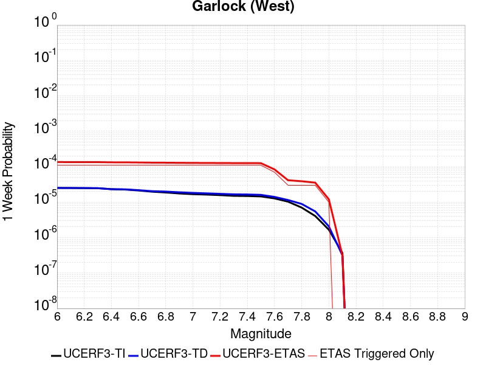 |  |  | 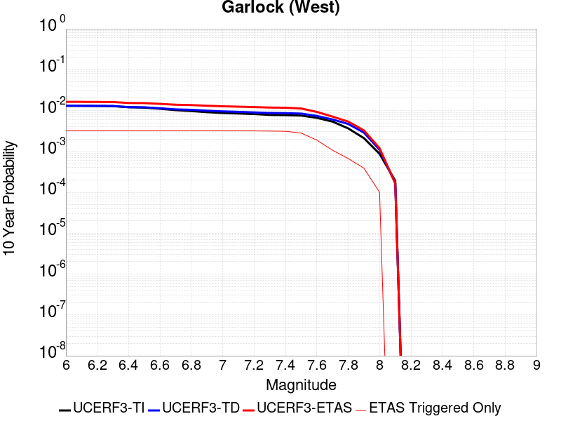 |

| Magnitude | 1 wk TI Prob | 1 wk TD Prob | 1 wk ETAS Prob | 1 wk ETAS/TD Gain | 1 wk ETAS Triggered Only | 1 mo TI Prob | 1 mo TD Prob | 1 mo ETAS Prob | 1 mo ETAS/TD Gain | 1 mo ETAS Triggered Only | 1 yr TI Prob | 1 yr TD Prob | 1 yr ETAS Prob | 1 yr ETAS/TD Gain | 1 yr ETAS Triggered Only | 10 yr TI Prob | 10 yr TD Prob | 10 yr ETAS Prob | 10 yr ETAS/TD Gain | 10 yr ETAS Triggered Only |
|-----|-----|-----|-----|-----|-----|-----|-----|-----|-----|-----|-----|-----|-----|-----|-----|-----|-----|-----|-----|-----|
| 6.0 | 2.5181727E-5 | 2.5226447E-5 | 8.354762E-5 | 3.3119059 | 5.832264E-5 | 1.0791722E-4 | 1.08108885E-4 | 5.746396E-4 | 5.3153777 | 4.665811E-4 | 0.0013131002 | 0.0013154343 | 0.0028298283 | 2.1512501 | 0.0015163886 | 0.013053683 | 0.013156932 | 0.015919587 | 1.209977 | 0.0027994867 |
| 6.1 | 2.5077732E-5 | 2.5127507E-5 | 8.3448685E-5 | 3.3210092 | 5.832264E-5 | 1.0747157E-4 | 1.0768489E-4 | 5.742158E-4 | 5.3323708 | 4.665811E-4 | 0.001307681 | 0.0013102784 | 0.0028246802 | 2.1557863 | 0.0015163886 | 0.013000126 | 0.013105982 | 0.01586878 | 1.2108042 | 0.0027994867 |
| 6.2 | 2.494612E-5 | 2.5009165E-5 | 8.333035E-5 | 3.3319924 | 5.832264E-5 | 1.0690756E-4 | 1.0717775E-4 | 5.7370885E-4 | 5.352873 | 4.665811E-4 | 0.0013008224 | 0.0013041114 | 0.0028185225 | 2.161259 | 0.0015163886 | 0.012932341 | 0.013045037 | 0.015808005 | 1.2118022 | 0.0027994867 |
| 6.3 | 2.4733758E-5 | 2.48285E-5 | 8.3149695E-5 | 3.3489616 | 5.832264E-5 | 1.0599751E-4 | 1.0640353E-4 | 5.7293504E-4 | 5.3845487 | 4.665811E-4 | 0.0012897556 | 0.0012946966 | 0.002809122 | 2.1697145 | 0.0015163886 | 0.012822957 | 0.01295199 | 0.015715217 | 1.2133439 | 0.0027994867 |
| 6.4 | 2.3237335E-5 | 2.3207602E-5 | 8.152889E-5 | 3.513025 | 5.832264E-5 | 9.958477E-5 | 9.945738E-5 | 5.659921E-4 | 5.6908007 | 4.665811E-4 | 0.0012117702 | 0.0012102238 | 0.002666525 | 2.2033324 | 0.001458066 | 0.012051838 | 0.012116745 | 0.014824695 | 1.2234882 | 0.002741164 |
| 6.5 | 2.2732203E-5 | 2.3022025E-5 | 8.134332E-5 | 3.5332828 | 5.832264E-5 | 9.742009E-5 | 9.86621E-5 | 5.651972E-4 | 5.728615 | 4.665811E-4 | 0.0011854442 | 0.001200552 | 0.0026568675 | 2.2130382 | 0.001458066 | 0.011791403 | 0.012021078 | 0.01472929 | 1.2252886 | 0.002741164 |
| 6.6 | 2.1319436E-5 | 2.180198E-5 | 8.012335E-5 | 3.6750493 | 5.832264E-5 | 9.136581E-5 | 9.343372E-5 | 5.5997126E-4 | 5.9932456 | 4.665811E-4 | 0.001111811 | 0.0011369642 | 0.0025933725 | 2.2809622 | 0.001458066 | 0.011062649 | 0.011391864 | 0.014101801 | 1.2378836 | 0.002741164 |
| 6.7 | 1.970802E-5 | 2.0421574E-5 | 7.8743025E-5 | 3.8558743 | 5.832264E-5 | 8.446021E-5 | 8.751811E-5 | 5.540584E-4 | 6.3307858 | 4.665811E-4 | 0.001027818 | 0.0010650138 | 0.002521527 | 2.3676002 | 0.001458066 | 0.010230771 | 0.010679457 | 0.013391348 | 1.2539352 | 0.002741164 |
| 6.8 | 1.8744462E-5 | 1.9929063E-5 | 7.825054E-5 | 3.9264536 | 5.832264E-5 | 8.033094E-5 | 8.540748E-5 | 5.5194873E-4 | 6.462534 | 4.665811E-4 | 9.775903E-4 | 0.0010393417 | 0.0024958923 | 2.4014165 | 0.001458066 | 0.009733009 | 0.010425164 | 0.013137751 | 1.2601961 | 0.002741164 |
| 6.9 | 1.7559682E-5 | 1.8981244E-5 | 7.730278E-5 | 4.0725875 | 5.832264E-5 | 7.5253614E-5 | 8.1345665E-5 | 5.4788886E-4 | 6.735317 | 4.665811E-4 | 9.158276E-4 | 9.899349E-4 | 0.0023300278 | 2.353718 | 0.0013414207 | 0.0091206245 | 0.009935555 | 0.012533997 | 1.2615297 | 0.002624519 |
| 7.0 | 1.6794445E-5 | 1.8243863E-5 | 7.656544E-5 | 4.196778 | 5.832264E-5 | 7.197421E-5 | 7.818565E-5 | 5.447303E-4 | 6.967139 | 4.665811E-4 | 8.759337E-4 | 9.51496E-4 | 0.0022916405 | 2.4084604 | 0.0013414207 | 0.008724891 | 0.009554366 | 0.012153809 | 1.2720686 | 0.002624519 |
| 7.1 | 1.6337795E-5 | 1.7744522E-5 | 7.606613E-5 | 4.2867384 | 5.832264E-5 | 7.0017246E-5 | 7.604574E-5 | 5.425914E-4 | 7.135066 | 4.665811E-4 | 8.521265E-4 | 9.2546496E-4 | 0.0022656443 | 2.4481146 | 0.0013414207 | 0.008488664 | 0.009296147 | 0.011896268 | 1.2796987 | 0.002624519 |
| 7.2 | 1.5780008E-5 | 1.7193055E-5 | 7.551469E-5 | 4.3921623 | 5.832264E-5 | 6.762685E-5 | 7.368245E-5 | 5.402292E-4 | 7.331857 | 4.665811E-4 | 8.2304585E-4 | 8.967159E-4 | 0.0022369337 | 2.4945846 | 0.0013414207 | 0.008200042 | 0.009010938 | 0.011611807 | 1.2886347 | 0.002624519 |
| 7.3 | 1.5058865E-5 | 1.6645923E-5 | 7.49676E-5 | 4.5036607 | 5.832264E-5 | 6.45364E-5 | 7.133773E-5 | 5.378856E-4 | 7.539987 | 4.665811E-4 | 7.854473E-4 | 8.68192E-4 | 0.002208448 | 2.5437324 | 0.0013414207 | 0.00782677 | 0.008727536 | 0.011329149 | 1.2980925 | 0.002624519 |
| 7.4 | 1.4887923E-5 | 1.6481807E-5 | 7.480349E-5 | 4.538549 | 5.832264E-5 | 6.380382E-5 | 7.063441E-5 | 5.3718255E-4 | 7.605112 | 4.665811E-4 | 7.7653467E-4 | 8.596358E-4 | 0.002141631 | 2.4913235 | 0.0012830981 | 0.0077382675 | 0.008642353 | 0.011186371 | 1.2943664 | 0.0025661963 |
| 7.5 | 1.4509299E-5 | 1.6073642E-5 | 7.439534E-5 | 4.628406 | 5.832264E-5 | 6.218123E-5 | 6.888522E-5 | 4.771156E-4 | 6.9262395 | 4.082585E-4 | 7.567935E-4 | 8.383561E-4 | 0.0020621049 | 2.4597003 | 0.0012247754 | 0.0075422134 | 0.008430568 | 0.010859467 | 1.2881063 | 0.002449551 |
| 7.6 | 1.2756717E-5 | 1.4076619E-5 | 1.4076619E-5 | 1.0 | 0.0 | 5.4670498E-5 | 6.0326976E-5 | 2.3528434E-4 | 3.9001515 | 1.7496792E-4 | 6.6541E-4 | 7.3423405E-4 | 0.0013753121 | 1.8731248 | 6.4154906E-4 | 0.006634211 | 0.007394993 | 0.008842276 | 1.1957113 | 0.001458066 |
| 7.7 | 1.0328985E-5 | 1.14847335E-5 | 1.14847335E-5 | 1.0 | 0.0 | 4.4266326E-5 | 4.921936E-5 | 1.07539134E-4 | 2.1848948 | 5.832264E-5 | 5.388092E-4 | 5.9908134E-4 | 8.905199E-4 | 1.4864757 | 2.916132E-4 | 0.0053750467 | 0.0060510277 | 0.006746664 | 1.1149617 | 6.998717E-4 |
| 7.8 | 7.0306583E-6 | 8.9189525E-6 | 8.9189525E-6 | 1.0 | 0.0 | 3.0131043E-5 | 3.8223523E-5 | 9.654393E-5 | 2.5257728 | 5.832264E-5 | 3.667837E-4 | 4.6527217E-4 | 6.4015866E-4 | 1.37588 | 1.7496792E-4 | 0.003661789 | 0.0047053057 | 0.004995547 | 1.0616838 | 2.916132E-4 |
| 7.9 | 4.060633E-6 | 5.476743E-6 | 5.476743E-6 | 1.0 | 0.0 | 1.7402595E-5 | 2.3471544E-5 | 2.3471544E-5 | 1.0 | 0.0 | 2.11856E-4 | 2.857287E-4 | 3.4403466E-4 | 1.2040607 | 5.832264E-5 | 0.0021165414 | 0.0028900965 | 0.0029482506 | 1.0201218 | 5.832264E-5 |
| 8.0 | 1.6729537E-6 | 2.0813598E-6 | 2.0813598E-6 | 1.0 | 0.0 | 7.169782E-6 | 8.920083E-6 | 8.920083E-6 | 1.0 | 0.0 | 8.7288594E-5 | 1.08596636E-4 | 1.6691294E-4 | 1.5369992 | 5.832264E-5 | 8.7254314E-4 | 0.0010989337 | 0.0011571923 | 1.0530137 | 5.832264E-5 |
| 8.1 | 3.6733252E-7 | 3.154532E-7 | 3.154532E-7 | 1.0 | 0.0 | 1.5742813E-6 | 1.3519417E-6 | 1.3519417E-6 | 1.0 | 0.0 | 1.9166706E-5 | 1.6459782E-5 | 1.6459782E-5 | 1.0 | 0.0 | 1.9165053E-4 | 1.6667772E-4 | 1.6667772E-4 | 1.0 | 0.0 |

## McLean Lake
*[(top)](#table-of-contents)*

| 1 Week | 1 Month | 1 Year | 10 Year |
|-----|-----|-----|-----|
|  |  |  |  |

| Magnitude | 1 wk TI Prob | 1 wk TD Prob | 1 wk ETAS Prob | 1 wk ETAS/TD Gain | 1 wk ETAS Triggered Only | 1 mo TI Prob | 1 mo TD Prob | 1 mo ETAS Prob | 1 mo ETAS/TD Gain | 1 mo ETAS Triggered Only | 1 yr TI Prob | 1 yr TD Prob | 1 yr ETAS Prob | 1 yr ETAS/TD Gain | 1 yr ETAS Triggered Only | 10 yr TI Prob | 10 yr TD Prob | 10 yr ETAS Prob | 10 yr ETAS/TD Gain | 10 yr ETAS Triggered Only |
|-----|-----|-----|-----|-----|-----|-----|-----|-----|-----|-----|-----|-----|-----|-----|-----|-----|-----|-----|-----|-----|
| 6.0 | 1.7360222E-5 | 1.8502597E-5 | 7.682416E-5 | 4.1520743 | 5.832264E-5 | 7.439883E-5 | 7.929471E-5 | 1.3761272E-4 | 1.7354591 | 5.832264E-5 | 9.0542925E-4 | 9.650341E-4 | 0.0017224968 | 1.7849076 | 7.581943E-4 | 0.009017491 | 0.009613276 | 0.012212565 | 1.2703853 | 0.002624519 |
| 6.1 | 9.062689E-6 | 9.59264E-6 | 9.59264E-6 | 1.0 | 0.0 | 3.8839516E-5 | 4.1110718E-5 | 4.1110718E-5 | 1.0 | 0.0 | 4.727685E-4 | 5.004169E-4 | 9.084711E-4 | 1.8154285 | 4.082585E-4 | 0.0047176396 | 0.004993784 | 0.00609638 | 1.2207938 | 0.0011081302 |
| 6.2 | 9.062689E-6 | 9.59264E-6 | 9.59264E-6 | 1.0 | 0.0 | 3.8839516E-5 | 4.1110718E-5 | 4.1110718E-5 | 1.0 | 0.0 | 4.727685E-4 | 5.004169E-4 | 9.084711E-4 | 1.8154285 | 4.082585E-4 | 0.0047176396 | 0.004993784 | 0.00609638 | 1.2207938 | 0.0011081302 |
| 6.3 | 7.2575485E-6 | 7.668054E-6 | 7.668054E-6 | 1.0 | 0.0 | 3.110341E-5 | 3.2862717E-5 | 3.2862717E-5 | 1.0 | 0.0 | 3.786182E-4 | 4.0003724E-4 | 8.081324E-4 | 2.0201428 | 4.082585E-4 | 0.0037797375 | 0.0039938763 | 0.0049814014 | 1.2472599 | 9.914848E-4 |
| 6.4 | 7.2575485E-6 | 7.668054E-6 | 7.668054E-6 | 1.0 | 0.0 | 3.110341E-5 | 3.2862717E-5 | 3.2862717E-5 | 1.0 | 0.0 | 3.786182E-4 | 4.0003724E-4 | 8.081324E-4 | 2.0201428 | 4.082585E-4 | 0.0037797375 | 0.0039938763 | 0.0049814014 | 1.2472599 | 9.914848E-4 |
| 6.5 | 6.06582E-6 | 6.4041615E-6 | 6.4041615E-6 | 1.0 | 0.0 | 2.5996113E-5 | 2.7446154E-5 | 2.7446154E-5 | 1.0 | 0.0 | 3.164567E-4 | 3.3411218E-4 | 5.673248E-4 | 1.698007 | 2.3329056E-4 | 0.0031600643 | 0.0033367372 | 0.0040924014 | 1.2264681 | 7.581943E-4 |
| 6.6 | 5.598744E-6 | 5.910524E-6 | 5.910524E-6 | 1.0 | 0.0 | 2.3994397E-5 | 2.5330608E-5 | 2.5330608E-5 | 1.0 | 0.0 | 2.9209262E-4 | 3.083629E-4 | 4.8327688E-4 | 1.5672342 | 1.7496792E-4 | 0.0029170897 | 0.0030799794 | 0.0036614095 | 1.1887772 | 5.832264E-4 |
| 6.7 | 5.246996E-6 | 5.5394075E-6 | 5.5394075E-6 | 1.0 | 0.0 | 2.2486933E-5 | 2.3740138E-5 | 2.3740138E-5 | 1.0 | 0.0 | 2.73744E-4 | 2.890042E-4 | 4.0561578E-4 | 1.4034944 | 1.1664528E-4 | 0.0027340704 | 0.0028869074 | 0.0034102958 | 1.1812973 | 5.2490376E-4 |
| 6.8 | 4.02324E-6 | 4.2470924E-6 | 4.2470924E-6 | 1.0 | 0.0 | 1.7242342E-5 | 1.8201732E-5 | 1.8201732E-5 | 1.0 | 0.0 | 2.099053E-4 | 2.2158951E-4 | 3.3820895E-4 | 1.5262859 | 1.1664528E-4 | 0.0020970714 | 0.00221427 | 0.002563431 | 1.1576867 | 3.4993584E-4 |
| 6.9 | 6.835972E-7 | 7.140181E-7 | 7.140181E-7 | 1.0 | 0.0 | 2.9296991E-6 | 3.0600756E-6 | 3.0600756E-6 | 1.0 | 0.0 | 3.56685E-5 | 3.7256104E-5 | 3.7256104E-5 | 1.0 | 0.0 | 3.5662777E-4 | 3.7252984E-4 | 3.7252984E-4 | 1.0 | 0.0 |

## Gravel Hills-Harper Lk
*[(top)](#table-of-contents)*

| 1 Week | 1 Month | 1 Year | 10 Year |
|-----|-----|-----|-----|
|  |  |  |  |

| Magnitude | 1 wk TI Prob | 1 wk TD Prob | 1 wk ETAS Prob | 1 wk ETAS/TD Gain | 1 wk ETAS Triggered Only | 1 mo TI Prob | 1 mo TD Prob | 1 mo ETAS Prob | 1 mo ETAS/TD Gain | 1 mo ETAS Triggered Only | 1 yr TI Prob | 1 yr TD Prob | 1 yr ETAS Prob | 1 yr ETAS/TD Gain | 1 yr ETAS Triggered Only | 10 yr TI Prob | 10 yr TD Prob | 10 yr ETAS Prob | 10 yr ETAS/TD Gain | 10 yr ETAS Triggered Only |
|-----|-----|-----|-----|-----|-----|-----|-----|-----|-----|-----|-----|-----|-----|-----|-----|-----|-----|-----|-----|-----|
| 6.0 | 3.0679566E-5 | 3.146788E-5 | 3.146788E-5 | 1.0 | 0.0 | 1.3147724E-4 | 1.3485659E-4 | 2.5148614E-4 | 1.8648413 | 1.1664528E-4 | 0.0015995599 | 0.0016408587 | 0.0026889436 | 1.6387417 | 0.0010498075 | 0.015880952 | 0.016309002 | 0.01854649 | 1.1371933 | 0.002274583 |
| 6.1 | 3.0679566E-5 | 3.146788E-5 | 3.146788E-5 | 1.0 | 0.0 | 1.3147724E-4 | 1.3485659E-4 | 2.5148614E-4 | 1.8648413 | 1.1664528E-4 | 0.0015995599 | 0.0016408587 | 0.0026889436 | 1.6387417 | 0.0010498075 | 0.015880952 | 0.016309002 | 0.01854649 | 1.1371933 | 0.002274583 |
| 6.2 | 1.514536E-5 | 1.3636321E-5 | 1.3636321E-5 | 1.0 | 0.0 | 6.490707E-5 | 5.844013E-5 | 5.844013E-5 | 1.0 | 0.0 | 7.8995706E-4 | 7.1128824E-4 | 9.4441284E-4 | 1.3277498 | 2.3329056E-4 | 0.007871548 | 0.007091318 | 0.0075545902 | 1.0653296 | 4.665811E-4 |
| 6.3 | 1.514536E-5 | 1.3636321E-5 | 1.3636321E-5 | 1.0 | 0.0 | 6.490707E-5 | 5.844013E-5 | 5.844013E-5 | 1.0 | 0.0 | 7.8995706E-4 | 7.1128824E-4 | 9.4441284E-4 | 1.3277498 | 2.3329056E-4 | 0.007871548 | 0.007091318 | 0.0075545902 | 1.0653296 | 4.665811E-4 |
| 6.4 | 1.2532521E-5 | 1.06905045E-5 | 1.06905045E-5 | 1.0 | 0.0 | 5.37097E-5 | 4.5815676E-5 | 4.5815676E-5 | 1.0 | 0.0 | 6.537194E-4 | 5.576689E-4 | 6.7424914E-4 | 1.2090492 | 1.1664528E-4 | 0.0065179965 | 0.005563285 | 0.0057372795 | 1.0312755 | 1.7496792E-4 |
| 6.5 | 1.1094058E-5 | 9.084328E-6 | 9.084328E-6 | 1.0 | 0.0 | 4.7545094E-5 | 3.8932274E-5 | 3.8932274E-5 | 1.0 | 0.0 | 5.787078E-4 | 4.7390137E-4 | 5.904914E-4 | 1.2460216 | 1.1664528E-4 | 0.0057720304 | 0.004729315 | 0.0049034557 | 1.0368215 | 1.7496792E-4 |
| 6.6 | 9.688328E-6 | 7.53223E-6 | 7.53223E-6 | 1.0 | 0.0 | 4.1520743E-5 | 3.22806E-5 | 3.22806E-5 | 1.0 | 0.0 | 5.053978E-4 | 3.92948E-4 | 3.92948E-4 | 1.0 | 0.0 | 0.0050424994 | 0.0039227884 | 0.0039808825 | 1.0148094 | 5.832264E-5 |
| 6.7 | 8.974824E-6 | 6.7498877E-6 | 6.7498877E-6 | 1.0 | 0.0 | 3.8462964E-5 | 2.8927781E-5 | 2.8927781E-5 | 1.0 | 0.0 | 4.6818596E-4 | 3.5214104E-4 | 3.5214104E-4 | 1.0 | 0.0 | 0.004672008 | 0.0035160515 | 0.003574169 | 1.0165292 | 5.832264E-5 |
| 6.8 | 7.4780046E-6 | 5.1165493E-6 | 5.1165493E-6 | 1.0 | 0.0 | 3.20482E-5 | 2.1927892E-5 | 2.1927892E-5 | 1.0 | 0.0 | 3.9011694E-4 | 2.6694077E-4 | 2.6694077E-4 | 1.0 | 0.0 | 0.0038943281 | 0.0026663395 | 0.0026663395 | 1.0 | 0.0 |
| 6.9 | 6.3409307E-6 | 3.9077745E-6 | 3.9077745E-6 | 1.0 | 0.0 | 2.7175134E-5 | 1.6747503E-5 | 1.6747503E-5 | 1.0 | 0.0 | 3.3080703E-4 | 2.0388277E-4 | 2.0388277E-4 | 1.0 | 0.0 | 0.0033031502 | 0.0020370553 | 0.0020370553 | 1.0 | 0.0 |
| 7.0 | 5.1239335E-6 | 2.606051E-6 | 2.606051E-6 | 1.0 | 0.0 | 2.195953E-5 | 1.1168744E-5 | 1.1168744E-5 | 1.0 | 0.0 | 2.6732447E-4 | 1.3597123E-4 | 1.3597123E-4 | 1.0 | 0.0 | 0.0026700313 | 0.0013589056 | 0.0013589056 | 1.0 | 0.0 |
| 7.1 | 4.438899E-6 | 2.0986356E-6 | 2.0986356E-6 | 1.0 | 0.0 | 1.9023713E-5 | 8.994123E-6 | 8.994123E-6 | 1.0 | 0.0 | 2.315891E-4 | 1.0949816E-4 | 1.0949816E-4 | 1.0 | 0.0 | 0.002313479 | 0.001094464 | 0.001094464 | 1.0 | 0.0 |
| 7.2 | 3.50367E-6 | 1.2616914E-6 | 1.2616914E-6 | 1.0 | 0.0 | 1.5015643E-5 | 5.4072384E-6 | 5.4072384E-6 | 1.0 | 0.0 | 1.8280011E-4 | 6.583122E-5 | 6.583122E-5 | 1.0 | 0.0 | 0.0018264982 | 6.5812544E-4 | 6.5812544E-4 | 1.0 | 0.0 |
| 7.3 | 2.561638E-6 | 7.1200765E-7 | 7.1200765E-7 | 1.0 | 0.0 | 1.0978401E-5 | 3.051458E-6 | 3.051458E-6 | 1.0 | 0.0 | 1.3365384E-4 | 3.7150887E-5 | 3.7150887E-5 | 1.0 | 0.0 | 0.0013357349 | 3.7144875E-4 | 3.7144875E-4 | 1.0 | 0.0 |
| 7.4 | 2.0368864E-6 | 5.305573E-7 | 5.305573E-7 | 1.0 | 0.0 | 8.729483E-6 | 2.273815E-6 | 2.273815E-6 | 1.0 | 0.0 | 1.06276275E-4 | 2.7683353E-5 | 2.7683353E-5 | 1.0 | 0.0 | 0.0010622547 | 2.7679958E-4 | 2.7679958E-4 | 1.0 | 0.0 |
| 7.5 | 1.1681728E-6 | 3.6034797E-7 | 3.6034797E-7 | 1.0 | 0.0 | 5.0064455E-6 | 1.5443476E-6 | 1.5443476E-6 | 1.0 | 0.0 | 6.0951766E-5 | 1.8802275E-5 | 1.8802275E-5 | 1.0 | 0.0 | 6.093505E-4 | 1.880073E-4 | 1.880073E-4 | 1.0 | 0.0 |
| 7.6 | 1.3154387E-7 | 7.1202656E-8 | 7.1202656E-8 | 1.0 | 0.0 | 5.6375933E-7 | 3.0515423E-7 | 3.0515423E-7 | 1.0 | 0.0 | 6.863748E-6 | 3.7152479E-6 | 3.7152479E-6 | 1.0 | 0.0 | 6.863536E-5 | 3.715202E-5 | 3.715202E-5 | 1.0 | 0.0 |

## Goldstone Lake
*[(top)](#table-of-contents)*

| 1 Week | 1 Month | 1 Year | 10 Year |
|-----|-----|-----|-----|
|  |  |  | 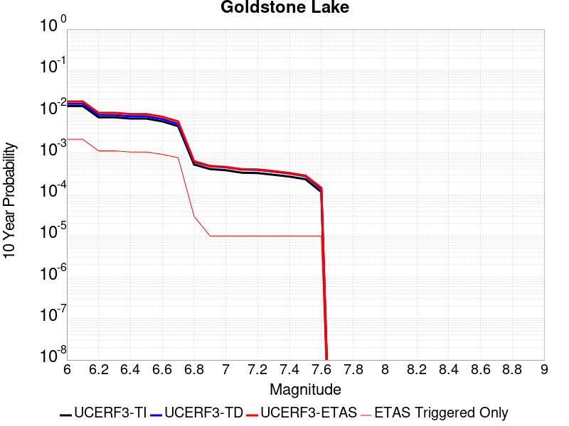 |

| Magnitude | 1 wk TI Prob | 1 wk TD Prob | 1 wk ETAS Prob | 1 wk ETAS/TD Gain | 1 wk ETAS Triggered Only | 1 mo TI Prob | 1 mo TD Prob | 1 mo ETAS Prob | 1 mo ETAS/TD Gain | 1 mo ETAS Triggered Only | 1 yr TI Prob | 1 yr TD Prob | 1 yr ETAS Prob | 1 yr ETAS/TD Gain | 1 yr ETAS Triggered Only | 10 yr TI Prob | 10 yr TD Prob | 10 yr ETAS Prob | 10 yr ETAS/TD Gain | 10 yr ETAS Triggered Only |
|-----|-----|-----|-----|-----|-----|-----|-----|-----|-----|-----|-----|-----|-----|-----|-----|-----|-----|-----|-----|-----|
| 6.0 | 2.671352E-5 | 3.0379319E-5 | 3.0379319E-5 | 1.0 | 0.0 | 1.1448149E-4 | 1.301917E-4 | 1.301917E-4 | 1.0 | 0.0 | 0.001392921 | 0.0015841278 | 0.002341121 | 1.4778613 | 7.581943E-4 | 0.013842222 | 0.01574786 | 0.017699601 | 1.123937 | 0.0019829697 |
| 6.1 | 2.671352E-5 | 3.0379319E-5 | 3.0379319E-5 | 1.0 | 0.0 | 1.1448149E-4 | 1.301917E-4 | 1.301917E-4 | 1.0 | 0.0 | 0.001392921 | 0.0015841278 | 0.002341121 | 1.4778613 | 7.581943E-4 | 0.013842222 | 0.01574786 | 0.017699601 | 1.123937 | 0.0019829697 |
| 6.2 | 1.4197047E-5 | 1.6097873E-5 | 1.6097873E-5 | 1.0 | 0.0 | 6.0843064E-5 | 6.898961E-5 | 6.898961E-5 | 1.0 | 0.0 | 7.4051257E-4 | 8.397235E-4 | 0.0012476392 | 1.4857738 | 4.082585E-4 | 0.007380498 | 0.008375203 | 0.009069214 | 1.0828649 | 6.998717E-4 |
| 6.3 | 1.4197047E-5 | 1.6097873E-5 | 1.6097873E-5 | 1.0 | 0.0 | 6.0843064E-5 | 6.898961E-5 | 6.898961E-5 | 1.0 | 0.0 | 7.4051257E-4 | 8.397235E-4 | 0.0012476392 | 1.4857738 | 4.082585E-4 | 0.007380498 | 0.008375203 | 0.009069214 | 1.0828649 | 6.998717E-4 |
| 6.4 | 1.3238931E-5 | 1.50099695E-5 | 1.50099695E-5 | 1.0 | 0.0 | 5.6737044E-5 | 6.432741E-5 | 6.432741E-5 | 1.0 | 0.0 | 6.9055456E-4 | 7.8300276E-4 | 0.0011909417 | 1.5209928 | 4.082585E-4 | 0.006884126 | 0.0078120674 | 0.008506472 | 1.0888886 | 6.998717E-4 |
| 6.5 | 1.3238931E-5 | 1.50099695E-5 | 1.50099695E-5 | 1.0 | 0.0 | 5.6737044E-5 | 6.432741E-5 | 6.432741E-5 | 1.0 | 0.0 | 6.9055456E-4 | 7.8300276E-4 | 0.0011909417 | 1.5209928 | 4.082585E-4 | 0.006884126 | 0.0078120674 | 0.008506472 | 1.0888886 | 6.998717E-4 |
| 6.6 | 1.1328278E-5 | 1.2856458E-5 | 1.2856458E-5 | 1.0 | 0.0 | 4.8548856E-5 | 5.509848E-5 | 5.509848E-5 | 1.0 | 0.0 | 5.90922E-4 | 6.7071326E-4 | 9.6213084E-4 | 1.4344891 | 2.916132E-4 | 0.0058935313 | 0.0066962806 | 0.0072176694 | 1.0778625 | 5.2490376E-4 |
| 6.7 | 8.651175E-6 | 9.825539E-6 | 9.825539E-6 | 1.0 | 0.0 | 3.707594E-5 | 4.210928E-5 | 4.210928E-5 | 1.0 | 0.0 | 4.5130608E-4 | 5.126504E-4 | 7.458214E-4 | 1.4548342 | 2.3329056E-4 | 0.0045039062 | 0.005123559 | 0.0055297255 | 1.0792743 | 4.082585E-4 |
| 6.8 | 1.0215377E-6 | 1.1755242E-6 | 1.1755242E-6 | 1.0 | 0.0 | 4.378012E-6 | 5.0379517E-6 | 5.0379517E-6 | 1.0 | 0.0 | 5.3300988E-5 | 6.133545E-5 | 6.133545E-5 | 1.0 | 0.0 | 5.3288206E-4 | 6.1319646E-4 | 6.1319646E-4 | 1.0 | 0.0 |
| 6.9 | 7.9360774E-7 | 9.2837706E-7 | 9.2837706E-7 | 1.0 | 0.0 | 3.4011714E-6 | 3.9787533E-6 | 3.9787533E-6 | 1.0 | 0.0 | 4.1408475E-5 | 4.8440314E-5 | 4.8440314E-5 | 1.0 | 0.0 | 4.140076E-4 | 4.8430456E-4 | 4.8430456E-4 | 1.0 | 0.0 |
| 7.0 | 7.4382757E-7 | 8.74767E-7 | 8.74767E-7 | 1.0 | 0.0 | 3.1878285E-6 | 3.7489963E-6 | 3.7489963E-6 | 1.0 | 0.0 | 3.8811122E-5 | 4.564314E-5 | 4.564314E-5 | 1.0 | 0.0 | 3.8804344E-4 | 4.563443E-4 | 4.563443E-4 | 1.0 | 0.0 |
| 7.1 | 6.4709513E-7 | 7.711583E-7 | 7.711583E-7 | 1.0 | 0.0 | 2.773262E-6 | 3.30496E-6 | 3.30496E-6 | 1.0 | 0.0 | 3.376394E-5 | 4.0237206E-5 | 4.0237206E-5 | 1.0 | 0.0 | 3.375881E-4 | 4.023052E-4 | 4.023052E-4 | 1.0 | 0.0 |
| 7.2 | 6.356704E-7 | 7.588635E-7 | 7.588635E-7 | 1.0 | 0.0 | 2.7242988E-6 | 3.2522685E-6 | 3.2522685E-6 | 1.0 | 0.0 | 3.3167835E-5 | 3.9595707E-5 | 3.9595707E-5 | 1.0 | 0.0 | 3.3162883E-4 | 3.9589248E-4 | 3.9589248E-4 | 1.0 | 0.0 |
| 7.3 | 5.7695723E-7 | 6.896819E-7 | 6.896819E-7 | 1.0 | 0.0 | 2.4726714E-6 | 2.9557766E-6 | 2.9557766E-6 | 1.0 | 0.0 | 3.0104358E-5 | 3.5986042E-5 | 3.5986042E-5 | 1.0 | 0.0 | 3.0100282E-4 | 3.598079E-4 | 3.598079E-4 | 1.0 | 0.0 |
| 7.4 | 5.209647E-7 | 6.1937277E-7 | 6.1937277E-7 | 1.0 | 0.0 | 2.232704E-6 | 2.6544524E-6 | 2.6544524E-6 | 1.0 | 0.0 | 2.718283E-5 | 3.2317537E-5 | 3.2317537E-5 | 1.0 | 0.0 | 2.7179506E-4 | 3.2313392E-4 | 3.2313392E-4 | 1.0 | 0.0 |
| 7.5 | 4.512955E-7 | 5.349061E-7 | 5.349061E-7 | 1.0 | 0.0 | 1.934122E-6 | 2.2924532E-6 | 2.2924532E-6 | 1.0 | 0.0 | 2.3547682E-5 | 2.7910315E-5 | 2.7910315E-5 | 1.0 | 0.0 | 2.3545188E-4 | 2.790734E-4 | 2.790734E-4 | 1.0 | 0.0 |
| 7.6 | 2.21172E-7 | 2.6040382E-7 | 2.6040382E-7 | 1.0 | 0.0 | 9.478797E-7 | 1.1160162E-6 | 1.1160162E-6 | 1.0 | 0.0 | 1.1540374E-5 | 1.358744E-5 | 1.358744E-5 | 1.0 | 0.0 | 1.1539775E-4 | 1.358689E-4 | 1.358689E-4 | 1.0 | 0.0 |

## So Sierra Nevada
*[(top)](#table-of-contents)*

| 1 Week | 1 Month | 1 Year | 10 Year |
|-----|-----|-----|-----|
|  |  |  |  |

| Magnitude | 1 wk TI Prob | 1 wk TD Prob | 1 wk ETAS Prob | 1 wk ETAS/TD Gain | 1 wk ETAS Triggered Only | 1 mo TI Prob | 1 mo TD Prob | 1 mo ETAS Prob | 1 mo ETAS/TD Gain | 1 mo ETAS Triggered Only | 1 yr TI Prob | 1 yr TD Prob | 1 yr ETAS Prob | 1 yr ETAS/TD Gain | 1 yr ETAS Triggered Only | 10 yr TI Prob | 10 yr TD Prob | 10 yr ETAS Prob | 10 yr ETAS/TD Gain | 10 yr ETAS Triggered Only |
|-----|-----|-----|-----|-----|-----|-----|-----|-----|-----|-----|-----|-----|-----|-----|-----|-----|-----|-----|-----|-----|
| 6.0 | 1.15488665E-5 | 1.1080117E-5 | 1.1080117E-5 | 1.0 | 0.0 | 4.9494203E-5 | 4.7485424E-5 | 2.2244504E-4 | 4.684491 | 1.7496792E-4 | 6.024253E-4 | 5.7799445E-4 | 0.0014523284 | 2.5127032 | 8.748396E-4 | 0.006007948 | 0.0057661803 | 0.007853689 | 1.3620262 | 0.002099615 |
| 6.1 | 1.15488665E-5 | 1.1080117E-5 | 1.1080117E-5 | 1.0 | 0.0 | 4.9494203E-5 | 4.7485424E-5 | 2.2244504E-4 | 4.684491 | 1.7496792E-4 | 6.024253E-4 | 5.7799445E-4 | 0.0014523284 | 2.5127032 | 8.748396E-4 | 0.006007948 | 0.0057661803 | 0.007853689 | 1.3620262 | 0.002099615 |
| 6.2 | 1.15488665E-5 | 1.1080117E-5 | 1.1080117E-5 | 1.0 | 0.0 | 4.9494203E-5 | 4.7485424E-5 | 2.2244504E-4 | 4.684491 | 1.7496792E-4 | 6.024253E-4 | 5.7799445E-4 | 0.0014523284 | 2.5127032 | 8.748396E-4 | 0.006007948 | 0.0057661803 | 0.007853689 | 1.3620262 | 0.002099615 |
| 6.3 | 1.15488665E-5 | 1.1080117E-5 | 1.1080117E-5 | 1.0 | 0.0 | 4.9494203E-5 | 4.7485424E-5 | 2.2244504E-4 | 4.684491 | 1.7496792E-4 | 6.024253E-4 | 5.7799445E-4 | 0.0014523284 | 2.5127032 | 8.748396E-4 | 0.006007948 | 0.0057661803 | 0.007853689 | 1.3620262 | 0.002099615 |
| 6.4 | 1.15488665E-5 | 1.1080117E-5 | 1.1080117E-5 | 1.0 | 0.0 | 4.9494203E-5 | 4.7485424E-5 | 2.2244504E-4 | 4.684491 | 1.7496792E-4 | 6.024253E-4 | 5.7799445E-4 | 0.0014523284 | 2.5127032 | 8.748396E-4 | 0.006007948 | 0.0057661803 | 0.007853689 | 1.3620262 | 0.002099615 |
| 6.5 | 1.15488665E-5 | 1.1080117E-5 | 1.1080117E-5 | 1.0 | 0.0 | 4.9494203E-5 | 4.7485424E-5 | 2.2244504E-4 | 4.684491 | 1.7496792E-4 | 6.024253E-4 | 5.7799445E-4 | 0.0014523284 | 2.5127032 | 8.748396E-4 | 0.006007948 | 0.0057661803 | 0.007853689 | 1.3620262 | 0.002099615 |
| 6.6 | 7.587044E-6 | 6.9359576E-6 | 6.9359576E-6 | 1.0 | 0.0 | 3.2515498E-5 | 2.972521E-5 | 8.8046116E-5 | 2.9620016 | 5.832264E-5 | 3.9580427E-4 | 3.6184725E-4 | 8.865611E-4 | 2.4500976 | 5.2490376E-4 | 0.003951 | 0.0036128724 | 0.004833223 | 1.3377784 | 0.0012247754 |
| 6.7 | 7.587044E-6 | 6.9359576E-6 | 6.9359576E-6 | 1.0 | 0.0 | 3.2515498E-5 | 2.972521E-5 | 8.8046116E-5 | 2.9620016 | 5.832264E-5 | 3.9580427E-4 | 3.6184725E-4 | 8.865611E-4 | 2.4500976 | 5.2490376E-4 | 0.003951 | 0.0036128724 | 0.004833223 | 1.3377784 | 0.0012247754 |
| 6.8 | 5.9026956E-6 | 5.1796555E-6 | 5.1796555E-6 | 1.0 | 0.0 | 2.5297022E-5 | 2.2198341E-5 | 8.051969E-5 | 3.627284 | 5.832264E-5 | 3.0794772E-4 | 2.7023244E-4 | 7.9499435E-4 | 2.9418907 | 5.2490376E-4 | 0.0030752132 | 0.0026991547 | 0.0037461286 | 1.3878895 | 0.0010498075 |
| 6.9 | 5.0118915E-6 | 4.252658E-6 | 4.252658E-6 | 1.0 | 0.0 | 2.1479358E-5 | 1.8225555E-5 | 7.6547134E-5 | 4.1999893 | 5.832264E-5 | 2.614798E-4 | 2.2187426E-4 | 7.4666156E-4 | 3.3652463 | 5.2490376E-4 | 0.0026117235 | 0.0022166 | 0.0032058873 | 1.4463084 | 9.914848E-4 |
| 7.0 | 4.4924795E-6 | 3.7141344E-6 | 3.7141344E-6 | 1.0 | 0.0 | 1.925334E-5 | 1.5917625E-5 | 7.423934E-5 | 4.6639705 | 5.832264E-5 | 2.3438422E-4 | 1.9378049E-4 | 7.1858254E-4 | 3.7082295 | 5.2490376E-4 | 0.0023413717 | 0.0019361782 | 0.0028093238 | 1.4509635 | 8.748396E-4 |
| 7.1 | 3.9118436E-6 | 3.1121754E-6 | 3.1121754E-6 | 1.0 | 0.0 | 1.6764936E-5 | 1.333783E-5 | 1.333783E-5 | 1.0 | 0.0 | 2.0409399E-4 | 1.6237654E-4 | 5.122556E-4 | 3.1547387 | 3.4993584E-4 | 0.0020390663 | 0.001622635 | 0.002321371 | 1.4306182 | 6.998717E-4 |
| 7.2 | 3.4200818E-6 | 2.6056368E-6 | 2.6056368E-6 | 1.0 | 0.0 | 1.4657411E-5 | 1.116697E-5 | 1.116697E-5 | 1.0 | 0.0 | 1.7843937E-4 | 1.3594989E-4 | 4.8583816E-4 | 3.5736563 | 3.4993584E-4 | 0.0017829615 | 0.0013587169 | 0.0019993943 | 1.4715312 | 6.4154906E-4 |
| 7.3 | 2.6593618E-6 | 1.8285797E-6 | 1.8285797E-6 | 1.0 | 0.0 | 1.13972155E-5 | 7.836748E-6 | 7.836748E-6 | 1.0 | 0.0 | 1.3875226E-4 | 9.5408526E-5 | 3.2867683E-4 | 3.444942 | 2.3329056E-4 | 0.0013866565 | 9.537045E-4 | 0.0014781078 | 1.5498592 | 5.2490376E-4 |
| 7.4 | 2.2577992E-6 | 1.4365834E-6 | 1.4365834E-6 | 1.0 | 0.0 | 9.676246E-6 | 6.1567725E-6 | 6.1567725E-6 | 1.0 | 0.0 | 1.1780193E-4 | 7.4956384E-5 | 3.0822947E-4 | 4.1121173 | 2.3329056E-4 | 0.001177395 | 7.493361E-4 | 0.0012738465 | 1.6999669 | 5.2490376E-4 |
| 7.5 | 1.489319E-6 | 7.3550774E-7 | 7.3550774E-7 | 1.0 | 0.0 | 6.3827797E-6 | 3.1521722E-6 | 3.1521722E-6 | 1.0 | 0.0 | 7.770758E-5 | 3.8377028E-5 | 2.1333824E-4 | 5.559009 | 1.7496792E-4 | 7.7680405E-4 | 3.837044E-4 | 7.9180626E-4 | 2.0635839 | 4.082585E-4 |
| 7.6 | 1.0680322E-6 | 4.6604995E-7 | 4.6604995E-7 | 1.0 | 0.0 | 4.577273E-6 | 1.9973554E-6 | 1.9973554E-6 | 1.0 | 0.0 | 5.5726876E-5 | 2.4317533E-5 | 1.4095998E-4 | 5.79664 | 1.1664528E-4 | 5.5712904E-4 | 2.4314898E-4 | 5.3469127E-4 | 2.1990273 | 2.916132E-4 |
| 7.7 | 5.509146E-7 | 1.5584769E-7 | 1.5584769E-7 | 1.0 | 0.0 | 2.3610605E-6 | 6.6791847E-7 | 6.6791847E-7 | 1.0 | 0.0 | 2.8745531E-5 | 8.1318785E-6 | 8.1318785E-6 | 1.0 | 0.0 | 2.8741814E-4 | 8.131592E-5 | 1.9795173E-4 | 2.4343536 | 1.1664528E-4 |

## Coyote Canyon
*[(top)](#table-of-contents)*

| 1 Week | 1 Month | 1 Year | 10 Year |
|-----|-----|-----|-----|
|  |  | 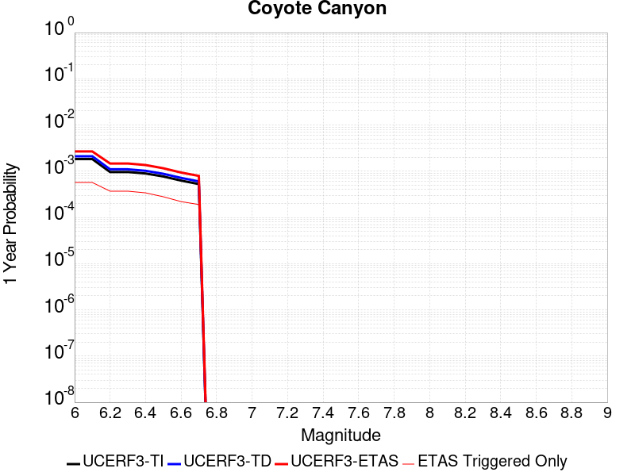 |  |

| Magnitude | 1 wk TI Prob | 1 wk TD Prob | 1 wk ETAS Prob | 1 wk ETAS/TD Gain | 1 wk ETAS Triggered Only | 1 mo TI Prob | 1 mo TD Prob | 1 mo ETAS Prob | 1 mo ETAS/TD Gain | 1 mo ETAS Triggered Only | 1 yr TI Prob | 1 yr TD Prob | 1 yr ETAS Prob | 1 yr ETAS/TD Gain | 1 yr ETAS Triggered Only | 10 yr TI Prob | 10 yr TD Prob | 10 yr ETAS Prob | 10 yr ETAS/TD Gain | 10 yr ETAS Triggered Only |
|-----|-----|-----|-----|-----|-----|-----|-----|-----|-----|-----|-----|-----|-----|-----|-----|-----|-----|-----|-----|-----|
| 6.0 | 3.5090034E-5 | 4.0369156E-5 | 9.8689445E-5 | 2.4446743 | 5.832264E-5 | 1.503772E-4 | 1.7300063E-4 | 2.3131318E-4 | 1.3370656 | 5.832264E-5 | 0.0018293047 | 0.0021045043 | 0.0026283034 | 1.2488943 | 5.2490376E-4 | 0.018143194 | 0.020871677 | 0.02229931 | 1.0684005 | 0.001458066 |
| 6.1 | 3.5090034E-5 | 4.0369156E-5 | 9.8689445E-5 | 2.4446743 | 5.832264E-5 | 1.503772E-4 | 1.7300063E-4 | 2.3131318E-4 | 1.3370656 | 5.832264E-5 | 0.0018293047 | 0.0021045043 | 0.0026283034 | 1.2488943 | 5.2490376E-4 | 0.018143194 | 0.020871677 | 0.02229931 | 1.0684005 | 0.001458066 |
| 6.2 | 1.841879E-5 | 2.1062198E-5 | 7.938361E-5 | 3.7690089 | 5.832264E-5 | 7.8935285E-5 | 9.026402E-5 | 1.4858138E-4 | 1.6460756 | 5.832264E-5 | 9.606133E-4 | 0.0010985123 | 0.0015063223 | 1.3712385 | 4.082585E-4 | 0.0095647145 | 0.01094091 | 0.011863863 | 1.084358 | 9.331622E-4 |
| 6.3 | 1.841879E-5 | 2.1062198E-5 | 7.938361E-5 | 3.7690089 | 5.832264E-5 | 7.8935285E-5 | 9.026402E-5 | 1.4858138E-4 | 1.6460756 | 5.832264E-5 | 9.606133E-4 | 0.0010985123 | 0.0015063223 | 1.3712385 | 4.082585E-4 | 0.0095647145 | 0.01094091 | 0.011863863 | 1.084358 | 9.331622E-4 |
| 6.4 | 1.712201E-5 | 1.9567435E-5 | 7.788894E-5 | 3.9805388 | 5.832264E-5 | 7.337798E-5 | 8.385831E-5 | 1.4217605E-4 | 1.6954321 | 5.832264E-5 | 8.930107E-4 | 0.0010205972 | 0.001428439 | 1.399611 | 4.082585E-4 | 0.008894307 | 0.010169021 | 0.011092694 | 1.090832 | 9.331622E-4 |
| 6.5 | 1.4744935E-5 | 1.6838874E-5 | 7.516053E-5 | 4.463513 | 5.832264E-5 | 6.3191044E-5 | 7.216513E-5 | 1.3048356E-4 | 1.8081248 | 5.832264E-5 | 7.6907943E-4 | 8.783498E-4 | 0.0011697069 | 1.3317096 | 2.916132E-4 | 0.007664232 | 0.008757981 | 0.009567346 | 1.0924147 | 8.16517E-4 |
| 6.6 | 1.2017839E-5 | 1.372564E-5 | 7.204748E-5 | 5.249116 | 5.832264E-5 | 5.150401E-5 | 5.882335E-5 | 1.17142554E-4 | 1.9914297 | 5.832264E-5 | 6.268809E-4 | 7.160275E-4 | 0.0010074319 | 1.4069737 | 2.916132E-4 | 0.0062511545 | 0.0071459 | 0.007898676 | 1.1053438 | 7.581943E-4 |
| 6.7 | 1.00956095E-5 | 1.1534825E-5 | 6.985679E-5 | 6.0561643 | 5.832264E-5 | 4.326618E-5 | 4.9434515E-5 | 1.0775428E-4 | 2.1797376 | 5.832264E-5 | 5.266384E-4 | 6.01786E-4 | 8.9322374E-4 | 1.484288 | 2.916132E-4 | 0.005253921 | 0.006010093 | 0.006647786 | 1.1061038 | 6.4154906E-4 |

## Lenwood-Lockhart-Old Woman Springs
*[(top)](#table-of-contents)*

| 1 Week | 1 Month | 1 Year | 10 Year |
|-----|-----|-----|-----|
|  |  |  |  |

| Magnitude | 1 wk TI Prob | 1 wk TD Prob | 1 wk ETAS Prob | 1 wk ETAS/TD Gain | 1 wk ETAS Triggered Only | 1 mo TI Prob | 1 mo TD Prob | 1 mo ETAS Prob | 1 mo ETAS/TD Gain | 1 mo ETAS Triggered Only | 1 yr TI Prob | 1 yr TD Prob | 1 yr ETAS Prob | 1 yr ETAS/TD Gain | 1 yr ETAS Triggered Only | 10 yr TI Prob | 10 yr TD Prob | 10 yr ETAS Prob | 10 yr ETAS/TD Gain | 10 yr ETAS Triggered Only |
|-----|-----|-----|-----|-----|-----|-----|-----|-----|-----|-----|-----|-----|-----|-----|-----|-----|-----|-----|-----|-----|
| 6.0 | 3.744542E-5 | 4.39652E-5 | 4.39652E-5 | 1.0 | 0.0 | 1.604705E-4 | 1.8840964E-4 | 1.8840964E-4 | 1.0 | 0.0 | 0.0019519776 | 0.0022916463 | 0.0027571581 | 1.2031343 | 4.665811E-4 | 0.019349206 | 0.022698157 | 0.024180127 | 1.0652903 | 0.0015163886 |
| 6.1 | 3.744542E-5 | 4.39652E-5 | 4.39652E-5 | 1.0 | 0.0 | 1.604705E-4 | 1.8840964E-4 | 1.8840964E-4 | 1.0 | 0.0 | 0.0019519776 | 0.0022916463 | 0.0027571581 | 1.2031343 | 4.665811E-4 | 0.019349206 | 0.022698157 | 0.024180127 | 1.0652903 | 0.0015163886 |
| 6.2 | 3.744542E-5 | 4.39652E-5 | 4.39652E-5 | 1.0 | 0.0 | 1.604705E-4 | 1.8840964E-4 | 1.8840964E-4 | 1.0 | 0.0 | 0.0019519776 | 0.0022916463 | 0.0027571581 | 1.2031343 | 4.665811E-4 | 0.019349206 | 0.022698157 | 0.024180127 | 1.0652903 | 0.0015163886 |
| 6.3 | 2.1079984E-5 | 2.535441E-5 | 2.535441E-5 | 1.0 | 0.0 | 9.0339665E-5 | 1.0865735E-4 | 1.0865735E-4 | 1.0 | 0.0 | 0.0010993304 | 0.0013221203 | 0.0014968569 | 1.1321639 | 1.7496792E-4 | 0.010939079 | 0.01314476 | 0.013547652 | 1.0306504 | 4.082585E-4 |
| 6.4 | 2.1079984E-5 | 2.535441E-5 | 2.535441E-5 | 1.0 | 0.0 | 9.0339665E-5 | 1.0865735E-4 | 1.0865735E-4 | 1.0 | 0.0 | 0.0010993304 | 0.0013221203 | 0.0014968569 | 1.1321639 | 1.7496792E-4 | 0.010939079 | 0.01314476 | 0.013547652 | 1.0306504 | 4.082585E-4 |
| 6.5 | 1.7397282E-5 | 2.0663165E-5 | 2.0663165E-5 | 1.0 | 0.0 | 7.455765E-5 | 8.855348E-5 | 8.855348E-5 | 1.0 | 0.0 | 9.073613E-4 | 0.0010776172 | 0.0011358769 | 1.0540636 | 5.832264E-5 | 0.009036654 | 0.01072521 | 0.010956 | 1.0215183 | 2.3329056E-4 |
| 6.6 | 1.52050325E-5 | 1.7680328E-5 | 1.7680328E-5 | 1.0 | 0.0 | 6.51628E-5 | 7.577067E-5 | 7.577067E-5 | 1.0 | 0.0 | 7.9306826E-4 | 9.221254E-4 | 9.803943E-4 | 1.0631897 | 5.832264E-5 | 0.007902439 | 0.009183854 | 0.009415002 | 1.025169 | 2.3329056E-4 |
| 6.7 | 1.332523E-5 | 1.5264535E-5 | 1.5264535E-5 | 1.0 | 0.0 | 5.7106878E-5 | 6.541783E-5 | 6.541783E-5 | 1.0 | 0.0 | 6.950544E-4 | 7.961769E-4 | 8.5445313E-4 | 1.0731951 | 5.832264E-5 | 0.006928845 | 0.007933875 | 0.0081074545 | 1.0218784 | 1.7496792E-4 |
| 6.8 | 1.1525329E-5 | 1.3031403E-5 | 1.3031403E-5 | 1.0 | 0.0 | 4.9393333E-5 | 5.58477E-5 | 5.58477E-5 | 1.0 | 0.0 | 6.011979E-4 | 6.797379E-4 | 7.3802087E-4 | 1.0857433 | 5.832264E-5 | 0.00599574 | 0.006777039 | 0.0069508213 | 1.0256428 | 1.7496792E-4 |
| 6.9 | 1.0253909E-5 | 1.1514794E-5 | 1.1514794E-5 | 1.0 | 0.0 | 4.3944583E-5 | 4.9348204E-5 | 4.9348204E-5 | 1.0 | 0.0 | 5.3489394E-4 | 6.006524E-4 | 6.5894E-4 | 1.0970405 | 5.832264E-5 | 0.0053360825 | 0.0059906687 | 0.0061645885 | 1.0290318 | 1.7496792E-4 |
| 7.0 | 8.104563E-6 | 8.991529E-6 | 8.991529E-6 | 1.0 | 0.0 | 3.4733377E-5 | 3.853457E-5 | 3.853457E-5 | 1.0 | 0.0 | 4.2279682E-4 | 4.690598E-4 | 5.273551E-4 | 1.1242812 | 5.832264E-5 | 0.0042199334 | 0.0046809455 | 0.0048550945 | 1.0372038 | 1.7496792E-4 |
| 7.1 | 6.7986157E-6 | 7.516011E-6 | 7.516011E-6 | 1.0 | 0.0 | 2.91366E-5 | 3.221109E-5 | 3.221109E-5 | 1.0 | 0.0 | 3.5468035E-4 | 3.921016E-4 | 4.5040136E-4 | 1.1486853 | 5.832264E-5 | 0.003541148 | 0.0039143143 | 0.0040885974 | 1.0445246 | 1.7496792E-4 |
| 7.2 | 5.6893327E-6 | 6.280166E-6 | 6.280166E-6 | 1.0 | 0.0 | 2.4382627E-5 | 2.6914731E-5 | 2.6914731E-5 | 1.0 | 0.0 | 2.9681803E-4 | 3.2763954E-4 | 3.2763954E-4 | 1.0 | 0.0 | 0.002964219 | 0.0032717637 | 0.0033880274 | 1.0355355 | 1.1664528E-4 |
| 7.3 | 4.253348E-6 | 4.70701E-6 | 4.70701E-6 | 1.0 | 0.0 | 1.8228506E-5 | 2.0172753E-5 | 2.0172753E-5 | 1.0 | 0.0 | 2.2190946E-4 | 2.4557742E-4 | 2.4557742E-4 | 1.0 | 0.0 | 0.00221688 | 0.0024532415 | 0.002511421 | 1.0237154 | 5.832264E-5 |
| 7.4 | 2.5448119E-6 | 2.8520953E-6 | 2.8520953E-6 | 1.0 | 0.0 | 1.0906291E-5 | 1.2223218E-5 | 1.2223218E-5 | 1.0 | 0.0 | 1.3277601E-4 | 1.4880917E-4 | 1.4880917E-4 | 1.0 | 0.0 | 0.001326967 | 0.0014872574 | 0.0014872574 | 1.0 | 0.0 |
| 7.5 | 4.3706837E-8 | 4.563069E-8 | 4.563069E-8 | 1.0 | 0.0 | 1.8731501E-7 | 1.9556008E-7 | 1.9556008E-7 | 1.0 | 0.0 | 2.2805577E-6 | 2.3809419E-6 | 2.3809419E-6 | 1.0 | 0.0 | 2.2805343E-5 | 2.380922E-5 | 2.380922E-5 | 1.0 | 0.0 |

## Death Valley (So)
*[(top)](#table-of-contents)*

| 1 Week | 1 Month | 1 Year | 10 Year |
|-----|-----|-----|-----|
|  | 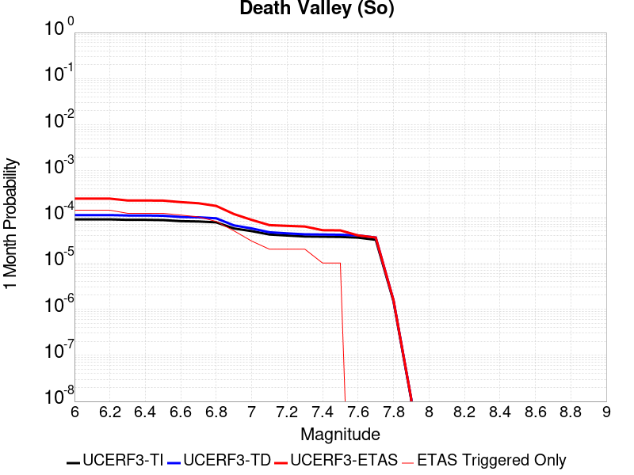 |  |  |

| Magnitude | 1 wk TI Prob | 1 wk TD Prob | 1 wk ETAS Prob | 1 wk ETAS/TD Gain | 1 wk ETAS Triggered Only | 1 mo TI Prob | 1 mo TD Prob | 1 mo ETAS Prob | 1 mo ETAS/TD Gain | 1 mo ETAS Triggered Only | 1 yr TI Prob | 1 yr TD Prob | 1 yr ETAS Prob | 1 yr ETAS/TD Gain | 1 yr ETAS Triggered Only | 10 yr TI Prob | 10 yr TD Prob | 10 yr ETAS Prob | 10 yr ETAS/TD Gain | 10 yr ETAS Triggered Only |
|-----|-----|-----|-----|-----|-----|-----|-----|-----|-----|-----|-----|-----|-----|-----|-----|-----|-----|-----|-----|-----|
| 6.0 | 2.0684236E-5 | 2.5621654E-5 | 8.39428E-5 | 3.2762444 | 5.832264E-5 | 8.864371E-5 | 1.0980256E-4 | 2.2643503E-4 | 2.0622017 | 1.1664528E-4 | 0.0010787029 | 0.0013360432 | 0.0016272668 | 1.2179747 | 2.916132E-4 | 0.010734817 | 0.013283391 | 0.014549444 | 1.095311 | 0.0012830981 |
| 6.1 | 2.0684236E-5 | 2.5621654E-5 | 8.39428E-5 | 3.2762444 | 5.832264E-5 | 8.864371E-5 | 1.0980256E-4 | 2.2643503E-4 | 2.0622017 | 1.1664528E-4 | 0.0010787029 | 0.0013360432 | 0.0016272668 | 1.2179747 | 2.916132E-4 | 0.010734817 | 0.013283391 | 0.014549444 | 1.095311 | 0.0012830981 |
| 6.2 | 2.0684236E-5 | 2.5621654E-5 | 8.39428E-5 | 3.2762444 | 5.832264E-5 | 8.864371E-5 | 1.0980256E-4 | 2.2643503E-4 | 2.0622017 | 1.1664528E-4 | 0.0010787029 | 0.0013360432 | 0.0016272668 | 1.2179747 | 2.916132E-4 | 0.010734817 | 0.013283391 | 0.014549444 | 1.095311 | 0.0012830981 |
| 6.3 | 2.0240292E-5 | 2.5121688E-5 | 8.3442865E-5 | 3.321547 | 5.832264E-5 | 8.6741224E-5 | 1.07660024E-4 | 2.2429274E-4 | 2.0833428 | 1.1664528E-4 | 0.0010555626 | 0.0013099894 | 0.0016012206 | 1.2223157 | 2.916132E-4 | 0.010505628 | 0.013025925 | 0.0141196195 | 1.083963 | 0.0011081302 |
| 6.4 | 2.0240292E-5 | 2.5121688E-5 | 8.3442865E-5 | 3.321547 | 5.832264E-5 | 8.6741224E-5 | 1.07660024E-4 | 2.2429274E-4 | 2.0833428 | 1.1664528E-4 | 0.0010555626 | 0.0013099894 | 0.0016012206 | 1.2223157 | 2.916132E-4 | 0.010505628 | 0.013025925 | 0.0141196195 | 1.083963 | 0.0011081302 |
| 6.5 | 1.9962767E-5 | 2.481091E-5 | 8.31321E-5 | 3.350627 | 5.832264E-5 | 8.55519E-5 | 1.0632823E-4 | 2.2296111E-4 | 2.0969136 | 1.1664528E-4 | 0.0010410968 | 0.0012937941 | 0.0015850301 | 1.2251022 | 2.916132E-4 | 0.010362327 | 0.012865855 | 0.013902157 | 1.0805466 | 0.0010498075 |
| 6.6 | 1.8937297E-5 | 2.3314587E-5 | 8.1635866E-5 | 3.5014932 | 5.832264E-5 | 8.115732E-5 | 9.991592E-5 | 2.1654954E-4 | 2.1673179 | 1.1664528E-4 | 9.876423E-4 | 0.0012158119 | 0.001448819 | 1.1916472 | 2.3329056E-4 | 0.009832645 | 0.012094654 | 0.0130741475 | 1.0809857 | 9.914848E-4 |
| 6.7 | 1.8621096E-5 | 2.291519E-5 | 8.1236496E-5 | 3.5450938 | 5.832264E-5 | 7.980225E-5 | 9.820434E-5 | 2.1483818E-4 | 2.1876647 | 1.1664528E-4 | 9.711593E-4 | 0.0011949965 | 0.0014280083 | 1.1949894 | 2.3329056E-4 | 0.009669261 | 0.01188875 | 0.012810818 | 1.077558 | 9.331622E-4 |
| 6.8 | 1.7830353E-5 | 2.1809046E-5 | 8.013041E-5 | 3.6741824 | 5.832264E-5 | 7.641356E-5 | 9.346408E-5 | 2.1009846E-4 | 2.247906 | 1.1664528E-4 | 9.29938E-4 | 0.0011373451 | 0.0013703704 | 1.2048852 | 2.3329056E-4 | 0.009260561 | 0.011318086 | 0.012240686 | 1.0815157 | 9.331622E-4 |
| 6.9 | 1.3135183E-5 | 1.5305823E-5 | 1.5305823E-5 | 1.0 | 0.0 | 5.6292425E-5 | 6.559477E-5 | 1.2391359E-4 | 1.8890772 | 5.832264E-5 | 6.8514474E-4 | 7.983302E-4 | 9.1488234E-4 | 1.1459949 | 1.1664528E-4 | 0.006830362 | 0.00795563 | 0.008476359 | 1.065454 | 5.2490376E-4 |
| 7.0 | 1.1507512E-5 | 1.3155667E-5 | 1.3155667E-5 | 1.0 | 0.0 | 4.9316975E-5 | 5.6380242E-5 | 1.1469959E-4 | 2.0343933 | 5.832264E-5 | 6.002687E-4 | 6.862191E-4 | 8.027843E-4 | 1.169866 | 1.1664528E-4 | 0.0059864987 | 0.006841702 | 0.0073050912 | 1.0677301 | 4.665811E-4 |
| 7.1 | 9.715903E-6 | 1.0866333E-5 | 1.0866333E-5 | 1.0 | 0.0 | 4.1638916E-5 | 4.6569192E-5 | 1.0488911E-4 | 2.2523284 | 5.832264E-5 | 5.068359E-4 | 5.668367E-4 | 6.2512624E-4 | 1.1028332 | 5.832264E-5 | 0.0050568148 | 0.005654362 | 0.0058283405 | 1.0307689 | 1.7496792E-4 |
| 7.2 | 9.233269E-6 | 1.0287286E-5 | 1.0287286E-5 | 1.0 | 0.0 | 3.9570554E-5 | 4.408765E-5 | 1.0240772E-4 | 2.3228211 | 5.832264E-5 | 4.81665E-4 | 5.366391E-4 | 5.949305E-4 | 1.108623 | 5.832264E-5 | 0.0048062233 | 0.0053538643 | 0.0055278954 | 1.0325058 | 1.7496792E-4 |
| 7.3 | 8.8041315E-6 | 9.809059E-6 | 9.809059E-6 | 1.0 | 0.0 | 3.7731446E-5 | 4.203817E-5 | 1.0035836E-4 | 2.3873153 | 5.832264E-5 | 4.592835E-4 | 5.116987E-4 | 5.6999153E-4 | 1.1139202 | 5.832264E-5 | 0.0045833546 | 0.005105632 | 0.0052797063 | 1.0340946 | 1.7496792E-4 |
| 7.4 | 8.708749E-6 | 9.708065E-6 | 9.708065E-6 | 1.0 | 0.0 | 3.7322676E-5 | 4.160535E-5 | 4.160535E-5 | 1.0 | 0.0 | 4.5430884E-4 | 5.064316E-4 | 5.064316E-4 | 1.0 | 0.0 | 0.004533812 | 0.0050532017 | 0.0051692575 | 1.0229667 | 1.1664528E-4 |
| 7.5 | 8.612678E-6 | 9.605701E-6 | 9.605701E-6 | 1.0 | 0.0 | 3.6910955E-5 | 4.1166666E-5 | 4.1166666E-5 | 1.0 | 0.0 | 4.492982E-4 | 5.010931E-4 | 5.010931E-4 | 1.0 | 0.0 | 0.004483909 | 0.005000058 | 0.00511612 | 1.0232122 | 1.1664528E-4 |
| 7.6 | 8.319024E-6 | 9.284777E-6 | 9.284777E-6 | 1.0 | 0.0 | 3.5652476E-5 | 3.9791317E-5 | 3.9791317E-5 | 1.0 | 0.0 | 4.3398244E-4 | 4.8435578E-4 | 4.8435578E-4 | 1.0 | 0.0 | 0.0043313587 | 0.004833425 | 0.0049495064 | 1.0240164 | 1.1664528E-4 |
| 7.7 | 7.4718328E-6 | 8.345949E-6 | 8.345949E-6 | 1.0 | 0.0 | 3.2021748E-5 | 3.5767884E-5 | 3.5767884E-5 | 1.0 | 0.0 | 3.8979502E-4 | 4.3539103E-4 | 4.3539103E-4 | 1.0 | 0.0 | 0.00389112 | 0.0043457854 | 0.0044038547 | 1.0133622 | 5.832264E-5 |
| 7.8 | 3.4586725E-7 | 3.6484212E-7 | 3.6484212E-7 | 1.0 | 0.0 | 1.4822873E-6 | 1.5636082E-6 | 1.5636082E-6 | 1.0 | 0.0 | 1.80467E-5 | 1.9036768E-5 | 1.9036768E-5 | 1.0 | 0.0 | 1.8045233E-4 | 1.9035181E-4 | 1.9035181E-4 | 1.0 | 0.0 |
| 7.9 | 2.5591178E-9 | 2.6697635E-9 | 2.6697635E-9 | 1.0 | 0.0 | 1.0967647E-8 | 1.1441844E-8 | 1.1441844E-8 | 1.0 | 0.0 | 1.335311E-7 | 1.3930445E-7 | 1.3930445E-7 | 1.0 | 0.0 | 1.3353102E-6 | 1.3930445E-6 | 1.3930445E-6 | 1.0 | 0.0 |

## Nelson Lake
*[(top)](#table-of-contents)*

| 1 Week | 1 Month | 1 Year | 10 Year |
|-----|-----|-----|-----|
|  |  |  |  |

| Magnitude | 1 wk TI Prob | 1 wk TD Prob | 1 wk ETAS Prob | 1 wk ETAS/TD Gain | 1 wk ETAS Triggered Only | 1 mo TI Prob | 1 mo TD Prob | 1 mo ETAS Prob | 1 mo ETAS/TD Gain | 1 mo ETAS Triggered Only | 1 yr TI Prob | 1 yr TD Prob | 1 yr ETAS Prob | 1 yr ETAS/TD Gain | 1 yr ETAS Triggered Only | 10 yr TI Prob | 10 yr TD Prob | 10 yr ETAS Prob | 10 yr ETAS/TD Gain | 10 yr ETAS Triggered Only |
|-----|-----|-----|-----|-----|-----|-----|-----|-----|-----|-----|-----|-----|-----|-----|-----|-----|-----|-----|-----|-----|
| 6.0 | 9.913453E-6 | 1.0192483E-5 | 1.0192483E-5 | 1.0 | 0.0 | 4.2485535E-5 | 4.36814E-5 | 4.36814E-5 | 1.0 | 0.0 | 5.1713863E-4 | 5.317016E-4 | 9.980346E-4 | 1.8770578 | 4.665811E-4 | 0.0051593683 | 0.0053053224 | 0.0065236003 | 1.2296331 | 0.0012247754 |
| 6.1 | 9.913453E-6 | 1.0192483E-5 | 1.0192483E-5 | 1.0 | 0.0 | 4.2485535E-5 | 4.36814E-5 | 4.36814E-5 | 1.0 | 0.0 | 5.1713863E-4 | 5.317016E-4 | 9.980346E-4 | 1.8770578 | 4.665811E-4 | 0.0051593683 | 0.0053053224 | 0.0065236003 | 1.2296331 | 0.0012247754 |
| 6.2 | 4.5596407E-6 | 4.696425E-6 | 4.696425E-6 | 1.0 | 0.0 | 1.954117E-5 | 2.0127389E-5 | 2.0127389E-5 | 1.0 | 0.0 | 2.3788778E-4 | 2.4502468E-4 | 3.6164137E-4 | 1.4759386 | 1.1664528E-4 | 0.0023763329 | 0.0024476713 | 0.0028549305 | 1.1663864 | 4.082585E-4 |
| 6.3 | 4.5596407E-6 | 4.696425E-6 | 4.696425E-6 | 1.0 | 0.0 | 1.954117E-5 | 2.0127389E-5 | 2.0127389E-5 | 1.0 | 0.0 | 2.3788778E-4 | 2.4502468E-4 | 3.6164137E-4 | 1.4759386 | 1.1664528E-4 | 0.0023763329 | 0.0024476713 | 0.0028549305 | 1.1663864 | 4.082585E-4 |
| 6.4 | 3.4025713E-6 | 3.5099856E-6 | 3.5099856E-6 | 1.0 | 0.0 | 1.4582367E-5 | 1.5042713E-5 | 1.5042713E-5 | 1.0 | 0.0 | 1.7752586E-4 | 1.8313048E-4 | 2.997544E-4 | 1.6368351 | 1.1664528E-4 | 0.001773841 | 0.0018298787 | 0.0021791742 | 1.1908845 | 3.4993584E-4 |
| 6.5 | 2.8352947E-6 | 2.9279324E-6 | 2.9279324E-6 | 1.0 | 0.0 | 1.2151207E-5 | 1.2548226E-5 | 1.2548226E-5 | 1.0 | 0.0 | 1.479309E-4 | 1.5276468E-4 | 2.1107841E-4 | 1.3817226 | 5.832264E-5 | 0.0014783246 | 0.0015266705 | 0.0018178385 | 1.1907209 | 2.916132E-4 |
| 6.6 | 2.251518E-6 | 2.3291316E-6 | 2.3291316E-6 | 1.0 | 0.0 | 9.649328E-6 | 9.981958E-6 | 9.981958E-6 | 1.0 | 0.0 | 1.1747423E-4 | 1.2152419E-4 | 1.7983974E-4 | 1.4798679 | 5.832264E-5 | 0.0011741214 | 0.001214639 | 0.0015058981 | 1.2397906 | 2.916132E-4 |
| 6.7 | 1.8911853E-6 | 1.9591957E-6 | 1.9591957E-6 | 1.0 | 0.0 | 8.105055E-6 | 8.39653E-6 | 8.39653E-6 | 1.0 | 0.0 | 9.867457E-5 | 1.0222354E-4 | 1.0222354E-4 | 1.0 | 0.0 | 9.863076E-4 | 0.0010218227 | 0.0011966118 | 1.1710563 | 1.7496792E-4 |
| 6.8 | 1.4874814E-6 | 1.5438771E-6 | 1.5438771E-6 | 1.0 | 0.0 | 6.374905E-6 | 6.616602E-6 | 6.616602E-6 | 1.0 | 0.0 | 7.76117E-5 | 8.055467E-5 | 8.055467E-5 | 1.0 | 0.0 | 7.75846E-4 | 8.0530584E-4 | 9.801328E-4 | 1.217094 | 1.7496792E-4 |
| 6.9 | 6.835972E-7 | 7.140181E-7 | 7.140181E-7 | 1.0 | 0.0 | 2.9296991E-6 | 3.0600756E-6 | 3.0600756E-6 | 1.0 | 0.0 | 3.56685E-5 | 3.7256104E-5 | 3.7256104E-5 | 1.0 | 0.0 | 3.5662777E-4 | 3.7252984E-4 | 3.7252984E-4 | 1.0 | 0.0 |

## Towne Pass
*[(top)](#table-of-contents)*

| 1 Week | 1 Month | 1 Year | 10 Year |
|-----|-----|-----|-----|
|  |  |  |  |

| Magnitude | 1 wk TI Prob | 1 wk TD Prob | 1 wk ETAS Prob | 1 wk ETAS/TD Gain | 1 wk ETAS Triggered Only | 1 mo TI Prob | 1 mo TD Prob | 1 mo ETAS Prob | 1 mo ETAS/TD Gain | 1 mo ETAS Triggered Only | 1 yr TI Prob | 1 yr TD Prob | 1 yr ETAS Prob | 1 yr ETAS/TD Gain | 1 yr ETAS Triggered Only | 10 yr TI Prob | 10 yr TD Prob | 10 yr ETAS Prob | 10 yr ETAS/TD Gain | 10 yr ETAS Triggered Only |
|-----|-----|-----|-----|-----|-----|-----|-----|-----|-----|-----|-----|-----|-----|-----|-----|-----|-----|-----|-----|-----|
| 6.0 | 3.849728E-6 | 3.894591E-6 | 3.894591E-6 | 1.0 | 0.0 | 1.649873E-5 | 1.6691021E-5 | 7.5012686E-5 | 4.494194 | 5.832264E-5 | 2.0085352E-4 | 2.0319861E-4 | 7.863065E-4 | 3.869645 | 5.832264E-4 | 0.0020067208 | 0.0020305573 | 0.0032528457 | 1.6019473 | 0.0012247754 |
| 6.1 | 3.849728E-6 | 3.894591E-6 | 3.894591E-6 | 1.0 | 0.0 | 1.649873E-5 | 1.6691021E-5 | 7.5012686E-5 | 4.494194 | 5.832264E-5 | 2.0085352E-4 | 2.0319861E-4 | 7.863065E-4 | 3.869645 | 5.832264E-4 | 0.0020067208 | 0.0020305573 | 0.0032528457 | 1.6019473 | 0.0012247754 |
| 6.2 | 3.849728E-6 | 3.894591E-6 | 3.894591E-6 | 1.0 | 0.0 | 1.649873E-5 | 1.6691021E-5 | 7.5012686E-5 | 4.494194 | 5.832264E-5 | 2.0085352E-4 | 2.0319861E-4 | 7.863065E-4 | 3.869645 | 5.832264E-4 | 0.0020067208 | 0.0020305573 | 0.0032528457 | 1.6019473 | 0.0012247754 |
| 6.3 | 3.849728E-6 | 3.894591E-6 | 3.894591E-6 | 1.0 | 0.0 | 1.649873E-5 | 1.6691021E-5 | 7.5012686E-5 | 4.494194 | 5.832264E-5 | 2.0085352E-4 | 2.0319861E-4 | 7.863065E-4 | 3.869645 | 5.832264E-4 | 0.0020067208 | 0.0020305573 | 0.0032528457 | 1.6019473 | 0.0012247754 |
| 6.4 | 3.849728E-6 | 3.894591E-6 | 3.894591E-6 | 1.0 | 0.0 | 1.649873E-5 | 1.6691021E-5 | 7.5012686E-5 | 4.494194 | 5.832264E-5 | 2.0085352E-4 | 2.0319861E-4 | 7.863065E-4 | 3.869645 | 5.832264E-4 | 0.0020067208 | 0.0020305573 | 0.0032528457 | 1.6019473 | 0.0012247754 |
| 6.5 | 1.1953545E-6 | 1.2030715E-6 | 1.2030715E-6 | 1.0 | 0.0 | 5.1229376E-6 | 5.1560114E-6 | 5.1560114E-6 | 1.0 | 0.0 | 6.236998E-5 | 6.277275E-5 | 2.3772969E-4 | 3.787148 | 1.7496792E-4 | 6.235248E-4 | 6.275619E-4 | 8.6070603E-4 | 1.3715079 | 2.3329056E-4 |
| 6.6 | 1.1953545E-6 | 1.2030715E-6 | 1.2030715E-6 | 1.0 | 0.0 | 5.1229376E-6 | 5.1560114E-6 | 5.1560114E-6 | 1.0 | 0.0 | 6.236998E-5 | 6.277275E-5 | 2.3772969E-4 | 3.787148 | 1.7496792E-4 | 6.235248E-4 | 6.275619E-4 | 8.6070603E-4 | 1.3715079 | 2.3329056E-4 |
| 6.7 | 8.375951E-7 | 8.4108314E-7 | 8.4108314E-7 | 1.0 | 0.0 | 3.5896885E-6 | 3.6046374E-6 | 3.6046374E-6 | 1.0 | 0.0 | 4.370358E-5 | 4.3885633E-5 | 1.605258E-4 | 3.657821 | 1.1664528E-4 | 4.3694986E-4 | 4.387754E-4 | 6.1366655E-4 | 1.3985893 | 1.7496792E-4 |
| 6.8 | 6.38041E-7 | 6.392299E-7 | 6.392299E-7 | 1.0 | 0.0 | 2.7344586E-6 | 2.739554E-6 | 2.739554E-6 | 1.0 | 0.0 | 3.3291526E-5 | 3.3353597E-5 | 1.4999499E-4 | 4.4971156 | 1.1664528E-4 | 3.3286537E-4 | 3.3348973E-4 | 5.0839933E-4 | 1.5244826 | 1.7496792E-4 |
| 6.9 | 5.3460053E-7 | 5.345466E-7 | 5.345466E-7 | 1.0 | 0.0 | 2.2911431E-6 | 2.290912E-6 | 2.290912E-6 | 1.0 | 0.0 | 2.789431E-5 | 2.789153E-5 | 2.789153E-5 | 1.0 | 0.0 | 2.789081E-4 | 2.788836E-4 | 3.3719E-4 | 1.2090707 | 5.832264E-5 |
| 7.0 | 3.557783E-7 | 3.532535E-7 | 3.532535E-7 | 1.0 | 0.0 | 1.5247632E-6 | 1.5139428E-6 | 1.5139428E-6 | 1.0 | 0.0 | 1.8563835E-5 | 1.8432107E-5 | 1.8432107E-5 | 1.0 | 0.0 | 1.8562283E-4 | 1.8430663E-4 | 2.4261851E-4 | 1.3163853 | 5.832264E-5 |
| 7.1 | 3.037942E-7 | 3.0003244E-7 | 3.0003244E-7 | 1.0 | 0.0 | 1.3019744E-6 | 1.2858527E-6 | 1.2858527E-6 | 1.0 | 0.0 | 1.5851423E-5 | 1.5655152E-5 | 1.5655152E-5 | 1.0 | 0.0 | 1.5850292E-4 | 1.5654124E-4 | 2.1485475E-4 | 1.3725121 | 5.832264E-5 |
| 7.2 | 2.0808248E-7 | 2.0218533E-7 | 2.0218533E-7 | 1.0 | 0.0 | 8.917818E-7 | 8.665083E-7 | 8.665083E-7 | 1.0 | 0.0 | 1.0857389E-5 | 1.0549692E-5 | 1.0549692E-5 | 1.0 | 0.0 | 1.0856859E-4 | 1.0549238E-4 | 1.6380886E-4 | 1.5528029 | 5.832264E-5 |
| 7.3 | 1.1162073E-7 | 1.06374294E-7 | 1.06374294E-7 | 1.0 | 0.0 | 4.7837443E-7 | 4.5588976E-7 | 4.5588976E-7 | 1.0 | 0.0 | 5.8241935E-6 | 5.5504456E-6 | 5.5504456E-6 | 1.0 | 0.0 | 5.8240406E-5 | 5.550327E-5 | 5.550327E-5 | 1.0 | 0.0 |

## San Andreas (Mojave S)
*[(top)](#table-of-contents)*

| 1 Week | 1 Month | 1 Year | 10 Year |
|-----|-----|-----|-----|
|  |  |  |  |

| Magnitude | 1 wk TI Prob | 1 wk TD Prob | 1 wk ETAS Prob | 1 wk ETAS/TD Gain | 1 wk ETAS Triggered Only | 1 mo TI Prob | 1 mo TD Prob | 1 mo ETAS Prob | 1 mo ETAS/TD Gain | 1 mo ETAS Triggered Only | 1 yr TI Prob | 1 yr TD Prob | 1 yr ETAS Prob | 1 yr ETAS/TD Gain | 1 yr ETAS Triggered Only | 10 yr TI Prob | 10 yr TD Prob | 10 yr ETAS Prob | 10 yr ETAS/TD Gain | 10 yr ETAS Triggered Only |
|-----|-----|-----|-----|-----|-----|-----|-----|-----|-----|-----|-----|-----|-----|-----|-----|-----|-----|-----|-----|-----|
| 6.0 | 3.1064058E-4 | 6.75191E-4 | 6.75191E-4 | 1.0 | 0.0 | 0.0013306376 | 0.002890595 | 0.0029487489 | 1.0201184 | 5.832264E-5 | 0.016080605 | 0.034651246 | 0.03510166 | 1.0129985 | 4.665811E-4 | 0.1496549 | 0.28680432 | 0.28746983 | 1.0023205 | 9.331622E-4 |
| 6.1 | 3.1064058E-4 | 6.75191E-4 | 6.75191E-4 | 1.0 | 0.0 | 0.0013306376 | 0.002890595 | 0.0029487489 | 1.0201184 | 5.832264E-5 | 0.016080605 | 0.034651246 | 0.03510166 | 1.0129985 | 4.665811E-4 | 0.1496549 | 0.28680432 | 0.28746983 | 1.0023205 | 9.331622E-4 |
| 6.2 | 3.1064058E-4 | 6.75191E-4 | 6.75191E-4 | 1.0 | 0.0 | 0.0013306376 | 0.002890595 | 0.0029487489 | 1.0201184 | 5.832264E-5 | 0.016080605 | 0.034651246 | 0.03510166 | 1.0129985 | 4.665811E-4 | 0.1496549 | 0.28680432 | 0.28746983 | 1.0023205 | 9.331622E-4 |
| 6.3 | 3.1064058E-4 | 6.75191E-4 | 6.75191E-4 | 1.0 | 0.0 | 0.0013306376 | 0.002890595 | 0.0029487489 | 1.0201184 | 5.832264E-5 | 0.016080605 | 0.034651246 | 0.03510166 | 1.0129985 | 4.665811E-4 | 0.1496549 | 0.28680432 | 0.28746983 | 1.0023205 | 9.331622E-4 |
| 6.4 | 1.9872203E-4 | 4.323479E-4 | 4.323479E-4 | 1.0 | 0.0 | 8.5138786E-4 | 0.001851632 | 0.0019098467 | 1.0314397 | 5.832264E-5 | 0.010316478 | 0.022316733 | 0.022715881 | 1.0178856 | 4.082585E-4 | 0.098504856 | 0.19721039 | 0.19786587 | 1.0033238 | 8.16517E-4 |
| 6.5 | 1.291105E-4 | 2.880526E-4 | 2.880526E-4 | 1.0 | 0.0 | 5.5321335E-4 | 0.0012339299 | 0.0012921805 | 1.0472075 | 5.832264E-5 | 0.006714592 | 0.01492044 | 0.015265155 | 1.0231035 | 3.4993584E-4 | 0.065152965 | 0.13825214 | 0.13880499 | 1.0039989 | 6.4154906E-4 |
| 6.6 | 1.291105E-4 | 2.880526E-4 | 2.880526E-4 | 1.0 | 0.0 | 5.5321335E-4 | 0.0012339299 | 0.0012921805 | 1.0472075 | 5.832264E-5 | 0.006714592 | 0.01492044 | 0.015265155 | 1.0231035 | 3.4993584E-4 | 0.065152965 | 0.13825214 | 0.13880499 | 1.0039989 | 6.4154906E-4 |
| 6.7 | 1.08001186E-4 | 2.4385673E-4 | 2.4385673E-4 | 1.0 | 0.0 | 4.6278012E-4 | 0.0010446823 | 0.001102944 | 1.0557698 | 5.832264E-5 | 0.0056198016 | 0.012645132 | 0.012990643 | 1.0273236 | 3.4993584E-4 | 0.054797906 | 0.11939663 | 0.11996158 | 1.0047317 | 6.4154906E-4 |
| 6.8 | 1.0624356E-4 | 2.3903191E-4 | 2.3903191E-4 | 1.0 | 0.0 | 4.5525006E-4 | 0.0010240208 | 0.0010822837 | 1.0568962 | 5.832264E-5 | 0.0055285925 | 0.012396459 | 0.0127420565 | 1.0278788 | 3.4993584E-4 | 0.053930566 | 0.11734573 | 0.117911994 | 1.0048256 | 6.4154906E-4 |
| 6.9 | 1.0393785E-4 | 2.3273338E-4 | 2.3273338E-4 | 1.0 | 0.0 | 4.4537184E-4 | 9.970479E-4 | 0.0010553125 | 1.058437 | 5.832264E-5 | 0.0054089287 | 0.012071744 | 0.012417455 | 1.0286381 | 3.4993584E-4 | 0.05279156 | 0.11464312 | 0.11521112 | 1.0049545 | 6.4154906E-4 |
| 7.0 | 1.0155622E-4 | 2.2642637E-4 | 2.2642637E-4 | 1.0 | 0.0 | 4.3516833E-4 | 9.700383E-4 | 0.0010283043 | 1.0600657 | 5.832264E-5 | 0.005285311 | 0.0117464885 | 0.012092314 | 1.0294408 | 3.4993584E-4 | 0.05161361 | 0.111903064 | 0.11247282 | 1.0050915 | 6.4154906E-4 |
| 7.1 | 9.885595E-5 | 2.1930772E-4 | 2.1930772E-4 | 1.0 | 0.0 | 4.2359953E-4 | 9.3955203E-4 | 9.978198E-4 | 1.0620166 | 5.832264E-5 | 0.0051451353 | 0.011379248 | 0.011667544 | 1.0253352 | 2.916132E-4 | 0.05027629 | 0.10878728 | 0.10930706 | 1.0047779 | 5.832264E-4 |
| 7.2 | 9.6411415E-5 | 2.1293506E-4 | 2.1293506E-4 | 1.0 | 0.0 | 4.1312634E-4 | 9.1226003E-4 | 9.7052945E-4 | 1.0638738 | 5.832264E-5 | 0.005018219 | 0.011050386 | 0.011338777 | 1.0260978 | 2.916132E-4 | 0.049064007 | 0.10597674 | 0.10649816 | 1.0049201 | 5.832264E-4 |
| 7.3 | 9.1180635E-5 | 1.952049E-4 | 1.952049E-4 | 1.0 | 0.0 | 3.907156E-4 | 8.3632435E-4 | 8.945982E-4 | 1.0696785 | 5.832264E-5 | 0.004746591 | 0.010134824 | 0.010423481 | 1.0284817 | 2.916132E-4 | 0.046464786 | 0.0981664 | 0.09869237 | 1.005358 | 5.832264E-4 |
| 7.4 | 8.887388E-5 | 1.8768513E-4 | 1.8768513E-4 | 1.0 | 0.0 | 3.8083247E-4 | 8.0411695E-4 | 8.623927E-4 | 1.0724717 | 5.832264E-5 | 0.0046267817 | 0.009746275 | 0.010035046 | 1.0296289 | 2.916132E-4 | 0.045316286 | 0.094799764 | 0.095327705 | 1.005569 | 5.832264E-4 |
| 7.5 | 8.6750515E-5 | 1.8099563E-4 | 1.8099563E-4 | 1.0 | 0.0 | 3.7173493E-4 | 7.7546504E-4 | 8.3374244E-4 | 1.0751516 | 5.832264E-5 | 0.004516484 | 0.009400502 | 0.009689374 | 1.0307294 | 2.916132E-4 | 0.04425787 | 0.09176208 | 0.09229179 | 1.0057726 | 5.832264E-4 |
| 7.6 | 8.453092E-5 | 1.7486555E-4 | 1.7486555E-4 | 1.0 | 0.0 | 3.6222505E-4 | 7.4920856E-4 | 8.074875E-4 | 1.0777874 | 5.832264E-5 | 0.0044011753 | 0.009083539 | 0.009372504 | 1.0318118 | 2.916132E-4 | 0.04315024 | 0.088919215 | 0.08945058 | 1.0059758 | 5.832264E-4 |
| 7.7 | 8.259102E-5 | 1.7008166E-4 | 1.7008166E-4 | 1.0 | 0.0 | 3.539135E-4 | 7.2871783E-4 | 7.8699796E-4 | 1.0799763 | 5.832264E-5 | 0.004300386 | 0.008836117 | 0.0091251535 | 1.0327108 | 2.916132E-4 | 0.042181134 | 0.086668245 | 0.087200925 | 1.0061462 | 5.832264E-4 |
| 7.8 | 7.444844E-5 | 1.5326278E-4 | 1.5326278E-4 | 1.0 | 0.0 | 3.1902574E-4 | 6.566752E-4 | 7.149595E-4 | 1.0887567 | 5.832264E-5 | 0.0038772223 | 0.007965761 | 0.008197194 | 1.0290533 | 2.3329056E-4 | 0.03810269 | 0.078482434 | 0.07891239 | 1.0054785 | 4.665811E-4 |
| 7.9 | 5.2586525E-5 | 1.0035652E-4 | 1.0035652E-4 | 1.0 | 0.0 | 2.2535135E-4 | 4.3002848E-4 | 4.3002848E-4 | 1.0 | 0.0 | 0.0027402006 | 0.005223039 | 0.005281057 | 1.011108 | 5.832264E-5 | 0.027066574 | 0.052336518 | 0.05239179 | 1.0010561 | 5.832264E-5 |
| 8.0 | 3.379877E-5 | 5.424338E-5 | 5.424338E-5 | 1.0 | 0.0 | 1.4484383E-4 | 2.3245093E-4 | 2.3245093E-4 | 1.0 | 0.0 | 0.0017620471 | 0.002826419 | 0.0028845768 | 1.0205765 | 5.832264E-5 | 0.017481409 | 0.028917845 | 0.02897448 | 1.0019585 | 5.832264E-5 |
| 8.1 | 1.8668277E-5 | 1.9389938E-5 | 1.9389938E-5 | 1.0 | 0.0 | 8.000444E-5 | 8.309709E-5 | 8.309709E-5 | 1.0 | 0.0 | 9.736188E-4 | 0.0010112381 | 0.0010112381 | 1.0 | 0.0 | 0.009693642 | 0.010841073 | 0.010841073 | 1.0 | 0.0 |
| 8.2 | 8.541571E-6 | 5.4920856E-6 | 5.4920856E-6 | 1.0 | 0.0 | 3.660622E-5 | 2.3537297E-5 | 2.3537297E-5 | 1.0 | 0.0 | 4.455896E-4 | 2.8652902E-4 | 2.8652902E-4 | 1.0 | 0.0 | 0.0044469717 | 0.0032579117 | 0.0032579117 | 1.0 | 0.0 |
| 8.3 | 1.983087E-6 | 7.7104113E-7 | 7.7104113E-7 | 1.0 | 0.0 | 8.498917E-6 | 3.3044578E-6 | 3.3044578E-6 | 1.0 | 0.0 | 1.034694E-4 | 4.0231047E-5 | 4.0231047E-5 | 1.0 | 0.0 | 0.0010342124 | 4.7486598E-4 | 4.7486598E-4 | 1.0 | 0.0 |

## San Andreas (Mojave N)
*[(top)](#table-of-contents)*

| 1 Week | 1 Month | 1 Year | 10 Year |
|-----|-----|-----|-----|
|  |  |  |  |

| Magnitude | 1 wk TI Prob | 1 wk TD Prob | 1 wk ETAS Prob | 1 wk ETAS/TD Gain | 1 wk ETAS Triggered Only | 1 mo TI Prob | 1 mo TD Prob | 1 mo ETAS Prob | 1 mo ETAS/TD Gain | 1 mo ETAS Triggered Only | 1 yr TI Prob | 1 yr TD Prob | 1 yr ETAS Prob | 1 yr ETAS/TD Gain | 1 yr ETAS Triggered Only | 10 yr TI Prob | 10 yr TD Prob | 10 yr ETAS Prob | 10 yr ETAS/TD Gain | 10 yr ETAS Triggered Only |
|-----|-----|-----|-----|-----|-----|-----|-----|-----|-----|-----|-----|-----|-----|-----|-----|-----|-----|-----|-----|-----|
| 6.0 | 9.877682E-5 | 1.9452986E-4 | 1.9452986E-4 | 1.0 | 0.0 | 4.2326056E-4 | 8.334332E-4 | 8.917072E-4 | 1.0699204 | 5.832264E-5 | 0.0051410277 | 0.010099967 | 0.010446369 | 1.0342973 | 3.4993584E-4 | 0.05023708 | 0.09854343 | 0.099332064 | 1.0080029 | 8.748396E-4 |
| 6.1 | 9.877682E-5 | 1.9452986E-4 | 1.9452986E-4 | 1.0 | 0.0 | 4.2326056E-4 | 8.334332E-4 | 8.917072E-4 | 1.0699204 | 5.832264E-5 | 0.0051410277 | 0.010099967 | 0.010446369 | 1.0342973 | 3.4993584E-4 | 0.05023708 | 0.09854343 | 0.099332064 | 1.0080029 | 8.748396E-4 |
| 6.2 | 9.877682E-5 | 1.9452986E-4 | 1.9452986E-4 | 1.0 | 0.0 | 4.2326056E-4 | 8.334332E-4 | 8.917072E-4 | 1.0699204 | 5.832264E-5 | 0.0051410277 | 0.010099967 | 0.010446369 | 1.0342973 | 3.4993584E-4 | 0.05023708 | 0.09854343 | 0.099332064 | 1.0080029 | 8.748396E-4 |
| 6.3 | 9.877682E-5 | 1.9452986E-4 | 1.9452986E-4 | 1.0 | 0.0 | 4.2326056E-4 | 8.334332E-4 | 8.917072E-4 | 1.0699204 | 5.832264E-5 | 0.0051410277 | 0.010099967 | 0.010446369 | 1.0342973 | 3.4993584E-4 | 0.05023708 | 0.09854343 | 0.099332064 | 1.0080029 | 8.748396E-4 |
| 6.4 | 9.877682E-5 | 1.9452986E-4 | 1.9452986E-4 | 1.0 | 0.0 | 4.2326056E-4 | 8.334332E-4 | 8.917072E-4 | 1.0699204 | 5.832264E-5 | 0.0051410277 | 0.010099967 | 0.010446369 | 1.0342973 | 3.4993584E-4 | 0.05023708 | 0.09854343 | 0.099332064 | 1.0080029 | 8.748396E-4 |
| 6.5 | 9.861474E-5 | 1.9426736E-4 | 1.9426736E-4 | 1.0 | 0.0 | 4.2256617E-4 | 8.323089E-4 | 8.9058303E-4 | 1.070015 | 5.832264E-5 | 0.0051326132 | 0.010086406 | 0.010432812 | 1.0343438 | 3.4993584E-4 | 0.050156746 | 0.098421186 | 0.09920993 | 1.0080138 | 8.748396E-4 |
| 6.6 | 9.861474E-5 | 1.9426736E-4 | 1.9426736E-4 | 1.0 | 0.0 | 4.2256617E-4 | 8.323089E-4 | 8.9058303E-4 | 1.070015 | 5.832264E-5 | 0.0051326132 | 0.010086406 | 0.010432812 | 1.0343438 | 3.4993584E-4 | 0.050156746 | 0.098421186 | 0.09920993 | 1.0080138 | 8.748396E-4 |
| 6.7 | 9.8552715E-5 | 1.9416683E-4 | 1.9416683E-4 | 1.0 | 0.0 | 4.223004E-4 | 8.3187834E-4 | 8.9015247E-4 | 1.0700513 | 5.832264E-5 | 0.0051293927 | 0.010081212 | 0.01042762 | 1.0343617 | 3.4993584E-4 | 0.050125998 | 0.09837436 | 0.09916314 | 1.0080181 | 8.748396E-4 |
| 6.8 | 9.8464974E-5 | 1.940183E-4 | 1.940183E-4 | 1.0 | 0.0 | 4.219245E-4 | 8.3124224E-4 | 8.895164E-4 | 1.070105 | 5.832264E-5 | 0.0051248376 | 0.010073539 | 0.01041995 | 1.0343882 | 3.4993584E-4 | 0.05008251 | 0.09830434 | 0.09909318 | 1.0080245 | 8.748396E-4 |
| 6.9 | 9.825824E-5 | 1.9369811E-4 | 1.9369811E-4 | 1.0 | 0.0 | 4.2103877E-4 | 8.2987087E-4 | 8.881451E-4 | 1.0702208 | 5.832264E-5 | 0.0051141046 | 0.010056997 | 0.010403413 | 1.0344453 | 3.4993584E-4 | 0.049980022 | 0.09815335 | 0.098942325 | 1.0080382 | 8.748396E-4 |
| 7.0 | 9.781462E-5 | 1.9301118E-4 | 1.9301118E-4 | 1.0 | 0.0 | 4.1913814E-4 | 8.269287E-4 | 8.852031E-4 | 1.0704709 | 5.832264E-5 | 0.005091073 | 0.010021506 | 0.0103679355 | 1.0345685 | 3.4993584E-4 | 0.04976007 | 0.09782955 | 0.098618805 | 1.0080676 | 8.748396E-4 |
| 7.1 | 9.7121134E-5 | 1.9202747E-4 | 1.9202747E-4 | 1.0 | 0.0 | 4.1616702E-4 | 8.227155E-4 | 8.809902E-4 | 1.0708321 | 5.832264E-5 | 0.005055068 | 0.009970682 | 0.010317128 | 1.0347465 | 3.4993584E-4 | 0.04941613 | 0.0973658 | 0.09815546 | 1.0081103 | 8.748396E-4 |
| 7.2 | 9.663819E-5 | 1.9133474E-4 | 1.9133474E-4 | 1.0 | 0.0 | 4.1409794E-4 | 8.197485E-4 | 8.7802333E-4 | 1.0710887 | 5.832264E-5 | 0.0050299936 | 0.009934888 | 0.010281348 | 1.034873 | 3.4993584E-4 | 0.049176537 | 0.09703887 | 0.09782882 | 1.0081406 | 8.748396E-4 |
| 7.3 | 9.6277574E-5 | 1.9085912E-4 | 1.9085912E-4 | 1.0 | 0.0 | 4.125529E-4 | 8.1771147E-4 | 8.759864E-4 | 1.0712659 | 5.832264E-5 | 0.0050112694 | 0.009910313 | 0.010256781 | 1.0349604 | 3.4993584E-4 | 0.04899759 | 0.096812055 | 0.097602196 | 1.0081617 | 8.748396E-4 |
| 7.4 | 9.593308E-5 | 1.9025613E-4 | 1.9025613E-4 | 1.0 | 0.0 | 4.1107697E-4 | 8.151288E-4 | 8.734039E-4 | 1.0714918 | 5.832264E-5 | 0.0049933824 | 0.009879155 | 0.010225633 | 1.0350717 | 3.4993584E-4 | 0.04882661 | 0.09652995 | 0.09732035 | 1.008188 | 8.748396E-4 |
| 7.5 | 9.561707E-5 | 1.897162E-4 | 1.897162E-4 | 1.0 | 0.0 | 4.0972308E-4 | 8.1281626E-4 | 8.710915E-4 | 1.0716954 | 5.832264E-5 | 0.0049769743 | 0.0098512545 | 0.010197744 | 1.035172 | 3.4993584E-4 | 0.048669744 | 0.09627587 | 0.097066484 | 1.008212 | 8.748396E-4 |
| 7.6 | 9.418194E-5 | 1.8623457E-4 | 1.8623457E-4 | 1.0 | 0.0 | 4.0357444E-4 | 7.9790415E-4 | 8.5618027E-4 | 1.0730364 | 5.832264E-5 | 0.004902454 | 0.009671325 | 0.0100178765 | 1.0358329 | 3.4993584E-4 | 0.047957025 | 0.09465678 | 0.095448814 | 1.0083674 | 8.748396E-4 |
| 7.7 | 8.202141E-5 | 1.6068226E-4 | 1.6068226E-4 | 1.0 | 0.0 | 3.51473E-4 | 6.884566E-4 | 7.4673904E-4 | 1.0846567 | 5.832264E-5 | 0.00427079 | 0.008349802 | 0.008696816 | 1.0415596 | 3.4993584E-4 | 0.04189639 | 0.08244225 | 0.083244964 | 1.0097367 | 8.748396E-4 |
| 7.8 | 7.2859846E-5 | 1.4558651E-4 | 1.4558651E-4 | 1.0 | 0.0 | 3.1221908E-4 | 6.23793E-4 | 6.820793E-4 | 1.0934385 | 5.832264E-5 | 0.003794643 | 0.007568275 | 0.0077998 | 1.0305915 | 2.3329056E-4 | 0.037304975 | 0.07491499 | 0.07534662 | 1.0057615 | 4.665811E-4 |
| 7.9 | 5.3874453E-5 | 1.0075245E-4 | 1.0075245E-4 | 1.0 | 0.0 | 2.3087008E-4 | 4.3172477E-4 | 4.3172477E-4 | 1.0 | 0.0 | 0.0028072202 | 0.0052435924 | 0.005301609 | 1.0110643 | 5.832264E-5 | 0.02772022 | 0.0525627 | 0.052617956 | 1.0010513 | 5.832264E-5 |
| 8.0 | 3.468538E-5 | 5.4431417E-5 | 5.4431417E-5 | 1.0 | 0.0 | 1.4864317E-4 | 2.3325665E-4 | 2.3325665E-4 | 1.0 | 0.0 | 0.0018082283 | 0.0028362032 | 0.0028943603 | 1.0205053 | 5.832264E-5 | 0.017935853 | 0.029031547 | 0.029088177 | 1.0019506 | 5.832264E-5 |
| 8.1 | 1.9152367E-5 | 1.9484323E-5 | 1.9484323E-5 | 1.0 | 0.0 | 8.207899E-5 | 8.350157E-5 | 8.350157E-5 | 1.0 | 0.0 | 9.988535E-4 | 0.0010161581 | 0.0010161581 | 1.0 | 0.0 | 0.009943757 | 0.010899102 | 0.010899102 | 1.0 | 0.0 |
| 8.2 | 8.643924E-6 | 5.506234E-6 | 5.506234E-6 | 1.0 | 0.0 | 3.704486E-5 | 2.3597933E-5 | 2.3597933E-5 | 1.0 | 0.0 | 4.5092785E-4 | 2.8726703E-4 | 2.8726703E-4 | 1.0 | 0.0 | 0.0045001395 | 0.0032658712 | 0.0032658712 | 1.0 | 0.0 |
| 8.3 | 1.983087E-6 | 7.7104113E-7 | 7.7104113E-7 | 1.0 | 0.0 | 8.498917E-6 | 3.3044578E-6 | 3.3044578E-6 | 1.0 | 0.0 | 1.034694E-4 | 4.0231047E-5 | 4.0231047E-5 | 1.0 | 0.0 | 0.0010342124 | 4.7486598E-4 | 4.7486598E-4 | 1.0 | 0.0 |

## Bicycle Lake
*[(top)](#table-of-contents)*

| 1 Week | 1 Month | 1 Year | 10 Year |
|-----|-----|-----|-----|
|  |  |  |  |

| Magnitude | 1 wk TI Prob | 1 wk TD Prob | 1 wk ETAS Prob | 1 wk ETAS/TD Gain | 1 wk ETAS Triggered Only | 1 mo TI Prob | 1 mo TD Prob | 1 mo ETAS Prob | 1 mo ETAS/TD Gain | 1 mo ETAS Triggered Only | 1 yr TI Prob | 1 yr TD Prob | 1 yr ETAS Prob | 1 yr ETAS/TD Gain | 1 yr ETAS Triggered Only | 10 yr TI Prob | 10 yr TD Prob | 10 yr ETAS Prob | 10 yr ETAS/TD Gain | 10 yr ETAS Triggered Only |
|-----|-----|-----|-----|-----|-----|-----|-----|-----|-----|-----|-----|-----|-----|-----|-----|-----|-----|-----|-----|-----|
| 6.0 | 1.9621975E-5 | 2.2099297E-5 | 2.2099297E-5 | 1.0 | 0.0 | 8.4091465E-5 | 9.47086E-5 | 9.47086E-5 | 1.0 | 0.0 | 0.0010233327 | 0.0011526023 | 0.0014438793 | 1.2527126 | 2.916132E-4 | 0.01018633 | 0.011479556 | 0.012171393 | 1.060267 | 6.998717E-4 |
| 6.1 | 1.9621975E-5 | 2.2099297E-5 | 2.2099297E-5 | 1.0 | 0.0 | 8.4091465E-5 | 9.47086E-5 | 9.47086E-5 | 1.0 | 0.0 | 0.0010233327 | 0.0011526023 | 0.0014438793 | 1.2527126 | 2.916132E-4 | 0.01018633 | 0.011479556 | 0.012171393 | 1.060267 | 6.998717E-4 |
| 6.2 | 9.9971285E-6 | 1.1256768E-5 | 1.1256768E-5 | 1.0 | 0.0 | 4.2844134E-5 | 4.824269E-5 | 4.824269E-5 | 1.0 | 0.0 | 5.2150246E-4 | 5.872485E-4 | 8.7869045E-4 | 1.4962839 | 2.916132E-4 | 0.0052028033 | 0.0058620726 | 0.0063259187 | 1.0791266 | 4.665811E-4 |
| 6.3 | 9.589428E-6 | 1.0799429E-5 | 1.0799429E-5 | 1.0 | 0.0 | 4.10969E-5 | 4.628274E-5 | 4.628274E-5 | 1.0 | 0.0 | 5.002399E-4 | 5.633986E-4 | 7.382679E-4 | 1.310383 | 1.7496792E-4 | 0.0049911533 | 0.005624793 | 0.0059727603 | 1.0618632 | 3.4993584E-4 |
| 6.4 | 9.589428E-6 | 1.0799429E-5 | 1.0799429E-5 | 1.0 | 0.0 | 4.10969E-5 | 4.628274E-5 | 4.628274E-5 | 1.0 | 0.0 | 5.002399E-4 | 5.633986E-4 | 7.382679E-4 | 1.310383 | 1.7496792E-4 | 0.0049911533 | 0.005624793 | 0.0059727603 | 1.0618632 | 3.4993584E-4 |
| 6.5 | 5.557707E-6 | 6.2862564E-6 | 6.2862564E-6 | 1.0 | 0.0 | 2.3818526E-5 | 2.6940974E-5 | 2.6940974E-5 | 1.0 | 0.0 | 2.8995197E-4 | 3.2798387E-4 | 5.028944E-4 | 1.53329 | 1.7496792E-4 | 0.0028957394 | 0.0032776347 | 0.0035682921 | 1.088679 | 2.916132E-4 |
| 6.6 | 4.8742945E-6 | 5.513865E-6 | 5.513865E-6 | 1.0 | 0.0 | 2.0889667E-5 | 2.3630784E-5 | 2.3630784E-5 | 1.0 | 0.0 | 2.54302E-4 | 2.87693E-4 | 4.626106E-4 | 1.6080009 | 1.7496792E-4 | 0.002540112 | 0.002875775 | 0.0031665496 | 1.1011118 | 2.916132E-4 |
| 6.7 | 3.991108E-6 | 4.516383E-6 | 4.516383E-6 | 1.0 | 0.0 | 1.7104636E-5 | 1.9355926E-5 | 1.9355926E-5 | 1.0 | 0.0 | 2.0822904E-4 | 2.356584E-4 | 4.1058508E-4 | 1.7422892 | 1.7496792E-4 | 0.0020803404 | 0.002356584 | 0.002589325 | 1.0987619 | 2.3329056E-4 |

## Sierra Nevada  (No Extension)
*[(top)](#table-of-contents)*

| 1 Week | 1 Month | 1 Year | 10 Year |
|-----|-----|-----|-----|
|  |  |  |  |

| Magnitude | 1 wk TI Prob | 1 wk TD Prob | 1 wk ETAS Prob | 1 wk ETAS/TD Gain | 1 wk ETAS Triggered Only | 1 mo TI Prob | 1 mo TD Prob | 1 mo ETAS Prob | 1 mo ETAS/TD Gain | 1 mo ETAS Triggered Only | 1 yr TI Prob | 1 yr TD Prob | 1 yr ETAS Prob | 1 yr ETAS/TD Gain | 1 yr ETAS Triggered Only | 10 yr TI Prob | 10 yr TD Prob | 10 yr ETAS Prob | 10 yr ETAS/TD Gain | 10 yr ETAS Triggered Only |
|-----|-----|-----|-----|-----|-----|-----|-----|-----|-----|-----|-----|-----|-----|-----|-----|-----|-----|-----|-----|-----|
| 6.0 | 7.7690465E-6 | 6.9766907E-6 | 6.9766907E-6 | 1.0 | 0.0 | 3.329549E-5 | 2.9899962E-5 | 2.9899962E-5 | 1.0 | 0.0 | 4.0529718E-4 | 3.6400708E-4 | 7.1381556E-4 | 1.9609935 | 3.4993584E-4 | 0.004045588 | 0.0036376247 | 0.0042187297 | 1.1597484 | 5.832264E-4 |
| 6.1 | 7.7690465E-6 | 6.9766907E-6 | 6.9766907E-6 | 1.0 | 0.0 | 3.329549E-5 | 2.9899962E-5 | 2.9899962E-5 | 1.0 | 0.0 | 4.0529718E-4 | 3.6400708E-4 | 7.1381556E-4 | 1.9609935 | 3.4993584E-4 | 0.004045588 | 0.0036376247 | 0.0042187297 | 1.1597484 | 5.832264E-4 |
| 6.2 | 7.7690465E-6 | 6.9766907E-6 | 6.9766907E-6 | 1.0 | 0.0 | 3.329549E-5 | 2.9899962E-5 | 2.9899962E-5 | 1.0 | 0.0 | 4.0529718E-4 | 3.6400708E-4 | 7.1381556E-4 | 1.9609935 | 3.4993584E-4 | 0.004045588 | 0.0036376247 | 0.0042187297 | 1.1597484 | 5.832264E-4 |
| 6.3 | 7.7690465E-6 | 6.9766907E-6 | 6.9766907E-6 | 1.0 | 0.0 | 3.329549E-5 | 2.9899962E-5 | 2.9899962E-5 | 1.0 | 0.0 | 4.0529718E-4 | 3.6400708E-4 | 7.1381556E-4 | 1.9609935 | 3.4993584E-4 | 0.004045588 | 0.0036376247 | 0.0042187297 | 1.1597484 | 5.832264E-4 |
| 6.4 | 7.7690465E-6 | 6.9766907E-6 | 6.9766907E-6 | 1.0 | 0.0 | 3.329549E-5 | 2.9899962E-5 | 2.9899962E-5 | 1.0 | 0.0 | 4.0529718E-4 | 3.6400708E-4 | 7.1381556E-4 | 1.9609935 | 3.4993584E-4 | 0.004045588 | 0.0036376247 | 0.0042187297 | 1.1597484 | 5.832264E-4 |
| 6.5 | 7.7690465E-6 | 6.9766907E-6 | 6.9766907E-6 | 1.0 | 0.0 | 3.329549E-5 | 2.9899962E-5 | 2.9899962E-5 | 1.0 | 0.0 | 4.0529718E-4 | 3.6400708E-4 | 7.1381556E-4 | 1.9609935 | 3.4993584E-4 | 0.004045588 | 0.0036376247 | 0.0042187297 | 1.1597484 | 5.832264E-4 |
| 6.6 | 2.653E-6 | 1.6150183E-6 | 1.6150183E-6 | 1.0 | 0.0 | 1.136995E-5 | 6.9214884E-6 | 6.9214884E-6 | 1.0 | 0.0 | 1.3842035E-4 | 8.42659E-5 | 3.175368E-4 | 3.7682717 | 2.3329056E-4 | 0.0013833415 | 8.423429E-4 | 0.001308531 | 1.5534422 | 4.665811E-4 |
| 6.7 | 2.5902466E-6 | 1.5503501E-6 | 1.5503501E-6 | 1.0 | 0.0 | 1.11010095E-5 | 6.6443413E-6 | 6.6443413E-6 | 1.0 | 0.0 | 1.351464E-4 | 8.089188E-5 | 3.1416357E-4 | 3.8837466 | 2.3329056E-4 | 0.0013506424 | 8.0862734E-4 | 0.0012748311 | 1.5765374 | 4.665811E-4 |
| 6.8 | 2.5853892E-6 | 1.5471496E-6 | 1.5471496E-6 | 1.0 | 0.0 | 1.1080193E-5 | 6.6306247E-6 | 6.6306247E-6 | 1.0 | 0.0 | 1.34893E-4 | 8.0724894E-5 | 3.1399663E-4 | 3.8897123 | 2.3329056E-4 | 0.0013481114 | 8.069587E-4 | 0.0012731634 | 1.5777304 | 4.665811E-4 |
| 6.9 | 2.458257E-6 | 1.4222203E-6 | 1.4222203E-6 | 1.0 | 0.0 | 1.0535345E-5 | 6.0952157E-6 | 6.0952157E-6 | 1.0 | 0.0 | 1.2826028E-4 | 7.420674E-5 | 3.0748E-4 | 4.1435585 | 2.3329056E-4 | 0.0012818627 | 7.418216E-4 | 0.0012080566 | 1.6285002 | 4.665811E-4 |
| 7.0 | 2.4341468E-6 | 1.3991834E-6 | 1.3991834E-6 | 1.0 | 0.0 | 1.0432016E-5 | 5.9964864E-6 | 5.9964864E-6 | 1.0 | 0.0 | 1.270024E-4 | 7.30048E-5 | 3.0627832E-4 | 4.1953177 | 2.3329056E-4 | 0.0012692984 | 7.2981004E-4 | 0.0011960507 | 1.638852 | 4.665811E-4 |
| 7.1 | 2.3652476E-6 | 1.3341307E-6 | 1.3341307E-6 | 1.0 | 0.0 | 1.0136736E-5 | 5.717691E-6 | 5.717691E-6 | 1.0 | 0.0 | 1.2340778E-4 | 6.961068E-5 | 3.02885E-4 | 4.3511286 | 2.3329056E-4 | 0.0012333926 | 6.9589046E-4 | 0.0011621469 | 1.6700141 | 4.665811E-4 |
| 7.2 | 2.272158E-6 | 1.2504338E-6 | 1.2504338E-6 | 1.0 | 0.0 | 9.737784E-6 | 5.358991E-6 | 5.358991E-6 | 1.0 | 0.0 | 1.1855107E-4 | 6.5243774E-5 | 2.9851912E-4 | 4.575442 | 2.3329056E-4 | 0.0011848784 | 6.5224775E-4 | 0.0011185246 | 1.7148769 | 4.665811E-4 |
| 7.3 | 2.1382127E-6 | 1.1421172E-6 | 1.1421172E-6 | 1.0 | 0.0 | 9.163737E-6 | 4.8947786E-6 | 4.8947786E-6 | 1.0 | 0.0 | 1.1156279E-4 | 5.9592312E-5 | 2.9286896E-4 | 4.9145427 | 2.3329056E-4 | 0.001115068 | 5.957645E-4 | 0.0010620677 | 1.7826971 | 4.665811E-4 |
| 7.4 | 1.9048055E-6 | 9.576632E-7 | 9.576632E-7 | 1.0 | 0.0 | 8.163426E-6 | 4.104265E-6 | 4.104265E-6 | 1.0 | 0.0 | 9.9385186E-5 | 4.9968286E-5 | 2.8324718E-4 | 5.6685395 | 2.3329056E-4 | 9.934074E-4 | 4.995712E-4 | 9.6591923E-4 | 1.9334966 | 4.665811E-4 |
| 7.5 | 1.5373403E-6 | 7.561227E-7 | 7.561227E-7 | 1.0 | 0.0 | 6.5885843E-6 | 3.2405217E-6 | 3.2405217E-6 | 1.0 | 0.0 | 8.021306E-5 | 3.9452643E-5 | 2.1441367E-4 | 5.4347095 | 1.7496792E-4 | 8.0184115E-4 | 3.9445685E-4 | 8.025543E-4 | 2.0345807 | 4.082585E-4 |
| 7.6 | 1.0680322E-6 | 4.6604995E-7 | 4.6604995E-7 | 1.0 | 0.0 | 4.577273E-6 | 1.9973554E-6 | 1.9973554E-6 | 1.0 | 0.0 | 5.5726876E-5 | 2.4317533E-5 | 1.4095998E-4 | 5.79664 | 1.1664528E-4 | 5.5712904E-4 | 2.4314898E-4 | 5.3469127E-4 | 2.1990273 | 2.916132E-4 |
| 7.7 | 5.509146E-7 | 1.5584769E-7 | 1.5584769E-7 | 1.0 | 0.0 | 2.3610605E-6 | 6.6791847E-7 | 6.6791847E-7 | 1.0 | 0.0 | 2.8745531E-5 | 8.1318785E-6 | 8.1318785E-6 | 1.0 | 0.0 | 2.8741814E-4 | 8.131592E-5 | 1.9795173E-4 | 2.4343536 | 1.1664528E-4 |

## Garlic Springs
*[(top)](#table-of-contents)*

| 1 Week | 1 Month | 1 Year | 10 Year |
|-----|-----|-----|-----|
|  |  |  |  |

| Magnitude | 1 wk TI Prob | 1 wk TD Prob | 1 wk ETAS Prob | 1 wk ETAS/TD Gain | 1 wk ETAS Triggered Only | 1 mo TI Prob | 1 mo TD Prob | 1 mo ETAS Prob | 1 mo ETAS/TD Gain | 1 mo ETAS Triggered Only | 1 yr TI Prob | 1 yr TD Prob | 1 yr ETAS Prob | 1 yr ETAS/TD Gain | 1 yr ETAS Triggered Only | 10 yr TI Prob | 10 yr TD Prob | 10 yr ETAS Prob | 10 yr ETAS/TD Gain | 10 yr ETAS Triggered Only |
|-----|-----|-----|-----|-----|-----|-----|-----|-----|-----|-----|-----|-----|-----|-----|-----|-----|-----|-----|-----|-----|
| 6.0 | 1.6760017E-5 | 1.8778632E-5 | 1.8778632E-5 | 1.0 | 0.0 | 7.182667E-5 | 8.047803E-5 | 8.047803E-5 | 1.0 | 0.0 | 8.7413884E-4 | 9.79497E-4 | 0.0011542935 | 1.1784555 | 1.7496792E-4 | 0.008707083 | 0.009763345 | 0.010283124 | 1.0532378 | 5.2490376E-4 |
| 6.1 | 9.852767E-6 | 1.0974581E-5 | 1.0974581E-5 | 1.0 | 0.0 | 4.222546E-5 | 4.703347E-5 | 4.703347E-5 | 1.0 | 0.0 | 5.139737E-4 | 5.72553E-4 | 7.4742077E-4 | 1.3054175 | 1.7496792E-4 | 0.005127866 | 0.0057177385 | 0.006007684 | 1.0507098 | 2.916132E-4 |
| 6.2 | 9.852767E-6 | 1.0974581E-5 | 1.0974581E-5 | 1.0 | 0.0 | 4.222546E-5 | 4.703347E-5 | 4.703347E-5 | 1.0 | 0.0 | 5.139737E-4 | 5.72553E-4 | 7.4742077E-4 | 1.3054175 | 1.7496792E-4 | 0.005127866 | 0.0057177385 | 0.006007684 | 1.0507098 | 2.916132E-4 |
| 6.3 | 4.3167724E-6 | 4.7784347E-6 | 4.7784347E-6 | 1.0 | 0.0 | 1.8500323E-5 | 2.0478976E-5 | 2.0478976E-5 | 1.0 | 0.0 | 2.2521814E-4 | 2.4932603E-4 | 3.0763412E-4 | 1.2338629 | 5.832264E-5 | 0.0022499003 | 0.002492722 | 0.002550899 | 1.0233388 | 5.832264E-5 |
| 6.4 | 4.3167724E-6 | 4.7784347E-6 | 4.7784347E-6 | 1.0 | 0.0 | 1.8500323E-5 | 2.0478976E-5 | 2.0478976E-5 | 1.0 | 0.0 | 2.2521814E-4 | 2.4932603E-4 | 3.0763412E-4 | 1.2338629 | 5.832264E-5 | 0.0022499003 | 0.002492722 | 0.002550899 | 1.0233388 | 5.832264E-5 |
| 6.5 | 4.3167724E-6 | 4.7784347E-6 | 4.7784347E-6 | 1.0 | 0.0 | 1.8500323E-5 | 2.0478976E-5 | 2.0478976E-5 | 1.0 | 0.0 | 2.2521814E-4 | 2.4932603E-4 | 3.0763412E-4 | 1.2338629 | 5.832264E-5 | 0.0022499003 | 0.002492722 | 0.002550899 | 1.0233388 | 5.832264E-5 |
| 6.6 | 4.301311E-6 | 4.761302E-6 | 4.761302E-6 | 1.0 | 0.0 | 1.8434059E-5 | 2.040555E-5 | 2.040555E-5 | 1.0 | 0.0 | 2.2441156E-4 | 2.4843228E-4 | 3.0674043E-4 | 1.2347044 | 5.832264E-5 | 0.0022418506 | 0.0024838042 | 0.002541982 | 1.0234228 | 5.832264E-5 |
| 6.7 | 3.8599724E-6 | 4.271422E-6 | 4.271422E-6 | 1.0 | 0.0 | 1.6542634E-5 | 1.8306093E-5 | 1.8306093E-5 | 1.0 | 0.0 | 2.0138794E-4 | 2.2287668E-4 | 2.8118634E-4 | 1.2616229 | 5.832264E-5 | 0.0020120554 | 0.002228767 | 0.0022869594 | 1.0261098 | 5.832264E-5 |

## Death Valley (Black Mtns Frontal)
*[(top)](#table-of-contents)*

| 1 Week | 1 Month | 1 Year | 10 Year |
|-----|-----|-----|-----|
|  |  |  |  |

| Magnitude | 1 wk TI Prob | 1 wk TD Prob | 1 wk ETAS Prob | 1 wk ETAS/TD Gain | 1 wk ETAS Triggered Only | 1 mo TI Prob | 1 mo TD Prob | 1 mo ETAS Prob | 1 mo ETAS/TD Gain | 1 mo ETAS Triggered Only | 1 yr TI Prob | 1 yr TD Prob | 1 yr ETAS Prob | 1 yr ETAS/TD Gain | 1 yr ETAS Triggered Only | 10 yr TI Prob | 10 yr TD Prob | 10 yr ETAS Prob | 10 yr ETAS/TD Gain | 10 yr ETAS Triggered Only |
|-----|-----|-----|-----|-----|-----|-----|-----|-----|-----|-----|-----|-----|-----|-----|-----|-----|-----|-----|-----|-----|
| 6.0 | 1.6707214E-5 | 1.8672019E-5 | 1.8672019E-5 | 1.0 | 0.0 | 7.160038E-5 | 8.002053E-5 | 1.383385E-4 | 1.7287877 | 5.832264E-5 | 8.71386E-4 | 9.738221E-4 | 0.0010903538 | 1.1196642 | 1.1664528E-4 | 0.00867977 | 0.009696402 | 0.0102739725 | 1.0595655 | 5.832264E-4 |
| 6.1 | 1.6707214E-5 | 1.8672019E-5 | 1.8672019E-5 | 1.0 | 0.0 | 7.160038E-5 | 8.002053E-5 | 1.383385E-4 | 1.7287877 | 5.832264E-5 | 8.71386E-4 | 9.738221E-4 | 0.0010903538 | 1.1196642 | 1.1664528E-4 | 0.00867977 | 0.009696402 | 0.0102739725 | 1.0595655 | 5.832264E-4 |
| 6.2 | 1.6707214E-5 | 1.8672019E-5 | 1.8672019E-5 | 1.0 | 0.0 | 7.160038E-5 | 8.002053E-5 | 1.383385E-4 | 1.7287877 | 5.832264E-5 | 8.71386E-4 | 9.738221E-4 | 0.0010903538 | 1.1196642 | 1.1664528E-4 | 0.00867977 | 0.009696402 | 0.0102739725 | 1.0595655 | 5.832264E-4 |
| 6.3 | 1.6707214E-5 | 1.8672019E-5 | 1.8672019E-5 | 1.0 | 0.0 | 7.160038E-5 | 8.002053E-5 | 1.383385E-4 | 1.7287877 | 5.832264E-5 | 8.71386E-4 | 9.738221E-4 | 0.0010903538 | 1.1196642 | 1.1664528E-4 | 0.00867977 | 0.009696402 | 0.0102739725 | 1.0595655 | 5.832264E-4 |
| 6.4 | 1.5515609E-5 | 1.7339838E-5 | 1.7339838E-5 | 1.0 | 0.0 | 6.649377E-5 | 7.4311516E-5 | 1.3262982E-4 | 1.7847816 | 5.832264E-5 | 8.0926094E-4 | 9.0437324E-4 | 9.626431E-4 | 1.0644312 | 5.832264E-5 | 0.008063202 | 0.009007613 | 0.009469992 | 1.051332 | 4.665811E-4 |
| 6.5 | 1.5515609E-5 | 1.7339838E-5 | 1.7339838E-5 | 1.0 | 0.0 | 6.649377E-5 | 7.4311516E-5 | 1.3262982E-4 | 1.7847816 | 5.832264E-5 | 8.0926094E-4 | 9.0437324E-4 | 9.626431E-4 | 1.0644312 | 5.832264E-5 | 0.008063202 | 0.009007613 | 0.009469992 | 1.051332 | 4.665811E-4 |
| 6.6 | 1.5041828E-5 | 1.6810722E-5 | 1.6810722E-5 | 1.0 | 0.0 | 6.4463384E-5 | 7.204399E-5 | 1.3036243E-4 | 1.8094838 | 5.832264E-5 | 7.8455906E-4 | 8.767885E-4 | 9.3506003E-4 | 1.0664601 | 5.832264E-5 | 0.00781795 | 0.008733948 | 0.009138641 | 1.0463356 | 4.082585E-4 |
| 6.7 | 1.4634985E-5 | 1.6357551E-5 | 1.6357551E-5 | 1.0 | 0.0 | 6.271985E-5 | 7.0101945E-5 | 1.2842049E-4 | 1.8319106 | 5.832264E-5 | 7.6334673E-4 | 8.531627E-4 | 9.114356E-4 | 1.0683022 | 5.832264E-5 | 0.007607299 | 0.008499511 | 0.008846472 | 1.0408213 | 3.4993584E-4 |
| 6.8 | 1.4209158E-5 | 1.5883541E-5 | 1.5883541E-5 | 1.0 | 0.0 | 6.089497E-5 | 6.807057E-5 | 1.2638925E-4 | 1.8567383 | 5.832264E-5 | 7.4114406E-4 | 8.2844973E-4 | 8.8672404E-4 | 1.0703415 | 5.832264E-5 | 0.007386771 | 0.008254229 | 0.0085434355 | 1.0350373 | 2.916132E-4 |
| 6.9 | 1.3780098E-5 | 1.5406044E-5 | 1.5406044E-5 | 1.0 | 0.0 | 5.9056227E-5 | 6.602426E-5 | 1.2434305E-4 | 1.8832934 | 5.832264E-5 | 7.1877235E-4 | 8.035544E-4 | 8.6183014E-4 | 1.0725225 | 5.832264E-5 | 0.0071645193 | 0.008007083 | 0.008238506 | 1.0289023 | 2.3329056E-4 |
| 7.0 | 1.3585064E-5 | 1.51895865E-5 | 1.51895865E-5 | 1.0 | 0.0 | 5.8220405E-5 | 6.509663E-5 | 1.2341548E-4 | 1.895881 | 5.832264E-5 | 7.086029E-4 | 7.922688E-4 | 8.5054524E-4 | 1.0735564 | 5.832264E-5 | 0.007063476 | 0.007895035 | 0.008126483 | 1.0293157 | 2.3329056E-4 |
| 7.1 | 1.3398601E-5 | 1.4982753E-5 | 1.4982753E-5 | 1.0 | 0.0 | 5.742131E-5 | 6.4210246E-5 | 1.2252915E-4 | 1.908249 | 5.832264E-5 | 6.9888023E-4 | 7.814848E-4 | 8.3976187E-4 | 1.0745722 | 5.832264E-5 | 0.0069668638 | 0.007787956 | 0.00801943 | 1.029722 | 2.3329056E-4 |
| 7.2 | 1.3126312E-5 | 1.4680948E-5 | 1.4680948E-5 | 1.0 | 0.0 | 5.6254412E-5 | 6.291686E-5 | 1.2123583E-4 | 1.9269212 | 5.832264E-5 | 6.846822E-4 | 7.65749E-4 | 8.24027E-4 | 1.0761058 | 5.832264E-5 | 0.006825765 | 0.0076316884 | 0.007863198 | 1.0303354 | 2.3329056E-4 |
| 7.3 | 1.2922429E-5 | 1.4455156E-5 | 1.4455156E-5 | 1.0 | 0.0 | 5.5380664E-5 | 6.194923E-5 | 1.20268254E-4 | 1.9414004 | 5.832264E-5 | 6.74051E-4 | 7.539763E-4 | 8.1225496E-4 | 1.0772951 | 5.832264E-5 | 0.006720101 | 0.007514763 | 0.0077463007 | 1.030811 | 2.3329056E-4 |
| 7.4 | 1.2768878E-5 | 1.4285124E-5 | 1.4285124E-5 | 1.0 | 0.0 | 5.4722615E-5 | 6.1220555E-5 | 6.1220555E-5 | 1.0 | 0.0 | 6.660441E-4 | 7.451108E-4 | 7.451108E-4 | 1.0 | 0.0 | 0.0066405144 | 0.0074267043 | 0.0076003727 | 1.0233843 | 1.7496792E-4 |
| 7.5 | 1.2521929E-5 | 1.4013346E-5 | 1.4013346E-5 | 1.0 | 0.0 | 5.366431E-5 | 6.0055845E-5 | 6.0055845E-5 | 1.0 | 0.0 | 6.531671E-4 | 7.309401E-4 | 7.309401E-4 | 1.0 | 0.0 | 0.006512506 | 0.0072859353 | 0.0074596284 | 1.0238395 | 1.7496792E-4 |
| 7.6 | 1.1301089E-5 | 1.2649352E-5 | 1.2649352E-5 | 1.0 | 0.0 | 4.8432343E-5 | 5.4210414E-5 | 5.4210414E-5 | 1.0 | 0.0 | 5.895042E-4 | 6.598172E-4 | 6.598172E-4 | 1.0 | 0.0 | 0.0058794282 | 0.006579134 | 0.006752951 | 1.0264194 | 1.7496792E-4 |
| 7.7 | 9.189108E-6 | 1.0284336E-5 | 1.0284336E-5 | 1.0 | 0.0 | 3.93813E-5 | 4.407501E-5 | 4.407501E-5 | 1.0 | 0.0 | 4.7936183E-4 | 5.3648616E-4 | 5.3648616E-4 | 1.0 | 0.0 | 0.004783291 | 0.005352421 | 0.005410432 | 1.0108382 | 5.832264E-5 |
| 7.8 | 3.4586725E-7 | 3.6484212E-7 | 3.6484212E-7 | 1.0 | 0.0 | 1.4822873E-6 | 1.5636082E-6 | 1.5636082E-6 | 1.0 | 0.0 | 1.80467E-5 | 1.9036768E-5 | 1.9036768E-5 | 1.0 | 0.0 | 1.8045233E-4 | 1.9035181E-4 | 1.9035181E-4 | 1.0 | 0.0 |
| 7.9 | 2.5591178E-9 | 2.6697635E-9 | 2.6697635E-9 | 1.0 | 0.0 | 1.0967647E-8 | 1.1441844E-8 | 1.1441844E-8 | 1.0 | 0.0 | 1.335311E-7 | 1.3930445E-7 | 1.3930445E-7 | 1.0 | 0.0 | 1.3353102E-6 | 1.3930445E-6 | 1.3930445E-6 | 1.0 | 0.0 |

## Paradise
*[(top)](#table-of-contents)*

| 1 Week | 1 Month | 1 Year | 10 Year |
|-----|-----|-----|-----|
|  |  |  |  |

| Magnitude | 1 wk TI Prob | 1 wk TD Prob | 1 wk ETAS Prob | 1 wk ETAS/TD Gain | 1 wk ETAS Triggered Only | 1 mo TI Prob | 1 mo TD Prob | 1 mo ETAS Prob | 1 mo ETAS/TD Gain | 1 mo ETAS Triggered Only | 1 yr TI Prob | 1 yr TD Prob | 1 yr ETAS Prob | 1 yr ETAS/TD Gain | 1 yr ETAS Triggered Only | 10 yr TI Prob | 10 yr TD Prob | 10 yr ETAS Prob | 10 yr ETAS/TD Gain | 10 yr ETAS Triggered Only |
|-----|-----|-----|-----|-----|-----|-----|-----|-----|-----|-----|-----|-----|-----|-----|-----|-----|-----|-----|-----|-----|
| 6.0 | 1.4851273E-5 | 1.6695665E-5 | 1.6695665E-5 | 1.0 | 0.0 | 6.364676E-5 | 7.1551025E-5 | 7.1551025E-5 | 1.0 | 0.0 | 7.7462377E-4 | 8.7080913E-4 | 9.873528E-4 | 1.1338338 | 1.1664528E-4 | 0.0077192914 | 0.008676348 | 0.009196698 | 1.0599734 | 5.2490376E-4 |
| 6.1 | 1.4851273E-5 | 1.6695665E-5 | 1.6695665E-5 | 1.0 | 0.0 | 6.364676E-5 | 7.1551025E-5 | 7.1551025E-5 | 1.0 | 0.0 | 7.7462377E-4 | 8.7080913E-4 | 9.873528E-4 | 1.1338338 | 1.1664528E-4 | 0.0077192914 | 0.008676348 | 0.009196698 | 1.0599734 | 5.2490376E-4 |
| 6.2 | 1.4851273E-5 | 1.6695665E-5 | 1.6695665E-5 | 1.0 | 0.0 | 6.364676E-5 | 7.1551025E-5 | 7.1551025E-5 | 1.0 | 0.0 | 7.7462377E-4 | 8.7080913E-4 | 9.873528E-4 | 1.1338338 | 1.1664528E-4 | 0.0077192914 | 0.008676348 | 0.009196698 | 1.0599734 | 5.2490376E-4 |
| 6.3 | 1.0426831E-5 | 1.1889264E-5 | 1.1889264E-5 | 1.0 | 0.0 | 4.4685654E-5 | 5.0953025E-5 | 5.0953025E-5 | 1.0 | 0.0 | 5.43912E-4 | 6.201825E-4 | 6.7846896E-4 | 1.0939828 | 5.832264E-5 | 0.0054258266 | 0.0061851256 | 0.006474935 | 1.0468559 | 2.916132E-4 |
| 6.4 | 1.0426831E-5 | 1.1889264E-5 | 1.1889264E-5 | 1.0 | 0.0 | 4.4685654E-5 | 5.0953025E-5 | 5.0953025E-5 | 1.0 | 0.0 | 5.43912E-4 | 6.201825E-4 | 6.7846896E-4 | 1.0939828 | 5.832264E-5 | 0.0054258266 | 0.0061851256 | 0.006474935 | 1.0468559 | 2.916132E-4 |
| 6.5 | 9.25027E-6 | 1.0620524E-5 | 1.0620524E-5 | 1.0 | 0.0 | 3.964341E-5 | 4.5515768E-5 | 4.5515768E-5 | 1.0 | 0.0 | 4.8255164E-4 | 5.540185E-4 | 6.123088E-4 | 1.1052136 | 5.832264E-5 | 0.0048150513 | 0.0055268724 | 0.0057588737 | 1.0419769 | 2.3329056E-4 |
| 6.6 | 7.904275E-6 | 9.15999E-6 | 9.15999E-6 | 1.0 | 0.0 | 3.3875025E-5 | 3.9256534E-5 | 3.9256534E-5 | 1.0 | 0.0 | 4.1235037E-4 | 4.778474E-4 | 5.361422E-4 | 1.1219945 | 5.832264E-5 | 0.0041158604 | 0.004768596 | 0.0049427296 | 1.0365168 | 1.7496792E-4 |
| 6.7 | 7.2061953E-6 | 8.407667E-6 | 8.407667E-6 | 1.0 | 0.0 | 3.088333E-5 | 3.6032383E-5 | 3.6032383E-5 | 1.0 | 0.0 | 3.7593965E-4 | 4.3860963E-4 | 4.3860963E-4 | 1.0 | 0.0 | 0.003753043 | 0.0043778084 | 0.004435876 | 1.0132641 | 5.832264E-5 |
| 6.8 | 6.6948724E-6 | 7.842552E-6 | 7.842552E-6 | 1.0 | 0.0 | 2.8691995E-5 | 3.3610522E-5 | 3.3610522E-5 | 1.0 | 0.0 | 3.4926904E-4 | 4.0913487E-4 | 4.0913487E-4 | 1.0 | 0.0 | 0.003487206 | 0.0040841736 | 0.0041422583 | 1.0142218 | 5.832264E-5 |
| 6.9 | 6.0421025E-6 | 7.1309655E-6 | 7.1309655E-6 | 1.0 | 0.0 | 2.5894467E-5 | 3.0560943E-5 | 3.0560943E-5 | 1.0 | 0.0 | 3.1521954E-4 | 3.7201933E-4 | 3.7201933E-4 | 1.0 | 0.0 | 0.0031477278 | 0.0037143037 | 0.0037724099 | 1.0156438 | 5.832264E-5 |
| 7.0 | 4.134091E-6 | 5.0805484E-6 | 5.0805484E-6 | 1.0 | 0.0 | 1.7717413E-5 | 2.1773605E-5 | 2.1773605E-5 | 1.0 | 0.0 | 2.1568815E-4 | 2.6506293E-4 | 2.6506293E-4 | 1.0 | 0.0 | 0.0021547892 | 0.002647621 | 0.002647621 | 1.0 | 0.0 |
| 7.1 | 3.7674888E-6 | 4.632085E-6 | 4.632085E-6 | 1.0 | 0.0 | 1.6146281E-5 | 1.9851652E-5 | 1.9851652E-5 | 1.0 | 0.0 | 1.9656324E-4 | 2.4166856E-4 | 2.4166856E-4 | 1.0 | 0.0 | 0.0019638946 | 0.0024142081 | 0.0024142081 | 1.0 | 0.0 |
| 7.2 | 3.4065345E-6 | 4.1569156E-6 | 4.1569156E-6 | 1.0 | 0.0 | 1.4599351E-5 | 1.781524E-5 | 1.781524E-5 | 1.0 | 0.0 | 1.777326E-4 | 2.1688046E-4 | 2.1688046E-4 | 1.0 | 0.0 | 0.0017759053 | 0.0021668363 | 0.0021668363 | 1.0 | 0.0 |
| 7.3 | 2.9934936E-6 | 3.629476E-6 | 3.629476E-6 | 1.0 | 0.0 | 1.2829195E-5 | 1.5554813E-5 | 1.5554813E-5 | 1.0 | 0.0 | 1.5618425E-4 | 1.8936486E-4 | 1.8936486E-4 | 1.0 | 0.0 | 0.0015607453 | 0.0018921804 | 0.0018921804 | 1.0 | 0.0 |
| 7.4 | 2.4049796E-6 | 2.8891009E-6 | 2.8891009E-6 | 1.0 | 0.0 | 1.0307015E-5 | 1.2381811E-5 | 1.2381811E-5 | 1.0 | 0.0 | 1.2548068E-4 | 1.5073955E-4 | 1.5073955E-4 | 1.0 | 0.0 | 0.0012540985 | 0.0015065145 | 0.0015065145 | 1.0 | 0.0 |
| 7.5 | 1.2710091E-6 | 1.513524E-6 | 1.513524E-6 | 1.0 | 0.0 | 5.44717E-6 | 6.486522E-6 | 6.486522E-6 | 1.0 | 0.0 | 6.631728E-5 | 7.8971796E-5 | 7.8971796E-5 | 1.0 | 0.0 | 6.6297496E-4 | 7.8955997E-4 | 7.8955997E-4 | 1.0 | 0.0 |
| 7.6 | 2.21172E-7 | 2.6040382E-7 | 2.6040382E-7 | 1.0 | 0.0 | 9.478797E-7 | 1.1160162E-6 | 1.1160162E-6 | 1.0 | 0.0 | 1.1540374E-5 | 1.358744E-5 | 1.358744E-5 | 1.0 | 0.0 | 1.1539775E-4 | 1.358689E-4 | 1.358689E-4 | 1.0 | 0.0 |

## Death Valley (No)
*[(top)](#table-of-contents)*

| 1 Week | 1 Month | 1 Year | 10 Year |
|-----|-----|-----|-----|
|  |  |  |  |

| Magnitude | 1 wk TI Prob | 1 wk TD Prob | 1 wk ETAS Prob | 1 wk ETAS/TD Gain | 1 wk ETAS Triggered Only | 1 mo TI Prob | 1 mo TD Prob | 1 mo ETAS Prob | 1 mo ETAS/TD Gain | 1 mo ETAS Triggered Only | 1 yr TI Prob | 1 yr TD Prob | 1 yr ETAS Prob | 1 yr ETAS/TD Gain | 1 yr ETAS Triggered Only | 10 yr TI Prob | 10 yr TD Prob | 10 yr ETAS Prob | 10 yr ETAS/TD Gain | 10 yr ETAS Triggered Only |
|-----|-----|-----|-----|-----|-----|-----|-----|-----|-----|-----|-----|-----|-----|-----|-----|-----|-----|-----|-----|-----|
| 6.0 | 2.0074807E-5 | 2.2502258E-5 | 2.2502258E-5 | 1.0 | 0.0 | 8.603206E-5 | 9.643472E-5 | 9.643472E-5 | 1.0 | 0.0 | 0.001046937 | 0.0011734677 | 0.0012899762 | 1.0992856 | 1.1664528E-4 | 0.010420183 | 0.011673627 | 0.012019479 | 1.0296267 | 3.4993584E-4 |
| 6.1 | 2.0074807E-5 | 2.2502258E-5 | 2.2502258E-5 | 1.0 | 0.0 | 8.603206E-5 | 9.643472E-5 | 9.643472E-5 | 1.0 | 0.0 | 0.001046937 | 0.0011734677 | 0.0012899762 | 1.0992856 | 1.1664528E-4 | 0.010420183 | 0.011673627 | 0.012019479 | 1.0296267 | 3.4993584E-4 |
| 6.2 | 2.0074807E-5 | 2.2502258E-5 | 2.2502258E-5 | 1.0 | 0.0 | 8.603206E-5 | 9.643472E-5 | 9.643472E-5 | 1.0 | 0.0 | 0.001046937 | 0.0011734677 | 0.0012899762 | 1.0992856 | 1.1664528E-4 | 0.010420183 | 0.011673627 | 0.012019479 | 1.0296267 | 3.4993584E-4 |
| 6.3 | 1.9050609E-5 | 2.1338996E-5 | 2.1338996E-5 | 1.0 | 0.0 | 8.164292E-5 | 9.144967E-5 | 9.144967E-5 | 1.0 | 0.0 | 9.935491E-4 | 0.0011128378 | 0.0012293532 | 1.1047012 | 1.1664528E-4 | 0.009891188 | 0.011073476 | 0.011419537 | 1.0312513 | 3.4993584E-4 |
| 6.4 | 1.9050609E-5 | 2.1338996E-5 | 2.1338996E-5 | 1.0 | 0.0 | 8.164292E-5 | 9.144967E-5 | 9.144967E-5 | 1.0 | 0.0 | 9.935491E-4 | 0.0011128378 | 0.0012293532 | 1.1047012 | 1.1664528E-4 | 0.009891188 | 0.011073476 | 0.011419537 | 1.0312513 | 3.4993584E-4 |
| 6.5 | 1.8367004E-5 | 2.0562973E-5 | 2.0562973E-5 | 1.0 | 0.0 | 7.8713354E-5 | 8.8124085E-5 | 8.8124085E-5 | 1.0 | 0.0 | 9.5791375E-4 | 0.0010723892 | 0.0011889094 | 1.1086547 | 1.1664528E-4 | 0.009537951 | 0.01067293 | 0.011019131 | 1.0324373 | 3.4993584E-4 |
| 6.6 | 1.779439E-5 | 1.9912823E-5 | 1.9912823E-5 | 1.0 | 0.0 | 7.625944E-5 | 8.533791E-5 | 8.533791E-5 | 1.0 | 0.0 | 9.280632E-4 | 0.0010385002 | 0.0011550244 | 1.1122043 | 1.1664528E-4 | 0.009241969 | 0.010337231 | 0.01068355 | 1.0335021 | 3.4993584E-4 |
| 6.7 | 1.7025437E-5 | 1.904523E-5 | 1.904523E-5 | 1.0 | 0.0 | 7.296412E-5 | 8.16199E-5 | 8.16199E-5 | 1.0 | 0.0 | 8.87976E-4 | 9.932754E-4 | 0.0011098048 | 1.1173184 | 1.1664528E-4 | 0.008844362 | 0.009889078 | 0.010235554 | 1.0350362 | 3.4993584E-4 |
| 6.8 | 1.6545107E-5 | 1.8514305E-5 | 1.8514305E-5 | 1.0 | 0.0 | 7.090568E-5 | 7.9344645E-5 | 7.9344645E-5 | 1.0 | 0.0 | 8.629347E-4 | 9.65599E-4 | 0.0010821316 | 1.1206843 | 1.1664528E-4 | 0.008595915 | 0.009614739 | 0.00996131 | 1.0360458 | 3.4993584E-4 |
| 6.9 | 1.615478E-5 | 1.8089324E-5 | 1.8089324E-5 | 1.0 | 0.0 | 6.9232934E-5 | 7.75234E-5 | 7.75234E-5 | 1.0 | 0.0 | 8.4258494E-4 | 9.434448E-4 | 0.00105998 | 1.123521 | 1.1664528E-4 | 0.008393973 | 0.00939509 | 0.0097417375 | 1.0368967 | 3.4993584E-4 |
| 7.0 | 1.5894311E-5 | 1.780726E-5 | 1.780726E-5 | 1.0 | 0.0 | 6.81167E-5 | 7.631463E-5 | 7.631463E-5 | 1.0 | 0.0 | 8.2900526E-4 | 9.2874066E-4 | 9.870091E-4 | 1.0627393 | 5.832264E-5 | 0.008259195 | 0.009249282 | 0.009538198 | 1.0312365 | 2.916132E-4 |
| 7.1 | 1.5602263E-5 | 1.7485187E-5 | 1.7485187E-5 | 1.0 | 0.0 | 6.6865134E-5 | 7.4934396E-5 | 7.4934396E-5 | 1.0 | 0.0 | 8.137789E-4 | 9.119505E-4 | 9.119505E-4 | 1.0 | 0.0 | 0.008108052 | 0.009082764 | 0.009313936 | 1.0254517 | 2.3329056E-4 |
| 7.2 | 1.5323829E-5 | 1.7172282E-5 | 1.7172282E-5 | 1.0 | 0.0 | 6.56719E-5 | 7.359345E-5 | 7.359345E-5 | 1.0 | 0.0 | 7.99262E-4 | 8.956381E-4 | 8.956381E-4 | 1.0 | 0.0 | 0.007963934 | 0.008920961 | 0.009094369 | 1.0194381 | 1.7496792E-4 |
| 7.3 | 1.4556212E-5 | 1.6304017E-5 | 1.6304017E-5 | 1.0 | 0.0 | 6.238227E-5 | 6.987252E-5 | 6.987252E-5 | 1.0 | 0.0 | 7.592395E-4 | 8.503718E-4 | 8.503718E-4 | 1.0 | 0.0 | 0.0075665074 | 0.008471822 | 0.008645308 | 1.020478 | 1.7496792E-4 |
| 7.4 | 1.411725E-5 | 1.5809472E-5 | 1.5809472E-5 | 1.0 | 0.0 | 6.0501097E-5 | 6.775315E-5 | 6.775315E-5 | 1.0 | 0.0 | 7.363519E-4 | 8.2458823E-4 | 8.2458823E-4 | 1.0 | 0.0 | 0.0073391674 | 0.008215921 | 0.008389451 | 1.0211213 | 1.7496792E-4 |
| 7.5 | 1.3503312E-5 | 1.512774E-5 | 1.512774E-5 | 1.0 | 0.0 | 5.7870053E-5 | 6.483159E-5 | 6.483159E-5 | 1.0 | 0.0 | 7.043401E-4 | 7.890446E-4 | 7.890446E-4 | 1.0 | 0.0 | 0.007021119 | 0.007863056 | 0.008036648 | 1.022077 | 1.7496792E-4 |
| 7.6 | 1.1279839E-5 | 1.262753E-5 | 1.262753E-5 | 1.0 | 0.0 | 4.834127E-5 | 5.4116892E-5 | 5.4116892E-5 | 1.0 | 0.0 | 5.88396E-4 | 6.586793E-4 | 6.586793E-4 | 1.0 | 0.0 | 0.005868405 | 0.0065678223 | 0.006741641 | 1.0264652 | 1.7496792E-4 |
| 7.7 | 9.189108E-6 | 1.0284336E-5 | 1.0284336E-5 | 1.0 | 0.0 | 3.93813E-5 | 4.407501E-5 | 4.407501E-5 | 1.0 | 0.0 | 4.7936183E-4 | 5.3648616E-4 | 5.3648616E-4 | 1.0 | 0.0 | 0.004783291 | 0.005352421 | 0.005410432 | 1.0108382 | 5.832264E-5 |
| 7.8 | 3.4586725E-7 | 3.6484212E-7 | 3.6484212E-7 | 1.0 | 0.0 | 1.4822873E-6 | 1.5636082E-6 | 1.5636082E-6 | 1.0 | 0.0 | 1.80467E-5 | 1.9036768E-5 | 1.9036768E-5 | 1.0 | 0.0 | 1.8045233E-4 | 1.9035181E-4 | 1.9035181E-4 | 1.0 | 0.0 |
| 7.9 | 2.5591178E-9 | 2.6697635E-9 | 2.6697635E-9 | 1.0 | 0.0 | 1.0967647E-8 | 1.1441844E-8 | 1.1441844E-8 | 1.0 | 0.0 | 1.335311E-7 | 1.3930445E-7 | 1.3930445E-7 | 1.0 | 0.0 | 1.3353102E-6 | 1.3930445E-6 | 1.3930445E-6 | 1.0 | 0.0 |

## Owens Valley
*[(top)](#table-of-contents)*

| 1 Week | 1 Month | 1 Year | 10 Year |
|-----|-----|-----|-----|
|  |  |  |  |

| Magnitude | 1 wk TI Prob | 1 wk TD Prob | 1 wk ETAS Prob | 1 wk ETAS/TD Gain | 1 wk ETAS Triggered Only | 1 mo TI Prob | 1 mo TD Prob | 1 mo ETAS Prob | 1 mo ETAS/TD Gain | 1 mo ETAS Triggered Only | 1 yr TI Prob | 1 yr TD Prob | 1 yr ETAS Prob | 1 yr ETAS/TD Gain | 1 yr ETAS Triggered Only | 10 yr TI Prob | 10 yr TD Prob | 10 yr ETAS Prob | 10 yr ETAS/TD Gain | 10 yr ETAS Triggered Only |
|-----|-----|-----|-----|-----|-----|-----|-----|-----|-----|-----|-----|-----|-----|-----|-----|-----|-----|-----|-----|-----|
| 6.0 | 4.83821E-5 | 3.6315416E-6 | 3.6315416E-6 | 1.0 | 0.0 | 2.0733538E-4 | 1.5563663E-5 | 1.5563663E-5 | 1.0 | 0.0 | 0.002521386 | 1.8947212E-4 | 3.060953E-4 | 1.6155163 | 1.1664528E-4 | 0.024929691 | 0.0019275807 | 0.0022186318 | 1.150993 | 2.916132E-4 |
| 6.1 | 4.83821E-5 | 3.6315416E-6 | 3.6315416E-6 | 1.0 | 0.0 | 2.0733538E-4 | 1.5563663E-5 | 1.5563663E-5 | 1.0 | 0.0 | 0.002521386 | 1.8947212E-4 | 3.060953E-4 | 1.6155163 | 1.1664528E-4 | 0.024929691 | 0.0019275807 | 0.0022186318 | 1.150993 | 2.916132E-4 |
| 6.2 | 4.83821E-5 | 3.6315416E-6 | 3.6315416E-6 | 1.0 | 0.0 | 2.0733538E-4 | 1.5563663E-5 | 1.5563663E-5 | 1.0 | 0.0 | 0.002521386 | 1.8947212E-4 | 3.060953E-4 | 1.6155163 | 1.1664528E-4 | 0.024929691 | 0.0019275807 | 0.0022186318 | 1.150993 | 2.916132E-4 |
| 6.3 | 3.953008E-5 | 3.1580942E-6 | 3.1580942E-6 | 1.0 | 0.0 | 1.6940363E-4 | 1.3534624E-5 | 1.3534624E-5 | 1.0 | 0.0 | 0.002060538 | 1.6477231E-4 | 2.813984E-4 | 1.7078013 | 1.1664528E-4 | 0.020415364 | 0.0016606367 | 0.0019517656 | 1.1753117 | 2.916132E-4 |
| 6.4 | 3.953008E-5 | 3.1580942E-6 | 3.1580942E-6 | 1.0 | 0.0 | 1.6940363E-4 | 1.3534624E-5 | 1.3534624E-5 | 1.0 | 0.0 | 0.002060538 | 1.6477231E-4 | 2.813984E-4 | 1.7078013 | 1.1664528E-4 | 0.020415364 | 0.0016606367 | 0.0019517656 | 1.1753117 | 2.916132E-4 |
| 6.5 | 3.457342E-5 | 2.9733455E-6 | 2.9733455E-6 | 1.0 | 0.0 | 1.4816338E-4 | 1.2742851E-5 | 1.2742851E-5 | 1.0 | 0.0 | 0.0018023965 | 1.5513386E-4 | 2.1344745E-4 | 1.375892 | 5.832264E-5 | 0.017878477 | 0.0015566659 | 0.0017313614 | 1.1122242 | 1.7496792E-4 |
| 6.6 | 3.1127765E-5 | 2.8757208E-6 | 2.8757208E-6 | 1.0 | 0.0 | 1.3339789E-4 | 1.2324464E-5 | 1.2324464E-5 | 1.0 | 0.0 | 0.0016229092 | 1.5004071E-4 | 2.083546E-4 | 1.3886538 | 5.832264E-5 | 0.016111081 | 0.0015019105 | 0.0016766156 | 1.1163219 | 1.7496792E-4 |
| 6.7 | 2.806885E-5 | 2.8113295E-6 | 2.8113295E-6 | 1.0 | 0.0 | 1.2028952E-4 | 1.2048503E-5 | 1.2048503E-5 | 1.0 | 0.0 | 0.001463541 | 1.4668134E-4 | 2.0499542E-4 | 1.3975563 | 5.832264E-5 | 0.014539397 | 0.0014662305 | 0.0016409418 | 1.1191568 | 1.7496792E-4 |
| 6.8 | 2.524524E-5 | 2.2361617E-6 | 2.2361617E-6 | 1.0 | 0.0 | 1.0818939E-4 | 9.583516E-6 | 9.583516E-6 | 1.0 | 0.0 | 0.0013164099 | 1.16673364E-4 | 1.749892E-4 | 1.4998213 | 5.832264E-5 | 0.01308639 | 0.001166395 | 0.0013411588 | 1.1498325 | 1.7496792E-4 |
| 6.9 | 2.2704568E-5 | 1.6087525E-6 | 1.6087525E-6 | 1.0 | 0.0 | 9.730166E-5 | 6.894636E-6 | 6.894636E-6 | 1.0 | 0.0 | 0.0011840039 | 8.3938976E-5 | 1.4225671E-4 | 1.6947635 | 5.832264E-5 | 0.011777153 | 8.392857E-4 | 0.0010141068 | 1.2082975 | 1.7496792E-4 |
| 7.0 | 2.0871712E-5 | 1.5400975E-6 | 1.5400975E-6 | 1.0 | 0.0 | 8.944713E-5 | 6.6004013E-6 | 6.6004013E-6 | 1.0 | 0.0 | 0.0010884746 | 8.035694E-5 | 1.3867489E-4 | 1.7257364 | 5.832264E-5 | 0.010831586 | 8.034526E-4 | 9.7828E-4 | 1.2175951 | 1.7496792E-4 |
| 7.1 | 1.944928E-5 | 1.3868898E-6 | 1.3868898E-6 | 1.0 | 0.0 | 8.335139E-5 | 5.9438003E-6 | 5.9438003E-6 | 1.0 | 0.0 | 0.0010143308 | 7.236337E-5 | 1.306818E-4 | 1.8059107 | 5.832264E-5 | 0.010097133 | 7.2355766E-4 | 8.98399E-4 | 1.2416412 | 1.7496792E-4 |
| 7.2 | 1.7876306E-5 | 1.2493294E-6 | 1.2493294E-6 | 1.0 | 0.0 | 7.6610486E-5 | 5.354258E-6 | 5.354258E-6 | 1.0 | 0.0 | 9.3233347E-4 | 6.518615E-5 | 1.2350499E-4 | 1.8946508 | 5.832264E-5 | 0.009284316 | 6.518091E-4 | 8.26663E-4 | 1.2682593 | 1.7496792E-4 |
| 7.3 | 1.2618672E-5 | 1.1119065E-6 | 1.1119065E-6 | 1.0 | 0.0 | 5.40789E-5 | 4.7653048E-6 | 4.7653048E-6 | 1.0 | 0.0 | 6.582117E-4 | 5.801605E-5 | 1.1633531E-4 | 2.0052264 | 5.832264E-5 | 0.0065626553 | 5.8014295E-4 | 7.5500936E-4 | 1.3014195 | 1.7496792E-4 |
| 7.4 | 7.4874442E-6 | 8.5518866E-7 | 8.5518866E-7 | 1.0 | 0.0 | 3.208865E-5 | 3.6650893E-6 | 3.6650893E-6 | 1.0 | 0.0 | 3.906093E-4 | 4.4621553E-5 | 1.02941594E-4 | 2.3069925 | 5.832264E-5 | 0.003899234 | 4.4621938E-4 | 6.211092E-4 | 1.3919369 | 1.7496792E-4 |
| 7.5 | 2.4734156E-6 | 6.070774E-7 | 6.070774E-7 | 1.0 | 0.0 | 1.060031E-5 | 2.6017578E-6 | 2.6017578E-6 | 1.0 | 0.0 | 1.2905113E-4 | 3.1675943E-5 | 8.9996734E-5 | 2.8411698 | 5.832264E-5 | 0.0012897621 | 3.167146E-4 | 4.9162714E-4 | 1.5522716 | 1.7496792E-4 |
| 7.6 | 1.1328841E-6 | 3.1976018E-7 | 3.1976018E-7 | 1.0 | 0.0 | 4.8552088E-6 | 1.3704E-6 | 1.3704E-6 | 1.0 | 0.0 | 5.9110564E-5 | 1.6684495E-5 | 7.5006166E-5 | 4.4955606 | 5.832264E-5 | 5.9094845E-4 | 1.6683261E-4 | 2.8345844E-4 | 1.6990589 | 1.1664528E-4 |
| 7.7 | 4.8613185E-7 | 8.96886E-8 | 8.96886E-8 | 1.0 | 0.0 | 2.0834207E-6 | 3.8437966E-7 | 3.8437966E-7 | 1.0 | 0.0 | 2.536535E-5 | 4.679813E-6 | 4.679813E-6 | 1.0 | 0.0 | 2.5362454E-4 | 4.6797213E-5 | 1.0511713E-4 | 2.246226 | 5.832264E-5 |

## San Andreas (Big Bend)
*[(top)](#table-of-contents)*

| 1 Week | 1 Month | 1 Year | 10 Year |
|-----|-----|-----|-----|
|  |  |  |  |

| Magnitude | 1 wk TI Prob | 1 wk TD Prob | 1 wk ETAS Prob | 1 wk ETAS/TD Gain | 1 wk ETAS Triggered Only | 1 mo TI Prob | 1 mo TD Prob | 1 mo ETAS Prob | 1 mo ETAS/TD Gain | 1 mo ETAS Triggered Only | 1 yr TI Prob | 1 yr TD Prob | 1 yr ETAS Prob | 1 yr ETAS/TD Gain | 1 yr ETAS Triggered Only | 10 yr TI Prob | 10 yr TD Prob | 10 yr ETAS Prob | 10 yr ETAS/TD Gain | 10 yr ETAS Triggered Only |
|-----|-----|-----|-----|-----|-----|-----|-----|-----|-----|-----|-----|-----|-----|-----|-----|-----|-----|-----|-----|-----|
| 6.0 | 1.0179969E-4 | 2.0123523E-4 | 2.0123523E-4 | 1.0 | 0.0 | 4.362114E-4 | 8.621527E-4 | 8.621527E-4 | 1.0 | 0.0 | 0.0052979486 | 0.010446475 | 0.010504188 | 1.0055246 | 5.832264E-5 | 0.051734097 | 0.10167231 | 0.10188188 | 1.0020612 | 2.3329056E-4 |
| 6.1 | 1.0179969E-4 | 2.0123523E-4 | 2.0123523E-4 | 1.0 | 0.0 | 4.362114E-4 | 8.621527E-4 | 8.621527E-4 | 1.0 | 0.0 | 0.0052979486 | 0.010446475 | 0.010504188 | 1.0055246 | 5.832264E-5 | 0.051734097 | 0.10167231 | 0.10188188 | 1.0020612 | 2.3329056E-4 |
| 6.2 | 1.0179969E-4 | 2.0123523E-4 | 2.0123523E-4 | 1.0 | 0.0 | 4.362114E-4 | 8.621527E-4 | 8.621527E-4 | 1.0 | 0.0 | 0.0052979486 | 0.010446475 | 0.010504188 | 1.0055246 | 5.832264E-5 | 0.051734097 | 0.10167231 | 0.10188188 | 1.0020612 | 2.3329056E-4 |
| 6.3 | 1.0179969E-4 | 2.0123523E-4 | 2.0123523E-4 | 1.0 | 0.0 | 4.362114E-4 | 8.621527E-4 | 8.621527E-4 | 1.0 | 0.0 | 0.0052979486 | 0.010446475 | 0.010504188 | 1.0055246 | 5.832264E-5 | 0.051734097 | 0.10167231 | 0.10188188 | 1.0020612 | 2.3329056E-4 |
| 6.4 | 9.1639464E-5 | 1.847979E-4 | 1.847979E-4 | 1.0 | 0.0 | 3.9268145E-4 | 7.9175085E-4 | 7.9175085E-4 | 1.0 | 0.0 | 0.0047704205 | 0.00959708 | 0.009654842 | 1.0060188 | 5.832264E-5 | 0.046693064 | 0.09399609 | 0.09420746 | 1.0022486 | 2.3329056E-4 |
| 6.5 | 9.1639464E-5 | 1.847979E-4 | 1.847979E-4 | 1.0 | 0.0 | 3.9268145E-4 | 7.9175085E-4 | 7.9175085E-4 | 1.0 | 0.0 | 0.0047704205 | 0.00959708 | 0.009654842 | 1.0060188 | 5.832264E-5 | 0.046693064 | 0.09399609 | 0.09420746 | 1.0022486 | 2.3329056E-4 |
| 6.6 | 9.042622E-5 | 1.8286724E-4 | 1.8286724E-4 | 1.0 | 0.0 | 3.8748336E-4 | 7.834816E-4 | 7.834816E-4 | 1.0 | 0.0 | 0.0047074095 | 0.009497281 | 0.00955505 | 1.0060827 | 5.832264E-5 | 0.046089325 | 0.09308981 | 0.093301386 | 1.0022728 | 2.3329056E-4 |
| 6.7 | 8.9836685E-5 | 1.8201018E-4 | 1.8201018E-4 | 1.0 | 0.0 | 3.8495753E-4 | 7.7981065E-4 | 7.7981065E-4 | 1.0 | 0.0 | 0.00467679 | 0.009452975 | 0.009510747 | 1.0061114 | 5.832264E-5 | 0.045795817 | 0.09268398 | 0.092842735 | 1.0017128 | 1.7496792E-4 |
| 6.8 | 8.9471854E-5 | 1.8147753E-4 | 1.8147753E-4 | 1.0 | 0.0 | 3.8339442E-4 | 7.775292E-4 | 7.775292E-4 | 1.0 | 0.0 | 0.004657841 | 0.00942544 | 0.009483213 | 1.0061295 | 5.832264E-5 | 0.04561414 | 0.09243104 | 0.09258983 | 1.001718 | 1.7496792E-4 |
| 6.9 | 8.858234E-5 | 1.8029644E-4 | 1.8029644E-4 | 1.0 | 0.0 | 3.7958333E-4 | 7.724704E-4 | 7.724704E-4 | 1.0 | 0.0 | 0.004611638 | 0.00936438 | 0.009422156 | 1.0061698 | 5.832264E-5 | 0.04517103 | 0.09187091 | 0.0920298 | 1.0017295 | 1.7496792E-4 |
| 7.0 | 8.7433385E-5 | 1.7868317E-4 | 1.7868317E-4 | 1.0 | 0.0 | 3.746607E-4 | 7.655605E-4 | 7.655605E-4 | 1.0 | 0.0 | 0.004551957 | 0.009280971 | 0.009338752 | 1.0062258 | 5.832264E-5 | 0.044598386 | 0.091104954 | 0.09126398 | 1.0017456 | 1.7496792E-4 |
| 7.1 | 8.684964E-5 | 1.7780192E-4 | 1.7780192E-4 | 1.0 | 0.0 | 3.7215967E-4 | 7.617859E-4 | 7.617859E-4 | 1.0 | 0.0 | 0.0045216335 | 0.009235405 | 0.009293189 | 1.0062568 | 5.832264E-5 | 0.04430731 | 0.09068624 | 0.09084534 | 1.0017544 | 1.7496792E-4 |
| 7.2 | 8.606521E-5 | 1.7670728E-4 | 1.7670728E-4 | 1.0 | 0.0 | 3.6879873E-4 | 7.570973E-4 | 7.570973E-4 | 1.0 | 0.0 | 0.0044808835 | 0.009178804 | 0.009236592 | 1.0062957 | 5.832264E-5 | 0.043916024 | 0.09016651 | 0.0903257 | 1.0017655 | 1.7496792E-4 |
| 7.3 | 8.568266E-5 | 1.7612641E-4 | 1.7612641E-4 | 1.0 | 0.0 | 3.6715972E-4 | 7.546093E-4 | 7.546093E-4 | 1.0 | 0.0 | 0.0044610105 | 0.009148768 | 0.009206557 | 1.0063165 | 5.832264E-5 | 0.043725148 | 0.08988731 | 0.090046555 | 1.0017716 | 1.7496792E-4 |
| 7.4 | 8.5432206E-5 | 1.7575169E-4 | 1.7575169E-4 | 1.0 | 0.0 | 3.6608664E-4 | 7.530043E-4 | 7.530043E-4 | 1.0 | 0.0 | 0.004447999 | 0.009129391 | 0.009187181 | 1.0063301 | 5.832264E-5 | 0.043600157 | 0.08970727 | 0.08986654 | 1.0017755 | 1.7496792E-4 |
| 7.5 | 8.4791965E-5 | 1.7444292E-4 | 1.7444292E-4 | 1.0 | 0.0 | 3.633435E-4 | 7.4739853E-4 | 7.4739853E-4 | 1.0 | 0.0 | 0.0044147377 | 0.00906171 | 0.009119504 | 1.0063778 | 5.832264E-5 | 0.043280575 | 0.08908419 | 0.08924357 | 1.0017891 | 1.7496792E-4 |
| 7.6 | 8.241105E-5 | 1.6888895E-4 | 1.6888895E-4 | 1.0 | 0.0 | 3.531424E-4 | 7.236092E-4 | 7.236092E-4 | 1.0 | 0.0 | 0.0042910352 | 0.0087744435 | 0.008832254 | 1.0065886 | 5.832264E-5 | 0.042091176 | 0.08645832 | 0.08661816 | 1.0018488 | 1.7496792E-4 |
| 7.7 | 7.00432E-5 | 1.4248259E-4 | 1.4248259E-4 | 1.0 | 0.0 | 3.001506E-4 | 6.104968E-4 | 6.104968E-4 | 1.0 | 0.0 | 0.0036482112 | 0.007407507 | 0.0074653975 | 1.0078151 | 5.832264E-5 | 0.035888977 | 0.07371485 | 0.073876925 | 1.0021986 | 1.7496792E-4 |
| 7.8 | 6.415362E-5 | 1.3008392E-4 | 1.3008392E-4 | 1.0 | 0.0 | 2.749151E-4 | 5.5738346E-4 | 5.5738346E-4 | 1.0 | 0.0 | 0.0033419547 | 0.0067650583 | 0.006822986 | 1.0085628 | 5.832264E-5 | 0.03292141 | 0.06743165 | 0.06759482 | 1.0024198 | 1.7496792E-4 |
| 7.9 | 4.939911E-5 | 9.369456E-5 | 9.369456E-5 | 1.0 | 0.0 | 2.116933E-4 | 4.0148632E-4 | 4.0148632E-4 | 1.0 | 0.0 | 0.0025743195 | 0.0048771496 | 0.0048771496 | 1.0 | 0.0 | 0.025447013 | 0.049047172 | 0.049047172 | 1.0 | 0.0 |
| 8.0 | 3.344983E-5 | 5.2395848E-5 | 5.2395848E-5 | 1.0 | 0.0 | 1.4334853E-4 | 2.2453432E-4 | 2.2453432E-4 | 1.0 | 0.0 | 0.0017438711 | 0.00273028 | 0.00273028 | 1.0 | 0.0 | 0.017302496 | 0.028005397 | 0.028005397 | 1.0 | 0.0 |
| 8.1 | 1.9104898E-5 | 1.9255709E-5 | 1.9255709E-5 | 1.0 | 0.0 | 8.1875565E-5 | 8.252186E-5 | 8.252186E-5 | 1.0 | 0.0 | 9.963791E-4 | 0.0010042412 | 0.0010042412 | 1.0 | 0.0 | 0.009919235 | 0.010793286 | 0.010793286 | 1.0 | 0.0 |
| 8.2 | 8.643924E-6 | 5.506234E-6 | 5.506234E-6 | 1.0 | 0.0 | 3.704486E-5 | 2.3597933E-5 | 2.3597933E-5 | 1.0 | 0.0 | 4.5092785E-4 | 2.8726703E-4 | 2.8726703E-4 | 1.0 | 0.0 | 0.0045001395 | 0.0032658712 | 0.0032658712 | 1.0 | 0.0 |
| 8.3 | 1.983087E-6 | 7.7104113E-7 | 7.7104113E-7 | 1.0 | 0.0 | 8.498917E-6 | 3.3044578E-6 | 3.3044578E-6 | 1.0 | 0.0 | 1.034694E-4 | 4.0231047E-5 | 4.0231047E-5 | 1.0 | 0.0 | 0.0010342124 | 4.7486598E-4 | 4.7486598E-4 | 1.0 | 0.0 |

## San Andreas (Cholame) rev
*[(top)](#table-of-contents)*

| 1 Week | 1 Month | 1 Year | 10 Year |
|-----|-----|-----|-----|
|  |  |  |  |

| Magnitude | 1 wk TI Prob | 1 wk TD Prob | 1 wk ETAS Prob | 1 wk ETAS/TD Gain | 1 wk ETAS Triggered Only | 1 mo TI Prob | 1 mo TD Prob | 1 mo ETAS Prob | 1 mo ETAS/TD Gain | 1 mo ETAS Triggered Only | 1 yr TI Prob | 1 yr TD Prob | 1 yr ETAS Prob | 1 yr ETAS/TD Gain | 1 yr ETAS Triggered Only | 10 yr TI Prob | 10 yr TD Prob | 10 yr ETAS Prob | 10 yr ETAS/TD Gain | 10 yr ETAS Triggered Only |
|-----|-----|-----|-----|-----|-----|-----|-----|-----|-----|-----|-----|-----|-----|-----|-----|-----|-----|-----|-----|-----|
| 6.0 | 1.2302514E-4 | 2.5262535E-4 | 2.5262535E-4 | 1.0 | 0.0 | 5.27144E-4 | 0.0010822325 | 0.0010822325 | 1.0 | 0.0 | 0.0063991086 | 0.013097086 | 0.0131546445 | 1.0043948 | 5.832264E-5 | 0.06217949 | 0.1246335 | 0.12483771 | 1.0016385 | 2.3329056E-4 |
| 6.1 | 1.2302514E-4 | 2.5262535E-4 | 2.5262535E-4 | 1.0 | 0.0 | 5.27144E-4 | 0.0010822325 | 0.0010822325 | 1.0 | 0.0 | 0.0063991086 | 0.013097086 | 0.0131546445 | 1.0043948 | 5.832264E-5 | 0.06217949 | 0.1246335 | 0.12483771 | 1.0016385 | 2.3329056E-4 |
| 6.2 | 1.2203569E-4 | 2.5079257E-4 | 2.5079257E-4 | 1.0 | 0.0 | 5.2290526E-4 | 0.0010743842 | 0.0010743842 | 1.0 | 0.0 | 0.006347804 | 0.013002678 | 0.013060242 | 1.0044271 | 5.832264E-5 | 0.061695136 | 0.12381961 | 0.12402402 | 1.0016508 | 2.3329056E-4 |
| 6.3 | 1.2142645E-4 | 2.4965184E-4 | 2.4965184E-4 | 1.0 | 0.0 | 5.202953E-4 | 0.0010694994 | 0.0010694994 | 1.0 | 0.0 | 0.006316212 | 0.012943913 | 0.013001481 | 1.0044475 | 5.832264E-5 | 0.06139677 | 0.123313695 | 0.12351822 | 1.0016586 | 2.3329056E-4 |
| 6.4 | 1.1865206E-4 | 2.4470364E-4 | 2.4470364E-4 | 1.0 | 0.0 | 5.0840975E-4 | 0.00104831 | 0.00104831 | 1.0 | 0.0 | 0.006172335 | 0.012688962 | 0.012746545 | 1.004538 | 5.832264E-5 | 0.060036868 | 0.121105686 | 0.121310726 | 1.001693 | 2.3329056E-4 |
| 6.5 | 1.17443946E-4 | 2.4263436E-4 | 2.4263436E-4 | 1.0 | 0.0 | 5.032341E-4 | 0.0010394487 | 0.0010394487 | 1.0 | 0.0 | 0.006109677 | 0.012582324 | 0.012639913 | 1.0045769 | 5.832264E-5 | 0.059444077 | 0.12017923 | 0.120384485 | 1.0017079 | 2.3329056E-4 |
| 6.6 | 1.13579066E-4 | 2.3571767E-4 | 2.3571767E-4 | 1.0 | 0.0 | 4.866766E-4 | 0.001009829 | 0.001009829 | 1.0 | 0.0 | 0.0059092017 | 0.012225805 | 0.012283415 | 1.0047121 | 5.832264E-5 | 0.057545185 | 0.117091544 | 0.11729752 | 1.001759 | 2.3329056E-4 |
| 6.7 | 1.1271412E-4 | 2.3415941E-4 | 2.3415941E-4 | 1.0 | 0.0 | 4.829711E-4 | 0.001003156 | 0.001003156 | 1.0 | 0.0 | 0.005864331 | 0.012145469 | 0.012203082 | 1.0047437 | 5.832264E-5 | 0.057119697 | 0.116394766 | 0.11660091 | 1.001771 | 2.3329056E-4 |
| 6.8 | 1.1217975E-4 | 2.3304226E-4 | 2.3304226E-4 | 1.0 | 0.0 | 4.8068175E-4 | 9.983717E-4 | 9.983717E-4 | 1.0 | 0.0 | 0.005836608 | 0.012087869 | 0.012145488 | 1.0047666 | 5.832264E-5 | 0.056856725 | 0.11589262 | 0.11609887 | 1.0017797 | 2.3329056E-4 |
| 6.9 | 1.1146753E-4 | 2.3152822E-4 | 2.3152822E-4 | 1.0 | 0.0 | 4.7763053E-4 | 9.91888E-4 | 9.91888E-4 | 1.0 | 0.0 | 0.0057996577 | 0.012009802 | 0.012067425 | 1.0047979 | 5.832264E-5 | 0.056506127 | 0.11521263 | 0.11541904 | 1.0017916 | 2.3329056E-4 |
| 7.0 | 1.0965793E-4 | 2.2775709E-4 | 2.2775709E-4 | 1.0 | 0.0 | 4.698779E-4 | 9.7573816E-4 | 9.7573816E-4 | 1.0 | 0.0 | 0.005705768 | 0.011815328 | 0.011872962 | 1.0048778 | 5.832264E-5 | 0.055614736 | 0.11351288 | 0.113719694 | 1.0018219 | 2.3329056E-4 |
| 7.1 | 9.927982E-5 | 2.0592714E-4 | 2.0592714E-4 | 1.0 | 0.0 | 4.2541555E-4 | 8.8224735E-4 | 8.8224735E-4 | 1.0 | 0.0 | 0.0051671406 | 0.010688755 | 0.010746454 | 1.0053982 | 5.832264E-5 | 0.05048634 | 0.1036018 | 0.10375864 | 1.0015138 | 1.7496792E-4 |
| 7.2 | 9.696786E-5 | 2.0096582E-4 | 2.0096582E-4 | 1.0 | 0.0 | 4.1551032E-4 | 8.609988E-4 | 8.609988E-4 | 1.0 | 0.0 | 0.00504711 | 0.010432559 | 0.010490273 | 1.0055321 | 5.832264E-5 | 0.04934009 | 0.1013388 | 0.10149603 | 1.0015516 | 1.7496792E-4 |
| 7.3 | 9.4727984E-5 | 1.9525019E-4 | 1.9525019E-4 | 1.0 | 0.0 | 4.0591392E-4 | 8.365192E-4 | 8.365192E-4 | 1.0 | 0.0 | 0.0049308087 | 0.010137331 | 0.0101950625 | 1.005695 | 5.832264E-5 | 0.048228268 | 0.09870702 | 0.09886472 | 1.0015976 | 1.7496792E-4 |
| 7.4 | 9.220358E-5 | 1.8894623E-4 | 1.8894623E-4 | 1.0 | 0.0 | 3.9509835E-4 | 8.095192E-4 | 8.095192E-4 | 1.0 | 0.0 | 0.004799717 | 0.009811605 | 0.009869356 | 1.005886 | 5.832264E-5 | 0.046973653 | 0.095781706 | 0.09593991 | 1.0016518 | 1.7496792E-4 |
| 7.5 | 7.71631E-5 | 1.5223063E-4 | 1.5223063E-4 | 1.0 | 0.0 | 3.306571E-4 | 6.5225404E-4 | 6.5225404E-4 | 1.0 | 0.0 | 0.0040183207 | 0.00791235 | 0.007970211 | 1.0073128 | 5.832264E-5 | 0.03946433 | 0.07848736 | 0.0786486 | 1.0020543 | 1.7496792E-4 |
| 7.6 | 7.5634416E-5 | 1.488192E-4 | 1.488192E-4 | 1.0 | 0.0 | 3.241072E-4 | 6.376409E-4 | 6.376409E-4 | 1.0 | 0.0 | 0.0039388672 | 0.0077357115 | 0.007793583 | 1.0074811 | 5.832264E-5 | 0.038697794 | 0.07684855 | 0.07701007 | 1.0021018 | 1.7496792E-4 |
| 7.7 | 6.3783E-5 | 1.23986E-4 | 1.23986E-4 | 1.0 | 0.0 | 2.7332708E-4 | 5.312604E-4 | 5.312604E-4 | 1.0 | 0.0 | 0.0033226798 | 0.00644894 | 0.0065068863 | 1.0089854 | 5.832264E-5 | 0.032734364 | 0.06472264 | 0.06488629 | 1.0025284 | 1.7496792E-4 |
| 7.8 | 5.863422E-5 | 1.1452363E-4 | 1.1452363E-4 | 1.0 | 0.0 | 2.512653E-4 | 4.907233E-4 | 4.907233E-4 | 1.0 | 0.0 | 0.003054864 | 0.00595821 | 0.0060161855 | 1.0097303 | 5.832264E-5 | 0.030132094 | 0.05982576 | 0.05999026 | 1.0027497 | 1.7496792E-4 |
| 7.9 | 4.595283E-5 | 8.4528154E-5 | 8.4528154E-5 | 1.0 | 0.0 | 1.9692584E-4 | 3.6221324E-4 | 3.6221324E-4 | 1.0 | 0.0 | 0.0023949358 | 0.004401036 | 0.004401036 | 1.0 | 0.0 | 0.023692891 | 0.044487182 | 0.044487182 | 1.0 | 0.0 |
| 8.0 | 3.2950178E-5 | 5.093899E-5 | 5.093899E-5 | 1.0 | 0.0 | 1.412074E-4 | 2.182917E-4 | 2.182917E-4 | 1.0 | 0.0 | 0.0017178444 | 0.002654464 | 0.002654464 | 1.0 | 0.0 | 0.017046256 | 0.027262082 | 0.027262082 | 1.0 | 0.0 |
| 8.1 | 1.9177472E-5 | 1.926797E-5 | 1.926797E-5 | 1.0 | 0.0 | 8.218658E-5 | 8.257441E-5 | 8.257441E-5 | 1.0 | 0.0 | 0.0010001622 | 0.0010048804 | 0.0010048804 | 1.0 | 0.0 | 0.009956728 | 0.010801739 | 0.010801739 | 1.0 | 0.0 |
| 8.2 | 8.643924E-6 | 5.506234E-6 | 5.506234E-6 | 1.0 | 0.0 | 3.704486E-5 | 2.3597933E-5 | 2.3597933E-5 | 1.0 | 0.0 | 4.5092785E-4 | 2.8726703E-4 | 2.8726703E-4 | 1.0 | 0.0 | 0.0045001395 | 0.0032658712 | 0.0032658712 | 1.0 | 0.0 |
| 8.3 | 1.983087E-6 | 7.7104113E-7 | 7.7104113E-7 | 1.0 | 0.0 | 8.498917E-6 | 3.3044578E-6 | 3.3044578E-6 | 1.0 | 0.0 | 1.034694E-4 | 4.0231047E-5 | 4.0231047E-5 | 1.0 | 0.0 | 0.0010342124 | 4.7486598E-4 | 4.7486598E-4 | 1.0 | 0.0 |

## San Andreas (Parkfield)
*[(top)](#table-of-contents)*

| 1 Week | 1 Month | 1 Year | 10 Year |
|-----|-----|-----|-----|
|  |  |  |  |

| Magnitude | 1 wk TI Prob | 1 wk TD Prob | 1 wk ETAS Prob | 1 wk ETAS/TD Gain | 1 wk ETAS Triggered Only | 1 mo TI Prob | 1 mo TD Prob | 1 mo ETAS Prob | 1 mo ETAS/TD Gain | 1 mo ETAS Triggered Only | 1 yr TI Prob | 1 yr TD Prob | 1 yr ETAS Prob | 1 yr ETAS/TD Gain | 1 yr ETAS Triggered Only | 10 yr TI Prob | 10 yr TD Prob | 10 yr ETAS Prob | 10 yr ETAS/TD Gain | 10 yr ETAS Triggered Only |
|-----|-----|-----|-----|-----|-----|-----|-----|-----|-----|-----|-----|-----|-----|-----|-----|-----|-----|-----|-----|-----|
| 6.0 | 5.556969E-4 | 7.83938E-4 | 7.83938E-4 | 1.0 | 0.0 | 0.0023793848 | 0.0033559669 | 0.0033559669 | 1.0 | 0.0 | 0.028586963 | 0.0404816 | 0.0404816 | 1.0 | 0.0 | 0.25176284 | 0.3380805 | 0.3381963 | 1.0003426 | 1.7496792E-4 |
| 6.1 | 1.925858E-4 | 3.0447496E-4 | 3.0447496E-4 | 1.0 | 0.0 | 8.2510663E-4 | 0.0013043359 | 0.0013043359 | 1.0 | 0.0 | 0.0099994885 | 0.015862452 | 0.015862452 | 1.0 | 0.0 | 0.095613256 | 0.15013936 | 0.15028806 | 1.0009904 | 1.7496792E-4 |
| 6.2 | 9.4306815E-5 | 1.8288879E-4 | 1.8288879E-4 | 1.0 | 0.0 | 4.0410945E-4 | 7.8357494E-4 | 7.8357494E-4 | 1.0 | 0.0 | 0.0049089384 | 0.009498502 | 0.009498502 | 1.0 | 0.0 | 0.048019063 | 0.09205399 | 0.09221285 | 1.0017258 | 1.7496792E-4 |
| 6.3 | 9.283051E-5 | 1.7985237E-4 | 1.7985237E-4 | 1.0 | 0.0 | 3.9778434E-4 | 7.705694E-4 | 7.705694E-4 | 1.0 | 0.0 | 0.0048322747 | 0.009341529 | 0.009341529 | 1.0 | 0.0 | 0.047285385 | 0.09070666 | 0.09086575 | 1.0017539 | 1.7496792E-4 |
| 6.4 | 9.138826E-5 | 1.7747123E-4 | 1.7747123E-4 | 1.0 | 0.0 | 3.916052E-4 | 7.6037046E-4 | 7.6037046E-4 | 1.0 | 0.0 | 0.0047573745 | 0.009218415 | 0.009218415 | 1.0 | 0.0 | 0.046568092 | 0.08960788 | 0.08976717 | 1.0017776 | 1.7496792E-4 |
| 6.5 | 9.000255E-5 | 1.7504896E-4 | 1.7504896E-4 | 1.0 | 0.0 | 3.8566816E-4 | 7.4999535E-4 | 7.4999535E-4 | 1.0 | 0.0 | 0.0046854047 | 0.009093169 | 0.009093169 | 1.0 | 0.0 | 0.045878403 | 0.088492826 | 0.088652305 | 1.0018022 | 1.7496792E-4 |
| 6.6 | 8.8109264E-5 | 1.7185482E-4 | 1.7185482E-4 | 1.0 | 0.0 | 3.7755648E-4 | 7.363139E-4 | 7.363139E-4 | 1.0 | 0.0 | 0.0045870654 | 0.00892799 | 0.00892799 | 1.0 | 0.0 | 0.04493529 | 0.0870225 | 0.087182246 | 1.0018356 | 1.7496792E-4 |
| 6.7 | 8.738073E-5 | 1.7052432E-4 | 1.7052432E-4 | 1.0 | 0.0 | 3.7443507E-4 | 7.3061493E-4 | 7.3061493E-4 | 1.0 | 0.0 | 0.0045492216 | 0.008859213 | 0.008859213 | 1.0 | 0.0 | 0.04457213 | 0.08642249 | 0.08658233 | 1.0018497 | 1.7496792E-4 |
| 6.8 | 8.710195E-5 | 1.6997829E-4 | 1.6997829E-4 | 1.0 | 0.0 | 3.7324068E-4 | 7.2827615E-4 | 7.2827615E-4 | 1.0 | 0.0 | 0.0045347405 | 0.008830978 | 0.008830978 | 1.0 | 0.0 | 0.04443313 | 0.08616973 | 0.086329624 | 1.0018555 | 1.7496792E-4 |
| 6.9 | 8.6801556E-5 | 1.6938688E-4 | 1.6938688E-4 | 1.0 | 0.0 | 3.7195362E-4 | 7.2574295E-4 | 7.2574295E-4 | 1.0 | 0.0 | 0.0045191357 | 0.0088003855 | 0.0088003855 | 1.0 | 0.0 | 0.044283327 | 0.085895464 | 0.0860554 | 1.001862 | 1.7496792E-4 |
| 7.0 | 8.5571606E-5 | 1.6691136E-4 | 1.6691136E-4 | 1.0 | 0.0 | 3.6668387E-4 | 7.1513944E-4 | 7.1513944E-4 | 1.0 | 0.0 | 0.004455241 | 0.008672322 | 0.008672322 | 1.0 | 0.0 | 0.043669727 | 0.084742546 | 0.08490268 | 1.0018897 | 1.7496792E-4 |
| 7.1 | 7.82589E-5 | 1.5170539E-4 | 1.5170539E-4 | 1.0 | 0.0 | 3.3535215E-4 | 6.500047E-4 | 6.500047E-4 | 1.0 | 0.0 | 0.0040752706 | 0.007885262 | 0.007885262 | 1.0 | 0.0 | 0.040013418 | 0.077649534 | 0.07775712 | 1.0013856 | 1.1664528E-4 |
| 7.2 | 7.690929E-5 | 1.4907532E-4 | 1.4907532E-4 | 1.0 | 0.0 | 3.2956956E-4 | 6.3873857E-4 | 6.3873857E-4 | 1.0 | 0.0 | 0.004005129 | 0.00774908 | 0.00774908 | 1.0 | 0.0 | 0.0393371 | 0.0764219 | 0.07652964 | 1.0014096 | 1.1664528E-4 |
| 7.3 | 7.5543794E-5 | 1.4603608E-4 | 1.4603608E-4 | 1.0 | 0.0 | 3.2371894E-4 | 6.2571955E-4 | 6.2571955E-4 | 1.0 | 0.0 | 0.003934157 | 0.0075916885 | 0.0075916885 | 1.0 | 0.0 | 0.038652334 | 0.07498319 | 0.07509109 | 1.001439 | 1.1664528E-4 |
| 7.4 | 7.4214564E-5 | 1.4304026E-4 | 1.4304026E-4 | 1.0 | 0.0 | 3.1802364E-4 | 6.128864E-4 | 6.128864E-4 | 1.0 | 0.0 | 0.003865065 | 0.007436521 | 0.007436521 | 1.0 | 0.0 | 0.03798529 | 0.07355502 | 0.07366309 | 1.0014691 | 1.1664528E-4 |
| 7.5 | 6.149578E-5 | 1.122613E-4 | 1.122613E-4 | 1.0 | 0.0 | 2.6352672E-4 | 4.8103125E-4 | 4.8103125E-4 | 1.0 | 0.0 | 0.0032037178 | 0.005840861 | 0.005840861 | 1.0 | 0.0 | 0.03157923 | 0.05872064 | 0.058830436 | 1.0018698 | 1.1664528E-4 |
| 7.6 | 6.0643448E-5 | 1.10544286E-4 | 1.10544286E-4 | 1.0 | 0.0 | 2.598746E-4 | 4.7367532E-4 | 4.7367532E-4 | 1.0 | 0.0 | 0.0031593828 | 0.005751779 | 0.005751779 | 1.0 | 0.0 | 0.031148417 | 0.05788026 | 0.057990156 | 1.0018986 | 1.1664528E-4 |
| 7.7 | 5.1652263E-5 | 9.206169E-5 | 9.206169E-5 | 1.0 | 0.0 | 2.2134806E-4 | 3.9449046E-4 | 3.9449046E-4 | 1.0 | 0.0 | 0.002691582 | 0.004792354 | 0.004792354 | 1.0 | 0.0 | 0.026592141 | 0.048683625 | 0.04879459 | 1.0022793 | 1.1664528E-4 |
| 7.8 | 4.8090482E-5 | 8.58861E-5 | 8.58861E-5 | 1.0 | 0.0 | 2.060858E-4 | 3.680314E-4 | 3.680314E-4 | 1.0 | 0.0 | 0.0025062072 | 0.0044715847 | 0.0044715847 | 1.0 | 0.0 | 0.024781305 | 0.04543862 | 0.045549966 | 1.0024505 | 1.1664528E-4 |
| 7.9 | 3.970278E-5 | 6.772979E-5 | 6.772979E-5 | 1.0 | 0.0 | 1.7014367E-4 | 2.9023824E-4 | 2.9023824E-4 | 1.0 | 0.0 | 0.002069531 | 0.0035279286 | 0.0035279286 | 1.0 | 0.0 | 0.020503636 | 0.035989504 | 0.035989504 | 1.0 | 0.0 |
| 8.0 | 2.8982335E-5 | 4.0841333E-5 | 4.0841333E-5 | 1.0 | 0.0 | 1.2420409E-4 | 1.7502255E-4 | 1.7502255E-4 | 1.0 | 0.0 | 0.0015111357 | 0.0021288183 | 0.0021288183 | 1.0 | 0.0 | 0.015009012 | 0.022082461 | 0.022082461 | 1.0 | 0.0 |
| 8.1 | 1.8836186E-5 | 1.8762517E-5 | 1.8762517E-5 | 1.0 | 0.0 | 8.0724014E-5 | 8.040831E-5 | 8.040831E-5 | 1.0 | 0.0 | 9.823717E-4 | 9.785321E-4 | 9.785321E-4 | 1.0 | 0.0 | 0.009780403 | 0.01053098 | 0.01053098 | 1.0 | 0.0 |
| 8.2 | 8.643924E-6 | 5.506234E-6 | 5.506234E-6 | 1.0 | 0.0 | 3.704486E-5 | 2.3597933E-5 | 2.3597933E-5 | 1.0 | 0.0 | 4.5092785E-4 | 2.8726703E-4 | 2.8726703E-4 | 1.0 | 0.0 | 0.0045001395 | 0.0032658712 | 0.0032658712 | 1.0 | 0.0 |
| 8.3 | 1.983087E-6 | 7.7104113E-7 | 7.7104113E-7 | 1.0 | 0.0 | 8.498917E-6 | 3.3044578E-6 | 3.3044578E-6 | 1.0 | 0.0 | 1.034694E-4 | 4.0231047E-5 | 4.0231047E-5 | 1.0 | 0.0 | 0.0010342124 | 4.7486598E-4 | 4.7486598E-4 | 1.0 | 0.0 |

## San Andreas (San Bernardino N)
*[(top)](#table-of-contents)*

| 1 Week | 1 Month | 1 Year | 10 Year |
|-----|-----|-----|-----|
|  |  |  |  |

| Magnitude | 1 wk TI Prob | 1 wk TD Prob | 1 wk ETAS Prob | 1 wk ETAS/TD Gain | 1 wk ETAS Triggered Only | 1 mo TI Prob | 1 mo TD Prob | 1 mo ETAS Prob | 1 mo ETAS/TD Gain | 1 mo ETAS Triggered Only | 1 yr TI Prob | 1 yr TD Prob | 1 yr ETAS Prob | 1 yr ETAS/TD Gain | 1 yr ETAS Triggered Only | 10 yr TI Prob | 10 yr TD Prob | 10 yr ETAS Prob | 10 yr ETAS/TD Gain | 10 yr ETAS Triggered Only |
|-----|-----|-----|-----|-----|-----|-----|-----|-----|-----|-----|-----|-----|-----|-----|-----|-----|-----|-----|-----|-----|
| 6.0 | 1.4273766E-4 | 3.1650547E-4 | 3.1650547E-4 | 1.0 | 0.0 | 6.115894E-4 | 0.0013557528 | 0.0014139963 | 1.0429603 | 5.832264E-5 | 0.0074207084 | 0.016382866 | 0.016554967 | 1.010505 | 1.7496792E-4 | 0.07177748 | 0.15044673 | 0.15064493 | 1.0013174 | 2.3329056E-4 |
| 6.1 | 1.4273766E-4 | 3.1650547E-4 | 3.1650547E-4 | 1.0 | 0.0 | 6.115894E-4 | 0.0013557528 | 0.0014139963 | 1.0429603 | 5.832264E-5 | 0.0074207084 | 0.016382866 | 0.016554967 | 1.010505 | 1.7496792E-4 | 0.07177748 | 0.15044673 | 0.15064493 | 1.0013174 | 2.3329056E-4 |
| 6.2 | 1.4273766E-4 | 3.1650547E-4 | 3.1650547E-4 | 1.0 | 0.0 | 6.115894E-4 | 0.0013557528 | 0.0014139963 | 1.0429603 | 5.832264E-5 | 0.0074207084 | 0.016382866 | 0.016554967 | 1.010505 | 1.7496792E-4 | 0.07177748 | 0.15044673 | 0.15064493 | 1.0013174 | 2.3329056E-4 |
| 6.3 | 1.3730655E-4 | 3.0555174E-4 | 3.0555174E-4 | 1.0 | 0.0 | 5.883239E-4 | 0.001308856 | 0.0013671023 | 1.0445017 | 5.832264E-5 | 0.0071393442 | 0.01582029 | 0.01599249 | 1.0108848 | 1.7496792E-4 | 0.06914291 | 0.14574665 | 0.14594594 | 1.0013673 | 2.3329056E-4 |
| 6.4 | 1.3730655E-4 | 3.0555174E-4 | 3.0555174E-4 | 1.0 | 0.0 | 5.883239E-4 | 0.001308856 | 0.0013671023 | 1.0445017 | 5.832264E-5 | 0.0071393442 | 0.01582029 | 0.01599249 | 1.0108848 | 1.7496792E-4 | 0.06914291 | 0.14574665 | 0.14594594 | 1.0013673 | 2.3329056E-4 |
| 6.5 | 1.2942807E-4 | 2.8969313E-4 | 2.8969313E-4 | 1.0 | 0.0 | 5.545738E-4 | 0.0012409564 | 0.0012992066 | 1.0469398 | 5.832264E-5 | 0.0067310524 | 0.015005227 | 0.015177569 | 1.0114855 | 1.7496792E-4 | 0.06530788 | 0.13888949 | 0.13909037 | 1.0014464 | 2.3329056E-4 |
| 6.6 | 1.1125901E-4 | 2.5407365E-4 | 2.5407365E-4 | 1.0 | 0.0 | 4.767372E-4 | 0.001088435 | 0.0011466942 | 1.0535256 | 5.832264E-5 | 0.005788839 | 0.013171812 | 0.013344475 | 1.0131085 | 1.7496792E-4 | 0.056403454 | 0.123179205 | 0.12333262 | 1.0012455 | 1.7496792E-4 |
| 6.7 | 1.02209575E-4 | 2.3542019E-4 | 2.3542019E-4 | 1.0 | 0.0 | 4.3796748E-4 | 0.001008555 | 0.001008555 | 1.0 | 0.0 | 0.0053192247 | 0.012210446 | 0.012325667 | 1.0094362 | 1.1664528E-4 | 0.051936906 | 0.114971295 | 0.11507453 | 1.0008979 | 1.1664528E-4 |
| 6.8 | 9.610582E-5 | 2.2067246E-4 | 2.2067246E-4 | 1.0 | 0.0 | 4.1181705E-4 | 9.45397E-4 | 9.45397E-4 | 1.0 | 0.0 | 0.0050023515 | 0.011449729 | 0.011565039 | 1.0100709 | 1.1664528E-4 | 0.048912346 | 0.10837227 | 0.10847627 | 1.0009596 | 1.1664528E-4 |
| 6.9 | 9.3877505E-5 | 2.1522604E-4 | 2.1522604E-4 | 1.0 | 0.0 | 4.0227012E-4 | 9.2207186E-4 | 9.2207186E-4 | 1.0 | 0.0 | 0.0048866454 | 0.011168686 | 0.011284029 | 1.0103273 | 1.1664528E-4 | 0.04780577 | 0.10596228 | 0.10606656 | 1.0009842 | 1.1664528E-4 |
| 7.0 | 9.1019785E-5 | 2.084923E-4 | 2.084923E-4 | 1.0 | 0.0 | 3.900265E-4 | 8.9323305E-4 | 8.9323305E-4 | 1.0 | 0.0 | 0.0047382377 | 0.010821111 | 0.010936494 | 1.0106628 | 1.1664528E-4 | 0.046384744 | 0.10293196 | 0.1030366 | 1.0010166 | 1.1664528E-4 |
| 7.1 | 8.771155E-5 | 2.0023472E-4 | 2.0023472E-4 | 1.0 | 0.0 | 3.758525E-4 | 8.5786707E-4 | 8.5786707E-4 | 1.0 | 0.0 | 0.0045664064 | 0.010394711 | 0.010452428 | 1.0055525 | 5.832264E-5 | 0.044737056 | 0.09924303 | 0.099295564 | 1.0005294 | 5.832264E-5 |
| 7.2 | 8.0830236E-5 | 1.8428403E-4 | 1.8428403E-4 | 1.0 | 0.0 | 3.4636928E-4 | 7.895498E-4 | 7.895498E-4 | 1.0 | 0.0 | 0.0042088944 | 0.009570506 | 0.009628271 | 1.0060357 | 5.832264E-5 | 0.041300658 | 0.09197235 | 0.09202531 | 1.0005758 | 5.832264E-5 |
| 7.3 | 7.7668235E-5 | 1.7371225E-4 | 1.7371225E-4 | 1.0 | 0.0 | 3.328214E-4 | 7.4426876E-4 | 7.4426876E-4 | 1.0 | 0.0 | 0.0040445733 | 0.009023904 | 0.0090817 | 1.0064048 | 5.832264E-5 | 0.03971748 | 0.08723758 | 0.08729082 | 1.0006102 | 5.832264E-5 |
| 7.4 | 7.520177E-5 | 1.6590777E-4 | 1.6590777E-4 | 1.0 | 0.0 | 3.2225347E-4 | 7.1083964E-4 | 7.1083964E-4 | 1.0 | 0.0 | 0.0039163795 | 0.008620197 | 0.008678017 | 1.0067075 | 5.832264E-5 | 0.038480744 | 0.08369214 | 0.08374558 | 1.0006386 | 5.832264E-5 |
| 7.5 | 7.274697E-5 | 1.5877924E-4 | 1.5877924E-4 | 1.0 | 0.0 | 3.1173544E-4 | 6.80305E-4 | 6.80305E-4 | 1.0 | 0.0 | 0.003788775 | 0.008251315 | 0.008309157 | 1.00701 | 5.832264E-5 | 0.03724827 | 0.08040736 | 0.08046099 | 1.000667 | 5.832264E-5 |
| 7.6 | 7.1185845E-5 | 1.5447458E-4 | 1.5447458E-4 | 1.0 | 0.0 | 3.0504653E-4 | 6.61866E-4 | 6.61866E-4 | 1.0 | 0.0 | 0.0037076178 | 0.008028497 | 0.008086352 | 1.0072061 | 5.832264E-5 | 0.036463667 | 0.07839599 | 0.07844974 | 1.0006856 | 5.832264E-5 |
| 7.7 | 6.709961E-5 | 1.4355418E-4 | 1.4355418E-4 | 1.0 | 0.0 | 2.8753807E-4 | 6.1508716E-4 | 6.1508716E-4 | 1.0 | 0.0 | 0.003495157 | 0.0074630114 | 0.0075208987 | 1.0077566 | 5.832264E-5 | 0.034406938 | 0.07322164 | 0.07327569 | 1.0007381 | 5.832264E-5 |
| 7.8 | 6.300812E-5 | 1.3237604E-4 | 1.3237604E-4 | 1.0 | 0.0 | 2.7000686E-4 | 5.672026E-4 | 5.672026E-4 | 1.0 | 0.0 | 0.0032823787 | 0.0068838545 | 0.006941776 | 1.008414 | 5.832264E-5 | 0.032343175 | 0.06787302 | 0.06792738 | 1.000801 | 5.832264E-5 |
| 7.9 | 4.983037E-5 | 9.751246E-5 | 9.751246E-5 | 1.0 | 0.0 | 2.1354125E-4 | 4.178436E-4 | 4.178436E-4 | 1.0 | 0.0 | 0.0025967648 | 0.00507539 | 0.0051334165 | 1.0114329 | 5.832264E-5 | 0.025666296 | 0.050778136 | 0.050833493 | 1.0010903 | 5.832264E-5 |
| 8.0 | 3.2211527E-5 | 5.3467174E-5 | 5.3467174E-5 | 1.0 | 0.0 | 1.380421E-4 | 2.2912493E-4 | 2.2912493E-4 | 1.0 | 0.0 | 0.0016793669 | 0.0027860291 | 0.0028441893 | 1.0208757 | 5.832264E-5 | 0.016667323 | 0.02844064 | 0.028497303 | 1.0019923 | 5.832264E-5 |
| 8.1 | 1.743376E-5 | 1.889994E-5 | 1.889994E-5 | 1.0 | 0.0 | 7.471398E-5 | 8.0997226E-5 | 8.0997226E-5 | 1.0 | 0.0 | 9.0926304E-4 | 9.856957E-4 | 9.856957E-4 | 1.0 | 0.0 | 0.009055517 | 0.01052337 | 0.01052337 | 1.0 | 0.0 |
| 8.2 | 7.831616E-6 | 5.1833786E-6 | 5.1833786E-6 | 1.0 | 0.0 | 3.3563636E-5 | 2.2214292E-5 | 2.2214292E-5 | 1.0 | 0.0 | 4.0856065E-4 | 2.7042552E-4 | 2.7042552E-4 | 1.0 | 0.0 | 0.004078103 | 0.0030571844 | 0.0030571844 | 1.0 | 0.0 |
| 8.3 | 1.983087E-6 | 7.7104113E-7 | 7.7104113E-7 | 1.0 | 0.0 | 8.498917E-6 | 3.3044578E-6 | 3.3044578E-6 | 1.0 | 0.0 | 1.034694E-4 | 4.0231047E-5 | 4.0231047E-5 | 1.0 | 0.0 | 0.0010342124 | 4.7486598E-4 | 4.7486598E-4 | 1.0 | 0.0 |

## Helendale-So Lockhart
*[(top)](#table-of-contents)*

| 1 Week | 1 Month | 1 Year | 10 Year |
|-----|-----|-----|-----|
|  |  |  |  |

| Magnitude | 1 wk TI Prob | 1 wk TD Prob | 1 wk ETAS Prob | 1 wk ETAS/TD Gain | 1 wk ETAS Triggered Only | 1 mo TI Prob | 1 mo TD Prob | 1 mo ETAS Prob | 1 mo ETAS/TD Gain | 1 mo ETAS Triggered Only | 1 yr TI Prob | 1 yr TD Prob | 1 yr ETAS Prob | 1 yr ETAS/TD Gain | 1 yr ETAS Triggered Only | 10 yr TI Prob | 10 yr TD Prob | 10 yr ETAS Prob | 10 yr ETAS/TD Gain | 10 yr ETAS Triggered Only |
|-----|-----|-----|-----|-----|-----|-----|-----|-----|-----|-----|-----|-----|-----|-----|-----|-----|-----|-----|-----|-----|
| 6.0 | 1.7296055E-5 | 1.8104403E-5 | 1.8104403E-5 | 1.0 | 0.0 | 7.412385E-5 | 7.758811E-5 | 7.758811E-5 | 1.0 | 0.0 | 9.0208417E-4 | 9.442466E-4 | 0.0010607818 | 1.123416 | 1.1664528E-4 | 0.008984311 | 0.009404465 | 0.009635562 | 1.0245731 | 2.3329056E-4 |
| 6.1 | 1.7296055E-5 | 1.8104403E-5 | 1.8104403E-5 | 1.0 | 0.0 | 7.412385E-5 | 7.758811E-5 | 7.758811E-5 | 1.0 | 0.0 | 9.0208417E-4 | 9.442466E-4 | 0.0010607818 | 1.123416 | 1.1664528E-4 | 0.008984311 | 0.009404465 | 0.009635562 | 1.0245731 | 2.3329056E-4 |
| 6.2 | 1.7296055E-5 | 1.8104403E-5 | 1.8104403E-5 | 1.0 | 0.0 | 7.412385E-5 | 7.758811E-5 | 7.758811E-5 | 1.0 | 0.0 | 9.0208417E-4 | 9.442466E-4 | 0.0010607818 | 1.123416 | 1.1664528E-4 | 0.008984311 | 0.009404465 | 0.009635562 | 1.0245731 | 2.3329056E-4 |
| 6.3 | 1.0669118E-5 | 1.1135812E-5 | 1.1135812E-5 | 1.0 | 0.0 | 4.5723988E-5 | 4.7724054E-5 | 4.7724054E-5 | 1.0 | 0.0 | 5.5654737E-4 | 5.8088824E-4 | 6.9746573E-4 | 1.2006884 | 1.1664528E-4 | 0.0055515557 | 0.0057939948 | 0.0060259337 | 1.040031 | 2.3329056E-4 |
| 6.4 | 1.0669118E-5 | 1.1135812E-5 | 1.1135812E-5 | 1.0 | 0.0 | 4.5723988E-5 | 4.7724054E-5 | 4.7724054E-5 | 1.0 | 0.0 | 5.5654737E-4 | 5.8088824E-4 | 6.9746573E-4 | 1.2006884 | 1.1664528E-4 | 0.0055515557 | 0.0057939948 | 0.0060259337 | 1.040031 | 2.3329056E-4 |
| 6.5 | 8.790038E-6 | 9.170513E-6 | 9.170513E-6 | 1.0 | 0.0 | 3.767105E-5 | 3.9301616E-5 | 3.9301616E-5 | 1.0 | 0.0 | 4.585485E-4 | 4.7839366E-4 | 5.949831E-4 | 1.2437104 | 1.1664528E-4 | 0.0045760344 | 0.0047738026 | 0.0050059794 | 1.0486356 | 2.3329056E-4 |
| 6.6 | 7.396949E-6 | 7.715802E-6 | 7.715802E-6 | 1.0 | 0.0 | 3.1700827E-5 | 3.306731E-5 | 3.306731E-5 | 1.0 | 0.0 | 3.858892E-4 | 4.025211E-4 | 5.1911944E-4 | 1.2896701 | 1.1664528E-4 | 0.003852198 | 0.0040180273 | 0.0042503807 | 1.0578277 | 2.3329056E-4 |
| 6.7 | 6.4600285E-6 | 6.738262E-6 | 6.738262E-6 | 1.0 | 0.0 | 2.7685543E-5 | 2.887795E-5 | 2.887795E-5 | 1.0 | 0.0 | 3.3701936E-4 | 3.5153312E-4 | 4.6813738E-4 | 1.3317021 | 1.1664528E-4 | 0.0033650869 | 0.003509852 | 0.003742324 | 1.0662341 | 2.3329056E-4 |
| 6.8 | 5.600104E-6 | 5.836205E-6 | 5.836205E-6 | 1.0 | 0.0 | 2.4000226E-5 | 2.5012072E-5 | 2.5012072E-5 | 1.0 | 0.0 | 2.9216358E-4 | 3.0448003E-4 | 4.210898E-4 | 1.38298 | 1.1664528E-4 | 0.0029177975 | 0.00304069 | 0.003273271 | 1.0764896 | 2.3329056E-4 |
| 6.9 | 4.839122E-6 | 5.0396757E-6 | 5.0396757E-6 | 1.0 | 0.0 | 2.0738931E-5 | 2.1598433E-5 | 2.1598433E-5 | 1.0 | 0.0 | 2.5246723E-4 | 2.6292965E-4 | 3.2123696E-4 | 1.2217602 | 5.832264E-5 | 0.002521806 | 0.0026262333 | 0.0028007417 | 1.0664482 | 1.7496792E-4 |
| 7.0 | 3.6937633E-6 | 3.8453336E-6 | 3.8453336E-6 | 1.0 | 0.0 | 1.5830317E-5 | 1.6479898E-5 | 1.6479898E-5 | 1.0 | 0.0 | 1.9271708E-4 | 2.006246E-4 | 2.5893553E-4 | 1.290647 | 5.832264E-5 | 0.0019255003 | 0.0020044663 | 0.0021790834 | 1.0871141 | 1.7496792E-4 |
| 7.1 | 2.7858857E-6 | 2.8979466E-6 | 2.8979466E-6 | 1.0 | 0.0 | 1.1939455E-5 | 1.2419713E-5 | 1.2419713E-5 | 1.0 | 0.0 | 1.4535317E-4 | 1.5119973E-4 | 2.0951354E-4 | 1.3856741 | 5.832264E-5 | 0.0014525814 | 0.0015109901 | 0.0016856936 | 1.1156219 | 1.7496792E-4 |
| 7.2 | 2.1672065E-6 | 2.2540846E-6 | 2.2540846E-6 | 1.0 | 0.0 | 9.2879945E-6 | 9.660328E-6 | 9.660328E-6 | 1.0 | 0.0 | 1.1307546E-4 | 1.1760833E-4 | 1.1760833E-4 | 1.0 | 0.0 | 0.0011301794 | 0.0011754791 | 0.0012919873 | 1.0991155 | 1.1664528E-4 |
| 7.3 | 1.4823496E-6 | 1.5422597E-6 | 1.5422597E-6 | 1.0 | 0.0 | 6.3529114E-6 | 6.609669E-6 | 6.609669E-6 | 1.0 | 0.0 | 7.734395E-5 | 8.04699E-5 | 8.04699E-5 | 1.0 | 0.0 | 7.731704E-4 | 8.044227E-4 | 8.626984E-4 | 1.0724442 | 5.832264E-5 |
| 7.4 | 4.2321457E-7 | 4.411025E-7 | 4.411025E-7 | 1.0 | 0.0 | 1.8137755E-6 | 1.890438E-6 | 1.890438E-6 | 1.0 | 0.0 | 2.2082493E-5 | 2.3015888E-5 | 2.3015888E-5 | 1.0 | 0.0 | 2.2080299E-4 | 2.3013956E-4 | 2.3013956E-4 | 1.0 | 0.0 |
| 7.5 | 5.6942316E-8 | 5.94177E-8 | 5.94177E-8 | 1.0 | 0.0 | 2.440385E-7 | 2.5464726E-7 | 2.5464726E-7 | 1.0 | 0.0 | 2.9711643E-6 | 3.100327E-6 | 3.100327E-6 | 1.0 | 0.0 | 2.9711247E-5 | 3.1002914E-5 | 3.1002914E-5 | 1.0 | 0.0 |

## Ortigalita (North)
*[(top)](#table-of-contents)*

| 1 Week | 1 Month | 1 Year | 10 Year |
|-----|-----|-----|-----|
|  |  |  |  |

| Magnitude | 1 wk TI Prob | 1 wk TD Prob | 1 wk ETAS Prob | 1 wk ETAS/TD Gain | 1 wk ETAS Triggered Only | 1 mo TI Prob | 1 mo TD Prob | 1 mo ETAS Prob | 1 mo ETAS/TD Gain | 1 mo ETAS Triggered Only | 1 yr TI Prob | 1 yr TD Prob | 1 yr ETAS Prob | 1 yr ETAS/TD Gain | 1 yr ETAS Triggered Only | 10 yr TI Prob | 10 yr TD Prob | 10 yr ETAS Prob | 10 yr ETAS/TD Gain | 10 yr ETAS Triggered Only |
|-----|-----|-----|-----|-----|-----|-----|-----|-----|-----|-----|-----|-----|-----|-----|-----|-----|-----|-----|-----|-----|
| 6.0 | 7.711876E-5 | 1.05096544E-4 | 1.05096544E-4 | 1.0 | 0.0 | 3.3046713E-4 | 4.5034685E-4 | 4.5034685E-4 | 1.0 | 0.0 | 0.004016016 | 0.005469377 | 0.005469377 | 1.0 | 0.0 | 0.039442103 | 0.053468257 | 0.053578664 | 1.002065 | 1.1664528E-4 |
| 6.1 | 4.607858E-5 | 6.0254424E-5 | 6.0254424E-5 | 1.0 | 0.0 | 1.9746469E-4 | 2.5821046E-4 | 2.5821046E-4 | 1.0 | 0.0 | 0.0024014818 | 0.0031394982 | 0.0031394982 | 1.0 | 0.0 | 0.023756953 | 0.030982256 | 0.03103877 | 1.0018241 | 5.832264E-5 |
| 6.2 | 4.607858E-5 | 6.0254424E-5 | 6.0254424E-5 | 1.0 | 0.0 | 1.9746469E-4 | 2.5821046E-4 | 2.5821046E-4 | 1.0 | 0.0 | 0.0024014818 | 0.0031394982 | 0.0031394982 | 1.0 | 0.0 | 0.023756953 | 0.030982256 | 0.03103877 | 1.0018241 | 5.832264E-5 |
| 6.3 | 3.327423E-5 | 4.2484786E-5 | 4.2484786E-5 | 1.0 | 0.0 | 1.4259605E-4 | 1.8206667E-4 | 1.8206667E-4 | 1.0 | 0.0 | 0.0017347244 | 0.0022146932 | 0.0022146932 | 1.0 | 0.0 | 0.017212452 | 0.021950403 | 0.022007447 | 1.0025986 | 5.832264E-5 |
| 6.4 | 2.7732503E-5 | 3.5006153E-5 | 3.5006153E-5 | 1.0 | 0.0 | 1.1884817E-4 | 1.5001923E-4 | 1.5001923E-4 | 1.0 | 0.0 | 0.001446016 | 0.0018251966 | 0.0018251966 | 1.0 | 0.0 | 0.014366428 | 0.01812502 | 0.018182285 | 1.0031595 | 5.832264E-5 |
| 6.5 | 2.7689714E-5 | 3.495596E-5 | 3.495596E-5 | 1.0 | 0.0 | 1.186648E-4 | 1.4980414E-4 | 1.4980414E-4 | 1.0 | 0.0 | 0.0014437864 | 0.0018225822 | 0.0018225822 | 1.0 | 0.0 | 0.014344421 | 0.018099302 | 0.01815657 | 1.003164 | 5.832264E-5 |
| 6.6 | 2.2976905E-5 | 2.8724207E-5 | 2.8724207E-5 | 1.0 | 0.0 | 9.846873E-5 | 1.2309937E-4 | 1.2309937E-4 | 1.0 | 0.0 | 0.0011981975 | 0.0014979403 | 0.0014979403 | 1.0 | 0.0 | 0.011917574 | 0.01490172 | 0.014959173 | 1.0038555 | 5.832264E-5 |
| 6.7 | 1.9871539E-5 | 2.4909617E-5 | 2.4909617E-5 | 1.0 | 0.0 | 8.516096E-5 | 1.0675254E-4 | 1.0675254E-4 | 1.0 | 0.0 | 0.0010363415 | 0.0012991859 | 0.0012991859 | 1.0 | 0.0 | 0.010315218 | 0.012939596 | 0.012997163 | 1.004449 | 5.832264E-5 |
| 6.8 | 6.5640475E-6 | 7.6064543E-6 | 7.6064543E-6 | 1.0 | 0.0 | 2.813133E-5 | 3.25987E-5 | 3.25987E-5 | 1.0 | 0.0 | 3.424451E-4 | 3.9681976E-4 | 3.9681976E-4 | 1.0 | 0.0 | 0.0034191788 | 0.003961399 | 0.003961399 | 1.0 | 0.0 |
| 6.9 | 5.6219683E-6 | 6.502649E-6 | 6.502649E-6 | 1.0 | 0.0 | 2.4093928E-5 | 2.7868211E-5 | 2.7868211E-5 | 1.0 | 0.0 | 2.933041E-4 | 3.3924522E-4 | 3.3924522E-4 | 1.0 | 0.0 | 0.0029291727 | 0.0033875306 | 0.0033875306 | 1.0 | 0.0 |
| 7.0 | 3.875591E-6 | 4.4853164E-6 | 4.4853164E-6 | 1.0 | 0.0 | 1.6609569E-5 | 1.9222656E-5 | 1.9222656E-5 | 1.0 | 0.0 | 2.0220275E-4 | 2.3401281E-4 | 2.3401281E-4 | 1.0 | 0.0 | 0.0020201886 | 0.0023378723 | 0.0023378723 | 1.0 | 0.0 |
| 7.1 | 1.6017933E-6 | 1.8572775E-6 | 1.8572775E-6 | 1.0 | 0.0 | 6.8648105E-6 | 7.959743E-6 | 7.959743E-6 | 1.0 | 0.0 | 8.357586E-5 | 9.6906624E-5 | 9.6906624E-5 | 1.0 | 0.0 | 8.3544437E-4 | 9.687484E-4 | 9.687484E-4 | 1.0 | 0.0 |

## Independence rev 2011
*[(top)](#table-of-contents)*

| 1 Week | 1 Month | 1 Year | 10 Year |
|-----|-----|-----|-----|
|  |  |  |  |

| Magnitude | 1 wk TI Prob | 1 wk TD Prob | 1 wk ETAS Prob | 1 wk ETAS/TD Gain | 1 wk ETAS Triggered Only | 1 mo TI Prob | 1 mo TD Prob | 1 mo ETAS Prob | 1 mo ETAS/TD Gain | 1 mo ETAS Triggered Only | 1 yr TI Prob | 1 yr TD Prob | 1 yr ETAS Prob | 1 yr ETAS/TD Gain | 1 yr ETAS Triggered Only | 10 yr TI Prob | 10 yr TD Prob | 10 yr ETAS Prob | 10 yr ETAS/TD Gain | 10 yr ETAS Triggered Only |
|-----|-----|-----|-----|-----|-----|-----|-----|-----|-----|-----|-----|-----|-----|-----|-----|-----|-----|-----|-----|-----|
| 6.0 | 4.422171E-6 | 4.3263367E-6 | 4.3263367E-6 | 1.0 | 0.0 | 1.8952025E-5 | 1.8541328E-5 | 1.8541328E-5 | 1.0 | 0.0 | 2.3071647E-4 | 2.2572027E-4 | 2.8402975E-4 | 1.2583263 | 5.832264E-5 | 0.0023047708 | 0.0022552037 | 0.0024879682 | 1.1032121 | 2.3329056E-4 |
| 6.1 | 4.422171E-6 | 4.3263367E-6 | 4.3263367E-6 | 1.0 | 0.0 | 1.8952025E-5 | 1.8541328E-5 | 1.8541328E-5 | 1.0 | 0.0 | 2.3071647E-4 | 2.2572027E-4 | 2.8402975E-4 | 1.2583263 | 5.832264E-5 | 0.0023047708 | 0.0022552037 | 0.0024879682 | 1.1032121 | 2.3329056E-4 |
| 6.2 | 4.422171E-6 | 4.3263367E-6 | 4.3263367E-6 | 1.0 | 0.0 | 1.8952025E-5 | 1.8541328E-5 | 1.8541328E-5 | 1.0 | 0.0 | 2.3071647E-4 | 2.2572027E-4 | 2.8402975E-4 | 1.2583263 | 5.832264E-5 | 0.0023047708 | 0.0022552037 | 0.0024879682 | 1.1032121 | 2.3329056E-4 |
| 6.3 | 4.422171E-6 | 4.3263367E-6 | 4.3263367E-6 | 1.0 | 0.0 | 1.8952025E-5 | 1.8541328E-5 | 1.8541328E-5 | 1.0 | 0.0 | 2.3071647E-4 | 2.2572027E-4 | 2.8402975E-4 | 1.2583263 | 5.832264E-5 | 0.0023047708 | 0.0022552037 | 0.0024879682 | 1.1032121 | 2.3329056E-4 |
| 6.4 | 4.422171E-6 | 4.3263367E-6 | 4.3263367E-6 | 1.0 | 0.0 | 1.8952025E-5 | 1.8541328E-5 | 1.8541328E-5 | 1.0 | 0.0 | 2.3071647E-4 | 2.2572027E-4 | 2.8402975E-4 | 1.2583263 | 5.832264E-5 | 0.0023047708 | 0.0022552037 | 0.0024879682 | 1.1032121 | 2.3329056E-4 |
| 6.5 | 4.422171E-6 | 4.3263367E-6 | 4.3263367E-6 | 1.0 | 0.0 | 1.8952025E-5 | 1.8541328E-5 | 1.8541328E-5 | 1.0 | 0.0 | 2.3071647E-4 | 2.2572027E-4 | 2.8402975E-4 | 1.2583263 | 5.832264E-5 | 0.0023047708 | 0.0022552037 | 0.0024879682 | 1.1032121 | 2.3329056E-4 |
| 6.6 | 2.663744E-6 | 2.532067E-6 | 2.532067E-6 | 1.0 | 0.0 | 1.1415996E-5 | 1.0851672E-5 | 1.0851672E-5 | 1.0 | 0.0 | 1.3898089E-4 | 1.321116E-4 | 1.9042654E-4 | 1.4414066 | 5.832264E-5 | 0.0013889399 | 0.0013203789 | 0.0015533613 | 1.1764513 | 2.3329056E-4 |
| 6.7 | 2.663744E-6 | 2.532067E-6 | 2.532067E-6 | 1.0 | 0.0 | 1.1415996E-5 | 1.0851672E-5 | 1.0851672E-5 | 1.0 | 0.0 | 1.3898089E-4 | 1.321116E-4 | 1.9042654E-4 | 1.4414066 | 5.832264E-5 | 0.0013889399 | 0.0013203789 | 0.0015533613 | 1.1764513 | 2.3329056E-4 |
| 6.8 | 1.9716529E-6 | 1.8323275E-6 | 1.8323275E-6 | 1.0 | 0.0 | 8.449913E-6 | 7.852809E-6 | 7.852809E-6 | 1.0 | 0.0 | 1.0287284E-4 | 9.5603886E-5 | 1.5392095E-4 | 1.6099863 | 5.832264E-5 | 0.0010282523 | 9.5564045E-4 | 0.0011887081 | 1.2438864 | 2.3329056E-4 |
| 6.9 | 1.8788617E-6 | 1.7430657E-6 | 1.7430657E-6 | 1.0 | 0.0 | 8.0522395E-6 | 7.4702607E-6 | 7.4702607E-6 | 1.0 | 0.0 | 9.80316E-5 | 9.094675E-5 | 1.4926409E-4 | 1.6412251 | 5.832264E-5 | 9.798837E-4 | 9.0910733E-4 | 0.0011421858 | 1.2563818 | 2.3329056E-4 |
| 7.0 | 1.5045488E-6 | 1.3850052E-6 | 1.3850052E-6 | 1.0 | 0.0 | 6.44805E-6 | 5.9357235E-6 | 5.9357235E-6 | 1.0 | 0.0 | 7.8502184E-5 | 7.2265095E-5 | 1.3058352E-4 | 1.8070068 | 5.832264E-5 | 7.8474457E-4 | 7.2242104E-4 | 9.555431E-4 | 1.3226955 | 2.3329056E-4 |
| 7.1 | 1.272341E-6 | 1.1625575E-6 | 1.1625575E-6 | 1.0 | 0.0 | 5.4528787E-6 | 4.9823802E-6 | 4.9823802E-6 | 1.0 | 0.0 | 6.6386776E-5 | 6.0658822E-5 | 1.1897792E-4 | 1.9614282 | 5.832264E-5 | 6.636695E-4 | 6.0642586E-4 | 8.3957496E-4 | 1.3844643 | 2.3329056E-4 |
| 7.2 | 1.0416892E-6 | 9.4102927E-7 | 9.4102927E-7 | 1.0 | 0.0 | 4.464375E-6 | 4.0329764E-6 | 4.0329764E-6 | 1.0 | 0.0 | 5.4352407E-5 | 4.9100403E-5 | 1.0742018E-4 | 2.1877658 | 5.832264E-5 | 5.4339116E-4 | 4.908974E-4 | 7.2407344E-4 | 1.4749995 | 2.3329056E-4 |
| 7.3 | 7.9450155E-7 | 7.2353106E-7 | 7.2353106E-7 | 1.0 | 0.0 | 3.4050022E-6 | 3.1008437E-6 | 3.1008437E-6 | 1.0 | 0.0 | 4.1455114E-5 | 3.775213E-5 | 9.607257E-5 | 2.544825 | 5.832264E-5 | 4.144738E-4 | 3.774583E-4 | 6.1066076E-4 | 1.6178232 | 2.3329056E-4 |
| 7.4 | 5.3893444E-7 | 5.019704E-7 | 5.019704E-7 | 1.0 | 0.0 | 2.309717E-6 | 2.1513001E-6 | 2.1513001E-6 | 1.0 | 0.0 | 2.8120441E-5 | 2.6191768E-5 | 8.451288E-5 | 3.2266963 | 5.832264E-5 | 2.8116882E-4 | 2.6188727E-4 | 4.9511675E-4 | 1.890572 | 2.3329056E-4 |
| 7.5 | 3.8852085E-7 | 3.6826793E-7 | 3.6826793E-7 | 1.0 | 0.0 | 1.6650882E-6 | 1.5782903E-6 | 1.5782903E-6 | 1.0 | 0.0 | 2.027226E-5 | 1.9215517E-5 | 7.7537035E-5 | 4.035126 | 5.832264E-5 | 2.0270412E-4 | 1.9213876E-4 | 4.253845E-4 | 2.2139442 | 2.3329056E-4 |
| 7.6 | 2.414929E-7 | 2.3458206E-7 | 2.3458206E-7 | 1.0 | 0.0 | 1.0349692E-6 | 1.0053512E-6 | 1.0053512E-6 | 1.0 | 0.0 | 1.2600677E-5 | 1.2240084E-5 | 7.056201E-5 | 5.7648306 | 5.832264E-5 | 1.2599962E-4 | 1.2239422E-4 | 3.5565623E-4 | 2.9058254 | 2.3329056E-4 |
| 7.7 | 6.8298014E-8 | 6.859108E-8 | 6.859108E-8 | 1.0 | 0.0 | 2.9270575E-7 | 2.9396173E-7 | 2.9396173E-7 | 1.0 | 0.0 | 3.5636867E-6 | 3.5789785E-6 | 3.5789785E-6 | 1.0 | 0.0 | 3.5636294E-5 | 3.5789257E-5 | 1.5243037E-4 | 4.2591095 | 1.1664528E-4 |

## San Andreas (Carrizo) rev
*[(top)](#table-of-contents)*

| 1 Week | 1 Month | 1 Year | 10 Year |
|-----|-----|-----|-----|
|  |  |  |  |

| Magnitude | 1 wk TI Prob | 1 wk TD Prob | 1 wk ETAS Prob | 1 wk ETAS/TD Gain | 1 wk ETAS Triggered Only | 1 mo TI Prob | 1 mo TD Prob | 1 mo ETAS Prob | 1 mo ETAS/TD Gain | 1 mo ETAS Triggered Only | 1 yr TI Prob | 1 yr TD Prob | 1 yr ETAS Prob | 1 yr ETAS/TD Gain | 1 yr ETAS Triggered Only | 10 yr TI Prob | 10 yr TD Prob | 10 yr ETAS Prob | 10 yr ETAS/TD Gain | 10 yr ETAS Triggered Only |
|-----|-----|-----|-----|-----|-----|-----|-----|-----|-----|-----|-----|-----|-----|-----|-----|-----|-----|-----|-----|-----|
| 6.0 | 1.1674632E-4 | 2.4380657E-4 | 2.4380657E-4 | 1.0 | 0.0 | 5.002454E-4 | 0.0010444685 | 0.0010444685 | 1.0 | 0.0 | 0.006073493 | 0.012642745 | 0.01270033 | 1.0045549 | 5.832264E-5 | 0.0591016 | 0.120856754 | 0.12101057 | 1.0012728 | 1.7496792E-4 |
| 6.1 | 1.1674632E-4 | 2.4380657E-4 | 2.4380657E-4 | 1.0 | 0.0 | 5.002454E-4 | 0.0010444685 | 0.0010444685 | 1.0 | 0.0 | 0.006073493 | 0.012642745 | 0.01270033 | 1.0045549 | 5.832264E-5 | 0.0591016 | 0.120856754 | 0.12101057 | 1.0012728 | 1.7496792E-4 |
| 6.2 | 1.1674632E-4 | 2.4380657E-4 | 2.4380657E-4 | 1.0 | 0.0 | 5.002454E-4 | 0.0010444685 | 0.0010444685 | 1.0 | 0.0 | 0.006073493 | 0.012642745 | 0.01270033 | 1.0045549 | 5.832264E-5 | 0.0591016 | 0.120856754 | 0.12101057 | 1.0012728 | 1.7496792E-4 |
| 6.3 | 1.1674632E-4 | 2.4380657E-4 | 2.4380657E-4 | 1.0 | 0.0 | 5.002454E-4 | 0.0010444685 | 0.0010444685 | 1.0 | 0.0 | 0.006073493 | 0.012642745 | 0.01270033 | 1.0045549 | 5.832264E-5 | 0.0591016 | 0.120856754 | 0.12101057 | 1.0012728 | 1.7496792E-4 |
| 6.4 | 1.1674632E-4 | 2.4380657E-4 | 2.4380657E-4 | 1.0 | 0.0 | 5.002454E-4 | 0.0010444685 | 0.0010444685 | 1.0 | 0.0 | 0.006073493 | 0.012642745 | 0.01270033 | 1.0045549 | 5.832264E-5 | 0.0591016 | 0.120856754 | 0.12101057 | 1.0012728 | 1.7496792E-4 |
| 6.5 | 1.13136164E-4 | 2.370041E-4 | 2.370041E-4 | 1.0 | 0.0 | 4.847792E-4 | 0.001015338 | 0.001015338 | 1.0 | 0.0 | 0.0058862255 | 0.012292123 | 0.012349729 | 1.0046864 | 5.832264E-5 | 0.057327334 | 0.117827885 | 0.11798224 | 1.00131 | 1.7496792E-4 |
| 6.6 | 1.13136164E-4 | 2.370041E-4 | 2.370041E-4 | 1.0 | 0.0 | 4.847792E-4 | 0.001015338 | 0.001015338 | 1.0 | 0.0 | 0.0058862255 | 0.012292123 | 0.012349729 | 1.0046864 | 5.832264E-5 | 0.057327334 | 0.117827885 | 0.11798224 | 1.00131 | 1.7496792E-4 |
| 6.7 | 1.1149675E-4 | 2.3391515E-4 | 2.3391515E-4 | 1.0 | 0.0 | 4.777557E-4 | 0.0010021098 | 0.0010021098 | 1.0 | 0.0 | 0.0058011734 | 0.012132873 | 0.012190488 | 1.0047487 | 5.832264E-5 | 0.05652051 | 0.116449304 | 0.116603896 | 1.0013275 | 1.7496792E-4 |
| 6.8 | 1.1103589E-4 | 2.3293606E-4 | 2.3293606E-4 | 1.0 | 0.0 | 4.7578133E-4 | 9.979169E-4 | 9.979169E-4 | 1.0 | 0.0 | 0.005777263 | 0.012082391 | 0.01214001 | 1.0047687 | 5.832264E-5 | 0.056293584 | 0.11600946 | 0.116164126 | 1.0013332 | 1.7496792E-4 |
| 6.9 | 1.1053259E-4 | 2.3185911E-4 | 2.3185911E-4 | 1.0 | 0.0 | 4.7362508E-4 | 9.93305E-4 | 9.93305E-4 | 1.0 | 0.0 | 0.0057511497 | 0.012026862 | 0.012084483 | 1.004791 | 5.832264E-5 | 0.05604569 | 0.115525484 | 0.11568024 | 1.0013396 | 1.7496792E-4 |
| 7.0 | 1.1005377E-4 | 2.3086682E-4 | 2.3086682E-4 | 1.0 | 0.0 | 4.7157376E-4 | 9.890556E-4 | 9.890556E-4 | 1.0 | 0.0 | 0.0057263062 | 0.011975695 | 0.01203332 | 1.0048118 | 5.832264E-5 | 0.055809796 | 0.11507763 | 0.11523246 | 1.0013455 | 1.7496792E-4 |
| 7.1 | 1.0308142E-4 | 2.1595319E-4 | 2.1595319E-4 | 1.0 | 0.0 | 4.417027E-4 | 9.251864E-4 | 9.251864E-4 | 1.0 | 0.0 | 0.0053644776 | 0.011206284 | 0.0112639535 | 1.0051461 | 5.832264E-5 | 0.052368138 | 0.10833152 | 0.10848753 | 1.0014402 | 1.7496792E-4 |
| 7.2 | 1.0027479E-4 | 2.1002773E-4 | 2.1002773E-4 | 1.0 | 0.0 | 4.296783E-4 | 8.9980935E-4 | 8.9980935E-4 | 1.0 | 0.0 | 0.0052187922 | 0.010900449 | 0.010958136 | 1.0052922 | 5.832264E-5 | 0.050979212 | 0.105634436 | 0.10579092 | 1.0014814 | 1.7496792E-4 |
| 7.3 | 9.816942E-5 | 2.047722E-4 | 2.047722E-4 | 1.0 | 0.0 | 4.2065824E-4 | 8.77301E-4 | 8.77301E-4 | 1.0 | 0.0 | 0.005109493 | 0.010629116 | 0.0106868185 | 1.0054288 | 5.832264E-5 | 0.049935985 | 0.10321573 | 0.10337264 | 1.0015202 | 1.7496792E-4 |
| 7.4 | 9.5634205E-5 | 1.9845754E-4 | 1.9845754E-4 | 1.0 | 0.0 | 4.0979648E-4 | 8.5025595E-4 | 8.5025595E-4 | 1.0 | 0.0 | 0.0049778637 | 0.010302995 | 0.010360718 | 1.0056025 | 5.832264E-5 | 0.048678253 | 0.10029881 | 0.10045623 | 1.0015695 | 1.7496792E-4 |
| 7.5 | 8.052417E-5 | 1.6159893E-4 | 1.6159893E-4 | 1.0 | 0.0 | 3.4505792E-4 | 6.923832E-4 | 6.923832E-4 | 1.0 | 0.0 | 0.0041929903 | 0.008397264 | 0.008455098 | 1.0068871 | 5.832264E-5 | 0.04114753 | 0.083021045 | 0.083181486 | 1.0019325 | 1.7496792E-4 |
| 7.6 | 7.897024E-5 | 1.5812517E-4 | 1.5812517E-4 | 1.0 | 0.0 | 3.384E-4 | 6.7750347E-4 | 6.7750347E-4 | 1.0 | 0.0 | 0.0041122385 | 0.008217485 | 0.008275328 | 1.0070391 | 5.832264E-5 | 0.040369697 | 0.08136005 | 0.08152078 | 1.0019755 | 1.7496792E-4 |
| 7.7 | 6.707427E-5 | 1.3318149E-4 | 1.3318149E-4 | 1.0 | 0.0 | 2.8742946E-4 | 5.7065295E-4 | 5.7065295E-4 | 1.0 | 0.0 | 0.003493839 | 0.0069256 | 0.0069835186 | 1.008363 | 5.832264E-5 | 0.034394164 | 0.069239065 | 0.06940192 | 1.002352 | 1.7496792E-4 |
| 7.8 | 6.147705E-5 | 1.223554E-4 | 1.223554E-4 | 1.0 | 0.0 | 2.6344648E-4 | 5.2427495E-4 | 5.2427495E-4 | 1.0 | 0.0 | 0.0032027436 | 0.006364391 | 0.0064223427 | 1.0091056 | 5.832264E-5 | 0.031569764 | 0.06368847 | 0.063852295 | 1.0025723 | 1.7496792E-4 |
| 7.9 | 4.7636717E-5 | 8.90721E-5 | 8.90721E-5 | 1.0 | 0.0 | 2.0414138E-4 | 3.8168175E-4 | 3.8168175E-4 | 1.0 | 0.0 | 0.0024825884 | 0.0046370816 | 0.0046370816 | 1.0 | 0.0 | 0.024550365 | 0.0467573 | 0.0467573 | 1.0 | 0.0 |
| 8.0 | 3.3554235E-5 | 5.2306114E-5 | 5.2306114E-5 | 1.0 | 0.0 | 1.4379594E-4 | 2.241498E-4 | 2.241498E-4 | 1.0 | 0.0 | 0.0017493097 | 0.0027256103 | 0.0027256103 | 1.0 | 0.0 | 0.017356034 | 0.027964326 | 0.027964326 | 1.0 | 0.0 |
| 8.1 | 1.9175432E-5 | 1.92678E-5 | 1.92678E-5 | 1.0 | 0.0 | 8.217783E-5 | 8.257367E-5 | 8.257367E-5 | 1.0 | 0.0 | 0.0010000558 | 0.0010048714 | 0.0010048714 | 1.0 | 0.0 | 0.009955673 | 0.010801623 | 0.010801623 | 1.0 | 0.0 |
| 8.2 | 8.643924E-6 | 5.506234E-6 | 5.506234E-6 | 1.0 | 0.0 | 3.704486E-5 | 2.3597933E-5 | 2.3597933E-5 | 1.0 | 0.0 | 4.5092785E-4 | 2.8726703E-4 | 2.8726703E-4 | 1.0 | 0.0 | 0.0045001395 | 0.0032658712 | 0.0032658712 | 1.0 | 0.0 |
| 8.3 | 1.983087E-6 | 7.7104113E-7 | 7.7104113E-7 | 1.0 | 0.0 | 8.498917E-6 | 3.3044578E-6 | 3.3044578E-6 | 1.0 | 0.0 | 1.034694E-4 | 4.0231047E-5 | 4.0231047E-5 | 1.0 | 0.0 | 0.0010342124 | 4.7486598E-4 | 4.7486598E-4 | 1.0 | 0.0 |

## Coyote Lake
*[(top)](#table-of-contents)*

| 1 Week | 1 Month | 1 Year | 10 Year |
|-----|-----|-----|-----|
|  |  |  |  |

| Magnitude | 1 wk TI Prob | 1 wk TD Prob | 1 wk ETAS Prob | 1 wk ETAS/TD Gain | 1 wk ETAS Triggered Only | 1 mo TI Prob | 1 mo TD Prob | 1 mo ETAS Prob | 1 mo ETAS/TD Gain | 1 mo ETAS Triggered Only | 1 yr TI Prob | 1 yr TD Prob | 1 yr ETAS Prob | 1 yr ETAS/TD Gain | 1 yr ETAS Triggered Only | 10 yr TI Prob | 10 yr TD Prob | 10 yr ETAS Prob | 10 yr ETAS/TD Gain | 10 yr ETAS Triggered Only |
|-----|-----|-----|-----|-----|-----|-----|-----|-----|-----|-----|-----|-----|-----|-----|-----|-----|-----|-----|-----|-----|
| 6.0 | 1.980352E-5 | 2.1708405E-5 | 2.1708405E-5 | 1.0 | 0.0 | 8.486947E-5 | 9.3033115E-5 | 1.5135032E-4 | 1.6268437 | 5.832264E-5 | 0.0010327959 | 0.0011321616 | 0.0012486748 | 1.1029122 | 1.1664528E-4 | 0.010280091 | 0.011271116 | 0.011444112 | 1.0153486 | 1.7496792E-4 |
| 6.1 | 1.980352E-5 | 2.1708405E-5 | 2.1708405E-5 | 1.0 | 0.0 | 8.486947E-5 | 9.3033115E-5 | 1.5135032E-4 | 1.6268437 | 5.832264E-5 | 0.0010327959 | 0.0011321616 | 0.0012486748 | 1.1029122 | 1.1664528E-4 | 0.010280091 | 0.011271116 | 0.011444112 | 1.0153486 | 1.7496792E-4 |
| 6.2 | 1.980352E-5 | 2.1708405E-5 | 2.1708405E-5 | 1.0 | 0.0 | 8.486947E-5 | 9.3033115E-5 | 1.5135032E-4 | 1.6268437 | 5.832264E-5 | 0.0010327959 | 0.0011321616 | 0.0012486748 | 1.1029122 | 1.1664528E-4 | 0.010280091 | 0.011271116 | 0.011444112 | 1.0153486 | 1.7496792E-4 |
| 6.3 | 1.5344787E-5 | 1.6821958E-5 | 1.6821958E-5 | 1.0 | 0.0 | 6.576172E-5 | 7.209246E-5 | 1.3041089E-4 | 1.8089396 | 5.832264E-5 | 8.003548E-4 | 8.774334E-4 | 9.939764E-4 | 1.1328225 | 1.1664528E-4 | 0.007974784 | 0.008745736 | 0.008919174 | 1.0198311 | 1.7496792E-4 |
| 6.4 | 1.5344787E-5 | 1.6821958E-5 | 1.6821958E-5 | 1.0 | 0.0 | 6.576172E-5 | 7.209246E-5 | 1.3041089E-4 | 1.8089396 | 5.832264E-5 | 8.003548E-4 | 8.774334E-4 | 9.939764E-4 | 1.1328225 | 1.1664528E-4 | 0.007974784 | 0.008745736 | 0.008919174 | 1.0198311 | 1.7496792E-4 |
| 6.5 | 1.4189697E-5 | 1.555918E-5 | 1.555918E-5 | 1.0 | 0.0 | 6.081157E-5 | 6.668084E-5 | 1.249996E-4 | 1.8745953 | 5.832264E-5 | 7.401293E-4 | 8.1159716E-4 | 9.2814775E-4 | 1.1436064 | 1.1664528E-4 | 0.0073766913 | 0.008092275 | 0.008265827 | 1.0214466 | 1.7496792E-4 |
| 6.6 | 1.3469301E-5 | 1.4772714E-5 | 1.4772714E-5 | 1.0 | 0.0 | 5.7724297E-5 | 6.3310436E-5 | 1.2162938E-4 | 1.9211586 | 5.832264E-5 | 7.025667E-4 | 7.7059196E-4 | 8.871473E-4 | 1.1512544 | 1.1664528E-4 | 0.0070034964 | 0.007685104 | 0.007858727 | 1.0225922 | 1.7496792E-4 |
| 6.7 | 1.3027966E-5 | 1.4282839E-5 | 1.4282839E-5 | 1.0 | 0.0 | 5.5832945E-5 | 6.121107E-5 | 1.1953014E-4 | 1.9527537 | 5.832264E-5 | 6.7955407E-4 | 7.450497E-4 | 8.616081E-4 | 1.1564437 | 1.1664528E-4 | 0.006774798 | 0.0074313963 | 0.007605064 | 1.0233694 | 1.7496792E-4 |
| 6.8 | 5.695434E-6 | 6.224878E-6 | 6.224878E-6 | 1.0 | 0.0 | 2.4408775E-5 | 2.6677944E-5 | 8.499903E-5 | 3.1861162 | 5.832264E-5 | 2.971363E-4 | 3.2478556E-4 | 3.8308924E-4 | 1.1795144 | 5.832264E-5 | 0.0029673933 | 0.00324605 | 0.0033623169 | 1.0358179 | 1.1664528E-4 |
| 6.9 | 4.385688E-6 | 4.7934095E-6 | 4.7934095E-6 | 1.0 | 0.0 | 1.879567E-5 | 2.0543184E-5 | 2.0543184E-5 | 1.0 | 0.0 | 2.2881327E-4 | 2.5011325E-4 | 2.5011325E-4 | 1.0 | 0.0 | 0.002285778 | 0.0025011327 | 0.0025593094 | 1.0232601 | 5.832264E-5 |

## San Andreas (San Bernardino S)
*[(top)](#table-of-contents)*

| 1 Week | 1 Month | 1 Year | 10 Year |
|-----|-----|-----|-----|
|  |  |  |  |

| Magnitude | 1 wk TI Prob | 1 wk TD Prob | 1 wk ETAS Prob | 1 wk ETAS/TD Gain | 1 wk ETAS Triggered Only | 1 mo TI Prob | 1 mo TD Prob | 1 mo ETAS Prob | 1 mo ETAS/TD Gain | 1 mo ETAS Triggered Only | 1 yr TI Prob | 1 yr TD Prob | 1 yr ETAS Prob | 1 yr ETAS/TD Gain | 1 yr ETAS Triggered Only | 10 yr TI Prob | 10 yr TD Prob | 10 yr ETAS Prob | 10 yr ETAS/TD Gain | 10 yr ETAS Triggered Only |
|-----|-----|-----|-----|-----|-----|-----|-----|-----|-----|-----|-----|-----|-----|-----|-----|-----|-----|-----|-----|-----|
| 6.0 | 1.2336002E-4 | 3.0033276E-4 | 3.0033276E-4 | 1.0 | 0.0 | 5.2857865E-4 | 0.0012865316 | 0.0012865316 | 1.0 | 0.0 | 0.006416472 | 0.015555988 | 0.01567082 | 1.0073818 | 1.1664528E-4 | 0.06234337 | 0.14295219 | 0.14310214 | 1.001049 | 1.7496792E-4 |
| 6.1 | 1.2336002E-4 | 3.0033276E-4 | 3.0033276E-4 | 1.0 | 0.0 | 5.2857865E-4 | 0.0012865316 | 0.0012865316 | 1.0 | 0.0 | 0.006416472 | 0.015555988 | 0.01567082 | 1.0073818 | 1.1664528E-4 | 0.06234337 | 0.14295219 | 0.14310214 | 1.001049 | 1.7496792E-4 |
| 6.2 | 1.2336002E-4 | 3.0033276E-4 | 3.0033276E-4 | 1.0 | 0.0 | 5.2857865E-4 | 0.0012865316 | 0.0012865316 | 1.0 | 0.0 | 0.006416472 | 0.015555988 | 0.01567082 | 1.0073818 | 1.1664528E-4 | 0.06234337 | 0.14295219 | 0.14310214 | 1.001049 | 1.7496792E-4 |
| 6.3 | 1.1712257E-4 | 2.8821273E-4 | 2.8821273E-4 | 1.0 | 0.0 | 5.018573E-4 | 0.0012346384 | 0.0012346384 | 1.0 | 0.0 | 0.006093008 | 0.014932967 | 0.01504787 | 1.0076946 | 1.1664528E-4 | 0.059286322 | 0.13766032 | 0.1378112 | 1.001096 | 1.7496792E-4 |
| 6.4 | 1.1712257E-4 | 2.8821273E-4 | 2.8821273E-4 | 1.0 | 0.0 | 5.018573E-4 | 0.0012346384 | 0.0012346384 | 1.0 | 0.0 | 0.006093008 | 0.014932967 | 0.01504787 | 1.0076946 | 1.1664528E-4 | 0.059286322 | 0.13766032 | 0.1378112 | 1.001096 | 1.7496792E-4 |
| 6.5 | 1.0689076E-4 | 2.6833624E-4 | 2.6833624E-4 | 1.0 | 0.0 | 4.5802278E-4 | 0.0011495304 | 0.0011495304 | 1.0 | 0.0 | 0.0055621783 | 0.013910343 | 0.014025366 | 1.0082688 | 1.1664528E-4 | 0.05425003 | 0.1289066 | 0.129059 | 1.0011823 | 1.7496792E-4 |
| 6.6 | 9.7648895E-5 | 2.5077947E-4 | 2.5077947E-4 | 1.0 | 0.0 | 4.1842813E-4 | 0.0010743502 | 0.0010743502 | 1.0 | 0.0 | 0.005082469 | 0.013006134 | 0.013121262 | 1.0088519 | 1.1664528E-4 | 0.049677886 | 0.12106548 | 0.12116801 | 1.0008469 | 1.1664528E-4 |
| 6.7 | 8.757013E-5 | 2.3148263E-4 | 2.3148263E-4 | 1.0 | 0.0 | 3.7524657E-4 | 9.917135E-4 | 9.917135E-4 | 1.0 | 0.0 | 0.00455906 | 0.012011358 | 0.012126601 | 1.0095946 | 1.1664528E-4 | 0.04466656 | 0.11237314 | 0.11247668 | 1.0009214 | 1.1664528E-4 |
| 6.8 | 8.562978E-5 | 2.2707939E-4 | 2.2707939E-4 | 1.0 | 0.0 | 3.6693315E-4 | 9.7285665E-4 | 9.7285665E-4 | 1.0 | 0.0 | 0.004458263 | 0.011784274 | 0.011899545 | 1.0097817 | 1.1664528E-4 | 0.043698758 | 0.1103828 | 0.11048657 | 1.0009401 | 1.1664528E-4 |
| 6.9 | 6.124075E-5 | 1.709021E-4 | 1.709021E-4 | 1.0 | 0.0 | 2.6243398E-4 | 7.322328E-4 | 7.322328E-4 | 1.0 | 0.0 | 0.0031904527 | 0.008878701 | 0.008936507 | 1.0065105 | 5.832264E-5 | 0.031450346 | 0.084286794 | 0.0843402 | 1.0006336 | 5.832264E-5 |
| 7.0 | 5.8598747E-5 | 1.6518969E-4 | 1.6518969E-4 | 1.0 | 0.0 | 2.5111332E-4 | 7.077646E-4 | 7.077646E-4 | 1.0 | 0.0 | 0.0030530186 | 0.008583183 | 0.0086410055 | 1.0067366 | 5.832264E-5 | 0.03011414 | 0.08160368 | 0.081657246 | 1.0006564 | 5.832264E-5 |
| 7.1 | 5.613814E-5 | 1.5937278E-4 | 1.5937278E-4 | 1.0 | 0.0 | 2.4056983E-4 | 6.8284816E-4 | 6.8284816E-4 | 1.0 | 0.0 | 0.0029250039 | 0.008282167 | 0.008340006 | 1.0069836 | 5.832264E-5 | 0.028868021 | 0.078901954 | 0.07895567 | 1.0006808 | 5.832264E-5 |
| 7.2 | 4.991222E-5 | 1.4543172E-4 | 1.4543172E-4 | 1.0 | 0.0 | 2.1389198E-4 | 6.231303E-4 | 6.231303E-4 | 1.0 | 0.0 | 0.002601025 | 0.0075603244 | 0.007618206 | 1.007656 | 5.832264E-5 | 0.025707912 | 0.07235386 | 0.07240797 | 1.0007478 | 5.832264E-5 |
| 7.3 | 4.7410045E-5 | 1.3736861E-4 | 1.3736861E-4 | 1.0 | 0.0 | 2.0317009E-4 | 5.885901E-4 | 5.885901E-4 | 1.0 | 0.0 | 0.0024707897 | 0.007142625 | 0.007200531 | 1.0081071 | 5.832264E-5 | 0.024434982 | 0.0686347 | 0.06868902 | 1.0007914 | 5.832264E-5 |
| 7.4 | 4.5556746E-5 | 1.3144372E-4 | 1.3144372E-4 | 1.0 | 0.0 | 1.952286E-4 | 5.6320895E-4 | 5.6320895E-4 | 1.0 | 0.0 | 0.002374317 | 0.006835589 | 0.0068935133 | 1.0084739 | 5.832264E-5 | 0.023491086 | 0.06588575 | 0.06594023 | 1.0008268 | 5.832264E-5 |
| 7.5 | 4.3084514E-5 | 1.2379231E-4 | 1.2379231E-4 | 1.0 | 0.0 | 1.8463485E-4 | 5.3043093E-4 | 5.3043093E-4 | 1.0 | 0.0 | 0.0022456115 | 0.0064389454 | 0.006496893 | 1.0089995 | 5.832264E-5 | 0.022230545 | 0.0622849 | 0.062339593 | 1.0008781 | 5.832264E-5 |
| 7.6 | 3.408608E-5 | 9.8557066E-5 | 9.8557066E-5 | 1.0 | 0.0 | 1.4607502E-4 | 4.2231916E-4 | 4.2231916E-4 | 1.0 | 0.0 | 0.0017770125 | 0.0051296395 | 0.005187663 | 1.0113114 | 5.832264E-5 | 0.017628696 | 0.050109662 | 0.050165065 | 1.0011055 | 5.832264E-5 |
| 7.7 | 2.8315713E-5 | 8.267642E-5 | 8.267642E-5 | 1.0 | 0.0 | 1.2134742E-4 | 3.5427944E-4 | 3.5427944E-4 | 1.0 | 0.0 | 0.0014764034 | 0.0043048305 | 0.004362902 | 1.0134898 | 5.832264E-5 | 0.01466633 | 0.04235603 | 0.04241188 | 1.0013187 | 5.832264E-5 |
| 7.8 | 2.6222975E-5 | 7.4808246E-5 | 7.4808246E-5 | 1.0 | 0.0 | 1.1237934E-4 | 3.205674E-4 | 3.205674E-4 | 1.0 | 0.0 | 0.0013673597 | 0.0038959298 | 0.003954025 | 1.0149118 | 5.832264E-5 | 0.013589768 | 0.0385163 | 0.03857238 | 1.0014559 | 5.832264E-5 |
| 7.9 | 2.1469694E-5 | 5.8026715E-5 | 5.8026715E-5 | 1.0 | 0.0 | 9.200973E-5 | 2.4866223E-4 | 2.4866223E-4 | 1.0 | 0.0 | 0.0011196428 | 0.0030232628 | 0.0030814093 | 1.019233 | 5.832264E-5 | 0.011140184 | 0.030219425 | 0.030275986 | 1.0018717 | 5.832264E-5 |
| 8.0 | 1.2420249E-5 | 3.1401145E-5 | 3.1401145E-5 | 1.0 | 0.0 | 5.322855E-5 | 1.3456939E-4 | 1.3456939E-4 | 1.0 | 0.0 | 6.478649E-4 | 0.0016371522 | 0.0016953793 | 1.0355661 | 5.832264E-5 | 0.0064597935 | 0.016560853 | 0.01661821 | 1.0034634 | 5.832264E-5 |
| 8.1 | 4.9197724E-6 | 7.852319E-6 | 7.852319E-6 | 1.0 | 0.0 | 2.1084568E-5 | 3.365236E-5 | 3.365236E-5 | 1.0 | 0.0 | 2.566744E-4 | 4.096406E-4 | 4.096406E-4 | 1.0 | 0.0 | 0.002563781 | 0.0043994323 | 0.0043994323 | 1.0 | 0.0 |
| 8.2 | 2.5634774E-6 | 2.9206453E-6 | 2.9206453E-6 | 1.0 | 0.0 | 1.0986286E-5 | 1.2516991E-5 | 1.2516991E-5 | 1.0 | 0.0 | 1.3374983E-4 | 1.5238376E-4 | 1.5238376E-4 | 1.0 | 0.0 | 0.0013366934 | 0.0017122824 | 0.0017122824 | 1.0 | 0.0 |
| 8.3 | 5.2850464E-7 | 3.227316E-7 | 3.227316E-7 | 1.0 | 0.0 | 2.2650179E-6 | 1.3831349E-6 | 1.3831349E-6 | 1.0 | 0.0 | 2.7576245E-5 | 1.6839549E-5 | 1.6839549E-5 | 1.0 | 0.0 | 2.7572823E-4 | 1.9974356E-4 | 1.9974356E-4 | 1.0 | 0.0 |

## Lake Isabella (Seismicity)
*[(top)](#table-of-contents)*

| 1 Week | 1 Month | 1 Year | 10 Year |
|-----|-----|-----|-----|
|  |  |  |  |

| Magnitude | 1 wk TI Prob | 1 wk TD Prob | 1 wk ETAS Prob | 1 wk ETAS/TD Gain | 1 wk ETAS Triggered Only | 1 mo TI Prob | 1 mo TD Prob | 1 mo ETAS Prob | 1 mo ETAS/TD Gain | 1 mo ETAS Triggered Only | 1 yr TI Prob | 1 yr TD Prob | 1 yr ETAS Prob | 1 yr ETAS/TD Gain | 1 yr ETAS Triggered Only | 10 yr TI Prob | 10 yr TD Prob | 10 yr ETAS Prob | 10 yr ETAS/TD Gain | 10 yr ETAS Triggered Only |
|-----|-----|-----|-----|-----|-----|-----|-----|-----|-----|-----|-----|-----|-----|-----|-----|-----|-----|-----|-----|-----|
| 6.0 | 9.431637E-6 | 9.741907E-6 | 9.741907E-6 | 1.0 | 0.0 | 4.0420677E-5 | 4.1750434E-5 | 4.1750434E-5 | 1.0 | 0.0 | 4.920106E-4 | 5.08206E-4 | 5.08206E-4 | 1.0 | 0.0 | 0.004909227 | 0.0050717313 | 0.005245812 | 1.0343237 | 1.7496792E-4 |
| 6.1 | 9.431637E-6 | 9.741907E-6 | 9.741907E-6 | 1.0 | 0.0 | 4.0420677E-5 | 4.1750434E-5 | 4.1750434E-5 | 1.0 | 0.0 | 4.920106E-4 | 5.08206E-4 | 5.08206E-4 | 1.0 | 0.0 | 0.004909227 | 0.0050717313 | 0.005245812 | 1.0343237 | 1.7496792E-4 |
| 6.2 | 9.431637E-6 | 9.741907E-6 | 9.741907E-6 | 1.0 | 0.0 | 4.0420677E-5 | 4.1750434E-5 | 4.1750434E-5 | 1.0 | 0.0 | 4.920106E-4 | 5.08206E-4 | 5.08206E-4 | 1.0 | 0.0 | 0.004909227 | 0.0050717313 | 0.005245812 | 1.0343237 | 1.7496792E-4 |
| 6.3 | 9.431637E-6 | 9.741907E-6 | 9.741907E-6 | 1.0 | 0.0 | 4.0420677E-5 | 4.1750434E-5 | 4.1750434E-5 | 1.0 | 0.0 | 4.920106E-4 | 5.08206E-4 | 5.08206E-4 | 1.0 | 0.0 | 0.004909227 | 0.0050717313 | 0.005245812 | 1.0343237 | 1.7496792E-4 |
| 6.4 | 5.144063E-6 | 5.300204E-6 | 5.300204E-6 | 1.0 | 0.0 | 2.2045799E-5 | 2.2714983E-5 | 2.2714983E-5 | 1.0 | 0.0 | 2.6837454E-4 | 2.7652326E-4 | 2.7652326E-4 | 1.0 | 0.0 | 0.0026805066 | 0.0027621323 | 0.002820294 | 1.0210568 | 5.832264E-5 |
| 6.5 | 5.144063E-6 | 5.300204E-6 | 5.300204E-6 | 1.0 | 0.0 | 2.2045799E-5 | 2.2714983E-5 | 2.2714983E-5 | 1.0 | 0.0 | 2.6837454E-4 | 2.7652326E-4 | 2.7652326E-4 | 1.0 | 0.0 | 0.0026805066 | 0.0027621323 | 0.002820294 | 1.0210568 | 5.832264E-5 |
| 6.6 | 3.4009804E-6 | 3.4988664E-6 | 3.4988664E-6 | 1.0 | 0.0 | 1.4575549E-5 | 1.4995064E-5 | 1.4995064E-5 | 1.0 | 0.0 | 1.7744285E-4 | 1.8255122E-4 | 1.8255122E-4 | 1.0 | 0.0 | 0.0017730123 | 0.0018241704 | 0.0018823865 | 1.0319139 | 5.832264E-5 |
| 6.7 | 3.3880428E-6 | 3.4857328E-6 | 3.4857328E-6 | 1.0 | 0.0 | 1.4520103E-5 | 1.4938778E-5 | 1.4938778E-5 | 1.0 | 0.0 | 1.767679E-4 | 1.8186605E-4 | 1.8186605E-4 | 1.0 | 0.0 | 0.0017662736 | 0.0018173299 | 0.0018755465 | 1.0320342 | 5.832264E-5 |
| 6.8 | 2.6582E-6 | 2.7337621E-6 | 2.7337621E-6 | 1.0 | 0.0 | 1.1392236E-5 | 1.1716078E-5 | 1.1716078E-5 | 1.0 | 0.0 | 1.3869164E-4 | 1.4263525E-4 | 1.4263525E-4 | 1.0 | 0.0 | 0.0013860512 | 0.0014255692 | 0.0014838086 | 1.0408535 | 5.832264E-5 |
| 6.9 | 2.406011E-6 | 2.4743847E-6 | 2.4743847E-6 | 1.0 | 0.0 | 1.0311434E-5 | 1.0604471E-5 | 1.0604471E-5 | 1.0 | 0.0 | 1.2553448E-4 | 1.291031E-4 | 1.291031E-4 | 1.0 | 0.0 | 0.0012546359 | 0.0012904105 | 0.001348658 | 1.0451386 | 5.832264E-5 |
| 7.0 | 1.6953097E-6 | 1.7429761E-6 | 1.7429761E-6 | 1.0 | 0.0 | 7.265593E-6 | 7.4698823E-6 | 7.4698823E-6 | 1.0 | 0.0 | 8.8455E-5 | 9.094307E-5 | 9.094307E-5 | 1.0 | 0.0 | 8.84198E-4 | 9.091613E-4 | 9.674309E-4 | 1.0640916 | 5.832264E-5 |
| 7.1 | 3.5013824E-7 | 3.5715394E-7 | 3.5715394E-7 | 1.0 | 0.0 | 1.5005916E-6 | 1.5306588E-6 | 1.5306588E-6 | 1.0 | 0.0 | 1.826955E-5 | 1.8635614E-5 | 1.8635614E-5 | 1.0 | 0.0 | 1.8268047E-4 | 1.8634077E-4 | 1.8634077E-4 | 1.0 | 0.0 |
| 7.2 | 2.2321095E-7 | 2.2750922E-7 | 2.2750922E-7 | 1.0 | 0.0 | 9.56618E-7 | 9.750391E-7 | 9.750391E-7 | 1.0 | 0.0 | 1.1646762E-5 | 1.1871038E-5 | 1.1871038E-5 | 1.0 | 0.0 | 1.1646151E-4 | 1.1870414E-4 | 1.1870414E-4 | 1.0 | 0.0 |
| 7.3 | 1.5760406E-7 | 1.6061166E-7 | 1.6061166E-7 | 1.0 | 0.0 | 6.7544585E-7 | 6.883355E-7 | 6.883355E-7 | 1.0 | 0.0 | 8.223522E-6 | 8.380453E-6 | 8.380453E-6 | 1.0 | 0.0 | 8.2232174E-5 | 8.380143E-5 | 8.380143E-5 | 1.0 | 0.0 |
| 7.4 | 1.1216497E-7 | 1.1431881E-7 | 1.1431881E-7 | 1.0 | 0.0 | 4.8070694E-7 | 4.8993763E-7 | 4.8993763E-7 | 1.0 | 0.0 | 5.852591E-6 | 5.964975E-6 | 5.964975E-6 | 1.0 | 0.0 | 5.8524372E-5 | 5.9648195E-5 | 5.9648195E-5 | 1.0 | 0.0 |
| 7.5 | 4.885185E-8 | 4.9788497E-8 | 4.9788497E-8 | 1.0 | 0.0 | 2.0936506E-7 | 2.1337925E-7 | 2.1337925E-7 | 1.0 | 0.0 | 2.5490165E-6 | 2.5978895E-6 | 2.5978895E-6 | 1.0 | 0.0 | 2.5489873E-5 | 2.597861E-5 | 2.597861E-5 | 1.0 | 0.0 |
| 7.6 | 1.504641E-9 | 1.5318122E-9 | 1.5318122E-9 | 1.0 | 0.0 | 6.4484613E-9 | 6.5649095E-9 | 6.5649095E-9 | 1.0 | 0.0 | 7.851001E-8 | 7.992778E-8 | 7.992778E-8 | 1.0 | 0.0 | 7.8509987E-7 | 7.9927776E-7 | 7.9927776E-7 | 1.0 | 0.0 |

## White Wolf (Extension)
*[(top)](#table-of-contents)*

| 1 Week | 1 Month | 1 Year | 10 Year |
|-----|-----|-----|-----|
|  |  |  |  |

| Magnitude | 1 wk TI Prob | 1 wk TD Prob | 1 wk ETAS Prob | 1 wk ETAS/TD Gain | 1 wk ETAS Triggered Only | 1 mo TI Prob | 1 mo TD Prob | 1 mo ETAS Prob | 1 mo ETAS/TD Gain | 1 mo ETAS Triggered Only | 1 yr TI Prob | 1 yr TD Prob | 1 yr ETAS Prob | 1 yr ETAS/TD Gain | 1 yr ETAS Triggered Only | 10 yr TI Prob | 10 yr TD Prob | 10 yr ETAS Prob | 10 yr ETAS/TD Gain | 10 yr ETAS Triggered Only |
|-----|-----|-----|-----|-----|-----|-----|-----|-----|-----|-----|-----|-----|-----|-----|-----|-----|-----|-----|-----|-----|
| 6.0 | 8.222555E-6 | 6.0669067E-6 | 6.0669067E-6 | 1.0 | 0.0 | 3.5239045E-5 | 2.6000807E-5 | 2.6000807E-5 | 1.0 | 0.0 | 4.289509E-4 | 3.1652048E-4 | 3.7482465E-4 | 1.1842035 | 5.832264E-5 | 0.0042812387 | 0.0031613486 | 0.0033357632 | 1.055171 | 1.7496792E-4 |
| 6.1 | 8.222555E-6 | 6.0669067E-6 | 6.0669067E-6 | 1.0 | 0.0 | 3.5239045E-5 | 2.6000807E-5 | 2.6000807E-5 | 1.0 | 0.0 | 4.289509E-4 | 3.1652048E-4 | 3.7482465E-4 | 1.1842035 | 5.832264E-5 | 0.0042812387 | 0.0031613486 | 0.0033357632 | 1.055171 | 1.7496792E-4 |
| 6.2 | 8.222555E-6 | 6.0669067E-6 | 6.0669067E-6 | 1.0 | 0.0 | 3.5239045E-5 | 2.6000807E-5 | 2.6000807E-5 | 1.0 | 0.0 | 4.289509E-4 | 3.1652048E-4 | 3.7482465E-4 | 1.1842035 | 5.832264E-5 | 0.0042812387 | 0.0031613486 | 0.0033357632 | 1.055171 | 1.7496792E-4 |
| 6.3 | 8.222555E-6 | 6.0669067E-6 | 6.0669067E-6 | 1.0 | 0.0 | 3.5239045E-5 | 2.6000807E-5 | 2.6000807E-5 | 1.0 | 0.0 | 4.289509E-4 | 3.1652048E-4 | 3.7482465E-4 | 1.1842035 | 5.832264E-5 | 0.0042812387 | 0.0031613486 | 0.0033357632 | 1.055171 | 1.7496792E-4 |
| 6.4 | 5.821773E-6 | 3.5573273E-6 | 3.5573273E-6 | 1.0 | 0.0 | 2.4950215E-5 | 1.5245605E-5 | 1.5245605E-5 | 1.0 | 0.0 | 3.0372653E-4 | 1.8560053E-4 | 1.8560053E-4 | 1.0 | 0.0 | 0.0030331176 | 0.0018545636 | 0.0018545636 | 1.0 | 0.0 |
| 6.5 | 5.766023E-6 | 3.4992595E-6 | 3.4992595E-6 | 1.0 | 0.0 | 2.4711293E-5 | 1.4996746E-5 | 1.4996746E-5 | 1.0 | 0.0 | 3.0081844E-4 | 1.8257118E-4 | 1.8257118E-4 | 1.0 | 0.0 | 0.0030041158 | 0.0018243201 | 0.0018243201 | 1.0 | 0.0 |
| 6.6 | 4.643576E-6 | 2.3327364E-6 | 2.3327364E-6 | 1.0 | 0.0 | 1.9900888E-5 | 9.997406E-6 | 9.997406E-6 | 1.0 | 0.0 | 2.4226638E-4 | 1.2171205E-4 | 1.2171205E-4 | 1.0 | 0.0 | 0.0024200242 | 0.0012164963 | 0.0012164963 | 1.0 | 0.0 |
| 6.7 | 3.9529173E-6 | 1.6484381E-6 | 1.6484381E-6 | 1.0 | 0.0 | 1.6940963E-5 | 7.0647166E-6 | 7.0647166E-6 | 1.0 | 0.0 | 2.0623671E-4 | 8.600971E-5 | 8.600971E-5 | 1.0 | 0.0 | 0.002060454 | 8.597828E-4 | 8.597828E-4 | 1.0 | 0.0 |
| 6.8 | 3.4377522E-6 | 1.2245985E-6 | 1.2245985E-6 | 1.0 | 0.0 | 1.473314E-5 | 5.248269E-6 | 5.248269E-6 | 1.0 | 0.0 | 1.7936122E-4 | 6.3895895E-5 | 6.3895895E-5 | 1.0 | 0.0 | 0.0017921652 | 6.387843E-4 | 6.387843E-4 | 1.0 | 0.0 |
| 6.9 | 3.1367306E-6 | 1.003444E-6 | 1.003444E-6 | 1.0 | 0.0 | 1.3443062E-5 | 4.300468E-6 | 4.300468E-6 | 1.0 | 0.0 | 1.63657E-4 | 5.2357016E-5 | 5.2357016E-5 | 1.0 | 0.0 | 0.0016353652 | 5.2345445E-4 | 5.2345445E-4 | 1.0 | 0.0 |
| 7.0 | 2.8298145E-6 | 7.4292353E-7 | 7.4292353E-7 | 1.0 | 0.0 | 1.2127721E-5 | 3.1839543E-6 | 3.1839543E-6 | 1.0 | 0.0 | 1.47645E-4 | 3.8764007E-5 | 3.8764007E-5 | 1.0 | 0.0 | 0.0014754693 | 3.8757743E-4 | 3.8757743E-4 | 1.0 | 0.0 |
| 7.1 | 2.4091064E-6 | 5.4232106E-7 | 5.4232106E-7 | 1.0 | 0.0 | 1.03247E-5 | 2.3242312E-6 | 2.3242312E-6 | 1.0 | 0.0 | 1.2569598E-4 | 2.8297189E-5 | 2.8297189E-5 | 1.0 | 0.0 | 0.001256249 | 2.829399E-4 | 2.829399E-4 | 1.0 | 0.0 |
| 7.2 | 1.3875518E-6 | 1.0745313E-7 | 1.0745313E-7 | 1.0 | 0.0 | 5.9466374E-6 | 4.6051335E-7 | 4.6051335E-7 | 1.0 | 0.0 | 7.23979E-5 | 5.606737E-6 | 5.606737E-6 | 1.0 | 0.0 | 7.2374323E-4 | 5.606607E-5 | 5.606607E-5 | 1.0 | 0.0 |
| 7.3 | 7.056077E-7 | 5.0033268E-8 | 5.0033268E-8 | 1.0 | 0.0 | 3.0240296E-6 | 2.1442827E-7 | 2.1442827E-7 | 1.0 | 0.0 | 3.681694E-5 | 2.6106616E-6 | 2.6106616E-6 | 1.0 | 0.0 | 3.681084E-4 | 2.6106356E-5 | 2.6106356E-5 | 1.0 | 0.0 |
| 7.4 | 5.9334678E-8 | 4.8696087E-9 | 4.8696087E-9 | 1.0 | 0.0 | 2.5429145E-7 | 2.086975E-8 | 2.086975E-8 | 1.0 | 0.0 | 3.095994E-6 | 2.540892E-7 | 2.540892E-7 | 1.0 | 0.0 | 3.095951E-5 | 2.5408901E-6 | 2.5408901E-6 | 1.0 | 0.0 |

## Death Valley (Fish Lake Valley)
*[(top)](#table-of-contents)*

| 1 Week | 1 Month | 1 Year | 10 Year |
|-----|-----|-----|-----|
|  |  |  |  |

| Magnitude | 1 wk TI Prob | 1 wk TD Prob | 1 wk ETAS Prob | 1 wk ETAS/TD Gain | 1 wk ETAS Triggered Only | 1 mo TI Prob | 1 mo TD Prob | 1 mo ETAS Prob | 1 mo ETAS/TD Gain | 1 mo ETAS Triggered Only | 1 yr TI Prob | 1 yr TD Prob | 1 yr ETAS Prob | 1 yr ETAS/TD Gain | 1 yr ETAS Triggered Only | 10 yr TI Prob | 10 yr TD Prob | 10 yr ETAS Prob | 10 yr ETAS/TD Gain | 10 yr ETAS Triggered Only |
|-----|-----|-----|-----|-----|-----|-----|-----|-----|-----|-----|-----|-----|-----|-----|-----|-----|-----|-----|-----|-----|
| 6.0 | 3.872328E-5 | 4.7276004E-5 | 4.7276004E-5 | 1.0 | 0.0 | 1.6594635E-4 | 2.0259741E-4 | 2.0259741E-4 | 1.0 | 0.0 | 0.0020185246 | 0.002463953 | 0.002463953 | 1.0 | 0.0 | 0.02000288 | 0.024392389 | 0.024506189 | 1.0046654 | 1.1664528E-4 |
| 6.1 | 3.872328E-5 | 4.7276004E-5 | 4.7276004E-5 | 1.0 | 0.0 | 1.6594635E-4 | 2.0259741E-4 | 2.0259741E-4 | 1.0 | 0.0 | 0.0020185246 | 0.002463953 | 0.002463953 | 1.0 | 0.0 | 0.02000288 | 0.024392389 | 0.024506189 | 1.0046654 | 1.1664528E-4 |
| 6.2 | 3.872328E-5 | 4.7276004E-5 | 4.7276004E-5 | 1.0 | 0.0 | 1.6594635E-4 | 2.0259741E-4 | 2.0259741E-4 | 1.0 | 0.0 | 0.0020185246 | 0.002463953 | 0.002463953 | 1.0 | 0.0 | 0.02000288 | 0.024392389 | 0.024506189 | 1.0046654 | 1.1664528E-4 |
| 6.3 | 2.8356371E-5 | 3.3614906E-5 | 3.3614906E-5 | 1.0 | 0.0 | 1.2152165E-4 | 1.4405638E-4 | 1.4405638E-4 | 1.0 | 0.0 | 0.0014785219 | 0.0017525544 | 0.0017525544 | 1.0 | 0.0 | 0.014687235 | 0.017394347 | 0.017508965 | 1.0065893 | 1.1664528E-4 |
| 6.4 | 2.8356371E-5 | 3.3614906E-5 | 3.3614906E-5 | 1.0 | 0.0 | 1.2152165E-4 | 1.4405638E-4 | 1.4405638E-4 | 1.0 | 0.0 | 0.0014785219 | 0.0017525544 | 0.0017525544 | 1.0 | 0.0 | 0.014687235 | 0.017394347 | 0.017508965 | 1.0065893 | 1.1664528E-4 |
| 6.5 | 2.4448687E-5 | 2.8611488E-5 | 2.8611488E-5 | 1.0 | 0.0 | 1.0477588E-4 | 1.2261518E-4 | 1.2261518E-4 | 1.0 | 0.0 | 0.0012748998 | 0.0014918682 | 0.0014918682 | 1.0 | 0.0 | 0.012676105 | 0.014823389 | 0.014938305 | 1.0077523 | 1.1664528E-4 |
| 6.6 | 2.1298161E-5 | 2.466322E-5 | 2.466322E-5 | 1.0 | 0.0 | 9.127464E-5 | 1.0569543E-4 | 1.0569543E-4 | 1.0 | 0.0 | 0.0011107022 | 0.0012861161 | 0.0012861161 | 1.0 | 0.0 | 0.011051672 | 0.012790139 | 0.012905292 | 1.0090033 | 1.1664528E-4 |
| 6.7 | 1.8959729E-5 | 2.1783631E-5 | 2.1783631E-5 | 1.0 | 0.0 | 8.125345E-5 | 9.335522E-5 | 9.335522E-5 | 1.0 | 0.0 | 9.888117E-4 | 0.0011360327 | 0.0011360327 | 1.0 | 0.0 | 0.009844234 | 0.011304915 | 0.011420242 | 1.0102015 | 1.1664528E-4 |
| 6.8 | 1.6691629E-5 | 1.9020477E-5 | 1.9020477E-5 | 1.0 | 0.0 | 7.153359E-5 | 8.1513885E-5 | 8.1513885E-5 | 1.0 | 0.0 | 8.7057345E-4 | 9.919965E-4 | 9.919965E-4 | 1.0 | 0.0 | 0.008671708 | 0.009877442 | 0.009992936 | 1.0116926 | 1.1664528E-4 |
| 6.9 | 1.450505E-5 | 1.6391243E-5 | 1.6391243E-5 | 1.0 | 0.0 | 6.216302E-5 | 7.024634E-5 | 7.024634E-5 | 1.0 | 0.0 | 7.5657194E-4 | 8.549224E-4 | 8.549224E-4 | 1.0 | 0.0 | 0.007540013 | 0.008517267 | 0.008632919 | 1.0135785 | 1.1664528E-4 |
| 7.0 | 1.2940855E-5 | 1.4539403E-5 | 1.4539403E-5 | 1.0 | 0.0 | 5.545963E-5 | 6.2310275E-5 | 6.2310275E-5 | 1.0 | 0.0 | 6.750118E-4 | 7.5836934E-4 | 7.5836934E-4 | 1.0 | 0.0 | 0.006729651 | 0.0075584315 | 0.0076741953 | 1.0153158 | 1.1664528E-4 |
| 7.1 | 1.2544658E-5 | 1.4079581E-5 | 1.4079581E-5 | 1.0 | 0.0 | 5.3761712E-5 | 6.0339695E-5 | 6.0339695E-5 | 1.0 | 0.0 | 6.5435225E-4 | 7.343938E-4 | 7.343938E-4 | 1.0 | 0.0 | 0.006524288 | 0.0073202625 | 0.007436054 | 1.0158179 | 1.1664528E-4 |
| 7.2 | 1.2489416E-5 | 1.40170405E-5 | 1.40170405E-5 | 1.0 | 0.0 | 5.3524967E-5 | 6.007168E-5 | 6.007168E-5 | 1.0 | 0.0 | 6.514716E-4 | 7.3113287E-4 | 7.3113287E-4 | 1.0 | 0.0 | 0.006495651 | 0.007287868 | 0.007403663 | 1.0158888 | 1.1664528E-4 |
| 7.3 | 1.2368307E-5 | 1.3881166E-5 | 1.3881166E-5 | 1.0 | 0.0 | 5.3005948E-5 | 5.9489386E-5 | 5.9489386E-5 | 1.0 | 0.0 | 6.451563E-4 | 7.240482E-4 | 7.240482E-4 | 1.0 | 0.0 | 0.0064328653 | 0.007217483 | 0.0073332866 | 1.0160449 | 1.1664528E-4 |
| 7.4 | 1.2161707E-5 | 1.3649198E-5 | 1.3649198E-5 | 1.0 | 0.0 | 5.212056E-5 | 5.8495283E-5 | 5.8495283E-5 | 1.0 | 0.0 | 6.3438306E-4 | 7.11953E-4 | 7.11953E-4 | 1.0 | 0.0 | 0.006325751 | 0.00709731 | 0.0072131273 | 1.0163184 | 1.1664528E-4 |
| 7.5 | 1.1707948E-5 | 1.3146802E-5 | 1.3146802E-5 | 1.0 | 0.0 | 5.0175953E-5 | 5.634225E-5 | 5.634225E-5 | 1.0 | 0.0 | 6.10721E-4 | 6.857566E-4 | 6.857566E-4 | 1.0 | 0.0 | 0.0060904534 | 0.006836988 | 0.006952836 | 1.0169443 | 1.1664528E-4 |
| 7.6 | 1.0319538E-5 | 1.1580749E-5 | 1.1580749E-5 | 1.0 | 0.0 | 4.4225842E-5 | 4.9630868E-5 | 4.9630868E-5 | 1.0 | 0.0 | 5.383166E-4 | 6.040934E-4 | 6.040934E-4 | 1.0 | 0.0 | 0.0053701443 | 0.0060250447 | 0.0061409874 | 1.0192435 | 1.1664528E-4 |
| 7.7 | 8.937764E-6 | 1.00237485E-5 | 1.00237485E-5 | 1.0 | 0.0 | 3.830414E-5 | 4.2958243E-5 | 4.2958243E-5 | 1.0 | 0.0 | 4.6625308E-4 | 5.228962E-4 | 5.228962E-4 | 1.0 | 0.0 | 0.0046527605 | 0.0052171675 | 0.005275186 | 1.0111207 | 5.832264E-5 |
| 7.8 | 3.108007E-7 | 3.2848033E-7 | 3.2848033E-7 | 1.0 | 0.0 | 1.3320023E-6 | 1.4077721E-6 | 1.4077721E-6 | 1.0 | 0.0 | 1.6217007E-5 | 1.7139495E-5 | 1.7139495E-5 | 1.0 | 0.0 | 1.6215823E-4 | 1.7138211E-4 | 1.7138211E-4 | 1.0 | 0.0 |
| 7.9 | 2.5591178E-9 | 2.6697635E-9 | 2.6697635E-9 | 1.0 | 0.0 | 1.0967647E-8 | 1.1441844E-8 | 1.1441844E-8 | 1.0 | 0.0 | 1.335311E-7 | 1.3930445E-7 | 1.3930445E-7 | 1.0 | 0.0 | 1.3353102E-6 | 1.3930445E-6 | 1.3930445E-6 | 1.0 | 0.0 |

## Tin Mountain
*[(top)](#table-of-contents)*

| 1 Week | 1 Month | 1 Year | 10 Year |
|-----|-----|-----|-----|
|  |  | 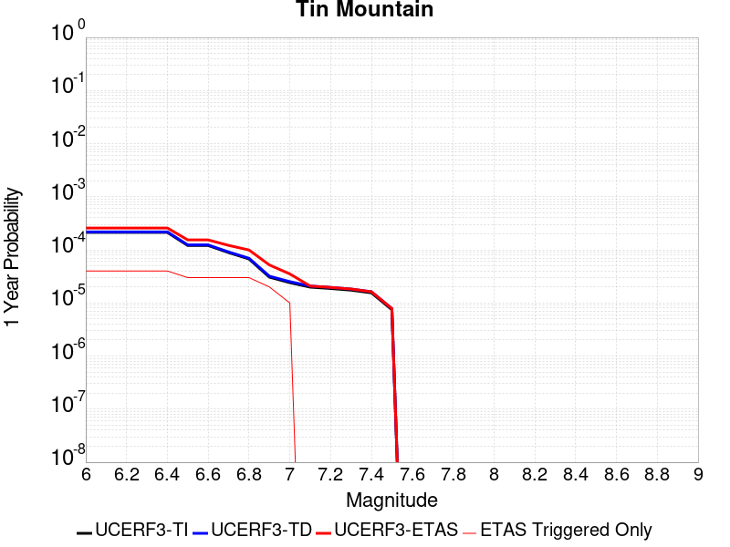 |  |

| Magnitude | 1 wk TI Prob | 1 wk TD Prob | 1 wk ETAS Prob | 1 wk ETAS/TD Gain | 1 wk ETAS Triggered Only | 1 mo TI Prob | 1 mo TD Prob | 1 mo ETAS Prob | 1 mo ETAS/TD Gain | 1 mo ETAS Triggered Only | 1 yr TI Prob | 1 yr TD Prob | 1 yr ETAS Prob | 1 yr ETAS/TD Gain | 1 yr ETAS Triggered Only | 10 yr TI Prob | 10 yr TD Prob | 10 yr ETAS Prob | 10 yr ETAS/TD Gain | 10 yr ETAS Triggered Only |
|-----|-----|-----|-----|-----|-----|-----|-----|-----|-----|-----|-----|-----|-----|-----|-----|-----|-----|-----|-----|-----|
| 6.0 | 4.083776E-6 | 4.1816165E-6 | 4.1816165E-6 | 1.0 | 0.0 | 1.750178E-5 | 1.7921111E-5 | 1.7921111E-5 | 1.0 | 0.0 | 2.1306332E-4 | 2.1817141E-4 | 3.3479126E-4 | 1.534533 | 1.1664528E-4 | 0.0021285915 | 0.002179938 | 0.002296329 | 1.0533919 | 1.1664528E-4 |
| 6.1 | 4.083776E-6 | 4.1816165E-6 | 4.1816165E-6 | 1.0 | 0.0 | 1.750178E-5 | 1.7921111E-5 | 1.7921111E-5 | 1.0 | 0.0 | 2.1306332E-4 | 2.1817141E-4 | 3.3479126E-4 | 1.534533 | 1.1664528E-4 | 0.0021285915 | 0.002179938 | 0.002296329 | 1.0533919 | 1.1664528E-4 |
| 6.2 | 4.083776E-6 | 4.1816165E-6 | 4.1816165E-6 | 1.0 | 0.0 | 1.750178E-5 | 1.7921111E-5 | 1.7921111E-5 | 1.0 | 0.0 | 2.1306332E-4 | 2.1817141E-4 | 3.3479126E-4 | 1.534533 | 1.1664528E-4 | 0.0021285915 | 0.002179938 | 0.002296329 | 1.0533919 | 1.1664528E-4 |
| 6.3 | 4.083776E-6 | 4.1816165E-6 | 4.1816165E-6 | 1.0 | 0.0 | 1.750178E-5 | 1.7921111E-5 | 1.7921111E-5 | 1.0 | 0.0 | 2.1306332E-4 | 2.1817141E-4 | 3.3479126E-4 | 1.534533 | 1.1664528E-4 | 0.0021285915 | 0.002179938 | 0.002296329 | 1.0533919 | 1.1664528E-4 |
| 6.4 | 4.083776E-6 | 4.1816165E-6 | 4.1816165E-6 | 1.0 | 0.0 | 1.750178E-5 | 1.7921111E-5 | 1.7921111E-5 | 1.0 | 0.0 | 2.1306332E-4 | 2.1817141E-4 | 3.3479126E-4 | 1.534533 | 1.1664528E-4 | 0.0021285915 | 0.002179938 | 0.002296329 | 1.0533919 | 1.1664528E-4 |
| 6.5 | 2.3143427E-6 | 2.3732055E-6 | 2.3732055E-6 | 1.0 | 0.0 | 9.9185745E-6 | 1.0170845E-5 | 1.0170845E-5 | 1.0 | 0.0 | 1.2075195E-4 | 1.2382377E-4 | 2.4045461E-4 | 1.9419099 | 1.1664528E-4 | 0.0012068636 | 0.0012376237 | 0.0013541246 | 1.0941328 | 1.1664528E-4 |
| 6.6 | 2.3143427E-6 | 2.3732055E-6 | 2.3732055E-6 | 1.0 | 0.0 | 9.9185745E-6 | 1.0170845E-5 | 1.0170845E-5 | 1.0 | 0.0 | 1.2075195E-4 | 1.2382377E-4 | 2.4045461E-4 | 1.9419099 | 1.1664528E-4 | 0.0012068636 | 0.0012376237 | 0.0013541246 | 1.0941328 | 1.1664528E-4 |
| 6.7 | 1.7029532E-6 | 1.74983E-6 | 1.74983E-6 | 1.0 | 0.0 | 7.2983503E-6 | 7.4992527E-6 | 7.4992527E-6 | 1.0 | 0.0 | 8.885379E-5 | 9.130011E-5 | 2.0793475E-4 | 2.277486 | 1.1664528E-4 | 8.881827E-4 | 9.1267866E-4 | 0.0010292175 | 1.1276888 | 1.1664528E-4 |
| 6.8 | 1.2914646E-6 | 1.3299696E-6 | 1.3299696E-6 | 1.0 | 0.0 | 5.534837E-6 | 5.6998597E-6 | 5.6998597E-6 | 1.0 | 0.0 | 6.738455E-5 | 6.9394024E-5 | 1.860312E-4 | 2.680796 | 1.1664528E-4 | 6.736412E-4 | 6.9376687E-4 | 8.1033126E-4 | 1.1680166 | 1.1664528E-4 |
| 6.9 | 5.8708974E-7 | 6.117198E-7 | 6.117198E-7 | 1.0 | 0.0 | 2.5160964E-6 | 2.621654E-6 | 2.621654E-6 | 1.0 | 0.0 | 3.0633044E-5 | 3.191821E-5 | 1.4855977E-4 | 4.654389 | 1.1664528E-4 | 3.0628822E-4 | 3.1914038E-4 | 4.3574843E-4 | 1.3653817 | 1.1664528E-4 |
| 7.0 | 4.6248786E-7 | 4.832188E-7 | 4.832188E-7 | 1.0 | 0.0 | 1.9820893E-6 | 2.0709363E-6 | 2.0709363E-6 | 1.0 | 0.0 | 2.413167E-5 | 2.5213394E-5 | 8.353456E-5 | 3.3131027 | 5.832264E-5 | 2.412905E-4 | 2.5210902E-4 | 3.1041697E-4 | 1.2312807 | 5.832264E-5 |
| 7.1 | 3.804606E-7 | 3.9872992E-7 | 3.9872992E-7 | 1.0 | 0.0 | 1.6305444E-6 | 1.7088416E-6 | 1.7088416E-6 | 1.0 | 0.0 | 1.9851697E-5 | 2.0804982E-5 | 2.0804982E-5 | 1.0 | 0.0 | 1.9849923E-4 | 2.0803371E-4 | 2.0803371E-4 | 1.0 | 0.0 |
| 7.2 | 3.5864858E-7 | 3.7618327E-7 | 3.7618327E-7 | 1.0 | 0.0 | 1.5370645E-6 | 1.6122132E-6 | 1.6122132E-6 | 1.0 | 0.0 | 1.87136E-5 | 1.9628553E-5 | 1.9628553E-5 | 1.0 | 0.0 | 1.8712023E-4 | 1.962715E-4 | 1.962715E-4 | 1.0 | 0.0 |
| 7.3 | 3.342063E-7 | 3.5064843E-7 | 3.5064843E-7 | 1.0 | 0.0 | 1.4323119E-6 | 1.5027783E-6 | 1.5027783E-6 | 1.0 | 0.0 | 1.7438259E-5 | 1.8296207E-5 | 1.8296207E-5 | 1.0 | 0.0 | 1.743689E-4 | 1.829503E-4 | 1.829503E-4 | 1.0 | 0.0 |
| 7.4 | 2.971242E-7 | 3.116703E-7 | 3.116703E-7 | 1.0 | 0.0 | 1.2733886E-6 | 1.3357294E-6 | 1.3357294E-6 | 1.0 | 0.0 | 1.5503398E-5 | 1.6262418E-5 | 1.6262418E-5 | 1.0 | 0.0 | 1.5502315E-4 | 1.6261556E-4 | 1.6261556E-4 | 1.0 | 0.0 |
| 7.5 | 1.4326713E-7 | 1.5013096E-7 | 1.5013096E-7 | 1.0 | 0.0 | 6.140018E-7 | 6.434184E-7 | 6.434184E-7 | 1.0 | 0.0 | 7.4754466E-6 | 7.833619E-6 | 7.833619E-6 | 1.0 | 0.0 | 7.475195E-5 | 7.833619E-5 | 7.833619E-5 | 1.0 | 0.0 |

## Rose Canyon
*[(top)](#table-of-contents)*

| 1 Week | 1 Month | 1 Year | 10 Year |
|-----|-----|-----|-----|
|  | 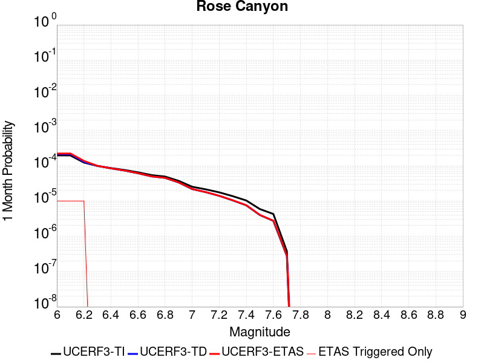 |  |  |

| Magnitude | 1 wk TI Prob | 1 wk TD Prob | 1 wk ETAS Prob | 1 wk ETAS/TD Gain | 1 wk ETAS Triggered Only | 1 mo TI Prob | 1 mo TD Prob | 1 mo ETAS Prob | 1 mo ETAS/TD Gain | 1 mo ETAS Triggered Only | 1 yr TI Prob | 1 yr TD Prob | 1 yr ETAS Prob | 1 yr ETAS/TD Gain | 1 yr ETAS Triggered Only | 10 yr TI Prob | 10 yr TD Prob | 10 yr ETAS Prob | 10 yr ETAS/TD Gain | 10 yr ETAS Triggered Only |
|-----|-----|-----|-----|-----|-----|-----|-----|-----|-----|-----|-----|-----|-----|-----|-----|-----|-----|-----|-----|-----|
| 6.0 | 4.5923203E-5 | 4.9786417E-5 | 4.9786417E-5 | 1.0 | 0.0 | 1.9679888E-4 | 2.1335426E-4 | 2.7166444E-4 | 1.2733022 | 5.832264E-5 | 0.0023933933 | 0.0025947057 | 0.002652877 | 1.0224192 | 5.832264E-5 | 0.023677798 | 0.025676824 | 0.025790475 | 1.0044261 | 1.1664528E-4 |
| 6.1 | 4.5923203E-5 | 4.9786417E-5 | 4.9786417E-5 | 1.0 | 0.0 | 1.9679888E-4 | 2.1335426E-4 | 2.7166444E-4 | 1.2733022 | 5.832264E-5 | 0.0023933933 | 0.0025947057 | 0.002652877 | 1.0224192 | 5.832264E-5 | 0.023677798 | 0.025676824 | 0.025790475 | 1.0044261 | 1.1664528E-4 |
| 6.2 | 2.8844734E-5 | 2.9735658E-5 | 2.9735658E-5 | 1.0 | 0.0 | 1.2361443E-4 | 1.274325E-4 | 1.8574772E-4 | 1.4576164 | 5.832264E-5 | 0.0015039665 | 0.0015504217 | 0.0016086539 | 1.0375589 | 5.832264E-5 | 0.0149382865 | 0.01540894 | 0.015523788 | 1.0074533 | 1.1664528E-4 |
| 6.3 | 2.3171577E-5 | 2.3227396E-5 | 2.3227396E-5 | 1.0 | 0.0 | 9.9302975E-5 | 9.954226E-5 | 9.954226E-5 | 1.0 | 0.0 | 0.0012083431 | 0.0012112667 | 0.0012112667 | 1.0 | 0.0 | 0.012017938 | 0.012056414 | 0.012114034 | 1.0047791 | 5.832264E-5 |
| 6.4 | 2.0066604E-5 | 1.9706875E-5 | 1.9706875E-5 | 1.0 | 0.0 | 8.599689E-5 | 8.445536E-5 | 8.445536E-5 | 1.0 | 0.0 | 0.0010465092 | 0.0010277691 | 0.0010277691 | 1.0 | 0.0 | 0.010415946 | 0.01023807 | 0.010295796 | 1.0056384 | 5.832264E-5 |
| 6.5 | 1.776989E-5 | 1.7137148E-5 | 1.7137148E-5 | 1.0 | 0.0 | 7.615444E-5 | 7.344289E-5 | 7.344289E-5 | 1.0 | 0.0 | 9.267859E-4 | 8.938074E-4 | 8.938074E-4 | 1.0 | 0.0 | 0.009229303 | 0.0089082485 | 0.008966052 | 1.0064887 | 5.832264E-5 |
| 6.6 | 1.5227364E-5 | 1.4346407E-5 | 1.4346407E-5 | 1.0 | 0.0 | 6.52585E-5 | 6.148318E-5 | 6.148318E-5 | 1.0 | 0.0 | 7.942326E-4 | 7.483059E-4 | 7.483059E-4 | 1.0 | 0.0 | 0.007914 | 0.0074620554 | 0.007519943 | 1.0077575 | 5.832264E-5 |
| 6.7 | 1.2703898E-5 | 1.1674333E-5 | 1.1674333E-5 | 1.0 | 0.0 | 5.4444143E-5 | 5.0031922E-5 | 5.0031922E-5 | 1.0 | 0.0 | 6.626558E-4 | 6.089726E-4 | 6.089726E-4 | 1.0 | 0.0 | 0.006606833 | 0.006075633 | 0.006075633 | 1.0 | 0.0 |
| 6.8 | 1.1554917E-5 | 1.0610226E-5 | 1.0610226E-5 | 1.0 | 0.0 | 4.9520135E-5 | 4.547163E-5 | 4.547163E-5 | 1.0 | 0.0 | 6.0274085E-4 | 5.5348047E-4 | 5.5348047E-4 | 1.0 | 0.0 | 0.0060110865 | 0.005523028 | 0.005523028 | 1.0 | 0.0 |
| 6.9 | 8.732078E-6 | 7.881901E-6 | 7.881901E-6 | 1.0 | 0.0 | 3.7422655E-5 | 3.3779157E-5 | 3.3779157E-5 | 1.0 | 0.0 | 4.5552556E-4 | 4.1118657E-4 | 4.1118657E-4 | 1.0 | 0.0 | 0.0045459294 | 0.00410509 | 0.00410509 | 1.0 | 0.0 |
| 7.0 | 5.9337494E-6 | 5.1077586E-6 | 5.1077586E-6 | 1.0 | 0.0 | 2.5430107E-5 | 2.1890211E-5 | 2.1890211E-5 | 1.0 | 0.0 | 3.0956755E-4 | 2.6648087E-4 | 2.6648087E-4 | 1.0 | 0.0 | 0.0030913667 | 0.0026616289 | 0.0026616289 | 1.0 | 0.0 |
| 7.1 | 5.013409E-6 | 4.1776E-6 | 4.1776E-6 | 1.0 | 0.0 | 2.1485863E-5 | 1.790388E-5 | 1.790388E-5 | 1.0 | 0.0 | 2.6155898E-4 | 2.1795803E-4 | 2.1795803E-4 | 1.0 | 0.0 | 0.0026125133 | 0.0021774543 | 0.0021774543 | 1.0 | 0.0 |
| 7.2 | 4.120763E-6 | 3.2823143E-6 | 3.2823143E-6 | 1.0 | 0.0 | 1.7660293E-5 | 1.4066986E-5 | 1.4066986E-5 | 1.0 | 0.0 | 2.1499286E-4 | 1.7125219E-4 | 1.7125219E-4 | 1.0 | 0.0 | 0.0021478499 | 0.0017112117 | 0.0017112117 | 1.0 | 0.0 |
| 7.3 | 3.2081239E-6 | 2.4406713E-6 | 2.4406713E-6 | 1.0 | 0.0 | 1.374903E-5 | 1.04599785E-5 | 1.04599785E-5 | 1.0 | 0.0 | 1.6738157E-4 | 1.2734286E-4 | 1.2734286E-4 | 1.0 | 0.0 | 0.0016725556 | 0.001272706 | 0.001272706 | 1.0 | 0.0 |
| 7.4 | 2.4194755E-6 | 1.7681652E-6 | 1.7681652E-6 | 1.0 | 0.0 | 1.0369139E-5 | 7.5778294E-6 | 7.5778294E-6 | 1.0 | 0.0 | 1.2623696E-4 | 9.2256225E-5 | 9.2256225E-5 | 1.0 | 0.0 | 0.0012616527 | 9.2218455E-4 | 9.2218455E-4 | 1.0 | 0.0 |
| 7.5 | 1.3842889E-6 | 9.3792875E-7 | 9.3792875E-7 | 1.0 | 0.0 | 5.9326535E-6 | 4.0196887E-6 | 4.0196887E-6 | 1.0 | 0.0 | 7.222766E-5 | 4.8938644E-5 | 4.8938644E-5 | 1.0 | 0.0 | 7.220419E-4 | 4.892822E-4 | 4.892822E-4 | 1.0 | 0.0 |
| 7.6 | 1.0021575E-6 | 6.411976E-7 | 6.411976E-7 | 1.0 | 0.0 | 4.2949537E-6 | 2.7479869E-6 | 2.7479869E-6 | 1.0 | 0.0 | 5.2289808E-5 | 3.3456246E-5 | 3.3456246E-5 | 1.0 | 0.0 | 5.2277505E-4 | 3.3451425E-4 | 3.3451425E-4 | 1.0 | 0.0 |
| 7.7 | 8.7620116E-8 | 6.449501E-8 | 6.449501E-8 | 1.0 | 0.0 | 3.7551473E-7 | 2.7640718E-7 | 2.7640718E-7 | 1.0 | 0.0 | 4.5718825E-6 | 3.3652523E-6 | 3.3652523E-6 | 1.0 | 0.0 | 4.5717883E-5 | 3.3652042E-5 | 3.3652042E-5 | 1.0 | 0.0 |

## Great Valley 09 (Laguna Seca)
*[(top)](#table-of-contents)*

| 1 Week | 1 Month | 1 Year | 10 Year |
|-----|-----|-----|-----|
|  |  |  |  |

| Magnitude | 1 wk TI Prob | 1 wk TD Prob | 1 wk ETAS Prob | 1 wk ETAS/TD Gain | 1 wk ETAS Triggered Only | 1 mo TI Prob | 1 mo TD Prob | 1 mo ETAS Prob | 1 mo ETAS/TD Gain | 1 mo ETAS Triggered Only | 1 yr TI Prob | 1 yr TD Prob | 1 yr ETAS Prob | 1 yr ETAS/TD Gain | 1 yr ETAS Triggered Only | 10 yr TI Prob | 10 yr TD Prob | 10 yr ETAS Prob | 10 yr ETAS/TD Gain | 10 yr ETAS Triggered Only |
|-----|-----|-----|-----|-----|-----|-----|-----|-----|-----|-----|-----|-----|-----|-----|-----|-----|-----|-----|-----|-----|
| 6.0 | 5.4353277E-5 | 7.051924E-5 | 7.051924E-5 | 1.0 | 0.0 | 2.3292181E-4 | 3.0219252E-4 | 3.0219252E-4 | 1.0 | 0.0 | 0.0028321352 | 0.0036730492 | 0.0037311576 | 1.0158203 | 5.832264E-5 | 0.02796312 | 0.036124118 | 0.03623655 | 1.0031123 | 1.1664528E-4 |
| 6.1 | 4.5578287E-5 | 5.8234225E-5 | 5.8234225E-5 | 1.0 | 0.0 | 1.953209E-4 | 2.4955295E-4 | 2.4955295E-4 | 1.0 | 0.0 | 0.0023754383 | 0.0030341437 | 0.0030922892 | 1.0191637 | 5.832264E-5 | 0.023502063 | 0.029926501 | 0.030039655 | 1.0037811 | 1.1664528E-4 |
| 6.2 | 2.8536782E-5 | 3.4743083E-5 | 3.4743083E-5 | 1.0 | 0.0 | 1.2229476E-4 | 1.488909E-4 | 1.488909E-4 | 1.0 | 0.0 | 0.0014879217 | 0.0018112023 | 0.0018694192 | 1.0321428 | 5.832264E-5 | 0.014779986 | 0.017961899 | 0.01807645 | 1.0063773 | 1.1664528E-4 |
| 6.3 | 2.3698774E-5 | 2.8217251E-5 | 2.8217251E-5 | 1.0 | 0.0 | 1.01562226E-4 | 1.2092581E-4 | 1.2092581E-4 | 1.0 | 0.0 | 0.0012358186 | 0.0014713336 | 0.0014713336 | 1.0 | 0.0 | 0.012289686 | 0.014614282 | 0.014671752 | 1.0039325 | 5.832264E-5 |
| 6.4 | 1.9191197E-5 | 2.2125403E-5 | 2.2125403E-5 | 1.0 | 0.0 | 8.2245395E-5 | 9.481996E-5 | 9.481996E-5 | 1.0 | 0.0 | 0.0010008777 | 0.0011538648 | 0.0011538648 | 1.0 | 0.0 | 0.009963818 | 0.011479095 | 0.011536747 | 1.0050224 | 5.832264E-5 |
| 6.5 | 1.5203241E-5 | 1.680298E-5 | 1.680298E-5 | 1.0 | 0.0 | 6.5155116E-5 | 7.201096E-5 | 7.201096E-5 | 1.0 | 0.0 | 7.9297484E-4 | 8.7641284E-4 | 8.7641284E-4 | 1.0 | 0.0 | 0.007901512 | 0.008730978 | 0.0087887915 | 1.0066216 | 5.832264E-5 |
| 6.6 | 1.0984925E-5 | 1.1244052E-5 | 1.1244052E-5 | 1.0 | 0.0 | 4.70774E-5 | 4.818793E-5 | 4.818793E-5 | 1.0 | 0.0 | 5.730166E-4 | 5.865342E-4 | 5.865342E-4 | 1.0 | 0.0 | 0.005715413 | 0.005850259 | 0.005850259 | 1.0 | 0.0 |
| 6.7 | 9.134616E-6 | 9.021031E-6 | 9.021031E-6 | 1.0 | 0.0 | 3.9147766E-5 | 3.8660997E-5 | 3.8660997E-5 | 1.0 | 0.0 | 4.7651984E-4 | 4.7059837E-4 | 4.7059837E-4 | 1.0 | 0.0 | 0.004754993 | 0.0046962635 | 0.0046962635 | 1.0 | 0.0 |
| 6.8 | 7.785589E-6 | 7.4528775E-6 | 7.4528775E-6 | 1.0 | 0.0 | 3.3366385E-5 | 3.1940526E-5 | 3.1940526E-5 | 1.0 | 0.0 | 4.0616E-4 | 3.8880852E-4 | 3.8880852E-4 | 1.0 | 0.0 | 0.0040541845 | 0.0038814866 | 0.0038814866 | 1.0 | 0.0 |
| 6.9 | 5.579095E-6 | 4.899106E-6 | 4.899106E-6 | 1.0 | 0.0 | 2.3910188E-5 | 2.0996007E-5 | 2.0996007E-5 | 1.0 | 0.0 | 2.9106764E-4 | 2.5559778E-4 | 2.5559778E-4 | 1.0 | 0.0 | 0.002906867 | 0.0025531754 | 0.0025531754 | 1.0 | 0.0 |
| 7.0 | 2.6816688E-6 | 1.521781E-6 | 1.521781E-6 | 1.0 | 0.0 | 1.1492816E-5 | 6.5219024E-6 | 6.5219024E-6 | 1.0 | 0.0 | 1.3991605E-4 | 7.940136E-5 | 7.940136E-5 | 1.0 | 0.0 | 0.0013982799 | 7.9373864E-4 | 7.9373864E-4 | 1.0 | 0.0 |
| 7.1 | 1.9951021E-6 | 7.4547023E-7 | 7.4547023E-7 | 1.0 | 0.0 | 8.55041E-6 | 3.194869E-6 | 3.194869E-6 | 1.0 | 0.0 | 1.0409627E-4 | 3.8896877E-5 | 3.8896877E-5 | 1.0 | 0.0 | 0.0010404752 | 3.8890482E-4 | 3.8890482E-4 | 1.0 | 0.0 |
| 7.2 | 1.9951021E-6 | 7.4547023E-7 | 7.4547023E-7 | 1.0 | 0.0 | 8.55041E-6 | 3.194869E-6 | 3.194869E-6 | 1.0 | 0.0 | 1.0409627E-4 | 3.8896877E-5 | 3.8896877E-5 | 1.0 | 0.0 | 0.0010404752 | 3.8890482E-4 | 3.8890482E-4 | 1.0 | 0.0 |
| 7.3 | 1.7087556E-6 | 6.5796127E-7 | 6.5796127E-7 | 1.0 | 0.0 | 7.3232177E-6 | 2.8198313E-6 | 2.8198313E-6 | 1.0 | 0.0 | 8.915652E-5 | 3.4330944E-5 | 3.4330944E-5 | 1.0 | 0.0 | 8.9120766E-4 | 3.4326047E-4 | 3.4326047E-4 | 1.0 | 0.0 |
| 7.4 | 1.3804846E-6 | 6.074456E-7 | 6.074456E-7 | 1.0 | 0.0 | 5.916349E-6 | 2.603336E-6 | 2.603336E-6 | 1.0 | 0.0 | 7.2029165E-5 | 3.1695196E-5 | 3.1695196E-5 | 1.0 | 0.0 | 7.200583E-4 | 3.1691077E-4 | 3.1691077E-4 | 1.0 | 0.0 |
| 7.5 | 1.3804846E-6 | 6.074456E-7 | 6.074456E-7 | 1.0 | 0.0 | 5.916349E-6 | 2.603336E-6 | 2.603336E-6 | 1.0 | 0.0 | 7.2029165E-5 | 3.1695196E-5 | 3.1695196E-5 | 1.0 | 0.0 | 7.200583E-4 | 3.1691077E-4 | 3.1691077E-4 | 1.0 | 0.0 |

## Ventura-Pitas Point
*[(top)](#table-of-contents)*

| 1 Week | 1 Month | 1 Year | 10 Year |
|-----|-----|-----|-----|
|  |  |  |  |

| Magnitude | 1 wk TI Prob | 1 wk TD Prob | 1 wk ETAS Prob | 1 wk ETAS/TD Gain | 1 wk ETAS Triggered Only | 1 mo TI Prob | 1 mo TD Prob | 1 mo ETAS Prob | 1 mo ETAS/TD Gain | 1 mo ETAS Triggered Only | 1 yr TI Prob | 1 yr TD Prob | 1 yr ETAS Prob | 1 yr ETAS/TD Gain | 1 yr ETAS Triggered Only | 10 yr TI Prob | 10 yr TD Prob | 10 yr ETAS Prob | 10 yr ETAS/TD Gain | 10 yr ETAS Triggered Only |
|-----|-----|-----|-----|-----|-----|-----|-----|-----|-----|-----|-----|-----|-----|-----|-----|-----|-----|-----|-----|-----|
| 6.0 | 3.3179622E-5 | 3.3740303E-5 | 3.3740303E-5 | 1.0 | 0.0 | 1.4219063E-4 | 1.4459473E-4 | 1.4459473E-4 | 1.0 | 0.0 | 0.0017297962 | 0.0017592763 | 0.0017592763 | 1.0 | 0.0 | 0.017163932 | 0.017479032 | 0.017593637 | 1.0065567 | 1.1664528E-4 |
| 6.1 | 3.3179622E-5 | 3.3740303E-5 | 3.3740303E-5 | 1.0 | 0.0 | 1.4219063E-4 | 1.4459473E-4 | 1.4459473E-4 | 1.0 | 0.0 | 0.0017297962 | 0.0017592763 | 0.0017592763 | 1.0 | 0.0 | 0.017163932 | 0.017479032 | 0.017593637 | 1.0065567 | 1.1664528E-4 |
| 6.2 | 3.3179622E-5 | 3.3740303E-5 | 3.3740303E-5 | 1.0 | 0.0 | 1.4219063E-4 | 1.4459473E-4 | 1.4459473E-4 | 1.0 | 0.0 | 0.0017297962 | 0.0017592763 | 0.0017592763 | 1.0 | 0.0 | 0.017163932 | 0.017479032 | 0.017593637 | 1.0065567 | 1.1664528E-4 |
| 6.3 | 3.3179622E-5 | 3.3740303E-5 | 3.3740303E-5 | 1.0 | 0.0 | 1.4219063E-4 | 1.4459473E-4 | 1.4459473E-4 | 1.0 | 0.0 | 0.0017297962 | 0.0017592763 | 0.0017592763 | 1.0 | 0.0 | 0.017163932 | 0.017479032 | 0.017593637 | 1.0065567 | 1.1664528E-4 |
| 6.4 | 1.8754668E-5 | 1.702261E-5 | 1.702261E-5 | 1.0 | 0.0 | 8.037467E-5 | 7.2952134E-5 | 7.2952134E-5 | 1.0 | 0.0 | 9.781223E-4 | 8.8785344E-4 | 8.8785344E-4 | 1.0 | 0.0 | 0.009738282 | 0.0088454 | 0.0088454 | 1.0 | 0.0 |
| 6.5 | 1.8754668E-5 | 1.702261E-5 | 1.702261E-5 | 1.0 | 0.0 | 8.037467E-5 | 7.2952134E-5 | 7.2952134E-5 | 1.0 | 0.0 | 9.781223E-4 | 8.8785344E-4 | 8.8785344E-4 | 1.0 | 0.0 | 0.009738282 | 0.0088454 | 0.0088454 | 1.0 | 0.0 |
| 6.6 | 1.4361558E-5 | 1.2124828E-5 | 1.2124828E-5 | 1.0 | 0.0 | 6.154808E-5 | 5.1962525E-5 | 5.1962525E-5 | 1.0 | 0.0 | 7.490902E-4 | 6.324624E-4 | 6.324624E-4 | 1.0 | 0.0 | 0.0074657016 | 0.006306881 | 0.006306881 | 1.0 | 0.0 |
| 6.7 | 1.4361558E-5 | 1.2124828E-5 | 1.2124828E-5 | 1.0 | 0.0 | 6.154808E-5 | 5.1962525E-5 | 5.1962525E-5 | 1.0 | 0.0 | 7.490902E-4 | 6.324624E-4 | 6.324624E-4 | 1.0 | 0.0 | 0.0074657016 | 0.006306881 | 0.006306881 | 1.0 | 0.0 |
| 6.8 | 1.3663846E-5 | 1.13469E-5 | 1.13469E-5 | 1.0 | 0.0 | 5.8558027E-5 | 4.8628674E-5 | 4.8628674E-5 | 1.0 | 0.0 | 7.127108E-4 | 5.918952E-4 | 5.918952E-4 | 1.0 | 0.0 | 0.007104293 | 0.0059034033 | 0.0059034033 | 1.0 | 0.0 |
| 6.9 | 1.3644157E-5 | 1.1324998E-5 | 1.1324998E-5 | 1.0 | 0.0 | 5.8473648E-5 | 4.8534814E-5 | 4.8534814E-5 | 1.0 | 0.0 | 7.116841E-4 | 5.907531E-4 | 5.907531E-4 | 1.0 | 0.0 | 0.007094092 | 0.005892043 | 0.005892043 | 1.0 | 0.0 |
| 7.0 | 1.3568845E-5 | 1.1244556E-5 | 1.1244556E-5 | 1.0 | 0.0 | 5.8150898E-5 | 4.8190075E-5 | 4.8190075E-5 | 1.0 | 0.0 | 7.077572E-4 | 5.865582E-4 | 5.865582E-4 | 1.0 | 0.0 | 0.007055073 | 0.005850315 | 0.005850315 | 1.0 | 0.0 |
| 7.1 | 1.306572E-5 | 1.0722955E-5 | 1.0722955E-5 | 1.0 | 0.0 | 5.599474E-5 | 4.5954726E-5 | 4.5954726E-5 | 1.0 | 0.0 | 6.815227E-4 | 5.59357E-4 | 5.59357E-4 | 1.0 | 0.0 | 0.0067943637 | 0.005579696 | 0.005579696 | 1.0 | 0.0 |
| 7.2 | 1.232604E-5 | 9.9974595E-6 | 9.9974595E-6 | 1.0 | 0.0 | 5.2824813E-5 | 4.284556E-5 | 4.284556E-5 | 1.0 | 0.0 | 6.429523E-4 | 5.215216E-4 | 5.215216E-4 | 1.0 | 0.0 | 0.0064109527 | 0.0052031693 | 0.0052031693 | 1.0 | 0.0 |
| 7.3 | 1.0917261E-5 | 8.844676E-6 | 8.844676E-6 | 1.0 | 0.0 | 4.678742E-5 | 3.790521E-5 | 3.790521E-5 | 1.0 | 0.0 | 5.69488E-4 | 4.613998E-4 | 4.613998E-4 | 1.0 | 0.0 | 0.0056803077 | 0.004604584 | 0.004604584 | 1.0 | 0.0 |
| 7.4 | 1.039959E-5 | 8.424341E-6 | 8.424341E-6 | 1.0 | 0.0 | 4.456891E-5 | 3.610383E-5 | 3.610383E-5 | 1.0 | 0.0 | 5.424914E-4 | 4.3947698E-4 | 4.3947698E-4 | 1.0 | 0.0 | 0.0054116896 | 0.0043862406 | 0.0043862406 | 1.0 | 0.0 |
| 7.5 | 9.015877E-6 | 7.2981265E-6 | 7.2981265E-6 | 1.0 | 0.0 | 3.86389E-5 | 3.127732E-5 | 3.127732E-5 | 1.0 | 0.0 | 4.7032707E-4 | 3.807362E-4 | 3.807362E-4 | 1.0 | 0.0 | 0.004693329 | 0.0038009842 | 0.0038009842 | 1.0 | 0.0 |
| 7.6 | 4.900162E-6 | 3.8743474E-6 | 3.8743474E-6 | 1.0 | 0.0 | 2.1000526E-5 | 1.6604241E-5 | 1.6604241E-5 | 1.0 | 0.0 | 2.556514E-4 | 2.02138E-4 | 2.02138E-4 | 1.0 | 0.0 | 0.0025535747 | 0.002019555 | 0.002019555 | 1.0 | 0.0 |
| 7.7 | 3.8850626E-6 | 3.1269049E-6 | 3.1269049E-6 | 1.0 | 0.0 | 1.6650163E-5 | 1.3400952E-5 | 1.3400952E-5 | 1.0 | 0.0 | 2.0269687E-4 | 1.6314448E-4 | 1.6314448E-4 | 1.0 | 0.0 | 0.002025121 | 0.0016302564 | 0.0016302564 | 1.0 | 0.0 |
| 7.8 | 2.4654719E-6 | 2.02998E-6 | 2.02998E-6 | 1.0 | 0.0 | 1.0566265E-5 | 8.699884E-6 | 8.699884E-6 | 1.0 | 0.0 | 1.2863669E-4 | 1.0591599E-4 | 1.0591599E-4 | 1.0 | 0.0 | 0.0012856225 | 0.0010586599 | 0.0010586599 | 1.0 | 0.0 |
| 7.9 | 4.095894E-7 | 3.2766837E-7 | 3.2766837E-7 | 1.0 | 0.0 | 1.7553821E-6 | 1.4042923E-6 | 1.4042923E-6 | 1.0 | 0.0 | 2.1371567E-5 | 1.7097129E-5 | 1.7097129E-5 | 1.0 | 0.0 | 2.1369511E-4 | 1.7095843E-4 | 1.7095843E-4 | 1.0 | 0.0 |
| 8.0 | 7.791402E-9 | 5.683834E-9 | 5.683834E-9 | 1.0 | 0.0 | 3.3391725E-8 | 2.4359288E-8 | 2.4359288E-8 | 1.0 | 0.0 | 4.0654416E-7 | 2.965743E-7 | 2.965743E-7 | 1.0 | 0.0 | 4.065434E-6 | 2.9657413E-6 | 2.9657413E-6 | 1.0 | 0.0 |

## Cleghorn Lake
*[(top)](#table-of-contents)*

| 1 Week | 1 Month | 1 Year | 10 Year |
|-----|-----|-----|-----|
|  |  | 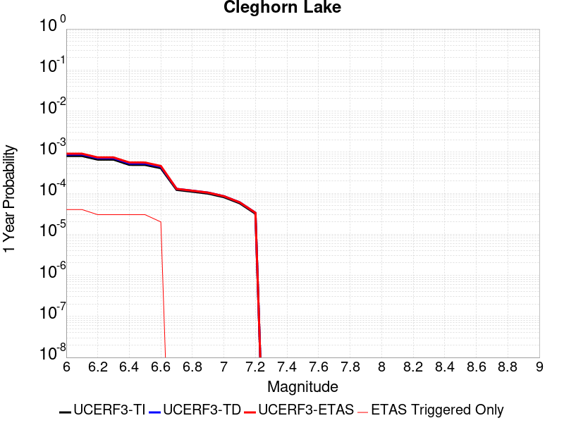 |  |

| Magnitude | 1 wk TI Prob | 1 wk TD Prob | 1 wk ETAS Prob | 1 wk ETAS/TD Gain | 1 wk ETAS Triggered Only | 1 mo TI Prob | 1 mo TD Prob | 1 mo ETAS Prob | 1 mo ETAS/TD Gain | 1 mo ETAS Triggered Only | 1 yr TI Prob | 1 yr TD Prob | 1 yr ETAS Prob | 1 yr ETAS/TD Gain | 1 yr ETAS Triggered Only | 10 yr TI Prob | 10 yr TD Prob | 10 yr ETAS Prob | 10 yr ETAS/TD Gain | 10 yr ETAS Triggered Only |
|-----|-----|-----|-----|-----|-----|-----|-----|-----|-----|-----|-----|-----|-----|-----|-----|-----|-----|-----|-----|-----|
| 6.0 | 1.5467183E-5 | 1.6795355E-5 | 1.6795355E-5 | 1.0 | 0.0 | 6.6286244E-5 | 7.1978415E-5 | 7.1978415E-5 | 1.0 | 0.0 | 8.067362E-4 | 8.7603973E-4 | 8.7603973E-4 | 1.0 | 0.0 | 0.008038137 | 0.008731292 | 0.008789104 | 1.0066214 | 5.832264E-5 |
| 6.1 | 1.5467183E-5 | 1.6795355E-5 | 1.6795355E-5 | 1.0 | 0.0 | 6.6286244E-5 | 7.1978415E-5 | 7.1978415E-5 | 1.0 | 0.0 | 8.067362E-4 | 8.7603973E-4 | 8.7603973E-4 | 1.0 | 0.0 | 0.008038137 | 0.008731292 | 0.008789104 | 1.0066214 | 5.832264E-5 |
| 6.2 | 1.2624631E-5 | 1.3682459E-5 | 1.3682459E-5 | 1.0 | 0.0 | 5.410444E-5 | 5.863807E-5 | 5.863807E-5 | 1.0 | 0.0 | 6.585225E-4 | 7.137333E-4 | 7.137333E-4 | 1.0 | 0.0 | 0.0065657445 | 0.0071192067 | 0.007177114 | 1.008134 | 5.832264E-5 |
| 6.3 | 1.2624631E-5 | 1.3682459E-5 | 1.3682459E-5 | 1.0 | 0.0 | 5.410444E-5 | 5.863807E-5 | 5.863807E-5 | 1.0 | 0.0 | 6.585225E-4 | 7.137333E-4 | 7.137333E-4 | 1.0 | 0.0 | 0.0065657445 | 0.0071192067 | 0.007177114 | 1.008134 | 5.832264E-5 |
| 6.4 | 9.417684E-6 | 1.0170767E-5 | 1.0170767E-5 | 1.0 | 0.0 | 4.036088E-5 | 4.3588505E-5 | 4.3588505E-5 | 1.0 | 0.0 | 4.912829E-4 | 5.3060194E-4 | 5.3060194E-4 | 1.0 | 0.0 | 0.004901982 | 0.005297387 | 0.005297387 | 1.0 | 0.0 |
| 6.5 | 9.368219E-6 | 1.0118191E-5 | 1.0118191E-5 | 1.0 | 0.0 | 4.014889E-5 | 4.3363187E-5 | 4.3363187E-5 | 1.0 | 0.0 | 4.8870314E-4 | 5.2786E-4 | 5.2786E-4 | 1.0 | 0.0 | 0.004876298 | 0.005270098 | 0.005270098 | 1.0 | 0.0 |
| 6.6 | 7.803798E-6 | 8.442383E-6 | 8.442383E-6 | 1.0 | 0.0 | 3.3444423E-5 | 3.618136E-5 | 3.618136E-5 | 1.0 | 0.0 | 4.0710976E-4 | 4.4045897E-4 | 4.4045897E-4 | 1.0 | 0.0 | 0.0040636472 | 0.0043997774 | 0.0043997774 | 1.0 | 0.0 |
| 6.7 | 2.3108669E-6 | 2.4439457E-6 | 2.4439457E-6 | 1.0 | 0.0 | 9.903678E-6 | 1.0474012E-5 | 1.0474012E-5 | 1.0 | 0.0 | 1.205706E-4 | 1.2751382E-4 | 1.2751382E-4 | 1.0 | 0.0 | 0.001205052 | 0.0012744252 | 0.0012744252 | 1.0 | 0.0 |
| 6.8 | 2.0882828E-6 | 2.2063814E-6 | 2.2063814E-6 | 1.0 | 0.0 | 8.949753E-6 | 9.455887E-6 | 9.455887E-6 | 1.0 | 0.0 | 1.08957785E-4 | 1.1511952E-4 | 1.1511952E-4 | 1.0 | 0.0 | 0.0010890438 | 0.0011506156 | 0.0011506156 | 1.0 | 0.0 |
| 6.9 | 1.876935E-6 | 1.9811384E-6 | 1.9811384E-6 | 1.0 | 0.0 | 8.043982E-6 | 8.490567E-6 | 8.490567E-6 | 1.0 | 0.0 | 9.7931086E-5 | 1.0336791E-4 | 1.0336791E-4 | 1.0 | 0.0 | 9.788794E-4 | 0.0010332143 | 0.0010332143 | 1.0 | 0.0 |
| 7.0 | 1.5357559E-6 | 1.6203517E-6 | 1.6203517E-6 | 1.0 | 0.0 | 6.5817944E-6 | 6.9443468E-6 | 6.9443468E-6 | 1.0 | 0.0 | 8.01304E-5 | 8.454427E-5 | 8.454427E-5 | 1.0 | 0.0 | 8.010151E-4 | 8.451335E-4 | 8.451335E-4 | 1.0 | 0.0 |
| 7.1 | 1.0905424E-6 | 1.1498116E-6 | 1.1498116E-6 | 1.0 | 0.0 | 4.6737446E-6 | 4.9277555E-6 | 4.9277555E-6 | 1.0 | 0.0 | 5.6901354E-5 | 5.9993872E-5 | 5.9993872E-5 | 1.0 | 0.0 | 5.6886784E-4 | 5.997865E-4 | 5.997865E-4 | 1.0 | 0.0 |
| 7.2 | 6.06668E-7 | 6.387546E-7 | 6.387546E-7 | 1.0 | 0.0 | 2.600003E-6 | 2.7375172E-6 | 2.7375172E-6 | 1.0 | 0.0 | 3.1654577E-5 | 3.3328834E-5 | 3.3328834E-5 | 1.0 | 0.0 | 3.1650066E-4 | 3.332452E-4 | 3.332452E-4 | 1.0 | 0.0 |

## San Pedro Basin
*[(top)](#table-of-contents)*

| 1 Week | 1 Month | 1 Year | 10 Year |
|-----|-----|-----|-----|
|  |  | 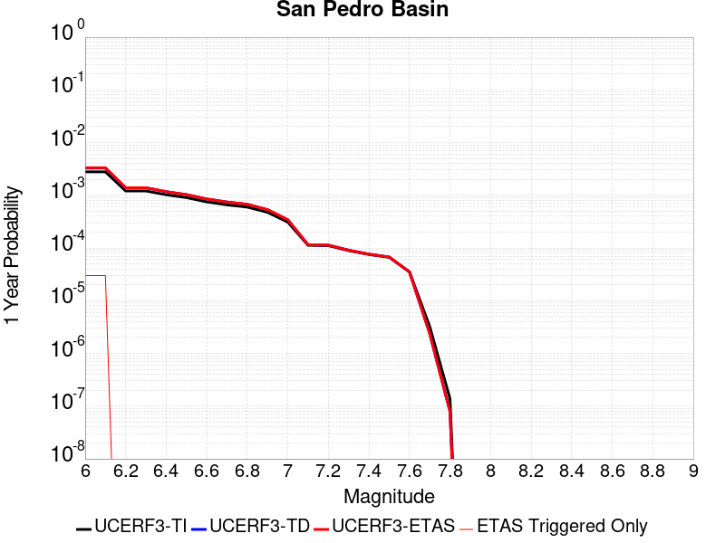 |  |

| Magnitude | 1 wk TI Prob | 1 wk TD Prob | 1 wk ETAS Prob | 1 wk ETAS/TD Gain | 1 wk ETAS Triggered Only | 1 mo TI Prob | 1 mo TD Prob | 1 mo ETAS Prob | 1 mo ETAS/TD Gain | 1 mo ETAS Triggered Only | 1 yr TI Prob | 1 yr TD Prob | 1 yr ETAS Prob | 1 yr ETAS/TD Gain | 1 yr ETAS Triggered Only | 10 yr TI Prob | 10 yr TD Prob | 10 yr ETAS Prob | 10 yr ETAS/TD Gain | 10 yr ETAS Triggered Only |
|-----|-----|-----|-----|-----|-----|-----|-----|-----|-----|-----|-----|-----|-----|-----|-----|-----|-----|-----|-----|-----|
| 6.0 | 5.3449043E-5 | 6.337907E-5 | 6.337907E-5 | 1.0 | 0.0 | 2.2904722E-4 | 2.715995E-4 | 3.2990632E-4 | 1.2146794 | 5.832264E-5 | 0.0027850836 | 0.0033023204 | 0.0034185806 | 1.0352056 | 1.1664528E-4 | 0.027504366 | 0.03259424 | 0.032707084 | 1.0034621 | 1.1664528E-4 |
| 6.1 | 5.3449043E-5 | 6.337907E-5 | 6.337907E-5 | 1.0 | 0.0 | 2.2904722E-4 | 2.715995E-4 | 3.2990632E-4 | 1.2146794 | 5.832264E-5 | 0.0027850836 | 0.0033023204 | 0.0034185806 | 1.0352056 | 1.1664528E-4 | 0.027504366 | 0.03259424 | 0.032707084 | 1.0034621 | 1.1664528E-4 |
| 6.2 | 2.3189454E-5 | 2.6646023E-5 | 2.6646023E-5 | 1.0 | 0.0 | 9.9379584E-5 | 1.1419251E-4 | 1.1419251E-4 | 1.0 | 0.0 | 0.0012092749 | 0.0013894546 | 0.0013894546 | 1.0 | 0.0 | 0.012027155 | 0.013812544 | 0.013812544 | 1.0 | 0.0 |
| 6.3 | 2.3189454E-5 | 2.6646023E-5 | 2.6646023E-5 | 1.0 | 0.0 | 9.9379584E-5 | 1.1419251E-4 | 1.1419251E-4 | 1.0 | 0.0 | 0.0012092749 | 0.0013894546 | 0.0013894546 | 1.0 | 0.0 | 0.012027155 | 0.013812544 | 0.013812544 | 1.0 | 0.0 |
| 6.4 | 1.966056E-5 | 2.2466023E-5 | 2.2466023E-5 | 1.0 | 0.0 | 8.425682E-5 | 9.627963E-5 | 9.627963E-5 | 1.0 | 0.0 | 0.001025344 | 0.0011716144 | 0.0011716144 | 1.0 | 0.0 | 0.010206259 | 0.011658464 | 0.011658464 | 1.0 | 0.0 |
| 6.5 | 1.7342953E-5 | 1.9747386E-5 | 1.9747386E-5 | 1.0 | 0.0 | 7.4324824E-5 | 8.4629115E-5 | 8.4629115E-5 | 1.0 | 0.0 | 9.04529E-4 | 0.0010299094 | 0.0010299094 | 1.0 | 0.0 | 0.009008561 | 0.010255087 | 0.010255087 | 1.0 | 0.0 |
| 6.6 | 1.439804E-5 | 1.632451E-5 | 1.632451E-5 | 1.0 | 0.0 | 6.170443E-5 | 6.996049E-5 | 6.996049E-5 | 1.0 | 0.0 | 7.509924E-4 | 8.5146824E-4 | 8.5146824E-4 | 1.0 | 0.0 | 0.0074845953 | 0.008485261 | 0.008485261 | 1.0 | 0.0 |
| 6.7 | 1.2634884E-5 | 1.4286838E-5 | 1.4286838E-5 | 1.0 | 0.0 | 5.414838E-5 | 6.122804E-5 | 6.122804E-5 | 1.0 | 0.0 | 6.590571E-4 | 7.452269E-4 | 7.452269E-4 | 1.0 | 0.0 | 0.006571059 | 0.0074303006 | 0.0074303006 | 1.0 | 0.0 |
| 6.8 | 1.146091E-5 | 1.293457E-5 | 1.293457E-5 | 1.0 | 0.0 | 4.911726E-5 | 5.543286E-5 | 5.543286E-5 | 1.0 | 0.0 | 5.9783855E-4 | 6.7471585E-4 | 6.7471585E-4 | 1.0 | 0.0 | 0.0059623276 | 0.0067296145 | 0.0067296145 | 1.0 | 0.0 |
| 6.9 | 9.109035E-6 | 1.0236074E-5 | 1.0236074E-5 | 1.0 | 0.0 | 3.9038136E-5 | 4.3868306E-5 | 4.3868306E-5 | 1.0 | 0.0 | 4.7518566E-4 | 5.3399376E-4 | 5.3399376E-4 | 1.0 | 0.0 | 0.0047417083 | 0.005329861 | 0.005329861 | 1.0 | 0.0 |
| 7.0 | 5.9351028E-6 | 6.5845884E-6 | 6.5845884E-6 | 1.0 | 0.0 | 2.5435906E-5 | 2.8219492E-5 | 2.8219492E-5 | 1.0 | 0.0 | 3.0963816E-4 | 3.435418E-4 | 3.435418E-4 | 1.0 | 0.0 | 0.0030920706 | 0.0034324245 | 0.0034324245 | 1.0 | 0.0 |
| 7.1 | 2.1557585E-6 | 2.2097242E-6 | 2.2097242E-6 | 1.0 | 0.0 | 9.238933E-6 | 9.470214E-6 | 9.470214E-6 | 1.0 | 0.0 | 1.1247819E-4 | 1.152939E-4 | 1.152939E-4 | 1.0 | 0.0 | 0.0011242128 | 0.0011523562 | 0.0011523562 | 1.0 | 0.0 |
| 7.2 | 2.1251979E-6 | 2.1780695E-6 | 2.1780695E-6 | 1.0 | 0.0 | 9.107958E-6 | 9.334552E-6 | 9.334552E-6 | 1.0 | 0.0 | 1.1088375E-4 | 1.1364239E-4 | 1.1364239E-4 | 1.0 | 0.0 | 0.0011082845 | 0.0011358581 | 0.0011358581 | 1.0 | 0.0 |
| 7.3 | 1.7145798E-6 | 1.7443432E-6 | 1.7443432E-6 | 1.0 | 0.0 | 7.3481783E-6 | 7.4757354E-6 | 7.4757354E-6 | 1.0 | 0.0 | 8.94604E-5 | 9.101337E-5 | 9.101337E-5 | 1.0 | 0.0 | 8.9424395E-4 | 9.097701E-4 | 9.097701E-4 | 1.0 | 0.0 |
| 7.4 | 1.4467993E-6 | 1.4642321E-6 | 1.4642321E-6 | 1.0 | 0.0 | 6.200554E-6 | 6.275266E-6 | 6.275266E-6 | 1.0 | 0.0 | 7.548913E-5 | 7.639876E-5 | 7.639876E-5 | 1.0 | 0.0 | 7.546349E-4 | 7.6373224E-4 | 7.6373224E-4 | 1.0 | 0.0 |
| 7.5 | 1.2803735E-6 | 1.2931898E-6 | 1.2931898E-6 | 1.0 | 0.0 | 5.487303E-6 | 5.5422306E-6 | 5.5422306E-6 | 1.0 | 0.0 | 6.680587E-5 | 6.747464E-5 | 6.747464E-5 | 1.0 | 0.0 | 6.678579E-4 | 6.745486E-4 | 6.745486E-4 | 1.0 | 0.0 |
| 7.6 | 6.755009E-7 | 6.769678E-7 | 6.769678E-7 | 1.0 | 0.0 | 2.8950008E-6 | 2.9012874E-6 | 2.9012874E-6 | 1.0 | 0.0 | 3.5246063E-5 | 3.532266E-5 | 3.532266E-5 | 1.0 | 0.0 | 3.5240475E-4 | 3.5317618E-4 | 3.5317618E-4 | 1.0 | 0.0 |
| 7.7 | 6.211885E-8 | 4.570152E-8 | 4.570152E-8 | 1.0 | 0.0 | 2.6622362E-7 | 1.9586365E-7 | 1.9586365E-7 | 1.0 | 0.0 | 3.2412677E-6 | 2.3846376E-6 | 2.3846376E-6 | 1.0 | 0.0 | 3.2412205E-5 | 2.384614E-5 | 2.384614E-5 | 1.0 | 0.0 |
| 7.8 | 2.6580573E-9 | 1.5141274E-9 | 1.5141274E-9 | 1.0 | 0.0 | 1.1391674E-8 | 6.4891172E-9 | 6.4891172E-9 | 1.0 | 0.0 | 1.3869362E-7 | 7.9005E-8 | 7.9005E-8 | 1.0 | 0.0 | 1.3869354E-6 | 7.9005E-7 | 7.9005E-7 | 1.0 | 0.0 |

## Palos Verdes
*[(top)](#table-of-contents)*

| 1 Week | 1 Month | 1 Year | 10 Year |
|-----|-----|-----|-----|
|  |  |  |  |

| Magnitude | 1 wk TI Prob | 1 wk TD Prob | 1 wk ETAS Prob | 1 wk ETAS/TD Gain | 1 wk ETAS Triggered Only | 1 mo TI Prob | 1 mo TD Prob | 1 mo ETAS Prob | 1 mo ETAS/TD Gain | 1 mo ETAS Triggered Only | 1 yr TI Prob | 1 yr TD Prob | 1 yr ETAS Prob | 1 yr ETAS/TD Gain | 1 yr ETAS Triggered Only | 10 yr TI Prob | 10 yr TD Prob | 10 yr ETAS Prob | 10 yr ETAS/TD Gain | 10 yr ETAS Triggered Only |
|-----|-----|-----|-----|-----|-----|-----|-----|-----|-----|-----|-----|-----|-----|-----|-----|-----|-----|-----|-----|-----|
| 6.0 | 6.126063E-5 | 7.624115E-5 | 7.624115E-5 | 1.0 | 0.0 | 2.6251914E-4 | 3.2671023E-4 | 3.2671023E-4 | 1.0 | 0.0 | 0.0031914865 | 0.003970925 | 0.003970925 | 1.0 | 0.0 | 0.031460393 | 0.039056256 | 0.039168347 | 1.00287 | 1.1664528E-4 |
| 6.1 | 6.126063E-5 | 7.624115E-5 | 7.624115E-5 | 1.0 | 0.0 | 2.6251914E-4 | 3.2671023E-4 | 3.2671023E-4 | 1.0 | 0.0 | 0.0031914865 | 0.003970925 | 0.003970925 | 1.0 | 0.0 | 0.031460393 | 0.039056256 | 0.039168347 | 1.00287 | 1.1664528E-4 |
| 6.2 | 6.126063E-5 | 7.624115E-5 | 7.624115E-5 | 1.0 | 0.0 | 2.6251914E-4 | 3.2671023E-4 | 3.2671023E-4 | 1.0 | 0.0 | 0.0031914865 | 0.003970925 | 0.003970925 | 1.0 | 0.0 | 0.031460393 | 0.039056256 | 0.039168347 | 1.00287 | 1.1664528E-4 |
| 6.3 | 4.0838047E-5 | 4.975818E-5 | 4.975818E-5 | 1.0 | 0.0 | 1.7500846E-4 | 2.1323317E-4 | 2.1323317E-4 | 1.0 | 0.0 | 0.0021286458 | 0.0025932232 | 0.0025932232 | 1.0 | 0.0 | 0.021083709 | 0.02565108 | 0.025707908 | 1.0022154 | 5.832264E-5 |
| 6.4 | 4.0838047E-5 | 4.975818E-5 | 4.975818E-5 | 1.0 | 0.0 | 1.7500846E-4 | 2.1323317E-4 | 2.1323317E-4 | 1.0 | 0.0 | 0.0021286458 | 0.0025932232 | 0.0025932232 | 1.0 | 0.0 | 0.021083709 | 0.02565108 | 0.025707908 | 1.0022154 | 5.832264E-5 |
| 6.5 | 3.0512005E-5 | 3.6567446E-5 | 3.6567446E-5 | 1.0 | 0.0 | 1.3075917E-4 | 1.5670889E-4 | 1.5670889E-4 | 1.0 | 0.0 | 0.0015908304 | 0.0019063784 | 0.0019063784 | 1.0 | 0.0 | 0.015794903 | 0.018912127 | 0.018969348 | 1.0030255 | 5.832264E-5 |
| 6.6 | 2.9255087E-5 | 3.5160112E-5 | 3.5160112E-5 | 1.0 | 0.0 | 1.2537291E-4 | 1.5067814E-4 | 1.5067814E-4 | 1.0 | 0.0 | 0.0015253464 | 0.0018330776 | 0.0018330776 | 1.0 | 0.0 | 0.015149189 | 0.018191133 | 0.018248394 | 1.0031477 | 5.832264E-5 |
| 6.7 | 2.287198E-5 | 2.7252463E-5 | 2.7252463E-5 | 1.0 | 0.0 | 9.801909E-5 | 1.16791554E-4 | 1.16791554E-4 | 1.0 | 0.0 | 0.001192729 | 0.0014211014 | 0.0014211014 | 1.0 | 0.0 | 0.011863477 | 0.014129372 | 0.014129372 | 1.0 | 0.0 |
| 6.8 | 2.1325764E-5 | 2.5435806E-5 | 2.5435806E-5 | 1.0 | 0.0 | 9.139293E-5 | 1.0900655E-4 | 1.0900655E-4 | 1.0 | 0.0 | 0.001112141 | 0.001326437 | 0.001326437 | 1.0 | 0.0 | 0.011065915 | 0.013194237 | 0.013194237 | 1.0 | 0.0 |
| 6.9 | 1.9009392E-5 | 2.2616989E-5 | 2.2616989E-5 | 1.0 | 0.0 | 8.1466285E-5 | 9.6926844E-5 | 9.6926844E-5 | 1.0 | 0.0 | 9.914007E-4 | 0.0011795328 | 0.0011795328 | 1.0 | 0.0 | 0.009869894 | 0.01174141 | 0.01174141 | 1.0 | 0.0 |
| 7.0 | 1.7098473E-5 | 2.032243E-5 | 2.032243E-5 | 1.0 | 0.0 | 7.3277115E-5 | 8.709371E-5 | 8.709371E-5 | 1.0 | 0.0 | 8.917837E-4 | 0.0010599353 | 0.0010599353 | 1.0 | 0.0 | 0.008882134 | 0.010557237 | 0.010557237 | 1.0 | 0.0 |
| 7.1 | 1.5982785E-5 | 1.8997636E-5 | 1.8997636E-5 | 1.0 | 0.0 | 6.849585E-5 | 8.141638E-5 | 8.141638E-5 | 1.0 | 0.0 | 8.336179E-4 | 9.908783E-4 | 9.908783E-4 | 1.0 | 0.0 | 0.008304977 | 0.009872968 | 0.009872968 | 1.0 | 0.0 |
| 7.2 | 1.4468002E-5 | 1.7199844E-5 | 1.7199844E-5 | 1.0 | 0.0 | 6.200425E-5 | 7.3712006E-5 | 7.3712006E-5 | 1.0 | 0.0 | 7.546402E-4 | 8.971582E-4 | 8.971582E-4 | 1.0 | 0.0 | 0.007520827 | 0.008943635 | 0.008943635 | 1.0 | 0.0 |
| 7.3 | 5.288233E-6 | 6.204551E-6 | 6.204551E-6 | 1.0 | 0.0 | 2.2663658E-5 | 2.659086E-5 | 2.659086E-5 | 1.0 | 0.0 | 2.7589512E-4 | 3.2373052E-4 | 3.2373052E-4 | 1.0 | 0.0 | 0.0027555283 | 0.0032360132 | 0.0032360132 | 1.0 | 0.0 |
| 7.4 | 8.279556E-7 | 8.408451E-7 | 8.408451E-7 | 1.0 | 0.0 | 3.5483763E-6 | 3.6036172E-6 | 3.6036172E-6 | 1.0 | 0.0 | 4.3200624E-5 | 4.3873228E-5 | 4.3873228E-5 | 1.0 | 0.0 | 4.3192226E-4 | 4.386529E-4 | 4.386529E-4 | 1.0 | 0.0 |
| 7.5 | 6.559831E-7 | 6.667316E-7 | 6.667316E-7 | 1.0 | 0.0 | 2.8113532E-6 | 2.8574182E-6 | 2.8574182E-6 | 1.0 | 0.0 | 3.4227687E-5 | 3.478858E-5 | 3.478858E-5 | 1.0 | 0.0 | 3.4222414E-4 | 3.4783795E-4 | 3.4783795E-4 | 1.0 | 0.0 |
| 7.6 | 3.5018968E-7 | 3.5620513E-7 | 3.5620513E-7 | 1.0 | 0.0 | 1.500812E-6 | 1.5265929E-6 | 1.5265929E-6 | 1.0 | 0.0 | 1.8272232E-5 | 1.8586157E-5 | 1.8586157E-5 | 1.0 | 0.0 | 1.8270731E-4 | 1.8585061E-4 | 1.8585061E-4 | 1.0 | 0.0 |
| 7.7 | 1.1986104E-7 | 1.2198548E-7 | 1.2198548E-7 | 1.0 | 0.0 | 5.1369005E-7 | 5.2279483E-7 | 5.2279483E-7 | 1.0 | 0.0 | 6.2541585E-6 | 6.365009E-6 | 6.365009E-6 | 1.0 | 0.0 | 6.2539824E-5 | 6.364831E-5 | 6.364831E-5 | 1.0 | 0.0 |
| 7.8 | 3.0445005E-8 | 3.1028055E-8 | 3.1028055E-8 | 1.0 | 0.0 | 1.3047858E-7 | 1.3297738E-7 | 1.3297738E-7 | 1.0 | 0.0 | 1.5885756E-6 | 1.6189986E-6 | 1.6189986E-6 | 1.0 | 0.0 | 1.5885644E-5 | 1.6189888E-5 | 1.6189888E-5 | 1.0 | 0.0 |

## Blue Cut
*[(top)](#table-of-contents)*

| 1 Week | 1 Month | 1 Year | 10 Year |
|-----|-----|-----|-----|
|  |  |  |  |

| Magnitude | 1 wk TI Prob | 1 wk TD Prob | 1 wk ETAS Prob | 1 wk ETAS/TD Gain | 1 wk ETAS Triggered Only | 1 mo TI Prob | 1 mo TD Prob | 1 mo ETAS Prob | 1 mo ETAS/TD Gain | 1 mo ETAS Triggered Only | 1 yr TI Prob | 1 yr TD Prob | 1 yr ETAS Prob | 1 yr ETAS/TD Gain | 1 yr ETAS Triggered Only | 10 yr TI Prob | 10 yr TD Prob | 10 yr ETAS Prob | 10 yr ETAS/TD Gain | 10 yr ETAS Triggered Only |
|-----|-----|-----|-----|-----|-----|-----|-----|-----|-----|-----|-----|-----|-----|-----|-----|-----|-----|-----|-----|-----|
| 6.0 | 2.1227985E-5 | 2.2720847E-5 | 2.2720847E-5 | 1.0 | 0.0 | 9.097391E-5 | 9.7371754E-5 | 9.7371754E-5 | 1.0 | 0.0 | 0.0011070445 | 0.0011849144 | 0.0011849144 | 1.0 | 0.0 | 0.011015458 | 0.0117918085 | 0.011907078 | 1.0097754 | 1.1664528E-4 |
| 6.1 | 2.1227985E-5 | 2.2720847E-5 | 2.2720847E-5 | 1.0 | 0.0 | 9.097391E-5 | 9.7371754E-5 | 9.7371754E-5 | 1.0 | 0.0 | 0.0011070445 | 0.0011849144 | 0.0011849144 | 1.0 | 0.0 | 0.011015458 | 0.0117918085 | 0.011907078 | 1.0097754 | 1.1664528E-4 |
| 6.2 | 2.1227985E-5 | 2.2720847E-5 | 2.2720847E-5 | 1.0 | 0.0 | 9.097391E-5 | 9.7371754E-5 | 9.7371754E-5 | 1.0 | 0.0 | 0.0011070445 | 0.0011849144 | 0.0011849144 | 1.0 | 0.0 | 0.011015458 | 0.0117918085 | 0.011907078 | 1.0097754 | 1.1664528E-4 |
| 6.3 | 1.1613981E-5 | 1.2354169E-5 | 1.2354169E-5 | 1.0 | 0.0 | 4.9773254E-5 | 5.294543E-5 | 5.294543E-5 | 1.0 | 0.0 | 6.0582085E-4 | 6.4443244E-4 | 6.4443244E-4 | 1.0 | 0.0 | 0.0060417196 | 0.0064268843 | 0.0065427795 | 1.0180329 | 1.1664528E-4 |
| 6.4 | 1.1613981E-5 | 1.2354169E-5 | 1.2354169E-5 | 1.0 | 0.0 | 4.9773254E-5 | 5.294543E-5 | 5.294543E-5 | 1.0 | 0.0 | 6.0582085E-4 | 6.4443244E-4 | 6.4443244E-4 | 1.0 | 0.0 | 0.0060417196 | 0.0064268843 | 0.0065427795 | 1.0180329 | 1.1664528E-4 |
| 6.5 | 8.931326E-6 | 9.482064E-6 | 9.482064E-6 | 1.0 | 0.0 | 3.8276554E-5 | 4.0636838E-5 | 4.0636838E-5 | 1.0 | 0.0 | 4.6591737E-4 | 4.9465033E-4 | 4.9465033E-4 | 1.0 | 0.0 | 0.0046494175 | 0.0049364027 | 0.005052472 | 1.023513 | 1.1664528E-4 |
| 6.6 | 7.345353E-6 | 7.790654E-6 | 7.790654E-6 | 1.0 | 0.0 | 3.1479703E-5 | 3.338814E-5 | 3.338814E-5 | 1.0 | 0.0 | 3.83198E-4 | 4.0643278E-4 | 4.0643278E-4 | 1.0 | 0.0 | 0.0038253788 | 0.004057686 | 0.004173858 | 1.0286301 | 1.1664528E-4 |
| 6.7 | 6.2775666E-6 | 6.6554676E-6 | 6.6554676E-6 | 1.0 | 0.0 | 2.690358E-5 | 2.8523164E-5 | 2.8523164E-5 | 1.0 | 0.0 | 3.2750185E-4 | 3.472217E-4 | 3.472217E-4 | 1.0 | 0.0 | 0.0032701963 | 0.0034675328 | 0.0035837737 | 1.0335226 | 1.1664528E-4 |
| 6.8 | 5.5234095E-6 | 5.855391E-6 | 5.855391E-6 | 1.0 | 0.0 | 2.367154E-5 | 2.5094332E-5 | 2.5094332E-5 | 1.0 | 0.0 | 2.8816288E-4 | 3.0548795E-4 | 3.0548795E-4 | 1.0 | 0.0 | 0.002877895 | 0.0030513962 | 0.0031676856 | 1.0381103 | 1.1664528E-4 |
| 6.9 | 4.7780054E-6 | 5.065663E-6 | 5.065663E-6 | 1.0 | 0.0 | 2.0477004E-5 | 2.1709844E-5 | 2.1709844E-5 | 1.0 | 0.0 | 2.4927902E-4 | 2.6429232E-4 | 2.6429232E-4 | 1.0 | 0.0 | 0.0024899957 | 0.0026404725 | 0.0027568096 | 1.0440593 | 1.1664528E-4 |
| 7.0 | 3.883171E-6 | 4.118686E-6 | 4.118686E-6 | 1.0 | 0.0 | 1.6642054E-5 | 1.765143E-5 | 1.765143E-5 | 1.0 | 0.0 | 2.0259817E-4 | 2.1489184E-4 | 2.1489184E-4 | 1.0 | 0.0 | 0.0020241356 | 0.0021475162 | 0.002263911 | 1.0541997 | 1.1664528E-4 |
| 7.1 | 2.8358215E-6 | 3.0098627E-6 | 3.0098627E-6 | 1.0 | 0.0 | 1.2153464E-5 | 1.2899385E-5 | 1.2899385E-5 | 1.0 | 0.0 | 1.4795837E-4 | 1.5704527E-4 | 1.5704527E-4 | 1.0 | 0.0 | 0.001478599 | 0.0015699882 | 0.0016864503 | 1.0741802 | 1.1664528E-4 |

## Ludlow
*[(top)](#table-of-contents)*

| 1 Week | 1 Month | 1 Year | 10 Year |
|-----|-----|-----|-----|
|  |  |  | 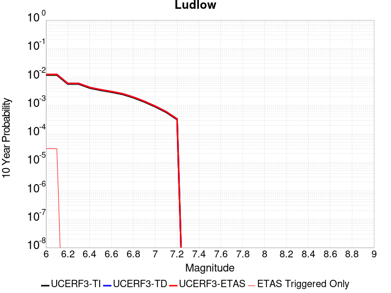 |

| Magnitude | 1 wk TI Prob | 1 wk TD Prob | 1 wk ETAS Prob | 1 wk ETAS/TD Gain | 1 wk ETAS Triggered Only | 1 mo TI Prob | 1 mo TD Prob | 1 mo ETAS Prob | 1 mo ETAS/TD Gain | 1 mo ETAS Triggered Only | 1 yr TI Prob | 1 yr TD Prob | 1 yr ETAS Prob | 1 yr ETAS/TD Gain | 1 yr ETAS Triggered Only | 10 yr TI Prob | 10 yr TD Prob | 10 yr ETAS Prob | 10 yr ETAS/TD Gain | 10 yr ETAS Triggered Only |
|-----|-----|-----|-----|-----|-----|-----|-----|-----|-----|-----|-----|-----|-----|-----|-----|-----|-----|-----|-----|-----|
| 6.0 | 2.2407607E-5 | 2.3658304E-5 | 2.3658304E-5 | 1.0 | 0.0 | 9.602906E-5 | 1.0138904E-4 | 1.0138904E-4 | 1.0 | 0.0 | 0.0011685267 | 0.0012337567 | 0.0012337567 | 1.0 | 0.0 | 0.011624013 | 0.012273584 | 0.0123887975 | 1.0093871 | 1.1664528E-4 |
| 6.1 | 2.2407607E-5 | 2.3658304E-5 | 2.3658304E-5 | 1.0 | 0.0 | 9.602906E-5 | 1.0138904E-4 | 1.0138904E-4 | 1.0 | 0.0 | 0.0011685267 | 0.0012337567 | 0.0012337567 | 1.0 | 0.0 | 0.011624013 | 0.012273584 | 0.0123887975 | 1.0093871 | 1.1664528E-4 |
| 6.2 | 1.0781252E-5 | 1.13661545E-5 | 1.13661545E-5 | 1.0 | 0.0 | 4.620455E-5 | 4.87112E-5 | 4.87112E-5 | 1.0 | 0.0 | 5.623952E-4 | 5.9290155E-4 | 5.9290155E-4 | 1.0 | 0.0 | 0.00560974 | 0.0059136157 | 0.0059136157 | 1.0 | 0.0 |
| 6.3 | 1.0781252E-5 | 1.13661545E-5 | 1.13661545E-5 | 1.0 | 0.0 | 4.620455E-5 | 4.87112E-5 | 4.87112E-5 | 1.0 | 0.0 | 5.623952E-4 | 5.9290155E-4 | 5.9290155E-4 | 1.0 | 0.0 | 0.00560974 | 0.0059136157 | 0.0059136157 | 1.0 | 0.0 |
| 6.4 | 7.814439E-6 | 8.238084E-6 | 8.238084E-6 | 1.0 | 0.0 | 3.3490025E-5 | 3.5305606E-5 | 3.5305606E-5 | 1.0 | 0.0 | 4.0766477E-4 | 4.2976235E-4 | 4.2976235E-4 | 1.0 | 0.0 | 0.0040691774 | 0.004289459 | 0.004289459 | 1.0 | 0.0 |
| 6.5 | 6.4986366E-6 | 6.8512154E-6 | 6.8512154E-6 | 1.0 | 0.0 | 2.7851002E-5 | 2.9362027E-5 | 2.9362027E-5 | 1.0 | 0.0 | 3.390332E-4 | 3.5742496E-4 | 3.5742496E-4 | 1.0 | 0.0 | 0.003385164 | 0.0035685971 | 0.0035685971 | 1.0 | 0.0 |
| 6.6 | 5.582177E-6 | 5.8862606E-6 | 5.8862606E-6 | 1.0 | 0.0 | 2.3923398E-5 | 2.522659E-5 | 2.522659E-5 | 1.0 | 0.0 | 2.9122844E-4 | 3.070912E-4 | 3.070912E-4 | 1.0 | 0.0 | 0.0029084706 | 0.0030667416 | 0.0030667416 | 1.0 | 0.0 |
| 6.7 | 4.6858763E-6 | 4.940641E-6 | 4.940641E-6 | 1.0 | 0.0 | 2.0082172E-5 | 2.1174006E-5 | 2.1174006E-5 | 1.0 | 0.0 | 2.4447302E-4 | 2.577636E-4 | 2.577636E-4 | 1.0 | 0.0 | 0.0024420423 | 0.0025747025 | 0.0025747025 | 1.0 | 0.0 |
| 6.8 | 3.5584908E-6 | 3.7521809E-6 | 3.7521809E-6 | 1.0 | 0.0 | 1.5250586E-5 | 1.6080678E-5 | 1.6080678E-5 | 1.0 | 0.0 | 1.8566006E-4 | 1.9576508E-4 | 1.9576508E-4 | 1.0 | 0.0 | 0.0018550502 | 0.0019559674 | 0.0019559674 | 1.0 | 0.0 |
| 6.9 | 2.532834E-6 | 2.6711195E-6 | 2.6711195E-6 | 1.0 | 0.0 | 1.0854958E-5 | 1.1447606E-5 | 1.1447606E-5 | 1.0 | 0.0 | 1.3215111E-4 | 1.3936596E-4 | 1.3936596E-4 | 1.0 | 0.0 | 0.0013207254 | 0.0013928133 | 0.0013928133 | 1.0 | 0.0 |
| 7.0 | 1.7083285E-6 | 1.8020224E-6 | 1.8020224E-6 | 1.0 | 0.0 | 7.3213873E-6 | 7.7229315E-6 | 7.7229315E-6 | 1.0 | 0.0 | 8.913424E-5 | 9.40228E-5 | 9.40228E-5 | 1.0 | 0.0 | 8.9098496E-4 | 9.3984674E-4 | 9.3984674E-4 | 1.0 | 0.0 |
| 7.1 | 1.0905424E-6 | 1.1498116E-6 | 1.1498116E-6 | 1.0 | 0.0 | 4.6737446E-6 | 4.9277555E-6 | 4.9277555E-6 | 1.0 | 0.0 | 5.6901354E-5 | 5.9993872E-5 | 5.9993872E-5 | 1.0 | 0.0 | 5.6886784E-4 | 5.997865E-4 | 5.997865E-4 | 1.0 | 0.0 |
| 7.2 | 6.06668E-7 | 6.387546E-7 | 6.387546E-7 | 1.0 | 0.0 | 2.600003E-6 | 2.7375172E-6 | 2.7375172E-6 | 1.0 | 0.0 | 3.1654577E-5 | 3.3328834E-5 | 3.3328834E-5 | 1.0 | 0.0 | 3.1650066E-4 | 3.332452E-4 | 3.332452E-4 | 1.0 | 0.0 |

## Scodie Lineament
*[(top)](#table-of-contents)*

| 1 Week | 1 Month | 1 Year | 10 Year |
|-----|-----|-----|-----|
|  |  | 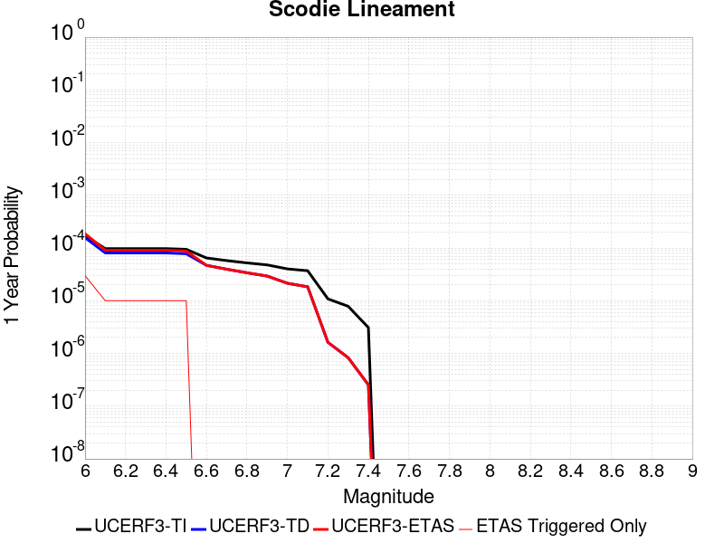 | 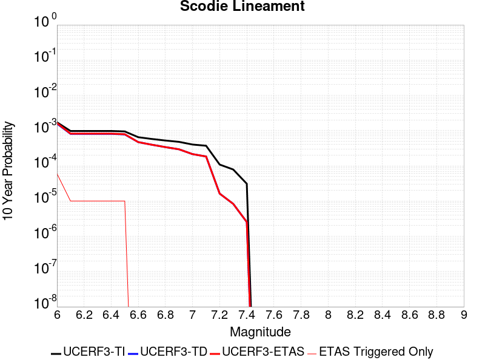 |

| Magnitude | 1 wk TI Prob | 1 wk TD Prob | 1 wk ETAS Prob | 1 wk ETAS/TD Gain | 1 wk ETAS Triggered Only | 1 mo TI Prob | 1 mo TD Prob | 1 mo ETAS Prob | 1 mo ETAS/TD Gain | 1 mo ETAS Triggered Only | 1 yr TI Prob | 1 yr TD Prob | 1 yr ETAS Prob | 1 yr ETAS/TD Gain | 1 yr ETAS Triggered Only | 10 yr TI Prob | 10 yr TD Prob | 10 yr ETAS Prob | 10 yr ETAS/TD Gain | 10 yr ETAS Triggered Only |
|-----|-----|-----|-----|-----|-----|-----|-----|-----|-----|-----|-----|-----|-----|-----|-----|-----|-----|-----|-----|-----|
| 6.0 | 3.2919327E-6 | 3.0134277E-6 | 3.0134277E-6 | 1.0 | 0.0 | 1.4108206E-5 | 1.2914644E-5 | 1.2914644E-5 | 1.0 | 0.0 | 1.7175387E-4 | 1.5722762E-4 | 2.1554109E-4 | 1.3708856 | 5.832264E-5 | 0.0017162118 | 0.0015714754 | 0.0016879374 | 1.0741099 | 1.1664528E-4 |
| 6.1 | 1.8663811E-6 | 1.5491038E-6 | 1.5491038E-6 | 1.0 | 0.0 | 7.998751E-6 | 6.639002E-6 | 6.639002E-6 | 1.0 | 0.0 | 9.738045E-5 | 8.082735E-5 | 8.082735E-5 | 1.0 | 0.0 | 9.7337784E-4 | 8.0802833E-4 | 8.0802833E-4 | 1.0 | 0.0 |
| 6.2 | 1.8663811E-6 | 1.5491038E-6 | 1.5491038E-6 | 1.0 | 0.0 | 7.998751E-6 | 6.639002E-6 | 6.639002E-6 | 1.0 | 0.0 | 9.738045E-5 | 8.082735E-5 | 8.082735E-5 | 1.0 | 0.0 | 9.7337784E-4 | 8.0802833E-4 | 8.0802833E-4 | 1.0 | 0.0 |
| 6.3 | 1.8663811E-6 | 1.5491038E-6 | 1.5491038E-6 | 1.0 | 0.0 | 7.998751E-6 | 6.639002E-6 | 6.639002E-6 | 1.0 | 0.0 | 9.738045E-5 | 8.082735E-5 | 8.082735E-5 | 1.0 | 0.0 | 9.7337784E-4 | 8.0802833E-4 | 8.0802833E-4 | 1.0 | 0.0 |
| 6.4 | 1.8663811E-6 | 1.5491038E-6 | 1.5491038E-6 | 1.0 | 0.0 | 7.998751E-6 | 6.639002E-6 | 6.639002E-6 | 1.0 | 0.0 | 9.738045E-5 | 8.082735E-5 | 8.082735E-5 | 1.0 | 0.0 | 9.7337784E-4 | 8.0802833E-4 | 8.0802833E-4 | 1.0 | 0.0 |
| 6.5 | 1.8106311E-6 | 1.4910358E-6 | 1.4910358E-6 | 1.0 | 0.0 | 7.759824E-6 | 6.3901407E-6 | 6.3901407E-6 | 1.0 | 0.0 | 9.447177E-5 | 7.779768E-5 | 7.779768E-5 | 1.0 | 0.0 | 9.4431615E-4 | 7.777531E-4 | 7.777531E-4 | 1.0 | 0.0 |
| 6.6 | 1.2414679E-6 | 8.997894E-7 | 8.997894E-7 | 1.0 | 0.0 | 5.320566E-6 | 3.8562353E-6 | 3.8562353E-6 | 1.0 | 0.0 | 6.477596E-5 | 4.694874E-5 | 4.694874E-5 | 1.0 | 0.0 | 6.475708E-4 | 4.6939685E-4 | 4.6939685E-4 | 1.0 | 0.0 |
| 6.7 | 1.1062215E-6 | 7.5946053E-7 | 7.5946053E-7 | 1.0 | 0.0 | 4.7409408E-6 | 3.2548273E-6 | 3.2548273E-6 | 1.0 | 0.0 | 5.7719422E-5 | 3.9626873E-5 | 3.9626873E-5 | 1.0 | 0.0 | 5.770443E-4 | 3.9620505E-4 | 3.9620505E-4 | 1.0 | 0.0 |
| 6.8 | 1.0006736E-6 | 6.5006594E-7 | 6.5006594E-7 | 1.0 | 0.0 | 4.288594E-6 | 2.7859944E-6 | 2.7859944E-6 | 1.0 | 0.0 | 5.221238E-5 | 3.3919016E-5 | 3.3919016E-5 | 1.0 | 0.0 | 5.220012E-4 | 3.3914446E-4 | 3.3914446E-4 | 1.0 | 0.0 |
| 6.9 | 9.167364E-7 | 5.6318635E-7 | 5.6318635E-7 | 1.0 | 0.0 | 3.9288643E-6 | 2.4136539E-6 | 2.4136539E-6 | 1.0 | 0.0 | 4.7832873E-5 | 2.9385896E-5 | 2.9385896E-5 | 1.0 | 0.0 | 4.782258E-4 | 2.9382578E-4 | 2.9382578E-4 | 1.0 | 0.0 |
| 7.0 | 7.6987664E-7 | 4.113581E-7 | 4.113581E-7 | 1.0 | 0.0 | 3.2994672E-6 | 1.7629623E-6 | 1.7629623E-6 | 1.0 | 0.0 | 4.0170275E-5 | 2.1463893E-5 | 2.1463893E-5 | 1.0 | 0.0 | 4.0163012E-4 | 2.1462205E-4 | 2.1462205E-4 | 1.0 | 0.0 |
| 7.1 | 7.1038727E-7 | 3.5213313E-7 | 3.5213313E-7 | 1.0 | 0.0 | 3.0445133E-6 | 1.5091413E-6 | 1.5091413E-6 | 1.0 | 0.0 | 3.706632E-5 | 1.8373676E-5 | 1.8373676E-5 | 1.0 | 0.0 | 3.7060137E-4 | 1.8372506E-4 | 1.8372506E-4 | 1.0 | 0.0 |
| 7.2 | 2.0799602E-7 | 3.1191853E-8 | 3.1191853E-8 | 1.0 | 0.0 | 8.914113E-7 | 1.3367936E-7 | 1.3367936E-7 | 1.0 | 0.0 | 1.0852878E-5 | 1.6275452E-6 | 1.6275452E-6 | 1.0 | 0.0 | 1.08523476E-4 | 1.627534E-5 | 1.627534E-5 | 1.0 | 0.0 |
| 7.3 | 1.5048182E-7 | 1.5949094E-8 | 1.5949094E-8 | 1.0 | 0.0 | 6.449219E-7 | 6.835326E-8 | 6.835326E-8 | 1.0 | 0.0 | 7.851896E-6 | 8.322006E-7 | 8.322006E-7 | 1.0 | 0.0 | 7.851618E-5 | 8.3219775E-6 | 8.3219775E-6 | 1.0 | 0.0 |
| 7.4 | 5.9334678E-8 | 4.8696087E-9 | 4.8696087E-9 | 1.0 | 0.0 | 2.5429145E-7 | 2.086975E-8 | 2.086975E-8 | 1.0 | 0.0 | 3.095994E-6 | 2.540892E-7 | 2.540892E-7 | 1.0 | 0.0 | 3.095951E-5 | 2.5408901E-6 | 2.5408901E-6 | 1.0 | 0.0 |

## Deep Springs
*[(top)](#table-of-contents)*

| 1 Week | 1 Month | 1 Year | 10 Year |
|-----|-----|-----|-----|
|  |  |  | 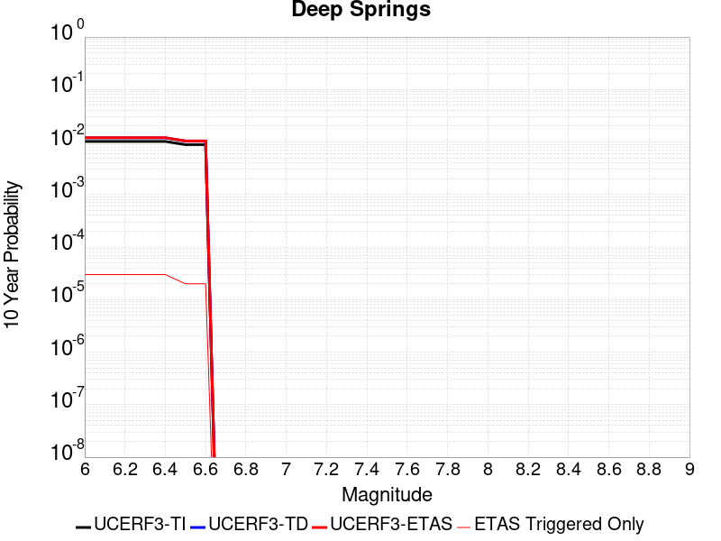 |

| Magnitude | 1 wk TI Prob | 1 wk TD Prob | 1 wk ETAS Prob | 1 wk ETAS/TD Gain | 1 wk ETAS Triggered Only | 1 mo TI Prob | 1 mo TD Prob | 1 mo ETAS Prob | 1 mo ETAS/TD Gain | 1 mo ETAS Triggered Only | 1 yr TI Prob | 1 yr TD Prob | 1 yr ETAS Prob | 1 yr ETAS/TD Gain | 1 yr ETAS Triggered Only | 10 yr TI Prob | 10 yr TD Prob | 10 yr ETAS Prob | 10 yr ETAS/TD Gain | 10 yr ETAS Triggered Only |
|-----|-----|-----|-----|-----|-----|-----|-----|-----|-----|-----|-----|-----|-----|-----|-----|-----|-----|-----|-----|-----|
| 6.0 | 1.9810619E-5 | 2.3115586E-5 | 2.3115586E-5 | 1.0 | 0.0 | 8.489989E-5 | 9.9065895E-5 | 9.9065895E-5 | 1.0 | 0.0 | 0.001033166 | 0.0012059679 | 0.0012059679 | 1.0 | 0.0 | 0.010283757 | 0.012044019 | 0.012159259 | 1.0095682 | 1.1664528E-4 |
| 6.1 | 1.9810619E-5 | 2.3115586E-5 | 2.3115586E-5 | 1.0 | 0.0 | 8.489989E-5 | 9.9065895E-5 | 9.9065895E-5 | 1.0 | 0.0 | 0.001033166 | 0.0012059679 | 0.0012059679 | 1.0 | 0.0 | 0.010283757 | 0.012044019 | 0.012159259 | 1.0095682 | 1.1664528E-4 |
| 6.2 | 1.9810619E-5 | 2.3115586E-5 | 2.3115586E-5 | 1.0 | 0.0 | 8.489989E-5 | 9.9065895E-5 | 9.9065895E-5 | 1.0 | 0.0 | 0.001033166 | 0.0012059679 | 0.0012059679 | 1.0 | 0.0 | 0.010283757 | 0.012044019 | 0.012159259 | 1.0095682 | 1.1664528E-4 |
| 6.3 | 1.9810619E-5 | 2.3115586E-5 | 2.3115586E-5 | 1.0 | 0.0 | 8.489989E-5 | 9.9065895E-5 | 9.9065895E-5 | 1.0 | 0.0 | 0.001033166 | 0.0012059679 | 0.0012059679 | 1.0 | 0.0 | 0.010283757 | 0.012044019 | 0.012159259 | 1.0095682 | 1.1664528E-4 |
| 6.4 | 1.9810619E-5 | 2.3115586E-5 | 2.3115586E-5 | 1.0 | 0.0 | 8.489989E-5 | 9.9065895E-5 | 9.9065895E-5 | 1.0 | 0.0 | 0.001033166 | 0.0012059679 | 0.0012059679 | 1.0 | 0.0 | 0.010283757 | 0.012044019 | 0.012159259 | 1.0095682 | 1.1664528E-4 |
| 6.5 | 1.7190405E-5 | 2.005321E-5 | 2.005321E-5 | 1.0 | 0.0 | 7.367108E-5 | 8.594233E-5 | 8.594233E-5 | 1.0 | 0.0 | 8.9657627E-4 | 0.0010463479 | 0.0010463479 | 1.0 | 0.0 | 0.008929676 | 0.010463441 | 0.010521153 | 1.0055156 | 5.832264E-5 |
| 6.6 | 1.7190405E-5 | 2.005321E-5 | 2.005321E-5 | 1.0 | 0.0 | 7.367108E-5 | 8.594233E-5 | 8.594233E-5 | 1.0 | 0.0 | 8.9657627E-4 | 0.0010463479 | 0.0010463479 | 1.0 | 0.0 | 0.008929676 | 0.010463441 | 0.010521153 | 1.0055156 | 5.832264E-5 |

## Verdugo
*[(top)](#table-of-contents)*

| 1 Week | 1 Month | 1 Year | 10 Year |
|-----|-----|-----|-----|
|  |  |  |  |

| Magnitude | 1 wk TI Prob | 1 wk TD Prob | 1 wk ETAS Prob | 1 wk ETAS/TD Gain | 1 wk ETAS Triggered Only | 1 mo TI Prob | 1 mo TD Prob | 1 mo ETAS Prob | 1 mo ETAS/TD Gain | 1 mo ETAS Triggered Only | 1 yr TI Prob | 1 yr TD Prob | 1 yr ETAS Prob | 1 yr ETAS/TD Gain | 1 yr ETAS Triggered Only | 10 yr TI Prob | 10 yr TD Prob | 10 yr ETAS Prob | 10 yr ETAS/TD Gain | 10 yr ETAS Triggered Only |
|-----|-----|-----|-----|-----|-----|-----|-----|-----|-----|-----|-----|-----|-----|-----|-----|-----|-----|-----|-----|-----|
| 6.0 | 5.392987E-6 | 4.216929E-6 | 4.216929E-6 | 1.0 | 0.0 | 2.3112598E-5 | 1.8072431E-5 | 7.639402E-5 | 4.2271023 | 5.832264E-5 | 2.8135953E-4 | 2.200101E-4 | 2.783199E-4 | 1.2650324 | 5.832264E-5 | 0.0028100356 | 0.0021979706 | 0.002256165 | 1.0264765 | 5.832264E-5 |
| 6.1 | 5.392987E-6 | 4.216929E-6 | 4.216929E-6 | 1.0 | 0.0 | 2.3112598E-5 | 1.8072431E-5 | 7.639402E-5 | 4.2271023 | 5.832264E-5 | 2.8135953E-4 | 2.200101E-4 | 2.783199E-4 | 1.2650324 | 5.832264E-5 | 0.0028100356 | 0.0021979706 | 0.002256165 | 1.0264765 | 5.832264E-5 |
| 6.2 | 5.392987E-6 | 4.216929E-6 | 4.216929E-6 | 1.0 | 0.0 | 2.3112598E-5 | 1.8072431E-5 | 7.639402E-5 | 4.2271023 | 5.832264E-5 | 2.8135953E-4 | 2.200101E-4 | 2.783199E-4 | 1.2650324 | 5.832264E-5 | 0.0028100356 | 0.0021979706 | 0.002256165 | 1.0264765 | 5.832264E-5 |
| 6.3 | 5.392987E-6 | 4.216929E-6 | 4.216929E-6 | 1.0 | 0.0 | 2.3112598E-5 | 1.8072431E-5 | 7.639402E-5 | 4.2271023 | 5.832264E-5 | 2.8135953E-4 | 2.200101E-4 | 2.783199E-4 | 1.2650324 | 5.832264E-5 | 0.0028100356 | 0.0021979706 | 0.002256165 | 1.0264765 | 5.832264E-5 |
| 6.4 | 5.392987E-6 | 4.216929E-6 | 4.216929E-6 | 1.0 | 0.0 | 2.3112598E-5 | 1.8072431E-5 | 7.639402E-5 | 4.2271023 | 5.832264E-5 | 2.8135953E-4 | 2.200101E-4 | 2.783199E-4 | 1.2650324 | 5.832264E-5 | 0.0028100356 | 0.0021979706 | 0.002256165 | 1.0264765 | 5.832264E-5 |
| 6.5 | 4.9154837E-6 | 3.7228633E-6 | 3.7228633E-6 | 1.0 | 0.0 | 2.1066187E-5 | 1.5955033E-5 | 1.5955033E-5 | 1.0 | 0.0 | 2.5645064E-4 | 1.9423541E-4 | 1.9423541E-4 | 1.0 | 0.0 | 0.002561549 | 0.0019406773 | 0.0019406773 | 1.0 | 0.0 |
| 6.6 | 4.9154837E-6 | 3.7228633E-6 | 3.7228633E-6 | 1.0 | 0.0 | 2.1066187E-5 | 1.5955033E-5 | 1.5955033E-5 | 1.0 | 0.0 | 2.5645064E-4 | 1.9423541E-4 | 1.9423541E-4 | 1.0 | 0.0 | 0.002561549 | 0.0019406773 | 0.0019406773 | 1.0 | 0.0 |
| 6.7 | 4.817006E-6 | 3.6210474E-6 | 3.6210474E-6 | 1.0 | 0.0 | 2.0644147E-5 | 1.5518683E-5 | 1.5518683E-5 | 1.0 | 0.0 | 2.513135E-4 | 1.8892378E-4 | 1.8892378E-4 | 1.0 | 0.0 | 0.0025102948 | 0.0018876514 | 0.0018876514 | 1.0 | 0.0 |
| 6.8 | 4.507407E-6 | 3.3074866E-6 | 3.3074866E-6 | 1.0 | 0.0 | 1.9317316E-5 | 1.4174866E-5 | 1.4174866E-5 | 1.0 | 0.0 | 2.3516294E-4 | 1.7256547E-4 | 1.7256547E-4 | 1.0 | 0.0 | 0.0023491425 | 0.0017243291 | 0.0017243291 | 1.0 | 0.0 |
| 6.9 | 4.3573054E-6 | 3.1613874E-6 | 3.1613874E-6 | 1.0 | 0.0 | 1.8674033E-5 | 1.35487335E-5 | 1.35487335E-5 | 1.0 | 0.0 | 2.2733262E-4 | 1.6494347E-4 | 1.6494347E-4 | 1.0 | 0.0 | 0.0022710022 | 0.0016482228 | 0.0016482228 | 1.0 | 0.0 |
| 7.0 | 4.171527E-6 | 2.9840396E-6 | 2.9840396E-6 | 1.0 | 0.0 | 1.787785E-5 | 1.2788679E-5 | 1.2788679E-5 | 1.0 | 0.0 | 2.1764109E-4 | 1.5569116E-4 | 1.5569116E-4 | 1.0 | 0.0 | 0.0021742806 | 0.0015558321 | 0.0015558321 | 1.0 | 0.0 |
| 7.1 | 4.0405484E-6 | 2.8826246E-6 | 2.8826246E-6 | 1.0 | 0.0 | 1.731652E-5 | 1.2354048E-5 | 1.2354048E-5 | 1.0 | 0.0 | 2.1080824E-4 | 1.5040026E-4 | 1.5040026E-4 | 1.0 | 0.0 | 0.0021060838 | 0.0015029958 | 0.0015029958 | 1.0 | 0.0 |
| 7.2 | 3.8306007E-6 | 2.7021997E-6 | 2.7021997E-6 | 1.0 | 0.0 | 1.6416758E-5 | 1.1580805E-5 | 1.1580805E-5 | 1.0 | 0.0 | 1.9985568E-4 | 1.409873E-4 | 1.409873E-4 | 1.0 | 0.0 | 0.0019967605 | 0.0014089892 | 0.0014089892 | 1.0 | 0.0 |
| 7.3 | 3.5750938E-6 | 2.5125196E-6 | 2.5125196E-6 | 1.0 | 0.0 | 1.532174E-5 | 1.0767897E-5 | 1.0767897E-5 | 1.0 | 0.0 | 1.8652623E-4 | 1.3109136E-4 | 1.3109136E-4 | 1.0 | 0.0 | 0.0018636974 | 0.0013101508 | 0.0013101508 | 1.0 | 0.0 |
| 7.4 | 3.3510041E-6 | 2.3411926E-6 | 2.3411926E-6 | 1.0 | 0.0 | 1.4361368E-5 | 1.0033645E-5 | 1.0033645E-5 | 1.0 | 0.0 | 1.7483562E-4 | 1.2215288E-4 | 1.2215288E-4 | 1.0 | 0.0 | 0.0017469813 | 0.0012208677 | 0.0012208677 | 1.0 | 0.0 |
| 7.5 | 2.948287E-6 | 2.039304E-6 | 2.039304E-6 | 1.0 | 0.0 | 1.2635454E-5 | 8.739846E-6 | 8.739846E-6 | 1.0 | 0.0 | 1.538258E-4 | 1.0640253E-4 | 1.0640253E-4 | 1.0 | 0.0 | 0.0015371935 | 0.001063526 | 0.001063526 | 1.0 | 0.0 |
| 7.6 | 2.0134323E-6 | 1.4472616E-6 | 1.4472616E-6 | 1.0 | 0.0 | 8.628967E-6 | 6.2025356E-6 | 6.2025356E-6 | 1.0 | 0.0 | 1.05052604E-4 | 7.5513344E-5 | 7.5513344E-5 | 1.0 | 0.0 | 0.0010500296 | 7.5488567E-4 | 7.5488567E-4 | 1.0 | 0.0 |
| 7.7 | 5.726436E-7 | 4.0456166E-7 | 4.0456166E-7 | 1.0 | 0.0 | 2.4541846E-6 | 1.7338347E-6 | 1.7338347E-6 | 1.0 | 0.0 | 2.9879287E-5 | 2.110926E-5 | 2.110926E-5 | 1.0 | 0.0 | 2.987527E-4 | 2.1107508E-4 | 2.1107508E-4 | 1.0 | 0.0 |
| 7.8 | 1.6248204E-7 | 1.0690061E-7 | 1.0690061E-7 | 1.0 | 0.0 | 6.963514E-7 | 4.5814537E-7 | 4.5814537E-7 | 1.0 | 0.0 | 8.478045E-6 | 5.577906E-6 | 5.577906E-6 | 1.0 | 0.0 | 8.477722E-5 | 5.5777695E-5 | 5.5777695E-5 | 1.0 | 0.0 |
| 7.9 | 4.4475744E-8 | 3.0376892E-8 | 3.0376892E-8 | 1.0 | 0.0 | 1.9061031E-7 | 1.3018668E-7 | 1.3018668E-7 | 1.0 | 0.0 | 2.320678E-6 | 1.5850218E-6 | 1.5850218E-6 | 1.0 | 0.0 | 2.3206538E-5 | 1.5850119E-5 | 1.5850119E-5 | 1.0 | 0.0 |

## Mono Lake 2011 CFM
*[(top)](#table-of-contents)*

| 1 Week | 1 Month | 1 Year | 10 Year |
|-----|-----|-----|-----|
|  |  |  | 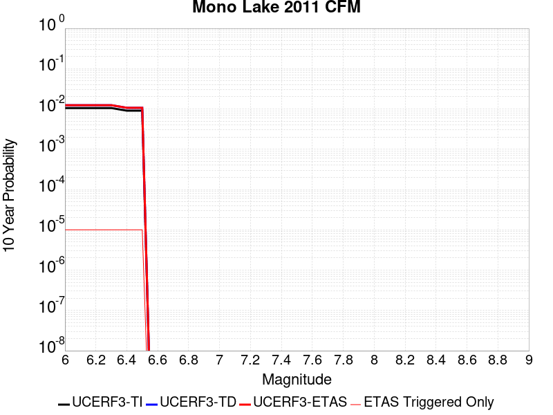 |

| Magnitude | 1 wk TI Prob | 1 wk TD Prob | 1 wk ETAS Prob | 1 wk ETAS/TD Gain | 1 wk ETAS Triggered Only | 1 mo TI Prob | 1 mo TD Prob | 1 mo ETAS Prob | 1 mo ETAS/TD Gain | 1 mo ETAS Triggered Only | 1 yr TI Prob | 1 yr TD Prob | 1 yr ETAS Prob | 1 yr ETAS/TD Gain | 1 yr ETAS Triggered Only | 10 yr TI Prob | 10 yr TD Prob | 10 yr ETAS Prob | 10 yr ETAS/TD Gain | 10 yr ETAS Triggered Only |
|-----|-----|-----|-----|-----|-----|-----|-----|-----|-----|-----|-----|-----|-----|-----|-----|-----|-----|-----|-----|-----|
| 6.0 | 2.0341662E-5 | 2.3831417E-5 | 2.3831417E-5 | 1.0 | 0.0 | 8.717564E-5 | 1.0213364E-4 | 1.6045032E-4 | 1.5709841 | 5.832264E-5 | 0.0010608466 | 0.0012432993 | 0.0013015495 | 1.0468513 | 5.832264E-5 | 0.010557966 | 0.012415525 | 0.012473122 | 1.0046393 | 5.832264E-5 |
| 6.1 | 2.0341662E-5 | 2.3831417E-5 | 2.3831417E-5 | 1.0 | 0.0 | 8.717564E-5 | 1.0213364E-4 | 1.6045032E-4 | 1.5709841 | 5.832264E-5 | 0.0010608466 | 0.0012432993 | 0.0013015495 | 1.0468513 | 5.832264E-5 | 0.010557966 | 0.012415525 | 0.012473122 | 1.0046393 | 5.832264E-5 |
| 6.2 | 2.0341662E-5 | 2.3831417E-5 | 2.3831417E-5 | 1.0 | 0.0 | 8.717564E-5 | 1.0213364E-4 | 1.6045032E-4 | 1.5709841 | 5.832264E-5 | 0.0010608466 | 0.0012432993 | 0.0013015495 | 1.0468513 | 5.832264E-5 | 0.010557966 | 0.012415525 | 0.012473122 | 1.0046393 | 5.832264E-5 |
| 6.3 | 2.0341662E-5 | 2.3831417E-5 | 2.3831417E-5 | 1.0 | 0.0 | 8.717564E-5 | 1.0213364E-4 | 1.6045032E-4 | 1.5709841 | 5.832264E-5 | 0.0010608466 | 0.0012432993 | 0.0013015495 | 1.0468513 | 5.832264E-5 | 0.010557966 | 0.012415525 | 0.012473122 | 1.0046393 | 5.832264E-5 |
| 6.4 | 1.749821E-5 | 2.0493775E-5 | 2.0493775E-5 | 1.0 | 0.0 | 7.499018E-5 | 8.783046E-5 | 1.4614798E-4 | 1.6639782 | 5.832264E-5 | 9.1262296E-4 | 0.0010693358 | 0.0011275961 | 1.0544827 | 5.832264E-5 | 0.009088841 | 0.010693319 | 0.010751018 | 1.0053958 | 5.832264E-5 |
| 6.5 | 1.749821E-5 | 2.0493775E-5 | 2.0493775E-5 | 1.0 | 0.0 | 7.499018E-5 | 8.783046E-5 | 1.4614798E-4 | 1.6639782 | 5.832264E-5 | 9.1262296E-4 | 0.0010693358 | 0.0011275961 | 1.0544827 | 5.832264E-5 | 0.009088841 | 0.010693319 | 0.010751018 | 1.0053958 | 5.832264E-5 |

## Red Mountain
*[(top)](#table-of-contents)*

| 1 Week | 1 Month | 1 Year | 10 Year |
|-----|-----|-----|-----|
|  |  |  |  |

| Magnitude | 1 wk TI Prob | 1 wk TD Prob | 1 wk ETAS Prob | 1 wk ETAS/TD Gain | 1 wk ETAS Triggered Only | 1 mo TI Prob | 1 mo TD Prob | 1 mo ETAS Prob | 1 mo ETAS/TD Gain | 1 mo ETAS Triggered Only | 1 yr TI Prob | 1 yr TD Prob | 1 yr ETAS Prob | 1 yr ETAS/TD Gain | 1 yr ETAS Triggered Only | 10 yr TI Prob | 10 yr TD Prob | 10 yr ETAS Prob | 10 yr ETAS/TD Gain | 10 yr ETAS Triggered Only |
|-----|-----|-----|-----|-----|-----|-----|-----|-----|-----|-----|-----|-----|-----|-----|-----|-----|-----|-----|-----|-----|
| 6.0 | 4.1810763E-5 | 4.7596302E-5 | 4.7596302E-5 | 1.0 | 0.0 | 1.7917668E-4 | 2.0396913E-4 | 2.0396913E-4 | 1.0 | 0.0 | 0.0021792934 | 0.0024806617 | 0.0024806617 | 1.0 | 0.0 | 0.021580452 | 0.024547331 | 0.024604222 | 1.0023175 | 5.832264E-5 |
| 6.1 | 4.1810763E-5 | 4.7596302E-5 | 4.7596302E-5 | 1.0 | 0.0 | 1.7917668E-4 | 2.0396913E-4 | 2.0396913E-4 | 1.0 | 0.0 | 0.0021792934 | 0.0024806617 | 0.0024806617 | 1.0 | 0.0 | 0.021580452 | 0.024547331 | 0.024604222 | 1.0023175 | 5.832264E-5 |
| 6.2 | 4.1810763E-5 | 4.7596302E-5 | 4.7596302E-5 | 1.0 | 0.0 | 1.7917668E-4 | 2.0396913E-4 | 2.0396913E-4 | 1.0 | 0.0 | 0.0021792934 | 0.0024806617 | 0.0024806617 | 1.0 | 0.0 | 0.021580452 | 0.024547331 | 0.024604222 | 1.0023175 | 5.832264E-5 |
| 6.3 | 4.1810763E-5 | 4.7596302E-5 | 4.7596302E-5 | 1.0 | 0.0 | 1.7917668E-4 | 2.0396913E-4 | 2.0396913E-4 | 1.0 | 0.0 | 0.0021792934 | 0.0024806617 | 0.0024806617 | 1.0 | 0.0 | 0.021580452 | 0.024547331 | 0.024604222 | 1.0023175 | 5.832264E-5 |
| 6.4 | 4.1810763E-5 | 4.7596302E-5 | 4.7596302E-5 | 1.0 | 0.0 | 1.7917668E-4 | 2.0396913E-4 | 2.0396913E-4 | 1.0 | 0.0 | 0.0021792934 | 0.0024806617 | 0.0024806617 | 1.0 | 0.0 | 0.021580452 | 0.024547331 | 0.024604222 | 1.0023175 | 5.832264E-5 |
| 6.5 | 3.154503E-5 | 3.5364217E-5 | 3.5364217E-5 | 1.0 | 0.0 | 1.3518598E-4 | 1.5155265E-4 | 1.5155265E-4 | 1.0 | 0.0 | 0.0016446467 | 0.0018436842 | 0.0018436842 | 1.0 | 0.0 | 0.01632528 | 0.018293539 | 0.018350795 | 1.0031298 | 5.832264E-5 |
| 6.6 | 3.1535834E-5 | 3.5353598E-5 | 3.5353598E-5 | 1.0 | 0.0 | 1.3514658E-4 | 1.5150715E-4 | 1.5150715E-4 | 1.0 | 0.0 | 0.0016441676 | 0.0018431311 | 0.0018431311 | 1.0 | 0.0 | 0.01632056 | 0.018288098 | 0.018345354 | 1.0031308 | 5.832264E-5 |
| 6.7 | 2.8267326E-5 | 3.1473257E-5 | 3.1473257E-5 | 1.0 | 0.0 | 1.2114006E-4 | 1.3487888E-4 | 1.3487888E-4 | 1.0 | 0.0 | 0.0014738824 | 0.0016409985 | 0.0016409985 | 1.0 | 0.0 | 0.014641452 | 0.016297577 | 0.016297577 | 1.0 | 0.0 |
| 6.8 | 2.8212884E-5 | 3.1411135E-5 | 3.1411135E-5 | 1.0 | 0.0 | 1.20906756E-4 | 1.3461268E-4 | 1.3461268E-4 | 1.0 | 0.0 | 0.0014710457 | 0.0016377624 | 0.0016377624 | 1.0 | 0.0 | 0.014613459 | 0.016265688 | 0.016265688 | 1.0 | 0.0 |
| 6.9 | 2.4227871E-5 | 2.6710215E-5 | 2.6710215E-5 | 1.0 | 0.0 | 1.03829596E-4 | 1.1446776E-4 | 1.1446776E-4 | 1.0 | 0.0 | 0.0012633923 | 0.0013928299 | 0.0013928299 | 1.0 | 0.0 | 0.012562336 | 0.013848694 | 0.013848694 | 1.0 | 0.0 |
| 7.0 | 2.348524E-5 | 2.5838879E-5 | 2.5838879E-5 | 1.0 | 0.0 | 1.0064714E-4 | 1.1073378E-4 | 1.1073378E-4 | 1.0 | 0.0 | 0.0012246901 | 0.0013474256 | 0.0013474256 | 1.0 | 0.0 | 0.012179627 | 0.013400196 | 0.013400196 | 1.0 | 0.0 |
| 7.1 | 2.2311642E-5 | 2.4465759E-5 | 2.4465759E-5 | 1.0 | 0.0 | 9.561782E-5 | 1.0484946E-4 | 1.0484946E-4 | 1.0 | 0.0 | 0.0011635252 | 0.0012758696 | 0.0012758696 | 1.0 | 0.0 | 0.01157452 | 0.012692964 | 0.012692964 | 1.0 | 0.0 |
| 7.2 | 1.6533986E-5 | 1.7672326E-5 | 1.7672326E-5 | 1.0 | 0.0 | 7.085802E-5 | 7.57367E-5 | 7.57367E-5 | 1.0 | 0.0 | 8.623549E-4 | 9.217677E-4 | 9.217677E-4 | 1.0 | 0.0 | 0.008590161 | 0.009185724 | 0.009185724 | 1.0 | 0.0 |
| 7.3 | 1.4703092E-5 | 1.5561242E-5 | 1.5561242E-5 | 1.0 | 0.0 | 6.301173E-5 | 6.668968E-5 | 6.668968E-5 | 1.0 | 0.0 | 7.668978E-4 | 8.11706E-4 | 8.11706E-4 | 1.0 | 0.0 | 0.0076425658 | 0.008093488 | 0.008093488 | 1.0 | 0.0 |
| 7.4 | 6.1331984E-6 | 5.529228E-6 | 5.529228E-6 | 1.0 | 0.0 | 2.6284872E-5 | 2.3696479E-5 | 2.3696479E-5 | 1.0 | 0.0 | 3.199713E-4 | 2.8846698E-4 | 2.8846698E-4 | 1.0 | 0.0 | 0.0031951098 | 0.0028809798 | 0.0028809798 | 1.0 | 0.0 |
| 7.5 | 5.954766E-6 | 5.338845E-6 | 5.338845E-6 | 1.0 | 0.0 | 2.5520176E-5 | 2.2880566E-5 | 2.2880566E-5 | 1.0 | 0.0 | 3.1066386E-4 | 2.7853582E-4 | 2.7853582E-4 | 1.0 | 0.0 | 0.003102299 | 0.002781921 | 0.002781921 | 1.0 | 0.0 |
| 7.6 | 4.9726646E-6 | 4.3155746E-6 | 4.3155746E-6 | 1.0 | 0.0 | 2.1311245E-5 | 1.8495191E-5 | 1.8495191E-5 | 1.0 | 0.0 | 2.5943352E-4 | 2.2515602E-4 | 2.2515602E-4 | 1.0 | 0.0 | 0.0025913084 | 0.0022493138 | 0.0022493138 | 1.0 | 0.0 |
| 7.7 | 3.3613894E-6 | 2.8528495E-6 | 2.8528495E-6 | 1.0 | 0.0 | 1.4405875E-5 | 1.2226443E-5 | 1.2226443E-5 | 1.0 | 0.0 | 1.7537741E-4 | 1.4884703E-4 | 1.4884703E-4 | 1.0 | 0.0 | 0.0017523908 | 0.0014874997 | 0.0014874997 | 1.0 | 0.0 |
| 7.8 | 1.1828961E-6 | 1.0123289E-6 | 1.0123289E-6 | 1.0 | 0.0 | 5.069545E-6 | 4.3385453E-6 | 4.3385453E-6 | 1.0 | 0.0 | 6.171996E-5 | 5.282054E-5 | 5.282054E-5 | 1.0 | 0.0 | 6.170282E-4 | 5.280828E-4 | 5.280828E-4 | 1.0 | 0.0 |
| 7.9 | 2.2967266E-7 | 1.8619947E-7 | 1.8619947E-7 | 1.0 | 0.0 | 9.843111E-7 | 7.979975E-7 | 7.979975E-7 | 1.0 | 0.0 | 1.19839215E-5 | 9.715579E-6 | 9.715579E-6 | 1.0 | 0.0 | 1.1983275E-4 | 9.715183E-5 | 9.715183E-5 | 1.0 | 0.0 |

## Big Pine (East)
*[(top)](#table-of-contents)*

| 1 Week | 1 Month | 1 Year | 10 Year |
|-----|-----|-----|-----|
|  |  |  |  |

| Magnitude | 1 wk TI Prob | 1 wk TD Prob | 1 wk ETAS Prob | 1 wk ETAS/TD Gain | 1 wk ETAS Triggered Only | 1 mo TI Prob | 1 mo TD Prob | 1 mo ETAS Prob | 1 mo ETAS/TD Gain | 1 mo ETAS Triggered Only | 1 yr TI Prob | 1 yr TD Prob | 1 yr ETAS Prob | 1 yr ETAS/TD Gain | 1 yr ETAS Triggered Only | 10 yr TI Prob | 10 yr TD Prob | 10 yr ETAS Prob | 10 yr ETAS/TD Gain | 10 yr ETAS Triggered Only |
|-----|-----|-----|-----|-----|-----|-----|-----|-----|-----|-----|-----|-----|-----|-----|-----|-----|-----|-----|-----|-----|
| 6.0 | 9.916913E-6 | 1.2824463E-5 | 1.2824463E-5 | 1.0 | 0.0 | 4.250036E-5 | 5.496095E-5 | 5.496095E-5 | 1.0 | 0.0 | 5.173191E-4 | 6.689662E-4 | 6.689662E-4 | 1.0 | 0.0 | 0.0051611643 | 0.0066742534 | 0.006732187 | 1.0086801 | 5.832264E-5 |
| 6.1 | 9.916913E-6 | 1.2824463E-5 | 1.2824463E-5 | 1.0 | 0.0 | 4.250036E-5 | 5.496095E-5 | 5.496095E-5 | 1.0 | 0.0 | 5.173191E-4 | 6.689662E-4 | 6.689662E-4 | 1.0 | 0.0 | 0.0051611643 | 0.0066742534 | 0.006732187 | 1.0086801 | 5.832264E-5 |
| 6.2 | 9.916913E-6 | 1.2824463E-5 | 1.2824463E-5 | 1.0 | 0.0 | 4.250036E-5 | 5.496095E-5 | 5.496095E-5 | 1.0 | 0.0 | 5.173191E-4 | 6.689662E-4 | 6.689662E-4 | 1.0 | 0.0 | 0.0051611643 | 0.0066742534 | 0.006732187 | 1.0086801 | 5.832264E-5 |
| 6.3 | 5.479711E-6 | 8.120204E-6 | 8.120204E-6 | 1.0 | 0.0 | 2.3484265E-5 | 3.480043E-5 | 3.480043E-5 | 1.0 | 0.0 | 2.858834E-4 | 4.2361606E-4 | 4.2361606E-4 | 1.0 | 0.0 | 0.0028551589 | 0.0042309477 | 0.0042890236 | 1.0137265 | 5.832264E-5 |
| 6.4 | 5.465009E-6 | 8.104497E-6 | 8.104497E-6 | 1.0 | 0.0 | 2.3421257E-5 | 3.4733115E-5 | 3.4733115E-5 | 1.0 | 0.0 | 2.851165E-4 | 4.227968E-4 | 4.227968E-4 | 1.0 | 0.0 | 0.0028475097 | 0.0042227865 | 0.004280863 | 1.013753 | 5.832264E-5 |
| 6.5 | 4.826767E-6 | 7.429522E-6 | 7.429522E-6 | 1.0 | 0.0 | 2.068598E-5 | 3.1840438E-5 | 3.1840438E-5 | 1.0 | 0.0 | 2.518227E-4 | 3.8759114E-4 | 3.8759114E-4 | 1.0 | 0.0 | 0.0025153751 | 0.003871972 | 0.0039300686 | 1.0150044 | 5.832264E-5 |
| 6.6 | 4.3146847E-6 | 6.889435E-6 | 6.889435E-6 | 1.0 | 0.0 | 1.8491375E-5 | 2.9525829E-5 | 2.9525829E-5 | 1.0 | 0.0 | 2.2510924E-4 | 3.5942014E-4 | 3.5942014E-4 | 1.0 | 0.0 | 0.0022488134 | 0.0035911764 | 0.0036492895 | 1.0161822 | 5.832264E-5 |
| 6.7 | 3.6968106E-6 | 6.0022458E-6 | 6.0022458E-6 | 1.0 | 0.0 | 1.5843378E-5 | 2.5723666E-5 | 2.5723666E-5 | 1.0 | 0.0 | 1.9287605E-4 | 3.1314217E-4 | 3.1314217E-4 | 1.0 | 0.0 | 0.0019270873 | 0.003129707 | 0.003129707 | 1.0 | 0.0 |
| 6.8 | 3.4671132E-6 | 5.708767E-6 | 5.708767E-6 | 1.0 | 0.0 | 1.4858972E-5 | 2.446592E-5 | 2.446592E-5 | 1.0 | 0.0 | 1.8089297E-4 | 2.9783332E-4 | 2.9783332E-4 | 1.0 | 0.0 | 0.0018074579 | 0.0029770308 | 0.0029770308 | 1.0 | 0.0 |
| 6.9 | 2.7686972E-6 | 4.831307E-6 | 4.831307E-6 | 1.0 | 0.0 | 1.1865792E-5 | 2.0705442E-5 | 2.0705442E-5 | 1.0 | 0.0 | 1.4445644E-4 | 2.5206033E-4 | 2.5206033E-4 | 1.0 | 0.0 | 0.0014436257 | 0.0025203656 | 0.0025203656 | 1.0 | 0.0 |
| 7.0 | 2.1472624E-6 | 3.990567E-6 | 3.990567E-6 | 1.0 | 0.0 | 9.20252E-6 | 1.7102322E-5 | 1.7102322E-5 | 1.0 | 0.0 | 1.12034926E-4 | 2.0820141E-4 | 2.0820141E-4 | 1.0 | 0.0 | 0.0011197845 | 0.0020826526 | 0.0020826526 | 1.0 | 0.0 |
| 7.1 | 1.7018335E-6 | 3.3499055E-6 | 3.3499055E-6 | 1.0 | 0.0 | 7.293552E-6 | 1.4356661E-5 | 1.4356661E-5 | 1.0 | 0.0 | 8.879537E-5 | 1.7477869E-4 | 1.7477869E-4 | 1.0 | 0.0 | 8.87599E-4 | 0.0017489698 | 0.0017489698 | 1.0 | 0.0 |
| 7.2 | 1.25603E-6 | 2.7992353E-6 | 2.7992353E-6 | 1.0 | 0.0 | 5.3829745E-6 | 1.1996669E-5 | 1.1996669E-5 | 1.0 | 0.0 | 6.553574E-5 | 1.4604988E-4 | 1.4604988E-4 | 1.0 | 0.0 | 6.551642E-4 | 0.0014620721 | 0.0014620721 | 1.0 | 0.0 |
| 7.3 | 1.112297E-6 | 2.6148184E-6 | 2.6148184E-6 | 1.0 | 0.0 | 4.7669787E-6 | 1.1206318E-5 | 1.1206318E-5 | 1.0 | 0.0 | 5.803642E-5 | 1.364286E-4 | 1.364286E-4 | 1.0 | 0.0 | 5.802127E-4 | 0.0013658132 | 0.0013658132 | 1.0 | 0.0 |
| 7.4 | 1.0137181E-6 | 2.4877857E-6 | 2.4877857E-6 | 1.0 | 0.0 | 4.3444993E-6 | 1.0661896E-5 | 1.0661896E-5 | 1.0 | 0.0 | 5.2892992E-5 | 1.2980108E-4 | 1.2980108E-4 | 1.0 | 0.0 | 5.288041E-4 | 0.0012994015 | 0.0012994015 | 1.0 | 0.0 |
| 7.5 | 9.598608E-7 | 2.4113144E-6 | 2.4113144E-6 | 1.0 | 0.0 | 4.1136827E-6 | 1.03341645E-5 | 1.03341645E-5 | 1.0 | 0.0 | 5.0082934E-5 | 1.258114E-4 | 1.258114E-4 | 1.0 | 0.0 | 5.007165E-4 | 0.0012593593 | 0.0012593593 | 1.0 | 0.0 |
| 7.6 | 7.929459E-7 | 2.0485384E-6 | 2.0485384E-6 | 1.0 | 0.0 | 3.3983351E-6 | 8.779422E-6 | 8.779422E-6 | 1.0 | 0.0 | 4.1373947E-5 | 1.0688439E-4 | 1.0688439E-4 | 1.0 | 0.0 | 4.1366243E-4 | 0.0010703824 | 0.0010703824 | 1.0 | 0.0 |
| 7.7 | 4.155788E-7 | 1.1631677E-6 | 1.1631677E-6 | 1.0 | 0.0 | 1.7810507E-6 | 4.984995E-6 | 4.984995E-6 | 1.0 | 0.0 | 2.1684076E-5 | 6.0690665E-5 | 6.0690665E-5 | 1.0 | 0.0 | 2.1681961E-4 | 6.0988986E-4 | 6.0988986E-4 | 1.0 | 0.0 |
| 7.8 | 1.14666925E-7 | 2.5978747E-7 | 2.5978747E-7 | 1.0 | 0.0 | 4.914296E-7 | 1.1133744E-6 | 1.1133744E-6 | 1.0 | 0.0 | 5.9831386E-6 | 1.3555254E-5 | 1.3555254E-5 | 1.0 | 0.0 | 5.9829777E-5 | 1.366415E-4 | 1.366415E-4 | 1.0 | 0.0 |
| 7.9 | 2.9231824E-8 | 4.1561687E-8 | 4.1561687E-8 | 1.0 | 0.0 | 1.2527924E-7 | 1.781215E-7 | 1.781215E-7 | 1.0 | 0.0 | 1.5252737E-6 | 2.1686274E-6 | 2.1686274E-6 | 1.0 | 0.0 | 1.5252632E-5 | 2.2018894E-5 | 2.2018894E-5 | 1.0 | 0.0 |

## Kern Canyon (South Kern) 2011
*[(top)](#table-of-contents)*

| 1 Week | 1 Month | 1 Year | 10 Year |
|-----|-----|-----|-----|
|  |  |  |  |

| Magnitude | 1 wk TI Prob | 1 wk TD Prob | 1 wk ETAS Prob | 1 wk ETAS/TD Gain | 1 wk ETAS Triggered Only | 1 mo TI Prob | 1 mo TD Prob | 1 mo ETAS Prob | 1 mo ETAS/TD Gain | 1 mo ETAS Triggered Only | 1 yr TI Prob | 1 yr TD Prob | 1 yr ETAS Prob | 1 yr ETAS/TD Gain | 1 yr ETAS Triggered Only | 10 yr TI Prob | 10 yr TD Prob | 10 yr ETAS Prob | 10 yr ETAS/TD Gain | 10 yr ETAS Triggered Only |
|-----|-----|-----|-----|-----|-----|-----|-----|-----|-----|-----|-----|-----|-----|-----|-----|-----|-----|-----|-----|-----|
| 6.0 | 4.105075E-6 | 4.1137882E-6 | 4.1137882E-6 | 1.0 | 0.0 | 1.7593058E-5 | 1.7630404E-5 | 1.7630404E-5 | 1.0 | 0.0 | 2.1417443E-4 | 2.1462968E-4 | 2.1462968E-4 | 1.0 | 0.0 | 0.0021396813 | 0.0021442878 | 0.0022024855 | 1.0271407 | 5.832264E-5 |
| 6.1 | 4.105075E-6 | 4.1137882E-6 | 4.1137882E-6 | 1.0 | 0.0 | 1.7593058E-5 | 1.7630404E-5 | 1.7630404E-5 | 1.0 | 0.0 | 2.1417443E-4 | 2.1462968E-4 | 2.1462968E-4 | 1.0 | 0.0 | 0.0021396813 | 0.0021442878 | 0.0022024855 | 1.0271407 | 5.832264E-5 |
| 6.2 | 4.105075E-6 | 4.1137882E-6 | 4.1137882E-6 | 1.0 | 0.0 | 1.7593058E-5 | 1.7630404E-5 | 1.7630404E-5 | 1.0 | 0.0 | 2.1417443E-4 | 2.1462968E-4 | 2.1462968E-4 | 1.0 | 0.0 | 0.0021396813 | 0.0021442878 | 0.0022024855 | 1.0271407 | 5.832264E-5 |
| 6.3 | 4.105075E-6 | 4.1137882E-6 | 4.1137882E-6 | 1.0 | 0.0 | 1.7593058E-5 | 1.7630404E-5 | 1.7630404E-5 | 1.0 | 0.0 | 2.1417443E-4 | 2.1462968E-4 | 2.1462968E-4 | 1.0 | 0.0 | 0.0021396813 | 0.0021442878 | 0.0022024855 | 1.0271407 | 5.832264E-5 |
| 6.4 | 4.105075E-6 | 4.1137882E-6 | 4.1137882E-6 | 1.0 | 0.0 | 1.7593058E-5 | 1.7630404E-5 | 1.7630404E-5 | 1.0 | 0.0 | 2.1417443E-4 | 2.1462968E-4 | 2.1462968E-4 | 1.0 | 0.0 | 0.0021396813 | 0.0021442878 | 0.0022024855 | 1.0271407 | 5.832264E-5 |
| 6.5 | 2.9849807E-6 | 2.9731998E-6 | 2.9731998E-6 | 1.0 | 0.0 | 1.2792712E-5 | 1.2742224E-5 | 1.2742224E-5 | 1.0 | 0.0 | 1.5574014E-4 | 1.5512567E-4 | 1.5512567E-4 | 1.0 | 0.0 | 0.0015563103 | 0.0015501891 | 0.0016084213 | 1.0375646 | 5.832264E-5 |
| 6.6 | 2.9849807E-6 | 2.9731998E-6 | 2.9731998E-6 | 1.0 | 0.0 | 1.2792712E-5 | 1.2742224E-5 | 1.2742224E-5 | 1.0 | 0.0 | 1.5574014E-4 | 1.5512567E-4 | 1.5512567E-4 | 1.0 | 0.0 | 0.0015563103 | 0.0015501891 | 0.0016084213 | 1.0375646 | 5.832264E-5 |
| 6.7 | 2.6756725E-6 | 2.658261E-6 | 2.658261E-6 | 1.0 | 0.0 | 1.1467117E-5 | 1.1392499E-5 | 1.1392499E-5 | 1.0 | 0.0 | 1.396032E-4 | 1.3869496E-4 | 1.3869496E-4 | 1.0 | 0.0 | 0.0013951553 | 0.0013860948 | 0.0013860948 | 1.0 | 0.0 |
| 6.8 | 2.3283721E-6 | 2.3048142E-6 | 2.3048142E-6 | 1.0 | 0.0 | 9.9787E-6 | 9.877738E-6 | 9.877738E-6 | 1.0 | 0.0 | 1.214839E-4 | 1.202549E-4 | 1.202549E-4 | 1.0 | 0.0 | 0.001214175 | 0.0012019058 | 0.0012019058 | 1.0 | 0.0 |
| 6.9 | 2.0972677E-6 | 2.0696734E-6 | 2.0696734E-6 | 1.0 | 0.0 | 8.988259E-6 | 8.869999E-6 | 8.869999E-6 | 1.0 | 0.0 | 1.0942656E-4 | 1.0798694E-4 | 1.0798694E-4 | 1.0 | 0.0 | 0.0010937268 | 0.0010793505 | 0.0010793505 | 1.0 | 0.0 |
| 7.0 | 1.7132242E-6 | 1.6787302E-6 | 1.6787302E-6 | 1.0 | 0.0 | 7.3423685E-6 | 7.1945383E-6 | 7.1945383E-6 | 1.0 | 0.0 | 8.938967E-5 | 8.759002E-5 | 8.759002E-5 | 1.0 | 0.0 | 8.935372E-4 | 8.755588E-4 | 8.755588E-4 | 1.0 | 0.0 |
| 7.1 | 1.4215541E-6 | 1.3815974E-6 | 1.3815974E-6 | 1.0 | 0.0 | 6.0923603E-6 | 5.9211184E-6 | 5.9211184E-6 | 1.0 | 0.0 | 7.417196E-5 | 7.2087256E-5 | 7.2087256E-5 | 1.0 | 0.0 | 7.414721E-4 | 7.2064146E-4 | 7.2064146E-4 | 1.0 | 0.0 |
| 7.2 | 9.097853E-7 | 8.603921E-7 | 8.603921E-7 | 1.0 | 0.0 | 3.899074E-6 | 3.6873896E-6 | 3.6873896E-6 | 1.0 | 0.0 | 4.7470192E-5 | 4.4893055E-5 | 4.4893055E-5 | 1.0 | 0.0 | 4.7460053E-4 | 4.4884093E-4 | 4.4884093E-4 | 1.0 | 0.0 |
| 7.3 | 6.144169E-7 | 5.628307E-7 | 5.628307E-7 | 1.0 | 0.0 | 2.6332125E-6 | 2.4121293E-6 | 2.4121293E-6 | 1.0 | 0.0 | 3.205889E-5 | 2.9367284E-5 | 2.9367284E-5 | 1.0 | 0.0 | 3.2054266E-4 | 2.9363454E-4 | 2.9363454E-4 | 1.0 | 0.0 |
| 7.4 | 4.049844E-7 | 3.5729E-7 | 3.5729E-7 | 1.0 | 0.0 | 1.7356463E-6 | 1.531242E-6 | 1.531242E-6 | 1.0 | 0.0 | 2.1131287E-5 | 1.8642713E-5 | 1.8642713E-5 | 1.0 | 0.0 | 2.1129279E-4 | 1.8641175E-4 | 1.8641175E-4 | 1.0 | 0.0 |
| 7.5 | 1.9871162E-7 | 1.5830803E-7 | 1.5830803E-7 | 1.0 | 0.0 | 8.5162094E-7 | 6.784628E-7 | 6.784628E-7 | 1.0 | 0.0 | 1.0368436E-5 | 8.260254E-6 | 8.260254E-6 | 1.0 | 0.0 | 1.0367952E-4 | 8.259956E-5 | 8.259956E-5 | 1.0 | 0.0 |
| 7.6 | 2.572245E-8 | 1.7353049E-8 | 1.7353049E-8 | 1.0 | 0.0 | 1.10239064E-7 | 7.4370206E-8 | 7.4370206E-8 | 1.0 | 0.0 | 1.3421597E-6 | 9.0545694E-7 | 9.0545694E-7 | 1.0 | 0.0 | 1.3421517E-5 | 9.054537E-6 | 9.054537E-6 | 1.0 | 0.0 |

## Santa Cruz Catalina Ridge alt1
*[(top)](#table-of-contents)*

| 1 Week | 1 Month | 1 Year | 10 Year |
|-----|-----|-----|-----|
|  |  |  |  |

| Magnitude | 1 wk TI Prob | 1 wk TD Prob | 1 wk ETAS Prob | 1 wk ETAS/TD Gain | 1 wk ETAS Triggered Only | 1 mo TI Prob | 1 mo TD Prob | 1 mo ETAS Prob | 1 mo ETAS/TD Gain | 1 mo ETAS Triggered Only | 1 yr TI Prob | 1 yr TD Prob | 1 yr ETAS Prob | 1 yr ETAS/TD Gain | 1 yr ETAS Triggered Only | 10 yr TI Prob | 10 yr TD Prob | 10 yr ETAS Prob | 10 yr ETAS/TD Gain | 10 yr ETAS Triggered Only |
|-----|-----|-----|-----|-----|-----|-----|-----|-----|-----|-----|-----|-----|-----|-----|-----|-----|-----|-----|-----|-----|
| 6.0 | 3.2833184E-5 | 3.656175E-5 | 3.656175E-5 | 1.0 | 0.0 | 1.4070606E-4 | 1.5668473E-4 | 1.5668473E-4 | 1.0 | 0.0 | 0.00171175 | 0.0019061342 | 0.0019061342 | 1.0 | 0.0 | 0.016986247 | 0.01891475 | 0.018971968 | 1.0030252 | 5.832264E-5 |
| 6.1 | 1.9835548E-5 | 2.1661102E-5 | 2.1661102E-5 | 1.0 | 0.0 | 8.500672E-5 | 9.283011E-5 | 9.283011E-5 | 1.0 | 0.0 | 0.0010344655 | 0.0011296407 | 0.0011296407 | 1.0 | 0.0 | 0.010296632 | 0.01124112 | 0.011298788 | 1.00513 | 5.832264E-5 |
| 6.2 | 1.9835548E-5 | 2.1661102E-5 | 2.1661102E-5 | 1.0 | 0.0 | 8.500672E-5 | 9.283011E-5 | 9.283011E-5 | 1.0 | 0.0 | 0.0010344655 | 0.0011296407 | 0.0011296407 | 1.0 | 0.0 | 0.010296632 | 0.01124112 | 0.011298788 | 1.00513 | 5.832264E-5 |
| 6.3 | 1.5728183E-5 | 1.703508E-5 | 1.703508E-5 | 1.0 | 0.0 | 6.7404755E-5 | 7.3005474E-5 | 7.3005474E-5 | 1.0 | 0.0 | 8.2034385E-4 | 8.8848535E-4 | 8.8848535E-4 | 1.0 | 0.0 | 0.008173222 | 0.008850012 | 0.008850012 | 1.0 | 0.0 |
| 6.4 | 1.5728183E-5 | 1.703508E-5 | 1.703508E-5 | 1.0 | 0.0 | 6.7404755E-5 | 7.3005474E-5 | 7.3005474E-5 | 1.0 | 0.0 | 8.2034385E-4 | 8.8848535E-4 | 8.8848535E-4 | 1.0 | 0.0 | 0.008173222 | 0.008850012 | 0.008850012 | 1.0 | 0.0 |
| 6.5 | 1.3707734E-5 | 1.4795458E-5 | 1.4795458E-5 | 1.0 | 0.0 | 5.8746107E-5 | 6.3407584E-5 | 6.3407584E-5 | 1.0 | 0.0 | 7.1499916E-4 | 7.7171746E-4 | 7.7171746E-4 | 1.0 | 0.0 | 0.0071270303 | 0.0076907747 | 0.0076907747 | 1.0 | 0.0 |
| 6.6 | 1.2539813E-5 | 1.3511054E-5 | 1.3511054E-5 | 1.0 | 0.0 | 5.3740947E-5 | 5.7903246E-5 | 5.7903246E-5 | 1.0 | 0.0 | 6.540996E-4 | 7.0474664E-4 | 7.0474664E-4 | 1.0 | 0.0 | 0.0065217763 | 0.0070254207 | 0.0070254207 | 1.0 | 0.0 |
| 6.7 | 1.1504083E-5 | 1.2378125E-5 | 1.2378125E-5 | 1.0 | 0.0 | 4.930228E-5 | 5.3048036E-5 | 5.3048036E-5 | 1.0 | 0.0 | 6.0008996E-4 | 6.4567046E-4 | 6.4567046E-4 | 1.0 | 0.0 | 0.005984721 | 0.0064381748 | 0.0064381748 | 1.0 | 0.0 |
| 6.8 | 1.012739E-5 | 1.0877713E-5 | 1.0877713E-5 | 1.0 | 0.0 | 4.340238E-5 | 4.6617948E-5 | 4.6617948E-5 | 1.0 | 0.0 | 5.282958E-4 | 5.674272E-4 | 5.674272E-4 | 1.0 | 0.0 | 0.0052704164 | 0.0056599528 | 0.0056599528 | 1.0 | 0.0 |
| 6.9 | 8.9607865E-6 | 9.609672E-6 | 9.609672E-6 | 1.0 | 0.0 | 3.8402806E-5 | 4.1183663E-5 | 4.1183663E-5 | 1.0 | 0.0 | 4.6745385E-4 | 5.012968E-4 | 5.012968E-4 | 1.0 | 0.0 | 0.0046647177 | 0.0050017796 | 0.0050017796 | 1.0 | 0.0 |
| 7.0 | 8.046829E-6 | 8.620235E-6 | 8.620235E-6 | 1.0 | 0.0 | 3.4485955E-5 | 3.6943347E-5 | 3.6943347E-5 | 1.0 | 0.0 | 4.1978562E-4 | 4.4969324E-4 | 4.4969324E-4 | 1.0 | 0.0 | 0.004189935 | 0.004487923 | 0.004487923 | 1.0 | 0.0 |
| 7.1 | 7.136131E-6 | 7.638084E-6 | 7.638084E-6 | 1.0 | 0.0 | 3.0583058E-5 | 3.273424E-5 | 3.273424E-5 | 1.0 | 0.0 | 3.7228514E-4 | 3.9846718E-4 | 3.9846718E-4 | 1.0 | 0.0 | 0.0037166206 | 0.0039776037 | 0.0039776037 | 1.0 | 0.0 |
| 7.2 | 6.362014E-6 | 6.8053364E-6 | 6.8053364E-6 | 1.0 | 0.0 | 2.726549E-5 | 2.9165405E-5 | 2.9165405E-5 | 1.0 | 0.0 | 3.3190678E-4 | 3.550316E-4 | 3.550316E-4 | 1.0 | 0.0 | 0.0033141149 | 0.0035447124 | 0.0035447124 | 1.0 | 0.0 |
| 7.3 | 5.004101E-6 | 5.3520116E-6 | 5.3520116E-6 | 1.0 | 0.0 | 2.1445969E-5 | 2.2936993E-5 | 2.2936993E-5 | 1.0 | 0.0 | 2.6107338E-4 | 2.7922264E-4 | 2.7922264E-4 | 1.0 | 0.0 | 0.002607669 | 0.0027887728 | 0.0027887728 | 1.0 | 0.0 |
| 7.4 | 3.4901443E-6 | 3.7322588E-6 | 3.7322588E-6 | 1.0 | 0.0 | 1.4957676E-5 | 1.59953E-5 | 1.59953E-5 | 1.0 | 0.0 | 1.8209449E-4 | 1.9472574E-4 | 1.9472574E-4 | 1.0 | 0.0 | 0.0018194534 | 0.0019455898 | 0.0019455898 | 1.0 | 0.0 |
| 7.5 | 1.1215045E-6 | 1.1894446E-6 | 1.1894446E-6 | 1.0 | 0.0 | 4.806439E-6 | 5.0976096E-6 | 5.0976096E-6 | 1.0 | 0.0 | 5.851682E-5 | 6.206166E-5 | 6.206166E-5 | 1.0 | 0.0 | 5.850142E-4 | 6.2044634E-4 | 6.2044634E-4 | 1.0 | 0.0 |
| 7.6 | 2.8599047E-7 | 2.9953122E-7 | 2.9953122E-7 | 1.0 | 0.0 | 1.2256729E-6 | 1.2837046E-6 | 1.2837046E-6 | 1.0 | 0.0 | 1.4922465E-5 | 1.5628992E-5 | 1.5628992E-5 | 1.0 | 0.0 | 1.4921463E-4 | 1.5627907E-4 | 1.5627907E-4 | 1.0 | 0.0 |
| 7.7 | 2.0781519E-7 | 2.1745126E-7 | 2.1745126E-7 | 1.0 | 0.0 | 8.906362E-7 | 9.319336E-7 | 9.319336E-7 | 1.0 | 0.0 | 1.08434415E-5 | 1.1346234E-5 | 1.1346234E-5 | 1.0 | 0.0 | 1.0842913E-4 | 1.13456634E-4 | 1.13456634E-4 | 1.0 | 0.0 |
| 7.8 | 3.614776E-8 | 3.7642256E-8 | 3.7642256E-8 | 1.0 | 0.0 | 1.5491896E-7 | 1.6132394E-7 | 1.6132394E-7 | 1.0 | 0.0 | 1.8861368E-6 | 1.9641175E-6 | 1.9641175E-6 | 1.0 | 0.0 | 1.8861208E-5 | 1.9641013E-5 | 1.9641013E-5 | 1.0 | 0.0 |

## San Juan
*[(top)](#table-of-contents)*

| 1 Week | 1 Month | 1 Year | 10 Year |
|-----|-----|-----|-----|
|  |  |  |  |

| Magnitude | 1 wk TI Prob | 1 wk TD Prob | 1 wk ETAS Prob | 1 wk ETAS/TD Gain | 1 wk ETAS Triggered Only | 1 mo TI Prob | 1 mo TD Prob | 1 mo ETAS Prob | 1 mo ETAS/TD Gain | 1 mo ETAS Triggered Only | 1 yr TI Prob | 1 yr TD Prob | 1 yr ETAS Prob | 1 yr ETAS/TD Gain | 1 yr ETAS Triggered Only | 10 yr TI Prob | 10 yr TD Prob | 10 yr ETAS Prob | 10 yr ETAS/TD Gain | 10 yr ETAS Triggered Only |
|-----|-----|-----|-----|-----|-----|-----|-----|-----|-----|-----|-----|-----|-----|-----|-----|-----|-----|-----|-----|-----|
| 6.0 | 8.682808E-6 | 8.751547E-6 | 8.751547E-6 | 1.0 | 0.0 | 3.72115E-5 | 3.7506117E-5 | 3.7506117E-5 | 1.0 | 0.0 | 4.5295584E-4 | 4.5654614E-4 | 4.5654614E-4 | 1.0 | 0.0 | 0.004520337 | 0.0045566233 | 0.00461468 | 1.0127412 | 5.832264E-5 |
| 6.1 | 8.682808E-6 | 8.751547E-6 | 8.751547E-6 | 1.0 | 0.0 | 3.72115E-5 | 3.7506117E-5 | 3.7506117E-5 | 1.0 | 0.0 | 4.5295584E-4 | 4.5654614E-4 | 4.5654614E-4 | 1.0 | 0.0 | 0.004520337 | 0.0045566233 | 0.00461468 | 1.0127412 | 5.832264E-5 |
| 6.2 | 8.682808E-6 | 8.751547E-6 | 8.751547E-6 | 1.0 | 0.0 | 3.72115E-5 | 3.7506117E-5 | 3.7506117E-5 | 1.0 | 0.0 | 4.5295584E-4 | 4.5654614E-4 | 4.5654614E-4 | 1.0 | 0.0 | 0.004520337 | 0.0045566233 | 0.00461468 | 1.0127412 | 5.832264E-5 |
| 6.3 | 6.3054235E-6 | 6.284895E-6 | 6.284895E-6 | 1.0 | 0.0 | 2.7022963E-5 | 2.6934993E-5 | 2.6934993E-5 | 1.0 | 0.0 | 3.2895492E-4 | 3.2788562E-4 | 3.2788562E-4 | 1.0 | 0.0 | 0.003284684 | 0.0032742184 | 0.0032742184 | 1.0 | 0.0 |
| 6.4 | 6.1490473E-6 | 6.1164587E-6 | 6.1164587E-6 | 1.0 | 0.0 | 2.6352795E-5 | 2.6213138E-5 | 2.6213138E-5 | 1.0 | 0.0 | 3.2079802E-4 | 3.190996E-4 | 3.190996E-4 | 1.0 | 0.0 | 0.0032033534 | 0.0031866105 | 0.0031866105 | 1.0 | 0.0 |
| 6.5 | 5.204848E-6 | 5.139162E-6 | 5.139162E-6 | 1.0 | 0.0 | 2.23063E-5 | 2.20248E-5 | 2.20248E-5 | 1.0 | 0.0 | 2.7154534E-4 | 2.681199E-4 | 2.681199E-4 | 1.0 | 0.0 | 0.0027121378 | 0.0026781184 | 0.0026781184 | 1.0 | 0.0 |
| 6.6 | 4.5179986E-6 | 4.416476E-6 | 4.416476E-6 | 1.0 | 0.0 | 1.9362706E-5 | 1.8927622E-5 | 1.8927622E-5 | 1.0 | 0.0 | 2.3571544E-4 | 2.304202E-4 | 2.304202E-4 | 1.0 | 0.0 | 0.0023546559 | 0.00230195 | 0.00230195 | 1.0 | 0.0 |
| 6.7 | 3.9442616E-6 | 3.8211206E-6 | 3.8211206E-6 | 1.0 | 0.0 | 1.6903869E-5 | 1.6376132E-5 | 1.6376132E-5 | 1.0 | 0.0 | 2.0578515E-4 | 1.9936184E-4 | 1.9936184E-4 | 1.0 | 0.0 | 0.002055947 | 0.0019919549 | 0.0019919549 | 1.0 | 0.0 |
| 6.8 | 3.4536245E-6 | 3.317574E-6 | 3.317574E-6 | 1.0 | 0.0 | 1.4801163E-5 | 1.4218101E-5 | 1.4218101E-5 | 1.0 | 0.0 | 1.8018926E-4 | 1.7309224E-4 | 1.7309224E-4 | 1.0 | 0.0 | 0.0018004322 | 0.0017296931 | 0.0017296931 | 1.0 | 0.0 |
| 6.9 | 3.059865E-6 | 2.9132148E-6 | 2.9132148E-6 | 1.0 | 0.0 | 1.3113641E-5 | 1.2485149E-5 | 1.2485149E-5 | 1.0 | 0.0 | 1.596469E-4 | 1.5199666E-4 | 1.5199666E-4 | 1.0 | 0.0 | 0.0015953224 | 0.0015190418 | 0.0015190418 | 1.0 | 0.0 |
| 7.0 | 2.6504351E-6 | 2.493118E-6 | 2.493118E-6 | 1.0 | 0.0 | 1.1358958E-5 | 1.068475E-5 | 1.068475E-5 | 1.0 | 0.0 | 1.3828653E-4 | 1.3007961E-4 | 1.3007961E-4 | 1.0 | 0.0 | 0.0013820052 | 0.0013001467 | 0.0013001467 | 1.0 | 0.0 |
| 7.1 | 2.2039317E-6 | 2.0347459E-6 | 2.0347459E-6 | 1.0 | 0.0 | 9.445387E-6 | 8.720313E-6 | 8.720313E-6 | 1.0 | 0.0 | 1.1499152E-4 | 1.06165164E-4 | 1.06165164E-4 | 1.0 | 0.0 | 0.0011493203 | 0.0010612546 | 0.0010612546 | 1.0 | 0.0 |
| 7.2 | 1.0786707E-6 | 8.778007E-7 | 8.778007E-7 | 1.0 | 0.0 | 4.622866E-6 | 3.7619975E-6 | 3.7619975E-6 | 1.0 | 0.0 | 5.628194E-5 | 4.5801367E-5 | 4.5801367E-5 | 1.0 | 0.0 | 5.6267687E-4 | 4.5797846E-4 | 4.5797846E-4 | 1.0 | 0.0 |
| 7.3 | 6.846433E-7 | 4.873761E-7 | 4.873761E-7 | 1.0 | 0.0 | 2.9341822E-6 | 2.0887528E-6 | 2.0887528E-6 | 1.0 | 0.0 | 3.5723086E-5 | 2.543027E-5 | 2.543027E-5 | 1.0 | 0.0 | 3.571734E-4 | 2.543072E-4 | 2.543072E-4 | 1.0 | 0.0 |
| 7.4 | 5.23043E-7 | 3.2664926E-7 | 3.2664926E-7 | 1.0 | 0.0 | 2.2416111E-6 | 1.3999247E-6 | 1.3999247E-6 | 1.0 | 0.0 | 2.7291273E-5 | 1.704395E-5 | 1.704395E-5 | 1.0 | 0.0 | 2.7287923E-4 | 1.7045844E-4 | 1.7045844E-4 | 1.0 | 0.0 |
| 7.5 | 4.648444E-7 | 2.7266606E-7 | 2.7266606E-7 | 1.0 | 0.0 | 1.9921886E-6 | 1.1685682E-6 | 1.1685682E-6 | 1.0 | 0.0 | 2.4254627E-5 | 1.42272265E-5 | 1.42272265E-5 | 1.0 | 0.0 | 2.425198E-4 | 1.4229283E-4 | 1.4229283E-4 | 1.0 | 0.0 |
| 7.6 | 3.9906567E-7 | 2.210834E-7 | 2.210834E-7 | 1.0 | 0.0 | 1.7102802E-6 | 9.474999E-7 | 9.474999E-7 | 1.0 | 0.0 | 2.0822463E-5 | 1.1535751E-5 | 1.1535751E-5 | 1.0 | 0.0 | 2.0820512E-4 | 1.15376184E-4 | 1.15376184E-4 | 1.0 | 0.0 |
| 7.7 | 1.8784601E-7 | 5.3760154E-8 | 5.3760154E-8 | 1.0 | 0.0 | 8.0505407E-7 | 2.3040064E-7 | 2.3040064E-7 | 1.0 | 0.0 | 9.80149E-6 | 2.805124E-6 | 2.805124E-6 | 1.0 | 0.0 | 9.801057E-5 | 2.8059992E-5 | 2.8059992E-5 | 1.0 | 0.0 |
| 7.8 | 1.00154914E-7 | 1.2445747E-8 | 1.2445747E-8 | 1.0 | 0.0 | 4.2923529E-7 | 5.3338923E-8 | 5.3338923E-8 | 1.0 | 0.0 | 5.225927E-6 | 6.494012E-7 | 6.494012E-7 | 1.0 | 0.0 | 5.225804E-5 | 6.499941E-6 | 6.499941E-6 | 1.0 | 0.0 |
| 7.9 | 6.171429E-8 | 4.3121426E-9 | 4.3121426E-9 | 1.0 | 0.0 | 2.6448978E-7 | 1.8480625E-8 | 1.8480625E-8 | 1.0 | 0.0 | 3.2201583E-6 | 2.2500157E-7 | 2.2500157E-7 | 1.0 | 0.0 | 3.2201115E-5 | 2.2553536E-6 | 2.2553536E-6 | 1.0 | 0.0 |
| 8.0 | 1.3974572E-8 | 3.4071845E-10 | 3.4071845E-10 | 1.0 | 0.0 | 5.989102E-8 | 1.460227E-9 | 1.460227E-9 | 1.0 | 0.0 | 7.2917294E-7 | 1.7778252E-8 | 1.7778252E-8 | 1.0 | 0.0 | 7.2917055E-6 | 1.8212027E-7 | 1.8212027E-7 | 1.0 | 0.0 |
| 8.1 | 1.8403477E-9 | 1.13729914E-10 | 1.13729914E-10 | 1.0 | 0.0 | 7.887204E-9 | 4.8741544E-10 | 4.8741544E-10 | 1.0 | 0.0 | 9.602671E-8 | 5.934284E-9 | 5.934284E-9 | 1.0 | 0.0 | 9.602667E-7 | 6.0592576E-8 | 6.0592576E-8 | 1.0 | 0.0 |

## Manix-Afton Hills
*[(top)](#table-of-contents)*

| 1 Week | 1 Month | 1 Year | 10 Year |
|-----|-----|-----|-----|
|  |  |  |  |

| Magnitude | 1 wk TI Prob | 1 wk TD Prob | 1 wk ETAS Prob | 1 wk ETAS/TD Gain | 1 wk ETAS Triggered Only | 1 mo TI Prob | 1 mo TD Prob | 1 mo ETAS Prob | 1 mo ETAS/TD Gain | 1 mo ETAS Triggered Only | 1 yr TI Prob | 1 yr TD Prob | 1 yr ETAS Prob | 1 yr ETAS/TD Gain | 1 yr ETAS Triggered Only | 10 yr TI Prob | 10 yr TD Prob | 10 yr ETAS Prob | 10 yr ETAS/TD Gain | 10 yr ETAS Triggered Only |
|-----|-----|-----|-----|-----|-----|-----|-----|-----|-----|-----|-----|-----|-----|-----|-----|-----|-----|-----|-----|-----|
| 6.0 | 1.3783202E-5 | 1.471188E-5 | 1.471188E-5 | 1.0 | 0.0 | 5.906953E-5 | 6.304949E-5 | 6.304949E-5 | 1.0 | 0.0 | 7.189342E-4 | 7.6737464E-4 | 7.6737464E-4 | 1.0 | 0.0 | 0.0071661277 | 0.007649005 | 0.0077068815 | 1.0075666 | 5.832264E-5 |
| 6.1 | 1.3783202E-5 | 1.471188E-5 | 1.471188E-5 | 1.0 | 0.0 | 5.906953E-5 | 6.304949E-5 | 6.304949E-5 | 1.0 | 0.0 | 7.189342E-4 | 7.6737464E-4 | 7.6737464E-4 | 1.0 | 0.0 | 0.0071661277 | 0.007649005 | 0.0077068815 | 1.0075666 | 5.832264E-5 |
| 6.2 | 1.3783202E-5 | 1.471188E-5 | 1.471188E-5 | 1.0 | 0.0 | 5.906953E-5 | 6.304949E-5 | 6.304949E-5 | 1.0 | 0.0 | 7.189342E-4 | 7.6737464E-4 | 7.6737464E-4 | 1.0 | 0.0 | 0.0071661277 | 0.007649005 | 0.0077068815 | 1.0075666 | 5.832264E-5 |
| 6.3 | 1.10494875E-5 | 1.1793769E-5 | 1.1793769E-5 | 1.0 | 0.0 | 4.7354086E-5 | 5.0543804E-5 | 5.0543804E-5 | 1.0 | 0.0 | 5.763835E-4 | 6.152074E-4 | 6.152074E-4 | 1.0 | 0.0 | 0.005748908 | 0.006136084 | 0.0061940486 | 1.0094465 | 5.832264E-5 |
| 6.4 | 1.10494875E-5 | 1.1793769E-5 | 1.1793769E-5 | 1.0 | 0.0 | 4.7354086E-5 | 5.0543804E-5 | 5.0543804E-5 | 1.0 | 0.0 | 5.763835E-4 | 6.152074E-4 | 6.152074E-4 | 1.0 | 0.0 | 0.005748908 | 0.006136084 | 0.0061940486 | 1.0094465 | 5.832264E-5 |
| 6.5 | 9.788949E-6 | 1.0454886E-5 | 1.0454886E-5 | 1.0 | 0.0 | 4.1951964E-5 | 4.480594E-5 | 4.480594E-5 | 1.0 | 0.0 | 5.1064545E-4 | 5.4538506E-4 | 5.4538506E-4 | 1.0 | 0.0 | 0.0050947363 | 0.005441393 | 0.0054993983 | 1.01066 | 5.832264E-5 |
| 6.6 | 8.810006E-6 | 9.414142E-6 | 9.414142E-6 | 1.0 | 0.0 | 3.775662E-5 | 4.0345752E-5 | 4.0345752E-5 | 1.0 | 0.0 | 4.5958988E-4 | 4.911077E-4 | 4.911077E-4 | 1.0 | 0.0 | 0.0045864056 | 0.0049011065 | 0.004959143 | 1.0118415 | 5.832264E-5 |
| 6.7 | 8.80128E-6 | 9.404622E-6 | 9.404622E-6 | 1.0 | 0.0 | 3.7719226E-5 | 4.030495E-5 | 4.030495E-5 | 1.0 | 0.0 | 4.591348E-4 | 4.906112E-4 | 4.906112E-4 | 1.0 | 0.0 | 0.004581874 | 0.004896163 | 0.0049542 | 1.0118536 | 5.832264E-5 |
| 6.8 | 6.8994877E-6 | 7.3804863E-6 | 7.3804863E-6 | 1.0 | 0.0 | 2.9568899E-5 | 3.1630316E-5 | 3.1630316E-5 | 1.0 | 0.0 | 3.5994186E-4 | 3.8503922E-4 | 3.8503922E-4 | 1.0 | 0.0 | 0.003593594 | 0.0038445261 | 0.0039026246 | 1.015112 | 5.832264E-5 |
| 6.9 | 4.9328037E-6 | 5.27125E-6 | 5.27125E-6 | 1.0 | 0.0 | 2.1140417E-5 | 2.259091E-5 | 2.259091E-5 | 1.0 | 0.0 | 2.5735417E-4 | 2.7501577E-4 | 2.7501577E-4 | 1.0 | 0.0 | 0.0025705635 | 0.0027473597 | 0.002805522 | 1.0211703 | 5.832264E-5 |
| 7.0 | 3.347973E-6 | 3.5902372E-6 | 3.5902372E-6 | 1.0 | 0.0 | 1.4348378E-5 | 1.5386662E-5 | 1.5386662E-5 | 1.0 | 0.0 | 1.746775E-4 | 1.8732062E-4 | 1.8732062E-4 | 1.0 | 0.0 | 0.0017454025 | 0.0018720299 | 0.0018720299 | 1.0 | 0.0 |
| 7.1 | 1.2073567E-6 | 1.2935554E-6 | 1.2935554E-6 | 1.0 | 0.0 | 5.1743755E-6 | 5.5438068E-6 | 5.5438068E-6 | 1.0 | 0.0 | 6.29962E-5 | 6.749539E-5 | 6.749539E-5 | 1.0 | 0.0 | 6.297835E-4 | 6.7490904E-4 | 6.7490904E-4 | 1.0 | 0.0 |

## Santa Ynez (East)
*[(top)](#table-of-contents)*

| 1 Week | 1 Month | 1 Year | 10 Year |
|-----|-----|-----|-----|
|  |  |  |  |

| Magnitude | 1 wk TI Prob | 1 wk TD Prob | 1 wk ETAS Prob | 1 wk ETAS/TD Gain | 1 wk ETAS Triggered Only | 1 mo TI Prob | 1 mo TD Prob | 1 mo ETAS Prob | 1 mo ETAS/TD Gain | 1 mo ETAS Triggered Only | 1 yr TI Prob | 1 yr TD Prob | 1 yr ETAS Prob | 1 yr ETAS/TD Gain | 1 yr ETAS Triggered Only | 10 yr TI Prob | 10 yr TD Prob | 10 yr ETAS Prob | 10 yr ETAS/TD Gain | 10 yr ETAS Triggered Only |
|-----|-----|-----|-----|-----|-----|-----|-----|-----|-----|-----|-----|-----|-----|-----|-----|-----|-----|-----|-----|-----|
| 6.0 | 3.2269712E-5 | 3.675557E-5 | 3.675557E-5 | 1.0 | 0.0 | 1.3829143E-4 | 1.5751769E-4 | 1.5751769E-4 | 1.0 | 0.0 | 0.0016823979 | 0.0019166807 | 0.0019748916 | 1.0303707 | 5.832264E-5 | 0.016697178 | 0.019059043 | 0.019116255 | 1.0030018 | 5.832264E-5 |
| 6.1 | 3.2269712E-5 | 3.675557E-5 | 3.675557E-5 | 1.0 | 0.0 | 1.3829143E-4 | 1.5751769E-4 | 1.5751769E-4 | 1.0 | 0.0 | 0.0016823979 | 0.0019166807 | 0.0019748916 | 1.0303707 | 5.832264E-5 | 0.016697178 | 0.019059043 | 0.019116255 | 1.0030018 | 5.832264E-5 |
| 6.2 | 3.2269712E-5 | 3.675557E-5 | 3.675557E-5 | 1.0 | 0.0 | 1.3829143E-4 | 1.5751769E-4 | 1.5751769E-4 | 1.0 | 0.0 | 0.0016823979 | 0.0019166807 | 0.0019748916 | 1.0303707 | 5.832264E-5 | 0.016697178 | 0.019059043 | 0.019116255 | 1.0030018 | 5.832264E-5 |
| 6.3 | 3.2269712E-5 | 3.675557E-5 | 3.675557E-5 | 1.0 | 0.0 | 1.3829143E-4 | 1.5751769E-4 | 1.5751769E-4 | 1.0 | 0.0 | 0.0016823979 | 0.0019166807 | 0.0019748916 | 1.0303707 | 5.832264E-5 | 0.016697178 | 0.019059043 | 0.019116255 | 1.0030018 | 5.832264E-5 |
| 6.4 | 1.4404779E-5 | 1.4850504E-5 | 1.4850504E-5 | 1.0 | 0.0 | 6.1733306E-5 | 6.364349E-5 | 6.364349E-5 | 1.0 | 0.0 | 7.513438E-4 | 7.745891E-4 | 7.745891E-4 | 1.0 | 0.0 | 0.0074880854 | 0.007719443 | 0.007719443 | 1.0 | 0.0 |
| 6.5 | 1.4404779E-5 | 1.4850504E-5 | 1.4850504E-5 | 1.0 | 0.0 | 6.1733306E-5 | 6.364349E-5 | 6.364349E-5 | 1.0 | 0.0 | 7.513438E-4 | 7.745891E-4 | 7.745891E-4 | 1.0 | 0.0 | 0.0074880854 | 0.007719443 | 0.007719443 | 1.0 | 0.0 |
| 6.6 | 1.280208E-5 | 1.3012855E-5 | 1.3012855E-5 | 1.0 | 0.0 | 5.4864904E-5 | 5.5768196E-5 | 5.5768196E-5 | 1.0 | 0.0 | 6.6777546E-4 | 6.7876803E-4 | 6.7876803E-4 | 1.0 | 0.0 | 0.006657724 | 0.006767159 | 0.006767159 | 1.0 | 0.0 |
| 6.7 | 1.2457027E-5 | 1.2629341E-5 | 1.2629341E-5 | 1.0 | 0.0 | 5.3386164E-5 | 5.4124634E-5 | 5.4124634E-5 | 1.0 | 0.0 | 6.497827E-4 | 6.5876986E-4 | 6.5876986E-4 | 1.0 | 0.0 | 0.00647886 | 0.0065683676 | 0.0065683676 | 1.0 | 0.0 |
| 6.8 | 1.2095134E-5 | 1.2231757E-5 | 1.2231757E-5 | 1.0 | 0.0 | 5.1835254E-5 | 5.2420768E-5 | 5.2420768E-5 | 1.0 | 0.0 | 6.309115E-4 | 6.3803757E-4 | 6.3803757E-4 | 1.0 | 0.0 | 0.0062912325 | 0.006362246 | 0.006362246 | 1.0 | 0.0 |
| 6.9 | 1.1104036E-5 | 1.1158118E-5 | 1.1158118E-5 | 1.0 | 0.0 | 4.758786E-5 | 4.781963E-5 | 4.781963E-5 | 1.0 | 0.0 | 5.7922816E-4 | 5.820498E-4 | 5.820498E-4 | 1.0 | 0.0 | 0.005777207 | 0.0058053983 | 0.0058053983 | 1.0 | 0.0 |
| 7.0 | 1.0577444E-5 | 1.0582407E-5 | 1.0582407E-5 | 1.0 | 0.0 | 4.5331115E-5 | 4.5352393E-5 | 4.5352393E-5 | 1.0 | 0.0 | 5.5176654E-4 | 5.520267E-4 | 5.520267E-4 | 1.0 | 0.0 | 0.0055039856 | 0.005506693 | 0.005506693 | 1.0 | 0.0 |
| 7.1 | 1.0021775E-5 | 9.981675E-6 | 9.981675E-6 | 1.0 | 0.0 | 4.294976E-5 | 4.2777912E-5 | 4.2777912E-5 | 1.0 | 0.0 | 5.2278786E-4 | 5.206978E-4 | 5.206978E-4 | 1.0 | 0.0 | 0.0052155964 | 0.005194911 | 0.005194911 | 1.0 | 0.0 |
| 7.2 | 8.874109E-6 | 8.749399E-6 | 8.749399E-6 | 1.0 | 0.0 | 3.8031343E-5 | 3.749689E-5 | 3.749689E-5 | 1.0 | 0.0 | 4.629332E-4 | 4.564301E-4 | 4.564301E-4 | 1.0 | 0.0 | 0.0046197 | 0.0045550447 | 0.0045550447 | 1.0 | 0.0 |
| 7.3 | 7.5504267E-6 | 7.505606E-6 | 7.505606E-6 | 1.0 | 0.0 | 3.235857E-5 | 3.2166492E-5 | 3.2166492E-5 | 1.0 | 0.0 | 3.9389438E-4 | 3.9155767E-4 | 3.9155767E-4 | 1.0 | 0.0 | 0.0039319694 | 0.0039087846 | 0.0039087846 | 1.0 | 0.0 |
| 7.4 | 6.309394E-6 | 6.183551E-6 | 6.183551E-6 | 1.0 | 0.0 | 2.703998E-5 | 2.6500667E-5 | 2.6500667E-5 | 1.0 | 0.0 | 3.2916202E-4 | 3.2259882E-4 | 3.2259882E-4 | 1.0 | 0.0 | 0.003286749 | 0.0032214024 | 0.0032214024 | 1.0 | 0.0 |
| 7.5 | 4.6103073E-6 | 4.441158E-6 | 4.441158E-6 | 1.0 | 0.0 | 1.975831E-5 | 1.90334E-5 | 1.90334E-5 | 1.0 | 0.0 | 2.4053088E-4 | 2.3170769E-4 | 2.3170769E-4 | 1.0 | 0.0 | 0.002402707 | 0.0023147303 | 0.0023147303 | 1.0 | 0.0 |
| 7.6 | 1.2858658E-6 | 1.3008744E-6 | 1.3008744E-6 | 1.0 | 0.0 | 5.5108417E-6 | 5.5751643E-6 | 5.5751643E-6 | 1.0 | 0.0 | 6.7092435E-5 | 6.787558E-5 | 6.787558E-5 | 1.0 | 0.0 | 6.707218E-4 | 6.785554E-4 | 6.785554E-4 | 1.0 | 0.0 |
| 7.7 | 5.3302307E-7 | 5.612376E-7 | 5.612376E-7 | 1.0 | 0.0 | 2.2843826E-6 | 2.405302E-6 | 2.405302E-6 | 1.0 | 0.0 | 2.7812002E-5 | 2.9284194E-5 | 2.9284194E-5 | 1.0 | 0.0 | 2.7808524E-4 | 2.9280692E-4 | 2.9280692E-4 | 1.0 | 0.0 |
| 7.8 | 4.613933E-8 | 4.8031666E-8 | 4.8031666E-8 | 1.0 | 0.0 | 1.9773998E-7 | 2.0584997E-7 | 2.0584997E-7 | 1.0 | 0.0 | 2.4074816E-6 | 2.5062207E-6 | 2.5062207E-6 | 1.0 | 0.0 | 2.4074554E-5 | 2.5061934E-5 | 2.5061934E-5 | 1.0 | 0.0 |

## Newport-Inglewood (Offshore)
*[(top)](#table-of-contents)*

| 1 Week | 1 Month | 1 Year | 10 Year |
|-----|-----|-----|-----|
|  |  |  |  |

| Magnitude | 1 wk TI Prob | 1 wk TD Prob | 1 wk ETAS Prob | 1 wk ETAS/TD Gain | 1 wk ETAS Triggered Only | 1 mo TI Prob | 1 mo TD Prob | 1 mo ETAS Prob | 1 mo ETAS/TD Gain | 1 mo ETAS Triggered Only | 1 yr TI Prob | 1 yr TD Prob | 1 yr ETAS Prob | 1 yr ETAS/TD Gain | 1 yr ETAS Triggered Only | 10 yr TI Prob | 10 yr TD Prob | 10 yr ETAS Prob | 10 yr ETAS/TD Gain | 10 yr ETAS Triggered Only |
|-----|-----|-----|-----|-----|-----|-----|-----|-----|-----|-----|-----|-----|-----|-----|-----|-----|-----|-----|-----|-----|
| 6.0 | 1.9626508E-5 | 1.8966488E-5 | 1.8966488E-5 | 1.0 | 0.0 | 8.411089E-5 | 8.128249E-5 | 8.128249E-5 | 1.0 | 0.0 | 0.001023569 | 9.891776E-4 | 9.891776E-4 | 1.0 | 0.0 | 0.010188672 | 0.009849089 | 0.009906837 | 1.0058633 | 5.832264E-5 |
| 6.1 | 1.331886E-5 | 1.221885E-5 | 1.221885E-5 | 1.0 | 0.0 | 5.707958E-5 | 5.236546E-5 | 5.236546E-5 | 1.0 | 0.0 | 6.947222E-4 | 6.3736446E-4 | 6.3736446E-4 | 1.0 | 0.0 | 0.006925544 | 0.006355542 | 0.0064134942 | 1.0091183 | 5.832264E-5 |
| 6.2 | 1.2250852E-5 | 1.1076724E-5 | 1.1076724E-5 | 1.0 | 0.0 | 5.2502597E-5 | 4.7470818E-5 | 4.7470818E-5 | 1.0 | 0.0 | 6.3903164E-4 | 5.778049E-4 | 5.778049E-4 | 1.0 | 0.0 | 0.006371971 | 0.0057631475 | 0.005821134 | 1.0100616 | 5.832264E-5 |
| 6.3 | 1.2106258E-5 | 1.0919575E-5 | 1.0919575E-5 | 1.0 | 0.0 | 5.1882926E-5 | 4.6797344E-5 | 4.6797344E-5 | 1.0 | 0.0 | 6.3149154E-4 | 5.696097E-4 | 5.696097E-4 | 1.0 | 0.0 | 0.0062970007 | 0.0056816144 | 0.0057396055 | 1.0102068 | 5.832264E-5 |
| 6.4 | 1.1348758E-5 | 1.0110002E-5 | 1.0110002E-5 | 1.0 | 0.0 | 4.8636626E-5 | 4.3327866E-5 | 4.3327866E-5 | 1.0 | 0.0 | 5.919901E-4 | 5.273899E-4 | 5.273899E-4 | 1.0 | 0.0 | 0.005904155 | 0.0052614785 | 0.0053194943 | 1.0110265 | 5.832264E-5 |
| 6.5 | 1.100837E-5 | 9.744007E-6 | 9.744007E-6 | 1.0 | 0.0 | 4.7177873E-5 | 4.1759366E-5 | 4.1759366E-5 | 1.0 | 0.0 | 5.7423924E-4 | 5.083025E-4 | 5.083025E-4 | 1.0 | 0.0 | 0.005727576 | 0.0050714896 | 0.0051295166 | 1.0114418 | 5.832264E-5 |
| 6.6 | 1.0634696E-5 | 9.346138E-6 | 9.346138E-6 | 1.0 | 0.0 | 4.557647E-5 | 4.0054263E-5 | 4.0054263E-5 | 1.0 | 0.0 | 5.5475225E-4 | 4.875523E-4 | 4.875523E-4 | 1.0 | 0.0 | 0.0055336943 | 0.004864913 | 0.004922952 | 1.0119301 | 5.832264E-5 |
| 6.7 | 9.9780855E-6 | 8.668466E-6 | 8.668466E-6 | 1.0 | 0.0 | 4.276252E-5 | 3.7150043E-5 | 3.7150043E-5 | 1.0 | 0.0 | 5.205093E-4 | 4.5220862E-4 | 4.5220862E-4 | 1.0 | 0.0 | 0.0051929182 | 0.0045129634 | 0.0045129634 | 1.0 | 0.0 |
| 6.8 | 9.59546E-6 | 8.273486E-6 | 8.273486E-6 | 1.0 | 0.0 | 4.1122752E-5 | 3.5457317E-5 | 3.5457317E-5 | 1.0 | 0.0 | 5.0055445E-4 | 4.31608E-4 | 4.31608E-4 | 1.0 | 0.0 | 0.004994285 | 0.0043077734 | 0.0043077734 | 1.0 | 0.0 |
| 6.9 | 9.000614E-6 | 7.7073355E-6 | 7.7073355E-6 | 1.0 | 0.0 | 3.857349E-5 | 3.3031025E-5 | 3.3031025E-5 | 1.0 | 0.0 | 4.6953102E-4 | 4.0207917E-4 | 4.0207917E-4 | 1.0 | 0.0 | 0.004685402 | 0.004013588 | 0.004013588 | 1.0 | 0.0 |
| 7.0 | 7.4070194E-6 | 6.1492765E-6 | 6.1492765E-6 | 1.0 | 0.0 | 3.1743984E-5 | 2.6353777E-5 | 2.6353777E-5 | 1.0 | 0.0 | 3.8641447E-4 | 3.2081016E-4 | 3.2081016E-4 | 1.0 | 0.0 | 0.0038574322 | 0.00320349 | 0.00320349 | 1.0 | 0.0 |
| 7.1 | 6.299615E-6 | 5.0569033E-6 | 5.0569033E-6 | 1.0 | 0.0 | 2.699807E-5 | 2.1672264E-5 | 2.1672264E-5 | 1.0 | 0.0 | 3.2865192E-4 | 2.63828E-4 | 2.63828E-4 | 1.0 | 0.0 | 0.003281663 | 0.0026351626 | 0.0026351626 | 1.0 | 0.0 |
| 7.2 | 5.096653E-6 | 3.89303E-6 | 3.89303E-6 | 1.0 | 0.0 | 2.1842614E-5 | 1.6684307E-5 | 1.6684307E-5 | 1.0 | 0.0 | 2.6590136E-4 | 2.0311262E-4 | 2.0311262E-4 | 1.0 | 0.0 | 0.0026558342 | 0.002029281 | 0.002029281 | 1.0 | 0.0 |
| 7.3 | 3.9753018E-6 | 2.910079E-6 | 2.910079E-6 | 1.0 | 0.0 | 1.7036897E-5 | 1.2471708E-5 | 1.2471708E-5 | 1.0 | 0.0 | 2.0740448E-4 | 1.5183254E-4 | 1.5183254E-4 | 1.0 | 0.0 | 0.00207211 | 0.0015172962 | 0.0015172962 | 1.0 | 0.0 |
| 7.4 | 3.0568392E-6 | 2.1451297E-6 | 2.1451297E-6 | 1.0 | 0.0 | 1.3100675E-5 | 9.193381E-6 | 9.193381E-6 | 1.0 | 0.0 | 1.5948903E-4 | 1.1192372E-4 | 1.1192372E-4 | 1.0 | 0.0 | 0.0015937461 | 0.0011186798 | 0.0011186798 | 1.0 | 0.0 |
| 7.5 | 1.7279019E-6 | 1.1470686E-6 | 1.1470686E-6 | 1.0 | 0.0 | 7.405273E-6 | 4.915999E-6 | 4.915999E-6 | 1.0 | 0.0 | 9.015547E-5 | 5.985068E-5 | 5.985068E-5 | 1.0 | 0.0 | 9.01189E-4 | 5.983495E-4 | 5.983495E-4 | 1.0 | 0.0 |
| 7.6 | 1.1156416E-6 | 7.2235616E-7 | 7.2235616E-7 | 1.0 | 0.0 | 4.7813123E-6 | 3.0958086E-6 | 3.0958086E-6 | 1.0 | 0.0 | 5.821092E-5 | 3.7690843E-5 | 3.7690843E-5 | 1.0 | 0.0 | 5.8195676E-4 | 3.7684685E-4 | 3.7684685E-4 | 1.0 | 0.0 |
| 7.7 | 9.117973E-8 | 6.73441E-8 | 6.73441E-8 | 1.0 | 0.0 | 3.907702E-7 | 2.8861754E-7 | 2.8861754E-7 | 1.0 | 0.0 | 4.757617E-6 | 3.513913E-6 | 3.513913E-6 | 1.0 | 0.0 | 4.7575148E-5 | 3.5138604E-5 | 3.5138604E-5 | 1.0 | 0.0 |

## Goose Lake 2011 CFM
*[(top)](#table-of-contents)*

| 1 Week | 1 Month | 1 Year | 10 Year |
|-----|-----|-----|-----|
|  |  |  |  |

| Magnitude | 1 wk TI Prob | 1 wk TD Prob | 1 wk ETAS Prob | 1 wk ETAS/TD Gain | 1 wk ETAS Triggered Only | 1 mo TI Prob | 1 mo TD Prob | 1 mo ETAS Prob | 1 mo ETAS/TD Gain | 1 mo ETAS Triggered Only | 1 yr TI Prob | 1 yr TD Prob | 1 yr ETAS Prob | 1 yr ETAS/TD Gain | 1 yr ETAS Triggered Only | 10 yr TI Prob | 10 yr TD Prob | 10 yr ETAS Prob | 10 yr ETAS/TD Gain | 10 yr ETAS Triggered Only |
|-----|-----|-----|-----|-----|-----|-----|-----|-----|-----|-----|-----|-----|-----|-----|-----|-----|-----|-----|-----|-----|
| 6.0 | 3.780968E-6 | 3.823056E-6 | 3.823056E-6 | 1.0 | 0.0 | 1.6204049E-5 | 1.638443E-5 | 1.638443E-5 | 1.0 | 0.0 | 1.9726643E-4 | 1.9946326E-4 | 2.5777429E-4 | 1.2923396 | 5.832264E-5 | 0.001970914 | 0.0019929507 | 0.0020511572 | 1.0292062 | 5.832264E-5 |
| 6.1 | 2.2035124E-6 | 2.2298225E-6 | 2.2298225E-6 | 1.0 | 0.0 | 9.443591E-6 | 9.556348E-6 | 9.556348E-6 | 1.0 | 0.0 | 1.1496965E-4 | 1.1634251E-4 | 1.7465836E-4 | 1.5012429 | 5.832264E-5 | 0.0011491019 | 0.0011628343 | 0.0012210892 | 1.0500972 | 5.832264E-5 |
| 6.2 | 1.5624689E-6 | 1.5827087E-6 | 1.5827087E-6 | 1.0 | 0.0 | 6.6962784E-6 | 6.7830197E-6 | 6.7830197E-6 | 1.0 | 0.0 | 8.152414E-5 | 8.258018E-5 | 1.40898E-4 | 1.7061964 | 5.832264E-5 | 8.1494235E-4 | 8.2549936E-4 | 8.837739E-4 | 1.070593 | 5.832264E-5 |
| 6.3 | 1.5624689E-6 | 1.5827087E-6 | 1.5827087E-6 | 1.0 | 0.0 | 6.6962784E-6 | 6.7830197E-6 | 6.7830197E-6 | 1.0 | 0.0 | 8.152414E-5 | 8.258018E-5 | 1.40898E-4 | 1.7061964 | 5.832264E-5 | 8.1494235E-4 | 8.2549936E-4 | 8.837739E-4 | 1.070593 | 5.832264E-5 |
| 6.4 | 1.256464E-6 | 1.2738836E-6 | 1.2738836E-6 | 1.0 | 0.0 | 5.3848344E-6 | 5.45949E-6 | 5.45949E-6 | 1.0 | 0.0 | 6.5558386E-5 | 6.6467284E-5 | 6.6467284E-5 | 1.0 | 0.0 | 6.553905E-4 | 6.64476E-4 | 6.64476E-4 | 1.0 | 0.0 |
| 6.5 | 1.0910911E-6 | 1.1069533E-6 | 1.1069533E-6 | 1.0 | 0.0 | 4.6760965E-6 | 4.7440767E-6 | 4.7440767E-6 | 1.0 | 0.0 | 5.692999E-5 | 5.7757617E-5 | 5.7757617E-5 | 1.0 | 0.0 | 5.6915404E-4 | 5.7742733E-4 | 5.7742733E-4 | 1.0 | 0.0 |
| 6.6 | 9.546601E-7 | 9.691363E-7 | 9.691363E-7 | 1.0 | 0.0 | 4.091394E-6 | 4.1534345E-6 | 4.1534345E-6 | 1.0 | 0.0 | 4.9811584E-5 | 5.05669E-5 | 5.05669E-5 | 1.0 | 0.0 | 4.980042E-4 | 5.0555484E-4 | 5.0555484E-4 | 1.0 | 0.0 |
| 6.7 | 7.790316E-7 | 7.916065E-7 | 7.916065E-7 | 1.0 | 0.0 | 3.3387028E-6 | 3.392595E-6 | 3.392595E-6 | 1.0 | 0.0 | 4.0647945E-5 | 4.130407E-5 | 4.130407E-5 | 1.0 | 0.0 | 4.0640513E-4 | 4.129645E-4 | 4.129645E-4 | 1.0 | 0.0 |
| 6.8 | 6.3714384E-7 | 6.4788264E-7 | 6.4788264E-7 | 1.0 | 0.0 | 2.7306137E-6 | 2.776637E-6 | 2.776637E-6 | 1.0 | 0.0 | 3.3244716E-5 | 3.3805038E-5 | 3.3805038E-5 | 1.0 | 0.0 | 3.323974E-4 | 3.3799943E-4 | 3.3799943E-4 | 1.0 | 0.0 |
| 6.9 | 4.92586E-7 | 5.0139863E-7 | 5.0139863E-7 | 1.0 | 0.0 | 2.1110811E-6 | 2.1488495E-6 | 2.1488495E-6 | 1.0 | 0.0 | 2.5702111E-5 | 2.6161933E-5 | 2.6161933E-5 | 1.0 | 0.0 | 2.569914E-4 | 2.615889E-4 | 2.615889E-4 | 1.0 | 0.0 |
| 7.0 | 3.130245E-7 | 3.1904028E-7 | 3.1904028E-7 | 1.0 | 0.0 | 1.3415328E-6 | 1.3673148E-6 | 1.3673148E-6 | 1.0 | 0.0 | 1.6333039E-5 | 1.6646933E-5 | 1.6646933E-5 | 1.0 | 0.0 | 1.6331839E-4 | 1.6645706E-4 | 1.6645706E-4 | 1.0 | 0.0 |
| 7.1 | 1.7680084E-7 | 1.8024201E-7 | 1.8024201E-7 | 1.0 | 0.0 | 7.5771766E-7 | 7.7246557E-7 | 7.7246557E-7 | 1.0 | 0.0 | 9.225173E-6 | 9.404729E-6 | 9.404729E-6 | 1.0 | 0.0 | 9.22479E-5 | 9.404342E-5 | 9.404342E-5 | 1.0 | 0.0 |
| 7.2 | 4.8641045E-8 | 4.9402683E-8 | 4.9402683E-8 | 1.0 | 0.0 | 2.084616E-7 | 2.1172576E-7 | 2.1172576E-7 | 1.0 | 0.0 | 2.538017E-6 | 2.5777583E-6 | 2.5777583E-6 | 1.0 | 0.0 | 2.537988E-5 | 2.5777295E-5 | 2.5777295E-5 | 1.0 | 0.0 |
| 7.3 | 5.3911844E-9 | 5.475883E-9 | 5.475883E-9 | 1.0 | 0.0 | 2.3105075E-8 | 2.3468068E-8 | 2.3468068E-8 | 1.0 | 0.0 | 2.8130427E-7 | 2.857237E-7 | 2.857237E-7 | 1.0 | 0.0 | 2.8130391E-6 | 2.857235E-6 | 2.857235E-6 | 1.0 | 0.0 |

## Pleito
*[(top)](#table-of-contents)*

| 1 Week | 1 Month | 1 Year | 10 Year |
|-----|-----|-----|-----|
|  |  |  |  |

| Magnitude | 1 wk TI Prob | 1 wk TD Prob | 1 wk ETAS Prob | 1 wk ETAS/TD Gain | 1 wk ETAS Triggered Only | 1 mo TI Prob | 1 mo TD Prob | 1 mo ETAS Prob | 1 mo ETAS/TD Gain | 1 mo ETAS Triggered Only | 1 yr TI Prob | 1 yr TD Prob | 1 yr ETAS Prob | 1 yr ETAS/TD Gain | 1 yr ETAS Triggered Only | 10 yr TI Prob | 10 yr TD Prob | 10 yr ETAS Prob | 10 yr ETAS/TD Gain | 10 yr ETAS Triggered Only |
|-----|-----|-----|-----|-----|-----|-----|-----|-----|-----|-----|-----|-----|-----|-----|-----|-----|-----|-----|-----|-----|
| 6.0 | 1.6763008E-5 | 2.4803883E-5 | 2.4803883E-5 | 1.0 | 0.0 | 7.183948E-5 | 1.0629843E-4 | 1.0629843E-4 | 1.0 | 0.0 | 8.742947E-4 | 0.0012934871 | 0.0013517343 | 1.0450312 | 5.832264E-5 | 0.00870863 | 0.012974105 | 0.013031671 | 1.004437 | 5.832264E-5 |
| 6.1 | 1.6763008E-5 | 2.4803883E-5 | 2.4803883E-5 | 1.0 | 0.0 | 7.183948E-5 | 1.0629843E-4 | 1.0629843E-4 | 1.0 | 0.0 | 8.742947E-4 | 0.0012934871 | 0.0013517343 | 1.0450312 | 5.832264E-5 | 0.00870863 | 0.012974105 | 0.013031671 | 1.004437 | 5.832264E-5 |
| 6.2 | 1.6763008E-5 | 2.4803883E-5 | 2.4803883E-5 | 1.0 | 0.0 | 7.183948E-5 | 1.0629843E-4 | 1.0629843E-4 | 1.0 | 0.0 | 8.742947E-4 | 0.0012934871 | 0.0013517343 | 1.0450312 | 5.832264E-5 | 0.00870863 | 0.012974105 | 0.013031671 | 1.004437 | 5.832264E-5 |
| 6.3 | 1.6763008E-5 | 2.4803883E-5 | 2.4803883E-5 | 1.0 | 0.0 | 7.183948E-5 | 1.0629843E-4 | 1.0629843E-4 | 1.0 | 0.0 | 8.742947E-4 | 0.0012934871 | 0.0013517343 | 1.0450312 | 5.832264E-5 | 0.00870863 | 0.012974105 | 0.013031671 | 1.004437 | 5.832264E-5 |
| 6.4 | 1.6763008E-5 | 2.4803883E-5 | 2.4803883E-5 | 1.0 | 0.0 | 7.183948E-5 | 1.0629843E-4 | 1.0629843E-4 | 1.0 | 0.0 | 8.742947E-4 | 0.0012934871 | 0.0013517343 | 1.0450312 | 5.832264E-5 | 0.00870863 | 0.012974105 | 0.013031671 | 1.004437 | 5.832264E-5 |
| 6.5 | 1.6763008E-5 | 2.4803883E-5 | 2.4803883E-5 | 1.0 | 0.0 | 7.183948E-5 | 1.0629843E-4 | 1.0629843E-4 | 1.0 | 0.0 | 8.742947E-4 | 0.0012934871 | 0.0013517343 | 1.0450312 | 5.832264E-5 | 0.00870863 | 0.012974105 | 0.013031671 | 1.004437 | 5.832264E-5 |
| 6.6 | 9.910213E-6 | 1.7254057E-5 | 1.7254057E-5 | 1.0 | 0.0 | 4.247165E-5 | 7.3943884E-5 | 7.3943884E-5 | 1.0 | 0.0 | 5.169696E-4 | 8.998987E-4 | 9.581688E-4 | 1.0647519 | 5.832264E-5 | 0.0051576863 | 0.00907068 | 0.009128473 | 1.0063715 | 5.832264E-5 |
| 6.7 | 9.910213E-6 | 1.7254057E-5 | 1.7254057E-5 | 1.0 | 0.0 | 4.247165E-5 | 7.3943884E-5 | 7.3943884E-5 | 1.0 | 0.0 | 5.169696E-4 | 8.998987E-4 | 9.581688E-4 | 1.0647519 | 5.832264E-5 | 0.0051576863 | 0.00907068 | 0.009128473 | 1.0063715 | 5.832264E-5 |
| 6.8 | 8.300162E-6 | 1.5513555E-5 | 1.5513555E-5 | 1.0 | 0.0 | 3.557164E-5 | 6.648497E-5 | 6.648497E-5 | 1.0 | 0.0 | 4.3299864E-4 | 8.091554E-4 | 8.674308E-4 | 1.07202 | 5.832264E-5 | 0.004321559 | 0.008170077 | 0.008227923 | 1.0070802 | 5.832264E-5 |
| 6.9 | 8.183114E-6 | 1.538475E-5 | 1.538475E-5 | 1.0 | 0.0 | 3.5070017E-5 | 6.593299E-5 | 6.593299E-5 | 1.0 | 0.0 | 4.2689382E-4 | 8.024399E-4 | 8.6071575E-4 | 1.0726233 | 5.832264E-5 | 0.0042607468 | 0.0081034135 | 0.008161264 | 1.007139 | 5.832264E-5 |
| 7.0 | 7.1748823E-6 | 1.4171249E-5 | 1.4171249E-5 | 1.0 | 0.0 | 3.0749135E-5 | 6.0732513E-5 | 6.0732513E-5 | 1.0 | 0.0 | 3.743064E-4 | 7.39168E-4 | 7.974476E-4 | 1.0788448 | 5.832264E-5 | 0.0037367654 | 0.0074746255 | 0.0075325123 | 1.0077444 | 5.832264E-5 |
| 7.1 | 7.1671807E-6 | 1.4161615E-5 | 1.4161615E-5 | 1.0 | 0.0 | 3.0716128E-5 | 6.0691225E-5 | 6.0691225E-5 | 1.0 | 0.0 | 3.7390468E-4 | 7.386657E-4 | 7.9694524E-4 | 1.0788984 | 5.832264E-5 | 0.0037327618 | 0.007469636 | 0.0075275227 | 1.0077497 | 5.832264E-5 |
| 7.2 | 7.0649667E-6 | 1.4008777E-5 | 1.4008777E-5 | 1.0 | 0.0 | 3.0278077E-5 | 6.0036236E-5 | 6.0036236E-5 | 1.0 | 0.0 | 3.6857324E-4 | 7.3069654E-4 | 7.8897655E-4 | 1.0797596 | 5.832264E-5 | 0.0036796255 | 0.0073903287 | 0.0074482206 | 1.0078335 | 5.832264E-5 |
| 7.3 | 7.02082E-6 | 1.3952157E-5 | 1.3952157E-5 | 1.0 | 0.0 | 3.008888E-5 | 5.979359E-5 | 5.979359E-5 | 1.0 | 0.0 | 3.6627054E-4 | 7.277443E-4 | 7.860245E-4 | 1.0800834 | 5.832264E-5 | 0.0036566744 | 0.0073607904 | 0.0074186837 | 1.0078651 | 5.832264E-5 |
| 7.4 | 6.987146E-6 | 1.3911676E-5 | 1.3911676E-5 | 1.0 | 0.0 | 2.9944567E-5 | 5.962011E-5 | 5.962011E-5 | 1.0 | 0.0 | 3.6451413E-4 | 7.256336E-4 | 7.839139E-4 | 1.0803164 | 5.832264E-5 | 0.0036391679 | 0.0073397043 | 0.007397599 | 1.0078878 | 5.832264E-5 |
| 7.5 | 6.9494554E-6 | 1.3868549E-5 | 1.3868549E-5 | 1.0 | 0.0 | 2.9783041E-5 | 5.943529E-5 | 5.943529E-5 | 1.0 | 0.0 | 3.625482E-4 | 7.233849E-4 | 7.816654E-4 | 1.0805663 | 5.832264E-5 | 0.0036195726 | 0.0073173167 | 0.0073752124 | 1.0079122 | 5.832264E-5 |
| 7.6 | 6.92694E-6 | 1.3827604E-5 | 1.3827604E-5 | 1.0 | 0.0 | 2.9686547E-5 | 5.9259815E-5 | 5.9259815E-5 | 1.0 | 0.0 | 3.6137376E-4 | 7.212499E-4 | 7.795305E-4 | 1.080805 | 5.832264E-5 | 0.0036078666 | 0.0072960397 | 0.007353937 | 1.0079354 | 5.832264E-5 |
| 7.7 | 6.395867E-6 | 1.2705049E-5 | 1.2705049E-5 | 1.0 | 0.0 | 2.741057E-5 | 5.4449076E-5 | 5.4449076E-5 | 1.0 | 0.0 | 3.336726E-4 | 6.6271616E-4 | 7.210002E-4 | 1.0879471 | 5.832264E-5 | 0.0033317201 | 0.0067138863 | 0.0067718173 | 1.0086285 | 5.832264E-5 |
| 7.8 | 5.8664327E-6 | 1.1569494E-5 | 1.1569494E-5 | 1.0 | 0.0 | 2.5141611E-5 | 4.9582603E-5 | 4.9582603E-5 | 1.0 | 0.0 | 3.060561E-4 | 6.035012E-4 | 6.617886E-4 | 1.0965822 | 5.832264E-5 | 0.0030563495 | 0.006117759 | 0.0061757243 | 1.009475 | 5.832264E-5 |
| 7.9 | 3.7167474E-6 | 7.134431E-6 | 7.134431E-6 | 1.0 | 0.0 | 1.592882E-5 | 3.0575775E-5 | 3.0575775E-5 | 1.0 | 0.0 | 1.9391612E-4 | 3.7219663E-4 | 3.7219663E-4 | 1.0 | 0.0 | 0.0019374699 | 0.0037778413 | 0.0037778413 | 1.0 | 0.0 |
| 8.0 | 1.0903841E-6 | 1.2924079E-6 | 1.2924079E-6 | 1.0 | 0.0 | 4.6730665E-6 | 5.538879E-6 | 5.538879E-6 | 1.0 | 0.0 | 5.68931E-5 | 6.743378E-5 | 6.743378E-5 | 1.0 | 0.0 | 5.6878536E-4 | 6.96542E-4 | 6.96542E-4 | 1.0 | 0.0 |
| 8.1 | 2.6894583E-7 | 1.1135881E-7 | 1.1135881E-7 | 1.0 | 0.0 | 1.1526245E-6 | 4.7725194E-7 | 4.7725194E-7 | 1.0 | 0.0 | 1.4033113E-5 | 5.810527E-6 | 5.810527E-6 | 1.0 | 0.0 | 1.4032227E-4 | 6.499093E-5 | 6.499093E-5 | 1.0 | 0.0 |
| 8.2 | 5.2967013E-9 | 2.4758937E-9 | 2.4758937E-9 | 1.0 | 0.0 | 2.2700148E-8 | 1.0610972E-8 | 1.0610972E-8 | 1.0 | 0.0 | 2.7637427E-7 | 1.2918858E-7 | 1.2918858E-7 | 1.0 | 0.0 | 2.7637393E-6 | 1.4693791E-6 | 1.4693791E-6 | 1.0 | 0.0 |

## Great Valley 08 (Quinto)
*[(top)](#table-of-contents)*

| 1 Week | 1 Month | 1 Year | 10 Year |
|-----|-----|-----|-----|
|  |  |  |  |

| Magnitude | 1 wk TI Prob | 1 wk TD Prob | 1 wk ETAS Prob | 1 wk ETAS/TD Gain | 1 wk ETAS Triggered Only | 1 mo TI Prob | 1 mo TD Prob | 1 mo ETAS Prob | 1 mo ETAS/TD Gain | 1 mo ETAS Triggered Only | 1 yr TI Prob | 1 yr TD Prob | 1 yr ETAS Prob | 1 yr ETAS/TD Gain | 1 yr ETAS Triggered Only | 10 yr TI Prob | 10 yr TD Prob | 10 yr ETAS Prob | 10 yr ETAS/TD Gain | 10 yr ETAS Triggered Only |
|-----|-----|-----|-----|-----|-----|-----|-----|-----|-----|-----|-----|-----|-----|-----|-----|-----|-----|-----|-----|-----|
| 6.0 | 7.737697E-6 | 8.253476E-6 | 8.253476E-6 | 1.0 | 0.0 | 3.3161137E-5 | 3.5371668E-5 | 3.5371668E-5 | 1.0 | 0.0 | 4.0366207E-4 | 4.3058384E-4 | 4.3058384E-4 | 1.0 | 0.0 | 0.004029296 | 0.0042993487 | 0.0043574204 | 1.0135071 | 5.832264E-5 |
| 6.1 | 7.737697E-6 | 8.253476E-6 | 8.253476E-6 | 1.0 | 0.0 | 3.3161137E-5 | 3.5371668E-5 | 3.5371668E-5 | 1.0 | 0.0 | 4.0366207E-4 | 4.3058384E-4 | 4.3058384E-4 | 1.0 | 0.0 | 0.004029296 | 0.0042993487 | 0.0043574204 | 1.0135071 | 5.832264E-5 |
| 6.2 | 7.737697E-6 | 8.253476E-6 | 8.253476E-6 | 1.0 | 0.0 | 3.3161137E-5 | 3.5371668E-5 | 3.5371668E-5 | 1.0 | 0.0 | 4.0366207E-4 | 4.3058384E-4 | 4.3058384E-4 | 1.0 | 0.0 | 0.004029296 | 0.0042993487 | 0.0043574204 | 1.0135071 | 5.832264E-5 |
| 6.3 | 5.374012E-6 | 5.750895E-6 | 5.750895E-6 | 1.0 | 0.0 | 2.3031276E-5 | 2.4646524E-5 | 2.4646524E-5 | 1.0 | 0.0 | 2.803697E-4 | 3.0004125E-4 | 3.0004125E-4 | 1.0 | 0.0 | 0.0028001624 | 0.002997455 | 0.0030556028 | 1.019399 | 5.832264E-5 |
| 6.4 | 5.374012E-6 | 5.750895E-6 | 5.750895E-6 | 1.0 | 0.0 | 2.3031276E-5 | 2.4646524E-5 | 2.4646524E-5 | 1.0 | 0.0 | 2.803697E-4 | 3.0004125E-4 | 3.0004125E-4 | 1.0 | 0.0 | 0.0028001624 | 0.002997455 | 0.0030556028 | 1.019399 | 5.832264E-5 |
| 6.5 | 3.65427E-6 | 3.9415704E-6 | 3.9415704E-6 | 1.0 | 0.0 | 1.5661062E-5 | 1.6892376E-5 | 1.6892376E-5 | 1.0 | 0.0 | 1.9065675E-4 | 2.0565232E-4 | 2.0565232E-4 | 1.0 | 0.0 | 0.0019049325 | 0.0020553118 | 0.0021135146 | 1.0283182 | 5.832264E-5 |
| 6.6 | 3.6143538E-6 | 3.8987546E-6 | 3.8987546E-6 | 1.0 | 0.0 | 1.5489995E-5 | 1.6708882E-5 | 1.6708882E-5 | 1.0 | 0.0 | 1.8857437E-4 | 2.0341869E-4 | 2.0341869E-4 | 1.0 | 0.0 | 0.0018841444 | 0.0020330166 | 0.0020912206 | 1.0286294 | 5.832264E-5 |
| 6.7 | 2.4821015E-6 | 2.6858822E-6 | 2.6858822E-6 | 1.0 | 0.0 | 1.0637535E-5 | 1.1510905E-5 | 1.1510905E-5 | 1.0 | 0.0 | 1.2950429E-4 | 1.4014191E-4 | 1.4014191E-4 | 1.0 | 0.0 | 0.0012942884 | 0.0014010904 | 0.0014593314 | 1.0415683 | 5.832264E-5 |
| 6.8 | 4.7110538E-7 | 5.193444E-7 | 5.193444E-7 | 1.0 | 0.0 | 2.0190216E-6 | 2.2257598E-6 | 2.2257598E-6 | 1.0 | 0.0 | 2.458131E-5 | 2.7098307E-5 | 2.7098307E-5 | 1.0 | 0.0 | 2.457859E-4 | 2.7095186E-4 | 2.7095186E-4 | 1.0 | 0.0 |
| 6.9 | 3.958685E-7 | 4.370707E-7 | 4.370707E-7 | 1.0 | 0.0 | 1.6965782E-6 | 1.8731589E-6 | 1.8731589E-6 | 1.0 | 0.0 | 2.0655643E-5 | 2.2805487E-5 | 2.2805487E-5 | 1.0 | 0.0 | 2.0653724E-4 | 2.280331E-4 | 2.280331E-4 | 1.0 | 0.0 |
| 7.0 | 2.70294E-7 | 2.9922555E-7 | 2.9922555E-7 | 1.0 | 0.0 | 1.1584025E-6 | 1.2823947E-6 | 1.2823947E-6 | 1.0 | 0.0 | 1.4103458E-5 | 1.5613055E-5 | 1.5613055E-5 | 1.0 | 0.0 | 1.4102564E-4 | 1.5612088E-4 | 1.5612088E-4 | 1.0 | 0.0 |
| 7.1 | 1.4828602E-7 | 1.6470557E-7 | 1.6470557E-7 | 1.0 | 0.0 | 6.3551136E-7 | 7.058809E-7 | 7.058809E-7 | 1.0 | 0.0 | 7.737323E-6 | 8.594074E-6 | 8.594074E-6 | 1.0 | 0.0 | 7.737054E-5 | 8.593822E-5 | 8.593822E-5 | 1.0 | 0.0 |

## San Andreas (San Gorgonio Pass-Garnet HIll)
*[(top)](#table-of-contents)*

| 1 Week | 1 Month | 1 Year | 10 Year |
|-----|-----|-----|-----|
|  |  |  |  |

| Magnitude | 1 wk TI Prob | 1 wk TD Prob | 1 wk ETAS Prob | 1 wk ETAS/TD Gain | 1 wk ETAS Triggered Only | 1 mo TI Prob | 1 mo TD Prob | 1 mo ETAS Prob | 1 mo ETAS/TD Gain | 1 mo ETAS Triggered Only | 1 yr TI Prob | 1 yr TD Prob | 1 yr ETAS Prob | 1 yr ETAS/TD Gain | 1 yr ETAS Triggered Only | 10 yr TI Prob | 10 yr TD Prob | 10 yr ETAS Prob | 10 yr ETAS/TD Gain | 10 yr ETAS Triggered Only |
|-----|-----|-----|-----|-----|-----|-----|-----|-----|-----|-----|-----|-----|-----|-----|-----|-----|-----|-----|-----|-----|
| 6.0 | 8.31567E-5 | 2.3406364E-4 | 2.3406364E-4 | 1.0 | 0.0 | 3.5633717E-4 | 0.0010027466 | 0.0010027466 | 1.0 | 0.0 | 0.004329778 | 0.012140089 | 0.012197703 | 1.0047458 | 5.832264E-5 | 0.042463828 | 0.112675704 | 0.112727456 | 1.0004593 | 5.832264E-5 |
| 6.1 | 8.31567E-5 | 2.3406364E-4 | 2.3406364E-4 | 1.0 | 0.0 | 3.5633717E-4 | 0.0010027466 | 0.0010027466 | 1.0 | 0.0 | 0.004329778 | 0.012140089 | 0.012197703 | 1.0047458 | 5.832264E-5 | 0.042463828 | 0.112675704 | 0.112727456 | 1.0004593 | 5.832264E-5 |
| 6.2 | 8.31567E-5 | 2.3406364E-4 | 2.3406364E-4 | 1.0 | 0.0 | 3.5633717E-4 | 0.0010027466 | 0.0010027466 | 1.0 | 0.0 | 0.004329778 | 0.012140089 | 0.012197703 | 1.0047458 | 5.832264E-5 | 0.042463828 | 0.112675704 | 0.112727456 | 1.0004593 | 5.832264E-5 |
| 6.3 | 8.31567E-5 | 2.3406364E-4 | 2.3406364E-4 | 1.0 | 0.0 | 3.5633717E-4 | 0.0010027466 | 0.0010027466 | 1.0 | 0.0 | 0.004329778 | 0.012140089 | 0.012197703 | 1.0047458 | 5.832264E-5 | 0.042463828 | 0.112675704 | 0.112727456 | 1.0004593 | 5.832264E-5 |
| 6.4 | 8.059055E-5 | 2.2964412E-4 | 2.2964412E-4 | 1.0 | 0.0 | 3.4534236E-4 | 9.838203E-4 | 9.838203E-4 | 1.0 | 0.0 | 0.0041964394 | 0.011912201 | 0.011969829 | 1.0048378 | 5.832264E-5 | 0.041180745 | 0.11065652 | 0.11070839 | 1.0004687 | 5.832264E-5 |
| 6.5 | 8.059055E-5 | 2.2964412E-4 | 2.2964412E-4 | 1.0 | 0.0 | 3.4534236E-4 | 9.838203E-4 | 9.838203E-4 | 1.0 | 0.0 | 0.0041964394 | 0.011912201 | 0.011969829 | 1.0048378 | 5.832264E-5 | 0.041180745 | 0.11065652 | 0.11070839 | 1.0004687 | 5.832264E-5 |
| 6.6 | 7.619237E-5 | 2.2208385E-4 | 2.2208385E-4 | 1.0 | 0.0 | 3.2649786E-4 | 9.5144304E-4 | 9.5144304E-4 | 1.0 | 0.0 | 0.0039678677 | 0.011522846 | 0.011580497 | 1.0050032 | 5.832264E-5 | 0.03897764 | 0.107192695 | 0.10724477 | 1.0004858 | 5.832264E-5 |
| 6.7 | 7.440636E-5 | 2.1884157E-4 | 2.1884157E-4 | 1.0 | 0.0 | 3.188454E-4 | 9.3755755E-4 | 9.3755755E-4 | 1.0 | 0.0 | 0.0038750346 | 0.011355558 | 0.011413219 | 1.0050777 | 5.832264E-5 | 0.038081564 | 0.105701074 | 0.105753236 | 1.0004934 | 5.832264E-5 |
| 6.8 | 7.3735864E-5 | 2.1731298E-4 | 2.1731298E-4 | 1.0 | 0.0 | 3.1597257E-4 | 9.3101116E-4 | 9.3101116E-4 | 1.0 | 0.0 | 0.0038401815 | 0.011276684 | 0.011334349 | 1.0051136 | 5.832264E-5 | 0.03774495 | 0.10500257 | 0.105054766 | 1.0004971 | 5.832264E-5 |
| 6.9 | 7.27575E-5 | 2.1500234E-4 | 2.1500234E-4 | 1.0 | 0.0 | 3.117806E-4 | 9.2111545E-4 | 9.2111545E-4 | 1.0 | 0.0 | 0.003789323 | 0.011157444 | 0.011215115 | 1.0051689 | 5.832264E-5 | 0.037253562 | 0.10395043 | 0.1040027 | 1.0005027 | 5.832264E-5 |
| 7.0 | 7.102591E-5 | 2.1084174E-4 | 2.1084174E-4 | 1.0 | 0.0 | 3.0436125E-4 | 9.032968E-4 | 9.032968E-4 | 1.0 | 0.0 | 0.003699303 | 0.010942698 | 0.011000383 | 1.0052716 | 5.832264E-5 | 0.03638325 | 0.10205241 | 0.10210478 | 1.0005132 | 5.832264E-5 |
| 7.1 | 7.028513E-5 | 2.0919775E-4 | 2.0919775E-4 | 1.0 | 0.0 | 3.0118722E-4 | 8.9625595E-4 | 8.9625595E-4 | 1.0 | 0.0 | 0.0036607897 | 0.010857834 | 0.010915523 | 1.0053132 | 5.832264E-5 | 0.036010686 | 0.10129533 | 0.101347744 | 1.0005175 | 5.832264E-5 |
| 7.2 | 6.8498244E-5 | 2.0527537E-4 | 2.0527537E-4 | 1.0 | 0.0 | 2.9353087E-4 | 8.7945716E-4 | 8.7945716E-4 | 1.0 | 0.0 | 0.003567883 | 0.010655325 | 0.010713026 | 1.0054152 | 5.832264E-5 | 0.035111405 | 0.099487066 | 0.099539585 | 1.0005279 | 5.832264E-5 |
| 7.3 | 6.622592E-5 | 1.9754538E-4 | 1.9754538E-4 | 1.0 | 0.0 | 2.8379448E-4 | 8.463505E-4 | 8.463505E-4 | 1.0 | 0.0 | 0.0034497243 | 0.010256114 | 0.010313839 | 1.0056283 | 5.832264E-5 | 0.033966612 | 0.09598268 | 0.096035406 | 1.0005493 | 5.832264E-5 |
| 7.4 | 5.1050705E-5 | 1.4708447E-4 | 1.4708447E-4 | 1.0 | 0.0 | 2.1877038E-4 | 6.302106E-4 | 6.302106E-4 | 1.0 | 0.0 | 0.002660276 | 0.007646014 | 0.0077038906 | 1.0075696 | 5.832264E-5 | 0.02628654 | 0.07294686 | 0.07300093 | 1.0007412 | 5.832264E-5 |
| 7.5 | 3.9302922E-5 | 1.1146724E-4 | 1.1146724E-4 | 1.0 | 0.0 | 1.6843023E-4 | 4.7762963E-4 | 4.7762963E-4 | 1.0 | 0.0 | 0.0020487092 | 0.005799705 | 0.00585769 | 1.0099978 | 5.832264E-5 | 0.020299247 | 0.056083996 | 0.05613905 | 1.0009816 | 5.832264E-5 |
| 7.6 | 2.9851626E-5 | 8.509995E-5 | 8.509995E-5 | 1.0 | 0.0 | 1.2792926E-4 | 3.6466322E-4 | 3.6466322E-4 | 1.0 | 0.0 | 0.0015564259 | 0.004430762 | 0.0044888263 | 1.0131048 | 5.832264E-5 | 0.0154556995 | 0.043260902 | 0.043316703 | 1.0012898 | 5.832264E-5 |
| 7.7 | 2.1135214E-5 | 6.36624E-5 | 6.36624E-5 | 1.0 | 0.0 | 9.0576345E-5 | 2.7281037E-4 | 2.7281037E-4 | 1.0 | 0.0 | 0.0011022091 | 0.003316413 | 0.003374542 | 1.0175277 | 5.832264E-5 | 0.010967582 | 0.032642644 | 0.03269906 | 1.0017284 | 5.832264E-5 |
| 7.8 | 1.883379E-5 | 5.576264E-5 | 5.576264E-5 | 1.0 | 0.0 | 8.0713755E-5 | 2.3896087E-4 | 2.3896087E-4 | 1.0 | 0.0 | 9.822468E-4 | 0.0029054703 | 0.0029636235 | 1.0200151 | 5.832264E-5 | 0.0097791655 | 0.028750569 | 0.028807214 | 1.0019703 | 5.832264E-5 |
| 7.9 | 1.5156185E-5 | 4.1759053E-5 | 4.1759053E-5 | 1.0 | 0.0 | 6.495346E-5 | 1.789551E-4 | 1.789551E-4 | 1.0 | 0.0 | 7.9052144E-4 | 0.0021766026 | 0.0022347984 | 1.026737 | 5.832264E-5 | 0.007877152 | 0.021805605 | 0.021862654 | 1.0026163 | 5.832264E-5 |
| 8.0 | 1.1405907E-5 | 3.0050089E-5 | 3.0050089E-5 | 1.0 | 0.0 | 4.8881542E-5 | 1.2877975E-4 | 1.2877975E-4 | 1.0 | 0.0 | 5.9497025E-4 | 0.0015667668 | 0.001624998 | 1.0371665 | 5.832264E-5 | 0.005933798 | 0.015808053 | 0.015865453 | 1.0036311 | 5.832264E-5 |
| 8.1 | 4.3511436E-6 | 7.396356E-6 | 7.396356E-6 | 1.0 | 0.0 | 1.8647626E-5 | 3.1698284E-5 | 3.1698284E-5 | 1.0 | 0.0 | 2.2701119E-4 | 3.858584E-4 | 3.858584E-4 | 1.0 | 0.0 | 0.0022677942 | 0.0041298657 | 0.0041298657 | 1.0 | 0.0 |
| 8.2 | 2.3042528E-6 | 2.7456053E-6 | 2.7456053E-6 | 1.0 | 0.0 | 9.875332E-6 | 1.1766827E-5 | 1.1766827E-5 | 1.0 | 0.0 | 1.2022553E-4 | 1.4325175E-4 | 1.4325175E-4 | 1.0 | 0.0 | 0.0012016051 | 0.0016045885 | 0.0016045885 | 1.0 | 0.0 |
| 8.3 | 5.202968E-7 | 3.1779763E-7 | 3.1779763E-7 | 1.0 | 0.0 | 2.2298414E-6 | 1.3619892E-6 | 1.3619892E-6 | 1.0 | 0.0 | 2.714798E-5 | 1.6582106E-5 | 1.6582106E-5 | 1.0 | 0.0 | 2.7144665E-4 | 1.9665464E-4 | 1.9665464E-4 | 1.0 | 0.0 |

## Raymond
*[(top)](#table-of-contents)*

| 1 Week | 1 Month | 1 Year | 10 Year |
|-----|-----|-----|-----|
|  |  |  |  |

| Magnitude | 1 wk TI Prob | 1 wk TD Prob | 1 wk ETAS Prob | 1 wk ETAS/TD Gain | 1 wk ETAS Triggered Only | 1 mo TI Prob | 1 mo TD Prob | 1 mo ETAS Prob | 1 mo ETAS/TD Gain | 1 mo ETAS Triggered Only | 1 yr TI Prob | 1 yr TD Prob | 1 yr ETAS Prob | 1 yr ETAS/TD Gain | 1 yr ETAS Triggered Only | 10 yr TI Prob | 10 yr TD Prob | 10 yr ETAS Prob | 10 yr ETAS/TD Gain | 10 yr ETAS Triggered Only |
|-----|-----|-----|-----|-----|-----|-----|-----|-----|-----|-----|-----|-----|-----|-----|-----|-----|-----|-----|-----|-----|
| 6.0 | 1.5157413E-5 | 1.581171E-5 | 1.581171E-5 | 1.0 | 0.0 | 6.4958724E-5 | 6.7762856E-5 | 1.2608155E-4 | 1.8606292 | 5.832264E-5 | 7.905855E-4 | 8.2472555E-4 | 8.830001E-4 | 1.0706593 | 5.832264E-5 | 0.007877788 | 0.008219168 | 0.008277011 | 1.0070376 | 5.832264E-5 |
| 6.1 | 1.5157413E-5 | 1.581171E-5 | 1.581171E-5 | 1.0 | 0.0 | 6.4958724E-5 | 6.7762856E-5 | 1.2608155E-4 | 1.8606292 | 5.832264E-5 | 7.905855E-4 | 8.2472555E-4 | 8.830001E-4 | 1.0706593 | 5.832264E-5 | 0.007877788 | 0.008219168 | 0.008277011 | 1.0070376 | 5.832264E-5 |
| 6.2 | 1.5157413E-5 | 1.581171E-5 | 1.581171E-5 | 1.0 | 0.0 | 6.4958724E-5 | 6.7762856E-5 | 1.2608155E-4 | 1.8606292 | 5.832264E-5 | 7.905855E-4 | 8.2472555E-4 | 8.830001E-4 | 1.0706593 | 5.832264E-5 | 0.007877788 | 0.008219168 | 0.008277011 | 1.0070376 | 5.832264E-5 |
| 6.3 | 1.5157413E-5 | 1.581171E-5 | 1.581171E-5 | 1.0 | 0.0 | 6.4958724E-5 | 6.7762856E-5 | 1.2608155E-4 | 1.8606292 | 5.832264E-5 | 7.905855E-4 | 8.2472555E-4 | 8.830001E-4 | 1.0706593 | 5.832264E-5 | 0.007877788 | 0.008219168 | 0.008277011 | 1.0070376 | 5.832264E-5 |
| 6.4 | 1.3941944E-5 | 1.4456149E-5 | 1.4456149E-5 | 1.0 | 0.0 | 5.9749822E-5 | 6.1953586E-5 | 1.2027261E-4 | 1.9413342 | 5.832264E-5 | 7.2721124E-4 | 7.540472E-4 | 8.1232586E-4 | 1.0772878 | 5.832264E-5 | 0.007248361 | 0.0075172205 | 0.0075751045 | 1.0077002 | 5.832264E-5 |
| 6.5 | 1.3941944E-5 | 1.4456149E-5 | 1.4456149E-5 | 1.0 | 0.0 | 5.9749822E-5 | 6.1953586E-5 | 1.2027261E-4 | 1.9413342 | 5.832264E-5 | 7.2721124E-4 | 7.540472E-4 | 8.1232586E-4 | 1.0772878 | 5.832264E-5 | 0.007248361 | 0.0075172205 | 0.0075751045 | 1.0077002 | 5.832264E-5 |
| 6.6 | 1.0542609E-5 | 1.0672231E-5 | 1.0672231E-5 | 1.0 | 0.0 | 4.5181827E-5 | 4.573736E-5 | 1.0405733E-4 | 2.2751057 | 5.832264E-5 | 5.499499E-4 | 5.5671553E-4 | 6.1500573E-4 | 1.1047037 | 5.832264E-5 | 0.005485909 | 0.0055537703 | 0.0056117694 | 1.0104431 | 5.832264E-5 |
| 6.7 | 1.0542609E-5 | 1.0672231E-5 | 1.0672231E-5 | 1.0 | 0.0 | 4.5181827E-5 | 4.573736E-5 | 1.0405733E-4 | 2.2751057 | 5.832264E-5 | 5.499499E-4 | 5.5671553E-4 | 6.1500573E-4 | 1.1047037 | 5.832264E-5 | 0.005485909 | 0.0055537703 | 0.0056117694 | 1.0104431 | 5.832264E-5 |
| 6.8 | 1.0079132E-5 | 1.0177737E-5 | 1.0177737E-5 | 1.0 | 0.0 | 4.3195567E-5 | 4.3618173E-5 | 1.0193827E-4 | 2.3370595 | 5.832264E-5 | 5.257791E-4 | 5.309272E-4 | 5.892189E-4 | 1.1097922 | 5.832264E-5 | 0.0052453685 | 0.0052971374 | 0.0053551514 | 1.0109519 | 5.832264E-5 |
| 6.9 | 7.721598E-6 | 7.5497533E-6 | 7.5497533E-6 | 1.0 | 0.0 | 3.3092143E-5 | 3.2355692E-5 | 9.067645E-5 | 2.8024883 | 5.832264E-5 | 4.0282236E-4 | 3.9386057E-4 | 4.5216022E-4 | 1.1480211 | 5.832264E-5 | 0.0040209293 | 0.003931759 | 0.003989852 | 1.0147754 | 5.832264E-5 |
| 7.0 | 7.137566E-6 | 6.9121074E-6 | 6.9121074E-6 | 1.0 | 0.0 | 3.058921E-5 | 2.9622988E-5 | 2.9622988E-5 | 1.0 | 0.0 | 3.7236E-4 | 3.6060126E-4 | 3.6060126E-4 | 1.0 | 0.0 | 0.0037173668 | 0.0036002796 | 0.0036002796 | 1.0 | 0.0 |
| 7.1 | 5.654976E-6 | 5.30023E-6 | 5.30023E-6 | 1.0 | 0.0 | 2.4235387E-5 | 2.2715074E-5 | 2.2715074E-5 | 1.0 | 0.0 | 2.9502588E-4 | 2.7652117E-4 | 2.7652117E-4 | 1.0 | 0.0 | 0.0029463451 | 0.002761802 | 0.002761802 | 1.0 | 0.0 |
| 7.2 | 4.9358455E-6 | 4.527296E-6 | 4.527296E-6 | 1.0 | 0.0 | 2.1153453E-5 | 1.9402552E-5 | 1.9402552E-5 | 1.0 | 0.0 | 2.5751285E-4 | 2.362006E-4 | 2.362006E-4 | 1.0 | 0.0 | 0.0025721465 | 0.0023595176 | 0.0023595176 | 1.0 | 0.0 |
| 7.3 | 4.2368597E-6 | 3.8062108E-6 | 3.8062108E-6 | 1.0 | 0.0 | 1.8157843E-5 | 1.6312231E-5 | 1.6312231E-5 | 1.0 | 0.0 | 2.2104931E-4 | 1.9858342E-4 | 1.9858342E-4 | 1.0 | 0.0 | 0.0022082955 | 0.0019840784 | 0.0019840784 | 1.0 | 0.0 |
| 7.4 | 3.4999923E-6 | 3.044284E-6 | 3.044284E-6 | 1.0 | 0.0 | 1.49998805E-5 | 1.3046867E-5 | 1.3046867E-5 | 1.0 | 0.0 | 1.8260824E-4 | 1.5883411E-4 | 1.5883411E-4 | 1.0 | 0.0 | 0.0018245826 | 0.0015872215 | 0.0015872215 | 1.0 | 0.0 |
| 7.5 | 2.738017E-6 | 2.3024284E-6 | 2.3024284E-6 | 1.0 | 0.0 | 1.1734306E-5 | 9.867513E-6 | 9.867513E-6 | 1.0 | 0.0 | 1.428558E-4 | 1.2013042E-4 | 1.2013042E-4 | 1.0 | 0.0 | 0.0014276401 | 0.0012006691 | 0.0012006691 | 1.0 | 0.0 |
| 7.6 | 1.8186392E-6 | 1.4425793E-6 | 1.4425793E-6 | 1.0 | 0.0 | 7.794145E-6 | 6.1824685E-6 | 6.1824685E-6 | 1.0 | 0.0 | 9.488958E-5 | 7.5268996E-5 | 7.5268996E-5 | 1.0 | 0.0 | 9.4849075E-4 | 7.5244653E-4 | 7.5244653E-4 | 1.0 | 0.0 |
| 7.7 | 1.0660348E-6 | 7.6459645E-7 | 7.6459645E-7 | 1.0 | 0.0 | 4.5687125E-6 | 3.2768378E-6 | 3.2768378E-6 | 1.0 | 0.0 | 5.5622655E-5 | 3.9894785E-5 | 3.9894785E-5 | 1.0 | 0.0 | 5.5608735E-4 | 3.9888537E-4 | 3.9888537E-4 | 1.0 | 0.0 |
| 7.8 | 6.913602E-7 | 4.322218E-7 | 4.322218E-7 | 1.0 | 0.0 | 2.962969E-6 | 1.852378E-6 | 1.852378E-6 | 1.0 | 0.0 | 3.607355E-5 | 2.2552475E-5 | 2.2552475E-5 | 1.0 | 0.0 | 3.6067693E-4 | 2.255097E-4 | 2.255097E-4 | 1.0 | 0.0 |
| 7.9 | 7.425201E-8 | 5.3240402E-8 | 5.3240402E-8 | 1.0 | 0.0 | 3.1822285E-7 | 2.2817314E-7 | 2.2817314E-7 | 1.0 | 0.0 | 3.874356E-6 | 2.7780059E-6 | 2.7780059E-6 | 1.0 | 0.0 | 3.8742884E-5 | 2.777984E-5 | 2.777984E-5 | 1.0 | 0.0 |

## Elsinore (Glen Ivy) rev
*[(top)](#table-of-contents)*

| 1 Week | 1 Month | 1 Year | 10 Year |
|-----|-----|-----|-----|
|  | 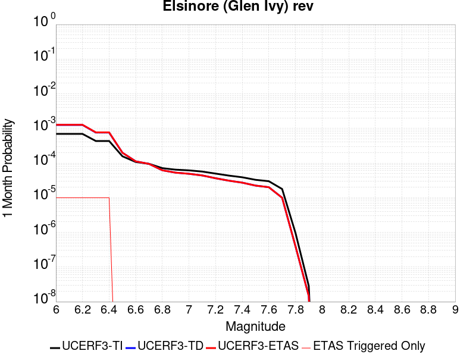 |  |  |

| Magnitude | 1 wk TI Prob | 1 wk TD Prob | 1 wk ETAS Prob | 1 wk ETAS/TD Gain | 1 wk ETAS Triggered Only | 1 mo TI Prob | 1 mo TD Prob | 1 mo ETAS Prob | 1 mo ETAS/TD Gain | 1 mo ETAS Triggered Only | 1 yr TI Prob | 1 yr TD Prob | 1 yr ETAS Prob | 1 yr ETAS/TD Gain | 1 yr ETAS Triggered Only | 10 yr TI Prob | 10 yr TD Prob | 10 yr ETAS Prob | 10 yr ETAS/TD Gain | 10 yr ETAS Triggered Only |
|-----|-----|-----|-----|-----|-----|-----|-----|-----|-----|-----|-----|-----|-----|-----|-----|-----|-----|-----|-----|-----|
| 6.0 | 1.6204086E-4 | 2.9368603E-4 | 2.9368603E-4 | 1.0 | 0.0 | 6.94276E-4 | 0.001258202 | 0.001258202 | 1.0 | 0.0 | 0.008420097 | 0.015238245 | 0.015238245 | 1.0 | 0.0 | 0.081081145 | 0.13971241 | 0.13976258 | 1.0003592 | 5.832264E-5 |
| 6.1 | 1.6204086E-4 | 2.9368603E-4 | 2.9368603E-4 | 1.0 | 0.0 | 6.94276E-4 | 0.001258202 | 0.001258202 | 1.0 | 0.0 | 0.008420097 | 0.015238245 | 0.015238245 | 1.0 | 0.0 | 0.081081145 | 0.13971241 | 0.13976258 | 1.0003592 | 5.832264E-5 |
| 6.2 | 1.6204086E-4 | 2.9368603E-4 | 2.9368603E-4 | 1.0 | 0.0 | 6.94276E-4 | 0.001258202 | 0.001258202 | 1.0 | 0.0 | 0.008420097 | 0.015238245 | 0.015238245 | 1.0 | 0.0 | 0.081081145 | 0.13971241 | 0.13976258 | 1.0003592 | 5.832264E-5 |
| 6.3 | 1.0111737E-4 | 1.7705708E-4 | 1.7705708E-4 | 1.0 | 0.0 | 4.332882E-4 | 7.587121E-4 | 7.587121E-4 | 1.0 | 0.0 | 0.005262531 | 0.009218889 | 0.009218889 | 1.0 | 0.0 | 0.0513964 | 0.08702948 | 0.08702948 | 1.0 | 0.0 |
| 6.4 | 1.0111737E-4 | 1.7705708E-4 | 1.7705708E-4 | 1.0 | 0.0 | 4.332882E-4 | 7.587121E-4 | 7.587121E-4 | 1.0 | 0.0 | 0.005262531 | 0.009218889 | 0.009218889 | 1.0 | 0.0 | 0.0513964 | 0.08702948 | 0.08702948 | 1.0 | 0.0 |
| 6.5 | 3.6624708E-5 | 4.640269E-5 | 4.640269E-5 | 1.0 | 0.0 | 1.569536E-4 | 1.9885555E-4 | 1.9885555E-4 | 1.0 | 0.0 | 0.001909235 | 0.0024187414 | 0.0024187414 | 1.0 | 0.0 | 0.01892915 | 0.023745729 | 0.023745729 | 1.0 | 0.0 |
| 6.6 | 2.5051324E-5 | 2.6155934E-5 | 2.6155934E-5 | 1.0 | 0.0 | 1.073584E-4 | 1.120923E-4 | 1.120923E-4 | 1.0 | 0.0 | 0.0013063047 | 0.0013639139 | 0.0013639139 | 1.0 | 0.0 | 0.012986525 | 0.01356882 | 0.01356882 | 1.0 | 0.0 |
| 6.7 | 2.2189772E-5 | 2.2079983E-5 | 2.2079983E-5 | 1.0 | 0.0 | 9.509556E-5 | 9.462527E-5 | 9.462527E-5 | 1.0 | 0.0 | 0.0011571734 | 0.0011514901 | 0.0011514901 | 1.0 | 0.0 | 0.011511663 | 0.011469081 | 0.011469081 | 1.0 | 0.0 |
| 6.8 | 1.6654378E-5 | 1.4442191E-5 | 1.4442191E-5 | 1.0 | 0.0 | 7.137396E-5 | 6.189367E-5 | 6.189367E-5 | 1.0 | 0.0 | 8.686314E-4 | 7.5330003E-4 | 7.5330003E-4 | 1.0 | 0.0 | 0.008652439 | 0.0075128013 | 0.0075128013 | 1.0 | 0.0 |
| 6.9 | 1.5042909E-5 | 1.2335982E-5 | 1.2335982E-5 | 1.0 | 0.0 | 6.446802E-5 | 5.2867443E-5 | 5.2867443E-5 | 1.0 | 0.0 | 7.8461546E-4 | 6.4347417E-4 | 6.4347417E-4 | 1.0 | 0.0 | 0.007818509 | 0.006420332 | 0.006420332 | 1.0 | 0.0 |
| 7.0 | 1.4361385E-5 | 1.1455086E-5 | 1.1455086E-5 | 1.0 | 0.0 | 6.154734E-5 | 4.9092316E-5 | 4.9092316E-5 | 1.0 | 0.0 | 7.490812E-4 | 5.9753796E-4 | 5.9753796E-4 | 1.0 | 0.0 | 0.007465612 | 0.0059633036 | 0.0059633036 | 1.0 | 0.0 |
| 7.1 | 1.3265571E-5 | 1.0248273E-5 | 1.0248273E-5 | 1.0 | 0.0 | 5.6851208E-5 | 4.392044E-5 | 4.392044E-5 | 1.0 | 0.0 | 6.919436E-4 | 5.3460273E-4 | 5.3460273E-4 | 1.0 | 0.0 | 0.006897931 | 0.005336523 | 0.005336523 | 1.0 | 0.0 |
| 7.2 | 1.1596403E-5 | 8.507918E-6 | 8.507918E-6 | 1.0 | 0.0 | 4.9697923E-5 | 3.6462006E-5 | 3.6462006E-5 | 1.0 | 0.0 | 6.049042E-4 | 4.4383618E-4 | 4.4383618E-4 | 1.0 | 0.0 | 0.006032603 | 0.004430913 | 0.004430913 | 1.0 | 0.0 |
| 7.3 | 1.0150827E-5 | 7.24123E-6 | 7.24123E-6 | 1.0 | 0.0 | 4.3502816E-5 | 3.103348E-5 | 3.103348E-5 | 1.0 | 0.0 | 5.2951806E-4 | 3.7776856E-4 | 3.7776856E-4 | 1.0 | 0.0 | 0.005282581 | 0.0037716506 | 0.0037716506 | 1.0 | 0.0 |
| 7.4 | 9.080705E-6 | 6.3547245E-6 | 6.3547245E-6 | 1.0 | 0.0 | 3.8916725E-5 | 2.7234257E-5 | 2.7234257E-5 | 1.0 | 0.0 | 4.7370812E-4 | 3.31528E-4 | 3.31528E-4 | 1.0 | 0.0 | 0.004726996 | 0.003310485 | 0.003310485 | 1.0 | 0.0 |
| 7.5 | 7.671649E-6 | 5.2275423E-6 | 5.2275423E-6 | 1.0 | 0.0 | 3.287808E-5 | 2.2403567E-5 | 2.2403567E-5 | 1.0 | 0.0 | 4.0021708E-4 | 2.7273054E-4 | 2.7273054E-4 | 1.0 | 0.0 | 0.0039949706 | 0.0027240834 | 0.0027240834 | 1.0 | 0.0 |
| 7.6 | 6.990086E-6 | 4.68932E-6 | 4.68932E-6 | 1.0 | 0.0 | 2.9957167E-5 | 2.0096937E-5 | 2.0096937E-5 | 1.0 | 0.0 | 3.6466747E-4 | 2.446539E-4 | 2.446539E-4 | 1.0 | 0.0 | 0.0036406964 | 0.002443962 | 0.002443962 | 1.0 | 0.0 |
| 7.7 | 4.163505E-6 | 2.3304067E-6 | 2.3304067E-6 | 1.0 | 0.0 | 1.7843471E-5 | 9.987423E-6 | 9.987423E-6 | 1.0 | 0.0 | 2.172226E-4 | 1.21590834E-4 | 1.21590834E-4 | 1.0 | 0.0 | 0.0021701038 | 0.0012153161 | 0.0012153161 | 1.0 | 0.0 |
| 7.8 | 2.2692414E-7 | 9.388335E-8 | 9.388335E-8 | 1.0 | 0.0 | 9.725317E-7 | 4.023572E-7 | 4.023572E-7 | 1.0 | 0.0 | 1.1840509E-5 | 4.898691E-6 | 4.898691E-6 | 1.0 | 0.0 | 1.1839878E-4 | 4.8986156E-5 | 4.8986156E-5 | 1.0 | 0.0 |
| 7.9 | 6.676829E-9 | 3.4405983E-9 | 3.4405983E-9 | 1.0 | 0.0 | 2.861498E-8 | 1.4745421E-8 | 1.4745421E-8 | 1.0 | 0.0 | 3.4838732E-7 | 1.7952549E-7 | 1.7952549E-7 | 1.0 | 0.0 | 3.4838679E-6 | 1.7952536E-6 | 1.7952536E-6 | 1.0 | 0.0 |

## San Andreas (Creeping Section) 2011 CFM
*[(top)](#table-of-contents)*

| 1 Week | 1 Month | 1 Year | 10 Year |
|-----|-----|-----|-----|
|  |  |  |  |

| Magnitude | 1 wk TI Prob | 1 wk TD Prob | 1 wk ETAS Prob | 1 wk ETAS/TD Gain | 1 wk ETAS Triggered Only | 1 mo TI Prob | 1 mo TD Prob | 1 mo ETAS Prob | 1 mo ETAS/TD Gain | 1 mo ETAS Triggered Only | 1 yr TI Prob | 1 yr TD Prob | 1 yr ETAS Prob | 1 yr ETAS/TD Gain | 1 yr ETAS Triggered Only | 10 yr TI Prob | 10 yr TD Prob | 10 yr ETAS Prob | 10 yr ETAS/TD Gain | 10 yr ETAS Triggered Only |
|-----|-----|-----|-----|-----|-----|-----|-----|-----|-----|-----|-----|-----|-----|-----|-----|-----|-----|-----|-----|-----|
| 6.0 | 5.986481E-4 | 0.0012276472 | 0.0012276472 | 1.0 | 0.0 | 0.0025631124 | 0.0052463133 | 0.0052463133 | 1.0 | 0.0 | 0.030762846 | 0.06124244 | 0.06124244 | 1.0 | 0.0 | 0.26835477 | 0.42613125 | 0.42616472 | 1.0000786 | 5.832264E-5 |
| 6.1 | 5.015945E-4 | 0.0010218533 | 0.0010218533 | 1.0 | 0.0 | 0.00214792 | 0.004368406 | 0.004368406 | 1.0 | 0.0 | 0.025839351 | 0.051280405 | 0.051280405 | 1.0 | 0.0 | 0.23032776 | 0.37304595 | 0.3730825 | 1.000098 | 5.832264E-5 |
| 6.2 | 4.073338E-4 | 8.1082433E-4 | 8.1082433E-4 | 1.0 | 0.0 | 0.0017445484 | 0.0034686904 | 0.0034686904 | 1.0 | 0.0 | 0.021034058 | 0.040964548 | 0.040964548 | 1.0 | 0.0 | 0.19150782 | 0.31323817 | 0.31327823 | 1.0001279 | 5.832264E-5 |
| 6.3 | 3.464099E-4 | 6.7430345E-4 | 6.7430345E-4 | 1.0 | 0.0 | 0.0014837692 | 0.002885177 | 0.002885177 | 1.0 | 0.0 | 0.017915873 | 0.034221712 | 0.034221712 | 1.0 | 0.0 | 0.16538359 | 0.27153367 | 0.27157614 | 1.0001565 | 5.832264E-5 |
| 6.4 | 2.935057E-4 | 5.5472064E-4 | 5.5472064E-4 | 1.0 | 0.0 | 0.0012572751 | 0.0023749082 | 0.0023749082 | 1.0 | 0.0 | 0.015200248 | 0.028297136 | 0.028297136 | 1.0 | 0.0 | 0.14201577 | 0.23321453 | 0.23325925 | 1.0001918 | 5.832264E-5 |
| 6.5 | 2.3409708E-4 | 4.214367E-4 | 4.214367E-4 | 1.0 | 0.0 | 0.0010028875 | 0.0018049375 | 0.0018049375 | 1.0 | 0.0 | 0.012141965 | 0.021620123 | 0.021620123 | 1.0 | 0.0 | 0.11499573 | 0.18706667 | 0.18711407 | 1.0002534 | 5.832264E-5 |
| 6.6 | 1.5842178E-4 | 2.5133544E-4 | 2.5133544E-4 | 1.0 | 0.0 | 6.7877385E-4 | 0.0010766891 | 0.0010766891 | 1.0 | 0.0 | 0.0082328 | 0.013028364 | 0.013028364 | 1.0 | 0.0 | 0.07934396 | 0.123407185 | 0.12345831 | 1.0004143 | 5.832264E-5 |
| 6.7 | 1.5616413E-4 | 2.4669705E-4 | 2.4669705E-4 | 1.0 | 0.0 | 6.691031E-4 | 0.0010568266 | 0.0010568266 | 1.0 | 0.0 | 0.0081159435 | 0.012790156 | 0.012790156 | 1.0 | 0.0 | 0.0782586 | 0.121434376 | 0.12148561 | 1.000422 | 5.832264E-5 |
| 6.8 | 1.5538467E-4 | 2.4493402E-4 | 2.4493402E-4 | 1.0 | 0.0 | 6.6576427E-4 | 0.0010492804 | 0.0010492804 | 1.0 | 0.0 | 0.008075596 | 0.01269948 | 0.01269948 | 1.0 | 0.0 | 0.07788358 | 0.120665014 | 0.1207163 | 1.000425 | 5.832264E-5 |
| 6.9 | 1.5153569E-4 | 2.3601907E-4 | 2.3601907E-4 | 1.0 | 0.0 | 6.49277E-4 | 0.0010111202 | 0.0010111202 | 1.0 | 0.0 | 0.007876333 | 0.012241432 | 0.012241432 | 1.0 | 0.0 | 0.07602952 | 0.11673443 | 0.11678594 | 1.0004413 | 5.832264E-5 |
| 7.0 | 1.4588932E-4 | 2.2458547E-4 | 2.2458547E-4 | 1.0 | 0.0 | 6.250901E-4 | 9.6215605E-4 | 9.6215605E-4 | 1.0 | 0.0 | 0.0075839474 | 0.011651831 | 0.011651831 | 1.0 | 0.0 | 0.073302895 | 0.11157989 | 0.1116317 | 1.0004643 | 5.832264E-5 |
| 7.1 | 1.1565079E-4 | 1.6333992E-4 | 1.6333992E-4 | 1.0 | 0.0 | 4.955521E-4 | 6.998413E-4 | 6.998413E-4 | 1.0 | 0.0 | 0.006016669 | 0.008487483 | 0.008487483 | 1.0 | 0.0 | 0.058563538 | 0.08390128 | 0.08395471 | 1.0006368 | 5.832264E-5 |
| 7.2 | 1.0393792E-4 | 1.466506E-4 | 1.466506E-4 | 1.0 | 0.0 | 4.4537216E-4 | 6.2835193E-4 | 6.2835193E-4 | 1.0 | 0.0 | 0.005408933 | 0.0076235207 | 0.0076235207 | 1.0 | 0.0 | 0.052791595 | 0.07584036 | 0.07589426 | 1.0007107 | 5.832264E-5 |
| 7.3 | 9.332884E-5 | 1.2823672E-4 | 1.2823672E-4 | 1.0 | 0.0 | 3.999194E-4 | 5.4947083E-4 | 5.4947083E-4 | 1.0 | 0.0 | 0.0048581534 | 0.0066694226 | 0.0066694226 | 1.0 | 0.0 | 0.047533102 | 0.06667941 | 0.066733845 | 1.0008163 | 5.832264E-5 |
| 7.4 | 8.670252E-5 | 1.1741446E-4 | 1.1741446E-4 | 1.0 | 0.0 | 3.715293E-4 | 5.0310843E-4 | 5.0310843E-4 | 1.0 | 0.0 | 0.004513991 | 0.006108263 | 0.006108263 | 1.0 | 0.0 | 0.044233937 | 0.061328243 | 0.06138299 | 1.0008926 | 5.832264E-5 |
| 7.5 | 7.3036405E-5 | 9.037856E-5 | 9.037856E-5 | 1.0 | 0.0 | 3.129756E-4 | 3.872793E-4 | 3.872793E-4 | 1.0 | 0.0 | 0.0038038217 | 0.0047049527 | 0.0047049527 | 1.0 | 0.0 | 0.03739367 | 0.04802995 | 0.048085473 | 1.001156 | 5.832264E-5 |
| 7.6 | 6.3935775E-5 | 8.3081235E-5 | 8.3081235E-5 | 1.0 | 0.0 | 2.7398168E-4 | 3.5601392E-4 | 3.5601392E-4 | 1.0 | 0.0 | 0.0033306254 | 0.0043258737 | 0.0043258737 | 1.0 | 0.0 | 0.032811474 | 0.044123914 | 0.044179663 | 1.0012635 | 5.832264E-5 |
| 7.7 | 5.5050095E-5 | 6.686418E-5 | 6.686418E-5 | 1.0 | 0.0 | 2.3590765E-4 | 2.865293E-4 | 2.865293E-4 | 1.0 | 0.0 | 0.0028683927 | 0.0034829183 | 0.0034829183 | 1.0 | 0.0 | 0.0283165 | 0.035915207 | 0.035971437 | 1.0015656 | 5.832264E-5 |
| 7.8 | 5.027131E-5 | 6.1853265E-5 | 6.1853265E-5 | 1.0 | 0.0 | 2.1543067E-4 | 2.650585E-4 | 2.650585E-4 | 1.0 | 0.0 | 0.0026197135 | 0.0032223153 | 0.0032223153 | 1.0 | 0.0 | 0.025890453 | 0.03323572 | 0.033292104 | 1.0016965 | 5.832264E-5 |
| 7.9 | 3.7271806E-5 | 5.0405382E-5 | 5.0405382E-5 | 1.0 | 0.0 | 1.5972654E-4 | 2.160052E-4 | 2.160052E-4 | 1.0 | 0.0 | 0.0019429359 | 0.0026266936 | 0.0026266936 | 1.0 | 0.0 | 0.019260362 | 0.027155824 | 0.027155824 | 1.0 | 0.0 |
| 8.0 | 2.7310243E-5 | 3.154834E-5 | 3.154834E-5 | 1.0 | 0.0 | 1.17038646E-4 | 1.3520017E-4 | 1.3520017E-4 | 1.0 | 0.0 | 0.0014240141 | 0.0016448201 | 0.0016448201 | 1.0 | 0.0 | 0.014149235 | 0.017274989 | 0.017274989 | 1.0 | 0.0 |
| 8.1 | 1.7940547E-5 | 1.74781E-5 | 1.74781E-5 | 1.0 | 0.0 | 7.688579E-5 | 7.4904E-5 | 7.4904E-5 | 1.0 | 0.0 | 9.3568244E-4 | 9.1157516E-4 | 9.1157516E-4 | 1.0 | 0.0 | 0.009317525 | 0.009839862 | 0.009839862 | 1.0 | 0.0 |
| 8.2 | 8.643924E-6 | 5.506234E-6 | 5.506234E-6 | 1.0 | 0.0 | 3.704486E-5 | 2.3597933E-5 | 2.3597933E-5 | 1.0 | 0.0 | 4.5092785E-4 | 2.8726703E-4 | 2.8726703E-4 | 1.0 | 0.0 | 0.0045001395 | 0.0032658712 | 0.0032658712 | 1.0 | 0.0 |
| 8.3 | 1.983087E-6 | 7.7104113E-7 | 7.7104113E-7 | 1.0 | 0.0 | 8.498917E-6 | 3.3044578E-6 | 3.3044578E-6 | 1.0 | 0.0 | 1.034694E-4 | 4.0231047E-5 | 4.0231047E-5 | 1.0 | 0.0 | 0.0010342124 | 4.7486598E-4 | 4.7486598E-4 | 1.0 | 0.0 |

## Great Valley 10 (Panoche)
*[(top)](#table-of-contents)*

| 1 Week | 1 Month | 1 Year | 10 Year |
|-----|-----|-----|-----|
|  | 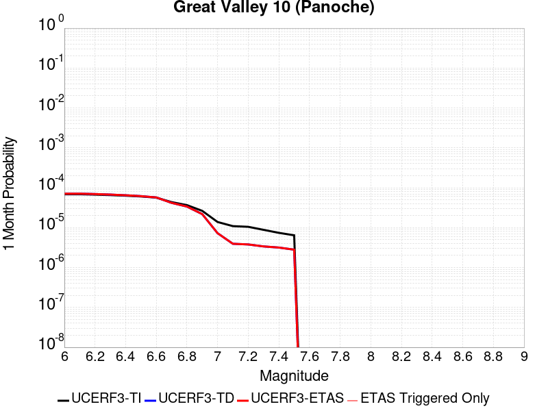 |  |  |

| Magnitude | 1 wk TI Prob | 1 wk TD Prob | 1 wk ETAS Prob | 1 wk ETAS/TD Gain | 1 wk ETAS Triggered Only | 1 mo TI Prob | 1 mo TD Prob | 1 mo ETAS Prob | 1 mo ETAS/TD Gain | 1 mo ETAS Triggered Only | 1 yr TI Prob | 1 yr TD Prob | 1 yr ETAS Prob | 1 yr ETAS/TD Gain | 1 yr ETAS Triggered Only | 10 yr TI Prob | 10 yr TD Prob | 10 yr ETAS Prob | 10 yr ETAS/TD Gain | 10 yr ETAS Triggered Only |
|-----|-----|-----|-----|-----|-----|-----|-----|-----|-----|-----|-----|-----|-----|-----|-----|-----|-----|-----|-----|-----|
| 6.0 | 1.6014626E-5 | 1.6577504E-5 | 1.6577504E-5 | 1.0 | 0.0 | 6.863231E-5 | 7.1044546E-5 | 7.1044546E-5 | 1.0 | 0.0 | 8.35278E-4 | 8.646299E-4 | 8.646299E-4 | 1.0 | 0.0 | 0.008321454 | 0.008613279 | 0.008671099 | 1.0067129 | 5.832264E-5 |
| 6.1 | 1.6014626E-5 | 1.6577504E-5 | 1.6577504E-5 | 1.0 | 0.0 | 6.863231E-5 | 7.1044546E-5 | 7.1044546E-5 | 1.0 | 0.0 | 8.35278E-4 | 8.646299E-4 | 8.646299E-4 | 1.0 | 0.0 | 0.008321454 | 0.008613279 | 0.008671099 | 1.0067129 | 5.832264E-5 |
| 6.2 | 1.56782E-5 | 1.6200516E-5 | 1.6200516E-5 | 1.0 | 0.0 | 6.719056E-5 | 6.942896E-5 | 6.942896E-5 | 1.0 | 0.0 | 8.17738E-4 | 8.449756E-4 | 8.449756E-4 | 1.0 | 0.0 | 0.008147354 | 0.008418236 | 0.008476067 | 1.0068698 | 5.832264E-5 |
| 6.3 | 1.5263338E-5 | 1.5725529E-5 | 1.5725529E-5 | 1.0 | 0.0 | 6.541267E-5 | 6.739342E-5 | 6.739342E-5 | 1.0 | 0.0 | 7.961082E-4 | 8.2021166E-4 | 8.2021166E-4 | 1.0 | 0.0 | 0.007932622 | 0.008172438 | 0.008230283 | 1.0070782 | 5.832264E-5 |
| 6.4 | 1.4720723E-5 | 1.51013155E-5 | 1.51013155E-5 | 1.0 | 0.0 | 6.308728E-5 | 6.471835E-5 | 6.471835E-5 | 1.0 | 0.0 | 7.67817E-4 | 7.8766665E-4 | 7.8766665E-4 | 1.0 | 0.0 | 0.007651695 | 0.007849325 | 0.007907189 | 1.0073719 | 5.832264E-5 |
| 6.5 | 1.408264E-5 | 1.4357811E-5 | 1.4357811E-5 | 1.0 | 0.0 | 6.0352773E-5 | 6.153205E-5 | 6.153205E-5 | 1.0 | 0.0 | 7.3454727E-4 | 7.489008E-4 | 7.489008E-4 | 1.0 | 0.0 | 0.0073212404 | 0.0074643274 | 0.0075222147 | 1.0077552 | 5.832264E-5 |
| 6.6 | 1.3197086E-5 | 1.3323593E-5 | 1.3323593E-5 | 1.0 | 0.0 | 5.6557717E-5 | 5.709989E-5 | 5.709989E-5 | 1.0 | 0.0 | 6.8837265E-4 | 6.9497485E-4 | 6.9497485E-4 | 1.0 | 0.0 | 0.006862442 | 0.0069285543 | 0.0069285543 | 1.0 | 0.0 |
| 6.7 | 1.017583E-5 | 9.746596E-6 | 9.746596E-6 | 1.0 | 0.0 | 4.360997E-5 | 4.1770472E-5 | 4.1770472E-5 | 1.0 | 0.0 | 5.30822E-4 | 5.0843926E-4 | 5.0843926E-4 | 1.0 | 0.0 | 0.0052955584 | 0.0050730123 | 0.0050730123 | 1.0 | 0.0 |
| 6.8 | 8.557912E-6 | 7.873687E-6 | 7.873687E-6 | 1.0 | 0.0 | 3.667625E-5 | 3.3743945E-5 | 3.3743945E-5 | 1.0 | 0.0 | 4.4644187E-4 | 4.1075711E-4 | 4.1075711E-4 | 1.0 | 0.0 | 0.0044554602 | 0.004100186 | 0.004100186 | 1.0 | 0.0 |
| 6.9 | 6.14664E-6 | 5.092711E-6 | 5.092711E-6 | 1.0 | 0.0 | 2.6342475E-5 | 2.1825728E-5 | 2.1825728E-5 | 1.0 | 0.0 | 3.2067244E-4 | 2.6569725E-4 | 2.6569725E-4 | 1.0 | 0.0 | 0.003202101 | 0.002653934 | 0.002653934 | 1.0 | 0.0 |
| 7.0 | 3.2310581E-6 | 1.6953142E-6 | 1.6953142E-6 | 1.0 | 0.0 | 1.3847319E-5 | 7.2656126E-6 | 7.2656126E-6 | 1.0 | 0.0 | 1.6857806E-4 | 8.845534E-5 | 8.845534E-5 | 1.0 | 0.0 | 0.0016845023 | 8.8421063E-4 | 8.8421063E-4 | 1.0 | 0.0 |
| 7.1 | 2.544492E-6 | 9.1900364E-7 | 9.1900364E-7 | 1.0 | 0.0 | 1.090492E-5 | 3.9385814E-6 | 3.9385814E-6 | 1.0 | 0.0 | 1.327593E-4 | 4.795122E-5 | 4.795122E-5 | 1.0 | 0.0 | 0.0013268003 | 4.7941352E-4 | 4.7941352E-4 | 1.0 | 0.0 |
| 7.2 | 2.4479045E-6 | 8.8423616E-7 | 8.8423616E-7 | 1.0 | 0.0 | 1.0490977E-5 | 3.7895782E-6 | 3.7895782E-6 | 1.0 | 0.0 | 1.2772017E-4 | 4.6137186E-5 | 4.6137186E-5 | 1.0 | 0.0 | 0.0012764678 | 4.612808E-4 | 4.612808E-4 | 1.0 | 0.0 |
| 7.3 | 2.0559578E-6 | 7.893673E-7 | 7.893673E-7 | 1.0 | 0.0 | 8.811218E-6 | 3.3829986E-6 | 3.3829986E-6 | 1.0 | 0.0 | 1.072713E-4 | 4.1187275E-5 | 4.1187275E-5 | 1.0 | 0.0 | 0.0010721954 | 4.1180107E-4 | 4.1180107E-4 | 1.0 | 0.0 |
| 7.4 | 1.727687E-6 | 7.3885167E-7 | 7.3885167E-7 | 1.0 | 0.0 | 7.404352E-6 | 3.1665036E-6 | 3.1665036E-6 | 1.0 | 0.0 | 9.0144255E-5 | 3.8551545E-5 | 3.8551545E-5 | 1.0 | 0.0 | 9.0107694E-4 | 3.8545317E-4 | 3.8545317E-4 | 1.0 | 0.0 |
| 7.5 | 1.5002679E-6 | 6.5468015E-7 | 6.5468015E-7 | 1.0 | 0.0 | 6.4297037E-6 | 2.805769E-6 | 2.805769E-6 | 1.0 | 0.0 | 7.827883E-5 | 3.4159748E-5 | 3.4159748E-5 | 1.0 | 0.0 | 7.825126E-4 | 3.415491E-4 | 3.415491E-4 | 1.0 | 0.0 |

## Oceanic - West Huasna
*[(top)](#table-of-contents)*

| 1 Week | 1 Month | 1 Year | 10 Year |
|-----|-----|-----|-----|
|  |  |  |  |

| Magnitude | 1 wk TI Prob | 1 wk TD Prob | 1 wk ETAS Prob | 1 wk ETAS/TD Gain | 1 wk ETAS Triggered Only | 1 mo TI Prob | 1 mo TD Prob | 1 mo ETAS Prob | 1 mo ETAS/TD Gain | 1 mo ETAS Triggered Only | 1 yr TI Prob | 1 yr TD Prob | 1 yr ETAS Prob | 1 yr ETAS/TD Gain | 1 yr ETAS Triggered Only | 10 yr TI Prob | 10 yr TD Prob | 10 yr ETAS Prob | 10 yr ETAS/TD Gain | 10 yr ETAS Triggered Only |
|-----|-----|-----|-----|-----|-----|-----|-----|-----|-----|-----|-----|-----|-----|-----|-----|-----|-----|-----|-----|-----|
| 6.0 | 3.195567E-5 | 2.7928618E-5 | 2.7928618E-5 | 1.0 | 0.0 | 1.3694567E-4 | 1.19688826E-4 | 1.19688826E-4 | 1.0 | 0.0 | 0.0016660384 | 0.0014562806 | 0.0014562806 | 1.0 | 0.0 | 0.016536033 | 0.014471928 | 0.014529407 | 1.0039717 | 5.832264E-5 |
| 6.1 | 2.1156782E-5 | 1.757453E-5 | 1.757453E-5 | 1.0 | 0.0 | 9.066878E-5 | 7.531729E-5 | 7.531729E-5 | 1.0 | 0.0 | 0.0011033333 | 9.1661164E-4 | 9.1661164E-4 | 1.0 | 0.0 | 0.010978713 | 0.0091293175 | 0.0091293175 | 1.0 | 0.0 |
| 6.2 | 1.6195117E-5 | 1.3327889E-5 | 1.3327889E-5 | 1.0 | 0.0 | 6.9405796E-5 | 5.7118286E-5 | 5.7118286E-5 | 1.0 | 0.0 | 8.44688E-4 | 6.9519586E-4 | 6.9519586E-4 | 1.0 | 0.0 | 0.008414844 | 0.006930505 | 0.006930505 | 1.0 | 0.0 |
| 6.3 | 1.3559345E-5 | 1.1179727E-5 | 1.1179727E-5 | 1.0 | 0.0 | 5.811018E-5 | 4.7912243E-5 | 4.7912243E-5 | 1.0 | 0.0 | 7.072618E-4 | 5.831764E-4 | 5.831764E-4 | 1.0 | 0.0 | 0.0070501505 | 0.0058165784 | 0.0058165784 | 1.0 | 0.0 |
| 6.4 | 1.2120619E-5 | 1.0001485E-5 | 1.0001485E-5 | 1.0 | 0.0 | 5.1944477E-5 | 4.286281E-5 | 4.286281E-5 | 1.0 | 0.0 | 6.322405E-4 | 5.217302E-4 | 5.217302E-4 | 1.0 | 0.0 | 0.006304447 | 0.005205121 | 0.005205121 | 1.0 | 0.0 |
| 6.5 | 1.13511915E-5 | 9.367946E-6 | 9.367946E-6 | 1.0 | 0.0 | 4.8647056E-5 | 4.0147723E-5 | 4.0147723E-5 | 1.0 | 0.0 | 5.9211696E-4 | 4.8868934E-4 | 4.8868934E-4 | 1.0 | 0.0 | 0.0059054173 | 0.004876206 | 0.004876206 | 1.0 | 0.0 |
| 6.6 | 9.850605E-6 | 8.135825E-6 | 8.135825E-6 | 1.0 | 0.0 | 4.2216197E-5 | 3.4867353E-5 | 3.4867353E-5 | 1.0 | 0.0 | 5.1386096E-4 | 4.2442756E-4 | 4.2442756E-4 | 1.0 | 0.0 | 0.0051267436 | 0.004236202 | 0.004236202 | 1.0 | 0.0 |
| 6.7 | 8.8558645E-6 | 7.3187994E-6 | 7.3187994E-6 | 1.0 | 0.0 | 3.7953152E-5 | 3.1365907E-5 | 3.1365907E-5 | 1.0 | 0.0 | 4.6198163E-4 | 3.8181318E-4 | 3.8181318E-4 | 1.0 | 0.0 | 0.004610224 | 0.0038115974 | 0.0038115974 | 1.0 | 0.0 |
| 6.8 | 7.67136E-6 | 6.39208E-6 | 6.39208E-6 | 1.0 | 0.0 | 3.2876844E-5 | 2.7394342E-5 | 2.7394342E-5 | 1.0 | 0.0 | 4.0020206E-4 | 3.3347524E-4 | 3.3347524E-4 | 1.0 | 0.0 | 0.003994821 | 0.0033297692 | 0.0033297692 | 1.0 | 0.0 |
| 6.9 | 6.534529E-6 | 5.4586135E-6 | 5.4586135E-6 | 1.0 | 0.0 | 2.8004823E-5 | 2.339385E-5 | 2.339385E-5 | 1.0 | 0.0 | 3.4090536E-4 | 2.8478302E-4 | 2.8478302E-4 | 1.0 | 0.0 | 0.0034038287 | 0.0028441974 | 0.0028441974 | 1.0 | 0.0 |
| 7.0 | 5.460525E-6 | 4.5702022E-6 | 4.5702022E-6 | 1.0 | 0.0 | 2.3402039E-5 | 1.9586434E-5 | 1.9586434E-5 | 1.0 | 0.0 | 2.8488258E-4 | 2.3843886E-4 | 2.3843886E-4 | 1.0 | 0.0 | 0.0028451765 | 0.0023818442 | 0.0023818442 | 1.0 | 0.0 |
| 7.1 | 4.4825083E-6 | 3.7526715E-6 | 3.7526715E-6 | 1.0 | 0.0 | 1.9210609E-5 | 1.6082779E-5 | 1.6082779E-5 | 1.0 | 0.0 | 2.3386406E-4 | 1.9579034E-4 | 1.9579034E-4 | 1.0 | 0.0 | 0.002336181 | 0.0019561904 | 0.0019561904 | 1.0 | 0.0 |
| 7.2 | 2.821708E-6 | 2.4251235E-6 | 2.4251235E-6 | 1.0 | 0.0 | 1.2092979E-5 | 1.0393345E-5 | 1.0393345E-5 | 1.0 | 0.0 | 1.4722206E-4 | 1.2653164E-4 | 1.2653164E-4 | 1.0 | 0.0 | 0.0014712457 | 0.0012645983 | 0.0012645983 | 1.0 | 0.0 |
| 7.3 | 2.0644757E-6 | 1.768914E-6 | 1.768914E-6 | 1.0 | 0.0 | 8.847723E-6 | 7.581038E-6 | 7.581038E-6 | 1.0 | 0.0 | 1.0771569E-4 | 9.229523E-5 | 9.229523E-5 | 1.0 | 0.0 | 0.001076635 | 9.225707E-4 | 9.225707E-4 | 1.0 | 0.0 |
| 7.4 | 1.6980367E-6 | 1.438146E-6 | 1.438146E-6 | 1.0 | 0.0 | 7.27728E-6 | 6.1634687E-6 | 6.1634687E-6 | 1.0 | 0.0 | 8.8597284E-5 | 7.503765E-5 | 7.503765E-5 | 1.0 | 0.0 | 8.8561967E-4 | 7.501247E-4 | 7.501247E-4 | 1.0 | 0.0 |
| 7.5 | 1.3637683E-6 | 1.1304143E-6 | 1.1304143E-6 | 1.0 | 0.0 | 5.844708E-6 | 4.8446236E-6 | 4.8446236E-6 | 1.0 | 0.0 | 7.1156996E-5 | 5.89817E-5 | 5.89817E-5 | 1.0 | 0.0 | 7.1134215E-4 | 5.8966194E-4 | 5.8966194E-4 | 1.0 | 0.0 |
| 7.6 | 9.802994E-7 | 7.678671E-7 | 7.678671E-7 | 1.0 | 0.0 | 4.2012766E-6 | 3.290855E-6 | 3.290855E-6 | 1.0 | 0.0 | 5.1149345E-5 | 4.0065424E-5 | 4.0065424E-5 | 1.0 | 0.0 | 5.113757E-4 | 4.005834E-4 | 4.005834E-4 | 1.0 | 0.0 |
| 7.7 | 5.986191E-7 | 4.0061522E-7 | 4.0061522E-7 | 1.0 | 0.0 | 2.5655079E-6 | 1.7169212E-6 | 1.7169212E-6 | 1.0 | 0.0 | 3.1234613E-5 | 2.0903315E-5 | 2.0903315E-5 | 1.0 | 0.0 | 3.123022E-4 | 2.0901485E-4 | 2.0901485E-4 | 1.0 | 0.0 |
| 7.8 | 2.9189815E-7 | 1.5295181E-7 | 1.5295181E-7 | 1.0 | 0.0 | 1.2509914E-6 | 6.5550756E-7 | 6.5550756E-7 | 1.0 | 0.0 | 1.5230714E-5 | 7.980775E-6 | 7.980775E-6 | 1.0 | 0.0 | 1.522967E-4 | 7.98062E-5 | 7.98062E-5 | 1.0 | 0.0 |
| 7.9 | 1.2057845E-7 | 4.6264603E-8 | 4.6264603E-8 | 1.0 | 0.0 | 5.1676466E-7 | 1.9827685E-7 | 1.9827685E-7 | 1.0 | 0.0 | 6.2915915E-6 | 2.414018E-6 | 2.414018E-6 | 1.0 | 0.0 | 6.2914136E-5 | 2.4141224E-5 | 2.4141224E-5 | 1.0 | 0.0 |
| 8.0 | 3.3806387E-9 | 9.031532E-10 | 9.031532E-10 | 1.0 | 0.0 | 1.4488451E-8 | 3.870657E-9 | 3.870657E-9 | 1.0 | 0.0 | 1.7639688E-7 | 4.7125248E-8 | 4.7125248E-8 | 1.0 | 0.0 | 1.7639674E-6 | 4.72347E-7 | 4.72347E-7 | 1.0 | 0.0 |

## Ortigalita (South)
*[(top)](#table-of-contents)*

| 1 Week | 1 Month | 1 Year | 10 Year |
|-----|-----|-----|-----|
|  |  |  |  |

| Magnitude | 1 wk TI Prob | 1 wk TD Prob | 1 wk ETAS Prob | 1 wk ETAS/TD Gain | 1 wk ETAS Triggered Only | 1 mo TI Prob | 1 mo TD Prob | 1 mo ETAS Prob | 1 mo ETAS/TD Gain | 1 mo ETAS Triggered Only | 1 yr TI Prob | 1 yr TD Prob | 1 yr ETAS Prob | 1 yr ETAS/TD Gain | 1 yr ETAS Triggered Only | 10 yr TI Prob | 10 yr TD Prob | 10 yr ETAS Prob | 10 yr ETAS/TD Gain | 10 yr ETAS Triggered Only |
|-----|-----|-----|-----|-----|-----|-----|-----|-----|-----|-----|-----|-----|-----|-----|-----|-----|-----|-----|-----|-----|
| 6.0 | 3.72394E-5 | 4.3261207E-5 | 4.3261207E-5 | 1.0 | 0.0 | 1.5958765E-4 | 1.8539288E-4 | 1.8539288E-4 | 1.0 | 0.0 | 0.0019412481 | 0.0022549783 | 0.0022549783 | 1.0 | 0.0 | 0.019243775 | 0.02233735 | 0.02239437 | 1.0025526 | 5.832264E-5 |
| 6.1 | 2.7299884E-5 | 3.1495903E-5 | 3.1495903E-5 | 1.0 | 0.0 | 1.16994255E-4 | 1.3497578E-4 | 1.3497578E-4 | 1.0 | 0.0 | 0.0014234743 | 0.0016421467 | 0.0016421467 | 1.0 | 0.0 | 0.014143906 | 0.016306054 | 0.016363425 | 1.0035185 | 5.832264E-5 |
| 6.2 | 2.7299884E-5 | 3.1495903E-5 | 3.1495903E-5 | 1.0 | 0.0 | 1.16994255E-4 | 1.3497578E-4 | 1.3497578E-4 | 1.0 | 0.0 | 0.0014234743 | 0.0016421467 | 0.0016421467 | 1.0 | 0.0 | 0.014143906 | 0.016306054 | 0.016363425 | 1.0035185 | 5.832264E-5 |
| 6.3 | 2.0546433E-5 | 2.3634284E-5 | 2.3634284E-5 | 1.0 | 0.0 | 8.805317E-5 | 1.0128596E-4 | 1.0128596E-4 | 1.0 | 0.0 | 0.00107152 | 0.001232478 | 0.001232478 | 1.0 | 0.0 | 0.010663681 | 0.012258491 | 0.012316098 | 1.0046995 | 5.832264E-5 |
| 6.4 | 2.0546433E-5 | 2.3634284E-5 | 2.3634284E-5 | 1.0 | 0.0 | 8.805317E-5 | 1.0128596E-4 | 1.0128596E-4 | 1.0 | 0.0 | 0.00107152 | 0.001232478 | 0.001232478 | 1.0 | 0.0 | 0.010663681 | 0.012258491 | 0.012316098 | 1.0046995 | 5.832264E-5 |
| 6.5 | 1.7779594E-5 | 2.0449423E-5 | 2.0449423E-5 | 1.0 | 0.0 | 7.619603E-5 | 8.763752E-5 | 8.763752E-5 | 1.0 | 0.0 | 9.272918E-4 | 0.0010664781 | 0.0010664781 | 1.0 | 0.0 | 0.009234319 | 0.0106150685 | 0.010672771 | 1.005436 | 5.832264E-5 |
| 6.6 | 1.6272212E-5 | 1.8717212E-5 | 1.8717212E-5 | 1.0 | 0.0 | 6.973618E-5 | 8.0214224E-5 | 8.0214224E-5 | 1.0 | 0.0 | 8.487073E-4 | 9.761828E-4 | 9.761828E-4 | 1.0 | 0.0 | 0.008454733 | 0.00972025 | 0.009778006 | 1.0059417 | 5.832264E-5 |
| 6.7 | 1.3051484E-5 | 1.5040588E-5 | 1.5040588E-5 | 1.0 | 0.0 | 5.593373E-5 | 6.445812E-5 | 6.445812E-5 | 1.0 | 0.0 | 6.807804E-4 | 7.845046E-4 | 7.845046E-4 | 1.0 | 0.0 | 0.006786986 | 0.007818335 | 0.0078762015 | 1.0074013 | 5.832264E-5 |
| 6.8 | 1.04277415E-5 | 1.1988665E-5 | 1.1988665E-5 | 1.0 | 0.0 | 4.4689557E-5 | 5.1379022E-5 | 5.1379022E-5 | 1.0 | 0.0 | 5.439595E-4 | 6.253675E-4 | 6.253675E-4 | 1.0 | 0.0 | 0.0054262993 | 0.0062368317 | 0.00629479 | 1.009293 | 5.832264E-5 |
| 6.9 | 7.639968E-6 | 8.792559E-6 | 8.792559E-6 | 1.0 | 0.0 | 3.274231E-5 | 3.7681886E-5 | 3.7681886E-5 | 1.0 | 0.0 | 3.9856473E-4 | 4.586863E-4 | 4.586863E-4 | 1.0 | 0.0 | 0.003978506 | 0.004577982 | 0.0046360376 | 1.0126815 | 5.832264E-5 |
| 7.0 | 3.919831E-6 | 4.5339666E-6 | 4.5339666E-6 | 1.0 | 0.0 | 1.679917E-5 | 1.9431154E-5 | 1.9431154E-5 | 1.0 | 0.0 | 2.045107E-4 | 2.3655072E-4 | 2.3655072E-4 | 1.0 | 0.0 | 0.0020432258 | 0.002363198 | 0.002363198 | 1.0 | 0.0 |
| 7.1 | 1.6017933E-6 | 1.8572775E-6 | 1.8572775E-6 | 1.0 | 0.0 | 6.8648105E-6 | 7.959743E-6 | 7.959743E-6 | 1.0 | 0.0 | 8.357586E-5 | 9.6906624E-5 | 9.6906624E-5 | 1.0 | 0.0 | 8.3544437E-4 | 9.687484E-4 | 9.687484E-4 | 1.0 | 0.0 |

## Bullion Mountains
*[(top)](#table-of-contents)*

| 1 Week | 1 Month | 1 Year | 10 Year |
|-----|-----|-----|-----|
|  | 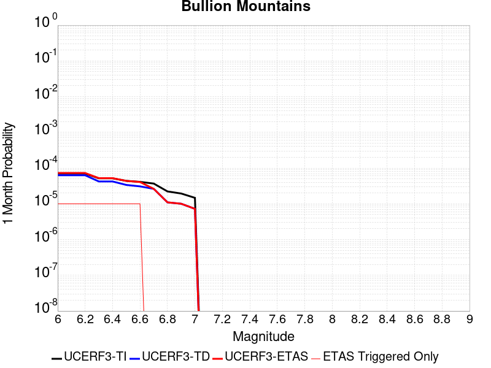 |  |  |

| Magnitude | 1 wk TI Prob | 1 wk TD Prob | 1 wk ETAS Prob | 1 wk ETAS/TD Gain | 1 wk ETAS Triggered Only | 1 mo TI Prob | 1 mo TD Prob | 1 mo ETAS Prob | 1 mo ETAS/TD Gain | 1 mo ETAS Triggered Only | 1 yr TI Prob | 1 yr TD Prob | 1 yr ETAS Prob | 1 yr ETAS/TD Gain | 1 yr ETAS Triggered Only | 10 yr TI Prob | 10 yr TD Prob | 10 yr ETAS Prob | 10 yr ETAS/TD Gain | 10 yr ETAS Triggered Only |
|-----|-----|-----|-----|-----|-----|-----|-----|-----|-----|-----|-----|-----|-----|-----|-----|-----|-----|-----|-----|-----|
| 6.0 | 1.6420427E-5 | 1.4693388E-5 | 1.4693388E-5 | 1.0 | 0.0 | 7.037136E-5 | 6.297036E-5 | 6.297036E-5 | 1.0 | 0.0 | 8.5643446E-4 | 7.6643284E-4 | 7.6643284E-4 | 1.0 | 0.0 | 0.008531413 | 0.0076416894 | 0.0076995664 | 1.0075738 | 5.832264E-5 |
| 6.1 | 1.6420427E-5 | 1.4693388E-5 | 1.4693388E-5 | 1.0 | 0.0 | 7.037136E-5 | 6.297036E-5 | 6.297036E-5 | 1.0 | 0.0 | 8.5643446E-4 | 7.6643284E-4 | 7.6643284E-4 | 1.0 | 0.0 | 0.008531413 | 0.0076416894 | 0.0076995664 | 1.0075738 | 5.832264E-5 |
| 6.2 | 1.6420427E-5 | 1.4693388E-5 | 1.4693388E-5 | 1.0 | 0.0 | 7.037136E-5 | 6.297036E-5 | 6.297036E-5 | 1.0 | 0.0 | 8.5643446E-4 | 7.6643284E-4 | 7.6643284E-4 | 1.0 | 0.0 | 0.008531413 | 0.0076416894 | 0.0076995664 | 1.0075738 | 5.832264E-5 |
| 6.3 | 1.2046778E-5 | 9.863233E-6 | 9.863233E-6 | 1.0 | 0.0 | 5.1628023E-5 | 4.2270443E-5 | 4.2270443E-5 | 1.0 | 0.0 | 6.283899E-4 | 5.145443E-4 | 5.145443E-4 | 1.0 | 0.0 | 0.0062661595 | 0.0051358114 | 0.0051358114 | 1.0 | 0.0 |
| 6.4 | 1.2046778E-5 | 9.863233E-6 | 9.863233E-6 | 1.0 | 0.0 | 5.1628023E-5 | 4.2270443E-5 | 4.2270443E-5 | 1.0 | 0.0 | 6.283899E-4 | 5.145443E-4 | 5.145443E-4 | 1.0 | 0.0 | 0.0062661595 | 0.0051358114 | 0.0051358114 | 1.0 | 0.0 |
| 6.5 | 1.0244343E-5 | 7.880198E-6 | 7.880198E-6 | 1.0 | 0.0 | 4.390359E-5 | 3.3771958E-5 | 3.3771958E-5 | 1.0 | 0.0 | 5.343951E-4 | 4.111167E-4 | 4.111167E-4 | 1.0 | 0.0 | 0.005331118 | 0.0041055926 | 0.0041055926 | 1.0 | 0.0 |
| 6.6 | 9.605408E-6 | 7.178181E-6 | 7.178181E-6 | 1.0 | 0.0 | 4.1165385E-5 | 3.0763385E-5 | 3.0763385E-5 | 1.0 | 0.0 | 5.010733E-4 | 3.745002E-4 | 3.745002E-4 | 1.0 | 0.0 | 0.00499945 | 0.0037406883 | 0.0037406883 | 1.0 | 0.0 |
| 6.7 | 8.60418E-6 | 6.124603E-6 | 6.124603E-6 | 1.0 | 0.0 | 3.687454E-5 | 2.6248144E-5 | 2.6248144E-5 | 1.0 | 0.0 | 4.48855E-4 | 3.195438E-4 | 3.195438E-4 | 1.0 | 0.0 | 0.004479495 | 0.0031927554 | 0.0031927554 | 1.0 | 0.0 |
| 6.8 | 5.187994E-6 | 2.5634833E-6 | 2.5634833E-6 | 1.0 | 0.0 | 2.223407E-5 | 1.0986333E-5 | 1.0986333E-5 | 1.0 | 0.0 | 2.7066618E-4 | 1.337544E-4 | 1.337544E-4 | 1.0 | 0.0 | 0.0027033675 | 0.0013371306 | 0.0013371306 | 1.0 | 0.0 |
| 6.9 | 4.5302368E-6 | 2.3445905E-6 | 2.3445905E-6 | 1.0 | 0.0 | 1.9415156E-5 | 1.0048229E-5 | 1.0048229E-5 | 1.0 | 0.0 | 2.3635388E-4 | 1.2233428E-4 | 1.2233428E-4 | 1.0 | 0.0 | 0.0023610266 | 0.0012230587 | 0.0012230587 | 1.0 | 0.0 |
| 7.0 | 3.431668E-6 | 1.6884529E-6 | 1.6884529E-6 | 1.0 | 0.0 | 1.4707065E-5 | 7.236227E-6 | 7.236227E-6 | 1.0 | 0.0 | 1.7904381E-4 | 8.8101064E-5 | 8.8101064E-5 | 1.0 | 0.0 | 0.0017889962 | 8.810106E-4 | 8.810106E-4 | 1.0 | 0.0 |

## North Frontal  (East)
*[(top)](#table-of-contents)*

| 1 Week | 1 Month | 1 Year | 10 Year |
|-----|-----|-----|-----|
|  |  |  |  |

| Magnitude | 1 wk TI Prob | 1 wk TD Prob | 1 wk ETAS Prob | 1 wk ETAS/TD Gain | 1 wk ETAS Triggered Only | 1 mo TI Prob | 1 mo TD Prob | 1 mo ETAS Prob | 1 mo ETAS/TD Gain | 1 mo ETAS Triggered Only | 1 yr TI Prob | 1 yr TD Prob | 1 yr ETAS Prob | 1 yr ETAS/TD Gain | 1 yr ETAS Triggered Only | 10 yr TI Prob | 10 yr TD Prob | 10 yr ETAS Prob | 10 yr ETAS/TD Gain | 10 yr ETAS Triggered Only |
|-----|-----|-----|-----|-----|-----|-----|-----|-----|-----|-----|-----|-----|-----|-----|-----|-----|-----|-----|-----|-----|
| 6.0 | 7.135738E-6 | 7.4774616E-6 | 7.4774616E-6 | 1.0 | 0.0 | 3.0581377E-5 | 3.2045984E-5 | 3.2045984E-5 | 1.0 | 0.0 | 3.7226462E-4 | 3.9010993E-4 | 3.9010993E-4 | 1.0 | 0.0 | 0.0037164164 | 0.0038962092 | 0.0039543044 | 1.0149107 | 5.832264E-5 |
| 6.1 | 7.135738E-6 | 7.4774616E-6 | 7.4774616E-6 | 1.0 | 0.0 | 3.0581377E-5 | 3.2045984E-5 | 3.2045984E-5 | 1.0 | 0.0 | 3.7226462E-4 | 3.9010993E-4 | 3.9010993E-4 | 1.0 | 0.0 | 0.0037164164 | 0.0038962092 | 0.0039543044 | 1.0149107 | 5.832264E-5 |
| 6.2 | 7.135738E-6 | 7.4774616E-6 | 7.4774616E-6 | 1.0 | 0.0 | 3.0581377E-5 | 3.2045984E-5 | 3.2045984E-5 | 1.0 | 0.0 | 3.7226462E-4 | 3.9010993E-4 | 3.9010993E-4 | 1.0 | 0.0 | 0.0037164164 | 0.0038962092 | 0.0039543044 | 1.0149107 | 5.832264E-5 |
| 6.3 | 7.135738E-6 | 7.4774616E-6 | 7.4774616E-6 | 1.0 | 0.0 | 3.0581377E-5 | 3.2045984E-5 | 3.2045984E-5 | 1.0 | 0.0 | 3.7226462E-4 | 3.9010993E-4 | 3.9010993E-4 | 1.0 | 0.0 | 0.0037164164 | 0.0038962092 | 0.0039543044 | 1.0149107 | 5.832264E-5 |
| 6.4 | 7.135738E-6 | 7.4774616E-6 | 7.4774616E-6 | 1.0 | 0.0 | 3.0581377E-5 | 3.2045984E-5 | 3.2045984E-5 | 1.0 | 0.0 | 3.7226462E-4 | 3.9010993E-4 | 3.9010993E-4 | 1.0 | 0.0 | 0.0037164164 | 0.0038962092 | 0.0039543044 | 1.0149107 | 5.832264E-5 |
| 6.5 | 7.135738E-6 | 7.4774616E-6 | 7.4774616E-6 | 1.0 | 0.0 | 3.0581377E-5 | 3.2045984E-5 | 3.2045984E-5 | 1.0 | 0.0 | 3.7226462E-4 | 3.9010993E-4 | 3.9010993E-4 | 1.0 | 0.0 | 0.0037164164 | 0.0038962092 | 0.0039543044 | 1.0149107 | 5.832264E-5 |
| 6.6 | 7.135738E-6 | 7.4774616E-6 | 7.4774616E-6 | 1.0 | 0.0 | 3.0581377E-5 | 3.2045984E-5 | 3.2045984E-5 | 1.0 | 0.0 | 3.7226462E-4 | 3.9010993E-4 | 3.9010993E-4 | 1.0 | 0.0 | 0.0037164164 | 0.0038962092 | 0.0039543044 | 1.0149107 | 5.832264E-5 |
| 6.7 | 7.135738E-6 | 7.4774616E-6 | 7.4774616E-6 | 1.0 | 0.0 | 3.0581377E-5 | 3.2045984E-5 | 3.2045984E-5 | 1.0 | 0.0 | 3.7226462E-4 | 3.9010993E-4 | 3.9010993E-4 | 1.0 | 0.0 | 0.0037164164 | 0.0038962092 | 0.0039543044 | 1.0149107 | 5.832264E-5 |
| 6.8 | 5.959142E-6 | 6.2369145E-6 | 6.2369145E-6 | 1.0 | 0.0 | 2.553893E-5 | 2.672946E-5 | 2.672946E-5 | 1.0 | 0.0 | 3.108921E-4 | 3.2540064E-4 | 3.2540064E-4 | 1.0 | 0.0 | 0.0031045752 | 0.0032510152 | 0.0033091484 | 1.0178815 | 5.832264E-5 |
| 6.9 | 2.2946929E-6 | 2.382533E-6 | 2.382533E-6 | 1.0 | 0.0 | 9.834361E-6 | 1.0210819E-5 | 1.0210819E-5 | 1.0 | 0.0 | 1.1972676E-4 | 1.243101E-4 | 1.243101E-4 | 1.0 | 0.0 | 0.0011966228 | 0.0012424521 | 0.0012424521 | 1.0 | 0.0 |
| 7.0 | 2.2468673E-6 | 2.3322243E-6 | 2.3322243E-6 | 1.0 | 0.0 | 9.629396E-6 | 9.995211E-6 | 9.995211E-6 | 1.0 | 0.0 | 1.1723159E-4 | 1.2168537E-4 | 1.2168537E-4 | 1.0 | 0.0 | 0.0011716976 | 0.0012162337 | 0.0012162337 | 1.0 | 0.0 |
| 7.1 | 1.9921076E-6 | 2.064663E-6 | 2.064663E-6 | 1.0 | 0.0 | 8.537577E-6 | 8.8485285E-6 | 8.8485285E-6 | 1.0 | 0.0 | 1.0394004E-4 | 1.07725944E-4 | 1.07725944E-4 | 1.0 | 0.0 | 0.0010389143 | 0.0010767799 | 0.0010767799 | 1.0 | 0.0 |
| 7.2 | 1.4524545E-6 | 1.5045578E-6 | 1.5045578E-6 | 1.0 | 0.0 | 6.2247905E-6 | 6.44809E-6 | 6.44809E-6 | 1.0 | 0.0 | 7.5784184E-5 | 7.850292E-5 | 7.850292E-5 | 1.0 | 0.0 | 7.575835E-4 | 7.847763E-4 | 7.847763E-4 | 1.0 | 0.0 |
| 7.3 | 8.9802575E-7 | 9.308999E-7 | 9.308999E-7 | 1.0 | 0.0 | 3.848676E-6 | 3.9895654E-6 | 3.9895654E-6 | 1.0 | 0.0 | 4.685662E-5 | 4.8571994E-5 | 4.8571994E-5 | 1.0 | 0.0 | 4.6846745E-4 | 4.856251E-4 | 4.856251E-4 | 1.0 | 0.0 |
| 7.4 | 7.776139E-7 | 8.0607094E-7 | 8.0607094E-7 | 1.0 | 0.0 | 3.3326266E-6 | 3.4545858E-6 | 3.4545858E-6 | 1.0 | 0.0 | 4.0573974E-5 | 4.205888E-5 | 4.205888E-5 | 1.0 | 0.0 | 4.0566566E-4 | 4.2051997E-4 | 4.2051997E-4 | 1.0 | 0.0 |
| 7.5 | 5.244417E-7 | 5.441382E-7 | 5.441382E-7 | 1.0 | 0.0 | 2.2476054E-6 | 2.332019E-6 | 2.332019E-6 | 1.0 | 0.0 | 2.7364253E-5 | 2.8392029E-5 | 2.8392029E-5 | 1.0 | 0.0 | 2.7360884E-4 | 2.8389052E-4 | 2.8389052E-4 | 1.0 | 0.0 |
| 7.6 | 1.5489647E-7 | 1.609E-7 | 1.609E-7 | 1.0 | 0.0 | 6.6384183E-7 | 6.895714E-7 | 6.895714E-7 | 1.0 | 0.0 | 8.082245E-6 | 8.395519E-6 | 8.395519E-6 | 1.0 | 0.0 | 8.08195E-5 | 8.3954015E-5 | 8.3954015E-5 | 1.0 | 0.0 |

## Kern Canyon (North Kern) 2011
*[(top)](#table-of-contents)*

| 1 Week | 1 Month | 1 Year | 10 Year |
|-----|-----|-----|-----|
|  |  | 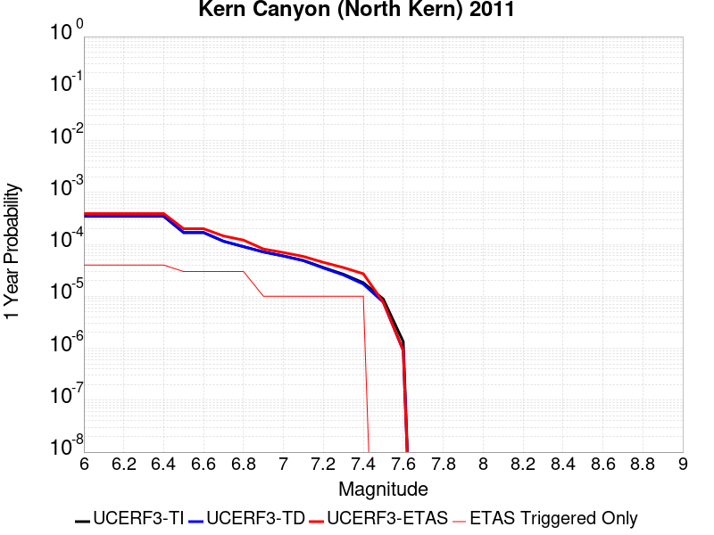 |  |

| Magnitude | 1 wk TI Prob | 1 wk TD Prob | 1 wk ETAS Prob | 1 wk ETAS/TD Gain | 1 wk ETAS Triggered Only | 1 mo TI Prob | 1 mo TD Prob | 1 mo ETAS Prob | 1 mo ETAS/TD Gain | 1 mo ETAS Triggered Only | 1 yr TI Prob | 1 yr TD Prob | 1 yr ETAS Prob | 1 yr ETAS/TD Gain | 1 yr ETAS Triggered Only | 10 yr TI Prob | 10 yr TD Prob | 10 yr ETAS Prob | 10 yr ETAS/TD Gain | 10 yr ETAS Triggered Only |
|-----|-----|-----|-----|-----|-----|-----|-----|-----|-----|-----|-----|-----|-----|-----|-----|-----|-----|-----|-----|-----|
| 6.0 | 6.6264497E-6 | 6.757459E-6 | 6.757459E-6 | 1.0 | 0.0 | 2.8398761E-5 | 2.8960261E-5 | 2.8960261E-5 | 1.0 | 0.0 | 3.4570007E-4 | 3.5254212E-4 | 4.1084422E-4 | 1.1653762 | 5.832264E-5 | 0.0034516277 | 0.003520617 | 0.0035787344 | 1.0165077 | 5.832264E-5 |
| 6.1 | 6.6264497E-6 | 6.757459E-6 | 6.757459E-6 | 1.0 | 0.0 | 2.8398761E-5 | 2.8960261E-5 | 2.8960261E-5 | 1.0 | 0.0 | 3.4570007E-4 | 3.5254212E-4 | 4.1084422E-4 | 1.1653762 | 5.832264E-5 | 0.0034516277 | 0.003520617 | 0.0035787344 | 1.0165077 | 5.832264E-5 |
| 6.2 | 6.6264497E-6 | 6.757459E-6 | 6.757459E-6 | 1.0 | 0.0 | 2.8398761E-5 | 2.8960261E-5 | 2.8960261E-5 | 1.0 | 0.0 | 3.4570007E-4 | 3.5254212E-4 | 4.1084422E-4 | 1.1653762 | 5.832264E-5 | 0.0034516277 | 0.003520617 | 0.0035787344 | 1.0165077 | 5.832264E-5 |
| 6.3 | 6.6264497E-6 | 6.757459E-6 | 6.757459E-6 | 1.0 | 0.0 | 2.8398761E-5 | 2.8960261E-5 | 2.8960261E-5 | 1.0 | 0.0 | 3.4570007E-4 | 3.5254212E-4 | 4.1084422E-4 | 1.1653762 | 5.832264E-5 | 0.0034516277 | 0.003520617 | 0.0035787344 | 1.0165077 | 5.832264E-5 |
| 6.4 | 6.6264497E-6 | 6.757459E-6 | 6.757459E-6 | 1.0 | 0.0 | 2.8398761E-5 | 2.8960261E-5 | 2.8960261E-5 | 1.0 | 0.0 | 3.4570007E-4 | 3.5254212E-4 | 4.1084422E-4 | 1.1653762 | 5.832264E-5 | 0.0034516277 | 0.003520617 | 0.0035787344 | 1.0165077 | 5.832264E-5 |
| 6.5 | 3.2162225E-6 | 3.2571465E-6 | 3.2571465E-6 | 1.0 | 0.0 | 1.3783738E-5 | 1.3959128E-5 | 1.3959128E-5 | 1.0 | 0.0 | 1.6780409E-4 | 1.6993994E-4 | 2.2825267E-4 | 1.3431373 | 5.832264E-5 | 0.0016767744 | 0.0016981796 | 0.0017564032 | 1.0342859 | 5.832264E-5 |
| 6.6 | 3.2162225E-6 | 3.2571465E-6 | 3.2571465E-6 | 1.0 | 0.0 | 1.3783738E-5 | 1.3959128E-5 | 1.3959128E-5 | 1.0 | 0.0 | 1.6780409E-4 | 1.6993994E-4 | 2.2825267E-4 | 1.3431373 | 5.832264E-5 | 0.0016767744 | 0.0016981796 | 0.0017564032 | 1.0342859 | 5.832264E-5 |
| 6.7 | 2.1908265E-6 | 2.2071572E-6 | 2.2071572E-6 | 1.0 | 0.0 | 9.389223E-6 | 9.4592115E-6 | 9.4592115E-6 | 1.0 | 0.0 | 1.1430779E-4 | 1.1516001E-4 | 1.7347594E-4 | 1.5063905 | 5.832264E-5 | 0.0011424901 | 0.0011510227 | 0.0012092782 | 1.050612 | 5.832264E-5 |
| 6.8 | 1.7303895E-6 | 1.7365796E-6 | 1.7365796E-6 | 1.0 | 0.0 | 7.415934E-6 | 7.4424634E-6 | 7.4424634E-6 | 1.0 | 0.0 | 9.028525E-5 | 9.060832E-5 | 1.4892568E-4 | 1.6436203 | 5.832264E-5 | 9.024858E-4 | 9.057235E-4 | 9.639933E-4 | 1.0643351 | 5.832264E-5 |
| 6.9 | 1.3700314E-6 | 1.368883E-6 | 1.368883E-6 | 1.0 | 0.0 | 5.87155E-6 | 5.8666283E-6 | 5.8666283E-6 | 1.0 | 0.0 | 7.148377E-5 | 7.142391E-5 | 7.142391E-5 | 1.0 | 0.0 | 7.146078E-4 | 7.1401405E-4 | 7.1401405E-4 | 1.0 | 0.0 |
| 7.0 | 1.1467797E-6 | 1.1413978E-6 | 1.1413978E-6 | 1.0 | 0.0 | 4.9147607E-6 | 4.891696E-6 | 4.891696E-6 | 1.0 | 0.0 | 5.983557E-5 | 5.95548E-5 | 5.95548E-5 | 1.0 | 0.0 | 5.981946E-4 | 5.9539155E-4 | 5.9539155E-4 | 1.0 | 0.0 |
| 7.1 | 9.3952065E-7 | 9.3028325E-7 | 9.3028325E-7 | 1.0 | 0.0 | 4.026511E-6 | 3.9869224E-6 | 3.9869224E-6 | 1.0 | 0.0 | 4.9021666E-5 | 4.8539714E-5 | 4.8539714E-5 | 1.0 | 0.0 | 4.901085E-4 | 4.852929E-4 | 4.852929E-4 | 1.0 | 0.0 |
| 7.2 | 6.858055E-7 | 6.719405E-7 | 6.719405E-7 | 1.0 | 0.0 | 2.939163E-6 | 2.879742E-6 | 2.879742E-6 | 1.0 | 0.0 | 3.5783723E-5 | 3.5060304E-5 | 3.5060304E-5 | 1.0 | 0.0 | 3.5777962E-4 | 3.505486E-4 | 3.505486E-4 | 1.0 | 0.0 |
| 7.3 | 5.1101983E-7 | 4.939378E-7 | 4.939378E-7 | 1.0 | 0.0 | 2.1900833E-6 | 2.1168746E-6 | 2.1168746E-6 | 1.0 | 0.0 | 2.6663936E-5 | 2.577265E-5 | 2.577265E-5 | 1.0 | 0.0 | 2.6660739E-4 | 2.5769707E-4 | 2.5769707E-4 | 1.0 | 0.0 |
| 7.4 | 3.4999414E-7 | 3.2996454E-7 | 3.2996454E-7 | 1.0 | 0.0 | 1.499974E-6 | 1.414133E-6 | 1.414133E-6 | 1.0 | 0.0 | 1.8262032E-5 | 1.7216935E-5 | 1.7216935E-5 | 1.0 | 0.0 | 1.826053E-4 | 1.7215624E-4 | 1.7215624E-4 | 1.0 | 0.0 |
| 7.5 | 1.7021522E-7 | 1.4750323E-7 | 1.4750323E-7 | 1.0 | 0.0 | 7.2949354E-7 | 6.3215657E-7 | 6.3215657E-7 | 1.0 | 0.0 | 8.881548E-6 | 7.69648E-6 | 7.69648E-6 | 1.0 | 0.0 | 8.8811925E-5 | 7.696221E-5 | 7.696221E-5 | 1.0 | 0.0 |
| 7.6 | 2.572245E-8 | 1.7353049E-8 | 1.7353049E-8 | 1.0 | 0.0 | 1.10239064E-7 | 7.4370206E-8 | 7.4370206E-8 | 1.0 | 0.0 | 1.3421597E-6 | 9.0545694E-7 | 9.0545694E-7 | 1.0 | 0.0 | 1.3421517E-5 | 9.054537E-6 | 9.054537E-6 | 1.0 | 0.0 |

## Pinto Mtn
*[(top)](#table-of-contents)*

| 1 Week | 1 Month | 1 Year | 10 Year |
|-----|-----|-----|-----|
|  |  |  |  |

| Magnitude | 1 wk TI Prob | 1 wk TD Prob | 1 wk ETAS Prob | 1 wk ETAS/TD Gain | 1 wk ETAS Triggered Only | 1 mo TI Prob | 1 mo TD Prob | 1 mo ETAS Prob | 1 mo ETAS/TD Gain | 1 mo ETAS Triggered Only | 1 yr TI Prob | 1 yr TD Prob | 1 yr ETAS Prob | 1 yr ETAS/TD Gain | 1 yr ETAS Triggered Only | 10 yr TI Prob | 10 yr TD Prob | 10 yr ETAS Prob | 10 yr ETAS/TD Gain | 10 yr ETAS Triggered Only |
|-----|-----|-----|-----|-----|-----|-----|-----|-----|-----|-----|-----|-----|-----|-----|-----|-----|-----|-----|-----|-----|
| 6.0 | 4.4194956E-5 | 4.786328E-5 | 4.786328E-5 | 1.0 | 0.0 | 1.893932E-4 | 2.0511313E-4 | 2.0511313E-4 | 1.0 | 0.0 | 0.0023034236 | 0.002494557 | 0.002494557 | 1.0 | 0.0 | 0.022796938 | 0.024683064 | 0.024739947 | 1.0023046 | 5.832264E-5 |
| 6.1 | 4.4194956E-5 | 4.786328E-5 | 4.786328E-5 | 1.0 | 0.0 | 1.893932E-4 | 2.0511313E-4 | 2.0511313E-4 | 1.0 | 0.0 | 0.0023034236 | 0.002494557 | 0.002494557 | 1.0 | 0.0 | 0.022796938 | 0.024683064 | 0.024739947 | 1.0023046 | 5.832264E-5 |
| 6.2 | 4.4194956E-5 | 4.786328E-5 | 4.786328E-5 | 1.0 | 0.0 | 1.893932E-4 | 2.0511313E-4 | 2.0511313E-4 | 1.0 | 0.0 | 0.0023034236 | 0.002494557 | 0.002494557 | 1.0 | 0.0 | 0.022796938 | 0.024683064 | 0.024739947 | 1.0023046 | 5.832264E-5 |
| 6.3 | 4.4194956E-5 | 4.786328E-5 | 4.786328E-5 | 1.0 | 0.0 | 1.893932E-4 | 2.0511313E-4 | 2.0511313E-4 | 1.0 | 0.0 | 0.0023034236 | 0.002494557 | 0.002494557 | 1.0 | 0.0 | 0.022796938 | 0.024683064 | 0.024739947 | 1.0023046 | 5.832264E-5 |
| 6.4 | 3.729929E-5 | 3.9611554E-5 | 3.9611554E-5 | 1.0 | 0.0 | 1.5984432E-4 | 1.6975329E-4 | 1.6975329E-4 | 1.0 | 0.0 | 0.0019443673 | 0.0020648807 | 0.0020648807 | 1.0 | 0.0 | 0.019274427 | 0.020466968 | 0.020524098 | 1.0027913 | 5.832264E-5 |
| 6.5 | 3.729929E-5 | 3.9611554E-5 | 3.9611554E-5 | 1.0 | 0.0 | 1.5984432E-4 | 1.6975329E-4 | 1.6975329E-4 | 1.0 | 0.0 | 0.0019443673 | 0.0020648807 | 0.0020648807 | 1.0 | 0.0 | 0.019274427 | 0.020466968 | 0.020524098 | 1.0027913 | 5.832264E-5 |
| 6.6 | 3.0204548E-5 | 3.1212436E-5 | 3.1212436E-5 | 1.0 | 0.0 | 1.2944164E-4 | 1.3376091E-4 | 1.3376091E-4 | 1.0 | 0.0 | 0.0015748127 | 0.0016273573 | 0.0016273573 | 1.0 | 0.0 | 0.015636992 | 0.016158273 | 0.016215654 | 1.0035511 | 5.832264E-5 |
| 6.7 | 2.9857754E-5 | 3.0821782E-5 | 3.0821782E-5 | 1.0 | 0.0 | 1.2795553E-4 | 1.3208685E-4 | 1.3208685E-4 | 1.0 | 0.0 | 0.0015567453 | 0.0016070057 | 0.0016070057 | 1.0 | 0.0 | 0.015458848 | 0.015957695 | 0.016015086 | 1.0035965 | 5.832264E-5 |
| 6.8 | 2.4819734E-5 | 2.5015754E-5 | 2.5015754E-5 | 1.0 | 0.0 | 1.0636595E-4 | 1.0720609E-4 | 1.0720609E-4 | 1.0 | 0.0 | 0.0012942362 | 0.0013044743 | 0.0013044743 | 1.0 | 0.0 | 0.012867244 | 0.01297054 | 0.01297054 | 1.0 | 0.0 |
| 6.9 | 2.331124E-5 | 2.334389E-5 | 2.334389E-5 | 1.0 | 0.0 | 9.990149E-5 | 1.00041514E-4 | 1.00041514E-4 | 1.0 | 0.0 | 0.001215622 | 0.0012173452 | 0.0012173452 | 1.0 | 0.0 | 0.012089936 | 0.012108962 | 0.012108962 | 1.0 | 0.0 |
| 7.0 | 2.1818534E-5 | 2.1766898E-5 | 2.1766898E-5 | 1.0 | 0.0 | 9.3504656E-5 | 9.328348E-5 | 9.328348E-5 | 1.0 | 0.0 | 0.0011378246 | 0.0011351545 | 0.0011351545 | 1.0 | 0.0 | 0.011320163 | 0.011295665 | 0.011295665 | 1.0 | 0.0 |
| 7.1 | 2.066081E-5 | 2.054643E-5 | 2.054643E-5 | 1.0 | 0.0 | 8.854332E-5 | 8.805326E-5 | 8.805326E-5 | 1.0 | 0.0 | 0.0010774818 | 0.0010715408 | 0.0010715408 | 1.0 | 0.0 | 0.010722724 | 0.010665792 | 0.010665792 | 1.0 | 0.0 |
| 7.2 | 1.8990233E-5 | 1.9059597E-5 | 1.9059597E-5 | 1.0 | 0.0 | 8.138417E-5 | 8.168154E-5 | 8.168154E-5 | 1.0 | 0.0 | 9.904018E-4 | 9.940383E-4 | 9.940383E-4 | 1.0 | 0.0 | 0.009859995 | 0.00989792 | 0.00989792 | 1.0 | 0.0 |
| 7.3 | 1.3335872E-5 | 1.4911798E-5 | 1.4911798E-5 | 1.0 | 0.0 | 5.7152483E-5 | 6.390621E-5 | 6.390621E-5 | 1.0 | 0.0 | 6.956093E-4 | 7.777931E-4 | 7.777931E-4 | 1.0 | 0.0 | 0.006934359 | 0.0077520087 | 0.0077520087 | 1.0 | 0.0 |
| 7.4 | 9.414066E-6 | 1.1865769E-5 | 1.1865769E-5 | 1.0 | 0.0 | 4.0345374E-5 | 5.0852355E-5 | 5.0852355E-5 | 1.0 | 0.0 | 4.910942E-4 | 6.18961E-4 | 6.18961E-4 | 1.0 | 0.0 | 0.0049001034 | 0.0061733196 | 0.0061733196 | 1.0 | 0.0 |
| 7.5 | 7.2101157E-6 | 9.162929E-6 | 9.162929E-6 | 1.0 | 0.0 | 3.090013E-5 | 3.9269147E-5 | 3.9269147E-5 | 1.0 | 0.0 | 3.7614413E-4 | 4.7800477E-4 | 4.7800477E-4 | 1.0 | 0.0 | 0.0037550807 | 0.004770542 | 0.004770542 | 1.0 | 0.0 |
| 7.6 | 3.296375E-6 | 4.5501433E-6 | 4.5501433E-6 | 1.0 | 0.0 | 1.4127245E-5 | 1.9500478E-5 | 1.9500478E-5 | 1.0 | 0.0 | 1.7198564E-4 | 2.3739383E-4 | 2.3739383E-4 | 1.0 | 0.0 | 0.0017185259 | 0.00237154 | 0.00237154 | 1.0 | 0.0 |
| 7.7 | 2.5741092E-6 | 3.5887974E-6 | 3.5887974E-6 | 1.0 | 0.0 | 1.103185E-5 | 1.5380478E-5 | 1.5380478E-5 | 1.0 | 0.0 | 1.3430449E-4 | 1.8724253E-4 | 1.8724253E-4 | 1.0 | 0.0 | 0.0013422335 | 0.0018709779 | 0.0018709779 | 1.0 | 0.0 |

## Pisgah-Bullion Mtn-Mesquite Lk
*[(top)](#table-of-contents)*

| 1 Week | 1 Month | 1 Year | 10 Year |
|-----|-----|-----|-----|
|  |  |  |  |

| Magnitude | 1 wk TI Prob | 1 wk TD Prob | 1 wk ETAS Prob | 1 wk ETAS/TD Gain | 1 wk ETAS Triggered Only | 1 mo TI Prob | 1 mo TD Prob | 1 mo ETAS Prob | 1 mo ETAS/TD Gain | 1 mo ETAS Triggered Only | 1 yr TI Prob | 1 yr TD Prob | 1 yr ETAS Prob | 1 yr ETAS/TD Gain | 1 yr ETAS Triggered Only | 10 yr TI Prob | 10 yr TD Prob | 10 yr ETAS Prob | 10 yr ETAS/TD Gain | 10 yr ETAS Triggered Only |
|-----|-----|-----|-----|-----|-----|-----|-----|-----|-----|-----|-----|-----|-----|-----|-----|-----|-----|-----|-----|-----|
| 6.0 | 3.0240792E-5 | 2.4093404E-5 | 2.4093404E-5 | 1.0 | 0.0 | 1.2959696E-4 | 1.0325393E-4 | 1.0325393E-4 | 1.0 | 0.0 | 0.0015767008 | 0.001256492 | 0.001256492 | 1.0 | 0.0 | 0.015655609 | 0.012503903 | 0.012561496 | 1.004606 | 5.832264E-5 |
| 6.1 | 3.0240792E-5 | 2.4093404E-5 | 2.4093404E-5 | 1.0 | 0.0 | 1.2959696E-4 | 1.0325393E-4 | 1.0325393E-4 | 1.0 | 0.0 | 0.0015767008 | 0.001256492 | 0.001256492 | 1.0 | 0.0 | 0.015655609 | 0.012503903 | 0.012561496 | 1.004606 | 5.832264E-5 |
| 6.2 | 3.0240792E-5 | 2.4093404E-5 | 2.4093404E-5 | 1.0 | 0.0 | 1.2959696E-4 | 1.0325393E-4 | 1.0325393E-4 | 1.0 | 0.0 | 0.0015767008 | 0.001256492 | 0.001256492 | 1.0 | 0.0 | 0.015655609 | 0.012503903 | 0.012561496 | 1.004606 | 5.832264E-5 |
| 6.3 | 2.0498217E-5 | 1.3639178E-5 | 1.3639178E-5 | 1.0 | 0.0 | 8.784654E-5 | 5.8452402E-5 | 5.8452402E-5 | 1.0 | 0.0 | 0.0010690069 | 7.1144185E-4 | 7.1144185E-4 | 1.0 | 0.0 | 0.01063879 | 0.0070932694 | 0.0070932694 | 1.0 | 0.0 |
| 6.4 | 2.0498217E-5 | 1.3639178E-5 | 1.3639178E-5 | 1.0 | 0.0 | 8.784654E-5 | 5.8452402E-5 | 5.8452402E-5 | 1.0 | 0.0 | 0.0010690069 | 7.1144185E-4 | 7.1144185E-4 | 1.0 | 0.0 | 0.01063879 | 0.0070932694 | 0.0070932694 | 1.0 | 0.0 |
| 6.5 | 1.7316182E-5 | 1.0477852E-5 | 1.0477852E-5 | 1.0 | 0.0 | 7.42101E-5 | 4.4904362E-5 | 4.4904362E-5 | 1.0 | 0.0 | 9.0313336E-4 | 5.465835E-4 | 5.465835E-4 | 1.0 | 0.0 | 0.008994718 | 0.0054533873 | 0.0054533873 | 1.0 | 0.0 |
| 6.6 | 1.5251077E-5 | 8.4149015E-6 | 8.4149015E-6 | 1.0 | 0.0 | 6.536012E-5 | 3.6063404E-5 | 3.6063404E-5 | 1.0 | 0.0 | 7.9546886E-4 | 4.3899074E-4 | 4.3899074E-4 | 1.0 | 0.0 | 0.007926274 | 0.004381953 | 0.004381953 | 1.0 | 0.0 |
| 6.7 | 1.2997425E-5 | 6.4119567E-6 | 6.4119567E-6 | 1.0 | 0.0 | 5.570206E-5 | 2.7479551E-5 | 2.7479551E-5 | 1.0 | 0.0 | 6.7796157E-4 | 3.3451684E-4 | 3.3451684E-4 | 1.0 | 0.0 | 0.0067589693 | 0.0033405933 | 0.0033405933 | 1.0 | 0.0 |
| 6.8 | 1.035386E-5 | 4.3336004E-6 | 4.3336004E-6 | 1.0 | 0.0 | 4.437293E-5 | 1.8572446E-5 | 1.8572446E-5 | 1.0 | 0.0 | 5.401065E-4 | 2.2609695E-4 | 2.2609695E-4 | 1.0 | 0.0 | 0.0053879567 | 0.002258756 | 0.002258756 | 1.0 | 0.0 |
| 6.9 | 8.816252E-6 | 3.5809635E-6 | 3.5809635E-6 | 1.0 | 0.0 | 3.778339E-5 | 1.5346899E-5 | 1.5346899E-5 | 1.0 | 0.0 | 4.5991567E-4 | 1.8683307E-4 | 1.8683307E-4 | 1.0 | 0.0 | 0.00458965 | 0.0018668184 | 0.0018668184 | 1.0 | 0.0 |
| 7.0 | 6.8232207E-6 | 2.5678326E-6 | 2.5678326E-6 | 1.0 | 0.0 | 2.9242048E-5 | 1.1004951E-5 | 1.1004951E-5 | 1.0 | 0.0 | 3.5596377E-4 | 1.3397736E-4 | 1.3397736E-4 | 1.0 | 0.0 | 0.0035539411 | 0.0013389969 | 0.0013389969 | 1.0 | 0.0 |
| 7.1 | 5.837013E-6 | 2.2275938E-6 | 2.2275938E-6 | 1.0 | 0.0 | 2.501553E-5 | 9.546797E-6 | 9.546797E-6 | 1.0 | 0.0 | 3.045215E-4 | 1.1622635E-4 | 1.1622635E-4 | 1.0 | 0.0 | 0.0030410455 | 0.0011616846 | 0.0011616846 | 1.0 | 0.0 |
| 7.2 | 4.278052E-6 | 1.6277236E-6 | 1.6277236E-6 | 1.0 | 0.0 | 1.833438E-5 | 6.975941E-6 | 6.975941E-6 | 1.0 | 0.0 | 2.231982E-4 | 8.492901E-5 | 8.492901E-5 | 1.0 | 0.0 | 0.0022297418 | 8.489887E-4 | 8.489887E-4 | 1.0 | 0.0 |
| 7.3 | 1.8803692E-6 | 8.3456024E-7 | 8.3456024E-7 | 1.0 | 0.0 | 8.0587E-6 | 3.5766827E-6 | 3.5766827E-6 | 1.0 | 0.0 | 9.811026E-5 | 4.3545388E-5 | 4.3545388E-5 | 1.0 | 0.0 | 9.806695E-4 | 4.3538303E-4 | 4.3538303E-4 | 1.0 | 0.0 |

## Sierra Madre
*[(top)](#table-of-contents)*

| 1 Week | 1 Month | 1 Year | 10 Year |
|-----|-----|-----|-----|
|  |  |  |  |

| Magnitude | 1 wk TI Prob | 1 wk TD Prob | 1 wk ETAS Prob | 1 wk ETAS/TD Gain | 1 wk ETAS Triggered Only | 1 mo TI Prob | 1 mo TD Prob | 1 mo ETAS Prob | 1 mo ETAS/TD Gain | 1 mo ETAS Triggered Only | 1 yr TI Prob | 1 yr TD Prob | 1 yr ETAS Prob | 1 yr ETAS/TD Gain | 1 yr ETAS Triggered Only | 10 yr TI Prob | 10 yr TD Prob | 10 yr ETAS Prob | 10 yr ETAS/TD Gain | 10 yr ETAS Triggered Only |
|-----|-----|-----|-----|-----|-----|-----|-----|-----|-----|-----|-----|-----|-----|-----|-----|-----|-----|-----|-----|-----|
| 6.0 | 1.3379373E-5 | 1.1002865E-5 | 1.1002865E-5 | 1.0 | 0.0 | 5.7338908E-5 | 4.715429E-5 | 1.0547418E-4 | 2.2367885 | 5.832264E-5 | 6.978776E-4 | 5.7395373E-4 | 6.322429E-4 | 1.1015573 | 5.832264E-5 | 0.0069569005 | 0.0057250783 | 0.0057830666 | 1.0101289 | 5.832264E-5 |
| 6.1 | 1.3379373E-5 | 1.1002865E-5 | 1.1002865E-5 | 1.0 | 0.0 | 5.7338908E-5 | 4.715429E-5 | 1.0547418E-4 | 2.2367885 | 5.832264E-5 | 6.978776E-4 | 5.7395373E-4 | 6.322429E-4 | 1.1015573 | 5.832264E-5 | 0.0069569005 | 0.0057250783 | 0.0057830666 | 1.0101289 | 5.832264E-5 |
| 6.2 | 1.3379373E-5 | 1.1002865E-5 | 1.1002865E-5 | 1.0 | 0.0 | 5.7338908E-5 | 4.715429E-5 | 1.0547418E-4 | 2.2367885 | 5.832264E-5 | 6.978776E-4 | 5.7395373E-4 | 6.322429E-4 | 1.1015573 | 5.832264E-5 | 0.0069569005 | 0.0057250783 | 0.0057830666 | 1.0101289 | 5.832264E-5 |
| 6.3 | 1.3379373E-5 | 1.1002865E-5 | 1.1002865E-5 | 1.0 | 0.0 | 5.7338908E-5 | 4.715429E-5 | 1.0547418E-4 | 2.2367885 | 5.832264E-5 | 6.978776E-4 | 5.7395373E-4 | 6.322429E-4 | 1.1015573 | 5.832264E-5 | 0.0069569005 | 0.0057250783 | 0.0057830666 | 1.0101289 | 5.832264E-5 |
| 6.4 | 1.3379373E-5 | 1.1002865E-5 | 1.1002865E-5 | 1.0 | 0.0 | 5.7338908E-5 | 4.715429E-5 | 1.0547418E-4 | 2.2367885 | 5.832264E-5 | 6.978776E-4 | 5.7395373E-4 | 6.322429E-4 | 1.1015573 | 5.832264E-5 | 0.0069569005 | 0.0057250783 | 0.0057830666 | 1.0101289 | 5.832264E-5 |
| 6.5 | 1.26563245E-5 | 1.023228E-5 | 1.023228E-5 | 1.0 | 0.0 | 5.4240263E-5 | 4.38519E-5 | 1.0217198E-4 | 2.329933 | 5.832264E-5 | 6.601751E-4 | 5.3376716E-4 | 5.920587E-4 | 1.1092077 | 5.832264E-5 | 0.006582173 | 0.005325173 | 0.005383185 | 1.010894 | 5.832264E-5 |
| 6.6 | 1.26563245E-5 | 1.023228E-5 | 1.023228E-5 | 1.0 | 0.0 | 5.4240263E-5 | 4.38519E-5 | 1.0217198E-4 | 2.329933 | 5.832264E-5 | 6.601751E-4 | 5.3376716E-4 | 5.920587E-4 | 1.1092077 | 5.832264E-5 | 0.006582173 | 0.005325173 | 0.005383185 | 1.010894 | 5.832264E-5 |
| 6.7 | 1.2502474E-5 | 1.00684165E-5 | 1.00684165E-5 | 1.0 | 0.0 | 5.3580934E-5 | 4.314965E-5 | 1.0146977E-4 | 2.3515782 | 5.832264E-5 | 6.521526E-4 | 5.252214E-4 | 5.835134E-4 | 1.1109856 | 5.832264E-5 | 0.0065024206 | 0.00524012 | 0.0052981367 | 1.0110717 | 5.832264E-5 |
| 6.8 | 1.2454966E-5 | 1.0020699E-5 | 1.0020699E-5 | 1.0 | 0.0 | 5.3377335E-5 | 4.294515E-5 | 1.0126529E-4 | 2.3580143 | 5.832264E-5 | 6.4967526E-4 | 5.2273285E-4 | 5.8102503E-4 | 1.1115142 | 5.832264E-5 | 0.006477792 | 0.0052153515 | 0.00527337 | 1.0111246 | 5.832264E-5 |
| 6.9 | 1.2225574E-5 | 9.794664E-6 | 9.794664E-6 | 1.0 | 0.0 | 5.2394265E-5 | 4.1976462E-5 | 1.0029665E-4 | 2.3893547 | 5.832264E-5 | 6.3771347E-4 | 5.1094464E-4 | 5.6923745E-4 | 1.1140884 | 5.832264E-5 | 0.006358865 | 0.005098015 | 0.00515604 | 1.011382 | 5.832264E-5 |
| 7.0 | 1.182946E-5 | 9.401185E-6 | 9.401185E-6 | 1.0 | 0.0 | 5.06967E-5 | 4.0290175E-5 | 4.0290175E-5 | 1.0 | 0.0 | 6.1705755E-4 | 4.904235E-4 | 4.904235E-4 | 1.0 | 0.0 | 0.006153469 | 0.004893724 | 0.004893724 | 1.0 | 0.0 |
| 7.1 | 1.14369095E-5 | 8.9881505E-6 | 8.9881505E-6 | 1.0 | 0.0 | 4.9014405E-5 | 3.8520084E-5 | 3.8520084E-5 | 1.0 | 0.0 | 5.9658696E-4 | 4.6888206E-4 | 4.6888206E-4 | 1.0 | 0.0 | 0.005949879 | 0.0046792333 | 0.0046792333 | 1.0 | 0.0 |
| 7.2 | 1.0836419E-5 | 8.401495E-6 | 8.401495E-6 | 1.0 | 0.0 | 4.644097E-5 | 3.6005913E-5 | 3.6005913E-5 | 1.0 | 0.0 | 5.652721E-4 | 4.382847E-4 | 4.382847E-4 | 1.0 | 0.0 | 0.0056383642 | 0.004374501 | 0.004374501 | 1.0 | 0.0 |
| 7.3 | 1.0403439E-5 | 8.0227255E-6 | 8.0227255E-6 | 1.0 | 0.0 | 4.4585406E-5 | 3.438266E-5 | 3.438266E-5 | 1.0 | 0.0 | 5.426921E-4 | 4.185294E-4 | 4.185294E-4 | 1.0 | 0.0 | 0.005413687 | 0.0041777072 | 0.0041777072 | 1.0 | 0.0 |
| 7.4 | 9.768864E-6 | 7.4163004E-6 | 7.4163004E-6 | 1.0 | 0.0 | 4.186589E-5 | 3.1783762E-5 | 3.1783762E-5 | 1.0 | 0.0 | 5.09598E-4 | 3.8689948E-4 | 3.8689948E-4 | 1.0 | 0.0 | 0.0050843097 | 0.003862551 | 0.003862551 | 1.0 | 0.0 |
| 7.5 | 8.687089E-6 | 6.451835E-6 | 6.451835E-6 | 1.0 | 0.0 | 3.722985E-5 | 2.7650434E-5 | 2.7650434E-5 | 1.0 | 0.0 | 4.5317915E-4 | 3.365929E-4 | 3.365929E-4 | 1.0 | 0.0 | 0.004522561 | 0.003361118 | 0.003361118 | 1.0 | 0.0 |
| 7.6 | 6.3506063E-6 | 4.431841E-6 | 4.431841E-6 | 1.0 | 0.0 | 2.72166E-5 | 1.8993467E-5 | 1.8993467E-5 | 1.0 | 0.0 | 3.3131172E-4 | 2.3122119E-4 | 2.3122119E-4 | 1.0 | 0.0 | 0.003308182 | 0.0023100309 | 0.0023100309 | 1.0 | 0.0 |
| 7.7 | 4.62223E-6 | 2.9343887E-6 | 2.9343887E-6 | 1.0 | 0.0 | 1.9809406E-5 | 1.2575891E-5 | 1.2575891E-5 | 1.0 | 0.0 | 2.4115283E-4 | 1.5310074E-4 | 1.5310074E-4 | 1.0 | 0.0 | 0.0024089129 | 0.0015301537 | 0.0015301537 | 1.0 | 0.0 |
| 7.8 | 3.2145008E-6 | 1.9504887E-6 | 1.9504887E-6 | 1.0 | 0.0 | 1.3776359E-5 | 8.35921E-6 | 8.35921E-6 | 1.0 | 0.0 | 1.6771426E-4 | 1.01768645E-4 | 1.01768645E-4 | 1.0 | 0.0 | 0.0016758774 | 0.0010173649 | 0.0010173649 | 1.0 | 0.0 |
| 7.9 | 1.0391769E-6 | 5.6067734E-7 | 5.6067734E-7 | 1.0 | 0.0 | 4.4536077E-6 | 2.4029007E-6 | 2.4029007E-6 | 1.0 | 0.0 | 5.4221324E-5 | 2.9254927E-5 | 2.9254927E-5 | 1.0 | 0.0 | 5.4208096E-4 | 2.9251116E-4 | 2.9251116E-4 | 1.0 | 0.0 |
| 8.0 | 1.210983E-7 | 6.6159245E-8 | 6.6159245E-8 | 1.0 | 0.0 | 5.1899264E-7 | 2.835396E-7 | 2.835396E-7 | 1.0 | 0.0 | 6.3187167E-6 | 3.4520895E-6 | 3.4520895E-6 | 1.0 | 0.0 | 6.318537E-5 | 3.4520377E-5 | 3.4520377E-5 | 1.0 | 0.0 |

## Lost Hills
*[(top)](#table-of-contents)*

| 1 Week | 1 Month | 1 Year | 10 Year |
|-----|-----|-----|-----|
|  | 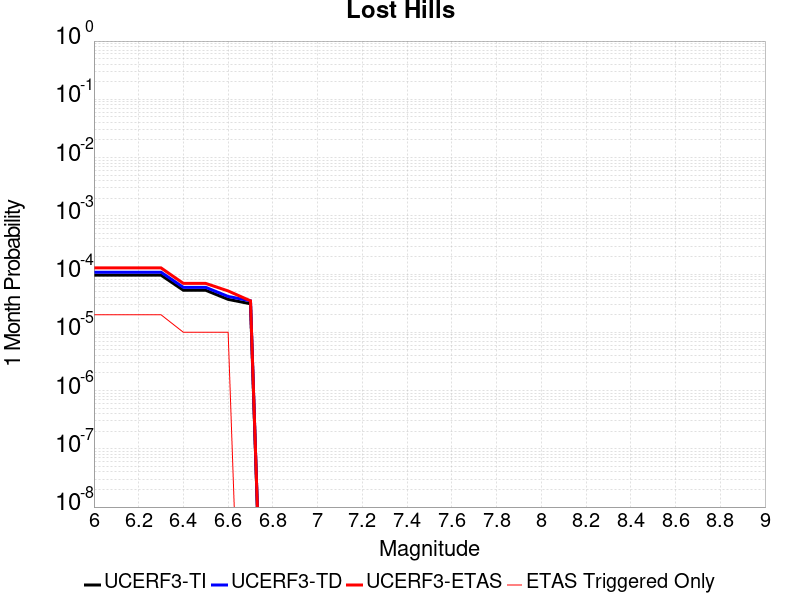 |  | 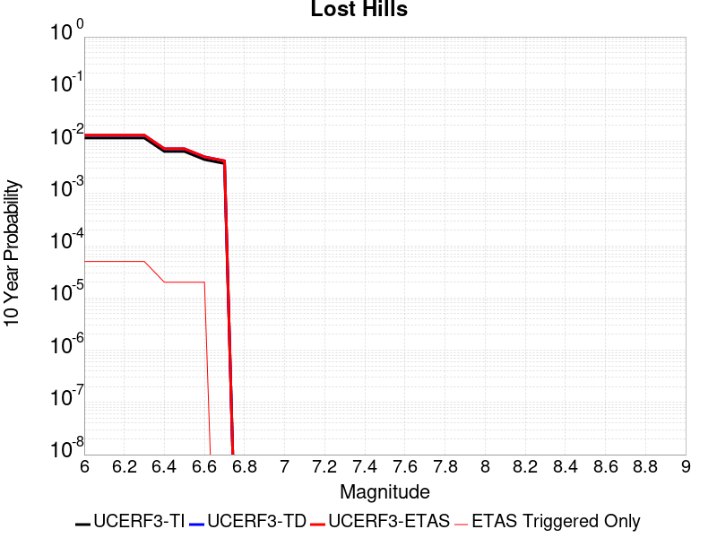 |

| Magnitude | 1 wk TI Prob | 1 wk TD Prob | 1 wk ETAS Prob | 1 wk ETAS/TD Gain | 1 wk ETAS Triggered Only | 1 mo TI Prob | 1 mo TD Prob | 1 mo ETAS Prob | 1 mo ETAS/TD Gain | 1 mo ETAS Triggered Only | 1 yr TI Prob | 1 yr TD Prob | 1 yr ETAS Prob | 1 yr ETAS/TD Gain | 1 yr ETAS Triggered Only | 10 yr TI Prob | 10 yr TD Prob | 10 yr ETAS Prob | 10 yr ETAS/TD Gain | 10 yr ETAS Triggered Only |
|-----|-----|-----|-----|-----|-----|-----|-----|-----|-----|-----|-----|-----|-----|-----|-----|-----|-----|-----|-----|-----|
| 6.0 | 2.233523E-5 | 2.5109062E-5 | 2.5109062E-5 | 1.0 | 0.0 | 9.571891E-5 | 1.0760677E-4 | 1.0760677E-4 | 1.0 | 0.0 | 0.0011647546 | 0.0013094932 | 0.0013677395 | 1.04448 | 5.832264E-5 | 0.011586686 | 0.013034371 | 0.013091934 | 1.0044162 | 5.832264E-5 |
| 6.1 | 2.233523E-5 | 2.5109062E-5 | 2.5109062E-5 | 1.0 | 0.0 | 9.571891E-5 | 1.0760677E-4 | 1.0760677E-4 | 1.0 | 0.0 | 0.0011647546 | 0.0013094932 | 0.0013677395 | 1.04448 | 5.832264E-5 | 0.011586686 | 0.013034371 | 0.013091934 | 1.0044162 | 5.832264E-5 |
| 6.2 | 2.233523E-5 | 2.5109062E-5 | 2.5109062E-5 | 1.0 | 0.0 | 9.571891E-5 | 1.0760677E-4 | 1.0760677E-4 | 1.0 | 0.0 | 0.0011647546 | 0.0013094932 | 0.0013677395 | 1.04448 | 5.832264E-5 | 0.011586686 | 0.013034371 | 0.013091934 | 1.0044162 | 5.832264E-5 |
| 6.3 | 2.233523E-5 | 2.5109062E-5 | 2.5109062E-5 | 1.0 | 0.0 | 9.571891E-5 | 1.0760677E-4 | 1.0760677E-4 | 1.0 | 0.0 | 0.0011647546 | 0.0013094932 | 0.0013677395 | 1.04448 | 5.832264E-5 | 0.011586686 | 0.013034371 | 0.013091934 | 1.0044162 | 5.832264E-5 |
| 6.4 | 1.2288092E-5 | 1.378244E-5 | 1.378244E-5 | 1.0 | 0.0 | 5.2662188E-5 | 5.906679E-5 | 5.906679E-5 | 1.0 | 0.0 | 6.409735E-4 | 7.189947E-4 | 7.772754E-4 | 1.0810586 | 5.832264E-5 | 0.006391279 | 0.007175893 | 0.007233797 | 1.0080693 | 5.832264E-5 |
| 6.5 | 1.2288092E-5 | 1.378244E-5 | 1.378244E-5 | 1.0 | 0.0 | 5.2662188E-5 | 5.906679E-5 | 5.906679E-5 | 1.0 | 0.0 | 6.409735E-4 | 7.189947E-4 | 7.772754E-4 | 1.0810586 | 5.832264E-5 | 0.006391279 | 0.007175893 | 0.007233797 | 1.0080693 | 5.832264E-5 |
| 6.6 | 8.58281E-6 | 9.6347085E-6 | 9.6347085E-6 | 1.0 | 0.0 | 3.6782953E-5 | 4.1291423E-5 | 4.1291423E-5 | 1.0 | 0.0 | 4.4774043E-4 | 5.026904E-4 | 5.6098367E-4 | 1.1159626 | 5.832264E-5 | 0.0044683935 | 0.005023694 | 0.005081724 | 1.0115511 | 5.832264E-5 |
| 6.7 | 7.205685E-6 | 8.08909E-6 | 8.08909E-6 | 1.0 | 0.0 | 3.088114E-5 | 3.466753E-5 | 3.466753E-5 | 1.0 | 0.0 | 3.7591302E-4 | 4.2207717E-4 | 4.2207717E-4 | 1.0 | 0.0 | 0.0037527776 | 0.0042207716 | 0.0042207716 | 1.0 | 0.0 |

## Cady
*[(top)](#table-of-contents)*

| 1 Week | 1 Month | 1 Year | 10 Year |
|-----|-----|-----|-----|
|  |  | 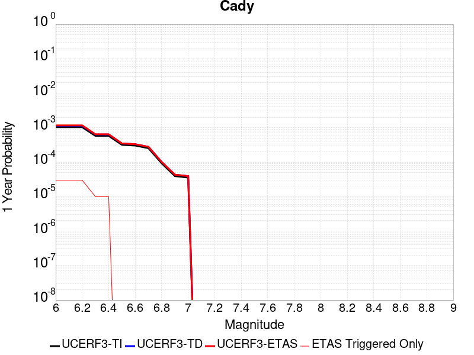 |  |

| Magnitude | 1 wk TI Prob | 1 wk TD Prob | 1 wk ETAS Prob | 1 wk ETAS/TD Gain | 1 wk ETAS Triggered Only | 1 mo TI Prob | 1 mo TD Prob | 1 mo ETAS Prob | 1 mo ETAS/TD Gain | 1 mo ETAS Triggered Only | 1 yr TI Prob | 1 yr TD Prob | 1 yr ETAS Prob | 1 yr ETAS/TD Gain | 1 yr ETAS Triggered Only | 10 yr TI Prob | 10 yr TD Prob | 10 yr ETAS Prob | 10 yr ETAS/TD Gain | 10 yr ETAS Triggered Only |
|-----|-----|-----|-----|-----|-----|-----|-----|-----|-----|-----|-----|-----|-----|-----|-----|-----|-----|-----|-----|-----|
| 6.0 | 1.9892565E-5 | 2.186045E-5 | 2.186045E-5 | 1.0 | 0.0 | 8.525106E-5 | 9.368479E-5 | 9.368479E-5 | 1.0 | 0.0 | 0.0010374374 | 0.0011401064 | 0.0011401064 | 1.0 | 0.0 | 0.010326075 | 0.01135159 | 0.01140925 | 1.0050795 | 5.832264E-5 |
| 6.1 | 1.9892565E-5 | 2.186045E-5 | 2.186045E-5 | 1.0 | 0.0 | 8.525106E-5 | 9.368479E-5 | 9.368479E-5 | 1.0 | 0.0 | 0.0010374374 | 0.0011401064 | 0.0011401064 | 1.0 | 0.0 | 0.010326075 | 0.01135159 | 0.01140925 | 1.0050795 | 5.832264E-5 |
| 6.2 | 1.9892565E-5 | 2.186045E-5 | 2.186045E-5 | 1.0 | 0.0 | 8.525106E-5 | 9.368479E-5 | 9.368479E-5 | 1.0 | 0.0 | 0.0010374374 | 0.0011401064 | 0.0011401064 | 1.0 | 0.0 | 0.010326075 | 0.01135159 | 0.01140925 | 1.0050795 | 5.832264E-5 |
| 6.3 | 1.1117327E-5 | 1.2177507E-5 | 1.2177507E-5 | 1.0 | 0.0 | 4.764482E-5 | 5.218845E-5 | 5.218845E-5 | 1.0 | 0.0 | 5.7992124E-4 | 6.352407E-4 | 6.352407E-4 | 1.0 | 0.0 | 0.0057841022 | 0.006337355 | 0.006395308 | 1.0091447 | 5.832264E-5 |
| 6.4 | 1.1117327E-5 | 1.2177507E-5 | 1.2177507E-5 | 1.0 | 0.0 | 4.764482E-5 | 5.218845E-5 | 5.218845E-5 | 1.0 | 0.0 | 5.7992124E-4 | 6.352407E-4 | 6.352407E-4 | 1.0 | 0.0 | 0.0057841022 | 0.006337355 | 0.006395308 | 1.0091447 | 5.832264E-5 |
| 6.5 | 6.103093E-6 | 6.672516E-6 | 6.672516E-6 | 1.0 | 0.0 | 2.615585E-5 | 2.8596254E-5 | 2.8596254E-5 | 1.0 | 0.0 | 3.1840094E-4 | 3.4811633E-4 | 3.4811633E-4 | 1.0 | 0.0 | 0.0031794512 | 0.0034769445 | 0.0035350644 | 1.0167158 | 5.832264E-5 |
| 6.6 | 5.817237E-6 | 6.3661364E-6 | 6.3661364E-6 | 1.0 | 0.0 | 2.4930776E-5 | 2.7283228E-5 | 2.7283228E-5 | 1.0 | 0.0 | 3.034899E-4 | 3.321351E-4 | 3.321351E-4 | 1.0 | 0.0 | 0.0030307577 | 0.0033176092 | 0.0033757384 | 1.0175214 | 5.832264E-5 |
| 6.7 | 4.8846314E-6 | 5.3409653E-6 | 5.3409653E-6 | 1.0 | 0.0 | 2.0933967E-5 | 2.2889717E-5 | 2.2889717E-5 | 1.0 | 0.0 | 2.5484123E-4 | 2.7865844E-4 | 2.7865844E-4 | 1.0 | 0.0 | 0.0025454918 | 0.0027842459 | 0.0027842459 | 1.0 | 0.0 |
| 6.8 | 1.7788773E-6 | 1.940048E-6 | 1.940048E-6 | 1.0 | 0.0 | 7.6237375E-6 | 8.314473E-6 | 8.314473E-6 | 1.0 | 0.0 | 9.281505E-5 | 1.0122558E-4 | 1.0122558E-4 | 1.0 | 0.0 | 9.2776294E-4 | 0.0010119494 | 0.0010119494 | 1.0 | 0.0 |
| 6.9 | 7.5455404E-7 | 8.29775E-7 | 8.29775E-7 | 1.0 | 0.0 | 3.233799E-6 | 3.5561754E-6 | 3.5561754E-6 | 1.0 | 0.0 | 3.937079E-5 | 4.3295913E-5 | 4.3295913E-5 | 1.0 | 0.0 | 3.9363815E-4 | 4.3290772E-4 | 4.3290772E-4 | 1.0 | 0.0 |
| 7.0 | 6.8578805E-7 | 7.5424146E-7 | 7.5424146E-7 | 1.0 | 0.0 | 2.9390883E-6 | 3.2324613E-6 | 3.2324613E-6 | 1.0 | 0.0 | 3.578281E-5 | 3.9354836E-5 | 3.9354836E-5 | 1.0 | 0.0 | 3.577705E-4 | 3.9351115E-4 | 3.9351115E-4 | 1.0 | 0.0 |

## Likely 2011 CFM
*[(top)](#table-of-contents)*

| 1 Week | 1 Month | 1 Year | 10 Year |
|-----|-----|-----|-----|
|  |  |  |  |

| Magnitude | 1 wk TI Prob | 1 wk TD Prob | 1 wk ETAS Prob | 1 wk ETAS/TD Gain | 1 wk ETAS Triggered Only | 1 mo TI Prob | 1 mo TD Prob | 1 mo ETAS Prob | 1 mo ETAS/TD Gain | 1 mo ETAS Triggered Only | 1 yr TI Prob | 1 yr TD Prob | 1 yr ETAS Prob | 1 yr ETAS/TD Gain | 1 yr ETAS Triggered Only | 10 yr TI Prob | 10 yr TD Prob | 10 yr ETAS Prob | 10 yr ETAS/TD Gain | 10 yr ETAS Triggered Only |
|-----|-----|-----|-----|-----|-----|-----|-----|-----|-----|-----|-----|-----|-----|-----|-----|-----|-----|-----|-----|-----|
| 6.0 | 2.5315949E-5 | 2.7106275E-5 | 2.7106275E-5 | 1.0 | 0.0 | 1.0849241E-4 | 1.16164825E-4 | 1.16164825E-4 | 1.0 | 0.0 | 0.0013200947 | 0.0014134338 | 0.0014134338 | 1.0 | 0.0 | 0.013122803 | 0.014049096 | 0.0141066 | 1.004093 | 5.832264E-5 |
| 6.1 | 2.5315949E-5 | 2.7106275E-5 | 2.7106275E-5 | 1.0 | 0.0 | 1.0849241E-4 | 1.16164825E-4 | 1.16164825E-4 | 1.0 | 0.0 | 0.0013200947 | 0.0014134338 | 0.0014134338 | 1.0 | 0.0 | 0.013122803 | 0.014049096 | 0.014049096 | 1.0 | 0.0 |
| 6.2 | 1.6375941E-5 | 1.7466768E-5 | 1.7466768E-5 | 1.0 | 0.0 | 7.0180715E-5 | 7.4855496E-5 | 7.4855496E-5 | 1.0 | 0.0 | 8.5411523E-4 | 9.109969E-4 | 9.109969E-4 | 1.0 | 0.0 | 0.008508399 | 0.009073911 | 0.009073911 | 1.0 | 0.0 |
| 6.3 | 1.1945543E-5 | 1.2713237E-5 | 1.2713237E-5 | 1.0 | 0.0 | 5.119418E-5 | 5.4484193E-5 | 5.4484193E-5 | 1.0 | 0.0 | 6.2311086E-4 | 6.631485E-4 | 6.631485E-4 | 1.0 | 0.0 | 0.0062136655 | 0.0066122515 | 0.0066122515 | 1.0 | 0.0 |
| 6.4 | 9.192729E-6 | 9.768974E-6 | 9.768974E-6 | 1.0 | 0.0 | 3.939681E-5 | 4.186638E-5 | 4.186638E-5 | 1.0 | 0.0 | 4.7955062E-4 | 5.096067E-4 | 5.096067E-4 | 1.0 | 0.0 | 0.004785171 | 0.005084662 | 0.005084662 | 1.0 | 0.0 |
| 6.5 | 7.67906E-6 | 8.1530225E-6 | 8.1530225E-6 | 1.0 | 0.0 | 3.2909844E-5 | 3.4941066E-5 | 3.4941066E-5 | 1.0 | 0.0 | 4.006037E-4 | 4.2532635E-4 | 4.2532635E-4 | 1.0 | 0.0 | 0.0039988225 | 0.004245316 | 0.004245316 | 1.0 | 0.0 |
| 6.6 | 6.4884057E-6 | 6.8850854E-6 | 6.8850854E-6 | 1.0 | 0.0 | 2.7807157E-5 | 2.9507182E-5 | 2.9507182E-5 | 1.0 | 0.0 | 3.3849955E-4 | 3.5919214E-4 | 3.5919214E-4 | 1.0 | 0.0 | 0.003379844 | 0.0035862608 | 0.0035862608 | 1.0 | 0.0 |
| 6.7 | 4.6060636E-6 | 4.8842758E-6 | 4.8842758E-6 | 1.0 | 0.0 | 1.9740122E-5 | 2.0932448E-5 | 2.0932448E-5 | 1.0 | 0.0 | 2.403095E-4 | 2.5482356E-4 | 2.5482356E-4 | 1.0 | 0.0 | 0.002400498 | 0.0025453968 | 0.0025453968 | 1.0 | 0.0 |
| 6.8 | 3.2795615E-6 | 3.47754E-6 | 3.47754E-6 | 1.0 | 0.0 | 1.4055187E-5 | 1.4903661E-5 | 1.4903661E-5 | 1.0 | 0.0 | 1.7110848E-4 | 1.8143751E-4 | 1.8143751E-4 | 1.0 | 0.0 | 0.0017097679 | 0.0018129491 | 0.0018129491 | 1.0 | 0.0 |
| 6.9 | 2.3289967E-6 | 2.4706765E-6 | 2.4706765E-6 | 1.0 | 0.0 | 9.981376E-6 | 1.0588573E-5 | 1.0588573E-5 | 1.0 | 0.0 | 1.2151648E-4 | 1.2890868E-4 | 1.2890868E-4 | 1.0 | 0.0 | 0.0012145005 | 0.001288382 | 0.001288382 | 1.0 | 0.0 |
| 7.0 | 1.211292E-6 | 1.2864592E-6 | 1.2864592E-6 | 1.0 | 0.0 | 5.1912407E-6 | 5.513387E-6 | 5.513387E-6 | 1.0 | 0.0 | 6.320152E-5 | 6.712372E-5 | 6.712372E-5 | 1.0 | 0.0 | 6.3183554E-4 | 6.710643E-4 | 6.710643E-4 | 1.0 | 0.0 |

## Cleghorn Pass
*[(top)](#table-of-contents)*

| 1 Week | 1 Month | 1 Year | 10 Year |
|-----|-----|-----|-----|
|  |  |  |  |

| Magnitude | 1 wk TI Prob | 1 wk TD Prob | 1 wk ETAS Prob | 1 wk ETAS/TD Gain | 1 wk ETAS Triggered Only | 1 mo TI Prob | 1 mo TD Prob | 1 mo ETAS Prob | 1 mo ETAS/TD Gain | 1 mo ETAS Triggered Only | 1 yr TI Prob | 1 yr TD Prob | 1 yr ETAS Prob | 1 yr ETAS/TD Gain | 1 yr ETAS Triggered Only | 10 yr TI Prob | 10 yr TD Prob | 10 yr ETAS Prob | 10 yr ETAS/TD Gain | 10 yr ETAS Triggered Only |
|-----|-----|-----|-----|-----|-----|-----|-----|-----|-----|-----|-----|-----|-----|-----|-----|-----|-----|-----|-----|-----|
| 6.0 | 1.0522846E-5 | 1.1041074E-5 | 1.1041074E-5 | 1.0 | 0.0 | 4.509713E-5 | 4.7318328E-5 | 4.7318328E-5 | 1.0 | 0.0 | 5.4891926E-4 | 5.76001E-4 | 5.76001E-4 | 1.0 | 0.0 | 0.0054756533 | 0.0057502463 | 0.0058082337 | 1.0100843 | 5.832264E-5 |
| 6.1 | 1.0522846E-5 | 1.1041074E-5 | 1.1041074E-5 | 1.0 | 0.0 | 4.509713E-5 | 4.7318328E-5 | 4.7318328E-5 | 1.0 | 0.0 | 5.4891926E-4 | 5.76001E-4 | 5.76001E-4 | 1.0 | 0.0 | 0.0054756533 | 0.0057502463 | 0.0058082337 | 1.0100843 | 5.832264E-5 |
| 6.2 | 2.1045846E-6 | 2.208289E-6 | 2.208289E-6 | 1.0 | 0.0 | 9.019617E-6 | 9.4640845E-6 | 9.4640845E-6 | 1.0 | 0.0 | 1.098083E-4 | 1.1522334E-4 | 1.1522334E-4 | 1.0 | 0.0 | 0.0010975406 | 0.0011520474 | 0.0011520474 | 1.0 | 0.0 |
| 6.3 | 2.1045846E-6 | 2.208289E-6 | 2.208289E-6 | 1.0 | 0.0 | 9.019617E-6 | 9.4640845E-6 | 9.4640845E-6 | 1.0 | 0.0 | 1.098083E-4 | 1.1522334E-4 | 1.1522334E-4 | 1.0 | 0.0 | 0.0010975406 | 0.0011520474 | 0.0011520474 | 1.0 | 0.0 |
| 6.4 | 1.7259927E-6 | 1.810948E-6 | 1.810948E-6 | 1.0 | 0.0 | 7.3970905E-6 | 7.761206E-6 | 7.761206E-6 | 1.0 | 0.0 | 9.005586E-5 | 9.449268E-5 | 9.449268E-5 | 1.0 | 0.0 | 9.001937E-4 | 9.4492675E-4 | 9.4492675E-4 | 1.0 | 0.0 |

