# Parent Section Magnitude-Probability Distributions

Only fault sections with at least one triggered aftershock are plotted. Sections are sorted by total supraseismogenic trigger rate (decreasing)

## Table Of Contents

* [Garlock (Central)](#garlock-central)
* [Tank Canyon](#tank-canyon)
* [Little Lake](#little-lake)
* [Airport Lake](#airport-lake)
* [Owl Lake](#owl-lake)
* [Panamint Valley](#panamint-valley)
* [Garlock (East)](#garlock-east)
* [Ash Hill](#ash-hill)
* [Hunter Mountain-Saline Valley](#hunter-mountain-saline-valley)
* [Blackwater](#blackwater)
* [Garlock (West)](#garlock-west)
* [McLean Lake](#mclean-lake)
* [Gravel Hills-Harper Lk](#gravel-hills-harper-lk)
* [Goldstone Lake](#goldstone-lake)
* [So Sierra Nevada](#so-sierra-nevada)
* [Coyote Canyon](#coyote-canyon)
* [San Andreas (Mojave S)](#san-andreas-mojave-s)
* [Death Valley (So)](#death-valley-so)
* [Lenwood-Lockhart-Old Woman Springs](#lenwood-lockhart-old-woman-springs)
* [San Andreas (Mojave N)](#san-andreas-mojave-n)
* [Nelson Lake](#nelson-lake)
* [Towne Pass](#towne-pass)
* [Bicycle Lake](#bicycle-lake)
* [Paradise](#paradise)
* [San Andreas (San Bernardino N)](#san-andreas-san-bernardino-n)
* [Garlic Springs](#garlic-springs)
* [Death Valley (Black Mtns Frontal)](#death-valley-black-mtns-frontal)
* [Coyote Lake](#coyote-lake)
* [San Andreas (San Bernardino S)](#san-andreas-san-bernardino-s)
* [Helendale-So Lockhart](#helendale-so-lockhart)
* [Sierra Nevada  (No Extension)](#sierra-nevada--no-extension)
* [San Andreas (Big Bend)](#san-andreas-big-bend)
* [Red Pass](#red-pass)
* [Death Valley (No)](#death-valley-no)
* [San Andreas (Parkfield)](#san-andreas-parkfield)
* [San Andreas (Coachella) rev](#san-andreas-coachella-rev)
* [San Andreas (Cholame) rev](#san-andreas-cholame-rev)
* [San Andreas (Carrizo) rev](#san-andreas-carrizo-rev)
* [San Andreas (San Gorgonio Pass-Garnet HIll)](#san-andreas-san-gorgonio-pass-garnet-hill)
* [Elsinore (Glen Ivy) rev](#elsinore-glen-ivy-rev)
* [Lake Isabella (Seismicity)](#lake-isabella-seismicity)
* [Owens Valley](#owens-valley)
* [Death Valley (Fish Lake Valley)](#death-valley-fish-lake-valley)
* [San Jacinto (San Bernardino)](#san-jacinto-san-bernardino)
* [Kern Canyon (North Kern) 2011](#kern-canyon-north-kern-2011)
* [Baker](#baker)
* [San Andreas (North Branch Mill Creek)](#san-andreas-north-branch-mill-creek)
* [White Wolf (Extension)](#white-wolf-extension)
* [Independence rev 2011](#independence-rev-2011)
* [Santa Ynez (West)](#santa-ynez-west)
* [San Andreas (Creeping Section) 2011 CFM](#san-andreas-creeping-section-2011-cfm)
* [Cleghorn Lake](#cleghorn-lake)
* [Rose Canyon](#rose-canyon)
* [Red Mountain](#red-mountain)
* [Kern Canyon (South Kern) 2011](#kern-canyon-south-kern-2011)
* [Kern Canyon (Lake Isabella) 2011](#kern-canyon-lake-isabella-2011)
* [Santa Ynez (East)](#santa-ynez-east)
* [Mission Ridge-Arroyo Parida-Santa Ana](#mission-ridge-arroyo-parida-santa-ana)
* [San Jacinto (San Jacinto Valley) rev](#san-jacinto-san-jacinto-valley-rev)
* [Oceanic - West Huasna](#oceanic---west-huasna)
* [Brawley (Seismic Zone) alt 1](#brawley-seismic-zone-alt-1)
* [Ventura-Pitas Point](#ventura-pitas-point)
* [White Mountains](#white-mountains)
* [Scodie Lineament](#scodie-lineament)
* [Cady](#cady)
* [Calico-Hidalgo](#calico-hidalgo)
* [Manix-Afton Hills](#manix-afton-hills)
* [Tin Mountain](#tin-mountain)
* [Lost Hills](#lost-hills)
* [Newport-Inglewood (Offshore)](#newport-inglewood-offshore)
* [Imperial](#imperial)
* [San Jacinto (Stepovers Combined)](#san-jacinto-stepovers-combined)
* [San Cayetano](#san-cayetano)
* [Chino alt 1](#chino-alt-1)
* [Ortigalita (North)](#ortigalita-north)
* [Pleito](#pleito)
* [Pinto Mtn](#pinto-mtn)
* [Cleghorn Pass](#cleghorn-pass)
* [San Jacinto (Anza) rev](#san-jacinto-anza-rev)
* [Santa Cruz Catalina Ridge alt1](#santa-cruz-catalina-ridge-alt1)
* [Pisgah-Bullion Mtn-Mesquite Lk](#pisgah-bullion-mtn-mesquite-lk)
* [Blue Cut](#blue-cut)
* [Dry Mountain](#dry-mountain)
* [Oak Ridge (Onshore)](#oak-ridge-onshore)
* [Palos Verdes](#palos-verdes)
* [Big Pine (East)](#big-pine-east)
* [Calaveras (So) 2011 CFM](#calaveras-so-2011-cfm)
* [San Pedro Basin](#san-pedro-basin)
* [Great Valley 09 (Laguna Seca)](#great-valley-09-laguna-seca)
* [San Jacinto (Lytle Creek connector)](#san-jacinto-lytle-creek-connector)
* [Ludlow](#ludlow)
* [Channel Islands Thrust](#channel-islands-thrust)
* [Santa Rosa Island](#santa-rosa-island)
* [Mission Creek](#mission-creek)
* [Deep Springs](#deep-springs)
* [Pine Mtn](#pine-mtn)
* [San Diego Trough north alt1](#san-diego-trough-north-alt1)
* [Newport-Inglewood alt 1](#newport-inglewood-alt-1)
* [Camp Rock 2011](#camp-rock-2011)
* [San Luis Range 2011 CFM](#san-luis-range-2011-cfm)
* [Raymond](#raymond)
* [San Gabriel](#san-gabriel)
* [Hunting Creek - Berryessa 2011 CFM](#hunting-creek---berryessa-2011-cfm)
* [Santa Cruz Island](#santa-cruz-island)
* [Elysian Park (Upper)](#elysian-park-upper)
* [Hat Creek-McArthur-Mayfield](#hat-creek-mcarthur-mayfield)
* [Bullion Mountains](#bullion-mountains)
* [Big Pine (Central)](#big-pine-central)
* [Elsinore (Stepovers Combined)](#elsinore-stepovers-combined)
* [Honey Lake 2011 CFM](#honey-lake-2011-cfm)
* [Santa Ynez River](#santa-ynez-river)
* [Oceanside alt1](#oceanside-alt1)
* [San Gabriel (Extension)](#san-gabriel-extension)
* [Green Valley 2011 CFM](#green-valley-2011-cfm)
* [San Jacinto (Superstition Mtn)](#san-jacinto-superstition-mtn)
* [Ortigalita (South)](#ortigalita-south)
* [Cleghorn](#cleghorn)
* [Verdugo](#verdugo)
* [San Juan](#san-juan)
* [Gillem - Big Crack 2011 CFM](#gillem---big-crack-2011-cfm)
* [Pitas Point (Lower West)](#pitas-point-lower-west)
* [North Frontal  (East)](#north-frontal--east)
* [Robinson Creek](#robinson-creek)
* [Sierra Madre](#sierra-madre)
* [Los Alamos 2011 CFM](#los-alamos-2011-cfm)
* [Maacama 2011 CFM](#maacama-2011-cfm)
* [Elmore Ranch](#elmore-ranch)
* [Great Valley 03a Dunnigan Hills](#great-valley-03a-dunnigan-hills)
* [Elsinore (Temecula) rev](#elsinore-temecula-rev)
* [Hayward (So) 2011 CFM](#hayward-so-2011-cfm)
* [Mono Lake 2011 CFM](#mono-lake-2011-cfm)
* [San Gregorio (North) 2011 CFM](#san-gregorio-north-2011-cfm)
* [San Andreas (North Coast) 2011 CFM](#san-andreas-north-coast-2011-cfm)
* [Calaveras (Central) 2011 CFM](#calaveras-central-2011-cfm)
* [Garberville - Briceland 2011 CFM](#garberville---briceland-2011-cfm)
* [Calaveras (No) 2011 CFM](#calaveras-no-2011-cfm)
* [Los Alamos extension](#los-alamos-extension)
* [Great Valley 08 (Quinto)](#great-valley-08-quinto)
* [Sheephole](#sheephole)
* [Casmalia 2011 CFM](#casmalia-2011-cfm)
* [San Jacinto (Clark) rev](#san-jacinto-clark-rev)
* [Pitas Point (Lower)-Montalvo](#pitas-point-lower-montalvo)
* [Holser alt 1](#holser-alt-1)
* [San Diego Trough south](#san-diego-trough-south)
* [Santa Susana alt 1](#santa-susana-alt-1)
* [Ozena](#ozena)
* [San Luis Range - Pecho 2011 CFM](#san-luis-range---pecho-2011-cfm)
* [Quien Sabe 2011 CFM](#quien-sabe-2011-cfm)
* [Likely 2011 CFM](#likely-2011-cfm)
* [San Andreas (Santa Cruz Mts) 2011 CFM](#san-andreas-santa-cruz-mts-2011-cfm)
* [Whittier alt 1](#whittier-alt-1)
* [Compton](#compton)
* [Great Valley 10 (Panoche)](#great-valley-10-panoche)
* [Goose Lake 2011 CFM](#goose-lake-2011-cfm)
* [Calaveras (So) - Paicines extension 2011 CFM](#calaveras-so---paicines-extension-2011-cfm)
* [West Tahoe](#west-tahoe)
* [Great Valley 11](#great-valley-11)
* [Los Osos 2011](#los-osos-2011)
* [Johnson Valley (No) 2011 rev](#johnson-valley-no-2011-rev)
* [Clamshell-Sawpit](#clamshell-sawpit)
* [San Joaquin Hills](#san-joaquin-hills)
* [Earthquake Valley (No  Extension)](#earthquake-valley-no--extension)

## Garlock (Central)
*[(top)](#table-of-contents)*

| 1 Week | 1 Month | 1 Year | 10 Year |
|-----|-----|-----|-----|
|  | 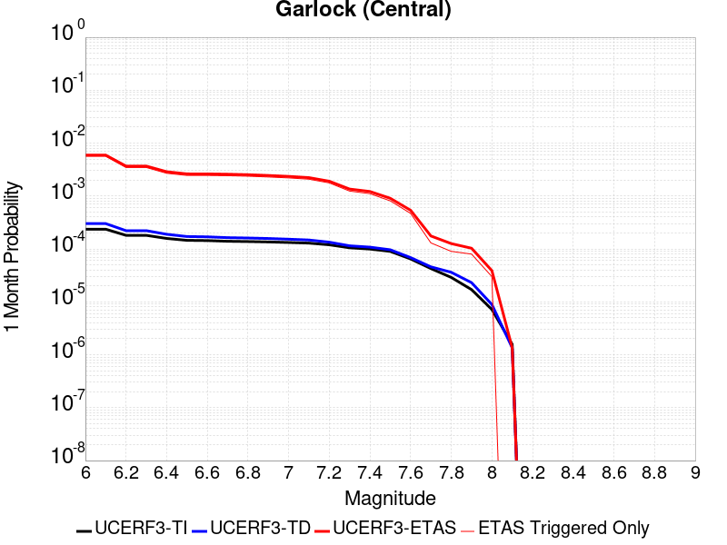 |  |  |

| Magnitude | 1 wk TI Prob | 1 wk TD Prob | 1 wk ETAS Prob | 1 wk ETAS/TD Gain | 1 wk ETAS Triggered Only | 1 mo TI Prob | 1 mo TD Prob | 1 mo ETAS Prob | 1 mo ETAS/TD Gain | 1 mo ETAS Triggered Only | 1 yr TI Prob | 1 yr TD Prob | 1 yr ETAS Prob | 1 yr ETAS/TD Gain | 1 yr ETAS Triggered Only | 10 yr TI Prob | 10 yr TD Prob | 10 yr ETAS Prob | 10 yr ETAS/TD Gain | 10 yr ETAS Triggered Only |
|-----|-----|-----|-----|-----|-----|-----|-----|-----|-----|-----|-----|-----|-----|-----|-----|-----|-----|-----|-----|-----|
| 6.0 | 5.5131142E-5 | 7.028554E-5 | 0.0017701661 | 25.185352 | 0.0017 | 2.3625491E-4 | 3.011893E-4 | 0.0059394906 | 19.720125 | 0.00564 | 0.0028726095 | 0.0036608784 | 0.027473383 | 7.5045877 | 0.0239 | 0.028357591 | 0.03606058 | 0.08257066 | 2.289776 | 0.04825 |
| 6.1 | 5.5131142E-5 | 7.028554E-5 | 0.0017701661 | 25.185352 | 0.0017 | 2.3625491E-4 | 3.011893E-4 | 0.0059394906 | 19.720125 | 0.00564 | 0.0028726095 | 0.0036608784 | 0.027473383 | 7.5045877 | 0.0239 | 0.028357591 | 0.03606058 | 0.08257066 | 2.289776 | 0.04825 |
| 6.2 | 4.216245E-5 | 5.169618E-5 | 0.0010116466 | 19.569077 | 9.6E-4 | 1.806837E-4 | 2.2153642E-4 | 0.0036807698 | 16.614738 | 0.00346 | 0.0021976046 | 0.0026939013 | 0.017503897 | 6.4976015 | 0.01485 | 0.021759989 | 0.02668693 | 0.05622698 | 2.106911 | 0.03035 |
| 6.3 | 4.216245E-5 | 5.169618E-5 | 0.0010116466 | 19.569077 | 9.6E-4 | 1.806837E-4 | 2.2153642E-4 | 0.0036807698 | 16.614738 | 0.00346 | 0.0021976046 | 0.0026939013 | 0.017503897 | 6.4976015 | 0.01485 | 0.021759989 | 0.02668693 | 0.05622698 | 2.106911 | 0.03035 |
| 6.4 | 3.6858168E-5 | 4.414327E-5 | 7.941102E-4 | 17.989382 | 7.5E-4 | 1.5795401E-4 | 1.8917187E-4 | 0.002878663 | 15.217183 | 0.00269 | 0.0019213937 | 0.00230076 | 0.013794255 | 5.995521 | 0.01152 | 0.019048655 | 0.02285254 | 0.046137962 | 2.0189426 | 0.02383 |
| 6.5 | 3.39199E-5 | 4.004957E-5 | 7.2002236E-4 | 17.978277 | 6.8E-4 | 1.453629E-4 | 1.7162986E-4 | 0.0026212092 | 15.272456 | 0.00245 | 0.0017683565 | 0.0020876126 | 0.012585651 | 6.028729 | 0.01052 | 0.017543508 | 0.020780971 | 0.042030025 | 2.0225246 | 0.0217 |
| 6.6 | 3.3571985E-5 | 3.950371E-5 | 7.1947684E-4 | 18.212894 | 6.8E-4 | 1.4387199E-4 | 1.6929074E-4 | 0.002618876 | 15.469694 | 0.00245 | 0.0017502342 | 0.0020591882 | 0.012537567 | 6.0885973 | 0.0105 | 0.017365133 | 0.020501984 | 0.041708115 | 2.0343454 | 0.02165 |
| 6.7 | 3.2580007E-5 | 3.812003E-5 | 7.080945E-4 | 18.575392 | 6.7E-4 | 1.3962112E-4 | 1.6336144E-4 | 0.0025829661 | 15.8113575 | 0.00242 | 0.0016985617 | 0.0019871327 | 0.012176844 | 6.1278467 | 0.01021 | 0.016856372 | 0.019791318 | 0.04023847 | 2.0331376 | 0.02086 |
| 6.8 | 3.2185937E-5 | 3.7547128E-5 | 6.875227E-4 | 18.310926 | 6.5E-4 | 1.3793244E-4 | 1.6090646E-4 | 0.0025305252 | 15.726685 | 0.00237 | 0.0016780337 | 0.0019572973 | 0.011957685 | 6.109284 | 0.01002 | 0.016654192 | 0.019497503 | 0.039578192 | 2.029911 | 0.02048 |
| 6.9 | 3.165394E-5 | 3.6751546E-5 | 6.5672875E-4 | 17.86942 | 6.2E-4 | 1.3565269E-4 | 1.5749724E-4 | 0.0024471367 | 15.537647 | 0.00229 | 0.0016503202 | 0.0019158638 | 0.011647184 | 6.079338 | 0.00975 | 0.01638118 | 0.019090205 | 0.0386005 | 2.0220056 | 0.01989 |
| 7.0 | 3.0903822E-5 | 3.5656554E-5 | 6.156359E-4 | 17.265715 | 5.8E-4 | 1.3243823E-4 | 1.5280498E-4 | 0.002352469 | 15.395237 | 0.0022 | 0.0016112428 | 0.0018588343 | 0.011271305 | 6.063642 | 0.00943 | 0.015996104 | 0.018527484 | 0.037430644 | 2.0202768 | 0.01926 |
| 7.1 | 3.0069863E-5 | 3.4422563E-5 | 5.644043E-4 | 16.396347 | 5.3E-4 | 1.2886449E-4 | 1.4751706E-4 | 0.0022272102 | 15.097985 | 0.00208 | 0.0015677959 | 0.0017945616 | 0.010788392 | 6.011715 | 0.00901 | 0.01556781 | 0.017894723 | 0.036053848 | 2.0147755 | 0.01849 |
| 7.2 | 2.7957109E-5 | 3.1311138E-5 | 5.112961E-4 | 16.329529 | 4.8E-4 | 1.1981068E-4 | 1.3418379E-4 | 0.0019039463 | 14.189093 | 0.00177 | 0.0014577188 | 0.001632483 | 0.009130223 | 5.592844 | 0.00751 | 0.014481937 | 0.016298024 | 0.03139785 | 1.926482 | 0.01535 |
| 7.3 | 2.4519275E-5 | 2.6742533E-5 | 3.7673317E-4 | 14.087416 | 3.5E-4 | 1.0507837E-4 | 1.1460591E-4 | 0.0013544637 | 11.818447 | 0.00124 | 0.0012785783 | 0.0013944485 | 0.00670703 | 4.8098083 | 0.00532 | 0.012712469 | 0.013941391 | 0.024788035 | 1.7780174 | 0.011 |
| 7.4 | 2.3225532E-5 | 2.5226527E-5 | 3.6521794E-4 | 14.477535 | 3.4E-4 | 9.95342E-5 | 1.0810929E-4 | 0.0012179893 | 11.266277 | 0.00111 | 0.0012111551 | 0.0013154503 | 0.0060492153 | 4.598589 | 0.00474 | 0.012045753 | 0.013158853 | 0.02298779 | 1.7469449 | 0.00996 |
| 7.5 | 2.097765E-5 | 2.2509379E-5 | 2.4250442E-4 | 10.773484 | 2.2E-4 | 8.9901114E-5 | 9.6465265E-5 | 9.063871E-4 | 9.395995 | 8.1E-4 | 0.0010939965 | 0.0011738436 | 0.0047596297 | 4.054739 | 0.00359 | 0.010886264 | 0.011752605 | 0.019371992 | 1.6483147 | 0.00771 |
| 7.6 | 1.511254E-5 | 1.6015149E-5 | 1.3601323E-4 | 8.492786 | 1.2E-4 | 6.476642E-5 | 6.863459E-5 | 5.3860235E-4 | 7.8473897 | 4.7E-4 | 7.882459E-4 | 8.353136E-4 | 0.002803668 | 3.3564258 | 0.00197 | 0.007854558 | 0.008394749 | 0.012480163 | 1.486663 | 0.00412 |
| 7.7 | 9.934069E-6 | 1.0700801E-5 | 4.070048E-5 | 3.8034985 | 3.0E-5 | 4.2573887E-5 | 4.585977E-5 | 1.7585381E-4 | 3.8345983 | 1.3E-4 | 5.182138E-4 | 5.5820006E-4 | 0.0010779098 | 1.9310457 | 5.2E-4 | 0.00517007 | 0.0056387917 | 0.0067027584 | 1.188687 | 0.00107 |
| 7.8 | 6.7562896E-6 | 8.446554E-6 | 3.84463E-5 | 4.5517144 | 3.0E-5 | 2.8955206E-5 | 3.6199013E-5 | 1.2619575E-4 | 3.4861655 | 9.0E-5 | 3.5247262E-4 | 4.4063403E-4 | 8.2046655E-4 | 1.8620137 | 3.8E-4 | 0.0035191406 | 0.0044557536 | 0.005122768 | 1.1496974 | 6.7E-4 |
| 7.9 | 3.975453E-6 | 5.382179E-6 | 3.5382018E-5 | 6.5739207 | 3.0E-5 | 1.7037546E-5 | 2.3066279E-5 | 1.03064434E-4 | 4.4681864 | 8.0E-5 | 2.0741238E-4 | 2.8079585E-4 | 5.4072286E-4 | 1.9256796 | 2.6E-4 | 0.002072189 | 0.0028391907 | 0.0032280833 | 1.1369731 | 3.9E-4 |
| 8.0 | 1.6729537E-6 | 2.08139E-6 | 1.2081369E-5 | 5.804472 | 1.0E-5 | 7.169782E-6 | 8.920212E-6 | 3.8919945E-5 | 4.3631186 | 3.0E-5 | 8.7288594E-5 | 1.0859821E-4 | 1.9858843E-4 | 1.828653 | 9.0E-5 | 8.7254314E-4 | 0.0010987248 | 0.0011986148 | 1.0909146 | 1.0E-4 |
| 8.1 | 3.6733252E-7 | 3.1543834E-7 | 3.1543834E-7 | 1.0 | 0.0 | 1.5742813E-6 | 1.351878E-6 | 1.351878E-6 | 1.0 | 0.0 | 1.9166706E-5 | 1.6459007E-5 | 1.6459007E-5 | 1.0 | 0.0 | 1.9165053E-4 | 1.6671374E-4 | 1.6671374E-4 | 1.0 | 0.0 |

## Tank Canyon
*[(top)](#table-of-contents)*

| 1 Week | 1 Month | 1 Year | 10 Year |
|-----|-----|-----|-----|
|  |  |  |  |

| Magnitude | 1 wk TI Prob | 1 wk TD Prob | 1 wk ETAS Prob | 1 wk ETAS/TD Gain | 1 wk ETAS Triggered Only | 1 mo TI Prob | 1 mo TD Prob | 1 mo ETAS Prob | 1 mo ETAS/TD Gain | 1 mo ETAS Triggered Only | 1 yr TI Prob | 1 yr TD Prob | 1 yr ETAS Prob | 1 yr ETAS/TD Gain | 1 yr ETAS Triggered Only | 10 yr TI Prob | 10 yr TD Prob | 10 yr ETAS Prob | 10 yr ETAS/TD Gain | 10 yr ETAS Triggered Only |
|-----|-----|-----|-----|-----|-----|-----|-----|-----|-----|-----|-----|-----|-----|-----|-----|-----|-----|-----|-----|-----|
| 6.0 | 4.8284557E-5 | 5.797358E-5 | 8.579272E-4 | 14.79859 | 8.0E-4 | 2.0691741E-4 | 2.4843836E-4 | 0.003287683 | 13.233396 | 0.00304 | 0.0025163088 | 0.0030212046 | 0.01881335 | 6.227102 | 0.01584 | 0.02488006 | 0.029868167 | 0.06365786 | 2.1312945 | 0.03483 |
| 6.1 | 1.7796336E-5 | 2.0876045E-5 | 3.208698E-4 | 15.370238 | 3.0E-4 | 7.626778E-5 | 8.946592E-5 | 0.0011193737 | 12.511734 | 0.00103 | 9.281647E-4 | 0.0010887412 | 0.006752568 | 6.2021794 | 0.00567 | 0.009242975 | 0.010837971 | 0.023756428 | 2.1919625 | 0.01306 |
| 6.2 | 1.7796336E-5 | 2.0876045E-5 | 3.208698E-4 | 15.370238 | 3.0E-4 | 7.626778E-5 | 8.946592E-5 | 0.0011193737 | 12.511734 | 0.00103 | 9.281647E-4 | 0.0010887412 | 0.006752568 | 6.2021794 | 0.00567 | 0.009242975 | 0.010837971 | 0.023756428 | 2.1919625 | 0.01306 |
| 6.3 | 1.3515912E-5 | 1.5761525E-5 | 2.3575805E-4 | 14.957821 | 2.2E-4 | 5.792405E-5 | 6.754778E-5 | 8.874924E-4 | 13.138736 | 8.2E-4 | 7.049971E-4 | 8.221075E-4 | 0.0049287286 | 5.9952364 | 0.00411 | 0.007027647 | 0.008193079 | 0.017416883 | 2.1258044 | 0.0093 |
| 6.4 | 1.0870146E-5 | 1.2619517E-5 | 1.8261737E-4 | 14.471027 | 1.7E-4 | 4.658551E-5 | 5.4082622E-5 | 6.5405015E-4 | 12.093536 | 6.0E-4 | 5.67031E-4 | 6.582747E-4 | 0.003826188 | 5.8124485 | 0.00317 | 0.005655863 | 0.006565063 | 0.013697926 | 2.086488 | 0.00718 |
| 6.5 | 7.964826E-6 | 9.197107E-6 | 1.29196E-4 | 14.0474615 | 1.2E-4 | 3.4134522E-5 | 3.9415634E-5 | 4.6939868E-4 | 11.908947 | 4.3E-4 | 4.1550855E-4 | 4.797902E-4 | 0.0026087682 | 5.43731 | 0.00213 | 0.0041473247 | 0.004788645 | 0.009416378 | 1.9663972 | 0.00465 |
| 6.6 | 6.6317E-6 | 7.613076E-6 | 1.07612315E-4 | 14.135195 | 1.0E-4 | 2.8421264E-5 | 3.262711E-5 | 3.3261732E-4 | 10.194507 | 3.0E-4 | 3.4597394E-4 | 3.9717174E-4 | 0.0018266038 | 4.5990276 | 0.00143 | 0.0034543579 | 0.0039655706 | 0.0073222066 | 1.8464446 | 0.00337 |
| 6.7 | 4.793663E-6 | 5.4312513E-6 | 8.543082E-5 | 15.72949 | 8.0E-5 | 2.0544108E-5 | 2.3276609E-5 | 2.0327242E-4 | 8.732905 | 1.8E-4 | 2.500958E-4 | 2.8336025E-4 | 0.001113125 | 3.9283037 | 8.3E-4 | 0.0024981452 | 0.0028304795 | 0.0047649886 | 1.6834562 | 0.00194 |
| 6.8 | 4.382823E-6 | 4.969652E-6 | 7.4969306E-5 | 15.085423 | 7.0E-5 | 1.8783392E-5 | 2.1298358E-5 | 1.7129516E-4 | 8.042646 | 1.5E-4 | 2.286638E-4 | 2.5928093E-4 | 9.6909684E-4 | 3.7376325 | 7.1E-4 | 0.0022842865 | 0.0025902519 | 0.0042958222 | 1.6584575 | 0.00171 |
| 6.9 | 2.729601E-6 | 3.073745E-6 | 3.307365E-5 | 10.760052 | 3.0E-5 | 1.1698237E-5 | 1.3173133E-5 | 9.317208E-5 | 7.072887 | 8.0E-5 | 1.4241673E-4 | 1.603723E-4 | 4.603242E-4 | 2.870347 | 3.0E-4 | 0.001423255 | 0.0016027362 | 0.002361518 | 1.4734291 | 7.6E-4 |
| 7.0 | 1.8987357E-6 | 2.127063E-6 | 1.2127041E-5 | 5.7013083 | 1.0E-5 | 8.137413E-6 | 9.115956E-6 | 2.9115774E-5 | 3.1939352 | 2.0E-5 | 9.90685E-5 | 1.1098181E-4 | 1.8097405E-4 | 1.630664 | 7.0E-5 | 9.902435E-4 | 0.0011093325 | 0.0013091107 | 1.1800886 | 2.0E-4 |
| 7.1 | 1.4928986E-6 | 1.6642229E-6 | 1.6642229E-6 | 1.0 | 0.0 | 6.398121E-6 | 7.1323675E-6 | 1.7132295E-5 | 2.402049 | 1.0E-5 | 7.789434E-5 | 8.68337E-5 | 1.168311E-4 | 1.3454579 | 3.0E-5 | 7.786704E-4 | 8.680556E-4 | 9.779602E-4 | 1.12661 | 1.1E-4 |
| 7.2 | 1.069082E-6 | 1.1829217E-6 | 1.1829217E-6 | 1.0 | 0.0 | 4.581772E-6 | 5.0696576E-6 | 5.0696576E-6 | 1.0 | 0.0 | 5.5781646E-5 | 6.172186E-5 | 7.1721246E-5 | 1.1620071 | 1.0E-5 | 5.576765E-4 | 6.1709946E-4 | 6.6706864E-4 | 1.0809742 | 5.0E-5 |
| 7.3 | 8.776551E-7 | 9.770523E-7 | 9.770523E-7 | 1.0 | 0.0 | 3.7613736E-6 | 4.1873636E-6 | 4.1873636E-6 | 1.0 | 0.0 | 4.579376E-5 | 5.0980478E-5 | 5.0980478E-5 | 1.0 | 0.0 | 4.5784327E-4 | 5.0973886E-4 | 5.4971845E-4 | 1.0784316 | 4.0E-5 |
| 7.4 | 7.55721E-7 | 8.510712E-7 | 8.510712E-7 | 1.0 | 0.0 | 3.2388E-6 | 3.647446E-6 | 3.647446E-6 | 1.0 | 0.0 | 3.9431678E-5 | 4.440727E-5 | 4.440727E-5 | 1.0 | 0.0 | 3.942468E-4 | 4.4403478E-4 | 4.7402148E-4 | 1.0675323 | 3.0E-5 |
| 7.5 | 5.587665E-7 | 6.305968E-7 | 6.305968E-7 | 1.0 | 0.0 | 2.3947114E-6 | 2.7025576E-6 | 2.7025576E-6 | 1.0 | 0.0 | 2.915522E-5 | 3.290364E-5 | 3.290364E-5 | 1.0 | 0.0 | 2.9151395E-4 | 3.290364E-4 | 3.5902654E-4 | 1.0911453 | 3.0E-5 |

## Little Lake
*[(top)](#table-of-contents)*

| 1 Week | 1 Month | 1 Year | 10 Year |
|-----|-----|-----|-----|
|  |  |  |  |

| Magnitude | 1 wk TI Prob | 1 wk TD Prob | 1 wk ETAS Prob | 1 wk ETAS/TD Gain | 1 wk ETAS Triggered Only | 1 mo TI Prob | 1 mo TD Prob | 1 mo ETAS Prob | 1 mo ETAS/TD Gain | 1 mo ETAS Triggered Only | 1 yr TI Prob | 1 yr TD Prob | 1 yr ETAS Prob | 1 yr ETAS/TD Gain | 1 yr ETAS Triggered Only | 10 yr TI Prob | 10 yr TD Prob | 10 yr ETAS Prob | 10 yr ETAS/TD Gain | 10 yr ETAS Triggered Only |
|-----|-----|-----|-----|-----|-----|-----|-----|-----|-----|-----|-----|-----|-----|-----|-----|-----|-----|-----|-----|-----|
| 6.0 | 2.8424427E-5 | 3.120835E-5 | 8.0118433E-4 | 25.672113 | 7.7E-4 | 1.2181328E-4 | 1.3374396E-4 | 0.0028533803 | 21.334646 | 0.00272 | 0.0014820677 | 0.0016272498 | 0.012968764 | 7.969744 | 0.01136 | 0.014722223 | 0.016166754 | 0.039454088 | 2.440446 | 0.02367 |
| 6.1 | 2.8424427E-5 | 3.120835E-5 | 8.0118433E-4 | 25.672113 | 7.7E-4 | 1.2181328E-4 | 1.3374396E-4 | 0.0028533803 | 21.334646 | 0.00272 | 0.0014820677 | 0.0016272498 | 0.012968764 | 7.969744 | 0.01136 | 0.014722223 | 0.016166754 | 0.039454088 | 2.440446 | 0.02367 |
| 6.2 | 2.8424427E-5 | 3.120835E-5 | 8.0118433E-4 | 25.672113 | 7.7E-4 | 1.2181328E-4 | 1.3374396E-4 | 0.0028533803 | 21.334646 | 0.00272 | 0.0014820677 | 0.0016272498 | 0.012968764 | 7.969744 | 0.01136 | 0.014722223 | 0.016166754 | 0.039454088 | 2.440446 | 0.02367 |
| 6.3 | 1.48860645E-5 | 1.6082608E-5 | 5.0607475E-4 | 31.467207 | 4.9E-4 | 6.379586E-5 | 6.89238E-5 | 0.0017888052 | 25.953375 | 0.00172 | 7.7643775E-4 | 8.388524E-4 | 0.0081726955 | 9.742709 | 0.00734 | 0.007737305 | 0.008359679 | 0.023293782 | 2.7864447 | 0.01506 |
| 6.4 | 1.48860645E-5 | 1.6082608E-5 | 5.0607475E-4 | 31.467207 | 4.9E-4 | 6.379586E-5 | 6.89238E-5 | 0.0017888052 | 25.953375 | 0.00172 | 7.7643775E-4 | 8.388524E-4 | 0.0081726955 | 9.742709 | 0.00734 | 0.007737305 | 0.008359679 | 0.023293782 | 2.7864447 | 0.01506 |
| 6.5 | 1.2797581E-5 | 1.3766582E-5 | 4.637604E-4 | 33.6874 | 4.5E-4 | 5.4845623E-5 | 5.899845E-5 | 0.0016489046 | 27.94827 | 0.00159 | 6.675408E-4 | 7.180951E-4 | 0.007463248 | 10.393119 | 0.00675 | 0.006655392 | 0.0071602976 | 0.020801915 | 2.9051747 | 0.01374 |
| 6.6 | 9.661896E-6 | 1.0289755E-5 | 3.9028583E-4 | 37.929558 | 3.8E-4 | 4.1407468E-5 | 4.4098295E-5 | 0.0013840392 | 31.385323 | 0.00134 | 5.040193E-4 | 5.367807E-4 | 0.0062137316 | 11.575922 | 0.00568 | 0.005028777 | 0.005356447 | 0.016973883 | 3.16887 | 0.01168 |
| 6.7 | 7.767871E-6 | 8.200232E-6 | 3.281976E-4 | 40.02297 | 3.2E-4 | 3.329045E-5 | 3.5143454E-5 | 0.001215102 | 34.575485 | 0.00118 | 4.0523586E-4 | 4.2780128E-4 | 0.0054556495 | 12.752766 | 0.00503 | 0.004044977 | 0.0042711296 | 0.014477351 | 3.3895836 | 0.01025 |
| 6.8 | 6.4235196E-6 | 6.7361852E-6 | 2.867343E-4 | 42.566273 | 2.8E-4 | 2.752908E-5 | 2.8869119E-5 | 9.888414E-4 | 34.252567 | 9.6E-4 | 3.35115E-4 | 3.5143766E-4 | 0.0043600285 | 12.406263 | 0.00401 | 0.003346101 | 0.0035100796 | 0.011800876 | 3.3619967 | 0.00832 |
| 6.9 | 3.1283696E-6 | 3.1123327E-6 | 1.8311177E-4 | 58.83425 | 1.8E-4 | 1.3407229E-5 | 1.3338509E-5 | 6.3333026E-4 | 47.481335 | 6.2E-4 | 1.6322079E-4 | 1.6238575E-4 | 0.0025519975 | 15.71565 | 0.00239 | 0.0016310095 | 0.0016228193 | 0.006714543 | 4.137579 | 0.0051 |
| 7.0 | 2.290603E-6 | 2.2287954E-6 | 9.22286E-5 | 41.380466 | 9.0E-5 | 9.816834E-6 | 9.551952E-6 | 3.895483E-4 | 40.782066 | 3.8E-4 | 1.19513395E-4 | 1.1628985E-4 | 0.0015961177 | 13.725341 | 0.00148 | 0.0011944914 | 0.0011623921 | 0.0042987424 | 3.698186 | 0.00314 |
| 7.1 | 1.293693E-6 | 1.1777513E-6 | 5.1177693E-5 | 43.453735 | 5.0E-5 | 5.5443866E-6 | 5.0475E-6 | 1.8504659E-4 | 36.66104 | 1.8E-4 | 6.750081E-5 | 6.145228E-5 | 7.414105E-4 | 12.064817 | 6.8E-4 | 6.7480316E-4 | 6.144213E-4 | 0.0021734629 | 3.5374143 | 0.00156 |
| 7.2 | 4.715842E-7 | 3.0920808E-7 | 3.0920808E-7 | 1.0 | 0.0 | 2.0210737E-6 | 1.3251769E-6 | 1.3251769E-6 | 1.0 | 0.0 | 2.4606294E-5 | 1.6133914E-5 | 5.613327E-5 | 3.4792094 | 4.0E-5 | 2.460357E-4 | 1.6132797E-4 | 2.5131347E-4 | 1.5577798 | 9.0E-5 |
| 7.3 | 3.9430947E-7 | 2.3100145E-7 | 2.3100145E-7 | 1.0 | 0.0 | 1.6898966E-6 | 9.900058E-7 | 9.900058E-7 | 1.0 | 0.0 | 2.0574296E-5 | 1.2053255E-5 | 4.2052892E-5 | 3.4889243 | 3.0E-5 | 2.0572392E-4 | 1.20526085E-4 | 1.9051765E-4 | 1.5807171 | 7.0E-5 |
| 7.4 | 3.547123E-7 | 1.9681578E-7 | 1.9681578E-7 | 1.0 | 0.0 | 1.5201948E-6 | 8.4349597E-7 | 8.4349597E-7 | 1.0 | 0.0 | 1.8508214E-5 | 1.0269516E-5 | 4.0269206E-5 | 3.9212375 | 3.0E-5 | 1.8506673E-4 | 1.0269047E-4 | 1.7268329E-4 | 1.6815901 | 7.0E-5 |
| 7.5 | 2.6354266E-7 | 1.4424798E-7 | 1.4424798E-7 | 1.0 | 0.0 | 1.129468E-6 | 6.1820543E-7 | 6.1820543E-7 | 1.0 | 0.0 | 1.3751187E-5 | 7.5266257E-6 | 3.75264E-5 | 4.98582 | 3.0E-5 | 1.3750336E-4 | 7.5263764E-5 | 1.452585E-4 | 1.9299924 | 7.0E-5 |
| 7.6 | 1.269913E-7 | 7.57326E-8 | 7.57326E-8 | 1.0 | 0.0 | 5.4424834E-7 | 3.2456825E-7 | 3.2456825E-7 | 1.0 | 0.0 | 6.6262032E-6 | 3.9516117E-6 | 3.395149E-5 | 8.591809 | 3.0E-5 | 6.626006E-5 | 3.951545E-5 | 8.951347E-5 | 2.2652779 | 5.0E-5 |

## Airport Lake
*[(top)](#table-of-contents)*

| 1 Week | 1 Month | 1 Year | 10 Year |
|-----|-----|-----|-----|
| 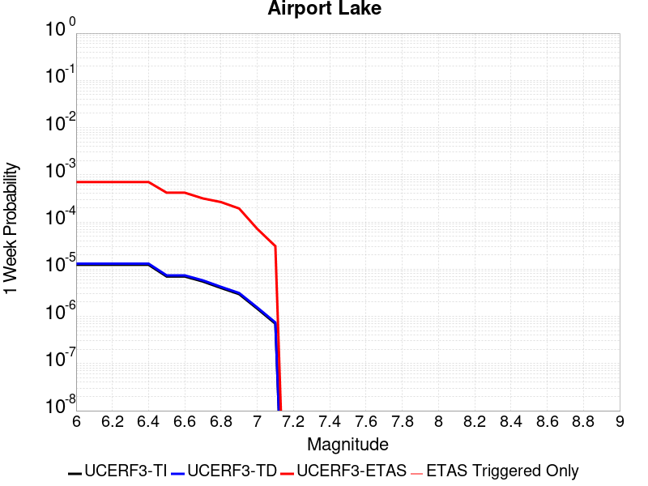 |  |  |  |

| Magnitude | 1 wk TI Prob | 1 wk TD Prob | 1 wk ETAS Prob | 1 wk ETAS/TD Gain | 1 wk ETAS Triggered Only | 1 mo TI Prob | 1 mo TD Prob | 1 mo ETAS Prob | 1 mo ETAS/TD Gain | 1 mo ETAS Triggered Only | 1 yr TI Prob | 1 yr TD Prob | 1 yr ETAS Prob | 1 yr ETAS/TD Gain | 1 yr ETAS Triggered Only | 10 yr TI Prob | 10 yr TD Prob | 10 yr ETAS Prob | 10 yr ETAS/TD Gain | 10 yr ETAS Triggered Only |
|-----|-----|-----|-----|-----|-----|-----|-----|-----|-----|-----|-----|-----|-----|-----|-----|-----|-----|-----|-----|-----|
| 6.0 | 1.2387061E-5 | 1.310376E-5 | 7.030947E-4 | 53.655952 | 6.9E-4 | 5.3086325E-5 | 5.615792E-5 | 0.0022960322 | 40.885277 | 0.00224 | 6.461343E-4 | 6.8353664E-4 | 0.009747337 | 14.260153 | 0.00907 | 0.0064425888 | 0.0068171523 | 0.024376625 | 3.5757782 | 0.01768 |
| 6.1 | 1.2387061E-5 | 1.310376E-5 | 7.030947E-4 | 53.655952 | 6.9E-4 | 5.3086325E-5 | 5.615792E-5 | 0.0022960322 | 40.885277 | 0.00224 | 6.461343E-4 | 6.8353664E-4 | 0.009747337 | 14.260153 | 0.00907 | 0.0064425888 | 0.0068171523 | 0.024376625 | 3.5757782 | 0.01768 |
| 6.2 | 1.2387061E-5 | 1.310376E-5 | 7.030947E-4 | 53.655952 | 6.9E-4 | 5.3086325E-5 | 5.615792E-5 | 0.0022960322 | 40.885277 | 0.00224 | 6.461343E-4 | 6.8353664E-4 | 0.009747337 | 14.260153 | 0.00907 | 0.0064425888 | 0.0068171523 | 0.024376625 | 3.5757782 | 0.01768 |
| 6.3 | 1.2387061E-5 | 1.310376E-5 | 7.030947E-4 | 53.655952 | 6.9E-4 | 5.3086325E-5 | 5.615792E-5 | 0.0022960322 | 40.885277 | 0.00224 | 6.461343E-4 | 6.8353664E-4 | 0.009747337 | 14.260153 | 0.00907 | 0.0064425888 | 0.0068171523 | 0.024376625 | 3.5757782 | 0.01768 |
| 6.4 | 1.2387061E-5 | 1.310376E-5 | 7.030947E-4 | 53.655952 | 6.9E-4 | 5.3086325E-5 | 5.615792E-5 | 0.0022960322 | 40.885277 | 0.00224 | 6.461343E-4 | 6.8353664E-4 | 0.009747337 | 14.260153 | 0.00907 | 0.0064425888 | 0.0068171523 | 0.024376625 | 3.5757782 | 0.01768 |
| 6.5 | 6.9922594E-6 | 7.3852552E-6 | 4.1738222E-4 | 56.515614 | 4.1E-4 | 2.996648E-5 | 3.165074E-5 | 0.0016116007 | 50.918262 | 0.00158 | 3.6478083E-4 | 3.8528506E-4 | 0.0070027346 | 18.175463 | 0.00662 | 0.003641826 | 0.0038467082 | 0.017035779 | 4.4286637 | 0.01324 |
| 6.6 | 6.9922594E-6 | 7.3852552E-6 | 4.1738222E-4 | 56.515614 | 4.1E-4 | 2.996648E-5 | 3.165074E-5 | 0.0016116007 | 50.918262 | 0.00158 | 3.6478083E-4 | 3.8528506E-4 | 0.0070027346 | 18.175463 | 0.00662 | 0.003641826 | 0.0038467082 | 0.017035779 | 4.4286637 | 0.01324 |
| 6.7 | 5.477277E-6 | 5.786328E-6 | 3.1578453E-4 | 54.574253 | 3.1E-4 | 2.3473833E-5 | 2.4798335E-5 | 0.0013047666 | 52.61509 | 0.00128 | 2.8575645E-4 | 3.0188178E-4 | 0.0058901943 | 19.511591 | 0.00559 | 0.0028538927 | 0.003015101 | 0.014360789 | 4.7629547 | 0.01138 |
| 6.8 | 3.9950432E-6 | 4.2192755E-6 | 2.6421816E-4 | 62.621696 | 2.6E-4 | 1.7121502E-5 | 1.8082499E-5 | 0.0010180644 | 56.30109 | 0.001 | 2.0843433E-4 | 2.2013494E-4 | 0.004499193 | 20.43834 | 0.00428 | 0.0020823893 | 0.0021994398 | 0.011039953 | 5.0194383 | 0.00886 |
| 6.9 | 2.95695E-6 | 3.1231639E-6 | 1.9312257E-4 | 61.835552 | 1.9E-4 | 1.2672582E-5 | 1.3384933E-5 | 7.8337465E-4 | 58.526604 | 7.7E-4 | 1.5427776E-4 | 1.6295163E-4 | 0.0031824596 | 19.530087 | 0.00302 | 0.001541707 | 0.0016285438 | 0.008008137 | 4.917361 | 0.00639 |
| 7.0 | 1.456072E-6 | 1.5408833E-6 | 7.154077E-5 | 46.428417 | 7.0E-5 | 6.2402937E-6 | 6.6037746E-6 | 3.4660153E-4 | 52.485367 | 3.4E-4 | 7.597293E-5 | 8.0399E-5 | 0.0013802944 | 17.168055 | 0.0013 | 7.594696E-4 | 8.0379803E-4 | 0.0036415153 | 4.530386 | 0.00284 |
| 7.1 | 6.995192E-7 | 7.409323E-7 | 3.074091E-5 | 41.4895 | 3.0E-5 | 2.997936E-6 | 3.1754241E-6 | 1.5317494E-4 | 48.237633 | 1.5E-4 | 3.649926E-5 | 3.866079E-5 | 6.2863796E-4 | 16.26035 | 5.9E-4 | 3.6493264E-4 | 3.866079E-4 | 0.0017760706 | 4.593984 | 0.00139 |

## Owl Lake
*[(top)](#table-of-contents)*

| 1 Week | 1 Month | 1 Year | 10 Year |
|-----|-----|-----|-----|
|  |  |  |  |

| Magnitude | 1 wk TI Prob | 1 wk TD Prob | 1 wk ETAS Prob | 1 wk ETAS/TD Gain | 1 wk ETAS Triggered Only | 1 mo TI Prob | 1 mo TD Prob | 1 mo ETAS Prob | 1 mo ETAS/TD Gain | 1 mo ETAS Triggered Only | 1 yr TI Prob | 1 yr TD Prob | 1 yr ETAS Prob | 1 yr ETAS/TD Gain | 1 yr ETAS Triggered Only | 10 yr TI Prob | 10 yr TD Prob | 10 yr ETAS Prob | 10 yr ETAS/TD Gain | 10 yr ETAS Triggered Only |
|-----|-----|-----|-----|-----|-----|-----|-----|-----|-----|-----|-----|-----|-----|-----|-----|-----|-----|-----|-----|-----|
| 6.0 | 5.0320643E-5 | 6.6377164E-5 | 3.8635594E-4 | 5.820615 | 3.2E-4 | 2.1564208E-4 | 2.8444815E-4 | 0.001883993 | 6.623327 | 0.0016 | 0.0026222812 | 0.0034585374 | 0.010354605 | 2.9939258 | 0.00692 | 0.02591553 | 0.03415082 | 0.04842607 | 1.4180061 | 0.01478 |
| 6.1 | 5.0320643E-5 | 6.6377164E-5 | 3.8635594E-4 | 5.820615 | 3.2E-4 | 2.1564208E-4 | 2.8444815E-4 | 0.001883993 | 6.623327 | 0.0016 | 0.0026222812 | 0.0034585374 | 0.010354605 | 2.9939258 | 0.00692 | 0.02591553 | 0.03415082 | 0.04842607 | 1.4180061 | 0.01478 |
| 6.2 | 2.4125871E-5 | 3.0990515E-5 | 2.8098276E-4 | 9.066734 | 2.5E-4 | 1.0339249E-4 | 1.3281025E-4 | 0.0014126402 | 10.63653 | 0.00128 | 0.0012580766 | 0.0016159388 | 0.0069073746 | 4.274527 | 0.0053 | 0.012509781 | 0.016075779 | 0.027164605 | 1.6897846 | 0.01127 |
| 6.3 | 1.7433485E-5 | 2.2363547E-5 | 2.3235886E-4 | 10.390071 | 2.1E-4 | 7.471279E-5 | 9.584049E-5 | 0.001175737 | 12.267643 | 0.00108 | 9.0924866E-4 | 0.0011663749 | 0.005770998 | 4.947807 | 0.00461 | 0.009055373 | 0.011633204 | 0.021170944 | 1.819872 | 0.00965 |
| 6.4 | 1.7433485E-5 | 2.2363547E-5 | 2.3235886E-4 | 10.390071 | 2.1E-4 | 7.471279E-5 | 9.584049E-5 | 0.001175737 | 12.267643 | 0.00108 | 9.0924866E-4 | 0.0011663749 | 0.005770998 | 4.947807 | 0.00461 | 0.009055373 | 0.011633204 | 0.021170944 | 1.819872 | 0.00965 |
| 6.5 | 1.5182742E-5 | 1.94366E-5 | 2.2943252E-4 | 11.804149 | 2.1E-4 | 6.506727E-5 | 8.3297375E-5 | 0.0011032124 | 13.244264 | 0.00102 | 7.919061E-4 | 0.0010138128 | 0.0053793825 | 5.3060904 | 0.00437 | 0.0078909 | 0.010122402 | 0.019169884 | 1.8938078 | 0.00914 |
| 6.6 | 6.7271576E-6 | 8.552371E-6 | 1.68551E-4 | 19.708103 | 1.6E-4 | 2.8830356E-5 | 3.6652535E-5 | 8.6662214E-4 | 23.644262 | 8.3E-4 | 3.5095305E-4 | 4.461589E-4 | 0.0038946196 | 8.729221 | 0.00345 | 0.0035039932 | 0.0044705165 | 0.011389446 | 2.5476804 | 0.00695 |
| 6.7 | 6.682835E-6 | 8.484808E-6 | 1.6848346E-4 | 19.857073 | 1.6E-4 | 2.8640408E-5 | 3.6362988E-5 | 8.663328E-4 | 23.824577 | 8.3E-4 | 3.4864116E-4 | 4.4263512E-4 | 0.003891108 | 8.79078 | 0.00345 | 0.003480947 | 0.0044354037 | 0.011344622 | 2.5577428 | 0.00694 |
| 6.8 | 6.5774975E-6 | 8.331256E-6 | 1.6832992E-4 | 20.204626 | 1.6E-4 | 2.8188972E-5 | 3.570493E-5 | 8.656753E-4 | 24.245262 | 8.3E-4 | 3.4314668E-4 | 4.3462642E-4 | 0.0038731312 | 8.911404 | 0.00344 | 0.0034261728 | 0.004355576 | 0.011245435 | 2.5818481 | 0.00692 |
| 6.9 | 6.363419E-6 | 8.004358E-6 | 1.6800308E-4 | 20.98895 | 1.6E-4 | 2.727151E-5 | 3.4303972E-5 | 8.642755E-4 | 25.194618 | 8.3E-4 | 3.3198006E-4 | 4.1757643E-4 | 0.00385614 | 9.234572 | 0.00344 | 0.0033148455 | 0.0041855276 | 0.011076564 | 2.6463962 | 0.00692 |
| 7.0 | 6.1342453E-6 | 7.636468E-6 | 1.6763524E-4 | 21.951935 | 1.6E-4 | 2.6289357E-5 | 3.272734E-5 | 8.6270017E-4 | 26.36023 | 8.3E-4 | 3.2002592E-4 | 3.9838802E-4 | 0.0038370176 | 9.631358 | 0.00344 | 0.0031956544 | 0.0039941645 | 0.010856644 | 2.7181265 | 0.00689 |
| 7.1 | 5.842926E-6 | 7.1468944E-6 | 1.471459E-4 | 20.588787 | 1.4E-4 | 2.504087E-5 | 3.062922E-5 | 7.8060623E-4 | 25.485672 | 7.5E-4 | 3.0482994E-4 | 3.7285234E-4 | 0.0036216406 | 9.713337 | 0.00325 | 0.0030441214 | 0.003739406 | 0.010324689 | 2.7610505 | 0.00661 |
| 7.2 | 4.77173E-6 | 5.3626486E-6 | 1.1536206E-4 | 21.512142 | 1.1E-4 | 2.045011E-5 | 2.29826E-5 | 5.329709E-4 | 23.190191 | 5.1E-4 | 2.4895166E-4 | 2.797813E-4 | 0.002339205 | 8.360834 | 0.00206 | 0.0024867293 | 0.0028109364 | 0.0069991304 | 2.489964 | 0.0042 |
| 7.3 | 3.0494948E-6 | 2.713455E-6 | 1.2713428E-5 | 4.6853285 | 1.0E-5 | 1.3069198E-5 | 1.1629042E-5 | 1.2162776E-4 | 10.458967 | 1.1E-4 | 1.5910587E-4 | 1.4157455E-4 | 6.3150516E-4 | 4.460584 | 4.9E-4 | 0.0015899199 | 0.0014247152 | 0.002483205 | 1.7429483 | 0.00106 |
| 7.4 | 2.7263884E-6 | 2.308472E-6 | 2.308472E-6 | 1.0 | 0.0 | 1.1684469E-5 | 9.893414E-6 | 5.989292E-5 | 6.053817 | 5.0E-5 | 1.4224913E-4 | 1.20445766E-4 | 3.9041325E-4 | 3.2414029 | 2.7E-4 | 0.0014215811 | 0.0012126236 | 0.001891799 | 1.5600876 | 6.8E-4 |
| 7.5 | 2.6090431E-6 | 2.1683522E-6 | 2.1683522E-6 | 1.0 | 0.0 | 1.1181565E-5 | 9.292906E-6 | 3.9292627E-5 | 4.228239 | 3.0E-5 | 1.3612706E-4 | 1.1313535E-4 | 3.1311272E-4 | 2.767594 | 2.0E-4 | 0.001360437 | 0.0011393306 | 0.0017086811 | 1.4997238 | 5.7E-4 |
| 7.6 | 2.3008756E-6 | 1.8753714E-6 | 1.8753714E-6 | 1.0 | 0.0 | 9.860858E-6 | 8.037282E-6 | 1.80372E-5 | 2.244192 | 1.0E-5 | 1.20049335E-4 | 9.784959E-5 | 2.4783492E-4 | 2.532815 | 1.5E-4 | 0.001199845 | 9.862737E-4 | 0.0013958693 | 1.4152961 | 4.1E-4 |
| 7.7 | 1.7184348E-6 | 1.3442966E-6 | 1.3442966E-6 | 1.0 | 0.0 | 7.3646997E-6 | 5.7612588E-6 | 1.5761201E-5 | 2.7357218 | 1.0E-5 | 8.966153E-5 | 7.014111E-5 | 1.6013479E-4 | 2.2830377 | 9.0E-5 | 8.962536E-4 | 7.090931E-4 | 9.3893E-4 | 1.3241279 | 2.3E-4 |
| 7.8 | 8.4612907E-7 | 8.423267E-7 | 8.423267E-7 | 1.0 | 0.0 | 3.6262625E-6 | 3.6099668E-6 | 3.6099668E-6 | 1.0 | 0.0 | 4.4148852E-5 | 4.395048E-5 | 8.3948726E-5 | 1.9100752 | 4.0E-5 | 4.414008E-4 | 4.4486247E-4 | 5.248269E-4 | 1.1797508 | 8.0E-5 |
| 7.9 | 2.716738E-7 | 3.776153E-7 | 3.776153E-7 | 1.0 | 0.0 | 1.1643157E-6 | 1.6183503E-6 | 1.6183503E-6 | 1.0 | 0.0 | 1.4175452E-5 | 1.9703248E-5 | 2.9703051E-5 | 1.5075206 | 1.0E-5 | 1.4174548E-4 | 1.9876353E-4 | 2.1875957E-4 | 1.100602 | 2.0E-5 |
| 8.0 | 2.1995428E-8 | 3.3949217E-8 | 3.3949217E-8 | 1.0 | 0.0 | 9.426611E-8 | 1.4549663E-7 | 1.4549663E-7 | 1.0 | 0.0 | 1.1476893E-6 | 1.7714208E-6 | 1.7714208E-6 | 1.0 | 0.0 | 1.14768345E-5 | 1.7918594E-5 | 1.7918594E-5 | 1.0 | 0.0 |

## Panamint Valley
*[(top)](#table-of-contents)*

| 1 Week | 1 Month | 1 Year | 10 Year |
|-----|-----|-----|-----|
|  | 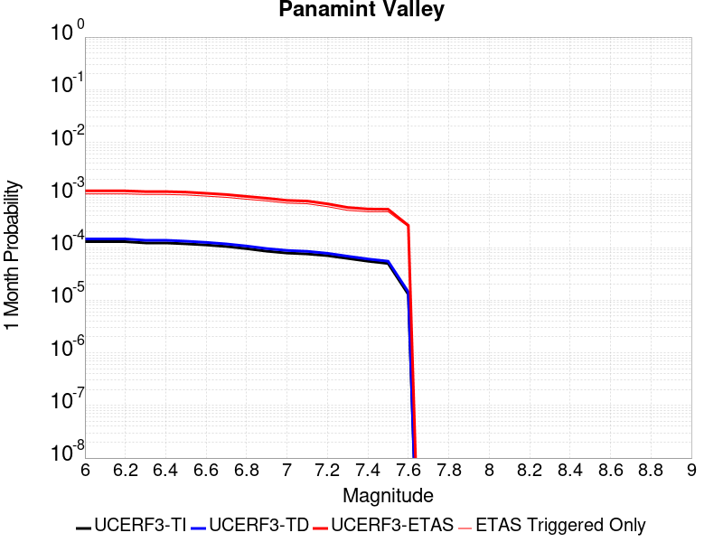 |  |  |

| Magnitude | 1 wk TI Prob | 1 wk TD Prob | 1 wk ETAS Prob | 1 wk ETAS/TD Gain | 1 wk ETAS Triggered Only | 1 mo TI Prob | 1 mo TD Prob | 1 mo ETAS Prob | 1 mo ETAS/TD Gain | 1 mo ETAS Triggered Only | 1 yr TI Prob | 1 yr TD Prob | 1 yr ETAS Prob | 1 yr ETAS/TD Gain | 1 yr ETAS Triggered Only | 10 yr TI Prob | 10 yr TD Prob | 10 yr ETAS Prob | 10 yr ETAS/TD Gain | 10 yr ETAS Triggered Only |
|-----|-----|-----|-----|-----|-----|-----|-----|-----|-----|-----|-----|-----|-----|-----|-----|-----|-----|-----|-----|-----|
| 6.0 | 3.0211835E-5 | 3.3990345E-5 | 3.6397914E-4 | 10.708309 | 3.3E-4 | 1.2947287E-4 | 1.4566495E-4 | 0.001195512 | 8.2072735 | 0.00105 | 0.0015751923 | 0.0017720575 | 0.007072648 | 3.9912066 | 0.00531 | 0.015640736 | 0.017585238 | 0.029541226 | 1.6798878 | 0.01217 |
| 6.1 | 3.0211835E-5 | 3.3990345E-5 | 3.6397914E-4 | 10.708309 | 3.3E-4 | 1.2947287E-4 | 1.4566495E-4 | 0.001195512 | 8.2072735 | 0.00105 | 0.0015751923 | 0.0017720575 | 0.007072648 | 3.9912066 | 0.00531 | 0.015640736 | 0.017585238 | 0.029541226 | 1.6798878 | 0.01217 |
| 6.2 | 3.0211835E-5 | 3.3990345E-5 | 3.6397914E-4 | 10.708309 | 3.3E-4 | 1.2947287E-4 | 1.4566495E-4 | 0.001195512 | 8.2072735 | 0.00105 | 0.0015751923 | 0.0017720575 | 0.007072648 | 3.9912066 | 0.00531 | 0.015640736 | 0.017585238 | 0.029541226 | 1.6798878 | 0.01217 |
| 6.3 | 2.8573924E-5 | 3.210816E-5 | 3.5209788E-4 | 10.965994 | 3.2E-4 | 1.2245393E-4 | 1.375993E-4 | 0.001157459 | 8.411809 | 0.00102 | 0.001489857 | 0.0016740119 | 0.006745508 | 4.029546 | 0.00508 | 0.01479908 | 0.016619598 | 0.027948141 | 1.6816375 | 0.01152 |
| 6.4 | 2.8573924E-5 | 3.210816E-5 | 3.5209788E-4 | 10.965994 | 3.2E-4 | 1.2245393E-4 | 1.375993E-4 | 0.001157459 | 8.411809 | 0.00102 | 0.001489857 | 0.0016740119 | 0.006745508 | 4.029546 | 0.00508 | 0.01479908 | 0.016619598 | 0.027948141 | 1.6816375 | 0.01152 |
| 6.5 | 2.7468774E-5 | 3.083371E-5 | 3.4082416E-4 | 11.053621 | 3.1E-4 | 1.1771801E-4 | 1.3213794E-4 | 0.0011320058 | 8.56685 | 0.001 | 0.0014322745 | 0.0016076195 | 0.006579614 | 4.0927677 | 0.00498 | 0.014230782 | 0.015965374 | 0.027006242 | 1.6915509 | 0.01122 |
| 6.6 | 2.6135967E-5 | 2.925757E-5 | 3.1924908E-4 | 10.9116745 | 2.9E-4 | 1.1200648E-4 | 1.2538371E-4 | 0.0010752646 | 8.575792 | 9.5E-4 | 0.0013628257 | 0.0015255042 | 0.0062882276 | 4.122065 | 0.00477 | 0.013544982 | 0.015155522 | 0.02581154 | 1.7031112 | 0.01082 |
| 6.7 | 2.4498746E-5 | 2.7346381E-5 | 2.8733927E-4 | 10.507397 | 2.6E-4 | 1.04990395E-4 | 1.1719365E-4 | 0.0010170882 | 8.678697 | 9.0E-4 | 0.0012775084 | 0.0014259239 | 0.005929493 | 4.1583514 | 0.00451 | 0.012701893 | 0.014172736 | 0.024238031 | 1.7101873 | 0.01021 |
| 6.8 | 2.2244329E-5 | 2.4939838E-5 | 2.6493386E-4 | 10.622918 | 2.4E-4 | 9.532935E-5 | 1.0688076E-4 | 9.3679206E-4 | 8.764833 | 8.3E-4 | 0.0011600169 | 0.0013005183 | 0.005405173 | 4.1561685 | 0.00411 | 0.011539802 | 0.012933651 | 0.022123238 | 1.7105176 | 0.00931 |
| 6.9 | 1.9902658E-5 | 2.2294324E-5 | 2.2228986E-4 | 9.970694 | 2.0E-4 | 8.529431E-5 | 9.5543706E-5 | 8.6547015E-4 | 9.058369 | 7.7E-4 | 0.0010379635 | 0.0011626424 | 0.004808399 | 4.1357503 | 0.00365 | 0.010331288 | 0.011569764 | 0.019674892 | 1.7005439 | 0.0082 |
| 7.0 | 1.8353881E-5 | 2.0570084E-5 | 2.0056638E-4 | 9.750392 | 1.8E-4 | 7.865712E-5 | 8.815462E-5 | 7.880929E-4 | 8.939894 | 7.0E-4 | 9.5722964E-4 | 0.0010727717 | 0.0043991995 | 4.1007786 | 0.00333 | 0.009531168 | 0.010679929 | 0.018080043 | 1.6928992 | 0.00748 |
| 7.1 | 1.7667631E-5 | 1.9776387E-5 | 1.8977303E-4 | 9.59594 | 1.7E-4 | 7.571623E-5 | 8.4753294E-5 | 7.6469564E-4 | 9.022607 | 6.8E-4 | 9.2145515E-4 | 0.0010314004 | 0.004258069 | 4.128434 | 0.00323 | 0.009176437 | 0.010270088 | 0.017425835 | 1.6967561 | 0.00723 |
| 7.2 | 1.6381597E-5 | 1.8161782E-5 | 1.6815905E-4 | 9.258952 | 1.5E-4 | 7.020495E-5 | 7.783398E-5 | 6.777873E-4 | 8.708116 | 6.0E-4 | 8.544101E-4 | 9.4723405E-4 | 0.0038844491 | 4.1008334 | 0.00294 | 0.008511325 | 0.009435681 | 0.015864443 | 1.6813247 | 0.00649 |
| 7.3 | 1.4520491E-5 | 1.5969035E-5 | 1.4596696E-4 | 9.140625 | 1.3E-4 | 6.222919E-5 | 6.843702E-5 | 5.7840213E-4 | 8.451597 | 5.1E-4 | 7.57377E-4 | 8.329184E-4 | 0.0033208444 | 3.9869986 | 0.00249 | 0.0075480095 | 0.008300317 | 0.01380425 | 1.6630992 | 0.00555 |
| 7.4 | 1.2852287E-5 | 1.4147671E-5 | 1.4414583E-4 | 10.188662 | 1.3E-4 | 5.5080065E-5 | 6.0631555E-5 | 5.406024E-4 | 8.916189 | 4.8E-4 | 6.7039346E-4 | 7.37955E-4 | 0.003156169 | 4.2769127 | 0.00242 | 0.0066837464 | 0.0073572127 | 0.0126877045 | 1.724526 | 0.00537 |
| 7.5 | 1.1637851E-5 | 1.2838896E-5 | 1.4283722E-4 | 11.125351 | 1.3E-4 | 4.987555E-5 | 5.5022767E-5 | 5.3499633E-4 | 9.723182 | 4.8E-4 | 6.070656E-4 | 6.6971197E-4 | 0.003078098 | 4.596152 | 0.00241 | 0.006054099 | 0.0066790855 | 0.011933753 | 1.7867346 | 0.00529 |
| 7.6 | 3.0068115E-6 | 3.3339106E-6 | 6.333371E-5 | 18.996822 | 6.0E-5 | 1.2886271E-5 | 1.4288152E-5 | 2.6428458E-4 | 18.496765 | 2.5E-4 | 1.5687906E-4 | 1.7395164E-4 | 0.0012437655 | 7.150065 | 0.00107 | 0.0015676835 | 0.0017386937 | 0.0039847814 | 2.291825 | 0.00225 |

## Garlock (East)
*[(top)](#table-of-contents)*

| 1 Week | 1 Month | 1 Year | 10 Year |
|-----|-----|-----|-----|
|  | 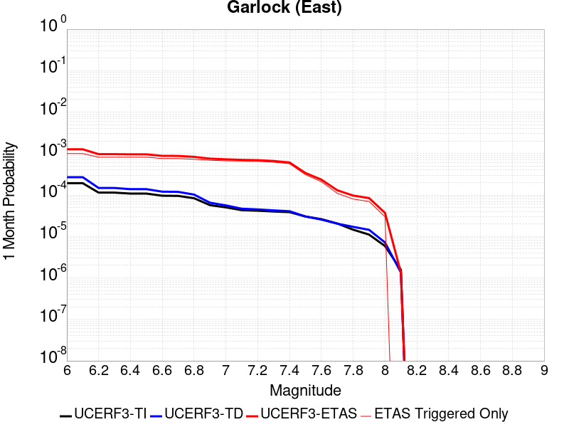 |  |  |

| Magnitude | 1 wk TI Prob | 1 wk TD Prob | 1 wk ETAS Prob | 1 wk ETAS/TD Gain | 1 wk ETAS Triggered Only | 1 mo TI Prob | 1 mo TD Prob | 1 mo ETAS Prob | 1 mo ETAS/TD Gain | 1 mo ETAS Triggered Only | 1 yr TI Prob | 1 yr TD Prob | 1 yr ETAS Prob | 1 yr ETAS/TD Gain | 1 yr ETAS Triggered Only | 10 yr TI Prob | 10 yr TD Prob | 10 yr ETAS Prob | 10 yr ETAS/TD Gain | 10 yr ETAS Triggered Only |
|-----|-----|-----|-----|-----|-----|-----|-----|-----|-----|-----|-----|-----|-----|-----|-----|-----|-----|-----|-----|-----|
| 6.0 | 4.5092507E-5 | 6.292428E-5 | 3.4290666E-4 | 5.4495125 | 2.8E-4 | 1.9323928E-4 | 2.6965013E-4 | 0.0012693804 | 4.707509 | 0.001 | 0.0023501497 | 0.003278494 | 0.0075643966 | 2.3072777 | 0.0043 | 0.023254504 | 0.032301277 | 0.041949235 | 1.2986865 | 0.00997 |
| 6.1 | 4.5092507E-5 | 6.292428E-5 | 3.4290666E-4 | 5.4495125 | 2.8E-4 | 1.9323928E-4 | 2.6965013E-4 | 0.0012693804 | 4.707509 | 0.001 | 0.0023501497 | 0.003278494 | 0.0075643966 | 2.3072777 | 0.0043 | 0.023254504 | 0.032301277 | 0.041949235 | 1.2986865 | 0.00997 |
| 6.2 | 2.6674514E-5 | 3.4527213E-5 | 2.9451825E-4 | 8.530032 | 2.6E-4 | 1.1431433E-4 | 1.4796556E-4 | 9.678442E-4 | 6.54101 | 8.2E-4 | 0.0013908884 | 0.0018000253 | 0.005024211 | 2.7911892 | 0.00323 | 0.01382215 | 0.017891826 | 0.024864795 | 1.3897293 | 0.0071 |
| 6.3 | 2.6674514E-5 | 3.4527213E-5 | 2.9451825E-4 | 8.530032 | 2.6E-4 | 1.1431433E-4 | 1.4796556E-4 | 9.678442E-4 | 6.54101 | 8.2E-4 | 0.0013908884 | 0.0018000253 | 0.005024211 | 2.7911892 | 0.00323 | 0.01382215 | 0.017891826 | 0.024864795 | 1.3897293 | 0.0071 |
| 6.4 | 2.5312667E-5 | 3.235603E-5 | 2.9234763E-4 | 9.035336 | 2.6E-4 | 1.0847834E-4 | 1.386615E-4 | 9.585478E-4 | 6.912862 | 8.2E-4 | 0.0013199237 | 0.001686926 | 0.0048815277 | 2.8937416 | 0.0032 | 0.013121112 | 0.01679189 | 0.023664515 | 1.4092823 | 0.00699 |
| 6.5 | 2.5312667E-5 | 3.235603E-5 | 2.9234763E-4 | 9.035336 | 2.6E-4 | 1.0847834E-4 | 1.386615E-4 | 9.585478E-4 | 6.912862 | 8.2E-4 | 0.0013199237 | 0.001686926 | 0.0048815277 | 2.8937416 | 0.0032 | 0.013121112 | 0.01679189 | 0.023664515 | 1.4092823 | 0.00699 |
| 6.6 | 2.246556E-5 | 2.8150089E-5 | 2.6814334E-4 | 9.525488 | 2.4E-4 | 9.627742E-5 | 1.2063779E-4 | 8.805461E-4 | 7.29909 | 7.6E-4 | 0.0011715472 | 0.0014677991 | 0.0044833664 | 3.0544822 | 0.00302 | 0.011653901 | 0.014632481 | 0.020988101 | 1.4343501 | 0.00645 |
| 6.7 | 2.2241198E-5 | 2.7819795E-5 | 2.6781313E-4 | 9.626711 | 2.4E-4 | 9.531594E-5 | 1.1922237E-4 | 8.791318E-4 | 7.3738823 | 7.6E-4 | 0.0011598538 | 0.0014505894 | 0.004446238 | 3.0651248 | 0.003 | 0.011538187 | 0.014462364 | 0.020789515 | 1.4374908 | 0.00642 |
| 6.8 | 1.9528685E-5 | 2.3913335E-5 | 2.5390784E-4 | 10.617835 | 2.3E-4 | 8.369167E-5 | 1.02481805E-4 | 8.32407E-4 | 8.122486 | 7.3E-4 | 0.0010184698 | 0.0012470215 | 0.0040934673 | 3.2825959 | 0.00285 | 0.010138147 | 0.012442375 | 0.018407222 | 1.4793979 | 0.00604 |
| 6.9 | 1.3318621E-5 | 1.5211776E-5 | 2.3520843E-4 | 15.462259 | 2.2E-4 | 5.7078556E-5 | 6.519173E-5 | 7.551467E-4 | 11.583474 | 6.9E-4 | 6.9470983E-4 | 7.93426E-4 | 0.0034213392 | 4.312109 | 0.00263 | 0.0069254204 | 0.007945094 | 0.013212905 | 1.6630269 | 0.00531 |
| 7.0 | 1.1760853E-5 | 1.31201905E-5 | 2.331173E-4 | 17.76783 | 2.2E-4 | 5.0402683E-5 | 5.6228204E-5 | 7.261905E-4 | 12.915058 | 6.7E-4 | 6.134799E-4 | 6.8436837E-4 | 0.0032725958 | 4.7819214 | 0.00259 | 0.0061178906 | 0.006861565 | 0.011976228 | 1.7454076 | 0.00515 |
| 7.1 | 1.0064758E-5 | 1.0914836E-5 | 2.3091244E-4 | 21.155832 | 2.2E-4 | 4.3133965E-5 | 4.6777048E-5 | 7.067462E-4 | 15.108824 | 6.6E-4 | 5.2502943E-4 | 5.693653E-4 | 0.0030679419 | 5.3883543 | 0.0025 | 0.005237907 | 0.0057190335 | 0.010630782 | 1.8588423 | 0.00494 |
| 7.2 | 9.768808E-6 | 1.051062E-5 | 2.305083E-4 | 21.93099 | 2.2E-4 | 4.186565E-5 | 4.504476E-5 | 6.950155E-4 | 15.429442 | 6.5E-4 | 5.095951E-4 | 5.4828543E-4 | 0.002976953 | 5.4295683 | 0.00243 | 0.0050842804 | 0.005509166 | 0.010292667 | 1.8682804 | 0.00481 |
| 7.3 | 9.344516E-6 | 9.956038E-6 | 2.1995394E-4 | 22.092518 | 2.1E-4 | 4.004731E-5 | 4.2668056E-5 | 6.626416E-4 | 15.530156 | 6.2E-4 | 4.8746695E-4 | 5.1936327E-4 | 0.0027881842 | 5.368467 | 0.00227 | 0.0048639905 | 0.0052207247 | 0.009667388 | 1.851733 | 0.00447 |
| 7.4 | 9.023491E-6 | 9.501971E-6 | 2.1949997E-4 | 23.100468 | 2.1E-4 | 3.867153E-5 | 4.0722116E-5 | 6.106989E-4 | 14.9967375 | 5.7E-4 | 4.7072413E-4 | 4.9568235E-4 | 0.0025046861 | 5.053006 | 0.00201 | 0.004697283 | 0.0049841446 | 0.008924408 | 1.7905594 | 0.00396 |
| 7.5 | 7.081253E-6 | 7.0976453E-6 | 9.709701E-5 | 13.680172 | 9.0E-5 | 3.0347876E-5 | 3.041813E-5 | 3.404087E-4 | 11.190981 | 3.1E-4 | 3.6942272E-4 | 3.7027855E-4 | 0.001329923 | 3.591683 | 9.6E-4 | 0.003688092 | 0.0037292277 | 0.0055723283 | 1.4942312 | 0.00185 |
| 7.6 | 6.116396E-6 | 5.9686954E-6 | 7.596828E-5 | 12.727786 | 7.0E-5 | 2.6212863E-5 | 2.5579875E-5 | 2.3557451E-4 | 9.209369 | 2.1E-4 | 3.1909486E-4 | 3.1139073E-4 | 9.3119766E-4 | 2.9904478 | 6.2E-4 | 0.0031863707 | 0.0031404258 | 0.00431672 | 1.3745652 | 0.00118 |
| 7.7 | 4.797145E-6 | 4.7661792E-6 | 3.4766035E-5 | 7.29432 | 3.0E-5 | 2.055903E-5 | 2.0426323E-5 | 1.3042407E-4 | 6.3850985 | 1.1E-4 | 2.5027743E-4 | 2.4866223E-4 | 5.5858516E-4 | 2.246361 | 3.1E-4 | 0.0024999576 | 0.002513605 | 0.0031021219 | 1.2341326 | 5.9E-4 |
| 7.8 | 3.4028885E-6 | 3.986488E-6 | 3.398637E-5 | 8.525391 | 3.0E-5 | 1.4583726E-5 | 1.7084838E-5 | 9.708347E-5 | 5.6824346 | 8.0E-5 | 1.775424E-4 | 2.0798811E-4 | 4.3794027E-4 | 2.1056025 | 2.3E-4 | 0.0017740062 | 0.0021051252 | 0.0024943042 | 1.1848722 | 3.9E-4 |
| 7.9 | 2.5928412E-6 | 3.379295E-6 | 3.3379194E-5 | 9.877561 | 3.0E-5 | 1.1112129E-5 | 1.4482614E-5 | 8.44816E-5 | 5.8333116 | 7.0E-5 | 1.3528178E-4 | 1.7631162E-4 | 3.662781E-4 | 2.0774474 | 1.9E-4 | 0.0013519945 | 0.0017845596 | 0.0020440957 | 1.1454343 | 2.6E-4 |
| 8.0 | 1.3743648E-6 | 1.676569E-6 | 1.1676552E-5 | 6.964552 | 1.0E-5 | 5.8901214E-6 | 7.185276E-6 | 3.7185062E-5 | 5.1751747 | 3.0E-5 | 7.1709874E-5 | 8.747725E-5 | 1.7746938E-4 | 2.0287488 | 9.0E-5 | 7.1686733E-4 | 8.8519446E-4 | 9.85106E-4 | 1.1128695 | 1.0E-4 |
| 8.1 | 3.6733252E-7 | 3.1543834E-7 | 3.1543834E-7 | 1.0 | 0.0 | 1.5742813E-6 | 1.351878E-6 | 1.351878E-6 | 1.0 | 0.0 | 1.9166706E-5 | 1.6459007E-5 | 1.6459007E-5 | 1.0 | 0.0 | 1.9165053E-4 | 1.6671374E-4 | 1.6671374E-4 | 1.0 | 0.0 |

## Ash Hill
*[(top)](#table-of-contents)*

| 1 Week | 1 Month | 1 Year | 10 Year |
|-----|-----|-----|-----|
|  |  |  |  |

| Magnitude | 1 wk TI Prob | 1 wk TD Prob | 1 wk ETAS Prob | 1 wk ETAS/TD Gain | 1 wk ETAS Triggered Only | 1 mo TI Prob | 1 mo TD Prob | 1 mo ETAS Prob | 1 mo ETAS/TD Gain | 1 mo ETAS Triggered Only | 1 yr TI Prob | 1 yr TD Prob | 1 yr ETAS Prob | 1 yr ETAS/TD Gain | 1 yr ETAS Triggered Only | 10 yr TI Prob | 10 yr TD Prob | 10 yr ETAS Prob | 10 yr ETAS/TD Gain | 10 yr ETAS Triggered Only |
|-----|-----|-----|-----|-----|-----|-----|-----|-----|-----|-----|-----|-----|-----|-----|-----|-----|-----|-----|-----|-----|
| 6.0 | 2.1545662E-5 | 2.319586E-5 | 2.1319145E-4 | 9.190927 | 1.9E-4 | 9.2335285E-5 | 9.9407494E-5 | 7.193459E-4 | 7.2363343 | 6.2E-4 | 0.0011236023 | 0.0012096942 | 0.0040762224 | 3.3696303 | 0.00287 | 0.011179381 | 0.012039078 | 0.018480584 | 1.5350497 | 0.00652 |
| 6.1 | 2.1545662E-5 | 2.319586E-5 | 2.1319145E-4 | 9.190927 | 1.9E-4 | 9.2335285E-5 | 9.9407494E-5 | 7.193459E-4 | 7.2363343 | 6.2E-4 | 0.0011236023 | 0.0012096942 | 0.0040762224 | 3.3696303 | 0.00287 | 0.011179381 | 0.012039078 | 0.018480584 | 1.5350497 | 0.00652 |
| 6.2 | 2.1545662E-5 | 2.319586E-5 | 2.1319145E-4 | 9.190927 | 1.9E-4 | 9.2335285E-5 | 9.9407494E-5 | 7.193459E-4 | 7.2363343 | 6.2E-4 | 0.0011236023 | 0.0012096942 | 0.0040762224 | 3.3696303 | 0.00287 | 0.011179381 | 0.012039078 | 0.018480584 | 1.5350497 | 0.00652 |
| 6.3 | 1.0025529E-5 | 1.074755E-5 | 5.074712E-5 | 4.7217383 | 4.0E-5 | 4.2965847E-5 | 4.6060188E-5 | 2.6605005E-4 | 5.7761393 | 2.2E-4 | 5.229836E-4 | 5.6065177E-4 | 0.0015700855 | 2.8004649 | 0.00101 | 0.005217545 | 0.005593686 | 0.007960373 | 1.4230998 | 0.00238 |
| 6.4 | 1.0025529E-5 | 1.074755E-5 | 5.074712E-5 | 4.7217383 | 4.0E-5 | 4.2965847E-5 | 4.6060188E-5 | 2.6605005E-4 | 5.7761393 | 2.2E-4 | 5.229836E-4 | 5.6065177E-4 | 0.0015700855 | 2.8004649 | 0.00101 | 0.005217545 | 0.005593686 | 0.007960373 | 1.4230998 | 0.00238 |
| 6.5 | 6.9617327E-6 | 7.4570557E-6 | 2.7456907E-5 | 3.6820035 | 2.0E-5 | 2.9835655E-5 | 3.195847E-5 | 1.9195335E-4 | 6.0063376 | 1.6E-4 | 3.6318856E-4 | 3.8903355E-4 | 0.0010487768 | 2.6958518 | 6.6E-4 | 0.0036259557 | 0.0038843798 | 0.005418398 | 1.3949198 | 0.00154 |
| 6.6 | 4.9919777E-6 | 5.3469907E-6 | 1.5346937E-5 | 2.8702009 | 1.0E-5 | 2.1394015E-5 | 2.291551E-5 | 1.2291322E-4 | 5.3637567 | 1.0E-4 | 2.60441E-4 | 2.7896732E-4 | 7.488362E-4 | 2.6843152 | 4.7E-4 | 0.0026013597 | 0.00278683 | 0.0039037087 | 1.4007703 | 0.00112 |
| 6.7 | 3.6630722E-6 | 3.9248466E-6 | 1.3924808E-5 | 3.5478601 | 1.0E-5 | 1.5698786E-5 | 1.6820695E-5 | 1.16819014E-4 | 6.9449573 | 1.0E-4 | 1.9111596E-4 | 2.0477847E-4 | 5.6470477E-4 | 2.7576375 | 3.6E-4 | 0.0019095168 | 0.0020464608 | 0.002874762 | 1.4047483 | 8.3E-4 |
| 6.8 | 2.5599613E-6 | 2.7450828E-6 | 1.2745056E-5 | 4.642867 | 1.0E-5 | 1.0971216E-5 | 1.1764616E-5 | 7.176391E-5 | 6.099979 | 6.0E-5 | 1.3356637E-4 | 1.4322973E-4 | 3.332025E-4 | 2.3263502 | 1.9E-4 | 0.0013348613 | 0.0014318592 | 0.0019611004 | 1.3696182 | 5.3E-4 |
| 6.9 | 1.7684905E-6 | 1.8969803E-6 | 1.8969803E-6 | 1.0 | 0.0 | 7.579223E-6 | 8.129916E-6 | 5.812951E-5 | 7.1500754 | 5.0E-5 | 9.2273134E-5 | 9.898172E-5 | 2.4896688E-4 | 2.5152812 | 1.5E-4 | 9.223483E-4 | 9.898172E-4 | 0.0013794312 | 1.3936222 | 3.9E-4 |

## Hunter Mountain-Saline Valley
*[(top)](#table-of-contents)*

| 1 Week | 1 Month | 1 Year | 10 Year |
|-----|-----|-----|-----|
|  | 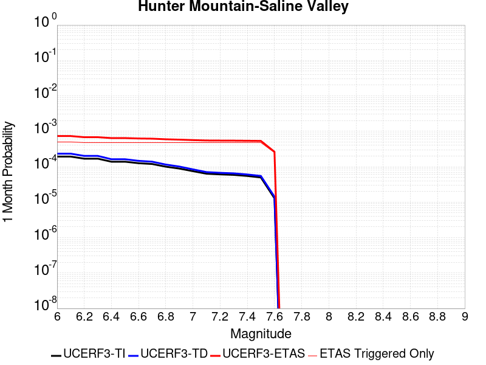 |  |  |

| Magnitude | 1 wk TI Prob | 1 wk TD Prob | 1 wk ETAS Prob | 1 wk ETAS/TD Gain | 1 wk ETAS Triggered Only | 1 mo TI Prob | 1 mo TD Prob | 1 mo ETAS Prob | 1 mo ETAS/TD Gain | 1 mo ETAS Triggered Only | 1 yr TI Prob | 1 yr TD Prob | 1 yr ETAS Prob | 1 yr ETAS/TD Gain | 1 yr ETAS Triggered Only | 10 yr TI Prob | 10 yr TD Prob | 10 yr ETAS Prob | 10 yr ETAS/TD Gain | 10 yr ETAS Triggered Only |
|-----|-----|-----|-----|-----|-----|-----|-----|-----|-----|-----|-----|-----|-----|-----|-----|-----|-----|-----|-----|-----|
| 6.0 | 4.5103672E-5 | 5.4579075E-5 | 1.8457198E-4 | 3.3817353 | 1.3E-4 | 1.9328714E-4 | 2.3389056E-4 | 7.3377363E-4 | 3.137252 | 5.0E-4 | 0.002350731 | 0.0028440794 | 0.005336969 | 1.8765191 | 0.0025 | 0.023260195 | 0.0280965 | 0.033519723 | 1.1930213 | 0.00558 |
| 6.1 | 4.5103672E-5 | 5.4579075E-5 | 1.8457198E-4 | 3.3817353 | 1.3E-4 | 1.9328714E-4 | 2.3389056E-4 | 7.3377363E-4 | 3.137252 | 5.0E-4 | 0.002350731 | 0.0028440794 | 0.005336969 | 1.8765191 | 0.0025 | 0.023260195 | 0.0280965 | 0.033519723 | 1.1930213 | 0.00558 |
| 6.2 | 3.9363465E-5 | 4.7071077E-5 | 1.7706495E-4 | 3.7616508 | 1.3E-4 | 1.6868966E-4 | 2.0171847E-4 | 6.8162166E-4 | 3.379074 | 4.8E-4 | 0.002051862 | 0.0024532943 | 0.0049072593 | 2.0002732 | 0.00246 | 0.020330196 | 0.024277182 | 0.029663172 | 1.221854 | 0.00552 |
| 6.3 | 3.9363465E-5 | 4.7071077E-5 | 1.7706495E-4 | 3.7616508 | 1.3E-4 | 1.6868966E-4 | 2.0171847E-4 | 6.8162166E-4 | 3.379074 | 4.8E-4 | 0.002051862 | 0.0024532943 | 0.0049072593 | 2.0002732 | 0.00246 | 0.020330196 | 0.024277182 | 0.029663172 | 1.221854 | 0.00552 |
| 6.4 | 3.2311684E-5 | 3.7957547E-5 | 1.6795262E-4 | 4.424749 | 1.3E-4 | 1.384713E-4 | 1.6266547E-4 | 6.425874E-4 | 3.9503613 | 4.8E-4 | 0.0016845843 | 0.0019787215 | 0.0044238735 | 2.2357233 | 0.00245 | 0.016718714 | 0.01961908 | 0.025001371 | 1.2743397 | 0.00549 |
| 6.5 | 3.2311684E-5 | 3.7957547E-5 | 1.6795262E-4 | 4.424749 | 1.3E-4 | 1.384713E-4 | 1.6266547E-4 | 6.425874E-4 | 3.9503613 | 4.8E-4 | 0.0016845843 | 0.0019787215 | 0.0044238735 | 2.2357233 | 0.00245 | 0.016718714 | 0.01961908 | 0.025001371 | 1.2743397 | 0.00549 |
| 6.6 | 2.9305844E-5 | 3.4187626E-5 | 1.6418318E-4 | 4.8024154 | 1.3E-4 | 1.2559042E-4 | 1.4651052E-4 | 6.264402E-4 | 4.2757354 | 4.8E-4 | 0.0015279909 | 0.001782368 | 0.004218019 | 2.3665252 | 0.00244 | 0.015175272 | 0.017687906 | 0.02302186 | 1.3015594 | 0.00543 |
| 6.7 | 2.7826512E-5 | 3.2349675E-5 | 1.6234547E-4 | 5.018458 | 1.3E-4 | 1.19251024E-4 | 1.3863444E-4 | 6.1856786E-4 | 4.4618635 | 4.8E-4 | 0.0014509142 | 0.0016866276 | 0.0041225124 | 2.4442337 | 0.00244 | 0.014414776 | 0.01674522 | 0.022074461 | 1.3182545 | 0.00542 |
| 6.8 | 2.3389874E-5 | 2.6871088E-5 | 1.568676E-4 | 5.837784 | 1.3E-4 | 1.0023846E-4 | 1.1515699E-4 | 5.9510174E-4 | 5.1677427 | 4.8E-4 | 0.00121972 | 0.0014011819 | 0.003827777 | 2.73182 | 0.00243 | 0.01213047 | 0.013928946 | 0.019263592 | 1.3829898 | 0.00541 |
| 6.9 | 2.069209E-5 | 2.3573823E-5 | 1.5357076E-4 | 6.5144615 | 1.3E-4 | 8.867737E-5 | 1.0102696E-4 | 5.8097846E-4 | 5.750727 | 4.8E-4 | 0.0010791123 | 0.0012293453 | 0.0036463703 | 2.9661074 | 0.00242 | 0.010738871 | 0.012229738 | 0.01755382 | 1.435339 | 0.00539 |
| 7.0 | 1.7462342E-5 | 1.963665E-5 | 1.496341E-4 | 7.6201434 | 1.3E-4 | 7.483646E-5 | 8.415449E-5 | 5.641141E-4 | 6.7033157 | 4.8E-4 | 9.1075303E-4 | 0.0010241219 | 0.0034416437 | 3.36058 | 0.00242 | 0.009070295 | 0.010196914 | 0.015512156 | 1.5212599 | 0.00537 |
| 7.1 | 1.4807709E-5 | 1.644434E-5 | 1.4644221E-4 | 8.905326 | 1.3E-4 | 6.3460066E-5 | 7.047393E-5 | 5.504401E-4 | 7.8105493 | 4.8E-4 | 7.723524E-4 | 8.5769885E-4 | 0.0032656319 | 3.807434 | 0.00241 | 0.007696735 | 0.008546129 | 0.013850407 | 1.6206645 | 0.00535 |
| 7.2 | 1.4180048E-5 | 1.5700818E-5 | 1.4569878E-4 | 9.279694 | 1.3E-4 | 6.077022E-5 | 6.7287576E-5 | 5.472553E-4 | 8.1330805 | 4.8E-4 | 7.396263E-4 | 8.189345E-4 | 0.003226961 | 3.940438 | 0.00241 | 0.0073716943 | 0.008161374 | 0.01346771 | 1.6501769 | 0.00535 |
| 7.3 | 1.3730402E-5 | 1.5174484E-5 | 1.4517251E-4 | 9.566883 | 1.3E-4 | 5.8843252E-5 | 6.503197E-5 | 5.450008E-4 | 8.380505 | 4.8E-4 | 7.161811E-4 | 7.9149276E-4 | 0.0031995852 | 4.0424695 | 0.00241 | 0.007138774 | 0.007888926 | 0.01319672 | 1.6728158 | 0.00535 |
| 7.4 | 1.2810095E-5 | 1.4111524E-5 | 1.4410968E-4 | 10.212199 | 1.3E-4 | 5.489925E-5 | 6.0476646E-5 | 5.404476E-4 | 8.936468 | 4.8E-4 | 6.681934E-4 | 7.360703E-4 | 0.0031442964 | 4.2717338 | 0.00241 | 0.006661878 | 0.0073384726 | 0.012649212 | 1.7236845 | 0.00535 |
| 7.5 | 1.1595659E-5 | 1.2802749E-5 | 1.4280109E-4 | 11.153939 | 1.3E-4 | 4.9694736E-5 | 5.4867858E-5 | 5.348415E-4 | 9.747811 | 4.8E-4 | 6.0486543E-4 | 6.678271E-4 | 0.0030662243 | 4.5913444 | 0.0024 | 0.006032217 | 0.0066603324 | 0.011895233 | 1.7859818 | 0.00527 |
| 7.6 | 2.997694E-6 | 3.326035E-6 | 6.332584E-5 | 19.039436 | 6.0E-5 | 1.28471975E-5 | 1.42543995E-5 | 2.6425085E-4 | 18.538195 | 2.5E-4 | 1.564034E-4 | 1.7354079E-4 | 0.0012433551 | 7.164628 | 0.00107 | 0.0015629337 | 0.0017345946 | 0.003970709 | 2.289128 | 0.00224 |

## Blackwater
*[(top)](#table-of-contents)*

| 1 Week | 1 Month | 1 Year | 10 Year |
|-----|-----|-----|-----|
|  |  |  |  |

| Magnitude | 1 wk TI Prob | 1 wk TD Prob | 1 wk ETAS Prob | 1 wk ETAS/TD Gain | 1 wk ETAS Triggered Only | 1 mo TI Prob | 1 mo TD Prob | 1 mo ETAS Prob | 1 mo ETAS/TD Gain | 1 mo ETAS Triggered Only | 1 yr TI Prob | 1 yr TD Prob | 1 yr ETAS Prob | 1 yr ETAS/TD Gain | 1 yr ETAS Triggered Only | 10 yr TI Prob | 10 yr TD Prob | 10 yr ETAS Prob | 10 yr ETAS/TD Gain | 10 yr ETAS Triggered Only |
|-----|-----|-----|-----|-----|-----|-----|-----|-----|-----|-----|-----|-----|-----|-----|-----|-----|-----|-----|-----|-----|
| 6.0 | 3.0708583E-5 | 3.30979E-5 | 1.2309491E-4 | 3.7191157 | 9.0E-5 | 1.3160157E-4 | 1.418412E-4 | 4.8179296E-4 | 3.3967068 | 3.4E-4 | 0.0016010714 | 0.0017256853 | 0.0034726653 | 2.0123398 | 0.00175 | 0.015895851 | 0.017136687 | 0.02144163 | 1.251212 | 0.00438 |
| 6.1 | 3.0708583E-5 | 3.30979E-5 | 1.2309491E-4 | 3.7191157 | 9.0E-5 | 1.3160157E-4 | 1.418412E-4 | 4.8179296E-4 | 3.3967068 | 3.4E-4 | 0.0016010714 | 0.0017256853 | 0.0034726653 | 2.0123398 | 0.00175 | 0.015895851 | 0.017136687 | 0.02144163 | 1.251212 | 0.00438 |
| 6.2 | 1.1707779E-5 | 1.2545836E-5 | 3.2545584E-5 | 2.5941343 | 2.0E-5 | 5.017523E-5 | 5.3766817E-5 | 1.2376305E-4 | 2.3018482 | 7.0E-5 | 6.107122E-4 | 6.54424E-4 | 0.001333979 | 2.0384016 | 6.8E-4 | 0.006090366 | 0.00652594 | 0.008045956 | 1.232919 | 0.00153 |
| 6.3 | 1.1707779E-5 | 1.2545836E-5 | 3.2545584E-5 | 2.5941343 | 2.0E-5 | 5.017523E-5 | 5.3766817E-5 | 1.2376305E-4 | 2.3018482 | 7.0E-5 | 6.107122E-4 | 6.54424E-4 | 0.001333979 | 2.0384016 | 6.8E-4 | 0.006090366 | 0.00652594 | 0.008045956 | 1.232919 | 0.00153 |
| 6.4 | 7.929244E-6 | 8.480567E-6 | 1.8480483E-5 | 2.1791565 | 1.0E-5 | 3.3982033E-5 | 3.6344805E-5 | 7.634335E-5 | 2.10053 | 4.0E-5 | 4.136527E-4 | 4.424122E-4 | 8.7222195E-4 | 1.9715143 | 4.3E-4 | 0.0041288356 | 0.00441572 | 0.0053814366 | 1.2186997 | 9.7E-4 |
| 6.5 | 5.8832115E-6 | 6.2863332E-6 | 6.2863332E-6 | 1.0 | 0.0 | 2.521352E-5 | 2.6941165E-5 | 5.6940356E-5 | 2.1135075 | 3.0E-5 | 3.0693135E-4 | 3.2796187E-4 | 6.0787005E-4 | 1.8534778 | 2.8E-4 | 0.0030650778 | 0.003275032 | 0.003992674 | 1.2191252 | 7.2E-4 |
| 6.6 | 5.8832115E-6 | 6.2863332E-6 | 6.2863332E-6 | 1.0 | 0.0 | 2.521352E-5 | 2.6941165E-5 | 5.6940356E-5 | 2.1135075 | 3.0E-5 | 3.0693135E-4 | 3.2796187E-4 | 6.0787005E-4 | 1.8534778 | 2.8E-4 | 0.0030650778 | 0.003275032 | 0.003992674 | 1.2191252 | 7.2E-4 |
| 6.7 | 3.0715053E-6 | 3.2816447E-6 | 3.2816447E-6 | 1.0 | 0.0 | 1.3163528E-5 | 1.4064122E-5 | 3.406384E-5 | 2.422038 | 2.0E-5 | 1.6025416E-4 | 1.712184E-4 | 3.31191E-4 | 1.934319 | 1.6E-4 | 0.0016013865 | 0.0017109794 | 0.0020503977 | 1.1983765 | 3.4E-4 |
| 6.8 | 2.2722281E-6 | 2.4288868E-6 | 2.4288868E-6 | 1.0 | 0.0 | 9.738084E-6 | 1.0409479E-5 | 1.0409479E-5 | 1.0 | 0.0 | 1.1855473E-4 | 1.2672895E-4 | 2.1671754E-4 | 1.7100872 | 9.0E-5 | 0.001184915 | 0.001266657 | 0.001506353 | 1.1892351 | 2.4E-4 |
| 6.9 | 9.952399E-7 | 1.0654086E-6 | 1.0654086E-6 | 1.0 | 0.0 | 4.265307E-6 | 4.5660317E-6 | 4.5660317E-6 | 1.0 | 0.0 | 5.1928873E-5 | 5.5590535E-5 | 9.558831E-5 | 1.719507 | 4.0E-5 | 5.191674E-4 | 5.558169E-4 | 6.6575577E-4 | 1.197797 | 1.1E-4 |
| 7.0 | 4.7385504E-7 | 5.075847E-7 | 5.075847E-7 | 1.0 | 0.0 | 2.0308057E-6 | 2.1753629E-6 | 2.1753629E-6 | 1.0 | 0.0 | 2.4724779E-5 | 2.6485042E-5 | 3.6484777E-5 | 1.3775616 | 1.0E-5 | 2.4722028E-4 | 2.6485045E-4 | 3.0483984E-4 | 1.1509887 | 4.0E-5 |

## Garlock (West)
*[(top)](#table-of-contents)*

| 1 Week | 1 Month | 1 Year | 10 Year |
|-----|-----|-----|-----|
|  |  |  |  |

| Magnitude | 1 wk TI Prob | 1 wk TD Prob | 1 wk ETAS Prob | 1 wk ETAS/TD Gain | 1 wk ETAS Triggered Only | 1 mo TI Prob | 1 mo TD Prob | 1 mo ETAS Prob | 1 mo ETAS/TD Gain | 1 mo ETAS Triggered Only | 1 yr TI Prob | 1 yr TD Prob | 1 yr ETAS Prob | 1 yr ETAS/TD Gain | 1 yr ETAS Triggered Only | 10 yr TI Prob | 10 yr TD Prob | 10 yr ETAS Prob | 10 yr ETAS/TD Gain | 10 yr ETAS Triggered Only |
|-----|-----|-----|-----|-----|-----|-----|-----|-----|-----|-----|-----|-----|-----|-----|-----|-----|-----|-----|-----|-----|
| 6.0 | 2.5181727E-5 | 2.5226103E-5 | 1.3522332E-4 | 5.360452 | 1.1E-4 | 1.0791722E-4 | 1.08107415E-4 | 5.480598E-4 | 5.0695863 | 4.4E-4 | 0.0013131002 | 0.0013154165 | 0.002973233 | 2.2602978 | 0.00166 | 0.013053683 | 0.013156848 | 0.016364088 | 1.2437696 | 0.00325 |
| 6.1 | 2.5077732E-5 | 2.512714E-5 | 1.3512437E-4 | 5.3776264 | 1.1E-4 | 1.0747157E-4 | 1.0768332E-4 | 5.4763595E-4 | 5.085615 | 4.4E-4 | 0.001307681 | 0.0013102593 | 0.0029680843 | 2.2652647 | 0.00166 | 0.013000126 | 0.013105886 | 0.016313292 | 1.2447302 | 0.00325 |
| 6.2 | 2.494612E-5 | 2.500882E-5 | 1.3500606E-4 | 5.3983383 | 1.1E-4 | 1.0690756E-4 | 1.07176274E-4 | 5.4712914E-4 | 5.104946 | 4.4E-4 | 0.0013008224 | 0.0013040935 | 0.0029619287 | 2.271255 | 0.00166 | 0.012932341 | 0.013044952 | 0.016252557 | 1.2458885 | 0.00325 |
| 6.3 | 2.4733758E-5 | 2.4828169E-5 | 1.3482544E-4 | 5.4303417 | 1.1E-4 | 1.0599751E-4 | 1.0640212E-4 | 5.463553E-4 | 5.134816 | 4.4E-4 | 0.0012897556 | 0.0012946794 | 0.0029525303 | 2.2805107 | 0.00166 | 0.012822957 | 0.012951913 | 0.01615982 | 1.2476782 | 0.00325 |
| 6.4 | 2.3237335E-5 | 2.3207307E-5 | 1.3320475E-4 | 5.739776 | 1.1E-4 | 9.958477E-5 | 9.945611E-5 | 5.394124E-4 | 5.4236217 | 4.4E-4 | 0.0012117702 | 0.0012102084 | 0.0028582115 | 2.3617516 | 0.00165 | 0.012051838 | 0.0121166855 | 0.015317428 | 1.2641598 | 0.00324 |
| 6.5 | 2.2732203E-5 | 2.3021666E-5 | 1.3301913E-4 | 5.7779975 | 1.1E-4 | 9.742009E-5 | 9.866057E-5 | 5.3861714E-4 | 5.4592953 | 4.4E-4 | 0.0011854442 | 0.0012005334 | 0.0028485525 | 2.372739 | 0.00165 | 0.011791403 | 0.0120209865 | 0.015222038 | 1.2662886 | 0.00324 |
| 6.6 | 2.1319436E-5 | 2.1801749E-5 | 1.3179934E-4 | 6.045357 | 1.1E-4 | 9.136581E-5 | 9.3432725E-5 | 5.333916E-4 | 5.7088304 | 4.4E-4 | 0.001111811 | 0.0011369522 | 0.0027750875 | 2.4408128 | 0.00164 | 0.011062649 | 0.011391838 | 0.014585042 | 1.2803063 | 0.00323 |
| 6.7 | 1.970802E-5 | 2.0421363E-5 | 1.3041911E-4 | 6.386406 | 1.1E-4 | 8.446021E-5 | 8.7517205E-5 | 5.274787E-4 | 6.027143 | 4.4E-4 | 0.001027818 | 0.0010650029 | 0.0027032562 | 2.5382621 | 0.00164 | 0.010230771 | 0.0106794415 | 0.013874946 | 1.2992203 | 0.00323 |
| 6.8 | 1.8744462E-5 | 1.9928879E-5 | 1.2992669E-4 | 6.5195184 | 1.1E-4 | 8.033094E-5 | 8.54067E-5 | 5.2536913E-4 | 6.151381 | 4.4E-4 | 9.775903E-4 | 0.0010393321 | 0.0026776276 | 2.5762963 | 0.00164 | 0.009733009 | 0.01042517 | 0.013621497 | 1.3065971 | 0.00323 |
| 6.9 | 1.7559682E-5 | 1.8981073E-5 | 1.2897898E-4 | 6.7951365 | 1.1E-4 | 7.5253614E-5 | 8.134493E-5 | 5.2130915E-4 | 6.408625 | 4.4E-4 | 9.158276E-4 | 9.899259E-4 | 0.0026083223 | 2.634866 | 0.00162 | 0.0091206245 | 0.009935414 | 0.013113521 | 1.3198767 | 0.00321 |
| 7.0 | 1.6794445E-5 | 1.8243689E-5 | 1.2824168E-4 | 7.0293727 | 1.1E-4 | 7.197421E-5 | 7.81849E-5 | 5.181505E-4 | 6.627245 | 4.4E-4 | 8.759337E-4 | 9.514868E-4 | 0.0025699455 | 2.7009785 | 0.00162 | 0.008724891 | 0.0095542185 | 0.012723644 | 1.3317306 | 0.0032 |
| 7.1 | 1.6337795E-5 | 1.7744343E-5 | 1.2774239E-4 | 7.1990485 | 1.1E-4 | 7.0017246E-5 | 7.604498E-5 | 5.160115E-4 | 6.7856092 | 4.4E-4 | 8.521265E-4 | 9.254557E-4 | 0.0025339657 | 2.7380736 | 0.00161 | 0.008488664 | 0.009295874 | 0.012446313 | 1.3389072 | 0.00318 |
| 7.2 | 1.5780008E-5 | 1.7192873E-5 | 1.2719099E-4 | 7.39789 | 1.1E-4 | 6.762685E-5 | 7.3681666E-5 | 5.1364925E-4 | 6.9711947 | 4.4E-4 | 8.2304585E-4 | 8.9670636E-4 | 0.0025052626 | 2.7938495 | 0.00161 | 0.008200042 | 0.0090106595 | 0.0121620055 | 1.3497354 | 0.00318 |
| 7.3 | 1.5058865E-5 | 1.6645748E-5 | 1.2664392E-4 | 7.6081843 | 1.1E-4 | 6.45364E-5 | 7.133697E-5 | 5.113056E-4 | 7.1674695 | 4.4E-4 | 7.854473E-4 | 8.681828E-4 | 0.0024667936 | 2.8413298 | 0.0016 | 0.00782677 | 0.008727258 | 0.0118497675 | 1.3577881 | 0.00315 |
| 7.4 | 1.4887923E-5 | 1.6481637E-5 | 1.2647982E-4 | 7.673984 | 1.1E-4 | 6.380382E-5 | 7.063369E-5 | 5.106026E-4 | 7.2288823 | 4.4E-4 | 7.7653467E-4 | 8.5962703E-4 | 0.002418286 | 2.8131804 | 0.00156 | 0.0077382675 | 0.008642025 | 0.011725148 | 1.3567593 | 0.00311 |
| 7.5 | 1.4509299E-5 | 1.6073467E-5 | 1.260717E-4 | 7.8434668 | 1.1E-4 | 6.218123E-5 | 6.8884474E-5 | 4.38859E-4 | 6.370942 | 3.7E-4 | 7.567935E-4 | 8.3834695E-4 | 0.0021872153 | 2.6089618 | 0.00135 | 0.0075422134 | 0.008430217 | 0.0112264445 | 1.3316909 | 0.00282 |
| 7.6 | 1.2756717E-5 | 1.4076416E-5 | 8.407543E-5 | 5.9727864 | 7.0E-5 | 5.4670498E-5 | 6.0326107E-5 | 2.9031222E-4 | 4.8123813 | 2.3E-4 | 6.6541E-4 | 7.342235E-4 | 0.0016435554 | 2.2384946 | 9.1E-4 | 0.006634211 | 0.0073946374 | 0.0092706615 | 1.2537006 | 0.00189 |
| 7.7 | 1.0328985E-5 | 1.1484468E-5 | 4.1484123E-5 | 3.6121938 | 3.0E-5 | 4.4266326E-5 | 4.9218223E-5 | 1.7921183E-4 | 3.641168 | 1.3E-4 | 5.388092E-4 | 5.990675E-4 | 0.001118756 | 1.8674958 | 5.2E-4 | 0.0053750467 | 0.00605059 | 0.007114116 | 1.1757723 | 0.00107 |
| 7.8 | 7.0306583E-6 | 8.918881E-6 | 3.8918613E-5 | 4.3636208 | 3.0E-5 | 3.0131043E-5 | 3.8223217E-5 | 1.2821978E-4 | 3.3545 | 9.0E-5 | 3.667837E-4 | 4.6526844E-4 | 8.4509165E-4 | 1.8163528 | 3.8E-4 | 0.003661789 | 0.004704973 | 0.005371821 | 1.1417325 | 6.7E-4 |
| 7.9 | 4.060633E-6 | 5.476787E-6 | 3.5476623E-5 | 6.4776344 | 3.0E-5 | 1.7402595E-5 | 2.3471734E-5 | 1.0346986E-4 | 4.408275 | 8.0E-5 | 2.11856E-4 | 2.85731E-4 | 5.456567E-4 | 1.9096868 | 2.6E-4 | 0.0021165414 | 0.0028898981 | 0.003278771 | 1.1345628 | 3.9E-4 |
| 8.0 | 1.6729537E-6 | 2.08139E-6 | 1.2081369E-5 | 5.804472 | 1.0E-5 | 7.169782E-6 | 8.920212E-6 | 3.8919945E-5 | 4.3631186 | 3.0E-5 | 8.7288594E-5 | 1.0859821E-4 | 1.9858843E-4 | 1.828653 | 9.0E-5 | 8.7254314E-4 | 0.0010987248 | 0.0011986148 | 1.0909146 | 1.0E-4 |
| 8.1 | 3.6733252E-7 | 3.1543834E-7 | 3.1543834E-7 | 1.0 | 0.0 | 1.5742813E-6 | 1.351878E-6 | 1.351878E-6 | 1.0 | 0.0 | 1.9166706E-5 | 1.6459007E-5 | 1.6459007E-5 | 1.0 | 0.0 | 1.9165053E-4 | 1.6671374E-4 | 1.6671374E-4 | 1.0 | 0.0 |

## McLean Lake
*[(top)](#table-of-contents)*

| 1 Week | 1 Month | 1 Year | 10 Year |
|-----|-----|-----|-----|
|  |  |  |  |

| Magnitude | 1 wk TI Prob | 1 wk TD Prob | 1 wk ETAS Prob | 1 wk ETAS/TD Gain | 1 wk ETAS Triggered Only | 1 mo TI Prob | 1 mo TD Prob | 1 mo ETAS Prob | 1 mo ETAS/TD Gain | 1 mo ETAS Triggered Only | 1 yr TI Prob | 1 yr TD Prob | 1 yr ETAS Prob | 1 yr ETAS/TD Gain | 1 yr ETAS Triggered Only | 10 yr TI Prob | 10 yr TD Prob | 10 yr ETAS Prob | 10 yr ETAS/TD Gain | 10 yr ETAS Triggered Only |
|-----|-----|-----|-----|-----|-----|-----|-----|-----|-----|-----|-----|-----|-----|-----|-----|-----|-----|-----|-----|-----|
| 6.0 | 1.7360222E-5 | 1.8502597E-5 | 7.8501485E-5 | 4.2427278 | 6.0E-5 | 7.439883E-5 | 7.929471E-5 | 2.8927805E-4 | 3.6481383 | 2.1E-4 | 9.0542925E-4 | 9.650341E-4 | 0.0019540787 | 2.0248804 | 9.9E-4 | 0.009017491 | 0.009613276 | 0.012554725 | 1.3059777 | 0.00297 |
| 6.1 | 9.062689E-6 | 9.59264E-6 | 3.9592353E-5 | 4.1273675 | 3.0E-5 | 3.8839516E-5 | 4.1110718E-5 | 1.7110538E-4 | 4.1620626 | 1.3E-4 | 4.727685E-4 | 5.004169E-4 | 9.601867E-4 | 1.9187735 | 4.6E-4 | 0.0047176396 | 0.004993784 | 0.0064166426 | 1.284926 | 0.00143 |
| 6.2 | 9.062689E-6 | 9.59264E-6 | 3.9592353E-5 | 4.1273675 | 3.0E-5 | 3.8839516E-5 | 4.1110718E-5 | 1.7110538E-4 | 4.1620626 | 1.3E-4 | 4.727685E-4 | 5.004169E-4 | 9.601867E-4 | 1.9187735 | 4.6E-4 | 0.0047176396 | 0.004993784 | 0.0064166426 | 1.284926 | 0.00143 |
| 6.3 | 7.2575485E-6 | 7.668054E-6 | 2.7667902E-5 | 3.6082034 | 2.0E-5 | 3.110341E-5 | 3.2862717E-5 | 1.0286042E-4 | 3.1300035 | 7.0E-5 | 3.786182E-4 | 4.0003724E-4 | 7.1990927E-4 | 1.7996055 | 3.2E-4 | 0.0037797375 | 0.0039938763 | 0.0050496426 | 1.2643464 | 0.00106 |
| 6.4 | 7.2575485E-6 | 7.668054E-6 | 2.7667902E-5 | 3.6082034 | 2.0E-5 | 3.110341E-5 | 3.2862717E-5 | 1.0286042E-4 | 3.1300035 | 7.0E-5 | 3.786182E-4 | 4.0003724E-4 | 7.1990927E-4 | 1.7996055 | 3.2E-4 | 0.0037797375 | 0.0039938763 | 0.0050496426 | 1.2643464 | 0.00106 |
| 6.5 | 6.06582E-6 | 6.4041615E-6 | 1.6404098E-5 | 2.5614748 | 1.0E-5 | 2.5996113E-5 | 2.7446154E-5 | 7.744478E-5 | 2.821699 | 5.0E-5 | 3.164567E-4 | 3.3411218E-4 | 5.7403196E-4 | 1.7180816 | 2.4E-4 | 0.0031600643 | 0.0033367372 | 0.0042138007 | 1.2628506 | 8.8E-4 |
| 6.6 | 5.598744E-6 | 5.910524E-6 | 1.5910466E-5 | 2.6918874 | 1.0E-5 | 2.3994397E-5 | 2.5330608E-5 | 7.532934E-5 | 2.9738467 | 5.0E-5 | 2.9209262E-4 | 3.083629E-4 | 5.38292E-4 | 1.7456445 | 2.3E-4 | 0.0029170897 | 0.0030799794 | 0.0038874845 | 1.2621788 | 8.1E-4 |
| 6.7 | 5.246996E-6 | 5.5394075E-6 | 1.5539352E-5 | 2.805237 | 1.0E-5 | 2.2486933E-5 | 2.3740138E-5 | 7.373895E-5 | 3.1060877 | 5.0E-5 | 2.73744E-4 | 2.890042E-4 | 4.989435E-4 | 1.726423 | 2.1E-4 | 0.0027340704 | 0.0028869074 | 0.0036646556 | 1.2694054 | 7.8E-4 |
| 6.8 | 4.02324E-6 | 4.2470924E-6 | 1.424705E-5 | 3.354542 | 1.0E-5 | 1.7242342E-5 | 1.8201732E-5 | 5.8201003E-5 | 3.1975532 | 4.0E-5 | 2.099053E-4 | 2.2158951E-4 | 3.9155182E-4 | 1.7670144 | 1.7E-4 | 0.0020970714 | 0.00221427 | 0.0028229193 | 1.2748759 | 6.1E-4 |
| 6.9 | 6.835972E-7 | 7.140181E-7 | 7.140181E-7 | 1.0 | 0.0 | 2.9296991E-6 | 3.0600756E-6 | 1.3060045E-5 | 4.267883 | 1.0E-5 | 3.56685E-5 | 3.7256104E-5 | 6.725499E-5 | 1.8052071 | 3.0E-5 | 3.5662777E-4 | 3.7252984E-4 | 4.2251122E-4 | 1.1341674 | 5.0E-5 |

## Gravel Hills-Harper Lk
*[(top)](#table-of-contents)*

| 1 Week | 1 Month | 1 Year | 10 Year |
|-----|-----|-----|-----|
|  |  |  |  |

| Magnitude | 1 wk TI Prob | 1 wk TD Prob | 1 wk ETAS Prob | 1 wk ETAS/TD Gain | 1 wk ETAS Triggered Only | 1 mo TI Prob | 1 mo TD Prob | 1 mo ETAS Prob | 1 mo ETAS/TD Gain | 1 mo ETAS Triggered Only | 1 yr TI Prob | 1 yr TD Prob | 1 yr ETAS Prob | 1 yr ETAS/TD Gain | 1 yr ETAS Triggered Only | 10 yr TI Prob | 10 yr TD Prob | 10 yr ETAS Prob | 10 yr ETAS/TD Gain | 10 yr ETAS Triggered Only |
|-----|-----|-----|-----|-----|-----|-----|-----|-----|-----|-----|-----|-----|-----|-----|-----|-----|-----|-----|-----|-----|
| 6.0 | 3.0679566E-5 | 3.146785E-5 | 7.1466595E-5 | 2.2710986 | 4.0E-5 | 1.3147724E-4 | 1.3485647E-4 | 2.548403E-4 | 1.889715 | 1.2E-4 | 0.0015995599 | 0.001640858 | 0.0026492006 | 1.6145216 | 0.00101 | 0.015880952 | 0.016308999 | 0.018630508 | 1.1423454 | 0.00236 |
| 6.1 | 3.0679566E-5 | 3.146785E-5 | 7.1466595E-5 | 2.2710986 | 4.0E-5 | 1.3147724E-4 | 1.3485647E-4 | 2.548403E-4 | 1.889715 | 1.2E-4 | 0.0015995599 | 0.001640858 | 0.0026492006 | 1.6145216 | 0.00101 | 0.015880952 | 0.016308999 | 0.018630508 | 1.1423454 | 0.00236 |
| 6.2 | 1.514536E-5 | 1.3636307E-5 | 2.363617E-5 | 1.7333264 | 1.0E-5 | 6.490707E-5 | 5.8440073E-5 | 1.0843715E-4 | 1.8555273 | 5.0E-5 | 7.8995706E-4 | 7.112875E-4 | 0.0010710314 | 1.5057645 | 3.6E-4 | 0.007871548 | 0.0070913103 | 0.0077664885 | 1.095212 | 6.8E-4 |
| 6.3 | 1.514536E-5 | 1.3636307E-5 | 2.363617E-5 | 1.7333264 | 1.0E-5 | 6.490707E-5 | 5.8440073E-5 | 1.0843715E-4 | 1.8555273 | 5.0E-5 | 7.8995706E-4 | 7.112875E-4 | 0.0010710314 | 1.5057645 | 3.6E-4 | 0.007871548 | 0.0070913103 | 0.0077664885 | 1.095212 | 6.8E-4 |
| 6.4 | 1.2532521E-5 | 1.069049E-5 | 2.0690382E-5 | 1.9354008 | 1.0E-5 | 5.37097E-5 | 4.5815614E-5 | 8.581378E-5 | 1.8730248 | 4.0E-5 | 6.537194E-4 | 5.5766816E-4 | 7.875399E-4 | 1.4122016 | 2.3E-4 | 0.0065179965 | 0.0055632778 | 0.0059411637 | 1.0679251 | 3.8E-4 |
| 6.5 | 1.1094058E-5 | 9.084313E-6 | 9.084313E-6 | 1.0 | 0.0 | 4.7545094E-5 | 3.8932212E-5 | 5.8931433E-5 | 1.5136935 | 2.0E-5 | 5.787078E-4 | 4.739006E-4 | 6.7380583E-4 | 1.4218295 | 2.0E-4 | 0.0057720304 | 0.0047293077 | 0.0050677 | 1.0715522 | 3.4E-4 |
| 6.6 | 9.688328E-6 | 7.5322155E-6 | 7.5322155E-6 | 1.0 | 0.0 | 4.1520743E-5 | 3.228054E-5 | 4.2280215E-5 | 1.3097742 | 1.0E-5 | 5.053978E-4 | 3.9294723E-4 | 5.3289224E-4 | 1.3561419 | 1.4E-4 | 0.0050424994 | 0.003922781 | 0.0041817613 | 1.0660195 | 2.6E-4 |
| 6.7 | 8.974824E-6 | 6.7498736E-6 | 6.7498736E-6 | 1.0 | 0.0 | 3.8462964E-5 | 2.892772E-5 | 3.8927432E-5 | 1.3456792 | 1.0E-5 | 4.6818596E-4 | 3.5214028E-4 | 4.5210507E-4 | 1.2838777 | 1.0E-4 | 0.004672008 | 0.003516044 | 0.0036954111 | 1.051014 | 1.8E-4 |
| 6.8 | 7.4780046E-6 | 5.116535E-6 | 5.116535E-6 | 1.0 | 0.0 | 3.20482E-5 | 2.192783E-5 | 3.192761E-5 | 1.4560314 | 1.0E-5 | 3.9011694E-4 | 2.6694E-4 | 3.3692134E-4 | 1.2621611 | 7.0E-5 | 0.0038943281 | 0.002666332 | 0.0027660653 | 1.0374047 | 1.0E-4 |
| 6.9 | 6.3409307E-6 | 3.9077604E-6 | 3.9077604E-6 | 1.0 | 0.0 | 2.7175134E-5 | 1.6747443E-5 | 1.6747443E-5 | 1.0 | 0.0 | 3.3080703E-4 | 2.0388202E-4 | 2.3387591E-4 | 1.1471139 | 3.0E-5 | 0.0033031502 | 0.0020370479 | 0.0020769665 | 1.0195962 | 4.0E-5 |
| 7.0 | 5.1239335E-6 | 2.606037E-6 | 2.606037E-6 | 1.0 | 0.0 | 2.195953E-5 | 1.1168684E-5 | 1.1168684E-5 | 1.0 | 0.0 | 2.6732447E-4 | 1.3597049E-4 | 1.5596778E-4 | 1.1470708 | 2.0E-5 | 0.0026700313 | 0.0013588982 | 0.001378871 | 1.0146978 | 2.0E-5 |
| 7.1 | 4.438899E-6 | 2.0986247E-6 | 2.0986247E-6 | 1.0 | 0.0 | 1.9023713E-5 | 8.994077E-6 | 8.994077E-6 | 1.0 | 0.0 | 2.315891E-4 | 1.094976E-4 | 1.2949541E-4 | 1.1826324 | 2.0E-5 | 0.002313479 | 0.0010944584 | 0.0011144364 | 1.0182539 | 2.0E-5 |
| 7.2 | 3.50367E-6 | 1.261683E-6 | 1.261683E-6 | 1.0 | 0.0 | 1.5015643E-5 | 5.407202E-6 | 5.407202E-6 | 1.0 | 0.0 | 1.8280011E-4 | 6.583078E-5 | 7.5830125E-5 | 1.1518946 | 1.0E-5 | 0.0018264982 | 6.58121E-4 | 6.6811446E-4 | 1.0151848 | 1.0E-5 |
| 7.3 | 2.561638E-6 | 7.119599E-7 | 7.119599E-7 | 1.0 | 0.0 | 1.0978401E-5 | 3.051253E-6 | 3.051253E-6 | 1.0 | 0.0 | 1.3365384E-4 | 3.7148395E-5 | 4.7148023E-5 | 1.2691807 | 1.0E-5 | 0.0013357349 | 3.7142384E-4 | 3.8142013E-4 | 1.0269134 | 1.0E-5 |
| 7.4 | 2.0368864E-6 | 5.305214E-7 | 5.305214E-7 | 1.0 | 0.0 | 8.729483E-6 | 2.273661E-6 | 2.273661E-6 | 1.0 | 0.0 | 1.06276275E-4 | 2.7681477E-5 | 2.7681477E-5 | 1.0 | 0.0 | 0.0010622547 | 2.7678083E-4 | 2.7678083E-4 | 1.0 | 0.0 |
| 7.5 | 1.1681728E-6 | 3.6032822E-7 | 3.6032822E-7 | 1.0 | 0.0 | 5.0064455E-6 | 1.5442629E-6 | 1.5442629E-6 | 1.0 | 0.0 | 6.0951766E-5 | 1.8801244E-5 | 1.8801244E-5 | 1.0 | 0.0 | 6.093505E-4 | 1.87997E-4 | 1.87997E-4 | 1.0 | 0.0 |
| 7.6 | 1.3154387E-7 | 7.120076E-8 | 7.120076E-8 | 1.0 | 0.0 | 5.6375933E-7 | 3.0514607E-7 | 3.0514607E-7 | 1.0 | 0.0 | 6.863748E-6 | 3.7151488E-6 | 3.7151488E-6 | 1.0 | 0.0 | 6.863536E-5 | 3.7151025E-5 | 3.7151025E-5 | 1.0 | 0.0 |

## Goldstone Lake
*[(top)](#table-of-contents)*

| 1 Week | 1 Month | 1 Year | 10 Year |
|-----|-----|-----|-----|
| 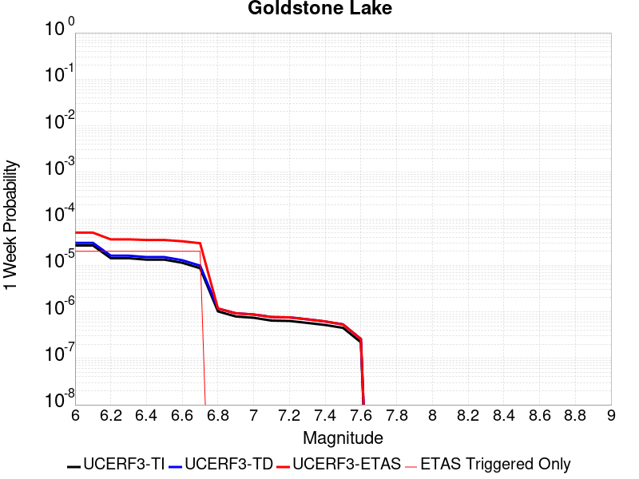 |  |  |  |

| Magnitude | 1 wk TI Prob | 1 wk TD Prob | 1 wk ETAS Prob | 1 wk ETAS/TD Gain | 1 wk ETAS Triggered Only | 1 mo TI Prob | 1 mo TD Prob | 1 mo ETAS Prob | 1 mo ETAS/TD Gain | 1 mo ETAS Triggered Only | 1 yr TI Prob | 1 yr TD Prob | 1 yr ETAS Prob | 1 yr ETAS/TD Gain | 1 yr ETAS Triggered Only | 10 yr TI Prob | 10 yr TD Prob | 10 yr ETAS Prob | 10 yr ETAS/TD Gain | 10 yr ETAS Triggered Only |
|-----|-----|-----|-----|-----|-----|-----|-----|-----|-----|-----|-----|-----|-----|-----|-----|-----|-----|-----|-----|-----|
| 6.0 | 2.671352E-5 | 3.0379333E-5 | 5.0378727E-5 | 1.6583223 | 2.0E-5 | 1.1448149E-4 | 1.3019175E-4 | 2.8017221E-4 | 2.1519966 | 1.5E-4 | 0.001392921 | 0.0015841285 | 0.0023928455 | 1.5105121 | 8.1E-4 | 0.013842222 | 0.015747866 | 0.017893536 | 1.1362514 | 0.00218 |
| 6.1 | 2.671352E-5 | 3.0379333E-5 | 5.0378727E-5 | 1.6583223 | 2.0E-5 | 1.1448149E-4 | 1.3019175E-4 | 2.8017221E-4 | 2.1519966 | 1.5E-4 | 0.001392921 | 0.0015841285 | 0.0023928455 | 1.5105121 | 8.1E-4 | 0.013842222 | 0.015747866 | 0.017893536 | 1.1362514 | 0.00218 |
| 6.2 | 1.4197047E-5 | 1.6097883E-5 | 3.609756E-5 | 2.2423794 | 2.0E-5 | 6.0843064E-5 | 6.898966E-5 | 1.3898483E-4 | 2.0145748 | 7.0E-5 | 7.4051257E-4 | 8.397241E-4 | 0.0012293966 | 1.4640483 | 3.9E-4 | 0.007380498 | 0.008375209 | 0.009505661 | 1.134976 | 0.00114 |
| 6.3 | 1.4197047E-5 | 1.6097883E-5 | 3.609756E-5 | 2.2423794 | 2.0E-5 | 6.0843064E-5 | 6.898966E-5 | 1.3898483E-4 | 2.0145748 | 7.0E-5 | 7.4051257E-4 | 8.397241E-4 | 0.0012293966 | 1.4640483 | 3.9E-4 | 0.007380498 | 0.008375209 | 0.009505661 | 1.134976 | 0.00114 |
| 6.4 | 1.3238931E-5 | 1.5009981E-5 | 3.500968E-5 | 2.3324268 | 2.0E-5 | 5.6737044E-5 | 6.4327454E-5 | 1.243236E-4 | 1.9326677 | 6.0E-5 | 6.9055456E-4 | 7.830034E-4 | 0.0011227372 | 1.4338855 | 3.4E-4 | 0.006884126 | 0.0078120735 | 0.008873715 | 1.1358975 | 0.00107 |
| 6.5 | 1.3238931E-5 | 1.5009981E-5 | 3.500968E-5 | 2.3324268 | 2.0E-5 | 5.6737044E-5 | 6.4327454E-5 | 1.243236E-4 | 1.9326677 | 6.0E-5 | 6.9055456E-4 | 7.830034E-4 | 0.0011227372 | 1.4338855 | 3.4E-4 | 0.006884126 | 0.0078120735 | 0.008873715 | 1.1358975 | 0.00107 |
| 6.6 | 1.1328278E-5 | 1.2856469E-5 | 3.2856213E-5 | 2.555617 | 2.0E-5 | 4.8548856E-5 | 5.509853E-5 | 1.1509522E-4 | 2.0888982 | 6.0E-5 | 5.90922E-4 | 6.7071384E-4 | 9.80506E-4 | 1.4618841 | 3.1E-4 | 0.0058935313 | 0.0066962866 | 0.007629992 | 1.1394364 | 9.4E-4 |
| 6.7 | 8.651175E-6 | 9.82555E-6 | 2.9825353E-5 | 3.0354896 | 2.0E-5 | 3.707594E-5 | 4.210933E-5 | 9.210722E-5 | 2.1873353 | 5.0E-5 | 4.5130608E-4 | 5.1265105E-4 | 7.7251776E-4 | 1.5069076 | 2.6E-4 | 0.0045039062 | 0.0051235645 | 0.005899568 | 1.1514578 | 7.8E-4 |
| 6.8 | 1.0215377E-6 | 1.1755355E-6 | 1.1755355E-6 | 1.0 | 0.0 | 4.378012E-6 | 5.038001E-6 | 5.038001E-6 | 1.0 | 0.0 | 5.3300988E-5 | 6.1336046E-5 | 8.1334816E-5 | 1.3260525 | 2.0E-5 | 5.3288206E-4 | 6.132024E-4 | 6.4318406E-4 | 1.0488935 | 3.0E-5 |
| 6.9 | 7.9360774E-7 | 9.2838843E-7 | 9.2838843E-7 | 1.0 | 0.0 | 3.4011714E-6 | 3.978802E-6 | 3.978802E-6 | 1.0 | 0.0 | 4.1408475E-5 | 4.8440907E-5 | 5.8440422E-5 | 1.2064271 | 1.0E-5 | 4.140076E-4 | 4.843105E-4 | 4.943056E-4 | 1.0206379 | 1.0E-5 |
| 7.0 | 7.4382757E-7 | 8.747784E-7 | 8.747784E-7 | 1.0 | 0.0 | 3.1878285E-6 | 3.7490452E-6 | 3.7490452E-6 | 1.0 | 0.0 | 3.8811122E-5 | 4.5643737E-5 | 5.564328E-5 | 1.2190781 | 1.0E-5 | 3.8804344E-4 | 4.5635024E-4 | 4.663457E-4 | 1.021903 | 1.0E-5 |
| 7.1 | 6.4709513E-7 | 7.7116965E-7 | 7.7116965E-7 | 1.0 | 0.0 | 2.773262E-6 | 3.305009E-6 | 3.305009E-6 | 1.0 | 0.0 | 3.376394E-5 | 4.0237803E-5 | 5.02374E-5 | 1.2485125 | 1.0E-5 | 3.375881E-4 | 4.0231113E-4 | 4.123071E-4 | 1.0248464 | 1.0E-5 |
| 7.2 | 6.356704E-7 | 7.588749E-7 | 7.588749E-7 | 1.0 | 0.0 | 2.7242988E-6 | 3.2523171E-6 | 3.2523171E-6 | 1.0 | 0.0 | 3.3167835E-5 | 3.9596303E-5 | 4.9595907E-5 | 1.2525388 | 1.0E-5 | 3.3162883E-4 | 3.9589842E-4 | 4.0589445E-4 | 1.025249 | 1.0E-5 |
| 7.3 | 5.7695723E-7 | 6.896937E-7 | 6.896937E-7 | 1.0 | 0.0 | 2.4726714E-6 | 2.9558273E-6 | 2.9558273E-6 | 1.0 | 0.0 | 3.0104358E-5 | 3.598666E-5 | 4.59863E-5 | 1.2778708 | 1.0E-5 | 3.0100282E-4 | 3.5981406E-4 | 3.6981047E-4 | 1.0277821 | 1.0E-5 |
| 7.4 | 5.209647E-7 | 6.193835E-7 | 6.193835E-7 | 1.0 | 0.0 | 2.232704E-6 | 2.6544983E-6 | 2.6544983E-6 | 1.0 | 0.0 | 2.718283E-5 | 3.2318094E-5 | 4.231777E-5 | 1.3094141 | 1.0E-5 | 2.7179506E-4 | 3.231395E-4 | 3.3313627E-4 | 1.0309364 | 1.0E-5 |
| 7.5 | 4.512955E-7 | 5.349162E-7 | 5.349162E-7 | 1.0 | 0.0 | 1.934122E-6 | 2.2924962E-6 | 2.2924962E-6 | 1.0 | 0.0 | 2.3547682E-5 | 2.7910839E-5 | 3.791056E-5 | 1.3582737 | 1.0E-5 | 2.3545188E-4 | 2.7907864E-4 | 2.8907586E-4 | 1.0358222 | 1.0E-5 |
| 7.6 | 2.21172E-7 | 2.6040675E-7 | 2.6040675E-7 | 1.0 | 0.0 | 9.478797E-7 | 1.1160286E-6 | 1.1160286E-6 | 1.0 | 0.0 | 1.1540374E-5 | 1.3587592E-5 | 2.3587456E-5 | 1.7359556 | 1.0E-5 | 1.1539775E-4 | 1.3587043E-4 | 1.4586907E-4 | 1.0735896 | 1.0E-5 |

## So Sierra Nevada
*[(top)](#table-of-contents)*

| 1 Week | 1 Month | 1 Year | 10 Year |
|-----|-----|-----|-----|
|  |  |  |  |

| Magnitude | 1 wk TI Prob | 1 wk TD Prob | 1 wk ETAS Prob | 1 wk ETAS/TD Gain | 1 wk ETAS Triggered Only | 1 mo TI Prob | 1 mo TD Prob | 1 mo ETAS Prob | 1 mo ETAS/TD Gain | 1 mo ETAS Triggered Only | 1 yr TI Prob | 1 yr TD Prob | 1 yr ETAS Prob | 1 yr ETAS/TD Gain | 1 yr ETAS Triggered Only | 10 yr TI Prob | 10 yr TD Prob | 10 yr ETAS Prob | 10 yr ETAS/TD Gain | 10 yr ETAS Triggered Only |
|-----|-----|-----|-----|-----|-----|-----|-----|-----|-----|-----|-----|-----|-----|-----|-----|-----|-----|-----|-----|-----|
| 6.0 | 1.15488665E-5 | 1.10800875E-5 | 8.107931E-5 | 7.3175697 | 7.0E-5 | 4.9494203E-5 | 4.7485297E-5 | 2.3747627E-4 | 5.0010486 | 1.9E-4 | 6.024253E-4 | 5.779929E-4 | 0.0014175074 | 2.452465 | 8.4E-4 | 0.006007948 | 0.0057661654 | 0.007913711 | 1.372439 | 0.00216 |
| 6.1 | 1.15488665E-5 | 1.10800875E-5 | 8.107931E-5 | 7.3175697 | 7.0E-5 | 4.9494203E-5 | 4.7485297E-5 | 2.3747627E-4 | 5.0010486 | 1.9E-4 | 6.024253E-4 | 5.779929E-4 | 0.0014175074 | 2.452465 | 8.4E-4 | 0.006007948 | 0.0057661654 | 0.007913711 | 1.372439 | 0.00216 |
| 6.2 | 1.15488665E-5 | 1.10800875E-5 | 8.107931E-5 | 7.3175697 | 7.0E-5 | 4.9494203E-5 | 4.7485297E-5 | 2.3747627E-4 | 5.0010486 | 1.9E-4 | 6.024253E-4 | 5.779929E-4 | 0.0014175074 | 2.452465 | 8.4E-4 | 0.006007948 | 0.0057661654 | 0.007913711 | 1.372439 | 0.00216 |
| 6.3 | 1.15488665E-5 | 1.10800875E-5 | 8.107931E-5 | 7.3175697 | 7.0E-5 | 4.9494203E-5 | 4.7485297E-5 | 2.3747627E-4 | 5.0010486 | 1.9E-4 | 6.024253E-4 | 5.779929E-4 | 0.0014175074 | 2.452465 | 8.4E-4 | 0.006007948 | 0.0057661654 | 0.007913711 | 1.372439 | 0.00216 |
| 6.4 | 1.15488665E-5 | 1.10800875E-5 | 8.107931E-5 | 7.3175697 | 7.0E-5 | 4.9494203E-5 | 4.7485297E-5 | 2.3747627E-4 | 5.0010486 | 1.9E-4 | 6.024253E-4 | 5.779929E-4 | 0.0014175074 | 2.452465 | 8.4E-4 | 0.006007948 | 0.0057661654 | 0.007913711 | 1.372439 | 0.00216 |
| 6.5 | 1.15488665E-5 | 1.10800875E-5 | 8.107931E-5 | 7.3175697 | 7.0E-5 | 4.9494203E-5 | 4.7485297E-5 | 2.3747627E-4 | 5.0010486 | 1.9E-4 | 6.024253E-4 | 5.779929E-4 | 0.0014175074 | 2.452465 | 8.4E-4 | 0.006007948 | 0.0057661654 | 0.007913711 | 1.372439 | 0.00216 |
| 6.6 | 7.587044E-6 | 6.9359285E-6 | 2.693579E-5 | 3.883516 | 2.0E-5 | 3.2515498E-5 | 2.9725086E-5 | 1.1972241E-4 | 4.0276556 | 9.0E-5 | 3.9580427E-4 | 3.6184574E-4 | 8.0168655E-4 | 2.2155478 | 4.4E-4 | 0.003951 | 0.0036128573 | 0.0048384136 | 1.3392208 | 0.00123 |
| 6.7 | 7.587044E-6 | 6.9359285E-6 | 2.693579E-5 | 3.883516 | 2.0E-5 | 3.2515498E-5 | 2.9725086E-5 | 1.1972241E-4 | 4.0276556 | 9.0E-5 | 3.9580427E-4 | 3.6184574E-4 | 8.0168655E-4 | 2.2155478 | 4.4E-4 | 0.003951 | 0.0036128573 | 0.0048384136 | 1.3392208 | 0.00123 |
| 6.8 | 5.9026956E-6 | 5.1796264E-6 | 2.5179523E-5 | 4.8612623 | 2.0E-5 | 2.5297022E-5 | 2.2198215E-5 | 1.1219622E-4 | 5.05429 | 9.0E-5 | 3.0794772E-4 | 2.7023093E-4 | 6.4013095E-4 | 2.3688293 | 3.7E-4 | 0.0030752132 | 0.0026991395 | 0.0035867372 | 1.3288447 | 8.9E-4 |
| 6.9 | 5.0118915E-6 | 4.252629E-6 | 2.4252544E-5 | 5.7029533 | 2.0E-5 | 2.1479358E-5 | 1.822543E-5 | 1.0822379E-4 | 5.938065 | 9.0E-5 | 2.614798E-4 | 2.2187273E-4 | 5.8179285E-4 | 2.6221917 | 3.6E-4 | 0.0026117235 | 0.0022165847 | 0.0029749002 | 1.3421098 | 7.6E-4 |
| 7.0 | 4.4924795E-6 | 3.7141053E-6 | 2.371403E-5 | 6.384857 | 2.0E-5 | 1.925334E-5 | 1.59175E-5 | 1.0591607E-4 | 6.654064 | 9.0E-5 | 2.3438422E-4 | 1.9377896E-4 | 5.437111E-4 | 2.8058317 | 3.5E-4 | 0.0023413717 | 0.0019361629 | 0.0026048657 | 1.3453753 | 6.7E-4 |
| 7.1 | 3.9118436E-6 | 3.112146E-6 | 2.3112083E-5 | 7.426414 | 2.0E-5 | 1.6764936E-5 | 1.3337703E-5 | 9.333664E-5 | 6.997954 | 8.0E-5 | 2.0409399E-4 | 1.62375E-4 | 4.0233604E-4 | 2.47782 | 2.4E-4 | 0.0020390663 | 0.0016226197 | 0.0021218085 | 1.3076437 | 5.0E-4 |
| 7.2 | 3.4200818E-6 | 2.6056073E-6 | 2.6056073E-6 | 1.0 | 0.0 | 1.4657411E-5 | 1.1166843E-5 | 4.116651E-5 | 3.6864946 | 3.0E-5 | 1.7843937E-4 | 1.3594834E-4 | 2.9592658E-4 | 2.1767576 | 1.6E-4 | 0.0017829615 | 0.0013587015 | 0.0017381852 | 1.2792988 | 3.8E-4 |
| 7.3 | 2.6593618E-6 | 1.8285502E-6 | 1.8285502E-6 | 1.0 | 0.0 | 1.13972155E-5 | 7.836622E-6 | 3.7836387E-5 | 4.82815 | 3.0E-5 | 1.3875226E-4 | 9.540699E-5 | 2.1539554E-4 | 2.2576494 | 1.2E-4 | 0.0013866565 | 9.536892E-4 | 0.0012534031 | 1.3142679 | 3.0E-4 |
| 7.4 | 2.2577992E-6 | 1.4365544E-6 | 1.4365544E-6 | 1.0 | 0.0 | 9.676246E-6 | 6.1566484E-6 | 3.6156463E-5 | 5.8727508 | 3.0E-5 | 1.1780193E-4 | 7.495487E-5 | 1.9494588E-4 | 2.6008432 | 1.2E-4 | 0.001177395 | 7.4932096E-4 | 0.0010291112 | 1.3733916 | 2.8E-4 |
| 7.5 | 1.489319E-6 | 7.3548125E-7 | 7.3548125E-7 | 1.0 | 0.0 | 6.3827797E-6 | 3.1520588E-6 | 2.3151995E-5 | 7.3450394 | 2.0E-5 | 7.770758E-5 | 3.8375645E-5 | 1.0837296E-4 | 2.8240037 | 7.0E-5 | 7.7680405E-4 | 3.836906E-4 | 5.436292E-4 | 1.4168427 | 1.6E-4 |
| 7.6 | 1.0680322E-6 | 4.6602645E-7 | 4.6602645E-7 | 1.0 | 0.0 | 4.577273E-6 | 1.9972547E-6 | 1.1997235E-5 | 6.0068626 | 1.0E-5 | 5.5726876E-5 | 2.4316307E-5 | 6.431533E-5 | 2.6449466 | 4.0E-5 | 5.5712904E-4 | 2.4313672E-4 | 3.3311485E-4 | 1.3700721 | 9.0E-5 |
| 7.7 | 5.509146E-7 | 1.5582879E-7 | 1.5582879E-7 | 1.0 | 0.0 | 2.3610605E-6 | 6.6783747E-7 | 1.0667831E-5 | 15.973693 | 1.0E-5 | 2.8745531E-5 | 8.130892E-6 | 1.8130811E-5 | 2.2298675 | 1.0E-5 | 2.8741814E-4 | 8.130606E-5 | 1.1130362E-4 | 1.3689462 | 3.0E-5 |

## Coyote Canyon
*[(top)](#table-of-contents)*

| 1 Week | 1 Month | 1 Year | 10 Year |
|-----|-----|-----|-----|
| 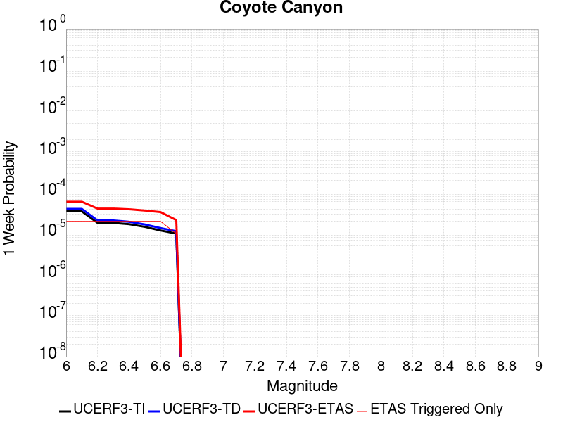 |  |  |  |

| Magnitude | 1 wk TI Prob | 1 wk TD Prob | 1 wk ETAS Prob | 1 wk ETAS/TD Gain | 1 wk ETAS Triggered Only | 1 mo TI Prob | 1 mo TD Prob | 1 mo ETAS Prob | 1 mo ETAS/TD Gain | 1 mo ETAS Triggered Only | 1 yr TI Prob | 1 yr TD Prob | 1 yr ETAS Prob | 1 yr ETAS/TD Gain | 1 yr ETAS Triggered Only | 10 yr TI Prob | 10 yr TD Prob | 10 yr ETAS Prob | 10 yr ETAS/TD Gain | 10 yr ETAS Triggered Only |
|-----|-----|-----|-----|-----|-----|-----|-----|-----|-----|-----|-----|-----|-----|-----|-----|-----|-----|-----|-----|-----|
| 6.0 | 3.5090034E-5 | 4.036915E-5 | 6.036834E-5 | 1.4954078 | 2.0E-5 | 1.503772E-4 | 1.7300062E-4 | 2.6298504E-4 | 1.5201393 | 9.0E-5 | 0.0018293047 | 0.002104505 | 0.0026733056 | 1.2702775 | 5.7E-4 | 0.018143194 | 0.02087168 | 0.022281624 | 1.067553 | 0.00144 |
| 6.1 | 3.5090034E-5 | 4.036915E-5 | 6.036834E-5 | 1.4954078 | 2.0E-5 | 1.503772E-4 | 1.7300062E-4 | 2.6298504E-4 | 1.5201393 | 9.0E-5 | 0.0018293047 | 0.002104505 | 0.0026733056 | 1.2702775 | 5.7E-4 | 0.018143194 | 0.02087168 | 0.022281624 | 1.067553 | 0.00144 |
| 6.2 | 1.841879E-5 | 2.1062197E-5 | 4.1061776E-5 | 1.9495486 | 2.0E-5 | 7.8935285E-5 | 9.026401E-5 | 1.502586E-4 | 1.6646568 | 6.0E-5 | 9.606133E-4 | 0.0010985123 | 0.0014681059 | 1.3364491 | 3.7E-4 | 0.0095647145 | 0.010940911 | 0.01176183 | 1.0750321 | 8.3E-4 |
| 6.3 | 1.841879E-5 | 2.1062197E-5 | 4.1061776E-5 | 1.9495486 | 2.0E-5 | 7.8935285E-5 | 9.026401E-5 | 1.502586E-4 | 1.6646568 | 6.0E-5 | 9.606133E-4 | 0.0010985123 | 0.0014681059 | 1.3364491 | 3.7E-4 | 0.0095647145 | 0.010940911 | 0.01176183 | 1.0750321 | 8.3E-4 |
| 6.4 | 1.712201E-5 | 1.9567435E-5 | 3.9567043E-5 | 2.0220864 | 2.0E-5 | 7.337798E-5 | 8.385831E-5 | 1.4385328E-4 | 1.7154326 | 6.0E-5 | 8.930107E-4 | 0.0010205972 | 0.0013602502 | 1.3327982 | 3.4E-4 | 0.008894307 | 0.010169022 | 0.010921293 | 1.0739768 | 7.6E-4 |
| 6.5 | 1.4744935E-5 | 1.6838874E-5 | 3.6838537E-5 | 2.187708 | 2.0E-5 | 6.3191044E-5 | 7.216513E-5 | 1.2216152E-4 | 1.6928054 | 5.0E-5 | 7.6907943E-4 | 8.783498E-4 | 0.0011581039 | 1.3184996 | 2.8E-4 | 0.007664232 | 0.008757981 | 0.0094122 | 1.0746999 | 6.6E-4 |
| 6.6 | 1.2017839E-5 | 1.372564E-5 | 3.3725366E-5 | 2.4571068 | 2.0E-5 | 5.150401E-5 | 5.8823345E-5 | 9.8820994E-5 | 1.6799622 | 4.0E-5 | 6.268809E-4 | 7.160275E-4 | 9.3587E-4 | 1.3070308 | 2.2E-4 | 0.0062511545 | 0.0071459 | 0.007701898 | 1.0778066 | 5.6E-4 |
| 6.7 | 1.00956095E-5 | 1.1534825E-5 | 2.153471E-5 | 1.8669299 | 1.0E-5 | 4.326618E-5 | 4.9434515E-5 | 7.943303E-5 | 1.6068335 | 3.0E-5 | 5.266384E-4 | 6.01786E-4 | 7.916717E-4 | 1.3155369 | 1.9E-4 | 0.005253921 | 0.006010093 | 0.006487208 | 1.0793856 | 4.8E-4 |

## San Andreas (Mojave S)
*[(top)](#table-of-contents)*

| 1 Week | 1 Month | 1 Year | 10 Year |
|-----|-----|-----|-----|
|  |  |  |  |

| Magnitude | 1 wk TI Prob | 1 wk TD Prob | 1 wk ETAS Prob | 1 wk ETAS/TD Gain | 1 wk ETAS Triggered Only | 1 mo TI Prob | 1 mo TD Prob | 1 mo ETAS Prob | 1 mo ETAS/TD Gain | 1 mo ETAS Triggered Only | 1 yr TI Prob | 1 yr TD Prob | 1 yr ETAS Prob | 1 yr ETAS/TD Gain | 1 yr ETAS Triggered Only | 10 yr TI Prob | 10 yr TD Prob | 10 yr ETAS Prob | 10 yr ETAS/TD Gain | 10 yr ETAS Triggered Only |
|-----|-----|-----|-----|-----|-----|-----|-----|-----|-----|-----|-----|-----|-----|-----|-----|-----|-----|-----|-----|-----|
| 6.0 | 3.1064058E-4 | 6.752054E-4 | 7.2517165E-4 | 1.0740016 | 5.0E-5 | 0.0013306376 | 0.0028906567 | 0.0030501941 | 1.0551908 | 1.6E-4 | 0.016080605 | 0.034594886 | 0.03528998 | 1.0200924 | 7.2E-4 | 0.1496549 | 0.28686184 | 0.2878317 | 1.003381 | 0.00136 |
| 6.1 | 3.1064058E-4 | 6.752054E-4 | 7.2517165E-4 | 1.0740016 | 5.0E-5 | 0.0013306376 | 0.0028906567 | 0.0030501941 | 1.0551908 | 1.6E-4 | 0.016080605 | 0.034594886 | 0.03528998 | 1.0200924 | 7.2E-4 | 0.1496549 | 0.28686184 | 0.2878317 | 1.003381 | 0.00136 |
| 6.2 | 3.1064058E-4 | 6.752054E-4 | 7.2517165E-4 | 1.0740016 | 5.0E-5 | 0.0013306376 | 0.0028906567 | 0.0030501941 | 1.0551908 | 1.6E-4 | 0.016080605 | 0.034594886 | 0.03528998 | 1.0200924 | 7.2E-4 | 0.1496549 | 0.28686184 | 0.2878317 | 1.003381 | 0.00136 |
| 6.3 | 3.1064058E-4 | 6.752054E-4 | 7.2517165E-4 | 1.0740016 | 5.0E-5 | 0.0013306376 | 0.0028906567 | 0.0030501941 | 1.0551908 | 1.6E-4 | 0.016080605 | 0.034594886 | 0.03528998 | 1.0200924 | 7.2E-4 | 0.1496549 | 0.28686184 | 0.2878317 | 1.003381 | 0.00136 |
| 6.4 | 1.9872203E-4 | 4.323608E-4 | 4.7234353E-4 | 1.0924753 | 4.0E-5 | 8.5138786E-4 | 0.0018516873 | 0.0020014094 | 1.0808572 | 1.5E-4 | 0.010316478 | 0.022317393 | 0.022962663 | 1.0289134 | 6.6E-4 | 0.098504856 | 0.1972654 | 0.19825277 | 1.0050052 | 0.00123 |
| 6.5 | 1.291105E-4 | 2.8806546E-4 | 3.2805395E-4 | 1.1388173 | 4.0E-5 | 5.5321335E-4 | 0.001233985 | 0.0013638246 | 1.1052197 | 1.3E-4 | 0.006714592 | 0.014921102 | 0.015502298 | 1.0389513 | 5.9E-4 | 0.065152965 | 0.13822237 | 0.1391617 | 1.0067959 | 0.00109 |
| 6.6 | 1.291105E-4 | 2.8806546E-4 | 3.2805395E-4 | 1.1388173 | 4.0E-5 | 5.5321335E-4 | 0.001233985 | 0.0013638246 | 1.1052197 | 1.3E-4 | 0.006714592 | 0.014921102 | 0.015502298 | 1.0389513 | 5.9E-4 | 0.065152965 | 0.13822237 | 0.1391617 | 1.0067959 | 0.00109 |
| 6.7 | 1.08001186E-4 | 2.4386907E-4 | 2.7386175E-4 | 1.1229868 | 3.0E-5 | 4.6278012E-4 | 0.0010447351 | 0.0011646098 | 1.1147417 | 1.2E-4 | 0.0056198016 | 0.012645768 | 0.013178939 | 1.0421621 | 5.4E-4 | 0.054797906 | 0.119389 | 0.12028722 | 1.0075235 | 0.00102 |
| 6.8 | 1.0624356E-4 | 2.3904438E-4 | 2.690372E-4 | 1.1254697 | 3.0E-5 | 4.5525006E-4 | 0.0010240743 | 0.0011439513 | 1.117059 | 1.2E-4 | 0.0055285925 | 0.012397102 | 0.012930408 | 1.0430186 | 5.4E-4 | 0.053930566 | 0.11733801 | 0.11822949 | 1.0075976 | 0.00101 |
| 6.9 | 1.0393785E-4 | 2.3274584E-4 | 2.6273885E-4 | 1.128866 | 3.0E-5 | 4.4537184E-4 | 9.971013E-4 | 0.0011169816 | 1.1202289 | 1.2E-4 | 0.0054089287 | 0.012072387 | 0.012595989 | 1.0433718 | 5.3E-4 | 0.05279156 | 0.1146359 | 0.11552127 | 1.0077232 | 0.001 |
| 7.0 | 1.0155622E-4 | 2.2643902E-4 | 2.5643222E-4 | 1.132456 | 3.0E-5 | 4.3516833E-4 | 9.700924E-4 | 0.0010899759 | 1.1235795 | 1.2E-4 | 0.005285311 | 0.01174714 | 0.012270914 | 1.0445874 | 5.3E-4 | 0.05161361 | 0.11189176 | 0.11277987 | 1.0079372 | 0.001 |
| 7.1 | 9.885595E-5 | 2.1932014E-4 | 2.4931357E-4 | 1.1367563 | 3.0E-5 | 4.2359953E-4 | 9.396052E-4 | 0.0010594925 | 1.1275932 | 1.2E-4 | 0.0051451353 | 0.011379889 | 0.011893972 | 1.0451746 | 5.2E-4 | 0.05027629 | 0.10878222 | 0.10965561 | 1.0080289 | 9.8E-4 |
| 7.2 | 9.6411415E-5 | 2.1294746E-4 | 2.4294107E-4 | 1.1408498 | 3.0E-5 | 4.1312634E-4 | 9.1231306E-4 | 0.0010322036 | 1.1314138 | 1.2E-4 | 0.005018219 | 0.011051025 | 0.011565279 | 1.0465344 | 5.2E-4 | 0.049064007 | 0.105968185 | 0.106844336 | 1.0082681 | 9.8E-4 |
| 7.3 | 9.1180635E-5 | 1.952152E-4 | 2.2520934E-4 | 1.1536466 | 3.0E-5 | 3.907156E-4 | 8.363684E-4 | 9.5626805E-4 | 1.1433574 | 1.2E-4 | 0.004746591 | 0.010135355 | 0.010640186 | 1.0498089 | 5.1E-4 | 0.046464786 | 0.098172925 | 0.09904769 | 1.0089105 | 9.7E-4 |
| 7.4 | 8.887388E-5 | 1.8769523E-4 | 2.176896E-4 | 1.1598036 | 3.0E-5 | 3.8083247E-4 | 8.041602E-4 | 9.240637E-4 | 1.149104 | 1.2E-4 | 0.0046267817 | 0.009746796 | 0.010251826 | 1.0518149 | 5.1E-4 | 0.045316286 | 0.09480625 | 0.09568428 | 1.0092614 | 9.7E-4 |
| 7.5 | 8.6750515E-5 | 1.8100538E-4 | 2.1099995E-4 | 1.1657109 | 3.0E-5 | 3.7173493E-4 | 7.755068E-4 | 8.954137E-4 | 1.1546175 | 1.2E-4 | 0.004516484 | 0.009401006 | 0.009906211 | 1.0537395 | 5.1E-4 | 0.04425787 | 0.09176944 | 0.09265042 | 1.0095999 | 9.7E-4 |
| 7.6 | 8.453092E-5 | 1.7487563E-4 | 2.0487039E-4 | 1.1715205 | 3.0E-5 | 3.6222505E-4 | 7.492518E-4 | 8.6916186E-4 | 1.1600398 | 1.2E-4 | 0.0044011753 | 0.009084062 | 0.009589429 | 1.0556322 | 5.1E-4 | 0.04315024 | 0.088925846 | 0.08980959 | 1.009938 | 9.7E-4 |
| 7.7 | 8.259102E-5 | 1.700915E-4 | 2.000864E-4 | 1.1763457 | 3.0E-5 | 3.539135E-4 | 7.2876E-4 | 8.486725E-4 | 1.1645433 | 1.2E-4 | 0.004300386 | 0.008836626 | 0.009342119 | 1.0572044 | 5.1E-4 | 0.042181134 | 0.08667414 | 0.087560065 | 1.0102214 | 9.7E-4 |
| 7.8 | 7.444844E-5 | 1.5327107E-4 | 1.8326647E-4 | 1.1957016 | 3.0E-5 | 3.1902574E-4 | 6.567107E-4 | 7.5664505E-4 | 1.152174 | 1.0E-4 | 0.0038772223 | 0.0079661915 | 0.008402686 | 1.0547935 | 4.4E-4 | 0.03810269 | 0.07848895 | 0.07925381 | 1.0097448 | 8.3E-4 |
| 7.9 | 5.2586525E-5 | 1.0036165E-4 | 1.3035863E-4 | 1.2988889 | 3.0E-5 | 2.2535135E-4 | 4.3005048E-4 | 5.2001176E-4 | 1.2091877 | 9.0E-5 | 0.0027402006 | 0.005223306 | 0.005521739 | 1.0571349 | 3.0E-4 | 0.027066574 | 0.05233886 | 0.052803215 | 1.008872 | 4.9E-4 |
| 8.0 | 3.379877E-5 | 5.42449E-5 | 6.4244356E-5 | 1.1843392 | 1.0E-5 | 1.4484383E-4 | 2.3245745E-4 | 2.7244815E-4 | 1.1720345 | 4.0E-5 | 0.0017620471 | 0.0028264981 | 0.0029361872 | 1.0388074 | 1.1E-4 | 0.017481409 | 0.028918508 | 0.029083593 | 1.0057086 | 1.7E-4 |
| 8.1 | 1.8668277E-5 | 1.9388735E-5 | 1.9388735E-5 | 1.0 | 0.0 | 8.000444E-5 | 8.309194E-5 | 8.309194E-5 | 1.0 | 0.0 | 9.736188E-4 | 0.0010111755 | 0.0010111755 | 1.0 | 0.0 | 0.009693642 | 0.010840651 | 0.010840651 | 1.0 | 0.0 |
| 8.2 | 8.541571E-6 | 5.4909337E-6 | 5.4909337E-6 | 1.0 | 0.0 | 3.660622E-5 | 2.353236E-5 | 2.353236E-5 | 1.0 | 0.0 | 4.455896E-4 | 2.8646892E-4 | 2.8646892E-4 | 1.0 | 0.0 | 0.0044469717 | 0.0032573915 | 0.0032573915 | 1.0 | 0.0 |
| 8.3 | 1.983087E-6 | 7.7071206E-7 | 7.7071206E-7 | 1.0 | 0.0 | 8.498917E-6 | 3.3030476E-6 | 3.3030476E-6 | 1.0 | 0.0 | 1.034694E-4 | 4.021388E-5 | 4.021388E-5 | 1.0 | 0.0 | 0.0010342124 | 4.7468478E-4 | 4.7468478E-4 | 1.0 | 0.0 |

## Death Valley (So)
*[(top)](#table-of-contents)*

| 1 Week | 1 Month | 1 Year | 10 Year |
|-----|-----|-----|-----|
| 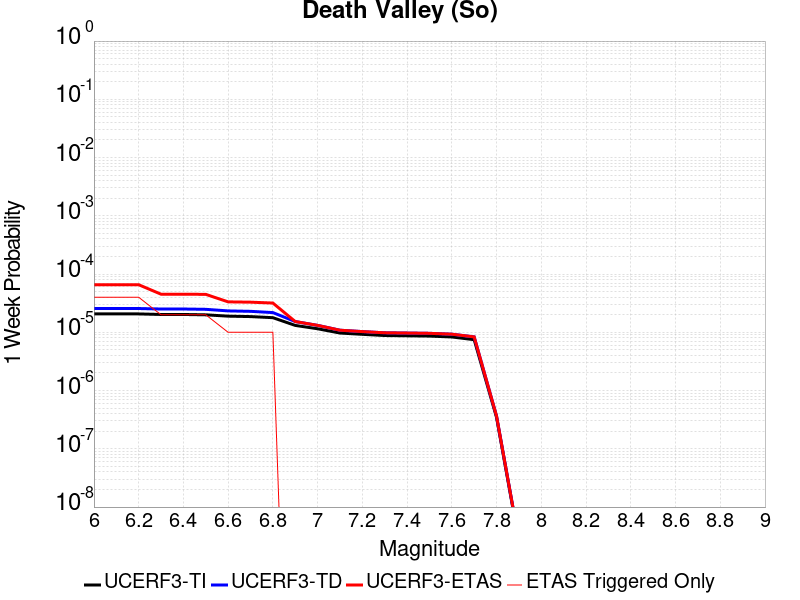 |  |  |  |

| Magnitude | 1 wk TI Prob | 1 wk TD Prob | 1 wk ETAS Prob | 1 wk ETAS/TD Gain | 1 wk ETAS Triggered Only | 1 mo TI Prob | 1 mo TD Prob | 1 mo ETAS Prob | 1 mo ETAS/TD Gain | 1 mo ETAS Triggered Only | 1 yr TI Prob | 1 yr TD Prob | 1 yr ETAS Prob | 1 yr ETAS/TD Gain | 1 yr ETAS Triggered Only | 10 yr TI Prob | 10 yr TD Prob | 10 yr ETAS Prob | 10 yr ETAS/TD Gain | 10 yr ETAS Triggered Only |
|-----|-----|-----|-----|-----|-----|-----|-----|-----|-----|-----|-----|-----|-----|-----|-----|-----|-----|-----|-----|-----|
| 6.0 | 2.0684236E-5 | 2.562211E-5 | 6.562108E-5 | 2.5611117 | 4.0E-5 | 8.864371E-5 | 1.0980452E-4 | 2.4978915E-4 | 2.274853 | 1.4E-4 | 0.0010787029 | 0.001336067 | 0.0018054391 | 1.3513087 | 4.7E-4 | 0.010734817 | 0.013282959 | 0.014654497 | 1.1032554 | 0.00139 |
| 6.1 | 2.0684236E-5 | 2.562211E-5 | 6.562108E-5 | 2.5611117 | 4.0E-5 | 8.864371E-5 | 1.0980452E-4 | 2.4978915E-4 | 2.274853 | 1.4E-4 | 0.0010787029 | 0.001336067 | 0.0018054391 | 1.3513087 | 4.7E-4 | 0.010734817 | 0.013282959 | 0.014654497 | 1.1032554 | 0.00139 |
| 6.2 | 2.0684236E-5 | 2.562211E-5 | 6.562108E-5 | 2.5611117 | 4.0E-5 | 8.864371E-5 | 1.0980452E-4 | 2.4978915E-4 | 2.274853 | 1.4E-4 | 0.0010787029 | 0.001336067 | 0.0018054391 | 1.3513087 | 4.7E-4 | 0.010734817 | 0.013282959 | 0.014654497 | 1.1032554 | 0.00139 |
| 6.3 | 2.0240292E-5 | 2.5122145E-5 | 4.512164E-5 | 1.7960904 | 2.0E-5 | 8.6741224E-5 | 1.0766198E-4 | 2.2764907E-4 | 2.1144795 | 1.2E-4 | 0.0010555626 | 0.0013100132 | 0.0017194761 | 1.3125639 | 4.1E-4 | 0.010505628 | 0.013025493 | 0.014278951 | 1.0962311 | 0.00127 |
| 6.4 | 2.0240292E-5 | 2.5122145E-5 | 4.512164E-5 | 1.7960904 | 2.0E-5 | 8.6741224E-5 | 1.0766198E-4 | 2.2764907E-4 | 2.1144795 | 1.2E-4 | 0.0010555626 | 0.0013100132 | 0.0017194761 | 1.3125639 | 4.1E-4 | 0.010505628 | 0.013025493 | 0.014278951 | 1.0962311 | 0.00127 |
| 6.5 | 1.9962767E-5 | 2.4811368E-5 | 4.4810873E-5 | 1.8060621 | 2.0E-5 | 8.55519E-5 | 1.063302E-4 | 2.2631744E-4 | 2.12844 | 1.2E-4 | 0.0010410968 | 0.001293818 | 0.0016933004 | 1.3087626 | 4.0E-4 | 0.010362327 | 0.012865425 | 0.0140697295 | 1.0936078 | 0.00122 |
| 6.6 | 1.8937297E-5 | 2.3315006E-5 | 3.3314773E-5 | 1.4288983 | 1.0E-5 | 8.115732E-5 | 9.991771E-5 | 2.0990672E-4 | 2.100796 | 1.1E-4 | 9.876423E-4 | 0.0012158338 | 0.0015454325 | 1.2710887 | 3.3E-4 | 0.009832645 | 0.012094108 | 0.013190684 | 1.0906702 | 0.00111 |
| 6.7 | 1.8621096E-5 | 2.2915603E-5 | 3.2915374E-5 | 1.436374 | 1.0E-5 | 7.980225E-5 | 9.820611E-5 | 1.9819629E-4 | 2.0181665 | 1.0E-4 | 9.711593E-4 | 0.0011950181 | 0.0015146356 | 1.2674584 | 3.2E-4 | 0.009669261 | 0.011888192 | 0.012945471 | 1.0889353 | 0.00107 |
| 6.8 | 1.7830353E-5 | 2.1809412E-5 | 3.1809195E-5 | 1.4585077 | 1.0E-5 | 7.641356E-5 | 9.346564E-5 | 1.7345816E-4 | 1.8558495 | 8.0E-5 | 9.29938E-4 | 0.0011373642 | 0.0014370229 | 1.2634678 | 3.0E-4 | 0.009260561 | 0.011316696 | 0.01233504 | 1.089986 | 0.00103 |
| 6.9 | 1.3135183E-5 | 1.5305954E-5 | 1.5305954E-5 | 1.0 | 0.0 | 5.6292425E-5 | 6.559533E-5 | 1.15592054E-4 | 1.7621994 | 5.0E-5 | 6.8514474E-4 | 7.98337E-4 | 9.781934E-4 | 1.2252887 | 1.8E-4 | 0.006830362 | 0.007954462 | 0.008549689 | 1.0748293 | 6.0E-4 |
| 7.0 | 1.1507512E-5 | 1.3155748E-5 | 1.3155748E-5 | 1.0 | 0.0 | 4.9316975E-5 | 5.638059E-5 | 8.63789E-5 | 1.532068 | 3.0E-5 | 6.002687E-4 | 6.8622327E-4 | 8.2612725E-4 | 1.2038752 | 1.4E-4 | 0.0059864987 | 0.006840594 | 0.0072875163 | 1.0653337 | 4.5E-4 |
| 7.1 | 9.715903E-6 | 1.0866341E-5 | 1.0866341E-5 | 1.0 | 0.0 | 4.1638916E-5 | 4.6569225E-5 | 6.65683E-5 | 1.4294481 | 2.0E-5 | 5.068359E-4 | 5.668371E-4 | 6.168087E-4 | 1.0881587 | 5.0E-5 | 0.0050568148 | 0.005654456 | 0.005883156 | 1.0404459 | 2.3E-4 |
| 7.2 | 9.233269E-6 | 1.0287289E-5 | 1.0287289E-5 | 1.0 | 0.0 | 3.9570554E-5 | 4.408766E-5 | 6.408678E-5 | 1.4536216 | 2.0E-5 | 4.81665E-4 | 5.366393E-4 | 5.6662323E-4 | 1.0558735 | 3.0E-5 | 0.0048062233 | 0.0053538657 | 0.0055030626 | 1.0278671 | 1.5E-4 |
| 7.3 | 8.8041315E-6 | 9.809059E-6 | 9.809059E-6 | 1.0 | 0.0 | 3.7731446E-5 | 4.203817E-5 | 6.2037325E-5 | 1.4757382 | 2.0E-5 | 4.592835E-4 | 5.116987E-4 | 5.4168334E-4 | 1.0585983 | 3.0E-5 | 0.0045833546 | 0.005105632 | 0.00521507 | 1.0214348 | 1.1E-4 |
| 7.4 | 8.708749E-6 | 9.708065E-6 | 9.708065E-6 | 1.0 | 0.0 | 3.7322676E-5 | 4.160535E-5 | 5.1604937E-5 | 1.2403437 | 1.0E-5 | 4.5430884E-4 | 5.064316E-4 | 5.2642147E-4 | 1.039472 | 2.0E-5 | 0.004533812 | 0.0050532017 | 0.0051526963 | 1.0196894 | 1.0E-4 |
| 7.5 | 8.612678E-6 | 9.605701E-6 | 9.605701E-6 | 1.0 | 0.0 | 3.6910955E-5 | 4.1166666E-5 | 5.1166255E-5 | 1.242905 | 1.0E-5 | 4.492982E-4 | 5.010931E-4 | 5.210831E-4 | 1.0398928 | 2.0E-5 | 0.004483909 | 0.005000058 | 0.005099558 | 1.0198997 | 1.0E-4 |
| 7.6 | 8.319024E-6 | 9.284777E-6 | 9.284777E-6 | 1.0 | 0.0 | 3.5652476E-5 | 3.9791317E-5 | 3.9791317E-5 | 1.0 | 0.0 | 4.3398244E-4 | 4.8435578E-4 | 4.9435097E-4 | 1.020636 | 1.0E-5 | 0.0043313587 | 0.004833425 | 0.00492299 | 1.0185304 | 9.0E-5 |
| 7.7 | 7.4718328E-6 | 8.345949E-6 | 8.345949E-6 | 1.0 | 0.0 | 3.2021748E-5 | 3.5767884E-5 | 3.5767884E-5 | 1.0 | 0.0 | 3.8979502E-4 | 4.3539103E-4 | 4.4538666E-4 | 1.0229578 | 1.0E-5 | 0.00389112 | 0.0043457854 | 0.0044154814 | 1.0160376 | 7.0E-5 |
| 7.8 | 3.4586725E-7 | 3.6484212E-7 | 3.6484212E-7 | 1.0 | 0.0 | 1.4822873E-6 | 1.5636082E-6 | 1.5636082E-6 | 1.0 | 0.0 | 1.80467E-5 | 1.9036768E-5 | 1.9036768E-5 | 1.0 | 0.0 | 1.8045233E-4 | 1.9035181E-4 | 2.0034991E-4 | 1.0525243 | 1.0E-5 |
| 7.9 | 2.5591178E-9 | 2.6697635E-9 | 2.6697635E-9 | 1.0 | 0.0 | 1.0967647E-8 | 1.1441844E-8 | 1.1441844E-8 | 1.0 | 0.0 | 1.335311E-7 | 1.3930445E-7 | 1.3930445E-7 | 1.0 | 0.0 | 1.3353102E-6 | 1.3930445E-6 | 1.3930445E-6 | 1.0 | 0.0 |

## Lenwood-Lockhart-Old Woman Springs
*[(top)](#table-of-contents)*

| 1 Week | 1 Month | 1 Year | 10 Year |
|-----|-----|-----|-----|
|  |  |  |  |

| Magnitude | 1 wk TI Prob | 1 wk TD Prob | 1 wk ETAS Prob | 1 wk ETAS/TD Gain | 1 wk ETAS Triggered Only | 1 mo TI Prob | 1 mo TD Prob | 1 mo ETAS Prob | 1 mo ETAS/TD Gain | 1 mo ETAS Triggered Only | 1 yr TI Prob | 1 yr TD Prob | 1 yr ETAS Prob | 1 yr ETAS/TD Gain | 1 yr ETAS Triggered Only | 10 yr TI Prob | 10 yr TD Prob | 10 yr ETAS Prob | 10 yr ETAS/TD Gain | 10 yr ETAS Triggered Only |
|-----|-----|-----|-----|-----|-----|-----|-----|-----|-----|-----|-----|-----|-----|-----|-----|-----|-----|-----|-----|-----|
| 6.0 | 3.744542E-5 | 4.396579E-5 | 8.396403E-5 | 1.9097583 | 4.0E-5 | 1.604705E-4 | 1.8841216E-4 | 3.1838767E-4 | 1.6898466 | 1.3E-4 | 0.0019519776 | 0.002291677 | 0.0028903019 | 1.261217 | 6.0E-4 | 0.019349206 | 0.022698458 | 0.024047134 | 1.0594171 | 0.00138 |
| 6.1 | 3.744542E-5 | 4.396579E-5 | 8.396403E-5 | 1.9097583 | 4.0E-5 | 1.604705E-4 | 1.8841216E-4 | 3.1838767E-4 | 1.6898466 | 1.3E-4 | 0.0019519776 | 0.002291677 | 0.0028903019 | 1.261217 | 6.0E-4 | 0.019349206 | 0.022698458 | 0.024047134 | 1.0594171 | 0.00138 |
| 6.2 | 3.744542E-5 | 4.396579E-5 | 8.396403E-5 | 1.9097583 | 4.0E-5 | 1.604705E-4 | 1.8841216E-4 | 3.1838767E-4 | 1.6898466 | 1.3E-4 | 0.0019519776 | 0.002291677 | 0.0028903019 | 1.261217 | 6.0E-4 | 0.019349206 | 0.022698458 | 0.024047134 | 1.0594171 | 0.00138 |
| 6.3 | 2.1079984E-5 | 2.5354975E-5 | 5.5354216E-5 | 2.1831698 | 3.0E-5 | 9.0339665E-5 | 1.0865977E-4 | 1.7865216E-4 | 1.6441427 | 7.0E-5 | 0.0010993304 | 0.0013221498 | 0.001581806 | 1.1963894 | 2.6E-4 | 0.010939079 | 0.013145052 | 0.013727296 | 1.0442938 | 5.9E-4 |
| 6.4 | 2.1079984E-5 | 2.5354975E-5 | 5.5354216E-5 | 2.1831698 | 3.0E-5 | 9.0339665E-5 | 1.0865977E-4 | 1.7865216E-4 | 1.6441427 | 7.0E-5 | 0.0010993304 | 0.0013221498 | 0.001581806 | 1.1963894 | 2.6E-4 | 0.010939079 | 0.013145052 | 0.013727296 | 1.0442938 | 5.9E-4 |
| 6.5 | 1.7397282E-5 | 2.0663723E-5 | 3.0663516E-5 | 1.4839299 | 1.0E-5 | 7.455765E-5 | 8.855588E-5 | 1.085541E-4 | 1.2258261 | 2.0E-5 | 9.073613E-4 | 0.0010776463 | 0.0012174954 | 1.1297728 | 1.4E-4 | 0.009036654 | 0.010725499 | 0.011071745 | 1.0322825 | 3.5E-4 |
| 6.6 | 1.52050325E-5 | 1.7680459E-5 | 2.7680282E-5 | 1.5655862 | 1.0E-5 | 6.51628E-5 | 7.577124E-5 | 9.576973E-5 | 1.2639323 | 2.0E-5 | 7.9306826E-4 | 9.2213234E-4 | 0.0010420217 | 1.1300132 | 1.2E-4 | 0.007902439 | 0.009183922 | 0.009491075 | 1.0334446 | 3.1E-4 |
| 6.7 | 1.332523E-5 | 1.5264695E-5 | 2.5264542E-5 | 1.6550964 | 1.0E-5 | 5.7106878E-5 | 6.541852E-5 | 8.541721E-5 | 1.3057039 | 2.0E-5 | 6.950544E-4 | 7.961852E-4 | 8.961056E-4 | 1.1254989 | 1.0E-4 | 0.006928845 | 0.0079339575 | 0.008172054 | 1.0300097 | 2.4E-4 |
| 6.8 | 1.1525329E-5 | 1.3031623E-5 | 2.3031493E-5 | 1.7673541 | 1.0E-5 | 4.9393333E-5 | 5.5848643E-5 | 7.584753E-5 | 1.3580908 | 2.0E-5 | 6.011979E-4 | 6.7974936E-4 | 7.6968817E-4 | 1.1323117 | 9.0E-5 | 0.00599574 | 0.006777153 | 0.00698573 | 1.0307765 | 2.1E-4 |
| 6.9 | 1.0253909E-5 | 1.1515052E-5 | 2.1514938E-5 | 1.8684186 | 1.0E-5 | 4.3944583E-5 | 4.934931E-5 | 6.934832E-5 | 1.4052541 | 2.0E-5 | 5.3489394E-4 | 6.0066587E-4 | 6.8061776E-4 | 1.1331055 | 8.0E-5 | 0.0053360825 | 0.0059908023 | 0.006159784 | 1.0282068 | 1.7E-4 |
| 7.0 | 8.104563E-6 | 8.991584E-6 | 1.8991494E-5 | 2.1121411 | 1.0E-5 | 3.4733377E-5 | 3.8534803E-5 | 5.8534035E-5 | 1.5189914 | 2.0E-5 | 4.2279682E-4 | 4.6906265E-4 | 5.290345E-4 | 1.1278547 | 6.0E-5 | 0.0042199334 | 0.004680974 | 0.0048004123 | 1.0255157 | 1.2E-4 |
| 7.1 | 6.7986157E-6 | 7.5160942E-6 | 1.7516018E-5 | 2.3304682 | 1.0E-5 | 2.91366E-5 | 3.2211447E-5 | 4.2211126E-5 | 1.3104386 | 1.0E-5 | 3.5468035E-4 | 3.9210593E-4 | 4.4208634E-4 | 1.1274666 | 5.0E-5 | 0.003541148 | 0.003914357 | 0.004013966 | 1.025447 | 1.0E-4 |
| 7.2 | 5.6893327E-6 | 6.280214E-6 | 6.280214E-6 | 1.0 | 0.0 | 2.4382627E-5 | 2.6914939E-5 | 2.6914939E-5 | 1.0 | 0.0 | 2.9681803E-4 | 3.2764208E-4 | 3.376388E-4 | 1.0305111 | 1.0E-5 | 0.002964219 | 0.0032717888 | 0.0033315925 | 1.0182786 | 6.0E-5 |
| 7.3 | 4.253348E-6 | 4.70712E-6 | 4.70712E-6 | 1.0 | 0.0 | 1.8228506E-5 | 2.0173224E-5 | 2.0173224E-5 | 1.0 | 0.0 | 2.2190946E-4 | 2.4558316E-4 | 2.4558316E-4 | 1.0 | 0.0 | 0.00221688 | 0.0024532985 | 0.0024932006 | 1.0162646 | 4.0E-5 |
| 7.4 | 2.5448119E-6 | 2.8520715E-6 | 2.8520715E-6 | 1.0 | 0.0 | 1.0906291E-5 | 1.2223115E-5 | 1.2223115E-5 | 1.0 | 0.0 | 1.3277601E-4 | 1.4880791E-4 | 1.4880791E-4 | 1.0 | 0.0 | 0.001326967 | 0.001487245 | 0.0015172003 | 1.0201415 | 3.0E-5 |
| 7.5 | 4.3706837E-8 | 4.563069E-8 | 4.563069E-8 | 1.0 | 0.0 | 1.8731501E-7 | 1.9556008E-7 | 1.9556008E-7 | 1.0 | 0.0 | 2.2805577E-6 | 2.3809419E-6 | 2.3809419E-6 | 1.0 | 0.0 | 2.2805343E-5 | 2.380922E-5 | 2.380922E-5 | 1.0 | 0.0 |

## San Andreas (Mojave N)
*[(top)](#table-of-contents)*

| 1 Week | 1 Month | 1 Year | 10 Year |
|-----|-----|-----|-----|
|  |  |  |  |

| Magnitude | 1 wk TI Prob | 1 wk TD Prob | 1 wk ETAS Prob | 1 wk ETAS/TD Gain | 1 wk ETAS Triggered Only | 1 mo TI Prob | 1 mo TD Prob | 1 mo ETAS Prob | 1 mo ETAS/TD Gain | 1 mo ETAS Triggered Only | 1 yr TI Prob | 1 yr TD Prob | 1 yr ETAS Prob | 1 yr ETAS/TD Gain | 1 yr ETAS Triggered Only | 10 yr TI Prob | 10 yr TD Prob | 10 yr ETAS Prob | 10 yr ETAS/TD Gain | 10 yr ETAS Triggered Only |
|-----|-----|-----|-----|-----|-----|-----|-----|-----|-----|-----|-----|-----|-----|-----|-----|-----|-----|-----|-----|-----|
| 6.0 | 9.877682E-5 | 1.9454025E-4 | 2.2453441E-4 | 1.1541797 | 3.0E-5 | 4.2326056E-4 | 8.334777E-4 | 9.73361E-4 | 1.167831 | 1.4E-4 | 0.0051410277 | 0.010100503 | 0.010734039 | 1.0627232 | 6.4E-4 | 0.05023708 | 0.09855429 | 0.09978927 | 1.0125309 | 0.00137 |
| 6.1 | 9.877682E-5 | 1.9454025E-4 | 2.2453441E-4 | 1.1541797 | 3.0E-5 | 4.2326056E-4 | 8.334777E-4 | 9.73361E-4 | 1.167831 | 1.4E-4 | 0.0051410277 | 0.010100503 | 0.010734039 | 1.0627232 | 6.4E-4 | 0.05023708 | 0.09855429 | 0.09978927 | 1.0125309 | 0.00137 |
| 6.2 | 9.877682E-5 | 1.9454025E-4 | 2.2453441E-4 | 1.1541797 | 3.0E-5 | 4.2326056E-4 | 8.334777E-4 | 9.73361E-4 | 1.167831 | 1.4E-4 | 0.0051410277 | 0.010100503 | 0.010734039 | 1.0627232 | 6.4E-4 | 0.05023708 | 0.09855429 | 0.09978927 | 1.0125309 | 0.00137 |
| 6.3 | 9.877682E-5 | 1.9454025E-4 | 2.2453441E-4 | 1.1541797 | 3.0E-5 | 4.2326056E-4 | 8.334777E-4 | 9.73361E-4 | 1.167831 | 1.4E-4 | 0.0051410277 | 0.010100503 | 0.010734039 | 1.0627232 | 6.4E-4 | 0.05023708 | 0.09855429 | 0.09978927 | 1.0125309 | 0.00137 |
| 6.4 | 9.877682E-5 | 1.9454025E-4 | 2.2453441E-4 | 1.1541797 | 3.0E-5 | 4.2326056E-4 | 8.334777E-4 | 9.73361E-4 | 1.167831 | 1.4E-4 | 0.0051410277 | 0.010100503 | 0.010734039 | 1.0627232 | 6.4E-4 | 0.05023708 | 0.09855429 | 0.09978927 | 1.0125309 | 0.00137 |
| 6.5 | 9.861474E-5 | 1.9427777E-4 | 2.2427195E-4 | 1.1543881 | 3.0E-5 | 4.2256617E-4 | 8.3235354E-4 | 9.7223703E-4 | 1.1680578 | 1.4E-4 | 0.0051326132 | 0.010086944 | 0.010720489 | 1.0628084 | 6.4E-4 | 0.050156746 | 0.09843182 | 0.09966697 | 1.0125482 | 0.00137 |
| 6.6 | 9.861474E-5 | 1.9427777E-4 | 2.2427195E-4 | 1.1543881 | 3.0E-5 | 4.2256617E-4 | 8.3235354E-4 | 9.7223703E-4 | 1.1680578 | 1.4E-4 | 0.0051326132 | 0.010086944 | 0.010720489 | 1.0628084 | 6.4E-4 | 0.050156746 | 0.09843182 | 0.09966697 | 1.0125482 | 0.00137 |
| 6.7 | 9.8552715E-5 | 1.9417725E-4 | 2.2417142E-4 | 1.154468 | 3.0E-5 | 4.223004E-4 | 8.31923E-4 | 9.718065E-4 | 1.1681448 | 1.4E-4 | 0.0051293927 | 0.01008175 | 0.010715298 | 1.062841 | 6.4E-4 | 0.050125998 | 0.09838501 | 0.09962023 | 1.0125549 | 0.00137 |
| 6.8 | 9.8464974E-5 | 1.9402872E-4 | 2.240229E-4 | 1.1545863 | 3.0E-5 | 4.219245E-4 | 8.3128683E-4 | 9.7117043E-4 | 1.1682736 | 1.4E-4 | 0.0051248376 | 0.010074077 | 0.01070763 | 1.0628893 | 6.4E-4 | 0.05008251 | 0.098315194 | 0.0995505 | 1.0125648 | 0.00137 |
| 6.9 | 9.825824E-5 | 1.9370853E-4 | 2.2370272E-4 | 1.1548419 | 3.0E-5 | 4.2103877E-4 | 8.2991546E-4 | 9.697993E-4 | 1.1685519 | 1.4E-4 | 0.0051141046 | 0.010057535 | 0.010691098 | 1.0629939 | 6.4E-4 | 0.049980022 | 0.09816408 | 0.0993996 | 1.0125862 | 0.00137 |
| 7.0 | 9.781462E-5 | 1.9302158E-4 | 2.2301578E-4 | 1.155393 | 3.0E-5 | 4.1913814E-4 | 8.2697324E-4 | 9.668575E-4 | 1.169152 | 1.4E-4 | 0.005091073 | 0.010022043 | 0.010655629 | 1.0632192 | 6.4E-4 | 0.04976007 | 0.09784014 | 0.09907609 | 1.0126325 | 0.00137 |
| 7.1 | 9.7121134E-5 | 1.9203786E-4 | 2.2203209E-4 | 1.1561892 | 3.0E-5 | 4.1616702E-4 | 8.2275993E-4 | 9.6264476E-4 | 1.170019 | 1.4E-4 | 0.005055068 | 0.009971217 | 0.010604836 | 1.0635448 | 6.4E-4 | 0.04941613 | 0.097376466 | 0.09861306 | 1.0126991 | 0.00137 |
| 7.2 | 9.663819E-5 | 1.9134511E-4 | 2.2133937E-4 | 1.1567547 | 3.0E-5 | 4.1409794E-4 | 8.197929E-4 | 9.5967815E-4 | 1.1706349 | 1.4E-4 | 0.0050299936 | 0.009935424 | 0.010569066 | 1.063776 | 6.4E-4 | 0.049176537 | 0.0970494 | 0.09828644 | 1.0127466 | 0.00137 |
| 7.3 | 9.6277574E-5 | 1.9086947E-4 | 2.2086375E-4 | 1.1571455 | 3.0E-5 | 4.125529E-4 | 8.1775576E-4 | 9.576413E-4 | 1.1710602 | 1.4E-4 | 0.0050112694 | 0.009910847 | 0.010544505 | 1.0639358 | 6.4E-4 | 0.04899759 | 0.09682256 | 0.098059915 | 1.0127796 | 0.00137 |
| 7.4 | 9.593308E-5 | 1.9026638E-4 | 2.2026067E-4 | 1.1576437 | 3.0E-5 | 4.1107697E-4 | 8.1517274E-4 | 9.550586E-4 | 1.1716027 | 1.4E-4 | 0.0049933824 | 0.009879685 | 0.010513362 | 1.0641394 | 6.4E-4 | 0.04882661 | 0.096540764 | 0.0977785 | 1.0128208 | 0.00137 |
| 7.5 | 9.561707E-5 | 1.8972642E-4 | 2.1972072E-4 | 1.1580924 | 3.0E-5 | 4.0972308E-4 | 8.1286003E-4 | 9.5274625E-4 | 1.1720914 | 1.4E-4 | 0.0049769743 | 0.009851783 | 0.010485478 | 1.0643228 | 6.4E-4 | 0.048669744 | 0.096286766 | 0.09752485 | 1.0128584 | 0.00137 |
| 7.6 | 9.418194E-5 | 1.862452E-4 | 2.1623961E-4 | 1.1610479 | 3.0E-5 | 4.0357444E-4 | 7.9794973E-4 | 9.37838E-4 | 1.1753097 | 1.4E-4 | 0.004902454 | 0.009671875 | 0.010305685 | 1.0655313 | 6.4E-4 | 0.047957025 | 0.09466678 | 0.095907085 | 1.0131018 | 0.00137 |
| 7.7 | 8.202141E-5 | 1.6069079E-4 | 1.9068597E-4 | 1.186664 | 3.0E-5 | 3.51473E-4 | 6.8849314E-4 | 8.283967E-4 | 1.2032026 | 1.4E-4 | 0.00427079 | 0.008350244 | 0.008925401 | 1.068879 | 5.8E-4 | 0.04189639 | 0.08244797 | 0.08356738 | 1.0135772 | 0.00122 |
| 7.8 | 7.2859846E-5 | 1.4559388E-4 | 1.7558952E-4 | 1.2060226 | 3.0E-5 | 3.1221908E-4 | 6.238246E-4 | 7.237622E-4 | 1.1602014 | 1.0E-4 | 0.003794643 | 0.007568657 | 0.008005327 | 1.0576944 | 4.4E-4 | 0.037304975 | 0.07492147 | 0.075680025 | 1.0101248 | 8.2E-4 |
| 7.9 | 5.3874453E-5 | 1.0075742E-4 | 1.3075439E-4 | 1.2977148 | 3.0E-5 | 2.3087008E-4 | 4.3174604E-4 | 5.217072E-4 | 1.2083659 | 9.0E-5 | 0.0028072202 | 0.0052438504 | 0.005542277 | 1.0569099 | 3.0E-4 | 0.02772022 | 0.05256492 | 0.05302916 | 1.0088319 | 4.9E-4 |
| 8.0 | 3.468538E-5 | 5.443282E-5 | 6.443228E-5 | 1.1837027 | 1.0E-5 | 1.4864317E-4 | 2.3326266E-4 | 2.7325333E-4 | 1.1714405 | 4.0E-5 | 0.0018082283 | 0.0028362763 | 0.0029459642 | 1.0386733 | 1.1E-4 | 0.017935853 | 0.029032126 | 0.029197192 | 1.0056856 | 1.7E-4 |
| 8.1 | 1.9152367E-5 | 1.948306E-5 | 1.948306E-5 | 1.0 | 0.0 | 8.207899E-5 | 8.349617E-5 | 8.349617E-5 | 1.0 | 0.0 | 9.988535E-4 | 0.0010160924 | 0.0010160924 | 1.0 | 0.0 | 0.009943757 | 0.010898639 | 0.010898639 | 1.0 | 0.0 |
| 8.2 | 8.643924E-6 | 5.5050705E-6 | 5.5050705E-6 | 1.0 | 0.0 | 3.704486E-5 | 2.3592946E-5 | 2.3592946E-5 | 1.0 | 0.0 | 4.5092785E-4 | 2.8720635E-4 | 2.8720635E-4 | 1.0 | 0.0 | 0.0045001395 | 0.003265346 | 0.003265346 | 1.0 | 0.0 |
| 8.3 | 1.983087E-6 | 7.7071206E-7 | 7.7071206E-7 | 1.0 | 0.0 | 8.498917E-6 | 3.3030476E-6 | 3.3030476E-6 | 1.0 | 0.0 | 1.034694E-4 | 4.021388E-5 | 4.021388E-5 | 1.0 | 0.0 | 0.0010342124 | 4.7468478E-4 | 4.7468478E-4 | 1.0 | 0.0 |

## Nelson Lake
*[(top)](#table-of-contents)*

| 1 Week | 1 Month | 1 Year | 10 Year |
|-----|-----|-----|-----|
|  |  |  |  |

| Magnitude | 1 wk TI Prob | 1 wk TD Prob | 1 wk ETAS Prob | 1 wk ETAS/TD Gain | 1 wk ETAS Triggered Only | 1 mo TI Prob | 1 mo TD Prob | 1 mo ETAS Prob | 1 mo ETAS/TD Gain | 1 mo ETAS Triggered Only | 1 yr TI Prob | 1 yr TD Prob | 1 yr ETAS Prob | 1 yr ETAS/TD Gain | 1 yr ETAS Triggered Only | 10 yr TI Prob | 10 yr TD Prob | 10 yr ETAS Prob | 10 yr ETAS/TD Gain | 10 yr ETAS Triggered Only |
|-----|-----|-----|-----|-----|-----|-----|-----|-----|-----|-----|-----|-----|-----|-----|-----|-----|-----|-----|-----|-----|
| 6.0 | 9.913453E-6 | 1.0192483E-5 | 1.0192483E-5 | 1.0 | 0.0 | 4.2485535E-5 | 4.36814E-5 | 1.0367878E-4 | 2.3735223 | 6.0E-5 | 5.1713863E-4 | 5.317016E-4 | 9.7146764E-4 | 1.8270918 | 4.4E-4 | 0.0051593683 | 0.0053053224 | 0.006479062 | 1.2212381 | 0.00118 |
| 6.1 | 9.913453E-6 | 1.0192483E-5 | 1.0192483E-5 | 1.0 | 0.0 | 4.2485535E-5 | 4.36814E-5 | 1.0367878E-4 | 2.3735223 | 6.0E-5 | 5.1713863E-4 | 5.317016E-4 | 9.7146764E-4 | 1.8270918 | 4.4E-4 | 0.0051593683 | 0.0053053224 | 0.006479062 | 1.2212381 | 0.00118 |
| 6.2 | 4.5596407E-6 | 4.696425E-6 | 4.696425E-6 | 1.0 | 0.0 | 1.954117E-5 | 2.0127389E-5 | 4.0126986E-5 | 1.9936509 | 2.0E-5 | 2.3788778E-4 | 2.4502468E-4 | 4.1498302E-4 | 1.6936377 | 1.7E-4 | 0.0023763329 | 0.0024476713 | 0.0029663984 | 1.2119268 | 5.2E-4 |
| 6.3 | 4.5596407E-6 | 4.696425E-6 | 4.696425E-6 | 1.0 | 0.0 | 1.954117E-5 | 2.0127389E-5 | 4.0126986E-5 | 1.9936509 | 2.0E-5 | 2.3788778E-4 | 2.4502468E-4 | 4.1498302E-4 | 1.6936377 | 1.7E-4 | 0.0023763329 | 0.0024476713 | 0.0029663984 | 1.2119268 | 5.2E-4 |
| 6.4 | 3.4025713E-6 | 3.5099856E-6 | 3.5099856E-6 | 1.0 | 0.0 | 1.4582367E-5 | 1.5042713E-5 | 3.5042412E-5 | 2.3295274 | 2.0E-5 | 1.7752586E-4 | 1.8313048E-4 | 3.031085E-4 | 1.6551505 | 1.2E-4 | 0.001773841 | 0.0018298787 | 0.0022391283 | 1.2236485 | 4.1E-4 |
| 6.5 | 2.8352947E-6 | 2.9279324E-6 | 2.9279324E-6 | 1.0 | 0.0 | 1.2151207E-5 | 1.2548226E-5 | 3.2547974E-5 | 2.5938308 | 2.0E-5 | 1.479309E-4 | 1.5276468E-4 | 2.527494E-4 | 1.6545016 | 1.0E-4 | 0.0014783246 | 0.0015266705 | 0.0018961057 | 1.2419875 | 3.7E-4 |
| 6.6 | 2.251518E-6 | 2.3291316E-6 | 2.3291316E-6 | 1.0 | 0.0 | 9.649328E-6 | 9.981958E-6 | 2.9981758E-5 | 3.0035949 | 2.0E-5 | 1.1747423E-4 | 1.2152419E-4 | 2.0151446E-4 | 1.6582252 | 8.0E-5 | 0.0011741214 | 0.001214639 | 0.0015142746 | 1.2466869 | 3.0E-4 |
| 6.7 | 1.8911853E-6 | 1.9591957E-6 | 1.9591957E-6 | 1.0 | 0.0 | 8.105055E-6 | 8.39653E-6 | 2.8396362E-5 | 3.3819165 | 2.0E-5 | 9.867457E-5 | 1.0222354E-4 | 1.622174E-4 | 1.5868889 | 6.0E-5 | 9.863076E-4 | 0.0010218227 | 0.0012615775 | 1.2346344 | 2.4E-4 |
| 6.8 | 1.4874814E-6 | 1.5438771E-6 | 1.5438771E-6 | 1.0 | 0.0 | 6.374905E-6 | 6.616602E-6 | 2.661647E-5 | 4.0226793 | 2.0E-5 | 7.76117E-5 | 8.055467E-5 | 1.3055064E-4 | 1.6206465 | 5.0E-5 | 7.75846E-4 | 8.0530584E-4 | 9.7516895E-4 | 1.2109299 | 1.7E-4 |
| 6.9 | 6.835972E-7 | 7.140181E-7 | 7.140181E-7 | 1.0 | 0.0 | 2.9296991E-6 | 3.0600756E-6 | 1.3060045E-5 | 4.267883 | 1.0E-5 | 3.56685E-5 | 3.7256104E-5 | 6.725499E-5 | 1.8052071 | 3.0E-5 | 3.5662777E-4 | 3.7252984E-4 | 4.2251122E-4 | 1.1341674 | 5.0E-5 |

## Towne Pass
*[(top)](#table-of-contents)*

| 1 Week | 1 Month | 1 Year | 10 Year |
|-----|-----|-----|-----|
|  |  |  |  |

| Magnitude | 1 wk TI Prob | 1 wk TD Prob | 1 wk ETAS Prob | 1 wk ETAS/TD Gain | 1 wk ETAS Triggered Only | 1 mo TI Prob | 1 mo TD Prob | 1 mo ETAS Prob | 1 mo ETAS/TD Gain | 1 mo ETAS Triggered Only | 1 yr TI Prob | 1 yr TD Prob | 1 yr ETAS Prob | 1 yr ETAS/TD Gain | 1 yr ETAS Triggered Only | 10 yr TI Prob | 10 yr TD Prob | 10 yr ETAS Prob | 10 yr ETAS/TD Gain | 10 yr ETAS Triggered Only |
|-----|-----|-----|-----|-----|-----|-----|-----|-----|-----|-----|-----|-----|-----|-----|-----|-----|-----|-----|-----|-----|
| 6.0 | 3.849728E-6 | 3.894592E-6 | 1.3894553E-5 | 3.5676532 | 1.0E-5 | 1.649873E-5 | 1.6691027E-5 | 6.669019E-5 | 3.9955716 | 5.0E-5 | 2.0085352E-4 | 2.0319867E-4 | 6.631052E-4 | 3.2633343 | 4.6E-4 | 0.0020067208 | 0.002030558 | 0.0031882024 | 1.5701116 | 0.00116 |
| 6.1 | 3.849728E-6 | 3.894592E-6 | 1.3894553E-5 | 3.5676532 | 1.0E-5 | 1.649873E-5 | 1.6691027E-5 | 6.669019E-5 | 3.9955716 | 5.0E-5 | 2.0085352E-4 | 2.0319867E-4 | 6.631052E-4 | 3.2633343 | 4.6E-4 | 0.0020067208 | 0.002030558 | 0.0031882024 | 1.5701116 | 0.00116 |
| 6.2 | 3.849728E-6 | 3.894592E-6 | 1.3894553E-5 | 3.5676532 | 1.0E-5 | 1.649873E-5 | 1.6691027E-5 | 6.669019E-5 | 3.9955716 | 5.0E-5 | 2.0085352E-4 | 2.0319867E-4 | 6.631052E-4 | 3.2633343 | 4.6E-4 | 0.0020067208 | 0.002030558 | 0.0031882024 | 1.5701116 | 0.00116 |
| 6.3 | 3.849728E-6 | 3.894592E-6 | 1.3894553E-5 | 3.5676532 | 1.0E-5 | 1.649873E-5 | 1.6691027E-5 | 6.669019E-5 | 3.9955716 | 5.0E-5 | 2.0085352E-4 | 2.0319867E-4 | 6.631052E-4 | 3.2633343 | 4.6E-4 | 0.0020067208 | 0.002030558 | 0.0031882024 | 1.5701116 | 0.00116 |
| 6.4 | 3.849728E-6 | 3.894592E-6 | 1.3894553E-5 | 3.5676532 | 1.0E-5 | 1.649873E-5 | 1.6691027E-5 | 6.669019E-5 | 3.9955716 | 5.0E-5 | 2.0085352E-4 | 2.0319867E-4 | 6.631052E-4 | 3.2633343 | 4.6E-4 | 0.0020067208 | 0.002030558 | 0.0031882024 | 1.5701116 | 0.00116 |
| 6.5 | 1.1953545E-6 | 1.2030727E-6 | 1.120306E-5 | 9.312039 | 1.0E-5 | 5.1229376E-6 | 5.1560164E-6 | 1.5155964E-5 | 2.939472 | 1.0E-5 | 6.236998E-5 | 6.277281E-5 | 1.3276841E-4 | 2.1150625 | 7.0E-5 | 6.235248E-4 | 6.275625E-4 | 8.1744324E-4 | 1.3025687 | 1.9E-4 |
| 6.6 | 1.1953545E-6 | 1.2030727E-6 | 1.120306E-5 | 9.312039 | 1.0E-5 | 5.1229376E-6 | 5.1560164E-6 | 1.5155964E-5 | 2.939472 | 1.0E-5 | 6.236998E-5 | 6.277281E-5 | 1.3276841E-4 | 2.1150625 | 7.0E-5 | 6.235248E-4 | 6.275625E-4 | 8.1744324E-4 | 1.3025687 | 1.9E-4 |
| 6.7 | 8.375951E-7 | 8.4108433E-7 | 8.4108433E-7 | 1.0 | 0.0 | 3.5896885E-6 | 3.6046424E-6 | 3.6046424E-6 | 1.0 | 0.0 | 4.370358E-5 | 4.3885695E-5 | 8.388394E-5 | 1.9114187 | 4.0E-5 | 4.3694986E-4 | 4.38776E-4 | 5.6871894E-4 | 1.2961488 | 1.3E-4 |
| 6.8 | 6.38041E-7 | 6.392311E-7 | 6.392311E-7 | 1.0 | 0.0 | 2.7344586E-6 | 2.739559E-6 | 2.739559E-6 | 1.0 | 0.0 | 3.3291526E-5 | 3.335366E-5 | 6.335266E-5 | 1.8994216 | 3.0E-5 | 3.3286537E-4 | 3.3349034E-4 | 4.2346033E-4 | 1.2697829 | 9.0E-5 |
| 6.9 | 5.3460053E-7 | 5.345477E-7 | 5.345477E-7 | 1.0 | 0.0 | 2.2911431E-6 | 2.2909169E-6 | 2.2909169E-6 | 1.0 | 0.0 | 2.789431E-5 | 2.789159E-5 | 3.7891314E-5 | 1.358521 | 1.0E-5 | 2.789081E-4 | 2.7888422E-4 | 3.3886748E-4 | 1.215083 | 6.0E-5 |
| 7.0 | 3.557783E-7 | 3.5325468E-7 | 3.5325468E-7 | 1.0 | 0.0 | 1.5247632E-6 | 1.5139478E-6 | 1.5139478E-6 | 1.0 | 0.0 | 1.8563835E-5 | 1.8432167E-5 | 1.8432167E-5 | 1.0 | 0.0 | 1.8562283E-4 | 1.8430722E-4 | 2.2429986E-4 | 1.2169889 | 4.0E-5 |
| 7.1 | 3.037942E-7 | 3.000336E-7 | 3.000336E-7 | 1.0 | 0.0 | 1.3019744E-6 | 1.2858577E-6 | 1.2858577E-6 | 1.0 | 0.0 | 1.5851423E-5 | 1.5655212E-5 | 1.5655212E-5 | 1.0 | 0.0 | 1.5850292E-4 | 1.5654185E-4 | 1.8653715E-4 | 1.191612 | 3.0E-5 |
| 7.2 | 2.0808248E-7 | 2.0218629E-7 | 2.0218629E-7 | 1.0 | 0.0 | 8.917818E-7 | 8.6651244E-7 | 8.6651244E-7 | 1.0 | 0.0 | 1.0857389E-5 | 1.0549742E-5 | 1.0549742E-5 | 1.0 | 0.0 | 1.0856859E-4 | 1.0549288E-4 | 1.3548971E-4 | 1.2843494 | 3.0E-5 |
| 7.3 | 1.1162073E-7 | 1.0637493E-7 | 1.0637493E-7 | 1.0 | 0.0 | 4.7837443E-7 | 4.5589246E-7 | 4.5589246E-7 | 1.0 | 0.0 | 5.8241935E-6 | 5.550479E-6 | 5.550479E-6 | 1.0 | 0.0 | 5.8240406E-5 | 5.5503602E-5 | 6.5503045E-5 | 1.1801585 | 1.0E-5 |

## Bicycle Lake
*[(top)](#table-of-contents)*

| 1 Week | 1 Month | 1 Year | 10 Year |
|-----|-----|-----|-----|
|  |  |  |  |

| Magnitude | 1 wk TI Prob | 1 wk TD Prob | 1 wk ETAS Prob | 1 wk ETAS/TD Gain | 1 wk ETAS Triggered Only | 1 mo TI Prob | 1 mo TD Prob | 1 mo ETAS Prob | 1 mo ETAS/TD Gain | 1 mo ETAS Triggered Only | 1 yr TI Prob | 1 yr TD Prob | 1 yr ETAS Prob | 1 yr ETAS/TD Gain | 1 yr ETAS Triggered Only | 10 yr TI Prob | 10 yr TD Prob | 10 yr ETAS Prob | 10 yr ETAS/TD Gain | 10 yr ETAS Triggered Only |
|-----|-----|-----|-----|-----|-----|-----|-----|-----|-----|-----|-----|-----|-----|-----|-----|-----|-----|-----|-----|-----|
| 6.0 | 1.9621975E-5 | 2.2099297E-5 | 2.2099297E-5 | 1.0 | 0.0 | 8.4091465E-5 | 9.47086E-5 | 1.2470575E-4 | 1.3167311 | 3.0E-5 | 0.0010233327 | 0.0011526023 | 0.0014123026 | 1.2253165 | 2.6E-4 | 0.01018633 | 0.011479557 | 0.012220946 | 1.0645835 | 7.5E-4 |
| 6.1 | 1.9621975E-5 | 2.2099297E-5 | 2.2099297E-5 | 1.0 | 0.0 | 8.4091465E-5 | 9.47086E-5 | 1.2470575E-4 | 1.3167311 | 3.0E-5 | 0.0010233327 | 0.0011526023 | 0.0014123026 | 1.2253165 | 2.6E-4 | 0.01018633 | 0.011479557 | 0.012220946 | 1.0645835 | 7.5E-4 |
| 6.2 | 9.9971285E-6 | 1.1256768E-5 | 1.1256768E-5 | 1.0 | 0.0 | 4.2844134E-5 | 4.824269E-5 | 7.8241246E-5 | 1.6218258 | 3.0E-5 | 5.2150246E-4 | 5.872485E-4 | 8.071193E-4 | 1.3744085 | 2.2E-4 | 0.0052028033 | 0.005862073 | 0.006359142 | 1.084794 | 5.0E-4 |
| 6.3 | 9.589428E-6 | 1.079943E-5 | 1.079943E-5 | 1.0 | 0.0 | 4.10969E-5 | 4.628274E-5 | 7.628135E-5 | 1.6481597 | 3.0E-5 | 5.002399E-4 | 5.633986E-4 | 7.632859E-4 | 1.3547884 | 2.0E-4 | 0.0049911533 | 0.005624793 | 0.006102093 | 1.0848565 | 4.8E-4 |
| 6.4 | 9.589428E-6 | 1.079943E-5 | 1.079943E-5 | 1.0 | 0.0 | 4.10969E-5 | 4.628274E-5 | 7.628135E-5 | 1.6481597 | 3.0E-5 | 5.002399E-4 | 5.633986E-4 | 7.632859E-4 | 1.3547884 | 2.0E-4 | 0.0049911533 | 0.005624793 | 0.006102093 | 1.0848565 | 4.8E-4 |
| 6.5 | 5.557707E-6 | 6.286257E-6 | 6.286257E-6 | 1.0 | 0.0 | 2.3818526E-5 | 2.6940974E-5 | 3.6940703E-5 | 1.3711718 | 1.0E-5 | 2.8995197E-4 | 3.2798387E-4 | 4.6793796E-4 | 1.4267102 | 1.4E-4 | 0.0028957394 | 0.0032776347 | 0.0035766514 | 1.0912294 | 3.0E-4 |
| 6.6 | 4.8742945E-6 | 5.513865E-6 | 5.513865E-6 | 1.0 | 0.0 | 2.0889667E-5 | 2.3630784E-5 | 3.3630546E-5 | 1.4231669 | 1.0E-5 | 2.54302E-4 | 2.87693E-4 | 3.9766135E-4 | 1.382242 | 1.1E-4 | 0.002540112 | 0.002875775 | 0.0031350274 | 1.0901504 | 2.6E-4 |
| 6.7 | 3.991108E-6 | 4.516383E-6 | 4.516383E-6 | 1.0 | 0.0 | 1.7104636E-5 | 1.9355926E-5 | 2.9355733E-5 | 1.5166277 | 1.0E-5 | 2.0822904E-4 | 2.356584E-4 | 3.3563483E-4 | 1.424243 | 1.0E-4 | 0.0020803404 | 0.002356584 | 0.0025561128 | 1.0846686 | 2.0E-4 |

## Paradise
*[(top)](#table-of-contents)*

| 1 Week | 1 Month | 1 Year | 10 Year |
|-----|-----|-----|-----|
|  |  |  | 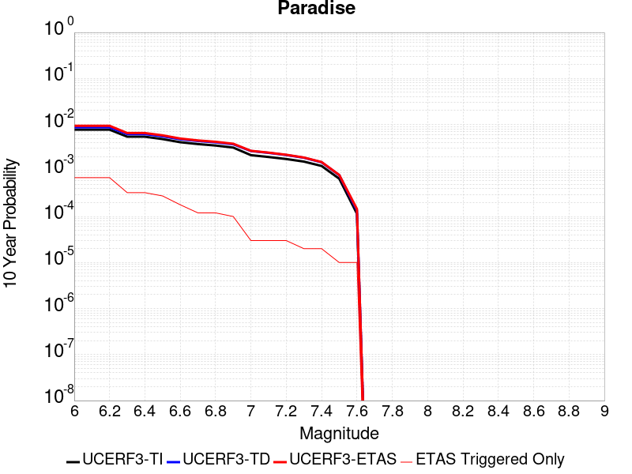 |

| Magnitude | 1 wk TI Prob | 1 wk TD Prob | 1 wk ETAS Prob | 1 wk ETAS/TD Gain | 1 wk ETAS Triggered Only | 1 mo TI Prob | 1 mo TD Prob | 1 mo ETAS Prob | 1 mo ETAS/TD Gain | 1 mo ETAS Triggered Only | 1 yr TI Prob | 1 yr TD Prob | 1 yr ETAS Prob | 1 yr ETAS/TD Gain | 1 yr ETAS Triggered Only | 10 yr TI Prob | 10 yr TD Prob | 10 yr ETAS Prob | 10 yr ETAS/TD Gain | 10 yr ETAS Triggered Only |
|-----|-----|-----|-----|-----|-----|-----|-----|-----|-----|-----|-----|-----|-----|-----|-----|-----|-----|-----|-----|-----|
| 6.0 | 1.4851273E-5 | 1.6695756E-5 | 3.6695423E-5 | 2.197889 | 2.0E-5 | 6.364676E-5 | 7.155142E-5 | 1.2154784E-4 | 1.6987482 | 5.0E-5 | 7.7462377E-4 | 8.708139E-4 | 0.001080631 | 1.2409437 | 2.1E-4 | 0.0077192914 | 0.008676396 | 0.009370322 | 1.0799787 | 7.0E-4 |
| 6.1 | 1.4851273E-5 | 1.6695756E-5 | 3.6695423E-5 | 2.197889 | 2.0E-5 | 6.364676E-5 | 7.155142E-5 | 1.2154784E-4 | 1.6987482 | 5.0E-5 | 7.7462377E-4 | 8.708139E-4 | 0.001080631 | 1.2409437 | 2.1E-4 | 0.0077192914 | 0.008676396 | 0.009370322 | 1.0799787 | 7.0E-4 |
| 6.2 | 1.4851273E-5 | 1.6695756E-5 | 3.6695423E-5 | 2.197889 | 2.0E-5 | 6.364676E-5 | 7.155142E-5 | 1.2154784E-4 | 1.6987482 | 5.0E-5 | 7.7462377E-4 | 8.708139E-4 | 0.001080631 | 1.2409437 | 2.1E-4 | 0.0077192914 | 0.008676396 | 0.009370322 | 1.0799787 | 7.0E-4 |
| 6.3 | 1.0426831E-5 | 1.1889356E-5 | 1.1889356E-5 | 1.0 | 0.0 | 4.4685654E-5 | 5.095342E-5 | 5.095342E-5 | 1.0 | 0.0 | 5.43912E-4 | 6.2018726E-4 | 7.0013764E-4 | 1.1289133 | 8.0E-5 | 0.0054258266 | 0.006185173 | 0.006513132 | 1.0530235 | 3.3E-4 |
| 6.4 | 1.0426831E-5 | 1.1889356E-5 | 1.1889356E-5 | 1.0 | 0.0 | 4.4685654E-5 | 5.095342E-5 | 5.095342E-5 | 1.0 | 0.0 | 5.43912E-4 | 6.2018726E-4 | 7.0013764E-4 | 1.1289133 | 8.0E-5 | 0.0054258266 | 0.006185173 | 0.006513132 | 1.0530235 | 3.3E-4 |
| 6.5 | 9.25027E-6 | 1.0620616E-5 | 1.0620616E-5 | 1.0 | 0.0 | 3.964341E-5 | 4.5516157E-5 | 4.5516157E-5 | 1.0 | 0.0 | 4.8255164E-4 | 5.5402325E-4 | 6.2398444E-4 | 1.1262785 | 7.0E-5 | 0.0048150513 | 0.00552692 | 0.0058053723 | 1.0503812 | 2.8E-4 |
| 6.6 | 7.904275E-6 | 9.160082E-6 | 9.160082E-6 | 1.0 | 0.0 | 3.3875025E-5 | 3.9256927E-5 | 3.9256927E-5 | 1.0 | 0.0 | 4.1235037E-4 | 4.7785218E-4 | 5.278283E-4 | 1.1045848 | 5.0E-5 | 0.0041158604 | 0.0047686435 | 0.0049477853 | 1.0375665 | 1.8E-4 |
| 6.7 | 7.2061953E-6 | 8.407759E-6 | 8.407759E-6 | 1.0 | 0.0 | 3.088333E-5 | 3.6032776E-5 | 3.6032776E-5 | 1.0 | 0.0 | 3.7593965E-4 | 4.386144E-4 | 4.7859686E-4 | 1.0911562 | 4.0E-5 | 0.003753043 | 0.004377856 | 0.0044973306 | 1.0272907 | 1.2E-4 |
| 6.8 | 6.6948724E-6 | 7.842642E-6 | 7.842642E-6 | 1.0 | 0.0 | 2.8691995E-5 | 3.3610908E-5 | 3.3610908E-5 | 1.0 | 0.0 | 3.4926904E-4 | 4.0913955E-4 | 4.4912318E-4 | 1.0977261 | 4.0E-5 | 0.003487206 | 0.0040842206 | 0.0042037303 | 1.0292614 | 1.2E-4 |
| 6.9 | 6.0421025E-6 | 7.131054E-6 | 7.131054E-6 | 1.0 | 0.0 | 2.5894467E-5 | 3.056132E-5 | 3.056132E-5 | 1.0 | 0.0 | 3.1521954E-4 | 3.7202396E-4 | 4.0201278E-4 | 1.0806099 | 3.0E-5 | 0.0031477278 | 0.00371435 | 0.0038139785 | 1.0268226 | 1.0E-4 |
| 7.0 | 4.134091E-6 | 5.0806357E-6 | 5.0806357E-6 | 1.0 | 0.0 | 1.7717413E-5 | 2.177398E-5 | 2.177398E-5 | 1.0 | 0.0 | 2.1568815E-4 | 2.650675E-4 | 2.8506218E-4 | 1.0754325 | 2.0E-5 | 0.0021547892 | 0.0026476665 | 0.0026775869 | 1.0113007 | 3.0E-5 |
| 7.1 | 3.7674888E-6 | 4.6321657E-6 | 4.6321657E-6 | 1.0 | 0.0 | 1.6146281E-5 | 1.9851997E-5 | 1.9851997E-5 | 1.0 | 0.0 | 1.9656324E-4 | 2.4167278E-4 | 2.6166794E-4 | 1.0827365 | 2.0E-5 | 0.0019638946 | 0.0024142503 | 0.0024441779 | 1.0123962 | 3.0E-5 |
| 7.2 | 3.4065345E-6 | 4.156988E-6 | 4.156988E-6 | 1.0 | 0.0 | 1.4599351E-5 | 1.7815548E-5 | 1.7815548E-5 | 1.0 | 0.0 | 1.777326E-4 | 2.1688422E-4 | 2.3687987E-4 | 1.0921952 | 2.0E-5 | 0.0017759053 | 0.0021668735 | 0.0021968086 | 1.0138148 | 3.0E-5 |
| 7.3 | 2.9934936E-6 | 3.6295378E-6 | 3.6295378E-6 | 1.0 | 0.0 | 1.2829195E-5 | 1.5555077E-5 | 1.5555077E-5 | 1.0 | 0.0 | 1.5618425E-4 | 1.8936809E-4 | 1.993662E-4 | 1.0527972 | 1.0E-5 | 0.0015607453 | 0.0018922125 | 0.0019121747 | 1.0105497 | 2.0E-5 |
| 7.4 | 2.4049796E-6 | 2.8891438E-6 | 2.8891438E-6 | 1.0 | 0.0 | 1.0307015E-5 | 1.2381994E-5 | 1.2381994E-5 | 1.0 | 0.0 | 1.2548068E-4 | 1.5074179E-4 | 1.6074028E-4 | 1.0663286 | 1.0E-5 | 0.0012540985 | 0.0015065368 | 0.0015265067 | 1.0132555 | 2.0E-5 |
| 7.5 | 1.2710091E-6 | 1.5135444E-6 | 1.5135444E-6 | 1.0 | 0.0 | 5.44717E-6 | 6.4866094E-6 | 6.4866094E-6 | 1.0 | 0.0 | 6.631728E-5 | 7.897286E-5 | 8.897207E-5 | 1.1266158 | 1.0E-5 | 6.6297496E-4 | 7.8957056E-4 | 7.9956267E-4 | 1.0126551 | 1.0E-5 |
| 7.6 | 2.21172E-7 | 2.6040675E-7 | 2.6040675E-7 | 1.0 | 0.0 | 9.478797E-7 | 1.1160286E-6 | 1.1160286E-6 | 1.0 | 0.0 | 1.1540374E-5 | 1.3587592E-5 | 2.3587456E-5 | 1.7359556 | 1.0E-5 | 1.1539775E-4 | 1.3587043E-4 | 1.4586907E-4 | 1.0735896 | 1.0E-5 |

## San Andreas (San Bernardino N)
*[(top)](#table-of-contents)*

| 1 Week | 1 Month | 1 Year | 10 Year |
|-----|-----|-----|-----|
|  |  |  |  |

| Magnitude | 1 wk TI Prob | 1 wk TD Prob | 1 wk ETAS Prob | 1 wk ETAS/TD Gain | 1 wk ETAS Triggered Only | 1 mo TI Prob | 1 mo TD Prob | 1 mo ETAS Prob | 1 mo ETAS/TD Gain | 1 mo ETAS Triggered Only | 1 yr TI Prob | 1 yr TD Prob | 1 yr ETAS Prob | 1 yr ETAS/TD Gain | 1 yr ETAS Triggered Only | 10 yr TI Prob | 10 yr TD Prob | 10 yr ETAS Prob | 10 yr ETAS/TD Gain | 10 yr ETAS Triggered Only |
|-----|-----|-----|-----|-----|-----|-----|-----|-----|-----|-----|-----|-----|-----|-----|-----|-----|-----|-----|-----|-----|
| 6.0 | 1.4273766E-4 | 3.1651653E-4 | 3.4650703E-4 | 1.0947518 | 3.0E-5 | 6.115894E-4 | 0.0013558001 | 0.0014456781 | 1.0662915 | 9.0E-5 | 0.0074207084 | 0.016383432 | 0.016767044 | 1.0234145 | 3.9E-4 | 0.07177748 | 0.15043527 | 0.15098749 | 1.0036708 | 6.5E-4 |
| 6.1 | 1.4273766E-4 | 3.1651653E-4 | 3.4650703E-4 | 1.0947518 | 3.0E-5 | 6.115894E-4 | 0.0013558001 | 0.0014456781 | 1.0662915 | 9.0E-5 | 0.0074207084 | 0.016383432 | 0.016767044 | 1.0234145 | 3.9E-4 | 0.07177748 | 0.15043527 | 0.15098749 | 1.0036708 | 6.5E-4 |
| 6.2 | 1.4273766E-4 | 3.1651653E-4 | 3.4650703E-4 | 1.0947518 | 3.0E-5 | 6.115894E-4 | 0.0013558001 | 0.0014456781 | 1.0662915 | 9.0E-5 | 0.0074207084 | 0.016383432 | 0.016767044 | 1.0234145 | 3.9E-4 | 0.07177748 | 0.15043527 | 0.15098749 | 1.0036708 | 6.5E-4 |
| 6.3 | 1.3730655E-4 | 3.055624E-4 | 3.3555322E-4 | 1.0981497 | 3.0E-5 | 5.883239E-4 | 0.0013089015 | 0.0013987838 | 1.0686699 | 9.0E-5 | 0.0071393442 | 0.015820839 | 0.016204668 | 1.024261 | 3.9E-4 | 0.06914291 | 0.14574663 | 0.1463019 | 1.0038098 | 6.5E-4 |
| 6.4 | 1.3730655E-4 | 3.055624E-4 | 3.3555322E-4 | 1.0981497 | 3.0E-5 | 5.883239E-4 | 0.0013089015 | 0.0013987838 | 1.0686699 | 9.0E-5 | 0.0071393442 | 0.015820839 | 0.016204668 | 1.024261 | 3.9E-4 | 0.06914291 | 0.14574663 | 0.1463019 | 1.0038098 | 6.5E-4 |
| 6.5 | 1.2942807E-4 | 2.8970436E-4 | 3.1969565E-4 | 1.1035239 | 3.0E-5 | 5.545738E-4 | 0.0012410044 | 0.0013308928 | 1.0724319 | 9.0E-5 | 0.0067310524 | 0.015005804 | 0.015370252 | 1.0242871 | 3.7E-4 | 0.06530788 | 0.13887183 | 0.13941434 | 1.0039066 | 6.3E-4 |
| 6.6 | 1.1125901E-4 | 2.540843E-4 | 2.8407667E-4 | 1.118041 | 3.0E-5 | 4.767372E-4 | 0.0010884806 | 0.0011783827 | 1.082594 | 9.0E-5 | 0.005788839 | 0.013172361 | 0.013527619 | 1.0269699 | 3.6E-4 | 0.056403454 | 0.123175114 | 0.12370998 | 1.0043423 | 6.1E-4 |
| 6.7 | 1.02209575E-4 | 2.3543004E-4 | 2.6542298E-4 | 1.1273963 | 3.0E-5 | 4.3796748E-4 | 0.0010085971 | 0.0010885164 | 1.079238 | 8.0E-5 | 0.0053192247 | 0.012210954 | 0.012546802 | 1.0275038 | 3.4E-4 | 0.051936906 | 0.114996314 | 0.11550076 | 1.0043867 | 5.7E-4 |
| 6.8 | 9.610582E-5 | 2.2068353E-4 | 2.506769E-4 | 1.1359112 | 3.0E-5 | 4.1181705E-4 | 9.4544445E-4 | 0.0010253688 | 1.0845363 | 8.0E-5 | 0.0050023515 | 0.011450301 | 0.011786408 | 1.0293535 | 3.4E-4 | 0.048912346 | 0.10836639 | 0.10887463 | 1.0046899 | 5.7E-4 |
| 6.9 | 9.3877505E-5 | 2.1523716E-4 | 2.452307E-4 | 1.1393511 | 3.0E-5 | 4.0227012E-4 | 9.221195E-4 | 0.0010020457 | 1.0866766 | 8.0E-5 | 0.0048866454 | 0.01116926 | 0.011505462 | 1.0301007 | 3.4E-4 | 0.04780577 | 0.10595687 | 0.106466465 | 1.0048095 | 5.7E-4 |
| 7.0 | 9.1019785E-5 | 2.0850307E-4 | 2.3849682E-4 | 1.1438527 | 3.0E-5 | 3.900265E-4 | 8.932792E-4 | 9.7320776E-4 | 1.0894777 | 8.0E-5 | 0.0047382377 | 0.0108216675 | 0.011157988 | 1.0310785 | 3.4E-4 | 0.046384744 | 0.10292843 | 0.10343976 | 1.0049678 | 5.7E-4 |
| 7.1 | 8.771155E-5 | 2.0024502E-4 | 2.3023902E-4 | 1.1497865 | 3.0E-5 | 3.758525E-4 | 8.5791125E-4 | 9.378426E-4 | 1.0931697 | 8.0E-5 | 0.0045664064 | 0.010395244 | 0.010721813 | 1.0314153 | 3.3E-4 | 0.044737056 | 0.099246025 | 0.099750444 | 1.0050825 | 5.6E-4 |
| 7.2 | 8.0830236E-5 | 1.8429487E-4 | 2.1428934E-4 | 1.1627526 | 3.0E-5 | 3.4636928E-4 | 7.8959623E-4 | 8.6953305E-4 | 1.1012377 | 8.0E-5 | 0.0042088944 | 0.009571067 | 0.009897908 | 1.0341489 | 3.3E-4 | 0.041300658 | 0.091966175 | 0.09247468 | 1.0055292 | 5.6E-4 |
| 7.3 | 7.7668235E-5 | 1.7372228E-4 | 2.0371706E-4 | 1.1726594 | 3.0E-5 | 3.328214E-4 | 7.443117E-4 | 8.2425214E-4 | 1.1074018 | 8.0E-5 | 0.0040445733 | 0.009024422 | 0.0093514435 | 1.0362375 | 3.3E-4 | 0.03971748 | 0.087241285 | 0.087752424 | 1.005859 | 5.6E-4 |
| 7.4 | 7.520177E-5 | 1.6591765E-4 | 1.9591267E-4 | 1.1807826 | 3.0E-5 | 3.2225347E-4 | 7.1088196E-4 | 7.9082506E-4 | 1.1124563 | 8.0E-5 | 0.0039163795 | 0.008620708 | 0.008947863 | 1.0379499 | 3.3E-4 | 0.038480744 | 0.08369537 | 0.084208496 | 1.0061309 | 5.6E-4 |
| 7.5 | 7.274697E-5 | 1.5878877E-4 | 1.88784E-4 | 1.1889002 | 3.0E-5 | 3.1173544E-4 | 6.8034587E-4 | 7.6029147E-4 | 1.1175072 | 8.0E-5 | 0.003788775 | 0.0082518095 | 0.0085790865 | 1.0396613 | 3.3E-4 | 0.03724827 | 0.08041146 | 0.08092643 | 1.0064042 | 5.6E-4 |
| 7.6 | 7.1185845E-5 | 1.5448398E-4 | 1.8447934E-4 | 1.1941649 | 3.0E-5 | 3.0504653E-4 | 6.6190626E-4 | 7.418533E-4 | 1.1207831 | 8.0E-5 | 0.0037076178 | 0.008028984 | 0.008356335 | 1.0407711 | 3.3E-4 | 0.036463667 | 0.07840025 | 0.07891634 | 1.0065829 | 5.6E-4 |
| 7.7 | 6.709961E-5 | 1.4356305E-4 | 1.7355874E-4 | 1.2089374 | 3.0E-5 | 2.8753807E-4 | 6.151252E-4 | 6.9507596E-4 | 1.1299748 | 8.0E-5 | 0.003495157 | 0.007463471 | 0.0077910083 | 1.0438854 | 3.3E-4 | 0.034406938 | 0.07322495 | 0.07374394 | 1.0070877 | 5.6E-4 |
| 7.8 | 6.300812E-5 | 1.32384E-4 | 1.6238003E-4 | 1.2265835 | 3.0E-5 | 2.7000686E-4 | 5.672367E-4 | 6.471913E-4 | 1.1409546 | 8.0E-5 | 0.0032823787 | 0.006884267 | 0.007211995 | 1.0476054 | 3.3E-4 | 0.032343175 | 0.06787603 | 0.06839803 | 1.0076903 | 5.6E-4 |
| 7.9 | 4.983037E-5 | 9.7517724E-5 | 1.275148E-4 | 1.3076063 | 3.0E-5 | 2.1354125E-4 | 4.1786616E-4 | 4.978327E-4 | 1.1913688 | 8.0E-5 | 0.0025967648 | 0.0050756633 | 0.0053641913 | 1.0568454 | 2.9E-4 | 0.025666296 | 0.05078055 | 0.051236175 | 1.0089724 | 4.8E-4 |
| 8.0 | 3.2211527E-5 | 5.346893E-5 | 6.34684E-5 | 1.1870145 | 1.0E-5 | 1.380421E-4 | 2.2913245E-4 | 2.6912327E-4 | 1.1745316 | 4.0E-5 | 0.0016793669 | 0.0027861206 | 0.0028958141 | 1.0393714 | 1.1E-4 | 0.016667323 | 0.028441435 | 0.0286066 | 1.0058072 | 1.7E-4 |
| 8.1 | 1.743376E-5 | 1.8898952E-5 | 1.8898952E-5 | 1.0 | 0.0 | 7.471398E-5 | 8.0993E-5 | 8.0993E-5 | 1.0 | 0.0 | 9.0926304E-4 | 9.856443E-4 | 9.856443E-4 | 1.0 | 0.0 | 0.009055517 | 0.010523065 | 0.010523065 | 1.0 | 0.0 |
| 8.2 | 7.831616E-6 | 5.18234E-6 | 5.18234E-6 | 1.0 | 0.0 | 3.3563636E-5 | 2.220984E-5 | 2.220984E-5 | 1.0 | 0.0 | 4.0856065E-4 | 2.7037133E-4 | 2.7037133E-4 | 1.0 | 0.0 | 0.004078103 | 0.0030567264 | 0.0030567264 | 1.0 | 0.0 |
| 8.3 | 1.983087E-6 | 7.7071206E-7 | 7.7071206E-7 | 1.0 | 0.0 | 8.498917E-6 | 3.3030476E-6 | 3.3030476E-6 | 1.0 | 0.0 | 1.034694E-4 | 4.021388E-5 | 4.021388E-5 | 1.0 | 0.0 | 0.0010342124 | 4.7468478E-4 | 4.7468478E-4 | 1.0 | 0.0 |

## Garlic Springs
*[(top)](#table-of-contents)*

| 1 Week | 1 Month | 1 Year | 10 Year |
|-----|-----|-----|-----|
|  |  |  |  |

| Magnitude | 1 wk TI Prob | 1 wk TD Prob | 1 wk ETAS Prob | 1 wk ETAS/TD Gain | 1 wk ETAS Triggered Only | 1 mo TI Prob | 1 mo TD Prob | 1 mo ETAS Prob | 1 mo ETAS/TD Gain | 1 mo ETAS Triggered Only | 1 yr TI Prob | 1 yr TD Prob | 1 yr ETAS Prob | 1 yr ETAS/TD Gain | 1 yr ETAS Triggered Only | 10 yr TI Prob | 10 yr TD Prob | 10 yr ETAS Prob | 10 yr ETAS/TD Gain | 10 yr ETAS Triggered Only |
|-----|-----|-----|-----|-----|-----|-----|-----|-----|-----|-----|-----|-----|-----|-----|-----|-----|-----|-----|-----|-----|
| 6.0 | 1.6760017E-5 | 1.8778632E-5 | 3.8778257E-5 | 2.0650203 | 2.0E-5 | 7.182667E-5 | 8.047803E-5 | 1.2047481E-4 | 1.4969901 | 4.0E-5 | 8.7413884E-4 | 9.79497E-4 | 0.0011493305 | 1.1733885 | 1.7E-4 | 0.008707083 | 0.009763345 | 0.010377292 | 1.0628828 | 6.2E-4 |
| 6.1 | 9.852767E-6 | 1.0974581E-5 | 2.097447E-5 | 1.9111866 | 1.0E-5 | 4.222546E-5 | 4.703347E-5 | 5.7032998E-5 | 1.2126045 | 1.0E-5 | 5.139737E-4 | 5.72553E-4 | 6.8249E-4 | 1.192012 | 1.1E-4 | 0.005127866 | 0.0057177385 | 0.00607568 | 1.0626019 | 3.6E-4 |
| 6.2 | 9.852767E-6 | 1.0974581E-5 | 2.097447E-5 | 1.9111866 | 1.0E-5 | 4.222546E-5 | 4.703347E-5 | 5.7032998E-5 | 1.2126045 | 1.0E-5 | 5.139737E-4 | 5.72553E-4 | 6.8249E-4 | 1.192012 | 1.1E-4 | 0.005127866 | 0.0057177385 | 0.00607568 | 1.0626019 | 3.6E-4 |
| 6.3 | 4.3167724E-6 | 4.7784347E-6 | 4.7784347E-6 | 1.0 | 0.0 | 1.8500323E-5 | 2.0478976E-5 | 2.0478976E-5 | 1.0 | 0.0 | 2.2521814E-4 | 2.4932603E-4 | 2.7931857E-4 | 1.1202943 | 3.0E-5 | 0.0022499003 | 0.002492722 | 0.0026323728 | 1.0560235 | 1.4E-4 |
| 6.4 | 4.3167724E-6 | 4.7784347E-6 | 4.7784347E-6 | 1.0 | 0.0 | 1.8500323E-5 | 2.0478976E-5 | 2.0478976E-5 | 1.0 | 0.0 | 2.2521814E-4 | 2.4932603E-4 | 2.7931857E-4 | 1.1202943 | 3.0E-5 | 0.0022499003 | 0.002492722 | 0.0026323728 | 1.0560235 | 1.4E-4 |
| 6.5 | 4.3167724E-6 | 4.7784347E-6 | 4.7784347E-6 | 1.0 | 0.0 | 1.8500323E-5 | 2.0478976E-5 | 2.0478976E-5 | 1.0 | 0.0 | 2.2521814E-4 | 2.4932603E-4 | 2.7931857E-4 | 1.1202943 | 3.0E-5 | 0.0022499003 | 0.002492722 | 0.0026323728 | 1.0560235 | 1.4E-4 |
| 6.6 | 4.301311E-6 | 4.761302E-6 | 4.761302E-6 | 1.0 | 0.0 | 1.8434059E-5 | 2.040555E-5 | 2.040555E-5 | 1.0 | 0.0 | 2.2441156E-4 | 2.4843228E-4 | 2.7842482E-4 | 1.1207273 | 3.0E-5 | 0.0022418506 | 0.0024838042 | 0.0026234565 | 1.0562252 | 1.4E-4 |
| 6.7 | 3.8599724E-6 | 4.271422E-6 | 4.271422E-6 | 1.0 | 0.0 | 1.6542634E-5 | 1.8306093E-5 | 1.8306093E-5 | 1.0 | 0.0 | 2.0138794E-4 | 2.2287668E-4 | 2.4287224E-4 | 1.0897157 | 2.0E-5 | 0.0020120554 | 0.002228767 | 0.0023385216 | 1.0492446 | 1.1E-4 |

## Death Valley (Black Mtns Frontal)
*[(top)](#table-of-contents)*

| 1 Week | 1 Month | 1 Year | 10 Year |
|-----|-----|-----|-----|
|  |  |  |  |

| Magnitude | 1 wk TI Prob | 1 wk TD Prob | 1 wk ETAS Prob | 1 wk ETAS/TD Gain | 1 wk ETAS Triggered Only | 1 mo TI Prob | 1 mo TD Prob | 1 mo ETAS Prob | 1 mo ETAS/TD Gain | 1 mo ETAS Triggered Only | 1 yr TI Prob | 1 yr TD Prob | 1 yr ETAS Prob | 1 yr ETAS/TD Gain | 1 yr ETAS Triggered Only | 10 yr TI Prob | 10 yr TD Prob | 10 yr ETAS Prob | 10 yr ETAS/TD Gain | 10 yr ETAS Triggered Only |
|-----|-----|-----|-----|-----|-----|-----|-----|-----|-----|-----|-----|-----|-----|-----|-----|-----|-----|-----|-----|-----|
| 6.0 | 1.6707214E-5 | 1.8672019E-5 | 2.8671833E-5 | 1.5355507 | 1.0E-5 | 7.160038E-5 | 8.002053E-5 | 1.3001653E-4 | 1.6247897 | 5.0E-5 | 8.71386E-4 | 9.738221E-4 | 0.0011136858 | 1.1436235 | 1.4E-4 | 0.00867977 | 0.009696402 | 0.010092523 | 1.0408524 | 4.0E-4 |
| 6.1 | 1.6707214E-5 | 1.8672019E-5 | 2.8671833E-5 | 1.5355507 | 1.0E-5 | 7.160038E-5 | 8.002053E-5 | 1.3001653E-4 | 1.6247897 | 5.0E-5 | 8.71386E-4 | 9.738221E-4 | 0.0011136858 | 1.1436235 | 1.4E-4 | 0.00867977 | 0.009696402 | 0.010092523 | 1.0408524 | 4.0E-4 |
| 6.2 | 1.6707214E-5 | 1.8672019E-5 | 2.8671833E-5 | 1.5355507 | 1.0E-5 | 7.160038E-5 | 8.002053E-5 | 1.3001653E-4 | 1.6247897 | 5.0E-5 | 8.71386E-4 | 9.738221E-4 | 0.0011136858 | 1.1436235 | 1.4E-4 | 0.00867977 | 0.009696402 | 0.010092523 | 1.0408524 | 4.0E-4 |
| 6.3 | 1.6707214E-5 | 1.8672019E-5 | 2.8671833E-5 | 1.5355507 | 1.0E-5 | 7.160038E-5 | 8.002053E-5 | 1.3001653E-4 | 1.6247897 | 5.0E-5 | 8.71386E-4 | 9.738221E-4 | 0.0011136858 | 1.1436235 | 1.4E-4 | 0.00867977 | 0.009696402 | 0.010092523 | 1.0408524 | 4.0E-4 |
| 6.4 | 1.5515609E-5 | 1.7339838E-5 | 2.7339665E-5 | 1.5766966 | 1.0E-5 | 6.649377E-5 | 7.4311516E-5 | 1.243078E-4 | 1.6727933 | 5.0E-5 | 8.0926094E-4 | 9.0437324E-4 | 0.0010342557 | 1.143616 | 1.3E-4 | 0.008063202 | 0.009007613 | 0.009364371 | 1.0396062 | 3.6E-4 |
| 6.5 | 1.5515609E-5 | 1.7339838E-5 | 2.7339665E-5 | 1.5766966 | 1.0E-5 | 6.649377E-5 | 7.4311516E-5 | 1.243078E-4 | 1.6727933 | 5.0E-5 | 8.0926094E-4 | 9.0437324E-4 | 0.0010342557 | 1.143616 | 1.3E-4 | 0.008063202 | 0.009007613 | 0.009364371 | 1.0396062 | 3.6E-4 |
| 6.6 | 1.5041828E-5 | 1.6810722E-5 | 2.6810552E-5 | 1.5948485 | 1.0E-5 | 6.4463384E-5 | 7.204399E-5 | 1.2204039E-4 | 1.6939704 | 5.0E-5 | 7.8455906E-4 | 8.767885E-4 | 9.966833E-4 | 1.1367431 | 1.2E-4 | 0.00781795 | 0.008733948 | 0.0090610655 | 1.0374537 | 3.3E-4 |
| 6.7 | 1.4634985E-5 | 1.6357551E-5 | 1.6357551E-5 | 1.0 | 0.0 | 6.271985E-5 | 7.0101945E-5 | 1.0009984E-4 | 1.4279182 | 3.0E-5 | 7.6334673E-4 | 8.531627E-4 | 9.530774E-4 | 1.117111 | 1.0E-4 | 0.007607299 | 0.008499511 | 0.008787045 | 1.0338296 | 2.9E-4 |
| 6.8 | 1.4209158E-5 | 1.5883541E-5 | 1.5883541E-5 | 1.0 | 0.0 | 6.089497E-5 | 6.807057E-5 | 8.806921E-5 | 1.2937927 | 2.0E-5 | 7.4114406E-4 | 8.2844973E-4 | 8.983917E-4 | 1.0844252 | 7.0E-5 | 0.007386771 | 0.008254229 | 0.008492248 | 1.028836 | 2.4E-4 |
| 6.9 | 1.3780098E-5 | 1.5406044E-5 | 1.5406044E-5 | 1.0 | 0.0 | 5.9056227E-5 | 6.602426E-5 | 8.6022934E-5 | 1.302899 | 2.0E-5 | 7.1877235E-4 | 8.035544E-4 | 8.635061E-4 | 1.0746082 | 6.0E-5 | 0.0071645193 | 0.008007083 | 0.008225322 | 1.0272557 | 2.2E-4 |
| 7.0 | 1.3585064E-5 | 1.51895865E-5 | 1.51895865E-5 | 1.0 | 0.0 | 5.8220405E-5 | 6.509663E-5 | 8.509533E-5 | 1.3072156 | 2.0E-5 | 7.086029E-4 | 7.922688E-4 | 8.522213E-4 | 1.0756719 | 6.0E-5 | 0.007063476 | 0.007895035 | 0.008113298 | 1.0276456 | 2.2E-4 |
| 7.1 | 1.3398601E-5 | 1.4982753E-5 | 1.4982753E-5 | 1.0 | 0.0 | 5.742131E-5 | 6.4210246E-5 | 8.4208965E-5 | 1.3114568 | 2.0E-5 | 6.9888023E-4 | 7.814848E-4 | 8.414379E-4 | 1.0767169 | 6.0E-5 | 0.0069668638 | 0.007787956 | 0.007996321 | 1.0267547 | 2.1E-4 |
| 7.2 | 1.3126312E-5 | 1.4680948E-5 | 1.4680948E-5 | 1.0 | 0.0 | 5.6254412E-5 | 6.291686E-5 | 8.2915605E-5 | 1.3178598 | 2.0E-5 | 6.846822E-4 | 7.65749E-4 | 8.0571836E-4 | 1.0521964 | 4.0E-5 | 0.006825765 | 0.0076316884 | 0.0077904672 | 1.0208052 | 1.6E-4 |
| 7.3 | 1.2922429E-5 | 1.4455156E-5 | 1.4455156E-5 | 1.0 | 0.0 | 5.5380664E-5 | 6.194923E-5 | 8.194799E-5 | 1.3228251 | 2.0E-5 | 6.74051E-4 | 7.539763E-4 | 7.939461E-4 | 1.053012 | 4.0E-5 | 0.006720101 | 0.007514763 | 0.007653711 | 1.01849 | 1.4E-4 |
| 7.4 | 1.2768878E-5 | 1.4285124E-5 | 1.4285124E-5 | 1.0 | 0.0 | 5.4722615E-5 | 6.1220555E-5 | 7.121995E-5 | 1.1633338 | 1.0E-5 | 6.660441E-4 | 7.451108E-4 | 7.7508844E-4 | 1.0402324 | 3.0E-5 | 0.0066405144 | 0.0074267043 | 0.007555739 | 1.0173744 | 1.3E-4 |
| 7.5 | 1.2521929E-5 | 1.4013346E-5 | 1.4013346E-5 | 1.0 | 0.0 | 5.366431E-5 | 6.0055845E-5 | 7.005525E-5 | 1.1665016 | 1.0E-5 | 6.531671E-4 | 7.309401E-4 | 7.6091813E-4 | 1.041013 | 3.0E-5 | 0.006512506 | 0.0072859353 | 0.0074149882 | 1.0177126 | 1.3E-4 |
| 7.6 | 1.1301089E-5 | 1.2649352E-5 | 1.2649352E-5 | 1.0 | 0.0 | 4.8432343E-5 | 5.4210414E-5 | 5.4210414E-5 | 1.0 | 0.0 | 5.895042E-4 | 6.598172E-4 | 6.79804E-4 | 1.0302914 | 2.0E-5 | 0.0058794282 | 0.006579134 | 0.0066884104 | 1.0166095 | 1.1E-4 |
| 7.7 | 9.189108E-6 | 1.0284336E-5 | 1.0284336E-5 | 1.0 | 0.0 | 3.93813E-5 | 4.407501E-5 | 4.407501E-5 | 1.0 | 0.0 | 4.7936183E-4 | 5.3648616E-4 | 5.4648076E-4 | 1.0186298 | 1.0E-5 | 0.004783291 | 0.005352421 | 0.0054220464 | 1.0130082 | 7.0E-5 |
| 7.8 | 3.4586725E-7 | 3.6484212E-7 | 3.6484212E-7 | 1.0 | 0.0 | 1.4822873E-6 | 1.5636082E-6 | 1.5636082E-6 | 1.0 | 0.0 | 1.80467E-5 | 1.9036768E-5 | 1.9036768E-5 | 1.0 | 0.0 | 1.8045233E-4 | 1.9035181E-4 | 2.0034991E-4 | 1.0525243 | 1.0E-5 |
| 7.9 | 2.5591178E-9 | 2.6697635E-9 | 2.6697635E-9 | 1.0 | 0.0 | 1.0967647E-8 | 1.1441844E-8 | 1.1441844E-8 | 1.0 | 0.0 | 1.335311E-7 | 1.3930445E-7 | 1.3930445E-7 | 1.0 | 0.0 | 1.3353102E-6 | 1.3930445E-6 | 1.3930445E-6 | 1.0 | 0.0 |

## Coyote Lake
*[(top)](#table-of-contents)*

| 1 Week | 1 Month | 1 Year | 10 Year |
|-----|-----|-----|-----|
|  |  |  |  |

| Magnitude | 1 wk TI Prob | 1 wk TD Prob | 1 wk ETAS Prob | 1 wk ETAS/TD Gain | 1 wk ETAS Triggered Only | 1 mo TI Prob | 1 mo TD Prob | 1 mo ETAS Prob | 1 mo ETAS/TD Gain | 1 mo ETAS Triggered Only | 1 yr TI Prob | 1 yr TD Prob | 1 yr ETAS Prob | 1 yr ETAS/TD Gain | 1 yr ETAS Triggered Only | 10 yr TI Prob | 10 yr TD Prob | 10 yr ETAS Prob | 10 yr ETAS/TD Gain | 10 yr ETAS Triggered Only |
|-----|-----|-----|-----|-----|-----|-----|-----|-----|-----|-----|-----|-----|-----|-----|-----|-----|-----|-----|-----|-----|
| 6.0 | 1.980352E-5 | 2.1708405E-5 | 2.1708405E-5 | 1.0 | 0.0 | 8.486947E-5 | 9.3033115E-5 | 1.0303218E-4 | 1.1074786 | 1.0E-5 | 0.0010327959 | 0.0011321616 | 0.0012720032 | 1.1235173 | 1.4E-4 | 0.010280091 | 0.011271116 | 0.011646833 | 1.0333345 | 3.8E-4 |
| 6.1 | 1.980352E-5 | 2.1708405E-5 | 2.1708405E-5 | 1.0 | 0.0 | 8.486947E-5 | 9.3033115E-5 | 1.0303218E-4 | 1.1074786 | 1.0E-5 | 0.0010327959 | 0.0011321616 | 0.0012720032 | 1.1235173 | 1.4E-4 | 0.010280091 | 0.011271116 | 0.011646833 | 1.0333345 | 3.8E-4 |
| 6.2 | 1.980352E-5 | 2.1708405E-5 | 2.1708405E-5 | 1.0 | 0.0 | 8.486947E-5 | 9.3033115E-5 | 1.0303218E-4 | 1.1074786 | 1.0E-5 | 0.0010327959 | 0.0011321616 | 0.0012720032 | 1.1235173 | 1.4E-4 | 0.010280091 | 0.011271116 | 0.011646833 | 1.0333345 | 3.8E-4 |
| 6.3 | 1.5344787E-5 | 1.6821958E-5 | 1.6821958E-5 | 1.0 | 0.0 | 6.576172E-5 | 7.209246E-5 | 8.2091734E-5 | 1.1387007 | 1.0E-5 | 8.003548E-4 | 8.774334E-4 | 9.573632E-4 | 1.091095 | 8.0E-5 | 0.007974784 | 0.008745736 | 0.008983637 | 1.0272019 | 2.4E-4 |
| 6.4 | 1.5344787E-5 | 1.6821958E-5 | 1.6821958E-5 | 1.0 | 0.0 | 6.576172E-5 | 7.209246E-5 | 8.2091734E-5 | 1.1387007 | 1.0E-5 | 8.003548E-4 | 8.774334E-4 | 9.573632E-4 | 1.091095 | 8.0E-5 | 0.007974784 | 0.008745736 | 0.008983637 | 1.0272019 | 2.4E-4 |
| 6.5 | 1.4189697E-5 | 1.555918E-5 | 1.555918E-5 | 1.0 | 0.0 | 6.081157E-5 | 6.668084E-5 | 7.6680175E-5 | 1.1499581 | 1.0E-5 | 7.401293E-4 | 8.1159716E-4 | 8.915322E-4 | 1.0984911 | 8.0E-5 | 0.0073766913 | 0.008092275 | 0.0083204135 | 1.0281922 | 2.3E-4 |
| 6.6 | 1.3469301E-5 | 1.4772714E-5 | 1.4772714E-5 | 1.0 | 0.0 | 5.7724297E-5 | 6.3310436E-5 | 7.33098E-5 | 1.1579418 | 1.0E-5 | 7.025667E-4 | 7.7059196E-4 | 8.505303E-4 | 1.1037363 | 8.0E-5 | 0.0070034964 | 0.007685104 | 0.007913336 | 1.029698 | 2.3E-4 |
| 6.7 | 1.3027966E-5 | 1.4282839E-5 | 1.4282839E-5 | 1.0 | 0.0 | 5.5832945E-5 | 6.121107E-5 | 7.121046E-5 | 1.1633592 | 1.0E-5 | 6.7955407E-4 | 7.450497E-4 | 8.1499753E-4 | 1.0938835 | 7.0E-5 | 0.006774798 | 0.0074313963 | 0.00762991 | 1.0267129 | 2.0E-4 |
| 6.8 | 5.695434E-6 | 6.224878E-6 | 6.224878E-6 | 1.0 | 0.0 | 2.4408775E-5 | 2.6677944E-5 | 3.6677677E-5 | 1.3748314 | 1.0E-5 | 2.971363E-4 | 3.2478556E-4 | 3.7476933E-4 | 1.1538978 | 5.0E-5 | 0.0029673933 | 0.00324605 | 0.0033257904 | 1.0245653 | 8.0E-5 |
| 6.9 | 4.385688E-6 | 4.7934095E-6 | 4.7934095E-6 | 1.0 | 0.0 | 1.879567E-5 | 2.0543184E-5 | 2.0543184E-5 | 1.0 | 0.0 | 2.2881327E-4 | 2.5011325E-4 | 2.7010826E-4 | 1.0799438 | 2.0E-5 | 0.002285778 | 0.0025011327 | 0.0025410326 | 1.0159527 | 4.0E-5 |

## San Andreas (San Bernardino S)
*[(top)](#table-of-contents)*

| 1 Week | 1 Month | 1 Year | 10 Year |
|-----|-----|-----|-----|
|  |  |  |  |

| Magnitude | 1 wk TI Prob | 1 wk TD Prob | 1 wk ETAS Prob | 1 wk ETAS/TD Gain | 1 wk ETAS Triggered Only | 1 mo TI Prob | 1 mo TD Prob | 1 mo ETAS Prob | 1 mo ETAS/TD Gain | 1 mo ETAS Triggered Only | 1 yr TI Prob | 1 yr TD Prob | 1 yr ETAS Prob | 1 yr ETAS/TD Gain | 1 yr ETAS Triggered Only | 10 yr TI Prob | 10 yr TD Prob | 10 yr ETAS Prob | 10 yr ETAS/TD Gain | 10 yr ETAS Triggered Only |
|-----|-----|-----|-----|-----|-----|-----|-----|-----|-----|-----|-----|-----|-----|-----|-----|-----|-----|-----|-----|-----|
| 6.0 | 1.2336002E-4 | 3.0034315E-4 | 3.1034017E-4 | 1.0332853 | 1.0E-5 | 5.2857865E-4 | 0.0012865762 | 0.0013165375 | 1.0232877 | 3.0E-5 | 0.006416472 | 0.015556523 | 0.015733723 | 1.0113907 | 1.8E-4 | 0.06234337 | 0.14299223 | 0.14326647 | 1.0019178 | 3.2E-4 |
| 6.1 | 1.2336002E-4 | 3.0034315E-4 | 3.1034017E-4 | 1.0332853 | 1.0E-5 | 5.2857865E-4 | 0.0012865762 | 0.0013165375 | 1.0232877 | 3.0E-5 | 0.006416472 | 0.015556523 | 0.015733723 | 1.0113907 | 1.8E-4 | 0.06234337 | 0.14299223 | 0.14326647 | 1.0019178 | 3.2E-4 |
| 6.2 | 1.2336002E-4 | 3.0034315E-4 | 3.1034017E-4 | 1.0332853 | 1.0E-5 | 5.2857865E-4 | 0.0012865762 | 0.0013165375 | 1.0232877 | 3.0E-5 | 0.006416472 | 0.015556523 | 0.015733723 | 1.0113907 | 1.8E-4 | 0.06234337 | 0.14299223 | 0.14326647 | 1.0019178 | 3.2E-4 |
| 6.3 | 1.1712257E-4 | 2.882228E-4 | 2.9821994E-4 | 1.0346854 | 1.0E-5 | 5.018573E-4 | 0.0012346816 | 0.0012646446 | 1.0242678 | 3.0E-5 | 0.006093008 | 0.014933486 | 0.015110797 | 1.0118735 | 1.8E-4 | 0.059286322 | 0.13770635 | 0.13798228 | 1.0020038 | 3.2E-4 |
| 6.4 | 1.1712257E-4 | 2.882228E-4 | 2.9821994E-4 | 1.0346854 | 1.0E-5 | 5.018573E-4 | 0.0012346816 | 0.0012646446 | 1.0242678 | 3.0E-5 | 0.006093008 | 0.014933486 | 0.015110797 | 1.0118735 | 1.8E-4 | 0.059286322 | 0.13770635 | 0.13798228 | 1.0020038 | 3.2E-4 |
| 6.5 | 1.0689076E-4 | 2.6834762E-4 | 2.7834493E-4 | 1.037255 | 1.0E-5 | 4.5802278E-4 | 0.0011495792 | 0.0011795446 | 1.0260665 | 3.0E-5 | 0.0055621783 | 0.013910929 | 0.014068702 | 1.0113417 | 1.6E-4 | 0.05425003 | 0.12894608 | 0.1292074 | 1.0020266 | 3.0E-4 |
| 6.6 | 9.7648895E-5 | 2.5079155E-4 | 2.6078906E-4 | 1.0398637 | 1.0E-5 | 4.1842813E-4 | 0.0010744019 | 0.0011043696 | 1.0278925 | 3.0E-5 | 0.005082469 | 0.013006757 | 0.013164676 | 1.0121413 | 1.6E-4 | 0.049677886 | 0.12110833 | 0.12136321 | 1.0021045 | 2.9E-4 |
| 6.7 | 8.757013E-5 | 2.3149271E-4 | 2.414904E-4 | 1.0431879 | 1.0E-5 | 3.7524657E-4 | 9.917567E-4 | 0.001021727 | 1.0302193 | 3.0E-5 | 0.00455906 | 0.012011877 | 0.012169955 | 1.0131601 | 1.6E-4 | 0.04466656 | 0.11246201 | 0.112719394 | 1.0022887 | 2.9E-4 |
| 6.8 | 8.562978E-5 | 2.2708964E-4 | 2.3708737E-4 | 1.0440254 | 1.0E-5 | 3.6693315E-4 | 9.7290054E-4 | 0.0010028713 | 1.0308056 | 3.0E-5 | 0.004458263 | 0.011784802 | 0.011942917 | 1.0134168 | 1.6E-4 | 0.043698758 | 0.11046695 | 0.11072492 | 1.0023352 | 2.9E-4 |
| 6.9 | 6.124075E-5 | 1.7091326E-4 | 1.7091326E-4 | 1.0 | 0.0 | 2.6243398E-4 | 7.322806E-4 | 7.52266E-4 | 1.0272919 | 2.0E-5 | 0.0031904527 | 0.008879279 | 0.009018036 | 1.015627 | 1.4E-4 | 0.031450346 | 0.08428234 | 0.08452042 | 1.0028249 | 2.6E-4 |
| 7.0 | 5.8598747E-5 | 1.6520037E-4 | 1.6520037E-4 | 1.0 | 0.0 | 2.5111332E-4 | 7.078103E-4 | 7.277961E-4 | 1.0282362 | 2.0E-5 | 0.0030530186 | 0.008583736 | 0.0087225335 | 1.0161699 | 1.4E-4 | 0.03011414 | 0.08160348 | 0.081842266 | 1.0029261 | 2.6E-4 |
| 7.1 | 5.613814E-5 | 1.5938308E-4 | 1.5938308E-4 | 1.0 | 0.0 | 2.4056983E-4 | 6.828923E-4 | 7.0287863E-4 | 1.0292672 | 2.0E-5 | 0.0029250039 | 0.0082827 | 0.00842154 | 1.0167627 | 1.4E-4 | 0.028868021 | 0.078904964 | 0.07914445 | 1.0030351 | 2.6E-4 |
| 7.2 | 4.991222E-5 | 1.4544254E-4 | 1.4544254E-4 | 1.0 | 0.0 | 2.1389198E-4 | 6.231767E-4 | 6.431642E-4 | 1.0320736 | 2.0E-5 | 0.002601025 | 0.007560885 | 0.0076998263 | 1.0183764 | 1.4E-4 | 0.025707912 | 0.07234863 | 0.07258982 | 1.0033337 | 2.6E-4 |
| 7.3 | 4.7410045E-5 | 1.373788E-4 | 1.373788E-4 | 1.0 | 0.0 | 2.0317009E-4 | 5.886337E-4 | 6.08622E-4 | 1.033957 | 2.0E-5 | 0.0024707897 | 0.0071431524 | 0.0072821523 | 1.0194592 | 1.4E-4 | 0.024434982 | 0.06863841 | 0.068880565 | 1.003528 | 2.6E-4 |
| 7.4 | 4.5556746E-5 | 1.3145374E-4 | 1.3145374E-4 | 1.0 | 0.0 | 1.952286E-4 | 5.6325184E-4 | 5.832406E-4 | 1.0354881 | 2.0E-5 | 0.002374317 | 0.006836108 | 0.006975151 | 1.0203395 | 1.4E-4 | 0.023491086 | 0.06588906 | 0.066131935 | 1.0036861 | 2.6E-4 |
| 7.5 | 4.3084514E-5 | 1.2380198E-4 | 1.2380198E-4 | 1.0 | 0.0 | 1.8463485E-4 | 5.304723E-4 | 5.504617E-4 | 1.0376823 | 2.0E-5 | 0.0022456115 | 0.006439447 | 0.006578545 | 1.021601 | 1.4E-4 | 0.022230545 | 0.062288664 | 0.06253247 | 1.0039141 | 2.6E-4 |
| 7.6 | 3.408608E-5 | 9.856554E-5 | 9.856554E-5 | 1.0 | 0.0 | 1.4607502E-4 | 4.2235546E-4 | 4.42347E-4 | 1.0473335 | 2.0E-5 | 0.0017770125 | 0.0051300796 | 0.005269361 | 1.02715 | 1.4E-4 | 0.017628696 | 0.050113272 | 0.050350744 | 1.0047387 | 2.5E-4 |
| 7.7 | 2.8315713E-5 | 8.268404E-5 | 8.268404E-5 | 1.0 | 0.0 | 1.2134742E-4 | 3.543121E-4 | 3.74305E-4 | 1.0564274 | 2.0E-5 | 0.0014764034 | 0.0043052263 | 0.004444624 | 1.0323787 | 1.4E-4 | 0.01466633 | 0.04235938 | 0.042598788 | 1.0056518 | 2.5E-4 |
| 7.8 | 2.6222975E-5 | 7.481511E-5 | 7.481511E-5 | 1.0 | 0.0 | 1.1237934E-4 | 3.205968E-4 | 3.4059037E-4 | 1.0623636 | 2.0E-5 | 0.0013673597 | 0.003896286 | 0.0040357406 | 1.0357916 | 1.4E-4 | 0.013589768 | 0.038519356 | 0.038759727 | 1.0062402 | 2.5E-4 |
| 7.9 | 2.1469694E-5 | 5.803201E-5 | 5.803201E-5 | 1.0 | 0.0 | 9.200973E-5 | 2.486849E-4 | 2.6867993E-4 | 1.0804031 | 2.0E-5 | 0.0011196428 | 0.0030235383 | 0.003153145 | 1.042866 | 1.3E-4 | 0.011140184 | 0.030221405 | 0.030454151 | 1.0077014 | 2.4E-4 |
| 8.0 | 1.2420249E-5 | 3.1403917E-5 | 3.1403917E-5 | 1.0 | 0.0 | 5.322855E-5 | 1.3458128E-4 | 1.5457858E-4 | 1.1485891 | 2.0E-5 | 6.478649E-4 | 0.0016372965 | 0.0016971983 | 1.0365858 | 6.0E-5 | 0.0064597935 | 0.01656197 | 0.016679984 | 1.0071255 | 1.2E-4 |
| 8.1 | 4.9197724E-6 | 7.8525145E-6 | 7.8525145E-6 | 1.0 | 0.0 | 2.1084568E-5 | 3.36532E-5 | 3.36532E-5 | 1.0 | 0.0 | 2.566744E-4 | 4.096508E-4 | 4.096508E-4 | 1.0 | 0.0 | 0.002563781 | 0.0043995893 | 0.0043995893 | 1.0 | 0.0 |
| 8.2 | 2.5634774E-6 | 2.9205E-6 | 2.9205E-6 | 1.0 | 0.0 | 1.0986286E-5 | 1.2516369E-5 | 1.2516369E-5 | 1.0 | 0.0 | 1.3374983E-4 | 1.5237617E-4 | 1.5237617E-4 | 1.0 | 0.0 | 0.0013366934 | 0.001712269 | 0.001712269 | 1.0 | 0.0 |
| 8.3 | 5.2850464E-7 | 3.2265774E-7 | 3.2265774E-7 | 1.0 | 0.0 | 2.2650179E-6 | 1.3828181E-6 | 1.3828181E-6 | 1.0 | 0.0 | 2.7576245E-5 | 1.6835695E-5 | 1.6835695E-5 | 1.0 | 0.0 | 2.7572823E-4 | 1.9969876E-4 | 1.9969876E-4 | 1.0 | 0.0 |

## Helendale-So Lockhart
*[(top)](#table-of-contents)*

| 1 Week | 1 Month | 1 Year | 10 Year |
|-----|-----|-----|-----|
|  |  |  |  |

| Magnitude | 1 wk TI Prob | 1 wk TD Prob | 1 wk ETAS Prob | 1 wk ETAS/TD Gain | 1 wk ETAS Triggered Only | 1 mo TI Prob | 1 mo TD Prob | 1 mo ETAS Prob | 1 mo ETAS/TD Gain | 1 mo ETAS Triggered Only | 1 yr TI Prob | 1 yr TD Prob | 1 yr ETAS Prob | 1 yr ETAS/TD Gain | 1 yr ETAS Triggered Only | 10 yr TI Prob | 10 yr TD Prob | 10 yr ETAS Prob | 10 yr ETAS/TD Gain | 10 yr ETAS Triggered Only |
|-----|-----|-----|-----|-----|-----|-----|-----|-----|-----|-----|-----|-----|-----|-----|-----|-----|-----|-----|-----|-----|
| 6.0 | 1.7296055E-5 | 1.8104403E-5 | 1.8104403E-5 | 1.0 | 0.0 | 7.412385E-5 | 7.758811E-5 | 8.758734E-5 | 1.1288757 | 1.0E-5 | 9.0208417E-4 | 9.442466E-4 | 0.0010441522 | 1.1058046 | 1.0E-4 | 0.008984311 | 0.009404465 | 0.009701644 | 1.0315998 | 3.0E-4 |
| 6.1 | 1.7296055E-5 | 1.8104403E-5 | 1.8104403E-5 | 1.0 | 0.0 | 7.412385E-5 | 7.758811E-5 | 8.758734E-5 | 1.1288757 | 1.0E-5 | 9.0208417E-4 | 9.442466E-4 | 0.0010441522 | 1.1058046 | 1.0E-4 | 0.008984311 | 0.009404465 | 0.009701644 | 1.0315998 | 3.0E-4 |
| 6.2 | 1.7296055E-5 | 1.8104403E-5 | 1.8104403E-5 | 1.0 | 0.0 | 7.412385E-5 | 7.758811E-5 | 8.758734E-5 | 1.1288757 | 1.0E-5 | 9.0208417E-4 | 9.442466E-4 | 0.0010441522 | 1.1058046 | 1.0E-4 | 0.008984311 | 0.009404465 | 0.009701644 | 1.0315998 | 3.0E-4 |
| 6.3 | 1.0669118E-5 | 1.1135812E-5 | 1.1135812E-5 | 1.0 | 0.0 | 4.5723988E-5 | 4.7724054E-5 | 5.7723577E-5 | 1.209528 | 1.0E-5 | 5.5654737E-4 | 5.8088824E-4 | 6.6084176E-4 | 1.1376401 | 8.0E-5 | 0.0055515557 | 0.0057939948 | 0.00601272 | 1.0377504 | 2.2E-4 |
| 6.4 | 1.0669118E-5 | 1.1135812E-5 | 1.1135812E-5 | 1.0 | 0.0 | 4.5723988E-5 | 4.7724054E-5 | 5.7723577E-5 | 1.209528 | 1.0E-5 | 5.5654737E-4 | 5.8088824E-4 | 6.6084176E-4 | 1.1376401 | 8.0E-5 | 0.0055515557 | 0.0057939948 | 0.00601272 | 1.0377504 | 2.2E-4 |
| 6.5 | 8.790038E-6 | 9.170513E-6 | 9.170513E-6 | 1.0 | 0.0 | 3.767105E-5 | 3.9301616E-5 | 4.9301223E-5 | 1.2544324 | 1.0E-5 | 4.585485E-4 | 4.7839366E-4 | 5.4836017E-4 | 1.146253 | 7.0E-5 | 0.0045760344 | 0.0047738026 | 0.0049728476 | 1.0416954 | 2.0E-4 |
| 6.6 | 7.396949E-6 | 7.715802E-6 | 7.715802E-6 | 1.0 | 0.0 | 3.1700827E-5 | 3.306731E-5 | 3.306731E-5 | 1.0 | 0.0 | 3.858892E-4 | 4.025211E-4 | 4.6249697E-4 | 1.1490005 | 6.0E-5 | 0.003852198 | 0.0040180273 | 0.004197304 | 1.0446181 | 1.8E-4 |
| 6.7 | 6.4600285E-6 | 6.738262E-6 | 6.738262E-6 | 1.0 | 0.0 | 2.7685543E-5 | 2.887795E-5 | 2.887795E-5 | 1.0 | 0.0 | 3.3701936E-4 | 3.5153312E-4 | 4.11512E-4 | 1.1706209 | 6.0E-5 | 0.0033650869 | 0.003509852 | 0.0036692906 | 1.045426 | 1.6E-4 |
| 6.8 | 5.600104E-6 | 5.836205E-6 | 5.836205E-6 | 1.0 | 0.0 | 2.4000226E-5 | 2.5012072E-5 | 2.5012072E-5 | 1.0 | 0.0 | 2.9216358E-4 | 3.0448003E-4 | 3.5446478E-4 | 1.1641644 | 5.0E-5 | 0.0029177975 | 0.00304069 | 0.003160325 | 1.0393447 | 1.2E-4 |
| 6.9 | 4.839122E-6 | 5.0396757E-6 | 5.0396757E-6 | 1.0 | 0.0 | 2.0738931E-5 | 2.1598433E-5 | 2.1598433E-5 | 1.0 | 0.0 | 2.5246723E-4 | 2.6292965E-4 | 3.0291913E-4 | 1.152092 | 4.0E-5 | 0.002521806 | 0.0026262333 | 0.0027259707 | 1.0379773 | 1.0E-4 |
| 7.0 | 3.6937633E-6 | 3.8453336E-6 | 3.8453336E-6 | 1.0 | 0.0 | 1.5830317E-5 | 1.6479898E-5 | 1.6479898E-5 | 1.0 | 0.0 | 1.9271708E-4 | 2.006246E-4 | 2.2062058E-4 | 1.0996686 | 2.0E-5 | 0.0019255003 | 0.0020044663 | 0.002074326 | 1.034852 | 7.0E-5 |
| 7.1 | 2.7858857E-6 | 2.8979466E-6 | 2.8979466E-6 | 1.0 | 0.0 | 1.1939455E-5 | 1.2419713E-5 | 1.2419713E-5 | 1.0 | 0.0 | 1.4535317E-4 | 1.5119973E-4 | 1.711967E-4 | 1.1322553 | 2.0E-5 | 0.0014525814 | 0.0015109901 | 0.0015708994 | 1.039649 | 6.0E-5 |
| 7.2 | 2.1672065E-6 | 2.2540846E-6 | 2.2540846E-6 | 1.0 | 0.0 | 9.2879945E-6 | 9.660328E-6 | 9.660328E-6 | 1.0 | 0.0 | 1.1307546E-4 | 1.1760833E-4 | 1.1760833E-4 | 1.0 | 0.0 | 0.0011301794 | 0.0011754791 | 0.0012154321 | 1.0339887 | 4.0E-5 |
| 7.3 | 1.4823496E-6 | 1.5422597E-6 | 1.5422597E-6 | 1.0 | 0.0 | 6.3529114E-6 | 6.609669E-6 | 6.609669E-6 | 1.0 | 0.0 | 7.734395E-5 | 8.04699E-5 | 8.04699E-5 | 1.0 | 0.0 | 7.731704E-4 | 8.044227E-4 | 8.244066E-4 | 1.0248425 | 2.0E-5 |
| 7.4 | 4.2321457E-7 | 4.411025E-7 | 4.411025E-7 | 1.0 | 0.0 | 1.8137755E-6 | 1.890438E-6 | 1.890438E-6 | 1.0 | 0.0 | 2.2082493E-5 | 2.3015888E-5 | 2.3015888E-5 | 1.0 | 0.0 | 2.2080299E-4 | 2.3013956E-4 | 2.4013725E-4 | 1.0434419 | 1.0E-5 |
| 7.5 | 5.6942316E-8 | 5.94177E-8 | 5.94177E-8 | 1.0 | 0.0 | 2.440385E-7 | 2.5464726E-7 | 2.5464726E-7 | 1.0 | 0.0 | 2.9711643E-6 | 3.100327E-6 | 3.100327E-6 | 1.0 | 0.0 | 2.9711247E-5 | 3.1002914E-5 | 3.1002914E-5 | 1.0 | 0.0 |

## Sierra Nevada  (No Extension)
*[(top)](#table-of-contents)*

| 1 Week | 1 Month | 1 Year | 10 Year |
|-----|-----|-----|-----|
|  |  |  |  |

| Magnitude | 1 wk TI Prob | 1 wk TD Prob | 1 wk ETAS Prob | 1 wk ETAS/TD Gain | 1 wk ETAS Triggered Only | 1 mo TI Prob | 1 mo TD Prob | 1 mo ETAS Prob | 1 mo ETAS/TD Gain | 1 mo ETAS Triggered Only | 1 yr TI Prob | 1 yr TD Prob | 1 yr ETAS Prob | 1 yr ETAS/TD Gain | 1 yr ETAS Triggered Only | 10 yr TI Prob | 10 yr TD Prob | 10 yr ETAS Prob | 10 yr ETAS/TD Gain | 10 yr ETAS Triggered Only |
|-----|-----|-----|-----|-----|-----|-----|-----|-----|-----|-----|-----|-----|-----|-----|-----|-----|-----|-----|-----|-----|
| 6.0 | 7.7690465E-6 | 6.976659E-6 | 1.6976588E-5 | 2.4333408 | 1.0E-5 | 3.329549E-5 | 2.9899826E-5 | 5.9898928E-5 | 2.0033205 | 3.0E-5 | 4.0529718E-4 | 3.6400542E-4 | 4.8396175E-4 | 1.3295454 | 1.2E-4 | 0.004045588 | 0.0036376081 | 0.0038866987 | 1.0684764 | 2.5E-4 |
| 6.1 | 7.7690465E-6 | 6.976659E-6 | 1.6976588E-5 | 2.4333408 | 1.0E-5 | 3.329549E-5 | 2.9899826E-5 | 5.9898928E-5 | 2.0033205 | 3.0E-5 | 4.0529718E-4 | 3.6400542E-4 | 4.8396175E-4 | 1.3295454 | 1.2E-4 | 0.004045588 | 0.0036376081 | 0.0038866987 | 1.0684764 | 2.5E-4 |
| 6.2 | 7.7690465E-6 | 6.976659E-6 | 1.6976588E-5 | 2.4333408 | 1.0E-5 | 3.329549E-5 | 2.9899826E-5 | 5.9898928E-5 | 2.0033205 | 3.0E-5 | 4.0529718E-4 | 3.6400542E-4 | 4.8396175E-4 | 1.3295454 | 1.2E-4 | 0.004045588 | 0.0036376081 | 0.0038866987 | 1.0684764 | 2.5E-4 |
| 6.3 | 7.7690465E-6 | 6.976659E-6 | 1.6976588E-5 | 2.4333408 | 1.0E-5 | 3.329549E-5 | 2.9899826E-5 | 5.9898928E-5 | 2.0033205 | 3.0E-5 | 4.0529718E-4 | 3.6400542E-4 | 4.8396175E-4 | 1.3295454 | 1.2E-4 | 0.004045588 | 0.0036376081 | 0.0038866987 | 1.0684764 | 2.5E-4 |
| 6.4 | 7.7690465E-6 | 6.976659E-6 | 1.6976588E-5 | 2.4333408 | 1.0E-5 | 3.329549E-5 | 2.9899826E-5 | 5.9898928E-5 | 2.0033205 | 3.0E-5 | 4.0529718E-4 | 3.6400542E-4 | 4.8396175E-4 | 1.3295454 | 1.2E-4 | 0.004045588 | 0.0036376081 | 0.0038866987 | 1.0684764 | 2.5E-4 |
| 6.5 | 7.7690465E-6 | 6.976659E-6 | 1.6976588E-5 | 2.4333408 | 1.0E-5 | 3.329549E-5 | 2.9899826E-5 | 5.9898928E-5 | 2.0033205 | 3.0E-5 | 4.0529718E-4 | 3.6400542E-4 | 4.8396175E-4 | 1.3295454 | 1.2E-4 | 0.004045588 | 0.0036376081 | 0.0038866987 | 1.0684764 | 2.5E-4 |
| 6.6 | 2.653E-6 | 1.6149863E-6 | 1.6149863E-6 | 1.0 | 0.0 | 1.136995E-5 | 6.9213515E-6 | 2.6921214E-5 | 3.889589 | 2.0E-5 | 1.3842035E-4 | 8.426423E-5 | 1.7425665E-4 | 2.0679789 | 9.0E-5 | 0.0013833415 | 8.4232626E-4 | 0.0010421578 | 1.2372377 | 2.0E-4 |
| 6.7 | 2.5902466E-6 | 1.5503183E-6 | 1.5503183E-6 | 1.0 | 0.0 | 1.11010095E-5 | 6.6442044E-6 | 2.6644071E-5 | 4.0101223 | 2.0E-5 | 1.351464E-4 | 8.089022E-5 | 1.7088294E-4 | 2.112529 | 9.0E-5 | 0.0013506424 | 8.086107E-4 | 0.001008449 | 1.2471378 | 2.0E-4 |
| 6.8 | 2.5853892E-6 | 1.5471178E-6 | 1.5471178E-6 | 1.0 | 0.0 | 1.1080193E-5 | 6.6304883E-6 | 2.6630356E-5 | 4.0163493 | 2.0E-5 | 1.34893E-4 | 8.0723235E-5 | 1.7071597E-4 | 2.1148307 | 9.0E-5 | 0.0013481114 | 8.069421E-4 | 0.0010067807 | 1.2476493 | 2.0E-4 |
| 6.9 | 2.458257E-6 | 1.4221885E-6 | 1.4221885E-6 | 1.0 | 0.0 | 1.0535345E-5 | 6.0950792E-6 | 2.6094956E-5 | 4.281316 | 2.0E-5 | 1.2826028E-4 | 7.420508E-5 | 1.641984E-4 | 2.212765 | 9.0E-5 | 0.0012818627 | 7.41805E-4 | 9.4165665E-4 | 1.2694126 | 2.0E-4 |
| 7.0 | 2.4341468E-6 | 1.3991515E-6 | 1.3991515E-6 | 1.0 | 0.0 | 1.0432016E-5 | 5.99635E-6 | 2.599623E-5 | 4.3353424 | 2.0E-5 | 1.270024E-4 | 7.300313E-5 | 1.6299657E-4 | 2.2327337 | 9.0E-5 | 0.0012692984 | 7.2979345E-4 | 9.296475E-4 | 1.2738502 | 2.0E-4 |
| 7.1 | 2.3652476E-6 | 1.3340988E-6 | 1.3340988E-6 | 1.0 | 0.0 | 1.0136736E-5 | 5.717554E-6 | 2.571744E-5 | 4.497979 | 2.0E-5 | 1.2340778E-4 | 6.9609014E-5 | 1.5960274E-4 | 2.292846 | 9.0E-5 | 0.0012333926 | 6.958738E-4 | 8.957346E-4 | 1.2872084 | 2.0E-4 |
| 7.2 | 2.272158E-6 | 1.2504021E-6 | 1.2504021E-6 | 1.0 | 0.0 | 9.737784E-6 | 5.3588556E-6 | 2.5358748E-5 | 4.7321205 | 2.0E-5 | 1.1855107E-4 | 6.524212E-5 | 1.5523625E-4 | 2.379387 | 9.0E-5 | 0.0011848784 | 6.522312E-4 | 8.521008E-4 | 1.3064398 | 2.0E-4 |
| 7.3 | 2.1382127E-6 | 1.142086E-6 | 1.142086E-6 | 1.0 | 0.0 | 9.163737E-6 | 4.8946454E-6 | 2.4894547E-5 | 5.0860777 | 2.0E-5 | 1.1156279E-4 | 5.959069E-5 | 1.4958532E-4 | 2.5102131 | 9.0E-5 | 0.001115068 | 5.957483E-4 | 7.956291E-4 | 1.3355123 | 2.0E-4 |
| 7.4 | 1.9048055E-6 | 9.576329E-7 | 9.576329E-7 | 1.0 | 0.0 | 8.163426E-6 | 4.1041344E-6 | 2.4104052E-5 | 5.8731146 | 2.0E-5 | 9.9385186E-5 | 4.99667E-5 | 1.399622E-4 | 2.8011096 | 9.0E-5 | 9.934074E-4 | 4.995553E-4 | 6.8946043E-4 | 1.3801483 | 1.9E-4 |
| 7.5 | 1.5373403E-6 | 7.560957E-7 | 7.560957E-7 | 1.0 | 0.0 | 6.5885843E-6 | 3.240406E-6 | 2.3240342E-5 | 7.172046 | 2.0E-5 | 8.021306E-5 | 3.945123E-5 | 1.0944847E-4 | 2.7742724 | 7.0E-5 | 8.0184115E-4 | 3.9444276E-4 | 5.5437966E-4 | 1.4054755 | 1.6E-4 |
| 7.6 | 1.0680322E-6 | 4.6602645E-7 | 4.6602645E-7 | 1.0 | 0.0 | 4.577273E-6 | 1.9972547E-6 | 1.1997235E-5 | 6.0068626 | 1.0E-5 | 5.5726876E-5 | 2.4316307E-5 | 6.431533E-5 | 2.6449466 | 4.0E-5 | 5.5712904E-4 | 2.4313672E-4 | 3.3311485E-4 | 1.3700721 | 9.0E-5 |
| 7.7 | 5.509146E-7 | 1.5582879E-7 | 1.5582879E-7 | 1.0 | 0.0 | 2.3610605E-6 | 6.6783747E-7 | 1.0667831E-5 | 15.973693 | 1.0E-5 | 2.8745531E-5 | 8.130892E-6 | 1.8130811E-5 | 2.2298675 | 1.0E-5 | 2.8741814E-4 | 8.130606E-5 | 1.1130362E-4 | 1.3689462 | 3.0E-5 |

## San Andreas (Big Bend)
*[(top)](#table-of-contents)*

| 1 Week | 1 Month | 1 Year | 10 Year |
|-----|-----|-----|-----|
|  |  |  |  |

| Magnitude | 1 wk TI Prob | 1 wk TD Prob | 1 wk ETAS Prob | 1 wk ETAS/TD Gain | 1 wk ETAS Triggered Only | 1 mo TI Prob | 1 mo TD Prob | 1 mo ETAS Prob | 1 mo ETAS/TD Gain | 1 mo ETAS Triggered Only | 1 yr TI Prob | 1 yr TD Prob | 1 yr ETAS Prob | 1 yr ETAS/TD Gain | 1 yr ETAS Triggered Only | 10 yr TI Prob | 10 yr TD Prob | 10 yr ETAS Prob | 10 yr ETAS/TD Gain | 10 yr ETAS Triggered Only |
|-----|-----|-----|-----|-----|-----|-----|-----|-----|-----|-----|-----|-----|-----|-----|-----|-----|-----|-----|-----|-----|
| 6.0 | 1.0179969E-4 | 2.0124824E-4 | 2.0124824E-4 | 1.0 | 0.0 | 4.362114E-4 | 8.622084E-4 | 8.721998E-4 | 1.0115881 | 1.0E-5 | 0.0052979486 | 0.010447146 | 0.0105559975 | 1.0104192 | 1.1E-4 | 0.051734097 | 0.10168006 | 0.10192261 | 1.0023854 | 2.7E-4 |
| 6.1 | 1.0179969E-4 | 2.0124824E-4 | 2.0124824E-4 | 1.0 | 0.0 | 4.362114E-4 | 8.622084E-4 | 8.721998E-4 | 1.0115881 | 1.0E-5 | 0.0052979486 | 0.010447146 | 0.0105559975 | 1.0104192 | 1.1E-4 | 0.051734097 | 0.10168006 | 0.10192261 | 1.0023854 | 2.7E-4 |
| 6.2 | 1.0179969E-4 | 2.0124824E-4 | 2.0124824E-4 | 1.0 | 0.0 | 4.362114E-4 | 8.622084E-4 | 8.721998E-4 | 1.0115881 | 1.0E-5 | 0.0052979486 | 0.010447146 | 0.0105559975 | 1.0104192 | 1.1E-4 | 0.051734097 | 0.10168006 | 0.10192261 | 1.0023854 | 2.7E-4 |
| 6.3 | 1.0179969E-4 | 2.0124824E-4 | 2.0124824E-4 | 1.0 | 0.0 | 4.362114E-4 | 8.622084E-4 | 8.721998E-4 | 1.0115881 | 1.0E-5 | 0.0052979486 | 0.010447146 | 0.0105559975 | 1.0104192 | 1.1E-4 | 0.051734097 | 0.10168006 | 0.10192261 | 1.0023854 | 2.7E-4 |
| 6.4 | 9.1639464E-5 | 1.8480861E-4 | 1.8480861E-4 | 1.0 | 0.0 | 3.9268145E-4 | 7.917967E-4 | 8.0178876E-4 | 1.0126195 | 1.0E-5 | 0.0047704205 | 0.009597633 | 0.009676865 | 1.0082554 | 8.0E-5 | 0.046693064 | 0.09400897 | 0.094199225 | 1.0020238 | 2.1E-4 |
| 6.5 | 9.1639464E-5 | 1.8480861E-4 | 1.8480861E-4 | 1.0 | 0.0 | 3.9268145E-4 | 7.917967E-4 | 8.0178876E-4 | 1.0126195 | 1.0E-5 | 0.0047704205 | 0.009597633 | 0.009676865 | 1.0082554 | 8.0E-5 | 0.046693064 | 0.09400897 | 0.094199225 | 1.0020238 | 2.1E-4 |
| 6.6 | 9.042622E-5 | 1.8287836E-4 | 1.8287836E-4 | 1.0 | 0.0 | 3.8748336E-4 | 7.835292E-4 | 7.9352135E-4 | 1.0127528 | 1.0E-5 | 0.0047074095 | 0.009497856 | 0.009577096 | 1.008343 | 8.0E-5 | 0.046089325 | 0.093098946 | 0.09328939 | 1.0020456 | 2.1E-4 |
| 6.7 | 8.9836685E-5 | 1.8202123E-4 | 1.8202123E-4 | 1.0 | 0.0 | 3.8495753E-4 | 7.79858E-4 | 7.8985014E-4 | 1.0128129 | 1.0E-5 | 0.00467679 | 0.009453546 | 0.009532791 | 1.0083824 | 8.0E-5 | 0.045795817 | 0.09269308 | 0.09287454 | 1.0019577 | 2.0E-4 |
| 6.8 | 8.9471854E-5 | 1.8148849E-4 | 1.8148849E-4 | 1.0 | 0.0 | 3.8339442E-4 | 7.775762E-4 | 7.875684E-4 | 1.0128505 | 1.0E-5 | 0.004657841 | 0.009426006 | 0.009505252 | 1.0084071 | 8.0E-5 | 0.04561414 | 0.09244066 | 0.092622176 | 1.0019635 | 2.0E-4 |
| 6.9 | 8.858234E-5 | 1.8030741E-4 | 1.8030741E-4 | 1.0 | 0.0 | 3.7958333E-4 | 7.725174E-4 | 7.825097E-4 | 1.0129347 | 1.0E-5 | 0.004611638 | 0.009364947 | 0.009444198 | 1.0084625 | 8.0E-5 | 0.04517103 | 0.09188032 | 0.092061944 | 1.0019767 | 2.0E-4 |
| 7.0 | 8.7433385E-5 | 1.7869416E-4 | 1.7869416E-4 | 1.0 | 0.0 | 3.746607E-4 | 7.656075E-4 | 7.755999E-4 | 1.0130515 | 1.0E-5 | 0.004551957 | 0.009281538 | 0.009360796 | 1.0085393 | 8.0E-5 | 0.044598386 | 0.09111409 | 0.09127769 | 1.0017955 | 1.8E-4 |
| 7.1 | 8.684964E-5 | 1.7781291E-4 | 1.7781291E-4 | 1.0 | 0.0 | 3.7215967E-4 | 7.618329E-4 | 7.718253E-4 | 1.0131162 | 1.0E-5 | 0.0045216335 | 0.0092359735 | 0.009315235 | 1.0085818 | 8.0E-5 | 0.04430731 | 0.09069528 | 0.09085896 | 1.0018047 | 1.8E-4 |
| 7.2 | 8.606521E-5 | 1.7671818E-4 | 1.7671818E-4 | 1.0 | 0.0 | 3.6879873E-4 | 7.57144E-4 | 7.6713646E-4 | 1.0131975 | 1.0E-5 | 0.0044808835 | 0.009179369 | 0.009258634 | 1.0086352 | 8.0E-5 | 0.043916024 | 0.09017581 | 0.09033958 | 1.0018162 | 1.8E-4 |
| 7.3 | 8.568266E-5 | 1.7613731E-4 | 1.7613731E-4 | 1.0 | 0.0 | 3.6715972E-4 | 7.5465604E-4 | 7.646485E-4 | 1.013241 | 1.0E-5 | 0.0044610105 | 0.009149332 | 0.0092286 | 1.0086638 | 8.0E-5 | 0.043725148 | 0.08989653 | 0.090060346 | 1.0018224 | 1.8E-4 |
| 7.4 | 8.5432206E-5 | 1.7576256E-4 | 1.7576256E-4 | 1.0 | 0.0 | 3.6608664E-4 | 7.5305084E-4 | 7.630433E-4 | 1.0132693 | 1.0E-5 | 0.004447999 | 0.009129953 | 0.009209222 | 1.0086824 | 8.0E-5 | 0.043600157 | 0.08971649 | 0.08988034 | 1.0018263 | 1.8E-4 |
| 7.5 | 8.4791965E-5 | 1.7445332E-4 | 1.7445332E-4 | 1.0 | 0.0 | 3.633435E-4 | 7.4744306E-4 | 7.5743557E-4 | 1.013369 | 1.0E-5 | 0.0044147377 | 0.009062248 | 0.009141522 | 1.0087478 | 8.0E-5 | 0.043280575 | 0.08909454 | 0.0892585 | 1.0018404 | 1.8E-4 |
| 7.6 | 8.241105E-5 | 1.688992E-4 | 1.688992E-4 | 1.0 | 0.0 | 3.531424E-4 | 7.2365307E-4 | 7.3364587E-4 | 1.0138087 | 1.0E-5 | 0.0042910352 | 0.008774973 | 0.008854272 | 1.0090368 | 8.0E-5 | 0.042091176 | 0.08646847 | 0.086632915 | 1.0019016 | 1.8E-4 |
| 7.7 | 7.00432E-5 | 1.4249056E-4 | 1.4249056E-4 | 1.0 | 0.0 | 3.001506E-4 | 6.1053096E-4 | 6.2052486E-4 | 1.0163692 | 1.0E-5 | 0.0036482112 | 0.0074079204 | 0.007467476 | 1.0080395 | 6.0E-5 | 0.035888977 | 0.07372104 | 0.073859975 | 1.0018847 | 1.5E-4 |
| 7.8 | 6.415362E-5 | 1.3009057E-4 | 1.3009057E-4 | 1.0 | 0.0 | 2.749151E-4 | 5.574119E-4 | 5.6740636E-4 | 1.01793 | 1.0E-5 | 0.0033419547 | 0.0067654024 | 0.006824997 | 1.0088086 | 6.0E-5 | 0.03292141 | 0.06743849 | 0.067578375 | 1.0020742 | 1.5E-4 |
| 7.9 | 4.939911E-5 | 9.3699266E-5 | 9.3699266E-5 | 1.0 | 0.0 | 2.116933E-4 | 4.015065E-4 | 4.115025E-4 | 1.0248961 | 1.0E-5 | 0.0025743195 | 0.004877394 | 0.004917199 | 1.0081611 | 4.0E-5 | 0.025447013 | 0.049049594 | 0.04914469 | 1.0019387 | 1.0E-4 |
| 8.0 | 3.344983E-5 | 5.2397107E-5 | 5.2397107E-5 | 1.0 | 0.0 | 1.4334853E-4 | 2.2453972E-4 | 2.3453747E-4 | 1.0445255 | 1.0E-5 | 0.0017438711 | 0.0027303456 | 0.002750291 | 1.007305 | 2.0E-5 | 0.017302496 | 0.028006138 | 0.028074177 | 1.0024295 | 7.0E-5 |
| 8.1 | 1.9104898E-5 | 1.9254381E-5 | 1.9254381E-5 | 1.0 | 0.0 | 8.1875565E-5 | 8.251617E-5 | 8.251617E-5 | 1.0 | 0.0 | 9.963791E-4 | 0.001004172 | 0.001004172 | 1.0 | 0.0 | 0.009919235 | 0.010792763 | 0.010792763 | 1.0 | 0.0 |
| 8.2 | 8.643924E-6 | 5.5050705E-6 | 5.5050705E-6 | 1.0 | 0.0 | 3.704486E-5 | 2.3592946E-5 | 2.3592946E-5 | 1.0 | 0.0 | 4.5092785E-4 | 2.8720635E-4 | 2.8720635E-4 | 1.0 | 0.0 | 0.0045001395 | 0.003265346 | 0.003265346 | 1.0 | 0.0 |
| 8.3 | 1.983087E-6 | 7.7071206E-7 | 7.7071206E-7 | 1.0 | 0.0 | 8.498917E-6 | 3.3030476E-6 | 3.3030476E-6 | 1.0 | 0.0 | 1.034694E-4 | 4.021388E-5 | 4.021388E-5 | 1.0 | 0.0 | 0.0010342124 | 4.7468478E-4 | 4.7468478E-4 | 1.0 | 0.0 |

## Red Pass
*[(top)](#table-of-contents)*

| 1 Week | 1 Month | 1 Year | 10 Year |
|-----|-----|-----|-----|
|  |  |  |  |

| Magnitude | 1 wk TI Prob | 1 wk TD Prob | 1 wk ETAS Prob | 1 wk ETAS/TD Gain | 1 wk ETAS Triggered Only | 1 mo TI Prob | 1 mo TD Prob | 1 mo ETAS Prob | 1 mo ETAS/TD Gain | 1 mo ETAS Triggered Only | 1 yr TI Prob | 1 yr TD Prob | 1 yr ETAS Prob | 1 yr ETAS/TD Gain | 1 yr ETAS Triggered Only | 10 yr TI Prob | 10 yr TD Prob | 10 yr ETAS Prob | 10 yr ETAS/TD Gain | 10 yr ETAS Triggered Only |
|-----|-----|-----|-----|-----|-----|-----|-----|-----|-----|-----|-----|-----|-----|-----|-----|-----|-----|-----|-----|-----|
| 6.0 | 8.258278E-6 | 8.551507E-6 | 8.551507E-6 | 1.0 | 0.0 | 3.539214E-5 | 3.66489E-5 | 4.6648533E-5 | 1.2728494 | 1.0E-5 | 4.308141E-4 | 4.4612685E-4 | 5.0610007E-4 | 1.1344309 | 6.0E-5 | 0.0042997985 | 0.0044540702 | 0.004663135 | 1.046938 | 2.1E-4 |
| 6.1 | 3.649988E-6 | 3.7754191E-6 | 3.7754191E-6 | 1.0 | 0.0 | 1.5642712E-5 | 1.6180295E-5 | 1.6180295E-5 | 1.0 | 0.0 | 1.9043336E-4 | 1.9698204E-4 | 2.2697613E-4 | 1.1522682 | 3.0E-5 | 0.0019027026 | 0.0019685416 | 0.0020583647 | 1.0456291 | 9.0E-5 |
| 6.2 | 3.649988E-6 | 3.7754191E-6 | 3.7754191E-6 | 1.0 | 0.0 | 1.5642712E-5 | 1.6180295E-5 | 1.6180295E-5 | 1.0 | 0.0 | 1.9043336E-4 | 1.9698204E-4 | 2.2697613E-4 | 1.1522682 | 3.0E-5 | 0.0019027026 | 0.0019685416 | 0.0020583647 | 1.0456291 | 9.0E-5 |
| 6.3 | 1.3924937E-6 | 1.4411567E-6 | 1.4411567E-6 | 1.0 | 0.0 | 5.9678164E-6 | 6.176379E-6 | 6.176379E-6 | 1.0 | 0.0 | 7.265574E-5 | 7.5196236E-5 | 8.519548E-5 | 1.1329753 | 1.0E-5 | 7.263199E-4 | 7.518467E-4 | 7.918166E-4 | 1.0531623 | 4.0E-5 |
| 6.4 | 1.3924937E-6 | 1.4411567E-6 | 1.4411567E-6 | 1.0 | 0.0 | 5.9678164E-6 | 6.176379E-6 | 6.176379E-6 | 1.0 | 0.0 | 7.265574E-5 | 7.5196236E-5 | 8.519548E-5 | 1.1329753 | 1.0E-5 | 7.263199E-4 | 7.518467E-4 | 7.918166E-4 | 1.0531623 | 4.0E-5 |
| 6.5 | 9.876812E-7 | 1.0222196E-6 | 1.0222196E-6 | 1.0 | 0.0 | 4.2329125E-6 | 4.3809414E-6 | 4.3809414E-6 | 1.0 | 0.0 | 5.153449E-5 | 5.333796E-5 | 5.333796E-5 | 1.0 | 0.0 | 5.1522546E-4 | 5.333796E-4 | 5.633636E-4 | 1.0562152 | 3.0E-5 |

## Death Valley (No)
*[(top)](#table-of-contents)*

| 1 Week | 1 Month | 1 Year | 10 Year |
|-----|-----|-----|-----|
|  |  |  |  |

| Magnitude | 1 wk TI Prob | 1 wk TD Prob | 1 wk ETAS Prob | 1 wk ETAS/TD Gain | 1 wk ETAS Triggered Only | 1 mo TI Prob | 1 mo TD Prob | 1 mo ETAS Prob | 1 mo ETAS/TD Gain | 1 mo ETAS Triggered Only | 1 yr TI Prob | 1 yr TD Prob | 1 yr ETAS Prob | 1 yr ETAS/TD Gain | 1 yr ETAS Triggered Only | 10 yr TI Prob | 10 yr TD Prob | 10 yr ETAS Prob | 10 yr ETAS/TD Gain | 10 yr ETAS Triggered Only |
|-----|-----|-----|-----|-----|-----|-----|-----|-----|-----|-----|-----|-----|-----|-----|-----|-----|-----|-----|-----|-----|
| 6.0 | 2.0074807E-5 | 2.2502258E-5 | 2.2502258E-5 | 1.0 | 0.0 | 8.603206E-5 | 9.643472E-5 | 1.06433756E-4 | 1.103687 | 1.0E-5 | 0.001046937 | 0.0011734677 | 0.0012633621 | 1.0766058 | 9.0E-5 | 0.010420183 | 0.011673627 | 0.011881176 | 1.0177792 | 2.1E-4 |
| 6.1 | 2.0074807E-5 | 2.2502258E-5 | 2.2502258E-5 | 1.0 | 0.0 | 8.603206E-5 | 9.643472E-5 | 1.06433756E-4 | 1.103687 | 1.0E-5 | 0.001046937 | 0.0011734677 | 0.0012633621 | 1.0766058 | 9.0E-5 | 0.010420183 | 0.011673627 | 0.011881176 | 1.0177792 | 2.1E-4 |
| 6.2 | 2.0074807E-5 | 2.2502258E-5 | 2.2502258E-5 | 1.0 | 0.0 | 8.603206E-5 | 9.643472E-5 | 1.06433756E-4 | 1.103687 | 1.0E-5 | 0.001046937 | 0.0011734677 | 0.0012633621 | 1.0766058 | 9.0E-5 | 0.010420183 | 0.011673627 | 0.011881176 | 1.0177792 | 2.1E-4 |
| 6.3 | 1.9050609E-5 | 2.1338996E-5 | 2.1338996E-5 | 1.0 | 0.0 | 8.164292E-5 | 9.144967E-5 | 1.0144876E-4 | 1.1093397 | 1.0E-5 | 9.935491E-4 | 0.0011128378 | 0.0012027377 | 1.0807843 | 9.0E-5 | 0.009891188 | 0.011073476 | 0.011271261 | 1.0178611 | 2.0E-4 |
| 6.4 | 1.9050609E-5 | 2.1338996E-5 | 2.1338996E-5 | 1.0 | 0.0 | 8.164292E-5 | 9.144967E-5 | 1.0144876E-4 | 1.1093397 | 1.0E-5 | 9.935491E-4 | 0.0011128378 | 0.0012027377 | 1.0807843 | 9.0E-5 | 0.009891188 | 0.011073476 | 0.011271261 | 1.0178611 | 2.0E-4 |
| 6.5 | 1.8367004E-5 | 2.0562973E-5 | 2.0562973E-5 | 1.0 | 0.0 | 7.8713354E-5 | 8.8124085E-5 | 9.812321E-5 | 1.1134664 | 1.0E-5 | 9.5791375E-4 | 0.0010723892 | 0.0011622927 | 1.0838348 | 9.0E-5 | 0.009537951 | 0.01067293 | 0.010870795 | 1.018539 | 2.0E-4 |
| 6.6 | 1.779439E-5 | 1.9912823E-5 | 1.9912823E-5 | 1.0 | 0.0 | 7.625944E-5 | 8.533791E-5 | 9.533706E-5 | 1.1171712 | 1.0E-5 | 9.280632E-4 | 0.0010385002 | 0.0011284067 | 1.0865735 | 9.0E-5 | 0.009241969 | 0.010337231 | 0.010535164 | 1.0191475 | 2.0E-4 |
| 6.7 | 1.7025437E-5 | 1.904523E-5 | 1.904523E-5 | 1.0 | 0.0 | 7.296412E-5 | 8.16199E-5 | 9.1619084E-5 | 1.1225091 | 1.0E-5 | 8.87976E-4 | 9.932754E-4 | 0.001083186 | 1.0905193 | 9.0E-5 | 0.008844362 | 0.009889078 | 0.010087101 | 1.0200243 | 2.0E-4 |
| 6.8 | 1.6545107E-5 | 1.8514305E-5 | 1.8514305E-5 | 1.0 | 0.0 | 7.090568E-5 | 7.9344645E-5 | 8.934385E-5 | 1.1260225 | 1.0E-5 | 8.629347E-4 | 9.65599E-4 | 0.0010455218 | 1.0827701 | 8.0E-5 | 0.008595915 | 0.009614739 | 0.009802911 | 1.0195713 | 1.9E-4 |
| 6.9 | 1.615478E-5 | 1.8089324E-5 | 1.8089324E-5 | 1.0 | 0.0 | 6.9232934E-5 | 7.75234E-5 | 8.7522625E-5 | 1.1289833 | 1.0E-5 | 8.4258494E-4 | 9.434448E-4 | 0.0010233694 | 1.0847156 | 8.0E-5 | 0.008393973 | 0.00939509 | 0.009583305 | 1.0200334 | 1.9E-4 |
| 7.0 | 1.5894311E-5 | 1.780726E-5 | 1.780726E-5 | 1.0 | 0.0 | 6.81167E-5 | 7.631463E-5 | 8.631387E-5 | 1.1310265 | 1.0E-5 | 8.2900526E-4 | 9.2874066E-4 | 9.986756E-4 | 1.0753009 | 7.0E-5 | 0.008259195 | 0.009249282 | 0.009427617 | 1.019281 | 1.8E-4 |
| 7.1 | 1.5602263E-5 | 1.7485187E-5 | 1.7485187E-5 | 1.0 | 0.0 | 6.6865134E-5 | 7.4934396E-5 | 8.493364E-5 | 1.13344 | 1.0E-5 | 8.137789E-4 | 9.119505E-4 | 9.7189576E-4 | 1.0657331 | 6.0E-5 | 0.008108052 | 0.009082764 | 0.00925122 | 1.0185468 | 1.7E-4 |
| 7.2 | 1.5323829E-5 | 1.7172282E-5 | 1.7172282E-5 | 1.0 | 0.0 | 6.56719E-5 | 7.359345E-5 | 8.359272E-5 | 1.1358716 | 1.0E-5 | 7.99262E-4 | 8.956381E-4 | 9.555843E-4 | 1.0669314 | 6.0E-5 | 0.007963934 | 0.008920961 | 0.009079534 | 1.0177753 | 1.6E-4 |
| 7.3 | 1.4556212E-5 | 1.6304017E-5 | 1.6304017E-5 | 1.0 | 0.0 | 6.238227E-5 | 6.987252E-5 | 7.9871825E-5 | 1.1431078 | 1.0E-5 | 7.592395E-4 | 8.503718E-4 | 9.103207E-4 | 1.0704974 | 6.0E-5 | 0.0075665074 | 0.008471822 | 0.008630467 | 1.0187261 | 1.6E-4 |
| 7.4 | 1.411725E-5 | 1.5809472E-5 | 1.5809472E-5 | 1.0 | 0.0 | 6.0501097E-5 | 6.775315E-5 | 7.775248E-5 | 1.1475846 | 1.0E-5 | 7.363519E-4 | 8.2458823E-4 | 8.845388E-4 | 1.0727036 | 6.0E-5 | 0.0073391674 | 0.008215921 | 0.008374606 | 1.0193144 | 1.6E-4 |
| 7.5 | 1.3503312E-5 | 1.512774E-5 | 1.512774E-5 | 1.0 | 0.0 | 5.7870053E-5 | 6.483159E-5 | 7.483095E-5 | 1.1542358 | 1.0E-5 | 7.043401E-4 | 7.890446E-4 | 8.4899727E-4 | 1.0759814 | 6.0E-5 | 0.007021119 | 0.007863056 | 0.008021798 | 1.0201883 | 1.6E-4 |
| 7.6 | 1.1279839E-5 | 1.262753E-5 | 1.262753E-5 | 1.0 | 0.0 | 4.834127E-5 | 5.4116892E-5 | 5.4116892E-5 | 1.0 | 0.0 | 5.88396E-4 | 6.586793E-4 | 6.786661E-4 | 1.0303438 | 2.0E-5 | 0.005868405 | 0.0065678223 | 0.0066771 | 1.0166383 | 1.1E-4 |
| 7.7 | 9.189108E-6 | 1.0284336E-5 | 1.0284336E-5 | 1.0 | 0.0 | 3.93813E-5 | 4.407501E-5 | 4.407501E-5 | 1.0 | 0.0 | 4.7936183E-4 | 5.3648616E-4 | 5.4648076E-4 | 1.0186298 | 1.0E-5 | 0.004783291 | 0.005352421 | 0.0054220464 | 1.0130082 | 7.0E-5 |
| 7.8 | 3.4586725E-7 | 3.6484212E-7 | 3.6484212E-7 | 1.0 | 0.0 | 1.4822873E-6 | 1.5636082E-6 | 1.5636082E-6 | 1.0 | 0.0 | 1.80467E-5 | 1.9036768E-5 | 1.9036768E-5 | 1.0 | 0.0 | 1.8045233E-4 | 1.9035181E-4 | 2.0034991E-4 | 1.0525243 | 1.0E-5 |
| 7.9 | 2.5591178E-9 | 2.6697635E-9 | 2.6697635E-9 | 1.0 | 0.0 | 1.0967647E-8 | 1.1441844E-8 | 1.1441844E-8 | 1.0 | 0.0 | 1.335311E-7 | 1.3930445E-7 | 1.3930445E-7 | 1.0 | 0.0 | 1.3353102E-6 | 1.3930445E-6 | 1.3930445E-6 | 1.0 | 0.0 |

## San Andreas (Parkfield)
*[(top)](#table-of-contents)*

| 1 Week | 1 Month | 1 Year | 10 Year |
|-----|-----|-----|-----|
|  |  |  |  |

| Magnitude | 1 wk TI Prob | 1 wk TD Prob | 1 wk ETAS Prob | 1 wk ETAS/TD Gain | 1 wk ETAS Triggered Only | 1 mo TI Prob | 1 mo TD Prob | 1 mo ETAS Prob | 1 mo ETAS/TD Gain | 1 mo ETAS Triggered Only | 1 yr TI Prob | 1 yr TD Prob | 1 yr ETAS Prob | 1 yr ETAS/TD Gain | 1 yr ETAS Triggered Only | 10 yr TI Prob | 10 yr TD Prob | 10 yr ETAS Prob | 10 yr ETAS/TD Gain | 10 yr ETAS Triggered Only |
|-----|-----|-----|-----|-----|-----|-----|-----|-----|-----|-----|-----|-----|-----|-----|-----|-----|-----|-----|-----|-----|
| 6.0 | 5.556969E-4 | 7.8407605E-4 | 7.8407605E-4 | 1.0 | 0.0 | 0.0023793848 | 0.003356557 | 0.00337649 | 1.0059385 | 2.0E-5 | 0.028586963 | 0.04044363 | 0.040529992 | 1.0021353 | 9.0E-5 | 0.25176284 | 0.3380227 | 0.3381485 | 1.000372 | 1.9E-4 |
| 6.1 | 1.925858E-4 | 3.045521E-4 | 3.045521E-4 | 1.0 | 0.0 | 8.2510663E-4 | 0.0013046663 | 0.0013146532 | 1.0076548 | 1.0E-5 | 0.0099994885 | 0.015861275 | 0.015910482 | 1.0031023 | 5.0E-5 | 0.095613256 | 0.15011577 | 0.15021776 | 1.0006794 | 1.2E-4 |
| 6.2 | 9.4306815E-5 | 1.8289663E-4 | 1.8289663E-4 | 1.0 | 0.0 | 4.0410945E-4 | 7.836085E-4 | 7.936007E-4 | 1.0127515 | 1.0E-5 | 0.0049089384 | 0.0094989315 | 0.009548457 | 1.0052137 | 5.0E-5 | 0.048019063 | 0.0920589 | 0.09214969 | 1.0009862 | 1.0E-4 |
| 6.3 | 9.283051E-5 | 1.798602E-4 | 1.798602E-4 | 1.0 | 0.0 | 3.9778434E-4 | 7.706029E-4 | 7.805952E-4 | 1.0129669 | 1.0E-5 | 0.0048322747 | 0.00934195 | 0.009391483 | 1.0053022 | 5.0E-5 | 0.047285385 | 0.09071141 | 0.09080234 | 1.0010024 | 1.0E-4 |
| 6.4 | 9.138826E-5 | 1.7747913E-4 | 1.7747913E-4 | 1.0 | 0.0 | 3.916052E-4 | 7.6040433E-4 | 7.703967E-4 | 1.0131409 | 1.0E-5 | 0.0047573745 | 0.009218839 | 0.009268378 | 1.0053737 | 5.0E-5 | 0.046568092 | 0.089614145 | 0.089705184 | 1.0010159 | 1.0E-4 |
| 6.5 | 9.000255E-5 | 1.7505704E-4 | 1.7505704E-4 | 1.0 | 0.0 | 3.8566816E-4 | 7.5002987E-4 | 7.600224E-4 | 1.0133228 | 1.0E-5 | 0.0046854047 | 0.00909359 | 0.0091431355 | 1.0054483 | 5.0E-5 | 0.045878403 | 0.08849637 | 0.08858752 | 1.00103 | 1.0E-4 |
| 6.6 | 8.8109264E-5 | 1.7186285E-4 | 1.7186285E-4 | 1.0 | 0.0 | 3.7755648E-4 | 7.363483E-4 | 7.463409E-4 | 1.0135705 | 1.0E-5 | 0.0045870654 | 0.00892841 | 0.008977964 | 1.0055501 | 5.0E-5 | 0.04493529 | 0.08702544 | 0.08711673 | 1.001049 | 1.0E-4 |
| 6.7 | 8.738073E-5 | 1.7053234E-4 | 1.7053234E-4 | 1.0 | 0.0 | 3.7443507E-4 | 7.3064934E-4 | 7.40642E-4 | 1.0136764 | 1.0E-5 | 0.0045492216 | 0.00885963 | 0.008909186 | 1.0055935 | 5.0E-5 | 0.04457213 | 0.08642532 | 0.08651668 | 1.001057 | 1.0E-4 |
| 6.8 | 8.710195E-5 | 1.699863E-4 | 1.699863E-4 | 1.0 | 0.0 | 3.7324068E-4 | 7.283105E-4 | 7.3830324E-4 | 1.0137204 | 1.0E-5 | 0.0045347405 | 0.008831392 | 0.0088809505 | 1.0056117 | 5.0E-5 | 0.04443313 | 0.08617246 | 0.08626384 | 1.0010605 | 1.0E-4 |
| 6.9 | 8.6801556E-5 | 1.6939486E-4 | 1.6939486E-4 | 1.0 | 0.0 | 3.7195362E-4 | 7.257771E-4 | 7.3576986E-4 | 1.0137683 | 1.0E-5 | 0.0045191357 | 0.008800798 | 0.0088503575 | 1.0056313 | 5.0E-5 | 0.044283327 | 0.08589825 | 0.08598966 | 1.0010642 | 1.0E-4 |
| 7.0 | 8.5571606E-5 | 1.6691926E-4 | 1.6691926E-4 | 1.0 | 0.0 | 3.6668387E-4 | 7.1517326E-4 | 7.251661E-4 | 1.0139726 | 1.0E-5 | 0.004455241 | 0.00867273 | 0.008722297 | 1.0057153 | 5.0E-5 | 0.043669727 | 0.08474562 | 0.08483715 | 1.00108 | 1.0E-4 |
| 7.1 | 7.82589E-5 | 1.5171303E-4 | 1.5171303E-4 | 1.0 | 0.0 | 3.3535215E-4 | 6.500374E-4 | 6.6003087E-4 | 1.0153737 | 1.0E-5 | 0.0040752706 | 0.007885657 | 0.007935263 | 1.0062907 | 5.0E-5 | 0.040013418 | 0.077653214 | 0.07773622 | 1.001069 | 9.0E-5 |
| 7.2 | 7.690929E-5 | 1.490829E-4 | 1.490829E-4 | 1.0 | 0.0 | 3.2956956E-4 | 6.38771E-4 | 6.487646E-4 | 1.015645 | 1.0E-5 | 0.004005129 | 0.0077494727 | 0.007799085 | 1.006402 | 5.0E-5 | 0.0393371 | 0.0764255 | 0.07650863 | 1.0010877 | 9.0E-5 |
| 7.3 | 7.5543794E-5 | 1.4604347E-4 | 1.4604347E-4 | 1.0 | 0.0 | 3.2371894E-4 | 6.257512E-4 | 6.3574495E-4 | 1.0159708 | 1.0E-5 | 0.003934157 | 0.0075920713 | 0.0076416917 | 1.0065358 | 5.0E-5 | 0.038652334 | 0.074985504 | 0.07506875 | 1.0011102 | 9.0E-5 |
| 7.4 | 7.4214564E-5 | 1.430475E-4 | 1.430475E-4 | 1.0 | 0.0 | 3.1802364E-4 | 6.129174E-4 | 6.2291126E-4 | 1.0163054 | 1.0E-5 | 0.003865065 | 0.007436896 | 0.0074865245 | 1.0066732 | 5.0E-5 | 0.03798529 | 0.0735572 | 0.07364058 | 1.0011336 | 9.0E-5 |
| 7.5 | 6.149578E-5 | 1.1226698E-4 | 1.1226698E-4 | 1.0 | 0.0 | 2.6352672E-4 | 4.8105558E-4 | 4.9105077E-4 | 1.0207776 | 1.0E-5 | 0.0032037178 | 0.0058411555 | 0.0058908635 | 1.00851 | 5.0E-5 | 0.03157923 | 0.058722164 | 0.058806878 | 1.0014427 | 9.0E-5 |
| 7.6 | 6.0643448E-5 | 1.10549896E-4 | 1.10549896E-4 | 1.0 | 0.0 | 2.598746E-4 | 4.7369933E-4 | 4.836946E-4 | 1.0211004 | 1.0E-5 | 0.0031593828 | 0.0057520694 | 0.005801782 | 1.0086426 | 5.0E-5 | 0.031148417 | 0.057881754 | 0.057966545 | 1.0014648 | 9.0E-5 |
| 7.7 | 5.1652263E-5 | 9.206649E-5 | 9.206649E-5 | 1.0 | 0.0 | 2.2134806E-4 | 3.9451104E-4 | 4.0450707E-4 | 1.0253378 | 1.0E-5 | 0.002691582 | 0.0047926037 | 0.0048324117 | 1.0083061 | 4.0E-5 | 0.026592141 | 0.04868445 | 0.048760556 | 1.0015632 | 8.0E-5 |
| 7.8 | 4.8090482E-5 | 8.589051E-5 | 8.589051E-5 | 1.0 | 0.0 | 2.060858E-4 | 3.680503E-4 | 3.7804662E-4 | 1.0271602 | 1.0E-5 | 0.0025062072 | 0.004471814 | 0.004511635 | 1.0089049 | 4.0E-5 | 0.024781305 | 0.045439668 | 0.045516033 | 1.0016806 | 8.0E-5 |
| 7.9 | 3.970278E-5 | 6.773228E-5 | 6.773228E-5 | 1.0 | 0.0 | 1.7014367E-4 | 2.9024892E-4 | 3.0024603E-4 | 1.0344431 | 1.0E-5 | 0.002069531 | 0.0035280585 | 0.0035579526 | 1.0084733 | 3.0E-5 | 0.020503636 | 0.035991058 | 0.036039256 | 1.0013392 | 5.0E-5 |
| 8.0 | 2.8982335E-5 | 4.0841678E-5 | 4.0841678E-5 | 1.0 | 0.0 | 1.2420409E-4 | 1.7502403E-4 | 1.8502228E-4 | 1.057125 | 1.0E-5 | 0.0015111357 | 0.0021288362 | 0.002138815 | 1.0046874 | 1.0E-5 | 0.015009012 | 0.022082578 | 0.022111915 | 1.0013286 | 3.0E-5 |
| 8.1 | 1.8836186E-5 | 1.8761211E-5 | 1.8761211E-5 | 1.0 | 0.0 | 8.0724014E-5 | 8.0402715E-5 | 8.0402715E-5 | 1.0 | 0.0 | 9.823717E-4 | 9.78464E-4 | 9.78464E-4 | 1.0 | 0.0 | 0.009780403 | 0.010530307 | 0.010530307 | 1.0 | 0.0 |
| 8.2 | 8.643924E-6 | 5.5050705E-6 | 5.5050705E-6 | 1.0 | 0.0 | 3.704486E-5 | 2.3592946E-5 | 2.3592946E-5 | 1.0 | 0.0 | 4.5092785E-4 | 2.8720635E-4 | 2.8720635E-4 | 1.0 | 0.0 | 0.0045001395 | 0.003265346 | 0.003265346 | 1.0 | 0.0 |
| 8.3 | 1.983087E-6 | 7.7071206E-7 | 7.7071206E-7 | 1.0 | 0.0 | 8.498917E-6 | 3.3030476E-6 | 3.3030476E-6 | 1.0 | 0.0 | 1.034694E-4 | 4.021388E-5 | 4.021388E-5 | 1.0 | 0.0 | 0.0010342124 | 4.7468478E-4 | 4.7468478E-4 | 1.0 | 0.0 |

## San Andreas (Coachella) rev
*[(top)](#table-of-contents)*

| 1 Week | 1 Month | 1 Year | 10 Year |
|-----|-----|-----|-----|
|  |  |  |  |

| Magnitude | 1 wk TI Prob | 1 wk TD Prob | 1 wk ETAS Prob | 1 wk ETAS/TD Gain | 1 wk ETAS Triggered Only | 1 mo TI Prob | 1 mo TD Prob | 1 mo ETAS Prob | 1 mo ETAS/TD Gain | 1 mo ETAS Triggered Only | 1 yr TI Prob | 1 yr TD Prob | 1 yr ETAS Prob | 1 yr ETAS/TD Gain | 1 yr ETAS Triggered Only | 10 yr TI Prob | 10 yr TD Prob | 10 yr ETAS Prob | 10 yr ETAS/TD Gain | 10 yr ETAS Triggered Only |
|-----|-----|-----|-----|-----|-----|-----|-----|-----|-----|-----|-----|-----|-----|-----|-----|-----|-----|-----|-----|-----|
| 6.0 | 1.1925945E-4 | 3.275729E-4 | 3.3756963E-4 | 1.0305176 | 1.0E-5 | 5.110118E-4 | 0.0014031333 | 0.0014330911 | 1.0213507 | 3.0E-5 | 0.0062038354 | 0.016950674 | 0.017019488 | 1.0040597 | 7.0E-5 | 0.060334753 | 0.15278094 | 0.15293343 | 1.0009981 | 1.8E-4 |
| 6.1 | 1.1925945E-4 | 3.275729E-4 | 3.3756963E-4 | 1.0305176 | 1.0E-5 | 5.110118E-4 | 0.0014031333 | 0.0014330911 | 1.0213507 | 3.0E-5 | 0.0062038354 | 0.016950674 | 0.017019488 | 1.0040597 | 7.0E-5 | 0.060334753 | 0.15278094 | 0.15293343 | 1.0009981 | 1.8E-4 |
| 6.2 | 1.07432395E-4 | 3.025783E-4 | 3.1257526E-4 | 1.0330393 | 1.0E-5 | 4.603433E-4 | 0.0012961236 | 0.0013260847 | 1.023116 | 3.0E-5 | 0.005590286 | 0.015667226 | 0.01573613 | 1.0043979 | 7.0E-5 | 0.05451731 | 0.14192882 | 0.14207469 | 1.0010278 | 1.7E-4 |
| 6.3 | 1.0718766E-4 | 3.0203132E-4 | 3.120283E-4 | 1.0330992 | 1.0E-5 | 4.592948E-4 | 0.0012937818 | 0.001323743 | 1.0231578 | 3.0E-5 | 0.005577586 | 0.015639124 | 0.015708031 | 1.004406 | 7.0E-5 | 0.054396555 | 0.14169708 | 0.14184299 | 1.0010297 | 1.7E-4 |
| 6.4 | 1.0355944E-4 | 2.941118E-4 | 3.0410883E-4 | 1.0339906 | 1.0E-5 | 4.4375064E-4 | 0.0012598741 | 0.0012898364 | 1.0237819 | 3.0E-5 | 0.0053892885 | 0.015232142 | 0.015291228 | 1.0038791 | 6.0E-5 | 0.052604496 | 0.13825862 | 0.1383965 | 1.0009973 | 1.6E-4 |
| 6.5 | 1.0227914E-4 | 2.9130594E-4 | 3.0130302E-4 | 1.0343182 | 1.0E-5 | 4.382655E-4 | 0.0012478606 | 0.0012778232 | 1.0240111 | 3.0E-5 | 0.0053228354 | 0.015087914 | 0.015147008 | 1.0039167 | 6.0E-5 | 0.051971316 | 0.13704285 | 0.13718092 | 1.0010076 | 1.6E-4 |
| 6.6 | 1.0116757E-4 | 2.8896332E-4 | 2.9896043E-4 | 1.0345964 | 1.0E-5 | 4.3350324E-4 | 0.0012378304 | 0.0012677932 | 1.0242059 | 3.0E-5 | 0.0052651367 | 0.014967478 | 0.015026581 | 1.0039487 | 6.0E-5 | 0.051421247 | 0.13602036 | 0.1361586 | 1.0010163 | 1.6E-4 |
| 6.7 | 1.0050676E-4 | 2.8754887E-4 | 2.97546E-4 | 1.0347667 | 1.0E-5 | 4.3067214E-4 | 0.0012317742 | 0.0012617373 | 1.0243251 | 3.0E-5 | 0.005230834 | 0.014894755 | 0.014953861 | 1.0039682 | 6.0E-5 | 0.051094085 | 0.1354053 | 0.13554364 | 1.0010216 | 1.6E-4 |
| 6.8 | 9.976819E-5 | 2.855851E-4 | 2.9558226E-4 | 1.0350058 | 1.0E-5 | 4.2750788E-4 | 0.001223366 | 0.0012533292 | 1.0244925 | 3.0E-5 | 0.0051924936 | 0.01479378 | 0.014852892 | 1.0039958 | 6.0E-5 | 0.050728295 | 0.13455683 | 0.13469529 | 1.0010291 | 1.6E-4 |
| 6.9 | 9.77719E-5 | 2.805523E-4 | 2.905495E-4 | 1.0356339 | 1.0E-5 | 4.1895514E-4 | 0.001201817 | 0.0012317809 | 1.0249321 | 3.0E-5 | 0.0050888555 | 0.01453495 | 0.014594078 | 1.004068 | 6.0E-5 | 0.049738888 | 0.13238476 | 0.13252358 | 1.0010486 | 1.6E-4 |
| 7.0 | 8.500761E-5 | 2.4788344E-4 | 2.5788098E-4 | 1.0403315 | 1.0E-5 | 3.6426744E-4 | 0.0010619283 | 0.0010918964 | 1.0282205 | 3.0E-5 | 0.0044259406 | 0.012853109 | 0.012912339 | 1.0046082 | 6.0E-5 | 0.04338823 | 0.118231125 | 0.118363395 | 1.0011187 | 1.5E-4 |
| 7.1 | 8.319876E-5 | 2.4390797E-4 | 2.5390554E-4 | 1.040989 | 1.0E-5 | 3.5651738E-4 | 0.0010449043 | 0.001074873 | 1.0286808 | 3.0E-5 | 0.004331963 | 0.012648268 | 0.012707508 | 1.0046837 | 6.0E-5 | 0.042484846 | 0.11645033 | 0.11658286 | 1.0011381 | 1.5E-4 |
| 7.2 | 7.563917E-5 | 2.2438471E-4 | 2.3438247E-4 | 1.0445563 | 1.0E-5 | 3.2412758E-4 | 9.612974E-4 | 9.912685E-4 | 1.0311779 | 3.0E-5 | 0.0039391145 | 0.01164168 | 0.011700982 | 1.0050939 | 6.0E-5 | 0.03870018 | 0.10785482 | 0.10798865 | 1.0012407 | 1.5E-4 |
| 7.3 | 7.082985E-5 | 2.0753652E-4 | 2.1753444E-4 | 1.0481743 | 1.0E-5 | 3.0352117E-4 | 8.891419E-4 | 9.1911526E-4 | 1.0337104 | 3.0E-5 | 0.0036891096 | 0.0107721975 | 0.010831551 | 1.0055099 | 6.0E-5 | 0.03628465 | 0.10037661 | 0.10051156 | 1.0013443 | 1.5E-4 |
| 7.4 | 5.146215E-5 | 1.4293144E-4 | 1.5293002E-4 | 1.0699536 | 1.0E-5 | 2.2053342E-4 | 6.1242044E-4 | 6.4240204E-4 | 1.0489559 | 3.0E-5 | 0.0026816884 | 0.007430917 | 0.007490471 | 1.0080143 | 6.0E-5 | 0.02649557 | 0.070931956 | 0.07106203 | 1.0018337 | 1.4E-4 |
| 7.5 | 4.0285166E-5 | 1.0958378E-4 | 1.19582684E-4 | 1.0912443 | 1.0E-5 | 1.7263928E-4 | 4.6956056E-4 | 4.9954647E-4 | 1.0638595 | 3.0E-5 | 0.002099857 | 0.005701984 | 0.005761642 | 1.0104626 | 6.0E-5 | 0.020801254 | 0.05508544 | 0.055217728 | 1.0024015 | 1.4E-4 |
| 7.6 | 3.1168736E-5 | 8.453792E-5 | 9.453708E-5 | 1.11828 | 1.0E-5 | 1.3357346E-4 | 3.6225517E-4 | 3.922443E-4 | 1.0827845 | 3.0E-5 | 0.0016250437 | 0.004401564 | 0.0044613 | 1.0135715 | 6.0E-5 | 0.016132116 | 0.042876936 | 0.04300136 | 1.0029019 | 1.3E-4 |
| 7.7 | 2.2100989E-5 | 6.2518295E-5 | 7.251767E-5 | 1.1599432 | 1.0E-5 | 9.4715084E-5 | 2.6790806E-4 | 2.9790003E-4 | 1.1119487 | 3.0E-5 | 0.001152546 | 0.0032569086 | 0.003316713 | 1.0183624 | 6.0E-5 | 0.011465867 | 0.03195892 | 0.032084767 | 1.0039377 | 1.3E-4 |
| 7.8 | 1.7484861E-5 | 5.191217E-5 | 6.1911654E-5 | 1.192623 | 1.0E-5 | 7.493296E-5 | 2.2246178E-4 | 2.5245512E-4 | 1.1348246 | 3.0E-5 | 9.1192697E-4 | 0.0027051112 | 0.0027649486 | 1.0221202 | 6.0E-5 | 0.009081938 | 0.026692586 | 0.026819117 | 1.0047402 | 1.3E-4 |
| 7.9 | 1.3967285E-5 | 3.831739E-5 | 4.8317008E-5 | 1.2609681 | 1.0E-5 | 5.985842E-5 | 1.6420706E-4 | 1.9420213E-4 | 1.1826662 | 3.0E-5 | 7.2853256E-4 | 0.001997389 | 0.0020572692 | 1.0299792 | 6.0E-5 | 0.0072614877 | 0.01995344 | 0.020080846 | 1.0063852 | 1.3E-4 |
| 8.0 | 1.1887396E-5 | 3.1146392E-5 | 4.114608E-5 | 1.3210545 | 1.0E-5 | 5.094499E-5 | 1.334777E-4 | 1.634737E-4 | 1.2247267 | 3.0E-5 | 6.200787E-4 | 0.0016238807 | 0.0016837833 | 1.0368885 | 6.0E-5 | 0.006183513 | 0.016317263 | 0.016435307 | 1.0072342 | 1.2E-4 |
| 8.1 | 5.100864E-6 | 9.005541E-6 | 9.005541E-6 | 1.0 | 0.0 | 2.1860664E-5 | 3.8594604E-5 | 3.8594604E-5 | 1.0 | 0.0 | 2.6612106E-4 | 4.6978812E-4 | 4.6978812E-4 | 1.0 | 0.0 | 0.002658026 | 0.004933858 | 0.004933858 | 1.0 | 0.0 |
| 8.2 | 2.3004484E-6 | 2.7991337E-6 | 2.7991337E-6 | 1.0 | 0.0 | 9.859027E-6 | 1.1996232E-5 | 1.1996232E-5 | 1.0 | 0.0 | 1.2002704E-4 | 1.4604437E-4 | 1.4604437E-4 | 1.0 | 0.0 | 0.0011996223 | 0.0016039915 | 0.0016039915 | 1.0 | 0.0 |
| 8.3 | 1.0424446E-7 | 5.8493853E-8 | 5.8493853E-8 | 1.0 | 0.0 | 4.4676187E-7 | 2.5068792E-7 | 2.5068792E-7 | 1.0 | 0.0 | 5.439312E-6 | 3.0521217E-6 | 3.0521217E-6 | 1.0 | 0.0 | 5.4391792E-5 | 3.2083608E-5 | 3.2083608E-5 | 1.0 | 0.0 |

## San Andreas (Cholame) rev
*[(top)](#table-of-contents)*

| 1 Week | 1 Month | 1 Year | 10 Year |
|-----|-----|-----|-----|
|  |  |  |  |

| Magnitude | 1 wk TI Prob | 1 wk TD Prob | 1 wk ETAS Prob | 1 wk ETAS/TD Gain | 1 wk ETAS Triggered Only | 1 mo TI Prob | 1 mo TD Prob | 1 mo ETAS Prob | 1 mo ETAS/TD Gain | 1 mo ETAS Triggered Only | 1 yr TI Prob | 1 yr TD Prob | 1 yr ETAS Prob | 1 yr ETAS/TD Gain | 1 yr ETAS Triggered Only | 10 yr TI Prob | 10 yr TD Prob | 10 yr ETAS Prob | 10 yr ETAS/TD Gain | 10 yr ETAS Triggered Only |
|-----|-----|-----|-----|-----|-----|-----|-----|-----|-----|-----|-----|-----|-----|-----|-----|-----|-----|-----|-----|-----|
| 6.0 | 1.2302514E-4 | 2.5263778E-4 | 2.6263524E-4 | 1.0395724 | 1.0E-5 | 5.27144E-4 | 0.0010822857 | 0.001102264 | 1.0184594 | 2.0E-5 | 0.0063991086 | 0.013097726 | 0.013186547 | 1.0067815 | 9.0E-5 | 0.06217949 | 0.12462926 | 0.12479558 | 1.0013345 | 1.9E-4 |
| 6.1 | 1.2302514E-4 | 2.5263778E-4 | 2.6263524E-4 | 1.0395724 | 1.0E-5 | 5.27144E-4 | 0.0010822857 | 0.001102264 | 1.0184594 | 2.0E-5 | 0.0063991086 | 0.013097726 | 0.013186547 | 1.0067815 | 9.0E-5 | 0.06217949 | 0.12462926 | 0.12479558 | 1.0013345 | 1.9E-4 |
| 6.2 | 1.2203569E-4 | 2.508049E-4 | 2.6080242E-4 | 1.0398617 | 1.0E-5 | 5.2290526E-4 | 0.001074437 | 0.0010944156 | 1.0185944 | 2.0E-5 | 0.006347804 | 0.013003314 | 0.013092143 | 1.0068313 | 9.0E-5 | 0.061695136 | 0.123816684 | 0.12398315 | 1.0013446 | 1.9E-4 |
| 6.3 | 1.2142645E-4 | 2.4966412E-4 | 2.596616E-4 | 1.0400438 | 1.0E-5 | 5.202953E-4 | 0.0010695519 | 0.0010895305 | 1.0186794 | 2.0E-5 | 0.006316212 | 0.012944546 | 0.013033381 | 1.0068628 | 9.0E-5 | 0.06139677 | 0.12331162 | 0.12347818 | 1.0013508 | 1.9E-4 |
| 6.4 | 1.1865206E-4 | 2.447159E-4 | 2.5471346E-4 | 1.0408537 | 1.0E-5 | 5.0840975E-4 | 0.0010483625 | 0.0010683415 | 1.0190574 | 2.0E-5 | 0.006172335 | 0.012689594 | 0.012778453 | 1.0070025 | 9.0E-5 | 0.060036868 | 0.12110862 | 0.12127561 | 1.0013789 | 1.9E-4 |
| 6.5 | 1.17443946E-4 | 2.4264678E-4 | 2.5264436E-4 | 1.0412022 | 1.0E-5 | 5.032341E-4 | 0.001039502 | 0.0010594812 | 1.01922 | 2.0E-5 | 0.006109677 | 0.012582965 | 0.012671833 | 1.0070626 | 9.0E-5 | 0.059444077 | 0.120179534 | 0.1203467 | 1.0013909 | 1.9E-4 |
| 6.6 | 1.13579066E-4 | 2.3572988E-4 | 2.457275E-4 | 1.0424114 | 1.0E-5 | 4.866766E-4 | 0.0010098813 | 0.001029861 | 1.0197843 | 2.0E-5 | 0.0059092017 | 0.012226434 | 0.012315334 | 1.007271 | 9.0E-5 | 0.057545185 | 0.11709377 | 0.11726152 | 1.0014327 | 1.9E-4 |
| 6.7 | 1.1271412E-4 | 2.3417165E-4 | 2.4416932E-4 | 1.0426937 | 1.0E-5 | 4.829711E-4 | 0.0010032083 | 0.0010231882 | 1.019916 | 2.0E-5 | 0.005864331 | 0.0121460995 | 0.012235006 | 1.0073198 | 9.0E-5 | 0.057119697 | 0.11639656 | 0.116564445 | 1.0014423 | 1.9E-4 |
| 6.8 | 1.1217975E-4 | 2.3305438E-4 | 2.4305204E-4 | 1.0428984 | 1.0E-5 | 4.8068175E-4 | 9.984237E-4 | 0.0010184037 | 1.0200115 | 2.0E-5 | 0.005836608 | 0.012088494 | 0.012177407 | 1.0073551 | 9.0E-5 | 0.056856725 | 0.11589476 | 0.11606274 | 1.0014495 | 1.9E-4 |
| 6.9 | 1.1146753E-4 | 2.3154024E-4 | 2.4153793E-4 | 1.043179 | 1.0E-5 | 4.7763053E-4 | 9.919395E-4 | 0.0010119196 | 1.0201426 | 2.0E-5 | 0.0057996577 | 0.012010423 | 0.0120993415 | 1.0074035 | 9.0E-5 | 0.056506127 | 0.11521526 | 0.115383364 | 1.0014591 | 1.9E-4 |
| 7.0 | 1.0965793E-4 | 2.2776895E-4 | 2.3776667E-4 | 1.0438942 | 1.0E-5 | 4.698779E-4 | 9.75789E-4 | 9.957695E-4 | 1.0204762 | 2.0E-5 | 0.005705768 | 0.01181594 | 0.011904877 | 1.0075269 | 9.0E-5 | 0.055614736 | 0.11351562 | 0.11368406 | 1.0014838 | 1.9E-4 |
| 7.1 | 9.927982E-5 | 2.0593793E-4 | 2.0593793E-4 | 1.0 | 0.0 | 4.2541555E-4 | 8.822936E-4 | 8.922848E-4 | 1.011324 | 1.0E-5 | 0.0051671406 | 0.010689313 | 0.010768457 | 1.0074041 | 8.0E-5 | 0.05048634 | 0.103612214 | 0.1037646 | 1.0014707 | 1.7E-4 |
| 7.2 | 9.696786E-5 | 2.0097695E-4 | 2.0097695E-4 | 1.0 | 0.0 | 4.1551032E-4 | 8.610464E-4 | 8.7103783E-4 | 1.0116038 | 1.0E-5 | 0.00504711 | 0.010433134 | 0.010512299 | 1.0075879 | 8.0E-5 | 0.04934009 | 0.101348676 | 0.10150144 | 1.0015074 | 1.7E-4 |
| 7.3 | 9.4727984E-5 | 1.9526073E-4 | 1.9526073E-4 | 1.0 | 0.0 | 4.0591392E-4 | 8.3656434E-4 | 8.46556E-4 | 1.0119437 | 1.0E-5 | 0.0049308087 | 0.010137876 | 0.010217065 | 1.0078112 | 8.0E-5 | 0.048228268 | 0.09871783 | 0.09887105 | 1.0015521 | 1.7E-4 |
| 7.4 | 9.220358E-5 | 1.889566E-4 | 1.889566E-4 | 1.0 | 0.0 | 3.9509835E-4 | 8.095637E-4 | 8.1955554E-4 | 1.0123423 | 1.0E-5 | 0.004799717 | 0.009812142 | 0.009891357 | 1.0080732 | 8.0E-5 | 0.046973653 | 0.09578735 | 0.09594106 | 1.0016048 | 1.7E-4 |
| 7.5 | 7.71631E-5 | 1.5223969E-4 | 1.5223969E-4 | 1.0 | 0.0 | 3.306571E-4 | 6.5229286E-4 | 6.6228636E-4 | 1.0153205 | 1.0E-5 | 0.0040183207 | 0.007912819 | 0.007992187 | 1.0100302 | 8.0E-5 | 0.03946433 | 0.07849565 | 0.07865231 | 1.0019957 | 1.7E-4 |
| 7.6 | 7.5634416E-5 | 1.4882768E-4 | 1.4882768E-4 | 1.0 | 0.0 | 3.241072E-4 | 6.3767715E-4 | 6.4767076E-4 | 1.015672 | 1.0E-5 | 0.0039388672 | 0.0077361497 | 0.0078155305 | 1.010261 | 8.0E-5 | 0.038697794 | 0.07685743 | 0.077014364 | 1.0020419 | 1.7E-4 |
| 7.7 | 6.3783E-5 | 1.2399227E-4 | 1.2399227E-4 | 1.0 | 0.0 | 2.7332708E-4 | 5.312872E-4 | 5.4128194E-4 | 1.0188122 | 1.0E-5 | 0.0033226798 | 0.0064492645 | 0.0065088775 | 1.0092434 | 6.0E-5 | 0.032734364 | 0.06472822 | 0.06485916 | 1.0020229 | 1.4E-4 |
| 7.8 | 5.863422E-5 | 1.1452886E-4 | 1.1452886E-4 | 1.0 | 0.0 | 2.512653E-4 | 4.9074565E-4 | 5.007408E-4 | 1.0203671 | 1.0E-5 | 0.003054864 | 0.005958481 | 0.0060181236 | 1.0100096 | 6.0E-5 | 0.030132094 | 0.05983242 | 0.059964042 | 1.0021999 | 1.4E-4 |
| 7.9 | 4.595283E-5 | 8.453209E-5 | 8.453209E-5 | 1.0 | 0.0 | 1.9692584E-4 | 3.6223012E-4 | 3.722265E-4 | 1.0275967 | 1.0E-5 | 0.0023949358 | 0.0044012405 | 0.0044410643 | 1.0090483 | 4.0E-5 | 0.023692891 | 0.044489276 | 0.044575274 | 1.001933 | 9.0E-5 |
| 8.0 | 3.2950178E-5 | 5.0940125E-5 | 5.0940125E-5 | 1.0 | 0.0 | 1.412074E-4 | 2.1829655E-4 | 2.2829438E-4 | 1.0457993 | 1.0E-5 | 0.0017178444 | 0.0026545231 | 0.00267447 | 1.0075144 | 2.0E-5 | 0.017046256 | 0.02726277 | 0.02733086 | 1.0024976 | 7.0E-5 |
| 8.1 | 1.9177472E-5 | 1.926663E-5 | 1.926663E-5 | 1.0 | 0.0 | 8.218658E-5 | 8.2568666E-5 | 8.2568666E-5 | 1.0 | 0.0 | 0.0010001622 | 0.0010048106 | 0.0010048106 | 1.0 | 0.0 | 0.009956728 | 0.010801208 | 0.010801208 | 1.0 | 0.0 |
| 8.2 | 8.643924E-6 | 5.5050705E-6 | 5.5050705E-6 | 1.0 | 0.0 | 3.704486E-5 | 2.3592946E-5 | 2.3592946E-5 | 1.0 | 0.0 | 4.5092785E-4 | 2.8720635E-4 | 2.8720635E-4 | 1.0 | 0.0 | 0.0045001395 | 0.003265346 | 0.003265346 | 1.0 | 0.0 |
| 8.3 | 1.983087E-6 | 7.7071206E-7 | 7.7071206E-7 | 1.0 | 0.0 | 8.498917E-6 | 3.3030476E-6 | 3.3030476E-6 | 1.0 | 0.0 | 1.034694E-4 | 4.021388E-5 | 4.021388E-5 | 1.0 | 0.0 | 0.0010342124 | 4.7468478E-4 | 4.7468478E-4 | 1.0 | 0.0 |

## San Andreas (Carrizo) rev
*[(top)](#table-of-contents)*

| 1 Week | 1 Month | 1 Year | 10 Year |
|-----|-----|-----|-----|
|  |  |  |  |

| Magnitude | 1 wk TI Prob | 1 wk TD Prob | 1 wk ETAS Prob | 1 wk ETAS/TD Gain | 1 wk ETAS Triggered Only | 1 mo TI Prob | 1 mo TD Prob | 1 mo ETAS Prob | 1 mo ETAS/TD Gain | 1 mo ETAS Triggered Only | 1 yr TI Prob | 1 yr TD Prob | 1 yr ETAS Prob | 1 yr ETAS/TD Gain | 1 yr ETAS Triggered Only | 10 yr TI Prob | 10 yr TD Prob | 10 yr ETAS Prob | 10 yr ETAS/TD Gain | 10 yr ETAS Triggered Only |
|-----|-----|-----|-----|-----|-----|-----|-----|-----|-----|-----|-----|-----|-----|-----|-----|-----|-----|-----|-----|-----|
| 6.0 | 1.1674632E-4 | 2.4382168E-4 | 2.4382168E-4 | 1.0 | 0.0 | 5.002454E-4 | 0.0010445332 | 0.0010645123 | 1.0191272 | 2.0E-5 | 0.006073493 | 0.0126435235 | 0.012732385 | 1.0070282 | 9.0E-5 | 0.0591016 | 0.12084623 | 0.12100448 | 1.0013095 | 1.8E-4 |
| 6.1 | 1.1674632E-4 | 2.4382168E-4 | 2.4382168E-4 | 1.0 | 0.0 | 5.002454E-4 | 0.0010445332 | 0.0010645123 | 1.0191272 | 2.0E-5 | 0.006073493 | 0.0126435235 | 0.012732385 | 1.0070282 | 9.0E-5 | 0.0591016 | 0.12084623 | 0.12100448 | 1.0013095 | 1.8E-4 |
| 6.2 | 1.1674632E-4 | 2.4382168E-4 | 2.4382168E-4 | 1.0 | 0.0 | 5.002454E-4 | 0.0010445332 | 0.0010645123 | 1.0191272 | 2.0E-5 | 0.006073493 | 0.0126435235 | 0.012732385 | 1.0070282 | 9.0E-5 | 0.0591016 | 0.12084623 | 0.12100448 | 1.0013095 | 1.8E-4 |
| 6.3 | 1.1674632E-4 | 2.4382168E-4 | 2.4382168E-4 | 1.0 | 0.0 | 5.002454E-4 | 0.0010445332 | 0.0010645123 | 1.0191272 | 2.0E-5 | 0.006073493 | 0.0126435235 | 0.012732385 | 1.0070282 | 9.0E-5 | 0.0591016 | 0.12084623 | 0.12100448 | 1.0013095 | 1.8E-4 |
| 6.4 | 1.1674632E-4 | 2.4382168E-4 | 2.4382168E-4 | 1.0 | 0.0 | 5.002454E-4 | 0.0010445332 | 0.0010645123 | 1.0191272 | 2.0E-5 | 0.006073493 | 0.0126435235 | 0.012732385 | 1.0070282 | 9.0E-5 | 0.0591016 | 0.12084623 | 0.12100448 | 1.0013095 | 1.8E-4 |
| 6.5 | 1.13136164E-4 | 2.3701867E-4 | 2.3701867E-4 | 1.0 | 0.0 | 4.847792E-4 | 0.0010154004 | 0.0010353801 | 1.0196767 | 2.0E-5 | 0.0058862255 | 0.012292874 | 0.012381768 | 1.0072314 | 9.0E-5 | 0.057327334 | 0.117821686 | 0.11798048 | 1.0013478 | 1.8E-4 |
| 6.6 | 1.13136164E-4 | 2.3701867E-4 | 2.3701867E-4 | 1.0 | 0.0 | 4.847792E-4 | 0.0010154004 | 0.0010353801 | 1.0196767 | 2.0E-5 | 0.0058862255 | 0.012292874 | 0.012381768 | 1.0072314 | 9.0E-5 | 0.057327334 | 0.117821686 | 0.11798048 | 1.0013478 | 1.8E-4 |
| 6.7 | 1.1149675E-4 | 2.3392952E-4 | 2.3392952E-4 | 1.0 | 0.0 | 4.777557E-4 | 0.0010021714 | 0.0010221513 | 1.0199367 | 2.0E-5 | 0.0058011734 | 0.012133613 | 0.012222522 | 1.0073274 | 9.0E-5 | 0.05652051 | 0.11644349 | 0.11660253 | 1.0013658 | 1.8E-4 |
| 6.8 | 1.1103589E-4 | 2.3295038E-4 | 2.3295038E-4 | 1.0 | 0.0 | 4.7578133E-4 | 9.979783E-4 | 0.0010179583 | 1.0200205 | 2.0E-5 | 0.005777263 | 0.01208313 | 0.012172042 | 1.0073584 | 9.0E-5 | 0.056293584 | 0.11600373 | 0.116162844 | 1.0013716 | 1.8E-4 |
| 6.9 | 1.1053259E-4 | 2.3187343E-4 | 2.3187343E-4 | 1.0 | 0.0 | 4.7362508E-4 | 9.933664E-4 | 0.0010133465 | 1.0201136 | 2.0E-5 | 0.0057511497 | 0.012027601 | 0.012116519 | 1.0073928 | 9.0E-5 | 0.05604569 | 0.11551993 | 0.11567914 | 1.0013782 | 1.8E-4 |
| 7.0 | 1.1005377E-4 | 2.3088107E-4 | 2.3088107E-4 | 1.0 | 0.0 | 4.7157376E-4 | 9.891166E-4 | 0.0010090967 | 1.0202 | 2.0E-5 | 0.0057263062 | 0.01197643 | 0.012065352 | 1.0074247 | 9.0E-5 | 0.055809796 | 0.11507288 | 0.11523217 | 1.0013843 | 1.8E-4 |
| 7.1 | 1.0308142E-4 | 2.1596473E-4 | 2.1596473E-4 | 1.0 | 0.0 | 4.417027E-4 | 9.252358E-4 | 9.3522656E-4 | 1.0107981 | 1.0E-5 | 0.0053644776 | 0.011206879 | 0.011285983 | 1.0070585 | 8.0E-5 | 0.052368138 | 0.10834381 | 0.10849539 | 1.001399 | 1.7E-4 |
| 7.2 | 1.0027479E-4 | 2.1003971E-4 | 2.1003971E-4 | 1.0 | 0.0 | 4.296783E-4 | 8.998607E-4 | 9.098517E-4 | 1.0111028 | 1.0E-5 | 0.0052187922 | 0.010901068 | 0.010980196 | 1.0072588 | 8.0E-5 | 0.050979212 | 0.10564441 | 0.10579646 | 1.0014392 | 1.7E-4 |
| 7.3 | 9.816942E-5 | 2.0478366E-4 | 2.0478366E-4 | 1.0 | 0.0 | 4.2065824E-4 | 8.7735004E-4 | 8.873413E-4 | 1.011388 | 1.0E-5 | 0.005109493 | 0.010629707 | 0.010708857 | 1.007446 | 8.0E-5 | 0.049935985 | 0.10322662 | 0.10337906 | 1.0014769 | 1.7E-4 |
| 7.4 | 9.5634205E-5 | 1.984688E-4 | 1.984688E-4 | 1.0 | 0.0 | 4.0979648E-4 | 8.503042E-4 | 8.602957E-4 | 1.0117505 | 1.0E-5 | 0.0049778637 | 0.010303577 | 0.010382753 | 1.0076844 | 8.0E-5 | 0.048678253 | 0.10030457 | 0.10045751 | 1.0015248 | 1.7E-4 |
| 7.5 | 8.052417E-5 | 1.616089E-4 | 1.616089E-4 | 1.0 | 0.0 | 3.4505792E-4 | 6.9242594E-4 | 7.0241897E-4 | 1.014432 | 1.0E-5 | 0.0041929903 | 0.00839778 | 0.008477109 | 1.0094464 | 8.0E-5 | 0.04114753 | 0.08302959 | 0.08318547 | 1.0018774 | 1.7E-4 |
| 7.6 | 7.897024E-5 | 1.5813451E-4 | 1.5813451E-4 | 1.0 | 0.0 | 3.384E-4 | 6.7754346E-4 | 6.875367E-4 | 1.0147492 | 1.0E-5 | 0.0041122385 | 0.008217968 | 0.00829731 | 1.0096548 | 8.0E-5 | 0.040369697 | 0.08136919 | 0.081525356 | 1.0019193 | 1.7E-4 |
| 7.7 | 6.707427E-5 | 1.3318859E-4 | 1.3318859E-4 | 1.0 | 0.0 | 2.8742946E-4 | 5.706834E-4 | 5.806777E-4 | 1.0175128 | 1.0E-5 | 0.003493839 | 0.006925968 | 0.0069855526 | 1.0086031 | 6.0E-5 | 0.034394164 | 0.069245 | 0.069375314 | 1.0018818 | 1.4E-4 |
| 7.8 | 6.147705E-5 | 1.2236134E-4 | 1.2236134E-4 | 1.0 | 0.0 | 2.6344648E-4 | 5.243004E-4 | 5.3429516E-4 | 1.019063 | 1.0E-5 | 0.0032027436 | 0.0063646995 | 0.0064243176 | 1.009367 | 6.0E-5 | 0.031569764 | 0.06369511 | 0.06382619 | 1.002058 | 1.4E-4 |
| 7.9 | 4.7636717E-5 | 8.9076435E-5 | 8.9076435E-5 | 1.0 | 0.0 | 2.0414138E-4 | 3.8170032E-4 | 3.916965E-4 | 1.0261886 | 1.0E-5 | 0.0024825884 | 0.004637307 | 0.0046771215 | 1.0085857 | 4.0E-5 | 0.024550365 | 0.046759553 | 0.046845347 | 1.0018348 | 9.0E-5 |
| 8.0 | 3.3554235E-5 | 5.230734E-5 | 5.230734E-5 | 1.0 | 0.0 | 1.4379594E-4 | 2.2415505E-4 | 2.3415282E-4 | 1.0446019 | 1.0E-5 | 0.0017493097 | 0.002725674 | 0.0027456197 | 1.0073177 | 2.0E-5 | 0.017356034 | 0.027965054 | 0.028033096 | 1.0024332 | 7.0E-5 |
| 8.1 | 1.9175432E-5 | 1.926646E-5 | 1.926646E-5 | 1.0 | 0.0 | 8.217783E-5 | 8.256793E-5 | 8.256793E-5 | 1.0 | 0.0 | 0.0010000558 | 0.0010048016 | 0.0010048016 | 1.0 | 0.0 | 0.009955673 | 0.010801092 | 0.010801092 | 1.0 | 0.0 |
| 8.2 | 8.643924E-6 | 5.5050705E-6 | 5.5050705E-6 | 1.0 | 0.0 | 3.704486E-5 | 2.3592946E-5 | 2.3592946E-5 | 1.0 | 0.0 | 4.5092785E-4 | 2.8720635E-4 | 2.8720635E-4 | 1.0 | 0.0 | 0.0045001395 | 0.003265346 | 0.003265346 | 1.0 | 0.0 |
| 8.3 | 1.983087E-6 | 7.7071206E-7 | 7.7071206E-7 | 1.0 | 0.0 | 8.498917E-6 | 3.3030476E-6 | 3.3030476E-6 | 1.0 | 0.0 | 1.034694E-4 | 4.021388E-5 | 4.021388E-5 | 1.0 | 0.0 | 0.0010342124 | 4.7468478E-4 | 4.7468478E-4 | 1.0 | 0.0 |

## San Andreas (San Gorgonio Pass-Garnet HIll)
*[(top)](#table-of-contents)*

| 1 Week | 1 Month | 1 Year | 10 Year |
|-----|-----|-----|-----|
|  |  |  |  |

| Magnitude | 1 wk TI Prob | 1 wk TD Prob | 1 wk ETAS Prob | 1 wk ETAS/TD Gain | 1 wk ETAS Triggered Only | 1 mo TI Prob | 1 mo TD Prob | 1 mo ETAS Prob | 1 mo ETAS/TD Gain | 1 mo ETAS Triggered Only | 1 yr TI Prob | 1 yr TD Prob | 1 yr ETAS Prob | 1 yr ETAS/TD Gain | 1 yr ETAS Triggered Only | 10 yr TI Prob | 10 yr TD Prob | 10 yr ETAS Prob | 10 yr ETAS/TD Gain | 10 yr ETAS Triggered Only |
|-----|-----|-----|-----|-----|-----|-----|-----|-----|-----|-----|-----|-----|-----|-----|-----|-----|-----|-----|-----|-----|
| 6.0 | 8.31567E-5 | 2.3407863E-4 | 2.3407863E-4 | 1.0 | 0.0 | 3.5633717E-4 | 0.0010028091 | 0.001022789 | 1.0199239 | 2.0E-5 | 0.004329778 | 0.012140762 | 0.012209913 | 1.0056957 | 7.0E-5 | 0.042463828 | 0.11267901 | 0.11282986 | 1.0013387 | 1.7E-4 |
| 6.1 | 8.31567E-5 | 2.3407863E-4 | 2.3407863E-4 | 1.0 | 0.0 | 3.5633717E-4 | 0.0010028091 | 0.001022789 | 1.0199239 | 2.0E-5 | 0.004329778 | 0.012140762 | 0.012209913 | 1.0056957 | 7.0E-5 | 0.042463828 | 0.11267901 | 0.11282986 | 1.0013387 | 1.7E-4 |
| 6.2 | 8.31567E-5 | 2.3407863E-4 | 2.3407863E-4 | 1.0 | 0.0 | 3.5633717E-4 | 0.0010028091 | 0.001022789 | 1.0199239 | 2.0E-5 | 0.004329778 | 0.012140762 | 0.012209913 | 1.0056957 | 7.0E-5 | 0.042463828 | 0.11267901 | 0.11282986 | 1.0013387 | 1.7E-4 |
| 6.3 | 8.31567E-5 | 2.3407863E-4 | 2.3407863E-4 | 1.0 | 0.0 | 3.5633717E-4 | 0.0010028091 | 0.001022789 | 1.0199239 | 2.0E-5 | 0.004329778 | 0.012140762 | 0.012209913 | 1.0056957 | 7.0E-5 | 0.042463828 | 0.11267901 | 0.11282986 | 1.0013387 | 1.7E-4 |
| 6.4 | 8.059055E-5 | 2.2965256E-4 | 2.2965256E-4 | 1.0 | 0.0 | 3.4534236E-4 | 9.838562E-4 | 0.0010038365 | 1.0203081 | 2.0E-5 | 0.0041964394 | 0.011912892 | 0.011982057 | 1.005806 | 7.0E-5 | 0.041180745 | 0.11065973 | 0.11081092 | 1.0013663 | 1.7E-4 |
| 6.5 | 8.059055E-5 | 2.2965256E-4 | 2.2965256E-4 | 1.0 | 0.0 | 3.4534236E-4 | 9.838562E-4 | 0.0010038365 | 1.0203081 | 2.0E-5 | 0.0041964394 | 0.011912892 | 0.011982057 | 1.005806 | 7.0E-5 | 0.041180745 | 0.11065973 | 0.11081092 | 1.0013663 | 1.7E-4 |
| 6.6 | 7.619237E-5 | 2.2209671E-4 | 2.2209671E-4 | 1.0 | 0.0 | 3.2649786E-4 | 9.514981E-4 | 9.7147905E-4 | 1.0209994 | 2.0E-5 | 0.0039678677 | 0.011523505 | 0.011582813 | 1.0051467 | 6.0E-5 | 0.03897764 | 0.10719572 | 0.10733857 | 1.0013326 | 1.6E-4 |
| 6.7 | 7.440636E-5 | 2.1885433E-4 | 2.1885433E-4 | 1.0 | 0.0 | 3.188454E-4 | 9.376122E-4 | 9.5759344E-4 | 1.0213108 | 2.0E-5 | 0.0038750346 | 0.011356214 | 0.011415533 | 1.0052234 | 6.0E-5 | 0.038081564 | 0.1057042 | 0.10584729 | 1.0013536 | 1.6E-4 |
| 6.8 | 7.3735864E-5 | 2.1732567E-4 | 2.1732567E-4 | 1.0 | 0.0 | 3.1597257E-4 | 9.3106553E-4 | 9.510469E-4 | 1.0214608 | 2.0E-5 | 0.0038401815 | 0.0112773385 | 0.011336662 | 1.0052603 | 6.0E-5 | 0.03774495 | 0.105005704 | 0.105148904 | 1.0013638 | 1.6E-4 |
| 6.9 | 7.27575E-5 | 2.1501498E-4 | 2.1501498E-4 | 1.0 | 0.0 | 3.117806E-4 | 9.211696E-4 | 9.411512E-4 | 1.0216916 | 2.0E-5 | 0.003789323 | 0.011158096 | 0.0112174265 | 1.0053172 | 6.0E-5 | 0.037253562 | 0.1039536 | 0.104096964 | 1.0013791 | 1.6E-4 |
| 7.0 | 7.102591E-5 | 2.1085427E-4 | 2.1085427E-4 | 1.0 | 0.0 | 3.0436125E-4 | 9.033504E-4 | 9.2333235E-4 | 1.0221198 | 2.0E-5 | 0.003699303 | 0.010943345 | 0.011002688 | 1.0054228 | 6.0E-5 | 0.03638325 | 0.10205502 | 0.10218971 | 1.0013198 | 1.5E-4 |
| 7.1 | 7.028513E-5 | 2.0921021E-4 | 2.0921021E-4 | 1.0 | 0.0 | 3.0118722E-4 | 8.963093E-4 | 9.162914E-4 | 1.0222937 | 2.0E-5 | 0.0036607897 | 0.010858477 | 0.010917826 | 1.0054656 | 6.0E-5 | 0.036010686 | 0.10129806 | 0.10143286 | 1.0013307 | 1.5E-4 |
| 7.2 | 6.8498244E-5 | 2.0528774E-4 | 2.0528774E-4 | 1.0 | 0.0 | 2.9353087E-4 | 8.7951013E-4 | 8.9949253E-4 | 1.02272 | 2.0E-5 | 0.003567883 | 0.010655963 | 0.0107153235 | 1.0055707 | 6.0E-5 | 0.035111405 | 0.09948975 | 0.09962483 | 1.0013577 | 1.5E-4 |
| 7.3 | 6.622592E-5 | 1.9755743E-4 | 1.9755743E-4 | 1.0 | 0.0 | 2.8379448E-4 | 8.4640214E-4 | 8.6638523E-4 | 1.0236094 | 2.0E-5 | 0.0034497243 | 0.0102567375 | 0.010316122 | 1.0057898 | 6.0E-5 | 0.033966612 | 0.09598603 | 0.09612163 | 1.0014127 | 1.5E-4 |
| 7.4 | 5.1050705E-5 | 1.4709444E-4 | 1.4709444E-4 | 1.0 | 0.0 | 2.1877038E-4 | 6.302533E-4 | 6.502407E-4 | 1.0317132 | 2.0E-5 | 0.002660276 | 0.00764653 | 0.0077060713 | 1.0077868 | 6.0E-5 | 0.02628654 | 0.0729506 | 0.07308039 | 1.0017791 | 1.4E-4 |
| 7.5 | 3.9302922E-5 | 1.11475805E-4 | 1.11475805E-4 | 1.0 | 0.0 | 1.6843023E-4 | 4.776663E-4 | 4.9765676E-4 | 1.0418502 | 2.0E-5 | 0.0020487092 | 0.0058001494 | 0.0058598015 | 1.0102845 | 6.0E-5 | 0.020299247 | 0.05608712 | 0.05621927 | 1.0023562 | 1.4E-4 |
| 7.6 | 2.9851626E-5 | 8.5107225E-5 | 8.5107225E-5 | 1.0 | 0.0 | 1.2792926E-4 | 3.646944E-4 | 3.846871E-4 | 1.0548204 | 2.0E-5 | 0.0015564259 | 0.00443114 | 0.0044908742 | 1.0134805 | 6.0E-5 | 0.0154556995 | 0.043263666 | 0.043388043 | 1.0028749 | 1.3E-4 |
| 7.7 | 2.1135214E-5 | 6.366873E-5 | 6.366873E-5 | 1.0 | 0.0 | 9.0576345E-5 | 2.728375E-4 | 2.9283203E-4 | 1.0732837 | 2.0E-5 | 0.0011022091 | 0.0033167421 | 0.0033765433 | 1.01803 | 6.0E-5 | 0.010967582 | 0.03264455 | 0.032770306 | 1.0038522 | 1.3E-4 |
| 7.8 | 1.883379E-5 | 5.5768214E-5 | 5.5768214E-5 | 1.0 | 0.0 | 8.0713755E-5 | 2.3898475E-4 | 2.5897997E-4 | 1.0836674 | 2.0E-5 | 9.822468E-4 | 0.0029057602 | 0.002965586 | 1.0205886 | 6.0E-5 | 0.0097791655 | 0.028752288 | 0.028878551 | 1.0043914 | 1.3E-4 |
| 7.9 | 1.5156185E-5 | 4.1763073E-5 | 4.1763073E-5 | 1.0 | 0.0 | 6.495346E-5 | 1.7897233E-4 | 1.9896874E-4 | 1.1117291 | 2.0E-5 | 7.9052144E-4 | 0.002176812 | 0.0022366813 | 1.0275033 | 6.0E-5 | 0.007877152 | 0.02180735 | 0.021934515 | 1.0058312 | 1.3E-4 |
| 8.0 | 1.1405907E-5 | 3.0052835E-5 | 3.0052835E-5 | 1.0 | 0.0 | 4.8881542E-5 | 1.2879151E-4 | 1.4878894E-4 | 1.1552697 | 2.0E-5 | 5.9497025E-4 | 0.0015669098 | 0.0016268158 | 1.038232 | 6.0E-5 | 0.005933798 | 0.01580938 | 0.015927482 | 1.0074705 | 1.2E-4 |
| 8.1 | 4.3511436E-6 | 7.3966316E-6 | 7.3966316E-6 | 1.0 | 0.0 | 1.8647626E-5 | 3.1699463E-5 | 3.1699463E-5 | 1.0 | 0.0 | 2.2701119E-4 | 3.8587276E-4 | 3.8587276E-4 | 1.0 | 0.0 | 0.0022677942 | 0.004130036 | 0.004130036 | 1.0 | 0.0 |
| 8.2 | 2.3042528E-6 | 2.7455037E-6 | 2.7455037E-6 | 1.0 | 0.0 | 9.875332E-6 | 1.1766391E-5 | 1.1766391E-5 | 1.0 | 0.0 | 1.2022553E-4 | 1.4324645E-4 | 1.4324645E-4 | 1.0 | 0.0 | 0.0012016051 | 0.0016045771 | 0.0016045771 | 1.0 | 0.0 |
| 8.3 | 5.202968E-7 | 3.1772592E-7 | 3.1772592E-7 | 1.0 | 0.0 | 2.2298414E-6 | 1.3616819E-6 | 1.3616819E-6 | 1.0 | 0.0 | 2.714798E-5 | 1.6578364E-5 | 1.6578364E-5 | 1.0 | 0.0 | 2.7144665E-4 | 1.9660508E-4 | 1.9660508E-4 | 1.0 | 0.0 |

## Elsinore (Glen Ivy) rev
*[(top)](#table-of-contents)*

| 1 Week | 1 Month | 1 Year | 10 Year |
|-----|-----|-----|-----|
|  |  |  |  |

| Magnitude | 1 wk TI Prob | 1 wk TD Prob | 1 wk ETAS Prob | 1 wk ETAS/TD Gain | 1 wk ETAS Triggered Only | 1 mo TI Prob | 1 mo TD Prob | 1 mo ETAS Prob | 1 mo ETAS/TD Gain | 1 mo ETAS Triggered Only | 1 yr TI Prob | 1 yr TD Prob | 1 yr ETAS Prob | 1 yr ETAS/TD Gain | 1 yr ETAS Triggered Only | 10 yr TI Prob | 10 yr TD Prob | 10 yr ETAS Prob | 10 yr ETAS/TD Gain | 10 yr ETAS Triggered Only |
|-----|-----|-----|-----|-----|-----|-----|-----|-----|-----|-----|-----|-----|-----|-----|-----|-----|-----|-----|-----|-----|
| 6.0 | 1.6204086E-4 | 2.937662E-4 | 3.0376326E-4 | 1.0340307 | 1.0E-5 | 6.94276E-4 | 0.0012585453 | 0.0012685327 | 1.0079356 | 1.0E-5 | 0.008420097 | 0.015236737 | 0.015285975 | 1.0032315 | 5.0E-5 | 0.081081145 | 0.13976356 | 0.1398754 | 1.0008001 | 1.3E-4 |
| 6.1 | 1.6204086E-4 | 2.937662E-4 | 3.0376326E-4 | 1.0340307 | 1.0E-5 | 6.94276E-4 | 0.0012585453 | 0.0012685327 | 1.0079356 | 1.0E-5 | 0.008420097 | 0.015236737 | 0.015285975 | 1.0032315 | 5.0E-5 | 0.081081145 | 0.13976356 | 0.1398754 | 1.0008001 | 1.3E-4 |
| 6.2 | 1.6204086E-4 | 2.937662E-4 | 3.0376326E-4 | 1.0340307 | 1.0E-5 | 6.94276E-4 | 0.0012585453 | 0.0012685327 | 1.0079356 | 1.0E-5 | 0.008420097 | 0.015236737 | 0.015285975 | 1.0032315 | 5.0E-5 | 0.081081145 | 0.13976356 | 0.1398754 | 1.0008001 | 1.3E-4 |
| 6.3 | 1.0111737E-4 | 1.7706066E-4 | 1.8705889E-4 | 1.0564678 | 1.0E-5 | 4.332882E-4 | 7.5872743E-4 | 7.687198E-4 | 1.01317 | 1.0E-5 | 0.005262531 | 0.009219073 | 0.009248796 | 1.0032241 | 3.0E-5 | 0.0513964 | 0.08700254 | 0.087075576 | 1.0008395 | 8.0E-5 |
| 6.4 | 1.0111737E-4 | 1.7706066E-4 | 1.8705889E-4 | 1.0564678 | 1.0E-5 | 4.332882E-4 | 7.5872743E-4 | 7.687198E-4 | 1.01317 | 1.0E-5 | 0.005262531 | 0.009219073 | 0.009248796 | 1.0032241 | 3.0E-5 | 0.0513964 | 0.08700254 | 0.087075576 | 1.0008395 | 8.0E-5 |
| 6.5 | 3.6624708E-5 | 4.6403416E-5 | 4.6403416E-5 | 1.0 | 0.0 | 1.569536E-4 | 1.9885867E-4 | 1.9885867E-4 | 1.0 | 0.0 | 0.001909235 | 0.0024187772 | 0.0024187772 | 1.0 | 0.0 | 0.01892915 | 0.02377138 | 0.023810428 | 1.0016427 | 4.0E-5 |
| 6.6 | 2.5051324E-5 | 2.6157057E-5 | 2.6157057E-5 | 1.0 | 0.0 | 1.073584E-4 | 1.1209711E-4 | 1.1209711E-4 | 1.0 | 0.0 | 0.0013063047 | 0.0013639724 | 0.0013639724 | 1.0 | 0.0 | 0.012986525 | 0.013565702 | 0.013595295 | 1.0021814 | 3.0E-5 |
| 6.7 | 2.2189772E-5 | 2.208099E-5 | 2.208099E-5 | 1.0 | 0.0 | 9.509556E-5 | 9.4629584E-5 | 9.4629584E-5 | 1.0 | 0.0 | 0.0011571734 | 0.0011515426 | 0.0011515426 | 1.0 | 0.0 | 0.011511663 | 0.011466116 | 0.011476001 | 1.0008621 | 1.0E-5 |
| 6.8 | 1.6654378E-5 | 1.4442354E-5 | 1.4442354E-5 | 1.0 | 0.0 | 7.137396E-5 | 6.189437E-5 | 6.189437E-5 | 1.0 | 0.0 | 8.686314E-4 | 7.533085E-4 | 7.533085E-4 | 1.0 | 0.0 | 0.008652439 | 0.0075129354 | 0.00752286 | 1.0013211 | 1.0E-5 |
| 6.9 | 1.5042909E-5 | 1.2336113E-5 | 1.2336113E-5 | 1.0 | 0.0 | 6.446802E-5 | 5.2868003E-5 | 5.2868003E-5 | 1.0 | 0.0 | 7.8461546E-4 | 6.43481E-4 | 6.43481E-4 | 1.0 | 0.0 | 0.007818509 | 0.006420394 | 0.006420394 | 1.0 | 0.0 |
| 7.0 | 1.4361385E-5 | 1.145521E-5 | 1.145521E-5 | 1.0 | 0.0 | 6.154734E-5 | 4.909285E-5 | 4.909285E-5 | 1.0 | 0.0 | 7.490812E-4 | 5.975445E-4 | 5.975445E-4 | 1.0 | 0.0 | 0.007465612 | 0.0059633725 | 0.0059633725 | 1.0 | 0.0 |
| 7.1 | 1.3265571E-5 | 1.0248382E-5 | 1.0248382E-5 | 1.0 | 0.0 | 5.6851208E-5 | 4.3920914E-5 | 4.3920914E-5 | 1.0 | 0.0 | 6.919436E-4 | 5.3460844E-4 | 5.3460844E-4 | 1.0 | 0.0 | 0.006897931 | 0.005336695 | 0.005336695 | 1.0 | 0.0 |
| 7.2 | 1.1596403E-5 | 8.508024E-6 | 8.508024E-6 | 1.0 | 0.0 | 4.9697923E-5 | 3.6462458E-5 | 3.6462458E-5 | 1.0 | 0.0 | 6.049042E-4 | 4.438417E-4 | 4.438417E-4 | 1.0 | 0.0 | 0.006032603 | 0.0044310093 | 0.0044310093 | 1.0 | 0.0 |
| 7.3 | 1.0150827E-5 | 7.2413313E-6 | 7.2413313E-6 | 1.0 | 0.0 | 4.3502816E-5 | 3.1033916E-5 | 3.1033916E-5 | 1.0 | 0.0 | 5.2951806E-4 | 3.7777386E-4 | 3.7777386E-4 | 1.0 | 0.0 | 0.005282581 | 0.0037717381 | 0.0037717381 | 1.0 | 0.0 |
| 7.4 | 9.080705E-6 | 6.354834E-6 | 6.354834E-6 | 1.0 | 0.0 | 3.8916725E-5 | 2.7234726E-5 | 2.7234726E-5 | 1.0 | 0.0 | 4.7370812E-4 | 3.315337E-4 | 3.315337E-4 | 1.0 | 0.0 | 0.004726996 | 0.0033105402 | 0.0033105402 | 1.0 | 0.0 |
| 7.5 | 7.671649E-6 | 5.2276373E-6 | 5.2276373E-6 | 1.0 | 0.0 | 3.287808E-5 | 2.2403976E-5 | 2.2403976E-5 | 1.0 | 0.0 | 4.0021708E-4 | 2.7273552E-4 | 2.7273552E-4 | 1.0 | 0.0 | 0.0039949706 | 0.002724133 | 0.002724133 | 1.0 | 0.0 |
| 7.6 | 6.990086E-6 | 4.6894156E-6 | 4.6894156E-6 | 1.0 | 0.0 | 2.9957167E-5 | 2.0097348E-5 | 2.0097348E-5 | 1.0 | 0.0 | 3.6466747E-4 | 2.446589E-4 | 2.446589E-4 | 1.0 | 0.0 | 0.0036406964 | 0.0024440119 | 0.0024440119 | 1.0 | 0.0 |
| 7.7 | 4.163505E-6 | 2.3305254E-6 | 2.3305254E-6 | 1.0 | 0.0 | 1.7843471E-5 | 9.987932E-6 | 9.987932E-6 | 1.0 | 0.0 | 2.172226E-4 | 1.21597026E-4 | 1.21597026E-4 | 1.0 | 0.0 | 0.0021701038 | 0.001215378 | 0.001215378 | 1.0 | 0.0 |
| 7.8 | 2.2692414E-7 | 9.387125E-8 | 9.387125E-8 | 1.0 | 0.0 | 9.725317E-7 | 4.023053E-7 | 4.023053E-7 | 1.0 | 0.0 | 1.1840509E-5 | 4.898059E-6 | 4.898059E-6 | 1.0 | 0.0 | 1.1839878E-4 | 4.897984E-5 | 4.897984E-5 | 1.0 | 0.0 |
| 7.9 | 6.676829E-9 | 3.4404306E-9 | 3.4404306E-9 | 1.0 | 0.0 | 2.861498E-8 | 1.47447015E-8 | 1.47447015E-8 | 1.0 | 0.0 | 3.4838732E-7 | 1.7951673E-7 | 1.7951673E-7 | 1.0 | 0.0 | 3.4838679E-6 | 1.795166E-6 | 1.795166E-6 | 1.0 | 0.0 |

## Lake Isabella (Seismicity)
*[(top)](#table-of-contents)*

| 1 Week | 1 Month | 1 Year | 10 Year |
|-----|-----|-----|-----|
|  |  |  |  |

| Magnitude | 1 wk TI Prob | 1 wk TD Prob | 1 wk ETAS Prob | 1 wk ETAS/TD Gain | 1 wk ETAS Triggered Only | 1 mo TI Prob | 1 mo TD Prob | 1 mo ETAS Prob | 1 mo ETAS/TD Gain | 1 mo ETAS Triggered Only | 1 yr TI Prob | 1 yr TD Prob | 1 yr ETAS Prob | 1 yr ETAS/TD Gain | 1 yr ETAS Triggered Only | 10 yr TI Prob | 10 yr TD Prob | 10 yr ETAS Prob | 10 yr ETAS/TD Gain | 10 yr ETAS Triggered Only |
|-----|-----|-----|-----|-----|-----|-----|-----|-----|-----|-----|-----|-----|-----|-----|-----|-----|-----|-----|-----|-----|
| 6.0 | 9.431637E-6 | 9.741907E-6 | 2.9741712E-5 | 3.052966 | 2.0E-5 | 4.0420677E-5 | 4.1750434E-5 | 6.17496E-5 | 1.4790169 | 2.0E-5 | 4.920106E-4 | 5.08206E-4 | 5.881654E-4 | 1.1573365 | 8.0E-5 | 0.004909227 | 0.0050717313 | 0.0052209706 | 1.0294257 | 1.5E-4 |
| 6.1 | 9.431637E-6 | 9.741907E-6 | 2.9741712E-5 | 3.052966 | 2.0E-5 | 4.0420677E-5 | 4.1750434E-5 | 6.17496E-5 | 1.4790169 | 2.0E-5 | 4.920106E-4 | 5.08206E-4 | 5.881654E-4 | 1.1573365 | 8.0E-5 | 0.004909227 | 0.0050717313 | 0.0052209706 | 1.0294257 | 1.5E-4 |
| 6.2 | 9.431637E-6 | 9.741907E-6 | 2.9741712E-5 | 3.052966 | 2.0E-5 | 4.0420677E-5 | 4.1750434E-5 | 6.17496E-5 | 1.4790169 | 2.0E-5 | 4.920106E-4 | 5.08206E-4 | 5.881654E-4 | 1.1573365 | 8.0E-5 | 0.004909227 | 0.0050717313 | 0.0052209706 | 1.0294257 | 1.5E-4 |
| 6.3 | 9.431637E-6 | 9.741907E-6 | 2.9741712E-5 | 3.052966 | 2.0E-5 | 4.0420677E-5 | 4.1750434E-5 | 6.17496E-5 | 1.4790169 | 2.0E-5 | 4.920106E-4 | 5.08206E-4 | 5.881654E-4 | 1.1573365 | 8.0E-5 | 0.004909227 | 0.0050717313 | 0.0052209706 | 1.0294257 | 1.5E-4 |
| 6.4 | 5.144063E-6 | 5.300204E-6 | 1.5300151E-5 | 2.8867097 | 1.0E-5 | 2.2045799E-5 | 2.2714983E-5 | 3.2714754E-5 | 1.4402281 | 1.0E-5 | 2.6837454E-4 | 2.7652326E-4 | 2.865205E-4 | 1.0361533 | 1.0E-5 | 0.0026805066 | 0.0027621323 | 0.0028219665 | 1.0216624 | 6.0E-5 |
| 6.5 | 5.144063E-6 | 5.300204E-6 | 1.5300151E-5 | 2.8867097 | 1.0E-5 | 2.2045799E-5 | 2.2714983E-5 | 3.2714754E-5 | 1.4402281 | 1.0E-5 | 2.6837454E-4 | 2.7652326E-4 | 2.865205E-4 | 1.0361533 | 1.0E-5 | 0.0026805066 | 0.0027621323 | 0.0028219665 | 1.0216624 | 6.0E-5 |
| 6.6 | 3.4009804E-6 | 3.4988664E-6 | 1.3498831E-5 | 3.8580587 | 1.0E-5 | 1.4575549E-5 | 1.4995064E-5 | 2.4994913E-5 | 1.6668761 | 1.0E-5 | 1.7744285E-4 | 1.8255122E-4 | 1.9254939E-4 | 1.0547692 | 1.0E-5 | 0.0017730123 | 0.0018241704 | 0.0018740791 | 1.0273597 | 5.0E-5 |
| 6.7 | 3.3880428E-6 | 3.4857328E-6 | 1.3485698E-5 | 3.8688273 | 1.0E-5 | 1.4520103E-5 | 1.4938778E-5 | 2.4938628E-5 | 1.6693888 | 1.0E-5 | 1.767679E-4 | 1.8186605E-4 | 1.9186422E-4 | 1.0549755 | 1.0E-5 | 0.0017662736 | 0.0018173299 | 0.001867239 | 1.0274628 | 5.0E-5 |
| 6.8 | 2.6582E-6 | 2.7337621E-6 | 1.2733734E-5 | 4.657953 | 1.0E-5 | 1.1392236E-5 | 1.1716078E-5 | 2.1715961E-5 | 1.853518 | 1.0E-5 | 1.3869164E-4 | 1.4263525E-4 | 1.5263383E-4 | 1.0700989 | 1.0E-5 | 0.0013860512 | 0.0014255692 | 0.0014655121 | 1.028019 | 4.0E-5 |
| 6.9 | 2.406011E-6 | 2.4743847E-6 | 1.247436E-5 | 5.0413985 | 1.0E-5 | 1.0311434E-5 | 1.0604471E-5 | 2.0604364E-5 | 1.9429885 | 1.0E-5 | 1.2553448E-4 | 1.291031E-4 | 1.3910182E-4 | 1.0774474 | 1.0E-5 | 0.0012546359 | 0.0012904105 | 0.001330359 | 1.0309579 | 4.0E-5 |
| 7.0 | 1.6953097E-6 | 1.7429761E-6 | 1.1742959E-5 | 6.7373033 | 1.0E-5 | 7.265593E-6 | 7.4698823E-6 | 1.7469807E-5 | 2.338699 | 1.0E-5 | 8.8455E-5 | 9.094307E-5 | 1.0094216E-4 | 1.1099489 | 1.0E-5 | 8.84198E-4 | 9.091613E-4 | 9.491249E-4 | 1.0439566 | 4.0E-5 |
| 7.1 | 3.5013824E-7 | 3.5715394E-7 | 1.035715E-5 | 28.999123 | 1.0E-5 | 1.5005916E-6 | 1.5306588E-6 | 1.1530644E-5 | 7.533125 | 1.0E-5 | 1.826955E-5 | 1.8635614E-5 | 2.8635428E-5 | 1.536597 | 1.0E-5 | 1.8268047E-4 | 1.8634077E-4 | 2.0633703E-4 | 1.1073103 | 2.0E-5 |
| 7.2 | 2.2321095E-7 | 2.2750922E-7 | 1.0227507E-5 | 44.954254 | 1.0E-5 | 9.56618E-7 | 9.750391E-7 | 1.0975029E-5 | 11.255988 | 1.0E-5 | 1.1646762E-5 | 1.1871038E-5 | 2.187092E-5 | 1.8423764 | 1.0E-5 | 1.1646151E-4 | 1.1870414E-4 | 1.3870177E-4 | 1.1684661 | 2.0E-5 |
| 7.3 | 1.5760406E-7 | 1.6061166E-7 | 1.6061166E-7 | 1.0 | 0.0 | 6.7544585E-7 | 6.883355E-7 | 6.883355E-7 | 1.0 | 0.0 | 8.223522E-6 | 8.380453E-6 | 8.380453E-6 | 1.0 | 0.0 | 8.2232174E-5 | 8.380143E-5 | 9.38006E-5 | 1.1193197 | 1.0E-5 |
| 7.4 | 1.1216497E-7 | 1.1431881E-7 | 1.1431881E-7 | 1.0 | 0.0 | 4.8070694E-7 | 4.8993763E-7 | 4.8993763E-7 | 1.0 | 0.0 | 5.852591E-6 | 5.964975E-6 | 5.964975E-6 | 1.0 | 0.0 | 5.8524372E-5 | 5.9648195E-5 | 6.96476E-5 | 1.1676396 | 1.0E-5 |
| 7.5 | 4.885185E-8 | 4.9788497E-8 | 4.9788497E-8 | 1.0 | 0.0 | 2.0936506E-7 | 2.1337925E-7 | 2.1337925E-7 | 1.0 | 0.0 | 2.5490165E-6 | 2.5978895E-6 | 2.5978895E-6 | 1.0 | 0.0 | 2.5489873E-5 | 2.597861E-5 | 2.597861E-5 | 1.0 | 0.0 |
| 7.6 | 1.504641E-9 | 1.5318122E-9 | 1.5318122E-9 | 1.0 | 0.0 | 6.4484613E-9 | 6.5649095E-9 | 6.5649095E-9 | 1.0 | 0.0 | 7.851001E-8 | 7.992778E-8 | 7.992778E-8 | 1.0 | 0.0 | 7.8509987E-7 | 7.9927776E-7 | 7.9927776E-7 | 1.0 | 0.0 |

## Owens Valley
*[(top)](#table-of-contents)*

| 1 Week | 1 Month | 1 Year | 10 Year |
|-----|-----|-----|-----|
|  |  |  |  |

| Magnitude | 1 wk TI Prob | 1 wk TD Prob | 1 wk ETAS Prob | 1 wk ETAS/TD Gain | 1 wk ETAS Triggered Only | 1 mo TI Prob | 1 mo TD Prob | 1 mo ETAS Prob | 1 mo ETAS/TD Gain | 1 mo ETAS Triggered Only | 1 yr TI Prob | 1 yr TD Prob | 1 yr ETAS Prob | 1 yr ETAS/TD Gain | 1 yr ETAS Triggered Only | 10 yr TI Prob | 10 yr TD Prob | 10 yr ETAS Prob | 10 yr ETAS/TD Gain | 10 yr ETAS Triggered Only |
|-----|-----|-----|-----|-----|-----|-----|-----|-----|-----|-----|-----|-----|-----|-----|-----|-----|-----|-----|-----|-----|
| 6.0 | 4.83821E-5 | 3.6311496E-6 | 3.6311496E-6 | 1.0 | 0.0 | 2.0733538E-4 | 1.5561982E-5 | 1.5561982E-5 | 1.0 | 0.0 | 0.002521386 | 1.8945166E-4 | 2.294441E-4 | 1.2110957 | 4.0E-5 | 0.024929691 | 0.0019203507 | 0.002050101 | 1.0675659 | 1.3E-4 |
| 6.1 | 4.83821E-5 | 3.6311496E-6 | 3.6311496E-6 | 1.0 | 0.0 | 2.0733538E-4 | 1.5561982E-5 | 1.5561982E-5 | 1.0 | 0.0 | 0.002521386 | 1.8945166E-4 | 2.294441E-4 | 1.2110957 | 4.0E-5 | 0.024929691 | 0.0019203507 | 0.002050101 | 1.0675659 | 1.3E-4 |
| 6.2 | 4.83821E-5 | 3.6311496E-6 | 3.6311496E-6 | 1.0 | 0.0 | 2.0733538E-4 | 1.5561982E-5 | 1.5561982E-5 | 1.0 | 0.0 | 0.002521386 | 1.8945166E-4 | 2.294441E-4 | 1.2110957 | 4.0E-5 | 0.024929691 | 0.0019203507 | 0.002050101 | 1.0675659 | 1.3E-4 |
| 6.3 | 3.953008E-5 | 3.1575173E-6 | 3.1575173E-6 | 1.0 | 0.0 | 1.6940363E-4 | 1.3532151E-5 | 1.3532151E-5 | 1.0 | 0.0 | 0.002060538 | 1.6474222E-4 | 2.0473562E-4 | 1.2427636 | 4.0E-5 | 0.020415364 | 0.0016591591 | 0.00177896 | 1.0722058 | 1.2E-4 |
| 6.4 | 3.953008E-5 | 3.1575173E-6 | 3.1575173E-6 | 1.0 | 0.0 | 1.6940363E-4 | 1.3532151E-5 | 1.3532151E-5 | 1.0 | 0.0 | 0.002060538 | 1.6474222E-4 | 2.0473562E-4 | 1.2427636 | 4.0E-5 | 0.020415364 | 0.0016591591 | 0.00177896 | 1.0722058 | 1.2E-4 |
| 6.5 | 3.457342E-5 | 2.9725793E-6 | 2.9725793E-6 | 1.0 | 0.0 | 1.4816338E-4 | 1.2739567E-5 | 1.2739567E-5 | 1.0 | 0.0 | 0.0018023965 | 1.5509389E-4 | 1.8508923E-4 | 1.1934012 | 3.0E-5 | 0.017878477 | 0.0015559421 | 0.0016557865 | 1.0641698 | 1.0E-4 |
| 6.6 | 3.1127765E-5 | 2.8754437E-6 | 2.8754437E-6 | 1.0 | 0.0 | 1.3339789E-4 | 1.2323276E-5 | 1.2323276E-5 | 1.0 | 0.0 | 0.0016229092 | 1.5002624E-4 | 1.8002174E-4 | 1.199935 | 3.0E-5 | 0.016111081 | 0.0015010514 | 0.0016009012 | 1.06652 | 1.0E-4 |
| 6.7 | 2.806885E-5 | 2.8110526E-6 | 2.8110526E-6 | 1.0 | 0.0 | 1.2028952E-4 | 1.2047317E-5 | 1.2047317E-5 | 1.0 | 0.0 | 0.001463541 | 1.4666689E-4 | 1.7666249E-4 | 1.2045151 | 3.0E-5 | 0.014539397 | 0.0014660587 | 0.001565912 | 1.0681101 | 1.0E-4 |
| 6.8 | 2.524524E-5 | 2.2359304E-6 | 2.2359304E-6 | 1.0 | 0.0 | 1.0818939E-4 | 9.582525E-6 | 9.582525E-6 | 1.0 | 0.0 | 0.0013164099 | 1.166613E-4 | 1.466578E-4 | 1.2571247 | 3.0E-5 | 0.01308639 | 0.0011662247 | 0.0012661081 | 1.0856467 | 1.0E-4 |
| 6.9 | 2.2704568E-5 | 1.6085698E-6 | 1.6085698E-6 | 1.0 | 0.0 | 9.730166E-5 | 6.8938525E-6 | 6.8938525E-6 | 1.0 | 0.0 | 0.0011840039 | 8.392944E-5 | 1.1392692E-4 | 1.357413 | 3.0E-5 | 0.011777153 | 8.391357E-4 | 9.3905185E-4 | 1.1190702 | 1.0E-4 |
| 7.0 | 2.0871712E-5 | 1.5399332E-6 | 1.5399332E-6 | 1.0 | 0.0 | 8.944713E-5 | 6.599697E-6 | 6.599697E-6 | 1.0 | 0.0 | 0.0010884746 | 8.034836E-5 | 1.1034596E-4 | 1.3733441 | 3.0E-5 | 0.010831586 | 8.0330943E-4 | 9.032291E-4 | 1.124385 | 1.0E-4 |
| 7.1 | 1.944928E-5 | 1.3867495E-6 | 1.3867495E-6 | 1.0 | 0.0 | 8.335139E-5 | 5.943199E-6 | 5.943199E-6 | 1.0 | 0.0 | 0.0010143308 | 7.235606E-5 | 1.02353886E-4 | 1.4145863 | 3.0E-5 | 0.010097133 | 7.2342716E-4 | 8.233548E-4 | 1.1381309 | 1.0E-4 |
| 7.2 | 1.7876306E-5 | 1.2492052E-6 | 1.2492052E-6 | 1.0 | 0.0 | 7.6610486E-5 | 5.3537256E-6 | 5.3537256E-6 | 1.0 | 0.0 | 9.3233347E-4 | 6.5179665E-5 | 9.517771E-5 | 1.4602362 | 3.0E-5 | 0.009284316 | 6.5169716E-4 | 7.5163203E-4 | 1.1533455 | 1.0E-4 |
| 7.3 | 1.2618672E-5 | 1.111788E-6 | 1.111788E-6 | 1.0 | 0.0 | 5.40789E-5 | 4.7647973E-6 | 4.7647973E-6 | 1.0 | 0.0 | 6.582117E-4 | 5.800987E-5 | 8.8008135E-5 | 1.5171233 | 3.0E-5 | 0.0065626553 | 5.800339E-4 | 6.7997596E-4 | 1.1723037 | 1.0E-4 |
| 7.4 | 7.4874442E-6 | 8.550928E-7 | 8.550928E-7 | 1.0 | 0.0 | 3.208865E-5 | 3.6646784E-6 | 3.6646784E-6 | 1.0 | 0.0 | 3.906093E-4 | 4.461655E-5 | 7.4615215E-5 | 1.6723663 | 3.0E-5 | 0.003899234 | 4.461228E-4 | 5.460782E-4 | 1.2240535 | 1.0E-4 |
| 7.5 | 2.4734156E-6 | 6.070173E-7 | 6.070173E-7 | 1.0 | 0.0 | 1.060031E-5 | 2.6015E-6 | 2.6015E-6 | 1.0 | 0.0 | 1.2905113E-4 | 3.1672807E-5 | 6.167185E-5 | 1.9471548 | 3.0E-5 | 0.0012897621 | 3.1668323E-4 | 4.0665476E-4 | 1.2841057 | 9.0E-5 |
| 7.6 | 1.1328841E-6 | 3.1972866E-7 | 3.1972866E-7 | 1.0 | 0.0 | 4.8552088E-6 | 1.370265E-6 | 1.370265E-6 | 1.0 | 0.0 | 5.9110564E-5 | 1.668285E-5 | 3.6682515E-5 | 2.1988158 | 2.0E-5 | 5.9094845E-4 | 1.6681617E-4 | 2.0680949E-4 | 1.2397449 | 4.0E-5 |
| 7.7 | 4.8613185E-7 | 8.96697E-8 | 8.96697E-8 | 1.0 | 0.0 | 2.0834207E-6 | 3.8429863E-7 | 3.8429863E-7 | 1.0 | 0.0 | 2.536535E-5 | 4.6788264E-6 | 4.6788264E-6 | 1.0 | 0.0 | 2.5362454E-4 | 4.6787347E-5 | 5.678688E-5 | 1.213723 | 1.0E-5 |

## Death Valley (Fish Lake Valley)
*[(top)](#table-of-contents)*

| 1 Week | 1 Month | 1 Year | 10 Year |
|-----|-----|-----|-----|
|  |  |  |  |

| Magnitude | 1 wk TI Prob | 1 wk TD Prob | 1 wk ETAS Prob | 1 wk ETAS/TD Gain | 1 wk ETAS Triggered Only | 1 mo TI Prob | 1 mo TD Prob | 1 mo ETAS Prob | 1 mo ETAS/TD Gain | 1 mo ETAS Triggered Only | 1 yr TI Prob | 1 yr TD Prob | 1 yr ETAS Prob | 1 yr ETAS/TD Gain | 1 yr ETAS Triggered Only | 10 yr TI Prob | 10 yr TD Prob | 10 yr ETAS Prob | 10 yr ETAS/TD Gain | 10 yr ETAS Triggered Only |
|-----|-----|-----|-----|-----|-----|-----|-----|-----|-----|-----|-----|-----|-----|-----|-----|-----|-----|-----|-----|-----|
| 6.0 | 3.872328E-5 | 4.7274218E-5 | 4.7274218E-5 | 1.0 | 0.0 | 1.6594635E-4 | 2.0258976E-4 | 2.0258976E-4 | 1.0 | 0.0 | 0.0020185246 | 0.0024639948 | 0.0025138715 | 1.0202422 | 5.0E-5 | 0.02000288 | 0.024392562 | 0.024509635 | 1.0047995 | 1.2E-4 |
| 6.1 | 3.872328E-5 | 4.7274218E-5 | 4.7274218E-5 | 1.0 | 0.0 | 1.6594635E-4 | 2.0258976E-4 | 2.0258976E-4 | 1.0 | 0.0 | 0.0020185246 | 0.0024639948 | 0.0025138715 | 1.0202422 | 5.0E-5 | 0.02000288 | 0.024392562 | 0.024509635 | 1.0047995 | 1.2E-4 |
| 6.2 | 3.872328E-5 | 4.7274218E-5 | 4.7274218E-5 | 1.0 | 0.0 | 1.6594635E-4 | 2.0258976E-4 | 2.0258976E-4 | 1.0 | 0.0 | 0.0020185246 | 0.0024639948 | 0.0025138715 | 1.0202422 | 5.0E-5 | 0.02000288 | 0.024392562 | 0.024509635 | 1.0047995 | 1.2E-4 |
| 6.3 | 2.8356371E-5 | 3.3614833E-5 | 3.3614833E-5 | 1.0 | 0.0 | 1.2152165E-4 | 1.4405606E-4 | 1.4405606E-4 | 1.0 | 0.0 | 0.0014785219 | 0.0017525399 | 0.0018024523 | 1.02848 | 5.0E-5 | 0.014687235 | 0.017394383 | 0.017512294 | 1.0067788 | 1.2E-4 |
| 6.4 | 2.8356371E-5 | 3.3614833E-5 | 3.3614833E-5 | 1.0 | 0.0 | 1.2152165E-4 | 1.4405606E-4 | 1.4405606E-4 | 1.0 | 0.0 | 0.0014785219 | 0.0017525399 | 0.0018024523 | 1.02848 | 5.0E-5 | 0.014687235 | 0.017394383 | 0.017512294 | 1.0067788 | 1.2E-4 |
| 6.5 | 2.4448687E-5 | 2.8611506E-5 | 2.8611506E-5 | 1.0 | 0.0 | 1.0477588E-4 | 1.2261527E-4 | 1.2261527E-4 | 1.0 | 0.0 | 0.0012748998 | 0.0014918658 | 0.0015417913 | 1.033465 | 5.0E-5 | 0.012676105 | 0.014823405 | 0.014941626 | 1.0079753 | 1.2E-4 |
| 6.6 | 2.1298161E-5 | 2.4663206E-5 | 2.4663206E-5 | 1.0 | 0.0 | 9.127464E-5 | 1.0569536E-4 | 1.0569536E-4 | 1.0 | 0.0 | 0.0011107022 | 0.0012861146 | 0.0013360502 | 1.0388268 | 5.0E-5 | 0.011051672 | 0.012790144 | 0.01290861 | 1.0092622 | 1.2E-4 |
| 6.7 | 1.8959729E-5 | 2.1783631E-5 | 2.1783631E-5 | 1.0 | 0.0 | 8.125345E-5 | 9.335523E-5 | 9.335523E-5 | 1.0 | 0.0 | 9.888117E-4 | 0.0011360329 | 0.001185976 | 1.0439628 | 5.0E-5 | 0.009844234 | 0.011304915 | 0.011423559 | 1.0104948 | 1.2E-4 |
| 6.8 | 1.6691629E-5 | 1.9020477E-5 | 1.9020477E-5 | 1.0 | 0.0 | 7.153359E-5 | 8.1513885E-5 | 8.1513885E-5 | 1.0 | 0.0 | 8.7057345E-4 | 9.919965E-4 | 0.0010419469 | 1.0503534 | 5.0E-5 | 0.008671708 | 0.009877442 | 0.009996257 | 1.0120289 | 1.2E-4 |
| 6.9 | 1.450505E-5 | 1.6391243E-5 | 1.6391243E-5 | 1.0 | 0.0 | 6.216302E-5 | 7.024634E-5 | 7.024634E-5 | 1.0 | 0.0 | 7.5657194E-4 | 8.549224E-4 | 9.0487965E-4 | 1.0584348 | 5.0E-5 | 0.007540013 | 0.008517267 | 0.008636245 | 1.0139691 | 1.2E-4 |
| 7.0 | 1.2940855E-5 | 1.4539403E-5 | 1.4539403E-5 | 1.0 | 0.0 | 5.545963E-5 | 6.2310275E-5 | 6.2310275E-5 | 1.0 | 0.0 | 6.750118E-4 | 7.5836934E-4 | 8.083314E-4 | 1.0658809 | 5.0E-5 | 0.006729651 | 0.0075584315 | 0.0076775244 | 1.0157564 | 1.2E-4 |
| 7.1 | 1.2544658E-5 | 1.4079581E-5 | 1.4079581E-5 | 1.0 | 0.0 | 5.3761712E-5 | 6.0339695E-5 | 6.0339695E-5 | 1.0 | 0.0 | 6.5435225E-4 | 7.343938E-4 | 7.843571E-4 | 1.0680333 | 5.0E-5 | 0.006524288 | 0.0073202625 | 0.007439384 | 1.0162729 | 1.2E-4 |
| 7.2 | 1.2489416E-5 | 1.40170405E-5 | 1.40170405E-5 | 1.0 | 0.0 | 5.3524967E-5 | 6.007168E-5 | 6.007168E-5 | 1.0 | 0.0 | 6.514716E-4 | 7.3113287E-4 | 7.8109634E-4 | 1.068337 | 5.0E-5 | 0.006495651 | 0.007287868 | 0.0074069933 | 1.0163457 | 1.2E-4 |
| 7.3 | 1.2368307E-5 | 1.3881166E-5 | 1.3881166E-5 | 1.0 | 0.0 | 5.3005948E-5 | 5.9489386E-5 | 5.9489386E-5 | 1.0 | 0.0 | 6.451563E-4 | 7.240482E-4 | 7.7401195E-4 | 1.0690062 | 5.0E-5 | 0.0064328653 | 0.007217483 | 0.007336617 | 1.0165063 | 1.2E-4 |
| 7.4 | 1.2161707E-5 | 1.3649198E-5 | 1.3649198E-5 | 1.0 | 0.0 | 5.212056E-5 | 5.8495283E-5 | 5.8495283E-5 | 1.0 | 0.0 | 6.3438306E-4 | 7.11953E-4 | 7.619174E-4 | 1.0701793 | 5.0E-5 | 0.006325751 | 0.00709731 | 0.007216458 | 1.0167878 | 1.2E-4 |
| 7.5 | 1.1707948E-5 | 1.3146802E-5 | 1.3146802E-5 | 1.0 | 0.0 | 5.0175953E-5 | 5.634225E-5 | 5.634225E-5 | 1.0 | 0.0 | 6.10721E-4 | 6.857566E-4 | 7.357223E-4 | 1.0728621 | 5.0E-5 | 0.0060904534 | 0.006836988 | 0.006956168 | 1.0174316 | 1.2E-4 |
| 7.6 | 1.0319538E-5 | 1.1580749E-5 | 1.1580749E-5 | 1.0 | 0.0 | 4.4225842E-5 | 4.9630868E-5 | 4.9630868E-5 | 1.0 | 0.0 | 5.383166E-4 | 6.040934E-4 | 6.2408135E-4 | 1.0330875 | 2.0E-5 | 0.0053701443 | 0.0060250447 | 0.0061145024 | 1.0148476 | 9.0E-5 |
| 7.7 | 8.937764E-6 | 1.00237485E-5 | 1.00237485E-5 | 1.0 | 0.0 | 3.830414E-5 | 4.2958243E-5 | 4.2958243E-5 | 1.0 | 0.0 | 4.6625308E-4 | 5.228962E-4 | 5.3289096E-4 | 1.0191143 | 1.0E-5 | 0.0046527605 | 0.0052171675 | 0.0052868025 | 1.0133473 | 7.0E-5 |
| 7.8 | 3.108007E-7 | 3.2848033E-7 | 3.2848033E-7 | 1.0 | 0.0 | 1.3320023E-6 | 1.4077721E-6 | 1.4077721E-6 | 1.0 | 0.0 | 1.6217007E-5 | 1.7139495E-5 | 1.7139495E-5 | 1.0 | 0.0 | 1.6215823E-4 | 1.7138211E-4 | 1.813804E-4 | 1.0583391 | 1.0E-5 |
| 7.9 | 2.5591178E-9 | 2.6697635E-9 | 2.6697635E-9 | 1.0 | 0.0 | 1.0967647E-8 | 1.1441844E-8 | 1.1441844E-8 | 1.0 | 0.0 | 1.335311E-7 | 1.3930445E-7 | 1.3930445E-7 | 1.0 | 0.0 | 1.3353102E-6 | 1.3930445E-6 | 1.3930445E-6 | 1.0 | 0.0 |

## San Jacinto (San Bernardino)
*[(top)](#table-of-contents)*

| 1 Week | 1 Month | 1 Year | 10 Year |
|-----|-----|-----|-----|
|  |  |  |  |

| Magnitude | 1 wk TI Prob | 1 wk TD Prob | 1 wk ETAS Prob | 1 wk ETAS/TD Gain | 1 wk ETAS Triggered Only | 1 mo TI Prob | 1 mo TD Prob | 1 mo ETAS Prob | 1 mo ETAS/TD Gain | 1 mo ETAS Triggered Only | 1 yr TI Prob | 1 yr TD Prob | 1 yr ETAS Prob | 1 yr ETAS/TD Gain | 1 yr ETAS Triggered Only | 10 yr TI Prob | 10 yr TD Prob | 10 yr ETAS Prob | 10 yr ETAS/TD Gain | 10 yr ETAS Triggered Only |
|-----|-----|-----|-----|-----|-----|-----|-----|-----|-----|-----|-----|-----|-----|-----|-----|-----|-----|-----|-----|-----|
| 6.0 | 3.409352E-5 | 3.6080593E-5 | 4.6080233E-5 | 1.2771473 | 1.0E-5 | 1.461069E-4 | 1.5462197E-4 | 1.7461888E-4 | 1.1293278 | 2.0E-5 | 0.0017774 | 0.0018808985 | 0.0019407857 | 1.0318396 | 6.0E-5 | 0.01763251 | 0.019398253 | 0.01950612 | 1.0055606 | 1.1E-4 |
| 6.1 | 3.409352E-5 | 3.6080593E-5 | 4.6080233E-5 | 1.2771473 | 1.0E-5 | 1.461069E-4 | 1.5462197E-4 | 1.7461888E-4 | 1.1293278 | 2.0E-5 | 0.0017774 | 0.0018808985 | 0.0019407857 | 1.0318396 | 6.0E-5 | 0.01763251 | 0.019398253 | 0.01950612 | 1.0055606 | 1.1E-4 |
| 6.2 | 3.409352E-5 | 3.6080593E-5 | 4.6080233E-5 | 1.2771473 | 1.0E-5 | 1.461069E-4 | 1.5462197E-4 | 1.7461888E-4 | 1.1293278 | 2.0E-5 | 0.0017774 | 0.0018808985 | 0.0019407857 | 1.0318396 | 6.0E-5 | 0.01763251 | 0.019398253 | 0.01950612 | 1.0055606 | 1.1E-4 |
| 6.3 | 3.409352E-5 | 3.6080593E-5 | 4.6080233E-5 | 1.2771473 | 1.0E-5 | 1.461069E-4 | 1.5462197E-4 | 1.7461888E-4 | 1.1293278 | 2.0E-5 | 0.0017774 | 0.0018808985 | 0.0019407857 | 1.0318396 | 6.0E-5 | 0.01763251 | 0.019398253 | 0.01950612 | 1.0055606 | 1.1E-4 |
| 6.4 | 3.400795E-5 | 3.5973237E-5 | 4.597288E-5 | 1.2779745 | 1.0E-5 | 1.4574021E-4 | 1.5416191E-4 | 1.7415883E-4 | 1.1297138 | 2.0E-5 | 0.0017729428 | 0.0018753072 | 0.0019351947 | 1.0319347 | 6.0E-5 | 0.017588645 | 0.019343326 | 0.0194512 | 1.0055767 | 1.1E-4 |
| 6.5 | 3.341482E-5 | 3.5233723E-5 | 4.523337E-5 | 1.283809 | 1.0E-5 | 1.4319851E-4 | 1.5099294E-4 | 1.7098992E-4 | 1.1324365 | 2.0E-5 | 0.0017420477 | 0.0018367904 | 0.0018966801 | 1.0326056 | 6.0E-5 | 0.017284546 | 0.018964812 | 0.019072726 | 1.0056902 | 1.1E-4 |
| 6.6 | 3.3364955E-5 | 3.5170928E-5 | 4.517058E-5 | 1.2843157 | 1.0E-5 | 1.4298483E-4 | 1.5072385E-4 | 1.7072083E-4 | 1.132673 | 2.0E-5 | 0.0017394501 | 0.0018335198 | 0.0018934098 | 1.032664 | 6.0E-5 | 0.017258976 | 0.018932672 | 0.01904059 | 1.0057001 | 1.1E-4 |
| 6.7 | 3.335922E-5 | 3.51607E-5 | 4.516035E-5 | 1.2843984 | 1.0E-5 | 1.4296026E-4 | 1.5068002E-4 | 1.7067701E-4 | 1.1327116 | 2.0E-5 | 0.0017391514 | 0.001832987 | 0.001892877 | 1.0326735 | 6.0E-5 | 0.017256035 | 0.018927464 | 0.019035382 | 1.0057017 | 1.1E-4 |
| 6.8 | 3.327683E-5 | 3.505474E-5 | 4.5054392E-5 | 1.285258 | 1.0E-5 | 1.4260718E-4 | 1.5022597E-4 | 1.7022296E-4 | 1.1331128 | 2.0E-5 | 0.0017348597 | 0.0018274683 | 0.0018873586 | 1.0327723 | 6.0E-5 | 0.017213784 | 0.018873228 | 0.018981151 | 1.0057184 | 1.1E-4 |
| 6.9 | 3.3235785E-5 | 3.4995683E-5 | 4.4995333E-5 | 1.2857395 | 1.0E-5 | 1.4243131E-4 | 1.4997288E-4 | 1.6996988E-4 | 1.1333375 | 2.0E-5 | 0.0017327217 | 0.001824392 | 0.0018842826 | 1.0328276 | 6.0E-5 | 0.017192734 | 0.01884309 | 0.018951017 | 1.0057276 | 1.1E-4 |
| 7.0 | 3.3197095E-5 | 3.4935594E-5 | 4.4935245E-5 | 1.286231 | 1.0E-5 | 1.422655E-4 | 1.4971539E-4 | 1.697124E-4 | 1.1335669 | 2.0E-5 | 0.0017307063 | 0.0018212624 | 0.0018811531 | 1.0328842 | 6.0E-5 | 0.017172894 | 0.018812459 | 0.01892039 | 1.0057372 | 1.1E-4 |
| 7.1 | 3.3129716E-5 | 3.4815766E-5 | 4.4815417E-5 | 1.2872162 | 1.0E-5 | 1.4197677E-4 | 1.4920191E-4 | 1.6919892E-4 | 1.1340265 | 2.0E-5 | 0.0017271966 | 0.001815021 | 0.0018749122 | 1.0329975 | 6.0E-5 | 0.017138338 | 0.018751528 | 0.018859465 | 1.0057561 | 1.1E-4 |
| 7.2 | 3.3034008E-5 | 3.4683184E-5 | 4.4682834E-5 | 1.2883142 | 1.0E-5 | 1.4156665E-4 | 1.4863374E-4 | 1.6863078E-4 | 1.1345389 | 2.0E-5 | 0.0017222111 | 0.0018081153 | 0.0018680069 | 1.0331237 | 6.0E-5 | 0.017089253 | 0.018683907 | 0.01879185 | 1.0057775 | 1.1E-4 |
| 7.3 | 3.2956614E-5 | 3.455088E-5 | 4.4550536E-5 | 1.2894182 | 1.0E-5 | 1.4123498E-4 | 1.4806681E-4 | 1.6806385E-4 | 1.1350541 | 2.0E-5 | 0.0017181796 | 0.0018012243 | 0.0018611163 | 1.0332507 | 6.0E-5 | 0.017049557 | 0.018616626 | 0.018724578 | 1.0057987 | 1.1E-4 |
| 7.4 | 3.2915937E-5 | 3.447253E-5 | 4.4472185E-5 | 1.290076 | 1.0E-5 | 1.4106068E-4 | 1.4773106E-4 | 1.6772811E-4 | 1.1353612 | 2.0E-5 | 0.0017160608 | 0.0017971433 | 0.0018570354 | 1.0333263 | 6.0E-5 | 0.017028693 | 0.01857688 | 0.018684836 | 1.0058113 | 1.1E-4 |
| 7.5 | 3.281791E-5 | 3.4337372E-5 | 4.433703E-5 | 1.2912179 | 1.0E-5 | 1.406406E-4 | 1.4715188E-4 | 1.6714893E-4 | 1.135894 | 2.0E-5 | 0.0017109542 | 0.0017901034 | 0.0018499959 | 1.0334576 | 6.0E-5 | 0.016978411 | 0.018507734 | 0.018615697 | 1.0058335 | 1.1E-4 |
| 7.6 | 3.2521442E-5 | 3.406214E-5 | 4.4061802E-5 | 1.2935711 | 1.0E-5 | 1.3937015E-4 | 1.4597244E-4 | 1.6596953E-4 | 1.1369922 | 2.0E-5 | 0.0016955109 | 0.0017757673 | 0.0018356608 | 1.0337282 | 6.0E-5 | 0.016826328 | 0.018365277 | 0.018473258 | 1.0058795 | 1.1E-4 |
| 7.7 | 3.0287873E-5 | 3.2545122E-5 | 4.2544798E-5 | 1.3072557 | 1.0E-5 | 1.297987E-4 | 1.3947164E-4 | 1.5946885E-4 | 1.1433784 | 2.0E-5 | 0.0015791537 | 0.0016967459 | 0.001756644 | 1.0353018 | 6.0E-5 | 0.01567979 | 0.017575769 | 0.017683836 | 1.0061486 | 1.1E-4 |
| 7.8 | 2.6316151E-5 | 2.9752675E-5 | 3.9752376E-5 | 1.3360943 | 1.0E-5 | 1.1277862E-4 | 1.2750523E-4 | 1.4750268E-4 | 1.1568363 | 2.0E-5 | 0.0013722149 | 0.0015512718 | 0.0016111787 | 1.038618 | 6.0E-5 | 0.013637724 | 0.016115582 | 0.016223809 | 1.0067157 | 1.1E-4 |
| 7.9 | 2.0761147E-5 | 2.3495608E-5 | 3.3495373E-5 | 1.4256015 | 1.0E-5 | 8.897331E-5 | 1.0069158E-4 | 1.2068956E-4 | 1.1986064 | 2.0E-5 | 0.0010827117 | 0.0012252313 | 0.0012851579 | 1.0489104 | 6.0E-5 | 0.010774517 | 0.0128334295 | 0.012932146 | 1.0076921 | 1.0E-4 |
| 8.0 | 1.5738568E-5 | 1.609125E-5 | 1.609125E-5 | 1.0 | 0.0 | 6.744926E-5 | 6.8960675E-5 | 7.895999E-5 | 1.1450002 | 1.0E-5 | 8.2088535E-4 | 8.392735E-4 | 8.6924835E-4 | 1.0357152 | 3.0E-5 | 0.008178596 | 0.00889645 | 0.008926182 | 1.0033422 | 3.0E-5 |
| 8.1 | 1.0105832E-5 | 8.363509E-6 | 8.363509E-6 | 1.0 | 0.0 | 4.3309992E-5 | 3.5843117E-5 | 3.5843117E-5 | 1.0 | 0.0 | 5.2717153E-4 | 4.363031E-4 | 4.363031E-4 | 1.0 | 0.0 | 0.005259227 | 0.0046951105 | 0.0046951105 | 1.0 | 0.0 |
| 8.2 | 4.189207E-6 | 1.5877387E-6 | 1.5877387E-6 | 1.0 | 0.0 | 1.7953622E-5 | 6.8045765E-6 | 6.8045765E-6 | 1.0 | 0.0 | 2.1856341E-4 | 8.28426E-5 | 8.28426E-5 | 1.0 | 0.0 | 0.0021834858 | 9.61981E-4 | 9.61981E-4 | 1.0 | 0.0 |
| 8.3 | 1.2758221E-6 | 3.6397662E-7 | 3.6397662E-7 | 1.0 | 0.0 | 5.4677976E-6 | 1.5598989E-6 | 1.5598989E-6 | 1.0 | 0.0 | 6.65684E-5 | 1.8991608E-5 | 1.8991608E-5 | 1.0 | 0.0 | 6.6548464E-4 | 2.2897935E-4 | 2.2897935E-4 | 1.0 | 0.0 |

## Kern Canyon (North Kern) 2011
*[(top)](#table-of-contents)*

| 1 Week | 1 Month | 1 Year | 10 Year |
|-----|-----|-----|-----|
|  |  |  |  |

| Magnitude | 1 wk TI Prob | 1 wk TD Prob | 1 wk ETAS Prob | 1 wk ETAS/TD Gain | 1 wk ETAS Triggered Only | 1 mo TI Prob | 1 mo TD Prob | 1 mo ETAS Prob | 1 mo ETAS/TD Gain | 1 mo ETAS Triggered Only | 1 yr TI Prob | 1 yr TD Prob | 1 yr ETAS Prob | 1 yr ETAS/TD Gain | 1 yr ETAS Triggered Only | 10 yr TI Prob | 10 yr TD Prob | 10 yr ETAS Prob | 10 yr ETAS/TD Gain | 10 yr ETAS Triggered Only |
|-----|-----|-----|-----|-----|-----|-----|-----|-----|-----|-----|-----|-----|-----|-----|-----|-----|-----|-----|-----|-----|
| 6.0 | 6.6264497E-6 | 6.757459E-6 | 6.757459E-6 | 1.0 | 0.0 | 2.8398761E-5 | 2.896026E-5 | 2.896026E-5 | 1.0 | 0.0 | 3.4570007E-4 | 3.5254212E-4 | 3.9252802E-4 | 1.1134216 | 4.0E-5 | 0.0034516277 | 0.003520617 | 0.003620265 | 1.0283041 | 1.0E-4 |
| 6.1 | 6.6264497E-6 | 6.757459E-6 | 6.757459E-6 | 1.0 | 0.0 | 2.8398761E-5 | 2.896026E-5 | 2.896026E-5 | 1.0 | 0.0 | 3.4570007E-4 | 3.5254212E-4 | 3.9252802E-4 | 1.1134216 | 4.0E-5 | 0.0034516277 | 0.003520617 | 0.003620265 | 1.0283041 | 1.0E-4 |
| 6.2 | 6.6264497E-6 | 6.757459E-6 | 6.757459E-6 | 1.0 | 0.0 | 2.8398761E-5 | 2.896026E-5 | 2.896026E-5 | 1.0 | 0.0 | 3.4570007E-4 | 3.5254212E-4 | 3.9252802E-4 | 1.1134216 | 4.0E-5 | 0.0034516277 | 0.003520617 | 0.003620265 | 1.0283041 | 1.0E-4 |
| 6.3 | 6.6264497E-6 | 6.757459E-6 | 6.757459E-6 | 1.0 | 0.0 | 2.8398761E-5 | 2.896026E-5 | 2.896026E-5 | 1.0 | 0.0 | 3.4570007E-4 | 3.5254212E-4 | 3.9252802E-4 | 1.1134216 | 4.0E-5 | 0.0034516277 | 0.003520617 | 0.003620265 | 1.0283041 | 1.0E-4 |
| 6.4 | 6.6264497E-6 | 6.757459E-6 | 6.757459E-6 | 1.0 | 0.0 | 2.8398761E-5 | 2.896026E-5 | 2.896026E-5 | 1.0 | 0.0 | 3.4570007E-4 | 3.5254212E-4 | 3.9252802E-4 | 1.1134216 | 4.0E-5 | 0.0034516277 | 0.003520617 | 0.003620265 | 1.0283041 | 1.0E-4 |
| 6.5 | 3.2162225E-6 | 3.2571463E-6 | 3.2571463E-6 | 1.0 | 0.0 | 1.3783738E-5 | 1.3959128E-5 | 1.3959128E-5 | 1.0 | 0.0 | 1.6780409E-4 | 1.6993994E-4 | 1.9993485E-4 | 1.176503 | 3.0E-5 | 0.0016767744 | 0.0016981796 | 0.0017580778 | 1.035272 | 6.0E-5 |
| 6.6 | 3.2162225E-6 | 3.2571463E-6 | 3.2571463E-6 | 1.0 | 0.0 | 1.3783738E-5 | 1.3959128E-5 | 1.3959128E-5 | 1.0 | 0.0 | 1.6780409E-4 | 1.6993994E-4 | 1.9993485E-4 | 1.176503 | 3.0E-5 | 0.0016767744 | 0.0016981796 | 0.0017580778 | 1.035272 | 6.0E-5 |
| 6.7 | 2.1908265E-6 | 2.207157E-6 | 2.207157E-6 | 1.0 | 0.0 | 9.389223E-6 | 9.4592115E-6 | 9.4592115E-6 | 1.0 | 0.0 | 1.1430779E-4 | 1.1516001E-4 | 1.4515655E-4 | 1.2604771 | 3.0E-5 | 0.0011424901 | 0.0011510227 | 0.0012109537 | 1.0520675 | 6.0E-5 |
| 6.8 | 1.7303895E-6 | 1.7365795E-6 | 1.7365795E-6 | 1.0 | 0.0 | 7.415934E-6 | 7.442463E-6 | 7.442463E-6 | 1.0 | 0.0 | 9.028525E-5 | 9.060832E-5 | 1.20605604E-4 | 1.3310654 | 3.0E-5 | 9.024858E-4 | 9.057235E-4 | 9.6566917E-4 | 1.0661854 | 6.0E-5 |
| 6.9 | 1.3700314E-6 | 1.368883E-6 | 1.368883E-6 | 1.0 | 0.0 | 5.87155E-6 | 5.8666283E-6 | 5.8666283E-6 | 1.0 | 0.0 | 7.148377E-5 | 7.142391E-5 | 8.142319E-5 | 1.1399992 | 1.0E-5 | 7.146078E-4 | 7.1401405E-4 | 7.439926E-4 | 1.041986 | 3.0E-5 |
| 7.0 | 1.1467797E-6 | 1.1413977E-6 | 1.1413977E-6 | 1.0 | 0.0 | 4.9147607E-6 | 4.8916954E-6 | 4.8916954E-6 | 1.0 | 0.0 | 5.983557E-5 | 5.9554797E-5 | 6.9554204E-5 | 1.1679026 | 1.0E-5 | 5.981946E-4 | 5.953915E-4 | 6.253736E-4 | 1.050357 | 3.0E-5 |
| 7.1 | 9.3952065E-7 | 9.302832E-7 | 9.302832E-7 | 1.0 | 0.0 | 4.026511E-6 | 3.986922E-6 | 3.986922E-6 | 1.0 | 0.0 | 4.9021666E-5 | 4.853971E-5 | 5.8539226E-5 | 1.2060069 | 1.0E-5 | 4.901085E-4 | 4.8529287E-4 | 5.152783E-4 | 1.0617883 | 3.0E-5 |
| 7.2 | 6.858055E-7 | 6.719404E-7 | 6.719404E-7 | 1.0 | 0.0 | 2.939163E-6 | 2.8797417E-6 | 2.8797417E-6 | 1.0 | 0.0 | 3.5783723E-5 | 3.50603E-5 | 4.5059947E-5 | 1.2852129 | 1.0E-5 | 3.5777962E-4 | 3.5054857E-4 | 3.7054156E-4 | 1.0570334 | 2.0E-5 |
| 7.3 | 5.1101983E-7 | 4.9393776E-7 | 4.9393776E-7 | 1.0 | 0.0 | 2.1900833E-6 | 2.1168744E-6 | 2.1168744E-6 | 1.0 | 0.0 | 2.6663936E-5 | 2.5772646E-5 | 3.5772387E-5 | 1.3879982 | 1.0E-5 | 2.6660739E-4 | 2.5769704E-4 | 2.776919E-4 | 1.0775905 | 2.0E-5 |
| 7.4 | 3.4999414E-7 | 3.2996448E-7 | 3.2996448E-7 | 1.0 | 0.0 | 1.499974E-6 | 1.4141327E-6 | 1.4141327E-6 | 1.0 | 0.0 | 1.8262032E-5 | 1.7216931E-5 | 2.721676E-5 | 1.5808135 | 1.0E-5 | 1.826053E-4 | 1.7215621E-4 | 1.9215277E-4 | 1.1161536 | 2.0E-5 |
| 7.5 | 1.7021522E-7 | 1.4750319E-7 | 1.4750319E-7 | 1.0 | 0.0 | 7.2949354E-7 | 6.3215634E-7 | 6.3215634E-7 | 1.0 | 0.0 | 8.881548E-6 | 7.696477E-6 | 7.696477E-6 | 1.0 | 0.0 | 8.8811925E-5 | 7.696219E-5 | 7.696219E-5 | 1.0 | 0.0 |
| 7.6 | 2.572245E-8 | 1.735308E-8 | 1.735308E-8 | 1.0 | 0.0 | 1.10239064E-7 | 7.437034E-8 | 7.437034E-8 | 1.0 | 0.0 | 1.3421597E-6 | 9.054586E-7 | 9.054586E-7 | 1.0 | 0.0 | 1.3421517E-5 | 9.0545545E-6 | 9.0545545E-6 | 1.0 | 0.0 |

## Baker
*[(top)](#table-of-contents)*

| 1 Week | 1 Month | 1 Year | 10 Year |
|-----|-----|-----|-----|
|  |  |  |  |

| Magnitude | 1 wk TI Prob | 1 wk TD Prob | 1 wk ETAS Prob | 1 wk ETAS/TD Gain | 1 wk ETAS Triggered Only | 1 mo TI Prob | 1 mo TD Prob | 1 mo ETAS Prob | 1 mo ETAS/TD Gain | 1 mo ETAS Triggered Only | 1 yr TI Prob | 1 yr TD Prob | 1 yr ETAS Prob | 1 yr ETAS/TD Gain | 1 yr ETAS Triggered Only | 10 yr TI Prob | 10 yr TD Prob | 10 yr ETAS Prob | 10 yr ETAS/TD Gain | 10 yr ETAS Triggered Only |
|-----|-----|-----|-----|-----|-----|-----|-----|-----|-----|-----|-----|-----|-----|-----|-----|-----|-----|-----|-----|-----|
| 6.0 | 5.695525E-6 | 5.8349515E-6 | 5.8349515E-6 | 1.0 | 0.0 | 2.4409164E-5 | 2.5006717E-5 | 3.5006466E-5 | 1.3998826 | 1.0E-5 | 2.9714106E-4 | 3.0441827E-4 | 3.2441216E-4 | 1.0656791 | 2.0E-5 | 0.0029674405 | 0.0030404082 | 0.0031301347 | 1.0295113 | 9.0E-5 |
| 6.1 | 5.695525E-6 | 5.8349515E-6 | 5.8349515E-6 | 1.0 | 0.0 | 2.4409164E-5 | 2.5006717E-5 | 3.5006466E-5 | 1.3998826 | 1.0E-5 | 2.9714106E-4 | 3.0441827E-4 | 3.2441216E-4 | 1.0656791 | 2.0E-5 | 0.0029674405 | 0.0030404082 | 0.0031301347 | 1.0295113 | 9.0E-5 |
| 6.2 | 5.695525E-6 | 5.8349515E-6 | 5.8349515E-6 | 1.0 | 0.0 | 2.4409164E-5 | 2.5006717E-5 | 3.5006466E-5 | 1.3998826 | 1.0E-5 | 2.9714106E-4 | 3.0441827E-4 | 3.2441216E-4 | 1.0656791 | 2.0E-5 | 0.0029674405 | 0.0030404082 | 0.0031301347 | 1.0295113 | 9.0E-5 |
| 6.3 | 3.2995713E-6 | 3.3837364E-6 | 3.3837364E-6 | 1.0 | 0.0 | 1.4140943E-5 | 1.4501649E-5 | 2.4501504E-5 | 1.6895667 | 1.0E-5 | 1.7215237E-4 | 1.7654375E-4 | 1.8654198E-4 | 1.0566332 | 1.0E-5 | 0.0017201907 | 0.0017640821 | 0.0018139939 | 1.0282934 | 5.0E-5 |
| 6.4 | 3.2995713E-6 | 3.3837364E-6 | 3.3837364E-6 | 1.0 | 0.0 | 1.4140943E-5 | 1.4501649E-5 | 2.4501504E-5 | 1.6895667 | 1.0E-5 | 1.7215237E-4 | 1.7654375E-4 | 1.8654198E-4 | 1.0566332 | 1.0E-5 | 0.0017201907 | 0.0017640821 | 0.0018139939 | 1.0282934 | 5.0E-5 |
| 6.5 | 2.782202E-6 | 2.8559011E-6 | 2.8559011E-6 | 1.0 | 0.0 | 1.1923668E-5 | 1.2239521E-5 | 2.22394E-5 | 1.8170154 | 1.0E-5 | 1.4516099E-4 | 1.490063E-4 | 1.5900482E-4 | 1.0671012 | 1.0E-5 | 0.001450662 | 0.0014890967 | 0.0015290371 | 1.026822 | 4.0E-5 |
| 6.6 | 2.3163404E-6 | 2.3809735E-6 | 2.3809735E-6 | 1.0 | 0.0 | 9.927136E-6 | 1.0204133E-5 | 2.020403E-5 | 1.9799851 | 1.0E-5 | 1.20856166E-4 | 1.2422843E-4 | 1.342272E-4 | 1.0804869 | 1.0E-5 | 0.0012079047 | 0.0012416102 | 0.0012715729 | 1.0241321 | 3.0E-5 |
| 6.7 | 2.037056E-6 | 2.0965497E-6 | 2.0965497E-6 | 1.0 | 0.0 | 8.7302105E-6 | 8.985183E-6 | 8.985183E-6 | 1.0 | 0.0 | 1.0628513E-4 | 1.0938927E-4 | 1.0938927E-4 | 1.0 | 0.0 | 0.0010623431 | 0.0010933704 | 0.0011133485 | 1.018272 | 2.0E-5 |
| 6.8 | 1.8356744E-6 | 1.891575E-6 | 1.891575E-6 | 1.0 | 0.0 | 7.867153E-6 | 8.1067255E-6 | 8.1067255E-6 | 1.0 | 0.0 | 9.577837E-5 | 9.8695054E-5 | 9.8695054E-5 | 1.0 | 0.0 | 9.57371E-4 | 9.865261E-4 | 0.0010065065 | 1.0202532 | 2.0E-5 |
| 6.9 | 1.6310546E-6 | 1.6832505E-6 | 1.6832505E-6 | 1.0 | 0.0 | 6.9902153E-6 | 7.2139114E-6 | 7.2139114E-6 | 1.0 | 0.0 | 8.510255E-5 | 8.7825945E-5 | 8.7825945E-5 | 1.0 | 0.0 | 8.5069967E-4 | 8.779236E-4 | 8.8791485E-4 | 1.0113806 | 1.0E-5 |
| 7.0 | 1.2058036E-6 | 1.2509041E-6 | 1.2509041E-6 | 1.0 | 0.0 | 5.1677193E-6 | 5.361007E-6 | 5.361007E-6 | 1.0 | 0.0 | 6.291517E-5 | 6.526832E-5 | 6.526832E-5 | 1.0 | 0.0 | 6.289736E-4 | 6.524939E-4 | 6.6248735E-4 | 1.0153158 | 1.0E-5 |
| 7.1 | 1.052382E-6 | 1.0951966E-6 | 1.0951966E-6 | 1.0 | 0.0 | 4.5102006E-6 | 4.693691E-6 | 4.693691E-6 | 1.0 | 0.0 | 5.491031E-5 | 5.71442E-5 | 5.71442E-5 | 1.0 | 0.0 | 5.4896745E-4 | 5.7129597E-4 | 5.812902E-4 | 1.0174941 | 1.0E-5 |
| 7.2 | 1.0067454E-6 | 1.0488062E-6 | 1.0488062E-6 | 1.0 | 0.0 | 4.3146156E-6 | 4.494876E-6 | 4.494876E-6 | 1.0 | 0.0 | 5.252918E-5 | 5.472375E-5 | 5.472375E-5 | 1.0 | 0.0 | 5.251676E-4 | 5.471036E-4 | 5.5709813E-4 | 1.0182681 | 1.0E-5 |
| 7.3 | 9.3596316E-7 | 9.768065E-7 | 9.768065E-7 | 1.0 | 0.0 | 4.0112645E-6 | 4.186307E-6 | 4.186307E-6 | 1.0 | 0.0 | 4.8836053E-5 | 5.09671E-5 | 5.09671E-5 | 1.0 | 0.0 | 4.8825322E-4 | 5.095549E-4 | 5.195498E-4 | 1.0196149 | 1.0E-5 |
| 7.4 | 8.8117395E-7 | 9.207995E-7 | 9.207995E-7 | 1.0 | 0.0 | 3.7764542E-6 | 3.9462775E-6 | 3.9462775E-6 | 1.0 | 0.0 | 4.5977362E-5 | 4.8044876E-5 | 4.8044876E-5 | 1.0 | 0.0 | 4.596785E-4 | 4.8034565E-4 | 4.9034087E-4 | 1.0208083 | 1.0E-5 |
| 7.5 | 8.292386E-7 | 8.6749156E-7 | 8.6749156E-7 | 1.0 | 0.0 | 3.5538749E-6 | 3.7178158E-6 | 3.7178158E-6 | 1.0 | 0.0 | 4.326757E-5 | 4.5263474E-5 | 4.5263474E-5 | 1.0 | 0.0 | 4.3259145E-4 | 4.525433E-4 | 4.6253877E-4 | 1.0220873 | 1.0E-5 |
| 7.6 | 7.553842E-7 | 7.914773E-7 | 7.914773E-7 | 1.0 | 0.0 | 3.2373566E-6 | 3.3920412E-6 | 3.3920412E-6 | 1.0 | 0.0 | 3.9414106E-5 | 4.1297328E-5 | 4.1297328E-5 | 1.0 | 0.0 | 3.9407116E-4 | 4.128972E-4 | 4.228931E-4 | 1.0242091 | 1.0E-5 |
| 7.7 | 6.5285366E-7 | 6.8530693E-7 | 6.8530693E-7 | 1.0 | 0.0 | 2.797941E-6 | 2.9370262E-6 | 2.9370262E-6 | 1.0 | 0.0 | 3.40644E-5 | 3.5757716E-5 | 3.5757716E-5 | 1.0 | 0.0 | 3.405918E-4 | 3.5752027E-4 | 3.675167E-4 | 1.0279604 | 1.0E-5 |
| 7.8 | 3.4586725E-7 | 3.6484212E-7 | 3.6484212E-7 | 1.0 | 0.0 | 1.4822873E-6 | 1.5636082E-6 | 1.5636082E-6 | 1.0 | 0.0 | 1.80467E-5 | 1.9036768E-5 | 1.9036768E-5 | 1.0 | 0.0 | 1.8045233E-4 | 1.9035181E-4 | 2.0034991E-4 | 1.0525243 | 1.0E-5 |
| 7.9 | 2.5591178E-9 | 2.6697635E-9 | 2.6697635E-9 | 1.0 | 0.0 | 1.0967647E-8 | 1.1441844E-8 | 1.1441844E-8 | 1.0 | 0.0 | 1.335311E-7 | 1.3930445E-7 | 1.3930445E-7 | 1.0 | 0.0 | 1.3353102E-6 | 1.3930445E-6 | 1.3930445E-6 | 1.0 | 0.0 |

## San Andreas (North Branch Mill Creek)
*[(top)](#table-of-contents)*

| 1 Week | 1 Month | 1 Year | 10 Year |
|-----|-----|-----|-----|
|  |  |  |  |

| Magnitude | 1 wk TI Prob | 1 wk TD Prob | 1 wk ETAS Prob | 1 wk ETAS/TD Gain | 1 wk ETAS Triggered Only | 1 mo TI Prob | 1 mo TD Prob | 1 mo ETAS Prob | 1 mo ETAS/TD Gain | 1 mo ETAS Triggered Only | 1 yr TI Prob | 1 yr TD Prob | 1 yr ETAS Prob | 1 yr ETAS/TD Gain | 1 yr ETAS Triggered Only | 10 yr TI Prob | 10 yr TD Prob | 10 yr ETAS Prob | 10 yr ETAS/TD Gain | 10 yr ETAS Triggered Only |
|-----|-----|-----|-----|-----|-----|-----|-----|-----|-----|-----|-----|-----|-----|-----|-----|-----|-----|-----|-----|-----|
| 6.0 | 1.3461156E-5 | 2.3542303E-5 | 3.3542066E-5 | 1.4247572 | 1.0E-5 | 5.7689394E-5 | 1.008917E-4 | 1.2088969E-4 | 1.1982124 | 2.0E-5 | 7.02142E-4 | 0.0012276677 | 0.0012776062 | 1.0406777 | 5.0E-5 | 0.0069992766 | 0.01224952 | 0.012338418 | 1.0072572 | 9.0E-5 |
| 6.1 | 1.3461156E-5 | 2.3542303E-5 | 3.3542066E-5 | 1.4247572 | 1.0E-5 | 5.7689394E-5 | 1.008917E-4 | 1.2088969E-4 | 1.1982124 | 2.0E-5 | 7.02142E-4 | 0.0012276677 | 0.0012776062 | 1.0406777 | 5.0E-5 | 0.0069992766 | 0.01224952 | 0.012338418 | 1.0072572 | 9.0E-5 |
| 6.2 | 1.3461156E-5 | 2.3542303E-5 | 3.3542066E-5 | 1.4247572 | 1.0E-5 | 5.7689394E-5 | 1.008917E-4 | 1.2088969E-4 | 1.1982124 | 2.0E-5 | 7.02142E-4 | 0.0012276677 | 0.0012776062 | 1.0406777 | 5.0E-5 | 0.0069992766 | 0.01224952 | 0.012338418 | 1.0072572 | 9.0E-5 |
| 6.3 | 1.3461156E-5 | 2.3542303E-5 | 3.3542066E-5 | 1.4247572 | 1.0E-5 | 5.7689394E-5 | 1.008917E-4 | 1.2088969E-4 | 1.1982124 | 2.0E-5 | 7.02142E-4 | 0.0012276677 | 0.0012776062 | 1.0406777 | 5.0E-5 | 0.0069992766 | 0.01224952 | 0.012338418 | 1.0072572 | 9.0E-5 |
| 6.4 | 1.3461156E-5 | 2.3542303E-5 | 3.3542066E-5 | 1.4247572 | 1.0E-5 | 5.7689394E-5 | 1.008917E-4 | 1.2088969E-4 | 1.1982124 | 2.0E-5 | 7.02142E-4 | 0.0012276677 | 0.0012776062 | 1.0406777 | 5.0E-5 | 0.0069992766 | 0.01224952 | 0.012338418 | 1.0072572 | 9.0E-5 |
| 6.5 | 1.3450706E-5 | 2.3531262E-5 | 3.353103E-5 | 1.4249566 | 1.0E-5 | 5.764461E-5 | 1.0084439E-4 | 1.2084237E-4 | 1.1983054 | 2.0E-5 | 7.0159714E-4 | 0.0012270922 | 0.0012770309 | 1.0406967 | 5.0E-5 | 0.006993862 | 0.01224383 | 0.012332727 | 1.0072607 | 9.0E-5 |
| 6.6 | 1.3074523E-5 | 2.3145532E-5 | 3.31453E-5 | 1.4320388 | 1.0E-5 | 5.6032466E-5 | 9.9191384E-5 | 1.191894E-4 | 1.2016104 | 2.0E-5 | 6.8198174E-4 | 0.0012069893 | 0.0012569289 | 1.0413754 | 5.0E-5 | 0.006798926 | 0.012044991 | 0.0121339075 | 1.007382 | 9.0E-5 |
| 6.7 | 1.3050216E-5 | 2.3120829E-5 | 3.3120596E-5 | 1.4325005 | 1.0E-5 | 5.59283E-5 | 9.908552E-5 | 1.1908354E-4 | 1.2018259 | 2.0E-5 | 6.8071426E-4 | 0.0012057018 | 0.0012556415 | 1.0414196 | 5.0E-5 | 0.0067863287 | 0.0120322555 | 0.012121173 | 1.0073899 | 9.0E-5 |
| 6.8 | 1.29049395E-5 | 2.2969229E-5 | 3.2969E-5 | 1.4353551 | 1.0E-5 | 5.530571E-5 | 9.8435856E-5 | 1.1843389E-4 | 1.203158 | 2.0E-5 | 6.73139E-4 | 0.0011978009 | 0.0012477409 | 1.0416932 | 5.0E-5 | 0.0067110364 | 0.011954098 | 0.012043023 | 1.0074388 | 9.0E-5 |
| 6.9 | 1.2867369E-5 | 2.2928625E-5 | 3.2928398E-5 | 1.436126 | 1.0E-5 | 5.51447E-5 | 9.826186E-5 | 1.1825989E-4 | 1.2035178 | 2.0E-5 | 6.711799E-4 | 0.0011956848 | 0.001245625 | 1.041767 | 5.0E-5 | 0.006691564 | 0.011933165 | 0.012022091 | 1.007452 | 9.0E-5 |
| 7.0 | 1.2495996E-5 | 2.232834E-5 | 3.2328117E-5 | 1.4478513 | 1.0E-5 | 5.3553173E-5 | 9.568939E-5 | 1.1568748E-4 | 1.2089896 | 2.0E-5 | 6.518148E-4 | 0.0011643985 | 0.0012143403 | 1.0428907 | 5.0E-5 | 0.0064990623 | 0.0116235865 | 0.011712541 | 1.0076529 | 9.0E-5 |
| 7.1 | 1.2452067E-5 | 2.22734E-5 | 3.2273176E-5 | 1.448956 | 1.0E-5 | 5.3364907E-5 | 9.545395E-5 | 1.1545204E-4 | 1.2095051 | 2.0E-5 | 6.4952404E-4 | 0.0011615352 | 0.001211477 | 1.0429965 | 5.0E-5 | 0.0064762887 | 0.011595252 | 0.011684208 | 1.0076718 | 9.0E-5 |
| 7.2 | 1.2002777E-5 | 2.1651744E-5 | 3.165153E-5 | 1.4618466 | 1.0E-5 | 5.143946E-5 | 9.27899E-5 | 1.12788046E-4 | 1.2155207 | 2.0E-5 | 6.2609545E-4 | 0.0011291342 | 0.0011790778 | 1.0442318 | 5.0E-5 | 0.006243344 | 0.011274558 | 0.011363543 | 1.0078926 | 9.0E-5 |
| 7.3 | 1.1923425E-5 | 2.1521515E-5 | 3.15213E-5 | 1.4646413 | 1.0E-5 | 5.109939E-5 | 9.223182E-5 | 1.1222998E-4 | 1.2168249 | 2.0E-5 | 6.219575E-4 | 0.0011223466 | 0.0011722905 | 1.0444995 | 5.0E-5 | 0.0062021962 | 0.0112073785 | 0.01129637 | 1.0079404 | 9.0E-5 |
| 7.4 | 1.16105175E-5 | 2.0895077E-5 | 3.089487E-5 | 1.4785717 | 1.0E-5 | 4.975841E-5 | 8.954727E-5 | 1.0954548E-4 | 1.2233257 | 2.0E-5 | 6.0564023E-4 | 0.0010896954 | 0.0011396408 | 1.0458344 | 5.0E-5 | 0.006039923 | 0.010884725 | 0.010963853 | 1.0072697 | 8.0E-5 |
| 7.5 | 1.1037265E-5 | 1.9593701E-5 | 2.9593504E-5 | 1.5103581 | 1.0E-5 | 4.7301706E-5 | 8.397031E-5 | 1.0396863E-4 | 1.2381594 | 2.0E-5 | 5.757461E-4 | 0.0010218612 | 0.0010718101 | 1.0488803 | 5.0E-5 | 0.005742567 | 0.010215127 | 0.01029431 | 1.0077515 | 8.0E-5 |
| 7.6 | 1.0720915E-5 | 1.9035098E-5 | 2.9034909E-5 | 1.5253353 | 1.0E-5 | 4.5945973E-5 | 8.157646E-5 | 1.0157483E-4 | 1.2451488 | 2.0E-5 | 5.592486E-4 | 9.927431E-4 | 0.0010426934 | 1.0503155 | 5.0E-5 | 0.005578433 | 0.009926592 | 0.010005798 | 1.0079792 | 8.0E-5 |
| 7.7 | 9.276279E-6 | 1.647902E-5 | 2.6478854E-5 | 1.6068223 | 1.0E-5 | 3.9754876E-5 | 7.062247E-5 | 9.0621055E-5 | 1.283176 | 2.0E-5 | 4.839081E-4 | 8.59491E-4 | 9.09448E-4 | 1.058124 | 5.0E-5 | 0.0048285574 | 0.008605276 | 0.008684588 | 1.0092167 | 8.0E-5 |
| 7.8 | 5.8346777E-6 | 1.1185295E-5 | 2.1185184E-5 | 1.8940209 | 1.0E-5 | 2.5005522E-5 | 4.79361E-5 | 6.793514E-5 | 1.4172021 | 2.0E-5 | 3.043997E-4 | 5.8346585E-4 | 6.3343666E-4 | 1.0856448 | 5.0E-5 | 0.0030398308 | 0.005862592 | 0.005942123 | 1.0135659 | 8.0E-5 |
| 7.9 | 4.690204E-6 | 8.534245E-6 | 1.853416E-5 | 2.1717398 | 1.0E-5 | 2.0100719E-5 | 3.6574824E-5 | 5.6574092E-5 | 1.5468042 | 2.0E-5 | 2.4469878E-4 | 4.4520758E-4 | 4.8518978E-4 | 1.0898057 | 4.0E-5 | 0.002444295 | 0.004483772 | 0.004553458 | 1.0155419 | 7.0E-5 |
| 8.0 | 2.9570454E-6 | 4.8622314E-6 | 1.4862183E-5 | 3.056659 | 1.0E-5 | 1.267299E-5 | 2.0837968E-5 | 3.083776E-5 | 1.4798832 | 1.0E-5 | 1.5428272E-4 | 2.5367274E-4 | 2.7366768E-4 | 1.0788218 | 2.0E-5 | 0.0015417566 | 0.0025575766 | 0.0025775253 | 1.0077999 | 2.0E-5 |
| 8.1 | 1.6376824E-6 | 2.2048105E-6 | 2.2048105E-6 | 1.0 | 0.0 | 7.01862E-6 | 9.449153E-6 | 9.449153E-6 | 1.0 | 0.0 | 8.544835E-5 | 1.15037394E-4 | 1.15037394E-4 | 1.0 | 0.0 | 8.54155E-4 | 0.0011648678 | 0.0011648678 | 1.0 | 0.0 |
| 8.2 | 6.9631557E-7 | 4.5598205E-7 | 4.5598205E-7 | 1.0 | 0.0 | 2.984206E-6 | 1.9542072E-6 | 1.9542072E-6 | 1.0 | 0.0 | 3.63321E-5 | 2.3792214E-5 | 2.3792214E-5 | 1.0 | 0.0 | 3.6326164E-4 | 2.4642082E-4 | 2.4642082E-4 | 1.0 | 0.0 |
| 8.3 | 1.7876137E-7 | 8.407786E-8 | 8.407786E-8 | 1.0 | 0.0 | 7.661199E-7 | 3.6033364E-7 | 3.6033364E-7 | 1.0 | 0.0 | 9.32747E-6 | 4.3870537E-6 | 4.3870537E-6 | 1.0 | 0.0 | 9.3270784E-5 | 4.6072168E-5 | 4.6072168E-5 | 1.0 | 0.0 |

## White Wolf (Extension)
*[(top)](#table-of-contents)*

| 1 Week | 1 Month | 1 Year | 10 Year |
|-----|-----|-----|-----|
|  |  |  |  |

| Magnitude | 1 wk TI Prob | 1 wk TD Prob | 1 wk ETAS Prob | 1 wk ETAS/TD Gain | 1 wk ETAS Triggered Only | 1 mo TI Prob | 1 mo TD Prob | 1 mo ETAS Prob | 1 mo ETAS/TD Gain | 1 mo ETAS Triggered Only | 1 yr TI Prob | 1 yr TD Prob | 1 yr ETAS Prob | 1 yr ETAS/TD Gain | 1 yr ETAS Triggered Only | 10 yr TI Prob | 10 yr TD Prob | 10 yr ETAS Prob | 10 yr ETAS/TD Gain | 10 yr ETAS Triggered Only |
|-----|-----|-----|-----|-----|-----|-----|-----|-----|-----|-----|-----|-----|-----|-----|-----|-----|-----|-----|-----|-----|
| 6.0 | 8.222555E-6 | 6.0668553E-6 | 6.0668553E-6 | 1.0 | 0.0 | 3.5239045E-5 | 2.6000587E-5 | 2.6000587E-5 | 1.0 | 0.0 | 4.289509E-4 | 3.165178E-4 | 3.5650513E-4 | 1.1263351 | 4.0E-5 | 0.0042812387 | 0.0031613219 | 0.0032510373 | 1.0283791 | 9.0E-5 |
| 6.1 | 8.222555E-6 | 6.0668553E-6 | 6.0668553E-6 | 1.0 | 0.0 | 3.5239045E-5 | 2.6000587E-5 | 2.6000587E-5 | 1.0 | 0.0 | 4.289509E-4 | 3.165178E-4 | 3.5650513E-4 | 1.1263351 | 4.0E-5 | 0.0042812387 | 0.0031613219 | 0.0032510373 | 1.0283791 | 9.0E-5 |
| 6.2 | 8.222555E-6 | 6.0668553E-6 | 6.0668553E-6 | 1.0 | 0.0 | 3.5239045E-5 | 2.6000587E-5 | 2.6000587E-5 | 1.0 | 0.0 | 4.289509E-4 | 3.165178E-4 | 3.5650513E-4 | 1.1263351 | 4.0E-5 | 0.0042812387 | 0.0031613219 | 0.0032510373 | 1.0283791 | 9.0E-5 |
| 6.3 | 8.222555E-6 | 6.0668553E-6 | 6.0668553E-6 | 1.0 | 0.0 | 3.5239045E-5 | 2.6000587E-5 | 2.6000587E-5 | 1.0 | 0.0 | 4.289509E-4 | 3.165178E-4 | 3.5650513E-4 | 1.1263351 | 4.0E-5 | 0.0042812387 | 0.0031613219 | 0.0032510373 | 1.0283791 | 9.0E-5 |
| 6.4 | 5.821773E-6 | 3.5572757E-6 | 3.5572757E-6 | 1.0 | 0.0 | 2.4950215E-5 | 1.5245385E-5 | 1.5245385E-5 | 1.0 | 0.0 | 3.0372653E-4 | 1.8559785E-4 | 2.1559228E-4 | 1.1616098 | 3.0E-5 | 0.0030331176 | 0.0018545368 | 0.0018944626 | 1.0215287 | 4.0E-5 |
| 6.5 | 5.766023E-6 | 3.499208E-6 | 3.499208E-6 | 1.0 | 0.0 | 2.4711293E-5 | 1.4996525E-5 | 1.4996525E-5 | 1.0 | 0.0 | 3.0081844E-4 | 1.825685E-4 | 2.1256303E-4 | 1.1642919 | 3.0E-5 | 0.0030041158 | 0.0018242933 | 0.0018642204 | 1.0218863 | 4.0E-5 |
| 6.6 | 4.643576E-6 | 2.332685E-6 | 2.332685E-6 | 1.0 | 0.0 | 1.9900888E-5 | 9.997186E-6 | 9.997186E-6 | 1.0 | 0.0 | 2.4226638E-4 | 1.2170937E-4 | 1.3170815E-4 | 1.082153 | 1.0E-5 | 0.0024200242 | 0.0012164696 | 0.0012264574 | 1.0082105 | 1.0E-5 |
| 6.7 | 3.9529173E-6 | 1.6483878E-6 | 1.6483878E-6 | 1.0 | 0.0 | 1.6940963E-5 | 7.0645006E-6 | 7.0645006E-6 | 1.0 | 0.0 | 2.0623671E-4 | 8.600709E-5 | 8.600709E-5 | 1.0 | 0.0 | 0.002060454 | 8.5975655E-4 | 8.5975655E-4 | 1.0 | 0.0 |
| 6.8 | 3.4377522E-6 | 1.224551E-6 | 1.224551E-6 | 1.0 | 0.0 | 1.473314E-5 | 5.248066E-6 | 5.248066E-6 | 1.0 | 0.0 | 1.7936122E-4 | 6.389342E-5 | 6.389342E-5 | 1.0 | 0.0 | 0.0017921652 | 6.387596E-4 | 6.387596E-4 | 1.0 | 0.0 |
| 6.9 | 3.1367306E-6 | 1.0033972E-6 | 1.0033972E-6 | 1.0 | 0.0 | 1.3443062E-5 | 4.300267E-6 | 4.300267E-6 | 1.0 | 0.0 | 1.63657E-4 | 5.235457E-5 | 5.235457E-5 | 1.0 | 0.0 | 0.0016353652 | 5.2343E-4 | 5.2343E-4 | 1.0 | 0.0 |
| 7.0 | 2.8298145E-6 | 7.4288E-7 | 7.4288E-7 | 1.0 | 0.0 | 1.2127721E-5 | 3.1837678E-6 | 3.1837678E-6 | 1.0 | 0.0 | 1.47645E-4 | 3.8761733E-5 | 3.8761733E-5 | 1.0 | 0.0 | 0.0014754693 | 3.8755473E-4 | 3.8755473E-4 | 1.0 | 0.0 |
| 7.1 | 2.4091064E-6 | 5.4228286E-7 | 5.4228286E-7 | 1.0 | 0.0 | 1.03247E-5 | 2.3240675E-6 | 2.3240675E-6 | 1.0 | 0.0 | 1.2569598E-4 | 2.8295197E-5 | 2.8295197E-5 | 1.0 | 0.0 | 0.001256249 | 2.8291997E-4 | 2.8291997E-4 | 1.0 | 0.0 |
| 7.2 | 1.3875518E-6 | 1.0742623E-7 | 1.0742623E-7 | 1.0 | 0.0 | 5.9466374E-6 | 4.6039807E-7 | 4.6039807E-7 | 1.0 | 0.0 | 7.23979E-5 | 5.605333E-6 | 5.605333E-6 | 1.0 | 0.0 | 7.2374323E-4 | 5.605203E-5 | 5.605203E-5 | 1.0 | 0.0 |
| 7.3 | 7.056077E-7 | 5.0016588E-8 | 5.0016588E-8 | 1.0 | 0.0 | 3.0240296E-6 | 2.143568E-7 | 2.143568E-7 | 1.0 | 0.0 | 3.681694E-5 | 2.6097914E-6 | 2.6097914E-6 | 1.0 | 0.0 | 3.681084E-4 | 2.6097654E-5 | 2.6097654E-5 | 1.0 | 0.0 |
| 7.4 | 5.9334678E-8 | 4.8645026E-9 | 4.8645026E-9 | 1.0 | 0.0 | 2.5429145E-7 | 2.0847867E-8 | 2.0847867E-8 | 1.0 | 0.0 | 3.095994E-6 | 2.5382278E-7 | 2.5382278E-7 | 1.0 | 0.0 | 3.095951E-5 | 2.538226E-6 | 2.538226E-6 | 1.0 | 0.0 |

## Independence rev 2011
*[(top)](#table-of-contents)*

| 1 Week | 1 Month | 1 Year | 10 Year |
|-----|-----|-----|-----|
|  |  |  |  |

| Magnitude | 1 wk TI Prob | 1 wk TD Prob | 1 wk ETAS Prob | 1 wk ETAS/TD Gain | 1 wk ETAS Triggered Only | 1 mo TI Prob | 1 mo TD Prob | 1 mo ETAS Prob | 1 mo ETAS/TD Gain | 1 mo ETAS Triggered Only | 1 yr TI Prob | 1 yr TD Prob | 1 yr ETAS Prob | 1 yr ETAS/TD Gain | 1 yr ETAS Triggered Only | 10 yr TI Prob | 10 yr TD Prob | 10 yr ETAS Prob | 10 yr ETAS/TD Gain | 10 yr ETAS Triggered Only |
|-----|-----|-----|-----|-----|-----|-----|-----|-----|-----|-----|-----|-----|-----|-----|-----|-----|-----|-----|-----|-----|
| 6.0 | 4.422171E-6 | 4.326338E-6 | 4.326338E-6 | 1.0 | 0.0 | 1.8952025E-5 | 1.8541334E-5 | 2.854115E-5 | 1.5393255 | 1.0E-5 | 2.3071647E-4 | 2.2572035E-4 | 2.557136E-4 | 1.1328778 | 3.0E-5 | 0.0023047708 | 0.0022552044 | 0.0023450016 | 1.0398177 | 9.0E-5 |
| 6.1 | 4.422171E-6 | 4.326338E-6 | 4.326338E-6 | 1.0 | 0.0 | 1.8952025E-5 | 1.8541334E-5 | 2.854115E-5 | 1.5393255 | 1.0E-5 | 2.3071647E-4 | 2.2572035E-4 | 2.557136E-4 | 1.1328778 | 3.0E-5 | 0.0023047708 | 0.0022552044 | 0.0023450016 | 1.0398177 | 9.0E-5 |
| 6.2 | 4.422171E-6 | 4.326338E-6 | 4.326338E-6 | 1.0 | 0.0 | 1.8952025E-5 | 1.8541334E-5 | 2.854115E-5 | 1.5393255 | 1.0E-5 | 2.3071647E-4 | 2.2572035E-4 | 2.557136E-4 | 1.1328778 | 3.0E-5 | 0.0023047708 | 0.0022552044 | 0.0023450016 | 1.0398177 | 9.0E-5 |
| 6.3 | 4.422171E-6 | 4.326338E-6 | 4.326338E-6 | 1.0 | 0.0 | 1.8952025E-5 | 1.8541334E-5 | 2.854115E-5 | 1.5393255 | 1.0E-5 | 2.3071647E-4 | 2.2572035E-4 | 2.557136E-4 | 1.1328778 | 3.0E-5 | 0.0023047708 | 0.0022552044 | 0.0023450016 | 1.0398177 | 9.0E-5 |
| 6.4 | 4.422171E-6 | 4.326338E-6 | 4.326338E-6 | 1.0 | 0.0 | 1.8952025E-5 | 1.8541334E-5 | 2.854115E-5 | 1.5393255 | 1.0E-5 | 2.3071647E-4 | 2.2572035E-4 | 2.557136E-4 | 1.1328778 | 3.0E-5 | 0.0023047708 | 0.0022552044 | 0.0023450016 | 1.0398177 | 9.0E-5 |
| 6.5 | 4.422171E-6 | 4.326338E-6 | 4.326338E-6 | 1.0 | 0.0 | 1.8952025E-5 | 1.8541334E-5 | 2.854115E-5 | 1.5393255 | 1.0E-5 | 2.3071647E-4 | 2.2572035E-4 | 2.557136E-4 | 1.1328778 | 3.0E-5 | 0.0023047708 | 0.0022552044 | 0.0023450016 | 1.0398177 | 9.0E-5 |
| 6.6 | 2.663744E-6 | 2.5320683E-6 | 2.5320683E-6 | 1.0 | 0.0 | 1.1415996E-5 | 1.0851679E-5 | 2.085157E-5 | 1.9215064 | 1.0E-5 | 1.3898089E-4 | 1.3211167E-4 | 1.6210771E-4 | 1.2270507 | 3.0E-5 | 0.0013889399 | 0.0013203796 | 0.0014102607 | 1.0680722 | 9.0E-5 |
| 6.7 | 2.663744E-6 | 2.5320683E-6 | 2.5320683E-6 | 1.0 | 0.0 | 1.1415996E-5 | 1.0851679E-5 | 2.085157E-5 | 1.9215064 | 1.0E-5 | 1.3898089E-4 | 1.3211167E-4 | 1.6210771E-4 | 1.2270507 | 3.0E-5 | 0.0013889399 | 0.0013203796 | 0.0014102607 | 1.0680722 | 9.0E-5 |
| 6.8 | 1.9716529E-6 | 1.832329E-6 | 1.832329E-6 | 1.0 | 0.0 | 8.449913E-6 | 7.8528155E-6 | 1.7852737E-5 | 2.2734187 | 1.0E-5 | 1.0287284E-4 | 9.5603966E-5 | 1.256011E-4 | 1.3137646 | 3.0E-5 | 0.0010282523 | 9.5564127E-4 | 0.0010355648 | 1.0836334 | 8.0E-5 |
| 6.9 | 1.8788617E-6 | 1.7430672E-6 | 1.7430672E-6 | 1.0 | 0.0 | 8.0522395E-6 | 7.4702675E-6 | 1.7470193E-5 | 2.3386302 | 1.0E-5 | 9.80316E-5 | 9.094683E-5 | 1.209441E-4 | 1.329833 | 3.0E-5 | 9.798837E-4 | 9.0910814E-4 | 9.890354E-4 | 1.0879183 | 8.0E-5 |
| 7.0 | 1.5045488E-6 | 1.3850075E-6 | 1.3850075E-6 | 1.0 | 0.0 | 6.44805E-6 | 5.935733E-6 | 1.5935673E-5 | 2.684702 | 1.0E-5 | 7.8502184E-5 | 7.2265204E-5 | 1.0226304E-4 | 1.4151075 | 3.0E-5 | 7.8474457E-4 | 7.224222E-4 | 8.0236443E-4 | 1.1106585 | 8.0E-5 |
| 7.1 | 1.272341E-6 | 1.1625604E-6 | 1.1625604E-6 | 1.0 | 0.0 | 5.4528787E-6 | 4.982392E-6 | 1.4982343E-5 | 3.0070581 | 1.0E-5 | 6.6386776E-5 | 6.0658967E-5 | 9.065715E-5 | 1.4945383 | 3.0E-5 | 6.636695E-4 | 6.064273E-4 | 6.863788E-4 | 1.1318402 | 8.0E-5 |
| 7.2 | 1.0416892E-6 | 9.410318E-7 | 9.410318E-7 | 1.0 | 0.0 | 4.464375E-6 | 4.032987E-6 | 1.4032947E-5 | 3.4795418 | 1.0E-5 | 5.4352407E-5 | 4.910053E-5 | 7.909906E-5 | 1.6109613 | 3.0E-5 | 5.4339116E-4 | 4.908987E-4 | 5.708594E-4 | 1.1628864 | 8.0E-5 |
| 7.3 | 7.9450155E-7 | 7.235329E-7 | 7.235329E-7 | 1.0 | 0.0 | 3.4050022E-6 | 3.1008515E-6 | 1.310082E-5 | 4.2249107 | 1.0E-5 | 4.1455114E-5 | 3.7752223E-5 | 6.775109E-5 | 1.7946252 | 3.0E-5 | 4.144738E-4 | 3.7745922E-4 | 4.5742904E-4 | 1.2118634 | 8.0E-5 |
| 7.4 | 5.3893444E-7 | 5.01971E-7 | 5.01971E-7 | 1.0 | 0.0 | 2.309717E-6 | 2.1513024E-6 | 1.2151281E-5 | 5.648337 | 1.0E-5 | 2.8120441E-5 | 2.6191796E-5 | 5.619101E-5 | 2.145367 | 3.0E-5 | 2.8116882E-4 | 2.6188756E-4 | 3.3186923E-4 | 1.2672203 | 7.0E-5 |
| 7.5 | 3.8852085E-7 | 3.682688E-7 | 3.682688E-7 | 1.0 | 0.0 | 1.6650882E-6 | 1.5782939E-6 | 1.1578278E-5 | 7.3359456 | 1.0E-5 | 2.027226E-5 | 1.921556E-5 | 4.9214985E-5 | 2.5612047 | 3.0E-5 | 2.0270412E-4 | 1.9213921E-4 | 2.6212574E-4 | 1.3642492 | 7.0E-5 |
| 7.6 | 2.414929E-7 | 2.3458267E-7 | 2.3458267E-7 | 1.0 | 0.0 | 1.0349692E-6 | 1.005354E-6 | 1.1005344E-5 | 10.946735 | 1.0E-5 | 1.2600677E-5 | 1.2240116E-5 | 3.223987E-5 | 2.6339514 | 2.0E-5 | 1.2599962E-4 | 1.2239454E-4 | 1.823872E-4 | 1.490158 | 6.0E-5 |
| 7.7 | 6.8298014E-8 | 6.859109E-8 | 6.859109E-8 | 1.0 | 0.0 | 2.9270575E-7 | 2.939618E-7 | 1.0293958E-5 | 35.018017 | 1.0E-5 | 3.5636867E-6 | 3.5789794E-6 | 1.3578944E-5 | 3.7940826 | 1.0E-5 | 3.5636294E-5 | 3.5789268E-5 | 6.578819E-5 | 1.8382101 | 3.0E-5 |

## Santa Ynez (West)
*[(top)](#table-of-contents)*

| 1 Week | 1 Month | 1 Year | 10 Year |
|-----|-----|-----|-----|
|  |  |  |  |

| Magnitude | 1 wk TI Prob | 1 wk TD Prob | 1 wk ETAS Prob | 1 wk ETAS/TD Gain | 1 wk ETAS Triggered Only | 1 mo TI Prob | 1 mo TD Prob | 1 mo ETAS Prob | 1 mo ETAS/TD Gain | 1 mo ETAS Triggered Only | 1 yr TI Prob | 1 yr TD Prob | 1 yr ETAS Prob | 1 yr ETAS/TD Gain | 1 yr ETAS Triggered Only | 10 yr TI Prob | 10 yr TD Prob | 10 yr ETAS Prob | 10 yr ETAS/TD Gain | 10 yr ETAS Triggered Only |
|-----|-----|-----|-----|-----|-----|-----|-----|-----|-----|-----|-----|-----|-----|-----|-----|-----|-----|-----|-----|-----|
| 6.0 | 4.7352758E-5 | 5.4979104E-5 | 5.4979104E-5 | 1.0 | 0.0 | 2.0292461E-4 | 2.3560511E-4 | 2.3560511E-4 | 1.0 | 0.0 | 0.0024678076 | 0.0028649836 | 0.0028649836 | 1.0 | 0.0 | 0.024405818 | 0.028308596 | 0.028366897 | 1.0020595 | 6.0E-5 |
| 6.1 | 4.7352758E-5 | 5.4979104E-5 | 5.4979104E-5 | 1.0 | 0.0 | 2.0292461E-4 | 2.3560511E-4 | 2.3560511E-4 | 1.0 | 0.0 | 0.0024678076 | 0.0028649836 | 0.0028649836 | 1.0 | 0.0 | 0.024405818 | 0.028308596 | 0.028366897 | 1.0020595 | 6.0E-5 |
| 6.2 | 3.0415853E-5 | 3.3929115E-5 | 3.3929115E-5 | 1.0 | 0.0 | 1.3034715E-4 | 1.454026E-4 | 1.454026E-4 | 1.0 | 0.0 | 0.0015858212 | 0.0017688745 | 0.0017688745 | 1.0 | 0.0 | 0.015745522 | 0.017551895 | 0.017591193 | 1.002239 | 4.0E-5 |
| 6.3 | 3.0415853E-5 | 3.3929115E-5 | 3.3929115E-5 | 1.0 | 0.0 | 1.3034715E-4 | 1.454026E-4 | 1.454026E-4 | 1.0 | 0.0 | 0.0015858212 | 0.0017688745 | 0.0017688745 | 1.0 | 0.0 | 0.015745522 | 0.017551895 | 0.017591193 | 1.002239 | 4.0E-5 |
| 6.4 | 2.5452082E-5 | 2.7915441E-5 | 2.7915441E-5 | 1.0 | 0.0 | 1.09075794E-4 | 1.19632234E-4 | 1.19632234E-4 | 1.0 | 0.0 | 0.0013271887 | 0.001455568 | 0.001455568 | 1.0 | 0.0 | 0.013192902 | 0.014462513 | 0.014501934 | 1.0027257 | 4.0E-5 |
| 6.5 | 2.3143784E-5 | 2.5130794E-5 | 2.5130794E-5 | 1.0 | 0.0 | 9.9183875E-5 | 1.0769904E-4 | 1.0769904E-4 | 1.0 | 0.0 | 0.0012068948 | 0.0013104616 | 0.0013104616 | 1.0 | 0.0 | 0.012003611 | 0.013029007 | 0.013058617 | 1.0022726 | 3.0E-5 |
| 6.6 | 1.9118515E-5 | 2.0356194E-5 | 2.0356194E-5 | 1.0 | 0.0 | 8.193392E-5 | 8.723796E-5 | 8.723796E-5 | 1.0 | 0.0 | 9.97089E-4 | 0.0010616125 | 0.0010616125 | 1.0 | 0.0 | 0.00992627 | 0.010566323 | 0.010586112 | 1.0018728 | 2.0E-5 |
| 6.7 | 1.722807E-5 | 1.8147904E-5 | 1.8147904E-5 | 1.0 | 0.0 | 7.3832496E-5 | 7.777445E-5 | 7.777445E-5 | 1.0 | 0.0 | 8.985399E-4 | 9.464981E-4 | 9.464981E-4 | 1.0 | 0.0 | 0.008949154 | 0.009425315 | 0.009445126 | 1.0021019 | 2.0E-5 |
| 6.8 | 1.5317364E-5 | 1.5927755E-5 | 1.5927755E-5 | 1.0 | 0.0 | 6.56442E-5 | 6.8260044E-5 | 6.8260044E-5 | 1.0 | 0.0 | 7.98925E-4 | 8.307534E-4 | 8.307534E-4 | 1.0 | 0.0 | 0.007960589 | 0.008276966 | 0.008296801 | 1.0023963 | 2.0E-5 |
| 6.9 | 1.3071226E-5 | 1.3330568E-5 | 1.3330568E-5 | 1.0 | 0.0 | 5.6018336E-5 | 5.7129768E-5 | 5.7129768E-5 | 1.0 | 0.0 | 6.8180985E-4 | 6.953352E-4 | 6.953352E-4 | 1.0 | 0.0 | 0.0067972173 | 0.0069318563 | 0.0069517177 | 1.0028652 | 2.0E-5 |
| 7.0 | 1.1836986E-5 | 1.1933578E-5 | 1.1933578E-5 | 1.0 | 0.0 | 5.0728955E-5 | 5.1142913E-5 | 5.1142913E-5 | 1.0 | 0.0 | 6.1745E-4 | 6.224888E-4 | 6.224888E-4 | 1.0 | 0.0 | 0.006157372 | 0.006207644 | 0.006217582 | 1.0016009 | 1.0E-5 |
| 7.1 | 1.0597169E-5 | 1.0542862E-5 | 1.0542862E-5 | 1.0 | 0.0 | 4.541565E-5 | 4.518292E-5 | 4.518292E-5 | 1.0 | 0.0 | 5.5279525E-4 | 5.499643E-4 | 5.499643E-4 | 1.0 | 0.0 | 0.0055142213 | 0.005486164 | 0.005496109 | 1.0018128 | 1.0E-5 |
| 7.2 | 9.59113E-6 | 9.459738E-6 | 9.459738E-6 | 1.0 | 0.0 | 4.11042E-5 | 4.054111E-5 | 4.054111E-5 | 1.0 | 0.0 | 5.0032866E-4 | 4.934773E-4 | 4.934773E-4 | 1.0 | 0.0 | 0.004992037 | 0.0049239337 | 0.0049338844 | 1.002021 | 1.0E-5 |
| 7.3 | 8.586084E-6 | 8.380113E-6 | 8.380113E-6 | 1.0 | 0.0 | 3.679698E-5 | 3.591428E-5 | 3.591428E-5 | 1.0 | 0.0 | 4.4791115E-4 | 4.3716969E-4 | 4.3716969E-4 | 1.0 | 0.0 | 0.004470094 | 0.004363208 | 0.0043731644 | 1.0022819 | 1.0E-5 |
| 7.4 | 7.2622997E-6 | 6.95198E-6 | 6.95198E-6 | 1.0 | 0.0 | 3.112377E-5 | 2.9793866E-5 | 2.9793866E-5 | 1.0 | 0.0 | 3.78866E-4 | 3.626809E-4 | 3.626809E-4 | 1.0 | 0.0 | 0.0037822074 | 0.0036209903 | 0.003630954 | 1.0027517 | 1.0E-5 |
| 7.5 | 5.627296E-6 | 5.2519094E-6 | 5.2519094E-6 | 1.0 | 0.0 | 2.411676E-5 | 2.2507993E-5 | 2.2507993E-5 | 1.0 | 0.0 | 2.9358198E-4 | 2.7400107E-4 | 2.7400107E-4 | 1.0 | 0.0 | 0.0029319443 | 0.0027367044 | 0.002746677 | 1.003644 | 1.0E-5 |
| 7.6 | 2.265244E-6 | 2.0609937E-6 | 2.0609937E-6 | 1.0 | 0.0 | 9.708152E-6 | 8.832801E-6 | 8.832801E-6 | 1.0 | 0.0 | 1.18190335E-4 | 1.0753413E-4 | 1.0753413E-4 | 1.0 | 0.0 | 0.001181275 | 0.0010748295 | 0.0010848187 | 1.0092938 | 1.0E-5 |
| 7.7 | 1.3099874E-6 | 1.1016879E-6 | 1.1016879E-6 | 1.0 | 0.0 | 5.61422E-6 | 4.7215112E-6 | 4.7215112E-6 | 1.0 | 0.0 | 6.8350986E-5 | 5.7482906E-5 | 5.7482906E-5 | 1.0 | 0.0 | 6.832996E-4 | 5.746828E-4 | 5.8467704E-4 | 1.0173908 | 1.0E-5 |
| 7.8 | 7.903951E-7 | 6.071399E-7 | 6.071399E-7 | 1.0 | 0.0 | 3.3874032E-6 | 2.6020257E-6 | 2.6020257E-6 | 1.0 | 0.0 | 4.1240855E-5 | 3.1679214E-5 | 3.1679214E-5 | 1.0 | 0.0 | 4.12332E-4 | 3.167483E-4 | 3.167483E-4 | 1.0 | 0.0 |
| 7.9 | 7.0753297E-9 | 5.090252E-9 | 5.090252E-9 | 1.0 | 0.0 | 3.032284E-8 | 2.1815367E-8 | 2.1815367E-8 | 1.0 | 0.0 | 3.6918053E-7 | 2.6560207E-7 | 2.6560207E-7 | 1.0 | 0.0 | 3.691799E-6 | 2.6560185E-6 | 2.6560185E-6 | 1.0 | 0.0 |

## San Andreas (Creeping Section) 2011 CFM
*[(top)](#table-of-contents)*

| 1 Week | 1 Month | 1 Year | 10 Year |
|-----|-----|-----|-----|
|  |  |  | 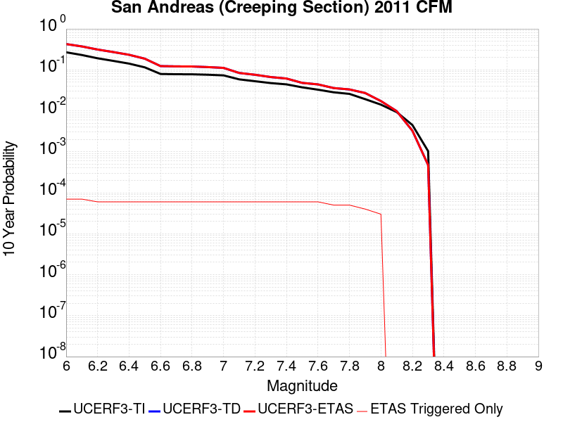 |

| Magnitude | 1 wk TI Prob | 1 wk TD Prob | 1 wk ETAS Prob | 1 wk ETAS/TD Gain | 1 wk ETAS Triggered Only | 1 mo TI Prob | 1 mo TD Prob | 1 mo ETAS Prob | 1 mo ETAS/TD Gain | 1 mo ETAS Triggered Only | 1 yr TI Prob | 1 yr TD Prob | 1 yr ETAS Prob | 1 yr ETAS/TD Gain | 1 yr ETAS Triggered Only | 10 yr TI Prob | 10 yr TD Prob | 10 yr ETAS Prob | 10 yr ETAS/TD Gain | 10 yr ETAS Triggered Only |
|-----|-----|-----|-----|-----|-----|-----|-----|-----|-----|-----|-----|-----|-----|-----|-----|-----|-----|-----|-----|-----|
| 6.0 | 5.986481E-4 | 0.0012283694 | 0.0012283694 | 1.0 | 0.0 | 0.0025631124 | 0.0052489 | 0.0052588475 | 1.0018952 | 1.0E-5 | 0.030762846 | 0.0612433 | 0.06128085 | 1.0006131 | 4.0E-5 | 0.26835477 | 0.42613262 | 0.4261728 | 1.0000943 | 7.0E-5 |
| 6.1 | 5.015945E-4 | 0.0010224528 | 0.0010224528 | 1.0 | 0.0 | 0.00214792 | 0.004370678 | 0.0043806345 | 1.002278 | 1.0E-5 | 0.025839351 | 0.051281016 | 0.051318966 | 1.00074 | 4.0E-5 | 0.23032776 | 0.37304714 | 0.37309104 | 1.0001177 | 7.0E-5 |
| 6.2 | 4.073338E-4 | 8.113644E-4 | 8.113644E-4 | 1.0 | 0.0 | 0.0017445484 | 0.003469895 | 0.0034798605 | 1.002872 | 1.0E-5 | 0.021034058 | 0.04096545 | 0.04099422 | 1.0007024 | 3.0E-5 | 0.19150782 | 0.3132385 | 0.3132797 | 1.0001315 | 6.0E-5 |
| 6.3 | 3.464099E-4 | 6.7455386E-4 | 6.7455386E-4 | 1.0 | 0.0 | 0.0014837692 | 0.0028857165 | 0.0028956875 | 1.0034554 | 1.0E-5 | 0.017915873 | 0.034222096 | 0.034251068 | 1.0008466 | 3.0E-5 | 0.16538359 | 0.27153394 | 0.27157766 | 1.0001609 | 6.0E-5 |
| 6.4 | 2.935057E-4 | 5.550652E-4 | 5.550652E-4 | 1.0 | 0.0 | 0.0012572751 | 0.0023752982 | 0.0023852743 | 1.0042 | 1.0E-5 | 0.015200248 | 0.028297324 | 0.028326474 | 1.0010302 | 3.0E-5 | 0.14201577 | 0.23321465 | 0.23326065 | 1.0001973 | 6.0E-5 |
| 6.5 | 2.3409708E-4 | 4.2157338E-4 | 4.2157338E-4 | 1.0 | 0.0 | 0.0010028875 | 0.0018047375 | 0.0018147194 | 1.005531 | 1.0E-5 | 0.012141965 | 0.021620525 | 0.021649877 | 1.0013576 | 3.0E-5 | 0.11499573 | 0.18706708 | 0.18711585 | 1.0002607 | 6.0E-5 |
| 6.6 | 1.5842178E-4 | 2.513374E-4 | 2.513374E-4 | 1.0 | 0.0 | 6.7877385E-4 | 0.0010767078 | 0.0010866971 | 1.0092776 | 1.0E-5 | 0.0082328 | 0.013028752 | 0.013058362 | 1.0022726 | 3.0E-5 | 0.07934396 | 0.12340782 | 0.12346041 | 1.0004262 | 6.0E-5 |
| 6.7 | 1.5616413E-4 | 2.4670165E-4 | 2.4670165E-4 | 1.0 | 0.0 | 6.691031E-4 | 0.001056859 | 0.0010668485 | 1.009452 | 1.0E-5 | 0.0081159435 | 0.01279055 | 0.012820166 | 1.0023155 | 3.0E-5 | 0.0782586 | 0.12143506 | 0.121487774 | 1.000434 | 6.0E-5 |
| 6.8 | 1.5538467E-4 | 2.44939E-4 | 2.44939E-4 | 1.0 | 0.0 | 6.6576427E-4 | 0.0010493114 | 0.0010593008 | 1.00952 | 1.0E-5 | 0.008075596 | 0.012699885 | 0.012729504 | 1.0023322 | 3.0E-5 | 0.07788358 | 0.120665684 | 0.12071845 | 1.0004373 | 6.0E-5 |
| 6.9 | 1.5153569E-4 | 2.360267E-4 | 2.360267E-4 | 1.0 | 0.0 | 6.49277E-4 | 0.0010111528 | 0.0010211427 | 1.0098797 | 1.0E-5 | 0.007876333 | 0.012241818 | 0.012271451 | 1.0024207 | 3.0E-5 | 0.07602952 | 0.116735 | 0.11678799 | 1.000454 | 6.0E-5 |
| 7.0 | 1.4588932E-4 | 2.2459262E-4 | 2.2459262E-4 | 1.0 | 0.0 | 6.250901E-4 | 9.6218666E-4 | 9.721771E-4 | 1.010383 | 1.0E-5 | 0.0075839474 | 0.0116522 | 0.01168185 | 1.0025446 | 3.0E-5 | 0.073302895 | 0.111580364 | 0.11163367 | 1.0004777 | 6.0E-5 |
| 7.1 | 1.1565079E-4 | 1.6334589E-4 | 1.6334589E-4 | 1.0 | 0.0 | 4.955521E-4 | 6.9986685E-4 | 7.098599E-4 | 1.0142784 | 1.0E-5 | 0.006016669 | 0.008487792 | 0.008517537 | 1.0035045 | 3.0E-5 | 0.058563538 | 0.083898365 | 0.083953336 | 1.0006552 | 6.0E-5 |
| 7.2 | 1.0393792E-4 | 1.4665617E-4 | 1.4665617E-4 | 1.0 | 0.0 | 4.4537216E-4 | 6.283758E-4 | 6.383695E-4 | 1.0159041 | 1.0E-5 | 0.005408933 | 0.0076238094 | 0.007653581 | 1.003905 | 3.0E-5 | 0.052791595 | 0.07583749 | 0.07589294 | 1.0007311 | 6.0E-5 |
| 7.3 | 9.332884E-5 | 1.2824149E-4 | 1.2824149E-4 | 1.0 | 0.0 | 3.999194E-4 | 5.4949126E-4 | 5.5948575E-4 | 1.0181886 | 1.0E-5 | 0.0048581534 | 0.0066696694 | 0.0066994694 | 1.004468 | 3.0E-5 | 0.047533102 | 0.06667591 | 0.066731915 | 1.0008398 | 6.0E-5 |
| 7.4 | 8.670252E-5 | 1.17418786E-4 | 1.17418786E-4 | 1.0 | 0.0 | 3.715293E-4 | 5.0312694E-4 | 5.131219E-4 | 1.0198658 | 1.0E-5 | 0.004513991 | 0.006108487 | 0.006138304 | 1.0048811 | 3.0E-5 | 0.044233937 | 0.061324738 | 0.061381057 | 1.0009184 | 6.0E-5 |
| 7.5 | 7.3036405E-5 | 9.0380476E-5 | 9.0380476E-5 | 1.0 | 0.0 | 3.129756E-4 | 3.872875E-4 | 3.972836E-4 | 1.0258106 | 1.0E-5 | 0.0038038217 | 0.004705052 | 0.004734911 | 1.0063461 | 3.0E-5 | 0.03739367 | 0.048030898 | 0.048088018 | 1.0011892 | 6.0E-5 |
| 7.6 | 6.3935775E-5 | 8.308337E-5 | 8.308337E-5 | 1.0 | 0.0 | 2.7398168E-4 | 3.5602305E-4 | 3.660195E-4 | 1.0280781 | 1.0E-5 | 0.0033306254 | 0.0043259845 | 0.004355855 | 1.0069048 | 3.0E-5 | 0.032811474 | 0.044124693 | 0.044182044 | 1.0012997 | 6.0E-5 |
| 7.7 | 5.5050095E-5 | 6.686551E-5 | 6.686551E-5 | 1.0 | 0.0 | 2.3590765E-4 | 2.8653504E-4 | 2.9653218E-4 | 1.0348897 | 1.0E-5 | 0.0028683927 | 0.0034829879 | 0.0035029182 | 1.0057222 | 2.0E-5 | 0.0283165 | 0.035915833 | 0.03596404 | 1.0013422 | 5.0E-5 |
| 7.8 | 5.027131E-5 | 6.1854465E-5 | 6.1854465E-5 | 1.0 | 0.0 | 2.1543067E-4 | 2.6506366E-4 | 2.75061E-4 | 1.0377167 | 1.0E-5 | 0.0026197135 | 0.003222378 | 0.0032423134 | 1.0061866 | 2.0E-5 | 0.025890453 | 0.033236537 | 0.033284876 | 1.0014544 | 5.0E-5 |
| 7.9 | 3.7271806E-5 | 5.040619E-5 | 5.040619E-5 | 1.0 | 0.0 | 1.5972654E-4 | 2.1600866E-4 | 2.260065E-4 | 1.0462844 | 1.0E-5 | 0.0019429359 | 0.0026267357 | 0.002646683 | 1.007594 | 2.0E-5 | 0.019260362 | 0.027156468 | 0.027195383 | 1.0014329 | 4.0E-5 |
| 8.0 | 2.7310243E-5 | 3.154783E-5 | 3.154783E-5 | 1.0 | 0.0 | 1.17038646E-4 | 1.3519799E-4 | 1.4519662E-4 | 1.0739557 | 1.0E-5 | 0.0014240141 | 0.0016447934 | 0.001654777 | 1.0060698 | 1.0E-5 | 0.014149235 | 0.017274685 | 0.017304167 | 1.0017066 | 3.0E-5 |
| 8.1 | 1.7940547E-5 | 1.7476797E-5 | 1.7476797E-5 | 1.0 | 0.0 | 7.688579E-5 | 7.489842E-5 | 7.489842E-5 | 1.0 | 0.0 | 9.3568244E-4 | 9.1150723E-4 | 9.1150723E-4 | 1.0 | 0.0 | 0.009317525 | 0.00983921 | 0.00983921 | 1.0 | 0.0 |
| 8.2 | 8.643924E-6 | 5.5050705E-6 | 5.5050705E-6 | 1.0 | 0.0 | 3.704486E-5 | 2.3592946E-5 | 2.3592946E-5 | 1.0 | 0.0 | 4.5092785E-4 | 2.8720635E-4 | 2.8720635E-4 | 1.0 | 0.0 | 0.0045001395 | 0.003265346 | 0.003265346 | 1.0 | 0.0 |
| 8.3 | 1.983087E-6 | 7.7071206E-7 | 7.7071206E-7 | 1.0 | 0.0 | 8.498917E-6 | 3.3030476E-6 | 3.3030476E-6 | 1.0 | 0.0 | 1.034694E-4 | 4.021388E-5 | 4.021388E-5 | 1.0 | 0.0 | 0.0010342124 | 4.7468478E-4 | 4.7468478E-4 | 1.0 | 0.0 |

## Cleghorn Lake
*[(top)](#table-of-contents)*

| 1 Week | 1 Month | 1 Year | 10 Year |
|-----|-----|-----|-----|
|  |  |  |  |

| Magnitude | 1 wk TI Prob | 1 wk TD Prob | 1 wk ETAS Prob | 1 wk ETAS/TD Gain | 1 wk ETAS Triggered Only | 1 mo TI Prob | 1 mo TD Prob | 1 mo ETAS Prob | 1 mo ETAS/TD Gain | 1 mo ETAS Triggered Only | 1 yr TI Prob | 1 yr TD Prob | 1 yr ETAS Prob | 1 yr ETAS/TD Gain | 1 yr ETAS Triggered Only | 10 yr TI Prob | 10 yr TD Prob | 10 yr ETAS Prob | 10 yr ETAS/TD Gain | 10 yr ETAS Triggered Only |
|-----|-----|-----|-----|-----|-----|-----|-----|-----|-----|-----|-----|-----|-----|-----|-----|-----|-----|-----|-----|-----|
| 6.0 | 1.5467183E-5 | 1.6795355E-5 | 1.6795355E-5 | 1.0 | 0.0 | 6.6286244E-5 | 7.1978415E-5 | 8.197769E-5 | 1.1389205 | 1.0E-5 | 8.067362E-4 | 8.7603973E-4 | 9.1600465E-4 | 1.0456201 | 4.0E-5 | 0.008038137 | 0.008731292 | 0.008790768 | 1.0068119 | 6.0E-5 |
| 6.1 | 1.5467183E-5 | 1.6795355E-5 | 1.6795355E-5 | 1.0 | 0.0 | 6.6286244E-5 | 7.1978415E-5 | 8.197769E-5 | 1.1389205 | 1.0E-5 | 8.067362E-4 | 8.7603973E-4 | 9.1600465E-4 | 1.0456201 | 4.0E-5 | 0.008038137 | 0.008731292 | 0.008790768 | 1.0068119 | 6.0E-5 |
| 6.2 | 1.2624631E-5 | 1.3682459E-5 | 1.3682459E-5 | 1.0 | 0.0 | 5.410444E-5 | 5.863807E-5 | 6.8637484E-5 | 1.1705277 | 1.0E-5 | 6.585225E-4 | 7.137333E-4 | 7.4371195E-4 | 1.0420026 | 3.0E-5 | 0.0065657445 | 0.0071192067 | 0.007168851 | 1.0069733 | 5.0E-5 |
| 6.3 | 1.2624631E-5 | 1.3682459E-5 | 1.3682459E-5 | 1.0 | 0.0 | 5.410444E-5 | 5.863807E-5 | 6.8637484E-5 | 1.1705277 | 1.0E-5 | 6.585225E-4 | 7.137333E-4 | 7.4371195E-4 | 1.0420026 | 3.0E-5 | 0.0065657445 | 0.0071192067 | 0.007168851 | 1.0069733 | 5.0E-5 |
| 6.4 | 9.417684E-6 | 1.0170767E-5 | 1.0170767E-5 | 1.0 | 0.0 | 4.036088E-5 | 4.3588505E-5 | 5.358807E-5 | 1.2294083 | 1.0E-5 | 4.912829E-4 | 5.3060194E-4 | 5.60586E-4 | 1.0565096 | 3.0E-5 | 0.004901982 | 0.005297387 | 0.005337175 | 1.0075109 | 4.0E-5 |
| 6.5 | 9.368219E-6 | 1.0118191E-5 | 1.0118191E-5 | 1.0 | 0.0 | 4.014889E-5 | 4.3363187E-5 | 5.3362754E-5 | 1.2306004 | 1.0E-5 | 4.8870314E-4 | 5.2786E-4 | 5.578442E-4 | 1.0568032 | 3.0E-5 | 0.004876298 | 0.005270098 | 0.005309887 | 1.00755 | 4.0E-5 |
| 6.6 | 7.803798E-6 | 8.442383E-6 | 8.442383E-6 | 1.0 | 0.0 | 3.3444423E-5 | 3.618136E-5 | 4.6181E-5 | 1.2763754 | 1.0E-5 | 4.0710976E-4 | 4.4045897E-4 | 4.6045016E-4 | 1.0453871 | 2.0E-5 | 0.0040636472 | 0.0043997774 | 0.0044296454 | 1.0067885 | 3.0E-5 |
| 6.7 | 2.3108669E-6 | 2.4439457E-6 | 2.4439457E-6 | 1.0 | 0.0 | 9.903678E-6 | 1.0474012E-5 | 1.0474012E-5 | 1.0 | 0.0 | 1.205706E-4 | 1.2751382E-4 | 1.2751382E-4 | 1.0 | 0.0 | 0.001205052 | 0.0012744252 | 0.0012744252 | 1.0 | 0.0 |
| 6.8 | 2.0882828E-6 | 2.2063814E-6 | 2.2063814E-6 | 1.0 | 0.0 | 8.949753E-6 | 9.455887E-6 | 9.455887E-6 | 1.0 | 0.0 | 1.08957785E-4 | 1.1511952E-4 | 1.1511952E-4 | 1.0 | 0.0 | 0.0010890438 | 0.0011506156 | 0.0011506156 | 1.0 | 0.0 |
| 6.9 | 1.876935E-6 | 1.9811384E-6 | 1.9811384E-6 | 1.0 | 0.0 | 8.043982E-6 | 8.490567E-6 | 8.490567E-6 | 1.0 | 0.0 | 9.7931086E-5 | 1.0336791E-4 | 1.0336791E-4 | 1.0 | 0.0 | 9.788794E-4 | 0.0010332143 | 0.0010332143 | 1.0 | 0.0 |
| 7.0 | 1.5357559E-6 | 1.6203517E-6 | 1.6203517E-6 | 1.0 | 0.0 | 6.5817944E-6 | 6.9443468E-6 | 6.9443468E-6 | 1.0 | 0.0 | 8.01304E-5 | 8.454427E-5 | 8.454427E-5 | 1.0 | 0.0 | 8.010151E-4 | 8.451335E-4 | 8.451335E-4 | 1.0 | 0.0 |
| 7.1 | 1.0905424E-6 | 1.1498116E-6 | 1.1498116E-6 | 1.0 | 0.0 | 4.6737446E-6 | 4.9277555E-6 | 4.9277555E-6 | 1.0 | 0.0 | 5.6901354E-5 | 5.9993872E-5 | 5.9993872E-5 | 1.0 | 0.0 | 5.6886784E-4 | 5.997865E-4 | 5.997865E-4 | 1.0 | 0.0 |
| 7.2 | 6.06668E-7 | 6.387546E-7 | 6.387546E-7 | 1.0 | 0.0 | 2.600003E-6 | 2.7375172E-6 | 2.7375172E-6 | 1.0 | 0.0 | 3.1654577E-5 | 3.3328834E-5 | 3.3328834E-5 | 1.0 | 0.0 | 3.1650066E-4 | 3.332452E-4 | 3.332452E-4 | 1.0 | 0.0 |

## Rose Canyon
*[(top)](#table-of-contents)*

| 1 Week | 1 Month | 1 Year | 10 Year |
|-----|-----|-----|-----|
|  |  |  |  |

| Magnitude | 1 wk TI Prob | 1 wk TD Prob | 1 wk ETAS Prob | 1 wk ETAS/TD Gain | 1 wk ETAS Triggered Only | 1 mo TI Prob | 1 mo TD Prob | 1 mo ETAS Prob | 1 mo ETAS/TD Gain | 1 mo ETAS Triggered Only | 1 yr TI Prob | 1 yr TD Prob | 1 yr ETAS Prob | 1 yr ETAS/TD Gain | 1 yr ETAS Triggered Only | 10 yr TI Prob | 10 yr TD Prob | 10 yr ETAS Prob | 10 yr ETAS/TD Gain | 10 yr ETAS Triggered Only |
|-----|-----|-----|-----|-----|-----|-----|-----|-----|-----|-----|-----|-----|-----|-----|-----|-----|-----|-----|-----|-----|
| 6.0 | 4.5923203E-5 | 4.9787865E-5 | 4.9787865E-5 | 1.0 | 0.0 | 1.9679888E-4 | 2.1335983E-4 | 2.233577E-4 | 1.0468591 | 1.0E-5 | 0.0023933933 | 0.0025947653 | 0.0026346615 | 1.0153756 | 4.0E-5 | 0.023677798 | 0.025678096 | 0.025736555 | 1.0022767 | 6.0E-5 |
| 6.1 | 4.5923203E-5 | 4.9787865E-5 | 4.9787865E-5 | 1.0 | 0.0 | 1.9679888E-4 | 2.1335983E-4 | 2.233577E-4 | 1.0468591 | 1.0E-5 | 0.0023933933 | 0.0025947653 | 0.0026246875 | 1.0115317 | 3.0E-5 | 0.023677798 | 0.025678096 | 0.025726812 | 1.0018972 | 5.0E-5 |
| 6.2 | 2.8844734E-5 | 2.9737337E-5 | 2.9737337E-5 | 1.0 | 0.0 | 1.2361443E-4 | 1.274397E-4 | 1.3743843E-4 | 1.0784584 | 1.0E-5 | 0.0015039665 | 0.0015505038 | 0.0015804573 | 1.0193186 | 3.0E-5 | 0.0149382865 | 0.015408007 | 0.015457237 | 1.003195 | 5.0E-5 |
| 6.3 | 2.3171577E-5 | 2.3228815E-5 | 2.3228815E-5 | 1.0 | 0.0 | 9.9302975E-5 | 9.954834E-5 | 9.954834E-5 | 1.0 | 0.0 | 0.0012083431 | 0.0012113407 | 0.0012313165 | 1.0164906 | 2.0E-5 | 0.012017938 | 0.012054382 | 0.0120939 | 1.0032783 | 4.0E-5 |
| 6.4 | 2.0066604E-5 | 1.9708272E-5 | 1.9708272E-5 | 1.0 | 0.0 | 8.599689E-5 | 8.4461346E-5 | 8.4461346E-5 | 1.0 | 0.0 | 0.0010465092 | 0.0010278419 | 0.0010478214 | 1.0194383 | 2.0E-5 | 0.010415946 | 0.010232503 | 0.010272094 | 1.003869 | 4.0E-5 |
| 6.5 | 1.776989E-5 | 1.7138003E-5 | 1.7138003E-5 | 1.0 | 0.0 | 7.615444E-5 | 7.3446565E-5 | 7.3446565E-5 | 1.0 | 0.0 | 9.267859E-4 | 8.9385203E-4 | 9.038431E-4 | 1.0111775 | 1.0E-5 | 0.009229303 | 0.008904372 | 0.008934106 | 1.0033392 | 3.0E-5 |
| 6.6 | 1.5227364E-5 | 1.4347348E-5 | 1.4347348E-5 | 1.0 | 0.0 | 6.52585E-5 | 6.148722E-5 | 6.148722E-5 | 1.0 | 0.0 | 7.942326E-4 | 7.4835494E-4 | 7.5834745E-4 | 1.0133526 | 1.0E-5 | 0.007914 | 0.0074501596 | 0.007470011 | 1.0026644 | 2.0E-5 |
| 6.7 | 1.2703898E-5 | 1.167489E-5 | 1.167489E-5 | 1.0 | 0.0 | 5.4444143E-5 | 5.0034305E-5 | 5.0034305E-5 | 1.0 | 0.0 | 6.626558E-4 | 6.090016E-4 | 6.189956E-4 | 1.0164104 | 1.0E-5 | 0.006606833 | 0.006065778 | 0.006075717 | 1.0016387 | 1.0E-5 |
| 6.8 | 1.1554917E-5 | 1.0610913E-5 | 1.0610913E-5 | 1.0 | 0.0 | 4.9520135E-5 | 4.547457E-5 | 4.547457E-5 | 1.0 | 0.0 | 6.0274085E-4 | 5.535163E-4 | 5.6351075E-4 | 1.0180563 | 1.0E-5 | 0.0060110865 | 0.005507936 | 0.005517881 | 1.0018055 | 1.0E-5 |
| 6.9 | 8.732078E-6 | 7.882672E-6 | 7.882672E-6 | 1.0 | 0.0 | 3.7422655E-5 | 3.378246E-5 | 3.378246E-5 | 1.0 | 0.0 | 4.5552556E-4 | 4.1122676E-4 | 4.2122265E-4 | 1.0243075 | 1.0E-5 | 0.0045459294 | 0.004089716 | 0.004099675 | 1.0024352 | 1.0E-5 |
| 7.0 | 5.9337494E-6 | 5.107711E-6 | 5.107711E-6 | 1.0 | 0.0 | 2.5430107E-5 | 2.1890006E-5 | 2.1890006E-5 | 1.0 | 0.0 | 3.0956755E-4 | 2.6647837E-4 | 2.764757E-4 | 1.0375165 | 1.0E-5 | 0.0030913667 | 0.002661604 | 0.0026715773 | 1.0037471 | 1.0E-5 |
| 7.1 | 5.013409E-6 | 4.1775597E-6 | 4.1775597E-6 | 1.0 | 0.0 | 2.1485863E-5 | 1.7903705E-5 | 1.7903705E-5 | 1.0 | 0.0 | 2.6155898E-4 | 2.1795592E-4 | 2.1795592E-4 | 1.0 | 0.0 | 0.0026125133 | 0.002177433 | 0.002177433 | 1.0 | 0.0 |
| 7.2 | 4.120763E-6 | 3.2822693E-6 | 3.2822693E-6 | 1.0 | 0.0 | 1.7660293E-5 | 1.40667935E-5 | 1.40667935E-5 | 1.0 | 0.0 | 2.1499286E-4 | 1.7124983E-4 | 1.7124983E-4 | 1.0 | 0.0 | 0.0021478499 | 0.0017111882 | 0.0017111882 | 1.0 | 0.0 |
| 7.3 | 3.2081239E-6 | 2.4406245E-6 | 2.4406245E-6 | 1.0 | 0.0 | 1.374903E-5 | 1.0459778E-5 | 1.0459778E-5 | 1.0 | 0.0 | 1.6738157E-4 | 1.2734042E-4 | 1.2734042E-4 | 1.0 | 0.0 | 0.0016725556 | 0.0012726815 | 0.0012726815 | 1.0 | 0.0 |
| 7.4 | 2.4194755E-6 | 1.7681252E-6 | 1.7681252E-6 | 1.0 | 0.0 | 1.0369139E-5 | 7.5776575E-6 | 7.5776575E-6 | 1.0 | 0.0 | 1.2623696E-4 | 9.225413E-5 | 9.225413E-5 | 1.0 | 0.0 | 0.0012616527 | 9.2216366E-4 | 9.2216366E-4 | 1.0 | 0.0 |
| 7.5 | 1.3842889E-6 | 9.378841E-7 | 9.378841E-7 | 1.0 | 0.0 | 5.9326535E-6 | 4.0194973E-6 | 4.0194973E-6 | 1.0 | 0.0 | 7.222766E-5 | 4.893632E-5 | 4.893632E-5 | 1.0 | 0.0 | 7.220419E-4 | 4.8925896E-4 | 4.8925896E-4 | 1.0 | 0.0 |
| 7.6 | 1.0021575E-6 | 6.4118E-7 | 6.4118E-7 | 1.0 | 0.0 | 4.2949537E-6 | 2.7479116E-6 | 2.7479116E-6 | 1.0 | 0.0 | 5.2289808E-5 | 3.345533E-5 | 3.345533E-5 | 1.0 | 0.0 | 5.2277505E-4 | 3.3450508E-4 | 3.3450508E-4 | 1.0 | 0.0 |
| 7.7 | 8.7620116E-8 | 6.44954E-8 | 6.44954E-8 | 1.0 | 0.0 | 3.7551473E-7 | 2.7640883E-7 | 2.7640883E-7 | 1.0 | 0.0 | 4.5718825E-6 | 3.3652725E-6 | 3.3652725E-6 | 1.0 | 0.0 | 4.5717883E-5 | 3.3652246E-5 | 3.3652246E-5 | 1.0 | 0.0 |

## Red Mountain
*[(top)](#table-of-contents)*

| 1 Week | 1 Month | 1 Year | 10 Year |
|-----|-----|-----|-----|
|  |  | 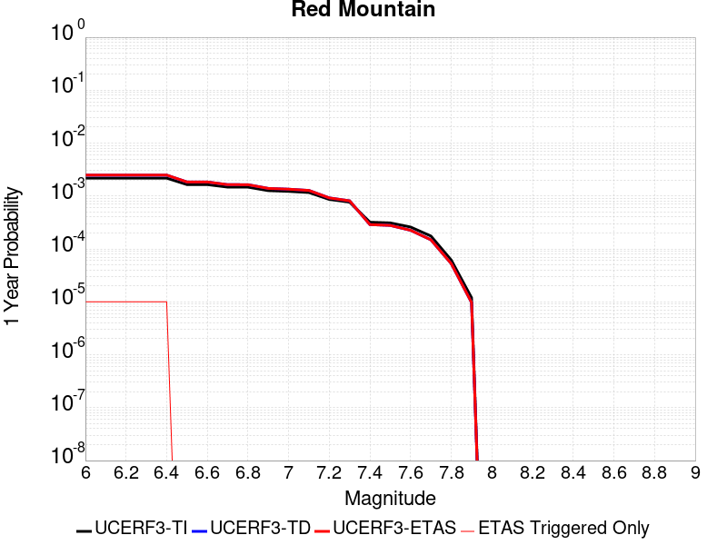 |  |

| Magnitude | 1 wk TI Prob | 1 wk TD Prob | 1 wk ETAS Prob | 1 wk ETAS/TD Gain | 1 wk ETAS Triggered Only | 1 mo TI Prob | 1 mo TD Prob | 1 mo ETAS Prob | 1 mo ETAS/TD Gain | 1 mo ETAS Triggered Only | 1 yr TI Prob | 1 yr TD Prob | 1 yr ETAS Prob | 1 yr ETAS/TD Gain | 1 yr ETAS Triggered Only | 10 yr TI Prob | 10 yr TD Prob | 10 yr ETAS Prob | 10 yr ETAS/TD Gain | 10 yr ETAS Triggered Only |
|-----|-----|-----|-----|-----|-----|-----|-----|-----|-----|-----|-----|-----|-----|-----|-----|-----|-----|-----|-----|-----|
| 6.0 | 4.1810763E-5 | 4.759638E-5 | 4.759638E-5 | 1.0 | 0.0 | 1.7917668E-4 | 2.0396947E-4 | 2.0396947E-4 | 1.0 | 0.0 | 0.0021792934 | 0.0024806648 | 0.00249064 | 1.0040212 | 1.0E-5 | 0.021580452 | 0.024547353 | 0.024605881 | 1.0023843 | 6.0E-5 |
| 6.1 | 4.1810763E-5 | 4.759638E-5 | 4.759638E-5 | 1.0 | 0.0 | 1.7917668E-4 | 2.0396947E-4 | 2.0396947E-4 | 1.0 | 0.0 | 0.0021792934 | 0.0024806648 | 0.00249064 | 1.0040212 | 1.0E-5 | 0.021580452 | 0.024547353 | 0.024605881 | 1.0023843 | 6.0E-5 |
| 6.2 | 4.1810763E-5 | 4.759638E-5 | 4.759638E-5 | 1.0 | 0.0 | 1.7917668E-4 | 2.0396947E-4 | 2.0396947E-4 | 1.0 | 0.0 | 0.0021792934 | 0.0024806648 | 0.00249064 | 1.0040212 | 1.0E-5 | 0.021580452 | 0.024547353 | 0.024605881 | 1.0023843 | 6.0E-5 |
| 6.3 | 4.1810763E-5 | 4.759638E-5 | 4.759638E-5 | 1.0 | 0.0 | 1.7917668E-4 | 2.0396947E-4 | 2.0396947E-4 | 1.0 | 0.0 | 0.0021792934 | 0.0024806648 | 0.00249064 | 1.0040212 | 1.0E-5 | 0.021580452 | 0.024547353 | 0.024605881 | 1.0023843 | 6.0E-5 |
| 6.4 | 4.1810763E-5 | 4.759638E-5 | 4.759638E-5 | 1.0 | 0.0 | 1.7917668E-4 | 2.0396947E-4 | 2.0396947E-4 | 1.0 | 0.0 | 0.0021792934 | 0.0024806648 | 0.00249064 | 1.0040212 | 1.0E-5 | 0.021580452 | 0.024547353 | 0.024605881 | 1.0023843 | 6.0E-5 |
| 6.5 | 3.154503E-5 | 3.536426E-5 | 3.536426E-5 | 1.0 | 0.0 | 1.3518598E-4 | 1.5155283E-4 | 1.5155283E-4 | 1.0 | 0.0 | 0.0016446467 | 0.0018436863 | 0.0018436863 | 1.0 | 0.0 | 0.01632528 | 0.018293554 | 0.018332822 | 1.0021466 | 4.0E-5 |
| 6.6 | 3.1535834E-5 | 3.535364E-5 | 3.535364E-5 | 1.0 | 0.0 | 1.3514658E-4 | 1.5150732E-4 | 1.5150732E-4 | 1.0 | 0.0 | 0.0016441676 | 0.0018431332 | 0.0018431332 | 1.0 | 0.0 | 0.01632056 | 0.018288113 | 0.018327383 | 1.0021472 | 4.0E-5 |
| 6.7 | 2.8267326E-5 | 3.147328E-5 | 3.147328E-5 | 1.0 | 0.0 | 1.2114006E-4 | 1.34879E-4 | 1.34879E-4 | 1.0 | 0.0 | 0.0014738824 | 0.0016409998 | 0.0016409998 | 1.0 | 0.0 | 0.014641452 | 0.016297588 | 0.016317263 | 1.0012072 | 2.0E-5 |
| 6.8 | 2.8212884E-5 | 3.141116E-5 | 3.141116E-5 | 1.0 | 0.0 | 1.20906756E-4 | 1.3461278E-4 | 1.3461278E-4 | 1.0 | 0.0 | 0.0014710457 | 0.0016377637 | 0.0016377637 | 1.0 | 0.0 | 0.014613459 | 0.016265702 | 0.016285377 | 1.0012096 | 2.0E-5 |
| 6.9 | 2.4227871E-5 | 2.671024E-5 | 2.671024E-5 | 1.0 | 0.0 | 1.03829596E-4 | 1.1446786E-4 | 1.1446786E-4 | 1.0 | 0.0 | 0.0012633923 | 0.0013928312 | 0.0013928312 | 1.0 | 0.0 | 0.012562336 | 0.013848706 | 0.013858568 | 1.000712 | 1.0E-5 |
| 7.0 | 2.348524E-5 | 2.5838905E-5 | 2.5838905E-5 | 1.0 | 0.0 | 1.0064714E-4 | 1.1073388E-4 | 1.1073388E-4 | 1.0 | 0.0 | 0.0012246901 | 0.0013474269 | 0.0013474269 | 1.0 | 0.0 | 0.012179627 | 0.013400209 | 0.013410075 | 1.0007362 | 1.0E-5 |
| 7.1 | 2.2311642E-5 | 2.4465784E-5 | 2.4465784E-5 | 1.0 | 0.0 | 9.561782E-5 | 1.0484957E-4 | 1.0484957E-4 | 1.0 | 0.0 | 0.0011635252 | 0.0012758707 | 0.0012758707 | 1.0 | 0.0 | 0.01157452 | 0.012692976 | 0.012702849 | 1.0007778 | 1.0E-5 |
| 7.2 | 1.6533986E-5 | 1.7672352E-5 | 1.7672352E-5 | 1.0 | 0.0 | 7.085802E-5 | 7.57368E-5 | 7.57368E-5 | 1.0 | 0.0 | 8.623549E-4 | 9.21769E-4 | 9.21769E-4 | 1.0 | 0.0 | 0.008590161 | 0.009185737 | 0.009195645 | 1.0010786 | 1.0E-5 |
| 7.3 | 1.4703092E-5 | 1.5561265E-5 | 1.5561265E-5 | 1.0 | 0.0 | 6.301173E-5 | 6.668978E-5 | 6.668978E-5 | 1.0 | 0.0 | 7.668978E-4 | 8.117073E-4 | 8.117073E-4 | 1.0 | 0.0 | 0.0076425658 | 0.0080935005 | 0.00810342 | 1.0012256 | 1.0E-5 |
| 7.4 | 6.1331984E-6 | 5.529252E-6 | 5.529252E-6 | 1.0 | 0.0 | 2.6284872E-5 | 2.3696583E-5 | 2.3696583E-5 | 1.0 | 0.0 | 3.199713E-4 | 2.8846823E-4 | 2.8846823E-4 | 1.0 | 0.0 | 0.0031951098 | 0.0028809924 | 0.0028809924 | 1.0 | 0.0 |
| 7.5 | 5.954766E-6 | 5.338869E-6 | 5.338869E-6 | 1.0 | 0.0 | 2.5520176E-5 | 2.288067E-5 | 2.288067E-5 | 1.0 | 0.0 | 3.1066386E-4 | 2.7853707E-4 | 2.7853707E-4 | 1.0 | 0.0 | 0.003102299 | 0.0027819336 | 0.0027819336 | 1.0 | 0.0 |
| 7.6 | 4.9726646E-6 | 4.3155983E-6 | 4.3155983E-6 | 1.0 | 0.0 | 2.1311245E-5 | 1.8495293E-5 | 1.8495293E-5 | 1.0 | 0.0 | 2.5943352E-4 | 2.2515726E-4 | 2.2515726E-4 | 1.0 | 0.0 | 0.0025913084 | 0.002249326 | 0.002249326 | 1.0 | 0.0 |
| 7.7 | 3.3613894E-6 | 2.8528698E-6 | 2.8528698E-6 | 1.0 | 0.0 | 1.4405875E-5 | 1.2226529E-5 | 1.2226529E-5 | 1.0 | 0.0 | 1.7537741E-4 | 1.4884808E-4 | 1.4884808E-4 | 1.0 | 0.0 | 0.0017523908 | 0.0014875102 | 0.0014875102 | 1.0 | 0.0 |
| 7.8 | 1.1828961E-6 | 1.0123434E-6 | 1.0123434E-6 | 1.0 | 0.0 | 5.069545E-6 | 4.3386076E-6 | 4.3386076E-6 | 1.0 | 0.0 | 6.171996E-5 | 5.28213E-5 | 5.28213E-5 | 1.0 | 0.0 | 6.170282E-4 | 5.280904E-4 | 5.280904E-4 | 1.0 | 0.0 |
| 7.9 | 2.2967266E-7 | 1.862007E-7 | 1.862007E-7 | 1.0 | 0.0 | 9.843111E-7 | 7.9800276E-7 | 7.9800276E-7 | 1.0 | 0.0 | 1.19839215E-5 | 9.7156435E-6 | 9.7156435E-6 | 1.0 | 0.0 | 1.1983275E-4 | 9.715247E-5 | 9.715247E-5 | 1.0 | 0.0 |

## Kern Canyon (South Kern) 2011
*[(top)](#table-of-contents)*

| 1 Week | 1 Month | 1 Year | 10 Year |
|-----|-----|-----|-----|
|  |  |  |  |

| Magnitude | 1 wk TI Prob | 1 wk TD Prob | 1 wk ETAS Prob | 1 wk ETAS/TD Gain | 1 wk ETAS Triggered Only | 1 mo TI Prob | 1 mo TD Prob | 1 mo ETAS Prob | 1 mo ETAS/TD Gain | 1 mo ETAS Triggered Only | 1 yr TI Prob | 1 yr TD Prob | 1 yr ETAS Prob | 1 yr ETAS/TD Gain | 1 yr ETAS Triggered Only | 10 yr TI Prob | 10 yr TD Prob | 10 yr ETAS Prob | 10 yr ETAS/TD Gain | 10 yr ETAS Triggered Only |
|-----|-----|-----|-----|-----|-----|-----|-----|-----|-----|-----|-----|-----|-----|-----|-----|-----|-----|-----|-----|-----|
| 6.0 | 4.105075E-6 | 4.113788E-6 | 1.4113746E-5 | 3.4308398 | 1.0E-5 | 1.7593058E-5 | 1.7630404E-5 | 2.7630227E-5 | 1.567192 | 1.0E-5 | 2.1417443E-4 | 2.1462966E-4 | 2.4462322E-4 | 1.1397456 | 3.0E-5 | 0.0021396813 | 0.0021442876 | 0.0022141375 | 1.0325749 | 7.0E-5 |
| 6.1 | 4.105075E-6 | 4.113788E-6 | 1.4113746E-5 | 3.4308398 | 1.0E-5 | 1.7593058E-5 | 1.7630404E-5 | 2.7630227E-5 | 1.567192 | 1.0E-5 | 2.1417443E-4 | 2.1462966E-4 | 2.4462322E-4 | 1.1397456 | 3.0E-5 | 0.0021396813 | 0.0021442876 | 0.0022141375 | 1.0325749 | 7.0E-5 |
| 6.2 | 4.105075E-6 | 4.113788E-6 | 1.4113746E-5 | 3.4308398 | 1.0E-5 | 1.7593058E-5 | 1.7630404E-5 | 2.7630227E-5 | 1.567192 | 1.0E-5 | 2.1417443E-4 | 2.1462966E-4 | 2.4462322E-4 | 1.1397456 | 3.0E-5 | 0.0021396813 | 0.0021442876 | 0.0022141375 | 1.0325749 | 7.0E-5 |
| 6.3 | 4.105075E-6 | 4.113788E-6 | 1.4113746E-5 | 3.4308398 | 1.0E-5 | 1.7593058E-5 | 1.7630404E-5 | 2.7630227E-5 | 1.567192 | 1.0E-5 | 2.1417443E-4 | 2.1462966E-4 | 2.4462322E-4 | 1.1397456 | 3.0E-5 | 0.0021396813 | 0.0021442876 | 0.0022141375 | 1.0325749 | 7.0E-5 |
| 6.4 | 4.105075E-6 | 4.113788E-6 | 1.4113746E-5 | 3.4308398 | 1.0E-5 | 1.7593058E-5 | 1.7630404E-5 | 2.7630227E-5 | 1.567192 | 1.0E-5 | 2.1417443E-4 | 2.1462966E-4 | 2.4462322E-4 | 1.1397456 | 3.0E-5 | 0.0021396813 | 0.0021442876 | 0.0022141375 | 1.0325749 | 7.0E-5 |
| 6.5 | 2.9849807E-6 | 2.9731993E-6 | 1.297317E-5 | 4.36337 | 1.0E-5 | 1.2792712E-5 | 1.2742222E-5 | 2.2742095E-5 | 1.7847825 | 1.0E-5 | 1.5574014E-4 | 1.5512566E-4 | 1.85121E-4 | 1.1933616 | 3.0E-5 | 0.0015563103 | 0.0015501889 | 0.0016200804 | 1.0450858 | 7.0E-5 |
| 6.6 | 2.9849807E-6 | 2.9731993E-6 | 1.297317E-5 | 4.36337 | 1.0E-5 | 1.2792712E-5 | 1.2742222E-5 | 2.2742095E-5 | 1.7847825 | 1.0E-5 | 1.5574014E-4 | 1.5512566E-4 | 1.85121E-4 | 1.1933616 | 3.0E-5 | 0.0015563103 | 0.0015501889 | 0.0016200804 | 1.0450858 | 7.0E-5 |
| 6.7 | 2.6756725E-6 | 2.6582609E-6 | 1.26582345E-5 | 4.761848 | 1.0E-5 | 1.1467117E-5 | 1.1392498E-5 | 2.1392383E-5 | 1.8777606 | 1.0E-5 | 1.396032E-4 | 1.3869494E-4 | 1.6869078E-4 | 1.216272 | 3.0E-5 | 0.0013951553 | 0.0013860947 | 0.0014460116 | 1.0432271 | 6.0E-5 |
| 6.8 | 2.3283721E-6 | 2.304814E-6 | 1.2304791E-5 | 5.338735 | 1.0E-5 | 9.9787E-6 | 9.877737E-6 | 1.9877638E-5 | 2.0123677 | 1.0E-5 | 1.214839E-4 | 1.2025489E-4 | 1.5025128E-4 | 1.2494401 | 3.0E-5 | 0.001214175 | 0.0012019057 | 0.0012518455 | 1.0415506 | 5.0E-5 |
| 6.9 | 2.0972677E-6 | 2.069673E-6 | 1.2069652E-5 | 5.831671 | 1.0E-5 | 8.988259E-6 | 8.869997E-6 | 1.8869909E-5 | 2.127386 | 1.0E-5 | 1.0942656E-4 | 1.07986925E-4 | 1.2798476E-4 | 1.1851876 | 2.0E-5 | 0.0010937268 | 0.0010793504 | 0.0011193071 | 1.0370194 | 4.0E-5 |
| 7.0 | 1.7132242E-6 | 1.6787299E-6 | 1.1678713E-5 | 6.9568744 | 1.0E-5 | 7.3423685E-6 | 7.194537E-6 | 1.7194465E-5 | 2.3899336 | 1.0E-5 | 8.938967E-5 | 8.759001E-5 | 1.07588254E-4 | 1.2283165 | 2.0E-5 | 8.935372E-4 | 8.7555865E-4 | 9.155237E-4 | 1.0456451 | 4.0E-5 |
| 7.1 | 1.4215541E-6 | 1.3815971E-6 | 1.1381583E-5 | 8.23799 | 1.0E-5 | 6.0923603E-6 | 5.921117E-6 | 1.5921058E-5 | 2.6888604 | 1.0E-5 | 7.417196E-5 | 7.208724E-5 | 9.20858E-5 | 1.2774216 | 2.0E-5 | 7.414721E-4 | 7.206413E-4 | 7.606125E-4 | 1.0554662 | 4.0E-5 |
| 7.2 | 9.097853E-7 | 8.603918E-7 | 1.0860384E-5 | 12.6226015 | 1.0E-5 | 3.899074E-6 | 3.6873882E-6 | 1.3687351E-5 | 3.7119365 | 1.0E-5 | 4.7470192E-5 | 4.489304E-5 | 6.489214E-5 | 1.4454833 | 2.0E-5 | 4.7460053E-4 | 4.488408E-4 | 4.788273E-4 | 1.0668088 | 3.0E-5 |
| 7.3 | 6.144169E-7 | 5.6283034E-7 | 5.6283034E-7 | 1.0 | 0.0 | 2.6332125E-6 | 2.4121277E-6 | 2.4121277E-6 | 1.0 | 0.0 | 3.205889E-5 | 2.9367266E-5 | 3.9366972E-5 | 1.3405052 | 1.0E-5 | 3.2054266E-4 | 2.9363437E-4 | 3.136285E-4 | 1.0680919 | 2.0E-5 |
| 7.4 | 4.049844E-7 | 3.5728962E-7 | 3.5728962E-7 | 1.0 | 0.0 | 1.7356463E-6 | 1.5312404E-6 | 1.5312404E-6 | 1.0 | 0.0 | 2.1131287E-5 | 1.8642695E-5 | 2.8642507E-5 | 1.5363932 | 1.0E-5 | 2.1129279E-4 | 1.8641156E-4 | 2.0640783E-4 | 1.1072695 | 2.0E-5 |
| 7.5 | 1.9871162E-7 | 1.5830766E-7 | 1.5830766E-7 | 1.0 | 0.0 | 8.5162094E-7 | 6.784612E-7 | 6.784612E-7 | 1.0 | 0.0 | 1.0368436E-5 | 8.260235E-6 | 8.260235E-6 | 1.0 | 0.0 | 1.0367952E-4 | 8.259936E-5 | 8.259936E-5 | 1.0 | 0.0 |
| 7.6 | 2.572245E-8 | 1.735308E-8 | 1.735308E-8 | 1.0 | 0.0 | 1.10239064E-7 | 7.437034E-8 | 7.437034E-8 | 1.0 | 0.0 | 1.3421597E-6 | 9.054586E-7 | 9.054586E-7 | 1.0 | 0.0 | 1.3421517E-5 | 9.0545545E-6 | 9.0545545E-6 | 1.0 | 0.0 |

## Kern Canyon (Lake Isabella) 2011
*[(top)](#table-of-contents)*

| 1 Week | 1 Month | 1 Year | 10 Year |
|-----|-----|-----|-----|
|  |  |  |  |

| Magnitude | 1 wk TI Prob | 1 wk TD Prob | 1 wk ETAS Prob | 1 wk ETAS/TD Gain | 1 wk ETAS Triggered Only | 1 mo TI Prob | 1 mo TD Prob | 1 mo ETAS Prob | 1 mo ETAS/TD Gain | 1 mo ETAS Triggered Only | 1 yr TI Prob | 1 yr TD Prob | 1 yr ETAS Prob | 1 yr ETAS/TD Gain | 1 yr ETAS Triggered Only | 10 yr TI Prob | 10 yr TD Prob | 10 yr ETAS Prob | 10 yr ETAS/TD Gain | 10 yr ETAS Triggered Only |
|-----|-----|-----|-----|-----|-----|-----|-----|-----|-----|-----|-----|-----|-----|-----|-----|-----|-----|-----|-----|-----|
| 6.0 | 4.2387383E-6 | 4.001707E-6 | 4.001707E-6 | 1.0 | 0.0 | 1.8165894E-5 | 1.715007E-5 | 1.715007E-5 | 1.0 | 0.0 | 2.2114732E-4 | 2.0878397E-4 | 2.287798E-4 | 1.0957727 | 2.0E-5 | 0.0022092736 | 0.002086062 | 0.002145937 | 1.0287024 | 6.0E-5 |
| 6.1 | 4.2387383E-6 | 4.001707E-6 | 4.001707E-6 | 1.0 | 0.0 | 1.8165894E-5 | 1.715007E-5 | 1.715007E-5 | 1.0 | 0.0 | 2.2114732E-4 | 2.0878397E-4 | 2.287798E-4 | 1.0957727 | 2.0E-5 | 0.0022092736 | 0.002086062 | 0.002145937 | 1.0287024 | 6.0E-5 |
| 6.2 | 4.2387383E-6 | 4.001707E-6 | 4.001707E-6 | 1.0 | 0.0 | 1.8165894E-5 | 1.715007E-5 | 1.715007E-5 | 1.0 | 0.0 | 2.2114732E-4 | 2.0878397E-4 | 2.287798E-4 | 1.0957727 | 2.0E-5 | 0.0022092736 | 0.002086062 | 0.002145937 | 1.0287024 | 6.0E-5 |
| 6.3 | 4.2387383E-6 | 4.001707E-6 | 4.001707E-6 | 1.0 | 0.0 | 1.8165894E-5 | 1.715007E-5 | 1.715007E-5 | 1.0 | 0.0 | 2.2114732E-4 | 2.0878397E-4 | 2.287798E-4 | 1.0957727 | 2.0E-5 | 0.0022092736 | 0.002086062 | 0.002145937 | 1.0287024 | 6.0E-5 |
| 6.4 | 4.2387383E-6 | 4.001707E-6 | 4.001707E-6 | 1.0 | 0.0 | 1.8165894E-5 | 1.715007E-5 | 1.715007E-5 | 1.0 | 0.0 | 2.2114732E-4 | 2.0878397E-4 | 2.287798E-4 | 1.0957727 | 2.0E-5 | 0.0022092736 | 0.002086062 | 0.002145937 | 1.0287024 | 6.0E-5 |
| 6.5 | 2.7857532E-6 | 2.5179102E-6 | 2.5179102E-6 | 1.0 | 0.0 | 1.1938888E-5 | 1.0791001E-5 | 1.0791001E-5 | 1.0 | 0.0 | 1.4534626E-4 | 1.3137284E-4 | 1.4137154E-4 | 1.0761093 | 1.0E-5 | 0.0014525123 | 0.0013129846 | 0.0013429452 | 1.0228187 | 3.0E-5 |
| 6.6 | 2.2233348E-6 | 1.9441577E-6 | 1.9441577E-6 | 1.0 | 0.0 | 9.528543E-6 | 8.332078E-6 | 8.332078E-6 | 1.0 | 0.0 | 1.1600384E-4 | 1.0143842E-4 | 1.114374E-4 | 1.098572 | 1.0E-5 | 0.001159433 | 0.0010139297 | 0.0010438993 | 1.0295578 | 3.0E-5 |
| 6.7 | 2.1635126E-6 | 1.883537E-6 | 1.883537E-6 | 1.0 | 0.0 | 9.272164E-6 | 8.072277E-6 | 8.072277E-6 | 1.0 | 0.0 | 1.1288274E-4 | 9.8275625E-5 | 1.0827464E-4 | 1.1017447 | 1.0E-5 | 0.0011282542 | 9.823298E-4 | 0.0010123003 | 1.0305096 | 3.0E-5 |
| 6.8 | 1.8685711E-6 | 1.5831715E-6 | 1.5831715E-6 | 1.0 | 0.0 | 8.008137E-6 | 6.7850037E-6 | 6.7850037E-6 | 1.0 | 0.0 | 9.74947E-5 | 8.260434E-5 | 9.260351E-5 | 1.121049 | 1.0E-5 | 9.745194E-4 | 8.2574127E-4 | 8.5571647E-4 | 1.036301 | 3.0E-5 |
| 6.9 | 1.5815071E-6 | 1.3065172E-6 | 1.3065172E-6 | 1.0 | 0.0 | 6.77787E-6 | 5.599348E-6 | 5.599348E-6 | 1.0 | 0.0 | 8.251744E-5 | 6.816995E-5 | 7.816927E-5 | 1.1466821 | 1.0E-5 | 8.248681E-4 | 6.814931E-4 | 7.0147944E-4 | 1.0293273 | 2.0E-5 |
| 7.0 | 1.3772564E-6 | 1.1210926E-6 | 1.1210926E-6 | 1.0 | 0.0 | 5.9025137E-6 | 4.804674E-6 | 4.804674E-6 | 1.0 | 0.0 | 7.186073E-5 | 5.8495356E-5 | 6.849477E-5 | 1.1709437 | 1.0E-5 | 7.18375E-4 | 5.8480166E-4 | 6.0478994E-4 | 1.0341797 | 2.0E-5 |
| 7.1 | 1.0916998E-6 | 8.763937E-7 | 8.763937E-7 | 1.0 | 0.0 | 4.678705E-6 | 3.7559678E-6 | 3.7559678E-6 | 1.0 | 0.0 | 5.6961744E-5 | 4.572796E-5 | 5.5727505E-5 | 1.2186745 | 1.0E-5 | 5.6947145E-4 | 4.5718686E-4 | 4.7717773E-4 | 1.0437258 | 2.0E-5 |
| 7.2 | 7.6277024E-7 | 5.901566E-7 | 5.901566E-7 | 1.0 | 0.0 | 3.2690114E-6 | 2.5292402E-6 | 2.5292402E-6 | 1.0 | 0.0 | 3.9799485E-5 | 3.079307E-5 | 4.0792762E-5 | 1.3247384 | 1.0E-5 | 3.9792358E-4 | 3.0788864E-4 | 3.2788247E-4 | 1.0649385 | 2.0E-5 |
| 7.3 | 5.3265916E-7 | 4.3825187E-7 | 4.3825187E-7 | 1.0 | 0.0 | 2.282823E-6 | 1.8782209E-6 | 1.8782209E-6 | 1.0 | 0.0 | 2.7793016E-5 | 2.2867103E-5 | 3.2866876E-5 | 1.4372994 | 1.0E-5 | 2.778954E-4 | 2.2864788E-4 | 2.486433E-4 | 1.0874507 | 2.0E-5 |
| 7.4 | 3.4946007E-7 | 3.006627E-7 | 3.006627E-7 | 1.0 | 0.0 | 1.497685E-6 | 1.2885538E-6 | 1.2885538E-6 | 1.0 | 0.0 | 1.8234163E-5 | 1.568803E-5 | 2.5687874E-5 | 1.6374186 | 1.0E-5 | 1.8232666E-4 | 1.5686946E-4 | 1.7686632E-4 | 1.1274745 | 2.0E-5 |
| 7.5 | 1.8317026E-7 | 1.4245111E-7 | 1.4245111E-7 | 1.0 | 0.0 | 7.850152E-7 | 6.105046E-7 | 6.105046E-7 | 1.0 | 0.0 | 9.557518E-6 | 7.4328696E-6 | 7.4328696E-6 | 1.0 | 0.0 | 9.5571064E-5 | 7.4326286E-5 | 7.4326286E-5 | 1.0 | 0.0 |
| 7.6 | 2.572245E-8 | 1.735308E-8 | 1.735308E-8 | 1.0 | 0.0 | 1.10239064E-7 | 7.437034E-8 | 7.437034E-8 | 1.0 | 0.0 | 1.3421597E-6 | 9.054586E-7 | 9.054586E-7 | 1.0 | 0.0 | 1.3421517E-5 | 9.0545545E-6 | 9.0545545E-6 | 1.0 | 0.0 |

## Santa Ynez (East)
*[(top)](#table-of-contents)*

| 1 Week | 1 Month | 1 Year | 10 Year |
|-----|-----|-----|-----|
|  |  |  |  |

| Magnitude | 1 wk TI Prob | 1 wk TD Prob | 1 wk ETAS Prob | 1 wk ETAS/TD Gain | 1 wk ETAS Triggered Only | 1 mo TI Prob | 1 mo TD Prob | 1 mo ETAS Prob | 1 mo ETAS/TD Gain | 1 mo ETAS Triggered Only | 1 yr TI Prob | 1 yr TD Prob | 1 yr ETAS Prob | 1 yr ETAS/TD Gain | 1 yr ETAS Triggered Only | 10 yr TI Prob | 10 yr TD Prob | 10 yr ETAS Prob | 10 yr ETAS/TD Gain | 10 yr ETAS Triggered Only |
|-----|-----|-----|-----|-----|-----|-----|-----|-----|-----|-----|-----|-----|-----|-----|-----|-----|-----|-----|-----|-----|
| 6.0 | 3.2269712E-5 | 3.6755915E-5 | 3.6755915E-5 | 1.0 | 0.0 | 1.3829143E-4 | 1.5751917E-4 | 1.5751917E-4 | 1.0 | 0.0 | 0.0016823979 | 0.0019166917 | 0.0019366534 | 1.0104146 | 2.0E-5 | 0.016697178 | 0.019059075 | 0.019127741 | 1.0036027 | 7.0E-5 |
| 6.1 | 3.2269712E-5 | 3.6755915E-5 | 3.6755915E-5 | 1.0 | 0.0 | 1.3829143E-4 | 1.5751917E-4 | 1.5751917E-4 | 1.0 | 0.0 | 0.0016823979 | 0.0019166917 | 0.0019366534 | 1.0104146 | 2.0E-5 | 0.016697178 | 0.019059075 | 0.019127741 | 1.0036027 | 7.0E-5 |
| 6.2 | 3.2269712E-5 | 3.6755915E-5 | 3.6755915E-5 | 1.0 | 0.0 | 1.3829143E-4 | 1.5751917E-4 | 1.5751917E-4 | 1.0 | 0.0 | 0.0016823979 | 0.0019166917 | 0.0019366534 | 1.0104146 | 2.0E-5 | 0.016697178 | 0.019059075 | 0.019127741 | 1.0036027 | 7.0E-5 |
| 6.3 | 3.2269712E-5 | 3.6755915E-5 | 3.6755915E-5 | 1.0 | 0.0 | 1.3829143E-4 | 1.5751917E-4 | 1.5751917E-4 | 1.0 | 0.0 | 0.0016823979 | 0.0019166917 | 0.0019366534 | 1.0104146 | 2.0E-5 | 0.016697178 | 0.019059075 | 0.019127741 | 1.0036027 | 7.0E-5 |
| 6.4 | 1.4404779E-5 | 1.48504905E-5 | 1.48504905E-5 | 1.0 | 0.0 | 6.1733306E-5 | 6.3643434E-5 | 6.3643434E-5 | 1.0 | 0.0 | 7.513438E-4 | 7.7458844E-4 | 7.7458844E-4 | 1.0 | 0.0 | 0.0074880854 | 0.0077194367 | 0.0077591278 | 1.0051417 | 4.0E-5 |
| 6.5 | 1.4404779E-5 | 1.48504905E-5 | 1.48504905E-5 | 1.0 | 0.0 | 6.1733306E-5 | 6.3643434E-5 | 6.3643434E-5 | 1.0 | 0.0 | 7.513438E-4 | 7.7458844E-4 | 7.7458844E-4 | 1.0 | 0.0 | 0.0074880854 | 0.0077194367 | 0.0077591278 | 1.0051417 | 4.0E-5 |
| 6.6 | 1.280208E-5 | 1.3012842E-5 | 1.3012842E-5 | 1.0 | 0.0 | 5.4864904E-5 | 5.5768138E-5 | 5.5768138E-5 | 1.0 | 0.0 | 6.6777546E-4 | 6.7876733E-4 | 6.7876733E-4 | 1.0 | 0.0 | 0.006657724 | 0.0067671523 | 0.0068068816 | 1.0058709 | 4.0E-5 |
| 6.7 | 1.2457027E-5 | 1.2629328E-5 | 1.2629328E-5 | 1.0 | 0.0 | 5.3386164E-5 | 5.412458E-5 | 5.412458E-5 | 1.0 | 0.0 | 6.497827E-4 | 6.5876916E-4 | 6.5876916E-4 | 1.0 | 0.0 | 0.00647886 | 0.006568361 | 0.0066080983 | 1.0060498 | 4.0E-5 |
| 6.8 | 1.2095134E-5 | 1.2231743E-5 | 1.2231743E-5 | 1.0 | 0.0 | 5.1835254E-5 | 5.2420713E-5 | 5.2420713E-5 | 1.0 | 0.0 | 6.309115E-4 | 6.3803693E-4 | 6.3803693E-4 | 1.0 | 0.0 | 0.0062912325 | 0.006362239 | 0.0064019845 | 1.006247 | 4.0E-5 |
| 6.9 | 1.1104036E-5 | 1.1158104E-5 | 1.1158104E-5 | 1.0 | 0.0 | 4.758786E-5 | 4.7819576E-5 | 4.7819576E-5 | 1.0 | 0.0 | 5.7922816E-4 | 5.820491E-4 | 5.820491E-4 | 1.0 | 0.0 | 0.005777207 | 0.005805392 | 0.0058451598 | 1.0068501 | 4.0E-5 |
| 7.0 | 1.0577444E-5 | 1.0582395E-5 | 1.0582395E-5 | 1.0 | 0.0 | 4.5331115E-5 | 4.5352335E-5 | 4.5352335E-5 | 1.0 | 0.0 | 5.5176654E-4 | 5.5202603E-4 | 5.5202603E-4 | 1.0 | 0.0 | 0.0055039856 | 0.005506686 | 0.005536521 | 1.005418 | 3.0E-5 |
| 7.1 | 1.0021775E-5 | 9.9816625E-6 | 9.9816625E-6 | 1.0 | 0.0 | 4.294976E-5 | 4.2777858E-5 | 4.2777858E-5 | 1.0 | 0.0 | 5.2278786E-4 | 5.2069715E-4 | 5.2069715E-4 | 1.0 | 0.0 | 0.0052155964 | 0.005194904 | 0.005224748 | 1.0057449 | 3.0E-5 |
| 7.2 | 8.874109E-6 | 8.749386E-6 | 8.749386E-6 | 1.0 | 0.0 | 3.8031343E-5 | 3.7496837E-5 | 3.7496837E-5 | 1.0 | 0.0 | 4.629332E-4 | 4.5642944E-4 | 4.5642944E-4 | 1.0 | 0.0 | 0.0046197 | 0.0045550377 | 0.0045849015 | 1.0065562 | 3.0E-5 |
| 7.3 | 7.5504267E-6 | 7.505587E-6 | 7.505587E-6 | 1.0 | 0.0 | 3.235857E-5 | 3.2166412E-5 | 3.2166412E-5 | 1.0 | 0.0 | 3.9389438E-4 | 3.915567E-4 | 3.915567E-4 | 1.0 | 0.0 | 0.0039319694 | 0.003908775 | 0.0039286967 | 1.0050967 | 2.0E-5 |
| 7.4 | 6.309394E-6 | 6.1835312E-6 | 6.1835312E-6 | 1.0 | 0.0 | 2.703998E-5 | 2.6500584E-5 | 2.6500584E-5 | 1.0 | 0.0 | 3.2916202E-4 | 3.225978E-4 | 3.225978E-4 | 1.0 | 0.0 | 0.003286749 | 0.0032213924 | 0.003241328 | 1.0061885 | 2.0E-5 |
| 7.5 | 4.6103073E-6 | 4.4411395E-6 | 4.4411395E-6 | 1.0 | 0.0 | 1.975831E-5 | 1.903332E-5 | 1.903332E-5 | 1.0 | 0.0 | 2.4053088E-4 | 2.3170673E-4 | 2.3170673E-4 | 1.0 | 0.0 | 0.002402707 | 0.0023147208 | 0.0023346746 | 1.0086204 | 2.0E-5 |
| 7.6 | 1.2858658E-6 | 1.3008773E-6 | 1.3008773E-6 | 1.0 | 0.0 | 5.5108417E-6 | 5.575177E-6 | 5.575177E-6 | 1.0 | 0.0 | 6.7092435E-5 | 6.7875735E-5 | 6.7875735E-5 | 1.0 | 0.0 | 6.707218E-4 | 6.78557E-4 | 6.985434E-4 | 1.0294544 | 2.0E-5 |
| 7.7 | 5.3302307E-7 | 5.6123764E-7 | 5.6123764E-7 | 1.0 | 0.0 | 2.2843826E-6 | 2.4053022E-6 | 2.4053022E-6 | 1.0 | 0.0 | 2.7812002E-5 | 2.9284196E-5 | 2.9284196E-5 | 1.0 | 0.0 | 2.7808524E-4 | 2.9280694E-4 | 3.0280402E-4 | 1.0341421 | 1.0E-5 |
| 7.8 | 4.613933E-8 | 4.8031666E-8 | 4.8031666E-8 | 1.0 | 0.0 | 1.9773998E-7 | 2.0584997E-7 | 2.0584997E-7 | 1.0 | 0.0 | 2.4074816E-6 | 2.5062207E-6 | 2.5062207E-6 | 1.0 | 0.0 | 2.4074554E-5 | 2.5061934E-5 | 2.5061934E-5 | 1.0 | 0.0 |

## Mission Ridge-Arroyo Parida-Santa Ana
*[(top)](#table-of-contents)*

| 1 Week | 1 Month | 1 Year | 10 Year |
|-----|-----|-----|-----|
|  |  |  |  |

| Magnitude | 1 wk TI Prob | 1 wk TD Prob | 1 wk ETAS Prob | 1 wk ETAS/TD Gain | 1 wk ETAS Triggered Only | 1 mo TI Prob | 1 mo TD Prob | 1 mo ETAS Prob | 1 mo ETAS/TD Gain | 1 mo ETAS Triggered Only | 1 yr TI Prob | 1 yr TD Prob | 1 yr ETAS Prob | 1 yr ETAS/TD Gain | 1 yr ETAS Triggered Only | 10 yr TI Prob | 10 yr TD Prob | 10 yr ETAS Prob | 10 yr ETAS/TD Gain | 10 yr ETAS Triggered Only |
|-----|-----|-----|-----|-----|-----|-----|-----|-----|-----|-----|-----|-----|-----|-----|-----|-----|-----|-----|-----|-----|
| 6.0 | 4.169034E-5 | 4.714502E-5 | 4.714502E-5 | 1.0 | 0.0 | 1.7866064E-4 | 2.0203818E-4 | 2.0203818E-4 | 1.0 | 0.0 | 0.0021730233 | 0.0024578767 | 0.0024578767 | 1.0 | 0.0 | 0.021518968 | 0.024388682 | 0.024417952 | 1.0012001 | 3.0E-5 |
| 6.1 | 1.73813E-5 | 1.6856175E-5 | 1.6856175E-5 | 1.0 | 0.0 | 7.4489166E-5 | 7.223881E-5 | 7.223881E-5 | 1.0 | 0.0 | 9.065282E-4 | 8.791632E-4 | 8.791632E-4 | 1.0 | 0.0 | 0.009028391 | 0.008757964 | 0.008777789 | 1.0022637 | 2.0E-5 |
| 6.2 | 1.4622182E-5 | 1.367484E-5 | 1.367484E-5 | 1.0 | 0.0 | 6.2664985E-5 | 5.8605165E-5 | 5.8605165E-5 | 1.0 | 0.0 | 7.6267915E-4 | 7.1328814E-4 | 7.1328814E-4 | 1.0 | 0.0 | 0.007600669 | 0.0071104 | 0.007130258 | 1.0027928 | 2.0E-5 |
| 6.3 | 1.3552434E-5 | 1.2483643E-5 | 1.2483643E-5 | 1.0 | 0.0 | 5.8080568E-5 | 5.3500247E-5 | 5.3500247E-5 | 1.0 | 0.0 | 7.069015E-4 | 6.51174E-4 | 6.51174E-4 | 1.0 | 0.0 | 0.00704657 | 0.006492992 | 0.0065128617 | 1.0030602 | 2.0E-5 |
| 6.4 | 1.30977305E-5 | 1.1980555E-5 | 1.1980555E-5 | 1.0 | 0.0 | 5.613192E-5 | 5.1344243E-5 | 5.1344243E-5 | 1.0 | 0.0 | 6.831918E-4 | 6.2493986E-4 | 6.2493986E-4 | 1.0 | 0.0 | 0.006810953 | 0.006232139 | 0.0062520145 | 1.0031892 | 2.0E-5 |
| 6.5 | 1.225205E-5 | 1.1050128E-5 | 1.1050128E-5 | 1.0 | 0.0 | 5.2507727E-5 | 4.7356847E-5 | 4.7356847E-5 | 1.0 | 0.0 | 6.3909404E-4 | 5.7641976E-4 | 5.7641976E-4 | 1.0 | 0.0 | 0.006372592 | 0.0057495255 | 0.0057694106 | 1.0034585 | 2.0E-5 |
| 6.6 | 1.1352241E-5 | 1.0064785E-5 | 1.0064785E-5 | 1.0 | 0.0 | 4.8651553E-5 | 4.3134092E-5 | 4.3134092E-5 | 1.0 | 0.0 | 5.921717E-4 | 5.2503316E-4 | 5.2503316E-4 | 1.0 | 0.0 | 0.0059059616 | 0.0052381423 | 0.0052580377 | 1.0037981 | 2.0E-5 |
| 6.7 | 1.0864116E-5 | 9.518225E-6 | 9.518225E-6 | 1.0 | 0.0 | 4.6559664E-5 | 4.0791765E-5 | 4.0791765E-5 | 1.0 | 0.0 | 5.667165E-4 | 4.965286E-4 | 4.965286E-4 | 1.0 | 0.0 | 0.005652734 | 0.0049543944 | 0.0049742954 | 1.0040169 | 2.0E-5 |
| 6.8 | 1.0666365E-5 | 9.300959E-6 | 9.300959E-6 | 1.0 | 0.0 | 4.571219E-5 | 3.9860657E-5 | 3.9860657E-5 | 1.0 | 0.0 | 5.564038E-4 | 4.851974E-4 | 4.851974E-4 | 1.0 | 0.0 | 0.005550127 | 0.004841582 | 0.004861485 | 1.0041109 | 2.0E-5 |
| 6.9 | 1.0038665E-5 | 8.593154E-6 | 8.593154E-6 | 1.0 | 0.0 | 4.302214E-5 | 3.6827292E-5 | 3.6827292E-5 | 1.0 | 0.0 | 5.236687E-4 | 4.4828185E-4 | 4.4828185E-4 | 1.0 | 0.0 | 0.005224364 | 0.0044739554 | 0.004493866 | 1.0044503 | 2.0E-5 |
| 7.0 | 9.5379955E-6 | 8.026119E-6 | 8.026119E-6 | 1.0 | 0.0 | 4.0876483E-5 | 3.4397206E-5 | 3.4397206E-5 | 1.0 | 0.0 | 4.975576E-4 | 4.1870723E-4 | 4.1870723E-4 | 1.0 | 0.0 | 0.00496445 | 0.004179352 | 0.0041992683 | 1.0047654 | 2.0E-5 |
| 7.1 | 9.207389E-6 | 7.653377E-6 | 7.653377E-6 | 1.0 | 0.0 | 3.945964E-5 | 3.2799784E-5 | 3.2799784E-5 | 1.0 | 0.0 | 4.803152E-4 | 3.992659E-4 | 3.992659E-4 | 1.0 | 0.0 | 0.004792784 | 0.003985651 | 0.0040055714 | 1.004998 | 2.0E-5 |
| 7.2 | 7.638091E-6 | 5.931902E-6 | 5.931902E-6 | 1.0 | 0.0 | 3.2734264E-5 | 2.542219E-5 | 2.542219E-5 | 1.0 | 0.0 | 3.984668E-4 | 3.0947154E-4 | 3.0947154E-4 | 1.0 | 0.0 | 0.0039775306 | 0.0030904312 | 0.0031103694 | 1.0064516 | 2.0E-5 |
| 7.3 | 7.2500147E-6 | 5.596898E-6 | 5.596898E-6 | 1.0 | 0.0 | 3.1071122E-5 | 2.3986488E-5 | 2.3986488E-5 | 1.0 | 0.0 | 3.7822526E-4 | 2.9199666E-4 | 2.9199666E-4 | 1.0 | 0.0 | 0.0037758215 | 0.0029161542 | 0.002926125 | 1.0034192 | 1.0E-5 |
| 7.4 | 6.3899715E-6 | 4.919149E-6 | 4.919149E-6 | 1.0 | 0.0 | 2.7385306E-5 | 2.1081898E-5 | 2.1081898E-5 | 1.0 | 0.0 | 3.3336508E-4 | 2.5664206E-4 | 2.5664206E-4 | 1.0 | 0.0 | 0.0033286542 | 0.0025634703 | 0.0025734445 | 1.003891 | 1.0E-5 |
| 7.5 | 5.379025E-6 | 4.08438E-6 | 4.08438E-6 | 1.0 | 0.0 | 2.305276E-5 | 1.7504368E-5 | 1.7504368E-5 | 1.0 | 0.0 | 2.806312E-4 | 2.1309496E-4 | 2.1309496E-4 | 1.0 | 0.0 | 0.0028027708 | 0.0021289175 | 0.0021388961 | 1.0046872 | 1.0E-5 |
| 7.6 | 4.1270696E-6 | 3.0887006E-6 | 3.0887006E-6 | 1.0 | 0.0 | 1.768732E-5 | 1.32372215E-5 | 1.32372215E-5 | 1.0 | 0.0 | 2.1532185E-4 | 1.6115133E-4 | 1.6115133E-4 | 1.0 | 0.0 | 0.0021511333 | 0.0016103529 | 0.0016203368 | 1.0061998 | 1.0E-5 |
| 7.7 | 2.5406805E-6 | 1.8284004E-6 | 1.8284004E-6 | 1.0 | 0.0 | 1.0888585E-5 | 7.835979E-6 | 7.835979E-6 | 1.0 | 0.0 | 1.3256045E-4 | 9.539892E-5 | 9.539892E-5 | 1.0 | 0.0 | 0.0013248142 | 9.535859E-4 | 9.535859E-4 | 1.0 | 0.0 |
| 7.8 | 4.8608285E-7 | 3.5101306E-7 | 3.5101306E-7 | 1.0 | 0.0 | 2.0832106E-6 | 1.5043408E-6 | 1.5043408E-6 | 1.0 | 0.0 | 2.5362791E-5 | 1.8315197E-5 | 1.8315197E-5 | 1.0 | 0.0 | 2.5359896E-4 | 1.8313699E-4 | 1.8313699E-4 | 1.0 | 0.0 |
| 7.9 | 2.0472514E-8 | 1.2690325E-8 | 1.2690325E-8 | 1.0 | 0.0 | 8.7739345E-8 | 5.4387108E-8 | 5.4387108E-8 | 1.0 | 0.0 | 1.068226E-6 | 6.6216285E-7 | 6.6216285E-7 | 1.0 | 0.0 | 1.0682209E-5 | 6.6216094E-6 | 6.6216094E-6 | 1.0 | 0.0 |
| 8.0 | 4.443582E-9 | 2.0327984E-9 | 2.0327984E-9 | 1.0 | 0.0 | 1.9043922E-8 | 8.711994E-9 | 8.711994E-9 | 1.0 | 0.0 | 2.3185973E-7 | 1.0606852E-7 | 1.0606852E-7 | 1.0 | 0.0 | 2.3185949E-6 | 1.0606848E-6 | 1.0606848E-6 | 1.0 | 0.0 |

## San Jacinto (San Jacinto Valley) rev
*[(top)](#table-of-contents)*

| 1 Week | 1 Month | 1 Year | 10 Year |
|-----|-----|-----|-----|
|  |  |  |  |

| Magnitude | 1 wk TI Prob | 1 wk TD Prob | 1 wk ETAS Prob | 1 wk ETAS/TD Gain | 1 wk ETAS Triggered Only | 1 mo TI Prob | 1 mo TD Prob | 1 mo ETAS Prob | 1 mo ETAS/TD Gain | 1 mo ETAS Triggered Only | 1 yr TI Prob | 1 yr TD Prob | 1 yr ETAS Prob | 1 yr ETAS/TD Gain | 1 yr ETAS Triggered Only | 10 yr TI Prob | 10 yr TD Prob | 10 yr ETAS Prob | 10 yr ETAS/TD Gain | 10 yr ETAS Triggered Only |
|-----|-----|-----|-----|-----|-----|-----|-----|-----|-----|-----|-----|-----|-----|-----|-----|-----|-----|-----|-----|-----|
| 6.0 | 3.652694E-5 | 3.4495544E-5 | 3.4495544E-5 | 1.0 | 0.0 | 1.5653463E-4 | 1.4782968E-4 | 1.5782821E-4 | 1.0676354 | 1.0E-5 | 0.0019041431 | 0.0017983424 | 0.0018382705 | 1.0222027 | 4.0E-5 | 0.018879099 | 0.01857486 | 0.018633746 | 1.0031701 | 6.0E-5 |
| 6.1 | 3.652694E-5 | 3.4495544E-5 | 3.4495544E-5 | 1.0 | 0.0 | 1.5653463E-4 | 1.4782968E-4 | 1.5782821E-4 | 1.0676354 | 1.0E-5 | 0.0019041431 | 0.0017983424 | 0.0018382705 | 1.0222027 | 4.0E-5 | 0.018879099 | 0.01857486 | 0.018633746 | 1.0031701 | 6.0E-5 |
| 6.2 | 3.652694E-5 | 3.4495544E-5 | 3.4495544E-5 | 1.0 | 0.0 | 1.5653463E-4 | 1.4782968E-4 | 1.5782821E-4 | 1.0676354 | 1.0E-5 | 0.0019041431 | 0.0017983424 | 0.0018382705 | 1.0222027 | 4.0E-5 | 0.018879099 | 0.01857486 | 0.018633746 | 1.0031701 | 6.0E-5 |
| 6.3 | 3.652694E-5 | 3.4495544E-5 | 3.4495544E-5 | 1.0 | 0.0 | 1.5653463E-4 | 1.4782968E-4 | 1.5782821E-4 | 1.0676354 | 1.0E-5 | 0.0019041431 | 0.0017983424 | 0.0018382705 | 1.0222027 | 4.0E-5 | 0.018879099 | 0.01857486 | 0.018633746 | 1.0031701 | 6.0E-5 |
| 6.4 | 3.646941E-5 | 3.44171E-5 | 3.44171E-5 | 1.0 | 0.0 | 1.5628811E-4 | 1.4749353E-4 | 1.5749205E-4 | 1.0677896 | 1.0E-5 | 0.0019011468 | 0.0017942569 | 0.0018341851 | 1.0222534 | 4.0E-5 | 0.018849645 | 0.018534733 | 0.01859362 | 1.0031772 | 6.0E-5 |
| 6.5 | 3.646941E-5 | 3.44171E-5 | 3.44171E-5 | 1.0 | 0.0 | 1.5628811E-4 | 1.4749353E-4 | 1.5749205E-4 | 1.0677896 | 1.0E-5 | 0.0019011468 | 0.0017942569 | 0.0018341851 | 1.0222534 | 4.0E-5 | 0.018849645 | 0.018534733 | 0.01859362 | 1.0031772 | 6.0E-5 |
| 6.6 | 3.6442503E-5 | 3.4380475E-5 | 3.4380475E-5 | 1.0 | 0.0 | 1.561728E-4 | 1.4733658E-4 | 1.5733512E-4 | 1.0678618 | 1.0E-5 | 0.0018997455 | 0.0017923494 | 0.0018322777 | 1.0222771 | 4.0E-5 | 0.018835869 | 0.018515997 | 0.018574886 | 1.0031804 | 6.0E-5 |
| 6.7 | 3.6432113E-5 | 3.4366047E-5 | 3.4366047E-5 | 1.0 | 0.0 | 1.5612828E-4 | 1.4727475E-4 | 1.5727329E-4 | 1.0678903 | 1.0E-5 | 0.0018992044 | 0.0017915979 | 0.0018315263 | 1.0222864 | 4.0E-5 | 0.018830549 | 0.018508619 | 0.018567508 | 1.0031817 | 6.0E-5 |
| 6.8 | 3.6409598E-5 | 3.433509E-5 | 3.433509E-5 | 1.0 | 0.0 | 1.560318E-4 | 1.4714211E-4 | 1.5714065E-4 | 1.0679516 | 1.0E-5 | 0.0018980318 | 0.0017899857 | 0.0018299142 | 1.0223066 | 4.0E-5 | 0.018819023 | 0.01849277 | 0.01855166 | 1.0031846 | 6.0E-5 |
| 6.9 | 3.638078E-5 | 3.4295506E-5 | 3.4295506E-5 | 1.0 | 0.0 | 1.5590832E-4 | 1.4697247E-4 | 1.56971E-4 | 1.06803 | 1.0E-5 | 0.0018965311 | 0.0017879237 | 0.0018278522 | 1.0223323 | 4.0E-5 | 0.018804269 | 0.018472498 | 0.01853139 | 1.003188 | 6.0E-5 |
| 7.0 | 3.6294874E-5 | 3.417749E-5 | 3.417749E-5 | 1.0 | 0.0 | 1.5554018E-4 | 1.4646674E-4 | 1.5646528E-4 | 1.0682648 | 1.0E-5 | 0.0018920569 | 0.0017817767 | 0.0018217054 | 1.0224096 | 4.0E-5 | 0.018760284 | 0.018412067 | 0.018470962 | 1.0031987 | 6.0E-5 |
| 7.1 | 3.6260717E-5 | 3.413376E-5 | 3.413376E-5 | 1.0 | 0.0 | 1.5539382E-4 | 1.4627936E-4 | 1.562779E-4 | 1.0683523 | 1.0E-5 | 0.001890278 | 0.0017794991 | 0.0018194279 | 1.0224383 | 4.0E-5 | 0.018742796 | 0.018389659 | 0.018448556 | 1.0032027 | 6.0E-5 |
| 7.2 | 3.6210204E-5 | 3.4067885E-5 | 3.4067885E-5 | 1.0 | 0.0 | 1.5517735E-4 | 1.4599707E-4 | 1.559956E-4 | 1.0684845 | 1.0E-5 | 0.001887647 | 0.0017760677 | 0.0018159967 | 1.0224817 | 4.0E-5 | 0.01871693 | 0.01835589 | 0.018414788 | 1.0032088 | 6.0E-5 |
| 7.3 | 3.6119454E-5 | 3.3955963E-5 | 3.3955963E-5 | 1.0 | 0.0 | 1.5478847E-4 | 1.4551746E-4 | 1.55516E-4 | 1.0687103 | 1.0E-5 | 0.0018829206 | 0.001770238 | 0.0018101672 | 1.0225558 | 4.0E-5 | 0.018670462 | 0.01829834 | 0.018357242 | 1.003219 | 6.0E-5 |
| 7.4 | 3.607848E-5 | 3.390341E-5 | 3.390341E-5 | 1.0 | 0.0 | 1.5461289E-4 | 1.4529224E-4 | 1.5529079E-4 | 1.0688168 | 1.0E-5 | 0.0018807866 | 0.0017675005 | 0.0018074298 | 1.0225909 | 4.0E-5 | 0.018649481 | 0.018271307 | 0.01833021 | 1.0032239 | 6.0E-5 |
| 7.5 | 3.5856774E-5 | 3.3712207E-5 | 3.3712207E-5 | 1.0 | 0.0 | 1.5366284E-4 | 1.4447291E-4 | 1.5447146E-4 | 1.0692071 | 1.0E-5 | 0.0018692396 | 0.0017575412 | 0.001797471 | 1.022719 | 4.0E-5 | 0.018535944 | 0.018171908 | 0.018230818 | 1.0032418 | 6.0E-5 |
| 7.6 | 3.286655E-5 | 3.2227952E-5 | 3.2227952E-5 | 1.0 | 0.0 | 1.4084904E-4 | 1.3811249E-4 | 1.4811111E-4 | 1.0723947 | 1.0E-5 | 0.001713488 | 0.0016802247 | 0.0017201575 | 1.0237664 | 4.0E-5 | 0.017003361 | 0.017387874 | 0.017446833 | 1.0033907 | 6.0E-5 |
| 7.7 | 2.8882527E-5 | 2.9318833E-5 | 2.9318833E-5 | 1.0 | 0.0 | 1.237764E-4 | 1.256461E-4 | 1.3564485E-4 | 1.0795786 | 1.0E-5 | 0.0015059357 | 0.0015286689 | 0.0015686078 | 1.0261265 | 4.0E-5 | 0.014957713 | 0.015873654 | 0.015932702 | 1.0037198 | 6.0E-5 |
| 7.8 | 2.4950225E-5 | 2.6606673E-5 | 2.6606673E-5 | 1.0 | 0.0 | 1.0692515E-4 | 1.1402361E-4 | 1.2402248E-4 | 1.0876912 | 1.0E-5 | 0.0013010362 | 0.0013873543 | 0.0014272989 | 1.0287919 | 4.0E-5 | 0.012934455 | 0.014453307 | 0.014512439 | 1.0040913 | 6.0E-5 |
| 7.9 | 1.9881603E-5 | 2.1578844E-5 | 2.1578844E-5 | 1.0 | 0.0 | 8.520408E-5 | 9.247749E-5 | 1.0247656E-4 | 1.1081244 | 1.0E-5 | 0.001036866 | 0.0011253327 | 0.0011652876 | 1.035505 | 4.0E-5 | 0.010320415 | 0.01181437 | 0.011863779 | 1.0041821 | 5.0E-5 |
| 8.0 | 1.563292E-5 | 1.5994538E-5 | 1.5994538E-5 | 1.0 | 0.0 | 6.6996516E-5 | 6.854622E-5 | 7.8545534E-5 | 1.145877 | 1.0E-5 | 8.153773E-4 | 8.342314E-4 | 8.6420635E-4 | 1.0359312 | 3.0E-5 | 0.00812392 | 0.008840776 | 0.008870511 | 1.0033634 | 3.0E-5 |
| 8.1 | 1.0045313E-5 | 8.334613E-6 | 8.334613E-6 | 1.0 | 0.0 | 4.305063E-5 | 3.5719284E-5 | 3.5719284E-5 | 1.0 | 0.0 | 5.2401534E-4 | 4.3479603E-4 | 4.3479603E-4 | 1.0 | 0.0 | 0.0052278144 | 0.004676878 | 0.004676878 | 1.0 | 0.0 |
| 8.2 | 4.1554413E-6 | 1.5747696E-6 | 1.5747696E-6 | 1.0 | 0.0 | 1.7808914E-5 | 6.748995E-6 | 6.748995E-6 | 1.0 | 0.0 | 2.1680194E-4 | 8.216595E-5 | 8.216595E-5 | 1.0 | 0.0 | 0.0021659054 | 9.536295E-4 | 9.536295E-4 | 1.0 | 0.0 |
| 8.3 | 1.2758221E-6 | 3.6397662E-7 | 3.6397662E-7 | 1.0 | 0.0 | 5.4677976E-6 | 1.5598989E-6 | 1.5598989E-6 | 1.0 | 0.0 | 6.65684E-5 | 1.8991608E-5 | 1.8991608E-5 | 1.0 | 0.0 | 6.6548464E-4 | 2.2897935E-4 | 2.2897935E-4 | 1.0 | 0.0 |

## Oceanic - West Huasna
*[(top)](#table-of-contents)*

| 1 Week | 1 Month | 1 Year | 10 Year |
|-----|-----|-----|-----|
|  |  |  |  |

| Magnitude | 1 wk TI Prob | 1 wk TD Prob | 1 wk ETAS Prob | 1 wk ETAS/TD Gain | 1 wk ETAS Triggered Only | 1 mo TI Prob | 1 mo TD Prob | 1 mo ETAS Prob | 1 mo ETAS/TD Gain | 1 mo ETAS Triggered Only | 1 yr TI Prob | 1 yr TD Prob | 1 yr ETAS Prob | 1 yr ETAS/TD Gain | 1 yr ETAS Triggered Only | 10 yr TI Prob | 10 yr TD Prob | 10 yr ETAS Prob | 10 yr ETAS/TD Gain | 10 yr ETAS Triggered Only |
|-----|-----|-----|-----|-----|-----|-----|-----|-----|-----|-----|-----|-----|-----|-----|-----|-----|-----|-----|-----|-----|
| 6.0 | 3.195567E-5 | 2.7928982E-5 | 2.7928982E-5 | 1.0 | 0.0 | 1.3694567E-4 | 1.1969039E-4 | 1.1969039E-4 | 1.0 | 0.0 | 0.0016660384 | 0.0014562996 | 0.001466285 | 1.0068567 | 1.0E-5 | 0.016536033 | 0.014472116 | 0.014531247 | 1.0040859 | 6.0E-5 |
| 6.1 | 2.1156782E-5 | 1.7575072E-5 | 1.7575072E-5 | 1.0 | 0.0 | 9.066878E-5 | 7.5319615E-5 | 7.5319615E-5 | 1.0 | 0.0 | 0.0011033333 | 9.1663987E-4 | 9.1663987E-4 | 1.0 | 0.0 | 0.010978713 | 0.009129598 | 0.009139506 | 1.0010853 | 1.0E-5 |
| 6.2 | 1.6195117E-5 | 1.3327947E-5 | 1.3327947E-5 | 1.0 | 0.0 | 6.9405796E-5 | 5.7118537E-5 | 5.7118537E-5 | 1.0 | 0.0 | 8.44688E-4 | 6.951989E-4 | 6.951989E-4 | 1.0 | 0.0 | 0.008414844 | 0.006930535 | 0.006940466 | 1.0014329 | 1.0E-5 |
| 6.3 | 1.3559345E-5 | 1.11796135E-5 | 1.11796135E-5 | 1.0 | 0.0 | 5.811018E-5 | 4.7911755E-5 | 4.7911755E-5 | 1.0 | 0.0 | 7.072618E-4 | 5.8317045E-4 | 5.8317045E-4 | 1.0 | 0.0 | 0.0070501505 | 0.0058165197 | 0.0058264616 | 1.0017092 | 1.0E-5 |
| 6.4 | 1.2120619E-5 | 1.0001351E-5 | 1.0001351E-5 | 1.0 | 0.0 | 5.1944477E-5 | 4.2862233E-5 | 4.2862233E-5 | 1.0 | 0.0 | 6.322405E-4 | 5.2172324E-4 | 5.2172324E-4 | 1.0 | 0.0 | 0.006304447 | 0.0052050515 | 0.0052149994 | 1.0019112 | 1.0E-5 |
| 6.5 | 1.13511915E-5 | 9.367814E-6 | 9.367814E-6 | 1.0 | 0.0 | 4.8647056E-5 | 4.014716E-5 | 4.014716E-5 | 1.0 | 0.0 | 5.9211696E-4 | 4.886825E-4 | 4.886825E-4 | 1.0 | 0.0 | 0.0059054173 | 0.0048761377 | 0.004886089 | 1.0020409 | 1.0E-5 |
| 6.6 | 9.850605E-6 | 8.135689E-6 | 8.135689E-6 | 1.0 | 0.0 | 4.2216197E-5 | 3.4866775E-5 | 3.4866775E-5 | 1.0 | 0.0 | 5.1386096E-4 | 4.2442052E-4 | 4.2442052E-4 | 1.0 | 0.0 | 0.0051267436 | 0.004236132 | 0.0042460896 | 1.0023507 | 1.0E-5 |
| 6.7 | 8.8558645E-6 | 7.3186793E-6 | 7.3186793E-6 | 1.0 | 0.0 | 3.7953152E-5 | 3.1365395E-5 | 3.1365395E-5 | 1.0 | 0.0 | 4.6198163E-4 | 3.8180692E-4 | 3.8180692E-4 | 1.0 | 0.0 | 0.004610224 | 0.0038115352 | 0.0038115352 | 1.0 | 0.0 |
| 6.8 | 7.67136E-6 | 6.39199E-6 | 6.39199E-6 | 1.0 | 0.0 | 3.2876844E-5 | 2.7393957E-5 | 2.7393957E-5 | 1.0 | 0.0 | 4.0020206E-4 | 3.3347055E-4 | 3.3347055E-4 | 1.0 | 0.0 | 0.003994821 | 0.0033297227 | 0.0033297227 | 1.0 | 0.0 |
| 6.9 | 6.534529E-6 | 5.458527E-6 | 5.458527E-6 | 1.0 | 0.0 | 2.8004823E-5 | 2.3393479E-5 | 2.3393479E-5 | 1.0 | 0.0 | 3.4090536E-4 | 2.847785E-4 | 2.847785E-4 | 1.0 | 0.0 | 0.0034038287 | 0.0028441525 | 0.0028441525 | 1.0 | 0.0 |
| 7.0 | 5.460525E-6 | 4.5701568E-6 | 4.5701568E-6 | 1.0 | 0.0 | 2.3402039E-5 | 1.958624E-5 | 1.958624E-5 | 1.0 | 0.0 | 2.8488258E-4 | 2.3843648E-4 | 2.3843648E-4 | 1.0 | 0.0 | 0.0028451765 | 0.0023818205 | 0.0023818205 | 1.0 | 0.0 |
| 7.1 | 4.4825083E-6 | 3.752637E-6 | 3.752637E-6 | 1.0 | 0.0 | 1.9210609E-5 | 1.6082631E-5 | 1.6082631E-5 | 1.0 | 0.0 | 2.3386406E-4 | 1.9578855E-4 | 1.9578855E-4 | 1.0 | 0.0 | 0.002336181 | 0.0019561728 | 0.0019561728 | 1.0 | 0.0 |
| 7.2 | 2.821708E-6 | 2.4251317E-6 | 2.4251317E-6 | 1.0 | 0.0 | 1.2092979E-5 | 1.0393381E-5 | 1.0393381E-5 | 1.0 | 0.0 | 1.4722206E-4 | 1.2653208E-4 | 1.2653208E-4 | 1.0 | 0.0 | 0.0014712457 | 0.0012646029 | 0.0012646029 | 1.0 | 0.0 |
| 7.3 | 2.0644757E-6 | 1.7689207E-6 | 1.7689207E-6 | 1.0 | 0.0 | 8.847723E-6 | 7.5810667E-6 | 7.5810667E-6 | 1.0 | 0.0 | 1.0771569E-4 | 9.229558E-5 | 9.229558E-5 | 1.0 | 0.0 | 0.001076635 | 9.2257437E-4 | 9.2257437E-4 | 1.0 | 0.0 |
| 7.4 | 1.6980367E-6 | 1.4381515E-6 | 1.4381515E-6 | 1.0 | 0.0 | 7.27728E-6 | 6.1634914E-6 | 6.1634914E-6 | 1.0 | 0.0 | 8.8597284E-5 | 7.5037926E-5 | 7.5037926E-5 | 1.0 | 0.0 | 8.8561967E-4 | 7.5012766E-4 | 7.5012766E-4 | 1.0 | 0.0 |
| 7.5 | 1.3637683E-6 | 1.1304182E-6 | 1.1304182E-6 | 1.0 | 0.0 | 5.844708E-6 | 4.8446404E-6 | 4.8446404E-6 | 1.0 | 0.0 | 7.1156996E-5 | 5.8981903E-5 | 5.8981903E-5 | 1.0 | 0.0 | 7.1134215E-4 | 5.896641E-4 | 5.896641E-4 | 1.0 | 0.0 |
| 7.6 | 9.802994E-7 | 7.6786876E-7 | 7.6786876E-7 | 1.0 | 0.0 | 4.2012766E-6 | 3.290862E-6 | 3.290862E-6 | 1.0 | 0.0 | 5.1149345E-5 | 4.0065508E-5 | 4.0065508E-5 | 1.0 | 0.0 | 5.113757E-4 | 4.0058437E-4 | 4.0058437E-4 | 1.0 | 0.0 |
| 7.7 | 5.986191E-7 | 4.006148E-7 | 4.006148E-7 | 1.0 | 0.0 | 2.5655079E-6 | 1.7169193E-6 | 1.7169193E-6 | 1.0 | 0.0 | 3.1234613E-5 | 2.0903293E-5 | 2.0903293E-5 | 1.0 | 0.0 | 3.123022E-4 | 2.0901473E-4 | 2.0901473E-4 | 1.0 | 0.0 |
| 7.8 | 2.9189815E-7 | 1.5294422E-7 | 1.5294422E-7 | 1.0 | 0.0 | 1.2509914E-6 | 6.5547505E-7 | 6.5547505E-7 | 1.0 | 0.0 | 1.5230714E-5 | 7.980379E-6 | 7.980379E-6 | 1.0 | 0.0 | 1.522967E-4 | 7.9802354E-5 | 7.9802354E-5 | 1.0 | 0.0 |
| 7.9 | 1.2057845E-7 | 4.6259544E-8 | 4.6259544E-8 | 1.0 | 0.0 | 5.1676466E-7 | 1.9825517E-7 | 1.9825517E-7 | 1.0 | 0.0 | 6.2915915E-6 | 2.413754E-6 | 2.413754E-6 | 1.0 | 0.0 | 6.2914136E-5 | 2.4138692E-5 | 2.4138692E-5 | 1.0 | 0.0 |
| 8.0 | 3.3806387E-9 | 9.029506E-10 | 9.029506E-10 | 1.0 | 0.0 | 1.4488451E-8 | 3.8697885E-9 | 3.8697885E-9 | 1.0 | 0.0 | 1.7639688E-7 | 4.7114675E-8 | 4.7114675E-8 | 1.0 | 0.0 | 1.7639674E-6 | 4.722264E-7 | 4.722264E-7 | 1.0 | 0.0 |

## Brawley (Seismic Zone) alt 1
*[(top)](#table-of-contents)*

| 1 Week | 1 Month | 1 Year | 10 Year |
|-----|-----|-----|-----|
|  |  |  |  |

| Magnitude | 1 wk TI Prob | 1 wk TD Prob | 1 wk ETAS Prob | 1 wk ETAS/TD Gain | 1 wk ETAS Triggered Only | 1 mo TI Prob | 1 mo TD Prob | 1 mo ETAS Prob | 1 mo ETAS/TD Gain | 1 mo ETAS Triggered Only | 1 yr TI Prob | 1 yr TD Prob | 1 yr ETAS Prob | 1 yr ETAS/TD Gain | 1 yr ETAS Triggered Only | 10 yr TI Prob | 10 yr TD Prob | 10 yr ETAS Prob | 10 yr ETAS/TD Gain | 10 yr ETAS Triggered Only |
|-----|-----|-----|-----|-----|-----|-----|-----|-----|-----|-----|-----|-----|-----|-----|-----|-----|-----|-----|-----|-----|
| 6.0 | 2.2521618E-4 | 4.7687703E-4 | 4.7687703E-4 | 1.0 | 0.0 | 9.6485513E-4 | 0.002042195 | 0.0020521746 | 1.0048867 | 1.0E-5 | 0.011683988 | 0.024572372 | 0.02459188 | 1.0007939 | 2.0E-5 | 0.11088423 | 0.21368244 | 0.21372962 | 1.0002208 | 6.0E-5 |
| 6.1 | 2.2521618E-4 | 4.7687703E-4 | 4.7687703E-4 | 1.0 | 0.0 | 9.6485513E-4 | 0.002042195 | 0.0020521746 | 1.0048867 | 1.0E-5 | 0.011683988 | 0.024572372 | 0.02459188 | 1.0007939 | 2.0E-5 | 0.11088423 | 0.21368244 | 0.21372962 | 1.0002208 | 6.0E-5 |
| 6.2 | 2.198148E-4 | 4.6770865E-4 | 4.6770865E-4 | 1.0 | 0.0 | 9.417233E-4 | 0.0020029626 | 0.0020129427 | 1.0049826 | 1.0E-5 | 0.011405343 | 0.024106015 | 0.024125533 | 1.0008097 | 2.0E-5 | 0.10837428 | 0.2101158 | 0.2101632 | 1.0002255 | 6.0E-5 |
| 6.3 | 2.1704129E-4 | 4.6206353E-4 | 4.6206353E-4 | 1.0 | 0.0 | 9.298453E-4 | 0.001978806 | 0.0019887863 | 1.0050435 | 1.0E-5 | 0.011262234 | 0.023819493 | 0.023839017 | 1.0008197 | 2.0E-5 | 0.107082725 | 0.2080069 | 0.20805442 | 1.0002284 | 6.0E-5 |
| 6.4 | 1.876142E-4 | 4.009686E-4 | 4.009686E-4 | 1.0 | 0.0 | 8.038131E-4 | 0.0017173195 | 0.0017273023 | 1.005813 | 1.0E-5 | 0.00974259 | 0.020703621 | 0.020723207 | 1.000946 | 2.0E-5 | 0.093263686 | 0.18475774 | 0.18480666 | 1.0002648 | 6.0E-5 |
| 6.5 | 1.7390939E-4 | 3.7527032E-4 | 3.7527032E-4 | 1.0 | 0.0 | 7.45113E-4 | 0.0016073223 | 0.0016173063 | 1.0062115 | 1.0E-5 | 0.009034078 | 0.019391302 | 0.019410916 | 1.0010114 | 2.0E-5 | 0.086755216 | 0.17457639 | 0.17462592 | 1.0002837 | 6.0E-5 |
| 6.6 | 1.591791E-4 | 3.4939288E-4 | 3.4939288E-4 | 1.0 | 0.0 | 6.8201777E-4 | 0.0014965489 | 0.0015065338 | 1.006672 | 1.0E-5 | 0.008271996 | 0.018068586 | 0.018078404 | 1.0005435 | 1.0E-5 | 0.07970774 | 0.16397867 | 0.16402046 | 1.0002549 | 5.0E-5 |
| 6.7 | 1.4268003E-4 | 3.2102678E-4 | 3.2102678E-4 | 1.0 | 0.0 | 6.1134255E-4 | 0.0013751118 | 0.001385098 | 1.0072621 | 1.0E-5 | 0.007417723 | 0.0166135 | 0.016623333 | 1.0005919 | 1.0E-5 | 0.07174956 | 0.1521002 | 0.15214261 | 1.0002787 | 5.0E-5 |
| 6.8 | 1.239713E-4 | 2.909135E-4 | 2.909135E-4 | 1.0 | 0.0 | 5.3119735E-4 | 0.0012461826 | 0.0012561702 | 1.0080146 | 1.0E-5 | 0.0064481674 | 0.0150681585 | 0.015078008 | 1.0006536 | 1.0E-5 | 0.06264243 | 0.13852371 | 0.13856679 | 1.0003109 | 5.0E-5 |
| 6.9 | 1.0180238E-4 | 2.628384E-4 | 2.628384E-4 | 1.0 | 0.0 | 4.3622297E-4 | 0.0011259683 | 0.0011359571 | 1.0088712 | 1.0E-5 | 0.005298089 | 0.013623499 | 0.013633363 | 1.0007241 | 1.0E-5 | 0.05173543 | 0.1250756 | 0.12511933 | 1.0003498 | 5.0E-5 |
| 7.0 | 7.6619996E-5 | 2.2421946E-4 | 2.2421946E-4 | 1.0 | 0.0 | 3.283301E-4 | 9.6058985E-4 | 9.705802E-4 | 1.0104003 | 1.0E-5 | 0.0039900932 | 0.011633177 | 0.011643061 | 1.0008496 | 1.0E-5 | 0.039192066 | 0.10735335 | 0.10739799 | 1.0004158 | 5.0E-5 |
| 7.1 | 7.5127435E-5 | 2.2104826E-4 | 2.2104826E-4 | 1.0 | 0.0 | 3.2193496E-4 | 9.4700896E-4 | 9.569995E-4 | 1.0105495 | 1.0E-5 | 0.0039125155 | 0.011469583 | 0.011479468 | 1.0008619 | 1.0E-5 | 0.038443442 | 0.10591629 | 0.105960995 | 1.0004221 | 5.0E-5 |
| 7.2 | 6.788582E-5 | 2.0231793E-4 | 2.0231793E-4 | 1.0 | 0.0 | 2.9090676E-4 | 8.667917E-4 | 8.7678304E-4 | 1.0115268 | 1.0E-5 | 0.0035360386 | 0.010502765 | 0.01051266 | 1.0009421 | 1.0E-5 | 0.034803 | 0.097584866 | 0.09762999 | 1.0004624 | 5.0E-5 |
| 7.3 | 6.399602E-5 | 1.8861827E-4 | 1.8861827E-4 | 1.0 | 0.0 | 2.7423984E-4 | 8.0811646E-4 | 8.181084E-4 | 1.0123645 | 1.0E-5 | 0.0033337586 | 0.009795023 | 0.009804926 | 1.0010109 | 1.0E-5 | 0.03284188 | 0.091478705 | 0.09152413 | 1.0004966 | 5.0E-5 |
| 7.4 | 4.506759E-5 | 1.254551E-4 | 1.254551E-4 | 1.0 | 0.0 | 1.9313251E-4 | 5.375548E-4 | 5.475494E-4 | 1.0185927 | 1.0E-5 | 0.0023488526 | 0.006525265 | 0.0065351995 | 1.0015225 | 1.0E-5 | 0.023241805 | 0.062433455 | 0.062470958 | 1.0006007 | 4.0E-5 |
| 7.5 | 3.43289E-5 | 9.349189E-5 | 9.349189E-5 | 1.0 | 0.0 | 1.4711556E-4 | 4.0061833E-4 | 4.1061433E-4 | 1.0249515 | 1.0E-5 | 0.0017896603 | 0.0048666825 | 0.0048766336 | 1.0020448 | 1.0E-5 | 0.01775316 | 0.04711676 | 0.047154877 | 1.000809 | 4.0E-5 |
| 7.6 | 2.5980507E-5 | 7.065084E-5 | 7.065084E-5 | 1.0 | 0.0 | 1.1134028E-4 | 3.0275434E-4 | 3.127513E-4 | 1.0330201 | 1.0E-5 | 0.001354725 | 0.0036798283 | 0.0036897915 | 1.0027075 | 1.0E-5 | 0.013464959 | 0.03589491 | 0.035923835 | 1.0008057 | 3.0E-5 |
| 7.7 | 1.7292105E-5 | 4.9509476E-5 | 4.9509476E-5 | 1.0 | 0.0 | 7.4106916E-5 | 2.1216624E-4 | 2.2216412E-4 | 1.0471228 | 1.0E-5 | 9.018782E-4 | 0.0025800697 | 0.002590044 | 1.0038658 | 1.0E-5 | 0.008982267 | 0.025336297 | 0.025365537 | 1.0011541 | 3.0E-5 |
| 7.8 | 1.2927471E-5 | 3.978218E-5 | 3.978218E-5 | 1.0 | 0.0 | 5.5402274E-5 | 1.7048392E-4 | 1.8048221E-4 | 1.0586466 | 1.0E-5 | 6.743139E-4 | 0.0020736684 | 0.0020836475 | 1.0048124 | 1.0E-5 | 0.0067227143 | 0.020471632 | 0.020501018 | 1.0014354 | 3.0E-5 |
| 7.9 | 1.0200774E-5 | 2.8817154E-5 | 2.8817154E-5 | 1.0 | 0.0 | 4.371687E-5 | 1.2349625E-4 | 1.3349502E-4 | 1.0809641 | 1.0E-5 | 5.321229E-4 | 0.0015025309 | 0.0015125159 | 1.0066454 | 1.0E-5 | 0.005308505 | 0.015024753 | 0.015054302 | 1.0019667 | 3.0E-5 |
| 8.0 | 8.650396E-6 | 2.3338462E-5 | 2.3338462E-5 | 1.0 | 0.0 | 3.70726E-5 | 1.0001815E-4 | 1.1001715E-4 | 1.0999719 | 1.0E-5 | 4.5126543E-4 | 0.0012170415 | 0.0012270294 | 1.0082066 | 1.0E-5 | 0.0045035016 | 0.012239621 | 0.012259376 | 1.0016141 | 2.0E-5 |
| 8.1 | 3.9368224E-6 | 7.3537294E-6 | 7.3537294E-6 | 1.0 | 0.0 | 1.6871985E-5 | 3.1515603E-5 | 3.1515603E-5 | 1.0 | 0.0 | 2.0539707E-4 | 3.8363505E-4 | 3.8363505E-4 | 1.0 | 0.0 | 0.0020520731 | 0.004014031 | 0.004014031 | 1.0 | 0.0 |
| 8.2 | 1.7101195E-6 | 2.227778E-6 | 2.227778E-6 | 1.0 | 0.0 | 7.329063E-6 | 9.547585E-6 | 9.547585E-6 | 1.0 | 0.0 | 8.922769E-5 | 1.1623568E-4 | 1.1623568E-4 | 1.0 | 0.0 | 8.9191867E-4 | 0.0012717948 | 0.0012717948 | 1.0 | 0.0 |
| 8.3 | 3.0346666E-8 | 1.7314866E-8 | 1.7314866E-8 | 1.0 | 0.0 | 1.3005713E-7 | 7.420657E-8 | 7.420657E-8 | 1.0 | 0.0 | 1.5834444E-6 | 9.034648E-7 | 9.034648E-7 | 1.0 | 0.0 | 1.5834332E-5 | 9.42068E-6 | 9.42068E-6 | 1.0 | 0.0 |

## Ventura-Pitas Point
*[(top)](#table-of-contents)*

| 1 Week | 1 Month | 1 Year | 10 Year |
|-----|-----|-----|-----|
|  |  |  |  |

| Magnitude | 1 wk TI Prob | 1 wk TD Prob | 1 wk ETAS Prob | 1 wk ETAS/TD Gain | 1 wk ETAS Triggered Only | 1 mo TI Prob | 1 mo TD Prob | 1 mo ETAS Prob | 1 mo ETAS/TD Gain | 1 mo ETAS Triggered Only | 1 yr TI Prob | 1 yr TD Prob | 1 yr ETAS Prob | 1 yr ETAS/TD Gain | 1 yr ETAS Triggered Only | 10 yr TI Prob | 10 yr TD Prob | 10 yr ETAS Prob | 10 yr ETAS/TD Gain | 10 yr ETAS Triggered Only |
|-----|-----|-----|-----|-----|-----|-----|-----|-----|-----|-----|-----|-----|-----|-----|-----|-----|-----|-----|-----|-----|
| 6.0 | 3.3179622E-5 | 3.374029E-5 | 3.374029E-5 | 1.0 | 0.0 | 1.4219063E-4 | 1.4459467E-4 | 1.4459467E-4 | 1.0 | 0.0 | 0.0017297962 | 0.0017592753 | 0.0017592753 | 1.0 | 0.0 | 0.017163932 | 0.017479189 | 0.01753814 | 1.0033727 | 6.0E-5 |
| 6.1 | 3.3179622E-5 | 3.374029E-5 | 3.374029E-5 | 1.0 | 0.0 | 1.4219063E-4 | 1.4459467E-4 | 1.4459467E-4 | 1.0 | 0.0 | 0.0017297962 | 0.0017592753 | 0.0017592753 | 1.0 | 0.0 | 0.017163932 | 0.017479189 | 0.01753814 | 1.0033727 | 6.0E-5 |
| 6.2 | 3.3179622E-5 | 3.374029E-5 | 3.374029E-5 | 1.0 | 0.0 | 1.4219063E-4 | 1.4459467E-4 | 1.4459467E-4 | 1.0 | 0.0 | 0.0017297962 | 0.0017592753 | 0.0017592753 | 1.0 | 0.0 | 0.017163932 | 0.017479189 | 0.01753814 | 1.0033727 | 6.0E-5 |
| 6.3 | 3.3179622E-5 | 3.374029E-5 | 3.374029E-5 | 1.0 | 0.0 | 1.4219063E-4 | 1.4459467E-4 | 1.4459467E-4 | 1.0 | 0.0 | 0.0017297962 | 0.0017592753 | 0.0017592753 | 1.0 | 0.0 | 0.017163932 | 0.017479189 | 0.01753814 | 1.0033727 | 6.0E-5 |
| 6.4 | 1.8754668E-5 | 1.7022576E-5 | 1.7022576E-5 | 1.0 | 0.0 | 8.037467E-5 | 7.295198E-5 | 7.295198E-5 | 1.0 | 0.0 | 9.781223E-4 | 8.878516E-4 | 8.878516E-4 | 1.0 | 0.0 | 0.009738282 | 0.008845555 | 0.00887529 | 1.0033616 | 3.0E-5 |
| 6.5 | 1.8754668E-5 | 1.7022576E-5 | 1.7022576E-5 | 1.0 | 0.0 | 8.037467E-5 | 7.295198E-5 | 7.295198E-5 | 1.0 | 0.0 | 9.781223E-4 | 8.878516E-4 | 8.878516E-4 | 1.0 | 0.0 | 0.009738282 | 0.008845555 | 0.00887529 | 1.0033616 | 3.0E-5 |
| 6.6 | 1.4361558E-5 | 1.2124791E-5 | 1.2124791E-5 | 1.0 | 0.0 | 6.154808E-5 | 5.196237E-5 | 5.196237E-5 | 1.0 | 0.0 | 7.490902E-4 | 6.324605E-4 | 6.324605E-4 | 1.0 | 0.0 | 0.0074657016 | 0.0063070366 | 0.0063368473 | 1.0047266 | 3.0E-5 |
| 6.7 | 1.4361558E-5 | 1.2124791E-5 | 1.2124791E-5 | 1.0 | 0.0 | 6.154808E-5 | 5.196237E-5 | 5.196237E-5 | 1.0 | 0.0 | 7.490902E-4 | 6.324605E-4 | 6.324605E-4 | 1.0 | 0.0 | 0.0074657016 | 0.0063070366 | 0.0063368473 | 1.0047266 | 3.0E-5 |
| 6.8 | 1.3663846E-5 | 1.1346864E-5 | 1.1346864E-5 | 1.0 | 0.0 | 5.8558027E-5 | 4.862852E-5 | 4.862852E-5 | 1.0 | 0.0 | 7.127108E-4 | 5.9189333E-4 | 5.9189333E-4 | 1.0 | 0.0 | 0.007104293 | 0.005903559 | 0.0059333816 | 1.0050517 | 3.0E-5 |
| 6.9 | 1.3644157E-5 | 1.13249625E-5 | 1.13249625E-5 | 1.0 | 0.0 | 5.8473648E-5 | 4.853466E-5 | 4.853466E-5 | 1.0 | 0.0 | 7.116841E-4 | 5.9075124E-4 | 5.9075124E-4 | 1.0 | 0.0 | 0.007094092 | 0.005892198 | 0.0059220213 | 1.0050615 | 3.0E-5 |
| 7.0 | 1.3568845E-5 | 1.12445205E-5 | 1.12445205E-5 | 1.0 | 0.0 | 5.8150898E-5 | 4.8189922E-5 | 4.8189922E-5 | 1.0 | 0.0 | 7.077572E-4 | 5.8655627E-4 | 5.8655627E-4 | 1.0 | 0.0 | 0.007055073 | 0.0058504706 | 0.005880295 | 1.0050977 | 3.0E-5 |
| 7.1 | 1.306572E-5 | 1.0722921E-5 | 1.0722921E-5 | 1.0 | 0.0 | 5.599474E-5 | 4.5954574E-5 | 4.5954574E-5 | 1.0 | 0.0 | 6.815227E-4 | 5.593552E-4 | 5.593552E-4 | 1.0 | 0.0 | 0.0067943637 | 0.0055798516 | 0.00559974 | 1.0035644 | 2.0E-5 |
| 7.2 | 1.232604E-5 | 9.997427E-6 | 9.997427E-6 | 1.0 | 0.0 | 5.2824813E-5 | 4.2845422E-5 | 4.2845422E-5 | 1.0 | 0.0 | 6.429523E-4 | 5.215199E-4 | 5.215199E-4 | 1.0 | 0.0 | 0.0064109527 | 0.0052033267 | 0.0052232225 | 1.0038236 | 2.0E-5 |
| 7.3 | 1.0917261E-5 | 8.844653E-6 | 8.844653E-6 | 1.0 | 0.0 | 4.678742E-5 | 3.7905113E-5 | 3.7905113E-5 | 1.0 | 0.0 | 5.69488E-4 | 4.613986E-4 | 4.613986E-4 | 1.0 | 0.0 | 0.0056803077 | 0.004604746 | 0.0046147 | 1.0021616 | 1.0E-5 |
| 7.4 | 1.039959E-5 | 8.424324E-6 | 8.424324E-6 | 1.0 | 0.0 | 4.456891E-5 | 3.6103753E-5 | 3.6103753E-5 | 1.0 | 0.0 | 5.424914E-4 | 4.3947608E-4 | 4.3947608E-4 | 1.0 | 0.0 | 0.0054116896 | 0.0043864055 | 0.0043963618 | 1.0022697 | 1.0E-5 |
| 7.5 | 9.015877E-6 | 7.298112E-6 | 7.298112E-6 | 1.0 | 0.0 | 3.86389E-5 | 3.1277257E-5 | 3.1277257E-5 | 1.0 | 0.0 | 4.7032707E-4 | 3.8073547E-4 | 3.8073547E-4 | 1.0 | 0.0 | 0.004693329 | 0.0038011512 | 0.0038111133 | 1.0026208 | 1.0E-5 |
| 7.6 | 4.900162E-6 | 3.8743497E-6 | 3.8743497E-6 | 1.0 | 0.0 | 2.1000526E-5 | 1.660425E-5 | 1.660425E-5 | 1.0 | 0.0 | 2.556514E-4 | 2.0213812E-4 | 2.0213812E-4 | 1.0 | 0.0 | 0.0025535747 | 0.0020195562 | 0.0020195562 | 1.0 | 0.0 |
| 7.7 | 3.8850626E-6 | 3.1269315E-6 | 3.1269315E-6 | 1.0 | 0.0 | 1.6650163E-5 | 1.3401067E-5 | 1.3401067E-5 | 1.0 | 0.0 | 2.0269687E-4 | 1.6314586E-4 | 1.6314586E-4 | 1.0 | 0.0 | 0.002025121 | 0.0016302703 | 0.0016302703 | 1.0 | 0.0 |
| 7.8 | 2.4654719E-6 | 2.0300072E-6 | 2.0300072E-6 | 1.0 | 0.0 | 1.0566265E-5 | 8.700003E-6 | 8.700003E-6 | 1.0 | 0.0 | 1.2863669E-4 | 1.05917425E-4 | 1.05917425E-4 | 1.0 | 0.0 | 0.0012856225 | 0.0010586742 | 0.0010586742 | 1.0 | 0.0 |
| 7.9 | 4.095894E-7 | 3.2767133E-7 | 3.2767133E-7 | 1.0 | 0.0 | 1.7553821E-6 | 1.4043051E-6 | 1.4043051E-6 | 1.0 | 0.0 | 2.1371567E-5 | 1.7097282E-5 | 1.7097282E-5 | 1.0 | 0.0 | 2.1369511E-4 | 1.7095997E-4 | 1.7095997E-4 | 1.0 | 0.0 |
| 8.0 | 7.791402E-9 | 5.684024E-9 | 5.684024E-9 | 1.0 | 0.0 | 3.3391725E-8 | 2.4360103E-8 | 2.4360103E-8 | 1.0 | 0.0 | 4.0654416E-7 | 2.9658423E-7 | 2.9658423E-7 | 1.0 | 0.0 | 4.065434E-6 | 2.9658404E-6 | 2.9658404E-6 | 1.0 | 0.0 |

## White Mountains
*[(top)](#table-of-contents)*

| 1 Week | 1 Month | 1 Year | 10 Year |
|-----|-----|-----|-----|
|  |  |  |  |

| Magnitude | 1 wk TI Prob | 1 wk TD Prob | 1 wk ETAS Prob | 1 wk ETAS/TD Gain | 1 wk ETAS Triggered Only | 1 mo TI Prob | 1 mo TD Prob | 1 mo ETAS Prob | 1 mo ETAS/TD Gain | 1 mo ETAS Triggered Only | 1 yr TI Prob | 1 yr TD Prob | 1 yr ETAS Prob | 1 yr ETAS/TD Gain | 1 yr ETAS Triggered Only | 10 yr TI Prob | 10 yr TD Prob | 10 yr ETAS Prob | 10 yr ETAS/TD Gain | 10 yr ETAS Triggered Only |
|-----|-----|-----|-----|-----|-----|-----|-----|-----|-----|-----|-----|-----|-----|-----|-----|-----|-----|-----|-----|-----|
| 6.0 | 3.503579E-5 | 3.37865E-5 | 3.37865E-5 | 1.0 | 0.0 | 1.5014476E-4 | 1.4479192E-4 | 1.4479192E-4 | 1.0 | 0.0 | 0.0018264796 | 0.001761537 | 0.0017715194 | 1.0056669 | 1.0E-5 | 0.018115403 | 0.017488075 | 0.017547026 | 1.0033709 | 6.0E-5 |
| 6.1 | 3.503579E-5 | 3.37865E-5 | 3.37865E-5 | 1.0 | 0.0 | 1.5014476E-4 | 1.4479192E-4 | 1.4479192E-4 | 1.0 | 0.0 | 0.0018264796 | 0.001761537 | 0.0017715194 | 1.0056669 | 1.0E-5 | 0.018115403 | 0.017488075 | 0.017547026 | 1.0033709 | 6.0E-5 |
| 6.2 | 3.503579E-5 | 3.37865E-5 | 3.37865E-5 | 1.0 | 0.0 | 1.5014476E-4 | 1.4479192E-4 | 1.4479192E-4 | 1.0 | 0.0 | 0.0018264796 | 0.001761537 | 0.0017715194 | 1.0056669 | 1.0E-5 | 0.018115403 | 0.017488075 | 0.017547026 | 1.0033709 | 6.0E-5 |
| 6.3 | 1.7818425E-5 | 1.5917261E-5 | 1.5917261E-5 | 1.0 | 0.0 | 7.636245E-5 | 6.821513E-5 | 6.821513E-5 | 1.0 | 0.0 | 9.293162E-4 | 8.3021703E-4 | 8.3021703E-4 | 1.0 | 0.0 | 0.009254395 | 0.008272613 | 0.008302365 | 1.0035964 | 3.0E-5 |
| 6.4 | 1.7818425E-5 | 1.5917261E-5 | 1.5917261E-5 | 1.0 | 0.0 | 7.636245E-5 | 6.821513E-5 | 6.821513E-5 | 1.0 | 0.0 | 9.293162E-4 | 8.3021703E-4 | 8.3021703E-4 | 1.0 | 0.0 | 0.009254395 | 0.008272613 | 0.008302365 | 1.0035964 | 3.0E-5 |
| 6.5 | 1.3397557E-5 | 1.13371825E-5 | 1.13371825E-5 | 1.0 | 0.0 | 5.741684E-5 | 4.858706E-5 | 4.858706E-5 | 1.0 | 0.0 | 6.988258E-4 | 5.9139385E-4 | 5.9139385E-4 | 1.0 | 0.0 | 0.006966323 | 0.005898906 | 0.0059187883 | 1.0033704 | 2.0E-5 |
| 6.6 | 1.0818695E-5 | 8.626006E-6 | 8.626006E-6 | 1.0 | 0.0 | 4.6365014E-5 | 3.69681E-5 | 3.69681E-5 | 1.0 | 0.0 | 5.6434784E-4 | 4.49998E-4 | 4.49998E-4 | 1.0 | 0.0 | 0.005629168 | 0.0044913045 | 0.004511215 | 1.004433 | 2.0E-5 |
| 6.7 | 9.067908E-6 | 6.8029026E-6 | 6.8029026E-6 | 1.0 | 0.0 | 3.8861883E-5 | 2.9154988E-5 | 2.9154988E-5 | 1.0 | 0.0 | 4.7304068E-4 | 3.5490736E-4 | 3.5490736E-4 | 1.0 | 0.0 | 0.00472035 | 0.003543723 | 0.0035536874 | 1.0028119 | 1.0E-5 |
| 6.8 | 7.295947E-6 | 4.936728E-6 | 4.936728E-6 | 1.0 | 0.0 | 3.126797E-5 | 2.1157242E-5 | 2.1157242E-5 | 1.0 | 0.0 | 3.8062103E-4 | 2.575601E-4 | 2.575601E-4 | 1.0 | 0.0 | 0.0037996976 | 0.0025727288 | 0.002582703 | 1.0038769 | 1.0E-5 |
| 6.9 | 6.2243444E-6 | 3.8324984E-6 | 3.8324984E-6 | 1.0 | 0.0 | 2.6675489E-5 | 1.6424892E-5 | 1.6424892E-5 | 1.0 | 0.0 | 3.2472567E-4 | 1.9995523E-4 | 1.9995523E-4 | 1.0 | 0.0 | 0.0032425157 | 0.001997806 | 0.001997806 | 1.0 | 0.0 |
| 7.0 | 4.9878413E-6 | 2.6797557E-6 | 2.6797557E-6 | 1.0 | 0.0 | 2.1376287E-5 | 1.1484618E-5 | 1.1484618E-5 | 1.0 | 0.0 | 2.602252E-4 | 1.3981652E-4 | 1.3981652E-4 | 1.0 | 0.0 | 0.002599207 | 0.0013973117 | 0.0013973117 | 1.0 | 0.0 |
| 7.1 | 4.0252844E-6 | 1.8858859E-6 | 1.8858859E-6 | 1.0 | 0.0 | 1.7251105E-5 | 8.082344E-6 | 8.082344E-6 | 1.0 | 0.0 | 2.1001195E-4 | 9.8398225E-5 | 9.8398225E-5 | 1.0 | 0.0 | 0.0020981359 | 9.835593E-4 | 9.835593E-4 | 1.0 | 0.0 |
| 7.2 | 3.3284066E-6 | 1.2820681E-6 | 1.2820681E-6 | 1.0 | 0.0 | 1.4264522E-5 | 5.4945663E-6 | 5.4945663E-6 | 1.0 | 0.0 | 1.736567E-4 | 6.68944E-5 | 6.68944E-5 | 1.0 | 0.0 | 0.0017352107 | 6.6875265E-4 | 6.6875265E-4 | 1.0 | 0.0 |
| 7.3 | 2.458226E-6 | 6.058319E-7 | 6.058319E-7 | 1.0 | 0.0 | 1.0535211E-5 | 2.59642E-6 | 2.59642E-6 | 1.0 | 0.0 | 1.2825865E-4 | 3.1610994E-5 | 3.1610994E-5 | 1.0 | 0.0 | 0.0012818464 | 3.160687E-4 | 3.160687E-4 | 1.0 | 0.0 |
| 7.4 | 1.965953E-6 | 3.109892E-7 | 3.109892E-7 | 1.0 | 0.0 | 8.425486E-6 | 1.3328103E-6 | 1.3328103E-6 | 1.0 | 0.0 | 1.0257547E-4 | 1.6226846E-5 | 1.6226846E-5 | 1.0 | 0.0 | 0.0010252813 | 1.6225674E-4 | 1.6225674E-4 | 1.0 | 0.0 |
| 7.5 | 1.2014192E-6 | 1.8250945E-7 | 1.8250945E-7 | 1.0 | 0.0 | 5.148929E-6 | 7.821831E-7 | 7.821831E-7 | 1.0 | 0.0 | 6.2686406E-5 | 9.523039E-6 | 9.523039E-6 | 1.0 | 0.0 | 6.266873E-4 | 9.522639E-5 | 9.522639E-5 | 1.0 | 0.0 |
| 7.6 | 2.5612175E-7 | 4.8964377E-8 | 4.8964377E-8 | 1.0 | 0.0 | 1.0976642E-6 | 2.0984733E-7 | 2.0984733E-7 | 1.0 | 0.0 | 1.3363979E-5 | 2.5548886E-6 | 2.5548886E-6 | 1.0 | 0.0 | 1.3363175E-4 | 2.5548628E-5 | 2.5548628E-5 | 1.0 | 0.0 |

## Scodie Lineament
*[(top)](#table-of-contents)*

| 1 Week | 1 Month | 1 Year | 10 Year |
|-----|-----|-----|-----|
|  |  |  |  |

| Magnitude | 1 wk TI Prob | 1 wk TD Prob | 1 wk ETAS Prob | 1 wk ETAS/TD Gain | 1 wk ETAS Triggered Only | 1 mo TI Prob | 1 mo TD Prob | 1 mo ETAS Prob | 1 mo ETAS/TD Gain | 1 mo ETAS Triggered Only | 1 yr TI Prob | 1 yr TD Prob | 1 yr ETAS Prob | 1 yr ETAS/TD Gain | 1 yr ETAS Triggered Only | 10 yr TI Prob | 10 yr TD Prob | 10 yr ETAS Prob | 10 yr ETAS/TD Gain | 10 yr ETAS Triggered Only |
|-----|-----|-----|-----|-----|-----|-----|-----|-----|-----|-----|-----|-----|-----|-----|-----|-----|-----|-----|-----|-----|
| 6.0 | 3.2919327E-6 | 3.0134138E-6 | 3.0134138E-6 | 1.0 | 0.0 | 1.4108206E-5 | 1.2914585E-5 | 1.2914585E-5 | 1.0 | 0.0 | 1.7175387E-4 | 1.572269E-4 | 1.8722218E-4 | 1.1907771 | 3.0E-5 | 0.0017162118 | 0.0015714682 | 0.0016313739 | 1.0381209 | 6.0E-5 |
| 6.1 | 1.8663811E-6 | 1.5490898E-6 | 1.5490898E-6 | 1.0 | 0.0 | 7.998751E-6 | 6.638942E-6 | 6.638942E-6 | 1.0 | 0.0 | 9.738045E-5 | 8.082662E-5 | 9.0825815E-5 | 1.1237116 | 1.0E-5 | 9.7337784E-4 | 8.0802105E-4 | 8.18013E-4 | 1.0123659 | 1.0E-5 |
| 6.2 | 1.8663811E-6 | 1.5490898E-6 | 1.5490898E-6 | 1.0 | 0.0 | 7.998751E-6 | 6.638942E-6 | 6.638942E-6 | 1.0 | 0.0 | 9.738045E-5 | 8.082662E-5 | 9.0825815E-5 | 1.1237116 | 1.0E-5 | 9.7337784E-4 | 8.0802105E-4 | 8.18013E-4 | 1.0123659 | 1.0E-5 |
| 6.3 | 1.8663811E-6 | 1.5490898E-6 | 1.5490898E-6 | 1.0 | 0.0 | 7.998751E-6 | 6.638942E-6 | 6.638942E-6 | 1.0 | 0.0 | 9.738045E-5 | 8.082662E-5 | 9.0825815E-5 | 1.1237116 | 1.0E-5 | 9.7337784E-4 | 8.0802105E-4 | 8.18013E-4 | 1.0123659 | 1.0E-5 |
| 6.4 | 1.8663811E-6 | 1.5490898E-6 | 1.5490898E-6 | 1.0 | 0.0 | 7.998751E-6 | 6.638942E-6 | 6.638942E-6 | 1.0 | 0.0 | 9.738045E-5 | 8.082662E-5 | 9.0825815E-5 | 1.1237116 | 1.0E-5 | 9.7337784E-4 | 8.0802105E-4 | 8.18013E-4 | 1.0123659 | 1.0E-5 |
| 6.5 | 1.8106311E-6 | 1.4910219E-6 | 1.4910219E-6 | 1.0 | 0.0 | 7.759824E-6 | 6.390081E-6 | 6.390081E-6 | 1.0 | 0.0 | 9.447177E-5 | 7.7796954E-5 | 8.779618E-5 | 1.1285298 | 1.0E-5 | 9.4431615E-4 | 7.7774585E-4 | 7.8773807E-4 | 1.0128477 | 1.0E-5 |
| 6.6 | 1.2414679E-6 | 8.997755E-7 | 8.997755E-7 | 1.0 | 0.0 | 5.320566E-6 | 3.8561757E-6 | 3.8561757E-6 | 1.0 | 0.0 | 6.477596E-5 | 4.694801E-5 | 4.694801E-5 | 1.0 | 0.0 | 6.475708E-4 | 4.693896E-4 | 4.693896E-4 | 1.0 | 0.0 |
| 6.7 | 1.1062215E-6 | 7.594466E-7 | 7.594466E-7 | 1.0 | 0.0 | 4.7409408E-6 | 3.2547675E-6 | 3.2547675E-6 | 1.0 | 0.0 | 5.7719422E-5 | 3.9626146E-5 | 3.9626146E-5 | 1.0 | 0.0 | 5.770443E-4 | 3.9619778E-4 | 3.9619778E-4 | 1.0 | 0.0 |
| 6.8 | 1.0006736E-6 | 6.50052E-7 | 6.50052E-7 | 1.0 | 0.0 | 4.288594E-6 | 2.7859346E-6 | 2.7859346E-6 | 1.0 | 0.0 | 5.221238E-5 | 3.3918288E-5 | 3.3918288E-5 | 1.0 | 0.0 | 5.220012E-4 | 3.391372E-4 | 3.391372E-4 | 1.0 | 0.0 |
| 6.9 | 9.167364E-7 | 5.631724E-7 | 5.631724E-7 | 1.0 | 0.0 | 3.9288643E-6 | 2.413594E-6 | 2.413594E-6 | 1.0 | 0.0 | 4.7832873E-5 | 2.938517E-5 | 2.938517E-5 | 1.0 | 0.0 | 4.782258E-4 | 2.938185E-4 | 2.938185E-4 | 1.0 | 0.0 |
| 7.0 | 7.6987664E-7 | 4.1134416E-7 | 4.1134416E-7 | 1.0 | 0.0 | 3.2994672E-6 | 1.7629026E-6 | 1.7629026E-6 | 1.0 | 0.0 | 4.0170275E-5 | 2.1463165E-5 | 2.1463165E-5 | 1.0 | 0.0 | 4.0163012E-4 | 2.1461479E-4 | 2.1461479E-4 | 1.0 | 0.0 |
| 7.1 | 7.1038727E-7 | 3.521193E-7 | 3.521193E-7 | 1.0 | 0.0 | 3.0445133E-6 | 1.5090819E-6 | 1.5090819E-6 | 1.0 | 0.0 | 3.706632E-5 | 1.8372953E-5 | 1.8372953E-5 | 1.0 | 0.0 | 3.7060137E-4 | 1.8371784E-4 | 1.8371784E-4 | 1.0 | 0.0 |
| 7.2 | 2.0799602E-7 | 3.118285E-8 | 3.118285E-8 | 1.0 | 0.0 | 8.914113E-7 | 1.3364078E-7 | 1.3364078E-7 | 1.0 | 0.0 | 1.0852878E-5 | 1.6270753E-6 | 1.6270753E-6 | 1.0 | 0.0 | 1.08523476E-4 | 1.6270642E-5 | 1.6270642E-5 | 1.0 | 0.0 |
| 7.3 | 1.5048182E-7 | 1.5942085E-8 | 1.5942085E-8 | 1.0 | 0.0 | 6.449219E-7 | 6.832322E-8 | 6.832322E-8 | 1.0 | 0.0 | 7.851896E-6 | 8.318349E-7 | 8.318349E-7 | 1.0 | 0.0 | 7.851618E-5 | 8.31832E-6 | 8.31832E-6 | 1.0 | 0.0 |
| 7.4 | 5.9334678E-8 | 4.8645026E-9 | 4.8645026E-9 | 1.0 | 0.0 | 2.5429145E-7 | 2.0847867E-8 | 2.0847867E-8 | 1.0 | 0.0 | 3.095994E-6 | 2.5382278E-7 | 2.5382278E-7 | 1.0 | 0.0 | 3.095951E-5 | 2.538226E-6 | 2.538226E-6 | 1.0 | 0.0 |

## Cady
*[(top)](#table-of-contents)*

| 1 Week | 1 Month | 1 Year | 10 Year |
|-----|-----|-----|-----|
|  |  |  |  |

| Magnitude | 1 wk TI Prob | 1 wk TD Prob | 1 wk ETAS Prob | 1 wk ETAS/TD Gain | 1 wk ETAS Triggered Only | 1 mo TI Prob | 1 mo TD Prob | 1 mo ETAS Prob | 1 mo ETAS/TD Gain | 1 mo ETAS Triggered Only | 1 yr TI Prob | 1 yr TD Prob | 1 yr ETAS Prob | 1 yr ETAS/TD Gain | 1 yr ETAS Triggered Only | 10 yr TI Prob | 10 yr TD Prob | 10 yr ETAS Prob | 10 yr ETAS/TD Gain | 10 yr ETAS Triggered Only |
|-----|-----|-----|-----|-----|-----|-----|-----|-----|-----|-----|-----|-----|-----|-----|-----|-----|-----|-----|-----|-----|
| 6.0 | 1.9892565E-5 | 2.186045E-5 | 2.186045E-5 | 1.0 | 0.0 | 8.525106E-5 | 9.368479E-5 | 9.368479E-5 | 1.0 | 0.0 | 0.0010374374 | 0.0011401064 | 0.0011700722 | 1.0262834 | 3.0E-5 | 0.010326075 | 0.01135159 | 0.011410909 | 1.0052257 | 6.0E-5 |
| 6.1 | 1.9892565E-5 | 2.186045E-5 | 2.186045E-5 | 1.0 | 0.0 | 8.525106E-5 | 9.368479E-5 | 9.368479E-5 | 1.0 | 0.0 | 0.0010374374 | 0.0011401064 | 0.0011700722 | 1.0262834 | 3.0E-5 | 0.010326075 | 0.01135159 | 0.011410909 | 1.0052257 | 6.0E-5 |
| 6.2 | 1.9892565E-5 | 2.186045E-5 | 2.186045E-5 | 1.0 | 0.0 | 8.525106E-5 | 9.368479E-5 | 9.368479E-5 | 1.0 | 0.0 | 0.0010374374 | 0.0011401064 | 0.0011700722 | 1.0262834 | 3.0E-5 | 0.010326075 | 0.01135159 | 0.011410909 | 1.0052257 | 6.0E-5 |
| 6.3 | 1.1117327E-5 | 1.2177507E-5 | 1.2177507E-5 | 1.0 | 0.0 | 4.764482E-5 | 5.218845E-5 | 5.218845E-5 | 1.0 | 0.0 | 5.7992124E-4 | 6.352407E-4 | 6.452343E-4 | 1.015732 | 1.0E-5 | 0.0057841022 | 0.006337355 | 0.0063572284 | 1.0031359 | 2.0E-5 |
| 6.4 | 1.1117327E-5 | 1.2177507E-5 | 1.2177507E-5 | 1.0 | 0.0 | 4.764482E-5 | 5.218845E-5 | 5.218845E-5 | 1.0 | 0.0 | 5.7992124E-4 | 6.352407E-4 | 6.452343E-4 | 1.015732 | 1.0E-5 | 0.0057841022 | 0.006337355 | 0.0063572284 | 1.0031359 | 2.0E-5 |
| 6.5 | 6.103093E-6 | 6.672516E-6 | 6.672516E-6 | 1.0 | 0.0 | 2.615585E-5 | 2.8596254E-5 | 2.8596254E-5 | 1.0 | 0.0 | 3.1840094E-4 | 3.4811633E-4 | 3.4811633E-4 | 1.0 | 0.0 | 0.0031794512 | 0.0034769445 | 0.0034869097 | 1.002866 | 1.0E-5 |
| 6.6 | 5.817237E-6 | 6.3661364E-6 | 6.3661364E-6 | 1.0 | 0.0 | 2.4930776E-5 | 2.7283228E-5 | 2.7283228E-5 | 1.0 | 0.0 | 3.034899E-4 | 3.321351E-4 | 3.321351E-4 | 1.0 | 0.0 | 0.0030307577 | 0.0033176092 | 0.0033275762 | 1.0030042 | 1.0E-5 |
| 6.7 | 4.8846314E-6 | 5.3409653E-6 | 5.3409653E-6 | 1.0 | 0.0 | 2.0933967E-5 | 2.2889717E-5 | 2.2889717E-5 | 1.0 | 0.0 | 2.5484123E-4 | 2.7865844E-4 | 2.7865844E-4 | 1.0 | 0.0 | 0.0025454918 | 0.0027842459 | 0.0027842459 | 1.0 | 0.0 |
| 6.8 | 1.7788773E-6 | 1.940048E-6 | 1.940048E-6 | 1.0 | 0.0 | 7.6237375E-6 | 8.314473E-6 | 8.314473E-6 | 1.0 | 0.0 | 9.281505E-5 | 1.0122558E-4 | 1.0122558E-4 | 1.0 | 0.0 | 9.2776294E-4 | 0.0010119494 | 0.0010119494 | 1.0 | 0.0 |
| 6.9 | 7.5455404E-7 | 8.29775E-7 | 8.29775E-7 | 1.0 | 0.0 | 3.233799E-6 | 3.5561754E-6 | 3.5561754E-6 | 1.0 | 0.0 | 3.937079E-5 | 4.3295913E-5 | 4.3295913E-5 | 1.0 | 0.0 | 3.9363815E-4 | 4.3290772E-4 | 4.3290772E-4 | 1.0 | 0.0 |
| 7.0 | 6.8578805E-7 | 7.5424146E-7 | 7.5424146E-7 | 1.0 | 0.0 | 2.9390883E-6 | 3.2324613E-6 | 3.2324613E-6 | 1.0 | 0.0 | 3.578281E-5 | 3.9354836E-5 | 3.9354836E-5 | 1.0 | 0.0 | 3.577705E-4 | 3.9351115E-4 | 3.9351115E-4 | 1.0 | 0.0 |

## Calico-Hidalgo
*[(top)](#table-of-contents)*

| 1 Week | 1 Month | 1 Year | 10 Year |
|-----|-----|-----|-----|
|  |  |  |  |

| Magnitude | 1 wk TI Prob | 1 wk TD Prob | 1 wk ETAS Prob | 1 wk ETAS/TD Gain | 1 wk ETAS Triggered Only | 1 mo TI Prob | 1 mo TD Prob | 1 mo ETAS Prob | 1 mo ETAS/TD Gain | 1 mo ETAS Triggered Only | 1 yr TI Prob | 1 yr TD Prob | 1 yr ETAS Prob | 1 yr ETAS/TD Gain | 1 yr ETAS Triggered Only | 10 yr TI Prob | 10 yr TD Prob | 10 yr ETAS Prob | 10 yr ETAS/TD Gain | 10 yr ETAS Triggered Only |
|-----|-----|-----|-----|-----|-----|-----|-----|-----|-----|-----|-----|-----|-----|-----|-----|-----|-----|-----|-----|-----|
| 6.0 | 4.0906612E-5 | 5.0710347E-5 | 5.0710347E-5 | 1.0 | 0.0 | 1.7530227E-4 | 2.1731423E-4 | 2.2731206E-4 | 1.0460063 | 1.0E-5 | 0.0021322158 | 0.0026429885 | 0.002672909 | 1.0113208 | 3.0E-5 | 0.02111873 | 0.02615585 | 0.02621428 | 1.002234 | 6.0E-5 |
| 6.1 | 4.0906612E-5 | 5.0710347E-5 | 5.0710347E-5 | 1.0 | 0.0 | 1.7530227E-4 | 2.1731423E-4 | 2.2731206E-4 | 1.0460063 | 1.0E-5 | 0.0021322158 | 0.0026429885 | 0.002672909 | 1.0113208 | 3.0E-5 | 0.02111873 | 0.02615585 | 0.02621428 | 1.002234 | 6.0E-5 |
| 6.2 | 4.0906612E-5 | 5.0710347E-5 | 5.0710347E-5 | 1.0 | 0.0 | 1.7530227E-4 | 2.1731423E-4 | 2.2731206E-4 | 1.0460063 | 1.0E-5 | 0.0021322158 | 0.0026429885 | 0.002672909 | 1.0113208 | 3.0E-5 | 0.02111873 | 0.02615585 | 0.02621428 | 1.002234 | 6.0E-5 |
| 6.3 | 2.4242801E-5 | 3.0093363E-5 | 3.0093363E-5 | 1.0 | 0.0 | 1.0389358E-4 | 1.2896537E-4 | 1.3896408E-4 | 1.0775301 | 1.0E-5 | 0.0012641704 | 0.001569056 | 0.0015990088 | 1.0190898 | 3.0E-5 | 0.01257003 | 0.015583458 | 0.01563268 | 1.0031586 | 5.0E-5 |
| 6.4 | 2.4242801E-5 | 3.0093363E-5 | 3.0093363E-5 | 1.0 | 0.0 | 1.0389358E-4 | 1.2896537E-4 | 1.3896408E-4 | 1.0775301 | 1.0E-5 | 0.0012641704 | 0.001569056 | 0.0015990088 | 1.0190898 | 3.0E-5 | 0.01257003 | 0.015583458 | 0.01563268 | 1.0031586 | 5.0E-5 |
| 6.5 | 2.0286952E-5 | 2.5317744E-5 | 2.5317744E-5 | 1.0 | 0.0 | 8.694118E-5 | 1.085002E-4 | 1.1849911E-4 | 1.0921557 | 1.0E-5 | 0.0010579949 | 0.0013202066 | 0.001350167 | 1.0226938 | 3.0E-5 | 0.010529719 | 0.0131255705 | 0.0131650455 | 1.0030075 | 4.0E-5 |
| 6.6 | 2.0269223E-5 | 2.5298692E-5 | 2.5298692E-5 | 1.0 | 0.0 | 8.6865206E-5 | 1.0841856E-4 | 1.1841747E-4 | 1.0922251 | 1.0E-5 | 0.0010570707 | 0.0013192138 | 0.0013491742 | 1.0227108 | 3.0E-5 | 0.010520565 | 0.01311576 | 0.013155235 | 1.0030098 | 4.0E-5 |
| 6.7 | 1.799852E-5 | 2.2542285E-5 | 2.2542285E-5 | 1.0 | 0.0 | 7.713423E-5 | 9.6606294E-5 | 9.6606294E-5 | 1.0 | 0.0 | 9.3870464E-4 | 0.0011755616 | 0.0011955381 | 1.0169932 | 2.0E-5 | 0.009347493 | 0.011695042 | 0.011724691 | 1.0025352 | 3.0E-5 |
| 6.8 | 1.7458793E-5 | 2.184362E-5 | 2.184362E-5 | 1.0 | 0.0 | 7.4821255E-5 | 9.361224E-5 | 9.361224E-5 | 1.0 | 0.0 | 9.10568E-4 | 0.0011391476 | 0.0011591248 | 1.017537 | 2.0E-5 | 0.009068459 | 0.011334668 | 0.011364328 | 1.0026168 | 3.0E-5 |
| 6.9 | 1.542884E-5 | 1.9027108E-5 | 1.9027108E-5 | 1.0 | 0.0 | 6.612192E-5 | 8.154227E-5 | 8.154227E-5 | 1.0 | 0.0 | 8.04737E-4 | 9.923382E-4 | 0.0010123183 | 1.0201344 | 2.0E-5 | 0.008018291 | 0.009880467 | 0.009910171 | 1.0030063 | 3.0E-5 |
| 7.0 | 1.468253E-5 | 1.8031875E-5 | 1.8031875E-5 | 1.0 | 0.0 | 6.292361E-5 | 7.727725E-5 | 7.727725E-5 | 1.0 | 0.0 | 7.658257E-4 | 9.404574E-4 | 9.604386E-4 | 1.0212462 | 2.0E-5 | 0.0076319184 | 0.009366142 | 0.00939586 | 1.003173 | 3.0E-5 |
| 7.1 | 1.3139281E-5 | 1.6202044E-5 | 1.6202044E-5 | 1.0 | 0.0 | 5.6309986E-5 | 6.9435555E-5 | 6.9435555E-5 | 1.0 | 0.0 | 6.853584E-4 | 8.4506255E-4 | 8.6504564E-4 | 1.0236468 | 2.0E-5 | 0.0068324856 | 0.008419788 | 0.008449536 | 1.003533 | 3.0E-5 |
| 7.2 | 1.1127404E-5 | 1.38675305E-5 | 1.38675305E-5 | 1.0 | 0.0 | 4.7688E-5 | 5.943098E-5 | 5.943098E-5 | 1.0 | 0.0 | 5.8044674E-4 | 7.233429E-4 | 7.4332836E-4 | 1.0276294 | 2.0E-5 | 0.0057893298 | 0.007210992 | 0.0072407755 | 1.0041304 | 3.0E-5 |
| 7.3 | 9.808154E-6 | 1.2177008E-5 | 1.2177008E-5 | 1.0 | 0.0 | 4.2034266E-5 | 5.2186195E-5 | 5.2186195E-5 | 1.0 | 0.0 | 5.11647E-4 | 6.351924E-4 | 6.4518605E-4 | 1.0157332 | 1.0E-5 | 0.0051047057 | 0.0063348445 | 0.0063547175 | 1.0031371 | 2.0E-5 |
| 7.4 | 7.942452E-6 | 9.792689E-6 | 9.792689E-6 | 1.0 | 0.0 | 3.4038632E-5 | 4.1968044E-5 | 4.1968044E-5 | 1.0 | 0.0 | 4.1434157E-4 | 5.108506E-4 | 5.2084547E-4 | 1.0195652 | 1.0E-5 | 0.0041356985 | 0.005097704 | 0.005117602 | 1.0039034 | 2.0E-5 |
| 7.5 | 4.7121216E-6 | 5.7731527E-6 | 5.7731527E-6 | 1.0 | 0.0 | 2.019465E-5 | 2.4741892E-5 | 2.4741892E-5 | 1.0 | 0.0 | 2.4584212E-4 | 3.0119857E-4 | 3.1119553E-4 | 1.0331907 | 1.0E-5 | 0.0024557032 | 0.0030086557 | 0.0030186258 | 1.0033138 | 1.0E-5 |
| 7.6 | 2.21172E-7 | 2.6040675E-7 | 2.6040675E-7 | 1.0 | 0.0 | 9.478797E-7 | 1.1160286E-6 | 1.1160286E-6 | 1.0 | 0.0 | 1.1540374E-5 | 1.3587592E-5 | 2.3587456E-5 | 1.7359556 | 1.0E-5 | 1.1539775E-4 | 1.3587043E-4 | 1.4586907E-4 | 1.0735896 | 1.0E-5 |

## Manix-Afton Hills
*[(top)](#table-of-contents)*

| 1 Week | 1 Month | 1 Year | 10 Year |
|-----|-----|-----|-----|
|  |  |  |  |

| Magnitude | 1 wk TI Prob | 1 wk TD Prob | 1 wk ETAS Prob | 1 wk ETAS/TD Gain | 1 wk ETAS Triggered Only | 1 mo TI Prob | 1 mo TD Prob | 1 mo ETAS Prob | 1 mo ETAS/TD Gain | 1 mo ETAS Triggered Only | 1 yr TI Prob | 1 yr TD Prob | 1 yr ETAS Prob | 1 yr ETAS/TD Gain | 1 yr ETAS Triggered Only | 10 yr TI Prob | 10 yr TD Prob | 10 yr ETAS Prob | 10 yr ETAS/TD Gain | 10 yr ETAS Triggered Only |
|-----|-----|-----|-----|-----|-----|-----|-----|-----|-----|-----|-----|-----|-----|-----|-----|-----|-----|-----|-----|-----|
| 6.0 | 1.3783202E-5 | 1.471188E-5 | 1.471188E-5 | 1.0 | 0.0 | 5.906953E-5 | 6.304949E-5 | 6.304949E-5 | 1.0 | 0.0 | 7.189342E-4 | 7.6737464E-4 | 7.773669E-4 | 1.0130215 | 1.0E-5 | 0.0071661277 | 0.007649005 | 0.0076986225 | 1.0064868 | 5.0E-5 |
| 6.1 | 1.3783202E-5 | 1.471188E-5 | 1.471188E-5 | 1.0 | 0.0 | 5.906953E-5 | 6.304949E-5 | 6.304949E-5 | 1.0 | 0.0 | 7.189342E-4 | 7.6737464E-4 | 7.773669E-4 | 1.0130215 | 1.0E-5 | 0.0071661277 | 0.007649005 | 0.0076986225 | 1.0064868 | 5.0E-5 |
| 6.2 | 1.3783202E-5 | 1.471188E-5 | 1.471188E-5 | 1.0 | 0.0 | 5.906953E-5 | 6.304949E-5 | 6.304949E-5 | 1.0 | 0.0 | 7.189342E-4 | 7.6737464E-4 | 7.773669E-4 | 1.0130215 | 1.0E-5 | 0.0071661277 | 0.007649005 | 0.0076986225 | 1.0064868 | 5.0E-5 |
| 6.3 | 1.10494875E-5 | 1.1793769E-5 | 1.1793769E-5 | 1.0 | 0.0 | 4.7354086E-5 | 5.0543804E-5 | 5.0543804E-5 | 1.0 | 0.0 | 5.763835E-4 | 6.152074E-4 | 6.152074E-4 | 1.0 | 0.0 | 0.005748908 | 0.006136084 | 0.0061758384 | 1.0064788 | 4.0E-5 |
| 6.4 | 1.10494875E-5 | 1.1793769E-5 | 1.1793769E-5 | 1.0 | 0.0 | 4.7354086E-5 | 5.0543804E-5 | 5.0543804E-5 | 1.0 | 0.0 | 5.763835E-4 | 6.152074E-4 | 6.152074E-4 | 1.0 | 0.0 | 0.005748908 | 0.006136084 | 0.0061758384 | 1.0064788 | 4.0E-5 |
| 6.5 | 9.788949E-6 | 1.0454886E-5 | 1.0454886E-5 | 1.0 | 0.0 | 4.1951964E-5 | 4.480594E-5 | 4.480594E-5 | 1.0 | 0.0 | 5.1064545E-4 | 5.4538506E-4 | 5.4538506E-4 | 1.0 | 0.0 | 0.0050947363 | 0.005441393 | 0.005481175 | 1.0073111 | 4.0E-5 |
| 6.6 | 8.810006E-6 | 9.414142E-6 | 9.414142E-6 | 1.0 | 0.0 | 3.775662E-5 | 4.0345752E-5 | 4.0345752E-5 | 1.0 | 0.0 | 4.5958988E-4 | 4.911077E-4 | 4.911077E-4 | 1.0 | 0.0 | 0.0045864056 | 0.0049011065 | 0.0049409103 | 1.0081214 | 4.0E-5 |
| 6.7 | 8.80128E-6 | 9.404622E-6 | 9.404622E-6 | 1.0 | 0.0 | 3.7719226E-5 | 4.030495E-5 | 4.030495E-5 | 1.0 | 0.0 | 4.591348E-4 | 4.906112E-4 | 4.906112E-4 | 1.0 | 0.0 | 0.004581874 | 0.004896163 | 0.004935967 | 1.0081297 | 4.0E-5 |
| 6.8 | 6.8994877E-6 | 7.3804863E-6 | 7.3804863E-6 | 1.0 | 0.0 | 2.9568899E-5 | 3.1630316E-5 | 3.1630316E-5 | 1.0 | 0.0 | 3.5994186E-4 | 3.8503922E-4 | 3.8503922E-4 | 1.0 | 0.0 | 0.003593594 | 0.0038445261 | 0.0038843723 | 1.0103644 | 4.0E-5 |
| 6.9 | 4.9328037E-6 | 5.27125E-6 | 5.27125E-6 | 1.0 | 0.0 | 2.1140417E-5 | 2.259091E-5 | 2.259091E-5 | 1.0 | 0.0 | 2.5735417E-4 | 2.7501577E-4 | 2.7501577E-4 | 1.0 | 0.0 | 0.0025705635 | 0.0027473597 | 0.0027772773 | 1.0108895 | 3.0E-5 |
| 7.0 | 3.347973E-6 | 3.5902372E-6 | 3.5902372E-6 | 1.0 | 0.0 | 1.4348378E-5 | 1.5386662E-5 | 1.5386662E-5 | 1.0 | 0.0 | 1.746775E-4 | 1.8732062E-4 | 1.8732062E-4 | 1.0 | 0.0 | 0.0017454025 | 0.0018720299 | 0.0018720299 | 1.0 | 0.0 |
| 7.1 | 1.2073567E-6 | 1.2935554E-6 | 1.2935554E-6 | 1.0 | 0.0 | 5.1743755E-6 | 5.5438068E-6 | 5.5438068E-6 | 1.0 | 0.0 | 6.29962E-5 | 6.749539E-5 | 6.749539E-5 | 1.0 | 0.0 | 6.297835E-4 | 6.7490904E-4 | 6.7490904E-4 | 1.0 | 0.0 |

## Tin Mountain
*[(top)](#table-of-contents)*

| 1 Week | 1 Month | 1 Year | 10 Year |
|-----|-----|-----|-----|
|  |  |  |  |

| Magnitude | 1 wk TI Prob | 1 wk TD Prob | 1 wk ETAS Prob | 1 wk ETAS/TD Gain | 1 wk ETAS Triggered Only | 1 mo TI Prob | 1 mo TD Prob | 1 mo ETAS Prob | 1 mo ETAS/TD Gain | 1 mo ETAS Triggered Only | 1 yr TI Prob | 1 yr TD Prob | 1 yr ETAS Prob | 1 yr ETAS/TD Gain | 1 yr ETAS Triggered Only | 10 yr TI Prob | 10 yr TD Prob | 10 yr ETAS Prob | 10 yr ETAS/TD Gain | 10 yr ETAS Triggered Only |
|-----|-----|-----|-----|-----|-----|-----|-----|-----|-----|-----|-----|-----|-----|-----|-----|-----|-----|-----|-----|-----|
| 6.0 | 4.083776E-6 | 4.1816165E-6 | 4.1816165E-6 | 1.0 | 0.0 | 1.750178E-5 | 1.7921111E-5 | 1.7921111E-5 | 1.0 | 0.0 | 2.1306332E-4 | 2.1817141E-4 | 2.5816268E-4 | 1.183302 | 4.0E-5 | 0.0021285915 | 0.002179938 | 0.002229829 | 1.0228864 | 5.0E-5 |
| 6.1 | 4.083776E-6 | 4.1816165E-6 | 4.1816165E-6 | 1.0 | 0.0 | 1.750178E-5 | 1.7921111E-5 | 1.7921111E-5 | 1.0 | 0.0 | 2.1306332E-4 | 2.1817141E-4 | 2.5816268E-4 | 1.183302 | 4.0E-5 | 0.0021285915 | 0.002179938 | 0.002229829 | 1.0228864 | 5.0E-5 |
| 6.2 | 4.083776E-6 | 4.1816165E-6 | 4.1816165E-6 | 1.0 | 0.0 | 1.750178E-5 | 1.7921111E-5 | 1.7921111E-5 | 1.0 | 0.0 | 2.1306332E-4 | 2.1817141E-4 | 2.5816268E-4 | 1.183302 | 4.0E-5 | 0.0021285915 | 0.002179938 | 0.002229829 | 1.0228864 | 5.0E-5 |
| 6.3 | 4.083776E-6 | 4.1816165E-6 | 4.1816165E-6 | 1.0 | 0.0 | 1.750178E-5 | 1.7921111E-5 | 1.7921111E-5 | 1.0 | 0.0 | 2.1306332E-4 | 2.1817141E-4 | 2.5816268E-4 | 1.183302 | 4.0E-5 | 0.0021285915 | 0.002179938 | 0.002229829 | 1.0228864 | 5.0E-5 |
| 6.4 | 4.083776E-6 | 4.1816165E-6 | 4.1816165E-6 | 1.0 | 0.0 | 1.750178E-5 | 1.7921111E-5 | 1.7921111E-5 | 1.0 | 0.0 | 2.1306332E-4 | 2.1817141E-4 | 2.5816268E-4 | 1.183302 | 4.0E-5 | 0.0021285915 | 0.002179938 | 0.002229829 | 1.0228864 | 5.0E-5 |
| 6.5 | 2.3143427E-6 | 2.3732055E-6 | 2.3732055E-6 | 1.0 | 0.0 | 9.9185745E-6 | 1.0170845E-5 | 1.0170845E-5 | 1.0 | 0.0 | 1.2075195E-4 | 1.2382377E-4 | 1.5382006E-4 | 1.2422498 | 3.0E-5 | 0.0012068636 | 0.0012376237 | 0.0012675866 | 1.02421 | 3.0E-5 |
| 6.6 | 2.3143427E-6 | 2.3732055E-6 | 2.3732055E-6 | 1.0 | 0.0 | 9.9185745E-6 | 1.0170845E-5 | 1.0170845E-5 | 1.0 | 0.0 | 1.2075195E-4 | 1.2382377E-4 | 1.5382006E-4 | 1.2422498 | 3.0E-5 | 0.0012068636 | 0.0012376237 | 0.0012675866 | 1.02421 | 3.0E-5 |
| 6.7 | 1.7029532E-6 | 1.74983E-6 | 1.74983E-6 | 1.0 | 0.0 | 7.2983503E-6 | 7.4992527E-6 | 7.4992527E-6 | 1.0 | 0.0 | 8.885379E-5 | 9.130011E-5 | 1.2129737E-4 | 1.3285567 | 3.0E-5 | 8.881827E-4 | 9.1267866E-4 | 9.426513E-4 | 1.0328403 | 3.0E-5 |
| 6.8 | 1.2914646E-6 | 1.3299696E-6 | 1.3299696E-6 | 1.0 | 0.0 | 5.534837E-6 | 5.6998597E-6 | 5.6998597E-6 | 1.0 | 0.0 | 6.738455E-5 | 6.9394024E-5 | 9.939194E-5 | 1.4322839 | 3.0E-5 | 6.736412E-4 | 6.9376687E-4 | 7.237461E-4 | 1.0432122 | 3.0E-5 |
| 6.9 | 5.8708974E-7 | 6.117198E-7 | 6.117198E-7 | 1.0 | 0.0 | 2.5160964E-6 | 2.621654E-6 | 2.621654E-6 | 1.0 | 0.0 | 3.0633044E-5 | 3.191821E-5 | 5.1917574E-5 | 1.6265815 | 2.0E-5 | 3.0628822E-4 | 3.1914038E-4 | 3.3913399E-4 | 1.0626483 | 2.0E-5 |
| 7.0 | 4.6248786E-7 | 4.832188E-7 | 4.832188E-7 | 1.0 | 0.0 | 1.9820893E-6 | 2.0709363E-6 | 2.0709363E-6 | 1.0 | 0.0 | 2.413167E-5 | 2.5213394E-5 | 3.5213143E-5 | 1.3966045 | 1.0E-5 | 2.412905E-4 | 2.5210902E-4 | 2.621065E-4 | 1.0396553 | 1.0E-5 |
| 7.1 | 3.804606E-7 | 3.9872992E-7 | 3.9872992E-7 | 1.0 | 0.0 | 1.6305444E-6 | 1.7088416E-6 | 1.7088416E-6 | 1.0 | 0.0 | 1.9851697E-5 | 2.0804982E-5 | 2.0804982E-5 | 1.0 | 0.0 | 1.9849923E-4 | 2.0803371E-4 | 2.0803371E-4 | 1.0 | 0.0 |
| 7.2 | 3.5864858E-7 | 3.7618327E-7 | 3.7618327E-7 | 1.0 | 0.0 | 1.5370645E-6 | 1.6122132E-6 | 1.6122132E-6 | 1.0 | 0.0 | 1.87136E-5 | 1.9628553E-5 | 1.9628553E-5 | 1.0 | 0.0 | 1.8712023E-4 | 1.962715E-4 | 1.962715E-4 | 1.0 | 0.0 |
| 7.3 | 3.342063E-7 | 3.5064843E-7 | 3.5064843E-7 | 1.0 | 0.0 | 1.4323119E-6 | 1.5027783E-6 | 1.5027783E-6 | 1.0 | 0.0 | 1.7438259E-5 | 1.8296207E-5 | 1.8296207E-5 | 1.0 | 0.0 | 1.743689E-4 | 1.829503E-4 | 1.829503E-4 | 1.0 | 0.0 |
| 7.4 | 2.971242E-7 | 3.116703E-7 | 3.116703E-7 | 1.0 | 0.0 | 1.2733886E-6 | 1.3357294E-6 | 1.3357294E-6 | 1.0 | 0.0 | 1.5503398E-5 | 1.6262418E-5 | 1.6262418E-5 | 1.0 | 0.0 | 1.5502315E-4 | 1.6261556E-4 | 1.6261556E-4 | 1.0 | 0.0 |
| 7.5 | 1.4326713E-7 | 1.5013096E-7 | 1.5013096E-7 | 1.0 | 0.0 | 6.140018E-7 | 6.434184E-7 | 6.434184E-7 | 1.0 | 0.0 | 7.4754466E-6 | 7.833619E-6 | 7.833619E-6 | 1.0 | 0.0 | 7.475195E-5 | 7.833619E-5 | 7.833619E-5 | 1.0 | 0.0 |

## Lost Hills
*[(top)](#table-of-contents)*

| 1 Week | 1 Month | 1 Year | 10 Year |
|-----|-----|-----|-----|
|  |  |  |  |

| Magnitude | 1 wk TI Prob | 1 wk TD Prob | 1 wk ETAS Prob | 1 wk ETAS/TD Gain | 1 wk ETAS Triggered Only | 1 mo TI Prob | 1 mo TD Prob | 1 mo ETAS Prob | 1 mo ETAS/TD Gain | 1 mo ETAS Triggered Only | 1 yr TI Prob | 1 yr TD Prob | 1 yr ETAS Prob | 1 yr ETAS/TD Gain | 1 yr ETAS Triggered Only | 10 yr TI Prob | 10 yr TD Prob | 10 yr ETAS Prob | 10 yr ETAS/TD Gain | 10 yr ETAS Triggered Only |
|-----|-----|-----|-----|-----|-----|-----|-----|-----|-----|-----|-----|-----|-----|-----|-----|-----|-----|-----|-----|-----|
| 6.0 | 2.233523E-5 | 2.5109062E-5 | 3.510881E-5 | 1.3982526 | 1.0E-5 | 9.571891E-5 | 1.0760677E-4 | 1.2760462E-4 | 1.1858419 | 2.0E-5 | 0.0011647546 | 0.0013094932 | 0.0013594278 | 1.0381327 | 5.0E-5 | 0.011586686 | 0.013034372 | 0.01308372 | 1.003786 | 5.0E-5 |
| 6.1 | 2.233523E-5 | 2.5109062E-5 | 3.510881E-5 | 1.3982526 | 1.0E-5 | 9.571891E-5 | 1.0760677E-4 | 1.2760462E-4 | 1.1858419 | 2.0E-5 | 0.0011647546 | 0.0013094932 | 0.0013594278 | 1.0381327 | 5.0E-5 | 0.011586686 | 0.013034372 | 0.01308372 | 1.003786 | 5.0E-5 |
| 6.2 | 2.233523E-5 | 2.5109062E-5 | 3.510881E-5 | 1.3982526 | 1.0E-5 | 9.571891E-5 | 1.0760677E-4 | 1.2760462E-4 | 1.1858419 | 2.0E-5 | 0.0011647546 | 0.0013094932 | 0.0013594278 | 1.0381327 | 5.0E-5 | 0.011586686 | 0.013034372 | 0.01308372 | 1.003786 | 5.0E-5 |
| 6.3 | 2.233523E-5 | 2.5109062E-5 | 3.510881E-5 | 1.3982526 | 1.0E-5 | 9.571891E-5 | 1.0760677E-4 | 1.2760462E-4 | 1.1858419 | 2.0E-5 | 0.0011647546 | 0.0013094932 | 0.0013594278 | 1.0381327 | 5.0E-5 | 0.011586686 | 0.013034372 | 0.01308372 | 1.003786 | 5.0E-5 |
| 6.4 | 1.2288092E-5 | 1.378244E-5 | 1.378244E-5 | 1.0 | 0.0 | 5.2662188E-5 | 5.906679E-5 | 6.90662E-5 | 1.1692898 | 1.0E-5 | 6.409735E-4 | 7.189947E-4 | 7.3898036E-4 | 1.0277966 | 2.0E-5 | 0.006391279 | 0.007175893 | 0.0071957493 | 1.0027671 | 2.0E-5 |
| 6.5 | 1.2288092E-5 | 1.378244E-5 | 1.378244E-5 | 1.0 | 0.0 | 5.2662188E-5 | 5.906679E-5 | 6.90662E-5 | 1.1692898 | 1.0E-5 | 6.409735E-4 | 7.189947E-4 | 7.3898036E-4 | 1.0277966 | 2.0E-5 | 0.006391279 | 0.007175893 | 0.0071957493 | 1.0027671 | 2.0E-5 |
| 6.6 | 8.58281E-6 | 9.6347085E-6 | 9.6347085E-6 | 1.0 | 0.0 | 3.6782953E-5 | 4.1291423E-5 | 5.1291012E-5 | 1.242171 | 1.0E-5 | 4.4774043E-4 | 5.026904E-4 | 5.226803E-4 | 1.039766 | 2.0E-5 | 0.0044683935 | 0.005023694 | 0.0050435937 | 1.0039611 | 2.0E-5 |
| 6.7 | 7.205685E-6 | 8.08909E-6 | 8.08909E-6 | 1.0 | 0.0 | 3.088114E-5 | 3.466753E-5 | 3.466753E-5 | 1.0 | 0.0 | 3.7591302E-4 | 4.2207717E-4 | 4.2207717E-4 | 1.0 | 0.0 | 0.0037527776 | 0.0042207716 | 0.0042207716 | 1.0 | 0.0 |

## Newport-Inglewood (Offshore)
*[(top)](#table-of-contents)*

| 1 Week | 1 Month | 1 Year | 10 Year |
|-----|-----|-----|-----|
|  |  | 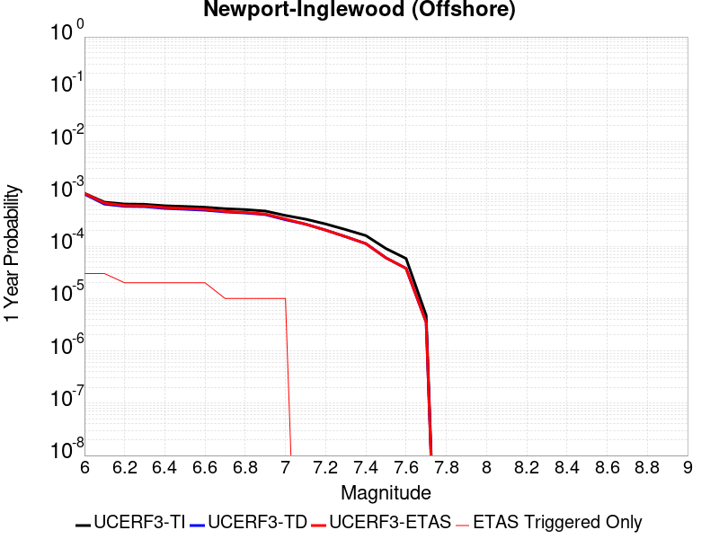 |  |

| Magnitude | 1 wk TI Prob | 1 wk TD Prob | 1 wk ETAS Prob | 1 wk ETAS/TD Gain | 1 wk ETAS Triggered Only | 1 mo TI Prob | 1 mo TD Prob | 1 mo ETAS Prob | 1 mo ETAS/TD Gain | 1 mo ETAS Triggered Only | 1 yr TI Prob | 1 yr TD Prob | 1 yr ETAS Prob | 1 yr ETAS/TD Gain | 1 yr ETAS Triggered Only | 10 yr TI Prob | 10 yr TD Prob | 10 yr ETAS Prob | 10 yr ETAS/TD Gain | 10 yr ETAS Triggered Only |
|-----|-----|-----|-----|-----|-----|-----|-----|-----|-----|-----|-----|-----|-----|-----|-----|-----|-----|-----|-----|-----|
| 6.0 | 1.9626508E-5 | 1.8966482E-5 | 1.8966482E-5 | 1.0 | 0.0 | 8.411089E-5 | 8.128246E-5 | 8.128246E-5 | 1.0 | 0.0 | 0.001023569 | 9.891773E-4 | 0.0010191476 | 1.0302982 | 3.0E-5 | 0.010188672 | 0.0098490855 | 0.009898593 | 1.0050266 | 5.0E-5 |
| 6.1 | 1.331886E-5 | 1.2218844E-5 | 1.2218844E-5 | 1.0 | 0.0 | 5.707958E-5 | 5.236543E-5 | 5.236543E-5 | 1.0 | 0.0 | 6.947222E-4 | 6.373641E-4 | 6.67345E-4 | 1.0470389 | 3.0E-5 | 0.006925544 | 0.006355539 | 0.0063952846 | 1.0062537 | 4.0E-5 |
| 6.2 | 1.2250852E-5 | 1.1076718E-5 | 1.1076718E-5 | 1.0 | 0.0 | 5.2502597E-5 | 4.747079E-5 | 4.747079E-5 | 1.0 | 0.0 | 6.3903164E-4 | 5.778046E-4 | 5.97793E-4 | 1.0345938 | 2.0E-5 | 0.006371971 | 0.0057631438 | 0.0057929712 | 1.0051755 | 3.0E-5 |
| 6.3 | 1.2106258E-5 | 1.0919569E-5 | 1.0919569E-5 | 1.0 | 0.0 | 5.1882926E-5 | 4.679732E-5 | 4.679732E-5 | 1.0 | 0.0 | 6.3149154E-4 | 5.6960934E-4 | 5.8959797E-4 | 1.0350918 | 2.0E-5 | 0.0062970007 | 0.0056816107 | 0.0057114405 | 1.0052502 | 3.0E-5 |
| 6.4 | 1.1348758E-5 | 1.0109995E-5 | 1.0109995E-5 | 1.0 | 0.0 | 4.8636626E-5 | 4.3327836E-5 | 4.3327836E-5 | 1.0 | 0.0 | 5.919901E-4 | 5.273895E-4 | 5.4737896E-4 | 1.0379026 | 2.0E-5 | 0.005904155 | 0.005261475 | 0.0052913176 | 1.0056719 | 3.0E-5 |
| 6.5 | 1.100837E-5 | 9.744001E-6 | 9.744001E-6 | 1.0 | 0.0 | 4.7177873E-5 | 4.1759336E-5 | 4.1759336E-5 | 1.0 | 0.0 | 5.7423924E-4 | 5.083021E-4 | 5.282919E-4 | 1.0393267 | 2.0E-5 | 0.005727576 | 0.0050714863 | 0.005101334 | 1.0058855 | 3.0E-5 |
| 6.6 | 1.0634696E-5 | 9.34613E-6 | 9.34613E-6 | 1.0 | 0.0 | 4.557647E-5 | 4.0054234E-5 | 4.0054234E-5 | 1.0 | 0.0 | 5.5475225E-4 | 4.8755194E-4 | 5.0754216E-4 | 1.0410013 | 2.0E-5 | 0.0055336943 | 0.0048649097 | 0.0048947637 | 1.0061367 | 3.0E-5 |
| 6.7 | 9.9780855E-6 | 8.66845E-6 | 8.66845E-6 | 1.0 | 0.0 | 4.276252E-5 | 3.7149977E-5 | 3.7149977E-5 | 1.0 | 0.0 | 5.205093E-4 | 4.5220778E-4 | 4.6220326E-4 | 1.0221038 | 1.0E-5 | 0.0051929182 | 0.0045129554 | 0.00452291 | 1.0022058 | 1.0E-5 |
| 6.8 | 9.59546E-6 | 8.273465E-6 | 8.273465E-6 | 1.0 | 0.0 | 4.1122752E-5 | 3.545723E-5 | 3.545723E-5 | 1.0 | 0.0 | 5.0055445E-4 | 4.3160692E-4 | 4.416026E-4 | 1.0231593 | 1.0E-5 | 0.004994285 | 0.0043077627 | 0.0043177195 | 1.0023113 | 1.0E-5 |
| 6.9 | 9.000614E-6 | 7.7073155E-6 | 7.7073155E-6 | 1.0 | 0.0 | 3.857349E-5 | 3.3030938E-5 | 3.3030938E-5 | 1.0 | 0.0 | 4.6953102E-4 | 4.020781E-4 | 4.1207406E-4 | 1.0248607 | 1.0E-5 | 0.004685402 | 0.0040135775 | 0.0040235375 | 1.0024816 | 1.0E-5 |
| 7.0 | 7.4070194E-6 | 6.1492383E-6 | 6.1492383E-6 | 1.0 | 0.0 | 3.1743984E-5 | 2.6353613E-5 | 2.6353613E-5 | 1.0 | 0.0 | 3.8641447E-4 | 3.2080815E-4 | 3.3080493E-4 | 1.0311613 | 1.0E-5 | 0.0038574322 | 0.00320347 | 0.003213438 | 1.0031116 | 1.0E-5 |
| 7.1 | 6.299615E-6 | 5.0568733E-6 | 5.0568733E-6 | 1.0 | 0.0 | 2.699807E-5 | 2.1672136E-5 | 2.1672136E-5 | 1.0 | 0.0 | 3.2865192E-4 | 2.6382643E-4 | 2.6382643E-4 | 1.0 | 0.0 | 0.003281663 | 0.002635147 | 0.002635147 | 1.0 | 0.0 |
| 7.2 | 5.096653E-6 | 3.892993E-6 | 3.892993E-6 | 1.0 | 0.0 | 2.1842614E-5 | 1.668415E-5 | 1.668415E-5 | 1.0 | 0.0 | 2.6590136E-4 | 2.0311069E-4 | 2.0311069E-4 | 1.0 | 0.0 | 0.0026558342 | 0.0020292616 | 0.0020292616 | 1.0 | 0.0 |
| 7.3 | 3.9753018E-6 | 2.9100406E-6 | 2.9100406E-6 | 1.0 | 0.0 | 1.7036897E-5 | 1.2471543E-5 | 1.2471543E-5 | 1.0 | 0.0 | 2.0740448E-4 | 1.5183054E-4 | 1.5183054E-4 | 1.0 | 0.0 | 0.00207211 | 0.0015172762 | 0.0015172762 | 1.0 | 0.0 |
| 7.4 | 3.0568392E-6 | 2.1450985E-6 | 2.1450985E-6 | 1.0 | 0.0 | 1.3100675E-5 | 9.193247E-6 | 9.193247E-6 | 1.0 | 0.0 | 1.5948903E-4 | 1.1192209E-4 | 1.1192209E-4 | 1.0 | 0.0 | 0.0015937461 | 0.0011186636 | 0.0011186636 | 1.0 | 0.0 |
| 7.5 | 1.7279019E-6 | 1.1470329E-6 | 1.1470329E-6 | 1.0 | 0.0 | 7.405273E-6 | 4.915846E-6 | 4.915846E-6 | 1.0 | 0.0 | 9.015547E-5 | 5.9848822E-5 | 5.9848822E-5 | 1.0 | 0.0 | 9.01189E-4 | 5.983309E-4 | 5.983309E-4 | 1.0 | 0.0 |
| 7.6 | 1.1156416E-6 | 7.2234485E-7 | 7.2234485E-7 | 1.0 | 0.0 | 4.7813123E-6 | 3.0957601E-6 | 3.0957601E-6 | 1.0 | 0.0 | 5.821092E-5 | 3.769025E-5 | 3.769025E-5 | 1.0 | 0.0 | 5.8195676E-4 | 3.7684094E-4 | 3.7684094E-4 | 1.0 | 0.0 |
| 7.7 | 9.117973E-8 | 6.734469E-8 | 6.734469E-8 | 1.0 | 0.0 | 3.907702E-7 | 2.8862007E-7 | 2.8862007E-7 | 1.0 | 0.0 | 4.757617E-6 | 3.513944E-6 | 3.513944E-6 | 1.0 | 0.0 | 4.7575148E-5 | 3.5138914E-5 | 3.5138914E-5 | 1.0 | 0.0 |

## Imperial
*[(top)](#table-of-contents)*

| 1 Week | 1 Month | 1 Year | 10 Year |
|-----|-----|-----|-----|
|  |  |  |  |

| Magnitude | 1 wk TI Prob | 1 wk TD Prob | 1 wk ETAS Prob | 1 wk ETAS/TD Gain | 1 wk ETAS Triggered Only | 1 mo TI Prob | 1 mo TD Prob | 1 mo ETAS Prob | 1 mo ETAS/TD Gain | 1 mo ETAS Triggered Only | 1 yr TI Prob | 1 yr TD Prob | 1 yr ETAS Prob | 1 yr ETAS/TD Gain | 1 yr ETAS Triggered Only | 10 yr TI Prob | 10 yr TD Prob | 10 yr ETAS Prob | 10 yr ETAS/TD Gain | 10 yr ETAS Triggered Only |
|-----|-----|-----|-----|-----|-----|-----|-----|-----|-----|-----|-----|-----|-----|-----|-----|-----|-----|-----|-----|-----|
| 6.0 | 2.7496446E-4 | 5.063122E-4 | 5.063122E-4 | 1.0 | 0.0 | 0.0011778869 | 0.0021681443 | 0.0021781225 | 1.0046022 | 1.0E-5 | 0.0142467655 | 0.026074106 | 0.026093585 | 1.0007471 | 2.0E-5 | 0.13367249 | 0.22831616 | 0.22835474 | 1.000169 | 5.0E-5 |
| 6.1 | 2.5356023E-4 | 4.8724655E-4 | 4.8724655E-4 | 1.0 | 0.0 | 0.001086234 | 0.0020865668 | 0.0020965459 | 1.0047826 | 1.0E-5 | 0.013144928 | 0.02511032 | 0.025129817 | 1.0007765 | 2.0E-5 | 0.123940155 | 0.21971837 | 0.21975738 | 1.0001776 | 5.0E-5 |
| 6.2 | 2.4820742E-4 | 4.7818638E-4 | 4.7818638E-4 | 1.0 | 0.0 | 0.0010633124 | 0.0020477986 | 0.0020577782 | 1.0048733 | 1.0E-5 | 0.01286919 | 0.024649723 | 0.02466923 | 1.0007913 | 2.0E-5 | 0.12148927 | 0.21622115 | 0.21626034 | 1.0001812 | 5.0E-5 |
| 6.3 | 2.3205351E-4 | 4.5950705E-4 | 4.5950705E-4 | 1.0 | 0.0 | 9.94136E-4 | 0.0019678667 | 0.001977847 | 1.0050716 | 1.0E-5 | 0.012036599 | 0.02369365 | 0.023713175 | 1.0008241 | 2.0E-5 | 0.11405133 | 0.20813562 | 0.20817521 | 1.0001903 | 5.0E-5 |
| 6.4 | 2.0304754E-4 | 3.9935127E-4 | 3.9935127E-4 | 1.0 | 0.0 | 8.6991355E-4 | 0.0017103975 | 0.0017203804 | 1.0058366 | 1.0E-5 | 0.010539869 | 0.020625396 | 0.020644983 | 1.0009496 | 2.0E-5 | 0.100537635 | 0.18526861 | 0.18530935 | 1.0002198 | 5.0E-5 |
| 6.5 | 1.854992E-4 | 3.7043466E-4 | 3.7043466E-4 | 1.0 | 0.0 | 7.9475436E-4 | 0.0015866235 | 0.0015966076 | 1.0062927 | 1.0E-5 | 0.009633281 | 0.019149965 | 0.019169582 | 1.0010244 | 2.0E-5 | 0.0922623 | 0.1734911 | 0.17353244 | 1.0002382 | 5.0E-5 |
| 6.6 | 1.6586106E-4 | 3.4084683E-4 | 3.4084683E-4 | 1.0 | 0.0 | 7.106394E-4 | 0.0014599646 | 0.00146995 | 1.0068395 | 1.0E-5 | 0.008617763 | 0.017632669 | 0.017642492 | 1.0005572 | 1.0E-5 | 0.08291132 | 0.1609554 | 0.16098896 | 1.0002085 | 4.0E-5 |
| 6.7 | 1.4224656E-4 | 3.0810328E-4 | 3.0810328E-4 | 1.0 | 0.0 | 6.094856E-4 | 0.0013197826 | 0.0013297694 | 1.007567 | 1.0E-5 | 0.0073952693 | 0.01594994 | 0.01595978 | 1.0006169 | 1.0E-5 | 0.07153955 | 0.14665164 | 0.14668576 | 1.0002327 | 4.0E-5 |
| 6.8 | 1.2317259E-4 | 2.7827686E-4 | 2.7827686E-4 | 1.0 | 0.0 | 5.2777573E-4 | 0.0011920761 | 0.0012020642 | 1.0083787 | 1.0E-5 | 0.0064067547 | 0.014418332 | 0.014428188 | 1.0006835 | 1.0E-5 | 0.06225166 | 0.13308224 | 0.13311692 | 1.0002606 | 4.0E-5 |
| 6.9 | 9.859898E-5 | 2.504201E-4 | 2.504201E-4 | 1.0 | 0.0 | 4.2249862E-4 | 0.0010727918 | 0.0010827811 | 1.0093114 | 1.0E-5 | 0.0051317946 | 0.012983985 | 0.012993855 | 1.0007602 | 1.0E-5 | 0.05014893 | 0.119513825 | 0.11954904 | 1.0002947 | 4.0E-5 |
| 7.0 | 7.3191884E-5 | 2.1287579E-4 | 2.1287579E-4 | 1.0 | 0.0 | 3.136418E-4 | 9.12009E-4 | 9.2199986E-4 | 1.0109549 | 1.0E-5 | 0.003811904 | 0.011047865 | 0.011057755 | 1.0008951 | 1.0E-5 | 0.037471764 | 0.10214426 | 0.102180175 | 1.0003515 | 4.0E-5 |
| 7.1 | 7.1760296E-5 | 2.0988664E-4 | 2.0988664E-4 | 1.0 | 0.0 | 3.0750787E-4 | 8.9920725E-4 | 9.0919825E-4 | 1.0111109 | 1.0E-5 | 0.003737482 | 0.010893572 | 0.010903464 | 1.000908 | 1.0E-5 | 0.03675245 | 0.10077973 | 0.10081569 | 1.0003569 | 4.0E-5 |
| 7.2 | 6.46614E-5 | 1.9156448E-4 | 1.9156448E-4 | 1.0 | 0.0 | 2.7709085E-4 | 8.2073535E-4 | 8.307271E-4 | 1.0121742 | 1.0E-5 | 0.0033683628 | 0.009947293 | 0.009957194 | 1.0009953 | 1.0E-5 | 0.033177625 | 0.092585295 | 0.092621595 | 1.0003921 | 4.0E-5 |
| 7.3 | 6.088115E-5 | 1.7827263E-4 | 1.7827263E-4 | 1.0 | 0.0 | 2.6089314E-4 | 7.6380477E-4 | 7.737971E-4 | 1.0130824 | 1.0E-5 | 0.0031717476 | 0.009260248 | 0.009270156 | 1.0010699 | 1.0E-5 | 0.031268585 | 0.08663518 | 0.08667171 | 1.0004218 | 4.0E-5 |
| 7.4 | 4.199346E-5 | 1.1524848E-4 | 1.1524848E-4 | 1.0 | 0.0 | 1.7995955E-4 | 4.9382943E-4 | 5.0382444E-4 | 1.02024 | 1.0E-5 | 0.0021888057 | 0.005995968 | 0.006005908 | 1.0016578 | 1.0E-5 | 0.02167372 | 0.057501994 | 0.05753027 | 1.0004917 | 3.0E-5 |
| 7.5 | 3.130448E-5 | 8.345245E-5 | 8.345245E-5 | 1.0 | 0.0 | 1.3415517E-4 | 3.5760464E-4 | 3.6760108E-4 | 1.0279539 | 1.0E-5 | 0.0016321153 | 0.0043452047 | 0.0043551615 | 1.0022914 | 1.0E-5 | 0.016201803 | 0.04218589 | 0.04221463 | 1.0006812 | 3.0E-5 |
| 7.6 | 2.3074248E-5 | 6.094647E-5 | 6.094647E-5 | 1.0 | 0.0 | 9.888588E-5 | 2.6117315E-4 | 2.7117052E-4 | 1.0382788 | 1.0E-5 | 0.0012032706 | 0.00317517 | 0.003185138 | 1.0031395 | 1.0E-5 | 0.011967761 | 0.031072699 | 0.031092077 | 1.0006237 | 2.0E-5 |
| 7.7 | 1.45864815E-5 | 4.0209037E-5 | 4.0209037E-5 | 1.0 | 0.0 | 6.2511994E-5 | 1.7231308E-4 | 1.8231137E-4 | 1.0580239 | 1.0E-5 | 7.608177E-4 | 0.0020958986 | 0.0021058777 | 1.0047612 | 1.0E-5 | 0.007582182 | 0.020665837 | 0.020685425 | 1.0009478 | 2.0E-5 |
| 7.8 | 1.0352979E-5 | 3.103256E-5 | 3.103256E-5 | 1.0 | 0.0 | 4.4369157E-5 | 1.3298991E-4 | 1.4298859E-4 | 1.0751836 | 1.0E-5 | 5.400606E-4 | 0.001617952 | 0.0016279358 | 1.0061706 | 1.0E-5 | 0.0053875 | 0.016049147 | 0.016068825 | 1.0012262 | 2.0E-5 |
| 7.9 | 8.137906E-6 | 2.2206304E-5 | 2.2206304E-5 | 1.0 | 0.0 | 3.4876273E-5 | 9.516641E-5 | 1.0516546E-4 | 1.105069 | 1.0E-5 | 4.2453592E-4 | 0.0011580362 | 0.0011680246 | 1.0086253 | 1.0E-5 | 0.004237258 | 0.011644563 | 0.01166433 | 1.0016975 | 2.0E-5 |
| 8.0 | 6.93792E-6 | 1.8057788E-5 | 1.8057788E-5 | 1.0 | 0.0 | 2.9733603E-5 | 7.738823E-5 | 8.738745E-5 | 1.1292086 | 1.0E-5 | 3.6194647E-4 | 9.417951E-4 | 9.517857E-4 | 1.0106081 | 1.0E-5 | 0.0036135751 | 0.0095246155 | 0.009534521 | 1.0010399 | 1.0E-5 |
| 8.1 | 3.4286315E-6 | 6.40225E-6 | 6.40225E-6 | 1.0 | 0.0 | 1.4694053E-5 | 2.7437927E-5 | 2.7437927E-5 | 1.0 | 0.0 | 1.7888541E-4 | 3.340057E-4 | 3.340057E-4 | 1.0 | 0.0 | 0.0017874148 | 0.0034972397 | 0.0034972397 | 1.0 | 0.0 |
| 8.2 | 1.4906886E-6 | 1.9452543E-6 | 1.9452543E-6 | 1.0 | 0.0 | 6.3886496E-6 | 8.336778E-6 | 8.336778E-6 | 1.0 | 0.0 | 7.7779034E-5 | 1.0149557E-4 | 1.0149557E-4 | 1.0 | 0.0 | 7.775182E-4 | 0.0011119741 | 0.0011119741 | 1.0 | 0.0 |
| 8.3 | 2.5758007E-8 | 1.4583934E-8 | 1.4583934E-8 | 1.0 | 0.0 | 1.10391454E-7 | 6.250257E-8 | 6.250257E-8 | 1.0 | 0.0 | 1.3440151E-6 | 7.609688E-7 | 7.609688E-7 | 1.0 | 0.0 | 1.344007E-5 | 7.932957E-6 | 7.932957E-6 | 1.0 | 0.0 |

## San Jacinto (Stepovers Combined)
*[(top)](#table-of-contents)*

| 1 Week | 1 Month | 1 Year | 10 Year |
|-----|-----|-----|-----|
|  |  |  |  |

| Magnitude | 1 wk TI Prob | 1 wk TD Prob | 1 wk ETAS Prob | 1 wk ETAS/TD Gain | 1 wk ETAS Triggered Only | 1 mo TI Prob | 1 mo TD Prob | 1 mo ETAS Prob | 1 mo ETAS/TD Gain | 1 mo ETAS Triggered Only | 1 yr TI Prob | 1 yr TD Prob | 1 yr ETAS Prob | 1 yr ETAS/TD Gain | 1 yr ETAS Triggered Only | 10 yr TI Prob | 10 yr TD Prob | 10 yr ETAS Prob | 10 yr ETAS/TD Gain | 10 yr ETAS Triggered Only |
|-----|-----|-----|-----|-----|-----|-----|-----|-----|-----|-----|-----|-----|-----|-----|-----|-----|-----|-----|-----|-----|
| 6.0 | 4.0667746E-5 | 3.5364257E-5 | 3.5364257E-5 | 1.0 | 0.0 | 1.742787E-4 | 1.515523E-4 | 1.6155078E-4 | 1.0659739 | 1.0E-5 | 0.0021197782 | 0.0018435888 | 0.001883515 | 1.0216569 | 4.0E-5 | 0.020996714 | 0.019034373 | 0.01908342 | 1.0025768 | 5.0E-5 |
| 6.1 | 4.0667746E-5 | 3.5364257E-5 | 3.5364257E-5 | 1.0 | 0.0 | 1.742787E-4 | 1.515523E-4 | 1.6155078E-4 | 1.0659739 | 1.0E-5 | 0.0021197782 | 0.0018435888 | 0.001883515 | 1.0216569 | 4.0E-5 | 0.020996714 | 0.019034373 | 0.01908342 | 1.0025768 | 5.0E-5 |
| 6.2 | 4.0667746E-5 | 3.5364257E-5 | 3.5364257E-5 | 1.0 | 0.0 | 1.742787E-4 | 1.515523E-4 | 1.6155078E-4 | 1.0659739 | 1.0E-5 | 0.0021197782 | 0.0018435888 | 0.001883515 | 1.0216569 | 4.0E-5 | 0.020996714 | 0.019034373 | 0.01908342 | 1.0025768 | 5.0E-5 |
| 6.3 | 4.0667746E-5 | 3.5364257E-5 | 3.5364257E-5 | 1.0 | 0.0 | 1.742787E-4 | 1.515523E-4 | 1.6155078E-4 | 1.0659739 | 1.0E-5 | 0.0021197782 | 0.0018435888 | 0.001883515 | 1.0216569 | 4.0E-5 | 0.020996714 | 0.019034373 | 0.01908342 | 1.0025768 | 5.0E-5 |
| 6.4 | 4.0577226E-5 | 3.5236128E-5 | 3.5236128E-5 | 1.0 | 0.0 | 1.738908E-4 | 1.5100325E-4 | 1.6100174E-4 | 1.0662137 | 1.0E-5 | 0.0021150648 | 0.0018369167 | 0.0018768432 | 1.0217357 | 4.0E-5 | 0.020950472 | 0.018968925 | 0.019017976 | 1.0025859 | 5.0E-5 |
| 6.5 | 4.0577226E-5 | 3.5236128E-5 | 3.5236128E-5 | 1.0 | 0.0 | 1.738908E-4 | 1.5100325E-4 | 1.6100174E-4 | 1.0662137 | 1.0E-5 | 0.0021150648 | 0.0018369167 | 0.0018768432 | 1.0217357 | 4.0E-5 | 0.020950472 | 0.018968925 | 0.019017976 | 1.0025859 | 5.0E-5 |
| 6.6 | 4.053861E-5 | 3.5181452E-5 | 3.5181452E-5 | 1.0 | 0.0 | 1.7372532E-4 | 1.5076896E-4 | 1.6076745E-4 | 1.0663166 | 1.0E-5 | 0.0021130538 | 0.0018340695 | 0.0018739961 | 1.0217694 | 4.0E-5 | 0.020930743 | 0.018940995 | 0.018990047 | 1.0025898 | 5.0E-5 |
| 6.7 | 4.0516545E-5 | 3.5150515E-5 | 3.5150515E-5 | 1.0 | 0.0 | 1.7363077E-4 | 1.5063639E-4 | 1.6063488E-4 | 1.066375 | 1.0E-5 | 0.002111905 | 0.0018324584 | 0.0018723852 | 1.0217886 | 4.0E-5 | 0.020919468 | 0.018925188 | 0.01897424 | 1.002592 | 5.0E-5 |
| 6.8 | 4.049434E-5 | 3.512207E-5 | 3.512207E-5 | 1.0 | 0.0 | 1.7353562E-4 | 1.5051449E-4 | 1.60513E-4 | 1.0664288 | 1.0E-5 | 0.0021107488 | 0.0018309769 | 0.0018709037 | 1.0218062 | 4.0E-5 | 0.020908125 | 0.018910596 | 0.01895965 | 1.002594 | 5.0E-5 |
| 6.9 | 4.046386E-5 | 3.508462E-5 | 3.508462E-5 | 1.0 | 0.0 | 1.73405E-4 | 1.5035401E-4 | 1.603525E-4 | 1.0664997 | 1.0E-5 | 0.0021091616 | 0.0018290263 | 0.0018689531 | 1.0218296 | 4.0E-5 | 0.020892553 | 0.018891364 | 0.01894042 | 1.0025967 | 5.0E-5 |
| 7.0 | 4.036382E-5 | 3.4965145E-5 | 3.4965145E-5 | 1.0 | 0.0 | 1.7297632E-4 | 1.4984203E-4 | 1.5984054E-4 | 1.0667269 | 1.0E-5 | 0.0021039525 | 0.0018228035 | 0.0018627306 | 1.0219042 | 4.0E-5 | 0.02084144 | 0.018829959 | 0.018879017 | 1.0026053 | 5.0E-5 |
| 7.1 | 4.0343282E-5 | 3.49436E-5 | 3.49436E-5 | 1.0 | 0.0 | 1.7288832E-4 | 1.4974971E-4 | 1.5974822E-4 | 1.066768 | 1.0E-5 | 0.002102883 | 0.0018216814 | 0.0018616085 | 1.0219177 | 4.0E-5 | 0.020830948 | 0.018818827 | 0.018867888 | 1.0026069 | 5.0E-5 |
| 7.2 | 4.0257353E-5 | 3.4847984E-5 | 3.4847984E-5 | 1.0 | 0.0 | 1.725201E-4 | 1.4933996E-4 | 1.5933847E-4 | 1.0669513 | 1.0E-5 | 0.0020984085 | 0.001816701 | 0.0018566283 | 1.0219779 | 4.0E-5 | 0.020787042 | 0.018769508 | 0.018818568 | 1.0026139 | 5.0E-5 |
| 7.3 | 3.9940667E-5 | 3.467529E-5 | 3.467529E-5 | 1.0 | 0.0 | 1.7116306E-4 | 1.4859994E-4 | 1.5859844E-4 | 1.0672848 | 1.0E-5 | 0.0020819185 | 0.0018077062 | 0.0018476339 | 1.0220875 | 4.0E-5 | 0.020625217 | 0.018677963 | 0.018727029 | 1.0026269 | 5.0E-5 |
| 7.4 | 3.9721202E-5 | 3.4560508E-5 | 3.4560508E-5 | 1.0 | 0.0 | 1.7022261E-4 | 1.4810807E-4 | 1.5810659E-4 | 1.0675082 | 1.0E-5 | 0.0020704903 | 0.0018017276 | 0.0018416556 | 1.0221609 | 4.0E-5 | 0.020513052 | 0.018616993 | 0.018666063 | 1.0026357 | 5.0E-5 |
| 7.5 | 3.7036873E-5 | 3.3625784E-5 | 3.3625784E-5 | 1.0 | 0.0 | 1.5871979E-4 | 1.4410257E-4 | 1.5410112E-4 | 1.069385 | 1.0E-5 | 0.0019307006 | 0.0017530398 | 0.0017929696 | 1.0227776 | 4.0E-5 | 0.019140124 | 0.018117398 | 0.018166492 | 1.0027097 | 5.0E-5 |
| 7.6 | 3.2940967E-5 | 3.139888E-5 | 3.139888E-5 | 1.0 | 0.0 | 1.4116794E-4 | 1.3455968E-4 | 1.4455835E-4 | 1.0743065 | 1.0E-5 | 0.0017173645 | 0.0016370354 | 0.0016769699 | 1.0243944 | 4.0E-5 | 0.01704153 | 0.016946431 | 0.016995583 | 1.0029005 | 5.0E-5 |
| 7.7 | 2.8236149E-5 | 2.7962495E-5 | 2.7962495E-5 | 1.0 | 0.0 | 1.2100645E-4 | 1.1983376E-4 | 1.2983257E-4 | 1.083439 | 1.0E-5 | 0.0014722579 | 0.0014580007 | 0.0014979424 | 1.0273948 | 4.0E-5 | 0.014625421 | 0.01515641 | 0.0152056515 | 1.0032489 | 5.0E-5 |
| 7.8 | 2.4329287E-5 | 2.5283118E-5 | 2.5283118E-5 | 1.0 | 0.0 | 1.042642E-4 | 1.0835172E-4 | 1.1835064E-4 | 1.092282 | 1.0E-5 | 0.0012686774 | 0.0013183848 | 0.001358332 | 1.0303001 | 4.0E-5 | 0.012614589 | 0.013752086 | 0.013801399 | 1.0035858 | 5.0E-5 |
| 7.9 | 1.9370926E-5 | 2.0489588E-5 | 2.0489588E-5 | 1.0 | 0.0 | 8.301561E-5 | 8.780957E-5 | 9.780869E-5 | 1.1138728 | 1.0E-5 | 0.0010102465 | 0.001068558 | 0.0011085152 | 1.0373936 | 4.0E-5 | 0.0100566605 | 0.011235248 | 0.011274799 | 1.0035203 | 4.0E-5 |
| 8.0 | 1.5583017E-5 | 1.5943424E-5 | 1.5943424E-5 | 1.0 | 0.0 | 6.6782646E-5 | 6.832718E-5 | 7.832649E-5 | 1.1463447 | 1.0E-5 | 8.127754E-4 | 8.315666E-4 | 8.615416E-4 | 1.0360465 | 3.0E-5 | 0.008098091 | 0.008811957 | 0.0088416925 | 1.0033745 | 3.0E-5 |
| 8.1 | 1.0024873E-5 | 8.325153E-6 | 8.325153E-6 | 1.0 | 0.0 | 4.2963035E-5 | 3.5678742E-5 | 3.5678742E-5 | 1.0 | 0.0 | 5.229494E-4 | 4.3430264E-4 | 4.3430264E-4 | 1.0 | 0.0 | 0.0052172043 | 0.00467114 | 0.00467114 | 1.0 | 0.0 |
| 8.2 | 4.142796E-6 | 1.5701818E-6 | 1.5701818E-6 | 1.0 | 0.0 | 1.775472E-5 | 6.729333E-6 | 6.729333E-6 | 1.0 | 0.0 | 2.1614227E-4 | 8.1926584E-5 | 8.1926584E-5 | 1.0 | 0.0 | 0.0021593217 | 9.5078564E-4 | 9.5078564E-4 | 1.0 | 0.0 |
| 8.3 | 1.2750878E-6 | 3.6368886E-7 | 3.6368886E-7 | 1.0 | 0.0 | 5.4646503E-6 | 1.5586656E-6 | 1.5586656E-6 | 1.0 | 0.0 | 6.653009E-5 | 1.8976592E-5 | 1.8976592E-5 | 1.0 | 0.0 | 6.6510175E-4 | 2.2880803E-4 | 2.2880803E-4 | 1.0 | 0.0 |

## San Cayetano
*[(top)](#table-of-contents)*

| 1 Week | 1 Month | 1 Year | 10 Year |
|-----|-----|-----|-----|
|  |  |  |  |

| Magnitude | 1 wk TI Prob | 1 wk TD Prob | 1 wk ETAS Prob | 1 wk ETAS/TD Gain | 1 wk ETAS Triggered Only | 1 mo TI Prob | 1 mo TD Prob | 1 mo ETAS Prob | 1 mo ETAS/TD Gain | 1 mo ETAS Triggered Only | 1 yr TI Prob | 1 yr TD Prob | 1 yr ETAS Prob | 1 yr ETAS/TD Gain | 1 yr ETAS Triggered Only | 10 yr TI Prob | 10 yr TD Prob | 10 yr ETAS Prob | 10 yr ETAS/TD Gain | 10 yr ETAS Triggered Only |
|-----|-----|-----|-----|-----|-----|-----|-----|-----|-----|-----|-----|-----|-----|-----|-----|-----|-----|-----|-----|-----|
| 6.0 | 2.3476267E-5 | 1.817298E-5 | 1.817298E-5 | 1.0 | 0.0 | 1.0060869E-4 | 7.7881894E-5 | 7.7881894E-5 | 1.0 | 0.0 | 0.0012242225 | 9.478032E-4 | 9.478032E-4 | 1.0 | 0.0 | 0.012175002 | 0.0094385175 | 0.00947814 | 1.004198 | 4.0E-5 |
| 6.1 | 2.3476267E-5 | 1.817298E-5 | 1.817298E-5 | 1.0 | 0.0 | 1.0060869E-4 | 7.7881894E-5 | 7.7881894E-5 | 1.0 | 0.0 | 0.0012242225 | 9.478032E-4 | 9.478032E-4 | 1.0 | 0.0 | 0.012175002 | 0.0094385175 | 0.00947814 | 1.004198 | 4.0E-5 |
| 6.2 | 2.3476267E-5 | 1.817298E-5 | 1.817298E-5 | 1.0 | 0.0 | 1.0060869E-4 | 7.7881894E-5 | 7.7881894E-5 | 1.0 | 0.0 | 0.0012242225 | 9.478032E-4 | 9.478032E-4 | 1.0 | 0.0 | 0.012175002 | 0.0094385175 | 0.00947814 | 1.004198 | 4.0E-5 |
| 6.3 | 2.3476267E-5 | 1.817298E-5 | 1.817298E-5 | 1.0 | 0.0 | 1.0060869E-4 | 7.7881894E-5 | 7.7881894E-5 | 1.0 | 0.0 | 0.0012242225 | 9.478032E-4 | 9.478032E-4 | 1.0 | 0.0 | 0.012175002 | 0.0094385175 | 0.00947814 | 1.004198 | 4.0E-5 |
| 6.4 | 2.3476267E-5 | 1.817298E-5 | 1.817298E-5 | 1.0 | 0.0 | 1.0060869E-4 | 7.7881894E-5 | 7.7881894E-5 | 1.0 | 0.0 | 0.0012242225 | 9.478032E-4 | 9.478032E-4 | 1.0 | 0.0 | 0.012175002 | 0.0094385175 | 0.00947814 | 1.004198 | 4.0E-5 |
| 6.5 | 2.3476267E-5 | 1.817298E-5 | 1.817298E-5 | 1.0 | 0.0 | 1.0060869E-4 | 7.7881894E-5 | 7.7881894E-5 | 1.0 | 0.0 | 0.0012242225 | 9.478032E-4 | 9.478032E-4 | 1.0 | 0.0 | 0.012175002 | 0.0094385175 | 0.00947814 | 1.004198 | 4.0E-5 |
| 6.6 | 2.3476267E-5 | 1.817298E-5 | 1.817298E-5 | 1.0 | 0.0 | 1.0060869E-4 | 7.7881894E-5 | 7.7881894E-5 | 1.0 | 0.0 | 0.0012242225 | 9.478032E-4 | 9.478032E-4 | 1.0 | 0.0 | 0.012175002 | 0.0094385175 | 0.00947814 | 1.004198 | 4.0E-5 |
| 6.7 | 2.3476267E-5 | 1.817298E-5 | 1.817298E-5 | 1.0 | 0.0 | 1.0060869E-4 | 7.7881894E-5 | 7.7881894E-5 | 1.0 | 0.0 | 0.0012242225 | 9.478032E-4 | 9.478032E-4 | 1.0 | 0.0 | 0.012175002 | 0.0094385175 | 0.00947814 | 1.004198 | 4.0E-5 |
| 6.8 | 2.3241924E-5 | 1.7940632E-5 | 1.7940632E-5 | 1.0 | 0.0 | 9.960445E-5 | 7.688618E-5 | 7.688618E-5 | 1.0 | 0.0 | 0.0012120095 | 9.356908E-4 | 9.356908E-4 | 1.0 | 0.0 | 0.012054204 | 0.009318347 | 0.009357974 | 1.0042526 | 4.0E-5 |
| 6.9 | 2.2761007E-5 | 1.7436008E-5 | 1.7436008E-5 | 1.0 | 0.0 | 9.7543525E-5 | 7.472363E-5 | 7.472363E-5 | 1.0 | 0.0 | 0.0011869454 | 9.0938393E-4 | 9.0938393E-4 | 1.0 | 0.0 | 0.011806256 | 0.009057438 | 0.009097076 | 1.0043763 | 4.0E-5 |
| 7.0 | 2.240283E-5 | 1.7069739E-5 | 1.7069739E-5 | 1.0 | 0.0 | 9.600859E-5 | 7.3153984E-5 | 7.3153984E-5 | 1.0 | 0.0 | 0.0011682777 | 8.9028926E-4 | 8.9028926E-4 | 1.0 | 0.0 | 0.011621549 | 0.008868021 | 0.008907666 | 1.0044706 | 4.0E-5 |
| 7.1 | 2.1871154E-5 | 1.6589582E-5 | 1.6589582E-5 | 1.0 | 0.0 | 9.373015E-5 | 7.109629E-5 | 7.109629E-5 | 1.0 | 0.0 | 0.0011405671 | 8.6525694E-4 | 8.6525694E-4 | 1.0 | 0.0 | 0.011347309 | 0.008619661 | 0.008659316 | 1.0046005 | 4.0E-5 |
| 7.2 | 2.0714133E-5 | 1.5567992E-5 | 1.5567992E-5 | 1.0 | 0.0 | 8.8771834E-5 | 6.671828E-5 | 6.671828E-5 | 1.0 | 0.0 | 0.0010802611 | 8.119956E-4 | 8.119956E-4 | 1.0 | 0.0 | 0.010750249 | 0.008091041 | 0.008130717 | 1.0049038 | 4.0E-5 |
| 7.3 | 1.8408395E-5 | 1.3998656E-5 | 1.3998656E-5 | 1.0 | 0.0 | 7.8890735E-5 | 5.999288E-5 | 5.999288E-5 | 1.0 | 0.0 | 9.600714E-4 | 7.301715E-4 | 7.301715E-4 | 1.0 | 0.0 | 0.009559342 | 0.007278434 | 0.0072982884 | 1.0027279 | 2.0E-5 |
| 7.4 | 1.6856795E-5 | 1.2851616E-5 | 1.2851616E-5 | 1.0 | 0.0 | 7.2241404E-5 | 5.5077206E-5 | 5.5077206E-5 | 1.0 | 0.0 | 8.7918417E-4 | 6.703615E-4 | 6.703615E-4 | 1.0 | 0.0 | 0.00875714 | 0.006684076 | 0.006703942 | 1.0029722 | 2.0E-5 |
| 7.5 | 1.2822778E-5 | 9.57858E-6 | 9.57858E-6 | 1.0 | 0.0 | 5.495361E-5 | 4.1050418E-5 | 4.1050418E-5 | 1.0 | 0.0 | 6.688548E-4 | 4.996758E-4 | 4.996758E-4 | 1.0 | 0.0 | 0.006668452 | 0.0049858685 | 0.005005769 | 1.0039914 | 2.0E-5 |
| 7.6 | 5.6272684E-6 | 3.8553635E-6 | 3.8553635E-6 | 1.0 | 0.0 | 2.4116642E-5 | 1.6522883E-5 | 1.6522883E-5 | 1.0 | 0.0 | 2.9358055E-4 | 2.0114763E-4 | 2.0114763E-4 | 1.0 | 0.0 | 0.0029319301 | 0.0020096665 | 0.0020196463 | 1.0049659 | 1.0E-5 |
| 7.7 | 3.5261346E-6 | 2.3409923E-6 | 2.3409923E-6 | 1.0 | 0.0 | 1.5111918E-5 | 1.0032785E-5 | 1.0032785E-5 | 1.0 | 0.0 | 1.8397206E-4 | 1.2214239E-4 | 1.2214239E-4 | 1.0 | 0.0 | 0.0018381984 | 0.0012207599 | 0.0012207599 | 1.0 | 0.0 |
| 7.8 | 1.4826929E-6 | 1.0565492E-6 | 1.0565492E-6 | 1.0 | 0.0 | 6.354383E-6 | 4.5280603E-6 | 4.5280603E-6 | 1.0 | 0.0 | 7.736187E-5 | 5.5127763E-5 | 5.5127763E-5 | 1.0 | 0.0 | 7.733494E-4 | 5.511429E-4 | 5.511429E-4 | 1.0 | 0.0 |
| 7.9 | 2.7568166E-7 | 1.6980518E-7 | 1.6980518E-7 | 1.0 | 0.0 | 1.1814923E-6 | 7.277362E-7 | 7.277362E-7 | 1.0 | 0.0 | 1.4384574E-5 | 8.860153E-6 | 8.860153E-6 | 1.0 | 0.0 | 1.4383643E-4 | 8.859803E-5 | 8.859803E-5 | 1.0 | 0.0 |
| 8.0 | 5.407832E-8 | 2.6895487E-8 | 2.6895487E-8 | 1.0 | 0.0 | 2.3176422E-7 | 1.1526637E-7 | 1.1526637E-7 | 1.0 | 0.0 | 2.8217257E-6 | 1.4033672E-6 | 1.4033672E-6 | 1.0 | 0.0 | 2.8216898E-5 | 1.4033587E-5 | 1.4033587E-5 | 1.0 | 0.0 |

## Chino alt 1
*[(top)](#table-of-contents)*

| 1 Week | 1 Month | 1 Year | 10 Year |
|-----|-----|-----|-----|
|  |  |  |  |

| Magnitude | 1 wk TI Prob | 1 wk TD Prob | 1 wk ETAS Prob | 1 wk ETAS/TD Gain | 1 wk ETAS Triggered Only | 1 mo TI Prob | 1 mo TD Prob | 1 mo ETAS Prob | 1 mo ETAS/TD Gain | 1 mo ETAS Triggered Only | 1 yr TI Prob | 1 yr TD Prob | 1 yr ETAS Prob | 1 yr ETAS/TD Gain | 1 yr ETAS Triggered Only | 10 yr TI Prob | 10 yr TD Prob | 10 yr ETAS Prob | 10 yr ETAS/TD Gain | 10 yr ETAS Triggered Only |
|-----|-----|-----|-----|-----|-----|-----|-----|-----|-----|-----|-----|-----|-----|-----|-----|-----|-----|-----|-----|-----|
| 6.0 | 3.939946E-5 | 4.8960803E-5 | 4.8960803E-5 | 1.0 | 0.0 | 1.6884391E-4 | 2.0981794E-4 | 2.0981794E-4 | 1.0 | 0.0 | 0.0020537362 | 0.00255205 | 0.00255205 | 1.0 | 0.0 | 0.020348595 | 0.025279384 | 0.02532812 | 1.0019279 | 5.0E-5 |
| 6.1 | 2.1505624E-5 | 2.6887528E-5 | 2.6887528E-5 | 1.0 | 0.0 | 9.2163704E-5 | 1.15227725E-4 | 1.15227725E-4 | 1.0 | 0.0 | 0.0011215154 | 0.0014021049 | 0.0014021049 | 1.0 | 0.0 | 0.011158722 | 0.013944524 | 0.013983967 | 1.0028285 | 4.0E-5 |
| 6.2 | 2.1505624E-5 | 2.6887528E-5 | 2.6887528E-5 | 1.0 | 0.0 | 9.2163704E-5 | 1.15227725E-4 | 1.15227725E-4 | 1.0 | 0.0 | 0.0011215154 | 0.0014021049 | 0.0014021049 | 1.0 | 0.0 | 0.011158722 | 0.013944524 | 0.013983967 | 1.0028285 | 4.0E-5 |
| 6.3 | 1.4290785E-5 | 1.8172092E-5 | 1.8172092E-5 | 1.0 | 0.0 | 6.1244784E-5 | 7.787832E-5 | 7.787832E-5 | 1.0 | 0.0 | 7.454001E-4 | 9.478014E-4 | 9.478014E-4 | 1.0 | 0.0 | 0.007429048 | 0.009443081 | 0.009482703 | 1.0041959 | 4.0E-5 |
| 6.4 | 1.4290785E-5 | 1.8172092E-5 | 1.8172092E-5 | 1.0 | 0.0 | 6.1244784E-5 | 7.787832E-5 | 7.787832E-5 | 1.0 | 0.0 | 7.454001E-4 | 9.478014E-4 | 9.478014E-4 | 1.0 | 0.0 | 0.007429048 | 0.009443081 | 0.009482703 | 1.0041959 | 4.0E-5 |
| 6.5 | 1.3017944E-5 | 1.6658825E-5 | 1.6658825E-5 | 1.0 | 0.0 | 5.5789995E-5 | 7.139325E-5 | 7.139325E-5 | 1.0 | 0.0 | 6.790315E-4 | 8.6891005E-4 | 8.6891005E-4 | 1.0 | 0.0 | 0.0067696036 | 0.008660453 | 0.008690193 | 1.0034341 | 3.0E-5 |
| 6.6 | 9.470016E-6 | 1.20446475E-5 | 1.20446475E-5 | 1.0 | 0.0 | 4.058515E-5 | 5.161909E-5 | 5.161909E-5 | 1.0 | 0.0 | 4.940122E-4 | 6.2831515E-4 | 6.2831515E-4 | 1.0 | 0.0 | 0.004929154 | 0.006270764 | 0.0062906384 | 1.0031694 | 2.0E-5 |
| 6.7 | 8.314155E-6 | 1.041245E-5 | 1.041245E-5 | 1.0 | 0.0 | 3.5631605E-5 | 4.4624205E-5 | 4.4624205E-5 | 1.0 | 0.0 | 4.3372845E-4 | 5.4319657E-4 | 5.4319657E-4 | 1.0 | 0.0 | 0.004328829 | 0.0054244814 | 0.0054344274 | 1.0018334 | 1.0E-5 |
| 6.8 | 3.4856364E-6 | 3.814915E-6 | 3.814915E-6 | 1.0 | 0.0 | 1.4938357E-5 | 1.6349546E-5 | 1.6349546E-5 | 1.0 | 0.0 | 1.8185932E-4 | 1.9903961E-4 | 1.9903961E-4 | 1.0 | 0.0 | 0.0018171056 | 0.0019902652 | 0.0020002453 | 1.0050144 | 1.0E-5 |
| 6.9 | 2.2645952E-6 | 2.1540022E-6 | 2.1540022E-6 | 1.0 | 0.0 | 9.705372E-6 | 9.231407E-6 | 9.231407E-6 | 1.0 | 0.0 | 1.18156495E-4 | 1.123868E-4 | 1.123868E-4 | 1.0 | 0.0 | 0.0011809369 | 0.0011238663 | 0.0011238663 | 1.0 | 0.0 |
| 7.0 | 1.7864003E-6 | 1.5440702E-6 | 1.5440702E-6 | 1.0 | 0.0 | 7.655979E-6 | 6.617427E-6 | 6.617427E-6 | 1.0 | 0.0 | 9.3207556E-5 | 8.0564256E-5 | 8.0564256E-5 | 1.0 | 0.0 | 9.316847E-4 | 8.0578524E-4 | 8.0578524E-4 | 1.0 | 0.0 |
| 7.1 | 1.7315456E-6 | 1.4743302E-6 | 1.4743302E-6 | 1.0 | 0.0 | 7.420889E-6 | 6.318543E-6 | 6.318543E-6 | 1.0 | 0.0 | 9.034557E-5 | 7.69256E-5 | 7.69256E-5 | 1.0 | 0.0 | 9.0308854E-4 | 7.6941284E-4 | 7.6941284E-4 | 1.0 | 0.0 |
| 7.2 | 1.6008337E-6 | 1.3583568E-6 | 1.3583568E-6 | 1.0 | 0.0 | 6.860698E-6 | 5.821517E-6 | 5.821517E-6 | 1.0 | 0.0 | 8.352579E-5 | 7.087472E-5 | 7.087472E-5 | 1.0 | 0.0 | 8.34944E-4 | 7.089323E-4 | 7.089323E-4 | 1.0 | 0.0 |
| 7.3 | 1.3320939E-6 | 1.12265E-6 | 1.12265E-6 | 1.0 | 0.0 | 5.7089615E-6 | 4.811349E-6 | 4.811349E-6 | 1.0 | 0.0 | 6.9504385E-5 | 5.8576643E-5 | 5.8576643E-5 | 1.0 | 0.0 | 6.9482654E-4 | 5.857647E-4 | 5.857647E-4 | 1.0 | 0.0 |
| 7.4 | 1.114294E-6 | 9.245257E-7 | 9.245257E-7 | 1.0 | 0.0 | 4.775537E-6 | 3.9622473E-6 | 3.9622473E-6 | 1.0 | 0.0 | 5.8140613E-5 | 4.823933E-5 | 4.823933E-5 | 1.0 | 0.0 | 5.81254E-4 | 4.823035E-4 | 4.823035E-4 | 1.0 | 0.0 |
| 7.5 | 9.354081E-7 | 7.631146E-7 | 7.631146E-7 | 1.0 | 0.0 | 4.0088858E-6 | 3.270487E-6 | 3.270487E-6 | 1.0 | 0.0 | 4.8807087E-5 | 3.981749E-5 | 3.981749E-5 | 1.0 | 0.0 | 4.879637E-4 | 3.9810693E-4 | 3.9810693E-4 | 1.0 | 0.0 |
| 7.6 | 8.521771E-7 | 6.8882446E-7 | 6.8882446E-7 | 1.0 | 0.0 | 3.6521824E-6 | 2.9521016E-6 | 2.9521016E-6 | 1.0 | 0.0 | 4.4464414E-5 | 3.5941277E-5 | 3.5941277E-5 | 1.0 | 0.0 | 4.4455516E-4 | 3.593578E-4 | 3.593578E-4 | 1.0 | 0.0 |
| 7.7 | 2.1803626E-7 | 1.4208854E-7 | 1.4208854E-7 | 1.0 | 0.0 | 9.344408E-7 | 6.089508E-7 | 6.089508E-7 | 1.0 | 0.0 | 1.1376757E-5 | 7.4139607E-6 | 7.4139607E-6 | 1.0 | 0.0 | 1.13761744E-4 | 7.413809E-5 | 7.413809E-5 | 1.0 | 0.0 |

## Ortigalita (North)
*[(top)](#table-of-contents)*

| 1 Week | 1 Month | 1 Year | 10 Year |
|-----|-----|-----|-----|
|  |  |  |  |

| Magnitude | 1 wk TI Prob | 1 wk TD Prob | 1 wk ETAS Prob | 1 wk ETAS/TD Gain | 1 wk ETAS Triggered Only | 1 mo TI Prob | 1 mo TD Prob | 1 mo ETAS Prob | 1 mo ETAS/TD Gain | 1 mo ETAS Triggered Only | 1 yr TI Prob | 1 yr TD Prob | 1 yr ETAS Prob | 1 yr ETAS/TD Gain | 1 yr ETAS Triggered Only | 10 yr TI Prob | 10 yr TD Prob | 10 yr ETAS Prob | 10 yr ETAS/TD Gain | 10 yr ETAS Triggered Only |
|-----|-----|-----|-----|-----|-----|-----|-----|-----|-----|-----|-----|-----|-----|-----|-----|-----|-----|-----|-----|-----|
| 6.0 | 7.711876E-5 | 1.05079525E-4 | 1.05079525E-4 | 1.0 | 0.0 | 3.3046713E-4 | 4.5027322E-4 | 4.5027322E-4 | 1.0 | 0.0 | 0.004016016 | 0.0054694926 | 0.005479438 | 1.0018183 | 1.0E-5 | 0.039442103 | 0.05346919 | 0.053497583 | 1.0005311 | 3.0E-5 |
| 6.1 | 4.607858E-5 | 6.025441E-5 | 6.025441E-5 | 1.0 | 0.0 | 1.9746469E-4 | 2.5821032E-4 | 2.5821032E-4 | 1.0 | 0.0 | 0.0024014818 | 0.0031394826 | 0.0031494512 | 1.0031753 | 1.0E-5 | 0.023756953 | 0.030982502 | 0.03100188 | 1.0006255 | 2.0E-5 |
| 6.2 | 4.607858E-5 | 6.025441E-5 | 6.025441E-5 | 1.0 | 0.0 | 1.9746469E-4 | 2.5821032E-4 | 2.5821032E-4 | 1.0 | 0.0 | 0.0024014818 | 0.0031394826 | 0.0031494512 | 1.0031753 | 1.0E-5 | 0.023756953 | 0.030982502 | 0.03100188 | 1.0006255 | 2.0E-5 |
| 6.3 | 3.327423E-5 | 4.2485608E-5 | 4.2485608E-5 | 1.0 | 0.0 | 1.4259605E-4 | 1.820701E-4 | 1.820701E-4 | 1.0 | 0.0 | 0.0017347244 | 0.0022146932 | 0.002224671 | 1.0045053 | 1.0E-5 | 0.017212452 | 0.021950498 | 0.02197006 | 1.0008911 | 2.0E-5 |
| 6.4 | 2.7732503E-5 | 3.5006393E-5 | 3.5006393E-5 | 1.0 | 0.0 | 1.1884817E-4 | 1.5002026E-4 | 1.5002026E-4 | 1.0 | 0.0 | 0.001446016 | 0.0018252016 | 0.0018351834 | 1.0054688 | 1.0E-5 | 0.014366428 | 0.018125087 | 0.018144725 | 1.0010835 | 2.0E-5 |
| 6.5 | 2.7689714E-5 | 3.49562E-5 | 3.49562E-5 | 1.0 | 0.0 | 1.186648E-4 | 1.4980519E-4 | 1.4980519E-4 | 1.0 | 0.0 | 0.0014437864 | 0.0018225872 | 0.001832569 | 1.0054767 | 1.0E-5 | 0.014344421 | 0.01809937 | 0.01811901 | 1.001085 | 2.0E-5 |
| 6.6 | 2.2976905E-5 | 2.872418E-5 | 2.872418E-5 | 1.0 | 0.0 | 9.846873E-5 | 1.2309925E-4 | 1.2309925E-4 | 1.0 | 0.0 | 0.0011981975 | 0.0014979407 | 0.0014979407 | 1.0 | 0.0 | 0.011917574 | 0.014901755 | 0.014911607 | 1.000661 | 1.0E-5 |
| 6.7 | 1.9871539E-5 | 2.4909841E-5 | 2.4909841E-5 | 1.0 | 0.0 | 8.516096E-5 | 1.067535E-4 | 1.067535E-4 | 1.0 | 0.0 | 0.0010363415 | 0.0012991895 | 0.0012991895 | 1.0 | 0.0 | 0.010315218 | 0.0129396105 | 0.012949481 | 1.0007628 | 1.0E-5 |
| 6.8 | 6.5640475E-6 | 7.6064543E-6 | 7.6064543E-6 | 1.0 | 0.0 | 2.813133E-5 | 3.25987E-5 | 3.25987E-5 | 1.0 | 0.0 | 3.424451E-4 | 3.9681976E-4 | 3.9681976E-4 | 1.0 | 0.0 | 0.0034191788 | 0.003961399 | 0.003961399 | 1.0 | 0.0 |
| 6.9 | 5.6219683E-6 | 6.502649E-6 | 6.502649E-6 | 1.0 | 0.0 | 2.4093928E-5 | 2.7868211E-5 | 2.7868211E-5 | 1.0 | 0.0 | 2.933041E-4 | 3.3924522E-4 | 3.3924522E-4 | 1.0 | 0.0 | 0.0029291727 | 0.0033875306 | 0.0033875306 | 1.0 | 0.0 |
| 7.0 | 3.875591E-6 | 4.4853164E-6 | 4.4853164E-6 | 1.0 | 0.0 | 1.6609569E-5 | 1.9222656E-5 | 1.9222656E-5 | 1.0 | 0.0 | 2.0220275E-4 | 2.3401281E-4 | 2.3401281E-4 | 1.0 | 0.0 | 0.0020201886 | 0.0023378723 | 0.0023378723 | 1.0 | 0.0 |
| 7.1 | 1.6017933E-6 | 1.8572775E-6 | 1.8572775E-6 | 1.0 | 0.0 | 6.8648105E-6 | 7.959743E-6 | 7.959743E-6 | 1.0 | 0.0 | 8.357586E-5 | 9.6906624E-5 | 9.6906624E-5 | 1.0 | 0.0 | 8.3544437E-4 | 9.687484E-4 | 9.687484E-4 | 1.0 | 0.0 |

## Pleito
*[(top)](#table-of-contents)*

| 1 Week | 1 Month | 1 Year | 10 Year |
|-----|-----|-----|-----|
|  |  |  |  |

| Magnitude | 1 wk TI Prob | 1 wk TD Prob | 1 wk ETAS Prob | 1 wk ETAS/TD Gain | 1 wk ETAS Triggered Only | 1 mo TI Prob | 1 mo TD Prob | 1 mo ETAS Prob | 1 mo ETAS/TD Gain | 1 mo ETAS Triggered Only | 1 yr TI Prob | 1 yr TD Prob | 1 yr ETAS Prob | 1 yr ETAS/TD Gain | 1 yr ETAS Triggered Only | 10 yr TI Prob | 10 yr TD Prob | 10 yr ETAS Prob | 10 yr ETAS/TD Gain | 10 yr ETAS Triggered Only |
|-----|-----|-----|-----|-----|-----|-----|-----|-----|-----|-----|-----|-----|-----|-----|-----|-----|-----|-----|-----|-----|
| 6.0 | 1.6763008E-5 | 2.4804709E-5 | 2.4804709E-5 | 1.0 | 0.0 | 7.183948E-5 | 1.0630197E-4 | 1.0630197E-4 | 1.0 | 0.0 | 8.742947E-4 | 0.0012935302 | 0.0013234913 | 1.0231624 | 3.0E-5 | 0.00870863 | 0.012974684 | 0.013024035 | 1.0038036 | 5.0E-5 |
| 6.1 | 1.6763008E-5 | 2.4804709E-5 | 2.4804709E-5 | 1.0 | 0.0 | 7.183948E-5 | 1.0630197E-4 | 1.0630197E-4 | 1.0 | 0.0 | 8.742947E-4 | 0.0012935302 | 0.0013234913 | 1.0231624 | 3.0E-5 | 0.00870863 | 0.012974684 | 0.013024035 | 1.0038036 | 5.0E-5 |
| 6.2 | 1.6763008E-5 | 2.4804709E-5 | 2.4804709E-5 | 1.0 | 0.0 | 7.183948E-5 | 1.0630197E-4 | 1.0630197E-4 | 1.0 | 0.0 | 8.742947E-4 | 0.0012935302 | 0.0013234913 | 1.0231624 | 3.0E-5 | 0.00870863 | 0.012974684 | 0.013024035 | 1.0038036 | 5.0E-5 |
| 6.3 | 1.6763008E-5 | 2.4804709E-5 | 2.4804709E-5 | 1.0 | 0.0 | 7.183948E-5 | 1.0630197E-4 | 1.0630197E-4 | 1.0 | 0.0 | 8.742947E-4 | 0.0012935302 | 0.0013234913 | 1.0231624 | 3.0E-5 | 0.00870863 | 0.012974684 | 0.013024035 | 1.0038036 | 5.0E-5 |
| 6.4 | 1.6763008E-5 | 2.4804709E-5 | 2.4804709E-5 | 1.0 | 0.0 | 7.183948E-5 | 1.0630197E-4 | 1.0630197E-4 | 1.0 | 0.0 | 8.742947E-4 | 0.0012935302 | 0.0013234913 | 1.0231624 | 3.0E-5 | 0.00870863 | 0.012974684 | 0.013024035 | 1.0038036 | 5.0E-5 |
| 6.5 | 1.6763008E-5 | 2.4804709E-5 | 2.4804709E-5 | 1.0 | 0.0 | 7.183948E-5 | 1.0630197E-4 | 1.0630197E-4 | 1.0 | 0.0 | 8.742947E-4 | 0.0012935302 | 0.0013234913 | 1.0231624 | 3.0E-5 | 0.00870863 | 0.012974684 | 0.013024035 | 1.0038036 | 5.0E-5 |
| 6.6 | 9.910213E-6 | 1.7254884E-5 | 1.7254884E-5 | 1.0 | 0.0 | 4.247165E-5 | 7.394743E-5 | 7.394743E-5 | 1.0 | 0.0 | 5.169696E-4 | 8.999418E-4 | 9.099328E-4 | 1.0111018 | 1.0E-5 | 0.0051576863 | 0.009071261 | 0.009091079 | 1.0021847 | 2.0E-5 |
| 6.7 | 9.910213E-6 | 1.7254884E-5 | 1.7254884E-5 | 1.0 | 0.0 | 4.247165E-5 | 7.394743E-5 | 7.394743E-5 | 1.0 | 0.0 | 5.169696E-4 | 8.999418E-4 | 9.099328E-4 | 1.0111018 | 1.0E-5 | 0.0051576863 | 0.009071261 | 0.009091079 | 1.0021847 | 2.0E-5 |
| 6.8 | 8.300162E-6 | 1.551438E-5 | 1.551438E-5 | 1.0 | 0.0 | 3.557164E-5 | 6.6488516E-5 | 6.6488516E-5 | 1.0 | 0.0 | 4.3299864E-4 | 8.091985E-4 | 8.191904E-4 | 1.0123479 | 1.0E-5 | 0.004321559 | 0.008170659 | 0.008190495 | 1.0024278 | 2.0E-5 |
| 6.9 | 8.183114E-6 | 1.5385576E-5 | 1.5385576E-5 | 1.0 | 0.0 | 3.5070017E-5 | 6.5936525E-5 | 6.5936525E-5 | 1.0 | 0.0 | 4.2689382E-4 | 8.02483E-4 | 8.1247493E-4 | 1.0124513 | 1.0E-5 | 0.0042607468 | 0.008103995 | 0.008123833 | 1.002448 | 2.0E-5 |
| 7.0 | 7.1748823E-6 | 1.4172063E-5 | 1.4172063E-5 | 1.0 | 0.0 | 3.0749135E-5 | 6.0736E-5 | 6.0736E-5 | 1.0 | 0.0 | 3.743064E-4 | 7.3921046E-4 | 7.492031E-4 | 1.013518 | 1.0E-5 | 0.0037367654 | 0.0074751573 | 0.0074850824 | 1.0013278 | 1.0E-5 |
| 7.1 | 7.1671807E-6 | 1.4162429E-5 | 1.4162429E-5 | 1.0 | 0.0 | 3.0716128E-5 | 6.0694714E-5 | 6.0694714E-5 | 1.0 | 0.0 | 3.7390468E-4 | 7.387081E-4 | 7.4870075E-4 | 1.0135272 | 1.0E-5 | 0.0037327618 | 0.0074701677 | 0.007480093 | 1.0013287 | 1.0E-5 |
| 7.2 | 7.0649667E-6 | 1.4009585E-5 | 1.4009585E-5 | 1.0 | 0.0 | 3.0278077E-5 | 6.00397E-5 | 6.00397E-5 | 1.0 | 0.0 | 3.6857324E-4 | 7.307387E-4 | 7.4073137E-4 | 1.0136747 | 1.0E-5 | 0.0036796255 | 0.0073908535 | 0.0074007795 | 1.001343 | 1.0E-5 |
| 7.3 | 7.02082E-6 | 1.3952963E-5 | 1.3952963E-5 | 1.0 | 0.0 | 3.008888E-5 | 5.9797047E-5 | 5.9797047E-5 | 1.0 | 0.0 | 3.6627054E-4 | 7.277864E-4 | 7.377791E-4 | 1.0137303 | 1.0E-5 | 0.0036566744 | 0.007361311 | 0.007371237 | 1.0013485 | 1.0E-5 |
| 7.4 | 6.987146E-6 | 1.3912482E-5 | 1.3912482E-5 | 1.0 | 0.0 | 2.9944567E-5 | 5.9623562E-5 | 5.9623562E-5 | 1.0 | 0.0 | 3.6451413E-4 | 7.256756E-4 | 7.3566835E-4 | 1.0137702 | 1.0E-5 | 0.0036391679 | 0.007340225 | 0.0073501514 | 1.0013523 | 1.0E-5 |
| 7.5 | 6.9494554E-6 | 1.3869354E-5 | 1.3869354E-5 | 1.0 | 0.0 | 2.9783041E-5 | 5.943874E-5 | 5.943874E-5 | 1.0 | 0.0 | 3.625482E-4 | 7.2342687E-4 | 7.3341967E-4 | 1.0138131 | 1.0E-5 | 0.0036195726 | 0.007317837 | 0.007327764 | 1.0013565 | 1.0E-5 |
| 7.6 | 6.92694E-6 | 1.3828407E-5 | 1.3828407E-5 | 1.0 | 0.0 | 2.9686547E-5 | 5.9263253E-5 | 5.9263253E-5 | 1.0 | 0.0 | 3.6137376E-4 | 7.2129176E-4 | 7.3128456E-4 | 1.013854 | 1.0E-5 | 0.0036078666 | 0.0072965575 | 0.0073064845 | 1.0013605 | 1.0E-5 |
| 7.7 | 6.395867E-6 | 1.2705789E-5 | 1.2705789E-5 | 1.0 | 0.0 | 2.741057E-5 | 5.4452248E-5 | 5.4452248E-5 | 1.0 | 0.0 | 3.336726E-4 | 6.627548E-4 | 6.7274814E-4 | 1.0150785 | 1.0E-5 | 0.0033317201 | 0.0067143473 | 0.0067242803 | 1.0014794 | 1.0E-5 |
| 7.8 | 5.8664327E-6 | 1.1570161E-5 | 1.1570161E-5 | 1.0 | 0.0 | 2.5141611E-5 | 4.9585466E-5 | 4.9585466E-5 | 1.0 | 0.0 | 3.060561E-4 | 6.03536E-4 | 6.1353E-4 | 1.016559 | 1.0E-5 | 0.0030563495 | 0.00611819 | 0.0061281286 | 1.0016245 | 1.0E-5 |
| 7.9 | 3.7167474E-6 | 7.1348304E-6 | 7.1348304E-6 | 1.0 | 0.0 | 1.592882E-5 | 3.057749E-5 | 3.057749E-5 | 1.0 | 0.0 | 1.9391612E-4 | 3.7221747E-4 | 3.7221747E-4 | 1.0 | 0.0 | 0.0019374699 | 0.003778103 | 0.003778103 | 1.0 | 0.0 |
| 8.0 | 1.0903841E-6 | 1.292387E-6 | 1.292387E-6 | 1.0 | 0.0 | 4.6730665E-6 | 5.5387895E-6 | 5.5387895E-6 | 1.0 | 0.0 | 5.68931E-5 | 6.743269E-5 | 6.743269E-5 | 1.0 | 0.0 | 5.6878536E-4 | 6.965335E-4 | 6.965335E-4 | 1.0 | 0.0 |
| 8.1 | 2.6894583E-7 | 1.1131583E-7 | 1.1131583E-7 | 1.0 | 0.0 | 1.1526245E-6 | 4.770678E-7 | 4.770678E-7 | 1.0 | 0.0 | 1.4033113E-5 | 5.8082846E-6 | 5.8082846E-6 | 1.0 | 0.0 | 1.4032227E-4 | 6.49688E-5 | 6.49688E-5 | 1.0 | 0.0 |
| 8.2 | 5.2967013E-9 | 2.4748723E-9 | 2.4748723E-9 | 1.0 | 0.0 | 2.2700148E-8 | 1.0606596E-8 | 1.0606596E-8 | 1.0 | 0.0 | 2.7637427E-7 | 1.291353E-7 | 1.291353E-7 | 1.0 | 0.0 | 2.7637393E-6 | 1.468933E-6 | 1.468933E-6 | 1.0 | 0.0 |

## Pinto Mtn
*[(top)](#table-of-contents)*

| 1 Week | 1 Month | 1 Year | 10 Year |
|-----|-----|-----|-----|
|  |  |  |  |

| Magnitude | 1 wk TI Prob | 1 wk TD Prob | 1 wk ETAS Prob | 1 wk ETAS/TD Gain | 1 wk ETAS Triggered Only | 1 mo TI Prob | 1 mo TD Prob | 1 mo ETAS Prob | 1 mo ETAS/TD Gain | 1 mo ETAS Triggered Only | 1 yr TI Prob | 1 yr TD Prob | 1 yr ETAS Prob | 1 yr ETAS/TD Gain | 1 yr ETAS Triggered Only | 10 yr TI Prob | 10 yr TD Prob | 10 yr ETAS Prob | 10 yr ETAS/TD Gain | 10 yr ETAS Triggered Only |
|-----|-----|-----|-----|-----|-----|-----|-----|-----|-----|-----|-----|-----|-----|-----|-----|-----|-----|-----|-----|-----|
| 6.0 | 4.4194956E-5 | 4.7863457E-5 | 4.7863457E-5 | 1.0 | 0.0 | 1.893932E-4 | 2.051139E-4 | 2.051139E-4 | 1.0 | 0.0 | 0.0023034236 | 0.0024945652 | 0.0025045404 | 1.0039988 | 1.0E-5 | 0.022796938 | 0.024683163 | 0.024722176 | 1.0015806 | 4.0E-5 |
| 6.1 | 4.4194956E-5 | 4.7863457E-5 | 4.7863457E-5 | 1.0 | 0.0 | 1.893932E-4 | 2.051139E-4 | 2.051139E-4 | 1.0 | 0.0 | 0.0023034236 | 0.0024945652 | 0.0025045404 | 1.0039988 | 1.0E-5 | 0.022796938 | 0.024683163 | 0.024722176 | 1.0015806 | 4.0E-5 |
| 6.2 | 4.4194956E-5 | 4.7863457E-5 | 4.7863457E-5 | 1.0 | 0.0 | 1.893932E-4 | 2.051139E-4 | 2.051139E-4 | 1.0 | 0.0 | 0.0023034236 | 0.0024945652 | 0.0025045404 | 1.0039988 | 1.0E-5 | 0.022796938 | 0.024683163 | 0.024722176 | 1.0015806 | 4.0E-5 |
| 6.3 | 4.4194956E-5 | 4.7863457E-5 | 4.7863457E-5 | 1.0 | 0.0 | 1.893932E-4 | 2.051139E-4 | 2.051139E-4 | 1.0 | 0.0 | 0.0023034236 | 0.0024945652 | 0.0025045404 | 1.0039988 | 1.0E-5 | 0.022796938 | 0.024683163 | 0.024722176 | 1.0015806 | 4.0E-5 |
| 6.4 | 3.729929E-5 | 3.961174E-5 | 3.961174E-5 | 1.0 | 0.0 | 1.5984432E-4 | 1.6975409E-4 | 1.6975409E-4 | 1.0 | 0.0 | 0.0019443673 | 0.00206489 | 0.0020748693 | 1.0048329 | 1.0E-5 | 0.019274427 | 0.020467067 | 0.020506248 | 1.0019144 | 4.0E-5 |
| 6.5 | 3.729929E-5 | 3.961174E-5 | 3.961174E-5 | 1.0 | 0.0 | 1.5984432E-4 | 1.6975409E-4 | 1.6975409E-4 | 1.0 | 0.0 | 0.0019443673 | 0.00206489 | 0.0020748693 | 1.0048329 | 1.0E-5 | 0.019274427 | 0.020467067 | 0.020506248 | 1.0019144 | 4.0E-5 |
| 6.6 | 3.0204548E-5 | 3.121262E-5 | 3.121262E-5 | 1.0 | 0.0 | 1.2944164E-4 | 1.3376171E-4 | 1.3376171E-4 | 1.0 | 0.0 | 0.0015748127 | 0.001627367 | 0.0016373508 | 1.0061349 | 1.0E-5 | 0.015636992 | 0.01615837 | 0.016187886 | 1.0018266 | 3.0E-5 |
| 6.7 | 2.9857754E-5 | 3.0821968E-5 | 3.0821968E-5 | 1.0 | 0.0 | 1.2795553E-4 | 1.3208765E-4 | 1.3208765E-4 | 1.0 | 0.0 | 0.0015567453 | 0.0016070155 | 0.0016169994 | 1.0062127 | 1.0E-5 | 0.015458848 | 0.01595779 | 0.015987312 | 1.00185 | 3.0E-5 |
| 6.8 | 2.4819734E-5 | 2.5015941E-5 | 2.5015941E-5 | 1.0 | 0.0 | 1.0636595E-4 | 1.0720689E-4 | 1.0720689E-4 | 1.0 | 0.0 | 0.0012942362 | 0.001304484 | 0.001314471 | 1.0076559 | 1.0E-5 | 0.012867244 | 0.012970636 | 0.012990376 | 1.001522 | 2.0E-5 |
| 6.9 | 2.331124E-5 | 2.3344075E-5 | 2.3344075E-5 | 1.0 | 0.0 | 9.990149E-5 | 1.00042314E-4 | 1.00042314E-4 | 1.0 | 0.0 | 0.001215622 | 0.001217355 | 0.0012273428 | 1.0082046 | 1.0E-5 | 0.012089936 | 0.012109058 | 0.012128816 | 1.0016316 | 2.0E-5 |
| 7.0 | 2.1818534E-5 | 2.1767082E-5 | 2.1767082E-5 | 1.0 | 0.0 | 9.3504656E-5 | 9.3284274E-5 | 9.3284274E-5 | 1.0 | 0.0 | 0.0011378246 | 0.001135164 | 0.0011451527 | 1.0087993 | 1.0E-5 | 0.011320163 | 0.01129576 | 0.011315534 | 1.0017506 | 2.0E-5 |
| 7.1 | 2.066081E-5 | 2.0546613E-5 | 2.0546613E-5 | 1.0 | 0.0 | 8.854332E-5 | 8.805405E-5 | 8.805405E-5 | 1.0 | 0.0 | 0.0010774818 | 0.0010715504 | 0.0010815397 | 1.0093223 | 1.0E-5 | 0.010722724 | 0.010665887 | 0.010685674 | 1.0018551 | 2.0E-5 |
| 7.2 | 1.8990233E-5 | 1.9059778E-5 | 1.9059778E-5 | 1.0 | 0.0 | 8.138417E-5 | 8.1682316E-5 | 8.1682316E-5 | 1.0 | 0.0 | 9.904018E-4 | 9.940478E-4 | 0.0010040379 | 1.0100498 | 1.0E-5 | 0.009859995 | 0.009898014 | 0.009917816 | 1.0020006 | 2.0E-5 |
| 7.3 | 1.3335872E-5 | 1.4912025E-5 | 1.4912025E-5 | 1.0 | 0.0 | 5.7152483E-5 | 6.390719E-5 | 6.390719E-5 | 1.0 | 0.0 | 6.956093E-4 | 7.77805E-4 | 7.877972E-4 | 1.0128467 | 1.0E-5 | 0.006934359 | 0.007752127 | 0.007771972 | 1.0025599 | 2.0E-5 |
| 7.4 | 9.414066E-6 | 1.1866024E-5 | 1.1866024E-5 | 1.0 | 0.0 | 4.0345374E-5 | 5.085345E-5 | 5.085345E-5 | 1.0 | 0.0 | 4.910942E-4 | 6.189743E-4 | 6.289681E-4 | 1.0161457 | 1.0E-5 | 0.0049001034 | 0.006173452 | 0.00618339 | 1.0016098 | 1.0E-5 |
| 7.5 | 7.2101157E-6 | 9.1631555E-6 | 9.1631555E-6 | 1.0 | 0.0 | 3.090013E-5 | 3.9270122E-5 | 3.9270122E-5 | 1.0 | 0.0 | 3.7614413E-4 | 4.7801665E-4 | 4.8801186E-4 | 1.0209098 | 1.0E-5 | 0.0037550807 | 0.00477066 | 0.0047806124 | 1.0020862 | 1.0E-5 |
| 7.6 | 3.296375E-6 | 4.550283E-6 | 4.550283E-6 | 1.0 | 0.0 | 1.4127245E-5 | 1.9501074E-5 | 1.9501074E-5 | 1.0 | 0.0 | 1.7198564E-4 | 2.3740111E-4 | 2.4739874E-4 | 1.0421128 | 1.0E-5 | 0.0017185259 | 0.0023716127 | 0.002381589 | 1.0042065 | 1.0E-5 |
| 7.7 | 2.5741092E-6 | 3.5889161E-6 | 3.5889161E-6 | 1.0 | 0.0 | 1.103185E-5 | 1.5380985E-5 | 1.5380985E-5 | 1.0 | 0.0 | 1.3430449E-4 | 1.8724873E-4 | 1.8724873E-4 | 1.0 | 0.0 | 0.0013422335 | 0.0018710397 | 0.0018710397 | 1.0 | 0.0 |

## Cleghorn Pass
*[(top)](#table-of-contents)*

| 1 Week | 1 Month | 1 Year | 10 Year |
|-----|-----|-----|-----|
|  |  |  | 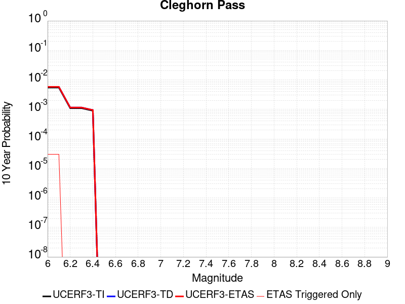 |

| Magnitude | 1 wk TI Prob | 1 wk TD Prob | 1 wk ETAS Prob | 1 wk ETAS/TD Gain | 1 wk ETAS Triggered Only | 1 mo TI Prob | 1 mo TD Prob | 1 mo ETAS Prob | 1 mo ETAS/TD Gain | 1 mo ETAS Triggered Only | 1 yr TI Prob | 1 yr TD Prob | 1 yr ETAS Prob | 1 yr ETAS/TD Gain | 1 yr ETAS Triggered Only | 10 yr TI Prob | 10 yr TD Prob | 10 yr ETAS Prob | 10 yr ETAS/TD Gain | 10 yr ETAS Triggered Only |
|-----|-----|-----|-----|-----|-----|-----|-----|-----|-----|-----|-----|-----|-----|-----|-----|-----|-----|-----|-----|-----|
| 6.0 | 1.0522846E-5 | 1.1041074E-5 | 1.1041074E-5 | 1.0 | 0.0 | 4.509713E-5 | 4.7318328E-5 | 4.7318328E-5 | 1.0 | 0.0 | 5.4891926E-4 | 5.76001E-4 | 5.76001E-4 | 1.0 | 0.0 | 0.0054756533 | 0.0057502463 | 0.005780074 | 1.0051872 | 3.0E-5 |
| 6.1 | 1.0522846E-5 | 1.1041074E-5 | 1.1041074E-5 | 1.0 | 0.0 | 4.509713E-5 | 4.7318328E-5 | 4.7318328E-5 | 1.0 | 0.0 | 5.4891926E-4 | 5.76001E-4 | 5.76001E-4 | 1.0 | 0.0 | 0.0054756533 | 0.0057502463 | 0.005780074 | 1.0051872 | 3.0E-5 |
| 6.2 | 2.1045846E-6 | 2.208289E-6 | 2.208289E-6 | 1.0 | 0.0 | 9.019617E-6 | 9.4640845E-6 | 9.4640845E-6 | 1.0 | 0.0 | 1.098083E-4 | 1.1522334E-4 | 1.1522334E-4 | 1.0 | 0.0 | 0.0010975406 | 0.0011520474 | 0.0011520474 | 1.0 | 0.0 |
| 6.3 | 2.1045846E-6 | 2.208289E-6 | 2.208289E-6 | 1.0 | 0.0 | 9.019617E-6 | 9.4640845E-6 | 9.4640845E-6 | 1.0 | 0.0 | 1.098083E-4 | 1.1522334E-4 | 1.1522334E-4 | 1.0 | 0.0 | 0.0010975406 | 0.0011520474 | 0.0011520474 | 1.0 | 0.0 |
| 6.4 | 1.7259927E-6 | 1.810948E-6 | 1.810948E-6 | 1.0 | 0.0 | 7.3970905E-6 | 7.761206E-6 | 7.761206E-6 | 1.0 | 0.0 | 9.005586E-5 | 9.449268E-5 | 9.449268E-5 | 1.0 | 0.0 | 9.001937E-4 | 9.4492675E-4 | 9.4492675E-4 | 1.0 | 0.0 |

## San Jacinto (Anza) rev
*[(top)](#table-of-contents)*

| 1 Week | 1 Month | 1 Year | 10 Year |
|-----|-----|-----|-----|
|  |  |  |  |

| Magnitude | 1 wk TI Prob | 1 wk TD Prob | 1 wk ETAS Prob | 1 wk ETAS/TD Gain | 1 wk ETAS Triggered Only | 1 mo TI Prob | 1 mo TD Prob | 1 mo ETAS Prob | 1 mo ETAS/TD Gain | 1 mo ETAS Triggered Only | 1 yr TI Prob | 1 yr TD Prob | 1 yr ETAS Prob | 1 yr ETAS/TD Gain | 1 yr ETAS Triggered Only | 10 yr TI Prob | 10 yr TD Prob | 10 yr ETAS Prob | 10 yr ETAS/TD Gain | 10 yr ETAS Triggered Only |
|-----|-----|-----|-----|-----|-----|-----|-----|-----|-----|-----|-----|-----|-----|-----|-----|-----|-----|-----|-----|-----|
| 6.0 | 6.3015636E-5 | 4.340614E-5 | 4.340614E-5 | 1.0 | 0.0 | 2.7003905E-4 | 1.8601312E-4 | 1.9601126E-4 | 1.0537497 | 1.0E-5 | 0.0032827691 | 0.0022623695 | 0.0022923015 | 1.0132304 | 3.0E-5 | 0.032346968 | 0.023355689 | 0.023394754 | 1.0016726 | 4.0E-5 |
| 6.1 | 6.3015636E-5 | 4.340614E-5 | 4.340614E-5 | 1.0 | 0.0 | 2.7003905E-4 | 1.8601312E-4 | 1.9601126E-4 | 1.0537497 | 1.0E-5 | 0.0032827691 | 0.0022623695 | 0.0022923015 | 1.0132304 | 3.0E-5 | 0.032346968 | 0.023355689 | 0.023394754 | 1.0016726 | 4.0E-5 |
| 6.2 | 6.3015636E-5 | 4.340614E-5 | 4.340614E-5 | 1.0 | 0.0 | 2.7003905E-4 | 1.8601312E-4 | 1.9601126E-4 | 1.0537497 | 1.0E-5 | 0.0032827691 | 0.0022623695 | 0.0022923015 | 1.0132304 | 3.0E-5 | 0.032346968 | 0.023355689 | 0.023394754 | 1.0016726 | 4.0E-5 |
| 6.3 | 6.3015636E-5 | 4.340614E-5 | 4.340614E-5 | 1.0 | 0.0 | 2.7003905E-4 | 1.8601312E-4 | 1.9601126E-4 | 1.0537497 | 1.0E-5 | 0.0032827691 | 0.0022623695 | 0.0022923015 | 1.0132304 | 3.0E-5 | 0.032346968 | 0.023355689 | 0.023394754 | 1.0016726 | 4.0E-5 |
| 6.4 | 6.3015636E-5 | 4.340614E-5 | 4.340614E-5 | 1.0 | 0.0 | 2.7003905E-4 | 1.8601312E-4 | 1.9601126E-4 | 1.0537497 | 1.0E-5 | 0.0032827691 | 0.0022623695 | 0.0022923015 | 1.0132304 | 3.0E-5 | 0.032346968 | 0.023355689 | 0.023394754 | 1.0016726 | 4.0E-5 |
| 6.5 | 5.811017E-5 | 4.018141E-5 | 4.018141E-5 | 1.0 | 0.0 | 2.4901982E-4 | 1.7219472E-4 | 1.8219299E-4 | 1.0580637 | 1.0E-5 | 0.0030276014 | 0.0020944607 | 0.0021243978 | 1.0142936 | 3.0E-5 | 0.02986684 | 0.021651264 | 0.021690398 | 1.0018075 | 4.0E-5 |
| 6.6 | 5.811017E-5 | 4.018141E-5 | 4.018141E-5 | 1.0 | 0.0 | 2.4901982E-4 | 1.7219472E-4 | 1.8219299E-4 | 1.0580637 | 1.0E-5 | 0.0030276014 | 0.0020944607 | 0.0021243978 | 1.0142936 | 3.0E-5 | 0.02986684 | 0.021651264 | 0.021690398 | 1.0018075 | 4.0E-5 |
| 6.7 | 5.712442E-5 | 3.9603285E-5 | 3.9603285E-5 | 1.0 | 0.0 | 2.4479596E-4 | 1.6971734E-4 | 1.7971564E-4 | 1.0589114 | 1.0E-5 | 0.0029763177 | 0.0020643559 | 0.0020942942 | 1.0145024 | 3.0E-5 | 0.029367693 | 0.021340467 | 0.021379614 | 1.0018344 | 4.0E-5 |
| 6.8 | 5.6967532E-5 | 3.9459563E-5 | 3.9459563E-5 | 1.0 | 0.0 | 2.4412372E-4 | 1.6910149E-4 | 1.7909979E-4 | 1.0591261 | 1.0E-5 | 0.0029681553 | 0.002056872 | 0.0020868103 | 1.0145552 | 3.0E-5 | 0.029288229 | 0.021264626 | 0.021303775 | 1.0018411 | 4.0E-5 |
| 6.9 | 5.6211324E-5 | 3.91636E-5 | 3.91636E-5 | 1.0 | 0.0 | 2.4088343E-4 | 1.6783323E-4 | 1.7783155E-4 | 1.0595729 | 1.0E-5 | 0.0029288116 | 0.00204146 | 0.0020713988 | 1.0146654 | 3.0E-5 | 0.028905109 | 0.021104459 | 0.021143613 | 1.0018554 | 4.0E-5 |
| 7.0 | 5.4383527E-5 | 3.8022816E-5 | 3.8022816E-5 | 1.0 | 0.0 | 2.3305144E-4 | 1.6294477E-4 | 1.7294314E-4 | 1.0613605 | 1.0E-5 | 0.0028337094 | 0.0019820523 | 0.002011993 | 1.0151058 | 3.0E-5 | 0.027978465 | 0.020489775 | 0.020528955 | 1.0019122 | 4.0E-5 |
| 7.1 | 5.1393665E-5 | 3.648205E-5 | 3.648205E-5 | 1.0 | 0.0 | 2.2023996E-4 | 1.563423E-4 | 1.6634075E-4 | 1.0639522 | 1.0E-5 | 0.0026781242 | 0.0019018099 | 0.0019317529 | 1.0157444 | 3.0E-5 | 0.026460782 | 0.019663503 | 0.019702718 | 1.0019943 | 4.0E-5 |
| 7.2 | 4.785222E-5 | 3.4831475E-5 | 3.4831475E-5 | 1.0 | 0.0 | 2.0506482E-4 | 1.4926922E-4 | 1.5926773E-4 | 1.0669831 | 1.0E-5 | 0.0024938055 | 0.0018158415 | 0.001845787 | 1.0164913 | 3.0E-5 | 0.024660049 | 0.018775458 | 0.018814705 | 1.0020905 | 4.0E-5 |
| 7.3 | 4.2143256E-5 | 3.392344E-5 | 3.392344E-5 | 1.0 | 0.0 | 1.8060145E-4 | 1.4537809E-4 | 1.5537663E-4 | 1.0687761 | 1.0E-5 | 0.002196605 | 0.0017685448 | 0.0017984917 | 1.0169331 | 3.0E-5 | 0.02175019 | 0.018282542 | 0.01832181 | 1.0021479 | 4.0E-5 |
| 7.4 | 4.0264713E-5 | 3.3560947E-5 | 3.3560947E-5 | 1.0 | 0.0 | 1.7255165E-4 | 1.4382473E-4 | 1.5382329E-4 | 1.069519 | 1.0E-5 | 0.002098792 | 0.001749663 | 0.0017796106 | 1.0171162 | 3.0E-5 | 0.020790804 | 0.018086791 | 0.018126067 | 1.0021715 | 4.0E-5 |
| 7.5 | 3.694492E-5 | 3.227252E-5 | 3.227252E-5 | 1.0 | 0.0 | 1.5832575E-4 | 1.383035E-4 | 1.483021E-4 | 1.0722947 | 1.0E-5 | 0.0019259118 | 0.0016825476 | 0.0017124971 | 1.0178001 | 3.0E-5 | 0.01909306 | 0.017401922 | 0.017441226 | 1.0022585 | 4.0E-5 |
| 7.6 | 3.200565E-5 | 2.9580056E-5 | 2.9580056E-5 | 1.0 | 0.0 | 1.3715986E-4 | 1.2676552E-4 | 1.3676425E-4 | 1.0788758 | 1.0E-5 | 0.001668642 | 0.0015422798 | 0.0015722335 | 1.0194217 | 3.0E-5 | 0.01656168 | 0.015985891 | 0.016025253 | 1.0024621 | 4.0E-5 |
| 7.7 | 2.731642E-5 | 2.6166463E-5 | 2.6166463E-5 | 1.0 | 0.0 | 1.1706512E-4 | 1.1213717E-4 | 1.2213604E-4 | 1.0891665 | 1.0E-5 | 0.001424336 | 0.001364416 | 0.0013943751 | 1.0219574 | 3.0E-5 | 0.014152412 | 0.014205833 | 0.014245264 | 1.0027758 | 4.0E-5 |
| 7.8 | 2.3466424E-5 | 2.3575607E-5 | 2.3575607E-5 | 1.0 | 0.0 | 1.0056651E-4 | 1.01034406E-4 | 1.110334E-4 | 1.0989662 | 1.0E-5 | 0.0012237094 | 0.0012294006 | 0.0012593637 | 1.0243721 | 3.0E-5 | 0.012169928 | 0.0128462 | 0.012885686 | 1.0030738 | 4.0E-5 |
| 7.9 | 1.8611925E-5 | 1.8971912E-5 | 1.8971912E-5 | 1.0 | 0.0 | 7.9762955E-5 | 8.130566E-5 | 9.130485E-5 | 1.1229826 | 1.0E-5 | 9.7068126E-4 | 9.894477E-4 | 0.001019418 | 1.0302899 | 3.0E-5 | 0.0096645225 | 0.0104274275 | 0.010457115 | 1.0028471 | 3.0E-5 |
| 8.0 | 1.5460775E-5 | 1.5797441E-5 | 1.5797441E-5 | 1.0 | 0.0 | 6.6258784E-5 | 6.770156E-5 | 7.770089E-5 | 1.1476971 | 1.0E-5 | 8.0640207E-4 | 8.239555E-4 | 8.5393083E-4 | 1.0363797 | 3.0E-5 | 0.008034821 | 0.008732781 | 0.008762519 | 1.0034053 | 3.0E-5 |
| 8.1 | 9.983884E-6 | 8.30257E-6 | 8.30257E-6 | 1.0 | 0.0 | 4.2787375E-5 | 3.5581957E-5 | 3.5581957E-5 | 1.0 | 0.0 | 5.2081177E-4 | 4.3312475E-4 | 4.3312475E-4 | 1.0 | 0.0 | 0.0051959283 | 0.0046576774 | 0.0046576774 | 1.0 | 0.0 |
| 8.2 | 4.1226E-6 | 1.5621035E-6 | 1.5621035E-6 | 1.0 | 0.0 | 1.7668166E-5 | 6.6947123E-6 | 6.6947123E-6 | 1.0 | 0.0 | 2.1508869E-4 | 8.15051E-5 | 8.15051E-5 | 1.0 | 0.0 | 0.0021488064 | 9.4579114E-4 | 9.4579114E-4 | 1.0 | 0.0 |
| 8.3 | 1.2750878E-6 | 3.6368886E-7 | 3.6368886E-7 | 1.0 | 0.0 | 5.4646503E-6 | 1.5586656E-6 | 1.5586656E-6 | 1.0 | 0.0 | 6.653009E-5 | 1.8976592E-5 | 1.8976592E-5 | 1.0 | 0.0 | 6.6510175E-4 | 2.2880803E-4 | 2.2880803E-4 | 1.0 | 0.0 |

## Santa Cruz Catalina Ridge alt1
*[(top)](#table-of-contents)*

| 1 Week | 1 Month | 1 Year | 10 Year |
|-----|-----|-----|-----|
|  |  |  |  |

| Magnitude | 1 wk TI Prob | 1 wk TD Prob | 1 wk ETAS Prob | 1 wk ETAS/TD Gain | 1 wk ETAS Triggered Only | 1 mo TI Prob | 1 mo TD Prob | 1 mo ETAS Prob | 1 mo ETAS/TD Gain | 1 mo ETAS Triggered Only | 1 yr TI Prob | 1 yr TD Prob | 1 yr ETAS Prob | 1 yr ETAS/TD Gain | 1 yr ETAS Triggered Only | 10 yr TI Prob | 10 yr TD Prob | 10 yr ETAS Prob | 10 yr ETAS/TD Gain | 10 yr ETAS Triggered Only |
|-----|-----|-----|-----|-----|-----|-----|-----|-----|-----|-----|-----|-----|-----|-----|-----|-----|-----|-----|-----|-----|
| 6.0 | 3.2833184E-5 | 3.6561752E-5 | 3.6561752E-5 | 1.0 | 0.0 | 1.4070606E-4 | 1.5668475E-4 | 1.5668475E-4 | 1.0 | 0.0 | 0.00171175 | 0.001906134 | 0.0019161149 | 1.0052363 | 1.0E-5 | 0.016986247 | 0.018914752 | 0.018953996 | 1.0020747 | 4.0E-5 |
| 6.1 | 1.9835548E-5 | 2.1661104E-5 | 2.1661104E-5 | 1.0 | 0.0 | 8.500672E-5 | 9.283011E-5 | 9.283011E-5 | 1.0 | 0.0 | 0.0010344655 | 0.0011296407 | 0.0011396295 | 1.0088423 | 1.0E-5 | 0.010296632 | 0.01124112 | 0.011260896 | 1.0017592 | 2.0E-5 |
| 6.2 | 1.9835548E-5 | 2.1661104E-5 | 2.1661104E-5 | 1.0 | 0.0 | 8.500672E-5 | 9.283011E-5 | 9.283011E-5 | 1.0 | 0.0 | 0.0010344655 | 0.0011296407 | 0.0011396295 | 1.0088423 | 1.0E-5 | 0.010296632 | 0.01124112 | 0.011260896 | 1.0017592 | 2.0E-5 |
| 6.3 | 1.5728183E-5 | 1.703508E-5 | 1.703508E-5 | 1.0 | 0.0 | 6.7404755E-5 | 7.3005474E-5 | 7.3005474E-5 | 1.0 | 0.0 | 8.2034385E-4 | 8.8848535E-4 | 8.9847646E-4 | 1.0112451 | 1.0E-5 | 0.008173222 | 0.008850012 | 0.008859923 | 1.00112 | 1.0E-5 |
| 6.4 | 1.5728183E-5 | 1.703508E-5 | 1.703508E-5 | 1.0 | 0.0 | 6.7404755E-5 | 7.3005474E-5 | 7.3005474E-5 | 1.0 | 0.0 | 8.2034385E-4 | 8.8848535E-4 | 8.9847646E-4 | 1.0112451 | 1.0E-5 | 0.008173222 | 0.008850012 | 0.008859923 | 1.00112 | 1.0E-5 |
| 6.5 | 1.3707734E-5 | 1.4795458E-5 | 1.4795458E-5 | 1.0 | 0.0 | 5.8746107E-5 | 6.3407584E-5 | 6.3407584E-5 | 1.0 | 0.0 | 7.1499916E-4 | 7.7171746E-4 | 7.7171746E-4 | 1.0 | 0.0 | 0.0071270303 | 0.0076907747 | 0.0076907747 | 1.0 | 0.0 |
| 6.6 | 1.2539813E-5 | 1.3511054E-5 | 1.3511054E-5 | 1.0 | 0.0 | 5.3740947E-5 | 5.7903246E-5 | 5.7903246E-5 | 1.0 | 0.0 | 6.540996E-4 | 7.0474664E-4 | 7.0474664E-4 | 1.0 | 0.0 | 0.0065217763 | 0.0070254207 | 0.0070254207 | 1.0 | 0.0 |
| 6.7 | 1.1504083E-5 | 1.2378125E-5 | 1.2378125E-5 | 1.0 | 0.0 | 4.930228E-5 | 5.3048036E-5 | 5.3048036E-5 | 1.0 | 0.0 | 6.0008996E-4 | 6.4567046E-4 | 6.4567046E-4 | 1.0 | 0.0 | 0.005984721 | 0.0064381748 | 0.0064381748 | 1.0 | 0.0 |
| 6.8 | 1.012739E-5 | 1.0877713E-5 | 1.0877713E-5 | 1.0 | 0.0 | 4.340238E-5 | 4.6617948E-5 | 4.6617948E-5 | 1.0 | 0.0 | 5.282958E-4 | 5.674272E-4 | 5.674272E-4 | 1.0 | 0.0 | 0.0052704164 | 0.0056599528 | 0.0056599528 | 1.0 | 0.0 |
| 6.9 | 8.9607865E-6 | 9.609672E-6 | 9.609672E-6 | 1.0 | 0.0 | 3.8402806E-5 | 4.1183663E-5 | 4.1183663E-5 | 1.0 | 0.0 | 4.6745385E-4 | 5.012968E-4 | 5.012968E-4 | 1.0 | 0.0 | 0.0046647177 | 0.0050017796 | 0.0050017796 | 1.0 | 0.0 |
| 7.0 | 8.046829E-6 | 8.620235E-6 | 8.620235E-6 | 1.0 | 0.0 | 3.4485955E-5 | 3.6943347E-5 | 3.6943347E-5 | 1.0 | 0.0 | 4.1978562E-4 | 4.4969324E-4 | 4.4969324E-4 | 1.0 | 0.0 | 0.004189935 | 0.004487923 | 0.004487923 | 1.0 | 0.0 |
| 7.1 | 7.136131E-6 | 7.638084E-6 | 7.638084E-6 | 1.0 | 0.0 | 3.0583058E-5 | 3.273424E-5 | 3.273424E-5 | 1.0 | 0.0 | 3.7228514E-4 | 3.9846718E-4 | 3.9846718E-4 | 1.0 | 0.0 | 0.0037166206 | 0.0039776037 | 0.0039776037 | 1.0 | 0.0 |
| 7.2 | 6.362014E-6 | 6.8053364E-6 | 6.8053364E-6 | 1.0 | 0.0 | 2.726549E-5 | 2.9165405E-5 | 2.9165405E-5 | 1.0 | 0.0 | 3.3190678E-4 | 3.550316E-4 | 3.550316E-4 | 1.0 | 0.0 | 0.0033141149 | 0.0035447124 | 0.0035447124 | 1.0 | 0.0 |
| 7.3 | 5.004101E-6 | 5.3520116E-6 | 5.3520116E-6 | 1.0 | 0.0 | 2.1445969E-5 | 2.2936993E-5 | 2.2936993E-5 | 1.0 | 0.0 | 2.6107338E-4 | 2.7922264E-4 | 2.7922264E-4 | 1.0 | 0.0 | 0.002607669 | 0.0027887728 | 0.0027887728 | 1.0 | 0.0 |
| 7.4 | 3.4901443E-6 | 3.7322588E-6 | 3.7322588E-6 | 1.0 | 0.0 | 1.4957676E-5 | 1.59953E-5 | 1.59953E-5 | 1.0 | 0.0 | 1.8209449E-4 | 1.9472574E-4 | 1.9472574E-4 | 1.0 | 0.0 | 0.0018194534 | 0.0019455898 | 0.0019455898 | 1.0 | 0.0 |
| 7.5 | 1.1215045E-6 | 1.1894446E-6 | 1.1894446E-6 | 1.0 | 0.0 | 4.806439E-6 | 5.0976096E-6 | 5.0976096E-6 | 1.0 | 0.0 | 5.851682E-5 | 6.206166E-5 | 6.206166E-5 | 1.0 | 0.0 | 5.850142E-4 | 6.2044634E-4 | 6.2044634E-4 | 1.0 | 0.0 |
| 7.6 | 2.8599047E-7 | 2.9953122E-7 | 2.9953122E-7 | 1.0 | 0.0 | 1.2256729E-6 | 1.2837046E-6 | 1.2837046E-6 | 1.0 | 0.0 | 1.4922465E-5 | 1.5628992E-5 | 1.5628992E-5 | 1.0 | 0.0 | 1.4921463E-4 | 1.5627907E-4 | 1.5627907E-4 | 1.0 | 0.0 |
| 7.7 | 2.0781519E-7 | 2.1745126E-7 | 2.1745126E-7 | 1.0 | 0.0 | 8.906362E-7 | 9.319336E-7 | 9.319336E-7 | 1.0 | 0.0 | 1.08434415E-5 | 1.1346234E-5 | 1.1346234E-5 | 1.0 | 0.0 | 1.0842913E-4 | 1.13456634E-4 | 1.13456634E-4 | 1.0 | 0.0 |
| 7.8 | 3.614776E-8 | 3.7642256E-8 | 3.7642256E-8 | 1.0 | 0.0 | 1.5491896E-7 | 1.6132394E-7 | 1.6132394E-7 | 1.0 | 0.0 | 1.8861368E-6 | 1.9641175E-6 | 1.9641175E-6 | 1.0 | 0.0 | 1.8861208E-5 | 1.9641013E-5 | 1.9641013E-5 | 1.0 | 0.0 |

## Pisgah-Bullion Mtn-Mesquite Lk
*[(top)](#table-of-contents)*

| 1 Week | 1 Month | 1 Year | 10 Year |
|-----|-----|-----|-----|
|  |  |  |  |

| Magnitude | 1 wk TI Prob | 1 wk TD Prob | 1 wk ETAS Prob | 1 wk ETAS/TD Gain | 1 wk ETAS Triggered Only | 1 mo TI Prob | 1 mo TD Prob | 1 mo ETAS Prob | 1 mo ETAS/TD Gain | 1 mo ETAS Triggered Only | 1 yr TI Prob | 1 yr TD Prob | 1 yr ETAS Prob | 1 yr ETAS/TD Gain | 1 yr ETAS Triggered Only | 10 yr TI Prob | 10 yr TD Prob | 10 yr ETAS Prob | 10 yr ETAS/TD Gain | 10 yr ETAS Triggered Only |
|-----|-----|-----|-----|-----|-----|-----|-----|-----|-----|-----|-----|-----|-----|-----|-----|-----|-----|-----|-----|-----|
| 6.0 | 3.0240792E-5 | 2.4093093E-5 | 3.4092853E-5 | 1.4150467 | 1.0E-5 | 1.2959696E-4 | 1.032526E-4 | 1.1325157E-4 | 1.0968399 | 1.0E-5 | 0.0015767008 | 0.0012564762 | 0.001276451 | 1.0158975 | 2.0E-5 | 0.015655609 | 0.012503746 | 0.012543245 | 1.003159 | 4.0E-5 |
| 6.1 | 3.0240792E-5 | 2.4093093E-5 | 3.4092853E-5 | 1.4150467 | 1.0E-5 | 1.2959696E-4 | 1.032526E-4 | 1.1325157E-4 | 1.0968399 | 1.0E-5 | 0.0015767008 | 0.0012564762 | 0.001276451 | 1.0158975 | 2.0E-5 | 0.015655609 | 0.012503746 | 0.012543245 | 1.003159 | 4.0E-5 |
| 6.2 | 3.0240792E-5 | 2.4093093E-5 | 3.4092853E-5 | 1.4150467 | 1.0E-5 | 1.2959696E-4 | 1.032526E-4 | 1.1325157E-4 | 1.0968399 | 1.0E-5 | 0.0015767008 | 0.0012564762 | 0.001276451 | 1.0158975 | 2.0E-5 | 0.015655609 | 0.012503746 | 0.012543245 | 1.003159 | 4.0E-5 |
| 6.3 | 2.0498217E-5 | 1.3639044E-5 | 2.3638906E-5 | 1.7331792 | 1.0E-5 | 8.784654E-5 | 5.8451824E-5 | 6.845124E-5 | 1.171071 | 1.0E-5 | 0.0010690069 | 7.114348E-4 | 7.314206E-4 | 1.0280921 | 2.0E-5 | 0.01063879 | 0.007093199 | 0.0071229865 | 1.0041994 | 3.0E-5 |
| 6.4 | 2.0498217E-5 | 1.3639044E-5 | 2.3638906E-5 | 1.7331792 | 1.0E-5 | 8.784654E-5 | 5.8451824E-5 | 6.845124E-5 | 1.171071 | 1.0E-5 | 0.0010690069 | 7.114348E-4 | 7.314206E-4 | 1.0280921 | 2.0E-5 | 0.01063879 | 0.007093199 | 0.0071229865 | 1.0041994 | 3.0E-5 |
| 6.5 | 1.7316182E-5 | 1.0477687E-5 | 1.0477687E-5 | 1.0 | 0.0 | 7.42101E-5 | 4.490366E-5 | 4.490366E-5 | 1.0 | 0.0 | 9.0313336E-4 | 5.465749E-4 | 5.465749E-4 | 1.0 | 0.0 | 0.008994718 | 0.0054533016 | 0.0054533016 | 1.0 | 0.0 |
| 6.6 | 1.5251077E-5 | 8.414648E-6 | 8.414648E-6 | 1.0 | 0.0 | 6.536012E-5 | 3.606232E-5 | 3.606232E-5 | 1.0 | 0.0 | 7.9546886E-4 | 4.389775E-4 | 4.389775E-4 | 1.0 | 0.0 | 0.007926274 | 0.004381821 | 0.004381821 | 1.0 | 0.0 |
| 6.7 | 1.2997425E-5 | 6.41158E-6 | 6.41158E-6 | 1.0 | 0.0 | 5.570206E-5 | 2.7477938E-5 | 2.7477938E-5 | 1.0 | 0.0 | 6.7796157E-4 | 3.344972E-4 | 3.344972E-4 | 1.0 | 0.0 | 0.0067589693 | 0.0033403973 | 0.0033403973 | 1.0 | 0.0 |
| 6.8 | 1.035386E-5 | 4.3334912E-6 | 4.3334912E-6 | 1.0 | 0.0 | 4.437293E-5 | 1.8571978E-5 | 1.8571978E-5 | 1.0 | 0.0 | 5.401065E-4 | 2.2609126E-4 | 2.2609126E-4 | 1.0 | 0.0 | 0.0053879567 | 0.0022586992 | 0.0022586992 | 1.0 | 0.0 |
| 6.9 | 8.816252E-6 | 3.5808991E-6 | 3.5808991E-6 | 1.0 | 0.0 | 3.778339E-5 | 1.5346624E-5 | 1.5346624E-5 | 1.0 | 0.0 | 4.5991567E-4 | 1.8682971E-4 | 1.8682971E-4 | 1.0 | 0.0 | 0.00458965 | 0.001866785 | 0.001866785 | 1.0 | 0.0 |
| 7.0 | 6.8232207E-6 | 2.5676932E-6 | 2.5676932E-6 | 1.0 | 0.0 | 2.9242048E-5 | 1.1004355E-5 | 1.1004355E-5 | 1.0 | 0.0 | 3.5596377E-4 | 1.339701E-4 | 1.339701E-4 | 1.0 | 0.0 | 0.0035539411 | 0.0013389244 | 0.0013389244 | 1.0 | 0.0 |
| 7.1 | 5.837013E-6 | 2.2275426E-6 | 2.2275426E-6 | 1.0 | 0.0 | 2.501553E-5 | 9.546578E-6 | 9.546578E-6 | 1.0 | 0.0 | 3.045215E-4 | 1.1622368E-4 | 1.1622368E-4 | 1.0 | 0.0 | 0.0030410455 | 0.001161658 | 0.001161658 | 1.0 | 0.0 |
| 7.2 | 4.278052E-6 | 1.6276792E-6 | 1.6276792E-6 | 1.0 | 0.0 | 1.833438E-5 | 6.9757507E-6 | 6.9757507E-6 | 1.0 | 0.0 | 2.231982E-4 | 8.492669E-5 | 8.492669E-5 | 1.0 | 0.0 | 0.0022297418 | 8.4896554E-4 | 8.4896554E-4 | 1.0 | 0.0 |
| 7.3 | 1.8803692E-6 | 8.3453267E-7 | 8.3453267E-7 | 1.0 | 0.0 | 8.0587E-6 | 3.5765645E-6 | 3.5765645E-6 | 1.0 | 0.0 | 9.811026E-5 | 4.354395E-5 | 4.354395E-5 | 1.0 | 0.0 | 9.806695E-4 | 4.3536862E-4 | 4.3536862E-4 | 1.0 | 0.0 |

## Blue Cut
*[(top)](#table-of-contents)*

| 1 Week | 1 Month | 1 Year | 10 Year |
|-----|-----|-----|-----|
|  |  | 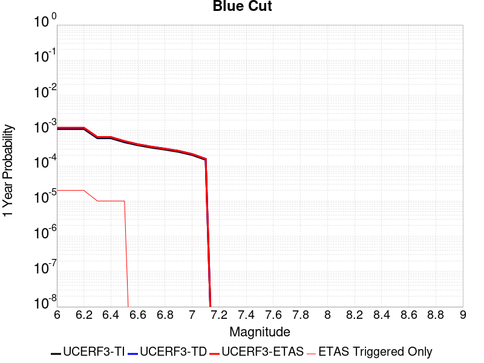 |  |

| Magnitude | 1 wk TI Prob | 1 wk TD Prob | 1 wk ETAS Prob | 1 wk ETAS/TD Gain | 1 wk ETAS Triggered Only | 1 mo TI Prob | 1 mo TD Prob | 1 mo ETAS Prob | 1 mo ETAS/TD Gain | 1 mo ETAS Triggered Only | 1 yr TI Prob | 1 yr TD Prob | 1 yr ETAS Prob | 1 yr ETAS/TD Gain | 1 yr ETAS Triggered Only | 10 yr TI Prob | 10 yr TD Prob | 10 yr ETAS Prob | 10 yr ETAS/TD Gain | 10 yr ETAS Triggered Only |
|-----|-----|-----|-----|-----|-----|-----|-----|-----|-----|-----|-----|-----|-----|-----|-----|-----|-----|-----|-----|-----|
| 6.0 | 2.1227985E-5 | 2.2720847E-5 | 2.2720847E-5 | 1.0 | 0.0 | 9.097391E-5 | 9.7371754E-5 | 9.7371754E-5 | 1.0 | 0.0 | 0.0011070445 | 0.0011849144 | 0.0012048908 | 1.0168588 | 2.0E-5 | 0.011015458 | 0.0117918085 | 0.011831337 | 1.0033522 | 4.0E-5 |
| 6.1 | 2.1227985E-5 | 2.2720847E-5 | 2.2720847E-5 | 1.0 | 0.0 | 9.097391E-5 | 9.7371754E-5 | 9.7371754E-5 | 1.0 | 0.0 | 0.0011070445 | 0.0011849144 | 0.0012048908 | 1.0168588 | 2.0E-5 | 0.011015458 | 0.0117918085 | 0.011831337 | 1.0033522 | 4.0E-5 |
| 6.2 | 2.1227985E-5 | 2.2720847E-5 | 2.2720847E-5 | 1.0 | 0.0 | 9.097391E-5 | 9.7371754E-5 | 9.7371754E-5 | 1.0 | 0.0 | 0.0011070445 | 0.0011849144 | 0.0012048908 | 1.0168588 | 2.0E-5 | 0.011015458 | 0.0117918085 | 0.011831337 | 1.0033522 | 4.0E-5 |
| 6.3 | 1.1613981E-5 | 1.2354169E-5 | 1.2354169E-5 | 1.0 | 0.0 | 4.9773254E-5 | 5.294543E-5 | 5.294543E-5 | 1.0 | 0.0 | 6.0582085E-4 | 6.4443244E-4 | 6.54426E-4 | 1.0155076 | 1.0E-5 | 0.0060417196 | 0.0064268843 | 0.0064566913 | 1.0046378 | 3.0E-5 |
| 6.4 | 1.1613981E-5 | 1.2354169E-5 | 1.2354169E-5 | 1.0 | 0.0 | 4.9773254E-5 | 5.294543E-5 | 5.294543E-5 | 1.0 | 0.0 | 6.0582085E-4 | 6.4443244E-4 | 6.54426E-4 | 1.0155076 | 1.0E-5 | 0.0060417196 | 0.0064268843 | 0.0064566913 | 1.0046378 | 3.0E-5 |
| 6.5 | 8.931326E-6 | 9.482064E-6 | 9.482064E-6 | 1.0 | 0.0 | 3.8276554E-5 | 4.0636838E-5 | 4.0636838E-5 | 1.0 | 0.0 | 4.6591737E-4 | 4.9465033E-4 | 5.046454E-4 | 1.0202063 | 1.0E-5 | 0.0046494175 | 0.0049364027 | 0.0049662543 | 1.0060472 | 3.0E-5 |
| 6.6 | 7.345353E-6 | 7.790654E-6 | 7.790654E-6 | 1.0 | 0.0 | 3.1479703E-5 | 3.338814E-5 | 3.338814E-5 | 1.0 | 0.0 | 3.83198E-4 | 4.0643278E-4 | 4.0643278E-4 | 1.0 | 0.0 | 0.0038253788 | 0.004057686 | 0.004077605 | 1.0049089 | 2.0E-5 |
| 6.7 | 6.2775666E-6 | 6.6554676E-6 | 6.6554676E-6 | 1.0 | 0.0 | 2.690358E-5 | 2.8523164E-5 | 2.8523164E-5 | 1.0 | 0.0 | 3.2750185E-4 | 3.472217E-4 | 3.472217E-4 | 1.0 | 0.0 | 0.0032701963 | 0.0034675328 | 0.0034874636 | 1.0057478 | 2.0E-5 |
| 6.8 | 5.5234095E-6 | 5.855391E-6 | 5.855391E-6 | 1.0 | 0.0 | 2.367154E-5 | 2.5094332E-5 | 2.5094332E-5 | 1.0 | 0.0 | 2.8816288E-4 | 3.0548795E-4 | 3.0548795E-4 | 1.0 | 0.0 | 0.002877895 | 0.0030513962 | 0.0030713351 | 1.0065343 | 2.0E-5 |
| 6.9 | 4.7780054E-6 | 5.065663E-6 | 5.065663E-6 | 1.0 | 0.0 | 2.0477004E-5 | 2.1709844E-5 | 2.1709844E-5 | 1.0 | 0.0 | 2.4927902E-4 | 2.6429232E-4 | 2.6429232E-4 | 1.0 | 0.0 | 0.0024899957 | 0.0026404725 | 0.0026604196 | 1.0075544 | 2.0E-5 |
| 7.0 | 3.883171E-6 | 4.118686E-6 | 4.118686E-6 | 1.0 | 0.0 | 1.6642054E-5 | 1.765143E-5 | 1.765143E-5 | 1.0 | 0.0 | 2.0259817E-4 | 2.1489184E-4 | 2.1489184E-4 | 1.0 | 0.0 | 0.0020241356 | 0.0021475162 | 0.0021674733 | 1.0092931 | 2.0E-5 |
| 7.1 | 2.8358215E-6 | 3.0098627E-6 | 3.0098627E-6 | 1.0 | 0.0 | 1.2153464E-5 | 1.2899385E-5 | 1.2899385E-5 | 1.0 | 0.0 | 1.4795837E-4 | 1.5704527E-4 | 1.5704527E-4 | 1.0 | 0.0 | 0.001478599 | 0.0015699882 | 0.0015899568 | 1.0127189 | 2.0E-5 |

## Dry Mountain
*[(top)](#table-of-contents)*

| 1 Week | 1 Month | 1 Year | 10 Year |
|-----|-----|-----|-----|
|  |  |  |  |

| Magnitude | 1 wk TI Prob | 1 wk TD Prob | 1 wk ETAS Prob | 1 wk ETAS/TD Gain | 1 wk ETAS Triggered Only | 1 mo TI Prob | 1 mo TD Prob | 1 mo ETAS Prob | 1 mo ETAS/TD Gain | 1 mo ETAS Triggered Only | 1 yr TI Prob | 1 yr TD Prob | 1 yr ETAS Prob | 1 yr ETAS/TD Gain | 1 yr ETAS Triggered Only | 10 yr TI Prob | 10 yr TD Prob | 10 yr ETAS Prob | 10 yr ETAS/TD Gain | 10 yr ETAS Triggered Only |
|-----|-----|-----|-----|-----|-----|-----|-----|-----|-----|-----|-----|-----|-----|-----|-----|-----|-----|-----|-----|-----|
| 6.0 | 6.222801E-6 | 6.4395595E-6 | 6.4395595E-6 | 1.0 | 0.0 | 2.6668875E-5 | 2.7597911E-5 | 2.7597911E-5 | 1.0 | 0.0 | 3.2464517E-4 | 3.3596868E-4 | 3.4596532E-4 | 1.0297546 | 1.0E-5 | 0.0032417132 | 0.0033561697 | 0.003386069 | 1.0089087 | 3.0E-5 |
| 6.1 | 6.222801E-6 | 6.4395595E-6 | 6.4395595E-6 | 1.0 | 0.0 | 2.6668875E-5 | 2.7597911E-5 | 2.7597911E-5 | 1.0 | 0.0 | 3.2464517E-4 | 3.3596868E-4 | 3.4596532E-4 | 1.0297546 | 1.0E-5 | 0.0032417132 | 0.0033561697 | 0.003386069 | 1.0089087 | 3.0E-5 |
| 6.2 | 6.222801E-6 | 6.4395595E-6 | 6.4395595E-6 | 1.0 | 0.0 | 2.6668875E-5 | 2.7597911E-5 | 2.7597911E-5 | 1.0 | 0.0 | 3.2464517E-4 | 3.3596868E-4 | 3.4596532E-4 | 1.0297546 | 1.0E-5 | 0.0032417132 | 0.0033561697 | 0.003386069 | 1.0089087 | 3.0E-5 |
| 6.3 | 6.222801E-6 | 6.4395595E-6 | 6.4395595E-6 | 1.0 | 0.0 | 2.6668875E-5 | 2.7597911E-5 | 2.7597911E-5 | 1.0 | 0.0 | 3.2464517E-4 | 3.3596868E-4 | 3.4596532E-4 | 1.0297546 | 1.0E-5 | 0.0032417132 | 0.0033561697 | 0.003386069 | 1.0089087 | 3.0E-5 |
| 6.4 | 6.222801E-6 | 6.4395595E-6 | 6.4395595E-6 | 1.0 | 0.0 | 2.6668875E-5 | 2.7597911E-5 | 2.7597911E-5 | 1.0 | 0.0 | 3.2464517E-4 | 3.3596868E-4 | 3.4596532E-4 | 1.0297546 | 1.0E-5 | 0.0032417132 | 0.0033561697 | 0.003386069 | 1.0089087 | 3.0E-5 |
| 6.5 | 2.8528623E-6 | 2.9522503E-6 | 2.9522503E-6 | 1.0 | 0.0 | 1.22264955E-5 | 1.2652488E-5 | 1.2652488E-5 | 1.0 | 0.0 | 1.4884741E-4 | 1.5404186E-4 | 1.5404186E-4 | 1.0 | 0.0 | 0.0014874774 | 0.0015402043 | 0.0015501889 | 1.0064826 | 1.0E-5 |
| 6.6 | 2.8528623E-6 | 2.9522503E-6 | 2.9522503E-6 | 1.0 | 0.0 | 1.22264955E-5 | 1.2652488E-5 | 1.2652488E-5 | 1.0 | 0.0 | 1.4884741E-4 | 1.5404186E-4 | 1.5404186E-4 | 1.0 | 0.0 | 0.0014874774 | 0.0015402043 | 0.0015501889 | 1.0064826 | 1.0E-5 |
| 6.7 | 2.541E-6 | 2.6294306E-6 | 2.6294306E-6 | 1.0 | 0.0 | 1.0889954E-5 | 1.1268989E-5 | 1.1268989E-5 | 1.0 | 0.0 | 1.3257713E-4 | 1.3719994E-4 | 1.3719994E-4 | 1.0 | 0.0 | 0.0013249806 | 0.0013719994 | 0.0013819856 | 1.0072787 | 1.0E-5 |

## Oak Ridge (Onshore)
*[(top)](#table-of-contents)*

| 1 Week | 1 Month | 1 Year | 10 Year |
|-----|-----|-----|-----|
|  |  |  |  |

| Magnitude | 1 wk TI Prob | 1 wk TD Prob | 1 wk ETAS Prob | 1 wk ETAS/TD Gain | 1 wk ETAS Triggered Only | 1 mo TI Prob | 1 mo TD Prob | 1 mo ETAS Prob | 1 mo ETAS/TD Gain | 1 mo ETAS Triggered Only | 1 yr TI Prob | 1 yr TD Prob | 1 yr ETAS Prob | 1 yr ETAS/TD Gain | 1 yr ETAS Triggered Only | 10 yr TI Prob | 10 yr TD Prob | 10 yr ETAS Prob | 10 yr ETAS/TD Gain | 10 yr ETAS Triggered Only |
|-----|-----|-----|-----|-----|-----|-----|-----|-----|-----|-----|-----|-----|-----|-----|-----|-----|-----|-----|-----|-----|
| 6.0 | 3.155064E-5 | 2.9530616E-5 | 2.9530616E-5 | 1.0 | 0.0 | 1.3521002E-4 | 1.2655386E-4 | 1.2655386E-4 | 1.0 | 0.0 | 0.001644939 | 0.0015397422 | 0.0015397422 | 1.0 | 0.0 | 0.01632816 | 0.015295247 | 0.015314941 | 1.0012876 | 2.0E-5 |
| 6.1 | 3.155064E-5 | 2.9530616E-5 | 2.9530616E-5 | 1.0 | 0.0 | 1.3521002E-4 | 1.2655386E-4 | 1.2655386E-4 | 1.0 | 0.0 | 0.001644939 | 0.0015397422 | 0.0015397422 | 1.0 | 0.0 | 0.01632816 | 0.015295247 | 0.015314941 | 1.0012876 | 2.0E-5 |
| 6.2 | 3.155064E-5 | 2.9530616E-5 | 2.9530616E-5 | 1.0 | 0.0 | 1.3521002E-4 | 1.2655386E-4 | 1.2655386E-4 | 1.0 | 0.0 | 0.001644939 | 0.0015397422 | 0.0015397422 | 1.0 | 0.0 | 0.01632816 | 0.015295247 | 0.015314941 | 1.0012876 | 2.0E-5 |
| 6.3 | 3.155064E-5 | 2.9530616E-5 | 2.9530616E-5 | 1.0 | 0.0 | 1.3521002E-4 | 1.2655386E-4 | 1.2655386E-4 | 1.0 | 0.0 | 0.001644939 | 0.0015397422 | 0.0015397422 | 1.0 | 0.0 | 0.01632816 | 0.015295247 | 0.015314941 | 1.0012876 | 2.0E-5 |
| 6.4 | 3.155064E-5 | 2.9530616E-5 | 2.9530616E-5 | 1.0 | 0.0 | 1.3521002E-4 | 1.2655386E-4 | 1.2655386E-4 | 1.0 | 0.0 | 0.001644939 | 0.0015397422 | 0.0015397422 | 1.0 | 0.0 | 0.01632816 | 0.015295247 | 0.015314941 | 1.0012876 | 2.0E-5 |
| 6.5 | 3.155064E-5 | 2.9530616E-5 | 2.9530616E-5 | 1.0 | 0.0 | 1.3521002E-4 | 1.2655386E-4 | 1.2655386E-4 | 1.0 | 0.0 | 0.001644939 | 0.0015397422 | 0.0015397422 | 1.0 | 0.0 | 0.01632816 | 0.015295247 | 0.015314941 | 1.0012876 | 2.0E-5 |
| 6.6 | 3.155064E-5 | 2.9530616E-5 | 2.9530616E-5 | 1.0 | 0.0 | 1.3521002E-4 | 1.2655386E-4 | 1.2655386E-4 | 1.0 | 0.0 | 0.001644939 | 0.0015397422 | 0.0015397422 | 1.0 | 0.0 | 0.01632816 | 0.015295247 | 0.015314941 | 1.0012876 | 2.0E-5 |
| 6.7 | 3.098897E-5 | 2.8868724E-5 | 2.8868724E-5 | 1.0 | 0.0 | 1.328031E-4 | 1.2371744E-4 | 1.2371744E-4 | 1.0 | 0.0 | 0.0016156785 | 0.0015052569 | 0.0015052569 | 1.0 | 0.0 | 0.016039822 | 0.014955054 | 0.014974755 | 1.0013174 | 2.0E-5 |
| 6.8 | 3.0449872E-5 | 2.8243841E-5 | 2.8243841E-5 | 1.0 | 0.0 | 1.3049292E-4 | 1.2103963E-4 | 1.2103963E-4 | 1.0 | 0.0 | 0.0015875935 | 0.0014726985 | 0.0014726985 | 1.0 | 0.0 | 0.015762992 | 0.014633763 | 0.014653469 | 1.0013467 | 2.0E-5 |
| 6.9 | 2.697928E-5 | 2.4223735E-5 | 2.4223735E-5 | 1.0 | 0.0 | 1.15620365E-4 | 1.03812E-4 | 1.03812E-4 | 1.0 | 0.0 | 0.0014067689 | 0.0012631998 | 0.0012631998 | 1.0 | 0.0 | 0.0139789665 | 0.012562914 | 0.0125826625 | 1.001572 | 2.0E-5 |
| 7.0 | 2.4893961E-5 | 2.1865728E-5 | 2.1865728E-5 | 1.0 | 0.0 | 1.0668404E-4 | 9.370699E-5 | 9.370699E-5 | 1.0 | 0.0 | 0.0012981043 | 0.0011403032 | 0.0011403032 | 1.0 | 0.0 | 0.012905477 | 0.011346809 | 0.011366582 | 1.0017426 | 2.0E-5 |
| 7.1 | 2.0945363E-5 | 1.7357654E-5 | 1.7357654E-5 | 1.0 | 0.0 | 8.976275E-5 | 7.438785E-5 | 7.438785E-5 | 1.0 | 0.0 | 0.0010923136 | 9.053005E-4 | 9.053005E-4 | 1.0 | 0.0 | 0.0108696 | 0.009017061 | 0.009036881 | 1.002198 | 2.0E-5 |
| 7.2 | 2.0439404E-5 | 1.6812532E-5 | 1.6812532E-5 | 1.0 | 0.0 | 8.7594504E-5 | 7.205174E-5 | 7.205174E-5 | 1.0 | 0.0 | 0.0010659413 | 8.7688165E-4 | 8.7688165E-4 | 1.0 | 0.0 | 0.010608427 | 0.008735135 | 0.008754961 | 1.0022696 | 2.0E-5 |
| 7.3 | 1.8463334E-5 | 1.5383403E-5 | 1.5383403E-5 | 1.0 | 0.0 | 7.912617E-5 | 6.592723E-5 | 6.592723E-5 | 1.0 | 0.0 | 9.6293533E-4 | 8.0237276E-4 | 8.0237276E-4 | 1.0 | 0.0 | 0.009587734 | 0.007995624 | 0.008005544 | 1.0012407 | 1.0E-5 |
| 7.4 | 1.763139E-5 | 1.4518234E-5 | 1.4518234E-5 | 1.0 | 0.0 | 7.556091E-5 | 6.221954E-5 | 6.221954E-5 | 1.0 | 0.0 | 9.1956573E-4 | 7.5726357E-4 | 7.5726357E-4 | 1.0 | 0.0 | 0.009157699 | 0.0075476374 | 0.007557562 | 1.0013149 | 1.0E-5 |
| 7.5 | 1.3594944E-5 | 1.11642585E-5 | 1.11642585E-5 | 1.0 | 0.0 | 5.8262744E-5 | 4.784596E-5 | 4.784596E-5 | 1.0 | 0.0 | 7.0911803E-4 | 5.823714E-4 | 5.823714E-4 | 1.0 | 0.0 | 0.007068595 | 0.0058088982 | 0.00581884 | 1.0017115 | 1.0E-5 |
| 7.6 | 6.9889534E-6 | 5.637073E-6 | 5.637073E-6 | 1.0 | 0.0 | 2.9952313E-5 | 2.4158664E-5 | 2.4158664E-5 | 1.0 | 0.0 | 3.646084E-4 | 2.9409243E-4 | 2.9409243E-4 | 1.0 | 0.0 | 0.0036401073 | 0.0029370766 | 0.0029470471 | 1.0033947 | 1.0E-5 |
| 7.7 | 4.0824193E-6 | 3.2834537E-6 | 3.2834537E-6 | 1.0 | 0.0 | 1.7495966E-5 | 1.40718685E-5 | 1.40718685E-5 | 1.0 | 0.0 | 2.1299256E-4 | 1.7131167E-4 | 1.7131167E-4 | 1.0 | 0.0 | 0.0021278851 | 0.0017118094 | 0.0017118094 | 1.0 | 0.0 |
| 7.8 | 1.7023609E-6 | 1.437126E-6 | 1.437126E-6 | 1.0 | 0.0 | 7.295812E-6 | 6.159097E-6 | 6.159097E-6 | 1.0 | 0.0 | 8.882289E-5 | 7.4984455E-5 | 7.4984455E-5 | 1.0 | 0.0 | 8.8787393E-4 | 7.4959436E-4 | 7.4959436E-4 | 1.0 | 0.0 |
| 7.9 | 2.721225E-7 | 2.2618448E-7 | 2.2618448E-7 | 1.0 | 0.0 | 1.1662388E-6 | 9.693617E-7 | 9.693617E-7 | 1.0 | 0.0 | 1.4198865E-5 | 1.1801918E-5 | 1.1801918E-5 | 1.0 | 0.0 | 1.4197957E-4 | 1.18013195E-4 | 1.18013195E-4 | 1.0 | 0.0 |
| 8.0 | 9.364255E-9 | 5.122105E-9 | 5.122105E-9 | 1.0 | 0.0 | 4.0132523E-8 | 2.195188E-8 | 2.195188E-8 | 1.0 | 0.0 | 4.8861335E-7 | 2.672641E-7 | 2.672641E-7 | 1.0 | 0.0 | 4.8861225E-6 | 2.6726382E-6 | 2.6726382E-6 | 1.0 | 0.0 |

## Palos Verdes
*[(top)](#table-of-contents)*

| 1 Week | 1 Month | 1 Year | 10 Year |
|-----|-----|-----|-----|
|  |  |  | 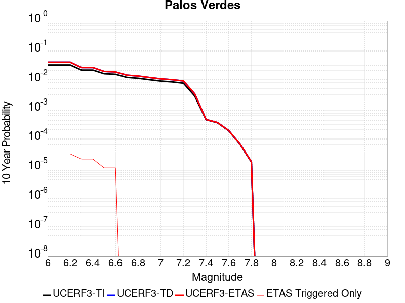 |

| Magnitude | 1 wk TI Prob | 1 wk TD Prob | 1 wk ETAS Prob | 1 wk ETAS/TD Gain | 1 wk ETAS Triggered Only | 1 mo TI Prob | 1 mo TD Prob | 1 mo ETAS Prob | 1 mo ETAS/TD Gain | 1 mo ETAS Triggered Only | 1 yr TI Prob | 1 yr TD Prob | 1 yr ETAS Prob | 1 yr ETAS/TD Gain | 1 yr ETAS Triggered Only | 10 yr TI Prob | 10 yr TD Prob | 10 yr ETAS Prob | 10 yr ETAS/TD Gain | 10 yr ETAS Triggered Only |
|-----|-----|-----|-----|-----|-----|-----|-----|-----|-----|-----|-----|-----|-----|-----|-----|-----|-----|-----|-----|-----|
| 6.0 | 6.126063E-5 | 7.624075E-5 | 7.624075E-5 | 1.0 | 0.0 | 2.6251914E-4 | 3.2670845E-4 | 3.2670845E-4 | 1.0 | 0.0 | 0.0031914865 | 0.00397094 | 0.0039809 | 1.0025083 | 1.0E-5 | 0.031460393 | 0.039056458 | 0.039085288 | 1.0007381 | 3.0E-5 |
| 6.1 | 6.126063E-5 | 7.624075E-5 | 7.624075E-5 | 1.0 | 0.0 | 2.6251914E-4 | 3.2670845E-4 | 3.2670845E-4 | 1.0 | 0.0 | 0.0031914865 | 0.00397094 | 0.0039809 | 1.0025083 | 1.0E-5 | 0.031460393 | 0.039056458 | 0.039085288 | 1.0007381 | 3.0E-5 |
| 6.2 | 6.126063E-5 | 7.624075E-5 | 7.624075E-5 | 1.0 | 0.0 | 2.6251914E-4 | 3.2670845E-4 | 3.2670845E-4 | 1.0 | 0.0 | 0.0031914865 | 0.00397094 | 0.0039809 | 1.0025083 | 1.0E-5 | 0.031460393 | 0.039056458 | 0.039085288 | 1.0007381 | 3.0E-5 |
| 6.3 | 4.0838047E-5 | 4.975775E-5 | 4.975775E-5 | 1.0 | 0.0 | 1.7500846E-4 | 2.1323128E-4 | 2.1323128E-4 | 1.0 | 0.0 | 0.0021286458 | 0.0025932048 | 0.0026031788 | 1.0038463 | 1.0E-5 | 0.021083709 | 0.025651146 | 0.025670633 | 1.0007597 | 2.0E-5 |
| 6.4 | 4.0838047E-5 | 4.975775E-5 | 4.975775E-5 | 1.0 | 0.0 | 1.7500846E-4 | 2.1323128E-4 | 2.1323128E-4 | 1.0 | 0.0 | 0.0021286458 | 0.0025932048 | 0.0026031788 | 1.0038463 | 1.0E-5 | 0.021083709 | 0.025651146 | 0.025670633 | 1.0007597 | 2.0E-5 |
| 6.5 | 3.0512005E-5 | 3.656742E-5 | 3.656742E-5 | 1.0 | 0.0 | 1.3075917E-4 | 1.5670872E-4 | 1.5670872E-4 | 1.0 | 0.0 | 0.0015908304 | 0.0019063745 | 0.0019063745 | 1.0 | 0.0 | 0.015794903 | 0.018912148 | 0.018921958 | 1.0005188 | 1.0E-5 |
| 6.6 | 2.9255087E-5 | 3.5160083E-5 | 3.5160083E-5 | 1.0 | 0.0 | 1.2537291E-4 | 1.5067798E-4 | 1.5067798E-4 | 1.0 | 0.0 | 0.0015253464 | 0.0018330737 | 0.0018330737 | 1.0 | 0.0 | 0.015149189 | 0.018191153 | 0.018200971 | 1.0005397 | 1.0E-5 |
| 6.7 | 2.287198E-5 | 2.7252463E-5 | 2.7252463E-5 | 1.0 | 0.0 | 9.801909E-5 | 1.16791554E-4 | 1.16791554E-4 | 1.0 | 0.0 | 0.001192729 | 0.0014211014 | 0.0014211014 | 1.0 | 0.0 | 0.011863477 | 0.014129373 | 0.014129373 | 1.0 | 0.0 |
| 6.8 | 2.1325764E-5 | 2.5435806E-5 | 2.5435806E-5 | 1.0 | 0.0 | 9.139293E-5 | 1.0900655E-4 | 1.0900655E-4 | 1.0 | 0.0 | 0.001112141 | 0.001326437 | 0.001326437 | 1.0 | 0.0 | 0.011065915 | 0.013194237 | 0.013194237 | 1.0 | 0.0 |
| 6.9 | 1.9009392E-5 | 2.261699E-5 | 2.261699E-5 | 1.0 | 0.0 | 8.1466285E-5 | 9.6926844E-5 | 9.6926844E-5 | 1.0 | 0.0 | 9.914007E-4 | 0.0011795328 | 0.0011795328 | 1.0 | 0.0 | 0.009869894 | 0.01174141 | 0.01174141 | 1.0 | 0.0 |
| 7.0 | 1.7098473E-5 | 2.032243E-5 | 2.032243E-5 | 1.0 | 0.0 | 7.3277115E-5 | 8.709371E-5 | 8.709371E-5 | 1.0 | 0.0 | 8.917837E-4 | 0.0010599353 | 0.0010599353 | 1.0 | 0.0 | 0.008882134 | 0.010557237 | 0.010557237 | 1.0 | 0.0 |
| 7.1 | 1.5982785E-5 | 1.8997636E-5 | 1.8997636E-5 | 1.0 | 0.0 | 6.849585E-5 | 8.141638E-5 | 8.141638E-5 | 1.0 | 0.0 | 8.336179E-4 | 9.908783E-4 | 9.908783E-4 | 1.0 | 0.0 | 0.008304977 | 0.009872968 | 0.009872968 | 1.0 | 0.0 |
| 7.2 | 1.4468002E-5 | 1.7199844E-5 | 1.7199844E-5 | 1.0 | 0.0 | 6.200425E-5 | 7.3712006E-5 | 7.3712006E-5 | 1.0 | 0.0 | 7.546402E-4 | 8.971582E-4 | 8.971582E-4 | 1.0 | 0.0 | 0.007520827 | 0.008943635 | 0.008943635 | 1.0 | 0.0 |
| 7.3 | 5.288233E-6 | 6.204551E-6 | 6.204551E-6 | 1.0 | 0.0 | 2.2663658E-5 | 2.659086E-5 | 2.659086E-5 | 1.0 | 0.0 | 2.7589512E-4 | 3.2373052E-4 | 3.2373052E-4 | 1.0 | 0.0 | 0.0027555283 | 0.0032360132 | 0.0032360132 | 1.0 | 0.0 |
| 7.4 | 8.279556E-7 | 8.408451E-7 | 8.408451E-7 | 1.0 | 0.0 | 3.5483763E-6 | 3.6036172E-6 | 3.6036172E-6 | 1.0 | 0.0 | 4.3200624E-5 | 4.3873228E-5 | 4.3873228E-5 | 1.0 | 0.0 | 4.3192226E-4 | 4.386529E-4 | 4.386529E-4 | 1.0 | 0.0 |
| 7.5 | 6.559831E-7 | 6.667316E-7 | 6.667316E-7 | 1.0 | 0.0 | 2.8113532E-6 | 2.8574182E-6 | 2.8574182E-6 | 1.0 | 0.0 | 3.4227687E-5 | 3.478858E-5 | 3.478858E-5 | 1.0 | 0.0 | 3.4222414E-4 | 3.4783795E-4 | 3.4783795E-4 | 1.0 | 0.0 |
| 7.6 | 3.5018968E-7 | 3.5620513E-7 | 3.5620513E-7 | 1.0 | 0.0 | 1.500812E-6 | 1.5265929E-6 | 1.5265929E-6 | 1.0 | 0.0 | 1.8272232E-5 | 1.8586157E-5 | 1.8586157E-5 | 1.0 | 0.0 | 1.8270731E-4 | 1.8585061E-4 | 1.8585061E-4 | 1.0 | 0.0 |
| 7.7 | 1.1986104E-7 | 1.2198548E-7 | 1.2198548E-7 | 1.0 | 0.0 | 5.1369005E-7 | 5.2279483E-7 | 5.2279483E-7 | 1.0 | 0.0 | 6.2541585E-6 | 6.365009E-6 | 6.365009E-6 | 1.0 | 0.0 | 6.2539824E-5 | 6.364831E-5 | 6.364831E-5 | 1.0 | 0.0 |
| 7.8 | 3.0445005E-8 | 3.1028055E-8 | 3.1028055E-8 | 1.0 | 0.0 | 1.3047858E-7 | 1.3297738E-7 | 1.3297738E-7 | 1.0 | 0.0 | 1.5885756E-6 | 1.6189986E-6 | 1.6189986E-6 | 1.0 | 0.0 | 1.5885644E-5 | 1.6189888E-5 | 1.6189888E-5 | 1.0 | 0.0 |

## Big Pine (East)
*[(top)](#table-of-contents)*

| 1 Week | 1 Month | 1 Year | 10 Year |
|-----|-----|-----|-----|
|  |  |  |  |

| Magnitude | 1 wk TI Prob | 1 wk TD Prob | 1 wk ETAS Prob | 1 wk ETAS/TD Gain | 1 wk ETAS Triggered Only | 1 mo TI Prob | 1 mo TD Prob | 1 mo ETAS Prob | 1 mo ETAS/TD Gain | 1 mo ETAS Triggered Only | 1 yr TI Prob | 1 yr TD Prob | 1 yr ETAS Prob | 1 yr ETAS/TD Gain | 1 yr ETAS Triggered Only | 10 yr TI Prob | 10 yr TD Prob | 10 yr ETAS Prob | 10 yr ETAS/TD Gain | 10 yr ETAS Triggered Only |
|-----|-----|-----|-----|-----|-----|-----|-----|-----|-----|-----|-----|-----|-----|-----|-----|-----|-----|-----|-----|-----|
| 6.0 | 9.916913E-6 | 1.2824825E-5 | 1.2824825E-5 | 1.0 | 0.0 | 4.250036E-5 | 5.49625E-5 | 5.49625E-5 | 1.0 | 0.0 | 5.173191E-4 | 6.689851E-4 | 6.789784E-4 | 1.014938 | 1.0E-5 | 0.0051611643 | 0.0066742836 | 0.006704083 | 1.0044649 | 3.0E-5 |
| 6.1 | 9.916913E-6 | 1.2824825E-5 | 1.2824825E-5 | 1.0 | 0.0 | 4.250036E-5 | 5.49625E-5 | 5.49625E-5 | 1.0 | 0.0 | 5.173191E-4 | 6.689851E-4 | 6.789784E-4 | 1.014938 | 1.0E-5 | 0.0051611643 | 0.0066742836 | 0.006704083 | 1.0044649 | 3.0E-5 |
| 6.2 | 9.916913E-6 | 1.2824825E-5 | 1.2824825E-5 | 1.0 | 0.0 | 4.250036E-5 | 5.49625E-5 | 5.49625E-5 | 1.0 | 0.0 | 5.173191E-4 | 6.689851E-4 | 6.789784E-4 | 1.014938 | 1.0E-5 | 0.0051611643 | 0.0066742836 | 0.006704083 | 1.0044649 | 3.0E-5 |
| 6.3 | 5.479711E-6 | 8.120566E-6 | 8.120566E-6 | 1.0 | 0.0 | 2.3484265E-5 | 3.4801982E-5 | 3.4801982E-5 | 1.0 | 0.0 | 2.858834E-4 | 4.2363495E-4 | 4.336307E-4 | 1.0235952 | 1.0E-5 | 0.0028551589 | 0.0042309784 | 0.0042608515 | 1.0070605 | 3.0E-5 |
| 6.4 | 5.465009E-6 | 8.104859E-6 | 8.104859E-6 | 1.0 | 0.0 | 2.3421257E-5 | 3.4734665E-5 | 3.4734665E-5 | 1.0 | 0.0 | 2.851165E-4 | 4.2281568E-4 | 4.3281147E-4 | 1.023641 | 1.0E-5 | 0.0028475097 | 0.004222817 | 0.0042526904 | 1.0070742 | 3.0E-5 |
| 6.5 | 4.826767E-6 | 7.4298846E-6 | 7.4298846E-6 | 1.0 | 0.0 | 2.068598E-5 | 3.1841988E-5 | 3.1841988E-5 | 1.0 | 0.0 | 2.518227E-4 | 3.8761002E-4 | 3.8761002E-4 | 1.0 | 0.0 | 0.0025153751 | 0.0038720025 | 0.003891925 | 1.0051453 | 2.0E-5 |
| 6.6 | 4.3146847E-6 | 6.889797E-6 | 6.889797E-6 | 1.0 | 0.0 | 1.8491375E-5 | 2.952738E-5 | 2.952738E-5 | 1.0 | 0.0 | 2.2510924E-4 | 3.5943903E-4 | 3.5943903E-4 | 1.0 | 0.0 | 0.0022488134 | 0.0035912069 | 0.003611135 | 1.0055492 | 2.0E-5 |
| 6.7 | 3.6968106E-6 | 6.0025336E-6 | 6.0025336E-6 | 1.0 | 0.0 | 1.5843378E-5 | 2.57249E-5 | 2.57249E-5 | 1.0 | 0.0 | 1.9287605E-4 | 3.131572E-4 | 3.131572E-4 | 1.0 | 0.0 | 0.0019270873 | 0.0031296988 | 0.0031396674 | 1.0031852 | 1.0E-5 |
| 6.8 | 3.4671132E-6 | 5.709052E-6 | 5.709052E-6 | 1.0 | 0.0 | 1.4858972E-5 | 2.4467145E-5 | 2.4467145E-5 | 1.0 | 0.0 | 1.8089297E-4 | 2.9784822E-4 | 2.9784822E-4 | 1.0 | 0.0 | 0.0018074579 | 0.0029770215 | 0.0029869915 | 1.0033491 | 1.0E-5 |
| 6.9 | 2.7686972E-6 | 4.831573E-6 | 4.831573E-6 | 1.0 | 0.0 | 1.1865792E-5 | 2.070658E-5 | 2.070658E-5 | 1.0 | 0.0 | 1.4445644E-4 | 2.520742E-4 | 2.520742E-4 | 1.0 | 0.0 | 0.0014436257 | 0.002520346 | 0.0025303208 | 1.0039577 | 1.0E-5 |
| 7.0 | 2.1472624E-6 | 3.990806E-6 | 3.990806E-6 | 1.0 | 0.0 | 9.20252E-6 | 1.7103344E-5 | 1.7103344E-5 | 1.0 | 0.0 | 1.12034926E-4 | 2.0821387E-4 | 2.0821387E-4 | 1.0 | 0.0 | 0.0011197845 | 0.0020826287 | 0.0020826287 | 1.0 | 0.0 |
| 7.1 | 1.7018335E-6 | 3.3501312E-6 | 3.3501312E-6 | 1.0 | 0.0 | 7.293552E-6 | 1.4357628E-5 | 1.4357628E-5 | 1.0 | 0.0 | 8.879537E-5 | 1.7479046E-4 | 1.7479046E-4 | 1.0 | 0.0 | 8.87599E-4 | 0.0017489268 | 0.0017489268 | 1.0 | 0.0 |
| 7.2 | 1.25603E-6 | 2.7994492E-6 | 2.7994492E-6 | 1.0 | 0.0 | 5.3829745E-6 | 1.1997586E-5 | 1.1997586E-5 | 1.0 | 0.0 | 6.553574E-5 | 1.4606105E-4 | 1.4606105E-4 | 1.0 | 0.0 | 6.551642E-4 | 0.0014620197 | 0.0014620197 | 1.0 | 0.0 |
| 7.3 | 1.112297E-6 | 2.6150294E-6 | 2.6150294E-6 | 1.0 | 0.0 | 4.7669787E-6 | 1.1207221E-5 | 1.1207221E-5 | 1.0 | 0.0 | 5.803642E-5 | 1.364396E-4 | 1.364396E-4 | 1.0 | 0.0 | 5.802127E-4 | 0.0013657428 | 0.0013657428 | 1.0 | 0.0 |
| 7.4 | 1.0137181E-6 | 2.4879894E-6 | 2.4879894E-6 | 1.0 | 0.0 | 4.3444993E-6 | 1.06627695E-5 | 1.06627695E-5 | 1.0 | 0.0 | 5.2892992E-5 | 1.298117E-4 | 1.298117E-4 | 1.0 | 0.0 | 5.288041E-4 | 0.0012993261 | 0.0012993261 | 1.0 | 0.0 |
| 7.5 | 9.598608E-7 | 2.4115147E-6 | 2.4115147E-6 | 1.0 | 0.0 | 4.1136827E-6 | 1.0335024E-5 | 1.0335024E-5 | 1.0 | 0.0 | 5.0082934E-5 | 1.2582185E-4 | 1.2582185E-4 | 1.0 | 0.0 | 5.007165E-4 | 0.0012592816 | 0.0012592816 | 1.0 | 0.0 |
| 7.6 | 7.929459E-7 | 2.0487105E-6 | 2.0487105E-6 | 1.0 | 0.0 | 3.3983351E-6 | 8.780159E-6 | 8.780159E-6 | 1.0 | 0.0 | 4.1373947E-5 | 1.0689337E-4 | 1.0689337E-4 | 1.0 | 0.0 | 4.1366243E-4 | 0.0010704284 | 0.0010704284 | 1.0 | 0.0 |
| 7.7 | 4.155788E-7 | 1.1632931E-6 | 1.1632931E-6 | 1.0 | 0.0 | 1.7810507E-6 | 4.9855325E-6 | 4.9855325E-6 | 1.0 | 0.0 | 2.1684076E-5 | 6.069721E-5 | 6.069721E-5 | 1.0 | 0.0 | 2.1681961E-4 | 6.0989807E-4 | 6.0989807E-4 | 1.0 | 0.0 |
| 7.8 | 1.14666925E-7 | 2.5980745E-7 | 2.5980745E-7 | 1.0 | 0.0 | 4.914296E-7 | 1.11346E-6 | 1.11346E-6 | 1.0 | 0.0 | 5.9831386E-6 | 1.3556296E-5 | 1.3556296E-5 | 1.0 | 0.0 | 5.9829777E-5 | 1.3665271E-4 | 1.3665271E-4 | 1.0 | 0.0 |
| 7.9 | 2.9231824E-8 | 4.15636E-8 | 4.15636E-8 | 1.0 | 0.0 | 1.2527924E-7 | 1.781297E-7 | 1.781297E-7 | 1.0 | 0.0 | 1.5252737E-6 | 2.1687272E-6 | 2.1687272E-6 | 1.0 | 0.0 | 1.5252632E-5 | 2.2015936E-5 | 2.2015936E-5 | 1.0 | 0.0 |

## Calaveras (So) 2011 CFM
*[(top)](#table-of-contents)*

| 1 Week | 1 Month | 1 Year | 10 Year |
|-----|-----|-----|-----|
|  |  |  |  |

| Magnitude | 1 wk TI Prob | 1 wk TD Prob | 1 wk ETAS Prob | 1 wk ETAS/TD Gain | 1 wk ETAS Triggered Only | 1 mo TI Prob | 1 mo TD Prob | 1 mo ETAS Prob | 1 mo ETAS/TD Gain | 1 mo ETAS Triggered Only | 1 yr TI Prob | 1 yr TD Prob | 1 yr ETAS Prob | 1 yr ETAS/TD Gain | 1 yr ETAS Triggered Only | 10 yr TI Prob | 10 yr TD Prob | 10 yr ETAS Prob | 10 yr ETAS/TD Gain | 10 yr ETAS Triggered Only |
|-----|-----|-----|-----|-----|-----|-----|-----|-----|-----|-----|-----|-----|-----|-----|-----|-----|-----|-----|-----|-----|
| 6.0 | 1.5950744E-4 | 3.0737984E-4 | 3.0737984E-4 | 1.0 | 0.0 | 6.834242E-4 | 0.0013163595 | 0.0013163595 | 1.0 | 0.0 | 0.00828899 | 0.015869513 | 0.015879355 | 1.0006201 | 1.0E-5 | 0.079865426 | 0.14450102 | 0.14452668 | 1.0001776 | 3.0E-5 |
| 6.1 | 1.3584697E-4 | 2.605873E-4 | 2.605873E-4 | 1.0 | 0.0 | 5.8207137E-4 | 0.0011160829 | 0.0011160829 | 1.0 | 0.0 | 0.007063716 | 0.013472041 | 0.013472041 | 1.0 | 0.0 | 0.06843361 | 0.12412722 | 0.12413598 | 1.0000706 | 1.0E-5 |
| 6.2 | 1.14676266E-4 | 2.1737709E-4 | 2.1737709E-4 | 1.0 | 0.0 | 4.9137714E-4 | 9.31096E-4 | 9.31096E-4 | 1.0 | 0.0 | 0.0059661185 | 0.011255306 | 0.011255306 | 1.0 | 0.0 | 0.058084648 | 0.10511654 | 0.10512549 | 1.0000851 | 1.0E-5 |
| 6.3 | 8.691518E-5 | 1.6006788E-4 | 1.6006788E-4 | 1.0 | 0.0 | 3.7244044E-4 | 6.857875E-4 | 6.857875E-4 | 1.0 | 0.0 | 0.004525038 | 0.008310854 | 0.008310854 | 1.0 | 0.0 | 0.044339992 | 0.079431206 | 0.07944041 | 1.0001159 | 1.0E-5 |
| 6.4 | 8.50982E-5 | 1.5713107E-4 | 1.5713107E-4 | 1.0 | 0.0 | 3.646556E-4 | 6.732078E-4 | 6.732078E-4 | 1.0 | 0.0 | 0.0044306475 | 0.00815885 | 0.00815885 | 1.0 | 0.0 | 0.04343345 | 0.07803697 | 0.07804619 | 1.0001181 | 1.0E-5 |
| 6.5 | 8.4062965E-5 | 1.5537474E-4 | 1.5537474E-4 | 1.0 | 0.0 | 3.602201E-4 | 6.656852E-4 | 6.656852E-4 | 1.0 | 0.0 | 0.004376863 | 0.008068038 | 0.008068038 | 1.0 | 0.0 | 0.042916555 | 0.07720808 | 0.0772173 | 1.0001196 | 1.0E-5 |
| 6.6 | 8.194716E-5 | 1.5173151E-4 | 1.5173151E-4 | 1.0 | 0.0 | 3.5115483E-4 | 6.5008143E-4 | 6.5008143E-4 | 1.0 | 0.0 | 0.0042669317 | 0.007879826 | 0.007879826 | 1.0 | 0.0 | 0.04185927 | 0.075493135 | 0.07550238 | 1.0001224 | 1.0E-5 |
| 6.7 | 8.012326E-5 | 1.4840979E-4 | 1.4840979E-4 | 1.0 | 0.0 | 3.433402E-4 | 6.3585443E-4 | 6.3585443E-4 | 1.0 | 0.0 | 0.004172157 | 0.007708275 | 0.007708275 | 1.0 | 0.0 | 0.040946912 | 0.073935024 | 0.073944286 | 1.0001253 | 1.0E-5 |
| 6.8 | 7.119773E-5 | 1.2899346E-4 | 1.2899346E-4 | 1.0 | 0.0 | 3.0509746E-4 | 5.5269623E-4 | 5.5269623E-4 | 1.0 | 0.0 | 0.0037082357 | 0.0067050904 | 0.0067050904 | 1.0 | 0.0 | 0.036469642 | 0.0647757 | 0.06478505 | 1.0001444 | 1.0E-5 |
| 6.9 | 5.7343088E-5 | 9.934867E-5 | 9.934867E-5 | 1.0 | 0.0 | 2.4573295E-4 | 4.2571084E-4 | 4.2571084E-4 | 1.0 | 0.0 | 0.0029876942 | 0.0051707868 | 0.0051707868 | 1.0 | 0.0 | 0.02947844 | 0.05058576 | 0.050595257 | 1.0001876 | 1.0E-5 |
| 7.0 | 4.8746577E-5 | 8.300306E-5 | 8.300306E-5 | 1.0 | 0.0 | 2.0889717E-4 | 3.5567925E-4 | 3.5567925E-4 | 1.0 | 0.0 | 0.0025403565 | 0.0043218634 | 0.0043218634 | 1.0 | 0.0 | 0.025115121 | 0.042560462 | 0.042570036 | 1.000225 | 1.0E-5 |
| 7.1 | 4.2998014E-5 | 7.278046E-5 | 7.278046E-5 | 1.0 | 0.0 | 1.8426418E-4 | 3.118793E-4 | 3.118793E-4 | 1.0 | 0.0 | 0.002241108 | 0.0037905797 | 0.0037905797 | 1.0 | 0.0 | 0.022186412 | 0.03748805 | 0.037497677 | 1.0002568 | 1.0E-5 |
| 7.2 | 3.221292E-5 | 5.403191E-5 | 5.403191E-5 | 1.0 | 0.0 | 1.3804805E-4 | 2.3154492E-4 | 2.3154492E-4 | 1.0 | 0.0 | 0.0016794393 | 0.0028154433 | 0.0028154433 | 1.0 | 0.0 | 0.016668037 | 0.0280992 | 0.028108919 | 1.0003458 | 1.0E-5 |
| 7.3 | 2.3756531E-5 | 3.9586208E-5 | 3.9586208E-5 | 1.0 | 0.0 | 1.0180973E-4 | 1.6964425E-4 | 1.6964425E-4 | 1.0 | 0.0 | 0.0012388286 | 0.0020634793 | 0.0020634793 | 1.0 | 0.0 | 0.012319452 | 0.020701034 | 0.020710828 | 1.000473 | 1.0E-5 |
| 7.4 | 1.5997684E-5 | 2.7388063E-5 | 2.7388063E-5 | 1.0 | 0.0 | 6.8559704E-5 | 1.1737215E-4 | 1.1737215E-4 | 1.0 | 0.0 | 8.343947E-4 | 0.0014280716 | 0.0014280716 | 1.0 | 0.0 | 0.008312687 | 0.014400728 | 0.014410584 | 1.0006844 | 1.0E-5 |
| 7.5 | 1.3814293E-5 | 2.48283E-5 | 2.48283E-5 | 1.0 | 0.0 | 5.9202768E-5 | 1.0640267E-4 | 1.0640267E-4 | 1.0 | 0.0 | 7.205553E-4 | 0.0012946851 | 0.0012946851 | 1.0 | 0.0 | 0.007182234 | 0.01307926 | 0.013089129 | 1.0007546 | 1.0E-5 |
| 7.6 | 8.817309E-6 | 1.6468222E-5 | 1.6468222E-5 | 1.0 | 0.0 | 3.7787922E-5 | 7.057619E-5 | 7.057619E-5 | 1.0 | 0.0 | 4.5997082E-4 | 8.589278E-4 | 8.589278E-4 | 1.0 | 0.0 | 0.004590199 | 0.008739603 | 0.008749516 | 1.0011342 | 1.0E-5 |
| 7.7 | 4.0352206E-6 | 7.73302E-6 | 7.73302E-6 | 1.0 | 0.0 | 1.7293689E-5 | 3.3141092E-5 | 3.3141092E-5 | 1.0 | 0.0 | 2.1053031E-4 | 4.0341815E-4 | 4.0341815E-4 | 1.0 | 0.0 | 0.0021033096 | 0.004177805 | 0.004187763 | 1.0023836 | 1.0E-5 |
| 7.8 | 3.413169E-6 | 6.809766E-6 | 6.809766E-6 | 1.0 | 0.0 | 1.4627784E-5 | 2.9184384E-5 | 2.9184384E-5 | 1.0 | 0.0 | 1.7807873E-4 | 3.5526202E-4 | 3.5526202E-4 | 1.0 | 0.0 | 0.0017793609 | 0.0036775218 | 0.0036874851 | 1.0027093 | 1.0E-5 |
| 7.9 | 2.4740732E-6 | 5.2956566E-6 | 5.2956566E-6 | 1.0 | 0.0 | 1.06031275E-5 | 2.2695474E-5 | 2.2695474E-5 | 1.0 | 0.0 | 1.2908543E-4 | 2.7628243E-4 | 2.7628243E-4 | 1.0 | 0.0 | 0.0012901047 | 0.0028428237 | 0.0028527954 | 1.0035076 | 1.0E-5 |
| 8.0 | 1.5231818E-6 | 3.298524E-6 | 3.298524E-6 | 1.0 | 0.0 | 6.527906E-6 | 1.4136455E-5 | 1.4136455E-5 | 1.0 | 0.0 | 7.9474354E-5 | 1.7209779E-4 | 1.7209779E-4 | 1.0 | 0.0 | 7.944594E-4 | 0.0017611278 | 0.0017711102 | 1.0056682 | 1.0E-5 |
| 8.1 | 1.0104524E-6 | 2.0516702E-6 | 2.0516702E-6 | 1.0 | 0.0 | 4.330503E-6 | 8.792843E-6 | 8.792843E-6 | 1.0 | 0.0 | 5.2722597E-5 | 1.07047636E-4 | 1.07047636E-4 | 1.0 | 0.0 | 5.271009E-4 | 0.0010958668 | 0.0010958668 | 1.0 | 0.0 |

## San Pedro Basin
*[(top)](#table-of-contents)*

| 1 Week | 1 Month | 1 Year | 10 Year |
|-----|-----|-----|-----|
|  |  |  |  |

| Magnitude | 1 wk TI Prob | 1 wk TD Prob | 1 wk ETAS Prob | 1 wk ETAS/TD Gain | 1 wk ETAS Triggered Only | 1 mo TI Prob | 1 mo TD Prob | 1 mo ETAS Prob | 1 mo ETAS/TD Gain | 1 mo ETAS Triggered Only | 1 yr TI Prob | 1 yr TD Prob | 1 yr ETAS Prob | 1 yr ETAS/TD Gain | 1 yr ETAS Triggered Only | 10 yr TI Prob | 10 yr TD Prob | 10 yr ETAS Prob | 10 yr ETAS/TD Gain | 10 yr ETAS Triggered Only |
|-----|-----|-----|-----|-----|-----|-----|-----|-----|-----|-----|-----|-----|-----|-----|-----|-----|-----|-----|-----|-----|
| 6.0 | 5.3449043E-5 | 6.337971E-5 | 6.337971E-5 | 1.0 | 0.0 | 2.2904722E-4 | 2.7160224E-4 | 2.8159952E-4 | 1.0368085 | 1.0E-5 | 0.0027850836 | 0.0033023441 | 0.003332245 | 1.0090544 | 3.0E-5 | 0.027504366 | 0.032594275 | 0.0326233 | 1.0008904 | 3.0E-5 |
| 6.1 | 5.3449043E-5 | 6.337971E-5 | 6.337971E-5 | 1.0 | 0.0 | 2.2904722E-4 | 2.7160224E-4 | 2.8159952E-4 | 1.0368085 | 1.0E-5 | 0.0027850836 | 0.0033023441 | 0.003332245 | 1.0090544 | 3.0E-5 | 0.027504366 | 0.032594275 | 0.0326233 | 1.0008904 | 3.0E-5 |
| 6.2 | 2.3189454E-5 | 2.6646052E-5 | 2.6646052E-5 | 1.0 | 0.0 | 9.9379584E-5 | 1.1419263E-4 | 1.1419263E-4 | 1.0 | 0.0 | 0.0012092749 | 0.0013894556 | 0.0013894556 | 1.0 | 0.0 | 0.012027155 | 0.01381255 | 0.01381255 | 1.0 | 0.0 |
| 6.3 | 2.3189454E-5 | 2.6646052E-5 | 2.6646052E-5 | 1.0 | 0.0 | 9.9379584E-5 | 1.1419263E-4 | 1.1419263E-4 | 1.0 | 0.0 | 0.0012092749 | 0.0013894556 | 0.0013894556 | 1.0 | 0.0 | 0.012027155 | 0.01381255 | 0.01381255 | 1.0 | 0.0 |
| 6.4 | 1.966056E-5 | 2.2466033E-5 | 2.2466033E-5 | 1.0 | 0.0 | 8.425682E-5 | 9.627967E-5 | 9.627967E-5 | 1.0 | 0.0 | 0.001025344 | 0.0011716147 | 0.0011716147 | 1.0 | 0.0 | 0.010206259 | 0.011658466 | 0.011658466 | 1.0 | 0.0 |
| 6.5 | 1.7342953E-5 | 1.9747387E-5 | 1.9747387E-5 | 1.0 | 0.0 | 7.4324824E-5 | 8.462913E-5 | 8.462913E-5 | 1.0 | 0.0 | 9.04529E-4 | 0.0010299095 | 0.0010299095 | 1.0 | 0.0 | 0.009008561 | 0.010255088 | 0.010255088 | 1.0 | 0.0 |
| 6.6 | 1.439804E-5 | 1.6324511E-5 | 1.6324511E-5 | 1.0 | 0.0 | 6.170443E-5 | 6.996049E-5 | 6.996049E-5 | 1.0 | 0.0 | 7.509924E-4 | 8.514683E-4 | 8.514683E-4 | 1.0 | 0.0 | 0.0074845953 | 0.008485262 | 0.008485262 | 1.0 | 0.0 |
| 6.7 | 1.2634884E-5 | 1.428684E-5 | 1.428684E-5 | 1.0 | 0.0 | 5.414838E-5 | 6.122805E-5 | 6.122805E-5 | 1.0 | 0.0 | 6.590571E-4 | 7.45227E-4 | 7.45227E-4 | 1.0 | 0.0 | 0.006571059 | 0.007430301 | 0.007430301 | 1.0 | 0.0 |
| 6.8 | 1.146091E-5 | 1.2934572E-5 | 1.2934572E-5 | 1.0 | 0.0 | 4.911726E-5 | 5.5432865E-5 | 5.5432865E-5 | 1.0 | 0.0 | 5.9783855E-4 | 6.747159E-4 | 6.747159E-4 | 1.0 | 0.0 | 0.0059623276 | 0.006729615 | 0.006729615 | 1.0 | 0.0 |
| 6.9 | 9.109035E-6 | 1.0236075E-5 | 1.0236075E-5 | 1.0 | 0.0 | 3.9038136E-5 | 4.3868313E-5 | 4.3868313E-5 | 1.0 | 0.0 | 4.7518566E-4 | 5.339938E-4 | 5.339938E-4 | 1.0 | 0.0 | 0.0047417083 | 0.0053298613 | 0.0053298613 | 1.0 | 0.0 |
| 7.0 | 5.9351028E-6 | 6.5845898E-6 | 6.5845898E-6 | 1.0 | 0.0 | 2.5435906E-5 | 2.8219498E-5 | 2.8219498E-5 | 1.0 | 0.0 | 3.0963816E-4 | 3.4354185E-4 | 3.4354185E-4 | 1.0 | 0.0 | 0.0030920706 | 0.0034324252 | 0.0034324252 | 1.0 | 0.0 |
| 7.1 | 2.1557585E-6 | 2.2097254E-6 | 2.2097254E-6 | 1.0 | 0.0 | 9.238933E-6 | 9.470218E-6 | 9.470218E-6 | 1.0 | 0.0 | 1.1247819E-4 | 1.1529396E-4 | 1.1529396E-4 | 1.0 | 0.0 | 0.0011242128 | 0.0011523569 | 0.0011523569 | 1.0 | 0.0 |
| 7.2 | 2.1251979E-6 | 2.1780706E-6 | 2.1780706E-6 | 1.0 | 0.0 | 9.107958E-6 | 9.334556E-6 | 9.334556E-6 | 1.0 | 0.0 | 1.1088375E-4 | 1.1364245E-4 | 1.1364245E-4 | 1.0 | 0.0 | 0.0011082845 | 0.0011358587 | 0.0011358587 | 1.0 | 0.0 |
| 7.3 | 1.7145798E-6 | 1.7443443E-6 | 1.7443443E-6 | 1.0 | 0.0 | 7.3481783E-6 | 7.4757404E-6 | 7.4757404E-6 | 1.0 | 0.0 | 8.94604E-5 | 9.101343E-5 | 9.101343E-5 | 1.0 | 0.0 | 8.9424395E-4 | 9.0977066E-4 | 9.0977066E-4 | 1.0 | 0.0 |
| 7.4 | 1.4467993E-6 | 1.4642333E-6 | 1.4642333E-6 | 1.0 | 0.0 | 6.200554E-6 | 6.275271E-6 | 6.275271E-6 | 1.0 | 0.0 | 7.548913E-5 | 7.639882E-5 | 7.639882E-5 | 1.0 | 0.0 | 7.546349E-4 | 7.637328E-4 | 7.637328E-4 | 1.0 | 0.0 |
| 7.5 | 1.2803735E-6 | 1.2931906E-6 | 1.2931906E-6 | 1.0 | 0.0 | 5.487303E-6 | 5.5422342E-6 | 5.5422342E-6 | 1.0 | 0.0 | 6.680587E-5 | 6.7474684E-5 | 6.7474684E-5 | 1.0 | 0.0 | 6.678579E-4 | 6.745491E-4 | 6.745491E-4 | 1.0 | 0.0 |
| 7.6 | 6.755009E-7 | 6.7696834E-7 | 6.7696834E-7 | 1.0 | 0.0 | 2.8950008E-6 | 2.90129E-6 | 2.90129E-6 | 1.0 | 0.0 | 3.5246063E-5 | 3.532269E-5 | 3.532269E-5 | 1.0 | 0.0 | 3.5240475E-4 | 3.531765E-4 | 3.531765E-4 | 1.0 | 0.0 |
| 7.7 | 6.211885E-8 | 4.570173E-8 | 4.570173E-8 | 1.0 | 0.0 | 2.6622362E-7 | 1.9586454E-7 | 1.9586454E-7 | 1.0 | 0.0 | 3.2412677E-6 | 2.3846483E-6 | 2.3846483E-6 | 1.0 | 0.0 | 3.2412205E-5 | 2.3846249E-5 | 2.3846249E-5 | 1.0 | 0.0 |
| 7.8 | 2.6580573E-9 | 1.5140548E-9 | 1.5140548E-9 | 1.0 | 0.0 | 1.1391674E-8 | 6.488806E-9 | 6.488806E-9 | 1.0 | 0.0 | 1.3869362E-7 | 7.900122E-8 | 7.900122E-8 | 1.0 | 0.0 | 1.3869354E-6 | 7.9001217E-7 | 7.9001217E-7 | 1.0 | 0.0 |

## Great Valley 09 (Laguna Seca)
*[(top)](#table-of-contents)*

| 1 Week | 1 Month | 1 Year | 10 Year |
|-----|-----|-----|-----|
|  |  |  |  |

| Magnitude | 1 wk TI Prob | 1 wk TD Prob | 1 wk ETAS Prob | 1 wk ETAS/TD Gain | 1 wk ETAS Triggered Only | 1 mo TI Prob | 1 mo TD Prob | 1 mo ETAS Prob | 1 mo ETAS/TD Gain | 1 mo ETAS Triggered Only | 1 yr TI Prob | 1 yr TD Prob | 1 yr ETAS Prob | 1 yr ETAS/TD Gain | 1 yr ETAS Triggered Only | 10 yr TI Prob | 10 yr TD Prob | 10 yr ETAS Prob | 10 yr ETAS/TD Gain | 10 yr ETAS Triggered Only |
|-----|-----|-----|-----|-----|-----|-----|-----|-----|-----|-----|-----|-----|-----|-----|-----|-----|-----|-----|-----|-----|
| 6.0 | 5.4353277E-5 | 7.05181E-5 | 7.05181E-5 | 1.0 | 0.0 | 2.3292181E-4 | 3.0218659E-4 | 3.1218355E-4 | 1.0330821 | 1.0E-5 | 0.0028321352 | 0.0036729102 | 0.0036928367 | 1.0054252 | 2.0E-5 | 0.02796312 | 0.036124434 | 0.03615335 | 1.0008005 | 3.0E-5 |
| 6.1 | 4.5578287E-5 | 5.823445E-5 | 5.823445E-5 | 1.0 | 0.0 | 1.953209E-4 | 2.4955292E-4 | 2.4955292E-4 | 1.0 | 0.0 | 0.0023754383 | 0.0030340774 | 0.003044047 | 1.0032859 | 1.0E-5 | 0.023502063 | 0.029926809 | 0.02994621 | 1.0006483 | 2.0E-5 |
| 6.2 | 2.8536782E-5 | 3.47438E-5 | 3.47438E-5 | 1.0 | 0.0 | 1.2229476E-4 | 1.4889301E-4 | 1.4889301E-4 | 1.0 | 0.0 | 0.0014879217 | 0.0018112452 | 0.0018212271 | 1.005511 | 1.0E-5 | 0.014779986 | 0.017962042 | 0.017981684 | 1.0010935 | 2.0E-5 |
| 6.3 | 2.3698774E-5 | 2.821888E-5 | 2.821888E-5 | 1.0 | 0.0 | 1.01562226E-4 | 1.20932775E-4 | 1.20932775E-4 | 1.0 | 0.0 | 0.0012358186 | 0.0014713511 | 0.0014713511 | 1.0 | 0.0 | 0.012289686 | 0.014614382 | 0.014624235 | 1.0006742 | 1.0E-5 |
| 6.4 | 1.9191197E-5 | 2.212702E-5 | 2.212702E-5 | 1.0 | 0.0 | 8.2245395E-5 | 9.4826886E-5 | 9.4826886E-5 | 1.0 | 0.0 | 0.0010008777 | 0.001153908 | 0.001153908 | 1.0 | 0.0 | 0.009963818 | 0.011479154 | 0.011489039 | 1.0008612 | 1.0E-5 |
| 6.5 | 1.5203241E-5 | 1.6804004E-5 | 1.6804004E-5 | 1.0 | 0.0 | 6.5155116E-5 | 7.201535E-5 | 7.201535E-5 | 1.0 | 0.0 | 7.9297484E-4 | 8.7644876E-4 | 8.7644876E-4 | 1.0 | 0.0 | 0.007901512 | 0.008731036 | 0.008740949 | 1.0011353 | 1.0E-5 |
| 6.6 | 1.0984925E-5 | 1.1244045E-5 | 1.1244045E-5 | 1.0 | 0.0 | 4.70774E-5 | 4.8187896E-5 | 4.8187896E-5 | 1.0 | 0.0 | 5.730166E-4 | 5.8653357E-4 | 5.8653357E-4 | 1.0 | 0.0 | 0.005715413 | 0.0058502466 | 0.0058502466 | 1.0 | 0.0 |
| 6.7 | 9.134616E-6 | 9.021E-6 | 9.021E-6 | 1.0 | 0.0 | 3.9147766E-5 | 3.8660866E-5 | 3.8660866E-5 | 1.0 | 0.0 | 4.7651984E-4 | 4.7059677E-4 | 4.7059677E-4 | 1.0 | 0.0 | 0.004754993 | 0.004696247 | 0.004696247 | 1.0 | 0.0 |
| 6.8 | 7.785589E-6 | 7.4528466E-6 | 7.4528466E-6 | 1.0 | 0.0 | 3.3366385E-5 | 3.194039E-5 | 3.194039E-5 | 1.0 | 0.0 | 4.0616E-4 | 3.888069E-4 | 3.888069E-4 | 1.0 | 0.0 | 0.0040541845 | 0.0038814705 | 0.0038814705 | 1.0 | 0.0 |
| 6.9 | 5.579095E-6 | 4.899075E-6 | 4.899075E-6 | 1.0 | 0.0 | 2.3910188E-5 | 2.0995874E-5 | 2.0995874E-5 | 1.0 | 0.0 | 2.9106764E-4 | 2.5559618E-4 | 2.5559618E-4 | 1.0 | 0.0 | 0.002906867 | 0.0025531594 | 0.0025531594 | 1.0 | 0.0 |
| 7.0 | 2.6816688E-6 | 1.5217499E-6 | 1.5217499E-6 | 1.0 | 0.0 | 1.1492816E-5 | 6.5217696E-6 | 6.5217696E-6 | 1.0 | 0.0 | 1.3991605E-4 | 7.939974E-5 | 7.939974E-5 | 1.0 | 0.0 | 0.0013982799 | 7.9372246E-4 | 7.9372246E-4 | 1.0 | 0.0 |
| 7.1 | 1.9951021E-6 | 7.454392E-7 | 7.454392E-7 | 1.0 | 0.0 | 8.55041E-6 | 3.1947359E-6 | 3.1947359E-6 | 1.0 | 0.0 | 1.0409627E-4 | 3.8895258E-5 | 3.8895258E-5 | 1.0 | 0.0 | 0.0010404752 | 3.888886E-4 | 3.888886E-4 | 1.0 | 0.0 |
| 7.2 | 1.9951021E-6 | 7.454392E-7 | 7.454392E-7 | 1.0 | 0.0 | 8.55041E-6 | 3.1947359E-6 | 3.1947359E-6 | 1.0 | 0.0 | 1.0409627E-4 | 3.8895258E-5 | 3.8895258E-5 | 1.0 | 0.0 | 0.0010404752 | 3.888886E-4 | 3.888886E-4 | 1.0 | 0.0 |
| 7.3 | 1.7087556E-6 | 6.579358E-7 | 6.579358E-7 | 1.0 | 0.0 | 7.3232177E-6 | 2.819722E-6 | 2.819722E-6 | 1.0 | 0.0 | 8.915652E-5 | 3.4329616E-5 | 3.4329616E-5 | 1.0 | 0.0 | 8.9120766E-4 | 3.4324717E-4 | 3.4324717E-4 | 1.0 | 0.0 |
| 7.4 | 1.3804846E-6 | 6.0742974E-7 | 6.0742974E-7 | 1.0 | 0.0 | 5.916349E-6 | 2.6032678E-6 | 2.6032678E-6 | 1.0 | 0.0 | 7.2029165E-5 | 3.1694366E-5 | 3.1694366E-5 | 1.0 | 0.0 | 7.200583E-4 | 3.1690247E-4 | 3.1690247E-4 | 1.0 | 0.0 |
| 7.5 | 1.3804846E-6 | 6.0742974E-7 | 6.0742974E-7 | 1.0 | 0.0 | 5.916349E-6 | 2.6032678E-6 | 2.6032678E-6 | 1.0 | 0.0 | 7.2029165E-5 | 3.1694366E-5 | 3.1694366E-5 | 1.0 | 0.0 | 7.200583E-4 | 3.1690247E-4 | 3.1690247E-4 | 1.0 | 0.0 |

## San Jacinto (Lytle Creek connector)
*[(top)](#table-of-contents)*

| 1 Week | 1 Month | 1 Year | 10 Year |
|-----|-----|-----|-----|
|  | 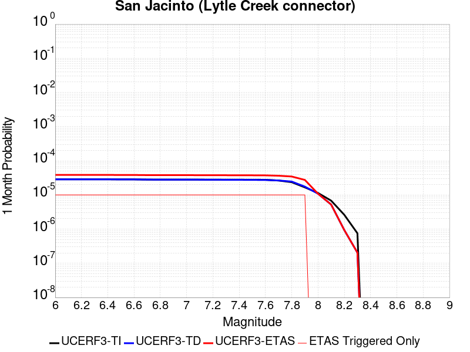 |  |  |

| Magnitude | 1 wk TI Prob | 1 wk TD Prob | 1 wk ETAS Prob | 1 wk ETAS/TD Gain | 1 wk ETAS Triggered Only | 1 mo TI Prob | 1 mo TD Prob | 1 mo ETAS Prob | 1 mo ETAS/TD Gain | 1 mo ETAS Triggered Only | 1 yr TI Prob | 1 yr TD Prob | 1 yr ETAS Prob | 1 yr ETAS/TD Gain | 1 yr ETAS Triggered Only | 10 yr TI Prob | 10 yr TD Prob | 10 yr ETAS Prob | 10 yr ETAS/TD Gain | 10 yr ETAS Triggered Only |
|-----|-----|-----|-----|-----|-----|-----|-----|-----|-----|-----|-----|-----|-----|-----|-----|-----|-----|-----|-----|-----|
| 6.0 | 6.693995E-6 | 6.676349E-6 | 1.6676282E-5 | 2.4978147 | 1.0E-5 | 2.8688235E-5 | 2.8612612E-5 | 3.8612325E-5 | 1.3494862 | 1.0E-5 | 3.492233E-4 | 3.4830294E-4 | 3.782925E-4 | 1.0861019 | 3.0E-5 | 0.00348675 | 0.0035578923 | 0.0035877854 | 1.008402 | 3.0E-5 |
| 6.1 | 6.693995E-6 | 6.676349E-6 | 1.6676282E-5 | 2.4978147 | 1.0E-5 | 2.8688235E-5 | 2.8612612E-5 | 3.8612325E-5 | 1.3494862 | 1.0E-5 | 3.492233E-4 | 3.4830294E-4 | 3.782925E-4 | 1.0861019 | 3.0E-5 | 0.00348675 | 0.0035578923 | 0.0035877854 | 1.008402 | 3.0E-5 |
| 6.2 | 6.693995E-6 | 6.676349E-6 | 1.6676282E-5 | 2.4978147 | 1.0E-5 | 2.8688235E-5 | 2.8612612E-5 | 3.8612325E-5 | 1.3494862 | 1.0E-5 | 3.492233E-4 | 3.4830294E-4 | 3.782925E-4 | 1.0861019 | 3.0E-5 | 0.00348675 | 0.0035578923 | 0.0035877854 | 1.008402 | 3.0E-5 |
| 6.3 | 6.693995E-6 | 6.676349E-6 | 1.6676282E-5 | 2.4978147 | 1.0E-5 | 2.8688235E-5 | 2.8612612E-5 | 3.8612325E-5 | 1.3494862 | 1.0E-5 | 3.492233E-4 | 3.4830294E-4 | 3.782925E-4 | 1.0861019 | 3.0E-5 | 0.00348675 | 0.0035578923 | 0.0035877854 | 1.008402 | 3.0E-5 |
| 6.4 | 6.693995E-6 | 6.676349E-6 | 1.6676282E-5 | 2.4978147 | 1.0E-5 | 2.8688235E-5 | 2.8612612E-5 | 3.8612325E-5 | 1.3494862 | 1.0E-5 | 3.492233E-4 | 3.4830294E-4 | 3.782925E-4 | 1.0861019 | 3.0E-5 | 0.00348675 | 0.0035578923 | 0.0035877854 | 1.008402 | 3.0E-5 |
| 6.5 | 6.6561875E-6 | 6.6365656E-6 | 1.6636499E-5 | 2.5067935 | 1.0E-5 | 2.8526205E-5 | 2.8442115E-5 | 3.844183E-5 | 1.3515813 | 1.0E-5 | 3.472512E-4 | 3.462278E-4 | 3.7621742E-4 | 1.0866182 | 3.0E-5 | 0.0034670907 | 0.0035372071 | 0.003567101 | 1.0084512 | 3.0E-5 |
| 6.6 | 6.6561875E-6 | 6.6365656E-6 | 1.6636499E-5 | 2.5067935 | 1.0E-5 | 2.8526205E-5 | 2.8442115E-5 | 3.844183E-5 | 1.3515813 | 1.0E-5 | 3.472512E-4 | 3.462278E-4 | 3.7621742E-4 | 1.0866182 | 3.0E-5 | 0.0034670907 | 0.0035372071 | 0.003567101 | 1.0084512 | 3.0E-5 |
| 6.7 | 6.5802237E-6 | 6.5557388E-6 | 1.6555674E-5 | 2.525371 | 1.0E-5 | 2.8200653E-5 | 2.8095721E-5 | 3.809544E-5 | 1.3559161 | 1.0E-5 | 3.4328885E-4 | 3.4201177E-4 | 3.7200152E-4 | 1.0876863 | 3.0E-5 | 0.0034275902 | 0.0034951798 | 0.003525075 | 1.0085533 | 3.0E-5 |
| 6.8 | 6.575632E-6 | 6.550227E-6 | 1.6550162E-5 | 2.5266545 | 1.0E-5 | 2.8180975E-5 | 2.8072101E-5 | 3.807182E-5 | 1.3562156 | 1.0E-5 | 3.4304935E-4 | 3.417243E-4 | 3.7171406E-4 | 1.0877601 | 3.0E-5 | 0.0034252026 | 0.0034923141 | 0.0035222094 | 1.0085603 | 3.0E-5 |
| 6.9 | 6.570433E-6 | 6.541619E-6 | 1.6541553E-5 | 2.5286636 | 1.0E-5 | 2.8158694E-5 | 2.8035209E-5 | 3.803493E-5 | 1.3566843 | 1.0E-5 | 3.4277816E-4 | 3.4127527E-4 | 3.7126505E-4 | 1.0878756 | 3.0E-5 | 0.0034224992 | 0.003487838 | 0.0035177334 | 1.0085713 | 3.0E-5 |
| 7.0 | 6.5643826E-6 | 6.531737E-6 | 1.6531672E-5 | 2.5309763 | 1.0E-5 | 2.8132765E-5 | 2.7992859E-5 | 3.799258E-5 | 1.357224 | 1.0E-5 | 3.424626E-4 | 3.4075984E-4 | 3.7074962E-4 | 1.0880085 | 3.0E-5 | 0.0034193532 | 0.0034826999 | 0.0035125953 | 1.008584 | 3.0E-5 |
| 7.1 | 6.557402E-6 | 6.5204463E-6 | 1.652038E-5 | 2.5336275 | 1.0E-5 | 2.8102848E-5 | 2.794447E-5 | 3.794419E-5 | 1.3578426 | 1.0E-5 | 3.4209844E-4 | 3.4017087E-4 | 3.7016068E-4 | 1.088161 | 3.0E-5 | 0.0034157229 | 0.0034768295 | 0.0035067252 | 1.0085986 | 3.0E-5 |
| 7.2 | 6.546394E-6 | 6.5024074E-6 | 1.6502343E-5 | 2.537882 | 1.0E-5 | 2.8055672E-5 | 2.7867161E-5 | 3.7866885E-5 | 1.3588353 | 1.0E-5 | 3.4152428E-4 | 3.3922994E-4 | 3.6921978E-4 | 1.0884056 | 3.0E-5 | 0.0034099987 | 0.0034674536 | 0.0034973496 | 1.0086219 | 3.0E-5 |
| 7.3 | 6.5364216E-6 | 6.483182E-6 | 1.6483118E-5 | 2.5424423 | 1.0E-5 | 2.8012933E-5 | 2.778477E-5 | 3.778449E-5 | 1.3598994 | 1.0E-5 | 3.4100408E-4 | 3.3822714E-4 | 3.68217E-4 | 1.0886678 | 3.0E-5 | 0.003404813 | 0.003457473 | 0.0034873693 | 1.0086468 | 3.0E-5 |
| 7.4 | 6.5269523E-6 | 6.464257E-6 | 1.6464192E-5 | 2.5469582 | 1.0E-5 | 2.7972354E-5 | 2.7703665E-5 | 3.7703387E-5 | 1.3609531 | 1.0E-5 | 3.4051016E-4 | 3.3724E-4 | 3.6722986E-4 | 1.0889274 | 3.0E-5 | 0.0033998888 | 0.0034476507 | 0.0034775473 | 1.0086715 | 3.0E-5 |
| 7.5 | 6.5111835E-6 | 6.440518E-6 | 1.6440454E-5 | 2.5526602 | 1.0E-5 | 2.7904773E-5 | 2.760193E-5 | 3.760165E-5 | 1.3622836 | 1.0E-5 | 3.3968766E-4 | 3.3600174E-4 | 3.6599164E-4 | 1.0892552 | 3.0E-5 | 0.0033916887 | 0.0034353186 | 0.0034652154 | 1.0087029 | 3.0E-5 |
| 7.6 | 6.4768806E-6 | 6.399607E-6 | 1.6399543E-5 | 2.5625858 | 1.0E-5 | 2.7757764E-5 | 2.7426599E-5 | 3.7426325E-5 | 1.3645996 | 1.0E-5 | 3.3789838E-4 | 3.3386776E-4 | 3.6385775E-4 | 1.089826 | 3.0E-5 | 0.0033738504 | 0.0034140423 | 0.0034439398 | 1.0087572 | 3.0E-5 |
| 7.7 | 6.1655364E-6 | 6.1919704E-6 | 1.6191909E-5 | 2.6149848 | 1.0E-5 | 2.642346E-5 | 2.6536747E-5 | 3.653648E-5 | 1.3768259 | 1.0E-5 | 3.2165812E-4 | 3.2303706E-4 | 3.5302737E-4 | 1.0928386 | 3.0E-5 | 0.0032119295 | 0.003305583 | 0.0033354838 | 1.0090456 | 3.0E-5 |
| 7.8 | 5.5043524E-6 | 5.752594E-6 | 1.5752537E-5 | 2.738336 | 1.0E-5 | 2.3589868E-5 | 2.4653742E-5 | 3.4653494E-5 | 1.4056079 | 1.0E-5 | 2.871688E-4 | 3.0011803E-4 | 3.30109E-4 | 1.0999306 | 3.0E-5 | 0.0028679797 | 0.0030754362 | 0.003105344 | 1.0097247 | 3.0E-5 |
| 7.9 | 3.889249E-6 | 4.0893547E-6 | 1.40893135E-5 | 3.4453635 | 1.0E-5 | 1.6668104E-5 | 1.7525688E-5 | 2.7525513E-5 | 1.570581 | 1.0E-5 | 2.0291525E-4 | 2.133544E-4 | 2.4334801E-4 | 1.1405811 | 3.0E-5 | 0.0020273007 | 0.0022009383 | 0.0022308722 | 1.0136006 | 3.0E-5 |
| 8.0 | 2.668535E-6 | 2.5401737E-6 | 2.5401737E-6 | 1.0 | 0.0 | 1.1436528E-5 | 1.0886413E-5 | 1.0886413E-5 | 1.0 | 0.0 | 1.3923083E-4 | 1.3253406E-4 | 1.4253272E-4 | 1.0754423 | 1.0E-5 | 0.0013914363 | 0.001380402 | 0.0013903882 | 1.0072342 | 1.0E-5 |
| 8.1 | 1.5911459E-6 | 1.2232788E-6 | 1.2232788E-6 | 1.0 | 0.0 | 6.8191785E-6 | 5.242613E-6 | 5.242613E-6 | 1.0 | 0.0 | 8.3020335E-5 | 6.382697E-5 | 6.382697E-5 | 1.0 | 0.0 | 8.298933E-4 | 6.7181257E-4 | 6.7181257E-4 | 1.0 | 0.0 |
| 8.2 | 6.1294963E-7 | 2.1941237E-7 | 2.1941237E-7 | 1.0 | 0.0 | 2.6269242E-6 | 9.403384E-7 | 9.403384E-7 | 1.0 | 0.0 | 3.1982334E-5 | 1.144856E-5 | 1.144856E-5 | 1.0 | 0.0 | 3.1977732E-4 | 1.2857822E-4 | 1.2857822E-4 | 1.0 | 0.0 |
| 8.3 | 1.762871E-7 | 4.787142E-8 | 4.787142E-8 | 1.0 | 0.0 | 7.5551594E-7 | 2.0516322E-7 | 2.0516322E-7 | 1.0 | 0.0 | 9.1983675E-6 | 2.4978592E-6 | 2.4978592E-6 | 1.0 | 0.0 | 9.197987E-5 | 2.8875455E-5 | 2.8875455E-5 | 1.0 | 0.0 |

## Ludlow
*[(top)](#table-of-contents)*

| 1 Week | 1 Month | 1 Year | 10 Year |
|-----|-----|-----|-----|
|  |  |  |  |

| Magnitude | 1 wk TI Prob | 1 wk TD Prob | 1 wk ETAS Prob | 1 wk ETAS/TD Gain | 1 wk ETAS Triggered Only | 1 mo TI Prob | 1 mo TD Prob | 1 mo ETAS Prob | 1 mo ETAS/TD Gain | 1 mo ETAS Triggered Only | 1 yr TI Prob | 1 yr TD Prob | 1 yr ETAS Prob | 1 yr ETAS/TD Gain | 1 yr ETAS Triggered Only | 10 yr TI Prob | 10 yr TD Prob | 10 yr ETAS Prob | 10 yr ETAS/TD Gain | 10 yr ETAS Triggered Only |
|-----|-----|-----|-----|-----|-----|-----|-----|-----|-----|-----|-----|-----|-----|-----|-----|-----|-----|-----|-----|-----|
| 6.0 | 2.2407607E-5 | 2.3658304E-5 | 2.3658304E-5 | 1.0 | 0.0 | 9.602906E-5 | 1.0138904E-4 | 1.0138904E-4 | 1.0 | 0.0 | 0.0011685267 | 0.0012337567 | 0.0012337567 | 1.0 | 0.0 | 0.011624013 | 0.012273584 | 0.012303215 | 1.0024142 | 3.0E-5 |
| 6.1 | 2.2407607E-5 | 2.3658304E-5 | 2.3658304E-5 | 1.0 | 0.0 | 9.602906E-5 | 1.0138904E-4 | 1.0138904E-4 | 1.0 | 0.0 | 0.0011685267 | 0.0012337567 | 0.0012337567 | 1.0 | 0.0 | 0.011624013 | 0.012273584 | 0.012303215 | 1.0024142 | 3.0E-5 |
| 6.2 | 1.0781252E-5 | 1.13661545E-5 | 1.13661545E-5 | 1.0 | 0.0 | 4.620455E-5 | 4.87112E-5 | 4.87112E-5 | 1.0 | 0.0 | 5.623952E-4 | 5.9290155E-4 | 5.9290155E-4 | 1.0 | 0.0 | 0.00560974 | 0.0059136157 | 0.0059136157 | 1.0 | 0.0 |
| 6.3 | 1.0781252E-5 | 1.13661545E-5 | 1.13661545E-5 | 1.0 | 0.0 | 4.620455E-5 | 4.87112E-5 | 4.87112E-5 | 1.0 | 0.0 | 5.623952E-4 | 5.9290155E-4 | 5.9290155E-4 | 1.0 | 0.0 | 0.00560974 | 0.0059136157 | 0.0059136157 | 1.0 | 0.0 |
| 6.4 | 7.814439E-6 | 8.238084E-6 | 8.238084E-6 | 1.0 | 0.0 | 3.3490025E-5 | 3.5305606E-5 | 3.5305606E-5 | 1.0 | 0.0 | 4.0766477E-4 | 4.2976235E-4 | 4.2976235E-4 | 1.0 | 0.0 | 0.0040691774 | 0.004289459 | 0.004289459 | 1.0 | 0.0 |
| 6.5 | 6.4986366E-6 | 6.8512154E-6 | 6.8512154E-6 | 1.0 | 0.0 | 2.7851002E-5 | 2.9362027E-5 | 2.9362027E-5 | 1.0 | 0.0 | 3.390332E-4 | 3.5742496E-4 | 3.5742496E-4 | 1.0 | 0.0 | 0.003385164 | 0.0035685971 | 0.0035685971 | 1.0 | 0.0 |
| 6.6 | 5.582177E-6 | 5.8862606E-6 | 5.8862606E-6 | 1.0 | 0.0 | 2.3923398E-5 | 2.522659E-5 | 2.522659E-5 | 1.0 | 0.0 | 2.9122844E-4 | 3.070912E-4 | 3.070912E-4 | 1.0 | 0.0 | 0.0029084706 | 0.0030667416 | 0.0030667416 | 1.0 | 0.0 |
| 6.7 | 4.6858763E-6 | 4.940641E-6 | 4.940641E-6 | 1.0 | 0.0 | 2.0082172E-5 | 2.1174006E-5 | 2.1174006E-5 | 1.0 | 0.0 | 2.4447302E-4 | 2.577636E-4 | 2.577636E-4 | 1.0 | 0.0 | 0.0024420423 | 0.0025747025 | 0.0025747025 | 1.0 | 0.0 |
| 6.8 | 3.5584908E-6 | 3.7521809E-6 | 3.7521809E-6 | 1.0 | 0.0 | 1.5250586E-5 | 1.6080678E-5 | 1.6080678E-5 | 1.0 | 0.0 | 1.8566006E-4 | 1.9576508E-4 | 1.9576508E-4 | 1.0 | 0.0 | 0.0018550502 | 0.0019559674 | 0.0019559674 | 1.0 | 0.0 |
| 6.9 | 2.532834E-6 | 2.6711195E-6 | 2.6711195E-6 | 1.0 | 0.0 | 1.0854958E-5 | 1.1447606E-5 | 1.1447606E-5 | 1.0 | 0.0 | 1.3215111E-4 | 1.3936596E-4 | 1.3936596E-4 | 1.0 | 0.0 | 0.0013207254 | 0.0013928133 | 0.0013928133 | 1.0 | 0.0 |
| 7.0 | 1.7083285E-6 | 1.8020224E-6 | 1.8020224E-6 | 1.0 | 0.0 | 7.3213873E-6 | 7.7229315E-6 | 7.7229315E-6 | 1.0 | 0.0 | 8.913424E-5 | 9.40228E-5 | 9.40228E-5 | 1.0 | 0.0 | 8.9098496E-4 | 9.3984674E-4 | 9.3984674E-4 | 1.0 | 0.0 |
| 7.1 | 1.0905424E-6 | 1.1498116E-6 | 1.1498116E-6 | 1.0 | 0.0 | 4.6737446E-6 | 4.9277555E-6 | 4.9277555E-6 | 1.0 | 0.0 | 5.6901354E-5 | 5.9993872E-5 | 5.9993872E-5 | 1.0 | 0.0 | 5.6886784E-4 | 5.997865E-4 | 5.997865E-4 | 1.0 | 0.0 |
| 7.2 | 6.06668E-7 | 6.387546E-7 | 6.387546E-7 | 1.0 | 0.0 | 2.600003E-6 | 2.7375172E-6 | 2.7375172E-6 | 1.0 | 0.0 | 3.1654577E-5 | 3.3328834E-5 | 3.3328834E-5 | 1.0 | 0.0 | 3.1650066E-4 | 3.332452E-4 | 3.332452E-4 | 1.0 | 0.0 |

## Channel Islands Thrust
*[(top)](#table-of-contents)*

| 1 Week | 1 Month | 1 Year | 10 Year |
|-----|-----|-----|-----|
|  |  |  |  |

| Magnitude | 1 wk TI Prob | 1 wk TD Prob | 1 wk ETAS Prob | 1 wk ETAS/TD Gain | 1 wk ETAS Triggered Only | 1 mo TI Prob | 1 mo TD Prob | 1 mo ETAS Prob | 1 mo ETAS/TD Gain | 1 mo ETAS Triggered Only | 1 yr TI Prob | 1 yr TD Prob | 1 yr ETAS Prob | 1 yr ETAS/TD Gain | 1 yr ETAS Triggered Only | 10 yr TI Prob | 10 yr TD Prob | 10 yr ETAS Prob | 10 yr ETAS/TD Gain | 10 yr ETAS Triggered Only |
|-----|-----|-----|-----|-----|-----|-----|-----|-----|-----|-----|-----|-----|-----|-----|-----|-----|-----|-----|-----|-----|
| 6.0 | 2.2156251E-5 | 2.409371E-5 | 2.409371E-5 | 1.0 | 0.0 | 9.495191E-5 | 1.0325527E-4 | 1.0325527E-4 | 1.0 | 0.0 | 0.0011554264 | 0.0012565145 | 0.0012565145 | 1.0 | 0.0 | 0.011494373 | 0.012504692 | 0.012534317 | 1.002369 | 3.0E-5 |
| 6.1 | 2.2156251E-5 | 2.409371E-5 | 2.409371E-5 | 1.0 | 0.0 | 9.495191E-5 | 1.0325527E-4 | 1.0325527E-4 | 1.0 | 0.0 | 0.0011554264 | 0.0012565145 | 0.0012565145 | 1.0 | 0.0 | 0.011494373 | 0.012504692 | 0.012534317 | 1.002369 | 3.0E-5 |
| 6.2 | 2.2156251E-5 | 2.409371E-5 | 2.409371E-5 | 1.0 | 0.0 | 9.495191E-5 | 1.0325527E-4 | 1.0325527E-4 | 1.0 | 0.0 | 0.0011554264 | 0.0012565145 | 0.0012565145 | 1.0 | 0.0 | 0.011494373 | 0.012504692 | 0.012534317 | 1.002369 | 3.0E-5 |
| 6.3 | 2.2156251E-5 | 2.409371E-5 | 2.409371E-5 | 1.0 | 0.0 | 9.495191E-5 | 1.0325527E-4 | 1.0325527E-4 | 1.0 | 0.0 | 0.0011554264 | 0.0012565145 | 0.0012565145 | 1.0 | 0.0 | 0.011494373 | 0.012504692 | 0.012534317 | 1.002369 | 3.0E-5 |
| 6.4 | 2.2156251E-5 | 2.409371E-5 | 2.409371E-5 | 1.0 | 0.0 | 9.495191E-5 | 1.0325527E-4 | 1.0325527E-4 | 1.0 | 0.0 | 0.0011554264 | 0.0012565145 | 0.0012565145 | 1.0 | 0.0 | 0.011494373 | 0.012504692 | 0.012534317 | 1.002369 | 3.0E-5 |
| 6.5 | 2.2156251E-5 | 2.409371E-5 | 2.409371E-5 | 1.0 | 0.0 | 9.495191E-5 | 1.0325527E-4 | 1.0325527E-4 | 1.0 | 0.0 | 0.0011554264 | 0.0012565145 | 0.0012565145 | 1.0 | 0.0 | 0.011494373 | 0.012504692 | 0.012534317 | 1.002369 | 3.0E-5 |
| 6.6 | 2.2156251E-5 | 2.409371E-5 | 2.409371E-5 | 1.0 | 0.0 | 9.495191E-5 | 1.0325527E-4 | 1.0325527E-4 | 1.0 | 0.0 | 0.0011554264 | 0.0012565145 | 0.0012565145 | 1.0 | 0.0 | 0.011494373 | 0.012504692 | 0.012534317 | 1.002369 | 3.0E-5 |
| 6.7 | 1.0601296E-5 | 1.1380217E-5 | 1.1380217E-5 | 1.0 | 0.0 | 4.5433335E-5 | 4.8771475E-5 | 4.8771475E-5 | 1.0 | 0.0 | 5.5301044E-4 | 5.9363584E-4 | 5.9363584E-4 | 1.0 | 0.0 | 0.005516363 | 0.005921003 | 0.0059309434 | 1.001679 | 1.0E-5 |
| 6.8 | 1.0246747E-5 | 1.0997318E-5 | 1.0997318E-5 | 1.0 | 0.0 | 4.391389E-5 | 4.713054E-5 | 4.713054E-5 | 1.0 | 0.0 | 5.345204E-4 | 5.7366805E-4 | 5.7366805E-4 | 1.0 | 0.0 | 0.0053323656 | 0.0057223616 | 0.0057323044 | 1.0017375 | 1.0E-5 |
| 6.9 | 9.049551E-6 | 9.700208E-6 | 9.700208E-6 | 1.0 | 0.0 | 3.878322E-5 | 4.157168E-5 | 4.157168E-5 | 1.0 | 0.0 | 4.7208337E-4 | 5.060218E-4 | 5.060218E-4 | 1.0 | 0.0 | 0.0047108172 | 0.0050491127 | 0.0050491127 | 1.0 | 0.0 |
| 7.0 | 8.6542195E-6 | 9.275141E-6 | 9.275141E-6 | 1.0 | 0.0 | 3.7088983E-5 | 3.975002E-5 | 3.975002E-5 | 1.0 | 0.0 | 4.5146482E-4 | 4.838531E-4 | 4.838531E-4 | 1.0 | 0.0 | 0.004505487 | 0.0048284084 | 0.0048284084 | 1.0 | 0.0 |
| 7.1 | 8.391028E-6 | 8.9934465E-6 | 8.9934465E-6 | 1.0 | 0.0 | 3.5961057E-5 | 3.8542796E-5 | 3.8542796E-5 | 1.0 | 0.0 | 4.3773788E-4 | 4.6916158E-4 | 4.6916158E-4 | 1.0 | 0.0 | 0.004368766 | 0.0046821213 | 0.0046821213 | 1.0 | 0.0 |
| 7.2 | 5.965188E-6 | 6.372049E-6 | 6.372049E-6 | 1.0 | 0.0 | 2.556484E-5 | 2.7308499E-5 | 2.7308499E-5 | 1.0 | 0.0 | 3.1120746E-4 | 3.324308E-4 | 3.324308E-4 | 1.0 | 0.0 | 0.00310772 | 0.0033193931 | 0.0033193931 | 1.0 | 0.0 |
| 7.3 | 4.877518E-6 | 5.2062937E-6 | 5.2062937E-6 | 1.0 | 0.0 | 2.0903482E-5 | 2.2312499E-5 | 2.2312499E-5 | 1.0 | 0.0 | 2.5447016E-4 | 2.7162125E-4 | 2.7162125E-4 | 1.0 | 0.0 | 0.0025417898 | 0.002712939 | 0.002712939 | 1.0 | 0.0 |
| 7.4 | 3.8829853E-6 | 4.1420903E-6 | 4.1420903E-6 | 1.0 | 0.0 | 1.664126E-5 | 1.7751698E-5 | 1.7751698E-5 | 1.0 | 0.0 | 2.0258849E-4 | 2.1610591E-4 | 2.1610591E-4 | 1.0 | 0.0 | 0.002024039 | 0.0021589992 | 0.0021589992 | 1.0 | 0.0 |
| 7.5 | 1.3489616E-6 | 1.4278644E-6 | 1.4278644E-6 | 1.0 | 0.0 | 5.7812517E-6 | 6.1194046E-6 | 6.1194046E-6 | 1.0 | 0.0 | 7.038446E-5 | 7.4501244E-5 | 7.4501244E-5 | 1.0 | 0.0 | 7.036218E-4 | 7.447666E-4 | 7.447666E-4 | 1.0 | 0.0 |
| 7.6 | 6.058192E-7 | 6.3540983E-7 | 6.3540983E-7 | 1.0 | 0.0 | 2.5963652E-6 | 2.7231822E-6 | 2.7231822E-6 | 1.0 | 0.0 | 3.161029E-5 | 3.3154258E-5 | 3.3154258E-5 | 1.0 | 0.0 | 3.1605794E-4 | 3.3149472E-4 | 3.3149472E-4 | 1.0 | 0.0 |
| 7.7 | 2.2170494E-7 | 2.2608933E-7 | 2.2608933E-7 | 1.0 | 0.0 | 9.5016367E-7 | 9.689539E-7 | 9.689539E-7 | 1.0 | 0.0 | 1.1568181E-5 | 1.1796962E-5 | 1.1796962E-5 | 1.0 | 0.0 | 1.1567579E-4 | 1.1796447E-4 | 1.1796447E-4 | 1.0 | 0.0 |
| 7.8 | 2.1613102E-8 | 1.546706E-8 | 1.546706E-8 | 1.0 | 0.0 | 9.262757E-8 | 6.62874E-8 | 6.62874E-8 | 1.0 | 0.0 | 1.1277401E-6 | 8.070489E-7 | 8.070489E-7 | 1.0 | 0.0 | 1.1277344E-5 | 8.070468E-6 | 8.070468E-6 | 1.0 | 0.0 |

## Santa Rosa Island
*[(top)](#table-of-contents)*

| 1 Week | 1 Month | 1 Year | 10 Year |
|-----|-----|-----|-----|
|  |  |  |  |

| Magnitude | 1 wk TI Prob | 1 wk TD Prob | 1 wk ETAS Prob | 1 wk ETAS/TD Gain | 1 wk ETAS Triggered Only | 1 mo TI Prob | 1 mo TD Prob | 1 mo ETAS Prob | 1 mo ETAS/TD Gain | 1 mo ETAS Triggered Only | 1 yr TI Prob | 1 yr TD Prob | 1 yr ETAS Prob | 1 yr ETAS/TD Gain | 1 yr ETAS Triggered Only | 10 yr TI Prob | 10 yr TD Prob | 10 yr ETAS Prob | 10 yr ETAS/TD Gain | 10 yr ETAS Triggered Only |
|-----|-----|-----|-----|-----|-----|-----|-----|-----|-----|-----|-----|-----|-----|-----|-----|-----|-----|-----|-----|-----|
| 6.0 | 4.1143165E-5 | 4.7096575E-5 | 5.7096102E-5 | 1.2123196 | 1.0E-5 | 1.7631594E-4 | 2.0182793E-4 | 2.1182591E-4 | 1.0495372 | 1.0E-5 | 0.002144533 | 0.0024546827 | 0.002464658 | 1.0040638 | 1.0E-5 | 0.021239553 | 0.024296334 | 0.024325605 | 1.0012047 | 3.0E-5 |
| 6.1 | 2.1061249E-5 | 2.3867502E-5 | 3.3867265E-5 | 1.4189698 | 1.0E-5 | 9.0259375E-5 | 1.0228545E-4 | 1.12284426E-4 | 1.0977557 | 1.0E-5 | 0.0010983539 | 0.0012446429 | 0.0012546304 | 1.0080245 | 1.0E-5 | 0.01092941 | 0.012379761 | 0.012399513 | 1.0015955 | 2.0E-5 |
| 6.2 | 2.1061249E-5 | 2.3867502E-5 | 3.3867265E-5 | 1.4189698 | 1.0E-5 | 9.0259375E-5 | 1.0228545E-4 | 1.12284426E-4 | 1.0977557 | 1.0E-5 | 0.0010983539 | 0.0012446429 | 0.0012546304 | 1.0080245 | 1.0E-5 | 0.01092941 | 0.012379761 | 0.012399513 | 1.0015955 | 2.0E-5 |
| 6.3 | 1.5158236E-5 | 1.7076147E-5 | 1.7076147E-5 | 1.0 | 0.0 | 6.496225E-5 | 7.31815E-5 | 7.31815E-5 | 1.0 | 0.0 | 7.906284E-4 | 8.9063257E-4 | 8.9063257E-4 | 1.0 | 0.0 | 0.007878214 | 0.008871884 | 0.008871884 | 1.0 | 0.0 |
| 6.4 | 1.2341918E-5 | 1.38542755E-5 | 1.38542755E-5 | 1.0 | 0.0 | 5.2892858E-5 | 5.937416E-5 | 5.937416E-5 | 1.0 | 0.0 | 6.437803E-4 | 7.2264875E-4 | 7.2264875E-4 | 1.0 | 0.0 | 0.006419184 | 0.0072038257 | 0.0072038257 | 1.0 | 0.0 |
| 6.5 | 9.061158E-6 | 1.0117978E-5 | 1.0117978E-5 | 1.0 | 0.0 | 3.883296E-5 | 4.336207E-5 | 4.336207E-5 | 1.0 | 0.0 | 4.726887E-4 | 5.2781065E-4 | 5.2781065E-4 | 1.0 | 0.0 | 0.004716845 | 0.0052661086 | 0.0052661086 | 1.0 | 0.0 |
| 6.6 | 7.5461685E-6 | 8.401498E-6 | 8.401498E-6 | 1.0 | 0.0 | 3.2340322E-5 | 3.6005946E-5 | 3.6005946E-5 | 1.0 | 0.0 | 3.936723E-4 | 4.3828852E-4 | 4.3828852E-4 | 1.0 | 0.0 | 0.003929756 | 0.004374671 | 0.004374671 | 1.0 | 0.0 |
| 6.7 | 5.5023775E-6 | 6.0879024E-6 | 6.0879024E-6 | 1.0 | 0.0 | 2.3581404E-5 | 2.6090767E-5 | 2.6090767E-5 | 1.0 | 0.0 | 2.8706578E-4 | 3.1761202E-4 | 3.1761202E-4 | 1.0 | 0.0 | 0.0028669522 | 0.0031719028 | 0.0031719028 | 1.0 | 0.0 |
| 6.8 | 3.7351679E-6 | 4.083448E-6 | 4.083448E-6 | 1.0 | 0.0 | 1.6007763E-5 | 1.7500388E-5 | 1.7500388E-5 | 1.0 | 0.0 | 1.948771E-4 | 2.1304889E-4 | 2.1304889E-4 | 1.0 | 0.0 | 0.0019470629 | 0.0021286916 | 0.0021286916 | 1.0 | 0.0 |
| 6.9 | 2.456366E-6 | 2.6294197E-6 | 2.6294197E-6 | 1.0 | 0.0 | 1.0527241E-5 | 1.1268893E-5 | 1.1268893E-5 | 1.0 | 0.0 | 1.2816161E-4 | 1.3719016E-4 | 1.3719016E-4 | 1.0 | 0.0 | 0.0012808773 | 0.0013710576 | 0.0013710576 | 1.0 | 0.0 |
| 7.0 | 2.3245157E-6 | 2.4829144E-6 | 2.4829144E-6 | 1.0 | 0.0 | 9.962172E-6 | 1.0641019E-5 | 1.0641019E-5 | 1.0 | 0.0 | 1.2128269E-4 | 1.2954672E-4 | 1.2954672E-4 | 1.0 | 0.0 | 0.0012121652 | 0.0012947143 | 0.0012947143 | 1.0 | 0.0 |
| 7.1 | 2.2248344E-6 | 2.3733774E-6 | 2.3733774E-6 | 1.0 | 0.0 | 9.53497E-6 | 1.0171578E-5 | 1.0171578E-5 | 1.0 | 0.0 | 1.1608207E-4 | 1.2383194E-4 | 1.2383194E-4 | 1.0 | 0.0 | 0.0011602144 | 0.0012376314 | 0.0012376314 | 1.0 | 0.0 |
| 7.2 | 2.1350402E-6 | 2.2762752E-6 | 2.2762752E-6 | 1.0 | 0.0 | 9.150141E-6 | 9.755428E-6 | 9.755428E-6 | 1.0 | 0.0 | 1.1139726E-4 | 1.18765885E-4 | 1.18765885E-4 | 1.0 | 0.0 | 0.0011134144 | 0.001187026 | 0.001187026 | 1.0 | 0.0 |
| 7.3 | 1.9793572E-6 | 2.1088301E-6 | 2.1088301E-6 | 1.0 | 0.0 | 8.482932E-6 | 9.037813E-6 | 9.037813E-6 | 1.0 | 0.0 | 1.032748E-4 | 1.10029825E-4 | 1.10029825E-4 | 1.0 | 0.0 | 0.0010322682 | 0.0010997553 | 0.0010997553 | 1.0 | 0.0 |
| 7.4 | 1.6951194E-6 | 1.8046675E-6 | 1.8046675E-6 | 1.0 | 0.0 | 7.264777E-6 | 7.734267E-6 | 7.734267E-6 | 1.0 | 0.0 | 8.844508E-5 | 9.416064E-5 | 9.416064E-5 | 1.0 | 0.0 | 8.840988E-4 | 9.412091E-4 | 9.412091E-4 | 1.0 | 0.0 |
| 7.5 | 8.987207E-7 | 9.5126694E-7 | 9.5126694E-7 | 1.0 | 0.0 | 3.8516546E-6 | 4.076852E-6 | 4.076852E-6 | 1.0 | 0.0 | 4.6892885E-5 | 4.9634553E-5 | 4.9634553E-5 | 1.0 | 0.0 | 4.688299E-4 | 4.9623585E-4 | 4.9623585E-4 | 1.0 | 0.0 |
| 7.6 | 3.8783037E-7 | 4.053088E-7 | 4.053088E-7 | 1.0 | 0.0 | 1.6621291E-6 | 1.7370365E-6 | 1.7370365E-6 | 1.0 | 0.0 | 2.0236233E-5 | 2.1148222E-5 | 2.1148222E-5 | 1.0 | 0.0 | 2.023439E-4 | 2.1146274E-4 | 2.1146274E-4 | 1.0 | 0.0 |
| 7.7 | 6.181804E-8 | 6.339232E-8 | 6.339232E-8 | 1.0 | 0.0 | 2.6493444E-7 | 2.7168133E-7 | 2.7168133E-7 | 1.0 | 0.0 | 3.225572E-6 | 3.3077154E-6 | 3.3077154E-6 | 1.0 | 0.0 | 3.225525E-5 | 3.3076667E-5 | 3.3076667E-5 | 1.0 | 0.0 |
| 7.8 | 1.3704449E-9 | 1.3964364E-9 | 1.3964364E-9 | 1.0 | 0.0 | 5.873335E-9 | 5.9847274E-9 | 5.9847274E-9 | 1.0 | 0.0 | 7.1507856E-8 | 7.2864054E-8 | 7.2864054E-8 | 1.0 | 0.0 | 7.1507833E-7 | 7.286404E-7 | 7.286404E-7 | 1.0 | 0.0 |

## Mission Creek
*[(top)](#table-of-contents)*

| 1 Week | 1 Month | 1 Year | 10 Year |
|-----|-----|-----|-----|
|  |  |  |  |

| Magnitude | 1 wk TI Prob | 1 wk TD Prob | 1 wk ETAS Prob | 1 wk ETAS/TD Gain | 1 wk ETAS Triggered Only | 1 mo TI Prob | 1 mo TD Prob | 1 mo ETAS Prob | 1 mo ETAS/TD Gain | 1 mo ETAS Triggered Only | 1 yr TI Prob | 1 yr TD Prob | 1 yr ETAS Prob | 1 yr ETAS/TD Gain | 1 yr ETAS Triggered Only | 10 yr TI Prob | 10 yr TD Prob | 10 yr ETAS Prob | 10 yr ETAS/TD Gain | 10 yr ETAS Triggered Only |
|-----|-----|-----|-----|-----|-----|-----|-----|-----|-----|-----|-----|-----|-----|-----|-----|-----|-----|-----|-----|-----|
| 6.0 | 1.1549387E-5 | 1.6336864E-5 | 1.6336864E-5 | 1.0 | 0.0 | 4.9496433E-5 | 7.001334E-5 | 7.001334E-5 | 1.0 | 0.0 | 6.0245243E-4 | 8.5209403E-4 | 8.7207695E-4 | 1.0234516 | 2.0E-5 | 0.006008218 | 0.008517604 | 0.008547349 | 1.0034921 | 3.0E-5 |
| 6.1 | 1.1549387E-5 | 1.6336864E-5 | 1.6336864E-5 | 1.0 | 0.0 | 4.9496433E-5 | 7.001334E-5 | 7.001334E-5 | 1.0 | 0.0 | 6.0245243E-4 | 8.5209403E-4 | 8.7207695E-4 | 1.0234516 | 2.0E-5 | 0.006008218 | 0.008517604 | 0.008547349 | 1.0034921 | 3.0E-5 |
| 6.2 | 1.1549387E-5 | 1.6336864E-5 | 1.6336864E-5 | 1.0 | 0.0 | 4.9496433E-5 | 7.001334E-5 | 7.001334E-5 | 1.0 | 0.0 | 6.0245243E-4 | 8.5209403E-4 | 8.7207695E-4 | 1.0234516 | 2.0E-5 | 0.006008218 | 0.008517604 | 0.008547349 | 1.0034921 | 3.0E-5 |
| 6.3 | 1.1549387E-5 | 1.6336864E-5 | 1.6336864E-5 | 1.0 | 0.0 | 4.9496433E-5 | 7.001334E-5 | 7.001334E-5 | 1.0 | 0.0 | 6.0245243E-4 | 8.5209403E-4 | 8.7207695E-4 | 1.0234516 | 2.0E-5 | 0.006008218 | 0.008517604 | 0.008547349 | 1.0034921 | 3.0E-5 |
| 6.4 | 1.1549387E-5 | 1.6336864E-5 | 1.6336864E-5 | 1.0 | 0.0 | 4.9496433E-5 | 7.001334E-5 | 7.001334E-5 | 1.0 | 0.0 | 6.0245243E-4 | 8.5209403E-4 | 8.7207695E-4 | 1.0234516 | 2.0E-5 | 0.006008218 | 0.008517604 | 0.008547349 | 1.0034921 | 3.0E-5 |
| 6.5 | 1.1549387E-5 | 1.6336864E-5 | 1.6336864E-5 | 1.0 | 0.0 | 4.9496433E-5 | 7.001334E-5 | 7.001334E-5 | 1.0 | 0.0 | 6.0245243E-4 | 8.5209403E-4 | 8.7207695E-4 | 1.0234516 | 2.0E-5 | 0.006008218 | 0.008517604 | 0.008547349 | 1.0034921 | 3.0E-5 |
| 6.6 | 9.202681E-6 | 1.3860031E-5 | 1.3860031E-5 | 1.0 | 0.0 | 3.9439463E-5 | 5.9398833E-5 | 5.9398833E-5 | 1.0 | 0.0 | 4.800697E-4 | 7.2294986E-4 | 7.429354E-4 | 1.0276444 | 2.0E-5 | 0.004790339 | 0.0072347415 | 0.007264524 | 1.0041167 | 3.0E-5 |
| 6.7 | 9.019164E-6 | 1.3665692E-5 | 1.3665692E-5 | 1.0 | 0.0 | 3.8652986E-5 | 5.8565984E-5 | 5.8565984E-5 | 1.0 | 0.0 | 4.7049852E-4 | 7.128166E-4 | 7.328023E-4 | 1.0280377 | 2.0E-5 | 0.004695036 | 0.007134062 | 0.007163848 | 1.0041752 | 3.0E-5 |
| 6.8 | 8.673558E-6 | 1.3287772E-5 | 1.3287772E-5 | 1.0 | 0.0 | 3.717186E-5 | 5.6946403E-5 | 5.6946403E-5 | 1.0 | 0.0 | 4.524734E-4 | 6.9311075E-4 | 7.130969E-4 | 1.0288354 | 2.0E-5 | 0.0045155324 | 0.006938236 | 0.006968028 | 1.0042939 | 3.0E-5 |
| 6.9 | 7.002255E-6 | 1.1491894E-5 | 1.1491894E-5 | 1.0 | 0.0 | 3.000932E-5 | 4.9250084E-5 | 4.9250084E-5 | 1.0 | 0.0 | 3.653022E-4 | 5.994616E-4 | 6.1944965E-4 | 1.0333433 | 2.0E-5 | 0.0036470229 | 0.00600701 | 0.00603683 | 1.0049641 | 3.0E-5 |
| 7.0 | 5.84644E-6 | 9.688464E-6 | 9.688464E-6 | 1.0 | 0.0 | 2.5055931E-5 | 4.1521354E-5 | 4.1521354E-5 | 1.0 | 0.0 | 3.0501327E-4 | 5.054098E-4 | 5.253997E-4 | 1.0395519 | 2.0E-5 | 0.0030459496 | 0.005070961 | 0.005100809 | 1.0058861 | 3.0E-5 |
| 7.1 | 5.54703E-6 | 9.342892E-6 | 9.342892E-6 | 1.0 | 0.0 | 2.377277E-5 | 4.0040373E-5 | 4.0040373E-5 | 1.0 | 0.0 | 2.8939504E-4 | 4.8738695E-4 | 5.073772E-4 | 1.0410151 | 2.0E-5 | 0.0028901845 | 0.0048915306 | 0.004921384 | 1.006103 | 3.0E-5 |
| 7.2 | 4.384709E-6 | 7.694402E-6 | 7.694402E-6 | 1.0 | 0.0 | 1.8791474E-5 | 3.297561E-5 | 3.297561E-5 | 1.0 | 0.0 | 2.2876218E-4 | 4.0140777E-4 | 4.2139975E-4 | 1.0498047 | 2.0E-5 | 0.0022852682 | 0.0040351227 | 0.004065002 | 1.0074047 | 3.0E-5 |
| 7.3 | 3.7888456E-6 | 6.928024E-6 | 6.928024E-6 | 1.0 | 0.0 | 1.623781E-5 | 2.9691213E-5 | 2.9691213E-5 | 1.0 | 0.0 | 1.9767738E-4 | 3.6143392E-4 | 3.8142668E-4 | 1.0553151 | 2.0E-5 | 0.0019750162 | 0.0036367434 | 0.0036666344 | 1.0082191 | 3.0E-5 |
| 7.4 | 2.1982462E-6 | 5.035975E-6 | 5.035975E-6 | 1.0 | 0.0 | 9.421021E-6 | 2.1582571E-5 | 2.1582571E-5 | 1.0 | 0.0 | 1.1469489E-4 | 2.627363E-4 | 2.8273105E-4 | 1.0761019 | 2.0E-5 | 0.0011463572 | 0.00265233 | 0.0026822505 | 1.0112808 | 3.0E-5 |
| 7.5 | 2.051923E-6 | 4.626878E-6 | 4.626878E-6 | 1.0 | 0.0 | 8.793926E-6 | 1.9829326E-5 | 1.9829326E-5 | 1.0 | 0.0 | 1.0706078E-4 | 2.4139544E-4 | 2.613906E-4 | 1.0828316 | 2.0E-5 | 0.0010700922 | 0.0024395538 | 0.0024694807 | 1.0122674 | 3.0E-5 |
| 7.6 | 1.8733427E-6 | 4.134818E-6 | 4.134818E-6 | 1.0 | 0.0 | 8.028587E-6 | 1.7720527E-5 | 1.7720527E-5 | 1.0 | 0.0 | 9.774366E-5 | 2.1572615E-4 | 2.3572183E-4 | 1.0926901 | 2.0E-5 | 9.770069E-4 | 0.0021839452 | 0.0022138797 | 1.0137066 | 3.0E-5 |
| 7.7 | 1.8411953E-6 | 4.054414E-6 | 4.054414E-6 | 1.0 | 0.0 | 7.890813E-6 | 1.7375945E-5 | 1.7375945E-5 | 1.0 | 0.0 | 9.606641E-5 | 2.1153167E-4 | 2.3152745E-4 | 1.0945284 | 2.0E-5 | 9.6024893E-4 | 0.0021421858 | 0.0021721215 | 1.0139744 | 3.0E-5 |
| 7.8 | 1.7194251E-6 | 3.7210027E-6 | 3.7210027E-6 | 1.0 | 0.0 | 7.368944E-6 | 1.5947056E-5 | 1.5947056E-5 | 1.0 | 0.0 | 8.97132E-5 | 1.9413819E-4 | 2.1413431E-4 | 1.1029994 | 2.0E-5 | 8.967699E-4 | 0.0019677475 | 0.0019976883 | 1.0152159 | 3.0E-5 |
| 7.9 | 1.4035052E-6 | 2.9587125E-6 | 2.9587125E-6 | 1.0 | 0.0 | 6.0150082E-6 | 1.2680135E-5 | 1.2680135E-5 | 1.0 | 0.0 | 7.3230265E-5 | 1.5436977E-4 | 1.7436668E-4 | 1.129539 | 2.0E-5 | 7.3206134E-4 | 0.0015675223 | 0.0015974753 | 1.0191085 | 3.0E-5 |
| 8.0 | 3.9318823E-7 | 5.549139E-7 | 5.549139E-7 | 1.0 | 0.0 | 1.6850913E-6 | 2.3782004E-6 | 2.3782004E-6 | 1.0 | 0.0 | 2.0515794E-5 | 2.895421E-5 | 2.895421E-5 | 1.0 | 0.0 | 2.0513899E-4 | 2.9996425E-4 | 2.9996425E-4 | 1.0 | 0.0 |
| 8.1 | 1.596793E-7 | 1.1449014E-7 | 1.1449014E-7 | 1.0 | 0.0 | 6.8433974E-7 | 4.9067194E-7 | 4.9067194E-7 | 1.0 | 0.0 | 8.331805E-6 | 5.973915E-6 | 5.973915E-6 | 1.0 | 0.0 | 8.331492E-5 | 6.588051E-5 | 6.588051E-5 | 1.0 | 0.0 |
| 8.2 | 4.9003038E-8 | 2.561717E-8 | 2.561717E-8 | 1.0 | 0.0 | 2.10013E-7 | 1.0978787E-7 | 1.0978787E-7 | 1.0 | 0.0 | 2.5569052E-6 | 1.3366665E-6 | 1.3366665E-6 | 1.0 | 0.0 | 2.556876E-5 | 1.5052511E-5 | 1.5052511E-5 | 1.0 | 0.0 |

## Deep Springs
*[(top)](#table-of-contents)*

| 1 Week | 1 Month | 1 Year | 10 Year |
|-----|-----|-----|-----|
|  |  | 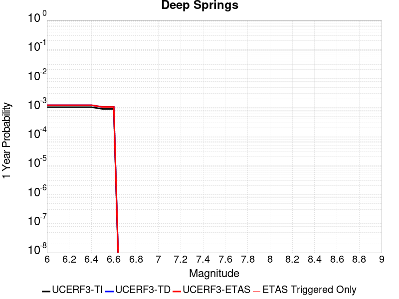 |  |

| Magnitude | 1 wk TI Prob | 1 wk TD Prob | 1 wk ETAS Prob | 1 wk ETAS/TD Gain | 1 wk ETAS Triggered Only | 1 mo TI Prob | 1 mo TD Prob | 1 mo ETAS Prob | 1 mo ETAS/TD Gain | 1 mo ETAS Triggered Only | 1 yr TI Prob | 1 yr TD Prob | 1 yr ETAS Prob | 1 yr ETAS/TD Gain | 1 yr ETAS Triggered Only | 10 yr TI Prob | 10 yr TD Prob | 10 yr ETAS Prob | 10 yr ETAS/TD Gain | 10 yr ETAS Triggered Only |
|-----|-----|-----|-----|-----|-----|-----|-----|-----|-----|-----|-----|-----|-----|-----|-----|-----|-----|-----|-----|-----|
| 6.0 | 1.9810619E-5 | 2.3115585E-5 | 2.3115585E-5 | 1.0 | 0.0 | 8.489989E-5 | 9.9065895E-5 | 9.9065895E-5 | 1.0 | 0.0 | 0.001033166 | 0.0012059676 | 0.0012059676 | 1.0 | 0.0 | 0.010283757 | 0.012044024 | 0.012073663 | 1.0024608 | 3.0E-5 |
| 6.1 | 1.9810619E-5 | 2.3115585E-5 | 2.3115585E-5 | 1.0 | 0.0 | 8.489989E-5 | 9.9065895E-5 | 9.9065895E-5 | 1.0 | 0.0 | 0.001033166 | 0.0012059676 | 0.0012059676 | 1.0 | 0.0 | 0.010283757 | 0.012044024 | 0.012073663 | 1.0024608 | 3.0E-5 |
| 6.2 | 1.9810619E-5 | 2.3115585E-5 | 2.3115585E-5 | 1.0 | 0.0 | 8.489989E-5 | 9.9065895E-5 | 9.9065895E-5 | 1.0 | 0.0 | 0.001033166 | 0.0012059676 | 0.0012059676 | 1.0 | 0.0 | 0.010283757 | 0.012044024 | 0.012073663 | 1.0024608 | 3.0E-5 |
| 6.3 | 1.9810619E-5 | 2.3115585E-5 | 2.3115585E-5 | 1.0 | 0.0 | 8.489989E-5 | 9.9065895E-5 | 9.9065895E-5 | 1.0 | 0.0 | 0.001033166 | 0.0012059676 | 0.0012059676 | 1.0 | 0.0 | 0.010283757 | 0.012044024 | 0.012073663 | 1.0024608 | 3.0E-5 |
| 6.4 | 1.9810619E-5 | 2.3115585E-5 | 2.3115585E-5 | 1.0 | 0.0 | 8.489989E-5 | 9.9065895E-5 | 9.9065895E-5 | 1.0 | 0.0 | 0.001033166 | 0.0012059676 | 0.0012059676 | 1.0 | 0.0 | 0.010283757 | 0.012044024 | 0.012073663 | 1.0024608 | 3.0E-5 |
| 6.5 | 1.7190405E-5 | 2.0053212E-5 | 2.0053212E-5 | 1.0 | 0.0 | 7.367108E-5 | 8.594234E-5 | 8.594234E-5 | 1.0 | 0.0 | 8.9657627E-4 | 0.0010463477 | 0.0010463477 | 1.0 | 0.0 | 0.008929676 | 0.010463445 | 0.010483236 | 1.0018914 | 2.0E-5 |
| 6.6 | 1.7190405E-5 | 2.0053212E-5 | 2.0053212E-5 | 1.0 | 0.0 | 7.367108E-5 | 8.594234E-5 | 8.594234E-5 | 1.0 | 0.0 | 8.9657627E-4 | 0.0010463477 | 0.0010463477 | 1.0 | 0.0 | 0.008929676 | 0.010463445 | 0.010483236 | 1.0018914 | 2.0E-5 |

## Pine Mtn
*[(top)](#table-of-contents)*

| 1 Week | 1 Month | 1 Year | 10 Year |
|-----|-----|-----|-----|
|  |  |  |  |

| Magnitude | 1 wk TI Prob | 1 wk TD Prob | 1 wk ETAS Prob | 1 wk ETAS/TD Gain | 1 wk ETAS Triggered Only | 1 mo TI Prob | 1 mo TD Prob | 1 mo ETAS Prob | 1 mo ETAS/TD Gain | 1 mo ETAS Triggered Only | 1 yr TI Prob | 1 yr TD Prob | 1 yr ETAS Prob | 1 yr ETAS/TD Gain | 1 yr ETAS Triggered Only | 10 yr TI Prob | 10 yr TD Prob | 10 yr ETAS Prob | 10 yr ETAS/TD Gain | 10 yr ETAS Triggered Only |
|-----|-----|-----|-----|-----|-----|-----|-----|-----|-----|-----|-----|-----|-----|-----|-----|-----|-----|-----|-----|-----|
| 6.0 | 6.894797E-6 | 7.226087E-6 | 7.226087E-6 | 1.0 | 0.0 | 2.9548795E-5 | 3.0968593E-5 | 3.0968593E-5 | 1.0 | 0.0 | 3.596972E-4 | 3.7698037E-4 | 3.7698037E-4 | 1.0 | 0.0 | 0.0035911554 | 0.0037637062 | 0.0037935933 | 1.0079409 | 3.0E-5 |
| 6.1 | 6.894797E-6 | 7.226087E-6 | 7.226087E-6 | 1.0 | 0.0 | 2.9548795E-5 | 3.0968593E-5 | 3.0968593E-5 | 1.0 | 0.0 | 3.596972E-4 | 3.7698037E-4 | 3.7698037E-4 | 1.0 | 0.0 | 0.0035911554 | 0.0037637062 | 0.0037935933 | 1.0079409 | 3.0E-5 |
| 6.2 | 6.894797E-6 | 7.226087E-6 | 7.226087E-6 | 1.0 | 0.0 | 2.9548795E-5 | 3.0968593E-5 | 3.0968593E-5 | 1.0 | 0.0 | 3.596972E-4 | 3.7698037E-4 | 3.7698037E-4 | 1.0 | 0.0 | 0.0035911554 | 0.0037637062 | 0.0037935933 | 1.0079409 | 3.0E-5 |
| 6.3 | 6.894797E-6 | 7.226087E-6 | 7.226087E-6 | 1.0 | 0.0 | 2.9548795E-5 | 3.0968593E-5 | 3.0968593E-5 | 1.0 | 0.0 | 3.596972E-4 | 3.7698037E-4 | 3.7698037E-4 | 1.0 | 0.0 | 0.0035911554 | 0.0037637062 | 0.0037935933 | 1.0079409 | 3.0E-5 |
| 6.4 | 6.894797E-6 | 7.226087E-6 | 7.226087E-6 | 1.0 | 0.0 | 2.9548795E-5 | 3.0968593E-5 | 3.0968593E-5 | 1.0 | 0.0 | 3.596972E-4 | 3.7698037E-4 | 3.7698037E-4 | 1.0 | 0.0 | 0.0035911554 | 0.0037637062 | 0.0037935933 | 1.0079409 | 3.0E-5 |
| 6.5 | 6.894797E-6 | 7.226087E-6 | 7.226087E-6 | 1.0 | 0.0 | 2.9548795E-5 | 3.0968593E-5 | 3.0968593E-5 | 1.0 | 0.0 | 3.596972E-4 | 3.7698037E-4 | 3.7698037E-4 | 1.0 | 0.0 | 0.0035911554 | 0.0037637062 | 0.0037935933 | 1.0079409 | 3.0E-5 |
| 6.6 | 6.894797E-6 | 7.226087E-6 | 7.226087E-6 | 1.0 | 0.0 | 2.9548795E-5 | 3.0968593E-5 | 3.0968593E-5 | 1.0 | 0.0 | 3.596972E-4 | 3.7698037E-4 | 3.7698037E-4 | 1.0 | 0.0 | 0.0035911554 | 0.0037637062 | 0.0037935933 | 1.0079409 | 3.0E-5 |
| 6.7 | 6.0867933E-6 | 6.3977222E-6 | 6.3977222E-6 | 1.0 | 0.0 | 2.6085996E-5 | 2.7418533E-5 | 2.7418533E-5 | 1.0 | 0.0 | 3.1755073E-4 | 3.337717E-4 | 3.337717E-4 | 1.0 | 0.0 | 0.0031709734 | 0.0033329232 | 0.003362823 | 1.0089711 | 3.0E-5 |
| 6.8 | 5.6530425E-6 | 5.951194E-6 | 5.951194E-6 | 1.0 | 0.0 | 2.42271E-5 | 2.550488E-5 | 2.550488E-5 | 1.0 | 0.0 | 2.94925E-4 | 3.1047972E-4 | 3.1047972E-4 | 1.0 | 0.0 | 0.002945339 | 0.0031006641 | 0.0031305712 | 1.0096453 | 3.0E-5 |
| 6.9 | 4.6015225E-6 | 4.8644033E-6 | 4.8644033E-6 | 1.0 | 0.0 | 1.9720663E-5 | 2.0847285E-5 | 2.0847285E-5 | 1.0 | 0.0 | 2.4007261E-4 | 2.5378758E-4 | 2.5378758E-4 | 1.0 | 0.0 | 0.0023981342 | 0.0025351217 | 0.0025650458 | 1.0118037 | 3.0E-5 |
| 7.0 | 4.4875965E-6 | 4.7480407E-6 | 4.7480407E-6 | 1.0 | 0.0 | 1.9232413E-5 | 2.0348594E-5 | 2.0348594E-5 | 1.0 | 0.0 | 2.3412947E-4 | 2.4771743E-4 | 2.4771743E-4 | 1.0 | 0.0 | 0.0023388295 | 0.002474557 | 0.0025044826 | 1.0120934 | 3.0E-5 |
| 7.1 | 3.203907E-6 | 3.429949E-6 | 3.429949E-6 | 1.0 | 0.0 | 1.3730958E-5 | 1.4699702E-5 | 1.4699702E-5 | 1.0 | 0.0 | 1.6716159E-4 | 1.7895484E-4 | 1.7895484E-4 | 1.0 | 0.0 | 0.0016703589 | 0.0017881735 | 0.0018181199 | 1.0167469 | 3.0E-5 |
| 7.2 | 2.2060601E-6 | 2.3789219E-6 | 2.3789219E-6 | 1.0 | 0.0 | 9.4545085E-6 | 1.0195342E-5 | 1.0195342E-5 | 1.0 | 0.0 | 1.15102564E-4 | 1.2412168E-4 | 1.2412168E-4 | 1.0 | 0.0 | 0.0011504296 | 0.0012405684 | 0.0012705311 | 1.0241525 | 3.0E-5 |
| 7.3 | 1.3765207E-6 | 1.522045E-6 | 1.522045E-6 | 1.0 | 0.0 | 5.899361E-6 | 6.5230342E-6 | 6.5230342E-6 | 1.0 | 0.0 | 7.182235E-5 | 7.941514E-5 | 7.941514E-5 | 1.0 | 0.0 | 7.1799144E-4 | 7.938767E-4 | 8.0386875E-4 | 1.0125864 | 1.0E-5 |
| 7.4 | 1.1245983E-6 | 1.2590648E-6 | 1.2590648E-6 | 1.0 | 0.0 | 4.819698E-6 | 5.395981E-6 | 5.395981E-6 | 1.0 | 0.0 | 5.8678244E-5 | 6.569418E-5 | 6.569418E-5 | 1.0 | 0.0 | 5.866275E-4 | 6.567559E-4 | 6.667493E-4 | 1.0152164 | 1.0E-5 |
| 7.5 | 8.031682E-7 | 9.280293E-7 | 9.280293E-7 | 1.0 | 0.0 | 3.4421448E-6 | 3.9772626E-6 | 3.9772626E-6 | 1.0 | 0.0 | 4.1907308E-5 | 4.8422167E-5 | 4.8422167E-5 | 1.0 | 0.0 | 4.1899405E-4 | 4.8412292E-4 | 4.941181E-4 | 1.0206459 | 1.0E-5 |
| 7.6 | 4.8953444E-7 | 6.005981E-7 | 6.005981E-7 | 1.0 | 0.0 | 2.098003E-6 | 2.5739896E-6 | 2.5739896E-6 | 1.0 | 0.0 | 2.5542888E-5 | 3.1337924E-5 | 3.1337924E-5 | 1.0 | 0.0 | 2.5539953E-4 | 3.133399E-4 | 3.2333678E-4 | 1.0319042 | 1.0E-5 |
| 7.7 | 6.634529E-8 | 6.788953E-8 | 6.788953E-8 | 1.0 | 0.0 | 2.843369E-7 | 2.909551E-7 | 2.909551E-7 | 1.0 | 0.0 | 3.4617963E-6 | 3.542373E-6 | 3.542373E-6 | 1.0 | 0.0 | 3.4617424E-5 | 3.542321E-5 | 4.5422858E-5 | 1.2822908 | 1.0E-5 |
| 7.8 | 9.235578E-9 | 9.488776E-9 | 9.488776E-9 | 1.0 | 0.0 | 3.9581046E-8 | 4.0666183E-8 | 4.0666183E-8 | 1.0 | 0.0 | 4.818991E-7 | 4.951107E-7 | 4.951107E-7 | 1.0 | 0.0 | 4.8189804E-6 | 4.9510977E-6 | 4.9510977E-6 | 1.0 | 0.0 |

## San Diego Trough north alt1
*[(top)](#table-of-contents)*

| 1 Week | 1 Month | 1 Year | 10 Year |
|-----|-----|-----|-----|
|  |  |  |  |

| Magnitude | 1 wk TI Prob | 1 wk TD Prob | 1 wk ETAS Prob | 1 wk ETAS/TD Gain | 1 wk ETAS Triggered Only | 1 mo TI Prob | 1 mo TD Prob | 1 mo ETAS Prob | 1 mo ETAS/TD Gain | 1 mo ETAS Triggered Only | 1 yr TI Prob | 1 yr TD Prob | 1 yr ETAS Prob | 1 yr ETAS/TD Gain | 1 yr ETAS Triggered Only | 10 yr TI Prob | 10 yr TD Prob | 10 yr ETAS Prob | 10 yr ETAS/TD Gain | 10 yr ETAS Triggered Only |
|-----|-----|-----|-----|-----|-----|-----|-----|-----|-----|-----|-----|-----|-----|-----|-----|-----|-----|-----|-----|-----|
| 6.0 | 7.329252E-5 | 8.822745E-5 | 8.822745E-5 | 1.0 | 0.0 | 3.14073E-4 | 3.7806443E-4 | 3.7806443E-4 | 1.0 | 0.0 | 0.0038171355 | 0.0045937942 | 0.004603748 | 1.0021669 | 1.0E-5 | 0.03752231 | 0.045052286 | 0.045080934 | 1.0006359 | 3.0E-5 |
| 6.1 | 3.7940346E-5 | 4.489162E-5 | 4.489162E-5 | 1.0 | 0.0 | 1.6259136E-4 | 1.9237901E-4 | 1.9237901E-4 | 1.0 | 0.0 | 0.0019777524 | 0.002339776 | 0.0023497525 | 1.0042639 | 1.0E-5 | 0.019602431 | 0.023160098 | 0.023189403 | 1.0012653 | 3.0E-5 |
| 6.2 | 2.8645263E-5 | 3.330111E-5 | 3.330111E-5 | 1.0 | 0.0 | 1.2275964E-4 | 1.4271136E-4 | 1.4271136E-4 | 1.0 | 0.0 | 0.0014935739 | 0.0017361477 | 0.0017461303 | 1.0057498 | 1.0E-5 | 0.0148357535 | 0.0172285 | 0.017257983 | 1.0017112 | 3.0E-5 |
| 6.3 | 2.8645263E-5 | 3.330111E-5 | 3.330111E-5 | 1.0 | 0.0 | 1.2275964E-4 | 1.4271136E-4 | 1.4271136E-4 | 1.0 | 0.0 | 0.0014935739 | 0.0017361477 | 0.0017461303 | 1.0057498 | 1.0E-5 | 0.0148357535 | 0.0172285 | 0.017257983 | 1.0017112 | 3.0E-5 |
| 6.4 | 2.2204576E-5 | 2.5451314E-5 | 2.5451314E-5 | 1.0 | 0.0 | 9.5159E-5 | 1.0907255E-4 | 1.0907255E-4 | 1.0 | 0.0 | 0.001157945 | 0.0013271587 | 0.0013371453 | 1.0075248 | 1.0E-5 | 0.011519298 | 0.013193498 | 0.013213234 | 1.001496 | 2.0E-5 |
| 6.5 | 2.1004838E-5 | 2.4027477E-5 | 2.4027477E-5 | 1.0 | 0.0 | 9.0017624E-5 | 1.0297087E-4 | 1.0297087E-4 | 1.0 | 0.0 | 0.0010954136 | 0.0012529582 | 0.0012629457 | 1.0079712 | 1.0E-5 | 0.010900296 | 0.012460022 | 0.012479774 | 1.0015851 | 2.0E-5 |
| 6.6 | 1.820557E-5 | 2.0707073E-5 | 2.0707073E-5 | 1.0 | 0.0 | 7.802154E-5 | 8.874161E-5 | 8.874161E-5 | 1.0 | 0.0 | 9.4949827E-4 | 0.001079899 | 0.0010898882 | 1.0092502 | 1.0E-5 | 0.009454516 | 0.010747184 | 0.010766969 | 1.001841 | 2.0E-5 |
| 6.7 | 1.5884485E-5 | 1.7985554E-5 | 1.7985554E-5 | 1.0 | 0.0 | 6.807459E-5 | 7.707869E-5 | 7.707869E-5 | 1.0 | 0.0 | 8.284929E-4 | 9.380317E-4 | 9.380317E-4 | 1.0 | 0.0 | 0.008254109 | 0.00934109 | 0.009350996 | 1.0010605 | 1.0E-5 |
| 6.8 | 1.4331171E-5 | 1.620276E-5 | 1.620276E-5 | 1.0 | 0.0 | 6.141786E-5 | 6.943856E-5 | 6.943856E-5 | 1.0 | 0.0 | 7.4750587E-4 | 8.4508857E-4 | 8.4508857E-4 | 1.0 | 0.0 | 0.0074499645 | 0.008419016 | 0.008419016 | 1.0 | 0.0 |
| 6.9 | 1.2574203E-5 | 1.4207312E-5 | 1.4207312E-5 | 1.0 | 0.0 | 5.3888325E-5 | 6.0887065E-5 | 6.0887065E-5 | 1.0 | 0.0 | 6.558929E-4 | 7.410493E-4 | 7.410493E-4 | 1.0 | 0.0 | 0.0065396037 | 0.007385968 | 0.007385968 | 1.0 | 0.0 |
| 7.0 | 1.0883844E-5 | 1.2290533E-5 | 1.2290533E-5 | 1.0 | 0.0 | 4.664421E-5 | 5.2672654E-5 | 5.2672654E-5 | 1.0 | 0.0 | 5.677453E-4 | 6.4110185E-4 | 6.4110185E-4 | 1.0 | 0.0 | 0.00566297 | 0.006392652 | 0.006392652 | 1.0 | 0.0 |
| 7.1 | 9.393088E-6 | 1.0608119E-5 | 1.0608119E-5 | 1.0 | 0.0 | 4.025547E-5 | 4.546258E-5 | 4.546258E-5 | 1.0 | 0.0 | 4.900001E-4 | 5.533671E-4 | 5.533671E-4 | 1.0 | 0.0 | 0.0048892107 | 0.005519988 | 0.005519988 | 1.0 | 0.0 |
| 7.2 | 8.190791E-6 | 9.259594E-6 | 9.259594E-6 | 1.0 | 0.0 | 3.510292E-5 | 3.9683375E-5 | 3.9683375E-5 | 1.0 | 0.0 | 4.2729423E-4 | 4.8303863E-4 | 4.8303863E-4 | 1.0 | 0.0 | 0.0042647356 | 0.0048199673 | 0.0048199673 | 1.0 | 0.0 |
| 7.3 | 6.268162E-6 | 7.0904603E-6 | 7.0904603E-6 | 1.0 | 0.0 | 2.6863276E-5 | 3.0387337E-5 | 3.0387337E-5 | 1.0 | 0.0 | 3.2701128E-4 | 3.6990343E-4 | 3.6990343E-4 | 1.0 | 0.0 | 0.003265305 | 0.003692923 | 0.003692923 | 1.0 | 0.0 |
| 7.4 | 4.985186E-6 | 5.6432777E-6 | 5.6432777E-6 | 1.0 | 0.0 | 2.1364907E-5 | 2.4185254E-5 | 2.4185254E-5 | 1.0 | 0.0 | 2.600867E-4 | 2.9441607E-4 | 2.9441607E-4 | 1.0 | 0.0 | 0.002597825 | 0.0029403016 | 0.0029403016 | 1.0 | 0.0 |
| 7.5 | 1.7489613E-6 | 1.9698784E-6 | 1.9698784E-6 | 1.0 | 0.0 | 7.495527E-6 | 8.44231E-6 | 8.44231E-6 | 1.0 | 0.0 | 9.125422E-5 | 1.027805E-4 | 1.027805E-4 | 1.0 | 0.0 | 9.1216754E-4 | 0.0010273516 | 0.0010273516 | 1.0 | 0.0 |
| 7.6 | 1.6988751E-7 | 1.753427E-7 | 1.753427E-7 | 1.0 | 0.0 | 7.2808916E-7 | 7.514686E-7 | 7.514686E-7 | 1.0 | 0.0 | 8.864449E-6 | 9.149093E-6 | 9.149093E-6 | 1.0 | 0.0 | 8.8640954E-5 | 9.148736E-5 | 9.148736E-5 | 1.0 | 0.0 |

## Newport-Inglewood alt 1
*[(top)](#table-of-contents)*

| 1 Week | 1 Month | 1 Year | 10 Year |
|-----|-----|-----|-----|
|  |  |  |  |

| Magnitude | 1 wk TI Prob | 1 wk TD Prob | 1 wk ETAS Prob | 1 wk ETAS/TD Gain | 1 wk ETAS Triggered Only | 1 mo TI Prob | 1 mo TD Prob | 1 mo ETAS Prob | 1 mo ETAS/TD Gain | 1 mo ETAS Triggered Only | 1 yr TI Prob | 1 yr TD Prob | 1 yr ETAS Prob | 1 yr ETAS/TD Gain | 1 yr ETAS Triggered Only | 10 yr TI Prob | 10 yr TD Prob | 10 yr ETAS Prob | 10 yr ETAS/TD Gain | 10 yr ETAS Triggered Only |
|-----|-----|-----|-----|-----|-----|-----|-----|-----|-----|-----|-----|-----|-----|-----|-----|-----|-----|-----|-----|-----|
| 6.0 | 2.9668912E-5 | 3.0408699E-5 | 3.0408699E-5 | 1.0 | 0.0 | 1.2714628E-4 | 1.3031924E-4 | 1.3031924E-4 | 1.0 | 0.0 | 0.0015469068 | 0.0015859668 | 0.0015859668 | 1.0 | 0.0 | 0.015361829 | 0.015794108 | 0.01580395 | 1.0006231 | 1.0E-5 |
| 6.1 | 2.9668912E-5 | 3.0408699E-5 | 3.0408699E-5 | 1.0 | 0.0 | 1.2714628E-4 | 1.3031924E-4 | 1.3031924E-4 | 1.0 | 0.0 | 0.0015469068 | 0.0015859668 | 0.0015859668 | 1.0 | 0.0 | 0.015361829 | 0.015794108 | 0.01580395 | 1.0006231 | 1.0E-5 |
| 6.2 | 2.9668912E-5 | 3.0408699E-5 | 3.0408699E-5 | 1.0 | 0.0 | 1.2714628E-4 | 1.3031924E-4 | 1.3031924E-4 | 1.0 | 0.0 | 0.0015469068 | 0.0015859668 | 0.0015859668 | 1.0 | 0.0 | 0.015361829 | 0.015794108 | 0.01580395 | 1.0006231 | 1.0E-5 |
| 6.3 | 2.9668912E-5 | 3.0408699E-5 | 3.0408699E-5 | 1.0 | 0.0 | 1.2714628E-4 | 1.3031924E-4 | 1.3031924E-4 | 1.0 | 0.0 | 0.0015469068 | 0.0015859668 | 0.0015859668 | 1.0 | 0.0 | 0.015361829 | 0.015794108 | 0.01580395 | 1.0006231 | 1.0E-5 |
| 6.4 | 1.275942E-5 | 1.0273198E-5 | 1.0273198E-5 | 1.0 | 0.0 | 5.4682085E-5 | 4.4027274E-5 | 4.4027274E-5 | 1.0 | 0.0 | 6.65551E-4 | 5.359044E-4 | 5.359044E-4 | 1.0 | 0.0 | 0.0066356123 | 0.005346545 | 0.0053564915 | 1.0018604 | 1.0E-5 |
| 6.5 | 1.275942E-5 | 1.0273198E-5 | 1.0273198E-5 | 1.0 | 0.0 | 5.4682085E-5 | 4.4027274E-5 | 4.4027274E-5 | 1.0 | 0.0 | 6.65551E-4 | 5.359044E-4 | 5.359044E-4 | 1.0 | 0.0 | 0.0066356123 | 0.005346545 | 0.0053564915 | 1.0018604 | 1.0E-5 |
| 6.6 | 1.1255358E-5 | 8.662414E-6 | 8.662414E-6 | 1.0 | 0.0 | 4.8236358E-5 | 3.7124115E-5 | 3.7124115E-5 | 1.0 | 0.0 | 5.871194E-4 | 4.5189404E-4 | 4.5189404E-4 | 1.0 | 0.0 | 0.005855706 | 0.0045099286 | 0.0045198835 | 1.0022073 | 1.0E-5 |
| 6.7 | 1.0504745E-5 | 7.900279E-6 | 7.900279E-6 | 1.0 | 0.0 | 4.5019555E-5 | 3.3857905E-5 | 3.3857905E-5 | 1.0 | 0.0 | 5.4797524E-4 | 4.1214327E-4 | 4.1214327E-4 | 1.0 | 0.0 | 0.0054662596 | 0.004113919 | 0.004123878 | 1.0024208 | 1.0E-5 |
| 6.8 | 1.0476007E-5 | 7.881659E-6 | 7.881659E-6 | 1.0 | 0.0 | 4.4896402E-5 | 3.377811E-5 | 3.377811E-5 | 1.0 | 0.0 | 5.464766E-4 | 4.1117214E-4 | 4.1117214E-4 | 1.0 | 0.0 | 0.005451347 | 0.0041042436 | 0.0041142027 | 1.0024265 | 1.0E-5 |
| 6.9 | 9.076797E-6 | 6.4899937E-6 | 6.4899937E-6 | 1.0 | 0.0 | 3.889998E-5 | 2.7813963E-5 | 2.7813963E-5 | 1.0 | 0.0 | 4.7350433E-4 | 3.3858273E-4 | 3.3858273E-4 | 1.0 | 0.0 | 0.004724967 | 0.003380706 | 0.0033906722 | 1.0029479 | 1.0E-5 |
| 7.0 | 8.73795E-6 | 6.2123845E-6 | 6.2123845E-6 | 1.0 | 0.0 | 3.7447822E-5 | 2.6624235E-5 | 2.6624235E-5 | 1.0 | 0.0 | 4.5583185E-4 | 3.2410212E-4 | 3.2410212E-4 | 1.0 | 0.0 | 0.0045489795 | 0.0032363262 | 0.0032462939 | 1.0030799 | 1.0E-5 |
| 7.1 | 8.391299E-6 | 5.956083E-6 | 5.956083E-6 | 1.0 | 0.0 | 3.5962214E-5 | 2.5525822E-5 | 2.5525822E-5 | 1.0 | 0.0 | 4.37752E-4 | 3.107328E-4 | 3.107328E-4 | 1.0 | 0.0 | 0.004368907 | 0.003103013 | 0.003112982 | 1.0032127 | 1.0E-5 |
| 7.2 | 7.796882E-6 | 5.4968E-6 | 5.4968E-6 | 1.0 | 0.0 | 3.341478E-5 | 2.3557503E-5 | 2.3557503E-5 | 1.0 | 0.0 | 4.06749E-4 | 2.8677506E-4 | 2.8677506E-4 | 1.0 | 0.0 | 0.0040600533 | 0.002864074 | 0.0028740452 | 1.0034815 | 1.0E-5 |
| 7.3 | 6.4738833E-6 | 4.6479936E-6 | 4.6479936E-6 | 1.0 | 0.0 | 2.774492E-5 | 1.991982E-5 | 1.991982E-5 | 1.0 | 0.0 | 3.3774204E-4 | 2.4249697E-4 | 2.4249697E-4 | 1.0 | 0.0 | 0.0033722918 | 0.0024223404 | 0.002432316 | 1.0041182 | 1.0E-5 |
| 7.4 | 5.382145E-6 | 3.8859E-6 | 3.8859E-6 | 1.0 | 0.0 | 2.3066134E-5 | 1.665375E-5 | 1.665375E-5 | 1.0 | 0.0 | 2.8079396E-4 | 2.0274067E-4 | 2.0274067E-4 | 1.0 | 0.0 | 0.0028043943 | 0.0020255717 | 0.0020355515 | 1.0049269 | 1.0E-5 |
| 7.5 | 3.648244E-6 | 2.5738784E-6 | 2.5738784E-6 | 1.0 | 0.0 | 1.5635238E-5 | 1.1030861E-5 | 1.1030861E-5 | 1.0 | 0.0 | 1.9034238E-4 | 1.3429257E-4 | 1.3429257E-4 | 1.0 | 0.0 | 0.0019017943 | 0.0013421245 | 0.0013521111 | 1.0074409 | 1.0E-5 |
| 7.6 | 2.2906888E-6 | 1.5480638E-6 | 1.5480638E-6 | 1.0 | 0.0 | 9.817201E-6 | 6.634543E-6 | 6.634543E-6 | 1.0 | 0.0 | 1.1951787E-4 | 8.077263E-5 | 8.077263E-5 | 1.0 | 0.0 | 0.0011945361 | 8.0743944E-4 | 8.1743137E-4 | 1.0123749 | 1.0E-5 |
| 7.7 | 6.0479874E-7 | 3.39767E-7 | 3.39767E-7 | 1.0 | 0.0 | 2.5919921E-6 | 1.4561435E-6 | 1.4561435E-6 | 1.0 | 0.0 | 3.1557047E-5 | 1.7728418E-5 | 1.7728418E-5 | 1.0 | 0.0 | 3.1552566E-4 | 1.7727142E-4 | 1.8726964E-4 | 1.0564007 | 1.0E-5 |
| 7.8 | 1.16056995E-8 | 9.783043E-9 | 9.783043E-9 | 1.0 | 0.0 | 4.9738713E-8 | 4.1927326E-8 | 4.1927326E-8 | 1.0 | 0.0 | 6.0556863E-7 | 5.104652E-7 | 5.104652E-7 | 1.0 | 0.0 | 6.05567E-6 | 5.1046522E-6 | 5.1046522E-6 | 1.0 | 0.0 |

## Camp Rock 2011
*[(top)](#table-of-contents)*

| 1 Week | 1 Month | 1 Year | 10 Year |
|-----|-----|-----|-----|
|  |  |  |  |

| Magnitude | 1 wk TI Prob | 1 wk TD Prob | 1 wk ETAS Prob | 1 wk ETAS/TD Gain | 1 wk ETAS Triggered Only | 1 mo TI Prob | 1 mo TD Prob | 1 mo ETAS Prob | 1 mo ETAS/TD Gain | 1 mo ETAS Triggered Only | 1 yr TI Prob | 1 yr TD Prob | 1 yr ETAS Prob | 1 yr ETAS/TD Gain | 1 yr ETAS Triggered Only | 10 yr TI Prob | 10 yr TD Prob | 10 yr ETAS Prob | 10 yr ETAS/TD Gain | 10 yr ETAS Triggered Only |
|-----|-----|-----|-----|-----|-----|-----|-----|-----|-----|-----|-----|-----|-----|-----|-----|-----|-----|-----|-----|-----|
| 6.0 | 1.6710783E-5 | 4.2502397E-6 | 4.2502397E-6 | 1.0 | 0.0 | 7.161568E-5 | 1.8215187E-5 | 1.8215187E-5 | 1.0 | 0.0 | 8.7157206E-4 | 2.2174788E-4 | 2.4174343E-4 | 1.0901725 | 2.0E-5 | 0.008681616 | 0.0022153188 | 0.0022352745 | 1.009008 | 2.0E-5 |
| 6.1 | 1.6710783E-5 | 4.2502397E-6 | 4.2502397E-6 | 1.0 | 0.0 | 7.161568E-5 | 1.8215187E-5 | 1.8215187E-5 | 1.0 | 0.0 | 8.7157206E-4 | 2.2174788E-4 | 2.4174343E-4 | 1.0901725 | 2.0E-5 | 0.008681616 | 0.0022153188 | 0.0022352745 | 1.009008 | 2.0E-5 |
| 6.2 | 1.6710783E-5 | 4.2502397E-6 | 4.2502397E-6 | 1.0 | 0.0 | 7.161568E-5 | 1.8215187E-5 | 1.8215187E-5 | 1.0 | 0.0 | 8.7157206E-4 | 2.2174788E-4 | 2.4174343E-4 | 1.0901725 | 2.0E-5 | 0.008681616 | 0.0022153188 | 0.0022352745 | 1.009008 | 2.0E-5 |
| 6.3 | 1.6710783E-5 | 4.2502397E-6 | 4.2502397E-6 | 1.0 | 0.0 | 7.161568E-5 | 1.8215187E-5 | 1.8215187E-5 | 1.0 | 0.0 | 8.7157206E-4 | 2.2174788E-4 | 2.4174343E-4 | 1.0901725 | 2.0E-5 | 0.008681616 | 0.0022153188 | 0.0022352745 | 1.009008 | 2.0E-5 |
| 6.4 | 7.982846E-6 | 3.682263E-6 | 3.682263E-6 | 1.0 | 0.0 | 3.421175E-5 | 1.5781034E-5 | 1.5781034E-5 | 1.0 | 0.0 | 4.1644843E-4 | 1.9211748E-4 | 2.1211365E-4 | 1.104083 | 2.0E-5 | 0.0041566887 | 0.0019195488 | 0.0019395105 | 1.0103991 | 2.0E-5 |
| 6.5 | 7.982846E-6 | 3.682263E-6 | 3.682263E-6 | 1.0 | 0.0 | 3.421175E-5 | 1.5781034E-5 | 1.5781034E-5 | 1.0 | 0.0 | 4.1644843E-4 | 1.9211748E-4 | 2.1211365E-4 | 1.104083 | 2.0E-5 | 0.0041566887 | 0.0019195488 | 0.0019395105 | 1.0103991 | 2.0E-5 |
| 6.6 | 7.048869E-6 | 3.4245174E-6 | 3.4245174E-6 | 1.0 | 0.0 | 3.0209088E-5 | 1.4676422E-5 | 1.4676422E-5 | 1.0 | 0.0 | 3.677336E-4 | 1.7867111E-4 | 1.9866753E-4 | 1.1119175 | 2.0E-5 | 0.0036712566 | 0.0017853063 | 0.0018052706 | 1.0111825 | 2.0E-5 |
| 6.7 | 6.987307E-6 | 3.3624922E-6 | 3.3624922E-6 | 1.0 | 0.0 | 2.9945259E-5 | 1.44106025E-5 | 1.44106025E-5 | 1.0 | 0.0 | 3.6452254E-4 | 1.7543527E-4 | 1.9543177E-4 | 1.1139822 | 2.0E-5 | 0.0036392517 | 0.0017529989 | 0.0017729639 | 1.011389 | 2.0E-5 |
| 6.8 | 6.3737602E-6 | 3.1180766E-6 | 3.1180766E-6 | 1.0 | 0.0 | 2.731583E-5 | 1.3363118E-5 | 1.3363118E-5 | 1.0 | 0.0 | 3.3251947E-4 | 1.6268411E-4 | 1.8268086E-4 | 1.1229177 | 2.0E-5 | 0.0033202237 | 0.0016256787 | 0.0016456463 | 1.0122826 | 2.0E-5 |
| 6.9 | 6.112211E-6 | 2.9332814E-6 | 2.9332814E-6 | 1.0 | 0.0 | 2.6194928E-5 | 1.2571147E-5 | 1.2571147E-5 | 1.0 | 0.0 | 3.1887658E-4 | 1.5304325E-4 | 1.7304019E-4 | 1.130662 | 2.0E-5 | 0.003184194 | 0.0015294063 | 0.0015493757 | 1.013057 | 2.0E-5 |
| 7.0 | 5.5140117E-6 | 2.6421058E-6 | 2.6421058E-6 | 1.0 | 0.0 | 2.3631264E-5 | 1.1323263E-5 | 1.1323263E-5 | 1.0 | 0.0 | 2.8767265E-4 | 1.3785226E-4 | 1.578495E-4 | 1.1450629 | 2.0E-5 | 0.0028730053 | 0.0013776927 | 0.0013976651 | 1.014497 | 2.0E-5 |
| 7.1 | 4.8151105E-6 | 2.1344247E-6 | 2.1344247E-6 | 1.0 | 0.0 | 2.0636026E-5 | 9.147503E-6 | 9.147503E-6 | 1.0 | 0.0 | 2.5121463E-4 | 1.1136538E-4 | 1.3136315E-4 | 1.179569 | 2.0E-5 | 0.0025093083 | 0.0011131177 | 0.0011330954 | 1.0179476 | 2.0E-5 |
| 7.2 | 3.818335E-6 | 1.2938556E-6 | 1.2938556E-6 | 1.0 | 0.0 | 1.6364189E-5 | 5.5450837E-6 | 5.5450837E-6 | 1.0 | 0.0 | 1.9921579E-4 | 6.750939E-5 | 7.750871E-5 | 1.1481175 | 1.0E-5 | 0.0019903728 | 6.7489705E-4 | 6.8489026E-4 | 1.0148071 | 1.0E-5 |
| 7.3 | 2.7166698E-6 | 7.3840414E-7 | 7.3840414E-7 | 1.0 | 0.0 | 1.1642818E-5 | 3.1645852E-6 | 3.1645852E-6 | 1.0 | 0.0 | 1.4174209E-4 | 3.8528167E-5 | 4.852778E-5 | 1.2595404 | 1.0E-5 | 0.0014165172 | 3.8521687E-4 | 3.9521302E-4 | 1.0259494 | 1.0E-5 |
| 7.4 | 2.0893426E-6 | 5.462229E-7 | 5.462229E-7 | 1.0 | 0.0 | 8.954295E-6 | 2.3409534E-6 | 2.3409534E-6 | 1.0 | 0.0 | 1.0901308E-4 | 2.8500739E-5 | 2.8500739E-5 | 1.0 | 0.0 | 0.0010895962 | 2.8497138E-4 | 2.8497138E-4 | 1.0 | 0.0 |
| 7.5 | 1.1681728E-6 | 3.6032822E-7 | 3.6032822E-7 | 1.0 | 0.0 | 5.0064455E-6 | 1.5442629E-6 | 1.5442629E-6 | 1.0 | 0.0 | 6.0951766E-5 | 1.8801244E-5 | 1.8801244E-5 | 1.0 | 0.0 | 6.093505E-4 | 1.87997E-4 | 1.87997E-4 | 1.0 | 0.0 |
| 7.6 | 1.3154387E-7 | 7.120076E-8 | 7.120076E-8 | 1.0 | 0.0 | 5.6375933E-7 | 3.0514607E-7 | 3.0514607E-7 | 1.0 | 0.0 | 6.863748E-6 | 3.7151488E-6 | 3.7151488E-6 | 1.0 | 0.0 | 6.863536E-5 | 3.7151025E-5 | 3.7151025E-5 | 1.0 | 0.0 |

## San Luis Range 2011 CFM
*[(top)](#table-of-contents)*

| 1 Week | 1 Month | 1 Year | 10 Year |
|-----|-----|-----|-----|
|  |  |  |  |

| Magnitude | 1 wk TI Prob | 1 wk TD Prob | 1 wk ETAS Prob | 1 wk ETAS/TD Gain | 1 wk ETAS Triggered Only | 1 mo TI Prob | 1 mo TD Prob | 1 mo ETAS Prob | 1 mo ETAS/TD Gain | 1 mo ETAS Triggered Only | 1 yr TI Prob | 1 yr TD Prob | 1 yr ETAS Prob | 1 yr ETAS/TD Gain | 1 yr ETAS Triggered Only | 10 yr TI Prob | 10 yr TD Prob | 10 yr ETAS Prob | 10 yr ETAS/TD Gain | 10 yr ETAS Triggered Only |
|-----|-----|-----|-----|-----|-----|-----|-----|-----|-----|-----|-----|-----|-----|-----|-----|-----|-----|-----|-----|-----|
| 6.0 | 8.8368415E-6 | 8.965596E-6 | 8.965596E-6 | 1.0 | 0.0 | 3.787163E-5 | 3.8423463E-5 | 4.8423077E-5 | 1.2602477 | 1.0E-5 | 4.609895E-4 | 4.677131E-4 | 4.7770844E-4 | 1.0213706 | 1.0E-5 | 0.0046003438 | 0.00466807 | 0.004687977 | 1.0042645 | 2.0E-5 |
| 6.1 | 8.8368415E-6 | 8.965596E-6 | 8.965596E-6 | 1.0 | 0.0 | 3.787163E-5 | 3.8423463E-5 | 4.8423077E-5 | 1.2602477 | 1.0E-5 | 4.609895E-4 | 4.677131E-4 | 4.7770844E-4 | 1.0213706 | 1.0E-5 | 0.0046003438 | 0.00466807 | 0.004687977 | 1.0042645 | 2.0E-5 |
| 6.2 | 8.8368415E-6 | 8.965596E-6 | 8.965596E-6 | 1.0 | 0.0 | 3.787163E-5 | 3.8423463E-5 | 4.8423077E-5 | 1.2602477 | 1.0E-5 | 4.609895E-4 | 4.677131E-4 | 4.7770844E-4 | 1.0213706 | 1.0E-5 | 0.0046003438 | 0.00466807 | 0.004687977 | 1.0042645 | 2.0E-5 |
| 6.3 | 8.8368415E-6 | 8.965596E-6 | 8.965596E-6 | 1.0 | 0.0 | 3.787163E-5 | 3.8423463E-5 | 4.8423077E-5 | 1.2602477 | 1.0E-5 | 4.609895E-4 | 4.677131E-4 | 4.7770844E-4 | 1.0213706 | 1.0E-5 | 0.0046003438 | 0.00466807 | 0.004687977 | 1.0042645 | 2.0E-5 |
| 6.4 | 3.9094193E-6 | 3.9412666E-6 | 3.9412666E-6 | 1.0 | 0.0 | 1.6754546E-5 | 1.6891034E-5 | 1.6891034E-5 | 1.0 | 0.0 | 2.039675E-4 | 2.0562921E-4 | 2.0562921E-4 | 1.0 | 0.0 | 0.0020378039 | 0.0020544182 | 0.0020643978 | 1.0048575 | 1.0E-5 |
| 6.5 | 3.9094193E-6 | 3.9412666E-6 | 3.9412666E-6 | 1.0 | 0.0 | 1.6754546E-5 | 1.6891034E-5 | 1.6891034E-5 | 1.0 | 0.0 | 2.039675E-4 | 2.0562921E-4 | 2.0562921E-4 | 1.0 | 0.0 | 0.0020378039 | 0.0020544182 | 0.0020643978 | 1.0048575 | 1.0E-5 |
| 6.6 | 3.0587726E-6 | 3.0754397E-6 | 3.0754397E-6 | 1.0 | 0.0 | 1.3108959E-5 | 1.318039E-5 | 1.318039E-5 | 1.0 | 0.0 | 1.595899E-4 | 1.6045955E-4 | 1.6045955E-4 | 1.0 | 0.0 | 0.0015947534 | 0.0016034489 | 0.0016034489 | 1.0 | 0.0 |
| 6.7 | 2.6160574E-6 | 2.6251728E-6 | 2.6251728E-6 | 1.0 | 0.0 | 1.1211626E-5 | 1.1250692E-5 | 1.1250692E-5 | 1.0 | 0.0 | 1.3649299E-4 | 1.3696862E-4 | 1.3696862E-4 | 1.0 | 0.0 | 0.0013640919 | 0.0013688483 | 0.0013688483 | 1.0 | 0.0 |
| 6.8 | 2.5110312E-6 | 2.518184E-6 | 2.518184E-6 | 1.0 | 0.0 | 1.0761518E-5 | 1.0792172E-5 | 1.0792172E-5 | 1.0 | 0.0 | 1.310136E-4 | 1.3138684E-4 | 1.3138684E-4 | 1.0 | 0.0 | 0.0013093639 | 0.0013130974 | 0.0013130974 | 1.0 | 0.0 |
| 6.9 | 1.8564405E-6 | 1.8525218E-6 | 1.8525218E-6 | 1.0 | 0.0 | 7.95615E-6 | 7.939355E-6 | 7.939355E-6 | 1.0 | 0.0 | 9.686181E-5 | 9.665738E-5 | 9.665738E-5 | 1.0 | 0.0 | 9.68196E-4 | 9.6615544E-4 | 9.6615544E-4 | 1.0 | 0.0 |
| 7.0 | 1.546127E-6 | 1.5369844E-6 | 1.5369844E-6 | 1.0 | 0.0 | 6.626242E-6 | 6.5870595E-6 | 6.5870595E-6 | 1.0 | 0.0 | 8.06715E-5 | 8.01945E-5 | 8.01945E-5 | 1.0 | 0.0 | 8.0642226E-4 | 8.0165634E-4 | 8.0165634E-4 | 1.0 | 0.0 |
| 7.1 | 1.3368208E-6 | 1.3235599E-6 | 1.3235599E-6 | 1.0 | 0.0 | 5.7292195E-6 | 5.672387E-6 | 5.672387E-6 | 1.0 | 0.0 | 6.975101E-5 | 6.9059126E-5 | 6.9059126E-5 | 1.0 | 0.0 | 6.972912E-4 | 6.9037714E-4 | 6.9037714E-4 | 1.0 | 0.0 |
| 7.2 | 1.0623363E-6 | 1.0454596E-6 | 1.0454596E-6 | 1.0 | 0.0 | 4.5528623E-6 | 4.4805333E-6 | 4.4805333E-6 | 1.0 | 0.0 | 5.5429686E-5 | 5.454913E-5 | 5.454913E-5 | 1.0 | 0.0 | 5.5415864E-4 | 5.453577E-4 | 5.453577E-4 | 1.0 | 0.0 |
| 7.3 | 7.831679E-7 | 7.7275774E-7 | 7.7275774E-7 | 1.0 | 0.0 | 3.3564295E-6 | 3.3118147E-6 | 3.3118147E-6 | 1.0 | 0.0 | 4.086376E-5 | 4.03206E-5 | 4.03206E-5 | 1.0 | 0.0 | 4.0856248E-4 | 4.0313296E-4 | 4.0313296E-4 | 1.0 | 0.0 |
| 7.4 | 5.9558846E-7 | 5.9107947E-7 | 5.9107947E-7 | 1.0 | 0.0 | 2.5525194E-6 | 2.5331954E-6 | 2.5331954E-6 | 1.0 | 0.0 | 3.107648E-5 | 3.0841216E-5 | 3.0841216E-5 | 1.0 | 0.0 | 3.1072134E-4 | 3.0836946E-4 | 3.0836946E-4 | 1.0 | 0.0 |
| 7.5 | 4.1616502E-7 | 4.1197623E-7 | 4.1197623E-7 | 1.0 | 0.0 | 1.7835631E-6 | 1.7656113E-6 | 1.7656113E-6 | 1.0 | 0.0 | 2.1714664E-5 | 2.1496106E-5 | 2.1496106E-5 | 1.0 | 0.0 | 2.1712543E-4 | 2.1494032E-4 | 2.1494032E-4 | 1.0 | 0.0 |
| 7.6 | 2.3816014E-7 | 2.3377548E-7 | 2.3377548E-7 | 1.0 | 0.0 | 1.0206859E-6 | 1.0018945E-6 | 1.0018945E-6 | 1.0 | 0.0 | 1.242678E-5 | 1.2197997E-5 | 1.2197997E-5 | 1.0 | 0.0 | 1.2426086E-4 | 1.219733E-4 | 1.219733E-4 | 1.0 | 0.0 |
| 7.7 | 9.918777E-8 | 9.3875165E-8 | 9.3875165E-8 | 1.0 | 0.0 | 4.2509038E-7 | 4.0232206E-7 | 4.0232206E-7 | 1.0 | 0.0 | 5.1754632E-6 | 4.89826E-6 | 4.89826E-6 | 1.0 | 0.0 | 5.1753424E-5 | 4.8981525E-5 | 4.8981525E-5 | 1.0 | 0.0 |
| 7.8 | 3.4982556E-8 | 2.969254E-8 | 2.969254E-8 | 1.0 | 0.0 | 1.4992524E-7 | 1.2725374E-7 | 1.2725374E-7 | 1.0 | 0.0 | 1.8253382E-6 | 1.5493131E-6 | 1.5493131E-6 | 1.0 | 0.0 | 1.8253233E-5 | 1.5493024E-5 | 1.5493024E-5 | 1.0 | 0.0 |
| 7.9 | 1.6624908E-8 | 1.1482307E-8 | 1.1482307E-8 | 1.0 | 0.0 | 7.12496E-8 | 4.9209884E-8 | 4.9209884E-8 | 1.0 | 0.0 | 8.6746354E-7 | 5.9913015E-7 | 5.9913015E-7 | 1.0 | 0.0 | 8.674601E-6 | 5.991286E-6 | 5.991286E-6 | 1.0 | 0.0 |
| 8.0 | 6.3352315E-9 | 3.0917149E-9 | 3.0917149E-9 | 1.0 | 0.0 | 2.715099E-8 | 1.3250203E-8 | 1.3250203E-8 | 1.0 | 0.0 | 3.3056327E-7 | 1.6132121E-7 | 1.6132121E-7 | 1.0 | 0.0 | 3.3056278E-6 | 1.6132109E-6 | 1.6132109E-6 | 1.0 | 0.0 |

## Raymond
*[(top)](#table-of-contents)*

| 1 Week | 1 Month | 1 Year | 10 Year |
|-----|-----|-----|-----|
|  |  |  | 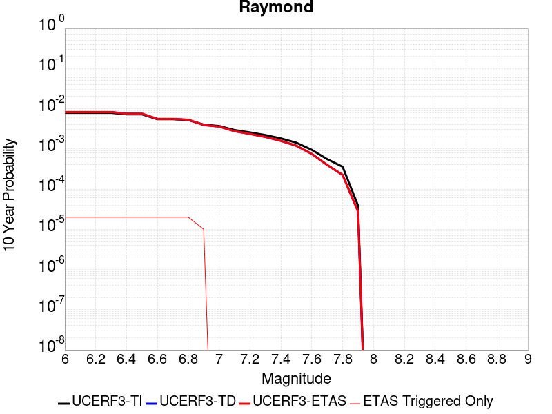 |

| Magnitude | 1 wk TI Prob | 1 wk TD Prob | 1 wk ETAS Prob | 1 wk ETAS/TD Gain | 1 wk ETAS Triggered Only | 1 mo TI Prob | 1 mo TD Prob | 1 mo ETAS Prob | 1 mo ETAS/TD Gain | 1 mo ETAS Triggered Only | 1 yr TI Prob | 1 yr TD Prob | 1 yr ETAS Prob | 1 yr ETAS/TD Gain | 1 yr ETAS Triggered Only | 10 yr TI Prob | 10 yr TD Prob | 10 yr ETAS Prob | 10 yr ETAS/TD Gain | 10 yr ETAS Triggered Only |
|-----|-----|-----|-----|-----|-----|-----|-----|-----|-----|-----|-----|-----|-----|-----|-----|-----|-----|-----|-----|-----|
| 6.0 | 1.5157413E-5 | 1.5811693E-5 | 1.5811693E-5 | 1.0 | 0.0 | 6.4958724E-5 | 6.776278E-5 | 7.77621E-5 | 1.1475636 | 1.0E-5 | 7.905855E-4 | 8.247247E-4 | 8.447082E-4 | 1.0242305 | 2.0E-5 | 0.007877788 | 0.008219167 | 0.008239002 | 1.0024134 | 2.0E-5 |
| 6.1 | 1.5157413E-5 | 1.5811693E-5 | 1.5811693E-5 | 1.0 | 0.0 | 6.4958724E-5 | 6.776278E-5 | 7.77621E-5 | 1.1475636 | 1.0E-5 | 7.905855E-4 | 8.247247E-4 | 8.447082E-4 | 1.0242305 | 2.0E-5 | 0.007877788 | 0.008219167 | 0.008239002 | 1.0024134 | 2.0E-5 |
| 6.2 | 1.5157413E-5 | 1.5811693E-5 | 1.5811693E-5 | 1.0 | 0.0 | 6.4958724E-5 | 6.776278E-5 | 7.77621E-5 | 1.1475636 | 1.0E-5 | 7.905855E-4 | 8.247247E-4 | 8.447082E-4 | 1.0242305 | 2.0E-5 | 0.007877788 | 0.008219167 | 0.008239002 | 1.0024134 | 2.0E-5 |
| 6.3 | 1.5157413E-5 | 1.5811693E-5 | 1.5811693E-5 | 1.0 | 0.0 | 6.4958724E-5 | 6.776278E-5 | 7.77621E-5 | 1.1475636 | 1.0E-5 | 7.905855E-4 | 8.247247E-4 | 8.447082E-4 | 1.0242305 | 2.0E-5 | 0.007877788 | 0.008219167 | 0.008239002 | 1.0024134 | 2.0E-5 |
| 6.4 | 1.3941944E-5 | 1.4456132E-5 | 1.4456132E-5 | 1.0 | 0.0 | 5.9749822E-5 | 6.195351E-5 | 7.195289E-5 | 1.1614014 | 1.0E-5 | 7.2721124E-4 | 7.5404625E-4 | 7.740312E-4 | 1.0265036 | 2.0E-5 | 0.007248361 | 0.0075172195 | 0.0075370693 | 1.0026406 | 2.0E-5 |
| 6.5 | 1.3941944E-5 | 1.4456132E-5 | 1.4456132E-5 | 1.0 | 0.0 | 5.9749822E-5 | 6.195351E-5 | 7.195289E-5 | 1.1614014 | 1.0E-5 | 7.2721124E-4 | 7.5404625E-4 | 7.740312E-4 | 1.0265036 | 2.0E-5 | 0.007248361 | 0.0075172195 | 0.0075370693 | 1.0026406 | 2.0E-5 |
| 6.6 | 1.0542609E-5 | 1.0672214E-5 | 1.0672214E-5 | 1.0 | 0.0 | 4.5181827E-5 | 4.5737288E-5 | 5.573683E-5 | 1.21863 | 1.0E-5 | 5.499499E-4 | 5.5671466E-4 | 5.767035E-4 | 1.035905 | 2.0E-5 | 0.005485909 | 0.0055537694 | 0.0055736583 | 1.0035812 | 2.0E-5 |
| 6.7 | 1.0542609E-5 | 1.0672214E-5 | 1.0672214E-5 | 1.0 | 0.0 | 4.5181827E-5 | 4.5737288E-5 | 5.573683E-5 | 1.21863 | 1.0E-5 | 5.499499E-4 | 5.5671466E-4 | 5.767035E-4 | 1.035905 | 2.0E-5 | 0.005485909 | 0.0055537694 | 0.0055736583 | 1.0035812 | 2.0E-5 |
| 6.8 | 1.0079132E-5 | 1.017772E-5 | 1.017772E-5 | 1.0 | 0.0 | 4.3195567E-5 | 4.36181E-5 | 5.3617663E-5 | 1.2292526 | 1.0E-5 | 5.257791E-4 | 5.3092634E-4 | 5.509157E-4 | 1.03765 | 2.0E-5 | 0.0052453685 | 0.0052971365 | 0.005317031 | 1.0037556 | 2.0E-5 |
| 6.9 | 7.721598E-6 | 7.5497364E-6 | 7.5497364E-6 | 1.0 | 0.0 | 3.3092143E-5 | 3.235562E-5 | 4.2355296E-5 | 1.3090553 | 1.0E-5 | 4.0282236E-4 | 3.9385966E-4 | 4.0385572E-4 | 1.0253798 | 1.0E-5 | 0.0040209293 | 0.003931758 | 0.0039417185 | 1.0025334 | 1.0E-5 |
| 7.0 | 7.137566E-6 | 6.91209E-6 | 6.91209E-6 | 1.0 | 0.0 | 3.058921E-5 | 2.9622914E-5 | 2.9622914E-5 | 1.0 | 0.0 | 3.7236E-4 | 3.6060036E-4 | 3.6060036E-4 | 1.0 | 0.0 | 0.0037173668 | 0.0036002786 | 0.0036002786 | 1.0 | 0.0 |
| 7.1 | 5.654976E-6 | 5.3002127E-6 | 5.3002127E-6 | 1.0 | 0.0 | 2.4235387E-5 | 2.2715001E-5 | 2.2715001E-5 | 1.0 | 0.0 | 2.9502588E-4 | 2.7652027E-4 | 2.7652027E-4 | 1.0 | 0.0 | 0.0029463451 | 0.0027618008 | 0.0027618008 | 1.0 | 0.0 |
| 7.2 | 4.9358455E-6 | 4.5272786E-6 | 4.5272786E-6 | 1.0 | 0.0 | 2.1153453E-5 | 1.940248E-5 | 1.940248E-5 | 1.0 | 0.0 | 2.5751285E-4 | 2.361997E-4 | 2.361997E-4 | 1.0 | 0.0 | 0.0025721465 | 0.0023595167 | 0.0023595167 | 1.0 | 0.0 |
| 7.3 | 4.2368597E-6 | 3.8061924E-6 | 3.8061924E-6 | 1.0 | 0.0 | 1.8157843E-5 | 1.6312151E-5 | 1.6312151E-5 | 1.0 | 0.0 | 2.2104931E-4 | 1.9858245E-4 | 1.9858245E-4 | 1.0 | 0.0 | 0.0022082955 | 0.0019840768 | 0.0019840768 | 1.0 | 0.0 |
| 7.4 | 3.4999923E-6 | 3.0442652E-6 | 3.0442652E-6 | 1.0 | 0.0 | 1.49998805E-5 | 1.3046786E-5 | 1.3046786E-5 | 1.0 | 0.0 | 1.8260824E-4 | 1.5883312E-4 | 1.5883312E-4 | 1.0 | 0.0 | 0.0018245826 | 0.0015872198 | 0.0015872198 | 1.0 | 0.0 |
| 7.5 | 2.738017E-6 | 2.3024095E-6 | 2.3024095E-6 | 1.0 | 0.0 | 1.1734306E-5 | 9.867433E-6 | 9.867433E-6 | 1.0 | 0.0 | 1.428558E-4 | 1.20129436E-4 | 1.20129436E-4 | 1.0 | 0.0 | 0.0014276401 | 0.0012006673 | 0.0012006673 | 1.0 | 0.0 |
| 7.6 | 1.8186392E-6 | 1.442556E-6 | 1.442556E-6 | 1.0 | 0.0 | 7.794145E-6 | 6.1823685E-6 | 6.1823685E-6 | 1.0 | 0.0 | 9.488958E-5 | 7.526777E-5 | 7.526777E-5 | 1.0 | 0.0 | 9.4849075E-4 | 7.5244234E-4 | 7.5244234E-4 | 1.0 | 0.0 |
| 7.7 | 1.0660348E-6 | 7.6457667E-7 | 7.6457667E-7 | 1.0 | 0.0 | 4.5687125E-6 | 3.2767532E-6 | 3.2767532E-6 | 1.0 | 0.0 | 5.5622655E-5 | 3.9893755E-5 | 3.9893755E-5 | 1.0 | 0.0 | 5.5608735E-4 | 3.9888307E-4 | 3.9888307E-4 | 1.0 | 0.0 |
| 7.8 | 6.913602E-7 | 4.3220874E-7 | 4.3220874E-7 | 1.0 | 0.0 | 2.962969E-6 | 1.8523218E-6 | 1.8523218E-6 | 1.0 | 0.0 | 3.607355E-5 | 2.255179E-5 | 2.255179E-5 | 1.0 | 0.0 | 3.6067693E-4 | 2.2551096E-4 | 2.2551096E-4 | 1.0 | 0.0 |
| 7.9 | 7.425201E-8 | 5.3241354E-8 | 5.3241354E-8 | 1.0 | 0.0 | 3.1822285E-7 | 2.2817721E-7 | 2.2817721E-7 | 1.0 | 0.0 | 3.874356E-6 | 2.7780554E-6 | 2.7780554E-6 | 1.0 | 0.0 | 3.8742884E-5 | 2.7780337E-5 | 2.7780337E-5 | 1.0 | 0.0 |

## San Gabriel
*[(top)](#table-of-contents)*

| 1 Week | 1 Month | 1 Year | 10 Year |
|-----|-----|-----|-----|
|  |  |  |  |

| Magnitude | 1 wk TI Prob | 1 wk TD Prob | 1 wk ETAS Prob | 1 wk ETAS/TD Gain | 1 wk ETAS Triggered Only | 1 mo TI Prob | 1 mo TD Prob | 1 mo ETAS Prob | 1 mo ETAS/TD Gain | 1 mo ETAS Triggered Only | 1 yr TI Prob | 1 yr TD Prob | 1 yr ETAS Prob | 1 yr ETAS/TD Gain | 1 yr ETAS Triggered Only | 10 yr TI Prob | 10 yr TD Prob | 10 yr ETAS Prob | 10 yr ETAS/TD Gain | 10 yr ETAS Triggered Only |
|-----|-----|-----|-----|-----|-----|-----|-----|-----|-----|-----|-----|-----|-----|-----|-----|-----|-----|-----|-----|-----|
| 6.0 | 1.083775E-5 | 1.1998044E-5 | 1.1998044E-5 | 1.0 | 0.0 | 4.6446676E-5 | 5.1419236E-5 | 5.1419236E-5 | 1.0 | 0.0 | 5.653415E-4 | 6.258607E-4 | 6.3585443E-4 | 1.015968 | 1.0E-5 | 0.0056390543 | 0.0062529454 | 0.0062728203 | 1.0031785 | 2.0E-5 |
| 6.1 | 1.083775E-5 | 1.1998044E-5 | 1.1998044E-5 | 1.0 | 0.0 | 4.6446676E-5 | 5.1419236E-5 | 5.1419236E-5 | 1.0 | 0.0 | 5.653415E-4 | 6.258607E-4 | 6.3585443E-4 | 1.015968 | 1.0E-5 | 0.0056390543 | 0.0062529454 | 0.0062728203 | 1.0031785 | 2.0E-5 |
| 6.2 | 1.083775E-5 | 1.1998044E-5 | 1.1998044E-5 | 1.0 | 0.0 | 4.6446676E-5 | 5.1419236E-5 | 5.1419236E-5 | 1.0 | 0.0 | 5.653415E-4 | 6.258607E-4 | 6.3585443E-4 | 1.015968 | 1.0E-5 | 0.0056390543 | 0.0062529454 | 0.0062728203 | 1.0031785 | 2.0E-5 |
| 6.3 | 1.083775E-5 | 1.1998044E-5 | 1.1998044E-5 | 1.0 | 0.0 | 4.6446676E-5 | 5.1419236E-5 | 5.1419236E-5 | 1.0 | 0.0 | 5.653415E-4 | 6.258607E-4 | 6.3585443E-4 | 1.015968 | 1.0E-5 | 0.0056390543 | 0.0062529454 | 0.0062728203 | 1.0031785 | 2.0E-5 |
| 6.4 | 1.083775E-5 | 1.1998044E-5 | 1.1998044E-5 | 1.0 | 0.0 | 4.6446676E-5 | 5.1419236E-5 | 5.1419236E-5 | 1.0 | 0.0 | 5.653415E-4 | 6.258607E-4 | 6.3585443E-4 | 1.015968 | 1.0E-5 | 0.0056390543 | 0.0062529454 | 0.0062728203 | 1.0031785 | 2.0E-5 |
| 6.5 | 6.7317824E-6 | 7.729666E-6 | 7.729666E-6 | 1.0 | 0.0 | 2.8850178E-5 | 3.312673E-5 | 3.312673E-5 | 1.0 | 0.0 | 3.511943E-4 | 4.032443E-4 | 4.1324028E-4 | 1.0247889 | 1.0E-5 | 0.003506398 | 0.0040360903 | 0.00405601 | 1.0049353 | 2.0E-5 |
| 6.6 | 6.7317824E-6 | 7.729666E-6 | 7.729666E-6 | 1.0 | 0.0 | 2.8850178E-5 | 3.312673E-5 | 3.312673E-5 | 1.0 | 0.0 | 3.511943E-4 | 4.032443E-4 | 4.1324028E-4 | 1.0247889 | 1.0E-5 | 0.003506398 | 0.0040360903 | 0.00405601 | 1.0049353 | 2.0E-5 |
| 6.7 | 6.274881E-6 | 7.258575E-6 | 7.258575E-6 | 1.0 | 0.0 | 2.6892068E-5 | 3.1107815E-5 | 3.1107815E-5 | 1.0 | 0.0 | 3.2736175E-4 | 3.7867276E-4 | 3.88669E-4 | 1.0263981 | 1.0E-5 | 0.0032687993 | 0.0037912328 | 0.003811157 | 1.0052553 | 2.0E-5 |
| 6.8 | 5.996209E-6 | 6.9712883E-6 | 6.9712883E-6 | 1.0 | 0.0 | 2.5697784E-5 | 2.9876612E-5 | 2.9876612E-5 | 1.0 | 0.0 | 3.128256E-4 | 3.6368798E-4 | 3.6368798E-4 | 1.0 | 0.0 | 0.003123856 | 0.003641883 | 0.0036518467 | 1.0027359 | 1.0E-5 |
| 6.9 | 5.686331E-6 | 6.636283E-6 | 6.636283E-6 | 1.0 | 0.0 | 2.4369761E-5 | 2.8440909E-5 | 2.8440909E-5 | 1.0 | 0.0 | 2.9666146E-4 | 3.4621396E-4 | 3.4621396E-4 | 1.0 | 0.0 | 0.0029626573 | 0.0034676995 | 0.0034776647 | 1.0028738 | 1.0E-5 |
| 7.0 | 5.2329838E-6 | 6.160136E-6 | 6.160136E-6 | 1.0 | 0.0 | 2.242688E-5 | 2.640032E-5 | 2.640032E-5 | 1.0 | 0.0 | 2.7301308E-4 | 3.2137724E-4 | 3.2137724E-4 | 1.0 | 0.0 | 0.002726779 | 0.0032200662 | 0.003230034 | 1.0030955 | 1.0E-5 |
| 7.1 | 5.135671E-6 | 6.050227E-6 | 6.050227E-6 | 1.0 | 0.0 | 2.2009834E-5 | 2.5929292E-5 | 2.5929292E-5 | 1.0 | 0.0 | 2.6793676E-4 | 3.1564417E-4 | 3.1564417E-4 | 1.0 | 0.0 | 0.0026761394 | 0.0031628998 | 0.0031728682 | 1.0031517 | 1.0E-5 |
| 7.2 | 4.989062E-6 | 5.8835485E-6 | 5.8835485E-6 | 1.0 | 0.0 | 2.1381518E-5 | 2.521497E-5 | 2.521497E-5 | 1.0 | 0.0 | 2.6028889E-4 | 3.0694975E-4 | 3.0694975E-4 | 1.0 | 0.0 | 0.0025998424 | 0.0030761992 | 0.0030861686 | 1.0032408 | 1.0E-5 |
| 7.3 | 4.8219395E-6 | 5.7150514E-6 | 5.7150514E-6 | 1.0 | 0.0 | 2.0665291E-5 | 2.4492852E-5 | 2.4492852E-5 | 1.0 | 0.0 | 2.5157086E-4 | 2.9816042E-4 | 2.9816042E-4 | 1.0 | 0.0 | 0.0025128627 | 0.0029885457 | 0.0029985157 | 1.0033361 | 1.0E-5 |
| 7.4 | 4.7118383E-6 | 5.6035633E-6 | 5.6035633E-6 | 1.0 | 0.0 | 2.0193436E-5 | 2.4015055E-5 | 2.4015055E-5 | 1.0 | 0.0 | 2.4582737E-4 | 2.923448E-4 | 2.923448E-4 | 1.0 | 0.0 | 0.002455556 | 0.0029305436 | 0.0029405141 | 1.0034024 | 1.0E-5 |
| 7.5 | 4.5506545E-6 | 5.4488673E-6 | 5.4488673E-6 | 1.0 | 0.0 | 1.9502659E-5 | 2.3352084E-5 | 2.3352084E-5 | 1.0 | 0.0 | 2.37419E-4 | 2.8427527E-4 | 2.8427527E-4 | 1.0 | 0.0 | 0.002371655 | 0.0028500566 | 0.0028600283 | 1.0034987 | 1.0E-5 |
| 7.6 | 4.343636E-6 | 5.241638E-6 | 5.241638E-6 | 1.0 | 0.0 | 1.861545E-5 | 2.2463973E-5 | 2.2463973E-5 | 1.0 | 0.0 | 2.2661954E-4 | 2.7346532E-4 | 2.7346532E-4 | 1.0 | 0.0 | 0.0022638857 | 0.00274222 | 0.0027521926 | 1.0036367 | 1.0E-5 |
| 7.7 | 2.936235E-6 | 2.7521696E-6 | 2.7521696E-6 | 1.0 | 0.0 | 1.2583803E-5 | 1.179496E-5 | 1.179496E-5 | 1.0 | 0.0 | 1.5319703E-4 | 1.4359421E-4 | 1.4359421E-4 | 1.0 | 0.0 | 0.0015309147 | 0.0014423085 | 0.0014423085 | 1.0 | 0.0 |
| 7.8 | 1.4541639E-6 | 9.1558445E-7 | 9.1558445E-7 | 1.0 | 0.0 | 6.232116E-6 | 3.9239276E-6 | 3.9239276E-6 | 1.0 | 0.0 | 7.587337E-5 | 4.7772774E-5 | 4.7772774E-5 | 1.0 | 0.0 | 7.584747E-4 | 4.825441E-4 | 4.825441E-4 | 1.0 | 0.0 |
| 7.9 | 8.098958E-7 | 2.4296267E-7 | 2.4296267E-7 | 1.0 | 0.0 | 3.4709774E-6 | 1.0412681E-6 | 1.0412681E-6 | 1.0 | 0.0 | 4.225833E-5 | 1.2677366E-5 | 1.2677366E-5 | 1.0 | 0.0 | 4.2250296E-4 | 1.2987005E-4 | 1.2987005E-4 | 1.0 | 0.0 |
| 8.0 | 5.2473234E-7 | 7.732986E-8 | 7.732986E-8 | 1.0 | 0.0 | 2.248851E-6 | 3.3141362E-7 | 3.3141362E-7 | 1.0 | 0.0 | 2.7379416E-5 | 4.0349532E-6 | 4.0349532E-6 | 1.0 | 0.0 | 2.7376044E-4 | 4.24877E-5 | 4.24877E-5 | 1.0 | 0.0 |
| 8.1 | 3.3162388E-7 | 4.17923E-8 | 4.17923E-8 | 1.0 | 0.0 | 1.4212444E-6 | 1.7910985E-7 | 1.7910985E-7 | 1.0 | 0.0 | 1.7303513E-5 | 2.1806602E-6 | 2.1806602E-6 | 1.0 | 0.0 | 1.7302166E-4 | 2.312881E-5 | 2.312881E-5 | 1.0 | 0.0 |
| 8.2 | 1.0235345E-7 | 1.4136956E-8 | 1.4136956E-8 | 1.0 | 0.0 | 4.3865757E-7 | 6.0586956E-8 | 6.0586956E-8 | 1.0 | 0.0 | 5.340643E-6 | 7.376459E-7 | 7.376459E-7 | 1.0 | 0.0 | 5.3405143E-5 | 7.980519E-6 | 7.980519E-6 | 1.0 | 0.0 |

## Hunting Creek - Berryessa 2011 CFM
*[(top)](#table-of-contents)*

| 1 Week | 1 Month | 1 Year | 10 Year |
|-----|-----|-----|-----|
|  |  |  |  |

| Magnitude | 1 wk TI Prob | 1 wk TD Prob | 1 wk ETAS Prob | 1 wk ETAS/TD Gain | 1 wk ETAS Triggered Only | 1 mo TI Prob | 1 mo TD Prob | 1 mo ETAS Prob | 1 mo ETAS/TD Gain | 1 mo ETAS Triggered Only | 1 yr TI Prob | 1 yr TD Prob | 1 yr ETAS Prob | 1 yr ETAS/TD Gain | 1 yr ETAS Triggered Only | 10 yr TI Prob | 10 yr TD Prob | 10 yr ETAS Prob | 10 yr ETAS/TD Gain | 10 yr ETAS Triggered Only |
|-----|-----|-----|-----|-----|-----|-----|-----|-----|-----|-----|-----|-----|-----|-----|-----|-----|-----|-----|-----|-----|
| 6.0 | 1.1270982E-4 | 2.0034022E-4 | 2.0034022E-4 | 1.0 | 0.0 | 4.8295266E-4 | 8.582134E-4 | 8.582134E-4 | 1.0 | 0.0 | 0.0058641075 | 0.010388823 | 0.010398719 | 1.0009526 | 1.0E-5 | 0.057117578 | 0.09806391 | 0.09808195 | 1.0001839 | 2.0E-5 |
| 6.1 | 1.1239393E-4 | 1.998215E-4 | 1.998215E-4 | 1.0 | 0.0 | 4.8159933E-4 | 8.5599185E-4 | 8.5599185E-4 | 1.0 | 0.0 | 0.0058477195 | 0.010362059 | 0.010371955 | 1.0009551 | 1.0E-5 | 0.056962132 | 0.09782231 | 0.097840354 | 1.0001844 | 2.0E-5 |
| 6.2 | 7.596265E-5 | 1.2937128E-4 | 1.2937128E-4 | 1.0 | 0.0 | 3.2551357E-4 | 5.5430376E-4 | 5.5430376E-4 | 1.0 | 0.0 | 0.0039559277 | 0.0067230645 | 0.006732997 | 1.0014774 | 1.0E-5 | 0.038862433 | 0.064608514 | 0.06462722 | 1.0002896 | 2.0E-5 |
| 6.3 | 6.78794E-5 | 1.145149E-4 | 1.145149E-4 | 1.0 | 0.0 | 2.9087928E-4 | 4.9065764E-4 | 4.9065764E-4 | 1.0 | 0.0 | 0.003535705 | 0.005954143 | 0.0059640836 | 1.0016695 | 1.0E-5 | 0.034799766 | 0.057480637 | 0.057499487 | 1.000328 | 2.0E-5 |
| 6.4 | 6.2165134E-5 | 1.0437753E-4 | 1.0437753E-4 | 1.0 | 0.0 | 2.6639478E-4 | 4.472304E-4 | 4.472304E-4 | 1.0 | 0.0 | 0.0032385332 | 0.0054287794 | 0.005438725 | 1.001832 | 1.0E-5 | 0.03191742 | 0.052564695 | 0.052583646 | 1.0003605 | 2.0E-5 |
| 6.5 | 5.4368087E-5 | 9.0729176E-5 | 9.0729176E-5 | 1.0 | 0.0 | 2.3298527E-4 | 3.8875997E-4 | 3.8875997E-4 | 1.0 | 0.0 | 0.0028329059 | 0.004720895 | 0.004720895 | 1.0 | 0.0 | 0.027970633 | 0.04589271 | 0.04589271 | 1.0 | 0.0 |
| 6.6 | 4.729947E-5 | 7.849165E-5 | 7.849165E-5 | 1.0 | 0.0 | 2.0269625E-4 | 3.3633696E-4 | 3.3633696E-4 | 1.0 | 0.0 | 0.002465034 | 0.0040857773 | 0.0040857773 | 1.0 | 0.0 | 0.02437869 | 0.039862346 | 0.039862346 | 1.0 | 0.0 |
| 6.7 | 3.6875328E-5 | 6.0461156E-5 | 6.0461156E-5 | 1.0 | 0.0 | 1.5802756E-4 | 2.5908084E-4 | 2.5908084E-4 | 1.0 | 0.0 | 0.0019222875 | 0.0031490817 | 0.0031490817 | 1.0 | 0.0 | 0.019057442 | 0.030901369 | 0.030901369 | 1.0 | 0.0 |
| 6.8 | 2.0292036E-5 | 2.8981658E-5 | 2.8981658E-5 | 1.0 | 0.0 | 8.6962966E-5 | 1.2420097E-4 | 1.2420097E-4 | 1.0 | 0.0 | 0.0010582599 | 0.0015110851 | 0.0015110851 | 1.0 | 0.0 | 0.010532344 | 0.014981643 | 0.014981643 | 1.0 | 0.0 |
| 6.9 | 1.7871042E-5 | 2.4476927E-5 | 2.4476927E-5 | 1.0 | 0.0 | 7.658793E-5 | 1.0489686E-4 | 1.0489686E-4 | 1.0 | 0.0 | 9.320591E-4 | 0.0012763705 | 0.0012763705 | 1.0 | 0.0 | 0.009281595 | 0.0126824705 | 0.0126824705 | 1.0 | 0.0 |
| 7.0 | 1.6415532E-5 | 2.1910553E-5 | 2.1910553E-5 | 1.0 | 0.0 | 7.035038E-5 | 9.3899005E-5 | 9.3899005E-5 | 1.0 | 0.0 | 8.561793E-4 | 0.0011426219 | 0.0011426219 | 1.0 | 0.0 | 0.008528882 | 0.011366849 | 0.011366849 | 1.0 | 0.0 |
| 7.1 | 1.5409885E-5 | 2.035038E-5 | 2.035038E-5 | 1.0 | 0.0 | 6.6040695E-5 | 8.7213026E-5 | 8.7213026E-5 | 1.0 | 0.0 | 8.0374884E-4 | 0.001061304 | 0.001061304 | 1.0 | 0.0 | 0.00800848 | 0.01056279 | 0.01056279 | 1.0 | 0.0 |
| 7.2 | 1.4497423E-5 | 1.9058778E-5 | 1.9058778E-5 | 1.0 | 0.0 | 6.213033E-5 | 8.1677936E-5 | 8.1677936E-5 | 1.0 | 0.0 | 7.5617427E-4 | 9.939783E-4 | 9.939783E-4 | 1.0 | 0.0 | 0.0075360634 | 0.009895982 | 0.009895982 | 1.0 | 0.0 |
| 7.3 | 1.3615175E-5 | 1.7829832E-5 | 1.7829832E-5 | 1.0 | 0.0 | 5.8349444E-5 | 7.641134E-5 | 7.641134E-5 | 1.0 | 0.0 | 7.101729E-4 | 9.29914E-4 | 9.29914E-4 | 1.0 | 0.0 | 0.0070790765 | 0.009260794 | 0.009260794 | 1.0 | 0.0 |
| 7.4 | 1.2252825E-5 | 1.602965E-5 | 1.602965E-5 | 1.0 | 0.0 | 5.251105E-5 | 6.86967E-5 | 6.86967E-5 | 1.0 | 0.0 | 6.391345E-4 | 8.360642E-4 | 8.360642E-4 | 1.0 | 0.0 | 0.0063729943 | 0.008329726 | 0.008329726 | 1.0 | 0.0 |
| 7.5 | 1.0913301E-5 | 1.4244195E-5 | 1.4244195E-5 | 1.0 | 0.0 | 4.6770452E-5 | 6.104514E-5 | 6.104514E-5 | 1.0 | 0.0 | 5.6928146E-4 | 7.429738E-4 | 7.429738E-4 | 1.0 | 0.0 | 0.0056782532 | 0.0074053863 | 0.0074053863 | 1.0 | 0.0 |
| 7.6 | 8.623192E-6 | 1.12371135E-5 | 1.12371135E-5 | 1.0 | 0.0 | 3.6956015E-5 | 4.8158185E-5 | 4.8158185E-5 | 1.0 | 0.0 | 4.4984656E-4 | 5.861707E-4 | 5.861707E-4 | 1.0 | 0.0 | 0.00448937 | 0.0058466215 | 0.0058466215 | 1.0 | 0.0 |
| 7.7 | 2.0993634E-6 | 2.663243E-6 | 2.663243E-6 | 1.0 | 0.0 | 8.997241E-6 | 1.1413849E-5 | 1.1413849E-5 | 1.0 | 0.0 | 1.09535904E-4 | 1.3895483E-4 | 1.3895483E-4 | 1.0 | 0.0 | 0.0010948193 | 0.0013887017 | 0.0013887017 | 1.0 | 0.0 |
| 7.8 | 1.8428308E-7 | 2.1676875E-7 | 2.1676875E-7 | 1.0 | 0.0 | 7.897844E-7 | 9.290086E-7 | 9.290086E-7 | 1.0 | 0.0 | 9.615583E-6 | 1.1310625E-5 | 1.1310625E-5 | 1.0 | 0.0 | 9.615166E-5 | 1.13093694E-4 | 1.13093694E-4 | 1.0 | 0.0 |

## Santa Cruz Island
*[(top)](#table-of-contents)*

| 1 Week | 1 Month | 1 Year | 10 Year |
|-----|-----|-----|-----|
|  |  |  |  |

| Magnitude | 1 wk TI Prob | 1 wk TD Prob | 1 wk ETAS Prob | 1 wk ETAS/TD Gain | 1 wk ETAS Triggered Only | 1 mo TI Prob | 1 mo TD Prob | 1 mo ETAS Prob | 1 mo ETAS/TD Gain | 1 mo ETAS Triggered Only | 1 yr TI Prob | 1 yr TD Prob | 1 yr ETAS Prob | 1 yr ETAS/TD Gain | 1 yr ETAS Triggered Only | 10 yr TI Prob | 10 yr TD Prob | 10 yr ETAS Prob | 10 yr ETAS/TD Gain | 10 yr ETAS Triggered Only |
|-----|-----|-----|-----|-----|-----|-----|-----|-----|-----|-----|-----|-----|-----|-----|-----|-----|-----|-----|-----|-----|
| 6.0 | 2.9164563E-5 | 3.160186E-5 | 4.1601543E-5 | 1.3164271 | 1.0E-5 | 1.2498499E-4 | 1.3543028E-4 | 1.4542893E-4 | 1.0738287 | 1.0E-5 | 0.0015206301 | 0.0016477528 | 0.0016577364 | 1.0060588 | 1.0E-5 | 0.015102667 | 0.016369088 | 0.01638876 | 1.0012019 | 2.0E-5 |
| 6.1 | 2.9164563E-5 | 3.160186E-5 | 4.1601543E-5 | 1.3164271 | 1.0E-5 | 1.2498499E-4 | 1.3543028E-4 | 1.4542893E-4 | 1.0738287 | 1.0E-5 | 0.0015206301 | 0.0016477528 | 0.0016577364 | 1.0060588 | 1.0E-5 | 0.015102667 | 0.016369088 | 0.01638876 | 1.0012019 | 2.0E-5 |
| 6.2 | 2.9164563E-5 | 3.160186E-5 | 4.1601543E-5 | 1.3164271 | 1.0E-5 | 1.2498499E-4 | 1.3543028E-4 | 1.4542893E-4 | 1.0738287 | 1.0E-5 | 0.0015206301 | 0.0016477528 | 0.0016577364 | 1.0060588 | 1.0E-5 | 0.015102667 | 0.016369088 | 0.01638876 | 1.0012019 | 2.0E-5 |
| 6.3 | 1.6635553E-5 | 1.7805363E-5 | 1.7805363E-5 | 1.0 | 0.0 | 7.1293274E-5 | 7.630657E-5 | 7.630657E-5 | 1.0 | 0.0 | 8.6765E-4 | 9.2865474E-4 | 9.2865474E-4 | 1.0 | 0.0 | 0.008642701 | 0.009249614 | 0.009259521 | 1.0010711 | 1.0E-5 |
| 6.4 | 1.6635553E-5 | 1.7805363E-5 | 1.7805363E-5 | 1.0 | 0.0 | 7.1293274E-5 | 7.630657E-5 | 7.630657E-5 | 1.0 | 0.0 | 8.6765E-4 | 9.2865474E-4 | 9.2865474E-4 | 1.0 | 0.0 | 0.008642701 | 0.009249614 | 0.009259521 | 1.0010711 | 1.0E-5 |
| 6.5 | 1.2238748E-5 | 1.3043686E-5 | 1.3043686E-5 | 1.0 | 0.0 | 5.2450723E-5 | 5.5900335E-5 | 5.5900335E-5 | 1.0 | 0.0 | 6.3840044E-4 | 6.803777E-4 | 6.803777E-4 | 1.0 | 0.0 | 0.0063656955 | 0.0067833457 | 0.0067833457 | 1.0 | 0.0 |
| 6.6 | 1.0489767E-5 | 1.1157208E-5 | 1.1157208E-5 | 1.0 | 0.0 | 4.495537E-5 | 4.781574E-5 | 4.781574E-5 | 1.0 | 0.0 | 5.4719415E-4 | 5.820034E-4 | 5.820034E-4 | 1.0 | 0.0 | 0.005458487 | 0.005805033 | 0.005805033 | 1.0 | 0.0 |
| 6.7 | 8.699222E-6 | 9.237244E-6 | 9.237244E-6 | 1.0 | 0.0 | 3.7281847E-5 | 3.958759E-5 | 3.958759E-5 | 1.0 | 0.0 | 4.5381195E-4 | 4.8187288E-4 | 4.8187288E-4 | 1.0 | 0.0 | 0.0045288634 | 0.0048083477 | 0.0048083477 | 1.0 | 0.0 |
| 6.8 | 8.307732E-6 | 8.817342E-6 | 8.817342E-6 | 1.0 | 0.0 | 3.560408E-5 | 3.7788064E-5 | 3.7788064E-5 | 1.0 | 0.0 | 4.3339343E-4 | 4.5997297E-4 | 4.5997297E-4 | 1.0 | 0.0 | 0.004325492 | 0.0045902627 | 0.0045902627 | 1.0 | 0.0 |
| 6.9 | 8.073121E-6 | 8.565362E-6 | 8.565362E-6 | 1.0 | 0.0 | 3.459863E-5 | 3.6708178E-5 | 3.6708178E-5 | 1.0 | 0.0 | 4.2115687E-4 | 4.4683085E-4 | 4.4683085E-4 | 1.0 | 0.0 | 0.004203596 | 0.0044593755 | 0.0044593755 | 1.0 | 0.0 |
| 7.0 | 7.617019E-6 | 8.075058E-6 | 8.075058E-6 | 1.0 | 0.0 | 3.264396E-5 | 3.4606932E-5 | 3.4606932E-5 | 1.0 | 0.0 | 3.9736772E-4 | 4.2125833E-4 | 4.2125833E-4 | 1.0 | 0.0 | 0.003966579 | 0.0042046453 | 0.0042046453 | 1.0 | 0.0 |
| 7.1 | 7.1224836E-6 | 7.5461517E-6 | 7.5461517E-6 | 1.0 | 0.0 | 3.052457E-5 | 3.234025E-5 | 3.234025E-5 | 1.0 | 0.0 | 3.715733E-4 | 3.9367177E-4 | 3.9367177E-4 | 1.0 | 0.0 | 0.003709526 | 0.003929787 | 0.003929787 | 1.0 | 0.0 |
| 7.2 | 6.441115E-6 | 6.827716E-6 | 6.827716E-6 | 1.0 | 0.0 | 2.7604487E-5 | 2.9261313E-5 | 2.9261313E-5 | 1.0 | 0.0 | 3.360328E-4 | 3.5619846E-4 | 3.5619846E-4 | 1.0 | 0.0 | 0.0033552512 | 0.003556304 | 0.003556304 | 1.0 | 0.0 |
| 7.3 | 5.494274E-6 | 5.8202754E-6 | 5.8202754E-6 | 1.0 | 0.0 | 2.3546674E-5 | 2.49438E-5 | 2.49438E-5 | 1.0 | 0.0 | 2.8664304E-4 | 3.0364865E-4 | 3.0364865E-4 | 1.0 | 0.0 | 0.002862736 | 0.0030323605 | 0.0030323605 | 1.0 | 0.0 |
| 7.4 | 4.0802624E-6 | 4.3124573E-6 | 4.3124573E-6 | 1.0 | 0.0 | 1.7486722E-5 | 1.8481831E-5 | 1.8481831E-5 | 1.0 | 0.0 | 2.1288003E-4 | 2.2499313E-4 | 2.2499313E-4 | 1.0 | 0.0 | 0.0021267622 | 0.0022476623 | 0.0022476623 | 1.0 | 0.0 |
| 7.5 | 2.3584746E-6 | 2.4754129E-6 | 2.4754129E-6 | 1.0 | 0.0 | 1.0107709E-5 | 1.060887E-5 | 1.060887E-5 | 1.0 | 0.0 | 1.2305441E-4 | 1.2915538E-4 | 1.2915538E-4 | 1.0 | 0.0 | 0.0012298629 | 0.0012908082 | 0.0012908082 | 1.0 | 0.0 |
| 7.6 | 9.4981914E-7 | 9.861279E-7 | 9.861279E-7 | 1.0 | 0.0 | 4.0706473E-6 | 4.2262554E-6 | 4.2262554E-6 | 1.0 | 0.0 | 4.9559E-5 | 5.1453462E-5 | 5.1453462E-5 | 1.0 | 0.0 | 4.954795E-4 | 5.144168E-4 | 5.144168E-4 | 1.0 | 0.0 |
| 7.7 | 2.6013532E-7 | 2.641732E-7 | 2.641732E-7 | 1.0 | 0.0 | 1.1148652E-6 | 1.1321703E-6 | 1.1321703E-6 | 1.0 | 0.0 | 1.3573399E-5 | 1.3784087E-5 | 1.3784087E-5 | 1.0 | 0.0 | 1.357257E-4 | 1.3783238E-4 | 1.3783238E-4 | 1.0 | 0.0 |
| 7.8 | 4.1522263E-8 | 3.9657706E-8 | 3.9657706E-8 | 1.0 | 0.0 | 1.7795254E-7 | 1.699616E-7 | 1.699616E-7 | 1.0 | 0.0 | 2.16657E-6 | 2.0692805E-6 | 2.0692805E-6 | 1.0 | 0.0 | 2.1665488E-5 | 2.0692634E-5 | 2.0692634E-5 | 1.0 | 0.0 |
| 7.9 | 7.7242046E-10 | 5.947669E-10 | 5.947669E-10 | 1.0 | 0.0 | 3.3103735E-9 | 2.5490015E-9 | 2.5490015E-9 | 1.0 | 0.0 | 4.0303796E-8 | 3.103409E-8 | 3.103409E-8 | 1.0 | 0.0 | 4.030379E-7 | 3.1034088E-7 | 3.1034088E-7 | 1.0 | 0.0 |

## Elysian Park (Upper)
*[(top)](#table-of-contents)*

| 1 Week | 1 Month | 1 Year | 10 Year |
|-----|-----|-----|-----|
|  |  |  |  |

| Magnitude | 1 wk TI Prob | 1 wk TD Prob | 1 wk ETAS Prob | 1 wk ETAS/TD Gain | 1 wk ETAS Triggered Only | 1 mo TI Prob | 1 mo TD Prob | 1 mo ETAS Prob | 1 mo ETAS/TD Gain | 1 mo ETAS Triggered Only | 1 yr TI Prob | 1 yr TD Prob | 1 yr ETAS Prob | 1 yr ETAS/TD Gain | 1 yr ETAS Triggered Only | 10 yr TI Prob | 10 yr TD Prob | 10 yr ETAS Prob | 10 yr ETAS/TD Gain | 10 yr ETAS Triggered Only |
|-----|-----|-----|-----|-----|-----|-----|-----|-----|-----|-----|-----|-----|-----|-----|-----|-----|-----|-----|-----|-----|
| 6.0 | 3.1876025E-5 | 3.704116E-5 | 3.704116E-5 | 1.0 | 0.0 | 1.3660437E-4 | 1.587409E-4 | 1.587409E-4 | 1.0 | 0.0 | 0.0016618895 | 0.0019314331 | 0.0019414137 | 1.0051675 | 1.0E-5 | 0.016495159 | 0.019192927 | 0.019212544 | 1.0010221 | 2.0E-5 |
| 6.1 | 3.1876025E-5 | 3.704116E-5 | 3.704116E-5 | 1.0 | 0.0 | 1.3660437E-4 | 1.587409E-4 | 1.587409E-4 | 1.0 | 0.0 | 0.0016618895 | 0.0019314331 | 0.0019414137 | 1.0051675 | 1.0E-5 | 0.016495159 | 0.019192927 | 0.019212544 | 1.0010221 | 2.0E-5 |
| 6.2 | 3.1876025E-5 | 3.704116E-5 | 3.704116E-5 | 1.0 | 0.0 | 1.3660437E-4 | 1.587409E-4 | 1.587409E-4 | 1.0 | 0.0 | 0.0016618895 | 0.0019314331 | 0.0019414137 | 1.0051675 | 1.0E-5 | 0.016495159 | 0.019192927 | 0.019212544 | 1.0010221 | 2.0E-5 |
| 6.3 | 3.1876025E-5 | 3.704116E-5 | 3.704116E-5 | 1.0 | 0.0 | 1.3660437E-4 | 1.587409E-4 | 1.587409E-4 | 1.0 | 0.0 | 0.0016618895 | 0.0019314331 | 0.0019414137 | 1.0051675 | 1.0E-5 | 0.016495159 | 0.019192927 | 0.019212544 | 1.0010221 | 2.0E-5 |
| 6.4 | 1.9273462E-5 | 2.1205233E-5 | 2.1205233E-5 | 1.0 | 0.0 | 8.259794E-5 | 9.087738E-5 | 9.087738E-5 | 1.0 | 0.0 | 0.001005166 | 0.0011060418 | 0.0011060418 | 1.0 | 0.0 | 0.010006315 | 0.011022183 | 0.011032073 | 1.0008973 | 1.0E-5 |
| 6.5 | 1.9273462E-5 | 2.1205233E-5 | 2.1205233E-5 | 1.0 | 0.0 | 8.259794E-5 | 9.087738E-5 | 9.087738E-5 | 1.0 | 0.0 | 0.001005166 | 0.0011060418 | 0.0011060418 | 1.0 | 0.0 | 0.010006315 | 0.011022183 | 0.011032073 | 1.0008973 | 1.0E-5 |
| 6.6 | 9.813258E-6 | 9.6663625E-6 | 9.6663625E-6 | 1.0 | 0.0 | 4.205614E-5 | 4.142665E-5 | 4.142665E-5 | 1.0 | 0.0 | 5.119132E-4 | 5.0426E-4 | 5.0426E-4 | 1.0 | 0.0 | 0.005107356 | 0.005031882 | 0.005031882 | 1.0 | 0.0 |
| 6.7 | 9.801478E-6 | 9.653932E-6 | 9.653932E-6 | 1.0 | 0.0 | 4.2005657E-5 | 4.1373376E-5 | 4.1373376E-5 | 1.0 | 0.0 | 5.112989E-4 | 5.036117E-4 | 5.036117E-4 | 1.0 | 0.0 | 0.0051012407 | 0.005025428 | 0.005025428 | 1.0 | 0.0 |
| 6.8 | 8.102489E-6 | 7.773608E-6 | 7.773608E-6 | 1.0 | 0.0 | 3.4724493E-5 | 3.3315064E-5 | 3.3315064E-5 | 1.0 | 0.0 | 4.2268867E-4 | 4.0554037E-4 | 4.0554037E-4 | 1.0 | 0.0 | 0.004218856 | 0.0040484974 | 0.0040484974 | 1.0 | 0.0 |
| 6.9 | 6.08275E-6 | 5.4818092E-6 | 5.4818092E-6 | 1.0 | 0.0 | 2.6068668E-5 | 2.3493261E-5 | 2.3493261E-5 | 1.0 | 0.0 | 3.173398E-4 | 2.8599368E-4 | 2.8599368E-4 | 1.0 | 0.0 | 0.0031688702 | 0.002856334 | 0.002856334 | 1.0 | 0.0 |
| 7.0 | 5.5995934E-6 | 4.9831037E-6 | 4.9831037E-6 | 1.0 | 0.0 | 2.3998036E-5 | 2.1355987E-5 | 2.1355987E-5 | 1.0 | 0.0 | 2.9213692E-4 | 2.5997878E-4 | 2.5997878E-4 | 1.0 | 0.0 | 0.0029175316 | 0.0025968137 | 0.0025968137 | 1.0 | 0.0 |
| 7.1 | 4.709881E-6 | 4.087664E-6 | 4.087664E-6 | 1.0 | 0.0 | 2.0185047E-5 | 1.7518445E-5 | 1.7518445E-5 | 1.0 | 0.0 | 2.4572524E-4 | 2.132666E-4 | 2.132666E-4 | 1.0 | 0.0 | 0.002454537 | 0.0021306607 | 0.0021306607 | 1.0 | 0.0 |
| 7.2 | 3.6063436E-6 | 2.978136E-6 | 2.978136E-6 | 1.0 | 0.0 | 1.5455667E-5 | 1.2763378E-5 | 1.2763378E-5 | 1.0 | 0.0 | 1.881565E-4 | 1.5538317E-4 | 1.5538317E-4 | 1.0 | 0.0 | 0.0018799726 | 0.0015527564 | 0.0015527564 | 1.0 | 0.0 |
| 7.3 | 2.471135E-6 | 2.095591E-6 | 2.095591E-6 | 1.0 | 0.0 | 1.0590536E-5 | 8.981074E-6 | 8.981074E-6 | 1.0 | 0.0 | 1.2893214E-4 | 1.0933916E-4 | 1.0933916E-4 | 1.0 | 0.0 | 0.0012885736 | 0.0010928608 | 0.0010928608 | 1.0 | 0.0 |
| 7.4 | 1.163943E-6 | 1.0275787E-6 | 1.0275787E-6 | 1.0 | 0.0 | 4.988318E-6 | 4.403901E-6 | 4.403901E-6 | 1.0 | 0.0 | 6.0731076E-5 | 5.3616208E-5 | 5.3616208E-5 | 1.0 | 0.0 | 6.071448E-4 | 5.360357E-4 | 5.360357E-4 | 1.0 | 0.0 |
| 7.5 | 4.99459E-7 | 4.9179386E-7 | 4.9179386E-7 | 1.0 | 0.0 | 2.140537E-6 | 2.1076862E-6 | 2.1076862E-6 | 1.0 | 0.0 | 2.6060725E-5 | 2.5660795E-5 | 2.5660795E-5 | 1.0 | 0.0 | 2.605767E-4 | 2.5657986E-4 | 2.5657986E-4 | 1.0 | 0.0 |
| 7.6 | 2.4667852E-7 | 2.4780329E-7 | 2.4780329E-7 | 1.0 | 0.0 | 1.0571932E-6 | 1.0620137E-6 | 1.0620137E-6 | 1.0 | 0.0 | 1.2871251E-5 | 1.2929943E-5 | 1.2929943E-5 | 1.0 | 0.0 | 1.2870505E-4 | 1.2929228E-4 | 1.2929228E-4 | 1.0 | 0.0 |
| 7.7 | 8.2312795E-8 | 7.387505E-8 | 7.387505E-8 | 1.0 | 0.0 | 3.527691E-7 | 3.1660733E-7 | 3.1660733E-7 | 1.0 | 0.0 | 4.294955E-6 | 3.8546887E-6 | 3.8546887E-6 | 1.0 | 0.0 | 4.2948723E-5 | 3.854633E-5 | 3.854633E-5 | 1.0 | 0.0 |
| 7.8 | 2.7819295E-8 | 1.7573386E-8 | 1.7573386E-8 | 1.0 | 0.0 | 1.1922555E-7 | 7.531451E-8 | 7.531451E-8 | 1.0 | 0.0 | 1.45157E-6 | 9.169539E-7 | 9.169539E-7 | 1.0 | 0.0 | 1.45156055E-5 | 9.1695165E-6 | 9.1695165E-6 | 1.0 | 0.0 |

## Hat Creek-McArthur-Mayfield
*[(top)](#table-of-contents)*

| 1 Week | 1 Month | 1 Year | 10 Year |
|-----|-----|-----|-----|
|  |  |  |  |

| Magnitude | 1 wk TI Prob | 1 wk TD Prob | 1 wk ETAS Prob | 1 wk ETAS/TD Gain | 1 wk ETAS Triggered Only | 1 mo TI Prob | 1 mo TD Prob | 1 mo ETAS Prob | 1 mo ETAS/TD Gain | 1 mo ETAS Triggered Only | 1 yr TI Prob | 1 yr TD Prob | 1 yr ETAS Prob | 1 yr ETAS/TD Gain | 1 yr ETAS Triggered Only | 10 yr TI Prob | 10 yr TD Prob | 10 yr ETAS Prob | 10 yr ETAS/TD Gain | 10 yr ETAS Triggered Only |
|-----|-----|-----|-----|-----|-----|-----|-----|-----|-----|-----|-----|-----|-----|-----|-----|-----|-----|-----|-----|-----|
| 6.0 | 3.967457E-5 | 4.316134E-5 | 4.316134E-5 | 1.0 | 0.0 | 1.7002279E-4 | 1.849647E-4 | 1.849647E-4 | 1.0 | 0.0 | 0.002068062 | 0.0022497338 | 0.0022597113 | 1.004435 | 1.0E-5 | 0.02048922 | 0.022281947 | 0.0223015 | 1.0008776 | 2.0E-5 |
| 6.1 | 2.5044013E-5 | 2.7072912E-5 | 2.7072912E-5 | 1.0 | 0.0 | 1.0732707E-4 | 1.1602179E-4 | 1.1602179E-4 | 1.0 | 0.0 | 0.0013059238 | 0.0014116818 | 0.0014116818 | 1.0 | 0.0 | 0.01298276 | 0.014030561 | 0.014030561 | 1.0 | 0.0 |
| 6.2 | 2.5044013E-5 | 2.7072912E-5 | 2.7072912E-5 | 1.0 | 0.0 | 1.0732707E-4 | 1.1602179E-4 | 1.1602179E-4 | 1.0 | 0.0 | 0.0013059238 | 0.0014116818 | 0.0014116818 | 1.0 | 0.0 | 0.01298276 | 0.014030561 | 0.014030561 | 1.0 | 0.0 |
| 6.3 | 1.6624012E-5 | 1.7892158E-5 | 1.7892158E-5 | 1.0 | 0.0 | 7.124382E-5 | 7.667847E-5 | 7.667847E-5 | 1.0 | 0.0 | 8.670483E-4 | 9.3316915E-4 | 9.3316915E-4 | 1.0 | 0.0 | 0.008636732 | 0.009293442 | 0.009293442 | 1.0 | 0.0 |
| 6.4 | 1.6624012E-5 | 1.7892158E-5 | 1.7892158E-5 | 1.0 | 0.0 | 7.124382E-5 | 7.667847E-5 | 7.667847E-5 | 1.0 | 0.0 | 8.670483E-4 | 9.3316915E-4 | 9.3316915E-4 | 1.0 | 0.0 | 0.008636732 | 0.009293442 | 0.009293442 | 1.0 | 0.0 |
| 6.5 | 1.3394842E-5 | 1.4392991E-5 | 1.4392991E-5 | 1.0 | 0.0 | 5.7405203E-5 | 6.168282E-5 | 6.168282E-5 | 1.0 | 0.0 | 6.986842E-4 | 7.507351E-4 | 7.507351E-4 | 1.0 | 0.0 | 0.006964916 | 0.0074825827 | 0.0074825827 | 1.0 | 0.0 |
| 6.6 | 1.1137514E-5 | 1.1955244E-5 | 1.1955244E-5 | 1.0 | 0.0 | 4.7731326E-5 | 5.1235776E-5 | 5.1235776E-5 | 1.0 | 0.0 | 5.809739E-4 | 6.236211E-4 | 6.236211E-4 | 1.0 | 0.0 | 0.005794574 | 0.0062191323 | 0.0062191323 | 1.0 | 0.0 |
| 6.7 | 7.0200663E-6 | 7.52472E-6 | 7.52472E-6 | 1.0 | 0.0 | 3.008565E-5 | 3.2248412E-5 | 3.2248412E-5 | 1.0 | 0.0 | 3.6623122E-4 | 3.9255526E-4 | 3.9255526E-4 | 1.0 | 0.0 | 0.0036562826 | 0.003918781 | 0.003918781 | 1.0 | 0.0 |
| 6.8 | 5.940172E-6 | 6.3658395E-6 | 6.3658395E-6 | 1.0 | 0.0 | 2.545763E-5 | 2.728189E-5 | 2.728189E-5 | 1.0 | 0.0 | 3.0990256E-4 | 3.3210765E-4 | 3.3210765E-4 | 1.0 | 0.0 | 0.0030947074 | 0.0033162422 | 0.0033162422 | 1.0 | 0.0 |
| 6.9 | 4.129831E-6 | 4.4237977E-6 | 4.4237977E-6 | 1.0 | 0.0 | 1.7699154E-5 | 1.8959E-5 | 1.8959E-5 | 1.0 | 0.0 | 2.154659E-4 | 2.3080215E-4 | 2.3080215E-4 | 1.0 | 0.0 | 0.002152571 | 0.0023057028 | 0.0023057028 | 1.0 | 0.0 |
| 7.0 | 2.6512955E-6 | 2.8375587E-6 | 2.8375587E-6 | 1.0 | 0.0 | 1.1362646E-5 | 1.2160911E-5 | 1.2160911E-5 | 1.0 | 0.0 | 1.3833142E-4 | 1.4804947E-4 | 1.4804947E-4 | 1.0 | 0.0 | 0.0013824535 | 0.001479551 | 0.001479551 | 1.0 | 0.0 |
| 7.1 | 1.2992575E-6 | 1.3910098E-6 | 1.3910098E-6 | 1.0 | 0.0 | 5.568235E-6 | 5.9614586E-6 | 5.9614586E-6 | 1.0 | 0.0 | 6.779115E-5 | 7.257856E-5 | 7.257856E-5 | 1.0 | 0.0 | 6.7770475E-4 | 7.255702E-4 | 7.255702E-4 | 1.0 | 0.0 |
| 7.2 | 4.968191E-7 | 5.327454E-7 | 5.327454E-7 | 1.0 | 0.0 | 2.1292228E-6 | 2.2831932E-6 | 2.2831932E-6 | 1.0 | 0.0 | 2.592298E-5 | 2.779765E-5 | 2.779765E-5 | 1.0 | 0.0 | 2.5919956E-4 | 2.779541E-4 | 2.779541E-4 | 1.0 | 0.0 |

## Bullion Mountains
*[(top)](#table-of-contents)*

| 1 Week | 1 Month | 1 Year | 10 Year |
|-----|-----|-----|-----|
|  |  |  |  |

| Magnitude | 1 wk TI Prob | 1 wk TD Prob | 1 wk ETAS Prob | 1 wk ETAS/TD Gain | 1 wk ETAS Triggered Only | 1 mo TI Prob | 1 mo TD Prob | 1 mo ETAS Prob | 1 mo ETAS/TD Gain | 1 mo ETAS Triggered Only | 1 yr TI Prob | 1 yr TD Prob | 1 yr ETAS Prob | 1 yr ETAS/TD Gain | 1 yr ETAS Triggered Only | 10 yr TI Prob | 10 yr TD Prob | 10 yr ETAS Prob | 10 yr ETAS/TD Gain | 10 yr ETAS Triggered Only |
|-----|-----|-----|-----|-----|-----|-----|-----|-----|-----|-----|-----|-----|-----|-----|-----|-----|-----|-----|-----|-----|
| 6.0 | 1.6420427E-5 | 1.4693299E-5 | 1.4693299E-5 | 1.0 | 0.0 | 7.037136E-5 | 6.296998E-5 | 7.296935E-5 | 1.1587958 | 1.0E-5 | 8.5643446E-4 | 7.664282E-4 | 7.764205E-4 | 1.0130376 | 1.0E-5 | 0.008531413 | 0.0076416433 | 0.0076614902 | 1.0025972 | 2.0E-5 |
| 6.1 | 1.6420427E-5 | 1.4693299E-5 | 1.4693299E-5 | 1.0 | 0.0 | 7.037136E-5 | 6.296998E-5 | 7.296935E-5 | 1.1587958 | 1.0E-5 | 8.5643446E-4 | 7.664282E-4 | 7.764205E-4 | 1.0130376 | 1.0E-5 | 0.008531413 | 0.0076416433 | 0.0076614902 | 1.0025972 | 2.0E-5 |
| 6.2 | 1.6420427E-5 | 1.4693299E-5 | 1.4693299E-5 | 1.0 | 0.0 | 7.037136E-5 | 6.296998E-5 | 7.296935E-5 | 1.1587958 | 1.0E-5 | 8.5643446E-4 | 7.664282E-4 | 7.764205E-4 | 1.0130376 | 1.0E-5 | 0.008531413 | 0.0076416433 | 0.0076614902 | 1.0025972 | 2.0E-5 |
| 6.3 | 1.2046778E-5 | 9.8631435E-6 | 9.8631435E-6 | 1.0 | 0.0 | 5.1628023E-5 | 4.227006E-5 | 5.226964E-5 | 1.236564 | 1.0E-5 | 6.283899E-4 | 5.1453966E-4 | 5.245345E-4 | 1.0194248 | 1.0E-5 | 0.0062661595 | 0.005135765 | 0.0051457137 | 1.0019372 | 1.0E-5 |
| 6.4 | 1.2046778E-5 | 9.8631435E-6 | 9.8631435E-6 | 1.0 | 0.0 | 5.1628023E-5 | 4.227006E-5 | 5.226964E-5 | 1.236564 | 1.0E-5 | 6.283899E-4 | 5.1453966E-4 | 5.245345E-4 | 1.0194248 | 1.0E-5 | 0.0062661595 | 0.005135765 | 0.0051457137 | 1.0019372 | 1.0E-5 |
| 6.5 | 1.0244343E-5 | 7.880109E-6 | 7.880109E-6 | 1.0 | 0.0 | 4.390359E-5 | 3.3771576E-5 | 4.3771237E-5 | 1.296097 | 1.0E-5 | 5.343951E-4 | 4.1111204E-4 | 4.2110792E-4 | 1.0243143 | 1.0E-5 | 0.005331118 | 0.0041055465 | 0.004115505 | 1.0024257 | 1.0E-5 |
| 6.6 | 9.605408E-6 | 7.178092E-6 | 7.178092E-6 | 1.0 | 0.0 | 4.1165385E-5 | 3.0763003E-5 | 4.0762694E-5 | 1.3250558 | 1.0E-5 | 5.010733E-4 | 3.7449555E-4 | 3.8449178E-4 | 1.0266926 | 1.0E-5 | 0.00499945 | 0.003740642 | 0.0037506046 | 1.0026634 | 1.0E-5 |
| 6.7 | 8.60418E-6 | 6.124515E-6 | 6.124515E-6 | 1.0 | 0.0 | 3.687454E-5 | 2.6247768E-5 | 2.6247768E-5 | 1.0 | 0.0 | 4.48855E-4 | 3.195392E-4 | 3.195392E-4 | 1.0 | 0.0 | 0.004479495 | 0.0031927095 | 0.0031927095 | 1.0 | 0.0 |
| 6.8 | 5.187994E-6 | 2.5634179E-6 | 2.5634179E-6 | 1.0 | 0.0 | 2.223407E-5 | 1.0986053E-5 | 1.0986053E-5 | 1.0 | 0.0 | 2.7066618E-4 | 1.3375097E-4 | 1.3375097E-4 | 1.0 | 0.0 | 0.0027033675 | 0.0013370964 | 0.0013370964 | 1.0 | 0.0 |
| 6.9 | 4.5302368E-6 | 2.344535E-6 | 2.344535E-6 | 1.0 | 0.0 | 1.9415156E-5 | 1.0047991E-5 | 1.0047991E-5 | 1.0 | 0.0 | 2.3635388E-4 | 1.2233139E-4 | 1.2233139E-4 | 1.0 | 0.0 | 0.0023610266 | 0.0012230297 | 0.0012230297 | 1.0 | 0.0 |
| 7.0 | 3.431668E-6 | 1.6884138E-6 | 1.6884138E-6 | 1.0 | 0.0 | 1.4707065E-5 | 7.2360594E-6 | 7.2360594E-6 | 1.0 | 0.0 | 1.7904381E-4 | 8.809902E-5 | 8.809902E-5 | 1.0 | 0.0 | 0.0017889962 | 8.8099024E-4 | 8.8099024E-4 | 1.0 | 0.0 |

## Big Pine (Central)
*[(top)](#table-of-contents)*

| 1 Week | 1 Month | 1 Year | 10 Year |
|-----|-----|-----|-----|
|  |  |  |  |

| Magnitude | 1 wk TI Prob | 1 wk TD Prob | 1 wk ETAS Prob | 1 wk ETAS/TD Gain | 1 wk ETAS Triggered Only | 1 mo TI Prob | 1 mo TD Prob | 1 mo ETAS Prob | 1 mo ETAS/TD Gain | 1 mo ETAS Triggered Only | 1 yr TI Prob | 1 yr TD Prob | 1 yr ETAS Prob | 1 yr ETAS/TD Gain | 1 yr ETAS Triggered Only | 10 yr TI Prob | 10 yr TD Prob | 10 yr ETAS Prob | 10 yr ETAS/TD Gain | 10 yr ETAS Triggered Only |
|-----|-----|-----|-----|-----|-----|-----|-----|-----|-----|-----|-----|-----|-----|-----|-----|-----|-----|-----|-----|-----|
| 6.0 | 1.2706755E-5 | 1.4253515E-5 | 1.4253515E-5 | 1.0 | 0.0 | 5.4456385E-5 | 6.1085266E-5 | 6.1085266E-5 | 1.0 | 0.0 | 6.628048E-4 | 7.4349594E-4 | 7.4349594E-4 | 1.0 | 0.0 | 0.006608314 | 0.0074151466 | 0.007434998 | 1.0026772 | 2.0E-5 |
| 6.1 | 8.342579E-6 | 9.513424E-6 | 9.513424E-6 | 1.0 | 0.0 | 3.5753423E-5 | 4.0771298E-5 | 4.0771298E-5 | 1.0 | 0.0 | 4.3521097E-4 | 4.9629924E-4 | 4.9629924E-4 | 1.0 | 0.0 | 0.0043435963 | 0.004955497 | 0.004975398 | 1.0040159 | 2.0E-5 |
| 6.2 | 6.923899E-6 | 7.969701E-6 | 7.969701E-6 | 1.0 | 0.0 | 2.9673516E-5 | 3.415552E-5 | 3.415552E-5 | 1.0 | 0.0 | 3.6121515E-4 | 4.1578338E-4 | 4.1578338E-4 | 1.0 | 0.0 | 0.003606286 | 0.0041533965 | 0.004163355 | 1.0023977 | 1.0E-5 |
| 6.3 | 2.728396E-6 | 3.426545E-6 | 3.426545E-6 | 1.0 | 0.0 | 1.1693074E-5 | 1.4685115E-5 | 1.4685115E-5 | 1.0 | 0.0 | 1.4235388E-4 | 1.7877748E-4 | 1.7877748E-4 | 1.0 | 0.0 | 0.0014226272 | 0.0017878773 | 0.0017978594 | 1.0055832 | 1.0E-5 |
| 6.4 | 2.7136944E-6 | 3.4108375E-6 | 3.4108375E-6 | 1.0 | 0.0 | 1.1630066E-5 | 1.4617798E-5 | 1.4617798E-5 | 1.0 | 0.0 | 1.4158686E-4 | 1.7795802E-4 | 1.7795802E-4 | 1.0 | 0.0 | 0.0014149669 | 0.0017796959 | 0.0017896781 | 1.0056089 | 1.0E-5 |
| 6.5 | 2.6971882E-6 | 3.3931817E-6 | 3.3931817E-6 | 1.0 | 0.0 | 1.1559327E-5 | 1.4542131E-5 | 1.4542131E-5 | 1.0 | 0.0 | 1.4072572E-4 | 1.7703693E-4 | 1.7703693E-4 | 1.0 | 0.0 | 0.0014063664 | 0.0017704996 | 0.0017804819 | 1.0056381 | 1.0E-5 |
| 6.6 | 2.669092E-6 | 3.3632004E-6 | 3.3632004E-6 | 1.0 | 0.0 | 1.1438916E-5 | 1.4413642E-5 | 1.4413642E-5 | 1.0 | 0.0 | 1.3925991E-4 | 1.7547283E-4 | 1.7547283E-4 | 1.0 | 0.0 | 0.0013917267 | 0.0017548833 | 0.0017648658 | 1.0056884 | 1.0E-5 |
| 6.7 | 2.6408059E-6 | 3.3332246E-6 | 3.3332246E-6 | 1.0 | 0.0 | 1.1317691E-5 | 1.4285175E-5 | 1.4285175E-5 | 1.0 | 0.0 | 1.3778417E-4 | 1.73909E-4 | 1.73909E-4 | 1.0 | 0.0 | 0.0013769877 | 0.0017392697 | 0.0017492522 | 1.0057396 | 1.0E-5 |
| 6.8 | 2.1786943E-6 | 2.85667E-6 | 2.85667E-6 | 1.0 | 0.0 | 9.337228E-6 | 1.2242818E-5 | 1.2242818E-5 | 1.0 | 0.0 | 1.1367482E-4 | 1.4904686E-4 | 1.4904686E-4 | 1.0 | 0.0 | 0.0011361669 | 0.001490996 | 0.0015009812 | 1.0066969 | 1.0E-5 |
| 6.9 | 1.4411696E-6 | 2.070636E-6 | 2.070636E-6 | 1.0 | 0.0 | 6.1764263E-6 | 8.874125E-6 | 8.874125E-6 | 1.0 | 0.0 | 7.51954E-5 | 1.08037384E-4 | 1.08037384E-4 | 1.0 | 0.0 | 7.5169955E-4 | 0.0010813312 | 0.0010913204 | 1.0092379 | 1.0E-5 |
| 7.0 | 1.0073411E-6 | 1.5561667E-6 | 1.5561667E-6 | 1.0 | 0.0 | 4.317169E-6 | 6.6692696E-6 | 6.6692696E-6 | 1.0 | 0.0 | 5.2560266E-5 | 8.119549E-5 | 8.119549E-5 | 1.0 | 0.0 | 5.2547833E-4 | 8.1312953E-4 | 8.1312953E-4 | 1.0 | 0.0 |
| 7.1 | 8.947104E-7 | 1.4321272E-6 | 1.4321272E-6 | 1.0 | 0.0 | 3.834468E-6 | 6.1376745E-6 | 6.1376745E-6 | 1.0 | 0.0 | 4.6683643E-5 | 7.472377E-5 | 7.472377E-5 | 1.0 | 0.0 | 4.6673836E-4 | 7.4845756E-4 | 7.4845756E-4 | 1.0 | 0.0 |
| 7.2 | 5.215166E-7 | 1.0129197E-6 | 1.0129197E-6 | 1.0 | 0.0 | 2.2350691E-6 | 4.3410773E-6 | 4.3410773E-6 | 1.0 | 0.0 | 2.7211627E-5 | 5.285138E-5 | 5.285138E-5 | 1.0 | 0.0 | 2.7208295E-4 | 5.29849E-4 | 5.29849E-4 | 1.0 | 0.0 |
| 7.3 | 4.4024807E-7 | 9.236599E-7 | 9.236599E-7 | 1.0 | 0.0 | 1.8867761E-6 | 3.9585366E-6 | 3.9585366E-6 | 1.0 | 0.0 | 2.2971257E-5 | 4.819416E-5 | 4.819416E-5 | 1.0 | 0.0 | 2.2968883E-4 | 4.8329774E-4 | 4.8329774E-4 | 1.0 | 0.0 |
| 7.4 | 3.6130905E-7 | 8.3750103E-7 | 8.3750103E-7 | 1.0 | 0.0 | 1.5484665E-6 | 3.5892854E-6 | 3.5892854E-6 | 1.0 | 0.0 | 1.8852415E-5 | 4.369871E-5 | 4.369871E-5 | 1.0 | 0.0 | 1.8850817E-4 | 4.3835156E-4 | 4.3835156E-4 | 1.0 | 0.0 |
| 7.5 | 3.408184E-7 | 8.1242854E-7 | 8.1242854E-7 | 1.0 | 0.0 | 1.4606494E-6 | 3.4818322E-6 | 3.4818322E-6 | 1.0 | 0.0 | 1.7783263E-5 | 4.2390522E-5 | 4.2390522E-5 | 1.0 | 0.0 | 1.778184E-4 | 4.252489E-4 | 4.252489E-4 | 1.0 | 0.0 |
| 7.6 | 3.1428627E-7 | 7.747176E-7 | 7.747176E-7 | 1.0 | 0.0 | 1.3469405E-6 | 3.320214E-6 | 3.320214E-6 | 1.0 | 0.0 | 1.6398877E-5 | 4.0422896E-5 | 4.0422896E-5 | 1.0 | 0.0 | 1.6397667E-4 | 4.055507E-4 | 4.055507E-4 | 1.0 | 0.0 |
| 7.7 | 1.7972785E-7 | 5.089688E-7 | 5.089688E-7 | 1.0 | 0.0 | 7.70262E-7 | 2.1812932E-6 | 2.1812932E-6 | 1.0 | 0.0 | 9.377899E-6 | 2.655693E-5 | 2.655693E-5 | 1.0 | 0.0 | 9.377503E-5 | 2.6692468E-4 | 2.6692468E-4 | 1.0 | 0.0 |
| 7.8 | 4.9230927E-8 | 1.200875E-7 | 1.200875E-7 | 1.0 | 0.0 | 2.1098968E-7 | 5.1466066E-7 | 5.1466066E-7 | 1.0 | 0.0 | 2.5687964E-6 | 6.265977E-6 | 6.265977E-6 | 1.0 | 0.0 | 2.5687666E-5 | 6.3111234E-5 | 6.3111234E-5 | 1.0 | 0.0 |
| 7.9 | 3.6805972E-9 | 4.1158166E-9 | 4.1158166E-9 | 1.0 | 0.0 | 1.5773987E-8 | 1.7639213E-8 | 1.7639213E-8 | 1.0 | 0.0 | 1.9204828E-7 | 2.147574E-7 | 2.147574E-7 | 1.0 | 0.0 | 1.920481E-6 | 2.195485E-6 | 2.195485E-6 | 1.0 | 0.0 |

## Elsinore (Stepovers Combined)
*[(top)](#table-of-contents)*

| 1 Week | 1 Month | 1 Year | 10 Year |
|-----|-----|-----|-----|
|  |  |  |  |

| Magnitude | 1 wk TI Prob | 1 wk TD Prob | 1 wk ETAS Prob | 1 wk ETAS/TD Gain | 1 wk ETAS Triggered Only | 1 mo TI Prob | 1 mo TD Prob | 1 mo ETAS Prob | 1 mo ETAS/TD Gain | 1 mo ETAS Triggered Only | 1 yr TI Prob | 1 yr TD Prob | 1 yr ETAS Prob | 1 yr ETAS/TD Gain | 1 yr ETAS Triggered Only | 10 yr TI Prob | 10 yr TD Prob | 10 yr ETAS Prob | 10 yr ETAS/TD Gain | 10 yr ETAS Triggered Only |
|-----|-----|-----|-----|-----|-----|-----|-----|-----|-----|-----|-----|-----|-----|-----|-----|-----|-----|-----|-----|-----|
| 6.0 | 2.144392E-5 | 1.9765796E-5 | 1.9765796E-5 | 1.0 | 0.0 | 9.189928E-5 | 8.470793E-5 | 8.470793E-5 | 1.0 | 0.0 | 0.0011182994 | 0.0010308507 | 0.0010308507 | 1.0 | 0.0 | 0.011126885 | 0.010268196 | 0.010287991 | 1.0019277 | 2.0E-5 |
| 6.1 | 2.144392E-5 | 1.9765796E-5 | 1.9765796E-5 | 1.0 | 0.0 | 9.189928E-5 | 8.470793E-5 | 8.470793E-5 | 1.0 | 0.0 | 0.0011182994 | 0.0010308507 | 0.0010308507 | 1.0 | 0.0 | 0.011126885 | 0.010268196 | 0.010287991 | 1.0019277 | 2.0E-5 |
| 6.2 | 2.144392E-5 | 1.9765796E-5 | 1.9765796E-5 | 1.0 | 0.0 | 9.189928E-5 | 8.470793E-5 | 8.470793E-5 | 1.0 | 0.0 | 0.0011182994 | 0.0010308507 | 0.0010308507 | 1.0 | 0.0 | 0.011126885 | 0.010268196 | 0.010287991 | 1.0019277 | 2.0E-5 |
| 6.3 | 1.9751555E-5 | 1.7746741E-5 | 1.7746741E-5 | 1.0 | 0.0 | 8.4646774E-5 | 7.605534E-5 | 7.605534E-5 | 1.0 | 0.0 | 0.0010300872 | 9.255951E-4 | 9.255951E-4 | 1.0 | 0.0 | 0.010253254 | 0.009224397 | 0.009244213 | 1.0021482 | 2.0E-5 |
| 6.4 | 1.9751555E-5 | 1.7746741E-5 | 1.7746741E-5 | 1.0 | 0.0 | 8.4646774E-5 | 7.605534E-5 | 7.605534E-5 | 1.0 | 0.0 | 0.0010300872 | 9.255951E-4 | 9.255951E-4 | 1.0 | 0.0 | 0.010253254 | 0.009224397 | 0.009244213 | 1.0021482 | 2.0E-5 |
| 6.5 | 1.9751555E-5 | 1.7746741E-5 | 1.7746741E-5 | 1.0 | 0.0 | 8.4646774E-5 | 7.605534E-5 | 7.605534E-5 | 1.0 | 0.0 | 0.0010300872 | 9.255951E-4 | 9.255951E-4 | 1.0 | 0.0 | 0.010253254 | 0.009224397 | 0.009244213 | 1.0021482 | 2.0E-5 |
| 6.6 | 1.9188685E-5 | 1.7008502E-5 | 1.7008502E-5 | 1.0 | 0.0 | 8.2234634E-5 | 7.2891635E-5 | 7.2891635E-5 | 1.0 | 0.0 | 0.0010007467 | 8.8711054E-4 | 8.8711054E-4 | 1.0 | 0.0 | 0.00996252 | 0.008842881 | 0.008862704 | 1.0022417 | 2.0E-5 |
| 6.7 | 1.7608272E-5 | 1.4737099E-5 | 1.4737099E-5 | 1.0 | 0.0 | 7.546184E-5 | 6.3157524E-5 | 6.3157524E-5 | 1.0 | 0.0 | 9.183606E-4 | 7.6868135E-4 | 7.6868135E-4 | 1.0 | 0.0 | 0.009145746 | 0.0076677273 | 0.0076776505 | 1.0012941 | 1.0E-5 |
| 6.8 | 1.697165E-5 | 1.3787562E-5 | 1.3787562E-5 | 1.0 | 0.0 | 7.273361E-5 | 5.9088263E-5 | 5.9088263E-5 | 1.0 | 0.0 | 8.8517193E-4 | 7.191708E-4 | 7.191708E-4 | 1.0 | 0.0 | 0.008816543 | 0.0071752337 | 0.007185162 | 1.0013837 | 1.0E-5 |
| 6.9 | 1.600365E-5 | 1.2850756E-5 | 1.2850756E-5 | 1.0 | 0.0 | 6.858527E-5 | 5.5073553E-5 | 5.5073553E-5 | 1.0 | 0.0 | 8.347058E-4 | 6.70322E-4 | 6.70322E-4 | 1.0 | 0.0 | 0.008315775 | 0.006688701 | 0.0066986345 | 1.0014851 | 1.0E-5 |
| 7.0 | 1.3314581E-5 | 1.0451138E-5 | 1.0451138E-5 | 1.0 | 0.0 | 5.7061243E-5 | 4.478984E-5 | 4.478984E-5 | 1.0 | 0.0 | 6.944992E-4 | 5.4518256E-4 | 5.4518256E-4 | 1.0 | 0.0 | 0.006923327 | 0.005442314 | 0.005442314 | 1.0 | 0.0 |
| 7.1 | 1.2865345E-5 | 9.940877E-6 | 9.940877E-6 | 1.0 | 0.0 | 5.5136024E-5 | 4.260308E-5 | 4.260308E-5 | 1.0 | 0.0 | 6.710743E-4 | 5.185716E-4 | 5.185716E-4 | 1.0 | 0.0 | 0.0066905143 | 0.0051770653 | 0.0051770653 | 1.0 | 0.0 |
| 7.2 | 1.1650051E-5 | 8.6367645E-6 | 8.6367645E-6 | 1.0 | 0.0 | 4.9927836E-5 | 3.701419E-5 | 3.701419E-5 | 1.0 | 0.0 | 6.0770183E-4 | 4.505563E-4 | 4.505563E-4 | 1.0 | 0.0 | 0.0060604266 | 0.0044978936 | 0.0044978936 | 1.0 | 0.0 |
| 7.3 | 1.0008533E-5 | 7.20359E-6 | 7.20359E-6 | 1.0 | 0.0 | 4.2893007E-5 | 3.0872172E-5 | 3.0872172E-5 | 1.0 | 0.0 | 5.220972E-4 | 3.758053E-4 | 3.758053E-4 | 1.0 | 0.0 | 0.005208723 | 0.00375212 | 0.00375212 | 1.0 | 0.0 |
| 7.4 | 9.116759E-6 | 6.412385E-6 | 6.412385E-6 | 1.0 | 0.0 | 3.907124E-5 | 2.7481368E-5 | 2.7481368E-5 | 1.0 | 0.0 | 4.7558855E-4 | 3.3453567E-4 | 3.3453567E-4 | 1.0 | 0.0 | 0.00474572 | 0.0033404708 | 0.0033404708 | 1.0 | 0.0 |
| 7.5 | 7.870524E-6 | 5.3845665E-6 | 5.3845665E-6 | 1.0 | 0.0 | 3.3730383E-5 | 2.3076516E-5 | 2.3076516E-5 | 1.0 | 0.0 | 4.1059E-4 | 2.8092164E-4 | 2.8092164E-4 | 1.0 | 0.0 | 0.0040983222 | 0.0028057918 | 0.0028057918 | 1.0 | 0.0 |
| 7.6 | 6.9774537E-6 | 4.6794767E-6 | 4.6794767E-6 | 1.0 | 0.0 | 2.990303E-5 | 2.0054753E-5 | 2.0054753E-5 | 1.0 | 0.0 | 3.640086E-4 | 2.4414044E-4 | 2.4414044E-4 | 1.0 | 0.0 | 0.003634129 | 0.0024388386 | 0.0024388386 | 1.0 | 0.0 |
| 7.7 | 4.1616954E-6 | 2.3293312E-6 | 2.3293312E-6 | 1.0 | 0.0 | 1.7835715E-5 | 9.982814E-6 | 9.982814E-6 | 1.0 | 0.0 | 2.171282E-4 | 1.2153473E-4 | 1.2153473E-4 | 1.0 | 0.0 | 0.0021691616 | 0.0012147557 | 0.0012147557 | 1.0 | 0.0 |
| 7.8 | 2.2692414E-7 | 9.387125E-8 | 9.387125E-8 | 1.0 | 0.0 | 9.725317E-7 | 4.023053E-7 | 4.023053E-7 | 1.0 | 0.0 | 1.1840509E-5 | 4.898059E-6 | 4.898059E-6 | 1.0 | 0.0 | 1.1839878E-4 | 4.897984E-5 | 4.897984E-5 | 1.0 | 0.0 |
| 7.9 | 6.676829E-9 | 3.4404306E-9 | 3.4404306E-9 | 1.0 | 0.0 | 2.861498E-8 | 1.47447015E-8 | 1.47447015E-8 | 1.0 | 0.0 | 3.4838732E-7 | 1.7951673E-7 | 1.7951673E-7 | 1.0 | 0.0 | 3.4838679E-6 | 1.795166E-6 | 1.795166E-6 | 1.0 | 0.0 |

## Honey Lake 2011 CFM
*[(top)](#table-of-contents)*

| 1 Week | 1 Month | 1 Year | 10 Year |
|-----|-----|-----|-----|
|  |  |  |  |

| Magnitude | 1 wk TI Prob | 1 wk TD Prob | 1 wk ETAS Prob | 1 wk ETAS/TD Gain | 1 wk ETAS Triggered Only | 1 mo TI Prob | 1 mo TD Prob | 1 mo ETAS Prob | 1 mo ETAS/TD Gain | 1 mo ETAS Triggered Only | 1 yr TI Prob | 1 yr TD Prob | 1 yr ETAS Prob | 1 yr ETAS/TD Gain | 1 yr ETAS Triggered Only | 10 yr TI Prob | 10 yr TD Prob | 10 yr ETAS Prob | 10 yr ETAS/TD Gain | 10 yr ETAS Triggered Only |
|-----|-----|-----|-----|-----|-----|-----|-----|-----|-----|-----|-----|-----|-----|-----|-----|-----|-----|-----|-----|-----|
| 6.0 | 6.155506E-5 | 7.956462E-5 | 7.956462E-5 | 1.0 | 0.0 | 2.6378073E-4 | 3.4094974E-4 | 3.4094974E-4 | 1.0 | 0.0 | 0.0032068014 | 0.0041436134 | 0.004153572 | 1.0024034 | 1.0E-5 | 0.03160919 | 0.04071203 | 0.040731214 | 1.0004712 | 2.0E-5 |
| 6.1 | 6.155506E-5 | 7.956462E-5 | 7.956462E-5 | 1.0 | 0.0 | 2.6378073E-4 | 3.4094974E-4 | 3.4094974E-4 | 1.0 | 0.0 | 0.0032068014 | 0.0041436134 | 0.004153572 | 1.0024034 | 1.0E-5 | 0.03160919 | 0.04071203 | 0.040731214 | 1.0004712 | 2.0E-5 |
| 6.2 | 4.1335024E-5 | 5.2587802E-5 | 5.2587802E-5 | 1.0 | 0.0 | 1.7713808E-4 | 2.2535774E-4 | 2.2535774E-4 | 1.0 | 0.0 | 0.0021545228 | 0.002740428 | 0.0027504007 | 1.0036391 | 1.0E-5 | 0.021337535 | 0.027082486 | 0.027101943 | 1.0007185 | 2.0E-5 |
| 6.3 | 4.1335024E-5 | 5.2587802E-5 | 5.2587802E-5 | 1.0 | 0.0 | 1.7713808E-4 | 2.2535774E-4 | 2.2535774E-4 | 1.0 | 0.0 | 0.0021545228 | 0.002740428 | 0.0027504007 | 1.0036391 | 1.0E-5 | 0.021337535 | 0.027082486 | 0.027101943 | 1.0007185 | 2.0E-5 |
| 6.4 | 3.2393702E-5 | 4.0895808E-5 | 4.0895808E-5 | 1.0 | 0.0 | 1.3882275E-4 | 1.7525657E-4 | 1.7525657E-4 | 1.0 | 0.0 | 0.0016888566 | 0.002131764 | 0.0021417427 | 1.004681 | 1.0E-5 | 0.016760793 | 0.02112418 | 0.021143757 | 1.0009267 | 2.0E-5 |
| 6.5 | 2.7205504E-5 | 3.421877E-5 | 3.421877E-5 | 1.0 | 0.0 | 1.1658981E-4 | 1.4664412E-4 | 1.4664412E-4 | 1.0 | 0.0 | 0.0014185566 | 0.0017840228 | 0.0017940049 | 1.0055953 | 1.0E-5 | 0.014095354 | 0.017706536 | 0.017716357 | 1.0005548 | 1.0E-5 |
| 6.6 | 2.069265E-5 | 2.5960671E-5 | 2.5960671E-5 | 1.0 | 0.0 | 8.867977E-5 | 1.1125576E-4 | 1.1125576E-4 | 1.0 | 0.0 | 0.0010791414 | 0.0013537806 | 0.0013537806 | 1.0 | 0.0 | 0.010739161 | 0.013463712 | 0.013463712 | 1.0 | 0.0 |
| 6.7 | 1.8060919E-5 | 2.266142E-5 | 2.266142E-5 | 1.0 | 0.0 | 7.7401644E-5 | 9.711721E-5 | 9.711721E-5 | 1.0 | 0.0 | 9.419576E-4 | 0.0011818416 | 0.0011818416 | 1.0 | 0.0 | 0.009379748 | 0.011763611 | 0.011763611 | 1.0 | 0.0 |
| 6.8 | 1.4474663E-5 | 1.8184981E-5 | 1.8184981E-5 | 1.0 | 0.0 | 6.203279E-5 | 7.7933735E-5 | 7.7933735E-5 | 1.0 | 0.0 | 7.5498753E-4 | 9.485065E-4 | 9.485065E-4 | 1.0 | 0.0 | 0.007524277 | 0.009452113 | 0.009452113 | 1.0 | 0.0 |
| 6.9 | 8.564552E-6 | 1.0804558E-5 | 1.0804558E-5 | 1.0 | 0.0 | 3.6704707E-5 | 4.6304805E-5 | 4.6304805E-5 | 1.0 | 0.0 | 4.4678818E-4 | 5.636815E-4 | 5.636815E-4 | 1.0 | 0.0 | 0.0044589094 | 0.005629018 | 0.005629018 | 1.0 | 0.0 |

## Santa Ynez River
*[(top)](#table-of-contents)*

| 1 Week | 1 Month | 1 Year | 10 Year |
|-----|-----|-----|-----|
|  |  |  |  |

| Magnitude | 1 wk TI Prob | 1 wk TD Prob | 1 wk ETAS Prob | 1 wk ETAS/TD Gain | 1 wk ETAS Triggered Only | 1 mo TI Prob | 1 mo TD Prob | 1 mo ETAS Prob | 1 mo ETAS/TD Gain | 1 mo ETAS Triggered Only | 1 yr TI Prob | 1 yr TD Prob | 1 yr ETAS Prob | 1 yr ETAS/TD Gain | 1 yr ETAS Triggered Only | 10 yr TI Prob | 10 yr TD Prob | 10 yr ETAS Prob | 10 yr ETAS/TD Gain | 10 yr ETAS Triggered Only |
|-----|-----|-----|-----|-----|-----|-----|-----|-----|-----|-----|-----|-----|-----|-----|-----|-----|-----|-----|-----|-----|
| 6.0 | 1.6396456E-5 | 1.7210219E-5 | 1.7210219E-5 | 1.0 | 0.0 | 7.026863E-5 | 7.375619E-5 | 7.375619E-5 | 1.0 | 0.0 | 8.551848E-4 | 8.976473E-4 | 9.076383E-4 | 1.0111302 | 1.0E-5 | 0.0085190125 | 0.008943764 | 0.008963585 | 1.0022162 | 2.0E-5 |
| 6.1 | 1.6396456E-5 | 1.7210219E-5 | 1.7210219E-5 | 1.0 | 0.0 | 7.026863E-5 | 7.375619E-5 | 7.375619E-5 | 1.0 | 0.0 | 8.551848E-4 | 8.976473E-4 | 9.076383E-4 | 1.0111302 | 1.0E-5 | 0.0085190125 | 0.008943764 | 0.008963585 | 1.0022162 | 2.0E-5 |
| 6.2 | 1.6396456E-5 | 1.7210219E-5 | 1.7210219E-5 | 1.0 | 0.0 | 7.026863E-5 | 7.375619E-5 | 7.375619E-5 | 1.0 | 0.0 | 8.551848E-4 | 8.976473E-4 | 9.076383E-4 | 1.0111302 | 1.0E-5 | 0.0085190125 | 0.008943764 | 0.008963585 | 1.0022162 | 2.0E-5 |
| 6.3 | 9.736976E-6 | 1.012275E-5 | 1.012275E-5 | 1.0 | 0.0 | 4.172923E-5 | 4.3382523E-5 | 4.3382523E-5 | 1.0 | 0.0 | 5.0793495E-4 | 5.280592E-4 | 5.380539E-4 | 1.0189272 | 1.0E-5 | 0.005067755 | 0.00526855 | 0.0052884445 | 1.0037761 | 2.0E-5 |
| 6.4 | 9.736976E-6 | 1.012275E-5 | 1.012275E-5 | 1.0 | 0.0 | 4.172923E-5 | 4.3382523E-5 | 4.3382523E-5 | 1.0 | 0.0 | 5.0793495E-4 | 5.280592E-4 | 5.380539E-4 | 1.0189272 | 1.0E-5 | 0.005067755 | 0.00526855 | 0.0052884445 | 1.0037761 | 2.0E-5 |
| 6.5 | 7.081964E-6 | 7.330201E-6 | 7.330201E-6 | 1.0 | 0.0 | 3.035092E-5 | 3.1414776E-5 | 3.1414776E-5 | 1.0 | 0.0 | 3.694598E-4 | 3.8240937E-4 | 3.9240555E-4 | 1.02614 | 1.0E-5 | 0.0036884616 | 0.003817675 | 0.0038276368 | 1.0026094 | 1.0E-5 |
| 6.6 | 5.873247E-6 | 6.059996E-6 | 6.059996E-6 | 1.0 | 0.0 | 2.5170815E-5 | 2.5971158E-5 | 2.5971158E-5 | 1.0 | 0.0 | 3.064116E-4 | 3.1615383E-4 | 3.1615383E-4 | 1.0 | 0.0 | 0.0030598943 | 0.0031571279 | 0.0031571279 | 1.0 | 0.0 |
| 6.7 | 4.973277E-6 | 5.1161173E-6 | 5.1161173E-6 | 1.0 | 0.0 | 2.1313872E-5 | 2.1926036E-5 | 2.1926036E-5 | 1.0 | 0.0 | 2.5946548E-4 | 2.6691725E-4 | 2.6691725E-4 | 1.0 | 0.0 | 0.0025916274 | 0.0026660156 | 0.0026660156 | 1.0 | 0.0 |
| 6.8 | 4.396492E-6 | 4.5111706E-6 | 4.5111706E-6 | 1.0 | 0.0 | 1.884197E-5 | 1.9333447E-5 | 1.9333447E-5 | 1.0 | 0.0 | 2.2937685E-4 | 2.3535964E-4 | 2.3535964E-4 | 1.0 | 0.0 | 0.0022914023 | 0.0023511392 | 0.0023511392 | 1.0 | 0.0 |
| 6.9 | 3.5255632E-6 | 3.601494E-6 | 3.601494E-6 | 1.0 | 0.0 | 1.5109469E-5 | 1.5434884E-5 | 1.5434884E-5 | 1.0 | 0.0 | 1.8394225E-4 | 1.8790366E-4 | 1.8790366E-4 | 1.0 | 0.0 | 0.0018379007 | 0.001877464 | 0.001877464 | 1.0 | 0.0 |
| 7.0 | 3.211603E-6 | 3.2738033E-6 | 3.2738033E-6 | 1.0 | 0.0 | 1.376394E-5 | 1.4030511E-5 | 1.4030511E-5 | 1.0 | 0.0 | 1.6756308E-4 | 1.7080821E-4 | 1.7080821E-4 | 1.0 | 0.0 | 0.0016743679 | 0.0017067835 | 0.0017067835 | 1.0 | 0.0 |
| 7.1 | 2.5094619E-6 | 2.5410443E-6 | 2.5410443E-6 | 1.0 | 0.0 | 1.0754793E-5 | 1.0890144E-5 | 1.0890144E-5 | 1.0 | 0.0 | 1.3093173E-4 | 1.325795E-4 | 1.325795E-4 | 1.0 | 0.0 | 0.0013085462 | 0.0013250101 | 0.0013250101 | 1.0 | 0.0 |
| 7.2 | 2.0515774E-6 | 2.0620437E-6 | 2.0620437E-6 | 1.0 | 0.0 | 8.792445E-6 | 8.837301E-6 | 8.837301E-6 | 1.0 | 0.0 | 1.0704277E-4 | 1.07588865E-4 | 1.07588865E-4 | 1.0 | 0.0 | 0.0010699122 | 0.0010753721 | 0.0010753721 | 1.0 | 0.0 |
| 7.3 | 1.6845745E-6 | 1.6774821E-6 | 1.6774821E-6 | 1.0 | 0.0 | 7.219585E-6 | 7.1891895E-6 | 7.1891895E-6 | 1.0 | 0.0 | 8.78949E-5 | 8.7524895E-5 | 8.7524895E-5 | 1.0 | 0.0 | 8.7860145E-4 | 8.749071E-4 | 8.749071E-4 | 1.0 | 0.0 |
| 7.4 | 1.3600285E-6 | 1.3334108E-6 | 1.3334108E-6 | 1.0 | 0.0 | 5.82868E-6 | 5.7146053E-6 | 5.7146053E-6 | 1.0 | 0.0 | 7.096187E-5 | 6.957312E-5 | 6.957312E-5 | 1.0 | 0.0 | 7.0939213E-4 | 6.955156E-4 | 6.955156E-4 | 1.0 | 0.0 |
| 7.5 | 9.735342E-7 | 9.290664E-7 | 9.290664E-7 | 1.0 | 0.0 | 4.172283E-6 | 3.9817073E-6 | 3.9817073E-6 | 1.0 | 0.0 | 5.079636E-5 | 4.8476224E-5 | 4.8476224E-5 | 1.0 | 0.0 | 5.0784746E-4 | 4.846582E-4 | 4.846582E-4 | 1.0 | 0.0 |
| 7.6 | 5.067187E-7 | 4.7788365E-7 | 4.7788365E-7 | 1.0 | 0.0 | 2.1716498E-6 | 2.048071E-6 | 2.048071E-6 | 1.0 | 0.0 | 2.6439517E-5 | 2.4934987E-5 | 2.4934987E-5 | 1.0 | 0.0 | 2.643637E-4 | 2.4932265E-4 | 2.4932265E-4 | 1.0 | 0.0 |
| 7.7 | 2.769089E-7 | 2.5760485E-7 | 2.5760485E-7 | 1.0 | 0.0 | 1.1867519E-6 | 1.1040204E-6 | 1.1040204E-6 | 1.0 | 0.0 | 1.4448608E-5 | 1.3441365E-5 | 1.3441365E-5 | 1.0 | 0.0 | 1.444767E-4 | 1.3440556E-4 | 1.3440556E-4 | 1.0 | 0.0 |
| 7.8 | 1.7044663E-7 | 1.5449936E-7 | 1.5449936E-7 | 1.0 | 0.0 | 7.3048534E-7 | 6.6213994E-7 | 6.6213994E-7 | 1.0 | 0.0 | 8.893623E-6 | 8.061524E-6 | 8.061524E-6 | 1.0 | 0.0 | 8.893267E-5 | 8.0612335E-5 | 8.0612335E-5 | 1.0 | 0.0 |
| 7.9 | 4.8344287E-8 | 4.0913747E-8 | 4.0913747E-8 | 1.0 | 0.0 | 2.0718979E-7 | 1.7534462E-7 | 1.7534462E-7 | 1.0 | 0.0 | 2.5225327E-6 | 2.1348187E-6 | 2.1348187E-6 | 1.0 | 0.0 | 2.5225041E-5 | 2.1347987E-5 | 2.1347987E-5 | 1.0 | 0.0 |

## Oceanside alt1
*[(top)](#table-of-contents)*

| 1 Week | 1 Month | 1 Year | 10 Year |
|-----|-----|-----|-----|
|  |  |  |  |

| Magnitude | 1 wk TI Prob | 1 wk TD Prob | 1 wk ETAS Prob | 1 wk ETAS/TD Gain | 1 wk ETAS Triggered Only | 1 mo TI Prob | 1 mo TD Prob | 1 mo ETAS Prob | 1 mo ETAS/TD Gain | 1 mo ETAS Triggered Only | 1 yr TI Prob | 1 yr TD Prob | 1 yr ETAS Prob | 1 yr ETAS/TD Gain | 1 yr ETAS Triggered Only | 10 yr TI Prob | 10 yr TD Prob | 10 yr ETAS Prob | 10 yr ETAS/TD Gain | 10 yr ETAS Triggered Only |
|-----|-----|-----|-----|-----|-----|-----|-----|-----|-----|-----|-----|-----|-----|-----|-----|-----|-----|-----|-----|-----|
| 6.0 | 1.1617542E-5 | 1.1423923E-5 | 1.1423923E-5 | 1.0 | 0.0 | 4.9788516E-5 | 4.8958842E-5 | 4.8958842E-5 | 1.0 | 0.0 | 6.060066E-4 | 5.9592695E-4 | 5.9592695E-4 | 1.0 | 0.0 | 0.0060435664 | 0.0059448876 | 0.005964769 | 1.0033442 | 2.0E-5 |
| 6.1 | 1.1617542E-5 | 1.1423923E-5 | 1.1423923E-5 | 1.0 | 0.0 | 4.9788516E-5 | 4.8958842E-5 | 4.8958842E-5 | 1.0 | 0.0 | 6.060066E-4 | 5.9592695E-4 | 5.9592695E-4 | 1.0 | 0.0 | 0.0060435664 | 0.0059448876 | 0.005964769 | 1.0033442 | 2.0E-5 |
| 6.2 | 1.1617542E-5 | 1.1423923E-5 | 1.1423923E-5 | 1.0 | 0.0 | 4.9788516E-5 | 4.8958842E-5 | 4.8958842E-5 | 1.0 | 0.0 | 6.060066E-4 | 5.9592695E-4 | 5.9592695E-4 | 1.0 | 0.0 | 0.0060435664 | 0.0059448876 | 0.005964769 | 1.0033442 | 2.0E-5 |
| 6.3 | 1.1617542E-5 | 1.1423923E-5 | 1.1423923E-5 | 1.0 | 0.0 | 4.9788516E-5 | 4.8958842E-5 | 4.8958842E-5 | 1.0 | 0.0 | 6.060066E-4 | 5.9592695E-4 | 5.9592695E-4 | 1.0 | 0.0 | 0.0060435664 | 0.0059448876 | 0.005964769 | 1.0033442 | 2.0E-5 |
| 6.4 | 1.1617542E-5 | 1.1423923E-5 | 1.1423923E-5 | 1.0 | 0.0 | 4.9788516E-5 | 4.8958842E-5 | 4.8958842E-5 | 1.0 | 0.0 | 6.060066E-4 | 5.9592695E-4 | 5.9592695E-4 | 1.0 | 0.0 | 0.0060435664 | 0.0059448876 | 0.005964769 | 1.0033442 | 2.0E-5 |
| 6.5 | 1.1617542E-5 | 1.1423923E-5 | 1.1423923E-5 | 1.0 | 0.0 | 4.9788516E-5 | 4.8958842E-5 | 4.8958842E-5 | 1.0 | 0.0 | 6.060066E-4 | 5.9592695E-4 | 5.9592695E-4 | 1.0 | 0.0 | 0.0060435664 | 0.0059448876 | 0.005964769 | 1.0033442 | 2.0E-5 |
| 6.6 | 7.561768E-6 | 7.1338486E-6 | 7.1338486E-6 | 1.0 | 0.0 | 3.2407173E-5 | 3.0573286E-5 | 3.0573286E-5 | 1.0 | 0.0 | 3.9448592E-4 | 3.7216724E-4 | 3.7216724E-4 | 1.0 | 0.0 | 0.0039378637 | 0.0037155512 | 0.0037354769 | 1.0053627 | 2.0E-5 |
| 6.7 | 7.1042605E-6 | 6.655902E-6 | 6.655902E-6 | 1.0 | 0.0 | 3.0446476E-5 | 2.8524986E-5 | 2.8524986E-5 | 1.0 | 0.0 | 3.706228E-4 | 3.4723716E-4 | 3.4723716E-4 | 1.0 | 0.0 | 0.0037000529 | 0.0034670294 | 0.0034869602 | 1.0057486 | 2.0E-5 |
| 6.8 | 6.285554E-6 | 5.799891E-6 | 5.799891E-6 | 1.0 | 0.0 | 2.693781E-5 | 2.4856443E-5 | 2.4856443E-5 | 1.0 | 0.0 | 3.2791847E-4 | 3.0258571E-4 | 3.0258571E-4 | 1.0 | 0.0 | 0.0032743502 | 0.0030217946 | 0.0030317644 | 1.0032992 | 1.0E-5 |
| 6.9 | 6.148883E-6 | 5.656724E-6 | 5.656724E-6 | 1.0 | 0.0 | 2.635209E-5 | 2.4242881E-5 | 2.4242881E-5 | 1.0 | 0.0 | 3.2078946E-4 | 2.9511764E-4 | 2.9511764E-4 | 1.0 | 0.0 | 0.003203268 | 0.0029473144 | 0.002957285 | 1.0033829 | 1.0E-5 |
| 7.0 | 5.253857E-6 | 4.722551E-6 | 4.722551E-6 | 1.0 | 0.0 | 2.2516335E-5 | 2.0239348E-5 | 2.0239348E-5 | 1.0 | 0.0 | 2.7410188E-4 | 2.463865E-4 | 2.463865E-4 | 1.0 | 0.0 | 0.0027376404 | 0.002461165 | 0.0024711404 | 1.0040531 | 1.0E-5 |
| 7.1 | 4.730754E-6 | 4.178637E-6 | 4.178637E-6 | 1.0 | 0.0 | 2.0274503E-5 | 1.7908324E-5 | 1.7908324E-5 | 1.0 | 0.0 | 2.468141E-4 | 2.1801228E-4 | 2.1801228E-4 | 1.0 | 0.0 | 0.0024654015 | 0.0021780105 | 0.0021879887 | 1.0045813 | 1.0E-5 |
| 7.2 | 3.7998386E-6 | 3.2141168E-6 | 3.2141168E-6 | 1.0 | 0.0 | 1.6284921E-5 | 1.3774715E-5 | 1.3774715E-5 | 1.0 | 0.0 | 1.9825088E-4 | 1.6769436E-4 | 1.6769436E-4 | 1.0 | 0.0 | 0.001980741 | 0.0016756904 | 0.0016856736 | 1.0059577 | 1.0E-5 |
| 7.3 | 3.2656465E-6 | 2.6984512E-6 | 2.6984512E-6 | 1.0 | 0.0 | 1.3995553E-5 | 1.156474E-5 | 1.156474E-5 | 1.0 | 0.0 | 1.7038253E-4 | 1.4079173E-4 | 1.4079173E-4 | 1.0 | 0.0 | 0.0017025196 | 0.0014070364 | 0.0014170223 | 1.0070971 | 1.0E-5 |
| 7.4 | 2.593703E-6 | 2.0680848E-6 | 2.0680848E-6 | 1.0 | 0.0 | 1.1115822E-5 | 8.8631905E-6 | 8.8631905E-6 | 1.0 | 0.0 | 1.3532673E-4 | 1.07904096E-4 | 1.07904096E-4 | 1.0 | 0.0 | 0.0013524436 | 0.0010785259 | 0.001088515 | 1.009262 | 1.0E-5 |
| 7.5 | 1.8715585E-6 | 1.4137698E-6 | 1.4137698E-6 | 1.0 | 0.0 | 8.020941E-6 | 6.059E-6 | 6.059E-6 | 1.0 | 0.0 | 9.7650576E-5 | 7.376589E-5 | 7.376589E-5 | 1.0 | 0.0 | 9.7607676E-4 | 7.374201E-4 | 7.4741273E-4 | 1.0135508 | 1.0E-5 |
| 7.6 | 1.2246786E-6 | 8.52726E-7 | 8.52726E-7 | 1.0 | 0.0 | 5.248612E-6 | 3.654535E-6 | 3.654535E-6 | 1.0 | 0.0 | 6.389998E-5 | 4.44931E-5 | 4.44931E-5 | 1.0 | 0.0 | 6.3881604E-4 | 4.4484643E-4 | 4.5484197E-4 | 1.0224696 | 1.0E-5 |
| 7.7 | 5.140719E-7 | 2.7348284E-7 | 2.7348284E-7 | 1.0 | 0.0 | 2.2031636E-6 | 1.1720689E-6 | 1.1720689E-6 | 1.0 | 0.0 | 2.6823185E-5 | 1.4269859E-5 | 1.4269859E-5 | 1.0 | 0.0 | 2.6819948E-4 | 1.4269077E-4 | 1.5268935E-4 | 1.0700716 | 1.0E-5 |
| 7.8 | 1.16056995E-8 | 9.783043E-9 | 9.783043E-9 | 1.0 | 0.0 | 4.9738713E-8 | 4.1927326E-8 | 4.1927326E-8 | 1.0 | 0.0 | 6.0556863E-7 | 5.104652E-7 | 5.104652E-7 | 1.0 | 0.0 | 6.05567E-6 | 5.1046522E-6 | 5.1046522E-6 | 1.0 | 0.0 |

## San Gabriel (Extension)
*[(top)](#table-of-contents)*

| 1 Week | 1 Month | 1 Year | 10 Year |
|-----|-----|-----|-----|
|  |  |  |  |

| Magnitude | 1 wk TI Prob | 1 wk TD Prob | 1 wk ETAS Prob | 1 wk ETAS/TD Gain | 1 wk ETAS Triggered Only | 1 mo TI Prob | 1 mo TD Prob | 1 mo ETAS Prob | 1 mo ETAS/TD Gain | 1 mo ETAS Triggered Only | 1 yr TI Prob | 1 yr TD Prob | 1 yr ETAS Prob | 1 yr ETAS/TD Gain | 1 yr ETAS Triggered Only | 10 yr TI Prob | 10 yr TD Prob | 10 yr ETAS Prob | 10 yr ETAS/TD Gain | 10 yr ETAS Triggered Only |
|-----|-----|-----|-----|-----|-----|-----|-----|-----|-----|-----|-----|-----|-----|-----|-----|-----|-----|-----|-----|-----|
| 6.0 | 5.6486106E-6 | 5.7187326E-6 | 5.7187326E-6 | 1.0 | 0.0 | 2.4208108E-5 | 2.450863E-5 | 2.450863E-5 | 1.0 | 0.0 | 2.9469383E-4 | 2.98353E-4 | 2.98353E-4 | 1.0 | 0.0 | 0.0029430336 | 0.0029796544 | 0.002999595 | 1.0066922 | 2.0E-5 |
| 6.1 | 5.6486106E-6 | 5.7187326E-6 | 5.7187326E-6 | 1.0 | 0.0 | 2.4208108E-5 | 2.450863E-5 | 2.450863E-5 | 1.0 | 0.0 | 2.9469383E-4 | 2.98353E-4 | 2.98353E-4 | 1.0 | 0.0 | 0.0029430336 | 0.0029796544 | 0.002999595 | 1.0066922 | 2.0E-5 |
| 6.2 | 5.6486106E-6 | 5.7187326E-6 | 5.7187326E-6 | 1.0 | 0.0 | 2.4208108E-5 | 2.450863E-5 | 2.450863E-5 | 1.0 | 0.0 | 2.9469383E-4 | 2.98353E-4 | 2.98353E-4 | 1.0 | 0.0 | 0.0029430336 | 0.0029796544 | 0.002999595 | 1.0066922 | 2.0E-5 |
| 6.3 | 5.6486106E-6 | 5.7187326E-6 | 5.7187326E-6 | 1.0 | 0.0 | 2.4208108E-5 | 2.450863E-5 | 2.450863E-5 | 1.0 | 0.0 | 2.9469383E-4 | 2.98353E-4 | 2.98353E-4 | 1.0 | 0.0 | 0.0029430336 | 0.0029796544 | 0.002999595 | 1.0066922 | 2.0E-5 |
| 6.4 | 5.6486106E-6 | 5.7187326E-6 | 5.7187326E-6 | 1.0 | 0.0 | 2.4208108E-5 | 2.450863E-5 | 2.450863E-5 | 1.0 | 0.0 | 2.9469383E-4 | 2.98353E-4 | 2.98353E-4 | 1.0 | 0.0 | 0.0029430336 | 0.0029796544 | 0.002999595 | 1.0066922 | 2.0E-5 |
| 6.5 | 4.7134554E-6 | 4.7561343E-6 | 4.7561343E-6 | 1.0 | 0.0 | 2.0200367E-5 | 2.0383277E-5 | 2.0383277E-5 | 1.0 | 0.0 | 2.459117E-4 | 2.48139E-4 | 2.48139E-4 | 1.0 | 0.0 | 0.0024563975 | 0.002478707 | 0.0024986577 | 1.0080488 | 2.0E-5 |
| 6.6 | 4.7134554E-6 | 4.7561343E-6 | 4.7561343E-6 | 1.0 | 0.0 | 2.0200367E-5 | 2.0383277E-5 | 2.0383277E-5 | 1.0 | 0.0 | 2.459117E-4 | 2.48139E-4 | 2.48139E-4 | 1.0 | 0.0 | 0.0024563975 | 0.002478707 | 0.0024986577 | 1.0080488 | 2.0E-5 |
| 6.7 | 4.2468837E-6 | 4.2759402E-6 | 4.2759402E-6 | 1.0 | 0.0 | 1.8200803E-5 | 1.8325334E-5 | 1.8325334E-5 | 1.0 | 0.0 | 2.2157225E-4 | 2.2308882E-4 | 2.2308882E-4 | 1.0 | 0.0 | 0.0022135144 | 0.0022287243 | 0.002238702 | 1.0044769 | 1.0E-5 |
| 6.8 | 4.1180615E-6 | 4.143327E-6 | 4.143327E-6 | 1.0 | 0.0 | 1.7648716E-5 | 1.7756998E-5 | 1.7756998E-5 | 1.0 | 0.0 | 2.1485193E-4 | 2.1617072E-4 | 2.1617072E-4 | 1.0 | 0.0 | 0.0021464431 | 0.0021596793 | 0.0021696577 | 1.0046203 | 1.0E-5 |
| 6.9 | 3.863861E-6 | 3.881636E-6 | 3.881636E-6 | 1.0 | 0.0 | 1.65593E-5 | 1.663548E-5 | 1.663548E-5 | 1.0 | 0.0 | 2.0159081E-4 | 2.0251883E-4 | 2.0251883E-4 | 1.0 | 0.0 | 0.0020140803 | 0.002023414 | 0.0020333936 | 1.0049322 | 1.0E-5 |
| 7.0 | 3.6947372E-6 | 3.707531E-6 | 3.707531E-6 | 1.0 | 0.0 | 1.5834492E-5 | 1.5889325E-5 | 1.5889325E-5 | 1.0 | 0.0 | 1.9276788E-4 | 1.9343605E-4 | 1.9343605E-4 | 1.0 | 0.0 | 0.0019260074 | 0.0019327466 | 0.0019427272 | 1.005164 | 1.0E-5 |
| 7.1 | 3.5686835E-6 | 3.574745E-6 | 3.574745E-6 | 1.0 | 0.0 | 1.5294268E-5 | 1.532025E-5 | 1.532025E-5 | 1.0 | 0.0 | 1.861918E-4 | 1.8650874E-4 | 1.8650874E-4 | 1.0 | 0.0 | 0.0018603588 | 0.0018635915 | 0.0018735728 | 1.005356 | 1.0E-5 |
| 7.2 | 2.8023446E-6 | 2.7786098E-6 | 2.7786098E-6 | 1.0 | 0.0 | 1.2009994E-5 | 1.1908273E-5 | 1.1908273E-5 | 1.0 | 0.0 | 1.4621185E-4 | 1.4497369E-4 | 1.4497369E-4 | 1.0 | 0.0 | 0.001461157 | 0.0014488054 | 0.001458791 | 1.0068922 | 1.0E-5 |
| 7.3 | 2.5843012E-6 | 2.5477668E-6 | 2.5477668E-6 | 1.0 | 0.0 | 1.1075529E-5 | 1.0918955E-5 | 1.0918955E-5 | 1.0 | 0.0 | 1.3483623E-4 | 1.3293026E-4 | 1.3293026E-4 | 1.0 | 0.0 | 0.0013475444 | 0.0013285207 | 0.0013385074 | 1.0075172 | 1.0E-5 |
| 7.4 | 2.4464468E-6 | 2.3984405E-6 | 2.3984405E-6 | 1.0 | 0.0 | 1.04847295E-5 | 1.0278991E-5 | 1.0278991E-5 | 1.0 | 0.0 | 1.276441E-4 | 1.2513962E-4 | 1.2513962E-4 | 1.0 | 0.0 | 0.0012757082 | 0.0012507046 | 0.0012606921 | 1.0079855 | 1.0E-5 |
| 7.5 | 2.0420266E-6 | 1.8926006E-6 | 1.8926006E-6 | 1.0 | 0.0 | 8.751514E-6 | 8.11112E-6 | 8.11112E-6 | 1.0 | 0.0 | 1.0654447E-4 | 9.874845E-5 | 9.874845E-5 | 1.0 | 0.0 | 0.001064934 | 9.870526E-4 | 9.970427E-4 | 1.0101212 | 1.0E-5 |
| 7.6 | 1.8326596E-6 | 1.641286E-6 | 1.641286E-6 | 1.0 | 0.0 | 7.854232E-6 | 7.034064E-6 | 7.034064E-6 | 1.0 | 0.0 | 9.562107E-5 | 8.5636384E-5 | 8.5636384E-5 | 1.0 | 0.0 | 9.5579936E-4 | 8.560396E-4 | 8.66031E-4 | 1.0116717 | 1.0E-5 |
| 7.7 | 1.4786998E-6 | 1.2537146E-6 | 1.2537146E-6 | 1.0 | 0.0 | 6.3372695E-6 | 5.3730514E-6 | 5.3730514E-6 | 1.0 | 0.0 | 7.715353E-5 | 6.541495E-5 | 6.541495E-5 | 1.0 | 0.0 | 7.7126746E-4 | 6.539633E-4 | 6.539633E-4 | 1.0 | 0.0 |
| 7.8 | 7.6975533E-7 | 6.08047E-7 | 6.08047E-7 | 1.0 | 0.0 | 3.2989474E-6 | 2.605913E-6 | 2.605913E-6 | 1.0 | 0.0 | 4.0163945E-5 | 3.1726533E-5 | 3.1726533E-5 | 1.0 | 0.0 | 4.0156685E-4 | 3.1722474E-4 | 3.1722474E-4 | 1.0 | 0.0 |
| 7.9 | 1.7645915E-7 | 9.243875E-8 | 9.243875E-8 | 1.0 | 0.0 | 7.562533E-7 | 3.9616603E-7 | 3.9616603E-7 | 1.0 | 0.0 | 9.207345E-6 | 4.8233105E-6 | 4.8233105E-6 | 1.0 | 0.0 | 9.206964E-5 | 4.8236067E-5 | 4.8236067E-5 | 1.0 | 0.0 |
| 8.0 | 1.0463461E-7 | 2.5073726E-8 | 2.5073726E-8 | 1.0 | 0.0 | 4.4843398E-7 | 1.07458824E-7 | 1.07458824E-7 | 1.0 | 0.0 | 5.45967E-6 | 1.3083104E-6 | 1.3083104E-6 | 1.0 | 0.0 | 5.459536E-5 | 1.30870285E-5 | 1.30870285E-5 | 1.0 | 0.0 |
| 8.1 | 7.875717E-8 | 1.3946671E-8 | 1.3946671E-8 | 1.0 | 0.0 | 3.3753068E-7 | 5.977145E-8 | 5.977145E-8 | 1.0 | 0.0 | 4.109428E-6 | 7.277172E-7 | 7.277172E-7 | 1.0 | 0.0 | 4.109352E-5 | 7.2811486E-6 | 7.2811486E-6 | 1.0 | 0.0 |
| 8.2 | 1.33163E-8 | 1.7850748E-9 | 1.7850748E-9 | 1.0 | 0.0 | 5.7069855E-8 | 7.650322E-9 | 7.650322E-9 | 1.0 | 0.0 | 6.9482525E-7 | 9.314266E-8 | 9.314266E-8 | 1.0 | 0.0 | 6.9482307E-6 | 9.333858E-7 | 9.333858E-7 | 1.0 | 0.0 |

## Green Valley 2011 CFM
*[(top)](#table-of-contents)*

| 1 Week | 1 Month | 1 Year | 10 Year |
|-----|-----|-----|-----|
|  |  |  |  |

| Magnitude | 1 wk TI Prob | 1 wk TD Prob | 1 wk ETAS Prob | 1 wk ETAS/TD Gain | 1 wk ETAS Triggered Only | 1 mo TI Prob | 1 mo TD Prob | 1 mo ETAS Prob | 1 mo ETAS/TD Gain | 1 mo ETAS Triggered Only | 1 yr TI Prob | 1 yr TD Prob | 1 yr ETAS Prob | 1 yr ETAS/TD Gain | 1 yr ETAS Triggered Only | 10 yr TI Prob | 10 yr TD Prob | 10 yr ETAS Prob | 10 yr ETAS/TD Gain | 10 yr ETAS Triggered Only |
|-----|-----|-----|-----|-----|-----|-----|-----|-----|-----|-----|-----|-----|-----|-----|-----|-----|-----|-----|-----|-----|
| 6.0 | 9.9629346E-5 | 1.7306299E-4 | 1.7306299E-4 | 1.0 | 0.0 | 4.2691303E-4 | 7.4147043E-4 | 7.4147043E-4 | 1.0 | 0.0 | 0.0051852856 | 0.008988567 | 0.008998477 | 1.0011026 | 1.0E-5 | 0.050659515 | 0.085530385 | 0.08554868 | 1.0002139 | 2.0E-5 |
| 6.1 | 9.88615E-5 | 1.7153329E-4 | 1.7153329E-4 | 1.0 | 0.0 | 4.2362334E-4 | 7.3491834E-4 | 7.3491834E-4 | 1.0 | 0.0 | 0.0051454236 | 0.0089094555 | 0.008919366 | 1.0011125 | 1.0E-5 | 0.050279044 | 0.08481677 | 0.08483507 | 1.0002158 | 2.0E-5 |
| 6.2 | 9.696895E-5 | 1.6792037E-4 | 1.6792037E-4 | 1.0 | 0.0 | 4.15515E-4 | 7.194436E-4 | 7.194436E-4 | 1.0 | 0.0 | 0.0050471667 | 0.008722661 | 0.008732573 | 1.0011364 | 1.0E-5 | 0.04934063 | 0.083123855 | 0.08314219 | 1.0002207 | 2.0E-5 |
| 6.3 | 9.275224E-5 | 1.5971331E-4 | 1.5971331E-4 | 1.0 | 0.0 | 3.9744904E-4 | 6.8428915E-4 | 6.8428915E-4 | 1.0 | 0.0 | 0.0048282105 | 0.008297961 | 0.008307879 | 1.0011951 | 1.0E-5 | 0.047246475 | 0.07926135 | 0.079279765 | 1.0002323 | 2.0E-5 |
| 6.4 | 8.391499E-5 | 1.4368512E-4 | 1.4368512E-4 | 1.0 | 0.0 | 3.595861E-4 | 6.15631E-4 | 6.15631E-4 | 1.0 | 0.0 | 0.004369175 | 0.007468392 | 0.0074783172 | 1.001329 | 1.0E-5 | 0.04284265 | 0.07163576 | 0.071654335 | 1.0002592 | 2.0E-5 |
| 6.5 | 5.9519385E-5 | 9.934844E-5 | 9.934844E-5 | 1.0 | 0.0 | 2.5505814E-4 | 4.2569236E-4 | 4.2569236E-4 | 1.0 | 0.0 | 0.0031009112 | 0.005169322 | 0.005169322 | 1.0 | 0.0 | 0.030579966 | 0.050154496 | 0.050154496 | 1.0 | 0.0 |
| 6.6 | 4.5361558E-5 | 7.4037336E-5 | 7.4037336E-5 | 1.0 | 0.0 | 1.9439218E-4 | 3.172516E-4 | 3.172516E-4 | 1.0 | 0.0 | 0.0023641558 | 0.003854704 | 0.003854704 | 1.0 | 0.0 | 0.023391623 | 0.037674114 | 0.037674114 | 1.0 | 0.0 |
| 6.7 | 3.8808106E-5 | 6.265983E-5 | 6.265983E-5 | 1.0 | 0.0 | 1.6630985E-4 | 2.6850184E-4 | 2.6850184E-4 | 1.0 | 0.0 | 0.0020229418 | 0.0032634577 | 0.0032634577 | 1.0 | 0.0 | 0.020046256 | 0.03201321 | 0.03201321 | 1.0 | 0.0 |
| 6.8 | 2.2284667E-5 | 3.1289142E-5 | 3.1289142E-5 | 1.0 | 0.0 | 9.550222E-5 | 1.3408926E-4 | 1.3408926E-4 | 1.0 | 0.0 | 0.0011621192 | 0.0016313128 | 0.0016313128 | 1.0 | 0.0 | 0.011560607 | 0.016167426 | 0.016167426 | 1.0 | 0.0 |
| 6.9 | 1.8050168E-5 | 2.4451278E-5 | 2.4451278E-5 | 1.0 | 0.0 | 7.735557E-5 | 1.0478696E-4 | 1.0478696E-4 | 1.0 | 0.0 | 9.4139716E-4 | 0.0012750373 | 0.0012750373 | 1.0 | 0.0 | 0.009374191 | 0.0126701705 | 0.0126701705 | 1.0 | 0.0 |
| 7.0 | 1.4763166E-5 | 1.9585694E-5 | 1.9585694E-5 | 1.0 | 0.0 | 6.326917E-5 | 8.3936E-5 | 8.3936E-5 | 1.0 | 0.0 | 7.7002996E-4 | 0.0010214428 | 0.0010214428 | 1.0 | 0.0 | 0.007673672 | 0.01016733 | 0.01016733 | 1.0 | 0.0 |
| 7.1 | 1.2399713E-5 | 1.6306285E-5 | 1.6306285E-5 | 1.0 | 0.0 | 5.3140546E-5 | 6.988222E-5 | 6.988222E-5 | 1.0 | 0.0 | 6.467941E-4 | 8.5048587E-4 | 8.5048587E-4 | 1.0 | 0.0 | 0.006449148 | 0.008472991 | 0.008472991 | 1.0 | 0.0 |
| 7.2 | 1.0584195E-5 | 1.3923798E-5 | 1.3923798E-5 | 1.0 | 0.0 | 4.5360044E-5 | 5.9672064E-5 | 5.9672064E-5 | 1.0 | 0.0 | 5.521186E-4 | 7.262668E-4 | 7.262668E-4 | 1.0 | 0.0 | 0.0055074887 | 0.0072395224 | 0.0072395224 | 1.0 | 0.0 |
| 7.3 | 7.998173E-6 | 1.0545881E-5 | 1.0545881E-5 | 1.0 | 0.0 | 3.4277433E-5 | 4.5195855E-5 | 4.5195855E-5 | 1.0 | 0.0 | 4.1724785E-4 | 5.501217E-4 | 5.501217E-4 | 1.0 | 0.0 | 0.004164653 | 0.005487881 | 0.005487881 | 1.0 | 0.0 |
| 7.4 | 6.7571127E-6 | 8.93445E-6 | 8.93445E-6 | 1.0 | 0.0 | 2.8958733E-5 | 3.8289945E-5 | 3.8289945E-5 | 1.0 | 0.0 | 3.5251552E-4 | 4.660813E-4 | 4.660813E-4 | 1.0 | 0.0 | 0.0035195686 | 0.0046513374 | 0.0046513374 | 1.0 | 0.0 |
| 7.5 | 5.69878E-6 | 7.517837E-6 | 7.517837E-6 | 1.0 | 0.0 | 2.4423114E-5 | 3.2218908E-5 | 3.2218908E-5 | 1.0 | 0.0 | 2.9731085E-4 | 3.9219548E-4 | 3.9219548E-4 | 1.0 | 0.0 | 0.002969134 | 0.0039152987 | 0.0039152987 | 1.0 | 0.0 |
| 7.6 | 4.503664E-6 | 5.9369413E-6 | 5.9369413E-6 | 1.0 | 0.0 | 1.9301275E-5 | 2.5443791E-5 | 2.5443791E-5 | 1.0 | 0.0 | 2.3496768E-4 | 3.0973495E-4 | 3.0973495E-4 | 1.0 | 0.0 | 0.002347194 | 0.0030932187 | 0.0030932187 | 1.0 | 0.0 |
| 7.7 | 1.0873546E-6 | 1.4111198E-6 | 1.4111198E-6 | 1.0 | 0.0 | 4.6600826E-6 | 6.0476423E-6 | 6.0476423E-6 | 1.0 | 0.0 | 5.6735033E-5 | 7.362758E-5 | 7.362758E-5 | 1.0 | 0.0 | 5.672055E-4 | 7.360497E-4 | 7.360497E-4 | 1.0 | 0.0 |
| 7.8 | 4.9373917E-8 | 6.1783815E-8 | 6.1783815E-8 | 1.0 | 0.0 | 2.1160248E-7 | 2.6478776E-7 | 2.6478776E-7 | 1.0 | 0.0 | 2.5762572E-6 | 3.2237876E-6 | 3.2237876E-6 | 1.0 | 0.0 | 2.5762274E-5 | 3.2230386E-5 | 3.2230386E-5 | 1.0 | 0.0 |

## San Jacinto (Superstition Mtn)
*[(top)](#table-of-contents)*

| 1 Week | 1 Month | 1 Year | 10 Year |
|-----|-----|-----|-----|
|  |  |  |  |

| Magnitude | 1 wk TI Prob | 1 wk TD Prob | 1 wk ETAS Prob | 1 wk ETAS/TD Gain | 1 wk ETAS Triggered Only | 1 mo TI Prob | 1 mo TD Prob | 1 mo ETAS Prob | 1 mo ETAS/TD Gain | 1 mo ETAS Triggered Only | 1 yr TI Prob | 1 yr TD Prob | 1 yr ETAS Prob | 1 yr ETAS/TD Gain | 1 yr ETAS Triggered Only | 10 yr TI Prob | 10 yr TD Prob | 10 yr ETAS Prob | 10 yr ETAS/TD Gain | 10 yr ETAS Triggered Only |
|-----|-----|-----|-----|-----|-----|-----|-----|-----|-----|-----|-----|-----|-----|-----|-----|-----|-----|-----|-----|-----|
| 6.0 | 6.4193904E-5 | 9.6039024E-5 | 9.6039024E-5 | 1.0 | 0.0 | 2.7508775E-4 | 4.115365E-4 | 4.115365E-4 | 1.0 | 0.0 | 0.0033440501 | 0.0050003473 | 0.005010297 | 1.0019898 | 1.0E-5 | 0.03294174 | 0.048842017 | 0.04886104 | 1.0003895 | 2.0E-5 |
| 6.1 | 6.4193904E-5 | 9.6039024E-5 | 9.6039024E-5 | 1.0 | 0.0 | 2.7508775E-4 | 4.115365E-4 | 4.115365E-4 | 1.0 | 0.0 | 0.0033440501 | 0.0050003473 | 0.005010297 | 1.0019898 | 1.0E-5 | 0.03294174 | 0.048842017 | 0.04886104 | 1.0003895 | 2.0E-5 |
| 6.2 | 5.7023593E-5 | 8.318408E-5 | 8.318408E-5 | 1.0 | 0.0 | 2.4436394E-4 | 3.5646383E-4 | 3.5646383E-4 | 1.0 | 0.0 | 0.002971072 | 0.0043329527 | 0.0043329527 | 1.0 | 0.0 | 0.029316625 | 0.0425234 | 0.0425234 | 1.0 | 0.0 |
| 6.3 | 5.6940098E-5 | 8.302939E-5 | 8.302939E-5 | 1.0 | 0.0 | 2.4400617E-4 | 3.5580105E-4 | 3.5580105E-4 | 1.0 | 0.0 | 0.002966728 | 0.0043249154 | 0.0043249154 | 1.0 | 0.0 | 0.029274331 | 0.042446747 | 0.042446747 | 1.0 | 0.0 |
| 6.4 | 5.4171585E-5 | 7.752279E-5 | 7.752279E-5 | 1.0 | 0.0 | 2.3214328E-4 | 3.322075E-4 | 3.322075E-4 | 1.0 | 0.0 | 0.0028226813 | 0.004038774 | 0.004038774 | 1.0 | 0.0 | 0.02787096 | 0.03973584 | 0.03973584 | 1.0 | 0.0 |
| 6.5 | 4.375144E-5 | 5.645918E-5 | 5.645918E-5 | 1.0 | 0.0 | 1.874927E-4 | 2.419521E-4 | 2.419521E-4 | 1.0 | 0.0 | 0.0022803338 | 0.0029429635 | 0.0029429635 | 1.0 | 0.0 | 0.022570757 | 0.029256394 | 0.029256394 | 1.0 | 0.0 |
| 6.6 | 2.772192E-5 | 2.5524234E-5 | 2.5524234E-5 | 1.0 | 0.0 | 1.1880282E-4 | 1.093851E-4 | 1.093851E-4 | 1.0 | 0.0 | 0.0014454646 | 0.0013309694 | 0.0013309694 | 1.0 | 0.0 | 0.014360986 | 0.013558169 | 0.013558169 | 1.0 | 0.0 |
| 6.7 | 2.7124124E-5 | 2.473506E-5 | 2.473506E-5 | 1.0 | 0.0 | 1.1624106E-4 | 1.060032E-4 | 1.060032E-4 | 1.0 | 0.0 | 0.0014143161 | 0.001289844 | 0.001289844 | 1.0 | 0.0 | 0.014053487 | 0.013151732 | 0.013151732 | 1.0 | 0.0 |
| 6.8 | 2.5475807E-5 | 2.2199156E-5 | 2.2199156E-5 | 1.0 | 0.0 | 1.0917746E-4 | 9.513584E-5 | 9.513584E-5 | 1.0 | 0.0 | 0.001328425 | 0.0011576753 | 0.0011576753 | 1.0 | 0.0 | 0.0132051185 | 0.011839843 | 0.011839843 | 1.0 | 0.0 |
| 6.9 | 2.1162023E-5 | 1.7658083E-5 | 1.7658083E-5 | 1.0 | 0.0 | 9.069123E-5 | 7.567532E-5 | 7.567532E-5 | 1.0 | 0.0 | 0.0011036064 | 9.2096144E-4 | 9.2096144E-4 | 1.0 | 0.0 | 0.010981417 | 0.009463698 | 0.009463698 | 1.0 | 0.0 |
| 7.0 | 1.8754288E-5 | 1.6192034E-5 | 1.6192034E-5 | 1.0 | 0.0 | 8.037304E-5 | 6.9392605E-5 | 6.9392605E-5 | 1.0 | 0.0 | 9.781026E-4 | 8.4452995E-4 | 8.4452995E-4 | 1.0 | 0.0 | 0.009738087 | 0.008685998 | 0.008685998 | 1.0 | 0.0 |
| 7.1 | 1.8678527E-5 | 1.6117156E-5 | 1.6117156E-5 | 1.0 | 0.0 | 8.0048376E-5 | 6.907171E-5 | 6.907171E-5 | 1.0 | 0.0 | 9.7415317E-4 | 8.4062613E-4 | 8.4062613E-4 | 1.0 | 0.0 | 0.009698939 | 0.008646942 | 0.008646942 | 1.0 | 0.0 |
| 7.2 | 1.7804578E-5 | 1.5411406E-5 | 1.5411406E-5 | 1.0 | 0.0 | 7.6303106E-5 | 6.604723E-5 | 6.604723E-5 | 1.0 | 0.0 | 9.285943E-4 | 8.0383057E-4 | 8.0383057E-4 | 1.0 | 0.0 | 0.009247236 | 0.008278074 | 0.008278074 | 1.0 | 0.0 |
| 7.3 | 1.6583685E-5 | 1.4560171E-5 | 1.4560171E-5 | 1.0 | 0.0 | 7.1070994E-5 | 6.239925E-5 | 6.239925E-5 | 1.0 | 0.0 | 8.649459E-4 | 7.594481E-4 | 7.594481E-4 | 1.0 | 0.0 | 0.00861587 | 0.007833169 | 0.007833169 | 1.0 | 0.0 |
| 7.4 | 1.6387552E-5 | 1.44250025E-5 | 1.44250025E-5 | 1.0 | 0.0 | 7.023047E-5 | 6.1819985E-5 | 6.1819985E-5 | 1.0 | 0.0 | 8.5472054E-4 | 7.5240043E-4 | 7.5240043E-4 | 1.0 | 0.0 | 0.008514405 | 0.0077625136 | 0.0077625136 | 1.0 | 0.0 |
| 7.5 | 1.5790754E-5 | 1.4065404E-5 | 1.4065404E-5 | 1.0 | 0.0 | 6.767291E-5 | 6.027892E-5 | 6.027892E-5 | 1.0 | 0.0 | 8.236062E-4 | 7.336507E-4 | 7.336507E-4 | 1.0 | 0.0 | 0.008205604 | 0.007572912 | 0.007572912 | 1.0 | 0.0 |
| 7.6 | 1.4248672E-5 | 1.3083627E-5 | 1.3083627E-5 | 1.0 | 0.0 | 6.106431E-5 | 5.6071494E-5 | 5.6071494E-5 | 1.0 | 0.0 | 7.432043E-4 | 6.8245834E-4 | 6.8245834E-4 | 1.0 | 0.0 | 0.007407237 | 0.007055187 | 0.007055187 | 1.0 | 0.0 |
| 7.7 | 1.15449975E-5 | 1.0931012E-5 | 1.0931012E-5 | 1.0 | 0.0 | 4.947762E-5 | 4.684636E-5 | 4.684636E-5 | 1.0 | 0.0 | 6.022235E-4 | 5.702059E-4 | 5.702059E-4 | 1.0 | 0.0 | 0.006005941 | 0.0059247045 | 0.0059247045 | 1.0 | 0.0 |
| 7.8 | 9.1391985E-6 | 9.540652E-6 | 9.540652E-6 | 1.0 | 0.0 | 3.9167408E-5 | 4.0887873E-5 | 4.0887873E-5 | 1.0 | 0.0 | 4.767588E-4 | 4.9769675E-4 | 4.9769675E-4 | 1.0 | 0.0 | 0.0047573727 | 0.0051905694 | 0.0051905694 | 1.0 | 0.0 |
| 7.9 | 6.973017E-6 | 7.405594E-6 | 7.405594E-6 | 1.0 | 0.0 | 2.9884017E-5 | 3.1737876E-5 | 3.1737876E-5 | 1.0 | 0.0 | 3.6377716E-4 | 3.8634066E-4 | 3.8634066E-4 | 1.0 | 0.0 | 0.0036318225 | 0.0040640724 | 0.0040640724 | 1.0 | 0.0 |
| 8.0 | 5.7638235E-6 | 6.281246E-6 | 6.281246E-6 | 1.0 | 0.0 | 2.4701867E-5 | 2.6919352E-5 | 2.6919352E-5 | 1.0 | 0.0 | 3.0070372E-4 | 3.2769432E-4 | 3.2769432E-4 | 1.0 | 0.0 | 0.0030029714 | 0.0034646492 | 0.0034646492 | 1.0 | 0.0 |
| 8.1 | 5.1124434E-6 | 5.5150067E-6 | 5.5150067E-6 | 1.0 | 0.0 | 2.1910288E-5 | 2.3635532E-5 | 2.3635532E-5 | 1.0 | 0.0 | 2.6672508E-4 | 2.877251E-4 | 2.877251E-4 | 1.0 | 0.0 | 0.0026640517 | 0.0030505704 | 0.0030505704 | 1.0 | 0.0 |
| 8.2 | 1.1075938E-6 | 5.3637467E-7 | 5.3637467E-7 | 1.0 | 0.0 | 4.7468216E-6 | 2.2987465E-6 | 2.2987465E-6 | 1.0 | 0.0 | 5.779102E-5 | 2.7986902E-5 | 2.7986902E-5 | 1.0 | 0.0 | 5.777599E-4 | 3.149812E-4 | 3.149812E-4 | 1.0 | 0.0 |
| 8.3 | 1.3584393E-8 | 4.499133E-9 | 4.499133E-9 | 1.0 | 0.0 | 5.8218827E-8 | 1.9282E-8 | 1.9282E-8 | 1.0 | 0.0 | 7.0881396E-7 | 2.3475835E-7 | 2.3475835E-7 | 1.0 | 0.0 | 7.0881174E-6 | 2.631496E-6 | 2.631496E-6 | 1.0 | 0.0 |

## Ortigalita (South)
*[(top)](#table-of-contents)*

| 1 Week | 1 Month | 1 Year | 10 Year |
|-----|-----|-----|-----|
|  |  |  |  |

| Magnitude | 1 wk TI Prob | 1 wk TD Prob | 1 wk ETAS Prob | 1 wk ETAS/TD Gain | 1 wk ETAS Triggered Only | 1 mo TI Prob | 1 mo TD Prob | 1 mo ETAS Prob | 1 mo ETAS/TD Gain | 1 mo ETAS Triggered Only | 1 yr TI Prob | 1 yr TD Prob | 1 yr ETAS Prob | 1 yr ETAS/TD Gain | 1 yr ETAS Triggered Only | 10 yr TI Prob | 10 yr TD Prob | 10 yr ETAS Prob | 10 yr ETAS/TD Gain | 10 yr ETAS Triggered Only |
|-----|-----|-----|-----|-----|-----|-----|-----|-----|-----|-----|-----|-----|-----|-----|-----|-----|-----|-----|-----|-----|
| 6.0 | 3.72394E-5 | 4.326119E-5 | 4.326119E-5 | 1.0 | 0.0 | 1.5958765E-4 | 1.853928E-4 | 1.853928E-4 | 1.0 | 0.0 | 0.0019412481 | 0.0022549771 | 0.0022549771 | 1.0 | 0.0 | 0.019243775 | 0.022337355 | 0.022356907 | 1.0008754 | 2.0E-5 |
| 6.1 | 2.7299884E-5 | 3.1495896E-5 | 3.1495896E-5 | 1.0 | 0.0 | 1.16994255E-4 | 1.3497575E-4 | 1.3497575E-4 | 1.0 | 0.0 | 0.0014234743 | 0.0016421468 | 0.0016421468 | 1.0 | 0.0 | 0.014143906 | 0.016306056 | 0.016315892 | 1.0006033 | 1.0E-5 |
| 6.2 | 2.7299884E-5 | 3.1495896E-5 | 3.1495896E-5 | 1.0 | 0.0 | 1.16994255E-4 | 1.3497575E-4 | 1.3497575E-4 | 1.0 | 0.0 | 0.0014234743 | 0.0016421468 | 0.0016421468 | 1.0 | 0.0 | 0.014143906 | 0.016306056 | 0.016315892 | 1.0006033 | 1.0E-5 |
| 6.3 | 2.0546433E-5 | 2.3634286E-5 | 2.3634286E-5 | 1.0 | 0.0 | 8.805317E-5 | 1.0128597E-4 | 1.0128597E-4 | 1.0 | 0.0 | 0.00107152 | 0.0012324781 | 0.0012324781 | 1.0 | 0.0 | 0.010663681 | 0.0122584915 | 0.012268369 | 1.0008057 | 1.0E-5 |
| 6.4 | 2.0546433E-5 | 2.3634286E-5 | 2.3634286E-5 | 1.0 | 0.0 | 8.805317E-5 | 1.0128597E-4 | 1.0128597E-4 | 1.0 | 0.0 | 0.00107152 | 0.0012324781 | 0.0012324781 | 1.0 | 0.0 | 0.010663681 | 0.0122584915 | 0.012268369 | 1.0008057 | 1.0E-5 |
| 6.5 | 1.7779594E-5 | 2.0449424E-5 | 2.0449424E-5 | 1.0 | 0.0 | 7.619603E-5 | 8.763753E-5 | 8.763753E-5 | 1.0 | 0.0 | 9.272918E-4 | 0.0010664782 | 0.0010664782 | 1.0 | 0.0 | 0.009234319 | 0.0106150685 | 0.010624963 | 1.0009321 | 1.0E-5 |
| 6.6 | 1.6272212E-5 | 1.8717212E-5 | 1.8717212E-5 | 1.0 | 0.0 | 6.973618E-5 | 8.0214224E-5 | 8.0214224E-5 | 1.0 | 0.0 | 8.487073E-4 | 9.761828E-4 | 9.761828E-4 | 1.0 | 0.0 | 0.008454733 | 0.00972025 | 0.009730153 | 1.0010188 | 1.0E-5 |
| 6.7 | 1.3051484E-5 | 1.5040588E-5 | 1.5040588E-5 | 1.0 | 0.0 | 5.593373E-5 | 6.445812E-5 | 6.445812E-5 | 1.0 | 0.0 | 6.807804E-4 | 7.845046E-4 | 7.845046E-4 | 1.0 | 0.0 | 0.006786986 | 0.007818335 | 0.007828257 | 1.0012691 | 1.0E-5 |
| 6.8 | 1.04277415E-5 | 1.1988665E-5 | 1.1988665E-5 | 1.0 | 0.0 | 4.4689557E-5 | 5.1379022E-5 | 5.1379022E-5 | 1.0 | 0.0 | 5.439595E-4 | 6.253675E-4 | 6.253675E-4 | 1.0 | 0.0 | 0.0054262993 | 0.0062368317 | 0.0062467693 | 1.0015934 | 1.0E-5 |
| 6.9 | 7.639968E-6 | 8.792559E-6 | 8.792559E-6 | 1.0 | 0.0 | 3.274231E-5 | 3.7681886E-5 | 3.7681886E-5 | 1.0 | 0.0 | 3.9856473E-4 | 4.586863E-4 | 4.586863E-4 | 1.0 | 0.0 | 0.003978506 | 0.004577982 | 0.004587936 | 1.0021744 | 1.0E-5 |
| 7.0 | 3.919831E-6 | 4.5339666E-6 | 4.5339666E-6 | 1.0 | 0.0 | 1.679917E-5 | 1.9431154E-5 | 1.9431154E-5 | 1.0 | 0.0 | 2.045107E-4 | 2.3655072E-4 | 2.3655072E-4 | 1.0 | 0.0 | 0.0020432258 | 0.002363198 | 0.002363198 | 1.0 | 0.0 |
| 7.1 | 1.6017933E-6 | 1.8572775E-6 | 1.8572775E-6 | 1.0 | 0.0 | 6.8648105E-6 | 7.959743E-6 | 7.959743E-6 | 1.0 | 0.0 | 8.357586E-5 | 9.6906624E-5 | 9.6906624E-5 | 1.0 | 0.0 | 8.3544437E-4 | 9.687484E-4 | 9.687484E-4 | 1.0 | 0.0 |

## Cleghorn
*[(top)](#table-of-contents)*

| 1 Week | 1 Month | 1 Year | 10 Year |
|-----|-----|-----|-----|
|  |  |  |  |

| Magnitude | 1 wk TI Prob | 1 wk TD Prob | 1 wk ETAS Prob | 1 wk ETAS/TD Gain | 1 wk ETAS Triggered Only | 1 mo TI Prob | 1 mo TD Prob | 1 mo ETAS Prob | 1 mo ETAS/TD Gain | 1 mo ETAS Triggered Only | 1 yr TI Prob | 1 yr TD Prob | 1 yr ETAS Prob | 1 yr ETAS/TD Gain | 1 yr ETAS Triggered Only | 10 yr TI Prob | 10 yr TD Prob | 10 yr ETAS Prob | 10 yr ETAS/TD Gain | 10 yr ETAS Triggered Only |
|-----|-----|-----|-----|-----|-----|-----|-----|-----|-----|-----|-----|-----|-----|-----|-----|-----|-----|-----|-----|-----|
| 6.0 | 7.9267165E-6 | 9.840532E-6 | 9.840532E-6 | 1.0 | 0.0 | 3.39712E-5 | 4.2173084E-5 | 4.2173084E-5 | 1.0 | 0.0 | 4.1352084E-4 | 5.13347E-4 | 5.233418E-4 | 1.01947 | 1.0E-5 | 0.004127522 | 0.0051366235 | 0.0051565208 | 1.0038736 | 2.0E-5 |
| 6.1 | 7.9267165E-6 | 9.840532E-6 | 9.840532E-6 | 1.0 | 0.0 | 3.39712E-5 | 4.2173084E-5 | 4.2173084E-5 | 1.0 | 0.0 | 4.1352084E-4 | 5.13347E-4 | 5.233418E-4 | 1.01947 | 1.0E-5 | 0.004127522 | 0.0051366235 | 0.0051565208 | 1.0038736 | 2.0E-5 |
| 6.2 | 7.9267165E-6 | 9.840532E-6 | 9.840532E-6 | 1.0 | 0.0 | 3.39712E-5 | 4.2173084E-5 | 4.2173084E-5 | 1.0 | 0.0 | 4.1352084E-4 | 5.13347E-4 | 5.233418E-4 | 1.01947 | 1.0E-5 | 0.004127522 | 0.0051366235 | 0.0051565208 | 1.0038736 | 2.0E-5 |
| 6.3 | 7.9267165E-6 | 9.840532E-6 | 9.840532E-6 | 1.0 | 0.0 | 3.39712E-5 | 4.2173084E-5 | 4.2173084E-5 | 1.0 | 0.0 | 4.1352084E-4 | 5.13347E-4 | 5.233418E-4 | 1.01947 | 1.0E-5 | 0.004127522 | 0.0051366235 | 0.0051565208 | 1.0038736 | 2.0E-5 |
| 6.4 | 4.3445207E-6 | 6.100261E-6 | 6.100261E-6 | 1.0 | 0.0 | 1.8619241E-5 | 2.614372E-5 | 2.614372E-5 | 1.0 | 0.0 | 2.2666567E-4 | 3.1825432E-4 | 3.2825113E-4 | 1.0314114 | 1.0E-5 | 0.0022643462 | 0.0031920744 | 0.0032020423 | 1.0031228 | 1.0E-5 |
| 6.5 | 4.3445207E-6 | 6.100261E-6 | 6.100261E-6 | 1.0 | 0.0 | 1.8619241E-5 | 2.614372E-5 | 2.614372E-5 | 1.0 | 0.0 | 2.2666567E-4 | 3.1825432E-4 | 3.2825113E-4 | 1.0314114 | 1.0E-5 | 0.0022643462 | 0.0031920744 | 0.0032020423 | 1.0031228 | 1.0E-5 |
| 6.6 | 4.040109E-6 | 5.782658E-6 | 5.782658E-6 | 1.0 | 0.0 | 1.7314638E-5 | 2.4782588E-5 | 2.4782588E-5 | 1.0 | 0.0 | 2.1078532E-4 | 3.016872E-4 | 3.1168415E-4 | 1.033137 | 1.0E-5 | 0.002105855 | 0.0030268591 | 0.0030368287 | 1.0032938 | 1.0E-5 |
| 6.7 | 3.3632055E-6 | 5.0761305E-6 | 5.0761305E-6 | 1.0 | 0.0 | 1.4413658E-5 | 2.1754664E-5 | 2.1754664E-5 | 1.0 | 0.0 | 1.7547216E-4 | 2.6483118E-4 | 2.7482852E-4 | 1.0377499 | 1.0E-5 | 0.0017533366 | 0.0026591823 | 0.0026691556 | 1.0037506 | 1.0E-5 |
| 6.8 | 3.2902772E-6 | 4.9980335E-6 | 4.9980335E-6 | 1.0 | 0.0 | 1.4101111E-5 | 2.141997E-5 | 2.141997E-5 | 1.0 | 0.0 | 1.716675E-4 | 2.6075722E-4 | 2.7075462E-4 | 1.0383399 | 1.0E-5 | 0.0017153495 | 0.002618539 | 0.0026285127 | 1.003809 | 1.0E-5 |
| 6.9 | 3.031547E-6 | 4.699559E-6 | 4.699559E-6 | 1.0 | 0.0 | 1.299228E-5 | 2.0140815E-5 | 2.0140815E-5 | 1.0 | 0.0 | 1.5816953E-4 | 2.4518708E-4 | 2.5518463E-4 | 1.0407752 | 1.0E-5 | 0.00158057 | 0.00246319 | 0.0024731653 | 1.0040498 | 1.0E-5 |
| 7.0 | 2.8259715E-6 | 4.378527E-6 | 4.378527E-6 | 1.0 | 0.0 | 1.211125E-5 | 1.8764982E-5 | 1.8764982E-5 | 1.0 | 0.0 | 1.4744449E-4 | 2.2843994E-4 | 2.3843766E-4 | 1.0437652 | 1.0E-5 | 0.001473467 | 0.002296074 | 0.002306051 | 1.0043453 | 1.0E-5 |
| 7.1 | 2.5962665E-6 | 4.0734953E-6 | 4.0734953E-6 | 1.0 | 0.0 | 1.1126809E-5 | 1.7457722E-5 | 1.7457722E-5 | 1.0 | 0.0 | 1.3546048E-4 | 2.1252726E-4 | 2.2252514E-4 | 1.0470428 | 1.0E-5 | 0.0013537793 | 0.0021372694 | 0.002147248 | 1.0046688 | 1.0E-5 |
| 7.2 | 2.3247253E-6 | 3.683754E-6 | 3.683754E-6 | 1.0 | 0.0 | 9.96307E-6 | 1.5787422E-5 | 1.5787422E-5 | 1.0 | 0.0 | 1.21293626E-4 | 1.921951E-4 | 2.0219319E-4 | 1.0520204 | 1.0E-5 | 0.0012122744 | 0.00193434 | 0.0019443206 | 1.0051597 | 1.0E-5 |
| 7.3 | 2.056928E-6 | 3.241883E-6 | 3.241883E-6 | 1.0 | 0.0 | 8.815376E-6 | 1.389371E-5 | 1.389371E-5 | 1.0 | 0.0 | 1.0732192E-4 | 1.6914295E-4 | 1.7914127E-4 | 1.0591116 | 1.0E-5 | 0.001072701 | 0.0017042643 | 0.0017142473 | 1.0058576 | 1.0E-5 |
| 7.4 | 1.8055999E-6 | 2.8317606E-6 | 2.8317606E-6 | 1.0 | 0.0 | 7.738263E-6 | 1.2136061E-5 | 1.2136061E-5 | 1.0 | 0.0 | 9.4209274E-5 | 1.4774667E-4 | 1.5774519E-4 | 1.0676734 | 1.0E-5 | 9.4169343E-4 | 0.0014907497 | 0.0015007347 | 1.006698 | 1.0E-5 |
| 7.5 | 1.4683443E-6 | 2.4307703E-6 | 2.4307703E-6 | 1.0 | 0.0 | 6.292889E-6 | 1.0417546E-5 | 1.0417546E-5 | 1.0 | 0.0 | 7.661323E-5 | 1.2682633E-4 | 1.3682507E-4 | 1.078838 | 1.0E-5 | 7.658682E-4 | 0.0012818371 | 0.0012918244 | 1.0077913 | 1.0E-5 |
| 7.6 | 9.804088E-7 | 1.9061749E-6 | 1.9061749E-6 | 1.0 | 0.0 | 4.201745E-6 | 8.169296E-6 | 8.169296E-6 | 1.0 | 0.0 | 5.1155046E-5 | 9.945669E-5 | 1.09455694E-4 | 1.1005362 | 1.0E-5 | 5.114327E-4 | 0.0010084496 | 0.0010184395 | 1.0099062 | 1.0E-5 |
| 7.7 | 7.3434086E-7 | 1.6342203E-6 | 1.6342203E-6 | 1.0 | 0.0 | 3.1471714E-6 | 7.0037827E-6 | 7.0037827E-6 | 1.0 | 0.0 | 3.831614E-5 | 8.526774E-5 | 9.526689E-5 | 1.1172676 | 1.0E-5 | 3.8309532E-4 | 8.667185E-4 | 8.7670976E-4 | 1.0115278 | 1.0E-5 |
| 7.8 | 6.434184E-7 | 1.5275144E-6 | 1.5275144E-6 | 1.0 | 0.0 | 2.7575045E-6 | 6.546474E-6 | 6.546474E-6 | 1.0 | 0.0 | 3.35721E-5 | 7.970043E-5 | 8.9699635E-5 | 1.1254598 | 1.0E-5 | 3.3567028E-4 | 8.107683E-4 | 8.2076015E-4 | 1.012324 | 1.0E-5 |
| 7.9 | 3.4943926E-7 | 7.603529E-7 | 7.603529E-7 | 1.0 | 0.0 | 1.497596E-6 | 3.2586515E-6 | 3.2586515E-6 | 1.0 | 0.0 | 1.8233079E-5 | 3.9673367E-5 | 4.967297E-5 | 1.2520483 | 1.0E-5 | 1.8231584E-4 | 4.0549805E-4 | 4.1549403E-4 | 1.024651 | 1.0E-5 |
| 8.0 | 6.717524E-8 | 5.8704245E-8 | 5.8704245E-8 | 1.0 | 0.0 | 2.8789387E-7 | 2.515896E-7 | 2.515896E-7 | 1.0 | 0.0 | 3.505102E-6 | 3.063099E-6 | 3.063099E-6 | 1.0 | 0.0 | 3.5050467E-5 | 3.2895638E-5 | 3.2895638E-5 | 1.0 | 0.0 |
| 8.1 | 3.1984914E-8 | 1.3053396E-8 | 1.3053396E-8 | 1.0 | 0.0 | 1.370782E-7 | 5.5943122E-8 | 5.5943122E-8 | 1.0 | 0.0 | 1.6689258E-6 | 6.811073E-7 | 6.811073E-7 | 1.0 | 0.0 | 1.6689133E-5 | 7.798158E-6 | 7.798158E-6 | 1.0 | 0.0 |
| 8.2 | 1.21887656E-8 | 3.6789949E-9 | 3.6789949E-9 | 1.0 | 0.0 | 5.2237567E-8 | 1.5767121E-8 | 1.5767121E-8 | 1.0 | 0.0 | 6.359922E-7 | 1.9196467E-7 | 1.9196467E-7 | 1.0 | 0.0 | 6.3599036E-6 | 2.264109E-6 | 2.264109E-6 | 1.0 | 0.0 |

## Verdugo
*[(top)](#table-of-contents)*

| 1 Week | 1 Month | 1 Year | 10 Year |
|-----|-----|-----|-----|
|  |  |  |  |

| Magnitude | 1 wk TI Prob | 1 wk TD Prob | 1 wk ETAS Prob | 1 wk ETAS/TD Gain | 1 wk ETAS Triggered Only | 1 mo TI Prob | 1 mo TD Prob | 1 mo ETAS Prob | 1 mo ETAS/TD Gain | 1 mo ETAS Triggered Only | 1 yr TI Prob | 1 yr TD Prob | 1 yr ETAS Prob | 1 yr ETAS/TD Gain | 1 yr ETAS Triggered Only | 10 yr TI Prob | 10 yr TD Prob | 10 yr ETAS Prob | 10 yr ETAS/TD Gain | 10 yr ETAS Triggered Only |
|-----|-----|-----|-----|-----|-----|-----|-----|-----|-----|-----|-----|-----|-----|-----|-----|-----|-----|-----|-----|-----|
| 6.0 | 5.392987E-6 | 4.216897E-6 | 4.216897E-6 | 1.0 | 0.0 | 2.3112598E-5 | 1.8072295E-5 | 2.8072112E-5 | 1.5533231 | 1.0E-5 | 2.8135953E-4 | 2.2000844E-4 | 2.3000623E-4 | 1.0454428 | 1.0E-5 | 0.0028100356 | 0.002197954 | 0.002207932 | 1.0045397 | 1.0E-5 |
| 6.1 | 5.392987E-6 | 4.216897E-6 | 4.216897E-6 | 1.0 | 0.0 | 2.3112598E-5 | 1.8072295E-5 | 2.8072112E-5 | 1.5533231 | 1.0E-5 | 2.8135953E-4 | 2.2000844E-4 | 2.3000623E-4 | 1.0454428 | 1.0E-5 | 0.0028100356 | 0.002197954 | 0.002207932 | 1.0045397 | 1.0E-5 |
| 6.2 | 5.392987E-6 | 4.216897E-6 | 4.216897E-6 | 1.0 | 0.0 | 2.3112598E-5 | 1.8072295E-5 | 2.8072112E-5 | 1.5533231 | 1.0E-5 | 2.8135953E-4 | 2.2000844E-4 | 2.3000623E-4 | 1.0454428 | 1.0E-5 | 0.0028100356 | 0.002197954 | 0.002207932 | 1.0045397 | 1.0E-5 |
| 6.3 | 5.392987E-6 | 4.216897E-6 | 4.216897E-6 | 1.0 | 0.0 | 2.3112598E-5 | 1.8072295E-5 | 2.8072112E-5 | 1.5533231 | 1.0E-5 | 2.8135953E-4 | 2.2000844E-4 | 2.3000623E-4 | 1.0454428 | 1.0E-5 | 0.0028100356 | 0.002197954 | 0.002207932 | 1.0045397 | 1.0E-5 |
| 6.4 | 5.392987E-6 | 4.216897E-6 | 4.216897E-6 | 1.0 | 0.0 | 2.3112598E-5 | 1.8072295E-5 | 2.8072112E-5 | 1.5533231 | 1.0E-5 | 2.8135953E-4 | 2.2000844E-4 | 2.3000623E-4 | 1.0454428 | 1.0E-5 | 0.0028100356 | 0.002197954 | 0.002207932 | 1.0045397 | 1.0E-5 |
| 6.5 | 4.9154837E-6 | 3.7228315E-6 | 3.7228315E-6 | 1.0 | 0.0 | 2.1066187E-5 | 1.5954894E-5 | 1.5954894E-5 | 1.0 | 0.0 | 2.5645064E-4 | 1.9423374E-4 | 1.9423374E-4 | 1.0 | 0.0 | 0.002561549 | 0.0019406606 | 0.0019406606 | 1.0 | 0.0 |
| 6.6 | 4.9154837E-6 | 3.7228315E-6 | 3.7228315E-6 | 1.0 | 0.0 | 2.1066187E-5 | 1.5954894E-5 | 1.5954894E-5 | 1.0 | 0.0 | 2.5645064E-4 | 1.9423374E-4 | 1.9423374E-4 | 1.0 | 0.0 | 0.002561549 | 0.0019406606 | 0.0019406606 | 1.0 | 0.0 |
| 6.7 | 4.817006E-6 | 3.6210154E-6 | 3.6210154E-6 | 1.0 | 0.0 | 2.0644147E-5 | 1.5518546E-5 | 1.5518546E-5 | 1.0 | 0.0 | 2.513135E-4 | 1.889221E-4 | 1.889221E-4 | 1.0 | 0.0 | 0.0025102948 | 0.0018876346 | 0.0018876346 | 1.0 | 0.0 |
| 6.8 | 4.507407E-6 | 3.3074548E-6 | 3.3074548E-6 | 1.0 | 0.0 | 1.9317316E-5 | 1.41747305E-5 | 1.41747305E-5 | 1.0 | 0.0 | 2.3516294E-4 | 1.7256381E-4 | 1.7256381E-4 | 1.0 | 0.0 | 0.0023491425 | 0.0017243124 | 0.0017243124 | 1.0 | 0.0 |
| 6.9 | 4.3573054E-6 | 3.1613558E-6 | 3.1613558E-6 | 1.0 | 0.0 | 1.8674033E-5 | 1.3548598E-5 | 1.3548598E-5 | 1.0 | 0.0 | 2.2733262E-4 | 1.6494181E-4 | 1.6494181E-4 | 1.0 | 0.0 | 0.0022710022 | 0.0016482064 | 0.0016482064 | 1.0 | 0.0 |
| 7.0 | 4.171527E-6 | 2.9840073E-6 | 2.9840073E-6 | 1.0 | 0.0 | 1.787785E-5 | 1.2788541E-5 | 1.2788541E-5 | 1.0 | 0.0 | 2.1764109E-4 | 1.5568947E-4 | 1.5568947E-4 | 1.0 | 0.0 | 0.0021742806 | 0.0015558153 | 0.0015558153 | 1.0 | 0.0 |
| 7.1 | 4.0405484E-6 | 2.8825932E-6 | 2.8825932E-6 | 1.0 | 0.0 | 1.731652E-5 | 1.2353913E-5 | 1.2353913E-5 | 1.0 | 0.0 | 2.1080824E-4 | 1.5039861E-4 | 1.5039861E-4 | 1.0 | 0.0 | 0.0021060838 | 0.0015029793 | 0.0015029793 | 1.0 | 0.0 |
| 7.2 | 3.8306007E-6 | 2.702169E-6 | 2.702169E-6 | 1.0 | 0.0 | 1.6416758E-5 | 1.1580673E-5 | 1.1580673E-5 | 1.0 | 0.0 | 1.9985568E-4 | 1.4098568E-4 | 1.4098568E-4 | 1.0 | 0.0 | 0.0019967605 | 0.0014089731 | 0.0014089731 | 1.0 | 0.0 |
| 7.3 | 3.5750938E-6 | 2.512489E-6 | 2.512489E-6 | 1.0 | 0.0 | 1.532174E-5 | 1.0767765E-5 | 1.0767765E-5 | 1.0 | 0.0 | 1.8652623E-4 | 1.3108976E-4 | 1.3108976E-4 | 1.0 | 0.0 | 0.0018636974 | 0.0013101349 | 0.0013101349 | 1.0 | 0.0 |
| 7.4 | 3.3510041E-6 | 2.3411628E-6 | 2.3411628E-6 | 1.0 | 0.0 | 1.4361368E-5 | 1.0033517E-5 | 1.0033517E-5 | 1.0 | 0.0 | 1.7483562E-4 | 1.2215132E-4 | 1.2215132E-4 | 1.0 | 0.0 | 0.0017469813 | 0.0012208523 | 0.0012208523 | 1.0 | 0.0 |
| 7.5 | 2.948287E-6 | 2.0392774E-6 | 2.0392774E-6 | 1.0 | 0.0 | 1.2635454E-5 | 8.739732E-6 | 8.739732E-6 | 1.0 | 0.0 | 1.538258E-4 | 1.0640114E-4 | 1.0640114E-4 | 1.0 | 0.0 | 0.0015371935 | 0.0010635122 | 0.0010635122 | 1.0 | 0.0 |
| 7.6 | 2.0134323E-6 | 1.4472384E-6 | 1.4472384E-6 | 1.0 | 0.0 | 8.628967E-6 | 6.2024365E-6 | 6.2024365E-6 | 1.0 | 0.0 | 1.05052604E-4 | 7.551214E-5 | 7.551214E-5 | 1.0 | 0.0 | 0.0010500296 | 7.5487356E-4 | 7.5487356E-4 | 1.0 | 0.0 |
| 7.7 | 5.726436E-7 | 4.0456342E-7 | 4.0456342E-7 | 1.0 | 0.0 | 2.4541846E-6 | 1.7338422E-6 | 1.7338422E-6 | 1.0 | 0.0 | 2.9879287E-5 | 2.110935E-5 | 2.110935E-5 | 1.0 | 0.0 | 2.987527E-4 | 2.11076E-4 | 2.11076E-4 | 1.0 | 0.0 |
| 7.8 | 1.6248204E-7 | 1.0690238E-7 | 1.0690238E-7 | 1.0 | 0.0 | 6.963514E-7 | 4.5815295E-7 | 4.5815295E-7 | 1.0 | 0.0 | 8.478045E-6 | 5.5779983E-6 | 5.5779983E-6 | 1.0 | 0.0 | 8.477722E-5 | 5.5778615E-5 | 5.5778615E-5 | 1.0 | 0.0 |
| 7.9 | 4.4475744E-8 | 3.038012E-8 | 3.038012E-8 | 1.0 | 0.0 | 1.9061031E-7 | 1.3020052E-7 | 1.3020052E-7 | 1.0 | 0.0 | 2.320678E-6 | 1.5851903E-6 | 1.5851903E-6 | 1.0 | 0.0 | 2.3206538E-5 | 1.5851803E-5 | 1.5851803E-5 | 1.0 | 0.0 |

## San Juan
*[(top)](#table-of-contents)*

| 1 Week | 1 Month | 1 Year | 10 Year |
|-----|-----|-----|-----|
|  |  |  |  |

| Magnitude | 1 wk TI Prob | 1 wk TD Prob | 1 wk ETAS Prob | 1 wk ETAS/TD Gain | 1 wk ETAS Triggered Only | 1 mo TI Prob | 1 mo TD Prob | 1 mo ETAS Prob | 1 mo ETAS/TD Gain | 1 mo ETAS Triggered Only | 1 yr TI Prob | 1 yr TD Prob | 1 yr ETAS Prob | 1 yr ETAS/TD Gain | 1 yr ETAS Triggered Only | 10 yr TI Prob | 10 yr TD Prob | 10 yr ETAS Prob | 10 yr ETAS/TD Gain | 10 yr ETAS Triggered Only |
|-----|-----|-----|-----|-----|-----|-----|-----|-----|-----|-----|-----|-----|-----|-----|-----|-----|-----|-----|-----|-----|
| 6.0 | 8.682808E-6 | 8.751558E-6 | 8.751558E-6 | 1.0 | 0.0 | 3.72115E-5 | 3.7506168E-5 | 3.7506168E-5 | 1.0 | 0.0 | 4.5295584E-4 | 4.5654672E-4 | 4.5654672E-4 | 1.0 | 0.0 | 0.004520337 | 0.004556631 | 0.0045665856 | 1.0021846 | 1.0E-5 |
| 6.1 | 8.682808E-6 | 8.751558E-6 | 8.751558E-6 | 1.0 | 0.0 | 3.72115E-5 | 3.7506168E-5 | 3.7506168E-5 | 1.0 | 0.0 | 4.5295584E-4 | 4.5654672E-4 | 4.5654672E-4 | 1.0 | 0.0 | 0.004520337 | 0.004556631 | 0.0045665856 | 1.0021846 | 1.0E-5 |
| 6.2 | 8.682808E-6 | 8.751558E-6 | 8.751558E-6 | 1.0 | 0.0 | 3.72115E-5 | 3.7506168E-5 | 3.7506168E-5 | 1.0 | 0.0 | 4.5295584E-4 | 4.5654672E-4 | 4.5654672E-4 | 1.0 | 0.0 | 0.004520337 | 0.004556631 | 0.0045665856 | 1.0021846 | 1.0E-5 |
| 6.3 | 6.3054235E-6 | 6.2849062E-6 | 6.2849062E-6 | 1.0 | 0.0 | 2.7022963E-5 | 2.6935042E-5 | 2.6935042E-5 | 1.0 | 0.0 | 3.2895492E-4 | 3.278862E-4 | 3.278862E-4 | 1.0 | 0.0 | 0.003284684 | 0.0032742263 | 0.0032742263 | 1.0 | 0.0 |
| 6.4 | 6.1490473E-6 | 6.116469E-6 | 6.116469E-6 | 1.0 | 0.0 | 2.6352795E-5 | 2.6213183E-5 | 2.6213183E-5 | 1.0 | 0.0 | 3.2079802E-4 | 3.1910016E-4 | 3.1910016E-4 | 1.0 | 0.0 | 0.0032033534 | 0.003186618 | 0.003186618 | 1.0 | 0.0 |
| 6.5 | 5.204848E-6 | 5.1391726E-6 | 5.1391726E-6 | 1.0 | 0.0 | 2.23063E-5 | 2.2024846E-5 | 2.2024846E-5 | 1.0 | 0.0 | 2.7154534E-4 | 2.6812044E-4 | 2.6812044E-4 | 1.0 | 0.0 | 0.0027121378 | 0.0026781259 | 0.0026781259 | 1.0 | 0.0 |
| 6.6 | 4.5179986E-6 | 4.4164863E-6 | 4.4164863E-6 | 1.0 | 0.0 | 1.9362706E-5 | 1.8927665E-5 | 1.8927665E-5 | 1.0 | 0.0 | 2.3571544E-4 | 2.3042074E-4 | 2.3042074E-4 | 1.0 | 0.0 | 0.0023546559 | 0.0023019575 | 0.0023019575 | 1.0 | 0.0 |
| 6.7 | 3.9442616E-6 | 3.82113E-6 | 3.82113E-6 | 1.0 | 0.0 | 1.6903869E-5 | 1.6376172E-5 | 1.6376172E-5 | 1.0 | 0.0 | 2.0578515E-4 | 1.9936234E-4 | 1.9936234E-4 | 1.0 | 0.0 | 0.002055947 | 0.0019919618 | 0.0019919618 | 1.0 | 0.0 |
| 6.8 | 3.4536245E-6 | 3.3175838E-6 | 3.3175838E-6 | 1.0 | 0.0 | 1.4801163E-5 | 1.42181425E-5 | 1.42181425E-5 | 1.0 | 0.0 | 1.8018926E-4 | 1.7309275E-4 | 1.7309275E-4 | 1.0 | 0.0 | 0.0018004322 | 0.0017297001 | 0.0017297001 | 1.0 | 0.0 |
| 6.9 | 3.059865E-6 | 2.9132243E-6 | 2.9132243E-6 | 1.0 | 0.0 | 1.3113641E-5 | 1.248519E-5 | 1.248519E-5 | 1.0 | 0.0 | 1.596469E-4 | 1.5199716E-4 | 1.5199716E-4 | 1.0 | 0.0 | 0.0015953224 | 0.0015190488 | 0.0015190488 | 1.0 | 0.0 |
| 7.0 | 2.6504351E-6 | 2.493127E-6 | 2.493127E-6 | 1.0 | 0.0 | 1.1358958E-5 | 1.068479E-5 | 1.068479E-5 | 1.0 | 0.0 | 1.3828653E-4 | 1.300801E-4 | 1.300801E-4 | 1.0 | 0.0 | 0.0013820052 | 0.0013001536 | 0.0013001536 | 1.0 | 0.0 |
| 7.1 | 2.2039317E-6 | 2.0347486E-6 | 2.0347486E-6 | 1.0 | 0.0 | 9.445387E-6 | 8.720325E-6 | 8.720325E-6 | 1.0 | 0.0 | 1.1499152E-4 | 1.0616532E-4 | 1.0616532E-4 | 1.0 | 0.0 | 0.0011493203 | 0.0010612581 | 0.0010612581 | 1.0 | 0.0 |
| 7.2 | 1.0786707E-6 | 8.778035E-7 | 8.778035E-7 | 1.0 | 0.0 | 4.622866E-6 | 3.7620096E-6 | 3.7620096E-6 | 1.0 | 0.0 | 5.628194E-5 | 4.5801513E-5 | 4.5801513E-5 | 1.0 | 0.0 | 5.6267687E-4 | 4.5798195E-4 | 4.5798195E-4 | 1.0 | 0.0 |
| 7.3 | 6.846433E-7 | 4.873773E-7 | 4.873773E-7 | 1.0 | 0.0 | 2.9341822E-6 | 2.0887583E-6 | 2.0887583E-6 | 1.0 | 0.0 | 3.5723086E-5 | 2.5430336E-5 | 2.5430336E-5 | 1.0 | 0.0 | 3.571734E-4 | 2.543087E-4 | 2.543087E-4 | 1.0 | 0.0 |
| 7.4 | 5.23043E-7 | 3.2664704E-7 | 3.2664704E-7 | 1.0 | 0.0 | 2.2416111E-6 | 1.399915E-6 | 1.399915E-6 | 1.0 | 0.0 | 2.7291273E-5 | 1.7043834E-5 | 1.7043834E-5 | 1.0 | 0.0 | 2.7287923E-4 | 1.7045795E-4 | 1.7045795E-4 | 1.0 | 0.0 |
| 7.5 | 4.648444E-7 | 2.7266282E-7 | 2.7266282E-7 | 1.0 | 0.0 | 1.9921886E-6 | 1.1685544E-6 | 1.1685544E-6 | 1.0 | 0.0 | 2.4254627E-5 | 1.4227057E-5 | 1.4227057E-5 | 1.0 | 0.0 | 2.425198E-4 | 1.4229183E-4 | 1.4229183E-4 | 1.0 | 0.0 |
| 7.6 | 3.9906567E-7 | 2.2108054E-7 | 2.2108054E-7 | 1.0 | 0.0 | 1.7102802E-6 | 9.4748765E-7 | 9.4748765E-7 | 1.0 | 0.0 | 2.0822463E-5 | 1.15356015E-5 | 1.15356015E-5 | 1.0 | 0.0 | 2.0820512E-4 | 1.15375515E-4 | 1.15375515E-4 | 1.0 | 0.0 |
| 7.7 | 1.8784601E-7 | 5.3756104E-8 | 5.3756104E-8 | 1.0 | 0.0 | 8.0505407E-7 | 2.3038326E-7 | 2.3038326E-7 | 1.0 | 0.0 | 9.80149E-6 | 2.8049128E-6 | 2.8049128E-6 | 1.0 | 0.0 | 9.801057E-5 | 2.805868E-5 | 2.805868E-5 | 1.0 | 0.0 |
| 7.8 | 1.00154914E-7 | 1.2442736E-8 | 1.2442736E-8 | 1.0 | 0.0 | 4.2923529E-7 | 5.3326E-8 | 5.3326E-8 | 1.0 | 0.0 | 5.225927E-6 | 6.4924393E-7 | 6.4924393E-7 | 1.0 | 0.0 | 5.225804E-5 | 6.4984006E-6 | 6.4984006E-6 | 1.0 | 0.0 |
| 7.9 | 6.171429E-8 | 4.3101953E-9 | 4.3101953E-9 | 1.0 | 0.0 | 2.6448978E-7 | 1.8472253E-8 | 1.8472253E-8 | 1.0 | 0.0 | 3.2201583E-6 | 2.2489971E-7 | 2.2489971E-7 | 1.0 | 0.0 | 3.2201115E-5 | 2.2543657E-6 | 2.2543657E-6 | 1.0 | 0.0 |
| 8.0 | 1.3974572E-8 | 3.4021952E-10 | 3.4021952E-10 | 1.0 | 0.0 | 5.989102E-8 | 1.4580782E-9 | 1.4580782E-9 | 1.0 | 0.0 | 7.2917294E-7 | 1.7752127E-8 | 1.7752127E-8 | 1.0 | 0.0 | 7.2917055E-6 | 1.8188906E-7 | 1.8188906E-7 | 1.0 | 0.0 |
| 8.1 | 1.8403477E-9 | 1.1362722E-10 | 1.1362722E-10 | 1.0 | 0.0 | 7.887204E-9 | 4.8697324E-10 | 4.8697324E-10 | 1.0 | 0.0 | 9.602671E-8 | 5.928901E-9 | 5.928901E-9 | 1.0 | 0.0 | 9.602667E-7 | 6.056907E-8 | 6.056907E-8 | 1.0 | 0.0 |

## Gillem - Big Crack 2011 CFM
*[(top)](#table-of-contents)*

| 1 Week | 1 Month | 1 Year | 10 Year |
|-----|-----|-----|-----|
|  |  |  | 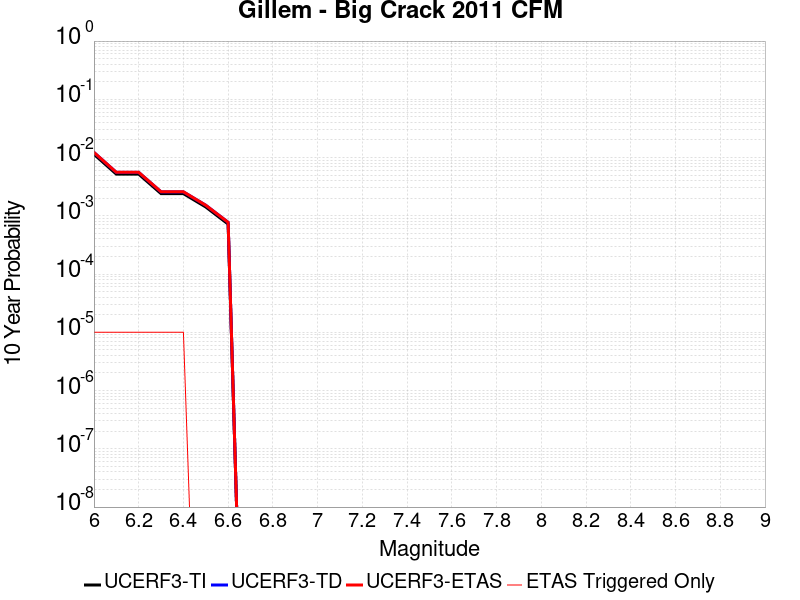 |

| Magnitude | 1 wk TI Prob | 1 wk TD Prob | 1 wk ETAS Prob | 1 wk ETAS/TD Gain | 1 wk ETAS Triggered Only | 1 mo TI Prob | 1 mo TD Prob | 1 mo ETAS Prob | 1 mo ETAS/TD Gain | 1 mo ETAS Triggered Only | 1 yr TI Prob | 1 yr TD Prob | 1 yr ETAS Prob | 1 yr ETAS/TD Gain | 1 yr ETAS Triggered Only | 10 yr TI Prob | 10 yr TD Prob | 10 yr ETAS Prob | 10 yr ETAS/TD Gain | 10 yr ETAS Triggered Only |
|-----|-----|-----|-----|-----|-----|-----|-----|-----|-----|-----|-----|-----|-----|-----|-----|-----|-----|-----|-----|-----|
| 6.0 | 2.196852E-5 | 2.3605886E-5 | 2.3605886E-5 | 1.0 | 0.0 | 9.4147406E-5 | 1.0116466E-4 | 1.0116466E-4 | 1.0 | 0.0 | 0.0011456419 | 0.0012310727 | 0.0012310727 | 1.0 | 0.0 | 0.011397537 | 0.012251392 | 0.01226127 | 1.0008062 | 1.0E-5 |
| 6.1 | 9.992795E-6 | 1.0712503E-5 | 1.0712503E-5 | 1.0 | 0.0 | 4.2825563E-5 | 4.5910023E-5 | 4.5910023E-5 | 1.0 | 0.0 | 5.2127644E-4 | 5.588295E-4 | 5.588295E-4 | 1.0 | 0.0 | 0.0052005537 | 0.005576053 | 0.0055859974 | 1.0017834 | 1.0E-5 |
| 6.2 | 9.992795E-6 | 1.0712503E-5 | 1.0712503E-5 | 1.0 | 0.0 | 4.2825563E-5 | 4.5910023E-5 | 4.5910023E-5 | 1.0 | 0.0 | 5.2127644E-4 | 5.588295E-4 | 5.588295E-4 | 1.0 | 0.0 | 0.0052005537 | 0.005576053 | 0.0055859974 | 1.0017834 | 1.0E-5 |
| 6.3 | 4.6127884E-6 | 4.942938E-6 | 4.942938E-6 | 1.0 | 0.0 | 1.9768944E-5 | 2.1183874E-5 | 2.1183874E-5 | 1.0 | 0.0 | 2.406603E-4 | 2.5788762E-4 | 2.5788762E-4 | 1.0 | 0.0 | 0.0024039985 | 0.0025763216 | 0.0025862958 | 1.0038716 | 1.0E-5 |
| 6.4 | 4.6127884E-6 | 4.942938E-6 | 4.942938E-6 | 1.0 | 0.0 | 1.9768944E-5 | 2.1183874E-5 | 2.1183874E-5 | 1.0 | 0.0 | 2.406603E-4 | 2.5788762E-4 | 2.5788762E-4 | 1.0 | 0.0 | 0.0024039985 | 0.0025763216 | 0.0025862958 | 1.0038716 | 1.0E-5 |
| 6.5 | 2.716712E-6 | 2.911277E-6 | 2.911277E-6 | 1.0 | 0.0 | 1.1643E-5 | 1.2476856E-5 | 1.2476856E-5 | 1.0 | 0.0 | 1.417443E-4 | 1.5189756E-4 | 1.5189756E-4 | 1.0 | 0.0 | 0.0014165393 | 0.0015181754 | 0.0015181754 | 1.0 | 0.0 |
| 6.6 | 1.3818255E-6 | 1.4821545E-6 | 1.4821545E-6 | 1.0 | 0.0 | 5.922096E-6 | 6.352082E-6 | 6.352082E-6 | 1.0 | 0.0 | 7.209913E-5 | 7.7335084E-5 | 7.7335084E-5 | 1.0 | 0.0 | 7.2075747E-4 | 7.732027E-4 | 7.732027E-4 | 1.0 | 0.0 |

## Pitas Point (Lower West)
*[(top)](#table-of-contents)*

| 1 Week | 1 Month | 1 Year | 10 Year |
|-----|-----|-----|-----|
|  |  |  |  |

| Magnitude | 1 wk TI Prob | 1 wk TD Prob | 1 wk ETAS Prob | 1 wk ETAS/TD Gain | 1 wk ETAS Triggered Only | 1 mo TI Prob | 1 mo TD Prob | 1 mo ETAS Prob | 1 mo ETAS/TD Gain | 1 mo ETAS Triggered Only | 1 yr TI Prob | 1 yr TD Prob | 1 yr ETAS Prob | 1 yr ETAS/TD Gain | 1 yr ETAS Triggered Only | 10 yr TI Prob | 10 yr TD Prob | 10 yr ETAS Prob | 10 yr ETAS/TD Gain | 10 yr ETAS Triggered Only |
|-----|-----|-----|-----|-----|-----|-----|-----|-----|-----|-----|-----|-----|-----|-----|-----|-----|-----|-----|-----|-----|
| 6.0 | 8.151497E-6 | 7.856226E-6 | 7.856226E-6 | 1.0 | 0.0 | 3.493452E-5 | 3.3669112E-5 | 3.3669112E-5 | 1.0 | 0.0 | 4.252448E-4 | 4.098451E-4 | 4.098451E-4 | 1.0 | 0.0 | 0.0042443196 | 0.0040909727 | 0.004100932 | 1.0024344 | 1.0E-5 |
| 6.1 | 8.151497E-6 | 7.856226E-6 | 7.856226E-6 | 1.0 | 0.0 | 3.493452E-5 | 3.3669112E-5 | 3.3669112E-5 | 1.0 | 0.0 | 4.252448E-4 | 4.098451E-4 | 4.098451E-4 | 1.0 | 0.0 | 0.0042443196 | 0.0040909727 | 0.004100932 | 1.0024344 | 1.0E-5 |
| 6.2 | 8.151497E-6 | 7.856226E-6 | 7.856226E-6 | 1.0 | 0.0 | 3.493452E-5 | 3.3669112E-5 | 3.3669112E-5 | 1.0 | 0.0 | 4.252448E-4 | 4.098451E-4 | 4.098451E-4 | 1.0 | 0.0 | 0.0042443196 | 0.0040909727 | 0.004100932 | 1.0024344 | 1.0E-5 |
| 6.3 | 8.151497E-6 | 7.856226E-6 | 7.856226E-6 | 1.0 | 0.0 | 3.493452E-5 | 3.3669112E-5 | 3.3669112E-5 | 1.0 | 0.0 | 4.252448E-4 | 4.098451E-4 | 4.098451E-4 | 1.0 | 0.0 | 0.0042443196 | 0.0040909727 | 0.004100932 | 1.0024344 | 1.0E-5 |
| 6.4 | 8.151497E-6 | 7.856226E-6 | 7.856226E-6 | 1.0 | 0.0 | 3.493452E-5 | 3.3669112E-5 | 3.3669112E-5 | 1.0 | 0.0 | 4.252448E-4 | 4.098451E-4 | 4.098451E-4 | 1.0 | 0.0 | 0.0042443196 | 0.0040909727 | 0.004100932 | 1.0024344 | 1.0E-5 |
| 6.5 | 8.151497E-6 | 7.856226E-6 | 7.856226E-6 | 1.0 | 0.0 | 3.493452E-5 | 3.3669112E-5 | 3.3669112E-5 | 1.0 | 0.0 | 4.252448E-4 | 4.098451E-4 | 4.098451E-4 | 1.0 | 0.0 | 0.0042443196 | 0.0040909727 | 0.004100932 | 1.0024344 | 1.0E-5 |
| 6.6 | 8.151497E-6 | 7.856226E-6 | 7.856226E-6 | 1.0 | 0.0 | 3.493452E-5 | 3.3669112E-5 | 3.3669112E-5 | 1.0 | 0.0 | 4.252448E-4 | 4.098451E-4 | 4.098451E-4 | 1.0 | 0.0 | 0.0042443196 | 0.0040909727 | 0.004100932 | 1.0024344 | 1.0E-5 |
| 6.7 | 8.151497E-6 | 7.856226E-6 | 7.856226E-6 | 1.0 | 0.0 | 3.493452E-5 | 3.3669112E-5 | 3.3669112E-5 | 1.0 | 0.0 | 4.252448E-4 | 4.098451E-4 | 4.098451E-4 | 1.0 | 0.0 | 0.0042443196 | 0.0040909727 | 0.004100932 | 1.0024344 | 1.0E-5 |
| 6.8 | 8.151497E-6 | 7.856226E-6 | 7.856226E-6 | 1.0 | 0.0 | 3.493452E-5 | 3.3669112E-5 | 3.3669112E-5 | 1.0 | 0.0 | 4.252448E-4 | 4.098451E-4 | 4.098451E-4 | 1.0 | 0.0 | 0.0042443196 | 0.0040909727 | 0.004100932 | 1.0024344 | 1.0E-5 |
| 6.9 | 8.151497E-6 | 7.856226E-6 | 7.856226E-6 | 1.0 | 0.0 | 3.493452E-5 | 3.3669112E-5 | 3.3669112E-5 | 1.0 | 0.0 | 4.252448E-4 | 4.098451E-4 | 4.098451E-4 | 1.0 | 0.0 | 0.0042443196 | 0.0040909727 | 0.004100932 | 1.0024344 | 1.0E-5 |
| 7.0 | 8.103535E-6 | 7.805655E-6 | 7.805655E-6 | 1.0 | 0.0 | 3.4728975E-5 | 3.345238E-5 | 3.345238E-5 | 1.0 | 0.0 | 4.2274324E-4 | 4.0720732E-4 | 4.0720732E-4 | 1.0 | 0.0 | 0.0042193993 | 0.004064692 | 0.0040746513 | 1.0024502 | 1.0E-5 |
| 7.1 | 7.853298E-6 | 7.5413336E-6 | 7.5413336E-6 | 1.0 | 0.0 | 3.3656554E-5 | 3.2319604E-5 | 3.2319604E-5 | 1.0 | 0.0 | 4.096915E-4 | 3.9342084E-4 | 3.9342084E-4 | 1.0 | 0.0 | 0.00408937 | 0.00392732 | 0.0039372803 | 1.0025363 | 1.0E-5 |
| 7.2 | 7.771102E-6 | 7.4536106E-6 | 7.4536106E-6 | 1.0 | 0.0 | 3.33043E-5 | 3.194366E-5 | 3.194366E-5 | 1.0 | 0.0 | 4.0540437E-4 | 3.8884534E-4 | 3.8884534E-4 | 1.0 | 0.0 | 0.0040466557 | 0.0038817252 | 0.0038916864 | 1.0025662 | 1.0E-5 |
| 7.3 | 7.3945344E-6 | 7.0496917E-6 | 7.0496917E-6 | 1.0 | 0.0 | 3.1690477E-5 | 3.021262E-5 | 3.021262E-5 | 1.0 | 0.0 | 3.8576324E-4 | 3.6777716E-4 | 3.6777716E-4 | 1.0 | 0.0 | 0.0038509427 | 0.003671753 | 0.0036817163 | 1.0027134 | 1.0E-5 |
| 7.4 | 6.964645E-6 | 6.590516E-6 | 6.590516E-6 | 1.0 | 0.0 | 2.9848137E-5 | 2.8244765E-5 | 2.8244765E-5 | 1.0 | 0.0 | 3.6334046E-4 | 3.4382625E-4 | 3.4382625E-4 | 1.0 | 0.0 | 0.0036274698 | 0.0034329963 | 0.003442962 | 1.0029029 | 1.0E-5 |
| 7.5 | 6.6525035E-6 | 6.2595386E-6 | 6.2595386E-6 | 1.0 | 0.0 | 2.851042E-5 | 2.6826321E-5 | 2.6826321E-5 | 1.0 | 0.0 | 3.4705905E-4 | 3.2656197E-4 | 3.2656197E-4 | 1.0 | 0.0 | 0.0034651754 | 0.0032608726 | 0.00327084 | 1.0030566 | 1.0E-5 |
| 7.6 | 5.613338E-6 | 5.151705E-6 | 5.151705E-6 | 1.0 | 0.0 | 2.405694E-5 | 2.2078551E-5 | 2.2078551E-5 | 1.0 | 0.0 | 2.928539E-4 | 2.687735E-4 | 2.687735E-4 | 1.0 | 0.0 | 0.0029246826 | 0.002684516 | 0.0026944892 | 1.003715 | 1.0E-5 |
| 7.7 | 4.494704E-6 | 3.997153E-6 | 3.997153E-6 | 1.0 | 0.0 | 1.9262876E-5 | 1.7130544E-5 | 1.7130544E-5 | 1.0 | 0.0 | 2.3450027E-4 | 2.0854465E-4 | 2.0854465E-4 | 1.0 | 0.0 | 0.0023425296 | 0.0020835134 | 0.0020835134 | 1.0 | 0.0 |
| 7.8 | 2.6075882E-6 | 2.1837736E-6 | 2.1837736E-6 | 1.0 | 0.0 | 1.117533E-5 | 9.358997E-6 | 9.358997E-6 | 1.0 | 0.0 | 1.3605114E-4 | 1.13939874E-4 | 1.13939874E-4 | 1.0 | 0.0 | 0.0013596788 | 0.0011388193 | 0.0011388193 | 1.0 | 0.0 |
| 7.9 | 4.045984E-7 | 3.24257E-7 | 3.24257E-7 | 1.0 | 0.0 | 1.733992E-6 | 1.3896721E-6 | 1.3896721E-6 | 1.0 | 0.0 | 2.1111147E-5 | 1.691913E-5 | 1.691913E-5 | 1.0 | 0.0 | 2.1109142E-4 | 1.6917873E-4 | 1.6917873E-4 | 1.0 | 0.0 |
| 8.0 | 7.791402E-9 | 5.684024E-9 | 5.684024E-9 | 1.0 | 0.0 | 3.3391725E-8 | 2.4360103E-8 | 2.4360103E-8 | 1.0 | 0.0 | 4.0654416E-7 | 2.9658423E-7 | 2.9658423E-7 | 1.0 | 0.0 | 4.065434E-6 | 2.9658404E-6 | 2.9658404E-6 | 1.0 | 0.0 |

## North Frontal  (East)
*[(top)](#table-of-contents)*

| 1 Week | 1 Month | 1 Year | 10 Year |
|-----|-----|-----|-----|
|  |  |  |  |

| Magnitude | 1 wk TI Prob | 1 wk TD Prob | 1 wk ETAS Prob | 1 wk ETAS/TD Gain | 1 wk ETAS Triggered Only | 1 mo TI Prob | 1 mo TD Prob | 1 mo ETAS Prob | 1 mo ETAS/TD Gain | 1 mo ETAS Triggered Only | 1 yr TI Prob | 1 yr TD Prob | 1 yr ETAS Prob | 1 yr ETAS/TD Gain | 1 yr ETAS Triggered Only | 10 yr TI Prob | 10 yr TD Prob | 10 yr ETAS Prob | 10 yr ETAS/TD Gain | 10 yr ETAS Triggered Only |
|-----|-----|-----|-----|-----|-----|-----|-----|-----|-----|-----|-----|-----|-----|-----|-----|-----|-----|-----|-----|-----|
| 6.0 | 7.135738E-6 | 7.4774616E-6 | 7.4774616E-6 | 1.0 | 0.0 | 3.0581377E-5 | 3.2045984E-5 | 3.2045984E-5 | 1.0 | 0.0 | 3.7226462E-4 | 3.9010993E-4 | 3.9010993E-4 | 1.0 | 0.0 | 0.0037164164 | 0.0038962092 | 0.0039061701 | 1.0025566 | 1.0E-5 |
| 6.1 | 7.135738E-6 | 7.4774616E-6 | 7.4774616E-6 | 1.0 | 0.0 | 3.0581377E-5 | 3.2045984E-5 | 3.2045984E-5 | 1.0 | 0.0 | 3.7226462E-4 | 3.9010993E-4 | 3.9010993E-4 | 1.0 | 0.0 | 0.0037164164 | 0.0038962092 | 0.0039061701 | 1.0025566 | 1.0E-5 |
| 6.2 | 7.135738E-6 | 7.4774616E-6 | 7.4774616E-6 | 1.0 | 0.0 | 3.0581377E-5 | 3.2045984E-5 | 3.2045984E-5 | 1.0 | 0.0 | 3.7226462E-4 | 3.9010993E-4 | 3.9010993E-4 | 1.0 | 0.0 | 0.0037164164 | 0.0038962092 | 0.0039061701 | 1.0025566 | 1.0E-5 |
| 6.3 | 7.135738E-6 | 7.4774616E-6 | 7.4774616E-6 | 1.0 | 0.0 | 3.0581377E-5 | 3.2045984E-5 | 3.2045984E-5 | 1.0 | 0.0 | 3.7226462E-4 | 3.9010993E-4 | 3.9010993E-4 | 1.0 | 0.0 | 0.0037164164 | 0.0038962092 | 0.0039061701 | 1.0025566 | 1.0E-5 |
| 6.4 | 7.135738E-6 | 7.4774616E-6 | 7.4774616E-6 | 1.0 | 0.0 | 3.0581377E-5 | 3.2045984E-5 | 3.2045984E-5 | 1.0 | 0.0 | 3.7226462E-4 | 3.9010993E-4 | 3.9010993E-4 | 1.0 | 0.0 | 0.0037164164 | 0.0038962092 | 0.0039061701 | 1.0025566 | 1.0E-5 |
| 6.5 | 7.135738E-6 | 7.4774616E-6 | 7.4774616E-6 | 1.0 | 0.0 | 3.0581377E-5 | 3.2045984E-5 | 3.2045984E-5 | 1.0 | 0.0 | 3.7226462E-4 | 3.9010993E-4 | 3.9010993E-4 | 1.0 | 0.0 | 0.0037164164 | 0.0038962092 | 0.0039061701 | 1.0025566 | 1.0E-5 |
| 6.6 | 7.135738E-6 | 7.4774616E-6 | 7.4774616E-6 | 1.0 | 0.0 | 3.0581377E-5 | 3.2045984E-5 | 3.2045984E-5 | 1.0 | 0.0 | 3.7226462E-4 | 3.9010993E-4 | 3.9010993E-4 | 1.0 | 0.0 | 0.0037164164 | 0.0038962092 | 0.0039061701 | 1.0025566 | 1.0E-5 |
| 6.7 | 7.135738E-6 | 7.4774616E-6 | 7.4774616E-6 | 1.0 | 0.0 | 3.0581377E-5 | 3.2045984E-5 | 3.2045984E-5 | 1.0 | 0.0 | 3.7226462E-4 | 3.9010993E-4 | 3.9010993E-4 | 1.0 | 0.0 | 0.0037164164 | 0.0038962092 | 0.0039061701 | 1.0025566 | 1.0E-5 |
| 6.8 | 5.959142E-6 | 6.2369145E-6 | 6.2369145E-6 | 1.0 | 0.0 | 2.553893E-5 | 2.672946E-5 | 2.672946E-5 | 1.0 | 0.0 | 3.108921E-4 | 3.2540064E-4 | 3.2540064E-4 | 1.0 | 0.0 | 0.0031045752 | 0.0032510152 | 0.0032609827 | 1.003066 | 1.0E-5 |
| 6.9 | 2.2946929E-6 | 2.382533E-6 | 2.382533E-6 | 1.0 | 0.0 | 9.834361E-6 | 1.0210819E-5 | 1.0210819E-5 | 1.0 | 0.0 | 1.1972676E-4 | 1.243101E-4 | 1.243101E-4 | 1.0 | 0.0 | 0.0011966228 | 0.0012424521 | 0.0012424521 | 1.0 | 0.0 |
| 7.0 | 2.2468673E-6 | 2.3322243E-6 | 2.3322243E-6 | 1.0 | 0.0 | 9.629396E-6 | 9.995211E-6 | 9.995211E-6 | 1.0 | 0.0 | 1.1723159E-4 | 1.2168537E-4 | 1.2168537E-4 | 1.0 | 0.0 | 0.0011716976 | 0.0012162337 | 0.0012162337 | 1.0 | 0.0 |
| 7.1 | 1.9921076E-6 | 2.064663E-6 | 2.064663E-6 | 1.0 | 0.0 | 8.537577E-6 | 8.8485285E-6 | 8.8485285E-6 | 1.0 | 0.0 | 1.0394004E-4 | 1.07725944E-4 | 1.07725944E-4 | 1.0 | 0.0 | 0.0010389143 | 0.0010767799 | 0.0010767799 | 1.0 | 0.0 |
| 7.2 | 1.4524545E-6 | 1.5045578E-6 | 1.5045578E-6 | 1.0 | 0.0 | 6.2247905E-6 | 6.44809E-6 | 6.44809E-6 | 1.0 | 0.0 | 7.5784184E-5 | 7.850292E-5 | 7.850292E-5 | 1.0 | 0.0 | 7.575835E-4 | 7.847763E-4 | 7.847763E-4 | 1.0 | 0.0 |
| 7.3 | 8.9802575E-7 | 9.308999E-7 | 9.308999E-7 | 1.0 | 0.0 | 3.848676E-6 | 3.9895654E-6 | 3.9895654E-6 | 1.0 | 0.0 | 4.685662E-5 | 4.8571994E-5 | 4.8571994E-5 | 1.0 | 0.0 | 4.6846745E-4 | 4.856251E-4 | 4.856251E-4 | 1.0 | 0.0 |
| 7.4 | 7.776139E-7 | 8.0607094E-7 | 8.0607094E-7 | 1.0 | 0.0 | 3.3326266E-6 | 3.4545858E-6 | 3.4545858E-6 | 1.0 | 0.0 | 4.0573974E-5 | 4.205888E-5 | 4.205888E-5 | 1.0 | 0.0 | 4.0566566E-4 | 4.2051997E-4 | 4.2051997E-4 | 1.0 | 0.0 |
| 7.5 | 5.244417E-7 | 5.441382E-7 | 5.441382E-7 | 1.0 | 0.0 | 2.2476054E-6 | 2.332019E-6 | 2.332019E-6 | 1.0 | 0.0 | 2.7364253E-5 | 2.8392029E-5 | 2.8392029E-5 | 1.0 | 0.0 | 2.7360884E-4 | 2.8389052E-4 | 2.8389052E-4 | 1.0 | 0.0 |
| 7.6 | 1.5489647E-7 | 1.609E-7 | 1.609E-7 | 1.0 | 0.0 | 6.6384183E-7 | 6.895714E-7 | 6.895714E-7 | 1.0 | 0.0 | 8.082245E-6 | 8.395519E-6 | 8.395519E-6 | 1.0 | 0.0 | 8.08195E-5 | 8.3954015E-5 | 8.3954015E-5 | 1.0 | 0.0 |

## Robinson Creek
*[(top)](#table-of-contents)*

| 1 Week | 1 Month | 1 Year | 10 Year |
|-----|-----|-----|-----|
|  |  |  |  |

| Magnitude | 1 wk TI Prob | 1 wk TD Prob | 1 wk ETAS Prob | 1 wk ETAS/TD Gain | 1 wk ETAS Triggered Only | 1 mo TI Prob | 1 mo TD Prob | 1 mo ETAS Prob | 1 mo ETAS/TD Gain | 1 mo ETAS Triggered Only | 1 yr TI Prob | 1 yr TD Prob | 1 yr ETAS Prob | 1 yr ETAS/TD Gain | 1 yr ETAS Triggered Only | 10 yr TI Prob | 10 yr TD Prob | 10 yr ETAS Prob | 10 yr ETAS/TD Gain | 10 yr ETAS Triggered Only |
|-----|-----|-----|-----|-----|-----|-----|-----|-----|-----|-----|-----|-----|-----|-----|-----|-----|-----|-----|-----|-----|
| 6.0 | 1.3705327E-5 | 1.5286416E-5 | 1.5286416E-5 | 1.0 | 0.0 | 5.8735794E-5 | 6.551321E-5 | 6.551321E-5 | 1.0 | 0.0 | 7.1487366E-4 | 7.976233E-4 | 7.976233E-4 | 1.0 | 0.0 | 0.0071257832 | 0.007976233 | 0.0079861535 | 1.0012437 | 1.0E-5 |
| 6.1 | 1.3705327E-5 | 1.5286416E-5 | 1.5286416E-5 | 1.0 | 0.0 | 5.8735794E-5 | 6.551321E-5 | 6.551321E-5 | 1.0 | 0.0 | 7.1487366E-4 | 7.976233E-4 | 7.976233E-4 | 1.0 | 0.0 | 0.0071257832 | 0.007976233 | 0.0079861535 | 1.0012437 | 1.0E-5 |
| 6.2 | 1.3705327E-5 | 1.5286416E-5 | 1.5286416E-5 | 1.0 | 0.0 | 5.8735794E-5 | 6.551321E-5 | 6.551321E-5 | 1.0 | 0.0 | 7.1487366E-4 | 7.976233E-4 | 7.976233E-4 | 1.0 | 0.0 | 0.0071257832 | 0.007976233 | 0.0079861535 | 1.0012437 | 1.0E-5 |
| 6.3 | 1.3705327E-5 | 1.5286416E-5 | 1.5286416E-5 | 1.0 | 0.0 | 5.8735794E-5 | 6.551321E-5 | 6.551321E-5 | 1.0 | 0.0 | 7.1487366E-4 | 7.976233E-4 | 7.976233E-4 | 1.0 | 0.0 | 0.0071257832 | 0.007976233 | 0.0079861535 | 1.0012437 | 1.0E-5 |
| 6.4 | 1.3705327E-5 | 1.5286416E-5 | 1.5286416E-5 | 1.0 | 0.0 | 5.8735794E-5 | 6.551321E-5 | 6.551321E-5 | 1.0 | 0.0 | 7.1487366E-4 | 7.976233E-4 | 7.976233E-4 | 1.0 | 0.0 | 0.0071257832 | 0.007976233 | 0.0079861535 | 1.0012437 | 1.0E-5 |

## Sierra Madre
*[(top)](#table-of-contents)*

| 1 Week | 1 Month | 1 Year | 10 Year |
|-----|-----|-----|-----|
|  |  |  |  |

| Magnitude | 1 wk TI Prob | 1 wk TD Prob | 1 wk ETAS Prob | 1 wk ETAS/TD Gain | 1 wk ETAS Triggered Only | 1 mo TI Prob | 1 mo TD Prob | 1 mo ETAS Prob | 1 mo ETAS/TD Gain | 1 mo ETAS Triggered Only | 1 yr TI Prob | 1 yr TD Prob | 1 yr ETAS Prob | 1 yr ETAS/TD Gain | 1 yr ETAS Triggered Only | 10 yr TI Prob | 10 yr TD Prob | 10 yr ETAS Prob | 10 yr ETAS/TD Gain | 10 yr ETAS Triggered Only |
|-----|-----|-----|-----|-----|-----|-----|-----|-----|-----|-----|-----|-----|-----|-----|-----|-----|-----|-----|-----|-----|
| 6.0 | 1.3379373E-5 | 1.1002869E-5 | 1.1002869E-5 | 1.0 | 0.0 | 5.7338908E-5 | 4.7154306E-5 | 5.7153837E-5 | 1.2120597 | 1.0E-5 | 6.978776E-4 | 5.739539E-4 | 5.839482E-4 | 1.017413 | 1.0E-5 | 0.0069569005 | 0.005725176 | 0.005735119 | 1.0017366 | 1.0E-5 |
| 6.1 | 1.3379373E-5 | 1.1002869E-5 | 1.1002869E-5 | 1.0 | 0.0 | 5.7338908E-5 | 4.7154306E-5 | 5.7153837E-5 | 1.2120597 | 1.0E-5 | 6.978776E-4 | 5.739539E-4 | 5.839482E-4 | 1.017413 | 1.0E-5 | 0.0069569005 | 0.005725176 | 0.005735119 | 1.0017366 | 1.0E-5 |
| 6.2 | 1.3379373E-5 | 1.1002869E-5 | 1.1002869E-5 | 1.0 | 0.0 | 5.7338908E-5 | 4.7154306E-5 | 5.7153837E-5 | 1.2120597 | 1.0E-5 | 6.978776E-4 | 5.739539E-4 | 5.839482E-4 | 1.017413 | 1.0E-5 | 0.0069569005 | 0.005725176 | 0.005735119 | 1.0017366 | 1.0E-5 |
| 6.3 | 1.3379373E-5 | 1.1002869E-5 | 1.1002869E-5 | 1.0 | 0.0 | 5.7338908E-5 | 4.7154306E-5 | 5.7153837E-5 | 1.2120597 | 1.0E-5 | 6.978776E-4 | 5.739539E-4 | 5.839482E-4 | 1.017413 | 1.0E-5 | 0.0069569005 | 0.005725176 | 0.005735119 | 1.0017366 | 1.0E-5 |
| 6.4 | 1.3379373E-5 | 1.1002869E-5 | 1.1002869E-5 | 1.0 | 0.0 | 5.7338908E-5 | 4.7154306E-5 | 5.7153837E-5 | 1.2120597 | 1.0E-5 | 6.978776E-4 | 5.739539E-4 | 5.839482E-4 | 1.017413 | 1.0E-5 | 0.0069569005 | 0.005725176 | 0.005735119 | 1.0017366 | 1.0E-5 |
| 6.5 | 1.26563245E-5 | 1.0232284E-5 | 1.0232284E-5 | 1.0 | 0.0 | 5.4240263E-5 | 4.3851916E-5 | 5.3851476E-5 | 1.2280302 | 1.0E-5 | 6.601751E-4 | 5.3376734E-4 | 5.43762E-4 | 1.0187248 | 1.0E-5 | 0.006582173 | 0.0053252713 | 0.005335218 | 1.0018679 | 1.0E-5 |
| 6.6 | 1.26563245E-5 | 1.0232284E-5 | 1.0232284E-5 | 1.0 | 0.0 | 5.4240263E-5 | 4.3851916E-5 | 5.3851476E-5 | 1.2280302 | 1.0E-5 | 6.601751E-4 | 5.3376734E-4 | 5.43762E-4 | 1.0187248 | 1.0E-5 | 0.006582173 | 0.0053252713 | 0.005335218 | 1.0018679 | 1.0E-5 |
| 6.7 | 1.2502474E-5 | 1.006842E-5 | 1.006842E-5 | 1.0 | 0.0 | 5.3580934E-5 | 4.3149663E-5 | 5.3149233E-5 | 1.2317415 | 1.0E-5 | 6.521526E-4 | 5.252216E-4 | 5.352163E-4 | 1.0190296 | 1.0E-5 | 0.0065024206 | 0.0052402182 | 0.0052501657 | 1.0018983 | 1.0E-5 |
| 6.8 | 1.2454966E-5 | 1.0020703E-5 | 1.0020703E-5 | 1.0 | 0.0 | 5.3377335E-5 | 4.294517E-5 | 5.294474E-5 | 1.2328451 | 1.0E-5 | 6.4967526E-4 | 5.22733E-4 | 5.327278E-4 | 1.0191202 | 1.0E-5 | 0.006477792 | 0.0052154497 | 0.005225397 | 1.0019073 | 1.0E-5 |
| 6.9 | 1.2225574E-5 | 9.794668E-6 | 9.794668E-6 | 1.0 | 0.0 | 5.2394265E-5 | 4.1976476E-5 | 5.1976058E-5 | 1.2382187 | 1.0E-5 | 6.3771347E-4 | 5.109448E-4 | 5.209397E-4 | 1.0195615 | 1.0E-5 | 0.006358865 | 0.005098113 | 0.005108062 | 1.0019515 | 1.0E-5 |
| 7.0 | 1.182946E-5 | 9.401188E-6 | 9.401188E-6 | 1.0 | 0.0 | 5.06967E-5 | 4.0290193E-5 | 4.0290193E-5 | 1.0 | 0.0 | 6.1705755E-4 | 4.904237E-4 | 4.904237E-4 | 1.0 | 0.0 | 0.006153469 | 0.004893822 | 0.004893822 | 1.0 | 0.0 |
| 7.1 | 1.14369095E-5 | 8.988154E-6 | 8.988154E-6 | 1.0 | 0.0 | 4.9014405E-5 | 3.85201E-5 | 3.85201E-5 | 1.0 | 0.0 | 5.9658696E-4 | 4.6888224E-4 | 4.6888224E-4 | 1.0 | 0.0 | 0.005949879 | 0.0046793316 | 0.0046793316 | 1.0 | 0.0 |
| 7.2 | 1.0836419E-5 | 8.4014955E-6 | 8.4014955E-6 | 1.0 | 0.0 | 4.644097E-5 | 3.600592E-5 | 3.600592E-5 | 1.0 | 0.0 | 5.652721E-4 | 4.382848E-4 | 4.382848E-4 | 1.0 | 0.0 | 0.0056383642 | 0.0043745977 | 0.0043745977 | 1.0 | 0.0 |
| 7.3 | 1.0403439E-5 | 8.022728E-6 | 8.022728E-6 | 1.0 | 0.0 | 4.4585406E-5 | 3.4382672E-5 | 3.4382672E-5 | 1.0 | 0.0 | 5.426921E-4 | 4.1852953E-4 | 4.1852953E-4 | 1.0 | 0.0 | 0.005413687 | 0.0041778046 | 0.0041778046 | 1.0 | 0.0 |
| 7.4 | 9.768864E-6 | 7.4163027E-6 | 7.4163027E-6 | 1.0 | 0.0 | 4.186589E-5 | 3.1783773E-5 | 3.1783773E-5 | 1.0 | 0.0 | 5.09598E-4 | 3.868996E-4 | 3.868996E-4 | 1.0 | 0.0 | 0.0050843097 | 0.0038626483 | 0.0038626483 | 1.0 | 0.0 |
| 7.5 | 8.687089E-6 | 6.4518285E-6 | 6.4518285E-6 | 1.0 | 0.0 | 3.722985E-5 | 2.7650405E-5 | 2.7650405E-5 | 1.0 | 0.0 | 4.5317915E-4 | 3.3659255E-4 | 3.3659255E-4 | 1.0 | 0.0 | 0.004522561 | 0.0033612112 | 0.0033612112 | 1.0 | 0.0 |
| 7.6 | 6.3506063E-6 | 4.4318085E-6 | 4.4318085E-6 | 1.0 | 0.0 | 2.72166E-5 | 1.8993329E-5 | 1.8993329E-5 | 1.0 | 0.0 | 3.3131172E-4 | 2.3121948E-4 | 2.3121948E-4 | 1.0 | 0.0 | 0.003308182 | 0.0023101105 | 0.0023101105 | 1.0 | 0.0 |
| 7.7 | 4.62223E-6 | 2.9343387E-6 | 2.9343387E-6 | 1.0 | 0.0 | 1.9809406E-5 | 1.2575677E-5 | 1.2575677E-5 | 1.0 | 0.0 | 2.4115283E-4 | 1.5309812E-4 | 1.5309812E-4 | 1.0 | 0.0 | 0.0024089129 | 0.0015302224 | 0.0015302224 | 1.0 | 0.0 |
| 7.8 | 3.2145008E-6 | 1.950448E-6 | 1.950448E-6 | 1.0 | 0.0 | 1.3776359E-5 | 8.359037E-6 | 8.359037E-6 | 1.0 | 0.0 | 1.6771426E-4 | 1.0176653E-4 | 1.0176653E-4 | 1.0 | 0.0 | 0.0016758774 | 0.0010173859 | 0.0010173859 | 1.0 | 0.0 |
| 7.9 | 1.0391769E-6 | 5.6065943E-7 | 5.6065943E-7 | 1.0 | 0.0 | 4.4536077E-6 | 2.402824E-6 | 2.402824E-6 | 1.0 | 0.0 | 5.4221324E-5 | 2.9253993E-5 | 2.9253993E-5 | 1.0 | 0.0 | 5.4208096E-4 | 2.9250185E-4 | 2.9250185E-4 | 1.0 | 0.0 |
| 8.0 | 1.210983E-7 | 6.615902E-8 | 6.615902E-8 | 1.0 | 0.0 | 5.1899264E-7 | 2.835386E-7 | 2.835386E-7 | 1.0 | 0.0 | 6.3187167E-6 | 3.4520772E-6 | 3.4520772E-6 | 1.0 | 0.0 | 6.318537E-5 | 3.4520253E-5 | 3.4520253E-5 | 1.0 | 0.0 |

## Los Alamos 2011 CFM
*[(top)](#table-of-contents)*

| 1 Week | 1 Month | 1 Year | 10 Year |
|-----|-----|-----|-----|
|  |  | 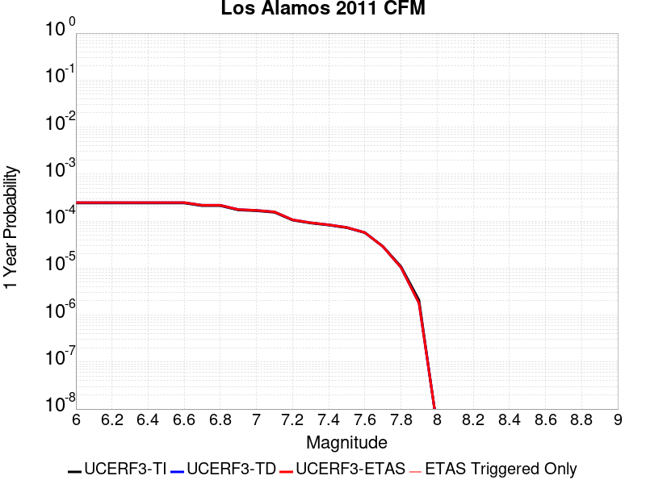 |  |

| Magnitude | 1 wk TI Prob | 1 wk TD Prob | 1 wk ETAS Prob | 1 wk ETAS/TD Gain | 1 wk ETAS Triggered Only | 1 mo TI Prob | 1 mo TD Prob | 1 mo ETAS Prob | 1 mo ETAS/TD Gain | 1 mo ETAS Triggered Only | 1 yr TI Prob | 1 yr TD Prob | 1 yr ETAS Prob | 1 yr ETAS/TD Gain | 1 yr ETAS Triggered Only | 10 yr TI Prob | 10 yr TD Prob | 10 yr ETAS Prob | 10 yr ETAS/TD Gain | 10 yr ETAS Triggered Only |
|-----|-----|-----|-----|-----|-----|-----|-----|-----|-----|-----|-----|-----|-----|-----|-----|-----|-----|-----|-----|-----|
| 6.0 | 4.6284417E-6 | 4.7518647E-6 | 4.7518647E-6 | 1.0 | 0.0 | 1.9836029E-5 | 2.0364985E-5 | 2.0364985E-5 | 1.0 | 0.0 | 2.4147688E-4 | 2.4791725E-4 | 2.4791725E-4 | 1.0 | 0.0 | 0.0024121467 | 0.002476581 | 0.002486556 | 1.0040278 | 1.0E-5 |
| 6.1 | 4.6284417E-6 | 4.7518647E-6 | 4.7518647E-6 | 1.0 | 0.0 | 1.9836029E-5 | 2.0364985E-5 | 2.0364985E-5 | 1.0 | 0.0 | 2.4147688E-4 | 2.4791725E-4 | 2.4791725E-4 | 1.0 | 0.0 | 0.0024121467 | 0.002476581 | 0.002486556 | 1.0040278 | 1.0E-5 |
| 6.2 | 4.6284417E-6 | 4.7518647E-6 | 4.7518647E-6 | 1.0 | 0.0 | 1.9836029E-5 | 2.0364985E-5 | 2.0364985E-5 | 1.0 | 0.0 | 2.4147688E-4 | 2.4791725E-4 | 2.4791725E-4 | 1.0 | 0.0 | 0.0024121467 | 0.002476581 | 0.002486556 | 1.0040278 | 1.0E-5 |
| 6.3 | 4.6284417E-6 | 4.7518647E-6 | 4.7518647E-6 | 1.0 | 0.0 | 1.9836029E-5 | 2.0364985E-5 | 2.0364985E-5 | 1.0 | 0.0 | 2.4147688E-4 | 2.4791725E-4 | 2.4791725E-4 | 1.0 | 0.0 | 0.0024121467 | 0.002476581 | 0.002486556 | 1.0040278 | 1.0E-5 |
| 6.4 | 4.6284417E-6 | 4.7518647E-6 | 4.7518647E-6 | 1.0 | 0.0 | 1.9836029E-5 | 2.0364985E-5 | 2.0364985E-5 | 1.0 | 0.0 | 2.4147688E-4 | 2.4791725E-4 | 2.4791725E-4 | 1.0 | 0.0 | 0.0024121467 | 0.002476581 | 0.002486556 | 1.0040278 | 1.0E-5 |
| 6.5 | 4.6284417E-6 | 4.7518647E-6 | 4.7518647E-6 | 1.0 | 0.0 | 1.9836029E-5 | 2.0364985E-5 | 2.0364985E-5 | 1.0 | 0.0 | 2.4147688E-4 | 2.4791725E-4 | 2.4791725E-4 | 1.0 | 0.0 | 0.0024121467 | 0.002476581 | 0.002486556 | 1.0040278 | 1.0E-5 |
| 6.6 | 4.6284417E-6 | 4.7518647E-6 | 4.7518647E-6 | 1.0 | 0.0 | 1.9836029E-5 | 2.0364985E-5 | 2.0364985E-5 | 1.0 | 0.0 | 2.4147688E-4 | 2.4791725E-4 | 2.4791725E-4 | 1.0 | 0.0 | 0.0024121467 | 0.002476581 | 0.002486556 | 1.0040278 | 1.0E-5 |
| 6.7 | 4.062321E-6 | 4.166466E-6 | 4.166466E-6 | 1.0 | 0.0 | 1.7409831E-5 | 1.7856171E-5 | 1.7856171E-5 | 1.0 | 0.0 | 2.1194408E-4 | 2.173787E-4 | 2.173787E-4 | 1.0 | 0.0 | 0.0021174205 | 0.0021718105 | 0.0021817887 | 1.0045944 | 1.0E-5 |
| 6.8 | 4.062321E-6 | 4.166466E-6 | 4.166466E-6 | 1.0 | 0.0 | 1.7409831E-5 | 1.7856171E-5 | 1.7856171E-5 | 1.0 | 0.0 | 2.1194408E-4 | 2.173787E-4 | 2.173787E-4 | 1.0 | 0.0 | 0.0021174205 | 0.0021718105 | 0.0021817887 | 1.0045944 | 1.0E-5 |
| 6.9 | 3.2936077E-6 | 3.3730553E-6 | 3.3730553E-6 | 1.0 | 0.0 | 1.4115385E-5 | 1.4455876E-5 | 1.4455876E-5 | 1.0 | 0.0 | 1.7184127E-4 | 1.75987E-4 | 1.75987E-4 | 1.0 | 0.0 | 0.0017170844 | 0.001758569 | 0.0017685515 | 1.0056764 | 1.0E-5 |
| 7.0 | 3.1687898E-6 | 3.2449102E-6 | 3.2449102E-6 | 1.0 | 0.0 | 1.3580457E-5 | 1.3906689E-5 | 1.3906689E-5 | 1.0 | 0.0 | 1.6532952E-4 | 1.6930171E-4 | 1.6930171E-4 | 1.0 | 0.0 | 0.0016520657 | 0.0016918189 | 0.001701802 | 1.0059007 | 1.0E-5 |
| 7.1 | 2.9379228E-6 | 3.007415E-6 | 3.007415E-6 | 1.0 | 0.0 | 1.25910365E-5 | 1.2888862E-5 | 1.2888862E-5 | 1.0 | 0.0 | 1.5328509E-4 | 1.5691151E-4 | 1.5691151E-4 | 1.0 | 0.0 | 0.001531794 | 0.0015680963 | 0.0015780807 | 1.0063672 | 1.0E-5 |
| 7.2 | 2.0020686E-6 | 2.0416944E-6 | 2.0416944E-6 | 1.0 | 0.0 | 8.580266E-6 | 8.75009E-6 | 8.75009E-6 | 1.0 | 0.0 | 1.0445973E-4 | 1.0652718E-4 | 1.0652718E-4 | 1.0 | 0.0 | 0.0010441064 | 0.0010647656 | 0.001074755 | 1.0093818 | 1.0E-5 |
| 7.3 | 1.7364243E-6 | 1.7679382E-6 | 1.7679382E-6 | 1.0 | 0.0 | 7.441797E-6 | 7.576856E-6 | 7.576856E-6 | 1.0 | 0.0 | 9.0600115E-5 | 9.224435E-5 | 9.224435E-5 | 1.0 | 0.0 | 9.0563187E-4 | 9.220638E-4 | 9.3205454E-4 | 1.0108353 | 1.0E-5 |
| 7.4 | 1.5718434E-6 | 1.5983716E-6 | 1.5983716E-6 | 1.0 | 0.0 | 6.7364545E-6 | 6.850146E-6 | 6.850146E-6 | 1.0 | 0.0 | 8.201325E-5 | 8.339737E-5 | 8.339737E-5 | 1.0 | 0.0 | 8.198299E-4 | 8.336637E-4 | 8.436553E-4 | 1.0119853 | 1.0E-5 |
| 7.5 | 1.3841119E-6 | 1.4043279E-6 | 1.4043279E-6 | 1.0 | 0.0 | 5.9318945E-6 | 6.0185344E-6 | 6.0185344E-6 | 1.0 | 0.0 | 7.221842E-5 | 7.327322E-5 | 7.327322E-5 | 1.0 | 0.0 | 7.2194956E-4 | 7.324935E-4 | 7.424862E-4 | 1.013642 | 1.0E-5 |
| 7.6 | 1.0843726E-6 | 1.0934816E-6 | 1.0934816E-6 | 1.0 | 0.0 | 4.647303E-6 | 4.6863415E-6 | 4.6863415E-6 | 1.0 | 0.0 | 5.6579443E-5 | 5.705474E-5 | 5.705474E-5 | 1.0 | 0.0 | 5.656504E-4 | 5.704035E-4 | 5.803978E-4 | 1.0175215 | 1.0E-5 |
| 7.7 | 5.544814E-7 | 5.5020803E-7 | 5.5020803E-7 | 1.0 | 0.0 | 2.3763469E-6 | 2.3580324E-6 | 2.3580324E-6 | 1.0 | 0.0 | 2.8931638E-5 | 2.8708668E-5 | 2.8708668E-5 | 1.0 | 0.0 | 2.8927872E-4 | 2.8704974E-4 | 2.9704688E-4 | 1.0348271 | 1.0E-5 |
| 7.8 | 2.0707465E-7 | 1.9779355E-7 | 1.9779355E-7 | 1.0 | 0.0 | 8.874625E-7 | 8.476864E-7 | 8.476864E-7 | 1.0 | 0.0 | 1.08048025E-5 | 1.0320534E-5 | 1.0320534E-5 | 1.0 | 0.0 | 1.0804277E-4 | 1.0320059E-4 | 1.0320059E-4 | 1.0 | 0.0 |
| 7.9 | 3.9821284E-8 | 3.4333077E-8 | 3.4333077E-8 | 1.0 | 0.0 | 1.7066264E-7 | 1.4714175E-7 | 1.4714175E-7 | 1.0 | 0.0 | 2.0778157E-6 | 1.7914493E-6 | 1.7914493E-6 | 1.0 | 0.0 | 2.0777963E-5 | 1.7914354E-5 | 1.7914354E-5 | 1.0 | 0.0 |
| 8.0 | 7.880441E-11 | 8.235612E-11 | 8.235612E-11 | 1.0 | 0.0 | 3.3773329E-10 | 3.5295467E-10 | 3.5295467E-10 | 1.0 | 0.0 | 4.1119033E-9 | 4.2972235E-9 | 4.2972235E-9 | 1.0 | 0.0 | 4.1119034E-8 | 4.2972236E-8 | 4.2972236E-8 | 1.0 | 0.0 |

## Maacama 2011 CFM
*[(top)](#table-of-contents)*

| 1 Week | 1 Month | 1 Year | 10 Year |
|-----|-----|-----|-----|
|  |  |  |  |

| Magnitude | 1 wk TI Prob | 1 wk TD Prob | 1 wk ETAS Prob | 1 wk ETAS/TD Gain | 1 wk ETAS Triggered Only | 1 mo TI Prob | 1 mo TD Prob | 1 mo ETAS Prob | 1 mo ETAS/TD Gain | 1 mo ETAS Triggered Only | 1 yr TI Prob | 1 yr TD Prob | 1 yr ETAS Prob | 1 yr ETAS/TD Gain | 1 yr ETAS Triggered Only | 10 yr TI Prob | 10 yr TD Prob | 10 yr ETAS Prob | 10 yr ETAS/TD Gain | 10 yr ETAS Triggered Only |
|-----|-----|-----|-----|-----|-----|-----|-----|-----|-----|-----|-----|-----|-----|-----|-----|-----|-----|-----|-----|-----|
| 6.0 | 1.368203E-4 | 2.5802784E-4 | 2.5802784E-4 | 1.0 | 0.0 | 5.862409E-4 | 0.0011052672 | 0.0011052672 | 1.0 | 0.0 | 0.0071141496 | 0.013356431 | 0.013366298 | 1.0007387 | 1.0E-5 | 0.06890667 | 0.12424247 | 0.124251224 | 1.0000705 | 1.0E-5 |
| 6.1 | 1.368203E-4 | 2.5802784E-4 | 2.5802784E-4 | 1.0 | 0.0 | 5.862409E-4 | 0.0011052672 | 0.0011052672 | 1.0 | 0.0 | 0.0071141496 | 0.013356431 | 0.013366298 | 1.0007387 | 1.0E-5 | 0.06890667 | 0.12424247 | 0.124251224 | 1.0000705 | 1.0E-5 |
| 6.2 | 1.360743E-4 | 2.5677436E-4 | 2.5677436E-4 | 1.0 | 0.0 | 5.8304524E-4 | 0.0010999003 | 0.0010999003 | 1.0 | 0.0 | 0.007075496 | 0.013291963 | 0.01330183 | 1.0007423 | 1.0E-5 | 0.06854413 | 0.123676725 | 0.12368549 | 1.0000708 | 1.0E-5 |
| 6.3 | 1.1917239E-4 | 2.237091E-4 | 2.237091E-4 | 1.0 | 0.0 | 5.1063887E-4 | 9.583476E-4 | 9.583476E-4 | 1.0 | 0.0 | 0.0061993203 | 0.011592999 | 0.011602882 | 1.0008526 | 1.0E-5 | 0.060292065 | 0.10889427 | 0.108903185 | 1.0000818 | 1.0E-5 |
| 6.4 | 1.1859289E-4 | 2.2274473E-4 | 2.2274473E-4 | 1.0 | 0.0 | 5.0815626E-4 | 9.542176E-4 | 9.542176E-4 | 1.0 | 0.0 | 0.006169266 | 0.011543305 | 0.011553189 | 1.0008563 | 1.0E-5 | 0.06000784 | 0.108451016 | 0.10845993 | 1.0000823 | 1.0E-5 |
| 6.5 | 1.09512424E-4 | 2.0528256E-4 | 2.0528256E-4 | 1.0 | 0.0 | 4.6925453E-4 | 8.7943126E-4 | 8.7943126E-4 | 1.0 | 0.0 | 0.005698218 | 0.010644606 | 0.0106545 | 1.0009295 | 1.0E-5 | 0.055543028 | 0.10054183 | 0.10055082 | 1.0000894 | 1.0E-5 |
| 6.6 | 1.0502928E-4 | 1.96856E-4 | 1.96856E-4 | 1.0 | 0.0 | 4.500478E-4 | 8.4334624E-4 | 8.4334624E-4 | 1.0 | 0.0 | 0.0054655746 | 0.010210621 | 0.010220519 | 1.0009694 | 1.0E-5 | 0.053330887 | 0.09669362 | 0.09670265 | 1.0000935 | 1.0E-5 |
| 6.7 | 9.739358E-5 | 1.8269048E-4 | 1.8269048E-4 | 1.0 | 0.0 | 4.173343E-4 | 7.826833E-4 | 7.826833E-4 | 1.0 | 0.0 | 0.0050692135 | 0.0094804745 | 0.00949038 | 1.0010448 | 1.0E-5 | 0.049551267 | 0.09016503 | 0.09017412 | 1.0001009 | 1.0E-5 |
| 6.8 | 8.969524E-5 | 1.666756E-4 | 1.666756E-4 | 1.0 | 0.0 | 3.8435153E-4 | 7.140889E-4 | 7.140889E-4 | 1.0 | 0.0 | 0.0046694432 | 0.008653836 | 0.008663749 | 1.0011456 | 1.0E-5 | 0.045725387 | 0.08269447 | 0.08270365 | 1.000111 | 1.0E-5 |
| 6.9 | 7.838291E-5 | 1.4426907E-4 | 1.4426907E-4 | 1.0 | 0.0 | 3.358835E-4 | 6.181306E-4 | 6.181306E-4 | 1.0 | 0.0 | 0.0040817154 | 0.0074959253 | 0.0075058504 | 1.001324 | 1.0E-5 | 0.04007554 | 0.07209075 | 0.07210003 | 1.0001287 | 1.0E-5 |
| 7.0 | 6.961957E-5 | 1.2715426E-4 | 1.2715426E-4 | 1.0 | 0.0 | 2.9833548E-4 | 5.448186E-4 | 5.448186E-4 | 1.0 | 0.0 | 0.0036261857 | 0.0066104764 | 0.0066104764 | 1.0 | 0.0 | 0.035675827 | 0.063906275 | 0.063906275 | 1.0 | 0.0 |
| 7.1 | 5.999398E-5 | 1.0911882E-4 | 1.0911882E-4 | 1.0 | 0.0 | 2.570917E-4 | 4.6755857E-4 | 4.6755857E-4 | 1.0 | 0.0 | 0.0031255994 | 0.005676185 | 0.005676185 | 1.0 | 0.0 | 0.030820016 | 0.055170137 | 0.055170137 | 1.0 | 0.0 |
| 7.2 | 5.116532E-5 | 9.3112176E-5 | 9.3112176E-5 | 1.0 | 0.0 | 2.1926152E-4 | 3.9898584E-4 | 3.9898584E-4 | 1.0 | 0.0 | 0.002666241 | 0.0048461086 | 0.0048461086 | 1.0 | 0.0 | 0.026344774 | 0.047331274 | 0.047331274 | 1.0 | 0.0 |
| 7.3 | 4.2087835E-5 | 7.6216784E-5 | 7.6216784E-5 | 1.0 | 0.0 | 1.8036396E-4 | 3.2660013E-4 | 3.2660013E-4 | 1.0 | 0.0 | 0.0021937196 | 0.003968647 | 0.003968647 | 1.0 | 0.0 | 0.0217219 | 0.03892772 | 0.03892772 | 1.0 | 0.0 |
| 7.4 | 2.8991652E-5 | 5.1193714E-5 | 5.1193714E-5 | 1.0 | 0.0 | 1.2424402E-4 | 2.1938262E-4 | 2.1938262E-4 | 1.0 | 0.0 | 0.0015116213 | 0.002667666 | 0.002667666 | 1.0 | 0.0 | 0.015013801 | 0.026346983 | 0.026346983 | 1.0 | 0.0 |
| 7.5 | 1.1292299E-6 | 1.4954799E-6 | 1.4954799E-6 | 1.0 | 0.0 | 4.8395473E-6 | 6.4091905E-6 | 6.4091905E-6 | 1.0 | 0.0 | 5.8919897E-5 | 7.803035E-5 | 7.803035E-5 | 1.0 | 0.0 | 5.890428E-4 | 7.807655E-4 | 7.807655E-4 | 1.0 | 0.0 |
| 7.6 | 2.6535366E-7 | 3.4736206E-7 | 3.4736206E-7 | 1.0 | 0.0 | 1.1372296E-6 | 1.4886937E-6 | 1.4886937E-6 | 1.0 | 0.0 | 1.3845682E-5 | 1.8124696E-5 | 1.8124696E-5 | 1.0 | 0.0 | 1.3844819E-4 | 1.818003E-4 | 1.818003E-4 | 1.0 | 0.0 |
| 7.7 | 9.727789E-8 | 1.2310917E-7 | 1.2310917E-7 | 1.0 | 0.0 | 4.1690518E-7 | 5.2761067E-7 | 5.2761067E-7 | 1.0 | 0.0 | 5.0758085E-6 | 6.423641E-6 | 6.423641E-6 | 1.0 | 0.0 | 5.0756928E-5 | 6.462693E-5 | 6.462693E-5 | 1.0 | 0.0 |
| 7.8 | 6.1939325E-9 | 7.716642E-9 | 7.716642E-9 | 1.0 | 0.0 | 2.6545425E-8 | 3.3071323E-8 | 3.3071323E-8 | 1.0 | 0.0 | 3.231905E-7 | 4.026433E-7 | 4.026433E-7 | 1.0 | 0.0 | 3.2319003E-6 | 4.062883E-6 | 4.062883E-6 | 1.0 | 0.0 |

## Elmore Ranch
*[(top)](#table-of-contents)*

| 1 Week | 1 Month | 1 Year | 10 Year |
|-----|-----|-----|-----|
|  |  |  |  |

| Magnitude | 1 wk TI Prob | 1 wk TD Prob | 1 wk ETAS Prob | 1 wk ETAS/TD Gain | 1 wk ETAS Triggered Only | 1 mo TI Prob | 1 mo TD Prob | 1 mo ETAS Prob | 1 mo ETAS/TD Gain | 1 mo ETAS Triggered Only | 1 yr TI Prob | 1 yr TD Prob | 1 yr ETAS Prob | 1 yr ETAS/TD Gain | 1 yr ETAS Triggered Only | 10 yr TI Prob | 10 yr TD Prob | 10 yr ETAS Prob | 10 yr ETAS/TD Gain | 10 yr ETAS Triggered Only |
|-----|-----|-----|-----|-----|-----|-----|-----|-----|-----|-----|-----|-----|-----|-----|-----|-----|-----|-----|-----|-----|
| 6.0 | 9.102099E-5 | 8.957326E-5 | 8.957326E-5 | 1.0 | 0.0 | 3.9003167E-4 | 3.838204E-4 | 3.838204E-4 | 1.0 | 0.0 | 0.0047383 | 0.004663639 | 0.004663639 | 1.0 | 0.0 | 0.046385348 | 0.04588649 | 0.04589603 | 1.0002079 | 1.0E-5 |
| 6.1 | 3.8306698E-5 | 4.1506326E-5 | 4.1506326E-5 | 1.0 | 0.0 | 1.6416123E-4 | 1.7787448E-4 | 1.7787448E-4 | 1.0 | 0.0 | 0.0019968306 | 0.0021639224 | 0.0021639224 | 1.0 | 0.0 | 0.019789828 | 0.021637296 | 0.021647079 | 1.0004522 | 1.0E-5 |
| 6.2 | 3.8306698E-5 | 4.1506326E-5 | 4.1506326E-5 | 1.0 | 0.0 | 1.6416123E-4 | 1.7787448E-4 | 1.7787448E-4 | 1.0 | 0.0 | 0.0019968306 | 0.0021639224 | 0.0021639224 | 1.0 | 0.0 | 0.019789828 | 0.021637296 | 0.021647079 | 1.0004522 | 1.0E-5 |
| 6.3 | 3.3197924E-5 | 3.656226E-5 | 3.656226E-5 | 1.0 | 0.0 | 1.4226905E-4 | 1.5668831E-4 | 1.5668831E-4 | 1.0 | 0.0 | 0.0017307495 | 0.0019065602 | 0.0019065602 | 1.0 | 0.0 | 0.017173318 | 0.019095158 | 0.019104969 | 1.0005137 | 1.0E-5 |
| 6.4 | 2.5148964E-5 | 2.7429965E-5 | 2.7429965E-5 | 1.0 | 0.0 | 1.0777682E-4 | 1.17555355E-4 | 1.17555355E-4 | 1.0 | 0.0 | 0.0013113929 | 0.0014309452 | 0.0014309452 | 1.0 | 0.0 | 0.01303681 | 0.014370445 | 0.014370445 | 1.0 | 0.0 |
| 6.5 | 2.5148964E-5 | 2.7429965E-5 | 2.7429965E-5 | 1.0 | 0.0 | 1.0777682E-4 | 1.17555355E-4 | 1.17555355E-4 | 1.0 | 0.0 | 0.0013113929 | 0.0014309452 | 0.0014309452 | 1.0 | 0.0 | 0.01303681 | 0.014370445 | 0.014370445 | 1.0 | 0.0 |

## Great Valley 03a Dunnigan Hills
*[(top)](#table-of-contents)*

| 1 Week | 1 Month | 1 Year | 10 Year |
|-----|-----|-----|-----|
|  |  |  |  |

| Magnitude | 1 wk TI Prob | 1 wk TD Prob | 1 wk ETAS Prob | 1 wk ETAS/TD Gain | 1 wk ETAS Triggered Only | 1 mo TI Prob | 1 mo TD Prob | 1 mo ETAS Prob | 1 mo ETAS/TD Gain | 1 mo ETAS Triggered Only | 1 yr TI Prob | 1 yr TD Prob | 1 yr ETAS Prob | 1 yr ETAS/TD Gain | 1 yr ETAS Triggered Only | 10 yr TI Prob | 10 yr TD Prob | 10 yr ETAS Prob | 10 yr ETAS/TD Gain | 10 yr ETAS Triggered Only |
|-----|-----|-----|-----|-----|-----|-----|-----|-----|-----|-----|-----|-----|-----|-----|-----|-----|-----|-----|-----|-----|
| 6.0 | 1.6591328E-5 | 1.8109271E-5 | 1.8109271E-5 | 1.0 | 0.0 | 7.110376E-5 | 7.760924E-5 | 7.760924E-5 | 1.0 | 0.0 | 8.6534437E-4 | 9.4455207E-4 | 9.545426E-4 | 1.0105771 | 1.0E-5 | 0.008619824 | 0.009412207 | 0.009422113 | 1.0010525 | 1.0E-5 |
| 6.1 | 8.041125E-6 | 8.770359E-6 | 8.770359E-6 | 1.0 | 0.0 | 3.4461507E-5 | 3.7586826E-5 | 3.7586826E-5 | 1.0 | 0.0 | 4.194881E-4 | 4.5754382E-4 | 4.5754382E-4 | 1.0 | 0.0 | 0.004186971 | 0.0045680157 | 0.0045680157 | 1.0 | 0.0 |
| 6.2 | 3.2807004E-6 | 3.5798282E-6 | 3.5798282E-6 | 1.0 | 0.0 | 1.4060069E-5 | 1.5342055E-5 | 1.5342055E-5 | 1.0 | 0.0 | 1.7116789E-4 | 1.8677766E-4 | 1.8677766E-4 | 1.0 | 0.0 | 0.0017103611 | 0.0018666149 | 0.0018666149 | 1.0 | 0.0 |
| 6.3 | 1.9339366E-6 | 2.1105338E-6 | 2.1105338E-6 | 1.0 | 0.0 | 8.288273E-6 | 9.04513E-6 | 9.04513E-6 | 1.0 | 0.0 | 1.00905054E-4 | 1.1012175E-4 | 1.1012175E-4 | 1.0 | 0.0 | 0.0010085925 | 0.0011009518 | 0.0011009518 | 1.0 | 0.0 |
| 6.4 | 1.3142635E-6 | 1.4340906E-6 | 1.4340906E-6 | 1.0 | 0.0 | 5.6325457E-6 | 6.1461024E-6 | 6.1461024E-6 | 1.0 | 0.0 | 6.857408E-5 | 7.48288E-5 | 7.48288E-5 | 1.0 | 0.0 | 6.8552926E-4 | 7.48288E-4 | 7.48288E-4 | 1.0 | 0.0 |

## Elsinore (Temecula) rev
*[(top)](#table-of-contents)*

| 1 Week | 1 Month | 1 Year | 10 Year |
|-----|-----|-----|-----|
|  |  |  |  |

| Magnitude | 1 wk TI Prob | 1 wk TD Prob | 1 wk ETAS Prob | 1 wk ETAS/TD Gain | 1 wk ETAS Triggered Only | 1 mo TI Prob | 1 mo TD Prob | 1 mo ETAS Prob | 1 mo ETAS/TD Gain | 1 mo ETAS Triggered Only | 1 yr TI Prob | 1 yr TD Prob | 1 yr ETAS Prob | 1 yr ETAS/TD Gain | 1 yr ETAS Triggered Only | 10 yr TI Prob | 10 yr TD Prob | 10 yr ETAS Prob | 10 yr ETAS/TD Gain | 10 yr ETAS Triggered Only |
|-----|-----|-----|-----|-----|-----|-----|-----|-----|-----|-----|-----|-----|-----|-----|-----|-----|-----|-----|-----|-----|
| 6.0 | 2.9514995E-5 | 2.2526327E-5 | 2.2526327E-5 | 1.0 | 0.0 | 1.264867E-4 | 9.653795E-5 | 9.653795E-5 | 1.0 | 0.0 | 0.0015388876 | 0.0011747378 | 0.0011747378 | 1.0 | 0.0 | 0.015282745 | 0.011698168 | 0.01170805 | 1.0008448 | 1.0E-5 |
| 6.1 | 2.9514995E-5 | 2.2526327E-5 | 2.2526327E-5 | 1.0 | 0.0 | 1.264867E-4 | 9.653795E-5 | 9.653795E-5 | 1.0 | 0.0 | 0.0015388876 | 0.0011747378 | 0.0011747378 | 1.0 | 0.0 | 0.015282745 | 0.011698168 | 0.01170805 | 1.0008448 | 1.0E-5 |
| 6.2 | 2.9514995E-5 | 2.2526327E-5 | 2.2526327E-5 | 1.0 | 0.0 | 1.264867E-4 | 9.653795E-5 | 9.653795E-5 | 1.0 | 0.0 | 0.0015388876 | 0.0011747378 | 0.0011747378 | 1.0 | 0.0 | 0.015282745 | 0.011698168 | 0.01170805 | 1.0008448 | 1.0E-5 |
| 6.3 | 2.3223649E-5 | 1.8413184E-5 | 1.8413184E-5 | 1.0 | 0.0 | 9.952613E-5 | 7.8911355E-5 | 7.8911355E-5 | 1.0 | 0.0 | 0.001211057 | 9.6033944E-4 | 9.6033944E-4 | 1.0 | 0.0 | 0.012044783 | 0.009570063 | 0.009579968 | 1.001035 | 1.0E-5 |
| 6.4 | 2.3223649E-5 | 1.8413184E-5 | 1.8413184E-5 | 1.0 | 0.0 | 9.952613E-5 | 7.8911355E-5 | 7.8911355E-5 | 1.0 | 0.0 | 0.001211057 | 9.6033944E-4 | 9.6033944E-4 | 1.0 | 0.0 | 0.012044783 | 0.009570063 | 0.009579968 | 1.001035 | 1.0E-5 |
| 6.5 | 1.8338875E-5 | 1.4754574E-5 | 1.4754574E-5 | 1.0 | 0.0 | 7.8592806E-5 | 6.323241E-5 | 6.323241E-5 | 1.0 | 0.0 | 9.5644733E-4 | 7.695914E-4 | 7.695914E-4 | 1.0 | 0.0 | 0.009523412 | 0.0076734954 | 0.0076834187 | 1.0012932 | 1.0E-5 |
| 6.6 | 1.8223333E-5 | 1.461711E-5 | 1.461711E-5 | 1.0 | 0.0 | 7.809766E-5 | 6.26433E-5 | 6.26433E-5 | 1.0 | 0.0 | 9.504242E-4 | 7.624241E-4 | 7.624241E-4 | 1.0 | 0.0 | 0.009463696 | 0.0076023135 | 0.0076122372 | 1.0013053 | 1.0E-5 |
| 6.7 | 1.7512752E-5 | 1.4031442E-5 | 1.4031442E-5 | 1.0 | 0.0 | 7.505249E-5 | 6.0133418E-5 | 6.0133418E-5 | 1.0 | 0.0 | 9.13381E-4 | 7.31887E-4 | 7.31887E-4 | 1.0 | 0.0 | 0.00909636 | 0.00730185 | 0.0073117767 | 1.0013595 | 1.0E-5 |
| 6.8 | 1.7417142E-5 | 1.3955404E-5 | 1.3955404E-5 | 1.0 | 0.0 | 7.4642754E-5 | 5.9807553E-5 | 5.9807553E-5 | 1.0 | 0.0 | 9.083966E-4 | 7.2792225E-4 | 7.2792225E-4 | 1.0 | 0.0 | 0.009046922 | 0.007262402 | 0.0072723296 | 1.001367 | 1.0E-5 |
| 6.9 | 1.6402591E-5 | 1.2992734E-5 | 1.2992734E-5 | 1.0 | 0.0 | 7.0294926E-5 | 5.5682E-5 | 5.5682E-5 | 1.0 | 0.0 | 8.5550465E-4 | 6.777252E-4 | 6.777252E-4 | 1.0 | 0.0 | 0.008522186 | 0.0067621646 | 0.0067720967 | 1.0014688 | 1.0E-5 |
| 7.0 | 1.3912486E-5 | 1.0881919E-5 | 1.0881919E-5 | 1.0 | 0.0 | 5.9623577E-5 | 4.6635974E-5 | 4.6635974E-5 | 1.0 | 0.0 | 7.2567526E-4 | 5.676478E-4 | 5.676478E-4 | 1.0 | 0.0 | 0.0072331014 | 0.0056658327 | 0.0056658327 | 1.0 | 0.0 |
| 7.1 | 1.3405147E-5 | 1.0330914E-5 | 1.0330914E-5 | 1.0 | 0.0 | 5.7449364E-5 | 4.427461E-5 | 4.427461E-5 | 1.0 | 0.0 | 6.9922156E-4 | 5.389126E-4 | 5.389126E-4 | 1.0 | 0.0 | 0.0069702556 | 0.0053795027 | 0.0053795027 | 1.0 | 0.0 |
| 7.2 | 1.21402E-5 | 8.99983E-6 | 8.99983E-6 | 1.0 | 0.0 | 5.202839E-5 | 3.857014E-5 | 3.857014E-5 | 1.0 | 0.0 | 6.332616E-4 | 4.6949205E-4 | 4.6949205E-4 | 1.0 | 0.0 | 0.0063146 | 0.004686468 | 0.004686468 | 1.0 | 0.0 |
| 7.3 | 1.05047775E-5 | 7.5744583E-6 | 7.5744583E-6 | 1.0 | 0.0 | 4.5019697E-5 | 3.246157E-5 | 3.246157E-5 | 1.0 | 0.0 | 5.4797693E-4 | 3.9514937E-4 | 3.9514937E-4 | 1.0 | 0.0 | 0.005466277 | 0.0039448915 | 0.0039448915 | 1.0 | 0.0 |
| 7.4 | 9.624483E-6 | 6.7893275E-6 | 6.7893275E-6 | 1.0 | 0.0 | 4.124713E-5 | 2.90968E-5 | 2.90968E-5 | 1.0 | 0.0 | 5.0206814E-4 | 3.5419734E-4 | 3.5419734E-4 | 1.0 | 0.0 | 0.005009353 | 0.0035364802 | 0.0035364802 | 1.0 | 0.0 |
| 7.5 | 8.215151E-6 | 5.6375984E-6 | 5.6375984E-6 | 1.0 | 0.0 | 3.5207315E-5 | 2.416092E-5 | 2.416092E-5 | 1.0 | 0.0 | 4.2856473E-4 | 2.9412075E-4 | 2.9412075E-4 | 1.0 | 0.0 | 0.004277392 | 0.0029374429 | 0.0029374429 | 1.0 | 0.0 |
| 7.6 | 6.975058E-6 | 4.6779146E-6 | 4.6779146E-6 | 1.0 | 0.0 | 2.9892764E-5 | 2.0048057E-5 | 2.0048057E-5 | 1.0 | 0.0 | 3.6388362E-4 | 2.4405893E-4 | 2.4405893E-4 | 1.0 | 0.0 | 0.0036328835 | 0.0024380253 | 0.0024380253 | 1.0 | 0.0 |
| 7.7 | 4.159604E-6 | 2.327983E-6 | 2.327983E-6 | 1.0 | 0.0 | 1.7826753E-5 | 9.977037E-6 | 9.977037E-6 | 1.0 | 0.0 | 2.1701909E-4 | 1.2146439E-4 | 1.2146439E-4 | 1.0 | 0.0 | 0.0021680726 | 0.0012140531 | 0.0012140531 | 1.0 | 0.0 |
| 7.8 | 2.2692414E-7 | 9.387125E-8 | 9.387125E-8 | 1.0 | 0.0 | 9.725317E-7 | 4.023053E-7 | 4.023053E-7 | 1.0 | 0.0 | 1.1840509E-5 | 4.898059E-6 | 4.898059E-6 | 1.0 | 0.0 | 1.1839878E-4 | 4.897984E-5 | 4.897984E-5 | 1.0 | 0.0 |
| 7.9 | 6.676829E-9 | 3.4404306E-9 | 3.4404306E-9 | 1.0 | 0.0 | 2.861498E-8 | 1.47447015E-8 | 1.47447015E-8 | 1.0 | 0.0 | 3.4838732E-7 | 1.7951673E-7 | 1.7951673E-7 | 1.0 | 0.0 | 3.4838679E-6 | 1.795166E-6 | 1.795166E-6 | 1.0 | 0.0 |

## Hayward (So) 2011 CFM
*[(top)](#table-of-contents)*

| 1 Week | 1 Month | 1 Year | 10 Year |
|-----|-----|-----|-----|
|  |  |  |  |

| Magnitude | 1 wk TI Prob | 1 wk TD Prob | 1 wk ETAS Prob | 1 wk ETAS/TD Gain | 1 wk ETAS Triggered Only | 1 mo TI Prob | 1 mo TD Prob | 1 mo ETAS Prob | 1 mo ETAS/TD Gain | 1 mo ETAS Triggered Only | 1 yr TI Prob | 1 yr TD Prob | 1 yr ETAS Prob | 1 yr ETAS/TD Gain | 1 yr ETAS Triggered Only | 10 yr TI Prob | 10 yr TD Prob | 10 yr ETAS Prob | 10 yr ETAS/TD Gain | 10 yr ETAS Triggered Only |
|-----|-----|-----|-----|-----|-----|-----|-----|-----|-----|-----|-----|-----|-----|-----|-----|-----|-----|-----|-----|-----|
| 6.0 | 1.8091932E-4 | 3.5733802E-4 | 3.5733802E-4 | 1.0 | 0.0 | 7.751381E-4 | 0.0015305597 | 0.0015305597 | 1.0 | 0.0 | 0.00939654 | 0.018477757 | 0.018477757 | 1.0 | 0.0 | 0.090090066 | 0.1668628 | 0.16687113 | 1.00005 | 1.0E-5 |
| 6.1 | 1.8091932E-4 | 3.5733802E-4 | 3.5733802E-4 | 1.0 | 0.0 | 7.751381E-4 | 0.0015305597 | 0.0015305597 | 1.0 | 0.0 | 0.00939654 | 0.018477757 | 0.018477757 | 1.0 | 0.0 | 0.090090066 | 0.1668628 | 0.16687113 | 1.00005 | 1.0E-5 |
| 6.2 | 1.8091932E-4 | 3.5733802E-4 | 3.5733802E-4 | 1.0 | 0.0 | 7.751381E-4 | 0.0015305597 | 0.0015305597 | 1.0 | 0.0 | 0.00939654 | 0.018477757 | 0.018477757 | 1.0 | 0.0 | 0.090090066 | 0.1668628 | 0.16687113 | 1.00005 | 1.0E-5 |
| 6.3 | 1.7322872E-4 | 3.4290084E-4 | 3.4290084E-4 | 1.0 | 0.0 | 7.4219756E-4 | 0.001468757 | 0.001468757 | 1.0 | 0.0 | 0.0089988755 | 0.01773777 | 0.01773777 | 1.0 | 0.0 | 0.08643075 | 0.16078714 | 0.16079552 | 1.0000522 | 1.0E-5 |
| 6.4 | 1.6334097E-4 | 3.237111E-4 | 3.237111E-4 | 1.0 | 0.0 | 6.998449E-4 | 0.0013866044 | 0.0013866044 | 1.0 | 0.0 | 0.008487372 | 0.016753245 | 0.016753245 | 1.0 | 0.0 | 0.081704415 | 0.1526717 | 0.1526717 | 1.0 | 0.0 |
| 6.5 | 1.5600289E-4 | 3.1045274E-4 | 3.1045274E-4 | 1.0 | 0.0 | 6.684125E-4 | 0.0013298417 | 0.0013298417 | 1.0 | 0.0 | 0.008107598 | 0.01607252 | 0.01607252 | 1.0 | 0.0 | 0.078181036 | 0.14694738 | 0.14694738 | 1.0 | 0.0 |
| 6.6 | 1.4046066E-4 | 2.805816E-4 | 2.805816E-4 | 1.0 | 0.0 | 6.018354E-4 | 0.0012019451 | 0.0012019451 | 1.0 | 0.0 | 0.0073027555 | 0.014536996 | 0.014536996 | 1.0 | 0.0 | 0.07067384 | 0.13402882 | 0.13402882 | 1.0 | 0.0 |
| 6.7 | 1.14696966E-4 | 2.3294224E-4 | 2.3294224E-4 | 1.0 | 0.0 | 4.914658E-4 | 9.979471E-4 | 9.979471E-4 | 1.0 | 0.0 | 0.0059671924 | 0.012083383 | 0.012083383 | 1.0 | 0.0 | 0.058094822 | 0.112858064 | 0.112858064 | 1.0 | 0.0 |
| 6.8 | 9.3874296E-5 | 1.88804E-4 | 1.88804E-4 | 1.0 | 0.0 | 4.0225635E-4 | 8.089128E-4 | 8.089128E-4 | 1.0 | 0.0 | 0.0048864787 | 0.009804776 | 0.009804776 | 1.0 | 0.0 | 0.047804173 | 0.09267333 | 0.09267333 | 1.0 | 0.0 |
| 6.9 | 5.551852E-5 | 1.0740601E-4 | 1.0740601E-4 | 1.0 | 0.0 | 2.3791482E-4 | 4.602309E-4 | 4.602309E-4 | 1.0 | 0.0 | 0.0028927654 | 0.005589034 | 0.005589034 | 1.0 | 0.0 | 0.028553981 | 0.054296326 | 0.054296326 | 1.0 | 0.0 |
| 7.0 | 4.2662363E-5 | 8.255139E-5 | 8.255139E-5 | 1.0 | 0.0 | 1.8282588E-4 | 3.537441E-4 | 3.537441E-4 | 1.0 | 0.0 | 0.0022236328 | 0.004298403 | 0.004298403 | 1.0 | 0.0 | 0.022015138 | 0.04210488 | 0.04210488 | 1.0 | 0.0 |
| 7.1 | 3.305886E-5 | 6.3091225E-5 | 6.3091225E-5 | 1.0 | 0.0 | 1.4167312E-4 | 2.7036303E-4 | 2.7036303E-4 | 1.0 | 0.0 | 0.0017235056 | 0.0032867205 | 0.0032867205 | 1.0 | 0.0 | 0.017101998 | 0.032487795 | 0.032487795 | 1.0 | 0.0 |
| 7.2 | 2.9856887E-5 | 5.7082525E-5 | 5.7082525E-5 | 1.0 | 0.0 | 1.2795182E-4 | 2.4461653E-4 | 2.4461653E-4 | 1.0 | 0.0 | 0.0015567001 | 0.002974156 | 0.002974156 | 1.0 | 0.0 | 0.015458403 | 0.029486962 | 0.029486962 | 1.0 | 0.0 |
| 7.3 | 2.4559737E-5 | 4.6048448E-5 | 4.6048448E-5 | 1.0 | 0.0 | 1.0525176E-4 | 1.9733564E-4 | 1.9733564E-4 | 1.0 | 0.0 | 0.0012806869 | 0.002399927 | 0.002399927 | 1.0 | 0.0 | 0.012733313 | 0.023885727 | 0.023885727 | 1.0 | 0.0 |
| 7.4 | 1.9002231E-5 | 3.509768E-5 | 3.509768E-5 | 1.0 | 0.0 | 8.143559E-5 | 1.5041002E-4 | 1.5041002E-4 | 1.0 | 0.0 | 9.910273E-4 | 0.0018297137 | 0.0018297137 | 1.0 | 0.0 | 0.009866194 | 0.018282162 | 0.018282162 | 1.0 | 0.0 |
| 7.5 | 1.2783333E-5 | 2.3367134E-5 | 2.3367134E-5 | 1.0 | 0.0 | 5.4784563E-5 | 1.0014105E-4 | 1.0014105E-4 | 1.0 | 0.0 | 6.667979E-4 | 0.0012185412 | 0.0012185412 | 1.0 | 0.0 | 0.006648007 | 0.012228624 | 0.012228624 | 1.0 | 0.0 |
| 7.6 | 4.8149627E-6 | 8.901521E-6 | 8.901521E-6 | 1.0 | 0.0 | 2.063539E-5 | 3.8148824E-5 | 3.8148824E-5 | 1.0 | 0.0 | 2.5120692E-4 | 4.643642E-4 | 4.643642E-4 | 1.0 | 0.0 | 0.0025092314 | 0.0046891887 | 0.0046891887 | 1.0 | 0.0 |
| 7.7 | 6.0838227E-7 | 1.209151E-6 | 1.209151E-6 | 1.0 | 0.0 | 2.6073499E-6 | 5.1820653E-6 | 5.1820653E-6 | 1.0 | 0.0 | 3.174402E-5 | 6.308982E-5 | 6.308982E-5 | 1.0 | 0.0 | 3.1739488E-4 | 6.5463287E-4 | 6.5463287E-4 | 1.0 | 0.0 |
| 7.8 | 4.5542808E-7 | 9.822649E-7 | 9.822649E-7 | 1.0 | 0.0 | 1.9518332E-6 | 4.2096995E-6 | 4.2096995E-6 | 1.0 | 0.0 | 2.376331E-5 | 5.125189E-5 | 5.125189E-5 | 1.0 | 0.0 | 2.3760769E-4 | 5.3361175E-4 | 5.3361175E-4 | 1.0 | 0.0 |
| 7.9 | 3.3016747E-7 | 7.408793E-7 | 7.408793E-7 | 1.0 | 0.0 | 1.4150027E-6 | 3.1751931E-6 | 3.1751931E-6 | 1.0 | 0.0 | 1.7227521E-5 | 3.865729E-5 | 3.865729E-5 | 1.0 | 0.0 | 1.7226185E-4 | 4.0039E-4 | 4.0039E-4 | 1.0 | 0.0 |
| 8.0 | 2.347038E-7 | 5.487199E-7 | 5.487199E-7 | 1.0 | 0.0 | 1.0058731E-6 | 2.3516548E-6 | 2.3516548E-6 | 1.0 | 0.0 | 1.2246436E-5 | 2.8631022E-5 | 2.8631022E-5 | 1.0 | 0.0 | 1.2245761E-4 | 2.943119E-4 | 2.943119E-4 | 1.0 | 0.0 |
| 8.1 | 1.18822804E-7 | 2.6128987E-7 | 2.6128987E-7 | 1.0 | 0.0 | 5.092405E-7 | 1.1198132E-6 | 1.1198132E-6 | 1.0 | 0.0 | 6.1999854E-6 | 1.3633641E-5 | 1.3633641E-5 | 1.0 | 0.0 | 6.199812E-5 | 1.3951513E-4 | 1.3951513E-4 | 1.0 | 0.0 |

## Mono Lake 2011 CFM
*[(top)](#table-of-contents)*

| 1 Week | 1 Month | 1 Year | 10 Year |
|-----|-----|-----|-----|
|  |  |  |  |

| Magnitude | 1 wk TI Prob | 1 wk TD Prob | 1 wk ETAS Prob | 1 wk ETAS/TD Gain | 1 wk ETAS Triggered Only | 1 mo TI Prob | 1 mo TD Prob | 1 mo ETAS Prob | 1 mo ETAS/TD Gain | 1 mo ETAS Triggered Only | 1 yr TI Prob | 1 yr TD Prob | 1 yr ETAS Prob | 1 yr ETAS/TD Gain | 1 yr ETAS Triggered Only | 10 yr TI Prob | 10 yr TD Prob | 10 yr ETAS Prob | 10 yr ETAS/TD Gain | 10 yr ETAS Triggered Only |
|-----|-----|-----|-----|-----|-----|-----|-----|-----|-----|-----|-----|-----|-----|-----|-----|-----|-----|-----|-----|-----|
| 6.0 | 2.0341662E-5 | 2.383144E-5 | 2.383144E-5 | 1.0 | 0.0 | 8.717564E-5 | 1.02133745E-4 | 1.1213272E-4 | 1.0979009 | 1.0E-5 | 0.0010608466 | 0.0012433003 | 0.0012532878 | 1.0080332 | 1.0E-5 | 0.010557966 | 0.01241553 | 0.012425407 | 1.0007955 | 1.0E-5 |
| 6.1 | 2.0341662E-5 | 2.383144E-5 | 2.383144E-5 | 1.0 | 0.0 | 8.717564E-5 | 1.02133745E-4 | 1.1213272E-4 | 1.0979009 | 1.0E-5 | 0.0010608466 | 0.0012433003 | 0.0012532878 | 1.0080332 | 1.0E-5 | 0.010557966 | 0.01241553 | 0.012425407 | 1.0007955 | 1.0E-5 |
| 6.2 | 2.0341662E-5 | 2.383144E-5 | 2.383144E-5 | 1.0 | 0.0 | 8.717564E-5 | 1.02133745E-4 | 1.1213272E-4 | 1.0979009 | 1.0E-5 | 0.0010608466 | 0.0012433003 | 0.0012532878 | 1.0080332 | 1.0E-5 | 0.010557966 | 0.01241553 | 0.012425407 | 1.0007955 | 1.0E-5 |
| 6.3 | 2.0341662E-5 | 2.383144E-5 | 2.383144E-5 | 1.0 | 0.0 | 8.717564E-5 | 1.02133745E-4 | 1.1213272E-4 | 1.0979009 | 1.0E-5 | 0.0010608466 | 0.0012433003 | 0.0012532878 | 1.0080332 | 1.0E-5 | 0.010557966 | 0.01241553 | 0.012425407 | 1.0007955 | 1.0E-5 |
| 6.4 | 1.749821E-5 | 2.0493799E-5 | 2.0493799E-5 | 1.0 | 0.0 | 7.499018E-5 | 8.7830565E-5 | 9.782969E-5 | 1.1138456 | 1.0E-5 | 9.1262296E-4 | 0.0010693368 | 0.0010793261 | 1.0093416 | 1.0E-5 | 0.009088841 | 0.010693325 | 0.010703217 | 1.0009252 | 1.0E-5 |
| 6.5 | 1.749821E-5 | 2.0493799E-5 | 2.0493799E-5 | 1.0 | 0.0 | 7.499018E-5 | 8.7830565E-5 | 9.782969E-5 | 1.1138456 | 1.0E-5 | 9.1262296E-4 | 0.0010693368 | 0.0010793261 | 1.0093416 | 1.0E-5 | 0.009088841 | 0.010693325 | 0.010703217 | 1.0009252 | 1.0E-5 |

## San Gregorio (North) 2011 CFM
*[(top)](#table-of-contents)*

| 1 Week | 1 Month | 1 Year | 10 Year |
|-----|-----|-----|-----|
|  |  |  |  |

| Magnitude | 1 wk TI Prob | 1 wk TD Prob | 1 wk ETAS Prob | 1 wk ETAS/TD Gain | 1 wk ETAS Triggered Only | 1 mo TI Prob | 1 mo TD Prob | 1 mo ETAS Prob | 1 mo ETAS/TD Gain | 1 mo ETAS Triggered Only | 1 yr TI Prob | 1 yr TD Prob | 1 yr ETAS Prob | 1 yr ETAS/TD Gain | 1 yr ETAS Triggered Only | 10 yr TI Prob | 10 yr TD Prob | 10 yr ETAS Prob | 10 yr ETAS/TD Gain | 10 yr ETAS Triggered Only |
|-----|-----|-----|-----|-----|-----|-----|-----|-----|-----|-----|-----|-----|-----|-----|-----|-----|-----|-----|-----|-----|
| 6.0 | 5.0283932E-5 | 4.308239E-5 | 4.308239E-5 | 1.0 | 0.0 | 2.1548476E-4 | 1.8462575E-4 | 1.8462575E-4 | 1.0 | 0.0 | 0.0026203706 | 0.0022455158 | 0.0022455158 | 1.0 | 0.0 | 0.02589687 | 0.022304773 | 0.02231455 | 1.0004383 | 1.0E-5 |
| 6.1 | 5.0283932E-5 | 4.308239E-5 | 4.308239E-5 | 1.0 | 0.0 | 2.1548476E-4 | 1.8462575E-4 | 1.8462575E-4 | 1.0 | 0.0 | 0.0026203706 | 0.0022455158 | 0.0022455158 | 1.0 | 0.0 | 0.02589687 | 0.022304773 | 0.02231455 | 1.0004383 | 1.0E-5 |
| 6.2 | 4.2998647E-5 | 3.4463963E-5 | 3.4463963E-5 | 1.0 | 0.0 | 1.842669E-4 | 1.4769439E-4 | 1.4769439E-4 | 1.0 | 0.0 | 0.0022411412 | 0.0017967088 | 0.0017967088 | 1.0 | 0.0 | 0.022186736 | 0.017896954 | 0.017906776 | 1.0005487 | 1.0E-5 |
| 6.3 | 4.2998647E-5 | 3.4463963E-5 | 3.4463963E-5 | 1.0 | 0.0 | 1.842669E-4 | 1.4769439E-4 | 1.4769439E-4 | 1.0 | 0.0 | 0.0022411412 | 0.0017967088 | 0.0017967088 | 1.0 | 0.0 | 0.022186736 | 0.017896954 | 0.017906776 | 1.0005487 | 1.0E-5 |
| 6.4 | 4.1101295E-5 | 3.2348787E-5 | 3.2348787E-5 | 1.0 | 0.0 | 1.7613651E-4 | 1.3863036E-4 | 1.3863036E-4 | 1.0 | 0.0 | 0.0021423528 | 0.0016865316 | 0.0016865316 | 1.0 | 0.0 | 0.02121817 | 0.016811987 | 0.01682182 | 1.0005848 | 1.0E-5 |
| 6.5 | 4.1032585E-5 | 3.226681E-5 | 3.226681E-5 | 1.0 | 0.0 | 1.7584208E-4 | 1.3827907E-4 | 1.3827907E-4 | 1.0 | 0.0 | 0.0021387753 | 0.0016822611 | 0.0016822611 | 1.0 | 0.0 | 0.021183075 | 0.016769934 | 0.016779767 | 1.0005863 | 1.0E-5 |
| 6.6 | 4.011629E-5 | 3.1288153E-5 | 3.1288153E-5 | 1.0 | 0.0 | 1.7191563E-4 | 1.3408528E-4 | 1.3408528E-4 | 1.0 | 0.0 | 0.0020910634 | 0.0016312798 | 0.0016312798 | 1.0 | 0.0 | 0.020714961 | 0.016269634 | 0.01627947 | 1.0006046 | 1.0E-5 |
| 6.7 | 3.8583938E-5 | 2.9474868E-5 | 2.9474868E-5 | 1.0 | 0.0 | 1.6534925E-4 | 1.2631483E-4 | 1.2631483E-4 | 1.0 | 0.0 | 0.0020112682 | 0.0015368124 | 0.0015368124 | 1.0 | 0.0 | 0.019931622 | 0.015337707 | 0.015347553 | 1.000642 | 1.0E-5 |
| 6.8 | 3.44341E-5 | 2.4470946E-5 | 2.4470946E-5 | 1.0 | 0.0 | 1.4756636E-4 | 1.04871324E-4 | 1.04871324E-4 | 1.0 | 0.0 | 0.0017951399 | 0.0012760711 | 0.0012760711 | 1.0 | 0.0 | 0.017807078 | 0.012762362 | 0.012762362 | 1.0 | 0.0 |
| 6.9 | 3.221199E-5 | 2.17941E-5 | 2.17941E-5 | 1.0 | 0.0 | 1.3804408E-4 | 9.339999E-5 | 9.339999E-5 | 1.0 | 0.0 | 0.0016793909 | 0.0011365599 | 0.0011365599 | 1.0 | 0.0 | 0.01666756 | 0.011381178 | 0.011381178 | 1.0 | 0.0 |
| 7.0 | 2.9186718E-5 | 1.8160401E-5 | 1.8160401E-5 | 1.0 | 0.0 | 1.2507994E-4 | 7.782799E-5 | 7.782799E-5 | 1.0 | 0.0 | 0.0015217843 | 9.471483E-4 | 9.471483E-4 | 1.0 | 0.0 | 0.015114053 | 0.009504091 | 0.009504091 | 1.0 | 0.0 |
| 7.1 | 2.6840138E-5 | 1.5297082E-5 | 1.5297082E-5 | 1.0 | 0.0 | 1.1502409E-4 | 6.555729E-5 | 6.555729E-5 | 1.0 | 0.0 | 0.0013995186 | 7.978697E-4 | 7.978697E-4 | 1.0 | 0.0 | 0.013907375 | 0.008022461 | 0.008022461 | 1.0 | 0.0 |
| 7.2 | 2.453002E-5 | 1.2618508E-5 | 1.2618508E-5 | 1.0 | 0.0 | 1.05124425E-4 | 5.4078202E-5 | 5.4078202E-5 | 1.0 | 0.0 | 0.0012791384 | 6.582038E-4 | 6.582038E-4 | 1.0 | 0.0 | 0.012718005 | 0.0066339737 | 0.0066339737 | 1.0 | 0.0 |
| 7.3 | 2.3330727E-5 | 1.1500199E-5 | 1.1500199E-5 | 1.0 | 0.0 | 9.9985E-5 | 4.9285638E-5 | 4.9285638E-5 | 1.0 | 0.0 | 0.0012166376 | 5.998879E-4 | 5.998879E-4 | 1.0 | 0.0 | 0.012099981 | 0.0060527436 | 0.0060527436 | 1.0 | 0.0 |
| 7.4 | 2.2136466E-5 | 1.0379979E-5 | 1.0379979E-5 | 1.0 | 0.0 | 9.486712E-5 | 4.4484867E-5 | 4.4484867E-5 | 1.0 | 0.0 | 0.0011543952 | 5.414689E-4 | 5.414689E-4 | 1.0 | 0.0 | 0.011484168 | 0.0054702 | 0.0054702 | 1.0 | 0.0 |
| 7.5 | 2.0994974E-5 | 9.437813E-6 | 9.437813E-6 | 1.0 | 0.0 | 8.997535E-5 | 4.0447143E-5 | 4.0447143E-5 | 1.0 | 0.0 | 0.0010948994 | 4.923329E-4 | 4.923329E-4 | 1.0 | 0.0 | 0.010895205 | 0.0049790833 | 0.0049790833 | 1.0 | 0.0 |
| 7.6 | 1.7091823E-5 | 6.9020325E-6 | 6.9020325E-6 | 1.0 | 0.0 | 7.3248615E-5 | 2.9579804E-5 | 2.9579804E-5 | 1.0 | 0.0 | 8.9143694E-4 | 3.600747E-4 | 3.600747E-4 | 1.0 | 0.0 | 0.008878695 | 0.003652793 | 0.003652793 | 1.0 | 0.0 |
| 7.7 | 1.2772179E-5 | 4.0266505E-6 | 4.0266505E-6 | 1.0 | 0.0 | 5.473676E-5 | 1.7256958E-5 | 1.7256958E-5 | 1.0 | 0.0 | 6.6621625E-4 | 2.1008324E-4 | 2.1008324E-4 | 1.0 | 0.0 | 0.006642225 | 0.0021401125 | 0.0021401125 | 1.0 | 0.0 |
| 7.8 | 7.041923E-6 | 1.9444378E-6 | 1.9444378E-6 | 1.0 | 0.0 | 3.017932E-5 | 8.333278E-6 | 8.333278E-6 | 1.0 | 0.0 | 3.6737128E-4 | 1.0145294E-4 | 1.0145294E-4 | 1.0 | 0.0 | 0.0036676454 | 0.0010399685 | 0.0010399685 | 1.0 | 0.0 |
| 7.9 | 2.946768E-6 | 1.005681E-6 | 1.005681E-6 | 1.0 | 0.0 | 1.2628945E-5 | 4.310054E-6 | 4.310054E-6 | 1.0 | 0.0 | 1.5374656E-4 | 5.2473646E-5 | 5.2473646E-5 | 1.0 | 0.0 | 0.0015364023 | 5.352455E-4 | 5.352455E-4 | 1.0 | 0.0 |
| 8.0 | 1.1433375E-6 | 5.195258E-7 | 5.195258E-7 | 1.0 | 0.0 | 4.9000087E-6 | 2.2265374E-6 | 2.2265374E-6 | 1.0 | 0.0 | 5.965597E-5 | 2.7107755E-5 | 2.7107755E-5 | 1.0 | 0.0 | 5.963996E-4 | 2.7471277E-4 | 2.7471277E-4 | 1.0 | 0.0 |
| 8.1 | 2.6675295E-7 | 1.6342192E-7 | 1.6342192E-7 | 1.0 | 0.0 | 1.1432264E-6 | 7.003794E-7 | 7.003794E-7 | 1.0 | 0.0 | 1.3918692E-5 | 8.527086E-6 | 8.527086E-6 | 1.0 | 0.0 | 1.391782E-4 | 8.665597E-5 | 8.665597E-5 | 1.0 | 0.0 |
| 8.2 | 1.2704569E-8 | 9.478285E-9 | 9.478285E-9 | 1.0 | 0.0 | 5.444815E-8 | 4.062122E-8 | 4.062122E-8 | 1.0 | 0.0 | 6.629061E-7 | 4.9456327E-7 | 4.9456327E-7 | 1.0 | 0.0 | 6.629041E-6 | 5.138027E-6 | 5.138027E-6 | 1.0 | 0.0 |

## San Andreas (North Coast) 2011 CFM
*[(top)](#table-of-contents)*

| 1 Week | 1 Month | 1 Year | 10 Year |
|-----|-----|-----|-----|
|  |  |  |  |

| Magnitude | 1 wk TI Prob | 1 wk TD Prob | 1 wk ETAS Prob | 1 wk ETAS/TD Gain | 1 wk ETAS Triggered Only | 1 mo TI Prob | 1 mo TD Prob | 1 mo ETAS Prob | 1 mo ETAS/TD Gain | 1 mo ETAS Triggered Only | 1 yr TI Prob | 1 yr TD Prob | 1 yr ETAS Prob | 1 yr ETAS/TD Gain | 1 yr ETAS Triggered Only | 10 yr TI Prob | 10 yr TD Prob | 10 yr ETAS Prob | 10 yr ETAS/TD Gain | 10 yr ETAS Triggered Only |
|-----|-----|-----|-----|-----|-----|-----|-----|-----|-----|-----|-----|-----|-----|-----|-----|-----|-----|-----|-----|-----|
| 6.0 | 1.5333705E-4 | 7.132089E-5 | 7.132089E-5 | 1.0 | 0.0 | 6.5699324E-4 | 3.0562532E-4 | 3.0562532E-4 | 1.0 | 0.0 | 0.007969595 | 0.0037146735 | 0.0037246363 | 1.002682 | 1.0E-5 | 0.0768977 | 0.03945778 | 0.039467383 | 1.0002434 | 1.0E-5 |
| 6.1 | 1.5333705E-4 | 7.132089E-5 | 7.132089E-5 | 1.0 | 0.0 | 6.5699324E-4 | 3.0562532E-4 | 3.0562532E-4 | 1.0 | 0.0 | 0.007969595 | 0.0037146735 | 0.0037246363 | 1.002682 | 1.0E-5 | 0.0768977 | 0.03945778 | 0.039467383 | 1.0002434 | 1.0E-5 |
| 6.2 | 1.3912938E-4 | 6.068898E-5 | 6.068898E-5 | 1.0 | 0.0 | 5.961325E-4 | 2.6006985E-4 | 2.6006985E-4 | 1.0 | 0.0 | 0.007233787 | 0.00316178 | 0.00316178 | 1.0 | 0.0 | 0.07002798 | 0.033800095 | 0.033800095 | 1.0 | 0.0 |
| 6.3 | 1.3912938E-4 | 6.068898E-5 | 6.068898E-5 | 1.0 | 0.0 | 5.961325E-4 | 2.6006985E-4 | 2.6006985E-4 | 1.0 | 0.0 | 0.007233787 | 0.00316178 | 0.00316178 | 1.0 | 0.0 | 0.07002798 | 0.033800095 | 0.033800095 | 1.0 | 0.0 |
| 6.4 | 1.2623647E-4 | 5.0607516E-5 | 5.0607516E-5 | 1.0 | 0.0 | 5.4090127E-4 | 2.1687143E-4 | 2.1687143E-4 | 1.0 | 0.0 | 0.0065656058 | 0.0026372324 | 0.0026372324 | 1.0 | 0.0 | 0.06374981 | 0.02839659 | 0.02839659 | 1.0 | 0.0 |
| 6.5 | 1.1736096E-4 | 4.3673506E-5 | 4.3673506E-5 | 1.0 | 0.0 | 5.028786E-4 | 1.8715883E-4 | 1.8715883E-4 | 1.0 | 0.0 | 0.006105373 | 0.0022762937 | 0.0022762937 | 1.0 | 0.0 | 0.05940335 | 0.024664234 | 0.024664234 | 1.0 | 0.0 |
| 6.6 | 1.1586959E-4 | 4.2570962E-5 | 4.2570962E-5 | 1.0 | 0.0 | 4.964894E-4 | 1.8243432E-4 | 1.8243432E-4 | 1.0 | 0.0 | 0.006028018 | 0.0022188914 | 0.0022188914 | 1.0 | 0.0 | 0.058671024 | 0.024067411 | 0.024067411 | 1.0 | 0.0 |
| 6.7 | 1.13693764E-4 | 4.0879248E-5 | 4.0879248E-5 | 1.0 | 0.0 | 4.87168E-4 | 1.7518511E-4 | 1.7518511E-4 | 1.0 | 0.0 | 0.005915152 | 0.0021308083 | 0.0021308083 | 1.0 | 0.0 | 0.057601593 | 0.023157671 | 0.023157671 | 1.0 | 0.0 |
| 6.8 | 1.1204889E-4 | 4.009421E-5 | 4.009421E-5 | 1.0 | 0.0 | 4.8012115E-4 | 1.7182111E-4 | 1.7182111E-4 | 1.0 | 0.0 | 0.005829819 | 0.002089931 | 0.002089931 | 1.0 | 0.0 | 0.05679232 | 0.022716384 | 0.022716384 | 1.0 | 0.0 |
| 6.9 | 1.1005794E-4 | 3.9146635E-5 | 3.9146635E-5 | 1.0 | 0.0 | 4.7159163E-4 | 1.6776059E-4 | 1.6776059E-4 | 1.0 | 0.0 | 0.0057265228 | 0.0020405878 | 0.0020405878 | 1.0 | 0.0 | 0.055811852 | 0.02218064 | 0.02218064 | 1.0 | 0.0 |
| 7.0 | 1.0647948E-4 | 3.729564E-5 | 3.729564E-5 | 1.0 | 0.0 | 4.562608E-4 | 1.5982875E-4 | 1.5982875E-4 | 1.0 | 0.0 | 0.0055408357 | 0.001944194 | 0.001944194 | 1.0 | 0.0 | 0.054047033 | 0.021135649 | 0.021135649 | 1.0 | 0.0 |
| 7.1 | 1.04795035E-4 | 3.6341848E-5 | 3.6341848E-5 | 1.0 | 0.0 | 4.4904428E-4 | 1.5574157E-4 | 1.5574157E-4 | 1.0 | 0.0 | 0.0054534175 | 0.00189452 | 0.00189452 | 1.0 | 0.0 | 0.053215165 | 0.020601744 | 0.020601744 | 1.0 | 0.0 |
| 7.2 | 1.02724036E-4 | 3.5246812E-5 | 3.5246812E-5 | 1.0 | 0.0 | 4.401716E-4 | 1.5104911E-4 | 1.5104911E-4 | 1.0 | 0.0 | 0.0053459285 | 0.0018374871 | 0.0018374871 | 1.0 | 0.0 | 0.052191395 | 0.019987853 | 0.019987853 | 1.0 | 0.0 |
| 7.3 | 1.00650694E-4 | 3.4711094E-5 | 3.4711094E-5 | 1.0 | 0.0 | 4.312888E-4 | 1.4875343E-4 | 1.4875343E-4 | 1.0 | 0.0 | 0.005238306 | 0.001809584 | 0.001809584 | 1.0 | 0.0 | 0.051165357 | 0.01966312 | 0.01966312 | 1.0 | 0.0 |
| 7.4 | 9.672919E-5 | 3.3494318E-5 | 3.3494318E-5 | 1.0 | 0.0 | 4.144878E-4 | 1.4353926E-4 | 1.4353926E-4 | 1.0 | 0.0 | 0.005034718 | 0.0017462049 | 0.0017462049 | 1.0 | 0.0 | 0.049221683 | 0.018933816 | 0.018933816 | 1.0 | 0.0 |
| 7.5 | 8.7600405E-5 | 2.2793776E-5 | 2.2793776E-5 | 1.0 | 0.0 | 3.753763E-4 | 9.7683966E-5 | 9.7683966E-5 | 1.0 | 0.0 | 0.0045606326 | 0.0011886552 | 0.0011886552 | 1.0 | 0.0 | 0.04468165 | 0.013185889 | 0.013185889 | 1.0 | 0.0 |
| 7.6 | 7.9562284E-5 | 1.9311392E-5 | 1.9311392E-5 | 1.0 | 0.0 | 3.4093665E-4 | 8.276049E-5 | 8.276049E-5 | 1.0 | 0.0 | 0.0041430052 | 0.0010071447 | 0.0010071447 | 1.0 | 0.0 | 0.040666126 | 0.011272964 | 0.011272964 | 1.0 | 0.0 |
| 7.7 | 6.3866544E-5 | 1.2007114E-5 | 1.2007114E-5 | 1.0 | 0.0 | 2.7368503E-4 | 5.1458046E-5 | 5.1458046E-5 | 1.0 | 0.0 | 0.0033270244 | 6.263219E-4 | 6.263219E-4 | 1.0 | 0.0 | 0.032776527 | 0.0072493516 | 0.0072493516 | 1.0 | 0.0 |
| 7.8 | 4.2543215E-5 | 9.129888E-6 | 9.129888E-6 | 1.0 | 0.0 | 1.8231533E-4 | 3.9127506E-5 | 3.9127506E-5 | 1.0 | 0.0 | 0.0022174292 | 4.7627333E-4 | 4.7627333E-4 | 1.0 | 0.0 | 0.021954332 | 0.0055219103 | 0.0055219103 | 1.0 | 0.0 |
| 7.9 | 2.2636612E-5 | 7.8600315E-6 | 7.8600315E-6 | 1.0 | 0.0 | 9.7010445E-5 | 3.3685414E-5 | 3.3685414E-5 | 1.0 | 0.0 | 0.0011804621 | 4.1004282E-4 | 4.1004282E-4 | 1.0 | 0.0 | 0.011742111 | 0.0047094263 | 0.0047094263 | 1.0 | 0.0 |
| 8.0 | 1.5167874E-5 | 7.0909473E-6 | 7.0909473E-6 | 1.0 | 0.0 | 6.500356E-5 | 3.0389421E-5 | 3.0389421E-5 | 1.0 | 0.0 | 7.9113094E-4 | 3.6992846E-4 | 3.6992846E-4 | 1.0 | 0.0 | 0.007883203 | 0.004238864 | 0.004238864 | 1.0 | 0.0 |
| 8.1 | 1.0681047E-5 | 6.4249516E-6 | 6.4249516E-6 | 1.0 | 0.0 | 4.5775112E-5 | 2.7535216E-5 | 2.7535216E-5 | 1.0 | 0.0 | 5.5716943E-4 | 3.3518978E-4 | 3.3518978E-4 | 1.0 | 0.0 | 0.0055577457 | 0.0038385377 | 0.0038385377 | 1.0 | 0.0 |
| 8.2 | 8.226114E-6 | 5.143659E-6 | 5.143659E-6 | 1.0 | 0.0 | 3.52543E-5 | 2.2044067E-5 | 2.2044067E-5 | 1.0 | 0.0 | 4.2913653E-4 | 2.6835353E-4 | 2.6835353E-4 | 1.0 | 0.0 | 0.004283088 | 0.0030608957 | 0.0030608957 | 1.0 | 0.0 |
| 8.3 | 1.983087E-6 | 7.7071206E-7 | 7.7071206E-7 | 1.0 | 0.0 | 8.498917E-6 | 3.3030476E-6 | 3.3030476E-6 | 1.0 | 0.0 | 1.034694E-4 | 4.021388E-5 | 4.021388E-5 | 1.0 | 0.0 | 0.0010342124 | 4.7468478E-4 | 4.7468478E-4 | 1.0 | 0.0 |

## Calaveras (Central) 2011 CFM
*[(top)](#table-of-contents)*

| 1 Week | 1 Month | 1 Year | 10 Year |
|-----|-----|-----|-----|
|  |  |  |  |

| Magnitude | 1 wk TI Prob | 1 wk TD Prob | 1 wk ETAS Prob | 1 wk ETAS/TD Gain | 1 wk ETAS Triggered Only | 1 mo TI Prob | 1 mo TD Prob | 1 mo ETAS Prob | 1 mo ETAS/TD Gain | 1 mo ETAS Triggered Only | 1 yr TI Prob | 1 yr TD Prob | 1 yr ETAS Prob | 1 yr ETAS/TD Gain | 1 yr ETAS Triggered Only | 10 yr TI Prob | 10 yr TD Prob | 10 yr ETAS Prob | 10 yr ETAS/TD Gain | 10 yr ETAS Triggered Only |
|-----|-----|-----|-----|-----|-----|-----|-----|-----|-----|-----|-----|-----|-----|-----|-----|-----|-----|-----|-----|-----|
| 6.0 | 1.5010907E-4 | 2.4826362E-4 | 2.4826362E-4 | 1.0 | 0.0 | 6.4316596E-4 | 0.0010635226 | 0.0010635226 | 1.0 | 0.0 | 0.0078024664 | 0.012862811 | 0.012862811 | 1.0 | 0.0 | 0.07534136 | 0.120523795 | 0.12053259 | 1.000073 | 1.0E-5 |
| 6.1 | 1.4521465E-4 | 2.3987514E-4 | 2.3987514E-4 | 1.0 | 0.0 | 6.222001E-4 | 0.0010276099 | 0.0010276099 | 1.0 | 0.0 | 0.0075490056 | 0.012432021 | 0.012432021 | 1.0 | 0.0 | 0.07297657 | 0.11679488 | 0.116803706 | 1.0000756 | 1.0E-5 |
| 6.2 | 1.429998E-4 | 2.3918567E-4 | 2.3918567E-4 | 1.0 | 0.0 | 6.127123E-4 | 0.0010246577 | 0.0010246577 | 1.0 | 0.0 | 0.007434286 | 0.012396534 | 0.012396534 | 1.0 | 0.0 | 0.07190444 | 0.11644796 | 0.1164568 | 1.0000758 | 1.0E-5 |
| 6.3 | 1.3536277E-4 | 2.3249137E-4 | 2.3249137E-4 | 1.0 | 0.0 | 5.799972E-4 | 9.95996E-4 | 9.95996E-4 | 1.0 | 0.0 | 0.0070386264 | 0.012052401 | 0.012052401 | 1.0 | 0.0 | 0.0681982 | 0.113358214 | 0.11336708 | 1.0000782 | 1.0E-5 |
| 6.4 | 1.2993296E-4 | 2.2672191E-4 | 2.2672191E-4 | 1.0 | 0.0 | 5.5673666E-4 | 9.712887E-4 | 9.712887E-4 | 1.0 | 0.0 | 0.006757223 | 0.011754942 | 0.011754942 | 1.0 | 0.0 | 0.06555412 | 0.110633805 | 0.1106427 | 1.0000803 | 1.0E-5 |
| 6.5 | 1.0498927E-4 | 1.8003241E-4 | 1.8003241E-4 | 1.0 | 0.0 | 4.498764E-4 | 7.7133806E-4 | 7.7133806E-4 | 1.0 | 0.0 | 0.005463498 | 0.009350516 | 0.009350516 | 1.0 | 0.0 | 0.053311124 | 0.08931081 | 0.08931992 | 1.0001019 | 1.0E-5 |
| 6.6 | 1.0157505E-4 | 1.7490464E-4 | 1.7490464E-4 | 1.0 | 0.0 | 4.35249E-4 | 7.493749E-4 | 7.493749E-4 | 1.0 | 0.0 | 0.0052862884 | 0.00908541 | 0.00908541 | 1.0 | 0.0 | 0.05162293 | 0.08688737 | 0.086896494 | 1.0001051 | 1.0E-5 |
| 6.7 | 9.660386E-5 | 1.6749455E-4 | 1.6749455E-4 | 1.0 | 0.0 | 4.1395082E-4 | 7.1763527E-4 | 7.1763527E-4 | 1.0 | 0.0 | 0.0050282106 | 0.00870217 | 0.00870217 | 1.0 | 0.0 | 0.049159497 | 0.08337606 | 0.08338522 | 1.0001099 | 1.0E-5 |
| 6.8 | 9.089927E-5 | 1.5662877E-4 | 1.5662877E-4 | 1.0 | 0.0 | 3.8951015E-4 | 6.710922E-4 | 6.710922E-4 | 1.0 | 0.0 | 0.0047319788 | 0.008139906 | 0.008139906 | 1.0 | 0.0 | 0.046324775 | 0.07826199 | 0.0782712 | 1.0001178 | 1.0E-5 |
| 6.9 | 7.353187E-5 | 1.2312106E-4 | 1.2312106E-4 | 1.0 | 0.0 | 3.150985E-4 | 5.2755553E-4 | 5.2755553E-4 | 1.0 | 0.0 | 0.0038295772 | 0.006404194 | 0.006404194 | 1.0 | 0.0 | 0.037642512 | 0.062267285 | 0.06227666 | 1.0001506 | 1.0E-5 |
| 7.0 | 5.746064E-5 | 9.404416E-5 | 9.404416E-5 | 1.0 | 0.0 | 2.4623662E-4 | 4.029845E-4 | 4.029845E-4 | 1.0 | 0.0 | 0.0029938098 | 0.00489537 | 0.00489537 | 1.0 | 0.0 | 0.02953797 | 0.048062377 | 0.0480719 | 1.000198 | 1.0E-5 |
| 7.1 | 4.9557195E-5 | 8.0655074E-5 | 8.0655074E-5 | 1.0 | 0.0 | 2.123707E-4 | 3.4561916E-4 | 3.4561916E-4 | 1.0 | 0.0 | 0.0025825473 | 0.0041998574 | 0.0041998574 | 1.0 | 0.0 | 0.0255274 | 0.041437183 | 0.041446768 | 1.0002314 | 1.0E-5 |
| 7.2 | 3.687595E-5 | 5.9649552E-5 | 5.9649552E-5 | 1.0 | 0.0 | 1.5803022E-4 | 2.5561606E-4 | 2.5561606E-4 | 1.0 | 0.0 | 0.0019223199 | 0.0031077135 | 0.0031077135 | 1.0 | 0.0 | 0.01905776 | 0.03094606 | 0.03095575 | 1.0003132 | 1.0E-5 |
| 7.3 | 2.5846984E-5 | 4.258459E-5 | 4.258459E-5 | 1.0 | 0.0 | 1.1076809E-4 | 1.8249272E-4 | 1.8249272E-4 | 1.0 | 0.0 | 0.0013477671 | 0.0022196025 | 0.0022196025 | 1.0 | 0.0 | 0.013396223 | 0.022231927 | 0.022241704 | 1.0004398 | 1.0E-5 |
| 7.4 | 1.7747854E-5 | 2.9981142E-5 | 2.9981142E-5 | 1.0 | 0.0 | 7.6060016E-5 | 1.2848429E-4 | 1.2848429E-4 | 1.0 | 0.0 | 9.2563726E-4 | 0.0015631766 | 0.0015631766 | 1.0 | 0.0 | 0.009217911 | 0.015732158 | 0.015742002 | 1.0006256 | 1.0E-5 |
| 7.5 | 1.4883479E-5 | 2.628598E-5 | 2.628598E-5 | 1.0 | 0.0 | 6.378478E-5 | 1.12649344E-4 | 1.12649344E-4 | 1.0 | 0.0 | 7.76303E-4 | 0.0013706457 | 0.0013706457 | 1.0 | 0.0 | 0.0077359667 | 0.013824274 | 0.013834136 | 1.0007133 | 1.0E-5 |
| 7.6 | 8.166975E-6 | 1.4996294E-5 | 1.4996294E-5 | 1.0 | 0.0 | 3.5000852E-5 | 6.426826E-5 | 6.426826E-5 | 1.0 | 0.0 | 4.2605202E-4 | 7.8218646E-4 | 7.8218646E-4 | 1.0 | 0.0 | 0.004252361 | 0.007956895 | 0.0079668155 | 1.0012468 | 1.0E-5 |
| 7.7 | 3.3858064E-6 | 6.274576E-6 | 6.274576E-6 | 1.0 | 0.0 | 1.4510518E-5 | 2.6890764E-5 | 2.6890764E-5 | 1.0 | 0.0 | 1.7665124E-4 | 3.2734592E-4 | 3.2734592E-4 | 1.0 | 0.0 | 0.0017651088 | 0.0033983893 | 0.0034083554 | 1.0029325 | 1.0E-5 |
| 7.8 | 2.7721615E-6 | 5.384119E-6 | 5.384119E-6 | 1.0 | 0.0 | 1.1880637E-5 | 2.3074592E-5 | 2.3074592E-5 | 1.0 | 0.0 | 1.4463716E-4 | 2.80897E-4 | 2.80897E-4 | 1.0 | 0.0 | 0.0014454306 | 0.0029161607 | 0.0029261317 | 1.0034192 | 1.0E-5 |
| 7.9 | 1.9736292E-6 | 4.141459E-6 | 4.141459E-6 | 1.0 | 0.0 | 8.4583835E-6 | 1.774899E-5 | 1.774899E-5 | 1.0 | 0.0 | 1.0297595E-4 | 2.1607256E-4 | 2.1607256E-4 | 1.0 | 0.0 | 0.0010292825 | 0.002229942 | 0.0022399197 | 1.0044744 | 1.0E-5 |
| 8.0 | 1.1767289E-6 | 2.5621785E-6 | 2.5621785E-6 | 1.0 | 0.0 | 5.0431145E-6 | 1.0980719E-5 | 1.0980719E-5 | 1.0 | 0.0 | 6.139818E-5 | 1.3368209E-4 | 1.3368209E-4 | 1.0 | 0.0 | 6.1381224E-4 | 0.0013697826 | 0.0013797688 | 1.0072905 | 1.0E-5 |
| 8.1 | 7.5112825E-7 | 1.5455973E-6 | 1.5455973E-6 | 1.0 | 0.0 | 3.2191172E-6 | 6.623972E-6 | 6.623972E-6 | 1.0 | 0.0 | 3.9192048E-5 | 8.06439E-5 | 8.06439E-5 | 1.0 | 0.0 | 3.9185135E-4 | 8.257826E-4 | 8.257826E-4 | 1.0 | 0.0 |

## Garberville - Briceland 2011 CFM
*[(top)](#table-of-contents)*

| 1 Week | 1 Month | 1 Year | 10 Year |
|-----|-----|-----|-----|
|  |  |  |  |

| Magnitude | 1 wk TI Prob | 1 wk TD Prob | 1 wk ETAS Prob | 1 wk ETAS/TD Gain | 1 wk ETAS Triggered Only | 1 mo TI Prob | 1 mo TD Prob | 1 mo ETAS Prob | 1 mo ETAS/TD Gain | 1 mo ETAS Triggered Only | 1 yr TI Prob | 1 yr TD Prob | 1 yr ETAS Prob | 1 yr ETAS/TD Gain | 1 yr ETAS Triggered Only | 10 yr TI Prob | 10 yr TD Prob | 10 yr ETAS Prob | 10 yr ETAS/TD Gain | 10 yr ETAS Triggered Only |
|-----|-----|-----|-----|-----|-----|-----|-----|-----|-----|-----|-----|-----|-----|-----|-----|-----|-----|-----|-----|-----|
| 6.0 | 4.8399295E-5 | 6.454437E-5 | 6.454437E-5 | 1.0 | 0.0 | 2.0740906E-4 | 2.7659285E-4 | 2.7659285E-4 | 1.0 | 0.0 | 0.002522281 | 0.0033629884 | 0.0033629884 | 1.0 | 0.0 | 0.024938442 | 0.03318727 | 0.03319694 | 1.0002913 | 1.0E-5 |
| 6.1 | 4.8399295E-5 | 6.454437E-5 | 6.454437E-5 | 1.0 | 0.0 | 2.0740906E-4 | 2.7659285E-4 | 2.7659285E-4 | 1.0 | 0.0 | 0.002522281 | 0.0033629884 | 0.0033629884 | 1.0 | 0.0 | 0.024938442 | 0.03318727 | 0.03319694 | 1.0002913 | 1.0E-5 |
| 6.2 | 4.8399295E-5 | 6.454437E-5 | 6.454437E-5 | 1.0 | 0.0 | 2.0740906E-4 | 2.7659285E-4 | 2.7659285E-4 | 1.0 | 0.0 | 0.002522281 | 0.0033629884 | 0.0033629884 | 1.0 | 0.0 | 0.024938442 | 0.03318727 | 0.03319694 | 1.0002913 | 1.0E-5 |
| 6.3 | 4.8399295E-5 | 6.454437E-5 | 6.454437E-5 | 1.0 | 0.0 | 2.0740906E-4 | 2.7659285E-4 | 2.7659285E-4 | 1.0 | 0.0 | 0.002522281 | 0.0033629884 | 0.0033629884 | 1.0 | 0.0 | 0.024938442 | 0.03318727 | 0.03319694 | 1.0002913 | 1.0E-5 |
| 6.4 | 4.8399295E-5 | 6.454437E-5 | 6.454437E-5 | 1.0 | 0.0 | 2.0740906E-4 | 2.7659285E-4 | 2.7659285E-4 | 1.0 | 0.0 | 0.002522281 | 0.0033629884 | 0.0033629884 | 1.0 | 0.0 | 0.024938442 | 0.03318727 | 0.03319694 | 1.0002913 | 1.0E-5 |
| 6.5 | 4.8399295E-5 | 6.454437E-5 | 6.454437E-5 | 1.0 | 0.0 | 2.0740906E-4 | 2.7659285E-4 | 2.7659285E-4 | 1.0 | 0.0 | 0.002522281 | 0.0033629884 | 0.0033629884 | 1.0 | 0.0 | 0.024938442 | 0.03318727 | 0.03319694 | 1.0002913 | 1.0E-5 |
| 6.6 | 4.8399295E-5 | 6.454437E-5 | 6.454437E-5 | 1.0 | 0.0 | 2.0740906E-4 | 2.7659285E-4 | 2.7659285E-4 | 1.0 | 0.0 | 0.002522281 | 0.0033629884 | 0.0033629884 | 1.0 | 0.0 | 0.024938442 | 0.03318727 | 0.03319694 | 1.0002913 | 1.0E-5 |
| 6.7 | 3.495179E-5 | 4.6321107E-5 | 4.6321107E-5 | 1.0 | 0.0 | 1.4978478E-4 | 1.985068E-4 | 1.985068E-4 | 1.0 | 0.0 | 0.0018221042 | 0.0024146736 | 0.0024146736 | 1.0 | 0.0 | 0.018072363 | 0.023936795 | 0.023946555 | 1.0004078 | 1.0E-5 |
| 6.8 | 2.7517597E-5 | 3.6250887E-5 | 3.6250887E-5 | 1.0 | 0.0 | 1.1792722E-4 | 1.5535425E-4 | 1.5535425E-4 | 1.0 | 0.0 | 0.0014348183 | 0.0018902717 | 0.0018902717 | 1.0 | 0.0 | 0.014255894 | 0.018788269 | 0.018798081 | 1.0005223 | 1.0E-5 |
| 6.9 | 2.74461E-5 | 3.61686E-5 | 3.61686E-5 | 1.0 | 0.0 | 1.1762084E-4 | 1.5500165E-4 | 1.5500165E-4 | 1.0 | 0.0 | 0.001431093 | 0.0018859862 | 0.0018859862 | 1.0 | 0.0 | 0.014219119 | 0.018746138 | 0.018755952 | 1.0005234 | 1.0E-5 |
| 7.0 | 1.9023773E-5 | 2.4713663E-5 | 2.4713663E-5 | 1.0 | 0.0 | 8.152791E-5 | 1.0591371E-4 | 1.0591371E-4 | 1.0 | 0.0 | 9.921503E-4 | 0.0012891375 | 0.0012891375 | 1.0 | 0.0 | 0.009877323 | 0.012855659 | 0.012855659 | 1.0 | 0.0 |
| 7.1 | 5.566844E-6 | 6.5130307E-6 | 6.5130307E-6 | 1.0 | 0.0 | 2.3857683E-5 | 2.7912714E-5 | 2.7912714E-5 | 1.0 | 0.0 | 2.9042858E-4 | 3.3978856E-4 | 3.3978856E-4 | 1.0 | 0.0 | 0.002900493 | 0.0033931108 | 0.0033931108 | 1.0 | 0.0 |
| 7.2 | 4.011353E-6 | 4.6752366E-6 | 4.6752366E-6 | 1.0 | 0.0 | 1.7191402E-5 | 2.0036594E-5 | 2.0036594E-5 | 1.0 | 0.0 | 2.0928521E-4 | 2.4392166E-4 | 2.4392166E-4 | 1.0 | 0.0 | 0.0020908823 | 0.002436877 | 0.002436877 | 1.0 | 0.0 |
| 7.3 | 2.0974871E-6 | 2.4399076E-6 | 2.4399076E-6 | 1.0 | 0.0 | 8.989199E-6 | 1.0456719E-5 | 1.0456719E-5 | 1.0 | 0.0 | 1.09438006E-4 | 1.2730563E-4 | 1.2730563E-4 | 1.0 | 0.0 | 0.0010938413 | 0.0012725722 | 0.0012725722 | 1.0 | 0.0 |

## Calaveras (No) 2011 CFM
*[(top)](#table-of-contents)*

| 1 Week | 1 Month | 1 Year | 10 Year |
|-----|-----|-----|-----|
|  |  |  |  |

| Magnitude | 1 wk TI Prob | 1 wk TD Prob | 1 wk ETAS Prob | 1 wk ETAS/TD Gain | 1 wk ETAS Triggered Only | 1 mo TI Prob | 1 mo TD Prob | 1 mo ETAS Prob | 1 mo ETAS/TD Gain | 1 mo ETAS Triggered Only | 1 yr TI Prob | 1 yr TD Prob | 1 yr ETAS Prob | 1 yr ETAS/TD Gain | 1 yr ETAS Triggered Only | 10 yr TI Prob | 10 yr TD Prob | 10 yr ETAS Prob | 10 yr ETAS/TD Gain | 10 yr ETAS Triggered Only |
|-----|-----|-----|-----|-----|-----|-----|-----|-----|-----|-----|-----|-----|-----|-----|-----|-----|-----|-----|-----|-----|
| 6.0 | 4.8694856E-5 | 6.756404E-5 | 6.756404E-5 | 1.0 | 0.0 | 2.0867554E-4 | 2.895289E-4 | 2.895289E-4 | 1.0 | 0.0 | 0.0025376645 | 0.0035193025 | 0.0035193025 | 1.0 | 0.0 | 0.02508881 | 0.034817282 | 0.03482693 | 1.0002772 | 1.0E-5 |
| 6.1 | 4.8694856E-5 | 6.756404E-5 | 6.756404E-5 | 1.0 | 0.0 | 2.0867554E-4 | 2.895289E-4 | 2.895289E-4 | 1.0 | 0.0 | 0.0025376645 | 0.0035193025 | 0.0035193025 | 1.0 | 0.0 | 0.02508881 | 0.034817282 | 0.03482693 | 1.0002772 | 1.0E-5 |
| 6.2 | 4.7541962E-5 | 6.589467E-5 | 6.589467E-5 | 1.0 | 0.0 | 2.0373536E-4 | 2.8237622E-4 | 2.8237622E-4 | 1.0 | 0.0 | 0.0024776561 | 0.003432518 | 0.003432518 | 1.0 | 0.0 | 0.024502134 | 0.0339785 | 0.03398816 | 1.0002843 | 1.0E-5 |
| 6.3 | 4.6717287E-5 | 6.4727974E-5 | 6.4727974E-5 | 1.0 | 0.0 | 2.0020158E-4 | 2.7737717E-4 | 2.7737717E-4 | 1.0 | 0.0 | 0.0024347296 | 0.0033718527 | 0.0033718527 | 1.0 | 0.0 | 0.024082264 | 0.03339088 | 0.033400547 | 1.0002894 | 1.0E-5 |
| 6.4 | 4.6276386E-5 | 6.408946E-5 | 6.408946E-5 | 1.0 | 0.0 | 1.983123E-4 | 2.7464124E-4 | 2.7464124E-4 | 1.0 | 0.0 | 0.0024117786 | 0.0033386531 | 0.0033386531 | 1.0 | 0.0 | 0.02385771 | 0.03306967 | 0.03307934 | 1.0002924 | 1.0E-5 |
| 6.5 | 4.5720994E-5 | 6.329073E-5 | 6.329073E-5 | 1.0 | 0.0 | 1.9593239E-4 | 2.7121886E-4 | 2.7121886E-4 | 1.0 | 0.0 | 0.002382867 | 0.0032971203 | 0.0032971203 | 1.0 | 0.0 | 0.023574775 | 0.03266754 | 0.032677215 | 1.0002961 | 1.0E-5 |
| 6.6 | 4.549134E-5 | 6.294375E-5 | 6.294375E-5 | 1.0 | 0.0 | 1.949483E-4 | 2.697321E-4 | 2.697321E-4 | 1.0 | 0.0 | 0.0023709119 | 0.0032790734 | 0.0032790734 | 1.0 | 0.0 | 0.023457756 | 0.032492742 | 0.032502417 | 1.0002978 | 1.0E-5 |
| 6.7 | 3.701047E-5 | 5.0444694E-5 | 5.0444694E-5 | 1.0 | 0.0 | 1.5860666E-4 | 2.1617388E-4 | 2.1617388E-4 | 1.0 | 0.0 | 0.0019293258 | 0.002628784 | 0.002628784 | 1.0 | 0.0 | 0.019126613 | 0.026169023 | 0.02617876 | 1.0003722 | 1.0E-5 |
| 6.8 | 3.5523568E-5 | 4.8425896E-5 | 4.8425896E-5 | 1.0 | 0.0 | 1.5223498E-4 | 2.0752329E-4 | 2.0752329E-4 | 1.0 | 0.0 | 0.0018518851 | 0.0025237119 | 0.0025237119 | 1.0 | 0.0 | 0.018365284 | 0.025141073 | 0.02515082 | 1.0003878 | 1.0E-5 |
| 6.9 | 3.2946147E-5 | 4.4745888E-5 | 4.4745888E-5 | 1.0 | 0.0 | 1.4119013E-4 | 1.9175424E-4 | 1.9175424E-4 | 1.0 | 0.0 | 0.0017176344 | 0.0023321507 | 0.0023321507 | 1.0 | 0.0 | 0.017044188 | 0.023262352 | 0.023272118 | 1.0004199 | 1.0E-5 |
| 7.0 | 2.7682381E-5 | 3.7104222E-5 | 3.7104222E-5 | 1.0 | 0.0 | 1.1863338E-4 | 1.5900857E-4 | 1.5900857E-4 | 1.0 | 0.0 | 0.0014434044 | 0.0019342407 | 0.0019342407 | 1.0 | 0.0 | 0.01434065 | 0.019353136 | 0.019362943 | 1.0005068 | 1.0E-5 |
| 7.1 | 2.471967E-5 | 3.3366694E-5 | 3.3366694E-5 | 1.0 | 0.0 | 1.05937135E-4 | 1.4299245E-4 | 1.4299245E-4 | 1.0 | 0.0 | 0.0012890215 | 0.0017395719 | 0.0017395719 | 1.0 | 0.0 | 0.0128157 | 0.017427046 | 0.017436871 | 1.0005639 | 1.0E-5 |
| 7.2 | 1.9748062E-5 | 2.6853108E-5 | 2.6853108E-5 | 1.0 | 0.0 | 8.463181E-5 | 1.150798E-4 | 1.150798E-4 | 1.0 | 0.0 | 0.0010299052 | 0.0014002197 | 0.0014002197 | 1.0 | 0.0 | 0.01025145 | 0.01407087 | 0.014080729 | 1.0007007 | 1.0E-5 |
| 7.3 | 1.1603734E-5 | 1.5857326E-5 | 1.5857326E-5 | 1.0 | 0.0 | 4.9729337E-5 | 6.795827E-5 | 6.795827E-5 | 1.0 | 0.0 | 6.052865E-4 | 8.270924E-4 | 8.270924E-4 | 1.0 | 0.0 | 0.0060364045 | 0.008345971 | 0.008355888 | 1.0011882 | 1.0E-5 |
| 7.4 | 4.885381E-6 | 6.044684E-6 | 6.044684E-6 | 1.0 | 0.0 | 2.0937177E-5 | 2.5905532E-5 | 2.5905532E-5 | 1.0 | 0.0 | 2.5488032E-4 | 3.1535438E-4 | 3.1535438E-4 | 1.0 | 0.0 | 0.0025458818 | 0.003206135 | 0.0032161027 | 1.003109 | 1.0E-5 |
| 7.5 | 3.0571264E-6 | 4.164493E-6 | 4.164493E-6 | 1.0 | 0.0 | 1.3101904E-5 | 1.7847706E-5 | 1.7847706E-5 | 1.0 | 0.0 | 1.5950401E-4 | 2.1727425E-4 | 2.1727425E-4 | 1.0 | 0.0 | 0.0015938957 | 0.0022259573 | 0.002235935 | 1.0044825 | 1.0E-5 |
| 7.6 | 1.764948E-6 | 2.80427E-6 | 2.80427E-6 | 1.0 | 0.0 | 7.564041E-6 | 1.2018246E-5 | 1.2018246E-5 | 1.0 | 0.0 | 9.208831E-5 | 1.4631239E-4 | 1.4631239E-4 | 1.0 | 0.0 | 9.205016E-4 | 0.0015167131 | 0.0015266979 | 1.0065832 | 1.0E-5 |
| 7.7 | 1.3173734E-6 | 2.0661025E-6 | 2.0661025E-6 | 1.0 | 0.0 | 5.645874E-6 | 8.854695E-6 | 8.854695E-6 | 1.0 | 0.0 | 6.873634E-5 | 1.078006E-4 | 1.078006E-4 | 1.0 | 0.0 | 6.8715087E-4 | 0.0011299828 | 0.0011399715 | 1.0088397 | 1.0E-5 |
| 7.8 | 9.4429885E-7 | 1.5548918E-6 | 1.5548918E-6 | 1.0 | 0.0 | 4.0469886E-6 | 6.663805E-6 | 6.663805E-6 | 1.0 | 0.0 | 4.9270973E-5 | 8.112882E-5 | 8.112882E-5 | 1.0 | 0.0 | 4.926005E-4 | 8.5313496E-4 | 8.631264E-4 | 1.0117115 | 1.0E-5 |
| 7.9 | 6.388233E-7 | 1.1190305E-6 | 1.1190305E-6 | 1.0 | 0.0 | 2.7378112E-6 | 4.795836E-6 | 4.795836E-6 | 1.0 | 0.0 | 3.3332344E-5 | 5.8387748E-5 | 5.8387748E-5 | 1.0 | 0.0 | 3.3327343E-4 | 6.1171275E-4 | 6.217066E-4 | 1.0163375 | 1.0E-5 |
| 8.0 | 3.087986E-7 | 5.7759854E-7 | 5.7759854E-7 | 1.0 | 0.0 | 1.323422E-6 | 2.4754202E-6 | 2.4754202E-6 | 1.0 | 0.0 | 1.6112543E-5 | 3.0137826E-5 | 3.0137826E-5 | 1.0 | 0.0 | 1.6111376E-4 | 3.1208695E-4 | 3.2208383E-4 | 1.0320324 | 1.0E-5 |
| 8.1 | 1.6725647E-7 | 2.7521546E-7 | 2.7521546E-7 | 1.0 | 0.0 | 7.168133E-7 | 1.1794943E-6 | 1.1794943E-6 | 1.0 | 0.0 | 8.7271665E-6 | 1.436025E-5 | 1.436025E-5 | 1.0 | 0.0 | 8.726824E-5 | 1.4903667E-4 | 1.4903667E-4 | 1.0 | 0.0 |

## Los Alamos extension
*[(top)](#table-of-contents)*

| 1 Week | 1 Month | 1 Year | 10 Year |
|-----|-----|-----|-----|
|  |  |  |  |

| Magnitude | 1 wk TI Prob | 1 wk TD Prob | 1 wk ETAS Prob | 1 wk ETAS/TD Gain | 1 wk ETAS Triggered Only | 1 mo TI Prob | 1 mo TD Prob | 1 mo ETAS Prob | 1 mo ETAS/TD Gain | 1 mo ETAS Triggered Only | 1 yr TI Prob | 1 yr TD Prob | 1 yr ETAS Prob | 1 yr ETAS/TD Gain | 1 yr ETAS Triggered Only | 10 yr TI Prob | 10 yr TD Prob | 10 yr ETAS Prob | 10 yr ETAS/TD Gain | 10 yr ETAS Triggered Only |
|-----|-----|-----|-----|-----|-----|-----|-----|-----|-----|-----|-----|-----|-----|-----|-----|-----|-----|-----|-----|-----|
| 6.0 | 4.0146506E-6 | 4.086289E-6 | 4.086289E-6 | 1.0 | 0.0 | 1.7205533E-5 | 1.7512557E-5 | 1.7512557E-5 | 1.0 | 0.0 | 2.0945723E-4 | 2.1319563E-4 | 2.1319563E-4 | 1.0 | 0.0 | 0.0020925992 | 0.0021300202 | 0.0021399988 | 1.0046848 | 1.0E-5 |
| 6.1 | 4.0146506E-6 | 4.086289E-6 | 4.086289E-6 | 1.0 | 0.0 | 1.7205533E-5 | 1.7512557E-5 | 1.7512557E-5 | 1.0 | 0.0 | 2.0945723E-4 | 2.1319563E-4 | 2.1319563E-4 | 1.0 | 0.0 | 0.0020925992 | 0.0021300202 | 0.0021399988 | 1.0046848 | 1.0E-5 |
| 6.2 | 4.0146506E-6 | 4.086289E-6 | 4.086289E-6 | 1.0 | 0.0 | 1.7205533E-5 | 1.7512557E-5 | 1.7512557E-5 | 1.0 | 0.0 | 2.0945723E-4 | 2.1319563E-4 | 2.1319563E-4 | 1.0 | 0.0 | 0.0020925992 | 0.0021300202 | 0.0021399988 | 1.0046848 | 1.0E-5 |
| 6.3 | 4.0146506E-6 | 4.086289E-6 | 4.086289E-6 | 1.0 | 0.0 | 1.7205533E-5 | 1.7512557E-5 | 1.7512557E-5 | 1.0 | 0.0 | 2.0945723E-4 | 2.1319563E-4 | 2.1319563E-4 | 1.0 | 0.0 | 0.0020925992 | 0.0021300202 | 0.0021399988 | 1.0046848 | 1.0E-5 |
| 6.4 | 4.0146506E-6 | 4.086289E-6 | 4.086289E-6 | 1.0 | 0.0 | 1.7205533E-5 | 1.7512557E-5 | 1.7512557E-5 | 1.0 | 0.0 | 2.0945723E-4 | 2.1319563E-4 | 2.1319563E-4 | 1.0 | 0.0 | 0.0020925992 | 0.0021300202 | 0.0021399988 | 1.0046848 | 1.0E-5 |
| 6.5 | 4.0146506E-6 | 4.086289E-6 | 4.086289E-6 | 1.0 | 0.0 | 1.7205533E-5 | 1.7512557E-5 | 1.7512557E-5 | 1.0 | 0.0 | 2.0945723E-4 | 2.1319563E-4 | 2.1319563E-4 | 1.0 | 0.0 | 0.0020925992 | 0.0021300202 | 0.0021399988 | 1.0046848 | 1.0E-5 |
| 6.6 | 4.0146506E-6 | 4.086289E-6 | 4.086289E-6 | 1.0 | 0.0 | 1.7205533E-5 | 1.7512557E-5 | 1.7512557E-5 | 1.0 | 0.0 | 2.0945723E-4 | 2.1319563E-4 | 2.1319563E-4 | 1.0 | 0.0 | 0.0020925992 | 0.0021300202 | 0.0021399988 | 1.0046848 | 1.0E-5 |
| 6.7 | 4.0146506E-6 | 4.086289E-6 | 4.086289E-6 | 1.0 | 0.0 | 1.7205533E-5 | 1.7512557E-5 | 1.7512557E-5 | 1.0 | 0.0 | 2.0945723E-4 | 2.1319563E-4 | 2.1319563E-4 | 1.0 | 0.0 | 0.0020925992 | 0.0021300202 | 0.0021399988 | 1.0046848 | 1.0E-5 |
| 6.8 | 3.6584688E-6 | 3.7189795E-6 | 3.7189795E-6 | 1.0 | 0.0 | 1.5679057E-5 | 1.593839E-5 | 1.593839E-5 | 1.0 | 0.0 | 1.9087581E-4 | 1.9403358E-4 | 1.9403358E-4 | 1.0 | 0.0 | 0.0019071194 | 0.001938734 | 0.0019487146 | 1.005148 | 1.0E-5 |
| 6.9 | 3.644631E-6 | 3.704689E-6 | 3.704689E-6 | 1.0 | 0.0 | 1.5619753E-5 | 1.5877147E-5 | 1.5877147E-5 | 1.0 | 0.0 | 1.901539E-4 | 1.9328806E-4 | 1.9328806E-4 | 1.0 | 0.0 | 0.0018999127 | 0.0019312919 | 0.0019412725 | 1.0051678 | 1.0E-5 |
| 7.0 | 3.6318522E-6 | 3.6914494E-6 | 3.6914494E-6 | 1.0 | 0.0 | 1.5564989E-5 | 1.5820406E-5 | 1.5820406E-5 | 1.0 | 0.0 | 1.8948725E-4 | 1.9259736E-4 | 1.9259736E-4 | 1.0 | 0.0 | 0.0018932576 | 0.0019243968 | 0.0019343776 | 1.0051864 | 1.0E-5 |
| 7.1 | 3.5001724E-6 | 3.5555165E-6 | 3.5555165E-6 | 1.0 | 0.0 | 1.5000653E-5 | 1.5237843E-5 | 1.5237843E-5 | 1.0 | 0.0 | 1.8261763E-4 | 1.8550587E-4 | 1.8550587E-4 | 1.0 | 0.0 | 0.0018246764 | 0.0018536008 | 0.0018635823 | 1.0053849 | 1.0E-5 |
| 7.2 | 2.5204702E-6 | 2.5437844E-6 | 2.5437844E-6 | 1.0 | 0.0 | 1.080197E-5 | 1.0901887E-5 | 1.0901887E-5 | 1.0 | 0.0 | 1.3150605E-4 | 1.3272245E-4 | 1.3272245E-4 | 1.0 | 0.0 | 0.0013142825 | 0.0013264375 | 0.0013364243 | 1.007529 | 1.0E-5 |
| 7.3 | 2.1399692E-6 | 2.150211E-6 | 2.150211E-6 | 1.0 | 0.0 | 9.1712645E-6 | 9.215157E-6 | 9.215157E-6 | 1.0 | 0.0 | 1.1165442E-4 | 1.1218879E-4 | 1.1218879E-4 | 1.0 | 0.0 | 0.0011159834 | 0.0011213248 | 0.0011313136 | 1.008908 | 1.0E-5 |
| 7.4 | 1.9660122E-6 | 1.9703107E-6 | 1.9703107E-6 | 1.0 | 0.0 | 8.42574E-6 | 8.444162E-6 | 8.444162E-6 | 1.0 | 0.0 | 1.0257855E-4 | 1.0280285E-4 | 1.0280285E-4 | 1.0 | 0.0 | 0.0010253121 | 0.001027556 | 0.0010375459 | 1.0097219 | 1.0E-5 |
| 7.5 | 1.7204633E-6 | 1.7151648E-6 | 1.7151648E-6 | 1.0 | 0.0 | 7.373393E-6 | 7.350686E-6 | 7.350686E-6 | 1.0 | 0.0 | 8.976737E-5 | 8.949095E-5 | 8.949095E-5 | 1.0 | 0.0 | 8.9731114E-4 | 8.945521E-4 | 9.0454315E-4 | 1.0111688 | 1.0E-5 |
| 7.6 | 1.3717638E-6 | 1.3536372E-6 | 1.3536372E-6 | 1.0 | 0.0 | 5.878974E-6 | 5.8012893E-6 | 5.8012893E-6 | 1.0 | 0.0 | 7.157416E-5 | 7.062843E-5 | 7.062843E-5 | 1.0 | 0.0 | 7.1551115E-4 | 7.0606254E-4 | 7.1605545E-4 | 1.014153 | 1.0E-5 |
| 7.7 | 8.272564E-7 | 7.9579877E-7 | 7.9579877E-7 | 1.0 | 0.0 | 3.5453797E-6 | 3.4105617E-6 | 3.4105617E-6 | 1.0 | 0.0 | 4.3164142E-5 | 4.15228E-5 | 4.15228E-5 | 1.0 | 0.0 | 4.315576E-4 | 4.151506E-4 | 4.2514646E-4 | 1.0240777 | 1.0E-5 |
| 7.8 | 3.9708277E-7 | 3.6720962E-7 | 3.6720962E-7 | 1.0 | 0.0 | 1.7017821E-6 | 1.5737545E-6 | 1.5737545E-6 | 1.0 | 0.0 | 2.0719E-5 | 1.9160294E-5 | 1.9160294E-5 | 1.0 | 0.0 | 2.071707E-4 | 1.9158649E-4 | 1.9158649E-4 | 1.0 | 0.0 |
| 7.9 | 9.292528E-8 | 7.8896036E-8 | 7.8896036E-8 | 1.0 | 0.0 | 3.9825116E-7 | 3.3812583E-7 | 3.3812583E-7 | 1.0 | 0.0 | 4.848697E-6 | 4.116674E-6 | 4.116674E-6 | 1.0 | 0.0 | 4.8485912E-5 | 4.116599E-5 | 4.116599E-5 | 1.0 | 0.0 |
| 8.0 | 7.880441E-11 | 8.235612E-11 | 8.235612E-11 | 1.0 | 0.0 | 3.3773329E-10 | 3.5295467E-10 | 3.5295467E-10 | 1.0 | 0.0 | 4.1119033E-9 | 4.2972235E-9 | 4.2972235E-9 | 1.0 | 0.0 | 4.1119034E-8 | 4.2972236E-8 | 4.2972236E-8 | 1.0 | 0.0 |

## Great Valley 08 (Quinto)
*[(top)](#table-of-contents)*

| 1 Week | 1 Month | 1 Year | 10 Year |
|-----|-----|-----|-----|
|  |  |  |  |

| Magnitude | 1 wk TI Prob | 1 wk TD Prob | 1 wk ETAS Prob | 1 wk ETAS/TD Gain | 1 wk ETAS Triggered Only | 1 mo TI Prob | 1 mo TD Prob | 1 mo ETAS Prob | 1 mo ETAS/TD Gain | 1 mo ETAS Triggered Only | 1 yr TI Prob | 1 yr TD Prob | 1 yr ETAS Prob | 1 yr ETAS/TD Gain | 1 yr ETAS Triggered Only | 10 yr TI Prob | 10 yr TD Prob | 10 yr ETAS Prob | 10 yr ETAS/TD Gain | 10 yr ETAS Triggered Only |
|-----|-----|-----|-----|-----|-----|-----|-----|-----|-----|-----|-----|-----|-----|-----|-----|-----|-----|-----|-----|-----|
| 6.0 | 7.737697E-6 | 8.253476E-6 | 8.253476E-6 | 1.0 | 0.0 | 3.3161137E-5 | 3.5371668E-5 | 3.5371668E-5 | 1.0 | 0.0 | 4.0366207E-4 | 4.3058384E-4 | 4.3058384E-4 | 1.0 | 0.0 | 0.004029296 | 0.0042993487 | 0.0043093055 | 1.0023159 | 1.0E-5 |
| 6.1 | 7.737697E-6 | 8.253476E-6 | 8.253476E-6 | 1.0 | 0.0 | 3.3161137E-5 | 3.5371668E-5 | 3.5371668E-5 | 1.0 | 0.0 | 4.0366207E-4 | 4.3058384E-4 | 4.3058384E-4 | 1.0 | 0.0 | 0.004029296 | 0.0042993487 | 0.0043093055 | 1.0023159 | 1.0E-5 |
| 6.2 | 7.737697E-6 | 8.253476E-6 | 8.253476E-6 | 1.0 | 0.0 | 3.3161137E-5 | 3.5371668E-5 | 3.5371668E-5 | 1.0 | 0.0 | 4.0366207E-4 | 4.3058384E-4 | 4.3058384E-4 | 1.0 | 0.0 | 0.004029296 | 0.0042993487 | 0.0043093055 | 1.0023159 | 1.0E-5 |
| 6.3 | 5.374012E-6 | 5.750895E-6 | 5.750895E-6 | 1.0 | 0.0 | 2.3031276E-5 | 2.4646524E-5 | 2.4646524E-5 | 1.0 | 0.0 | 2.803697E-4 | 3.0004125E-4 | 3.0004125E-4 | 1.0 | 0.0 | 0.0028001624 | 0.002997455 | 0.003007425 | 1.0033262 | 1.0E-5 |
| 6.4 | 5.374012E-6 | 5.750895E-6 | 5.750895E-6 | 1.0 | 0.0 | 2.3031276E-5 | 2.4646524E-5 | 2.4646524E-5 | 1.0 | 0.0 | 2.803697E-4 | 3.0004125E-4 | 3.0004125E-4 | 1.0 | 0.0 | 0.0028001624 | 0.002997455 | 0.003007425 | 1.0033262 | 1.0E-5 |
| 6.5 | 3.65427E-6 | 3.9415704E-6 | 3.9415704E-6 | 1.0 | 0.0 | 1.5661062E-5 | 1.6892376E-5 | 1.6892376E-5 | 1.0 | 0.0 | 1.9065675E-4 | 2.0565232E-4 | 2.0565232E-4 | 1.0 | 0.0 | 0.0019049325 | 0.0020553118 | 0.0020652912 | 1.0048554 | 1.0E-5 |
| 6.6 | 3.6143538E-6 | 3.8987546E-6 | 3.8987546E-6 | 1.0 | 0.0 | 1.5489995E-5 | 1.6708882E-5 | 1.6708882E-5 | 1.0 | 0.0 | 1.8857437E-4 | 2.0341869E-4 | 2.0341869E-4 | 1.0 | 0.0 | 0.0018841444 | 0.0020330166 | 0.0020429962 | 1.0049088 | 1.0E-5 |
| 6.7 | 2.4821015E-6 | 2.6858822E-6 | 2.6858822E-6 | 1.0 | 0.0 | 1.0637535E-5 | 1.1510905E-5 | 1.1510905E-5 | 1.0 | 0.0 | 1.2950429E-4 | 1.4014191E-4 | 1.4014191E-4 | 1.0 | 0.0 | 0.0012942884 | 0.0014010904 | 0.0014110764 | 1.0071273 | 1.0E-5 |
| 6.8 | 4.7110538E-7 | 5.193444E-7 | 5.193444E-7 | 1.0 | 0.0 | 2.0190216E-6 | 2.2257598E-6 | 2.2257598E-6 | 1.0 | 0.0 | 2.458131E-5 | 2.7098307E-5 | 2.7098307E-5 | 1.0 | 0.0 | 2.457859E-4 | 2.7095186E-4 | 2.7095186E-4 | 1.0 | 0.0 |
| 6.9 | 3.958685E-7 | 4.370707E-7 | 4.370707E-7 | 1.0 | 0.0 | 1.6965782E-6 | 1.8731589E-6 | 1.8731589E-6 | 1.0 | 0.0 | 2.0655643E-5 | 2.2805487E-5 | 2.2805487E-5 | 1.0 | 0.0 | 2.0653724E-4 | 2.280331E-4 | 2.280331E-4 | 1.0 | 0.0 |
| 7.0 | 2.70294E-7 | 2.9922555E-7 | 2.9922555E-7 | 1.0 | 0.0 | 1.1584025E-6 | 1.2823947E-6 | 1.2823947E-6 | 1.0 | 0.0 | 1.4103458E-5 | 1.5613055E-5 | 1.5613055E-5 | 1.0 | 0.0 | 1.4102564E-4 | 1.5612088E-4 | 1.5612088E-4 | 1.0 | 0.0 |
| 7.1 | 1.4828602E-7 | 1.6470557E-7 | 1.6470557E-7 | 1.0 | 0.0 | 6.3551136E-7 | 7.058809E-7 | 7.058809E-7 | 1.0 | 0.0 | 7.737323E-6 | 8.594074E-6 | 8.594074E-6 | 1.0 | 0.0 | 7.737054E-5 | 8.593822E-5 | 8.593822E-5 | 1.0 | 0.0 |

## Sheephole
*[(top)](#table-of-contents)*

| 1 Week | 1 Month | 1 Year | 10 Year |
|-----|-----|-----|-----|
|  |  |  |  |

| Magnitude | 1 wk TI Prob | 1 wk TD Prob | 1 wk ETAS Prob | 1 wk ETAS/TD Gain | 1 wk ETAS Triggered Only | 1 mo TI Prob | 1 mo TD Prob | 1 mo ETAS Prob | 1 mo ETAS/TD Gain | 1 mo ETAS Triggered Only | 1 yr TI Prob | 1 yr TD Prob | 1 yr ETAS Prob | 1 yr ETAS/TD Gain | 1 yr ETAS Triggered Only | 10 yr TI Prob | 10 yr TD Prob | 10 yr ETAS Prob | 10 yr ETAS/TD Gain | 10 yr ETAS Triggered Only |
|-----|-----|-----|-----|-----|-----|-----|-----|-----|-----|-----|-----|-----|-----|-----|-----|-----|-----|-----|-----|-----|
| 6.0 | 4.5579695E-6 | 4.7414146E-6 | 4.7414146E-6 | 1.0 | 0.0 | 1.9534009E-5 | 2.0320222E-5 | 2.0320222E-5 | 1.0 | 0.0 | 2.3780059E-4 | 2.4737616E-4 | 2.5737367E-4 | 1.0404142 | 1.0E-5 | 0.0023754628 | 0.0024715522 | 0.0024815276 | 1.0040361 | 1.0E-5 |
| 6.1 | 4.5579695E-6 | 4.7414146E-6 | 4.7414146E-6 | 1.0 | 0.0 | 1.9534009E-5 | 2.0320222E-5 | 2.0320222E-5 | 1.0 | 0.0 | 2.3780059E-4 | 2.4737616E-4 | 2.5737367E-4 | 1.0404142 | 1.0E-5 | 0.0023754628 | 0.0024715522 | 0.0024815276 | 1.0040361 | 1.0E-5 |
| 6.2 | 2.6677674E-6 | 2.787494E-6 | 2.787494E-6 | 1.0 | 0.0 | 1.1433239E-5 | 1.1946354E-5 | 1.1946354E-5 | 1.0 | 0.0 | 1.3919079E-4 | 1.4543823E-4 | 1.5543678E-4 | 1.0687478 | 1.0E-5 | 0.0013910364 | 0.0014535363 | 0.0014635217 | 1.0068698 | 1.0E-5 |
| 6.3 | 2.6677674E-6 | 2.787494E-6 | 2.787494E-6 | 1.0 | 0.0 | 1.1433239E-5 | 1.1946354E-5 | 1.1946354E-5 | 1.0 | 0.0 | 1.3919079E-4 | 1.4543823E-4 | 1.5543678E-4 | 1.0687478 | 1.0E-5 | 0.0013910364 | 0.0014535363 | 0.0014635217 | 1.0068698 | 1.0E-5 |
| 6.4 | 2.2159759E-6 | 2.322968E-6 | 2.322968E-6 | 1.0 | 0.0 | 9.497005E-6 | 9.955544E-6 | 9.955544E-6 | 1.0 | 0.0 | 1.156199E-4 | 1.2120281E-4 | 1.312016E-4 | 1.0824963 | 1.0E-5 | 0.0011555976 | 0.0012114464 | 0.0012214343 | 1.0082446 | 1.0E-5 |
| 6.5 | 2.1986082E-6 | 2.3048476E-6 | 2.3048476E-6 | 1.0 | 0.0 | 9.4225725E-6 | 9.8778855E-6 | 9.8778855E-6 | 1.0 | 0.0 | 1.1471378E-4 | 1.2025743E-4 | 1.3025623E-4 | 1.0831449 | 1.0E-5 | 0.0011465458 | 0.0012020029 | 0.0012119908 | 1.0083095 | 1.0E-5 |
| 6.6 | 1.5232331E-6 | 1.6019577E-6 | 1.6019577E-6 | 1.0 | 0.0 | 6.5281256E-6 | 6.865516E-6 | 6.865516E-6 | 1.0 | 0.0 | 7.947703E-5 | 8.358464E-5 | 8.358464E-5 | 1.0 | 0.0 | 7.9448614E-4 | 8.355507E-4 | 8.355507E-4 | 1.0 | 0.0 |
| 6.7 | 1.3137362E-6 | 1.3828769E-6 | 1.3828769E-6 | 1.0 | 0.0 | 5.6302856E-6 | 5.9266026E-6 | 5.9266026E-6 | 1.0 | 0.0 | 6.854657E-5 | 7.215414E-5 | 7.215414E-5 | 1.0 | 0.0 | 6.8525434E-4 | 7.2132103E-4 | 7.2132103E-4 | 1.0 | 0.0 |
| 6.8 | 1.2275751E-6 | 1.2923389E-6 | 1.2923389E-6 | 1.0 | 0.0 | 5.2610258E-6 | 5.538584E-6 | 5.538584E-6 | 1.0 | 0.0 | 6.4051106E-5 | 6.743031E-5 | 6.743031E-5 | 1.0 | 0.0 | 6.4032647E-4 | 6.741119E-4 | 6.741119E-4 | 1.0 | 0.0 |
| 6.9 | 1.1837088E-6 | 1.2461543E-6 | 1.2461543E-6 | 1.0 | 0.0 | 5.0730278E-6 | 5.340651E-6 | 5.340651E-6 | 1.0 | 0.0 | 6.176237E-5 | 6.502062E-5 | 6.502062E-5 | 1.0 | 0.0 | 6.17452E-4 | 6.500291E-4 | 6.500291E-4 | 1.0 | 0.0 |
| 7.0 | 9.849371E-7 | 1.0366721E-6 | 1.0366721E-6 | 1.0 | 0.0 | 4.2211523E-6 | 4.4428734E-6 | 4.4428734E-6 | 1.0 | 0.0 | 5.1391315E-5 | 5.4090746E-5 | 5.4090746E-5 | 1.0 | 0.0 | 5.137943E-4 | 5.407859E-4 | 5.407859E-4 | 1.0 | 0.0 |
| 7.1 | 8.1643645E-7 | 8.5920266E-7 | 8.5920266E-7 | 1.0 | 0.0 | 3.4990085E-6 | 3.6822926E-6 | 3.6822926E-6 | 1.0 | 0.0 | 4.2599597E-5 | 4.483108E-5 | 4.483108E-5 | 1.0 | 0.0 | 4.259143E-4 | 4.4822897E-4 | 4.4822897E-4 | 1.0 | 0.0 |
| 7.2 | 5.7295756E-7 | 6.029753E-7 | 6.029753E-7 | 1.0 | 0.0 | 2.45553E-6 | 2.5841778E-6 | 2.5841778E-6 | 1.0 | 0.0 | 2.9895667E-5 | 3.146198E-5 | 3.146198E-5 | 1.0 | 0.0 | 2.9891645E-4 | 3.145819E-4 | 3.145819E-4 | 1.0 | 0.0 |

## Casmalia 2011 CFM
*[(top)](#table-of-contents)*

| 1 Week | 1 Month | 1 Year | 10 Year |
|-----|-----|-----|-----|
|  |  |  |  |

| Magnitude | 1 wk TI Prob | 1 wk TD Prob | 1 wk ETAS Prob | 1 wk ETAS/TD Gain | 1 wk ETAS Triggered Only | 1 mo TI Prob | 1 mo TD Prob | 1 mo ETAS Prob | 1 mo ETAS/TD Gain | 1 mo ETAS Triggered Only | 1 yr TI Prob | 1 yr TD Prob | 1 yr ETAS Prob | 1 yr ETAS/TD Gain | 1 yr ETAS Triggered Only | 10 yr TI Prob | 10 yr TD Prob | 10 yr ETAS Prob | 10 yr ETAS/TD Gain | 10 yr ETAS Triggered Only |
|-----|-----|-----|-----|-----|-----|-----|-----|-----|-----|-----|-----|-----|-----|-----|-----|-----|-----|-----|-----|-----|
| 6.0 | 4.1704893E-6 | 4.262598E-6 | 4.262598E-6 | 1.0 | 0.0 | 1.7873403E-5 | 1.8268149E-5 | 1.8268149E-5 | 1.0 | 0.0 | 2.1758694E-4 | 2.2239222E-4 | 2.2239222E-4 | 1.0 | 0.0 | 0.0021737402 | 0.0022217175 | 0.0022316955 | 1.004491 | 1.0E-5 |
| 6.1 | 4.1704893E-6 | 4.262598E-6 | 4.262598E-6 | 1.0 | 0.0 | 1.7873403E-5 | 1.8268149E-5 | 1.8268149E-5 | 1.0 | 0.0 | 2.1758694E-4 | 2.2239222E-4 | 2.2239222E-4 | 1.0 | 0.0 | 0.0021737402 | 0.0022217175 | 0.0022316955 | 1.004491 | 1.0E-5 |
| 6.2 | 3.457312E-6 | 3.5371268E-6 | 3.5371268E-6 | 1.0 | 0.0 | 1.4816967E-5 | 1.51590275E-5 | 1.51590275E-5 | 1.0 | 0.0 | 1.8038164E-4 | 1.8454561E-4 | 1.8454561E-4 | 1.0 | 0.0 | 0.001802353 | 0.001843933 | 0.0018539146 | 1.0054132 | 1.0E-5 |
| 6.3 | 3.457312E-6 | 3.5371268E-6 | 3.5371268E-6 | 1.0 | 0.0 | 1.4816967E-5 | 1.51590275E-5 | 1.51590275E-5 | 1.0 | 0.0 | 1.8038164E-4 | 1.8454561E-4 | 1.8454561E-4 | 1.0 | 0.0 | 0.001802353 | 0.001843933 | 0.0018539146 | 1.0054132 | 1.0E-5 |
| 6.4 | 3.0957337E-6 | 3.1693257E-6 | 3.1693257E-6 | 1.0 | 0.0 | 1.3267363E-5 | 1.3582754E-5 | 1.3582754E-5 | 1.0 | 0.0 | 1.6151817E-4 | 1.6535753E-4 | 1.6535753E-4 | 1.0 | 0.0 | 0.0016140083 | 0.0016523511 | 0.0016623345 | 1.006042 | 1.0E-5 |
| 6.5 | 3.0957337E-6 | 3.1693257E-6 | 3.1693257E-6 | 1.0 | 0.0 | 1.3267363E-5 | 1.3582754E-5 | 1.3582754E-5 | 1.0 | 0.0 | 1.6151817E-4 | 1.6535753E-4 | 1.6535753E-4 | 1.0 | 0.0 | 0.0016140083 | 0.0016523511 | 0.0016623345 | 1.006042 | 1.0E-5 |
| 6.6 | 2.9459152E-6 | 3.0166727E-6 | 3.0166727E-6 | 1.0 | 0.0 | 1.262529E-5 | 1.2928534E-5 | 1.2928534E-5 | 1.0 | 0.0 | 1.5370206E-4 | 1.5739359E-4 | 1.5739359E-4 | 1.0 | 0.0 | 0.0015359579 | 0.0015728266 | 0.001582811 | 1.006348 | 1.0E-5 |
| 6.7 | 2.8634809E-6 | 2.9325688E-6 | 2.9325688E-6 | 1.0 | 0.0 | 1.2272003E-5 | 1.2568092E-5 | 1.2568092E-5 | 1.0 | 0.0 | 1.4940138E-4 | 1.5300582E-4 | 1.5300582E-4 | 1.0 | 0.0 | 0.0014930099 | 0.0015290102 | 0.001538995 | 1.0065302 | 1.0E-5 |
| 6.8 | 2.7999822E-6 | 2.8676918E-6 | 2.8676918E-6 | 1.0 | 0.0 | 1.1999869E-5 | 1.229005E-5 | 1.229005E-5 | 1.0 | 0.0 | 1.460886E-4 | 1.4962113E-4 | 1.4962113E-4 | 1.0 | 0.0 | 0.001459926 | 0.0014952093 | 0.0015051943 | 1.006678 | 1.0E-5 |
| 6.9 | 2.551052E-6 | 2.6120545E-6 | 2.6120545E-6 | 1.0 | 0.0 | 1.0933034E-5 | 1.1194472E-5 | 1.1194472E-5 | 1.0 | 0.0 | 1.3310155E-4 | 1.362842E-4 | 1.362842E-4 | 1.0 | 0.0 | 0.0013302186 | 0.0013620103 | 0.0013719967 | 1.0073321 | 1.0E-5 |
| 7.0 | 2.3081875E-6 | 2.362493E-6 | 2.362493E-6 | 1.0 | 0.0 | 9.892195E-6 | 1.0124932E-5 | 1.0124932E-5 | 1.0 | 0.0 | 1.20430814E-4 | 1.232641E-4 | 1.232641E-4 | 1.0 | 0.0 | 0.0012036557 | 0.00123196 | 0.0012419478 | 1.0081072 | 1.0E-5 |
| 7.1 | 2.093245E-6 | 2.1418039E-6 | 2.1418039E-6 | 1.0 | 0.0 | 8.971019E-6 | 9.179127E-6 | 9.179127E-6 | 1.0 | 0.0 | 1.09216686E-4 | 1.1175016E-4 | 1.1175016E-4 | 1.0 | 0.0 | 0.0010916302 | 0.0011169417 | 0.0011269305 | 1.008943 | 1.0E-5 |
| 7.2 | 1.9714576E-6 | 2.0165858E-6 | 2.0165858E-6 | 1.0 | 0.0 | 8.449076E-6 | 8.642482E-6 | 8.642482E-6 | 1.0 | 0.0 | 1.0286264E-4 | 1.0521716E-4 | 1.0521716E-4 | 1.0 | 0.0 | 0.0010281504 | 0.0010516753 | 0.0010616648 | 1.0094986 | 1.0E-5 |
| 7.3 | 1.6689512E-6 | 1.7047821E-6 | 1.7047821E-6 | 1.0 | 0.0 | 7.1526288E-6 | 7.3061888E-6 | 7.3061888E-6 | 1.0 | 0.0 | 8.7079774E-5 | 8.894922E-5 | 8.894922E-5 | 1.0 | 0.0 | 8.7045657E-4 | 8.89137E-4 | 8.991281E-4 | 1.0112369 | 1.0E-5 |
| 7.4 | 1.4490954E-6 | 1.4779541E-6 | 1.4779541E-6 | 1.0 | 0.0 | 6.210394E-6 | 6.3340735E-6 | 6.3340735E-6 | 1.0 | 0.0 | 7.560892E-5 | 7.711462E-5 | 7.711462E-5 | 1.0 | 0.0 | 7.55832E-4 | 7.7087927E-4 | 7.8087155E-4 | 1.0129622 | 1.0E-5 |
| 7.5 | 1.226873E-6 | 1.2482272E-6 | 1.2482272E-6 | 1.0 | 0.0 | 5.2580162E-6 | 5.3495346E-6 | 5.3495346E-6 | 1.0 | 0.0 | 6.401447E-5 | 6.512864E-5 | 6.512864E-5 | 1.0 | 0.0 | 6.399603E-4 | 6.5109605E-4 | 6.6108955E-4 | 1.0153487 | 1.0E-5 |
| 7.6 | 9.2561345E-7 | 9.362406E-7 | 9.362406E-7 | 1.0 | 0.0 | 3.966909E-6 | 4.0124537E-6 | 4.0124537E-6 | 1.0 | 0.0 | 4.8296046E-5 | 4.8850532E-5 | 4.8850532E-5 | 1.0 | 0.0 | 4.828555E-4 | 4.883983E-4 | 4.9839343E-4 | 1.0204651 | 1.0E-5 |
| 7.7 | 5.4367933E-7 | 5.3932473E-7 | 5.3932473E-7 | 1.0 | 0.0 | 2.3300522E-6 | 2.3113896E-6 | 2.3113896E-6 | 1.0 | 0.0 | 2.8368017E-5 | 2.8140807E-5 | 2.8140807E-5 | 1.0 | 0.0 | 2.8364395E-4 | 2.8137257E-4 | 2.9136974E-4 | 1.0355301 | 1.0E-5 |
| 7.8 | 1.8825742E-7 | 1.7344618E-7 | 1.7344618E-7 | 1.0 | 0.0 | 8.068173E-7 | 7.433406E-7 | 7.433406E-7 | 1.0 | 0.0 | 9.822956E-6 | 9.050134E-6 | 9.050134E-6 | 1.0 | 0.0 | 9.822522E-5 | 9.049768E-5 | 9.049768E-5 | 1.0 | 0.0 |
| 7.9 | 6.342771E-8 | 4.6807735E-8 | 4.6807735E-8 | 1.0 | 0.0 | 2.7183304E-7 | 2.0060456E-7 | 2.0060456E-7 | 1.0 | 0.0 | 3.3095623E-6 | 2.4423578E-6 | 2.4423578E-6 | 1.0 | 0.0 | 3.309513E-5 | 2.4423314E-5 | 2.4423314E-5 | 1.0 | 0.0 |
| 8.0 | 1.2574819E-8 | 6.478807E-9 | 6.478807E-9 | 1.0 | 0.0 | 5.3892084E-8 | 2.7766314E-8 | 2.7766314E-8 | 1.0 | 0.0 | 6.561359E-7 | 3.380548E-7 | 3.380548E-7 | 1.0 | 0.0 | 6.56134E-6 | 3.3805431E-6 | 3.3805431E-6 | 1.0 | 0.0 |

## San Jacinto (Clark) rev
*[(top)](#table-of-contents)*

| 1 Week | 1 Month | 1 Year | 10 Year |
|-----|-----|-----|-----|
|  |  |  |  |

| Magnitude | 1 wk TI Prob | 1 wk TD Prob | 1 wk ETAS Prob | 1 wk ETAS/TD Gain | 1 wk ETAS Triggered Only | 1 mo TI Prob | 1 mo TD Prob | 1 mo ETAS Prob | 1 mo ETAS/TD Gain | 1 mo ETAS Triggered Only | 1 yr TI Prob | 1 yr TD Prob | 1 yr ETAS Prob | 1 yr ETAS/TD Gain | 1 yr ETAS Triggered Only | 10 yr TI Prob | 10 yr TD Prob | 10 yr ETAS Prob | 10 yr ETAS/TD Gain | 10 yr ETAS Triggered Only |
|-----|-----|-----|-----|-----|-----|-----|-----|-----|-----|-----|-----|-----|-----|-----|-----|-----|-----|-----|-----|-----|
| 6.0 | 4.482615E-5 | 2.1208689E-5 | 2.1208689E-5 | 1.0 | 0.0 | 1.9209793E-4 | 9.089126E-5 | 9.089126E-5 | 1.0 | 0.0 | 0.0023362834 | 0.0011060487 | 0.0011060487 | 1.0 | 0.0 | 0.02311874 | 0.0115302 | 0.011540085 | 1.0008572 | 1.0E-5 |
| 6.1 | 4.482615E-5 | 2.1208689E-5 | 2.1208689E-5 | 1.0 | 0.0 | 1.9209793E-4 | 9.089126E-5 | 9.089126E-5 | 1.0 | 0.0 | 0.0023362834 | 0.0011060487 | 0.0011060487 | 1.0 | 0.0 | 0.02311874 | 0.0115302 | 0.011540085 | 1.0008572 | 1.0E-5 |
| 6.2 | 4.482615E-5 | 2.1208689E-5 | 2.1208689E-5 | 1.0 | 0.0 | 1.9209793E-4 | 9.089126E-5 | 9.089126E-5 | 1.0 | 0.0 | 0.0023362834 | 0.0011060487 | 0.0011060487 | 1.0 | 0.0 | 0.02311874 | 0.0115302 | 0.011540085 | 1.0008572 | 1.0E-5 |
| 6.3 | 4.482615E-5 | 2.1208689E-5 | 2.1208689E-5 | 1.0 | 0.0 | 1.9209793E-4 | 9.089126E-5 | 9.089126E-5 | 1.0 | 0.0 | 0.0023362834 | 0.0011060487 | 0.0011060487 | 1.0 | 0.0 | 0.02311874 | 0.0115302 | 0.011540085 | 1.0008572 | 1.0E-5 |
| 6.4 | 4.482615E-5 | 2.1208689E-5 | 2.1208689E-5 | 1.0 | 0.0 | 1.9209793E-4 | 9.089126E-5 | 9.089126E-5 | 1.0 | 0.0 | 0.0023362834 | 0.0011060487 | 0.0011060487 | 1.0 | 0.0 | 0.02311874 | 0.0115302 | 0.011540085 | 1.0008572 | 1.0E-5 |
| 6.5 | 3.7294863E-5 | 1.7404192E-5 | 1.7404192E-5 | 1.0 | 0.0 | 1.5982533E-4 | 7.458729E-5 | 7.458729E-5 | 1.0 | 0.0 | 0.0019441366 | 9.077264E-4 | 9.077264E-4 | 1.0 | 0.0 | 0.01927216 | 0.009524668 | 0.009534572 | 1.0010399 | 1.0E-5 |
| 6.6 | 3.7294863E-5 | 1.7404192E-5 | 1.7404192E-5 | 1.0 | 0.0 | 1.5982533E-4 | 7.458729E-5 | 7.458729E-5 | 1.0 | 0.0 | 0.0019441366 | 9.077264E-4 | 9.077264E-4 | 1.0 | 0.0 | 0.01927216 | 0.009524668 | 0.009534572 | 1.0010399 | 1.0E-5 |
| 6.7 | 3.6039248E-5 | 1.6650869E-5 | 1.6650869E-5 | 1.0 | 0.0 | 1.5444479E-4 | 7.135894E-5 | 7.135894E-5 | 1.0 | 0.0 | 0.0018787434 | 8.6845295E-4 | 8.6845295E-4 | 1.0 | 0.0 | 0.01862939 | 0.009130219 | 0.009140127 | 1.0010853 | 1.0E-5 |
| 6.8 | 3.5031844E-5 | 1.6278684E-5 | 1.6278684E-5 | 1.0 | 0.0 | 1.5012783E-4 | 6.976394E-5 | 6.976394E-5 | 1.0 | 0.0 | 0.0018262739 | 8.490491E-4 | 8.490491E-4 | 1.0 | 0.0 | 0.01811338 | 0.008930694 | 0.0089406045 | 1.0011097 | 1.0E-5 |
| 6.9 | 3.435112E-5 | 1.6108208E-5 | 1.6108208E-5 | 1.0 | 0.0 | 1.4721078E-4 | 6.903337E-5 | 6.903337E-5 | 1.0 | 0.0 | 0.0017908178 | 8.401613E-4 | 8.401613E-4 | 1.0 | 0.0 | 0.017764548 | 0.008839461 | 0.008849373 | 1.0011213 | 1.0E-5 |
| 7.0 | 2.8959772E-5 | 1.4380562E-5 | 1.4380562E-5 | 1.0 | 0.0 | 1.241074E-4 | 6.1629544E-5 | 6.1629544E-5 | 1.0 | 0.0 | 0.0015099603 | 7.500842E-4 | 7.500842E-4 | 1.0 | 0.0 | 0.014997416 | 0.007890653 | 0.007900574 | 1.0012573 | 1.0E-5 |
| 7.1 | 2.6002877E-5 | 1.2869132E-5 | 1.2869132E-5 | 1.0 | 0.0 | 1.11436144E-4 | 5.5152268E-5 | 5.5152268E-5 | 1.0 | 0.0 | 0.0013558907 | 6.712741E-4 | 6.712741E-4 | 1.0 | 0.0 | 0.013476475 | 0.00706925 | 0.0070791794 | 1.0014045 | 1.0E-5 |
| 7.2 | 2.2544838E-5 | 1.1300337E-5 | 1.1300337E-5 | 1.0 | 0.0 | 9.661716E-5 | 4.8429127E-5 | 4.8429127E-5 | 1.0 | 0.0 | 0.001175679 | 5.8946654E-4 | 5.8946654E-4 | 1.0 | 0.0 | 0.011694785 | 0.0062127383 | 0.0062226765 | 1.0015996 | 1.0E-5 |
| 7.3 | 1.75334E-5 | 1.0847477E-5 | 1.0847477E-5 | 1.0 | 0.0 | 7.514098E-5 | 4.6488367E-5 | 4.6488367E-5 | 1.0 | 0.0 | 9.144575E-4 | 5.6585023E-4 | 5.6585023E-4 | 1.0 | 0.0 | 0.009107036 | 0.005952728 | 0.0059626685 | 1.0016699 | 1.0E-5 |
| 7.4 | 1.5924552E-5 | 1.0646747E-5 | 1.0646747E-5 | 1.0 | 0.0 | 6.82463E-5 | 4.5628123E-5 | 4.5628123E-5 | 1.0 | 0.0 | 8.305819E-4 | 5.553822E-4 | 5.553822E-4 | 1.0 | 0.0 | 0.008274844 | 0.0058397218 | 0.005849663 | 1.0017024 | 1.0E-5 |
| 7.5 | 1.3428931E-5 | 9.885072E-6 | 9.885072E-6 | 1.0 | 0.0 | 5.7551293E-5 | 4.2363914E-5 | 4.2363914E-5 | 1.0 | 0.0 | 7.004617E-4 | 5.156597E-4 | 5.156597E-4 | 1.0 | 0.0 | 0.006982579 | 0.0054241545 | 0.0054341 | 1.0018336 | 1.0E-5 |
| 7.6 | 1.0688787E-5 | 8.640922E-6 | 8.640922E-6 | 1.0 | 0.0 | 4.5808283E-5 | 3.7031998E-5 | 3.7031998E-5 | 1.0 | 0.0 | 5.5757316E-4 | 4.5077177E-4 | 4.5077177E-4 | 1.0 | 0.0 | 0.005561762 | 0.004755466 | 0.0047654184 | 1.0020928 | 1.0E-5 |
| 7.7 | 8.81236E-6 | 7.4932623E-6 | 7.4932623E-6 | 1.0 | 0.0 | 3.776671E-5 | 3.211359E-5 | 3.211359E-5 | 1.0 | 0.0 | 4.597127E-4 | 3.90913E-4 | 3.90913E-4 | 1.0 | 0.0 | 0.0045876284 | 0.0041481764 | 0.004158135 | 1.0024008 | 1.0E-5 |
| 7.8 | 7.780431E-6 | 6.7204282E-6 | 6.7204282E-6 | 1.0 | 0.0 | 3.3344273E-5 | 2.8801518E-5 | 2.8801518E-5 | 1.0 | 0.0 | 4.0589093E-4 | 3.5060223E-4 | 3.5060223E-4 | 1.0 | 0.0 | 0.0040515037 | 0.0037356638 | 0.0037456264 | 1.002667 | 1.0E-5 |
| 7.9 | 6.5437994E-6 | 5.802653E-6 | 5.802653E-6 | 1.0 | 0.0 | 2.8044553E-5 | 2.4868277E-5 | 2.4868277E-5 | 1.0 | 0.0 | 3.4138895E-4 | 3.0272937E-4 | 3.0272937E-4 | 1.0 | 0.0 | 0.0034086495 | 0.0032465064 | 0.0032465064 | 1.0 | 0.0 |
| 8.0 | 5.4488164E-6 | 4.833053E-6 | 4.833053E-6 | 1.0 | 0.0 | 2.3351862E-5 | 2.0712921E-5 | 2.0712921E-5 | 1.0 | 0.0 | 2.8427184E-4 | 2.5215078E-4 | 2.5215078E-4 | 1.0 | 0.0 | 0.0028390845 | 0.0027215339 | 0.0027215339 | 1.0 | 0.0 |
| 8.1 | 2.8397242E-6 | 1.3746645E-6 | 1.3746645E-6 | 1.0 | 0.0 | 1.217019E-5 | 5.891406E-6 | 5.891406E-6 | 1.0 | 0.0 | 1.4816198E-4 | 7.172552E-5 | 7.172552E-5 | 1.0 | 0.0 | 0.0014806325 | 8.1587664E-4 | 8.1587664E-4 | 1.0 | 0.0 |
| 8.2 | 2.030244E-6 | 6.3609286E-7 | 6.3609286E-7 | 1.0 | 0.0 | 8.701017E-6 | 2.7261094E-6 | 2.7261094E-6 | 1.0 | 0.0 | 1.05929736E-4 | 3.318988E-5 | 3.318988E-5 | 1.0 | 0.0 | 0.0010587925 | 3.9738227E-4 | 3.9738227E-4 | 1.0 | 0.0 |
| 8.3 | 1.0659804E-6 | 2.945579E-7 | 2.945579E-7 | 1.0 | 0.0 | 4.568479E-6 | 1.2623905E-6 | 1.2623905E-6 | 1.0 | 0.0 | 5.5619817E-5 | 1.5369498E-5 | 1.5369498E-5 | 1.0 | 0.0 | 5.5605895E-4 | 1.8688377E-4 | 1.8688377E-4 | 1.0 | 0.0 |

## Pitas Point (Lower)-Montalvo
*[(top)](#table-of-contents)*

| 1 Week | 1 Month | 1 Year | 10 Year |
|-----|-----|-----|-----|
|  |  |  |  |

| Magnitude | 1 wk TI Prob | 1 wk TD Prob | 1 wk ETAS Prob | 1 wk ETAS/TD Gain | 1 wk ETAS Triggered Only | 1 mo TI Prob | 1 mo TD Prob | 1 mo ETAS Prob | 1 mo ETAS/TD Gain | 1 mo ETAS Triggered Only | 1 yr TI Prob | 1 yr TD Prob | 1 yr ETAS Prob | 1 yr ETAS/TD Gain | 1 yr ETAS Triggered Only | 10 yr TI Prob | 10 yr TD Prob | 10 yr ETAS Prob | 10 yr ETAS/TD Gain | 10 yr ETAS Triggered Only |
|-----|-----|-----|-----|-----|-----|-----|-----|-----|-----|-----|-----|-----|-----|-----|-----|-----|-----|-----|-----|-----|
| 6.0 | 5.2543637E-6 | 4.8381453E-6 | 4.8381453E-6 | 1.0 | 0.0 | 2.2518509E-5 | 2.0734746E-5 | 2.0734746E-5 | 1.0 | 0.0 | 2.7412834E-4 | 2.524166E-4 | 2.524166E-4 | 1.0 | 0.0 | 0.0027379042 | 0.0025213314 | 0.0025313061 | 1.0039562 | 1.0E-5 |
| 6.1 | 5.2543637E-6 | 4.8381453E-6 | 4.8381453E-6 | 1.0 | 0.0 | 2.2518509E-5 | 2.0734746E-5 | 2.0734746E-5 | 1.0 | 0.0 | 2.7412834E-4 | 2.524166E-4 | 2.524166E-4 | 1.0 | 0.0 | 0.0027379042 | 0.0025213314 | 0.0025313061 | 1.0039562 | 1.0E-5 |
| 6.2 | 5.2543637E-6 | 4.8381453E-6 | 4.8381453E-6 | 1.0 | 0.0 | 2.2518509E-5 | 2.0734746E-5 | 2.0734746E-5 | 1.0 | 0.0 | 2.7412834E-4 | 2.524166E-4 | 2.524166E-4 | 1.0 | 0.0 | 0.0027379042 | 0.0025213314 | 0.0025313061 | 1.0039562 | 1.0E-5 |
| 6.3 | 5.2543637E-6 | 4.8381453E-6 | 4.8381453E-6 | 1.0 | 0.0 | 2.2518509E-5 | 2.0734746E-5 | 2.0734746E-5 | 1.0 | 0.0 | 2.7412834E-4 | 2.524166E-4 | 2.524166E-4 | 1.0 | 0.0 | 0.0027379042 | 0.0025213314 | 0.0025313061 | 1.0039562 | 1.0E-5 |
| 6.4 | 5.2543637E-6 | 4.8381453E-6 | 4.8381453E-6 | 1.0 | 0.0 | 2.2518509E-5 | 2.0734746E-5 | 2.0734746E-5 | 1.0 | 0.0 | 2.7412834E-4 | 2.524166E-4 | 2.524166E-4 | 1.0 | 0.0 | 0.0027379042 | 0.0025213314 | 0.0025313061 | 1.0039562 | 1.0E-5 |
| 6.5 | 5.2543637E-6 | 4.8381453E-6 | 4.8381453E-6 | 1.0 | 0.0 | 2.2518509E-5 | 2.0734746E-5 | 2.0734746E-5 | 1.0 | 0.0 | 2.7412834E-4 | 2.524166E-4 | 2.524166E-4 | 1.0 | 0.0 | 0.0027379042 | 0.0025213314 | 0.0025313061 | 1.0039562 | 1.0E-5 |
| 6.6 | 5.2543637E-6 | 4.8381453E-6 | 4.8381453E-6 | 1.0 | 0.0 | 2.2518509E-5 | 2.0734746E-5 | 2.0734746E-5 | 1.0 | 0.0 | 2.7412834E-4 | 2.524166E-4 | 2.524166E-4 | 1.0 | 0.0 | 0.0027379042 | 0.0025213314 | 0.0025313061 | 1.0039562 | 1.0E-5 |
| 6.7 | 5.2543637E-6 | 4.8381453E-6 | 4.8381453E-6 | 1.0 | 0.0 | 2.2518509E-5 | 2.0734746E-5 | 2.0734746E-5 | 1.0 | 0.0 | 2.7412834E-4 | 2.524166E-4 | 2.524166E-4 | 1.0 | 0.0 | 0.0027379042 | 0.0025213314 | 0.0025313061 | 1.0039562 | 1.0E-5 |
| 6.8 | 5.2543637E-6 | 4.8381453E-6 | 4.8381453E-6 | 1.0 | 0.0 | 2.2518509E-5 | 2.0734746E-5 | 2.0734746E-5 | 1.0 | 0.0 | 2.7412834E-4 | 2.524166E-4 | 2.524166E-4 | 1.0 | 0.0 | 0.0027379042 | 0.0025213314 | 0.0025313061 | 1.0039562 | 1.0E-5 |
| 6.9 | 5.2543637E-6 | 4.8381453E-6 | 4.8381453E-6 | 1.0 | 0.0 | 2.2518509E-5 | 2.0734746E-5 | 2.0734746E-5 | 1.0 | 0.0 | 2.7412834E-4 | 2.524166E-4 | 2.524166E-4 | 1.0 | 0.0 | 0.0027379042 | 0.0025213314 | 0.0025313061 | 1.0039562 | 1.0E-5 |
| 7.0 | 5.2543637E-6 | 4.8381453E-6 | 4.8381453E-6 | 1.0 | 0.0 | 2.2518509E-5 | 2.0734746E-5 | 2.0734746E-5 | 1.0 | 0.0 | 2.7412834E-4 | 2.524166E-4 | 2.524166E-4 | 1.0 | 0.0 | 0.0027379042 | 0.0025213314 | 0.0025313061 | 1.0039562 | 1.0E-5 |
| 7.1 | 5.2543637E-6 | 4.8381453E-6 | 4.8381453E-6 | 1.0 | 0.0 | 2.2518509E-5 | 2.0734746E-5 | 2.0734746E-5 | 1.0 | 0.0 | 2.7412834E-4 | 2.524166E-4 | 2.524166E-4 | 1.0 | 0.0 | 0.0027379042 | 0.0025213314 | 0.0025313061 | 1.0039562 | 1.0E-5 |
| 7.2 | 5.2458695E-6 | 4.8292986E-6 | 4.8292986E-6 | 1.0 | 0.0 | 2.2482105E-5 | 2.0696833E-5 | 2.0696833E-5 | 1.0 | 0.0 | 2.7368523E-4 | 2.5195512E-4 | 2.5195512E-4 | 1.0 | 0.0 | 0.0027334841 | 0.002516727 | 0.002526702 | 1.0039635 | 1.0E-5 |
| 7.3 | 5.22665E-6 | 4.8092156E-6 | 4.8092156E-6 | 1.0 | 0.0 | 2.2399736E-5 | 2.0610762E-5 | 2.0610762E-5 | 1.0 | 0.0 | 2.7268266E-4 | 2.5090744E-4 | 2.5090744E-4 | 1.0 | 0.0 | 0.002723483 | 0.002506274 | 0.002516249 | 1.00398 | 1.0E-5 |
| 7.4 | 5.210642E-6 | 4.7924273E-6 | 4.7924273E-6 | 1.0 | 0.0 | 2.233113E-5 | 2.0538813E-5 | 2.0538813E-5 | 1.0 | 0.0 | 2.718476E-4 | 2.5003168E-4 | 2.5003168E-4 | 1.0 | 0.0 | 0.002715153 | 0.0024975361 | 0.002507511 | 1.003994 | 1.0E-5 |
| 7.5 | 5.1226016E-6 | 4.7003105E-6 | 4.7003105E-6 | 1.0 | 0.0 | 2.1953823E-5 | 2.0144033E-5 | 2.0144033E-5 | 1.0 | 0.0 | 2.67255E-4 | 2.452263E-4 | 2.452263E-4 | 1.0 | 0.0 | 0.0026693381 | 0.0024495889 | 0.0024595642 | 1.0040723 | 1.0E-5 |
| 7.6 | 4.8796987E-6 | 4.4451995E-6 | 4.4451995E-6 | 1.0 | 0.0 | 2.0912828E-5 | 1.9050718E-5 | 1.9050718E-5 | 1.0 | 0.0 | 2.5458392E-4 | 2.3191811E-4 | 2.3191811E-4 | 1.0 | 0.0 | 0.0025429246 | 0.0023167913 | 0.0023267681 | 1.0043063 | 1.0E-5 |
| 7.7 | 4.0834398E-6 | 3.609334E-6 | 3.609334E-6 | 1.0 | 0.0 | 1.7500339E-5 | 1.5468484E-5 | 1.5468484E-5 | 1.0 | 0.0 | 2.1304579E-4 | 1.8831274E-4 | 1.8831274E-4 | 1.0 | 0.0 | 0.0021284167 | 0.0018815555 | 0.0018815555 | 1.0 | 0.0 |
| 7.8 | 2.5445438E-6 | 2.121364E-6 | 2.121364E-6 | 1.0 | 0.0 | 1.0905142E-5 | 9.091528E-6 | 9.091528E-6 | 1.0 | 0.0 | 1.3276201E-4 | 1.1068378E-4 | 1.1068378E-4 | 1.0 | 0.0 | 0.0013268272 | 0.0011062912 | 0.0011062912 | 1.0 | 0.0 |
| 7.9 | 4.1677114E-7 | 3.3296087E-7 | 3.3296087E-7 | 1.0 | 0.0 | 1.7861609E-6 | 1.4269743E-6 | 1.4269743E-6 | 1.0 | 0.0 | 2.1746291E-5 | 1.7373277E-5 | 1.7373277E-5 | 1.0 | 0.0 | 2.1744163E-4 | 1.7371951E-4 | 1.7371951E-4 | 1.0 | 0.0 |
| 8.0 | 7.791402E-9 | 5.684024E-9 | 5.684024E-9 | 1.0 | 0.0 | 3.3391725E-8 | 2.4360103E-8 | 2.4360103E-8 | 1.0 | 0.0 | 4.0654416E-7 | 2.9658423E-7 | 2.9658423E-7 | 1.0 | 0.0 | 4.065434E-6 | 2.9658404E-6 | 2.9658404E-6 | 1.0 | 0.0 |

## Holser alt 1
*[(top)](#table-of-contents)*

| 1 Week | 1 Month | 1 Year | 10 Year |
|-----|-----|-----|-----|
|  |  |  |  |

| Magnitude | 1 wk TI Prob | 1 wk TD Prob | 1 wk ETAS Prob | 1 wk ETAS/TD Gain | 1 wk ETAS Triggered Only | 1 mo TI Prob | 1 mo TD Prob | 1 mo ETAS Prob | 1 mo ETAS/TD Gain | 1 mo ETAS Triggered Only | 1 yr TI Prob | 1 yr TD Prob | 1 yr ETAS Prob | 1 yr ETAS/TD Gain | 1 yr ETAS Triggered Only | 10 yr TI Prob | 10 yr TD Prob | 10 yr ETAS Prob | 10 yr ETAS/TD Gain | 10 yr ETAS Triggered Only |
|-----|-----|-----|-----|-----|-----|-----|-----|-----|-----|-----|-----|-----|-----|-----|-----|-----|-----|-----|-----|-----|
| 6.0 | 6.2746653E-6 | 5.790296E-6 | 5.790296E-6 | 1.0 | 0.0 | 2.6891146E-5 | 2.4815383E-5 | 2.4815383E-5 | 1.0 | 0.0 | 3.273505E-4 | 3.0209695E-4 | 3.0209695E-4 | 1.0 | 0.0 | 0.0032686873 | 0.0030179957 | 0.0030279655 | 1.0033034 | 1.0E-5 |
| 6.1 | 6.2746653E-6 | 5.790296E-6 | 5.790296E-6 | 1.0 | 0.0 | 2.6891146E-5 | 2.4815383E-5 | 2.4815383E-5 | 1.0 | 0.0 | 3.273505E-4 | 3.0209695E-4 | 3.0209695E-4 | 1.0 | 0.0 | 0.0032686873 | 0.0030179957 | 0.0030279655 | 1.0033034 | 1.0E-5 |
| 6.2 | 6.2746653E-6 | 5.790296E-6 | 5.790296E-6 | 1.0 | 0.0 | 2.6891146E-5 | 2.4815383E-5 | 2.4815383E-5 | 1.0 | 0.0 | 3.273505E-4 | 3.0209695E-4 | 3.0209695E-4 | 1.0 | 0.0 | 0.0032686873 | 0.0030179957 | 0.0030279655 | 1.0033034 | 1.0E-5 |
| 6.3 | 6.2746653E-6 | 5.790296E-6 | 5.790296E-6 | 1.0 | 0.0 | 2.6891146E-5 | 2.4815383E-5 | 2.4815383E-5 | 1.0 | 0.0 | 3.273505E-4 | 3.0209695E-4 | 3.0209695E-4 | 1.0 | 0.0 | 0.0032686873 | 0.0030179957 | 0.0030279655 | 1.0033034 | 1.0E-5 |
| 6.4 | 6.2746653E-6 | 5.790296E-6 | 5.790296E-6 | 1.0 | 0.0 | 2.6891146E-5 | 2.4815383E-5 | 2.4815383E-5 | 1.0 | 0.0 | 3.273505E-4 | 3.0209695E-4 | 3.0209695E-4 | 1.0 | 0.0 | 0.0032686873 | 0.0030179957 | 0.0030279655 | 1.0033034 | 1.0E-5 |
| 6.5 | 6.2746653E-6 | 5.790296E-6 | 5.790296E-6 | 1.0 | 0.0 | 2.6891146E-5 | 2.4815383E-5 | 2.4815383E-5 | 1.0 | 0.0 | 3.273505E-4 | 3.0209695E-4 | 3.0209695E-4 | 1.0 | 0.0 | 0.0032686873 | 0.0030179957 | 0.0030279655 | 1.0033034 | 1.0E-5 |
| 6.6 | 3.375825E-6 | 2.7714214E-6 | 2.7714214E-6 | 1.0 | 0.0 | 1.4467741E-5 | 1.1877467E-5 | 1.1877467E-5 | 1.0 | 0.0 | 1.761305E-4 | 1.4459874E-4 | 1.4459874E-4 | 1.0 | 0.0 | 0.0017599097 | 0.0014450635 | 0.001455049 | 1.0069101 | 1.0E-5 |
| 6.7 | 3.375825E-6 | 2.7714214E-6 | 2.7714214E-6 | 1.0 | 0.0 | 1.4467741E-5 | 1.1877467E-5 | 1.1877467E-5 | 1.0 | 0.0 | 1.761305E-4 | 1.4459874E-4 | 1.4459874E-4 | 1.0 | 0.0 | 0.0017599097 | 0.0014450635 | 0.001455049 | 1.0069101 | 1.0E-5 |
| 6.8 | 3.366533E-6 | 2.7618207E-6 | 2.7618207E-6 | 1.0 | 0.0 | 1.4427919E-5 | 1.1836321E-5 | 1.1836321E-5 | 1.0 | 0.0 | 1.7564575E-4 | 1.4409785E-4 | 1.4409785E-4 | 1.0 | 0.0 | 0.0017550698 | 0.0014400611 | 0.0014500468 | 1.0069342 | 1.0E-5 |
| 6.9 | 3.253174E-6 | 2.6440391E-6 | 2.6440391E-6 | 1.0 | 0.0 | 1.39421E-5 | 1.1331548E-5 | 1.1331548E-5 | 1.0 | 0.0 | 1.6973184E-4 | 1.3795303E-4 | 1.3795303E-4 | 1.0 | 0.0 | 0.0016960226 | 0.0013786898 | 0.001388676 | 1.0072433 | 1.0E-5 |
| 7.0 | 2.9336593E-6 | 2.3120165E-6 | 2.3120165E-6 | 1.0 | 0.0 | 1.2572766E-5 | 9.908605E-6 | 9.908605E-6 | 1.0 | 0.0 | 1.5306266E-4 | 1.20630604E-4 | 1.20630604E-4 | 1.0 | 0.0 | 0.0015295728 | 0.0012056538 | 0.0012156416 | 1.0082842 | 1.0E-5 |
| 7.1 | 2.9087812E-6 | 2.2878673E-6 | 2.2878673E-6 | 1.0 | 0.0 | 1.2466146E-5 | 9.805109E-6 | 9.805109E-6 | 1.0 | 0.0 | 1.5176475E-4 | 1.19370685E-4 | 1.19370685E-4 | 1.0 | 0.0 | 0.0015166114 | 0.0011930681 | 0.0012030562 | 1.0083717 | 1.0E-5 |
| 7.2 | 2.8674524E-6 | 2.2477561E-6 | 2.2477561E-6 | 1.0 | 0.0 | 1.2289024E-5 | 9.633205E-6 | 9.633205E-6 | 1.0 | 0.0 | 1.4960859E-4 | 1.1727799E-4 | 1.1727799E-4 | 1.0 | 0.0 | 0.0014950791 | 0.0011721633 | 0.0011821516 | 1.0085212 | 1.0E-5 |
| 7.3 | 2.8057775E-6 | 2.1956412E-6 | 2.1956412E-6 | 1.0 | 0.0 | 1.2024705E-5 | 9.409857E-6 | 9.409857E-6 | 1.0 | 0.0 | 1.4639096E-4 | 1.1455901E-4 | 1.1455901E-4 | 1.0 | 0.0 | 0.0014629456 | 0.0011450017 | 0.0011549903 | 1.0087236 | 1.0E-5 |
| 7.4 | 2.683666E-6 | 2.1094274E-6 | 2.1094274E-6 | 1.0 | 0.0 | 1.1501375E-5 | 9.040372E-6 | 9.040372E-6 | 1.0 | 0.0 | 1.4002025E-4 | 1.1006099E-4 | 1.1006099E-4 | 1.0 | 0.0 | 0.0013993206 | 0.0011000669 | 0.001110056 | 1.0090804 | 1.0E-5 |
| 7.5 | 2.434495E-6 | 1.9197144E-6 | 1.9197144E-6 | 1.0 | 0.0 | 1.0433508E-5 | 8.227322E-6 | 8.227322E-6 | 1.0 | 0.0 | 1.2702055E-4 | 1.0016306E-4 | 1.0016306E-4 | 1.0 | 0.0 | 0.0012694797 | 0.0010011811 | 0.0010111711 | 1.0099782 | 1.0E-5 |
| 7.6 | 1.9914562E-6 | 1.5732865E-6 | 1.5732865E-6 | 1.0 | 0.0 | 8.534785E-6 | 6.7426386E-6 | 6.7426386E-6 | 1.0 | 0.0 | 1.03906044E-4 | 8.208855E-5 | 8.208855E-5 | 1.0 | 0.0 | 0.0010385747 | 8.2058384E-4 | 8.305756E-4 | 1.0121764 | 1.0E-5 |
| 7.7 | 1.5229501E-6 | 1.1897168E-6 | 1.1897168E-6 | 1.0 | 0.0 | 6.526913E-6 | 5.0987765E-6 | 5.0987765E-6 | 1.0 | 0.0 | 7.946226E-5 | 6.207585E-5 | 6.207585E-5 | 1.0 | 0.0 | 7.943385E-4 | 6.205864E-4 | 6.205864E-4 | 1.0 | 0.0 |
| 7.8 | 6.3489426E-7 | 4.688258E-7 | 4.688258E-7 | 1.0 | 0.0 | 2.7209726E-6 | 2.0092518E-6 | 2.0092518E-6 | 1.0 | 0.0 | 3.312734E-5 | 2.4462368E-5 | 2.4462368E-5 | 1.0 | 0.0 | 3.31224E-4 | 2.4459691E-4 | 2.4459691E-4 | 1.0 | 0.0 |
| 7.9 | 1.5459432E-7 | 1.01951485E-7 | 1.01951485E-7 | 1.0 | 0.0 | 6.6254694E-7 | 4.3693487E-7 | 4.3693487E-7 | 1.0 | 0.0 | 8.066479E-6 | 5.319669E-6 | 5.319669E-6 | 1.0 | 0.0 | 8.066186E-5 | 5.3195436E-5 | 5.3195436E-5 | 1.0 | 0.0 |
| 8.0 | 1.8307812E-8 | 9.6929975E-9 | 9.6929975E-9 | 1.0 | 0.0 | 7.846205E-8 | 4.154142E-8 | 4.154142E-8 | 1.0 | 0.0 | 9.55275E-7 | 5.0576665E-7 | 5.0576665E-7 | 1.0 | 0.0 | 9.552709E-6 | 5.0576555E-6 | 5.0576555E-6 | 1.0 | 0.0 |

## San Diego Trough south
*[(top)](#table-of-contents)*

| 1 Week | 1 Month | 1 Year | 10 Year |
|-----|-----|-----|-----|
|  |  |  |  |

| Magnitude | 1 wk TI Prob | 1 wk TD Prob | 1 wk ETAS Prob | 1 wk ETAS/TD Gain | 1 wk ETAS Triggered Only | 1 mo TI Prob | 1 mo TD Prob | 1 mo ETAS Prob | 1 mo ETAS/TD Gain | 1 mo ETAS Triggered Only | 1 yr TI Prob | 1 yr TD Prob | 1 yr ETAS Prob | 1 yr ETAS/TD Gain | 1 yr ETAS Triggered Only | 10 yr TI Prob | 10 yr TD Prob | 10 yr ETAS Prob | 10 yr ETAS/TD Gain | 10 yr ETAS Triggered Only |
|-----|-----|-----|-----|-----|-----|-----|-----|-----|-----|-----|-----|-----|-----|-----|-----|-----|-----|-----|-----|-----|
| 6.0 | 8.279495E-5 | 1.04277184E-4 | 1.04277184E-4 | 1.0 | 0.0 | 3.5478722E-4 | 4.4682404E-4 | 4.4682404E-4 | 1.0 | 0.0 | 0.004310982 | 0.0054269913 | 0.0054269913 | 1.0 | 0.0 | 0.042283054 | 0.053003196 | 0.05301267 | 1.0001787 | 1.0E-5 |
| 6.1 | 4.6961468E-5 | 5.7740206E-5 | 5.7740206E-5 | 1.0 | 0.0 | 2.0124791E-4 | 2.4743553E-4 | 2.4743553E-4 | 1.0 | 0.0 | 0.00244744 | 0.003008429 | 0.003008429 | 1.0 | 0.0 | 0.024206603 | 0.029684877 | 0.029684877 | 1.0 | 0.0 |
| 6.2 | 3.5079658E-5 | 4.2149328E-5 | 4.2149328E-5 | 1.0 | 0.0 | 1.5033272E-4 | 1.8062771E-4 | 1.8062771E-4 | 1.0 | 0.0 | 0.0018287642 | 0.0021969404 | 0.0021969404 | 1.0 | 0.0 | 0.018137876 | 0.021754632 | 0.021754632 | 1.0 | 0.0 |
| 6.3 | 3.5079658E-5 | 4.2149328E-5 | 4.2149328E-5 | 1.0 | 0.0 | 1.5033272E-4 | 1.8062771E-4 | 1.8062771E-4 | 1.0 | 0.0 | 0.0018287642 | 0.0021969404 | 0.0021969404 | 1.0 | 0.0 | 0.018137876 | 0.021754632 | 0.021754632 | 1.0 | 0.0 |
| 6.4 | 2.7196904E-5 | 3.2091757E-5 | 3.2091757E-5 | 1.0 | 0.0 | 1.16552954E-4 | 1.3752891E-4 | 1.3752891E-4 | 1.0 | 0.0 | 0.0014181085 | 0.0016731403 | 0.0016731403 | 1.0 | 0.0 | 0.014090929 | 0.016607035 | 0.016607035 | 1.0 | 0.0 |
| 6.5 | 2.5584688E-5 | 3.0105863E-5 | 3.0105863E-5 | 1.0 | 0.0 | 1.0964406E-4 | 1.2901882E-4 | 1.2901882E-4 | 1.0 | 0.0 | 0.0013340989 | 0.0015696846 | 0.0015696846 | 1.0 | 0.0 | 0.013261181 | 0.015587518 | 0.015587518 | 1.0 | 0.0 |
| 6.6 | 2.2034688E-5 | 2.5746172E-5 | 2.5746172E-5 | 1.0 | 0.0 | 9.443096E-5 | 1.1033612E-4 | 1.1033612E-4 | 1.0 | 0.0 | 0.0011490905 | 0.0013425221 | 0.0013425221 | 1.0 | 0.0 | 0.011431668 | 0.013345111 | 0.013345111 | 1.0 | 0.0 |
| 6.7 | 1.9394853E-5 | 2.2544691E-5 | 2.2544691E-5 | 1.0 | 0.0 | 8.311815E-5 | 9.661655E-5 | 9.661655E-5 | 1.0 | 0.0 | 0.0010114936 | 0.001175677 | 0.001175677 | 1.0 | 0.0 | 0.01006902 | 0.011695277 | 0.011695277 | 1.0 | 0.0 |
| 6.8 | 1.7615313E-5 | 2.0405767E-5 | 2.0405767E-5 | 1.0 | 0.0 | 7.549201E-5 | 8.745038E-5 | 8.745038E-5 | 1.0 | 0.0 | 9.1872766E-4 | 0.0010641926 | 0.0010641926 | 1.0 | 0.0 | 0.009149387 | 0.010591532 | 0.010591532 | 1.0 | 0.0 |
| 6.9 | 1.5621423E-5 | 1.8028333E-5 | 1.8028333E-5 | 1.0 | 0.0 | 6.6947236E-5 | 7.726202E-5 | 7.726202E-5 | 1.0 | 0.0 | 8.147778E-4 | 9.4026263E-4 | 9.4026263E-4 | 1.0 | 0.0 | 0.008117969 | 0.009363289 | 0.009363289 | 1.0 | 0.0 |
| 7.0 | 1.3444376E-5 | 1.5449928E-5 | 1.5449928E-5 | 1.0 | 0.0 | 5.7617483E-5 | 6.621231E-5 | 6.621231E-5 | 1.0 | 0.0 | 7.0126704E-4 | 8.0583955E-4 | 8.0583955E-4 | 1.0 | 0.0 | 0.006990582 | 0.0080295075 | 0.0080295075 | 1.0 | 0.0 |
| 7.1 | 1.2268361E-5 | 1.4074683E-5 | 1.4074683E-5 | 1.0 | 0.0 | 5.2577634E-5 | 6.0318693E-5 | 6.0318693E-5 | 1.0 | 0.0 | 6.399447E-4 | 7.341353E-4 | 7.341353E-4 | 1.0 | 0.0 | 0.0063810493 | 0.0073174057 | 0.0073174057 | 1.0 | 0.0 |
| 7.2 | 1.0922655E-5 | 1.2515019E-5 | 1.2515019E-5 | 1.0 | 0.0 | 4.681054E-5 | 5.363471E-5 | 5.363471E-5 | 1.0 | 0.0 | 5.697693E-4 | 6.5280945E-4 | 6.5280945E-4 | 1.0 | 0.0 | 0.0056831064 | 0.006509199 | 0.006509199 | 1.0 | 0.0 |
| 7.3 | 6.1106753E-6 | 6.929667E-6 | 6.929667E-6 | 1.0 | 0.0 | 2.6188345E-5 | 2.9698236E-5 | 2.9698236E-5 | 1.0 | 0.0 | 3.1879646E-4 | 3.6151646E-4 | 3.6151646E-4 | 1.0 | 0.0 | 0.0031833951 | 0.0036093288 | 0.0036093288 | 1.0 | 0.0 |
| 7.4 | 4.933187E-6 | 5.590148E-6 | 5.590148E-6 | 1.0 | 0.0 | 2.114206E-5 | 2.3957558E-5 | 2.3957558E-5 | 1.0 | 0.0 | 2.5737417E-4 | 2.9164462E-4 | 2.9164462E-4 | 1.0 | 0.0 | 0.002570763 | 0.0029126601 | 0.0029126601 | 1.0 | 0.0 |
| 7.5 | 1.7489613E-6 | 1.9698784E-6 | 1.9698784E-6 | 1.0 | 0.0 | 7.495527E-6 | 8.44231E-6 | 8.44231E-6 | 1.0 | 0.0 | 9.125422E-5 | 1.027805E-4 | 1.027805E-4 | 1.0 | 0.0 | 9.1216754E-4 | 0.0010273516 | 0.0010273516 | 1.0 | 0.0 |
| 7.6 | 1.6988751E-7 | 1.753427E-7 | 1.753427E-7 | 1.0 | 0.0 | 7.2808916E-7 | 7.514686E-7 | 7.514686E-7 | 1.0 | 0.0 | 8.864449E-6 | 9.149093E-6 | 9.149093E-6 | 1.0 | 0.0 | 8.8640954E-5 | 9.148736E-5 | 9.148736E-5 | 1.0 | 0.0 |

## Santa Susana alt 1
*[(top)](#table-of-contents)*

| 1 Week | 1 Month | 1 Year | 10 Year |
|-----|-----|-----|-----|
|  |  |  |  |

| Magnitude | 1 wk TI Prob | 1 wk TD Prob | 1 wk ETAS Prob | 1 wk ETAS/TD Gain | 1 wk ETAS Triggered Only | 1 mo TI Prob | 1 mo TD Prob | 1 mo ETAS Prob | 1 mo ETAS/TD Gain | 1 mo ETAS Triggered Only | 1 yr TI Prob | 1 yr TD Prob | 1 yr ETAS Prob | 1 yr ETAS/TD Gain | 1 yr ETAS Triggered Only | 10 yr TI Prob | 10 yr TD Prob | 10 yr ETAS Prob | 10 yr ETAS/TD Gain | 10 yr ETAS Triggered Only |
|-----|-----|-----|-----|-----|-----|-----|-----|-----|-----|-----|-----|-----|-----|-----|-----|-----|-----|-----|-----|-----|
| 6.0 | 2.674877E-5 | 2.720204E-5 | 2.720204E-5 | 1.0 | 0.0 | 1.1463255E-4 | 1.16575604E-4 | 1.16575604E-4 | 1.0 | 0.0 | 0.0013947578 | 0.0014184975 | 0.0014184975 | 1.0 | 0.0 | 0.013860362 | 0.014106156 | 0.014116015 | 1.0006989 | 1.0E-5 |
| 6.1 | 2.674877E-5 | 2.720204E-5 | 2.720204E-5 | 1.0 | 0.0 | 1.1463255E-4 | 1.16575604E-4 | 1.16575604E-4 | 1.0 | 0.0 | 0.0013947578 | 0.0014184975 | 0.0014184975 | 1.0 | 0.0 | 0.013860362 | 0.014106156 | 0.014116015 | 1.0006989 | 1.0E-5 |
| 6.2 | 2.674877E-5 | 2.720204E-5 | 2.720204E-5 | 1.0 | 0.0 | 1.1463255E-4 | 1.16575604E-4 | 1.16575604E-4 | 1.0 | 0.0 | 0.0013947578 | 0.0014184975 | 0.0014184975 | 1.0 | 0.0 | 0.013860362 | 0.014106156 | 0.014116015 | 1.0006989 | 1.0E-5 |
| 6.3 | 2.674877E-5 | 2.720204E-5 | 2.720204E-5 | 1.0 | 0.0 | 1.1463255E-4 | 1.16575604E-4 | 1.16575604E-4 | 1.0 | 0.0 | 0.0013947578 | 0.0014184975 | 0.0014184975 | 1.0 | 0.0 | 0.013860362 | 0.014106156 | 0.014116015 | 1.0006989 | 1.0E-5 |
| 6.4 | 2.674877E-5 | 2.720204E-5 | 2.720204E-5 | 1.0 | 0.0 | 1.1463255E-4 | 1.16575604E-4 | 1.16575604E-4 | 1.0 | 0.0 | 0.0013947578 | 0.0014184975 | 0.0014184975 | 1.0 | 0.0 | 0.013860362 | 0.014106156 | 0.014116015 | 1.0006989 | 1.0E-5 |
| 6.5 | 2.674877E-5 | 2.720204E-5 | 2.720204E-5 | 1.0 | 0.0 | 1.1463255E-4 | 1.16575604E-4 | 1.16575604E-4 | 1.0 | 0.0 | 0.0013947578 | 0.0014184975 | 0.0014184975 | 1.0 | 0.0 | 0.013860362 | 0.014106156 | 0.014116015 | 1.0006989 | 1.0E-5 |
| 6.6 | 2.6647976E-5 | 2.7078358E-5 | 2.7078358E-5 | 1.0 | 0.0 | 1.14200615E-4 | 1.1604558E-4 | 1.1604558E-4 | 1.0 | 0.0 | 0.0013895056 | 0.0014120529 | 0.0014120529 | 1.0 | 0.0 | 0.013808494 | 0.01404253 | 0.01405239 | 1.0007021 | 1.0E-5 |
| 6.7 | 2.6647976E-5 | 2.7078358E-5 | 2.7078358E-5 | 1.0 | 0.0 | 1.14200615E-4 | 1.1604558E-4 | 1.1604558E-4 | 1.0 | 0.0 | 0.0013895056 | 0.0014120529 | 0.0014120529 | 1.0 | 0.0 | 0.013808494 | 0.01404253 | 0.01405239 | 1.0007021 | 1.0E-5 |
| 6.8 | 1.9073179E-5 | 1.7639422E-5 | 1.7639422E-5 | 1.0 | 0.0 | 8.1739636E-5 | 7.559544E-5 | 7.559544E-5 | 1.0 | 0.0 | 9.947256E-4 | 9.20004E-4 | 9.20004E-4 | 1.0 | 0.0 | 0.009902848 | 0.0091641685 | 0.009174077 | 1.0010812 | 1.0E-5 |
| 6.9 | 1.9041876E-5 | 1.7621553E-5 | 1.7621553E-5 | 1.0 | 0.0 | 8.160549E-5 | 7.551885E-5 | 7.551885E-5 | 1.0 | 0.0 | 9.930939E-4 | 9.1907236E-4 | 9.1907236E-4 | 1.0 | 0.0 | 0.0098866755 | 0.009154929 | 0.009164837 | 1.0010823 | 1.0E-5 |
| 7.0 | 1.5917482E-5 | 1.38653595E-5 | 1.38653595E-5 | 1.0 | 0.0 | 6.8215995E-5 | 5.9421644E-5 | 5.9421644E-5 | 1.0 | 0.0 | 8.302132E-4 | 7.23223E-4 | 7.23223E-4 | 1.0 | 0.0 | 0.008271185 | 0.0072095683 | 0.007219496 | 1.001377 | 1.0E-5 |
| 7.1 | 1.577788E-5 | 1.3745355E-5 | 1.3745355E-5 | 1.0 | 0.0 | 6.761774E-5 | 5.890736E-5 | 5.890736E-5 | 1.0 | 0.0 | 8.2293496E-4 | 7.1696576E-4 | 7.1696576E-4 | 1.0 | 0.0 | 0.008198941 | 0.0071473997 | 0.007157328 | 1.0013891 | 1.0E-5 |
| 7.2 | 1.5416446E-5 | 1.3471401E-5 | 1.3471401E-5 | 1.0 | 0.0 | 6.606882E-5 | 5.7733327E-5 | 5.7733327E-5 | 1.0 | 0.0 | 8.0409093E-4 | 7.0268114E-4 | 7.0268114E-4 | 1.0 | 0.0 | 0.008011877 | 0.0070054578 | 0.0070153875 | 1.0014175 | 1.0E-5 |
| 7.3 | 1.4534083E-5 | 1.27192225E-5 | 1.27192225E-5 | 1.0 | 0.0 | 6.228744E-5 | 5.450984E-5 | 5.450984E-5 | 1.0 | 0.0 | 7.580857E-4 | 6.634597E-4 | 6.634597E-4 | 1.0 | 0.0 | 0.007555048 | 0.0066156317 | 0.0066255657 | 1.0015016 | 1.0E-5 |
| 7.4 | 1.2858995E-5 | 1.1230782E-5 | 1.1230782E-5 | 1.0 | 0.0 | 5.5108816E-5 | 4.8131056E-5 | 4.8131056E-5 | 1.0 | 0.0 | 6.7074323E-4 | 5.85842E-4 | 5.85842E-4 | 1.0 | 0.0 | 0.0066872234 | 0.005843753 | 0.0058536944 | 1.0017012 | 1.0E-5 |
| 7.5 | 8.827668E-6 | 7.806098E-6 | 7.806098E-6 | 1.0 | 0.0 | 3.7832317E-5 | 3.3454293E-5 | 3.3454293E-5 | 1.0 | 0.0 | 4.605111E-4 | 4.0723232E-4 | 4.0723232E-4 | 1.0 | 0.0 | 0.0045955796 | 0.004065284 | 0.0040752436 | 1.0024499 | 1.0E-5 |
| 7.6 | 3.2533426E-6 | 2.8721554E-6 | 2.8721554E-6 | 1.0 | 0.0 | 1.3942822E-5 | 1.2309181E-5 | 1.2309181E-5 | 1.0 | 0.0 | 1.6974064E-4 | 1.4985434E-4 | 1.4985434E-4 | 1.0 | 0.0 | 0.0016961104 | 0.0014975698 | 0.0014975698 | 1.0 | 0.0 |
| 7.7 | 1.2751709E-6 | 1.1491943E-6 | 1.1491943E-6 | 1.0 | 0.0 | 5.4650063E-6 | 4.92511E-6 | 4.92511E-6 | 1.0 | 0.0 | 6.653442E-5 | 5.9961654E-5 | 5.9961654E-5 | 1.0 | 0.0 | 6.6514505E-4 | 5.9946364E-4 | 5.9946364E-4 | 1.0 | 0.0 |
| 7.8 | 3.067544E-7 | 3.2402215E-7 | 3.2402215E-7 | 1.0 | 0.0 | 1.3146611E-6 | 1.3886656E-6 | 1.3886656E-6 | 1.0 | 0.0 | 1.600588E-5 | 1.6906884E-5 | 1.6906884E-5 | 1.0 | 0.0 | 1.6004729E-4 | 1.69057E-4 | 1.69057E-4 | 1.0 | 0.0 |
| 7.9 | 7.622999E-8 | 8.08838E-8 | 8.08838E-8 | 1.0 | 0.0 | 3.2669993E-7 | 3.466448E-7 | 3.466448E-7 | 1.0 | 0.0 | 3.977564E-6 | 4.2203947E-6 | 4.2203947E-6 | 1.0 | 0.0 | 3.977493E-5 | 4.220335E-5 | 4.220335E-5 | 1.0 | 0.0 |

## Ozena
*[(top)](#table-of-contents)*

| 1 Week | 1 Month | 1 Year | 10 Year |
|-----|-----|-----|-----|
|  |  |  |  |

| Magnitude | 1 wk TI Prob | 1 wk TD Prob | 1 wk ETAS Prob | 1 wk ETAS/TD Gain | 1 wk ETAS Triggered Only | 1 mo TI Prob | 1 mo TD Prob | 1 mo ETAS Prob | 1 mo ETAS/TD Gain | 1 mo ETAS Triggered Only | 1 yr TI Prob | 1 yr TD Prob | 1 yr ETAS Prob | 1 yr ETAS/TD Gain | 1 yr ETAS Triggered Only | 10 yr TI Prob | 10 yr TD Prob | 10 yr ETAS Prob | 10 yr ETAS/TD Gain | 10 yr ETAS Triggered Only |
|-----|-----|-----|-----|-----|-----|-----|-----|-----|-----|-----|-----|-----|-----|-----|-----|-----|-----|-----|-----|-----|
| 6.0 | 1.4377547E-6 | 1.4513893E-6 | 1.4513893E-6 | 1.0 | 0.0 | 6.161791E-6 | 6.220226E-6 | 6.220226E-6 | 1.0 | 0.0 | 7.5017226E-5 | 7.5728894E-5 | 7.5728894E-5 | 1.0 | 0.0 | 7.4991904E-4 | 7.570575E-4 | 7.6704996E-4 | 1.0131991 | 1.0E-5 |
| 6.1 | 1.4377547E-6 | 1.4513893E-6 | 1.4513893E-6 | 1.0 | 0.0 | 6.161791E-6 | 6.220226E-6 | 6.220226E-6 | 1.0 | 0.0 | 7.5017226E-5 | 7.5728894E-5 | 7.5728894E-5 | 1.0 | 0.0 | 7.4991904E-4 | 7.570575E-4 | 7.6704996E-4 | 1.0131991 | 1.0E-5 |
| 6.2 | 1.4377547E-6 | 1.4513893E-6 | 1.4513893E-6 | 1.0 | 0.0 | 6.161791E-6 | 6.220226E-6 | 6.220226E-6 | 1.0 | 0.0 | 7.5017226E-5 | 7.5728894E-5 | 7.5728894E-5 | 1.0 | 0.0 | 7.4991904E-4 | 7.570575E-4 | 7.6704996E-4 | 1.0131991 | 1.0E-5 |
| 6.3 | 1.4377547E-6 | 1.4513893E-6 | 1.4513893E-6 | 1.0 | 0.0 | 6.161791E-6 | 6.220226E-6 | 6.220226E-6 | 1.0 | 0.0 | 7.5017226E-5 | 7.5728894E-5 | 7.5728894E-5 | 1.0 | 0.0 | 7.4991904E-4 | 7.570575E-4 | 7.6704996E-4 | 1.0131991 | 1.0E-5 |
| 6.4 | 1.4377547E-6 | 1.4513893E-6 | 1.4513893E-6 | 1.0 | 0.0 | 6.161791E-6 | 6.220226E-6 | 6.220226E-6 | 1.0 | 0.0 | 7.5017226E-5 | 7.5728894E-5 | 7.5728894E-5 | 1.0 | 0.0 | 7.4991904E-4 | 7.570575E-4 | 7.6704996E-4 | 1.0131991 | 1.0E-5 |
| 6.5 | 1.4377547E-6 | 1.4513893E-6 | 1.4513893E-6 | 1.0 | 0.0 | 6.161791E-6 | 6.220226E-6 | 6.220226E-6 | 1.0 | 0.0 | 7.5017226E-5 | 7.5728894E-5 | 7.5728894E-5 | 1.0 | 0.0 | 7.4991904E-4 | 7.570575E-4 | 7.6704996E-4 | 1.0131991 | 1.0E-5 |
| 6.6 | 1.4377547E-6 | 1.4513893E-6 | 1.4513893E-6 | 1.0 | 0.0 | 6.161791E-6 | 6.220226E-6 | 6.220226E-6 | 1.0 | 0.0 | 7.5017226E-5 | 7.5728894E-5 | 7.5728894E-5 | 1.0 | 0.0 | 7.4991904E-4 | 7.570575E-4 | 7.6704996E-4 | 1.0131991 | 1.0E-5 |
| 6.7 | 1.4377547E-6 | 1.4513893E-6 | 1.4513893E-6 | 1.0 | 0.0 | 6.161791E-6 | 6.220226E-6 | 6.220226E-6 | 1.0 | 0.0 | 7.5017226E-5 | 7.5728894E-5 | 7.5728894E-5 | 1.0 | 0.0 | 7.4991904E-4 | 7.570575E-4 | 7.6704996E-4 | 1.0131991 | 1.0E-5 |
| 6.8 | 9.223257E-7 | 9.3176993E-7 | 9.3176993E-7 | 1.0 | 0.0 | 3.9528186E-6 | 3.993294E-6 | 3.993294E-6 | 1.0 | 0.0 | 4.81245E-5 | 4.861731E-5 | 4.861731E-5 | 1.0 | 0.0 | 4.811408E-4 | 4.8607076E-4 | 4.8607076E-4 | 1.0 | 0.0 |
| 6.9 | 9.141515E-7 | 9.2354463E-7 | 9.2354463E-7 | 1.0 | 0.0 | 3.917786E-6 | 3.9580427E-6 | 3.9580427E-6 | 1.0 | 0.0 | 4.7698002E-5 | 4.8188143E-5 | 4.8188143E-5 | 1.0 | 0.0 | 4.7687767E-4 | 4.8178097E-4 | 4.8178097E-4 | 1.0 | 0.0 |
| 7.0 | 8.767648E-7 | 8.85865E-7 | 8.85865E-7 | 1.0 | 0.0 | 3.757558E-6 | 3.796559E-6 | 3.796559E-6 | 1.0 | 0.0 | 4.5747307E-5 | 4.6222165E-5 | 4.6222165E-5 | 1.0 | 0.0 | 4.5737892E-4 | 4.6212945E-4 | 4.6212945E-4 | 1.0 | 0.0 |
| 7.1 | 8.199402E-7 | 8.285468E-7 | 8.285468E-7 | 1.0 | 0.0 | 3.5140247E-6 | 3.5509102E-6 | 3.5509102E-6 | 1.0 | 0.0 | 4.2782412E-5 | 4.323151E-5 | 4.323151E-5 | 1.0 | 0.0 | 4.2774176E-4 | 4.3223472E-4 | 4.3223472E-4 | 1.0 | 0.0 |
| 7.2 | 7.38705E-7 | 7.464325E-7 | 7.464325E-7 | 1.0 | 0.0 | 3.1658747E-6 | 3.1989925E-6 | 3.1989925E-6 | 1.0 | 0.0 | 3.8543843E-5 | 3.8947073E-5 | 3.8947073E-5 | 1.0 | 0.0 | 3.853716E-4 | 3.89406E-4 | 3.89406E-4 | 1.0 | 0.0 |
| 7.3 | 6.490017E-7 | 6.5578564E-7 | 6.5578564E-7 | 1.0 | 0.0 | 2.7814328E-6 | 2.8105069E-6 | 2.8105069E-6 | 1.0 | 0.0 | 3.386342E-5 | 3.421742E-5 | 3.421742E-5 | 1.0 | 0.0 | 3.3858258E-4 | 3.4212487E-4 | 3.4212487E-4 | 1.0 | 0.0 |
| 7.4 | 5.346736E-7 | 5.4023053E-7 | 5.4023053E-7 | 1.0 | 0.0 | 2.291456E-6 | 2.3152718E-6 | 2.3152718E-6 | 1.0 | 0.0 | 2.789812E-5 | 2.81881E-5 | 2.81881E-5 | 1.0 | 0.0 | 2.789462E-4 | 2.818483E-4 | 2.818483E-4 | 1.0 | 0.0 |
| 7.5 | 2.939325E-7 | 2.9666276E-7 | 2.9666276E-7 | 1.0 | 0.0 | 1.25971E-6 | 1.2714113E-6 | 1.2714113E-6 | 1.0 | 0.0 | 1.5336862E-5 | 1.547934E-5 | 1.547934E-5 | 1.0 | 0.0 | 1.5335804E-4 | 1.5478423E-4 | 1.5478423E-4 | 1.0 | 0.0 |
| 7.6 | 1.4151905E-7 | 1.4253347E-7 | 1.4253347E-7 | 1.0 | 0.0 | 6.065101E-7 | 6.1085757E-7 | 6.1085757E-7 | 1.0 | 0.0 | 7.3842357E-6 | 7.437166E-6 | 7.437166E-6 | 1.0 | 0.0 | 7.38399E-5 | 7.436925E-5 | 7.436925E-5 | 1.0 | 0.0 |
| 7.7 | 4.4957577E-8 | 4.5252477E-8 | 4.5252477E-8 | 1.0 | 0.0 | 1.9267533E-7 | 1.9393919E-7 | 1.9393919E-7 | 1.0 | 0.0 | 2.3458194E-6 | 2.3612072E-6 | 2.3612072E-6 | 1.0 | 0.0 | 2.3457947E-5 | 2.3611829E-5 | 2.3611829E-5 | 1.0 | 0.0 |
| 7.8 | 5.9993255E-9 | 6.041331E-9 | 6.041331E-9 | 1.0 | 0.0 | 2.5711394E-8 | 2.5891419E-8 | 2.5891419E-8 | 1.0 | 0.0 | 3.1303617E-7 | 3.15228E-7 | 3.15228E-7 | 1.0 | 0.0 | 3.1303573E-6 | 3.1522763E-6 | 3.1522763E-6 | 1.0 | 0.0 |

## San Luis Range - Pecho 2011 CFM
*[(top)](#table-of-contents)*

| 1 Week | 1 Month | 1 Year | 10 Year |
|-----|-----|-----|-----|
|  |  |  |  |

| Magnitude | 1 wk TI Prob | 1 wk TD Prob | 1 wk ETAS Prob | 1 wk ETAS/TD Gain | 1 wk ETAS Triggered Only | 1 mo TI Prob | 1 mo TD Prob | 1 mo ETAS Prob | 1 mo ETAS/TD Gain | 1 mo ETAS Triggered Only | 1 yr TI Prob | 1 yr TD Prob | 1 yr ETAS Prob | 1 yr ETAS/TD Gain | 1 yr ETAS Triggered Only | 10 yr TI Prob | 10 yr TD Prob | 10 yr ETAS Prob | 10 yr ETAS/TD Gain | 10 yr ETAS Triggered Only |
|-----|-----|-----|-----|-----|-----|-----|-----|-----|-----|-----|-----|-----|-----|-----|-----|-----|-----|-----|-----|-----|
| 6.0 | 1.687423E-6 | 1.6922239E-6 | 1.6922239E-6 | 1.0 | 0.0 | 7.231793E-6 | 7.2523694E-6 | 7.2523694E-6 | 1.0 | 0.0 | 8.804352E-5 | 8.829426E-5 | 9.8293385E-5 | 1.1132476 | 1.0E-5 | 8.8008645E-4 | 8.8261574E-4 | 8.92607E-4 | 1.01132 | 1.0E-5 |
| 6.1 | 1.687423E-6 | 1.6922239E-6 | 1.6922239E-6 | 1.0 | 0.0 | 7.231793E-6 | 7.2523694E-6 | 7.2523694E-6 | 1.0 | 0.0 | 8.804352E-5 | 8.829426E-5 | 9.8293385E-5 | 1.1132476 | 1.0E-5 | 8.8008645E-4 | 8.8261574E-4 | 8.92607E-4 | 1.01132 | 1.0E-5 |
| 6.2 | 1.0765672E-6 | 1.0770802E-6 | 1.0770802E-6 | 1.0 | 0.0 | 4.613851E-6 | 4.6160503E-6 | 4.6160503E-6 | 1.0 | 0.0 | 5.617219E-5 | 5.6199027E-5 | 5.6199027E-5 | 1.0 | 0.0 | 5.6157995E-4 | 5.618544E-4 | 5.618544E-4 | 1.0 | 0.0 |
| 6.3 | 8.523104E-7 | 8.513271E-7 | 8.513271E-7 | 1.0 | 0.0 | 3.6527538E-6 | 3.6485399E-6 | 3.6485399E-6 | 1.0 | 0.0 | 4.447137E-5 | 4.44201E-5 | 4.44201E-5 | 1.0 | 0.0 | 4.4462472E-4 | 4.441154E-4 | 4.441154E-4 | 1.0 | 0.0 |
| 6.4 | 8.523104E-7 | 8.513271E-7 | 8.513271E-7 | 1.0 | 0.0 | 3.6527538E-6 | 3.6485399E-6 | 3.6485399E-6 | 1.0 | 0.0 | 4.447137E-5 | 4.44201E-5 | 4.44201E-5 | 1.0 | 0.0 | 4.4462472E-4 | 4.441154E-4 | 4.441154E-4 | 1.0 | 0.0 |
| 6.5 | 7.0029404E-7 | 6.976675E-7 | 6.976675E-7 | 1.0 | 0.0 | 3.0012568E-6 | 2.99E-6 | 2.99E-6 | 1.0 | 0.0 | 3.6539688E-5 | 3.640266E-5 | 3.640266E-5 | 1.0 | 0.0 | 3.653368E-4 | 3.6396866E-4 | 3.6396866E-4 | 1.0 | 0.0 |
| 6.6 | 5.583906E-7 | 5.543054E-7 | 5.543054E-7 | 1.0 | 0.0 | 2.3931002E-6 | 2.3755924E-6 | 2.3755924E-6 | 1.0 | 0.0 | 2.9135606E-5 | 2.892246E-5 | 2.892246E-5 | 1.0 | 0.0 | 2.9131788E-4 | 2.891877E-4 | 2.891877E-4 | 1.0 | 0.0 |
| 6.7 | 4.73441E-7 | 4.6832824E-7 | 4.6832824E-7 | 1.0 | 0.0 | 2.0290313E-6 | 2.0071195E-6 | 2.0071195E-6 | 1.0 | 0.0 | 2.4703175E-5 | 2.443641E-5 | 2.443641E-5 | 1.0 | 0.0 | 2.470043E-4 | 2.443377E-4 | 2.443377E-4 | 1.0 | 0.0 |
| 6.8 | 4.1466086E-7 | 4.0880053E-7 | 4.0880053E-7 | 1.0 | 0.0 | 1.7771167E-6 | 1.7520011E-6 | 1.7520011E-6 | 1.0 | 0.0 | 2.1636182E-5 | 2.1330408E-5 | 2.1330408E-5 | 1.0 | 0.0 | 2.1634075E-4 | 2.1328394E-4 | 2.1328394E-4 | 1.0 | 0.0 |
| 6.9 | 3.2056641E-7 | 3.133129E-7 | 3.133129E-7 | 1.0 | 0.0 | 1.3738553E-6 | 1.3427689E-6 | 1.3427689E-6 | 1.0 | 0.0 | 1.6726559E-5 | 1.634809E-5 | 1.634809E-5 | 1.0 | 0.0 | 1.67253E-4 | 1.6346903E-4 | 1.6346903E-4 | 1.0 | 0.0 |
| 7.0 | 2.6315942E-7 | 2.5491585E-7 | 2.5491585E-7 | 1.0 | 0.0 | 1.1278256E-6 | 1.092496E-6 | 1.092496E-6 | 1.0 | 0.0 | 1.3731191E-5 | 1.3301058E-5 | 1.3301058E-5 | 1.0 | 0.0 | 1.3730342E-4 | 1.330027E-4 | 1.330027E-4 | 1.0 | 0.0 |
| 7.1 | 2.1832436E-7 | 2.0919151E-7 | 2.0919151E-7 | 1.0 | 0.0 | 9.356755E-7 | 8.9653474E-7 | 8.9653474E-7 | 1.0 | 0.0 | 1.13917895E-5 | 1.0915256E-5 | 1.0915256E-5 | 1.0 | 0.0 | 1.1391206E-4 | 1.0914725E-4 | 1.0914725E-4 | 1.0 | 0.0 |
| 7.2 | 1.7393015E-7 | 1.6378347E-7 | 1.6378347E-7 | 1.0 | 0.0 | 7.454147E-7 | 7.0192897E-7 | 7.0192897E-7 | 1.0 | 0.0 | 9.075386E-6 | 8.545952E-6 | 8.545952E-6 | 1.0 | 0.0 | 9.075015E-5 | 8.545626E-5 | 8.545626E-5 | 1.0 | 0.0 |
| 7.3 | 1.3744894E-7 | 1.2640302E-7 | 1.2640302E-7 | 1.0 | 0.0 | 5.890667E-7 | 5.417271E-7 | 5.417271E-7 | 1.0 | 0.0 | 7.1718637E-6 | 6.595508E-6 | 6.595508E-6 | 1.0 | 0.0 | 7.171632E-5 | 6.5953136E-5 | 6.5953136E-5 | 1.0 | 0.0 |
| 7.4 | 1.0915278E-7 | 9.72915E-8 | 9.72915E-8 | 1.0 | 0.0 | 4.6779755E-7 | 4.169635E-7 | 4.169635E-7 | 1.0 | 0.0 | 5.6954204E-6 | 5.076519E-6 | 5.076519E-6 | 1.0 | 0.0 | 5.6952744E-5 | 5.0764032E-5 | 5.0764032E-5 | 1.0 | 0.0 |
| 7.5 | 9.490291E-8 | 8.25871E-8 | 8.25871E-8 | 1.0 | 0.0 | 4.0672668E-7 | 3.5394467E-7 | 3.5394467E-7 | 1.0 | 0.0 | 4.9518862E-6 | 4.3092678E-6 | 4.3092678E-6 | 1.0 | 0.0 | 4.951776E-5 | 4.3091848E-5 | 4.3091848E-5 | 1.0 | 0.0 |
| 7.6 | 7.256678E-8 | 5.944041E-8 | 5.944041E-8 | 1.0 | 0.0 | 3.1100043E-7 | 2.5474458E-7 | 2.5474458E-7 | 1.0 | 0.0 | 3.7864236E-6 | 3.1015109E-6 | 3.1015109E-6 | 1.0 | 0.0 | 3.7863592E-5 | 3.101468E-5 | 3.101468E-5 | 1.0 | 0.0 |
| 7.7 | 5.446273E-8 | 4.059387E-8 | 4.059387E-8 | 1.0 | 0.0 | 2.3341168E-7 | 1.7397373E-7 | 1.7397373E-7 | 1.0 | 0.0 | 2.8417835E-6 | 2.1181281E-6 | 2.1181281E-6 | 1.0 | 0.0 | 2.8417471E-5 | 2.118108E-5 | 2.118108E-5 | 1.0 | 0.0 |
| 7.8 | 3.5850867E-8 | 2.1534158E-8 | 2.1534158E-8 | 1.0 | 0.0 | 1.5364655E-7 | 9.228925E-8 | 9.228925E-8 | 1.0 | 0.0 | 1.8706452E-6 | 1.123621E-6 | 1.123621E-6 | 1.0 | 0.0 | 1.8706294E-5 | 1.1236154E-5 | 1.1236154E-5 | 1.0 | 0.0 |
| 7.9 | 2.45879E-8 | 1.1407093E-8 | 1.1407093E-8 | 1.0 | 0.0 | 1.0537671E-7 | 4.8887546E-8 | 4.8887546E-8 | 1.0 | 0.0 | 1.2829606E-6 | 5.9520573E-7 | 5.9520573E-7 | 1.0 | 0.0 | 1.2829532E-5 | 5.952041E-6 | 5.952041E-6 | 1.0 | 0.0 |
| 8.0 | 1.8151761E-8 | 7.451126E-9 | 7.451126E-9 | 1.0 | 0.0 | 7.779326E-8 | 3.1933396E-8 | 3.1933396E-8 | 1.0 | 0.0 | 9.4713255E-7 | 3.8878906E-7 | 3.8878906E-7 | 1.0 | 0.0 | 9.471285E-6 | 3.887884E-6 | 3.887884E-6 | 1.0 | 0.0 |
| 8.1 | 9.559205E-9 | 4.1058494E-9 | 4.1058494E-9 | 1.0 | 0.0 | 4.096802E-8 | 1.7596498E-8 | 1.7596498E-8 | 1.0 | 0.0 | 4.9878554E-7 | 2.1423735E-7 | 2.1423735E-7 | 1.0 | 0.0 | 4.987844E-6 | 2.1423714E-6 | 2.1423714E-6 | 1.0 | 0.0 |

## Quien Sabe 2011 CFM
*[(top)](#table-of-contents)*

| 1 Week | 1 Month | 1 Year | 10 Year |
|-----|-----|-----|-----|
|  |  |  |  |

| Magnitude | 1 wk TI Prob | 1 wk TD Prob | 1 wk ETAS Prob | 1 wk ETAS/TD Gain | 1 wk ETAS Triggered Only | 1 mo TI Prob | 1 mo TD Prob | 1 mo ETAS Prob | 1 mo ETAS/TD Gain | 1 mo ETAS Triggered Only | 1 yr TI Prob | 1 yr TD Prob | 1 yr ETAS Prob | 1 yr ETAS/TD Gain | 1 yr ETAS Triggered Only | 10 yr TI Prob | 10 yr TD Prob | 10 yr ETAS Prob | 10 yr ETAS/TD Gain | 10 yr ETAS Triggered Only |
|-----|-----|-----|-----|-----|-----|-----|-----|-----|-----|-----|-----|-----|-----|-----|-----|-----|-----|-----|-----|-----|
| 6.0 | 3.729899E-5 | 7.09653E-5 | 7.09653E-5 | 1.0 | 0.0 | 1.5984301E-4 | 3.0402074E-4 | 3.0402074E-4 | 1.0 | 0.0 | 0.0019443515 | 0.0036860588 | 0.0036860588 | 1.0 | 0.0 | 0.019274272 | 0.0353584 | 0.035368048 | 1.0002729 | 1.0E-5 |
| 6.1 | 1.7825725E-5 | 3.321577E-5 | 3.321577E-5 | 1.0 | 0.0 | 7.639373E-5 | 1.423188E-4 | 1.423188E-4 | 1.0 | 0.0 | 9.296967E-4 | 0.0017271022 | 0.0017271022 | 1.0 | 0.0 | 0.009258169 | 0.016703358 | 0.016703358 | 1.0 | 0.0 |
| 6.2 | 4.8865336E-6 | 7.810886E-6 | 7.810886E-6 | 1.0 | 0.0 | 2.0942118E-5 | 3.3470813E-5 | 3.3470813E-5 | 1.0 | 0.0 | 2.5494045E-4 | 4.0709146E-4 | 4.0709146E-4 | 1.0 | 0.0 | 0.0025464818 | 0.0040152557 | 0.0040152557 | 1.0 | 0.0 |
| 6.3 | 3.858491E-6 | 5.792514E-6 | 5.792514E-6 | 1.0 | 0.0 | 1.6536285E-5 | 2.482485E-5 | 2.482485E-5 | 1.0 | 0.0 | 2.0131067E-4 | 3.0220533E-4 | 3.0220533E-4 | 1.0 | 0.0 | 0.002011284 | 0.003003519 | 0.003003519 | 1.0 | 0.0 |
| 6.4 | 3.0771805E-6 | 4.387622E-6 | 4.387622E-6 | 1.0 | 0.0 | 1.318785E-5 | 1.8803972E-5 | 1.8803972E-5 | 1.0 | 0.0 | 1.6055023E-4 | 2.2891675E-4 | 2.2891675E-4 | 1.0 | 0.0 | 0.001604343 | 0.0022879217 | 0.0022879217 | 1.0 | 0.0 |
| 6.5 | 2.5081235E-6 | 3.4661168E-6 | 3.4661168E-6 | 1.0 | 0.0 | 1.0749056E-5 | 1.485471E-5 | 1.485471E-5 | 1.0 | 0.0 | 1.308619E-4 | 1.8084256E-4 | 1.8084256E-4 | 1.0 | 0.0 | 0.0013078486 | 0.0018135965 | 0.0018135965 | 1.0 | 0.0 |
| 6.6 | 1.7505364E-6 | 2.4044175E-6 | 2.4044175E-6 | 1.0 | 0.0 | 7.502277E-6 | 1.030461E-5 | 1.030461E-5 | 1.0 | 0.0 | 9.13364E-5 | 1.2545212E-4 | 1.2545212E-4 | 1.0 | 0.0 | 9.129886E-4 | 0.0012594489 | 0.0012594489 | 1.0 | 0.0 |
| 6.7 | 1.505737E-6 | 2.0657E-6 | 2.0657E-6 | 1.0 | 0.0 | 6.4531428E-6 | 8.852974E-6 | 8.852974E-6 | 1.0 | 0.0 | 7.8564175E-5 | 1.0778022E-4 | 1.0778022E-4 | 1.0 | 0.0 | 7.853641E-4 | 0.0010828982 | 0.0010828982 | 1.0 | 0.0 |
| 6.8 | 1.2924105E-6 | 1.750217E-6 | 1.750217E-6 | 1.0 | 0.0 | 5.5388905E-6 | 7.5009116E-6 | 7.5009116E-6 | 1.0 | 0.0 | 6.74339E-5 | 9.132032E-5 | 9.132032E-5 | 1.0 | 0.0 | 6.741344E-4 | 9.171009E-4 | 9.171009E-4 | 1.0 | 0.0 |
| 6.9 | 8.9075286E-7 | 1.1262506E-6 | 1.1262506E-6 | 1.0 | 0.0 | 3.8175067E-6 | 4.8267807E-6 | 4.8267807E-6 | 1.0 | 0.0 | 4.6477155E-5 | 5.8764694E-5 | 5.8764694E-5 | 1.0 | 0.0 | 4.6467435E-4 | 5.9111026E-4 | 5.9111026E-4 | 1.0 | 0.0 |
| 7.0 | 6.6891175E-7 | 8.527891E-7 | 8.527891E-7 | 1.0 | 0.0 | 2.8667614E-6 | 3.6548067E-6 | 3.6548067E-6 | 1.0 | 0.0 | 3.4902263E-5 | 4.449656E-5 | 4.449656E-5 | 1.0 | 0.0 | 3.4896782E-4 | 4.474267E-4 | 4.474267E-4 | 1.0 | 0.0 |
| 7.1 | 4.4205015E-7 | 5.3942E-7 | 5.3942E-7 | 1.0 | 0.0 | 1.8944993E-6 | 2.3117989E-6 | 2.3117989E-6 | 1.0 | 0.0 | 2.3065284E-5 | 2.8145958E-5 | 2.8145958E-5 | 1.0 | 0.0 | 2.3062891E-4 | 2.8280664E-4 | 2.8280664E-4 | 1.0 | 0.0 |
| 7.2 | 1.6620965E-7 | 1.5999592E-7 | 1.5999592E-7 | 1.0 | 0.0 | 7.123269E-7 | 6.8569665E-7 | 6.8569665E-7 | 1.0 | 0.0 | 8.672545E-6 | 8.348329E-6 | 8.348329E-6 | 1.0 | 0.0 | 8.6722066E-5 | 8.365158E-5 | 8.365158E-5 | 1.0 | 0.0 |
| 7.3 | 1.2142488E-7 | 1.17302655E-7 | 1.17302655E-7 | 1.0 | 0.0 | 5.2039223E-7 | 5.027256E-7 | 5.027256E-7 | 1.0 | 0.0 | 6.335757E-6 | 6.12067E-6 | 6.12067E-6 | 1.0 | 0.0 | 6.3355765E-5 | 6.1286395E-5 | 6.1286395E-5 | 1.0 | 0.0 |
| 7.4 | 2.4192937E-8 | 2.4550399E-8 | 2.4550399E-8 | 1.0 | 0.0 | 1.0368401E-7 | 1.0521599E-7 | 1.0521599E-7 | 1.0 | 0.0 | 1.2623522E-6 | 1.2810041E-6 | 1.2810041E-6 | 1.0 | 0.0 | 1.2623449E-5 | 1.2832046E-5 | 1.2832046E-5 | 1.0 | 0.0 |
| 7.5 | 1.4432802E-8 | 1.4509643E-8 | 1.4509643E-8 | 1.0 | 0.0 | 6.185486E-8 | 6.2184185E-8 | 6.2184185E-8 | 1.0 | 0.0 | 7.530827E-7 | 7.5709227E-7 | 7.5709227E-7 | 1.0 | 0.0 | 7.530801E-6 | 7.590412E-6 | 7.590412E-6 | 1.0 | 0.0 |

## Likely 2011 CFM
*[(top)](#table-of-contents)*

| 1 Week | 1 Month | 1 Year | 10 Year |
|-----|-----|-----|-----|
|  |  |  |  |

| Magnitude | 1 wk TI Prob | 1 wk TD Prob | 1 wk ETAS Prob | 1 wk ETAS/TD Gain | 1 wk ETAS Triggered Only | 1 mo TI Prob | 1 mo TD Prob | 1 mo ETAS Prob | 1 mo ETAS/TD Gain | 1 mo ETAS Triggered Only | 1 yr TI Prob | 1 yr TD Prob | 1 yr ETAS Prob | 1 yr ETAS/TD Gain | 1 yr ETAS Triggered Only | 10 yr TI Prob | 10 yr TD Prob | 10 yr ETAS Prob | 10 yr ETAS/TD Gain | 10 yr ETAS Triggered Only |
|-----|-----|-----|-----|-----|-----|-----|-----|-----|-----|-----|-----|-----|-----|-----|-----|-----|-----|-----|-----|-----|
| 6.0 | 2.5315949E-5 | 2.7106275E-5 | 2.7106275E-5 | 1.0 | 0.0 | 1.0849241E-4 | 1.16164825E-4 | 1.16164825E-4 | 1.0 | 0.0 | 0.0013200947 | 0.0014134338 | 0.0014134338 | 1.0 | 0.0 | 0.013122803 | 0.014049096 | 0.014058956 | 1.0007018 | 1.0E-5 |
| 6.1 | 2.5315949E-5 | 2.7106275E-5 | 2.7106275E-5 | 1.0 | 0.0 | 1.0849241E-4 | 1.16164825E-4 | 1.16164825E-4 | 1.0 | 0.0 | 0.0013200947 | 0.0014134338 | 0.0014134338 | 1.0 | 0.0 | 0.013122803 | 0.014049096 | 0.014049096 | 1.0 | 0.0 |
| 6.2 | 1.6375941E-5 | 1.7466768E-5 | 1.7466768E-5 | 1.0 | 0.0 | 7.0180715E-5 | 7.4855496E-5 | 7.4855496E-5 | 1.0 | 0.0 | 8.5411523E-4 | 9.109969E-4 | 9.109969E-4 | 1.0 | 0.0 | 0.008508399 | 0.009073911 | 0.009073911 | 1.0 | 0.0 |
| 6.3 | 1.1945543E-5 | 1.2713237E-5 | 1.2713237E-5 | 1.0 | 0.0 | 5.119418E-5 | 5.4484193E-5 | 5.4484193E-5 | 1.0 | 0.0 | 6.2311086E-4 | 6.631485E-4 | 6.631485E-4 | 1.0 | 0.0 | 0.0062136655 | 0.0066122515 | 0.0066122515 | 1.0 | 0.0 |
| 6.4 | 9.192729E-6 | 9.768974E-6 | 9.768974E-6 | 1.0 | 0.0 | 3.939681E-5 | 4.186638E-5 | 4.186638E-5 | 1.0 | 0.0 | 4.7955062E-4 | 5.096067E-4 | 5.096067E-4 | 1.0 | 0.0 | 0.004785171 | 0.005084662 | 0.005084662 | 1.0 | 0.0 |
| 6.5 | 7.67906E-6 | 8.1530225E-6 | 8.1530225E-6 | 1.0 | 0.0 | 3.2909844E-5 | 3.4941066E-5 | 3.4941066E-5 | 1.0 | 0.0 | 4.006037E-4 | 4.2532635E-4 | 4.2532635E-4 | 1.0 | 0.0 | 0.0039988225 | 0.004245316 | 0.004245316 | 1.0 | 0.0 |
| 6.6 | 6.4884057E-6 | 6.8850854E-6 | 6.8850854E-6 | 1.0 | 0.0 | 2.7807157E-5 | 2.9507182E-5 | 2.9507182E-5 | 1.0 | 0.0 | 3.3849955E-4 | 3.5919214E-4 | 3.5919214E-4 | 1.0 | 0.0 | 0.003379844 | 0.0035862608 | 0.0035862608 | 1.0 | 0.0 |
| 6.7 | 4.6060636E-6 | 4.8842758E-6 | 4.8842758E-6 | 1.0 | 0.0 | 1.9740122E-5 | 2.0932448E-5 | 2.0932448E-5 | 1.0 | 0.0 | 2.403095E-4 | 2.5482356E-4 | 2.5482356E-4 | 1.0 | 0.0 | 0.002400498 | 0.0025453968 | 0.0025453968 | 1.0 | 0.0 |
| 6.8 | 3.2795615E-6 | 3.47754E-6 | 3.47754E-6 | 1.0 | 0.0 | 1.4055187E-5 | 1.4903661E-5 | 1.4903661E-5 | 1.0 | 0.0 | 1.7110848E-4 | 1.8143751E-4 | 1.8143751E-4 | 1.0 | 0.0 | 0.0017097679 | 0.0018129491 | 0.0018129491 | 1.0 | 0.0 |
| 6.9 | 2.3289967E-6 | 2.4706765E-6 | 2.4706765E-6 | 1.0 | 0.0 | 9.981376E-6 | 1.0588573E-5 | 1.0588573E-5 | 1.0 | 0.0 | 1.2151648E-4 | 1.2890868E-4 | 1.2890868E-4 | 1.0 | 0.0 | 0.0012145005 | 0.001288382 | 0.001288382 | 1.0 | 0.0 |
| 7.0 | 1.211292E-6 | 1.2864592E-6 | 1.2864592E-6 | 1.0 | 0.0 | 5.1912407E-6 | 5.513387E-6 | 5.513387E-6 | 1.0 | 0.0 | 6.320152E-5 | 6.712372E-5 | 6.712372E-5 | 1.0 | 0.0 | 6.3183554E-4 | 6.710643E-4 | 6.710643E-4 | 1.0 | 0.0 |

## San Andreas (Santa Cruz Mts) 2011 CFM
*[(top)](#table-of-contents)*

| 1 Week | 1 Month | 1 Year | 10 Year |
|-----|-----|-----|-----|
|  |  |  |  |

| Magnitude | 1 wk TI Prob | 1 wk TD Prob | 1 wk ETAS Prob | 1 wk ETAS/TD Gain | 1 wk ETAS Triggered Only | 1 mo TI Prob | 1 mo TD Prob | 1 mo ETAS Prob | 1 mo ETAS/TD Gain | 1 mo ETAS Triggered Only | 1 yr TI Prob | 1 yr TD Prob | 1 yr ETAS Prob | 1 yr ETAS/TD Gain | 1 yr ETAS Triggered Only | 10 yr TI Prob | 10 yr TD Prob | 10 yr ETAS Prob | 10 yr ETAS/TD Gain | 10 yr ETAS Triggered Only |
|-----|-----|-----|-----|-----|-----|-----|-----|-----|-----|-----|-----|-----|-----|-----|-----|-----|-----|-----|-----|-----|
| 6.0 | 1.7221631E-4 | 1.3834934E-4 | 1.3834934E-4 | 1.0 | 0.0 | 7.378611E-4 | 5.9279305E-4 | 5.9279305E-4 | 1.0 | 0.0 | 0.008946515 | 0.007193749 | 0.007193749 | 1.0 | 0.0 | 0.08594794 | 0.070765525 | 0.070774816 | 1.0001314 | 1.0E-5 |
| 6.1 | 1.7221631E-4 | 1.3834934E-4 | 1.3834934E-4 | 1.0 | 0.0 | 7.378611E-4 | 5.9279305E-4 | 5.9279305E-4 | 1.0 | 0.0 | 0.008946515 | 0.007193749 | 0.007193749 | 1.0 | 0.0 | 0.08594794 | 0.070765525 | 0.070774816 | 1.0001314 | 1.0E-5 |
| 6.2 | 1.7221631E-4 | 1.3834934E-4 | 1.3834934E-4 | 1.0 | 0.0 | 7.378611E-4 | 5.9279305E-4 | 5.9279305E-4 | 1.0 | 0.0 | 0.008946515 | 0.007193749 | 0.007193749 | 1.0 | 0.0 | 0.08594794 | 0.070765525 | 0.070774816 | 1.0001314 | 1.0E-5 |
| 6.3 | 1.716926E-4 | 1.3754275E-4 | 1.3754275E-4 | 1.0 | 0.0 | 7.3561794E-4 | 5.8933784E-4 | 5.8933784E-4 | 1.0 | 0.0 | 0.008919428 | 0.007151958 | 0.007151958 | 1.0 | 0.0 | 0.08569809 | 0.07037712 | 0.07038642 | 1.0001321 | 1.0E-5 |
| 6.4 | 1.6392978E-4 | 1.3629353E-4 | 1.3629353E-4 | 1.0 | 0.0 | 7.02367E-4 | 5.839864E-4 | 5.839864E-4 | 1.0 | 0.0 | 0.008517839 | 0.0070872284 | 0.0070872284 | 1.0 | 0.0 | 0.08198654 | 0.06960588 | 0.069615185 | 1.0001336 | 1.0E-5 |
| 6.5 | 1.5742714E-4 | 1.2688494E-4 | 1.2688494E-4 | 1.0 | 0.0 | 6.745133E-4 | 5.43681E-4 | 5.43681E-4 | 1.0 | 0.0 | 0.00818132 | 0.006599538 | 0.006599538 | 1.0 | 0.0 | 0.078865945 | 0.06505189 | 0.06506124 | 1.0001438 | 1.0E-5 |
| 6.6 | 1.3038084E-4 | 1.1625154E-4 | 1.1625154E-4 | 1.0 | 0.0 | 5.5865536E-4 | 4.98127E-4 | 4.98127E-4 | 1.0 | 0.0 | 0.006780438 | 0.006048061 | 0.006048061 | 1.0 | 0.0 | 0.0657725 | 0.059501406 | 0.059510812 | 1.0001581 | 1.0E-5 |
| 6.7 | 1.2867592E-4 | 1.13514005E-4 | 1.13514005E-4 | 1.0 | 0.0 | 5.5135164E-4 | 4.8639916E-4 | 4.8639916E-4 | 1.0 | 0.0 | 0.0066920654 | 0.0059060557 | 0.0059060557 | 1.0 | 0.0 | 0.06494093 | 0.058211625 | 0.058221042 | 1.0001618 | 1.0E-5 |
| 6.8 | 1.2801298E-4 | 1.1288912E-4 | 1.1288912E-4 | 1.0 | 0.0 | 5.485117E-4 | 4.837221E-4 | 4.837221E-4 | 1.0 | 0.0 | 0.0066577005 | 0.0058736536 | 0.0058736536 | 1.0 | 0.0 | 0.06461738 | 0.057925314 | 0.057934735 | 1.0001626 | 1.0E-5 |
| 6.9 | 1.269149E-4 | 1.113098E-4 | 1.113098E-4 | 1.0 | 0.0 | 5.4380763E-4 | 4.7695605E-4 | 4.7695605E-4 | 1.0 | 0.0 | 0.006600777 | 0.005791717 | 0.005791717 | 1.0 | 0.0 | 0.06408122 | 0.05719666 | 0.05720609 | 1.0001649 | 1.0E-5 |
| 7.0 | 1.2030331E-4 | 1.08605454E-4 | 1.08605454E-4 | 1.0 | 0.0 | 5.154837E-4 | 4.653702E-4 | 4.653702E-4 | 1.0 | 0.0 | 0.006257969 | 0.0056513995 | 0.0056513995 | 1.0 | 0.0 | 0.06084648 | 0.05586716 | 0.0558766 | 1.000169 | 1.0E-5 |
| 7.1 | 8.049617E-5 | 5.4187098E-5 | 5.4187098E-5 | 1.0 | 0.0 | 3.4493793E-4 | 2.3220995E-4 | 2.3220995E-4 | 1.0 | 0.0 | 0.0041915346 | 0.002823526 | 0.002823526 | 1.0 | 0.0 | 0.041133516 | 0.029747553 | 0.029757256 | 1.0003262 | 1.0E-5 |
| 7.2 | 7.093979E-5 | 4.3169253E-5 | 4.3169253E-5 | 1.0 | 0.0 | 3.0399222E-4 | 1.8499809E-4 | 1.8499809E-4 | 1.0 | 0.0 | 0.0036948253 | 0.002250048 | 0.002250048 | 1.0 | 0.0 | 0.03633994 | 0.02405755 | 0.02406731 | 1.0004057 | 1.0E-5 |
| 7.3 | 6.193693E-5 | 2.9063345E-5 | 2.9063345E-5 | 1.0 | 0.0 | 2.6541698E-4 | 1.2455125E-4 | 1.2455125E-4 | 1.0 | 0.0 | 0.0032266637 | 0.0015153586 | 0.0015153586 | 1.0 | 0.0 | 0.031802133 | 0.016588317 | 0.016598152 | 1.0005928 | 1.0E-5 |
| 7.4 | 5.906492E-5 | 2.717939E-5 | 2.717939E-5 | 1.0 | 0.0 | 2.5311083E-4 | 1.1647791E-4 | 1.1647791E-4 | 1.0 | 0.0 | 0.0030772698 | 0.0014171975 | 0.0014171975 | 1.0 | 0.0 | 0.030350044 | 0.015553873 | 0.015563718 | 1.0006329 | 1.0E-5 |
| 7.5 | 5.424296E-5 | 2.4816416E-5 | 2.4816416E-5 | 1.0 | 0.0 | 2.324491E-4 | 1.06351734E-4 | 1.06351734E-4 | 1.0 | 0.0 | 0.002826395 | 0.0012940645 | 0.0012940645 | 1.0 | 0.0 | 0.027907165 | 0.014237369 | 0.014247227 | 1.0006924 | 1.0E-5 |
| 7.6 | 4.43084E-5 | 2.0003597E-5 | 2.0003597E-5 | 1.0 | 0.0 | 1.8987931E-4 | 8.572689E-5 | 8.572689E-5 | 1.0 | 0.0 | 0.0023093296 | 0.0010432254 | 0.0010432254 | 1.0 | 0.0 | 0.022854783 | 0.01146644 | 0.011476326 | 1.0008621 | 1.0E-5 |
| 7.7 | 4.118098E-5 | 1.9030644E-5 | 1.9030644E-5 | 1.0 | 0.0 | 1.7647797E-4 | 8.155735E-5 | 8.155735E-5 | 1.0 | 0.0 | 0.002146502 | 9.925086E-4 | 9.925086E-4 | 1.0 | 0.0 | 0.021258866 | 0.010921516 | 0.010931407 | 1.0009056 | 1.0E-5 |
| 7.8 | 3.5408906E-5 | 1.865611E-5 | 1.865611E-5 | 1.0 | 0.0 | 1.5174363E-4 | 7.995231E-5 | 7.995231E-5 | 1.0 | 0.0 | 0.0018459131 | 9.729849E-4 | 9.729849E-4 | 1.0 | 0.0 | 0.018306552 | 0.010701584 | 0.010711476 | 1.0009245 | 1.0E-5 |
| 7.9 | 2.5860836E-5 | 1.7399538E-5 | 1.7399538E-5 | 1.0 | 0.0 | 1.10827445E-4 | 7.456732E-5 | 7.456732E-5 | 1.0 | 0.0 | 0.001348489 | 9.074792E-4 | 9.074792E-4 | 1.0 | 0.0 | 0.013403354 | 0.009952327 | 0.009962228 | 1.0009948 | 1.0E-5 |
| 8.0 | 1.9777332E-5 | 1.4911546E-5 | 1.4911546E-5 | 1.0 | 0.0 | 8.4757245E-5 | 6.390506E-5 | 6.390506E-5 | 1.0 | 0.0 | 0.0010314309 | 7.777666E-4 | 7.777666E-4 | 1.0 | 0.0 | 0.010266567 | 0.008547419 | 0.008557334 | 1.0011599 | 1.0E-5 |
| 8.1 | 1.468494E-5 | 1.2166824E-5 | 1.2166824E-5 | 1.0 | 0.0 | 6.293394E-5 | 5.2142488E-5 | 5.2142488E-5 | 1.0 | 0.0 | 7.6595135E-4 | 6.3465006E-4 | 6.3465006E-4 | 1.0 | 0.0 | 0.0076331664 | 0.007001111 | 0.007001111 | 1.0 | 0.0 |
| 8.2 | 8.63836E-6 | 5.499252E-6 | 5.499252E-6 | 1.0 | 0.0 | 3.7021015E-5 | 2.356801E-5 | 2.356801E-5 | 1.0 | 0.0 | 4.5063766E-4 | 2.8690282E-4 | 2.8690282E-4 | 1.0 | 0.0 | 0.004497249 | 0.00326232 | 0.00326232 | 1.0 | 0.0 |
| 8.3 | 1.983087E-6 | 7.7071206E-7 | 7.7071206E-7 | 1.0 | 0.0 | 8.498917E-6 | 3.3030476E-6 | 3.3030476E-6 | 1.0 | 0.0 | 1.034694E-4 | 4.021388E-5 | 4.021388E-5 | 1.0 | 0.0 | 0.0010342124 | 4.7468478E-4 | 4.7468478E-4 | 1.0 | 0.0 |

## Whittier alt 1
*[(top)](#table-of-contents)*

| 1 Week | 1 Month | 1 Year | 10 Year |
|-----|-----|-----|-----|
|  |  |  |  |

| Magnitude | 1 wk TI Prob | 1 wk TD Prob | 1 wk ETAS Prob | 1 wk ETAS/TD Gain | 1 wk ETAS Triggered Only | 1 mo TI Prob | 1 mo TD Prob | 1 mo ETAS Prob | 1 mo ETAS/TD Gain | 1 mo ETAS Triggered Only | 1 yr TI Prob | 1 yr TD Prob | 1 yr ETAS Prob | 1 yr ETAS/TD Gain | 1 yr ETAS Triggered Only | 10 yr TI Prob | 10 yr TD Prob | 10 yr ETAS Prob | 10 yr ETAS/TD Gain | 10 yr ETAS Triggered Only |
|-----|-----|-----|-----|-----|-----|-----|-----|-----|-----|-----|-----|-----|-----|-----|-----|-----|-----|-----|-----|-----|
| 6.0 | 4.2554693E-5 | 4.7259768E-5 | 4.7259768E-5 | 1.0 | 0.0 | 1.8236451E-4 | 2.0252795E-4 | 2.0252795E-4 | 1.0 | 0.0 | 0.002218027 | 0.0024633114 | 0.0024633114 | 1.0 | 0.0 | 0.02196019 | 0.02439419 | 0.024403946 | 1.0004 | 1.0E-5 |
| 6.1 | 4.2554693E-5 | 4.7259768E-5 | 4.7259768E-5 | 1.0 | 0.0 | 1.8236451E-4 | 2.0252795E-4 | 2.0252795E-4 | 1.0 | 0.0 | 0.002218027 | 0.0024633114 | 0.0024633114 | 1.0 | 0.0 | 0.02196019 | 0.02439419 | 0.024403946 | 1.0004 | 1.0E-5 |
| 6.2 | 4.2554693E-5 | 4.7259768E-5 | 4.7259768E-5 | 1.0 | 0.0 | 1.8236451E-4 | 2.0252795E-4 | 2.0252795E-4 | 1.0 | 0.0 | 0.002218027 | 0.0024633114 | 0.0024633114 | 1.0 | 0.0 | 0.02196019 | 0.02439419 | 0.024403946 | 1.0004 | 1.0E-5 |
| 6.3 | 1.9617712E-5 | 1.8272787E-5 | 1.8272787E-5 | 1.0 | 0.0 | 8.40732E-5 | 7.83097E-5 | 7.83097E-5 | 1.0 | 0.0 | 0.0010231105 | 9.5302257E-4 | 9.5302257E-4 | 1.0 | 0.0 | 0.01018413 | 0.009492719 | 0.009492719 | 1.0 | 0.0 |
| 6.4 | 1.5611336E-5 | 1.3607872E-5 | 1.3607872E-5 | 1.0 | 0.0 | 6.690401E-5 | 5.831818E-5 | 5.831818E-5 | 1.0 | 0.0 | 8.142519E-4 | 7.0979854E-4 | 7.0979854E-4 | 1.0 | 0.0 | 0.008112748 | 0.007077354 | 0.007077354 | 1.0 | 0.0 |
| 6.5 | 1.5150166E-5 | 1.3104488E-5 | 1.3104488E-5 | 1.0 | 0.0 | 6.492767E-5 | 5.6160916E-5 | 5.6160916E-5 | 1.0 | 0.0 | 7.9020765E-4 | 6.8355055E-4 | 6.8355055E-4 | 1.0 | 0.0 | 0.007874036 | 0.006816505 | 0.006816505 | 1.0 | 0.0 |
| 6.6 | 1.295588E-5 | 1.0383655E-5 | 1.0383655E-5 | 1.0 | 0.0 | 5.552402E-5 | 4.4500626E-5 | 4.4500626E-5 | 1.0 | 0.0 | 6.7579525E-4 | 5.416624E-4 | 5.416624E-4 | 1.0 | 0.0 | 0.006737438 | 0.0054050614 | 0.0054050614 | 1.0 | 0.0 |
| 6.7 | 1.2542085E-5 | 9.902231E-6 | 9.902231E-6 | 1.0 | 0.0 | 5.3750682E-5 | 4.2437452E-5 | 4.2437452E-5 | 1.0 | 0.0 | 6.542181E-4 | 5.165554E-4 | 5.165554E-4 | 1.0 | 0.0 | 0.006522954 | 0.0051551913 | 0.0051551913 | 1.0 | 0.0 |
| 6.8 | 1.2195878E-5 | 9.498186E-6 | 9.498186E-6 | 1.0 | 0.0 | 5.2267E-5 | 4.070589E-5 | 4.070589E-5 | 1.0 | 0.0 | 6.36165E-4 | 4.9548334E-4 | 4.9548334E-4 | 1.0 | 0.0 | 0.0063434686 | 0.004945306 | 0.004945306 | 1.0 | 0.0 |
| 6.9 | 1.1580298E-5 | 8.77552E-6 | 8.77552E-6 | 1.0 | 0.0 | 4.9628903E-5 | 3.760884E-5 | 3.760884E-5 | 1.0 | 0.0 | 6.040644E-4 | 4.5779304E-4 | 4.5779304E-4 | 1.0 | 0.0 | 0.00602425 | 0.0045699044 | 0.0045699044 | 1.0 | 0.0 |
| 7.0 | 1.0964795E-5 | 8.086458E-6 | 8.086458E-6 | 1.0 | 0.0 | 4.6991136E-5 | 3.4655797E-5 | 3.4655797E-5 | 1.0 | 0.0 | 5.7196687E-4 | 4.218542E-4 | 4.218542E-4 | 1.0 | 0.0 | 0.0057049696 | 0.004211852 | 0.004211852 | 1.0 | 0.0 |
| 7.1 | 1.0230601E-5 | 7.3288516E-6 | 7.3288516E-6 | 1.0 | 0.0 | 4.3844695E-5 | 3.1408992E-5 | 3.1408992E-5 | 1.0 | 0.0 | 5.336784E-4 | 3.8233868E-4 | 3.8233868E-4 | 1.0 | 0.0 | 0.005323986 | 0.003818016 | 0.003818016 | 1.0 | 0.0 |
| 7.2 | 9.40865E-6 | 6.545295E-6 | 6.545295E-6 | 1.0 | 0.0 | 4.032216E-5 | 2.8050968E-5 | 2.8050968E-5 | 1.0 | 0.0 | 4.908117E-4 | 3.4146826E-4 | 3.4146826E-4 | 1.0 | 0.0 | 0.0048972913 | 0.0034105745 | 0.0034105745 | 1.0 | 0.0 |
| 7.3 | 8.237384E-6 | 5.5995065E-6 | 5.5995065E-6 | 1.0 | 0.0 | 3.5302593E-5 | 2.3997669E-5 | 2.3997669E-5 | 1.0 | 0.0 | 4.2972428E-4 | 2.921335E-4 | 2.921335E-4 | 1.0 | 0.0 | 0.0042889426 | 0.0029178332 | 0.0029178332 | 1.0 | 0.0 |
| 7.4 | 7.5316966E-6 | 5.0294366E-6 | 5.0294366E-6 | 1.0 | 0.0 | 3.2278298E-5 | 2.1554555E-5 | 2.1554555E-5 | 1.0 | 0.0 | 3.9291743E-4 | 2.6239612E-4 | 2.6239612E-4 | 1.0 | 0.0 | 0.0039222343 | 0.0026209748 | 0.0026209748 | 1.0 | 0.0 |
| 7.5 | 6.149649E-6 | 3.9351644E-6 | 3.9351644E-6 | 1.0 | 0.0 | 2.6355372E-5 | 1.6864886E-5 | 1.6864886E-5 | 1.0 | 0.0 | 3.208294E-4 | 2.0531155E-4 | 2.0531155E-4 | 1.0 | 0.0 | 0.003203666 | 0.002051308 | 0.002051308 | 1.0 | 0.0 |
| 7.6 | 5.457711E-6 | 3.3965728E-6 | 3.3965728E-6 | 1.0 | 0.0 | 2.338998E-5 | 1.4556664E-5 | 1.4556664E-5 | 1.0 | 0.0 | 2.8473578E-4 | 1.7721379E-4 | 1.7721379E-4 | 1.0 | 0.0 | 0.0028437122 | 0.0017708055 | 0.0017708055 | 1.0 | 0.0 |
| 7.7 | 4.1676276E-6 | 2.3341868E-6 | 2.3341868E-6 | 1.0 | 0.0 | 1.7861139E-5 | 1.0003623E-5 | 1.0003623E-5 | 1.0 | 0.0 | 2.1743766E-4 | 1.2178805E-4 | 1.2178805E-4 | 1.0 | 0.0 | 0.0021722503 | 0.0012172862 | 0.0012172862 | 1.0 | 0.0 |
| 7.8 | 2.2692414E-7 | 9.387125E-8 | 9.387125E-8 | 1.0 | 0.0 | 9.725317E-7 | 4.023053E-7 | 4.023053E-7 | 1.0 | 0.0 | 1.1840509E-5 | 4.898059E-6 | 4.898059E-6 | 1.0 | 0.0 | 1.1839878E-4 | 4.897984E-5 | 4.897984E-5 | 1.0 | 0.0 |
| 7.9 | 6.676829E-9 | 3.4404306E-9 | 3.4404306E-9 | 1.0 | 0.0 | 2.861498E-8 | 1.47447015E-8 | 1.47447015E-8 | 1.0 | 0.0 | 3.4838732E-7 | 1.7951673E-7 | 1.7951673E-7 | 1.0 | 0.0 | 3.4838679E-6 | 1.795166E-6 | 1.795166E-6 | 1.0 | 0.0 |

## Compton
*[(top)](#table-of-contents)*

| 1 Week | 1 Month | 1 Year | 10 Year |
|-----|-----|-----|-----|
|  |  |  |  |

| Magnitude | 1 wk TI Prob | 1 wk TD Prob | 1 wk ETAS Prob | 1 wk ETAS/TD Gain | 1 wk ETAS Triggered Only | 1 mo TI Prob | 1 mo TD Prob | 1 mo ETAS Prob | 1 mo ETAS/TD Gain | 1 mo ETAS Triggered Only | 1 yr TI Prob | 1 yr TD Prob | 1 yr ETAS Prob | 1 yr ETAS/TD Gain | 1 yr ETAS Triggered Only | 10 yr TI Prob | 10 yr TD Prob | 10 yr ETAS Prob | 10 yr ETAS/TD Gain | 10 yr ETAS Triggered Only |
|-----|-----|-----|-----|-----|-----|-----|-----|-----|-----|-----|-----|-----|-----|-----|-----|-----|-----|-----|-----|-----|
| 6.0 | 1.06050875E-5 | 6.359246E-6 | 6.359246E-6 | 1.0 | 0.0 | 4.5449582E-5 | 2.7253644E-5 | 2.7253644E-5 | 1.0 | 0.0 | 5.5320817E-4 | 3.3176545E-4 | 3.3176545E-4 | 1.0 | 0.0 | 0.0055183303 | 0.0033129854 | 0.0033229524 | 1.0030085 | 1.0E-5 |
| 6.1 | 1.06050875E-5 | 6.359246E-6 | 6.359246E-6 | 1.0 | 0.0 | 4.5449582E-5 | 2.7253644E-5 | 2.7253644E-5 | 1.0 | 0.0 | 5.5320817E-4 | 3.3176545E-4 | 3.3176545E-4 | 1.0 | 0.0 | 0.0055183303 | 0.0033129854 | 0.0033229524 | 1.0030085 | 1.0E-5 |
| 6.2 | 1.06050875E-5 | 6.359246E-6 | 6.359246E-6 | 1.0 | 0.0 | 4.5449582E-5 | 2.7253644E-5 | 2.7253644E-5 | 1.0 | 0.0 | 5.5320817E-4 | 3.3176545E-4 | 3.3176545E-4 | 1.0 | 0.0 | 0.0055183303 | 0.0033129854 | 0.0033229524 | 1.0030085 | 1.0E-5 |
| 6.3 | 1.06050875E-5 | 6.359246E-6 | 6.359246E-6 | 1.0 | 0.0 | 4.5449582E-5 | 2.7253644E-5 | 2.7253644E-5 | 1.0 | 0.0 | 5.5320817E-4 | 3.3176545E-4 | 3.3176545E-4 | 1.0 | 0.0 | 0.0055183303 | 0.0033129854 | 0.0033229524 | 1.0030085 | 1.0E-5 |
| 6.4 | 1.06050875E-5 | 6.359246E-6 | 6.359246E-6 | 1.0 | 0.0 | 4.5449582E-5 | 2.7253644E-5 | 2.7253644E-5 | 1.0 | 0.0 | 5.5320817E-4 | 3.3176545E-4 | 3.3176545E-4 | 1.0 | 0.0 | 0.0055183303 | 0.0033129854 | 0.0033229524 | 1.0030085 | 1.0E-5 |
| 6.5 | 1.06050875E-5 | 6.359246E-6 | 6.359246E-6 | 1.0 | 0.0 | 4.5449582E-5 | 2.7253644E-5 | 2.7253644E-5 | 1.0 | 0.0 | 5.5320817E-4 | 3.3176545E-4 | 3.3176545E-4 | 1.0 | 0.0 | 0.0055183303 | 0.0033129854 | 0.0033229524 | 1.0030085 | 1.0E-5 |
| 6.6 | 1.06050875E-5 | 6.359246E-6 | 6.359246E-6 | 1.0 | 0.0 | 4.5449582E-5 | 2.7253644E-5 | 2.7253644E-5 | 1.0 | 0.0 | 5.5320817E-4 | 3.3176545E-4 | 3.3176545E-4 | 1.0 | 0.0 | 0.0055183303 | 0.0033129854 | 0.0033229524 | 1.0030085 | 1.0E-5 |
| 6.7 | 1.06050875E-5 | 6.359246E-6 | 6.359246E-6 | 1.0 | 0.0 | 4.5449582E-5 | 2.7253644E-5 | 2.7253644E-5 | 1.0 | 0.0 | 5.5320817E-4 | 3.3176545E-4 | 3.3176545E-4 | 1.0 | 0.0 | 0.0055183303 | 0.0033129854 | 0.0033229524 | 1.0030085 | 1.0E-5 |
| 6.8 | 1.06050875E-5 | 6.359246E-6 | 6.359246E-6 | 1.0 | 0.0 | 4.5449582E-5 | 2.7253644E-5 | 2.7253644E-5 | 1.0 | 0.0 | 5.5320817E-4 | 3.3176545E-4 | 3.3176545E-4 | 1.0 | 0.0 | 0.0055183303 | 0.0033129854 | 0.0033229524 | 1.0030085 | 1.0E-5 |
| 6.9 | 1.06050875E-5 | 6.359246E-6 | 6.359246E-6 | 1.0 | 0.0 | 4.5449582E-5 | 2.7253644E-5 | 2.7253644E-5 | 1.0 | 0.0 | 5.5320817E-4 | 3.3176545E-4 | 3.3176545E-4 | 1.0 | 0.0 | 0.0055183303 | 0.0033129854 | 0.0033229524 | 1.0030085 | 1.0E-5 |
| 7.0 | 7.672486E-6 | 4.2724037E-6 | 4.2724037E-6 | 1.0 | 0.0 | 3.288167E-5 | 1.8310177E-5 | 1.8310177E-5 | 1.0 | 0.0 | 4.0026082E-4 | 2.229042E-4 | 2.229042E-4 | 1.0 | 0.0 | 0.0039954064 | 0.0022268684 | 0.0022368461 | 1.0044806 | 1.0E-5 |
| 7.1 | 7.163992E-6 | 3.884089E-6 | 3.884089E-6 | 1.0 | 0.0 | 3.0702464E-5 | 1.6645992E-5 | 1.6645992E-5 | 1.0 | 0.0 | 3.7373835E-4 | 2.0264668E-4 | 2.0264668E-4 | 1.0 | 0.0 | 0.0037311043 | 0.002024676 | 0.0020346555 | 1.0049291 | 1.0E-5 |
| 7.2 | 6.3689185E-6 | 3.3104002E-6 | 3.3104002E-6 | 1.0 | 0.0 | 2.729508E-5 | 1.4187355E-5 | 1.4187355E-5 | 1.0 | 0.0 | 3.322669E-4 | 1.7271777E-4 | 1.7271777E-4 | 1.0 | 0.0 | 0.0033177056 | 0.0017258772 | 0.0017358599 | 1.0057842 | 1.0E-5 |
| 7.3 | 4.4987873E-6 | 2.4482115E-6 | 2.4482115E-6 | 1.0 | 0.0 | 1.9280375E-5 | 1.0492295E-5 | 1.0492295E-5 | 1.0 | 0.0 | 2.3471327E-4 | 1.2773651E-4 | 1.2773651E-4 | 1.0 | 0.0 | 0.002344655 | 0.0012766611 | 0.0012866482 | 1.007823 | 1.0E-5 |
| 7.4 | 2.987296E-6 | 1.7395587E-6 | 1.7395587E-6 | 1.0 | 0.0 | 1.2802635E-5 | 7.4552304E-6 | 7.4552304E-6 | 1.0 | 0.0 | 1.5586092E-4 | 9.076371E-5 | 9.076371E-5 | 1.0 | 0.0 | 0.0015575165 | 9.0727216E-4 | 9.172631E-4 | 1.0110121 | 1.0E-5 |
| 7.5 | 2.4111696E-6 | 1.4473143E-6 | 1.4473143E-6 | 1.0 | 0.0 | 1.0333543E-5 | 6.2027607E-6 | 6.2027607E-6 | 1.0 | 0.0 | 1.2580362E-4 | 7.551604E-5 | 7.551604E-5 | 1.0 | 0.0 | 0.0012573242 | 7.549085E-4 | 7.6490093E-4 | 1.0132366 | 1.0E-5 |
| 7.6 | 1.8783096E-6 | 1.1361166E-6 | 1.1361166E-6 | 1.0 | 0.0 | 8.049874E-6 | 4.869062E-6 | 4.869062E-6 | 1.0 | 0.0 | 9.8002805E-5 | 5.927926E-5 | 5.927926E-5 | 1.0 | 0.0 | 9.795959E-4 | 5.9263845E-4 | 6.026325E-4 | 1.0168637 | 1.0E-5 |
| 7.7 | 6.6646817E-7 | 3.5604467E-7 | 3.5604467E-7 | 1.0 | 0.0 | 2.856289E-6 | 1.5259048E-6 | 1.5259048E-6 | 1.0 | 0.0 | 3.4774763E-5 | 1.8577746E-5 | 1.8577746E-5 | 1.0 | 0.0 | 3.4769322E-4 | 1.8576327E-4 | 1.9576143E-4 | 1.0538219 | 1.0E-5 |
| 7.8 | 7.054689E-8 | 4.1347143E-8 | 4.1347143E-8 | 1.0 | 0.0 | 3.0234378E-7 | 1.7720203E-7 | 1.7720203E-7 | 1.0 | 0.0 | 3.6810293E-6 | 2.1574326E-6 | 2.1574326E-6 | 1.0 | 0.0 | 3.6809684E-5 | 2.1574126E-5 | 2.1574126E-5 | 1.0 | 0.0 |
| 7.9 | 7.420925E-9 | 4.0137884E-9 | 4.0137884E-9 | 1.0 | 0.0 | 3.1803964E-8 | 1.7201948E-8 | 1.7201948E-8 | 1.0 | 0.0 | 3.872132E-7 | 2.0943371E-7 | 2.0943371E-7 | 1.0 | 0.0 | 3.872125E-6 | 2.0943353E-6 | 2.0943353E-6 | 1.0 | 0.0 |

## Great Valley 10 (Panoche)
*[(top)](#table-of-contents)*

| 1 Week | 1 Month | 1 Year | 10 Year |
|-----|-----|-----|-----|
|  |  |  |  |

| Magnitude | 1 wk TI Prob | 1 wk TD Prob | 1 wk ETAS Prob | 1 wk ETAS/TD Gain | 1 wk ETAS Triggered Only | 1 mo TI Prob | 1 mo TD Prob | 1 mo ETAS Prob | 1 mo ETAS/TD Gain | 1 mo ETAS Triggered Only | 1 yr TI Prob | 1 yr TD Prob | 1 yr ETAS Prob | 1 yr ETAS/TD Gain | 1 yr ETAS Triggered Only | 10 yr TI Prob | 10 yr TD Prob | 10 yr ETAS Prob | 10 yr ETAS/TD Gain | 10 yr ETAS Triggered Only |
|-----|-----|-----|-----|-----|-----|-----|-----|-----|-----|-----|-----|-----|-----|-----|-----|-----|-----|-----|-----|-----|
| 6.0 | 1.6014626E-5 | 1.6577489E-5 | 1.6577489E-5 | 1.0 | 0.0 | 6.863231E-5 | 7.104448E-5 | 7.104448E-5 | 1.0 | 0.0 | 8.35278E-4 | 8.6462894E-4 | 8.6462894E-4 | 1.0 | 0.0 | 0.008321454 | 0.008613262 | 0.008623176 | 1.001151 | 1.0E-5 |
| 6.1 | 1.6014626E-5 | 1.6577489E-5 | 1.6577489E-5 | 1.0 | 0.0 | 6.863231E-5 | 7.104448E-5 | 7.104448E-5 | 1.0 | 0.0 | 8.35278E-4 | 8.6462894E-4 | 8.6462894E-4 | 1.0 | 0.0 | 0.008321454 | 0.008613262 | 0.008623176 | 1.001151 | 1.0E-5 |
| 6.2 | 1.56782E-5 | 1.62005E-5 | 1.62005E-5 | 1.0 | 0.0 | 6.719056E-5 | 6.94289E-5 | 6.94289E-5 | 1.0 | 0.0 | 8.17738E-4 | 8.449746E-4 | 8.449746E-4 | 1.0 | 0.0 | 0.008147354 | 0.008418219 | 0.008428135 | 1.0011779 | 1.0E-5 |
| 6.3 | 1.5263338E-5 | 1.5725513E-5 | 1.5725513E-5 | 1.0 | 0.0 | 6.541267E-5 | 6.739335E-5 | 6.739335E-5 | 1.0 | 0.0 | 7.961082E-4 | 8.202106E-4 | 8.202106E-4 | 1.0 | 0.0 | 0.007932622 | 0.008172421 | 0.008182338 | 1.0012137 | 1.0E-5 |
| 6.4 | 1.4720723E-5 | 1.51013E-5 | 1.51013E-5 | 1.0 | 0.0 | 6.308728E-5 | 6.471828E-5 | 6.471828E-5 | 1.0 | 0.0 | 7.67817E-4 | 7.8766566E-4 | 7.8766566E-4 | 1.0 | 0.0 | 0.007651695 | 0.007849309 | 0.00785923 | 1.001264 | 1.0E-5 |
| 6.5 | 1.408264E-5 | 1.4357797E-5 | 1.4357797E-5 | 1.0 | 0.0 | 6.0352773E-5 | 6.1531995E-5 | 6.1531995E-5 | 1.0 | 0.0 | 7.3454727E-4 | 7.488998E-4 | 7.488998E-4 | 1.0 | 0.0 | 0.0073212404 | 0.0074643106 | 0.007474236 | 1.0013297 | 1.0E-5 |
| 6.6 | 1.3197086E-5 | 1.3323576E-5 | 1.3323576E-5 | 1.0 | 0.0 | 5.6557717E-5 | 5.709982E-5 | 5.709982E-5 | 1.0 | 0.0 | 6.8837265E-4 | 6.9497374E-4 | 6.9497374E-4 | 1.0 | 0.0 | 0.006862442 | 0.006928537 | 0.006928537 | 1.0 | 0.0 |
| 6.7 | 1.017583E-5 | 9.746556E-6 | 9.746556E-6 | 1.0 | 0.0 | 4.360997E-5 | 4.1770298E-5 | 4.1770298E-5 | 1.0 | 0.0 | 5.30822E-4 | 5.0843717E-4 | 5.0843717E-4 | 1.0 | 0.0 | 0.0052955584 | 0.0050729914 | 0.0050729914 | 1.0 | 0.0 |
| 6.8 | 8.557912E-6 | 7.873647E-6 | 7.873647E-6 | 1.0 | 0.0 | 3.667625E-5 | 3.3743774E-5 | 3.3743774E-5 | 1.0 | 0.0 | 4.4644187E-4 | 4.1075502E-4 | 4.1075502E-4 | 1.0 | 0.0 | 0.0044554602 | 0.004100165 | 0.004100165 | 1.0 | 0.0 |
| 6.9 | 6.14664E-6 | 5.0926706E-6 | 5.0926706E-6 | 1.0 | 0.0 | 2.6342475E-5 | 2.1825557E-5 | 2.1825557E-5 | 1.0 | 0.0 | 3.2067244E-4 | 2.6569515E-4 | 2.6569515E-4 | 1.0 | 0.0 | 0.003202101 | 0.002653913 | 0.002653913 | 1.0 | 0.0 |
| 7.0 | 3.2310581E-6 | 1.695274E-6 | 1.695274E-6 | 1.0 | 0.0 | 1.3847319E-5 | 7.26544E-6 | 7.26544E-6 | 1.0 | 0.0 | 1.6857806E-4 | 8.845324E-5 | 8.845324E-5 | 1.0 | 0.0 | 0.0016845023 | 8.8418974E-4 | 8.8418974E-4 | 1.0 | 0.0 |
| 7.1 | 2.544492E-6 | 9.1896345E-7 | 9.1896345E-7 | 1.0 | 0.0 | 1.090492E-5 | 3.938409E-6 | 3.938409E-6 | 1.0 | 0.0 | 1.327593E-4 | 4.7949125E-5 | 4.7949125E-5 | 1.0 | 0.0 | 0.0013268003 | 4.7939256E-4 | 4.7939256E-4 | 1.0 | 0.0 |
| 7.2 | 2.4479045E-6 | 8.841975E-7 | 8.841975E-7 | 1.0 | 0.0 | 1.0490977E-5 | 3.7894126E-6 | 3.7894126E-6 | 1.0 | 0.0 | 1.2772017E-4 | 4.613517E-5 | 4.613517E-5 | 1.0 | 0.0 | 0.0012764678 | 4.6126067E-4 | 4.6126067E-4 | 1.0 | 0.0 |
| 7.3 | 2.0559578E-6 | 7.893366E-7 | 7.893366E-7 | 1.0 | 0.0 | 8.811218E-6 | 3.382867E-6 | 3.382867E-6 | 1.0 | 0.0 | 1.072713E-4 | 4.118567E-5 | 4.118567E-5 | 1.0 | 0.0 | 0.0010721954 | 4.1178503E-4 | 4.1178503E-4 | 1.0 | 0.0 |
| 7.4 | 1.727687E-6 | 7.3883047E-7 | 7.3883047E-7 | 1.0 | 0.0 | 7.404352E-6 | 3.1664129E-6 | 3.1664129E-6 | 1.0 | 0.0 | 9.0144255E-5 | 3.855044E-5 | 3.855044E-5 | 1.0 | 0.0 | 9.0107694E-4 | 3.8544214E-4 | 3.8544214E-4 | 1.0 | 0.0 |
| 7.5 | 1.5002679E-6 | 6.546632E-7 | 6.546632E-7 | 1.0 | 0.0 | 6.4297037E-6 | 2.8056968E-6 | 2.8056968E-6 | 1.0 | 0.0 | 7.827883E-5 | 3.4158864E-5 | 3.4158864E-5 | 1.0 | 0.0 | 7.825126E-4 | 3.415403E-4 | 3.415403E-4 | 1.0 | 0.0 |

## Goose Lake 2011 CFM
*[(top)](#table-of-contents)*

| 1 Week | 1 Month | 1 Year | 10 Year |
|-----|-----|-----|-----|
|  |  |  |  |

| Magnitude | 1 wk TI Prob | 1 wk TD Prob | 1 wk ETAS Prob | 1 wk ETAS/TD Gain | 1 wk ETAS Triggered Only | 1 mo TI Prob | 1 mo TD Prob | 1 mo ETAS Prob | 1 mo ETAS/TD Gain | 1 mo ETAS Triggered Only | 1 yr TI Prob | 1 yr TD Prob | 1 yr ETAS Prob | 1 yr ETAS/TD Gain | 1 yr ETAS Triggered Only | 10 yr TI Prob | 10 yr TD Prob | 10 yr ETAS Prob | 10 yr ETAS/TD Gain | 10 yr ETAS Triggered Only |
|-----|-----|-----|-----|-----|-----|-----|-----|-----|-----|-----|-----|-----|-----|-----|-----|-----|-----|-----|-----|-----|
| 6.0 | 3.780968E-6 | 3.823056E-6 | 3.823056E-6 | 1.0 | 0.0 | 1.6204049E-5 | 1.638443E-5 | 1.638443E-5 | 1.0 | 0.0 | 1.9726643E-4 | 1.9946326E-4 | 2.0946127E-4 | 1.0501245 | 1.0E-5 | 0.001970914 | 0.0019929507 | 0.0020029307 | 1.0050077 | 1.0E-5 |
| 6.1 | 2.2035124E-6 | 2.2298225E-6 | 2.2298225E-6 | 1.0 | 0.0 | 9.443591E-6 | 9.556348E-6 | 9.556348E-6 | 1.0 | 0.0 | 1.1496965E-4 | 1.1634251E-4 | 1.2634134E-4 | 1.0859431 | 1.0E-5 | 0.0011491019 | 0.0011628343 | 0.0011728227 | 1.0085896 | 1.0E-5 |
| 6.2 | 1.5624689E-6 | 1.5827087E-6 | 1.5827087E-6 | 1.0 | 0.0 | 6.6962784E-6 | 6.7830197E-6 | 6.7830197E-6 | 1.0 | 0.0 | 8.152414E-5 | 8.258018E-5 | 9.257936E-5 | 1.1210845 | 1.0E-5 | 8.1494235E-4 | 8.2549936E-4 | 8.354911E-4 | 1.0121039 | 1.0E-5 |
| 6.3 | 1.5624689E-6 | 1.5827087E-6 | 1.5827087E-6 | 1.0 | 0.0 | 6.6962784E-6 | 6.7830197E-6 | 6.7830197E-6 | 1.0 | 0.0 | 8.152414E-5 | 8.258018E-5 | 9.257936E-5 | 1.1210845 | 1.0E-5 | 8.1494235E-4 | 8.2549936E-4 | 8.354911E-4 | 1.0121039 | 1.0E-5 |
| 6.4 | 1.256464E-6 | 1.2738836E-6 | 1.2738836E-6 | 1.0 | 0.0 | 5.3848344E-6 | 5.45949E-6 | 5.45949E-6 | 1.0 | 0.0 | 6.5558386E-5 | 6.6467284E-5 | 6.6467284E-5 | 1.0 | 0.0 | 6.553905E-4 | 6.64476E-4 | 6.64476E-4 | 1.0 | 0.0 |
| 6.5 | 1.0910911E-6 | 1.1069533E-6 | 1.1069533E-6 | 1.0 | 0.0 | 4.6760965E-6 | 4.7440767E-6 | 4.7440767E-6 | 1.0 | 0.0 | 5.692999E-5 | 5.7757617E-5 | 5.7757617E-5 | 1.0 | 0.0 | 5.6915404E-4 | 5.7742733E-4 | 5.7742733E-4 | 1.0 | 0.0 |
| 6.6 | 9.546601E-7 | 9.691363E-7 | 9.691363E-7 | 1.0 | 0.0 | 4.091394E-6 | 4.1534345E-6 | 4.1534345E-6 | 1.0 | 0.0 | 4.9811584E-5 | 5.05669E-5 | 5.05669E-5 | 1.0 | 0.0 | 4.980042E-4 | 5.0555484E-4 | 5.0555484E-4 | 1.0 | 0.0 |
| 6.7 | 7.790316E-7 | 7.916065E-7 | 7.916065E-7 | 1.0 | 0.0 | 3.3387028E-6 | 3.392595E-6 | 3.392595E-6 | 1.0 | 0.0 | 4.0647945E-5 | 4.130407E-5 | 4.130407E-5 | 1.0 | 0.0 | 4.0640513E-4 | 4.129645E-4 | 4.129645E-4 | 1.0 | 0.0 |
| 6.8 | 6.3714384E-7 | 6.4788264E-7 | 6.4788264E-7 | 1.0 | 0.0 | 2.7306137E-6 | 2.776637E-6 | 2.776637E-6 | 1.0 | 0.0 | 3.3244716E-5 | 3.3805038E-5 | 3.3805038E-5 | 1.0 | 0.0 | 3.323974E-4 | 3.3799943E-4 | 3.3799943E-4 | 1.0 | 0.0 |
| 6.9 | 4.92586E-7 | 5.0139863E-7 | 5.0139863E-7 | 1.0 | 0.0 | 2.1110811E-6 | 2.1488495E-6 | 2.1488495E-6 | 1.0 | 0.0 | 2.5702111E-5 | 2.6161933E-5 | 2.6161933E-5 | 1.0 | 0.0 | 2.569914E-4 | 2.615889E-4 | 2.615889E-4 | 1.0 | 0.0 |
| 7.0 | 3.130245E-7 | 3.1904028E-7 | 3.1904028E-7 | 1.0 | 0.0 | 1.3415328E-6 | 1.3673148E-6 | 1.3673148E-6 | 1.0 | 0.0 | 1.6333039E-5 | 1.6646933E-5 | 1.6646933E-5 | 1.0 | 0.0 | 1.6331839E-4 | 1.6645706E-4 | 1.6645706E-4 | 1.0 | 0.0 |
| 7.1 | 1.7680084E-7 | 1.8024201E-7 | 1.8024201E-7 | 1.0 | 0.0 | 7.5771766E-7 | 7.7246557E-7 | 7.7246557E-7 | 1.0 | 0.0 | 9.225173E-6 | 9.404729E-6 | 9.404729E-6 | 1.0 | 0.0 | 9.22479E-5 | 9.404342E-5 | 9.404342E-5 | 1.0 | 0.0 |
| 7.2 | 4.8641045E-8 | 4.9402683E-8 | 4.9402683E-8 | 1.0 | 0.0 | 2.084616E-7 | 2.1172576E-7 | 2.1172576E-7 | 1.0 | 0.0 | 2.538017E-6 | 2.5777583E-6 | 2.5777583E-6 | 1.0 | 0.0 | 2.537988E-5 | 2.5777295E-5 | 2.5777295E-5 | 1.0 | 0.0 |
| 7.3 | 5.3911844E-9 | 5.475883E-9 | 5.475883E-9 | 1.0 | 0.0 | 2.3105075E-8 | 2.3468068E-8 | 2.3468068E-8 | 1.0 | 0.0 | 2.8130427E-7 | 2.857237E-7 | 2.857237E-7 | 1.0 | 0.0 | 2.8130391E-6 | 2.857235E-6 | 2.857235E-6 | 1.0 | 0.0 |

## Calaveras (So) - Paicines extension 2011 CFM
*[(top)](#table-of-contents)*

| 1 Week | 1 Month | 1 Year | 10 Year |
|-----|-----|-----|-----|
|  |  | 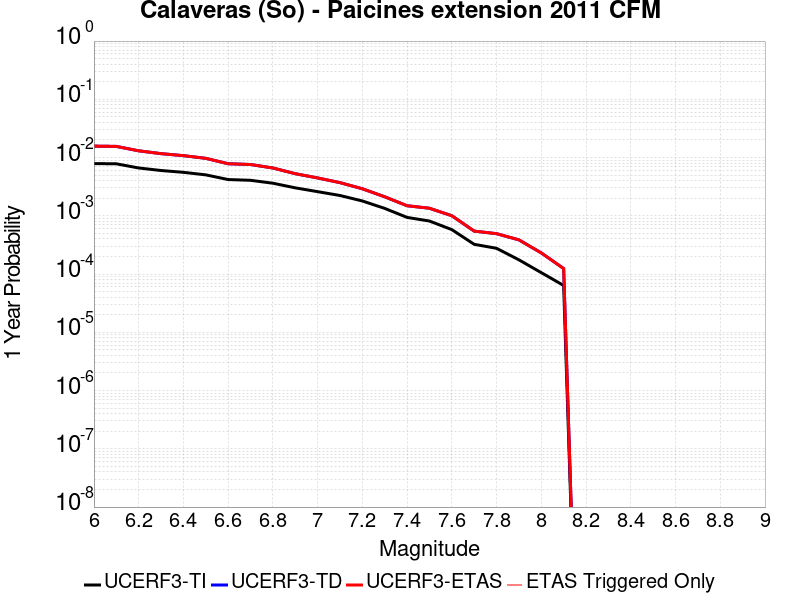 |  |

| Magnitude | 1 wk TI Prob | 1 wk TD Prob | 1 wk ETAS Prob | 1 wk ETAS/TD Gain | 1 wk ETAS Triggered Only | 1 mo TI Prob | 1 mo TD Prob | 1 mo ETAS Prob | 1 mo ETAS/TD Gain | 1 mo ETAS Triggered Only | 1 yr TI Prob | 1 yr TD Prob | 1 yr ETAS Prob | 1 yr ETAS/TD Gain | 1 yr ETAS Triggered Only | 10 yr TI Prob | 10 yr TD Prob | 10 yr ETAS Prob | 10 yr ETAS/TD Gain | 10 yr ETAS Triggered Only |
|-----|-----|-----|-----|-----|-----|-----|-----|-----|-----|-----|-----|-----|-----|-----|-----|-----|-----|-----|-----|-----|
| 6.0 | 1.5183659E-4 | 3.054171E-4 | 3.054171E-4 | 1.0 | 0.0 | 6.5056595E-4 | 0.0013077001 | 0.0013077001 | 1.0 | 0.0 | 0.007891912 | 0.015706686 | 0.015706686 | 1.0 | 0.0 | 0.076174594 | 0.13858338 | 0.13859199 | 1.0000621 | 1.0E-5 |
| 6.1 | 1.5024997E-4 | 3.0235815E-4 | 3.0235815E-4 | 1.0 | 0.0 | 6.437695E-4 | 0.0012946057 | 0.0012946057 | 1.0 | 0.0 | 0.0078097614 | 0.01555004 | 0.01555004 | 1.0 | 0.0 | 0.075409345 | 0.1372528 | 0.13726142 | 1.0000628 | 1.0E-5 |
| 6.2 | 1.2743923E-4 | 2.5333086E-4 | 2.5333086E-4 | 1.0 | 0.0 | 5.460538E-4 | 0.0010848541 | 0.0010848541 | 1.0 | 0.0 | 0.0066279583 | 0.013057152 | 0.013057152 | 1.0 | 0.0 | 0.064337276 | 0.11735088 | 0.1173597 | 1.0000752 | 1.0E-5 |
| 6.3 | 1.1525114E-4 | 2.2619132E-4 | 2.2619132E-4 | 1.0 | 0.0 | 4.9383997E-4 | 9.6872967E-4 | 9.6872967E-4 | 1.0 | 0.0 | 0.0059959386 | 0.011678331 | 0.011678331 | 1.0 | 0.0 | 0.058367174 | 0.10646783 | 0.10647676 | 1.0000839 | 1.0E-5 |
| 6.4 | 1.07200925E-4 | 2.0859824E-4 | 2.0859824E-4 | 1.0 | 0.0 | 4.5935164E-4 | 8.9346064E-4 | 8.9346064E-4 | 1.0 | 0.0 | 0.0055782744 | 0.01078317 | 0.01078317 | 1.0 | 0.0 | 0.0544031 | 0.09929088 | 0.099299885 | 1.0000907 | 1.0E-5 |
| 6.5 | 9.69631E-5 | 1.8753302E-4 | 1.8753302E-4 | 1.0 | 0.0 | 4.1548995E-4 | 8.032955E-4 | 8.032955E-4 | 1.0 | 0.0 | 0.0050468626 | 0.009704903 | 0.009704903 | 1.0 | 0.0 | 0.04933773 | 0.09018236 | 0.09019145 | 1.0001009 | 1.0E-5 |
| 6.6 | 8.0552316E-5 | 1.5090074E-4 | 1.5090074E-4 | 1.0 | 0.0 | 3.4517853E-4 | 6.4652227E-4 | 6.4652227E-4 | 1.0 | 0.0 | 0.0041944524 | 0.007836539 | 0.007836539 | 1.0 | 0.0 | 0.04116161 | 0.07495336 | 0.07496261 | 1.0001234 | 1.0E-5 |
| 6.7 | 7.815757E-5 | 1.463054E-4 | 1.463054E-4 | 1.0 | 0.0 | 3.34918E-4 | 6.2684005E-4 | 6.2684005E-4 | 1.0 | 0.0 | 0.004070005 | 0.007599283 | 0.007599283 | 1.0 | 0.0 | 0.039962657 | 0.07280259 | 0.072811864 | 1.0001273 | 1.0E-5 |
| 6.8 | 6.965264E-5 | 1.2741052E-4 | 1.2741052E-4 | 1.0 | 0.0 | 2.9847719E-4 | 5.4591516E-4 | 5.4591516E-4 | 1.0 | 0.0 | 0.0036279052 | 0.0066230483 | 0.0066230483 | 1.0 | 0.0 | 0.03569247 | 0.06389436 | 0.06390373 | 1.0001465 | 1.0E-5 |
| 6.9 | 5.8000453E-5 | 1.0160458E-4 | 1.0160458E-4 | 1.0 | 0.0 | 2.4854968E-4 | 4.3537596E-4 | 4.3537596E-4 | 1.0 | 0.0 | 0.0030218933 | 0.005287917 | 0.005287917 | 1.0 | 0.0 | 0.029811295 | 0.051582355 | 0.05159184 | 1.0001838 | 1.0E-5 |
| 7.0 | 4.9865852E-5 | 8.584289E-5 | 8.584289E-5 | 1.0 | 0.0 | 2.1369329E-4 | 3.678467E-4 | 3.678467E-4 | 1.0 | 0.0 | 0.0025986114 | 0.0044694263 | 0.0044694263 | 1.0 | 0.0 | 0.025684336 | 0.043861542 | 0.043871105 | 1.000218 | 1.0E-5 |
| 7.1 | 4.283875E-5 | 7.12632E-5 | 7.12632E-5 | 1.0 | 0.0 | 1.8358172E-4 | 3.053783E-4 | 3.053783E-4 | 1.0 | 0.0 | 0.0022328163 | 0.0037116988 | 0.0037116988 | 1.0 | 0.0 | 0.022105146 | 0.036804922 | 0.03681455 | 1.0002617 | 1.0E-5 |
| 7.2 | 3.450115E-5 | 5.591364E-5 | 5.591364E-5 | 1.0 | 0.0 | 1.478537E-4 | 2.3960804E-4 | 2.3960804E-4 | 1.0 | 0.0 | 0.0017986323 | 0.0029133547 | 0.0029133547 | 1.0 | 0.0 | 0.017841442 | 0.029147167 | 0.029156875 | 1.0003331 | 1.0E-5 |
| 7.3 | 2.5709045E-5 | 4.071257E-5 | 4.071257E-5 | 1.0 | 0.0 | 1.1017697E-4 | 1.7447087E-4 | 1.7447087E-4 | 1.0 | 0.0 | 0.0013405791 | 0.0021221305 | 0.0021221305 | 1.0 | 0.0 | 0.013325208 | 0.021359231 | 0.021369018 | 1.0004582 | 1.0E-5 |
| 7.4 | 1.8003093E-5 | 2.8566608E-5 | 2.8566608E-5 | 1.0 | 0.0 | 7.715383E-5 | 1.2242259E-4 | 1.2242259E-4 | 1.0 | 0.0 | 9.3894306E-4 | 0.0014894783 | 0.0014894783 | 1.0 | 0.0 | 0.009349857 | 0.015080636 | 0.015090486 | 1.0006531 | 1.0E-5 |
| 7.5 | 1.5595824E-5 | 2.5876827E-5 | 2.5876827E-5 | 1.0 | 0.0 | 6.683753E-5 | 1.10895984E-4 | 1.10895984E-4 | 1.0 | 0.0 | 8.134431E-4 | 0.0013493246 | 0.0013493246 | 1.0 | 0.0 | 0.008104719 | 0.013679754 | 0.013689618 | 1.000721 | 1.0E-5 |
| 7.6 | 1.1110309E-5 | 1.926936E-5 | 1.926936E-5 | 1.0 | 0.0 | 4.761474E-5 | 8.258037E-5 | 8.258037E-5 | 1.0 | 0.0 | 5.795553E-4 | 0.0010049536 | 0.0010049536 | 1.0 | 0.0 | 0.0057804612 | 0.0102279615 | 0.01023786 | 1.0009677 | 1.0E-5 |
| 7.7 | 6.2140443E-6 | 1.0471852E-5 | 1.0471852E-5 | 1.0 | 0.0 | 2.6631347E-5 | 4.4878594E-5 | 4.4878594E-5 | 1.0 | 0.0 | 3.241884E-4 | 5.4626E-4 | 5.4626E-4 | 1.0 | 0.0 | 0.0032371588 | 0.0056368355 | 0.005646779 | 1.001764 | 1.0E-5 |
| 7.8 | 5.305533E-6 | 9.464172E-6 | 9.464172E-6 | 1.0 | 0.0 | 2.27378E-5 | 4.0560106E-5 | 4.0560106E-5 | 1.0 | 0.0 | 2.7679754E-4 | 4.937075E-4 | 4.937075E-4 | 1.0 | 0.0 | 0.0027645302 | 0.005089507 | 0.0050994563 | 1.0019548 | 1.0E-5 |
| 7.9 | 3.363505E-6 | 7.4079726E-6 | 7.4079726E-6 | 1.0 | 0.0 | 1.4414942E-5 | 3.1748066E-5 | 3.1748066E-5 | 1.0 | 0.0 | 1.7548777E-4 | 3.8646423E-4 | 3.8646423E-4 | 1.0 | 0.0 | 0.0017534926 | 0.0039596627 | 0.0039696232 | 1.0025154 | 1.0E-5 |
| 8.0 | 2.0271132E-6 | 4.426135E-6 | 4.426135E-6 | 1.0 | 0.0 | 8.687599E-6 | 1.8969013E-5 | 1.8969013E-5 | 1.0 | 0.0 | 1.05766376E-4 | 2.309233E-4 | 2.309233E-4 | 1.0 | 0.0 | 0.0010571606 | 0.00235741 | 0.0023673866 | 1.0042319 | 1.0E-5 |
| 8.1 | 1.2206116E-6 | 2.382185E-6 | 2.382185E-6 | 1.0 | 0.0 | 5.2311816E-6 | 1.02093245E-5 | 1.02093245E-5 | 1.0 | 0.0 | 6.3687774E-5 | 1.2429147E-4 | 1.2429147E-4 | 1.0 | 0.0 | 6.366953E-4 | 0.0012740211 | 0.0012740211 | 1.0 | 0.0 |

## West Tahoe
*[(top)](#table-of-contents)*

| 1 Week | 1 Month | 1 Year | 10 Year |
|-----|-----|-----|-----|
|  |  |  |  |

| Magnitude | 1 wk TI Prob | 1 wk TD Prob | 1 wk ETAS Prob | 1 wk ETAS/TD Gain | 1 wk ETAS Triggered Only | 1 mo TI Prob | 1 mo TD Prob | 1 mo ETAS Prob | 1 mo ETAS/TD Gain | 1 mo ETAS Triggered Only | 1 yr TI Prob | 1 yr TD Prob | 1 yr ETAS Prob | 1 yr ETAS/TD Gain | 1 yr ETAS Triggered Only | 10 yr TI Prob | 10 yr TD Prob | 10 yr ETAS Prob | 10 yr ETAS/TD Gain | 10 yr ETAS Triggered Only |
|-----|-----|-----|-----|-----|-----|-----|-----|-----|-----|-----|-----|-----|-----|-----|-----|-----|-----|-----|-----|-----|
| 6.0 | 1.952444E-5 | 2.1184605E-5 | 2.1184605E-5 | 1.0 | 0.0 | 8.367348E-5 | 9.0788315E-5 | 9.0788315E-5 | 1.0 | 0.0 | 0.0010182485 | 0.0011048419 | 0.0011048419 | 1.0 | 0.0 | 0.010135954 | 0.010998977 | 0.011008867 | 1.0008992 | 1.0E-5 |
| 6.1 | 1.952444E-5 | 2.1184605E-5 | 2.1184605E-5 | 1.0 | 0.0 | 8.367348E-5 | 9.0788315E-5 | 9.0788315E-5 | 1.0 | 0.0 | 0.0010182485 | 0.0011048419 | 0.0011048419 | 1.0 | 0.0 | 0.010135954 | 0.010998977 | 0.011008867 | 1.0008992 | 1.0E-5 |
| 6.2 | 1.952444E-5 | 2.1184605E-5 | 2.1184605E-5 | 1.0 | 0.0 | 8.367348E-5 | 9.0788315E-5 | 9.0788315E-5 | 1.0 | 0.0 | 0.0010182485 | 0.0011048419 | 0.0011048419 | 1.0 | 0.0 | 0.010135954 | 0.010998977 | 0.011008867 | 1.0008992 | 1.0E-5 |
| 6.3 | 1.952444E-5 | 2.1184605E-5 | 2.1184605E-5 | 1.0 | 0.0 | 8.367348E-5 | 9.0788315E-5 | 9.0788315E-5 | 1.0 | 0.0 | 0.0010182485 | 0.0011048419 | 0.0011048419 | 1.0 | 0.0 | 0.010135954 | 0.010998977 | 0.011008867 | 1.0008992 | 1.0E-5 |
| 6.4 | 1.952444E-5 | 2.1184605E-5 | 2.1184605E-5 | 1.0 | 0.0 | 8.367348E-5 | 9.0788315E-5 | 9.0788315E-5 | 1.0 | 0.0 | 0.0010182485 | 0.0011048419 | 0.0011048419 | 1.0 | 0.0 | 0.010135954 | 0.010998977 | 0.011008867 | 1.0008992 | 1.0E-5 |
| 6.5 | 1.2685271E-5 | 1.3691492E-5 | 1.3691492E-5 | 1.0 | 0.0 | 5.4364315E-5 | 5.8676596E-5 | 5.8676596E-5 | 1.0 | 0.0 | 6.616845E-4 | 7.141699E-4 | 7.141699E-4 | 1.0 | 0.0 | 0.0065971776 | 0.007120398 | 0.007120398 | 1.0 | 0.0 |
| 6.6 | 1.2685271E-5 | 1.3691492E-5 | 1.3691492E-5 | 1.0 | 0.0 | 5.4364315E-5 | 5.8676596E-5 | 5.8676596E-5 | 1.0 | 0.0 | 6.616845E-4 | 7.141699E-4 | 7.141699E-4 | 1.0 | 0.0 | 0.0065971776 | 0.007120398 | 0.007120398 | 1.0 | 0.0 |
| 6.7 | 9.117886E-6 | 9.810439E-6 | 9.810439E-6 | 1.0 | 0.0 | 3.9076072E-5 | 4.2044103E-5 | 4.2044103E-5 | 1.0 | 0.0 | 4.756473E-4 | 5.117739E-4 | 5.117739E-4 | 1.0 | 0.0 | 0.0047463053 | 0.0051066712 | 0.0051066712 | 1.0 | 0.0 |
| 6.8 | 8.786828E-6 | 9.458438E-6 | 9.458438E-6 | 1.0 | 0.0 | 3.7657293E-5 | 4.053557E-5 | 4.053557E-5 | 1.0 | 0.0 | 4.5838108E-4 | 4.9341586E-4 | 4.9341586E-4 | 1.0 | 0.0 | 0.0045743673 | 0.004923905 | 0.004923905 | 1.0 | 0.0 |
| 6.9 | 6.7562123E-6 | 7.264243E-6 | 7.264243E-6 | 1.0 | 0.0 | 2.8954875E-5 | 3.1132127E-5 | 3.1132127E-5 | 1.0 | 0.0 | 3.5246857E-4 | 3.7897247E-4 | 3.7897247E-4 | 1.0 | 0.0 | 0.0035191004 | 0.003783734 | 0.003783734 | 1.0 | 0.0 |
| 7.0 | 5.1792854E-6 | 5.56767E-6 | 5.56767E-6 | 1.0 | 0.0 | 2.2196748E-5 | 2.3861247E-5 | 2.3861247E-5 | 1.0 | 0.0 | 2.702119E-4 | 2.9047576E-4 | 2.9047576E-4 | 1.0 | 0.0 | 0.0026988357 | 0.0029013362 | 0.0029013362 | 1.0 | 0.0 |
| 7.1 | 4.090765E-6 | 4.3976847E-6 | 4.3976847E-6 | 1.0 | 0.0 | 1.7531731E-5 | 1.8847104E-5 | 1.8847104E-5 | 1.0 | 0.0 | 2.134279E-4 | 2.2944274E-4 | 2.2944274E-4 | 1.0 | 0.0 | 0.0021322304 | 0.002292393 | 0.002292393 | 1.0 | 0.0 |
| 7.2 | 2.2356758E-6 | 2.402511E-6 | 2.402511E-6 | 1.0 | 0.0 | 9.581432E-6 | 1.0296445E-5 | 1.0296445E-5 | 1.0 | 0.0 | 1.1664769E-4 | 1.2535391E-4 | 1.2535391E-4 | 1.0 | 0.0 | 0.0011658648 | 0.0012530177 | 0.0012530177 | 1.0 | 0.0 |

## Great Valley 11
*[(top)](#table-of-contents)*

| 1 Week | 1 Month | 1 Year | 10 Year |
|-----|-----|-----|-----|
|  |  |  |  |

| Magnitude | 1 wk TI Prob | 1 wk TD Prob | 1 wk ETAS Prob | 1 wk ETAS/TD Gain | 1 wk ETAS Triggered Only | 1 mo TI Prob | 1 mo TD Prob | 1 mo ETAS Prob | 1 mo ETAS/TD Gain | 1 mo ETAS Triggered Only | 1 yr TI Prob | 1 yr TD Prob | 1 yr ETAS Prob | 1 yr ETAS/TD Gain | 1 yr ETAS Triggered Only | 10 yr TI Prob | 10 yr TD Prob | 10 yr ETAS Prob | 10 yr ETAS/TD Gain | 10 yr ETAS Triggered Only |
|-----|-----|-----|-----|-----|-----|-----|-----|-----|-----|-----|-----|-----|-----|-----|-----|-----|-----|-----|-----|-----|
| 6.0 | 2.8099583E-5 | 2.9836363E-5 | 2.9836363E-5 | 1.0 | 0.0 | 1.20421224E-4 | 1.2786426E-4 | 1.3786298E-4 | 1.078198 | 1.0E-5 | 0.0014651422 | 0.0015557093 | 0.0015656936 | 1.006418 | 1.0E-5 | 0.0145552 | 0.015455714 | 0.01546556 | 1.000637 | 1.0E-5 |
| 6.1 | 2.483194E-5 | 2.5910738E-5 | 2.5910738E-5 | 1.0 | 0.0 | 1.0641825E-4 | 1.11041634E-4 | 1.21040524E-4 | 1.0900463 | 1.0E-5 | 0.0012948721 | 0.0013511569 | 0.0013611433 | 1.0073911 | 1.0E-5 | 0.012873529 | 0.0134358285 | 0.013445694 | 1.0007343 | 1.0E-5 |
| 6.2 | 2.483194E-5 | 2.5910738E-5 | 2.5910738E-5 | 1.0 | 0.0 | 1.0641825E-4 | 1.11041634E-4 | 1.21040524E-4 | 1.0900463 | 1.0E-5 | 0.0012948721 | 0.0013511569 | 0.0013611433 | 1.0073911 | 1.0E-5 | 0.012873529 | 0.0134358285 | 0.013445694 | 1.0007343 | 1.0E-5 |
| 6.3 | 2.0257901E-5 | 2.0401614E-5 | 2.0401614E-5 | 1.0 | 0.0 | 8.681669E-5 | 8.7432796E-5 | 9.743193E-5 | 1.1143636 | 1.0E-5 | 0.0010564806 | 0.001064016 | 0.0010740054 | 1.0093883 | 1.0E-5 | 0.01051472 | 0.010593387 | 0.010603282 | 1.000934 | 1.0E-5 |
| 6.4 | 1.8054898E-5 | 1.7783157E-5 | 1.7783157E-5 | 1.0 | 0.0 | 7.737584E-5 | 7.6211516E-5 | 8.6210755E-5 | 1.1312038 | 1.0E-5 | 9.416436E-4 | 9.2751783E-4 | 9.3750854E-4 | 1.0107715 | 1.0E-5 | 0.009376635 | 0.009240207 | 0.009250115 | 1.0010722 | 1.0E-5 |
| 6.5 | 1.34804895E-5 | 1.2322469E-5 | 1.2322469E-5 | 1.0 | 0.0 | 5.777225E-5 | 5.2809533E-5 | 5.2809533E-5 | 1.0 | 0.0 | 7.031501E-4 | 6.4277055E-4 | 6.4277055E-4 | 1.0 | 0.0 | 0.007009294 | 0.0064095515 | 0.0064095515 | 1.0 | 0.0 |
| 6.6 | 1.294883E-5 | 1.1733675E-5 | 1.1733675E-5 | 1.0 | 0.0 | 5.5493805E-5 | 5.028623E-5 | 5.028623E-5 | 1.0 | 0.0 | 6.754276E-4 | 6.1206694E-4 | 6.1206694E-4 | 1.0 | 0.0 | 0.006733784 | 0.006104238 | 0.006104238 | 1.0 | 0.0 |
| 6.7 | 1.1272237E-5 | 9.813026E-6 | 9.813026E-6 | 1.0 | 0.0 | 4.8308695E-5 | 4.2055162E-5 | 4.2055162E-5 | 1.0 | 0.0 | 5.879996E-4 | 5.119041E-4 | 5.119041E-4 | 1.0 | 0.0 | 0.005864462 | 0.005107533 | 0.005107533 | 1.0 | 0.0 |
| 6.8 | 9.8337505E-6 | 8.194749E-6 | 8.194749E-6 | 1.0 | 0.0 | 4.2143965E-5 | 3.511989E-5 | 3.511989E-5 | 1.0 | 0.0 | 5.1298196E-4 | 4.2750285E-4 | 4.2750285E-4 | 1.0 | 0.0 | 0.005117994 | 0.0042670146 | 0.0042670146 | 1.0 | 0.0 |
| 6.9 | 7.4224813E-6 | 5.4137745E-6 | 5.4137745E-6 | 1.0 | 0.0 | 3.1810247E-5 | 2.3201692E-5 | 2.3201692E-5 | 1.0 | 0.0 | 3.872209E-4 | 2.824454E-4 | 2.824454E-4 | 1.0 | 0.0 | 0.0038654688 | 0.002821005 | 0.002821005 | 1.0 | 0.0 |
| 7.0 | 4.4628923E-6 | 2.0112714E-6 | 2.0112714E-6 | 1.0 | 0.0 | 1.912654E-5 | 8.619706E-6 | 8.619706E-6 | 1.0 | 0.0 | 2.3284076E-4 | 1.0493999E-4 | 1.0493999E-4 | 1.0 | 0.0 | 0.0023259693 | 0.0010489159 | 0.0010489159 | 1.0 | 0.0 |
| 7.1 | 3.5546527E-6 | 1.1856863E-6 | 1.1856863E-6 | 1.0 | 0.0 | 1.5234136E-5 | 5.0815033E-6 | 5.0815033E-6 | 1.0 | 0.0 | 1.8545982E-4 | 6.186561E-5 | 6.186561E-5 | 1.0 | 0.0 | 0.0018530512 | 6.184907E-4 | 6.184907E-4 | 1.0 | 0.0 |
| 7.2 | 3.2039936E-6 | 1.1255067E-6 | 1.1255067E-6 | 1.0 | 0.0 | 1.3731329E-5 | 4.8235916E-6 | 4.8235916E-6 | 1.0 | 0.0 | 1.671661E-4 | 5.8725713E-5 | 5.8725713E-5 | 1.0 | 0.0 | 0.0016704041 | 5.8710866E-4 | 5.8710866E-4 | 1.0 | 0.0 |
| 7.3 | 2.8120473E-6 | 1.0306458E-6 | 1.0306458E-6 | 1.0 | 0.0 | 1.2051575E-5 | 4.417046E-6 | 4.417046E-6 | 1.0 | 0.0 | 1.4671806E-4 | 5.377628E-5 | 5.377628E-5 | 1.0 | 0.0 | 0.0014662122 | 5.3763925E-4 | 5.3763925E-4 | 1.0 | 0.0 |
| 7.4 | 2.4837766E-6 | 9.801397E-7 | 9.801397E-7 | 1.0 | 0.0 | 1.0644713E-5 | 4.2005922E-6 | 4.2005922E-6 | 1.0 | 0.0 | 1.2959167E-4 | 5.114108E-5 | 5.114108E-5 | 1.0 | 0.0 | 0.0012951613 | 5.112997E-4 | 5.112997E-4 | 1.0 | 0.0 |
| 7.5 | 1.5002679E-6 | 6.546632E-7 | 6.546632E-7 | 1.0 | 0.0 | 6.4297037E-6 | 2.8056968E-6 | 2.8056968E-6 | 1.0 | 0.0 | 7.827883E-5 | 3.4158864E-5 | 3.4158864E-5 | 1.0 | 0.0 | 7.825126E-4 | 3.415403E-4 | 3.415403E-4 | 1.0 | 0.0 |

## Los Osos 2011
*[(top)](#table-of-contents)*

| 1 Week | 1 Month | 1 Year | 10 Year |
|-----|-----|-----|-----|
|  |  |  |  |

| Magnitude | 1 wk TI Prob | 1 wk TD Prob | 1 wk ETAS Prob | 1 wk ETAS/TD Gain | 1 wk ETAS Triggered Only | 1 mo TI Prob | 1 mo TD Prob | 1 mo ETAS Prob | 1 mo ETAS/TD Gain | 1 mo ETAS Triggered Only | 1 yr TI Prob | 1 yr TD Prob | 1 yr ETAS Prob | 1 yr ETAS/TD Gain | 1 yr ETAS Triggered Only | 10 yr TI Prob | 10 yr TD Prob | 10 yr ETAS Prob | 10 yr ETAS/TD Gain | 10 yr ETAS Triggered Only |
|-----|-----|-----|-----|-----|-----|-----|-----|-----|-----|-----|-----|-----|-----|-----|-----|-----|-----|-----|-----|-----|
| 6.0 | 4.8871775E-6 | 4.9816044E-6 | 4.9816044E-6 | 1.0 | 0.0 | 2.0944879E-5 | 2.1349573E-5 | 2.1349573E-5 | 1.0 | 0.0 | 2.5497406E-4 | 2.5990285E-4 | 2.5990285E-4 | 1.0 | 0.0 | 0.002546817 | 0.0025962633 | 0.0026062373 | 1.0038416 | 1.0E-5 |
| 6.1 | 4.8871775E-6 | 4.9816044E-6 | 4.9816044E-6 | 1.0 | 0.0 | 2.0944879E-5 | 2.1349573E-5 | 2.1349573E-5 | 1.0 | 0.0 | 2.5497406E-4 | 2.5990285E-4 | 2.5990285E-4 | 1.0 | 0.0 | 0.002546817 | 0.0025962633 | 0.0026062373 | 1.0038416 | 1.0E-5 |
| 6.2 | 4.8871775E-6 | 4.9816044E-6 | 4.9816044E-6 | 1.0 | 0.0 | 2.0944879E-5 | 2.1349573E-5 | 2.1349573E-5 | 1.0 | 0.0 | 2.5497406E-4 | 2.5990285E-4 | 2.5990285E-4 | 1.0 | 0.0 | 0.002546817 | 0.0025962633 | 0.0026062373 | 1.0038416 | 1.0E-5 |
| 6.3 | 4.8871775E-6 | 4.9816044E-6 | 4.9816044E-6 | 1.0 | 0.0 | 2.0944879E-5 | 2.1349573E-5 | 2.1349573E-5 | 1.0 | 0.0 | 2.5497406E-4 | 2.5990285E-4 | 2.5990285E-4 | 1.0 | 0.0 | 0.002546817 | 0.0025962633 | 0.0026062373 | 1.0038416 | 1.0E-5 |
| 6.4 | 4.8871775E-6 | 4.9816044E-6 | 4.9816044E-6 | 1.0 | 0.0 | 2.0944879E-5 | 2.1349573E-5 | 2.1349573E-5 | 1.0 | 0.0 | 2.5497406E-4 | 2.5990285E-4 | 2.5990285E-4 | 1.0 | 0.0 | 0.002546817 | 0.0025962633 | 0.0026062373 | 1.0038416 | 1.0E-5 |
| 6.5 | 3.1724062E-6 | 3.2234805E-6 | 3.2234805E-6 | 1.0 | 0.0 | 1.3595956E-5 | 1.3814844E-5 | 1.3814844E-5 | 1.0 | 0.0 | 1.6551818E-4 | 1.6818287E-4 | 1.6818287E-4 | 1.0 | 0.0 | 0.0016539496 | 0.0016805695 | 0.0016805695 | 1.0 | 0.0 |
| 6.6 | 3.1022591E-6 | 3.1511884E-6 | 3.1511884E-6 | 1.0 | 0.0 | 1.3295328E-5 | 1.3505023E-5 | 1.3505023E-5 | 1.0 | 0.0 | 1.618586E-4 | 1.6441138E-4 | 1.6441138E-4 | 1.0 | 0.0 | 0.0016174077 | 0.0016429103 | 0.0016429103 | 1.0 | 0.0 |
| 6.7 | 2.611518E-6 | 2.649258E-6 | 2.649258E-6 | 1.0 | 0.0 | 1.1192172E-5 | 1.1353914E-5 | 1.1353914E-5 | 1.0 | 0.0 | 1.3625617E-4 | 1.3822516E-4 | 1.3822516E-4 | 1.0 | 0.0 | 0.0013617266 | 0.0013813964 | 0.0013813964 | 1.0 | 0.0 |
| 6.8 | 2.4780884E-6 | 2.512231E-6 | 2.512231E-6 | 1.0 | 0.0 | 1.0620336E-5 | 1.076666E-5 | 1.076666E-5 | 1.0 | 0.0 | 1.2929492E-4 | 1.3107625E-4 | 1.3107625E-4 | 1.0 | 0.0 | 0.0012921972 | 0.0013099934 | 0.0013099934 | 1.0 | 0.0 |
| 6.9 | 2.1376322E-6 | 2.1635708E-6 | 2.1635708E-6 | 1.0 | 0.0 | 9.161248E-6 | 9.272413E-6 | 9.272413E-6 | 1.0 | 0.0 | 1.1153249E-4 | 1.128858E-4 | 1.128858E-4 | 1.0 | 0.0 | 0.0011147653 | 0.0011282865 | 0.0011282865 | 1.0 | 0.0 |
| 7.0 | 1.9282882E-6 | 1.9495199E-6 | 1.9495199E-6 | 1.0 | 0.0 | 8.264066E-6 | 8.3550585E-6 | 8.3550585E-6 | 1.0 | 0.0 | 1.0061036E-4 | 1.017181E-4 | 1.017181E-4 | 1.0 | 0.0 | 0.0010056482 | 0.0010167168 | 0.0010167168 | 1.0 | 0.0 |
| 7.1 | 1.6353226E-6 | 1.6501679E-6 | 1.6501679E-6 | 1.0 | 0.0 | 7.0085066E-6 | 7.072129E-6 | 7.072129E-6 | 1.0 | 0.0 | 8.532523E-5 | 8.6099775E-5 | 8.6099775E-5 | 1.0 | 0.0 | 8.529247E-4 | 8.6066494E-4 | 8.6066494E-4 | 1.0 | 0.0 |
| 7.2 | 1.4446276E-6 | 1.4553868E-6 | 1.4553868E-6 | 1.0 | 0.0 | 6.191247E-6 | 6.2373574E-6 | 6.2373574E-6 | 1.0 | 0.0 | 7.537582E-5 | 7.593718E-5 | 7.593718E-5 | 1.0 | 0.0 | 7.535026E-4 | 7.5911294E-4 | 7.5911294E-4 | 1.0 | 0.0 |
| 7.3 | 1.2014582E-6 | 1.2069557E-6 | 1.2069557E-6 | 1.0 | 0.0 | 5.149096E-6 | 5.1726574E-6 | 5.1726574E-6 | 1.0 | 0.0 | 6.268844E-5 | 6.297528E-5 | 6.297528E-5 | 1.0 | 0.0 | 6.267076E-4 | 6.295748E-4 | 6.295748E-4 | 1.0 | 0.0 |
| 7.4 | 9.707733E-7 | 9.710216E-7 | 9.710216E-7 | 1.0 | 0.0 | 4.16045E-6 | 4.161514E-6 | 4.161514E-6 | 1.0 | 0.0 | 5.0652303E-5 | 5.0665258E-5 | 5.0665258E-5 | 1.0 | 0.0 | 5.064076E-4 | 5.065373E-4 | 5.065373E-4 | 1.0 | 0.0 |
| 7.5 | 7.174908E-7 | 7.115305E-7 | 7.115305E-7 | 1.0 | 0.0 | 3.074957E-6 | 3.049413E-6 | 3.049413E-6 | 1.0 | 0.0 | 3.743696E-5 | 3.712597E-5 | 3.712597E-5 | 1.0 | 0.0 | 3.7430652E-4 | 3.7119785E-4 | 3.7119785E-4 | 1.0 | 0.0 |
| 7.6 | 4.5535776E-7 | 4.421124E-7 | 4.421124E-7 | 1.0 | 0.0 | 1.9515319E-6 | 1.894766E-6 | 1.894766E-6 | 1.0 | 0.0 | 2.3759641E-5 | 2.3068533E-5 | 2.3068533E-5 | 1.0 | 0.0 | 2.37571E-4 | 2.3066148E-4 | 2.3066148E-4 | 1.0 | 0.0 |
| 7.7 | 2.1173553E-7 | 1.9063468E-7 | 1.9063468E-7 | 1.0 | 0.0 | 9.0743765E-7 | 8.170055E-7 | 8.170055E-7 | 1.0 | 0.0 | 1.1047998E-5 | 9.946997E-6 | 9.946997E-6 | 1.0 | 0.0 | 1.1047449E-4 | 9.946554E-5 | 9.946554E-5 | 1.0 | 0.0 |
| 7.8 | 9.873608E-8 | 7.3698324E-8 | 7.3698324E-8 | 1.0 | 0.0 | 4.2315455E-7 | 3.1584992E-7 | 3.1584992E-7 | 1.0 | 0.0 | 5.1518946E-6 | 3.845466E-6 | 3.845466E-6 | 1.0 | 0.0 | 5.1517753E-5 | 3.8454E-5 | 3.8454E-5 | 1.0 | 0.0 |
| 7.9 | 5.4399106E-8 | 3.190044E-8 | 3.190044E-8 | 1.0 | 0.0 | 2.33139E-7 | 1.3671617E-7 | 1.3671617E-7 | 1.0 | 0.0 | 2.8384638E-6 | 1.6645181E-6 | 1.6645181E-6 | 1.0 | 0.0 | 2.8384275E-5 | 1.6645057E-5 | 1.6645057E-5 | 1.0 | 0.0 |
| 8.0 | 1.817203E-8 | 8.429099E-9 | 8.429099E-9 | 1.0 | 0.0 | 7.7880124E-8 | 3.612471E-8 | 3.612471E-8 | 1.0 | 0.0 | 9.481901E-7 | 4.3981825E-7 | 4.3981825E-7 | 1.0 | 0.0 | 9.481861E-6 | 4.3981745E-6 | 4.3981745E-6 | 1.0 | 0.0 |

## Johnson Valley (No) 2011 rev
*[(top)](#table-of-contents)*

| 1 Week | 1 Month | 1 Year | 10 Year |
|-----|-----|-----|-----|
|  |  |  |  |

| Magnitude | 1 wk TI Prob | 1 wk TD Prob | 1 wk ETAS Prob | 1 wk ETAS/TD Gain | 1 wk ETAS Triggered Only | 1 mo TI Prob | 1 mo TD Prob | 1 mo ETAS Prob | 1 mo ETAS/TD Gain | 1 mo ETAS Triggered Only | 1 yr TI Prob | 1 yr TD Prob | 1 yr ETAS Prob | 1 yr ETAS/TD Gain | 1 yr ETAS Triggered Only | 10 yr TI Prob | 10 yr TD Prob | 10 yr ETAS Prob | 10 yr ETAS/TD Gain | 10 yr ETAS Triggered Only |
|-----|-----|-----|-----|-----|-----|-----|-----|-----|-----|-----|-----|-----|-----|-----|-----|-----|-----|-----|-----|-----|
| 6.0 | 2.577707E-5 | 1.29021255E-5 | 1.29021255E-5 | 1.0 | 0.0 | 1.1046848E-4 | 5.5293873E-5 | 5.5293873E-5 | 1.0 | 0.0 | 0.0013441239 | 6.730347E-4 | 6.730347E-4 | 1.0 | 0.0 | 0.013360229 | 0.0067138732 | 0.006723806 | 1.0014795 | 1.0E-5 |
| 6.1 | 2.577707E-5 | 1.29021255E-5 | 1.29021255E-5 | 1.0 | 0.0 | 1.1046848E-4 | 5.5293873E-5 | 5.5293873E-5 | 1.0 | 0.0 | 0.0013441239 | 6.730347E-4 | 6.730347E-4 | 1.0 | 0.0 | 0.013360229 | 0.0067138732 | 0.006723806 | 1.0014795 | 1.0E-5 |
| 6.2 | 2.577707E-5 | 1.29021255E-5 | 1.29021255E-5 | 1.0 | 0.0 | 1.1046848E-4 | 5.5293873E-5 | 5.5293873E-5 | 1.0 | 0.0 | 0.0013441239 | 6.730347E-4 | 6.730347E-4 | 1.0 | 0.0 | 0.013360229 | 0.0067138732 | 0.006723806 | 1.0014795 | 1.0E-5 |
| 6.3 | 2.577707E-5 | 1.29021255E-5 | 1.29021255E-5 | 1.0 | 0.0 | 1.1046848E-4 | 5.5293873E-5 | 5.5293873E-5 | 1.0 | 0.0 | 0.0013441239 | 6.730347E-4 | 6.730347E-4 | 1.0 | 0.0 | 0.013360229 | 0.0067138732 | 0.006723806 | 1.0014795 | 1.0E-5 |
| 6.4 | 1.5296591E-5 | 7.537444E-6 | 7.537444E-6 | 1.0 | 0.0 | 6.555518E-5 | 3.2303036E-5 | 3.2303036E-5 | 1.0 | 0.0 | 7.97842E-4 | 3.9323728E-4 | 3.9323728E-4 | 1.0 | 0.0 | 0.007949836 | 0.003927256 | 0.0039372165 | 1.0025363 | 1.0E-5 |
| 6.5 | 1.5296591E-5 | 7.537444E-6 | 7.537444E-6 | 1.0 | 0.0 | 6.555518E-5 | 3.2303036E-5 | 3.2303036E-5 | 1.0 | 0.0 | 7.97842E-4 | 3.9323728E-4 | 3.9323728E-4 | 1.0 | 0.0 | 0.007949836 | 0.003927256 | 0.0039372165 | 1.0025363 | 1.0E-5 |
| 6.6 | 1.3289383E-5 | 5.992293E-6 | 5.992293E-6 | 1.0 | 0.0 | 5.6953253E-5 | 2.56811E-5 | 2.56811E-5 | 1.0 | 0.0 | 6.9318525E-4 | 3.126395E-4 | 3.126395E-4 | 1.0 | 0.0 | 0.0069102696 | 0.0031236613 | 0.0031336301 | 1.0031914 | 1.0E-5 |
| 6.7 | 1.3289383E-5 | 5.992293E-6 | 5.992293E-6 | 1.0 | 0.0 | 5.6953253E-5 | 2.56811E-5 | 2.56811E-5 | 1.0 | 0.0 | 6.9318525E-4 | 3.126395E-4 | 3.126395E-4 | 1.0 | 0.0 | 0.0069102696 | 0.0031236613 | 0.0031336301 | 1.0031914 | 1.0E-5 |
| 6.8 | 8.330789E-6 | 2.921469E-6 | 2.921469E-6 | 1.0 | 0.0 | 3.570289E-5 | 1.2520553E-5 | 1.2520553E-5 | 1.0 | 0.0 | 4.34596E-4 | 1.524328E-4 | 1.524328E-4 | 1.0 | 0.0 | 0.0043374705 | 0.0015238423 | 0.001533827 | 1.0065523 | 1.0E-5 |
| 6.9 | 7.2359003E-6 | 2.3014813E-6 | 2.3014813E-6 | 1.0 | 0.0 | 3.1010633E-5 | 9.863485E-6 | 9.863485E-6 | 1.0 | 0.0 | 3.7748902E-4 | 1.2008664E-4 | 1.2008664E-4 | 1.0 | 0.0 | 0.0037684843 | 0.0012007403 | 0.0012107284 | 1.0083182 | 1.0E-5 |
| 7.0 | 6.5149957E-6 | 2.0886512E-6 | 2.0886512E-6 | 1.0 | 0.0 | 2.792111E-5 | 8.951361E-6 | 8.951361E-6 | 1.0 | 0.0 | 3.398865E-4 | 1.0898267E-4 | 1.0898267E-4 | 1.0 | 0.0 | 0.003393671 | 0.0010898121 | 0.0010998012 | 1.0091659 | 1.0E-5 |
| 7.1 | 1.1662233E-6 | 2.8804383E-8 | 2.8804383E-8 | 1.0 | 0.0 | 4.9980904E-6 | 1.2344735E-7 | 1.2344735E-7 | 1.0 | 0.0 | 6.0850052E-5 | 1.5029706E-6 | 1.5029706E-6 | 1.0 | 0.0 | 6.083339E-4 | 1.5029621E-5 | 1.5029621E-5 | 1.0 | 0.0 |
| 7.2 | 5.413881E-7 | 2.8804383E-8 | 2.8804383E-8 | 1.0 | 0.0 | 2.3202326E-6 | 1.2344735E-7 | 1.2344735E-7 | 1.0 | 0.0 | 2.8248465E-5 | 1.5029706E-6 | 1.5029706E-6 | 1.0 | 0.0 | 2.8244875E-4 | 1.5029621E-5 | 1.5029621E-5 | 1.0 | 0.0 |
| 7.3 | 5.076821E-7 | 2.8804383E-8 | 2.8804383E-8 | 1.0 | 0.0 | 2.1757785E-6 | 1.2344735E-7 | 1.2344735E-7 | 1.0 | 0.0 | 2.648978E-5 | 1.5029706E-6 | 1.5029706E-6 | 1.0 | 0.0 | 2.6486625E-4 | 1.5029621E-5 | 1.5029621E-5 | 1.0 | 0.0 |
| 7.4 | 4.7568687E-7 | 2.8786316E-8 | 2.8786316E-8 | 1.0 | 0.0 | 2.0386565E-6 | 1.2336992E-7 | 1.2336992E-7 | 1.0 | 0.0 | 2.482036E-5 | 1.5020279E-6 | 1.5020279E-6 | 1.0 | 0.0 | 2.4817587E-4 | 1.5020193E-5 | 1.5020193E-5 | 1.0 | 0.0 |
| 7.5 | 3.435626E-7 | 2.5359984E-8 | 2.5359984E-8 | 1.0 | 0.0 | 1.4724103E-6 | 1.0868564E-7 | 1.0868564E-7 | 1.0 | 0.0 | 1.7926448E-5 | 1.323247E-6 | 1.323247E-6 | 1.0 | 0.0 | 1.7925001E-4 | 1.3232408E-5 | 1.3232408E-5 | 1.0 | 0.0 |

## Clamshell-Sawpit
*[(top)](#table-of-contents)*

| 1 Week | 1 Month | 1 Year | 10 Year |
|-----|-----|-----|-----|
|  |  |  |  |

| Magnitude | 1 wk TI Prob | 1 wk TD Prob | 1 wk ETAS Prob | 1 wk ETAS/TD Gain | 1 wk ETAS Triggered Only | 1 mo TI Prob | 1 mo TD Prob | 1 mo ETAS Prob | 1 mo ETAS/TD Gain | 1 mo ETAS Triggered Only | 1 yr TI Prob | 1 yr TD Prob | 1 yr ETAS Prob | 1 yr ETAS/TD Gain | 1 yr ETAS Triggered Only | 10 yr TI Prob | 10 yr TD Prob | 10 yr ETAS Prob | 10 yr ETAS/TD Gain | 10 yr ETAS Triggered Only |
|-----|-----|-----|-----|-----|-----|-----|-----|-----|-----|-----|-----|-----|-----|-----|-----|-----|-----|-----|-----|-----|
| 6.0 | 3.202998E-6 | 3.0128824E-6 | 3.0128824E-6 | 1.0 | 0.0 | 1.3727062E-5 | 1.2912294E-5 | 1.2912294E-5 | 1.0 | 0.0 | 1.6711417E-4 | 1.5719664E-4 | 1.6719506E-4 | 1.0636046 | 1.0E-5 | 0.0016698855 | 0.0015709338 | 0.0015809181 | 1.0063556 | 1.0E-5 |
| 6.1 | 3.202998E-6 | 3.0128824E-6 | 3.0128824E-6 | 1.0 | 0.0 | 1.3727062E-5 | 1.2912294E-5 | 1.2912294E-5 | 1.0 | 0.0 | 1.6711417E-4 | 1.5719664E-4 | 1.6719506E-4 | 1.0636046 | 1.0E-5 | 0.0016698855 | 0.0015709338 | 0.0015809181 | 1.0063556 | 1.0E-5 |
| 6.2 | 3.202998E-6 | 3.0128824E-6 | 3.0128824E-6 | 1.0 | 0.0 | 1.3727062E-5 | 1.2912294E-5 | 1.2912294E-5 | 1.0 | 0.0 | 1.6711417E-4 | 1.5719664E-4 | 1.6719506E-4 | 1.0636046 | 1.0E-5 | 0.0016698855 | 0.0015709338 | 0.0015809181 | 1.0063556 | 1.0E-5 |
| 6.3 | 3.202998E-6 | 3.0128824E-6 | 3.0128824E-6 | 1.0 | 0.0 | 1.3727062E-5 | 1.2912294E-5 | 1.2912294E-5 | 1.0 | 0.0 | 1.6711417E-4 | 1.5719664E-4 | 1.6719506E-4 | 1.0636046 | 1.0E-5 | 0.0016698855 | 0.0015709338 | 0.0015809181 | 1.0063556 | 1.0E-5 |
| 6.4 | 3.202998E-6 | 3.0128824E-6 | 3.0128824E-6 | 1.0 | 0.0 | 1.3727062E-5 | 1.2912294E-5 | 1.2912294E-5 | 1.0 | 0.0 | 1.6711417E-4 | 1.5719664E-4 | 1.6719506E-4 | 1.0636046 | 1.0E-5 | 0.0016698855 | 0.0015709338 | 0.0015809181 | 1.0063556 | 1.0E-5 |
| 6.5 | 2.5862723E-6 | 2.3808805E-6 | 2.3808805E-6 | 1.0 | 0.0 | 1.1083977E-5 | 1.0203735E-5 | 1.0203735E-5 | 1.0 | 0.0 | 1.3493907E-4 | 1.242237E-4 | 1.3422246E-4 | 1.08049 | 1.0E-5 | 0.0013485716 | 0.0012415729 | 0.0012515605 | 1.0080442 | 1.0E-5 |
| 6.6 | 2.5862723E-6 | 2.3808805E-6 | 2.3808805E-6 | 1.0 | 0.0 | 1.1083977E-5 | 1.0203735E-5 | 1.0203735E-5 | 1.0 | 0.0 | 1.3493907E-4 | 1.242237E-4 | 1.3422246E-4 | 1.08049 | 1.0E-5 | 0.0013485716 | 0.0012415729 | 0.0012515605 | 1.0080442 | 1.0E-5 |
| 6.7 | 2.5862723E-6 | 2.3808805E-6 | 2.3808805E-6 | 1.0 | 0.0 | 1.1083977E-5 | 1.0203735E-5 | 1.0203735E-5 | 1.0 | 0.0 | 1.3493907E-4 | 1.242237E-4 | 1.3422246E-4 | 1.08049 | 1.0E-5 | 0.0013485716 | 0.0012415729 | 0.0012515605 | 1.0080442 | 1.0E-5 |
| 6.8 | 2.4098806E-6 | 2.1978308E-6 | 2.1978308E-6 | 1.0 | 0.0 | 1.0328019E-5 | 9.419243E-6 | 9.419243E-6 | 1.0 | 0.0 | 1.2573638E-4 | 1.14673516E-4 | 1.2467237E-4 | 1.0871941 | 1.0E-5 | 0.0012566525 | 0.00114617 | 0.0011561585 | 1.0087147 | 1.0E-5 |
| 6.9 | 2.0073985E-6 | 1.7785109E-6 | 1.7785109E-6 | 1.0 | 0.0 | 8.603109E-6 | 7.622168E-6 | 7.622168E-6 | 1.0 | 0.0 | 1.0473781E-4 | 9.2796065E-5 | 9.2796065E-5 | 1.0 | 0.0 | 0.0010468846 | 9.27585E-4 | 9.27585E-4 | 1.0 | 0.0 |
| 7.0 | 1.8166766E-6 | 1.5807899E-6 | 1.5807899E-6 | 1.0 | 0.0 | 7.785734E-6 | 6.774797E-6 | 6.774797E-6 | 1.0 | 0.0 | 9.478718E-5 | 8.248013E-5 | 8.248013E-5 | 1.0 | 0.0 | 9.4746763E-4 | 8.2450523E-4 | 8.2450523E-4 | 1.0 | 0.0 |
| 7.1 | 1.5471421E-6 | 1.3053656E-6 | 1.3053656E-6 | 1.0 | 0.0 | 6.6305925E-6 | 5.5944124E-6 | 5.5944124E-6 | 1.0 | 0.0 | 8.072447E-5 | 6.81099E-5 | 6.81099E-5 | 1.0 | 0.0 | 8.0695155E-4 | 6.808957E-4 | 6.808957E-4 | 1.0 | 0.0 |
| 7.2 | 1.3608037E-6 | 1.1154062E-6 | 1.1154062E-6 | 1.0 | 0.0 | 5.8320024E-6 | 4.7803037E-6 | 4.7803037E-6 | 1.0 | 0.0 | 7.1002316E-5 | 5.8198693E-5 | 5.8198693E-5 | 1.0 | 0.0 | 7.097964E-4 | 5.818391E-4 | 5.818391E-4 | 1.0 | 0.0 |
| 7.3 | 1.0749634E-6 | 8.38475E-7 | 8.38475E-7 | 1.0 | 0.0 | 4.6069777E-6 | 3.5934595E-6 | 3.5934595E-6 | 1.0 | 0.0 | 5.608851E-5 | 4.374952E-5 | 4.374952E-5 | 1.0 | 0.0 | 5.6074356E-4 | 4.374119E-4 | 4.374119E-4 | 1.0 | 0.0 |
| 7.4 | 8.416856E-7 | 6.200441E-7 | 6.200441E-7 | 1.0 | 0.0 | 3.607219E-6 | 2.6573293E-6 | 2.6573293E-6 | 1.0 | 0.0 | 4.3917007E-5 | 3.2352524E-5 | 3.2352524E-5 | 1.0 | 0.0 | 4.390833E-4 | 3.234801E-4 | 3.234801E-4 | 1.0 | 0.0 |
| 7.5 | 6.2779594E-7 | 4.49721E-7 | 4.49721E-7 | 1.0 | 0.0 | 2.6905511E-6 | 1.9273743E-6 | 1.9273743E-6 | 1.0 | 0.0 | 3.275697E-5 | 2.3465549E-5 | 2.3465549E-5 | 1.0 | 0.0 | 3.275214E-4 | 2.346326E-4 | 2.346326E-4 | 1.0 | 0.0 |
| 7.6 | 4.3822078E-7 | 3.0598096E-7 | 3.0598096E-7 | 1.0 | 0.0 | 1.8780877E-6 | 1.3113463E-6 | 1.3113463E-6 | 1.0 | 0.0 | 2.2865479E-5 | 1.5965541E-5 | 1.5965541E-5 | 1.0 | 0.0 | 2.2863125E-4 | 1.5964548E-4 | 1.5964548E-4 | 1.0 | 0.0 |
| 7.7 | 1.8704569E-7 | 1.1239593E-7 | 1.1239593E-7 | 1.0 | 0.0 | 8.0162414E-7 | 4.8169676E-7 | 4.8169676E-7 | 1.0 | 0.0 | 9.75973E-6 | 5.864643E-6 | 5.864643E-6 | 1.0 | 0.0 | 9.7593016E-5 | 5.8644946E-5 | 5.8644946E-5 | 1.0 | 0.0 |
| 7.8 | 3.5378733E-8 | 2.1839778E-8 | 2.1839778E-8 | 1.0 | 0.0 | 1.5162313E-7 | 9.359905E-8 | 9.359905E-8 | 1.0 | 0.0 | 1.84601E-6 | 1.1395678E-6 | 1.1395678E-6 | 1.0 | 0.0 | 1.8459947E-5 | 1.1395622E-5 | 1.1395622E-5 | 1.0 | 0.0 |
| 7.9 | 7.504945E-9 | 5.192505E-9 | 5.192505E-9 | 1.0 | 0.0 | 3.2164053E-8 | 2.2253593E-8 | 2.2253593E-8 | 1.0 | 0.0 | 3.9159727E-7 | 2.7093748E-7 | 2.7093748E-7 | 1.0 | 0.0 | 3.915966E-6 | 2.7093722E-6 | 2.7093722E-6 | 1.0 | 0.0 |
| 8.0 | 1.6554036E-10 | 1.4181911E-10 | 1.4181911E-10 | 1.0 | 0.0 | 7.0945894E-10 | 6.0779637E-10 | 6.0779637E-10 | 1.0 | 0.0 | 8.637662E-9 | 7.3999207E-9 | 7.3999207E-9 | 1.0 | 0.0 | 8.6376616E-8 | 7.39992E-8 | 7.39992E-8 | 1.0 | 0.0 |

## San Joaquin Hills
*[(top)](#table-of-contents)*

| 1 Week | 1 Month | 1 Year | 10 Year |
|-----|-----|-----|-----|
|  |  |  |  |

| Magnitude | 1 wk TI Prob | 1 wk TD Prob | 1 wk ETAS Prob | 1 wk ETAS/TD Gain | 1 wk ETAS Triggered Only | 1 mo TI Prob | 1 mo TD Prob | 1 mo ETAS Prob | 1 mo ETAS/TD Gain | 1 mo ETAS Triggered Only | 1 yr TI Prob | 1 yr TD Prob | 1 yr ETAS Prob | 1 yr ETAS/TD Gain | 1 yr ETAS Triggered Only | 10 yr TI Prob | 10 yr TD Prob | 10 yr ETAS Prob | 10 yr ETAS/TD Gain | 10 yr ETAS Triggered Only |
|-----|-----|-----|-----|-----|-----|-----|-----|-----|-----|-----|-----|-----|-----|-----|-----|-----|-----|-----|-----|-----|
| 6.0 | 3.4525704E-6 | 2.8140482E-6 | 2.8140482E-6 | 1.0 | 0.0 | 1.4796647E-5 | 1.2060152E-5 | 1.2060152E-5 | 1.0 | 0.0 | 1.8013427E-4 | 1.4682258E-4 | 1.4682258E-4 | 1.0 | 0.0 | 0.0017998833 | 0.001467269 | 0.0014772544 | 1.0068054 | 1.0E-5 |
| 6.1 | 3.4525704E-6 | 2.8140482E-6 | 2.8140482E-6 | 1.0 | 0.0 | 1.4796647E-5 | 1.2060152E-5 | 1.2060152E-5 | 1.0 | 0.0 | 1.8013427E-4 | 1.4682258E-4 | 1.4682258E-4 | 1.0 | 0.0 | 0.0017998833 | 0.001467269 | 0.0014772544 | 1.0068054 | 1.0E-5 |
| 6.2 | 3.4525704E-6 | 2.8140482E-6 | 2.8140482E-6 | 1.0 | 0.0 | 1.4796647E-5 | 1.2060152E-5 | 1.2060152E-5 | 1.0 | 0.0 | 1.8013427E-4 | 1.4682258E-4 | 1.4682258E-4 | 1.0 | 0.0 | 0.0017998833 | 0.001467269 | 0.0014772544 | 1.0068054 | 1.0E-5 |
| 6.3 | 3.4525704E-6 | 2.8140482E-6 | 2.8140482E-6 | 1.0 | 0.0 | 1.4796647E-5 | 1.2060152E-5 | 1.2060152E-5 | 1.0 | 0.0 | 1.8013427E-4 | 1.4682258E-4 | 1.4682258E-4 | 1.0 | 0.0 | 0.0017998833 | 0.001467269 | 0.0014772544 | 1.0068054 | 1.0E-5 |
| 6.4 | 3.4525704E-6 | 2.8140482E-6 | 2.8140482E-6 | 1.0 | 0.0 | 1.4796647E-5 | 1.2060152E-5 | 1.2060152E-5 | 1.0 | 0.0 | 1.8013427E-4 | 1.4682258E-4 | 1.4682258E-4 | 1.0 | 0.0 | 0.0017998833 | 0.001467269 | 0.0014772544 | 1.0068054 | 1.0E-5 |
| 6.5 | 3.4525704E-6 | 2.8140482E-6 | 2.8140482E-6 | 1.0 | 0.0 | 1.4796647E-5 | 1.2060152E-5 | 1.2060152E-5 | 1.0 | 0.0 | 1.8013427E-4 | 1.4682258E-4 | 1.4682258E-4 | 1.0 | 0.0 | 0.0017998833 | 0.001467269 | 0.0014772544 | 1.0068054 | 1.0E-5 |
| 6.6 | 3.4525704E-6 | 2.8140482E-6 | 2.8140482E-6 | 1.0 | 0.0 | 1.4796647E-5 | 1.2060152E-5 | 1.2060152E-5 | 1.0 | 0.0 | 1.8013427E-4 | 1.4682258E-4 | 1.4682258E-4 | 1.0 | 0.0 | 0.0017998833 | 0.001467269 | 0.0014772544 | 1.0068054 | 1.0E-5 |
| 6.7 | 3.4525704E-6 | 2.8140482E-6 | 2.8140482E-6 | 1.0 | 0.0 | 1.4796647E-5 | 1.2060152E-5 | 1.2060152E-5 | 1.0 | 0.0 | 1.8013427E-4 | 1.4682258E-4 | 1.4682258E-4 | 1.0 | 0.0 | 0.0017998833 | 0.001467269 | 0.0014772544 | 1.0068054 | 1.0E-5 |
| 6.8 | 3.388654E-6 | 2.7484853E-6 | 2.7484853E-6 | 1.0 | 0.0 | 1.4522722E-5 | 1.177917E-5 | 1.177917E-5 | 1.0 | 0.0 | 1.767998E-4 | 1.4340208E-4 | 1.4340208E-4 | 1.0 | 0.0 | 0.001766592 | 0.0014331084 | 0.001443094 | 1.0069678 | 1.0E-5 |
| 6.9 | 3.2694352E-6 | 2.6283972E-6 | 2.6283972E-6 | 1.0 | 0.0 | 1.401179E-5 | 1.1264512E-5 | 1.1264512E-5 | 1.0 | 0.0 | 1.7058018E-4 | 1.3713691E-4 | 1.3713691E-4 | 1.0 | 0.0 | 0.0017044931 | 0.0013705342 | 0.0013805204 | 1.0072864 | 1.0E-5 |
| 7.0 | 3.246912E-6 | 2.6070538E-6 | 2.6070538E-6 | 1.0 | 0.0 | 1.39152635E-5 | 1.1173041E-5 | 1.1173041E-5 | 1.0 | 0.0 | 1.6940516E-4 | 1.3602339E-4 | 1.3602339E-4 | 1.0 | 0.0 | 0.0016927607 | 0.0013594126 | 0.0013693989 | 1.0073462 | 1.0E-5 |
| 7.1 | 3.1864927E-6 | 2.5523805E-6 | 2.5523805E-6 | 1.0 | 0.0 | 1.3656326E-5 | 1.0938728E-5 | 1.0938728E-5 | 1.0 | 0.0 | 1.6625308E-4 | 1.33171E-4 | 1.33171E-4 | 1.0 | 0.0 | 0.0016612876 | 0.0013309229 | 0.0013409096 | 1.0075036 | 1.0E-5 |
| 7.2 | 3.0220644E-6 | 2.3992245E-6 | 2.3992245E-6 | 1.0 | 0.0 | 1.295164E-5 | 1.02823515E-5 | 1.02823515E-5 | 1.0 | 0.0 | 1.576748E-4 | 1.2518054E-4 | 1.2518054E-4 | 1.0 | 0.0 | 0.0015756298 | 0.0012511106 | 0.0012610981 | 1.0079829 | 1.0E-5 |
| 7.3 | 2.787619E-6 | 2.2174377E-6 | 2.2174377E-6 | 1.0 | 0.0 | 1.1946884E-5 | 9.50327E-6 | 9.50327E-6 | 1.0 | 0.0 | 1.454436E-4 | 1.1569627E-4 | 1.1569627E-4 | 1.0 | 0.0 | 0.0014534845 | 0.0011563703 | 0.0011663587 | 1.0086378 | 1.0E-5 |
| 7.4 | 2.4593792E-6 | 1.9226732E-6 | 1.9226732E-6 | 1.0 | 0.0 | 1.0540153E-5 | 8.240002E-6 | 8.240002E-6 | 1.0 | 0.0 | 1.2831882E-4 | 1.003175E-4 | 1.003175E-4 | 1.0 | 0.0 | 0.0012824474 | 0.0010027309 | 0.0010127209 | 1.0099628 | 1.0E-5 |
| 7.5 | 1.926764E-6 | 1.4383513E-6 | 1.4383513E-6 | 1.0 | 0.0 | 8.257534E-6 | 6.1643486E-6 | 6.1643486E-6 | 1.0 | 0.0 | 1.00530844E-4 | 7.5048425E-5 | 7.5048425E-5 | 1.0 | 0.0 | 0.0010048538 | 7.5023714E-4 | 7.6022965E-4 | 1.0133191 | 1.0E-5 |
| 7.6 | 1.1609359E-6 | 8.1459325E-7 | 8.1459325E-7 | 1.0 | 0.0 | 4.97543E-6 | 3.4911095E-6 | 3.4911095E-6 | 1.0 | 0.0 | 6.0574173E-5 | 4.2503474E-5 | 4.2503474E-5 | 1.0 | 0.0 | 6.055767E-4 | 4.2495778E-4 | 4.3495352E-4 | 1.0235218 | 1.0E-5 |
| 7.7 | 5.1168536E-7 | 2.7157148E-7 | 2.7157148E-7 | 1.0 | 0.0 | 2.1929354E-6 | 1.1638774E-6 | 1.1638774E-6 | 1.0 | 0.0 | 2.669866E-5 | 1.4170128E-5 | 1.4170128E-5 | 1.0 | 0.0 | 2.6695454E-4 | 1.416936E-4 | 1.5169218E-4 | 1.0705649 | 1.0E-5 |
| 7.8 | 1.16056995E-8 | 9.783043E-9 | 9.783043E-9 | 1.0 | 0.0 | 4.9738713E-8 | 4.1927326E-8 | 4.1927326E-8 | 1.0 | 0.0 | 6.0556863E-7 | 5.104652E-7 | 5.104652E-7 | 1.0 | 0.0 | 6.05567E-6 | 5.1046522E-6 | 5.1046522E-6 | 1.0 | 0.0 |

## Earthquake Valley (No  Extension)
*[(top)](#table-of-contents)*

| 1 Week | 1 Month | 1 Year | 10 Year |
|-----|-----|-----|-----|
|  |  |  |  |

| Magnitude | 1 wk TI Prob | 1 wk TD Prob | 1 wk ETAS Prob | 1 wk ETAS/TD Gain | 1 wk ETAS Triggered Only | 1 mo TI Prob | 1 mo TD Prob | 1 mo ETAS Prob | 1 mo ETAS/TD Gain | 1 mo ETAS Triggered Only | 1 yr TI Prob | 1 yr TD Prob | 1 yr ETAS Prob | 1 yr ETAS/TD Gain | 1 yr ETAS Triggered Only | 10 yr TI Prob | 10 yr TD Prob | 10 yr ETAS Prob | 10 yr ETAS/TD Gain | 10 yr ETAS Triggered Only |
|-----|-----|-----|-----|-----|-----|-----|-----|-----|-----|-----|-----|-----|-----|-----|-----|-----|-----|-----|-----|-----|
| 6.0 | 2.1859703E-5 | 2.5201502E-5 | 2.5201502E-5 | 1.0 | 0.0 | 9.3681076E-5 | 1.0800278E-4 | 1.0800278E-4 | 1.0 | 0.0 | 0.0011399703 | 0.0013142858 | 0.0013142858 | 1.0 | 0.0 | 0.011341401 | 0.013079495 | 0.013089363 | 1.0007546 | 1.0E-5 |
| 6.1 | 2.1859703E-5 | 2.5201502E-5 | 2.5201502E-5 | 1.0 | 0.0 | 9.3681076E-5 | 1.0800278E-4 | 1.0800278E-4 | 1.0 | 0.0 | 0.0011399703 | 0.0013142858 | 0.0013142858 | 1.0 | 0.0 | 0.011341401 | 0.013079495 | 0.013089363 | 1.0007546 | 1.0E-5 |
| 6.2 | 2.1859703E-5 | 2.5201502E-5 | 2.5201502E-5 | 1.0 | 0.0 | 9.3681076E-5 | 1.0800278E-4 | 1.0800278E-4 | 1.0 | 0.0 | 0.0011399703 | 0.0013142858 | 0.0013142858 | 1.0 | 0.0 | 0.011341401 | 0.013079495 | 0.013089363 | 1.0007546 | 1.0E-5 |
| 6.3 | 2.1859703E-5 | 2.5201502E-5 | 2.5201502E-5 | 1.0 | 0.0 | 9.3681076E-5 | 1.0800278E-4 | 1.0800278E-4 | 1.0 | 0.0 | 0.0011399703 | 0.0013142858 | 0.0013142858 | 1.0 | 0.0 | 0.011341401 | 0.013079495 | 0.013089363 | 1.0007546 | 1.0E-5 |
| 6.4 | 2.1859703E-5 | 2.5201502E-5 | 2.5201502E-5 | 1.0 | 0.0 | 9.3681076E-5 | 1.0800278E-4 | 1.0800278E-4 | 1.0 | 0.0 | 0.0011399703 | 0.0013142858 | 0.0013142858 | 1.0 | 0.0 | 0.011341401 | 0.013079495 | 0.013089363 | 1.0007546 | 1.0E-5 |
| 6.5 | 2.1859703E-5 | 2.5201502E-5 | 2.5201502E-5 | 1.0 | 0.0 | 9.3681076E-5 | 1.0800278E-4 | 1.0800278E-4 | 1.0 | 0.0 | 0.0011399703 | 0.0013142858 | 0.0013142858 | 1.0 | 0.0 | 0.011341401 | 0.013079495 | 0.013089363 | 1.0007546 | 1.0E-5 |
| 6.6 | 1.597E-5 | 1.8358538E-5 | 1.8358538E-5 | 1.0 | 0.0 | 6.8441055E-5 | 7.867757E-5 | 7.867757E-5 | 1.0 | 0.0 | 8.329513E-4 | 9.575658E-4 | 9.575658E-4 | 1.0 | 0.0 | 0.008298361 | 0.009543007 | 0.009543007 | 1.0 | 0.0 |
| 6.7 | 1.597E-5 | 1.8358538E-5 | 1.8358538E-5 | 1.0 | 0.0 | 6.8441055E-5 | 7.867757E-5 | 7.867757E-5 | 1.0 | 0.0 | 8.329513E-4 | 9.575658E-4 | 9.575658E-4 | 1.0 | 0.0 | 0.008298361 | 0.009543007 | 0.009543007 | 1.0 | 0.0 |
| 6.8 | 1.5315149E-5 | 1.7604263E-5 | 1.7604263E-5 | 1.0 | 0.0 | 6.5634704E-5 | 7.544515E-5 | 7.544515E-5 | 1.0 | 0.0 | 7.988095E-4 | 9.182443E-4 | 9.182443E-4 | 1.0 | 0.0 | 0.007959441 | 0.009153044 | 0.009153044 | 1.0 | 0.0 |
| 6.9 | 1.3634728E-5 | 1.5677768E-5 | 1.5677768E-5 | 1.0 | 0.0 | 5.8433237E-5 | 6.718917E-5 | 6.718917E-5 | 1.0 | 0.0 | 7.1119244E-4 | 8.178032E-4 | 8.178032E-4 | 1.0 | 0.0 | 0.007089207 | 0.008156011 | 0.008156011 | 1.0 | 0.0 |
| 7.0 | 1.3496271E-5 | 1.5519783E-5 | 1.5519783E-5 | 1.0 | 0.0 | 5.783988E-5 | 6.651212E-5 | 6.651212E-5 | 1.0 | 0.0 | 7.03973E-4 | 8.095663E-4 | 8.095663E-4 | 1.0 | 0.0 | 0.007017471 | 0.008074242 | 0.008074242 | 1.0 | 0.0 |
| 7.1 | 8.242798E-6 | 9.473804E-6 | 9.473804E-6 | 1.0 | 0.0 | 3.53258E-5 | 4.0601764E-5 | 4.0601764E-5 | 1.0 | 0.0 | 4.300067E-4 | 4.942814E-4 | 4.942814E-4 | 1.0 | 0.0 | 0.004291756 | 0.0049383985 | 0.0049383985 | 1.0 | 0.0 |
| 7.2 | 2.6506527E-7 | 2.2563583E-7 | 2.2563583E-7 | 1.0 | 0.0 | 1.1359936E-6 | 9.670104E-7 | 9.670104E-7 | 1.0 | 0.0 | 1.3830633E-5 | 1.1773292E-5 | 1.1773292E-5 | 1.0 | 0.0 | 1.3829772E-4 | 1.1772709E-4 | 1.1772709E-4 | 1.0 | 0.0 |
| 7.3 | 2.5810488E-7 | 2.1958667E-7 | 2.1958667E-7 | 1.0 | 0.0 | 1.1061633E-6 | 9.4108543E-7 | 9.4108543E-7 | 1.0 | 0.0 | 1.3467455E-5 | 1.1457659E-5 | 1.1457659E-5 | 1.0 | 0.0 | 1.3466639E-4 | 1.1457109E-4 | 1.1457109E-4 | 1.0 | 0.0 |
| 7.4 | 2.2676066E-7 | 1.9113719E-7 | 1.9113719E-7 | 1.0 | 0.0 | 9.71831E-7 | 8.1915914E-7 | 8.1915914E-7 | 1.0 | 0.0 | 1.1831979E-5 | 9.973221E-6 | 9.973221E-6 | 1.0 | 0.0 | 1.1831349E-4 | 9.9728124E-5 | 9.9728124E-5 | 1.0 | 0.0 |
| 7.5 | 1.5553917E-7 | 1.3114494E-7 | 1.3114494E-7 | 1.0 | 0.0 | 6.6659624E-7 | 5.6204965E-7 | 5.6204965E-7 | 1.0 | 0.0 | 8.115779E-6 | 6.842935E-6 | 6.842935E-6 | 1.0 | 0.0 | 8.115482E-5 | 6.842746E-5 | 6.842746E-5 | 1.0 | 0.0 |
| 7.6 | 1.3448629E-7 | 1.1290488E-7 | 1.1290488E-7 | 1.0 | 0.0 | 5.7636964E-7 | 4.8387795E-7 | 4.8387795E-7 | 1.0 | 0.0 | 7.017278E-6 | 5.8912005E-6 | 5.8912005E-6 | 1.0 | 0.0 | 7.0170565E-5 | 5.8910653E-5 | 5.8910653E-5 | 1.0 | 0.0 |
| 7.7 | 2.9719402E-8 | 1.458521E-8 | 1.458521E-8 | 1.0 | 0.0 | 1.2736886E-7 | 6.250804E-8 | 6.250804E-8 | 1.0 | 0.0 | 1.5507147E-6 | 7.610352E-7 | 7.610352E-7 | 1.0 | 0.0 | 1.550704E-5 | 7.6103315E-6 | 7.6103315E-6 | 1.0 | 0.0 |
| 7.8 | 7.4390196E-9 | 3.2507752E-9 | 3.2507752E-9 | 1.0 | 0.0 | 3.1881513E-8 | 1.3931894E-8 | 1.3931894E-8 | 1.0 | 0.0 | 3.8815733E-7 | 1.6962079E-7 | 1.6962079E-7 | 1.0 | 0.0 | 3.8815665E-6 | 1.6962069E-6 | 1.6962069E-6 | 1.0 | 0.0 |
| 7.9 | 1.5373532E-9 | 8.441504E-10 | 8.441504E-10 | 1.0 | 0.0 | 6.5886567E-9 | 3.6177874E-9 | 3.6177874E-9 | 1.0 | 0.0 | 8.021689E-8 | 4.4046562E-8 | 4.4046562E-8 | 1.0 | 0.0 | 8.0216864E-7 | 4.404656E-7 | 4.404656E-7 | 1.0 | 0.0 |

