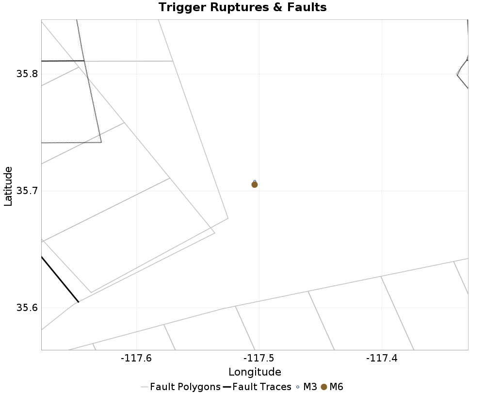
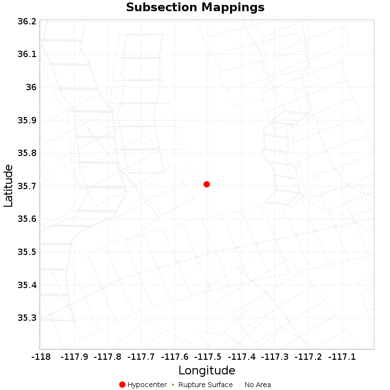

# ETAS Configuration for ComCat M6.4 (ci38443183), Point Sources

|   | ComCat M6.4 (ci38443183), Point Sources |
|-----|-----|
| Num Simulations | 100000 |
| Start Time | 2019/07/04 17:33:50 UTC |
| Start Time Epoch Milliseconds | 1562261630000 |
| Duration | 10 Years |
| Includes Spontaneous? | false |
| Historical Ruptures | *(none)* |

## Table Of Contents

* [Trigger Rupture Fault Map](#trigger-rupture-fault-map)
* [Fault Distances To Triggers](#fault-distances-to-triggers)
* [Possible Finite Rupture Subsection Mappings](#possible-finite-rupture-subsection-mappings)
* [JSON Input File](#json-input-file)

## Trigger Rupture Fault Map
*[(top)](#table-of-contents)*


## Fault Distances To Triggers
*[(top)](#table-of-contents)*

| Section Name | Strike, Dip, Rake | # Hypos In Poly | Max Mag w/ Hypo In Poly | # Surfs In Poly | Max Mag w/ Surf In Poly | Min Dist To Any (km) | Min Poly Dist To Any (km) | Min Dist To Largest (km) | Min Poly Dist To Largest (km) |
|-----|-----|-----|-----|-----|-----|-----|-----|-----|-----|
| Airport Lake | 358, 50, -90 | 0 |  | 0 |  | 12.124 | 2.716 | 12.221 | 2.716 |
| Little Lake | 327, 90, 180 | 0 |  | 0 |  | 16.936 | 4.928 | 16.936 | 4.928 |
| Tank Canyon | 189, 50, -90 | 0 |  | 0 |  | 17.039 | 16.895 | 17.039 | 16.895 |
| So Sierra Nevada | 360, 50, -90 | 0 |  | 0 |  | 22.039 | 21.742 | 22.039 | 21.742 |
| Garlock (Central) | 70, 90, 0 | 0 |  | 0 |  | 22.766 | 10.797 | 22.766 | 10.797 |

## Possible Finite Rupture Subsection Mappings
*[(top)](#table-of-contents)*

This gives any possible finite rupture surface subsection mappings. In the plot below, potentially suggested subsections are outlined in green, and all subsections for which any of this rupture is within the fault polygon are in gray. Suggested sections are those for which the area of the input rupture within the polygon is at least 50.0 % of the sub section area

Overlapping polygons are removed according to the mean distance of the actual subsection surface, with the polygons of closer sections masking out the polygons of further sections

As this is a point source, there will be no matches, but sections within 25km will be listed



| Section Index | Section Name | Suggested Match? | Section Area | Sect Distance To Rup | Hypocenter in Polygon? |
|-----|-----|-----|-----|-----|-----|
| 0 | Airport Lake, Subsection 0 | no | 120.19 | mean=19.4 [12.34 26.92] [km] | no |
| 1 | Airport Lake, Subsection 1 | no | 120.19 | mean=24.55 [17.47 31.93] [km] | no |
| 2 | Airport Lake, Subsection 2 | no | 120.19 | mean=30.57 [24.05 37.04] [km] | no |
| 602 | Garlock (Central), Subsection 8 | no | 61.94 | mean=26.66 [24.59 29.42] [km] | no |
| 603 | Garlock (Central), Subsection 9 | no | 61.94 | mean=24.43 [22.96 26.78] [km] | no |
| 604 | Garlock (Central), Subsection 10 | no | 61.94 | mean=23.57 [22.77 25.16] [km] | no |
| 605 | Garlock (Central), Subsection 11 | no | 61.94 | mean=24.11 [22.86 26.22] [km] | no |
| 606 | Garlock (Central), Subsection 12 | no | 61.94 | mean=25.86 [24.03 28.43] [km] | no |
| 1125 | Little Lake, Subsection 0 | no | 73.13 | mean=17.73 [16.93 19.59] [km] | no |
| 1126 | Little Lake, Subsection 1 | no | 73.13 | mean=18.97 [17.35 21.61] [km] | no |
| 1127 | Little Lake, Subsection 2 | no | 73.13 | mean=21.98 [19.69 25.07] [km] | no |
| 1128 | Little Lake, Subsection 3 | no | 73.13 | mean=26.17 [23.5 29.47] [km] | no |
| 2407 | So Sierra Nevada, Subsection 5 | no | 138.31 | mean=28.91 [22.07 37.06] [km] | no |
| 2408 | So Sierra Nevada, Subsection 6 | no | 138.31 | mean=28.97 [22.22 36.39] [km] | no |
| 2484 | Tank Canyon, Subsection 1 | no | 48.93 | mean=27.5 [22.93 32.52] [km] | no |
| 2485 | Tank Canyon, Subsection 2 | no | 48.93 | mean=24.13 [19.59 28.58] [km] | no |
| 2486 | Tank Canyon, Subsection 3 | no | 48.93 | mean=21.83 [18.15 26.17] [km] | no |
| 2487 | Tank Canyon, Subsection 4 | no | 48.93 | mean=22.25 [18.32 26.43] [km] | no |
| 2488 | Tank Canyon, Subsection 5 | no | 48.93 | mean=22.59 [18.54 26.98] [km] | no |
| 2489 | Tank Canyon, Subsection 6 | no | 48.93 | mean=21.74 [16.86 26.95] [km] | no |

## JSON Input File
*[(top)](#table-of-contents)*

```
{
  "numSimulations": 100000,
  "duration": 10.0,
  "startTimeMillis": 1562261630000,
  "includeSpontaneous": false,
  "randomSeed": 1566347095763,
  "binaryOutput": true,
  "binaryOutputFilters": [
    {
      "prefix": "results_complete",
      "descendantsOnly": false
    },
    {
      "prefix": "results_m5_preserve_chain",
      "minMag": 5.0,
      "preserveChainBelowMag": true,
      "descendantsOnly": false
    }
  ],
  "forceRecalc": false,
  "simulationName": "ComCat M6.4 (ci38443183), Point Sources",
  "numRetries": 3,
  "outputDir": "${ETAS_SIM_DIR}/2019_08_20-ComCatM6p4_ci38443183_PointSources-noSpont-full_td-scale1.14",
  "triggerRuptures": [
    {
      "occurrenceTimeMillis": 1562259775340,
      "comcatEventID": "ci38443095",
      "mag": 3.98,
      "latitude": 35.708,
      "longitude": -117.5036667,
      "depth": 10.58
    },
    {
      "occurrenceTimeMillis": 1562261629000,
      "comcatEventID": "ci38443183",
      "mag": 6.4,
      "latitude": 35.7053333,
      "longitude": -117.5038333,
      "depth": 10.5
    }
  ],
  "cacheDir": "${ETAS_LAUNCHER}/inputs/cache_fm3p1_ba",
  "fssFile": "${ETAS_LAUNCHER}/inputs/2013_05_10-ucerf3p3-production-10runs_COMPOUND_SOL_FM3_1_SpatSeisU3_MEAN_BRANCH_AVG_SOL.zip",
  "probModel": "FULL_TD",
  "applySubSeisForSupraNucl": true,
  "totRateScaleFactor": 1.14,
  "gridSeisCorr": true,
  "timeIndependentERF": false,
  "griddedOnly": false,
  "imposeGR": false,
  "includeIndirectTriggering": true,
  "gridSeisDiscr": 0.1,
  "catalogCompletenessModel": "RELAXED",
  "configCommand": "u3etas_comcat_event_config_builder.sh --event-id ci38443183 --num-simulations 100000 --days-before 7 --hpc-site USC_HPC --nodes 36 --hours 24 --queue scec_hiprio",
  "configTime": 1566347095763,
  "comcatMetadata": {
    "region": {
      "centerLatitude": 35.7053333,
      "centerLongitude": -117.5038333,
      "radius": 15.703628043335499
    },
    "eventID": "ci38443183",
    "minDepth": -10.0,
    "maxDepth": 24.0,
    "minMag": 2.5,
    "startTime": 1561656829000,
    "endTime": 1562261629001
  }
}
```

