# Parent Section Magnitude-Probability Distributions

Only fault sections with at least one triggered aftershock are plotted. Sections are sorted by total supraseismogenic trigger rate (decreasing)

## Table Of Contents

* [Tank Canyon](#tank-canyon)
* [Garlock (Central)](#garlock-central)
* [Panamint Valley](#panamint-valley)
* [Owl Lake](#owl-lake)
* [Little Lake](#little-lake)
* [Garlock (East)](#garlock-east)
* [Blackwater](#blackwater)
* [Ash Hill](#ash-hill)
* [Hunter Mountain-Saline Valley](#hunter-mountain-saline-valley)
* [Airport Lake](#airport-lake)
* [Gravel Hills-Harper Lk](#gravel-hills-harper-lk)
* [Goldstone Lake](#goldstone-lake)
* [McLean Lake](#mclean-lake)
* [Coyote Canyon](#coyote-canyon)
* [Garlock (West)](#garlock-west)
* [Lenwood-Lockhart-Old Woman Springs](#lenwood-lockhart-old-woman-springs)
* [Nelson Lake](#nelson-lake)
* [San Andreas (Mojave S)](#san-andreas-mojave-s)
* [Death Valley (So)](#death-valley-so)
* [So Sierra Nevada](#so-sierra-nevada)
* [Paradise](#paradise)
* [Bicycle Lake](#bicycle-lake)
* [Towne Pass](#towne-pass)
* [San Andreas (Mojave N)](#san-andreas-mojave-n)
* [Death Valley (Black Mtns Frontal)](#death-valley-black-mtns-frontal)
* [Garlic Springs](#garlic-springs)
* [Helendale-So Lockhart](#helendale-so-lockhart)
* [San Andreas (San Bernardino N)](#san-andreas-san-bernardino-n)
* [Death Valley (No)](#death-valley-no)
* [Coyote Lake](#coyote-lake)
* [Ludlow](#ludlow)
* [San Andreas (Parkfield)](#san-andreas-parkfield)
* [Manix-Afton Hills](#manix-afton-hills)
* [Elsinore (Glen Ivy) rev](#elsinore-glen-ivy-rev)
* [San Andreas (Big Bend)](#san-andreas-big-bend)
* [Cleghorn Lake](#cleghorn-lake)
* [Cady](#cady)
* [Mission Ridge-Arroyo Parida-Santa Ana](#mission-ridge-arroyo-parida-santa-ana)
* [San Andreas (San Bernardino S)](#san-andreas-san-bernardino-s)
* [Death Valley (Fish Lake Valley)](#death-valley-fish-lake-valley)
* [Pinto Mtn](#pinto-mtn)
* [Lake Isabella (Seismicity)](#lake-isabella-seismicity)
* [Santa Ynez (West)](#santa-ynez-west)
* [Red Pass](#red-pass)
* [San Andreas (Cholame) rev](#san-andreas-cholame-rev)
* [Rose Canyon](#rose-canyon)
* [Red Mountain](#red-mountain)
* [Santa Ynez (East)](#santa-ynez-east)
* [San Andreas (Carrizo) rev](#san-andreas-carrizo-rev)
* [San Jacinto (San Bernardino)](#san-jacinto-san-bernardino)
* [Cleghorn Pass](#cleghorn-pass)
* [San Jacinto (Stepovers Combined)](#san-jacinto-stepovers-combined)
* [Calico-Hidalgo](#calico-hidalgo)
* [San Jacinto (Anza) rev](#san-jacinto-anza-rev)
* [Baker](#baker)
* [Big Pine (Central)](#big-pine-central)
* [Sheephole](#sheephole)
* [White Wolf (Extension)](#white-wolf-extension)
* [San Jacinto (San Jacinto Valley) rev](#san-jacinto-san-jacinto-valley-rev)
* [San Andreas (Creeping Section) 2011 CFM](#san-andreas-creeping-section-2011-cfm)
* [White Mountains](#white-mountains)
* [Sierra Nevada  (No Extension)](#sierra-nevada--no-extension)
* [Big Pine (East)](#big-pine-east)
* [Oceanic - West Huasna](#oceanic---west-huasna)
* [Scodie Lineament](#scodie-lineament)
* [Elsinore (Stepovers Combined)](#elsinore-stepovers-combined)
* [Pisgah-Bullion Mtn-Mesquite Lk](#pisgah-bullion-mtn-mesquite-lk)
* [Pitas Point (Lower West)](#pitas-point-lower-west)
* [San Jacinto (Clark) rev](#san-jacinto-clark-rev)
* [Owens Valley](#owens-valley)
* [Ventura-Pitas Point](#ventura-pitas-point)
* [Coronado Bank alt1](#coronado-bank-alt1)
* [Great Valley 09 (Laguna Seca)](#great-valley-09-laguna-seca)
* [San Andreas (Coachella) rev](#san-andreas-coachella-rev)
* [Robinson Creek](#robinson-creek)
* [North Frontal  (East)](#north-frontal--east)
* [San Cayetano](#san-cayetano)
* [Chino alt 1](#chino-alt-1)
* [Eureka Peak](#eureka-peak)
* [Los Alamos extension](#los-alamos-extension)
* [Rinconada 2011 CFM](#rinconada-2011-cfm)
* [Hosgri](#hosgri)
* [Almanor 2011 CFM](#almanor-2011-cfm)
* [Hunting Creek - Berryessa 2011 CFM](#hunting-creek---berryessa-2011-cfm)
* [Pitas Point (Lower)-Montalvo](#pitas-point-lower-montalvo)
* [Brawley (Seismic Zone) alt 1](#brawley-seismic-zone-alt-1)
* [Great Valley 10 (Panoche)](#great-valley-10-panoche)
* [Newport-Inglewood (Offshore)](#newport-inglewood-offshore)
* [Pleito](#pleito)
* [Kern Canyon (South Kern) 2011](#kern-canyon-south-kern-2011)
* [Los Alamos 2011 CFM](#los-alamos-2011-cfm)
* [San Andreas (San Gorgonio Pass-Garnet HIll)](#san-andreas-san-gorgonio-pass-garnet-hill)
* [North Frontal  (West)](#north-frontal--west)
* [Elsinore (Temecula) rev](#elsinore-temecula-rev)
* [La Panza 2011](#la-panza-2011)
* [Santa Ynez River](#santa-ynez-river)
* [Ortigalita (South)](#ortigalita-south)
* [Imperial](#imperial)
* [San Gorgonio Pass](#san-gorgonio-pass)
* [Great Valley 07 (Orestimba)](#great-valley-07-orestimba)
* [Calaveras (So) 2011 CFM](#calaveras-so-2011-cfm)
* [Surprise Valley 2011 CFM](#surprise-valley-2011-cfm)
* [Johnson Valley (No) 2011 rev](#johnson-valley-no-2011-rev)
* [Sierra Madre](#sierra-madre)
* [Simi-Santa Rosa](#simi-santa-rosa)
* [San Andreas (North Branch Mill Creek)](#san-andreas-north-branch-mill-creek)
* [Dry Mountain](#dry-mountain)
* [Palos Verdes](#palos-verdes)
* [Green Valley 2011 CFM](#green-valley-2011-cfm)
* [Tin Mountain](#tin-mountain)
* [San Clemente](#san-clemente)
* [Earthquake Valley (So Extension)](#earthquake-valley-so-extension)
* [Anacapa-Dume alt 1](#anacapa-dume-alt-1)
* [Newport-Inglewood alt 1](#newport-inglewood-alt-1)
* [San Jacinto (Coyote Creek)](#san-jacinto-coyote-creek)
* [Elysian Park (Upper)](#elysian-park-upper)
* [Casmalia 2011 CFM](#casmalia-2011-cfm)
* [Raymond](#raymond)
* [South Cuyama](#south-cuyama)
* [Hartley Springs 2011 CFM](#hartley-springs-2011-cfm)
* [Quien Sabe 2011 CFM](#quien-sabe-2011-cfm)
* [Whittier alt 1](#whittier-alt-1)
* [Pine Mtn](#pine-mtn)
* [Cucamonga](#cucamonga)
* [Deep Springs](#deep-springs)

## Tank Canyon
*[(top)](#table-of-contents)*

| 1 Week | 1 Month | 1 Year | 10 Year |
|-----|-----|-----|-----|
|  |  |  | 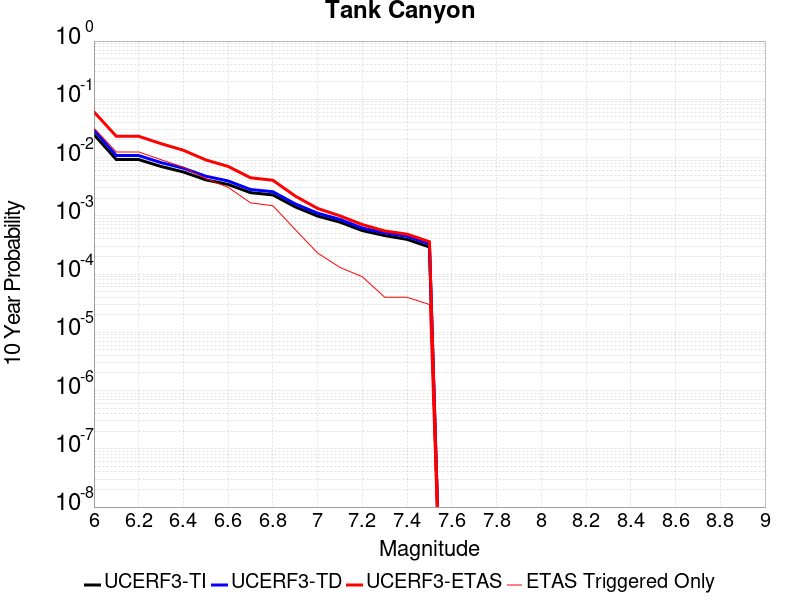 |

| Magnitude | 1 wk TI Prob | 1 wk TD Prob | 1 wk ETAS Prob | 1 wk ETAS/TD Gain | 1 wk ETAS Triggered Only | 1 mo TI Prob | 1 mo TD Prob | 1 mo ETAS Prob | 1 mo ETAS/TD Gain | 1 mo ETAS Triggered Only | 1 yr TI Prob | 1 yr TD Prob | 1 yr ETAS Prob | 1 yr ETAS/TD Gain | 1 yr ETAS Triggered Only | 10 yr TI Prob | 10 yr TD Prob | 10 yr ETAS Prob | 10 yr ETAS/TD Gain | 10 yr ETAS Triggered Only |
|-----|-----|-----|-----|-----|-----|-----|-----|-----|-----|-----|-----|-----|-----|-----|-----|-----|-----|-----|-----|-----|
| 6.0 | 4.8284557E-5 | 5.7964142E-5 | 0.0121772615 | 210.08267 | 0.01212 | 2.0691741E-4 | 2.4839793E-4 | 0.016114457 | 64.87355 | 0.01587 | 0.0025163088 | 0.0030207178 | 0.026409851 | 8.742907 | 0.02346 | 0.02488006 | 0.029863678 | 0.06096625 | 2.0414848 | 0.03206 |
| 6.1 | 1.7796336E-5 | 2.0873285E-5 | 0.00449078 | 215.14485 | 0.00447 | 7.626778E-5 | 8.9454086E-5 | 0.0060089245 | 67.17328 | 0.00592 | 9.281647E-4 | 0.0010885975 | 0.010158713 | 9.331927 | 0.00908 | 0.009242975 | 0.010836816 | 0.023191465 | 2.1400626 | 0.01249 |
| 6.2 | 1.7796336E-5 | 2.0873285E-5 | 0.00449078 | 215.14485 | 0.00447 | 7.626778E-5 | 8.9454086E-5 | 0.0060089245 | 67.17328 | 0.00592 | 9.281647E-4 | 0.0010885975 | 0.010158713 | 9.331927 | 0.00908 | 0.009242975 | 0.010836816 | 0.023191465 | 2.1400626 | 0.01249 |
| 6.3 | 1.3515912E-5 | 1.5759586E-5 | 0.0032657085 | 207.22043 | 0.00325 | 5.792405E-5 | 6.753947E-5 | 0.004407246 | 65.25439 | 0.00434 | 7.049971E-4 | 8.2200643E-4 | 0.0074865236 | 9.107621 | 0.00667 | 0.007027647 | 0.0081923455 | 0.017316977 | 2.1137996 | 0.0092 |
| 6.4 | 1.0870146E-5 | 1.2618064E-5 | 0.002392588 | 189.61609 | 0.00238 | 4.658551E-5 | 5.4076394E-5 | 0.0032739022 | 60.54217 | 0.00322 | 5.67031E-4 | 6.5819896E-4 | 0.005634921 | 8.561122 | 0.00498 | 0.005655863 | 0.0065645785 | 0.013349743 | 2.0336025 | 0.00683 |
| 6.5 | 7.964826E-6 | 9.19615E-6 | 0.0015091824 | 164.11024 | 0.0015 | 3.4134522E-5 | 3.9411534E-5 | 0.00210933 | 53.520622 | 0.00207 | 4.1550855E-4 | 4.7974035E-4 | 0.0036582148 | 7.625406 | 0.00318 | 0.0041473247 | 0.004788422 | 0.009117592 | 1.9040912 | 0.00435 |
| 6.6 | 6.6317E-6 | 7.6123542E-6 | 0.0010376045 | 136.30534 | 0.00103 | 2.8421264E-5 | 3.262402E-5 | 0.0014525776 | 44.524796 | 0.00142 | 3.4597394E-4 | 3.971341E-4 | 0.0026562365 | 6.688513 | 0.00226 | 0.0034543579 | 0.0039654695 | 0.007043216 | 1.7761368 | 0.00309 |
| 6.7 | 4.793663E-6 | 5.4308466E-6 | 6.054276E-4 | 111.479416 | 6.0E-4 | 2.0544108E-5 | 2.3274873E-5 | 8.33256E-4 | 35.800667 | 8.1E-4 | 2.500958E-4 | 2.8333912E-4 | 0.0014630047 | 5.1634407 | 0.00118 | 0.0024981452 | 0.0028305429 | 0.004495816 | 1.5883228 | 0.00167 |
| 6.8 | 4.382823E-6 | 4.9693126E-6 | 5.649665E-4 | 113.691086 | 5.6E-4 | 1.8783392E-5 | 2.1296904E-5 | 7.5128133E-4 | 35.276554 | 7.3E-4 | 2.286638E-4 | 2.592632E-4 | 0.001308991 | 5.048888 | 0.00105 | 0.0022842865 | 0.0025903475 | 0.004076488 | 1.5737224 | 0.00149 |
| 6.9 | 2.729601E-6 | 3.0735741E-6 | 2.230729E-4 | 72.57768 | 2.2E-4 | 1.1698237E-5 | 1.3172401E-5 | 3.0316858E-4 | 23.015438 | 2.9E-4 | 1.4241673E-4 | 1.6036342E-4 | 5.902944E-4 | 3.6809797 | 4.3E-4 | 0.001423255 | 0.0016027166 | 0.002181787 | 1.3613056 | 5.8E-4 |
| 7.0 | 1.8987357E-6 | 2.1269682E-6 | 8.21268E-5 | 38.61214 | 8.0E-5 | 8.137413E-6 | 9.11555E-6 | 1.2911446E-4 | 14.164198 | 1.2E-4 | 9.90685E-5 | 1.1097687E-4 | 2.909569E-4 | 2.6217797 | 1.8E-4 | 9.902435E-4 | 0.0011092832 | 0.001339028 | 1.2071111 | 2.3E-4 |
| 7.1 | 1.4928986E-6 | 1.6641504E-6 | 6.1664054E-5 | 37.05437 | 6.0E-5 | 6.398121E-6 | 7.132057E-6 | 8.7131484E-5 | 12.21688 | 8.0E-5 | 7.789434E-5 | 8.6829925E-5 | 1.8682124E-4 | 2.1515768 | 1.0E-4 | 7.786704E-4 | 8.6801784E-4 | 9.97905E-4 | 1.1496365 | 1.3E-4 |
| 7.2 | 1.069082E-6 | 1.182876E-6 | 4.118283E-5 | 34.815845 | 4.0E-5 | 4.581772E-6 | 5.0694616E-6 | 5.506921E-5 | 10.86293 | 5.0E-5 | 5.5781646E-5 | 6.171948E-5 | 1.2171578E-4 | 1.9720805 | 6.0E-5 | 5.576765E-4 | 6.1707565E-4 | 7.070201E-4 | 1.1457592 | 9.0E-5 |
| 7.3 | 8.776551E-7 | 9.77015E-7 | 3.0976986E-5 | 31.705744 | 3.0E-5 | 3.7613736E-6 | 4.187203E-6 | 3.4187076E-5 | 8.164657 | 3.0E-5 | 4.579376E-5 | 5.0978528E-5 | 9.0976486E-5 | 1.7846041 | 4.0E-5 | 4.5784327E-4 | 5.0971936E-4 | 5.4969895E-4 | 1.0784346 | 4.0E-5 |
| 7.4 | 7.55721E-7 | 8.510383E-7 | 3.0851013E-5 | 36.251026 | 3.0E-5 | 3.2388E-6 | 3.647305E-6 | 3.3647197E-5 | 9.225222 | 3.0E-5 | 3.9431678E-5 | 4.440555E-5 | 8.440377E-5 | 1.9007483 | 4.0E-5 | 3.942468E-4 | 4.4401764E-4 | 4.8399987E-4 | 1.0900465 | 4.0E-5 |
| 7.5 | 5.587665E-7 | 6.305732E-7 | 2.0630561E-5 | 32.717155 | 2.0E-5 | 2.3947114E-6 | 2.7024564E-6 | 2.2702403E-5 | 8.400654 | 2.0E-5 | 2.915522E-5 | 3.2902408E-5 | 6.290142E-5 | 1.9117573 | 3.0E-5 | 2.9151395E-4 | 3.2902407E-4 | 3.590142E-4 | 1.0911487 | 3.0E-5 |

## Garlock (Central)
*[(top)](#table-of-contents)*

| 1 Week | 1 Month | 1 Year | 10 Year |
|-----|-----|-----|-----|
|  |  |  | 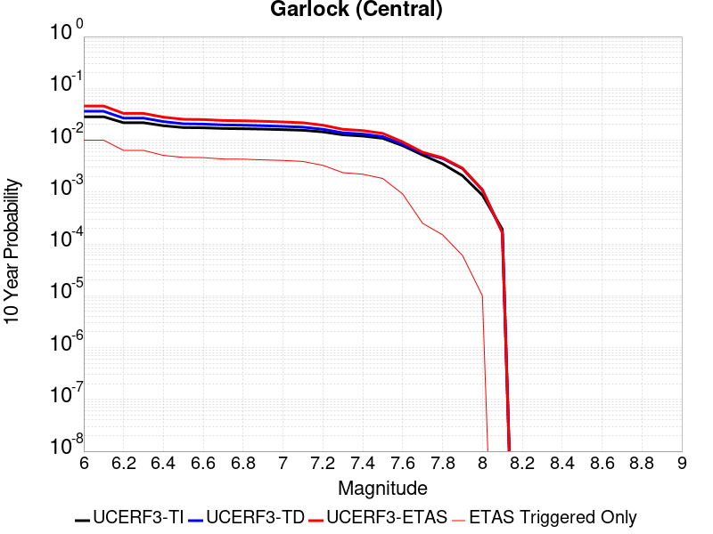 |

| Magnitude | 1 wk TI Prob | 1 wk TD Prob | 1 wk ETAS Prob | 1 wk ETAS/TD Gain | 1 wk ETAS Triggered Only | 1 mo TI Prob | 1 mo TD Prob | 1 mo ETAS Prob | 1 mo ETAS/TD Gain | 1 mo ETAS Triggered Only | 1 yr TI Prob | 1 yr TD Prob | 1 yr ETAS Prob | 1 yr ETAS/TD Gain | 1 yr ETAS Triggered Only | 10 yr TI Prob | 10 yr TD Prob | 10 yr ETAS Prob | 10 yr ETAS/TD Gain | 10 yr ETAS Triggered Only |
|-----|-----|-----|-----|-----|-----|-----|-----|-----|-----|-----|-----|-----|-----|-----|-----|-----|-----|-----|-----|-----|
| 6.0 | 5.5131142E-5 | 7.0246155E-5 | 0.0036899918 | 52.529446 | 0.00362 | 2.3625491E-4 | 3.010206E-4 | 0.005109573 | 16.974163 | 0.00481 | 0.0028726095 | 0.003658831 | 0.0109719755 | 2.9987652 | 0.00734 | 0.028357591 | 0.036142167 | 0.045800023 | 1.2672185 | 0.01002 |
| 6.1 | 5.5131142E-5 | 7.0246155E-5 | 0.0036899918 | 52.529446 | 0.00362 | 2.3625491E-4 | 3.010206E-4 | 0.005109573 | 16.974163 | 0.00481 | 0.0028726095 | 0.003658831 | 0.0109719755 | 2.9987652 | 0.00734 | 0.028357591 | 0.036142167 | 0.045800023 | 1.2672185 | 0.01002 |
| 6.2 | 4.216245E-5 | 5.1660383E-5 | 0.0023215432 | 44.93856 | 0.00227 | 1.806837E-4 | 2.2138303E-4 | 0.0033306945 | 15.044941 | 0.00311 | 0.0021976046 | 0.0026920382 | 0.007299601 | 2.711552 | 0.00462 | 0.021759989 | 0.026709503 | 0.032909364 | 1.232122 | 0.00637 |
| 6.3 | 4.216245E-5 | 5.1660383E-5 | 0.0023215432 | 44.93856 | 0.00227 | 1.806837E-4 | 2.2138303E-4 | 0.0033306945 | 15.044941 | 0.00311 | 0.0021976046 | 0.0026920382 | 0.007299601 | 2.711552 | 0.00462 | 0.021759989 | 0.026709503 | 0.032909364 | 1.232122 | 0.00637 |
| 6.4 | 3.6858168E-5 | 4.4109085E-5 | 0.0018240305 | 41.35272 | 0.00178 | 1.5795401E-4 | 1.8902538E-4 | 0.0026585585 | 14.064559 | 0.00247 | 0.0019213937 | 0.00229898 | 0.005910658 | 2.5709913 | 0.00362 | 0.019048655 | 0.022869706 | 0.027853072 | 1.2179024 | 0.0051 |
| 6.5 | 3.39199E-5 | 4.001738E-5 | 0.0016799518 | 41.980553 | 0.00164 | 1.453629E-4 | 1.7149192E-4 | 0.0024610993 | 14.3511095 | 0.00229 | 0.0017683565 | 0.0020859365 | 0.0053590946 | 2.5691552 | 0.00328 | 0.017543508 | 0.02075889 | 0.025331946 | 1.2202939 | 0.00467 |
| 6.6 | 3.3571985E-5 | 3.9471543E-5 | 0.0016594076 | 42.040607 | 0.00162 | 1.4387199E-4 | 1.691529E-4 | 0.002438769 | 14.417541 | 0.00227 | 0.0017502342 | 0.0020575132 | 0.0053008264 | 2.5763268 | 0.00325 | 0.017365133 | 0.020480096 | 0.025005478 | 1.2209649 | 0.00462 |
| 6.7 | 3.2580007E-5 | 3.8087983E-5 | 0.0015380308 | 40.381 | 0.0015 | 1.3962112E-4 | 1.6322412E-4 | 0.0022928764 | 14.047412 | 0.00213 | 0.0016985617 | 0.0019854638 | 0.0050294083 | 2.533115 | 0.00305 | 0.016856372 | 0.019770922 | 0.024025118 | 1.2151743 | 0.00434 |
| 6.8 | 3.2185937E-5 | 3.751518E-5 | 0.0015374589 | 40.982315 | 0.0015 | 1.3793244E-4 | 1.6076956E-4 | 0.0022804288 | 14.184456 | 0.00212 | 0.0016780337 | 0.0019556335 | 0.0049697277 | 2.5412366 | 0.00302 | 0.016654192 | 0.019477926 | 0.023703976 | 1.2169662 | 0.00431 |
| 6.9 | 3.165394E-5 | 3.6719717E-5 | 0.0015166653 | 41.30384 | 0.00148 | 1.3565269E-4 | 1.5736085E-4 | 0.0022270351 | 14.152409 | 0.00207 | 0.0016503202 | 0.0019142062 | 0.0048585595 | 2.538159 | 0.00295 | 0.01638118 | 0.01907158 | 0.02317186 | 1.2149943 | 0.00418 |
| 7.0 | 3.0903822E-5 | 3.5624882E-5 | 0.0014855732 | 41.70044 | 0.00145 | 1.3243823E-4 | 1.5266925E-4 | 0.0021823593 | 14.294687 | 0.00203 | 0.0016112428 | 0.0018571847 | 0.0047418172 | 2.5532289 | 0.00289 | 0.015996104 | 0.018513601 | 0.022518067 | 1.2162985 | 0.00408 |
| 7.1 | 3.0069863E-5 | 3.4391156E-5 | 0.0013843448 | 40.25293 | 0.00135 | 1.2886449E-4 | 1.4738245E-4 | 0.0020471024 | 13.8897295 | 0.0019 | 0.0015677959 | 0.0017929256 | 0.004537995 | 2.531056 | 0.00275 | 0.01556781 | 0.017881276 | 0.021701718 | 1.213656 | 0.00389 |
| 7.2 | 2.7957109E-5 | 3.128042E-5 | 0.0012012438 | 38.402424 | 0.00117 | 1.1981068E-4 | 1.3405216E-4 | 0.001753835 | 13.083229 | 0.00162 | 0.0014577188 | 0.0016308826 | 0.0039670663 | 2.4324658 | 0.00234 | 0.014481937 | 0.016284546 | 0.019511132 | 1.198138 | 0.00328 |
| 7.3 | 2.4519275E-5 | 2.671366E-5 | 8.36692E-4 | 31.320755 | 8.1E-4 | 1.0507837E-4 | 1.1448217E-4 | 0.0012643505 | 11.044082 | 0.00115 | 0.0012785783 | 0.001392944 | 0.0030706038 | 2.2043986 | 0.00168 | 0.012712469 | 0.013928749 | 0.016265737 | 1.1677817 | 0.00237 |
| 7.4 | 2.3225532E-5 | 2.5198244E-5 | 7.7517936E-4 | 30.76323 | 7.5E-4 | 9.95342E-5 | 1.0798809E-4 | 0.0011678736 | 10.814837 | 0.00106 | 0.0012111551 | 0.0013139764 | 0.0028719266 | 2.1856759 | 0.00156 | 0.012045753 | 0.013146298 | 0.015327245 | 1.1658982 | 0.00221 |
| 7.5 | 2.097765E-5 | 2.2482514E-5 | 6.4246857E-4 | 28.576366 | 6.2E-4 | 8.9901114E-5 | 9.635014E-5 | 9.862644E-4 | 10.236253 | 8.9E-4 | 0.0010939965 | 0.0011724435 | 0.0024409546 | 2.0819378 | 0.00127 | 0.010886264 | 0.011740618 | 0.013549132 | 1.1540391 | 0.00183 |
| 7.6 | 1.511254E-5 | 1.5990141E-5 | 3.1598535E-4 | 19.761261 | 3.0E-4 | 6.476642E-5 | 6.852741E-5 | 5.284959E-4 | 7.712182 | 4.6E-4 | 7.882459E-4 | 8.340097E-4 | 0.0015034509 | 1.8026779 | 6.7E-4 | 0.007854558 | 0.008383859 | 0.009296146 | 1.1088147 | 9.2E-4 |
| 7.7 | 9.934069E-6 | 1.0677792E-5 | 1.1067672E-4 | 10.365132 | 1.0E-4 | 4.2573887E-5 | 4.576116E-5 | 1.7575521E-4 | 3.840707 | 1.3E-4 | 5.182138E-4 | 5.570001E-4 | 7.468943E-4 | 1.3409231 | 1.9E-4 | 0.00517007 | 0.005627016 | 0.0058756093 | 1.0441785 | 2.5E-4 |
| 7.8 | 6.7562896E-6 | 8.427758E-6 | 7.842717E-5 | 9.305817 | 7.0E-5 | 2.8955206E-5 | 3.6118465E-5 | 1.3611485E-4 | 3.768567 | 1.0E-4 | 3.5247262E-4 | 4.3965373E-4 | 5.5960094E-4 | 1.272822 | 1.2E-4 | 0.0035191406 | 0.004446126 | 0.004595459 | 1.0335872 | 1.5E-4 |
| 7.9 | 3.975453E-6 | 5.3706963E-6 | 4.537048E-5 | 8.447783 | 4.0E-5 | 1.7037546E-5 | 2.3017068E-5 | 6.3016145E-5 | 2.7378008 | 4.0E-5 | 2.0741238E-4 | 2.8019687E-4 | 3.3018284E-4 | 1.178396 | 5.0E-5 | 0.002072189 | 0.002833258 | 0.002893088 | 1.0211171 | 6.0E-5 |
| 8.0 | 1.6729537E-6 | 2.077398E-6 | 1.20773775E-5 | 5.813704 | 1.0E-5 | 7.169782E-6 | 8.903104E-6 | 1.8903014E-5 | 2.1231937 | 1.0E-5 | 8.7288594E-5 | 1.0838993E-4 | 1.1838885E-4 | 1.0922495 | 1.0E-5 | 8.7254314E-4 | 0.0010967436 | 0.0011067326 | 1.009108 | 1.0E-5 |
| 8.1 | 3.6733252E-7 | 3.1487303E-7 | 3.1487303E-7 | 1.0 | 0.0 | 1.5742813E-6 | 1.3494553E-6 | 1.3494553E-6 | 1.0 | 0.0 | 1.9166706E-5 | 1.642951E-5 | 1.642951E-5 | 1.0 | 0.0 | 1.9165053E-4 | 1.6628111E-4 | 1.6628111E-4 | 1.0 | 0.0 |

## Panamint Valley
*[(top)](#table-of-contents)*

| 1 Week | 1 Month | 1 Year | 10 Year |
|-----|-----|-----|-----|
|  |  |  |  |

| Magnitude | 1 wk TI Prob | 1 wk TD Prob | 1 wk ETAS Prob | 1 wk ETAS/TD Gain | 1 wk ETAS Triggered Only | 1 mo TI Prob | 1 mo TD Prob | 1 mo ETAS Prob | 1 mo ETAS/TD Gain | 1 mo ETAS Triggered Only | 1 yr TI Prob | 1 yr TD Prob | 1 yr ETAS Prob | 1 yr ETAS/TD Gain | 1 yr ETAS Triggered Only | 10 yr TI Prob | 10 yr TD Prob | 10 yr ETAS Prob | 10 yr ETAS/TD Gain | 10 yr ETAS Triggered Only |
|-----|-----|-----|-----|-----|-----|-----|-----|-----|-----|-----|-----|-----|-----|-----|-----|-----|-----|-----|-----|-----|
| 6.0 | 3.0211835E-5 | 3.3984004E-5 | 0.0015839314 | 46.608143 | 0.00155 | 1.2947287E-4 | 1.4563776E-4 | 0.0023653144 | 16.241077 | 0.00222 | 0.0015751923 | 0.0017717272 | 0.0050558983 | 2.8536549 | 0.00329 | 0.015640736 | 0.017583862 | 0.022368228 | 1.2720885 | 0.00487 |
| 6.1 | 3.0211835E-5 | 3.3984004E-5 | 0.0015839314 | 46.608143 | 0.00155 | 1.2947287E-4 | 1.4563776E-4 | 0.0023653144 | 16.241077 | 0.00222 | 0.0015751923 | 0.0017717272 | 0.0050558983 | 2.8536549 | 0.00329 | 0.015640736 | 0.017583862 | 0.022368228 | 1.2720885 | 0.00487 |
| 6.2 | 3.0211835E-5 | 3.3984004E-5 | 0.0015839314 | 46.608143 | 0.00155 | 1.2947287E-4 | 1.4563776E-4 | 0.0023653144 | 16.241077 | 0.00222 | 0.0015751923 | 0.0017717272 | 0.0050558983 | 2.8536549 | 0.00329 | 0.015640736 | 0.017583862 | 0.022368228 | 1.2720885 | 0.00487 |
| 6.3 | 2.8573924E-5 | 3.2102194E-5 | 0.0015120547 | 47.101288 | 0.00148 | 1.2245393E-4 | 1.3757373E-4 | 0.0022772793 | 16.553156 | 0.00214 | 0.001489857 | 0.0016737011 | 0.004858362 | 2.9027655 | 0.00319 | 0.01479908 | 0.0166189 | 0.021240791 | 1.2781105 | 0.0047 |
| 6.4 | 2.8573924E-5 | 3.2102194E-5 | 0.0015120547 | 47.101288 | 0.00148 | 1.2245393E-4 | 1.3757373E-4 | 0.0022772793 | 16.553156 | 0.00214 | 0.001489857 | 0.0016737011 | 0.004858362 | 2.9027655 | 0.00319 | 0.01479908 | 0.0166189 | 0.021240791 | 1.2781105 | 0.0047 |
| 6.5 | 2.7468774E-5 | 3.0827894E-5 | 0.0015007826 | 48.68262 | 0.00147 | 1.1771801E-4 | 1.3211301E-4 | 0.0022018396 | 16.666334 | 0.00207 | 0.0014322745 | 0.0016073164 | 0.004672382 | 2.906946 | 0.00307 | 0.014230782 | 0.015964754 | 0.020353552 | 1.2749054 | 0.00446 |
| 6.6 | 2.6135967E-5 | 2.9251982E-5 | 0.001429211 | 48.858604 | 0.0014 | 1.1200648E-4 | 1.2535976E-4 | 0.0020951128 | 16.712801 | 0.00197 | 0.0013628257 | 0.001525213 | 0.004450744 | 2.918113 | 0.00293 | 0.013544982 | 0.015155199 | 0.019360486 | 1.2774816 | 0.00427 |
| 6.7 | 2.4498746E-5 | 2.7340879E-5 | 0.0013973034 | 51.10675 | 0.00137 | 1.04990395E-4 | 1.1717007E-4 | 0.0020069487 | 17.12851 | 0.00189 | 0.0012775084 | 0.0014256372 | 0.004161731 | 2.9192076 | 0.00274 | 0.012701893 | 0.014172449 | 0.018125618 | 1.2789333 | 0.00401 |
| 6.8 | 2.2244329E-5 | 2.4935209E-5 | 0.001274904 | 51.12867 | 0.00125 | 9.532935E-5 | 1.0686093E-4 | 0.0018166782 | 17.000397 | 0.00171 | 0.0011600169 | 0.0013002771 | 0.0037670655 | 2.897125 | 0.00247 | 0.011539802 | 0.012933811 | 0.016526733 | 1.2777929 | 0.00364 |
| 6.9 | 1.9902658E-5 | 2.2290018E-5 | 8.9227065E-4 | 40.030052 | 8.7E-4 | 8.529431E-5 | 9.5525254E-5 | 0.0013254078 | 13.874946 | 0.00123 | 0.0010379635 | 0.0011624179 | 0.0029503372 | 2.5381036 | 0.00179 | 0.010331288 | 0.011569883 | 0.014189223 | 1.226393 | 0.00265 |
| 7.0 | 1.8353881E-5 | 2.0565898E-5 | 7.005519E-4 | 34.063766 | 6.8E-4 | 7.865712E-5 | 8.813668E-5 | 0.0010680503 | 12.1181135 | 9.8E-4 | 9.5722964E-4 | 0.0010725536 | 0.0025010197 | 2.3318367 | 0.00143 | 0.009531168 | 0.010680015 | 0.012787267 | 1.197308 | 0.00213 |
| 7.1 | 1.7667631E-5 | 1.9772282E-5 | 6.4975984E-4 | 32.862156 | 6.3E-4 | 7.571623E-5 | 8.47357E-5 | 9.946586E-4 | 11.738365 | 9.1E-4 | 9.2145515E-4 | 0.0010311864 | 0.0023398355 | 2.2690713 | 0.00131 | 0.009176437 | 0.010270224 | 0.012229889 | 1.1908103 | 0.00198 |
| 7.2 | 1.6381597E-5 | 1.8157898E-5 | 6.18147E-4 | 34.04287 | 6.0E-4 | 7.020495E-5 | 7.781734E-5 | 9.277512E-4 | 11.922165 | 8.5E-4 | 8.544101E-4 | 9.470316E-4 | 0.0021458953 | 2.265917 | 0.0012 | 0.008511325 | 0.009435871 | 0.011218887 | 1.1889614 | 0.0018 |
| 7.3 | 1.4520491E-5 | 1.596645E-5 | 5.1595847E-4 | 32.315163 | 5.0E-4 | 6.222919E-5 | 6.842594E-5 | 7.7837735E-4 | 11.375471 | 7.1E-4 | 7.57377E-4 | 8.3278364E-4 | 0.0018319509 | 2.1997921 | 0.001 | 0.0075480095 | 0.008300997 | 0.00980838 | 1.1815906 | 0.00152 |
| 7.4 | 1.2852287E-5 | 1.4145376E-5 | 4.8413873E-4 | 34.225937 | 4.7E-4 | 5.5080065E-5 | 6.062172E-5 | 7.405805E-4 | 12.216422 | 6.8E-4 | 6.7039346E-4 | 7.378353E-4 | 0.001697127 | 2.3001432 | 9.6E-4 | 0.0066837464 | 0.007358031 | 0.0087874355 | 1.1942645 | 0.00144 |
| 7.5 | 1.1637851E-5 | 1.2836758E-5 | 4.528311E-4 | 35.276127 | 4.4E-4 | 4.987555E-5 | 5.5013606E-5 | 7.0497784E-4 | 12.814609 | 6.5E-4 | 6.070656E-4 | 6.696005E-4 | 0.0015889845 | 2.3730335 | 9.2E-4 | 0.006054099 | 0.006679987 | 0.008060702 | 1.2066942 | 0.00139 |
| 7.6 | 3.0068115E-6 | 3.3329961E-6 | 1.533325E-4 | 46.004402 | 1.5E-4 | 1.2886271E-5 | 1.4284232E-5 | 2.542808E-4 | 17.801504 | 2.4E-4 | 1.5687906E-4 | 1.7390393E-4 | 5.2384305E-4 | 3.0122554 | 3.5E-4 | 0.0015676835 | 0.0017402826 | 0.002199482 | 1.2638649 | 4.6E-4 |

## Owl Lake
*[(top)](#table-of-contents)*

| 1 Week | 1 Month | 1 Year | 10 Year |
|-----|-----|-----|-----|
|  |  |  |  |

| Magnitude | 1 wk TI Prob | 1 wk TD Prob | 1 wk ETAS Prob | 1 wk ETAS/TD Gain | 1 wk ETAS Triggered Only | 1 mo TI Prob | 1 mo TD Prob | 1 mo ETAS Prob | 1 mo ETAS/TD Gain | 1 mo ETAS Triggered Only | 1 yr TI Prob | 1 yr TD Prob | 1 yr ETAS Prob | 1 yr ETAS/TD Gain | 1 yr ETAS Triggered Only | 10 yr TI Prob | 10 yr TD Prob | 10 yr ETAS Prob | 10 yr ETAS/TD Gain | 10 yr ETAS Triggered Only |
|-----|-----|-----|-----|-----|-----|-----|-----|-----|-----|-----|-----|-----|-----|-----|-----|-----|-----|-----|-----|-----|
| 6.0 | 5.0320643E-5 | 6.635841E-5 | 0.0012562794 | 18.93173 | 0.00119 | 2.1564208E-4 | 2.8436191E-4 | 0.0019938757 | 7.0117536 | 0.00171 | 0.0026222812 | 0.003457515 | 0.006108318 | 1.7666787 | 0.00266 | 0.02591553 | 0.03414095 | 0.03783053 | 1.1080691 | 0.00382 |
| 6.1 | 5.0320643E-5 | 6.635841E-5 | 0.0012562794 | 18.93173 | 0.00119 | 2.1564208E-4 | 2.8436191E-4 | 0.0019938757 | 7.0117536 | 0.00171 | 0.0026222812 | 0.003457515 | 0.006108318 | 1.7666787 | 0.00266 | 0.02591553 | 0.03414095 | 0.03783053 | 1.1080691 | 0.00382 |
| 6.2 | 2.4125871E-5 | 3.09802E-5 | 8.509548E-4 | 27.467697 | 8.2E-4 | 1.0339249E-4 | 1.327667E-4 | 0.001342606 | 10.112522 | 0.00121 | 0.0012580766 | 0.0016154092 | 0.0033825499 | 2.0939276 | 0.00177 | 0.012509781 | 0.016070558 | 0.018579578 | 1.1561253 | 0.00255 |
| 6.3 | 1.7433485E-5 | 2.2355298E-5 | 7.023401E-4 | 31.417166 | 6.8E-4 | 7.471279E-5 | 9.5805786E-5 | 0.0011357062 | 11.854254 | 0.00104 | 9.0924866E-4 | 0.0011659492 | 0.0026442236 | 2.267872 | 0.00148 | 0.009055373 | 0.011628982 | 0.013714444 | 1.1793332 | 0.00211 |
| 6.4 | 1.7433485E-5 | 2.2355298E-5 | 7.023401E-4 | 31.417166 | 6.8E-4 | 7.471279E-5 | 9.5805786E-5 | 0.0011357062 | 11.854254 | 0.00104 | 9.0924866E-4 | 0.0011659492 | 0.0026442236 | 2.267872 | 0.00148 | 0.009055373 | 0.011628982 | 0.013714444 | 1.1793332 | 0.00211 |
| 6.5 | 1.5182742E-5 | 1.9429051E-5 | 6.89416E-4 | 35.483772 | 6.7E-4 | 6.506727E-5 | 8.3265564E-5 | 0.0010731831 | 12.8886795 | 9.9E-4 | 7.919061E-4 | 0.0010134227 | 0.0024219938 | 2.3899145 | 0.00141 | 0.0078909 | 0.010118514 | 0.012058682 | 1.1917443 | 0.00196 |
| 6.6 | 6.7271576E-6 | 8.547377E-6 | 5.285429E-4 | 61.83686 | 5.2E-4 | 2.8830356E-5 | 3.6631132E-5 | 7.466051E-4 | 20.38171 | 7.1E-4 | 3.5095305E-4 | 4.4589842E-4 | 0.0014054703 | 3.1519969 | 9.6E-4 | 0.0035039932 | 0.004467895 | 0.0057919524 | 1.2963493 | 0.00133 |
| 6.7 | 6.682835E-6 | 8.47982E-6 | 5.184755E-4 | 61.142277 | 5.1E-4 | 2.8640408E-5 | 3.634161E-5 | 7.363162E-4 | 20.260967 | 7.0E-4 | 3.4864116E-4 | 4.4237493E-4 | 0.0013919547 | 3.1465497 | 9.5E-4 | 0.003480947 | 0.0044328026 | 0.0057469513 | 1.29646 | 0.00132 |
| 6.8 | 6.5774975E-6 | 8.326286E-6 | 5.1832205E-4 | 62.25129 | 5.1E-4 | 2.8188972E-5 | 3.5683628E-5 | 7.356586E-4 | 20.61614 | 7.0E-4 | 3.4314668E-4 | 4.343672E-4 | 0.0013839545 | 3.1861396 | 9.5E-4 | 0.0034261728 | 0.00435297 | 0.005667224 | 1.3019212 | 0.00132 |
| 6.9 | 6.363419E-6 | 7.99945E-6 | 5.179954E-4 | 64.753876 | 5.1E-4 | 2.727151E-5 | 3.4282937E-5 | 7.3425897E-4 | 21.417622 | 7.0E-4 | 3.3198006E-4 | 4.173204E-4 | 0.0013569281 | 3.2515259 | 9.4E-4 | 0.0033148455 | 0.004182952 | 0.005467556 | 1.3071046 | 0.00129 |
| 7.0 | 6.1342453E-6 | 7.63164E-6 | 5.1762775E-4 | 67.82654 | 5.1E-4 | 2.6289357E-5 | 3.2706652E-5 | 7.3268375E-4 | 22.401674 | 7.0E-4 | 3.2002592E-4 | 3.981362E-4 | 0.001337762 | 3.360061 | 9.4E-4 | 0.0031956544 | 0.0039916327 | 0.0052665235 | 1.3193908 | 0.00128 |
| 7.1 | 5.842926E-6 | 7.1421773E-6 | 4.7713882E-4 | 66.80579 | 4.7E-4 | 2.504087E-5 | 3.0609E-5 | 6.705894E-4 | 21.908241 | 6.4E-4 | 3.0482994E-4 | 3.726063E-4 | 0.0012422821 | 3.3340342 | 8.7E-4 | 0.0030441214 | 0.0037371595 | 0.004902787 | 1.311902 | 0.00117 |
| 7.2 | 4.77173E-6 | 5.3583553E-6 | 3.153567E-4 | 58.853264 | 3.1E-4 | 2.045011E-5 | 2.2964201E-5 | 4.3295478E-4 | 18.853466 | 4.1E-4 | 2.4895166E-4 | 2.7955734E-4 | 8.593952E-4 | 3.0741286 | 5.8E-4 | 0.0024867293 | 0.0028085853 | 0.0035764226 | 1.2733893 | 7.7E-4 |
| 7.3 | 3.0494948E-6 | 2.7102524E-6 | 8.271004E-5 | 30.517467 | 8.0E-5 | 1.3069198E-5 | 1.1615316E-5 | 1.2161404E-4 | 10.470144 | 1.1E-4 | 1.5910587E-4 | 1.4140746E-4 | 3.0138483E-4 | 2.131322 | 1.6E-4 | 0.0015899199 | 0.0014230711 | 0.0015828434 | 1.1122729 | 1.6E-4 |
| 7.4 | 2.7263884E-6 | 2.3054622E-6 | 5.2305346E-5 | 22.687574 | 5.0E-5 | 1.1684469E-5 | 9.880516E-6 | 6.987992E-5 | 7.072498 | 6.0E-5 | 1.4224913E-4 | 1.20288736E-4 | 2.1027791E-4 | 1.7481097 | 9.0E-5 | 0.0014215811 | 0.0012110462 | 0.0013009373 | 1.0742259 | 9.0E-5 |
| 7.5 | 2.6090431E-6 | 2.165403E-6 | 5.2165295E-5 | 24.090342 | 5.0E-5 | 1.1181565E-5 | 9.280266E-6 | 6.927971E-5 | 7.465272 | 6.0E-5 | 1.3612706E-4 | 1.1298147E-4 | 2.029713E-4 | 1.7965008 | 9.0E-5 | 0.001360437 | 0.0011377857 | 0.0012276834 | 1.079011 | 9.0E-5 |
| 7.6 | 2.3008756E-6 | 1.8725879E-6 | 4.1872514E-5 | 22.360773 | 4.0E-5 | 9.860858E-6 | 8.025352E-6 | 5.802495E-5 | 7.230206 | 5.0E-5 | 1.20049335E-4 | 9.770437E-5 | 1.5769851E-4 | 1.6140374 | 6.0E-5 | 0.001199845 | 9.84804E-4 | 0.001044745 | 1.0608659 | 6.0E-5 |
| 7.7 | 1.7184348E-6 | 1.3417229E-6 | 1.1341709E-5 | 8.4530945 | 1.0E-5 | 7.3646997E-6 | 5.7502284E-6 | 1.575017E-5 | 2.7390513 | 1.0E-5 | 8.966153E-5 | 7.000682E-5 | 8.0006124E-5 | 1.1428332 | 1.0E-5 | 8.962536E-4 | 7.076213E-4 | 7.176142E-4 | 1.0141219 | 1.0E-5 |
| 7.8 | 8.4612907E-7 | 8.404941E-7 | 1.0840486E-5 | 12.897753 | 1.0E-5 | 3.6262625E-6 | 3.6021129E-6 | 1.3602077E-5 | 3.7761383 | 1.0E-5 | 4.4148852E-5 | 4.3854863E-5 | 5.3854426E-5 | 1.2280148 | 1.0E-5 | 4.414008E-4 | 4.4375105E-4 | 4.537466E-4 | 1.0225252 | 1.0E-5 |
| 7.9 | 2.716738E-7 | 3.767946E-7 | 3.767946E-7 | 1.0 | 0.0 | 1.1643157E-6 | 1.614833E-6 | 1.614833E-6 | 1.0 | 0.0 | 1.4175452E-5 | 1.9660425E-5 | 1.9660425E-5 | 1.0 | 0.0 | 1.4174548E-4 | 1.981758E-4 | 1.981758E-4 | 1.0 | 0.0 |
| 8.0 | 2.1995428E-8 | 3.385256E-8 | 3.385256E-8 | 1.0 | 0.0 | 9.426611E-8 | 1.450824E-7 | 1.450824E-7 | 1.0 | 0.0 | 1.1476893E-6 | 1.7663774E-6 | 1.7663774E-6 | 1.0 | 0.0 | 1.14768345E-5 | 1.7869035E-5 | 1.7869035E-5 | 1.0 | 0.0 |

## Little Lake
*[(top)](#table-of-contents)*

| 1 Week | 1 Month | 1 Year | 10 Year |
|-----|-----|-----|-----|
|  |  |  |  |

| Magnitude | 1 wk TI Prob | 1 wk TD Prob | 1 wk ETAS Prob | 1 wk ETAS/TD Gain | 1 wk ETAS Triggered Only | 1 mo TI Prob | 1 mo TD Prob | 1 mo ETAS Prob | 1 mo ETAS/TD Gain | 1 mo ETAS Triggered Only | 1 yr TI Prob | 1 yr TD Prob | 1 yr ETAS Prob | 1 yr ETAS/TD Gain | 1 yr ETAS Triggered Only | 10 yr TI Prob | 10 yr TD Prob | 10 yr ETAS Prob | 10 yr ETAS/TD Gain | 10 yr ETAS Triggered Only |
|-----|-----|-----|-----|-----|-----|-----|-----|-----|-----|-----|-----|-----|-----|-----|-----|-----|-----|-----|-----|-----|
| 6.0 | 2.8424427E-5 | 3.120563E-5 | 0.0015311588 | 49.066753 | 0.0015 | 1.2181328E-4 | 1.337323E-4 | 0.0020534755 | 15.355121 | 0.00192 | 0.0014820677 | 0.0016271078 | 0.0043326984 | 2.6628218 | 0.00271 | 0.014722223 | 0.016165353 | 0.019618612 | 1.213621 | 0.00351 |
| 6.1 | 2.8424427E-5 | 3.120563E-5 | 0.0015311588 | 49.066753 | 0.0015 | 1.2181328E-4 | 1.337323E-4 | 0.0020534755 | 15.355121 | 0.00192 | 0.0014820677 | 0.0016271078 | 0.0043326984 | 2.6628218 | 0.00271 | 0.014722223 | 0.016165353 | 0.019618612 | 1.213621 | 0.00351 |
| 6.2 | 2.8424427E-5 | 3.120563E-5 | 0.0015311588 | 49.066753 | 0.0015 | 1.2181328E-4 | 1.337323E-4 | 0.0020534755 | 15.355121 | 0.00192 | 0.0014820677 | 0.0016271078 | 0.0043326984 | 2.6628218 | 0.00271 | 0.014722223 | 0.016165353 | 0.019618612 | 1.213621 | 0.00351 |
| 6.3 | 1.48860645E-5 | 1.6081343E-5 | 6.360714E-4 | 39.553375 | 6.2E-4 | 6.379586E-5 | 6.891838E-5 | 8.788626E-4 | 12.752223 | 8.1E-4 | 7.7643775E-4 | 8.387865E-4 | 0.00203778 | 2.4294384 | 0.0012 | 0.007737305 | 0.008359024 | 0.00994565 | 1.1898099 | 0.0016 |
| 6.4 | 1.48860645E-5 | 1.6081343E-5 | 6.360714E-4 | 39.553375 | 6.2E-4 | 6.379586E-5 | 6.891838E-5 | 8.788626E-4 | 12.752223 | 8.1E-4 | 7.7643775E-4 | 8.387865E-4 | 0.00203778 | 2.4294384 | 0.0012 | 0.007737305 | 0.008359024 | 0.00994565 | 1.1898099 | 0.0016 |
| 6.5 | 1.2797581E-5 | 1.3765525E-5 | 6.2375714E-4 | 45.312992 | 6.1E-4 | 5.4845623E-5 | 5.899392E-5 | 8.389479E-4 | 14.2209215 | 7.8E-4 | 6.675408E-4 | 7.1804E-4 | 0.0018472286 | 2.5725985 | 0.00113 | 0.006655392 | 0.0071597495 | 0.008668867 | 1.2107779 | 0.00152 |
| 6.6 | 9.661896E-6 | 1.0289008E-5 | 5.4028357E-4 | 52.510754 | 5.3E-4 | 4.1407468E-5 | 4.4095097E-5 | 7.3406467E-4 | 16.647308 | 6.9E-4 | 5.040193E-4 | 5.367418E-4 | 0.0015561943 | 2.8993351 | 0.00102 | 0.005028777 | 0.005356059 | 0.006688882 | 1.2488439 | 0.00134 |
| 6.7 | 7.767871E-6 | 8.199663E-6 | 4.6819588E-4 | 57.099407 | 4.6E-4 | 3.329045E-5 | 3.5141016E-5 | 6.251203E-4 | 17.788908 | 5.9E-4 | 4.0523586E-4 | 4.2777162E-4 | 0.0013273866 | 3.1030264 | 9.0E-4 | 0.004044977 | 0.0042708335 | 0.005435837 | 1.2727813 | 0.00117 |
| 6.8 | 6.4235196E-6 | 6.735724E-6 | 3.8673315E-4 | 57.41523 | 3.8E-4 | 2.752908E-5 | 2.8867142E-5 | 4.7885414E-4 | 16.588207 | 4.5E-4 | 3.35115E-4 | 3.5141362E-4 | 0.0010211782 | 2.9059153 | 6.7E-4 | 0.003346101 | 0.0035098395 | 0.004386751 | 1.2498437 | 8.8E-4 |
| 6.9 | 3.1283696E-6 | 3.11217E-6 | 1.6311168E-4 | 52.410915 | 1.6E-4 | 1.3407229E-5 | 1.3337811E-5 | 2.0333528E-4 | 15.245027 | 1.9E-4 | 1.6322079E-4 | 1.6237726E-4 | 4.423318E-4 | 2.7240994 | 2.8E-4 | 0.0016310095 | 0.0016227345 | 0.0019721666 | 1.2153354 | 3.5E-4 |
| 7.0 | 2.290603E-6 | 2.2286722E-6 | 1.3222838E-4 | 59.330566 | 1.3E-4 | 9.816834E-6 | 9.551423E-6 | 1.5954999E-4 | 16.704315 | 1.5E-4 | 1.19513395E-4 | 1.16283416E-4 | 3.26259E-4 | 2.8057225 | 2.1E-4 | 0.0011944914 | 0.0011623278 | 0.0014120373 | 1.2148356 | 2.5E-4 |
| 7.1 | 1.293693E-6 | 1.1776749E-6 | 7.1177594E-5 | 60.43908 | 7.0E-5 | 5.5443866E-6 | 5.0471726E-6 | 8.504677E-5 | 16.850378 | 8.0E-5 | 6.750081E-5 | 6.144829E-5 | 1.8144092E-4 | 2.9527414 | 1.2E-4 | 6.7480316E-4 | 6.143815E-4 | 7.5429544E-4 | 1.2277315 | 1.4E-4 |
| 7.2 | 4.715842E-7 | 3.0917207E-7 | 3.0917207E-7 | 1.0 | 0.0 | 2.0210737E-6 | 1.3250225E-6 | 1.3250225E-6 | 1.0 | 0.0 | 2.4606294E-5 | 1.6132035E-5 | 2.6131873E-5 | 1.6198746 | 1.0E-5 | 2.460357E-4 | 1.6130917E-4 | 1.7130756E-4 | 1.0619828 | 1.0E-5 |
| 7.3 | 3.9430947E-7 | 2.3096845E-7 | 2.3096845E-7 | 1.0 | 0.0 | 1.6898966E-6 | 9.898645E-7 | 9.898645E-7 | 1.0 | 0.0 | 2.0574296E-5 | 1.2051533E-5 | 2.2051414E-5 | 1.82976 | 1.0E-5 | 2.0572392E-4 | 1.2050887E-4 | 1.3050767E-4 | 1.0829715 | 1.0E-5 |
| 7.4 | 3.547123E-7 | 1.9678492E-7 | 1.9678492E-7 | 1.0 | 0.0 | 1.5201948E-6 | 8.433637E-7 | 8.433637E-7 | 1.0 | 0.0 | 1.8508214E-5 | 1.0267905E-5 | 2.0267802E-5 | 1.9738985 | 1.0E-5 | 1.8506673E-4 | 1.0267437E-4 | 1.1267335E-4 | 1.0973853 | 1.0E-5 |
| 7.5 | 2.6354266E-7 | 1.442265E-7 | 1.442265E-7 | 1.0 | 0.0 | 1.129468E-6 | 6.1811346E-7 | 6.1811346E-7 | 1.0 | 0.0 | 1.3751187E-5 | 7.525506E-6 | 1.752543E-5 | 2.3288043 | 1.0E-5 | 1.3750336E-4 | 7.525257E-5 | 8.525181E-5 | 1.1328758 | 1.0E-5 |
| 7.6 | 1.269913E-7 | 7.572318E-8 | 7.572318E-8 | 1.0 | 0.0 | 5.4424834E-7 | 3.2452786E-7 | 3.2452786E-7 | 1.0 | 0.0 | 6.6262032E-6 | 3.95112E-6 | 1.395108E-5 | 3.530918 | 1.0E-5 | 6.626006E-5 | 3.9510534E-5 | 4.9510138E-5 | 1.253087 | 1.0E-5 |

## Garlock (East)
*[(top)](#table-of-contents)*

| 1 Week | 1 Month | 1 Year | 10 Year |
|-----|-----|-----|-----|
|  |  | 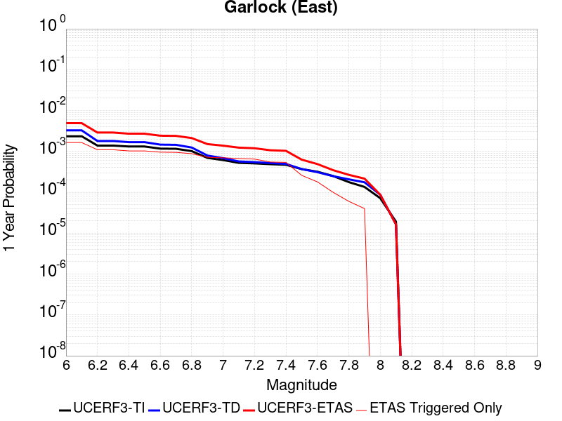 | 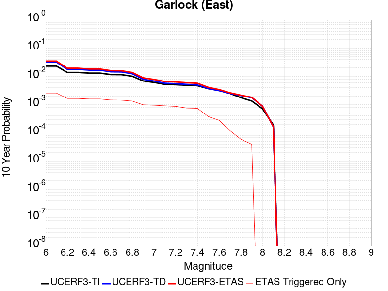 |

| Magnitude | 1 wk TI Prob | 1 wk TD Prob | 1 wk ETAS Prob | 1 wk ETAS/TD Gain | 1 wk ETAS Triggered Only | 1 mo TI Prob | 1 mo TD Prob | 1 mo ETAS Prob | 1 mo ETAS/TD Gain | 1 mo ETAS Triggered Only | 1 yr TI Prob | 1 yr TD Prob | 1 yr ETAS Prob | 1 yr ETAS/TD Gain | 1 yr ETAS Triggered Only | 10 yr TI Prob | 10 yr TD Prob | 10 yr ETAS Prob | 10 yr ETAS/TD Gain | 10 yr ETAS Triggered Only |
|-----|-----|-----|-----|-----|-----|-----|-----|-----|-----|-----|-----|-----|-----|-----|-----|-----|-----|-----|-----|-----|
| 6.0 | 4.5092507E-5 | 6.290427E-5 | 8.0285774E-4 | 12.763166 | 7.4E-4 | 1.9323928E-4 | 2.695644E-4 | 0.0012892894 | 4.782862 | 0.00102 | 0.0023501497 | 0.0032774536 | 0.004922046 | 1.5017896 | 0.00165 | 0.023254504 | 0.03235496 | 0.034841806 | 1.0768614 | 0.00257 |
| 6.1 | 4.5092507E-5 | 6.290427E-5 | 8.0285774E-4 | 12.763166 | 7.4E-4 | 1.9323928E-4 | 2.695644E-4 | 0.0012892894 | 4.782862 | 0.00102 | 0.0023501497 | 0.0032774536 | 0.004922046 | 1.5017896 | 0.00165 | 0.023254504 | 0.03235496 | 0.034841806 | 1.0768614 | 0.00257 |
| 6.2 | 2.6674514E-5 | 3.4511064E-5 | 5.144945E-4 | 14.908103 | 4.8E-4 | 1.1431433E-4 | 1.4789637E-4 | 7.9780025E-4 | 5.3943195 | 6.5E-4 | 0.0013908884 | 0.0017991841 | 0.002897205 | 1.6102883 | 0.0011 | 0.01382215 | 0.017874004 | 0.019504333 | 1.0912123 | 0.00166 |
| 6.3 | 2.6674514E-5 | 3.4511064E-5 | 5.144945E-4 | 14.908103 | 4.8E-4 | 1.1431433E-4 | 1.4789637E-4 | 7.9780025E-4 | 5.3943195 | 6.5E-4 | 0.0013908884 | 0.0017991841 | 0.002897205 | 1.6102883 | 0.0011 | 0.01382215 | 0.017874004 | 0.019504333 | 1.0912123 | 0.00166 |
| 6.4 | 2.5312667E-5 | 3.2339947E-5 | 4.7232572E-4 | 14.605025 | 4.4E-4 | 1.0847834E-4 | 1.3859257E-4 | 7.285108E-4 | 5.2564926 | 5.9E-4 | 0.0013199237 | 0.0016860879 | 0.0027143513 | 1.6098515 | 0.00103 | 0.013121112 | 0.016773503 | 0.018336834 | 1.0932024 | 0.00159 |
| 6.5 | 2.5312667E-5 | 3.2339947E-5 | 4.7232572E-4 | 14.605025 | 4.4E-4 | 1.0847834E-4 | 1.3859257E-4 | 7.285108E-4 | 5.2564926 | 5.9E-4 | 0.0013199237 | 0.0016860879 | 0.0027143513 | 1.6098515 | 0.00103 | 0.013121112 | 0.016773503 | 0.018336834 | 1.0932024 | 0.00159 |
| 6.6 | 2.246556E-5 | 2.8134184E-5 | 4.681218E-4 | 16.638897 | 4.4E-4 | 9.627742E-5 | 1.2056964E-4 | 7.104985E-4 | 5.8928475 | 5.9E-4 | 0.0011715472 | 0.0014669704 | 0.0024255621 | 1.6534499 | 9.6E-4 | 0.011653901 | 0.014614102 | 0.016052766 | 1.0984435 | 0.00146 |
| 6.7 | 2.2241198E-5 | 2.7803926E-5 | 4.677917E-4 | 16.824663 | 4.4E-4 | 9.531594E-5 | 1.1915438E-4 | 7.090841E-4 | 5.9509697 | 5.9E-4 | 0.0011598538 | 0.0014497626 | 0.0023983854 | 1.6543297 | 9.5E-4 | 0.011538187 | 0.014443748 | 0.01586295 | 1.0982571 | 0.00144 |
| 6.8 | 1.9528685E-5 | 2.3898472E-5 | 4.3388866E-4 | 18.155499 | 4.1E-4 | 8.369167E-5 | 1.0241811E-4 | 6.523618E-4 | 6.369594 | 5.5E-4 | 0.0010184698 | 0.0012462469 | 0.0021251503 | 1.7052401 | 8.8E-4 | 0.010138147 | 0.012437571 | 0.013760905 | 1.1063981 | 0.00134 |
| 6.9 | 1.3318621E-5 | 1.5198411E-5 | 3.451934E-4 | 22.712465 | 3.3E-4 | 5.7078556E-5 | 6.513445E-5 | 5.0510577E-4 | 7.7548175 | 4.4E-4 | 6.9470983E-4 | 7.9272914E-4 | 0.0015121584 | 1.9075347 | 7.2E-4 | 0.0069254204 | 0.007940531 | 0.00892267 | 1.1236868 | 9.9E-4 |
| 7.0 | 1.1760853E-5 | 1.3107256E-5 | 3.3310306E-4 | 25.41364 | 3.2E-4 | 5.0402683E-5 | 5.6172772E-5 | 4.861486E-4 | 8.654525 | 4.3E-4 | 6.134799E-4 | 6.836939E-4 | 0.0013832153 | 2.02315 | 7.0E-4 | 0.0061178906 | 0.006857147 | 0.0078105642 | 1.1390399 | 9.6E-4 |
| 7.1 | 1.0064758E-5 | 1.0902388E-5 | 3.20899E-4 | 29.433828 | 3.1E-4 | 4.3133965E-5 | 4.67237E-5 | 4.5670455E-4 | 9.77458 | 4.1E-4 | 5.2502943E-4 | 5.687161E-4 | 0.001238335 | 2.1774223 | 6.7E-4 | 0.005237907 | 0.0057130987 | 0.0066178995 | 1.1583731 | 9.1E-4 |
| 7.2 | 9.768808E-6 | 1.049826E-5 | 3.2049502E-4 | 30.528395 | 3.1E-4 | 4.186565E-5 | 4.4991786E-5 | 4.5497334E-4 | 10.112365 | 4.1E-4 | 5.095951E-4 | 5.476408E-4 | 0.0011972848 | 2.1862593 | 6.5E-4 | 0.0050842804 | 0.0055033076 | 0.0063685197 | 1.1572168 | 8.7E-4 |
| 7.3 | 9.344516E-6 | 9.943912E-6 | 2.7994122E-4 | 28.152021 | 2.7E-4 | 4.004731E-5 | 4.261609E-5 | 3.826016E-4 | 8.977867 | 3.4E-4 | 4.8746695E-4 | 5.1873084E-4 | 0.0010684455 | 2.05973 | 5.5E-4 | 0.0048639905 | 0.0052149626 | 0.005970999 | 1.1449745 | 7.6E-4 |
| 7.4 | 9.023491E-6 | 9.490095E-6 | 2.7948755E-4 | 29.450445 | 2.7E-4 | 3.867153E-5 | 4.067122E-5 | 3.706578E-4 | 9.113516 | 3.3E-4 | 4.7072413E-4 | 4.9506297E-4 | 0.0010347957 | 2.0902305 | 5.4E-4 | 0.004697283 | 0.004978356 | 0.005714672 | 1.1479034 | 7.4E-4 |
| 7.5 | 7.081253E-6 | 7.0870797E-6 | 1.5708602E-4 | 22.165127 | 1.5E-4 | 3.0347876E-5 | 3.0372848E-5 | 2.0036768E-4 | 6.5969343 | 1.7E-4 | 3.6942272E-4 | 3.697274E-4 | 6.296313E-4 | 1.7029607 | 2.6E-4 | 0.003688092 | 0.0037239692 | 0.004102554 | 1.1016617 | 3.8E-4 |
| 7.6 | 6.116396E-6 | 5.958634E-6 | 9.59581E-5 | 16.104042 | 9.0E-5 | 2.6212863E-5 | 2.5536756E-5 | 1.3553395E-4 | 5.3074064 | 1.1E-4 | 3.1909486E-4 | 3.108659E-4 | 4.9080997E-4 | 1.5788478 | 1.8E-4 | 0.0031863707 | 0.003135549 | 0.003414671 | 1.0890186 | 2.8E-4 |
| 7.7 | 4.797145E-6 | 4.7568233E-6 | 6.475654E-5 | 13.6134 | 6.0E-5 | 2.055903E-5 | 2.0386226E-5 | 8.0385005E-5 | 3.9431036 | 6.0E-5 | 2.5027743E-4 | 2.4817415E-4 | 3.4814933E-4 | 1.4028429 | 1.0E-4 | 0.0024999576 | 0.0025091725 | 0.0026288715 | 1.0477046 | 1.2E-4 |
| 7.8 | 3.4028885E-6 | 3.9781057E-6 | 4.3977947E-5 | 11.0549965 | 4.0E-5 | 1.4583726E-5 | 1.7048915E-5 | 5.7048233E-5 | 3.3461504 | 4.0E-5 | 1.775424E-4 | 2.0755084E-4 | 2.675384E-4 | 1.2890258 | 6.0E-5 | 0.0017740062 | 0.002101066 | 0.00216094 | 1.028497 | 6.0E-5 |
| 7.9 | 2.5928412E-6 | 3.3722088E-6 | 3.3372107E-5 | 9.896216 | 3.0E-5 | 1.1112129E-5 | 1.4452244E-5 | 4.445181E-5 | 3.0757723 | 3.0E-5 | 1.3528178E-4 | 1.7594192E-4 | 2.1593488E-4 | 1.2273078 | 4.0E-5 | 0.0013519945 | 0.0017811462 | 0.0018210749 | 1.0224174 | 4.0E-5 |
| 8.0 | 1.3743648E-6 | 1.673372E-6 | 1.673372E-6 | 1.0 | 0.0 | 5.8901214E-6 | 7.1715745E-6 | 7.1715745E-6 | 1.0 | 0.0 | 7.1709874E-5 | 8.731045E-5 | 8.731045E-5 | 1.0 | 0.0 | 7.1686733E-4 | 8.8365114E-4 | 8.8365114E-4 | 1.0 | 0.0 |
| 8.1 | 3.6733252E-7 | 3.1487303E-7 | 3.1487303E-7 | 1.0 | 0.0 | 1.5742813E-6 | 1.3494553E-6 | 1.3494553E-6 | 1.0 | 0.0 | 1.9166706E-5 | 1.642951E-5 | 1.642951E-5 | 1.0 | 0.0 | 1.9165053E-4 | 1.6628111E-4 | 1.6628111E-4 | 1.0 | 0.0 |

## Blackwater
*[(top)](#table-of-contents)*

| 1 Week | 1 Month | 1 Year | 10 Year |
|-----|-----|-----|-----|
| 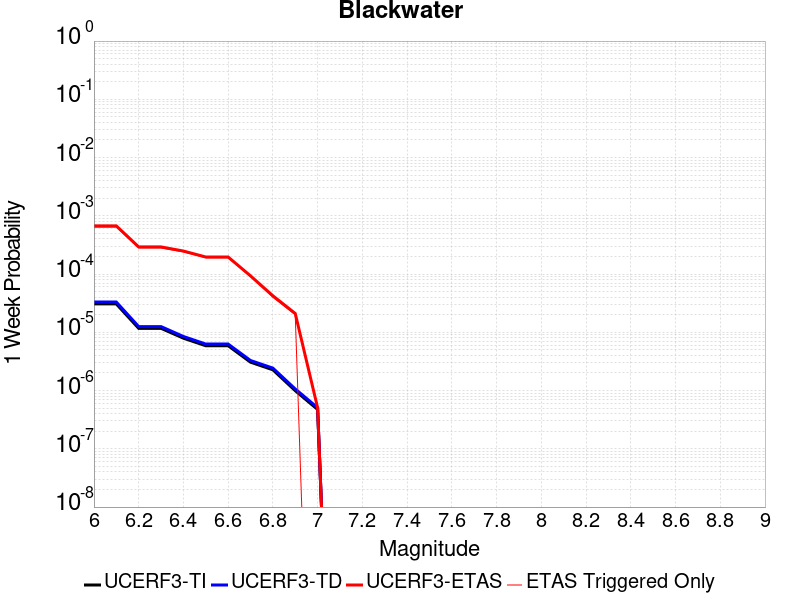 |  |  |  |

| Magnitude | 1 wk TI Prob | 1 wk TD Prob | 1 wk ETAS Prob | 1 wk ETAS/TD Gain | 1 wk ETAS Triggered Only | 1 mo TI Prob | 1 mo TD Prob | 1 mo ETAS Prob | 1 mo ETAS/TD Gain | 1 mo ETAS Triggered Only | 1 yr TI Prob | 1 yr TD Prob | 1 yr ETAS Prob | 1 yr ETAS/TD Gain | 1 yr ETAS Triggered Only | 10 yr TI Prob | 10 yr TD Prob | 10 yr ETAS Prob | 10 yr ETAS/TD Gain | 10 yr ETAS Triggered Only |
|-----|-----|-----|-----|-----|-----|-----|-----|-----|-----|-----|-----|-----|-----|-----|-----|-----|-----|-----|-----|-----|
| 6.0 | 3.0708583E-5 | 3.309578E-5 | 6.730746E-4 | 20.337173 | 6.4E-4 | 1.3160157E-4 | 1.4183212E-4 | 9.5171726E-4 | 6.7101674 | 8.1E-4 | 0.0016010714 | 0.001725575 | 0.0030532798 | 1.7694277 | 0.00133 | 0.015895851 | 0.017135598 | 0.019012868 | 1.1095538 | 0.00191 |
| 6.1 | 3.0708583E-5 | 3.309578E-5 | 6.730746E-4 | 20.337173 | 6.4E-4 | 1.3160157E-4 | 1.4183212E-4 | 9.5171726E-4 | 6.7101674 | 8.1E-4 | 0.0016010714 | 0.001725575 | 0.0030532798 | 1.7694277 | 0.00133 | 0.015895851 | 0.017135598 | 0.019012868 | 1.1095538 | 0.00191 |
| 6.2 | 1.1707779E-5 | 1.2545098E-5 | 2.9254158E-4 | 23.319195 | 2.8E-4 | 5.017523E-5 | 5.376365E-5 | 3.837459E-4 | 7.1376457 | 3.3E-4 | 6.107122E-4 | 6.543855E-4 | 0.0012040256 | 1.8399332 | 5.5E-4 | 0.006090366 | 0.006525557 | 0.007310402 | 1.1202725 | 7.9E-4 |
| 6.3 | 1.1707779E-5 | 1.2545098E-5 | 2.9254158E-4 | 23.319195 | 2.8E-4 | 5.017523E-5 | 5.376365E-5 | 3.837459E-4 | 7.1376457 | 3.3E-4 | 6.107122E-4 | 6.543855E-4 | 0.0012040256 | 1.8399332 | 5.5E-4 | 0.006090366 | 0.006525557 | 0.007310402 | 1.1202725 | 7.9E-4 |
| 6.4 | 7.929244E-6 | 8.480082E-6 | 2.4847806E-4 | 29.301373 | 2.4E-4 | 3.3982033E-5 | 3.6342728E-5 | 3.0633292E-4 | 8.429002 | 2.7E-4 | 4.136527E-4 | 4.423869E-4 | 8.721967E-4 | 1.9715699 | 4.3E-4 | 0.0041288356 | 0.004415468 | 0.005002863 | 1.1330311 | 5.9E-4 |
| 6.5 | 5.8832115E-6 | 6.2859795E-6 | 1.9628479E-4 | 31.225807 | 1.9E-4 | 2.521352E-5 | 2.6939648E-5 | 2.4693372E-4 | 9.1661825 | 2.2E-4 | 3.0693135E-4 | 3.279434E-4 | 6.678319E-4 | 2.0364244 | 3.4E-4 | 0.0030650778 | 0.0032748478 | 0.0037134069 | 1.1339173 | 4.4E-4 |
| 6.6 | 5.8832115E-6 | 6.2859795E-6 | 1.9628479E-4 | 31.225807 | 1.9E-4 | 2.521352E-5 | 2.6939648E-5 | 2.4693372E-4 | 9.1661825 | 2.2E-4 | 3.0693135E-4 | 3.279434E-4 | 6.678319E-4 | 2.0364244 | 3.4E-4 | 0.0030650778 | 0.0032748478 | 0.0037134069 | 1.1339173 | 4.4E-4 |
| 6.7 | 3.0715053E-6 | 3.2814603E-6 | 9.328117E-5 | 28.426725 | 9.0E-5 | 1.3163528E-5 | 1.4063332E-5 | 1.3406164E-4 | 9.532709 | 1.2E-4 | 1.6025416E-4 | 1.7120877E-4 | 3.4117966E-4 | 1.9927697 | 1.7E-4 | 0.0016013865 | 0.0017108832 | 0.0019105411 | 1.1166986 | 2.0E-4 |
| 6.8 | 2.2722281E-6 | 2.4287492E-6 | 4.242865E-5 | 17.469343 | 4.0E-5 | 9.738084E-6 | 1.0408889E-5 | 7.040826E-5 | 6.764244 | 6.0E-5 | 1.1855473E-4 | 1.2672177E-4 | 2.267091E-4 | 1.7890304 | 1.0E-4 | 0.001184915 | 0.0012665853 | 0.001376446 | 1.0867376 | 1.1E-4 |
| 6.9 | 9.952399E-7 | 1.0653469E-6 | 2.1065325E-5 | 19.773209 | 2.0E-5 | 4.265307E-6 | 4.565767E-6 | 2.4565676E-5 | 5.380405 | 2.0E-5 | 5.1928873E-5 | 5.5587312E-5 | 1.05584535E-4 | 1.8994358 | 5.0E-5 | 5.191674E-4 | 5.5578473E-4 | 6.0575694E-4 | 1.0899129 | 5.0E-5 |
| 7.0 | 4.7385504E-7 | 5.07555E-7 | 5.07555E-7 | 1.0 | 0.0 | 2.0308057E-6 | 2.1752357E-6 | 2.1752357E-6 | 1.0 | 0.0 | 2.4724779E-5 | 2.6483494E-5 | 3.648323E-5 | 1.3775836 | 1.0E-5 | 2.4722028E-4 | 2.6483493E-4 | 2.748323E-4 | 1.0377494 | 1.0E-5 |

## Ash Hill
*[(top)](#table-of-contents)*

| 1 Week | 1 Month | 1 Year | 10 Year |
|-----|-----|-----|-----|
| 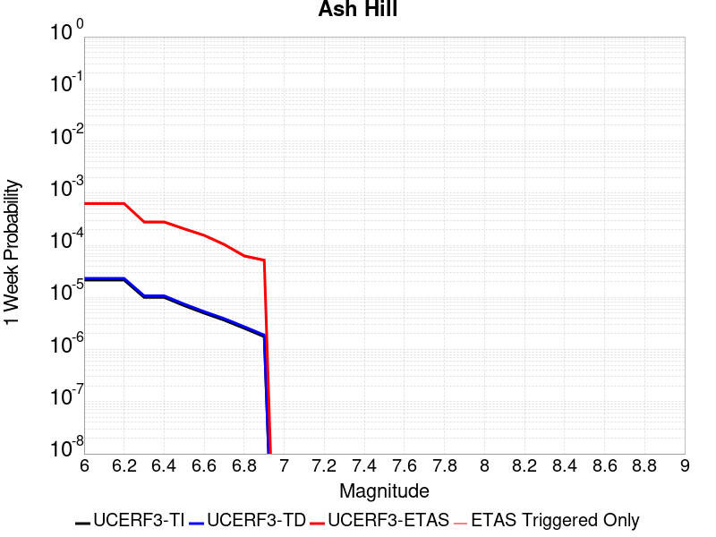 |  | 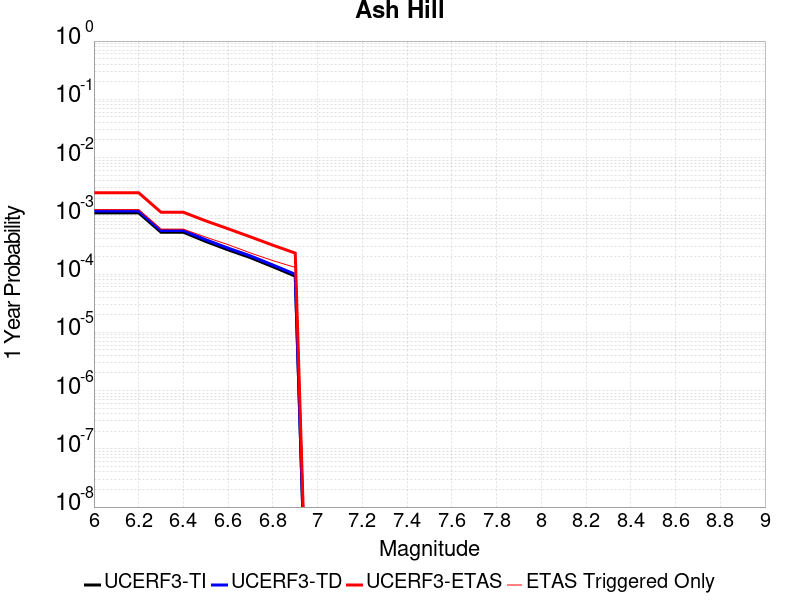 |  |

| Magnitude | 1 wk TI Prob | 1 wk TD Prob | 1 wk ETAS Prob | 1 wk ETAS/TD Gain | 1 wk ETAS Triggered Only | 1 mo TI Prob | 1 mo TD Prob | 1 mo ETAS Prob | 1 mo ETAS/TD Gain | 1 mo ETAS Triggered Only | 1 yr TI Prob | 1 yr TD Prob | 1 yr ETAS Prob | 1 yr ETAS/TD Gain | 1 yr ETAS Triggered Only | 10 yr TI Prob | 10 yr TD Prob | 10 yr ETAS Prob | 10 yr ETAS/TD Gain | 10 yr ETAS Triggered Only |
|-----|-----|-----|-----|-----|-----|-----|-----|-----|-----|-----|-----|-----|-----|-----|-----|-----|-----|-----|-----|-----|
| 6.0 | 2.1545662E-5 | 2.31944E-5 | 6.3318026E-4 | 27.298841 | 6.1E-4 | 9.2335285E-5 | 9.940123E-5 | 9.1931975E-4 | 9.248574 | 8.2E-4 | 0.0011236023 | 0.001209618 | 0.0024880697 | 2.0569053 | 0.00128 | 0.011179381 | 0.012038324 | 0.0138561735 | 1.1510051 | 0.00184 |
| 6.1 | 2.1545662E-5 | 2.31944E-5 | 6.3318026E-4 | 27.298841 | 6.1E-4 | 9.2335285E-5 | 9.940123E-5 | 9.1931975E-4 | 9.248574 | 8.2E-4 | 0.0011236023 | 0.001209618 | 0.0024880697 | 2.0569053 | 0.00128 | 0.011179381 | 0.012038324 | 0.0138561735 | 1.1510051 | 0.00184 |
| 6.2 | 2.1545662E-5 | 2.31944E-5 | 6.3318026E-4 | 27.298841 | 6.1E-4 | 9.2335285E-5 | 9.940123E-5 | 9.1931975E-4 | 9.248574 | 8.2E-4 | 0.0011236023 | 0.001209618 | 0.0024880697 | 2.0569053 | 0.00128 | 0.011179381 | 0.012038324 | 0.0138561735 | 1.1510051 | 0.00184 |
| 6.3 | 1.0025529E-5 | 1.0746914E-5 | 2.8074402E-4 | 26.123222 | 2.7E-4 | 4.2965847E-5 | 4.6057463E-5 | 4.2603997E-4 | 9.250183 | 3.8E-4 | 5.229836E-4 | 5.606186E-4 | 0.0011502878 | 2.0518188 | 5.9E-4 | 0.005217545 | 0.0055933557 | 0.006388881 | 1.1422268 | 8.0E-4 |
| 6.4 | 1.0025529E-5 | 1.0746914E-5 | 2.8074402E-4 | 26.123222 | 2.7E-4 | 4.2965847E-5 | 4.6057463E-5 | 4.2603997E-4 | 9.250183 | 3.8E-4 | 5.229836E-4 | 5.606186E-4 | 0.0011502878 | 2.0518188 | 5.9E-4 | 0.005217545 | 0.0055933557 | 0.006388881 | 1.1422268 | 8.0E-4 |
| 6.5 | 6.9617327E-6 | 7.45662E-6 | 2.0745513E-4 | 27.821604 | 2.0E-4 | 2.9835655E-5 | 3.19566E-5 | 3.0194796E-4 | 9.4486885 | 2.7E-4 | 3.6318856E-4 | 3.8901082E-4 | 8.1884355E-4 | 2.1049378 | 4.3E-4 | 0.0036259557 | 0.003884153 | 0.0044320165 | 1.141051 | 5.5E-4 |
| 6.6 | 4.9919777E-6 | 5.3466783E-6 | 1.5534587E-4 | 29.054653 | 1.5E-4 | 2.1394015E-5 | 2.2914171E-5 | 2.3290935E-4 | 10.164424 | 2.1E-4 | 2.60441E-4 | 2.7895102E-4 | 5.988618E-4 | 2.1468349 | 3.2E-4 | 0.0026013597 | 0.0027866673 | 0.003195525 | 1.1467191 | 4.1E-4 |
| 6.7 | 3.6630722E-6 | 3.924616E-6 | 1.0392423E-4 | 26.480099 | 1.0E-4 | 1.5698786E-5 | 1.6819708E-5 | 1.6681719E-4 | 9.91796 | 1.5E-4 | 1.9111596E-4 | 2.0476643E-4 | 4.3471935E-4 | 2.1230009 | 2.3E-4 | 0.0019095168 | 0.0020463406 | 0.0023557062 | 1.1511799 | 3.1E-4 |
| 6.8 | 2.5599613E-6 | 2.7449198E-6 | 6.274475E-5 | 22.858501 | 6.0E-5 | 1.0971216E-5 | 1.17639165E-5 | 1.1176274E-4 | 9.50047 | 1.0E-4 | 1.3356637E-4 | 1.4322122E-4 | 3.1319688E-4 | 2.186805 | 1.7E-4 | 0.0013348613 | 0.0014317741 | 0.0016414735 | 1.1464611 | 2.1E-4 |
| 6.9 | 1.7684905E-6 | 1.896867E-6 | 5.189677E-5 | 27.359203 | 5.0E-5 | 7.579223E-6 | 8.12943E-6 | 9.81287E-5 | 12.070797 | 9.0E-5 | 9.2273134E-5 | 9.897581E-5 | 2.2896295E-4 | 2.3133223 | 1.3E-4 | 9.223483E-4 | 9.897582E-4 | 0.0011396096 | 1.1514022 | 1.5E-4 |

## Hunter Mountain-Saline Valley
*[(top)](#table-of-contents)*

| 1 Week | 1 Month | 1 Year | 10 Year |
|-----|-----|-----|-----|
| 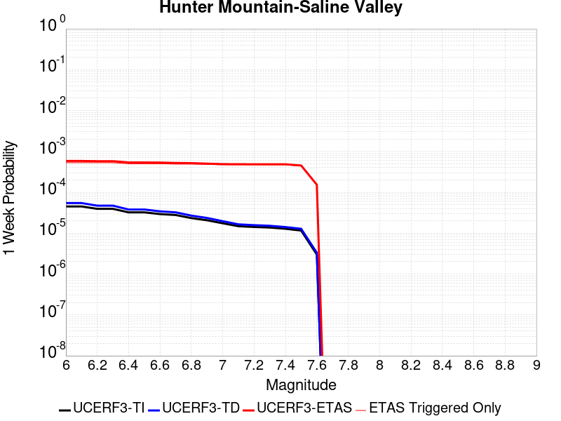 |  |  |  |

| Magnitude | 1 wk TI Prob | 1 wk TD Prob | 1 wk ETAS Prob | 1 wk ETAS/TD Gain | 1 wk ETAS Triggered Only | 1 mo TI Prob | 1 mo TD Prob | 1 mo ETAS Prob | 1 mo ETAS/TD Gain | 1 mo ETAS Triggered Only | 1 yr TI Prob | 1 yr TD Prob | 1 yr ETAS Prob | 1 yr ETAS/TD Gain | 1 yr ETAS Triggered Only | 10 yr TI Prob | 10 yr TD Prob | 10 yr ETAS Prob | 10 yr ETAS/TD Gain | 10 yr ETAS Triggered Only |
|-----|-----|-----|-----|-----|-----|-----|-----|-----|-----|-----|-----|-----|-----|-----|-----|-----|-----|-----|-----|-----|
| 6.0 | 4.5103672E-5 | 5.4568674E-5 | 5.845397E-4 | 10.712002 | 5.3E-4 | 1.9328714E-4 | 2.3384552E-4 | 9.836701E-4 | 4.2064953 | 7.5E-4 | 0.002350731 | 0.0028435262 | 0.0039005121 | 1.3717166 | 0.00106 | 0.023260195 | 0.028093081 | 0.029618975 | 1.0543157 | 0.00157 |
| 6.1 | 4.5103672E-5 | 5.4568674E-5 | 5.845397E-4 | 10.712002 | 5.3E-4 | 1.9328714E-4 | 2.3384552E-4 | 9.836701E-4 | 4.2064953 | 7.5E-4 | 0.002350731 | 0.0028435262 | 0.0039005121 | 1.3717166 | 0.00106 | 0.023260195 | 0.028093081 | 0.029618975 | 1.0543157 | 0.00157 |
| 6.2 | 3.9363465E-5 | 4.7062385E-5 | 5.7703746E-4 | 12.261118 | 5.3E-4 | 1.6868966E-4 | 2.0168122E-4 | 9.4153197E-4 | 4.668417 | 7.4E-4 | 0.002051862 | 0.0024528366 | 0.0034902855 | 1.4229589 | 0.00104 | 0.020330196 | 0.024274675 | 0.02578705 | 1.0623026 | 0.00155 |
| 6.3 | 3.9363465E-5 | 4.7062385E-5 | 5.7703746E-4 | 12.261118 | 5.3E-4 | 1.6868966E-4 | 2.0168122E-4 | 9.4153197E-4 | 4.668417 | 7.4E-4 | 0.002051862 | 0.0024528366 | 0.0034902855 | 1.4229589 | 0.00104 | 0.020330196 | 0.024274675 | 0.02578705 | 1.0623026 | 0.00155 |
| 6.4 | 3.2311684E-5 | 3.7950864E-5 | 5.3793186E-4 | 14.174431 | 5.0E-4 | 1.384713E-4 | 1.6263683E-4 | 8.7252137E-4 | 5.364845 | 7.1E-4 | 0.0016845843 | 0.0019783739 | 0.0029863757 | 1.5095103 | 0.00101 | 0.016718714 | 0.019617645 | 0.021107826 | 1.0759612 | 0.00152 |
| 6.5 | 3.2311684E-5 | 3.7950864E-5 | 5.3793186E-4 | 14.174431 | 5.0E-4 | 1.384713E-4 | 1.6263683E-4 | 8.7252137E-4 | 5.364845 | 7.1E-4 | 0.0016845843 | 0.0019783739 | 0.0029863757 | 1.5095103 | 0.00101 | 0.016718714 | 0.019617645 | 0.021107826 | 1.0759612 | 0.00152 |
| 6.6 | 2.9305844E-5 | 3.4181736E-5 | 5.3416466E-4 | 15.627195 | 5.0E-4 | 1.2559042E-4 | 1.4648527E-4 | 8.5638126E-4 | 5.8461933 | 7.1E-4 | 0.0015279909 | 0.0017820608 | 0.0027902608 | 1.5657495 | 0.00101 | 0.015175272 | 0.017686864 | 0.019170158 | 1.0838641 | 0.00151 |
| 6.7 | 2.7826512E-5 | 3.2344138E-5 | 5.223283E-4 | 16.149086 | 4.9E-4 | 1.19251024E-4 | 1.386107E-4 | 8.3851366E-4 | 6.049415 | 7.0E-4 | 0.0014509142 | 0.0016863393 | 0.002684653 | 1.5920005 | 0.001 | 0.014414776 | 0.016744364 | 0.018219247 | 1.0880824 | 0.0015 |
| 6.8 | 2.3389874E-5 | 2.686661E-5 | 5.1685347E-4 | 19.237762 | 4.9E-4 | 1.0023846E-4 | 1.15137795E-4 | 8.150572E-4 | 7.0789714 | 7.0E-4 | 0.00121972 | 0.0014009486 | 0.0023895616 | 1.705674 | 9.9E-4 | 0.01213047 | 0.013928632 | 0.015388018 | 1.1047759 | 0.00148 |
| 6.9 | 2.069209E-5 | 2.3569948E-5 | 5.035586E-4 | 21.364435 | 4.8E-4 | 8.867737E-5 | 1.0101035E-4 | 7.9094066E-4 | 7.830293 | 6.9E-4 | 0.0010791123 | 0.0012291434 | 0.0022079388 | 1.7963233 | 9.8E-4 | 0.010738871 | 0.012229734 | 0.013671879 | 1.1179212 | 0.00146 |
| 7.0 | 1.7462342E-5 | 1.9633484E-5 | 4.896243E-4 | 24.938225 | 4.7E-4 | 7.483646E-5 | 8.414092E-5 | 7.640837E-4 | 9.081 | 6.8E-4 | 9.1075303E-4 | 0.0010239568 | 0.0019929637 | 1.9463356 | 9.7E-4 | 0.009070295 | 0.010197277 | 0.011632491 | 1.1407448 | 0.00145 |
| 7.1 | 1.4807709E-5 | 1.6441705E-5 | 4.8643397E-4 | 29.585373 | 4.7E-4 | 6.3460066E-5 | 7.0462636E-5 | 7.5041474E-4 | 10.649824 | 6.8E-4 | 7.723524E-4 | 8.575615E-4 | 0.0018167382 | 2.1184933 | 9.6E-4 | 0.007696735 | 0.008546768 | 0.00997446 | 1.1670448 | 0.00144 |
| 7.2 | 1.4180048E-5 | 1.5698295E-5 | 4.8569092E-4 | 30.939087 | 4.7E-4 | 6.077022E-5 | 6.7276764E-5 | 7.47231E-4 | 11.106822 | 6.8E-4 | 7.396263E-4 | 8.18803E-4 | 0.0017780169 | 2.1714833 | 9.6E-4 | 0.0073716943 | 0.008162071 | 0.0095903175 | 1.1749858 | 0.00144 |
| 7.3 | 1.3730402E-5 | 1.5172035E-5 | 4.851649E-4 | 31.977577 | 4.7E-4 | 5.8843252E-5 | 6.502148E-5 | 7.4497727E-4 | 11.457403 | 6.8E-4 | 7.161811E-4 | 7.9136505E-4 | 0.0017506053 | 2.212134 | 9.6E-4 | 0.007138774 | 0.007889661 | 0.0093183005 | 1.1810774 | 0.00144 |
| 7.4 | 1.2810095E-5 | 1.4109242E-5 | 4.841026E-4 | 34.311028 | 4.7E-4 | 5.489925E-5 | 6.0466868E-5 | 7.404258E-4 | 12.245149 | 6.8E-4 | 6.681934E-4 | 7.3595124E-4 | 0.0016952447 | 2.3034742 | 9.6E-4 | 0.006661878 | 0.0073392955 | 0.008768727 | 1.1947641 | 0.00144 |
| 7.5 | 1.1595659E-5 | 1.2800624E-5 | 4.5279498E-4 | 35.372883 | 4.4E-4 | 4.9694736E-5 | 5.4858752E-5 | 7.048231E-4 | 12.84796 | 6.5E-4 | 6.0486543E-4 | 6.677163E-4 | 0.001587102 | 2.3769107 | 9.2E-4 | 0.006032217 | 0.006661239 | 0.00804198 | 1.2072799 | 0.00139 |
| 7.6 | 2.997694E-6 | 3.3251215E-6 | 1.5332462E-4 | 46.110985 | 1.5E-4 | 1.28471975E-5 | 1.4250483E-5 | 2.5424708E-4 | 17.841293 | 2.4E-4 | 1.564034E-4 | 1.734931E-4 | 5.234324E-4 | 3.0170212 | 3.5E-4 | 0.0015629337 | 0.0017361854 | 0.0021953867 | 1.2644887 | 4.6E-4 |

## Airport Lake
*[(top)](#table-of-contents)*

| 1 Week | 1 Month | 1 Year | 10 Year |
|-----|-----|-----|-----|
|  | 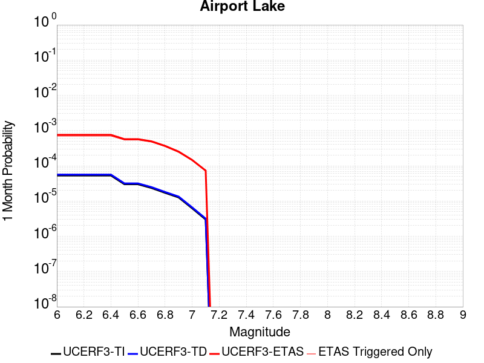 | 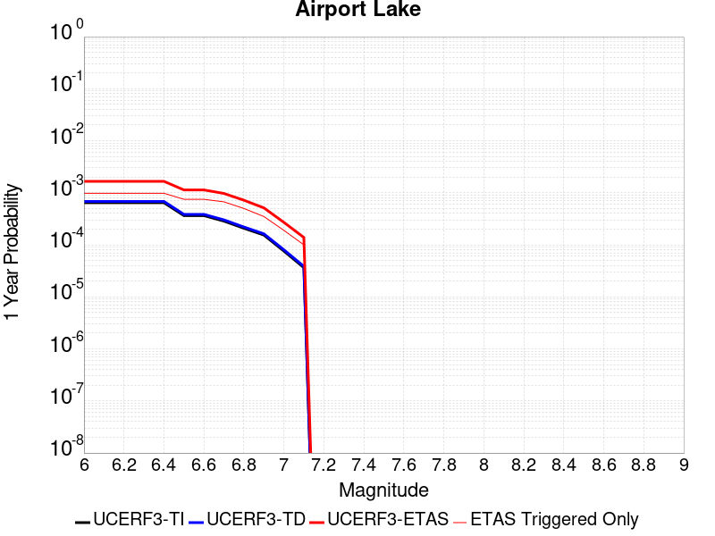 | 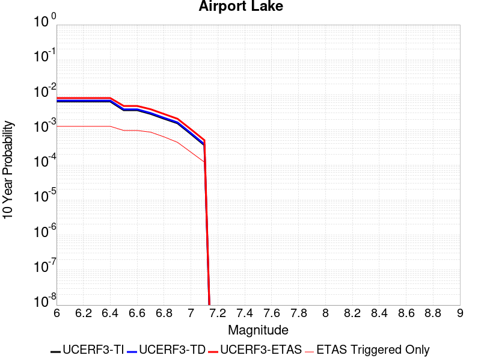 |

| Magnitude | 1 wk TI Prob | 1 wk TD Prob | 1 wk ETAS Prob | 1 wk ETAS/TD Gain | 1 wk ETAS Triggered Only | 1 mo TI Prob | 1 mo TD Prob | 1 mo ETAS Prob | 1 mo ETAS/TD Gain | 1 mo ETAS Triggered Only | 1 yr TI Prob | 1 yr TD Prob | 1 yr ETAS Prob | 1 yr ETAS/TD Gain | 1 yr ETAS Triggered Only | 10 yr TI Prob | 10 yr TD Prob | 10 yr ETAS Prob | 10 yr ETAS/TD Gain | 10 yr ETAS Triggered Only |
|-----|-----|-----|-----|-----|-----|-----|-----|-----|-----|-----|-----|-----|-----|-----|-----|-----|-----|-----|-----|-----|
| 6.0 | 1.2387061E-5 | 1.3103137E-5 | 5.230965E-4 | 39.921467 | 5.1E-4 | 5.3086325E-5 | 5.615525E-5 | 7.5611594E-4 | 13.464742 | 7.0E-4 | 6.461343E-4 | 6.835041E-4 | 0.0016628343 | 2.432808 | 9.8E-4 | 0.0064425888 | 0.0068168286 | 0.008068239 | 1.1835767 | 0.00126 |
| 6.1 | 1.2387061E-5 | 1.3103137E-5 | 5.230965E-4 | 39.921467 | 5.1E-4 | 5.3086325E-5 | 5.615525E-5 | 7.5611594E-4 | 13.464742 | 7.0E-4 | 6.461343E-4 | 6.835041E-4 | 0.0016628343 | 2.432808 | 9.8E-4 | 0.0064425888 | 0.0068168286 | 0.008068239 | 1.1835767 | 0.00126 |
| 6.2 | 1.2387061E-5 | 1.3103137E-5 | 5.230965E-4 | 39.921467 | 5.1E-4 | 5.3086325E-5 | 5.615525E-5 | 7.5611594E-4 | 13.464742 | 7.0E-4 | 6.461343E-4 | 6.835041E-4 | 0.0016628343 | 2.432808 | 9.8E-4 | 0.0064425888 | 0.0068168286 | 0.008068239 | 1.1835767 | 0.00126 |
| 6.3 | 1.2387061E-5 | 1.3103137E-5 | 5.230965E-4 | 39.921467 | 5.1E-4 | 5.3086325E-5 | 5.615525E-5 | 7.5611594E-4 | 13.464742 | 7.0E-4 | 6.461343E-4 | 6.835041E-4 | 0.0016628343 | 2.432808 | 9.8E-4 | 0.0064425888 | 0.0068168286 | 0.008068239 | 1.1835767 | 0.00126 |
| 6.4 | 1.2387061E-5 | 1.3103137E-5 | 5.230965E-4 | 39.921467 | 5.1E-4 | 5.3086325E-5 | 5.615525E-5 | 7.5611594E-4 | 13.464742 | 7.0E-4 | 6.461343E-4 | 6.835041E-4 | 0.0016628343 | 2.432808 | 9.8E-4 | 0.0064425888 | 0.0068168286 | 0.008068239 | 1.1835767 | 0.00126 |
| 6.5 | 6.9922594E-6 | 7.384914E-6 | 3.9738204E-4 | 53.809975 | 3.9E-4 | 2.996648E-5 | 3.1649277E-5 | 5.716322E-4 | 18.06146 | 5.4E-4 | 3.6478083E-4 | 3.8526725E-4 | 0.0011349783 | 2.9459505 | 7.5E-4 | 0.003641826 | 0.0038465308 | 0.004802838 | 1.2486155 | 9.6E-4 |
| 6.6 | 6.9922594E-6 | 7.384914E-6 | 3.9738204E-4 | 53.809975 | 3.9E-4 | 2.996648E-5 | 3.1649277E-5 | 5.716322E-4 | 18.06146 | 5.4E-4 | 3.6478083E-4 | 3.8526725E-4 | 0.0011349783 | 2.9459505 | 7.5E-4 | 0.003641826 | 0.0038465308 | 0.004802838 | 1.2486155 | 9.6E-4 |
| 6.7 | 5.477277E-6 | 5.78606E-6 | 3.3578416E-4 | 58.033302 | 3.3E-4 | 2.3473833E-5 | 2.4797186E-5 | 4.9478555E-4 | 19.953295 | 4.7E-4 | 2.8575645E-4 | 3.0186778E-4 | 9.7166555E-4 | 3.2188447 | 6.7E-4 | 0.0028538927 | 0.0030149613 | 0.0038723685 | 1.2843841 | 8.6E-4 |
| 6.8 | 3.9950432E-6 | 4.219081E-6 | 2.5421803E-4 | 60.254364 | 2.5E-4 | 1.7121502E-5 | 1.8081664E-5 | 3.6807533E-4 | 20.356274 | 3.5E-4 | 2.0843433E-4 | 2.2012478E-4 | 7.2001474E-4 | 3.2709389 | 5.0E-4 | 0.0020823893 | 0.0021993385 | 0.0028279528 | 1.2858198 | 6.3E-4 |
| 6.9 | 2.95695E-6 | 3.1230197E-6 | 1.7312249E-4 | 55.434326 | 1.7E-4 | 1.2672582E-5 | 1.3384314E-5 | 2.533811E-4 | 18.931198 | 2.4E-4 | 1.5427776E-4 | 1.629441E-4 | 5.128871E-4 | 3.147626 | 3.5E-4 | 0.001541707 | 0.0016284687 | 0.0020677522 | 1.2697525 | 4.4E-4 |
| 7.0 | 1.456072E-6 | 1.5408096E-6 | 1.2154062E-4 | 78.88101 | 1.2E-4 | 6.2402937E-6 | 6.6034586E-6 | 1.4660253E-4 | 22.20087 | 1.4E-4 | 7.597293E-5 | 8.0395155E-5 | 2.7037988E-4 | 3.3631365 | 1.9E-4 | 7.594696E-4 | 8.0375955E-4 | 0.0010335747 | 1.2859253 | 2.3E-4 |
| 7.1 | 6.995192E-7 | 7.4089627E-7 | 6.074085E-5 | 81.98293 | 6.0E-5 | 2.997936E-6 | 3.1752697E-6 | 7.317505E-5 | 23.045301 | 7.0E-5 | 3.649926E-5 | 3.865891E-5 | 1.3865504E-4 | 3.5866258 | 1.0E-4 | 3.6493264E-4 | 3.865891E-4 | 5.065427E-4 | 1.3102871 | 1.2E-4 |

## Gravel Hills-Harper Lk
*[(top)](#table-of-contents)*

| 1 Week | 1 Month | 1 Year | 10 Year |
|-----|-----|-----|-----|
| 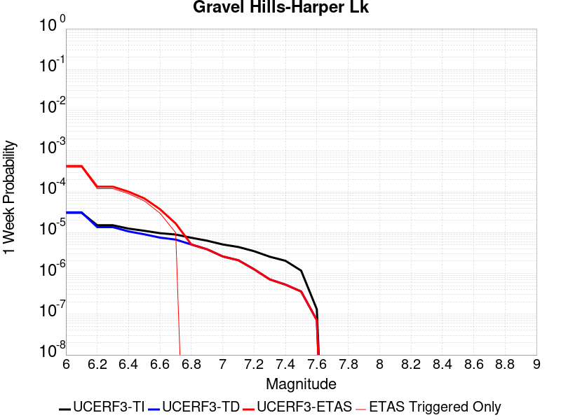 | 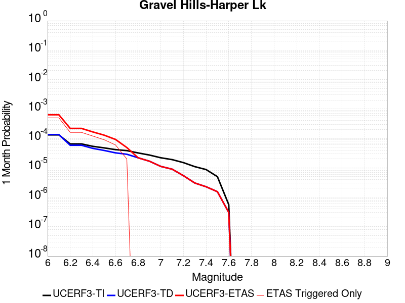 |  |  |

| Magnitude | 1 wk TI Prob | 1 wk TD Prob | 1 wk ETAS Prob | 1 wk ETAS/TD Gain | 1 wk ETAS Triggered Only | 1 mo TI Prob | 1 mo TD Prob | 1 mo ETAS Prob | 1 mo ETAS/TD Gain | 1 mo ETAS Triggered Only | 1 yr TI Prob | 1 yr TD Prob | 1 yr ETAS Prob | 1 yr ETAS/TD Gain | 1 yr ETAS Triggered Only | 10 yr TI Prob | 10 yr TD Prob | 10 yr ETAS Prob | 10 yr ETAS/TD Gain | 10 yr ETAS Triggered Only |
|-----|-----|-----|-----|-----|-----|-----|-----|-----|-----|-----|-----|-----|-----|-----|-----|-----|-----|-----|-----|-----|
| 6.0 | 3.0679566E-5 | 3.146452E-5 | 4.3145195E-4 | 13.712333 | 4.0E-4 | 1.3147724E-4 | 1.348422E-4 | 6.347748E-4 | 4.707538 | 5.0E-4 | 0.0015995599 | 0.0016406843 | 0.0023794703 | 1.4502913 | 7.4E-4 | 0.015880952 | 0.016307283 | 0.01752706 | 1.0747997 | 0.00124 |
| 6.1 | 3.0679566E-5 | 3.146452E-5 | 4.3145195E-4 | 13.712333 | 4.0E-4 | 1.3147724E-4 | 1.348422E-4 | 6.347748E-4 | 4.707538 | 5.0E-4 | 0.0015995599 | 0.0016406843 | 0.0023794703 | 1.4502913 | 7.4E-4 | 0.015880952 | 0.016307283 | 0.01752706 | 1.0747997 | 0.00124 |
| 6.2 | 1.514536E-5 | 1.3635164E-5 | 1.3363353E-4 | 9.800654 | 1.2E-4 | 6.490707E-5 | 5.8435176E-5 | 2.1842582E-4 | 3.737917 | 1.6E-4 | 7.8995706E-4 | 7.112279E-4 | 9.1108563E-4 | 1.2810038 | 2.0E-4 | 0.007871548 | 0.007090718 | 0.0074481657 | 1.0504106 | 3.6E-4 |
| 6.3 | 1.514536E-5 | 1.3635164E-5 | 1.3363353E-4 | 9.800654 | 1.2E-4 | 6.490707E-5 | 5.8435176E-5 | 2.1842582E-4 | 3.737917 | 1.6E-4 | 7.8995706E-4 | 7.112279E-4 | 9.1108563E-4 | 1.2810038 | 2.0E-4 | 0.007871548 | 0.007090718 | 0.0074481657 | 1.0504106 | 3.6E-4 |
| 6.4 | 1.2532521E-5 | 1.0689658E-5 | 1.00688696E-4 | 9.419263 | 9.0E-5 | 5.37097E-5 | 4.581205E-5 | 1.6580654E-4 | 3.6192784 | 1.2E-4 | 6.537194E-4 | 5.5762473E-4 | 7.075411E-4 | 1.2688481 | 1.5E-4 | 0.0065179965 | 0.0055628456 | 0.0057816217 | 1.0393281 | 2.2E-4 |
| 6.5 | 1.1094058E-5 | 9.083636E-6 | 6.908309E-5 | 7.605225 | 6.0E-5 | 4.7545094E-5 | 3.8929305E-5 | 1.289258E-4 | 3.3117929 | 9.0E-5 | 5.787078E-4 | 4.7386528E-4 | 5.838132E-4 | 1.2320235 | 1.1E-4 | 0.0057720304 | 0.0047289557 | 0.0048782467 | 1.0315695 | 1.5E-4 |
| 6.6 | 9.688328E-6 | 7.531671E-6 | 3.7531445E-5 | 4.9831495 | 3.0E-5 | 4.1520743E-5 | 3.2278207E-5 | 9.227627E-5 | 2.8587794 | 6.0E-5 | 5.053978E-4 | 3.9291885E-4 | 4.6289133E-4 | 1.1780839 | 7.0E-5 | 0.0050424994 | 0.003922498 | 0.004012145 | 1.0228546 | 9.0E-5 |
| 6.7 | 8.974824E-6 | 6.749391E-6 | 1.6749324E-5 | 2.481605 | 1.0E-5 | 3.8462964E-5 | 2.8925653E-5 | 4.8925074E-5 | 1.6914078 | 2.0E-5 | 4.6818596E-4 | 3.5211514E-4 | 3.7210807E-4 | 1.0567796 | 2.0E-5 | 0.004672008 | 0.0035157932 | 0.0035357228 | 1.0056686 | 2.0E-5 |
| 6.8 | 7.4780046E-6 | 5.1161755E-6 | 5.1161755E-6 | 1.0 | 0.0 | 3.20482E-5 | 2.192629E-5 | 2.192629E-5 | 1.0 | 0.0 | 3.9011694E-4 | 2.6692127E-4 | 2.6692127E-4 | 1.0 | 0.0 | 0.0038943281 | 0.0026661449 | 0.0026661449 | 1.0 | 0.0 |
| 6.9 | 6.3409307E-6 | 3.9074807E-6 | 3.9074807E-6 | 1.0 | 0.0 | 2.7175134E-5 | 1.6746244E-5 | 1.6746244E-5 | 1.0 | 0.0 | 3.3080703E-4 | 2.0386743E-4 | 2.0386743E-4 | 1.0 | 0.0 | 0.0033031502 | 0.0020369024 | 0.0020369024 | 1.0 | 0.0 |
| 7.0 | 5.1239335E-6 | 2.6058435E-6 | 2.6058435E-6 | 1.0 | 0.0 | 2.195953E-5 | 1.1167855E-5 | 1.1167855E-5 | 1.0 | 0.0 | 2.6732447E-4 | 1.359604E-4 | 1.359604E-4 | 1.0 | 0.0 | 0.0026700313 | 0.0013587974 | 0.0013587974 | 1.0 | 0.0 |
| 7.1 | 4.438899E-6 | 2.0984642E-6 | 2.0984642E-6 | 1.0 | 0.0 | 1.9023713E-5 | 8.993388E-6 | 8.993388E-6 | 1.0 | 0.0 | 2.315891E-4 | 1.0948922E-4 | 1.0948922E-4 | 1.0 | 0.0 | 0.002313479 | 0.0010943746 | 0.0010943746 | 1.0 | 0.0 |
| 7.2 | 3.50367E-6 | 1.2615674E-6 | 1.2615674E-6 | 1.0 | 0.0 | 1.5015643E-5 | 5.406707E-6 | 5.406707E-6 | 1.0 | 0.0 | 1.8280011E-4 | 6.582475E-5 | 6.582475E-5 | 1.0 | 0.0 | 0.0018264982 | 6.580607E-4 | 6.580607E-4 | 1.0 | 0.0 |
| 7.3 | 2.561638E-6 | 7.1186463E-7 | 7.1186463E-7 | 1.0 | 0.0 | 1.0978401E-5 | 3.050845E-6 | 3.050845E-6 | 1.0 | 0.0 | 1.3365384E-4 | 3.7143425E-5 | 3.7143425E-5 | 1.0 | 0.0 | 0.0013357349 | 3.7137416E-4 | 3.7137416E-4 | 1.0 | 0.0 |
| 7.4 | 2.0368864E-6 | 5.304434E-7 | 5.304434E-7 | 1.0 | 0.0 | 8.729483E-6 | 2.273327E-6 | 2.273327E-6 | 1.0 | 0.0 | 1.06276275E-4 | 2.767741E-5 | 2.767741E-5 | 1.0 | 0.0 | 0.0010622547 | 2.7674017E-4 | 2.7674017E-4 | 1.0 | 0.0 |
| 7.5 | 1.1681728E-6 | 3.6028206E-7 | 3.6028206E-7 | 1.0 | 0.0 | 5.0064455E-6 | 1.5440651E-6 | 1.5440651E-6 | 1.0 | 0.0 | 6.0951766E-5 | 1.8798835E-5 | 1.8798835E-5 | 1.0 | 0.0 | 6.093505E-4 | 1.8797291E-4 | 1.8797291E-4 | 1.0 | 0.0 |
| 7.6 | 1.3154387E-7 | 7.1196375E-8 | 7.1196375E-8 | 1.0 | 0.0 | 5.6375933E-7 | 3.051273E-7 | 3.051273E-7 | 1.0 | 0.0 | 6.863748E-6 | 3.71492E-6 | 3.71492E-6 | 1.0 | 0.0 | 6.863536E-5 | 3.7148737E-5 | 3.7148737E-5 | 1.0 | 0.0 |

## Goldstone Lake
*[(top)](#table-of-contents)*

| 1 Week | 1 Month | 1 Year | 10 Year |
|-----|-----|-----|-----|
|  |  |  | 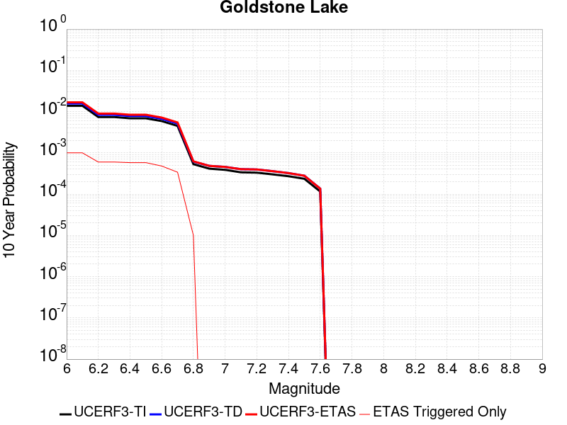 |

| Magnitude | 1 wk TI Prob | 1 wk TD Prob | 1 wk ETAS Prob | 1 wk ETAS/TD Gain | 1 wk ETAS Triggered Only | 1 mo TI Prob | 1 mo TD Prob | 1 mo ETAS Prob | 1 mo ETAS/TD Gain | 1 mo ETAS Triggered Only | 1 yr TI Prob | 1 yr TD Prob | 1 yr ETAS Prob | 1 yr ETAS/TD Gain | 1 yr ETAS Triggered Only | 10 yr TI Prob | 10 yr TD Prob | 10 yr ETAS Prob | 10 yr ETAS/TD Gain | 10 yr ETAS Triggered Only |
|-----|-----|-----|-----|-----|-----|-----|-----|-----|-----|-----|-----|-----|-----|-----|-----|-----|-----|-----|-----|-----|
| 6.0 | 2.671352E-5 | 3.0375995E-5 | 3.003678E-4 | 9.888328 | 2.7E-4 | 1.1448149E-4 | 1.3017745E-4 | 5.2012666E-4 | 3.9955206 | 3.9E-4 | 0.001392921 | 0.0015839544 | 0.0022528933 | 1.4223219 | 6.7E-4 | 0.013842222 | 0.015746146 | 0.0167304 | 1.0625076 | 0.001 |
| 6.1 | 2.671352E-5 | 3.0375995E-5 | 3.003678E-4 | 9.888328 | 2.7E-4 | 1.1448149E-4 | 1.3017745E-4 | 5.2012666E-4 | 3.9955206 | 3.9E-4 | 0.001392921 | 0.0015839544 | 0.0022528933 | 1.4223219 | 6.7E-4 | 0.013842222 | 0.015746146 | 0.0167304 | 1.0625076 | 0.001 |
| 6.2 | 1.4197047E-5 | 1.6096199E-5 | 1.5609394E-4 | 9.697565 | 1.4E-4 | 6.0843064E-5 | 6.8982445E-5 | 2.8896728E-4 | 4.1889973 | 2.2E-4 | 7.4051257E-4 | 8.3963625E-4 | 0.0012393004 | 1.4759967 | 4.0E-4 | 0.007380498 | 0.008374335 | 0.008969311 | 1.0710474 | 6.0E-4 |
| 6.3 | 1.4197047E-5 | 1.6096199E-5 | 1.5609394E-4 | 9.697565 | 1.4E-4 | 6.0843064E-5 | 6.8982445E-5 | 2.8896728E-4 | 4.1889973 | 2.2E-4 | 7.4051257E-4 | 8.3963625E-4 | 0.0012393004 | 1.4759967 | 4.0E-4 | 0.007380498 | 0.008374335 | 0.008969311 | 1.0710474 | 6.0E-4 |
| 6.4 | 1.3238931E-5 | 1.5008418E-5 | 1.4500647E-4 | 9.661675 | 1.3E-4 | 5.6737044E-5 | 6.432076E-5 | 2.643079E-4 | 4.109216 | 2.0E-4 | 6.9055456E-4 | 7.8292185E-4 | 0.0011626243 | 1.4849813 | 3.8E-4 | 0.006884126 | 0.0078112623 | 0.008386732 | 1.0736718 | 5.8E-4 |
| 6.5 | 1.3238931E-5 | 1.5008418E-5 | 1.4500647E-4 | 9.661675 | 1.3E-4 | 5.6737044E-5 | 6.432076E-5 | 2.643079E-4 | 4.109216 | 2.0E-4 | 6.9055456E-4 | 7.8292185E-4 | 0.0011626243 | 1.4849813 | 3.8E-4 | 0.006884126 | 0.0078112623 | 0.008386732 | 1.0736718 | 5.8E-4 |
| 6.6 | 1.1328278E-5 | 1.2855132E-5 | 1.2285371E-4 | 9.556784 | 1.1E-4 | 4.8548856E-5 | 5.5092798E-5 | 2.2508344E-4 | 4.0855327 | 1.7E-4 | 5.90922E-4 | 6.7064405E-4 | 0.0010004228 | 1.4917343 | 3.3E-4 | 0.0058935313 | 0.006695591 | 0.007172377 | 1.071209 | 4.8E-4 |
| 6.7 | 8.651175E-6 | 9.824541E-6 | 1.0982356E-4 | 11.178493 | 1.0E-4 | 3.707594E-5 | 4.2105006E-5 | 1.5210037E-4 | 3.6124058 | 1.1E-4 | 4.5130608E-4 | 5.1259843E-4 | 7.224908E-4 | 1.4094675 | 2.1E-4 | 0.0045039062 | 0.005123039 | 0.005461297 | 1.0660268 | 3.4E-4 |
| 6.8 | 1.0215377E-6 | 1.1754779E-6 | 1.1754779E-6 | 1.0 | 0.0 | 4.378012E-6 | 5.037753E-6 | 5.037753E-6 | 1.0 | 0.0 | 5.3300988E-5 | 6.1333034E-5 | 6.1333034E-5 | 1.0 | 0.0 | 5.3288206E-4 | 6.131723E-4 | 6.231662E-4 | 1.0162987 | 1.0E-5 |
| 6.9 | 7.9360774E-7 | 9.2834784E-7 | 9.2834784E-7 | 1.0 | 0.0 | 3.4011714E-6 | 3.978628E-6 | 3.978628E-6 | 1.0 | 0.0 | 4.1408475E-5 | 4.843879E-5 | 4.843879E-5 | 1.0 | 0.0 | 4.140076E-4 | 4.842893E-4 | 4.842893E-4 | 1.0 | 0.0 |
| 7.0 | 7.4382757E-7 | 8.7474115E-7 | 8.7474115E-7 | 1.0 | 0.0 | 3.1878285E-6 | 3.7488855E-6 | 3.7488855E-6 | 1.0 | 0.0 | 3.8811122E-5 | 4.5641795E-5 | 4.5641795E-5 | 1.0 | 0.0 | 3.8804344E-4 | 4.5633083E-4 | 4.5633083E-4 | 1.0 | 0.0 |
| 7.1 | 6.4709513E-7 | 7.7113845E-7 | 7.7113845E-7 | 1.0 | 0.0 | 2.773262E-6 | 3.3048752E-6 | 3.3048752E-6 | 1.0 | 0.0 | 3.376394E-5 | 4.0236177E-5 | 4.0236177E-5 | 1.0 | 0.0 | 3.375881E-4 | 4.0229486E-4 | 4.0229486E-4 | 1.0 | 0.0 |
| 7.2 | 6.356704E-7 | 7.5884446E-7 | 7.5884446E-7 | 1.0 | 0.0 | 2.7242988E-6 | 3.2521868E-6 | 3.2521868E-6 | 1.0 | 0.0 | 3.3167835E-5 | 3.9594717E-5 | 3.9594717E-5 | 1.0 | 0.0 | 3.3162883E-4 | 3.9588255E-4 | 3.9588255E-4 | 1.0 | 0.0 |
| 7.3 | 5.7695723E-7 | 6.8966335E-7 | 6.8966335E-7 | 1.0 | 0.0 | 2.4726714E-6 | 2.955697E-6 | 2.955697E-6 | 1.0 | 0.0 | 3.0104358E-5 | 3.598508E-5 | 3.598508E-5 | 1.0 | 0.0 | 3.0100282E-4 | 3.5979823E-4 | 3.5979823E-4 | 1.0 | 0.0 |
| 7.4 | 5.209647E-7 | 6.193571E-7 | 6.193571E-7 | 1.0 | 0.0 | 2.232704E-6 | 2.6543853E-6 | 2.6543853E-6 | 1.0 | 0.0 | 2.718283E-5 | 3.231672E-5 | 3.231672E-5 | 1.0 | 0.0 | 2.7179506E-4 | 3.2312574E-4 | 3.2312574E-4 | 1.0 | 0.0 |
| 7.5 | 4.512955E-7 | 5.3489373E-7 | 5.3489373E-7 | 1.0 | 0.0 | 1.934122E-6 | 2.2924E-6 | 2.2924E-6 | 1.0 | 0.0 | 2.3547682E-5 | 2.7909666E-5 | 2.7909666E-5 | 1.0 | 0.0 | 2.3545188E-4 | 2.790669E-4 | 2.790669E-4 | 1.0 | 0.0 |
| 7.6 | 2.21172E-7 | 2.6040198E-7 | 2.6040198E-7 | 1.0 | 0.0 | 9.478797E-7 | 1.1160082E-6 | 1.1160082E-6 | 1.0 | 0.0 | 1.1540374E-5 | 1.3587343E-5 | 1.3587343E-5 | 1.0 | 0.0 | 1.1539775E-4 | 1.3586794E-4 | 1.3586794E-4 | 1.0 | 0.0 |

## McLean Lake
*[(top)](#table-of-contents)*

| 1 Week | 1 Month | 1 Year | 10 Year |
|-----|-----|-----|-----|
| 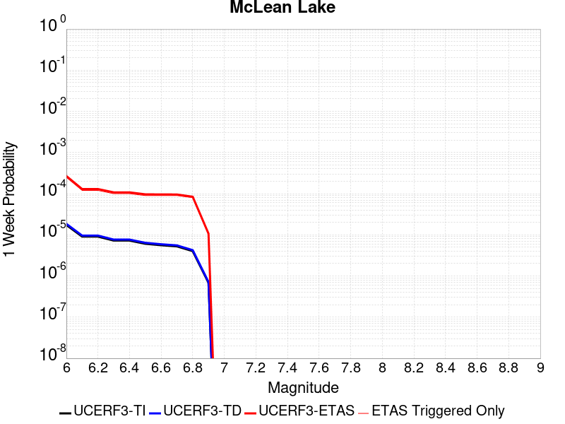 | 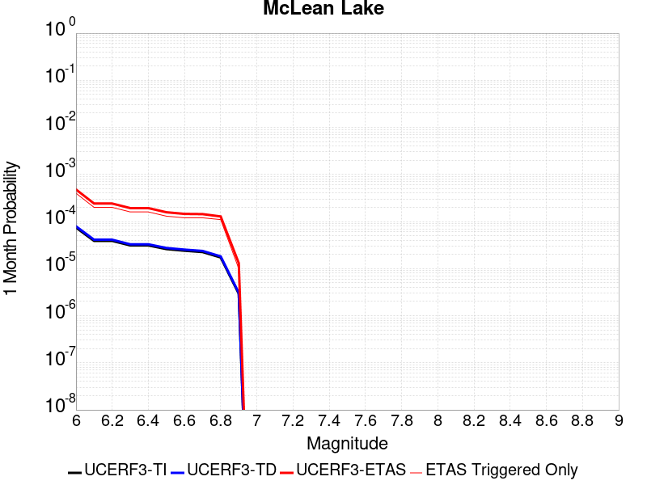 | 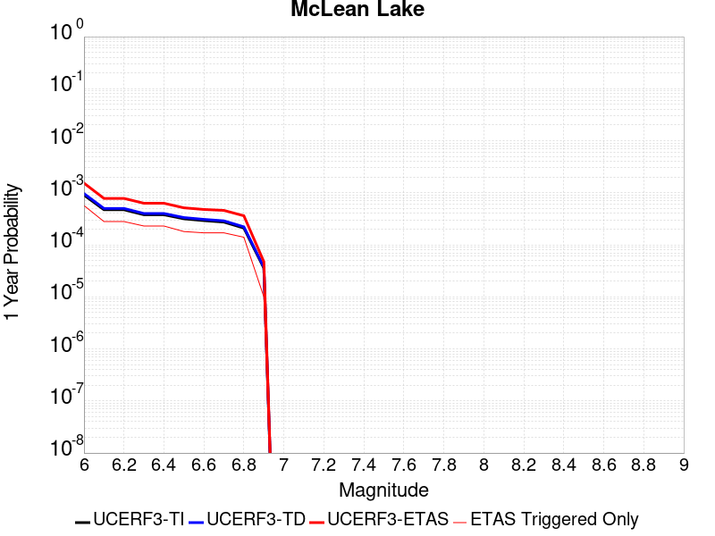 |  |

| Magnitude | 1 wk TI Prob | 1 wk TD Prob | 1 wk ETAS Prob | 1 wk ETAS/TD Gain | 1 wk ETAS Triggered Only | 1 mo TI Prob | 1 mo TD Prob | 1 mo ETAS Prob | 1 mo ETAS/TD Gain | 1 mo ETAS Triggered Only | 1 yr TI Prob | 1 yr TD Prob | 1 yr ETAS Prob | 1 yr ETAS/TD Gain | 1 yr ETAS Triggered Only | 10 yr TI Prob | 10 yr TD Prob | 10 yr ETAS Prob | 10 yr ETAS/TD Gain | 10 yr ETAS Triggered Only |
|-----|-----|-----|-----|-----|-----|-----|-----|-----|-----|-----|-----|-----|-----|-----|-----|-----|-----|-----|-----|-----|
| 6.0 | 1.7360222E-5 | 1.8501594E-5 | 2.6849698E-4 | 14.512098 | 2.5E-4 | 7.439883E-5 | 7.929042E-5 | 4.7925868E-4 | 6.044346 | 4.0E-4 | 9.0542925E-4 | 9.6498185E-4 | 0.0015344318 | 1.5901147 | 5.7E-4 | 0.009017491 | 0.009612758 | 0.010543722 | 1.0968467 | 9.4E-4 |
| 6.1 | 9.062689E-6 | 9.592179E-6 | 1.2959103E-4 | 13.510073 | 1.2E-4 | 3.8839516E-5 | 4.110874E-5 | 2.4110051E-4 | 5.8649454 | 2.0E-4 | 4.727685E-4 | 5.0039287E-4 | 7.8025274E-4 | 1.5592804 | 2.8E-4 | 0.0047176396 | 0.004993544 | 0.005491047 | 1.0996293 | 5.0E-4 |
| 6.2 | 9.062689E-6 | 9.592179E-6 | 1.2959103E-4 | 13.510073 | 1.2E-4 | 3.8839516E-5 | 4.110874E-5 | 2.4110051E-4 | 5.8649454 | 2.0E-4 | 4.727685E-4 | 5.0039287E-4 | 7.8025274E-4 | 1.5592804 | 2.8E-4 | 0.0047176396 | 0.004993544 | 0.005491047 | 1.0996293 | 5.0E-4 |
| 6.3 | 7.2575485E-6 | 7.667698E-6 | 1.0766693E-4 | 14.041624 | 1.0E-4 | 3.110341E-5 | 3.286119E-5 | 1.9285594E-4 | 5.868806 | 1.6E-4 | 3.786182E-4 | 4.0001865E-4 | 6.299266E-4 | 1.5747432 | 2.3E-4 | 0.0037797375 | 0.003993691 | 0.004372173 | 1.0947701 | 3.8E-4 |
| 6.4 | 7.2575485E-6 | 7.667698E-6 | 1.0766693E-4 | 14.041624 | 1.0E-4 | 3.110341E-5 | 3.286119E-5 | 1.9285594E-4 | 5.868806 | 1.6E-4 | 3.786182E-4 | 4.0001865E-4 | 6.299266E-4 | 1.5747432 | 2.3E-4 | 0.0037797375 | 0.003993691 | 0.004372173 | 1.0947701 | 3.8E-4 |
| 6.5 | 6.06582E-6 | 6.4038677E-6 | 9.640329E-5 | 15.053917 | 9.0E-5 | 2.5996113E-5 | 2.7444894E-5 | 1.5744133E-4 | 5.7366343 | 1.3E-4 | 3.164567E-4 | 3.3409684E-4 | 5.140367E-4 | 1.5385859 | 1.8E-4 | 0.0031600643 | 0.0033365842 | 0.003665483 | 1.0985736 | 3.3E-4 |
| 6.6 | 5.598744E-6 | 5.9102535E-6 | 9.590972E-5 | 16.227684 | 9.0E-5 | 2.3994397E-5 | 2.5329447E-5 | 1.4532641E-4 | 5.7374487 | 1.2E-4 | 2.9209262E-4 | 3.0834877E-4 | 4.7829637E-4 | 1.5511538 | 1.7E-4 | 0.0029170897 | 0.0030798386 | 0.003398853 | 1.1035815 | 3.2E-4 |
| 6.7 | 5.246996E-6 | 5.539154E-6 | 9.553866E-5 | 17.247879 | 9.0E-5 | 2.2486933E-5 | 2.373905E-5 | 1.4373621E-4 | 6.054842 | 1.2E-4 | 2.73744E-4 | 2.8899097E-4 | 4.5894182E-4 | 1.5880837 | 1.7E-4 | 0.0027340704 | 0.0028867754 | 0.0032058517 | 1.1105304 | 3.2E-4 |
| 6.8 | 4.02324E-6 | 4.2468982E-6 | 8.424656E-5 | 19.837198 | 8.0E-5 | 1.7242342E-5 | 1.8200899E-5 | 1.281989E-4 | 7.0435476 | 1.1E-4 | 2.099053E-4 | 2.2157936E-4 | 3.6154833E-4 | 1.6316878 | 1.4E-4 | 0.0020970714 | 0.0022141687 | 0.0024336816 | 1.09914 | 2.2E-4 |
| 6.9 | 6.835972E-7 | 7.13992E-7 | 1.0713985E-5 | 15.00575 | 1.0E-5 | 2.9296991E-6 | 3.0599638E-6 | 1.3059933E-5 | 4.2680025 | 1.0E-5 | 3.56685E-5 | 3.725474E-5 | 4.725437E-5 | 1.2684122 | 1.0E-5 | 3.5662777E-4 | 3.7251622E-4 | 3.825125E-4 | 1.0268345 | 1.0E-5 |

## Coyote Canyon
*[(top)](#table-of-contents)*

| 1 Week | 1 Month | 1 Year | 10 Year |
|-----|-----|-----|-----|
| 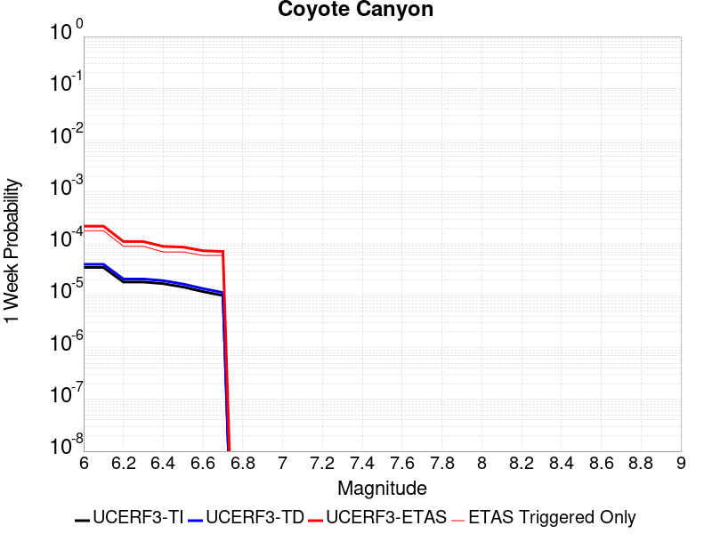 | 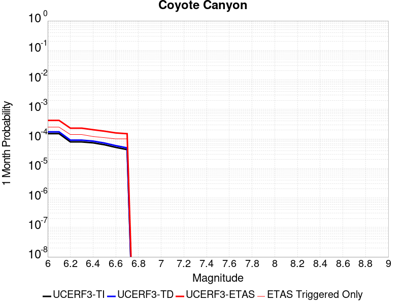 |  |  |

| Magnitude | 1 wk TI Prob | 1 wk TD Prob | 1 wk ETAS Prob | 1 wk ETAS/TD Gain | 1 wk ETAS Triggered Only | 1 mo TI Prob | 1 mo TD Prob | 1 mo ETAS Prob | 1 mo ETAS/TD Gain | 1 mo ETAS Triggered Only | 1 yr TI Prob | 1 yr TD Prob | 1 yr ETAS Prob | 1 yr ETAS/TD Gain | 1 yr ETAS Triggered Only | 10 yr TI Prob | 10 yr TD Prob | 10 yr ETAS Prob | 10 yr ETAS/TD Gain | 10 yr ETAS Triggered Only |
|-----|-----|-----|-----|-----|-----|-----|-----|-----|-----|-----|-----|-----|-----|-----|-----|-----|-----|-----|-----|-----|
| 6.0 | 3.5090034E-5 | 4.0364153E-5 | 2.2035689E-4 | 5.4592223 | 1.8E-4 | 1.503772E-4 | 1.7297921E-4 | 4.2293596E-4 | 2.4450104 | 2.5E-4 | 0.0018293047 | 0.002104245 | 0.002593214 | 1.2323726 | 4.9E-4 | 0.018143194 | 0.020869121 | 0.021632845 | 1.0365958 | 7.8E-4 |
| 6.1 | 3.5090034E-5 | 4.0364153E-5 | 2.2035689E-4 | 5.4592223 | 1.8E-4 | 1.503772E-4 | 1.7297921E-4 | 4.2293596E-4 | 2.4450104 | 2.5E-4 | 0.0018293047 | 0.002104245 | 0.002593214 | 1.2323726 | 4.9E-4 | 0.018143194 | 0.020869121 | 0.021632845 | 1.0365958 | 7.8E-4 |
| 6.2 | 1.841879E-5 | 2.1059712E-5 | 1.11057816E-4 | 5.273473 | 9.0E-5 | 7.8935285E-5 | 9.0253365E-5 | 2.3024072E-4 | 2.5510488 | 1.4E-4 | 9.606133E-4 | 0.0010983829 | 0.0013381192 | 1.218263 | 2.4E-4 | 0.0095647145 | 0.010939626 | 0.011384703 | 1.0406848 | 4.5E-4 |
| 6.3 | 1.841879E-5 | 2.1059712E-5 | 1.11057816E-4 | 5.273473 | 9.0E-5 | 7.8935285E-5 | 9.0253365E-5 | 2.3024072E-4 | 2.5510488 | 1.4E-4 | 9.606133E-4 | 0.0010983829 | 0.0013381192 | 1.218263 | 2.4E-4 | 0.0095647145 | 0.010939626 | 0.011384703 | 1.0406848 | 4.5E-4 |
| 6.4 | 1.712201E-5 | 1.9565137E-5 | 8.9563764E-5 | 4.5777225 | 7.0E-5 | 7.337798E-5 | 8.384846E-5 | 2.038384E-4 | 2.4310334 | 1.2E-4 | 8.930107E-4 | 0.0010204775 | 0.001240253 | 1.2153654 | 2.2E-4 | 0.008894307 | 0.0101678325 | 0.01059346 | 1.0418602 | 4.3E-4 |
| 6.5 | 1.4744935E-5 | 1.6836908E-5 | 8.683573E-5 | 5.157463 | 7.0E-5 | 6.3191044E-5 | 7.215671E-5 | 1.8214877E-4 | 2.5243497 | 1.1E-4 | 7.6907943E-4 | 8.782473E-4 | 0.0010480981 | 1.1933973 | 1.7E-4 | 0.007664232 | 0.008756962 | 0.009123721 | 1.0418822 | 3.7E-4 |
| 6.6 | 1.2017839E-5 | 1.3724037E-5 | 7.372321E-5 | 5.3718314 | 6.0E-5 | 5.150401E-5 | 5.8816477E-5 | 1.588106E-4 | 2.700104 | 1.0E-4 | 6.268809E-4 | 7.1594387E-4 | 8.35858E-4 | 1.1674908 | 1.2E-4 | 0.0062511545 | 0.0071450667 | 0.0074131377 | 1.0375183 | 2.7E-4 |
| 6.7 | 1.00956095E-5 | 1.1533472E-5 | 7.1532784E-5 | 6.2021894 | 6.0E-5 | 4.326618E-5 | 4.9428723E-5 | 1.4942378E-4 | 3.0230153 | 1.0E-4 | 5.266384E-4 | 6.017155E-4 | 7.116493E-4 | 1.1827006 | 1.1E-4 | 0.005253921 | 0.0060093896 | 0.0062578875 | 1.0413516 | 2.5E-4 |

## Garlock (West)
*[(top)](#table-of-contents)*

| 1 Week | 1 Month | 1 Year | 10 Year |
|-----|-----|-----|-----|
| 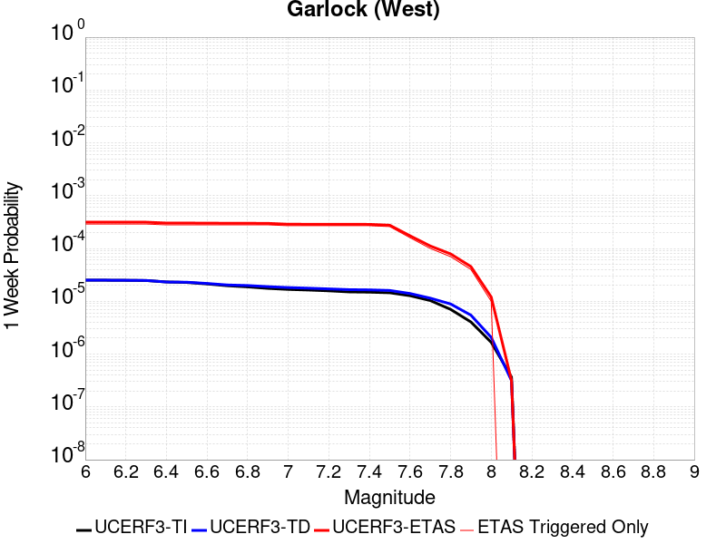 |  |  |  |

| Magnitude | 1 wk TI Prob | 1 wk TD Prob | 1 wk ETAS Prob | 1 wk ETAS/TD Gain | 1 wk ETAS Triggered Only | 1 mo TI Prob | 1 mo TD Prob | 1 mo ETAS Prob | 1 mo ETAS/TD Gain | 1 mo ETAS Triggered Only | 1 yr TI Prob | 1 yr TD Prob | 1 yr ETAS Prob | 1 yr ETAS/TD Gain | 1 yr ETAS Triggered Only | 10 yr TI Prob | 10 yr TD Prob | 10 yr ETAS Prob | 10 yr ETAS/TD Gain | 10 yr ETAS Triggered Only |
|-----|-----|-----|-----|-----|-----|-----|-----|-----|-----|-----|-----|-----|-----|-----|-----|-----|-----|-----|-----|-----|
| 6.0 | 2.5181727E-5 | 2.519625E-5 | 3.1518895E-4 | 12.509358 | 2.9E-4 | 1.0791722E-4 | 1.0797948E-4 | 4.8793844E-4 | 4.518807 | 3.8E-4 | 0.0013131002 | 0.0013138608 | 0.0018731251 | 1.4256648 | 5.6E-4 | 0.013053683 | 0.013141131 | 0.013881275 | 1.0563227 | 7.5E-4 |
| 6.1 | 2.5077732E-5 | 2.5097293E-5 | 3.1509E-4 | 12.554741 | 2.9E-4 | 1.0747157E-4 | 1.0755541E-4 | 4.8751454E-4 | 4.5326824 | 3.8E-4 | 0.001307681 | 0.0013087039 | 0.0018679712 | 1.4273442 | 5.6E-4 | 0.013000126 | 0.013090172 | 0.0138303535 | 1.0565449 | 7.5E-4 |
| 6.2 | 2.494612E-5 | 2.4978985E-5 | 3.1497175E-4 | 12.609469 | 2.9E-4 | 1.0690756E-4 | 1.0704842E-4 | 4.8700775E-4 | 4.5494156 | 3.8E-4 | 0.0013008224 | 0.0013025387 | 0.0018618093 | 1.4293697 | 5.6E-4 | 0.012932341 | 0.013029243 | 0.013769471 | 1.0568129 | 7.5E-4 |
| 6.3 | 2.4733758E-5 | 2.4798346E-5 | 3.1479116E-4 | 12.694038 | 2.9E-4 | 1.0599751E-4 | 1.0627432E-4 | 4.8623394E-4 | 4.575272 | 3.8E-4 | 0.0012897556 | 0.0012931252 | 0.0018524011 | 1.4324994 | 5.6E-4 | 0.012822957 | 0.012936208 | 0.0136765065 | 1.0572268 | 7.5E-4 |
| 6.4 | 2.3237335E-5 | 2.3177683E-5 | 3.031712E-4 | 13.080306 | 2.8E-4 | 9.958477E-5 | 9.932916E-5 | 4.592934E-4 | 4.6239533 | 3.6E-4 | 0.0012117702 | 0.0012086645 | 0.0017480118 | 1.4462341 | 5.4E-4 | 0.012051838 | 0.012101071 | 0.012822237 | 1.0595952 | 7.3E-4 |
| 6.5 | 2.2732203E-5 | 2.2992053E-5 | 3.029856E-4 | 13.177841 | 2.8E-4 | 9.742009E-5 | 9.853367E-5 | 4.584982E-4 | 4.6532135 | 3.6E-4 | 0.0011854442 | 0.0011989899 | 0.0017383425 | 1.4498391 | 5.4E-4 | 0.011791403 | 0.012005375 | 0.0127266105 | 1.0600761 | 7.3E-4 |
| 6.6 | 2.1319436E-5 | 2.1772283E-5 | 3.0176618E-4 | 13.860108 | 2.8E-4 | 9.136581E-5 | 9.330646E-5 | 4.5327286E-4 | 4.857894 | 3.6E-4 | 0.001111811 | 0.0011354164 | 0.0016748033 | 1.4750564 | 5.4E-4 | 0.011062649 | 0.011376292 | 0.012097988 | 1.0634385 | 7.3E-4 |
| 6.7 | 1.970802E-5 | 2.0392179E-5 | 3.0038648E-4 | 14.7304735 | 2.8E-4 | 8.446021E-5 | 8.739214E-5 | 4.4736068E-4 | 5.119004 | 3.6E-4 | 0.001027818 | 0.0010634817 | 0.001592918 | 1.4978331 | 5.3E-4 | 0.010230771 | 0.01066403 | 0.011366459 | 1.065869 | 7.1E-4 |
| 6.8 | 1.8744462E-5 | 1.9899864E-5 | 2.9989428E-4 | 15.070168 | 2.8E-4 | 8.033094E-5 | 8.528236E-5 | 4.4525164E-4 | 5.220912 | 3.6E-4 | 9.775903E-4 | 0.0010378198 | 0.0015672697 | 1.510156 | 5.3E-4 | 0.009733009 | 0.010409822 | 0.011112431 | 1.0674949 | 7.1E-4 |
| 6.9 | 1.7559682E-5 | 1.8952243E-5 | 2.9894695E-4 | 15.773696 | 2.8E-4 | 7.5253614E-5 | 8.1221384E-5 | 4.4119215E-4 | 5.4319706 | 3.6E-4 | 9.158276E-4 | 9.884231E-4 | 0.0015178993 | 1.5356776 | 5.3E-4 | 0.0091206245 | 0.009920391 | 0.010623348 | 1.0708598 | 7.1E-4 |
| 7.0 | 1.6794445E-5 | 1.8215069E-5 | 2.8821014E-4 | 15.822621 | 2.7E-4 | 7.197421E-5 | 7.806226E-5 | 4.2803492E-4 | 5.483251 | 3.5E-4 | 8.759337E-4 | 9.4999495E-4 | 0.0014595104 | 1.536335 | 5.1E-4 | 0.008724891 | 0.009539245 | 0.010222663 | 1.0716428 | 6.9E-4 |
| 7.1 | 1.6337795E-5 | 1.7715876E-5 | 2.877111E-4 | 16.240297 | 2.7E-4 | 7.0017246E-5 | 7.592298E-5 | 4.258964E-4 | 5.609585 | 3.5E-4 | 8.521265E-4 | 9.2397165E-4 | 0.0014335004 | 1.551455 | 5.1E-4 | 0.008488664 | 0.009281053 | 0.00996465 | 1.073655 | 6.9E-4 |
| 7.2 | 1.5780008E-5 | 1.716451E-5 | 2.8715987E-4 | 16.72986 | 2.7E-4 | 6.762685E-5 | 7.356012E-5 | 4.135351E-4 | 5.62173 | 3.4E-4 | 8.2304585E-4 | 8.952278E-4 | 0.0013847891 | 1.5468568 | 4.9E-4 | 0.008200042 | 0.008995891 | 0.009659863 | 1.0738084 | 6.7E-4 |
| 7.3 | 1.5058865E-5 | 1.6617598E-5 | 2.8661313E-4 | 17.247564 | 2.7E-4 | 6.45364E-5 | 7.1216346E-5 | 4.1119213E-4 | 5.773845 | 3.4E-4 | 7.854473E-4 | 8.667153E-4 | 0.0013562905 | 1.564863 | 4.9E-4 | 0.00782677 | 0.008712597 | 0.009366847 | 1.0750924 | 6.6E-4 |
| 7.4 | 1.4887923E-5 | 1.645357E-5 | 2.8644913E-4 | 17.409542 | 2.7E-4 | 6.380382E-5 | 7.05134E-5 | 4.1048942E-4 | 5.8214383 | 3.4E-4 | 7.7653467E-4 | 8.5816375E-4 | 0.0013477432 | 1.5704966 | 4.9E-4 | 0.0077382675 | 0.0086274315 | 0.009281738 | 1.0758401 | 6.6E-4 |
| 7.5 | 1.4509299E-5 | 1.6045597E-5 | 2.7604142E-4 | 17.203564 | 2.6E-4 | 6.218123E-5 | 6.876503E-5 | 3.9874236E-4 | 5.7986207 | 3.3E-4 | 7.567935E-4 | 8.368939E-4 | 0.0013164922 | 1.5730695 | 4.8E-4 | 0.0075422134 | 0.00841572 | 0.009050335 | 1.0754081 | 6.4E-4 |
| 7.6 | 1.2756717E-5 | 1.40496895E-5 | 1.7404744E-4 | 12.387992 | 1.6E-4 | 5.4670498E-5 | 6.021157E-5 | 2.9019773E-4 | 4.819634 | 2.3E-4 | 6.6541E-4 | 7.3282997E-4 | 0.0010625881 | 1.4499791 | 3.3E-4 | 0.006634211 | 0.007380847 | 0.007847378 | 1.0632083 | 4.7E-4 |
| 7.7 | 1.0328985E-5 | 1.1459538E-5 | 1.11458394E-4 | 9.726255 | 1.0E-4 | 4.4266326E-5 | 4.9111382E-5 | 1.79105E-4 | 3.6469142 | 1.3E-4 | 5.388092E-4 | 5.977675E-4 | 7.876539E-4 | 1.3176594 | 1.9E-4 | 0.0053750467 | 0.006037873 | 0.0062863636 | 1.0411553 | 2.5E-4 |
| 7.8 | 7.0306583E-6 | 8.89889E-6 | 7.8898265E-5 | 8.866079 | 7.0E-5 | 3.0131043E-5 | 3.8137543E-5 | 1.3813374E-4 | 3.621988 | 1.0E-4 | 3.667837E-4 | 4.6422583E-4 | 5.841701E-4 | 1.2583749 | 1.2E-4 | 0.003661789 | 0.004694754 | 0.0048440495 | 1.0318005 | 1.5E-4 |
| 7.9 | 4.060633E-6 | 5.46505E-6 | 4.5464833E-5 | 8.319198 | 4.0E-5 | 1.7402595E-5 | 2.3421433E-5 | 6.34205E-5 | 2.7077975 | 4.0E-5 | 2.11856E-4 | 2.8511873E-4 | 3.3510447E-4 | 1.1753155 | 5.0E-5 | 0.0021165414 | 0.0028838275 | 0.0029436545 | 1.0207456 | 6.0E-5 |
| 8.0 | 1.6729537E-6 | 2.077398E-6 | 1.20773775E-5 | 5.813704 | 1.0E-5 | 7.169782E-6 | 8.903104E-6 | 1.8903014E-5 | 2.1231937 | 1.0E-5 | 8.7288594E-5 | 1.0838993E-4 | 1.1838885E-4 | 1.0922495 | 1.0E-5 | 8.7254314E-4 | 0.0010967436 | 0.0011067326 | 1.009108 | 1.0E-5 |
| 8.1 | 3.6733252E-7 | 3.1487303E-7 | 3.1487303E-7 | 1.0 | 0.0 | 1.5742813E-6 | 1.3494553E-6 | 1.3494553E-6 | 1.0 | 0.0 | 1.9166706E-5 | 1.642951E-5 | 1.642951E-5 | 1.0 | 0.0 | 1.9165053E-4 | 1.6628111E-4 | 1.6628111E-4 | 1.0 | 0.0 |

## Lenwood-Lockhart-Old Woman Springs
*[(top)](#table-of-contents)*

| 1 Week | 1 Month | 1 Year | 10 Year |
|-----|-----|-----|-----|
|  | 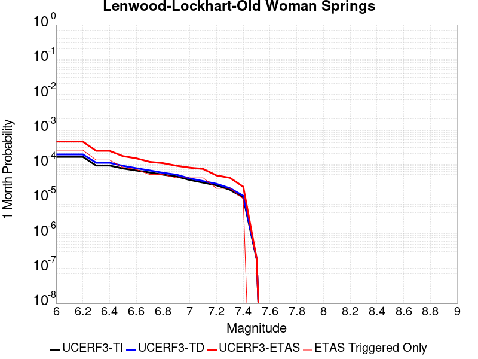 | 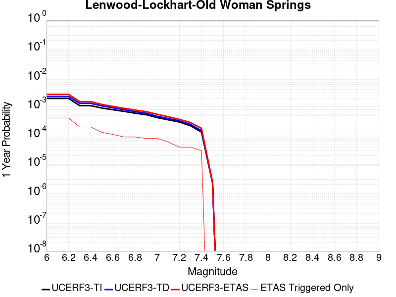 |  |

| Magnitude | 1 wk TI Prob | 1 wk TD Prob | 1 wk ETAS Prob | 1 wk ETAS/TD Gain | 1 wk ETAS Triggered Only | 1 mo TI Prob | 1 mo TD Prob | 1 mo ETAS Prob | 1 mo ETAS/TD Gain | 1 mo ETAS Triggered Only | 1 yr TI Prob | 1 yr TD Prob | 1 yr ETAS Prob | 1 yr ETAS/TD Gain | 1 yr ETAS Triggered Only | 10 yr TI Prob | 10 yr TD Prob | 10 yr ETAS Prob | 10 yr ETAS/TD Gain | 10 yr ETAS Triggered Only |
|-----|-----|-----|-----|-----|-----|-----|-----|-----|-----|-----|-----|-----|-----|-----|-----|-----|-----|-----|-----|-----|
| 6.0 | 3.744542E-5 | 4.3963413E-5 | 2.4395462E-4 | 5.5490375 | 2.0E-4 | 1.604705E-4 | 1.8840199E-4 | 4.3835488E-4 | 2.3267 | 2.5E-4 | 0.0019519776 | 0.0022915532 | 0.0027006138 | 1.1785079 | 4.1E-4 | 0.019349206 | 0.022697242 | 0.023244532 | 1.0241126 | 5.6E-4 |
| 6.1 | 3.744542E-5 | 4.3963413E-5 | 2.4395462E-4 | 5.5490375 | 2.0E-4 | 1.604705E-4 | 1.8840199E-4 | 4.3835488E-4 | 2.3267 | 2.5E-4 | 0.0019519776 | 0.0022915532 | 0.0027006138 | 1.1785079 | 4.1E-4 | 0.019349206 | 0.022697242 | 0.023244532 | 1.0241126 | 5.6E-4 |
| 6.2 | 3.744542E-5 | 4.3963413E-5 | 2.4395462E-4 | 5.5490375 | 2.0E-4 | 1.604705E-4 | 1.8840199E-4 | 4.3835488E-4 | 2.3267 | 2.5E-4 | 0.0019519776 | 0.0022915532 | 0.0027006138 | 1.1785079 | 4.1E-4 | 0.019349206 | 0.022697242 | 0.023244532 | 1.0241126 | 5.6E-4 |
| 6.3 | 2.1079984E-5 | 2.5354364E-5 | 1.4535133E-4 | 5.732793 | 1.2E-4 | 9.0339665E-5 | 1.0865715E-4 | 2.3864303E-4 | 2.1962938 | 1.3E-4 | 0.0010993304 | 0.001322118 | 0.0015218535 | 1.1510724 | 2.0E-4 | 0.010939079 | 0.013144737 | 0.013391451 | 1.018769 | 2.5E-4 |
| 6.4 | 2.1079984E-5 | 2.5354364E-5 | 1.4535133E-4 | 5.732793 | 1.2E-4 | 9.0339665E-5 | 1.0865715E-4 | 2.3864303E-4 | 2.1962938 | 1.3E-4 | 0.0010993304 | 0.001322118 | 0.0015218535 | 1.1510724 | 2.0E-4 | 0.010939079 | 0.013144737 | 0.013391451 | 1.018769 | 2.5E-4 |
| 6.5 | 1.7397282E-5 | 2.066327E-5 | 9.066182E-5 | 4.3875833 | 7.0E-5 | 7.455765E-5 | 8.8553934E-5 | 1.6854685E-4 | 1.9033242 | 8.0E-5 | 9.073613E-4 | 0.0010776226 | 0.0012074825 | 1.1205059 | 1.3E-4 | 0.009036654 | 0.010725265 | 0.010903335 | 1.0166028 | 1.8E-4 |
| 6.6 | 1.52050325E-5 | 1.7680073E-5 | 7.767901E-5 | 4.3935914 | 6.0E-5 | 6.51628E-5 | 7.576958E-5 | 1.4576428E-4 | 1.9237835 | 7.0E-5 | 7.9306826E-4 | 9.2211214E-4 | 0.0010320108 | 1.1191814 | 1.1E-4 | 0.007902439 | 0.009183723 | 0.009332345 | 1.0161833 | 1.5E-4 |
| 6.7 | 1.332523E-5 | 1.526437E-5 | 5.5263758E-5 | 3.6204417 | 4.0E-5 | 5.7106878E-5 | 6.5417116E-5 | 1.15413844E-4 | 1.7642759 | 5.0E-5 | 6.950544E-4 | 7.961682E-4 | 8.8609656E-4 | 1.1129514 | 9.0E-5 | 0.006928845 | 0.007933789 | 0.008052836 | 1.0150052 | 1.2E-4 |
| 6.8 | 1.1525329E-5 | 1.30313565E-5 | 5.3030835E-5 | 4.0694795 | 4.0E-5 | 4.9393333E-5 | 5.5847497E-5 | 1.0584471E-4 | 1.8952452 | 5.0E-5 | 6.011979E-4 | 6.797354E-4 | 7.6967425E-4 | 1.1323144 | 9.0E-5 | 0.00599574 | 0.0067770146 | 0.0068962015 | 1.017587 | 1.2E-4 |
| 6.9 | 1.0253909E-5 | 1.1514828E-5 | 4.1514482E-5 | 3.6053066 | 3.0E-5 | 4.3944583E-5 | 4.9348346E-5 | 8.934637E-5 | 1.8105241 | 4.0E-5 | 5.3489394E-4 | 6.006541E-4 | 6.8060606E-4 | 1.1331081 | 8.0E-5 | 0.0053360825 | 0.005990686 | 0.006100027 | 1.0182519 | 1.1E-4 |
| 7.0 | 8.104563E-6 | 8.991426E-6 | 3.8991155E-5 | 4.336482 | 3.0E-5 | 3.4733377E-5 | 3.8534123E-5 | 7.853258E-5 | 2.038001 | 4.0E-5 | 4.2279682E-4 | 4.690544E-4 | 5.4901687E-4 | 1.170476 | 8.0E-5 | 0.0042199334 | 0.0046808915 | 0.0047704703 | 1.0191371 | 9.0E-5 |
| 7.1 | 6.7986157E-6 | 7.515976E-6 | 3.751575E-5 | 4.9914675 | 3.0E-5 | 2.91366E-5 | 3.221094E-5 | 7.220965E-5 | 2.241774 | 4.0E-5 | 3.5468035E-4 | 3.9209976E-4 | 4.5207623E-4 | 1.1529623 | 6.0E-5 | 0.003541148 | 0.0039142957 | 0.003984022 | 1.0178132 | 7.0E-5 |
| 7.2 | 5.6893327E-6 | 6.280129E-6 | 1.6280066E-5 | 2.592314 | 1.0E-5 | 2.4382627E-5 | 2.6914573E-5 | 4.6914036E-5 | 1.7430719 | 2.0E-5 | 2.9681803E-4 | 3.2763765E-4 | 3.6762454E-4 | 1.1220461 | 4.0E-5 | 0.002964219 | 0.0032717446 | 0.003321581 | 1.0152323 | 5.0E-5 |
| 7.3 | 4.253348E-6 | 4.707073E-6 | 1.4707026E-5 | 3.1244524 | 1.0E-5 | 1.8228506E-5 | 2.0173025E-5 | 4.017262E-5 | 1.991403 | 2.0E-5 | 2.2190946E-4 | 2.4558074E-4 | 2.8557092E-4 | 1.1628392 | 4.0E-5 | 0.00221688 | 0.0024532743 | 0.0025031518 | 1.0203309 | 5.0E-5 |
| 7.4 | 2.5448119E-6 | 2.852059E-6 | 1.28520305E-5 | 4.506229 | 1.0E-5 | 1.0906291E-5 | 1.2223062E-5 | 2.2222941E-5 | 1.8181156 | 1.0E-5 | 1.3277601E-4 | 1.4880727E-4 | 1.788028E-4 | 1.201573 | 3.0E-5 | 0.001326967 | 0.0014872384 | 0.001527179 | 1.0268555 | 4.0E-5 |
| 7.5 | 4.3706837E-8 | 4.5629037E-8 | 4.5629037E-8 | 1.0 | 0.0 | 1.8731501E-7 | 1.9555301E-7 | 1.9555301E-7 | 1.0 | 0.0 | 2.2805577E-6 | 2.380856E-6 | 2.380856E-6 | 1.0 | 0.0 | 2.2805343E-5 | 2.3808358E-5 | 2.3808358E-5 | 1.0 | 0.0 |

## Nelson Lake
*[(top)](#table-of-contents)*

| 1 Week | 1 Month | 1 Year | 10 Year |
|-----|-----|-----|-----|
| 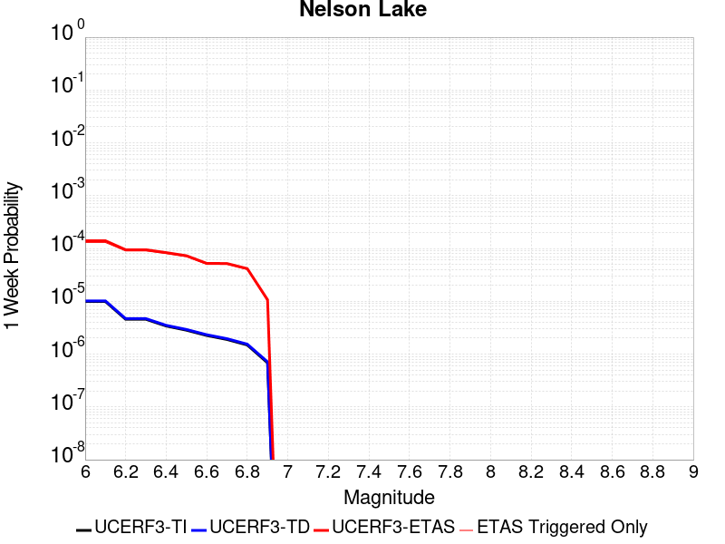 |  | 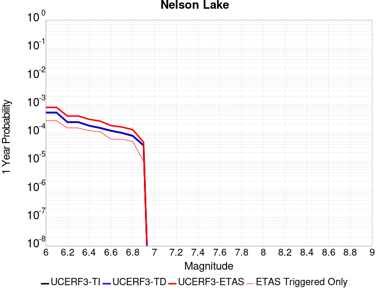 | 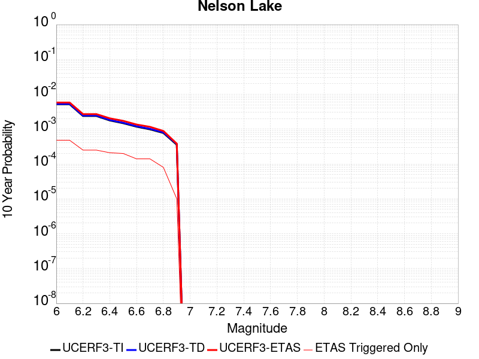 |

| Magnitude | 1 wk TI Prob | 1 wk TD Prob | 1 wk ETAS Prob | 1 wk ETAS/TD Gain | 1 wk ETAS Triggered Only | 1 mo TI Prob | 1 mo TD Prob | 1 mo ETAS Prob | 1 mo ETAS/TD Gain | 1 mo ETAS Triggered Only | 1 yr TI Prob | 1 yr TD Prob | 1 yr ETAS Prob | 1 yr ETAS/TD Gain | 1 yr ETAS Triggered Only | 10 yr TI Prob | 10 yr TD Prob | 10 yr ETAS Prob | 10 yr ETAS/TD Gain | 10 yr ETAS Triggered Only |
|-----|-----|-----|-----|-----|-----|-----|-----|-----|-----|-----|-----|-----|-----|-----|-----|-----|-----|-----|-----|-----|
| 6.0 | 9.913453E-6 | 1.0192248E-5 | 1.4019092E-4 | 13.754662 | 1.3E-4 | 4.2485535E-5 | 4.368039E-5 | 2.4367165E-4 | 5.5785136 | 2.0E-4 | 5.1713863E-4 | 5.316893E-4 | 8.0154574E-4 | 1.5075454 | 2.7E-4 | 0.0051593683 | 0.0053052 | 0.0057826536 | 1.0899973 | 4.8E-4 |
| 6.1 | 9.913453E-6 | 1.0192248E-5 | 1.4019092E-4 | 13.754662 | 1.3E-4 | 4.2485535E-5 | 4.368039E-5 | 2.4367165E-4 | 5.5785136 | 2.0E-4 | 5.1713863E-4 | 5.316893E-4 | 8.0154574E-4 | 1.5075454 | 2.7E-4 | 0.0051593683 | 0.0053052 | 0.0057826536 | 1.0899973 | 4.8E-4 |
| 6.2 | 4.5596407E-6 | 4.696309E-6 | 9.469589E-5 | 20.163895 | 9.0E-5 | 1.954117E-5 | 2.0126892E-5 | 1.6012408E-4 | 7.955728 | 1.4E-4 | 2.3788778E-4 | 2.4501863E-4 | 3.9498188E-4 | 1.6120484 | 1.5E-4 | 0.0023763329 | 0.002447611 | 0.0026969989 | 1.1018904 | 2.5E-4 |
| 6.3 | 4.5596407E-6 | 4.696309E-6 | 9.469589E-5 | 20.163895 | 9.0E-5 | 1.954117E-5 | 2.0126892E-5 | 1.6012408E-4 | 7.955728 | 1.4E-4 | 2.3788778E-4 | 2.4501863E-4 | 3.9498188E-4 | 1.6120484 | 1.5E-4 | 0.0023763329 | 0.002447611 | 0.0026969989 | 1.1018904 | 2.5E-4 |
| 6.4 | 3.4025713E-6 | 3.5098942E-6 | 8.3509614E-5 | 23.79263 | 8.0E-5 | 1.4582367E-5 | 1.5042322E-5 | 1.2504066E-4 | 8.312591 | 1.1E-4 | 1.7752586E-4 | 1.8312573E-4 | 3.0310373E-4 | 1.6551676 | 1.2E-4 | 0.001773841 | 0.0018298312 | 0.002039447 | 1.1145546 | 2.1E-4 |
| 6.5 | 2.8352947E-6 | 2.9278535E-6 | 7.292765E-5 | 24.90823 | 7.0E-5 | 1.2151207E-5 | 1.2547887E-5 | 1.1254663E-4 | 8.969369 | 1.0E-4 | 1.479309E-4 | 1.5276058E-4 | 2.6274376E-4 | 1.7199711 | 1.1E-4 | 0.0014783246 | 0.0015266296 | 0.0017263242 | 1.1308075 | 2.0E-4 |
| 6.6 | 2.251518E-6 | 2.3290654E-6 | 5.232895E-5 | 22.467789 | 5.0E-5 | 9.649328E-6 | 9.981674E-6 | 6.998108E-5 | 7.010956 | 6.0E-5 | 1.1747423E-4 | 1.2152074E-4 | 1.8151345E-4 | 1.4936829 | 6.0E-5 | 0.0011741214 | 0.0012146046 | 0.0013544345 | 1.1151239 | 1.4E-4 |
| 6.7 | 1.8911853E-6 | 1.9591378E-6 | 5.195904E-5 | 26.521381 | 5.0E-5 | 8.105055E-6 | 8.396281E-6 | 6.839578E-5 | 8.145961 | 6.0E-5 | 9.867457E-5 | 1.0222051E-4 | 1.6221438E-4 | 1.5869063 | 6.0E-5 | 9.863076E-4 | 0.0010217924 | 0.0011616494 | 1.1368741 | 1.4E-4 |
| 6.8 | 1.4874814E-6 | 1.543829E-6 | 4.1543768E-5 | 26.909567 | 4.0E-5 | 6.374905E-6 | 6.6163957E-6 | 5.6616063E-5 | 8.556934 | 5.0E-5 | 7.76117E-5 | 8.055216E-5 | 1.3054814E-4 | 1.6206658 | 5.0E-5 | 7.75846E-4 | 8.0528075E-4 | 8.852163E-4 | 1.0992643 | 8.0E-5 |
| 6.9 | 6.835972E-7 | 7.13992E-7 | 1.0713985E-5 | 15.00575 | 1.0E-5 | 2.9296991E-6 | 3.0599638E-6 | 1.3059933E-5 | 4.2680025 | 1.0E-5 | 3.56685E-5 | 3.725474E-5 | 4.725437E-5 | 1.2684122 | 1.0E-5 | 3.5662777E-4 | 3.7251622E-4 | 3.825125E-4 | 1.0268345 | 1.0E-5 |

## San Andreas (Mojave S)
*[(top)](#table-of-contents)*

| 1 Week | 1 Month | 1 Year | 10 Year |
|-----|-----|-----|-----|
|  |  |  |  |

| Magnitude | 1 wk TI Prob | 1 wk TD Prob | 1 wk ETAS Prob | 1 wk ETAS/TD Gain | 1 wk ETAS Triggered Only | 1 mo TI Prob | 1 mo TD Prob | 1 mo ETAS Prob | 1 mo ETAS/TD Gain | 1 mo ETAS Triggered Only | 1 yr TI Prob | 1 yr TD Prob | 1 yr ETAS Prob | 1 yr ETAS/TD Gain | 1 yr ETAS Triggered Only | 10 yr TI Prob | 10 yr TD Prob | 10 yr ETAS Prob | 10 yr ETAS/TD Gain | 10 yr ETAS Triggered Only |
|-----|-----|-----|-----|-----|-----|-----|-----|-----|-----|-----|-----|-----|-----|-----|-----|-----|-----|-----|-----|-----|
| 6.0 | 3.1064058E-4 | 6.7460246E-4 | 8.644743E-4 | 1.2814573 | 1.9E-4 | 0.0013306376 | 0.0028880783 | 0.0031373561 | 1.0863128 | 2.5E-4 | 0.016080605 | 0.03456449 | 0.03487343 | 1.0089381 | 3.2E-4 | 0.1496549 | 0.28653982 | 0.28685373 | 1.0010955 | 4.4E-4 |
| 6.1 | 3.1064058E-4 | 6.7460246E-4 | 8.644743E-4 | 1.2814573 | 1.9E-4 | 0.0013306376 | 0.0028880783 | 0.0031373561 | 1.0863128 | 2.5E-4 | 0.016080605 | 0.03456449 | 0.03487343 | 1.0089381 | 3.2E-4 | 0.1496549 | 0.28653982 | 0.28685373 | 1.0010955 | 4.4E-4 |
| 6.2 | 3.1064058E-4 | 6.7460246E-4 | 8.644743E-4 | 1.2814573 | 1.9E-4 | 0.0013306376 | 0.0028880783 | 0.0031373561 | 1.0863128 | 2.5E-4 | 0.016080605 | 0.03456449 | 0.03487343 | 1.0089381 | 3.2E-4 | 0.1496549 | 0.28653982 | 0.28685373 | 1.0010955 | 4.4E-4 |
| 6.3 | 3.1064058E-4 | 6.7460246E-4 | 8.644743E-4 | 1.2814573 | 1.9E-4 | 0.0013306376 | 0.0028880783 | 0.0031373561 | 1.0863128 | 2.5E-4 | 0.016080605 | 0.03456449 | 0.03487343 | 1.0089381 | 3.2E-4 | 0.1496549 | 0.28653982 | 0.28685373 | 1.0010955 | 4.4E-4 |
| 6.4 | 1.9872203E-4 | 4.3178877E-4 | 5.917197E-4 | 1.3703916 | 1.6E-4 | 8.5138786E-4 | 0.0018492391 | 0.0020588508 | 1.1133503 | 2.1E-4 | 0.010316478 | 0.022288196 | 0.022561954 | 1.0122827 | 2.8E-4 | 0.098504856 | 0.1969439 | 0.19725709 | 1.0015903 | 3.9E-4 |
| 6.5 | 1.291105E-4 | 2.8752213E-4 | 4.1748473E-4 | 1.4520091 | 1.3E-4 | 5.5321335E-4 | 0.0012316585 | 0.0013914615 | 1.1297462 | 1.6E-4 | 0.006714592 | 0.014893164 | 0.015109887 | 1.0145519 | 2.2E-4 | 0.065152965 | 0.13802564 | 0.13827562 | 1.001811 | 2.9E-4 |
| 6.6 | 1.291105E-4 | 2.8752213E-4 | 4.1748473E-4 | 1.4520091 | 1.3E-4 | 5.5321335E-4 | 0.0012316585 | 0.0013914615 | 1.1297462 | 1.6E-4 | 0.006714592 | 0.014893164 | 0.015109887 | 1.0145519 | 2.2E-4 | 0.065152965 | 0.13802564 | 0.13827562 | 1.001811 | 2.9E-4 |
| 6.7 | 1.08001186E-4 | 2.4333477E-4 | 3.5330802E-4 | 1.4519421 | 1.1E-4 | 4.6278012E-4 | 0.001042447 | 0.0011823011 | 1.1341593 | 1.4E-4 | 0.0056198016 | 0.012618233 | 0.01281571 | 1.01565 | 2.0E-4 | 0.054797906 | 0.11918109 | 0.1194101 | 1.0019215 | 2.6E-4 |
| 6.8 | 1.0624356E-4 | 2.3851135E-4 | 3.484851E-4 | 1.461084 | 1.1E-4 | 4.5525006E-4 | 0.0010217916 | 0.0011616485 | 1.1368742 | 1.4E-4 | 0.0055285925 | 0.012369626 | 0.012567152 | 1.0159687 | 2.0E-4 | 0.053930566 | 0.11712997 | 0.11735951 | 1.0019598 | 2.6E-4 |
| 6.9 | 1.0393785E-4 | 2.3221466E-4 | 3.4218913E-4 | 1.4735897 | 1.1E-4 | 4.4537184E-4 | 9.948266E-4 | 0.0011346873 | 1.140588 | 1.4E-4 | 0.0054089287 | 0.012044998 | 0.012242589 | 1.0164044 | 2.0E-4 | 0.05279156 | 0.11443017 | 0.11466042 | 1.0020121 | 2.6E-4 |
| 7.0 | 1.0155622E-4 | 2.2591038E-4 | 3.3588553E-4 | 1.4868088 | 1.1E-4 | 4.3516833E-4 | 9.678285E-4 | 0.001107693 | 1.1445137 | 1.4E-4 | 0.005285311 | 0.011719874 | 0.01191753 | 1.016865 | 2.0E-4 | 0.05161361 | 0.111694634 | 0.111925595 | 1.0020678 | 2.6E-4 |
| 7.1 | 9.885595E-5 | 2.1879452E-4 | 3.1877265E-4 | 1.4569498 | 1.0E-4 | 4.2359953E-4 | 9.373542E-4 | 0.0010672323 | 1.1385583 | 1.3E-4 | 0.0051451353 | 0.011352769 | 0.011540612 | 1.016546 | 1.9E-4 | 0.05027629 | 0.10857562 | 0.108798474 | 1.0020525 | 2.5E-4 |
| 7.2 | 9.6411415E-5 | 2.1242435E-4 | 3.124031E-4 | 1.4706558 | 1.0E-4 | 4.1312634E-4 | 9.100727E-4 | 0.0010399544 | 1.1427157 | 1.3E-4 | 0.005018219 | 0.011024025 | 0.011211931 | 1.0170451 | 1.9E-4 | 0.049064007 | 0.10576863 | 0.10599218 | 1.0021137 | 2.5E-4 |
| 7.3 | 9.1180635E-5 | 1.9470933E-4 | 2.9468985E-4 | 1.5134861 | 1.0E-4 | 3.907156E-4 | 8.3420175E-4 | 9.640933E-4 | 1.1557076 | 1.3E-4 | 0.004746591 | 0.010109222 | 0.0102973 | 1.0186048 | 1.9E-4 | 0.046464786 | 0.09795409 | 0.0981796 | 1.0023022 | 2.5E-4 |
| 7.4 | 8.887388E-5 | 1.8719549E-4 | 2.8717678E-4 | 1.5341009 | 1.0E-4 | 3.8083247E-4 | 8.020198E-4 | 9.3191554E-4 | 1.1619607 | 1.3E-4 | 0.0046267817 | 0.00972097 | 0.009909123 | 1.0193554 | 1.9E-4 | 0.045316286 | 0.09458639 | 0.09481274 | 1.0023931 | 2.5E-4 |
| 7.5 | 8.6750515E-5 | 1.8051128E-4 | 2.8049323E-4 | 1.553882 | 1.0E-4 | 3.7173493E-4 | 7.733905E-4 | 9.0328994E-4 | 1.167961 | 1.3E-4 | 0.004516484 | 0.009375462 | 0.009563681 | 1.0200757 | 1.9E-4 | 0.04425787 | 0.09154962 | 0.091767654 | 1.0023816 | 2.4E-4 |
| 7.6 | 8.453092E-5 | 1.7438729E-4 | 2.7436984E-4 | 1.5733362 | 1.0E-4 | 3.6222505E-4 | 7.4716005E-4 | 8.770629E-4 | 1.1738622 | 1.3E-4 | 0.0044011753 | 0.009058807 | 0.009247086 | 1.020784 | 1.9E-4 | 0.04315024 | 0.08870782 | 0.088926524 | 1.0024655 | 2.4E-4 |
| 7.7 | 8.259102E-5 | 1.6960864E-4 | 2.695917E-4 | 1.5894926 | 1.0E-4 | 3.539135E-4 | 7.2669174E-4 | 8.5659727E-4 | 1.1787629 | 1.3E-4 | 0.004300386 | 0.008811649 | 0.0089999745 | 1.0213723 | 1.9E-4 | 0.042181134 | 0.08645931 | 0.08667856 | 1.0025358 | 2.4E-4 |
| 7.8 | 7.444844E-5 | 1.5283158E-4 | 2.3281934E-4 | 1.523372 | 8.0E-5 | 3.1902574E-4 | 6.548281E-4 | 7.6475606E-4 | 1.167873 | 1.1E-4 | 0.0038772223 | 0.007943437 | 0.008092246 | 1.0187335 | 1.5E-4 | 0.03810269 | 0.078290515 | 0.078456424 | 1.0021192 | 1.8E-4 |
| 7.9 | 5.2586525E-5 | 1.0006018E-4 | 1.4005617E-4 | 1.3997195 | 4.0E-5 | 2.2535135E-4 | 4.2875885E-4 | 4.687417E-4 | 1.0932525 | 4.0E-5 | 0.0027402006 | 0.0052076555 | 0.005267343 | 1.0114615 | 6.0E-5 | 0.027066574 | 0.052197643 | 0.05226399 | 1.001271 | 7.0E-5 |
| 8.0 | 3.379877E-5 | 5.406992E-5 | 6.4069376E-5 | 1.1849357 | 1.0E-5 | 1.4484383E-4 | 2.3170764E-4 | 2.4170533E-4 | 1.0431478 | 1.0E-5 | 0.0017620471 | 0.0028173928 | 0.0028273647 | 1.0035393 | 1.0E-5 | 0.017481409 | 0.028833257 | 0.028842969 | 1.0003368 | 1.0E-5 |
| 8.1 | 1.8668277E-5 | 1.930551E-5 | 1.930551E-5 | 1.0 | 0.0 | 8.000444E-5 | 8.273527E-5 | 8.273527E-5 | 1.0 | 0.0 | 9.736188E-4 | 0.0010068371 | 0.0010068371 | 1.0 | 0.0 | 0.009693642 | 0.010797266 | 0.010797266 | 1.0 | 0.0 |
| 8.2 | 8.541571E-6 | 5.458615E-6 | 5.458615E-6 | 1.0 | 0.0 | 3.660622E-5 | 2.3393854E-5 | 2.3393854E-5 | 1.0 | 0.0 | 4.455896E-4 | 2.8478302E-4 | 2.8478302E-4 | 1.0 | 0.0 | 0.0044469717 | 0.003239759 | 0.003239759 | 1.0 | 0.0 |
| 8.3 | 1.983087E-6 | 7.6547434E-7 | 7.6547434E-7 | 1.0 | 0.0 | 8.498917E-6 | 3.2806004E-6 | 3.2806004E-6 | 1.0 | 0.0 | 1.034694E-4 | 3.9940594E-5 | 3.9940594E-5 | 1.0 | 0.0 | 0.0010342124 | 4.7170694E-4 | 4.7170694E-4 | 1.0 | 0.0 |

## Death Valley (So)
*[(top)](#table-of-contents)*

| 1 Week | 1 Month | 1 Year | 10 Year |
|-----|-----|-----|-----|
| 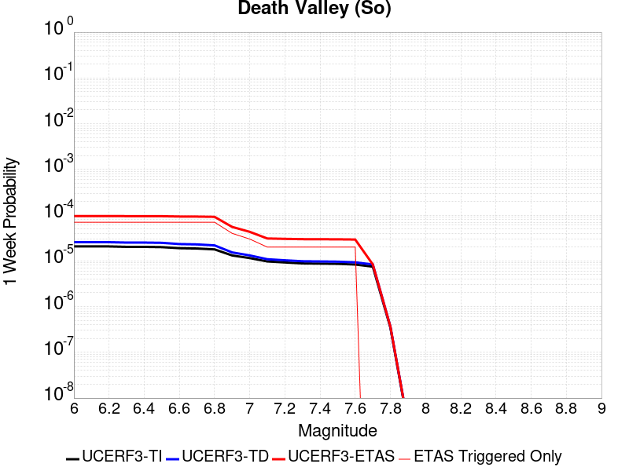 |  | 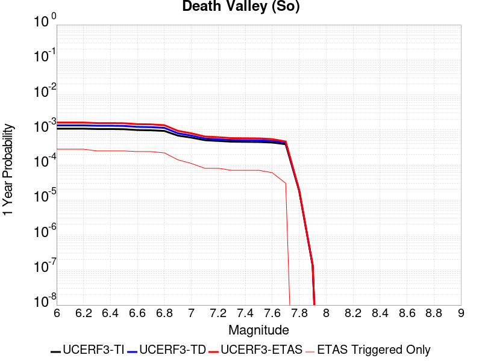 | 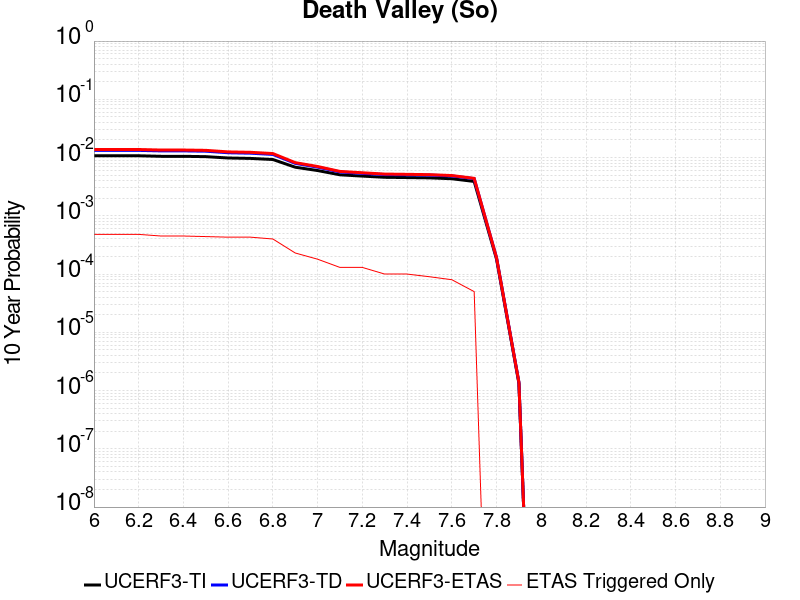 |

| Magnitude | 1 wk TI Prob | 1 wk TD Prob | 1 wk ETAS Prob | 1 wk ETAS/TD Gain | 1 wk ETAS Triggered Only | 1 mo TI Prob | 1 mo TD Prob | 1 mo ETAS Prob | 1 mo ETAS/TD Gain | 1 mo ETAS Triggered Only | 1 yr TI Prob | 1 yr TD Prob | 1 yr ETAS Prob | 1 yr ETAS/TD Gain | 1 yr ETAS Triggered Only | 10 yr TI Prob | 10 yr TD Prob | 10 yr ETAS Prob | 10 yr ETAS/TD Gain | 10 yr ETAS Triggered Only |
|-----|-----|-----|-----|-----|-----|-----|-----|-----|-----|-----|-----|-----|-----|-----|-----|-----|-----|-----|-----|-----|
| 6.0 | 2.0684236E-5 | 2.5618123E-5 | 9.561633E-5 | 3.7323706 | 7.0E-5 | 8.864371E-5 | 1.09787434E-4 | 2.5977095E-4 | 2.3661265 | 1.5E-4 | 0.0010787029 | 0.0013358593 | 0.0016154853 | 1.2093229 | 2.8E-4 | 0.010734817 | 0.013281459 | 0.013755084 | 1.0356606 | 4.8E-4 |
| 6.1 | 2.0684236E-5 | 2.5618123E-5 | 9.561633E-5 | 3.7323706 | 7.0E-5 | 8.864371E-5 | 1.09787434E-4 | 2.5977095E-4 | 2.3661265 | 1.5E-4 | 0.0010787029 | 0.0013358593 | 0.0016154853 | 1.2093229 | 2.8E-4 | 0.010734817 | 0.013281459 | 0.013755084 | 1.0356606 | 4.8E-4 |
| 6.2 | 2.0684236E-5 | 2.5618123E-5 | 9.561633E-5 | 3.7323706 | 7.0E-5 | 8.864371E-5 | 1.09787434E-4 | 2.5977095E-4 | 2.3661265 | 1.5E-4 | 0.0010787029 | 0.0013358593 | 0.0016154853 | 1.2093229 | 2.8E-4 | 0.010734817 | 0.013281459 | 0.013755084 | 1.0356606 | 4.8E-4 |
| 6.3 | 2.0240292E-5 | 2.511821E-5 | 9.5116455E-5 | 3.786753 | 7.0E-5 | 8.6741224E-5 | 1.0764512E-4 | 2.4763006E-4 | 2.3004298 | 1.4E-4 | 0.0010555626 | 0.0013098082 | 0.0015594807 | 1.1906177 | 2.5E-4 | 0.010505628 | 0.013024019 | 0.013468158 | 1.0341016 | 4.5E-4 |
| 6.4 | 2.0240292E-5 | 2.511821E-5 | 9.5116455E-5 | 3.786753 | 7.0E-5 | 8.6741224E-5 | 1.0764512E-4 | 2.4763006E-4 | 2.3004298 | 1.4E-4 | 0.0010555626 | 0.0013098082 | 0.0015594807 | 1.1906177 | 2.5E-4 | 0.010505628 | 0.013024019 | 0.013468158 | 1.0341016 | 4.5E-4 |
| 6.5 | 1.9962767E-5 | 2.4807463E-5 | 9.480573E-5 | 3.8216615 | 7.0E-5 | 8.55519E-5 | 1.0631346E-4 | 2.462986E-4 | 2.3167205 | 1.4E-4 | 0.0010410968 | 0.0012936145 | 0.0015432911 | 1.193007 | 2.5E-4 | 0.010362327 | 0.012863967 | 0.013298306 | 1.0337641 | 4.4E-4 |
| 6.6 | 1.8937297E-5 | 2.3311291E-5 | 9.330966E-5 | 4.0027666 | 7.0E-5 | 8.115732E-5 | 9.990179E-5 | 2.398878E-4 | 2.4012363 | 1.4E-4 | 9.876423E-4 | 0.0012156401 | 0.0014553483 | 1.1971868 | 2.4E-4 | 0.009832645 | 0.012092689 | 0.0125174895 | 1.0351287 | 4.3E-4 |
| 6.7 | 1.8621096E-5 | 2.2911929E-5 | 9.2910326E-5 | 4.055107 | 7.0E-5 | 7.980225E-5 | 9.8190365E-5 | 2.3817662E-4 | 2.4256618 | 1.4E-4 | 9.711593E-4 | 0.0011948266 | 0.0014345398 | 1.200626 | 2.4E-4 | 0.009669261 | 0.011886794 | 0.012311683 | 1.0357445 | 4.3E-4 |
| 6.8 | 1.7830353E-5 | 2.1805923E-5 | 9.1804395E-5 | 4.210067 | 7.0E-5 | 7.641356E-5 | 9.345069E-5 | 2.2343853E-4 | 2.390978 | 1.3E-4 | 9.29938E-4 | 0.0011371822 | 0.0013569321 | 1.1932406 | 2.2E-4 | 0.009260561 | 0.011317186 | 0.011712659 | 1.0349444 | 4.0E-4 |
| 6.9 | 1.3135183E-5 | 1.5303958E-5 | 5.5303346E-5 | 3.6136627 | 4.0E-5 | 5.6292425E-5 | 6.5586784E-5 | 1.5558088E-4 | 2.3721378 | 9.0E-5 | 6.8514474E-4 | 7.9823297E-4 | 9.3812123E-4 | 1.1752474 | 1.4E-4 | 0.006830362 | 0.007955219 | 0.008183389 | 1.0286819 | 2.3E-4 |
| 7.0 | 1.1507512E-5 | 1.3154176E-5 | 4.315378E-5 | 3.2806146 | 3.0E-5 | 4.9316975E-5 | 5.6373854E-5 | 1.2636991E-4 | 2.2416403 | 7.0E-5 | 6.002687E-4 | 6.861413E-4 | 7.9606584E-4 | 1.1602068 | 1.1E-4 | 0.0059864987 | 0.0068414966 | 0.0070202653 | 1.0261301 | 1.8E-4 |
| 7.1 | 9.715903E-6 | 1.0865248E-5 | 3.086503E-5 | 2.840711 | 2.0E-5 | 4.1638916E-5 | 4.6564543E-5 | 9.656222E-5 | 2.0737283 | 5.0E-5 | 5.068359E-4 | 5.667801E-4 | 6.467348E-4 | 1.1410682 | 8.0E-5 | 0.0050568148 | 0.005653847 | 0.005783112 | 1.0228631 | 1.3E-4 |
| 7.2 | 9.233269E-6 | 1.028628E-5 | 3.0286074E-5 | 2.9443176 | 2.0E-5 | 3.9570554E-5 | 4.4083336E-5 | 9.408113E-5 | 2.1341655 | 5.0E-5 | 4.81665E-4 | 5.365867E-4 | 6.1654375E-4 | 1.1490105 | 8.0E-5 | 0.0048062233 | 0.005353342 | 0.0054826457 | 1.024154 | 1.3E-4 |
| 7.3 | 8.8041315E-6 | 9.808134E-6 | 2.9807938E-5 | 3.0391037 | 2.0E-5 | 3.7731446E-5 | 4.2034208E-5 | 9.20321E-5 | 2.1894574 | 5.0E-5 | 4.592835E-4 | 5.116505E-4 | 5.816147E-4 | 1.1367421 | 7.0E-5 | 0.0045833546 | 0.005105152 | 0.0052046413 | 1.0194881 | 1.0E-4 |
| 7.4 | 8.708749E-6 | 9.707145E-6 | 2.9706951E-5 | 3.060318 | 2.0E-5 | 3.7322676E-5 | 4.160141E-5 | 9.159933E-5 | 2.2018323 | 5.0E-5 | 4.5430884E-4 | 5.0638366E-4 | 5.763482E-4 | 1.1381651 | 7.0E-5 | 0.004533812 | 0.0050527244 | 0.005152219 | 1.0196913 | 1.0E-4 |
| 7.5 | 8.612678E-6 | 9.604788E-6 | 2.9604596E-5 | 3.082275 | 2.0E-5 | 3.6910955E-5 | 4.116275E-5 | 9.116069E-5 | 2.2146404 | 5.0E-5 | 4.492982E-4 | 5.0104543E-4 | 5.7101034E-4 | 1.139638 | 7.0E-5 | 0.004483909 | 0.004999583 | 0.0050891335 | 1.0179116 | 9.0E-5 |
| 7.6 | 8.319024E-6 | 9.283887E-6 | 2.9283701E-5 | 3.15425 | 2.0E-5 | 3.5652476E-5 | 3.9787505E-5 | 8.978551E-5 | 2.256626 | 5.0E-5 | 4.3398244E-4 | 4.8430942E-4 | 5.4428034E-4 | 1.1238277 | 6.0E-5 | 0.0043313587 | 0.0048329635 | 0.0049125766 | 1.0164729 | 8.0E-5 |
| 7.7 | 7.4718328E-6 | 8.345144E-6 | 8.345144E-6 | 1.0 | 0.0 | 3.2021748E-5 | 3.5764435E-5 | 5.5763718E-5 | 1.5591948 | 2.0E-5 | 3.8979502E-4 | 4.3534904E-4 | 4.6533596E-4 | 1.0688802 | 3.0E-5 | 0.00389112 | 0.004345367 | 0.0043951496 | 1.0114565 | 5.0E-5 |
| 7.8 | 3.4586725E-7 | 3.648256E-7 | 3.648256E-7 | 1.0 | 0.0 | 1.4822873E-6 | 1.5635374E-6 | 1.5635374E-6 | 1.0 | 0.0 | 1.80467E-5 | 1.9035906E-5 | 1.9035906E-5 | 1.0 | 0.0 | 1.8045233E-4 | 1.903432E-4 | 1.903432E-4 | 1.0 | 0.0 |
| 7.9 | 2.5591178E-9 | 2.6696687E-9 | 2.6696687E-9 | 1.0 | 0.0 | 1.0967647E-8 | 1.1441437E-8 | 1.1441437E-8 | 1.0 | 0.0 | 1.335311E-7 | 1.392995E-7 | 1.392995E-7 | 1.0 | 0.0 | 1.3353102E-6 | 1.3929949E-6 | 1.3929949E-6 | 1.0 | 0.0 |

## So Sierra Nevada
*[(top)](#table-of-contents)*

| 1 Week | 1 Month | 1 Year | 10 Year |
|-----|-----|-----|-----|
| 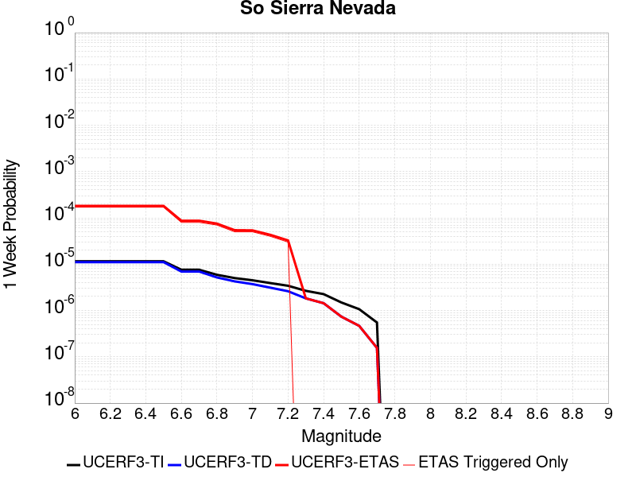 | 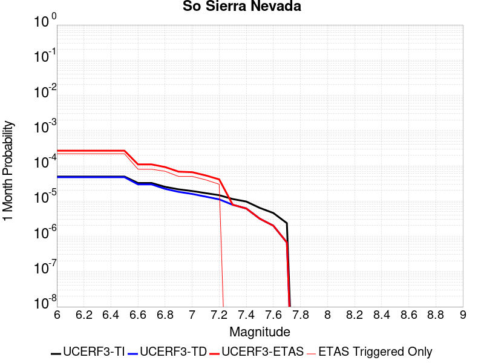 | 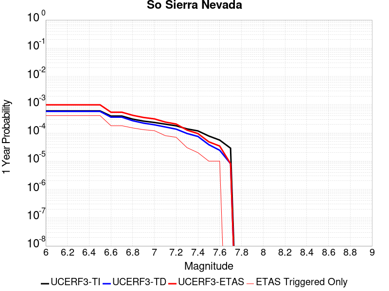 |  |

| Magnitude | 1 wk TI Prob | 1 wk TD Prob | 1 wk ETAS Prob | 1 wk ETAS/TD Gain | 1 wk ETAS Triggered Only | 1 mo TI Prob | 1 mo TD Prob | 1 mo ETAS Prob | 1 mo ETAS/TD Gain | 1 mo ETAS Triggered Only | 1 yr TI Prob | 1 yr TD Prob | 1 yr ETAS Prob | 1 yr ETAS/TD Gain | 1 yr ETAS Triggered Only | 10 yr TI Prob | 10 yr TD Prob | 10 yr ETAS Prob | 10 yr ETAS/TD Gain | 10 yr ETAS Triggered Only |
|-----|-----|-----|-----|-----|-----|-----|-----|-----|-----|-----|-----|-----|-----|-----|-----|-----|-----|-----|-----|-----|
| 6.0 | 1.15488665E-5 | 1.1079595E-5 | 1.8107772E-4 | 16.343351 | 1.7E-4 | 4.9494203E-5 | 4.7483187E-5 | 2.6747273E-4 | 5.632999 | 2.2E-4 | 6.024253E-4 | 5.779672E-4 | 9.877302E-4 | 1.7089728 | 4.1E-4 | 0.006007948 | 0.00576591 | 0.006263027 | 1.0862166 | 5.0E-4 |
| 6.1 | 1.15488665E-5 | 1.1079595E-5 | 1.8107772E-4 | 16.343351 | 1.7E-4 | 4.9494203E-5 | 4.7483187E-5 | 2.6747273E-4 | 5.632999 | 2.2E-4 | 6.024253E-4 | 5.779672E-4 | 9.877302E-4 | 1.7089728 | 4.1E-4 | 0.006007948 | 0.00576591 | 0.006263027 | 1.0862166 | 5.0E-4 |
| 6.2 | 1.15488665E-5 | 1.1079595E-5 | 1.8107772E-4 | 16.343351 | 1.7E-4 | 4.9494203E-5 | 4.7483187E-5 | 2.6747273E-4 | 5.632999 | 2.2E-4 | 6.024253E-4 | 5.779672E-4 | 9.877302E-4 | 1.7089728 | 4.1E-4 | 0.006007948 | 0.00576591 | 0.006263027 | 1.0862166 | 5.0E-4 |
| 6.3 | 1.15488665E-5 | 1.1079595E-5 | 1.8107772E-4 | 16.343351 | 1.7E-4 | 4.9494203E-5 | 4.7483187E-5 | 2.6747273E-4 | 5.632999 | 2.2E-4 | 6.024253E-4 | 5.779672E-4 | 9.877302E-4 | 1.7089728 | 4.1E-4 | 0.006007948 | 0.00576591 | 0.006263027 | 1.0862166 | 5.0E-4 |
| 6.4 | 1.15488665E-5 | 1.1079595E-5 | 1.8107772E-4 | 16.343351 | 1.7E-4 | 4.9494203E-5 | 4.7483187E-5 | 2.6747273E-4 | 5.632999 | 2.2E-4 | 6.024253E-4 | 5.779672E-4 | 9.877302E-4 | 1.7089728 | 4.1E-4 | 0.006007948 | 0.00576591 | 0.006263027 | 1.0862166 | 5.0E-4 |
| 6.5 | 1.15488665E-5 | 1.1079595E-5 | 1.8107772E-4 | 16.343351 | 1.7E-4 | 4.9494203E-5 | 4.7483187E-5 | 2.6747273E-4 | 5.632999 | 2.2E-4 | 6.024253E-4 | 5.779672E-4 | 9.877302E-4 | 1.7089728 | 4.1E-4 | 0.006007948 | 0.00576591 | 0.006263027 | 1.0862166 | 5.0E-4 |
| 6.6 | 7.587044E-6 | 6.9355933E-6 | 8.693504E-5 | 12.534621 | 8.0E-5 | 3.2515498E-5 | 2.972365E-5 | 1.0972127E-4 | 3.6913795 | 8.0E-5 | 3.9580427E-4 | 3.6182825E-4 | 5.4176315E-4 | 1.4972936 | 1.8E-4 | 0.003951 | 0.0036126832 | 0.0038318883 | 1.0606766 | 2.2E-4 |
| 6.7 | 7.587044E-6 | 6.9355933E-6 | 8.693504E-5 | 12.534621 | 8.0E-5 | 3.2515498E-5 | 2.972365E-5 | 1.0972127E-4 | 3.6913795 | 8.0E-5 | 3.9580427E-4 | 3.6182825E-4 | 5.4176315E-4 | 1.4972936 | 1.8E-4 | 0.003951 | 0.0036126832 | 0.0038318883 | 1.0606766 | 2.2E-4 |
| 6.8 | 5.9026956E-6 | 5.179353E-6 | 7.517899E-5 | 14.515132 | 7.0E-5 | 2.5297022E-5 | 2.2197044E-5 | 9.219549E-5 | 4.153503 | 7.0E-5 | 3.0794772E-4 | 2.7021667E-4 | 4.2017613E-4 | 1.5549601 | 1.5E-4 | 0.0030752132 | 0.0026989973 | 0.0028785113 | 1.0665114 | 1.8E-4 |
| 6.9 | 5.0118915E-6 | 4.2523866E-6 | 5.4252174E-5 | 12.758053 | 5.0E-5 | 2.1479358E-5 | 1.8224391E-5 | 6.822348E-5 | 3.743526 | 5.0E-5 | 2.614798E-4 | 2.2186009E-4 | 3.5183126E-4 | 1.5858248 | 1.3E-4 | 0.0026117235 | 0.0022164586 | 0.0023561483 | 1.0630238 | 1.4E-4 |
| 7.0 | 4.4924795E-6 | 3.7138793E-6 | 5.3713695E-5 | 14.462961 | 5.0E-5 | 1.925334E-5 | 1.5916532E-5 | 6.591574E-5 | 4.141338 | 5.0E-5 | 2.3438422E-4 | 1.9376719E-4 | 3.1374392E-4 | 1.61918 | 1.2E-4 | 0.0023413717 | 0.0019360452 | 0.0020657936 | 1.0670172 | 1.3E-4 |
| 7.1 | 3.9118436E-6 | 3.1119403E-6 | 4.3111817E-5 | 13.853678 | 4.0E-5 | 1.6764936E-5 | 1.3336821E-5 | 5.3336287E-5 | 3.9991753 | 4.0E-5 | 2.0409399E-4 | 1.6236427E-4 | 2.4235128E-4 | 1.4926393 | 8.0E-5 | 0.0020390663 | 0.0016225125 | 0.0017123665 | 1.0553795 | 9.0E-5 |
| 7.2 | 3.4200818E-6 | 2.6054174E-6 | 3.2605338E-5 | 12.51444 | 3.0E-5 | 1.4657411E-5 | 1.1166029E-5 | 4.1165695E-5 | 3.6866906 | 3.0E-5 | 1.7843937E-4 | 1.3593843E-4 | 2.0592891E-4 | 1.514869 | 7.0E-5 | 0.0017829615 | 0.0013586025 | 0.0014384938 | 1.058804 | 8.0E-5 |
| 7.3 | 2.6593618E-6 | 1.8283843E-6 | 1.8283843E-6 | 1.0 | 0.0 | 1.13972155E-5 | 7.835911E-6 | 7.835911E-6 | 1.0 | 0.0 | 1.3875226E-4 | 9.539833E-5 | 1.2539547E-4 | 1.314441 | 3.0E-5 | 0.0013866565 | 9.536027E-4 | 9.835741E-4 | 1.0314296 | 3.0E-5 |
| 7.4 | 2.2577992E-6 | 1.4364028E-6 | 1.4364028E-6 | 1.0 | 0.0 | 9.676246E-6 | 6.155999E-6 | 6.155999E-6 | 1.0 | 0.0 | 1.1780193E-4 | 7.494696E-5 | 9.494546E-5 | 1.2668353 | 2.0E-5 | 0.001177395 | 7.4924197E-4 | 7.692269E-4 | 1.0266737 | 2.0E-5 |
| 7.5 | 1.489319E-6 | 7.353621E-7 | 7.353621E-7 | 1.0 | 0.0 | 6.3827797E-6 | 3.151548E-6 | 3.151548E-6 | 1.0 | 0.0 | 7.770758E-5 | 3.8369424E-5 | 4.8369042E-5 | 1.2606142 | 1.0E-5 | 7.7680405E-4 | 3.8362844E-4 | 3.9362462E-4 | 1.0260569 | 1.0E-5 |
| 7.6 | 1.0680322E-6 | 4.659381E-7 | 4.659381E-7 | 1.0 | 0.0 | 4.577273E-6 | 1.996876E-6 | 1.996876E-6 | 1.0 | 0.0 | 5.5726876E-5 | 2.4311697E-5 | 3.4311455E-5 | 1.4113146 | 1.0E-5 | 5.5712904E-4 | 2.4309063E-4 | 2.530882E-4 | 1.041127 | 1.0E-5 |
| 7.7 | 5.509146E-7 | 1.5578398E-7 | 1.5578398E-7 | 1.0 | 0.0 | 2.3610605E-6 | 6.6764545E-7 | 6.6764545E-7 | 1.0 | 0.0 | 2.8745531E-5 | 8.128554E-6 | 8.128554E-6 | 1.0 | 0.0 | 2.8741814E-4 | 8.1282684E-5 | 8.1282684E-5 | 1.0 | 0.0 |

## Paradise
*[(top)](#table-of-contents)*

| 1 Week | 1 Month | 1 Year | 10 Year |
|-----|-----|-----|-----|
|  |  | 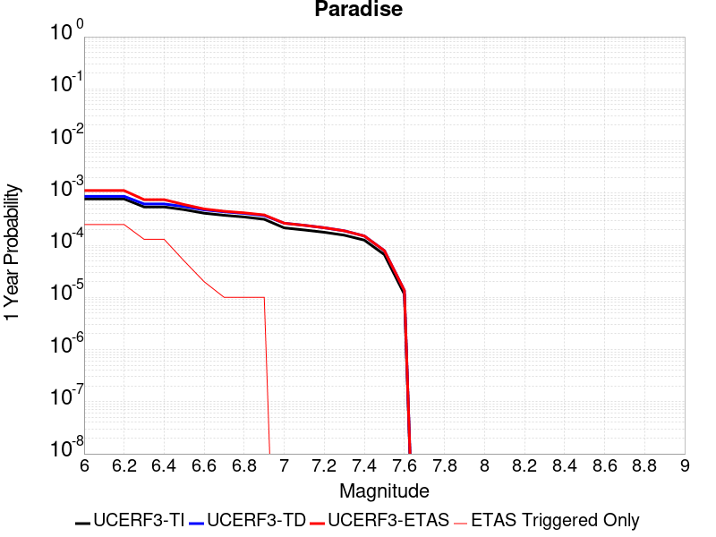 |  |

| Magnitude | 1 wk TI Prob | 1 wk TD Prob | 1 wk ETAS Prob | 1 wk ETAS/TD Gain | 1 wk ETAS Triggered Only | 1 mo TI Prob | 1 mo TD Prob | 1 mo ETAS Prob | 1 mo ETAS/TD Gain | 1 mo ETAS Triggered Only | 1 yr TI Prob | 1 yr TD Prob | 1 yr ETAS Prob | 1 yr ETAS/TD Gain | 1 yr ETAS Triggered Only | 10 yr TI Prob | 10 yr TD Prob | 10 yr ETAS Prob | 10 yr ETAS/TD Gain | 10 yr ETAS Triggered Only |
|-----|-----|-----|-----|-----|-----|-----|-----|-----|-----|-----|-----|-----|-----|-----|-----|-----|-----|-----|-----|-----|
| 6.0 | 1.4851273E-5 | 1.6694737E-5 | 1.266929E-4 | 7.588793 | 1.1E-4 | 6.364676E-5 | 7.1547045E-5 | 2.1153703E-4 | 2.9566145 | 1.4E-4 | 7.7462377E-4 | 8.7076076E-4 | 0.0011205431 | 1.2868552 | 2.5E-4 | 0.0077192914 | 0.008675868 | 0.009092224 | 1.0479901 | 4.2E-4 |
| 6.1 | 1.4851273E-5 | 1.6694737E-5 | 1.266929E-4 | 7.588793 | 1.1E-4 | 6.364676E-5 | 7.1547045E-5 | 2.1153703E-4 | 2.9566145 | 1.4E-4 | 7.7462377E-4 | 8.7076076E-4 | 0.0011205431 | 1.2868552 | 2.5E-4 | 0.0077192914 | 0.008675868 | 0.009092224 | 1.0479901 | 4.2E-4 |
| 6.2 | 1.4851273E-5 | 1.6694737E-5 | 1.266929E-4 | 7.588793 | 1.1E-4 | 6.364676E-5 | 7.1547045E-5 | 2.1153703E-4 | 2.9566145 | 1.4E-4 | 7.7462377E-4 | 8.7076076E-4 | 0.0011205431 | 1.2868552 | 2.5E-4 | 0.0077192914 | 0.008675868 | 0.009092224 | 1.0479901 | 4.2E-4 |
| 6.3 | 1.0426831E-5 | 1.1888677E-5 | 8.188785E-5 | 6.887885 | 7.0E-5 | 4.4685654E-5 | 5.095051E-5 | 1.3094644E-4 | 2.570071 | 8.0E-5 | 5.43912E-4 | 6.2015187E-4 | 7.5007125E-4 | 1.209496 | 1.3E-4 | 0.0054258266 | 0.006184821 | 0.006373646 | 1.0305303 | 1.9E-4 |
| 6.4 | 1.0426831E-5 | 1.1888677E-5 | 8.188785E-5 | 6.887885 | 7.0E-5 | 4.4685654E-5 | 5.095051E-5 | 1.3094644E-4 | 2.570071 | 8.0E-5 | 5.43912E-4 | 6.2015187E-4 | 7.5007125E-4 | 1.209496 | 1.3E-4 | 0.0054258266 | 0.006184821 | 0.006373646 | 1.0305303 | 1.9E-4 |
| 6.5 | 9.25027E-6 | 1.062002E-5 | 3.0619805E-5 | 2.8832157 | 2.0E-5 | 3.964341E-5 | 4.5513603E-5 | 7.551224E-5 | 1.6591136 | 3.0E-5 | 4.8255164E-4 | 5.539921E-4 | 6.0396444E-4 | 1.090204 | 5.0E-5 | 0.0048150513 | 0.00552661 | 0.0056161126 | 1.0161948 | 9.0E-5 |
| 6.6 | 7.904275E-6 | 9.1595875E-6 | 1.9159497E-5 | 2.0917423 | 1.0E-5 | 3.3875025E-5 | 3.925481E-5 | 5.9254024E-5 | 1.5094718 | 2.0E-5 | 4.1235037E-4 | 4.7782643E-4 | 4.978168E-4 | 1.0418363 | 2.0E-5 | 0.0041158604 | 0.004768387 | 0.004798244 | 1.0062615 | 3.0E-5 |
| 6.7 | 7.2061953E-6 | 8.407313E-6 | 1.8407229E-5 | 2.1894307 | 1.0E-5 | 3.088333E-5 | 3.6030862E-5 | 4.6030502E-5 | 1.2775298 | 1.0E-5 | 3.7593965E-4 | 4.3859115E-4 | 4.4858677E-4 | 1.0227903 | 1.0E-5 | 0.003753043 | 0.0043776245 | 0.004397537 | 1.0045487 | 2.0E-5 |
| 6.8 | 6.6948724E-6 | 7.84223E-6 | 1.784215E-5 | 2.2751374 | 1.0E-5 | 2.8691995E-5 | 3.3609143E-5 | 4.360881E-5 | 1.297528 | 1.0E-5 | 3.4926904E-4 | 4.0911807E-4 | 4.19114E-4 | 1.0244328 | 1.0E-5 | 0.003487206 | 0.0040840064 | 0.0041039246 | 1.0048772 | 2.0E-5 |
| 6.9 | 6.0421025E-6 | 7.1306854E-6 | 1.7130615E-5 | 2.4023798 | 1.0E-5 | 2.5894467E-5 | 3.0559742E-5 | 4.0559436E-5 | 1.3272179 | 1.0E-5 | 3.1521954E-4 | 3.7200472E-4 | 3.8200102E-4 | 1.0268713 | 1.0E-5 | 0.0031477278 | 0.0037141584 | 0.0037241213 | 1.0026824 | 1.0E-5 |
| 7.0 | 4.134091E-6 | 5.0803756E-6 | 5.0803756E-6 | 1.0 | 0.0 | 1.7717413E-5 | 2.1772865E-5 | 2.1772865E-5 | 1.0 | 0.0 | 2.1568815E-4 | 2.650539E-4 | 2.650539E-4 | 1.0 | 0.0 | 0.0021547892 | 0.002647531 | 0.002647531 | 1.0 | 0.0 |
| 7.1 | 3.7674888E-6 | 4.63193E-6 | 4.63193E-6 | 1.0 | 0.0 | 1.6146281E-5 | 1.9850986E-5 | 1.9850986E-5 | 1.0 | 0.0 | 1.9656324E-4 | 2.4166047E-4 | 2.4166047E-4 | 1.0 | 0.0 | 0.0019638946 | 0.0024141273 | 0.0024141273 | 1.0 | 0.0 |
| 7.2 | 3.4065345E-6 | 4.156776E-6 | 4.156776E-6 | 1.0 | 0.0 | 1.4599351E-5 | 1.7814642E-5 | 1.7814642E-5 | 1.0 | 0.0 | 1.777326E-4 | 2.1687317E-4 | 2.1687317E-4 | 1.0 | 0.0 | 0.0017759053 | 0.0021667634 | 0.0021667634 | 1.0 | 0.0 |
| 7.3 | 2.9934936E-6 | 3.6293627E-6 | 3.6293627E-6 | 1.0 | 0.0 | 1.2829195E-5 | 1.5554328E-5 | 1.5554328E-5 | 1.0 | 0.0 | 1.5618425E-4 | 1.8935895E-4 | 1.8935895E-4 | 1.0 | 0.0 | 0.0015607453 | 0.0018921213 | 0.0018921213 | 1.0 | 0.0 |
| 7.4 | 2.4049796E-6 | 2.889017E-6 | 2.889017E-6 | 1.0 | 0.0 | 1.0307015E-5 | 1.238145E-5 | 1.238145E-5 | 1.0 | 0.0 | 1.2548068E-4 | 1.5073517E-4 | 1.5073517E-4 | 1.0 | 0.0 | 0.0012540985 | 0.0015064707 | 0.0015064707 | 1.0 | 0.0 |
| 7.5 | 1.2710091E-6 | 1.5134848E-6 | 1.5134848E-6 | 1.0 | 0.0 | 5.44717E-6 | 6.4863543E-6 | 6.4863543E-6 | 1.0 | 0.0 | 6.631728E-5 | 7.896975E-5 | 7.896975E-5 | 1.0 | 0.0 | 6.6297496E-4 | 7.8953954E-4 | 7.8953954E-4 | 1.0 | 0.0 |
| 7.6 | 2.21172E-7 | 2.6040198E-7 | 2.6040198E-7 | 1.0 | 0.0 | 9.478797E-7 | 1.1160082E-6 | 1.1160082E-6 | 1.0 | 0.0 | 1.1540374E-5 | 1.3587343E-5 | 1.3587343E-5 | 1.0 | 0.0 | 1.1539775E-4 | 1.3586794E-4 | 1.3586794E-4 | 1.0 | 0.0 |

## Bicycle Lake
*[(top)](#table-of-contents)*

| 1 Week | 1 Month | 1 Year | 10 Year |
|-----|-----|-----|-----|
|  | 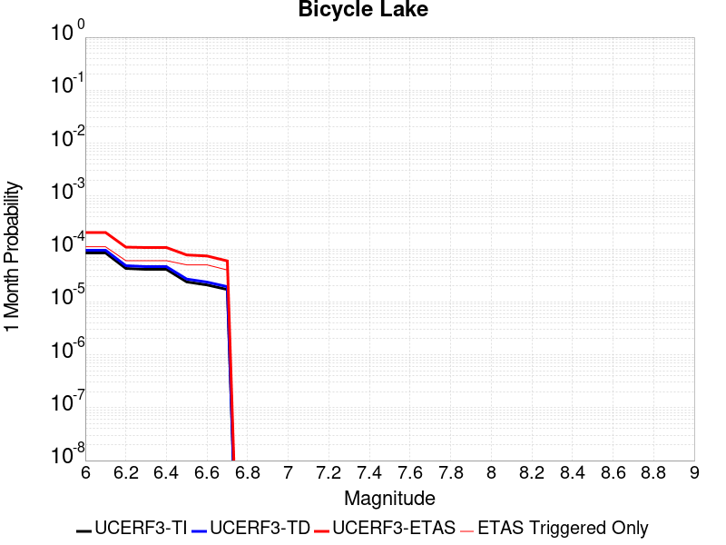 | 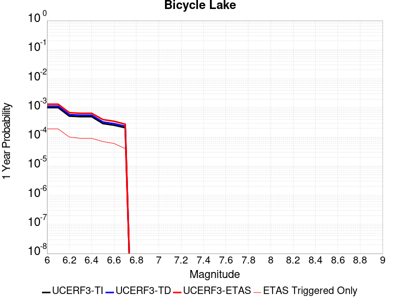 |  |

| Magnitude | 1 wk TI Prob | 1 wk TD Prob | 1 wk ETAS Prob | 1 wk ETAS/TD Gain | 1 wk ETAS Triggered Only | 1 mo TI Prob | 1 mo TD Prob | 1 mo ETAS Prob | 1 mo ETAS/TD Gain | 1 mo ETAS Triggered Only | 1 yr TI Prob | 1 yr TD Prob | 1 yr ETAS Prob | 1 yr ETAS/TD Gain | 1 yr ETAS Triggered Only | 10 yr TI Prob | 10 yr TD Prob | 10 yr ETAS Prob | 10 yr ETAS/TD Gain | 10 yr ETAS Triggered Only |
|-----|-----|-----|-----|-----|-----|-----|-----|-----|-----|-----|-----|-----|-----|-----|-----|-----|-----|-----|-----|-----|
| 6.0 | 1.9621975E-5 | 2.2097003E-5 | 1.1209502E-4 | 5.0728602 | 9.0E-5 | 8.4091465E-5 | 9.469877E-5 | 2.0468835E-4 | 2.161468 | 1.1E-4 | 0.0010233327 | 0.0011524827 | 0.0013422637 | 1.1646715 | 1.9E-4 | 0.01018633 | 0.01147837 | 0.011863893 | 1.033587 | 3.9E-4 |
| 6.1 | 1.9621975E-5 | 2.2097003E-5 | 1.1209502E-4 | 5.0728602 | 9.0E-5 | 8.4091465E-5 | 9.469877E-5 | 2.0468835E-4 | 2.161468 | 1.1E-4 | 0.0010233327 | 0.0011524827 | 0.0013422637 | 1.1646715 | 1.9E-4 | 0.01018633 | 0.01147837 | 0.011863893 | 1.033587 | 3.9E-4 |
| 6.2 | 9.9971285E-6 | 1.1255602E-5 | 6.1255036E-5 | 5.4421825 | 5.0E-5 | 4.2844134E-5 | 4.8237696E-5 | 1.082348E-4 | 2.2437806 | 6.0E-5 | 5.2150246E-4 | 5.871877E-4 | 6.87129E-4 | 1.1702033 | 1.0E-4 | 0.0052028033 | 0.005861467 | 0.006090119 | 1.0390093 | 2.3E-4 |
| 6.3 | 9.589428E-6 | 1.079831E-5 | 6.079777E-5 | 5.6303043 | 5.0E-5 | 4.10969E-5 | 4.6277943E-5 | 1.0627517E-4 | 2.296454 | 6.0E-5 | 5.002399E-4 | 5.6334015E-4 | 6.5328943E-4 | 1.1596714 | 9.0E-5 | 0.0049911533 | 0.005624211 | 0.0058429735 | 1.0388966 | 2.2E-4 |
| 6.4 | 9.589428E-6 | 1.079831E-5 | 6.079777E-5 | 5.6303043 | 5.0E-5 | 4.10969E-5 | 4.6277943E-5 | 1.0627517E-4 | 2.296454 | 6.0E-5 | 5.002399E-4 | 5.6334015E-4 | 6.5328943E-4 | 1.1596714 | 9.0E-5 | 0.0049911533 | 0.005624211 | 0.0058429735 | 1.0388966 | 2.2E-4 |
| 6.5 | 5.557707E-6 | 6.2855797E-6 | 4.6285328E-5 | 7.363733 | 4.0E-5 | 2.3818526E-5 | 2.693807E-5 | 7.6936725E-5 | 2.856059 | 5.0E-5 | 2.8995197E-4 | 3.2794854E-4 | 3.9792559E-4 | 1.2133781 | 7.0E-5 | 0.0028957394 | 0.003277282 | 0.0034367577 | 1.048661 | 1.6E-4 |
| 6.6 | 4.8742945E-6 | 5.5132705E-6 | 4.551305E-5 | 8.255181 | 4.0E-5 | 2.0889667E-5 | 2.3628236E-5 | 7.362705E-5 | 3.1160624 | 5.0E-5 | 2.54302E-4 | 2.87662E-4 | 3.4764473E-4 | 1.2085181 | 6.0E-5 | 0.002540112 | 0.0028754652 | 0.0030150625 | 1.0485477 | 1.4E-4 |
| 6.7 | 3.991108E-6 | 4.5158945E-6 | 3.451576E-5 | 7.6431723 | 3.0E-5 | 1.7104636E-5 | 1.9353833E-5 | 5.935306E-5 | 3.066734 | 4.0E-5 | 2.0822904E-4 | 2.3563292E-4 | 2.756235E-4 | 1.1697155 | 4.0E-5 | 0.0020803404 | 0.0023563292 | 0.0024560937 | 1.0423388 | 1.0E-4 |

## Towne Pass
*[(top)](#table-of-contents)*

| 1 Week | 1 Month | 1 Year | 10 Year |
|-----|-----|-----|-----|
|  |  |  |  |

| Magnitude | 1 wk TI Prob | 1 wk TD Prob | 1 wk ETAS Prob | 1 wk ETAS/TD Gain | 1 wk ETAS Triggered Only | 1 mo TI Prob | 1 mo TD Prob | 1 mo ETAS Prob | 1 mo ETAS/TD Gain | 1 mo ETAS Triggered Only | 1 yr TI Prob | 1 yr TD Prob | 1 yr ETAS Prob | 1 yr ETAS/TD Gain | 1 yr ETAS Triggered Only | 10 yr TI Prob | 10 yr TD Prob | 10 yr ETAS Prob | 10 yr ETAS/TD Gain | 10 yr ETAS Triggered Only |
|-----|-----|-----|-----|-----|-----|-----|-----|-----|-----|-----|-----|-----|-----|-----|-----|-----|-----|-----|-----|-----|
| 6.0 | 3.849728E-6 | 3.8945404E-6 | 8.389423E-5 | 21.541496 | 8.0E-5 | 1.649873E-5 | 1.6690807E-5 | 1.4668863E-4 | 8.7885895 | 1.3E-4 | 2.0085352E-4 | 2.0319599E-4 | 4.1315332E-4 | 2.033275 | 2.1E-4 | 0.0020067208 | 0.002030531 | 0.0023898 | 1.1769335 | 3.6E-4 |
| 6.1 | 3.849728E-6 | 3.8945404E-6 | 8.389423E-5 | 21.541496 | 8.0E-5 | 1.649873E-5 | 1.6690807E-5 | 1.4668863E-4 | 8.7885895 | 1.3E-4 | 2.0085352E-4 | 2.0319599E-4 | 4.1315332E-4 | 2.033275 | 2.1E-4 | 0.0020067208 | 0.002030531 | 0.0023898 | 1.1769335 | 3.6E-4 |
| 6.2 | 3.849728E-6 | 3.8945404E-6 | 8.389423E-5 | 21.541496 | 8.0E-5 | 1.649873E-5 | 1.6690807E-5 | 1.4668863E-4 | 8.7885895 | 1.3E-4 | 2.0085352E-4 | 2.0319599E-4 | 4.1315332E-4 | 2.033275 | 2.1E-4 | 0.0020067208 | 0.002030531 | 0.0023898 | 1.1769335 | 3.6E-4 |
| 6.3 | 3.849728E-6 | 3.8945404E-6 | 8.389423E-5 | 21.541496 | 8.0E-5 | 1.649873E-5 | 1.6690807E-5 | 1.4668863E-4 | 8.7885895 | 1.3E-4 | 2.0085352E-4 | 2.0319599E-4 | 4.1315332E-4 | 2.033275 | 2.1E-4 | 0.0020067208 | 0.002030531 | 0.0023898 | 1.1769335 | 3.6E-4 |
| 6.4 | 3.849728E-6 | 3.8945404E-6 | 8.389423E-5 | 21.541496 | 8.0E-5 | 1.649873E-5 | 1.6690807E-5 | 1.4668863E-4 | 8.7885895 | 1.3E-4 | 2.0085352E-4 | 2.0319599E-4 | 4.1315332E-4 | 2.033275 | 2.1E-4 | 0.0020067208 | 0.002030531 | 0.0023898 | 1.1769335 | 3.6E-4 |
| 6.5 | 1.1953545E-6 | 1.2030522E-6 | 3.1203017E-5 | 25.936544 | 3.0E-5 | 5.1229376E-6 | 5.155928E-6 | 3.5155776E-5 | 6.818515 | 3.0E-5 | 6.236998E-5 | 6.277174E-5 | 9.276986E-5 | 1.477892 | 3.0E-5 | 6.235248E-4 | 6.275518E-4 | 6.8751414E-4 | 1.0955496 | 6.0E-5 |
| 6.6 | 1.1953545E-6 | 1.2030522E-6 | 3.1203017E-5 | 25.936544 | 3.0E-5 | 5.1229376E-6 | 5.155928E-6 | 3.5155776E-5 | 6.818515 | 3.0E-5 | 6.236998E-5 | 6.277174E-5 | 9.276986E-5 | 1.477892 | 3.0E-5 | 6.235248E-4 | 6.275518E-4 | 6.8751414E-4 | 1.0955496 | 6.0E-5 |
| 6.7 | 8.375951E-7 | 8.4106733E-7 | 2.0841051E-5 | 24.77929 | 2.0E-5 | 3.5896885E-6 | 3.6045697E-6 | 2.3604498E-5 | 6.5484924 | 2.0E-5 | 4.370358E-5 | 4.3884807E-5 | 6.3883934E-5 | 1.4557185 | 2.0E-5 | 4.3694986E-4 | 4.3876714E-4 | 4.887452E-4 | 1.1139057 | 5.0E-5 |
| 6.8 | 6.38041E-7 | 6.3921595E-7 | 2.0639203E-5 | 32.28831 | 2.0E-5 | 2.7344586E-6 | 2.7394944E-6 | 2.273944E-5 | 8.300597 | 2.0E-5 | 3.3291526E-5 | 3.3352873E-5 | 5.3352207E-5 | 1.5996284 | 2.0E-5 | 3.3286537E-4 | 3.334825E-4 | 3.7346914E-4 | 1.1199063 | 4.0E-5 |
| 6.9 | 5.3460053E-7 | 5.345337E-7 | 2.0534522E-5 | 38.41577 | 2.0E-5 | 2.2911431E-6 | 2.2908569E-6 | 2.2290811E-5 | 9.730338 | 2.0E-5 | 2.789431E-5 | 2.789086E-5 | 4.7890302E-5 | 1.7170608 | 2.0E-5 | 2.789081E-4 | 2.788769E-4 | 3.1886576E-4 | 1.1433924 | 4.0E-5 |
| 7.0 | 3.557783E-7 | 3.532427E-7 | 1.0353239E-5 | 29.309137 | 1.0E-5 | 1.5247632E-6 | 1.5138964E-6 | 1.1513881E-5 | 7.6054616 | 1.0E-5 | 1.8563835E-5 | 1.8431541E-5 | 2.8431357E-5 | 1.5425382 | 1.0E-5 | 1.8562283E-4 | 1.8430098E-4 | 1.9429914E-4 | 1.054249 | 1.0E-5 |
| 7.1 | 3.037942E-7 | 3.0002266E-7 | 3.0002266E-7 | 1.0 | 0.0 | 1.3019744E-6 | 1.2858108E-6 | 1.2858108E-6 | 1.0 | 0.0 | 1.5851423E-5 | 1.5654641E-5 | 1.5654641E-5 | 1.0 | 0.0 | 1.5850292E-4 | 1.5653613E-4 | 1.5653613E-4 | 1.0 | 0.0 |
| 7.2 | 2.0808248E-7 | 2.0217729E-7 | 2.0217729E-7 | 1.0 | 0.0 | 8.917818E-7 | 8.6647384E-7 | 8.6647384E-7 | 1.0 | 0.0 | 1.0857389E-5 | 1.0549273E-5 | 1.0549273E-5 | 1.0 | 0.0 | 1.0856859E-4 | 1.0548818E-4 | 1.0548818E-4 | 1.0 | 0.0 |
| 7.3 | 1.1162073E-7 | 1.0636901E-7 | 1.0636901E-7 | 1.0 | 0.0 | 4.7837443E-7 | 4.558671E-7 | 4.558671E-7 | 1.0 | 0.0 | 5.8241935E-6 | 5.55017E-6 | 5.55017E-6 | 1.0 | 0.0 | 5.8240406E-5 | 5.5500514E-5 | 5.5500514E-5 | 1.0 | 0.0 |

## San Andreas (Mojave N)
*[(top)](#table-of-contents)*

| 1 Week | 1 Month | 1 Year | 10 Year |
|-----|-----|-----|-----|
| 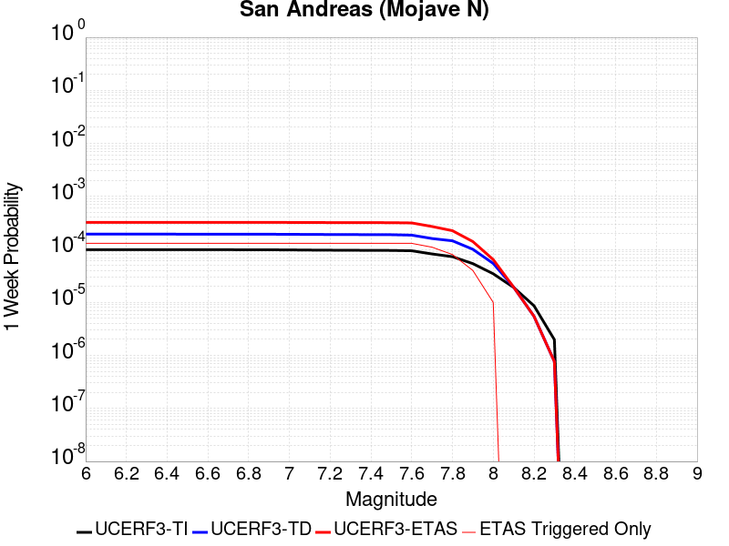 |  |  | 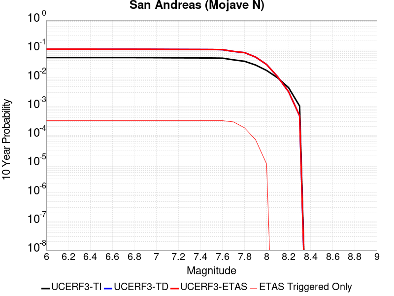 |

| Magnitude | 1 wk TI Prob | 1 wk TD Prob | 1 wk ETAS Prob | 1 wk ETAS/TD Gain | 1 wk ETAS Triggered Only | 1 mo TI Prob | 1 mo TD Prob | 1 mo ETAS Prob | 1 mo ETAS/TD Gain | 1 mo ETAS Triggered Only | 1 yr TI Prob | 1 yr TD Prob | 1 yr ETAS Prob | 1 yr ETAS/TD Gain | 1 yr ETAS Triggered Only | 10 yr TI Prob | 10 yr TD Prob | 10 yr ETAS Prob | 10 yr ETAS/TD Gain | 10 yr ETAS Triggered Only |
|-----|-----|-----|-----|-----|-----|-----|-----|-----|-----|-----|-----|-----|-----|-----|-----|-----|-----|-----|-----|-----|
| 6.0 | 9.877682E-5 | 1.9400376E-4 | 3.2397854E-4 | 1.6699601 | 1.3E-4 | 4.2326056E-4 | 8.311799E-4 | 0.0010010386 | 1.2043586 | 1.7E-4 | 0.0051410277 | 0.010072787 | 0.0103202695 | 1.0245694 | 2.5E-4 | 0.05023708 | 0.09831418 | 0.09860272 | 1.0029348 | 3.2E-4 |
| 6.1 | 9.877682E-5 | 1.9400376E-4 | 3.2397854E-4 | 1.6699601 | 1.3E-4 | 4.2326056E-4 | 8.311799E-4 | 0.0010010386 | 1.2043586 | 1.7E-4 | 0.0051410277 | 0.010072787 | 0.0103202695 | 1.0245694 | 2.5E-4 | 0.05023708 | 0.09831418 | 0.09860272 | 1.0029348 | 3.2E-4 |
| 6.2 | 9.877682E-5 | 1.9400376E-4 | 3.2397854E-4 | 1.6699601 | 1.3E-4 | 4.2326056E-4 | 8.311799E-4 | 0.0010010386 | 1.2043586 | 1.7E-4 | 0.0051410277 | 0.010072787 | 0.0103202695 | 1.0245694 | 2.5E-4 | 0.05023708 | 0.09831418 | 0.09860272 | 1.0029348 | 3.2E-4 |
| 6.3 | 9.877682E-5 | 1.9400376E-4 | 3.2397854E-4 | 1.6699601 | 1.3E-4 | 4.2326056E-4 | 8.311799E-4 | 0.0010010386 | 1.2043586 | 1.7E-4 | 0.0051410277 | 0.010072787 | 0.0103202695 | 1.0245694 | 2.5E-4 | 0.05023708 | 0.09831418 | 0.09860272 | 1.0029348 | 3.2E-4 |
| 6.4 | 9.877682E-5 | 1.9400376E-4 | 3.2397854E-4 | 1.6699601 | 1.3E-4 | 4.2326056E-4 | 8.311799E-4 | 0.0010010386 | 1.2043586 | 1.7E-4 | 0.0051410277 | 0.010072787 | 0.0103202695 | 1.0245694 | 2.5E-4 | 0.05023708 | 0.09831418 | 0.09860272 | 1.0029348 | 3.2E-4 |
| 6.5 | 9.861474E-5 | 1.9374143E-4 | 3.2371626E-4 | 1.6708673 | 1.3E-4 | 4.2256617E-4 | 8.3005644E-4 | 9.999153E-4 | 1.2046354 | 1.7E-4 | 0.0051326132 | 0.010059236 | 0.010306721 | 1.0246028 | 2.5E-4 | 0.050156746 | 0.09819207 | 0.09848066 | 1.0029389 | 3.2E-4 |
| 6.6 | 9.861474E-5 | 1.9374143E-4 | 3.2371626E-4 | 1.6708673 | 1.3E-4 | 4.2256617E-4 | 8.3005644E-4 | 9.999153E-4 | 1.2046354 | 1.7E-4 | 0.0051326132 | 0.010059236 | 0.010306721 | 1.0246028 | 2.5E-4 | 0.050156746 | 0.09819207 | 0.09848066 | 1.0029389 | 3.2E-4 |
| 6.7 | 9.8552715E-5 | 1.9364097E-4 | 3.236158E-4 | 1.6712155 | 1.3E-4 | 4.223004E-4 | 8.296261E-4 | 9.99485E-4 | 1.2047416 | 1.7E-4 | 0.0051293927 | 0.010054044 | 0.010301531 | 1.0246156 | 2.5E-4 | 0.050125998 | 0.098145284 | 0.09843388 | 1.0029404 | 3.2E-4 |
| 6.8 | 9.8464974E-5 | 1.9349258E-4 | 3.2346742E-4 | 1.6717304 | 1.3E-4 | 4.219245E-4 | 8.2899054E-4 | 9.988496E-4 | 1.2048987 | 1.7E-4 | 0.0051248376 | 0.010046378 | 0.0102938665 | 1.0246346 | 2.5E-4 | 0.05008251 | 0.09807551 | 0.09836412 | 1.0029428 | 3.2E-4 |
| 6.9 | 9.825824E-5 | 1.9317267E-4 | 3.2314757E-4 | 1.672843 | 1.3E-4 | 4.2103877E-4 | 8.2762045E-4 | 9.974798E-4 | 1.2052382 | 1.7E-4 | 0.0051141046 | 0.0100298505 | 0.010277343 | 1.0246756 | 2.5E-4 | 0.049980022 | 0.097924836 | 0.0982135 | 1.0029478 | 3.2E-4 |
| 7.0 | 9.781462E-5 | 1.9248636E-4 | 3.2246133E-4 | 1.6752425 | 1.3E-4 | 4.1913814E-4 | 8.246809E-4 | 9.945408E-4 | 1.2059703 | 1.7E-4 | 0.005091073 | 0.00999439 | 0.010241892 | 1.0247641 | 2.5E-4 | 0.04976007 | 0.09760108 | 0.09788985 | 1.0029587 | 3.2E-4 |
| 7.1 | 9.7121134E-5 | 1.9150345E-4 | 3.2147855E-4 | 1.6787089 | 1.3E-4 | 4.1616702E-4 | 8.2047115E-4 | 9.903316E-4 | 1.207028 | 1.7E-4 | 0.005055068 | 0.009943605 | 0.01019112 | 1.0248917 | 2.5E-4 | 0.04941613 | 0.09713763 | 0.09742655 | 1.0029743 | 3.2E-4 |
| 7.2 | 9.663819E-5 | 1.9081132E-4 | 3.207865E-4 | 1.6811713 | 1.3E-4 | 4.1409794E-4 | 8.175067E-4 | 9.873677E-4 | 1.2077794 | 1.7E-4 | 0.0050299936 | 0.009907843 | 0.010155365 | 1.0249826 | 2.5E-4 | 0.049176537 | 0.096810766 | 0.09709978 | 1.0029854 | 3.2E-4 |
| 7.3 | 9.6277574E-5 | 1.9033643E-4 | 3.203117E-4 | 1.6828711 | 1.3E-4 | 4.125529E-4 | 8.1547274E-4 | 9.853342E-4 | 1.2082981 | 1.7E-4 | 0.0050112694 | 0.009883304 | 0.010130834 | 1.0250452 | 2.5E-4 | 0.04899759 | 0.096584216 | 0.096873306 | 1.0029932 | 3.2E-4 |
| 7.4 | 9.593308E-5 | 1.897343E-4 | 3.1970962E-4 | 1.6850387 | 1.3E-4 | 4.1107697E-4 | 8.128938E-4 | 9.827556E-4 | 1.2089595 | 1.7E-4 | 0.0049933824 | 0.00985219 | 0.010099727 | 1.025125 | 2.5E-4 | 0.04882661 | 0.096301794 | 0.09659098 | 1.0030029 | 3.2E-4 |
| 7.5 | 9.561707E-5 | 1.8919505E-4 | 3.1917045E-4 | 1.6869916 | 1.3E-4 | 4.0972308E-4 | 8.1058417E-4 | 9.804463E-4 | 1.2095553 | 1.7E-4 | 0.0049769743 | 0.009824324 | 0.010071868 | 1.025197 | 2.5E-4 | 0.048669744 | 0.0960482 | 0.09633746 | 1.0030117 | 3.2E-4 |
| 7.6 | 9.418194E-5 | 1.857177E-4 | 3.1569356E-4 | 1.6998571 | 1.3E-4 | 4.0357444E-4 | 7.9569034E-4 | 9.655551E-4 | 1.213481 | 1.7E-4 | 0.004902454 | 0.009644611 | 0.0098922 | 1.0256712 | 2.5E-4 | 0.047957025 | 0.094429545 | 0.09471933 | 1.0030688 | 3.2E-4 |
| 7.7 | 8.202141E-5 | 1.6020852E-4 | 2.701909E-4 | 1.6864952 | 1.1E-4 | 3.51473E-4 | 6.8642735E-4 | 8.2633126E-4 | 1.2038146 | 1.4E-4 | 0.00427079 | 0.008325285 | 0.008543454 | 1.0262055 | 2.2E-4 | 0.04189639 | 0.082231544 | 0.0824977 | 1.0032367 | 2.9E-4 |
| 7.8 | 7.2859846E-5 | 1.4516065E-4 | 2.2514904E-4 | 1.5510335 | 8.0E-5 | 3.1221908E-4 | 6.2196876E-4 | 7.3190033E-4 | 1.1767478 | 1.1E-4 | 0.003794643 | 0.007546219 | 0.0076950868 | 1.0197275 | 1.5E-4 | 0.037304975 | 0.07472429 | 0.07489083 | 1.0022289 | 1.8E-4 |
| 7.9 | 5.3874453E-5 | 1.00452475E-4 | 1.4044845E-4 | 1.3981583 | 4.0E-5 | 2.3087008E-4 | 4.3043957E-4 | 4.7042235E-4 | 1.0928882 | 4.0E-5 | 0.0028072202 | 0.0052280203 | 0.005287707 | 1.0114167 | 6.0E-5 | 0.02772022 | 0.052421875 | 0.052488204 | 1.0012653 | 7.0E-5 |
| 8.0 | 3.468538E-5 | 5.4255845E-5 | 6.4255306E-5 | 1.184302 | 1.0E-5 | 1.4864317E-4 | 2.3250433E-4 | 2.42502E-4 | 1.043 | 1.0E-5 | 0.0018082283 | 0.0028270676 | 0.0028370393 | 1.0035273 | 1.0E-5 | 0.017935853 | 0.02894576 | 0.02895547 | 1.0003355 | 1.0E-5 |
| 8.1 | 1.9152367E-5 | 1.9398649E-5 | 1.9398649E-5 | 1.0 | 0.0 | 8.207899E-5 | 8.313442E-5 | 8.313442E-5 | 1.0 | 0.0 | 9.988535E-4 | 0.0010116922 | 0.0010116922 | 1.0 | 0.0 | 0.009943757 | 0.0108545665 | 0.0108545665 | 1.0 | 0.0 |
| 8.2 | 8.643924E-6 | 5.472644E-6 | 5.472644E-6 | 1.0 | 0.0 | 3.704486E-5 | 2.3453977E-5 | 2.3453977E-5 | 1.0 | 0.0 | 4.5092785E-4 | 2.8551483E-4 | 2.8551483E-4 | 1.0 | 0.0 | 0.0045001395 | 0.003247653 | 0.003247653 | 1.0 | 0.0 |
| 8.3 | 1.983087E-6 | 7.6547434E-7 | 7.6547434E-7 | 1.0 | 0.0 | 8.498917E-6 | 3.2806004E-6 | 3.2806004E-6 | 1.0 | 0.0 | 1.034694E-4 | 3.9940594E-5 | 3.9940594E-5 | 1.0 | 0.0 | 0.0010342124 | 4.7170694E-4 | 4.7170694E-4 | 1.0 | 0.0 |

## Death Valley (Black Mtns Frontal)
*[(top)](#table-of-contents)*

| 1 Week | 1 Month | 1 Year | 10 Year |
|-----|-----|-----|-----|
|  | 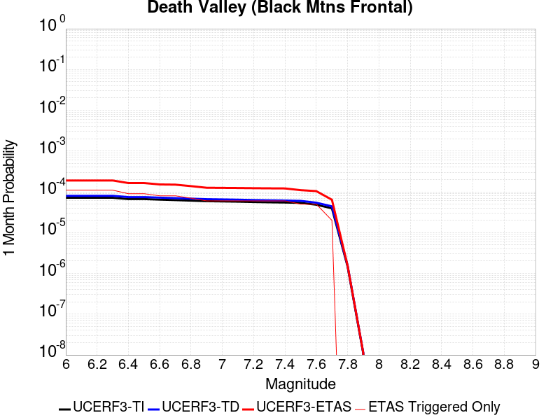 | 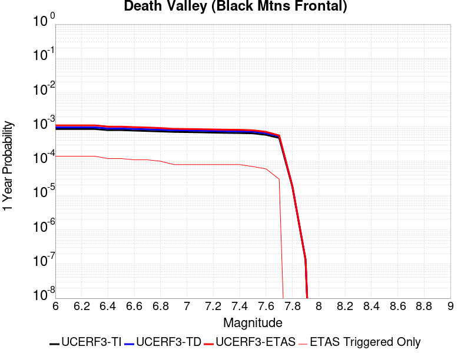 |  |

| Magnitude | 1 wk TI Prob | 1 wk TD Prob | 1 wk ETAS Prob | 1 wk ETAS/TD Gain | 1 wk ETAS Triggered Only | 1 mo TI Prob | 1 mo TD Prob | 1 mo ETAS Prob | 1 mo ETAS/TD Gain | 1 mo ETAS Triggered Only | 1 yr TI Prob | 1 yr TD Prob | 1 yr ETAS Prob | 1 yr ETAS/TD Gain | 1 yr ETAS Triggered Only | 10 yr TI Prob | 10 yr TD Prob | 10 yr ETAS Prob | 10 yr ETAS/TD Gain | 10 yr ETAS Triggered Only |
|-----|-----|-----|-----|-----|-----|-----|-----|-----|-----|-----|-----|-----|-----|-----|-----|-----|-----|-----|-----|-----|
| 6.0 | 1.6707214E-5 | 1.867021E-5 | 5.8669462E-5 | 3.1424105 | 4.0E-5 | 7.160038E-5 | 8.0012775E-5 | 1.9000398E-4 | 2.3746705 | 1.1E-4 | 8.71386E-4 | 9.737278E-4 | 0.0011135915 | 1.1436373 | 1.4E-4 | 0.00867977 | 0.009695467 | 0.009913334 | 1.0224711 | 2.2E-4 |
| 6.1 | 1.6707214E-5 | 1.867021E-5 | 5.8669462E-5 | 3.1424105 | 4.0E-5 | 7.160038E-5 | 8.0012775E-5 | 1.9000398E-4 | 2.3746705 | 1.1E-4 | 8.71386E-4 | 9.737278E-4 | 0.0011135915 | 1.1436373 | 1.4E-4 | 0.00867977 | 0.009695467 | 0.009913334 | 1.0224711 | 2.2E-4 |
| 6.2 | 1.6707214E-5 | 1.867021E-5 | 5.8669462E-5 | 3.1424105 | 4.0E-5 | 7.160038E-5 | 8.0012775E-5 | 1.9000398E-4 | 2.3746705 | 1.1E-4 | 8.71386E-4 | 9.737278E-4 | 0.0011135915 | 1.1436373 | 1.4E-4 | 0.00867977 | 0.009695467 | 0.009913334 | 1.0224711 | 2.2E-4 |
| 6.3 | 1.6707214E-5 | 1.867021E-5 | 5.8669462E-5 | 3.1424105 | 4.0E-5 | 7.160038E-5 | 8.0012775E-5 | 1.9000398E-4 | 2.3746705 | 1.1E-4 | 8.71386E-4 | 9.737278E-4 | 0.0011135915 | 1.1436373 | 1.4E-4 | 0.00867977 | 0.009695467 | 0.009913334 | 1.0224711 | 2.2E-4 |
| 6.4 | 1.5515609E-5 | 1.733816E-5 | 4.733764E-5 | 2.7302575 | 3.0E-5 | 6.649377E-5 | 7.430431E-5 | 1.6429763E-4 | 2.2111452 | 9.0E-5 | 8.0926094E-4 | 9.0428564E-4 | 0.0010241772 | 1.1325815 | 1.2E-4 | 0.008063202 | 0.009006744 | 0.009195033 | 1.0209053 | 1.9E-4 |
| 6.5 | 1.5515609E-5 | 1.733816E-5 | 4.733764E-5 | 2.7302575 | 3.0E-5 | 6.649377E-5 | 7.430431E-5 | 1.6429763E-4 | 2.2111452 | 9.0E-5 | 8.0926094E-4 | 9.0428564E-4 | 0.0010241772 | 1.1325815 | 1.2E-4 | 0.008063202 | 0.009006744 | 0.009195033 | 1.0209053 | 1.9E-4 |
| 6.6 | 1.5041828E-5 | 1.6809092E-5 | 3.6808757E-5 | 2.1898122 | 2.0E-5 | 6.4463384E-5 | 7.203701E-5 | 1.5203125E-4 | 2.1104603 | 8.0E-5 | 7.8455906E-4 | 8.767036E-4 | 9.866072E-4 | 1.12536 | 1.1E-4 | 0.00781795 | 0.008733105 | 0.00890162 | 1.0192962 | 1.7E-4 |
| 6.7 | 1.4634985E-5 | 1.6355965E-5 | 3.635564E-5 | 2.2227755 | 2.0E-5 | 6.271985E-5 | 7.009514E-5 | 1.5008953E-4 | 2.1412258 | 8.0E-5 | 7.6334673E-4 | 8.5307995E-4 | 9.6298615E-4 | 1.1288345 | 1.1E-4 | 0.007607299 | 0.008498689 | 0.008667245 | 1.0198331 | 1.7E-4 |
| 6.8 | 1.4209158E-5 | 1.5881998E-5 | 3.588168E-5 | 2.2592673 | 2.0E-5 | 6.089497E-5 | 6.806396E-5 | 1.380592E-4 | 2.0283744 | 7.0E-5 | 7.4114406E-4 | 8.283693E-4 | 9.282864E-4 | 1.120619 | 1.0E-4 | 0.007386771 | 0.00825343 | 0.008402192 | 1.0180242 | 1.5E-4 |
| 6.9 | 1.3780098E-5 | 1.5404545E-5 | 3.5404235E-5 | 2.2982981 | 2.0E-5 | 5.9056227E-5 | 6.6017834E-5 | 1.2601388E-4 | 1.9087853 | 6.0E-5 | 7.1877235E-4 | 8.034762E-4 | 8.8341197E-4 | 1.0994873 | 8.0E-5 | 0.0071645193 | 0.008006307 | 0.008135267 | 1.0161072 | 1.3E-4 |
| 7.0 | 1.3585064E-5 | 1.5188108E-5 | 3.5187804E-5 | 2.3167999 | 2.0E-5 | 5.8220405E-5 | 6.5090295E-5 | 1.2508639E-4 | 1.9217364 | 6.0E-5 | 7.086029E-4 | 7.9219165E-4 | 8.721283E-4 | 1.1009057 | 8.0E-5 | 0.007063476 | 0.007894269 | 0.0080232425 | 1.0163376 | 1.3E-4 |
| 7.1 | 1.3398601E-5 | 1.4981292E-5 | 3.4980992E-5 | 2.3349783 | 2.0E-5 | 5.742131E-5 | 6.420399E-5 | 1.2420013E-4 | 1.9344614 | 6.0E-5 | 6.9888023E-4 | 7.814087E-4 | 8.6134614E-4 | 1.1022992 | 8.0E-5 | 0.0069668638 | 0.0077871997 | 0.007916187 | 1.016564 | 1.3E-4 |
| 7.2 | 1.3126312E-5 | 1.4679515E-5 | 3.4679222E-5 | 2.362423 | 2.0E-5 | 5.6254412E-5 | 6.2910716E-5 | 1.2290695E-4 | 1.9536725 | 6.0E-5 | 6.846822E-4 | 7.656743E-4 | 8.45613E-4 | 1.104403 | 8.0E-5 | 0.006825765 | 0.007630946 | 0.007759954 | 1.0169059 | 1.3E-4 |
| 7.3 | 1.2922429E-5 | 1.4453743E-5 | 3.4453453E-5 | 2.3837047 | 2.0E-5 | 5.5380664E-5 | 6.194317E-5 | 1.21939454E-4 | 1.9685698 | 6.0E-5 | 6.74051E-4 | 7.5390254E-4 | 8.3384226E-4 | 1.1060345 | 8.0E-5 | 0.006720101 | 0.007514031 | 0.0076232045 | 1.0145292 | 1.1E-4 |
| 7.4 | 1.2768878E-5 | 1.4283726E-5 | 3.428344E-5 | 2.4001749 | 2.0E-5 | 5.4722615E-5 | 6.121456E-5 | 1.2121089E-4 | 1.980099 | 6.0E-5 | 6.660441E-4 | 7.4503786E-4 | 8.249783E-4 | 1.1072971 | 8.0E-5 | 0.0066405144 | 0.00742598 | 0.0075351633 | 1.0147029 | 1.1E-4 |
| 7.5 | 1.2521929E-5 | 1.401197E-5 | 3.401169E-5 | 2.427331 | 2.0E-5 | 5.366431E-5 | 6.004995E-5 | 1.10046945E-4 | 1.8325901 | 5.0E-5 | 6.531671E-4 | 7.308683E-4 | 8.0081716E-4 | 1.0957065 | 7.0E-5 | 0.006512506 | 0.007285223 | 0.007374567 | 1.0122638 | 9.0E-5 |
| 7.6 | 1.1301089E-5 | 1.2648108E-5 | 3.2647855E-5 | 2.581244 | 2.0E-5 | 4.8432343E-5 | 5.4205084E-5 | 1.0420237E-4 | 1.9223727 | 5.0E-5 | 5.895042E-4 | 6.5975235E-4 | 7.1971276E-4 | 1.0908833 | 6.0E-5 | 0.0058794282 | 0.006578489 | 0.006657963 | 1.0120808 | 8.0E-5 |
| 7.7 | 9.189108E-6 | 1.02833255E-5 | 1.02833255E-5 | 1.0 | 0.0 | 3.93813E-5 | 4.407068E-5 | 6.40698E-5 | 1.4537965 | 2.0E-5 | 4.7936183E-4 | 5.364335E-4 | 5.6641735E-4 | 1.055895 | 3.0E-5 | 0.004783291 | 0.005351897 | 0.0054016295 | 1.0092925 | 5.0E-5 |
| 7.8 | 3.4586725E-7 | 3.648256E-7 | 3.648256E-7 | 1.0 | 0.0 | 1.4822873E-6 | 1.5635374E-6 | 1.5635374E-6 | 1.0 | 0.0 | 1.80467E-5 | 1.9035906E-5 | 1.9035906E-5 | 1.0 | 0.0 | 1.8045233E-4 | 1.903432E-4 | 1.903432E-4 | 1.0 | 0.0 |
| 7.9 | 2.5591178E-9 | 2.6696687E-9 | 2.6696687E-9 | 1.0 | 0.0 | 1.0967647E-8 | 1.1441437E-8 | 1.1441437E-8 | 1.0 | 0.0 | 1.335311E-7 | 1.392995E-7 | 1.392995E-7 | 1.0 | 0.0 | 1.3353102E-6 | 1.3929949E-6 | 1.3929949E-6 | 1.0 | 0.0 |

## Garlic Springs
*[(top)](#table-of-contents)*

| 1 Week | 1 Month | 1 Year | 10 Year |
|-----|-----|-----|-----|
|  | 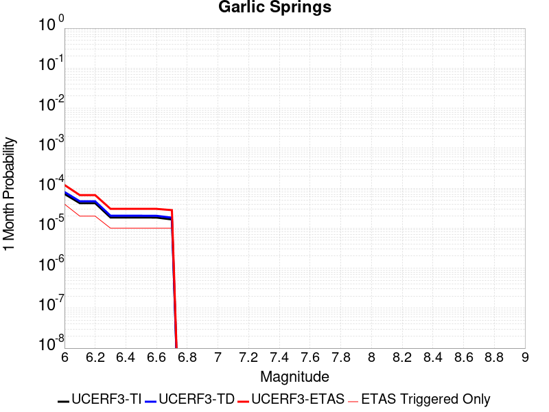 |  | 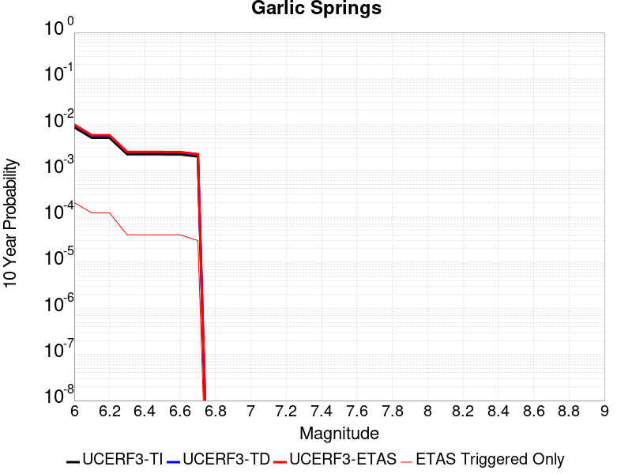 |

| Magnitude | 1 wk TI Prob | 1 wk TD Prob | 1 wk ETAS Prob | 1 wk ETAS/TD Gain | 1 wk ETAS Triggered Only | 1 mo TI Prob | 1 mo TD Prob | 1 mo ETAS Prob | 1 mo ETAS/TD Gain | 1 mo ETAS Triggered Only | 1 yr TI Prob | 1 yr TD Prob | 1 yr ETAS Prob | 1 yr ETAS/TD Gain | 1 yr ETAS Triggered Only | 10 yr TI Prob | 10 yr TD Prob | 10 yr ETAS Prob | 10 yr ETAS/TD Gain | 10 yr ETAS Triggered Only |
|-----|-----|-----|-----|-----|-----|-----|-----|-----|-----|-----|-----|-----|-----|-----|-----|-----|-----|-----|-----|-----|
| 6.0 | 1.6760017E-5 | 1.8776773E-5 | 5.8776022E-5 | 3.1302516 | 4.0E-5 | 7.182667E-5 | 8.047006E-5 | 1.20466844E-4 | 1.4970393 | 4.0E-5 | 8.7413884E-4 | 9.794E-4 | 0.0010593217 | 1.0816027 | 8.0E-5 | 0.008707083 | 0.009762382 | 0.00996043 | 1.0202868 | 2.0E-4 |
| 6.1 | 9.852767E-6 | 1.0973554E-5 | 3.0973333E-5 | 2.8225436 | 2.0E-5 | 4.222546E-5 | 4.702907E-5 | 6.702813E-5 | 1.4252489 | 2.0E-5 | 5.139737E-4 | 5.724994E-4 | 6.1247655E-4 | 1.0698291 | 4.0E-5 | 0.005127866 | 0.005717204 | 0.005836518 | 1.0208693 | 1.2E-4 |
| 6.2 | 9.852767E-6 | 1.0973554E-5 | 3.0973333E-5 | 2.8225436 | 2.0E-5 | 4.222546E-5 | 4.702907E-5 | 6.702813E-5 | 1.4252489 | 2.0E-5 | 5.139737E-4 | 5.724994E-4 | 6.1247655E-4 | 1.0698291 | 4.0E-5 | 0.005127866 | 0.005717204 | 0.005836518 | 1.0208693 | 1.2E-4 |
| 6.3 | 4.3167724E-6 | 4.778015E-6 | 1.4777967E-5 | 3.0929093 | 1.0E-5 | 1.8500323E-5 | 2.0477177E-5 | 3.0476971E-5 | 1.4883386 | 1.0E-5 | 2.2521814E-4 | 2.4930414E-4 | 2.7929666E-4 | 1.120305 | 3.0E-5 | 0.0022499003 | 0.0024925028 | 0.0025324032 | 1.0160081 | 4.0E-5 |
| 6.4 | 4.3167724E-6 | 4.778015E-6 | 1.4777967E-5 | 3.0929093 | 1.0E-5 | 1.8500323E-5 | 2.0477177E-5 | 3.0476971E-5 | 1.4883386 | 1.0E-5 | 2.2521814E-4 | 2.4930414E-4 | 2.7929666E-4 | 1.120305 | 3.0E-5 | 0.0022499003 | 0.0024925028 | 0.0025324032 | 1.0160081 | 4.0E-5 |
| 6.5 | 4.3167724E-6 | 4.778015E-6 | 1.4777967E-5 | 3.0929093 | 1.0E-5 | 1.8500323E-5 | 2.0477177E-5 | 3.0476971E-5 | 1.4883386 | 1.0E-5 | 2.2521814E-4 | 2.4930414E-4 | 2.7929666E-4 | 1.120305 | 3.0E-5 | 0.0022499003 | 0.0024925028 | 0.0025324032 | 1.0160081 | 4.0E-5 |
| 6.6 | 4.301311E-6 | 4.7608837E-6 | 1.4760836E-5 | 3.1004405 | 1.0E-5 | 1.8434059E-5 | 2.0403757E-5 | 3.0403553E-5 | 1.4900959 | 1.0E-5 | 2.2441156E-4 | 2.4841045E-4 | 2.78403E-4 | 1.1207379 | 3.0E-5 | 0.0022418506 | 0.002483586 | 0.0025234867 | 1.0160657 | 4.0E-5 |
| 6.7 | 3.8599724E-6 | 4.2710476E-6 | 1.4271005E-5 | 3.3413358 | 1.0E-5 | 1.6542634E-5 | 1.830449E-5 | 2.8304306E-5 | 1.546304 | 1.0E-5 | 2.0138794E-4 | 2.2285717E-4 | 2.4285271E-4 | 1.0897236 | 2.0E-5 | 0.0020120554 | 0.0022285716 | 0.0022585047 | 1.0134315 | 3.0E-5 |

## Helendale-So Lockhart
*[(top)](#table-of-contents)*

| 1 Week | 1 Month | 1 Year | 10 Year |
|-----|-----|-----|-----|
|  | 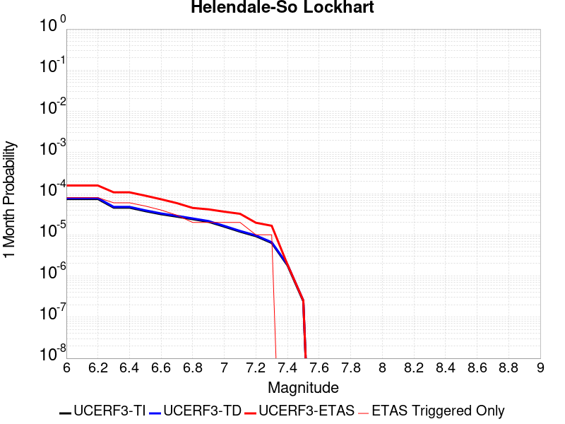 | 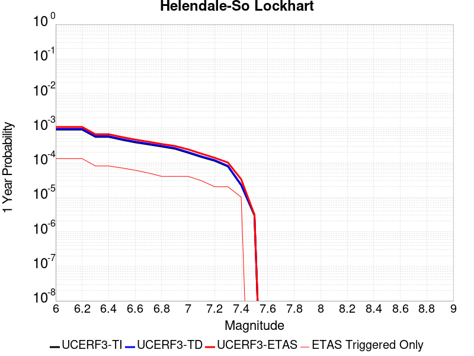 | 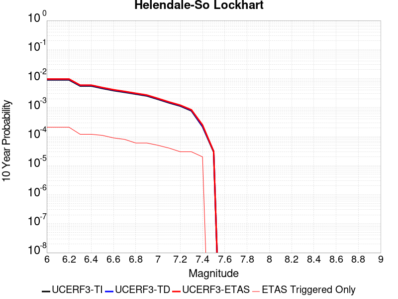 |

| Magnitude | 1 wk TI Prob | 1 wk TD Prob | 1 wk ETAS Prob | 1 wk ETAS/TD Gain | 1 wk ETAS Triggered Only | 1 mo TI Prob | 1 mo TD Prob | 1 mo ETAS Prob | 1 mo ETAS/TD Gain | 1 mo ETAS Triggered Only | 1 yr TI Prob | 1 yr TD Prob | 1 yr ETAS Prob | 1 yr ETAS/TD Gain | 1 yr ETAS Triggered Only | 10 yr TI Prob | 10 yr TD Prob | 10 yr ETAS Prob | 10 yr ETAS/TD Gain | 10 yr ETAS Triggered Only |
|-----|-----|-----|-----|-----|-----|-----|-----|-----|-----|-----|-----|-----|-----|-----|-----|-----|-----|-----|-----|-----|
| 6.0 | 1.7296055E-5 | 1.8103707E-5 | 7.810262E-5 | 4.3141785 | 6.0E-5 | 7.412385E-5 | 7.758512E-5 | 1.5757892E-4 | 2.0310454 | 8.0E-5 | 9.0208417E-4 | 9.442103E-4 | 0.0010740876 | 1.1375512 | 1.3E-4 | 0.008984311 | 0.009404104 | 0.00961213 | 1.0221207 | 2.1E-4 |
| 6.1 | 1.7296055E-5 | 1.8103707E-5 | 7.810262E-5 | 4.3141785 | 6.0E-5 | 7.412385E-5 | 7.758512E-5 | 1.5757892E-4 | 2.0310454 | 8.0E-5 | 9.0208417E-4 | 9.442103E-4 | 0.0010740876 | 1.1375512 | 1.3E-4 | 0.008984311 | 0.009404104 | 0.00961213 | 1.0221207 | 2.1E-4 |
| 6.2 | 1.7296055E-5 | 1.8103707E-5 | 7.810262E-5 | 4.3141785 | 6.0E-5 | 7.412385E-5 | 7.758512E-5 | 1.5757892E-4 | 2.0310454 | 8.0E-5 | 9.0208417E-4 | 9.442103E-4 | 0.0010740876 | 1.1375512 | 1.3E-4 | 0.008984311 | 0.009404104 | 0.00961213 | 1.0221207 | 2.1E-4 |
| 6.3 | 1.0669118E-5 | 1.1135411E-5 | 5.1134964E-5 | 4.592104 | 4.0E-5 | 4.5723988E-5 | 4.7722333E-5 | 1.0771947E-4 | 2.2572129 | 6.0E-5 | 5.5654737E-4 | 5.8086734E-4 | 6.6082086E-4 | 1.1376451 | 8.0E-5 | 0.0055515557 | 0.0057937866 | 0.0059130914 | 1.0205919 | 1.2E-4 |
| 6.4 | 1.0669118E-5 | 1.1135411E-5 | 5.1134964E-5 | 4.592104 | 4.0E-5 | 4.5723988E-5 | 4.7722333E-5 | 1.0771947E-4 | 2.2572129 | 6.0E-5 | 5.5654737E-4 | 5.8086734E-4 | 6.6082086E-4 | 1.1376451 | 8.0E-5 | 0.0055515557 | 0.0057937866 | 0.0059130914 | 1.0205919 | 1.2E-4 |
| 6.5 | 8.790038E-6 | 9.170186E-6 | 3.916991E-5 | 4.271441 | 3.0E-5 | 3.767105E-5 | 3.9300216E-5 | 8.929825E-5 | 2.2722077 | 5.0E-5 | 4.585485E-4 | 4.783766E-4 | 5.483431E-4 | 1.1462582 | 7.0E-5 | 0.0045760344 | 0.004773633 | 0.0048831077 | 1.0229332 | 1.1E-4 |
| 6.6 | 7.396949E-6 | 7.715528E-6 | 2.7715374E-5 | 3.5921552 | 2.0E-5 | 3.1700827E-5 | 3.3066135E-5 | 7.306481E-5 | 2.209657 | 4.0E-5 | 3.858892E-4 | 4.0250685E-4 | 4.6248268E-4 | 1.1490058 | 6.0E-5 | 0.003852198 | 0.0040178853 | 0.0041075237 | 1.0223099 | 9.0E-5 |
| 6.7 | 6.4600285E-6 | 6.7380233E-6 | 2.673789E-5 | 3.9682095 | 2.0E-5 | 2.7685543E-5 | 2.8876928E-5 | 5.887606E-5 | 2.0388618 | 3.0E-5 | 3.3701936E-4 | 3.5152066E-4 | 4.015031E-4 | 1.1421891 | 5.0E-5 | 0.0033650869 | 0.003509728 | 0.0035894471 | 1.0227138 | 8.0E-5 |
| 6.8 | 5.600104E-6 | 5.836003E-6 | 1.5835945E-5 | 2.7134917 | 1.0E-5 | 2.4000226E-5 | 2.5011204E-5 | 4.5010704E-5 | 1.7996216 | 2.0E-5 | 2.9216358E-4 | 3.0446946E-4 | 3.4445728E-4 | 1.1313361 | 4.0E-5 | 0.0029177975 | 0.0030405847 | 0.0031004022 | 1.019673 | 6.0E-5 |
| 6.9 | 4.839122E-6 | 5.039504E-6 | 1.50394535E-5 | 2.9843123 | 1.0E-5 | 2.0738931E-5 | 2.1597696E-5 | 4.1597264E-5 | 1.9260046 | 2.0E-5 | 2.5246723E-4 | 2.629207E-4 | 3.0291016E-4 | 1.1520971 | 4.0E-5 | 0.002521806 | 0.0026261439 | 0.0026859862 | 1.0227872 | 6.0E-5 |
| 7.0 | 3.6937633E-6 | 3.845204E-6 | 1.3845165E-5 | 3.6006324 | 1.0E-5 | 1.5830317E-5 | 1.6479342E-5 | 3.6479014E-5 | 2.2136207 | 2.0E-5 | 1.9271708E-4 | 2.0061784E-4 | 2.406098E-4 | 1.199344 | 4.0E-5 | 0.0019255003 | 0.0020043987 | 0.0020542985 | 1.0248952 | 5.0E-5 |
| 7.1 | 2.7858857E-6 | 2.8978507E-6 | 1.2897822E-5 | 4.4508233 | 1.0E-5 | 1.1939455E-5 | 1.2419302E-5 | 3.2419055E-5 | 2.6103764 | 2.0E-5 | 1.4535317E-4 | 1.5119473E-4 | 1.8119019E-4 | 1.1983896 | 3.0E-5 | 0.0014525814 | 0.0015109401 | 0.0015508797 | 1.0264336 | 4.0E-5 |
| 7.2 | 2.1672065E-6 | 2.2540103E-6 | 2.2540103E-6 | 1.0 | 0.0 | 9.2879945E-6 | 9.66001E-6 | 1.9659914E-5 | 2.0351856 | 1.0E-5 | 1.1307546E-4 | 1.1760445E-4 | 1.3760211E-4 | 1.1700416 | 2.0E-5 | 0.0011301794 | 0.0011754404 | 0.0012054051 | 1.0254923 | 3.0E-5 |
| 7.3 | 1.4823496E-6 | 1.5422086E-6 | 1.5422086E-6 | 1.0 | 0.0 | 6.3529114E-6 | 6.6094494E-6 | 1.6609383E-5 | 2.5129755 | 1.0E-5 | 7.734395E-5 | 8.046723E-5 | 1.00465615E-4 | 1.2485284 | 2.0E-5 | 7.731704E-4 | 8.04396E-4 | 8.343719E-4 | 1.0372651 | 3.0E-5 |
| 7.4 | 4.2321457E-7 | 4.4108717E-7 | 4.4108717E-7 | 1.0 | 0.0 | 1.8137755E-6 | 1.8903725E-6 | 1.8903725E-6 | 1.0 | 0.0 | 2.2082493E-5 | 2.3015087E-5 | 3.3014858E-5 | 1.4344876 | 1.0E-5 | 2.2080299E-4 | 2.3013157E-4 | 2.5012696E-4 | 1.0868868 | 2.0E-5 |
| 7.5 | 5.6942316E-8 | 5.9415576E-8 | 5.9415576E-8 | 1.0 | 0.0 | 2.440385E-7 | 2.5463817E-7 | 2.5463817E-7 | 1.0 | 0.0 | 2.9711643E-6 | 3.1002162E-6 | 3.1002162E-6 | 1.0 | 0.0 | 2.9711247E-5 | 3.1001808E-5 | 3.1001808E-5 | 1.0 | 0.0 |

## San Andreas (San Bernardino N)
*[(top)](#table-of-contents)*

| 1 Week | 1 Month | 1 Year | 10 Year |
|-----|-----|-----|-----|
| 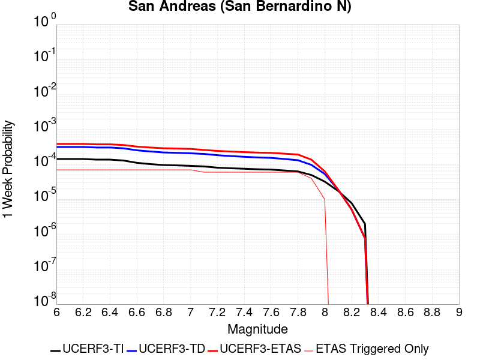 | 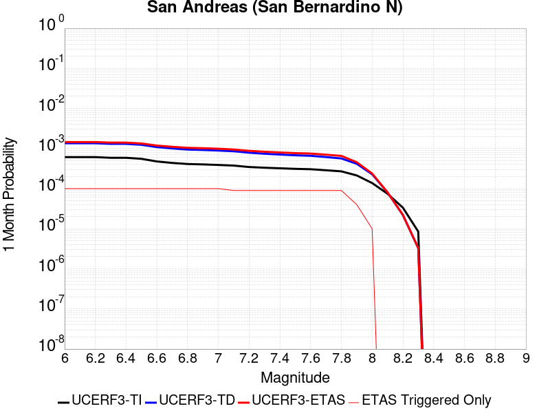 |  | 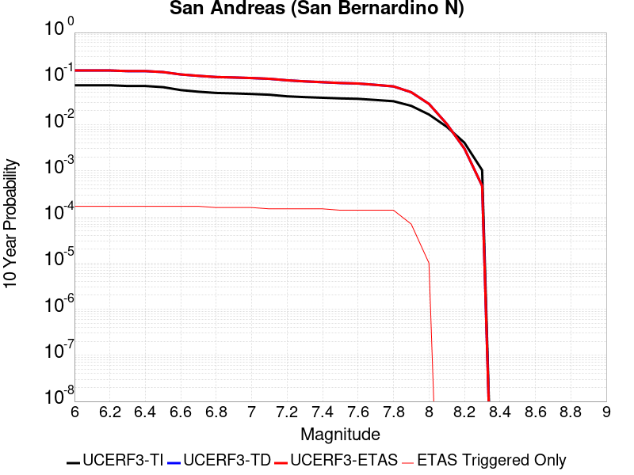 |

| Magnitude | 1 wk TI Prob | 1 wk TD Prob | 1 wk ETAS Prob | 1 wk ETAS/TD Gain | 1 wk ETAS Triggered Only | 1 mo TI Prob | 1 mo TD Prob | 1 mo ETAS Prob | 1 mo ETAS/TD Gain | 1 mo ETAS Triggered Only | 1 yr TI Prob | 1 yr TD Prob | 1 yr ETAS Prob | 1 yr ETAS/TD Gain | 1 yr ETAS Triggered Only | 10 yr TI Prob | 10 yr TD Prob | 10 yr ETAS Prob | 10 yr ETAS/TD Gain | 10 yr ETAS Triggered Only |
|-----|-----|-----|-----|-----|-----|-----|-----|-----|-----|-----|-----|-----|-----|-----|-----|-----|-----|-----|-----|-----|
| 6.0 | 1.4273766E-4 | 3.16063E-4 | 3.860409E-4 | 1.2214048 | 7.0E-5 | 6.115894E-4 | 0.0013538585 | 0.0014537232 | 1.073763 | 1.0E-4 | 0.0074207084 | 0.016360149 | 0.016488021 | 1.0078162 | 1.3E-4 | 0.07177748 | 0.1502109 | 0.15035537 | 1.0009618 | 1.7E-4 |
| 6.1 | 1.4273766E-4 | 3.16063E-4 | 3.860409E-4 | 1.2214048 | 7.0E-5 | 6.115894E-4 | 0.0013538585 | 0.0014537232 | 1.073763 | 1.0E-4 | 0.0074207084 | 0.016360149 | 0.016488021 | 1.0078162 | 1.3E-4 | 0.07177748 | 0.1502109 | 0.15035537 | 1.0009618 | 1.7E-4 |
| 6.2 | 1.4273766E-4 | 3.16063E-4 | 3.860409E-4 | 1.2214048 | 7.0E-5 | 6.115894E-4 | 0.0013538585 | 0.0014537232 | 1.073763 | 1.0E-4 | 0.0074207084 | 0.016360149 | 0.016488021 | 1.0078162 | 1.3E-4 | 0.07177748 | 0.1502109 | 0.15035537 | 1.0009618 | 1.7E-4 |
| 6.3 | 1.3730655E-4 | 3.051113E-4 | 3.7508993E-4 | 1.2293545 | 7.0E-5 | 5.883239E-4 | 0.0013069701 | 0.0014068395 | 1.0764128 | 1.0E-4 | 0.0071393442 | 0.015797663 | 0.01592561 | 1.0080991 | 1.3E-4 | 0.06914291 | 0.14551277 | 0.14565805 | 1.0009983 | 1.7E-4 |
| 6.4 | 1.3730655E-4 | 3.051113E-4 | 3.7508993E-4 | 1.2293545 | 7.0E-5 | 5.883239E-4 | 0.0013069701 | 0.0014068395 | 1.0764128 | 1.0E-4 | 0.0071393442 | 0.015797663 | 0.01592561 | 1.0080991 | 1.3E-4 | 0.06914291 | 0.14551277 | 0.14565805 | 1.0009983 | 1.7E-4 |
| 6.5 | 1.2942807E-4 | 2.8925604E-4 | 3.592358E-4 | 1.2419301 | 7.0E-5 | 5.545738E-4 | 0.001239085 | 0.0013389611 | 1.0806047 | 1.0E-4 | 0.0067310524 | 0.014982755 | 0.0151108075 | 1.0085466 | 1.3E-4 | 0.06530788 | 0.13865015 | 0.13879657 | 1.0010561 | 1.7E-4 |
| 6.6 | 1.1125901E-4 | 2.5364384E-4 | 3.236261E-4 | 1.2759075 | 7.0E-5 | 4.767372E-4 | 0.0010865945 | 0.0011864859 | 1.0919306 | 1.0E-4 | 0.005788839 | 0.013149675 | 0.013277966 | 1.0097562 | 1.3E-4 | 0.056403454 | 0.123004206 | 0.1231533 | 1.0012121 | 1.7E-4 |
| 6.7 | 1.02209575E-4 | 2.3499398E-4 | 3.0497753E-4 | 1.29781 | 7.0E-5 | 4.3796748E-4 | 0.0010067298 | 0.001106629 | 1.0992315 | 1.0E-4 | 0.0053192247 | 0.012188473 | 0.012316889 | 1.0105358 | 1.3E-4 | 0.051936906 | 0.11479201 | 0.1149425 | 1.001311 | 1.7E-4 |
| 6.8 | 9.610582E-5 | 2.2025258E-4 | 2.9023716E-4 | 1.3177469 | 7.0E-5 | 4.1181705E-4 | 9.4359886E-4 | 0.0010435045 | 1.1058773 | 1.0E-4 | 0.0050023515 | 0.011428066 | 0.011556581 | 1.0112455 | 1.3E-4 | 0.048912346 | 0.10820394 | 0.108346626 | 1.0013187 | 1.6E-4 |
| 6.9 | 9.3877505E-5 | 2.1480804E-4 | 2.84793E-4 | 1.3258023 | 7.0E-5 | 4.0227012E-4 | 9.202817E-4 | 0.0010201897 | 1.1085624 | 1.0E-4 | 0.0048866454 | 0.011147114 | 0.011275665 | 1.0115322 | 1.3E-4 | 0.04780577 | 0.10579753 | 0.1059406 | 1.0013523 | 1.6E-4 |
| 7.0 | 9.1019785E-5 | 2.080777E-4 | 2.7806315E-4 | 1.3363428 | 7.0E-5 | 3.900265E-4 | 8.914574E-4 | 9.913683E-4 | 1.1120758 | 1.0E-4 | 0.0047382377 | 0.010799707 | 0.010928303 | 1.0119073 | 1.3E-4 | 0.046384744 | 0.102768935 | 0.10291249 | 1.0013969 | 1.6E-4 |
| 7.1 | 8.771155E-5 | 1.998233E-4 | 2.5981132E-4 | 1.3002052 | 6.0E-5 | 3.758525E-4 | 8.56105E-4 | 9.46028E-4 | 1.1050373 | 9.0E-5 | 0.0045664064 | 0.010373463 | 0.010492218 | 1.011448 | 1.2E-4 | 0.044737056 | 0.09907483 | 0.09920997 | 1.001364 | 1.5E-4 |
| 7.2 | 8.0830236E-5 | 1.8387941E-4 | 2.4386839E-4 | 1.3262408 | 6.0E-5 | 3.4636928E-4 | 7.878168E-4 | 8.777459E-4 | 1.1141498 | 9.0E-5 | 0.0042088944 | 0.009549593 | 0.009668446 | 1.0124459 | 1.2E-4 | 0.041300658 | 0.091802835 | 0.09193906 | 1.0014839 | 1.5E-4 |
| 7.3 | 7.7668235E-5 | 1.7331538E-4 | 2.3330498E-4 | 1.3461297 | 6.0E-5 | 3.328214E-4 | 7.4256887E-4 | 8.3250203E-4 | 1.1211109 | 9.0E-5 | 0.0040445733 | 0.009003378 | 0.009122298 | 1.0132084 | 1.2E-4 | 0.03971748 | 0.087064296 | 0.08720124 | 1.0015728 | 1.5E-4 |
| 7.4 | 7.520177E-5 | 1.6551661E-4 | 2.255067E-4 | 1.3624414 | 6.0E-5 | 3.2225347E-4 | 7.091642E-4 | 7.991003E-4 | 1.12682 | 9.0E-5 | 0.0039163795 | 0.008599959 | 0.008718927 | 1.0138335 | 1.2E-4 | 0.038480744 | 0.083518505 | 0.083655976 | 1.001646 | 1.5E-4 |
| 7.5 | 7.274697E-5 | 1.5839333E-4 | 2.1838384E-4 | 1.3787438 | 6.0E-5 | 3.1173544E-4 | 6.786521E-4 | 7.6859095E-4 | 1.1325258 | 9.0E-5 | 0.003788775 | 0.008231343 | 0.008350355 | 1.0144584 | 1.2E-4 | 0.03724827 | 0.080234535 | 0.080363296 | 1.0016049 | 1.4E-4 |
| 7.6 | 7.1185845E-5 | 1.5409182E-4 | 2.1408257E-4 | 1.3893182 | 6.0E-5 | 3.0504653E-4 | 6.602264E-4 | 7.50167E-4 | 1.1362269 | 9.0E-5 | 0.0037076178 | 0.008008682 | 0.008127721 | 1.0148637 | 1.2E-4 | 0.036463667 | 0.07822442 | 0.078353465 | 1.0016497 | 1.4E-4 |
| 7.7 | 6.709961E-5 | 1.4318043E-4 | 2.0317183E-4 | 1.4189917 | 6.0E-5 | 2.8753807E-4 | 6.134861E-4 | 7.034309E-4 | 1.1466126 | 9.0E-5 | 0.003495157 | 0.007443652 | 0.007562759 | 1.0160011 | 1.2E-4 | 0.034406938 | 0.07305383 | 0.0731836 | 1.0017763 | 1.4E-4 |
| 7.8 | 6.300812E-5 | 1.3202122E-4 | 1.9201329E-4 | 1.4544125 | 6.0E-5 | 2.7000686E-4 | 5.6568254E-4 | 6.556316E-4 | 1.1590098 | 9.0E-5 | 0.0032823787 | 0.0068654646 | 0.006984641 | 1.0173588 | 1.2E-4 | 0.032343175 | 0.06771227 | 0.06784279 | 1.0019276 | 1.4E-4 |
| 7.9 | 4.983037E-5 | 9.723151E-5 | 1.3722762E-4 | 1.4113493 | 4.0E-5 | 2.1354125E-4 | 4.1663993E-4 | 4.5662327E-4 | 1.0959661 | 4.0E-5 | 0.0025967648 | 0.005060803 | 0.0051204995 | 1.0117959 | 6.0E-5 | 0.025666296 | 0.050646737 | 0.050713193 | 1.0013121 | 7.0E-5 |
| 8.0 | 3.2211527E-5 | 5.3300802E-5 | 6.330027E-5 | 1.1876044 | 1.0E-5 | 1.380421E-4 | 2.2841203E-4 | 2.3840973E-4 | 1.0437706 | 1.0E-5 | 0.0016793669 | 0.0027773718 | 0.002787344 | 1.0035906 | 1.0E-5 | 0.016667323 | 0.028359966 | 0.028369684 | 1.0003426 | 1.0E-5 |
| 8.1 | 1.743376E-5 | 1.8820898E-5 | 1.8820898E-5 | 1.0 | 0.0 | 7.471398E-5 | 8.06585E-5 | 8.06585E-5 | 1.0 | 0.0 | 9.0926304E-4 | 9.815755E-4 | 9.815755E-4 | 1.0 | 0.0 | 0.009055517 | 0.010482702 | 0.010482702 | 1.0 | 0.0 |
| 8.2 | 7.831616E-6 | 5.153101E-6 | 5.153101E-6 | 1.0 | 0.0 | 3.3563636E-5 | 2.2084532E-5 | 2.2084532E-5 | 1.0 | 0.0 | 4.0856065E-4 | 2.6884608E-4 | 2.6884608E-4 | 1.0 | 0.0 | 0.004078103 | 0.0030408972 | 0.0030408972 | 1.0 | 0.0 |
| 8.3 | 1.983087E-6 | 7.6547434E-7 | 7.6547434E-7 | 1.0 | 0.0 | 8.498917E-6 | 3.2806004E-6 | 3.2806004E-6 | 1.0 | 0.0 | 1.034694E-4 | 3.9940594E-5 | 3.9940594E-5 | 1.0 | 0.0 | 0.0010342124 | 4.7170694E-4 | 4.7170694E-4 | 1.0 | 0.0 |

## Death Valley (No)
*[(top)](#table-of-contents)*

| 1 Week | 1 Month | 1 Year | 10 Year |
|-----|-----|-----|-----|
| 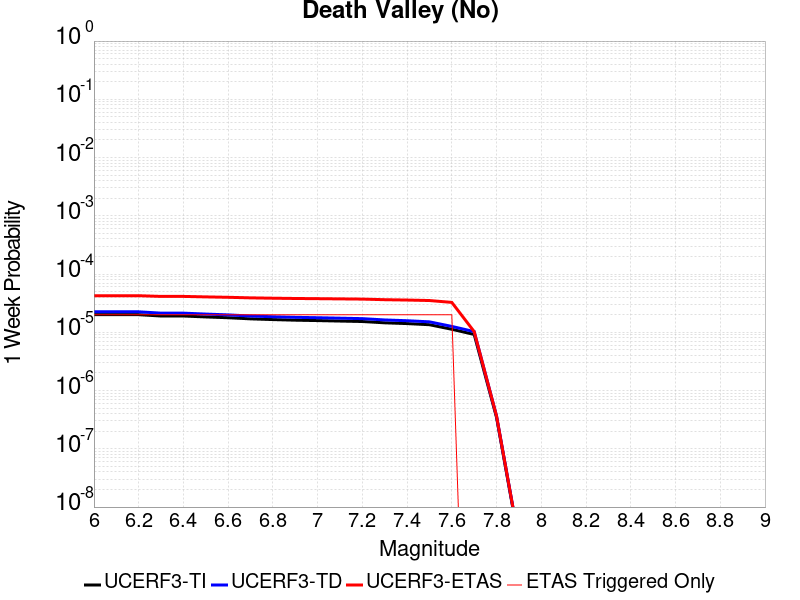 | 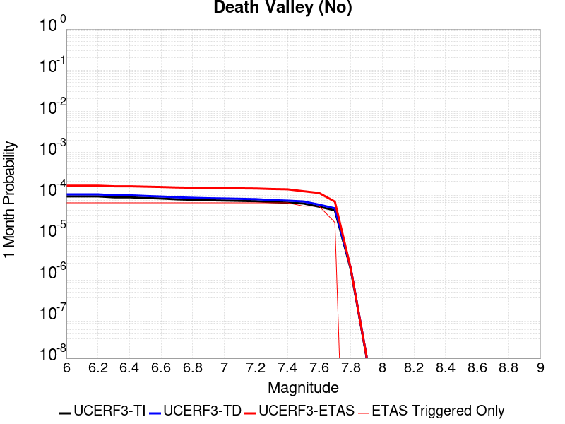 |  | 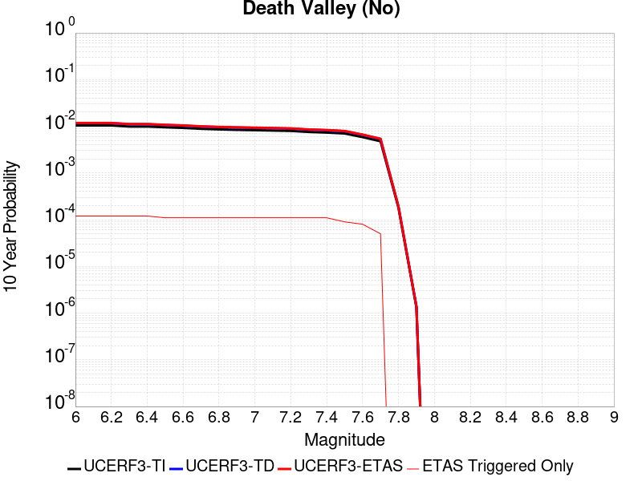 |

| Magnitude | 1 wk TI Prob | 1 wk TD Prob | 1 wk ETAS Prob | 1 wk ETAS/TD Gain | 1 wk ETAS Triggered Only | 1 mo TI Prob | 1 mo TD Prob | 1 mo ETAS Prob | 1 mo ETAS/TD Gain | 1 mo ETAS Triggered Only | 1 yr TI Prob | 1 yr TD Prob | 1 yr ETAS Prob | 1 yr ETAS/TD Gain | 1 yr ETAS Triggered Only | 10 yr TI Prob | 10 yr TD Prob | 10 yr ETAS Prob | 10 yr ETAS/TD Gain | 10 yr ETAS Triggered Only |
|-----|-----|-----|-----|-----|-----|-----|-----|-----|-----|-----|-----|-----|-----|-----|-----|-----|-----|-----|-----|-----|
| 6.0 | 2.0074807E-5 | 2.2500011E-5 | 4.249956E-5 | 1.8888685 | 2.0E-5 | 8.603206E-5 | 9.6425094E-5 | 1.5641931E-4 | 1.6221846 | 6.0E-5 | 0.001046937 | 0.0011733507 | 0.0012632451 | 1.0766134 | 9.0E-5 | 0.010420183 | 0.011672469 | 0.011791068 | 1.0101606 | 1.2E-4 |
| 6.1 | 2.0074807E-5 | 2.2500011E-5 | 4.249956E-5 | 1.8888685 | 2.0E-5 | 8.603206E-5 | 9.6425094E-5 | 1.5641931E-4 | 1.6221846 | 6.0E-5 | 0.001046937 | 0.0011733507 | 0.0012632451 | 1.0766134 | 9.0E-5 | 0.010420183 | 0.011672469 | 0.011791068 | 1.0101606 | 1.2E-4 |
| 6.2 | 2.0074807E-5 | 2.2500011E-5 | 4.249956E-5 | 1.8888685 | 2.0E-5 | 8.603206E-5 | 9.6425094E-5 | 1.5641931E-4 | 1.6221846 | 6.0E-5 | 0.001046937 | 0.0011733507 | 0.0012632451 | 1.0766134 | 9.0E-5 | 0.010420183 | 0.011672469 | 0.011791068 | 1.0101606 | 1.2E-4 |
| 6.3 | 1.9050609E-5 | 2.1336878E-5 | 4.133645E-5 | 1.9373242 | 2.0E-5 | 8.164292E-5 | 9.14406E-5 | 1.5143512E-4 | 1.6561037 | 6.0E-5 | 9.935491E-4 | 0.0011127274 | 0.0012026273 | 1.0807923 | 9.0E-5 | 0.009891188 | 0.011072383 | 0.011191054 | 1.0107177 | 1.2E-4 |
| 6.4 | 1.9050609E-5 | 2.1336878E-5 | 4.133645E-5 | 1.9373242 | 2.0E-5 | 8.164292E-5 | 9.14406E-5 | 1.5143512E-4 | 1.6561037 | 6.0E-5 | 9.935491E-4 | 0.0011127274 | 0.0012026273 | 1.0807923 | 9.0E-5 | 0.009891188 | 0.011072383 | 0.011191054 | 1.0107177 | 1.2E-4 |
| 6.5 | 1.8367004E-5 | 2.0560943E-5 | 4.056053E-5 | 1.9726981 | 2.0E-5 | 7.8713354E-5 | 8.811538E-5 | 1.481101E-4 | 1.6808654 | 6.0E-5 | 9.5791375E-4 | 0.0010722834 | 0.0011521976 | 1.0745271 | 8.0E-5 | 0.009537951 | 0.010671882 | 0.010780708 | 1.0101975 | 1.1E-4 |
| 6.6 | 1.779439E-5 | 1.9910865E-5 | 3.9910465E-5 | 2.0044568 | 2.0E-5 | 7.625944E-5 | 8.532952E-5 | 1.453244E-4 | 1.7030964 | 6.0E-5 | 9.280632E-4 | 0.0010383982 | 0.0011183152 | 1.0769618 | 8.0E-5 | 0.009241969 | 0.01033622 | 0.010445083 | 1.0105321 | 1.1E-4 |
| 6.7 | 1.7025437E-5 | 1.9043366E-5 | 3.9042985E-5 | 2.0502145 | 2.0E-5 | 7.296412E-5 | 8.16119E-5 | 1.41607E-4 | 1.7351269 | 6.0E-5 | 8.87976E-4 | 9.931781E-4 | 0.0010730987 | 1.0804695 | 8.0E-5 | 0.008844362 | 0.009888114 | 0.009997026 | 1.0110145 | 1.1E-4 |
| 6.8 | 1.6545107E-5 | 1.8512486E-5 | 3.8512117E-5 | 2.0803318 | 2.0E-5 | 7.090568E-5 | 7.933685E-5 | 1.3933209E-4 | 1.756209 | 6.0E-5 | 8.629347E-4 | 9.655042E-4 | 0.0010454269 | 1.0827782 | 8.0E-5 | 0.008595915 | 0.009613798 | 0.00972274 | 1.0113319 | 1.1E-4 |
| 6.9 | 1.615478E-5 | 1.8087536E-5 | 3.8087175E-5 | 2.1057138 | 2.0E-5 | 6.9232934E-5 | 7.7515746E-5 | 1.3751109E-4 | 1.7739763 | 6.0E-5 | 8.4258494E-4 | 9.4335165E-4 | 0.0010232761 | 1.084724 | 8.0E-5 | 0.008393973 | 0.009394166 | 0.009503133 | 1.0115994 | 1.1E-4 |
| 7.0 | 1.5894311E-5 | 1.7805492E-5 | 3.7805137E-5 | 2.1232288 | 2.0E-5 | 6.81167E-5 | 7.630706E-5 | 1.3630248E-4 | 1.7862369 | 6.0E-5 | 8.2900526E-4 | 9.286485E-4 | 0.0010085743 | 1.0860667 | 8.0E-5 | 0.008259195 | 0.0092483675 | 0.009357351 | 1.011784 | 1.1E-4 |
| 7.1 | 1.5602263E-5 | 1.7483448E-5 | 3.7483096E-5 | 2.1439192 | 2.0E-5 | 6.6865134E-5 | 7.492694E-5 | 1.3492245E-4 | 1.8007201 | 6.0E-5 | 8.137789E-4 | 9.118598E-4 | 9.917868E-4 | 1.0876528 | 8.0E-5 | 0.008108052 | 0.009081865 | 0.009190866 | 1.012002 | 1.1E-4 |
| 7.2 | 1.5323829E-5 | 1.7170574E-5 | 3.717023E-5 | 2.1647635 | 2.0E-5 | 6.56719E-5 | 7.358614E-5 | 1.3358172E-4 | 1.815311 | 6.0E-5 | 7.99262E-4 | 8.95549E-4 | 9.754774E-4 | 1.0892507 | 8.0E-5 | 0.007963934 | 0.008920078 | 0.009029097 | 1.0122217 | 1.1E-4 |
| 7.3 | 1.4556212E-5 | 1.6302403E-5 | 3.6302077E-5 | 2.226793 | 2.0E-5 | 6.238227E-5 | 6.98656E-5 | 1.2986141E-4 | 1.8587317 | 6.0E-5 | 7.592395E-4 | 8.502876E-4 | 9.302196E-4 | 1.0940058 | 8.0E-5 | 0.0075665074 | 0.008470987 | 0.008580055 | 1.0128756 | 1.1E-4 |
| 7.4 | 1.411725E-5 | 1.580791E-5 | 3.5807592E-5 | 2.2651694 | 2.0E-5 | 6.0501097E-5 | 6.7746456E-5 | 1.2774239E-4 | 1.8855952 | 6.0E-5 | 7.363519E-4 | 8.245068E-4 | 9.044408E-4 | 1.0969477 | 8.0E-5 | 0.0073391674 | 0.008215112 | 0.008324209 | 1.0132799 | 1.1E-4 |
| 7.5 | 1.3503312E-5 | 1.512624E-5 | 3.5125937E-5 | 2.3221855 | 2.0E-5 | 5.7870053E-5 | 6.4825166E-5 | 1.1482192E-4 | 1.7712554 | 5.0E-5 | 7.043401E-4 | 7.889664E-4 | 8.589112E-4 | 1.0886537 | 7.0E-5 | 0.007021119 | 0.007862279 | 0.007951572 | 1.0113571 | 9.0E-5 |
| 7.6 | 1.1279839E-5 | 1.2626287E-5 | 3.2626034E-5 | 2.583977 | 2.0E-5 | 4.834127E-5 | 5.4111566E-5 | 1.0410886E-4 | 1.9239669 | 5.0E-5 | 5.88396E-4 | 6.5861444E-4 | 7.18575E-4 | 1.0910404 | 6.0E-5 | 0.005868405 | 0.006567178 | 0.0066466522 | 1.0121018 | 8.0E-5 |
| 7.7 | 9.189108E-6 | 1.02833255E-5 | 1.02833255E-5 | 1.0 | 0.0 | 3.93813E-5 | 4.407068E-5 | 6.40698E-5 | 1.4537965 | 2.0E-5 | 4.7936183E-4 | 5.364335E-4 | 5.6641735E-4 | 1.055895 | 3.0E-5 | 0.004783291 | 0.005351897 | 0.0054016295 | 1.0092925 | 5.0E-5 |
| 7.8 | 3.4586725E-7 | 3.648256E-7 | 3.648256E-7 | 1.0 | 0.0 | 1.4822873E-6 | 1.5635374E-6 | 1.5635374E-6 | 1.0 | 0.0 | 1.80467E-5 | 1.9035906E-5 | 1.9035906E-5 | 1.0 | 0.0 | 1.8045233E-4 | 1.903432E-4 | 1.903432E-4 | 1.0 | 0.0 |
| 7.9 | 2.5591178E-9 | 2.6696687E-9 | 2.6696687E-9 | 1.0 | 0.0 | 1.0967647E-8 | 1.1441437E-8 | 1.1441437E-8 | 1.0 | 0.0 | 1.335311E-7 | 1.392995E-7 | 1.392995E-7 | 1.0 | 0.0 | 1.3353102E-6 | 1.3929949E-6 | 1.3929949E-6 | 1.0 | 0.0 |

## Coyote Lake
*[(top)](#table-of-contents)*

| 1 Week | 1 Month | 1 Year | 10 Year |
|-----|-----|-----|-----|
|  | 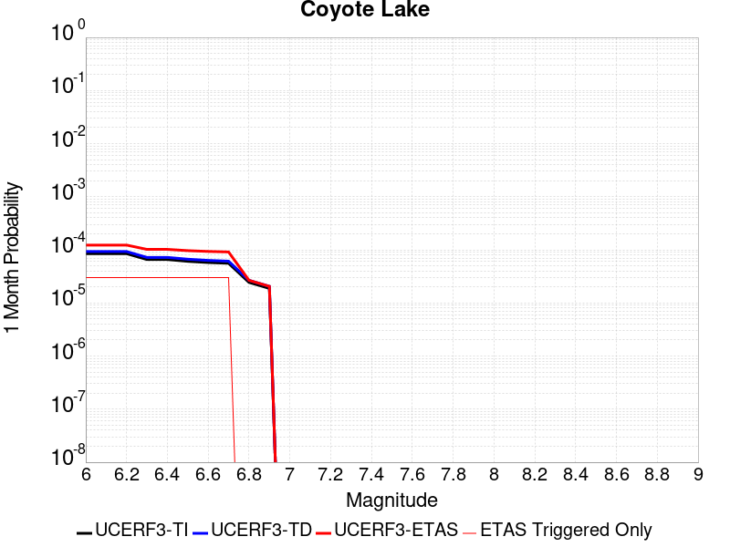 |  | 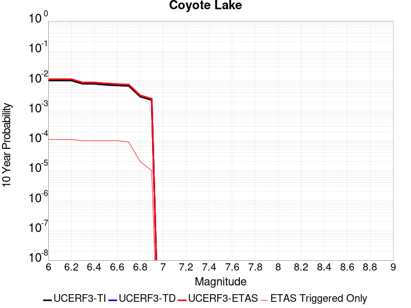 |

| Magnitude | 1 wk TI Prob | 1 wk TD Prob | 1 wk ETAS Prob | 1 wk ETAS/TD Gain | 1 wk ETAS Triggered Only | 1 mo TI Prob | 1 mo TD Prob | 1 mo ETAS Prob | 1 mo ETAS/TD Gain | 1 mo ETAS Triggered Only | 1 yr TI Prob | 1 yr TD Prob | 1 yr ETAS Prob | 1 yr ETAS/TD Gain | 1 yr ETAS Triggered Only | 10 yr TI Prob | 10 yr TD Prob | 10 yr ETAS Prob | 10 yr ETAS/TD Gain | 10 yr ETAS Triggered Only |
|-----|-----|-----|-----|-----|-----|-----|-----|-----|-----|-----|-----|-----|-----|-----|-----|-----|-----|-----|-----|-----|
| 6.0 | 1.980352E-5 | 2.170669E-5 | 5.1706036E-5 | 2.3820324 | 3.0E-5 | 8.486947E-5 | 9.302576E-5 | 1.2302297E-4 | 1.3224614 | 3.0E-5 | 0.0010327959 | 0.0011320722 | 0.001201993 | 1.0617635 | 7.0E-5 | 0.010280091 | 0.01127023 | 0.01137899 | 1.0096502 | 1.1E-4 |
| 6.1 | 1.980352E-5 | 2.170669E-5 | 5.1706036E-5 | 2.3820324 | 3.0E-5 | 8.486947E-5 | 9.302576E-5 | 1.2302297E-4 | 1.3224614 | 3.0E-5 | 0.0010327959 | 0.0011320722 | 0.001201993 | 1.0617635 | 7.0E-5 | 0.010280091 | 0.01127023 | 0.01137899 | 1.0096502 | 1.1E-4 |
| 6.2 | 1.980352E-5 | 2.170669E-5 | 5.1706036E-5 | 2.3820324 | 3.0E-5 | 8.486947E-5 | 9.302576E-5 | 1.2302297E-4 | 1.3224614 | 3.0E-5 | 0.0010327959 | 0.0011320722 | 0.001201993 | 1.0617635 | 7.0E-5 | 0.010280091 | 0.01127023 | 0.01137899 | 1.0096502 | 1.1E-4 |
| 6.3 | 1.5344787E-5 | 1.6820626E-5 | 4.682012E-5 | 2.7834945 | 3.0E-5 | 6.576172E-5 | 7.2086754E-5 | 1.0208459E-4 | 1.4161352 | 3.0E-5 | 8.003548E-4 | 8.77364E-4 | 9.473026E-4 | 1.0797144 | 7.0E-5 | 0.007974784 | 0.008745047 | 0.008844173 | 1.011335 | 1.0E-4 |
| 6.4 | 1.5344787E-5 | 1.6820626E-5 | 4.682012E-5 | 2.7834945 | 3.0E-5 | 6.576172E-5 | 7.2086754E-5 | 1.0208459E-4 | 1.4161352 | 3.0E-5 | 8.003548E-4 | 8.77364E-4 | 9.473026E-4 | 1.0797144 | 7.0E-5 | 0.007974784 | 0.008745047 | 0.008844173 | 1.011335 | 1.0E-4 |
| 6.5 | 1.4189697E-5 | 1.5557947E-5 | 4.555748E-5 | 2.928245 | 3.0E-5 | 6.081157E-5 | 6.667555E-5 | 9.667355E-5 | 1.44991 | 3.0E-5 | 7.401293E-4 | 8.115328E-4 | 8.81476E-4 | 1.0861865 | 7.0E-5 | 0.0073766913 | 0.008091635 | 0.0081908265 | 1.0122584 | 1.0E-4 |
| 6.6 | 1.3469301E-5 | 1.4771539E-5 | 4.4771095E-5 | 3.0309026 | 3.0E-5 | 5.7724297E-5 | 6.33054E-5 | 9.33035E-5 | 1.4738632 | 3.0E-5 | 7.025667E-4 | 7.7053066E-4 | 8.404767E-4 | 1.0907764 | 7.0E-5 | 0.0070034964 | 0.0076844944 | 0.007783726 | 1.0129132 | 1.0E-4 |
| 6.7 | 1.3027966E-5 | 1.4281708E-5 | 4.428128E-5 | 3.100559 | 3.0E-5 | 5.5832945E-5 | 6.120622E-5 | 9.120438E-5 | 1.4901162 | 3.0E-5 | 6.7955407E-4 | 7.449907E-4 | 8.04946E-4 | 1.080478 | 6.0E-5 | 0.006774798 | 0.0074308095 | 0.007520141 | 1.0120218 | 9.0E-5 |
| 6.8 | 5.695434E-6 | 6.2244026E-6 | 6.2244026E-6 | 1.0 | 0.0 | 2.4408775E-5 | 2.6675907E-5 | 2.6675907E-5 | 1.0 | 0.0 | 2.971363E-4 | 3.2476074E-4 | 3.347575E-4 | 1.0307819 | 1.0E-5 | 0.0029673933 | 0.0032458024 | 0.0032657376 | 1.0061418 | 2.0E-5 |
| 6.9 | 4.385688E-6 | 4.7930434E-6 | 4.7930434E-6 | 1.0 | 0.0 | 1.879567E-5 | 2.0541615E-5 | 2.0541615E-5 | 1.0 | 0.0 | 2.2881327E-4 | 2.5009416E-4 | 2.6009165E-4 | 1.0399749 | 1.0E-5 | 0.002285778 | 0.0025009417 | 0.0025109167 | 1.0039885 | 1.0E-5 |

## Ludlow
*[(top)](#table-of-contents)*

| 1 Week | 1 Month | 1 Year | 10 Year |
|-----|-----|-----|-----|
|  |  | 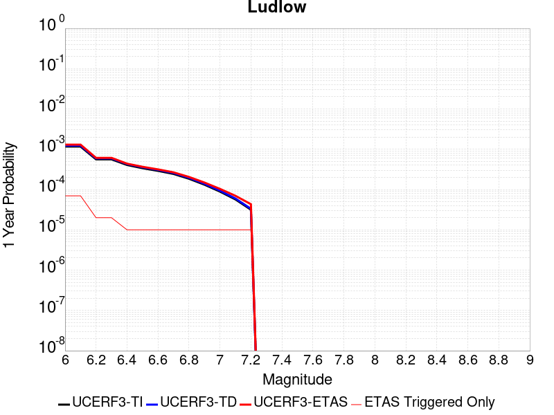 |  |

| Magnitude | 1 wk TI Prob | 1 wk TD Prob | 1 wk ETAS Prob | 1 wk ETAS/TD Gain | 1 wk ETAS Triggered Only | 1 mo TI Prob | 1 mo TD Prob | 1 mo ETAS Prob | 1 mo ETAS/TD Gain | 1 mo ETAS Triggered Only | 1 yr TI Prob | 1 yr TD Prob | 1 yr ETAS Prob | 1 yr ETAS/TD Gain | 1 yr ETAS Triggered Only | 10 yr TI Prob | 10 yr TD Prob | 10 yr ETAS Prob | 10 yr ETAS/TD Gain | 10 yr ETAS Triggered Only |
|-----|-----|-----|-----|-----|-----|-----|-----|-----|-----|-----|-----|-----|-----|-----|-----|-----|-----|-----|-----|-----|
| 6.0 | 2.2407607E-5 | 2.3657218E-5 | 6.365627E-5 | 2.6907759 | 4.0E-5 | 9.602906E-5 | 1.0138439E-4 | 1.4138033E-4 | 1.3944981 | 4.0E-5 | 0.0011685267 | 0.0012337001 | 0.0013036138 | 1.0566698 | 7.0E-5 | 0.011624013 | 0.012273024 | 0.012371796 | 1.0080479 | 1.0E-4 |
| 6.1 | 2.2407607E-5 | 2.3657218E-5 | 6.365627E-5 | 2.6907759 | 4.0E-5 | 9.602906E-5 | 1.0138439E-4 | 1.4138033E-4 | 1.3944981 | 4.0E-5 | 0.0011685267 | 0.0012337001 | 0.0013036138 | 1.0566698 | 7.0E-5 | 0.011624013 | 0.012273024 | 0.012371796 | 1.0080479 | 1.0E-4 |
| 6.2 | 1.0781252E-5 | 1.1365647E-5 | 1.1365647E-5 | 1.0 | 0.0 | 4.620455E-5 | 4.870903E-5 | 4.870903E-5 | 1.0 | 0.0 | 5.623952E-4 | 5.928751E-4 | 6.128632E-4 | 1.0337139 | 2.0E-5 | 0.00560974 | 0.0059133526 | 0.0059531163 | 1.0067244 | 4.0E-5 |
| 6.3 | 1.0781252E-5 | 1.1365647E-5 | 1.1365647E-5 | 1.0 | 0.0 | 4.620455E-5 | 4.870903E-5 | 4.870903E-5 | 1.0 | 0.0 | 5.623952E-4 | 5.928751E-4 | 6.128632E-4 | 1.0337139 | 2.0E-5 | 0.00560974 | 0.0059133526 | 0.0059531163 | 1.0067244 | 4.0E-5 |
| 6.4 | 7.814439E-6 | 8.237717E-6 | 8.237717E-6 | 1.0 | 0.0 | 3.3490025E-5 | 3.530403E-5 | 3.530403E-5 | 1.0 | 0.0 | 4.0766477E-4 | 4.297432E-4 | 4.397389E-4 | 1.0232598 | 1.0E-5 | 0.0040691774 | 0.0042892685 | 0.0043091825 | 1.0046428 | 2.0E-5 |
| 6.5 | 6.4986366E-6 | 6.85091E-6 | 6.85091E-6 | 1.0 | 0.0 | 2.7851002E-5 | 2.9360717E-5 | 2.9360717E-5 | 1.0 | 0.0 | 3.390332E-4 | 3.57409E-4 | 3.6740545E-4 | 1.0279691 | 1.0E-5 | 0.003385164 | 0.003568438 | 0.0035883668 | 1.0055847 | 2.0E-5 |
| 6.6 | 5.582177E-6 | 5.885997E-6 | 5.885997E-6 | 1.0 | 0.0 | 2.3923398E-5 | 2.5225461E-5 | 2.5225461E-5 | 1.0 | 0.0 | 2.9122844E-4 | 3.0707743E-4 | 3.1707436E-4 | 1.0325551 | 1.0E-5 | 0.0029084706 | 0.0030666045 | 0.0030865432 | 1.0065019 | 2.0E-5 |
| 6.7 | 4.6858763E-6 | 4.9404202E-6 | 4.9404202E-6 | 1.0 | 0.0 | 2.0082172E-5 | 2.117306E-5 | 2.117306E-5 | 1.0 | 0.0 | 2.4447302E-4 | 2.5775208E-4 | 2.677495E-4 | 1.038787 | 1.0E-5 | 0.0024420423 | 0.0025745875 | 0.0025945362 | 1.0077482 | 2.0E-5 |
| 6.8 | 3.5584908E-6 | 3.7520128E-6 | 3.7520128E-6 | 1.0 | 0.0 | 1.5250586E-5 | 1.607996E-5 | 1.607996E-5 | 1.0 | 0.0 | 1.8566006E-4 | 1.9575632E-4 | 2.0575436E-4 | 1.0510739 | 1.0E-5 | 0.0018550502 | 0.0019558799 | 0.0019758407 | 1.0102056 | 2.0E-5 |
| 6.9 | 2.532834E-6 | 2.6709995E-6 | 2.6709995E-6 | 1.0 | 0.0 | 1.0854958E-5 | 1.1447092E-5 | 1.1447092E-5 | 1.0 | 0.0 | 1.3215111E-4 | 1.3935972E-4 | 1.4935833E-4 | 1.0717467 | 1.0E-5 | 0.0013207254 | 0.0013927508 | 0.0014027369 | 1.0071701 | 1.0E-5 |
| 7.0 | 1.7083285E-6 | 1.8019413E-6 | 1.8019413E-6 | 1.0 | 0.0 | 7.3213873E-6 | 7.722583E-6 | 7.722583E-6 | 1.0 | 0.0 | 8.913424E-5 | 9.4018564E-5 | 1.0401762E-4 | 1.106352 | 1.0E-5 | 8.9098496E-4 | 9.3980436E-4 | 9.4979495E-4 | 1.0106305 | 1.0E-5 |
| 7.1 | 1.0905424E-6 | 1.1497604E-6 | 1.1497604E-6 | 1.0 | 0.0 | 4.6737446E-6 | 4.9275354E-6 | 4.9275354E-6 | 1.0 | 0.0 | 5.6901354E-5 | 5.999119E-5 | 6.9990594E-5 | 1.1666812 | 1.0E-5 | 5.6886784E-4 | 5.9975975E-4 | 6.0975377E-4 | 1.0166633 | 1.0E-5 |
| 7.2 | 6.06668E-7 | 6.387269E-7 | 6.387269E-7 | 1.0 | 0.0 | 2.600003E-6 | 2.7373983E-6 | 2.7373983E-6 | 1.0 | 0.0 | 3.1654577E-5 | 3.3327386E-5 | 4.332705E-5 | 1.3000436 | 1.0E-5 | 3.1650066E-4 | 3.332307E-4 | 3.4322738E-4 | 1.0299993 | 1.0E-5 |

## San Andreas (Parkfield)
*[(top)](#table-of-contents)*

| 1 Week | 1 Month | 1 Year | 10 Year |
|-----|-----|-----|-----|
|  |  |  | 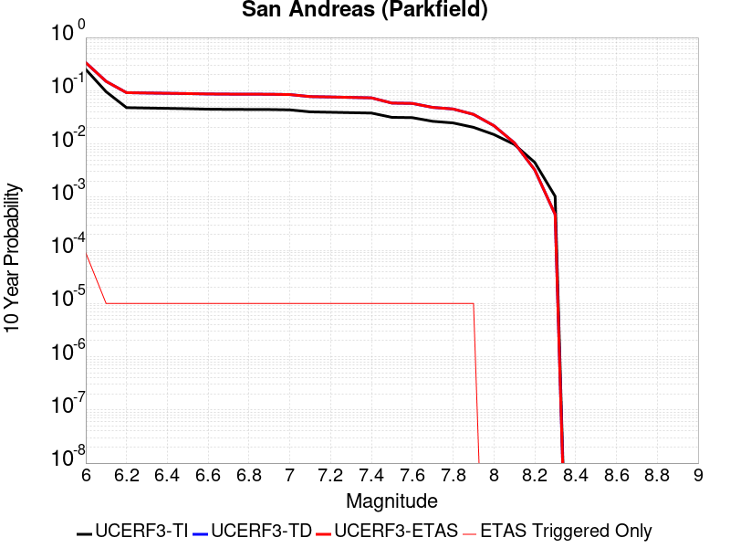 |

| Magnitude | 1 wk TI Prob | 1 wk TD Prob | 1 wk ETAS Prob | 1 wk ETAS/TD Gain | 1 wk ETAS Triggered Only | 1 mo TI Prob | 1 mo TD Prob | 1 mo ETAS Prob | 1 mo ETAS/TD Gain | 1 mo ETAS Triggered Only | 1 yr TI Prob | 1 yr TD Prob | 1 yr ETAS Prob | 1 yr ETAS/TD Gain | 1 yr ETAS Triggered Only | 10 yr TI Prob | 10 yr TD Prob | 10 yr ETAS Prob | 10 yr ETAS/TD Gain | 10 yr ETAS Triggered Only |
|-----|-----|-----|-----|-----|-----|-----|-----|-----|-----|-----|-----|-----|-----|-----|-----|-----|-----|-----|-----|-----|
| 6.0 | 5.556969E-4 | 7.778346E-4 | 7.9781906E-4 | 1.0256925 | 2.0E-5 | 0.0023793848 | 0.0033298659 | 0.003359766 | 1.0089793 | 3.0E-5 | 0.028586963 | 0.040046964 | 0.04009496 | 1.0011985 | 5.0E-5 | 0.25176284 | 0.3370342 | 0.33709386 | 1.000177 | 9.0E-5 |
| 6.1 | 1.925858E-4 | 3.0276488E-4 | 3.0276488E-4 | 1.0 | 0.0 | 8.2510663E-4 | 0.0012970122 | 0.0012970122 | 1.0 | 0.0 | 0.0099994885 | 0.01577305 | 0.015782893 | 1.000624 | 1.0E-5 | 0.095613256 | 0.14968696 | 0.14969547 | 1.0000569 | 1.0E-5 |
| 6.2 | 9.4306815E-5 | 1.824223E-4 | 1.824223E-4 | 1.0 | 0.0 | 4.0410945E-4 | 7.8157685E-4 | 7.8157685E-4 | 1.0 | 0.0 | 0.0049089384 | 0.009474405 | 0.009484311 | 1.0010455 | 1.0E-5 | 0.048019063 | 0.09185756 | 0.09186664 | 1.0000988 | 1.0E-5 |
| 6.3 | 9.283051E-5 | 1.7938759E-4 | 1.7938759E-4 | 1.0 | 0.0 | 3.9778434E-4 | 7.685786E-4 | 7.685786E-4 | 1.0 | 0.0 | 0.0048322747 | 0.009317504 | 0.009327411 | 1.0010632 | 1.0E-5 | 0.047285385 | 0.09051052 | 0.09051961 | 1.0001005 | 1.0E-5 |
| 6.4 | 9.138826E-5 | 1.7700944E-4 | 1.7700944E-4 | 1.0 | 0.0 | 3.916052E-4 | 7.583925E-4 | 7.583925E-4 | 1.0 | 0.0 | 0.0047573745 | 0.009194541 | 0.009204449 | 1.0010777 | 1.0E-5 | 0.046568092 | 0.089414164 | 0.08942327 | 1.0001018 | 1.0E-5 |
| 6.5 | 9.000255E-5 | 1.7459E-4 | 1.7459E-4 | 1.0 | 0.0 | 3.8566816E-4 | 7.4802944E-4 | 7.4802944E-4 | 1.0 | 0.0 | 0.0046854047 | 0.0090694325 | 0.009079342 | 1.0010926 | 1.0E-5 | 0.045878403 | 0.08829737 | 0.08830648 | 1.0001032 | 1.0E-5 |
| 6.6 | 8.8109264E-5 | 1.7140193E-4 | 1.7140193E-4 | 1.0 | 0.0 | 3.7755648E-4 | 7.3437404E-4 | 7.3437404E-4 | 1.0 | 0.0 | 0.0045870654 | 0.008904563 | 0.008914474 | 1.001113 | 1.0E-5 | 0.04493529 | 0.086828575 | 0.08683771 | 1.0001051 | 1.0E-5 |
| 6.7 | 8.738073E-5 | 1.7007279E-4 | 1.7007279E-4 | 1.0 | 0.0 | 3.7443507E-4 | 7.286809E-4 | 7.286809E-4 | 1.0 | 0.0 | 0.0045492216 | 0.008835857 | 0.008845769 | 1.0011218 | 1.0E-5 | 0.04457213 | 0.086228445 | 0.08623758 | 1.000106 | 1.0E-5 |
| 6.8 | 8.710195E-5 | 1.6952785E-4 | 1.6952785E-4 | 1.0 | 0.0 | 3.7324068E-4 | 7.2634674E-4 | 7.2634674E-4 | 1.0 | 0.0 | 0.0045347405 | 0.008807677 | 0.008817589 | 1.0011253 | 1.0E-5 | 0.04443313 | 0.0859759 | 0.08598504 | 1.0001063 | 1.0E-5 |
| 6.9 | 8.6801556E-5 | 1.6893743E-4 | 1.6893743E-4 | 1.0 | 0.0 | 3.7195362E-4 | 7.238178E-4 | 7.238178E-4 | 1.0 | 0.0 | 0.0045191357 | 0.008777135 | 0.008787048 | 1.0011293 | 1.0E-5 | 0.044283327 | 0.08570191 | 0.085711055 | 1.0001067 | 1.0E-5 |
| 7.0 | 8.5571606E-5 | 1.6646592E-4 | 1.6646592E-4 | 1.0 | 0.0 | 3.6668387E-4 | 7.1323145E-4 | 7.1323145E-4 | 1.0 | 0.0 | 0.004455241 | 0.008649277 | 0.00865919 | 1.0011462 | 1.0E-5 | 0.043669727 | 0.084549636 | 0.084558785 | 1.0001082 | 1.0E-5 |
| 7.1 | 7.82589E-5 | 1.5127397E-4 | 1.5127397E-4 | 1.0 | 0.0 | 3.3535215E-4 | 6.481567E-4 | 6.481567E-4 | 1.0 | 0.0 | 0.0040752706 | 0.007862925 | 0.007872846 | 1.0012618 | 1.0E-5 | 0.040013418 | 0.07746162 | 0.07747085 | 1.0001191 | 1.0E-5 |
| 7.2 | 7.690929E-5 | 1.4864646E-4 | 1.4864646E-4 | 1.0 | 0.0 | 3.2956956E-4 | 6.369015E-4 | 6.369015E-4 | 1.0 | 0.0 | 0.004005129 | 0.0077268723 | 0.007736795 | 1.0012842 | 1.0E-5 | 0.0393371 | 0.07623468 | 0.07624392 | 1.0001211 | 1.0E-5 |
| 7.3 | 7.5543794E-5 | 1.4561295E-4 | 1.4561295E-4 | 1.0 | 0.0 | 3.2371894E-4 | 6.23907E-4 | 6.23907E-4 | 1.0 | 0.0 | 0.003934157 | 0.007569774 | 0.007579698 | 1.0013111 | 1.0E-5 | 0.038652334 | 0.07479546 | 0.07480471 | 1.0001237 | 1.0E-5 |
| 7.4 | 7.4214564E-5 | 1.4262283E-4 | 1.4262283E-4 | 1.0 | 0.0 | 3.1802364E-4 | 6.110982E-4 | 6.110982E-4 | 1.0 | 0.0 | 0.003865065 | 0.007414898 | 0.007424824 | 1.0013386 | 1.0E-5 | 0.03798529 | 0.0733692 | 0.073378466 | 1.0001262 | 1.0E-5 |
| 7.5 | 6.149578E-5 | 1.1190168E-4 | 1.1190168E-4 | 1.0 | 0.0 | 2.6352672E-4 | 4.7949058E-4 | 4.7949058E-4 | 1.0 | 0.0 | 0.0032037178 | 0.0058222036 | 0.0058321455 | 1.0017076 | 1.0E-5 | 0.03157923 | 0.058556058 | 0.05856547 | 1.0001608 | 1.0E-5 |
| 7.6 | 6.0643448E-5 | 1.1018825E-4 | 1.1018825E-4 | 1.0 | 0.0 | 2.598746E-4 | 4.7215E-4 | 4.7215E-4 | 1.0 | 0.0 | 0.0031593828 | 0.0057333056 | 0.0057432484 | 1.0017341 | 1.0E-5 | 0.031148417 | 0.057717044 | 0.05772647 | 1.0001633 | 1.0E-5 |
| 7.7 | 5.1652263E-5 | 9.174102E-5 | 9.174102E-5 | 1.0 | 0.0 | 2.2134806E-4 | 3.9311658E-4 | 3.9311658E-4 | 1.0 | 0.0 | 0.002691582 | 0.0047757006 | 0.004785653 | 1.0020839 | 1.0E-5 | 0.026592141 | 0.048532683 | 0.048542198 | 1.0001961 | 1.0E-5 |
| 7.8 | 4.8090482E-5 | 8.559073E-5 | 8.559073E-5 | 1.0 | 0.0 | 2.060858E-4 | 3.6676586E-4 | 3.6676586E-4 | 1.0 | 0.0 | 0.0025062072 | 0.0044562398 | 0.004466195 | 1.0022341 | 1.0E-5 | 0.024781305 | 0.045299396 | 0.045308944 | 1.0002108 | 1.0E-5 |
| 7.9 | 3.970278E-5 | 6.74995E-5 | 6.74995E-5 | 1.0 | 0.0 | 1.7014367E-4 | 2.892515E-4 | 2.892515E-4 | 1.0 | 0.0 | 0.002069531 | 0.0035159541 | 0.003525919 | 1.0028342 | 1.0E-5 | 0.020503636 | 0.03587903 | 0.035888672 | 1.0002687 | 1.0E-5 |
| 8.0 | 2.8982335E-5 | 4.069344E-5 | 4.069344E-5 | 1.0 | 0.0 | 1.2420409E-4 | 1.7438881E-4 | 1.7438881E-4 | 1.0 | 0.0 | 0.0015111357 | 0.0021211174 | 0.0021211174 | 1.0 | 0.0 | 0.015009012 | 0.022008745 | 0.022008745 | 1.0 | 0.0 |
| 8.1 | 1.8836186E-5 | 1.867712E-5 | 1.867712E-5 | 1.0 | 0.0 | 8.0724014E-5 | 8.004235E-5 | 8.004235E-5 | 1.0 | 0.0 | 9.823717E-4 | 9.740805E-4 | 9.740805E-4 | 1.0 | 0.0 | 0.009780403 | 0.010486352 | 0.010486352 | 1.0 | 0.0 |
| 8.2 | 8.643924E-6 | 5.472644E-6 | 5.472644E-6 | 1.0 | 0.0 | 3.704486E-5 | 2.3453977E-5 | 2.3453977E-5 | 1.0 | 0.0 | 4.5092785E-4 | 2.8551483E-4 | 2.8551483E-4 | 1.0 | 0.0 | 0.0045001395 | 0.003247653 | 0.003247653 | 1.0 | 0.0 |
| 8.3 | 1.983087E-6 | 7.6547434E-7 | 7.6547434E-7 | 1.0 | 0.0 | 8.498917E-6 | 3.2806004E-6 | 3.2806004E-6 | 1.0 | 0.0 | 1.034694E-4 | 3.9940594E-5 | 3.9940594E-5 | 1.0 | 0.0 | 0.0010342124 | 4.7170694E-4 | 4.7170694E-4 | 1.0 | 0.0 |

## Manix-Afton Hills
*[(top)](#table-of-contents)*

| 1 Week | 1 Month | 1 Year | 10 Year |
|-----|-----|-----|-----|
|  |  |  |  |

| Magnitude | 1 wk TI Prob | 1 wk TD Prob | 1 wk ETAS Prob | 1 wk ETAS/TD Gain | 1 wk ETAS Triggered Only | 1 mo TI Prob | 1 mo TD Prob | 1 mo ETAS Prob | 1 mo ETAS/TD Gain | 1 mo ETAS Triggered Only | 1 yr TI Prob | 1 yr TD Prob | 1 yr ETAS Prob | 1 yr ETAS/TD Gain | 1 yr ETAS Triggered Only | 10 yr TI Prob | 10 yr TD Prob | 10 yr ETAS Prob | 10 yr ETAS/TD Gain | 10 yr ETAS Triggered Only |
|-----|-----|-----|-----|-----|-----|-----|-----|-----|-----|-----|-----|-----|-----|-----|-----|-----|-----|-----|-----|-----|
| 6.0 | 1.3783202E-5 | 1.4711063E-5 | 6.471033E-5 | 4.3987527 | 5.0E-5 | 5.906953E-5 | 6.304599E-5 | 1.13042835E-4 | 1.7930218 | 5.0E-5 | 7.189342E-4 | 7.673321E-4 | 8.372784E-4 | 1.0911552 | 7.0E-5 | 0.0071661277 | 0.007648582 | 0.0077180467 | 1.0090821 | 7.0E-5 |
| 6.1 | 1.3783202E-5 | 1.4711063E-5 | 6.471033E-5 | 4.3987527 | 5.0E-5 | 5.906953E-5 | 6.304599E-5 | 1.13042835E-4 | 1.7930218 | 5.0E-5 | 7.189342E-4 | 7.673321E-4 | 8.372784E-4 | 1.0911552 | 7.0E-5 | 0.0071661277 | 0.007648582 | 0.0077180467 | 1.0090821 | 7.0E-5 |
| 6.2 | 1.3783202E-5 | 1.4711063E-5 | 6.471033E-5 | 4.3987527 | 5.0E-5 | 5.906953E-5 | 6.304599E-5 | 1.13042835E-4 | 1.7930218 | 5.0E-5 | 7.189342E-4 | 7.673321E-4 | 8.372784E-4 | 1.0911552 | 7.0E-5 | 0.0071661277 | 0.007648582 | 0.0077180467 | 1.0090821 | 7.0E-5 |
| 6.3 | 1.10494875E-5 | 1.1793114E-5 | 4.1792762E-5 | 3.5438273 | 3.0E-5 | 4.7354086E-5 | 5.0541E-5 | 8.053948E-5 | 1.5935475 | 3.0E-5 | 5.763835E-4 | 6.151733E-4 | 6.4515485E-4 | 1.0487367 | 3.0E-5 | 0.005748908 | 0.0061357445 | 0.0061655603 | 1.0048593 | 3.0E-5 |
| 6.4 | 1.10494875E-5 | 1.1793114E-5 | 4.1792762E-5 | 3.5438273 | 3.0E-5 | 4.7354086E-5 | 5.0541E-5 | 8.053948E-5 | 1.5935475 | 3.0E-5 | 5.763835E-4 | 6.151733E-4 | 6.4515485E-4 | 1.0487367 | 3.0E-5 | 0.005748908 | 0.0061357445 | 0.0061655603 | 1.0048593 | 3.0E-5 |
| 6.5 | 9.788949E-6 | 1.04543005E-5 | 4.0453986E-5 | 3.8696024 | 3.0E-5 | 4.1951964E-5 | 4.480343E-5 | 7.480208E-5 | 1.6695616 | 3.0E-5 | 5.1064545E-4 | 5.453545E-4 | 5.7533814E-4 | 1.05498 | 3.0E-5 | 0.0050947363 | 0.0054410887 | 0.0054709255 | 1.0054836 | 3.0E-5 |
| 6.6 | 8.810006E-6 | 9.413611E-6 | 3.9413328E-5 | 4.186845 | 3.0E-5 | 3.775662E-5 | 4.034347E-5 | 7.034226E-5 | 1.7435848 | 3.0E-5 | 4.5958988E-4 | 4.9108E-4 | 5.2106526E-4 | 1.0610598 | 3.0E-5 | 0.0045864056 | 0.0049008303 | 0.004930683 | 1.0060914 | 3.0E-5 |
| 6.7 | 8.80128E-6 | 9.404091E-6 | 3.9403807E-5 | 4.190071 | 3.0E-5 | 3.7719226E-5 | 4.0302675E-5 | 7.030147E-5 | 1.7443374 | 3.0E-5 | 4.591348E-4 | 4.905835E-4 | 5.2056875E-4 | 1.0611217 | 3.0E-5 | 0.004581874 | 0.004895887 | 0.00492574 | 1.0060976 | 3.0E-5 |
| 6.8 | 6.8994877E-6 | 7.3800625E-6 | 1.7379989E-5 | 2.3549922 | 1.0E-5 | 2.9568899E-5 | 3.16285E-5 | 4.1628184E-5 | 1.3161606 | 1.0E-5 | 3.5994186E-4 | 3.850171E-4 | 3.9501328E-4 | 1.0259628 | 1.0E-5 | 0.003593594 | 0.0038443056 | 0.0038542673 | 1.0025913 | 1.0E-5 |
| 6.9 | 4.9328037E-6 | 5.270952E-6 | 1.52709E-5 | 2.8971806 | 1.0E-5 | 2.1140417E-5 | 2.2589633E-5 | 3.2589407E-5 | 1.442671 | 1.0E-5 | 2.5735417E-4 | 2.7500023E-4 | 2.8499748E-4 | 1.0363536 | 1.0E-5 | 0.0025705635 | 0.0027472044 | 0.002757177 | 1.00363 | 1.0E-5 |
| 7.0 | 3.347973E-6 | 3.590023E-6 | 3.590023E-6 | 1.0 | 0.0 | 1.4348378E-5 | 1.5385745E-5 | 1.5385745E-5 | 1.0 | 0.0 | 1.746775E-4 | 1.8730946E-4 | 1.8730946E-4 | 1.0 | 0.0 | 0.0017454025 | 0.0018719183 | 0.0018719183 | 1.0 | 0.0 |
| 7.1 | 1.2073567E-6 | 1.2934796E-6 | 1.2934796E-6 | 1.0 | 0.0 | 5.1743755E-6 | 5.543481E-6 | 5.543481E-6 | 1.0 | 0.0 | 6.29962E-5 | 6.7491426E-5 | 6.7491426E-5 | 1.0 | 0.0 | 6.297835E-4 | 6.7486946E-4 | 6.7486946E-4 | 1.0 | 0.0 |

## Elsinore (Glen Ivy) rev
*[(top)](#table-of-contents)*

| 1 Week | 1 Month | 1 Year | 10 Year |
|-----|-----|-----|-----|
|  |  | 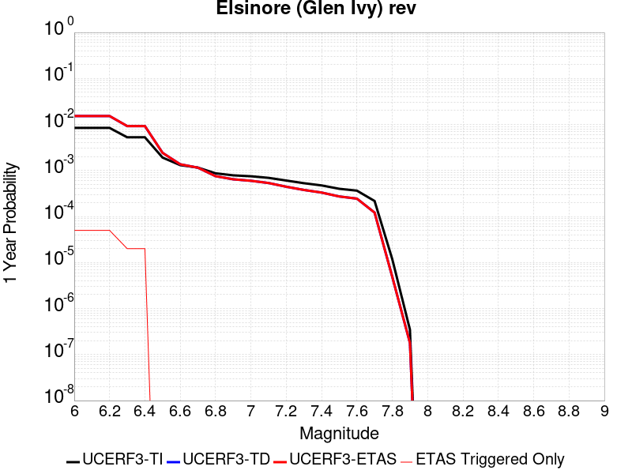 |  |

| Magnitude | 1 wk TI Prob | 1 wk TD Prob | 1 wk ETAS Prob | 1 wk ETAS/TD Gain | 1 wk ETAS Triggered Only | 1 mo TI Prob | 1 mo TD Prob | 1 mo ETAS Prob | 1 mo ETAS/TD Gain | 1 mo ETAS Triggered Only | 1 yr TI Prob | 1 yr TD Prob | 1 yr ETAS Prob | 1 yr ETAS/TD Gain | 1 yr ETAS Triggered Only | 10 yr TI Prob | 10 yr TD Prob | 10 yr ETAS Prob | 10 yr ETAS/TD Gain | 10 yr ETAS Triggered Only |
|-----|-----|-----|-----|-----|-----|-----|-----|-----|-----|-----|-----|-----|-----|-----|-----|-----|-----|-----|-----|-----|
| 6.0 | 1.6204086E-4 | 2.937252E-4 | 3.0372228E-4 | 1.0340354 | 1.0E-5 | 6.94276E-4 | 0.0012583698 | 0.001288332 | 1.0238104 | 3.0E-5 | 0.008420097 | 0.015234572 | 0.01528381 | 1.003232 | 5.0E-5 | 0.081081145 | 0.13948786 | 0.1395481 | 1.0004319 | 7.0E-5 |
| 6.1 | 1.6204086E-4 | 2.937252E-4 | 3.0372228E-4 | 1.0340354 | 1.0E-5 | 6.94276E-4 | 0.0012583698 | 0.001288332 | 1.0238104 | 3.0E-5 | 0.008420097 | 0.015234572 | 0.01528381 | 1.003232 | 5.0E-5 | 0.081081145 | 0.13948786 | 0.1395481 | 1.0004319 | 7.0E-5 |
| 6.2 | 1.6204086E-4 | 2.937252E-4 | 3.0372228E-4 | 1.0340354 | 1.0E-5 | 6.94276E-4 | 0.0012583698 | 0.001288332 | 1.0238104 | 3.0E-5 | 0.008420097 | 0.015234572 | 0.01528381 | 1.003232 | 5.0E-5 | 0.081081145 | 0.13948786 | 0.1395481 | 1.0004319 | 7.0E-5 |
| 6.3 | 1.0111737E-4 | 1.7703425E-4 | 1.7703425E-4 | 1.0 | 0.0 | 4.332882E-4 | 7.586143E-4 | 7.6860667E-4 | 1.0131719 | 1.0E-5 | 0.005262531 | 0.009217702 | 0.009237518 | 1.0021497 | 2.0E-5 | 0.0513964 | 0.08692913 | 0.08696565 | 1.0004201 | 4.0E-5 |
| 6.4 | 1.0111737E-4 | 1.7703425E-4 | 1.7703425E-4 | 1.0 | 0.0 | 4.332882E-4 | 7.586143E-4 | 7.6860667E-4 | 1.0131719 | 1.0E-5 | 0.005262531 | 0.009217702 | 0.009237518 | 1.0021497 | 2.0E-5 | 0.0513964 | 0.08692913 | 0.08696565 | 1.0004201 | 4.0E-5 |
| 6.5 | 3.6624708E-5 | 4.639161E-5 | 4.639161E-5 | 1.0 | 0.0 | 1.569536E-4 | 1.9880808E-4 | 1.9880808E-4 | 1.0 | 0.0 | 0.001909235 | 0.0024181618 | 0.0024181618 | 1.0 | 0.0 | 0.01892915 | 0.023697129 | 0.02370689 | 1.000412 | 1.0E-5 |
| 6.6 | 2.5051324E-5 | 2.614718E-5 | 2.614718E-5 | 1.0 | 0.0 | 1.073584E-4 | 1.12054775E-4 | 1.12054775E-4 | 1.0 | 0.0 | 0.0013063047 | 0.0013634576 | 0.0013634576 | 1.0 | 0.0 | 0.012986525 | 0.0135658905 | 0.013575755 | 1.0007272 | 1.0E-5 |
| 6.7 | 2.2189772E-5 | 2.2072209E-5 | 2.2072209E-5 | 1.0 | 0.0 | 9.509556E-5 | 9.459196E-5 | 9.459196E-5 | 1.0 | 0.0 | 0.0011571734 | 0.001151085 | 0.001151085 | 1.0 | 0.0 | 0.011511663 | 0.011466836 | 0.011466836 | 1.0 | 0.0 |
| 6.8 | 1.6654378E-5 | 1.44374735E-5 | 1.44374735E-5 | 1.0 | 0.0 | 7.137396E-5 | 6.187345E-5 | 6.187345E-5 | 1.0 | 0.0 | 8.686314E-4 | 7.53054E-4 | 7.53054E-4 | 1.0 | 0.0 | 0.008652439 | 0.0075098155 | 0.0075098155 | 1.0 | 0.0 |
| 6.9 | 1.5042909E-5 | 1.2331781E-5 | 1.2331781E-5 | 1.0 | 0.0 | 6.446802E-5 | 5.2849442E-5 | 5.2849442E-5 | 1.0 | 0.0 | 7.8461546E-4 | 6.4325513E-4 | 6.4325513E-4 | 1.0 | 0.0 | 0.007818509 | 0.006417556 | 0.006417556 | 1.0 | 0.0 |
| 7.0 | 1.4361385E-5 | 1.1451071E-5 | 1.1451071E-5 | 1.0 | 0.0 | 6.154734E-5 | 4.9075115E-5 | 4.9075115E-5 | 1.0 | 0.0 | 7.490812E-4 | 5.9732865E-4 | 5.9732865E-4 | 1.0 | 0.0 | 0.007465612 | 0.0059606205 | 0.0059606205 | 1.0 | 0.0 |
| 7.1 | 1.3265571E-5 | 1.0244655E-5 | 1.0244655E-5 | 1.0 | 0.0 | 5.6851208E-5 | 4.390494E-5 | 4.390494E-5 | 1.0 | 0.0 | 6.919436E-4 | 5.344141E-4 | 5.344141E-4 | 1.0 | 0.0 | 0.006897931 | 0.0053345314 | 0.0053345314 | 1.0 | 0.0 |
| 7.2 | 1.1596403E-5 | 8.504791E-6 | 8.504791E-6 | 1.0 | 0.0 | 4.9697923E-5 | 3.6448608E-5 | 3.6448608E-5 | 1.0 | 0.0 | 6.049042E-4 | 4.436731E-4 | 4.436731E-4 | 1.0 | 0.0 | 0.006032603 | 0.0044293273 | 0.0044293273 | 1.0 | 0.0 |
| 7.3 | 1.0150827E-5 | 7.2385E-6 | 7.2385E-6 | 1.0 | 0.0 | 4.3502816E-5 | 3.1021784E-5 | 3.1021784E-5 | 1.0 | 0.0 | 5.2951806E-4 | 3.776262E-4 | 3.776262E-4 | 1.0 | 0.0 | 0.005282581 | 0.003770243 | 0.003770243 | 1.0 | 0.0 |
| 7.4 | 9.080705E-6 | 6.3522734E-6 | 6.3522734E-6 | 1.0 | 0.0 | 3.8916725E-5 | 2.7223752E-5 | 2.7223752E-5 | 1.0 | 0.0 | 4.7370812E-4 | 3.3140014E-4 | 3.3140014E-4 | 1.0 | 0.0 | 0.004726996 | 0.0033092108 | 0.0033092108 | 1.0 | 0.0 |
| 7.5 | 7.671649E-6 | 5.2253913E-6 | 5.2253913E-6 | 1.0 | 0.0 | 3.287808E-5 | 2.2394348E-5 | 2.2394348E-5 | 1.0 | 0.0 | 4.0021708E-4 | 2.7261834E-4 | 2.7261834E-4 | 1.0 | 0.0 | 0.0039949706 | 0.002722964 | 0.002722964 | 1.0 | 0.0 |
| 7.6 | 6.990086E-6 | 4.6873092E-6 | 4.6873092E-6 | 1.0 | 0.0 | 2.9957167E-5 | 2.008832E-5 | 2.008832E-5 | 1.0 | 0.0 | 3.6466747E-4 | 2.4454904E-4 | 2.4454904E-4 | 1.0 | 0.0 | 0.0036406964 | 0.0024429155 | 0.0024429155 | 1.0 | 0.0 |
| 7.7 | 4.163505E-6 | 2.329326E-6 | 2.329326E-6 | 1.0 | 0.0 | 1.7843471E-5 | 9.982792E-6 | 9.982792E-6 | 1.0 | 0.0 | 2.172226E-4 | 1.2153445E-4 | 1.2153445E-4 | 1.0 | 0.0 | 0.0021701038 | 0.0012147529 | 0.0012147529 | 1.0 | 0.0 |
| 7.8 | 2.2692414E-7 | 9.384396E-8 | 9.384396E-8 | 1.0 | 0.0 | 9.725317E-7 | 4.0218833E-7 | 4.0218833E-7 | 1.0 | 0.0 | 1.1840509E-5 | 4.8966353E-6 | 4.8966353E-6 | 1.0 | 0.0 | 1.1839878E-4 | 4.89656E-5 | 4.89656E-5 | 1.0 | 0.0 |
| 7.9 | 6.676829E-9 | 3.4396095E-9 | 3.4396095E-9 | 1.0 | 0.0 | 2.861498E-8 | 1.47411825E-8 | 1.47411825E-8 | 1.0 | 0.0 | 3.4838732E-7 | 1.7947389E-7 | 1.7947389E-7 | 1.0 | 0.0 | 3.4838679E-6 | 1.7947376E-6 | 1.7947376E-6 | 1.0 | 0.0 |

## San Andreas (Big Bend)
*[(top)](#table-of-contents)*

| 1 Week | 1 Month | 1 Year | 10 Year |
|-----|-----|-----|-----|
|  | 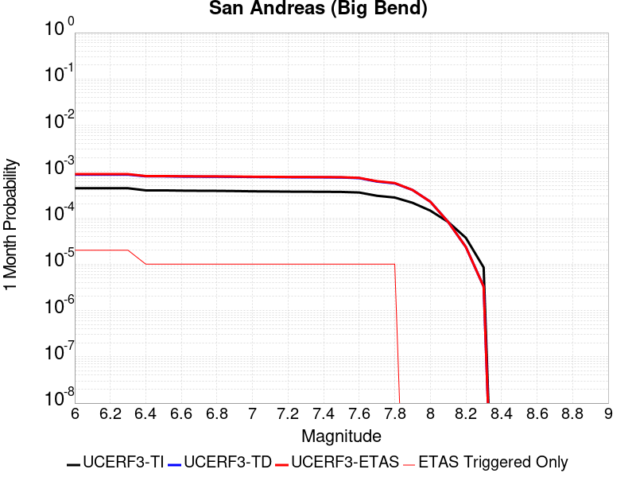 |  |  |

| Magnitude | 1 wk TI Prob | 1 wk TD Prob | 1 wk ETAS Prob | 1 wk ETAS/TD Gain | 1 wk ETAS Triggered Only | 1 mo TI Prob | 1 mo TD Prob | 1 mo ETAS Prob | 1 mo ETAS/TD Gain | 1 mo ETAS Triggered Only | 1 yr TI Prob | 1 yr TD Prob | 1 yr ETAS Prob | 1 yr ETAS/TD Gain | 1 yr ETAS Triggered Only | 10 yr TI Prob | 10 yr TD Prob | 10 yr ETAS Prob | 10 yr ETAS/TD Gain | 10 yr ETAS Triggered Only |
|-----|-----|-----|-----|-----|-----|-----|-----|-----|-----|-----|-----|-----|-----|-----|-----|-----|-----|-----|-----|-----|
| 6.0 | 1.0179969E-4 | 2.007218E-4 | 2.107198E-4 | 1.0498102 | 1.0E-5 | 4.362114E-4 | 8.599537E-4 | 8.799365E-4 | 1.0232371 | 2.0E-5 | 0.0052979486 | 0.010419957 | 0.010459541 | 1.0037988 | 4.0E-5 | 0.051734097 | 0.10145083 | 0.101522714 | 1.0007086 | 8.0E-5 |
| 6.1 | 1.0179969E-4 | 2.007218E-4 | 2.107198E-4 | 1.0498102 | 1.0E-5 | 4.362114E-4 | 8.599537E-4 | 8.799365E-4 | 1.0232371 | 2.0E-5 | 0.0052979486 | 0.010419957 | 0.010459541 | 1.0037988 | 4.0E-5 | 0.051734097 | 0.10145083 | 0.101522714 | 1.0007086 | 8.0E-5 |
| 6.2 | 1.0179969E-4 | 2.007218E-4 | 2.107198E-4 | 1.0498102 | 1.0E-5 | 4.362114E-4 | 8.599537E-4 | 8.799365E-4 | 1.0232371 | 2.0E-5 | 0.0052979486 | 0.010419957 | 0.010459541 | 1.0037988 | 4.0E-5 | 0.051734097 | 0.10145083 | 0.101522714 | 1.0007086 | 8.0E-5 |
| 6.3 | 1.0179969E-4 | 2.007218E-4 | 2.107198E-4 | 1.0498102 | 1.0E-5 | 4.362114E-4 | 8.599537E-4 | 8.799365E-4 | 1.0232371 | 2.0E-5 | 0.0052979486 | 0.010419957 | 0.010459541 | 1.0037988 | 4.0E-5 | 0.051734097 | 0.10145083 | 0.101522714 | 1.0007086 | 8.0E-5 |
| 6.4 | 9.1639464E-5 | 1.8429171E-4 | 1.9428987E-4 | 1.0542518 | 1.0E-5 | 3.9268145E-4 | 7.895828E-4 | 7.995749E-4 | 1.0126549 | 1.0E-5 | 0.0047704205 | 0.009570916 | 0.0095907245 | 1.0020697 | 2.0E-5 | 0.046693064 | 0.09378183 | 0.093818076 | 1.0003865 | 4.0E-5 |
| 6.5 | 9.1639464E-5 | 1.8429171E-4 | 1.9428987E-4 | 1.0542518 | 1.0E-5 | 3.9268145E-4 | 7.895828E-4 | 7.995749E-4 | 1.0126549 | 1.0E-5 | 0.0047704205 | 0.009570916 | 0.0095907245 | 1.0020697 | 2.0E-5 | 0.046693064 | 0.09378183 | 0.093818076 | 1.0003865 | 4.0E-5 |
| 6.6 | 9.042622E-5 | 1.8236267E-4 | 1.9236084E-4 | 1.0548258 | 1.0E-5 | 3.8748336E-4 | 7.813204E-4 | 7.9131254E-4 | 1.0127889 | 1.0E-5 | 0.0047074095 | 0.009471198 | 0.009491008 | 1.0020916 | 2.0E-5 | 0.046089325 | 0.09287209 | 0.092908375 | 1.0003906 | 4.0E-5 |
| 6.7 | 8.9836685E-5 | 1.8150604E-4 | 1.9150422E-4 | 1.0550846 | 1.0E-5 | 3.8495753E-4 | 7.776513E-4 | 7.8764354E-4 | 1.0128492 | 1.0E-5 | 0.00467679 | 0.009426914 | 0.009446725 | 1.0021015 | 2.0E-5 | 0.045795817 | 0.09246637 | 0.092502676 | 1.0003926 | 4.0E-5 |
| 6.8 | 8.9471854E-5 | 1.809739E-4 | 1.9097209E-4 | 1.0552466 | 1.0E-5 | 3.8339442E-4 | 7.753721E-4 | 7.8536436E-4 | 1.012887 | 1.0E-5 | 0.004657841 | 0.009399404 | 0.009419216 | 1.0021077 | 2.0E-5 | 0.04561414 | 0.09221355 | 0.092249855 | 1.0003937 | 4.0E-5 |
| 6.9 | 8.858234E-5 | 1.7979364E-4 | 1.8979184E-4 | 1.0556093 | 1.0E-5 | 3.7958333E-4 | 7.703168E-4 | 7.803091E-4 | 1.0129716 | 1.0E-5 | 0.004611638 | 0.0093383845 | 0.009358197 | 1.0021217 | 2.0E-5 | 0.04517103 | 0.09165367 | 0.091690004 | 1.0003964 | 4.0E-5 |
| 7.0 | 8.7433385E-5 | 1.7818164E-4 | 1.8817987E-4 | 1.0561125 | 1.0E-5 | 3.746607E-4 | 7.6341233E-4 | 7.7340467E-4 | 1.0130891 | 1.0E-5 | 0.004551957 | 0.0092550395 | 0.009274854 | 1.002141 | 2.0E-5 | 0.044598386 | 0.09088798 | 0.090915255 | 1.0003 | 3.0E-5 |
| 7.1 | 8.684964E-5 | 1.7730116E-4 | 1.8729939E-4 | 1.0563912 | 1.0E-5 | 3.7215967E-4 | 7.5964106E-4 | 7.6963345E-4 | 1.0131541 | 1.0E-5 | 0.0045216335 | 0.009209513 | 0.0092293285 | 1.0021516 | 2.0E-5 | 0.04430731 | 0.09046952 | 0.0904968 | 1.0003016 | 3.0E-5 |
| 7.2 | 8.606521E-5 | 1.7620731E-4 | 1.8620554E-4 | 1.0567414 | 1.0E-5 | 3.6879873E-4 | 7.549558E-4 | 7.6494826E-4 | 1.0132358 | 1.0E-5 | 0.0044808835 | 0.009152951 | 0.009172767 | 1.0021651 | 2.0E-5 | 0.043916024 | 0.08995003 | 0.08997733 | 1.0003035 | 3.0E-5 |
| 7.3 | 8.568266E-5 | 1.7562733E-4 | 1.8562557E-4 | 1.0569288 | 1.0E-5 | 3.6715972E-4 | 7.524716E-4 | 7.624641E-4 | 1.0132796 | 1.0E-5 | 0.0044610105 | 0.009122959 | 0.009142777 | 1.0021722 | 2.0E-5 | 0.043725148 | 0.08967111 | 0.08969843 | 1.0003046 | 3.0E-5 |
| 7.4 | 8.5432206E-5 | 1.752532E-4 | 1.8525144E-4 | 1.0570503 | 1.0E-5 | 3.6608664E-4 | 7.508691E-4 | 7.608616E-4 | 1.0133079 | 1.0E-5 | 0.004447999 | 0.009103612 | 0.009123431 | 1.0021769 | 2.0E-5 | 0.043600157 | 0.0894914 | 0.08951871 | 1.0003052 | 3.0E-5 |
| 7.5 | 8.4791965E-5 | 1.7394664E-4 | 1.839449E-4 | 1.0574789 | 1.0E-5 | 3.633435E-4 | 7.452728E-4 | 7.5526536E-4 | 1.013408 | 1.0E-5 | 0.0044147377 | 0.009036045 | 0.009055863 | 1.0021933 | 2.0E-5 | 0.043280575 | 0.088867545 | 0.08889488 | 1.0003076 | 3.0E-5 |
| 7.6 | 8.241105E-5 | 1.6840106E-4 | 1.7839938E-4 | 1.0593721 | 1.0E-5 | 3.531424E-4 | 7.215194E-4 | 7.3151215E-4 | 1.0138496 | 1.0E-5 | 0.0042910352 | 0.008749205 | 0.00876903 | 1.0022659 | 2.0E-5 | 0.042091176 | 0.086243145 | 0.086270556 | 1.0003178 | 3.0E-5 |
| 7.7 | 7.00432E-5 | 1.4204094E-4 | 1.5203952E-4 | 1.0703923 | 1.0E-5 | 3.001506E-4 | 6.0860487E-4 | 6.185988E-4 | 1.0164211 | 1.0E-5 | 0.0036482112 | 0.0073846295 | 0.0074044815 | 1.0026883 | 2.0E-5 | 0.035888977 | 0.07351696 | 0.07354475 | 1.000378 | 3.0E-5 |
| 7.8 | 6.415362E-5 | 1.2968556E-4 | 1.3968426E-4 | 1.0770996 | 1.0E-5 | 2.749151E-4 | 5.556769E-4 | 5.6567136E-4 | 1.017986 | 1.0E-5 | 0.0033419547 | 0.0067444094 | 0.0067642746 | 1.0029454 | 2.0E-5 | 0.03292141 | 0.067252055 | 0.06727071 | 1.0002774 | 2.0E-5 |
| 7.9 | 4.939911E-5 | 9.3407485E-5 | 9.3407485E-5 | 1.0 | 0.0 | 2.116933E-4 | 4.002564E-4 | 4.002564E-4 | 1.0 | 0.0 | 0.0025743195 | 0.004862242 | 0.0048721936 | 1.0020467 | 1.0E-5 | 0.025447013 | 0.048912104 | 0.048921615 | 1.0001944 | 1.0E-5 |
| 8.0 | 3.344983E-5 | 5.2222407E-5 | 5.2222407E-5 | 1.0 | 0.0 | 1.4334853E-4 | 2.2379112E-4 | 2.2379112E-4 | 1.0 | 0.0 | 0.0017438711 | 0.0027212542 | 0.0027212542 | 1.0 | 0.0 | 0.017302496 | 0.027920531 | 0.027920531 | 1.0 | 0.0 |
| 8.1 | 1.9104898E-5 | 1.9169016E-5 | 1.9169016E-5 | 1.0 | 0.0 | 8.1875565E-5 | 8.215035E-5 | 8.215035E-5 | 1.0 | 0.0 | 9.963791E-4 | 9.997222E-4 | 9.997222E-4 | 1.0 | 0.0 | 0.009919235 | 0.010748157 | 0.010748157 | 1.0 | 0.0 |
| 8.2 | 8.643924E-6 | 5.472644E-6 | 5.472644E-6 | 1.0 | 0.0 | 3.704486E-5 | 2.3453977E-5 | 2.3453977E-5 | 1.0 | 0.0 | 4.5092785E-4 | 2.8551483E-4 | 2.8551483E-4 | 1.0 | 0.0 | 0.0045001395 | 0.003247653 | 0.003247653 | 1.0 | 0.0 |
| 8.3 | 1.983087E-6 | 7.6547434E-7 | 7.6547434E-7 | 1.0 | 0.0 | 8.498917E-6 | 3.2806004E-6 | 3.2806004E-6 | 1.0 | 0.0 | 1.034694E-4 | 3.9940594E-5 | 3.9940594E-5 | 1.0 | 0.0 | 0.0010342124 | 4.7170694E-4 | 4.7170694E-4 | 1.0 | 0.0 |

## Cleghorn Lake
*[(top)](#table-of-contents)*

| 1 Week | 1 Month | 1 Year | 10 Year |
|-----|-----|-----|-----|
|  |  | 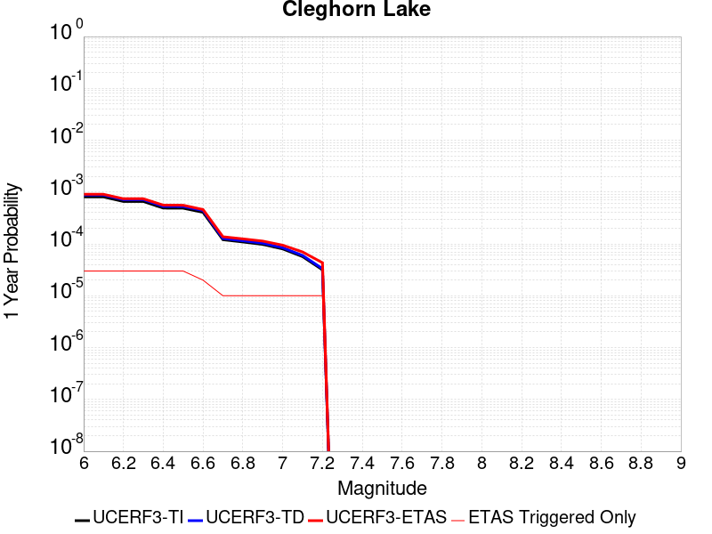 | 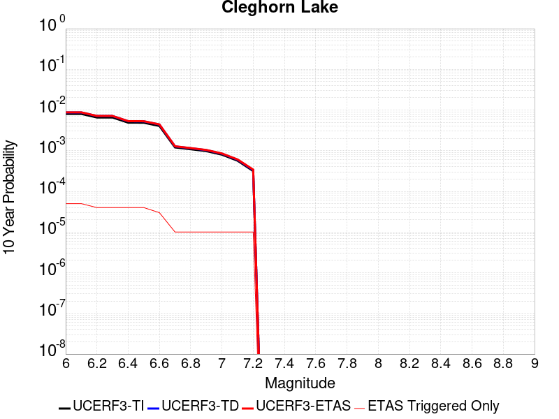 |

| Magnitude | 1 wk TI Prob | 1 wk TD Prob | 1 wk ETAS Prob | 1 wk ETAS/TD Gain | 1 wk ETAS Triggered Only | 1 mo TI Prob | 1 mo TD Prob | 1 mo ETAS Prob | 1 mo ETAS/TD Gain | 1 mo ETAS Triggered Only | 1 yr TI Prob | 1 yr TD Prob | 1 yr ETAS Prob | 1 yr ETAS/TD Gain | 1 yr ETAS Triggered Only | 10 yr TI Prob | 10 yr TD Prob | 10 yr ETAS Prob | 10 yr ETAS/TD Gain | 10 yr ETAS Triggered Only |
|-----|-----|-----|-----|-----|-----|-----|-----|-----|-----|-----|-----|-----|-----|-----|-----|-----|-----|-----|-----|-----|
| 6.0 | 1.5467183E-5 | 1.6794165E-5 | 2.6793998E-5 | 1.5954349 | 1.0E-5 | 6.6286244E-5 | 7.1973314E-5 | 8.19726E-5 | 1.1389303 | 1.0E-5 | 8.067362E-4 | 8.7597774E-4 | 9.059514E-4 | 1.0342175 | 3.0E-5 | 0.008038137 | 0.008730675 | 0.008780239 | 1.005677 | 5.0E-5 |
| 6.1 | 1.5467183E-5 | 1.6794165E-5 | 2.6793998E-5 | 1.5954349 | 1.0E-5 | 6.6286244E-5 | 7.1973314E-5 | 8.19726E-5 | 1.1389303 | 1.0E-5 | 8.067362E-4 | 8.7597774E-4 | 9.059514E-4 | 1.0342175 | 3.0E-5 | 0.008038137 | 0.008730675 | 0.008780239 | 1.005677 | 5.0E-5 |
| 6.2 | 1.2624631E-5 | 1.3681514E-5 | 2.3681378E-5 | 1.7309033 | 1.0E-5 | 5.410444E-5 | 5.8634017E-5 | 6.863343E-5 | 1.1705395 | 1.0E-5 | 6.585225E-4 | 7.13684E-4 | 7.436626E-4 | 1.0420054 | 3.0E-5 | 0.0065657445 | 0.007118716 | 0.007158431 | 1.005579 | 4.0E-5 |
| 6.3 | 1.2624631E-5 | 1.3681514E-5 | 2.3681378E-5 | 1.7309033 | 1.0E-5 | 5.410444E-5 | 5.8634017E-5 | 6.863343E-5 | 1.1705395 | 1.0E-5 | 6.585225E-4 | 7.13684E-4 | 7.436626E-4 | 1.0420054 | 3.0E-5 | 0.0065657445 | 0.007118716 | 0.007158431 | 1.005579 | 4.0E-5 |
| 6.4 | 9.417684E-6 | 1.0170096E-5 | 2.0169995E-5 | 1.9832649 | 1.0E-5 | 4.036088E-5 | 4.3585627E-5 | 5.3585194E-5 | 1.2294234 | 1.0E-5 | 4.912829E-4 | 5.305669E-4 | 5.60551E-4 | 1.0565133 | 3.0E-5 | 0.004901982 | 0.005297038 | 0.0053368257 | 1.0075114 | 4.0E-5 |
| 6.5 | 9.368219E-6 | 1.0117523E-5 | 2.011742E-5 | 1.9883742 | 1.0E-5 | 4.014889E-5 | 4.3360324E-5 | 5.3359887E-5 | 1.2306156 | 1.0E-5 | 4.8870314E-4 | 5.2782515E-4 | 5.578093E-4 | 1.056807 | 3.0E-5 | 0.004876298 | 0.00526975 | 0.0053095394 | 1.0075505 | 4.0E-5 |
| 6.6 | 7.803798E-6 | 8.4418125E-6 | 1.8441728E-5 | 2.1845698 | 1.0E-5 | 3.3444423E-5 | 3.617892E-5 | 4.6178557E-5 | 1.276394 | 1.0E-5 | 4.0710976E-4 | 4.4042926E-4 | 4.6042044E-4 | 1.0453902 | 2.0E-5 | 0.0040636472 | 0.0043994808 | 0.0044293487 | 1.006789 | 3.0E-5 |
| 6.7 | 2.3108669E-6 | 2.44383E-6 | 2.44383E-6 | 1.0 | 0.0 | 9.903678E-6 | 1.0473515E-5 | 1.0473515E-5 | 1.0 | 0.0 | 1.205706E-4 | 1.2750778E-4 | 1.375065E-4 | 1.0784166 | 1.0E-5 | 0.001205052 | 0.0012743649 | 0.001284352 | 1.007837 | 1.0E-5 |
| 6.8 | 2.0882828E-6 | 2.2062789E-6 | 2.2062789E-6 | 1.0 | 0.0 | 8.949753E-6 | 9.455448E-6 | 9.455448E-6 | 1.0 | 0.0 | 1.08957785E-4 | 1.1511416E-4 | 1.2511302E-4 | 1.0868603 | 1.0E-5 | 0.0010890438 | 0.0011505622 | 0.0011605507 | 1.0086814 | 1.0E-5 |
| 6.9 | 1.876935E-6 | 1.9810482E-6 | 1.9810482E-6 | 1.0 | 0.0 | 8.043982E-6 | 8.490179E-6 | 8.490179E-6 | 1.0 | 0.0 | 9.7931086E-5 | 1.0336319E-4 | 1.13362155E-4 | 1.0967362 | 1.0E-5 | 9.788794E-4 | 0.0010331671 | 0.0010431568 | 1.009669 | 1.0E-5 |
| 7.0 | 1.5357559E-6 | 1.6202783E-6 | 1.6202783E-6 | 1.0 | 0.0 | 6.5817944E-6 | 6.944032E-6 | 6.944032E-6 | 1.0 | 0.0 | 8.01304E-5 | 8.4540436E-5 | 9.4539595E-5 | 1.1182766 | 1.0E-5 | 8.010151E-4 | 8.4509526E-4 | 8.550868E-4 | 1.0118229 | 1.0E-5 |
| 7.1 | 1.0905424E-6 | 1.1497604E-6 | 1.1497604E-6 | 1.0 | 0.0 | 4.6737446E-6 | 4.9275354E-6 | 4.9275354E-6 | 1.0 | 0.0 | 5.6901354E-5 | 5.999119E-5 | 6.9990594E-5 | 1.1666812 | 1.0E-5 | 5.6886784E-4 | 5.9975975E-4 | 6.0975377E-4 | 1.0166633 | 1.0E-5 |
| 7.2 | 6.06668E-7 | 6.387269E-7 | 6.387269E-7 | 1.0 | 0.0 | 2.600003E-6 | 2.7373983E-6 | 2.7373983E-6 | 1.0 | 0.0 | 3.1654577E-5 | 3.3327386E-5 | 4.332705E-5 | 1.3000436 | 1.0E-5 | 3.1650066E-4 | 3.332307E-4 | 3.4322738E-4 | 1.0299993 | 1.0E-5 |

## Cady
*[(top)](#table-of-contents)*

| 1 Week | 1 Month | 1 Year | 10 Year |
|-----|-----|-----|-----|
| 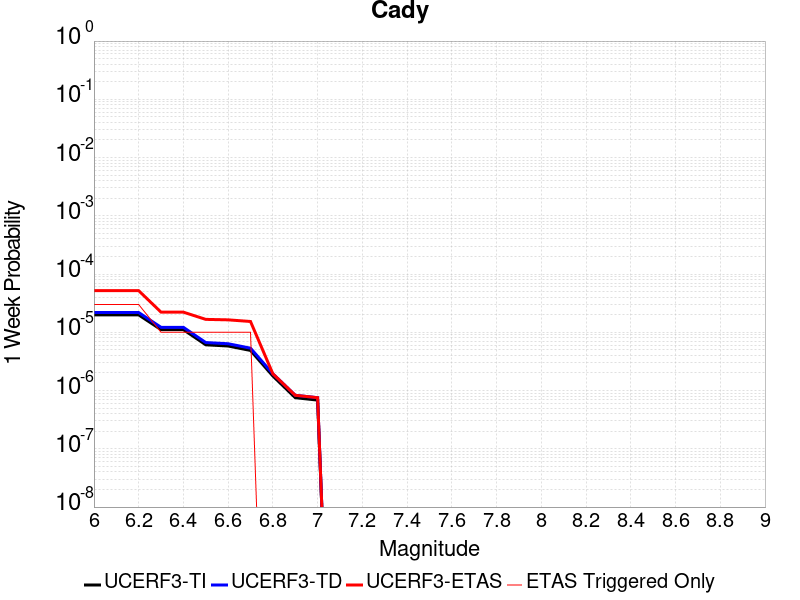 | 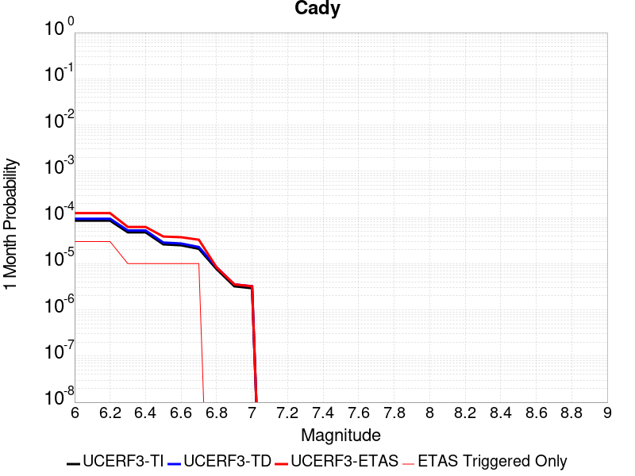 |  | 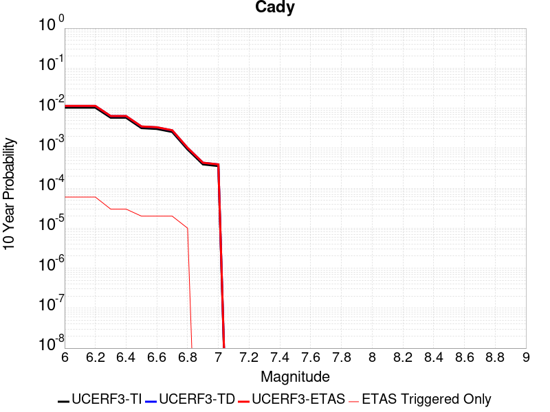 |

| Magnitude | 1 wk TI Prob | 1 wk TD Prob | 1 wk ETAS Prob | 1 wk ETAS/TD Gain | 1 wk ETAS Triggered Only | 1 mo TI Prob | 1 mo TD Prob | 1 mo ETAS Prob | 1 mo ETAS/TD Gain | 1 mo ETAS Triggered Only | 1 yr TI Prob | 1 yr TD Prob | 1 yr ETAS Prob | 1 yr ETAS/TD Gain | 1 yr ETAS Triggered Only | 10 yr TI Prob | 10 yr TD Prob | 10 yr ETAS Prob | 10 yr ETAS/TD Gain | 10 yr ETAS Triggered Only |
|-----|-----|-----|-----|-----|-----|-----|-----|-----|-----|-----|-----|-----|-----|-----|-----|-----|-----|-----|-----|-----|
| 6.0 | 1.9892565E-5 | 2.1858672E-5 | 5.1858016E-5 | 2.372423 | 3.0E-5 | 8.525106E-5 | 9.367717E-5 | 1.2367436E-4 | 1.3202188 | 3.0E-5 | 0.0010374374 | 0.0011400137 | 0.0011799681 | 1.0350473 | 4.0E-5 | 0.010326075 | 0.011350671 | 0.01140999 | 1.005226 | 6.0E-5 |
| 6.1 | 1.9892565E-5 | 2.1858672E-5 | 5.1858016E-5 | 2.372423 | 3.0E-5 | 8.525106E-5 | 9.367717E-5 | 1.2367436E-4 | 1.3202188 | 3.0E-5 | 0.0010374374 | 0.0011400137 | 0.0011799681 | 1.0350473 | 4.0E-5 | 0.010326075 | 0.011350671 | 0.01140999 | 1.005226 | 6.0E-5 |
| 6.2 | 1.9892565E-5 | 2.1858672E-5 | 5.1858016E-5 | 2.372423 | 3.0E-5 | 8.525106E-5 | 9.367717E-5 | 1.2367436E-4 | 1.3202188 | 3.0E-5 | 0.0010374374 | 0.0011400137 | 0.0011799681 | 1.0350473 | 4.0E-5 | 0.010326075 | 0.011350671 | 0.01140999 | 1.005226 | 6.0E-5 |
| 6.3 | 1.1117327E-5 | 1.2176552E-5 | 2.2176431E-5 | 1.8212405 | 1.0E-5 | 4.764482E-5 | 5.2184358E-5 | 6.218384E-5 | 1.1916183 | 1.0E-5 | 5.7992124E-4 | 6.3519087E-4 | 6.5517816E-4 | 1.0314666 | 2.0E-5 | 0.0057841022 | 0.0063368594 | 0.006366669 | 1.0047042 | 3.0E-5 |
| 6.4 | 1.1117327E-5 | 1.2176552E-5 | 2.2176431E-5 | 1.8212405 | 1.0E-5 | 4.764482E-5 | 5.2184358E-5 | 6.218384E-5 | 1.1916183 | 1.0E-5 | 5.7992124E-4 | 6.3519087E-4 | 6.5517816E-4 | 1.0314666 | 2.0E-5 | 0.0057841022 | 0.0063368594 | 0.006366669 | 1.0047042 | 3.0E-5 |
| 6.5 | 6.103093E-6 | 6.672004E-6 | 1.6671936E-5 | 2.49879 | 1.0E-5 | 2.615585E-5 | 2.859406E-5 | 3.8593775E-5 | 1.349713 | 1.0E-5 | 3.1840094E-4 | 3.4808964E-4 | 3.6808266E-4 | 1.0574365 | 2.0E-5 | 0.0031794512 | 0.003476678 | 0.0034966085 | 1.0057327 | 2.0E-5 |
| 6.6 | 5.817237E-6 | 6.3656425E-6 | 1.6365579E-5 | 2.5709233 | 1.0E-5 | 2.4930776E-5 | 2.728111E-5 | 3.728084E-5 | 1.366544 | 1.0E-5 | 3.034899E-4 | 3.3210934E-4 | 3.5210268E-4 | 1.0602012 | 2.0E-5 | 0.0030307577 | 0.0033173522 | 0.003337286 | 1.0060089 | 2.0E-5 |
| 6.7 | 4.8846314E-6 | 5.3405547E-6 | 1.5340502E-5 | 2.8724546 | 1.0E-5 | 2.0933967E-5 | 2.2887958E-5 | 3.288773E-5 | 1.436901 | 1.0E-5 | 2.5484123E-4 | 2.7863705E-4 | 2.9863146E-4 | 1.0717579 | 2.0E-5 | 0.0025454918 | 0.0027840321 | 0.0028039764 | 1.0071639 | 2.0E-5 |
| 6.8 | 1.7788773E-6 | 1.9399033E-6 | 1.9399033E-6 | 1.0 | 0.0 | 7.6237375E-6 | 8.313854E-6 | 8.313854E-6 | 1.0 | 0.0 | 9.281505E-5 | 1.01218044E-4 | 1.1121703E-4 | 1.0987866 | 1.0E-5 | 9.2776294E-4 | 0.0010118741 | 0.0010218639 | 1.0098727 | 1.0E-5 |
| 6.9 | 7.5455404E-7 | 8.29707E-7 | 8.29707E-7 | 1.0 | 0.0 | 3.233799E-6 | 3.5558842E-6 | 3.5558842E-6 | 1.0 | 0.0 | 3.937079E-5 | 4.3292366E-5 | 4.3292366E-5 | 1.0 | 0.0 | 3.9363815E-4 | 4.3287227E-4 | 4.3287227E-4 | 1.0 | 0.0 |
| 7.0 | 6.8578805E-7 | 7.541796E-7 | 7.541796E-7 | 1.0 | 0.0 | 2.9390883E-6 | 3.2321961E-6 | 3.2321961E-6 | 1.0 | 0.0 | 3.578281E-5 | 3.935161E-5 | 3.935161E-5 | 1.0 | 0.0 | 3.577705E-4 | 3.9347887E-4 | 3.9347887E-4 | 1.0 | 0.0 |

## Mission Ridge-Arroyo Parida-Santa Ana
*[(top)](#table-of-contents)*

| 1 Week | 1 Month | 1 Year | 10 Year |
|-----|-----|-----|-----|
| 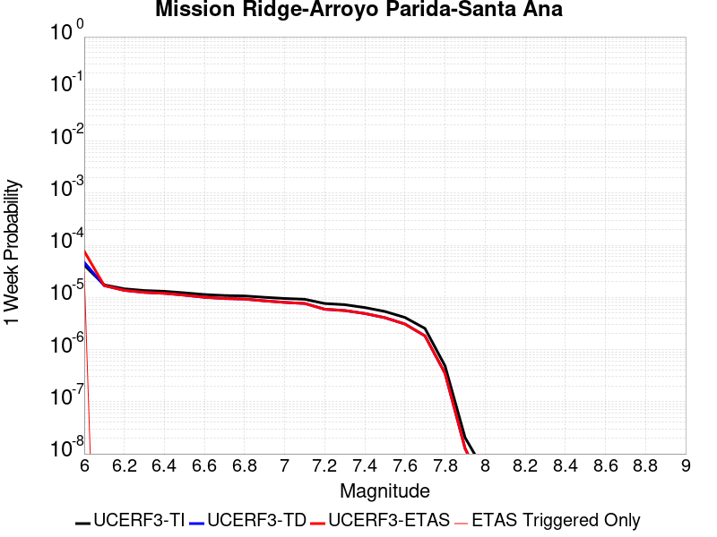 | 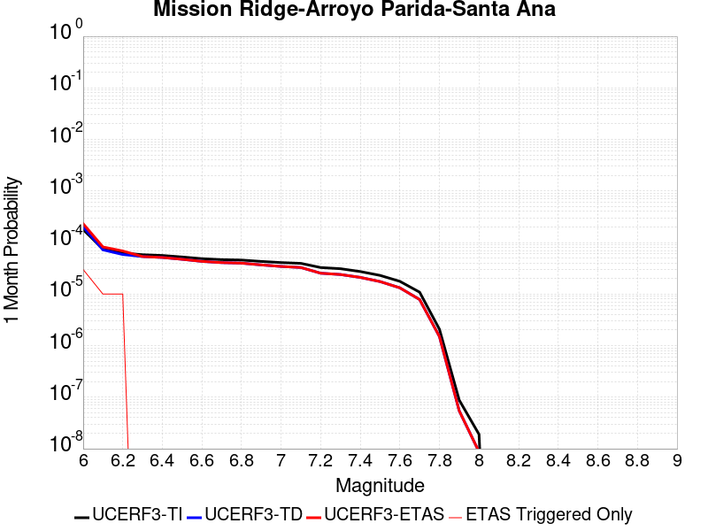 | 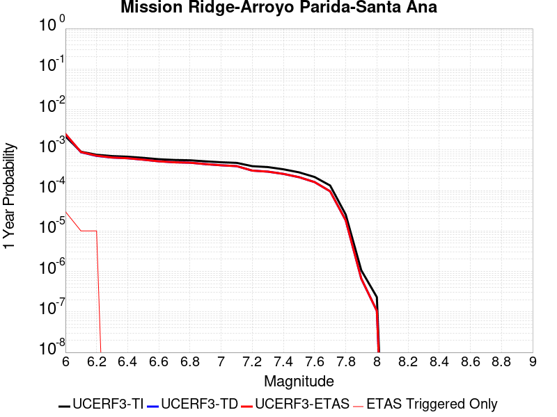 | 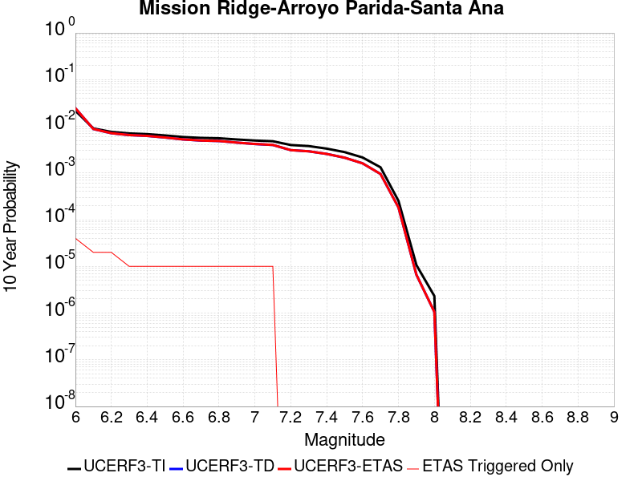 |

| Magnitude | 1 wk TI Prob | 1 wk TD Prob | 1 wk ETAS Prob | 1 wk ETAS/TD Gain | 1 wk ETAS Triggered Only | 1 mo TI Prob | 1 mo TD Prob | 1 mo ETAS Prob | 1 mo ETAS/TD Gain | 1 mo ETAS Triggered Only | 1 yr TI Prob | 1 yr TD Prob | 1 yr ETAS Prob | 1 yr ETAS/TD Gain | 1 yr ETAS Triggered Only | 10 yr TI Prob | 10 yr TD Prob | 10 yr ETAS Prob | 10 yr ETAS/TD Gain | 10 yr ETAS Triggered Only |
|-----|-----|-----|-----|-----|-----|-----|-----|-----|-----|-----|-----|-----|-----|-----|-----|-----|-----|-----|-----|-----|
| 6.0 | 4.169034E-5 | 4.713679E-5 | 7.713537E-5 | 1.6364155 | 3.0E-5 | 1.7866064E-4 | 2.0200403E-4 | 2.3199797E-4 | 1.1484818 | 3.0E-5 | 0.0021730233 | 0.0024574527 | 0.002487379 | 1.0121777 | 3.0E-5 | 0.021518968 | 0.024384702 | 0.024423726 | 1.0016004 | 4.0E-5 |
| 6.1 | 1.73813E-5 | 1.685415E-5 | 1.685415E-5 | 1.0 | 0.0 | 7.4489166E-5 | 7.2230134E-5 | 8.222941E-5 | 1.1384364 | 1.0E-5 | 9.065282E-4 | 8.7905774E-4 | 8.890489E-4 | 1.0113658 | 1.0E-5 | 0.009028391 | 0.008757101 | 0.008776926 | 1.0022639 | 2.0E-5 |
| 6.2 | 1.4622182E-5 | 1.3673222E-5 | 1.3673222E-5 | 1.0 | 0.0 | 6.2664985E-5 | 5.859823E-5 | 6.859764E-5 | 1.1706436 | 1.0E-5 | 7.6267915E-4 | 7.132038E-4 | 7.2319666E-4 | 1.0140113 | 1.0E-5 | 0.007600669 | 0.0071097463 | 0.007129604 | 1.0027931 | 2.0E-5 |
| 6.3 | 1.3552434E-5 | 1.2482137E-5 | 1.2482137E-5 | 1.0 | 0.0 | 5.8080568E-5 | 5.3493794E-5 | 5.3493794E-5 | 1.0 | 0.0 | 7.069015E-4 | 6.5109547E-4 | 6.5109547E-4 | 1.0 | 0.0 | 0.00704657 | 0.006492396 | 0.006502331 | 1.0015303 | 1.0E-5 |
| 6.4 | 1.30977305E-5 | 1.1979094E-5 | 1.1979094E-5 | 1.0 | 0.0 | 5.613192E-5 | 5.133798E-5 | 5.133798E-5 | 1.0 | 0.0 | 6.831918E-4 | 6.2486366E-4 | 6.2486366E-4 | 1.0 | 0.0 | 0.006810953 | 0.006231566 | 0.0062415036 | 1.0015948 | 1.0E-5 |
| 6.5 | 1.225205E-5 | 1.1048743E-5 | 1.1048743E-5 | 1.0 | 0.0 | 5.2507727E-5 | 4.7350914E-5 | 4.7350914E-5 | 1.0 | 0.0 | 6.3909404E-4 | 5.763476E-4 | 5.763476E-4 | 1.0 | 0.0 | 0.006372592 | 0.005748992 | 0.0057589347 | 1.0017295 | 1.0E-5 |
| 6.6 | 1.1352241E-5 | 1.0063478E-5 | 1.0063478E-5 | 1.0 | 0.0 | 4.8651553E-5 | 4.312849E-5 | 4.312849E-5 | 1.0 | 0.0 | 5.921717E-4 | 5.2496494E-4 | 5.2496494E-4 | 1.0 | 0.0 | 0.0059059616 | 0.0052376487 | 0.005247596 | 1.0018992 | 1.0E-5 |
| 6.7 | 1.0864116E-5 | 9.516972E-6 | 9.516972E-6 | 1.0 | 0.0 | 4.6559664E-5 | 4.0786395E-5 | 4.0786395E-5 | 1.0 | 0.0 | 5.667165E-4 | 4.964632E-4 | 4.964632E-4 | 1.0 | 0.0 | 0.005652734 | 0.0049539288 | 0.0049638795 | 1.0020086 | 1.0E-5 |
| 6.8 | 1.0666365E-5 | 9.299723E-6 | 9.299723E-6 | 1.0 | 0.0 | 4.571219E-5 | 3.985536E-5 | 3.985536E-5 | 1.0 | 0.0 | 5.564038E-4 | 4.85133E-4 | 4.85133E-4 | 1.0 | 0.0 | 0.005550127 | 0.0048411256 | 0.004851077 | 1.0020556 | 1.0E-5 |
| 6.9 | 1.0038665E-5 | 8.591993E-6 | 8.591993E-6 | 1.0 | 0.0 | 4.302214E-5 | 3.682232E-5 | 3.682232E-5 | 1.0 | 0.0 | 5.236687E-4 | 4.482213E-4 | 4.482213E-4 | 1.0 | 0.0 | 0.005224364 | 0.0044735377 | 0.004483493 | 1.0022254 | 1.0E-5 |
| 7.0 | 9.5379955E-6 | 8.025023E-6 | 8.025023E-6 | 1.0 | 0.0 | 4.0876483E-5 | 3.4392513E-5 | 3.4392513E-5 | 1.0 | 0.0 | 4.975576E-4 | 4.186501E-4 | 4.186501E-4 | 1.0 | 0.0 | 0.00496445 | 0.004178968 | 0.004188926 | 1.002383 | 1.0E-5 |
| 7.1 | 9.207389E-6 | 7.652326E-6 | 7.652326E-6 | 1.0 | 0.0 | 3.945964E-5 | 3.279528E-5 | 3.279528E-5 | 1.0 | 0.0 | 4.803152E-4 | 3.9921107E-4 | 3.9921107E-4 | 1.0 | 0.0 | 0.004792784 | 0.0039852895 | 0.0039952495 | 1.0024992 | 1.0E-5 |
| 7.2 | 7.638091E-6 | 5.931077E-6 | 5.931077E-6 | 1.0 | 0.0 | 3.2734264E-5 | 2.5418654E-5 | 2.5418654E-5 | 1.0 | 0.0 | 3.984668E-4 | 3.094285E-4 | 3.094285E-4 | 1.0 | 0.0 | 0.0039775306 | 0.0030901874 | 0.0030901874 | 1.0 | 0.0 |
| 7.3 | 7.2500147E-6 | 5.596116E-6 | 5.596116E-6 | 1.0 | 0.0 | 3.1071122E-5 | 2.3983135E-5 | 2.3983135E-5 | 1.0 | 0.0 | 3.7822526E-4 | 2.9195583E-4 | 2.9195583E-4 | 1.0 | 0.0 | 0.0037758215 | 0.0029159326 | 0.0029159326 | 1.0 | 0.0 |
| 7.4 | 6.3899715E-6 | 4.9184723E-6 | 4.9184723E-6 | 1.0 | 0.0 | 2.7385306E-5 | 2.1078999E-5 | 2.1078999E-5 | 1.0 | 0.0 | 3.3336508E-4 | 2.5660679E-4 | 2.5660679E-4 | 1.0 | 0.0 | 0.0033286542 | 0.0025633036 | 0.0025633036 | 1.0 | 0.0 |
| 7.5 | 5.379025E-6 | 4.0838345E-6 | 4.0838345E-6 | 1.0 | 0.0 | 2.305276E-5 | 1.750203E-5 | 1.750203E-5 | 1.0 | 0.0 | 2.806312E-4 | 2.130665E-4 | 2.130665E-4 | 1.0 | 0.0 | 0.0028027708 | 0.0021286334 | 0.0021286334 | 1.0 | 0.0 |
| 7.6 | 4.1270696E-6 | 3.0883268E-6 | 3.0883268E-6 | 1.0 | 0.0 | 1.768732E-5 | 1.323562E-5 | 1.323562E-5 | 1.0 | 0.0 | 2.1532185E-4 | 1.6113183E-4 | 1.6113183E-4 | 1.0 | 0.0 | 0.0021511333 | 0.0016101581 | 0.0016101581 | 1.0 | 0.0 |
| 7.7 | 2.5406805E-6 | 1.8281966E-6 | 1.8281966E-6 | 1.0 | 0.0 | 1.0888585E-5 | 7.835105E-6 | 7.835105E-6 | 1.0 | 0.0 | 1.3256045E-4 | 9.5388285E-5 | 9.5388285E-5 | 1.0 | 0.0 | 0.0013248142 | 9.534796E-4 | 9.534796E-4 | 1.0 | 0.0 |
| 7.8 | 4.8608285E-7 | 3.509852E-7 | 3.509852E-7 | 1.0 | 0.0 | 2.0832106E-6 | 1.5042215E-6 | 1.5042215E-6 | 1.0 | 0.0 | 2.5362791E-5 | 1.8313744E-5 | 1.8313744E-5 | 1.0 | 0.0 | 2.5359896E-4 | 1.8312247E-4 | 1.8312247E-4 | 1.0 | 0.0 |
| 7.9 | 2.0472514E-8 | 1.2688697E-8 | 1.2688697E-8 | 1.0 | 0.0 | 8.7739345E-8 | 5.438013E-8 | 5.438013E-8 | 1.0 | 0.0 | 1.068226E-6 | 6.6207787E-7 | 6.6207787E-7 | 1.0 | 0.0 | 1.0682209E-5 | 6.62076E-6 | 6.62076E-6 | 1.0 | 0.0 |
| 8.0 | 4.443582E-9 | 2.0320647E-9 | 2.0320647E-9 | 1.0 | 0.0 | 1.9043922E-8 | 8.708849E-9 | 8.708849E-9 | 1.0 | 0.0 | 2.3185973E-7 | 1.0603022E-7 | 1.0603022E-7 | 1.0 | 0.0 | 2.3185949E-6 | 1.0603018E-6 | 1.0603018E-6 | 1.0 | 0.0 |

## San Andreas (San Bernardino S)
*[(top)](#table-of-contents)*

| 1 Week | 1 Month | 1 Year | 10 Year |
|-----|-----|-----|-----|
|  |  | 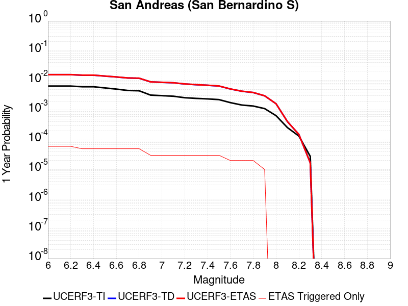 |  |

| Magnitude | 1 wk TI Prob | 1 wk TD Prob | 1 wk ETAS Prob | 1 wk ETAS/TD Gain | 1 wk ETAS Triggered Only | 1 mo TI Prob | 1 mo TD Prob | 1 mo ETAS Prob | 1 mo ETAS/TD Gain | 1 mo ETAS Triggered Only | 1 yr TI Prob | 1 yr TD Prob | 1 yr ETAS Prob | 1 yr ETAS/TD Gain | 1 yr ETAS Triggered Only | 10 yr TI Prob | 10 yr TD Prob | 10 yr ETAS Prob | 10 yr ETAS/TD Gain | 10 yr ETAS Triggered Only |
|-----|-----|-----|-----|-----|-----|-----|-----|-----|-----|-----|-----|-----|-----|-----|-----|-----|-----|-----|-----|-----|
| 6.0 | 1.2336002E-4 | 3.0004286E-4 | 3.4003088E-4 | 1.1332743 | 4.0E-5 | 5.2857865E-4 | 0.0012852903 | 0.0013352261 | 1.0388517 | 5.0E-5 | 0.006416472 | 0.015541089 | 0.015600156 | 1.0038007 | 6.0E-5 | 0.06234337 | 0.1429477 | 0.14299913 | 1.0003598 | 6.0E-5 |
| 6.1 | 1.2336002E-4 | 3.0004286E-4 | 3.4003088E-4 | 1.1332743 | 4.0E-5 | 5.2857865E-4 | 0.0012852903 | 0.0013352261 | 1.0388517 | 5.0E-5 | 0.006416472 | 0.015541089 | 0.015600156 | 1.0038007 | 6.0E-5 | 0.06234337 | 0.1429477 | 0.14299913 | 1.0003598 | 6.0E-5 |
| 6.2 | 1.2336002E-4 | 3.0004286E-4 | 3.4003088E-4 | 1.1332743 | 4.0E-5 | 5.2857865E-4 | 0.0012852903 | 0.0013352261 | 1.0388517 | 5.0E-5 | 0.006416472 | 0.015541089 | 0.015600156 | 1.0038007 | 6.0E-5 | 0.06234337 | 0.1429477 | 0.14299913 | 1.0003598 | 6.0E-5 |
| 6.3 | 1.1712257E-4 | 2.8792562E-4 | 3.1791697E-4 | 1.1041635 | 3.0E-5 | 5.018573E-4 | 0.001233409 | 0.0012733598 | 1.0323905 | 4.0E-5 | 0.006093008 | 0.014918202 | 0.0149674555 | 1.0033016 | 5.0E-5 | 0.059286322 | 0.13765801 | 0.13770114 | 1.0003132 | 5.0E-5 |
| 6.4 | 1.1712257E-4 | 2.8792562E-4 | 3.1791697E-4 | 1.1041635 | 3.0E-5 | 5.018573E-4 | 0.001233409 | 0.0012733598 | 1.0323905 | 4.0E-5 | 0.006093008 | 0.014918202 | 0.0149674555 | 1.0033016 | 5.0E-5 | 0.059286322 | 0.13765801 | 0.13770114 | 1.0003132 | 5.0E-5 |
| 6.5 | 1.0689076E-4 | 2.6805513E-4 | 2.980471E-4 | 1.1118873 | 3.0E-5 | 4.5802278E-4 | 0.0011483267 | 0.0011882808 | 1.0347933 | 4.0E-5 | 0.0055621783 | 0.01389587 | 0.013945175 | 1.0035481 | 5.0E-5 | 0.05425003 | 0.12889914 | 0.1289427 | 1.000338 | 5.0E-5 |
| 6.6 | 9.7648895E-5 | 2.505039E-4 | 2.8049637E-4 | 1.1197286 | 3.0E-5 | 4.1842813E-4 | 0.00107317 | 0.001113127 | 1.0372328 | 4.0E-5 | 0.005082469 | 0.012991933 | 0.013041284 | 1.0037985 | 5.0E-5 | 0.049677886 | 0.12107798 | 0.12112193 | 1.000363 | 5.0E-5 |
| 6.7 | 8.757013E-5 | 2.3121275E-4 | 2.612058E-4 | 1.1297207 | 3.0E-5 | 3.7524657E-4 | 9.905577E-4 | 0.0010305181 | 1.0403413 | 4.0E-5 | 0.00455906 | 0.011997437 | 0.012046837 | 1.0041176 | 5.0E-5 | 0.04466656 | 0.11237316 | 0.11241754 | 1.0003949 | 5.0E-5 |
| 6.8 | 8.562978E-5 | 2.2681156E-4 | 2.5680475E-4 | 1.1322384 | 3.0E-5 | 3.6693315E-4 | 9.7170967E-4 | 0.0010116708 | 1.0411246 | 4.0E-5 | 0.004458263 | 0.011770456 | 0.011819867 | 1.004198 | 5.0E-5 | 0.043698758 | 0.110378765 | 0.110423245 | 1.0004029 | 5.0E-5 |
| 6.9 | 6.124075E-5 | 1.7065984E-4 | 1.9065643E-4 | 1.1171722 | 2.0E-5 | 2.6243398E-4 | 7.3119515E-4 | 7.611732E-4 | 1.0409987 | 3.0E-5 | 0.0031904527 | 0.00886617 | 0.008895905 | 1.0033536 | 3.0E-5 | 0.031450346 | 0.08420276 | 0.08423024 | 1.0003263 | 3.0E-5 |
| 7.0 | 5.8598747E-5 | 1.6495038E-4 | 1.8494709E-4 | 1.1212286 | 2.0E-5 | 2.5111332E-4 | 7.067395E-4 | 7.367183E-4 | 1.0424185 | 3.0E-5 | 0.0030530186 | 0.0085708015 | 0.008600544 | 1.0034703 | 3.0E-5 | 0.03011414 | 0.08151641 | 0.08154397 | 1.0003381 | 3.0E-5 |
| 7.1 | 5.613814E-5 | 1.591358E-4 | 1.7913262E-4 | 1.1256589 | 2.0E-5 | 2.4056983E-4 | 6.818331E-4 | 7.1181264E-4 | 1.043969 | 3.0E-5 | 0.0029250039 | 0.008269901 | 0.008299653 | 1.0035976 | 3.0E-5 | 0.028868021 | 0.07881104 | 0.078838676 | 1.0003507 | 3.0E-5 |
| 7.2 | 4.991222E-5 | 1.4520068E-4 | 1.6519778E-4 | 1.1377203 | 2.0E-5 | 2.1389198E-4 | 6.221406E-4 | 6.521219E-4 | 1.0481906 | 3.0E-5 | 0.002601025 | 0.0075483583 | 0.0075781317 | 1.0039444 | 3.0E-5 | 0.025707912 | 0.07226014 | 0.07228798 | 1.0003852 | 3.0E-5 |
| 7.3 | 4.7410045E-5 | 1.3714298E-4 | 1.5714024E-4 | 1.1458132 | 2.0E-5 | 2.0317009E-4 | 5.8762357E-4 | 6.17606E-4 | 1.0510231 | 3.0E-5 | 0.0024707897 | 0.0071309344 | 0.0071607204 | 1.004177 | 3.0E-5 | 0.024434982 | 0.068538874 | 0.068566814 | 1.0004077 | 3.0E-5 |
| 7.4 | 4.5556746E-5 | 1.312221E-4 | 1.5121947E-4 | 1.1523933 | 2.0E-5 | 1.952286E-4 | 5.622595E-4 | 5.9224264E-4 | 1.0533261 | 3.0E-5 | 0.002374317 | 0.006824102 | 0.006853897 | 1.0043662 | 3.0E-5 | 0.023491086 | 0.065788716 | 0.06581674 | 1.000426 | 3.0E-5 |
| 7.5 | 4.3084514E-5 | 1.2357533E-4 | 1.4357286E-4 | 1.1618246 | 2.0E-5 | 1.8463485E-4 | 5.2950135E-4 | 5.594855E-4 | 1.056627 | 3.0E-5 | 0.0022456115 | 0.006427695 | 0.0064575025 | 1.0046374 | 3.0E-5 | 0.022230545 | 0.06218917 | 0.062217306 | 1.0004524 | 3.0E-5 |
| 7.6 | 3.408608E-5 | 9.835737E-5 | 1.0835639E-4 | 1.10166 | 1.0E-5 | 1.4607502E-4 | 4.214636E-4 | 4.4145517E-4 | 1.0474337 | 2.0E-5 | 0.0017770125 | 0.005119272 | 0.0051391697 | 1.0038868 | 2.0E-5 | 0.017628696 | 0.05002095 | 0.05003995 | 1.0003798 | 2.0E-5 |
| 7.7 | 2.8315713E-5 | 8.248871E-5 | 9.2487884E-5 | 1.1212187 | 1.0E-5 | 1.2134742E-4 | 3.534752E-4 | 3.7346812E-4 | 1.0565611 | 2.0E-5 | 0.0014764034 | 0.004295077 | 0.004314991 | 1.0046365 | 2.0E-5 | 0.01466633 | 0.042271324 | 0.04229048 | 1.0004531 | 2.0E-5 |
| 7.8 | 2.6222975E-5 | 7.463234E-5 | 8.4631596E-5 | 1.1339802 | 1.0E-5 | 1.1237934E-4 | 3.198137E-4 | 3.398073E-4 | 1.0625165 | 2.0E-5 | 0.0013673597 | 0.0038867863 | 0.0039067087 | 1.0051256 | 2.0E-5 | 0.013589768 | 0.03843662 | 0.038455855 | 1.0005003 | 2.0E-5 |
| 7.9 | 2.1469694E-5 | 5.787948E-5 | 6.78789E-5 | 1.1727628 | 1.0E-5 | 9.200973E-5 | 2.4803134E-4 | 2.5802886E-4 | 1.0403075 | 1.0E-5 | 0.0011196428 | 0.003015603 | 0.0030255727 | 1.003306 | 1.0E-5 | 0.011140184 | 0.030151661 | 0.030161358 | 1.0003216 | 1.0E-5 |
| 8.0 | 1.2420249E-5 | 3.1318876E-5 | 3.1318876E-5 | 1.0 | 0.0 | 5.322855E-5 | 1.3421685E-4 | 1.3421685E-4 | 1.0 | 0.0 | 6.478649E-4 | 0.0016328663 | 0.0016328663 | 1.0 | 0.0 | 0.0064597935 | 0.01652268 | 0.01652268 | 1.0 | 0.0 |
| 8.1 | 4.9197724E-6 | 7.8215E-6 | 7.8215E-6 | 1.0 | 0.0 | 2.1084568E-5 | 3.3520282E-5 | 3.3520282E-5 | 1.0 | 0.0 | 2.566744E-4 | 4.0803317E-4 | 4.0803317E-4 | 1.0 | 0.0 | 0.002563781 | 0.0043841708 | 0.0043841708 | 1.0 | 0.0 |
| 8.2 | 2.5634774E-6 | 2.906094E-6 | 2.906094E-6 | 1.0 | 0.0 | 1.0986286E-5 | 1.245463E-5 | 1.245463E-5 | 1.0 | 0.0 | 1.3374983E-4 | 1.5162461E-4 | 1.5162461E-4 | 1.0 | 0.0 | 0.0013366934 | 0.0017047176 | 0.0017047176 | 1.0 | 0.0 |
| 8.3 | 5.2850464E-7 | 3.2074206E-7 | 3.2074206E-7 | 1.0 | 0.0 | 2.2650179E-6 | 1.3746081E-6 | 1.3746081E-6 | 1.0 | 0.0 | 2.7576245E-5 | 1.6735738E-5 | 1.6735738E-5 | 1.0 | 0.0 | 2.7572823E-4 | 1.986336E-4 | 1.986336E-4 | 1.0 | 0.0 |

## Death Valley (Fish Lake Valley)
*[(top)](#table-of-contents)*

| 1 Week | 1 Month | 1 Year | 10 Year |
|-----|-----|-----|-----|
| 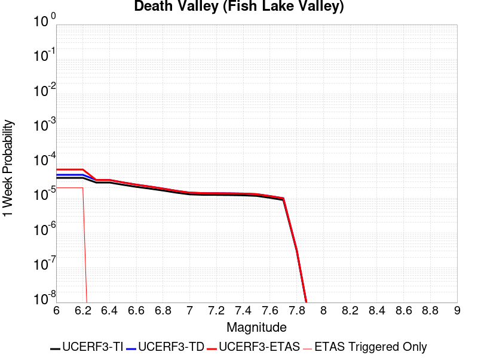 |  |  |  |

| Magnitude | 1 wk TI Prob | 1 wk TD Prob | 1 wk ETAS Prob | 1 wk ETAS/TD Gain | 1 wk ETAS Triggered Only | 1 mo TI Prob | 1 mo TD Prob | 1 mo ETAS Prob | 1 mo ETAS/TD Gain | 1 mo ETAS Triggered Only | 1 yr TI Prob | 1 yr TD Prob | 1 yr ETAS Prob | 1 yr ETAS/TD Gain | 1 yr ETAS Triggered Only | 10 yr TI Prob | 10 yr TD Prob | 10 yr ETAS Prob | 10 yr ETAS/TD Gain | 10 yr ETAS Triggered Only |
|-----|-----|-----|-----|-----|-----|-----|-----|-----|-----|-----|-----|-----|-----|-----|-----|-----|-----|-----|-----|-----|
| 6.0 | 3.872328E-5 | 4.7265417E-5 | 6.7264475E-5 | 1.4231224 | 2.0E-5 | 1.6594635E-4 | 2.0255202E-4 | 2.3254595E-4 | 1.1480801 | 3.0E-5 | 0.0020185246 | 0.002463546 | 0.0025034475 | 1.0161967 | 4.0E-5 | 0.02000288 | 0.024388196 | 0.024446731 | 1.0024002 | 6.0E-5 |
| 6.1 | 3.872328E-5 | 4.7265417E-5 | 6.7264475E-5 | 1.4231224 | 2.0E-5 | 1.6594635E-4 | 2.0255202E-4 | 2.3254595E-4 | 1.1480801 | 3.0E-5 | 0.0020185246 | 0.002463546 | 0.0025034475 | 1.0161967 | 4.0E-5 | 0.02000288 | 0.024388196 | 0.024446731 | 1.0024002 | 6.0E-5 |
| 6.2 | 3.872328E-5 | 4.7265417E-5 | 6.7264475E-5 | 1.4231224 | 2.0E-5 | 1.6594635E-4 | 2.0255202E-4 | 2.3254595E-4 | 1.1480801 | 3.0E-5 | 0.0020185246 | 0.002463546 | 0.0025034475 | 1.0161967 | 4.0E-5 | 0.02000288 | 0.024388196 | 0.024446731 | 1.0024002 | 6.0E-5 |
| 6.3 | 2.8356371E-5 | 3.360962E-5 | 3.360962E-5 | 1.0 | 0.0 | 1.2152165E-4 | 1.4403371E-4 | 1.5403227E-4 | 1.0694182 | 1.0E-5 | 0.0014785219 | 0.00175227 | 0.001772235 | 1.0113938 | 2.0E-5 | 0.014687235 | 0.01739173 | 0.017431034 | 1.00226 | 4.0E-5 |
| 6.4 | 2.8356371E-5 | 3.360962E-5 | 3.360962E-5 | 1.0 | 0.0 | 1.2152165E-4 | 1.4403371E-4 | 1.5403227E-4 | 1.0694182 | 1.0E-5 | 0.0014785219 | 0.00175227 | 0.001772235 | 1.0113938 | 2.0E-5 | 0.014687235 | 0.01739173 | 0.017431034 | 1.00226 | 4.0E-5 |
| 6.5 | 2.4448687E-5 | 2.8607454E-5 | 2.8607454E-5 | 1.0 | 0.0 | 1.0477588E-4 | 1.2259788E-4 | 1.3259666E-4 | 1.0815575 | 1.0E-5 | 0.0012748998 | 0.0014916548 | 0.001511625 | 1.0133879 | 2.0E-5 | 0.012676105 | 0.014821324 | 0.014860732 | 1.0026588 | 4.0E-5 |
| 6.6 | 2.1298161E-5 | 2.465998E-5 | 2.465998E-5 | 1.0 | 0.0 | 9.127464E-5 | 1.05681516E-4 | 1.15680465E-4 | 1.0946139 | 1.0E-5 | 0.0011107022 | 0.0012859458 | 0.0013059201 | 1.0155327 | 2.0E-5 | 0.011051672 | 0.012788476 | 0.0128279645 | 1.0030878 | 4.0E-5 |
| 6.7 | 1.8959729E-5 | 2.178094E-5 | 2.178094E-5 | 1.0 | 0.0 | 8.125345E-5 | 9.334368E-5 | 1.03342754E-4 | 1.107121 | 1.0E-5 | 9.888117E-4 | 0.0011358925 | 0.0011558697 | 1.0175873 | 2.0E-5 | 0.009844234 | 0.011303525 | 0.011343073 | 1.0034987 | 4.0E-5 |
| 6.8 | 1.6691629E-5 | 1.901828E-5 | 1.901828E-5 | 1.0 | 0.0 | 7.153359E-5 | 8.150446E-5 | 9.150365E-5 | 1.1226827 | 1.0E-5 | 8.7057345E-4 | 9.918819E-4 | 0.0010118622 | 1.0201437 | 2.0E-5 | 0.008671708 | 0.009876307 | 0.009915912 | 1.0040101 | 4.0E-5 |
| 6.9 | 1.450505E-5 | 1.6389482E-5 | 1.6389482E-5 | 1.0 | 0.0 | 6.216302E-5 | 7.02388E-5 | 8.02381E-5 | 1.1423614 | 1.0E-5 | 7.5657194E-4 | 8.5483067E-4 | 8.7481353E-4 | 1.0233765 | 2.0E-5 | 0.007540013 | 0.008516356 | 0.008556016 | 1.0046568 | 4.0E-5 |
| 7.0 | 1.2940855E-5 | 1.4537924E-5 | 1.4537924E-5 | 1.0 | 0.0 | 5.545963E-5 | 6.230393E-5 | 7.230331E-5 | 1.1604935 | 1.0E-5 | 6.750118E-4 | 7.5829215E-4 | 7.78277E-4 | 1.026355 | 2.0E-5 | 0.006729651 | 0.007557665 | 0.0075973626 | 1.0052526 | 4.0E-5 |
| 7.1 | 1.2544658E-5 | 1.4078161E-5 | 1.4078161E-5 | 1.0 | 0.0 | 5.3761712E-5 | 6.0333616E-5 | 7.033301E-5 | 1.1657351 | 1.0E-5 | 6.5435225E-4 | 7.343198E-4 | 7.543051E-4 | 1.0272161 | 2.0E-5 | 0.006524288 | 0.007319527 | 0.007359234 | 1.0054249 | 4.0E-5 |
| 7.2 | 1.2489416E-5 | 1.4015628E-5 | 1.4015628E-5 | 1.0 | 0.0 | 5.3524967E-5 | 6.0065628E-5 | 7.006503E-5 | 1.1664746 | 1.0E-5 | 6.514716E-4 | 7.3105923E-4 | 7.510446E-4 | 1.0273376 | 2.0E-5 | 0.006495651 | 0.007287136 | 0.0073268446 | 1.0054492 | 4.0E-5 |
| 7.3 | 1.2368307E-5 | 1.3879767E-5 | 1.3879767E-5 | 1.0 | 0.0 | 5.3005948E-5 | 5.948339E-5 | 6.94828E-5 | 1.1681042 | 1.0E-5 | 6.451563E-4 | 7.2397524E-4 | 7.439608E-4 | 1.0276053 | 2.0E-5 | 0.0064328653 | 0.0072167586 | 0.0072564697 | 1.0055027 | 4.0E-5 |
| 7.4 | 1.2161707E-5 | 1.3647823E-5 | 1.3647823E-5 | 1.0 | 0.0 | 5.212056E-5 | 5.8489393E-5 | 6.848881E-5 | 1.1709611 | 1.0E-5 | 6.3438306E-4 | 7.1188126E-4 | 7.3186704E-4 | 1.0280746 | 2.0E-5 | 0.006325751 | 0.0070965975 | 0.0071363137 | 1.0055965 | 4.0E-5 |
| 7.5 | 1.1707948E-5 | 1.3145472E-5 | 1.3145472E-5 | 1.0 | 0.0 | 5.0175953E-5 | 5.633655E-5 | 6.633599E-5 | 1.1774946 | 1.0E-5 | 6.10721E-4 | 6.8568724E-4 | 7.0567353E-4 | 1.0291479 | 2.0E-5 | 0.0060904534 | 0.006836299 | 0.0068760253 | 1.0058111 | 4.0E-5 |
| 7.6 | 1.0319538E-5 | 1.1579585E-5 | 1.1579585E-5 | 1.0 | 0.0 | 4.4225842E-5 | 4.9625876E-5 | 5.962538E-5 | 1.2014978 | 1.0E-5 | 5.383166E-4 | 6.040327E-4 | 6.2402064E-4 | 1.0330908 | 2.0E-5 | 0.0053701443 | 0.0060244408 | 0.0060642 | 1.0065997 | 4.0E-5 |
| 7.7 | 8.937764E-6 | 1.0022746E-5 | 1.0022746E-5 | 1.0 | 0.0 | 3.830414E-5 | 4.295395E-5 | 5.295352E-5 | 1.2327975 | 1.0E-5 | 4.6625308E-4 | 5.228439E-4 | 5.428334E-4 | 1.0382323 | 2.0E-5 | 0.0046527605 | 0.0052166474 | 0.0052564386 | 1.0076277 | 4.0E-5 |
| 7.8 | 3.108007E-7 | 3.284649E-7 | 3.284649E-7 | 1.0 | 0.0 | 1.3320023E-6 | 1.407706E-6 | 1.407706E-6 | 1.0 | 0.0 | 1.6217007E-5 | 1.713869E-5 | 1.713869E-5 | 1.0 | 0.0 | 1.6215823E-4 | 1.7137405E-4 | 1.7137405E-4 | 1.0 | 0.0 |
| 7.9 | 2.5591178E-9 | 2.6696687E-9 | 2.6696687E-9 | 1.0 | 0.0 | 1.0967647E-8 | 1.1441437E-8 | 1.1441437E-8 | 1.0 | 0.0 | 1.335311E-7 | 1.392995E-7 | 1.392995E-7 | 1.0 | 0.0 | 1.3353102E-6 | 1.3929949E-6 | 1.3929949E-6 | 1.0 | 0.0 |

## Pinto Mtn
*[(top)](#table-of-contents)*

| 1 Week | 1 Month | 1 Year | 10 Year |
|-----|-----|-----|-----|
| 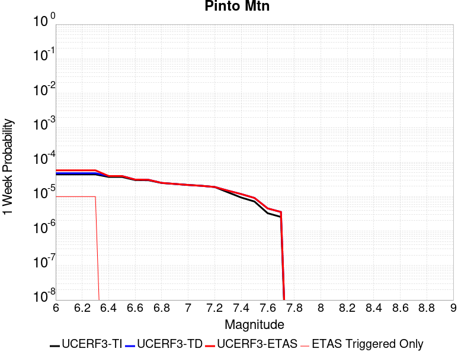 |  | 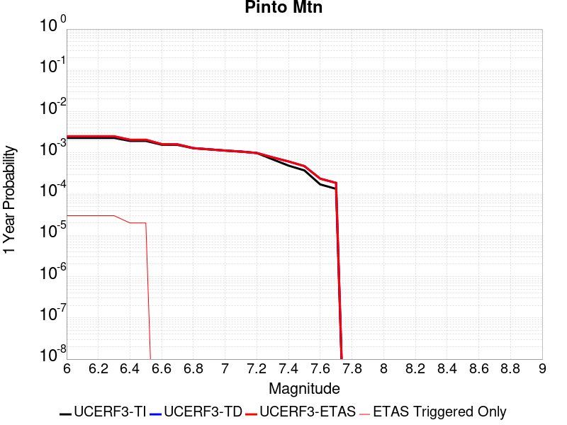 |  |

| Magnitude | 1 wk TI Prob | 1 wk TD Prob | 1 wk ETAS Prob | 1 wk ETAS/TD Gain | 1 wk ETAS Triggered Only | 1 mo TI Prob | 1 mo TD Prob | 1 mo ETAS Prob | 1 mo ETAS/TD Gain | 1 mo ETAS Triggered Only | 1 yr TI Prob | 1 yr TD Prob | 1 yr ETAS Prob | 1 yr ETAS/TD Gain | 1 yr ETAS Triggered Only | 10 yr TI Prob | 10 yr TD Prob | 10 yr ETAS Prob | 10 yr ETAS/TD Gain | 10 yr ETAS Triggered Only |
|-----|-----|-----|-----|-----|-----|-----|-----|-----|-----|-----|-----|-----|-----|-----|-----|-----|-----|-----|-----|-----|
| 6.0 | 4.4194956E-5 | 4.78536E-5 | 5.785312E-5 | 1.2089607 | 1.0E-5 | 1.893932E-4 | 2.0507166E-4 | 2.2506755E-4 | 1.0975069 | 2.0E-5 | 0.0023034236 | 0.0024940518 | 0.002523977 | 1.0119987 | 3.0E-5 | 0.022796938 | 0.024678139 | 0.024726905 | 1.0019761 | 5.0E-5 |
| 6.1 | 4.4194956E-5 | 4.78536E-5 | 5.785312E-5 | 1.2089607 | 1.0E-5 | 1.893932E-4 | 2.0507166E-4 | 2.2506755E-4 | 1.0975069 | 2.0E-5 | 0.0023034236 | 0.0024940518 | 0.002523977 | 1.0119987 | 3.0E-5 | 0.022796938 | 0.024678139 | 0.024726905 | 1.0019761 | 5.0E-5 |
| 6.2 | 4.4194956E-5 | 4.78536E-5 | 5.785312E-5 | 1.2089607 | 1.0E-5 | 1.893932E-4 | 2.0507166E-4 | 2.2506755E-4 | 1.0975069 | 2.0E-5 | 0.0023034236 | 0.0024940518 | 0.002523977 | 1.0119987 | 3.0E-5 | 0.022796938 | 0.024678139 | 0.024726905 | 1.0019761 | 5.0E-5 |
| 6.3 | 4.4194956E-5 | 4.78536E-5 | 5.785312E-5 | 1.2089607 | 1.0E-5 | 1.893932E-4 | 2.0507166E-4 | 2.2506755E-4 | 1.0975069 | 2.0E-5 | 0.0023034236 | 0.0024940518 | 0.002523977 | 1.0119987 | 3.0E-5 | 0.022796938 | 0.024678139 | 0.024726905 | 1.0019761 | 5.0E-5 |
| 6.4 | 3.729929E-5 | 3.960321E-5 | 3.960321E-5 | 1.0 | 0.0 | 1.5984432E-4 | 1.6971752E-4 | 1.7971582E-4 | 1.0589114 | 1.0E-5 | 0.0019443673 | 0.0020644458 | 0.0020844045 | 1.0096679 | 2.0E-5 | 0.019274427 | 0.020462705 | 0.020501886 | 1.0019147 | 4.0E-5 |
| 6.5 | 3.729929E-5 | 3.960321E-5 | 3.960321E-5 | 1.0 | 0.0 | 1.5984432E-4 | 1.6971752E-4 | 1.7971582E-4 | 1.0589114 | 1.0E-5 | 0.0019443673 | 0.0020644458 | 0.0020844045 | 1.0096679 | 2.0E-5 | 0.019274427 | 0.020462705 | 0.020501886 | 1.0019147 | 4.0E-5 |
| 6.6 | 3.0204548E-5 | 3.120536E-5 | 3.120536E-5 | 1.0 | 0.0 | 1.2944164E-4 | 1.337306E-4 | 1.337306E-4 | 1.0 | 0.0 | 0.0015748127 | 0.0016269886 | 0.0016269886 | 1.0 | 0.0 | 0.015636992 | 0.016154641 | 0.01616448 | 1.000609 | 1.0E-5 |
| 6.7 | 2.9857754E-5 | 3.0814746E-5 | 3.0814746E-5 | 1.0 | 0.0 | 1.2795553E-4 | 1.3205671E-4 | 1.3205671E-4 | 1.0 | 0.0 | 0.0015567453 | 0.0016066392 | 0.0016066392 | 1.0 | 0.0 | 0.015458848 | 0.015954081 | 0.015963921 | 1.0006168 | 1.0E-5 |
| 6.8 | 2.4819734E-5 | 2.500945E-5 | 2.500945E-5 | 1.0 | 0.0 | 1.0636595E-4 | 1.07179076E-4 | 1.07179076E-4 | 1.0 | 0.0 | 0.0012942362 | 0.0013041458 | 0.0013041458 | 1.0 | 0.0 | 0.012867244 | 0.012967292 | 0.012977162 | 1.0007612 | 1.0E-5 |
| 6.9 | 2.331124E-5 | 2.3337734E-5 | 2.3337734E-5 | 1.0 | 0.0 | 9.990149E-5 | 1.00015146E-4 | 1.00015146E-4 | 1.0 | 0.0 | 0.001215622 | 0.0012170245 | 0.0012170245 | 1.0 | 0.0 | 0.012089936 | 0.012105788 | 0.012115668 | 1.0008161 | 1.0E-5 |
| 7.0 | 2.1818534E-5 | 2.1760867E-5 | 2.1760867E-5 | 1.0 | 0.0 | 9.3504656E-5 | 9.325764E-5 | 9.325764E-5 | 1.0 | 0.0 | 0.0011378246 | 0.0011348402 | 0.0011348402 | 1.0 | 0.0 | 0.011320163 | 0.011292553 | 0.0113024395 | 1.0008756 | 1.0E-5 |
| 7.1 | 2.066081E-5 | 2.0540516E-5 | 2.0540516E-5 | 1.0 | 0.0 | 8.854332E-5 | 8.8027926E-5 | 8.8027926E-5 | 1.0 | 0.0 | 0.0010774818 | 0.0010712326 | 0.0010712326 | 1.0 | 0.0 | 0.010722724 | 0.010662739 | 0.010672633 | 1.0009278 | 1.0E-5 |
| 7.2 | 1.8990233E-5 | 1.9053807E-5 | 1.9053807E-5 | 1.0 | 0.0 | 8.138417E-5 | 8.165672E-5 | 8.165672E-5 | 1.0 | 0.0 | 9.904018E-4 | 9.937364E-4 | 9.937364E-4 | 1.0 | 0.0 | 0.009859995 | 0.009894928 | 0.009904829 | 1.0010006 | 1.0E-5 |
| 7.3 | 1.3335872E-5 | 1.490653E-5 | 1.490653E-5 | 1.0 | 0.0 | 5.7152483E-5 | 6.3883635E-5 | 6.3883635E-5 | 1.0 | 0.0 | 6.956093E-4 | 7.775185E-4 | 7.775185E-4 | 1.0 | 0.0 | 0.006934359 | 0.0077492814 | 0.0077592037 | 1.0012804 | 1.0E-5 |
| 7.4 | 9.414066E-6 | 1.1860794E-5 | 1.1860794E-5 | 1.0 | 0.0 | 4.0345374E-5 | 5.0831037E-5 | 5.0831037E-5 | 1.0 | 0.0 | 4.910942E-4 | 6.1870157E-4 | 6.1870157E-4 | 1.0 | 0.0 | 0.0049001034 | 0.0061707394 | 0.0061806776 | 1.0016105 | 1.0E-5 |
| 7.5 | 7.2101157E-6 | 9.158034E-6 | 9.158034E-6 | 1.0 | 0.0 | 3.090013E-5 | 3.924817E-5 | 3.924817E-5 | 1.0 | 0.0 | 3.7614413E-4 | 4.7774953E-4 | 4.7774953E-4 | 1.0 | 0.0 | 0.0037550807 | 0.004768 | 0.004777952 | 1.0020874 | 1.0E-5 |
| 7.6 | 3.296375E-6 | 4.5453544E-6 | 4.5453544E-6 | 1.0 | 0.0 | 1.4127245E-5 | 1.9479952E-5 | 1.9479952E-5 | 1.0 | 0.0 | 1.7198564E-4 | 2.37144E-4 | 2.37144E-4 | 1.0 | 0.0 | 0.0017185259 | 0.0023690467 | 0.0023690467 | 1.0 | 0.0 |
| 7.7 | 2.5741092E-6 | 3.584271E-6 | 3.584271E-6 | 1.0 | 0.0 | 1.103185E-5 | 1.5361078E-5 | 1.5361078E-5 | 1.0 | 0.0 | 1.3430449E-4 | 1.870064E-4 | 1.870064E-4 | 1.0 | 0.0 | 0.0013422335 | 0.0018686203 | 0.0018686203 | 1.0 | 0.0 |

## Lake Isabella (Seismicity)
*[(top)](#table-of-contents)*

| 1 Week | 1 Month | 1 Year | 10 Year |
|-----|-----|-----|-----|
|  |  |  | 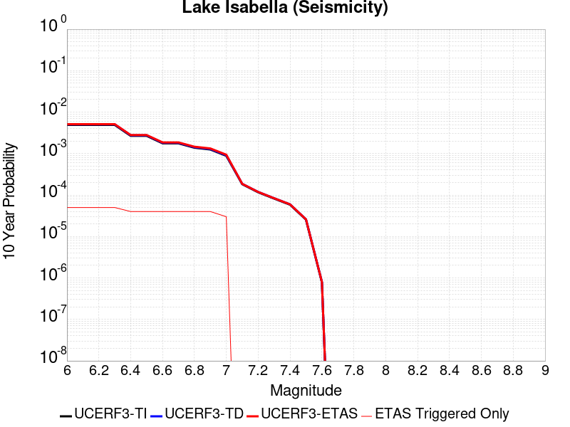 |

| Magnitude | 1 wk TI Prob | 1 wk TD Prob | 1 wk ETAS Prob | 1 wk ETAS/TD Gain | 1 wk ETAS Triggered Only | 1 mo TI Prob | 1 mo TD Prob | 1 mo ETAS Prob | 1 mo ETAS/TD Gain | 1 mo ETAS Triggered Only | 1 yr TI Prob | 1 yr TD Prob | 1 yr ETAS Prob | 1 yr ETAS/TD Gain | 1 yr ETAS Triggered Only | 10 yr TI Prob | 10 yr TD Prob | 10 yr ETAS Prob | 10 yr ETAS/TD Gain | 10 yr ETAS Triggered Only |
|-----|-----|-----|-----|-----|-----|-----|-----|-----|-----|-----|-----|-----|-----|-----|-----|-----|-----|-----|-----|-----|
| 6.0 | 9.431637E-6 | 9.741643E-6 | 2.9741448E-5 | 3.0530217 | 2.0E-5 | 4.0420677E-5 | 4.1749303E-5 | 6.174847E-5 | 1.4790299 | 2.0E-5 | 4.920106E-4 | 5.081923E-4 | 5.581669E-4 | 1.098338 | 5.0E-5 | 0.004909227 | 0.0050715944 | 0.005121341 | 1.0098088 | 5.0E-5 |
| 6.1 | 9.431637E-6 | 9.741643E-6 | 2.9741448E-5 | 3.0530217 | 2.0E-5 | 4.0420677E-5 | 4.1749303E-5 | 6.174847E-5 | 1.4790299 | 2.0E-5 | 4.920106E-4 | 5.081923E-4 | 5.581669E-4 | 1.098338 | 5.0E-5 | 0.004909227 | 0.0050715944 | 0.005121341 | 1.0098088 | 5.0E-5 |
| 6.2 | 9.431637E-6 | 9.741643E-6 | 2.9741448E-5 | 3.0530217 | 2.0E-5 | 4.0420677E-5 | 4.1749303E-5 | 6.174847E-5 | 1.4790299 | 2.0E-5 | 4.920106E-4 | 5.081923E-4 | 5.581669E-4 | 1.098338 | 5.0E-5 | 0.004909227 | 0.0050715944 | 0.005121341 | 1.0098088 | 5.0E-5 |
| 6.3 | 9.431637E-6 | 9.741643E-6 | 2.9741448E-5 | 3.0530217 | 2.0E-5 | 4.0420677E-5 | 4.1749303E-5 | 6.174847E-5 | 1.4790299 | 2.0E-5 | 4.920106E-4 | 5.081923E-4 | 5.581669E-4 | 1.098338 | 5.0E-5 | 0.004909227 | 0.0050715944 | 0.005121341 | 1.0098088 | 5.0E-5 |
| 6.4 | 5.144063E-6 | 5.3000717E-6 | 2.5299965E-5 | 4.773514 | 2.0E-5 | 2.2045799E-5 | 2.2714416E-5 | 4.271396E-5 | 1.8804781 | 2.0E-5 | 2.6837454E-4 | 2.7651637E-4 | 3.165053E-4 | 1.1446168 | 4.0E-5 | 0.0026805066 | 0.0027620634 | 0.002801953 | 1.014442 | 4.0E-5 |
| 6.5 | 5.144063E-6 | 5.3000717E-6 | 2.5299965E-5 | 4.773514 | 2.0E-5 | 2.2045799E-5 | 2.2714416E-5 | 4.271396E-5 | 1.8804781 | 2.0E-5 | 2.6837454E-4 | 2.7651637E-4 | 3.165053E-4 | 1.1446168 | 4.0E-5 | 0.0026805066 | 0.0027620634 | 0.002801953 | 1.014442 | 4.0E-5 |
| 6.6 | 3.4009804E-6 | 3.4987834E-6 | 2.3498713E-5 | 6.716253 | 2.0E-5 | 1.4575549E-5 | 1.4994709E-5 | 3.499441E-5 | 2.3337839 | 2.0E-5 | 1.7744285E-4 | 1.825469E-4 | 2.2253959E-4 | 1.2190818 | 4.0E-5 | 0.0017730123 | 0.0018241272 | 0.0018640542 | 1.0218883 | 4.0E-5 |
| 6.7 | 3.3880428E-6 | 3.48565E-6 | 2.348558E-5 | 6.7377906 | 2.0E-5 | 1.4520103E-5 | 1.4938424E-5 | 3.4938126E-5 | 2.3388093 | 2.0E-5 | 1.767679E-4 | 1.8186173E-4 | 2.2185445E-4 | 1.2199073 | 4.0E-5 | 0.0017662736 | 0.0018172868 | 0.0018572141 | 1.0219709 | 4.0E-5 |
| 6.8 | 2.6582E-6 | 2.733698E-6 | 2.2733644E-5 | 8.316077 | 2.0E-5 | 1.1392236E-5 | 1.1715804E-5 | 3.171557E-5 | 2.7070758 | 2.0E-5 | 1.3869164E-4 | 1.4263192E-4 | 1.8262622E-4 | 1.2804022 | 4.0E-5 | 0.0013860512 | 0.0014255359 | 0.0014654788 | 1.0280197 | 4.0E-5 |
| 6.9 | 2.406011E-6 | 2.474327E-6 | 2.2474278E-5 | 9.082986 | 2.0E-5 | 1.0311434E-5 | 1.0604223E-5 | 3.060401E-5 | 2.8860211 | 2.0E-5 | 1.2553448E-4 | 1.2910008E-4 | 1.6909491E-4 | 1.3097972 | 4.0E-5 | 0.0012546359 | 0.0012903805 | 0.0013303289 | 1.0309587 | 4.0E-5 |
| 7.0 | 1.6953097E-6 | 1.7429359E-6 | 2.17429E-5 | 12.474872 | 2.0E-5 | 7.265593E-6 | 7.4697095E-6 | 2.746956E-5 | 3.6774602 | 2.0E-5 | 8.8455E-5 | 9.0940965E-5 | 1.2093824E-4 | 1.3298544 | 3.0E-5 | 8.84198E-4 | 9.091403E-4 | 9.39113E-4 | 1.0329682 | 3.0E-5 |
| 7.1 | 3.5013824E-7 | 3.5714805E-7 | 3.5714805E-7 | 1.0 | 0.0 | 1.5005916E-6 | 1.5306335E-6 | 1.5306335E-6 | 1.0 | 0.0 | 1.826955E-5 | 1.8635306E-5 | 1.8635306E-5 | 1.0 | 0.0 | 1.8268047E-4 | 1.863377E-4 | 1.863377E-4 | 1.0 | 0.0 |
| 7.2 | 2.2321095E-7 | 2.2750562E-7 | 2.2750562E-7 | 1.0 | 0.0 | 9.56618E-7 | 9.750237E-7 | 9.750237E-7 | 1.0 | 0.0 | 1.1646762E-5 | 1.187085E-5 | 1.187085E-5 | 1.0 | 0.0 | 1.1646151E-4 | 1.18702264E-4 | 1.18702264E-4 | 1.0 | 0.0 |
| 7.3 | 1.5760406E-7 | 1.6060915E-7 | 1.6060915E-7 | 1.0 | 0.0 | 6.7544585E-7 | 6.883247E-7 | 6.883247E-7 | 1.0 | 0.0 | 8.223522E-6 | 8.380322E-6 | 8.380322E-6 | 1.0 | 0.0 | 8.2232174E-5 | 8.380012E-5 | 8.380012E-5 | 1.0 | 0.0 |
| 7.4 | 1.1216497E-7 | 1.14317004E-7 | 1.14317004E-7 | 1.0 | 0.0 | 4.8070694E-7 | 4.899299E-7 | 4.899299E-7 | 1.0 | 0.0 | 5.852591E-6 | 5.964881E-6 | 5.964881E-6 | 1.0 | 0.0 | 5.8524372E-5 | 5.9647253E-5 | 5.9647253E-5 | 1.0 | 0.0 |
| 7.5 | 4.885185E-8 | 4.978771E-8 | 4.978771E-8 | 1.0 | 0.0 | 2.0936506E-7 | 2.133759E-7 | 2.133759E-7 | 1.0 | 0.0 | 2.5490165E-6 | 2.5978486E-6 | 2.5978486E-6 | 1.0 | 0.0 | 2.5489873E-5 | 2.5978201E-5 | 2.5978201E-5 | 1.0 | 0.0 |
| 7.6 | 1.504641E-9 | 1.5317896E-9 | 1.5317896E-9 | 1.0 | 0.0 | 6.4484613E-9 | 6.5648122E-9 | 6.5648122E-9 | 1.0 | 0.0 | 7.851001E-8 | 7.992659E-8 | 7.992659E-8 | 1.0 | 0.0 | 7.8509987E-7 | 7.992659E-7 | 7.992659E-7 | 1.0 | 0.0 |

## Santa Ynez (West)
*[(top)](#table-of-contents)*

| 1 Week | 1 Month | 1 Year | 10 Year |
|-----|-----|-----|-----|
|  | 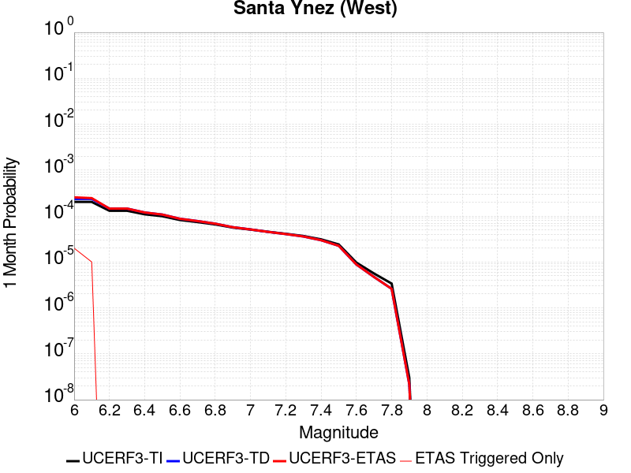 |  | 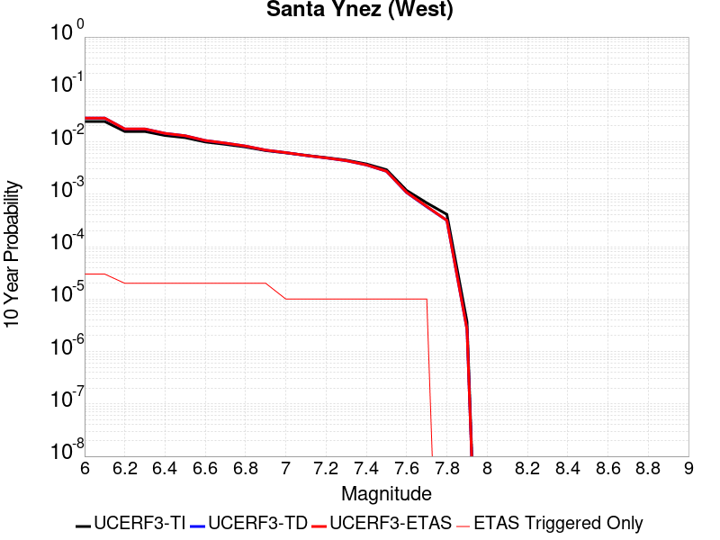 |

| Magnitude | 1 wk TI Prob | 1 wk TD Prob | 1 wk ETAS Prob | 1 wk ETAS/TD Gain | 1 wk ETAS Triggered Only | 1 mo TI Prob | 1 mo TD Prob | 1 mo ETAS Prob | 1 mo ETAS/TD Gain | 1 mo ETAS Triggered Only | 1 yr TI Prob | 1 yr TD Prob | 1 yr ETAS Prob | 1 yr ETAS/TD Gain | 1 yr ETAS Triggered Only | 10 yr TI Prob | 10 yr TD Prob | 10 yr ETAS Prob | 10 yr ETAS/TD Gain | 10 yr ETAS Triggered Only |
|-----|-----|-----|-----|-----|-----|-----|-----|-----|-----|-----|-----|-----|-----|-----|-----|-----|-----|-----|-----|-----|
| 6.0 | 4.7352758E-5 | 5.497057E-5 | 7.496947E-5 | 1.363811 | 2.0E-5 | 2.0292461E-4 | 2.3556853E-4 | 2.5556382E-4 | 1.084881 | 2.0E-5 | 0.0024678076 | 0.002864544 | 0.0028844867 | 1.006962 | 2.0E-5 | 0.024405818 | 0.02830432 | 0.028333472 | 1.00103 | 3.0E-5 |
| 6.1 | 4.7352758E-5 | 5.497057E-5 | 6.4970016E-5 | 1.1819055 | 1.0E-5 | 2.0292461E-4 | 2.3556853E-4 | 2.4556616E-4 | 1.0424405 | 1.0E-5 | 0.0024678076 | 0.002864544 | 0.0028844867 | 1.006962 | 2.0E-5 | 0.024405818 | 0.02830432 | 0.028333472 | 1.00103 | 3.0E-5 |
| 6.2 | 3.0415853E-5 | 3.3924873E-5 | 3.3924873E-5 | 1.0 | 0.0 | 1.3034715E-4 | 1.453844E-4 | 1.453844E-4 | 1.0 | 0.0 | 0.0015858212 | 0.0017686523 | 0.0017786347 | 1.005644 | 1.0E-5 | 0.015745522 | 0.017549712 | 0.017569361 | 1.0011196 | 2.0E-5 |
| 6.3 | 3.0415853E-5 | 3.3924873E-5 | 3.3924873E-5 | 1.0 | 0.0 | 1.3034715E-4 | 1.453844E-4 | 1.453844E-4 | 1.0 | 0.0 | 0.0015858212 | 0.0017686523 | 0.0017786347 | 1.005644 | 1.0E-5 | 0.015745522 | 0.017549712 | 0.017569361 | 1.0011196 | 2.0E-5 |
| 6.4 | 2.5452082E-5 | 2.7912221E-5 | 2.7912221E-5 | 1.0 | 0.0 | 1.09075794E-4 | 1.1961844E-4 | 1.1961844E-4 | 1.0 | 0.0 | 0.0013271887 | 0.0014554005 | 0.001465386 | 1.006861 | 1.0E-5 | 0.013192902 | 0.01446086 | 0.014480571 | 1.001363 | 2.0E-5 |
| 6.5 | 2.3143784E-5 | 2.512805E-5 | 2.512805E-5 | 1.0 | 0.0 | 9.9183875E-5 | 1.0768729E-4 | 1.0768729E-4 | 1.0 | 0.0 | 0.0012068948 | 0.0013103187 | 0.0013203056 | 1.0076218 | 1.0E-5 | 0.012003611 | 0.013027596 | 0.013047336 | 1.0015152 | 2.0E-5 |
| 6.6 | 1.9118515E-5 | 2.0354188E-5 | 2.0354188E-5 | 1.0 | 0.0 | 8.193392E-5 | 8.722936E-5 | 8.722936E-5 | 1.0 | 0.0 | 9.97089E-4 | 0.001061508 | 0.0010714973 | 1.0094106 | 1.0E-5 | 0.00992627 | 0.010565287 | 0.010585076 | 1.001873 | 2.0E-5 |
| 6.7 | 1.722807E-5 | 1.8146206E-5 | 1.8146206E-5 | 1.0 | 0.0 | 7.3832496E-5 | 7.776717E-5 | 7.776717E-5 | 1.0 | 0.0 | 8.985399E-4 | 9.4640953E-4 | 9.5640006E-4 | 1.0105562 | 1.0E-5 | 0.008949154 | 0.009424437 | 0.009444248 | 1.0021021 | 2.0E-5 |
| 6.8 | 1.5317364E-5 | 1.5926353E-5 | 1.5926353E-5 | 1.0 | 0.0 | 6.56442E-5 | 6.8254034E-5 | 6.8254034E-5 | 1.0 | 0.0 | 7.98925E-4 | 8.3068036E-4 | 8.4067206E-4 | 1.0120283 | 1.0E-5 | 0.007960589 | 0.008276241 | 0.008296076 | 1.0023966 | 2.0E-5 |
| 6.9 | 1.3071226E-5 | 1.33295025E-5 | 1.33295025E-5 | 1.0 | 0.0 | 5.6018336E-5 | 5.7125202E-5 | 5.7125202E-5 | 1.0 | 0.0 | 6.8180985E-4 | 6.952797E-4 | 7.052727E-4 | 1.0143727 | 1.0E-5 | 0.0067972173 | 0.0069313045 | 0.006951166 | 1.0028654 | 2.0E-5 |
| 7.0 | 1.1836986E-5 | 1.1932665E-5 | 1.1932665E-5 | 1.0 | 0.0 | 5.0728955E-5 | 5.1139003E-5 | 5.1139003E-5 | 1.0 | 0.0 | 6.1745E-4 | 6.224412E-4 | 6.324349E-4 | 1.0160558 | 1.0E-5 | 0.006157372 | 0.006207171 | 0.0062171086 | 1.001601 | 1.0E-5 |
| 7.1 | 1.0597169E-5 | 1.05420895E-5 | 1.05420895E-5 | 1.0 | 0.0 | 4.541565E-5 | 4.5179608E-5 | 4.5179608E-5 | 1.0 | 0.0 | 5.5279525E-4 | 5.4992404E-4 | 5.599185E-4 | 1.0181743 | 1.0E-5 | 0.0055142213 | 0.005485763 | 0.005495708 | 1.0018129 | 1.0E-5 |
| 7.2 | 9.59113E-6 | 9.459034E-6 | 9.459034E-6 | 1.0 | 0.0 | 4.11042E-5 | 4.0538096E-5 | 4.0538096E-5 | 1.0 | 0.0 | 5.0032866E-4 | 4.934406E-4 | 5.034357E-4 | 1.0202558 | 1.0E-5 | 0.004992037 | 0.0049235686 | 0.0049335193 | 1.0020211 | 1.0E-5 |
| 7.3 | 8.586084E-6 | 8.379476E-6 | 8.379476E-6 | 1.0 | 0.0 | 3.679698E-5 | 3.591155E-5 | 3.591155E-5 | 1.0 | 0.0 | 4.4791115E-4 | 4.3713645E-4 | 4.471321E-4 | 1.0228661 | 1.0E-5 | 0.004470094 | 0.004362877 | 0.0043728338 | 1.002282 | 1.0E-5 |
| 7.4 | 7.2622997E-6 | 6.9514385E-6 | 6.9514385E-6 | 1.0 | 0.0 | 3.112377E-5 | 2.9791545E-5 | 2.9791545E-5 | 1.0 | 0.0 | 3.78866E-4 | 3.6265264E-4 | 3.7264902E-4 | 1.0275646 | 1.0E-5 | 0.0037822074 | 0.0036207086 | 0.0036306726 | 1.002752 | 1.0E-5 |
| 7.5 | 5.627296E-6 | 5.2514924E-6 | 5.2514924E-6 | 1.0 | 0.0 | 2.411676E-5 | 2.2506205E-5 | 2.2506205E-5 | 1.0 | 0.0 | 2.9358198E-4 | 2.739793E-4 | 2.8397658E-4 | 1.0364891 | 1.0E-5 | 0.0029319443 | 0.0027364872 | 0.0027464598 | 1.0036443 | 1.0E-5 |
| 7.6 | 2.265244E-6 | 2.0608607E-6 | 2.0608607E-6 | 1.0 | 0.0 | 9.708152E-6 | 8.832231E-6 | 8.832231E-6 | 1.0 | 0.0 | 1.18190335E-4 | 1.07527194E-4 | 1.1752611E-4 | 1.0929897 | 1.0E-5 | 0.001181275 | 0.0010747602 | 0.0010847495 | 1.0092944 | 1.0E-5 |
| 7.7 | 1.3099874E-6 | 1.1016216E-6 | 1.1016216E-6 | 1.0 | 0.0 | 5.61422E-6 | 4.721227E-6 | 4.721227E-6 | 1.0 | 0.0 | 6.8350986E-5 | 5.7479447E-5 | 6.7478875E-5 | 1.1739652 | 1.0E-5 | 6.832996E-4 | 5.746482E-4 | 5.8464246E-4 | 1.0173919 | 1.0E-5 |
| 7.8 | 7.903951E-7 | 6.0710653E-7 | 6.0710653E-7 | 1.0 | 0.0 | 3.3874032E-6 | 2.6018827E-6 | 2.6018827E-6 | 1.0 | 0.0 | 4.1240855E-5 | 3.1677475E-5 | 3.1677475E-5 | 1.0 | 0.0 | 4.12332E-4 | 3.167309E-4 | 3.167309E-4 | 1.0 | 0.0 |
| 7.9 | 7.0753297E-9 | 5.0900173E-9 | 5.0900173E-9 | 1.0 | 0.0 | 3.032284E-8 | 2.181436E-8 | 2.181436E-8 | 1.0 | 0.0 | 3.6918053E-7 | 2.6558982E-7 | 2.6558982E-7 | 1.0 | 0.0 | 3.691799E-6 | 2.655896E-6 | 2.655896E-6 | 1.0 | 0.0 |

## Red Pass
*[(top)](#table-of-contents)*

| 1 Week | 1 Month | 1 Year | 10 Year |
|-----|-----|-----|-----|
|  | 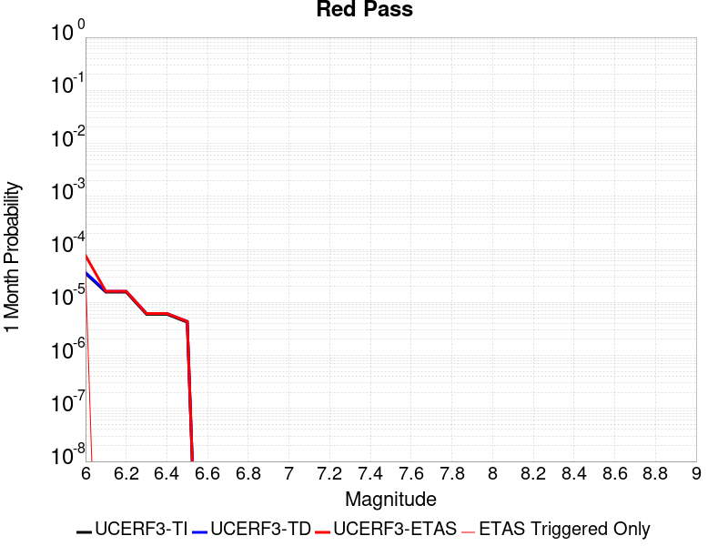 |  |  |

| Magnitude | 1 wk TI Prob | 1 wk TD Prob | 1 wk ETAS Prob | 1 wk ETAS/TD Gain | 1 wk ETAS Triggered Only | 1 mo TI Prob | 1 mo TD Prob | 1 mo ETAS Prob | 1 mo ETAS/TD Gain | 1 mo ETAS Triggered Only | 1 yr TI Prob | 1 yr TD Prob | 1 yr ETAS Prob | 1 yr ETAS/TD Gain | 1 yr ETAS Triggered Only | 10 yr TI Prob | 10 yr TD Prob | 10 yr ETAS Prob | 10 yr ETAS/TD Gain | 10 yr ETAS Triggered Only |
|-----|-----|-----|-----|-----|-----|-----|-----|-----|-----|-----|-----|-----|-----|-----|-----|-----|-----|-----|-----|-----|
| 6.0 | 8.258278E-6 | 8.5512565E-6 | 2.8551085E-5 | 3.3388176 | 2.0E-5 | 3.539214E-5 | 3.664783E-5 | 7.664636E-5 | 2.0914297 | 4.0E-5 | 4.308141E-4 | 4.4611385E-4 | 4.8609602E-4 | 1.0896232 | 4.0E-5 | 0.0042997985 | 0.004453941 | 0.004503718 | 1.011176 | 5.0E-5 |
| 6.1 | 3.649988E-6 | 3.7753127E-6 | 3.7753127E-6 | 1.0 | 0.0 | 1.5642712E-5 | 1.6179838E-5 | 1.6179838E-5 | 1.0 | 0.0 | 1.9043336E-4 | 1.9697649E-4 | 1.9697649E-4 | 1.0 | 0.0 | 0.0019027026 | 0.0019684862 | 0.0019784665 | 1.0050701 | 1.0E-5 |
| 6.2 | 3.649988E-6 | 3.7753127E-6 | 3.7753127E-6 | 1.0 | 0.0 | 1.5642712E-5 | 1.6179838E-5 | 1.6179838E-5 | 1.0 | 0.0 | 1.9043336E-4 | 1.9697649E-4 | 1.9697649E-4 | 1.0 | 0.0 | 0.0019027026 | 0.0019684862 | 0.0019784665 | 1.0050701 | 1.0E-5 |
| 6.3 | 1.3924937E-6 | 1.4411153E-6 | 1.4411153E-6 | 1.0 | 0.0 | 5.9678164E-6 | 6.1762016E-6 | 6.1762016E-6 | 1.0 | 0.0 | 7.265574E-5 | 7.5194075E-5 | 7.5194075E-5 | 1.0 | 0.0 | 7.263199E-4 | 7.518251E-4 | 7.518251E-4 | 1.0 | 0.0 |
| 6.4 | 1.3924937E-6 | 1.4411153E-6 | 1.4411153E-6 | 1.0 | 0.0 | 5.9678164E-6 | 6.1762016E-6 | 6.1762016E-6 | 1.0 | 0.0 | 7.265574E-5 | 7.5194075E-5 | 7.5194075E-5 | 1.0 | 0.0 | 7.263199E-4 | 7.518251E-4 | 7.518251E-4 | 1.0 | 0.0 |
| 6.5 | 9.876812E-7 | 1.0221903E-6 | 1.0221903E-6 | 1.0 | 0.0 | 4.2329125E-6 | 4.3808154E-6 | 4.3808154E-6 | 1.0 | 0.0 | 5.153449E-5 | 5.333643E-5 | 5.333643E-5 | 1.0 | 0.0 | 5.1522546E-4 | 5.3336425E-4 | 5.3336425E-4 | 1.0 | 0.0 |

## San Andreas (Cholame) rev
*[(top)](#table-of-contents)*

| 1 Week | 1 Month | 1 Year | 10 Year |
|-----|-----|-----|-----|
|  | 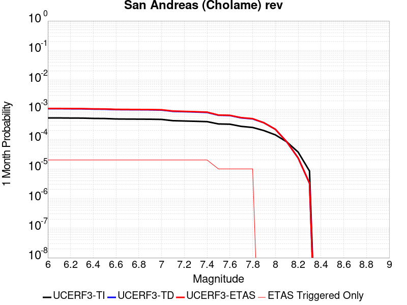 |  |  |

| Magnitude | 1 wk TI Prob | 1 wk TD Prob | 1 wk ETAS Prob | 1 wk ETAS/TD Gain | 1 wk ETAS Triggered Only | 1 mo TI Prob | 1 mo TD Prob | 1 mo ETAS Prob | 1 mo ETAS/TD Gain | 1 mo ETAS Triggered Only | 1 yr TI Prob | 1 yr TD Prob | 1 yr ETAS Prob | 1 yr ETAS/TD Gain | 1 yr ETAS Triggered Only | 10 yr TI Prob | 10 yr TD Prob | 10 yr ETAS Prob | 10 yr ETAS/TD Gain | 10 yr ETAS Triggered Only |
|-----|-----|-----|-----|-----|-----|-----|-----|-----|-----|-----|-----|-----|-----|-----|-----|-----|-----|-----|-----|-----|
| 6.0 | 1.2302514E-4 | 2.5203943E-4 | 2.720344E-4 | 1.0793327 | 2.0E-5 | 5.27144E-4 | 0.0010797235 | 0.001099702 | 1.0185033 | 2.0E-5 | 0.0063991086 | 0.0130669065 | 0.013106383 | 1.0030211 | 4.0E-5 | 0.06217949 | 0.124393165 | 0.12443695 | 1.0003519 | 5.0E-5 |
| 6.1 | 1.2302514E-4 | 2.5203943E-4 | 2.720344E-4 | 1.0793327 | 2.0E-5 | 5.27144E-4 | 0.0010797235 | 0.001099702 | 1.0185033 | 2.0E-5 | 0.0063991086 | 0.0130669065 | 0.013106383 | 1.0030211 | 4.0E-5 | 0.06217949 | 0.124393165 | 0.12443695 | 1.0003519 | 5.0E-5 |
| 6.2 | 1.2203569E-4 | 2.502073E-4 | 2.7020226E-4 | 1.0799137 | 2.0E-5 | 5.2290526E-4 | 0.0010718779 | 0.0010918564 | 1.0186388 | 2.0E-5 | 0.006347804 | 0.012972526 | 0.013012008 | 1.0030434 | 4.0E-5 | 0.061695136 | 0.12358037 | 0.12362419 | 1.0003546 | 5.0E-5 |
| 6.3 | 1.2142645E-4 | 2.4906697E-4 | 2.6906197E-4 | 1.0802797 | 2.0E-5 | 5.202953E-4 | 0.0010669949 | 0.0010869735 | 1.0187242 | 2.0E-5 | 0.006316212 | 0.012913782 | 0.012953266 | 1.0030575 | 4.0E-5 | 0.06139677 | 0.12307438 | 0.12311823 | 1.0003563 | 5.0E-5 |
| 6.4 | 1.1865206E-4 | 2.4412213E-4 | 2.6411726E-4 | 1.0819062 | 2.0E-5 | 5.0840975E-4 | 0.0010458198 | 0.0010657989 | 1.0191038 | 2.0E-5 | 0.006172335 | 0.0126589965 | 0.012688617 | 1.0023398 | 3.0E-5 | 0.060036868 | 0.120867655 | 0.12090282 | 1.000291 | 4.0E-5 |
| 6.5 | 1.17443946E-4 | 2.4205542E-4 | 2.620506E-4 | 1.0826057 | 2.0E-5 | 5.032341E-4 | 0.0010369696 | 0.0010569488 | 1.019267 | 2.0E-5 | 0.006109677 | 0.012552489 | 0.012582112 | 1.00236 | 3.0E-5 | 0.059444077 | 0.1199394 | 0.119974606 | 1.0002935 | 4.0E-5 |
| 6.6 | 1.13579066E-4 | 2.3514601E-4 | 2.5514132E-4 | 1.0850335 | 2.0E-5 | 4.866766E-4 | 0.0010073809 | 0.0010273608 | 1.0198334 | 2.0E-5 | 0.0059092017 | 0.012196333 | 0.012225967 | 1.0024297 | 3.0E-5 | 0.057545185 | 0.1168523 | 0.11688763 | 1.0003023 | 4.0E-5 |
| 6.7 | 1.1271412E-4 | 2.335892E-4 | 2.5358453E-4 | 1.0856004 | 2.0E-5 | 4.829711E-4 | 0.001000714 | 0.001020694 | 1.0199658 | 2.0E-5 | 0.005864331 | 0.012116069 | 0.0121457055 | 1.002446 | 3.0E-5 | 0.057119697 | 0.116155826 | 0.11619118 | 1.0003043 | 4.0E-5 |
| 6.8 | 1.1217975E-4 | 2.3247355E-4 | 2.5246892E-4 | 1.0860113 | 2.0E-5 | 4.8068175E-4 | 9.959363E-4 | 0.0010159165 | 1.0200616 | 2.0E-5 | 0.005836608 | 0.012058547 | 0.012088185 | 1.0024579 | 3.0E-5 | 0.056856725 | 0.11565359 | 0.11568896 | 1.0003059 | 4.0E-5 |
| 6.9 | 1.1146753E-4 | 2.3096106E-4 | 2.5095645E-4 | 1.0865747 | 2.0E-5 | 4.7763053E-4 | 9.894591E-4 | 0.0010094394 | 1.0201931 | 2.0E-5 | 0.0057996577 | 0.011980557 | 0.012010197 | 1.0024741 | 3.0E-5 | 0.056506127 | 0.114974126 | 0.11500953 | 1.0003079 | 4.0E-5 |
| 7.0 | 1.0965793E-4 | 2.2719476E-4 | 2.471902E-4 | 1.0880102 | 2.0E-5 | 4.698779E-4 | 9.7332994E-4 | 9.933105E-4 | 1.020528 | 2.0E-5 | 0.005705768 | 0.011786325 | 0.011815972 | 1.0025153 | 3.0E-5 | 0.055614736 | 0.11327481 | 0.11331028 | 1.0003132 | 4.0E-5 |
| 7.1 | 9.927982E-5 | 2.0538457E-4 | 2.2538047E-4 | 1.0973583 | 2.0E-5 | 4.2541555E-4 | 8.799237E-4 | 8.999061E-4 | 1.0227093 | 2.0E-5 | 0.0051671406 | 0.010660741 | 0.010690421 | 1.002784 | 3.0E-5 | 0.05048634 | 0.10336789 | 0.10340375 | 1.000347 | 4.0E-5 |
| 7.2 | 9.696786E-5 | 2.0042722E-4 | 2.2042322E-4 | 1.0997669 | 2.0E-5 | 4.1551032E-4 | 8.586921E-4 | 8.786749E-4 | 1.0232712 | 2.0E-5 | 0.00504711 | 0.010404742 | 0.01043443 | 1.0028533 | 3.0E-5 | 0.04934009 | 0.1011037 | 0.10113966 | 1.0003556 | 4.0E-5 |
| 7.3 | 9.4727984E-5 | 1.9472018E-4 | 2.1471629E-4 | 1.1026915 | 2.0E-5 | 4.0591392E-4 | 8.342492E-4 | 8.5423246E-4 | 1.0239537 | 2.0E-5 | 0.0049308087 | 0.01010995 | 0.010139647 | 1.0029373 | 3.0E-5 | 0.048228268 | 0.09847186 | 0.09850792 | 1.0003662 | 4.0E-5 |
| 7.4 | 9.220358E-5 | 1.8842531E-4 | 2.0842155E-4 | 1.1061229 | 2.0E-5 | 3.9509835E-4 | 8.0728804E-4 | 8.272719E-4 | 1.0247543 | 2.0E-5 | 0.004799717 | 0.009784685 | 0.009814392 | 1.003036 | 3.0E-5 | 0.046973653 | 0.09555601 | 0.09559219 | 1.0003786 | 4.0E-5 |
| 7.5 | 7.71631E-5 | 1.517759E-4 | 1.6177438E-4 | 1.0658766 | 1.0E-5 | 3.306571E-4 | 6.503062E-4 | 6.602997E-4 | 1.0153674 | 1.0E-5 | 0.0040183207 | 0.007888806 | 0.007908649 | 1.0025152 | 2.0E-5 | 0.03946433 | 0.07828588 | 0.07831353 | 1.0003532 | 3.0E-5 |
| 7.6 | 7.5634416E-5 | 1.483708E-4 | 1.5836931E-4 | 1.0673887 | 1.0E-5 | 3.241072E-4 | 6.3572003E-4 | 6.457137E-4 | 1.0157202 | 1.0E-5 | 0.0039388672 | 0.0077124913 | 0.007732337 | 1.0025733 | 2.0E-5 | 0.038697794 | 0.07664891 | 0.076676615 | 1.0003614 | 3.0E-5 |
| 7.7 | 6.3783E-5 | 1.2358253E-4 | 1.335813E-4 | 1.0809076 | 1.0E-5 | 2.7332708E-4 | 5.29532E-4 | 5.395267E-4 | 1.0188746 | 1.0E-5 | 0.0033226798 | 0.0064280205 | 0.006447892 | 1.0030913 | 2.0E-5 | 0.032734364 | 0.06453964 | 0.06456771 | 1.0004349 | 3.0E-5 |
| 7.8 | 5.863422E-5 | 1.1415685E-4 | 1.241557E-4 | 1.0875888 | 1.0E-5 | 2.512653E-4 | 4.891519E-4 | 4.9914705E-4 | 1.0204335 | 1.0E-5 | 0.003054864 | 0.0059391838 | 0.0059590647 | 1.0033475 | 2.0E-5 | 0.030132094 | 0.059658356 | 0.059677165 | 1.0003152 | 2.0E-5 |
| 7.9 | 4.595283E-5 | 8.4259045E-5 | 8.4259045E-5 | 1.0 | 0.0 | 1.9692584E-4 | 3.6106026E-4 | 3.6106026E-4 | 1.0 | 0.0 | 0.0023949358 | 0.0043870546 | 0.004397011 | 1.0022694 | 1.0E-5 | 0.023692891 | 0.04435963 | 0.044369187 | 1.0002154 | 1.0E-5 |
| 8.0 | 3.2950178E-5 | 5.0768474E-5 | 5.0768474E-5 | 1.0 | 0.0 | 1.412074E-4 | 2.1756104E-4 | 2.1756104E-4 | 1.0 | 0.0 | 0.0017178444 | 0.0026455899 | 0.0026455899 | 1.0 | 0.0 | 0.017046256 | 0.027178457 | 0.027178457 | 1.0 | 0.0 |
| 8.1 | 1.9177472E-5 | 1.9181087E-5 | 1.9181087E-5 | 1.0 | 0.0 | 8.218658E-5 | 8.220207E-5 | 8.220207E-5 | 1.0 | 0.0 | 0.0010001622 | 0.0010003513 | 0.0010003513 | 1.0 | 0.0 | 0.009956728 | 0.010756486 | 0.010756486 | 1.0 | 0.0 |
| 8.2 | 8.643924E-6 | 5.472644E-6 | 5.472644E-6 | 1.0 | 0.0 | 3.704486E-5 | 2.3453977E-5 | 2.3453977E-5 | 1.0 | 0.0 | 4.5092785E-4 | 2.8551483E-4 | 2.8551483E-4 | 1.0 | 0.0 | 0.0045001395 | 0.003247653 | 0.003247653 | 1.0 | 0.0 |
| 8.3 | 1.983087E-6 | 7.6547434E-7 | 7.6547434E-7 | 1.0 | 0.0 | 8.498917E-6 | 3.2806004E-6 | 3.2806004E-6 | 1.0 | 0.0 | 1.034694E-4 | 3.9940594E-5 | 3.9940594E-5 | 1.0 | 0.0 | 0.0010342124 | 4.7170694E-4 | 4.7170694E-4 | 1.0 | 0.0 |

## Rose Canyon
*[(top)](#table-of-contents)*

| 1 Week | 1 Month | 1 Year | 10 Year |
|-----|-----|-----|-----|
|  | 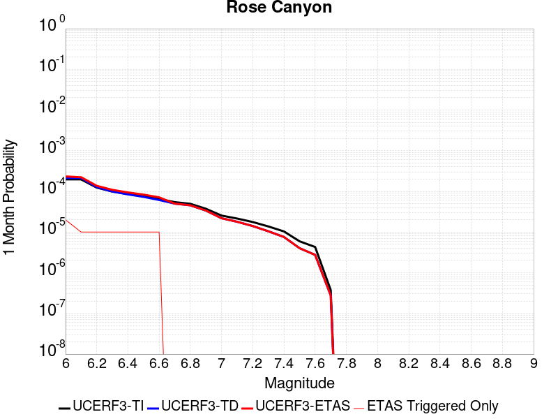 | 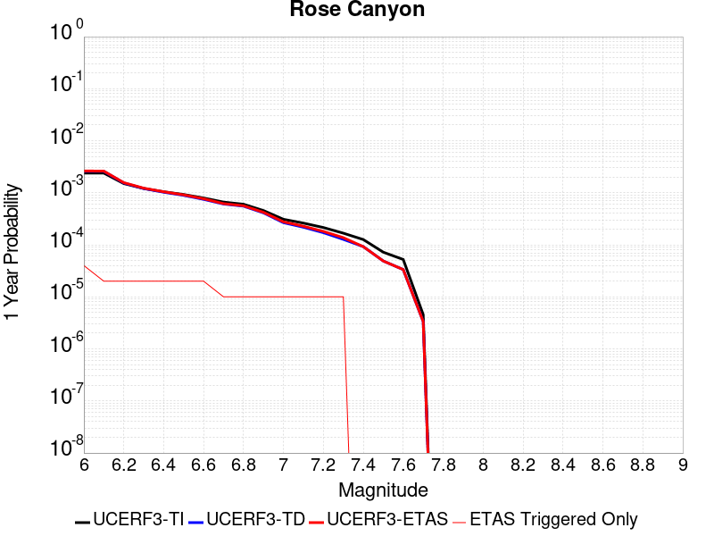 | 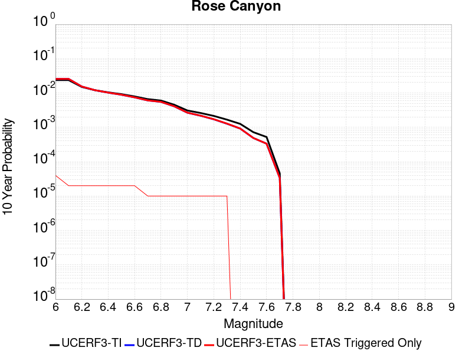 |

| Magnitude | 1 wk TI Prob | 1 wk TD Prob | 1 wk ETAS Prob | 1 wk ETAS/TD Gain | 1 wk ETAS Triggered Only | 1 mo TI Prob | 1 mo TD Prob | 1 mo ETAS Prob | 1 mo ETAS/TD Gain | 1 mo ETAS Triggered Only | 1 yr TI Prob | 1 yr TD Prob | 1 yr ETAS Prob | 1 yr ETAS/TD Gain | 1 yr ETAS Triggered Only | 10 yr TI Prob | 10 yr TD Prob | 10 yr ETAS Prob | 10 yr ETAS/TD Gain | 10 yr ETAS Triggered Only |
|-----|-----|-----|-----|-----|-----|-----|-----|-----|-----|-----|-----|-----|-----|-----|-----|-----|-----|-----|-----|-----|
| 6.0 | 4.5923203E-5 | 4.971441E-5 | 5.971391E-5 | 1.201139 | 1.0E-5 | 1.9679888E-4 | 2.130457E-4 | 2.3304144E-4 | 1.0938566 | 2.0E-5 | 0.0023933933 | 0.002590938 | 0.0026308342 | 1.0153984 | 4.0E-5 | 0.023677798 | 0.02561842 | 0.025657397 | 1.0015213 | 4.0E-5 |
| 6.1 | 4.5923203E-5 | 4.971441E-5 | 4.971441E-5 | 1.0 | 0.0 | 1.9679888E-4 | 2.130457E-4 | 2.2304356E-4 | 1.0469283 | 1.0E-5 | 0.0023933933 | 0.002590938 | 0.002610886 | 1.0076993 | 2.0E-5 | 0.023677798 | 0.02561842 | 0.025637908 | 1.0007607 | 2.0E-5 |
| 6.2 | 2.8844734E-5 | 2.9669607E-5 | 2.9669607E-5 | 1.0 | 0.0 | 1.2361443E-4 | 1.2714945E-4 | 1.3714819E-4 | 1.0786376 | 1.0E-5 | 0.0015039665 | 0.0015469724 | 0.0015669415 | 1.0129085 | 2.0E-5 | 0.0149382865 | 0.015364838 | 0.015384531 | 1.0012816 | 2.0E-5 |
| 6.3 | 2.3171577E-5 | 2.316239E-5 | 2.316239E-5 | 1.0 | 0.0 | 9.9302975E-5 | 9.926369E-5 | 1.092627E-4 | 1.1007317 | 1.0E-5 | 0.0012083431 | 0.0012078787 | 0.0012278545 | 1.0165379 | 2.0E-5 | 0.012017938 | 0.012012135 | 0.012031895 | 1.001645 | 2.0E-5 |
| 6.4 | 2.0066604E-5 | 1.9668036E-5 | 1.9668036E-5 | 1.0 | 0.0 | 8.599689E-5 | 8.428891E-5 | 9.428807E-5 | 1.1186296 | 1.0E-5 | 0.0010465092 | 0.0010257445 | 0.0010457239 | 1.0194781 | 2.0E-5 | 0.010415946 | 0.010211463 | 0.010231258 | 1.0019386 | 2.0E-5 |
| 6.5 | 1.776989E-5 | 1.7115373E-5 | 1.7115373E-5 | 1.0 | 0.0 | 7.615444E-5 | 7.3349576E-5 | 8.334884E-5 | 1.1363235 | 1.0E-5 | 9.267859E-4 | 8.9267216E-4 | 9.126543E-4 | 1.0223846 | 2.0E-5 | 0.009229303 | 0.008874648 | 0.0088944705 | 1.0022336 | 2.0E-5 |
| 6.6 | 1.5227364E-5 | 1.4340845E-5 | 1.4340845E-5 | 1.0 | 0.0 | 6.52585E-5 | 6.1459345E-5 | 7.145874E-5 | 1.1626992 | 1.0E-5 | 7.942326E-4 | 7.480159E-4 | 7.680009E-4 | 1.0267174 | 2.0E-5 | 0.007914 | 0.007441019 | 0.0074608703 | 1.0026678 | 2.0E-5 |
| 6.7 | 1.2703898E-5 | 1.167425E-5 | 1.167425E-5 | 1.0 | 0.0 | 5.4444143E-5 | 5.0031565E-5 | 5.0031565E-5 | 1.0 | 0.0 | 6.626558E-4 | 6.089683E-4 | 6.189622E-4 | 1.0164112 | 1.0E-5 | 0.006606833 | 0.0060622953 | 0.006072235 | 1.0016395 | 1.0E-5 |
| 6.8 | 1.1554917E-5 | 1.0610358E-5 | 1.0610358E-5 | 1.0 | 0.0 | 4.9520135E-5 | 4.5472192E-5 | 4.5472192E-5 | 1.0 | 0.0 | 6.0274085E-4 | 5.534874E-4 | 5.634818E-4 | 1.0180572 | 1.0E-5 | 0.0060110865 | 0.0055044 | 0.005514345 | 1.0018067 | 1.0E-5 |
| 6.9 | 8.732078E-6 | 7.88226E-6 | 7.88226E-6 | 1.0 | 0.0 | 3.7422655E-5 | 3.3780696E-5 | 3.3780696E-5 | 1.0 | 0.0 | 4.5552556E-4 | 4.112053E-4 | 4.212012E-4 | 1.0243088 | 1.0E-5 | 0.0045459294 | 0.004089502 | 0.0040994613 | 1.0024353 | 1.0E-5 |
| 7.0 | 5.9337494E-6 | 5.1074267E-6 | 5.1074267E-6 | 1.0 | 0.0 | 2.5430107E-5 | 2.1888789E-5 | 2.1888789E-5 | 1.0 | 0.0 | 3.0956755E-4 | 2.6646355E-4 | 2.764609E-4 | 1.0375186 | 1.0E-5 | 0.0030913667 | 0.0026614561 | 0.0026714297 | 1.0037473 | 1.0E-5 |
| 7.1 | 5.013409E-6 | 4.1773346E-6 | 4.1773346E-6 | 1.0 | 0.0 | 2.1485863E-5 | 1.7902741E-5 | 1.7902741E-5 | 1.0 | 0.0 | 2.6155898E-4 | 2.1794418E-4 | 2.27942E-4 | 1.0458733 | 1.0E-5 | 0.0026125133 | 0.002177316 | 0.0021872942 | 1.0045828 | 1.0E-5 |
| 7.2 | 4.120763E-6 | 3.2820874E-6 | 3.2820874E-6 | 1.0 | 0.0 | 1.7660293E-5 | 1.4066013E-5 | 1.4066013E-5 | 1.0 | 0.0 | 2.1499286E-4 | 1.7124035E-4 | 1.8123863E-4 | 1.0583874 | 1.0E-5 | 0.0021478499 | 0.0017110935 | 0.0017210764 | 1.0058342 | 1.0E-5 |
| 7.3 | 3.2081239E-6 | 2.4404928E-6 | 2.4404928E-6 | 1.0 | 0.0 | 1.374903E-5 | 1.0459213E-5 | 1.0459213E-5 | 1.0 | 0.0 | 1.6738157E-4 | 1.2733355E-4 | 1.3733227E-4 | 1.0785239 | 1.0E-5 | 0.0016725556 | 0.0012726128 | 0.0012826001 | 1.0078479 | 1.0E-5 |
| 7.4 | 2.4194755E-6 | 1.7680296E-6 | 1.7680296E-6 | 1.0 | 0.0 | 1.0369139E-5 | 7.577248E-6 | 7.577248E-6 | 1.0 | 0.0 | 1.2623696E-4 | 9.2249145E-5 | 9.2249145E-5 | 1.0 | 0.0 | 0.0012616527 | 9.2211383E-4 | 9.2211383E-4 | 1.0 | 0.0 |
| 7.5 | 1.3842889E-6 | 9.378286E-7 | 9.378286E-7 | 1.0 | 0.0 | 5.9326535E-6 | 4.0192594E-6 | 4.0192594E-6 | 1.0 | 0.0 | 7.222766E-5 | 4.893342E-5 | 4.893342E-5 | 1.0 | 0.0 | 7.220419E-4 | 4.8923E-4 | 4.8923E-4 | 1.0 | 0.0 |
| 7.6 | 1.0021575E-6 | 6.4113425E-7 | 6.4113425E-7 | 1.0 | 0.0 | 4.2949537E-6 | 2.7477154E-6 | 2.7477154E-6 | 1.0 | 0.0 | 5.2289808E-5 | 3.3452943E-5 | 3.3452943E-5 | 1.0 | 0.0 | 5.2277505E-4 | 3.344812E-4 | 3.344812E-4 | 1.0 | 0.0 |
| 7.7 | 8.7620116E-8 | 6.4492745E-8 | 6.4492745E-8 | 1.0 | 0.0 | 3.7551473E-7 | 2.7639746E-7 | 2.7639746E-7 | 1.0 | 0.0 | 4.5718825E-6 | 3.365134E-6 | 3.365134E-6 | 1.0 | 0.0 | 4.5717883E-5 | 3.365086E-5 | 3.365086E-5 | 1.0 | 0.0 |

## Red Mountain
*[(top)](#table-of-contents)*

| 1 Week | 1 Month | 1 Year | 10 Year |
|-----|-----|-----|-----|
| 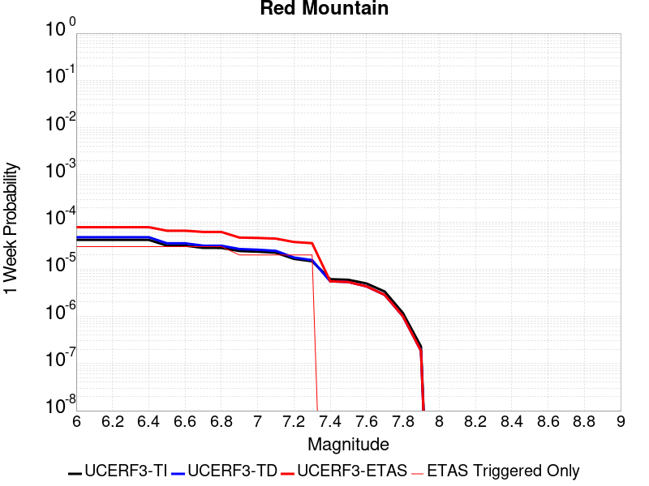 |  | 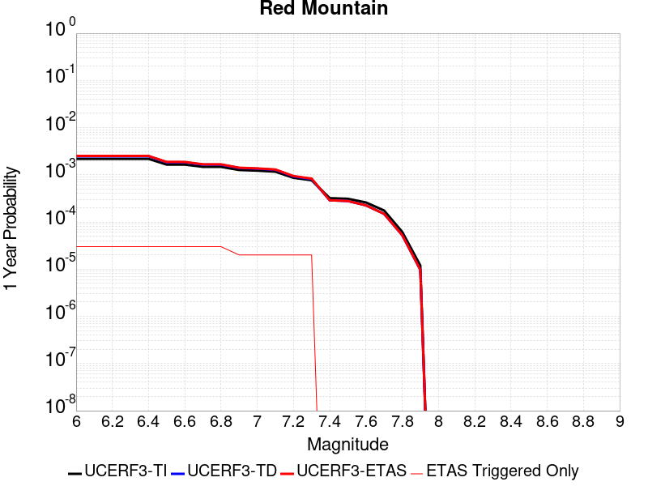 |  |

| Magnitude | 1 wk TI Prob | 1 wk TD Prob | 1 wk ETAS Prob | 1 wk ETAS/TD Gain | 1 wk ETAS Triggered Only | 1 mo TI Prob | 1 mo TD Prob | 1 mo ETAS Prob | 1 mo ETAS/TD Gain | 1 mo ETAS Triggered Only | 1 yr TI Prob | 1 yr TD Prob | 1 yr ETAS Prob | 1 yr ETAS/TD Gain | 1 yr ETAS Triggered Only | 10 yr TI Prob | 10 yr TD Prob | 10 yr ETAS Prob | 10 yr ETAS/TD Gain | 10 yr ETAS Triggered Only |
|-----|-----|-----|-----|-----|-----|-----|-----|-----|-----|-----|-----|-----|-----|-----|-----|-----|-----|-----|-----|-----|
| 6.0 | 4.1810763E-5 | 4.75898E-5 | 7.7588375E-5 | 1.6303571 | 3.0E-5 | 1.7917668E-4 | 2.0394128E-4 | 2.3393516E-4 | 1.1470711 | 3.0E-5 | 0.0021792934 | 0.0024803223 | 0.0025102478 | 1.0120652 | 3.0E-5 | 0.021580452 | 0.024544 | 0.02458302 | 1.0015898 | 4.0E-5 |
| 6.1 | 4.1810763E-5 | 4.75898E-5 | 7.7588375E-5 | 1.6303571 | 3.0E-5 | 1.7917668E-4 | 2.0394128E-4 | 2.3393516E-4 | 1.1470711 | 3.0E-5 | 0.0021792934 | 0.0024803223 | 0.0025102478 | 1.0120652 | 3.0E-5 | 0.021580452 | 0.024544 | 0.02458302 | 1.0015898 | 4.0E-5 |
| 6.2 | 4.1810763E-5 | 4.75898E-5 | 7.7588375E-5 | 1.6303571 | 3.0E-5 | 1.7917668E-4 | 2.0394128E-4 | 2.3393516E-4 | 1.1470711 | 3.0E-5 | 0.0021792934 | 0.0024803223 | 0.0025102478 | 1.0120652 | 3.0E-5 | 0.021580452 | 0.024544 | 0.02458302 | 1.0015898 | 4.0E-5 |
| 6.3 | 4.1810763E-5 | 4.75898E-5 | 7.7588375E-5 | 1.6303571 | 3.0E-5 | 1.7917668E-4 | 2.0394128E-4 | 2.3393516E-4 | 1.1470711 | 3.0E-5 | 0.0021792934 | 0.0024803223 | 0.0025102478 | 1.0120652 | 3.0E-5 | 0.021580452 | 0.024544 | 0.02458302 | 1.0015898 | 4.0E-5 |
| 6.4 | 4.1810763E-5 | 4.75898E-5 | 7.7588375E-5 | 1.6303571 | 3.0E-5 | 1.7917668E-4 | 2.0394128E-4 | 2.3393516E-4 | 1.1470711 | 3.0E-5 | 0.0021792934 | 0.0024803223 | 0.0025102478 | 1.0120652 | 3.0E-5 | 0.021580452 | 0.024544 | 0.02458302 | 1.0015898 | 4.0E-5 |
| 6.5 | 3.154503E-5 | 3.5359604E-5 | 6.5358545E-5 | 1.8483958 | 3.0E-5 | 1.3518598E-4 | 1.5153288E-4 | 1.8152833E-4 | 1.1979468 | 3.0E-5 | 0.0016446467 | 0.0018434438 | 0.0018733885 | 1.0162439 | 3.0E-5 | 0.01632528 | 0.018291166 | 0.018330434 | 1.0021468 | 4.0E-5 |
| 6.6 | 3.1535834E-5 | 3.5348985E-5 | 6.534793E-5 | 1.8486506 | 3.0E-5 | 1.3514658E-4 | 1.5148739E-4 | 1.8148284E-4 | 1.1980063 | 3.0E-5 | 0.0016441676 | 0.0018428907 | 0.0018728354 | 1.0162488 | 3.0E-5 | 0.01632056 | 0.018285727 | 0.018324995 | 1.0021476 | 4.0E-5 |
| 6.7 | 2.8267326E-5 | 3.1469222E-5 | 6.146828E-5 | 1.9532824 | 3.0E-5 | 1.2114006E-4 | 1.348616E-4 | 1.6485756E-4 | 1.2224202 | 3.0E-5 | 0.0014738824 | 0.0016407884 | 0.0016707393 | 1.0182539 | 3.0E-5 | 0.014641452 | 0.016295504 | 0.016334852 | 1.0024147 | 4.0E-5 |
| 6.8 | 2.8212884E-5 | 3.1407108E-5 | 6.1406165E-5 | 1.9551678 | 3.0E-5 | 1.20906756E-4 | 1.3459542E-4 | 1.6459139E-4 | 1.2228602 | 3.0E-5 | 0.0014710457 | 0.0016375526 | 0.0016675035 | 1.01829 | 3.0E-5 | 0.014613459 | 0.016263619 | 0.01630297 | 1.0024195 | 4.0E-5 |
| 6.9 | 2.4227871E-5 | 2.6706883E-5 | 4.670635E-5 | 1.7488506 | 2.0E-5 | 1.03829596E-4 | 1.14453476E-4 | 1.3445118E-4 | 1.1747235 | 2.0E-5 | 0.0012633923 | 0.0013926562 | 0.0014126285 | 1.014341 | 2.0E-5 | 0.012562336 | 0.013846977 | 0.013876562 | 1.0021366 | 3.0E-5 |
| 7.0 | 2.348524E-5 | 2.5835672E-5 | 4.5835157E-5 | 1.7741035 | 2.0E-5 | 1.0064714E-4 | 1.1072004E-4 | 1.3071782E-4 | 1.1806158 | 2.0E-5 | 0.0012246901 | 0.0013472585 | 0.0013672316 | 1.014825 | 2.0E-5 | 0.012179627 | 0.013398543 | 0.013428141 | 1.0022091 | 3.0E-5 |
| 7.1 | 2.2311642E-5 | 2.4462744E-5 | 4.4462256E-5 | 1.8175497 | 2.0E-5 | 9.561782E-5 | 1.04836545E-4 | 1.2483445E-4 | 1.1907532 | 2.0E-5 | 0.0011635252 | 0.0012757124 | 0.0012956868 | 1.0156575 | 2.0E-5 | 0.01157452 | 0.012691407 | 0.012721027 | 1.0023338 | 3.0E-5 |
| 7.2 | 1.6533986E-5 | 1.7670294E-5 | 3.766994E-5 | 2.131823 | 2.0E-5 | 7.085802E-5 | 7.572799E-5 | 9.572648E-5 | 1.2640831 | 2.0E-5 | 8.623549E-4 | 9.2166173E-4 | 9.416433E-4 | 1.0216799 | 2.0E-5 | 0.008590161 | 0.009184672 | 0.009204488 | 1.0021576 | 2.0E-5 |
| 7.3 | 1.4703092E-5 | 1.5559477E-5 | 3.5559166E-5 | 2.2853703 | 2.0E-5 | 6.301173E-5 | 6.6682114E-5 | 8.668078E-5 | 1.2999105 | 2.0E-5 | 7.668978E-4 | 8.11614E-4 | 8.315977E-4 | 1.0246222 | 2.0E-5 | 0.0076425658 | 0.008092573 | 0.008112411 | 1.0024514 | 2.0E-5 |
| 7.4 | 6.1331984E-6 | 5.5288733E-6 | 5.5288733E-6 | 1.0 | 0.0 | 2.6284872E-5 | 2.369496E-5 | 2.369496E-5 | 1.0 | 0.0 | 3.199713E-4 | 2.8844847E-4 | 2.8844847E-4 | 1.0 | 0.0 | 0.0031951098 | 0.0028807952 | 0.0028807952 | 1.0 | 0.0 |
| 7.5 | 5.954766E-6 | 5.3385033E-6 | 5.3385033E-6 | 1.0 | 0.0 | 2.5520176E-5 | 2.2879103E-5 | 2.2879103E-5 | 1.0 | 0.0 | 3.1066386E-4 | 2.78518E-4 | 2.78518E-4 | 1.0 | 0.0 | 0.003102299 | 0.0027817434 | 0.0027817434 | 1.0 | 0.0 |
| 7.6 | 4.9726646E-6 | 4.3152977E-6 | 4.3152977E-6 | 1.0 | 0.0 | 2.1311245E-5 | 1.8494004E-5 | 1.8494004E-5 | 1.0 | 0.0 | 2.5943352E-4 | 2.2514157E-4 | 2.2514157E-4 | 1.0 | 0.0 | 0.0025913084 | 0.0022491694 | 0.0022491694 | 1.0 | 0.0 |
| 7.7 | 3.3613894E-6 | 2.85268E-6 | 2.85268E-6 | 1.0 | 0.0 | 1.4405875E-5 | 1.2225715E-5 | 1.2225715E-5 | 1.0 | 0.0 | 1.7537741E-4 | 1.4883818E-4 | 1.4883818E-4 | 1.0 | 0.0 | 0.0017523908 | 0.0014874112 | 0.0014874112 | 1.0 | 0.0 |
| 7.8 | 1.1828961E-6 | 1.0122919E-6 | 1.0122919E-6 | 1.0 | 0.0 | 5.069545E-6 | 4.338387E-6 | 4.338387E-6 | 1.0 | 0.0 | 6.171996E-5 | 5.281861E-5 | 5.281861E-5 | 1.0 | 0.0 | 6.170282E-4 | 5.280635E-4 | 5.280635E-4 | 1.0 | 0.0 |
| 7.9 | 2.2967266E-7 | 1.8619174E-7 | 1.8619174E-7 | 1.0 | 0.0 | 9.843111E-7 | 7.979644E-7 | 7.979644E-7 | 1.0 | 0.0 | 1.19839215E-5 | 9.715176E-6 | 9.715176E-6 | 1.0 | 0.0 | 1.1983275E-4 | 9.71478E-5 | 9.71478E-5 | 1.0 | 0.0 |

## Santa Ynez (East)
*[(top)](#table-of-contents)*

| 1 Week | 1 Month | 1 Year | 10 Year |
|-----|-----|-----|-----|
|  |  |  |  |

| Magnitude | 1 wk TI Prob | 1 wk TD Prob | 1 wk ETAS Prob | 1 wk ETAS/TD Gain | 1 wk ETAS Triggered Only | 1 mo TI Prob | 1 mo TD Prob | 1 mo ETAS Prob | 1 mo ETAS/TD Gain | 1 mo ETAS Triggered Only | 1 yr TI Prob | 1 yr TD Prob | 1 yr ETAS Prob | 1 yr ETAS/TD Gain | 1 yr ETAS Triggered Only | 10 yr TI Prob | 10 yr TD Prob | 10 yr ETAS Prob | 10 yr ETAS/TD Gain | 10 yr ETAS Triggered Only |
|-----|-----|-----|-----|-----|-----|-----|-----|-----|-----|-----|-----|-----|-----|-----|-----|-----|-----|-----|-----|-----|
| 6.0 | 3.2269712E-5 | 3.67506E-5 | 4.6750236E-5 | 1.2720944 | 1.0E-5 | 1.3829143E-4 | 1.574964E-4 | 1.6749481E-4 | 1.0634835 | 1.0E-5 | 0.0016823979 | 0.0019164163 | 0.0019463589 | 1.0156242 | 3.0E-5 | 0.016697178 | 0.01905635 | 0.019095588 | 1.002059 | 4.0E-5 |
| 6.1 | 3.2269712E-5 | 3.67506E-5 | 4.6750236E-5 | 1.2720944 | 1.0E-5 | 1.3829143E-4 | 1.574964E-4 | 1.6749481E-4 | 1.0634835 | 1.0E-5 | 0.0016823979 | 0.0019164163 | 0.0019463589 | 1.0156242 | 3.0E-5 | 0.016697178 | 0.01905635 | 0.019095588 | 1.002059 | 4.0E-5 |
| 6.2 | 3.2269712E-5 | 3.67506E-5 | 4.6750236E-5 | 1.2720944 | 1.0E-5 | 1.3829143E-4 | 1.574964E-4 | 1.6749481E-4 | 1.0634835 | 1.0E-5 | 0.0016823979 | 0.0019164163 | 0.0019463589 | 1.0156242 | 3.0E-5 | 0.016697178 | 0.01905635 | 0.019095588 | 1.002059 | 4.0E-5 |
| 6.3 | 3.2269712E-5 | 3.67506E-5 | 4.6750236E-5 | 1.2720944 | 1.0E-5 | 1.3829143E-4 | 1.574964E-4 | 1.6749481E-4 | 1.0634835 | 1.0E-5 | 0.0016823979 | 0.0019164163 | 0.0019463589 | 1.0156242 | 3.0E-5 | 0.016697178 | 0.01905635 | 0.019095588 | 1.002059 | 4.0E-5 |
| 6.4 | 1.4404779E-5 | 1.48492545E-5 | 1.48492545E-5 | 1.0 | 0.0 | 6.1733306E-5 | 6.363814E-5 | 6.363814E-5 | 1.0 | 0.0 | 7.513438E-4 | 7.74524E-4 | 7.74524E-4 | 1.0 | 0.0 | 0.0074880854 | 0.0077187964 | 0.0077187964 | 1.0 | 0.0 |
| 6.5 | 1.4404779E-5 | 1.48492545E-5 | 1.48492545E-5 | 1.0 | 0.0 | 6.1733306E-5 | 6.363814E-5 | 6.363814E-5 | 1.0 | 0.0 | 7.513438E-4 | 7.74524E-4 | 7.74524E-4 | 1.0 | 0.0 | 0.0074880854 | 0.0077187964 | 0.0077187964 | 1.0 | 0.0 |
| 6.6 | 1.280208E-5 | 1.3011827E-5 | 1.3011827E-5 | 1.0 | 0.0 | 5.4864904E-5 | 5.576379E-5 | 5.576379E-5 | 1.0 | 0.0 | 6.6777546E-4 | 6.787144E-4 | 6.787144E-4 | 1.0 | 0.0 | 0.006657724 | 0.0067666266 | 0.0067666266 | 1.0 | 0.0 |
| 6.7 | 1.2457027E-5 | 1.26283485E-5 | 1.26283485E-5 | 1.0 | 0.0 | 5.3386164E-5 | 5.412038E-5 | 5.412038E-5 | 1.0 | 0.0 | 6.497827E-4 | 6.587181E-4 | 6.587181E-4 | 1.0 | 0.0 | 0.00647886 | 0.0065678535 | 0.0065678535 | 1.0 | 0.0 |
| 6.8 | 1.2095134E-5 | 1.22307965E-5 | 1.22307965E-5 | 1.0 | 0.0 | 5.1835254E-5 | 5.2416657E-5 | 5.2416657E-5 | 1.0 | 0.0 | 6.309115E-4 | 6.379875E-4 | 6.379875E-4 | 1.0 | 0.0 | 0.0062912325 | 0.006361748 | 0.006361748 | 1.0 | 0.0 |
| 6.9 | 1.1104036E-5 | 1.1157232E-5 | 1.1157232E-5 | 1.0 | 0.0 | 4.758786E-5 | 4.781584E-5 | 4.781584E-5 | 1.0 | 0.0 | 5.7922816E-4 | 5.8200356E-4 | 5.8200356E-4 | 1.0 | 0.0 | 0.005777207 | 0.005804939 | 0.005804939 | 1.0 | 0.0 |
| 7.0 | 1.0577444E-5 | 1.0581566E-5 | 1.0581566E-5 | 1.0 | 0.0 | 4.5331115E-5 | 4.534879E-5 | 4.534879E-5 | 1.0 | 0.0 | 5.5176654E-4 | 5.5198284E-4 | 5.5198284E-4 | 1.0 | 0.0 | 0.0055039856 | 0.0055062566 | 0.0055062566 | 1.0 | 0.0 |
| 7.1 | 1.0021775E-5 | 9.980875E-6 | 9.980875E-6 | 1.0 | 0.0 | 4.294976E-5 | 4.2774485E-5 | 4.2774485E-5 | 1.0 | 0.0 | 5.2278786E-4 | 5.2065606E-4 | 5.2065606E-4 | 1.0 | 0.0 | 0.0052155964 | 0.005194495 | 0.005194495 | 1.0 | 0.0 |
| 7.2 | 8.874109E-6 | 8.748684E-6 | 8.748684E-6 | 1.0 | 0.0 | 3.8031343E-5 | 3.7493828E-5 | 3.7493828E-5 | 1.0 | 0.0 | 4.629332E-4 | 4.5639282E-4 | 4.5639282E-4 | 1.0 | 0.0 | 0.0046197 | 0.004554673 | 0.004554673 | 1.0 | 0.0 |
| 7.3 | 7.5504267E-6 | 7.5050116E-6 | 7.5050116E-6 | 1.0 | 0.0 | 3.235857E-5 | 3.2163945E-5 | 3.2163945E-5 | 1.0 | 0.0 | 3.9389438E-4 | 3.9152667E-4 | 3.9152667E-4 | 1.0 | 0.0 | 0.0039319694 | 0.003908476 | 0.003908476 | 1.0 | 0.0 |
| 7.4 | 6.309394E-6 | 6.1830524E-6 | 6.1830524E-6 | 1.0 | 0.0 | 2.703998E-5 | 2.6498532E-5 | 2.6498532E-5 | 1.0 | 0.0 | 3.2916202E-4 | 3.225728E-4 | 3.225728E-4 | 1.0 | 0.0 | 0.003286749 | 0.0032211433 | 0.0032211433 | 1.0 | 0.0 |
| 7.5 | 4.6103073E-6 | 4.4407966E-6 | 4.4407966E-6 | 1.0 | 0.0 | 1.975831E-5 | 1.903185E-5 | 1.903185E-5 | 1.0 | 0.0 | 2.4053088E-4 | 2.3168883E-4 | 2.3168883E-4 | 1.0 | 0.0 | 0.002402707 | 0.0023145422 | 0.0023145422 | 1.0 | 0.0 |
| 7.6 | 1.2858658E-6 | 1.300818E-6 | 1.300818E-6 | 1.0 | 0.0 | 5.5108417E-6 | 5.574923E-6 | 5.574923E-6 | 1.0 | 0.0 | 6.7092435E-5 | 6.787264E-5 | 6.787264E-5 | 1.0 | 0.0 | 6.707218E-4 | 6.78526E-4 | 6.78526E-4 | 1.0 | 0.0 |
| 7.7 | 5.3302307E-7 | 5.61213E-7 | 5.61213E-7 | 1.0 | 0.0 | 2.2843826E-6 | 2.4051967E-6 | 2.4051967E-6 | 1.0 | 0.0 | 2.7812002E-5 | 2.9282914E-5 | 2.9282914E-5 | 1.0 | 0.0 | 2.7808524E-4 | 2.9279414E-4 | 2.9279414E-4 | 1.0 | 0.0 |
| 7.8 | 4.613933E-8 | 4.8030046E-8 | 4.8030046E-8 | 1.0 | 0.0 | 1.9773998E-7 | 2.0584304E-7 | 2.0584304E-7 | 1.0 | 0.0 | 2.4074816E-6 | 2.506136E-6 | 2.506136E-6 | 1.0 | 0.0 | 2.4074554E-5 | 2.5061088E-5 | 2.5061088E-5 | 1.0 | 0.0 |

## San Andreas (Carrizo) rev
*[(top)](#table-of-contents)*

| 1 Week | 1 Month | 1 Year | 10 Year |
|-----|-----|-----|-----|
| 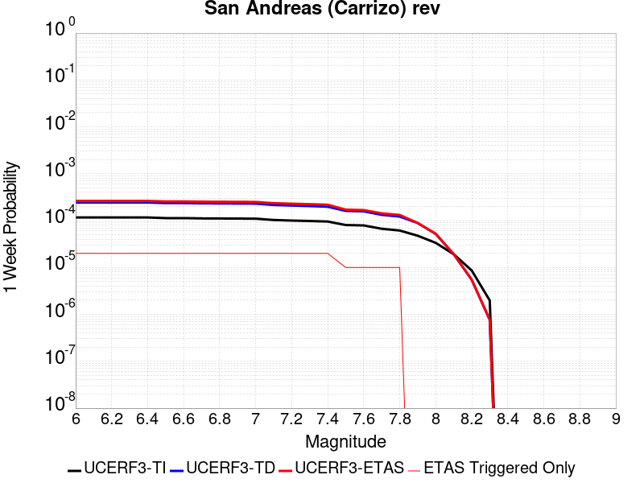 | 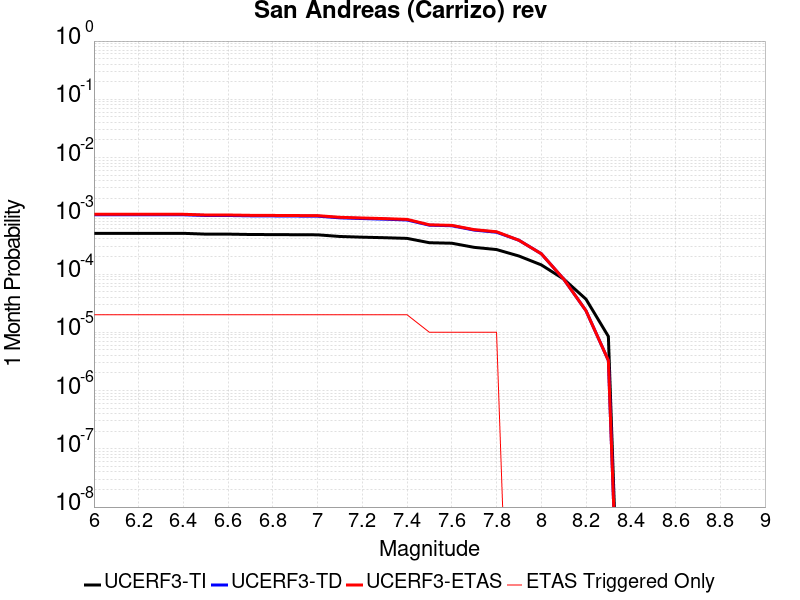 |  | 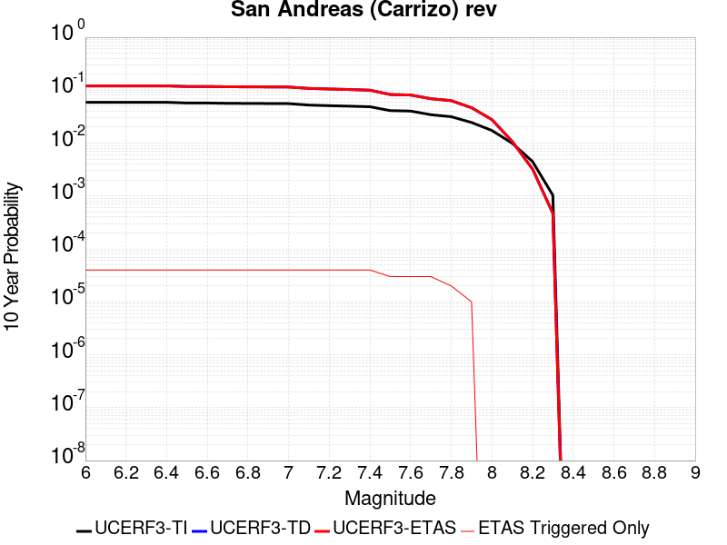 |

| Magnitude | 1 wk TI Prob | 1 wk TD Prob | 1 wk ETAS Prob | 1 wk ETAS/TD Gain | 1 wk ETAS Triggered Only | 1 mo TI Prob | 1 mo TD Prob | 1 mo ETAS Prob | 1 mo ETAS/TD Gain | 1 mo ETAS Triggered Only | 1 yr TI Prob | 1 yr TD Prob | 1 yr ETAS Prob | 1 yr ETAS/TD Gain | 1 yr ETAS Triggered Only | 10 yr TI Prob | 10 yr TD Prob | 10 yr ETAS Prob | 10 yr ETAS/TD Gain | 10 yr ETAS Triggered Only |
|-----|-----|-----|-----|-----|-----|-----|-----|-----|-----|-----|-----|-----|-----|-----|-----|-----|-----|-----|-----|-----|
| 6.0 | 1.1674632E-4 | 2.4322356E-4 | 2.632187E-4 | 1.0822089 | 2.0E-5 | 5.002454E-4 | 0.0010419718 | 0.001061951 | 1.0191743 | 2.0E-5 | 0.006073493 | 0.0126127 | 0.012642322 | 1.0023485 | 3.0E-5 | 0.0591016 | 0.12061794 | 0.120653115 | 1.0002916 | 4.0E-5 |
| 6.1 | 1.1674632E-4 | 2.4322356E-4 | 2.632187E-4 | 1.0822089 | 2.0E-5 | 5.002454E-4 | 0.0010419718 | 0.001061951 | 1.0191743 | 2.0E-5 | 0.006073493 | 0.0126127 | 0.012642322 | 1.0023485 | 3.0E-5 | 0.0591016 | 0.12061794 | 0.120653115 | 1.0002916 | 4.0E-5 |
| 6.2 | 1.1674632E-4 | 2.4322356E-4 | 2.632187E-4 | 1.0822089 | 2.0E-5 | 5.002454E-4 | 0.0010419718 | 0.001061951 | 1.0191743 | 2.0E-5 | 0.006073493 | 0.0126127 | 0.012642322 | 1.0023485 | 3.0E-5 | 0.0591016 | 0.12061794 | 0.120653115 | 1.0002916 | 4.0E-5 |
| 6.3 | 1.1674632E-4 | 2.4322356E-4 | 2.632187E-4 | 1.0822089 | 2.0E-5 | 5.002454E-4 | 0.0010419718 | 0.001061951 | 1.0191743 | 2.0E-5 | 0.006073493 | 0.0126127 | 0.012642322 | 1.0023485 | 3.0E-5 | 0.0591016 | 0.12061794 | 0.120653115 | 1.0002916 | 4.0E-5 |
| 6.4 | 1.1674632E-4 | 2.4322356E-4 | 2.632187E-4 | 1.0822089 | 2.0E-5 | 5.002454E-4 | 0.0010419718 | 0.001061951 | 1.0191743 | 2.0E-5 | 0.006073493 | 0.0126127 | 0.012642322 | 1.0023485 | 3.0E-5 | 0.0591016 | 0.12061794 | 0.120653115 | 1.0002916 | 4.0E-5 |
| 6.5 | 1.13136164E-4 | 2.3642433E-4 | 2.564196E-4 | 1.0845736 | 2.0E-5 | 4.847792E-4 | 0.0010128552 | 0.0010328349 | 1.0197262 | 2.0E-5 | 0.0058862255 | 0.012262235 | 0.012291867 | 1.0024165 | 3.0E-5 | 0.057327334 | 0.11758334 | 0.11761864 | 1.0003002 | 4.0E-5 |
| 6.6 | 1.13136164E-4 | 2.3642433E-4 | 2.564196E-4 | 1.0845736 | 2.0E-5 | 4.847792E-4 | 0.0010128552 | 0.0010328349 | 1.0197262 | 2.0E-5 | 0.0058862255 | 0.012262235 | 0.012291867 | 1.0024165 | 3.0E-5 | 0.057327334 | 0.11758334 | 0.11761864 | 1.0003002 | 4.0E-5 |
| 6.7 | 1.1149675E-4 | 2.3333685E-4 | 2.5333217E-4 | 1.085693 | 2.0E-5 | 4.777557E-4 | 9.996332E-4 | 0.0010196132 | 1.0199873 | 2.0E-5 | 0.0058011734 | 0.012103056 | 0.012132692 | 1.0024487 | 3.0E-5 | 0.05652051 | 0.11620166 | 0.116237015 | 1.0003042 | 4.0E-5 |
| 6.8 | 1.1103589E-4 | 2.3235848E-4 | 2.523538E-4 | 1.0860538 | 2.0E-5 | 4.7578133E-4 | 9.954434E-4 | 0.0010154236 | 1.0200715 | 2.0E-5 | 0.005777263 | 0.01205261 | 0.012082248 | 1.002459 | 3.0E-5 | 0.056293584 | 0.11576148 | 0.11579685 | 1.0003055 | 4.0E-5 |
| 6.9 | 1.1053259E-4 | 2.312823E-4 | 2.5127767E-4 | 1.0864544 | 2.0E-5 | 4.7362508E-4 | 9.908348E-4 | 0.001010815 | 1.020165 | 2.0E-5 | 0.0057511497 | 0.011997119 | 0.012026759 | 1.0024706 | 3.0E-5 | 0.05604569 | 0.115277916 | 0.11531331 | 1.000307 | 4.0E-5 |
| 7.0 | 1.1005377E-4 | 2.3029075E-4 | 2.5028613E-4 | 1.0868267 | 2.0E-5 | 4.7157376E-4 | 9.865885E-4 | 0.0010065688 | 1.0202519 | 2.0E-5 | 0.0057263062 | 0.011945989 | 0.01197563 | 1.0024813 | 3.0E-5 | 0.055809796 | 0.11483013 | 0.114865534 | 1.0003084 | 4.0E-5 |
| 7.1 | 1.0308142E-4 | 2.1538913E-4 | 2.3538481E-4 | 1.0928352 | 2.0E-5 | 4.417027E-4 | 9.227707E-4 | 9.427523E-4 | 1.0216539 | 2.0E-5 | 0.0053644776 | 0.011177175 | 0.011206839 | 1.0026541 | 3.0E-5 | 0.052368138 | 0.108091824 | 0.108127505 | 1.0003301 | 4.0E-5 |
| 7.2 | 1.0027479E-4 | 2.0946808E-4 | 2.294639E-4 | 1.0954599 | 2.0E-5 | 4.296783E-4 | 8.974125E-4 | 9.173945E-4 | 1.0222663 | 2.0E-5 | 0.0052187922 | 0.010871558 | 0.010901232 | 1.0027295 | 3.0E-5 | 0.050979212 | 0.10539154 | 0.105427325 | 1.0003395 | 4.0E-5 |
| 7.3 | 9.816942E-5 | 2.042204E-4 | 2.2421632E-4 | 1.0979134 | 2.0E-5 | 4.2065824E-4 | 8.749377E-4 | 8.949202E-4 | 1.0228387 | 2.0E-5 | 0.005109493 | 0.010600623 | 0.010630305 | 1.0028 | 3.0E-5 | 0.049935985 | 0.10297247 | 0.10300835 | 1.0003484 | 4.0E-5 |
| 7.4 | 9.5634205E-5 | 1.9791478E-4 | 2.1791083E-4 | 1.1010336 | 2.0E-5 | 4.0979648E-4 | 8.4793137E-4 | 8.679144E-4 | 1.0235668 | 2.0E-5 | 0.0049778637 | 0.010274961 | 0.010304652 | 1.0028898 | 3.0E-5 | 0.048678253 | 0.100064956 | 0.10010096 | 1.0003598 | 4.0E-5 |
| 7.5 | 8.052417E-5 | 1.6112256E-4 | 1.7112095E-4 | 1.0620545 | 1.0E-5 | 3.4505792E-4 | 6.903427E-4 | 7.003358E-4 | 1.0144756 | 1.0E-5 | 0.0041929903 | 0.008372612 | 0.008392445 | 1.0023687 | 2.0E-5 | 0.04114753 | 0.08281128 | 0.082838796 | 1.0003322 | 3.0E-5 |
| 7.6 | 7.897024E-5 | 1.5765514E-4 | 1.6765358E-4 | 1.0634196 | 1.0E-5 | 3.384E-4 | 6.754901E-4 | 6.854834E-4 | 1.0147941 | 1.0E-5 | 0.0041122385 | 0.008193157 | 0.008212993 | 1.002421 | 2.0E-5 | 0.040369697 | 0.0811521 | 0.08117966 | 1.0003396 | 3.0E-5 |
| 7.7 | 6.707427E-5 | 1.3275658E-4 | 1.4275526E-4 | 1.0753158 | 1.0E-5 | 2.8742946E-4 | 5.688328E-4 | 5.788271E-4 | 1.0175699 | 1.0E-5 | 0.003493839 | 0.00690358 | 0.006923442 | 1.002877 | 2.0E-5 | 0.034394164 | 0.06904754 | 0.069075465 | 1.0004045 | 3.0E-5 |
| 7.8 | 6.147705E-5 | 1.2197082E-4 | 1.319696E-4 | 1.0819768 | 1.0E-5 | 2.6344648E-4 | 5.226274E-4 | 5.3262216E-4 | 1.019124 | 1.0E-5 | 0.0032027436 | 0.0063444492 | 0.0063643223 | 1.0031323 | 2.0E-5 | 0.031569764 | 0.06351423 | 0.06353296 | 1.0002949 | 2.0E-5 |
| 7.9 | 4.7636717E-5 | 8.879351E-5 | 8.879351E-5 | 1.0 | 0.0 | 2.0414138E-4 | 3.8048814E-4 | 3.8048814E-4 | 1.0 | 0.0 | 0.0024825884 | 0.004622611 | 0.0046325647 | 1.0021533 | 1.0E-5 | 0.024550365 | 0.046625797 | 0.04663533 | 1.0002044 | 1.0E-5 |
| 8.0 | 3.3554235E-5 | 5.2132433E-5 | 5.2132433E-5 | 1.0 | 0.0 | 1.4379594E-4 | 2.2340559E-4 | 2.2340559E-4 | 1.0 | 0.0 | 0.0017493097 | 0.002716572 | 0.002716572 | 1.0 | 0.0 | 0.017356034 | 0.027879264 | 0.027879264 | 1.0 | 0.0 |
| 8.1 | 1.9175432E-5 | 1.9180918E-5 | 1.9180918E-5 | 1.0 | 0.0 | 8.217783E-5 | 8.220134E-5 | 8.220134E-5 | 1.0 | 0.0 | 0.0010000558 | 0.0010003424 | 0.0010003424 | 1.0 | 0.0 | 0.009955673 | 0.010756371 | 0.010756371 | 1.0 | 0.0 |
| 8.2 | 8.643924E-6 | 5.472644E-6 | 5.472644E-6 | 1.0 | 0.0 | 3.704486E-5 | 2.3453977E-5 | 2.3453977E-5 | 1.0 | 0.0 | 4.5092785E-4 | 2.8551483E-4 | 2.8551483E-4 | 1.0 | 0.0 | 0.0045001395 | 0.003247653 | 0.003247653 | 1.0 | 0.0 |
| 8.3 | 1.983087E-6 | 7.6547434E-7 | 7.6547434E-7 | 1.0 | 0.0 | 8.498917E-6 | 3.2806004E-6 | 3.2806004E-6 | 1.0 | 0.0 | 1.034694E-4 | 3.9940594E-5 | 3.9940594E-5 | 1.0 | 0.0 | 0.0010342124 | 4.7170694E-4 | 4.7170694E-4 | 1.0 | 0.0 |

## San Jacinto (San Bernardino)
*[(top)](#table-of-contents)*

| 1 Week | 1 Month | 1 Year | 10 Year |
|-----|-----|-----|-----|
|  |  | 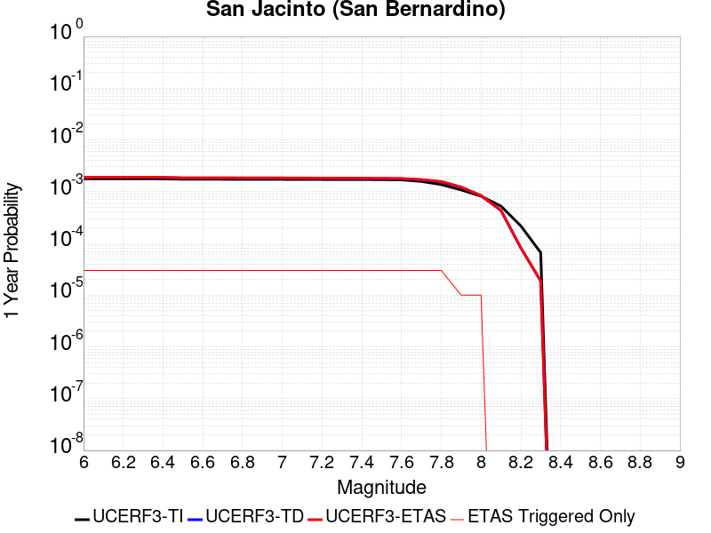 |  |

| Magnitude | 1 wk TI Prob | 1 wk TD Prob | 1 wk ETAS Prob | 1 wk ETAS/TD Gain | 1 wk ETAS Triggered Only | 1 mo TI Prob | 1 mo TD Prob | 1 mo ETAS Prob | 1 mo ETAS/TD Gain | 1 mo ETAS Triggered Only | 1 yr TI Prob | 1 yr TD Prob | 1 yr ETAS Prob | 1 yr ETAS/TD Gain | 1 yr ETAS Triggered Only | 10 yr TI Prob | 10 yr TD Prob | 10 yr ETAS Prob | 10 yr ETAS/TD Gain | 10 yr ETAS Triggered Only |
|-----|-----|-----|-----|-----|-----|-----|-----|-----|-----|-----|-----|-----|-----|-----|-----|-----|-----|-----|-----|-----|
| 6.0 | 3.409352E-5 | 3.5978872E-5 | 4.597851E-5 | 1.2779309 | 1.0E-5 | 1.461069E-4 | 1.5418605E-4 | 1.7418298E-4 | 1.1296934 | 2.0E-5 | 0.0017774 | 0.0018756005 | 0.0019055443 | 1.0159649 | 3.0E-5 | 0.01763251 | 0.019346233 | 0.019385459 | 1.0020276 | 4.0E-5 |
| 6.1 | 3.409352E-5 | 3.5978872E-5 | 4.597851E-5 | 1.2779309 | 1.0E-5 | 1.461069E-4 | 1.5418605E-4 | 1.7418298E-4 | 1.1296934 | 2.0E-5 | 0.0017774 | 0.0018756005 | 0.0019055443 | 1.0159649 | 3.0E-5 | 0.01763251 | 0.019346233 | 0.019385459 | 1.0020276 | 4.0E-5 |
| 6.2 | 3.409352E-5 | 3.5978872E-5 | 4.597851E-5 | 1.2779309 | 1.0E-5 | 1.461069E-4 | 1.5418605E-4 | 1.7418298E-4 | 1.1296934 | 2.0E-5 | 0.0017774 | 0.0018756005 | 0.0019055443 | 1.0159649 | 3.0E-5 | 0.01763251 | 0.019346233 | 0.019385459 | 1.0020276 | 4.0E-5 |
| 6.3 | 3.409352E-5 | 3.5978872E-5 | 4.597851E-5 | 1.2779309 | 1.0E-5 | 1.461069E-4 | 1.5418605E-4 | 1.7418298E-4 | 1.1296934 | 2.0E-5 | 0.0017774 | 0.0018756005 | 0.0019055443 | 1.0159649 | 3.0E-5 | 0.01763251 | 0.019346233 | 0.019385459 | 1.0020276 | 4.0E-5 |
| 6.4 | 3.400795E-5 | 3.5871537E-5 | 4.5871177E-5 | 1.2787626 | 1.0E-5 | 1.4574021E-4 | 1.5372611E-4 | 1.7372303E-4 | 1.1300815 | 2.0E-5 | 0.0017729428 | 0.0018700104 | 0.0018999543 | 1.0160127 | 3.0E-5 | 0.017588645 | 0.019291315 | 0.019330543 | 1.0020335 | 4.0E-5 |
| 6.5 | 3.341482E-5 | 3.5132172E-5 | 4.513182E-5 | 1.2846293 | 1.0E-5 | 1.4319851E-4 | 1.5055777E-4 | 1.7055476E-4 | 1.1328194 | 2.0E-5 | 0.0017420477 | 0.001831501 | 0.0018614461 | 1.01635 | 3.0E-5 | 0.017284546 | 0.018912857 | 0.0189521 | 1.002075 | 4.0E-5 |
| 6.6 | 3.3364955E-5 | 3.5069388E-5 | 4.506904E-5 | 1.285139 | 1.0E-5 | 1.4298483E-4 | 1.5028873E-4 | 1.7028573E-4 | 1.1330571 | 2.0E-5 | 0.0017394501 | 0.0018282312 | 0.0018581762 | 1.0163794 | 3.0E-5 | 0.017258976 | 0.018880721 | 0.018919967 | 1.0020785 | 4.0E-5 |
| 6.7 | 3.335922E-5 | 3.5059165E-5 | 4.5058812E-5 | 1.2852222 | 1.0E-5 | 1.4296026E-4 | 1.5024492E-4 | 1.7024191E-4 | 1.133096 | 2.0E-5 | 0.0017391514 | 0.0018276984 | 0.0018576436 | 1.0163841 | 3.0E-5 | 0.017256035 | 0.018875511 | 0.018914757 | 1.0020791 | 4.0E-5 |
| 6.8 | 3.327683E-5 | 3.495323E-5 | 4.495288E-5 | 1.2860866 | 1.0E-5 | 1.4260718E-4 | 1.4979097E-4 | 1.6978796E-4 | 1.1334994 | 2.0E-5 | 0.0017348597 | 0.0018221809 | 0.0018521262 | 1.0164338 | 3.0E-5 | 0.017213784 | 0.018821284 | 0.01886053 | 1.0020852 | 4.0E-5 |
| 6.9 | 3.3235785E-5 | 3.4894183E-5 | 4.4893837E-5 | 1.2865707 | 1.0E-5 | 1.4243131E-4 | 1.4953794E-4 | 1.6953495E-4 | 1.1337253 | 2.0E-5 | 0.0017327217 | 0.0018191055 | 0.0018490509 | 1.0164616 | 3.0E-5 | 0.017192734 | 0.018791152 | 0.0188304 | 1.0020887 | 4.0E-5 |
| 7.0 | 3.3197095E-5 | 3.4834113E-5 | 4.4833767E-5 | 1.2870649 | 1.0E-5 | 1.422655E-4 | 1.4928053E-4 | 1.6927754E-4 | 1.133956 | 2.0E-5 | 0.0017307063 | 0.0018159767 | 0.0018459222 | 1.01649 | 3.0E-5 | 0.017172894 | 0.018760532 | 0.018799782 | 1.0020921 | 4.0E-5 |
| 7.1 | 3.3129716E-5 | 3.4714325E-5 | 4.471398E-5 | 1.2880555 | 1.0E-5 | 1.4197677E-4 | 1.487672E-4 | 1.6876422E-4 | 1.1344182 | 2.0E-5 | 0.0017271966 | 0.0018097374 | 0.001839683 | 1.016547 | 3.0E-5 | 0.017138338 | 0.01869961 | 0.018738862 | 1.002099 | 4.0E-5 |
| 7.2 | 3.3034008E-5 | 3.458177E-5 | 4.4581426E-5 | 1.2891597 | 1.0E-5 | 1.4156665E-4 | 1.4819918E-4 | 1.6819622E-4 | 1.1349335 | 2.0E-5 | 0.0017222111 | 0.0018028333 | 0.0018327791 | 1.0166105 | 3.0E-5 | 0.017089253 | 0.018631995 | 0.01867125 | 1.0021068 | 4.0E-5 |
| 7.3 | 3.2956614E-5 | 3.444953E-5 | 4.4449185E-5 | 1.2902697 | 1.0E-5 | 1.4123498E-4 | 1.476325E-4 | 1.6762954E-4 | 1.1354516 | 2.0E-5 | 0.0017181796 | 0.0017959452 | 0.0018258913 | 1.0166743 | 3.0E-5 | 0.017049557 | 0.018564742 | 0.018604 | 1.0021147 | 4.0E-5 |
| 7.4 | 3.2915937E-5 | 3.4371253E-5 | 4.4370907E-5 | 1.2909309 | 1.0E-5 | 1.4106068E-4 | 1.4729705E-4 | 1.6729411E-4 | 1.1357601 | 2.0E-5 | 0.0017160608 | 0.0017918679 | 0.0018218142 | 1.0167123 | 3.0E-5 | 0.017028693 | 0.01852503 | 0.01856429 | 1.0021192 | 4.0E-5 |
| 7.5 | 3.281791E-5 | 3.4236204E-5 | 4.423586E-5 | 1.2920785 | 1.0E-5 | 1.406406E-4 | 1.4671835E-4 | 1.6671541E-4 | 1.1362956 | 2.0E-5 | 0.0017109542 | 0.0017848337 | 0.0018147802 | 1.0167782 | 3.0E-5 | 0.016978411 | 0.018455938 | 0.018495198 | 1.0021273 | 4.0E-5 |
| 7.6 | 3.2521442E-5 | 3.3961413E-5 | 4.396107E-5 | 1.2944418 | 1.0E-5 | 1.3937015E-4 | 1.4554079E-4 | 1.6553789E-4 | 1.1373985 | 2.0E-5 | 0.0016955109 | 0.0017705205 | 0.0018004673 | 1.0169141 | 3.0E-5 | 0.016826328 | 0.018313715 | 0.018352984 | 1.0021441 | 4.0E-5 |
| 7.7 | 3.0287873E-5 | 3.2448777E-5 | 4.2448453E-5 | 1.308168 | 1.0E-5 | 1.297987E-4 | 1.3905877E-4 | 1.59056E-4 | 1.1438041 | 2.0E-5 | 0.0015791537 | 0.001691727 | 0.0017216762 | 1.0177034 | 3.0E-5 | 0.01567979 | 0.017526435 | 0.017565733 | 1.0022422 | 4.0E-5 |
| 7.8 | 2.6316151E-5 | 2.9659845E-5 | 3.965955E-5 | 1.3371462 | 1.0E-5 | 1.1277862E-4 | 1.2710743E-4 | 1.4710489E-4 | 1.1573272 | 2.0E-5 | 0.0013722149 | 0.0015464354 | 0.0015763891 | 1.0193695 | 3.0E-5 | 0.013637724 | 0.016068002 | 0.01610736 | 1.0024494 | 4.0E-5 |
| 7.9 | 2.0761147E-5 | 2.3414696E-5 | 3.341446E-5 | 1.4270722 | 1.0E-5 | 8.897331E-5 | 1.00344834E-4 | 1.1034383E-4 | 1.0996463 | 1.0E-5 | 0.0010827117 | 0.0012210145 | 0.0012310023 | 1.0081799 | 1.0E-5 | 0.010774517 | 0.012791605 | 0.012801477 | 1.0007718 | 1.0E-5 |
| 8.0 | 1.5738568E-5 | 1.6030555E-5 | 2.6030395E-5 | 1.6237987 | 1.0E-5 | 6.744926E-5 | 6.8700574E-5 | 7.8699886E-5 | 1.1455492 | 1.0E-5 | 8.2088535E-4 | 8.3610916E-4 | 8.461008E-4 | 1.0119501 | 1.0E-5 | 0.008178596 | 0.00886444 | 0.008874351 | 1.0011181 | 1.0E-5 |
| 8.1 | 1.0105832E-5 | 8.328345E-6 | 8.328345E-6 | 1.0 | 0.0 | 4.3309992E-5 | 3.569242E-5 | 3.569242E-5 | 1.0 | 0.0 | 5.2717153E-4 | 4.3446908E-4 | 4.3446908E-4 | 1.0 | 0.0 | 0.005259227 | 0.0046761446 | 0.0046761446 | 1.0 | 0.0 |
| 8.2 | 4.189207E-6 | 1.5773577E-6 | 1.5773577E-6 | 1.0 | 0.0 | 1.7953622E-5 | 6.7600868E-6 | 6.7600868E-6 | 1.0 | 0.0 | 2.1856341E-4 | 8.2300976E-5 | 8.2300976E-5 | 1.0 | 0.0 | 0.0021834858 | 9.560642E-4 | 9.560642E-4 | 1.0 | 0.0 |
| 8.3 | 1.2758221E-6 | 3.6117652E-7 | 3.6117652E-7 | 1.0 | 0.0 | 5.4677976E-6 | 1.5478985E-6 | 1.5478985E-6 | 1.0 | 0.0 | 6.65684E-5 | 1.8845505E-5 | 1.8845505E-5 | 1.0 | 0.0 | 6.6548464E-4 | 2.273426E-4 | 2.273426E-4 | 1.0 | 0.0 |

## Cleghorn Pass
*[(top)](#table-of-contents)*

| 1 Week | 1 Month | 1 Year | 10 Year |
|-----|-----|-----|-----|
|  |  | 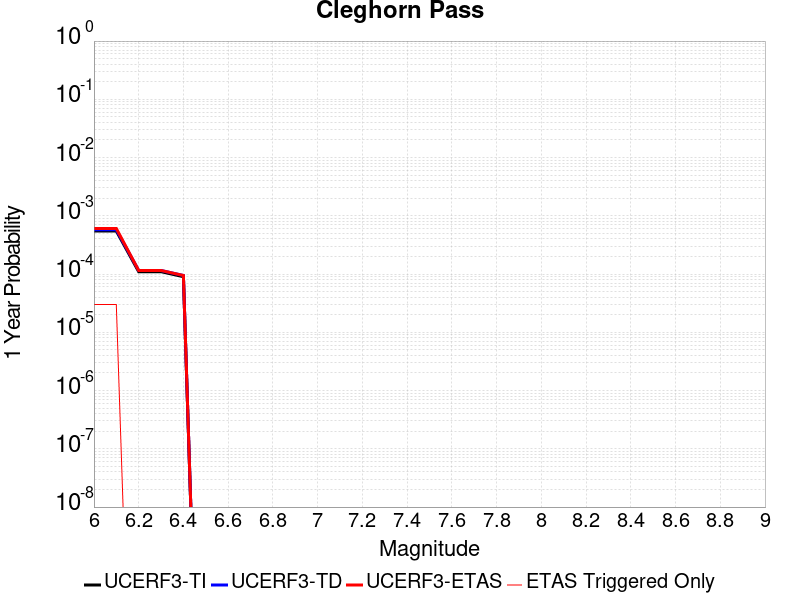 | 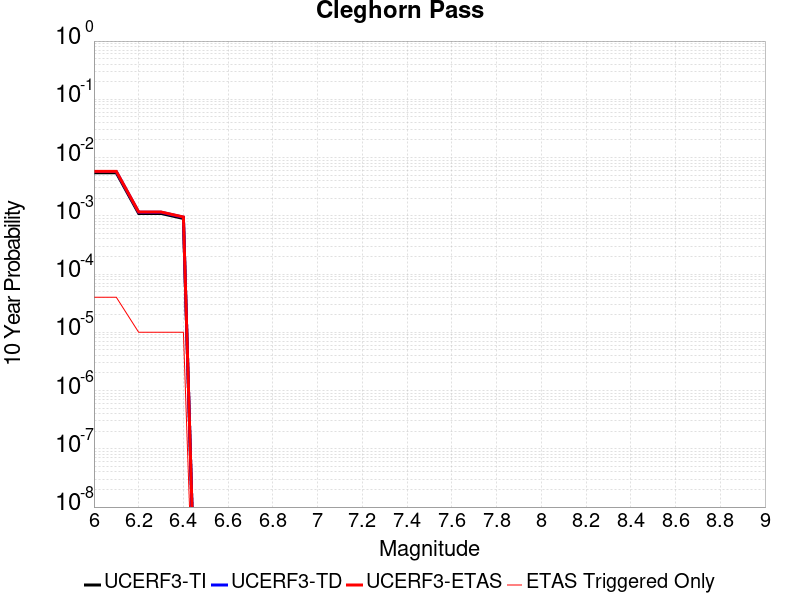 |

| Magnitude | 1 wk TI Prob | 1 wk TD Prob | 1 wk ETAS Prob | 1 wk ETAS/TD Gain | 1 wk ETAS Triggered Only | 1 mo TI Prob | 1 mo TD Prob | 1 mo ETAS Prob | 1 mo ETAS/TD Gain | 1 mo ETAS Triggered Only | 1 yr TI Prob | 1 yr TD Prob | 1 yr ETAS Prob | 1 yr ETAS/TD Gain | 1 yr ETAS Triggered Only | 10 yr TI Prob | 10 yr TD Prob | 10 yr ETAS Prob | 10 yr ETAS/TD Gain | 10 yr ETAS Triggered Only |
|-----|-----|-----|-----|-----|-----|-----|-----|-----|-----|-----|-----|-----|-----|-----|-----|-----|-----|-----|-----|-----|
| 6.0 | 1.0522846E-5 | 1.1040627E-5 | 1.1040627E-5 | 1.0 | 0.0 | 4.509713E-5 | 4.731641E-5 | 5.7315938E-5 | 1.2113332 | 1.0E-5 | 5.4891926E-4 | 5.7597767E-4 | 6.0596043E-4 | 1.0520554 | 3.0E-5 | 0.0054756533 | 0.0057500144 | 0.0057897842 | 1.0069165 | 4.0E-5 |
| 6.1 | 1.0522846E-5 | 1.1040627E-5 | 1.1040627E-5 | 1.0 | 0.0 | 4.509713E-5 | 4.731641E-5 | 5.7315938E-5 | 1.2113332 | 1.0E-5 | 5.4891926E-4 | 5.7597767E-4 | 6.0596043E-4 | 1.0520554 | 3.0E-5 | 0.0054756533 | 0.0057500144 | 0.0057897842 | 1.0069165 | 4.0E-5 |
| 6.2 | 2.1045846E-6 | 2.2081995E-6 | 2.2081995E-6 | 1.0 | 0.0 | 9.019617E-6 | 9.463702E-6 | 9.463702E-6 | 1.0 | 0.0 | 1.098083E-4 | 1.15218674E-4 | 1.15218674E-4 | 1.0 | 0.0 | 0.0010975406 | 0.0011520007 | 0.0011619892 | 1.0086706 | 1.0E-5 |
| 6.3 | 2.1045846E-6 | 2.2081995E-6 | 2.2081995E-6 | 1.0 | 0.0 | 9.019617E-6 | 9.463702E-6 | 9.463702E-6 | 1.0 | 0.0 | 1.098083E-4 | 1.15218674E-4 | 1.15218674E-4 | 1.0 | 0.0 | 0.0010975406 | 0.0011520007 | 0.0011619892 | 1.0086706 | 1.0E-5 |
| 6.4 | 1.7259927E-6 | 1.8108747E-6 | 1.8108747E-6 | 1.0 | 0.0 | 7.3970905E-6 | 7.760892E-6 | 7.760892E-6 | 1.0 | 0.0 | 9.005586E-5 | 9.448885E-5 | 9.448885E-5 | 1.0 | 0.0 | 9.001937E-4 | 9.4488857E-4 | 9.548791E-4 | 1.0105733 | 1.0E-5 |

## San Jacinto (Stepovers Combined)
*[(top)](#table-of-contents)*

| 1 Week | 1 Month | 1 Year | 10 Year |
|-----|-----|-----|-----|
|  |  | 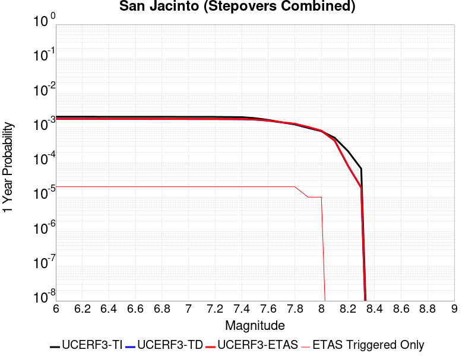 |  |

| Magnitude | 1 wk TI Prob | 1 wk TD Prob | 1 wk ETAS Prob | 1 wk ETAS/TD Gain | 1 wk ETAS Triggered Only | 1 mo TI Prob | 1 mo TD Prob | 1 mo ETAS Prob | 1 mo ETAS/TD Gain | 1 mo ETAS Triggered Only | 1 yr TI Prob | 1 yr TD Prob | 1 yr ETAS Prob | 1 yr ETAS/TD Gain | 1 yr ETAS Triggered Only | 10 yr TI Prob | 10 yr TD Prob | 10 yr ETAS Prob | 10 yr ETAS/TD Gain | 10 yr ETAS Triggered Only |
|-----|-----|-----|-----|-----|-----|-----|-----|-----|-----|-----|-----|-----|-----|-----|-----|-----|-----|-----|-----|-----|
| 6.0 | 4.0667746E-5 | 3.5264533E-5 | 4.526418E-5 | 1.283561 | 1.0E-5 | 1.742787E-4 | 1.5112499E-4 | 1.6112346E-4 | 1.0661604 | 1.0E-5 | 0.0021197782 | 0.001838395 | 0.0018583583 | 1.010859 | 2.0E-5 | 0.020996714 | 0.018982861 | 0.019012291 | 1.0015503 | 3.0E-5 |
| 6.1 | 4.0667746E-5 | 3.5264533E-5 | 4.526418E-5 | 1.283561 | 1.0E-5 | 1.742787E-4 | 1.5112499E-4 | 1.6112346E-4 | 1.0661604 | 1.0E-5 | 0.0021197782 | 0.001838395 | 0.0018583583 | 1.010859 | 2.0E-5 | 0.020996714 | 0.018982861 | 0.019012291 | 1.0015503 | 3.0E-5 |
| 6.2 | 4.0667746E-5 | 3.5264533E-5 | 4.526418E-5 | 1.283561 | 1.0E-5 | 1.742787E-4 | 1.5112499E-4 | 1.6112346E-4 | 1.0661604 | 1.0E-5 | 0.0021197782 | 0.001838395 | 0.0018583583 | 1.010859 | 2.0E-5 | 0.020996714 | 0.018982861 | 0.019012291 | 1.0015503 | 3.0E-5 |
| 6.3 | 4.0667746E-5 | 3.5264533E-5 | 4.526418E-5 | 1.283561 | 1.0E-5 | 1.742787E-4 | 1.5112499E-4 | 1.6112346E-4 | 1.0661604 | 1.0E-5 | 0.0021197782 | 0.001838395 | 0.0018583583 | 1.010859 | 2.0E-5 | 0.020996714 | 0.018982861 | 0.019012291 | 1.0015503 | 3.0E-5 |
| 6.4 | 4.0577226E-5 | 3.5136447E-5 | 4.5136094E-5 | 1.2845948 | 1.0E-5 | 1.738908E-4 | 1.505761E-4 | 1.605746E-4 | 1.0664016 | 1.0E-5 | 0.0021150648 | 0.0018317249 | 0.0018516883 | 1.0108987 | 2.0E-5 | 0.020950472 | 0.018917428 | 0.018946862 | 1.0015558 | 3.0E-5 |
| 6.5 | 4.0577226E-5 | 3.5136447E-5 | 4.5136094E-5 | 1.2845948 | 1.0E-5 | 1.738908E-4 | 1.505761E-4 | 1.605746E-4 | 1.0664016 | 1.0E-5 | 0.0021150648 | 0.0018317249 | 0.0018516883 | 1.0108987 | 2.0E-5 | 0.020950472 | 0.018917428 | 0.018946862 | 1.0015558 | 3.0E-5 |
| 6.6 | 4.053861E-5 | 3.508179E-5 | 4.508144E-5 | 1.2850381 | 1.0E-5 | 1.7372532E-4 | 1.5034188E-4 | 1.6034038E-4 | 1.0665051 | 1.0E-5 | 0.0021130538 | 0.0018288785 | 0.001848842 | 1.0109156 | 2.0E-5 | 0.020930743 | 0.018889507 | 0.01891894 | 1.0015582 | 3.0E-5 |
| 6.7 | 4.0516545E-5 | 3.5050864E-5 | 4.5050514E-5 | 1.2852896 | 1.0E-5 | 1.7363077E-4 | 1.5020935E-4 | 1.6020786E-4 | 1.0665637 | 1.0E-5 | 0.002111905 | 0.001827268 | 0.0018472314 | 1.0109253 | 2.0E-5 | 0.020919468 | 0.018873703 | 0.018903136 | 1.0015595 | 3.0E-5 |
| 6.8 | 4.049434E-5 | 3.5022425E-5 | 4.5022076E-5 | 1.2855213 | 1.0E-5 | 1.7353562E-4 | 1.500875E-4 | 1.60086E-4 | 1.0666178 | 1.0E-5 | 0.0021107488 | 0.0018257869 | 0.0018457504 | 1.0109342 | 2.0E-5 | 0.020908125 | 0.018859116 | 0.01888855 | 1.0015607 | 3.0E-5 |
| 6.9 | 4.046386E-5 | 3.4984987E-5 | 4.4984637E-5 | 1.2858269 | 1.0E-5 | 1.73405E-4 | 1.4992706E-4 | 1.5992556E-4 | 1.0666891 | 1.0E-5 | 0.0021091616 | 0.0018238368 | 0.0018438004 | 1.0109459 | 2.0E-5 | 0.020892553 | 0.018839888 | 0.018869324 | 1.0015624 | 3.0E-5 |
| 7.0 | 4.036382E-5 | 3.486556E-5 | 4.486521E-5 | 1.286806 | 1.0E-5 | 1.7297632E-4 | 1.4941528E-4 | 1.594138E-4 | 1.0669175 | 1.0E-5 | 0.0021039525 | 0.0018176165 | 0.0018375802 | 1.0109835 | 2.0E-5 | 0.02084144 | 0.018778505 | 0.01880794 | 1.0015676 | 3.0E-5 |
| 7.1 | 4.0343282E-5 | 3.4844023E-5 | 4.4843673E-5 | 1.2869833 | 1.0E-5 | 1.7288832E-4 | 1.49323E-4 | 1.593215E-4 | 1.0669589 | 1.0E-5 | 0.002102883 | 0.0018164949 | 0.0018364585 | 1.0109903 | 2.0E-5 | 0.020830948 | 0.018767375 | 0.018796813 | 1.0015686 | 3.0E-5 |
| 7.2 | 4.0257353E-5 | 3.4748526E-5 | 4.4748176E-5 | 1.287772 | 1.0E-5 | 1.725201E-4 | 1.4891376E-4 | 1.5891227E-4 | 1.067143 | 1.0E-5 | 0.0020984085 | 0.0018115207 | 0.0018314845 | 1.0110204 | 2.0E-5 | 0.020787042 | 0.018718114 | 0.018747553 | 1.0015727 | 3.0E-5 |
| 7.3 | 3.9940667E-5 | 3.4576202E-5 | 4.4575856E-5 | 1.2892063 | 1.0E-5 | 1.7116306E-4 | 1.4817533E-4 | 1.5817385E-4 | 1.0674776 | 1.0E-5 | 0.0020819185 | 0.0018025452 | 0.0018225091 | 1.0110754 | 2.0E-5 | 0.020625217 | 0.018626764 | 0.018656205 | 1.0015806 | 3.0E-5 |
| 7.4 | 3.9721202E-5 | 3.4461642E-5 | 4.44613E-5 | 1.2901677 | 1.0E-5 | 1.7022261E-4 | 1.4768442E-4 | 1.5768294E-4 | 1.0677019 | 1.0E-5 | 0.0020704903 | 0.0017965782 | 0.0018165422 | 1.0111123 | 2.0E-5 | 0.020513052 | 0.018565914 | 0.018595356 | 1.0015858 | 3.0E-5 |
| 7.5 | 3.7036873E-5 | 3.352937E-5 | 4.3529035E-5 | 1.298236 | 1.0E-5 | 1.5871979E-4 | 1.4368941E-4 | 1.5368797E-4 | 1.0695846 | 1.0E-5 | 0.0019307006 | 0.0017480177 | 0.0017679827 | 1.0114216 | 2.0E-5 | 0.019140124 | 0.018067606 | 0.018097064 | 1.0016304 | 3.0E-5 |
| 7.6 | 3.2940967E-5 | 3.13107E-5 | 4.1310388E-5 | 1.3193697 | 1.0E-5 | 1.4116794E-4 | 1.3418183E-4 | 1.4418049E-4 | 1.0745157 | 1.0E-5 | 0.0017173645 | 0.0016324419 | 0.0016524092 | 1.0122316 | 2.0E-5 | 0.01704153 | 0.016900703 | 0.016930196 | 1.0017451 | 3.0E-5 |
| 7.7 | 2.8236149E-5 | 2.7880007E-5 | 3.787973E-5 | 1.35867 | 1.0E-5 | 1.2100645E-4 | 1.1948028E-4 | 1.2947909E-4 | 1.0836859 | 1.0E-5 | 0.0014722579 | 0.0014537028 | 0.0014736737 | 1.0137379 | 2.0E-5 | 0.014625421 | 0.015113378 | 0.015142925 | 1.001955 | 3.0E-5 |
| 7.8 | 2.4329287E-5 | 2.5203897E-5 | 3.5203644E-5 | 1.396754 | 1.0E-5 | 1.042642E-4 | 1.0801223E-4 | 1.1801115E-4 | 1.0925721 | 1.0E-5 | 0.0012686774 | 0.0013142565 | 0.0013342302 | 1.0151978 | 2.0E-5 | 0.012614589 | 0.013710698 | 0.013740287 | 1.002158 | 3.0E-5 |
| 7.9 | 1.9370926E-5 | 2.041812E-5 | 3.0417916E-5 | 1.4897511 | 1.0E-5 | 8.301561E-5 | 8.75033E-5 | 9.750242E-5 | 1.1142714 | 1.0E-5 | 0.0010102465 | 0.0010648328 | 0.001074822 | 1.0093812 | 1.0E-5 | 0.0100566605 | 0.011197893 | 0.011207781 | 1.000883 | 1.0E-5 |
| 8.0 | 1.5583017E-5 | 1.5883486E-5 | 2.5883328E-5 | 1.6295747 | 1.0E-5 | 6.6782646E-5 | 6.807031E-5 | 7.806963E-5 | 1.146897 | 1.0E-5 | 8.127754E-4 | 8.2844164E-4 | 8.3843333E-4 | 1.0120609 | 1.0E-5 | 0.008098091 | 0.008780348 | 0.008790261 | 1.0011289 | 1.0E-5 |
| 8.1 | 1.0024873E-5 | 8.290274E-6 | 8.290274E-6 | 1.0 | 0.0 | 4.2963035E-5 | 3.5529265E-5 | 3.5529265E-5 | 1.0 | 0.0 | 5.229494E-4 | 4.3248344E-4 | 4.3248344E-4 | 1.0 | 0.0 | 0.0052172043 | 0.0046523367 | 0.0046523367 | 1.0 | 0.0 |
| 8.2 | 4.142796E-6 | 1.5599394E-6 | 1.5599394E-6 | 1.0 | 0.0 | 1.775472E-5 | 6.6854377E-6 | 6.6854377E-6 | 1.0 | 0.0 | 2.1614227E-4 | 8.139219E-5 | 8.139219E-5 | 1.0 | 0.0 | 0.0021593217 | 9.449501E-4 | 9.449501E-4 | 1.0 | 0.0 |
| 8.3 | 1.2750878E-6 | 3.6089054E-7 | 3.6089054E-7 | 1.0 | 0.0 | 5.4646503E-6 | 1.5466729E-6 | 1.5466729E-6 | 1.0 | 0.0 | 6.653009E-5 | 1.8830584E-5 | 1.8830584E-5 | 1.0 | 0.0 | 6.6510175E-4 | 2.271723E-4 | 2.271723E-4 | 1.0 | 0.0 |

## Calico-Hidalgo
*[(top)](#table-of-contents)*

| 1 Week | 1 Month | 1 Year | 10 Year |
|-----|-----|-----|-----|
|  |  |  |  |

| Magnitude | 1 wk TI Prob | 1 wk TD Prob | 1 wk ETAS Prob | 1 wk ETAS/TD Gain | 1 wk ETAS Triggered Only | 1 mo TI Prob | 1 mo TD Prob | 1 mo ETAS Prob | 1 mo ETAS/TD Gain | 1 mo ETAS Triggered Only | 1 yr TI Prob | 1 yr TD Prob | 1 yr ETAS Prob | 1 yr ETAS/TD Gain | 1 yr ETAS Triggered Only | 10 yr TI Prob | 10 yr TD Prob | 10 yr ETAS Prob | 10 yr ETAS/TD Gain | 10 yr ETAS Triggered Only |
|-----|-----|-----|-----|-----|-----|-----|-----|-----|-----|-----|-----|-----|-----|-----|-----|-----|-----|-----|-----|-----|
| 6.0 | 4.0906612E-5 | 5.070417E-5 | 5.070417E-5 | 1.0 | 0.0 | 1.7530227E-4 | 2.1728777E-4 | 2.1728777E-4 | 1.0 | 0.0 | 0.0021322158 | 0.0026426686 | 0.0026626156 | 1.0075481 | 2.0E-5 | 0.02111873 | 0.02615272 | 0.026181934 | 1.0011171 | 3.0E-5 |
| 6.1 | 4.0906612E-5 | 5.070417E-5 | 5.070417E-5 | 1.0 | 0.0 | 1.7530227E-4 | 2.1728777E-4 | 2.1728777E-4 | 1.0 | 0.0 | 0.0021322158 | 0.0026426686 | 0.0026626156 | 1.0075481 | 2.0E-5 | 0.02111873 | 0.02615272 | 0.026181934 | 1.0011171 | 3.0E-5 |
| 6.2 | 4.0906612E-5 | 5.070417E-5 | 5.070417E-5 | 1.0 | 0.0 | 1.7530227E-4 | 2.1728777E-4 | 2.1728777E-4 | 1.0 | 0.0 | 0.0021322158 | 0.0026426686 | 0.0026626156 | 1.0075481 | 2.0E-5 | 0.02111873 | 0.02615272 | 0.026181934 | 1.0011171 | 3.0E-5 |
| 6.3 | 2.4242801E-5 | 3.0090901E-5 | 3.0090901E-5 | 1.0 | 0.0 | 1.0389358E-4 | 1.2895482E-4 | 1.2895482E-4 | 1.0 | 0.0 | 0.0012641704 | 0.0015689277 | 0.001578912 | 1.0063637 | 1.0E-5 | 0.01257003 | 0.015582195 | 0.015601883 | 1.0012635 | 2.0E-5 |
| 6.4 | 2.4242801E-5 | 3.0090901E-5 | 3.0090901E-5 | 1.0 | 0.0 | 1.0389358E-4 | 1.2895482E-4 | 1.2895482E-4 | 1.0 | 0.0 | 0.0012641704 | 0.0015689277 | 0.001578912 | 1.0063637 | 1.0E-5 | 0.01257003 | 0.015582195 | 0.015601883 | 1.0012635 | 2.0E-5 |
| 6.5 | 2.0286952E-5 | 2.531601E-5 | 2.531601E-5 | 1.0 | 0.0 | 8.694118E-5 | 1.0849277E-4 | 1.0849277E-4 | 1.0 | 0.0 | 0.0010579949 | 0.0013201162 | 0.001330103 | 1.0075651 | 1.0E-5 | 0.010529719 | 0.013124678 | 0.013144416 | 1.0015038 | 2.0E-5 |
| 6.6 | 2.0269223E-5 | 2.529696E-5 | 2.529696E-5 | 1.0 | 0.0 | 8.6865206E-5 | 1.08411135E-4 | 1.08411135E-4 | 1.0 | 0.0 | 0.0010570707 | 0.0013191235 | 0.0013291104 | 1.0075707 | 1.0E-5 | 0.010520565 | 0.013114868 | 0.013134605 | 1.001505 | 2.0E-5 |
| 6.7 | 1.799852E-5 | 2.2540898E-5 | 2.2540898E-5 | 1.0 | 0.0 | 7.713423E-5 | 9.660036E-5 | 9.660036E-5 | 1.0 | 0.0 | 9.3870464E-4 | 0.0011754894 | 0.0011854776 | 1.0084971 | 1.0E-5 | 0.009347493 | 0.011694328 | 0.011714093 | 1.0016903 | 2.0E-5 |
| 6.8 | 1.7458793E-5 | 2.1842547E-5 | 2.1842547E-5 | 1.0 | 0.0 | 7.4821255E-5 | 9.360763E-5 | 9.360763E-5 | 1.0 | 0.0 | 9.10568E-4 | 0.0011390916 | 0.0011490801 | 1.0087689 | 1.0E-5 | 0.009068459 | 0.011334113 | 0.011353887 | 1.0017446 | 2.0E-5 |
| 6.9 | 1.542884E-5 | 1.9026254E-5 | 1.9026254E-5 | 1.0 | 0.0 | 6.612192E-5 | 8.1538616E-5 | 8.1538616E-5 | 1.0 | 0.0 | 8.04737E-4 | 9.922937E-4 | 9.922937E-4 | 1.0 | 0.0 | 0.008018291 | 0.009880027 | 0.009889928 | 1.0010022 | 1.0E-5 |
| 7.0 | 1.468253E-5 | 1.8031062E-5 | 1.8031062E-5 | 1.0 | 0.0 | 6.292361E-5 | 7.727376E-5 | 7.727376E-5 | 1.0 | 0.0 | 7.658257E-4 | 9.40415E-4 | 9.40415E-4 | 1.0 | 0.0 | 0.0076319184 | 0.009365721 | 0.009375627 | 1.0010577 | 1.0E-5 |
| 7.1 | 1.3139281E-5 | 1.6201364E-5 | 1.6201364E-5 | 1.0 | 0.0 | 5.6309986E-5 | 6.943264E-5 | 6.943264E-5 | 1.0 | 0.0 | 6.853584E-4 | 8.450271E-4 | 8.450271E-4 | 1.0 | 0.0 | 0.0068324856 | 0.008419436 | 0.008429352 | 1.0011777 | 1.0E-5 |
| 7.2 | 1.1127404E-5 | 1.3867016E-5 | 1.3867016E-5 | 1.0 | 0.0 | 4.7688E-5 | 5.9428774E-5 | 5.9428774E-5 | 1.0 | 0.0 | 5.8044674E-4 | 7.2331604E-4 | 7.2331604E-4 | 1.0 | 0.0 | 0.0057893298 | 0.0072107255 | 0.0072206534 | 1.0013769 | 1.0E-5 |
| 7.3 | 9.808154E-6 | 1.2176565E-5 | 1.2176565E-5 | 1.0 | 0.0 | 4.2034266E-5 | 5.2184296E-5 | 5.2184296E-5 | 1.0 | 0.0 | 5.11647E-4 | 6.351693E-4 | 6.351693E-4 | 1.0 | 0.0 | 0.0051047057 | 0.0063346145 | 0.006344551 | 1.0015687 | 1.0E-5 |
| 7.4 | 7.942452E-6 | 9.79233E-6 | 9.79233E-6 | 1.0 | 0.0 | 3.4038632E-5 | 4.1966505E-5 | 4.1966505E-5 | 1.0 | 0.0 | 4.1434157E-4 | 5.108319E-4 | 5.108319E-4 | 1.0 | 0.0 | 0.0041356985 | 0.0050975177 | 0.005107467 | 1.0019517 | 1.0E-5 |
| 7.5 | 4.7121216E-6 | 5.772962E-6 | 5.772962E-6 | 1.0 | 0.0 | 2.019465E-5 | 2.4741075E-5 | 2.4741075E-5 | 1.0 | 0.0 | 2.4584212E-4 | 3.0118861E-4 | 3.0118861E-4 | 1.0 | 0.0 | 0.0024557032 | 0.0030085566 | 0.0030185266 | 1.0033139 | 1.0E-5 |
| 7.6 | 2.21172E-7 | 2.6040198E-7 | 2.6040198E-7 | 1.0 | 0.0 | 9.478797E-7 | 1.1160082E-6 | 1.1160082E-6 | 1.0 | 0.0 | 1.1540374E-5 | 1.3587343E-5 | 1.3587343E-5 | 1.0 | 0.0 | 1.1539775E-4 | 1.3586794E-4 | 1.3586794E-4 | 1.0 | 0.0 |

## San Jacinto (Anza) rev
*[(top)](#table-of-contents)*

| 1 Week | 1 Month | 1 Year | 10 Year |
|-----|-----|-----|-----|
|  | 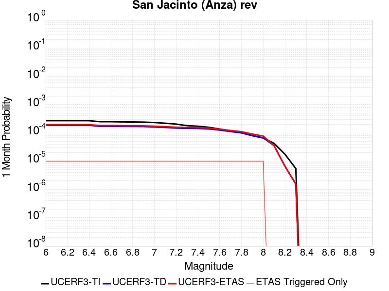 |  | 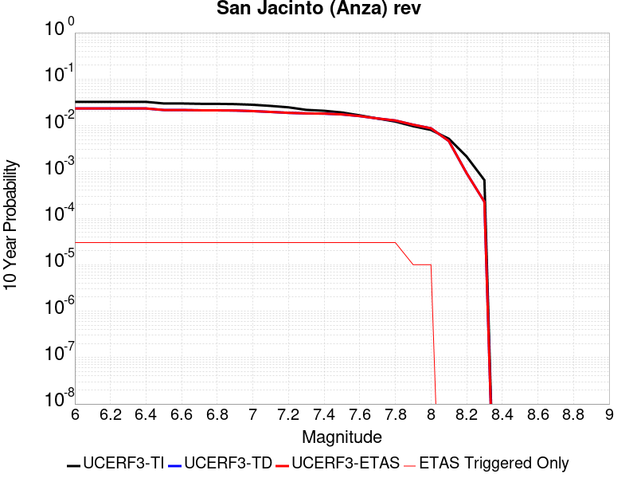 |

| Magnitude | 1 wk TI Prob | 1 wk TD Prob | 1 wk ETAS Prob | 1 wk ETAS/TD Gain | 1 wk ETAS Triggered Only | 1 mo TI Prob | 1 mo TD Prob | 1 mo ETAS Prob | 1 mo ETAS/TD Gain | 1 mo ETAS Triggered Only | 1 yr TI Prob | 1 yr TD Prob | 1 yr ETAS Prob | 1 yr ETAS/TD Gain | 1 yr ETAS Triggered Only | 10 yr TI Prob | 10 yr TD Prob | 10 yr ETAS Prob | 10 yr ETAS/TD Gain | 10 yr ETAS Triggered Only |
|-----|-----|-----|-----|-----|-----|-----|-----|-----|-----|-----|-----|-----|-----|-----|-----|-----|-----|-----|-----|-----|
| 6.0 | 6.3015636E-5 | 4.3291904E-5 | 5.329147E-5 | 1.23098 | 1.0E-5 | 2.7003905E-4 | 1.8552359E-4 | 1.9552174E-4 | 1.0538915 | 1.0E-5 | 0.0032827691 | 0.0022564218 | 0.0022763766 | 1.0088435 | 2.0E-5 | 0.032346968 | 0.02328549 | 0.02331479 | 1.0012584 | 3.0E-5 |
| 6.1 | 6.3015636E-5 | 4.3291904E-5 | 5.329147E-5 | 1.23098 | 1.0E-5 | 2.7003905E-4 | 1.8552359E-4 | 1.9552174E-4 | 1.0538915 | 1.0E-5 | 0.0032827691 | 0.0022564218 | 0.0022763766 | 1.0088435 | 2.0E-5 | 0.032346968 | 0.02328549 | 0.02331479 | 1.0012584 | 3.0E-5 |
| 6.2 | 6.3015636E-5 | 4.3291904E-5 | 5.329147E-5 | 1.23098 | 1.0E-5 | 2.7003905E-4 | 1.8552359E-4 | 1.9552174E-4 | 1.0538915 | 1.0E-5 | 0.0032827691 | 0.0022564218 | 0.0022763766 | 1.0088435 | 2.0E-5 | 0.032346968 | 0.02328549 | 0.02331479 | 1.0012584 | 3.0E-5 |
| 6.3 | 6.3015636E-5 | 4.3291904E-5 | 5.329147E-5 | 1.23098 | 1.0E-5 | 2.7003905E-4 | 1.8552359E-4 | 1.9552174E-4 | 1.0538915 | 1.0E-5 | 0.0032827691 | 0.0022564218 | 0.0022763766 | 1.0088435 | 2.0E-5 | 0.032346968 | 0.02328549 | 0.02331479 | 1.0012584 | 3.0E-5 |
| 6.4 | 6.3015636E-5 | 4.3291904E-5 | 5.329147E-5 | 1.23098 | 1.0E-5 | 2.7003905E-4 | 1.8552359E-4 | 1.9552174E-4 | 1.0538915 | 1.0E-5 | 0.0032827691 | 0.0022564218 | 0.0022763766 | 1.0088435 | 2.0E-5 | 0.032346968 | 0.02328549 | 0.02331479 | 1.0012584 | 3.0E-5 |
| 6.5 | 5.811017E-5 | 4.007384E-5 | 5.007344E-5 | 1.2495294 | 1.0E-5 | 2.4901982E-4 | 1.7173376E-4 | 1.8173203E-4 | 1.0582197 | 1.0E-5 | 0.0030276014 | 0.002088859 | 0.0021088172 | 1.0095546 | 2.0E-5 | 0.02986684 | 0.021582697 | 0.02161205 | 1.00136 | 3.0E-5 |
| 6.6 | 5.811017E-5 | 4.007384E-5 | 5.007344E-5 | 1.2495294 | 1.0E-5 | 2.4901982E-4 | 1.7173376E-4 | 1.8173203E-4 | 1.0582197 | 1.0E-5 | 0.0030276014 | 0.002088859 | 0.0021088172 | 1.0095546 | 2.0E-5 | 0.02986684 | 0.021582697 | 0.02161205 | 1.00136 | 3.0E-5 |
| 6.7 | 5.712442E-5 | 3.949657E-5 | 4.949617E-5 | 1.2531766 | 1.0E-5 | 2.4479596E-4 | 1.6926005E-4 | 1.7925835E-4 | 1.0590707 | 1.0E-5 | 0.0029763177 | 0.002058799 | 0.0020787576 | 1.0096945 | 2.0E-5 | 0.029367693 | 0.021274779 | 0.02130414 | 1.0013801 | 3.0E-5 |
| 6.8 | 5.6967532E-5 | 3.9352853E-5 | 4.935246E-5 | 1.2541012 | 1.0E-5 | 2.4412372E-4 | 1.6864421E-4 | 1.7864253E-4 | 1.0592865 | 1.0E-5 | 0.0029681553 | 0.0020513153 | 0.0020712742 | 1.0097299 | 2.0E-5 | 0.029288229 | 0.02120038 | 0.021229744 | 1.0013851 | 3.0E-5 |
| 6.9 | 5.6211324E-5 | 3.9057773E-5 | 4.905738E-5 | 1.256021 | 1.0E-5 | 2.4088343E-4 | 1.6737974E-4 | 1.7737807E-4 | 1.0597343 | 1.0E-5 | 0.0029288116 | 0.0020359491 | 0.0020559083 | 1.0098034 | 2.0E-5 | 0.028905109 | 0.021039387 | 0.021068756 | 1.001396 | 3.0E-5 |
| 7.0 | 5.4383527E-5 | 3.7918566E-5 | 4.7918187E-5 | 1.263713 | 1.0E-5 | 2.3305144E-4 | 1.6249805E-4 | 1.7249642E-4 | 1.0615292 | 1.0E-5 | 0.0028337094 | 0.0019766234 | 0.0019965838 | 1.0100982 | 2.0E-5 | 0.027978465 | 0.02043281 | 0.020462196 | 1.0014383 | 3.0E-5 |
| 7.1 | 5.1393665E-5 | 3.6381425E-5 | 4.6381065E-5 | 1.2748555 | 1.0E-5 | 2.2023996E-4 | 1.5591111E-4 | 1.6590954E-4 | 1.0641291 | 1.0E-5 | 0.0026781242 | 0.0018965693 | 0.0019165314 | 1.0105253 | 2.0E-5 | 0.026460782 | 0.01960793 | 0.019637343 | 1.0015 | 3.0E-5 |
| 7.2 | 4.785222E-5 | 3.4732413E-5 | 4.4732067E-5 | 1.2879055 | 1.0E-5 | 2.0506482E-4 | 1.4884473E-4 | 1.5884325E-4 | 1.0671741 | 1.0E-5 | 0.0024938055 | 0.0018106819 | 0.0018306456 | 1.0110255 | 2.0E-5 | 0.024660049 | 0.018725147 | 0.018754585 | 1.0015721 | 3.0E-5 |
| 7.3 | 4.2143256E-5 | 3.3828E-5 | 4.3827662E-5 | 1.295603 | 1.0E-5 | 1.8060145E-4 | 1.449691E-4 | 1.5496765E-4 | 1.0689702 | 1.0E-5 | 0.002196605 | 0.0017635735 | 0.0017835381 | 1.0113206 | 2.0E-5 | 0.02175019 | 0.018233053 | 0.018262506 | 1.0016154 | 3.0E-5 |
| 7.4 | 4.0264713E-5 | 3.3466327E-5 | 4.3465992E-5 | 1.2987978 | 1.0E-5 | 1.7255165E-4 | 1.4341925E-4 | 1.5341782E-4 | 1.0697156 | 1.0E-5 | 0.002098792 | 0.0017447342 | 0.0017646994 | 1.011443 | 2.0E-5 | 0.020790804 | 0.018037783 | 0.01806724 | 1.0016332 | 3.0E-5 |
| 7.5 | 3.694492E-5 | 3.2180662E-5 | 4.218034E-5 | 1.3107356 | 1.0E-5 | 1.5832575E-4 | 1.3790985E-4 | 1.4790847E-4 | 1.0725012 | 1.0E-5 | 0.0019259118 | 0.0016777625 | 0.0016977289 | 1.0119007 | 2.0E-5 | 0.01909306 | 0.017354406 | 0.017383887 | 1.0016986 | 3.0E-5 |
| 7.6 | 3.200565E-5 | 2.9496878E-5 | 3.9496583E-5 | 1.3390089 | 1.0E-5 | 1.3715986E-4 | 1.2640908E-4 | 1.3640782E-4 | 1.0790982 | 1.0E-5 | 0.001668642 | 0.0015379463 | 0.0015579155 | 1.0129844 | 2.0E-5 | 0.01656168 | 0.015942672 | 0.015972195 | 1.0018518 | 3.0E-5 |
| 7.7 | 2.731642E-5 | 2.6088961E-5 | 3.60887E-5 | 1.3832939 | 1.0E-5 | 1.1706512E-4 | 1.1180505E-4 | 1.2180393E-4 | 1.0894314 | 1.0E-5 | 0.001424336 | 0.0013603775 | 0.0013803503 | 1.0146818 | 2.0E-5 | 0.014152412 | 0.014165312 | 0.014194887 | 1.0020878 | 3.0E-5 |
| 7.8 | 2.3466424E-5 | 2.3501236E-5 | 3.3501E-5 | 1.4254996 | 1.0E-5 | 1.0056651E-4 | 1.007157E-4 | 1.1071469E-4 | 1.0992794 | 1.0E-5 | 0.0012237094 | 0.0012255247 | 0.0012455002 | 1.0162995 | 2.0E-5 | 0.012169928 | 0.01280721 | 0.012836826 | 1.0023124 | 3.0E-5 |
| 7.9 | 1.8611925E-5 | 1.8904842E-5 | 2.8904653E-5 | 1.528955 | 1.0E-5 | 7.9762955E-5 | 8.101824E-5 | 9.101743E-5 | 1.123419 | 1.0E-5 | 9.7068126E-4 | 9.859514E-4 | 9.959416E-4 | 1.0101324 | 1.0E-5 | 0.0096645225 | 0.01039224 | 0.0104021365 | 1.0009522 | 1.0E-5 |
| 8.0 | 1.5460775E-5 | 1.5738E-5 | 2.5737843E-5 | 1.6353947 | 1.0E-5 | 6.6258784E-5 | 6.744683E-5 | 7.744616E-5 | 1.1482549 | 1.0E-5 | 8.0640207E-4 | 8.2085654E-4 | 8.308483E-4 | 1.0121723 | 1.0E-5 | 0.008034821 | 0.0087014325 | 0.0087113455 | 1.0011393 | 1.0E-5 |
| 8.1 | 9.983884E-6 | 8.267833E-6 | 8.267833E-6 | 1.0 | 0.0 | 4.2787375E-5 | 3.543309E-5 | 3.543309E-5 | 1.0 | 0.0 | 5.2081177E-4 | 4.3131303E-4 | 4.3131303E-4 | 1.0 | 0.0 | 0.0051959283 | 0.004638954 | 0.004638954 | 1.0 | 0.0 |
| 8.2 | 4.1226E-6 | 1.5519201E-6 | 1.5519201E-6 | 1.0 | 0.0 | 1.7668166E-5 | 6.6510697E-6 | 6.6510697E-6 | 1.0 | 0.0 | 2.1508869E-4 | 8.097379E-5 | 8.097379E-5 | 1.0 | 0.0 | 0.0021488064 | 9.3998964E-4 | 9.3998964E-4 | 1.0 | 0.0 |
| 8.3 | 1.2750878E-6 | 3.6089054E-7 | 3.6089054E-7 | 1.0 | 0.0 | 5.4646503E-6 | 1.5466729E-6 | 1.5466729E-6 | 1.0 | 0.0 | 6.653009E-5 | 1.8830584E-5 | 1.8830584E-5 | 1.0 | 0.0 | 6.6510175E-4 | 2.271723E-4 | 2.271723E-4 | 1.0 | 0.0 |

## Baker
*[(top)](#table-of-contents)*

| 1 Week | 1 Month | 1 Year | 10 Year |
|-----|-----|-----|-----|
| 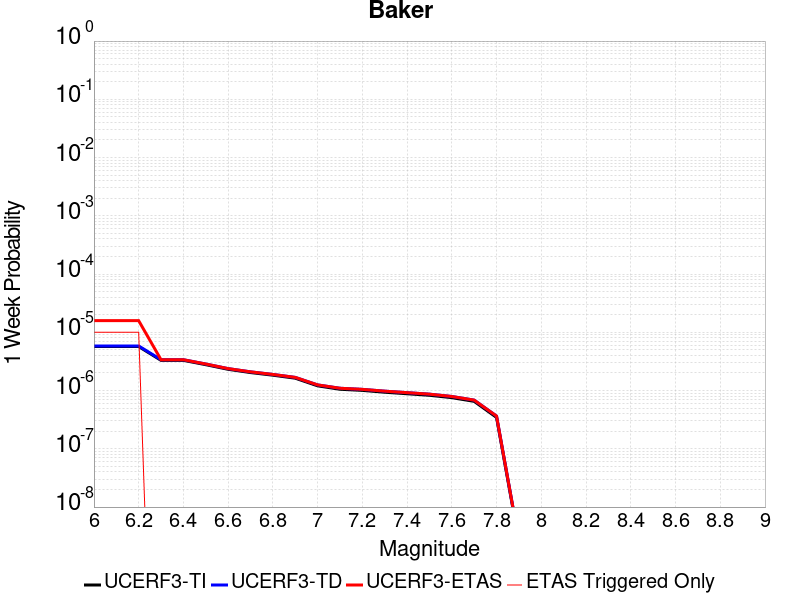 |  |  | 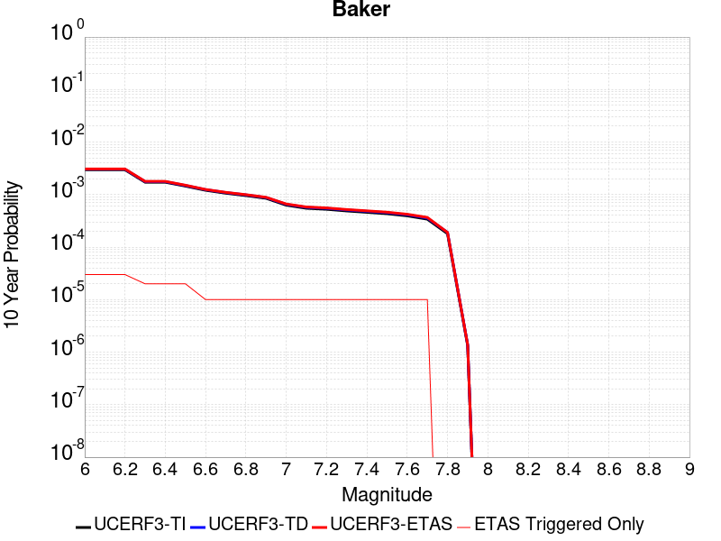 |

| Magnitude | 1 wk TI Prob | 1 wk TD Prob | 1 wk ETAS Prob | 1 wk ETAS/TD Gain | 1 wk ETAS Triggered Only | 1 mo TI Prob | 1 mo TD Prob | 1 mo ETAS Prob | 1 mo ETAS/TD Gain | 1 mo ETAS Triggered Only | 1 yr TI Prob | 1 yr TD Prob | 1 yr ETAS Prob | 1 yr ETAS/TD Gain | 1 yr ETAS Triggered Only | 10 yr TI Prob | 10 yr TD Prob | 10 yr ETAS Prob | 10 yr ETAS/TD Gain | 10 yr ETAS Triggered Only |
|-----|-----|-----|-----|-----|-----|-----|-----|-----|-----|-----|-----|-----|-----|-----|-----|-----|-----|-----|-----|-----|
| 6.0 | 5.695525E-6 | 5.8348332E-6 | 1.5834776E-5 | 2.713835 | 1.0E-5 | 2.4409164E-5 | 2.5006211E-5 | 4.5005712E-5 | 1.7997813 | 2.0E-5 | 2.9714106E-4 | 3.044121E-4 | 3.3440295E-4 | 1.0985206 | 3.0E-5 | 0.0029674405 | 0.0030403468 | 0.0030702555 | 1.0098373 | 3.0E-5 |
| 6.1 | 5.695525E-6 | 5.8348332E-6 | 1.5834776E-5 | 2.713835 | 1.0E-5 | 2.4409164E-5 | 2.5006211E-5 | 4.5005712E-5 | 1.7997813 | 2.0E-5 | 2.9714106E-4 | 3.044121E-4 | 3.3440295E-4 | 1.0985206 | 3.0E-5 | 0.0029674405 | 0.0030403468 | 0.0030702555 | 1.0098373 | 3.0E-5 |
| 6.2 | 5.695525E-6 | 5.8348332E-6 | 1.5834776E-5 | 2.713835 | 1.0E-5 | 2.4409164E-5 | 2.5006211E-5 | 4.5005712E-5 | 1.7997813 | 2.0E-5 | 2.9714106E-4 | 3.044121E-4 | 3.3440295E-4 | 1.0985206 | 3.0E-5 | 0.0029674405 | 0.0030403468 | 0.0030702555 | 1.0098373 | 3.0E-5 |
| 6.3 | 3.2995713E-6 | 3.3836648E-6 | 3.3836648E-6 | 1.0 | 0.0 | 1.4140943E-5 | 1.4501343E-5 | 2.4501198E-5 | 1.6895813 | 1.0E-5 | 1.7215237E-4 | 1.7654001E-4 | 1.9653648E-4 | 1.1132687 | 2.0E-5 | 0.0017201907 | 0.0017640449 | 0.0017840095 | 1.0113176 | 2.0E-5 |
| 6.4 | 3.2995713E-6 | 3.3836648E-6 | 3.3836648E-6 | 1.0 | 0.0 | 1.4140943E-5 | 1.4501343E-5 | 2.4501198E-5 | 1.6895813 | 1.0E-5 | 1.7215237E-4 | 1.7654001E-4 | 1.9653648E-4 | 1.1132687 | 2.0E-5 | 0.0017201907 | 0.0017640449 | 0.0017840095 | 1.0113176 | 2.0E-5 |
| 6.5 | 2.782202E-6 | 2.8558384E-6 | 2.8558384E-6 | 1.0 | 0.0 | 1.1923668E-5 | 1.2239252E-5 | 2.223913E-5 | 1.8170334 | 1.0E-5 | 1.4516099E-4 | 1.4900303E-4 | 1.6900005E-4 | 1.1342055 | 2.0E-5 | 0.001450662 | 0.001489064 | 0.0015090342 | 1.0134113 | 2.0E-5 |
| 6.6 | 2.3163404E-6 | 2.3809182E-6 | 2.3809182E-6 | 1.0 | 0.0 | 9.927136E-6 | 1.0203897E-5 | 2.0203794E-5 | 1.9800078 | 1.0E-5 | 1.20856166E-4 | 1.2422555E-4 | 1.3422432E-4 | 1.0804887 | 1.0E-5 | 0.0012079047 | 0.0012415814 | 0.001251569 | 1.0080442 | 1.0E-5 |
| 6.7 | 2.037056E-6 | 2.0964987E-6 | 2.0964987E-6 | 1.0 | 0.0 | 8.7302105E-6 | 8.984965E-6 | 1.8984874E-5 | 2.1129603 | 1.0E-5 | 1.0628513E-4 | 1.09386616E-4 | 1.1938553E-4 | 1.0914088 | 1.0E-5 | 0.0010623431 | 0.0010933438 | 0.001103333 | 1.0091362 | 1.0E-5 |
| 6.8 | 1.8356744E-6 | 1.8915271E-6 | 1.8915271E-6 | 1.0 | 0.0 | 7.867153E-6 | 8.10652E-6 | 1.8106439E-5 | 2.2335649 | 1.0E-5 | 9.577837E-5 | 9.869256E-5 | 1.0869157E-4 | 1.1013148 | 1.0E-5 | 9.57371E-4 | 9.865012E-4 | 9.964914E-4 | 1.0101268 | 1.0E-5 |
| 6.9 | 1.6310546E-6 | 1.6832057E-6 | 1.6832057E-6 | 1.0 | 0.0 | 6.9902153E-6 | 7.2137195E-6 | 1.7213648E-5 | 2.3862374 | 1.0E-5 | 8.510255E-5 | 8.782361E-5 | 9.782273E-5 | 1.1138546 | 1.0E-5 | 8.5069967E-4 | 8.779003E-4 | 8.878915E-4 | 1.0113808 | 1.0E-5 |
| 7.0 | 1.2058036E-6 | 1.2508652E-6 | 1.2508652E-6 | 1.0 | 0.0 | 5.1677193E-6 | 5.3608405E-6 | 1.5360787E-5 | 2.865369 | 1.0E-5 | 6.291517E-5 | 6.52663E-5 | 7.526565E-5 | 1.1532084 | 1.0E-5 | 6.289736E-4 | 6.5247365E-4 | 6.624671E-4 | 1.0153162 | 1.0E-5 |
| 7.1 | 1.052382E-6 | 1.0951596E-6 | 1.0951596E-6 | 1.0 | 0.0 | 4.5102006E-6 | 4.693533E-6 | 1.4693486E-5 | 3.1305811 | 1.0E-5 | 5.491031E-5 | 5.7142275E-5 | 6.71417E-5 | 1.1749917 | 1.0E-5 | 5.4896745E-4 | 5.712767E-4 | 5.8127096E-4 | 1.0174947 | 1.0E-5 |
| 7.2 | 1.0067454E-6 | 1.0487698E-6 | 1.0487698E-6 | 1.0 | 0.0 | 4.3146156E-6 | 4.4947205E-6 | 1.4494675E-5 | 3.2248225 | 1.0E-5 | 5.252918E-5 | 5.4721855E-5 | 6.472131E-5 | 1.1827323 | 1.0E-5 | 5.251676E-4 | 5.4708467E-4 | 5.570792E-4 | 1.0182687 | 1.0E-5 |
| 7.3 | 9.3596316E-7 | 9.767712E-7 | 9.767712E-7 | 1.0 | 0.0 | 4.0112645E-6 | 4.1861554E-6 | 1.4186114E-5 | 3.3888166 | 1.0E-5 | 4.8836053E-5 | 5.096526E-5 | 6.096475E-5 | 1.196202 | 1.0E-5 | 4.8825322E-4 | 5.095365E-4 | 5.1953143E-4 | 1.0196157 | 1.0E-5 |
| 7.4 | 8.8117395E-7 | 9.207652E-7 | 9.207652E-7 | 1.0 | 0.0 | 3.7764542E-6 | 3.9461306E-6 | 1.3946092E-5 | 3.534118 | 1.0E-5 | 4.5977362E-5 | 4.804309E-5 | 5.804261E-5 | 1.2081364 | 1.0E-5 | 4.596785E-4 | 4.803278E-4 | 4.90323E-4 | 1.0208092 | 1.0E-5 |
| 7.5 | 8.292386E-7 | 8.674585E-7 | 8.674585E-7 | 1.0 | 0.0 | 3.5538749E-6 | 3.717674E-6 | 1.3717637E-5 | 3.689844 | 1.0E-5 | 4.326757E-5 | 4.526175E-5 | 5.5261295E-5 | 1.2209271 | 1.0E-5 | 4.3259145E-4 | 4.5252603E-4 | 4.625215E-4 | 1.0220882 | 1.0E-5 |
| 7.6 | 7.553842E-7 | 7.9144604E-7 | 7.9144604E-7 | 1.0 | 0.0 | 3.2373566E-6 | 3.3919073E-6 | 1.3391873E-5 | 3.9481838 | 1.0E-5 | 3.9414106E-5 | 4.1295694E-5 | 5.1295283E-5 | 1.242146 | 1.0E-5 | 3.9407116E-4 | 4.128809E-4 | 4.228768E-4 | 1.0242101 | 1.0E-5 |
| 7.7 | 6.5285366E-7 | 6.8527874E-7 | 6.8527874E-7 | 1.0 | 0.0 | 2.797941E-6 | 2.9369057E-6 | 1.2936876E-5 | 4.4049344 | 1.0E-5 | 3.40644E-5 | 3.5756246E-5 | 4.575589E-5 | 1.2796614 | 1.0E-5 | 3.405918E-4 | 3.575056E-4 | 3.67502E-4 | 1.0279616 | 1.0E-5 |
| 7.8 | 3.4586725E-7 | 3.648256E-7 | 3.648256E-7 | 1.0 | 0.0 | 1.4822873E-6 | 1.5635374E-6 | 1.5635374E-6 | 1.0 | 0.0 | 1.80467E-5 | 1.9035906E-5 | 1.9035906E-5 | 1.0 | 0.0 | 1.8045233E-4 | 1.903432E-4 | 1.903432E-4 | 1.0 | 0.0 |
| 7.9 | 2.5591178E-9 | 2.6696687E-9 | 2.6696687E-9 | 1.0 | 0.0 | 1.0967647E-8 | 1.1441437E-8 | 1.1441437E-8 | 1.0 | 0.0 | 1.335311E-7 | 1.392995E-7 | 1.392995E-7 | 1.0 | 0.0 | 1.3353102E-6 | 1.3929949E-6 | 1.3929949E-6 | 1.0 | 0.0 |

## Big Pine (Central)
*[(top)](#table-of-contents)*

| 1 Week | 1 Month | 1 Year | 10 Year |
|-----|-----|-----|-----|
|  |  | 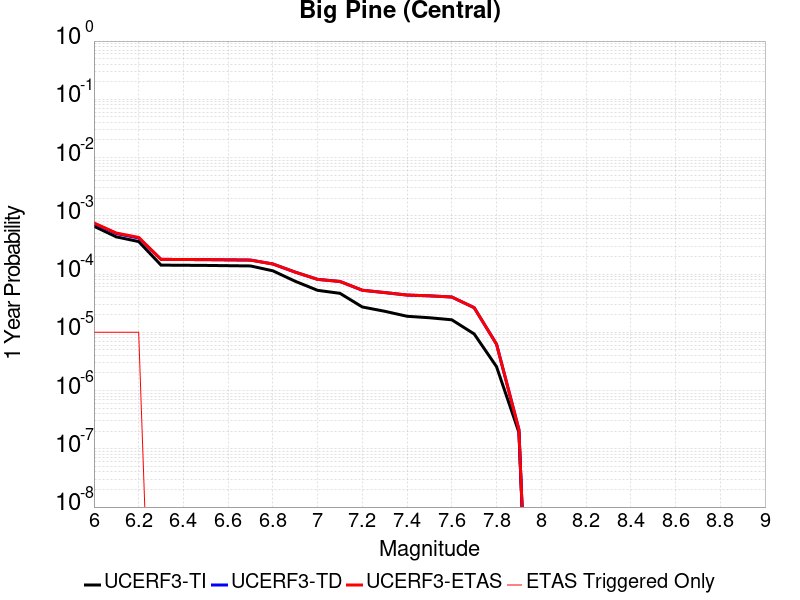 |  |

| Magnitude | 1 wk TI Prob | 1 wk TD Prob | 1 wk ETAS Prob | 1 wk ETAS/TD Gain | 1 wk ETAS Triggered Only | 1 mo TI Prob | 1 mo TD Prob | 1 mo ETAS Prob | 1 mo ETAS/TD Gain | 1 mo ETAS Triggered Only | 1 yr TI Prob | 1 yr TD Prob | 1 yr ETAS Prob | 1 yr ETAS/TD Gain | 1 yr ETAS Triggered Only | 10 yr TI Prob | 10 yr TD Prob | 10 yr ETAS Prob | 10 yr ETAS/TD Gain | 10 yr ETAS Triggered Only |
|-----|-----|-----|-----|-----|-----|-----|-----|-----|-----|-----|-----|-----|-----|-----|-----|-----|-----|-----|-----|-----|
| 6.0 | 1.2706755E-5 | 1.4250498E-5 | 1.4250498E-5 | 1.0 | 0.0 | 5.4456385E-5 | 6.107234E-5 | 6.107234E-5 | 1.0 | 0.0 | 6.628048E-4 | 7.4333866E-4 | 7.5333123E-4 | 1.0134429 | 1.0E-5 | 0.006608314 | 0.0074135745 | 0.007433426 | 1.0026778 | 2.0E-5 |
| 6.1 | 8.342579E-6 | 9.5107425E-6 | 9.5107425E-6 | 1.0 | 0.0 | 3.5753423E-5 | 4.075981E-5 | 4.075981E-5 | 1.0 | 0.0 | 4.3521097E-4 | 4.961594E-4 | 5.0615444E-4 | 1.0201448 | 1.0E-5 | 0.0043435963 | 0.0049540955 | 0.004964046 | 1.0020086 | 1.0E-5 |
| 6.2 | 6.923899E-6 | 7.967132E-6 | 7.967132E-6 | 1.0 | 0.0 | 2.9673516E-5 | 3.4144512E-5 | 3.4144512E-5 | 1.0 | 0.0 | 3.6121515E-4 | 4.1564938E-4 | 4.256452E-4 | 1.0240487 | 1.0E-5 | 0.003606286 | 0.0041520516 | 0.0041620103 | 1.0023985 | 1.0E-5 |
| 6.3 | 2.728396E-6 | 3.424285E-6 | 3.424285E-6 | 1.0 | 0.0 | 1.1693074E-5 | 1.467543E-5 | 1.467543E-5 | 1.0 | 0.0 | 1.4235388E-4 | 1.7865958E-4 | 1.7865958E-4 | 1.0 | 0.0 | 0.0014226272 | 0.0017866908 | 0.0017966729 | 1.005587 | 1.0E-5 |
| 6.4 | 2.7136944E-6 | 3.4085786E-6 | 3.4085786E-6 | 1.0 | 0.0 | 1.1630066E-5 | 1.46081165E-5 | 1.46081165E-5 | 1.0 | 0.0 | 1.4158686E-4 | 1.7784018E-4 | 1.7784018E-4 | 1.0 | 0.0 | 0.0014149669 | 0.0017785098 | 0.0017884921 | 1.0056127 | 1.0E-5 |
| 6.5 | 2.6971882E-6 | 3.3909237E-6 | 3.3909237E-6 | 1.0 | 0.0 | 1.1559327E-5 | 1.4532454E-5 | 1.4532454E-5 | 1.0 | 0.0 | 1.4072572E-4 | 1.7691913E-4 | 1.7691913E-4 | 1.0 | 0.0 | 0.0014063664 | 0.001769314 | 0.0017792964 | 1.0056419 | 1.0E-5 |
| 6.6 | 2.669092E-6 | 3.3609442E-6 | 3.3609442E-6 | 1.0 | 0.0 | 1.1438916E-5 | 1.4403972E-5 | 1.4403972E-5 | 1.0 | 0.0 | 1.3925991E-4 | 1.7535512E-4 | 1.7535512E-4 | 1.0 | 0.0 | 0.0013917267 | 0.0017536987 | 0.0017636811 | 1.0056922 | 1.0E-5 |
| 6.7 | 2.6408059E-6 | 3.3309698E-6 | 3.3309698E-6 | 1.0 | 0.0 | 1.1317691E-5 | 1.4275512E-5 | 1.4275512E-5 | 1.0 | 0.0 | 1.3778417E-4 | 1.7379137E-4 | 1.7379137E-4 | 1.0 | 0.0 | 0.0013769877 | 0.0017380856 | 0.0017480683 | 1.0057435 | 1.0E-5 |
| 6.8 | 2.1786943E-6 | 2.8544275E-6 | 2.8544275E-6 | 1.0 | 0.0 | 9.337228E-6 | 1.2233208E-5 | 1.2233208E-5 | 1.0 | 0.0 | 1.1367482E-4 | 1.4892986E-4 | 1.4892986E-4 | 1.0 | 0.0 | 0.0011361669 | 0.0014898182 | 0.0014998033 | 1.0067022 | 1.0E-5 |
| 6.9 | 1.4411696E-6 | 2.0684924E-6 | 2.0684924E-6 | 1.0 | 0.0 | 6.1764263E-6 | 8.864939E-6 | 8.864939E-6 | 1.0 | 0.0 | 7.51954E-5 | 1.0792556E-4 | 1.0792556E-4 | 1.0 | 0.0 | 7.5169955E-4 | 0.0010802045 | 0.0010901937 | 1.0092475 | 1.0E-5 |
| 7.0 | 1.0073411E-6 | 1.554256E-6 | 1.554256E-6 | 1.0 | 0.0 | 4.317169E-6 | 6.661081E-6 | 6.661081E-6 | 1.0 | 0.0 | 5.2560266E-5 | 8.109579E-5 | 8.109579E-5 | 1.0 | 0.0 | 5.2547833E-4 | 8.121238E-4 | 8.121238E-4 | 1.0 | 0.0 |
| 7.1 | 8.947104E-7 | 1.4302454E-6 | 1.4302454E-6 | 1.0 | 0.0 | 3.834468E-6 | 6.1296096E-6 | 6.1296096E-6 | 1.0 | 0.0 | 4.6683643E-5 | 7.462559E-5 | 7.462559E-5 | 1.0 | 0.0 | 4.6673836E-4 | 7.474669E-4 | 7.474669E-4 | 1.0 | 0.0 |
| 7.2 | 5.215166E-7 | 1.0111658E-6 | 1.0111658E-6 | 1.0 | 0.0 | 2.2350691E-6 | 4.333561E-6 | 4.333561E-6 | 1.0 | 0.0 | 2.7211627E-5 | 5.2759868E-5 | 5.2759868E-5 | 1.0 | 0.0 | 2.7208295E-4 | 5.2892487E-4 | 5.2892487E-4 | 1.0 | 0.0 |
| 7.3 | 4.4024807E-7 | 9.219577E-7 | 9.219577E-7 | 1.0 | 0.0 | 1.8867761E-6 | 3.9512415E-6 | 3.9512415E-6 | 1.0 | 0.0 | 2.2971257E-5 | 4.8105347E-5 | 4.8105347E-5 | 1.0 | 0.0 | 2.2968883E-4 | 4.824004E-4 | 4.824004E-4 | 1.0 | 0.0 |
| 7.4 | 3.6130905E-7 | 8.3585223E-7 | 8.3585223E-7 | 1.0 | 0.0 | 1.5484665E-6 | 3.5822193E-6 | 3.5822193E-6 | 1.0 | 0.0 | 1.8852415E-5 | 4.3612687E-5 | 4.3612687E-5 | 1.0 | 0.0 | 1.8850817E-4 | 4.3748372E-4 | 4.3748372E-4 | 1.0 | 0.0 |
| 7.5 | 3.408184E-7 | 8.1081475E-7 | 8.1081475E-7 | 1.0 | 0.0 | 1.4606494E-6 | 3.474916E-6 | 3.474916E-6 | 1.0 | 0.0 | 1.7783263E-5 | 4.2306317E-5 | 4.2306317E-5 | 1.0 | 0.0 | 1.778184E-4 | 4.2440768E-4 | 4.2440768E-4 | 1.0 | 0.0 |
| 7.6 | 3.1428627E-7 | 7.731605E-7 | 7.731605E-7 | 1.0 | 0.0 | 1.3469405E-6 | 3.313541E-6 | 3.313541E-6 | 1.0 | 0.0 | 1.6398877E-5 | 4.0341652E-5 | 4.0341652E-5 | 1.0 | 0.0 | 1.6397667E-4 | 4.0474106E-4 | 4.0474106E-4 | 1.0 | 0.0 |
| 7.7 | 1.7972785E-7 | 5.077867E-7 | 5.077867E-7 | 1.0 | 0.0 | 7.70262E-7 | 2.176227E-6 | 2.176227E-6 | 1.0 | 0.0 | 9.377899E-6 | 2.6495252E-5 | 2.6495252E-5 | 1.0 | 0.0 | 9.377503E-5 | 2.6631152E-4 | 2.6631152E-4 | 1.0 | 0.0 |
| 7.8 | 4.9230927E-8 | 1.1980723E-7 | 1.1980723E-7 | 1.0 | 0.0 | 2.1098968E-7 | 5.1345944E-7 | 5.1345944E-7 | 1.0 | 0.0 | 2.5687964E-6 | 6.2513527E-6 | 6.2513527E-6 | 1.0 | 0.0 | 2.5687666E-5 | 6.296943E-5 | 6.296943E-5 | 1.0 | 0.0 |
| 7.9 | 3.6805972E-9 | 4.104788E-9 | 4.104788E-9 | 1.0 | 0.0 | 1.5773987E-8 | 1.759195E-8 | 1.759195E-8 | 1.0 | 0.0 | 1.9204828E-7 | 2.1418197E-7 | 2.1418197E-7 | 1.0 | 0.0 | 1.920481E-6 | 2.1900398E-6 | 2.1900398E-6 | 1.0 | 0.0 |

## Sheephole
*[(top)](#table-of-contents)*

| 1 Week | 1 Month | 1 Year | 10 Year |
|-----|-----|-----|-----|
|  | 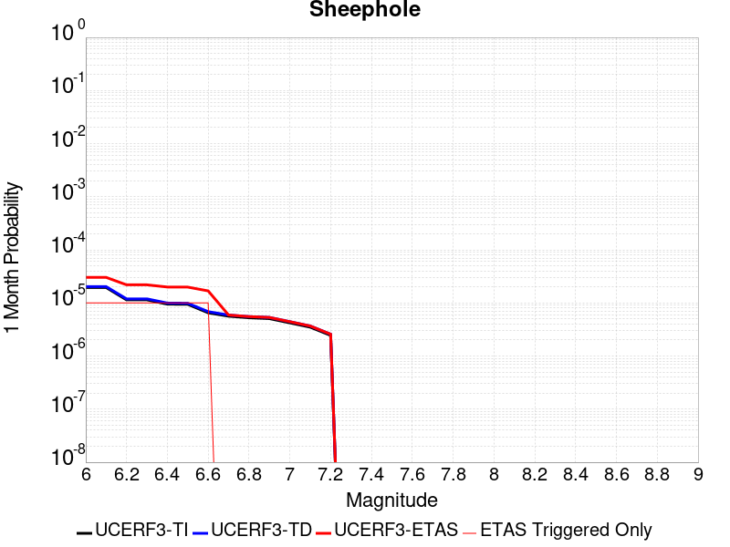 | 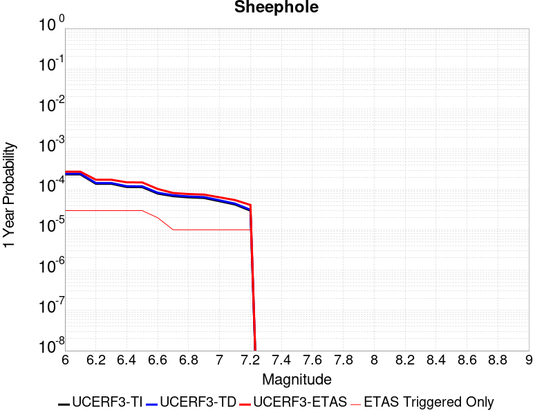 |  |

| Magnitude | 1 wk TI Prob | 1 wk TD Prob | 1 wk ETAS Prob | 1 wk ETAS/TD Gain | 1 wk ETAS Triggered Only | 1 mo TI Prob | 1 mo TD Prob | 1 mo ETAS Prob | 1 mo ETAS/TD Gain | 1 mo ETAS Triggered Only | 1 yr TI Prob | 1 yr TD Prob | 1 yr ETAS Prob | 1 yr ETAS/TD Gain | 1 yr ETAS Triggered Only | 10 yr TI Prob | 10 yr TD Prob | 10 yr ETAS Prob | 10 yr ETAS/TD Gain | 10 yr ETAS Triggered Only |
|-----|-----|-----|-----|-----|-----|-----|-----|-----|-----|-----|-----|-----|-----|-----|-----|-----|-----|-----|-----|-----|
| 6.0 | 4.5579695E-6 | 4.7412573E-6 | 1.474121E-5 | 3.1091352 | 1.0E-5 | 1.9534009E-5 | 2.0319549E-5 | 3.0319345E-5 | 1.492127 | 1.0E-5 | 2.3780059E-4 | 2.4736795E-4 | 2.7736052E-4 | 1.1212468 | 3.0E-5 | 0.0023754628 | 0.0024714705 | 0.0025013965 | 1.0121086 | 3.0E-5 |
| 6.1 | 4.5579695E-6 | 4.7412573E-6 | 1.474121E-5 | 3.1091352 | 1.0E-5 | 1.9534009E-5 | 2.0319549E-5 | 3.0319345E-5 | 1.492127 | 1.0E-5 | 2.3780059E-4 | 2.4736795E-4 | 2.7736052E-4 | 1.1212468 | 3.0E-5 | 0.0023754628 | 0.0024714705 | 0.0025013965 | 1.0121086 | 3.0E-5 |
| 6.2 | 2.6677674E-6 | 2.787391E-6 | 1.2787363E-5 | 4.5875745 | 1.0E-5 | 1.1433239E-5 | 1.1945912E-5 | 2.1945792E-5 | 1.8370965 | 1.0E-5 | 1.3919079E-4 | 1.4543286E-4 | 1.7542849E-4 | 1.2062508 | 3.0E-5 | 0.0013910364 | 0.0014534827 | 0.001483439 | 1.0206101 | 3.0E-5 |
| 6.3 | 2.6677674E-6 | 2.787391E-6 | 1.2787363E-5 | 4.5875745 | 1.0E-5 | 1.1433239E-5 | 1.1945912E-5 | 2.1945792E-5 | 1.8370965 | 1.0E-5 | 1.3919079E-4 | 1.4543286E-4 | 1.7542849E-4 | 1.2062508 | 3.0E-5 | 0.0013910364 | 0.0014534827 | 0.001483439 | 1.0206101 | 3.0E-5 |
| 6.4 | 2.2159759E-6 | 2.3228756E-6 | 1.2322853E-5 | 5.3049984 | 1.0E-5 | 9.497005E-6 | 9.955148E-6 | 1.9955049E-5 | 2.0044954 | 1.0E-5 | 1.156199E-4 | 1.21198E-4 | 1.5119436E-4 | 1.2474989 | 3.0E-5 | 0.0011555976 | 0.0012113983 | 0.001241362 | 1.0247347 | 3.0E-5 |
| 6.5 | 2.1986082E-6 | 2.304756E-6 | 1.2304733E-5 | 5.338844 | 1.0E-5 | 9.4225725E-6 | 9.8774935E-6 | 1.9877394E-5 | 2.0123925 | 1.0E-5 | 1.1471378E-4 | 1.2025265E-4 | 1.5024905E-4 | 1.2494447 | 3.0E-5 | 0.0011465458 | 0.0012019551 | 0.001231919 | 1.0249293 | 3.0E-5 |
| 6.6 | 1.5232331E-6 | 1.6018896E-6 | 1.1601874E-5 | 7.2426176 | 1.0E-5 | 6.5281256E-6 | 6.8652243E-6 | 1.6865155E-5 | 2.4566066 | 1.0E-5 | 7.947703E-5 | 8.3581086E-5 | 1.0357942E-4 | 1.2392685 | 2.0E-5 | 7.9448614E-4 | 8.3551527E-4 | 8.5549854E-4 | 1.0239173 | 2.0E-5 |
| 6.7 | 1.3137362E-6 | 1.3828171E-6 | 1.3828171E-6 | 1.0 | 0.0 | 5.6302856E-6 | 5.926346E-6 | 5.926346E-6 | 1.0 | 0.0 | 6.854657E-5 | 7.215102E-5 | 8.21503E-5 | 1.1385882 | 1.0E-5 | 6.8525434E-4 | 7.2128983E-4 | 7.3128263E-4 | 1.013854 | 1.0E-5 |
| 6.8 | 1.2275751E-6 | 1.2922828E-6 | 1.2922828E-6 | 1.0 | 0.0 | 5.2610258E-6 | 5.538344E-6 | 5.538344E-6 | 1.0 | 0.0 | 6.4051106E-5 | 6.742739E-5 | 7.742671E-5 | 1.1482977 | 1.0E-5 | 6.4032647E-4 | 6.7408266E-4 | 6.840759E-4 | 1.014825 | 1.0E-5 |
| 6.9 | 1.1837088E-6 | 1.2461003E-6 | 1.2461003E-6 | 1.0 | 0.0 | 5.0730278E-6 | 5.3404196E-6 | 5.3404196E-6 | 1.0 | 0.0 | 6.176237E-5 | 6.5017804E-5 | 7.501715E-5 | 1.153794 | 1.0E-5 | 6.17452E-4 | 6.5000093E-4 | 6.5999443E-4 | 1.0153745 | 1.0E-5 |
| 7.0 | 9.849371E-7 | 1.0366274E-6 | 1.0366274E-6 | 1.0 | 0.0 | 4.2211523E-6 | 4.4426815E-6 | 4.4426815E-6 | 1.0 | 0.0 | 5.1391315E-5 | 5.408841E-5 | 6.408787E-5 | 1.1848725 | 1.0E-5 | 5.137943E-4 | 5.4076256E-4 | 5.507571E-4 | 1.0184824 | 1.0E-5 |
| 7.1 | 8.1643645E-7 | 8.591657E-7 | 8.591657E-7 | 1.0 | 0.0 | 3.4990085E-6 | 3.682134E-6 | 3.682134E-6 | 1.0 | 0.0 | 4.2599597E-5 | 4.4829147E-5 | 5.48287E-5 | 1.2230592 | 1.0E-5 | 4.259143E-4 | 4.4820967E-4 | 4.5820518E-4 | 1.022301 | 1.0E-5 |
| 7.2 | 5.7295756E-7 | 6.0294934E-7 | 6.0294934E-7 | 1.0 | 0.0 | 2.45553E-6 | 2.5840664E-6 | 2.5840664E-6 | 1.0 | 0.0 | 2.9895667E-5 | 3.1460622E-5 | 4.146031E-5 | 1.3178476 | 1.0E-5 | 2.9891645E-4 | 3.1456837E-4 | 3.2456525E-4 | 1.0317796 | 1.0E-5 |

## White Wolf (Extension)
*[(top)](#table-of-contents)*

| 1 Week | 1 Month | 1 Year | 10 Year |
|-----|-----|-----|-----|
|  | 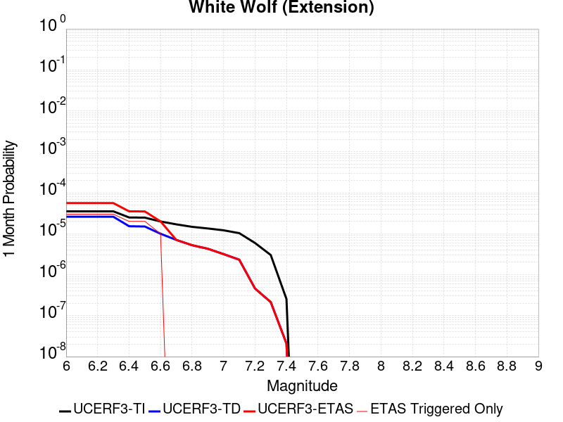 |  |  |

| Magnitude | 1 wk TI Prob | 1 wk TD Prob | 1 wk ETAS Prob | 1 wk ETAS/TD Gain | 1 wk ETAS Triggered Only | 1 mo TI Prob | 1 mo TD Prob | 1 mo ETAS Prob | 1 mo ETAS/TD Gain | 1 mo ETAS Triggered Only | 1 yr TI Prob | 1 yr TD Prob | 1 yr ETAS Prob | 1 yr ETAS/TD Gain | 1 yr ETAS Triggered Only | 10 yr TI Prob | 10 yr TD Prob | 10 yr ETAS Prob | 10 yr ETAS/TD Gain | 10 yr ETAS Triggered Only |
|-----|-----|-----|-----|-----|-----|-----|-----|-----|-----|-----|-----|-----|-----|-----|-----|-----|-----|-----|-----|-----|
| 6.0 | 8.222555E-6 | 6.066608E-6 | 2.6066487E-5 | 4.2967153 | 2.0E-5 | 3.5239045E-5 | 2.5999527E-5 | 5.5998746E-5 | 2.1538372 | 3.0E-5 | 4.289509E-4 | 3.1650488E-4 | 3.464954E-4 | 1.0947553 | 3.0E-5 | 0.0042812387 | 0.003161193 | 0.003191098 | 1.0094601 | 3.0E-5 |
| 6.1 | 8.222555E-6 | 6.066608E-6 | 2.6066487E-5 | 4.2967153 | 2.0E-5 | 3.5239045E-5 | 2.5999527E-5 | 5.5998746E-5 | 2.1538372 | 3.0E-5 | 4.289509E-4 | 3.1650488E-4 | 3.464954E-4 | 1.0947553 | 3.0E-5 | 0.0042812387 | 0.003161193 | 0.003191098 | 1.0094601 | 3.0E-5 |
| 6.2 | 8.222555E-6 | 6.066608E-6 | 2.6066487E-5 | 4.2967153 | 2.0E-5 | 3.5239045E-5 | 2.5999527E-5 | 5.5998746E-5 | 2.1538372 | 3.0E-5 | 4.289509E-4 | 3.1650488E-4 | 3.464954E-4 | 1.0947553 | 3.0E-5 | 0.0042812387 | 0.003161193 | 0.003191098 | 1.0094601 | 3.0E-5 |
| 6.3 | 8.222555E-6 | 6.066608E-6 | 2.6066487E-5 | 4.2967153 | 2.0E-5 | 3.5239045E-5 | 2.5999527E-5 | 5.5998746E-5 | 2.1538372 | 3.0E-5 | 4.289509E-4 | 3.1650488E-4 | 3.464954E-4 | 1.0947553 | 3.0E-5 | 0.0042812387 | 0.003161193 | 0.003191098 | 1.0094601 | 3.0E-5 |
| 6.4 | 5.821773E-6 | 3.5571218E-6 | 2.3557051E-5 | 6.6225033 | 2.0E-5 | 2.4950215E-5 | 1.5244725E-5 | 3.524442E-5 | 2.3119092 | 2.0E-5 | 3.0372653E-4 | 1.8558982E-4 | 2.055861E-4 | 1.1077446 | 2.0E-5 | 0.0030331176 | 0.0018544566 | 0.0018744195 | 1.0107648 | 2.0E-5 |
| 6.5 | 5.766023E-6 | 3.499056E-6 | 2.3498986E-5 | 6.7158074 | 2.0E-5 | 2.4711293E-5 | 1.4995874E-5 | 3.4995574E-5 | 2.3336802 | 2.0E-5 | 3.0081844E-4 | 1.8256057E-4 | 2.0255691E-4 | 1.1095327 | 2.0E-5 | 0.0030041158 | 0.0018242141 | 0.0018441777 | 1.0109437 | 2.0E-5 |
| 6.6 | 4.643576E-6 | 2.3325706E-6 | 1.2332547E-5 | 5.2871056 | 1.0E-5 | 1.9900888E-5 | 9.996696E-6 | 1.9996596E-5 | 2.0003204 | 1.0E-5 | 2.4226638E-4 | 1.217034E-4 | 1.3170218E-4 | 1.082157 | 1.0E-5 | 0.0024200242 | 0.00121641 | 0.0012263978 | 1.0082109 | 1.0E-5 |
| 6.7 | 3.9529173E-6 | 1.6482956E-6 | 1.6482956E-6 | 1.0 | 0.0 | 1.6940963E-5 | 7.064106E-6 | 7.064106E-6 | 1.0 | 0.0 | 2.0623671E-4 | 8.6002285E-5 | 8.6002285E-5 | 1.0 | 0.0 | 0.002060454 | 8.597085E-4 | 8.597085E-4 | 1.0 | 0.0 |
| 6.8 | 3.4377522E-6 | 1.2244749E-6 | 1.2244749E-6 | 1.0 | 0.0 | 1.473314E-5 | 5.2477394E-6 | 5.2477394E-6 | 1.0 | 0.0 | 1.7936122E-4 | 6.388945E-5 | 6.388945E-5 | 1.0 | 0.0 | 0.0017921652 | 6.387199E-4 | 6.387199E-4 | 1.0 | 0.0 |
| 6.9 | 3.1367306E-6 | 1.0033302E-6 | 1.0033302E-6 | 1.0 | 0.0 | 1.3443062E-5 | 4.29998E-6 | 4.29998E-6 | 1.0 | 0.0 | 1.63657E-4 | 5.235108E-5 | 5.235108E-5 | 1.0 | 0.0 | 0.0016353652 | 5.233951E-4 | 5.233951E-4 | 1.0 | 0.0 |
| 7.0 | 2.8298145E-6 | 7.428222E-7 | 7.428222E-7 | 1.0 | 0.0 | 1.2127721E-5 | 3.18352E-6 | 3.18352E-6 | 1.0 | 0.0 | 1.47645E-4 | 3.8758717E-5 | 3.8758717E-5 | 1.0 | 0.0 | 0.0014754693 | 3.8752457E-4 | 3.8752457E-4 | 1.0 | 0.0 |
| 7.1 | 2.4091064E-6 | 5.4223744E-7 | 5.4223744E-7 | 1.0 | 0.0 | 1.03247E-5 | 2.323873E-6 | 2.323873E-6 | 1.0 | 0.0 | 1.2569598E-4 | 2.8292827E-5 | 2.8292827E-5 | 1.0 | 0.0 | 0.001256249 | 2.828963E-4 | 2.828963E-4 | 1.0 | 0.0 |
| 7.2 | 1.3875518E-6 | 1.07402464E-7 | 1.07402464E-7 | 1.0 | 0.0 | 5.9466374E-6 | 4.602962E-7 | 4.602962E-7 | 1.0 | 0.0 | 7.23979E-5 | 5.604093E-6 | 5.604093E-6 | 1.0 | 0.0 | 7.2374323E-4 | 5.6039633E-5 | 5.6039633E-5 | 1.0 | 0.0 |
| 7.3 | 7.056077E-7 | 5.0002754E-8 | 5.0002754E-8 | 1.0 | 0.0 | 3.0240296E-6 | 2.142975E-7 | 2.142975E-7 | 1.0 | 0.0 | 3.681694E-5 | 2.6090695E-6 | 2.6090695E-6 | 1.0 | 0.0 | 3.681084E-4 | 2.6090434E-5 | 2.6090434E-5 | 1.0 | 0.0 |
| 7.4 | 5.9334678E-8 | 4.8638475E-9 | 4.8638475E-9 | 1.0 | 0.0 | 2.5429145E-7 | 2.084506E-8 | 2.084506E-8 | 1.0 | 0.0 | 3.095994E-6 | 2.5378858E-7 | 2.5378858E-7 | 1.0 | 0.0 | 3.095951E-5 | 2.5378843E-6 | 2.5378843E-6 | 1.0 | 0.0 |

## San Jacinto (San Jacinto Valley) rev
*[(top)](#table-of-contents)*

| 1 Week | 1 Month | 1 Year | 10 Year |
|-----|-----|-----|-----|
| 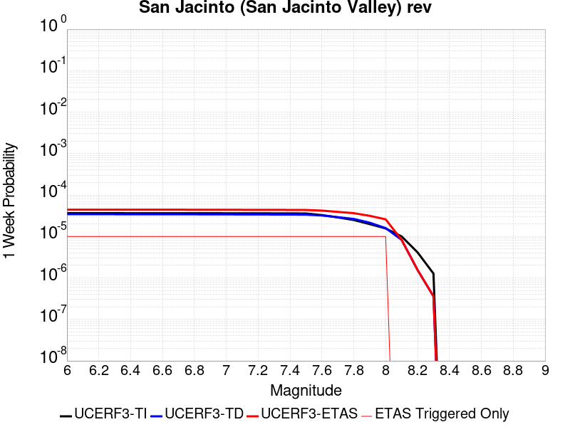 |  | 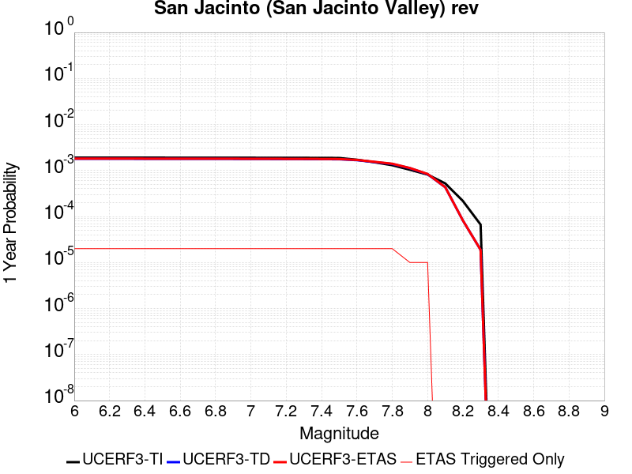 | 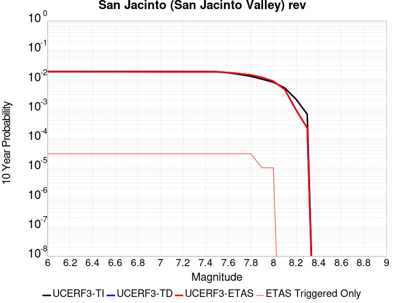 |

| Magnitude | 1 wk TI Prob | 1 wk TD Prob | 1 wk ETAS Prob | 1 wk ETAS/TD Gain | 1 wk ETAS Triggered Only | 1 mo TI Prob | 1 mo TD Prob | 1 mo ETAS Prob | 1 mo ETAS/TD Gain | 1 mo ETAS Triggered Only | 1 yr TI Prob | 1 yr TD Prob | 1 yr ETAS Prob | 1 yr ETAS/TD Gain | 1 yr ETAS Triggered Only | 10 yr TI Prob | 10 yr TD Prob | 10 yr ETAS Prob | 10 yr ETAS/TD Gain | 10 yr ETAS Triggered Only |
|-----|-----|-----|-----|-----|-----|-----|-----|-----|-----|-----|-----|-----|-----|-----|-----|-----|-----|-----|-----|-----|
| 6.0 | 3.652694E-5 | 3.4394532E-5 | 4.4394186E-5 | 1.2907339 | 1.0E-5 | 1.5653463E-4 | 1.4739682E-4 | 1.5739533E-4 | 1.067834 | 1.0E-5 | 0.0019041431 | 0.0017930809 | 0.001813045 | 1.011134 | 2.0E-5 | 0.018879099 | 0.018522728 | 0.018552173 | 1.0015897 | 3.0E-5 |
| 6.1 | 3.652694E-5 | 3.4394532E-5 | 4.4394186E-5 | 1.2907339 | 1.0E-5 | 1.5653463E-4 | 1.4739682E-4 | 1.5739533E-4 | 1.067834 | 1.0E-5 | 0.0019041431 | 0.0017930809 | 0.001813045 | 1.011134 | 2.0E-5 | 0.018879099 | 0.018522728 | 0.018552173 | 1.0015897 | 3.0E-5 |
| 6.2 | 3.652694E-5 | 3.4394532E-5 | 4.4394186E-5 | 1.2907339 | 1.0E-5 | 1.5653463E-4 | 1.4739682E-4 | 1.5739533E-4 | 1.067834 | 1.0E-5 | 0.0019041431 | 0.0017930809 | 0.001813045 | 1.011134 | 2.0E-5 | 0.018879099 | 0.018522728 | 0.018552173 | 1.0015897 | 3.0E-5 |
| 6.3 | 3.652694E-5 | 3.4394532E-5 | 4.4394186E-5 | 1.2907339 | 1.0E-5 | 1.5653463E-4 | 1.4739682E-4 | 1.5739533E-4 | 1.067834 | 1.0E-5 | 0.0019041431 | 0.0017930809 | 0.001813045 | 1.011134 | 2.0E-5 | 0.018879099 | 0.018522728 | 0.018552173 | 1.0015897 | 3.0E-5 |
| 6.4 | 3.646941E-5 | 3.4316105E-5 | 4.4315762E-5 | 1.2913984 | 1.0E-5 | 1.5628811E-4 | 1.4706074E-4 | 1.5705927E-4 | 1.0679891 | 1.0E-5 | 0.0019011468 | 0.0017889964 | 0.0018089606 | 1.0111594 | 2.0E-5 | 0.018849645 | 0.01848261 | 0.018512055 | 1.0015931 | 3.0E-5 |
| 6.5 | 3.646941E-5 | 3.4316105E-5 | 4.4315762E-5 | 1.2913984 | 1.0E-5 | 1.5628811E-4 | 1.4706074E-4 | 1.5705927E-4 | 1.0679891 | 1.0E-5 | 0.0019011468 | 0.0017889964 | 0.0018089606 | 1.0111594 | 2.0E-5 | 0.018849645 | 0.01848261 | 0.018512055 | 1.0015931 | 3.0E-5 |
| 6.6 | 3.6442503E-5 | 3.4279492E-5 | 4.427915E-5 | 1.2917097 | 1.0E-5 | 1.561728E-4 | 1.4690385E-4 | 1.5690239E-4 | 1.0680617 | 1.0E-5 | 0.0018997455 | 0.0017870895 | 0.0018070538 | 1.0111713 | 2.0E-5 | 0.018835869 | 0.018463878 | 0.018493325 | 1.0015948 | 3.0E-5 |
| 6.7 | 3.6432113E-5 | 3.4265067E-5 | 4.4264725E-5 | 1.2918324 | 1.0E-5 | 1.5612828E-4 | 1.4684204E-4 | 1.5684057E-4 | 1.0680904 | 1.0E-5 | 0.0018992044 | 0.0017863383 | 0.0018063026 | 1.0111761 | 2.0E-5 | 0.018830549 | 0.018456502 | 0.018485948 | 1.0015955 | 3.0E-5 |
| 6.8 | 3.6409598E-5 | 3.4234123E-5 | 4.423378E-5 | 1.2920963 | 1.0E-5 | 1.560318E-4 | 1.4670944E-4 | 1.5670797E-4 | 1.068152 | 1.0E-5 | 0.0018980318 | 0.0017847265 | 0.0018046908 | 1.0111862 | 2.0E-5 | 0.018819023 | 0.018440656 | 0.018470103 | 1.0015968 | 3.0E-5 |
| 6.9 | 3.638078E-5 | 3.419455E-5 | 4.4194207E-5 | 1.2924343 | 1.0E-5 | 1.5590832E-4 | 1.4653984E-4 | 1.5653839E-4 | 1.0682309 | 1.0E-5 | 0.0018965311 | 0.0017826651 | 0.0018026294 | 1.0111991 | 2.0E-5 | 0.018804269 | 0.01842039 | 0.018449837 | 1.0015986 | 3.0E-5 |
| 7.0 | 3.6294874E-5 | 3.407657E-5 | 4.4076227E-5 | 1.2934468 | 1.0E-5 | 1.5554018E-4 | 1.4603428E-4 | 1.5603281E-4 | 1.068467 | 1.0E-5 | 0.0018920569 | 0.0017765199 | 0.0017964845 | 1.011238 | 2.0E-5 | 0.018760284 | 0.018359972 | 0.018389422 | 1.001604 | 3.0E-5 |
| 7.1 | 3.6260717E-5 | 3.403285E-5 | 4.403251E-5 | 1.2938237 | 1.0E-5 | 1.5539382E-4 | 1.4584693E-4 | 1.5584547E-4 | 1.068555 | 1.0E-5 | 0.001890278 | 0.0017742428 | 0.0017942074 | 1.0112524 | 2.0E-5 | 0.018742796 | 0.018337566 | 0.018367017 | 1.001606 | 3.0E-5 |
| 7.2 | 3.6210204E-5 | 3.396707E-5 | 4.396673E-5 | 1.2943928 | 1.0E-5 | 1.5517735E-4 | 1.4556505E-4 | 1.555636E-4 | 1.0686878 | 1.0E-5 | 0.001887647 | 0.0017708165 | 0.001790781 | 1.0112742 | 2.0E-5 | 0.01871693 | 0.018303836 | 0.018333286 | 1.001609 | 3.0E-5 |
| 7.3 | 3.6119454E-5 | 3.385536E-5 | 4.385502E-5 | 1.2953643 | 1.0E-5 | 1.5478847E-4 | 1.4508633E-4 | 1.5508488E-4 | 1.0689145 | 1.0E-5 | 0.0018829206 | 0.0017649976 | 0.0017849623 | 1.0113114 | 2.0E-5 | 0.018670462 | 0.018246388 | 0.01827584 | 1.0016142 | 3.0E-5 |
| 7.4 | 3.607848E-5 | 3.3802888E-5 | 4.380255E-5 | 1.2958227 | 1.0E-5 | 1.5461289E-4 | 1.4486148E-4 | 1.5486004E-4 | 1.0690215 | 1.0E-5 | 0.0018807866 | 0.0017622644 | 0.0017822292 | 1.011329 | 2.0E-5 | 0.018649481 | 0.0182194 | 0.018248854 | 1.0016166 | 3.0E-5 |
| 7.5 | 3.5856774E-5 | 3.3612705E-5 | 4.361237E-5 | 1.2974966 | 1.0E-5 | 1.5366284E-4 | 1.4404651E-4 | 1.5404508E-4 | 1.069412 | 1.0E-5 | 0.0018692396 | 0.0017523582 | 0.0017723232 | 1.0113932 | 2.0E-5 | 0.018535944 | 0.01812053 | 0.018149985 | 1.0016255 | 3.0E-5 |
| 7.6 | 3.286655E-5 | 3.213617E-5 | 4.213585E-5 | 1.3111658 | 1.0E-5 | 1.4084904E-4 | 1.3771918E-4 | 1.4771782E-4 | 1.0726016 | 1.0E-5 | 0.001713488 | 0.0016754436 | 0.0016954101 | 1.0119171 | 2.0E-5 | 0.017003361 | 0.017340416 | 0.017369896 | 1.0017 | 3.0E-5 |
| 7.7 | 2.8882527E-5 | 2.9232393E-5 | 3.92321E-5 | 1.3420763 | 1.0E-5 | 1.237764E-4 | 1.2527568E-4 | 1.3527441E-4 | 1.079814 | 1.0E-5 | 0.0015059357 | 0.0015241653 | 0.0015441348 | 1.0131019 | 2.0E-5 | 0.014957713 | 0.015828714 | 0.015858239 | 1.0018653 | 3.0E-5 |
| 7.8 | 2.4950225E-5 | 2.6523543E-5 | 3.6523277E-5 | 1.3770136 | 1.0E-5 | 1.0692515E-4 | 1.1366738E-4 | 1.2366624E-4 | 1.087966 | 1.0E-5 | 0.0013010362 | 0.0013830226 | 0.001402995 | 1.0144411 | 2.0E-5 | 0.012934455 | 0.014410028 | 0.014439596 | 1.0020518 | 3.0E-5 |
| 7.9 | 1.9881603E-5 | 2.1504095E-5 | 3.1503878E-5 | 1.4650177 | 1.0E-5 | 8.520408E-5 | 9.2157155E-5 | 1.02156235E-4 | 1.1085002 | 1.0E-5 | 0.001036866 | 0.0011214366 | 0.0011314254 | 1.0089071 | 1.0E-5 | 0.010320415 | 0.011775419 | 0.011785301 | 1.0008392 | 1.0E-5 |
| 8.0 | 1.563292E-5 | 1.5934353E-5 | 2.5934192E-5 | 1.6275649 | 1.0E-5 | 6.6996516E-5 | 6.82883E-5 | 7.8287616E-5 | 1.146428 | 1.0E-5 | 8.153773E-4 | 8.310935E-4 | 8.410852E-4 | 1.0120224 | 1.0E-5 | 0.00812392 | 0.00880904 | 0.008818951 | 1.0011252 | 1.0E-5 |
| 8.1 | 1.0045313E-5 | 8.299667E-6 | 8.299667E-6 | 1.0 | 0.0 | 4.305063E-5 | 3.556952E-5 | 3.556952E-5 | 1.0 | 0.0 | 5.2401534E-4 | 4.3297335E-4 | 4.3297335E-4 | 1.0 | 0.0 | 0.0052278144 | 0.004658037 | 0.004658037 | 1.0 | 0.0 |
| 8.2 | 4.1554413E-6 | 1.5644919E-6 | 1.5644919E-6 | 1.0 | 0.0 | 1.7808914E-5 | 6.7049477E-6 | 6.7049477E-6 | 1.0 | 0.0 | 2.1680194E-4 | 8.162971E-5 | 8.162971E-5 | 1.0 | 0.0 | 0.0021659054 | 9.4777363E-4 | 9.4777363E-4 | 1.0 | 0.0 |
| 8.3 | 1.2758221E-6 | 3.6117652E-7 | 3.6117652E-7 | 1.0 | 0.0 | 5.4677976E-6 | 1.5478985E-6 | 1.5478985E-6 | 1.0 | 0.0 | 6.65684E-5 | 1.8845505E-5 | 1.8845505E-5 | 1.0 | 0.0 | 6.6548464E-4 | 2.273426E-4 | 2.273426E-4 | 1.0 | 0.0 |

## San Andreas (Creeping Section) 2011 CFM
*[(top)](#table-of-contents)*

| 1 Week | 1 Month | 1 Year | 10 Year |
|-----|-----|-----|-----|
|  |  | 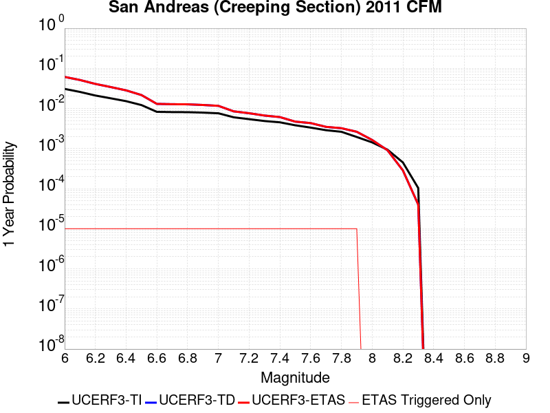 |  |

| Magnitude | 1 wk TI Prob | 1 wk TD Prob | 1 wk ETAS Prob | 1 wk ETAS/TD Gain | 1 wk ETAS Triggered Only | 1 mo TI Prob | 1 mo TD Prob | 1 mo ETAS Prob | 1 mo ETAS/TD Gain | 1 mo ETAS Triggered Only | 1 yr TI Prob | 1 yr TD Prob | 1 yr ETAS Prob | 1 yr ETAS/TD Gain | 1 yr ETAS Triggered Only | 10 yr TI Prob | 10 yr TD Prob | 10 yr ETAS Prob | 10 yr ETAS/TD Gain | 10 yr ETAS Triggered Only |
|-----|-----|-----|-----|-----|-----|-----|-----|-----|-----|-----|-----|-----|-----|-----|-----|-----|-----|-----|-----|-----|
| 6.0 | 5.986481E-4 | 0.0012275568 | 0.0012275568 | 1.0 | 0.0 | 0.0025631124 | 0.005245443 | 0.005245443 | 1.0 | 0.0 | 0.030762846 | 0.061203696 | 0.061213084 | 1.0001534 | 1.0E-5 | 0.26835477 | 0.42593017 | 0.42594737 | 1.0000404 | 3.0E-5 |
| 6.1 | 5.015945E-4 | 0.0010217631 | 0.0010217631 | 1.0 | 0.0 | 0.00214792 | 0.004367768 | 0.004367768 | 1.0 | 0.0 | 0.025839351 | 0.051247615 | 0.0512571 | 1.0001851 | 1.0E-5 | 0.23032776 | 0.37285197 | 0.37285823 | 1.0000168 | 1.0E-5 |
| 6.2 | 4.073338E-4 | 8.107063E-4 | 8.107063E-4 | 1.0 | 0.0 | 0.0017445484 | 0.003467065 | 0.003467065 | 1.0 | 0.0 | 0.021034058 | 0.04093243 | 0.040942024 | 1.0002342 | 1.0E-5 | 0.19150782 | 0.3130283 | 0.31303516 | 1.0000219 | 1.0E-5 |
| 6.3 | 3.464099E-4 | 6.7388907E-4 | 6.7388907E-4 | 1.0 | 0.0 | 0.0014837692 | 0.0028828874 | 0.0028828874 | 1.0 | 0.0 | 0.017915873 | 0.034188833 | 0.03419849 | 1.0002825 | 1.0E-5 | 0.16538359 | 0.27131107 | 0.27131835 | 1.0000268 | 1.0E-5 |
| 6.4 | 2.935057E-4 | 5.543981E-4 | 5.543981E-4 | 1.0 | 0.0 | 0.0012572751 | 0.0023724644 | 0.0023724644 | 1.0 | 0.0 | 0.015200248 | 0.028263751 | 0.028273469 | 1.0003438 | 1.0E-5 | 0.14201577 | 0.23297946 | 0.23298714 | 1.0000329 | 1.0E-5 |
| 6.5 | 2.3409708E-4 | 4.2091837E-4 | 4.2091837E-4 | 1.0 | 0.0 | 0.0010028875 | 0.0018019082 | 0.0018019082 | 1.0 | 0.0 | 0.012141965 | 0.021586698 | 0.021596482 | 1.0004532 | 1.0E-5 | 0.11499573 | 0.18681763 | 0.18682577 | 1.0000435 | 1.0E-5 |
| 6.6 | 1.5842178E-4 | 2.5067857E-4 | 2.5067857E-4 | 1.0 | 0.0 | 6.7877385E-4 | 0.0010738866 | 0.0010738866 | 1.0 | 0.0 | 0.0082328 | 0.01299481 | 0.013004679 | 1.0007595 | 1.0E-5 | 0.07934396 | 0.12314034 | 0.12314911 | 1.0000712 | 1.0E-5 |
| 6.7 | 1.5616413E-4 | 2.460442E-4 | 2.460442E-4 | 1.0 | 0.0 | 6.691031E-4 | 0.0010540439 | 0.0010540439 | 1.0 | 0.0 | 0.0081159435 | 0.01275668 | 0.012766552 | 1.0007739 | 1.0E-5 | 0.0782586 | 0.12116749 | 0.12117628 | 1.0000725 | 1.0E-5 |
| 6.8 | 1.5538467E-4 | 2.4428288E-4 | 2.4428288E-4 | 1.0 | 0.0 | 6.6576427E-4 | 0.0010465018 | 0.0010465018 | 1.0 | 0.0 | 0.008075596 | 0.012666085 | 0.012675958 | 1.0007795 | 1.0E-5 | 0.07788358 | 0.12039834 | 0.12040714 | 1.0000731 | 1.0E-5 |
| 6.9 | 1.5153569E-4 | 2.3537583E-4 | 2.3537583E-4 | 1.0 | 0.0 | 6.49277E-4 | 0.0010083655 | 0.0010083655 | 1.0 | 0.0 | 0.007876333 | 0.012208263 | 0.012218141 | 1.0008091 | 1.0E-5 | 0.07602952 | 0.116468415 | 0.11647725 | 1.0000758 | 1.0E-5 |
| 7.0 | 1.4588932E-4 | 2.2394823E-4 | 2.2394823E-4 | 1.0 | 0.0 | 6.250901E-4 | 9.594271E-4 | 9.594271E-4 | 1.0 | 0.0 | 0.0075839474 | 0.011618959 | 0.011628843 | 1.0008507 | 1.0E-5 | 0.073302895 | 0.111314535 | 0.11132342 | 1.0000799 | 1.0E-5 |
| 7.1 | 1.1565079E-4 | 1.628044E-4 | 1.628044E-4 | 1.0 | 0.0 | 4.955521E-4 | 6.9754745E-4 | 6.9754745E-4 | 1.0 | 0.0 | 0.006016669 | 0.008459772 | 0.008469687 | 1.0011721 | 1.0E-5 | 0.058563538 | 0.08366677 | 0.08367593 | 1.0001096 | 1.0E-5 |
| 7.2 | 1.0393792E-4 | 1.4614522E-4 | 1.4614522E-4 | 1.0 | 0.0 | 4.4537216E-4 | 6.261871E-4 | 6.261871E-4 | 1.0 | 0.0 | 0.005408933 | 0.007597347 | 0.007607271 | 1.0013063 | 1.0E-5 | 0.052791595 | 0.07561691 | 0.07562616 | 1.0001222 | 1.0E-5 |
| 7.3 | 9.332884E-5 | 1.2779726E-4 | 1.2779726E-4 | 1.0 | 0.0 | 3.999194E-4 | 5.475882E-4 | 5.475882E-4 | 1.0 | 0.0 | 0.0048581534 | 0.006646641 | 0.0066565746 | 1.0014945 | 1.0E-5 | 0.047533102 | 0.06648109 | 0.06649043 | 1.0001404 | 1.0E-5 |
| 7.4 | 8.670252E-5 | 1.1702097E-4 | 1.1702097E-4 | 1.0 | 0.0 | 3.715293E-4 | 5.014227E-4 | 5.014227E-4 | 1.0 | 0.0 | 0.004513991 | 0.0060878536 | 0.0060977926 | 1.0016326 | 1.0E-5 | 0.044233937 | 0.06114961 | 0.061159 | 1.0001535 | 1.0E-5 |
| 7.5 | 7.3036405E-5 | 9.0049005E-5 | 9.0049005E-5 | 1.0 | 0.0 | 3.129756E-4 | 3.8586732E-4 | 3.8586732E-4 | 1.0 | 0.0 | 0.0038038217 | 0.004687836 | 0.004697789 | 1.0021232 | 1.0E-5 | 0.03739367 | 0.047874223 | 0.047883745 | 1.0001988 | 1.0E-5 |
| 7.6 | 6.3935775E-5 | 8.279483E-5 | 8.279483E-5 | 1.0 | 0.0 | 2.7398168E-4 | 3.5478684E-4 | 3.5478684E-4 | 1.0 | 0.0 | 0.0033306254 | 0.004310993 | 0.00432095 | 1.0023097 | 1.0E-5 | 0.032811474 | 0.043989062 | 0.04399862 | 1.0002173 | 1.0E-5 |
| 7.7 | 5.5050095E-5 | 6.6610344E-5 | 6.6610344E-5 | 1.0 | 0.0 | 2.3590765E-4 | 2.854417E-4 | 2.854417E-4 | 1.0 | 0.0 | 0.0028683927 | 0.0034697189 | 0.0034796842 | 1.0028721 | 1.0E-5 | 0.0283165 | 0.035792835 | 0.035802476 | 1.0002694 | 1.0E-5 |
| 7.8 | 5.027131E-5 | 6.162133E-5 | 6.162133E-5 | 1.0 | 0.0 | 2.1543067E-4 | 2.640647E-4 | 2.640647E-4 | 1.0 | 0.0 | 0.0026197135 | 0.0032102512 | 0.0032202192 | 1.003105 | 1.0E-5 | 0.025890453 | 0.033123713 | 0.03313338 | 1.000292 | 1.0E-5 |
| 7.9 | 3.7271806E-5 | 5.0219067E-5 | 5.0219067E-5 | 1.0 | 0.0 | 1.5972654E-4 | 2.1520683E-4 | 2.1520683E-4 | 1.0 | 0.0 | 0.0019429359 | 0.0026169969 | 0.0026269706 | 1.0038111 | 1.0E-5 | 0.019260362 | 0.02706497 | 0.0270747 | 1.0003595 | 1.0E-5 |
| 8.0 | 2.7310243E-5 | 3.142378E-5 | 3.142378E-5 | 1.0 | 0.0 | 1.17038646E-4 | 1.3466639E-4 | 1.3466639E-4 | 1.0 | 0.0 | 0.0014240141 | 0.0016383311 | 0.0016383311 | 1.0 | 0.0 | 0.014149235 | 0.017211884 | 0.017211884 | 1.0 | 0.0 |
| 8.1 | 1.7940547E-5 | 1.7396878E-5 | 1.7396878E-5 | 1.0 | 0.0 | 7.688579E-5 | 7.455592E-5 | 7.455592E-5 | 1.0 | 0.0 | 9.3568244E-4 | 9.073409E-4 | 9.073409E-4 | 1.0 | 0.0 | 0.009317525 | 0.009797363 | 0.009797363 | 1.0 | 0.0 |
| 8.2 | 8.643924E-6 | 5.472644E-6 | 5.472644E-6 | 1.0 | 0.0 | 3.704486E-5 | 2.3453977E-5 | 2.3453977E-5 | 1.0 | 0.0 | 4.5092785E-4 | 2.8551483E-4 | 2.8551483E-4 | 1.0 | 0.0 | 0.0045001395 | 0.003247653 | 0.003247653 | 1.0 | 0.0 |
| 8.3 | 1.983087E-6 | 7.6547434E-7 | 7.6547434E-7 | 1.0 | 0.0 | 8.498917E-6 | 3.2806004E-6 | 3.2806004E-6 | 1.0 | 0.0 | 1.034694E-4 | 3.9940594E-5 | 3.9940594E-5 | 1.0 | 0.0 | 0.0010342124 | 4.7170694E-4 | 4.7170694E-4 | 1.0 | 0.0 |

## White Mountains
*[(top)](#table-of-contents)*

| 1 Week | 1 Month | 1 Year | 10 Year |
|-----|-----|-----|-----|
|  |  |  |  |

| Magnitude | 1 wk TI Prob | 1 wk TD Prob | 1 wk ETAS Prob | 1 wk ETAS/TD Gain | 1 wk ETAS Triggered Only | 1 mo TI Prob | 1 mo TD Prob | 1 mo ETAS Prob | 1 mo ETAS/TD Gain | 1 mo ETAS Triggered Only | 1 yr TI Prob | 1 yr TD Prob | 1 yr ETAS Prob | 1 yr ETAS/TD Gain | 1 yr ETAS Triggered Only | 10 yr TI Prob | 10 yr TD Prob | 10 yr ETAS Prob | 10 yr ETAS/TD Gain | 10 yr ETAS Triggered Only |
|-----|-----|-----|-----|-----|-----|-----|-----|-----|-----|-----|-----|-----|-----|-----|-----|-----|-----|-----|-----|-----|
| 6.0 | 3.503579E-5 | 3.3784054E-5 | 4.3783715E-5 | 1.2959876 | 1.0E-5 | 1.5014476E-4 | 1.4478144E-4 | 1.5477999E-4 | 1.0690596 | 1.0E-5 | 0.0018264796 | 0.0017614097 | 0.0017813744 | 1.0113345 | 2.0E-5 | 0.018115403 | 0.01748682 | 0.017516294 | 1.0016856 | 3.0E-5 |
| 6.1 | 3.503579E-5 | 3.3784054E-5 | 4.3783715E-5 | 1.2959876 | 1.0E-5 | 1.5014476E-4 | 1.4478144E-4 | 1.5477999E-4 | 1.0690596 | 1.0E-5 | 0.0018264796 | 0.0017614097 | 0.0017813744 | 1.0113345 | 2.0E-5 | 0.018115403 | 0.01748682 | 0.017516294 | 1.0016856 | 3.0E-5 |
| 6.2 | 3.503579E-5 | 3.3784054E-5 | 4.3783715E-5 | 1.2959876 | 1.0E-5 | 1.5014476E-4 | 1.4478144E-4 | 1.5477999E-4 | 1.0690596 | 1.0E-5 | 0.0018264796 | 0.0017614097 | 0.0017813744 | 1.0113345 | 2.0E-5 | 0.018115403 | 0.01748682 | 0.017516294 | 1.0016856 | 3.0E-5 |
| 6.3 | 1.7818425E-5 | 1.591613E-5 | 1.591613E-5 | 1.0 | 0.0 | 7.636245E-5 | 6.821028E-5 | 6.821028E-5 | 1.0 | 0.0 | 9.293162E-4 | 8.30158E-4 | 8.401497E-4 | 1.0120358 | 1.0E-5 | 0.009254395 | 0.008272028 | 0.008281944 | 1.0011989 | 1.0E-5 |
| 6.4 | 1.7818425E-5 | 1.591613E-5 | 1.591613E-5 | 1.0 | 0.0 | 7.636245E-5 | 6.821028E-5 | 6.821028E-5 | 1.0 | 0.0 | 9.293162E-4 | 8.30158E-4 | 8.401497E-4 | 1.0120358 | 1.0E-5 | 0.009254395 | 0.008272028 | 0.008281944 | 1.0011989 | 1.0E-5 |
| 6.5 | 1.3397557E-5 | 1.1336354E-5 | 1.1336354E-5 | 1.0 | 0.0 | 5.741684E-5 | 4.8583508E-5 | 4.8583508E-5 | 1.0 | 0.0 | 6.988258E-4 | 5.9135066E-4 | 6.0134474E-4 | 1.0169004 | 1.0E-5 | 0.006966323 | 0.005898476 | 0.005908417 | 1.0016854 | 1.0E-5 |
| 6.6 | 1.0818695E-5 | 8.6254195E-6 | 8.6254195E-6 | 1.0 | 0.0 | 4.6365014E-5 | 3.6965583E-5 | 3.6965583E-5 | 1.0 | 0.0 | 5.6434784E-4 | 4.499674E-4 | 4.499674E-4 | 1.0 | 0.0 | 0.005629168 | 0.0044909995 | 0.0044909995 | 1.0 | 0.0 |
| 6.7 | 9.067908E-6 | 6.802464E-6 | 6.802464E-6 | 1.0 | 0.0 | 3.8861883E-5 | 2.915311E-5 | 2.915311E-5 | 1.0 | 0.0 | 4.7304068E-4 | 3.548845E-4 | 3.548845E-4 | 1.0 | 0.0 | 0.00472035 | 0.003543495 | 0.003543495 | 1.0 | 0.0 |
| 6.8 | 7.295947E-6 | 4.9364203E-6 | 4.9364203E-6 | 1.0 | 0.0 | 3.126797E-5 | 2.1155922E-5 | 2.1155922E-5 | 1.0 | 0.0 | 3.8062103E-4 | 2.5754404E-4 | 2.5754404E-4 | 1.0 | 0.0 | 0.0037996976 | 0.0025725686 | 0.0025725686 | 1.0 | 0.0 |
| 6.9 | 6.2243444E-6 | 3.8322482E-6 | 3.8322482E-6 | 1.0 | 0.0 | 2.6675489E-5 | 1.642382E-5 | 1.642382E-5 | 1.0 | 0.0 | 3.2472567E-4 | 1.999422E-4 | 1.999422E-4 | 1.0 | 0.0 | 0.0032425157 | 0.0019976757 | 0.0019976757 | 1.0 | 0.0 |
| 7.0 | 4.9878413E-6 | 2.6795587E-6 | 2.6795587E-6 | 1.0 | 0.0 | 2.1376287E-5 | 1.1483774E-5 | 1.1483774E-5 | 1.0 | 0.0 | 2.602252E-4 | 1.3980624E-4 | 1.3980624E-4 | 1.0 | 0.0 | 0.002599207 | 0.0013972091 | 0.0013972091 | 1.0 | 0.0 |
| 7.1 | 4.0252844E-6 | 1.885697E-6 | 1.885697E-6 | 1.0 | 0.0 | 1.7251105E-5 | 8.081534E-6 | 8.081534E-6 | 1.0 | 0.0 | 2.1001195E-4 | 9.8388366E-5 | 9.8388366E-5 | 1.0 | 0.0 | 0.0020981359 | 9.834609E-4 | 9.834609E-4 | 1.0 | 0.0 |
| 7.2 | 3.3284066E-6 | 1.2818881E-6 | 1.2818881E-6 | 1.0 | 0.0 | 1.4264522E-5 | 5.4937955E-6 | 5.4937955E-6 | 1.0 | 0.0 | 1.736567E-4 | 6.688501E-5 | 6.688501E-5 | 1.0 | 0.0 | 0.0017352107 | 6.686588E-4 | 6.686588E-4 | 1.0 | 0.0 |
| 7.3 | 2.458226E-6 | 6.05664E-7 | 6.05664E-7 | 1.0 | 0.0 | 1.0535211E-5 | 2.5957006E-6 | 2.5957006E-6 | 1.0 | 0.0 | 1.2825865E-4 | 3.1602234E-5 | 3.1602234E-5 | 1.0 | 0.0 | 0.0012818464 | 3.1598116E-4 | 3.1598116E-4 | 1.0 | 0.0 |
| 7.4 | 1.965953E-6 | 3.1084303E-7 | 3.1084303E-7 | 1.0 | 0.0 | 8.425486E-6 | 1.3321838E-6 | 1.3321838E-6 | 1.0 | 0.0 | 1.0257547E-4 | 1.6219217E-5 | 1.6219217E-5 | 1.0 | 0.0 | 0.0010252813 | 1.6218047E-4 | 1.6218047E-4 | 1.0 | 0.0 |
| 7.5 | 1.2014192E-6 | 1.8240732E-7 | 1.8240732E-7 | 1.0 | 0.0 | 5.148929E-6 | 7.817454E-7 | 7.817454E-7 | 1.0 | 0.0 | 6.2686406E-5 | 9.51771E-6 | 9.51771E-6 | 1.0 | 0.0 | 6.266873E-4 | 9.5173105E-5 | 9.5173105E-5 | 1.0 | 0.0 |
| 7.6 | 2.5612175E-7 | 4.893735E-8 | 4.893735E-8 | 1.0 | 0.0 | 1.0976642E-6 | 2.0973148E-7 | 2.0973148E-7 | 1.0 | 0.0 | 1.3363979E-5 | 2.553478E-6 | 2.553478E-6 | 1.0 | 0.0 | 1.3363175E-4 | 2.5534524E-5 | 2.5534524E-5 | 1.0 | 0.0 |

## Sierra Nevada  (No Extension)
*[(top)](#table-of-contents)*

| 1 Week | 1 Month | 1 Year | 10 Year |
|-----|-----|-----|-----|
|  |  | 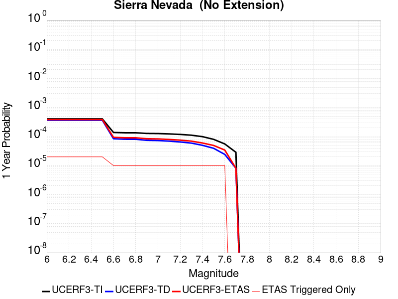 | 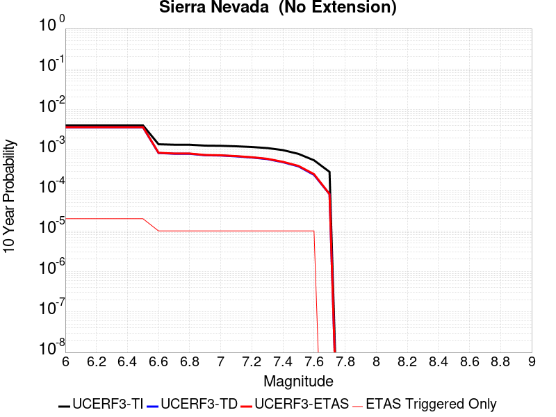 |

| Magnitude | 1 wk TI Prob | 1 wk TD Prob | 1 wk ETAS Prob | 1 wk ETAS/TD Gain | 1 wk ETAS Triggered Only | 1 mo TI Prob | 1 mo TD Prob | 1 mo ETAS Prob | 1 mo ETAS/TD Gain | 1 mo ETAS Triggered Only | 1 yr TI Prob | 1 yr TD Prob | 1 yr ETAS Prob | 1 yr ETAS/TD Gain | 1 yr ETAS Triggered Only | 10 yr TI Prob | 10 yr TD Prob | 10 yr ETAS Prob | 10 yr ETAS/TD Gain | 10 yr ETAS Triggered Only |
|-----|-----|-----|-----|-----|-----|-----|-----|-----|-----|-----|-----|-----|-----|-----|-----|-----|-----|-----|-----|-----|
| 6.0 | 7.7690465E-6 | 6.976276E-6 | 6.976276E-6 | 1.0 | 0.0 | 3.329549E-5 | 2.9898185E-5 | 2.9898185E-5 | 1.0 | 0.0 | 4.0529718E-4 | 3.6398545E-4 | 3.8397816E-4 | 1.0549272 | 2.0E-5 | 0.004045588 | 0.0036374088 | 0.003657336 | 1.0054784 | 2.0E-5 |
| 6.1 | 7.7690465E-6 | 6.976276E-6 | 6.976276E-6 | 1.0 | 0.0 | 3.329549E-5 | 2.9898185E-5 | 2.9898185E-5 | 1.0 | 0.0 | 4.0529718E-4 | 3.6398545E-4 | 3.8397816E-4 | 1.0549272 | 2.0E-5 | 0.004045588 | 0.0036374088 | 0.003657336 | 1.0054784 | 2.0E-5 |
| 6.2 | 7.7690465E-6 | 6.976276E-6 | 6.976276E-6 | 1.0 | 0.0 | 3.329549E-5 | 2.9898185E-5 | 2.9898185E-5 | 1.0 | 0.0 | 4.0529718E-4 | 3.6398545E-4 | 3.8397816E-4 | 1.0549272 | 2.0E-5 | 0.004045588 | 0.0036374088 | 0.003657336 | 1.0054784 | 2.0E-5 |
| 6.3 | 7.7690465E-6 | 6.976276E-6 | 6.976276E-6 | 1.0 | 0.0 | 3.329549E-5 | 2.9898185E-5 | 2.9898185E-5 | 1.0 | 0.0 | 4.0529718E-4 | 3.6398545E-4 | 3.8397816E-4 | 1.0549272 | 2.0E-5 | 0.004045588 | 0.0036374088 | 0.003657336 | 1.0054784 | 2.0E-5 |
| 6.4 | 7.7690465E-6 | 6.976276E-6 | 6.976276E-6 | 1.0 | 0.0 | 3.329549E-5 | 2.9898185E-5 | 2.9898185E-5 | 1.0 | 0.0 | 4.0529718E-4 | 3.6398545E-4 | 3.8397816E-4 | 1.0549272 | 2.0E-5 | 0.004045588 | 0.0036374088 | 0.003657336 | 1.0054784 | 2.0E-5 |
| 6.5 | 7.7690465E-6 | 6.976276E-6 | 6.976276E-6 | 1.0 | 0.0 | 3.329549E-5 | 2.9898185E-5 | 2.9898185E-5 | 1.0 | 0.0 | 4.0529718E-4 | 3.6398545E-4 | 3.8397816E-4 | 1.0549272 | 2.0E-5 | 0.004045588 | 0.0036374088 | 0.003657336 | 1.0054784 | 2.0E-5 |
| 6.6 | 2.653E-6 | 1.614815E-6 | 1.614815E-6 | 1.0 | 0.0 | 1.136995E-5 | 6.9206176E-6 | 6.9206176E-6 | 1.0 | 0.0 | 1.3842035E-4 | 8.42553E-5 | 9.425445E-5 | 1.1186769 | 1.0E-5 | 0.0013833415 | 8.42237E-4 | 8.5222855E-4 | 1.0118631 | 1.0E-5 |
| 6.7 | 2.5902466E-6 | 1.5501486E-6 | 1.5501486E-6 | 1.0 | 0.0 | 1.11010095E-5 | 6.6434773E-6 | 6.6434773E-6 | 1.0 | 0.0 | 1.351464E-4 | 8.0881364E-5 | 9.088055E-5 | 1.1236279 | 1.0E-5 | 0.0013506424 | 8.085222E-4 | 8.1851415E-4 | 1.0123582 | 1.0E-5 |
| 6.8 | 2.5853892E-6 | 1.5469489E-6 | 1.5469489E-6 | 1.0 | 0.0 | 1.1080193E-5 | 6.6297644E-6 | 6.6297644E-6 | 1.0 | 0.0 | 1.34893E-4 | 8.071442E-5 | 9.071361E-5 | 1.1238836 | 1.0E-5 | 0.0013481114 | 8.06854E-4 | 8.168459E-4 | 1.0123838 | 1.0E-5 |
| 6.9 | 2.458257E-6 | 1.4220233E-6 | 1.4220233E-6 | 1.0 | 0.0 | 1.0535345E-5 | 6.094371E-6 | 6.094371E-6 | 1.0 | 0.0 | 1.2826028E-4 | 7.419646E-5 | 8.419572E-5 | 1.1347673 | 1.0E-5 | 0.0012818627 | 7.4171886E-4 | 7.517115E-4 | 1.0134722 | 1.0E-5 |
| 7.0 | 2.4341468E-6 | 1.3989873E-6 | 1.3989873E-6 | 1.0 | 0.0 | 1.0432016E-5 | 5.9956456E-6 | 5.9956456E-6 | 1.0 | 0.0 | 1.270024E-4 | 7.299456E-5 | 8.299383E-5 | 1.1369865 | 1.0E-5 | 0.0012692984 | 7.2970777E-4 | 7.3970045E-4 | 1.0136942 | 1.0E-5 |
| 7.1 | 2.3652476E-6 | 1.3339372E-6 | 1.3339372E-6 | 1.0 | 0.0 | 1.0136736E-5 | 5.7168613E-6 | 5.7168613E-6 | 1.0 | 0.0 | 1.2340778E-4 | 6.960058E-5 | 7.9599886E-5 | 1.143667 | 1.0E-5 | 0.0012333926 | 6.957895E-4 | 7.0578256E-4 | 1.0143622 | 1.0E-5 |
| 7.2 | 2.272158E-6 | 1.2502445E-6 | 1.2502445E-6 | 1.0 | 0.0 | 9.737784E-6 | 5.35818E-6 | 5.35818E-6 | 1.0 | 0.0 | 1.1855107E-4 | 6.52339E-5 | 7.523325E-5 | 1.1532845 | 1.0E-5 | 0.0011848784 | 6.52149E-4 | 6.621425E-4 | 1.0153239 | 1.0E-5 |
| 7.3 | 2.1382127E-6 | 1.1419334E-6 | 1.1419334E-6 | 1.0 | 0.0 | 9.163737E-6 | 4.893991E-6 | 4.893991E-6 | 1.0 | 0.0 | 1.1156279E-4 | 5.958272E-5 | 6.958212E-5 | 1.1678239 | 1.0E-5 | 0.001115068 | 5.956686E-4 | 6.056627E-4 | 1.0167779 | 1.0E-5 |
| 7.4 | 1.9048055E-6 | 9.574882E-7 | 9.574882E-7 | 1.0 | 0.0 | 8.163426E-6 | 4.1035146E-6 | 4.1035146E-6 | 1.0 | 0.0 | 9.9385186E-5 | 4.995915E-5 | 5.995865E-5 | 1.2001536 | 1.0E-5 | 9.934074E-4 | 4.994799E-4 | 5.094749E-4 | 1.0200108 | 1.0E-5 |
| 7.5 | 1.5373403E-6 | 7.559723E-7 | 7.559723E-7 | 1.0 | 0.0 | 6.5885843E-6 | 3.239877E-6 | 3.239877E-6 | 1.0 | 0.0 | 8.021306E-5 | 3.9444796E-5 | 4.94444E-5 | 1.2535089 | 1.0E-5 | 8.0184115E-4 | 3.943784E-4 | 4.0437447E-4 | 1.0253464 | 1.0E-5 |
| 7.6 | 1.0680322E-6 | 4.659381E-7 | 4.659381E-7 | 1.0 | 0.0 | 4.577273E-6 | 1.996876E-6 | 1.996876E-6 | 1.0 | 0.0 | 5.5726876E-5 | 2.4311697E-5 | 3.4311455E-5 | 1.4113146 | 1.0E-5 | 5.5712904E-4 | 2.4309063E-4 | 2.530882E-4 | 1.041127 | 1.0E-5 |
| 7.7 | 5.509146E-7 | 1.5578398E-7 | 1.5578398E-7 | 1.0 | 0.0 | 2.3610605E-6 | 6.6764545E-7 | 6.6764545E-7 | 1.0 | 0.0 | 2.8745531E-5 | 8.128554E-6 | 8.128554E-6 | 1.0 | 0.0 | 2.8741814E-4 | 8.1282684E-5 | 8.1282684E-5 | 1.0 | 0.0 |

## Big Pine (East)
*[(top)](#table-of-contents)*

| 1 Week | 1 Month | 1 Year | 10 Year |
|-----|-----|-----|-----|
|  | 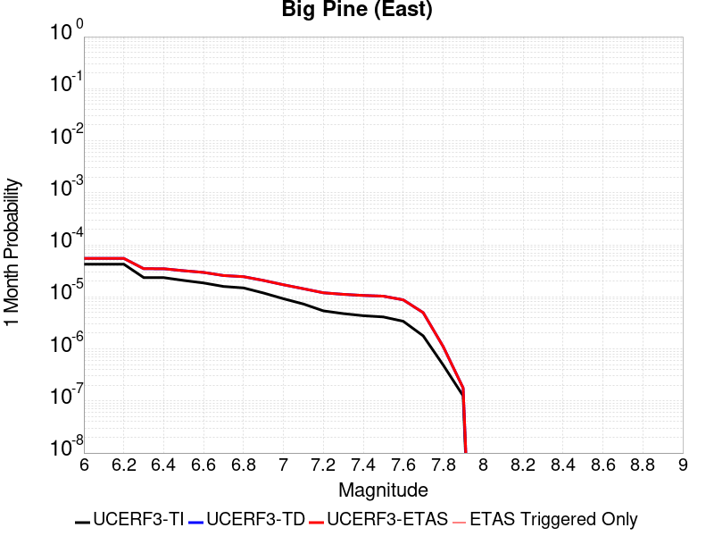 | 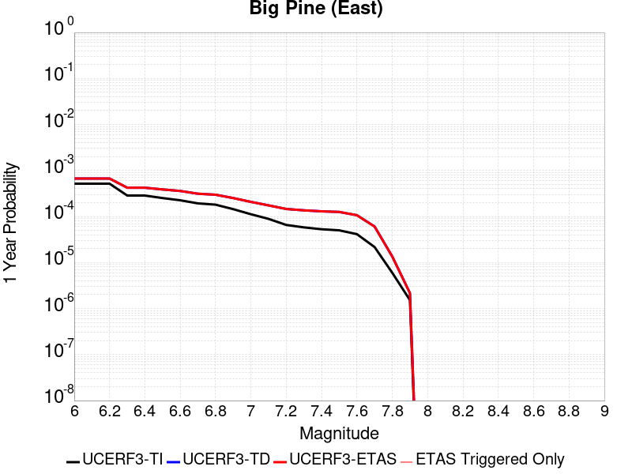 |  |

| Magnitude | 1 wk TI Prob | 1 wk TD Prob | 1 wk ETAS Prob | 1 wk ETAS/TD Gain | 1 wk ETAS Triggered Only | 1 mo TI Prob | 1 mo TD Prob | 1 mo ETAS Prob | 1 mo ETAS/TD Gain | 1 mo ETAS Triggered Only | 1 yr TI Prob | 1 yr TD Prob | 1 yr ETAS Prob | 1 yr ETAS/TD Gain | 1 yr ETAS Triggered Only | 10 yr TI Prob | 10 yr TD Prob | 10 yr ETAS Prob | 10 yr ETAS/TD Gain | 10 yr ETAS Triggered Only |
|-----|-----|-----|-----|-----|-----|-----|-----|-----|-----|-----|-----|-----|-----|-----|-----|-----|-----|-----|-----|-----|
| 6.0 | 9.916913E-6 | 1.2817004E-5 | 1.2817004E-5 | 1.0 | 0.0 | 4.250036E-5 | 5.4928983E-5 | 5.4928983E-5 | 1.0 | 0.0 | 5.173191E-4 | 6.6857727E-4 | 6.6857727E-4 | 1.0 | 0.0 | 0.0051611643 | 0.006670253 | 0.0066901194 | 1.0029784 | 2.0E-5 |
| 6.1 | 9.916913E-6 | 1.2817004E-5 | 1.2817004E-5 | 1.0 | 0.0 | 4.250036E-5 | 5.4928983E-5 | 5.4928983E-5 | 1.0 | 0.0 | 5.173191E-4 | 6.6857727E-4 | 6.6857727E-4 | 1.0 | 0.0 | 0.0051611643 | 0.006670253 | 0.0066901194 | 1.0029784 | 2.0E-5 |
| 6.2 | 9.916913E-6 | 1.2817004E-5 | 1.2817004E-5 | 1.0 | 0.0 | 4.250036E-5 | 5.4928983E-5 | 5.4928983E-5 | 1.0 | 0.0 | 5.173191E-4 | 6.6857727E-4 | 6.6857727E-4 | 1.0 | 0.0 | 0.0051611643 | 0.006670253 | 0.0066901194 | 1.0029784 | 2.0E-5 |
| 6.3 | 5.479711E-6 | 8.112978E-6 | 8.112978E-6 | 1.0 | 0.0 | 2.3484265E-5 | 3.4769462E-5 | 3.4769462E-5 | 1.0 | 0.0 | 2.858834E-4 | 4.2323917E-4 | 4.2323917E-4 | 1.0 | 0.0 | 0.0028551589 | 0.004227059 | 0.0042370167 | 1.0023557 | 1.0E-5 |
| 6.4 | 5.465009E-6 | 8.097271E-6 | 8.097271E-6 | 1.0 | 0.0 | 2.3421257E-5 | 3.470215E-5 | 3.470215E-5 | 1.0 | 0.0 | 2.851165E-4 | 4.2241995E-4 | 4.2241995E-4 | 1.0 | 0.0 | 0.0028475097 | 0.004218898 | 0.004228856 | 1.0023603 | 1.0E-5 |
| 6.5 | 4.826767E-6 | 7.422329E-6 | 7.422329E-6 | 1.0 | 0.0 | 2.068598E-5 | 3.180961E-5 | 3.180961E-5 | 1.0 | 0.0 | 2.518227E-4 | 3.8721596E-4 | 3.8721596E-4 | 1.0 | 0.0 | 0.0025153751 | 0.0038680986 | 0.00387806 | 1.0025753 | 1.0E-5 |
| 6.6 | 4.3146847E-6 | 6.882266E-6 | 6.882266E-6 | 1.0 | 0.0 | 1.8491375E-5 | 2.9495106E-5 | 2.9495106E-5 | 1.0 | 0.0 | 2.2510924E-4 | 3.590462E-4 | 3.590462E-4 | 1.0 | 0.0 | 0.0022488134 | 0.0035873146 | 0.0035972788 | 1.0027776 | 1.0E-5 |
| 6.7 | 3.6968106E-6 | 5.9955223E-6 | 5.9955223E-6 | 1.0 | 0.0 | 1.5843378E-5 | 2.5694852E-5 | 2.5694852E-5 | 1.0 | 0.0 | 1.9287605E-4 | 3.1279144E-4 | 3.1279144E-4 | 1.0 | 0.0 | 0.0019270873 | 0.0031260753 | 0.003136044 | 1.0031888 | 1.0E-5 |
| 6.8 | 3.4671132E-6 | 5.70223E-6 | 5.70223E-6 | 1.0 | 0.0 | 1.4858972E-5 | 2.4437906E-5 | 2.4437906E-5 | 1.0 | 0.0 | 1.8089297E-4 | 2.9749234E-4 | 2.9749234E-4 | 1.0 | 0.0 | 0.0018074579 | 0.0029734957 | 0.002983466 | 1.003353 | 1.0E-5 |
| 6.9 | 2.7686972E-6 | 4.8252696E-6 | 4.8252696E-6 | 1.0 | 0.0 | 1.1865792E-5 | 2.0679567E-5 | 2.0679567E-5 | 1.0 | 0.0 | 1.4445644E-4 | 2.517454E-4 | 2.517454E-4 | 1.0 | 0.0 | 0.0014436257 | 0.0025170888 | 0.0025270637 | 1.0039629 | 1.0E-5 |
| 7.0 | 2.1472624E-6 | 3.985086E-6 | 3.985086E-6 | 1.0 | 0.0 | 9.20252E-6 | 1.7078832E-5 | 1.7078832E-5 | 1.0 | 0.0 | 1.12034926E-4 | 2.0791547E-4 | 2.0791547E-4 | 1.0 | 0.0 | 0.0011197845 | 0.0020796808 | 0.0020796808 | 1.0 | 0.0 |
| 7.1 | 1.7018335E-6 | 3.3449014E-6 | 3.3449014E-6 | 1.0 | 0.0 | 7.293552E-6 | 1.4335215E-5 | 1.4335215E-5 | 1.0 | 0.0 | 8.879537E-5 | 1.7451763E-4 | 1.7451763E-4 | 1.0 | 0.0 | 8.87599E-4 | 0.0017462499 | 0.0017462499 | 1.0 | 0.0 |
| 7.2 | 1.25603E-6 | 2.7945132E-6 | 2.7945132E-6 | 1.0 | 0.0 | 5.3829745E-6 | 1.1976432E-5 | 1.1976432E-5 | 1.0 | 0.0 | 6.553574E-5 | 1.4580353E-4 | 1.4580353E-4 | 1.0 | 0.0 | 6.551642E-4 | 0.0014595026 | 0.0014595026 | 1.0 | 0.0 |
| 7.3 | 1.112297E-6 | 2.610364E-6 | 2.610364E-6 | 1.0 | 0.0 | 4.7669787E-6 | 1.1187228E-5 | 1.1187228E-5 | 1.0 | 0.0 | 5.803642E-5 | 1.3619619E-4 | 1.3619619E-4 | 1.0 | 0.0 | 5.802127E-4 | 0.0013634147 | 0.0013634147 | 1.0 | 0.0 |
| 7.4 | 1.0137181E-6 | 2.4835244E-6 | 2.4835244E-6 | 1.0 | 0.0 | 4.3444993E-6 | 1.0643634E-5 | 1.0643634E-5 | 1.0 | 0.0 | 5.2892992E-5 | 1.2957875E-4 | 1.2957875E-4 | 1.0 | 0.0 | 5.288041E-4 | 0.001297109 | 0.001297109 | 1.0 | 0.0 |
| 7.5 | 9.598608E-7 | 2.4071812E-6 | 2.4071812E-6 | 1.0 | 0.0 | 4.1136827E-6 | 1.0316451E-5 | 1.0316451E-5 | 1.0 | 0.0 | 5.0082934E-5 | 1.2559578E-4 | 1.2559578E-4 | 1.0 | 0.0 | 5.007165E-4 | 0.0012571341 | 0.0012571341 | 1.0 | 0.0 |
| 7.6 | 7.929459E-7 | 2.044886E-6 | 2.044886E-6 | 1.0 | 0.0 | 3.3983351E-6 | 8.763768E-6 | 8.763768E-6 | 1.0 | 0.0 | 4.1373947E-5 | 1.06693835E-4 | 1.06693835E-4 | 1.0 | 0.0 | 4.1366243E-4 | 0.0010684839 | 0.0010684839 | 1.0 | 0.0 |
| 7.7 | 4.155788E-7 | 1.160584E-6 | 1.160584E-6 | 1.0 | 0.0 | 1.7810507E-6 | 4.9739224E-6 | 4.9739224E-6 | 1.0 | 0.0 | 2.1684076E-5 | 6.055586E-5 | 6.055586E-5 | 1.0 | 0.0 | 2.1681961E-4 | 6.085691E-4 | 6.085691E-4 | 1.0 | 0.0 |
| 7.8 | 1.14666925E-7 | 2.5919704E-7 | 2.5919704E-7 | 1.0 | 0.0 | 4.914296E-7 | 1.110844E-6 | 1.110844E-6 | 1.0 | 0.0 | 5.9831386E-6 | 1.3524445E-5 | 1.3524445E-5 | 1.0 | 0.0 | 5.9829777E-5 | 1.3635166E-4 | 1.3635166E-4 | 1.0 | 0.0 |
| 7.9 | 2.9231824E-8 | 4.1459394E-8 | 4.1459394E-8 | 1.0 | 0.0 | 1.2527924E-7 | 1.776831E-7 | 1.776831E-7 | 1.0 | 0.0 | 1.5252737E-6 | 2.16329E-6 | 2.16329E-6 | 1.0 | 0.0 | 1.5252632E-5 | 2.1966192E-5 | 2.1966192E-5 | 1.0 | 0.0 |

## Oceanic - West Huasna
*[(top)](#table-of-contents)*

| 1 Week | 1 Month | 1 Year | 10 Year |
|-----|-----|-----|-----|
|  |  | 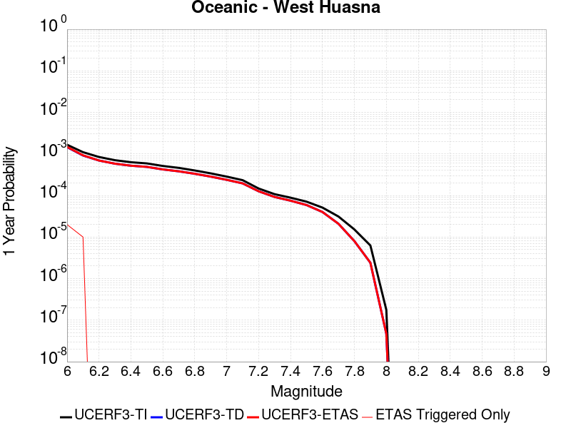 | 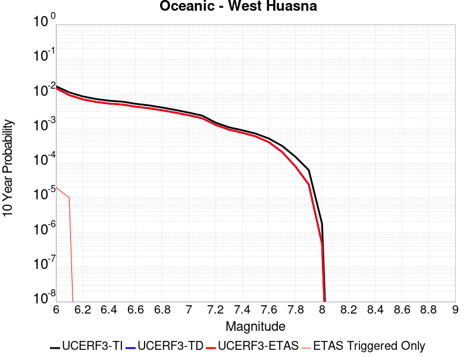 |

| Magnitude | 1 wk TI Prob | 1 wk TD Prob | 1 wk ETAS Prob | 1 wk ETAS/TD Gain | 1 wk ETAS Triggered Only | 1 mo TI Prob | 1 mo TD Prob | 1 mo ETAS Prob | 1 mo ETAS/TD Gain | 1 mo ETAS Triggered Only | 1 yr TI Prob | 1 yr TD Prob | 1 yr ETAS Prob | 1 yr ETAS/TD Gain | 1 yr ETAS Triggered Only | 10 yr TI Prob | 10 yr TD Prob | 10 yr ETAS Prob | 10 yr ETAS/TD Gain | 10 yr ETAS Triggered Only |
|-----|-----|-----|-----|-----|-----|-----|-----|-----|-----|-----|-----|-----|-----|-----|-----|-----|-----|-----|-----|-----|
| 6.0 | 3.195567E-5 | 2.7926262E-5 | 3.7925984E-5 | 1.3580759 | 1.0E-5 | 1.3694567E-4 | 1.19678734E-4 | 1.3967634E-4 | 1.1670941 | 2.0E-5 | 0.0016660384 | 0.0014561578 | 0.0014761287 | 1.0137148 | 2.0E-5 | 0.016536033 | 0.014470716 | 0.0144904265 | 1.0013621 | 2.0E-5 |
| 6.1 | 2.1156782E-5 | 1.7573033E-5 | 2.7572856E-5 | 1.5690438 | 1.0E-5 | 9.066878E-5 | 7.5310876E-5 | 8.531012E-5 | 1.1327729 | 1.0E-5 | 0.0011033333 | 9.165336E-4 | 9.265244E-4 | 1.0109006 | 1.0E-5 | 0.010978713 | 0.009128544 | 0.009138452 | 1.0010855 | 1.0E-5 |
| 6.2 | 1.6195117E-5 | 1.33271515E-5 | 1.33271515E-5 | 1.0 | 0.0 | 6.9405796E-5 | 5.711513E-5 | 5.711513E-5 | 1.0 | 0.0 | 8.44688E-4 | 6.951574E-4 | 6.951574E-4 | 1.0 | 0.0 | 0.008414844 | 0.0069301226 | 0.0069301226 | 1.0 | 0.0 |
| 6.3 | 1.3559345E-5 | 1.1178941E-5 | 1.1178941E-5 | 1.0 | 0.0 | 5.811018E-5 | 4.7908874E-5 | 4.7908874E-5 | 1.0 | 0.0 | 7.072618E-4 | 5.831354E-4 | 5.831354E-4 | 1.0 | 0.0 | 0.0070501505 | 0.005816171 | 0.005816171 | 1.0 | 0.0 |
| 6.4 | 1.2120619E-5 | 1.0000804E-5 | 1.0000804E-5 | 1.0 | 0.0 | 5.1944477E-5 | 4.2859887E-5 | 4.2859887E-5 | 1.0 | 0.0 | 6.322405E-4 | 5.216947E-4 | 5.216947E-4 | 1.0 | 0.0 | 0.006304447 | 0.0052047675 | 0.0052047675 | 1.0 | 0.0 |
| 6.5 | 1.13511915E-5 | 9.36731E-6 | 9.36731E-6 | 1.0 | 0.0 | 4.8647056E-5 | 4.0144998E-5 | 4.0144998E-5 | 1.0 | 0.0 | 5.9211696E-4 | 4.8865617E-4 | 4.8865617E-4 | 1.0 | 0.0 | 0.0059054173 | 0.004875876 | 0.004875876 | 1.0 | 0.0 |
| 6.6 | 9.850605E-6 | 8.135249E-6 | 8.135249E-6 | 1.0 | 0.0 | 4.2216197E-5 | 3.4864886E-5 | 3.4864886E-5 | 1.0 | 0.0 | 5.1386096E-4 | 4.2439753E-4 | 4.2439753E-4 | 1.0 | 0.0 | 0.0051267436 | 0.0042359033 | 0.0042359033 | 1.0 | 0.0 |
| 6.7 | 8.8558645E-6 | 7.318275E-6 | 7.318275E-6 | 1.0 | 0.0 | 3.7953152E-5 | 3.136366E-5 | 3.136366E-5 | 1.0 | 0.0 | 4.6198163E-4 | 3.8178582E-4 | 3.8178582E-4 | 1.0 | 0.0 | 0.004610224 | 0.003811325 | 0.003811325 | 1.0 | 0.0 |
| 6.8 | 7.67136E-6 | 6.3916254E-6 | 6.3916254E-6 | 1.0 | 0.0 | 3.2876844E-5 | 2.7392392E-5 | 2.7392392E-5 | 1.0 | 0.0 | 4.0020206E-4 | 3.334515E-4 | 3.334515E-4 | 1.0 | 0.0 | 0.003994821 | 0.003329533 | 0.003329533 | 1.0 | 0.0 |
| 6.9 | 6.534529E-6 | 5.458197E-6 | 5.458197E-6 | 1.0 | 0.0 | 2.8004823E-5 | 2.3392064E-5 | 2.3392064E-5 | 1.0 | 0.0 | 3.4090536E-4 | 2.847613E-4 | 2.847613E-4 | 1.0 | 0.0 | 0.0034038287 | 0.002843981 | 0.002843981 | 1.0 | 0.0 |
| 7.0 | 5.460525E-6 | 4.569857E-6 | 4.569857E-6 | 1.0 | 0.0 | 2.3402039E-5 | 1.9584955E-5 | 1.9584955E-5 | 1.0 | 0.0 | 2.8488258E-4 | 2.3842085E-4 | 2.3842085E-4 | 1.0 | 0.0 | 0.0028451765 | 0.0023816647 | 0.0023816647 | 1.0 | 0.0 |
| 7.1 | 4.4825083E-6 | 3.7523525E-6 | 3.7523525E-6 | 1.0 | 0.0 | 1.9210609E-5 | 1.6081412E-5 | 1.6081412E-5 | 1.0 | 0.0 | 2.3386406E-4 | 1.9577371E-4 | 1.9577371E-4 | 1.0 | 0.0 | 0.002336181 | 0.0019560247 | 0.0019560247 | 1.0 | 0.0 |
| 7.2 | 2.821708E-6 | 2.4248786E-6 | 2.4248786E-6 | 1.0 | 0.0 | 1.2092979E-5 | 1.0392296E-5 | 1.0392296E-5 | 1.0 | 0.0 | 1.4722206E-4 | 1.2651886E-4 | 1.2651886E-4 | 1.0 | 0.0 | 0.0014712457 | 0.001264471 | 0.001264471 | 1.0 | 0.0 |
| 7.3 | 2.0644757E-6 | 1.7686885E-6 | 1.7686885E-6 | 1.0 | 0.0 | 8.847723E-6 | 7.5800717E-6 | 7.5800717E-6 | 1.0 | 0.0 | 1.0771569E-4 | 9.2283466E-5 | 9.2283466E-5 | 1.0 | 0.0 | 0.001076635 | 9.224534E-4 | 9.224534E-4 | 1.0 | 0.0 |
| 7.4 | 1.6980367E-6 | 1.4379352E-6 | 1.4379352E-6 | 1.0 | 0.0 | 7.27728E-6 | 6.1625647E-6 | 6.1625647E-6 | 1.0 | 0.0 | 8.8597284E-5 | 7.502665E-5 | 7.502665E-5 | 1.0 | 0.0 | 8.8561967E-4 | 7.5001497E-4 | 7.5001497E-4 | 1.0 | 0.0 |
| 7.5 | 1.3637683E-6 | 1.1302084E-6 | 1.1302084E-6 | 1.0 | 0.0 | 5.844708E-6 | 4.843741E-6 | 4.843741E-6 | 1.0 | 0.0 | 7.1156996E-5 | 5.8970953E-5 | 5.8970953E-5 | 1.0 | 0.0 | 7.1134215E-4 | 5.895547E-4 | 5.895547E-4 | 1.0 | 0.0 |
| 7.6 | 9.802994E-7 | 7.676674E-7 | 7.676674E-7 | 1.0 | 0.0 | 4.2012766E-6 | 3.2899989E-6 | 3.2899989E-6 | 1.0 | 0.0 | 5.1149345E-5 | 4.0055E-5 | 4.0055E-5 | 1.0 | 0.0 | 5.113757E-4 | 4.0047945E-4 | 4.0047945E-4 | 1.0 | 0.0 |
| 7.7 | 5.986191E-7 | 4.0044617E-7 | 4.0044617E-7 | 1.0 | 0.0 | 2.5655079E-6 | 1.7161967E-6 | 1.7161967E-6 | 1.0 | 0.0 | 3.1234613E-5 | 2.0894495E-5 | 2.0894495E-5 | 1.0 | 0.0 | 3.123022E-4 | 2.0892687E-4 | 2.0892687E-4 | 1.0 | 0.0 |
| 7.8 | 2.9189815E-7 | 1.5284915E-7 | 1.5284915E-7 | 1.0 | 0.0 | 1.2509914E-6 | 6.5506765E-7 | 6.5506765E-7 | 1.0 | 0.0 | 1.5230714E-5 | 7.975419E-6 | 7.975419E-6 | 1.0 | 0.0 | 1.522967E-4 | 7.9752856E-5 | 7.9752856E-5 | 1.0 | 0.0 |
| 7.9 | 1.2057845E-7 | 4.620623E-8 | 4.620623E-8 | 1.0 | 0.0 | 5.1676466E-7 | 1.980267E-7 | 1.980267E-7 | 1.0 | 0.0 | 6.2915915E-6 | 2.4109722E-6 | 2.4109722E-6 | 1.0 | 0.0 | 6.2914136E-5 | 2.4110974E-5 | 2.4110974E-5 | 1.0 | 0.0 |
| 8.0 | 3.3806387E-9 | 9.008415E-10 | 9.008415E-10 | 1.0 | 0.0 | 1.4488451E-8 | 3.860749E-9 | 3.860749E-9 | 1.0 | 0.0 | 1.7639688E-7 | 4.700462E-8 | 4.700462E-8 | 1.0 | 0.0 | 1.7639674E-6 | 4.713628E-7 | 4.713628E-7 | 1.0 | 0.0 |

## Scodie Lineament
*[(top)](#table-of-contents)*

| 1 Week | 1 Month | 1 Year | 10 Year |
|-----|-----|-----|-----|
|  | 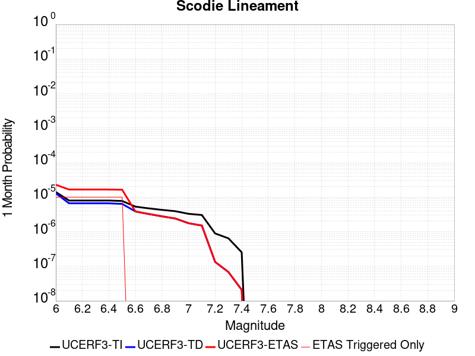 |  | 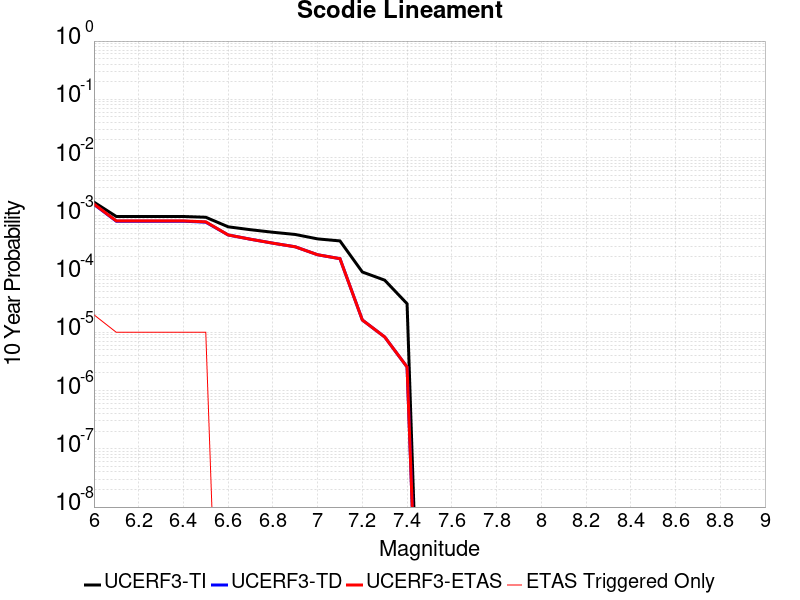 |

| Magnitude | 1 wk TI Prob | 1 wk TD Prob | 1 wk ETAS Prob | 1 wk ETAS/TD Gain | 1 wk ETAS Triggered Only | 1 mo TI Prob | 1 mo TD Prob | 1 mo ETAS Prob | 1 mo ETAS/TD Gain | 1 mo ETAS Triggered Only | 1 yr TI Prob | 1 yr TD Prob | 1 yr ETAS Prob | 1 yr ETAS/TD Gain | 1 yr ETAS Triggered Only | 10 yr TI Prob | 10 yr TD Prob | 10 yr ETAS Prob | 10 yr ETAS/TD Gain | 10 yr ETAS Triggered Only |
|-----|-----|-----|-----|-----|-----|-----|-----|-----|-----|-----|-----|-----|-----|-----|-----|-----|-----|-----|-----|-----|
| 6.0 | 3.2919327E-6 | 3.0133278E-6 | 1.3013298E-5 | 4.31858 | 1.0E-5 | 1.4108206E-5 | 1.2914216E-5 | 2.2914088E-5 | 1.7743305 | 1.0E-5 | 1.7175387E-4 | 1.5722241E-4 | 1.7721928E-4 | 1.1271883 | 2.0E-5 | 0.0017162118 | 0.0015714234 | 0.001591392 | 1.0127074 | 2.0E-5 |
| 6.1 | 1.8663811E-6 | 1.5490366E-6 | 1.1549021E-5 | 7.455615 | 1.0E-5 | 7.998751E-6 | 6.6387142E-6 | 1.6638647E-5 | 2.5063057 | 1.0E-5 | 9.738045E-5 | 8.082385E-5 | 9.0823036E-5 | 1.1237159 | 1.0E-5 | 9.7337784E-4 | 8.0799335E-4 | 8.179852E-4 | 1.0123663 | 1.0E-5 |
| 6.2 | 1.8663811E-6 | 1.5490366E-6 | 1.1549021E-5 | 7.455615 | 1.0E-5 | 7.998751E-6 | 6.6387142E-6 | 1.6638647E-5 | 2.5063057 | 1.0E-5 | 9.738045E-5 | 8.082385E-5 | 9.0823036E-5 | 1.1237159 | 1.0E-5 | 9.7337784E-4 | 8.0799335E-4 | 8.179852E-4 | 1.0123663 | 1.0E-5 |
| 6.3 | 1.8663811E-6 | 1.5490366E-6 | 1.1549021E-5 | 7.455615 | 1.0E-5 | 7.998751E-6 | 6.6387142E-6 | 1.6638647E-5 | 2.5063057 | 1.0E-5 | 9.738045E-5 | 8.082385E-5 | 9.0823036E-5 | 1.1237159 | 1.0E-5 | 9.7337784E-4 | 8.0799335E-4 | 8.179852E-4 | 1.0123663 | 1.0E-5 |
| 6.4 | 1.8663811E-6 | 1.5490366E-6 | 1.1549021E-5 | 7.455615 | 1.0E-5 | 7.998751E-6 | 6.6387142E-6 | 1.6638647E-5 | 2.5063057 | 1.0E-5 | 9.738045E-5 | 8.082385E-5 | 9.0823036E-5 | 1.1237159 | 1.0E-5 | 9.7337784E-4 | 8.0799335E-4 | 8.179852E-4 | 1.0123663 | 1.0E-5 |
| 6.5 | 1.8106311E-6 | 1.4909707E-6 | 1.1490956E-5 | 7.70703 | 1.0E-5 | 7.759824E-6 | 6.3898615E-6 | 1.6389798E-5 | 2.564969 | 1.0E-5 | 9.447177E-5 | 7.7794284E-5 | 8.779351E-5 | 1.1285342 | 1.0E-5 | 9.4431615E-4 | 7.777192E-4 | 7.877114E-4 | 1.0128481 | 1.0E-5 |
| 6.6 | 1.2414679E-6 | 8.9974316E-7 | 8.9974316E-7 | 1.0 | 0.0 | 5.320566E-6 | 3.856037E-6 | 3.856037E-6 | 1.0 | 0.0 | 6.477596E-5 | 4.6946323E-5 | 4.6946323E-5 | 1.0 | 0.0 | 6.475708E-4 | 4.6937272E-4 | 4.6937272E-4 | 1.0 | 0.0 |
| 6.7 | 1.1062215E-6 | 7.5941864E-7 | 7.5941864E-7 | 1.0 | 0.0 | 4.7409408E-6 | 3.2546475E-6 | 3.2546475E-6 | 1.0 | 0.0 | 5.7719422E-5 | 3.9624683E-5 | 3.9624683E-5 | 1.0 | 0.0 | 5.770443E-4 | 3.9618317E-4 | 3.9618317E-4 | 1.0 | 0.0 |
| 6.8 | 1.0006736E-6 | 6.500273E-7 | 6.500273E-7 | 1.0 | 0.0 | 4.288594E-6 | 2.7858287E-6 | 2.7858287E-6 | 1.0 | 0.0 | 5.221238E-5 | 3.3916996E-5 | 3.3916996E-5 | 1.0 | 0.0 | 5.220012E-4 | 3.391243E-4 | 3.391243E-4 | 1.0 | 0.0 |
| 6.9 | 9.167364E-7 | 5.631502E-7 | 5.631502E-7 | 1.0 | 0.0 | 3.9288643E-6 | 2.4134988E-6 | 2.4134988E-6 | 1.0 | 0.0 | 4.7832873E-5 | 2.938401E-5 | 2.938401E-5 | 1.0 | 0.0 | 4.782258E-4 | 2.9380692E-4 | 2.9380692E-4 | 1.0 | 0.0 |
| 7.0 | 7.6987664E-7 | 4.1132614E-7 | 4.1132614E-7 | 1.0 | 0.0 | 3.2994672E-6 | 1.7628253E-6 | 1.7628253E-6 | 1.0 | 0.0 | 4.0170275E-5 | 2.1462227E-5 | 2.1462227E-5 | 1.0 | 0.0 | 4.0163012E-4 | 2.1460539E-4 | 2.1460539E-4 | 1.0 | 0.0 |
| 7.1 | 7.1038727E-7 | 3.5210272E-7 | 3.5210272E-7 | 1.0 | 0.0 | 3.0445133E-6 | 1.509011E-6 | 1.509011E-6 | 1.0 | 0.0 | 3.706632E-5 | 1.837209E-5 | 1.837209E-5 | 1.0 | 0.0 | 3.7060137E-4 | 1.837092E-4 | 1.837092E-4 | 1.0 | 0.0 |
| 7.2 | 2.0799602E-7 | 3.117835E-8 | 3.117835E-8 | 1.0 | 0.0 | 8.914113E-7 | 1.3362148E-7 | 1.3362148E-7 | 1.0 | 0.0 | 1.0852878E-5 | 1.6268405E-6 | 1.6268405E-6 | 1.0 | 0.0 | 1.08523476E-4 | 1.6268294E-5 | 1.6268294E-5 | 1.0 | 0.0 |
| 7.3 | 1.5048182E-7 | 1.5938921E-8 | 1.5938921E-8 | 1.0 | 0.0 | 6.449219E-7 | 6.830967E-8 | 6.830967E-8 | 1.0 | 0.0 | 7.851896E-6 | 8.3166987E-7 | 8.3166987E-7 | 1.0 | 0.0 | 7.851618E-5 | 8.316671E-6 | 8.316671E-6 | 1.0 | 0.0 |
| 7.4 | 5.9334678E-8 | 4.8638475E-9 | 4.8638475E-9 | 1.0 | 0.0 | 2.5429145E-7 | 2.084506E-8 | 2.084506E-8 | 1.0 | 0.0 | 3.095994E-6 | 2.5378858E-7 | 2.5378858E-7 | 1.0 | 0.0 | 3.095951E-5 | 2.5378843E-6 | 2.5378843E-6 | 1.0 | 0.0 |

## Elsinore (Stepovers Combined)
*[(top)](#table-of-contents)*

| 1 Week | 1 Month | 1 Year | 10 Year |
|-----|-----|-----|-----|
|  |  |  | 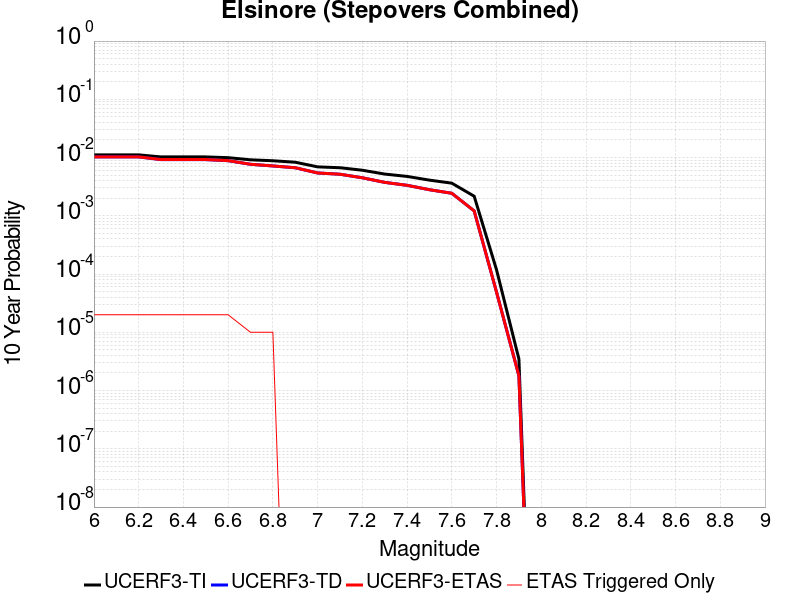 |

| Magnitude | 1 wk TI Prob | 1 wk TD Prob | 1 wk ETAS Prob | 1 wk ETAS/TD Gain | 1 wk ETAS Triggered Only | 1 mo TI Prob | 1 mo TD Prob | 1 mo ETAS Prob | 1 mo ETAS/TD Gain | 1 mo ETAS Triggered Only | 1 yr TI Prob | 1 yr TD Prob | 1 yr ETAS Prob | 1 yr ETAS/TD Gain | 1 yr ETAS Triggered Only | 10 yr TI Prob | 10 yr TD Prob | 10 yr ETAS Prob | 10 yr ETAS/TD Gain | 10 yr ETAS Triggered Only |
|-----|-----|-----|-----|-----|-----|-----|-----|-----|-----|-----|-----|-----|-----|-----|-----|-----|-----|-----|-----|-----|
| 6.0 | 2.144392E-5 | 1.9759926E-5 | 1.9759926E-5 | 1.0 | 0.0 | 9.189928E-5 | 8.468276E-5 | 8.468276E-5 | 1.0 | 0.0 | 0.0011182994 | 0.0010305439 | 0.0010405337 | 1.0096936 | 1.0E-5 | 0.011126885 | 0.010264172 | 0.010283967 | 1.0019286 | 2.0E-5 |
| 6.1 | 2.144392E-5 | 1.9759926E-5 | 1.9759926E-5 | 1.0 | 0.0 | 9.189928E-5 | 8.468276E-5 | 8.468276E-5 | 1.0 | 0.0 | 0.0011182994 | 0.0010305439 | 0.0010405337 | 1.0096936 | 1.0E-5 | 0.011126885 | 0.010264172 | 0.010283967 | 1.0019286 | 2.0E-5 |
| 6.2 | 2.144392E-5 | 1.9759926E-5 | 1.9759926E-5 | 1.0 | 0.0 | 9.189928E-5 | 8.468276E-5 | 8.468276E-5 | 1.0 | 0.0 | 0.0011182994 | 0.0010305439 | 0.0010405337 | 1.0096936 | 1.0E-5 | 0.011126885 | 0.010264172 | 0.010283967 | 1.0019286 | 2.0E-5 |
| 6.3 | 1.9751555E-5 | 1.774119E-5 | 1.774119E-5 | 1.0 | 0.0 | 8.4646774E-5 | 7.6031545E-5 | 7.6031545E-5 | 1.0 | 0.0 | 0.0010300872 | 9.2530495E-4 | 9.352957E-4 | 1.0107973 | 1.0E-5 | 0.010253254 | 0.009220534 | 0.00924035 | 1.0021491 | 2.0E-5 |
| 6.4 | 1.9751555E-5 | 1.774119E-5 | 1.774119E-5 | 1.0 | 0.0 | 8.4646774E-5 | 7.6031545E-5 | 7.6031545E-5 | 1.0 | 0.0 | 0.0010300872 | 9.2530495E-4 | 9.352957E-4 | 1.0107973 | 1.0E-5 | 0.010253254 | 0.009220534 | 0.00924035 | 1.0021491 | 2.0E-5 |
| 6.5 | 1.9751555E-5 | 1.774119E-5 | 1.774119E-5 | 1.0 | 0.0 | 8.4646774E-5 | 7.6031545E-5 | 7.6031545E-5 | 1.0 | 0.0 | 0.0010300872 | 9.2530495E-4 | 9.352957E-4 | 1.0107973 | 1.0E-5 | 0.010253254 | 0.009220534 | 0.00924035 | 1.0021491 | 2.0E-5 |
| 6.6 | 1.9188685E-5 | 1.7003118E-5 | 1.7003118E-5 | 1.0 | 0.0 | 8.2234634E-5 | 7.286856E-5 | 7.286856E-5 | 1.0 | 0.0 | 0.0010007467 | 8.8682986E-4 | 8.96821E-4 | 1.0112661 | 1.0E-5 | 0.00996252 | 0.008839108 | 0.008858932 | 1.0022427 | 2.0E-5 |
| 6.7 | 1.7608272E-5 | 1.4732275E-5 | 1.4732275E-5 | 1.0 | 0.0 | 7.546184E-5 | 6.3136846E-5 | 6.3136846E-5 | 1.0 | 0.0 | 9.183606E-4 | 7.684298E-4 | 7.784221E-4 | 1.0130036 | 1.0E-5 | 0.009145746 | 0.007664254 | 0.0076741776 | 1.0012947 | 1.0E-5 |
| 6.8 | 1.697165E-5 | 1.378303E-5 | 1.378303E-5 | 1.0 | 0.0 | 7.273361E-5 | 5.9068843E-5 | 5.9068843E-5 | 1.0 | 0.0 | 8.8517193E-4 | 7.189345E-4 | 7.289274E-4 | 1.0138994 | 1.0E-5 | 0.008816543 | 0.0071718874 | 0.007181816 | 1.0013844 | 1.0E-5 |
| 6.9 | 1.600365E-5 | 1.2846334E-5 | 1.2846334E-5 | 1.0 | 0.0 | 6.858527E-5 | 5.50546E-5 | 5.50546E-5 | 1.0 | 0.0 | 8.347058E-4 | 6.7009137E-4 | 6.7009137E-4 | 1.0 | 0.0 | 0.008315775 | 0.006686092 | 0.006686092 | 1.0 | 0.0 |
| 7.0 | 1.3314581E-5 | 1.044729E-5 | 1.044729E-5 | 1.0 | 0.0 | 5.7061243E-5 | 4.477335E-5 | 4.477335E-5 | 1.0 | 0.0 | 6.944992E-4 | 5.4498186E-4 | 5.4498186E-4 | 1.0 | 0.0 | 0.006923327 | 0.0054400126 | 0.0054400126 | 1.0 | 0.0 |
| 7.1 | 1.2865345E-5 | 9.937265E-6 | 9.937265E-6 | 1.0 | 0.0 | 5.5136024E-5 | 4.2587595E-5 | 4.2587595E-5 | 1.0 | 0.0 | 6.710743E-4 | 5.1838317E-4 | 5.1838317E-4 | 1.0 | 0.0 | 0.0066905143 | 0.005174955 | 0.005174955 | 1.0 | 0.0 |
| 7.2 | 1.1650051E-5 | 8.63353E-6 | 8.63353E-6 | 1.0 | 0.0 | 4.9927836E-5 | 3.700033E-5 | 3.700033E-5 | 1.0 | 0.0 | 6.0770183E-4 | 4.5038768E-4 | 4.5038768E-4 | 1.0 | 0.0 | 0.0060604266 | 0.004496211 | 0.004496211 | 1.0 | 0.0 |
| 7.3 | 1.0008533E-5 | 7.2007847E-6 | 7.2007847E-6 | 1.0 | 0.0 | 4.2893007E-5 | 3.086015E-5 | 3.086015E-5 | 1.0 | 0.0 | 5.220972E-4 | 3.75659E-4 | 3.75659E-4 | 1.0 | 0.0 | 0.005208723 | 0.0037506383 | 0.0037506383 | 1.0 | 0.0 |
| 7.4 | 9.116759E-6 | 6.4098203E-6 | 6.4098203E-6 | 1.0 | 0.0 | 3.907124E-5 | 2.7470376E-5 | 2.7470376E-5 | 1.0 | 0.0 | 4.7558855E-4 | 3.3440188E-4 | 3.3440188E-4 | 1.0 | 0.0 | 0.00474572 | 0.0033391395 | 0.0033391395 | 1.0 | 0.0 |
| 7.5 | 7.870524E-6 | 5.3822882E-6 | 5.3822882E-6 | 1.0 | 0.0 | 3.3730383E-5 | 2.3066752E-5 | 2.3066752E-5 | 1.0 | 0.0 | 4.1059E-4 | 2.8080278E-4 | 2.8080278E-4 | 1.0 | 0.0 | 0.0040983222 | 0.0028046062 | 0.0028046062 | 1.0 | 0.0 |
| 7.6 | 6.9774537E-6 | 4.6773716E-6 | 4.6773716E-6 | 1.0 | 0.0 | 2.990303E-5 | 2.004573E-5 | 2.004573E-5 | 1.0 | 0.0 | 3.640086E-4 | 2.4403061E-4 | 2.4403061E-4 | 1.0 | 0.0 | 0.003634129 | 0.0024377427 | 0.0024377427 | 1.0 | 0.0 |
| 7.7 | 4.1616954E-6 | 2.328132E-6 | 2.328132E-6 | 1.0 | 0.0 | 1.7835715E-5 | 9.977675E-6 | 9.977675E-6 | 1.0 | 0.0 | 2.171282E-4 | 1.2147216E-4 | 1.2147216E-4 | 1.0 | 0.0 | 0.0021691616 | 0.0012141307 | 0.0012141307 | 1.0 | 0.0 |
| 7.8 | 2.2692414E-7 | 9.384396E-8 | 9.384396E-8 | 1.0 | 0.0 | 9.725317E-7 | 4.0218833E-7 | 4.0218833E-7 | 1.0 | 0.0 | 1.1840509E-5 | 4.8966353E-6 | 4.8966353E-6 | 1.0 | 0.0 | 1.1839878E-4 | 4.89656E-5 | 4.89656E-5 | 1.0 | 0.0 |
| 7.9 | 6.676829E-9 | 3.4396095E-9 | 3.4396095E-9 | 1.0 | 0.0 | 2.861498E-8 | 1.47411825E-8 | 1.47411825E-8 | 1.0 | 0.0 | 3.4838732E-7 | 1.7947389E-7 | 1.7947389E-7 | 1.0 | 0.0 | 3.4838679E-6 | 1.7947376E-6 | 1.7947376E-6 | 1.0 | 0.0 |

## Pisgah-Bullion Mtn-Mesquite Lk
*[(top)](#table-of-contents)*

| 1 Week | 1 Month | 1 Year | 10 Year |
|-----|-----|-----|-----|
|  |  |  |  |

| Magnitude | 1 wk TI Prob | 1 wk TD Prob | 1 wk ETAS Prob | 1 wk ETAS/TD Gain | 1 wk ETAS Triggered Only | 1 mo TI Prob | 1 mo TD Prob | 1 mo ETAS Prob | 1 mo ETAS/TD Gain | 1 mo ETAS Triggered Only | 1 yr TI Prob | 1 yr TD Prob | 1 yr ETAS Prob | 1 yr ETAS/TD Gain | 1 yr ETAS Triggered Only | 10 yr TI Prob | 10 yr TD Prob | 10 yr ETAS Prob | 10 yr ETAS/TD Gain | 10 yr ETAS Triggered Only |
|-----|-----|-----|-----|-----|-----|-----|-----|-----|-----|-----|-----|-----|-----|-----|-----|-----|-----|-----|-----|-----|
| 6.0 | 3.0240792E-5 | 2.4090827E-5 | 3.4090586E-5 | 1.4150858 | 1.0E-5 | 1.2959696E-4 | 1.0324288E-4 | 1.2324081E-4 | 1.1936979 | 2.0E-5 | 0.0015767008 | 0.0012563579 | 0.0012763328 | 1.0158991 | 2.0E-5 | 0.015655609 | 0.012502574 | 0.012522325 | 1.0015796 | 2.0E-5 |
| 6.1 | 3.0240792E-5 | 2.4090827E-5 | 3.4090586E-5 | 1.4150858 | 1.0E-5 | 1.2959696E-4 | 1.0324288E-4 | 1.2324081E-4 | 1.1936979 | 2.0E-5 | 0.0015767008 | 0.0012563579 | 0.0012763328 | 1.0158991 | 2.0E-5 | 0.015655609 | 0.012502574 | 0.012522325 | 1.0015796 | 2.0E-5 |
| 6.2 | 3.0240792E-5 | 2.4090827E-5 | 3.4090586E-5 | 1.4150858 | 1.0E-5 | 1.2959696E-4 | 1.0324288E-4 | 1.2324081E-4 | 1.1936979 | 2.0E-5 | 0.0015767008 | 0.0012563579 | 0.0012763328 | 1.0158991 | 2.0E-5 | 0.015655609 | 0.012502574 | 0.012522325 | 1.0015796 | 2.0E-5 |
| 6.3 | 2.0498217E-5 | 1.3638019E-5 | 1.3638019E-5 | 1.0 | 0.0 | 8.784654E-5 | 5.8447433E-5 | 6.844685E-5 | 1.1710839 | 1.0E-5 | 0.0010690069 | 7.113814E-4 | 7.213743E-4 | 1.0140471 | 1.0E-5 | 0.01063879 | 0.0070926677 | 0.007102597 | 1.0013999 | 1.0E-5 |
| 6.4 | 2.0498217E-5 | 1.3638019E-5 | 1.3638019E-5 | 1.0 | 0.0 | 8.784654E-5 | 5.8447433E-5 | 6.844685E-5 | 1.1710839 | 1.0E-5 | 0.0010690069 | 7.113814E-4 | 7.213743E-4 | 1.0140471 | 1.0E-5 | 0.01063879 | 0.0070926677 | 0.007102597 | 1.0013999 | 1.0E-5 |
| 6.5 | 1.7316182E-5 | 1.0476945E-5 | 1.0476945E-5 | 1.0 | 0.0 | 7.42101E-5 | 4.4900476E-5 | 5.4900025E-5 | 1.2227048 | 1.0E-5 | 9.0313336E-4 | 5.465362E-4 | 5.565307E-4 | 1.0182871 | 1.0E-5 | 0.008994718 | 0.005452916 | 0.0054628616 | 1.0018239 | 1.0E-5 |
| 6.6 | 1.5251077E-5 | 8.414112E-6 | 8.414112E-6 | 1.0 | 0.0 | 6.536012E-5 | 3.606002E-5 | 4.605966E-5 | 1.2773055 | 1.0E-5 | 7.9546886E-4 | 4.3894956E-4 | 4.4894515E-4 | 1.0227717 | 1.0E-5 | 0.007926274 | 0.0043815426 | 0.004391499 | 1.0022722 | 1.0E-5 |
| 6.7 | 1.2997425E-5 | 6.4111982E-6 | 6.4111982E-6 | 1.0 | 0.0 | 5.570206E-5 | 2.74763E-5 | 2.74763E-5 | 1.0 | 0.0 | 6.7796157E-4 | 3.3447728E-4 | 3.3447728E-4 | 1.0 | 0.0 | 0.0067589693 | 0.0033401987 | 0.0033401987 | 1.0 | 0.0 |
| 6.8 | 1.035386E-5 | 4.3331297E-6 | 4.3331297E-6 | 1.0 | 0.0 | 4.437293E-5 | 1.8570428E-5 | 1.8570428E-5 | 1.0 | 0.0 | 5.401065E-4 | 2.2607238E-4 | 2.2607238E-4 | 1.0 | 0.0 | 0.0053879567 | 0.0022585108 | 0.0022585108 | 1.0 | 0.0 |
| 6.9 | 8.816252E-6 | 3.580573E-6 | 3.580573E-6 | 1.0 | 0.0 | 3.778339E-5 | 1.5345226E-5 | 1.5345226E-5 | 1.0 | 0.0 | 4.5991567E-4 | 1.868127E-4 | 1.868127E-4 | 1.0 | 0.0 | 0.00458965 | 0.001866615 | 0.001866615 | 1.0 | 0.0 |
| 7.0 | 6.8232207E-6 | 2.567426E-6 | 2.567426E-6 | 1.0 | 0.0 | 2.9242048E-5 | 1.100321E-5 | 1.100321E-5 | 1.0 | 0.0 | 3.5596377E-4 | 1.3395616E-4 | 1.3395616E-4 | 1.0 | 0.0 | 0.0035539411 | 0.0013387852 | 0.0013387852 | 1.0 | 0.0 |
| 7.1 | 5.837013E-6 | 2.2273025E-6 | 2.2273025E-6 | 1.0 | 0.0 | 2.501553E-5 | 9.545549E-6 | 9.545549E-6 | 1.0 | 0.0 | 3.045215E-4 | 1.1621116E-4 | 1.1621116E-4 | 1.0 | 0.0 | 0.0030410455 | 0.0011615328 | 0.0011615328 | 1.0 | 0.0 |
| 7.2 | 4.278052E-6 | 1.6274947E-6 | 1.6274947E-6 | 1.0 | 0.0 | 1.833438E-5 | 6.9749603E-6 | 6.9749603E-6 | 1.0 | 0.0 | 2.231982E-4 | 8.491707E-5 | 8.491707E-5 | 1.0 | 0.0 | 0.0022297418 | 8.488694E-4 | 8.488694E-4 | 1.0 | 0.0 |
| 7.3 | 1.8803692E-6 | 8.344683E-7 | 8.344683E-7 | 1.0 | 0.0 | 8.0587E-6 | 3.576289E-6 | 3.576289E-6 | 1.0 | 0.0 | 9.811026E-5 | 4.3540593E-5 | 4.3540593E-5 | 1.0 | 0.0 | 9.806695E-4 | 4.353351E-4 | 4.353351E-4 | 1.0 | 0.0 |

## Pitas Point (Lower West)
*[(top)](#table-of-contents)*

| 1 Week | 1 Month | 1 Year | 10 Year |
|-----|-----|-----|-----|
|  | 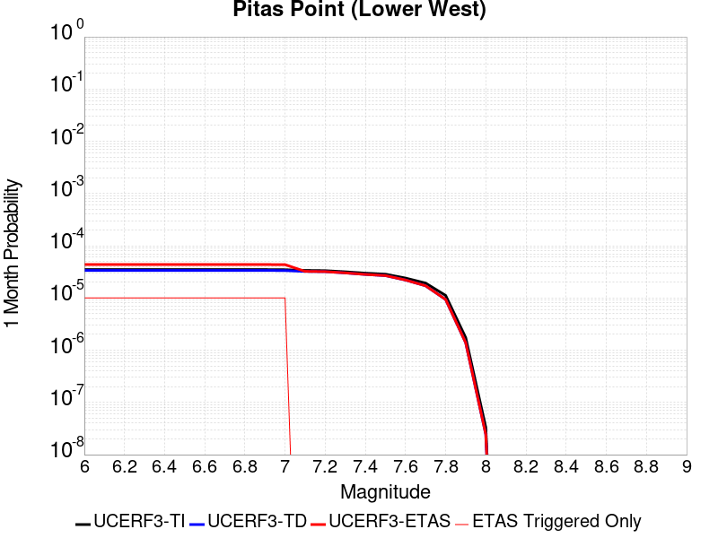 | 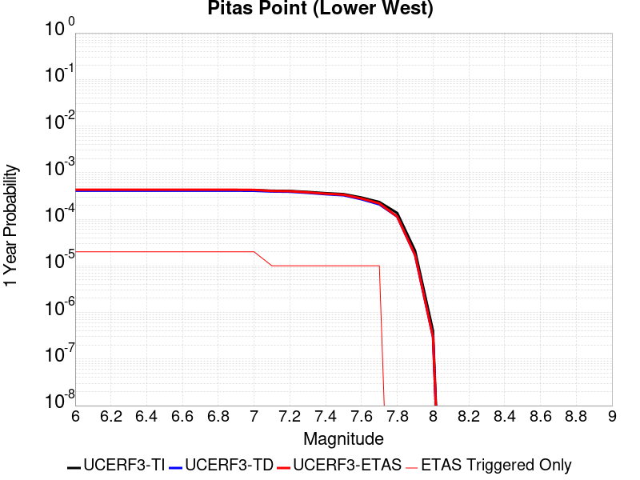 | 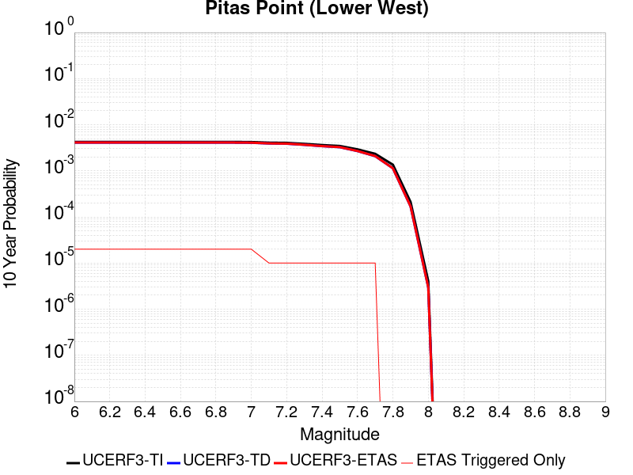 |

| Magnitude | 1 wk TI Prob | 1 wk TD Prob | 1 wk ETAS Prob | 1 wk ETAS/TD Gain | 1 wk ETAS Triggered Only | 1 mo TI Prob | 1 mo TD Prob | 1 mo ETAS Prob | 1 mo ETAS/TD Gain | 1 mo ETAS Triggered Only | 1 yr TI Prob | 1 yr TD Prob | 1 yr ETAS Prob | 1 yr ETAS/TD Gain | 1 yr ETAS Triggered Only | 10 yr TI Prob | 10 yr TD Prob | 10 yr ETAS Prob | 10 yr ETAS/TD Gain | 10 yr ETAS Triggered Only |
|-----|-----|-----|-----|-----|-----|-----|-----|-----|-----|-----|-----|-----|-----|-----|-----|-----|-----|-----|-----|-----|
| 6.0 | 8.151497E-6 | 7.855784E-6 | 1.7855706E-5 | 2.2729373 | 1.0E-5 | 3.493452E-5 | 3.3667216E-5 | 4.366688E-5 | 1.2970148 | 1.0E-5 | 4.252448E-4 | 4.09822E-4 | 4.298138E-4 | 1.0487816 | 2.0E-5 | 0.0042443196 | 0.004090743 | 0.0041106613 | 1.0048691 | 2.0E-5 |
| 6.1 | 8.151497E-6 | 7.855784E-6 | 1.7855706E-5 | 2.2729373 | 1.0E-5 | 3.493452E-5 | 3.3667216E-5 | 4.366688E-5 | 1.2970148 | 1.0E-5 | 4.252448E-4 | 4.09822E-4 | 4.298138E-4 | 1.0487816 | 2.0E-5 | 0.0042443196 | 0.004090743 | 0.0041106613 | 1.0048691 | 2.0E-5 |
| 6.2 | 8.151497E-6 | 7.855784E-6 | 1.7855706E-5 | 2.2729373 | 1.0E-5 | 3.493452E-5 | 3.3667216E-5 | 4.366688E-5 | 1.2970148 | 1.0E-5 | 4.252448E-4 | 4.09822E-4 | 4.298138E-4 | 1.0487816 | 2.0E-5 | 0.0042443196 | 0.004090743 | 0.0041106613 | 1.0048691 | 2.0E-5 |
| 6.3 | 8.151497E-6 | 7.855784E-6 | 1.7855706E-5 | 2.2729373 | 1.0E-5 | 3.493452E-5 | 3.3667216E-5 | 4.366688E-5 | 1.2970148 | 1.0E-5 | 4.252448E-4 | 4.09822E-4 | 4.298138E-4 | 1.0487816 | 2.0E-5 | 0.0042443196 | 0.004090743 | 0.0041106613 | 1.0048691 | 2.0E-5 |
| 6.4 | 8.151497E-6 | 7.855784E-6 | 1.7855706E-5 | 2.2729373 | 1.0E-5 | 3.493452E-5 | 3.3667216E-5 | 4.366688E-5 | 1.2970148 | 1.0E-5 | 4.252448E-4 | 4.09822E-4 | 4.298138E-4 | 1.0487816 | 2.0E-5 | 0.0042443196 | 0.004090743 | 0.0041106613 | 1.0048691 | 2.0E-5 |
| 6.5 | 8.151497E-6 | 7.855784E-6 | 1.7855706E-5 | 2.2729373 | 1.0E-5 | 3.493452E-5 | 3.3667216E-5 | 4.366688E-5 | 1.2970148 | 1.0E-5 | 4.252448E-4 | 4.09822E-4 | 4.298138E-4 | 1.0487816 | 2.0E-5 | 0.0042443196 | 0.004090743 | 0.0041106613 | 1.0048691 | 2.0E-5 |
| 6.6 | 8.151497E-6 | 7.855784E-6 | 1.7855706E-5 | 2.2729373 | 1.0E-5 | 3.493452E-5 | 3.3667216E-5 | 4.366688E-5 | 1.2970148 | 1.0E-5 | 4.252448E-4 | 4.09822E-4 | 4.298138E-4 | 1.0487816 | 2.0E-5 | 0.0042443196 | 0.004090743 | 0.0041106613 | 1.0048691 | 2.0E-5 |
| 6.7 | 8.151497E-6 | 7.855784E-6 | 1.7855706E-5 | 2.2729373 | 1.0E-5 | 3.493452E-5 | 3.3667216E-5 | 4.366688E-5 | 1.2970148 | 1.0E-5 | 4.252448E-4 | 4.09822E-4 | 4.298138E-4 | 1.0487816 | 2.0E-5 | 0.0042443196 | 0.004090743 | 0.0041106613 | 1.0048691 | 2.0E-5 |
| 6.8 | 8.151497E-6 | 7.855784E-6 | 1.7855706E-5 | 2.2729373 | 1.0E-5 | 3.493452E-5 | 3.3667216E-5 | 4.366688E-5 | 1.2970148 | 1.0E-5 | 4.252448E-4 | 4.09822E-4 | 4.298138E-4 | 1.0487816 | 2.0E-5 | 0.0042443196 | 0.004090743 | 0.0041106613 | 1.0048691 | 2.0E-5 |
| 6.9 | 8.151497E-6 | 7.855784E-6 | 1.7855706E-5 | 2.2729373 | 1.0E-5 | 3.493452E-5 | 3.3667216E-5 | 4.366688E-5 | 1.2970148 | 1.0E-5 | 4.252448E-4 | 4.09822E-4 | 4.298138E-4 | 1.0487816 | 2.0E-5 | 0.0042443196 | 0.004090743 | 0.0041106613 | 1.0048691 | 2.0E-5 |
| 7.0 | 8.103535E-6 | 7.805214E-6 | 1.7805136E-5 | 2.281185 | 1.0E-5 | 3.4728975E-5 | 3.3450495E-5 | 4.345016E-5 | 1.2989392 | 1.0E-5 | 4.2274324E-4 | 4.071844E-4 | 4.2717624E-4 | 1.0490978 | 2.0E-5 | 0.0042193993 | 0.0040644635 | 0.004084382 | 1.0049007 | 2.0E-5 |
| 7.1 | 7.853298E-6 | 7.5409057E-6 | 7.5409057E-6 | 1.0 | 0.0 | 3.3656554E-5 | 3.231777E-5 | 3.231777E-5 | 1.0 | 0.0 | 4.096915E-4 | 3.933985E-4 | 4.033946E-4 | 1.0254095 | 1.0E-5 | 0.00408937 | 0.003927097 | 0.003937058 | 1.0025364 | 1.0E-5 |
| 7.2 | 7.771102E-6 | 7.4531877E-6 | 7.4531877E-6 | 1.0 | 0.0 | 3.33043E-5 | 3.1941847E-5 | 3.1941847E-5 | 1.0 | 0.0 | 4.0540437E-4 | 3.8882327E-4 | 3.988194E-4 | 1.0257087 | 1.0E-5 | 0.0040466557 | 0.0038815055 | 0.0038914667 | 1.0025663 | 1.0E-5 |
| 7.3 | 7.3945344E-6 | 7.0492933E-6 | 7.0492933E-6 | 1.0 | 0.0 | 3.1690477E-5 | 3.021091E-5 | 3.021091E-5 | 1.0 | 0.0 | 3.8576324E-4 | 3.6775638E-4 | 3.777527E-4 | 1.0271819 | 1.0E-5 | 0.0038509427 | 0.0036715455 | 0.0036815088 | 1.0027137 | 1.0E-5 |
| 7.4 | 6.964645E-6 | 6.590143E-6 | 6.590143E-6 | 1.0 | 0.0 | 2.9848137E-5 | 2.8243167E-5 | 2.8243167E-5 | 1.0 | 0.0 | 3.6334046E-4 | 3.438068E-4 | 3.5380336E-4 | 1.0290761 | 1.0E-5 | 0.0036274698 | 0.0034328024 | 0.003442768 | 1.0029031 | 1.0E-5 |
| 7.5 | 6.6525035E-6 | 6.259182E-6 | 6.259182E-6 | 1.0 | 0.0 | 2.851042E-5 | 2.6824793E-5 | 2.6824793E-5 | 1.0 | 0.0 | 3.4705905E-4 | 3.265434E-4 | 3.3654014E-4 | 1.0306138 | 1.0E-5 | 0.0034651754 | 0.0032606872 | 0.0032706547 | 1.0030569 | 1.0E-5 |
| 7.6 | 5.613338E-6 | 5.151413E-6 | 5.151413E-6 | 1.0 | 0.0 | 2.405694E-5 | 2.20773E-5 | 2.20773E-5 | 1.0 | 0.0 | 2.928539E-4 | 2.6875827E-4 | 2.787556E-4 | 1.0371982 | 1.0E-5 | 0.0029246826 | 0.0026843639 | 0.0026943372 | 1.0037153 | 1.0E-5 |
| 7.7 | 4.494704E-6 | 3.99694E-6 | 3.99694E-6 | 1.0 | 0.0 | 1.9262876E-5 | 1.712963E-5 | 1.712963E-5 | 1.0 | 0.0 | 2.3450027E-4 | 2.0853353E-4 | 2.1853145E-4 | 1.047944 | 1.0E-5 | 0.0023425296 | 0.0020834026 | 0.0020933817 | 1.0047898 | 1.0E-5 |
| 7.8 | 2.6075882E-6 | 2.183664E-6 | 2.183664E-6 | 1.0 | 0.0 | 1.117533E-5 | 9.358527E-6 | 9.358527E-6 | 1.0 | 0.0 | 1.3605114E-4 | 1.13934155E-4 | 1.13934155E-4 | 1.0 | 0.0 | 0.0013596788 | 0.0011387621 | 0.0011387621 | 1.0 | 0.0 |
| 7.9 | 4.045984E-7 | 3.2424023E-7 | 3.2424023E-7 | 1.0 | 0.0 | 1.733992E-6 | 1.3896002E-6 | 1.3896002E-6 | 1.0 | 0.0 | 2.1111147E-5 | 1.6918255E-5 | 1.6918255E-5 | 1.0 | 0.0 | 2.1109142E-4 | 1.6916997E-4 | 1.6916997E-4 | 1.0 | 0.0 |
| 8.0 | 7.791402E-9 | 5.6836047E-9 | 5.6836047E-9 | 1.0 | 0.0 | 3.3391725E-8 | 2.4358307E-8 | 2.4358307E-8 | 1.0 | 0.0 | 4.0654416E-7 | 2.9656238E-7 | 2.9656238E-7 | 1.0 | 0.0 | 4.065434E-6 | 2.9656217E-6 | 2.9656217E-6 | 1.0 | 0.0 |

## San Jacinto (Clark) rev
*[(top)](#table-of-contents)*

| 1 Week | 1 Month | 1 Year | 10 Year |
|-----|-----|-----|-----|
|  | 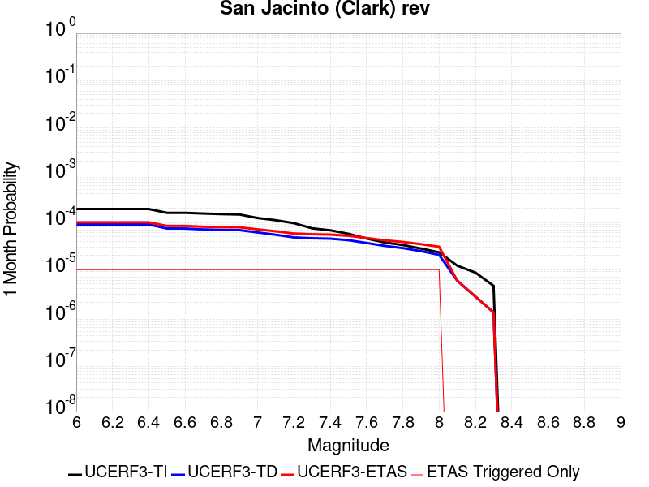 |  |  |

| Magnitude | 1 wk TI Prob | 1 wk TD Prob | 1 wk ETAS Prob | 1 wk ETAS/TD Gain | 1 wk ETAS Triggered Only | 1 mo TI Prob | 1 mo TD Prob | 1 mo ETAS Prob | 1 mo ETAS/TD Gain | 1 mo ETAS Triggered Only | 1 yr TI Prob | 1 yr TD Prob | 1 yr ETAS Prob | 1 yr ETAS/TD Gain | 1 yr ETAS Triggered Only | 10 yr TI Prob | 10 yr TD Prob | 10 yr ETAS Prob | 10 yr ETAS/TD Gain | 10 yr ETAS Triggered Only |
|-----|-----|-----|-----|-----|-----|-----|-----|-----|-----|-----|-----|-----|-----|-----|-----|-----|-----|-----|-----|-----|
| 6.0 | 4.482615E-5 | 2.1148431E-5 | 3.114822E-5 | 1.4728383 | 1.0E-5 | 1.9209793E-4 | 9.063304E-5 | 1.0063213E-4 | 1.1103251 | 1.0E-5 | 0.0023362834 | 0.0011029079 | 0.0011128968 | 1.0090569 | 1.0E-5 | 0.02311874 | 0.011478677 | 0.0114984475 | 1.0017223 | 2.0E-5 |
| 6.1 | 4.482615E-5 | 2.1148431E-5 | 3.114822E-5 | 1.4728383 | 1.0E-5 | 1.9209793E-4 | 9.063304E-5 | 1.0063213E-4 | 1.1103251 | 1.0E-5 | 0.0023362834 | 0.0011029079 | 0.0011128968 | 1.0090569 | 1.0E-5 | 0.02311874 | 0.011478677 | 0.0114984475 | 1.0017223 | 2.0E-5 |
| 6.2 | 4.482615E-5 | 2.1148431E-5 | 3.114822E-5 | 1.4728383 | 1.0E-5 | 1.9209793E-4 | 9.063304E-5 | 1.0063213E-4 | 1.1103251 | 1.0E-5 | 0.0023362834 | 0.0011029079 | 0.0011128968 | 1.0090569 | 1.0E-5 | 0.02311874 | 0.011478677 | 0.0114984475 | 1.0017223 | 2.0E-5 |
| 6.3 | 4.482615E-5 | 2.1148431E-5 | 3.114822E-5 | 1.4728383 | 1.0E-5 | 1.9209793E-4 | 9.063304E-5 | 1.0063213E-4 | 1.1103251 | 1.0E-5 | 0.0023362834 | 0.0011029079 | 0.0011128968 | 1.0090569 | 1.0E-5 | 0.02311874 | 0.011478677 | 0.0114984475 | 1.0017223 | 2.0E-5 |
| 6.4 | 4.482615E-5 | 2.1148431E-5 | 3.114822E-5 | 1.4728383 | 1.0E-5 | 1.9209793E-4 | 9.063304E-5 | 1.0063213E-4 | 1.1103251 | 1.0E-5 | 0.0023362834 | 0.0011029079 | 0.0011128968 | 1.0090569 | 1.0E-5 | 0.02311874 | 0.011478677 | 0.0114984475 | 1.0017223 | 2.0E-5 |
| 6.5 | 3.7294863E-5 | 1.735004E-5 | 2.7349864E-5 | 1.5763576 | 1.0E-5 | 1.5982533E-4 | 7.4355215E-5 | 8.435447E-5 | 1.1344795 | 1.0E-5 | 0.0019441366 | 9.049032E-4 | 9.1489416E-4 | 1.0110409 | 1.0E-5 | 0.01927216 | 0.009478857 | 0.009498667 | 1.00209 | 2.0E-5 |
| 6.6 | 3.7294863E-5 | 1.735004E-5 | 2.7349864E-5 | 1.5763576 | 1.0E-5 | 1.5982533E-4 | 7.4355215E-5 | 8.435447E-5 | 1.1344795 | 1.0E-5 | 0.0019441366 | 9.049032E-4 | 9.1489416E-4 | 1.0110409 | 1.0E-5 | 0.01927216 | 0.009478857 | 0.009498667 | 1.00209 | 2.0E-5 |
| 6.7 | 3.6039248E-5 | 1.6598056E-5 | 2.659789E-5 | 1.6024702 | 1.0E-5 | 1.5444479E-4 | 7.113261E-5 | 8.11319E-5 | 1.1405725 | 1.0E-5 | 0.0018787434 | 8.6569955E-4 | 8.756909E-4 | 1.0115414 | 1.0E-5 | 0.01862939 | 0.00908114 | 0.009100959 | 1.0021824 | 2.0E-5 |
| 6.8 | 3.5031844E-5 | 1.6226495E-5 | 2.6226333E-5 | 1.616266 | 1.0E-5 | 1.5012783E-4 | 6.954029E-5 | 7.95396E-5 | 1.1437916 | 1.0E-5 | 0.0018262739 | 8.463283E-4 | 8.563198E-4 | 1.0118058 | 1.0E-5 | 0.01811338 | 0.0088817375 | 0.00890156 | 1.0022318 | 2.0E-5 |
| 6.9 | 3.435112E-5 | 1.605703E-5 | 2.605687E-5 | 1.6227702 | 1.0E-5 | 1.4721078E-4 | 6.881406E-5 | 7.881337E-5 | 1.1453092 | 1.0E-5 | 0.0017908178 | 8.3749316E-4 | 8.474848E-4 | 1.0119303 | 1.0E-5 | 0.017764548 | 0.008789461 | 0.008809285 | 1.0022554 | 2.0E-5 |
| 7.0 | 2.8959772E-5 | 1.4330898E-5 | 2.4330755E-5 | 1.697783 | 1.0E-5 | 1.241074E-4 | 6.14167E-5 | 7.1416085E-5 | 1.1628121 | 1.0E-5 | 0.0015099603 | 7.4749463E-4 | 7.5748714E-4 | 1.013368 | 1.0E-5 | 0.014997416 | 0.007861273 | 0.007881116 | 1.0025241 | 2.0E-5 |
| 7.1 | 2.6002877E-5 | 1.2823071E-5 | 2.2822944E-5 | 1.7798344 | 1.0E-5 | 1.11436144E-4 | 5.4954875E-5 | 6.495433E-5 | 1.1819575 | 1.0E-5 | 0.0013558907 | 6.688723E-4 | 6.7886565E-4 | 1.0149405 | 1.0E-5 | 0.013476475 | 0.00704128 | 0.007061139 | 1.0028204 | 2.0E-5 |
| 7.2 | 2.2544838E-5 | 1.1255716E-5 | 2.1255604E-5 | 1.8884275 | 1.0E-5 | 9.661716E-5 | 4.82379E-5 | 5.823742E-5 | 1.2072959 | 1.0E-5 | 0.001175679 | 5.871396E-4 | 5.9713377E-4 | 1.0170218 | 1.0E-5 | 0.011694785 | 0.0061900634 | 0.0062099397 | 1.003211 | 2.0E-5 |
| 7.3 | 1.75334E-5 | 1.0805979E-5 | 2.0805872E-5 | 1.9254036 | 1.0E-5 | 7.514098E-5 | 4.6310524E-5 | 5.6310062E-5 | 1.2159237 | 1.0E-5 | 9.144575E-4 | 5.636862E-4 | 5.736805E-4 | 1.0177304 | 1.0E-5 | 0.009107036 | 0.0059307297 | 0.005950611 | 1.0033523 | 2.0E-5 |
| 7.4 | 1.5924552E-5 | 1.0605883E-5 | 2.0605778E-5 | 1.9428629 | 1.0E-5 | 6.82463E-5 | 4.5453E-5 | 5.5452547E-5 | 1.2199975 | 1.0E-5 | 8.305819E-4 | 5.532511E-4 | 5.632456E-4 | 1.018065 | 1.0E-5 | 0.008274844 | 0.0058181193 | 0.005838003 | 1.0034175 | 2.0E-5 |
| 7.5 | 1.3428931E-5 | 9.84653E-6 | 1.9846431E-5 | 2.0155761 | 1.0E-5 | 5.7551293E-5 | 4.219874E-5 | 5.2198317E-5 | 1.2369639 | 1.0E-5 | 7.004617E-4 | 5.136496E-4 | 5.2364444E-4 | 1.0194585 | 1.0E-5 | 0.006982579 | 0.0054038092 | 0.0054237014 | 1.0036811 | 2.0E-5 |
| 7.6 | 1.0688787E-5 | 8.609963E-6 | 1.8609877E-5 | 2.1614351 | 1.0E-5 | 4.5808283E-5 | 3.689932E-5 | 4.6898953E-5 | 1.2709976 | 1.0E-5 | 5.5757316E-4 | 4.491571E-4 | 4.591526E-4 | 1.0222539 | 1.0E-5 | 0.005561762 | 0.0047391006 | 0.0047590057 | 1.0042002 | 2.0E-5 |
| 7.7 | 8.81236E-6 | 7.4664786E-6 | 1.7466404E-5 | 2.3393095 | 1.0E-5 | 3.776671E-5 | 3.1998803E-5 | 4.1998483E-5 | 1.3125017 | 1.0E-5 | 4.597127E-4 | 3.8951598E-4 | 3.9951206E-4 | 1.0256629 | 1.0E-5 | 0.0045876284 | 0.0041340096 | 0.004153927 | 1.004818 | 2.0E-5 |
| 7.8 | 7.780431E-6 | 6.695141E-6 | 1.6695074E-5 | 2.4936104 | 1.0E-5 | 3.3344273E-5 | 2.8693148E-5 | 3.869286E-5 | 1.3485053 | 1.0E-5 | 4.0589093E-4 | 3.4928325E-4 | 3.5927977E-4 | 1.02862 | 1.0E-5 | 0.0040515037 | 0.0037221527 | 0.0037420783 | 1.0053532 | 2.0E-5 |
| 7.9 | 6.5437994E-6 | 5.7790494E-6 | 1.5778991E-5 | 2.7303784 | 1.0E-5 | 2.8044553E-5 | 2.4767121E-5 | 3.4766872E-5 | 1.4037511 | 1.0E-5 | 3.4138895E-4 | 3.0149813E-4 | 3.1149513E-4 | 1.0331577 | 1.0E-5 | 0.0034086495 | 0.0032338423 | 0.00324381 | 1.0030823 | 1.0E-5 |
| 8.0 | 5.4488164E-6 | 4.812146E-6 | 1.4812098E-5 | 3.078065 | 1.0E-5 | 2.3351862E-5 | 2.0623322E-5 | 3.0623116E-5 | 1.484878 | 1.0E-5 | 2.8427184E-4 | 2.5106015E-4 | 2.6105763E-4 | 1.0398211 | 1.0E-5 | 0.0028390845 | 0.0027102758 | 0.002720249 | 1.0036796 | 1.0E-5 |
| 8.1 | 2.8397242E-6 | 1.3662986E-6 | 1.3662986E-6 | 1.0 | 0.0 | 1.217019E-5 | 5.855553E-6 | 5.855553E-6 | 1.0 | 0.0 | 1.4816198E-4 | 7.128903E-5 | 7.128903E-5 | 1.0 | 0.0 | 0.0014806325 | 8.111905E-4 | 8.111905E-4 | 1.0 | 0.0 |
| 8.2 | 2.030244E-6 | 6.3135167E-7 | 6.3135167E-7 | 1.0 | 0.0 | 8.701017E-6 | 2.70579E-6 | 2.70579E-6 | 1.0 | 0.0 | 1.05929736E-4 | 3.2942502E-5 | 3.2942502E-5 | 1.0 | 0.0 | 0.0010587925 | 3.9462151E-4 | 3.9462151E-4 | 1.0 | 0.0 |
| 8.3 | 1.0659804E-6 | 2.9222883E-7 | 2.9222883E-7 | 1.0 | 0.0 | 4.568479E-6 | 1.2524088E-6 | 1.2524088E-6 | 1.0 | 0.0 | 5.5619817E-5 | 1.5247973E-5 | 1.5247973E-5 | 1.0 | 0.0 | 5.5605895E-4 | 1.8551825E-4 | 1.8551825E-4 | 1.0 | 0.0 |

## Owens Valley
*[(top)](#table-of-contents)*

| 1 Week | 1 Month | 1 Year | 10 Year |
|-----|-----|-----|-----|
| 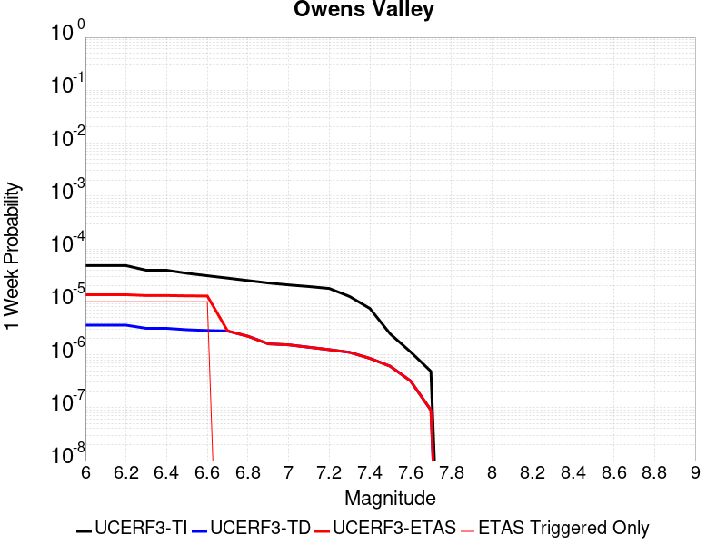 |  | 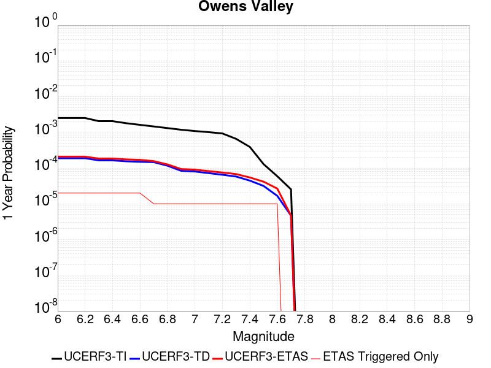 |  |

| Magnitude | 1 wk TI Prob | 1 wk TD Prob | 1 wk ETAS Prob | 1 wk ETAS/TD Gain | 1 wk ETAS Triggered Only | 1 mo TI Prob | 1 mo TD Prob | 1 mo ETAS Prob | 1 mo ETAS/TD Gain | 1 mo ETAS Triggered Only | 1 yr TI Prob | 1 yr TD Prob | 1 yr ETAS Prob | 1 yr ETAS/TD Gain | 1 yr ETAS Triggered Only | 10 yr TI Prob | 10 yr TD Prob | 10 yr ETAS Prob | 10 yr ETAS/TD Gain | 10 yr ETAS Triggered Only |
|-----|-----|-----|-----|-----|-----|-----|-----|-----|-----|-----|-----|-----|-----|-----|-----|-----|-----|-----|-----|-----|
| 6.0 | 4.83821E-5 | 3.6210222E-6 | 1.3620986E-5 | 3.7616413 | 1.0E-5 | 2.0733538E-4 | 1.5518579E-5 | 2.5518424E-5 | 1.6443789 | 1.0E-5 | 0.002521386 | 1.8892331E-4 | 2.0891953E-4 | 1.1058431 | 2.0E-5 | 0.024929691 | 0.0019296809 | 0.0019496423 | 1.0103444 | 2.0E-5 |
| 6.1 | 4.83821E-5 | 3.6210222E-6 | 1.3620986E-5 | 3.7616413 | 1.0E-5 | 2.0733538E-4 | 1.5518579E-5 | 2.5518424E-5 | 1.6443789 | 1.0E-5 | 0.002521386 | 1.8892331E-4 | 2.0891953E-4 | 1.1058431 | 2.0E-5 | 0.024929691 | 0.0019296809 | 0.0019496423 | 1.0103444 | 2.0E-5 |
| 6.2 | 4.83821E-5 | 3.6210222E-6 | 1.3620986E-5 | 3.7616413 | 1.0E-5 | 2.0733538E-4 | 1.5518579E-5 | 2.5518424E-5 | 1.6443789 | 1.0E-5 | 0.002521386 | 1.8892331E-4 | 2.0891953E-4 | 1.1058431 | 2.0E-5 | 0.024929691 | 0.0019296809 | 0.0019496423 | 1.0103444 | 2.0E-5 |
| 6.3 | 3.953008E-5 | 3.1530674E-6 | 1.3153036E-5 | 4.171505 | 1.0E-5 | 1.6940363E-4 | 1.351308E-5 | 2.3512945E-5 | 1.7400137 | 1.0E-5 | 0.002060538 | 1.6451007E-4 | 1.8450677E-4 | 1.1215531 | 2.0E-5 | 0.020415364 | 0.0016621284 | 0.0016820952 | 1.0120127 | 2.0E-5 |
| 6.4 | 3.953008E-5 | 3.1530674E-6 | 1.3153036E-5 | 4.171505 | 1.0E-5 | 1.6940363E-4 | 1.351308E-5 | 2.3512945E-5 | 1.7400137 | 1.0E-5 | 0.002060538 | 1.6451007E-4 | 1.8450677E-4 | 1.1215531 | 2.0E-5 | 0.020415364 | 0.0016621284 | 0.0016820952 | 1.0120127 | 2.0E-5 |
| 6.5 | 3.457342E-5 | 2.9707103E-6 | 1.29706805E-5 | 4.366188 | 1.0E-5 | 1.4816338E-4 | 1.2731558E-5 | 2.273143E-5 | 1.7854398 | 1.0E-5 | 0.0018023965 | 1.5499639E-4 | 1.7499329E-4 | 1.1290152 | 2.0E-5 | 0.017878477 | 0.0015562775 | 0.0015762463 | 1.0128312 | 2.0E-5 |
| 6.6 | 3.1127765E-5 | 2.8737022E-6 | 1.2873674E-5 | 4.4798217 | 1.0E-5 | 1.3339789E-4 | 1.23158125E-5 | 2.231569E-5 | 1.8119543 | 1.0E-5 | 0.0016229092 | 1.4993538E-4 | 1.6993239E-4 | 1.1333708 | 2.0E-5 | 0.016111081 | 0.0015013095 | 0.0015212795 | 1.0133017 | 2.0E-5 |
| 6.7 | 2.806885E-5 | 2.8101322E-6 | 2.8101322E-6 | 1.0 | 0.0 | 1.2028952E-4 | 1.2043372E-5 | 1.2043372E-5 | 1.0 | 0.0 | 0.001463541 | 1.4661888E-4 | 1.5661742E-4 | 1.068194 | 1.0E-5 | 0.014539397 | 0.0014655745 | 0.0014755599 | 1.0068133 | 1.0E-5 |
| 6.8 | 2.524524E-5 | 2.2351205E-6 | 2.2351205E-6 | 1.0 | 0.0 | 1.0818939E-4 | 9.579055E-6 | 9.579055E-6 | 1.0 | 0.0 | 0.0013164099 | 1.16619056E-4 | 1.2661789E-4 | 1.0857393 | 1.0E-5 | 0.01308639 | 0.0011657963 | 0.0011757846 | 1.0085678 | 1.0E-5 |
| 6.9 | 2.2704568E-5 | 1.6079553E-6 | 1.6079553E-6 | 1.0 | 0.0 | 9.730166E-5 | 6.8912186E-6 | 6.8912186E-6 | 1.0 | 0.0 | 0.0011840039 | 8.389737E-5 | 9.389654E-5 | 1.1191832 | 1.0E-5 | 0.011777153 | 8.388229E-4 | 8.4881455E-4 | 1.0119115 | 1.0E-5 |
| 7.0 | 2.0871712E-5 | 1.5393473E-6 | 1.5393473E-6 | 1.0 | 0.0 | 8.944713E-5 | 6.5971863E-6 | 6.5971863E-6 | 1.0 | 0.0 | 0.0010884746 | 8.03178E-5 | 9.031699E-5 | 1.1244954 | 1.0E-5 | 0.010831586 | 8.0301013E-4 | 8.1300206E-4 | 1.0124432 | 1.0E-5 |
| 7.1 | 1.944928E-5 | 1.3862423E-6 | 1.3862423E-6 | 1.0 | 0.0 | 8.335139E-5 | 5.941025E-6 | 5.941025E-6 | 1.0 | 0.0 | 0.0010143308 | 7.232959E-5 | 8.2328865E-5 | 1.138246 | 1.0E-5 | 0.010097133 | 7.2316936E-4 | 7.331621E-4 | 1.013818 | 1.0E-5 |
| 7.2 | 1.7876306E-5 | 1.2487566E-6 | 1.2487566E-6 | 1.0 | 0.0 | 7.6610486E-5 | 5.351803E-6 | 5.351803E-6 | 1.0 | 0.0 | 9.3233347E-4 | 6.5156266E-5 | 7.515561E-5 | 1.1534672 | 1.0E-5 | 0.009284316 | 6.514696E-4 | 6.614631E-4 | 1.0153399 | 1.0E-5 |
| 7.3 | 1.2618672E-5 | 1.111373E-6 | 1.111373E-6 | 1.0 | 0.0 | 5.40789E-5 | 4.7630183E-6 | 4.7630183E-6 | 1.0 | 0.0 | 6.582117E-4 | 5.798821E-5 | 6.798763E-5 | 1.1724389 | 1.0E-5 | 0.0065626553 | 5.7982403E-4 | 5.898183E-4 | 1.0172366 | 1.0E-5 |
| 7.4 | 7.4874442E-6 | 8.5474284E-7 | 8.5474284E-7 | 1.0 | 0.0 | 3.208865E-5 | 3.6631784E-6 | 3.6631784E-6 | 1.0 | 0.0 | 3.906093E-4 | 4.4598288E-5 | 5.4597844E-5 | 1.2242138 | 1.0E-5 | 0.003899234 | 4.4594568E-4 | 4.5594122E-4 | 1.0224142 | 1.0E-5 |
| 7.5 | 2.4734156E-6 | 6.0679236E-7 | 6.0679236E-7 | 1.0 | 0.0 | 1.060031E-5 | 2.6005362E-6 | 2.6005362E-6 | 1.0 | 0.0 | 1.2905113E-4 | 3.166107E-5 | 4.1660755E-5 | 1.3158352 | 1.0E-5 | 0.0012897621 | 3.165659E-4 | 3.2656276E-4 | 1.031579 | 1.0E-5 |
| 7.6 | 1.1328841E-6 | 3.1961662E-7 | 3.1961662E-7 | 1.0 | 0.0 | 4.8552088E-6 | 1.3697849E-6 | 1.3697849E-6 | 1.0 | 0.0 | 5.9110564E-5 | 1.6677004E-5 | 2.6676838E-5 | 1.5996181 | 1.0E-5 | 5.9094845E-4 | 1.6675772E-4 | 1.7675605E-4 | 1.0599573 | 1.0E-5 |
| 7.7 | 4.8613185E-7 | 8.962604E-8 | 8.962604E-8 | 1.0 | 0.0 | 2.0834207E-6 | 3.8411156E-7 | 3.8411156E-7 | 1.0 | 0.0 | 2.536535E-5 | 4.676549E-6 | 4.676549E-6 | 1.0 | 0.0 | 2.5362454E-4 | 4.6764573E-5 | 4.6764573E-5 | 1.0 | 0.0 |

## Ventura-Pitas Point
*[(top)](#table-of-contents)*

| 1 Week | 1 Month | 1 Year | 10 Year |
|-----|-----|-----|-----|
| 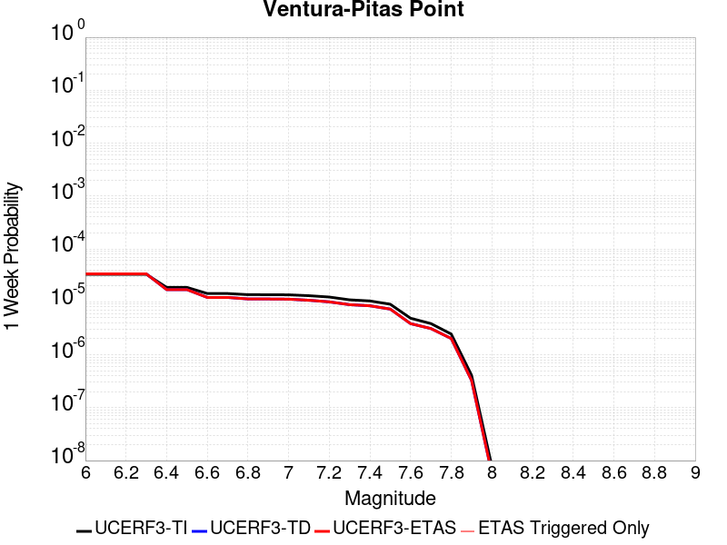 |  |  | 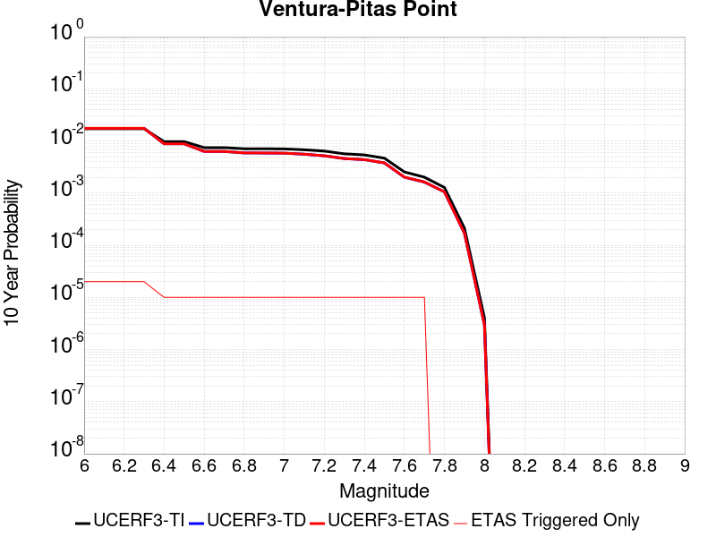 |

| Magnitude | 1 wk TI Prob | 1 wk TD Prob | 1 wk ETAS Prob | 1 wk ETAS/TD Gain | 1 wk ETAS Triggered Only | 1 mo TI Prob | 1 mo TD Prob | 1 mo ETAS Prob | 1 mo ETAS/TD Gain | 1 mo ETAS Triggered Only | 1 yr TI Prob | 1 yr TD Prob | 1 yr ETAS Prob | 1 yr ETAS/TD Gain | 1 yr ETAS Triggered Only | 10 yr TI Prob | 10 yr TD Prob | 10 yr ETAS Prob | 10 yr ETAS/TD Gain | 10 yr ETAS Triggered Only |
|-----|-----|-----|-----|-----|-----|-----|-----|-----|-----|-----|-----|-----|-----|-----|-----|-----|-----|-----|-----|-----|
| 6.0 | 3.3179622E-5 | 3.373506E-5 | 3.373506E-5 | 1.0 | 0.0 | 1.4219063E-4 | 1.4457226E-4 | 1.4457226E-4 | 1.0 | 0.0 | 0.0017297962 | 0.001759003 | 0.0017789678 | 1.01135 | 2.0E-5 | 0.017163932 | 0.01747628 | 0.01749593 | 1.0011244 | 2.0E-5 |
| 6.1 | 3.3179622E-5 | 3.373506E-5 | 3.373506E-5 | 1.0 | 0.0 | 1.4219063E-4 | 1.4457226E-4 | 1.4457226E-4 | 1.0 | 0.0 | 0.0017297962 | 0.001759003 | 0.0017789678 | 1.01135 | 2.0E-5 | 0.017163932 | 0.01747628 | 0.01749593 | 1.0011244 | 2.0E-5 |
| 6.2 | 3.3179622E-5 | 3.373506E-5 | 3.373506E-5 | 1.0 | 0.0 | 1.4219063E-4 | 1.4457226E-4 | 1.4457226E-4 | 1.0 | 0.0 | 0.0017297962 | 0.001759003 | 0.0017789678 | 1.01135 | 2.0E-5 | 0.017163932 | 0.01747628 | 0.01749593 | 1.0011244 | 2.0E-5 |
| 6.3 | 3.3179622E-5 | 3.373506E-5 | 3.373506E-5 | 1.0 | 0.0 | 1.4219063E-4 | 1.4457226E-4 | 1.4457226E-4 | 1.0 | 0.0 | 0.0017297962 | 0.001759003 | 0.0017789678 | 1.01135 | 2.0E-5 | 0.017163932 | 0.01747628 | 0.01749593 | 1.0011244 | 2.0E-5 |
| 6.4 | 1.8754668E-5 | 1.7019538E-5 | 1.7019538E-5 | 1.0 | 0.0 | 8.037467E-5 | 7.2938965E-5 | 7.2938965E-5 | 1.0 | 0.0 | 9.781223E-4 | 8.876932E-4 | 8.976843E-4 | 1.0112551 | 1.0E-5 | 0.009738282 | 0.008843759 | 0.00885367 | 1.0011207 | 1.0E-5 |
| 6.5 | 1.8754668E-5 | 1.7019538E-5 | 1.7019538E-5 | 1.0 | 0.0 | 8.037467E-5 | 7.2938965E-5 | 7.2938965E-5 | 1.0 | 0.0 | 9.781223E-4 | 8.876932E-4 | 8.976843E-4 | 1.0112551 | 1.0E-5 | 0.009738282 | 0.008843759 | 0.00885367 | 1.0011207 | 1.0E-5 |
| 6.6 | 1.4361558E-5 | 1.21222165E-5 | 1.21222165E-5 | 1.0 | 0.0 | 6.154808E-5 | 5.1951334E-5 | 5.1951334E-5 | 1.0 | 0.0 | 7.490902E-4 | 6.3232624E-4 | 6.423199E-4 | 1.0158046 | 1.0E-5 | 0.0074657016 | 0.006305476 | 0.006315413 | 1.001576 | 1.0E-5 |
| 6.7 | 1.4361558E-5 | 1.21222165E-5 | 1.21222165E-5 | 1.0 | 0.0 | 6.154808E-5 | 5.1951334E-5 | 5.1951334E-5 | 1.0 | 0.0 | 7.490902E-4 | 6.3232624E-4 | 6.423199E-4 | 1.0158046 | 1.0E-5 | 0.0074657016 | 0.006305476 | 0.006315413 | 1.001576 | 1.0E-5 |
| 6.8 | 1.3663846E-5 | 1.1344362E-5 | 1.1344362E-5 | 1.0 | 0.0 | 5.8558027E-5 | 4.86178E-5 | 4.86178E-5 | 1.0 | 0.0 | 7.127108E-4 | 5.917629E-4 | 6.0175697E-4 | 1.0168886 | 1.0E-5 | 0.007104293 | 0.005902036 | 0.005911977 | 1.0016843 | 1.0E-5 |
| 6.9 | 1.3644157E-5 | 1.1322462E-5 | 1.1322462E-5 | 1.0 | 0.0 | 5.8473648E-5 | 4.8523947E-5 | 4.8523947E-5 | 1.0 | 0.0 | 7.116841E-4 | 5.9062085E-4 | 6.0061493E-4 | 1.0169213 | 1.0E-5 | 0.007094092 | 0.0058906763 | 0.0059006177 | 1.0016876 | 1.0E-5 |
| 7.0 | 1.3568845E-5 | 1.1242029E-5 | 1.1242029E-5 | 1.0 | 0.0 | 5.8150898E-5 | 4.817925E-5 | 4.817925E-5 | 1.0 | 0.0 | 7.077572E-4 | 5.864264E-4 | 5.9642055E-4 | 1.0170424 | 1.0E-5 | 0.007055073 | 0.0058489535 | 0.005858895 | 1.0016997 | 1.0E-5 |
| 7.1 | 1.306572E-5 | 1.0720488E-5 | 1.0720488E-5 | 1.0 | 0.0 | 5.599474E-5 | 4.5944147E-5 | 4.5944147E-5 | 1.0 | 0.0 | 6.815227E-4 | 5.592283E-4 | 5.6922267E-4 | 1.0178717 | 1.0E-5 | 0.0067943637 | 0.0055783642 | 0.0055883084 | 1.0017827 | 1.0E-5 |
| 7.2 | 1.232604E-5 | 9.995097E-6 | 9.995097E-6 | 1.0 | 0.0 | 5.2824813E-5 | 4.2835436E-5 | 4.2835436E-5 | 1.0 | 0.0 | 6.429523E-4 | 5.213984E-4 | 5.313932E-4 | 1.0191692 | 1.0E-5 | 0.0064109527 | 0.005201892 | 0.00521184 | 1.0019124 | 1.0E-5 |
| 7.3 | 1.0917261E-5 | 8.84379E-6 | 8.84379E-6 | 1.0 | 0.0 | 4.678742E-5 | 3.7901416E-5 | 3.7901416E-5 | 1.0 | 0.0 | 5.69488E-4 | 4.613536E-4 | 4.71349E-4 | 1.0216653 | 1.0E-5 | 0.0056803077 | 0.004604073 | 0.0046140268 | 1.002162 | 1.0E-5 |
| 7.4 | 1.039959E-5 | 8.423521E-6 | 8.423521E-6 | 1.0 | 0.0 | 4.456891E-5 | 3.610031E-5 | 3.610031E-5 | 1.0 | 0.0 | 5.424914E-4 | 4.394342E-4 | 4.494298E-4 | 1.0227466 | 1.0E-5 | 0.0054116896 | 0.004385763 | 0.004395719 | 1.0022701 | 1.0E-5 |
| 7.5 | 9.015877E-6 | 7.2975085E-6 | 7.2975085E-6 | 1.0 | 0.0 | 3.86389E-5 | 3.127467E-5 | 3.127467E-5 | 1.0 | 0.0 | 4.7032707E-4 | 3.80704E-4 | 3.9070018E-4 | 1.0262572 | 1.0E-5 | 0.004693329 | 0.0038006115 | 0.0038105734 | 1.0026212 | 1.0E-5 |
| 7.6 | 4.900162E-6 | 3.874114E-6 | 3.874114E-6 | 1.0 | 0.0 | 2.1000526E-5 | 1.660324E-5 | 1.660324E-5 | 1.0 | 0.0 | 2.556514E-4 | 2.0212584E-4 | 2.121238E-4 | 1.0494641 | 1.0E-5 | 0.0025535747 | 0.0020194335 | 0.0020294134 | 1.0049419 | 1.0E-5 |
| 7.7 | 3.8850626E-6 | 3.126756E-6 | 3.126756E-6 | 1.0 | 0.0 | 1.6650163E-5 | 1.3400314E-5 | 1.3400314E-5 | 1.0 | 0.0 | 2.0269687E-4 | 1.631367E-4 | 1.7313506E-4 | 1.0612882 | 1.0E-5 | 0.002025121 | 0.0016301788 | 0.0016401624 | 1.0061243 | 1.0E-5 |
| 7.8 | 2.4654719E-6 | 2.0299E-6 | 2.0299E-6 | 1.0 | 0.0 | 1.0566265E-5 | 8.699543E-6 | 8.699543E-6 | 1.0 | 0.0 | 1.2863669E-4 | 1.0591184E-4 | 1.0591184E-4 | 1.0 | 0.0 | 0.0012856225 | 0.0010586183 | 0.0010586183 | 1.0 | 0.0 |
| 7.9 | 4.095894E-7 | 3.2765044E-7 | 3.2765044E-7 | 1.0 | 0.0 | 1.7553821E-6 | 1.4042155E-6 | 1.4042155E-6 | 1.0 | 0.0 | 2.1371567E-5 | 1.7096192E-5 | 1.7096192E-5 | 1.0 | 0.0 | 2.1369511E-4 | 1.7094908E-4 | 1.7094908E-4 | 1.0 | 0.0 |
| 8.0 | 7.791402E-9 | 5.6836047E-9 | 5.6836047E-9 | 1.0 | 0.0 | 3.3391725E-8 | 2.4358307E-8 | 2.4358307E-8 | 1.0 | 0.0 | 4.0654416E-7 | 2.9656238E-7 | 2.9656238E-7 | 1.0 | 0.0 | 4.065434E-6 | 2.9656217E-6 | 2.9656217E-6 | 1.0 | 0.0 |

## Coronado Bank alt1
*[(top)](#table-of-contents)*

| 1 Week | 1 Month | 1 Year | 10 Year |
|-----|-----|-----|-----|
|  | 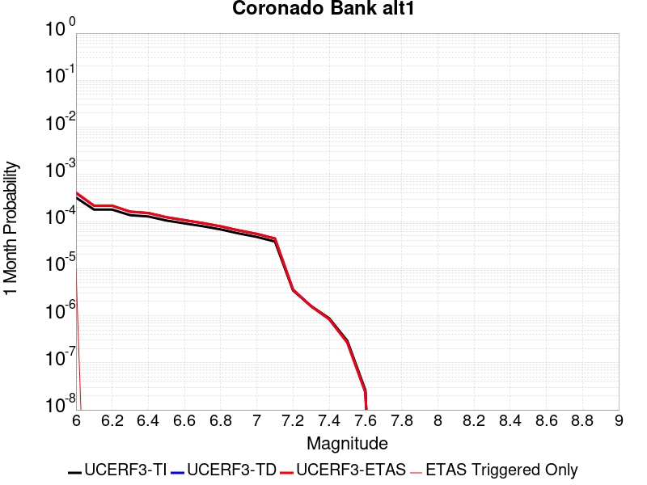 | 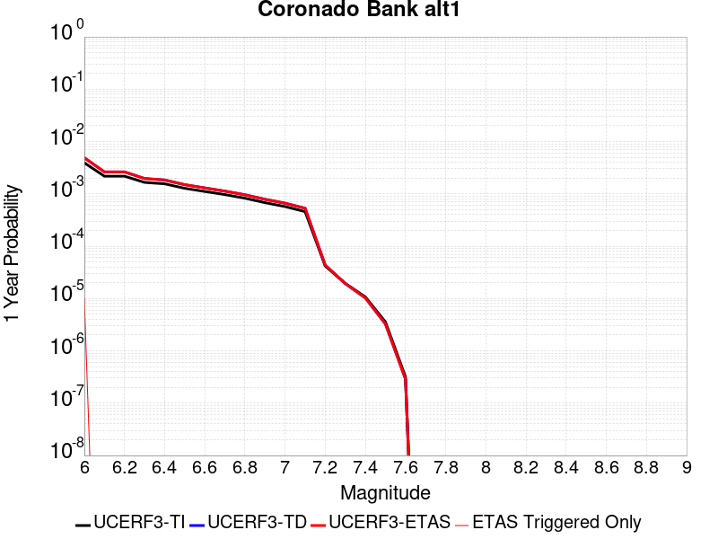 |  |

| Magnitude | 1 wk TI Prob | 1 wk TD Prob | 1 wk ETAS Prob | 1 wk ETAS/TD Gain | 1 wk ETAS Triggered Only | 1 mo TI Prob | 1 mo TD Prob | 1 mo ETAS Prob | 1 mo ETAS/TD Gain | 1 mo ETAS Triggered Only | 1 yr TI Prob | 1 yr TD Prob | 1 yr ETAS Prob | 1 yr ETAS/TD Gain | 1 yr ETAS Triggered Only | 10 yr TI Prob | 10 yr TD Prob | 10 yr ETAS Prob | 10 yr ETAS/TD Gain | 10 yr ETAS Triggered Only |
|-----|-----|-----|-----|-----|-----|-----|-----|-----|-----|-----|-----|-----|-----|-----|-----|-----|-----|-----|-----|-----|
| 6.0 | 7.533492E-5 | 9.395107E-5 | 1.0395013E-4 | 1.1064284 | 1.0E-5 | 3.22824E-4 | 4.0258773E-4 | 4.125837E-4 | 1.0248293 | 1.0E-5 | 0.0039233007 | 0.004891089 | 0.0049010403 | 1.0020345 | 1.0E-5 | 0.03854755 | 0.047903698 | 0.047922738 | 1.0003976 | 2.0E-5 |
| 6.1 | 4.1807285E-5 | 5.0492818E-5 | 5.0492818E-5 | 1.0 | 0.0 | 1.7916178E-4 | 2.163802E-4 | 2.163802E-4 | 1.0 | 0.0 | 0.0021791123 | 0.0026313218 | 0.0026313218 | 1.0 | 0.0 | 0.021578677 | 0.02601098 | 0.02602072 | 1.0003744 | 1.0E-5 |
| 6.2 | 4.1807285E-5 | 5.0492818E-5 | 5.0492818E-5 | 1.0 | 0.0 | 1.7916178E-4 | 2.163802E-4 | 2.163802E-4 | 1.0 | 0.0 | 0.0021791123 | 0.0026313218 | 0.0026313218 | 1.0 | 0.0 | 0.021578677 | 0.02601098 | 0.02602072 | 1.0003744 | 1.0E-5 |
| 6.3 | 3.1793104E-5 | 3.7710935E-5 | 3.7710935E-5 | 1.0 | 0.0 | 1.3624904E-4 | 1.6160845E-4 | 1.6160845E-4 | 1.0 | 0.0 | 0.0016575698 | 0.0019658392 | 0.0019658392 | 1.0 | 0.0 | 0.016452603 | 0.019488398 | 0.019498203 | 1.0005032 | 1.0E-5 |
| 6.4 | 2.9878007E-5 | 3.5335623E-5 | 3.5335623E-5 | 1.0 | 0.0 | 1.2804232E-4 | 1.5142979E-4 | 1.5142979E-4 | 1.0 | 0.0 | 0.0015578003 | 0.0018421304 | 0.0018421304 | 1.0 | 0.0 | 0.015469253 | 0.018272376 | 0.018282192 | 1.0005373 | 1.0E-5 |
| 6.5 | 2.4512565E-5 | 2.8763967E-5 | 2.8763967E-5 | 1.0 | 0.0 | 1.0504962E-4 | 1.2326847E-4 | 1.2326847E-4 | 1.0 | 0.0 | 0.0012782287 | 0.0014997873 | 0.0014997873 | 1.0 | 0.0 | 0.012709012 | 0.014899624 | 0.014899624 | 1.0 | 0.0 |
| 6.6 | 2.1317413E-5 | 2.4906556E-5 | 2.4906556E-5 | 1.0 | 0.0 | 9.135714E-5 | 1.06738145E-4 | 1.06738145E-4 | 1.0 | 0.0 | 0.0011117056 | 0.0012987844 | 0.0012987844 | 1.0 | 0.0 | 0.011061605 | 0.012914349 | 0.012914349 | 1.0 | 0.0 |
| 6.7 | 1.8585655E-5 | 2.1634785E-5 | 2.1634785E-5 | 1.0 | 0.0 | 7.9650374E-5 | 9.271733E-5 | 9.271733E-5 | 1.0 | 0.0 | 9.6931186E-4 | 0.0011282694 | 0.0011282694 | 1.0 | 0.0 | 0.0096509475 | 0.011227573 | 0.011227573 | 1.0 | 0.0 |
| 6.8 | 1.5862879E-5 | 1.8419396E-5 | 1.8419396E-5 | 1.0 | 0.0 | 6.798199E-5 | 7.8937985E-5 | 7.8937985E-5 | 1.0 | 0.0 | 8.273665E-4 | 9.606655E-4 | 9.606655E-4 | 1.0 | 0.0 | 0.008242928 | 0.009567109 | 0.009567109 | 1.0 | 0.0 |
| 6.9 | 1.3021509E-5 | 1.50952E-5 | 1.50952E-5 | 1.0 | 0.0 | 5.5805274E-5 | 6.469221E-5 | 6.469221E-5 | 1.0 | 0.0 | 6.792174E-4 | 7.873612E-4 | 7.873612E-4 | 1.0 | 0.0 | 0.006771452 | 0.007847539 | 0.007847539 | 1.0 | 0.0 |
| 7.0 | 1.0974371E-5 | 1.272005E-5 | 1.272005E-5 | 1.0 | 0.0 | 4.7032172E-5 | 5.451346E-5 | 5.451346E-5 | 1.0 | 0.0 | 5.7246623E-4 | 6.635168E-4 | 6.635168E-4 | 1.0 | 0.0 | 0.0057099373 | 0.006617107 | 0.006617107 | 1.0 | 0.0 |
| 7.1 | 8.766221E-6 | 1.0163789E-5 | 1.0163789E-5 | 1.0 | 0.0 | 3.7568978E-5 | 4.3558466E-5 | 4.3558466E-5 | 1.0 | 0.0 | 4.573063E-4 | 5.302125E-4 | 5.302125E-4 | 1.0 | 0.0 | 0.0045636636 | 0.005291174 | 0.005291174 | 1.0 | 0.0 |
| 7.2 | 8.026024E-7 | 8.3317616E-7 | 8.3317616E-7 | 1.0 | 0.0 | 3.43972E-6 | 3.57075E-6 | 3.57075E-6 | 1.0 | 0.0 | 4.1877785E-5 | 4.3473025E-5 | 4.3473025E-5 | 1.0 | 0.0 | 4.1869894E-4 | 4.346463E-4 | 4.346463E-4 | 1.0 | 0.0 |
| 7.3 | 3.7293114E-7 | 3.7001016E-7 | 3.7001016E-7 | 1.0 | 0.0 | 1.5982754E-6 | 1.5857568E-6 | 1.5857568E-6 | 1.0 | 0.0 | 1.9458828E-5 | 1.9306419E-5 | 1.9306419E-5 | 1.0 | 0.0 | 1.9457124E-4 | 1.9304748E-4 | 1.9304748E-4 | 1.0 | 0.0 |
| 7.4 | 2.0557036E-7 | 1.9674424E-7 | 1.9674424E-7 | 1.0 | 0.0 | 8.810155E-7 | 8.431893E-7 | 8.431893E-7 | 1.0 | 0.0 | 1.0726311E-5 | 1.0265781E-5 | 1.0265781E-5 | 1.0 | 0.0 | 1.0725793E-4 | 1.026531E-4 | 1.026531E-4 | 1.0 | 0.0 |
| 7.5 | 6.845446E-8 | 6.279406E-8 | 6.279406E-8 | 1.0 | 0.0 | 2.9337625E-7 | 2.6911735E-7 | 2.6911735E-7 | 1.0 | 0.0 | 3.5718497E-6 | 3.276499E-6 | 3.276499E-6 | 1.0 | 0.0 | 3.5717923E-5 | 3.2764518E-5 | 3.2764518E-5 | 1.0 | 0.0 |
| 7.6 | 6.0975145E-9 | 5.531901E-9 | 5.531901E-9 | 1.0 | 0.0 | 2.6132206E-8 | 2.3708148E-8 | 2.3708148E-8 | 1.0 | 0.0 | 3.1815955E-7 | 2.8864667E-7 | 2.8864667E-7 | 1.0 | 0.0 | 3.181591E-6 | 2.886464E-6 | 2.886464E-6 | 1.0 | 0.0 |

## Great Valley 09 (Laguna Seca)
*[(top)](#table-of-contents)*

| 1 Week | 1 Month | 1 Year | 10 Year |
|-----|-----|-----|-----|
|  | 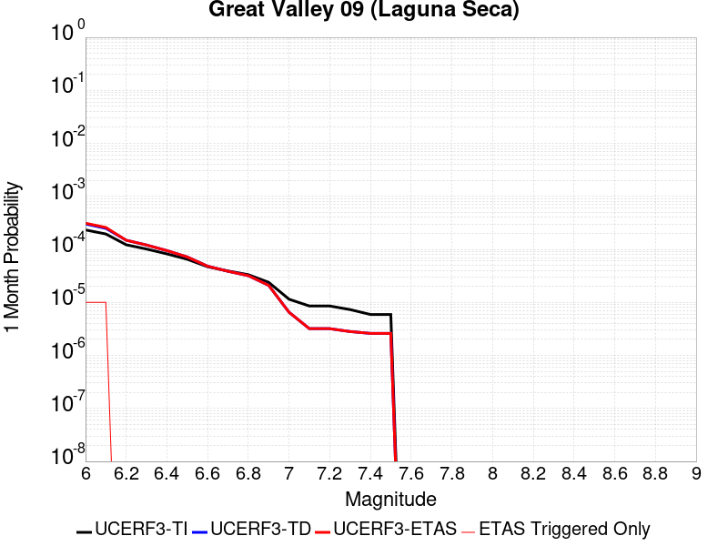 | 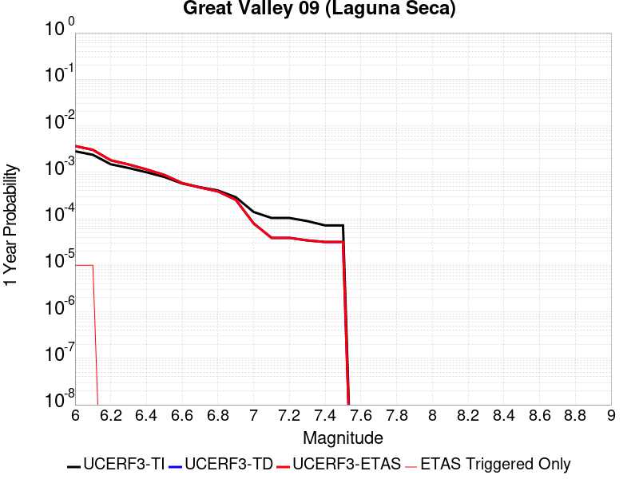 | 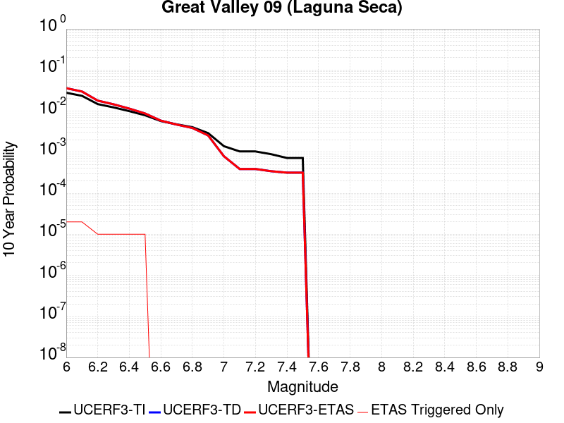 |

| Magnitude | 1 wk TI Prob | 1 wk TD Prob | 1 wk ETAS Prob | 1 wk ETAS/TD Gain | 1 wk ETAS Triggered Only | 1 mo TI Prob | 1 mo TD Prob | 1 mo ETAS Prob | 1 mo ETAS/TD Gain | 1 mo ETAS Triggered Only | 1 yr TI Prob | 1 yr TD Prob | 1 yr ETAS Prob | 1 yr ETAS/TD Gain | 1 yr ETAS Triggered Only | 10 yr TI Prob | 10 yr TD Prob | 10 yr ETAS Prob | 10 yr ETAS/TD Gain | 10 yr ETAS Triggered Only |
|-----|-----|-----|-----|-----|-----|-----|-----|-----|-----|-----|-----|-----|-----|-----|-----|-----|-----|-----|-----|-----|
| 6.0 | 5.4353277E-5 | 7.049955E-5 | 8.049884E-5 | 1.1418349 | 1.0E-5 | 2.3292181E-4 | 3.0210742E-4 | 3.121044E-4 | 1.0330908 | 1.0E-5 | 0.0028321352 | 0.0036719753 | 0.0036819386 | 1.0027133 | 1.0E-5 | 0.02796312 | 0.036115557 | 0.036134835 | 1.0005338 | 2.0E-5 |
| 6.1 | 4.5578287E-5 | 5.8220034E-5 | 6.821945E-5 | 1.1717522 | 1.0E-5 | 1.953209E-4 | 2.4949145E-4 | 2.5948897E-4 | 1.0400715 | 1.0E-5 | 0.0023754383 | 0.003033331 | 0.0030433005 | 1.0032867 | 1.0E-5 | 0.023502063 | 0.029919662 | 0.029939063 | 1.0006485 | 2.0E-5 |
| 6.2 | 2.8536782E-5 | 3.4736157E-5 | 3.4736157E-5 | 1.0 | 0.0 | 1.2229476E-4 | 1.4886058E-4 | 1.4886058E-4 | 1.0 | 0.0 | 0.0014879217 | 0.0018108446 | 0.0018108446 | 1.0 | 0.0 | 0.014779986 | 0.017958151 | 0.017967971 | 1.0005468 | 1.0E-5 |
| 6.3 | 2.3698774E-5 | 2.8213142E-5 | 2.8213142E-5 | 1.0 | 0.0 | 1.01562226E-4 | 1.20907556E-4 | 1.20907556E-4 | 1.0 | 0.0 | 0.0012358186 | 0.001471041 | 0.001471041 | 1.0 | 0.0 | 0.012289686 | 0.014611357 | 0.014621211 | 1.0006744 | 1.0E-5 |
| 6.4 | 1.9191197E-5 | 2.2122744E-5 | 2.2122744E-5 | 1.0 | 0.0 | 8.2245395E-5 | 9.480823E-5 | 9.480823E-5 | 1.0 | 0.0 | 0.0010008777 | 0.0011536834 | 0.0011536834 | 1.0 | 0.0 | 0.009963818 | 0.011476952 | 0.011486837 | 1.0008613 | 1.0E-5 |
| 6.5 | 1.5203241E-5 | 1.6801203E-5 | 1.6801203E-5 | 1.0 | 0.0 | 6.5155116E-5 | 7.200301E-5 | 7.200301E-5 | 1.0 | 0.0 | 7.9297484E-4 | 8.7629614E-4 | 8.7629614E-4 | 1.0 | 0.0 | 0.007901512 | 0.008729532 | 0.008739445 | 1.0011356 | 1.0E-5 |
| 6.6 | 1.0984925E-5 | 1.1242511E-5 | 1.1242511E-5 | 1.0 | 0.0 | 4.70774E-5 | 4.8181326E-5 | 4.8181326E-5 | 1.0 | 0.0 | 5.730166E-4 | 5.8645353E-4 | 5.8645353E-4 | 1.0 | 0.0 | 0.005715413 | 0.0058494504 | 0.0058494504 | 1.0 | 0.0 |
| 6.7 | 9.134616E-6 | 9.019832E-6 | 9.019832E-6 | 1.0 | 0.0 | 3.9147766E-5 | 3.8655864E-5 | 3.8655864E-5 | 1.0 | 0.0 | 4.7651984E-4 | 4.705359E-4 | 4.705359E-4 | 1.0 | 0.0 | 0.004754993 | 0.004695641 | 0.004695641 | 1.0 | 0.0 |
| 6.8 | 7.785589E-6 | 7.451889E-6 | 7.451889E-6 | 1.0 | 0.0 | 3.3366385E-5 | 3.1936288E-5 | 3.1936288E-5 | 1.0 | 0.0 | 4.0616E-4 | 3.8875695E-4 | 3.8875695E-4 | 1.0 | 0.0 | 0.0040541845 | 0.0038809727 | 0.0038809727 | 1.0 | 0.0 |
| 6.9 | 5.579095E-6 | 4.8984475E-6 | 4.8984475E-6 | 1.0 | 0.0 | 2.3910188E-5 | 2.0993186E-5 | 2.0993186E-5 | 1.0 | 0.0 | 2.9106764E-4 | 2.5556344E-4 | 2.5556344E-4 | 1.0 | 0.0 | 0.002906867 | 0.002552833 | 0.002552833 | 1.0 | 0.0 |
| 7.0 | 2.6816688E-6 | 1.521583E-6 | 1.521583E-6 | 1.0 | 0.0 | 1.1492816E-5 | 6.5210543E-6 | 6.5210543E-6 | 1.0 | 0.0 | 1.3991605E-4 | 7.939103E-5 | 7.939103E-5 | 1.0 | 0.0 | 0.0013982799 | 7.9363544E-4 | 7.9363544E-4 | 1.0 | 0.0 |
| 7.1 | 1.9951021E-6 | 7.4535575E-7 | 7.4535575E-7 | 1.0 | 0.0 | 8.55041E-6 | 3.194378E-6 | 3.194378E-6 | 1.0 | 0.0 | 1.0409627E-4 | 3.88909E-5 | 3.88909E-5 | 1.0 | 0.0 | 0.0010404752 | 3.8884507E-4 | 3.8884507E-4 | 1.0 | 0.0 |
| 7.2 | 1.9951021E-6 | 7.4535575E-7 | 7.4535575E-7 | 1.0 | 0.0 | 8.55041E-6 | 3.194378E-6 | 3.194378E-6 | 1.0 | 0.0 | 1.0409627E-4 | 3.88909E-5 | 3.88909E-5 | 1.0 | 0.0 | 0.0010404752 | 3.8884507E-4 | 3.8884507E-4 | 1.0 | 0.0 |
| 7.3 | 1.7087556E-6 | 6.5786514E-7 | 6.5786514E-7 | 1.0 | 0.0 | 7.3232177E-6 | 2.8194193E-6 | 2.8194193E-6 | 1.0 | 0.0 | 8.915652E-5 | 3.432593E-5 | 3.432593E-5 | 1.0 | 0.0 | 8.9120766E-4 | 3.4321033E-4 | 3.4321033E-4 | 1.0 | 0.0 |
| 7.4 | 1.3804846E-6 | 6.0737074E-7 | 6.0737074E-7 | 1.0 | 0.0 | 5.916349E-6 | 2.603015E-6 | 2.603015E-6 | 1.0 | 0.0 | 7.2029165E-5 | 3.169129E-5 | 3.169129E-5 | 1.0 | 0.0 | 7.200583E-4 | 3.168717E-4 | 3.168717E-4 | 1.0 | 0.0 |
| 7.5 | 1.3804846E-6 | 6.0737074E-7 | 6.0737074E-7 | 1.0 | 0.0 | 5.916349E-6 | 2.603015E-6 | 2.603015E-6 | 1.0 | 0.0 | 7.2029165E-5 | 3.169129E-5 | 3.169129E-5 | 1.0 | 0.0 | 7.200583E-4 | 3.168717E-4 | 3.168717E-4 | 1.0 | 0.0 |

## San Andreas (Coachella) rev
*[(top)](#table-of-contents)*

| 1 Week | 1 Month | 1 Year | 10 Year |
|-----|-----|-----|-----|
| 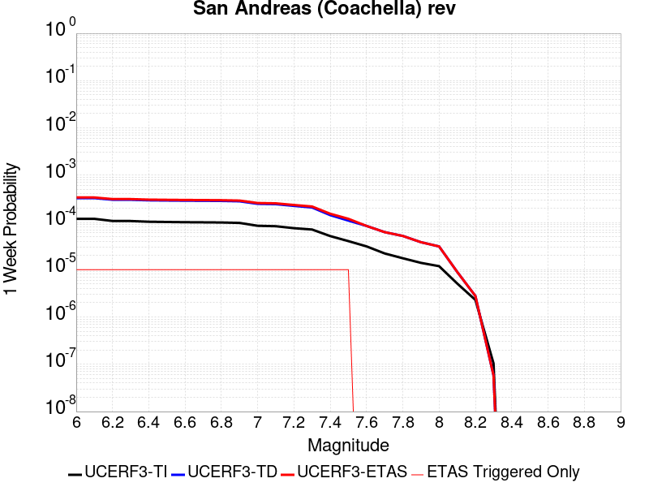 | 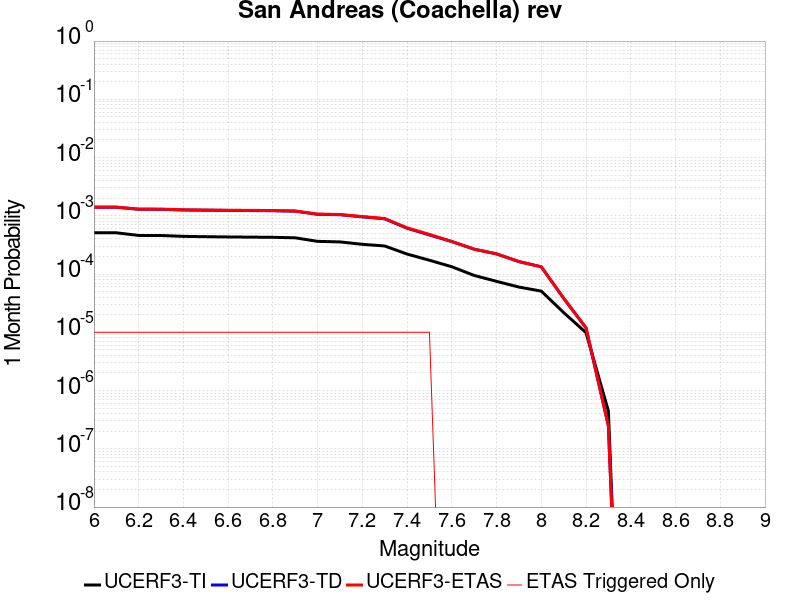 |  | 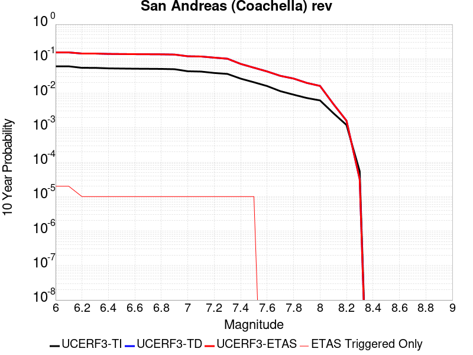 |

| Magnitude | 1 wk TI Prob | 1 wk TD Prob | 1 wk ETAS Prob | 1 wk ETAS/TD Gain | 1 wk ETAS Triggered Only | 1 mo TI Prob | 1 mo TD Prob | 1 mo ETAS Prob | 1 mo ETAS/TD Gain | 1 mo ETAS Triggered Only | 1 yr TI Prob | 1 yr TD Prob | 1 yr ETAS Prob | 1 yr ETAS/TD Gain | 1 yr ETAS Triggered Only | 10 yr TI Prob | 10 yr TD Prob | 10 yr ETAS Prob | 10 yr ETAS/TD Gain | 10 yr ETAS Triggered Only |
|-----|-----|-----|-----|-----|-----|-----|-----|-----|-----|-----|-----|-----|-----|-----|-----|-----|-----|-----|-----|-----|
| 6.0 | 1.1925945E-4 | 3.2724344E-4 | 3.3724017E-4 | 1.0305483 | 1.0E-5 | 5.110118E-4 | 0.0014017228 | 0.0014117088 | 1.0071241 | 1.0E-5 | 0.0062038354 | 0.016933769 | 0.016943598 | 1.0005805 | 1.0E-5 | 0.060334753 | 0.15264614 | 0.1526631 | 1.000111 | 2.0E-5 |
| 6.1 | 1.1925945E-4 | 3.2724344E-4 | 3.3724017E-4 | 1.0305483 | 1.0E-5 | 5.110118E-4 | 0.0014017228 | 0.0014117088 | 1.0071241 | 1.0E-5 | 0.0062038354 | 0.016933769 | 0.016943598 | 1.0005805 | 1.0E-5 | 0.060334753 | 0.15264614 | 0.1526631 | 1.000111 | 2.0E-5 |
| 6.2 | 1.07432395E-4 | 3.0225134E-4 | 3.1224833E-4 | 1.0330751 | 1.0E-5 | 4.603433E-4 | 0.0012947238 | 0.0013047109 | 1.0077137 | 1.0E-5 | 0.005590286 | 0.015650427 | 0.015660271 | 1.000629 | 1.0E-5 | 0.05451731 | 0.14180507 | 0.14181365 | 1.0000606 | 1.0E-5 |
| 6.3 | 1.0718766E-4 | 3.017044E-4 | 3.1170138E-4 | 1.033135 | 1.0E-5 | 4.592948E-4 | 0.0012923821 | 0.0013023692 | 1.0077276 | 1.0E-5 | 0.005577586 | 0.015622327 | 0.015632171 | 1.0006301 | 1.0E-5 | 0.054396555 | 0.1415733 | 0.14158188 | 1.0000607 | 1.0E-5 |
| 6.4 | 1.0355944E-4 | 2.9378527E-4 | 3.0378232E-4 | 1.0340284 | 1.0E-5 | 4.4375064E-4 | 0.0012584762 | 0.0012684636 | 1.0079361 | 1.0E-5 | 0.0053892885 | 0.015215358 | 0.015225206 | 1.0006472 | 1.0E-5 | 0.052604496 | 0.13813514 | 0.13814376 | 1.0000623 | 1.0E-5 |
| 6.5 | 1.0227914E-4 | 2.9097957E-4 | 3.0097665E-4 | 1.0343567 | 1.0E-5 | 4.382655E-4 | 0.0012464633 | 0.0012564508 | 1.0080127 | 1.0E-5 | 0.0053228354 | 0.015071134 | 0.015080983 | 1.0006535 | 1.0E-5 | 0.051971316 | 0.1369198 | 0.13692844 | 1.0000631 | 1.0E-5 |
| 6.6 | 1.0116757E-4 | 2.8863706E-4 | 2.986342E-4 | 1.0346355 | 1.0E-5 | 4.3350324E-4 | 0.0012364335 | 0.0012464211 | 1.0080777 | 1.0E-5 | 0.0052651367 | 0.014950704 | 0.014960554 | 1.0006589 | 1.0E-5 | 0.051421247 | 0.13589692 | 0.13590556 | 1.0000635 | 1.0E-5 |
| 6.7 | 1.0050676E-4 | 2.872227E-4 | 2.9721984E-4 | 1.0348061 | 1.0E-5 | 4.3067214E-4 | 0.0012303777 | 0.0012403653 | 1.0081176 | 1.0E-5 | 0.005230834 | 0.014877982 | 0.014887834 | 1.0006621 | 1.0E-5 | 0.051094085 | 0.13528185 | 0.13529049 | 1.0000639 | 1.0E-5 |
| 6.8 | 9.976819E-5 | 2.8525927E-4 | 2.952564E-4 | 1.0350459 | 1.0E-5 | 4.2750788E-4 | 0.0012219709 | 0.0012319586 | 1.0081735 | 1.0E-5 | 0.0051924936 | 0.014777023 | 0.014786875 | 1.0006667 | 1.0E-5 | 0.050728295 | 0.13443343 | 0.13444209 | 1.0000644 | 1.0E-5 |
| 6.9 | 9.77719E-5 | 2.8022839E-4 | 2.9022558E-4 | 1.0356752 | 1.0E-5 | 4.1895514E-4 | 0.00120043 | 0.001210418 | 1.0083203 | 1.0E-5 | 0.0050888555 | 0.014518287 | 0.014528142 | 1.0006788 | 1.0E-5 | 0.049738888 | 0.1322617 | 0.13227037 | 1.0000656 | 1.0E-5 |
| 7.0 | 8.500761E-5 | 2.4757453E-4 | 2.5757207E-4 | 1.0403819 | 1.0E-5 | 3.6426744E-4 | 0.0010606055 | 0.0010705949 | 1.0094186 | 1.0E-5 | 0.0044259406 | 0.012837193 | 0.012847064 | 1.000769 | 1.0E-5 | 0.04338823 | 0.11811238 | 0.1181212 | 1.0000746 | 1.0E-5 |
| 7.1 | 8.319876E-5 | 2.4360199E-4 | 2.5359954E-4 | 1.0410405 | 1.0E-5 | 3.5651738E-4 | 0.001043594 | 0.0010535836 | 1.0095723 | 1.0E-5 | 0.004331963 | 0.0126324985 | 0.0126423715 | 1.0007817 | 1.0E-5 | 0.042484846 | 0.11633272 | 0.11634155 | 1.0000759 | 1.0E-5 |
| 7.2 | 7.563917E-5 | 2.2408647E-4 | 2.3408423E-4 | 1.0446156 | 1.0E-5 | 3.2412758E-4 | 9.600202E-4 | 9.700106E-4 | 1.0104065 | 1.0E-5 | 0.0039391145 | 0.011626295 | 0.011636179 | 1.0008501 | 1.0E-5 | 0.03870018 | 0.10773813 | 0.107747056 | 1.0000829 | 1.0E-5 |
| 7.3 | 7.082985E-5 | 2.072494E-4 | 2.1724732E-4 | 1.048241 | 1.0E-5 | 3.0352117E-4 | 8.8791223E-4 | 8.9790334E-4 | 1.0112524 | 1.0E-5 | 0.0036891096 | 0.010757373 | 0.010767265 | 1.0009196 | 1.0E-5 | 0.03628465 | 0.10026088 | 0.100269884 | 1.0000898 | 1.0E-5 |
| 7.4 | 5.146215E-5 | 1.4271964E-4 | 1.5271822E-4 | 1.0700574 | 1.0E-5 | 2.2053342E-4 | 6.115131E-4 | 6.21507E-4 | 1.0163429 | 1.0E-5 | 0.0026816884 | 0.007419945 | 0.007429871 | 1.0013378 | 1.0E-5 | 0.02649557 | 0.070839524 | 0.070848815 | 1.0001311 | 1.0E-5 |
| 7.5 | 4.0285166E-5 | 1.0941875E-4 | 1.1941765E-4 | 1.091382 | 1.0E-5 | 1.7263928E-4 | 4.6885354E-4 | 4.7884884E-4 | 1.0213187 | 1.0E-5 | 0.002099857 | 0.005693421 | 0.0057033636 | 1.0017464 | 1.0E-5 | 0.020801254 | 0.05501138 | 0.05502083 | 1.0001718 | 1.0E-5 |
| 7.6 | 3.1168736E-5 | 8.439118E-5 | 8.439118E-5 | 1.0 | 0.0 | 1.3357346E-4 | 3.6162647E-4 | 3.6162647E-4 | 1.0 | 0.0 | 0.0016250437 | 0.004393941 | 0.004393941 | 1.0 | 0.0 | 0.016132116 | 0.04281056 | 0.04281056 | 1.0 | 0.0 |
| 7.7 | 2.2100989E-5 | 6.238918E-5 | 6.238918E-5 | 1.0 | 0.0 | 9.4715084E-5 | 2.6735486E-4 | 2.6735486E-4 | 1.0 | 0.0 | 0.001152546 | 0.0032501933 | 0.0032501933 | 1.0 | 0.0 | 0.011465867 | 0.031900857 | 0.031900857 | 1.0 | 0.0 |
| 7.8 | 1.7484861E-5 | 5.1796946E-5 | 5.1796946E-5 | 1.0 | 0.0 | 7.493296E-5 | 2.2196803E-4 | 2.2196803E-4 | 1.0 | 0.0 | 9.1192697E-4 | 0.0026991146 | 0.0026991146 | 1.0 | 0.0 | 0.009081938 | 0.026640752 | 0.026640752 | 1.0 | 0.0 |
| 7.9 | 1.3967285E-5 | 3.822304E-5 | 3.822304E-5 | 1.0 | 0.0 | 5.985842E-5 | 1.6380275E-4 | 1.6380275E-4 | 1.0 | 0.0 | 7.2853256E-4 | 0.0019924755 | 0.0019924755 | 1.0 | 0.0 | 0.0072614877 | 0.019910011 | 0.019910011 | 1.0 | 0.0 |
| 8.0 | 1.1887396E-5 | 3.1065316E-5 | 3.1065316E-5 | 1.0 | 0.0 | 5.094499E-5 | 1.3313028E-4 | 1.3313028E-4 | 1.0 | 0.0 | 6.200787E-4 | 0.0016196569 | 0.0016196569 | 1.0 | 0.0 | 0.006183513 | 0.016279692 | 0.016279692 | 1.0 | 0.0 |
| 8.1 | 5.100864E-6 | 8.972689E-6 | 8.972689E-6 | 1.0 | 0.0 | 2.1860664E-5 | 3.8453814E-5 | 3.8453814E-5 | 1.0 | 0.0 | 2.6612106E-4 | 4.6807475E-4 | 4.6807475E-4 | 1.0 | 0.0 | 0.002658026 | 0.0049177213 | 0.0049177213 | 1.0 | 0.0 |
| 8.2 | 2.3004484E-6 | 2.78591E-6 | 2.78591E-6 | 1.0 | 0.0 | 9.859027E-6 | 1.193956E-5 | 1.193956E-5 | 1.0 | 0.0 | 1.2002704E-4 | 1.4535447E-4 | 1.4535447E-4 | 1.0 | 0.0 | 0.0011996223 | 0.0015971703 | 0.0015971703 | 1.0 | 0.0 |
| 8.3 | 1.0424446E-7 | 5.813156E-8 | 5.813156E-8 | 1.0 | 0.0 | 4.4676187E-7 | 2.491352E-7 | 2.491352E-7 | 1.0 | 0.0 | 5.439312E-6 | 3.0332174E-6 | 3.0332174E-6 | 1.0 | 0.0 | 5.4391792E-5 | 3.1893844E-5 | 3.1893844E-5 | 1.0 | 0.0 |

## Robinson Creek
*[(top)](#table-of-contents)*

| 1 Week | 1 Month | 1 Year | 10 Year |
|-----|-----|-----|-----|
|  |  |  |  |

| Magnitude | 1 wk TI Prob | 1 wk TD Prob | 1 wk ETAS Prob | 1 wk ETAS/TD Gain | 1 wk ETAS Triggered Only | 1 mo TI Prob | 1 mo TD Prob | 1 mo ETAS Prob | 1 mo ETAS/TD Gain | 1 mo ETAS Triggered Only | 1 yr TI Prob | 1 yr TD Prob | 1 yr ETAS Prob | 1 yr ETAS/TD Gain | 1 yr ETAS Triggered Only | 10 yr TI Prob | 10 yr TD Prob | 10 yr ETAS Prob | 10 yr ETAS/TD Gain | 10 yr ETAS Triggered Only |
|-----|-----|-----|-----|-----|-----|-----|-----|-----|-----|-----|-----|-----|-----|-----|-----|-----|-----|-----|-----|-----|
| 6.0 | 1.3705327E-5 | 1.5284966E-5 | 1.5284966E-5 | 1.0 | 0.0 | 5.8735794E-5 | 6.5506996E-5 | 6.5506996E-5 | 1.0 | 0.0 | 7.1487366E-4 | 7.975477E-4 | 8.0753973E-4 | 1.0125284 | 1.0E-5 | 0.0071257832 | 0.007975477 | 0.007985397 | 1.0012438 | 1.0E-5 |
| 6.1 | 1.3705327E-5 | 1.5284966E-5 | 1.5284966E-5 | 1.0 | 0.0 | 5.8735794E-5 | 6.5506996E-5 | 6.5506996E-5 | 1.0 | 0.0 | 7.1487366E-4 | 7.975477E-4 | 8.0753973E-4 | 1.0125284 | 1.0E-5 | 0.0071257832 | 0.007975477 | 0.007985397 | 1.0012438 | 1.0E-5 |
| 6.2 | 1.3705327E-5 | 1.5284966E-5 | 1.5284966E-5 | 1.0 | 0.0 | 5.8735794E-5 | 6.5506996E-5 | 6.5506996E-5 | 1.0 | 0.0 | 7.1487366E-4 | 7.975477E-4 | 8.0753973E-4 | 1.0125284 | 1.0E-5 | 0.0071257832 | 0.007975477 | 0.007985397 | 1.0012438 | 1.0E-5 |
| 6.3 | 1.3705327E-5 | 1.5284966E-5 | 1.5284966E-5 | 1.0 | 0.0 | 5.8735794E-5 | 6.5506996E-5 | 6.5506996E-5 | 1.0 | 0.0 | 7.1487366E-4 | 7.975477E-4 | 8.0753973E-4 | 1.0125284 | 1.0E-5 | 0.0071257832 | 0.007975477 | 0.007985397 | 1.0012438 | 1.0E-5 |
| 6.4 | 1.3705327E-5 | 1.5284966E-5 | 1.5284966E-5 | 1.0 | 0.0 | 5.8735794E-5 | 6.5506996E-5 | 6.5506996E-5 | 1.0 | 0.0 | 7.1487366E-4 | 7.975477E-4 | 8.0753973E-4 | 1.0125284 | 1.0E-5 | 0.0071257832 | 0.007975477 | 0.007985397 | 1.0012438 | 1.0E-5 |

## North Frontal  (East)
*[(top)](#table-of-contents)*

| 1 Week | 1 Month | 1 Year | 10 Year |
|-----|-----|-----|-----|
|  |  |  |  |

| Magnitude | 1 wk TI Prob | 1 wk TD Prob | 1 wk ETAS Prob | 1 wk ETAS/TD Gain | 1 wk ETAS Triggered Only | 1 mo TI Prob | 1 mo TD Prob | 1 mo ETAS Prob | 1 mo ETAS/TD Gain | 1 mo ETAS Triggered Only | 1 yr TI Prob | 1 yr TD Prob | 1 yr ETAS Prob | 1 yr ETAS/TD Gain | 1 yr ETAS Triggered Only | 10 yr TI Prob | 10 yr TD Prob | 10 yr ETAS Prob | 10 yr ETAS/TD Gain | 10 yr ETAS Triggered Only |
|-----|-----|-----|-----|-----|-----|-----|-----|-----|-----|-----|-----|-----|-----|-----|-----|-----|-----|-----|-----|-----|
| 6.0 | 7.135738E-6 | 7.477167E-6 | 1.7477092E-5 | 2.337395 | 1.0E-5 | 3.0581377E-5 | 3.204472E-5 | 4.20444E-5 | 1.3120539 | 1.0E-5 | 3.7226462E-4 | 3.9009456E-4 | 4.0009068E-4 | 1.0256248 | 1.0E-5 | 0.0037164164 | 0.0038960557 | 0.003906017 | 1.0025567 | 1.0E-5 |
| 6.1 | 7.135738E-6 | 7.477167E-6 | 1.7477092E-5 | 2.337395 | 1.0E-5 | 3.0581377E-5 | 3.204472E-5 | 4.20444E-5 | 1.3120539 | 1.0E-5 | 3.7226462E-4 | 3.9009456E-4 | 4.0009068E-4 | 1.0256248 | 1.0E-5 | 0.0037164164 | 0.0038960557 | 0.003906017 | 1.0025567 | 1.0E-5 |
| 6.2 | 7.135738E-6 | 7.477167E-6 | 1.7477092E-5 | 2.337395 | 1.0E-5 | 3.0581377E-5 | 3.204472E-5 | 4.20444E-5 | 1.3120539 | 1.0E-5 | 3.7226462E-4 | 3.9009456E-4 | 4.0009068E-4 | 1.0256248 | 1.0E-5 | 0.0037164164 | 0.0038960557 | 0.003906017 | 1.0025567 | 1.0E-5 |
| 6.3 | 7.135738E-6 | 7.477167E-6 | 1.7477092E-5 | 2.337395 | 1.0E-5 | 3.0581377E-5 | 3.204472E-5 | 4.20444E-5 | 1.3120539 | 1.0E-5 | 3.7226462E-4 | 3.9009456E-4 | 4.0009068E-4 | 1.0256248 | 1.0E-5 | 0.0037164164 | 0.0038960557 | 0.003906017 | 1.0025567 | 1.0E-5 |
| 6.4 | 7.135738E-6 | 7.477167E-6 | 1.7477092E-5 | 2.337395 | 1.0E-5 | 3.0581377E-5 | 3.204472E-5 | 4.20444E-5 | 1.3120539 | 1.0E-5 | 3.7226462E-4 | 3.9009456E-4 | 4.0009068E-4 | 1.0256248 | 1.0E-5 | 0.0037164164 | 0.0038960557 | 0.003906017 | 1.0025567 | 1.0E-5 |
| 6.5 | 7.135738E-6 | 7.477167E-6 | 1.7477092E-5 | 2.337395 | 1.0E-5 | 3.0581377E-5 | 3.204472E-5 | 4.20444E-5 | 1.3120539 | 1.0E-5 | 3.7226462E-4 | 3.9009456E-4 | 4.0009068E-4 | 1.0256248 | 1.0E-5 | 0.0037164164 | 0.0038960557 | 0.003906017 | 1.0025567 | 1.0E-5 |
| 6.6 | 7.135738E-6 | 7.477167E-6 | 1.7477092E-5 | 2.337395 | 1.0E-5 | 3.0581377E-5 | 3.204472E-5 | 4.20444E-5 | 1.3120539 | 1.0E-5 | 3.7226462E-4 | 3.9009456E-4 | 4.0009068E-4 | 1.0256248 | 1.0E-5 | 0.0037164164 | 0.0038960557 | 0.003906017 | 1.0025567 | 1.0E-5 |
| 6.7 | 7.135738E-6 | 7.477167E-6 | 1.7477092E-5 | 2.337395 | 1.0E-5 | 3.0581377E-5 | 3.204472E-5 | 4.20444E-5 | 1.3120539 | 1.0E-5 | 3.7226462E-4 | 3.9009456E-4 | 4.0009068E-4 | 1.0256248 | 1.0E-5 | 0.0037164164 | 0.0038960557 | 0.003906017 | 1.0025567 | 1.0E-5 |
| 6.8 | 5.959142E-6 | 6.2366753E-6 | 1.6236612E-5 | 2.6034086 | 1.0E-5 | 2.553893E-5 | 2.6728436E-5 | 3.672817E-5 | 1.3741233 | 1.0E-5 | 3.108921E-4 | 3.253882E-4 | 3.3538492E-4 | 1.0307225 | 1.0E-5 | 0.0031045752 | 0.0032508906 | 0.0032608581 | 1.0030661 | 1.0E-5 |
| 6.9 | 2.2946929E-6 | 2.382458E-6 | 2.382458E-6 | 1.0 | 0.0 | 9.834361E-6 | 1.0210498E-5 | 1.0210498E-5 | 1.0 | 0.0 | 1.1972676E-4 | 1.2430619E-4 | 1.2430619E-4 | 1.0 | 0.0 | 0.0011966228 | 0.0012424131 | 0.0012424131 | 1.0 | 0.0 |
| 7.0 | 2.2468673E-6 | 2.3321513E-6 | 2.3321513E-6 | 1.0 | 0.0 | 9.629396E-6 | 9.994899E-6 | 9.994899E-6 | 1.0 | 0.0 | 1.1723159E-4 | 1.2168157E-4 | 1.2168157E-4 | 1.0 | 0.0 | 0.0011716976 | 0.0012161958 | 0.0012161958 | 1.0 | 0.0 |
| 7.1 | 1.9921076E-6 | 2.0646012E-6 | 2.0646012E-6 | 1.0 | 0.0 | 8.537577E-6 | 8.848263E-6 | 8.848263E-6 | 1.0 | 0.0 | 1.0394004E-4 | 1.0772271E-4 | 1.0772271E-4 | 1.0 | 0.0 | 0.0010389143 | 0.0010767477 | 0.0010767477 | 1.0 | 0.0 |
| 7.2 | 1.4524545E-6 | 1.5045133E-6 | 1.5045133E-6 | 1.0 | 0.0 | 6.2247905E-6 | 6.4479E-6 | 6.4479E-6 | 1.0 | 0.0 | 7.5784184E-5 | 7.85006E-5 | 7.85006E-5 | 1.0 | 0.0 | 7.575835E-4 | 7.847532E-4 | 7.847532E-4 | 1.0 | 0.0 |
| 7.3 | 8.9802575E-7 | 9.308719E-7 | 9.308719E-7 | 1.0 | 0.0 | 3.848676E-6 | 3.9894453E-6 | 3.9894453E-6 | 1.0 | 0.0 | 4.685662E-5 | 4.857053E-5 | 4.857053E-5 | 1.0 | 0.0 | 4.6846745E-4 | 4.8561045E-4 | 4.8561045E-4 | 1.0 | 0.0 |
| 7.4 | 7.776139E-7 | 8.0604667E-7 | 8.0604667E-7 | 1.0 | 0.0 | 3.3326266E-6 | 3.4544819E-6 | 3.4544819E-6 | 1.0 | 0.0 | 4.0573974E-5 | 4.2057614E-5 | 4.2057614E-5 | 1.0 | 0.0 | 4.0566566E-4 | 4.205073E-4 | 4.205073E-4 | 1.0 | 0.0 |
| 7.5 | 5.244417E-7 | 5.441214E-7 | 5.441214E-7 | 1.0 | 0.0 | 2.2476054E-6 | 2.3319471E-6 | 2.3319471E-6 | 1.0 | 0.0 | 2.7364253E-5 | 2.8391152E-5 | 2.8391152E-5 | 1.0 | 0.0 | 2.7360884E-4 | 2.8388176E-4 | 2.8388176E-4 | 1.0 | 0.0 |
| 7.6 | 1.5489647E-7 | 1.6089487E-7 | 1.6089487E-7 | 1.0 | 0.0 | 6.6384183E-7 | 6.895494E-7 | 6.895494E-7 | 1.0 | 0.0 | 8.082245E-6 | 8.395252E-6 | 8.395252E-6 | 1.0 | 0.0 | 8.08195E-5 | 8.3951345E-5 | 8.3951345E-5 | 1.0 | 0.0 |

## San Cayetano
*[(top)](#table-of-contents)*

| 1 Week | 1 Month | 1 Year | 10 Year |
|-----|-----|-----|-----|
| 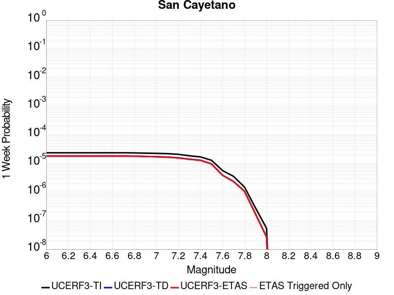 | 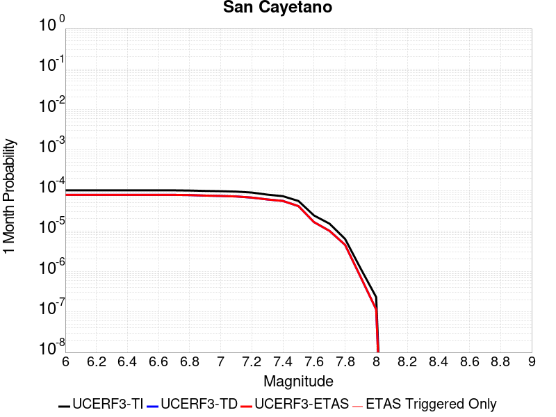 | 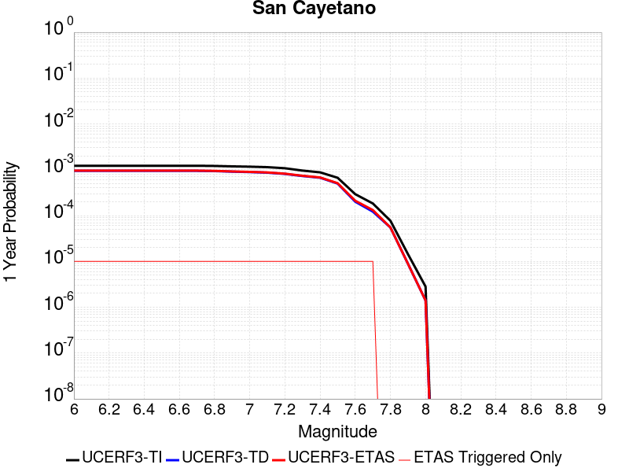 | 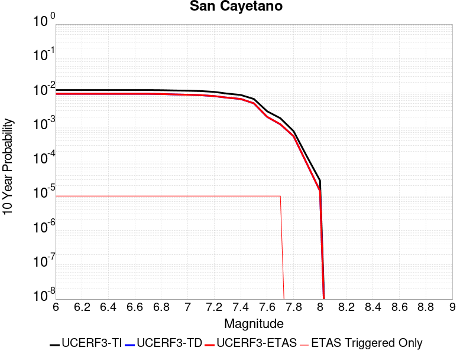 |

| Magnitude | 1 wk TI Prob | 1 wk TD Prob | 1 wk ETAS Prob | 1 wk ETAS/TD Gain | 1 wk ETAS Triggered Only | 1 mo TI Prob | 1 mo TD Prob | 1 mo ETAS Prob | 1 mo ETAS/TD Gain | 1 mo ETAS Triggered Only | 1 yr TI Prob | 1 yr TD Prob | 1 yr ETAS Prob | 1 yr ETAS/TD Gain | 1 yr ETAS Triggered Only | 10 yr TI Prob | 10 yr TD Prob | 10 yr ETAS Prob | 10 yr ETAS/TD Gain | 10 yr ETAS Triggered Only |
|-----|-----|-----|-----|-----|-----|-----|-----|-----|-----|-----|-----|-----|-----|-----|-----|-----|-----|-----|-----|-----|
| 6.0 | 2.3476267E-5 | 1.8169152E-5 | 1.8169152E-5 | 1.0 | 0.0 | 1.0060869E-4 | 7.786549E-5 | 7.786549E-5 | 1.0 | 0.0 | 0.0012242225 | 9.4760366E-4 | 9.575942E-4 | 1.010543 | 1.0E-5 | 0.012175002 | 0.009436547 | 0.009446452 | 1.0010498 | 1.0E-5 |
| 6.1 | 2.3476267E-5 | 1.8169152E-5 | 1.8169152E-5 | 1.0 | 0.0 | 1.0060869E-4 | 7.786549E-5 | 7.786549E-5 | 1.0 | 0.0 | 0.0012242225 | 9.4760366E-4 | 9.575942E-4 | 1.010543 | 1.0E-5 | 0.012175002 | 0.009436547 | 0.009446452 | 1.0010498 | 1.0E-5 |
| 6.2 | 2.3476267E-5 | 1.8169152E-5 | 1.8169152E-5 | 1.0 | 0.0 | 1.0060869E-4 | 7.786549E-5 | 7.786549E-5 | 1.0 | 0.0 | 0.0012242225 | 9.4760366E-4 | 9.575942E-4 | 1.010543 | 1.0E-5 | 0.012175002 | 0.009436547 | 0.009446452 | 1.0010498 | 1.0E-5 |
| 6.3 | 2.3476267E-5 | 1.8169152E-5 | 1.8169152E-5 | 1.0 | 0.0 | 1.0060869E-4 | 7.786549E-5 | 7.786549E-5 | 1.0 | 0.0 | 0.0012242225 | 9.4760366E-4 | 9.575942E-4 | 1.010543 | 1.0E-5 | 0.012175002 | 0.009436547 | 0.009446452 | 1.0010498 | 1.0E-5 |
| 6.4 | 2.3476267E-5 | 1.8169152E-5 | 1.8169152E-5 | 1.0 | 0.0 | 1.0060869E-4 | 7.786549E-5 | 7.786549E-5 | 1.0 | 0.0 | 0.0012242225 | 9.4760366E-4 | 9.575942E-4 | 1.010543 | 1.0E-5 | 0.012175002 | 0.009436547 | 0.009446452 | 1.0010498 | 1.0E-5 |
| 6.5 | 2.3476267E-5 | 1.8169152E-5 | 1.8169152E-5 | 1.0 | 0.0 | 1.0060869E-4 | 7.786549E-5 | 7.786549E-5 | 1.0 | 0.0 | 0.0012242225 | 9.4760366E-4 | 9.575942E-4 | 1.010543 | 1.0E-5 | 0.012175002 | 0.009436547 | 0.009446452 | 1.0010498 | 1.0E-5 |
| 6.6 | 2.3476267E-5 | 1.8169152E-5 | 1.8169152E-5 | 1.0 | 0.0 | 1.0060869E-4 | 7.786549E-5 | 7.786549E-5 | 1.0 | 0.0 | 0.0012242225 | 9.4760366E-4 | 9.575942E-4 | 1.010543 | 1.0E-5 | 0.012175002 | 0.009436547 | 0.009446452 | 1.0010498 | 1.0E-5 |
| 6.7 | 2.3476267E-5 | 1.8169152E-5 | 1.8169152E-5 | 1.0 | 0.0 | 1.0060869E-4 | 7.786549E-5 | 7.786549E-5 | 1.0 | 0.0 | 0.0012242225 | 9.4760366E-4 | 9.575942E-4 | 1.010543 | 1.0E-5 | 0.012175002 | 0.009436547 | 0.009446452 | 1.0010498 | 1.0E-5 |
| 6.8 | 2.3241924E-5 | 1.7936884E-5 | 1.7936884E-5 | 1.0 | 0.0 | 9.960445E-5 | 7.687011E-5 | 7.687011E-5 | 1.0 | 0.0 | 0.0012120095 | 9.3549537E-4 | 9.45486E-4 | 1.0106795 | 1.0E-5 | 0.012054204 | 0.009316416 | 0.009326324 | 1.0010633 | 1.0E-5 |
| 6.9 | 2.2761007E-5 | 1.7432323E-5 | 1.7432323E-5 | 1.0 | 0.0 | 9.7543525E-5 | 7.470784E-5 | 7.470784E-5 | 1.0 | 0.0 | 0.0011869454 | 9.091918E-4 | 9.191827E-4 | 1.0109888 | 1.0E-5 | 0.011806256 | 0.00905554 | 0.009065449 | 1.0010943 | 1.0E-5 |
| 7.0 | 2.240283E-5 | 1.7066077E-5 | 1.7066077E-5 | 1.0 | 0.0 | 9.600859E-5 | 7.31383E-5 | 7.31383E-5 | 1.0 | 0.0 | 0.0011682777 | 8.900984E-4 | 9.000895E-4 | 1.0112247 | 1.0E-5 | 0.011621549 | 0.008866135 | 0.008876047 | 1.001118 | 1.0E-5 |
| 7.1 | 2.1871154E-5 | 1.6585966E-5 | 1.6585966E-5 | 1.0 | 0.0 | 9.373015E-5 | 7.108079E-5 | 7.108079E-5 | 1.0 | 0.0 | 0.0011405671 | 8.6506834E-4 | 8.750597E-4 | 1.0115498 | 1.0E-5 | 0.011347309 | 0.008617799 | 0.008627712 | 1.0011504 | 1.0E-5 |
| 7.2 | 2.0714133E-5 | 1.5564516E-5 | 1.5564516E-5 | 1.0 | 0.0 | 8.8771834E-5 | 6.670338E-5 | 6.670338E-5 | 1.0 | 0.0 | 0.0010802611 | 8.1181433E-4 | 8.2180626E-4 | 1.0123081 | 1.0E-5 | 0.010750249 | 0.00808925 | 0.008099169 | 1.0012262 | 1.0E-5 |
| 7.3 | 1.8408395E-5 | 1.3996794E-5 | 1.3996794E-5 | 1.0 | 0.0 | 7.8890735E-5 | 5.9984897E-5 | 5.9984897E-5 | 1.0 | 0.0 | 9.600714E-4 | 7.300744E-4 | 7.400671E-4 | 1.0136873 | 1.0E-5 | 0.009559342 | 0.007277458 | 0.0072873854 | 1.0013641 | 1.0E-5 |
| 7.4 | 1.6856795E-5 | 1.2850027E-5 | 1.2850027E-5 | 1.0 | 0.0 | 7.2241404E-5 | 5.50704E-5 | 5.50704E-5 | 1.0 | 0.0 | 8.7918417E-4 | 6.702787E-4 | 6.80272E-4 | 1.0149091 | 1.0E-5 | 0.00875714 | 0.006683225 | 0.0066931583 | 1.0014863 | 1.0E-5 |
| 7.5 | 1.2822778E-5 | 9.577392E-6 | 9.577392E-6 | 1.0 | 0.0 | 5.495361E-5 | 4.104533E-5 | 4.104533E-5 | 1.0 | 0.0 | 6.688548E-4 | 4.996139E-4 | 5.096089E-4 | 1.0200055 | 1.0E-5 | 0.006668452 | 0.004985026 | 0.0049949763 | 1.001996 | 1.0E-5 |
| 7.6 | 5.6272684E-6 | 3.8548847E-6 | 3.8548847E-6 | 1.0 | 0.0 | 2.4116642E-5 | 1.6520831E-5 | 1.6520831E-5 | 1.0 | 0.0 | 2.9358055E-4 | 2.0112265E-4 | 2.1112064E-4 | 1.0497109 | 1.0E-5 | 0.0029319301 | 0.0020094172 | 0.002019397 | 1.0049666 | 1.0E-5 |
| 7.7 | 3.5261346E-6 | 2.3406994E-6 | 2.3406994E-6 | 1.0 | 0.0 | 1.5111918E-5 | 1.003153E-5 | 1.003153E-5 | 1.0 | 0.0 | 1.8397206E-4 | 1.2212711E-4 | 1.3212589E-4 | 1.0818719 | 1.0E-5 | 0.0018381984 | 0.0012206073 | 0.0012305952 | 1.0081826 | 1.0E-5 |
| 7.8 | 1.4826929E-6 | 1.0564368E-6 | 1.0564368E-6 | 1.0 | 0.0 | 6.354383E-6 | 4.5275788E-6 | 4.5275788E-6 | 1.0 | 0.0 | 7.736187E-5 | 5.5121895E-5 | 5.5121895E-5 | 1.0 | 0.0 | 7.733494E-4 | 5.5108423E-4 | 5.5108423E-4 | 1.0 | 0.0 |
| 7.9 | 2.7568166E-7 | 1.697784E-7 | 1.697784E-7 | 1.0 | 0.0 | 1.1814923E-6 | 7.276215E-7 | 7.276215E-7 | 1.0 | 0.0 | 1.4384574E-5 | 8.858756E-6 | 8.858756E-6 | 1.0 | 0.0 | 1.4383643E-4 | 8.858406E-5 | 8.858406E-5 | 1.0 | 0.0 |
| 8.0 | 5.407832E-8 | 2.6886624E-8 | 2.6886624E-8 | 1.0 | 0.0 | 2.3176422E-7 | 1.1522838E-7 | 1.1522838E-7 | 1.0 | 0.0 | 2.8217257E-6 | 1.4029047E-6 | 1.4029047E-6 | 1.0 | 0.0 | 2.8216898E-5 | 1.4028963E-5 | 1.4028963E-5 | 1.0 | 0.0 |

## Chino alt 1
*[(top)](#table-of-contents)*

| 1 Week | 1 Month | 1 Year | 10 Year |
|-----|-----|-----|-----|
| 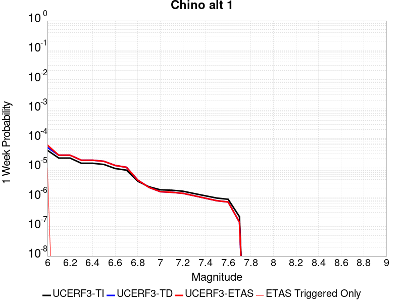 | 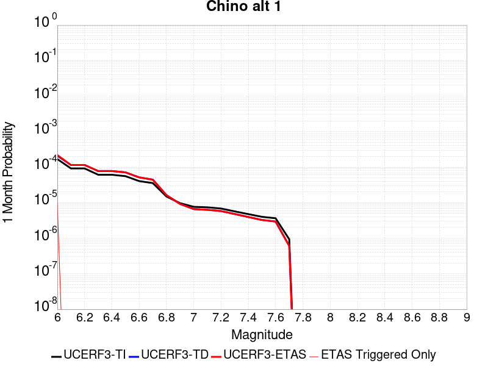 | 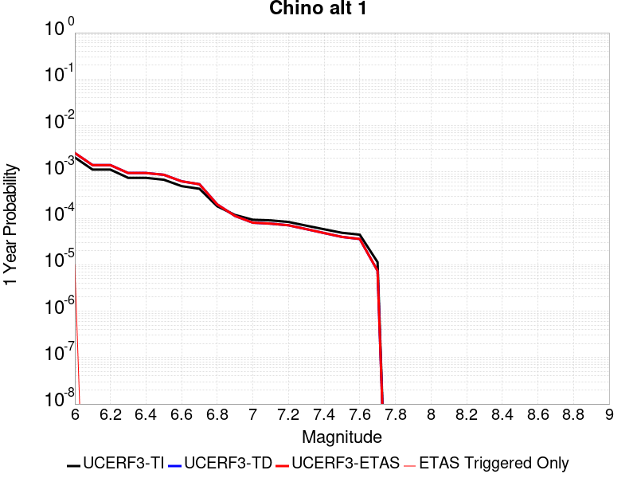 | 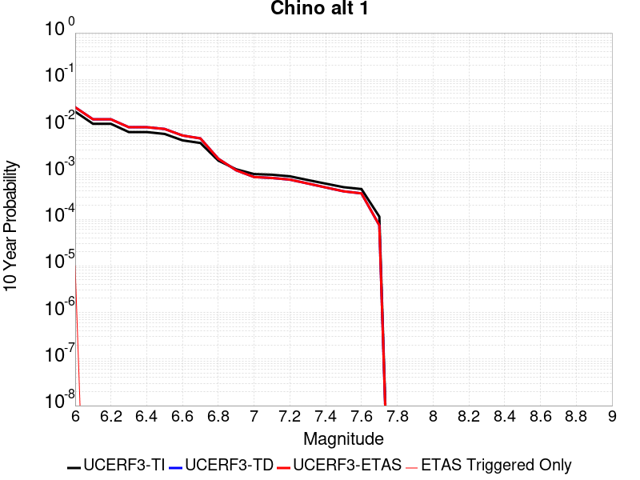 |

| Magnitude | 1 wk TI Prob | 1 wk TD Prob | 1 wk ETAS Prob | 1 wk ETAS/TD Gain | 1 wk ETAS Triggered Only | 1 mo TI Prob | 1 mo TD Prob | 1 mo ETAS Prob | 1 mo ETAS/TD Gain | 1 mo ETAS Triggered Only | 1 yr TI Prob | 1 yr TD Prob | 1 yr ETAS Prob | 1 yr ETAS/TD Gain | 1 yr ETAS Triggered Only | 10 yr TI Prob | 10 yr TD Prob | 10 yr ETAS Prob | 10 yr ETAS/TD Gain | 10 yr ETAS Triggered Only |
|-----|-----|-----|-----|-----|-----|-----|-----|-----|-----|-----|-----|-----|-----|-----|-----|-----|-----|-----|-----|-----|
| 6.0 | 3.939946E-5 | 4.8947586E-5 | 5.89471E-5 | 1.2042902 | 1.0E-5 | 1.6884391E-4 | 2.0976145E-4 | 2.1975934E-4 | 1.0476632 | 1.0E-5 | 0.0020537362 | 0.0025513647 | 0.0025613392 | 1.0039095 | 1.0E-5 | 0.020348595 | 0.025280679 | 0.025290426 | 1.0003855 | 1.0E-5 |
| 6.1 | 2.1505624E-5 | 2.6878566E-5 | 2.6878566E-5 | 1.0 | 0.0 | 9.2163704E-5 | 1.15189396E-4 | 1.15189396E-4 | 1.0 | 0.0 | 0.0011215154 | 0.0014016383 | 0.0014016383 | 1.0 | 0.0 | 0.011158722 | 0.013948013 | 0.013948013 | 1.0 | 0.0 |
| 6.2 | 2.1505624E-5 | 2.6878566E-5 | 2.6878566E-5 | 1.0 | 0.0 | 9.2163704E-5 | 1.15189396E-4 | 1.15189396E-4 | 1.0 | 0.0 | 0.0011215154 | 0.0014016383 | 0.0014016383 | 1.0 | 0.0 | 0.011158722 | 0.013948013 | 0.013948013 | 1.0 | 0.0 |
| 6.3 | 1.4290785E-5 | 1.8164625E-5 | 1.8164625E-5 | 1.0 | 0.0 | 6.1244784E-5 | 7.784632E-5 | 7.784632E-5 | 1.0 | 0.0 | 7.454001E-4 | 9.474121E-4 | 9.474121E-4 | 1.0 | 0.0 | 0.007429048 | 0.009447355 | 0.009447355 | 1.0 | 0.0 |
| 6.4 | 1.4290785E-5 | 1.8164625E-5 | 1.8164625E-5 | 1.0 | 0.0 | 6.1244784E-5 | 7.784632E-5 | 7.784632E-5 | 1.0 | 0.0 | 7.454001E-4 | 9.474121E-4 | 9.474121E-4 | 1.0 | 0.0 | 0.007429048 | 0.009447355 | 0.009447355 | 1.0 | 0.0 |
| 6.5 | 1.3017944E-5 | 1.6651593E-5 | 1.6651593E-5 | 1.0 | 0.0 | 5.5789995E-5 | 7.136226E-5 | 7.136226E-5 | 1.0 | 0.0 | 6.790315E-4 | 8.685329E-4 | 8.685329E-4 | 1.0 | 0.0 | 0.0067696036 | 0.008664853 | 0.008664853 | 1.0 | 0.0 |
| 6.6 | 9.470016E-6 | 1.2039054E-5 | 1.2039054E-5 | 1.0 | 0.0 | 4.058515E-5 | 5.1595114E-5 | 5.1595114E-5 | 1.0 | 0.0 | 4.940122E-4 | 6.280234E-4 | 6.280234E-4 | 1.0 | 0.0 | 0.004929154 | 0.0062738704 | 0.0062738704 | 1.0 | 0.0 |
| 6.7 | 8.314155E-6 | 1.0407336E-5 | 1.0407336E-5 | 1.0 | 0.0 | 3.5631605E-5 | 4.460229E-5 | 4.460229E-5 | 1.0 | 0.0 | 4.3372845E-4 | 5.429298E-4 | 5.429298E-4 | 1.0 | 0.0 | 0.004328829 | 0.0054278206 | 0.0054278206 | 1.0 | 0.0 |
| 6.8 | 3.4856364E-6 | 3.8133721E-6 | 3.8133721E-6 | 1.0 | 0.0 | 1.4938357E-5 | 1.6342932E-5 | 1.6342932E-5 | 1.0 | 0.0 | 1.8185932E-4 | 1.9895911E-4 | 1.9895911E-4 | 1.0 | 0.0 | 0.0018171056 | 0.0019895528 | 0.0019895528 | 1.0 | 0.0 |
| 6.9 | 2.2645952E-6 | 2.1528992E-6 | 2.1528992E-6 | 1.0 | 0.0 | 9.705372E-6 | 9.22668E-6 | 9.22668E-6 | 1.0 | 0.0 | 1.18156495E-4 | 1.1232925E-4 | 1.1232925E-4 | 1.0 | 0.0 | 0.0011809369 | 0.0011233125 | 0.0011233125 | 1.0 | 0.0 |
| 7.0 | 1.7864003E-6 | 1.5430651E-6 | 1.5430651E-6 | 1.0 | 0.0 | 7.655979E-6 | 6.6131197E-6 | 6.6131197E-6 | 1.0 | 0.0 | 9.3207556E-5 | 8.051182E-5 | 8.051182E-5 | 1.0 | 0.0 | 9.316847E-4 | 8.052882E-4 | 8.052882E-4 | 1.0 | 0.0 |
| 7.1 | 1.7315456E-6 | 1.473338E-6 | 1.473338E-6 | 1.0 | 0.0 | 7.420889E-6 | 6.3142907E-6 | 6.3142907E-6 | 1.0 | 0.0 | 9.034557E-5 | 7.687383E-5 | 7.687383E-5 | 1.0 | 0.0 | 9.0308854E-4 | 7.6892006E-4 | 7.6892006E-4 | 1.0 | 0.0 |
| 7.2 | 1.6008337E-6 | 1.3574096E-6 | 1.3574096E-6 | 1.0 | 0.0 | 6.860698E-6 | 5.817457E-6 | 5.817457E-6 | 1.0 | 0.0 | 8.352579E-5 | 7.082529E-5 | 7.082529E-5 | 1.0 | 0.0 | 8.34944E-4 | 7.084585E-4 | 7.084585E-4 | 1.0 | 0.0 |
| 7.3 | 1.3320939E-6 | 1.1217734E-6 | 1.1217734E-6 | 1.0 | 0.0 | 5.7089615E-6 | 4.8075917E-6 | 4.8075917E-6 | 1.0 | 0.0 | 6.9504385E-5 | 5.8530903E-5 | 5.8530903E-5 | 1.0 | 0.0 | 6.9482654E-4 | 5.853048E-4 | 5.853048E-4 | 1.0 | 0.0 |
| 7.4 | 1.114294E-6 | 9.237037E-7 | 9.237037E-7 | 1.0 | 0.0 | 4.775537E-6 | 3.9587244E-6 | 3.9587244E-6 | 1.0 | 0.0 | 5.8140613E-5 | 4.8196438E-5 | 4.8196438E-5 | 1.0 | 0.0 | 5.81254E-4 | 4.818773E-4 | 4.818773E-4 | 1.0 | 0.0 |
| 7.5 | 9.354081E-7 | 7.623351E-7 | 7.623351E-7 | 1.0 | 0.0 | 4.0088858E-6 | 3.2671464E-6 | 3.2671464E-6 | 1.0 | 0.0 | 4.8807087E-5 | 3.9776816E-5 | 3.9776816E-5 | 1.0 | 0.0 | 4.879637E-4 | 3.9770038E-4 | 3.9770038E-4 | 1.0 | 0.0 |
| 7.6 | 8.521771E-7 | 6.8806514E-7 | 6.8806514E-7 | 1.0 | 0.0 | 3.6521824E-6 | 2.9488474E-6 | 2.9488474E-6 | 1.0 | 0.0 | 4.4464414E-5 | 3.590166E-5 | 3.590166E-5 | 1.0 | 0.0 | 4.4455516E-4 | 3.5896176E-4 | 3.5896176E-4 | 1.0 | 0.0 |
| 7.7 | 2.1803626E-7 | 1.4186267E-7 | 1.4186267E-7 | 1.0 | 0.0 | 9.344408E-7 | 6.079828E-7 | 6.079828E-7 | 1.0 | 0.0 | 1.1376757E-5 | 7.4021755E-6 | 7.4021755E-6 | 1.0 | 0.0 | 1.13761744E-4 | 7.4020245E-5 | 7.4020245E-5 | 1.0 | 0.0 |

## Eureka Peak
*[(top)](#table-of-contents)*

| 1 Week | 1 Month | 1 Year | 10 Year |
|-----|-----|-----|-----|
|  |  |  |  |

| Magnitude | 1 wk TI Prob | 1 wk TD Prob | 1 wk ETAS Prob | 1 wk ETAS/TD Gain | 1 wk ETAS Triggered Only | 1 mo TI Prob | 1 mo TD Prob | 1 mo ETAS Prob | 1 mo ETAS/TD Gain | 1 mo ETAS Triggered Only | 1 yr TI Prob | 1 yr TD Prob | 1 yr ETAS Prob | 1 yr ETAS/TD Gain | 1 yr ETAS Triggered Only | 10 yr TI Prob | 10 yr TD Prob | 10 yr ETAS Prob | 10 yr ETAS/TD Gain | 10 yr ETAS Triggered Only |
|-----|-----|-----|-----|-----|-----|-----|-----|-----|-----|-----|-----|-----|-----|-----|-----|-----|-----|-----|-----|-----|
| 6.0 | 3.1949054E-5 | 9.310974E-6 | 1.931088E-5 | 2.0739915 | 1.0E-5 | 1.3691733E-4 | 3.9904004E-5 | 4.9903607E-5 | 1.2505914 | 1.0E-5 | 0.0016656938 | 4.8580105E-4 | 4.957962E-4 | 1.0205746 | 1.0E-5 | 0.016532637 | 0.0049212906 | 0.0049312413 | 1.002022 | 1.0E-5 |
| 6.1 | 3.1949054E-5 | 9.310974E-6 | 1.931088E-5 | 2.0739915 | 1.0E-5 | 1.3691733E-4 | 3.9904004E-5 | 4.9903607E-5 | 1.2505914 | 1.0E-5 | 0.0016656938 | 4.8580105E-4 | 4.957962E-4 | 1.0205746 | 1.0E-5 | 0.016532637 | 0.0049212906 | 0.0049312413 | 1.002022 | 1.0E-5 |
| 6.2 | 3.1949054E-5 | 9.310974E-6 | 1.931088E-5 | 2.0739915 | 1.0E-5 | 1.3691733E-4 | 3.9904004E-5 | 4.9903607E-5 | 1.2505914 | 1.0E-5 | 0.0016656938 | 4.8580105E-4 | 4.957962E-4 | 1.0205746 | 1.0E-5 | 0.016532637 | 0.0049212906 | 0.0049312413 | 1.002022 | 1.0E-5 |
| 6.3 | 2.7339745E-5 | 7.980816E-6 | 1.7980736E-5 | 2.2529948 | 1.0E-5 | 1.1716507E-4 | 3.4203476E-5 | 4.4203134E-5 | 1.2923579 | 1.0E-5 | 0.0014255513 | 4.1642363E-4 | 4.2641946E-4 | 1.024004 | 1.0E-5 | 0.0141644105 | 0.004225993 | 0.0042359508 | 1.0023563 | 1.0E-5 |
| 6.4 | 2.7339745E-5 | 7.980816E-6 | 1.7980736E-5 | 2.2529948 | 1.0E-5 | 1.1716507E-4 | 3.4203476E-5 | 4.4203134E-5 | 1.2923579 | 1.0E-5 | 0.0014255513 | 4.1642363E-4 | 4.2641946E-4 | 1.024004 | 1.0E-5 | 0.0141644105 | 0.004225993 | 0.0042359508 | 1.0023563 | 1.0E-5 |
| 6.5 | 9.738388E-8 | 1.8619542E-7 | 1.8619542E-7 | 1.0 | 0.0 | 4.1735944E-7 | 7.9798014E-7 | 7.9798014E-7 | 1.0 | 0.0 | 5.081339E-6 | 9.715366E-6 | 9.715366E-6 | 1.0 | 0.0 | 5.0812232E-5 | 9.7149496E-5 | 9.7149496E-5 | 1.0 | 0.0 |
| 6.6 | 9.3495956E-8 | 1.8328369E-7 | 1.8328369E-7 | 1.0 | 0.0 | 4.0069688E-7 | 7.855013E-7 | 7.855013E-7 | 1.0 | 0.0 | 4.8784736E-6 | 9.563437E-6 | 9.563437E-6 | 1.0 | 0.0 | 4.8783666E-5 | 9.5630334E-5 | 9.5630334E-5 | 1.0 | 0.0 |
| 6.7 | 9.3495956E-8 | 1.8328369E-7 | 1.8328369E-7 | 1.0 | 0.0 | 4.0069688E-7 | 7.855013E-7 | 7.855013E-7 | 1.0 | 0.0 | 4.8784736E-6 | 9.563437E-6 | 9.563437E-6 | 1.0 | 0.0 | 4.8783666E-5 | 9.5630334E-5 | 9.5630334E-5 | 1.0 | 0.0 |
| 6.8 | 8.591428E-8 | 1.8021346E-7 | 1.8021346E-7 | 1.0 | 0.0 | 3.68204E-7 | 7.723432E-7 | 7.723432E-7 | 1.0 | 0.0 | 4.4828744E-6 | 9.403238E-6 | 9.403238E-6 | 1.0 | 0.0 | 4.482784E-5 | 9.402848E-5 | 9.402848E-5 | 1.0 | 0.0 |
| 6.9 | 7.749723E-8 | 1.7439365E-7 | 1.7439365E-7 | 1.0 | 0.0 | 3.3213098E-7 | 7.4740115E-7 | 7.4740115E-7 | 1.0 | 0.0 | 4.043687E-6 | 9.099572E-6 | 9.099572E-6 | 1.0 | 0.0 | 4.0436134E-5 | 9.099206E-5 | 9.099206E-5 | 1.0 | 0.0 |
| 7.0 | 6.897872E-8 | 1.6415588E-7 | 1.6415588E-7 | 1.0 | 0.0 | 2.9562307E-7 | 7.0352496E-7 | 7.0352496E-7 | 1.0 | 0.0 | 3.5992048E-6 | 8.565384E-6 | 8.565384E-6 | 1.0 | 0.0 | 3.5991467E-5 | 8.565061E-5 | 8.565061E-5 | 1.0 | 0.0 |
| 7.1 | 5.859318E-8 | 1.4787464E-7 | 1.4787464E-7 | 1.0 | 0.0 | 2.5111362E-7 | 6.3374836E-7 | 6.3374836E-7 | 1.0 | 0.0 | 3.057304E-6 | 7.715859E-6 | 7.715859E-6 | 1.0 | 0.0 | 3.0572617E-5 | 7.715598E-5 | 7.715598E-5 | 1.0 | 0.0 |
| 7.2 | 5.1375338E-8 | 1.3421325E-7 | 1.3421325E-7 | 1.0 | 0.0 | 2.2018E-7 | 5.751996E-7 | 5.751996E-7 | 1.0 | 0.0 | 2.680688E-6 | 7.003033E-6 | 7.003033E-6 | 1.0 | 0.0 | 2.6806558E-5 | 7.002818E-5 | 7.002818E-5 | 1.0 | 0.0 |
| 7.3 | 4.5441396E-8 | 1.1636534E-7 | 1.1636534E-7 | 1.0 | 0.0 | 1.9474882E-7 | 4.987085E-7 | 4.987085E-7 | 1.0 | 0.0 | 2.3710643E-6 | 6.07176E-6 | 6.07176E-6 | 1.0 | 0.0 | 2.371039E-5 | 6.0715996E-5 | 6.0715996E-5 | 1.0 | 0.0 |
| 7.4 | 2.981918E-8 | 6.911435E-8 | 6.911435E-8 | 1.0 | 0.0 | 1.2779647E-7 | 2.9620432E-7 | 2.9620432E-7 | 1.0 | 0.0 | 1.5559209E-6 | 3.606282E-6 | 3.606282E-6 | 1.0 | 0.0 | 1.55591E-5 | 3.6062276E-5 | 3.6062276E-5 | 1.0 | 0.0 |
| 7.5 | 4.24214E-9 | 8.342346E-9 | 8.342346E-9 | 1.0 | 0.0 | 1.81806E-8 | 3.575291E-8 | 3.575291E-8 | 1.0 | 0.0 | 2.213488E-7 | 4.352917E-7 | 4.352917E-7 | 1.0 | 0.0 | 2.2134857E-6 | 4.352915E-6 | 4.352915E-6 | 1.0 | 0.0 |

## Los Alamos extension
*[(top)](#table-of-contents)*

| 1 Week | 1 Month | 1 Year | 10 Year |
|-----|-----|-----|-----|
| 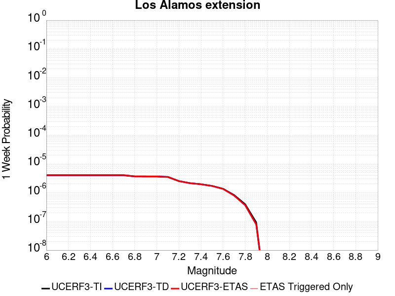 | 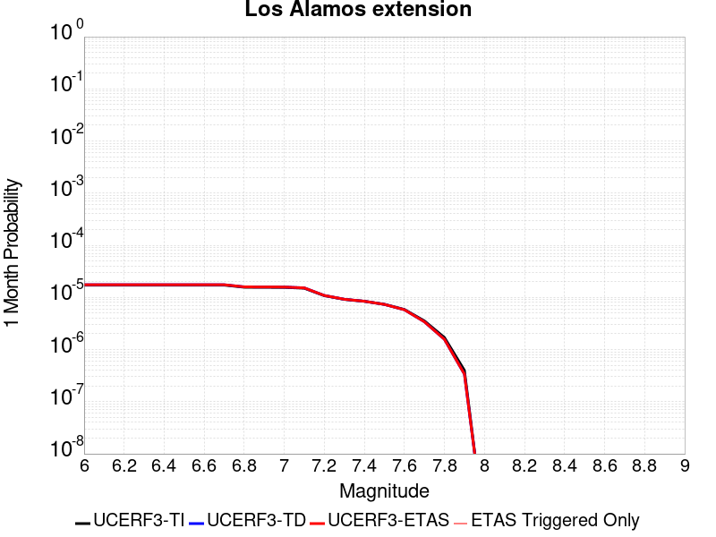 |  | 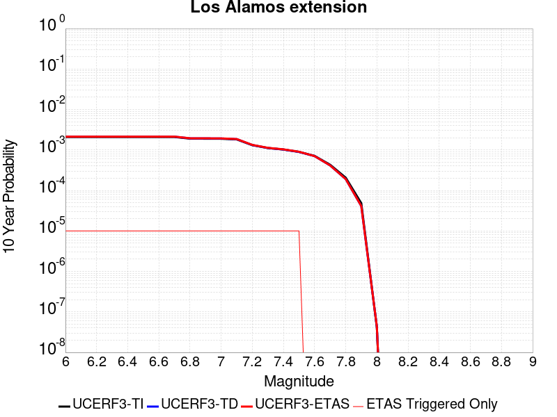 |

| Magnitude | 1 wk TI Prob | 1 wk TD Prob | 1 wk ETAS Prob | 1 wk ETAS/TD Gain | 1 wk ETAS Triggered Only | 1 mo TI Prob | 1 mo TD Prob | 1 mo ETAS Prob | 1 mo ETAS/TD Gain | 1 mo ETAS Triggered Only | 1 yr TI Prob | 1 yr TD Prob | 1 yr ETAS Prob | 1 yr ETAS/TD Gain | 1 yr ETAS Triggered Only | 10 yr TI Prob | 10 yr TD Prob | 10 yr ETAS Prob | 10 yr ETAS/TD Gain | 10 yr ETAS Triggered Only |
|-----|-----|-----|-----|-----|-----|-----|-----|-----|-----|-----|-----|-----|-----|-----|-----|-----|-----|-----|-----|-----|
| 6.0 | 4.0146506E-6 | 4.0861605E-6 | 4.0861605E-6 | 1.0 | 0.0 | 1.7205533E-5 | 1.7512004E-5 | 1.7512004E-5 | 1.0 | 0.0 | 2.0945723E-4 | 2.131889E-4 | 2.131889E-4 | 1.0 | 0.0 | 0.0020925992 | 0.0021299531 | 0.0021399318 | 1.0046849 | 1.0E-5 |
| 6.1 | 4.0146506E-6 | 4.0861605E-6 | 4.0861605E-6 | 1.0 | 0.0 | 1.7205533E-5 | 1.7512004E-5 | 1.7512004E-5 | 1.0 | 0.0 | 2.0945723E-4 | 2.131889E-4 | 2.131889E-4 | 1.0 | 0.0 | 0.0020925992 | 0.0021299531 | 0.0021399318 | 1.0046849 | 1.0E-5 |
| 6.2 | 4.0146506E-6 | 4.0861605E-6 | 4.0861605E-6 | 1.0 | 0.0 | 1.7205533E-5 | 1.7512004E-5 | 1.7512004E-5 | 1.0 | 0.0 | 2.0945723E-4 | 2.131889E-4 | 2.131889E-4 | 1.0 | 0.0 | 0.0020925992 | 0.0021299531 | 0.0021399318 | 1.0046849 | 1.0E-5 |
| 6.3 | 4.0146506E-6 | 4.0861605E-6 | 4.0861605E-6 | 1.0 | 0.0 | 1.7205533E-5 | 1.7512004E-5 | 1.7512004E-5 | 1.0 | 0.0 | 2.0945723E-4 | 2.131889E-4 | 2.131889E-4 | 1.0 | 0.0 | 0.0020925992 | 0.0021299531 | 0.0021399318 | 1.0046849 | 1.0E-5 |
| 6.4 | 4.0146506E-6 | 4.0861605E-6 | 4.0861605E-6 | 1.0 | 0.0 | 1.7205533E-5 | 1.7512004E-5 | 1.7512004E-5 | 1.0 | 0.0 | 2.0945723E-4 | 2.131889E-4 | 2.131889E-4 | 1.0 | 0.0 | 0.0020925992 | 0.0021299531 | 0.0021399318 | 1.0046849 | 1.0E-5 |
| 6.5 | 4.0146506E-6 | 4.0861605E-6 | 4.0861605E-6 | 1.0 | 0.0 | 1.7205533E-5 | 1.7512004E-5 | 1.7512004E-5 | 1.0 | 0.0 | 2.0945723E-4 | 2.131889E-4 | 2.131889E-4 | 1.0 | 0.0 | 0.0020925992 | 0.0021299531 | 0.0021399318 | 1.0046849 | 1.0E-5 |
| 6.6 | 4.0146506E-6 | 4.0861605E-6 | 4.0861605E-6 | 1.0 | 0.0 | 1.7205533E-5 | 1.7512004E-5 | 1.7512004E-5 | 1.0 | 0.0 | 2.0945723E-4 | 2.131889E-4 | 2.131889E-4 | 1.0 | 0.0 | 0.0020925992 | 0.0021299531 | 0.0021399318 | 1.0046849 | 1.0E-5 |
| 6.7 | 4.0146506E-6 | 4.0861605E-6 | 4.0861605E-6 | 1.0 | 0.0 | 1.7205533E-5 | 1.7512004E-5 | 1.7512004E-5 | 1.0 | 0.0 | 2.0945723E-4 | 2.131889E-4 | 2.131889E-4 | 1.0 | 0.0 | 0.0020925992 | 0.0021299531 | 0.0021399318 | 1.0046849 | 1.0E-5 |
| 6.8 | 3.6584688E-6 | 3.71886E-6 | 3.71886E-6 | 1.0 | 0.0 | 1.5679057E-5 | 1.593788E-5 | 1.593788E-5 | 1.0 | 0.0 | 1.9087581E-4 | 1.9402734E-4 | 1.9402734E-4 | 1.0 | 0.0 | 0.0019071194 | 0.0019386717 | 0.0019486523 | 1.0051482 | 1.0E-5 |
| 6.9 | 3.644631E-6 | 3.70457E-6 | 3.70457E-6 | 1.0 | 0.0 | 1.5619753E-5 | 1.5876636E-5 | 1.5876636E-5 | 1.0 | 0.0 | 1.901539E-4 | 1.9328184E-4 | 1.9328184E-4 | 1.0 | 0.0 | 0.0018999127 | 0.0019312297 | 0.0019412105 | 1.0051681 | 1.0E-5 |
| 7.0 | 3.6318522E-6 | 3.6913304E-6 | 3.6913304E-6 | 1.0 | 0.0 | 1.5564989E-5 | 1.5819896E-5 | 1.5819896E-5 | 1.0 | 0.0 | 1.8948725E-4 | 1.9259116E-4 | 1.9259116E-4 | 1.0 | 0.0 | 0.0018932576 | 0.0019243349 | 0.0019343157 | 1.0051866 | 1.0E-5 |
| 7.1 | 3.5001724E-6 | 3.5554012E-6 | 3.5554012E-6 | 1.0 | 0.0 | 1.5000653E-5 | 1.52373495E-5 | 1.52373495E-5 | 1.0 | 0.0 | 1.8261763E-4 | 1.8549986E-4 | 1.8549986E-4 | 1.0 | 0.0 | 0.0018246764 | 0.0018535409 | 0.0018635223 | 1.005385 | 1.0E-5 |
| 7.2 | 2.5204702E-6 | 2.5436964E-6 | 2.5436964E-6 | 1.0 | 0.0 | 1.080197E-5 | 1.090151E-5 | 1.090151E-5 | 1.0 | 0.0 | 1.3150605E-4 | 1.3271786E-4 | 1.3271786E-4 | 1.0 | 0.0 | 0.0013142825 | 0.0013263916 | 0.0013363784 | 1.0075293 | 1.0E-5 |
| 7.3 | 2.1399692E-6 | 2.150134E-6 | 2.150134E-6 | 1.0 | 0.0 | 9.1712645E-6 | 9.2148275E-6 | 9.2148275E-6 | 1.0 | 0.0 | 1.1165442E-4 | 1.1218478E-4 | 1.1218478E-4 | 1.0 | 0.0 | 0.0011159834 | 0.0011212848 | 0.0011312736 | 1.0089084 | 1.0E-5 |
| 7.4 | 1.9660122E-6 | 1.9702388E-6 | 1.9702388E-6 | 1.0 | 0.0 | 8.42574E-6 | 8.443854E-6 | 8.443854E-6 | 1.0 | 0.0 | 1.0257855E-4 | 1.027991E-4 | 1.027991E-4 | 1.0 | 0.0 | 0.0010253121 | 0.0010275187 | 0.0010375084 | 1.0097222 | 1.0E-5 |
| 7.5 | 1.7204633E-6 | 1.7151011E-6 | 1.7151011E-6 | 1.0 | 0.0 | 7.373393E-6 | 7.350413E-6 | 7.350413E-6 | 1.0 | 0.0 | 8.976737E-5 | 8.948763E-5 | 8.948763E-5 | 1.0 | 0.0 | 8.9731114E-4 | 8.945189E-4 | 9.0451E-4 | 1.0111692 | 1.0E-5 |
| 7.6 | 1.3717638E-6 | 1.3535857E-6 | 1.3535857E-6 | 1.0 | 0.0 | 5.878974E-6 | 5.801069E-6 | 5.801069E-6 | 1.0 | 0.0 | 7.157416E-5 | 7.062575E-5 | 7.062575E-5 | 1.0 | 0.0 | 7.1551115E-4 | 7.060357E-4 | 7.060357E-4 | 1.0 | 0.0 |
| 7.7 | 8.272564E-7 | 7.9576637E-7 | 7.9576637E-7 | 1.0 | 0.0 | 3.5453797E-6 | 3.4104228E-6 | 3.4104228E-6 | 1.0 | 0.0 | 4.3164142E-5 | 4.152111E-5 | 4.152111E-5 | 1.0 | 0.0 | 4.315576E-4 | 4.151337E-4 | 4.151337E-4 | 1.0 | 0.0 |
| 7.8 | 3.9708277E-7 | 3.6719325E-7 | 3.6719325E-7 | 1.0 | 0.0 | 1.7017821E-6 | 1.5736844E-6 | 1.5736844E-6 | 1.0 | 0.0 | 2.0719E-5 | 1.9159439E-5 | 1.9159439E-5 | 1.0 | 0.0 | 2.071707E-4 | 1.9157794E-4 | 1.9157794E-4 | 1.0 | 0.0 |
| 7.9 | 9.292528E-8 | 7.88916E-8 | 7.88916E-8 | 1.0 | 0.0 | 3.9825116E-7 | 3.3810682E-7 | 3.3810682E-7 | 1.0 | 0.0 | 4.848697E-6 | 4.116443E-6 | 4.116443E-6 | 1.0 | 0.0 | 4.8485912E-5 | 4.1163676E-5 | 4.1163676E-5 | 1.0 | 0.0 |
| 8.0 | 7.880441E-11 | 8.235301E-11 | 8.235301E-11 | 1.0 | 0.0 | 3.3773329E-10 | 3.5294168E-10 | 3.5294168E-10 | 1.0 | 0.0 | 4.1119033E-9 | 4.2970645E-9 | 4.2970645E-9 | 1.0 | 0.0 | 4.1119034E-8 | 4.2970644E-8 | 4.2970644E-8 | 1.0 | 0.0 |

## Rinconada 2011 CFM
*[(top)](#table-of-contents)*

| 1 Week | 1 Month | 1 Year | 10 Year |
|-----|-----|-----|-----|
|  |  |  |  |

| Magnitude | 1 wk TI Prob | 1 wk TD Prob | 1 wk ETAS Prob | 1 wk ETAS/TD Gain | 1 wk ETAS Triggered Only | 1 mo TI Prob | 1 mo TD Prob | 1 mo ETAS Prob | 1 mo ETAS/TD Gain | 1 mo ETAS Triggered Only | 1 yr TI Prob | 1 yr TD Prob | 1 yr ETAS Prob | 1 yr ETAS/TD Gain | 1 yr ETAS Triggered Only | 10 yr TI Prob | 10 yr TD Prob | 10 yr ETAS Prob | 10 yr ETAS/TD Gain | 10 yr ETAS Triggered Only |
|-----|-----|-----|-----|-----|-----|-----|-----|-----|-----|-----|-----|-----|-----|-----|-----|-----|-----|-----|-----|-----|
| 6.0 | 1.5752368E-5 | 1.6274702E-5 | 1.6274702E-5 | 1.0 | 0.0 | 6.75084E-5 | 6.974687E-5 | 6.974687E-5 | 1.0 | 0.0 | 8.2160486E-4 | 8.488405E-4 | 8.5883203E-4 | 1.0117707 | 1.0E-5 | 0.008185739 | 0.008456362 | 0.008466278 | 1.0011725 | 1.0E-5 |
| 6.1 | 1.0966133E-5 | 1.1323019E-5 | 1.1323019E-5 | 1.0 | 0.0 | 4.6996865E-5 | 4.8526326E-5 | 4.8526326E-5 | 1.0 | 0.0 | 5.720366E-4 | 5.906486E-4 | 5.906486E-4 | 1.0 | 0.0 | 0.0057056635 | 0.005890884 | 0.005890884 | 1.0 | 0.0 |
| 6.2 | 1.0966133E-5 | 1.1323019E-5 | 1.1323019E-5 | 1.0 | 0.0 | 4.6996865E-5 | 4.8526326E-5 | 4.8526326E-5 | 1.0 | 0.0 | 5.720366E-4 | 5.906486E-4 | 5.906486E-4 | 1.0 | 0.0 | 0.0057056635 | 0.005890884 | 0.005890884 | 1.0 | 0.0 |
| 6.3 | 8.926149E-6 | 9.212764E-6 | 9.212764E-6 | 1.0 | 0.0 | 3.8254362E-5 | 3.948268E-5 | 3.948268E-5 | 1.0 | 0.0 | 4.6564735E-4 | 4.805959E-4 | 4.805959E-4 | 1.0 | 0.0 | 0.0046467283 | 0.0047956104 | 0.0047956104 | 1.0 | 0.0 |
| 6.4 | 7.676955E-6 | 7.9201845E-6 | 7.9201845E-6 | 1.0 | 0.0 | 3.290082E-5 | 3.3943208E-5 | 3.3943208E-5 | 1.0 | 0.0 | 4.0049385E-4 | 4.1318036E-4 | 4.1318036E-4 | 1.0 | 0.0 | 0.0039977287 | 0.004124148 | 0.004124148 | 1.0 | 0.0 |
| 6.5 | 6.1671026E-6 | 6.3589496E-6 | 6.3589496E-6 | 1.0 | 0.0 | 2.6430173E-5 | 2.7252358E-5 | 2.7252358E-5 | 1.0 | 0.0 | 3.2173982E-4 | 3.3174703E-4 | 3.3174703E-4 | 1.0 | 0.0 | 0.003212744 | 0.0033125298 | 0.0033125298 | 1.0 | 0.0 |
| 6.6 | 5.553456E-6 | 5.724808E-6 | 5.724808E-6 | 1.0 | 0.0 | 2.3800309E-5 | 2.4534662E-5 | 2.4534662E-5 | 1.0 | 0.0 | 2.897302E-4 | 2.986686E-4 | 2.986686E-4 | 1.0 | 0.0 | 0.0028935277 | 0.0029826807 | 0.0029826807 | 1.0 | 0.0 |
| 6.7 | 4.787857E-6 | 4.9333057E-6 | 4.9333057E-6 | 1.0 | 0.0 | 2.0519226E-5 | 2.1142567E-5 | 2.1142567E-5 | 1.0 | 0.0 | 2.4979294E-4 | 2.573804E-4 | 2.573804E-4 | 1.0 | 0.0 | 0.0024951235 | 0.002570829 | 0.002570829 | 1.0 | 0.0 |
| 6.8 | 3.9955166E-6 | 4.113473E-6 | 4.113473E-6 | 1.0 | 0.0 | 1.7123532E-5 | 1.762905E-5 | 1.762905E-5 | 1.0 | 0.0 | 2.0845905E-4 | 2.1461258E-4 | 2.1461258E-4 | 1.0 | 0.0 | 0.002082636 | 0.0021440568 | 0.0021440568 | 1.0 | 0.0 |
| 6.9 | 3.4250072E-6 | 3.5224439E-6 | 3.5224439E-6 | 1.0 | 0.0 | 1.46785205E-5 | 1.50961005E-5 | 1.50961005E-5 | 1.0 | 0.0 | 1.7869633E-4 | 1.8377954E-4 | 1.8377954E-4 | 1.0 | 0.0 | 0.001785527 | 0.0018362781 | 0.0018362781 | 1.0 | 0.0 |
| 7.0 | 2.7712713E-6 | 2.8466982E-6 | 2.8466982E-6 | 1.0 | 0.0 | 1.1876823E-5 | 1.2200077E-5 | 1.2200077E-5 | 1.0 | 0.0 | 1.4459073E-4 | 1.4852583E-4 | 1.4852583E-4 | 1.0 | 0.0 | 0.0014449668 | 0.0014842672 | 0.0014842672 | 1.0 | 0.0 |
| 7.1 | 2.227358E-6 | 2.285697E-6 | 2.285697E-6 | 1.0 | 0.0 | 9.545785E-6 | 9.795808E-6 | 9.795808E-6 | 1.0 | 0.0 | 1.16213734E-4 | 1.1925744E-4 | 1.1925744E-4 | 1.0 | 0.0 | 0.0011615298 | 0.0011919355 | 0.0011919355 | 1.0 | 0.0 |
| 7.2 | 1.581796E-6 | 1.6209003E-6 | 1.6209003E-6 | 1.0 | 0.0 | 6.779108E-6 | 6.946697E-6 | 6.946697E-6 | 1.0 | 0.0 | 8.253252E-5 | 8.4572755E-5 | 8.4572755E-5 | 1.0 | 0.0 | 8.250187E-4 | 8.4540626E-4 | 8.4540626E-4 | 1.0 | 0.0 |
| 7.3 | 1.0306567E-6 | 1.0546472E-6 | 1.0546472E-6 | 1.0 | 0.0 | 4.4170924E-6 | 4.519909E-6 | 4.519909E-6 | 1.0 | 0.0 | 5.3776774E-5 | 5.5028504E-5 | 5.5028504E-5 | 1.0 | 0.0 | 5.376376E-4 | 5.50149E-4 | 5.50149E-4 | 1.0 | 0.0 |
| 7.4 | 6.535541E-7 | 6.6827397E-7 | 6.6827397E-7 | 1.0 | 0.0 | 2.800943E-6 | 2.8640281E-6 | 2.8640281E-6 | 1.0 | 0.0 | 3.4100947E-5 | 3.4868986E-5 | 3.4868986E-5 | 1.0 | 0.0 | 3.4095717E-4 | 3.4863528E-4 | 3.4863528E-4 | 1.0 | 0.0 |
| 7.5 | 3.2656962E-7 | 3.331669E-7 | 3.331669E-7 | 1.0 | 0.0 | 1.3995833E-6 | 1.4278573E-6 | 1.4278573E-6 | 1.0 | 0.0 | 1.7039794E-5 | 1.7384024E-5 | 1.7384024E-5 | 1.0 | 0.0 | 1.7038487E-4 | 1.7382669E-4 | 1.7382669E-4 | 1.0 | 0.0 |
| 7.6 | 9.754343E-8 | 9.8210094E-8 | 9.8210094E-8 | 1.0 | 0.0 | 4.180432E-7 | 4.209003E-7 | 4.209003E-7 | 1.0 | 0.0 | 5.089664E-6 | 5.124449E-6 | 5.124449E-6 | 1.0 | 0.0 | 5.0895473E-5 | 5.124332E-5 | 5.124332E-5 | 1.0 | 0.0 |
| 7.7 | 6.0001453E-9 | 5.8491194E-9 | 5.8491194E-9 | 1.0 | 0.0 | 2.5714908E-8 | 2.5067655E-8 | 2.5067655E-8 | 1.0 | 0.0 | 3.1307894E-7 | 3.0519865E-7 | 3.0519865E-7 | 1.0 | 0.0 | 3.1307852E-6 | 3.0519825E-6 | 3.0519825E-6 | 1.0 | 0.0 |
| 7.8 | 7.400003E-11 | 7.4654394E-11 | 7.4654394E-11 | 1.0 | 0.0 | 3.171432E-10 | 3.1994762E-10 | 3.1994762E-10 | 1.0 | 0.0 | 3.861218E-9 | 3.8953623E-9 | 3.8953623E-9 | 1.0 | 0.0 | 3.861218E-8 | 3.8953623E-8 | 3.8953623E-8 | 1.0 | 0.0 |

## Hosgri
*[(top)](#table-of-contents)*

| 1 Week | 1 Month | 1 Year | 10 Year |
|-----|-----|-----|-----|
|  | 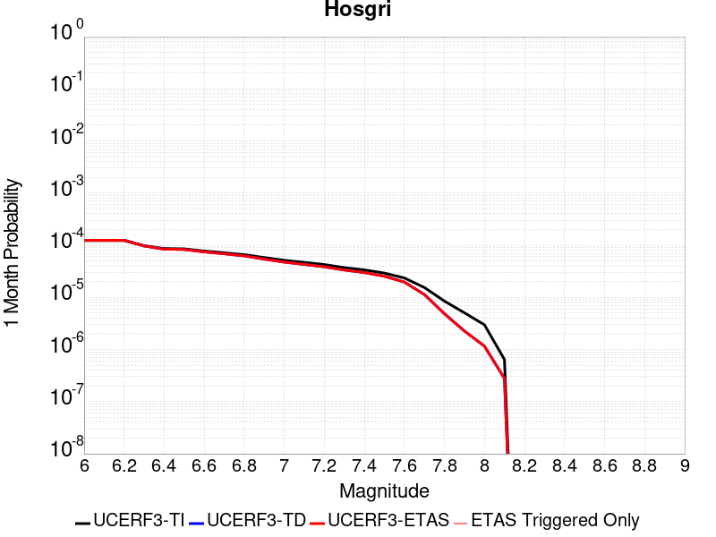 |  |  |

| Magnitude | 1 wk TI Prob | 1 wk TD Prob | 1 wk ETAS Prob | 1 wk ETAS/TD Gain | 1 wk ETAS Triggered Only | 1 mo TI Prob | 1 mo TD Prob | 1 mo ETAS Prob | 1 mo ETAS/TD Gain | 1 mo ETAS Triggered Only | 1 yr TI Prob | 1 yr TD Prob | 1 yr ETAS Prob | 1 yr ETAS/TD Gain | 1 yr ETAS Triggered Only | 10 yr TI Prob | 10 yr TD Prob | 10 yr ETAS Prob | 10 yr ETAS/TD Gain | 10 yr ETAS Triggered Only |
|-----|-----|-----|-----|-----|-----|-----|-----|-----|-----|-----|-----|-----|-----|-----|-----|-----|-----|-----|-----|-----|
| 6.0 | 2.883978E-5 | 2.9128265E-5 | 2.9128265E-5 | 1.0 | 0.0 | 1.235932E-4 | 1.248296E-4 | 1.248296E-4 | 1.0 | 0.0 | 0.0015037085 | 0.001518768 | 0.001518768 | 1.0 | 0.0 | 0.01493574 | 0.015087658 | 0.015097506 | 1.0006528 | 1.0E-5 |
| 6.1 | 2.883978E-5 | 2.9128265E-5 | 2.9128265E-5 | 1.0 | 0.0 | 1.235932E-4 | 1.248296E-4 | 1.248296E-4 | 1.0 | 0.0 | 0.0015037085 | 0.001518768 | 0.001518768 | 1.0 | 0.0 | 0.01493574 | 0.015087658 | 0.015097506 | 1.0006528 | 1.0E-5 |
| 6.2 | 2.883978E-5 | 2.9128265E-5 | 2.9128265E-5 | 1.0 | 0.0 | 1.235932E-4 | 1.248296E-4 | 1.248296E-4 | 1.0 | 0.0 | 0.0015037085 | 0.001518768 | 0.001518768 | 1.0 | 0.0 | 0.01493574 | 0.015087658 | 0.015097506 | 1.0006528 | 1.0E-5 |
| 6.3 | 2.2914428E-5 | 2.2641834E-5 | 2.2641834E-5 | 1.0 | 0.0 | 9.8200995E-5 | 9.7032855E-5 | 9.7032855E-5 | 1.0 | 0.0 | 0.0011949413 | 0.0011807396 | 0.0011807396 | 1.0 | 0.0 | 0.011885363 | 0.011746059 | 0.011755941 | 1.0008414 | 1.0E-5 |
| 6.4 | 2.0195741E-5 | 1.9696432E-5 | 1.9696432E-5 | 1.0 | 0.0 | 8.65503E-5 | 8.441056E-5 | 8.441056E-5 | 1.0 | 0.0 | 0.0010532405 | 0.001027216 | 0.001027216 | 1.0 | 0.0 | 0.010482626 | 0.010225722 | 0.01023562 | 1.000968 | 1.0E-5 |
| 6.5 | 1.9924333E-5 | 1.9408853E-5 | 1.9408853E-5 | 1.0 | 0.0 | 8.53872E-5 | 8.317816E-5 | 8.317816E-5 | 1.0 | 0.0 | 0.0010390934 | 0.0010122255 | 0.0010122255 | 1.0 | 0.0 | 0.010342481 | 0.010077183 | 0.010087082 | 1.0009823 | 1.0E-5 |
| 6.6 | 1.809694E-5 | 1.7458176E-5 | 1.7458176E-5 | 1.0 | 0.0 | 7.7556004E-5 | 7.4818614E-5 | 7.4818614E-5 | 1.0 | 0.0 | 9.438353E-4 | 9.1053726E-4 | 9.1053726E-4 | 1.0 | 0.0 | 0.009398366 | 0.009069004 | 0.009078913 | 1.0010927 | 1.0E-5 |
| 6.7 | 1.675989E-5 | 1.6042643E-5 | 1.6042643E-5 | 1.0 | 0.0 | 7.182612E-5 | 6.875238E-5 | 6.875238E-5 | 1.0 | 0.0 | 8.7413215E-4 | 8.367399E-4 | 8.367399E-4 | 1.0 | 0.0 | 0.008707017 | 0.0083367955 | 0.008346712 | 1.0011895 | 1.0E-5 |
| 6.8 | 1.5401129E-5 | 1.4613964E-5 | 1.4613964E-5 | 1.0 | 0.0 | 6.6003166E-5 | 6.262978E-5 | 6.262978E-5 | 1.0 | 0.0 | 8.032922E-4 | 7.622516E-4 | 7.622516E-4 | 1.0 | 0.0 | 0.008003947 | 0.0075972304 | 0.0076071545 | 1.0013063 | 1.0E-5 |
| 6.9 | 1.356559E-5 | 1.2689852E-5 | 1.2689852E-5 | 1.0 | 0.0 | 5.8136946E-5 | 5.438395E-5 | 5.438395E-5 | 1.0 | 0.0 | 7.0758746E-4 | 6.619239E-4 | 6.619239E-4 | 1.0 | 0.0 | 0.007053386 | 0.0066003236 | 0.0066102576 | 1.0015051 | 1.0E-5 |
| 7.0 | 1.2030819E-5 | 1.1095849E-5 | 1.1095849E-5 | 1.0 | 0.0 | 5.155963E-5 | 4.7552774E-5 | 4.7552774E-5 | 1.0 | 0.0 | 6.275577E-4 | 5.788013E-4 | 5.788013E-4 | 1.0 | 0.0 | 0.006257884 | 0.0057736943 | 0.0057836366 | 1.001722 | 1.0E-5 |
| 7.1 | 1.0972698E-5 | 1.0022069E-5 | 1.0022069E-5 | 1.0 | 0.0 | 4.7025E-5 | 4.295102E-5 | 4.295102E-5 | 1.0 | 0.0 | 5.72379E-4 | 5.228032E-4 | 5.228032E-4 | 1.0 | 0.0 | 0.0057090693 | 0.0052164807 | 0.0052264286 | 1.001907 | 1.0E-5 |
| 7.2 | 9.961926E-6 | 9.034636E-6 | 9.034636E-6 | 1.0 | 0.0 | 4.2693267E-5 | 3.8719292E-5 | 3.8719292E-5 | 1.0 | 0.0 | 5.1966653E-4 | 4.7130548E-4 | 4.7130548E-4 | 1.0 | 0.0 | 0.00518453 | 0.004703801 | 0.0047137537 | 1.002116 | 1.0E-5 |
| 7.3 | 8.700929E-6 | 7.827994E-6 | 7.827994E-6 | 1.0 | 0.0 | 3.7289166E-5 | 3.3548113E-5 | 3.3548113E-5 | 1.0 | 0.0 | 4.53901E-4 | 4.0837174E-4 | 4.0837174E-4 | 1.0 | 0.0 | 0.00452975 | 0.0040769484 | 0.0040869075 | 1.0024428 | 1.0E-5 |
| 7.4 | 7.866285E-6 | 6.9986318E-6 | 6.9986318E-6 | 1.0 | 0.0 | 3.3712215E-5 | 2.9993791E-5 | 2.9993791E-5 | 1.0 | 0.0 | 4.103689E-4 | 3.6511326E-4 | 3.6511326E-4 | 1.0 | 0.0 | 0.004096119 | 0.0036458664 | 0.00365583 | 1.0027329 | 1.0E-5 |
| 7.5 | 6.8381305E-6 | 5.959588E-6 | 5.959588E-6 | 1.0 | 0.0 | 2.9305946E-5 | 2.5540841E-5 | 2.5540841E-5 | 1.0 | 0.0 | 3.5674145E-4 | 3.109154E-4 | 3.109154E-4 | 1.0 | 0.0 | 0.0035616932 | 0.0031055345 | 0.0031155034 | 1.0032101 | 1.0E-5 |
| 7.6 | 5.503376E-6 | 4.595135E-6 | 4.595135E-6 | 1.0 | 0.0 | 2.3585684E-5 | 1.9693289E-5 | 1.9693289E-5 | 1.0 | 0.0 | 2.8711787E-4 | 2.3973943E-4 | 2.3973943E-4 | 1.0 | 0.0 | 0.002867472 | 0.0023955363 | 0.0023955363 | 1.0 | 0.0 |
| 7.7 | 3.6144982E-6 | 2.6521004E-6 | 2.6521004E-6 | 1.0 | 0.0 | 1.5490614E-5 | 1.1366095E-5 | 1.1366095E-5 | 1.0 | 0.0 | 1.8858191E-4 | 1.3837342E-4 | 1.3837342E-4 | 1.0 | 0.0 | 0.0018842196 | 0.0013835991 | 0.0013835991 | 1.0 | 0.0 |
| 7.8 | 1.9853494E-6 | 1.1360507E-6 | 1.1360507E-6 | 1.0 | 0.0 | 8.508612E-6 | 4.86878E-6 | 4.86878E-6 | 1.0 | 0.0 | 1.0358743E-4 | 5.9275782E-5 | 5.9275782E-5 | 1.0 | 0.0 | 0.0010353916 | 5.933247E-4 | 5.933247E-4 | 1.0 | 0.0 |
| 7.9 | 1.1818757E-6 | 5.294548E-7 | 5.294548E-7 | 1.0 | 0.0 | 5.0651715E-6 | 2.2690897E-6 | 2.2690897E-6 | 1.0 | 0.0 | 6.1666724E-5 | 2.7625818E-5 | 2.7625818E-5 | 1.0 | 0.0 | 6.1649614E-4 | 2.7690132E-4 | 2.7690132E-4 | 1.0 | 0.0 |
| 8.0 | 6.962958E-7 | 2.7134917E-7 | 2.7134917E-7 | 1.0 | 0.0 | 2.9841215E-6 | 1.1629244E-6 | 1.1629244E-6 | 1.0 | 0.0 | 3.6331072E-5 | 1.4158512E-5 | 1.4158512E-5 | 1.0 | 0.0 | 3.6325134E-4 | 1.4214648E-4 | 1.4214648E-4 | 1.0 | 0.0 |
| 8.1 | 1.5033264E-7 | 6.526476E-8 | 6.526476E-8 | 1.0 | 0.0 | 6.442826E-7 | 2.7970606E-7 | 2.7970606E-7 | 1.0 | 0.0 | 7.844113E-6 | 3.4054162E-6 | 3.4054162E-6 | 1.0 | 0.0 | 7.843835E-5 | 3.4072913E-5 | 3.4072913E-5 | 1.0 | 0.0 |

## Almanor 2011 CFM
*[(top)](#table-of-contents)*

| 1 Week | 1 Month | 1 Year | 10 Year |
|-----|-----|-----|-----|
|  | 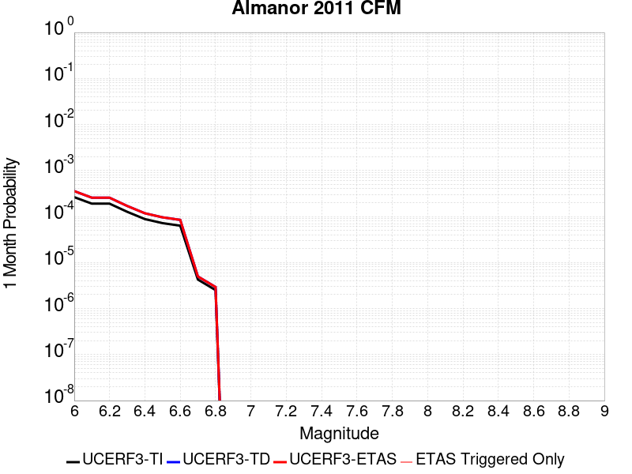 |  |  |

| Magnitude | 1 wk TI Prob | 1 wk TD Prob | 1 wk ETAS Prob | 1 wk ETAS/TD Gain | 1 wk ETAS Triggered Only | 1 mo TI Prob | 1 mo TD Prob | 1 mo ETAS Prob | 1 mo ETAS/TD Gain | 1 mo ETAS Triggered Only | 1 yr TI Prob | 1 yr TD Prob | 1 yr ETAS Prob | 1 yr ETAS/TD Gain | 1 yr ETAS Triggered Only | 10 yr TI Prob | 10 yr TD Prob | 10 yr ETAS Prob | 10 yr ETAS/TD Gain | 10 yr ETAS Triggered Only |
|-----|-----|-----|-----|-----|-----|-----|-----|-----|-----|-----|-----|-----|-----|-----|-----|-----|-----|-----|-----|-----|
| 6.0 | 6.1479834E-5 | 8.3271654E-5 | 8.3271654E-5 | 1.0 | 0.0 | 2.6345838E-4 | 3.5683217E-4 | 3.5683217E-4 | 1.0 | 0.0 | 0.0032028882 | 0.004336457 | 0.004336457 | 1.0 | 0.0 | 0.031571172 | 0.042586215 | 0.04259579 | 1.0002248 | 1.0E-5 |
| 6.1 | 4.4387216E-5 | 5.9766873E-5 | 5.9766873E-5 | 1.0 | 0.0 | 1.9021705E-4 | 2.5612145E-4 | 2.5612145E-4 | 1.0 | 0.0 | 0.0023134327 | 0.003114324 | 0.003114324 | 1.0 | 0.0 | 0.022894967 | 0.030755322 | 0.030765014 | 1.0003152 | 1.0E-5 |
| 6.2 | 4.4387216E-5 | 5.9766873E-5 | 5.9766873E-5 | 1.0 | 0.0 | 1.9021705E-4 | 2.5612145E-4 | 2.5612145E-4 | 1.0 | 0.0 | 0.0023134327 | 0.003114324 | 0.003114324 | 1.0 | 0.0 | 0.022894967 | 0.030755322 | 0.030765014 | 1.0003152 | 1.0E-5 |
| 6.3 | 2.9523822E-5 | 3.9546605E-5 | 3.9546605E-5 | 1.0 | 0.0 | 1.2652454E-4 | 1.6947598E-4 | 1.6947598E-4 | 1.0 | 0.0 | 0.0015393476 | 0.0020617754 | 0.0020617754 | 1.0 | 0.0 | 0.015287281 | 0.020460943 | 0.020460943 | 1.0 | 0.0 |
| 6.4 | 2.0512744E-5 | 2.743039E-5 | 2.743039E-5 | 1.0 | 0.0 | 8.79088E-5 | 1.17554795E-4 | 1.17554795E-4 | 1.0 | 0.0 | 0.001069764 | 0.001430605 | 0.001430605 | 1.0 | 0.0 | 0.010646289 | 0.0142444605 | 0.0142444605 | 1.0 | 0.0 |
| 6.5 | 1.6750226E-5 | 2.239016E-5 | 2.239016E-5 | 1.0 | 0.0 | 7.178471E-5 | 9.5955504E-5 | 9.5955504E-5 | 1.0 | 0.0 | 8.7362836E-4 | 0.0011679507 | 0.0011679507 | 1.0 | 0.0 | 0.008702018 | 0.011649098 | 0.011649098 | 1.0 | 0.0 |
| 6.6 | 1.4745303E-5 | 1.970668E-5 | 1.970668E-5 | 1.0 | 0.0 | 6.319262E-5 | 8.4455794E-5 | 8.4455794E-5 | 1.0 | 0.0 | 7.690986E-4 | 0.0010280898 | 0.0010280898 | 1.0 | 0.0 | 0.0076644225 | 0.010265044 | 0.010265044 | 1.0 | 0.0 |
| 6.7 | 9.951145E-7 | 1.1616295E-6 | 1.1616295E-6 | 1.0 | 0.0 | 4.26477E-6 | 4.9784035E-6 | 4.9784035E-6 | 1.0 | 0.0 | 5.1922336E-5 | 6.0610553E-5 | 6.0610553E-5 | 1.0 | 0.0 | 5.1910203E-4 | 6.0595747E-4 | 6.0595747E-4 | 1.0 | 0.0 |
| 6.8 | 5.866312E-7 | 6.8493534E-7 | 6.8493534E-7 | 1.0 | 0.0 | 2.5141312E-6 | 2.9354346E-6 | 2.9354346E-6 | 1.0 | 0.0 | 3.0609117E-5 | 3.5738463E-5 | 3.5738463E-5 | 1.0 | 0.0 | 3.06049E-4 | 3.5733997E-4 | 3.5733997E-4 | 1.0 | 0.0 |

## Hunting Creek - Berryessa 2011 CFM
*[(top)](#table-of-contents)*

| 1 Week | 1 Month | 1 Year | 10 Year |
|-----|-----|-----|-----|
| 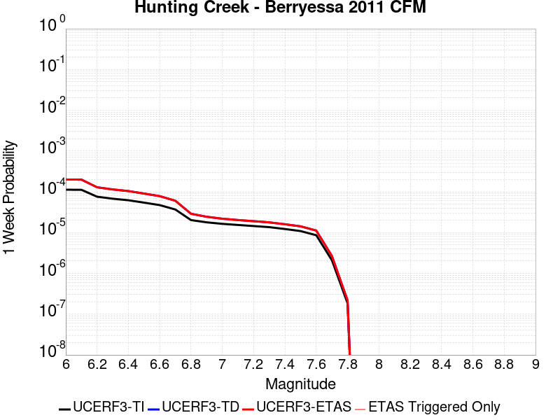 | 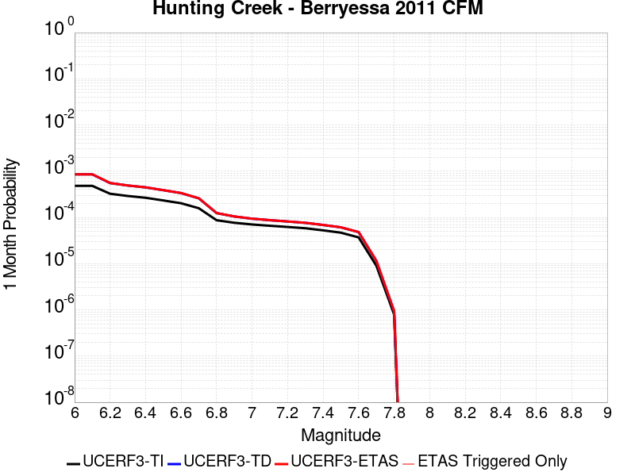 | 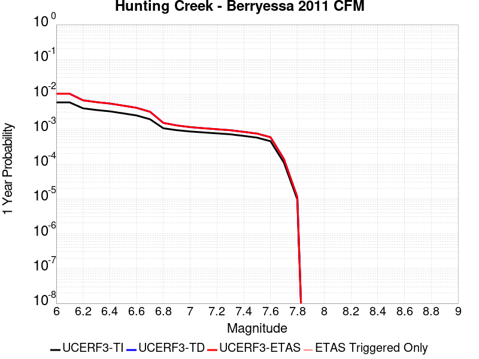 | 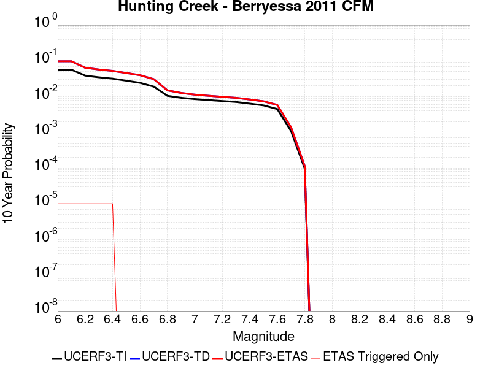 |

| Magnitude | 1 wk TI Prob | 1 wk TD Prob | 1 wk ETAS Prob | 1 wk ETAS/TD Gain | 1 wk ETAS Triggered Only | 1 mo TI Prob | 1 mo TD Prob | 1 mo ETAS Prob | 1 mo ETAS/TD Gain | 1 mo ETAS Triggered Only | 1 yr TI Prob | 1 yr TD Prob | 1 yr ETAS Prob | 1 yr ETAS/TD Gain | 1 yr ETAS Triggered Only | 10 yr TI Prob | 10 yr TD Prob | 10 yr ETAS Prob | 10 yr ETAS/TD Gain | 10 yr ETAS Triggered Only |
|-----|-----|-----|-----|-----|-----|-----|-----|-----|-----|-----|-----|-----|-----|-----|-----|-----|-----|-----|-----|-----|
| 6.0 | 1.1270982E-4 | 2.0028117E-4 | 2.0028117E-4 | 1.0 | 0.0 | 4.8295266E-4 | 8.579866E-4 | 8.579866E-4 | 1.0 | 0.0 | 0.0058641075 | 0.010386083 | 0.010386083 | 1.0 | 0.0 | 0.057117578 | 0.09803986 | 0.09804887 | 1.000092 | 1.0E-5 |
| 6.1 | 1.1239393E-4 | 1.997626E-4 | 1.997626E-4 | 1.0 | 0.0 | 4.8159933E-4 | 8.557657E-4 | 8.557657E-4 | 1.0 | 0.0 | 0.0058477195 | 0.010359327 | 0.010359327 | 1.0 | 0.0 | 0.056962132 | 0.09779833 | 0.097807355 | 1.0000923 | 1.0E-5 |
| 6.2 | 7.596265E-5 | 1.2933639E-4 | 1.2933639E-4 | 1.0 | 0.0 | 3.2551357E-4 | 5.541514E-4 | 5.541514E-4 | 1.0 | 0.0 | 0.0039559277 | 0.006721304 | 0.006721304 | 1.0 | 0.0 | 0.038862433 | 0.064591914 | 0.064601265 | 1.0001448 | 1.0E-5 |
| 6.3 | 6.78794E-5 | 1.1448412E-4 | 1.1448412E-4 | 1.0 | 0.0 | 2.9087928E-4 | 4.905234E-4 | 4.905234E-4 | 1.0 | 0.0 | 0.003535705 | 0.0059526134 | 0.0059526134 | 1.0 | 0.0 | 0.034799766 | 0.057465896 | 0.057475325 | 1.000164 | 1.0E-5 |
| 6.4 | 6.2165134E-5 | 1.0434877E-4 | 1.0434877E-4 | 1.0 | 0.0 | 2.6639478E-4 | 4.471078E-4 | 4.471078E-4 | 1.0 | 0.0 | 0.0032385332 | 0.0054273745 | 0.0054273745 | 1.0 | 0.0 | 0.03191742 | 0.052551147 | 0.05256062 | 1.0001802 | 1.0E-5 |
| 6.5 | 5.4368087E-5 | 9.070333E-5 | 9.070333E-5 | 1.0 | 0.0 | 2.3298527E-4 | 3.8865174E-4 | 3.8865174E-4 | 1.0 | 0.0 | 0.0028329059 | 0.004719664 | 0.004719664 | 1.0 | 0.0 | 0.027970633 | 0.045881007 | 0.045881007 | 1.0 | 0.0 |
| 6.6 | 4.729947E-5 | 7.847132E-5 | 7.847132E-5 | 1.0 | 0.0 | 2.0269625E-4 | 3.3624543E-4 | 3.3624543E-4 | 1.0 | 0.0 | 0.002465034 | 0.004084713 | 0.004084713 | 1.0 | 0.0 | 0.02437869 | 0.039852608 | 0.039852608 | 1.0 | 0.0 |
| 6.7 | 3.6875328E-5 | 6.044414E-5 | 6.044414E-5 | 1.0 | 0.0 | 1.5802756E-4 | 2.5900805E-4 | 2.5900805E-4 | 1.0 | 0.0 | 0.0019222875 | 0.0031482463 | 0.0031482463 | 1.0 | 0.0 | 0.019057442 | 0.030893631 | 0.030893631 | 1.0 | 0.0 |
| 6.8 | 2.0292036E-5 | 2.89766E-5 | 2.89766E-5 | 1.0 | 0.0 | 8.6962966E-5 | 1.2417947E-4 | 1.2417947E-4 | 1.0 | 0.0 | 0.0010582599 | 0.0015108241 | 0.0015108241 | 1.0 | 0.0 | 0.010532344 | 0.014978971 | 0.014978971 | 1.0 | 0.0 |
| 6.9 | 1.7871042E-5 | 2.447255E-5 | 2.447255E-5 | 1.0 | 0.0 | 7.658793E-5 | 1.0487814E-4 | 1.0487814E-4 | 1.0 | 0.0 | 9.320591E-4 | 0.0012761431 | 0.0012761431 | 1.0 | 0.0 | 0.009281595 | 0.012680401 | 0.012680401 | 1.0 | 0.0 |
| 7.0 | 1.6415532E-5 | 2.1906475E-5 | 2.1906475E-5 | 1.0 | 0.0 | 7.035038E-5 | 9.388151E-5 | 9.388151E-5 | 1.0 | 0.0 | 8.561793E-4 | 0.0011424095 | 0.0011424095 | 1.0 | 0.0 | 0.008528882 | 0.011364971 | 0.011364971 | 1.0 | 0.0 |
| 7.1 | 1.5409885E-5 | 2.03465E-5 | 2.03465E-5 | 1.0 | 0.0 | 6.6040695E-5 | 8.719638E-5 | 8.719638E-5 | 1.0 | 0.0 | 8.0374884E-4 | 0.0010611017 | 0.0010611017 | 1.0 | 0.0 | 0.00800848 | 0.010560882 | 0.010560882 | 1.0 | 0.0 |
| 7.2 | 1.4497423E-5 | 1.9055107E-5 | 1.9055107E-5 | 1.0 | 0.0 | 6.213033E-5 | 8.1662205E-5 | 8.1662205E-5 | 1.0 | 0.0 | 7.5617427E-4 | 9.93787E-4 | 9.93787E-4 | 1.0 | 0.0 | 0.0075360634 | 0.009894209 | 0.009894209 | 1.0 | 0.0 |
| 7.3 | 1.3615175E-5 | 1.7826267E-5 | 1.7826267E-5 | 1.0 | 0.0 | 5.8349444E-5 | 7.639606E-5 | 7.639606E-5 | 1.0 | 0.0 | 7.101729E-4 | 9.2972815E-4 | 9.2972815E-4 | 1.0 | 0.0 | 0.0070790765 | 0.009259084 | 0.009259084 | 1.0 | 0.0 |
| 7.4 | 1.2252825E-5 | 1.6026384E-5 | 1.6026384E-5 | 1.0 | 0.0 | 5.251105E-5 | 6.868271E-5 | 6.868271E-5 | 1.0 | 0.0 | 6.391345E-4 | 8.35894E-4 | 8.35894E-4 | 1.0 | 0.0 | 0.0063729943 | 0.008328133 | 0.008328133 | 1.0 | 0.0 |
| 7.5 | 1.0913301E-5 | 1.424122E-5 | 1.424122E-5 | 1.0 | 0.0 | 4.6770452E-5 | 6.1032388E-5 | 6.1032388E-5 | 1.0 | 0.0 | 5.6928146E-4 | 7.4281875E-4 | 7.4281875E-4 | 1.0 | 0.0 | 0.0056782532 | 0.0074039483 | 0.0074039483 | 1.0 | 0.0 |
| 7.6 | 8.623192E-6 | 1.1234731E-5 | 1.1234731E-5 | 1.0 | 0.0 | 3.6956015E-5 | 4.814797E-5 | 4.814797E-5 | 1.0 | 0.0 | 4.4984656E-4 | 5.8604643E-4 | 5.8604643E-4 | 1.0 | 0.0 | 0.00448937 | 0.005845472 | 0.005845472 | 1.0 | 0.0 |
| 7.7 | 2.0993634E-6 | 2.6626274E-6 | 2.6626274E-6 | 1.0 | 0.0 | 8.997241E-6 | 1.1411211E-5 | 1.1411211E-5 | 1.0 | 0.0 | 1.09535904E-4 | 1.3892271E-4 | 1.3892271E-4 | 1.0 | 0.0 | 0.0010948193 | 0.0013884059 | 0.0013884059 | 1.0 | 0.0 |
| 7.8 | 1.8428308E-7 | 2.1674549E-7 | 2.1674549E-7 | 1.0 | 0.0 | 7.897844E-7 | 9.2890895E-7 | 9.2890895E-7 | 1.0 | 0.0 | 9.615583E-6 | 1.1309411E-5 | 1.1309411E-5 | 1.0 | 0.0 | 9.615166E-5 | 1.1308134E-4 | 1.1308134E-4 | 1.0 | 0.0 |

## Pitas Point (Lower)-Montalvo
*[(top)](#table-of-contents)*

| 1 Week | 1 Month | 1 Year | 10 Year |
|-----|-----|-----|-----|
| 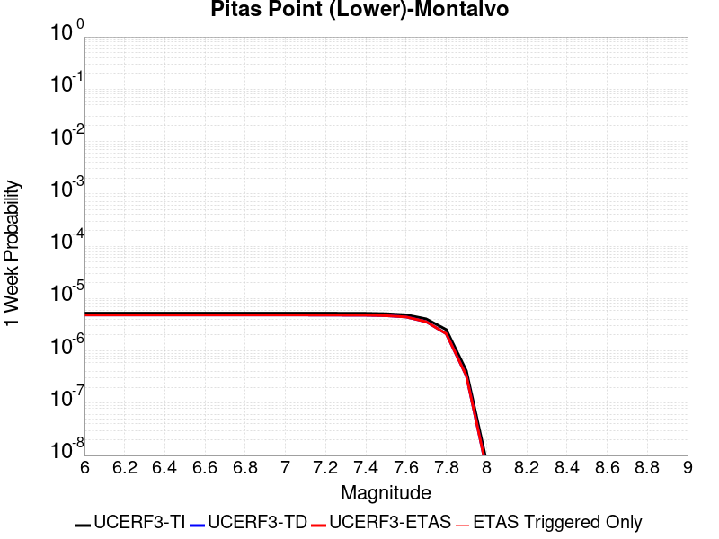 | 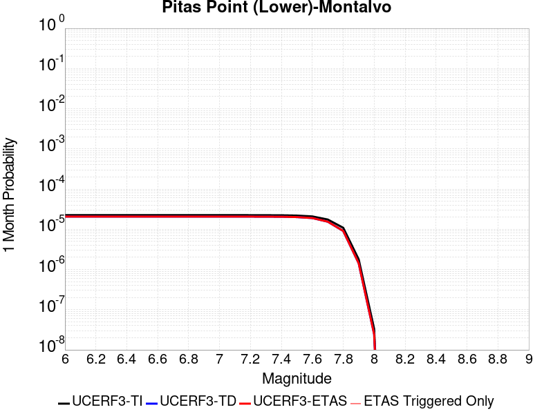 | 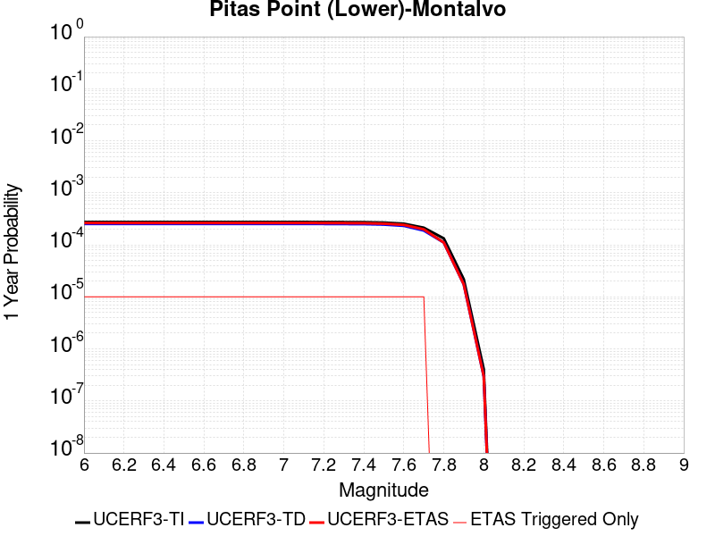 | 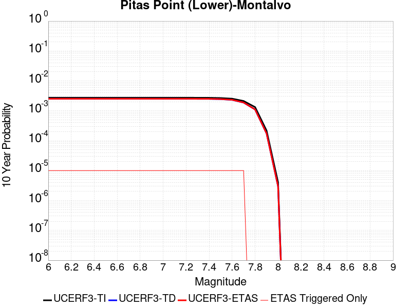 |

| Magnitude | 1 wk TI Prob | 1 wk TD Prob | 1 wk ETAS Prob | 1 wk ETAS/TD Gain | 1 wk ETAS Triggered Only | 1 mo TI Prob | 1 mo TD Prob | 1 mo ETAS Prob | 1 mo ETAS/TD Gain | 1 mo ETAS Triggered Only | 1 yr TI Prob | 1 yr TD Prob | 1 yr ETAS Prob | 1 yr ETAS/TD Gain | 1 yr ETAS Triggered Only | 10 yr TI Prob | 10 yr TD Prob | 10 yr ETAS Prob | 10 yr ETAS/TD Gain | 10 yr ETAS Triggered Only |
|-----|-----|-----|-----|-----|-----|-----|-----|-----|-----|-----|-----|-----|-----|-----|-----|-----|-----|-----|-----|-----|
| 6.0 | 5.2543637E-6 | 4.837897E-6 | 4.837897E-6 | 1.0 | 0.0 | 2.2518509E-5 | 2.073368E-5 | 2.073368E-5 | 1.0 | 0.0 | 2.7412834E-4 | 2.5240364E-4 | 2.624011E-4 | 1.0396091 | 1.0E-5 | 0.0027379042 | 0.0025212022 | 0.002531177 | 1.0039563 | 1.0E-5 |
| 6.1 | 5.2543637E-6 | 4.837897E-6 | 4.837897E-6 | 1.0 | 0.0 | 2.2518509E-5 | 2.073368E-5 | 2.073368E-5 | 1.0 | 0.0 | 2.7412834E-4 | 2.5240364E-4 | 2.624011E-4 | 1.0396091 | 1.0E-5 | 0.0027379042 | 0.0025212022 | 0.002531177 | 1.0039563 | 1.0E-5 |
| 6.2 | 5.2543637E-6 | 4.837897E-6 | 4.837897E-6 | 1.0 | 0.0 | 2.2518509E-5 | 2.073368E-5 | 2.073368E-5 | 1.0 | 0.0 | 2.7412834E-4 | 2.5240364E-4 | 2.624011E-4 | 1.0396091 | 1.0E-5 | 0.0027379042 | 0.0025212022 | 0.002531177 | 1.0039563 | 1.0E-5 |
| 6.3 | 5.2543637E-6 | 4.837897E-6 | 4.837897E-6 | 1.0 | 0.0 | 2.2518509E-5 | 2.073368E-5 | 2.073368E-5 | 1.0 | 0.0 | 2.7412834E-4 | 2.5240364E-4 | 2.624011E-4 | 1.0396091 | 1.0E-5 | 0.0027379042 | 0.0025212022 | 0.002531177 | 1.0039563 | 1.0E-5 |
| 6.4 | 5.2543637E-6 | 4.837897E-6 | 4.837897E-6 | 1.0 | 0.0 | 2.2518509E-5 | 2.073368E-5 | 2.073368E-5 | 1.0 | 0.0 | 2.7412834E-4 | 2.5240364E-4 | 2.624011E-4 | 1.0396091 | 1.0E-5 | 0.0027379042 | 0.0025212022 | 0.002531177 | 1.0039563 | 1.0E-5 |
| 6.5 | 5.2543637E-6 | 4.837897E-6 | 4.837897E-6 | 1.0 | 0.0 | 2.2518509E-5 | 2.073368E-5 | 2.073368E-5 | 1.0 | 0.0 | 2.7412834E-4 | 2.5240364E-4 | 2.624011E-4 | 1.0396091 | 1.0E-5 | 0.0027379042 | 0.0025212022 | 0.002531177 | 1.0039563 | 1.0E-5 |
| 6.6 | 5.2543637E-6 | 4.837897E-6 | 4.837897E-6 | 1.0 | 0.0 | 2.2518509E-5 | 2.073368E-5 | 2.073368E-5 | 1.0 | 0.0 | 2.7412834E-4 | 2.5240364E-4 | 2.624011E-4 | 1.0396091 | 1.0E-5 | 0.0027379042 | 0.0025212022 | 0.002531177 | 1.0039563 | 1.0E-5 |
| 6.7 | 5.2543637E-6 | 4.837897E-6 | 4.837897E-6 | 1.0 | 0.0 | 2.2518509E-5 | 2.073368E-5 | 2.073368E-5 | 1.0 | 0.0 | 2.7412834E-4 | 2.5240364E-4 | 2.624011E-4 | 1.0396091 | 1.0E-5 | 0.0027379042 | 0.0025212022 | 0.002531177 | 1.0039563 | 1.0E-5 |
| 6.8 | 5.2543637E-6 | 4.837897E-6 | 4.837897E-6 | 1.0 | 0.0 | 2.2518509E-5 | 2.073368E-5 | 2.073368E-5 | 1.0 | 0.0 | 2.7412834E-4 | 2.5240364E-4 | 2.624011E-4 | 1.0396091 | 1.0E-5 | 0.0027379042 | 0.0025212022 | 0.002531177 | 1.0039563 | 1.0E-5 |
| 6.9 | 5.2543637E-6 | 4.837897E-6 | 4.837897E-6 | 1.0 | 0.0 | 2.2518509E-5 | 2.073368E-5 | 2.073368E-5 | 1.0 | 0.0 | 2.7412834E-4 | 2.5240364E-4 | 2.624011E-4 | 1.0396091 | 1.0E-5 | 0.0027379042 | 0.0025212022 | 0.002531177 | 1.0039563 | 1.0E-5 |
| 7.0 | 5.2543637E-6 | 4.837897E-6 | 4.837897E-6 | 1.0 | 0.0 | 2.2518509E-5 | 2.073368E-5 | 2.073368E-5 | 1.0 | 0.0 | 2.7412834E-4 | 2.5240364E-4 | 2.624011E-4 | 1.0396091 | 1.0E-5 | 0.0027379042 | 0.0025212022 | 0.002531177 | 1.0039563 | 1.0E-5 |
| 7.1 | 5.2543637E-6 | 4.837897E-6 | 4.837897E-6 | 1.0 | 0.0 | 2.2518509E-5 | 2.073368E-5 | 2.073368E-5 | 1.0 | 0.0 | 2.7412834E-4 | 2.5240364E-4 | 2.624011E-4 | 1.0396091 | 1.0E-5 | 0.0027379042 | 0.0025212022 | 0.002531177 | 1.0039563 | 1.0E-5 |
| 7.2 | 5.2458695E-6 | 4.829051E-6 | 4.829051E-6 | 1.0 | 0.0 | 2.2482105E-5 | 2.0695768E-5 | 2.0695768E-5 | 1.0 | 0.0 | 2.7368523E-4 | 2.5194217E-4 | 2.6193965E-4 | 1.0396817 | 1.0E-5 | 0.0027334841 | 0.002516598 | 0.0025265727 | 1.0039636 | 1.0E-5 |
| 7.3 | 5.22665E-6 | 4.808968E-6 | 4.808968E-6 | 1.0 | 0.0 | 2.2399736E-5 | 2.0609701E-5 | 2.0609701E-5 | 1.0 | 0.0 | 2.7268266E-4 | 2.5089455E-4 | 2.6089203E-4 | 1.0398474 | 1.0E-5 | 0.002723483 | 0.0025061453 | 0.0025161202 | 1.0039802 | 1.0E-5 |
| 7.4 | 5.210642E-6 | 4.7921803E-6 | 4.7921803E-6 | 1.0 | 0.0 | 2.233113E-5 | 2.0537756E-5 | 2.0537756E-5 | 1.0 | 0.0 | 2.718476E-4 | 2.500188E-4 | 2.600163E-4 | 1.039987 | 1.0E-5 | 0.002715153 | 0.0024974076 | 0.0025073825 | 1.0039941 | 1.0E-5 |
| 7.5 | 5.1226016E-6 | 4.700067E-6 | 4.700067E-6 | 1.0 | 0.0 | 2.1953823E-5 | 2.014299E-5 | 2.014299E-5 | 1.0 | 0.0 | 2.67255E-4 | 2.4521363E-4 | 2.5521117E-4 | 1.0407708 | 1.0E-5 | 0.0026693381 | 0.0024494622 | 0.0024594376 | 1.0040725 | 1.0E-5 |
| 7.6 | 4.8796987E-6 | 4.4449675E-6 | 4.4449675E-6 | 1.0 | 0.0 | 2.0912828E-5 | 1.9049723E-5 | 1.9049723E-5 | 1.0 | 0.0 | 2.5458392E-4 | 2.3190599E-4 | 2.4190366E-4 | 1.043111 | 1.0E-5 | 0.0025429246 | 0.0023166705 | 0.0023266473 | 1.0043066 | 1.0E-5 |
| 7.7 | 4.0834398E-6 | 3.6091403E-6 | 3.6091403E-6 | 1.0 | 0.0 | 1.7500339E-5 | 1.5467655E-5 | 1.5467655E-5 | 1.0 | 0.0 | 2.1304579E-4 | 1.8830264E-4 | 1.9830075E-4 | 1.053096 | 1.0E-5 | 0.0021284167 | 0.0018814546 | 0.0018914358 | 1.005305 | 1.0E-5 |
| 7.8 | 2.5445438E-6 | 2.1212545E-6 | 2.1212545E-6 | 1.0 | 0.0 | 1.0905142E-5 | 9.09106E-6 | 9.09106E-6 | 1.0 | 0.0 | 1.3276201E-4 | 1.1067808E-4 | 1.1067808E-4 | 1.0 | 0.0 | 0.0013268272 | 0.0011062343 | 0.0011062343 | 1.0 | 0.0 |
| 7.9 | 4.1677114E-7 | 3.3293983E-7 | 3.3293983E-7 | 1.0 | 0.0 | 1.7861609E-6 | 1.4268842E-6 | 1.4268842E-6 | 1.0 | 0.0 | 2.1746291E-5 | 1.737218E-5 | 1.737218E-5 | 1.0 | 0.0 | 2.1744163E-4 | 1.7370853E-4 | 1.7370853E-4 | 1.0 | 0.0 |
| 8.0 | 7.791402E-9 | 5.6836047E-9 | 5.6836047E-9 | 1.0 | 0.0 | 3.3391725E-8 | 2.4358307E-8 | 2.4358307E-8 | 1.0 | 0.0 | 4.0654416E-7 | 2.9656238E-7 | 2.9656238E-7 | 1.0 | 0.0 | 4.065434E-6 | 2.9656217E-6 | 2.9656217E-6 | 1.0 | 0.0 |

## Brawley (Seismic Zone) alt 1
*[(top)](#table-of-contents)*

| 1 Week | 1 Month | 1 Year | 10 Year |
|-----|-----|-----|-----|
| 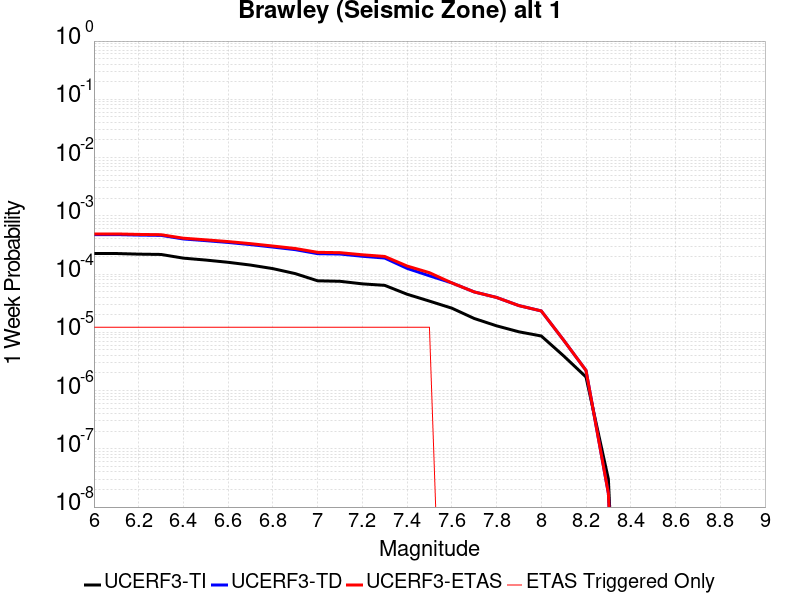 | 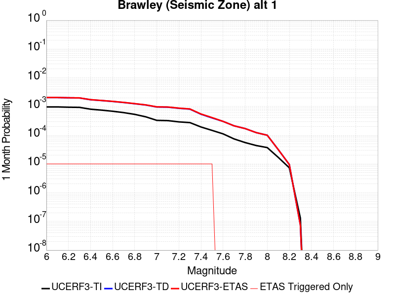 | 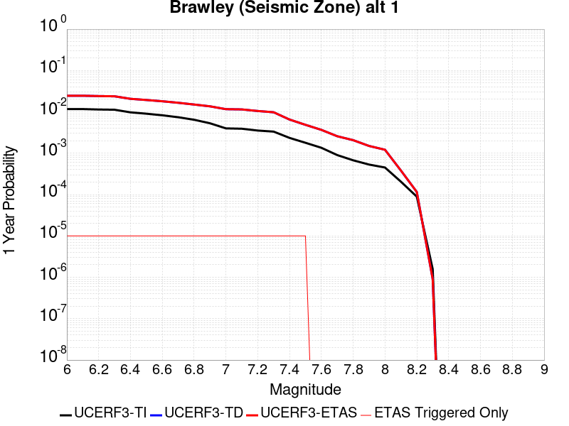 | 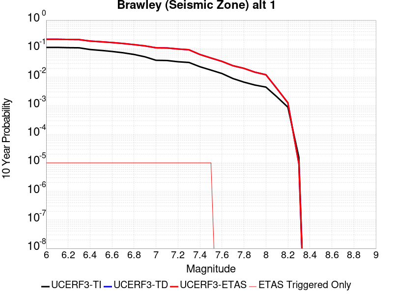 |

| Magnitude | 1 wk TI Prob | 1 wk TD Prob | 1 wk ETAS Prob | 1 wk ETAS/TD Gain | 1 wk ETAS Triggered Only | 1 mo TI Prob | 1 mo TD Prob | 1 mo ETAS Prob | 1 mo ETAS/TD Gain | 1 mo ETAS Triggered Only | 1 yr TI Prob | 1 yr TD Prob | 1 yr ETAS Prob | 1 yr ETAS/TD Gain | 1 yr ETAS Triggered Only | 10 yr TI Prob | 10 yr TD Prob | 10 yr ETAS Prob | 10 yr ETAS/TD Gain | 10 yr ETAS Triggered Only |
|-----|-----|-----|-----|-----|-----|-----|-----|-----|-----|-----|-----|-----|-----|-----|-----|-----|-----|-----|-----|-----|
| 6.0 | 2.2521618E-4 | 4.762709E-4 | 4.8626616E-4 | 1.0209864 | 1.0E-5 | 9.6485513E-4 | 0.0020396016 | 0.0020495811 | 1.004893 | 1.0E-5 | 0.011683988 | 0.024541805 | 0.02455156 | 1.0003974 | 1.0E-5 | 0.11088423 | 0.21347821 | 0.21348606 | 1.0000368 | 1.0E-5 |
| 6.1 | 2.2521618E-4 | 4.762709E-4 | 4.8626616E-4 | 1.0209864 | 1.0E-5 | 9.6485513E-4 | 0.0020396016 | 0.0020495811 | 1.004893 | 1.0E-5 | 0.011683988 | 0.024541805 | 0.02455156 | 1.0003974 | 1.0E-5 | 0.11088423 | 0.21347821 | 0.21348606 | 1.0000368 | 1.0E-5 |
| 6.2 | 2.198148E-4 | 4.6711712E-4 | 4.7711245E-4 | 1.021398 | 1.0E-5 | 9.417233E-4 | 0.0020004313 | 0.0020104114 | 1.0049889 | 1.0E-5 | 0.011405343 | 0.024076113 | 0.024085872 | 1.0004053 | 1.0E-5 | 0.10837428 | 0.20991476 | 0.20992267 | 1.0000377 | 1.0E-5 |
| 6.3 | 2.1704129E-4 | 4.6147394E-4 | 4.7146934E-4 | 1.0216597 | 1.0E-5 | 9.298453E-4 | 0.001976283 | 0.0019862633 | 1.0050501 | 1.0E-5 | 0.011262234 | 0.023789674 | 0.023799436 | 1.0004103 | 1.0E-5 | 0.107082725 | 0.20780581 | 0.20781374 | 1.0000381 | 1.0E-5 |
| 6.4 | 1.876142E-4 | 4.0039537E-4 | 4.1039137E-4 | 1.0249653 | 1.0E-5 | 8.038131E-4 | 0.001714866 | 0.0017248489 | 1.0058213 | 1.0E-5 | 0.00974259 | 0.020675711 | 0.020685505 | 1.0004736 | 1.0E-5 | 0.093263686 | 0.18455538 | 0.18456353 | 1.0000442 | 1.0E-5 |
| 6.5 | 1.7390939E-4 | 3.747172E-4 | 3.8471346E-4 | 1.0266768 | 1.0E-5 | 7.45113E-4 | 0.0016049546 | 0.0016149386 | 1.0062207 | 1.0E-5 | 0.009034078 | 0.01936447 | 0.019374277 | 1.0005064 | 1.0E-5 | 0.086755216 | 0.17437775 | 0.17438601 | 1.0000473 | 1.0E-5 |
| 6.6 | 1.591791E-4 | 3.4886636E-4 | 3.5886286E-4 | 1.0286542 | 1.0E-5 | 6.8201777E-4 | 0.0014942948 | 0.0015042799 | 1.0066822 | 1.0E-5 | 0.008271996 | 0.018041687 | 0.018051507 | 1.0005443 | 1.0E-5 | 0.07970774 | 0.16378574 | 0.1637941 | 1.000051 | 1.0E-5 |
| 6.7 | 1.4268003E-4 | 3.2052814E-4 | 3.3052496E-4 | 1.0311885 | 1.0E-5 | 6.1134255E-4 | 0.001372977 | 0.0013829634 | 1.0072734 | 1.0E-5 | 0.007417723 | 0.016588448 | 0.016598282 | 1.0005928 | 1.0E-5 | 0.07174956 | 0.15191332 | 0.1519218 | 1.0000558 | 1.0E-5 |
| 6.8 | 1.239713E-4 | 2.9048265E-4 | 3.0047973E-4 | 1.0344155 | 1.0E-5 | 5.3119735E-4 | 0.0012443379 | 0.0012543254 | 1.0080264 | 1.0E-5 | 0.0064481674 | 0.015046005 | 0.015055855 | 1.0006546 | 1.0E-5 | 0.06264243 | 0.13835827 | 0.13836688 | 1.0000622 | 1.0E-5 |
| 6.9 | 1.0180238E-4 | 2.624914E-4 | 2.7248877E-4 | 1.0380865 | 1.0E-5 | 4.3622297E-4 | 0.0011244824 | 0.0011344712 | 1.008883 | 1.0E-5 | 0.005298089 | 0.013605632 | 0.013615496 | 1.000725 | 1.0E-5 | 0.05173543 | 0.124942064 | 0.12495081 | 1.0000701 | 1.0E-5 |
| 7.0 | 7.6619996E-5 | 2.2394217E-4 | 2.3393994E-4 | 1.0446444 | 1.0E-5 | 3.283301E-4 | 9.594023E-4 | 9.693927E-4 | 1.0104132 | 1.0E-5 | 0.0039900932 | 0.011618873 | 0.011628756 | 1.0008507 | 1.0E-5 | 0.039192066 | 0.10724666 | 0.107255585 | 1.0000832 | 1.0E-5 |
| 7.1 | 7.5127435E-5 | 2.207738E-4 | 2.3077159E-4 | 1.0452852 | 1.0E-5 | 3.2193496E-4 | 9.458335E-4 | 9.5582404E-4 | 1.0105627 | 1.0E-5 | 0.0039125155 | 0.011455421 | 0.011465306 | 1.000863 | 1.0E-5 | 0.038443442 | 0.10581073 | 0.10581967 | 1.0000845 | 1.0E-5 |
| 7.2 | 6.788582E-5 | 2.0205107E-4 | 2.1204905E-4 | 1.0494825 | 1.0E-5 | 2.9090676E-4 | 8.6564885E-4 | 8.756402E-4 | 1.0115421 | 1.0E-5 | 0.0035360386 | 0.010488983 | 0.010498879 | 1.0009434 | 1.0E-5 | 0.034803 | 0.0974804 | 0.09748943 | 1.0000926 | 1.0E-5 |
| 7.3 | 6.399602E-5 | 1.883617E-4 | 1.983598E-4 | 1.0530794 | 1.0E-5 | 2.7423984E-4 | 8.070175E-4 | 8.170094E-4 | 1.0123813 | 1.0E-5 | 0.0033337586 | 0.009781763 | 0.009791665 | 1.0010123 | 1.0E-5 | 0.03284188 | 0.091375224 | 0.091384314 | 1.0000994 | 1.0E-5 |
| 7.4 | 4.506759E-5 | 1.2527342E-4 | 1.3527217E-4 | 1.0798154 | 1.0E-5 | 1.9313251E-4 | 5.367765E-4 | 5.467711E-4 | 1.0186198 | 1.0E-5 | 0.0023488526 | 0.006515845 | 0.00652578 | 1.0015247 | 1.0E-5 | 0.023241805 | 0.062353857 | 0.062363233 | 1.0001503 | 1.0E-5 |
| 7.5 | 3.43289E-5 | 9.335652E-5 | 1.0335558E-4 | 1.1071062 | 1.0E-5 | 1.4711556E-4 | 4.0003832E-4 | 4.1003432E-4 | 1.0249876 | 1.0E-5 | 0.0017896603 | 0.004859652 | 0.004869603 | 1.0020478 | 1.0E-5 | 0.01775316 | 0.047055803 | 0.047065333 | 1.0002025 | 1.0E-5 |
| 7.6 | 2.5980507E-5 | 7.053283E-5 | 7.053283E-5 | 1.0 | 0.0 | 1.1134028E-4 | 3.0224866E-4 | 3.0224866E-4 | 1.0 | 0.0 | 0.001354725 | 0.0036736925 | 0.0036736925 | 1.0 | 0.0 | 0.013464959 | 0.03584153 | 0.03584153 | 1.0 | 0.0 |
| 7.7 | 1.7292105E-5 | 4.940868E-5 | 4.940868E-5 | 1.0 | 0.0 | 7.4106916E-5 | 2.1173434E-4 | 2.1173434E-4 | 1.0 | 0.0 | 9.018782E-4 | 0.0025748238 | 0.0025748238 | 1.0 | 0.0 | 0.008982267 | 0.025291234 | 0.025291234 | 1.0 | 0.0 |
| 7.8 | 1.2927471E-5 | 3.9694296E-5 | 3.9694296E-5 | 1.0 | 0.0 | 5.5402274E-5 | 1.7010733E-4 | 1.7010733E-4 | 1.0 | 0.0 | 6.743139E-4 | 0.0020690921 | 0.0020690921 | 1.0 | 0.0 | 0.0067227143 | 0.020432515 | 0.020432515 | 1.0 | 0.0 |
| 7.9 | 1.0200774E-5 | 2.8746123E-5 | 2.8746123E-5 | 1.0 | 0.0 | 4.371687E-5 | 1.2319186E-4 | 1.2319186E-4 | 1.0 | 0.0 | 5.321229E-4 | 0.00149883 | 0.00149883 | 1.0 | 0.0 | 0.005308505 | 0.014992237 | 0.014992237 | 1.0 | 0.0 |
| 8.0 | 8.650396E-6 | 2.3277493E-5 | 2.3277493E-5 | 1.0 | 0.0 | 3.70726E-5 | 9.975687E-5 | 9.975687E-5 | 1.0 | 0.0 | 4.5126543E-4 | 0.0012138641 | 0.0012138641 | 1.0 | 0.0 | 0.0045035016 | 0.012211572 | 0.012211572 | 1.0 | 0.0 |
| 8.1 | 3.9368224E-6 | 7.3274655E-6 | 7.3274655E-6 | 1.0 | 0.0 | 1.6871985E-5 | 3.1403044E-5 | 3.1403044E-5 | 1.0 | 0.0 | 2.0539707E-4 | 3.8226513E-4 | 3.8226513E-4 | 1.0 | 0.0 | 0.0020520731 | 0.004001267 | 0.004001267 | 1.0 | 0.0 |
| 8.2 | 1.7101195E-6 | 2.2174895E-6 | 2.2174895E-6 | 1.0 | 0.0 | 7.329063E-6 | 9.503492E-6 | 9.503492E-6 | 1.0 | 0.0 | 8.922769E-5 | 1.156989E-4 | 1.156989E-4 | 1.0 | 0.0 | 8.9191867E-4 | 0.0012665318 | 0.0012665318 | 1.0 | 0.0 |
| 8.3 | 3.0346666E-8 | 1.720686E-8 | 1.720686E-8 | 1.0 | 0.0 | 1.3005713E-7 | 7.3743685E-8 | 7.3743685E-8 | 1.0 | 0.0 | 1.5834444E-6 | 8.9782924E-7 | 8.9782924E-7 | 1.0 | 0.0 | 1.5834332E-5 | 9.364711E-6 | 9.364711E-6 | 1.0 | 0.0 |

## Great Valley 10 (Panoche)
*[(top)](#table-of-contents)*

| 1 Week | 1 Month | 1 Year | 10 Year |
|-----|-----|-----|-----|
|  |  |  |  |

| Magnitude | 1 wk TI Prob | 1 wk TD Prob | 1 wk ETAS Prob | 1 wk ETAS/TD Gain | 1 wk ETAS Triggered Only | 1 mo TI Prob | 1 mo TD Prob | 1 mo ETAS Prob | 1 mo ETAS/TD Gain | 1 mo ETAS Triggered Only | 1 yr TI Prob | 1 yr TD Prob | 1 yr ETAS Prob | 1 yr ETAS/TD Gain | 1 yr ETAS Triggered Only | 10 yr TI Prob | 10 yr TD Prob | 10 yr ETAS Prob | 10 yr ETAS/TD Gain | 10 yr ETAS Triggered Only |
|-----|-----|-----|-----|-----|-----|-----|-----|-----|-----|-----|-----|-----|-----|-----|-----|-----|-----|-----|-----|-----|
| 6.0 | 1.6014626E-5 | 1.6575286E-5 | 1.6575286E-5 | 1.0 | 0.0 | 6.863231E-5 | 7.103504E-5 | 7.103504E-5 | 1.0 | 0.0 | 8.35278E-4 | 8.64514E-4 | 8.64514E-4 | 1.0 | 0.0 | 0.008321454 | 0.008612121 | 0.008622035 | 1.0011512 | 1.0E-5 |
| 6.1 | 1.6014626E-5 | 1.6575286E-5 | 1.6575286E-5 | 1.0 | 0.0 | 6.863231E-5 | 7.103504E-5 | 7.103504E-5 | 1.0 | 0.0 | 8.35278E-4 | 8.64514E-4 | 8.64514E-4 | 1.0 | 0.0 | 0.008321454 | 0.008612121 | 0.008622035 | 1.0011512 | 1.0E-5 |
| 6.2 | 1.56782E-5 | 1.6198335E-5 | 1.6198335E-5 | 1.0 | 0.0 | 6.719056E-5 | 6.941962E-5 | 6.941962E-5 | 1.0 | 0.0 | 8.17738E-4 | 8.448616E-4 | 8.448616E-4 | 1.0 | 0.0 | 0.008147354 | 0.008417098 | 0.008427014 | 1.001178 | 1.0E-5 |
| 6.3 | 1.5263338E-5 | 1.5723404E-5 | 1.5723404E-5 | 1.0 | 0.0 | 6.541267E-5 | 6.738431E-5 | 6.738431E-5 | 1.0 | 0.0 | 7.961082E-4 | 8.201006E-4 | 8.201006E-4 | 1.0 | 0.0 | 0.007932622 | 0.008171328 | 0.008181247 | 1.0012138 | 1.0E-5 |
| 6.4 | 1.4720723E-5 | 1.5099269E-5 | 1.5099269E-5 | 1.0 | 0.0 | 6.308728E-5 | 6.470958E-5 | 6.470958E-5 | 1.0 | 0.0 | 7.67817E-4 | 7.875596E-4 | 7.875596E-4 | 1.0 | 0.0 | 0.007651695 | 0.007848255 | 0.007858178 | 1.0012642 | 1.0E-5 |
| 6.5 | 1.408264E-5 | 1.4355866E-5 | 1.4355866E-5 | 1.0 | 0.0 | 6.0352773E-5 | 6.152372E-5 | 6.152372E-5 | 1.0 | 0.0 | 7.3454727E-4 | 7.4879907E-4 | 7.4879907E-4 | 1.0 | 0.0 | 0.0073212404 | 0.00746331 | 0.0074732355 | 1.0013299 | 1.0E-5 |
| 6.6 | 1.3197086E-5 | 1.3321789E-5 | 1.3321789E-5 | 1.0 | 0.0 | 5.6557717E-5 | 5.7092162E-5 | 5.7092162E-5 | 1.0 | 0.0 | 6.8837265E-4 | 6.9488044E-4 | 6.9488044E-4 | 1.0 | 0.0 | 0.006862442 | 0.00692761 | 0.00692761 | 1.0 | 0.0 |
| 6.7 | 1.017583E-5 | 9.7453085E-6 | 9.7453085E-6 | 1.0 | 0.0 | 4.360997E-5 | 4.1764953E-5 | 4.1764953E-5 | 1.0 | 0.0 | 5.30822E-4 | 5.083721E-4 | 5.083721E-4 | 1.0 | 0.0 | 0.0052955584 | 0.0050723436 | 0.0050723436 | 1.0 | 0.0 |
| 6.8 | 8.557912E-6 | 7.872642E-6 | 7.872642E-6 | 1.0 | 0.0 | 3.667625E-5 | 3.3739467E-5 | 3.3739467E-5 | 1.0 | 0.0 | 4.4644187E-4 | 4.1070263E-4 | 4.1070263E-4 | 1.0 | 0.0 | 0.0044554602 | 0.004099643 | 0.004099643 | 1.0 | 0.0 |
| 6.9 | 6.14664E-6 | 5.092017E-6 | 5.092017E-6 | 1.0 | 0.0 | 2.6342475E-5 | 2.1822754E-5 | 2.1822754E-5 | 1.0 | 0.0 | 3.2067244E-4 | 2.6566104E-4 | 2.6566104E-4 | 1.0 | 0.0 | 0.003202101 | 0.002653573 | 0.002653573 | 1.0 | 0.0 |
| 7.0 | 3.2310581E-6 | 1.6950823E-6 | 1.6950823E-6 | 1.0 | 0.0 | 1.3847319E-5 | 7.264619E-6 | 7.264619E-6 | 1.0 | 0.0 | 1.6857806E-4 | 8.844324E-5 | 8.844324E-5 | 1.0 | 0.0 | 0.0016845023 | 8.840898E-4 | 8.840898E-4 | 1.0 | 0.0 |
| 7.1 | 2.544492E-6 | 9.188552E-7 | 9.188552E-7 | 1.0 | 0.0 | 1.090492E-5 | 3.937945E-6 | 3.937945E-6 | 1.0 | 0.0 | 1.327593E-4 | 4.794348E-5 | 4.794348E-5 | 1.0 | 0.0 | 0.0013268003 | 4.793361E-4 | 4.793361E-4 | 1.0 | 0.0 |
| 7.2 | 2.4479045E-6 | 8.840965E-7 | 8.840965E-7 | 1.0 | 0.0 | 1.0490977E-5 | 3.7889797E-6 | 3.7889797E-6 | 1.0 | 0.0 | 1.2772017E-4 | 4.61299E-5 | 4.61299E-5 | 1.0 | 0.0 | 0.0012764678 | 4.6120796E-4 | 4.6120796E-4 | 1.0 | 0.0 |
| 7.3 | 2.0559578E-6 | 7.89251E-7 | 7.89251E-7 | 1.0 | 0.0 | 8.811218E-6 | 3.3825E-6 | 3.3825E-6 | 1.0 | 0.0 | 1.072713E-4 | 4.1181207E-5 | 4.1181207E-5 | 1.0 | 0.0 | 0.0010721954 | 4.117404E-4 | 4.117404E-4 | 1.0 | 0.0 |
| 7.4 | 1.727687E-6 | 7.3875657E-7 | 7.3875657E-7 | 1.0 | 0.0 | 7.404352E-6 | 3.166096E-6 | 3.166096E-6 | 1.0 | 0.0 | 9.0144255E-5 | 3.8546583E-5 | 3.8546583E-5 | 1.0 | 0.0 | 9.0107694E-4 | 3.8540357E-4 | 3.8540357E-4 | 1.0 | 0.0 |
| 7.5 | 1.5002679E-6 | 6.545981E-7 | 6.545981E-7 | 1.0 | 0.0 | 6.4297037E-6 | 2.8054176E-6 | 2.8054176E-6 | 1.0 | 0.0 | 7.827883E-5 | 3.4155466E-5 | 3.4155466E-5 | 1.0 | 0.0 | 7.825126E-4 | 3.4150633E-4 | 3.4150633E-4 | 1.0 | 0.0 |

## Newport-Inglewood (Offshore)
*[(top)](#table-of-contents)*

| 1 Week | 1 Month | 1 Year | 10 Year |
|-----|-----|-----|-----|
|  |  | 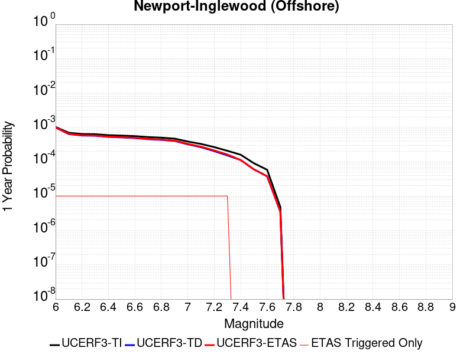 |  |

| Magnitude | 1 wk TI Prob | 1 wk TD Prob | 1 wk ETAS Prob | 1 wk ETAS/TD Gain | 1 wk ETAS Triggered Only | 1 mo TI Prob | 1 mo TD Prob | 1 mo ETAS Prob | 1 mo ETAS/TD Gain | 1 mo ETAS Triggered Only | 1 yr TI Prob | 1 yr TD Prob | 1 yr ETAS Prob | 1 yr ETAS/TD Gain | 1 yr ETAS Triggered Only | 10 yr TI Prob | 10 yr TD Prob | 10 yr ETAS Prob | 10 yr ETAS/TD Gain | 10 yr ETAS Triggered Only |
|-----|-----|-----|-----|-----|-----|-----|-----|-----|-----|-----|-----|-----|-----|-----|-----|-----|-----|-----|-----|-----|
| 6.0 | 1.9626508E-5 | 1.8965293E-5 | 1.8965293E-5 | 1.0 | 0.0 | 8.411089E-5 | 8.1277365E-5 | 8.1277365E-5 | 1.0 | 0.0 | 0.001023569 | 9.891153E-4 | 9.991054E-4 | 1.0101 | 1.0E-5 | 0.010188672 | 0.009848471 | 0.009858373 | 1.0010054 | 1.0E-5 |
| 6.1 | 1.331886E-5 | 1.2218042E-5 | 1.2218042E-5 | 1.0 | 0.0 | 5.707958E-5 | 5.2361993E-5 | 5.2361993E-5 | 1.0 | 0.0 | 6.947222E-4 | 6.3732226E-4 | 6.4731593E-4 | 1.0156807 | 1.0E-5 | 0.006925544 | 0.0063551227 | 0.0063650594 | 1.0015635 | 1.0E-5 |
| 6.2 | 1.2250852E-5 | 1.1075981E-5 | 1.1075981E-5 | 1.0 | 0.0 | 5.2502597E-5 | 4.746763E-5 | 4.746763E-5 | 1.0 | 0.0 | 6.3903164E-4 | 5.7776616E-4 | 5.877604E-4 | 1.017298 | 1.0E-5 | 0.006371971 | 0.0057627615 | 0.005772704 | 1.0017253 | 1.0E-5 |
| 6.3 | 1.2106258E-5 | 1.0918843E-5 | 1.0918843E-5 | 1.0 | 0.0 | 5.1882926E-5 | 4.6794208E-5 | 4.6794208E-5 | 1.0 | 0.0 | 6.3149154E-4 | 5.695715E-4 | 5.795658E-4 | 1.017547 | 1.0E-5 | 0.0062970007 | 0.005681234 | 0.005691177 | 1.0017502 | 1.0E-5 |
| 6.4 | 1.1348758E-5 | 1.0109316E-5 | 1.0109316E-5 | 1.0 | 0.0 | 4.8636626E-5 | 4.3324922E-5 | 4.3324922E-5 | 1.0 | 0.0 | 5.919901E-4 | 5.273541E-4 | 5.373488E-4 | 1.0189526 | 1.0E-5 | 0.005904155 | 0.0052611222 | 0.0052710697 | 1.0018908 | 1.0E-5 |
| 6.5 | 1.100837E-5 | 9.743343E-6 | 9.743343E-6 | 1.0 | 0.0 | 4.7177873E-5 | 4.175652E-5 | 4.175652E-5 | 1.0 | 0.0 | 5.7423924E-4 | 5.0826784E-4 | 5.1826274E-4 | 1.0196646 | 1.0E-5 | 0.005727576 | 0.005071145 | 0.0050810943 | 1.001962 | 1.0E-5 |
| 6.6 | 1.0634696E-5 | 9.345498E-6 | 9.345498E-6 | 1.0 | 0.0 | 4.557647E-5 | 4.0051524E-5 | 4.0051524E-5 | 1.0 | 0.0 | 5.5475225E-4 | 4.8751896E-4 | 4.975141E-4 | 1.020502 | 1.0E-5 | 0.0055336943 | 0.0048645814 | 0.0048745326 | 1.0020456 | 1.0E-5 |
| 6.7 | 9.9780855E-6 | 8.667869E-6 | 8.667869E-6 | 1.0 | 0.0 | 4.276252E-5 | 3.7147485E-5 | 3.7147485E-5 | 1.0 | 0.0 | 5.205093E-4 | 4.5217745E-4 | 4.6217293E-4 | 1.0221052 | 1.0E-5 | 0.0051929182 | 0.004512653 | 0.004522608 | 1.002206 | 1.0E-5 |
| 6.8 | 9.59546E-6 | 8.272904E-6 | 8.272904E-6 | 1.0 | 0.0 | 4.1122752E-5 | 3.5454825E-5 | 3.5454825E-5 | 1.0 | 0.0 | 5.0055445E-4 | 4.3157765E-4 | 4.4157333E-4 | 1.0231608 | 1.0E-5 | 0.004994285 | 0.0043074708 | 0.0043174275 | 1.0023116 | 1.0E-5 |
| 6.9 | 9.000614E-6 | 7.706796E-6 | 7.706796E-6 | 1.0 | 0.0 | 3.857349E-5 | 3.3028715E-5 | 3.3028715E-5 | 1.0 | 0.0 | 4.6953102E-4 | 4.0205102E-4 | 4.1204703E-4 | 1.0248624 | 1.0E-5 | 0.004685402 | 0.0040133083 | 0.004023268 | 1.0024817 | 1.0E-5 |
| 7.0 | 7.4070194E-6 | 6.148853E-6 | 6.148853E-6 | 1.0 | 0.0 | 3.1743984E-5 | 2.6351963E-5 | 2.6351963E-5 | 1.0 | 0.0 | 3.8641447E-4 | 3.2078807E-4 | 3.3078485E-4 | 1.0311632 | 1.0E-5 | 0.0038574322 | 0.0032032698 | 0.003213238 | 1.0031118 | 1.0E-5 |
| 7.1 | 6.299615E-6 | 5.0565545E-6 | 5.0565545E-6 | 1.0 | 0.0 | 2.699807E-5 | 2.1670769E-5 | 2.1670769E-5 | 1.0 | 0.0 | 3.2865192E-4 | 2.6380978E-4 | 2.7380715E-4 | 1.0378962 | 1.0E-5 | 0.003281663 | 0.002634981 | 0.0026449545 | 1.0037851 | 1.0E-5 |
| 7.2 | 5.096653E-6 | 3.8927265E-6 | 3.8927265E-6 | 1.0 | 0.0 | 2.1842614E-5 | 1.6683009E-5 | 1.6683009E-5 | 1.0 | 0.0 | 2.6590136E-4 | 2.030968E-4 | 2.1309477E-4 | 1.0492276 | 1.0E-5 | 0.0026558342 | 0.002029123 | 0.0020391028 | 1.0049182 | 1.0E-5 |
| 7.3 | 3.9753018E-6 | 2.9098735E-6 | 2.9098735E-6 | 1.0 | 0.0 | 1.7036897E-5 | 1.2470827E-5 | 1.2470827E-5 | 1.0 | 0.0 | 2.0740448E-4 | 1.5182182E-4 | 1.618203E-4 | 1.0658567 | 1.0E-5 | 0.00207211 | 0.0015171891 | 0.0015271739 | 1.0065812 | 1.0E-5 |
| 7.4 | 3.0568392E-6 | 2.1449691E-6 | 2.1449691E-6 | 1.0 | 0.0 | 1.3100675E-5 | 9.192692E-6 | 9.192692E-6 | 1.0 | 0.0 | 1.5948903E-4 | 1.11915346E-4 | 1.11915346E-4 | 1.0 | 0.0 | 0.0015937461 | 0.0011185961 | 0.0011185961 | 1.0 | 0.0 |
| 7.5 | 1.7279019E-6 | 1.1469632E-6 | 1.1469632E-6 | 1.0 | 0.0 | 7.405273E-6 | 4.9155474E-6 | 4.9155474E-6 | 1.0 | 0.0 | 9.015547E-5 | 5.9845188E-5 | 5.9845188E-5 | 1.0 | 0.0 | 9.01189E-4 | 5.982946E-4 | 5.982946E-4 | 1.0 | 0.0 |
| 7.6 | 1.1156416E-6 | 7.222953E-7 | 7.222953E-7 | 1.0 | 0.0 | 4.7813123E-6 | 3.0955478E-6 | 3.0955478E-6 | 1.0 | 0.0 | 5.821092E-5 | 3.7687667E-5 | 3.7687667E-5 | 1.0 | 0.0 | 5.8195676E-4 | 3.768151E-4 | 3.768151E-4 | 1.0 | 0.0 |
| 7.7 | 9.117973E-8 | 6.7341965E-8 | 6.7341965E-8 | 1.0 | 0.0 | 3.907702E-7 | 2.886084E-7 | 2.886084E-7 | 1.0 | 0.0 | 4.757617E-6 | 3.5138016E-6 | 3.5138016E-6 | 1.0 | 0.0 | 4.7575148E-5 | 3.513749E-5 | 3.513749E-5 | 1.0 | 0.0 |

## Pleito
*[(top)](#table-of-contents)*

| 1 Week | 1 Month | 1 Year | 10 Year |
|-----|-----|-----|-----|
| 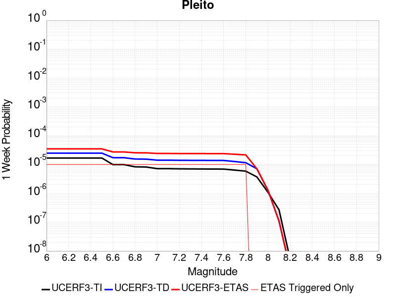 | 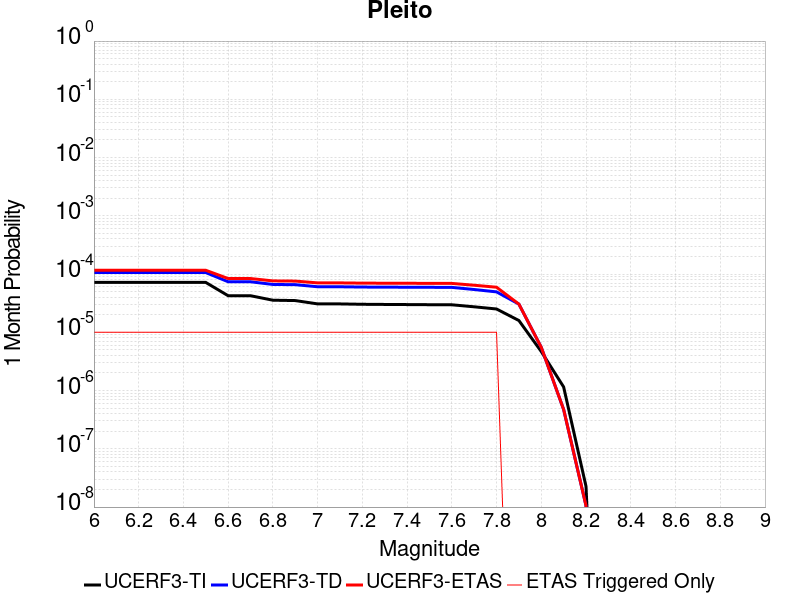 | 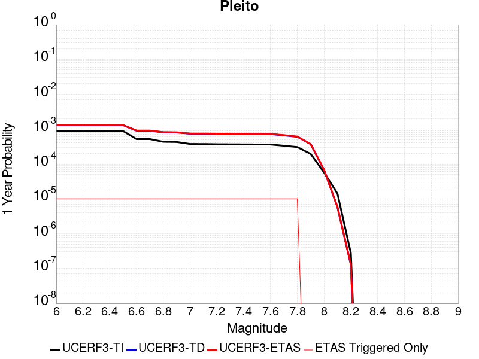 | 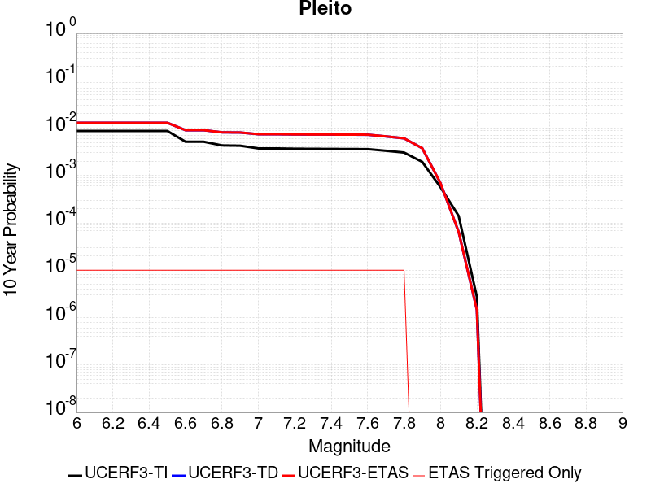 |

| Magnitude | 1 wk TI Prob | 1 wk TD Prob | 1 wk ETAS Prob | 1 wk ETAS/TD Gain | 1 wk ETAS Triggered Only | 1 mo TI Prob | 1 mo TD Prob | 1 mo ETAS Prob | 1 mo ETAS/TD Gain | 1 mo ETAS Triggered Only | 1 yr TI Prob | 1 yr TD Prob | 1 yr ETAS Prob | 1 yr ETAS/TD Gain | 1 yr ETAS Triggered Only | 10 yr TI Prob | 10 yr TD Prob | 10 yr ETAS Prob | 10 yr ETAS/TD Gain | 10 yr ETAS Triggered Only |
|-----|-----|-----|-----|-----|-----|-----|-----|-----|-----|-----|-----|-----|-----|-----|-----|-----|-----|-----|-----|-----|
| 6.0 | 1.6763008E-5 | 2.476339E-5 | 3.4763143E-5 | 1.4038119 | 1.0E-5 | 7.183948E-5 | 1.06124906E-4 | 1.1612385E-4 | 1.0942186 | 1.0E-5 | 8.742947E-4 | 0.0012913769 | 0.001301364 | 1.0077337 | 1.0E-5 | 0.00870863 | 0.012953495 | 0.012963365 | 1.000762 | 1.0E-5 |
| 6.1 | 1.6763008E-5 | 2.476339E-5 | 3.4763143E-5 | 1.4038119 | 1.0E-5 | 7.183948E-5 | 1.06124906E-4 | 1.1612385E-4 | 1.0942186 | 1.0E-5 | 8.742947E-4 | 0.0012913769 | 0.001301364 | 1.0077337 | 1.0E-5 | 0.00870863 | 0.012953495 | 0.012963365 | 1.000762 | 1.0E-5 |
| 6.2 | 1.6763008E-5 | 2.476339E-5 | 3.4763143E-5 | 1.4038119 | 1.0E-5 | 7.183948E-5 | 1.06124906E-4 | 1.1612385E-4 | 1.0942186 | 1.0E-5 | 8.742947E-4 | 0.0012913769 | 0.001301364 | 1.0077337 | 1.0E-5 | 0.00870863 | 0.012953495 | 0.012963365 | 1.000762 | 1.0E-5 |
| 6.3 | 1.6763008E-5 | 2.476339E-5 | 3.4763143E-5 | 1.4038119 | 1.0E-5 | 7.183948E-5 | 1.06124906E-4 | 1.1612385E-4 | 1.0942186 | 1.0E-5 | 8.742947E-4 | 0.0012913769 | 0.001301364 | 1.0077337 | 1.0E-5 | 0.00870863 | 0.012953495 | 0.012963365 | 1.000762 | 1.0E-5 |
| 6.4 | 1.6763008E-5 | 2.476339E-5 | 3.4763143E-5 | 1.4038119 | 1.0E-5 | 7.183948E-5 | 1.06124906E-4 | 1.1612385E-4 | 1.0942186 | 1.0E-5 | 8.742947E-4 | 0.0012913769 | 0.001301364 | 1.0077337 | 1.0E-5 | 0.00870863 | 0.012953495 | 0.012963365 | 1.000762 | 1.0E-5 |
| 6.5 | 1.6763008E-5 | 2.476339E-5 | 3.4763143E-5 | 1.4038119 | 1.0E-5 | 7.183948E-5 | 1.06124906E-4 | 1.1612385E-4 | 1.0942186 | 1.0E-5 | 8.742947E-4 | 0.0012913769 | 0.001301364 | 1.0077337 | 1.0E-5 | 0.00870863 | 0.012953495 | 0.012963365 | 1.000762 | 1.0E-5 |
| 6.6 | 9.910213E-6 | 1.7214195E-5 | 2.7214024E-5 | 1.5809059 | 1.0E-5 | 4.247165E-5 | 7.377306E-5 | 8.377232E-5 | 1.1355408 | 1.0E-5 | 5.169696E-4 | 8.978206E-4 | 9.078116E-4 | 1.0111281 | 1.0E-5 | 0.0051576863 | 0.009050315 | 0.0090602245 | 1.0010949 | 1.0E-5 |
| 6.7 | 9.910213E-6 | 1.7214195E-5 | 2.7214024E-5 | 1.5809059 | 1.0E-5 | 4.247165E-5 | 7.377306E-5 | 8.377232E-5 | 1.1355408 | 1.0E-5 | 5.169696E-4 | 8.978206E-4 | 9.078116E-4 | 1.0111281 | 1.0E-5 | 0.0051576863 | 0.009050315 | 0.0090602245 | 1.0010949 | 1.0E-5 |
| 6.8 | 8.300162E-6 | 1.5473808E-5 | 2.5473653E-5 | 1.6462433 | 1.0E-5 | 3.557164E-5 | 6.631464E-5 | 7.631398E-5 | 1.1507863 | 1.0E-5 | 4.3299864E-4 | 8.0708315E-4 | 8.170751E-4 | 1.0123802 | 1.0E-5 | 0.004321559 | 0.008149754 | 0.008159673 | 1.001217 | 1.0E-5 |
| 6.9 | 8.183114E-6 | 1.5345024E-5 | 2.534487E-5 | 1.651667 | 1.0E-5 | 3.5070017E-5 | 6.576274E-5 | 7.576208E-5 | 1.1520518 | 1.0E-5 | 4.2689382E-4 | 8.0036867E-4 | 8.1036065E-4 | 1.0124842 | 1.0E-5 | 0.0042607468 | 0.008083099 | 0.008093018 | 1.0012271 | 1.0E-5 |
| 7.0 | 7.1748823E-6 | 1.413199E-5 | 2.4131848E-5 | 1.7076044 | 1.0E-5 | 3.0749135E-5 | 6.0564267E-5 | 7.056366E-5 | 1.1651039 | 1.0E-5 | 3.743064E-4 | 7.3712104E-4 | 7.4711366E-4 | 1.0135562 | 1.0E-5 | 0.0037367654 | 0.0074546537 | 0.007464579 | 1.0013314 | 1.0E-5 |
| 7.1 | 7.1671807E-6 | 1.412236E-5 | 2.4122219E-5 | 1.708087 | 1.0E-5 | 3.0716128E-5 | 6.0522998E-5 | 7.0522394E-5 | 1.1652164 | 1.0E-5 | 3.7390468E-4 | 7.3661894E-4 | 7.4661156E-4 | 1.0135655 | 1.0E-5 | 0.0037327618 | 0.007449666 | 0.0074595916 | 1.0013323 | 1.0E-5 |
| 7.2 | 7.0649667E-6 | 1.396965E-5 | 2.3969511E-5 | 1.7158276 | 1.0E-5 | 3.0278077E-5 | 5.986856E-5 | 6.986796E-5 | 1.1670226 | 1.0E-5 | 3.6857324E-4 | 7.286564E-4 | 7.3864916E-4 | 1.0137138 | 1.0E-5 | 0.0036796255 | 0.0073704203 | 0.007380347 | 1.0013468 | 1.0E-5 |
| 7.3 | 7.02082E-6 | 1.3913106E-5 | 2.3912968E-5 | 1.7187368 | 1.0E-5 | 3.008888E-5 | 5.9626236E-5 | 6.962564E-5 | 1.1677014 | 1.0E-5 | 3.6627054E-4 | 7.2570815E-4 | 7.357009E-4 | 1.0137696 | 1.0E-5 | 0.0036566744 | 0.007340922 | 0.007350849 | 1.0013522 | 1.0E-5 |
| 7.4 | 6.987146E-6 | 1.3872668E-5 | 2.387253E-5 | 1.7208319 | 1.0E-5 | 2.9944567E-5 | 5.9452937E-5 | 6.945234E-5 | 1.1681902 | 1.0E-5 | 3.6451413E-4 | 7.2359963E-4 | 7.3359243E-4 | 1.0138098 | 1.0E-5 | 0.0036391679 | 0.0073198583 | 0.0073297853 | 1.0013561 | 1.0E-5 |
| 7.5 | 6.9494554E-6 | 1.3829574E-5 | 2.3829434E-5 | 1.7230781 | 1.0E-5 | 2.9783041E-5 | 5.9268255E-5 | 6.926766E-5 | 1.1687144 | 1.0E-5 | 3.625482E-4 | 7.2135264E-4 | 7.3134544E-4 | 1.0138528 | 1.0E-5 | 0.0036195726 | 0.0072974865 | 0.0073074135 | 1.0013603 | 1.0E-5 |
| 7.6 | 6.92694E-6 | 1.3788687E-5 | 2.3788549E-5 | 1.7252222 | 1.0E-5 | 2.9686547E-5 | 5.909304E-5 | 6.909245E-5 | 1.1692147 | 1.0E-5 | 3.6137376E-4 | 7.192208E-4 | 7.292136E-4 | 1.013894 | 1.0E-5 | 0.0036078666 | 0.00727624 | 0.007286167 | 1.0013644 | 1.0E-5 |
| 7.7 | 6.395867E-6 | 1.266776E-5 | 2.2667633E-5 | 1.7893956 | 1.0E-5 | 2.741057E-5 | 5.428927E-5 | 6.428873E-5 | 1.1841885 | 1.0E-5 | 3.336726E-4 | 6.6077174E-4 | 6.707651E-4 | 1.0151238 | 1.0E-5 | 0.0033317201 | 0.006694865 | 0.006704798 | 1.0014837 | 1.0E-5 |
| 7.8 | 5.8664327E-6 | 1.1535436E-5 | 2.1535321E-5 | 1.866884 | 1.0E-5 | 2.5141611E-5 | 4.9436647E-5 | 5.943615E-5 | 1.2022691 | 1.0E-5 | 3.060561E-4 | 6.017252E-4 | 6.1171915E-4 | 1.0166088 | 1.0E-5 | 0.0030563495 | 0.00610041 | 0.006110349 | 1.0016292 | 1.0E-5 |
| 7.9 | 3.7167474E-6 | 7.113836E-6 | 7.113836E-6 | 1.0 | 0.0 | 1.592882E-5 | 3.0487514E-5 | 3.0487514E-5 | 1.0 | 0.0 | 1.9391612E-4 | 3.711224E-4 | 3.711224E-4 | 1.0 | 0.0 | 0.0019374699 | 0.0037672876 | 0.0037672876 | 1.0 | 0.0 |
| 8.0 | 1.0903841E-6 | 1.2877698E-6 | 1.2877698E-6 | 1.0 | 0.0 | 4.6730665E-6 | 5.5190017E-6 | 5.5190017E-6 | 1.0 | 0.0 | 5.68931E-5 | 6.719179E-5 | 6.719179E-5 | 1.0 | 0.0 | 5.6878536E-4 | 6.9408386E-4 | 6.9408386E-4 | 1.0 | 0.0 |
| 8.1 | 2.6894583E-7 | 1.1053666E-7 | 1.1053666E-7 | 1.0 | 0.0 | 1.1526245E-6 | 4.7372845E-7 | 4.7372845E-7 | 1.0 | 0.0 | 1.4033113E-5 | 5.767629E-6 | 5.767629E-6 | 1.0 | 0.0 | 1.4032227E-4 | 6.4533284E-5 | 6.4533284E-5 | 1.0 | 0.0 |
| 8.2 | 5.2967013E-9 | 2.4562583E-9 | 2.4562583E-9 | 1.0 | 0.0 | 2.2700148E-8 | 1.0526822E-8 | 1.0526822E-8 | 1.0 | 0.0 | 2.7637427E-7 | 1.2816405E-7 | 1.2816405E-7 | 1.0 | 0.0 | 2.7637393E-6 | 1.4582747E-6 | 1.4582747E-6 | 1.0 | 0.0 |

## Kern Canyon (South Kern) 2011
*[(top)](#table-of-contents)*

| 1 Week | 1 Month | 1 Year | 10 Year |
|-----|-----|-----|-----|
| 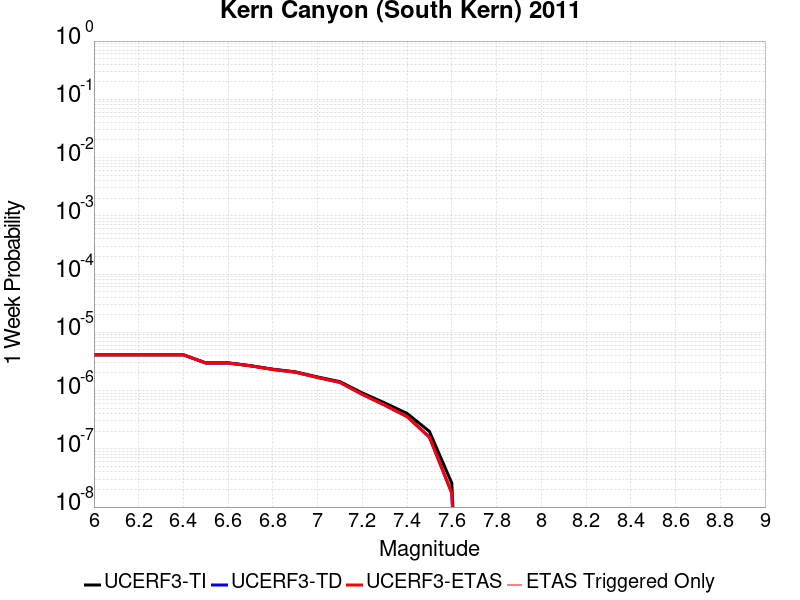 |  | 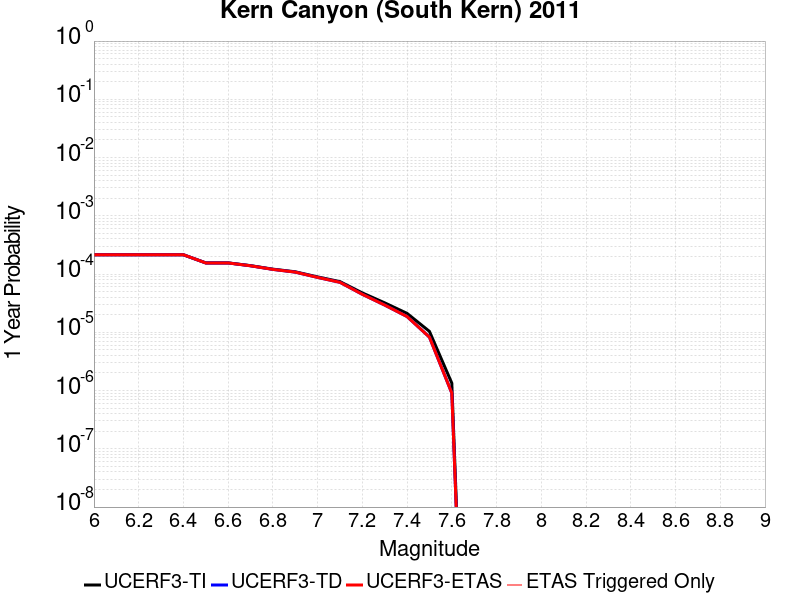 | 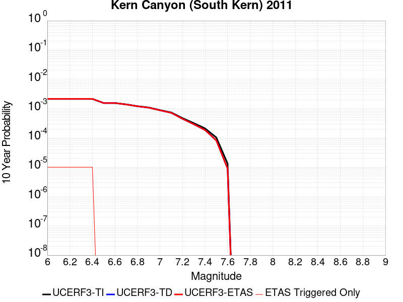 |

| Magnitude | 1 wk TI Prob | 1 wk TD Prob | 1 wk ETAS Prob | 1 wk ETAS/TD Gain | 1 wk ETAS Triggered Only | 1 mo TI Prob | 1 mo TD Prob | 1 mo ETAS Prob | 1 mo ETAS/TD Gain | 1 mo ETAS Triggered Only | 1 yr TI Prob | 1 yr TD Prob | 1 yr ETAS Prob | 1 yr ETAS/TD Gain | 1 yr ETAS Triggered Only | 10 yr TI Prob | 10 yr TD Prob | 10 yr ETAS Prob | 10 yr ETAS/TD Gain | 10 yr ETAS Triggered Only |
|-----|-----|-----|-----|-----|-----|-----|-----|-----|-----|-----|-----|-----|-----|-----|-----|-----|-----|-----|-----|-----|
| 6.0 | 4.105075E-6 | 4.1137237E-6 | 4.1137237E-6 | 1.0 | 0.0 | 1.7593058E-5 | 1.763013E-5 | 1.763013E-5 | 1.0 | 0.0 | 2.1417443E-4 | 2.1462631E-4 | 2.1462631E-4 | 1.0 | 0.0 | 0.0021396813 | 0.0021442543 | 0.002154233 | 1.0046536 | 1.0E-5 |
| 6.1 | 4.105075E-6 | 4.1137237E-6 | 4.1137237E-6 | 1.0 | 0.0 | 1.7593058E-5 | 1.763013E-5 | 1.763013E-5 | 1.0 | 0.0 | 2.1417443E-4 | 2.1462631E-4 | 2.1462631E-4 | 1.0 | 0.0 | 0.0021396813 | 0.0021442543 | 0.002154233 | 1.0046536 | 1.0E-5 |
| 6.2 | 4.105075E-6 | 4.1137237E-6 | 4.1137237E-6 | 1.0 | 0.0 | 1.7593058E-5 | 1.763013E-5 | 1.763013E-5 | 1.0 | 0.0 | 2.1417443E-4 | 2.1462631E-4 | 2.1462631E-4 | 1.0 | 0.0 | 0.0021396813 | 0.0021442543 | 0.002154233 | 1.0046536 | 1.0E-5 |
| 6.3 | 4.105075E-6 | 4.1137237E-6 | 4.1137237E-6 | 1.0 | 0.0 | 1.7593058E-5 | 1.763013E-5 | 1.763013E-5 | 1.0 | 0.0 | 2.1417443E-4 | 2.1462631E-4 | 2.1462631E-4 | 1.0 | 0.0 | 0.0021396813 | 0.0021442543 | 0.002154233 | 1.0046536 | 1.0E-5 |
| 6.4 | 4.105075E-6 | 4.1137237E-6 | 4.1137237E-6 | 1.0 | 0.0 | 1.7593058E-5 | 1.763013E-5 | 1.763013E-5 | 1.0 | 0.0 | 2.1417443E-4 | 2.1462631E-4 | 2.1462631E-4 | 1.0 | 0.0 | 0.0021396813 | 0.0021442543 | 0.002154233 | 1.0046536 | 1.0E-5 |
| 6.5 | 2.9849807E-6 | 2.9731525E-6 | 2.9731525E-6 | 1.0 | 0.0 | 1.2792712E-5 | 1.2742021E-5 | 1.2742021E-5 | 1.0 | 0.0 | 1.5574014E-4 | 1.5512321E-4 | 1.5512321E-4 | 1.0 | 0.0 | 0.0015563103 | 0.0015501645 | 0.0015501645 | 1.0 | 0.0 |
| 6.6 | 2.9849807E-6 | 2.9731525E-6 | 2.9731525E-6 | 1.0 | 0.0 | 1.2792712E-5 | 1.2742021E-5 | 1.2742021E-5 | 1.0 | 0.0 | 1.5574014E-4 | 1.5512321E-4 | 1.5512321E-4 | 1.0 | 0.0 | 0.0015563103 | 0.0015501645 | 0.0015501645 | 1.0 | 0.0 |
| 6.7 | 2.6756725E-6 | 2.6582188E-6 | 2.6582188E-6 | 1.0 | 0.0 | 1.1467117E-5 | 1.1392317E-5 | 1.1392317E-5 | 1.0 | 0.0 | 1.396032E-4 | 1.3869273E-4 | 1.3869273E-4 | 1.0 | 0.0 | 0.0013951553 | 0.0013860727 | 0.0013860727 | 1.0 | 0.0 |
| 6.8 | 2.3283721E-6 | 2.304777E-6 | 2.304777E-6 | 1.0 | 0.0 | 9.9787E-6 | 9.877579E-6 | 9.877579E-6 | 1.0 | 0.0 | 1.214839E-4 | 1.2025296E-4 | 1.2025296E-4 | 1.0 | 0.0 | 0.001214175 | 0.0012018863 | 0.0012018863 | 1.0 | 0.0 |
| 6.9 | 2.0972677E-6 | 2.0696393E-6 | 2.0696393E-6 | 1.0 | 0.0 | 8.988259E-6 | 8.869853E-6 | 8.869853E-6 | 1.0 | 0.0 | 1.0942656E-4 | 1.0798517E-4 | 1.0798517E-4 | 1.0 | 0.0 | 0.0010937268 | 0.0010793328 | 0.0010793328 | 1.0 | 0.0 |
| 7.0 | 1.7132242E-6 | 1.678702E-6 | 1.678702E-6 | 1.0 | 0.0 | 7.3423685E-6 | 7.194418E-6 | 7.194418E-6 | 1.0 | 0.0 | 8.938967E-5 | 8.758855E-5 | 8.758855E-5 | 1.0 | 0.0 | 8.935372E-4 | 8.7554415E-4 | 8.7554415E-4 | 1.0 | 0.0 |
| 7.1 | 1.4215541E-6 | 1.3815738E-6 | 1.3815738E-6 | 1.0 | 0.0 | 6.0923603E-6 | 5.9210174E-6 | 5.9210174E-6 | 1.0 | 0.0 | 7.417196E-5 | 7.2086026E-5 | 7.2086026E-5 | 1.0 | 0.0 | 7.414721E-4 | 7.206291E-4 | 7.206291E-4 | 1.0 | 0.0 |
| 7.2 | 9.097853E-7 | 8.603764E-7 | 8.603764E-7 | 1.0 | 0.0 | 3.899074E-6 | 3.6873223E-6 | 3.6873223E-6 | 1.0 | 0.0 | 4.7470192E-5 | 4.4892236E-5 | 4.4892236E-5 | 1.0 | 0.0 | 4.7460053E-4 | 4.4883275E-4 | 4.4883275E-4 | 1.0 | 0.0 |
| 7.3 | 6.144169E-7 | 5.628195E-7 | 5.628195E-7 | 1.0 | 0.0 | 2.6332125E-6 | 2.4120814E-6 | 2.4120814E-6 | 1.0 | 0.0 | 3.205889E-5 | 2.93667E-5 | 2.93667E-5 | 1.0 | 0.0 | 3.2054266E-4 | 2.936287E-4 | 2.936287E-4 | 1.0 | 0.0 |
| 7.4 | 4.049844E-7 | 3.572822E-7 | 3.572822E-7 | 1.0 | 0.0 | 1.7356463E-6 | 1.5312086E-6 | 1.5312086E-6 | 1.0 | 0.0 | 2.1131287E-5 | 1.8642308E-5 | 1.8642308E-5 | 1.0 | 0.0 | 2.1129279E-4 | 1.8640768E-4 | 1.8640768E-4 | 1.0 | 0.0 |
| 7.5 | 1.9871162E-7 | 1.583036E-7 | 1.583036E-7 | 1.0 | 0.0 | 8.5162094E-7 | 6.784439E-7 | 6.784439E-7 | 1.0 | 0.0 | 1.0368436E-5 | 8.260024E-6 | 8.260024E-6 | 1.0 | 0.0 | 1.0367952E-4 | 8.259725E-5 | 8.259725E-5 | 1.0 | 0.0 |
| 7.6 | 2.572245E-8 | 1.7352638E-8 | 1.7352638E-8 | 1.0 | 0.0 | 1.10239064E-7 | 7.436845E-8 | 7.436845E-8 | 1.0 | 0.0 | 1.3421597E-6 | 9.054355E-7 | 9.054355E-7 | 1.0 | 0.0 | 1.3421517E-5 | 9.0543235E-6 | 9.0543235E-6 | 1.0 | 0.0 |

## Los Alamos 2011 CFM
*[(top)](#table-of-contents)*

| 1 Week | 1 Month | 1 Year | 10 Year |
|-----|-----|-----|-----|
|  |  |  | 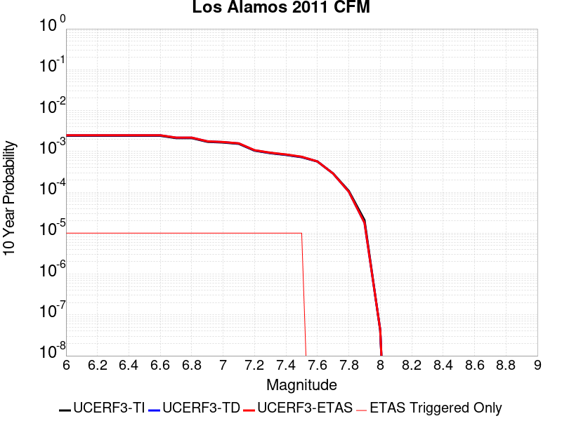 |

| Magnitude | 1 wk TI Prob | 1 wk TD Prob | 1 wk ETAS Prob | 1 wk ETAS/TD Gain | 1 wk ETAS Triggered Only | 1 mo TI Prob | 1 mo TD Prob | 1 mo ETAS Prob | 1 mo ETAS/TD Gain | 1 mo ETAS Triggered Only | 1 yr TI Prob | 1 yr TD Prob | 1 yr ETAS Prob | 1 yr ETAS/TD Gain | 1 yr ETAS Triggered Only | 10 yr TI Prob | 10 yr TD Prob | 10 yr ETAS Prob | 10 yr ETAS/TD Gain | 10 yr ETAS Triggered Only |
|-----|-----|-----|-----|-----|-----|-----|-----|-----|-----|-----|-----|-----|-----|-----|-----|-----|-----|-----|-----|-----|
| 6.0 | 4.6284417E-6 | 4.751729E-6 | 4.751729E-6 | 1.0 | 0.0 | 1.9836029E-5 | 2.0364405E-5 | 2.0364405E-5 | 1.0 | 0.0 | 2.4147688E-4 | 2.4791018E-4 | 2.4791018E-4 | 1.0 | 0.0 | 0.0024121467 | 0.0024765104 | 0.0024864855 | 1.004028 | 1.0E-5 |
| 6.1 | 4.6284417E-6 | 4.751729E-6 | 4.751729E-6 | 1.0 | 0.0 | 1.9836029E-5 | 2.0364405E-5 | 2.0364405E-5 | 1.0 | 0.0 | 2.4147688E-4 | 2.4791018E-4 | 2.4791018E-4 | 1.0 | 0.0 | 0.0024121467 | 0.0024765104 | 0.0024864855 | 1.004028 | 1.0E-5 |
| 6.2 | 4.6284417E-6 | 4.751729E-6 | 4.751729E-6 | 1.0 | 0.0 | 1.9836029E-5 | 2.0364405E-5 | 2.0364405E-5 | 1.0 | 0.0 | 2.4147688E-4 | 2.4791018E-4 | 2.4791018E-4 | 1.0 | 0.0 | 0.0024121467 | 0.0024765104 | 0.0024864855 | 1.004028 | 1.0E-5 |
| 6.3 | 4.6284417E-6 | 4.751729E-6 | 4.751729E-6 | 1.0 | 0.0 | 1.9836029E-5 | 2.0364405E-5 | 2.0364405E-5 | 1.0 | 0.0 | 2.4147688E-4 | 2.4791018E-4 | 2.4791018E-4 | 1.0 | 0.0 | 0.0024121467 | 0.0024765104 | 0.0024864855 | 1.004028 | 1.0E-5 |
| 6.4 | 4.6284417E-6 | 4.751729E-6 | 4.751729E-6 | 1.0 | 0.0 | 1.9836029E-5 | 2.0364405E-5 | 2.0364405E-5 | 1.0 | 0.0 | 2.4147688E-4 | 2.4791018E-4 | 2.4791018E-4 | 1.0 | 0.0 | 0.0024121467 | 0.0024765104 | 0.0024864855 | 1.004028 | 1.0E-5 |
| 6.5 | 4.6284417E-6 | 4.751729E-6 | 4.751729E-6 | 1.0 | 0.0 | 1.9836029E-5 | 2.0364405E-5 | 2.0364405E-5 | 1.0 | 0.0 | 2.4147688E-4 | 2.4791018E-4 | 2.4791018E-4 | 1.0 | 0.0 | 0.0024121467 | 0.0024765104 | 0.0024864855 | 1.004028 | 1.0E-5 |
| 6.6 | 4.6284417E-6 | 4.751729E-6 | 4.751729E-6 | 1.0 | 0.0 | 1.9836029E-5 | 2.0364405E-5 | 2.0364405E-5 | 1.0 | 0.0 | 2.4147688E-4 | 2.4791018E-4 | 2.4791018E-4 | 1.0 | 0.0 | 0.0024121467 | 0.0024765104 | 0.0024864855 | 1.004028 | 1.0E-5 |
| 6.7 | 4.062321E-6 | 4.166347E-6 | 4.166347E-6 | 1.0 | 0.0 | 1.7409831E-5 | 1.785566E-5 | 1.785566E-5 | 1.0 | 0.0 | 2.1194408E-4 | 2.173725E-4 | 2.173725E-4 | 1.0 | 0.0 | 0.0021174205 | 0.0021717483 | 0.0021817267 | 1.0045946 | 1.0E-5 |
| 6.8 | 4.062321E-6 | 4.166347E-6 | 4.166347E-6 | 1.0 | 0.0 | 1.7409831E-5 | 1.785566E-5 | 1.785566E-5 | 1.0 | 0.0 | 2.1194408E-4 | 2.173725E-4 | 2.173725E-4 | 1.0 | 0.0 | 0.0021174205 | 0.0021717483 | 0.0021817267 | 1.0045946 | 1.0E-5 |
| 6.9 | 3.2936077E-6 | 3.372957E-6 | 3.372957E-6 | 1.0 | 0.0 | 1.4115385E-5 | 1.4455455E-5 | 1.4455455E-5 | 1.0 | 0.0 | 1.7184127E-4 | 1.759819E-4 | 1.759819E-4 | 1.0 | 0.0 | 0.0017170844 | 0.0017585179 | 0.0017685003 | 1.0056766 | 1.0E-5 |
| 7.0 | 3.1687898E-6 | 3.2448147E-6 | 3.2448147E-6 | 1.0 | 0.0 | 1.3580457E-5 | 1.390628E-5 | 1.390628E-5 | 1.0 | 0.0 | 1.6532952E-4 | 1.6929673E-4 | 1.6929673E-4 | 1.0 | 0.0 | 0.0016520657 | 0.0016917692 | 0.0017017523 | 1.005901 | 1.0E-5 |
| 7.1 | 2.9379228E-6 | 3.0073252E-6 | 3.0073252E-6 | 1.0 | 0.0 | 1.25910365E-5 | 1.2888478E-5 | 1.2888478E-5 | 1.0 | 0.0 | 1.5328509E-4 | 1.5690683E-4 | 1.5690683E-4 | 1.0 | 0.0 | 0.001531794 | 0.0015680495 | 0.0015780339 | 1.0063673 | 1.0E-5 |
| 7.2 | 2.0020686E-6 | 2.04163E-6 | 2.04163E-6 | 1.0 | 0.0 | 8.580266E-6 | 8.749814E-6 | 8.749814E-6 | 1.0 | 0.0 | 1.0445973E-4 | 1.0652382E-4 | 1.0652382E-4 | 1.0 | 0.0 | 0.0010441064 | 0.001064732 | 0.0010747213 | 1.009382 | 1.0E-5 |
| 7.3 | 1.7364243E-6 | 1.7678807E-6 | 1.7678807E-6 | 1.0 | 0.0 | 7.441797E-6 | 7.5766097E-6 | 7.5766097E-6 | 1.0 | 0.0 | 9.0600115E-5 | 9.2241346E-5 | 9.2241346E-5 | 1.0 | 0.0 | 9.0563187E-4 | 9.2203374E-4 | 9.3202456E-4 | 1.0108356 | 1.0E-5 |
| 7.4 | 1.5718434E-6 | 1.5983182E-6 | 1.5983182E-6 | 1.0 | 0.0 | 6.7364545E-6 | 6.8499176E-6 | 6.8499176E-6 | 1.0 | 0.0 | 8.201325E-5 | 8.339458E-5 | 8.339458E-5 | 1.0 | 0.0 | 8.198299E-4 | 8.3363586E-4 | 8.4362755E-4 | 1.0119857 | 1.0E-5 |
| 7.5 | 1.3841119E-6 | 1.4042799E-6 | 1.4042799E-6 | 1.0 | 0.0 | 5.9318945E-6 | 6.018329E-6 | 6.018329E-6 | 1.0 | 0.0 | 7.221842E-5 | 7.327072E-5 | 7.327072E-5 | 1.0 | 0.0 | 7.2194956E-4 | 7.324685E-4 | 7.424612E-4 | 1.0136424 | 1.0E-5 |
| 7.6 | 1.0843726E-6 | 1.0934432E-6 | 1.0934432E-6 | 1.0 | 0.0 | 4.647303E-6 | 4.6861765E-6 | 4.6861765E-6 | 1.0 | 0.0 | 5.6579443E-5 | 5.7052734E-5 | 5.7052734E-5 | 1.0 | 0.0 | 5.656504E-4 | 5.7038345E-4 | 5.7038345E-4 | 1.0 | 0.0 |
| 7.7 | 5.544814E-7 | 5.501878E-7 | 5.501878E-7 | 1.0 | 0.0 | 2.3763469E-6 | 2.3579455E-6 | 2.3579455E-6 | 1.0 | 0.0 | 2.8931638E-5 | 2.8707609E-5 | 2.8707609E-5 | 1.0 | 0.0 | 2.8927872E-4 | 2.8703918E-4 | 2.8703918E-4 | 1.0 | 0.0 |
| 7.8 | 2.0707465E-7 | 1.977857E-7 | 1.977857E-7 | 1.0 | 0.0 | 8.874625E-7 | 8.476527E-7 | 8.476527E-7 | 1.0 | 0.0 | 1.08048025E-5 | 1.0320123E-5 | 1.0320123E-5 | 1.0 | 0.0 | 1.0804277E-4 | 1.03196486E-4 | 1.03196486E-4 | 1.0 | 0.0 |
| 7.9 | 3.9821284E-8 | 3.433149E-8 | 3.433149E-8 | 1.0 | 0.0 | 1.7066264E-7 | 1.4713495E-7 | 1.4713495E-7 | 1.0 | 0.0 | 2.0778157E-6 | 1.7913666E-6 | 1.7913666E-6 | 1.0 | 0.0 | 2.0777963E-5 | 1.7913528E-5 | 1.7913528E-5 | 1.0 | 0.0 |
| 8.0 | 7.880441E-11 | 8.235301E-11 | 8.235301E-11 | 1.0 | 0.0 | 3.3773329E-10 | 3.5294168E-10 | 3.5294168E-10 | 1.0 | 0.0 | 4.1119033E-9 | 4.2970645E-9 | 4.2970645E-9 | 1.0 | 0.0 | 4.1119034E-8 | 4.2970644E-8 | 4.2970644E-8 | 1.0 | 0.0 |

## San Andreas (San Gorgonio Pass-Garnet HIll)
*[(top)](#table-of-contents)*

| 1 Week | 1 Month | 1 Year | 10 Year |
|-----|-----|-----|-----|
| 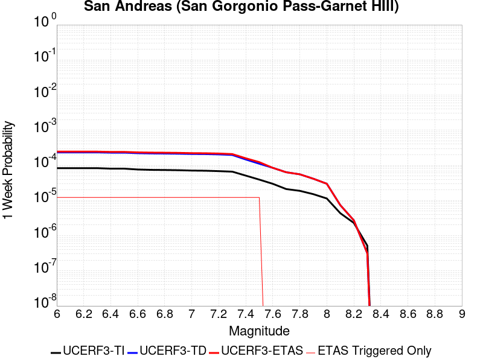 | 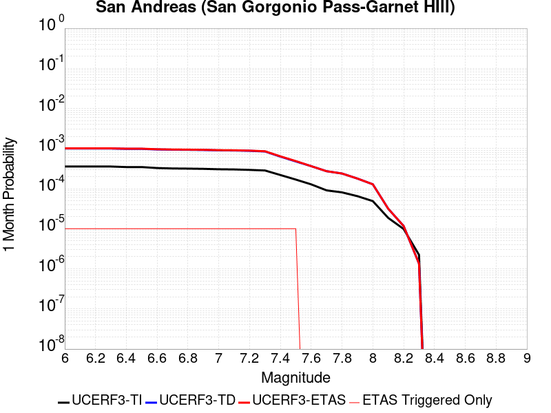 | 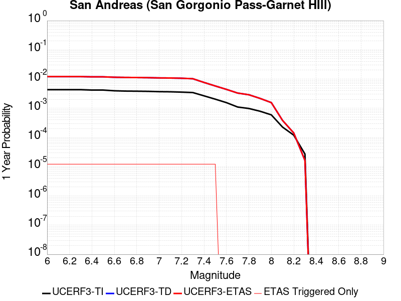 | 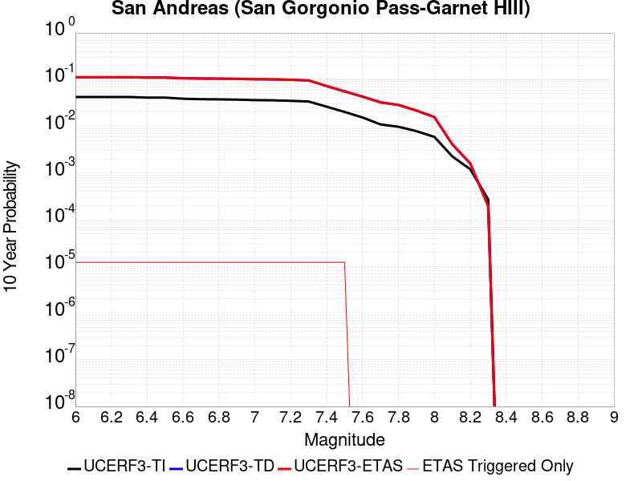 |

| Magnitude | 1 wk TI Prob | 1 wk TD Prob | 1 wk ETAS Prob | 1 wk ETAS/TD Gain | 1 wk ETAS Triggered Only | 1 mo TI Prob | 1 mo TD Prob | 1 mo ETAS Prob | 1 mo ETAS/TD Gain | 1 mo ETAS Triggered Only | 1 yr TI Prob | 1 yr TD Prob | 1 yr ETAS Prob | 1 yr ETAS/TD Gain | 1 yr ETAS Triggered Only | 10 yr TI Prob | 10 yr TD Prob | 10 yr ETAS Prob | 10 yr ETAS/TD Gain | 10 yr ETAS Triggered Only |
|-----|-----|-----|-----|-----|-----|-----|-----|-----|-----|-----|-----|-----|-----|-----|-----|-----|-----|-----|-----|-----|
| 6.0 | 8.31567E-5 | 2.3378068E-4 | 2.4377834E-4 | 1.0427651 | 1.0E-5 | 3.5633717E-4 | 0.0010015318 | 0.0010115219 | 1.0099747 | 1.0E-5 | 0.004329778 | 0.0121253645 | 0.012135244 | 1.0008147 | 1.0E-5 | 0.042463828 | 0.11255738 | 0.112566255 | 1.0000788 | 1.0E-5 |
| 6.1 | 8.31567E-5 | 2.3378068E-4 | 2.4377834E-4 | 1.0427651 | 1.0E-5 | 3.5633717E-4 | 0.0010015318 | 0.0010115219 | 1.0099747 | 1.0E-5 | 0.004329778 | 0.0121253645 | 0.012135244 | 1.0008147 | 1.0E-5 | 0.042463828 | 0.11255738 | 0.112566255 | 1.0000788 | 1.0E-5 |
| 6.2 | 8.31567E-5 | 2.3378068E-4 | 2.4377834E-4 | 1.0427651 | 1.0E-5 | 3.5633717E-4 | 0.0010015318 | 0.0010115219 | 1.0099747 | 1.0E-5 | 0.004329778 | 0.0121253645 | 0.012135244 | 1.0008147 | 1.0E-5 | 0.042463828 | 0.11255738 | 0.112566255 | 1.0000788 | 1.0E-5 |
| 6.3 | 8.31567E-5 | 2.3378068E-4 | 2.4377834E-4 | 1.0427651 | 1.0E-5 | 3.5633717E-4 | 0.0010015318 | 0.0010115219 | 1.0099747 | 1.0E-5 | 0.004329778 | 0.0121253645 | 0.012135244 | 1.0008147 | 1.0E-5 | 0.042463828 | 0.11255738 | 0.112566255 | 1.0000788 | 1.0E-5 |
| 6.4 | 8.059055E-5 | 2.2935575E-4 | 2.3935345E-4 | 1.0435904 | 1.0E-5 | 3.4534236E-4 | 9.825854E-4 | 9.925755E-4 | 1.0101672 | 1.0E-5 | 0.0041964394 | 0.011897563 | 0.011907444 | 1.0008305 | 1.0E-5 | 0.041180745 | 0.11053844 | 0.110547334 | 1.0000805 | 1.0E-5 |
| 6.5 | 8.059055E-5 | 2.2935575E-4 | 2.3935345E-4 | 1.0435904 | 1.0E-5 | 3.4534236E-4 | 9.825854E-4 | 9.925755E-4 | 1.0101672 | 1.0E-5 | 0.0041964394 | 0.011897563 | 0.011907444 | 1.0008305 | 1.0E-5 | 0.041180745 | 0.11053844 | 0.110547334 | 1.0000805 | 1.0E-5 |
| 6.6 | 7.619237E-5 | 2.2180163E-4 | 2.3179941E-4 | 1.0450753 | 1.0E-5 | 3.2649786E-4 | 9.502344E-4 | 9.602249E-4 | 1.0105137 | 1.0E-5 | 0.0039678677 | 0.01150828 | 0.0115181655 | 1.0008589 | 1.0E-5 | 0.03897764 | 0.1070749 | 0.10708383 | 1.0000834 | 1.0E-5 |
| 6.7 | 7.440636E-5 | 2.1855978E-4 | 2.285576E-4 | 1.0457441 | 1.0E-5 | 3.188454E-4 | 9.363508E-4 | 9.4634143E-4 | 1.0106697 | 1.0E-5 | 0.0038750346 | 0.011341016 | 0.011350902 | 1.0008718 | 1.0E-5 | 0.038081564 | 0.10558336 | 0.10559231 | 1.0000848 | 1.0E-5 |
| 6.8 | 7.3735864E-5 | 2.1703144E-4 | 2.2702926E-4 | 1.0460663 | 1.0E-5 | 3.1597257E-4 | 9.298054E-4 | 9.397961E-4 | 1.0107449 | 1.0E-5 | 0.0038401815 | 0.011262154 | 0.011272041 | 1.000878 | 1.0E-5 | 0.03774495 | 0.10488491 | 0.104893856 | 1.0000854 | 1.0E-5 |
| 6.9 | 7.27575E-5 | 2.1472113E-4 | 2.2471898E-4 | 1.0465621 | 1.0E-5 | 3.117806E-4 | 9.1991114E-4 | 9.2990196E-4 | 1.0108606 | 1.0E-5 | 0.003789323 | 0.01114293 | 0.011152819 | 1.0008874 | 1.0E-5 | 0.037253562 | 0.10383277 | 0.10384173 | 1.0000863 | 1.0E-5 |
| 7.0 | 7.102591E-5 | 2.1056154E-4 | 2.2055944E-4 | 1.047482 | 1.0E-5 | 3.0436125E-4 | 9.0209674E-4 | 9.1208774E-4 | 1.0110753 | 1.0E-5 | 0.003699303 | 0.010928233 | 0.010938124 | 1.000905 | 1.0E-5 | 0.03638325 | 0.10193441 | 0.10194339 | 1.0000881 | 1.0E-5 |
| 7.1 | 7.028513E-5 | 2.0891799E-4 | 2.189159E-4 | 1.0478556 | 1.0E-5 | 3.0118722E-4 | 8.950578E-4 | 9.050488E-4 | 1.0111625 | 1.0E-5 | 0.0036607897 | 0.010843391 | 0.010853282 | 1.0009122 | 1.0E-5 | 0.036010686 | 0.10117731 | 0.1011863 | 1.0000888 | 1.0E-5 |
| 7.2 | 6.8498244E-5 | 2.0499669E-4 | 2.1499464E-4 | 1.0487713 | 1.0E-5 | 2.9353087E-4 | 8.782636E-4 | 8.8825484E-4 | 1.0113761 | 1.0E-5 | 0.003567883 | 0.010640934 | 0.010650828 | 1.0009297 | 1.0E-5 | 0.035111405 | 0.09936919 | 0.0993782 | 1.0000906 | 1.0E-5 |
| 7.3 | 6.622592E-5 | 1.9727086E-4 | 2.0726888E-4 | 1.0506817 | 1.0E-5 | 2.8379448E-4 | 8.451747E-4 | 8.551663E-4 | 1.0118219 | 1.0E-5 | 0.0034497243 | 0.010241933 | 0.01025183 | 1.0009664 | 1.0E-5 | 0.033966612 | 0.09586687 | 0.09587591 | 1.0000943 | 1.0E-5 |
| 7.4 | 5.1050705E-5 | 1.4687212E-4 | 1.5687065E-4 | 1.0680765 | 1.0E-5 | 2.1877038E-4 | 6.29301E-4 | 6.392947E-4 | 1.0158807 | 1.0E-5 | 0.002660276 | 0.007635016 | 0.0076449397 | 1.0012997 | 1.0E-5 | 0.02628654 | 0.07285434 | 0.072863616 | 1.0001273 | 1.0E-5 |
| 7.5 | 3.9302922E-5 | 1.1130129E-4 | 1.21300174E-4 | 1.0898362 | 1.0E-5 | 1.6843023E-4 | 4.7691865E-4 | 4.8691386E-4 | 1.020958 | 1.0E-5 | 0.0020487092 | 0.005791095 | 0.0058010374 | 1.0017167 | 1.0E-5 | 0.020299247 | 0.05600946 | 0.0560189 | 1.0001686 | 1.0E-5 |
| 7.6 | 2.9851626E-5 | 8.49519E-5 | 8.49519E-5 | 1.0 | 0.0 | 1.2792926E-4 | 3.6402888E-4 | 3.6402888E-4 | 1.0 | 0.0 | 0.0015564259 | 0.0044230702 | 0.0044230702 | 1.0 | 0.0 | 0.0154556995 | 0.043193877 | 0.043193877 | 1.0 | 0.0 |
| 7.7 | 2.1135214E-5 | 6.3530715E-5 | 6.3530715E-5 | 1.0 | 0.0 | 9.0576345E-5 | 2.722461E-4 | 2.722461E-4 | 1.0 | 0.0 | 0.0011022091 | 0.003309564 | 0.003309564 | 1.0 | 0.0 | 0.010967582 | 0.032582883 | 0.032582883 | 1.0 | 0.0 |
| 7.8 | 1.883379E-5 | 5.5641565E-5 | 5.5641565E-5 | 1.0 | 0.0 | 8.0713755E-5 | 2.3844207E-4 | 2.3844207E-4 | 1.0 | 0.0 | 9.822468E-4 | 0.0028991706 | 0.0028991706 | 1.0 | 0.0 | 0.0097791655 | 0.028695542 | 0.028695542 | 1.0 | 0.0 |
| 7.9 | 1.5156185E-5 | 4.1659005E-5 | 4.1659005E-5 | 1.0 | 0.0 | 6.495346E-5 | 1.7852637E-4 | 1.7852637E-4 | 1.0 | 0.0 | 7.9052144E-4 | 0.0021713933 | 0.0021713933 | 1.0 | 0.0 | 0.007877152 | 0.021759626 | 0.021759626 | 1.0 | 0.0 |
| 8.0 | 1.1405907E-5 | 2.9974355E-5 | 2.9974355E-5 | 1.0 | 0.0 | 4.8881542E-5 | 1.284552E-4 | 1.284552E-4 | 1.0 | 0.0 | 5.9497025E-4 | 0.0015628211 | 0.0015628211 | 1.0 | 0.0 | 0.005933798 | 0.015773011 | 0.015773011 | 1.0 | 0.0 |
| 8.1 | 4.3511436E-6 | 7.368541E-6 | 7.368541E-6 | 1.0 | 0.0 | 1.8647626E-5 | 3.157908E-5 | 3.157908E-5 | 1.0 | 0.0 | 2.2701119E-4 | 3.8440758E-4 | 3.8440758E-4 | 1.0 | 0.0 | 0.0022677942 | 0.0041162004 | 0.0041162004 | 1.0 | 0.0 |
| 8.2 | 2.3042528E-6 | 2.7323963E-6 | 2.7323963E-6 | 1.0 | 0.0 | 9.875332E-6 | 1.1710217E-5 | 1.1710217E-5 | 1.0 | 0.0 | 1.2022553E-4 | 1.4256261E-4 | 1.4256261E-4 | 1.0 | 0.0 | 0.0012016051 | 0.0015977557 | 0.0015977557 | 1.0 | 0.0 |
| 8.3 | 5.202968E-7 | 3.1584074E-7 | 3.1584074E-7 | 1.0 | 0.0 | 2.2298414E-6 | 1.3536024E-6 | 1.3536024E-6 | 1.0 | 0.0 | 2.714798E-5 | 1.6479999E-5 | 1.6479999E-5 | 1.0 | 0.0 | 2.7144665E-4 | 1.9555954E-4 | 1.9555954E-4 | 1.0 | 0.0 |

## North Frontal  (West)
*[(top)](#table-of-contents)*

| 1 Week | 1 Month | 1 Year | 10 Year |
|-----|-----|-----|-----|
|  | 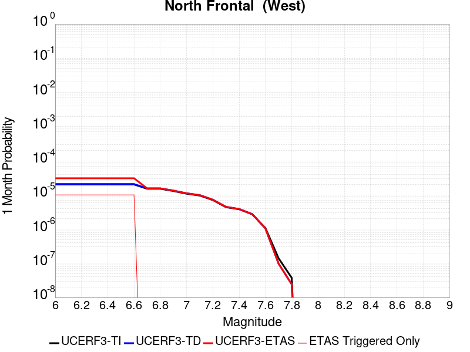 |  |  |

| Magnitude | 1 wk TI Prob | 1 wk TD Prob | 1 wk ETAS Prob | 1 wk ETAS/TD Gain | 1 wk ETAS Triggered Only | 1 mo TI Prob | 1 mo TD Prob | 1 mo ETAS Prob | 1 mo ETAS/TD Gain | 1 mo ETAS Triggered Only | 1 yr TI Prob | 1 yr TD Prob | 1 yr ETAS Prob | 1 yr ETAS/TD Gain | 1 yr ETAS Triggered Only | 10 yr TI Prob | 10 yr TD Prob | 10 yr ETAS Prob | 10 yr ETAS/TD Gain | 10 yr ETAS Triggered Only |
|-----|-----|-----|-----|-----|-----|-----|-----|-----|-----|-----|-----|-----|-----|-----|-----|-----|-----|-----|-----|-----|
| 6.0 | 4.7316266E-6 | 4.8526704E-6 | 4.8526704E-6 | 1.0 | 0.0 | 2.0278241E-5 | 2.0797E-5 | 3.0796793E-5 | 1.4808285 | 1.0E-5 | 2.4685962E-4 | 2.5317553E-4 | 2.6317302E-4 | 1.0394883 | 1.0E-5 | 0.0024658558 | 0.0025290172 | 0.0025389919 | 1.0039442 | 1.0E-5 |
| 6.1 | 4.7316266E-6 | 4.8526704E-6 | 4.8526704E-6 | 1.0 | 0.0 | 2.0278241E-5 | 2.0797E-5 | 3.0796793E-5 | 1.4808285 | 1.0E-5 | 2.4685962E-4 | 2.5317553E-4 | 2.6317302E-4 | 1.0394883 | 1.0E-5 | 0.0024658558 | 0.0025290172 | 0.0025389919 | 1.0039442 | 1.0E-5 |
| 6.2 | 4.7316266E-6 | 4.8526704E-6 | 4.8526704E-6 | 1.0 | 0.0 | 2.0278241E-5 | 2.0797E-5 | 3.0796793E-5 | 1.4808285 | 1.0E-5 | 2.4685962E-4 | 2.5317553E-4 | 2.6317302E-4 | 1.0394883 | 1.0E-5 | 0.0024658558 | 0.0025290172 | 0.0025389919 | 1.0039442 | 1.0E-5 |
| 6.3 | 4.7316266E-6 | 4.8526704E-6 | 4.8526704E-6 | 1.0 | 0.0 | 2.0278241E-5 | 2.0797E-5 | 3.0796793E-5 | 1.4808285 | 1.0E-5 | 2.4685962E-4 | 2.5317553E-4 | 2.6317302E-4 | 1.0394883 | 1.0E-5 | 0.0024658558 | 0.0025290172 | 0.0025389919 | 1.0039442 | 1.0E-5 |
| 6.4 | 4.7316266E-6 | 4.8526704E-6 | 4.8526704E-6 | 1.0 | 0.0 | 2.0278241E-5 | 2.0797E-5 | 3.0796793E-5 | 1.4808285 | 1.0E-5 | 2.4685962E-4 | 2.5317553E-4 | 2.6317302E-4 | 1.0394883 | 1.0E-5 | 0.0024658558 | 0.0025290172 | 0.0025389919 | 1.0039442 | 1.0E-5 |
| 6.5 | 4.7316266E-6 | 4.8526704E-6 | 4.8526704E-6 | 1.0 | 0.0 | 2.0278241E-5 | 2.0797E-5 | 3.0796793E-5 | 1.4808285 | 1.0E-5 | 2.4685962E-4 | 2.5317553E-4 | 2.6317302E-4 | 1.0394883 | 1.0E-5 | 0.0024658558 | 0.0025290172 | 0.0025389919 | 1.0039442 | 1.0E-5 |
| 6.6 | 4.7316266E-6 | 4.8526704E-6 | 4.8526704E-6 | 1.0 | 0.0 | 2.0278241E-5 | 2.0797E-5 | 3.0796793E-5 | 1.4808285 | 1.0E-5 | 2.4685962E-4 | 2.5317553E-4 | 2.6317302E-4 | 1.0394883 | 1.0E-5 | 0.0024658558 | 0.0025290172 | 0.0025389919 | 1.0039442 | 1.0E-5 |
| 6.7 | 3.5382777E-6 | 3.6308843E-6 | 3.6308843E-6 | 1.0 | 0.0 | 1.516396E-5 | 1.5560845E-5 | 1.5560845E-5 | 1.0 | 0.0 | 1.8460557E-4 | 1.8943759E-4 | 1.8943759E-4 | 1.0 | 0.0 | 0.0018445229 | 0.001892838 | 0.001892838 | 1.0 | 0.0 |
| 6.8 | 3.5382777E-6 | 3.6308843E-6 | 3.6308843E-6 | 1.0 | 0.0 | 1.516396E-5 | 1.5560845E-5 | 1.5560845E-5 | 1.0 | 0.0 | 1.8460557E-4 | 1.8943759E-4 | 1.8943759E-4 | 1.0 | 0.0 | 0.0018445229 | 0.001892838 | 0.001892838 | 1.0 | 0.0 |
| 6.9 | 3.0428037E-6 | 3.1227594E-6 | 3.1227594E-6 | 1.0 | 0.0 | 1.30405215E-5 | 1.3383189E-5 | 1.3383189E-5 | 1.0 | 0.0 | 1.5875678E-4 | 1.6292883E-4 | 1.6292883E-4 | 1.0 | 0.0 | 0.0015864341 | 0.001628161 | 0.001628161 | 1.0 | 0.0 |
| 7.0 | 2.538778E-6 | 2.6060895E-6 | 2.6060895E-6 | 1.0 | 0.0 | 1.0880432E-5 | 1.116891E-5 | 1.116891E-5 | 1.0 | 0.0 | 1.324612E-4 | 1.3597346E-4 | 1.3597346E-4 | 1.0 | 0.0 | 0.0013238228 | 0.0013589495 | 0.0013589495 | 1.0 | 0.0 |
| 7.1 | 2.2418935E-6 | 2.3012067E-6 | 2.3012067E-6 | 1.0 | 0.0 | 9.60808E-6 | 9.8622795E-6 | 9.8622795E-6 | 1.0 | 0.0 | 1.1697209E-4 | 1.2006708E-4 | 1.2006708E-4 | 1.0 | 0.0 | 0.0011691054 | 0.0012000661 | 0.0012000661 | 1.0 | 0.0 |
| 7.2 | 1.6526745E-6 | 1.692485E-6 | 1.692485E-6 | 1.0 | 0.0 | 7.082872E-6 | 7.253488E-6 | 7.253488E-6 | 1.0 | 0.0 | 8.623055E-5 | 8.83079E-5 | 8.83079E-5 | 1.0 | 0.0 | 8.61971E-4 | 8.827531E-4 | 8.827531E-4 | 1.0 | 0.0 |
| 7.3 | 1.0246019E-6 | 1.0442265E-6 | 1.0442265E-6 | 1.0 | 0.0 | 4.391144E-6 | 4.475249E-6 | 4.475249E-6 | 1.0 | 0.0 | 5.3460866E-5 | 5.4484914E-5 | 5.4484914E-5 | 1.0 | 0.0 | 5.344801E-4 | 5.44727E-4 | 5.44727E-4 | 1.0 | 0.0 |
| 7.4 | 8.9045164E-7 | 9.056564E-7 | 9.056564E-7 | 1.0 | 0.0 | 3.8162157E-6 | 3.881379E-6 | 3.881379E-6 | 1.0 | 0.0 | 4.646144E-5 | 4.7254878E-5 | 4.7254878E-5 | 1.0 | 0.0 | 4.6451724E-4 | 4.7245919E-4 | 4.7245919E-4 | 1.0 | 0.0 |
| 7.5 | 6.3357E-7 | 6.402708E-7 | 6.402708E-7 | 1.0 | 0.0 | 2.7152971E-6 | 2.744015E-6 | 2.744015E-6 | 1.0 | 0.0 | 3.305824E-5 | 3.3407938E-5 | 3.3407938E-5 | 1.0 | 0.0 | 3.3053322E-4 | 3.3403575E-4 | 3.3403575E-4 | 1.0 | 0.0 |
| 7.6 | 2.5087024E-7 | 2.436121E-7 | 2.436121E-7 | 1.0 | 0.0 | 1.0751578E-6 | 1.0440516E-6 | 1.0440516E-6 | 1.0 | 0.0 | 1.3089967E-5 | 1.2711275E-5 | 1.2711275E-5 | 1.0 | 0.0 | 1.3089196E-4 | 1.2710755E-4 | 1.2710755E-4 | 1.0 | 0.0 |
| 7.7 | 3.282987E-8 | 2.2875435E-8 | 2.2875435E-8 | 1.0 | 0.0 | 1.4069944E-7 | 9.8037575E-8 | 9.8037575E-8 | 1.0 | 0.0 | 1.7130144E-6 | 1.193607E-6 | 1.193607E-6 | 1.0 | 0.0 | 1.7130013E-5 | 1.1936014E-5 | 1.1936014E-5 | 1.0 | 0.0 |
| 7.8 | 8.77499E-9 | 5.6817466E-9 | 5.6817466E-9 | 1.0 | 0.0 | 3.7607098E-8 | 2.4350342E-8 | 2.4350342E-8 | 1.0 | 0.0 | 4.578663E-7 | 2.964654E-7 | 2.964654E-7 | 1.0 | 0.0 | 4.5786537E-6 | 2.9646512E-6 | 2.9646512E-6 | 1.0 | 0.0 |

## Elsinore (Temecula) rev
*[(top)](#table-of-contents)*

| 1 Week | 1 Month | 1 Year | 10 Year |
|-----|-----|-----|-----|
| 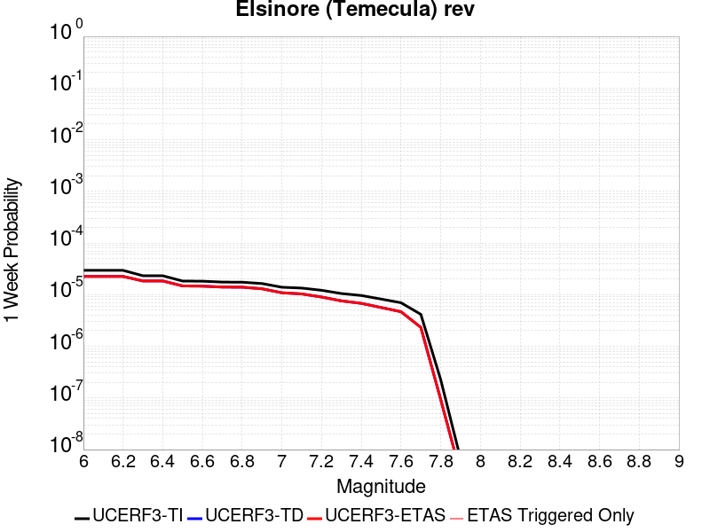 | 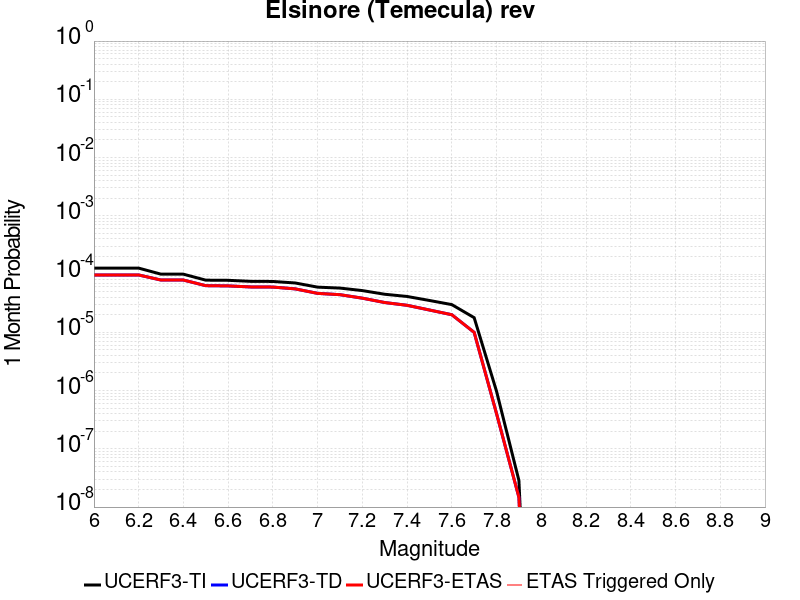 |  |  |

| Magnitude | 1 wk TI Prob | 1 wk TD Prob | 1 wk ETAS Prob | 1 wk ETAS/TD Gain | 1 wk ETAS Triggered Only | 1 mo TI Prob | 1 mo TD Prob | 1 mo ETAS Prob | 1 mo ETAS/TD Gain | 1 mo ETAS Triggered Only | 1 yr TI Prob | 1 yr TD Prob | 1 yr ETAS Prob | 1 yr ETAS/TD Gain | 1 yr ETAS Triggered Only | 10 yr TI Prob | 10 yr TD Prob | 10 yr ETAS Prob | 10 yr ETAS/TD Gain | 10 yr ETAS Triggered Only |
|-----|-----|-----|-----|-----|-----|-----|-----|-----|-----|-----|-----|-----|-----|-----|-----|-----|-----|-----|-----|-----|
| 6.0 | 2.9514995E-5 | 2.2518749E-5 | 2.2518749E-5 | 1.0 | 0.0 | 1.264867E-4 | 9.650547E-5 | 9.650547E-5 | 1.0 | 0.0 | 0.0015388876 | 0.0011743428 | 0.0011843311 | 1.0085053 | 1.0E-5 | 0.015282745 | 0.011687798 | 0.011697682 | 1.0008456 | 1.0E-5 |
| 6.1 | 2.9514995E-5 | 2.2518749E-5 | 2.2518749E-5 | 1.0 | 0.0 | 1.264867E-4 | 9.650547E-5 | 9.650547E-5 | 1.0 | 0.0 | 0.0015388876 | 0.0011743428 | 0.0011843311 | 1.0085053 | 1.0E-5 | 0.015282745 | 0.011687798 | 0.011697682 | 1.0008456 | 1.0E-5 |
| 6.2 | 2.9514995E-5 | 2.2518749E-5 | 2.2518749E-5 | 1.0 | 0.0 | 1.264867E-4 | 9.650547E-5 | 9.650547E-5 | 1.0 | 0.0 | 0.0015388876 | 0.0011743428 | 0.0011843311 | 1.0085053 | 1.0E-5 | 0.015282745 | 0.011687798 | 0.011697682 | 1.0008456 | 1.0E-5 |
| 6.3 | 2.3223649E-5 | 1.8408105E-5 | 1.8408105E-5 | 1.0 | 0.0 | 9.952613E-5 | 7.888959E-5 | 7.888959E-5 | 1.0 | 0.0 | 0.001211057 | 9.600748E-4 | 9.700652E-4 | 1.0104059 | 1.0E-5 | 0.012044783 | 0.009550951 | 0.009560855 | 1.001037 | 1.0E-5 |
| 6.4 | 2.3223649E-5 | 1.8408105E-5 | 1.8408105E-5 | 1.0 | 0.0 | 9.952613E-5 | 7.888959E-5 | 7.888959E-5 | 1.0 | 0.0 | 0.001211057 | 9.600748E-4 | 9.700652E-4 | 1.0104059 | 1.0E-5 | 0.012044783 | 0.009550951 | 0.009560855 | 1.001037 | 1.0E-5 |
| 6.5 | 1.8338875E-5 | 1.4749973E-5 | 1.4749973E-5 | 1.0 | 0.0 | 7.8592806E-5 | 6.321269E-5 | 6.321269E-5 | 1.0 | 0.0 | 9.5644733E-4 | 7.693515E-4 | 7.793438E-4 | 1.012988 | 1.0E-5 | 0.009523412 | 0.0076696407 | 0.0076795644 | 1.0012939 | 1.0E-5 |
| 6.6 | 1.8223333E-5 | 1.461253E-5 | 1.461253E-5 | 1.0 | 0.0 | 7.809766E-5 | 6.262368E-5 | 6.262368E-5 | 1.0 | 0.0 | 9.504242E-4 | 7.621853E-4 | 7.7217765E-4 | 1.0131102 | 1.0E-5 | 0.009463696 | 0.00759847 | 0.0076083937 | 1.001306 | 1.0E-5 |
| 6.7 | 1.7512752E-5 | 1.4026863E-5 | 1.4026863E-5 | 1.0 | 0.0 | 7.505249E-5 | 6.011379E-5 | 6.011379E-5 | 1.0 | 0.0 | 9.13381E-4 | 7.3164824E-4 | 7.416409E-4 | 1.0136578 | 1.0E-5 | 0.00909636 | 0.0072980053 | 0.0073079322 | 1.0013602 | 1.0E-5 |
| 6.8 | 1.7417142E-5 | 1.3950831E-5 | 1.3950831E-5 | 1.0 | 0.0 | 7.4642754E-5 | 5.978795E-5 | 5.978795E-5 | 1.0 | 0.0 | 9.083966E-4 | 7.276838E-4 | 7.376765E-4 | 1.0137322 | 1.0E-5 | 0.009046922 | 0.0072590327 | 0.00726896 | 1.0013676 | 1.0E-5 |
| 6.9 | 1.6402591E-5 | 1.2988267E-5 | 1.2988267E-5 | 1.0 | 0.0 | 7.0294926E-5 | 5.5662862E-5 | 5.5662862E-5 | 1.0 | 0.0 | 8.5550465E-4 | 6.774923E-4 | 6.774923E-4 | 1.0 | 0.0 | 0.008522186 | 0.006759532 | 0.006759532 | 1.0 | 0.0 |
| 7.0 | 1.3912486E-5 | 1.0877974E-5 | 1.0877974E-5 | 1.0 | 0.0 | 5.9623577E-5 | 4.661907E-5 | 4.661907E-5 | 1.0 | 0.0 | 7.2567526E-4 | 5.674421E-4 | 5.674421E-4 | 1.0 | 0.0 | 0.0072331014 | 0.005663485 | 0.005663485 | 1.0 | 0.0 |
| 7.1 | 1.3405147E-5 | 1.0327112E-5 | 1.0327112E-5 | 1.0 | 0.0 | 5.7449364E-5 | 4.425832E-5 | 4.425832E-5 | 1.0 | 0.0 | 6.9922156E-4 | 5.3871435E-4 | 5.3871435E-4 | 1.0 | 0.0 | 0.0069702556 | 0.005377297 | 0.005377297 | 1.0 | 0.0 |
| 7.2 | 1.21402E-5 | 8.996422E-6 | 8.996422E-6 | 1.0 | 0.0 | 5.202839E-5 | 3.8555536E-5 | 3.8555536E-5 | 1.0 | 0.0 | 6.332616E-4 | 4.693143E-4 | 4.693143E-4 | 1.0 | 0.0 | 0.0063146 | 0.004684696 | 0.004684696 | 1.0 | 0.0 |
| 7.3 | 1.05047775E-5 | 7.571477E-6 | 7.571477E-6 | 1.0 | 0.0 | 4.5019697E-5 | 3.2448792E-5 | 3.2448792E-5 | 1.0 | 0.0 | 5.4797693E-4 | 3.9499387E-4 | 3.9499387E-4 | 1.0 | 0.0 | 0.005466277 | 0.003943319 | 0.003943319 | 1.0 | 0.0 |
| 7.4 | 9.624483E-6 | 6.786585E-6 | 6.786585E-6 | 1.0 | 0.0 | 4.124713E-5 | 2.9085046E-5 | 2.9085046E-5 | 1.0 | 0.0 | 5.0206814E-4 | 3.540543E-4 | 3.540543E-4 | 1.0 | 0.0 | 0.005009353 | 0.0035350567 | 0.0035350567 | 1.0 | 0.0 |
| 7.5 | 8.215151E-6 | 5.635284E-6 | 5.635284E-6 | 1.0 | 0.0 | 3.5207315E-5 | 2.4151E-5 | 2.4151E-5 | 1.0 | 0.0 | 4.2856473E-4 | 2.9400003E-4 | 2.9400003E-4 | 1.0 | 0.0 | 0.004277392 | 0.0029362387 | 0.0029362387 | 1.0 | 0.0 |
| 7.6 | 6.975058E-6 | 4.6758096E-6 | 4.6758096E-6 | 1.0 | 0.0 | 2.9892764E-5 | 2.0039037E-5 | 2.0039037E-5 | 1.0 | 0.0 | 3.6388362E-4 | 2.4394914E-4 | 2.4394914E-4 | 1.0 | 0.0 | 0.0036328835 | 0.0024369296 | 0.0024369296 | 1.0 | 0.0 |
| 7.7 | 4.159604E-6 | 2.3267842E-6 | 2.3267842E-6 | 1.0 | 0.0 | 1.7826753E-5 | 9.971898E-6 | 9.971898E-6 | 1.0 | 0.0 | 2.1701909E-4 | 1.2140184E-4 | 1.2140184E-4 | 1.0 | 0.0 | 0.0021680726 | 0.0012134282 | 0.0012134282 | 1.0 | 0.0 |
| 7.8 | 2.2692414E-7 | 9.384396E-8 | 9.384396E-8 | 1.0 | 0.0 | 9.725317E-7 | 4.0218833E-7 | 4.0218833E-7 | 1.0 | 0.0 | 1.1840509E-5 | 4.8966353E-6 | 4.8966353E-6 | 1.0 | 0.0 | 1.1839878E-4 | 4.89656E-5 | 4.89656E-5 | 1.0 | 0.0 |
| 7.9 | 6.676829E-9 | 3.4396095E-9 | 3.4396095E-9 | 1.0 | 0.0 | 2.861498E-8 | 1.47411825E-8 | 1.47411825E-8 | 1.0 | 0.0 | 3.4838732E-7 | 1.7947389E-7 | 1.7947389E-7 | 1.0 | 0.0 | 3.4838679E-6 | 1.7947376E-6 | 1.7947376E-6 | 1.0 | 0.0 |

## La Panza 2011
*[(top)](#table-of-contents)*

| 1 Week | 1 Month | 1 Year | 10 Year |
|-----|-----|-----|-----|
| 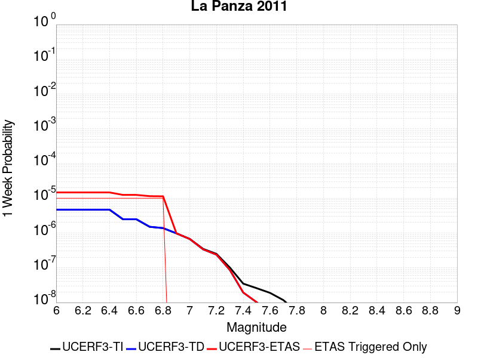 |  |  |  |

| Magnitude | 1 wk TI Prob | 1 wk TD Prob | 1 wk ETAS Prob | 1 wk ETAS/TD Gain | 1 wk ETAS Triggered Only | 1 mo TI Prob | 1 mo TD Prob | 1 mo ETAS Prob | 1 mo ETAS/TD Gain | 1 mo ETAS Triggered Only | 1 yr TI Prob | 1 yr TD Prob | 1 yr ETAS Prob | 1 yr ETAS/TD Gain | 1 yr ETAS Triggered Only | 10 yr TI Prob | 10 yr TD Prob | 10 yr ETAS Prob | 10 yr ETAS/TD Gain | 10 yr ETAS Triggered Only |
|-----|-----|-----|-----|-----|-----|-----|-----|-----|-----|-----|-----|-----|-----|-----|-----|-----|-----|-----|-----|-----|
| 6.0 | 4.6754544E-6 | 4.717585E-6 | 1.4717538E-5 | 3.1197188 | 1.0E-5 | 2.0037509E-5 | 2.0218074E-5 | 3.0217872E-5 | 1.494597 | 1.0E-5 | 2.4392935E-4 | 2.4612923E-4 | 2.5612678E-4 | 1.040619 | 1.0E-5 | 0.0024366176 | 0.0024587607 | 0.0024687361 | 1.004057 | 1.0E-5 |
| 6.1 | 4.6754544E-6 | 4.717585E-6 | 1.4717538E-5 | 3.1197188 | 1.0E-5 | 2.0037509E-5 | 2.0218074E-5 | 3.0217872E-5 | 1.494597 | 1.0E-5 | 2.4392935E-4 | 2.4612923E-4 | 2.5612678E-4 | 1.040619 | 1.0E-5 | 0.0024366176 | 0.0024587607 | 0.0024687361 | 1.004057 | 1.0E-5 |
| 6.2 | 4.6754544E-6 | 4.717585E-6 | 1.4717538E-5 | 3.1197188 | 1.0E-5 | 2.0037509E-5 | 2.0218074E-5 | 3.0217872E-5 | 1.494597 | 1.0E-5 | 2.4392935E-4 | 2.4612923E-4 | 2.5612678E-4 | 1.040619 | 1.0E-5 | 0.0024366176 | 0.0024587607 | 0.0024687361 | 1.004057 | 1.0E-5 |
| 6.3 | 4.6754544E-6 | 4.717585E-6 | 1.4717538E-5 | 3.1197188 | 1.0E-5 | 2.0037509E-5 | 2.0218074E-5 | 3.0217872E-5 | 1.494597 | 1.0E-5 | 2.4392935E-4 | 2.4612923E-4 | 2.5612678E-4 | 1.040619 | 1.0E-5 | 0.0024366176 | 0.0024587607 | 0.0024687361 | 1.004057 | 1.0E-5 |
| 6.4 | 4.6754544E-6 | 4.717585E-6 | 1.4717538E-5 | 3.1197188 | 1.0E-5 | 2.0037509E-5 | 2.0218074E-5 | 3.0217872E-5 | 1.494597 | 1.0E-5 | 2.4392935E-4 | 2.4612923E-4 | 2.5612678E-4 | 1.040619 | 1.0E-5 | 0.0024366176 | 0.0024587607 | 0.0024687361 | 1.004057 | 1.0E-5 |
| 6.5 | 2.485343E-6 | 2.5005975E-6 | 1.2500573E-5 | 4.9990344 | 1.0E-5 | 1.0651426E-5 | 1.0716804E-5 | 2.0716698E-5 | 1.9331039 | 1.0E-5 | 1.296734E-4 | 1.3046968E-4 | 1.4046837E-4 | 1.0766362 | 1.0E-5 | 0.0012959775 | 0.0013039692 | 0.0013139561 | 1.0076588 | 1.0E-5 |
| 6.6 | 2.485343E-6 | 2.5005975E-6 | 1.2500573E-5 | 4.9990344 | 1.0E-5 | 1.0651426E-5 | 1.0716804E-5 | 2.0716698E-5 | 1.9331039 | 1.0E-5 | 1.296734E-4 | 1.3046968E-4 | 1.4046837E-4 | 1.0766362 | 1.0E-5 | 0.0012959775 | 0.0013039692 | 0.0013139561 | 1.0076588 | 1.0E-5 |
| 6.7 | 1.5108508E-6 | 1.5146363E-6 | 1.1514621E-5 | 7.602235 | 1.0E-5 | 6.4750584E-6 | 6.491283E-6 | 1.6491218E-5 | 2.5405176 | 1.0E-5 | 7.8830984E-5 | 7.9028614E-5 | 8.9027824E-5 | 1.1265265 | 1.0E-5 | 7.880303E-4 | 7.900159E-4 | 8.00008E-4 | 1.012648 | 1.0E-5 |
| 6.8 | 1.3865837E-6 | 1.3885091E-6 | 1.1388495E-5 | 8.20196 | 1.0E-5 | 5.942488E-6 | 5.95074E-6 | 1.595068E-5 | 2.6804533 | 1.0E-5 | 7.234739E-5 | 7.2447954E-5 | 8.244723E-5 | 1.1380202 | 1.0E-5 | 7.232384E-4 | 7.242531E-4 | 7.342459E-4 | 1.0137973 | 1.0E-5 |
| 6.9 | 9.826583E-7 | 9.796277E-7 | 9.796277E-7 | 1.0 | 0.0 | 4.2113857E-6 | 4.198398E-6 | 4.198398E-6 | 1.0 | 0.0 | 5.1272415E-5 | 5.1114348E-5 | 5.1114348E-5 | 1.0 | 0.0 | 5.126059E-4 | 5.110313E-4 | 5.110313E-4 | 1.0 | 0.0 |
| 7.0 | 6.7797646E-7 | 6.710206E-7 | 6.710206E-7 | 1.0 | 0.0 | 2.9056102E-6 | 2.8757997E-6 | 2.8757997E-6 | 1.0 | 0.0 | 3.537523E-5 | 3.501233E-5 | 3.501233E-5 | 1.0 | 0.0 | 3.5369597E-4 | 3.5007123E-4 | 3.5007123E-4 | 1.0 | 0.0 |
| 7.1 | 3.4979826E-7 | 3.3873806E-7 | 3.3873806E-7 | 1.0 | 0.0 | 1.4991346E-6 | 1.4517339E-6 | 1.4517339E-6 | 1.0 | 0.0 | 1.825181E-5 | 1.7674727E-5 | 1.7674727E-5 | 1.0 | 0.0 | 1.825031E-4 | 1.7673438E-4 | 1.7673438E-4 | 1.0 | 0.0 |
| 7.2 | 2.5088332E-7 | 2.383183E-7 | 2.383183E-7 | 1.0 | 0.0 | 1.0752137E-6 | 1.0213637E-6 | 1.0213637E-6 | 1.0 | 0.0 | 1.3090649E-5 | 1.2435041E-5 | 1.2435041E-5 | 1.0 | 0.0 | 1.3089878E-4 | 1.2434431E-4 | 1.2434431E-4 | 1.0 | 0.0 |
| 7.3 | 1.0159086E-7 | 8.644557E-8 | 8.644557E-8 | 1.0 | 0.0 | 4.3538932E-7 | 3.7048096E-7 | 3.7048096E-7 | 1.0 | 0.0 | 5.300852E-6 | 4.5105967E-6 | 4.5105967E-6 | 1.0 | 0.0 | 5.3007258E-5 | 4.510509E-5 | 4.510509E-5 | 1.0 | 0.0 |
| 7.4 | 3.5006252E-8 | 1.9403075E-8 | 1.9403075E-8 | 1.0 | 0.0 | 1.5002678E-7 | 8.3156024E-8 | 8.3156024E-8 | 1.0 | 0.0 | 1.8265745E-6 | 1.0124241E-6 | 1.0124241E-6 | 1.0 | 0.0 | 1.8265595E-5 | 1.0124198E-5 | 1.0124198E-5 | 1.0 | 0.0 |
| 7.5 | 2.592274E-8 | 1.0237923E-8 | 1.0237923E-8 | 1.0 | 0.0 | 1.1109746E-7 | 4.387681E-8 | 4.387681E-8 | 1.0 | 0.0 | 1.3526106E-6 | 5.342E-7 | 5.342E-7 | 1.0 | 0.0 | 1.3526024E-5 | 5.3419885E-6 | 5.3419885E-6 | 1.0 | 0.0 |
| 7.6 | 1.9016717E-8 | 5.243833E-9 | 5.243833E-9 | 1.0 | 0.0 | 8.150022E-8 | 2.2473568E-8 | 2.2473568E-8 | 1.0 | 0.0 | 9.922647E-7 | 2.7361565E-7 | 2.7361565E-7 | 1.0 | 0.0 | 9.922603E-6 | 2.7361532E-6 | 2.7361532E-6 | 1.0 | 0.0 |
| 7.7 | 1.17738495E-8 | 1.2391744E-9 | 1.2391744E-9 | 1.0 | 0.0 | 5.0459356E-8 | 5.310746E-9 | 5.310746E-9 | 1.0 | 0.0 | 6.1434247E-7 | 6.465834E-8 | 6.465834E-8 | 1.0 | 0.0 | 6.143408E-6 | 6.4658315E-7 | 6.4658315E-7 | 1.0 | 0.0 |
| 7.8 | 5.489079E-9 | 2.0087243E-10 | 2.0087243E-10 | 1.0 | 0.0 | 2.3524624E-8 | 8.608808E-10 | 8.608808E-10 | 1.0 | 0.0 | 2.8641225E-7 | 1.0481224E-8 | 1.0481224E-8 | 1.0 | 0.0 | 2.8641189E-6 | 1.0481224E-7 | 1.0481224E-7 | 1.0 | 0.0 |
| 7.9 | 2.5081048E-9 | 6.6736394E-11 | 6.6736394E-11 | 1.0 | 0.0 | 1.0749021E-8 | 2.8601266E-10 | 2.8601266E-10 | 1.0 | 0.0 | 1.3086932E-7 | 3.4822056E-9 | 3.4822056E-9 | 1.0 | 0.0 | 1.3086925E-6 | 3.4822055E-8 | 3.4822055E-8 | 1.0 | 0.0 |

## Santa Ynez River
*[(top)](#table-of-contents)*

| 1 Week | 1 Month | 1 Year | 10 Year |
|-----|-----|-----|-----|
|  |  |  |  |

| Magnitude | 1 wk TI Prob | 1 wk TD Prob | 1 wk ETAS Prob | 1 wk ETAS/TD Gain | 1 wk ETAS Triggered Only | 1 mo TI Prob | 1 mo TD Prob | 1 mo ETAS Prob | 1 mo ETAS/TD Gain | 1 mo ETAS Triggered Only | 1 yr TI Prob | 1 yr TD Prob | 1 yr ETAS Prob | 1 yr ETAS/TD Gain | 1 yr ETAS Triggered Only | 10 yr TI Prob | 10 yr TD Prob | 10 yr ETAS Prob | 10 yr ETAS/TD Gain | 10 yr ETAS Triggered Only |
|-----|-----|-----|-----|-----|-----|-----|-----|-----|-----|-----|-----|-----|-----|-----|-----|-----|-----|-----|-----|-----|
| 6.0 | 1.6396456E-5 | 1.7209419E-5 | 1.7209419E-5 | 1.0 | 0.0 | 7.026863E-5 | 7.3752766E-5 | 7.3752766E-5 | 1.0 | 0.0 | 8.551848E-4 | 8.9760555E-4 | 8.9760555E-4 | 1.0 | 0.0 | 0.0085190125 | 0.008943349 | 0.00895326 | 1.0011082 | 1.0E-5 |
| 6.1 | 1.6396456E-5 | 1.7209419E-5 | 1.7209419E-5 | 1.0 | 0.0 | 7.026863E-5 | 7.3752766E-5 | 7.3752766E-5 | 1.0 | 0.0 | 8.551848E-4 | 8.9760555E-4 | 8.9760555E-4 | 1.0 | 0.0 | 0.0085190125 | 0.008943349 | 0.00895326 | 1.0011082 | 1.0E-5 |
| 6.2 | 1.6396456E-5 | 1.7209419E-5 | 1.7209419E-5 | 1.0 | 0.0 | 7.026863E-5 | 7.3752766E-5 | 7.3752766E-5 | 1.0 | 0.0 | 8.551848E-4 | 8.9760555E-4 | 8.9760555E-4 | 1.0 | 0.0 | 0.0085190125 | 0.008943349 | 0.00895326 | 1.0011082 | 1.0E-5 |
| 6.3 | 9.736976E-6 | 1.0122326E-5 | 1.0122326E-5 | 1.0 | 0.0 | 4.172923E-5 | 4.3380704E-5 | 4.3380704E-5 | 1.0 | 0.0 | 5.0793495E-4 | 5.280371E-4 | 5.280371E-4 | 1.0 | 0.0 | 0.005067755 | 0.0052683298 | 0.0052683298 | 1.0 | 0.0 |
| 6.4 | 9.736976E-6 | 1.0122326E-5 | 1.0122326E-5 | 1.0 | 0.0 | 4.172923E-5 | 4.3380704E-5 | 4.3380704E-5 | 1.0 | 0.0 | 5.0793495E-4 | 5.280371E-4 | 5.280371E-4 | 1.0 | 0.0 | 0.005067755 | 0.0052683298 | 0.0052683298 | 1.0 | 0.0 |
| 6.5 | 7.081964E-6 | 7.329896E-6 | 7.329896E-6 | 1.0 | 0.0 | 3.035092E-5 | 3.141347E-5 | 3.141347E-5 | 1.0 | 0.0 | 3.694598E-4 | 3.8239345E-4 | 3.8239345E-4 | 1.0 | 0.0 | 0.0036884616 | 0.0038175166 | 0.0038175166 | 1.0 | 0.0 |
| 6.6 | 5.873247E-6 | 6.0597445E-6 | 6.0597445E-6 | 1.0 | 0.0 | 2.5170815E-5 | 2.597008E-5 | 2.597008E-5 | 1.0 | 0.0 | 3.064116E-4 | 3.1614068E-4 | 3.1614068E-4 | 1.0 | 0.0 | 0.0030598943 | 0.003156997 | 0.003156997 | 1.0 | 0.0 |
| 6.7 | 4.973277E-6 | 5.1159036E-6 | 5.1159036E-6 | 1.0 | 0.0 | 2.1313872E-5 | 2.192512E-5 | 2.192512E-5 | 1.0 | 0.0 | 2.5946548E-4 | 2.669061E-4 | 2.669061E-4 | 1.0 | 0.0 | 0.0025916274 | 0.0026659044 | 0.0026659044 | 1.0 | 0.0 |
| 6.8 | 4.396492E-6 | 4.510981E-6 | 4.510981E-6 | 1.0 | 0.0 | 1.884197E-5 | 1.9332634E-5 | 1.9332634E-5 | 1.0 | 0.0 | 2.2937685E-4 | 2.3534975E-4 | 2.3534975E-4 | 1.0 | 0.0 | 0.0022914023 | 0.0023510405 | 0.0023510405 | 1.0 | 0.0 |
| 6.9 | 3.5255632E-6 | 3.6013378E-6 | 3.6013378E-6 | 1.0 | 0.0 | 1.5109469E-5 | 1.5434214E-5 | 1.5434214E-5 | 1.0 | 0.0 | 1.8394225E-4 | 1.8789551E-4 | 1.8789551E-4 | 1.0 | 0.0 | 0.0018379007 | 0.0018773826 | 0.0018773826 | 1.0 | 0.0 |
| 7.0 | 3.211603E-6 | 3.2736589E-6 | 3.2736589E-6 | 1.0 | 0.0 | 1.376394E-5 | 1.4029892E-5 | 1.4029892E-5 | 1.0 | 0.0 | 1.6756308E-4 | 1.7080067E-4 | 1.7080067E-4 | 1.0 | 0.0 | 0.0016743679 | 0.0017067082 | 0.0017067082 | 1.0 | 0.0 |
| 7.1 | 2.5094619E-6 | 2.540926E-6 | 2.540926E-6 | 1.0 | 0.0 | 1.0754793E-5 | 1.0889638E-5 | 1.0889638E-5 | 1.0 | 0.0 | 1.3093173E-4 | 1.3257333E-4 | 1.3257333E-4 | 1.0 | 0.0 | 0.0013085462 | 0.0013249485 | 0.0013249485 | 1.0 | 0.0 |
| 7.2 | 2.0515774E-6 | 2.0619439E-6 | 2.0619439E-6 | 1.0 | 0.0 | 8.792445E-6 | 8.836872E-6 | 8.836872E-6 | 1.0 | 0.0 | 1.0704277E-4 | 1.0758365E-4 | 1.0758365E-4 | 1.0 | 0.0 | 0.0010699122 | 0.00107532 | 0.00107532 | 1.0 | 0.0 |
| 7.3 | 1.6845745E-6 | 1.6773973E-6 | 1.6773973E-6 | 1.0 | 0.0 | 7.219585E-6 | 7.188826E-6 | 7.188826E-6 | 1.0 | 0.0 | 8.78949E-5 | 8.752047E-5 | 8.752047E-5 | 1.0 | 0.0 | 8.7860145E-4 | 8.748629E-4 | 8.748629E-4 | 1.0 | 0.0 |
| 7.4 | 1.3600285E-6 | 1.333343E-6 | 1.333343E-6 | 1.0 | 0.0 | 5.82868E-6 | 5.7143147E-6 | 5.7143147E-6 | 1.0 | 0.0 | 7.096187E-5 | 6.9569585E-5 | 6.9569585E-5 | 1.0 | 0.0 | 7.0939213E-4 | 6.9548027E-4 | 6.9548027E-4 | 1.0 | 0.0 |
| 7.5 | 9.735342E-7 | 9.290178E-7 | 9.290178E-7 | 1.0 | 0.0 | 4.172283E-6 | 3.981499E-6 | 3.981499E-6 | 1.0 | 0.0 | 5.079636E-5 | 4.847369E-5 | 4.847369E-5 | 1.0 | 0.0 | 5.0784746E-4 | 4.8463285E-4 | 4.8463285E-4 | 1.0 | 0.0 |
| 7.6 | 5.067187E-7 | 4.778605E-7 | 4.778605E-7 | 1.0 | 0.0 | 2.1716498E-6 | 2.047972E-6 | 2.047972E-6 | 1.0 | 0.0 | 2.6439517E-5 | 2.493378E-5 | 2.493378E-5 | 1.0 | 0.0 | 2.643637E-4 | 2.493106E-4 | 2.493106E-4 | 1.0 | 0.0 |
| 7.7 | 2.769089E-7 | 2.5759314E-7 | 2.5759314E-7 | 1.0 | 0.0 | 1.1867519E-6 | 1.1039701E-6 | 1.1039701E-6 | 1.0 | 0.0 | 1.4448608E-5 | 1.3440754E-5 | 1.3440754E-5 | 1.0 | 0.0 | 1.444767E-4 | 1.3439944E-4 | 1.3439944E-4 | 1.0 | 0.0 |
| 7.8 | 1.7044663E-7 | 1.544919E-7 | 1.544919E-7 | 1.0 | 0.0 | 7.3048534E-7 | 6.62108E-7 | 6.62108E-7 | 1.0 | 0.0 | 8.893623E-6 | 8.061135E-6 | 8.061135E-6 | 1.0 | 0.0 | 8.893267E-5 | 8.060845E-5 | 8.060845E-5 | 1.0 | 0.0 |
| 7.9 | 4.8344287E-8 | 4.0911118E-8 | 4.0911118E-8 | 1.0 | 0.0 | 2.0718979E-7 | 1.7533335E-7 | 1.7533335E-7 | 1.0 | 0.0 | 2.5225327E-6 | 2.1346814E-6 | 2.1346814E-6 | 1.0 | 0.0 | 2.5225041E-5 | 2.1346614E-5 | 2.1346614E-5 | 1.0 | 0.0 |

## Ortigalita (South)
*[(top)](#table-of-contents)*

| 1 Week | 1 Month | 1 Year | 10 Year |
|-----|-----|-----|-----|
|  |  | 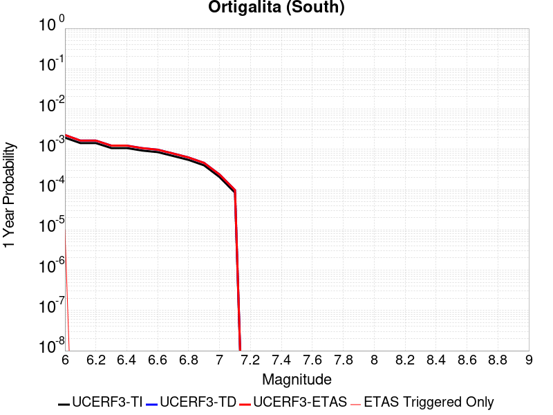 | 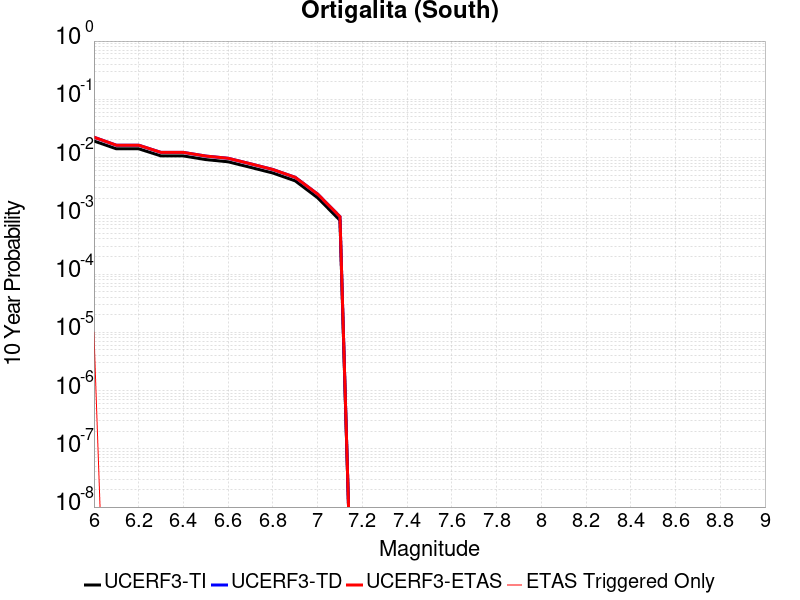 |

| Magnitude | 1 wk TI Prob | 1 wk TD Prob | 1 wk ETAS Prob | 1 wk ETAS/TD Gain | 1 wk ETAS Triggered Only | 1 mo TI Prob | 1 mo TD Prob | 1 mo ETAS Prob | 1 mo ETAS/TD Gain | 1 mo ETAS Triggered Only | 1 yr TI Prob | 1 yr TD Prob | 1 yr ETAS Prob | 1 yr ETAS/TD Gain | 1 yr ETAS Triggered Only | 10 yr TI Prob | 10 yr TD Prob | 10 yr ETAS Prob | 10 yr ETAS/TD Gain | 10 yr ETAS Triggered Only |
|-----|-----|-----|-----|-----|-----|-----|-----|-----|-----|-----|-----|-----|-----|-----|-----|-----|-----|-----|-----|-----|
| 6.0 | 3.72394E-5 | 4.325541E-5 | 4.325541E-5 | 1.0 | 0.0 | 1.5958765E-4 | 1.8536806E-4 | 1.953662E-4 | 1.0539367 | 1.0E-5 | 0.0019412481 | 0.0022546765 | 0.002264654 | 1.0044252 | 1.0E-5 | 0.019243775 | 0.022334406 | 0.022344183 | 1.0004377 | 1.0E-5 |
| 6.1 | 2.7299884E-5 | 3.1491905E-5 | 3.1491905E-5 | 1.0 | 0.0 | 1.16994255E-4 | 1.3495865E-4 | 1.3495865E-4 | 1.0 | 0.0 | 0.0014234743 | 0.0016419389 | 0.0016419389 | 1.0 | 0.0 | 0.014143906 | 0.016304005 | 0.016304005 | 1.0 | 0.0 |
| 6.2 | 2.7299884E-5 | 3.1491905E-5 | 3.1491905E-5 | 1.0 | 0.0 | 1.16994255E-4 | 1.3495865E-4 | 1.3495865E-4 | 1.0 | 0.0 | 0.0014234743 | 0.0016419389 | 0.0016419389 | 1.0 | 0.0 | 0.014143906 | 0.016304005 | 0.016304005 | 1.0 | 0.0 |
| 6.3 | 2.0546433E-5 | 2.3631357E-5 | 2.3631357E-5 | 1.0 | 0.0 | 8.805317E-5 | 1.0127342E-4 | 1.0127342E-4 | 1.0 | 0.0 | 0.00107152 | 0.0012323254 | 0.0012323254 | 1.0 | 0.0 | 0.010663681 | 0.012256982 | 0.012256982 | 1.0 | 0.0 |
| 6.4 | 2.0546433E-5 | 2.3631357E-5 | 2.3631357E-5 | 1.0 | 0.0 | 8.805317E-5 | 1.0127342E-4 | 1.0127342E-4 | 1.0 | 0.0 | 0.00107152 | 0.0012323254 | 0.0012323254 | 1.0 | 0.0 | 0.010663681 | 0.012256982 | 0.012256982 | 1.0 | 0.0 |
| 6.5 | 1.7779594E-5 | 2.0446892E-5 | 2.0446892E-5 | 1.0 | 0.0 | 7.619603E-5 | 8.762667E-5 | 8.762667E-5 | 1.0 | 0.0 | 9.272918E-4 | 0.0010663462 | 0.0010663462 | 1.0 | 0.0 | 0.009234319 | 0.010613761 | 0.010613761 | 1.0 | 0.0 |
| 6.6 | 1.6272212E-5 | 1.8714893E-5 | 1.8714893E-5 | 1.0 | 0.0 | 6.973618E-5 | 8.0204285E-5 | 8.0204285E-5 | 1.0 | 0.0 | 8.487073E-4 | 9.76062E-4 | 9.76062E-4 | 1.0 | 0.0 | 0.008454733 | 0.009719051 | 0.009719051 | 1.0 | 0.0 |
| 6.7 | 1.3051484E-5 | 1.5038697E-5 | 1.5038697E-5 | 1.0 | 0.0 | 5.593373E-5 | 6.445002E-5 | 6.445002E-5 | 1.0 | 0.0 | 6.807804E-4 | 7.84406E-4 | 7.84406E-4 | 1.0 | 0.0 | 0.006786986 | 0.007817356 | 0.007817356 | 1.0 | 0.0 |
| 6.8 | 1.04277415E-5 | 1.19871875E-5 | 1.19871875E-5 | 1.0 | 0.0 | 4.4689557E-5 | 5.1372688E-5 | 5.1372688E-5 | 1.0 | 0.0 | 5.439595E-4 | 6.2529044E-4 | 6.2529044E-4 | 1.0 | 0.0 | 0.0054262993 | 0.006236065 | 0.006236065 | 1.0 | 0.0 |
| 6.9 | 7.639968E-6 | 8.791468E-6 | 8.791468E-6 | 1.0 | 0.0 | 3.274231E-5 | 3.7677208E-5 | 3.7677208E-5 | 1.0 | 0.0 | 3.9856473E-4 | 4.5862934E-4 | 4.5862934E-4 | 1.0 | 0.0 | 0.003978506 | 0.0045774146 | 0.0045774146 | 1.0 | 0.0 |
| 7.0 | 3.919831E-6 | 4.5333823E-6 | 4.5333823E-6 | 1.0 | 0.0 | 1.679917E-5 | 1.942865E-5 | 1.942865E-5 | 1.0 | 0.0 | 2.045107E-4 | 2.3652024E-4 | 2.3652024E-4 | 1.0 | 0.0 | 0.0020432258 | 0.0023628937 | 0.0023628937 | 1.0 | 0.0 |
| 7.1 | 1.6017933E-6 | 1.8570338E-6 | 1.8570338E-6 | 1.0 | 0.0 | 6.8648105E-6 | 7.958698E-6 | 7.958698E-6 | 1.0 | 0.0 | 8.357586E-5 | 9.6893906E-5 | 9.6893906E-5 | 1.0 | 0.0 | 8.3544437E-4 | 9.6862135E-4 | 9.6862135E-4 | 1.0 | 0.0 |

## Imperial
*[(top)](#table-of-contents)*

| 1 Week | 1 Month | 1 Year | 10 Year |
|-----|-----|-----|-----|
| 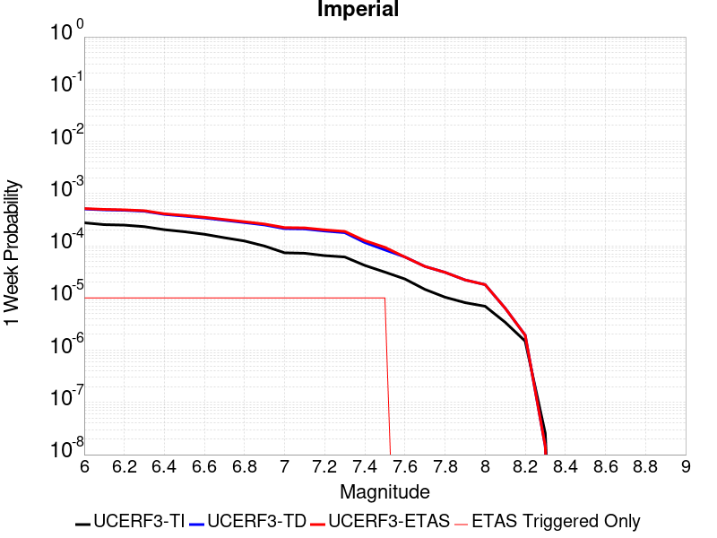 | 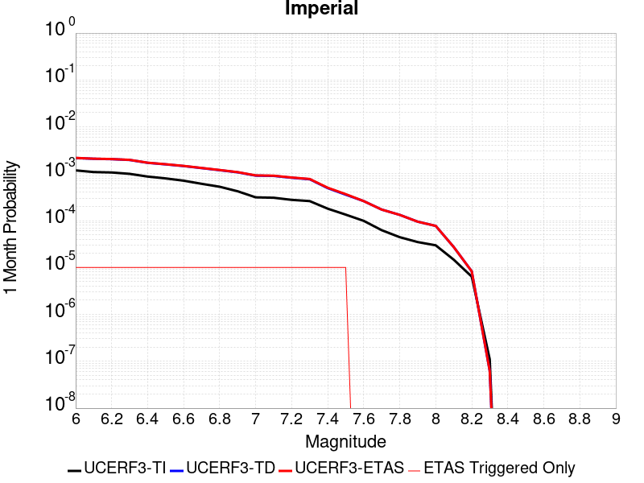 | 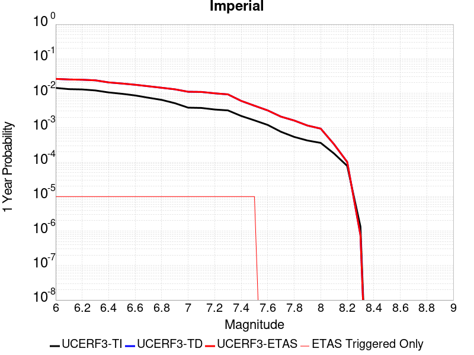 | 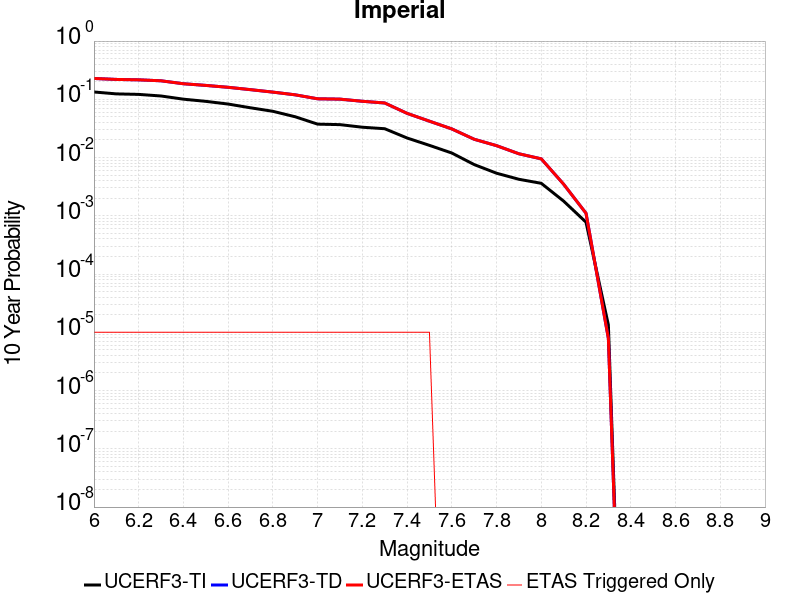 |

| Magnitude | 1 wk TI Prob | 1 wk TD Prob | 1 wk ETAS Prob | 1 wk ETAS/TD Gain | 1 wk ETAS Triggered Only | 1 mo TI Prob | 1 mo TD Prob | 1 mo ETAS Prob | 1 mo ETAS/TD Gain | 1 mo ETAS Triggered Only | 1 yr TI Prob | 1 yr TD Prob | 1 yr ETAS Prob | 1 yr ETAS/TD Gain | 1 yr ETAS Triggered Only | 10 yr TI Prob | 10 yr TD Prob | 10 yr ETAS Prob | 10 yr ETAS/TD Gain | 10 yr ETAS Triggered Only |
|-----|-----|-----|-----|-----|-----|-----|-----|-----|-----|-----|-----|-----|-----|-----|-----|-----|-----|-----|-----|-----|
| 6.0 | 2.7496446E-4 | 5.0544227E-4 | 5.154372E-4 | 1.0197747 | 1.0E-5 | 0.0011778869 | 0.0021644223 | 0.0021744007 | 1.0046102 | 1.0E-5 | 0.0142467655 | 0.026058238 | 0.026067978 | 1.0003737 | 1.0E-5 | 0.13367249 | 0.22804803 | 0.22805575 | 1.0000339 | 1.0E-5 |
| 6.1 | 2.5356023E-4 | 4.864932E-4 | 4.9648836E-4 | 1.0205452 | 1.0E-5 | 0.001086234 | 0.0020833432 | 0.0020933223 | 1.00479 | 1.0E-5 | 0.013144928 | 0.025072256 | 0.025082005 | 1.0003889 | 1.0E-5 | 0.123940155 | 0.21948382 | 0.21949163 | 1.0000355 | 1.0E-5 |
| 6.2 | 2.4820742E-4 | 4.7744758E-4 | 4.8744283E-4 | 1.0209347 | 1.0E-5 | 0.0010633124 | 0.0020446372 | 0.0020546168 | 1.0048808 | 1.0E-5 | 0.01286919 | 0.024612322 | 0.024622075 | 1.0003963 | 1.0E-5 | 0.12148927 | 0.21598965 | 0.21599749 | 1.0000362 | 1.0E-5 |
| 6.3 | 2.3205351E-4 | 4.588405E-4 | 4.6883593E-4 | 1.0217841 | 1.0E-5 | 9.94136E-4 | 0.0019650143 | 0.0019749945 | 1.005079 | 1.0E-5 | 0.012036599 | 0.023659883 | 0.023669647 | 1.0004127 | 1.0E-5 | 0.11405133 | 0.20792368 | 0.2079316 | 1.0000381 | 1.0E-5 |
| 6.4 | 2.0304754E-4 | 3.9870106E-4 | 4.086971E-4 | 1.0250715 | 1.0E-5 | 8.6991355E-4 | 0.0017076145 | 0.0017175974 | 1.0058461 | 1.0E-5 | 0.010539869 | 0.02059353 | 0.020603323 | 1.0004756 | 1.0E-5 | 0.100537635 | 0.18505521 | 0.18506336 | 1.000044 | 1.0E-5 |
| 6.5 | 1.854992E-4 | 3.6982604E-4 | 3.7982233E-4 | 1.0270298 | 1.0E-5 | 7.9475436E-4 | 0.0015840183 | 0.0015940025 | 1.0063031 | 1.0E-5 | 0.009633281 | 0.01912025 | 0.019130059 | 1.000513 | 1.0E-5 | 0.0922623 | 0.17328814 | 0.1732964 | 1.0000477 | 1.0E-5 |
| 6.6 | 1.6586106E-4 | 3.402928E-4 | 3.5028943E-4 | 1.0293765 | 1.0E-5 | 7.106394E-4 | 0.0014575928 | 0.0014675782 | 1.0068506 | 1.0E-5 | 0.008617763 | 0.017604336 | 0.01761416 | 1.000558 | 1.0E-5 | 0.08291132 | 0.16075848 | 0.16076687 | 1.0000522 | 1.0E-5 |
| 6.7 | 1.4224656E-4 | 3.076128E-4 | 3.1760972E-4 | 1.0324984 | 1.0E-5 | 6.094856E-4 | 0.0013176827 | 0.0013276695 | 1.0075791 | 1.0E-5 | 0.0073952693 | 0.01592529 | 0.01593513 | 1.000618 | 1.0E-5 | 0.07153955 | 0.14646539 | 0.14647393 | 1.0000583 | 1.0E-5 |
| 6.8 | 1.2317259E-4 | 2.778561E-4 | 2.8785333E-4 | 1.0359799 | 1.0E-5 | 5.2777573E-4 | 0.0011902746 | 0.0012002627 | 1.0083914 | 1.0E-5 | 0.0064067547 | 0.014396684 | 0.01440654 | 1.0006846 | 1.0E-5 | 0.06225166 | 0.13291866 | 0.13292733 | 1.0000652 | 1.0E-5 |
| 6.9 | 9.859898E-5 | 2.5009012E-4 | 2.600876E-4 | 1.0399756 | 1.0E-5 | 4.2249862E-4 | 0.0010713787 | 0.0010813681 | 1.0093237 | 1.0E-5 | 0.0051317946 | 0.012966984 | 0.012976854 | 1.0007612 | 1.0E-5 | 0.05014893 | 0.11938625 | 0.119395055 | 1.0000738 | 1.0E-5 |
| 7.0 | 7.3191884E-5 | 2.1261652E-4 | 2.2261438E-4 | 1.047023 | 1.0E-5 | 3.136418E-4 | 9.108986E-4 | 9.208895E-4 | 1.0109682 | 1.0E-5 | 0.003811904 | 0.011034482 | 0.011044372 | 1.0008962 | 1.0E-5 | 0.037471764 | 0.1020444 | 0.10205338 | 1.000088 | 1.0E-5 |
| 7.1 | 7.1760296E-5 | 2.0963016E-4 | 2.1962807E-4 | 1.047693 | 1.0E-5 | 3.0750787E-4 | 8.981088E-4 | 9.080999E-4 | 1.0111245 | 1.0E-5 | 0.003737482 | 0.0108803315 | 0.010890223 | 1.0009091 | 1.0E-5 | 0.03675245 | 0.10068103 | 0.10069002 | 1.0000893 | 1.0E-5 |
| 7.2 | 6.46614E-5 | 1.9131559E-4 | 2.0131367E-4 | 1.0522597 | 1.0E-5 | 2.7709085E-4 | 8.196693E-4 | 8.296611E-4 | 1.01219 | 1.0E-5 | 0.0033683628 | 0.009934432 | 0.009944332 | 1.0009966 | 1.0E-5 | 0.033177625 | 0.09248776 | 0.092496835 | 1.0000981 | 1.0E-5 |
| 7.3 | 6.088115E-5 | 1.7803388E-4 | 1.880321E-4 | 1.0561591 | 1.0E-5 | 2.6089314E-4 | 7.627821E-4 | 7.727745E-4 | 1.0130999 | 1.0E-5 | 0.0031717476 | 0.009247902 | 0.00925781 | 1.0010713 | 1.0E-5 | 0.031268585 | 0.086538635 | 0.08654777 | 1.0001055 | 1.0E-5 |
| 7.4 | 4.199346E-5 | 1.1508458E-4 | 1.2508343E-4 | 1.0868826 | 1.0E-5 | 1.7995955E-4 | 4.9312727E-4 | 5.0312234E-4 | 1.0202688 | 1.0E-5 | 0.0021888057 | 0.005987466 | 0.0059974063 | 1.0016601 | 1.0E-5 | 0.02167372 | 0.057429686 | 0.05743911 | 1.0001642 | 1.0E-5 |
| 7.5 | 3.130448E-5 | 8.33348E-5 | 9.333397E-5 | 1.1199878 | 1.0E-5 | 1.3415517E-4 | 3.5710057E-4 | 3.67097E-4 | 1.0279933 | 1.0E-5 | 0.0016321153 | 0.004339092 | 0.0043490487 | 1.0022947 | 1.0E-5 | 0.016201803 | 0.042132407 | 0.042141985 | 1.0002273 | 1.0E-5 |
| 7.6 | 2.3074248E-5 | 6.084606E-5 | 6.084606E-5 | 1.0 | 0.0 | 9.888588E-5 | 2.607429E-4 | 2.607429E-4 | 1.0 | 0.0 | 0.0012032706 | 0.003169947 | 0.003169947 | 1.0 | 0.0 | 0.011967761 | 0.031026881 | 0.031026881 | 1.0 | 0.0 |
| 7.7 | 1.45864815E-5 | 4.012569E-5 | 4.012569E-5 | 1.0 | 0.0 | 6.2511994E-5 | 1.7195594E-4 | 1.7195594E-4 | 1.0 | 0.0 | 7.608177E-4 | 0.0020915589 | 0.0020915589 | 1.0 | 0.0 | 0.007582182 | 0.0206284 | 0.0206284 | 1.0 | 0.0 |
| 7.8 | 1.0352979E-5 | 3.096157E-5 | 3.096157E-5 | 1.0 | 0.0 | 4.4369157E-5 | 1.3268572E-4 | 1.3268572E-4 | 1.0 | 0.0 | 5.400606E-4 | 0.0016142539 | 0.0016142539 | 1.0 | 0.0 | 0.0053875 | 0.016017422 | 0.016017422 | 1.0 | 0.0 |
| 7.9 | 8.137906E-6 | 2.2149336E-5 | 2.2149336E-5 | 1.0 | 0.0 | 3.4876273E-5 | 9.492228E-5 | 9.492228E-5 | 1.0 | 0.0 | 4.2453592E-4 | 0.001155067 | 0.001155067 | 1.0 | 0.0 | 0.004237258 | 0.011618343 | 0.011618343 | 1.0 | 0.0 |
| 8.0 | 6.93792E-6 | 1.8008765E-5 | 1.8008765E-5 | 1.0 | 0.0 | 2.9733603E-5 | 7.717814E-5 | 7.717814E-5 | 1.0 | 0.0 | 3.6194647E-4 | 9.392395E-4 | 9.392395E-4 | 1.0 | 0.0 | 0.0036135751 | 0.009501954 | 0.009501954 | 1.0 | 0.0 |
| 8.1 | 3.4286315E-6 | 6.3794105E-6 | 6.3794105E-6 | 1.0 | 0.0 | 1.4694053E-5 | 2.7340044E-5 | 2.7340044E-5 | 1.0 | 0.0 | 1.7888541E-4 | 3.3281432E-4 | 3.3281432E-4 | 1.0 | 0.0 | 0.0017874148 | 0.003486159 | 0.003486159 | 1.0 | 0.0 |
| 8.2 | 1.4906886E-6 | 1.9363238E-6 | 1.9363238E-6 | 1.0 | 0.0 | 6.3886496E-6 | 8.298504E-6 | 8.298504E-6 | 1.0 | 0.0 | 7.7779034E-5 | 1.0102963E-4 | 1.0102963E-4 | 1.0 | 0.0 | 7.775182E-4 | 0.0011074151 | 0.0011074151 | 1.0 | 0.0 |
| 8.3 | 2.5758007E-8 | 1.4492432E-8 | 1.4492432E-8 | 1.0 | 0.0 | 1.10391454E-7 | 6.211042E-8 | 6.211042E-8 | 1.0 | 0.0 | 1.3440151E-6 | 7.561944E-7 | 7.561944E-7 | 1.0 | 0.0 | 1.344007E-5 | 7.885293E-6 | 7.885293E-6 | 1.0 | 0.0 |

## San Gorgonio Pass
*[(top)](#table-of-contents)*

| 1 Week | 1 Month | 1 Year | 10 Year |
|-----|-----|-----|-----|
| 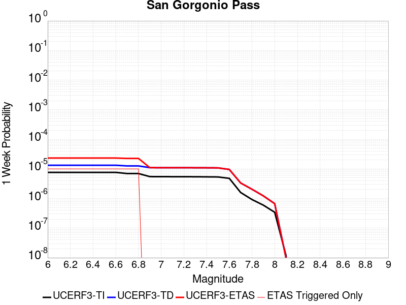 | 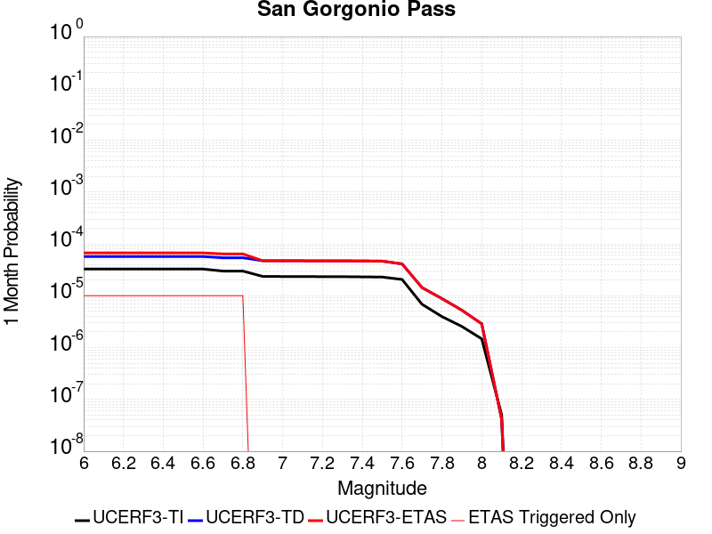 |  | 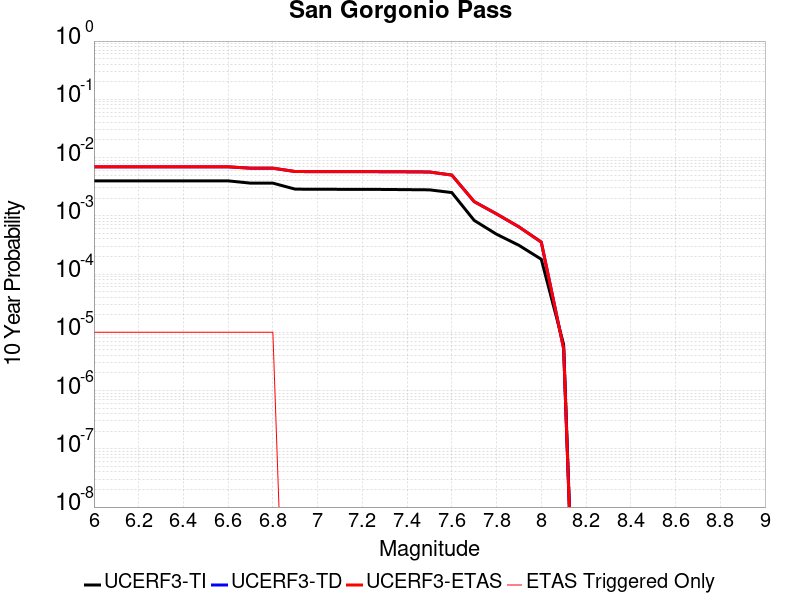 |

| Magnitude | 1 wk TI Prob | 1 wk TD Prob | 1 wk ETAS Prob | 1 wk ETAS/TD Gain | 1 wk ETAS Triggered Only | 1 mo TI Prob | 1 mo TD Prob | 1 mo ETAS Prob | 1 mo ETAS/TD Gain | 1 mo ETAS Triggered Only | 1 yr TI Prob | 1 yr TD Prob | 1 yr ETAS Prob | 1 yr ETAS/TD Gain | 1 yr ETAS Triggered Only | 10 yr TI Prob | 10 yr TD Prob | 10 yr ETAS Prob | 10 yr ETAS/TD Gain | 10 yr ETAS Triggered Only |
|-----|-----|-----|-----|-----|-----|-----|-----|-----|-----|-----|-----|-----|-----|-----|-----|-----|-----|-----|-----|-----|
| 6.0 | 7.644328E-6 | 1.3314348E-5 | 2.3314215E-5 | 1.7510594 | 1.0E-5 | 3.2760996E-5 | 5.706029E-5 | 6.705972E-5 | 1.1752433 | 1.0E-5 | 3.987921E-4 | 6.944962E-4 | 7.0448924E-4 | 1.0143889 | 1.0E-5 | 0.003980772 | 0.006929504 | 0.006939435 | 1.0014331 | 1.0E-5 |
| 6.1 | 7.644328E-6 | 1.3314348E-5 | 2.3314215E-5 | 1.7510594 | 1.0E-5 | 3.2760996E-5 | 5.706029E-5 | 6.705972E-5 | 1.1752433 | 1.0E-5 | 3.987921E-4 | 6.944962E-4 | 7.0448924E-4 | 1.0143889 | 1.0E-5 | 0.003980772 | 0.006929504 | 0.006939435 | 1.0014331 | 1.0E-5 |
| 6.2 | 7.644328E-6 | 1.3314348E-5 | 2.3314215E-5 | 1.7510594 | 1.0E-5 | 3.2760996E-5 | 5.706029E-5 | 6.705972E-5 | 1.1752433 | 1.0E-5 | 3.987921E-4 | 6.944962E-4 | 7.0448924E-4 | 1.0143889 | 1.0E-5 | 0.003980772 | 0.006929504 | 0.006939435 | 1.0014331 | 1.0E-5 |
| 6.3 | 7.644328E-6 | 1.3314348E-5 | 2.3314215E-5 | 1.7510594 | 1.0E-5 | 3.2760996E-5 | 5.706029E-5 | 6.705972E-5 | 1.1752433 | 1.0E-5 | 3.987921E-4 | 6.944962E-4 | 7.0448924E-4 | 1.0143889 | 1.0E-5 | 0.003980772 | 0.006929504 | 0.006939435 | 1.0014331 | 1.0E-5 |
| 6.4 | 7.644328E-6 | 1.3314348E-5 | 2.3314215E-5 | 1.7510594 | 1.0E-5 | 3.2760996E-5 | 5.706029E-5 | 6.705972E-5 | 1.1752433 | 1.0E-5 | 3.987921E-4 | 6.944962E-4 | 7.0448924E-4 | 1.0143889 | 1.0E-5 | 0.003980772 | 0.006929504 | 0.006939435 | 1.0014331 | 1.0E-5 |
| 6.5 | 7.644328E-6 | 1.3314348E-5 | 2.3314215E-5 | 1.7510594 | 1.0E-5 | 3.2760996E-5 | 5.706029E-5 | 6.705972E-5 | 1.1752433 | 1.0E-5 | 3.987921E-4 | 6.944962E-4 | 7.0448924E-4 | 1.0143889 | 1.0E-5 | 0.003980772 | 0.006929504 | 0.006939435 | 1.0014331 | 1.0E-5 |
| 6.6 | 7.644328E-6 | 1.3314348E-5 | 2.3314215E-5 | 1.7510594 | 1.0E-5 | 3.2760996E-5 | 5.706029E-5 | 6.705972E-5 | 1.1752433 | 1.0E-5 | 3.987921E-4 | 6.944962E-4 | 7.0448924E-4 | 1.0143889 | 1.0E-5 | 0.003980772 | 0.006929504 | 0.006939435 | 1.0014331 | 1.0E-5 |
| 6.7 | 6.987586E-6 | 1.2618623E-5 | 2.2618497E-5 | 1.7924695 | 1.0E-5 | 2.9946454E-5 | 5.4078737E-5 | 6.4078195E-5 | 1.1849055 | 1.0E-5 | 3.645371E-4 | 6.582178E-4 | 6.6821126E-4 | 1.0151825 | 1.0E-5 | 0.0036393967 | 0.0065688808 | 0.0065788147 | 1.0015123 | 1.0E-5 |
| 6.8 | 6.987586E-6 | 1.2618623E-5 | 2.2618497E-5 | 1.7924695 | 1.0E-5 | 2.9946454E-5 | 5.4078737E-5 | 6.4078195E-5 | 1.1849055 | 1.0E-5 | 3.645371E-4 | 6.582178E-4 | 6.6821126E-4 | 1.0151825 | 1.0E-5 | 0.0036393967 | 0.0065688808 | 0.0065788147 | 1.0015123 | 1.0E-5 |
| 6.9 | 5.504702E-6 | 1.1049488E-5 | 1.1049488E-5 | 1.0 | 0.0 | 2.3591367E-5 | 4.7354122E-5 | 4.7354122E-5 | 1.0 | 0.0 | 2.8718702E-4 | 5.7638896E-4 | 5.7638896E-4 | 1.0 | 0.0 | 0.0028681618 | 0.005754834 | 0.005754834 | 1.0 | 0.0 |
| 7.0 | 5.4825764E-6 | 1.102583E-5 | 1.102583E-5 | 1.0 | 0.0 | 2.3496545E-5 | 4.7252728E-5 | 4.7252728E-5 | 1.0 | 0.0 | 2.8603288E-4 | 5.751552E-4 | 5.751552E-4 | 1.0 | 0.0 | 0.00285665 | 0.0057425597 | 0.0057425597 | 1.0 | 0.0 |
| 7.1 | 5.4692787E-6 | 1.101154E-5 | 1.101154E-5 | 1.0 | 0.0 | 2.3439556E-5 | 4.719149E-5 | 4.719149E-5 | 1.0 | 0.0 | 2.8533922E-4 | 5.7440996E-4 | 5.7440996E-4 | 1.0 | 0.0 | 0.0028497311 | 0.005735146 | 0.005735146 | 1.0 | 0.0 |
| 7.2 | 5.453661E-6 | 1.0994567E-5 | 1.0994567E-5 | 1.0 | 0.0 | 2.3372622E-5 | 4.711875E-5 | 4.711875E-5 | 1.0 | 0.0 | 2.8452452E-4 | 5.735248E-4 | 5.735248E-4 | 1.0 | 0.0 | 0.002841605 | 0.00572634 | 0.00572634 | 1.0 | 0.0 |
| 7.3 | 5.4422303E-6 | 1.0981489E-5 | 1.0981489E-5 | 1.0 | 0.0 | 2.3323635E-5 | 4.7062706E-5 | 4.7062706E-5 | 1.0 | 0.0 | 2.8392827E-4 | 5.7284284E-4 | 5.7284284E-4 | 1.0 | 0.0 | 0.0028356577 | 0.005719556 | 0.005719556 | 1.0 | 0.0 |
| 7.4 | 5.398595E-6 | 1.0928854E-5 | 1.0928854E-5 | 1.0 | 0.0 | 2.313663E-5 | 4.6837133E-5 | 4.6837133E-5 | 1.0 | 0.0 | 2.8165206E-4 | 5.7009794E-4 | 5.7009794E-4 | 1.0 | 0.0 | 0.0028129534 | 0.0056922478 | 0.0056922478 | 1.0 | 0.0 |
| 7.5 | 5.3578788E-6 | 1.0855399E-5 | 1.0855399E-5 | 1.0 | 0.0 | 2.2962136E-5 | 4.6522335E-5 | 4.6522335E-5 | 1.0 | 0.0 | 2.7952815E-4 | 5.662673E-4 | 5.662673E-4 | 1.0 | 0.0 | 0.002791768 | 0.0056541697 | 0.0056541697 | 1.0 | 0.0 |
| 7.6 | 4.8091474E-6 | 9.603768E-6 | 9.603768E-6 | 1.0 | 0.0 | 2.0610469E-5 | 4.1158386E-5 | 4.1158386E-5 | 1.0 | 0.0 | 2.5090357E-4 | 5.0099293E-4 | 5.0099293E-4 | 1.0 | 0.0 | 0.0025062046 | 0.005004861 | 0.005004861 | 1.0 | 0.0 |
| 7.7 | 1.5991155E-6 | 3.3528352E-6 | 3.3528352E-6 | 1.0 | 0.0 | 6.853334E-6 | 1.4369216E-5 | 1.4369216E-5 | 1.0 | 0.0 | 8.343615E-5 | 1.7493141E-4 | 1.7493141E-4 | 1.0 | 0.0 | 8.340483E-4 | 0.0017533815 | 0.0017533815 | 1.0 | 0.0 |
| 7.8 | 9.258398E-7 | 2.0579537E-6 | 2.0579537E-6 | 1.0 | 0.0 | 3.967879E-6 | 8.819771E-6 | 8.819771E-6 | 1.0 | 0.0 | 4.8307855E-5 | 1.0737545E-4 | 1.0737545E-4 | 1.0 | 0.0 | 4.8297356E-4 | 0.0010786671 | 0.0010786671 | 1.0 | 0.0 |
| 7.9 | 5.975575E-7 | 1.2291197E-6 | 1.2291197E-6 | 1.0 | 0.0 | 2.5609581E-6 | 5.2676455E-6 | 5.2676455E-6 | 1.0 | 0.0 | 3.117922E-5 | 6.41317E-5 | 6.41317E-5 | 1.0 | 0.0 | 3.1174847E-4 | 6.4637105E-4 | 6.4637105E-4 | 1.0 | 0.0 |
| 8.0 | 3.4413725E-7 | 6.714329E-7 | 6.714329E-7 | 1.0 | 0.0 | 1.4748731E-6 | 2.8775662E-6 | 2.8775662E-6 | 1.0 | 0.0 | 1.7956432E-5 | 3.5033812E-5 | 3.5033812E-5 | 1.0 | 0.0 | 1.7954981E-4 | 3.5383968E-4 | 3.5383968E-4 | 1.0 | 0.0 |
| 8.1 | 1.1787731E-8 | 9.631694E-9 | 9.631694E-9 | 1.0 | 0.0 | 5.0518846E-8 | 4.127869E-8 | 4.127869E-8 | 1.0 | 0.0 | 6.1506677E-7 | 5.025679E-7 | 5.025679E-7 | 1.0 | 0.0 | 6.1506507E-6 | 5.2389055E-6 | 5.2389055E-6 | 1.0 | 0.0 |

## Great Valley 07 (Orestimba)
*[(top)](#table-of-contents)*

| 1 Week | 1 Month | 1 Year | 10 Year |
|-----|-----|-----|-----|
| 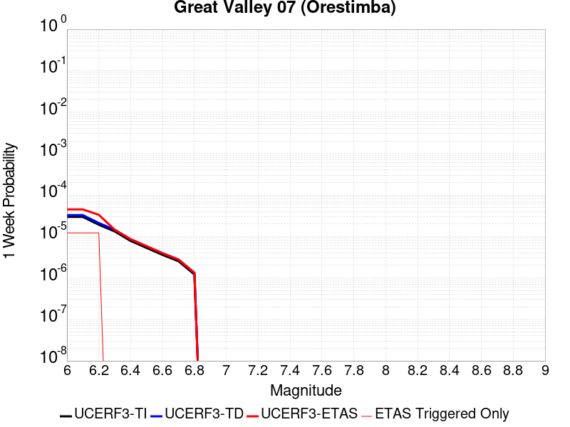 | 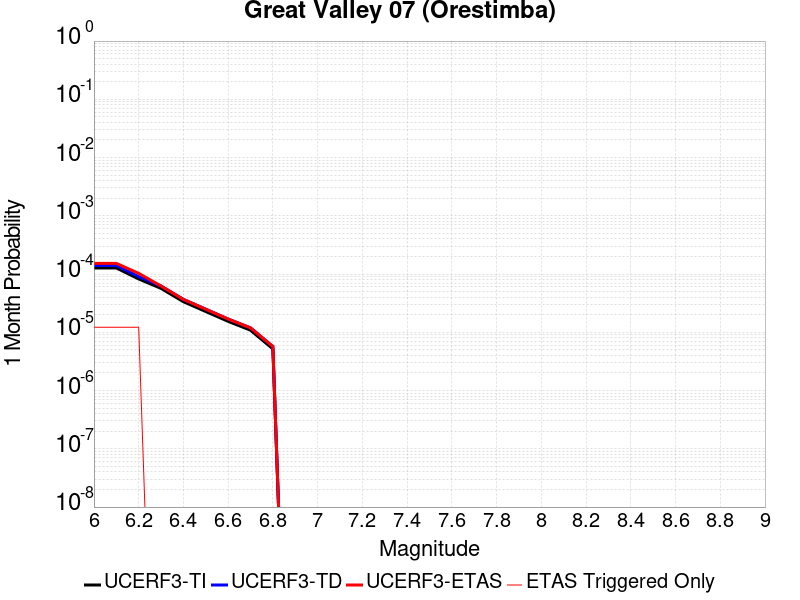 | 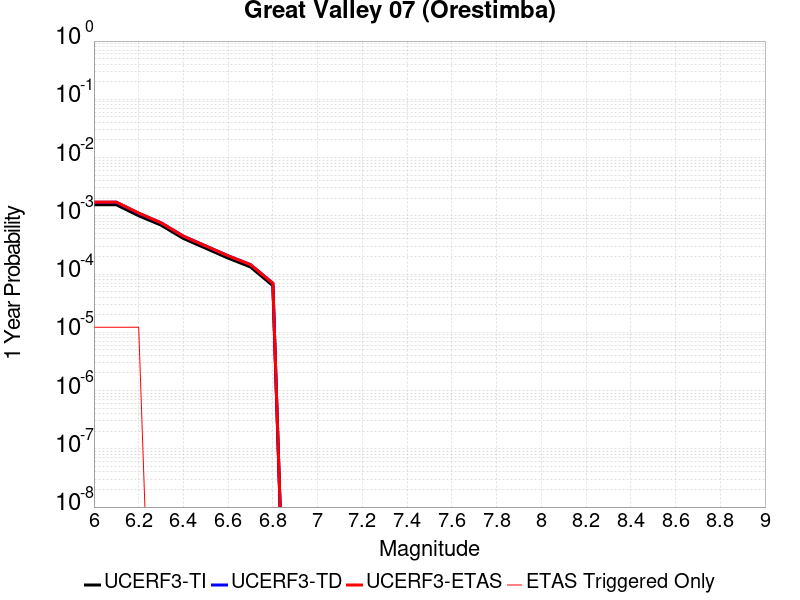 | 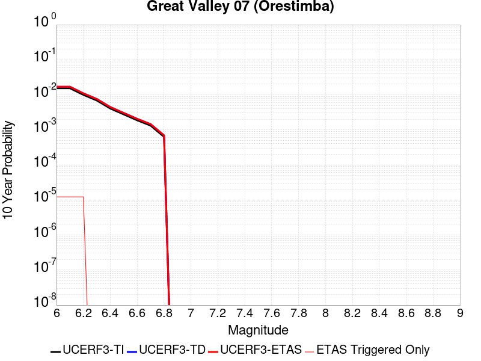 |

| Magnitude | 1 wk TI Prob | 1 wk TD Prob | 1 wk ETAS Prob | 1 wk ETAS/TD Gain | 1 wk ETAS Triggered Only | 1 mo TI Prob | 1 mo TD Prob | 1 mo ETAS Prob | 1 mo ETAS/TD Gain | 1 mo ETAS Triggered Only | 1 yr TI Prob | 1 yr TD Prob | 1 yr ETAS Prob | 1 yr ETAS/TD Gain | 1 yr ETAS Triggered Only | 10 yr TI Prob | 10 yr TD Prob | 10 yr ETAS Prob | 10 yr ETAS/TD Gain | 10 yr ETAS Triggered Only |
|-----|-----|-----|-----|-----|-----|-----|-----|-----|-----|-----|-----|-----|-----|-----|-----|-----|-----|-----|-----|-----|
| 6.0 | 2.9687902E-5 | 3.275741E-5 | 4.275708E-5 | 1.3052645 | 1.0E-5 | 1.2722766E-4 | 1.4038174E-4 | 1.5038034E-4 | 1.0712243 | 1.0E-5 | 0.0015478961 | 0.0017078797 | 0.0017178627 | 1.0058452 | 1.0E-5 | 0.015371585 | 0.016955089 | 0.01696492 | 1.0005798 | 1.0E-5 |
| 6.1 | 2.9687902E-5 | 3.275741E-5 | 4.275708E-5 | 1.3052645 | 1.0E-5 | 1.2722766E-4 | 1.4038174E-4 | 1.5038034E-4 | 1.0712243 | 1.0E-5 | 0.0015478961 | 0.0017078797 | 0.0017178627 | 1.0058452 | 1.0E-5 | 0.015371585 | 0.016955089 | 0.01696492 | 1.0005798 | 1.0E-5 |
| 6.2 | 1.9231524E-5 | 2.1159109E-5 | 3.11589E-5 | 1.4725996 | 1.0E-5 | 8.2418206E-5 | 9.067888E-5 | 1.0067797E-4 | 1.1102693 | 1.0E-5 | 0.0010029797 | 0.0011034793 | 0.0011134683 | 1.0090523 | 1.0E-5 | 0.00998465 | 0.010982411 | 0.010992302 | 1.0009005 | 1.0E-5 |
| 6.3 | 1.324766E-5 | 1.45484955E-5 | 1.45484955E-5 | 1.0 | 0.0 | 5.6774446E-5 | 6.234925E-5 | 6.234925E-5 | 1.0 | 0.0 | 6.910097E-4 | 7.58847E-4 | 7.58847E-4 | 1.0 | 0.0 | 0.006888649 | 0.007563504 | 0.007563504 | 1.0 | 0.0 |
| 6.4 | 7.818645E-6 | 8.572818E-6 | 8.572818E-6 | 1.0 | 0.0 | 3.3508048E-5 | 3.674015E-5 | 3.674015E-5 | 1.0 | 0.0 | 4.078841E-4 | 4.4722288E-4 | 4.4722288E-4 | 1.0 | 0.0 | 0.004071363 | 0.0044635693 | 0.0044635693 | 1.0 | 0.0 |
| 6.5 | 5.3076565E-6 | 5.8177857E-6 | 5.8177857E-6 | 1.0 | 0.0 | 2.27469E-5 | 2.4933142E-5 | 2.4933142E-5 | 1.0 | 0.0 | 2.7690834E-4 | 3.0352082E-4 | 3.0352082E-4 | 1.0 | 0.0 | 0.0027656353 | 0.0030312722 | 0.0030312722 | 1.0 | 0.0 |
| 6.6 | 3.6003578E-6 | 3.9484853E-6 | 3.9484853E-6 | 1.0 | 0.0 | 1.5430012E-5 | 1.6921978E-5 | 1.6921978E-5 | 1.0 | 0.0 | 1.8784421E-4 | 2.0600717E-4 | 2.0600717E-4 | 1.0 | 0.0 | 0.0018768552 | 0.002058316 | 0.002058316 | 1.0 | 0.0 |
| 6.7 | 2.5361826E-6 | 2.7834608E-6 | 2.7834608E-6 | 1.0 | 0.0 | 1.0869308E-5 | 1.192907E-5 | 1.192907E-5 | 1.0 | 0.0 | 1.3232579E-4 | 1.4522807E-4 | 1.4522807E-4 | 1.0 | 0.0 | 0.0013224703 | 0.0014514616 | 0.0014514616 | 1.0 | 0.0 |
| 6.8 | 1.2115831E-6 | 1.3313763E-6 | 1.3313763E-6 | 1.0 | 0.0 | 5.1924885E-6 | 5.7058915E-6 | 5.7058915E-6 | 1.0 | 0.0 | 6.3216714E-5 | 6.9467984E-5 | 6.9467984E-5 | 1.0 | 0.0 | 6.3198735E-4 | 6.945578E-4 | 6.945578E-4 | 1.0 | 0.0 |

## Calaveras (So) 2011 CFM
*[(top)](#table-of-contents)*

| 1 Week | 1 Month | 1 Year | 10 Year |
|-----|-----|-----|-----|
|  |  |  | 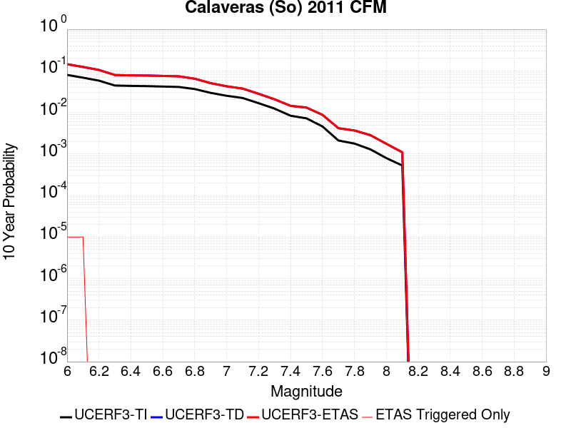 |

| Magnitude | 1 wk TI Prob | 1 wk TD Prob | 1 wk ETAS Prob | 1 wk ETAS/TD Gain | 1 wk ETAS Triggered Only | 1 mo TI Prob | 1 mo TD Prob | 1 mo ETAS Prob | 1 mo ETAS/TD Gain | 1 mo ETAS Triggered Only | 1 yr TI Prob | 1 yr TD Prob | 1 yr ETAS Prob | 1 yr ETAS/TD Gain | 1 yr ETAS Triggered Only | 10 yr TI Prob | 10 yr TD Prob | 10 yr ETAS Prob | 10 yr ETAS/TD Gain | 10 yr ETAS Triggered Only |
|-----|-----|-----|-----|-----|-----|-----|-----|-----|-----|-----|-----|-----|-----|-----|-----|-----|-----|-----|-----|-----|
| 6.0 | 1.5950744E-4 | 3.0713103E-4 | 3.1712797E-4 | 1.0325494 | 1.0E-5 | 6.834242E-4 | 0.0013153937 | 0.0013253806 | 1.0075923 | 1.0E-5 | 0.00828899 | 0.015858073 | 0.015867913 | 1.0006206 | 1.0E-5 | 0.079865426 | 0.14439669 | 0.14440526 | 1.0000592 | 1.0E-5 |
| 6.1 | 1.3584697E-4 | 2.6035146E-4 | 2.7034886E-4 | 1.0383996 | 1.0E-5 | 5.8207137E-4 | 0.0011151606 | 0.0011251495 | 1.0089573 | 1.0E-5 | 0.007063716 | 0.013461149 | 0.013471015 | 1.0007329 | 1.0E-5 | 0.06843361 | 0.12402486 | 0.12403362 | 1.0000706 | 1.0E-5 |
| 6.2 | 1.14676266E-4 | 2.1714337E-4 | 2.1714337E-4 | 1.0 | 0.0 | 4.9137714E-4 | 9.3020935E-4 | 9.3020935E-4 | 1.0 | 0.0 | 0.0059661185 | 0.011244834 | 0.011244834 | 1.0 | 0.0 | 0.058084648 | 0.105015434 | 0.105015434 | 1.0 | 0.0 |
| 6.3 | 8.691518E-5 | 1.5987532E-4 | 1.5987532E-4 | 1.0 | 0.0 | 3.7244044E-4 | 6.8496366E-4 | 6.8496366E-4 | 1.0 | 0.0 | 0.004525038 | 0.008300914 | 0.008300914 | 1.0 | 0.0 | 0.044339992 | 0.07933137 | 0.07933137 | 1.0 | 0.0 |
| 6.4 | 8.50982E-5 | 1.5693929E-4 | 1.5693929E-4 | 1.0 | 0.0 | 3.646556E-4 | 6.7238725E-4 | 6.7238725E-4 | 1.0 | 0.0 | 0.0044306475 | 0.008148949 | 0.008148949 | 1.0 | 0.0 | 0.04343345 | 0.07793759 | 0.07793759 | 1.0 | 0.0 |
| 6.5 | 8.4062965E-5 | 1.5518344E-4 | 1.5518344E-4 | 1.0 | 0.0 | 3.602201E-4 | 6.648665E-4 | 6.648665E-4 | 1.0 | 0.0 | 0.004376863 | 0.008058159 | 0.008058159 | 1.0 | 0.0 | 0.042916555 | 0.07710881 | 0.07710881 | 1.0 | 0.0 |
| 6.6 | 8.194716E-5 | 1.5154164E-4 | 1.5154164E-4 | 1.0 | 0.0 | 3.5115483E-4 | 6.4926746E-4 | 6.4926746E-4 | 1.0 | 0.0 | 0.0042669317 | 0.0078700045 | 0.0078700045 | 1.0 | 0.0 | 0.04185927 | 0.07539403 | 0.07539403 | 1.0 | 0.0 |
| 6.7 | 8.012326E-5 | 1.4822086E-4 | 1.4822086E-4 | 1.0 | 0.0 | 3.433402E-4 | 6.3504453E-4 | 6.3504453E-4 | 1.0 | 0.0 | 0.004172157 | 0.007698498 | 0.007698498 | 1.0 | 0.0 | 0.040946912 | 0.073836125 | 0.073836125 | 1.0 | 0.0 |
| 6.8 | 7.119773E-5 | 1.2881529E-4 | 1.2881529E-4 | 1.0 | 0.0 | 3.0509746E-4 | 5.519339E-4 | 5.519339E-4 | 1.0 | 0.0 | 0.0037082357 | 0.0066958778 | 0.0066958778 | 1.0 | 0.0 | 0.036469642 | 0.064680636 | 0.064680636 | 1.0 | 0.0 |
| 6.9 | 5.7343088E-5 | 9.9189514E-5 | 9.9189514E-5 | 1.0 | 0.0 | 2.4573295E-4 | 4.2502902E-4 | 4.2502902E-4 | 1.0 | 0.0 | 0.0029876942 | 0.005162525 | 0.005162525 | 1.0 | 0.0 | 0.02947844 | 0.050507598 | 0.050507598 | 1.0 | 0.0 |
| 7.0 | 4.8746577E-5 | 8.2847495E-5 | 8.2847495E-5 | 1.0 | 0.0 | 2.0889717E-4 | 3.5501274E-4 | 3.5501274E-4 | 1.0 | 0.0 | 0.0025403565 | 0.0043137805 | 0.0043137805 | 1.0 | 0.0 | 0.025115121 | 0.042482752 | 0.042482752 | 1.0 | 0.0 |
| 7.1 | 4.2998014E-5 | 7.264887E-5 | 7.264887E-5 | 1.0 | 0.0 | 1.8426418E-4 | 3.113155E-4 | 3.113155E-4 | 1.0 | 0.0 | 0.002241108 | 0.003783739 | 0.003783739 | 1.0 | 0.0 | 0.022186412 | 0.037421085 | 0.037421085 | 1.0 | 0.0 |
| 7.2 | 3.221292E-5 | 5.3904925E-5 | 5.3904925E-5 | 1.0 | 0.0 | 1.3804805E-4 | 2.3100081E-4 | 2.3100081E-4 | 1.0 | 0.0 | 0.0016794393 | 0.0028088356 | 0.0028088356 | 1.0 | 0.0 | 0.016668037 | 0.028033655 | 0.028033655 | 1.0 | 0.0 |
| 7.3 | 2.3756531E-5 | 3.9470644E-5 | 3.9470644E-5 | 1.0 | 0.0 | 1.0180973E-4 | 1.6914903E-4 | 1.6914903E-4 | 1.0 | 0.0 | 0.0012388286 | 0.0020574613 | 0.0020574613 | 1.0 | 0.0 | 0.012319452 | 0.020641495 | 0.020641495 | 1.0 | 0.0 |
| 7.4 | 1.5997684E-5 | 2.7339498E-5 | 2.7339498E-5 | 1.0 | 0.0 | 6.8559704E-5 | 1.1716403E-4 | 1.1716403E-4 | 1.0 | 0.0 | 8.343947E-4 | 0.0014255411 | 0.0014255411 | 1.0 | 0.0 | 0.008312687 | 0.014374586 | 0.014374586 | 1.0 | 0.0 |
| 7.5 | 1.3814293E-5 | 2.4781242E-5 | 2.4781242E-5 | 1.0 | 0.0 | 5.9202768E-5 | 1.0620101E-4 | 1.0620101E-4 | 1.0 | 0.0 | 7.205553E-4 | 0.0012922328 | 0.0012922328 | 1.0 | 0.0 | 0.007182234 | 0.01305369 | 0.01305369 | 1.0 | 0.0 |
| 7.6 | 8.817309E-6 | 1.6428305E-5 | 1.6428305E-5 | 1.0 | 0.0 | 3.7787922E-5 | 7.040513E-5 | 7.040513E-5 | 1.0 | 0.0 | 4.5997082E-4 | 8.568467E-4 | 8.568467E-4 | 1.0 | 0.0 | 0.004590199 | 0.008718078 | 0.008718078 | 1.0 | 0.0 |
| 7.7 | 4.0352206E-6 | 7.706533E-6 | 7.706533E-6 | 1.0 | 0.0 | 1.7293689E-5 | 3.3027583E-5 | 3.3027583E-5 | 1.0 | 0.0 | 2.1053031E-4 | 4.020367E-4 | 4.020367E-4 | 1.0 | 0.0 | 0.0021033096 | 0.0041648396 | 0.0041648396 | 1.0 | 0.0 |
| 7.8 | 3.413169E-6 | 6.7865935E-6 | 6.7865935E-6 | 1.0 | 0.0 | 1.4627784E-5 | 2.9085077E-5 | 2.9085077E-5 | 1.0 | 0.0 | 1.7807873E-4 | 3.5405334E-4 | 3.5405334E-4 | 1.0 | 0.0 | 0.0017793609 | 0.0036662305 | 0.0036662305 | 1.0 | 0.0 |
| 7.9 | 2.4740732E-6 | 5.2786727E-6 | 5.2786727E-6 | 1.0 | 0.0 | 1.06031275E-5 | 2.2622688E-5 | 2.2622688E-5 | 1.0 | 0.0 | 1.2908543E-4 | 2.7539645E-4 | 2.7539645E-4 | 1.0 | 0.0 | 0.0012901047 | 0.0028345648 | 0.0028345648 | 1.0 | 0.0 |
| 8.0 | 1.5231818E-6 | 3.288654E-6 | 3.288654E-6 | 1.0 | 0.0 | 6.527906E-6 | 1.4094155E-5 | 1.4094155E-5 | 1.0 | 0.0 | 7.9474354E-5 | 1.7158285E-4 | 1.7158285E-4 | 1.0 | 0.0 | 7.944594E-4 | 0.0017563011 | 0.0017563011 | 1.0 | 0.0 |
| 8.1 | 1.0104524E-6 | 2.0455911E-6 | 2.0455911E-6 | 1.0 | 0.0 | 4.330503E-6 | 8.7667895E-6 | 8.7667895E-6 | 1.0 | 0.0 | 5.2722597E-5 | 1.0673047E-4 | 1.0673047E-4 | 1.0 | 0.0 | 5.271009E-4 | 0.0010928642 | 0.0010928642 | 1.0 | 0.0 |

## Surprise Valley 2011 CFM
*[(top)](#table-of-contents)*

| 1 Week | 1 Month | 1 Year | 10 Year |
|-----|-----|-----|-----|
| 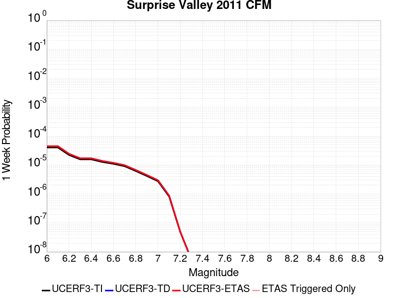 |  |  |  |

| Magnitude | 1 wk TI Prob | 1 wk TD Prob | 1 wk ETAS Prob | 1 wk ETAS/TD Gain | 1 wk ETAS Triggered Only | 1 mo TI Prob | 1 mo TD Prob | 1 mo ETAS Prob | 1 mo ETAS/TD Gain | 1 mo ETAS Triggered Only | 1 yr TI Prob | 1 yr TD Prob | 1 yr ETAS Prob | 1 yr ETAS/TD Gain | 1 yr ETAS Triggered Only | 10 yr TI Prob | 10 yr TD Prob | 10 yr ETAS Prob | 10 yr ETAS/TD Gain | 10 yr ETAS Triggered Only |
|-----|-----|-----|-----|-----|-----|-----|-----|-----|-----|-----|-----|-----|-----|-----|-----|-----|-----|-----|-----|-----|
| 6.0 | 4.0396248E-5 | 4.4851175E-5 | 4.4851175E-5 | 1.0 | 0.0 | 1.7311527E-4 | 1.9220635E-4 | 2.0220442E-4 | 1.0520175 | 1.0E-5 | 0.002105641 | 0.0023378108 | 0.0023477874 | 1.0042675 | 1.0E-5 | 0.020858008 | 0.0231539 | 0.023163667 | 1.0004219 | 1.0E-5 |
| 6.1 | 4.0396248E-5 | 4.4851175E-5 | 4.4851175E-5 | 1.0 | 0.0 | 1.7311527E-4 | 1.9220635E-4 | 2.0220442E-4 | 1.0520175 | 1.0E-5 | 0.002105641 | 0.0023378108 | 0.0023477874 | 1.0042675 | 1.0E-5 | 0.020858008 | 0.0231539 | 0.023163667 | 1.0004219 | 1.0E-5 |
| 6.2 | 2.2295266E-5 | 2.4401188E-5 | 2.4401188E-5 | 1.0 | 0.0 | 9.554764E-5 | 1.045725E-4 | 1.045725E-4 | 1.0 | 0.0 | 0.0011626717 | 0.0012724573 | 0.0012724573 | 1.0 | 0.0 | 0.011566074 | 0.012654949 | 0.012654949 | 1.0 | 0.0 |
| 6.3 | 1.572643E-5 | 1.7096767E-5 | 1.7096767E-5 | 1.0 | 0.0 | 6.7397246E-5 | 7.326986E-5 | 7.326986E-5 | 1.0 | 0.0 | 8.202525E-4 | 8.91706E-4 | 8.91706E-4 | 1.0 | 0.0 | 0.008172315 | 0.008882387 | 0.008882387 | 1.0 | 0.0 |
| 6.4 | 1.5714395E-5 | 1.7084589E-5 | 1.7084589E-5 | 1.0 | 0.0 | 6.734567E-5 | 7.321767E-5 | 7.321767E-5 | 1.0 | 0.0 | 8.1962504E-4 | 8.9107105E-4 | 8.9107105E-4 | 1.0 | 0.0 | 0.008166086 | 0.008876088 | 0.008876088 | 1.0 | 0.0 |
| 6.5 | 1.2733495E-5 | 1.3801569E-5 | 1.3801569E-5 | 1.0 | 0.0 | 5.457098E-5 | 5.914828E-5 | 5.914828E-5 | 1.0 | 0.0 | 6.641992E-4 | 7.19899E-4 | 7.19899E-4 | 1.0 | 0.0 | 0.0066221743 | 0.0071763634 | 0.0071763634 | 1.0 | 0.0 |
| 6.6 | 1.0983784E-5 | 1.1886527E-5 | 1.1886527E-5 | 1.0 | 0.0 | 4.7072506E-5 | 5.0941297E-5 | 5.0941297E-5 | 1.0 | 0.0 | 5.7295704E-4 | 6.200391E-4 | 6.200391E-4 | 1.0 | 0.0 | 0.0057148207 | 0.006183641 | 0.006183641 | 1.0 | 0.0 |
| 6.7 | 9.104806E-6 | 9.83947E-6 | 9.83947E-6 | 1.0 | 0.0 | 3.902001E-5 | 4.2168496E-5 | 4.2168496E-5 | 1.0 | 0.0 | 4.7496508E-4 | 5.132844E-4 | 5.132844E-4 | 1.0 | 0.0 | 0.004739512 | 0.0051213857 | 0.0051213857 | 1.0 | 0.0 |
| 6.8 | 6.2162403E-6 | 6.7041196E-6 | 6.7041196E-6 | 1.0 | 0.0 | 2.6640759E-5 | 2.8731638E-5 | 2.8731638E-5 | 1.0 | 0.0 | 3.2430296E-4 | 3.4975377E-4 | 3.4975377E-4 | 1.0 | 0.0 | 0.003238301 | 0.0034922564 | 0.0034922564 | 1.0 | 0.0 |
| 6.9 | 4.1792696E-6 | 4.5032207E-6 | 4.5032207E-6 | 1.0 | 0.0 | 1.7911032E-5 | 1.9299383E-5 | 1.9299383E-5 | 1.0 | 0.0 | 2.1804498E-4 | 2.349462E-4 | 2.349462E-4 | 1.0 | 0.0 | 0.0021783116 | 0.0023471313 | 0.0023471313 | 1.0 | 0.0 |
| 7.0 | 2.7478413E-6 | 2.9622363E-6 | 2.9622363E-6 | 1.0 | 0.0 | 1.177641E-5 | 1.2695244E-5 | 1.2695244E-5 | 1.0 | 0.0 | 1.4336836E-4 | 1.5455487E-4 | 1.5455487E-4 | 1.0 | 0.0 | 0.001432759 | 0.0015445963 | 0.0015445963 | 1.0 | 0.0 |
| 7.1 | 8.128648E-7 | 8.7249043E-7 | 8.7249043E-7 | 1.0 | 0.0 | 3.4837017E-6 | 3.7392429E-6 | 3.7392429E-6 | 1.0 | 0.0 | 4.2413245E-5 | 4.552493E-5 | 4.552493E-5 | 1.0 | 0.0 | 4.2405148E-4 | 4.5521485E-4 | 4.5521485E-4 | 1.0 | 0.0 |
| 7.2 | 4.8641045E-8 | 4.9402047E-8 | 4.9402047E-8 | 1.0 | 0.0 | 2.084616E-7 | 2.1172303E-7 | 2.1172303E-7 | 1.0 | 0.0 | 2.538017E-6 | 2.5777251E-6 | 2.5777251E-6 | 1.0 | 0.0 | 2.537988E-5 | 2.5776963E-5 | 2.5776963E-5 | 1.0 | 0.0 |
| 7.3 | 5.3911844E-9 | 5.475812E-9 | 5.475812E-9 | 1.0 | 0.0 | 2.3105075E-8 | 2.3467765E-8 | 2.3467765E-8 | 1.0 | 0.0 | 2.8130427E-7 | 2.8572003E-7 | 2.8572003E-7 | 1.0 | 0.0 | 2.8130391E-6 | 2.857198E-6 | 2.857198E-6 | 1.0 | 0.0 |

## Johnson Valley (No) 2011 rev
*[(top)](#table-of-contents)*

| 1 Week | 1 Month | 1 Year | 10 Year |
|-----|-----|-----|-----|
|  | 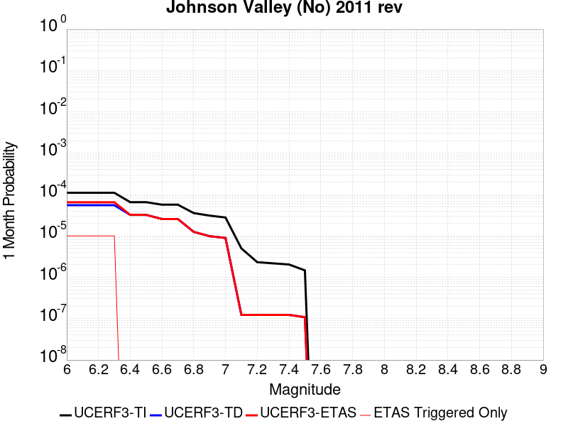 |  |  |

| Magnitude | 1 wk TI Prob | 1 wk TD Prob | 1 wk ETAS Prob | 1 wk ETAS/TD Gain | 1 wk ETAS Triggered Only | 1 mo TI Prob | 1 mo TD Prob | 1 mo ETAS Prob | 1 mo ETAS/TD Gain | 1 mo ETAS Triggered Only | 1 yr TI Prob | 1 yr TD Prob | 1 yr ETAS Prob | 1 yr ETAS/TD Gain | 1 yr ETAS Triggered Only | 10 yr TI Prob | 10 yr TD Prob | 10 yr ETAS Prob | 10 yr ETAS/TD Gain | 10 yr ETAS Triggered Only |
|-----|-----|-----|-----|-----|-----|-----|-----|-----|-----|-----|-----|-----|-----|-----|-----|-----|-----|-----|-----|-----|
| 6.0 | 2.577707E-5 | 1.29011805E-5 | 2.2901051E-5 | 1.7751129 | 1.0E-5 | 1.1046848E-4 | 5.5289824E-5 | 6.528927E-5 | 1.1808552 | 1.0E-5 | 0.0013441239 | 6.729854E-4 | 6.8297866E-4 | 1.0148492 | 1.0E-5 | 0.013360229 | 0.006713383 | 0.0067233155 | 1.0014795 | 1.0E-5 |
| 6.1 | 2.577707E-5 | 1.29011805E-5 | 2.2901051E-5 | 1.7751129 | 1.0E-5 | 1.1046848E-4 | 5.5289824E-5 | 6.528927E-5 | 1.1808552 | 1.0E-5 | 0.0013441239 | 6.729854E-4 | 6.8297866E-4 | 1.0148492 | 1.0E-5 | 0.013360229 | 0.006713383 | 0.0067233155 | 1.0014795 | 1.0E-5 |
| 6.2 | 2.577707E-5 | 1.29011805E-5 | 2.2901051E-5 | 1.7751129 | 1.0E-5 | 1.1046848E-4 | 5.5289824E-5 | 6.528927E-5 | 1.1808552 | 1.0E-5 | 0.0013441239 | 6.729854E-4 | 6.8297866E-4 | 1.0148492 | 1.0E-5 | 0.013360229 | 0.006713383 | 0.0067233155 | 1.0014795 | 1.0E-5 |
| 6.3 | 2.577707E-5 | 1.29011805E-5 | 2.2901051E-5 | 1.7751129 | 1.0E-5 | 1.1046848E-4 | 5.5289824E-5 | 6.528927E-5 | 1.1808552 | 1.0E-5 | 0.0013441239 | 6.729854E-4 | 6.8297866E-4 | 1.0148492 | 1.0E-5 | 0.013360229 | 0.006713383 | 0.0067233155 | 1.0014795 | 1.0E-5 |
| 6.4 | 1.5296591E-5 | 7.536961E-6 | 7.536961E-6 | 1.0 | 0.0 | 6.555518E-5 | 3.2300966E-5 | 3.2300966E-5 | 1.0 | 0.0 | 7.97842E-4 | 3.9321207E-4 | 3.9321207E-4 | 1.0 | 0.0 | 0.007949836 | 0.0039270045 | 0.0039270045 | 1.0 | 0.0 |
| 6.5 | 1.5296591E-5 | 7.536961E-6 | 7.536961E-6 | 1.0 | 0.0 | 6.555518E-5 | 3.2300966E-5 | 3.2300966E-5 | 1.0 | 0.0 | 7.97842E-4 | 3.9321207E-4 | 3.9321207E-4 | 1.0 | 0.0 | 0.007949836 | 0.0039270045 | 0.0039270045 | 1.0 | 0.0 |
| 6.6 | 1.3289383E-5 | 5.991923E-6 | 5.991923E-6 | 1.0 | 0.0 | 5.6953253E-5 | 2.5679514E-5 | 2.5679514E-5 | 1.0 | 0.0 | 6.9318525E-4 | 3.126202E-4 | 3.126202E-4 | 1.0 | 0.0 | 0.0069102696 | 0.0031234685 | 0.0031234685 | 1.0 | 0.0 |
| 6.7 | 1.3289383E-5 | 5.991923E-6 | 5.991923E-6 | 1.0 | 0.0 | 5.6953253E-5 | 2.5679514E-5 | 2.5679514E-5 | 1.0 | 0.0 | 6.9318525E-4 | 3.126202E-4 | 3.126202E-4 | 1.0 | 0.0 | 0.0069102696 | 0.0031234685 | 0.0031234685 | 1.0 | 0.0 |
| 6.8 | 8.330789E-6 | 2.9214575E-6 | 2.9214575E-6 | 1.0 | 0.0 | 3.570289E-5 | 1.2520504E-5 | 1.2520504E-5 | 1.0 | 0.0 | 4.34596E-4 | 1.5243219E-4 | 1.5243219E-4 | 1.0 | 0.0 | 0.0043374705 | 0.0015238363 | 0.0015238363 | 1.0 | 0.0 |
| 6.9 | 7.2359003E-6 | 2.3014697E-6 | 2.3014697E-6 | 1.0 | 0.0 | 3.1010633E-5 | 9.863435E-6 | 9.863435E-6 | 1.0 | 0.0 | 3.7748902E-4 | 1.20086035E-4 | 1.20086035E-4 | 1.0 | 0.0 | 0.0037684843 | 0.0012007343 | 0.0012007343 | 1.0 | 0.0 |
| 7.0 | 6.5149957E-6 | 2.0886396E-6 | 2.0886396E-6 | 1.0 | 0.0 | 2.792111E-5 | 8.951311E-6 | 8.951311E-6 | 1.0 | 0.0 | 3.398865E-4 | 1.08982065E-4 | 1.08982065E-4 | 1.0 | 0.0 | 0.003393671 | 0.0010898061 | 0.0010898061 | 1.0 | 0.0 |
| 7.1 | 1.1662233E-6 | 2.8792787E-8 | 2.8792787E-8 | 1.0 | 0.0 | 4.9980904E-6 | 1.2339765E-7 | 1.2339765E-7 | 1.0 | 0.0 | 6.0850052E-5 | 1.5023655E-6 | 1.5023655E-6 | 1.0 | 0.0 | 6.083339E-4 | 1.502357E-5 | 1.502357E-5 | 1.0 | 0.0 |
| 7.2 | 5.413881E-7 | 2.8792787E-8 | 2.8792787E-8 | 1.0 | 0.0 | 2.3202326E-6 | 1.2339765E-7 | 1.2339765E-7 | 1.0 | 0.0 | 2.8248465E-5 | 1.5023655E-6 | 1.5023655E-6 | 1.0 | 0.0 | 2.8244875E-4 | 1.502357E-5 | 1.502357E-5 | 1.0 | 0.0 |
| 7.3 | 5.076821E-7 | 2.8792787E-8 | 2.8792787E-8 | 1.0 | 0.0 | 2.1757785E-6 | 1.2339765E-7 | 1.2339765E-7 | 1.0 | 0.0 | 2.648978E-5 | 1.5023655E-6 | 1.5023655E-6 | 1.0 | 0.0 | 2.6486625E-4 | 1.502357E-5 | 1.502357E-5 | 1.0 | 0.0 |
| 7.4 | 4.7568687E-7 | 2.8774735E-8 | 2.8774735E-8 | 1.0 | 0.0 | 2.0386565E-6 | 1.2332029E-7 | 1.2332029E-7 | 1.0 | 0.0 | 2.482036E-5 | 1.5014238E-6 | 1.5014238E-6 | 1.0 | 0.0 | 2.4817587E-4 | 1.5014152E-5 | 1.5014152E-5 | 1.0 | 0.0 |
| 7.5 | 3.435626E-7 | 2.535013E-8 | 2.535013E-8 | 1.0 | 0.0 | 1.4724103E-6 | 1.0864341E-7 | 1.0864341E-7 | 1.0 | 0.0 | 1.7926448E-5 | 1.3227329E-6 | 1.3227329E-6 | 1.0 | 0.0 | 1.7925001E-4 | 1.3227266E-5 | 1.3227266E-5 | 1.0 | 0.0 |

## Sierra Madre
*[(top)](#table-of-contents)*

| 1 Week | 1 Month | 1 Year | 10 Year |
|-----|-----|-----|-----|
|  | 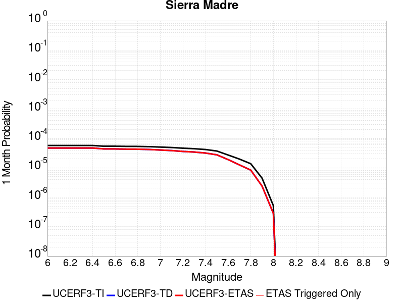 | 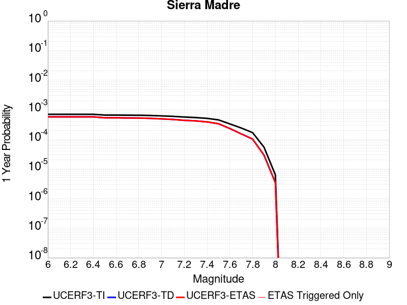 |  |

| Magnitude | 1 wk TI Prob | 1 wk TD Prob | 1 wk ETAS Prob | 1 wk ETAS/TD Gain | 1 wk ETAS Triggered Only | 1 mo TI Prob | 1 mo TD Prob | 1 mo ETAS Prob | 1 mo ETAS/TD Gain | 1 mo ETAS Triggered Only | 1 yr TI Prob | 1 yr TD Prob | 1 yr ETAS Prob | 1 yr ETAS/TD Gain | 1 yr ETAS Triggered Only | 10 yr TI Prob | 10 yr TD Prob | 10 yr ETAS Prob | 10 yr ETAS/TD Gain | 10 yr ETAS Triggered Only |
|-----|-----|-----|-----|-----|-----|-----|-----|-----|-----|-----|-----|-----|-----|-----|-----|-----|-----|-----|-----|-----|
| 6.0 | 1.3379373E-5 | 1.1000711E-5 | 1.1000711E-5 | 1.0 | 0.0 | 5.7338908E-5 | 4.7145062E-5 | 4.7145062E-5 | 1.0 | 0.0 | 6.978776E-4 | 5.7384145E-4 | 5.7384145E-4 | 1.0 | 0.0 | 0.0069569005 | 0.0057238117 | 0.005733754 | 1.0017371 | 1.0E-5 |
| 6.1 | 1.3379373E-5 | 1.1000711E-5 | 1.1000711E-5 | 1.0 | 0.0 | 5.7338908E-5 | 4.7145062E-5 | 4.7145062E-5 | 1.0 | 0.0 | 6.978776E-4 | 5.7384145E-4 | 5.7384145E-4 | 1.0 | 0.0 | 0.0069569005 | 0.0057238117 | 0.005733754 | 1.0017371 | 1.0E-5 |
| 6.2 | 1.3379373E-5 | 1.1000711E-5 | 1.1000711E-5 | 1.0 | 0.0 | 5.7338908E-5 | 4.7145062E-5 | 4.7145062E-5 | 1.0 | 0.0 | 6.978776E-4 | 5.7384145E-4 | 5.7384145E-4 | 1.0 | 0.0 | 0.0069569005 | 0.0057238117 | 0.005733754 | 1.0017371 | 1.0E-5 |
| 6.3 | 1.3379373E-5 | 1.1000711E-5 | 1.1000711E-5 | 1.0 | 0.0 | 5.7338908E-5 | 4.7145062E-5 | 4.7145062E-5 | 1.0 | 0.0 | 6.978776E-4 | 5.7384145E-4 | 5.7384145E-4 | 1.0 | 0.0 | 0.0069569005 | 0.0057238117 | 0.005733754 | 1.0017371 | 1.0E-5 |
| 6.4 | 1.3379373E-5 | 1.1000711E-5 | 1.1000711E-5 | 1.0 | 0.0 | 5.7338908E-5 | 4.7145062E-5 | 4.7145062E-5 | 1.0 | 0.0 | 6.978776E-4 | 5.7384145E-4 | 5.7384145E-4 | 1.0 | 0.0 | 0.0069569005 | 0.0057238117 | 0.005733754 | 1.0017371 | 1.0E-5 |
| 6.5 | 1.26563245E-5 | 1.0230168E-5 | 1.0230168E-5 | 1.0 | 0.0 | 5.4240263E-5 | 4.3842847E-5 | 4.3842847E-5 | 1.0 | 0.0 | 6.601751E-4 | 5.3365703E-4 | 5.3365703E-4 | 1.0 | 0.0 | 0.006582173 | 0.0053239274 | 0.0053338744 | 1.0018684 | 1.0E-5 |
| 6.6 | 1.26563245E-5 | 1.0230168E-5 | 1.0230168E-5 | 1.0 | 0.0 | 5.4240263E-5 | 4.3842847E-5 | 4.3842847E-5 | 1.0 | 0.0 | 6.601751E-4 | 5.3365703E-4 | 5.3365703E-4 | 1.0 | 0.0 | 0.006582173 | 0.0053239274 | 0.0053338744 | 1.0018684 | 1.0E-5 |
| 6.7 | 1.2502474E-5 | 1.0066313E-5 | 1.0066313E-5 | 1.0 | 0.0 | 5.3580934E-5 | 4.3140633E-5 | 4.3140633E-5 | 1.0 | 0.0 | 6.521526E-4 | 5.251117E-4 | 5.251117E-4 | 1.0 | 0.0 | 0.0065024206 | 0.005238879 | 0.0052488265 | 1.0018988 | 1.0E-5 |
| 6.8 | 1.2454966E-5 | 1.0018598E-5 | 1.0018598E-5 | 1.0 | 0.0 | 5.3377335E-5 | 4.293615E-5 | 4.293615E-5 | 1.0 | 0.0 | 6.4967526E-4 | 5.226233E-4 | 5.226233E-4 | 1.0 | 0.0 | 0.006477792 | 0.005214112 | 0.00522406 | 1.0019078 | 1.0E-5 |
| 6.9 | 1.2225574E-5 | 9.792576E-6 | 9.792576E-6 | 1.0 | 0.0 | 5.2394265E-5 | 4.1967513E-5 | 4.1967513E-5 | 1.0 | 0.0 | 6.3771347E-4 | 5.108357E-4 | 5.108357E-4 | 1.0 | 0.0 | 0.006358865 | 0.0050967815 | 0.0051067304 | 1.001952 | 1.0E-5 |
| 7.0 | 1.182946E-5 | 9.3991175E-6 | 9.3991175E-6 | 1.0 | 0.0 | 5.06967E-5 | 4.0281317E-5 | 4.0281317E-5 | 1.0 | 0.0 | 6.1705755E-4 | 4.9031567E-4 | 4.9031567E-4 | 1.0 | 0.0 | 0.006153469 | 0.004892501 | 0.004902452 | 1.002034 | 1.0E-5 |
| 7.1 | 1.14369095E-5 | 8.986133E-6 | 8.986133E-6 | 1.0 | 0.0 | 4.9014405E-5 | 3.8511436E-5 | 3.8511436E-5 | 1.0 | 0.0 | 5.9658696E-4 | 4.6877685E-4 | 4.6877685E-4 | 1.0 | 0.0 | 0.005949879 | 0.004678036 | 0.0046879896 | 1.0021276 | 1.0E-5 |
| 7.2 | 1.0836419E-5 | 8.39953E-6 | 8.39953E-6 | 1.0 | 0.0 | 4.644097E-5 | 3.5997495E-5 | 3.5997495E-5 | 1.0 | 0.0 | 5.652721E-4 | 4.3818227E-4 | 4.3818227E-4 | 1.0 | 0.0 | 0.0056383642 | 0.0043733306 | 0.004383287 | 1.0022765 | 1.0E-5 |
| 7.3 | 1.0403439E-5 | 8.020796E-6 | 8.020796E-6 | 1.0 | 0.0 | 4.4585406E-5 | 3.437439E-5 | 3.437439E-5 | 1.0 | 0.0 | 5.426921E-4 | 4.1842874E-4 | 4.1842874E-4 | 1.0 | 0.0 | 0.005413687 | 0.0041765547 | 0.004186513 | 1.0023843 | 1.0E-5 |
| 7.4 | 9.768864E-6 | 7.414428E-6 | 7.414428E-6 | 1.0 | 0.0 | 4.186589E-5 | 3.177574E-5 | 3.177574E-5 | 1.0 | 0.0 | 5.09598E-4 | 3.8680184E-4 | 3.8680184E-4 | 1.0 | 0.0 | 0.0050843097 | 0.003861428 | 0.0038713894 | 1.0025797 | 1.0E-5 |
| 7.5 | 8.687089E-6 | 6.4501282E-6 | 6.4501282E-6 | 1.0 | 0.0 | 3.722985E-5 | 2.7643118E-5 | 2.7643118E-5 | 1.0 | 0.0 | 4.5317915E-4 | 3.3650384E-4 | 3.3650384E-4 | 1.0 | 0.0 | 0.004522561 | 0.0033600808 | 0.003370047 | 1.0029662 | 1.0E-5 |
| 7.6 | 6.3506063E-6 | 4.4302888E-6 | 4.4302888E-6 | 1.0 | 0.0 | 2.72166E-5 | 1.8986815E-5 | 1.8986815E-5 | 1.0 | 0.0 | 3.3131172E-4 | 2.311402E-4 | 2.311402E-4 | 1.0 | 0.0 | 0.003308182 | 0.0023090725 | 0.0023190496 | 1.0043207 | 1.0E-5 |
| 7.7 | 4.62223E-6 | 2.9329185E-6 | 2.9329185E-6 | 1.0 | 0.0 | 1.9809406E-5 | 1.2569591E-5 | 1.2569591E-5 | 1.0 | 0.0 | 2.4115283E-4 | 1.5302404E-4 | 1.5302404E-4 | 1.0 | 0.0 | 0.0024089129 | 0.0015292395 | 0.0015392241 | 1.0065292 | 1.0E-5 |
| 7.8 | 3.2145008E-6 | 1.9493868E-6 | 1.9493868E-6 | 1.0 | 0.0 | 1.3776359E-5 | 8.354488E-6 | 8.354488E-6 | 1.0 | 0.0 | 1.6771426E-4 | 1.01711164E-4 | 1.01711164E-4 | 1.0 | 0.0 | 0.0016758774 | 0.0010166519 | 0.0010266417 | 1.0098262 | 1.0E-5 |
| 7.9 | 1.0391769E-6 | 5.602403E-7 | 5.602403E-7 | 1.0 | 0.0 | 4.4536077E-6 | 2.4010278E-6 | 2.4010278E-6 | 1.0 | 0.0 | 5.4221324E-5 | 2.9232126E-5 | 2.9232126E-5 | 1.0 | 0.0 | 5.4208096E-4 | 2.9228322E-4 | 2.9228322E-4 | 1.0 | 0.0 |
| 8.0 | 1.210983E-7 | 6.6134284E-8 | 6.6134284E-8 | 1.0 | 0.0 | 5.1899264E-7 | 2.8343263E-7 | 2.8343263E-7 | 1.0 | 0.0 | 6.3187167E-6 | 3.4507868E-6 | 3.4507868E-6 | 1.0 | 0.0 | 6.318537E-5 | 3.450735E-5 | 3.450735E-5 | 1.0 | 0.0 |

## Simi-Santa Rosa
*[(top)](#table-of-contents)*

| 1 Week | 1 Month | 1 Year | 10 Year |
|-----|-----|-----|-----|
|  | 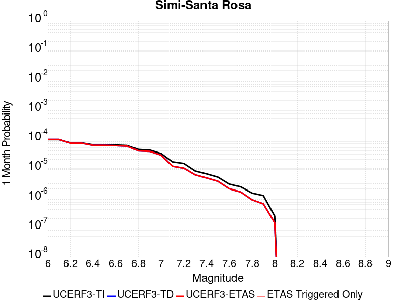 |  |  |

| Magnitude | 1 wk TI Prob | 1 wk TD Prob | 1 wk ETAS Prob | 1 wk ETAS/TD Gain | 1 wk ETAS Triggered Only | 1 mo TI Prob | 1 mo TD Prob | 1 mo ETAS Prob | 1 mo ETAS/TD Gain | 1 mo ETAS Triggered Only | 1 yr TI Prob | 1 yr TD Prob | 1 yr ETAS Prob | 1 yr ETAS/TD Gain | 1 yr ETAS Triggered Only | 10 yr TI Prob | 10 yr TD Prob | 10 yr ETAS Prob | 10 yr ETAS/TD Gain | 10 yr ETAS Triggered Only |
|-----|-----|-----|-----|-----|-----|-----|-----|-----|-----|-----|-----|-----|-----|-----|-----|-----|-----|-----|-----|-----|
| 6.0 | 2.198912E-5 | 2.2275311E-5 | 2.2275311E-5 | 1.0 | 0.0 | 9.4235686E-5 | 9.5462376E-5 | 9.5462376E-5 | 1.0 | 0.0 | 0.0011467156 | 0.0011616786 | 0.0011716669 | 1.0085982 | 1.0E-5 | 0.011408163 | 0.011560508 | 0.011570392 | 1.000855 | 1.0E-5 |
| 6.1 | 2.198912E-5 | 2.2275311E-5 | 2.2275311E-5 | 1.0 | 0.0 | 9.4235686E-5 | 9.5462376E-5 | 9.5462376E-5 | 1.0 | 0.0 | 0.0011467156 | 0.0011616786 | 0.0011716669 | 1.0085982 | 1.0E-5 | 0.011408163 | 0.011560508 | 0.011570392 | 1.000855 | 1.0E-5 |
| 6.2 | 1.69983E-5 | 1.6668448E-5 | 1.6668448E-5 | 1.0 | 0.0 | 7.284782E-5 | 7.1434406E-5 | 7.1434406E-5 | 1.0 | 0.0 | 8.865613E-4 | 8.693961E-4 | 8.793874E-4 | 1.0114923 | 1.0E-5 | 0.008830327 | 0.008662869 | 0.008672782 | 1.0011444 | 1.0E-5 |
| 6.3 | 1.69983E-5 | 1.6668448E-5 | 1.6668448E-5 | 1.0 | 0.0 | 7.284782E-5 | 7.1434406E-5 | 7.1434406E-5 | 1.0 | 0.0 | 8.865613E-4 | 8.693961E-4 | 8.793874E-4 | 1.0114923 | 1.0E-5 | 0.008830327 | 0.008662869 | 0.008672782 | 1.0011444 | 1.0E-5 |
| 6.4 | 1.4666188E-5 | 1.4052439E-5 | 1.4052439E-5 | 1.0 | 0.0 | 6.285358E-5 | 6.0223487E-5 | 6.0223487E-5 | 1.0 | 0.0 | 7.6497364E-4 | 7.329992E-4 | 7.4299186E-4 | 1.0136325 | 1.0E-5 | 0.0076234564 | 0.0073082903 | 0.0073182173 | 1.0013583 | 1.0E-5 |
| 6.5 | 1.4666188E-5 | 1.4052439E-5 | 1.4052439E-5 | 1.0 | 0.0 | 6.285358E-5 | 6.0223487E-5 | 6.0223487E-5 | 1.0 | 0.0 | 7.6497364E-4 | 7.329992E-4 | 7.4299186E-4 | 1.0136325 | 1.0E-5 | 0.0076234564 | 0.0073082903 | 0.0073182173 | 1.0013583 | 1.0E-5 |
| 6.6 | 1.4377586E-5 | 1.3729479E-5 | 1.3729479E-5 | 1.0 | 0.0 | 6.1616774E-5 | 5.883944E-5 | 5.883944E-5 | 1.0 | 0.0 | 7.4992597E-4 | 7.161596E-4 | 7.2615244E-4 | 1.0139533 | 1.0E-5 | 0.007474003 | 0.007140985 | 0.0071509136 | 1.0013903 | 1.0E-5 |
| 6.7 | 1.3881404E-5 | 1.320745E-5 | 1.320745E-5 | 1.0 | 0.0 | 5.9490372E-5 | 5.6602268E-5 | 5.6602268E-5 | 1.0 | 0.0 | 7.240546E-4 | 6.889394E-4 | 6.9893256E-4 | 1.014505 | 1.0E-5 | 0.007217 | 0.006870486 | 0.0068804175 | 1.0014455 | 1.0E-5 |
| 6.8 | 1.0176516E-5 | 9.154065E-6 | 9.154065E-6 | 1.0 | 0.0 | 4.3612912E-5 | 3.9231214E-5 | 3.9231214E-5 | 1.0 | 0.0 | 5.308578E-4 | 4.7755192E-4 | 4.7755192E-4 | 1.0 | 0.0 | 0.0052959146 | 0.0047668903 | 0.0047668903 | 1.0 | 0.0 |
| 6.9 | 9.699797E-6 | 8.774639E-6 | 8.774639E-6 | 1.0 | 0.0 | 4.15699E-5 | 3.7605147E-5 | 3.7605147E-5 | 1.0 | 0.0 | 5.05996E-4 | 4.5776292E-4 | 4.5776292E-4 | 1.0 | 0.0 | 0.005048454 | 0.004569818 | 0.004569818 | 1.0 | 0.0 |
| 7.0 | 7.4049476E-6 | 6.5592662E-6 | 6.5592662E-6 | 1.0 | 0.0 | 3.1735104E-5 | 2.811091E-5 | 2.811091E-5 | 1.0 | 0.0 | 3.8630638E-4 | 3.4220924E-4 | 3.4220924E-4 | 1.0 | 0.0 | 0.0038563553 | 0.003418065 | 0.003418065 | 1.0 | 0.0 |
| 7.1 | 3.873439E-6 | 2.7594629E-6 | 2.7594629E-6 | 1.0 | 0.0 | 1.6600346E-5 | 1.1826218E-5 | 1.1826218E-5 | 1.0 | 0.0 | 2.0209046E-4 | 1.4397492E-4 | 1.4397492E-4 | 1.0 | 0.0 | 0.0020190678 | 0.0014388401 | 0.0014388401 | 1.0 | 0.0 |
| 7.2 | 3.417706E-6 | 2.3676068E-6 | 2.3676068E-6 | 1.0 | 0.0 | 1.4647229E-5 | 1.0146849E-5 | 1.0146849E-5 | 1.0 | 0.0 | 1.7831543E-4 | 1.235311E-4 | 1.235311E-4 | 1.0 | 0.0 | 0.0017817242 | 0.0012346467 | 0.0012346467 | 1.0 | 0.0 |
| 7.3 | 1.90225E-6 | 1.4073679E-6 | 1.4073679E-6 | 1.0 | 0.0 | 8.152474E-6 | 6.031563E-6 | 6.031563E-6 | 1.0 | 0.0 | 9.9251854E-5 | 7.3431824E-5 | 7.3431824E-5 | 1.0 | 0.0 | 9.920754E-4 | 7.340779E-4 | 7.340779E-4 | 1.0 | 0.0 |
| 7.4 | 1.5170556E-6 | 1.1024721E-6 | 1.1024721E-6 | 1.0 | 0.0 | 6.5016507E-6 | 4.724872E-6 | 4.724872E-6 | 1.0 | 0.0 | 7.915472E-5 | 5.752381E-5 | 5.752381E-5 | 1.0 | 0.0 | 7.9126534E-4 | 5.750903E-4 | 5.750903E-4 | 1.0 | 0.0 |
| 7.5 | 1.178732E-6 | 8.5350433E-7 | 8.5350433E-7 | 1.0 | 0.0 | 5.0516987E-6 | 3.6578708E-6 | 3.6578708E-6 | 1.0 | 0.0 | 6.1502695E-5 | 4.4533674E-5 | 4.4533674E-5 | 1.0 | 0.0 | 6.148568E-4 | 4.4524847E-4 | 4.4524847E-4 | 1.0 | 0.0 |
| 7.6 | 6.8722386E-7 | 4.793168E-7 | 4.793168E-7 | 1.0 | 0.0 | 2.9452417E-6 | 2.0542134E-6 | 2.0542134E-6 | 1.0 | 0.0 | 3.5857727E-5 | 2.500976E-5 | 2.500976E-5 | 1.0 | 0.0 | 3.5851944E-4 | 2.500696E-4 | 2.500696E-4 | 1.0 | 0.0 |
| 7.7 | 5.5126515E-7 | 3.6730708E-7 | 3.6730708E-7 | 1.0 | 0.0 | 2.3625628E-6 | 1.5741723E-6 | 1.5741723E-6 | 1.0 | 0.0 | 2.8763823E-5 | 1.916538E-5 | 1.916538E-5 | 1.0 | 0.0 | 2.87601E-4 | 1.9163737E-4 | 1.9163737E-4 | 1.0 | 0.0 |
| 7.8 | 3.3860243E-7 | 2.0075227E-7 | 2.0075227E-7 | 1.0 | 0.0 | 1.4511525E-6 | 8.603666E-7 | 8.603666E-7 | 1.0 | 0.0 | 1.7667637E-5 | 1.0474913E-5 | 1.0474913E-5 | 1.0 | 0.0 | 1.7666233E-4 | 1.0474425E-4 | 1.0474425E-4 | 1.0 | 0.0 |
| 7.9 | 2.7955386E-7 | 1.4648458E-7 | 1.4648458E-7 | 1.0 | 0.0 | 1.1980875E-6 | 6.2779094E-7 | 6.2779094E-7 | 1.0 | 0.0 | 1.4586617E-5 | 7.643328E-6 | 7.643328E-6 | 1.0 | 0.0 | 1.458566E-4 | 7.64307E-5 | 7.64307E-5 | 1.0 | 0.0 |
| 8.0 | 5.6259015E-8 | 3.335265E-8 | 3.335265E-8 | 1.0 | 0.0 | 2.4111003E-7 | 1.4293991E-7 | 1.4293991E-7 | 1.0 | 0.0 | 2.9355108E-6 | 1.7402922E-6 | 1.7402922E-6 | 1.0 | 0.0 | 2.935472E-5 | 1.74028E-5 | 1.74028E-5 | 1.0 | 0.0 |

## San Andreas (North Branch Mill Creek)
*[(top)](#table-of-contents)*

| 1 Week | 1 Month | 1 Year | 10 Year |
|-----|-----|-----|-----|
| 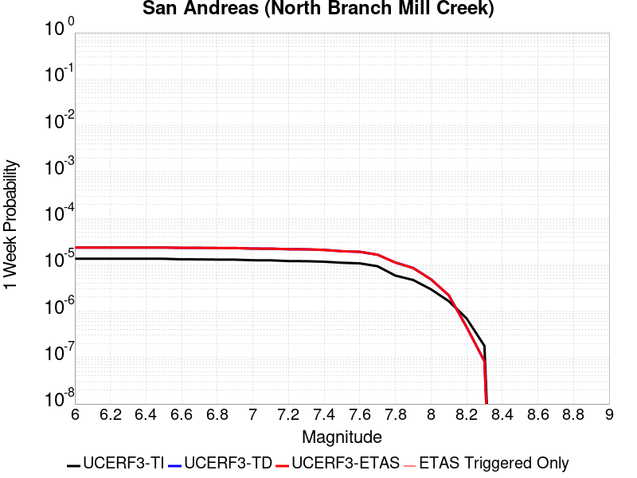 | 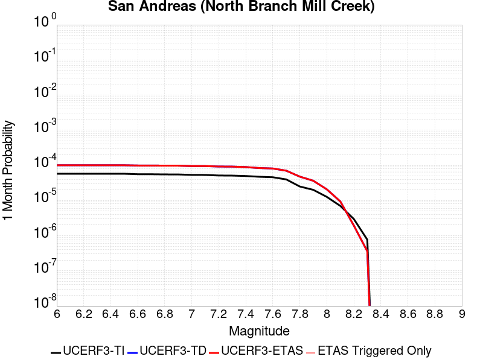 | 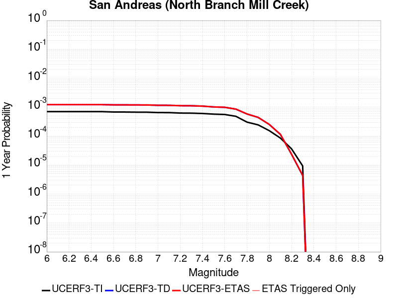 | 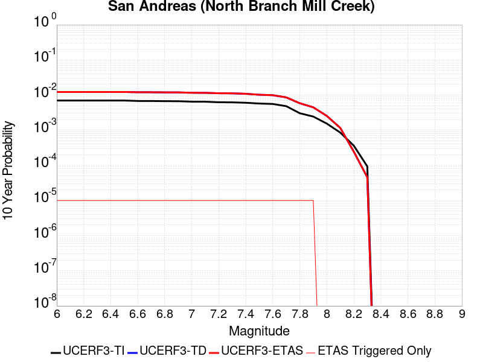 |

| Magnitude | 1 wk TI Prob | 1 wk TD Prob | 1 wk ETAS Prob | 1 wk ETAS/TD Gain | 1 wk ETAS Triggered Only | 1 mo TI Prob | 1 mo TD Prob | 1 mo ETAS Prob | 1 mo ETAS/TD Gain | 1 mo ETAS Triggered Only | 1 yr TI Prob | 1 yr TD Prob | 1 yr ETAS Prob | 1 yr ETAS/TD Gain | 1 yr ETAS Triggered Only | 10 yr TI Prob | 10 yr TD Prob | 10 yr ETAS Prob | 10 yr ETAS/TD Gain | 10 yr ETAS Triggered Only |
|-----|-----|-----|-----|-----|-----|-----|-----|-----|-----|-----|-----|-----|-----|-----|-----|-----|-----|-----|-----|-----|
| 6.0 | 1.3461156E-5 | 2.3499637E-5 | 2.3499637E-5 | 1.0 | 0.0 | 5.7689394E-5 | 1.0070886E-4 | 1.0070886E-4 | 1.0 | 0.0 | 7.02142E-4 | 0.001225444 | 0.001225444 | 1.0 | 0.0 | 0.0069992766 | 0.012227687 | 0.012237565 | 1.0008078 | 1.0E-5 |
| 6.1 | 1.3461156E-5 | 2.3499637E-5 | 2.3499637E-5 | 1.0 | 0.0 | 5.7689394E-5 | 1.0070886E-4 | 1.0070886E-4 | 1.0 | 0.0 | 7.02142E-4 | 0.001225444 | 0.001225444 | 1.0 | 0.0 | 0.0069992766 | 0.012227687 | 0.012237565 | 1.0008078 | 1.0E-5 |
| 6.2 | 1.3461156E-5 | 2.3499637E-5 | 2.3499637E-5 | 1.0 | 0.0 | 5.7689394E-5 | 1.0070886E-4 | 1.0070886E-4 | 1.0 | 0.0 | 7.02142E-4 | 0.001225444 | 0.001225444 | 1.0 | 0.0 | 0.0069992766 | 0.012227687 | 0.012237565 | 1.0008078 | 1.0E-5 |
| 6.3 | 1.3461156E-5 | 2.3499637E-5 | 2.3499637E-5 | 1.0 | 0.0 | 5.7689394E-5 | 1.0070886E-4 | 1.0070886E-4 | 1.0 | 0.0 | 7.02142E-4 | 0.001225444 | 0.001225444 | 1.0 | 0.0 | 0.0069992766 | 0.012227687 | 0.012237565 | 1.0008078 | 1.0E-5 |
| 6.4 | 1.3461156E-5 | 2.3499637E-5 | 2.3499637E-5 | 1.0 | 0.0 | 5.7689394E-5 | 1.0070886E-4 | 1.0070886E-4 | 1.0 | 0.0 | 7.02142E-4 | 0.001225444 | 0.001225444 | 1.0 | 0.0 | 0.0069992766 | 0.012227687 | 0.012237565 | 1.0008078 | 1.0E-5 |
| 6.5 | 1.3450706E-5 | 2.3488596E-5 | 2.3488596E-5 | 1.0 | 0.0 | 5.764461E-5 | 1.0066155E-4 | 1.0066155E-4 | 1.0 | 0.0 | 7.0159714E-4 | 0.0012248686 | 0.0012248686 | 1.0 | 0.0 | 0.006993862 | 0.012221997 | 0.012231875 | 1.0008082 | 1.0E-5 |
| 6.6 | 1.3074523E-5 | 2.310288E-5 | 2.310288E-5 | 1.0 | 0.0 | 5.6032466E-5 | 9.9008605E-5 | 9.9008605E-5 | 1.0 | 0.0 | 6.8198174E-4 | 0.0012047664 | 0.0012047664 | 1.0 | 0.0 | 0.006798926 | 0.012023162 | 0.0120330425 | 1.0008217 | 1.0E-5 |
| 6.7 | 1.3050216E-5 | 2.3078179E-5 | 2.3078179E-5 | 1.0 | 0.0 | 5.59283E-5 | 9.890275E-5 | 9.890275E-5 | 1.0 | 0.0 | 6.8071426E-4 | 0.001203479 | 0.001203479 | 1.0 | 0.0 | 0.0067863287 | 0.012010427 | 0.012020308 | 1.0008227 | 1.0E-5 |
| 6.8 | 1.29049395E-5 | 2.2926586E-5 | 2.2926586E-5 | 1.0 | 0.0 | 5.530571E-5 | 9.825311E-5 | 9.825311E-5 | 1.0 | 0.0 | 6.73139E-4 | 0.0011955785 | 0.0011955785 | 1.0 | 0.0 | 0.0067110364 | 0.0119322715 | 0.011942153 | 1.000828 | 1.0E-5 |
| 6.9 | 1.2867369E-5 | 2.288599E-5 | 2.288599E-5 | 1.0 | 0.0 | 5.51447E-5 | 9.807914E-5 | 9.807914E-5 | 1.0 | 0.0 | 6.711799E-4 | 0.0011934626 | 0.0011934626 | 1.0 | 0.0 | 0.006691564 | 0.011911341 | 0.011921221 | 1.0008296 | 1.0E-5 |
| 7.0 | 1.2495996E-5 | 2.2286069E-5 | 2.2286069E-5 | 1.0 | 0.0 | 5.3553173E-5 | 9.550824E-5 | 9.550824E-5 | 1.0 | 0.0 | 6.518148E-4 | 0.0011621955 | 0.0011621955 | 1.0 | 0.0 | 0.0064990623 | 0.011601945 | 0.0116118295 | 1.0008519 | 1.0E-5 |
| 7.1 | 1.2452067E-5 | 2.2231143E-5 | 2.2231143E-5 | 1.0 | 0.0 | 5.3364907E-5 | 9.527286E-5 | 9.527286E-5 | 1.0 | 0.0 | 6.4952404E-4 | 0.0011593327 | 0.0011593327 | 1.0 | 0.0 | 0.0064762887 | 0.011573616 | 0.011583501 | 1.000854 | 1.0E-5 |
| 7.2 | 1.2002777E-5 | 2.1609669E-5 | 2.1609669E-5 | 1.0 | 0.0 | 5.143946E-5 | 9.2609596E-5 | 9.2609596E-5 | 1.0 | 0.0 | 6.2609545E-4 | 0.0011269413 | 0.0011269413 | 1.0 | 0.0 | 0.006243344 | 0.01125298 | 0.011262867 | 1.0008787 | 1.0E-5 |
| 7.3 | 1.1923425E-5 | 2.147951E-5 | 2.147951E-5 | 1.0 | 0.0 | 5.109939E-5 | 9.205181E-5 | 9.205181E-5 | 1.0 | 0.0 | 6.219575E-4 | 0.0011201572 | 0.0011201572 | 1.0 | 0.0 | 0.0062021962 | 0.011185858 | 0.011195747 | 1.0008839 | 1.0E-5 |
| 7.4 | 1.16105175E-5 | 2.0853473E-5 | 2.0853473E-5 | 1.0 | 0.0 | 4.975841E-5 | 8.936898E-5 | 8.936898E-5 | 1.0 | 0.0 | 6.0564023E-4 | 0.0010875268 | 0.0010875268 | 1.0 | 0.0 | 0.006039923 | 0.010863296 | 0.010873187 | 1.0009105 | 1.0E-5 |
| 7.5 | 1.1037265E-5 | 1.9553554E-5 | 1.9553554E-5 | 1.0 | 0.0 | 4.7301706E-5 | 8.3798266E-5 | 8.3798266E-5 | 1.0 | 0.0 | 5.757461E-4 | 0.0010197685 | 0.0010197685 | 1.0 | 0.0 | 0.005742567 | 0.01019476 | 0.010204658 | 1.0009708 | 1.0E-5 |
| 7.6 | 1.0720915E-5 | 1.8995455E-5 | 1.8995455E-5 | 1.0 | 0.0 | 4.5945973E-5 | 8.1406564E-5 | 8.1406564E-5 | 1.0 | 0.0 | 5.592486E-4 | 9.906765E-4 | 9.906765E-4 | 1.0 | 0.0 | 0.005578433 | 0.009906478 | 0.009916379 | 1.0009995 | 1.0E-5 |
| 7.7 | 9.276279E-6 | 1.6441258E-5 | 1.6441258E-5 | 1.0 | 0.0 | 3.9754876E-5 | 7.0460635E-5 | 7.0460635E-5 | 1.0 | 0.0 | 4.839081E-4 | 8.575223E-4 | 8.575223E-4 | 1.0 | 0.0 | 0.0048285574 | 0.008585833 | 0.008595748 | 1.0011547 | 1.0E-5 |
| 7.8 | 5.8346777E-6 | 1.115459E-5 | 1.115459E-5 | 1.0 | 0.0 | 2.5005522E-5 | 4.7804508E-5 | 4.7804508E-5 | 1.0 | 0.0 | 3.043997E-4 | 5.8186456E-4 | 5.8186456E-4 | 1.0 | 0.0 | 0.0030398308 | 0.0058467295 | 0.005856671 | 1.0017004 | 1.0E-5 |
| 7.9 | 4.690204E-6 | 8.508639E-6 | 8.508639E-6 | 1.0 | 0.0 | 2.0100719E-5 | 3.6465088E-5 | 3.6465088E-5 | 1.0 | 0.0 | 2.4469878E-4 | 4.4387212E-4 | 4.4387212E-4 | 1.0 | 0.0 | 0.002444295 | 0.0044707404 | 0.004480696 | 1.0022267 | 1.0E-5 |
| 8.0 | 2.9570454E-6 | 4.8465567E-6 | 4.8465567E-6 | 1.0 | 0.0 | 1.267299E-5 | 2.077079E-5 | 2.077079E-5 | 1.0 | 0.0 | 1.5428272E-4 | 2.5285507E-4 | 2.5285507E-4 | 1.0 | 0.0 | 0.0015417566 | 0.002549722 | 0.002549722 | 1.0 | 0.0 |
| 8.1 | 1.6376824E-6 | 2.1966046E-6 | 2.1966046E-6 | 1.0 | 0.0 | 7.01862E-6 | 9.413985E-6 | 9.413985E-6 | 1.0 | 0.0 | 8.544835E-5 | 1.1460926E-4 | 1.1460926E-4 | 1.0 | 0.0 | 8.54155E-4 | 0.0011606573 | 0.0011606573 | 1.0 | 0.0 |
| 8.2 | 6.9631557E-7 | 4.5341665E-7 | 4.5341665E-7 | 1.0 | 0.0 | 2.984206E-6 | 1.9432127E-6 | 1.9432127E-6 | 1.0 | 0.0 | 3.63321E-5 | 2.365836E-5 | 2.365836E-5 | 1.0 | 0.0 | 3.6326164E-4 | 2.4506272E-4 | 2.4506272E-4 | 1.0 | 0.0 |
| 8.3 | 1.7876137E-7 | 8.355595E-8 | 8.355595E-8 | 1.0 | 0.0 | 7.661199E-7 | 3.5809688E-7 | 3.5809688E-7 | 1.0 | 0.0 | 9.32747E-6 | 4.359821E-6 | 4.359821E-6 | 1.0 | 0.0 | 9.3270784E-5 | 4.5795394E-5 | 4.5795394E-5 | 1.0 | 0.0 |

## Dry Mountain
*[(top)](#table-of-contents)*

| 1 Week | 1 Month | 1 Year | 10 Year |
|-----|-----|-----|-----|
|  | 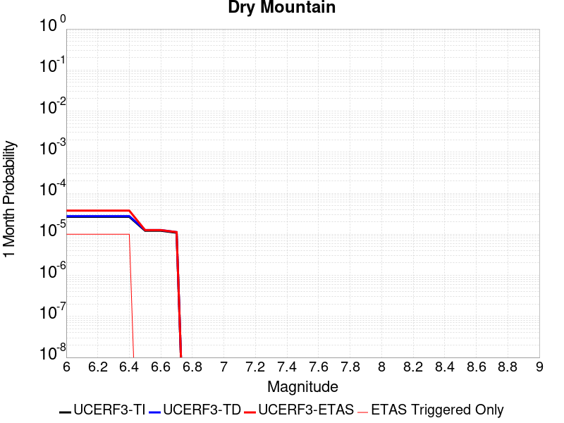 |  | 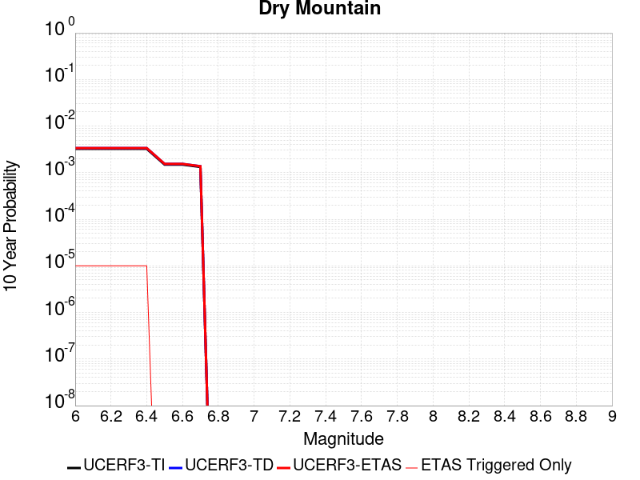 |

| Magnitude | 1 wk TI Prob | 1 wk TD Prob | 1 wk ETAS Prob | 1 wk ETAS/TD Gain | 1 wk ETAS Triggered Only | 1 mo TI Prob | 1 mo TD Prob | 1 mo ETAS Prob | 1 mo ETAS/TD Gain | 1 mo ETAS Triggered Only | 1 yr TI Prob | 1 yr TD Prob | 1 yr ETAS Prob | 1 yr ETAS/TD Gain | 1 yr ETAS Triggered Only | 10 yr TI Prob | 10 yr TD Prob | 10 yr ETAS Prob | 10 yr ETAS/TD Gain | 10 yr ETAS Triggered Only |
|-----|-----|-----|-----|-----|-----|-----|-----|-----|-----|-----|-----|-----|-----|-----|-----|-----|-----|-----|-----|-----|
| 6.0 | 6.222801E-6 | 6.4393753E-6 | 1.6439311E-5 | 2.5529356 | 1.0E-5 | 2.6668875E-5 | 2.759712E-5 | 3.7596845E-5 | 1.3623466 | 1.0E-5 | 3.2464517E-4 | 3.3595905E-4 | 3.459557E-4 | 1.0297555 | 1.0E-5 | 0.0032417132 | 0.0033560738 | 0.00336604 | 1.0029696 | 1.0E-5 |
| 6.1 | 6.222801E-6 | 6.4393753E-6 | 1.6439311E-5 | 2.5529356 | 1.0E-5 | 2.6668875E-5 | 2.759712E-5 | 3.7596845E-5 | 1.3623466 | 1.0E-5 | 3.2464517E-4 | 3.3595905E-4 | 3.459557E-4 | 1.0297555 | 1.0E-5 | 0.0032417132 | 0.0033560738 | 0.00336604 | 1.0029696 | 1.0E-5 |
| 6.2 | 6.222801E-6 | 6.4393753E-6 | 1.6439311E-5 | 2.5529356 | 1.0E-5 | 2.6668875E-5 | 2.759712E-5 | 3.7596845E-5 | 1.3623466 | 1.0E-5 | 3.2464517E-4 | 3.3595905E-4 | 3.459557E-4 | 1.0297555 | 1.0E-5 | 0.0032417132 | 0.0033560738 | 0.00336604 | 1.0029696 | 1.0E-5 |
| 6.3 | 6.222801E-6 | 6.4393753E-6 | 1.6439311E-5 | 2.5529356 | 1.0E-5 | 2.6668875E-5 | 2.759712E-5 | 3.7596845E-5 | 1.3623466 | 1.0E-5 | 3.2464517E-4 | 3.3595905E-4 | 3.459557E-4 | 1.0297555 | 1.0E-5 | 0.0032417132 | 0.0033560738 | 0.00336604 | 1.0029696 | 1.0E-5 |
| 6.4 | 6.222801E-6 | 6.4393753E-6 | 1.6439311E-5 | 2.5529356 | 1.0E-5 | 2.6668875E-5 | 2.759712E-5 | 3.7596845E-5 | 1.3623466 | 1.0E-5 | 3.2464517E-4 | 3.3595905E-4 | 3.459557E-4 | 1.0297555 | 1.0E-5 | 0.0032417132 | 0.0033560738 | 0.00336604 | 1.0029696 | 1.0E-5 |
| 6.5 | 2.8528623E-6 | 2.9521657E-6 | 2.9521657E-6 | 1.0 | 0.0 | 1.22264955E-5 | 1.2652126E-5 | 1.2652126E-5 | 1.0 | 0.0 | 1.4884741E-4 | 1.5403745E-4 | 1.5403745E-4 | 1.0 | 0.0 | 0.0014874774 | 0.0015401602 | 0.0015401602 | 1.0 | 0.0 |
| 6.6 | 2.8528623E-6 | 2.9521657E-6 | 2.9521657E-6 | 1.0 | 0.0 | 1.22264955E-5 | 1.2652126E-5 | 1.2652126E-5 | 1.0 | 0.0 | 1.4884741E-4 | 1.5403745E-4 | 1.5403745E-4 | 1.0 | 0.0 | 0.0014874774 | 0.0015401602 | 0.0015401602 | 1.0 | 0.0 |
| 6.7 | 2.541E-6 | 2.6293555E-6 | 2.6293555E-6 | 1.0 | 0.0 | 1.0889954E-5 | 1.1268666E-5 | 1.1268666E-5 | 1.0 | 0.0 | 1.3257713E-4 | 1.3719601E-4 | 1.3719601E-4 | 1.0 | 0.0 | 0.0013249806 | 0.0013719602 | 0.0013719602 | 1.0 | 0.0 |

## Palos Verdes
*[(top)](#table-of-contents)*

| 1 Week | 1 Month | 1 Year | 10 Year |
|-----|-----|-----|-----|
| 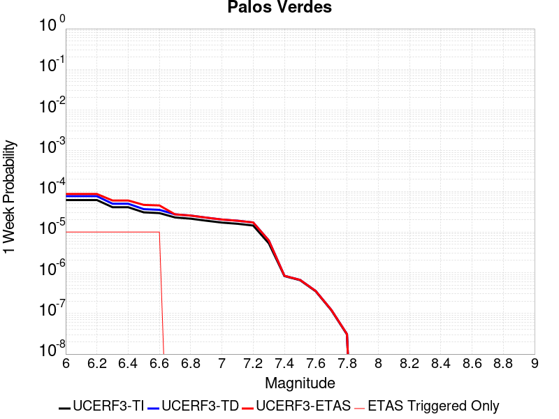 | 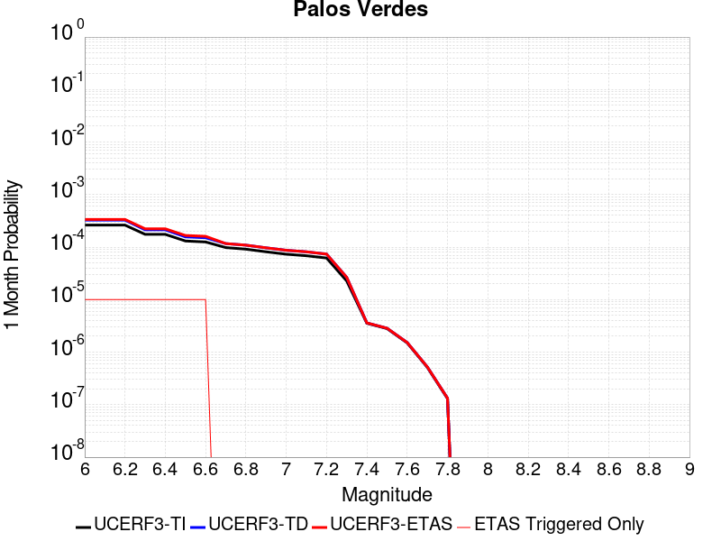 | 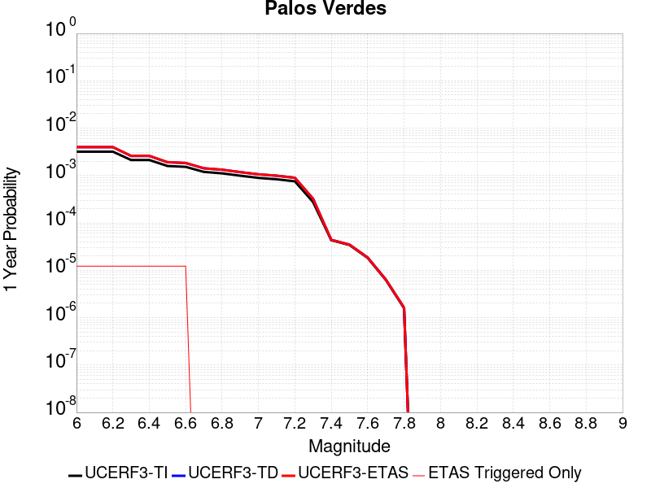 | 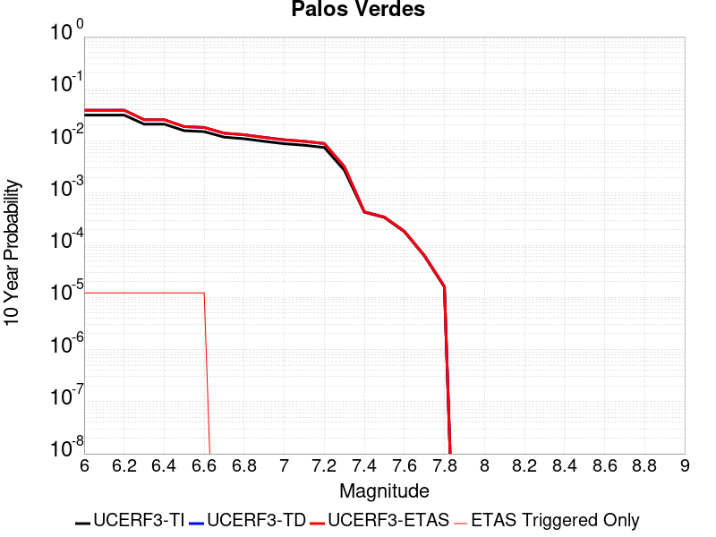 |

| Magnitude | 1 wk TI Prob | 1 wk TD Prob | 1 wk ETAS Prob | 1 wk ETAS/TD Gain | 1 wk ETAS Triggered Only | 1 mo TI Prob | 1 mo TD Prob | 1 mo ETAS Prob | 1 mo ETAS/TD Gain | 1 mo ETAS Triggered Only | 1 yr TI Prob | 1 yr TD Prob | 1 yr ETAS Prob | 1 yr ETAS/TD Gain | 1 yr ETAS Triggered Only | 10 yr TI Prob | 10 yr TD Prob | 10 yr ETAS Prob | 10 yr ETAS/TD Gain | 10 yr ETAS Triggered Only |
|-----|-----|-----|-----|-----|-----|-----|-----|-----|-----|-----|-----|-----|-----|-----|-----|-----|-----|-----|-----|-----|
| 6.0 | 6.126063E-5 | 7.622522E-5 | 8.6224456E-5 | 1.1311802 | 1.0E-5 | 2.6251914E-4 | 3.2664195E-4 | 3.3663868E-4 | 1.0306046 | 1.0E-5 | 0.0031914865 | 0.003970148 | 0.0039801085 | 1.0025088 | 1.0E-5 | 0.031460393 | 0.03904884 | 0.03905845 | 1.000246 | 1.0E-5 |
| 6.1 | 6.126063E-5 | 7.622522E-5 | 8.6224456E-5 | 1.1311802 | 1.0E-5 | 2.6251914E-4 | 3.2664195E-4 | 3.3663868E-4 | 1.0306046 | 1.0E-5 | 0.0031914865 | 0.003970148 | 0.0039801085 | 1.0025088 | 1.0E-5 | 0.031460393 | 0.03904884 | 0.03905845 | 1.000246 | 1.0E-5 |
| 6.2 | 6.126063E-5 | 7.622522E-5 | 8.6224456E-5 | 1.1311802 | 1.0E-5 | 2.6251914E-4 | 3.2664195E-4 | 3.3663868E-4 | 1.0306046 | 1.0E-5 | 0.0031914865 | 0.003970148 | 0.0039801085 | 1.0025088 | 1.0E-5 | 0.031460393 | 0.03904884 | 0.03905845 | 1.000246 | 1.0E-5 |
| 6.3 | 4.0838047E-5 | 4.9748713E-5 | 5.9748218E-5 | 1.2010002 | 1.0E-5 | 1.7500846E-4 | 2.1319262E-4 | 2.231905E-4 | 1.046896 | 1.0E-5 | 0.0021286458 | 0.0025927392 | 0.0026027132 | 1.0038469 | 1.0E-5 | 0.021083709 | 0.025646599 | 0.025656343 | 1.0003799 | 1.0E-5 |
| 6.4 | 4.0838047E-5 | 4.9748713E-5 | 5.9748218E-5 | 1.2010002 | 1.0E-5 | 1.7500846E-4 | 2.1319262E-4 | 2.231905E-4 | 1.046896 | 1.0E-5 | 0.0021286458 | 0.0025927392 | 0.0026027132 | 1.0038469 | 1.0E-5 | 0.021083709 | 0.025646599 | 0.025656343 | 1.0003799 | 1.0E-5 |
| 6.5 | 3.0512005E-5 | 3.65614E-5 | 4.6561032E-5 | 1.2735025 | 1.0E-5 | 1.3075917E-4 | 1.5668297E-4 | 1.666814E-4 | 1.0638131 | 1.0E-5 | 0.0015908304 | 0.0019060619 | 0.0019160429 | 1.0052364 | 1.0E-5 | 0.015794903 | 0.018909073 | 0.018918883 | 1.0005188 | 1.0E-5 |
| 6.6 | 2.9255087E-5 | 3.51542E-5 | 4.515385E-5 | 1.284451 | 1.0E-5 | 1.2537291E-4 | 1.5065282E-4 | 1.6065131E-4 | 1.0663677 | 1.0E-5 | 0.0015253464 | 0.0018327683 | 0.00184275 | 1.0054462 | 1.0E-5 | 0.015149189 | 0.018188147 | 0.018197965 | 1.0005398 | 1.0E-5 |
| 6.7 | 2.287198E-5 | 2.724814E-5 | 2.724814E-5 | 1.0 | 0.0 | 9.801909E-5 | 1.1677303E-4 | 1.1677303E-4 | 1.0 | 0.0 | 0.001192729 | 0.001420876 | 0.001420876 | 1.0 | 0.0 | 0.011863477 | 0.0141271455 | 0.0141271455 | 1.0 | 0.0 |
| 6.8 | 2.1325764E-5 | 2.5431746E-5 | 2.5431746E-5 | 1.0 | 0.0 | 9.139293E-5 | 1.0898915E-4 | 1.0898915E-4 | 1.0 | 0.0 | 0.001112141 | 0.0013262255 | 0.0013262255 | 1.0 | 0.0 | 0.011065915 | 0.013192143 | 0.013192143 | 1.0 | 0.0 |
| 6.9 | 1.9009392E-5 | 2.2613433E-5 | 2.2613433E-5 | 1.0 | 0.0 | 8.1466285E-5 | 9.69116E-5 | 9.69116E-5 | 1.0 | 0.0 | 9.914007E-4 | 0.0011793475 | 0.0011793475 | 1.0 | 0.0 | 0.009869894 | 0.011739573 | 0.011739573 | 1.0 | 0.0 |
| 7.0 | 1.7098473E-5 | 2.0319252E-5 | 2.0319252E-5 | 1.0 | 0.0 | 7.3277115E-5 | 8.708009E-5 | 8.708009E-5 | 1.0 | 0.0 | 8.917837E-4 | 0.0010597695 | 0.0010597695 | 1.0 | 0.0 | 0.008882134 | 0.010555593 | 0.010555593 | 1.0 | 0.0 |
| 7.1 | 1.5982785E-5 | 1.8994664E-5 | 1.8994664E-5 | 1.0 | 0.0 | 6.849585E-5 | 8.140364E-5 | 8.140364E-5 | 1.0 | 0.0 | 8.336179E-4 | 9.907234E-4 | 9.907234E-4 | 1.0 | 0.0 | 0.008304977 | 0.00987143 | 0.00987143 | 1.0 | 0.0 |
| 7.2 | 1.4468002E-5 | 1.719715E-5 | 1.719715E-5 | 1.0 | 0.0 | 6.200425E-5 | 7.370046E-5 | 7.370046E-5 | 1.0 | 0.0 | 7.546402E-4 | 8.9701766E-4 | 8.9701766E-4 | 1.0 | 0.0 | 0.007520827 | 0.008942238 | 0.008942238 | 1.0 | 0.0 |
| 7.3 | 5.288233E-6 | 6.203645E-6 | 6.203645E-6 | 1.0 | 0.0 | 2.2663658E-5 | 2.6586977E-5 | 2.6586977E-5 | 1.0 | 0.0 | 2.7589512E-4 | 3.2368326E-4 | 3.2368326E-4 | 1.0 | 0.0 | 0.0027555283 | 0.0032355408 | 0.0032355408 | 1.0 | 0.0 |
| 7.4 | 8.279556E-7 | 8.4083433E-7 | 8.4083433E-7 | 1.0 | 0.0 | 3.5483763E-6 | 3.603571E-6 | 3.603571E-6 | 1.0 | 0.0 | 4.3200624E-5 | 4.3872667E-5 | 4.3872667E-5 | 1.0 | 0.0 | 4.3192226E-4 | 4.386473E-4 | 4.386473E-4 | 1.0 | 0.0 |
| 7.5 | 6.559831E-7 | 6.667226E-7 | 6.667226E-7 | 1.0 | 0.0 | 2.8113532E-6 | 2.8573797E-6 | 2.8573797E-6 | 1.0 | 0.0 | 3.4227687E-5 | 3.478811E-5 | 3.478811E-5 | 1.0 | 0.0 | 3.4222414E-4 | 3.478333E-4 | 3.478333E-4 | 1.0 | 0.0 |
| 7.6 | 3.5018968E-7 | 3.5620013E-7 | 3.5620013E-7 | 1.0 | 0.0 | 1.500812E-6 | 1.5265713E-6 | 1.5265713E-6 | 1.0 | 0.0 | 1.8272232E-5 | 1.8585893E-5 | 1.8585893E-5 | 1.0 | 0.0 | 1.8270731E-4 | 1.85848E-4 | 1.85848E-4 | 1.0 | 0.0 |
| 7.7 | 1.1986104E-7 | 1.219837E-7 | 1.219837E-7 | 1.0 | 0.0 | 5.1369005E-7 | 5.227872E-7 | 5.227872E-7 | 1.0 | 0.0 | 6.2541585E-6 | 6.3649163E-6 | 6.3649163E-6 | 1.0 | 0.0 | 6.2539824E-5 | 6.364738E-5 | 6.364738E-5 | 1.0 | 0.0 |
| 7.8 | 3.0445005E-8 | 3.1027568E-8 | 3.1027568E-8 | 1.0 | 0.0 | 1.3047858E-7 | 1.3297529E-7 | 1.3297529E-7 | 1.0 | 0.0 | 1.5885756E-6 | 1.6189731E-6 | 1.6189731E-6 | 1.0 | 0.0 | 1.5885644E-5 | 1.6189633E-5 | 1.6189633E-5 | 1.0 | 0.0 |

## Green Valley 2011 CFM
*[(top)](#table-of-contents)*

| 1 Week | 1 Month | 1 Year | 10 Year |
|-----|-----|-----|-----|
| 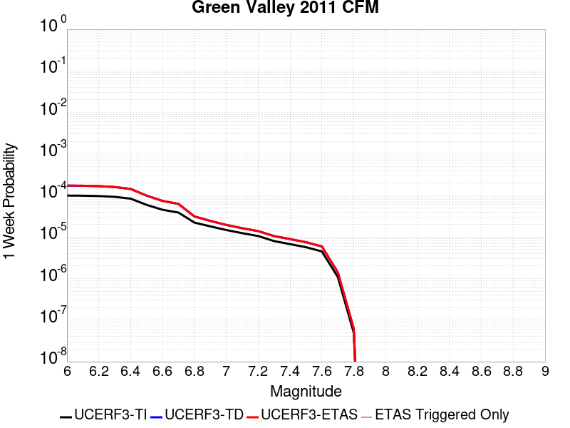 | 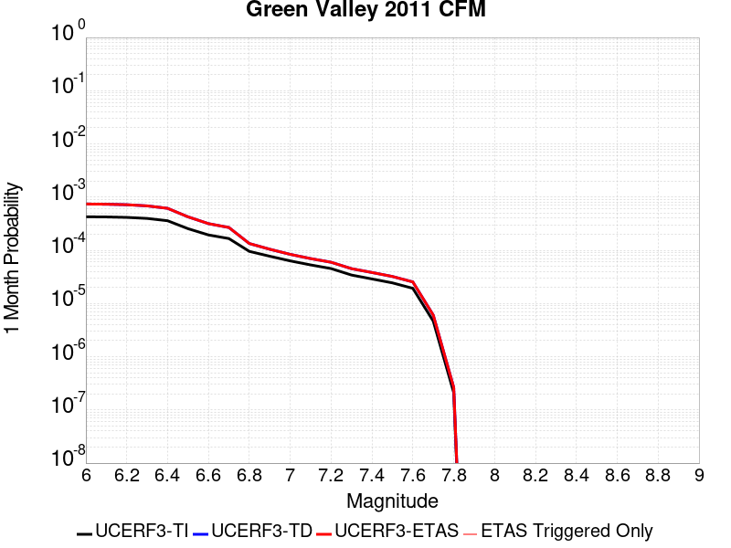 | 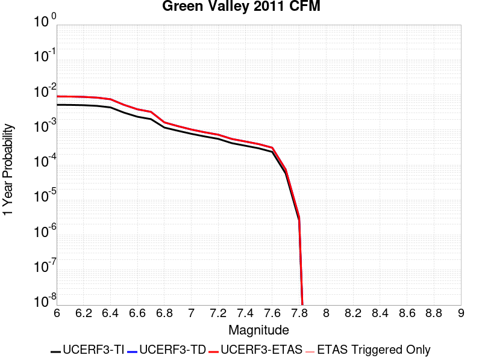 | 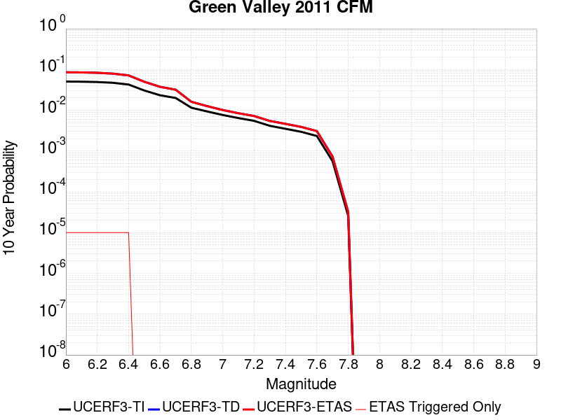 |

| Magnitude | 1 wk TI Prob | 1 wk TD Prob | 1 wk ETAS Prob | 1 wk ETAS/TD Gain | 1 wk ETAS Triggered Only | 1 mo TI Prob | 1 mo TD Prob | 1 mo ETAS Prob | 1 mo ETAS/TD Gain | 1 mo ETAS Triggered Only | 1 yr TI Prob | 1 yr TD Prob | 1 yr ETAS Prob | 1 yr ETAS/TD Gain | 1 yr ETAS Triggered Only | 10 yr TI Prob | 10 yr TD Prob | 10 yr ETAS Prob | 10 yr ETAS/TD Gain | 10 yr ETAS Triggered Only |
|-----|-----|-----|-----|-----|-----|-----|-----|-----|-----|-----|-----|-----|-----|-----|-----|-----|-----|-----|-----|-----|
| 6.0 | 9.9629346E-5 | 1.7302911E-4 | 1.7302911E-4 | 1.0 | 0.0 | 4.2691303E-4 | 7.4132346E-4 | 7.4132346E-4 | 1.0 | 0.0 | 0.0051852856 | 0.008986877 | 0.008986877 | 1.0 | 0.0 | 0.050659515 | 0.085538186 | 0.08554733 | 1.0001069 | 1.0E-5 |
| 6.1 | 9.88615E-5 | 1.715021E-4 | 1.715021E-4 | 1.0 | 0.0 | 4.2362334E-4 | 7.347829E-4 | 7.347829E-4 | 1.0 | 0.0 | 0.0051454236 | 0.008907905 | 0.008907905 | 1.0 | 0.0 | 0.050279044 | 0.08482581 | 0.084834956 | 1.0001079 | 1.0E-5 |
| 6.2 | 9.696895E-5 | 1.6789259E-4 | 1.6789259E-4 | 1.0 | 0.0 | 4.15515E-4 | 7.1932294E-4 | 7.1932294E-4 | 1.0 | 0.0 | 0.0050471667 | 0.008721288 | 0.008721288 | 1.0 | 0.0 | 0.04934063 | 0.083134584 | 0.083143756 | 1.0001103 | 1.0E-5 |
| 6.3 | 9.275224E-5 | 1.5968595E-4 | 1.5968595E-4 | 1.0 | 0.0 | 3.9744904E-4 | 6.8417034E-4 | 6.8417034E-4 | 1.0 | 0.0 | 0.0048282105 | 0.00829661 | 0.00829661 | 1.0 | 0.0 | 0.047246475 | 0.07927365 | 0.07928285 | 1.0001161 | 1.0E-5 |
| 6.4 | 8.391499E-5 | 1.4365945E-4 | 1.4365945E-4 | 1.0 | 0.0 | 3.595861E-4 | 6.155214E-4 | 6.155214E-4 | 1.0 | 0.0 | 0.004369175 | 0.007467142 | 0.007467142 | 1.0 | 0.0 | 0.04284265 | 0.07164658 | 0.07165586 | 1.0001296 | 1.0E-5 |
| 6.5 | 5.9519385E-5 | 9.9327124E-5 | 9.9327124E-5 | 1.0 | 0.0 | 2.5505814E-4 | 4.2560237E-4 | 4.2560237E-4 | 1.0 | 0.0 | 0.0031009112 | 0.0051683118 | 0.0051683118 | 1.0 | 0.0 | 0.030579966 | 0.050147183 | 0.050147183 | 1.0 | 0.0 |
| 6.6 | 4.5361558E-5 | 7.402032E-5 | 7.402032E-5 | 1.0 | 0.0 | 1.9439218E-4 | 3.1717605E-4 | 3.1717605E-4 | 1.0 | 0.0 | 0.0023641558 | 0.0038538422 | 0.0038538422 | 1.0 | 0.0 | 0.023391623 | 0.03766726 | 0.03766726 | 1.0 | 0.0 |
| 6.7 | 3.8808106E-5 | 6.2644474E-5 | 6.2644474E-5 | 1.0 | 0.0 | 1.6630985E-4 | 2.684362E-4 | 2.684362E-4 | 1.0 | 0.0 | 0.0020229418 | 0.0032627091 | 0.0032627091 | 1.0 | 0.0 | 0.020046256 | 0.032007374 | 0.032007374 | 1.0 | 0.0 |
| 6.8 | 2.2284667E-5 | 3.1285686E-5 | 3.1285686E-5 | 1.0 | 0.0 | 9.550222E-5 | 1.3407464E-4 | 1.3407464E-4 | 1.0 | 0.0 | 0.0011621192 | 0.0016311355 | 0.0016311355 | 1.0 | 0.0 | 0.011560607 | 0.016166652 | 0.016166652 | 1.0 | 0.0 |
| 6.9 | 1.8050168E-5 | 2.4448496E-5 | 2.4448496E-5 | 1.0 | 0.0 | 7.735557E-5 | 1.0477509E-4 | 1.0477509E-4 | 1.0 | 0.0 | 9.4139716E-4 | 0.0012748933 | 0.0012748933 | 1.0 | 0.0 | 0.009374191 | 0.01266912 | 0.01266912 | 1.0 | 0.0 |
| 7.0 | 1.4763166E-5 | 1.9583209E-5 | 1.9583209E-5 | 1.0 | 0.0 | 6.326917E-5 | 8.392534E-5 | 8.392534E-5 | 1.0 | 0.0 | 7.7002996E-4 | 0.0010213135 | 0.0010213135 | 1.0 | 0.0 | 0.007673672 | 0.010166272 | 0.010166272 | 1.0 | 0.0 |
| 7.1 | 1.2399713E-5 | 1.6304017E-5 | 1.6304017E-5 | 1.0 | 0.0 | 5.3140546E-5 | 6.98725E-5 | 6.98725E-5 | 1.0 | 0.0 | 6.467941E-4 | 8.5036765E-4 | 8.5036765E-4 | 1.0 | 0.0 | 0.006449148 | 0.008471853 | 0.008471853 | 1.0 | 0.0 |
| 7.2 | 1.0584195E-5 | 1.3922024E-5 | 1.3922024E-5 | 1.0 | 0.0 | 4.5360044E-5 | 5.966446E-5 | 5.966446E-5 | 1.0 | 0.0 | 5.521186E-4 | 7.2617433E-4 | 7.2617433E-4 | 1.0 | 0.0 | 0.0055074887 | 0.007238685 | 0.007238685 | 1.0 | 0.0 |
| 7.3 | 7.998173E-6 | 1.0544236E-5 | 1.0544236E-5 | 1.0 | 0.0 | 3.4277433E-5 | 4.5188805E-5 | 4.5188805E-5 | 1.0 | 0.0 | 4.1724785E-4 | 5.500359E-4 | 5.500359E-4 | 1.0 | 0.0 | 0.004164653 | 0.0054871747 | 0.0054871747 | 1.0 | 0.0 |
| 7.4 | 6.7571127E-6 | 8.932888E-6 | 8.932888E-6 | 1.0 | 0.0 | 2.8958733E-5 | 3.8283248E-5 | 3.8283248E-5 | 1.0 | 0.0 | 3.5251552E-4 | 4.659998E-4 | 4.659998E-4 | 1.0 | 0.0 | 0.0035195686 | 0.004650622 | 0.004650622 | 1.0 | 0.0 |
| 7.5 | 5.69878E-6 | 7.516469E-6 | 7.516469E-6 | 1.0 | 0.0 | 2.4423114E-5 | 3.2213047E-5 | 3.2213047E-5 | 1.0 | 0.0 | 2.9731085E-4 | 3.9212414E-4 | 3.9212414E-4 | 1.0 | 0.0 | 0.002969134 | 0.0039146906 | 0.0039146906 | 1.0 | 0.0 |
| 7.6 | 4.503664E-6 | 5.93581E-6 | 5.93581E-6 | 1.0 | 0.0 | 1.9301275E-5 | 2.5438942E-5 | 2.5438942E-5 | 1.0 | 0.0 | 2.3496768E-4 | 3.0967593E-4 | 3.0967593E-4 | 1.0 | 0.0 | 0.002347194 | 0.0030927174 | 0.0030927174 | 1.0 | 0.0 |
| 7.7 | 1.0873546E-6 | 1.4107492E-6 | 1.4107492E-6 | 1.0 | 0.0 | 4.6600826E-6 | 6.0460543E-6 | 6.0460543E-6 | 1.0 | 0.0 | 5.6735033E-5 | 7.360825E-5 | 7.360825E-5 | 1.0 | 0.0 | 5.672055E-4 | 7.358816E-4 | 7.358816E-4 | 1.0 | 0.0 |
| 7.8 | 4.9373917E-8 | 6.177954E-8 | 6.177954E-8 | 1.0 | 0.0 | 2.1160248E-7 | 2.6476943E-7 | 2.6476943E-7 | 1.0 | 0.0 | 2.5762572E-6 | 3.2235644E-6 | 3.2235644E-6 | 1.0 | 0.0 | 2.5762274E-5 | 3.2227927E-5 | 3.2227927E-5 | 1.0 | 0.0 |

## Tin Mountain
*[(top)](#table-of-contents)*

| 1 Week | 1 Month | 1 Year | 10 Year |
|-----|-----|-----|-----|
|  | 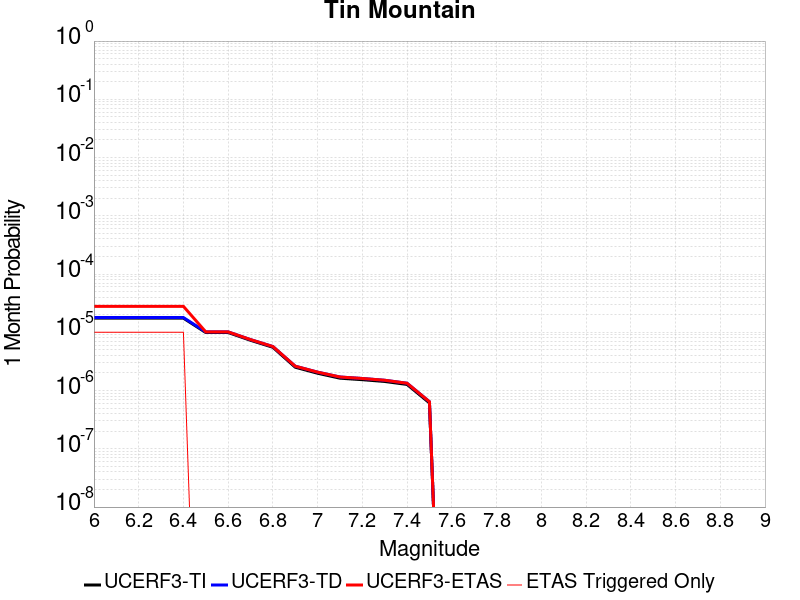 | 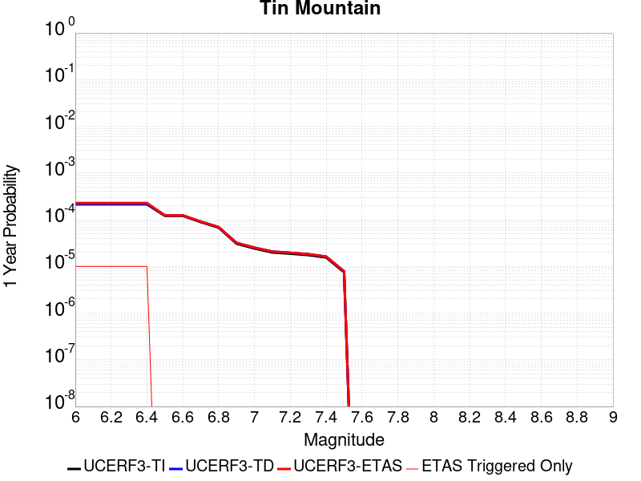 | 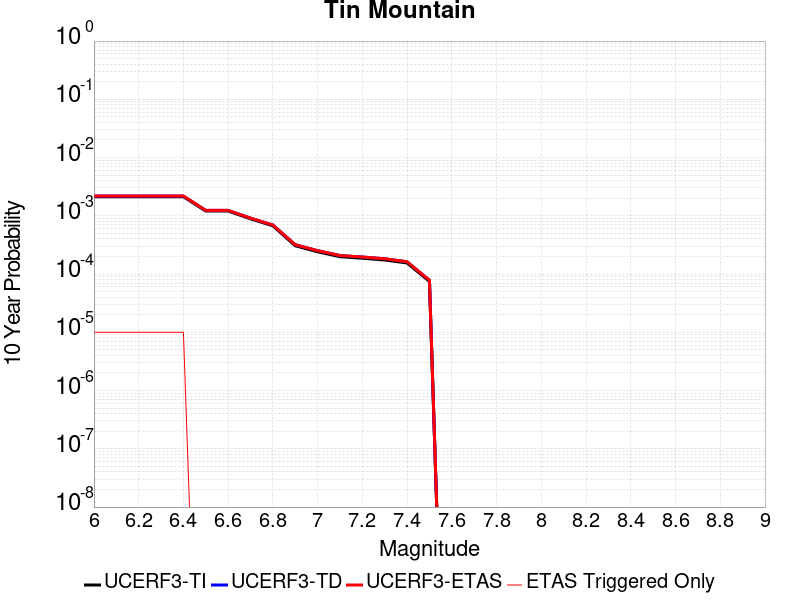 |

| Magnitude | 1 wk TI Prob | 1 wk TD Prob | 1 wk ETAS Prob | 1 wk ETAS/TD Gain | 1 wk ETAS Triggered Only | 1 mo TI Prob | 1 mo TD Prob | 1 mo ETAS Prob | 1 mo ETAS/TD Gain | 1 mo ETAS Triggered Only | 1 yr TI Prob | 1 yr TD Prob | 1 yr ETAS Prob | 1 yr ETAS/TD Gain | 1 yr ETAS Triggered Only | 10 yr TI Prob | 10 yr TD Prob | 10 yr ETAS Prob | 10 yr ETAS/TD Gain | 10 yr ETAS Triggered Only |
|-----|-----|-----|-----|-----|-----|-----|-----|-----|-----|-----|-----|-----|-----|-----|-----|-----|-----|-----|-----|-----|
| 6.0 | 4.083776E-6 | 4.181534E-6 | 1.4181493E-5 | 3.3914568 | 1.0E-5 | 1.750178E-5 | 1.7920758E-5 | 2.7920578E-5 | 1.5580021 | 1.0E-5 | 2.1306332E-4 | 2.181671E-4 | 2.2816492E-4 | 1.0458264 | 1.0E-5 | 0.0021285915 | 0.002179895 | 0.0021898733 | 1.0045774 | 1.0E-5 |
| 6.1 | 4.083776E-6 | 4.181534E-6 | 1.4181493E-5 | 3.3914568 | 1.0E-5 | 1.750178E-5 | 1.7920758E-5 | 2.7920578E-5 | 1.5580021 | 1.0E-5 | 2.1306332E-4 | 2.181671E-4 | 2.2816492E-4 | 1.0458264 | 1.0E-5 | 0.0021285915 | 0.002179895 | 0.0021898733 | 1.0045774 | 1.0E-5 |
| 6.2 | 4.083776E-6 | 4.181534E-6 | 1.4181493E-5 | 3.3914568 | 1.0E-5 | 1.750178E-5 | 1.7920758E-5 | 2.7920578E-5 | 1.5580021 | 1.0E-5 | 2.1306332E-4 | 2.181671E-4 | 2.2816492E-4 | 1.0458264 | 1.0E-5 | 0.0021285915 | 0.002179895 | 0.0021898733 | 1.0045774 | 1.0E-5 |
| 6.3 | 4.083776E-6 | 4.181534E-6 | 1.4181493E-5 | 3.3914568 | 1.0E-5 | 1.750178E-5 | 1.7920758E-5 | 2.7920578E-5 | 1.5580021 | 1.0E-5 | 2.1306332E-4 | 2.181671E-4 | 2.2816492E-4 | 1.0458264 | 1.0E-5 | 0.0021285915 | 0.002179895 | 0.0021898733 | 1.0045774 | 1.0E-5 |
| 6.4 | 4.083776E-6 | 4.181534E-6 | 1.4181493E-5 | 3.3914568 | 1.0E-5 | 1.750178E-5 | 1.7920758E-5 | 2.7920578E-5 | 1.5580021 | 1.0E-5 | 2.1306332E-4 | 2.181671E-4 | 2.2816492E-4 | 1.0458264 | 1.0E-5 | 0.0021285915 | 0.002179895 | 0.0021898733 | 1.0045774 | 1.0E-5 |
| 6.5 | 2.3143427E-6 | 2.3731554E-6 | 2.3731554E-6 | 1.0 | 0.0 | 9.9185745E-6 | 1.0170631E-5 | 1.0170631E-5 | 1.0 | 0.0 | 1.2075195E-4 | 1.2382117E-4 | 1.2382117E-4 | 1.0 | 0.0 | 0.0012068636 | 0.0012375978 | 0.0012375978 | 1.0 | 0.0 |
| 6.6 | 2.3143427E-6 | 2.3731554E-6 | 2.3731554E-6 | 1.0 | 0.0 | 9.9185745E-6 | 1.0170631E-5 | 1.0170631E-5 | 1.0 | 0.0 | 1.2075195E-4 | 1.2382117E-4 | 1.2382117E-4 | 1.0 | 0.0 | 0.0012068636 | 0.0012375978 | 0.0012375978 | 1.0 | 0.0 |
| 6.7 | 1.7029532E-6 | 1.7497902E-6 | 1.7497902E-6 | 1.0 | 0.0 | 7.2983503E-6 | 7.499082E-6 | 7.499082E-6 | 1.0 | 0.0 | 8.885379E-5 | 9.129804E-5 | 9.129804E-5 | 1.0 | 0.0 | 8.881827E-4 | 9.1265794E-4 | 9.1265794E-4 | 1.0 | 0.0 |
| 6.8 | 1.2914646E-6 | 1.3299368E-6 | 1.3299368E-6 | 1.0 | 0.0 | 5.534837E-6 | 5.699719E-6 | 5.699719E-6 | 1.0 | 0.0 | 6.738455E-5 | 6.9392314E-5 | 6.9392314E-5 | 1.0 | 0.0 | 6.736412E-4 | 6.937498E-4 | 6.937498E-4 | 1.0 | 0.0 |
| 6.9 | 5.8708974E-7 | 6.116987E-7 | 6.116987E-7 | 1.0 | 0.0 | 2.5160964E-6 | 2.6215635E-6 | 2.6215635E-6 | 1.0 | 0.0 | 3.0633044E-5 | 3.191711E-5 | 3.191711E-5 | 1.0 | 0.0 | 3.0628822E-4 | 3.1912935E-4 | 3.1912935E-4 | 1.0 | 0.0 |
| 7.0 | 4.6248786E-7 | 4.8320095E-7 | 4.8320095E-7 | 1.0 | 0.0 | 1.9820893E-6 | 2.0708599E-6 | 2.0708599E-6 | 1.0 | 0.0 | 2.413167E-5 | 2.5212465E-5 | 2.5212465E-5 | 1.0 | 0.0 | 2.412905E-4 | 2.5209974E-4 | 2.5209974E-4 | 1.0 | 0.0 |
| 7.1 | 3.804606E-7 | 3.9871418E-7 | 3.9871418E-7 | 1.0 | 0.0 | 1.6305444E-6 | 1.7087742E-6 | 1.7087742E-6 | 1.0 | 0.0 | 1.9851697E-5 | 2.0804162E-5 | 2.0804162E-5 | 1.0 | 0.0 | 1.9849923E-4 | 2.0802549E-4 | 2.0802549E-4 | 1.0 | 0.0 |
| 7.2 | 3.5864858E-7 | 3.7616815E-7 | 3.7616815E-7 | 1.0 | 0.0 | 1.5370645E-6 | 1.6121484E-6 | 1.6121484E-6 | 1.0 | 0.0 | 1.87136E-5 | 1.9627763E-5 | 1.9627763E-5 | 1.0 | 0.0 | 1.8712023E-4 | 1.9626362E-4 | 1.9626362E-4 | 1.0 | 0.0 |
| 7.3 | 3.342063E-7 | 3.5063425E-7 | 3.5063425E-7 | 1.0 | 0.0 | 1.4323119E-6 | 1.5027176E-6 | 1.5027176E-6 | 1.0 | 0.0 | 1.7438259E-5 | 1.8295466E-5 | 1.8295466E-5 | 1.0 | 0.0 | 1.743689E-4 | 1.8294291E-4 | 1.8294291E-4 | 1.0 | 0.0 |
| 7.4 | 2.971242E-7 | 3.1165777E-7 | 3.1165777E-7 | 1.0 | 0.0 | 1.2733886E-6 | 1.3356756E-6 | 1.3356756E-6 | 1.0 | 0.0 | 1.5503398E-5 | 1.6261763E-5 | 1.6261763E-5 | 1.0 | 0.0 | 1.5502315E-4 | 1.6260901E-4 | 1.6260901E-4 | 1.0 | 0.0 |
| 7.5 | 1.4326713E-7 | 1.5012505E-7 | 1.5012505E-7 | 1.0 | 0.0 | 6.140018E-7 | 6.433931E-7 | 6.433931E-7 | 1.0 | 0.0 | 7.4754466E-6 | 7.8333105E-6 | 7.8333105E-6 | 1.0 | 0.0 | 7.475195E-5 | 7.8333105E-5 | 7.8333105E-5 | 1.0 | 0.0 |

## San Clemente
*[(top)](#table-of-contents)*

| 1 Week | 1 Month | 1 Year | 10 Year |
|-----|-----|-----|-----|
| 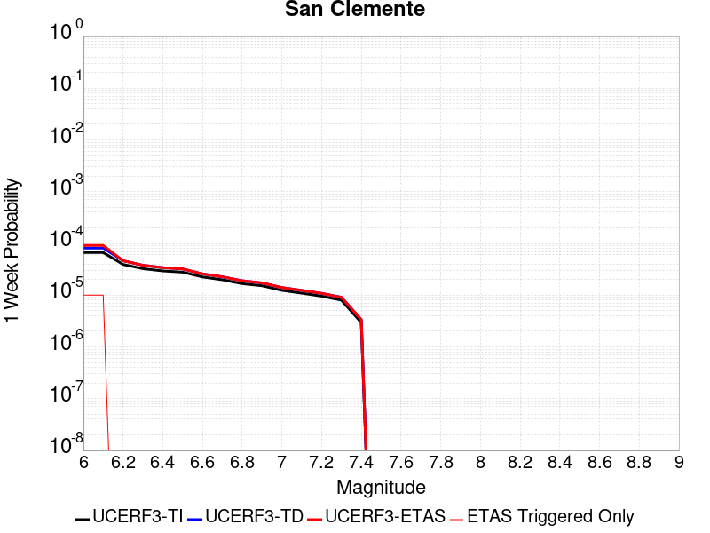 | 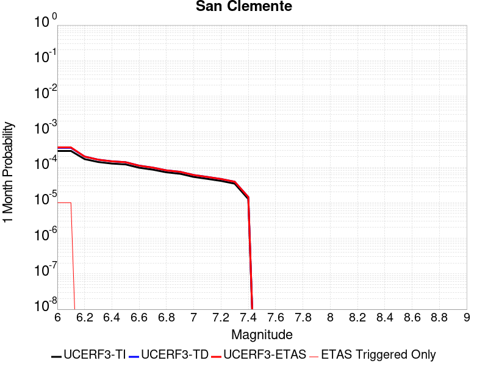 | 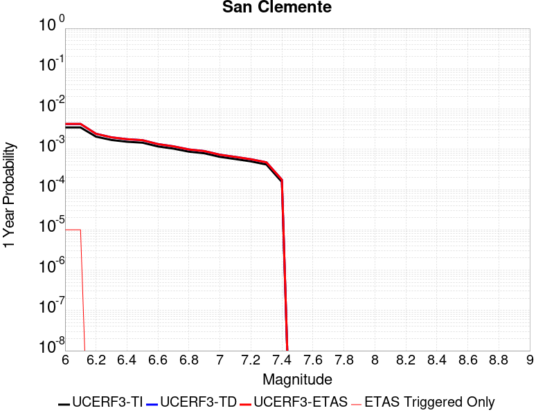 | 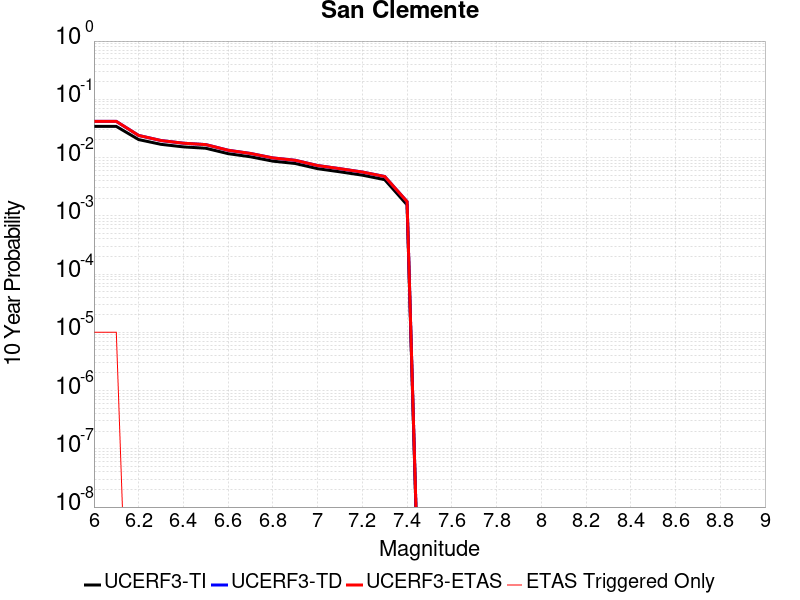 |

| Magnitude | 1 wk TI Prob | 1 wk TD Prob | 1 wk ETAS Prob | 1 wk ETAS/TD Gain | 1 wk ETAS Triggered Only | 1 mo TI Prob | 1 mo TD Prob | 1 mo ETAS Prob | 1 mo ETAS/TD Gain | 1 mo ETAS Triggered Only | 1 yr TI Prob | 1 yr TD Prob | 1 yr ETAS Prob | 1 yr ETAS/TD Gain | 1 yr ETAS Triggered Only | 10 yr TI Prob | 10 yr TD Prob | 10 yr ETAS Prob | 10 yr ETAS/TD Gain | 10 yr ETAS Triggered Only |
|-----|-----|-----|-----|-----|-----|-----|-----|-----|-----|-----|-----|-----|-----|-----|-----|-----|-----|-----|-----|-----|
| 6.0 | 6.681379E-5 | 8.1637845E-5 | 9.1637026E-5 | 1.1224822 | 1.0E-5 | 2.8631336E-4 | 3.4983282E-4 | 3.598293E-4 | 1.0285751 | 1.0E-5 | 0.003480294 | 0.004251385 | 0.0042613423 | 1.0023422 | 1.0E-5 | 0.03426291 | 0.041755788 | 0.04176537 | 1.0002295 | 1.0E-5 |
| 6.1 | 6.681379E-5 | 8.1637845E-5 | 9.1637026E-5 | 1.1224822 | 1.0E-5 | 2.8631336E-4 | 3.4983282E-4 | 3.598293E-4 | 1.0285751 | 1.0E-5 | 0.003480294 | 0.004251385 | 0.0042613423 | 1.0023422 | 1.0E-5 | 0.03426291 | 0.041755788 | 0.04176537 | 1.0002295 | 1.0E-5 |
| 6.2 | 3.9400576E-5 | 4.6452147E-5 | 4.6452147E-5 | 1.0 | 0.0 | 1.6884868E-4 | 1.990658E-4 | 1.990658E-4 | 1.0 | 0.0 | 0.0020537945 | 0.0024209868 | 0.0024209868 | 1.0 | 0.0 | 0.020349167 | 0.02395279 | 0.02395279 | 1.0 | 0.0 |
| 6.3 | 3.2590255E-5 | 3.7928952E-5 | 3.7928952E-5 | 1.0 | 0.0 | 1.3966505E-4 | 1.625427E-4 | 1.625427E-4 | 1.0 | 0.0 | 0.0016990956 | 0.0019771913 | 0.0019771913 | 1.0 | 0.0 | 0.01686163 | 0.019599797 | 0.019599797 | 1.0 | 0.0 |
| 6.4 | 2.9454652E-5 | 3.409762E-5 | 3.409762E-5 | 1.0 | 0.0 | 1.2622811E-4 | 1.4612461E-4 | 1.4612461E-4 | 1.0 | 0.0 | 0.0015357438 | 0.0017776417 | 0.0017776417 | 1.0 | 0.0 | 0.015251739 | 0.017637396 | 0.017637396 | 1.0 | 0.0 |
| 6.5 | 2.790836E-5 | 3.2247328E-5 | 3.2247328E-5 | 1.0 | 0.0 | 1.1960178E-4 | 1.3819565E-4 | 1.3819565E-4 | 1.0 | 0.0 | 0.001455179 | 0.0016812593 | 0.0016812593 | 1.0 | 0.0 | 0.014456868 | 0.016688416 | 0.016688416 | 1.0 | 0.0 |
| 6.6 | 2.2492153E-5 | 2.5762602E-5 | 2.5762602E-5 | 1.0 | 0.0 | 9.639138E-5 | 1.1040656E-4 | 1.1040656E-4 | 1.0 | 0.0 | 0.0011729331 | 0.0013433858 | 0.0013433858 | 1.0 | 0.0 | 0.011667615 | 0.013354365 | 0.013354365 | 1.0 | 0.0 |
| 6.7 | 1.9862755E-5 | 2.2666338E-5 | 2.2666338E-5 | 1.0 | 0.0 | 8.512331E-5 | 9.713789E-5 | 9.713789E-5 | 1.0 | 0.0 | 0.0010358836 | 0.0011820234 | 0.0011820234 | 1.0 | 0.0 | 0.010310682 | 0.011758656 | 0.011758656 | 1.0 | 0.0 |
| 6.8 | 1.6697575E-5 | 1.897764E-5 | 1.897764E-5 | 1.0 | 0.0 | 7.155907E-5 | 8.133026E-5 | 8.133026E-5 | 1.0 | 0.0 | 8.7088346E-4 | 9.897555E-4 | 9.897555E-4 | 1.0 | 0.0 | 0.008674784 | 0.009854501 | 0.009854501 | 1.0 | 0.0 |
| 6.9 | 1.5218415E-5 | 1.7269338E-5 | 1.7269338E-5 | 1.0 | 0.0 | 6.522015E-5 | 7.4009404E-5 | 7.4009404E-5 | 1.0 | 0.0 | 7.93766E-4 | 9.0070075E-4 | 9.0070075E-4 | 1.0 | 0.0 | 0.007909367 | 0.008971448 | 0.008971448 | 1.0 | 0.0 |
| 7.0 | 1.2392958E-5 | 1.4032966E-5 | 1.4032966E-5 | 1.0 | 0.0 | 5.3111595E-5 | 6.013994E-5 | 6.013994E-5 | 1.0 | 0.0 | 6.4644177E-4 | 7.3196535E-4 | 7.3196535E-4 | 1.0 | 0.0 | 0.0064456454 | 0.0072963308 | 0.0072963308 | 1.0 | 0.0 |
| 7.1 | 1.0934128E-5 | 1.2375094E-5 | 1.2375094E-5 | 1.0 | 0.0 | 4.6859706E-5 | 5.303508E-5 | 5.303508E-5 | 1.0 | 0.0 | 5.7036756E-4 | 6.455181E-4 | 6.455181E-4 | 1.0 | 0.0 | 0.0056890585 | 0.0064371773 | 0.0064371773 | 1.0 | 0.0 |
| 7.2 | 9.5798805E-6 | 1.0844897E-5 | 1.0844897E-5 | 1.0 | 0.0 | 4.1055984E-5 | 4.6477344E-5 | 4.6477344E-5 | 1.0 | 0.0 | 4.9974193E-4 | 5.6572194E-4 | 5.6572194E-4 | 1.0 | 0.0 | 0.0049861963 | 0.0056435415 | 0.0056435415 | 1.0 | 0.0 |
| 7.3 | 8.0167365E-6 | 9.083885E-6 | 9.083885E-6 | 1.0 | 0.0 | 3.4356988E-5 | 3.8930397E-5 | 3.8930397E-5 | 1.0 | 0.0 | 4.1821605E-4 | 4.7388155E-4 | 4.7388155E-4 | 1.0 | 0.0 | 0.0041742986 | 0.004729413 | 0.004729413 | 1.0 | 0.0 |
| 7.4 | 2.9581017E-6 | 3.362367E-6 | 3.362367E-6 | 1.0 | 0.0 | 1.2677518E-5 | 1.4410093E-5 | 1.4410093E-5 | 1.0 | 0.0 | 1.5433785E-4 | 1.754338E-4 | 1.754338E-4 | 1.0 | 0.0 | 0.001542307 | 0.0017534482 | 0.0017534482 | 1.0 | 0.0 |

## Earthquake Valley (So Extension)
*[(top)](#table-of-contents)*

| 1 Week | 1 Month | 1 Year | 10 Year |
|-----|-----|-----|-----|
|  |  | 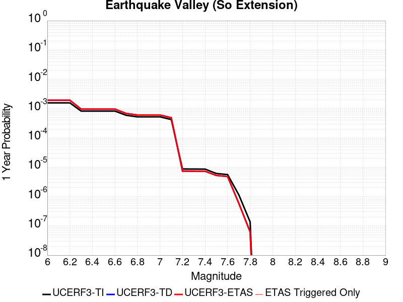 | 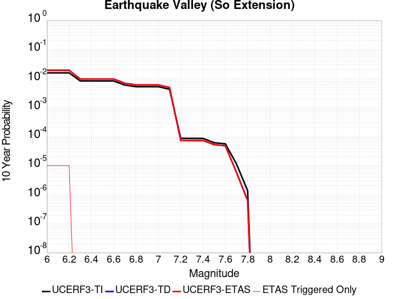 |

| Magnitude | 1 wk TI Prob | 1 wk TD Prob | 1 wk ETAS Prob | 1 wk ETAS/TD Gain | 1 wk ETAS Triggered Only | 1 mo TI Prob | 1 mo TD Prob | 1 mo ETAS Prob | 1 mo ETAS/TD Gain | 1 mo ETAS Triggered Only | 1 yr TI Prob | 1 yr TD Prob | 1 yr ETAS Prob | 1 yr ETAS/TD Gain | 1 yr ETAS Triggered Only | 10 yr TI Prob | 10 yr TD Prob | 10 yr ETAS Prob | 10 yr ETAS/TD Gain | 10 yr ETAS Triggered Only |
|-----|-----|-----|-----|-----|-----|-----|-----|-----|-----|-----|-----|-----|-----|-----|-----|-----|-----|-----|-----|-----|
| 6.0 | 3.0194888E-5 | 3.707185E-5 | 3.707185E-5 | 1.0 | 0.0 | 1.2940024E-4 | 1.5887275E-4 | 1.5887275E-4 | 1.0 | 0.0 | 0.0015743093 | 0.001933076 | 0.001933076 | 1.0 | 0.0 | 0.01563203 | 0.019212985 | 0.019222794 | 1.0005105 | 1.0E-5 |
| 6.1 | 3.0194888E-5 | 3.707185E-5 | 3.707185E-5 | 1.0 | 0.0 | 1.2940024E-4 | 1.5887275E-4 | 1.5887275E-4 | 1.0 | 0.0 | 0.0015743093 | 0.001933076 | 0.001933076 | 1.0 | 0.0 | 0.01563203 | 0.019212985 | 0.019222794 | 1.0005105 | 1.0E-5 |
| 6.2 | 3.0194888E-5 | 3.707185E-5 | 3.707185E-5 | 1.0 | 0.0 | 1.2940024E-4 | 1.5887275E-4 | 1.5887275E-4 | 1.0 | 0.0 | 0.0015743093 | 0.001933076 | 0.001933076 | 1.0 | 0.0 | 0.01563203 | 0.019212985 | 0.019222794 | 1.0005105 | 1.0E-5 |
| 6.3 | 1.5795305E-5 | 1.8446528E-5 | 1.8446528E-5 | 1.0 | 0.0 | 6.769241E-5 | 7.905478E-5 | 7.905478E-5 | 1.0 | 0.0 | 8.238434E-4 | 9.621779E-4 | 9.621779E-4 | 1.0 | 0.0 | 0.008207959 | 0.009591019 | 0.009591019 | 1.0 | 0.0 |
| 6.4 | 1.5795305E-5 | 1.8446528E-5 | 1.8446528E-5 | 1.0 | 0.0 | 6.769241E-5 | 7.905478E-5 | 7.905478E-5 | 1.0 | 0.0 | 8.238434E-4 | 9.621779E-4 | 9.621779E-4 | 1.0 | 0.0 | 0.008207959 | 0.009591019 | 0.009591019 | 1.0 | 0.0 |
| 6.5 | 1.5795305E-5 | 1.8446528E-5 | 1.8446528E-5 | 1.0 | 0.0 | 6.769241E-5 | 7.905478E-5 | 7.905478E-5 | 1.0 | 0.0 | 8.238434E-4 | 9.621779E-4 | 9.621779E-4 | 1.0 | 0.0 | 0.008207959 | 0.009591019 | 0.009591019 | 1.0 | 0.0 |
| 6.6 | 1.5795305E-5 | 1.8446528E-5 | 1.8446528E-5 | 1.0 | 0.0 | 6.769241E-5 | 7.905478E-5 | 7.905478E-5 | 1.0 | 0.0 | 8.238434E-4 | 9.621779E-4 | 9.621779E-4 | 1.0 | 0.0 | 0.008207959 | 0.009591019 | 0.009591019 | 1.0 | 0.0 |
| 6.7 | 1.1363076E-5 | 1.3138231E-5 | 1.3138231E-5 | 1.0 | 0.0 | 4.8697988E-5 | 5.630592E-5 | 5.630592E-5 | 1.0 | 0.0 | 5.927367E-4 | 6.853851E-4 | 6.853851E-4 | 1.0 | 0.0 | 0.0059115817 | 0.0068401853 | 0.0068401853 | 1.0 | 0.0 |
| 6.8 | 1.0049611E-5 | 1.1594278E-5 | 1.1594278E-5 | 1.0 | 0.0 | 4.306905E-5 | 4.9689228E-5 | 4.9689228E-5 | 1.0 | 0.0 | 5.242395E-4 | 6.048716E-4 | 6.048716E-4 | 1.0 | 0.0 | 0.0052300454 | 0.006039429 | 0.006039429 | 1.0 | 0.0 |
| 6.9 | 1.0049611E-5 | 1.1594278E-5 | 1.1594278E-5 | 1.0 | 0.0 | 4.306905E-5 | 4.9689228E-5 | 4.9689228E-5 | 1.0 | 0.0 | 5.242395E-4 | 6.048716E-4 | 6.048716E-4 | 1.0 | 0.0 | 0.0052300454 | 0.006039429 | 0.006039429 | 1.0 | 0.0 |
| 7.0 | 1.0049611E-5 | 1.1594278E-5 | 1.1594278E-5 | 1.0 | 0.0 | 4.306905E-5 | 4.9689228E-5 | 4.9689228E-5 | 1.0 | 0.0 | 5.242395E-4 | 6.048716E-4 | 6.048716E-4 | 1.0 | 0.0 | 0.0052300454 | 0.006039429 | 0.006039429 | 1.0 | 0.0 |
| 7.1 | 8.140254E-6 | 9.3834105E-6 | 9.3834105E-6 | 1.0 | 0.0 | 3.4886336E-5 | 4.0214374E-5 | 4.0214374E-5 | 1.0 | 0.0 | 4.2465836E-4 | 4.895671E-4 | 4.895671E-4 | 1.0 | 0.0 | 0.0042384774 | 0.004891462 | 0.004891462 | 1.0 | 0.0 |
| 7.2 | 1.673835E-7 | 1.415336E-7 | 1.415336E-7 | 1.0 | 0.0 | 7.173577E-7 | 6.065725E-7 | 6.065725E-7 | 1.0 | 0.0 | 8.733795E-6 | 7.3849988E-6 | 7.3849988E-6 | 1.0 | 0.0 | 8.733451E-5 | 7.3847885E-5 | 7.3847885E-5 | 1.0 | 0.0 |
| 7.3 | 1.6632116E-7 | 1.4051591E-7 | 1.4051591E-7 | 1.0 | 0.0 | 7.1280476E-7 | 6.0221095E-7 | 6.0221095E-7 | 1.0 | 0.0 | 8.678364E-6 | 7.331897E-6 | 7.331897E-6 | 1.0 | 0.0 | 8.6780245E-5 | 7.331691E-5 | 7.331691E-5 | 1.0 | 0.0 |
| 7.4 | 1.6569169E-7 | 1.399622E-7 | 1.399622E-7 | 1.0 | 0.0 | 7.1010703E-7 | 5.998379E-7 | 5.998379E-7 | 1.0 | 0.0 | 8.645519E-6 | 7.3030055E-6 | 7.3030055E-6 | 1.0 | 0.0 | 8.645182E-5 | 7.302801E-5 | 7.302801E-5 | 1.0 | 0.0 |
| 7.5 | 1.1764555E-7 | 1.00951155E-7 | 1.00951155E-7 | 1.0 | 0.0 | 5.041951E-7 | 4.3264777E-7 | 4.3264777E-7 | 1.0 | 0.0 | 6.138558E-6 | 5.267476E-6 | 5.267476E-6 | 1.0 | 0.0 | 6.1383886E-5 | 5.2673724E-5 | 5.2673724E-5 | 1.0 | 0.0 |
| 7.6 | 1.07927605E-7 | 9.259938E-8 | 9.259938E-8 | 1.0 | 0.0 | 4.6254678E-7 | 3.9685443E-7 | 3.9685443E-7 | 1.0 | 0.0 | 5.6314925E-6 | 4.8316942E-6 | 4.8316942E-6 | 1.0 | 0.0 | 5.63135E-5 | 4.83161E-5 | 4.83161E-5 | 1.0 | 0.0 |
| 7.7 | 2.1826905E-8 | 1.117949E-8 | 1.117949E-8 | 1.0 | 0.0 | 9.3543875E-8 | 4.79121E-8 | 4.79121E-8 | 1.0 | 0.0 | 1.1388961E-6 | 5.833297E-7 | 5.833297E-7 | 1.0 | 0.0 | 1.1388902E-5 | 5.833287E-6 | 5.833287E-6 | 1.0 | 0.0 |
| 7.8 | 2.6169649E-9 | 1.1968753E-9 | 1.1968753E-9 | 1.0 | 0.0 | 1.1215564E-8 | 5.1294657E-9 | 5.1294657E-9 | 1.0 | 0.0 | 1.3654947E-7 | 6.245124E-8 | 6.245124E-8 | 1.0 | 0.0 | 1.365494E-6 | 6.2451244E-7 | 6.2451244E-7 | 1.0 | 0.0 |

## Anacapa-Dume alt 1
*[(top)](#table-of-contents)*

| 1 Week | 1 Month | 1 Year | 10 Year |
|-----|-----|-----|-----|
| 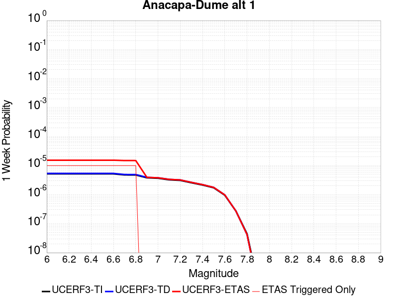 | 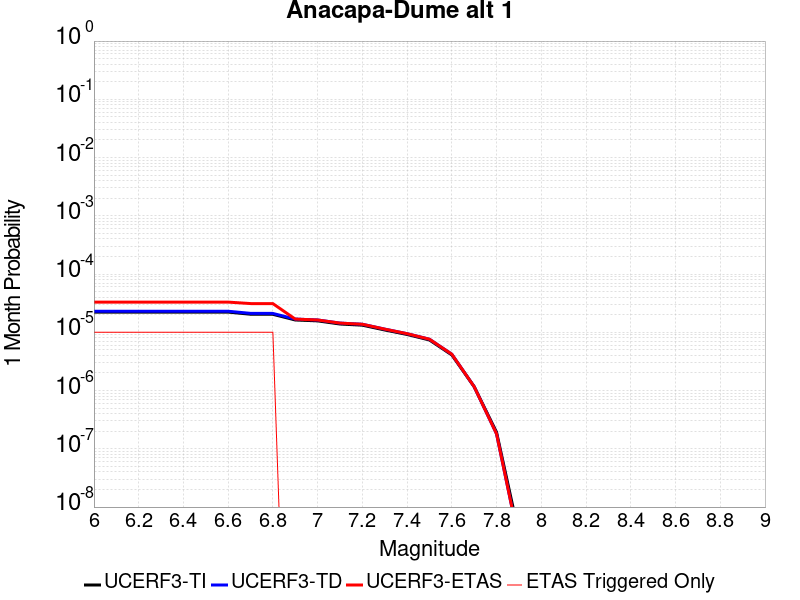 |  | 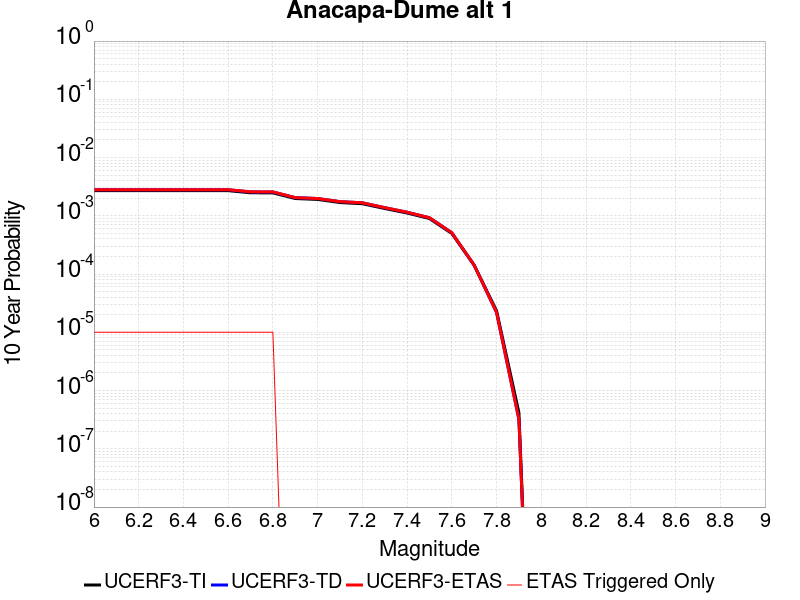 |

| Magnitude | 1 wk TI Prob | 1 wk TD Prob | 1 wk ETAS Prob | 1 wk ETAS/TD Gain | 1 wk ETAS Triggered Only | 1 mo TI Prob | 1 mo TD Prob | 1 mo ETAS Prob | 1 mo ETAS/TD Gain | 1 mo ETAS Triggered Only | 1 yr TI Prob | 1 yr TD Prob | 1 yr ETAS Prob | 1 yr ETAS/TD Gain | 1 yr ETAS Triggered Only | 10 yr TI Prob | 10 yr TD Prob | 10 yr ETAS Prob | 10 yr ETAS/TD Gain | 10 yr ETAS Triggered Only |
|-----|-----|-----|-----|-----|-----|-----|-----|-----|-----|-----|-----|-----|-----|-----|-----|-----|-----|-----|-----|-----|
| 6.0 | 5.1871802E-6 | 5.367386E-6 | 1.5367332E-5 | 2.8630943 | 1.0E-5 | 2.2230583E-5 | 2.3002885E-5 | 3.3002656E-5 | 1.4347181 | 1.0E-5 | 2.7062374E-4 | 2.8002498E-4 | 2.9002217E-4 | 1.0357012 | 1.0E-5 | 0.002702944 | 0.0027968066 | 0.0028067788 | 1.0035655 | 1.0E-5 |
| 6.1 | 5.1871802E-6 | 5.367386E-6 | 1.5367332E-5 | 2.8630943 | 1.0E-5 | 2.2230583E-5 | 2.3002885E-5 | 3.3002656E-5 | 1.4347181 | 1.0E-5 | 2.7062374E-4 | 2.8002498E-4 | 2.9002217E-4 | 1.0357012 | 1.0E-5 | 0.002702944 | 0.0027968066 | 0.0028067788 | 1.0035655 | 1.0E-5 |
| 6.2 | 5.1871802E-6 | 5.367386E-6 | 1.5367332E-5 | 2.8630943 | 1.0E-5 | 2.2230583E-5 | 2.3002885E-5 | 3.3002656E-5 | 1.4347181 | 1.0E-5 | 2.7062374E-4 | 2.8002498E-4 | 2.9002217E-4 | 1.0357012 | 1.0E-5 | 0.002702944 | 0.0027968066 | 0.0028067788 | 1.0035655 | 1.0E-5 |
| 6.3 | 5.1871802E-6 | 5.367386E-6 | 1.5367332E-5 | 2.8630943 | 1.0E-5 | 2.2230583E-5 | 2.3002885E-5 | 3.3002656E-5 | 1.4347181 | 1.0E-5 | 2.7062374E-4 | 2.8002498E-4 | 2.9002217E-4 | 1.0357012 | 1.0E-5 | 0.002702944 | 0.0027968066 | 0.0028067788 | 1.0035655 | 1.0E-5 |
| 6.4 | 5.1871802E-6 | 5.367386E-6 | 1.5367332E-5 | 2.8630943 | 1.0E-5 | 2.2230583E-5 | 2.3002885E-5 | 3.3002656E-5 | 1.4347181 | 1.0E-5 | 2.7062374E-4 | 2.8002498E-4 | 2.9002217E-4 | 1.0357012 | 1.0E-5 | 0.002702944 | 0.0027968066 | 0.0028067788 | 1.0035655 | 1.0E-5 |
| 6.5 | 5.1871802E-6 | 5.367386E-6 | 1.5367332E-5 | 2.8630943 | 1.0E-5 | 2.2230583E-5 | 2.3002885E-5 | 3.3002656E-5 | 1.4347181 | 1.0E-5 | 2.7062374E-4 | 2.8002498E-4 | 2.9002217E-4 | 1.0357012 | 1.0E-5 | 0.002702944 | 0.0027968066 | 0.0028067788 | 1.0035655 | 1.0E-5 |
| 6.6 | 5.1871802E-6 | 5.367386E-6 | 1.5367332E-5 | 2.8630943 | 1.0E-5 | 2.2230583E-5 | 2.3002885E-5 | 3.3002656E-5 | 1.4347181 | 1.0E-5 | 2.7062374E-4 | 2.8002498E-4 | 2.9002217E-4 | 1.0357012 | 1.0E-5 | 0.002702944 | 0.0027968066 | 0.0028067788 | 1.0035655 | 1.0E-5 |
| 6.7 | 4.7693475E-6 | 4.936687E-6 | 1.4936638E-5 | 3.02564 | 1.0E-5 | 2.04399E-5 | 2.1157064E-5 | 3.115685E-5 | 1.4726454 | 1.0E-5 | 2.4882736E-4 | 2.5755755E-4 | 2.6755498E-4 | 1.0388162 | 1.0E-5 | 0.0024854892 | 0.0025726666 | 0.0025826409 | 1.003877 | 1.0E-5 |
| 6.8 | 4.753408E-6 | 4.9202354E-6 | 1.4920186E-5 | 3.032413 | 1.0E-5 | 2.037159E-5 | 2.1086558E-5 | 3.1086347E-5 | 1.4742258 | 1.0E-5 | 2.4799586E-4 | 2.5669934E-4 | 2.666968E-4 | 1.038946 | 1.0E-5 | 0.002477193 | 0.0025641043 | 0.0025740787 | 1.00389 | 1.0E-5 |
| 6.9 | 3.800069E-6 | 3.9371225E-6 | 3.9371225E-6 | 1.0 | 0.0 | 1.6285909E-5 | 1.6873275E-5 | 1.6873275E-5 | 1.0 | 0.0 | 1.9826289E-4 | 2.0541299E-4 | 2.0541299E-4 | 1.0 | 0.0 | 0.001980861 | 0.002052255 | 0.002052255 | 1.0 | 0.0 |
| 7.0 | 3.6671938E-6 | 3.7999148E-6 | 3.7999148E-6 | 1.0 | 0.0 | 1.571645E-5 | 1.6285248E-5 | 1.6285248E-5 | 1.0 | 0.0 | 1.9133097E-4 | 1.9825509E-4 | 1.9825509E-4 | 1.0 | 0.0 | 0.0019116632 | 0.0019808055 | 0.0019808055 | 1.0 | 0.0 |
| 7.1 | 3.2394885E-6 | 3.35879E-6 | 3.35879E-6 | 1.0 | 0.0 | 1.3883448E-5 | 1.4394736E-5 | 1.4394736E-5 | 1.0 | 0.0 | 1.6901788E-4 | 1.7524192E-4 | 1.7524192E-4 | 1.0 | 0.0 | 0.0016888938 | 0.0017510485 | 0.0017510485 | 1.0 | 0.0 |
| 7.2 | 3.0935948E-6 | 3.2079229E-6 | 3.2079229E-6 | 1.0 | 0.0 | 1.3258196E-5 | 1.3748169E-5 | 1.3748169E-5 | 1.0 | 0.0 | 1.6140658E-4 | 1.6737121E-4 | 1.6737121E-4 | 1.0 | 0.0 | 0.001612894 | 0.0016724626 | 0.0016724626 | 1.0 | 0.0 |
| 7.3 | 2.5604163E-6 | 2.647071E-6 | 2.647071E-6 | 1.0 | 0.0 | 1.0973167E-5 | 1.134454E-5 | 1.134454E-5 | 1.0 | 0.0 | 1.3359012E-4 | 1.3811106E-4 | 1.3811106E-4 | 1.0 | 0.0 | 0.0013350984 | 0.001380257 | 0.001380257 | 1.0 | 0.0 |
| 7.4 | 2.1429005E-6 | 2.210601E-6 | 2.210601E-6 | 1.0 | 0.0 | 9.1838265E-6 | 9.473971E-6 | 9.473971E-6 | 1.0 | 0.0 | 1.11807356E-4 | 1.15339506E-4 | 1.15339506E-4 | 1.0 | 0.0 | 0.0011175112 | 0.0011527991 | 0.0011527991 | 1.0 | 0.0 |
| 7.5 | 1.7237151E-6 | 1.7761438E-6 | 1.7761438E-6 | 1.0 | 0.0 | 7.3873293E-6 | 7.6120227E-6 | 7.6120227E-6 | 1.0 | 0.0 | 8.993702E-5 | 9.267245E-5 | 9.267245E-5 | 1.0 | 0.0 | 8.990063E-4 | 9.2634046E-4 | 9.2634046E-4 | 1.0 | 0.0 |
| 7.6 | 9.541696E-7 | 9.823201E-7 | 9.823201E-7 | 1.0 | 0.0 | 4.089292E-6 | 4.2099364E-6 | 4.2099364E-6 | 1.0 | 0.0 | 4.9785995E-5 | 5.125478E-5 | 5.125478E-5 | 1.0 | 0.0 | 4.9774844E-4 | 5.124309E-4 | 5.124309E-4 | 1.0 | 0.0 |
| 7.7 | 2.7226676E-7 | 2.717245E-7 | 2.717245E-7 | 1.0 | 0.0 | 1.166857E-6 | 1.164533E-6 | 1.164533E-6 | 1.0 | 0.0 | 1.4206392E-5 | 1.4178097E-5 | 1.4178097E-5 | 1.0 | 0.0 | 1.4205484E-4 | 1.41772E-4 | 1.41772E-4 | 1.0 | 0.0 |
| 7.8 | 4.5017995E-8 | 4.215793E-8 | 4.215793E-8 | 1.0 | 0.0 | 1.9293425E-7 | 1.8067682E-7 | 1.8067682E-7 | 1.0 | 0.0 | 2.348972E-6 | 2.1997384E-6 | 2.1997384E-6 | 1.0 | 0.0 | 2.348947E-5 | 2.1997188E-5 | 2.1997188E-5 | 1.0 | 0.0 |
| 7.9 | 8.007447E-10 | 6.161581E-10 | 6.161581E-10 | 1.0 | 0.0 | 3.4317629E-9 | 2.640678E-9 | 2.640678E-9 | 1.0 | 0.0 | 4.1781714E-8 | 3.2150254E-8 | 3.2150254E-8 | 1.0 | 0.0 | 4.1781706E-7 | 3.2150248E-7 | 3.2150248E-7 | 1.0 | 0.0 |

## Newport-Inglewood alt 1
*[(top)](#table-of-contents)*

| 1 Week | 1 Month | 1 Year | 10 Year |
|-----|-----|-----|-----|
|  | 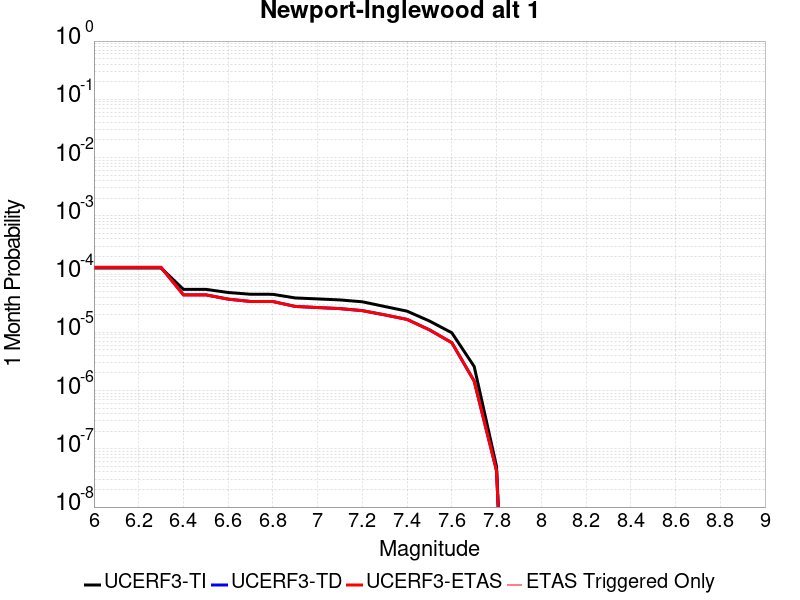 | 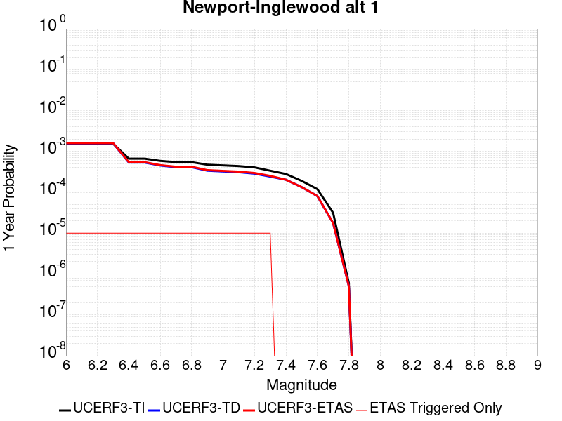 |  |

| Magnitude | 1 wk TI Prob | 1 wk TD Prob | 1 wk ETAS Prob | 1 wk ETAS/TD Gain | 1 wk ETAS Triggered Only | 1 mo TI Prob | 1 mo TD Prob | 1 mo ETAS Prob | 1 mo ETAS/TD Gain | 1 mo ETAS Triggered Only | 1 yr TI Prob | 1 yr TD Prob | 1 yr ETAS Prob | 1 yr ETAS/TD Gain | 1 yr ETAS Triggered Only | 10 yr TI Prob | 10 yr TD Prob | 10 yr ETAS Prob | 10 yr ETAS/TD Gain | 10 yr ETAS Triggered Only |
|-----|-----|-----|-----|-----|-----|-----|-----|-----|-----|-----|-----|-----|-----|-----|-----|-----|-----|-----|-----|-----|
| 6.0 | 2.9668912E-5 | 3.04047E-5 | 3.04047E-5 | 1.0 | 0.0 | 1.2714628E-4 | 1.303021E-4 | 1.303021E-4 | 1.0 | 0.0 | 0.0015469068 | 0.0015857588 | 0.0015957429 | 1.0062962 | 1.0E-5 | 0.015361829 | 0.015792044 | 0.015801886 | 1.0006232 | 1.0E-5 |
| 6.1 | 2.9668912E-5 | 3.04047E-5 | 3.04047E-5 | 1.0 | 0.0 | 1.2714628E-4 | 1.303021E-4 | 1.303021E-4 | 1.0 | 0.0 | 0.0015469068 | 0.0015857588 | 0.0015957429 | 1.0062962 | 1.0E-5 | 0.015361829 | 0.015792044 | 0.015801886 | 1.0006232 | 1.0E-5 |
| 6.2 | 2.9668912E-5 | 3.04047E-5 | 3.04047E-5 | 1.0 | 0.0 | 1.2714628E-4 | 1.303021E-4 | 1.303021E-4 | 1.0 | 0.0 | 0.0015469068 | 0.0015857588 | 0.0015957429 | 1.0062962 | 1.0E-5 | 0.015361829 | 0.015792044 | 0.015801886 | 1.0006232 | 1.0E-5 |
| 6.3 | 2.9668912E-5 | 3.04047E-5 | 3.04047E-5 | 1.0 | 0.0 | 1.2714628E-4 | 1.303021E-4 | 1.303021E-4 | 1.0 | 0.0 | 0.0015469068 | 0.0015857588 | 0.0015957429 | 1.0062962 | 1.0E-5 | 0.015361829 | 0.015792044 | 0.015801886 | 1.0006232 | 1.0E-5 |
| 6.4 | 1.275942E-5 | 1.0272512E-5 | 1.0272512E-5 | 1.0 | 0.0 | 5.4682085E-5 | 4.402433E-5 | 4.402433E-5 | 1.0 | 0.0 | 6.65551E-4 | 5.358686E-4 | 5.4586324E-4 | 1.0186512 | 1.0E-5 | 0.0066356123 | 0.005346189 | 0.0053561353 | 1.0018605 | 1.0E-5 |
| 6.5 | 1.275942E-5 | 1.0272512E-5 | 1.0272512E-5 | 1.0 | 0.0 | 5.4682085E-5 | 4.402433E-5 | 4.402433E-5 | 1.0 | 0.0 | 6.65551E-4 | 5.358686E-4 | 5.4586324E-4 | 1.0186512 | 1.0E-5 | 0.0066356123 | 0.005346189 | 0.0053561353 | 1.0018605 | 1.0E-5 |
| 6.6 | 1.1255358E-5 | 8.661896E-6 | 8.661896E-6 | 1.0 | 0.0 | 4.8236358E-5 | 3.7121892E-5 | 3.7121892E-5 | 1.0 | 0.0 | 5.871194E-4 | 4.51867E-4 | 4.6186248E-4 | 1.0221204 | 1.0E-5 | 0.005855706 | 0.004509659 | 0.004519614 | 1.0022075 | 1.0E-5 |
| 6.7 | 1.0504745E-5 | 7.899833E-6 | 7.899833E-6 | 1.0 | 0.0 | 4.5019555E-5 | 3.385599E-5 | 3.385599E-5 | 1.0 | 0.0 | 5.4797524E-4 | 4.1212E-4 | 4.2211587E-4 | 1.0242548 | 1.0E-5 | 0.0054662596 | 0.004113687 | 0.004123646 | 1.0024209 | 1.0E-5 |
| 6.8 | 1.0476007E-5 | 7.881214E-6 | 7.881214E-6 | 1.0 | 0.0 | 4.4896402E-5 | 3.37762E-5 | 3.37762E-5 | 1.0 | 0.0 | 5.464766E-4 | 4.1114888E-4 | 4.2114477E-4 | 1.0243121 | 1.0E-5 | 0.005451347 | 0.004104012 | 0.004113971 | 1.0024266 | 1.0E-5 |
| 6.9 | 9.076797E-6 | 6.4896467E-6 | 6.4896467E-6 | 1.0 | 0.0 | 3.889998E-5 | 2.7812477E-5 | 2.7812477E-5 | 1.0 | 0.0 | 4.7350433E-4 | 3.3856463E-4 | 3.4856124E-4 | 1.0295265 | 1.0E-5 | 0.004724967 | 0.0033805256 | 0.003390492 | 1.0029482 | 1.0E-5 |
| 7.0 | 8.73795E-6 | 6.2120403E-6 | 6.2120403E-6 | 1.0 | 0.0 | 3.7447822E-5 | 2.6622758E-5 | 2.6622758E-5 | 1.0 | 0.0 | 4.5583185E-4 | 3.2408416E-4 | 3.3408092E-4 | 1.0308462 | 1.0E-5 | 0.0045489795 | 0.0032361469 | 0.0032461146 | 1.0030801 | 1.0E-5 |
| 7.1 | 8.391299E-6 | 5.9557433E-6 | 5.9557433E-6 | 1.0 | 0.0 | 3.5962214E-5 | 2.5524367E-5 | 2.5524367E-5 | 1.0 | 0.0 | 4.37752E-4 | 3.107151E-4 | 3.20712E-4 | 1.0321739 | 1.0E-5 | 0.004368907 | 0.0031028364 | 0.0031128053 | 1.0032128 | 1.0E-5 |
| 7.2 | 7.796882E-6 | 5.4964726E-6 | 5.4964726E-6 | 1.0 | 0.0 | 3.341478E-5 | 2.35561E-5 | 2.35561E-5 | 1.0 | 0.0 | 4.06749E-4 | 2.86758E-4 | 2.9675514E-4 | 1.0348626 | 1.0E-5 | 0.0040600533 | 0.0028639038 | 0.002873875 | 1.0034817 | 1.0E-5 |
| 7.3 | 6.4738833E-6 | 4.6477667E-6 | 4.6477667E-6 | 1.0 | 0.0 | 2.774492E-5 | 1.9918849E-5 | 1.9918849E-5 | 1.0 | 0.0 | 3.3774204E-4 | 2.4248516E-4 | 2.524827E-4 | 1.0412296 | 1.0E-5 | 0.0033722918 | 0.0024222224 | 0.002432198 | 1.0041184 | 1.0E-5 |
| 7.4 | 5.382145E-6 | 3.885716E-6 | 3.885716E-6 | 1.0 | 0.0 | 2.3066134E-5 | 1.6652963E-5 | 1.6652963E-5 | 1.0 | 0.0 | 2.8079396E-4 | 2.027311E-4 | 2.027311E-4 | 1.0 | 0.0 | 0.0028043943 | 0.0020254762 | 0.0020254762 | 1.0 | 0.0 |
| 7.5 | 3.648244E-6 | 2.5737602E-6 | 2.5737602E-6 | 1.0 | 0.0 | 1.5635238E-5 | 1.10303545E-5 | 1.10303545E-5 | 1.0 | 0.0 | 1.9034238E-4 | 1.342864E-4 | 1.342864E-4 | 1.0 | 0.0 | 0.0019017943 | 0.001342063 | 0.001342063 | 1.0 | 0.0 |
| 7.6 | 2.2906888E-6 | 1.547984E-6 | 1.547984E-6 | 1.0 | 0.0 | 9.817201E-6 | 6.6342004E-6 | 6.6342004E-6 | 1.0 | 0.0 | 1.1951787E-4 | 8.076846E-5 | 8.076846E-5 | 1.0 | 0.0 | 0.0011945361 | 8.073978E-4 | 8.073978E-4 | 1.0 | 0.0 |
| 7.7 | 6.0479874E-7 | 3.3974592E-7 | 3.3974592E-7 | 1.0 | 0.0 | 2.5919921E-6 | 1.4560533E-6 | 1.4560533E-6 | 1.0 | 0.0 | 3.1557047E-5 | 1.7727318E-5 | 1.7727318E-5 | 1.0 | 0.0 | 3.1552566E-4 | 1.7726042E-4 | 1.7726042E-4 | 1.0 | 0.0 |
| 7.8 | 1.16056995E-8 | 9.782997E-9 | 9.782997E-9 | 1.0 | 0.0 | 4.9738713E-8 | 4.1927127E-8 | 4.1927127E-8 | 1.0 | 0.0 | 6.0556863E-7 | 5.1046277E-7 | 5.1046277E-7 | 1.0 | 0.0 | 6.05567E-6 | 5.1046277E-6 | 5.1046277E-6 | 1.0 | 0.0 |

## San Jacinto (Coyote Creek)
*[(top)](#table-of-contents)*

| 1 Week | 1 Month | 1 Year | 10 Year |
|-----|-----|-----|-----|
| 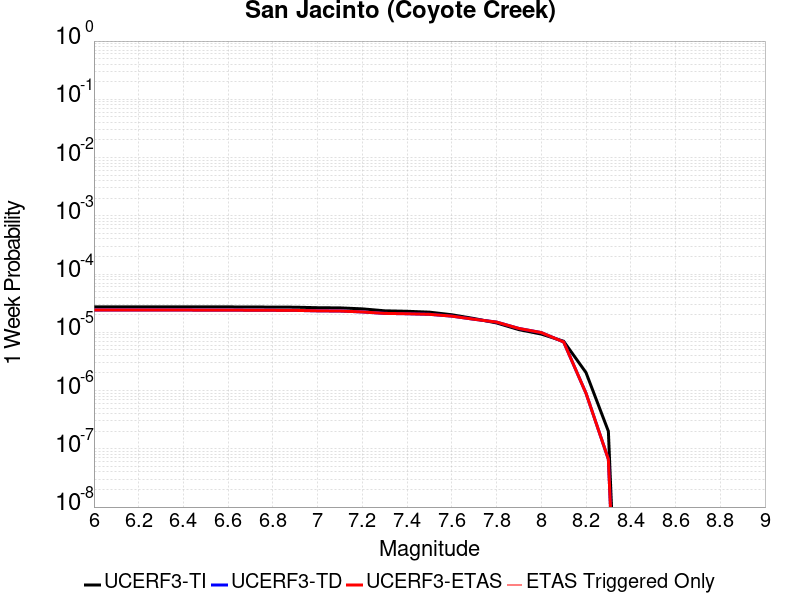 | 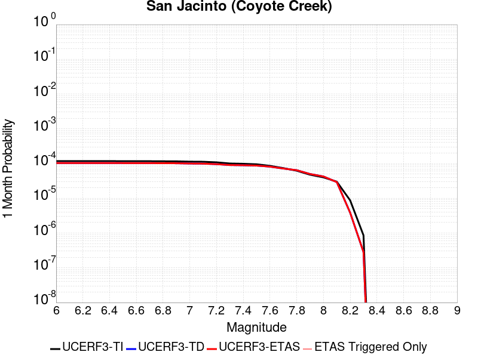 | 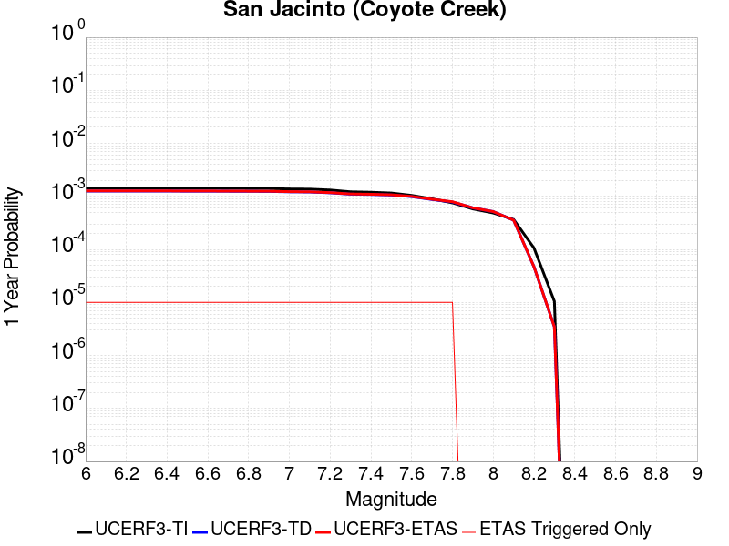 | 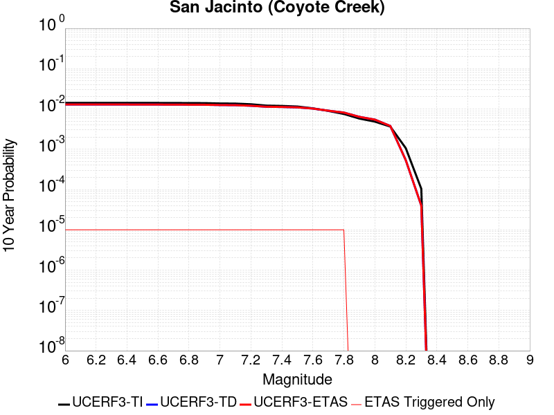 |

| Magnitude | 1 wk TI Prob | 1 wk TD Prob | 1 wk ETAS Prob | 1 wk ETAS/TD Gain | 1 wk ETAS Triggered Only | 1 mo TI Prob | 1 mo TD Prob | 1 mo ETAS Prob | 1 mo ETAS/TD Gain | 1 mo ETAS Triggered Only | 1 yr TI Prob | 1 yr TD Prob | 1 yr ETAS Prob | 1 yr ETAS/TD Gain | 1 yr ETAS Triggered Only | 10 yr TI Prob | 10 yr TD Prob | 10 yr ETAS Prob | 10 yr ETAS/TD Gain | 10 yr ETAS Triggered Only |
|-----|-----|-----|-----|-----|-----|-----|-----|-----|-----|-----|-----|-----|-----|-----|-----|-----|-----|-----|-----|-----|
| 6.0 | 2.7374346E-5 | 2.4142788E-5 | 2.4142788E-5 | 1.0 | 0.0 | 1.1731335E-4 | 1.03465E-4 | 1.03465E-4 | 1.0 | 0.0 | 0.0014273542 | 0.001258961 | 0.0012689484 | 1.007933 | 1.0E-5 | 0.01418221 | 0.012927159 | 0.01293703 | 1.0007635 | 1.0E-5 |
| 6.1 | 2.7374346E-5 | 2.4142788E-5 | 2.4142788E-5 | 1.0 | 0.0 | 1.1731335E-4 | 1.03465E-4 | 1.03465E-4 | 1.0 | 0.0 | 0.0014273542 | 0.001258961 | 0.0012689484 | 1.007933 | 1.0E-5 | 0.01418221 | 0.012927159 | 0.01293703 | 1.0007635 | 1.0E-5 |
| 6.2 | 2.7374346E-5 | 2.4142788E-5 | 2.4142788E-5 | 1.0 | 0.0 | 1.1731335E-4 | 1.03465E-4 | 1.03465E-4 | 1.0 | 0.0 | 0.0014273542 | 0.001258961 | 0.0012689484 | 1.007933 | 1.0E-5 | 0.01418221 | 0.012927159 | 0.01293703 | 1.0007635 | 1.0E-5 |
| 6.3 | 2.7374346E-5 | 2.4142788E-5 | 2.4142788E-5 | 1.0 | 0.0 | 1.1731335E-4 | 1.03465E-4 | 1.03465E-4 | 1.0 | 0.0 | 0.0014273542 | 0.001258961 | 0.0012689484 | 1.007933 | 1.0E-5 | 0.01418221 | 0.012927159 | 0.01293703 | 1.0007635 | 1.0E-5 |
| 6.4 | 2.7374346E-5 | 2.4142788E-5 | 2.4142788E-5 | 1.0 | 0.0 | 1.1731335E-4 | 1.03465E-4 | 1.03465E-4 | 1.0 | 0.0 | 0.0014273542 | 0.001258961 | 0.0012689484 | 1.007933 | 1.0E-5 | 0.01418221 | 0.012927159 | 0.01293703 | 1.0007635 | 1.0E-5 |
| 6.5 | 2.7282445E-5 | 2.4028866E-5 | 2.4028866E-5 | 1.0 | 0.0 | 1.16919524E-4 | 1.029768E-4 | 1.029768E-4 | 1.0 | 0.0 | 0.0014225657 | 0.0012530241 | 0.0012630116 | 1.0079707 | 1.0E-5 | 0.014134934 | 0.012868487 | 0.012878358 | 1.0007671 | 1.0E-5 |
| 6.6 | 2.7282445E-5 | 2.4028866E-5 | 2.4028866E-5 | 1.0 | 0.0 | 1.16919524E-4 | 1.029768E-4 | 1.029768E-4 | 1.0 | 0.0 | 0.0014225657 | 0.0012530241 | 0.0012630116 | 1.0079707 | 1.0E-5 | 0.014134934 | 0.012868487 | 0.012878358 | 1.0007671 | 1.0E-5 |
| 6.7 | 2.7216198E-5 | 2.3953988E-5 | 2.3953988E-5 | 1.0 | 0.0 | 1.1663563E-4 | 1.0265592E-4 | 1.0265592E-4 | 1.0 | 0.0 | 0.0014191137 | 0.0012491219 | 0.0012591094 | 1.0079956 | 1.0E-5 | 0.014100855 | 0.012829898 | 0.01283977 | 1.0007694 | 1.0E-5 |
| 6.8 | 2.7078617E-5 | 2.3871207E-5 | 2.3871207E-5 | 1.0 | 0.0 | 1.1604605E-4 | 1.0230118E-4 | 1.0230118E-4 | 1.0 | 0.0 | 0.001411945 | 0.0012448078 | 0.0012547954 | 1.0080234 | 1.0E-5 | 0.014030075 | 0.012787037 | 0.012796909 | 1.000772 | 1.0E-5 |
| 6.9 | 2.6982952E-5 | 2.379072E-5 | 2.379072E-5 | 1.0 | 0.0 | 1.15636096E-4 | 1.0195626E-4 | 1.0195626E-4 | 1.0 | 0.0 | 0.0014069602 | 0.0012406133 | 0.0012506009 | 1.0080506 | 1.0E-5 | 0.013980856 | 0.012745332 | 0.012755205 | 1.0007746 | 1.0E-5 |
| 7.0 | 2.6449972E-5 | 2.3367753E-5 | 2.3367753E-5 | 1.0 | 0.0 | 1.1335209E-4 | 1.0014368E-4 | 1.0014368E-4 | 1.0 | 0.0 | 0.001379188 | 0.0012185699 | 0.0012285578 | 1.0081964 | 1.0E-5 | 0.0137065975 | 0.012526683 | 0.012536556 | 1.0007883 | 1.0E-5 |
| 7.1 | 2.6257849E-5 | 2.3193794E-5 | 2.3193794E-5 | 1.0 | 0.0 | 1.1252879E-4 | 9.93982E-5 | 9.93982E-5 | 1.0 | 0.0 | 0.0013691769 | 0.0012095039 | 0.0012194917 | 1.0082579 | 1.0E-5 | 0.013607717 | 0.012436609 | 0.0124464845 | 1.000794 | 1.0E-5 |
| 7.2 | 2.5270041E-5 | 2.2388584E-5 | 2.2388584E-5 | 1.0 | 0.0 | 1.0829568E-4 | 9.594756E-5 | 9.594756E-5 | 1.0 | 0.0 | 0.0013177024 | 0.0011675379 | 0.0011775262 | 1.008555 | 1.0E-5 | 0.013099162 | 0.01201761 | 0.012027489 | 1.0008221 | 1.0E-5 |
| 7.3 | 2.339701E-5 | 2.1120475E-5 | 2.1120475E-5 | 1.0 | 0.0 | 1.0026905E-4 | 9.051319E-5 | 9.051319E-5 | 1.0 | 0.0 | 0.001220092 | 0.0011014431 | 0.0011114321 | 1.009069 | 1.0E-5 | 0.012134149 | 0.011356557 | 0.011366443 | 1.0008706 | 1.0E-5 |
| 7.4 | 2.296333E-5 | 2.0850846E-5 | 2.0850846E-5 | 1.0 | 0.0 | 9.841056E-5 | 8.9357716E-5 | 8.9357716E-5 | 1.0 | 0.0 | 0.0011974899 | 0.0010873893 | 0.0010973784 | 1.0091864 | 1.0E-5 | 0.011910575 | 0.011215675 | 0.011225562 | 1.0008816 | 1.0E-5 |
| 7.5 | 2.2188895E-5 | 2.0373802E-5 | 2.0373802E-5 | 1.0 | 0.0 | 9.50918E-5 | 8.731338E-5 | 8.731338E-5 | 1.0 | 0.0 | 0.0011571277 | 0.001062524 | 0.0010725134 | 1.0094016 | 1.0E-5 | 0.011511209 | 0.010965329 | 0.010975219 | 1.0009019 | 1.0E-5 |
| 7.6 | 2.0013189E-5 | 1.8960156E-5 | 1.8960156E-5 | 1.0 | 0.0 | 8.5767984E-5 | 8.125529E-5 | 8.125529E-5 | 1.0 | 0.0 | 0.001043725 | 9.888359E-4 | 9.98826E-4 | 1.0101029 | 1.0E-5 | 0.010388365 | 0.010223334 | 0.010233231 | 1.0009681 | 1.0E-5 |
| 7.7 | 1.7230794E-5 | 1.6741575E-5 | 1.6741575E-5 | 1.0 | 0.0 | 7.384417E-5 | 7.1747636E-5 | 7.1747636E-5 | 1.0 | 0.0 | 8.986819E-4 | 8.731782E-4 | 8.831695E-4 | 1.0114424 | 1.0E-5 | 0.008950562 | 0.009061908 | 0.009071818 | 1.0010935 | 1.0E-5 |
| 7.8 | 1.4478809E-5 | 1.4988977E-5 | 1.4988977E-5 | 1.0 | 0.0 | 6.205057E-5 | 6.423689E-5 | 6.423689E-5 | 1.0 | 0.0 | 7.552038E-4 | 7.8180415E-4 | 7.9179637E-4 | 1.0127809 | 1.0E-5 | 0.0075264242 | 0.008140343 | 0.008150262 | 1.0012184 | 1.0E-5 |
| 7.9 | 1.1114467E-5 | 1.1643263E-5 | 1.1643263E-5 | 1.0 | 0.0 | 4.7632562E-5 | 4.9898747E-5 | 4.9898747E-5 | 1.0 | 0.0 | 5.797721E-4 | 6.0734845E-4 | 6.0734845E-4 | 1.0 | 0.0 | 0.0057826187 | 0.0063794446 | 0.0063794446 | 1.0 | 0.0 |
| 8.0 | 9.327402E-6 | 9.897503E-6 | 9.897503E-6 | 1.0 | 0.0 | 3.9973966E-5 | 4.2417185E-5 | 4.2417185E-5 | 1.0 | 0.0 | 4.8657437E-4 | 5.1630737E-4 | 5.1630737E-4 | 1.0 | 0.0 | 0.0048551033 | 0.0054491456 | 0.0054491456 | 1.0 | 0.0 |
| 8.1 | 7.0235833E-6 | 6.826148E-6 | 6.826148E-6 | 1.0 | 0.0 | 3.0100724E-5 | 2.9254594E-5 | 2.9254594E-5 | 1.0 | 0.0 | 3.664147E-4 | 3.5611697E-4 | 3.5611697E-4 | 1.0 | 0.0 | 0.003658111 | 0.0037869003 | 0.0037869003 | 1.0 | 0.0 |
| 8.2 | 2.0358202E-6 | 8.9895474E-7 | 8.9895474E-7 | 1.0 | 0.0 | 8.724915E-6 | 3.8526578E-6 | 3.8526578E-6 | 1.0 | 0.0 | 1.06220665E-4 | 4.690512E-5 | 4.690512E-5 | 1.0 | 0.0 | 0.001061699 | 5.3228246E-4 | 5.3228246E-4 | 1.0 | 0.0 |
| 8.3 | 2.0051264E-7 | 6.612408E-8 | 6.612408E-8 | 1.0 | 0.0 | 8.5933965E-7 | 2.8338889E-7 | 2.8338889E-7 | 1.0 | 0.0 | 1.046241E-5 | 3.4502548E-6 | 3.4502548E-6 | 1.0 | 0.0 | 1.0461917E-4 | 4.0113817E-5 | 4.0113817E-5 | 1.0 | 0.0 |

## Elysian Park (Upper)
*[(top)](#table-of-contents)*

| 1 Week | 1 Month | 1 Year | 10 Year |
|-----|-----|-----|-----|
|  | 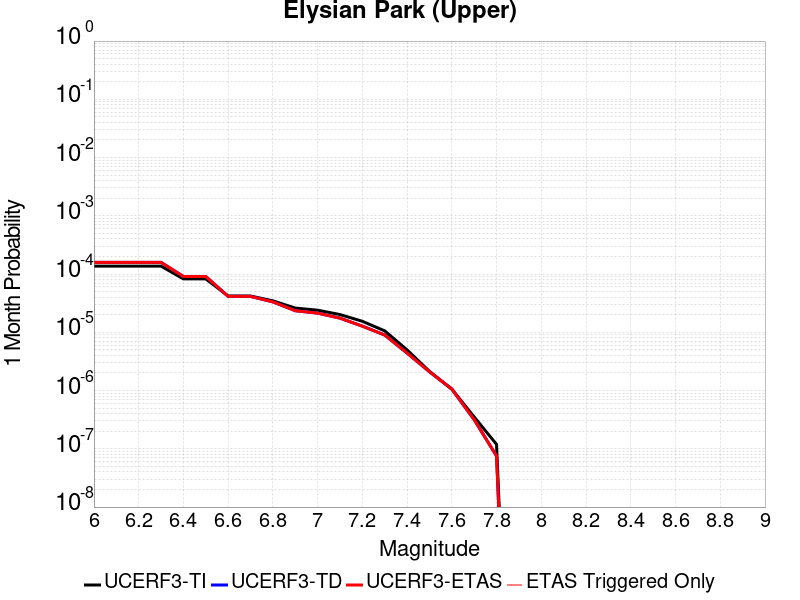 |  | 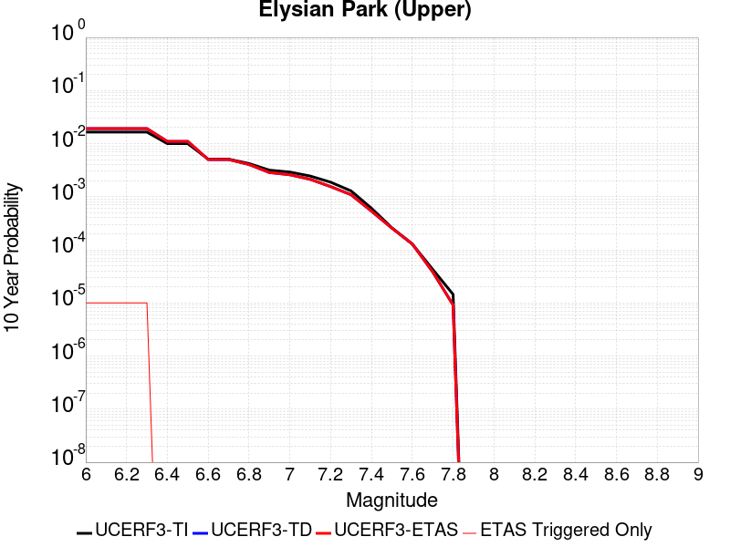 |

| Magnitude | 1 wk TI Prob | 1 wk TD Prob | 1 wk ETAS Prob | 1 wk ETAS/TD Gain | 1 wk ETAS Triggered Only | 1 mo TI Prob | 1 mo TD Prob | 1 mo ETAS Prob | 1 mo ETAS/TD Gain | 1 mo ETAS Triggered Only | 1 yr TI Prob | 1 yr TD Prob | 1 yr ETAS Prob | 1 yr ETAS/TD Gain | 1 yr ETAS Triggered Only | 10 yr TI Prob | 10 yr TD Prob | 10 yr ETAS Prob | 10 yr ETAS/TD Gain | 10 yr ETAS Triggered Only |
|-----|-----|-----|-----|-----|-----|-----|-----|-----|-----|-----|-----|-----|-----|-----|-----|-----|-----|-----|-----|-----|
| 6.0 | 3.1876025E-5 | 3.7035075E-5 | 3.7035075E-5 | 1.0 | 0.0 | 1.3660437E-4 | 1.5871483E-4 | 1.5871483E-4 | 1.0 | 0.0 | 0.0016618895 | 0.0019311117 | 0.0019311117 | 1.0 | 0.0 | 0.016495159 | 0.01918976 | 0.019199567 | 1.0005112 | 1.0E-5 |
| 6.1 | 3.1876025E-5 | 3.7035075E-5 | 3.7035075E-5 | 1.0 | 0.0 | 1.3660437E-4 | 1.5871483E-4 | 1.5871483E-4 | 1.0 | 0.0 | 0.0016618895 | 0.0019311117 | 0.0019311117 | 1.0 | 0.0 | 0.016495159 | 0.01918976 | 0.019199567 | 1.0005112 | 1.0E-5 |
| 6.2 | 3.1876025E-5 | 3.7035075E-5 | 3.7035075E-5 | 1.0 | 0.0 | 1.3660437E-4 | 1.5871483E-4 | 1.5871483E-4 | 1.0 | 0.0 | 0.0016618895 | 0.0019311117 | 0.0019311117 | 1.0 | 0.0 | 0.016495159 | 0.01918976 | 0.019199567 | 1.0005112 | 1.0E-5 |
| 6.3 | 3.1876025E-5 | 3.7035075E-5 | 3.7035075E-5 | 1.0 | 0.0 | 1.3660437E-4 | 1.5871483E-4 | 1.5871483E-4 | 1.0 | 0.0 | 0.0016618895 | 0.0019311117 | 0.0019311117 | 1.0 | 0.0 | 0.016495159 | 0.01918976 | 0.019199567 | 1.0005112 | 1.0E-5 |
| 6.4 | 1.9273462E-5 | 2.120235E-5 | 2.120235E-5 | 1.0 | 0.0 | 8.259794E-5 | 9.0865025E-5 | 9.0865025E-5 | 1.0 | 0.0 | 0.001005166 | 0.0011058919 | 0.0011058919 | 1.0 | 0.0 | 0.010006315 | 0.011020696 | 0.011020696 | 1.0 | 0.0 |
| 6.5 | 1.9273462E-5 | 2.120235E-5 | 2.120235E-5 | 1.0 | 0.0 | 8.259794E-5 | 9.0865025E-5 | 9.0865025E-5 | 1.0 | 0.0 | 0.001005166 | 0.0011058919 | 0.0011058919 | 1.0 | 0.0 | 0.010006315 | 0.011020696 | 0.011020696 | 1.0 | 0.0 |
| 6.6 | 9.813258E-6 | 9.665563E-6 | 9.665563E-6 | 1.0 | 0.0 | 4.205614E-5 | 4.1423224E-5 | 4.1423224E-5 | 1.0 | 0.0 | 5.119132E-4 | 5.0421833E-4 | 5.0421833E-4 | 1.0 | 0.0 | 0.005107356 | 0.0050314665 | 0.0050314665 | 1.0 | 0.0 |
| 6.7 | 9.801478E-6 | 9.653133E-6 | 9.653133E-6 | 1.0 | 0.0 | 4.2005657E-5 | 4.1369953E-5 | 4.1369953E-5 | 1.0 | 0.0 | 5.112989E-4 | 5.0357E-4 | 5.0357E-4 | 1.0 | 0.0 | 0.0051012407 | 0.005025013 | 0.005025013 | 1.0 | 0.0 |
| 6.8 | 8.102489E-6 | 7.772975E-6 | 7.772975E-6 | 1.0 | 0.0 | 3.4724493E-5 | 3.331235E-5 | 3.331235E-5 | 1.0 | 0.0 | 4.2268867E-4 | 4.0550734E-4 | 4.0550734E-4 | 1.0 | 0.0 | 0.004218856 | 0.004048168 | 0.004048168 | 1.0 | 0.0 |
| 6.9 | 6.08275E-6 | 5.4814295E-6 | 5.4814295E-6 | 1.0 | 0.0 | 2.6068668E-5 | 2.3491633E-5 | 2.3491633E-5 | 1.0 | 0.0 | 3.173398E-4 | 2.8597386E-4 | 2.8597386E-4 | 1.0 | 0.0 | 0.0031688702 | 0.0028561365 | 0.0028561365 | 1.0 | 0.0 |
| 7.0 | 5.5995934E-6 | 4.9827586E-6 | 4.9827586E-6 | 1.0 | 0.0 | 2.3998036E-5 | 2.1354508E-5 | 2.1354508E-5 | 1.0 | 0.0 | 2.9213692E-4 | 2.599608E-4 | 2.599608E-4 | 1.0 | 0.0 | 0.0029175316 | 0.0025966342 | 0.0025966342 | 1.0 | 0.0 |
| 7.1 | 4.709881E-6 | 4.087382E-6 | 4.087382E-6 | 1.0 | 0.0 | 2.0185047E-5 | 1.7517235E-5 | 1.7517235E-5 | 1.0 | 0.0 | 2.4572524E-4 | 2.1325189E-4 | 2.1325189E-4 | 1.0 | 0.0 | 0.002454537 | 0.002130514 | 0.002130514 | 1.0 | 0.0 |
| 7.2 | 3.6063436E-6 | 2.9779353E-6 | 2.9779353E-6 | 1.0 | 0.0 | 1.5455667E-5 | 1.2762518E-5 | 1.2762518E-5 | 1.0 | 0.0 | 1.881565E-4 | 1.5537269E-4 | 1.5537269E-4 | 1.0 | 0.0 | 0.0018799726 | 0.0015526518 | 0.0015526518 | 1.0 | 0.0 |
| 7.3 | 2.471135E-6 | 2.0954517E-6 | 2.0954517E-6 | 1.0 | 0.0 | 1.0590536E-5 | 8.980477E-6 | 8.980477E-6 | 1.0 | 0.0 | 1.2893214E-4 | 1.0933189E-4 | 1.0933189E-4 | 1.0 | 0.0 | 0.0012885736 | 0.0010927882 | 0.0010927882 | 1.0 | 0.0 |
| 7.4 | 1.163943E-6 | 1.027504E-6 | 1.027504E-6 | 1.0 | 0.0 | 4.988318E-6 | 4.4035814E-6 | 4.4035814E-6 | 1.0 | 0.0 | 6.0731076E-5 | 5.3612315E-5 | 5.3612315E-5 | 1.0 | 0.0 | 6.071448E-4 | 5.359968E-4 | 5.359968E-4 | 1.0 | 0.0 |
| 7.5 | 4.99459E-7 | 4.91759E-7 | 4.91759E-7 | 1.0 | 0.0 | 2.140537E-6 | 2.107537E-6 | 2.107537E-6 | 1.0 | 0.0 | 2.6060725E-5 | 2.5658977E-5 | 2.5658977E-5 | 1.0 | 0.0 | 2.605767E-4 | 2.565617E-4 | 2.565617E-4 | 1.0 | 0.0 |
| 7.6 | 2.4667852E-7 | 2.477825E-7 | 2.477825E-7 | 1.0 | 0.0 | 1.0571932E-6 | 1.0619246E-6 | 1.0619246E-6 | 1.0 | 0.0 | 1.2871251E-5 | 1.2928859E-5 | 1.2928859E-5 | 1.0 | 0.0 | 1.2870505E-4 | 1.2928144E-4 | 1.2928144E-4 | 1.0 | 0.0 |
| 7.7 | 8.2312795E-8 | 7.386387E-8 | 7.386387E-8 | 1.0 | 0.0 | 3.527691E-7 | 3.1655944E-7 | 3.1655944E-7 | 1.0 | 0.0 | 4.294955E-6 | 3.8541057E-6 | 3.8541057E-6 | 1.0 | 0.0 | 4.2948723E-5 | 3.8540504E-5 | 3.8540504E-5 | 1.0 | 0.0 |
| 7.8 | 2.7819295E-8 | 1.756536E-8 | 1.756536E-8 | 1.0 | 0.0 | 1.1922555E-7 | 7.528011E-8 | 7.528011E-8 | 1.0 | 0.0 | 1.45157E-6 | 9.1653516E-7 | 9.1653516E-7 | 1.0 | 0.0 | 1.45156055E-5 | 9.165329E-6 | 9.165329E-6 | 1.0 | 0.0 |

## Casmalia 2011 CFM
*[(top)](#table-of-contents)*

| 1 Week | 1 Month | 1 Year | 10 Year |
|-----|-----|-----|-----|
| 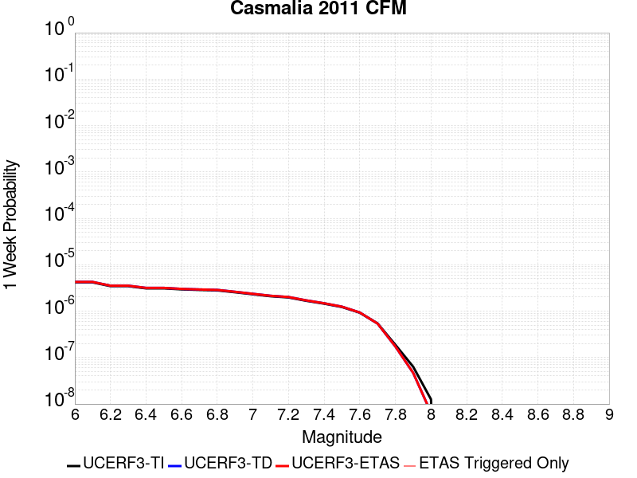 | 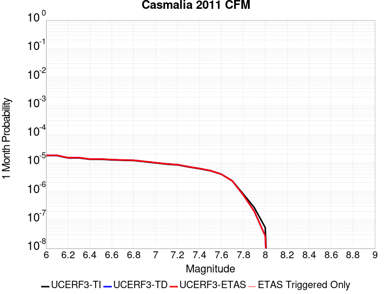 |  | 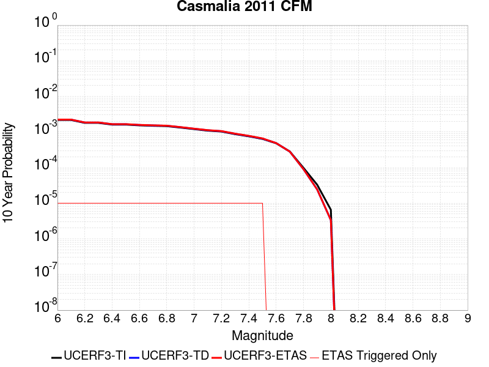 |

| Magnitude | 1 wk TI Prob | 1 wk TD Prob | 1 wk ETAS Prob | 1 wk ETAS/TD Gain | 1 wk ETAS Triggered Only | 1 mo TI Prob | 1 mo TD Prob | 1 mo ETAS Prob | 1 mo ETAS/TD Gain | 1 mo ETAS Triggered Only | 1 yr TI Prob | 1 yr TD Prob | 1 yr ETAS Prob | 1 yr ETAS/TD Gain | 1 yr ETAS Triggered Only | 10 yr TI Prob | 10 yr TD Prob | 10 yr ETAS Prob | 10 yr ETAS/TD Gain | 10 yr ETAS Triggered Only |
|-----|-----|-----|-----|-----|-----|-----|-----|-----|-----|-----|-----|-----|-----|-----|-----|-----|-----|-----|-----|-----|
| 6.0 | 4.1704893E-6 | 4.26248E-6 | 4.26248E-6 | 1.0 | 0.0 | 1.7873403E-5 | 1.8267647E-5 | 1.8267647E-5 | 1.0 | 0.0 | 2.1758694E-4 | 2.223861E-4 | 2.223861E-4 | 1.0 | 0.0 | 0.0021737402 | 0.0022216565 | 0.0022316342 | 1.0044911 | 1.0E-5 |
| 6.1 | 4.1704893E-6 | 4.26248E-6 | 4.26248E-6 | 1.0 | 0.0 | 1.7873403E-5 | 1.8267647E-5 | 1.8267647E-5 | 1.0 | 0.0 | 2.1758694E-4 | 2.223861E-4 | 2.223861E-4 | 1.0 | 0.0 | 0.0021737402 | 0.0022216565 | 0.0022316342 | 1.0044911 | 1.0E-5 |
| 6.2 | 3.457312E-6 | 3.5370197E-6 | 3.5370197E-6 | 1.0 | 0.0 | 1.4816967E-5 | 1.5158568E-5 | 1.5158568E-5 | 1.0 | 0.0 | 1.8038164E-4 | 1.8454003E-4 | 1.8454003E-4 | 1.0 | 0.0 | 0.001802353 | 0.0018438773 | 0.0018538588 | 1.0054134 | 1.0E-5 |
| 6.3 | 3.457312E-6 | 3.5370197E-6 | 3.5370197E-6 | 1.0 | 0.0 | 1.4816967E-5 | 1.5158568E-5 | 1.5158568E-5 | 1.0 | 0.0 | 1.8038164E-4 | 1.8454003E-4 | 1.8454003E-4 | 1.0 | 0.0 | 0.001802353 | 0.0018438773 | 0.0018538588 | 1.0054134 | 1.0E-5 |
| 6.4 | 3.0957337E-6 | 3.1692236E-6 | 3.1692236E-6 | 1.0 | 0.0 | 1.3267363E-5 | 1.35823175E-5 | 1.35823175E-5 | 1.0 | 0.0 | 1.6151817E-4 | 1.6535222E-4 | 1.6535222E-4 | 1.0 | 0.0 | 0.0016140083 | 0.001652298 | 0.0016622815 | 1.0060421 | 1.0E-5 |
| 6.5 | 3.0957337E-6 | 3.1692236E-6 | 3.1692236E-6 | 1.0 | 0.0 | 1.3267363E-5 | 1.35823175E-5 | 1.35823175E-5 | 1.0 | 0.0 | 1.6151817E-4 | 1.6535222E-4 | 1.6535222E-4 | 1.0 | 0.0 | 0.0016140083 | 0.001652298 | 0.0016622815 | 1.0060421 | 1.0E-5 |
| 6.6 | 2.9459152E-6 | 3.0165731E-6 | 3.0165731E-6 | 1.0 | 0.0 | 1.262529E-5 | 1.2928107E-5 | 1.2928107E-5 | 1.0 | 0.0 | 1.5370206E-4 | 1.573884E-4 | 1.573884E-4 | 1.0 | 0.0 | 0.0015359579 | 0.0015727748 | 0.0015827591 | 1.0063481 | 1.0E-5 |
| 6.7 | 2.8634809E-6 | 2.9324708E-6 | 2.9324708E-6 | 1.0 | 0.0 | 1.2272003E-5 | 1.2567672E-5 | 1.2567672E-5 | 1.0 | 0.0 | 1.4940138E-4 | 1.530007E-4 | 1.530007E-4 | 1.0 | 0.0 | 0.0014930099 | 0.0015289591 | 0.0015389438 | 1.0065304 | 1.0E-5 |
| 6.8 | 2.7999822E-6 | 2.867595E-6 | 2.867595E-6 | 1.0 | 0.0 | 1.1999869E-5 | 1.22896345E-5 | 1.22896345E-5 | 1.0 | 0.0 | 1.460886E-4 | 1.4961608E-4 | 1.4961608E-4 | 1.0 | 0.0 | 0.001459926 | 0.0014951588 | 0.0015051438 | 1.0066782 | 1.0E-5 |
| 6.9 | 2.551052E-6 | 2.6119633E-6 | 2.6119633E-6 | 1.0 | 0.0 | 1.0933034E-5 | 1.119408E-5 | 1.119408E-5 | 1.0 | 0.0 | 1.3310155E-4 | 1.3627944E-4 | 1.3627944E-4 | 1.0 | 0.0 | 0.0013302186 | 0.0013619628 | 0.0013719491 | 1.0073323 | 1.0E-5 |
| 7.0 | 2.3081875E-6 | 2.3624075E-6 | 2.3624075E-6 | 1.0 | 0.0 | 9.892195E-6 | 1.0124564E-5 | 1.0124564E-5 | 1.0 | 0.0 | 1.20430814E-4 | 1.2325963E-4 | 1.2325963E-4 | 1.0 | 0.0 | 0.0012036557 | 0.0012319154 | 0.001241903 | 1.0081074 | 1.0E-5 |
| 7.1 | 2.093245E-6 | 2.141723E-6 | 2.141723E-6 | 1.0 | 0.0 | 8.971019E-6 | 9.178781E-6 | 9.178781E-6 | 1.0 | 0.0 | 1.09216686E-4 | 1.1174594E-4 | 1.1174594E-4 | 1.0 | 0.0 | 0.0010916302 | 0.0011168995 | 0.0011268884 | 1.0089433 | 1.0E-5 |
| 7.2 | 1.9714576E-6 | 2.016508E-6 | 2.016508E-6 | 1.0 | 0.0 | 8.449076E-6 | 8.642148E-6 | 8.642148E-6 | 1.0 | 0.0 | 1.0286264E-4 | 1.0521309E-4 | 1.0521309E-4 | 1.0 | 0.0 | 0.0010281504 | 0.0010516347 | 0.0010616241 | 1.009499 | 1.0E-5 |
| 7.3 | 1.6689512E-6 | 1.7047122E-6 | 1.7047122E-6 | 1.0 | 0.0 | 7.1526288E-6 | 7.3058886E-6 | 7.3058886E-6 | 1.0 | 0.0 | 8.7079774E-5 | 8.894557E-5 | 8.894557E-5 | 1.0 | 0.0 | 8.7045657E-4 | 8.891005E-4 | 8.990916E-4 | 1.0112373 | 1.0E-5 |
| 7.4 | 1.4490954E-6 | 1.47789E-6 | 1.47789E-6 | 1.0 | 0.0 | 6.210394E-6 | 6.333799E-6 | 6.333799E-6 | 1.0 | 0.0 | 7.560892E-5 | 7.711128E-5 | 7.711128E-5 | 1.0 | 0.0 | 7.55832E-4 | 7.7084586E-4 | 7.8083813E-4 | 1.0129628 | 1.0E-5 |
| 7.5 | 1.226873E-6 | 1.2481696E-6 | 1.2481696E-6 | 1.0 | 0.0 | 5.2580162E-6 | 5.349287E-6 | 5.349287E-6 | 1.0 | 0.0 | 6.401447E-5 | 6.512563E-5 | 6.512563E-5 | 1.0 | 0.0 | 6.399603E-4 | 6.5106596E-4 | 6.6105946E-4 | 1.0153494 | 1.0E-5 |
| 7.6 | 9.2561345E-7 | 9.3619207E-7 | 9.3619207E-7 | 1.0 | 0.0 | 3.966909E-6 | 4.0122454E-6 | 4.0122454E-6 | 1.0 | 0.0 | 4.8296046E-5 | 4.8848E-5 | 4.8848E-5 | 1.0 | 0.0 | 4.828555E-4 | 4.8837304E-4 | 4.8837304E-4 | 1.0 | 0.0 |
| 7.7 | 5.4367933E-7 | 5.39289E-7 | 5.39289E-7 | 1.0 | 0.0 | 2.3300522E-6 | 2.3112366E-6 | 2.3112366E-6 | 1.0 | 0.0 | 2.8368017E-5 | 2.8138942E-5 | 2.8138942E-5 | 1.0 | 0.0 | 2.8364395E-4 | 2.8135392E-4 | 2.8135392E-4 | 1.0 | 0.0 |
| 7.8 | 1.8825742E-7 | 1.7342346E-7 | 1.7342346E-7 | 1.0 | 0.0 | 8.068173E-7 | 7.432432E-7 | 7.432432E-7 | 1.0 | 0.0 | 9.822956E-6 | 9.048948E-6 | 9.048948E-6 | 1.0 | 0.0 | 9.822522E-5 | 9.0485824E-5 | 9.0485824E-5 | 1.0 | 0.0 |
| 7.9 | 6.342771E-8 | 4.6789356E-8 | 4.6789356E-8 | 1.0 | 0.0 | 2.7183304E-7 | 2.0052579E-7 | 2.0052579E-7 | 1.0 | 0.0 | 3.3095623E-6 | 2.4413987E-6 | 2.4413987E-6 | 1.0 | 0.0 | 3.309513E-5 | 2.4413725E-5 | 2.4413725E-5 | 1.0 | 0.0 |
| 8.0 | 1.2574819E-8 | 6.4724883E-9 | 6.4724883E-9 | 1.0 | 0.0 | 5.3892084E-8 | 2.7739237E-8 | 2.7739237E-8 | 1.0 | 0.0 | 6.561359E-7 | 3.3772517E-7 | 3.3772517E-7 | 1.0 | 0.0 | 6.56134E-6 | 3.3772467E-6 | 3.3772467E-6 | 1.0 | 0.0 |

## Raymond
*[(top)](#table-of-contents)*

| 1 Week | 1 Month | 1 Year | 10 Year |
|-----|-----|-----|-----|
|  |  | 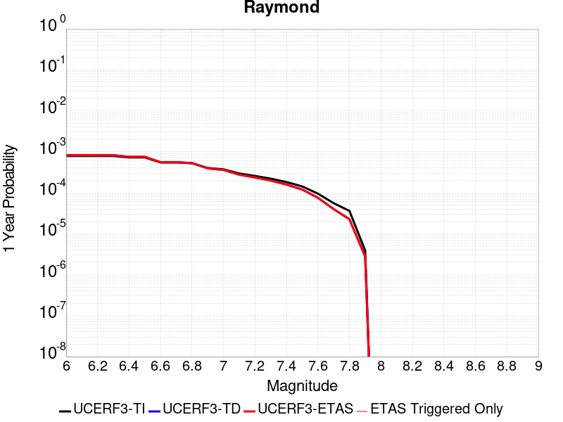 |  |

| Magnitude | 1 wk TI Prob | 1 wk TD Prob | 1 wk ETAS Prob | 1 wk ETAS/TD Gain | 1 wk ETAS Triggered Only | 1 mo TI Prob | 1 mo TD Prob | 1 mo ETAS Prob | 1 mo ETAS/TD Gain | 1 mo ETAS Triggered Only | 1 yr TI Prob | 1 yr TD Prob | 1 yr ETAS Prob | 1 yr ETAS/TD Gain | 1 yr ETAS Triggered Only | 10 yr TI Prob | 10 yr TD Prob | 10 yr ETAS Prob | 10 yr ETAS/TD Gain | 10 yr ETAS Triggered Only |
|-----|-----|-----|-----|-----|-----|-----|-----|-----|-----|-----|-----|-----|-----|-----|-----|-----|-----|-----|-----|-----|
| 6.0 | 1.5157413E-5 | 1.581008E-5 | 1.581008E-5 | 1.0 | 0.0 | 6.4958724E-5 | 6.7755864E-5 | 6.7755864E-5 | 1.0 | 0.0 | 7.905855E-4 | 8.246405E-4 | 8.246405E-4 | 1.0 | 0.0 | 0.007877788 | 0.008218332 | 0.00822825 | 1.0012068 | 1.0E-5 |
| 6.1 | 1.5157413E-5 | 1.581008E-5 | 1.581008E-5 | 1.0 | 0.0 | 6.4958724E-5 | 6.7755864E-5 | 6.7755864E-5 | 1.0 | 0.0 | 7.905855E-4 | 8.246405E-4 | 8.246405E-4 | 1.0 | 0.0 | 0.007877788 | 0.008218332 | 0.00822825 | 1.0012068 | 1.0E-5 |
| 6.2 | 1.5157413E-5 | 1.581008E-5 | 1.581008E-5 | 1.0 | 0.0 | 6.4958724E-5 | 6.7755864E-5 | 6.7755864E-5 | 1.0 | 0.0 | 7.905855E-4 | 8.246405E-4 | 8.246405E-4 | 1.0 | 0.0 | 0.007877788 | 0.008218332 | 0.00822825 | 1.0012068 | 1.0E-5 |
| 6.3 | 1.5157413E-5 | 1.581008E-5 | 1.581008E-5 | 1.0 | 0.0 | 6.4958724E-5 | 6.7755864E-5 | 6.7755864E-5 | 1.0 | 0.0 | 7.905855E-4 | 8.246405E-4 | 8.246405E-4 | 1.0 | 0.0 | 0.007877788 | 0.008218332 | 0.00822825 | 1.0012068 | 1.0E-5 |
| 6.4 | 1.3941944E-5 | 1.4454646E-5 | 1.4454646E-5 | 1.0 | 0.0 | 5.9749822E-5 | 6.194714E-5 | 6.194714E-5 | 1.0 | 0.0 | 7.2721124E-4 | 7.539688E-4 | 7.539688E-4 | 1.0 | 0.0 | 0.007248361 | 0.007516451 | 0.007526376 | 1.0013204 | 1.0E-5 |
| 6.5 | 1.3941944E-5 | 1.4454646E-5 | 1.4454646E-5 | 1.0 | 0.0 | 5.9749822E-5 | 6.194714E-5 | 6.194714E-5 | 1.0 | 0.0 | 7.2721124E-4 | 7.539688E-4 | 7.539688E-4 | 1.0 | 0.0 | 0.007248361 | 0.007516451 | 0.007526376 | 1.0013204 | 1.0E-5 |
| 6.6 | 1.0542609E-5 | 1.06710795E-5 | 1.06710795E-5 | 1.0 | 0.0 | 4.5181827E-5 | 4.5732424E-5 | 4.5732424E-5 | 1.0 | 0.0 | 5.499499E-4 | 5.566555E-4 | 5.566555E-4 | 1.0 | 0.0 | 0.005485909 | 0.0055531827 | 0.005563127 | 1.0017908 | 1.0E-5 |
| 6.7 | 1.0542609E-5 | 1.06710795E-5 | 1.06710795E-5 | 1.0 | 0.0 | 4.5181827E-5 | 4.5732424E-5 | 4.5732424E-5 | 1.0 | 0.0 | 5.499499E-4 | 5.566555E-4 | 5.566555E-4 | 1.0 | 0.0 | 0.005485909 | 0.0055531827 | 0.005563127 | 1.0017908 | 1.0E-5 |
| 6.8 | 1.0079132E-5 | 1.0176614E-5 | 1.0176614E-5 | 1.0 | 0.0 | 4.3195567E-5 | 4.361336E-5 | 4.361336E-5 | 1.0 | 0.0 | 5.257791E-4 | 5.3086865E-4 | 5.3086865E-4 | 1.0 | 0.0 | 0.0052453685 | 0.005296564 | 0.005306511 | 1.001878 | 1.0E-5 |
| 6.9 | 7.721598E-6 | 7.54888E-6 | 7.54888E-6 | 1.0 | 0.0 | 3.3092143E-5 | 3.235195E-5 | 3.235195E-5 | 1.0 | 0.0 | 4.0282236E-4 | 3.93815E-4 | 3.93815E-4 | 1.0 | 0.0 | 0.0040209293 | 0.0039313147 | 0.003941275 | 1.0025337 | 1.0E-5 |
| 7.0 | 7.137566E-6 | 6.9112825E-6 | 6.9112825E-6 | 1.0 | 0.0 | 3.058921E-5 | 2.9619452E-5 | 2.9619452E-5 | 1.0 | 0.0 | 3.7236E-4 | 3.6055825E-4 | 3.6055825E-4 | 1.0 | 0.0 | 0.0037173668 | 0.0035998605 | 0.0036098245 | 1.0027679 | 1.0E-5 |
| 7.1 | 5.654976E-6 | 5.299521E-6 | 5.299521E-6 | 1.0 | 0.0 | 2.4235387E-5 | 2.2712036E-5 | 2.2712036E-5 | 1.0 | 0.0 | 2.9502588E-4 | 2.7648418E-4 | 2.7648418E-4 | 1.0 | 0.0 | 0.0029463451 | 0.0027614427 | 0.002771415 | 1.0036113 | 1.0E-5 |
| 7.2 | 4.9358455E-6 | 4.52664E-6 | 4.52664E-6 | 1.0 | 0.0 | 2.1153453E-5 | 1.9399742E-5 | 1.9399742E-5 | 1.0 | 0.0 | 2.5751285E-4 | 2.361664E-4 | 2.361664E-4 | 1.0 | 0.0 | 0.0025721465 | 0.002359186 | 0.0023691626 | 1.0042287 | 1.0E-5 |
| 7.3 | 4.2368597E-6 | 3.8055994E-6 | 3.8055994E-6 | 1.0 | 0.0 | 1.8157843E-5 | 1.630961E-5 | 1.630961E-5 | 1.0 | 0.0 | 2.2104931E-4 | 1.9855151E-4 | 1.9855151E-4 | 1.0 | 0.0 | 0.0022082955 | 0.0019837697 | 0.0019937498 | 1.0050309 | 1.0E-5 |
| 7.4 | 3.4999923E-6 | 3.0437288E-6 | 3.0437288E-6 | 1.0 | 0.0 | 1.49998805E-5 | 1.3044487E-5 | 1.3044487E-5 | 1.0 | 0.0 | 1.8260824E-4 | 1.5880514E-4 | 1.5880514E-4 | 1.0 | 0.0 | 0.0018245826 | 0.001586942 | 0.0015969261 | 1.0062914 | 1.0E-5 |
| 7.5 | 2.738017E-6 | 2.302031E-6 | 2.302031E-6 | 1.0 | 0.0 | 1.1734306E-5 | 9.865809E-6 | 9.865809E-6 | 1.0 | 0.0 | 1.428558E-4 | 1.2010968E-4 | 1.2010968E-4 | 1.0 | 0.0 | 0.0014276401 | 0.0012004718 | 0.0012104597 | 1.0083201 | 1.0E-5 |
| 7.6 | 1.8186392E-6 | 1.4422955E-6 | 1.4422955E-6 | 1.0 | 0.0 | 7.794145E-6 | 6.1812516E-6 | 6.1812516E-6 | 1.0 | 0.0 | 9.488958E-5 | 7.525418E-5 | 7.525418E-5 | 1.0 | 0.0 | 9.4849075E-4 | 7.5230823E-4 | 7.6230074E-4 | 1.0132824 | 1.0E-5 |
| 7.7 | 1.0660348E-6 | 7.643642E-7 | 7.643642E-7 | 1.0 | 0.0 | 4.5687125E-6 | 3.2758423E-6 | 3.2758423E-6 | 1.0 | 0.0 | 5.5622655E-5 | 3.9882667E-5 | 3.9882667E-5 | 1.0 | 0.0 | 5.5608735E-4 | 3.98774E-4 | 4.0877E-4 | 1.0250669 | 1.0E-5 |
| 7.8 | 6.913602E-7 | 4.32024E-7 | 4.32024E-7 | 1.0 | 0.0 | 2.962969E-6 | 1.8515301E-6 | 1.8515301E-6 | 1.0 | 0.0 | 3.607355E-5 | 2.2542152E-5 | 2.2542152E-5 | 1.0 | 0.0 | 3.6067693E-4 | 2.2541644E-4 | 2.3541419E-4 | 1.0443523 | 1.0E-5 |
| 7.9 | 7.425201E-8 | 5.3221317E-8 | 5.3221317E-8 | 1.0 | 0.0 | 3.1822285E-7 | 2.2809135E-7 | 2.2809135E-7 | 1.0 | 0.0 | 3.874356E-6 | 2.77701E-6 | 2.77701E-6 | 1.0 | 0.0 | 3.8742884E-5 | 2.7769884E-5 | 2.7769884E-5 | 1.0 | 0.0 |

## South Cuyama
*[(top)](#table-of-contents)*

| 1 Week | 1 Month | 1 Year | 10 Year |
|-----|-----|-----|-----|
|  |  |  |  |

| Magnitude | 1 wk TI Prob | 1 wk TD Prob | 1 wk ETAS Prob | 1 wk ETAS/TD Gain | 1 wk ETAS Triggered Only | 1 mo TI Prob | 1 mo TD Prob | 1 mo ETAS Prob | 1 mo ETAS/TD Gain | 1 mo ETAS Triggered Only | 1 yr TI Prob | 1 yr TD Prob | 1 yr ETAS Prob | 1 yr ETAS/TD Gain | 1 yr ETAS Triggered Only | 10 yr TI Prob | 10 yr TD Prob | 10 yr ETAS Prob | 10 yr ETAS/TD Gain | 10 yr ETAS Triggered Only |
|-----|-----|-----|-----|-----|-----|-----|-----|-----|-----|-----|-----|-----|-----|-----|-----|-----|-----|-----|-----|-----|
| 6.0 | 1.2747308E-6 | 1.2818696E-6 | 1.2818696E-6 | 1.0 | 0.0 | 5.4631205E-6 | 5.4937154E-6 | 5.4937154E-6 | 1.0 | 0.0 | 6.6511464E-5 | 6.6884E-5 | 6.6884E-5 | 1.0 | 0.0 | 6.649156E-4 | 6.686457E-4 | 6.7863904E-4 | 1.0149456 | 1.0E-5 |
| 6.1 | 1.2747308E-6 | 1.2818696E-6 | 1.2818696E-6 | 1.0 | 0.0 | 5.4631205E-6 | 5.4937154E-6 | 5.4937154E-6 | 1.0 | 0.0 | 6.6511464E-5 | 6.6884E-5 | 6.6884E-5 | 1.0 | 0.0 | 6.649156E-4 | 6.686457E-4 | 6.7863904E-4 | 1.0149456 | 1.0E-5 |
| 6.2 | 1.2747308E-6 | 1.2818696E-6 | 1.2818696E-6 | 1.0 | 0.0 | 5.4631205E-6 | 5.4937154E-6 | 5.4937154E-6 | 1.0 | 0.0 | 6.6511464E-5 | 6.6884E-5 | 6.6884E-5 | 1.0 | 0.0 | 6.649156E-4 | 6.686457E-4 | 6.7863904E-4 | 1.0149456 | 1.0E-5 |
| 6.3 | 1.2747308E-6 | 1.2818696E-6 | 1.2818696E-6 | 1.0 | 0.0 | 5.4631205E-6 | 5.4937154E-6 | 5.4937154E-6 | 1.0 | 0.0 | 6.6511464E-5 | 6.6884E-5 | 6.6884E-5 | 1.0 | 0.0 | 6.649156E-4 | 6.686457E-4 | 6.7863904E-4 | 1.0149456 | 1.0E-5 |
| 6.4 | 1.2747308E-6 | 1.2818696E-6 | 1.2818696E-6 | 1.0 | 0.0 | 5.4631205E-6 | 5.4937154E-6 | 5.4937154E-6 | 1.0 | 0.0 | 6.6511464E-5 | 6.6884E-5 | 6.6884E-5 | 1.0 | 0.0 | 6.649156E-4 | 6.686457E-4 | 6.7863904E-4 | 1.0149456 | 1.0E-5 |
| 6.5 | 1.2747308E-6 | 1.2818696E-6 | 1.2818696E-6 | 1.0 | 0.0 | 5.4631205E-6 | 5.4937154E-6 | 5.4937154E-6 | 1.0 | 0.0 | 6.6511464E-5 | 6.6884E-5 | 6.6884E-5 | 1.0 | 0.0 | 6.649156E-4 | 6.686457E-4 | 6.7863904E-4 | 1.0149456 | 1.0E-5 |
| 6.6 | 1.2747308E-6 | 1.2818696E-6 | 1.2818696E-6 | 1.0 | 0.0 | 5.4631205E-6 | 5.4937154E-6 | 5.4937154E-6 | 1.0 | 0.0 | 6.6511464E-5 | 6.6884E-5 | 6.6884E-5 | 1.0 | 0.0 | 6.649156E-4 | 6.686457E-4 | 6.7863904E-4 | 1.0149456 | 1.0E-5 |
| 6.7 | 1.2747308E-6 | 1.2818696E-6 | 1.2818696E-6 | 1.0 | 0.0 | 5.4631205E-6 | 5.4937154E-6 | 5.4937154E-6 | 1.0 | 0.0 | 6.6511464E-5 | 6.6884E-5 | 6.6884E-5 | 1.0 | 0.0 | 6.649156E-4 | 6.686457E-4 | 6.7863904E-4 | 1.0149456 | 1.0E-5 |
| 6.8 | 1.2747308E-6 | 1.2818696E-6 | 1.2818696E-6 | 1.0 | 0.0 | 5.4631205E-6 | 5.4937154E-6 | 5.4937154E-6 | 1.0 | 0.0 | 6.6511464E-5 | 6.6884E-5 | 6.6884E-5 | 1.0 | 0.0 | 6.649156E-4 | 6.686457E-4 | 6.7863904E-4 | 1.0149456 | 1.0E-5 |
| 6.9 | 8.4566324E-7 | 8.507881E-7 | 8.507881E-7 | 1.0 | 0.0 | 3.624266E-6 | 3.6462297E-6 | 3.6462297E-6 | 1.0 | 0.0 | 4.4124543E-5 | 4.4391953E-5 | 4.4391953E-5 | 1.0 | 0.0 | 4.4115784E-4 | 4.438319E-4 | 4.5382747E-4 | 1.022521 | 1.0E-5 |
| 7.0 | 8.2277904E-7 | 8.2778183E-7 | 8.2778183E-7 | 1.0 | 0.0 | 3.526191E-6 | 3.5476316E-6 | 3.5476316E-6 | 1.0 | 0.0 | 4.293053E-5 | 4.319157E-5 | 4.319157E-5 | 1.0 | 0.0 | 4.292224E-4 | 4.3183277E-4 | 4.4182845E-4 | 1.0231471 | 1.0E-5 |
| 7.1 | 6.7661887E-7 | 6.809129E-7 | 6.809129E-7 | 1.0 | 0.0 | 2.899792E-6 | 2.918195E-6 | 2.918195E-6 | 1.0 | 0.0 | 3.5304394E-5 | 3.5528446E-5 | 3.5528446E-5 | 1.0 | 0.0 | 3.5298787E-4 | 3.5522805E-4 | 3.5522805E-4 | 1.0 | 0.0 |
| 7.2 | 5.783336E-7 | 5.8211896E-7 | 5.8211896E-7 | 1.0 | 0.0 | 2.4785702E-6 | 2.4947933E-6 | 2.4947933E-6 | 1.0 | 0.0 | 3.0176174E-5 | 3.0373687E-5 | 3.0373687E-5 | 1.0 | 0.0 | 3.0172078E-4 | 3.036956E-4 | 3.036956E-4 | 1.0 | 0.0 |
| 7.3 | 5.136759E-7 | 5.170937E-7 | 5.170937E-7 | 1.0 | 0.0 | 2.2014663E-6 | 2.216114E-6 | 2.216114E-6 | 1.0 | 0.0 | 2.6802521E-5 | 2.6980855E-5 | 2.6980855E-5 | 1.0 | 0.0 | 2.679929E-4 | 2.69776E-4 | 2.69776E-4 | 1.0 | 0.0 |
| 7.4 | 4.3370295E-7 | 4.3665355E-7 | 4.3665355E-7 | 1.0 | 0.0 | 1.8587256E-6 | 1.871371E-6 | 1.871371E-6 | 1.0 | 0.0 | 2.2629749E-5 | 2.2783704E-5 | 2.2783704E-5 | 1.0 | 0.0 | 2.2627445E-4 | 2.2781386E-4 | 2.2781386E-4 | 1.0 | 0.0 |
| 7.5 | 3.3242574E-7 | 3.347646E-7 | 3.347646E-7 | 1.0 | 0.0 | 1.4246809E-6 | 1.4347046E-6 | 1.4347046E-6 | 1.0 | 0.0 | 1.7345352E-5 | 1.746739E-5 | 1.746739E-5 | 1.0 | 0.0 | 1.7343998E-4 | 1.746603E-4 | 1.746603E-4 | 1.0 | 0.0 |
| 7.6 | 2.0627535E-7 | 2.0778896E-7 | 2.0778896E-7 | 1.0 | 0.0 | 8.840369E-7 | 8.9052384E-7 | 8.9052384E-7 | 1.0 | 0.0 | 1.0763096E-5 | 1.08420745E-5 | 1.08420745E-5 | 1.0 | 0.0 | 1.0762575E-4 | 1.0841554E-4 | 1.0841554E-4 | 1.0 | 0.0 |
| 7.7 | 6.15236E-8 | 6.198304E-8 | 6.198304E-8 | 1.0 | 0.0 | 2.6367252E-7 | 2.6564155E-7 | 2.6564155E-7 | 1.0 | 0.0 | 3.2102084E-6 | 3.2341811E-6 | 3.2341811E-6 | 1.0 | 0.0 | 3.210162E-5 | 3.234135E-5 | 3.234135E-5 | 1.0 | 0.0 |
| 7.8 | 1.1765573E-8 | 1.1873411E-8 | 1.1873411E-8 | 1.0 | 0.0 | 5.0423886E-8 | 5.0886047E-8 | 5.0886047E-8 | 1.0 | 0.0 | 6.1391063E-7 | 6.1953745E-7 | 6.1953745E-7 | 1.0 | 0.0 | 6.1390897E-6 | 6.1953583E-6 | 6.1953583E-6 | 1.0 | 0.0 |
| 7.9 | 6.0381755E-10 | 6.100578E-10 | 6.100578E-10 | 1.0 | 0.0 | 2.5877895E-9 | 2.6145335E-9 | 2.6145335E-9 | 1.0 | 0.0 | 3.1506335E-8 | 3.1831945E-8 | 3.1831945E-8 | 1.0 | 0.0 | 3.1506332E-7 | 3.1831942E-7 | 3.1831942E-7 | 1.0 | 0.0 |

## Hartley Springs 2011 CFM
*[(top)](#table-of-contents)*

| 1 Week | 1 Month | 1 Year | 10 Year |
|-----|-----|-----|-----|
|  | 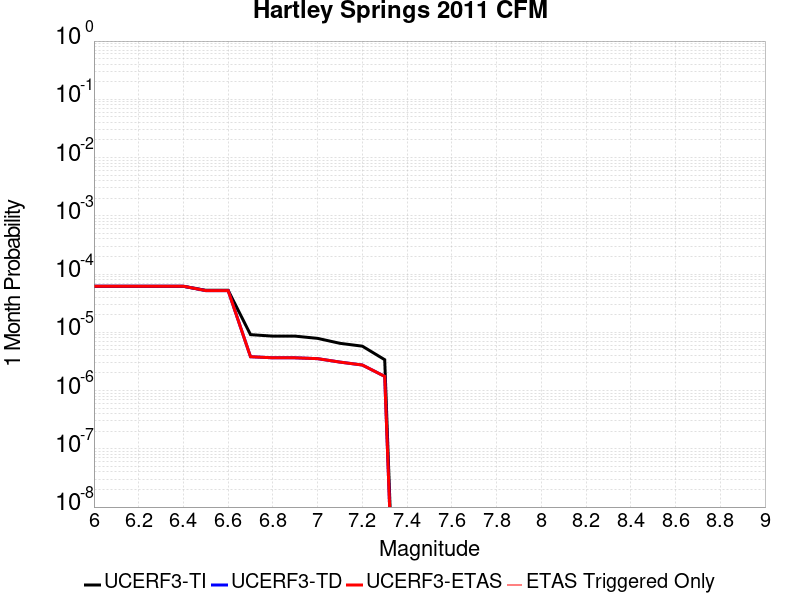 | 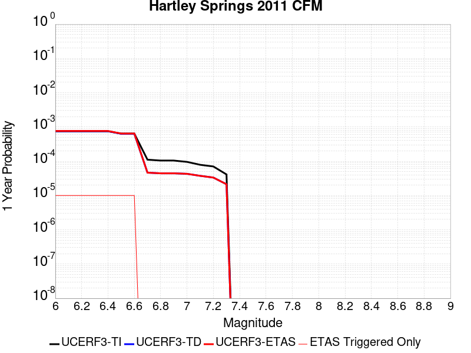 | 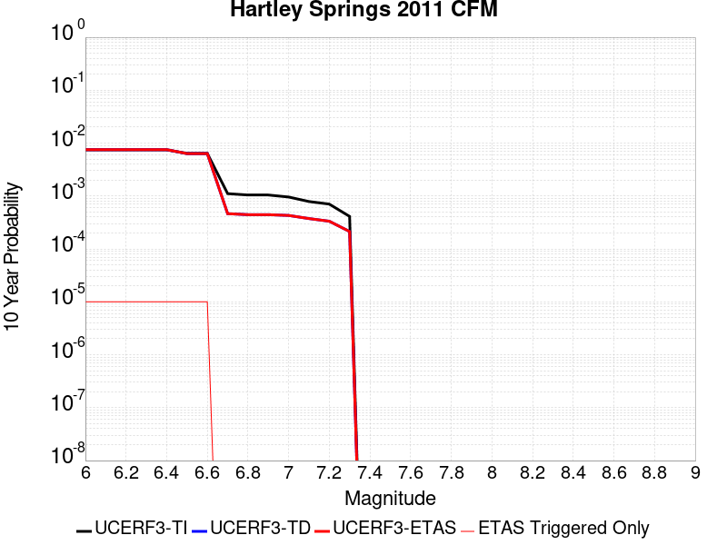 |

| Magnitude | 1 wk TI Prob | 1 wk TD Prob | 1 wk ETAS Prob | 1 wk ETAS/TD Gain | 1 wk ETAS Triggered Only | 1 mo TI Prob | 1 mo TD Prob | 1 mo ETAS Prob | 1 mo ETAS/TD Gain | 1 mo ETAS Triggered Only | 1 yr TI Prob | 1 yr TD Prob | 1 yr ETAS Prob | 1 yr ETAS/TD Gain | 1 yr ETAS Triggered Only | 10 yr TI Prob | 10 yr TD Prob | 10 yr ETAS Prob | 10 yr ETAS/TD Gain | 10 yr ETAS Triggered Only |
|-----|-----|-----|-----|-----|-----|-----|-----|-----|-----|-----|-----|-----|-----|-----|-----|-----|-----|-----|-----|-----|
| 6.0 | 1.4352418E-5 | 1.4434057E-5 | 1.4434057E-5 | 1.0 | 0.0 | 6.1508916E-5 | 6.185971E-5 | 6.185971E-5 | 1.0 | 0.0 | 7.486137E-4 | 7.530461E-4 | 7.630385E-4 | 1.0132694 | 1.0E-5 | 0.007460968 | 0.007521064 | 0.007530989 | 1.0013196 | 1.0E-5 |
| 6.1 | 1.4352418E-5 | 1.4434057E-5 | 1.4434057E-5 | 1.0 | 0.0 | 6.1508916E-5 | 6.185971E-5 | 6.185971E-5 | 1.0 | 0.0 | 7.486137E-4 | 7.530461E-4 | 7.630385E-4 | 1.0132694 | 1.0E-5 | 0.007460968 | 0.007521064 | 0.007530989 | 1.0013196 | 1.0E-5 |
| 6.2 | 1.4352418E-5 | 1.4434057E-5 | 1.4434057E-5 | 1.0 | 0.0 | 6.1508916E-5 | 6.185971E-5 | 6.185971E-5 | 1.0 | 0.0 | 7.486137E-4 | 7.530461E-4 | 7.630385E-4 | 1.0132694 | 1.0E-5 | 0.007460968 | 0.007521064 | 0.007530989 | 1.0013196 | 1.0E-5 |
| 6.3 | 1.4352418E-5 | 1.4434057E-5 | 1.4434057E-5 | 1.0 | 0.0 | 6.1508916E-5 | 6.185971E-5 | 6.185971E-5 | 1.0 | 0.0 | 7.486137E-4 | 7.530461E-4 | 7.630385E-4 | 1.0132694 | 1.0E-5 | 0.007460968 | 0.007521064 | 0.007530989 | 1.0013196 | 1.0E-5 |
| 6.4 | 1.4352418E-5 | 1.4434057E-5 | 1.4434057E-5 | 1.0 | 0.0 | 6.1508916E-5 | 6.185971E-5 | 6.185971E-5 | 1.0 | 0.0 | 7.486137E-4 | 7.530461E-4 | 7.630385E-4 | 1.0132694 | 1.0E-5 | 0.007460968 | 0.007521064 | 0.007530989 | 1.0013196 | 1.0E-5 |
| 6.5 | 1.2279858E-5 | 1.2132989E-5 | 1.2132989E-5 | 1.0 | 0.0 | 5.26269E-5 | 5.199838E-5 | 5.199838E-5 | 1.0 | 0.0 | 6.4054417E-4 | 6.3305453E-4 | 6.430482E-4 | 1.0157864 | 1.0E-5 | 0.0063870098 | 0.006328024 | 0.0063379607 | 1.0015702 | 1.0E-5 |
| 6.6 | 1.2279858E-5 | 1.2132989E-5 | 1.2132989E-5 | 1.0 | 0.0 | 5.26269E-5 | 5.199838E-5 | 5.199838E-5 | 1.0 | 0.0 | 6.4054417E-4 | 6.3305453E-4 | 6.430482E-4 | 1.0157864 | 1.0E-5 | 0.0063870098 | 0.006328024 | 0.0063379607 | 1.0015702 | 1.0E-5 |
| 6.7 | 2.1282601E-6 | 8.893982E-7 | 8.893982E-7 | 1.0 | 0.0 | 9.121083E-6 | 3.8117025E-6 | 3.8117025E-6 | 1.0 | 0.0 | 1.11043526E-4 | 4.640675E-5 | 4.640675E-5 | 1.0 | 0.0 | 0.0011098806 | 4.639959E-4 | 4.639959E-4 | 1.0 | 0.0 |
| 6.8 | 2.00516E-6 | 8.5167846E-7 | 8.5167846E-7 | 1.0 | 0.0 | 8.593515E-6 | 3.650047E-6 | 3.650047E-6 | 1.0 | 0.0 | 1.04621024E-4 | 4.443867E-5 | 4.443867E-5 | 1.0 | 0.0 | 0.0010457177 | 4.44323E-4 | 4.44323E-4 | 1.0 | 0.0 |
| 6.9 | 2.00516E-6 | 8.5167846E-7 | 8.5167846E-7 | 1.0 | 0.0 | 8.593515E-6 | 3.650047E-6 | 3.650047E-6 | 1.0 | 0.0 | 1.04621024E-4 | 4.443867E-5 | 4.443867E-5 | 1.0 | 0.0 | 0.0010457177 | 4.44323E-4 | 4.44323E-4 | 1.0 | 0.0 |
| 7.0 | 1.8366732E-6 | 8.2365545E-7 | 8.2365545E-7 | 1.0 | 0.0 | 7.871433E-6 | 3.5299486E-6 | 3.5299486E-6 | 1.0 | 0.0 | 9.583048E-5 | 4.297653E-5 | 4.297653E-5 | 1.0 | 0.0 | 9.5789164E-4 | 4.2970726E-4 | 4.2970726E-4 | 1.0 | 0.0 |
| 7.1 | 1.5097997E-6 | 7.189573E-7 | 7.189573E-7 | 1.0 | 0.0 | 6.470554E-6 | 3.0812434E-6 | 3.0812434E-6 | 1.0 | 0.0 | 7.877615E-5 | 3.7513735E-5 | 3.7513735E-5 | 1.0 | 0.0 | 7.874823E-4 | 3.7509773E-4 | 3.7509773E-4 | 1.0 | 0.0 |
| 7.2 | 1.3490993E-6 | 6.4046424E-7 | 6.4046424E-7 | 1.0 | 0.0 | 5.7818415E-6 | 2.7448452E-6 | 2.7448452E-6 | 1.0 | 0.0 | 7.0391645E-5 | 3.341821E-5 | 3.341821E-5 | 1.0 | 0.0 | 7.0369354E-4 | 3.341548E-4 | 3.341548E-4 | 1.0 | 0.0 |
| 7.3 | 7.900015E-7 | 4.0887213E-7 | 4.0887213E-7 | 1.0 | 0.0 | 3.3857161E-6 | 1.7523091E-6 | 1.7523091E-6 | 1.0 | 0.0 | 4.1220315E-5 | 2.1334365E-5 | 2.1334365E-5 | 1.0 | 0.0 | 4.121267E-4 | 2.1334364E-4 | 2.1334364E-4 | 1.0 | 0.0 |

## Quien Sabe 2011 CFM
*[(top)](#table-of-contents)*

| 1 Week | 1 Month | 1 Year | 10 Year |
|-----|-----|-----|-----|
| 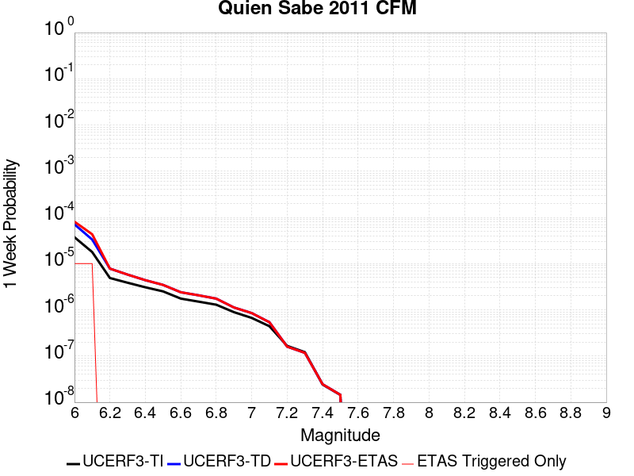 | 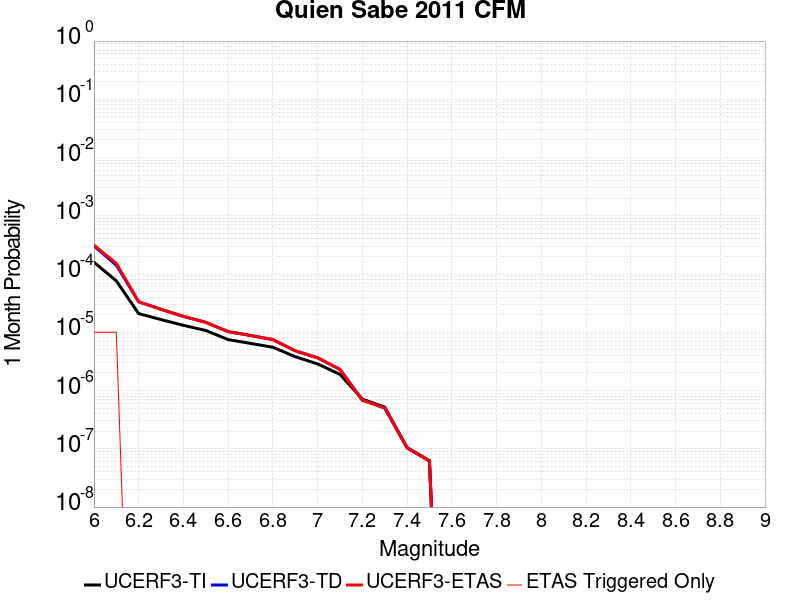 | 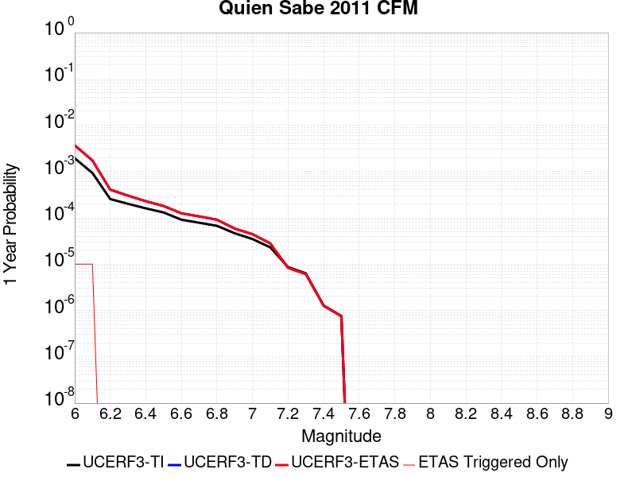 |  |

| Magnitude | 1 wk TI Prob | 1 wk TD Prob | 1 wk ETAS Prob | 1 wk ETAS/TD Gain | 1 wk ETAS Triggered Only | 1 mo TI Prob | 1 mo TD Prob | 1 mo ETAS Prob | 1 mo ETAS/TD Gain | 1 mo ETAS Triggered Only | 1 yr TI Prob | 1 yr TD Prob | 1 yr ETAS Prob | 1 yr ETAS/TD Gain | 1 yr ETAS Triggered Only | 10 yr TI Prob | 10 yr TD Prob | 10 yr ETAS Prob | 10 yr ETAS/TD Gain | 10 yr ETAS Triggered Only |
|-----|-----|-----|-----|-----|-----|-----|-----|-----|-----|-----|-----|-----|-----|-----|-----|-----|-----|-----|-----|-----|
| 6.0 | 3.729899E-5 | 7.094903E-5 | 8.094832E-5 | 1.1409363 | 1.0E-5 | 1.5984301E-4 | 3.0394146E-4 | 3.1393842E-4 | 1.032891 | 1.0E-5 | 0.0019443515 | 0.003685028 | 0.0036949913 | 1.0027037 | 1.0E-5 | 0.019274272 | 0.035349507 | 0.035359155 | 1.0002729 | 1.0E-5 |
| 6.1 | 1.7825725E-5 | 3.321227E-5 | 4.3211938E-5 | 1.3010836 | 1.0E-5 | 7.639373E-5 | 1.4227944E-4 | 1.5227802E-4 | 1.0702742 | 1.0E-5 | 9.296967E-4 | 0.0017265945 | 0.0017365773 | 1.0057818 | 1.0E-5 | 0.009258169 | 0.016698832 | 0.016708665 | 1.0005889 | 1.0E-5 |
| 6.2 | 4.8865336E-6 | 7.807259E-6 | 7.807259E-6 | 1.0 | 0.0 | 2.0942118E-5 | 3.345637E-5 | 3.345637E-5 | 1.0 | 0.0 | 2.5494045E-4 | 4.0691363E-4 | 4.0691363E-4 | 1.0 | 0.0 | 0.0025464818 | 0.0040135924 | 0.0040135924 | 1.0 | 0.0 |
| 6.3 | 3.858491E-6 | 5.7896077E-6 | 5.7896077E-6 | 1.0 | 0.0 | 1.6536285E-5 | 2.4812396E-5 | 2.4812396E-5 | 1.0 | 0.0 | 2.0131067E-4 | 3.0205373E-4 | 3.0205373E-4 | 1.0 | 0.0 | 0.002011284 | 0.0030020848 | 0.0030020848 | 1.0 | 0.0 |
| 6.4 | 3.0771805E-6 | 4.3848136E-6 | 4.3848136E-6 | 1.0 | 0.0 | 1.318785E-5 | 1.8791936E-5 | 1.8791936E-5 | 1.0 | 0.0 | 1.6055023E-4 | 2.2877022E-4 | 2.2877022E-4 | 1.0 | 0.0 | 0.001604343 | 0.0022865436 | 0.0022865436 | 1.0 | 0.0 |
| 6.5 | 2.5081235E-6 | 3.4635088E-6 | 3.4635088E-6 | 1.0 | 0.0 | 1.0749056E-5 | 1.4843533E-5 | 1.4843533E-5 | 1.0 | 0.0 | 1.308619E-4 | 1.807065E-4 | 1.807065E-4 | 1.0 | 0.0 | 0.0013078486 | 0.0018123301 | 0.0018123301 | 1.0 | 0.0 |
| 6.6 | 1.7505364E-6 | 2.4023238E-6 | 2.4023238E-6 | 1.0 | 0.0 | 7.502277E-6 | 1.0295637E-5 | 1.0295637E-5 | 1.0 | 0.0 | 9.13364E-5 | 1.2534289E-4 | 1.2534289E-4 | 1.0 | 0.0 | 9.129886E-4 | 0.0012582317 | 0.0012582317 | 1.0 | 0.0 |
| 6.7 | 1.505737E-6 | 2.063733E-6 | 2.063733E-6 | 1.0 | 0.0 | 6.4531428E-6 | 8.844544E-6 | 8.844544E-6 | 1.0 | 0.0 | 7.8564175E-5 | 1.076776E-4 | 1.076776E-4 | 1.0 | 0.0 | 7.853641E-4 | 0.0010817561 | 0.0010817561 | 1.0 | 0.0 |
| 6.8 | 1.2924105E-6 | 1.7483904E-6 | 1.7483904E-6 | 1.0 | 0.0 | 5.5388905E-6 | 7.4930836E-6 | 7.4930836E-6 | 1.0 | 0.0 | 6.74339E-5 | 9.122502E-5 | 9.122502E-5 | 1.0 | 0.0 | 6.741344E-4 | 9.160375E-4 | 9.160375E-4 | 1.0 | 0.0 |
| 6.9 | 8.9075286E-7 | 1.124975E-6 | 1.124975E-6 | 1.0 | 0.0 | 3.8175067E-6 | 4.821314E-6 | 4.821314E-6 | 1.0 | 0.0 | 4.6477155E-5 | 5.869814E-5 | 5.869814E-5 | 1.0 | 0.0 | 4.6467435E-4 | 5.903556E-4 | 5.903556E-4 | 1.0 | 0.0 |
| 7.0 | 6.6891175E-7 | 8.5164936E-7 | 8.5164936E-7 | 1.0 | 0.0 | 2.8667614E-6 | 3.6499218E-6 | 3.6499218E-6 | 1.0 | 0.0 | 3.4902263E-5 | 4.443709E-5 | 4.443709E-5 | 1.0 | 0.0 | 3.4896782E-4 | 4.467596E-4 | 4.467596E-4 | 1.0 | 0.0 |
| 7.1 | 4.4205015E-7 | 5.39184E-7 | 5.39184E-7 | 1.0 | 0.0 | 1.8944993E-6 | 2.3107873E-6 | 2.3107873E-6 | 1.0 | 0.0 | 2.3065284E-5 | 2.8133643E-5 | 2.8133643E-5 | 1.0 | 0.0 | 2.3062891E-4 | 2.8267803E-4 | 2.8267803E-4 | 1.0 | 0.0 |
| 7.2 | 1.6620965E-7 | 1.5987567E-7 | 1.5987567E-7 | 1.0 | 0.0 | 7.123269E-7 | 6.8518125E-7 | 6.8518125E-7 | 1.0 | 0.0 | 8.672545E-6 | 8.342054E-6 | 8.342054E-6 | 1.0 | 0.0 | 8.6722066E-5 | 8.353744E-5 | 8.353744E-5 | 1.0 | 0.0 |
| 7.3 | 1.2142488E-7 | 1.1726621E-7 | 1.1726621E-7 | 1.0 | 0.0 | 5.2039223E-7 | 5.0256943E-7 | 5.0256943E-7 | 1.0 | 0.0 | 6.335757E-6 | 6.118769E-6 | 6.118769E-6 | 1.0 | 0.0 | 6.3355765E-5 | 6.120406E-5 | 6.120406E-5 | 1.0 | 0.0 |
| 7.4 | 2.4192937E-8 | 2.4545669E-8 | 2.4545669E-8 | 1.0 | 0.0 | 1.0368401E-7 | 1.0519572E-7 | 1.0519572E-7 | 1.0 | 0.0 | 1.2623522E-6 | 1.2807571E-6 | 1.2807571E-6 | 1.0 | 0.0 | 1.2623449E-5 | 1.2769225E-5 | 1.2769225E-5 | 1.0 | 0.0 |
| 7.5 | 1.4432802E-8 | 1.4508712E-8 | 1.4508712E-8 | 1.0 | 0.0 | 6.185486E-8 | 6.218019E-8 | 6.218019E-8 | 1.0 | 0.0 | 7.530827E-7 | 7.5704367E-7 | 7.5704367E-7 | 1.0 | 0.0 | 7.530801E-6 | 7.529414E-6 | 7.529414E-6 | 1.0 | 0.0 |

## Whittier alt 1
*[(top)](#table-of-contents)*

| 1 Week | 1 Month | 1 Year | 10 Year |
|-----|-----|-----|-----|
|  | 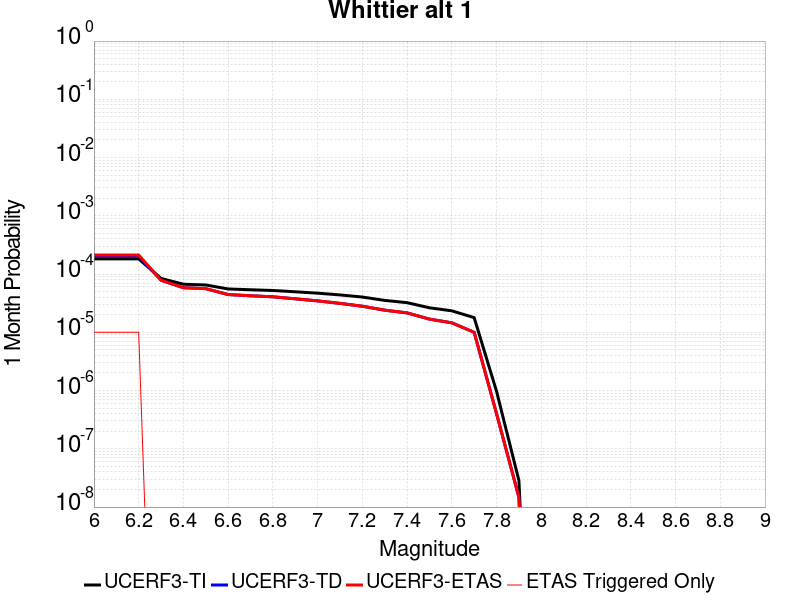 |  | 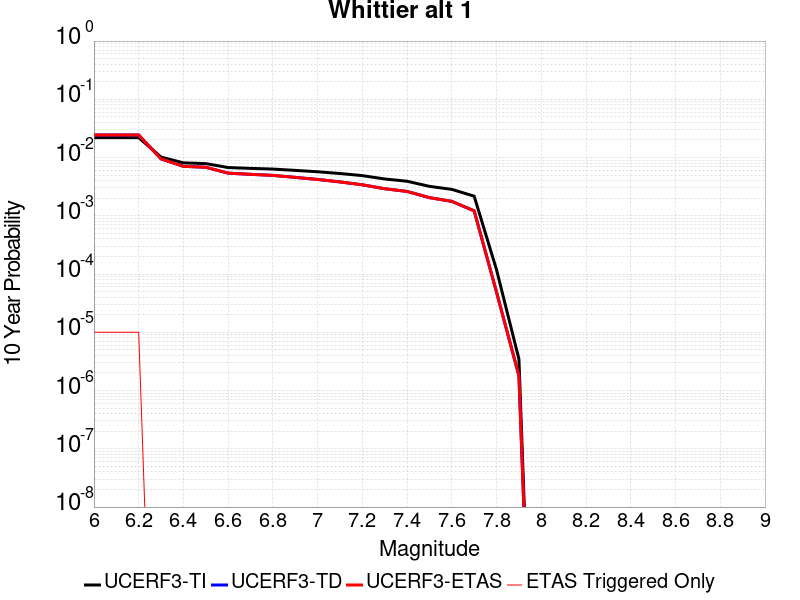 |

| Magnitude | 1 wk TI Prob | 1 wk TD Prob | 1 wk ETAS Prob | 1 wk ETAS/TD Gain | 1 wk ETAS Triggered Only | 1 mo TI Prob | 1 mo TD Prob | 1 mo ETAS Prob | 1 mo ETAS/TD Gain | 1 mo ETAS Triggered Only | 1 yr TI Prob | 1 yr TD Prob | 1 yr ETAS Prob | 1 yr ETAS/TD Gain | 1 yr ETAS Triggered Only | 10 yr TI Prob | 10 yr TD Prob | 10 yr ETAS Prob | 10 yr ETAS/TD Gain | 10 yr ETAS Triggered Only |
|-----|-----|-----|-----|-----|-----|-----|-----|-----|-----|-----|-----|-----|-----|-----|-----|-----|-----|-----|-----|-----|
| 6.0 | 4.2554693E-5 | 4.7251953E-5 | 5.725148E-5 | 1.2116214 | 1.0E-5 | 1.8236451E-4 | 2.0249447E-4 | 2.1249244E-4 | 1.0493741 | 1.0E-5 | 0.002218027 | 0.0024629044 | 0.0024728798 | 1.0040503 | 1.0E-5 | 0.02196019 | 0.0243898 | 0.024399556 | 1.0004001 | 1.0E-5 |
| 6.1 | 4.2554693E-5 | 4.7251953E-5 | 5.725148E-5 | 1.2116214 | 1.0E-5 | 1.8236451E-4 | 2.0249447E-4 | 2.1249244E-4 | 1.0493741 | 1.0E-5 | 0.002218027 | 0.0024629044 | 0.0024728798 | 1.0040503 | 1.0E-5 | 0.02196019 | 0.0243898 | 0.024399556 | 1.0004001 | 1.0E-5 |
| 6.2 | 4.2554693E-5 | 4.7251953E-5 | 5.725148E-5 | 1.2116214 | 1.0E-5 | 1.8236451E-4 | 2.0249447E-4 | 2.1249244E-4 | 1.0493741 | 1.0E-5 | 0.002218027 | 0.0024629044 | 0.0024728798 | 1.0040503 | 1.0E-5 | 0.02196019 | 0.0243898 | 0.024399556 | 1.0004001 | 1.0E-5 |
| 6.3 | 1.9617712E-5 | 1.8268289E-5 | 1.8268289E-5 | 1.0 | 0.0 | 8.40732E-5 | 7.8290424E-5 | 7.8290424E-5 | 1.0 | 0.0 | 0.0010231105 | 9.527881E-4 | 9.527881E-4 | 1.0 | 0.0 | 0.01018413 | 0.009489983 | 0.009489983 | 1.0 | 0.0 |
| 6.4 | 1.5611336E-5 | 1.3603988E-5 | 1.3603988E-5 | 1.0 | 0.0 | 6.690401E-5 | 5.8301535E-5 | 5.8301535E-5 | 1.0 | 0.0 | 8.142519E-4 | 7.0959603E-4 | 7.0959603E-4 | 1.0 | 0.0 | 0.008112748 | 0.007074931 | 0.007074931 | 1.0 | 0.0 |
| 6.5 | 1.5150166E-5 | 1.3100644E-5 | 1.3100644E-5 | 1.0 | 0.0 | 6.492767E-5 | 5.614444E-5 | 5.614444E-5 | 1.0 | 0.0 | 7.9020765E-4 | 6.8335E-4 | 6.8335E-4 | 1.0 | 0.0 | 0.007874036 | 0.0068141017 | 0.0068141017 | 1.0 | 0.0 |
| 6.6 | 1.295588E-5 | 1.0380495E-5 | 1.0380495E-5 | 1.0 | 0.0 | 5.552402E-5 | 4.4487086E-5 | 4.4487086E-5 | 1.0 | 0.0 | 6.7579525E-4 | 5.414976E-4 | 5.414976E-4 | 1.0 | 0.0 | 0.006737438 | 0.005403004 | 0.005403004 | 1.0 | 0.0 |
| 6.7 | 1.2542085E-5 | 9.899142E-6 | 9.899142E-6 | 1.0 | 0.0 | 5.3750682E-5 | 4.2424213E-5 | 4.2424213E-5 | 1.0 | 0.0 | 6.542181E-4 | 5.1639427E-4 | 5.1639427E-4 | 1.0 | 0.0 | 0.006522954 | 0.0051531405 | 0.0051531405 | 1.0 | 0.0 |
| 6.8 | 1.2195878E-5 | 9.495186E-6 | 9.495186E-6 | 1.0 | 0.0 | 5.2267E-5 | 4.0693027E-5 | 4.0693027E-5 | 1.0 | 0.0 | 6.36165E-4 | 4.953268E-4 | 4.953268E-4 | 1.0 | 0.0 | 0.0063434686 | 0.004943368 | 0.004943368 | 1.0 | 0.0 |
| 6.9 | 1.1580298E-5 | 8.772696E-6 | 8.772696E-6 | 1.0 | 0.0 | 4.9628903E-5 | 3.7596736E-5 | 3.7596736E-5 | 1.0 | 0.0 | 6.040644E-4 | 4.5764577E-4 | 4.5764577E-4 | 1.0 | 0.0 | 0.00602425 | 0.004568136 | 0.004568136 | 1.0 | 0.0 |
| 7.0 | 1.0964795E-5 | 8.083753E-6 | 8.083753E-6 | 1.0 | 0.0 | 4.6991136E-5 | 3.4644203E-5 | 3.4644203E-5 | 1.0 | 0.0 | 5.7196687E-4 | 4.2171308E-4 | 4.2171308E-4 | 1.0 | 0.0 | 0.0057049696 | 0.004210142 | 0.004210142 | 1.0 | 0.0 |
| 7.1 | 1.0230601E-5 | 7.3264255E-6 | 7.3264255E-6 | 1.0 | 0.0 | 4.3844695E-5 | 3.1398595E-5 | 3.1398595E-5 | 1.0 | 0.0 | 5.336784E-4 | 3.8221214E-4 | 3.8221214E-4 | 1.0 | 0.0 | 0.005323986 | 0.0038167594 | 0.0038167594 | 1.0 | 0.0 |
| 7.2 | 9.40865E-6 | 6.5430527E-6 | 6.5430527E-6 | 1.0 | 0.0 | 4.032216E-5 | 2.804136E-5 | 2.804136E-5 | 1.0 | 0.0 | 4.908117E-4 | 3.413513E-4 | 3.413513E-4 | 1.0 | 0.0 | 0.0048972913 | 0.0034093924 | 0.0034093924 | 1.0 | 0.0 |
| 7.3 | 8.237384E-6 | 5.5975243E-6 | 5.5975243E-6 | 1.0 | 0.0 | 3.5302593E-5 | 2.3989176E-5 | 2.3989176E-5 | 1.0 | 0.0 | 4.2972428E-4 | 2.920301E-4 | 2.920301E-4 | 1.0 | 0.0 | 0.0042889426 | 0.00291679 | 0.00291679 | 1.0 | 0.0 |
| 7.4 | 7.5316966E-6 | 5.027598E-6 | 5.027598E-6 | 1.0 | 0.0 | 3.2278298E-5 | 2.1546675E-5 | 2.1546675E-5 | 1.0 | 0.0 | 3.9291743E-4 | 2.6230022E-4 | 2.6230022E-4 | 1.0 | 0.0 | 0.0039222343 | 0.0026200188 | 0.0026200188 | 1.0 | 0.0 |
| 7.5 | 6.149649E-6 | 3.9336246E-6 | 3.9336246E-6 | 1.0 | 0.0 | 2.6355372E-5 | 1.6858286E-5 | 1.6858286E-5 | 1.0 | 0.0 | 3.208294E-4 | 2.052312E-4 | 2.052312E-4 | 1.0 | 0.0 | 0.003203666 | 0.002050506 | 0.002050506 | 1.0 | 0.0 |
| 7.6 | 5.457711E-6 | 3.3951696E-6 | 3.3951696E-6 | 1.0 | 0.0 | 2.338998E-5 | 1.455065E-5 | 1.455065E-5 | 1.0 | 0.0 | 2.8473578E-4 | 1.7714058E-4 | 1.7714058E-4 | 1.0 | 0.0 | 0.0028437122 | 0.0017700745 | 0.0017700745 | 1.0 | 0.0 |
| 7.7 | 4.1676276E-6 | 2.3329874E-6 | 2.3329874E-6 | 1.0 | 0.0 | 1.7861139E-5 | 9.998483E-6 | 9.998483E-6 | 1.0 | 0.0 | 2.1743766E-4 | 1.2172547E-4 | 1.2172547E-4 | 1.0 | 0.0 | 0.0021722503 | 0.001216661 | 0.001216661 | 1.0 | 0.0 |
| 7.8 | 2.2692414E-7 | 9.384396E-8 | 9.384396E-8 | 1.0 | 0.0 | 9.725317E-7 | 4.0218833E-7 | 4.0218833E-7 | 1.0 | 0.0 | 1.1840509E-5 | 4.8966353E-6 | 4.8966353E-6 | 1.0 | 0.0 | 1.1839878E-4 | 4.89656E-5 | 4.89656E-5 | 1.0 | 0.0 |
| 7.9 | 6.676829E-9 | 3.4396095E-9 | 3.4396095E-9 | 1.0 | 0.0 | 2.861498E-8 | 1.47411825E-8 | 1.47411825E-8 | 1.0 | 0.0 | 3.4838732E-7 | 1.7947389E-7 | 1.7947389E-7 | 1.0 | 0.0 | 3.4838679E-6 | 1.7947376E-6 | 1.7947376E-6 | 1.0 | 0.0 |

## Pine Mtn
*[(top)](#table-of-contents)*

| 1 Week | 1 Month | 1 Year | 10 Year |
|-----|-----|-----|-----|
|  |  |  | 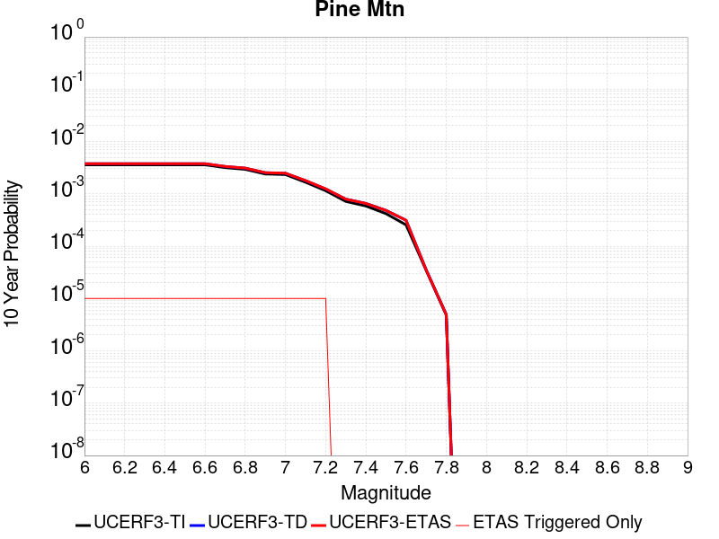 |

| Magnitude | 1 wk TI Prob | 1 wk TD Prob | 1 wk ETAS Prob | 1 wk ETAS/TD Gain | 1 wk ETAS Triggered Only | 1 mo TI Prob | 1 mo TD Prob | 1 mo ETAS Prob | 1 mo ETAS/TD Gain | 1 mo ETAS Triggered Only | 1 yr TI Prob | 1 yr TD Prob | 1 yr ETAS Prob | 1 yr ETAS/TD Gain | 1 yr ETAS Triggered Only | 10 yr TI Prob | 10 yr TD Prob | 10 yr ETAS Prob | 10 yr ETAS/TD Gain | 10 yr ETAS Triggered Only |
|-----|-----|-----|-----|-----|-----|-----|-----|-----|-----|-----|-----|-----|-----|-----|-----|-----|-----|-----|-----|-----|
| 6.0 | 6.894797E-6 | 7.2254406E-6 | 7.2254406E-6 | 1.0 | 0.0 | 2.9548795E-5 | 3.0965824E-5 | 3.0965824E-5 | 1.0 | 0.0 | 3.596972E-4 | 3.7694667E-4 | 3.869429E-4 | 1.026519 | 1.0E-5 | 0.0035911554 | 0.0037633702 | 0.0037733328 | 1.0026472 | 1.0E-5 |
| 6.1 | 6.894797E-6 | 7.2254406E-6 | 7.2254406E-6 | 1.0 | 0.0 | 2.9548795E-5 | 3.0965824E-5 | 3.0965824E-5 | 1.0 | 0.0 | 3.596972E-4 | 3.7694667E-4 | 3.869429E-4 | 1.026519 | 1.0E-5 | 0.0035911554 | 0.0037633702 | 0.0037733328 | 1.0026472 | 1.0E-5 |
| 6.2 | 6.894797E-6 | 7.2254406E-6 | 7.2254406E-6 | 1.0 | 0.0 | 2.9548795E-5 | 3.0965824E-5 | 3.0965824E-5 | 1.0 | 0.0 | 3.596972E-4 | 3.7694667E-4 | 3.869429E-4 | 1.026519 | 1.0E-5 | 0.0035911554 | 0.0037633702 | 0.0037733328 | 1.0026472 | 1.0E-5 |
| 6.3 | 6.894797E-6 | 7.2254406E-6 | 7.2254406E-6 | 1.0 | 0.0 | 2.9548795E-5 | 3.0965824E-5 | 3.0965824E-5 | 1.0 | 0.0 | 3.596972E-4 | 3.7694667E-4 | 3.869429E-4 | 1.026519 | 1.0E-5 | 0.0035911554 | 0.0037633702 | 0.0037733328 | 1.0026472 | 1.0E-5 |
| 6.4 | 6.894797E-6 | 7.2254406E-6 | 7.2254406E-6 | 1.0 | 0.0 | 2.9548795E-5 | 3.0965824E-5 | 3.0965824E-5 | 1.0 | 0.0 | 3.596972E-4 | 3.7694667E-4 | 3.869429E-4 | 1.026519 | 1.0E-5 | 0.0035911554 | 0.0037633702 | 0.0037733328 | 1.0026472 | 1.0E-5 |
| 6.5 | 6.894797E-6 | 7.2254406E-6 | 7.2254406E-6 | 1.0 | 0.0 | 2.9548795E-5 | 3.0965824E-5 | 3.0965824E-5 | 1.0 | 0.0 | 3.596972E-4 | 3.7694667E-4 | 3.869429E-4 | 1.026519 | 1.0E-5 | 0.0035911554 | 0.0037633702 | 0.0037733328 | 1.0026472 | 1.0E-5 |
| 6.6 | 6.894797E-6 | 7.2254406E-6 | 7.2254406E-6 | 1.0 | 0.0 | 2.9548795E-5 | 3.0965824E-5 | 3.0965824E-5 | 1.0 | 0.0 | 3.596972E-4 | 3.7694667E-4 | 3.869429E-4 | 1.026519 | 1.0E-5 | 0.0035911554 | 0.0037633702 | 0.0037733328 | 1.0026472 | 1.0E-5 |
| 6.7 | 6.0867933E-6 | 6.3970933E-6 | 6.3970933E-6 | 1.0 | 0.0 | 2.6085996E-5 | 2.741584E-5 | 2.741584E-5 | 1.0 | 0.0 | 3.1755073E-4 | 3.337389E-4 | 3.4373556E-4 | 1.0299536 | 1.0E-5 | 0.0031709734 | 0.003332596 | 0.0033425628 | 1.0029907 | 1.0E-5 |
| 6.8 | 5.6530425E-6 | 5.950576E-6 | 5.950576E-6 | 1.0 | 0.0 | 2.42271E-5 | 2.5502231E-5 | 2.5502231E-5 | 1.0 | 0.0 | 2.94925E-4 | 3.1044747E-4 | 3.2044438E-4 | 1.0322015 | 1.0E-5 | 0.002945339 | 0.0031003426 | 0.0031103117 | 1.0032154 | 1.0E-5 |
| 6.9 | 4.6015225E-6 | 4.8638153E-6 | 4.8638153E-6 | 1.0 | 0.0 | 1.9720663E-5 | 2.0844765E-5 | 2.0844765E-5 | 1.0 | 0.0 | 2.4007261E-4 | 2.537569E-4 | 2.6375437E-4 | 1.0393978 | 1.0E-5 | 0.0023981342 | 0.0025348158 | 0.0025447903 | 1.0039351 | 1.0E-5 |
| 7.0 | 4.4875965E-6 | 4.7474546E-6 | 4.7474546E-6 | 1.0 | 0.0 | 1.9232413E-5 | 2.0346082E-5 | 2.0346082E-5 | 1.0 | 0.0 | 2.3412947E-4 | 2.4768687E-4 | 2.5768438E-4 | 1.0403636 | 1.0E-5 | 0.0023388295 | 0.0024742517 | 0.002484227 | 1.0040317 | 1.0E-5 |
| 7.1 | 3.203907E-6 | 3.4293919E-6 | 3.4293919E-6 | 1.0 | 0.0 | 1.3730958E-5 | 1.4697315E-5 | 1.4697315E-5 | 1.0 | 0.0 | 1.6716159E-4 | 1.7892578E-4 | 1.88924E-4 | 1.0558791 | 1.0E-5 | 0.0016703589 | 0.0017878833 | 0.0017978655 | 1.0055832 | 1.0E-5 |
| 7.2 | 2.2060601E-6 | 2.3784671E-6 | 2.3784671E-6 | 1.0 | 0.0 | 9.4545085E-6 | 1.0193393E-5 | 1.0193393E-5 | 1.0 | 0.0 | 1.15102564E-4 | 1.2409795E-4 | 1.3409671E-4 | 1.0805715 | 1.0E-5 | 0.0011504296 | 0.0012403313 | 0.001250319 | 1.0080523 | 1.0E-5 |
| 7.3 | 1.3765207E-6 | 1.5216344E-6 | 1.5216344E-6 | 1.0 | 0.0 | 5.899361E-6 | 6.5212744E-6 | 6.5212744E-6 | 1.0 | 0.0 | 7.182235E-5 | 7.9393714E-5 | 7.9393714E-5 | 1.0 | 0.0 | 7.1799144E-4 | 7.936626E-4 | 7.936626E-4 | 1.0 | 0.0 |
| 7.4 | 1.1245983E-6 | 1.2586951E-6 | 1.2586951E-6 | 1.0 | 0.0 | 4.819698E-6 | 5.394397E-6 | 5.394397E-6 | 1.0 | 0.0 | 5.8678244E-5 | 6.567488E-5 | 6.567488E-5 | 1.0 | 0.0 | 5.866275E-4 | 6.565631E-4 | 6.565631E-4 | 1.0 | 0.0 |
| 7.5 | 8.031682E-7 | 9.2768295E-7 | 9.2768295E-7 | 1.0 | 0.0 | 3.4421448E-6 | 3.9757783E-6 | 3.9757783E-6 | 1.0 | 0.0 | 4.1907308E-5 | 4.8404094E-5 | 4.8404094E-5 | 1.0 | 0.0 | 4.1899405E-4 | 4.8394228E-4 | 4.8394228E-4 | 1.0 | 0.0 |
| 7.6 | 4.8953444E-7 | 6.002896E-7 | 6.002896E-7 | 1.0 | 0.0 | 2.098003E-6 | 2.5726674E-6 | 2.5726674E-6 | 1.0 | 0.0 | 2.5542888E-5 | 3.1321826E-5 | 3.1321826E-5 | 1.0 | 0.0 | 2.5539953E-4 | 3.1317896E-4 | 3.1317896E-4 | 1.0 | 0.0 |
| 7.7 | 6.634529E-8 | 6.7888216E-8 | 6.7888216E-8 | 1.0 | 0.0 | 2.843369E-7 | 2.9094946E-7 | 2.9094946E-7 | 1.0 | 0.0 | 3.4617963E-6 | 3.5423045E-6 | 3.5423045E-6 | 1.0 | 0.0 | 3.4617424E-5 | 3.5422527E-5 | 3.5422527E-5 | 1.0 | 0.0 |
| 7.8 | 9.235578E-9 | 9.488559E-9 | 9.488559E-9 | 1.0 | 0.0 | 3.9581046E-8 | 4.0665252E-8 | 4.0665252E-8 | 1.0 | 0.0 | 4.818991E-7 | 4.9509936E-7 | 4.9509936E-7 | 1.0 | 0.0 | 4.8189804E-6 | 4.950984E-6 | 4.950984E-6 | 1.0 | 0.0 |

## Cucamonga
*[(top)](#table-of-contents)*

| 1 Week | 1 Month | 1 Year | 10 Year |
|-----|-----|-----|-----|
|  |  |  |  |

| Magnitude | 1 wk TI Prob | 1 wk TD Prob | 1 wk ETAS Prob | 1 wk ETAS/TD Gain | 1 wk ETAS Triggered Only | 1 mo TI Prob | 1 mo TD Prob | 1 mo ETAS Prob | 1 mo ETAS/TD Gain | 1 mo ETAS Triggered Only | 1 yr TI Prob | 1 yr TD Prob | 1 yr ETAS Prob | 1 yr ETAS/TD Gain | 1 yr ETAS Triggered Only | 10 yr TI Prob | 10 yr TD Prob | 10 yr ETAS Prob | 10 yr ETAS/TD Gain | 10 yr ETAS Triggered Only |
|-----|-----|-----|-----|-----|-----|-----|-----|-----|-----|-----|-----|-----|-----|-----|-----|-----|-----|-----|-----|-----|
| 6.0 | 1.1848348E-5 | 1.1736978E-5 | 1.1736978E-5 | 1.0 | 0.0 | 5.0777642E-5 | 5.030038E-5 | 5.030038E-5 | 1.0 | 0.0 | 6.180424E-4 | 6.122378E-4 | 6.122378E-4 | 1.0 | 0.0 | 0.0061632637 | 0.006106661 | 0.0061166 | 1.0016276 | 1.0E-5 |
| 6.1 | 1.1848348E-5 | 1.1736978E-5 | 1.1736978E-5 | 1.0 | 0.0 | 5.0777642E-5 | 5.030038E-5 | 5.030038E-5 | 1.0 | 0.0 | 6.180424E-4 | 6.122378E-4 | 6.122378E-4 | 1.0 | 0.0 | 0.0061632637 | 0.006106661 | 0.0061166 | 1.0016276 | 1.0E-5 |
| 6.2 | 1.1848348E-5 | 1.1736978E-5 | 1.1736978E-5 | 1.0 | 0.0 | 5.0777642E-5 | 5.030038E-5 | 5.030038E-5 | 1.0 | 0.0 | 6.180424E-4 | 6.122378E-4 | 6.122378E-4 | 1.0 | 0.0 | 0.0061632637 | 0.006106661 | 0.0061166 | 1.0016276 | 1.0E-5 |
| 6.3 | 1.1848348E-5 | 1.1736978E-5 | 1.1736978E-5 | 1.0 | 0.0 | 5.0777642E-5 | 5.030038E-5 | 5.030038E-5 | 1.0 | 0.0 | 6.180424E-4 | 6.122378E-4 | 6.122378E-4 | 1.0 | 0.0 | 0.0061632637 | 0.006106661 | 0.0061166 | 1.0016276 | 1.0E-5 |
| 6.4 | 1.1848348E-5 | 1.1736978E-5 | 1.1736978E-5 | 1.0 | 0.0 | 5.0777642E-5 | 5.030038E-5 | 5.030038E-5 | 1.0 | 0.0 | 6.180424E-4 | 6.122378E-4 | 6.122378E-4 | 1.0 | 0.0 | 0.0061632637 | 0.006106661 | 0.0061166 | 1.0016276 | 1.0E-5 |
| 6.5 | 1.16988695E-5 | 1.15760095E-5 | 1.15760095E-5 | 1.0 | 0.0 | 5.013705E-5 | 4.9610542E-5 | 4.9610542E-5 | 1.0 | 0.0 | 6.102476E-4 | 6.038436E-4 | 6.038436E-4 | 1.0 | 0.0 | 0.006085745 | 0.0060231755 | 0.006033115 | 1.0016502 | 1.0E-5 |
| 6.6 | 1.16988695E-5 | 1.15760095E-5 | 1.15760095E-5 | 1.0 | 0.0 | 5.013705E-5 | 4.9610542E-5 | 4.9610542E-5 | 1.0 | 0.0 | 6.102476E-4 | 6.038436E-4 | 6.038436E-4 | 1.0 | 0.0 | 0.006085745 | 0.0060231755 | 0.006033115 | 1.0016502 | 1.0E-5 |
| 6.7 | 1.1397107E-5 | 1.1114914E-5 | 1.1114914E-5 | 1.0 | 0.0 | 4.884383E-5 | 4.763449E-5 | 4.763449E-5 | 1.0 | 0.0 | 5.9451134E-4 | 5.7979807E-4 | 5.7979807E-4 | 1.0 | 0.0 | 0.005929234 | 0.0057839802 | 0.005793922 | 1.0017189 | 1.0E-5 |
| 6.8 | 1.058387E-5 | 9.784932E-6 | 9.784932E-6 | 1.0 | 0.0 | 4.5358654E-5 | 4.1934756E-5 | 4.1934756E-5 | 1.0 | 0.0 | 5.521017E-4 | 5.104372E-4 | 5.104372E-4 | 1.0 | 0.0 | 0.00550732 | 0.005093632 | 0.0051035807 | 1.0019532 | 1.0E-5 |
| 6.9 | 9.690046E-6 | 8.57941E-6 | 8.57941E-6 | 1.0 | 0.0 | 4.1528107E-5 | 3.6768382E-5 | 3.6768382E-5 | 1.0 | 0.0 | 5.054874E-4 | 4.4756354E-4 | 4.4756354E-4 | 1.0 | 0.0 | 0.005043391 | 0.0044675325 | 0.004477488 | 1.0022284 | 1.0E-5 |
| 7.0 | 9.381461E-6 | 8.18703E-6 | 8.18703E-6 | 1.0 | 0.0 | 4.020564E-5 | 3.5086803E-5 | 3.5086803E-5 | 1.0 | 0.0 | 4.893937E-4 | 4.2709845E-4 | 4.2709845E-4 | 1.0 | 0.0 | 0.0048831734 | 0.0042636883 | 0.0042736456 | 1.0023354 | 1.0E-5 |
| 7.1 | 8.946492E-6 | 7.781815E-6 | 7.781815E-6 | 1.0 | 0.0 | 3.8341543E-5 | 3.335021E-5 | 3.335021E-5 | 1.0 | 0.0 | 4.667083E-4 | 4.059635E-4 | 4.059635E-4 | 1.0 | 0.0 | 0.0046572937 | 0.004053133 | 0.004063092 | 1.0024573 | 1.0E-5 |
| 7.2 | 8.251016E-6 | 6.9752045E-6 | 6.9752045E-6 | 1.0 | 0.0 | 3.5361016E-5 | 2.9893392E-5 | 2.9893392E-5 | 1.0 | 0.0 | 4.3043532E-4 | 3.638915E-4 | 3.638915E-4 | 1.0 | 0.0 | 0.0042960253 | 0.0036338675 | 0.0036438312 | 1.0027419 | 1.0E-5 |
| 7.3 | 7.717881E-6 | 6.486278E-6 | 6.486278E-6 | 1.0 | 0.0 | 3.3076216E-5 | 2.779804E-5 | 2.779804E-5 | 1.0 | 0.0 | 4.026285E-4 | 3.3838878E-4 | 3.3838878E-4 | 1.0 | 0.0 | 0.004018998 | 0.0033796541 | 0.0033896205 | 1.0029489 | 1.0E-5 |
| 7.4 | 7.275623E-6 | 6.0319257E-6 | 6.0319257E-6 | 1.0 | 0.0 | 3.118087E-5 | 2.5850855E-5 | 2.5850855E-5 | 1.0 | 0.0 | 3.7956095E-4 | 3.1468892E-4 | 3.1468892E-4 | 1.0 | 0.0 | 0.0037891332 | 0.0031433494 | 0.003153318 | 1.0031713 | 1.0E-5 |
| 7.5 | 6.5109502E-6 | 5.100523E-6 | 5.100523E-6 | 1.0 | 0.0 | 2.7903774E-5 | 2.1859203E-5 | 2.1859203E-5 | 1.0 | 0.0 | 3.3967546E-4 | 2.6610342E-4 | 2.6610342E-4 | 1.0 | 0.0 | 0.0033915674 | 0.0026587504 | 0.002668724 | 1.0037512 | 1.0E-5 |
| 7.6 | 5.4495326E-6 | 3.9084925E-6 | 3.9084925E-6 | 1.0 | 0.0 | 2.335493E-5 | 1.6750575E-5 | 1.6750575E-5 | 1.0 | 0.0 | 2.8430918E-4 | 2.0391923E-4 | 2.0391923E-4 | 1.0 | 0.0 | 0.0028394572 | 0.0020382188 | 0.0020481984 | 1.0048963 | 1.0E-5 |
| 7.7 | 4.7997164E-6 | 3.200177E-6 | 3.200177E-6 | 1.0 | 0.0 | 2.057005E-5 | 1.3714973E-5 | 1.3714973E-5 | 1.0 | 0.0 | 2.504116E-4 | 1.6696703E-4 | 1.6696703E-4 | 1.0 | 0.0 | 0.002501296 | 0.0016693253 | 0.0016793086 | 1.0059805 | 1.0E-5 |
| 7.8 | 3.3941733E-6 | 2.0641405E-6 | 2.0641405E-6 | 1.0 | 0.0 | 1.4546376E-5 | 8.846287E-6 | 8.846287E-6 | 1.0 | 0.0 | 1.7708774E-4 | 1.0769824E-4 | 1.0769824E-4 | 1.0 | 0.0 | 0.0017694668 | 0.00107658 | 0.0010865693 | 1.0092787 | 1.0E-5 |
| 7.9 | 9.750552E-7 | 5.155719E-7 | 5.155719E-7 | 1.0 | 0.0 | 4.178801E-6 | 2.209592E-6 | 2.209592E-6 | 1.0 | 0.0 | 5.0875715E-5 | 2.6901454E-5 | 2.6901454E-5 | 1.0 | 0.0 | 5.086407E-4 | 2.6898237E-4 | 2.6898237E-4 | 1.0 | 0.0 |
| 8.0 | 1.133857E-7 | 6.053303E-8 | 6.053303E-8 | 1.0 | 0.0 | 4.8593864E-7 | 2.5942725E-7 | 2.5942725E-7 | 1.0 | 0.0 | 5.9162867E-6 | 3.1585225E-6 | 3.1585225E-6 | 1.0 | 0.0 | 5.916129E-5 | 3.158479E-5 | 3.158479E-5 | 1.0 | 0.0 |

## Deep Springs
*[(top)](#table-of-contents)*

| 1 Week | 1 Month | 1 Year | 10 Year |
|-----|-----|-----|-----|
|  |  |  |  |

| Magnitude | 1 wk TI Prob | 1 wk TD Prob | 1 wk ETAS Prob | 1 wk ETAS/TD Gain | 1 wk ETAS Triggered Only | 1 mo TI Prob | 1 mo TD Prob | 1 mo ETAS Prob | 1 mo ETAS/TD Gain | 1 mo ETAS Triggered Only | 1 yr TI Prob | 1 yr TD Prob | 1 yr ETAS Prob | 1 yr ETAS/TD Gain | 1 yr ETAS Triggered Only | 10 yr TI Prob | 10 yr TD Prob | 10 yr ETAS Prob | 10 yr ETAS/TD Gain | 10 yr ETAS Triggered Only |
|-----|-----|-----|-----|-----|-----|-----|-----|-----|-----|-----|-----|-----|-----|-----|-----|-----|-----|-----|-----|-----|
| 6.0 | 1.9810619E-5 | 2.3112418E-5 | 2.3112418E-5 | 1.0 | 0.0 | 8.489989E-5 | 9.905232E-5 | 9.905232E-5 | 1.0 | 0.0 | 0.001033166 | 0.0012058024 | 0.0012058024 | 1.0 | 0.0 | 0.010283757 | 0.012042377 | 0.012052257 | 1.0008204 | 1.0E-5 |
| 6.1 | 1.9810619E-5 | 2.3112418E-5 | 2.3112418E-5 | 1.0 | 0.0 | 8.489989E-5 | 9.905232E-5 | 9.905232E-5 | 1.0 | 0.0 | 0.001033166 | 0.0012058024 | 0.0012058024 | 1.0 | 0.0 | 0.010283757 | 0.012042377 | 0.012052257 | 1.0008204 | 1.0E-5 |
| 6.2 | 1.9810619E-5 | 2.3112418E-5 | 2.3112418E-5 | 1.0 | 0.0 | 8.489989E-5 | 9.905232E-5 | 9.905232E-5 | 1.0 | 0.0 | 0.001033166 | 0.0012058024 | 0.0012058024 | 1.0 | 0.0 | 0.010283757 | 0.012042377 | 0.012052257 | 1.0008204 | 1.0E-5 |
| 6.3 | 1.9810619E-5 | 2.3112418E-5 | 2.3112418E-5 | 1.0 | 0.0 | 8.489989E-5 | 9.905232E-5 | 9.905232E-5 | 1.0 | 0.0 | 0.001033166 | 0.0012058024 | 0.0012058024 | 1.0 | 0.0 | 0.010283757 | 0.012042377 | 0.012052257 | 1.0008204 | 1.0E-5 |
| 6.4 | 1.9810619E-5 | 2.3112418E-5 | 2.3112418E-5 | 1.0 | 0.0 | 8.489989E-5 | 9.905232E-5 | 9.905232E-5 | 1.0 | 0.0 | 0.001033166 | 0.0012058024 | 0.0012058024 | 1.0 | 0.0 | 0.010283757 | 0.012042377 | 0.012052257 | 1.0008204 | 1.0E-5 |
| 6.5 | 1.7190405E-5 | 2.005047E-5 | 2.005047E-5 | 1.0 | 0.0 | 7.367108E-5 | 8.593058E-5 | 8.593058E-5 | 1.0 | 0.0 | 8.9657627E-4 | 0.0010462046 | 0.0010462046 | 1.0 | 0.0 | 0.008929676 | 0.010462015 | 0.01047191 | 1.0009458 | 1.0E-5 |
| 6.6 | 1.7190405E-5 | 2.005047E-5 | 2.005047E-5 | 1.0 | 0.0 | 7.367108E-5 | 8.593058E-5 | 8.593058E-5 | 1.0 | 0.0 | 8.9657627E-4 | 0.0010462046 | 0.0010462046 | 1.0 | 0.0 | 0.008929676 | 0.010462015 | 0.01047191 | 1.0009458 | 1.0E-5 |

