# Parent Section Magnitude-Probability Distributions

Only fault sections with at least one triggered aftershock are plotted. Sections are sorted by total supraseismogenic trigger rate (decreasing)

## Table Of Contents

* [Tank Canyon](#tank-canyon)
* [Garlock (Central)](#garlock-central)
* [Panamint Valley](#panamint-valley)
* [Owl Lake](#owl-lake)
* [Little Lake](#little-lake)
* [Garlock (East)](#garlock-east)
* [Blackwater](#blackwater)
* [Ash Hill](#ash-hill)
* [Hunter Mountain-Saline Valley](#hunter-mountain-saline-valley)
* [Airport Lake](#airport-lake)
* [Gravel Hills-Harper Lk](#gravel-hills-harper-lk)
* [Goldstone Lake](#goldstone-lake)
* [McLean Lake](#mclean-lake)
* [Coyote Canyon](#coyote-canyon)
* [Garlock (West)](#garlock-west)
* [Lenwood-Lockhart-Old Woman Springs](#lenwood-lockhart-old-woman-springs)
* [Nelson Lake](#nelson-lake)
* [Paradise](#paradise)
* [San Andreas (Mojave S)](#san-andreas-mojave-s)
* [Death Valley (So)](#death-valley-so)
* [So Sierra Nevada](#so-sierra-nevada)
* [Bicycle Lake](#bicycle-lake)
* [Towne Pass](#towne-pass)
* [San Andreas (Mojave N)](#san-andreas-mojave-n)
* [Helendale-So Lockhart](#helendale-so-lockhart)
* [Garlic Springs](#garlic-springs)
* [Death Valley (Black Mtns Frontal)](#death-valley-black-mtns-frontal)
* [San Andreas (San Bernardino N)](#san-andreas-san-bernardino-n)
* [Coyote Lake](#coyote-lake)
* [Death Valley (No)](#death-valley-no)
* [Manix-Afton Hills](#manix-afton-hills)
* [San Andreas (Big Bend)](#san-andreas-big-bend)
* [San Andreas (Parkfield)](#san-andreas-parkfield)
* [Cady](#cady)
* [San Andreas (San Bernardino S)](#san-andreas-san-bernardino-s)
* [Pinto Mtn](#pinto-mtn)
* [Cleghorn Lake](#cleghorn-lake)
* [Lake Isabella (Seismicity)](#lake-isabella-seismicity)
* [Elsinore (Glen Ivy) rev](#elsinore-glen-ivy-rev)
* [Death Valley (Fish Lake Valley)](#death-valley-fish-lake-valley)
* [Rose Canyon](#rose-canyon)
* [San Andreas (Cholame) rev](#san-andreas-cholame-rev)
* [Mission Ridge-Arroyo Parida-Santa Ana](#mission-ridge-arroyo-parida-santa-ana)
* [Ludlow](#ludlow)
* [Red Pass](#red-pass)
* [Big Pine (Central)](#big-pine-central)
* [Calico-Hidalgo](#calico-hidalgo)
* [San Jacinto (San Bernardino)](#san-jacinto-san-bernardino)
* [Red Mountain](#red-mountain)
* [San Andreas (Carrizo) rev](#san-andreas-carrizo-rev)
* [Cleghorn Pass](#cleghorn-pass)
* [Oceanic - West Huasna](#oceanic---west-huasna)
* [San Jacinto (Anza) rev](#san-jacinto-anza-rev)
* [San Andreas (Coachella) rev](#san-andreas-coachella-rev)
* [White Wolf (Extension)](#white-wolf-extension)
* [Pisgah-Bullion Mtn-Mesquite Lk](#pisgah-bullion-mtn-mesquite-lk)
* [White Mountains](#white-mountains)
* [San Jacinto (Clark) rev](#san-jacinto-clark-rev)
* [San Jacinto (Stepovers Combined)](#san-jacinto-stepovers-combined)
* [San Jacinto (San Jacinto Valley) rev](#san-jacinto-san-jacinto-valley-rev)
* [Santa Ynez (West)](#santa-ynez-west)
* [Great Valley 09 (Laguna Seca)](#great-valley-09-laguna-seca)
* [Coronado Bank alt1](#coronado-bank-alt1)
* [Big Pine (East)](#big-pine-east)
* [Santa Ynez (East)](#santa-ynez-east)
* [Sheephole](#sheephole)
* [Sierra Madre](#sierra-madre)
* [Elysian Park (Upper)](#elysian-park-upper)
* [North Frontal  (East)](#north-frontal--east)
* [Calaveras (So) 2011 CFM](#calaveras-so-2011-cfm)
* [Johnson Valley (No) 2011 rev](#johnson-valley-no-2011-rev)
* [Rinconada 2011 CFM](#rinconada-2011-cfm)
* [Anacapa-Dume alt 1](#anacapa-dume-alt-1)
* [Raymond](#raymond)
* [Ortigalita (South)](#ortigalita-south)
* [Casmalia 2011 CFM](#casmalia-2011-cfm)
* [Simi-Santa Rosa](#simi-santa-rosa)
* [Hartley Springs 2011 CFM](#hartley-springs-2011-cfm)
* [Elsinore (Stepovers Combined)](#elsinore-stepovers-combined)
* [Eureka Peak](#eureka-peak)
* [Owens Valley](#owens-valley)
* [Elsinore (Temecula) rev](#elsinore-temecula-rev)
* [Sierra Nevada  (No Extension)](#sierra-nevada--no-extension)
* [San Andreas (Creeping Section) 2011 CFM](#san-andreas-creeping-section-2011-cfm)
* [La Panza 2011](#la-panza-2011)
* [Cucamonga](#cucamonga)
* [Los Alamos 2011 CFM](#los-alamos-2011-cfm)
* [Quien Sabe 2011 CFM](#quien-sabe-2011-cfm)
* [Great Valley 10 (Panoche)](#great-valley-10-panoche)
* [Newport-Inglewood (Offshore)](#newport-inglewood-offshore)
* [Newport-Inglewood alt 1](#newport-inglewood-alt-1)
* [Deep Springs](#deep-springs)
* [South Cuyama](#south-cuyama)
* [Hunting Creek - Berryessa 2011 CFM](#hunting-creek---berryessa-2011-cfm)
* [Hosgri](#hosgri)
* [North Frontal  (West)](#north-frontal--west)
* [Imperial](#imperial)
* [Dry Mountain](#dry-mountain)
* [Pleito](#pleito)
* [Santa Ynez River](#santa-ynez-river)
* [Pitas Point (Lower West)](#pitas-point-lower-west)
* [Pine Mtn](#pine-mtn)
* [Palos Verdes](#palos-verdes)
* [Almanor 2011 CFM](#almanor-2011-cfm)
* [San Gorgonio Pass](#san-gorgonio-pass)
* [Baker](#baker)
* [Ventura-Pitas Point](#ventura-pitas-point)
* [Los Alamos extension](#los-alamos-extension)
* [Scodie Lineament](#scodie-lineament)
* [Brawley (Seismic Zone) alt 1](#brawley-seismic-zone-alt-1)
* [Whittier alt 1](#whittier-alt-1)
* [Earthquake Valley (So Extension)](#earthquake-valley-so-extension)
* [Surprise Valley 2011 CFM](#surprise-valley-2011-cfm)
* [Robinson Creek](#robinson-creek)
* [Great Valley 07 (Orestimba)](#great-valley-07-orestimba)
* [San Andreas (San Gorgonio Pass-Garnet HIll)](#san-andreas-san-gorgonio-pass-garnet-hill)
* [Green Valley 2011 CFM](#green-valley-2011-cfm)

## Tank Canyon
*[(top)](#table-of-contents)*

| 1 Week | 1 Month | 1 Year | 10 Year |
|-----|-----|-----|-----|
|  |  |  |  |

| Magnitude | 1 wk TI Prob | 1 wk TD Prob | 1 wk ETAS Prob | 1 wk ETAS/TD Gain | 1 wk ETAS Triggered Only | 1 mo TI Prob | 1 mo TD Prob | 1 mo ETAS Prob | 1 mo ETAS/TD Gain | 1 mo ETAS Triggered Only | 1 yr TI Prob | 1 yr TD Prob | 1 yr ETAS Prob | 1 yr ETAS/TD Gain | 1 yr ETAS Triggered Only | 10 yr TI Prob | 10 yr TD Prob | 10 yr ETAS Prob | 10 yr ETAS/TD Gain | 10 yr ETAS Triggered Only |
|-----|-----|-----|-----|-----|-----|-----|-----|-----|-----|-----|-----|-----|-----|-----|-----|-----|-----|-----|-----|-----|
| 6.0 | 4.8284557E-5 | 5.7964517E-5 | 0.012098397 | 208.72073 | 0.01204113 | 2.0691741E-4 | 2.4839956E-4 | 0.016144603 | 64.9945 | 0.015900154 | 0.0025163088 | 0.0030207448 | 0.026202345 | 8.674134 | 0.023251837 | 0.02488006 | 0.029863482 | 0.060785208 | 2.035436 | 0.03187358 |
| 6.1 | 1.7796336E-5 | 2.0873225E-5 | 0.0044171372 | 211.61739 | 0.0043963557 | 7.626778E-5 | 8.945383E-5 | 0.0059995814 | 67.06902 | 0.0059106564 | 9.281647E-4 | 0.0010885935 | 0.010030318 | 9.214016 | 0.008951469 | 0.009242975 | 0.010836697 | 0.023085576 | 2.1303146 | 0.012383069 |
| 6.2 | 1.7796336E-5 | 2.0873225E-5 | 0.0044171372 | 211.61739 | 0.0043963557 | 7.626778E-5 | 8.945383E-5 | 0.0059995814 | 67.06902 | 0.0059106564 | 9.281647E-4 | 0.0010885935 | 0.010030318 | 9.214016 | 0.008951469 | 0.009242975 | 0.010836697 | 0.023085576 | 2.1303146 | 0.012383069 |
| 6.3 | 1.3515912E-5 | 1.57595E-5 | 0.0031786435 | 201.69696 | 0.0031629337 | 5.792405E-5 | 6.7539106E-5 | 0.0043536965 | 64.46186 | 0.004286447 | 7.049971E-4 | 8.220024E-4 | 0.007325701 | 8.912019 | 0.0065090493 | 0.007027647 | 0.008192232 | 0.017203601 | 2.0999897 | 0.009085802 |
| 6.4 | 1.0870146E-5 | 1.2617973E-5 | 0.0023206756 | 183.91826 | 0.002308087 | 4.658551E-5 | 5.407601E-5 | 0.0032412617 | 59.939 | 0.0031873581 | 5.67031E-4 | 6.581944E-4 | 0.005515411 | 8.379607 | 0.0048604156 | 0.005655863 | 0.006564466 | 0.013261293 | 2.0201633 | 0.006741079 |
| 6.5 | 7.964826E-6 | 9.196063E-6 | 0.0014013626 | 152.38725 | 0.0013921794 | 3.4134522E-5 | 3.941116E-5 | 0.0020176934 | 51.195988 | 0.0019783601 | 4.1550855E-4 | 4.797359E-4 | 0.003470265 | 7.233699 | 0.0029919643 | 0.0041473247 | 0.0047883047 | 0.008908384 | 1.8604462 | 0.0041399016 |
| 6.6 | 6.6317E-6 | 7.6122747E-6 | 9.235128E-4 | 121.31889 | 9.159075E-4 | 2.8421264E-5 | 3.2623677E-5 | 0.0013392757 | 41.05226 | 0.0013066947 | 3.4597394E-4 | 3.9713003E-4 | 0.002496777 | 6.2870517 | 0.0021004812 | 0.0034543579 | 0.0039653555 | 0.0068846373 | 1.7361968 | 0.002930904 |
| 6.7 | 4.793663E-6 | 5.430772E-6 | 5.305482E-4 | 97.69296 | 5.251203E-4 | 2.0544108E-5 | 2.3274553E-5 | 7.804071E-4 | 33.530487 | 7.571502E-4 | 2.500958E-4 | 2.8333522E-4 | 0.0013576956 | 4.7918344 | 0.0010746648 | 0.0024981452 | 0.0028304325 | 0.0044500446 | 1.5722136 | 0.0016242092 |
| 6.8 | 4.382823E-6 | 4.969245E-6 | 4.8123876E-4 | 96.84344 | 4.762719E-4 | 1.8783392E-5 | 2.1296615E-5 | 6.9294777E-4 | 32.537933 | 6.716655E-4 | 2.286638E-4 | 2.5925972E-4 | 0.0011871386 | 4.5789557 | 9.281196E-4 | 0.0022842865 | 0.0025902467 | 0.004003181 | 1.5454825 | 0.0014166036 |
| 6.9 | 2.729601E-6 | 3.0735362E-6 | 2.106786E-4 | 68.546 | 2.076057E-4 | 1.1698237E-5 | 1.3172238E-5 | 3.0625876E-4 | 23.25032 | 2.930904E-4 | 1.4241673E-4 | 1.6036142E-4 | 5.388758E-4 | 3.360383 | 3.785751E-4 | 0.001423255 | 0.0016026229 | 0.0021634793 | 1.3499615 | 5.617566E-4 |
| 7.0 | 1.8987357E-6 | 2.1269361E-6 | 7.539938E-5 | 35.449764 | 7.32726E-5 | 8.137413E-6 | 9.1154125E-6 | 1.312353E-4 | 14.397078 | 1.22121E-4 | 9.90685E-5 | 1.1097519E-4 | 2.575041E-4 | 2.3203757 | 1.465452E-4 | 9.902435E-4 | 0.0011092664 | 0.0013166418 | 1.1869483 | 2.076057E-4 |
| 7.1 | 1.4928986E-6 | 1.6641251E-6 | 5.0512444E-5 | 30.353752 | 4.88484E-5 | 6.398121E-6 | 7.1319487E-6 | 8.0404025E-5 | 11.273781 | 7.32726E-5 | 7.789434E-5 | 8.682861E-5 | 1.7230588E-4 | 1.9844369 | 8.5484695E-5 | 7.786704E-4 | 8.680047E-4 | 9.900196E-4 | 1.1405696 | 1.22121E-4 |
| 7.2 | 1.069082E-6 | 1.182856E-6 | 3.781911E-5 | 31.972712 | 3.66363E-5 | 4.581772E-6 | 5.0693757E-6 | 5.3917527E-5 | 10.63593 | 4.88484E-5 | 5.5781646E-5 | 6.1718434E-5 | 1.2277516E-4 | 1.9892787 | 6.10605E-5 | 5.576765E-4 | 6.1706523E-4 | 7.147017E-4 | 1.1582272 | 9.76968E-5 |
| 7.3 | 8.776551E-7 | 9.769996E-7 | 3.7613263E-5 | 38.498753 | 3.66363E-5 | 3.7613736E-6 | 4.187137E-6 | 4.0823285E-5 | 9.749689 | 3.66363E-5 | 4.579376E-5 | 5.097772E-5 | 9.982363E-5 | 1.9581815 | 4.88484E-5 | 4.5784327E-4 | 5.097113E-4 | 5.585348E-4 | 1.0957866 | 4.88484E-5 |
| 7.4 | 7.55721E-7 | 8.5102363E-7 | 3.748729E-5 | 44.04965 | 3.66363E-5 | 3.2388E-6 | 3.647242E-6 | 4.028341E-5 | 11.044895 | 3.66363E-5 | 3.9431678E-5 | 4.4404784E-5 | 9.3251016E-5 | 2.1000218 | 4.88484E-5 | 3.942468E-4 | 4.4401E-4 | 4.928367E-4 | 1.1099676 | 4.88484E-5 |
| 7.5 | 5.587665E-7 | 6.305613E-7 | 2.5054745E-5 | 39.734035 | 2.44242E-5 | 2.3947114E-6 | 2.7024057E-6 | 2.712654E-5 | 10.037923 | 2.44242E-5 | 2.915522E-5 | 3.290179E-5 | 6.953688E-5 | 2.1134682 | 3.66363E-5 | 2.9151395E-4 | 3.2901787E-4 | 3.6564213E-4 | 1.1113138 | 3.66363E-5 |

## Garlock (Central)
*[(top)](#table-of-contents)*

| 1 Week | 1 Month | 1 Year | 10 Year |
|-----|-----|-----|-----|
|  |  |  |  |

| Magnitude | 1 wk TI Prob | 1 wk TD Prob | 1 wk ETAS Prob | 1 wk ETAS/TD Gain | 1 wk ETAS Triggered Only | 1 mo TI Prob | 1 mo TD Prob | 1 mo ETAS Prob | 1 mo ETAS/TD Gain | 1 mo ETAS Triggered Only | 1 yr TI Prob | 1 yr TD Prob | 1 yr ETAS Prob | 1 yr ETAS/TD Gain | 1 yr ETAS Triggered Only | 10 yr TI Prob | 10 yr TD Prob | 10 yr ETAS Prob | 10 yr ETAS/TD Gain | 10 yr ETAS Triggered Only |
|-----|-----|-----|-----|-----|-----|-----|-----|-----|-----|-----|-----|-----|-----|-----|-----|-----|-----|-----|-----|-----|
| 6.0 | 5.5131142E-5 | 7.024558E-5 | 0.0035138158 | 50.021873 | 0.003443812 | 2.3625491E-4 | 3.0101812E-4 | 0.004940219 | 16.4117 | 0.004640598 | 0.0028726095 | 0.0036588025 | 0.010825411 | 2.958731 | 0.007192927 | 0.028357591 | 0.03607921 | 0.045649435 | 1.265256 | 0.009928437 |
| 6.1 | 5.5131142E-5 | 7.024558E-5 | 0.0035138158 | 50.021873 | 0.003443812 | 2.3625491E-4 | 3.0101812E-4 | 0.004940219 | 16.4117 | 0.004640598 | 0.0028726095 | 0.0036588025 | 0.010825411 | 2.958731 | 0.007192927 | 0.028357591 | 0.03607921 | 0.045649435 | 1.265256 | 0.009928437 |
| 6.2 | 4.216245E-5 | 5.1660383E-5 | 0.0022863592 | 44.257496 | 0.0022348142 | 1.806837E-4 | 2.2138303E-4 | 0.0033103602 | 14.95309 | 0.0030896612 | 0.0021976046 | 0.0026920384 | 0.0072957855 | 2.710134 | 0.004616174 | 0.021759989 | 0.02668921 | 0.032941334 | 1.2342566 | 0.0064235646 |
| 6.3 | 4.216245E-5 | 5.1660383E-5 | 0.0022863592 | 44.257496 | 0.0022348142 | 1.806837E-4 | 2.2138303E-4 | 0.0033103602 | 14.95309 | 0.0030896612 | 0.0021976046 | 0.0026920384 | 0.0072957855 | 2.710134 | 0.004616174 | 0.021759989 | 0.02668921 | 0.032941334 | 1.2342566 | 0.0064235646 |
| 6.4 | 3.6858168E-5 | 4.4109474E-5 | 0.0018269974 | 41.419613 | 0.0017829665 | 1.5795401E-4 | 1.8902705E-4 | 0.0026798246 | 14.176936 | 0.0024912683 | 0.0019213937 | 0.0022990005 | 0.0059054717 | 2.5687127 | 0.0036147814 | 0.019048655 | 0.022848397 | 0.027872222 | 1.2198764 | 0.005141294 |
| 6.5 | 3.39199E-5 | 4.001704E-5 | 0.0017130078 | 42.80696 | 0.0016730577 | 1.453629E-4 | 1.7149044E-4 | 0.0025036016 | 14.599073 | 0.0023325111 | 0.0017683565 | 0.0020859186 | 0.005400681 | 2.589114 | 0.0033216912 | 0.017543508 | 0.02075933 | 0.025411218 | 1.2240866 | 0.004750507 |
| 6.6 | 3.3571985E-5 | 3.947123E-5 | 0.0016880396 | 42.76633 | 0.0016486335 | 1.4387199E-4 | 1.6915156E-4 | 0.002476848 | 14.642773 | 0.002308087 | 0.0017502342 | 0.002057497 | 0.0053357924 | 2.5933418 | 0.0032850548 | 0.017365133 | 0.020480646 | 0.025086012 | 1.2248642 | 0.0047016586 |
| 6.7 | 3.2580007E-5 | 3.8087666E-5 | 0.001564542 | 41.077393 | 0.0015265124 | 1.3962112E-4 | 1.6322276E-4 | 0.0023244116 | 14.240732 | 0.0021615417 | 0.0016985617 | 0.0019854472 | 0.0050445986 | 2.540787 | 0.003065237 | 0.016856372 | 0.019773284 | 0.02408271 | 1.2179418 | 0.0043963557 |
| 6.8 | 3.2185937E-5 | 3.751489E-5 | 0.0015639701 | 41.68932 | 0.0015265124 | 1.3793244E-4 | 1.607683E-4 | 0.0023097524 | 14.366963 | 0.0021493295 | 0.0016780337 | 0.0019556184 | 0.0049782963 | 2.545638 | 0.0030286007 | 0.016654192 | 0.019480087 | 0.023754878 | 1.2194442 | 0.00435972 |
| 6.9 | 3.165394E-5 | 3.6719477E-5 | 0.0015387526 | 41.905624 | 0.0015020883 | 1.3565269E-4 | 1.5735981E-4 | 0.0022697207 | 14.423762 | 0.0021126932 | 0.0016503202 | 0.0019141936 | 0.004888242 | 2.553682 | 0.0029797524 | 0.01638118 | 0.01907272 | 0.023253456 | 1.2191997 | 0.0042620227 |
| 7.0 | 3.0903822E-5 | 3.5624747E-5 | 0.0015010245 | 42.134323 | 0.001465452 | 1.3243823E-4 | 1.5266867E-4 | 0.0022161985 | 14.516394 | 0.0020638448 | 0.0016112428 | 0.0018571776 | 0.004770449 | 2.5686553 | 0.0029186918 | 0.015996104 | 0.018511891 | 0.022599129 | 1.2207898 | 0.004164326 |
| 7.1 | 3.0069863E-5 | 3.439106E-5 | 0.0013776758 | 40.059124 | 0.001343331 | 1.2886449E-4 | 1.4738206E-4 | 0.0020521889 | 13.924279 | 0.0019050876 | 0.0015677959 | 0.0017929208 | 0.0045357165 | 2.529792 | 0.0027477224 | 0.01556781 | 0.017879559 | 0.021741547 | 1.2160002 | 0.0039322963 |
| 7.2 | 2.7957109E-5 | 3.1280466E-5 | 0.0011913937 | 38.087467 | 0.0011601495 | 1.1981068E-4 | 1.3405236E-4 | 0.0017580439 | 13.114606 | 0.0016242092 | 0.0014577188 | 0.0016308852 | 0.0039474 | 2.4204035 | 0.002320299 | 0.014481937 | 0.016283188 | 0.01951475 | 1.1984601 | 0.0032850548 |
| 7.3 | 2.4519275E-5 | 2.6713868E-5 | 8.326909E-4 | 31.170736 | 8.0599857E-4 | 1.0507837E-4 | 1.1448306E-4 | 0.001262289 | 11.02599 | 0.0011479374 | 0.0012785783 | 0.0013929547 | 0.003063682 | 2.1994123 | 0.0016730577 | 0.012712469 | 0.013927576 | 0.016287811 | 1.1694648 | 0.0023935717 |
| 7.4 | 2.3225532E-5 | 2.5198491E-5 | 7.57906E-4 | 30.077436 | 7.32726E-4 | 9.95342E-5 | 1.07989144E-4 | 0.0011459056 | 10.611303 | 0.0010380285 | 0.0012111551 | 0.0013139893 | 0.002838496 | 2.1602123 | 0.0015265124 | 0.012045753 | 0.013145258 | 0.01531454 | 1.1650239 | 0.0021981779 |
| 7.5 | 2.097765E-5 | 2.2482824E-5 | 6.330741E-4 | 28.158121 | 6.10605E-4 | 8.9901114E-5 | 9.635147E-5 | 9.877488E-4 | 10.251518 | 8.914833E-4 | 0.0010939965 | 0.0011724597 | 0.0024532266 | 2.0923762 | 0.0012822704 | 0.010886264 | 0.01173992 | 0.013562298 | 1.1552292 | 0.0018440271 |
| 7.6 | 1.511254E-5 | 1.5990528E-5 | 2.8465243E-4 | 17.801313 | 2.686662E-4 | 6.476642E-5 | 6.852908E-5 | 4.83712E-4 | 7.0584927 | 4.152114E-4 | 7.882459E-4 | 8.3403E-4 | 0.0014563276 | 1.7461334 | 6.228171E-4 | 0.007854558 | 0.008383143 | 0.009242933 | 1.1025618 | 8.670591E-4 |
| 7.7 | 9.934069E-6 | 1.0678047E-5 | 1.083738E-4 | 10.149216 | 9.76968E-5 | 4.2573887E-5 | 4.576226E-5 | 1.6787766E-4 | 3.6684744 | 1.22121E-4 | 5.182138E-4 | 5.5701344E-4 | 7.522982E-4 | 1.3505925 | 1.953936E-4 | 0.00517007 | 0.0056272964 | 0.0058823074 | 1.0453168 | 2.564541E-4 |
| 7.8 | 6.7562896E-6 | 8.427841E-6 | 8.169982E-5 | 9.694039 | 7.32726E-5 | 2.8955206E-5 | 3.6118818E-5 | 1.338121E-4 | 3.7047749 | 9.76968E-5 | 3.5247262E-4 | 4.3965803E-4 | 5.6172535E-4 | 1.2776415 | 1.22121E-4 | 0.0035191406 | 0.0044463384 | 0.004592232 | 1.0328121 | 1.465452E-4 |
| 7.9 | 3.975453E-6 | 5.3706585E-6 | 5.4218795E-5 | 10.095372 | 4.88484E-5 | 1.7037546E-5 | 2.3016906E-5 | 7.186418E-5 | 3.1222346 | 4.88484E-5 | 2.0741238E-4 | 2.801949E-4 | 3.4123828E-4 | 1.2178605 | 6.10605E-5 | 0.002072189 | 0.002833435 | 0.0028943226 | 1.0214889 | 6.10605E-5 |
| 8.0 | 1.6729537E-6 | 2.0773857E-6 | 1.428946E-5 | 6.8785787 | 1.22121E-5 | 7.169782E-6 | 8.903051E-6 | 2.1115042E-5 | 2.3716636 | 1.22121E-5 | 8.7288594E-5 | 1.08389286E-4 | 1.2060007E-4 | 1.1126567 | 1.22121E-5 | 8.7254314E-4 | 0.0010968668 | 0.0011090655 | 1.0111214 | 1.22121E-5 |
| 8.1 | 3.6733252E-7 | 3.148811E-7 | 3.148811E-7 | 1.0 | 0.0 | 1.5742813E-6 | 1.3494899E-6 | 1.3494899E-6 | 1.0 | 0.0 | 1.9166706E-5 | 1.6429933E-5 | 1.6429933E-5 | 1.0 | 0.0 | 1.9165053E-4 | 1.6637788E-4 | 1.6637788E-4 | 1.0 | 0.0 |

## Panamint Valley
*[(top)](#table-of-contents)*

| 1 Week | 1 Month | 1 Year | 10 Year |
|-----|-----|-----|-----|
|  | 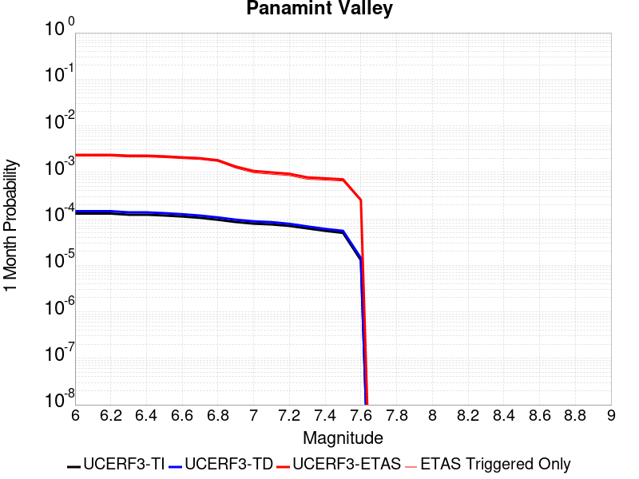 |  |  |

| Magnitude | 1 wk TI Prob | 1 wk TD Prob | 1 wk ETAS Prob | 1 wk ETAS/TD Gain | 1 wk ETAS Triggered Only | 1 mo TI Prob | 1 mo TD Prob | 1 mo ETAS Prob | 1 mo ETAS/TD Gain | 1 mo ETAS Triggered Only | 1 yr TI Prob | 1 yr TD Prob | 1 yr ETAS Prob | 1 yr ETAS/TD Gain | 1 yr ETAS Triggered Only | 10 yr TI Prob | 10 yr TD Prob | 10 yr ETAS Prob | 10 yr ETAS/TD Gain | 10 yr ETAS Triggered Only |
|-----|-----|-----|-----|-----|-----|-----|-----|-----|-----|-----|-----|-----|-----|-----|-----|-----|-----|-----|-----|-----|
| 6.0 | 3.0211835E-5 | 3.398435E-5 | 0.0014871749 | 43.76058 | 0.0014532398 | 1.2947287E-4 | 1.4563925E-4 | 0.0023190763 | 15.9234295 | 0.0021737537 | 0.0015751923 | 0.0017717453 | 0.0049412656 | 2.7889256 | 0.003175146 | 0.015640736 | 0.017583055 | 0.022346012 | 1.2708834 | 0.0048482036 |
| 6.1 | 3.0211835E-5 | 3.398435E-5 | 0.0014871749 | 43.76058 | 0.0014532398 | 1.2947287E-4 | 1.4563925E-4 | 0.0023190763 | 15.9234295 | 0.0021737537 | 0.0015751923 | 0.0017717453 | 0.0049412656 | 2.7889256 | 0.003175146 | 0.015640736 | 0.017583055 | 0.022346012 | 1.2708834 | 0.0048482036 |
| 6.2 | 3.0211835E-5 | 3.398435E-5 | 0.0014871749 | 43.76058 | 0.0014532398 | 1.2947287E-4 | 1.4563925E-4 | 0.0023190763 | 15.9234295 | 0.0021737537 | 0.0015751923 | 0.0017717453 | 0.0049412656 | 2.7889256 | 0.003175146 | 0.015640736 | 0.017583055 | 0.022346012 | 1.2708834 | 0.0048482036 |
| 6.3 | 2.8573924E-5 | 3.2102525E-5 | 0.0014364489 | 44.745667 | 0.0014043915 | 1.2245393E-4 | 1.3757516E-4 | 0.0022499778 | 16.354534 | 0.0021126932 | 0.001489857 | 0.0016737186 | 0.0047582085 | 2.8428965 | 0.0030896612 | 0.01479908 | 0.016617723 | 0.021229241 | 1.277506 | 0.004689446 |
| 6.4 | 2.8573924E-5 | 3.2102525E-5 | 0.0014364489 | 44.745667 | 0.0014043915 | 1.2245393E-4 | 1.3757516E-4 | 0.0022499778 | 16.354534 | 0.0021126932 | 0.001489857 | 0.0016737186 | 0.0047582085 | 2.8428965 | 0.0030896612 | 0.01479908 | 0.016617723 | 0.021229241 | 1.277506 | 0.004689446 |
| 6.5 | 2.7468774E-5 | 3.0828287E-5 | 0.0014229647 | 46.15776 | 0.0013921794 | 1.1771801E-4 | 1.321147E-4 | 0.0021590553 | 16.342281 | 0.0020272085 | 0.0014322745 | 0.0016073369 | 0.0045457226 | 2.8281078 | 0.002943116 | 0.014230782 | 0.015963601 | 0.020325826 | 1.2732607 | 0.004432992 |
| 6.6 | 2.6135967E-5 | 2.925234E-5 | 0.0013847557 | 47.338287 | 0.001355543 | 1.1200648E-4 | 1.253613E-4 | 0.002091263 | 16.681887 | 0.0019661481 | 0.0013628257 | 0.0015252318 | 0.0043541174 | 2.8547254 | 0.0028332071 | 0.013544982 | 0.0151539715 | 0.019363435 | 1.2777796 | 0.004274235 |
| 6.7 | 2.4498746E-5 | 2.73412E-5 | 0.0013584237 | 49.684128 | 0.0013311189 | 1.04990395E-4 | 1.17171454E-4 | 0.002009825 | 17.152857 | 0.0018928754 | 0.0012775084 | 0.0014256539 | 0.004059707 | 2.8476102 | 0.0026378136 | 0.012701893 | 0.014171205 | 0.01813205 | 1.2794994 | 0.004017781 |
| 6.8 | 2.2244329E-5 | 2.4935298E-5 | 0.0012216913 | 48.99445 | 0.0011967858 | 9.532935E-5 | 1.0686131E-4 | 0.0018041618 | 16.88321 | 0.0016974818 | 0.0011600169 | 0.0013002817 | 0.003641956 | 2.8008976 | 0.002344723 | 0.011539802 | 0.012932454 | 0.016500488 | 1.2758976 | 0.0036147814 |
| 6.9 | 1.9902658E-5 | 2.229015E-5 | 9.0154173E-4 | 40.445744 | 8.792712E-4 | 8.529431E-5 | 9.552582E-5 | 0.0013654629 | 14.294175 | 0.0012700583 | 0.0010379635 | 0.0011624249 | 0.0028823293 | 2.4795833 | 0.001721906 | 0.010331288 | 0.011568548 | 0.014199987 | 1.227465 | 0.0026622377 |
| 7.0 | 1.8353881E-5 | 2.0566078E-5 | 7.166414E-4 | 34.845802 | 6.960897E-4 | 7.865712E-5 | 8.813745E-5 | 0.0011016524 | 12.499253 | 0.0010136042 | 9.5722964E-4 | 0.001072563 | 0.00245105 | 2.2852273 | 0.0013799673 | 0.009531168 | 0.010678793 | 0.012793088 | 1.1979902 | 0.0021371176 |
| 7.1 | 1.7667631E-5 | 1.9772506E-5 | 6.5478915E-4 | 33.116142 | 6.3502917E-4 | 7.571623E-5 | 8.473666E-5 | 0.0010127776 | 11.95206 | 9.281196E-4 | 9.2145515E-4 | 0.0010311981 | 0.0022999467 | 2.2303636 | 0.0012700583 | 0.009176437 | 0.010269018 | 0.012239149 | 1.191852 | 0.0019905723 |
| 7.2 | 1.6381597E-5 | 1.815815E-5 | 6.2875205E-4 | 34.626434 | 6.10605E-4 | 7.020495E-5 | 7.7818426E-5 | 9.570212E-4 | 12.298131 | 8.792712E-4 | 8.544101E-4 | 9.4704475E-4 | 0.0021304965 | 2.2496262 | 0.0011845736 | 0.008511325 | 0.009434741 | 0.011237176 | 1.1910424 | 0.0018196029 |
| 7.3 | 1.4520491E-5 | 1.5966394E-5 | 5.410783E-4 | 33.888573 | 5.251203E-4 | 6.222919E-5 | 6.84257E-5 | 8.255241E-4 | 12.064532 | 7.571502E-4 | 7.57377E-4 | 8.327807E-4 | 0.0018577428 | 2.2307708 | 0.0010258164 | 0.0075480095 | 0.008299708 | 0.009861995 | 1.1882339 | 0.0015753609 |
| 7.4 | 1.2852287E-5 | 1.4145337E-5 | 5.026224E-4 | 35.532726 | 4.88484E-4 | 5.5080065E-5 | 6.0621558E-5 | 7.8109175E-4 | 12.88472 | 7.2051387E-4 | 6.7039346E-4 | 7.378333E-4 | 0.0017140805 | 2.323127 | 9.76968E-4 | 0.0066837464 | 0.0073567564 | 0.008823549 | 1.1993804 | 0.0014776641 |
| 7.5 | 1.1637851E-5 | 1.2836727E-5 | 4.6467863E-4 | 36.19915 | 4.5184768E-4 | 4.987555E-5 | 5.5013472E-5 | 7.388534E-4 | 13.430409 | 6.8387756E-4 | 6.070656E-4 | 6.6959887E-4 | 0.001597097 | 2.3851547 | 9.281196E-4 | 0.006054099 | 0.0066787098 | 0.0080858525 | 1.2106907 | 0.0014166036 |
| 7.6 | 3.0068115E-6 | 3.3330039E-6 | 1.3766566E-4 | 41.303776 | 1.343331E-4 | 1.2886271E-5 | 1.42842655E-5 | 2.3409892E-4 | 16.388586 | 2.198178E-4 | 1.5687906E-4 | 1.7390434E-4 | 4.913637E-4 | 2.8254828 | 3.1751458E-4 | 0.0015676835 | 0.0017391219 | 0.0021779928 | 1.2523521 | 4.396356E-4 |

## Owl Lake
*[(top)](#table-of-contents)*

| 1 Week | 1 Month | 1 Year | 10 Year |
|-----|-----|-----|-----|
|  |  |  |  |

| Magnitude | 1 wk TI Prob | 1 wk TD Prob | 1 wk ETAS Prob | 1 wk ETAS/TD Gain | 1 wk ETAS Triggered Only | 1 mo TI Prob | 1 mo TD Prob | 1 mo ETAS Prob | 1 mo ETAS/TD Gain | 1 mo ETAS Triggered Only | 1 yr TI Prob | 1 yr TD Prob | 1 yr ETAS Prob | 1 yr ETAS/TD Gain | 1 yr ETAS Triggered Only | 10 yr TI Prob | 10 yr TD Prob | 10 yr ETAS Prob | 10 yr ETAS/TD Gain | 10 yr ETAS Triggered Only |
|-----|-----|-----|-----|-----|-----|-----|-----|-----|-----|-----|-----|-----|-----|-----|-----|-----|-----|-----|-----|-----|
| 6.0 | 5.0320643E-5 | 6.635748E-5 | 0.0013241203 | 19.954348 | 0.0012578462 | 2.1564208E-4 | 2.843645E-4 | 0.0020790326 | 7.311154 | 0.0017951786 | 0.0026222812 | 0.0034577043 | 0.0062080957 | 1.7954386 | 0.0027599346 | 0.02591553 | 0.0341404 | 0.037867673 | 1.1091748 | 0.0038590236 |
| 6.1 | 5.0320643E-5 | 6.635748E-5 | 0.0013241203 | 19.954348 | 0.0012578462 | 2.1564208E-4 | 2.843645E-4 | 0.0020790326 | 7.311154 | 0.0017951786 | 0.0026222812 | 0.0034577043 | 0.0062080957 | 1.7954386 | 0.0027599346 | 0.02591553 | 0.0341404 | 0.037867673 | 1.1091748 | 0.0038590236 |
| 6.2 | 2.4125871E-5 | 3.0980704E-5 | 9.2243636E-4 | 29.774546 | 8.914833E-4 | 1.0339249E-4 | 1.3276885E-4 | 0.0014270796 | 10.748602 | 0.0012944826 | 0.0012580766 | 0.0016154221 | 0.0034320855 | 2.1245751 | 0.0018196029 | 0.012509781 | 0.016070297 | 0.018629672 | 1.1592612 | 0.0026011772 |
| 6.3 | 1.7433485E-5 | 2.2355249E-5 | 7.5506483E-4 | 33.77573 | 7.32726E-4 | 7.471279E-5 | 9.580558E-5 | 0.0011947893 | 12.470978 | 0.0010990889 | 9.0924866E-4 | 0.0011659606 | 0.0026906931 | 2.3077052 | 0.0015265124 | 0.009055373 | 0.011628761 | 0.013789306 | 1.1857933 | 0.002185966 |
| 6.4 | 1.7433485E-5 | 2.2355249E-5 | 7.5506483E-4 | 33.77573 | 7.32726E-4 | 7.471279E-5 | 9.580558E-5 | 0.0011947893 | 12.470978 | 0.0010990889 | 9.0924866E-4 | 0.0011659606 | 0.0026906931 | 2.3077052 | 0.0015265124 | 0.009055373 | 0.011628761 | 0.013789306 | 1.1857933 | 0.002185966 |
| 6.5 | 1.5182742E-5 | 1.9428902E-5 | 7.399288E-4 | 38.083923 | 7.2051387E-4 | 6.506727E-5 | 8.326492E-5 | 0.0011334181 | 13.612192 | 0.0010502406 | 7.919061E-4 | 0.0010134302 | 0.0024651974 | 2.432528 | 0.0014532398 | 0.0078909 | 0.010118305 | 0.012112913 | 1.1971287 | 0.0020149965 |
| 6.6 | 6.7271576E-6 | 8.547201E-6 | 5.58087E-4 | 65.29471 | 5.4954446E-4 | 2.8830356E-5 | 3.663038E-5 | 8.0596446E-4 | 22.002625 | 7.6936226E-4 | 3.5095305E-4 | 4.4588925E-4 | 0.0014468349 | 3.2448301 | 0.0010013921 | 0.0035039932 | 0.0044677295 | 0.0058415313 | 1.3074944 | 0.0013799673 |
| 6.7 | 6.682835E-6 | 8.4796475E-6 | 5.458075E-4 | 64.36677 | 5.373324E-4 | 2.8640408E-5 | 3.6340873E-5 | 7.9346355E-4 | 21.833916 | 7.571502E-4 | 3.4864116E-4 | 4.4236594E-4 | 0.0014311085 | 3.2351234 | 9.891801E-4 | 0.003480947 | 0.004432656 | 0.005794348 | 1.3071955 | 0.0013677551 |
| 6.8 | 6.5774975E-6 | 8.326121E-6 | 5.4565404E-4 | 65.5352 | 5.373324E-4 | 2.8188972E-5 | 3.5682922E-5 | 7.928061E-4 | 22.218082 | 7.571502E-4 | 3.4314668E-4 | 4.343586E-4 | 0.0014231091 | 3.2763457 | 9.891801E-4 | 0.0034261728 | 0.0043528024 | 0.0057146037 | 1.3128563 | 0.0013677551 |
| 6.9 | 6.363419E-6 | 7.999298E-6 | 5.453274E-4 | 68.171906 | 5.373324E-4 | 2.727151E-5 | 3.4282286E-5 | 7.914065E-4 | 23.085 | 7.571502E-4 | 3.3198006E-4 | 4.1731246E-4 | 0.0014060797 | 3.369369 | 9.891801E-4 | 0.0033148455 | 0.004182795 | 0.005532668 | 1.3227204 | 0.001355543 |
| 7.0 | 6.1342453E-6 | 7.631501E-6 | 5.449598E-4 | 71.409256 | 5.373324E-4 | 2.6289357E-5 | 3.2706055E-5 | 7.8983145E-4 | 24.149397 | 7.571502E-4 | 3.2002592E-4 | 3.9812896E-4 | 0.0013869152 | 3.483583 | 9.891801E-4 | 0.0031956544 | 0.00399149 | 0.005341623 | 1.3382527 | 0.001355543 |
| 7.1 | 5.842926E-6 | 7.1420604E-6 | 4.956226E-4 | 69.3949 | 4.88484E-4 | 2.504087E-5 | 3.0608502E-5 | 7.1446516E-4 | 23.342049 | 6.8387756E-4 | 3.0482994E-4 | 3.7260022E-4 | 0.0012759588 | 3.4244716 | 9.0369536E-4 | 0.0030441214 | 0.0037369546 | 0.004953601 | 1.3255717 | 0.00122121 |
| 7.2 | 4.77173E-6 | 5.3583467E-6 | 3.3508328E-4 | 62.53483 | 3.297267E-4 | 2.045011E-5 | 2.2964163E-5 | 4.748015E-4 | 20.675758 | 4.5184768E-4 | 2.4895166E-4 | 2.7955687E-4 | 8.899912E-4 | 3.1835783 | 6.10605E-4 | 0.0024867293 | 0.002808574 | 0.0036123088 | 1.2861719 | 8.0599857E-4 |
| 7.3 | 3.0494948E-6 | 2.7103622E-6 | 8.819483E-5 | 32.539867 | 8.5484695E-5 | 1.3069198E-5 | 1.1615787E-5 | 1.3373536E-4 | 11.513242 | 1.22121E-4 | 1.5910587E-4 | 1.4141318E-4 | 3.123584E-4 | 2.2088351 | 1.7096939E-4 | 0.0015899199 | 0.0014231888 | 0.0015939148 | 1.1199602 | 1.7096939E-4 |
| 7.4 | 2.7263884E-6 | 2.3055816E-6 | 5.1153867E-5 | 22.18697 | 4.88484E-5 | 1.1684469E-5 | 9.881027E-6 | 7.094092E-5 | 7.179509 | 6.10605E-5 | 1.4224913E-4 | 1.20294964E-4 | 2.0576938E-4 | 1.7105403 | 8.5484695E-5 | 0.0014215811 | 0.0012111744 | 0.0012965555 | 1.0704945 | 8.5484695E-5 |
| 7.5 | 2.6090431E-6 | 2.1655203E-6 | 5.1013812E-5 | 23.5573 | 4.88484E-5 | 1.1181565E-5 | 9.280769E-6 | 7.03407E-5 | 7.579189 | 6.10605E-5 | 1.3612706E-4 | 1.129876E-4 | 1.9846264E-4 | 1.7564993 | 8.5484695E-5 | 0.001360437 | 0.0011379321 | 0.0012233196 | 1.0750374 | 8.5484695E-5 |
| 7.6 | 2.3008756E-6 | 1.872704E-6 | 3.8508933E-5 | 20.563278 | 3.66363E-5 | 9.860858E-6 | 8.025851E-6 | 5.6873858E-5 | 7.086334 | 4.88484E-5 | 1.20049335E-4 | 9.771043E-5 | 1.4655406E-4 | 1.4998814 | 4.88484E-5 | 0.001199845 | 9.849465E-4 | 0.0010337469 | 1.0495461 | 4.88484E-5 |
| 7.7 | 1.7184348E-6 | 1.3418345E-6 | 1.3553918E-5 | 10.101036 | 1.22121E-5 | 7.3646997E-6 | 5.750707E-6 | 1.7962737E-5 | 3.1235702 | 1.22121E-5 | 8.966153E-5 | 7.001265E-5 | 8.222389E-5 | 1.1744149 | 1.22121E-5 | 8.962536E-4 | 7.077913E-4 | 7.199947E-4 | 1.0172416 | 1.22121E-5 |
| 7.8 | 8.4612907E-7 | 8.4052675E-7 | 1.3052616E-5 | 15.52909 | 1.22121E-5 | 3.6262625E-6 | 3.6022527E-6 | 1.5814308E-5 | 4.390116 | 1.22121E-5 | 4.4148852E-5 | 4.3856566E-5 | 5.606813E-5 | 1.2784432 | 1.22121E-5 | 4.414008E-4 | 4.4395277E-4 | 4.5615947E-4 | 1.0274954 | 1.22121E-5 |
| 7.9 | 2.716738E-7 | 3.767845E-7 | 3.767845E-7 | 1.0 | 0.0 | 1.1643157E-6 | 1.6147899E-6 | 1.6147899E-6 | 1.0 | 0.0 | 1.4175452E-5 | 1.96599E-5 | 1.96599E-5 | 1.0 | 0.0 | 1.4174548E-4 | 1.9835318E-4 | 1.9835318E-4 | 1.0 | 0.0 |
| 8.0 | 2.1995428E-8 | 3.38465E-8 | 3.38465E-8 | 1.0 | 0.0 | 9.426611E-8 | 1.4505643E-7 | 1.4505643E-7 | 1.0 | 0.0 | 1.1476893E-6 | 1.7660612E-6 | 1.7660612E-6 | 1.0 | 0.0 | 1.14768345E-5 | 1.796186E-5 | 1.796186E-5 | 1.0 | 0.0 |

## Little Lake
*[(top)](#table-of-contents)*

| 1 Week | 1 Month | 1 Year | 10 Year |
|-----|-----|-----|-----|
|  |  |  |  |

| Magnitude | 1 wk TI Prob | 1 wk TD Prob | 1 wk ETAS Prob | 1 wk ETAS/TD Gain | 1 wk ETAS Triggered Only | 1 mo TI Prob | 1 mo TD Prob | 1 mo ETAS Prob | 1 mo ETAS/TD Gain | 1 mo ETAS Triggered Only | 1 yr TI Prob | 1 yr TD Prob | 1 yr ETAS Prob | 1 yr ETAS/TD Gain | 1 yr ETAS Triggered Only | 10 yr TI Prob | 10 yr TD Prob | 10 yr ETAS Prob | 10 yr ETAS/TD Gain | 10 yr ETAS Triggered Only |
|-----|-----|-----|-----|-----|-----|-----|-----|-----|-----|-----|-----|-----|-----|-----|-----|-----|-----|-----|-----|-----|
| 6.0 | 2.8424427E-5 | 3.1205633E-5 | 0.0014355533 | 46.003017 | 0.0014043915 | 1.2181328E-4 | 1.3373232E-4 | 0.0019897232 | 14.878402 | 0.0018562392 | 0.0014820677 | 0.0016271081 | 0.0042850142 | 2.6335154 | 0.0026622377 | 0.014722223 | 0.016165355 | 0.019541483 | 1.2088495 | 0.0034316 |
| 6.1 | 2.8424427E-5 | 3.1205633E-5 | 0.0014355533 | 46.003017 | 0.0014043915 | 1.2181328E-4 | 1.3373232E-4 | 0.0019897232 | 14.878402 | 0.0018562392 | 0.0014820677 | 0.0016271081 | 0.0042850142 | 2.6335154 | 0.0026622377 | 0.014722223 | 0.016165355 | 0.019541483 | 1.2088495 | 0.0034316 |
| 6.2 | 2.8424427E-5 | 3.1205633E-5 | 0.0014355533 | 46.003017 | 0.0014043915 | 1.2181328E-4 | 1.3373232E-4 | 0.0019897232 | 14.878402 | 0.0018562392 | 0.0014820677 | 0.0016271081 | 0.0042850142 | 2.6335154 | 0.0026622377 | 0.014722223 | 0.016165355 | 0.019541483 | 1.2088495 | 0.0034316 |
| 6.3 | 1.48860645E-5 | 1.6081349E-5 | 6.022527E-4 | 37.450386 | 5.861808E-4 | 6.379586E-5 | 6.89184E-5 | 8.7486143E-4 | 12.694163 | 8.0599857E-4 | 7.7643775E-4 | 8.387868E-4 | 0.0020589724 | 2.454703 | 0.00122121 | 0.007737305 | 0.008359027 | 0.009921219 | 1.1868869 | 0.0015753609 |
| 6.4 | 1.48860645E-5 | 1.6081349E-5 | 6.022527E-4 | 37.450386 | 5.861808E-4 | 6.379586E-5 | 6.89184E-5 | 8.7486143E-4 | 12.694163 | 8.0599857E-4 | 7.7643775E-4 | 8.387868E-4 | 0.0020589724 | 2.454703 | 0.00122121 | 0.007737305 | 0.008359027 | 0.009921219 | 1.1868869 | 0.0015753609 |
| 6.5 | 1.2797581E-5 | 1.3765531E-5 | 5.877263E-4 | 42.695507 | 5.739687E-4 | 5.4845623E-5 | 5.899394E-5 | 8.2831085E-4 | 14.040608 | 7.6936226E-4 | 6.675408E-4 | 7.180402E-4 | 0.0018529501 | 2.5805657 | 0.0011357253 | 0.006655392 | 0.0071597523 | 0.008626836 | 1.2049072 | 0.0014776641 |
| 6.6 | 9.661896E-6 | 1.02890135E-5 | 4.98768E-4 | 48.47578 | 4.88484E-4 | 4.1407468E-5 | 4.409512E-5 | 7.15731E-4 | 16.231524 | 6.716655E-4 | 5.040193E-4 | 5.3674204E-4 | 0.0015498023 | 2.8874247 | 0.0010136042 | 0.005028777 | 0.0053560617 | 0.006655758 | 1.2426589 | 0.0013066947 |
| 6.7 | 7.767871E-6 | 8.199668E-6 | 4.2340765E-4 | 51.63717 | 4.152114E-4 | 3.329045E-5 | 3.5141038E-5 | 5.968779E-4 | 16.985209 | 5.617566E-4 | 4.0523586E-4 | 4.2777188E-4 | 0.001306667 | 3.054588 | 8.792712E-4 | 0.004044977 | 0.0042708362 | 0.005389551 | 1.2619427 | 0.0011235132 |
| 6.8 | 6.4235196E-6 | 6.7357296E-6 | 3.3646022E-4 | 49.95156 | 3.297267E-4 | 2.752908E-5 | 2.8867165E-5 | 4.3185483E-4 | 14.960071 | 4.0299929E-4 | 3.35115E-4 | 3.5141388E-4 | 9.7401213E-4 | 2.771695 | 6.228171E-4 | 0.003346101 | 0.0035098423 | 0.0043251812 | 1.2323008 | 8.182107E-4 |
| 6.9 | 3.1283696E-6 | 3.1121751E-6 | 1.1302073E-4 | 36.31567 | 1.099089E-4 | 1.3407229E-5 | 1.33378335E-5 | 1.4766914E-4 | 11.071448 | 1.343331E-4 | 1.6322079E-4 | 1.6237753E-4 | 3.8215963E-4 | 2.3535254 | 2.198178E-4 | 0.0016310095 | 0.0016227373 | 0.0018909675 | 1.1652949 | 2.686662E-4 |
| 7.0 | 2.290603E-6 | 2.2286777E-6 | 8.771318E-5 | 39.356606 | 8.5484695E-5 | 9.816834E-6 | 9.551446E-6 | 1.0724731E-4 | 11.228385 | 9.76968E-5 | 1.19513395E-4 | 1.1628369E-4 | 2.7502252E-4 | 2.3650997 | 1.5875729E-4 | 0.0011944914 | 0.0011623306 | 0.0013452992 | 1.1574153 | 1.831815E-4 |
| 7.1 | 1.293693E-6 | 1.1776802E-6 | 3.7813938E-5 | 32.10883 | 3.66363E-5 | 5.5443866E-6 | 5.0471954E-6 | 5.3895346E-5 | 10.678276 | 4.88484E-5 | 6.750081E-5 | 6.144857E-5 | 1.5913937E-4 | 2.5897977 | 9.76968E-5 | 6.7480316E-4 | 6.1438425E-4 | 7.2422565E-4 | 1.1787828 | 1.099089E-4 |
| 7.2 | 4.715842E-7 | 3.091774E-7 | 3.091774E-7 | 1.0 | 0.0 | 2.0210737E-6 | 1.3250453E-6 | 1.3250453E-6 | 1.0 | 0.0 | 2.4606294E-5 | 1.6132313E-5 | 2.8344215E-5 | 1.756984 | 1.22121E-5 | 2.460357E-4 | 1.6131197E-4 | 1.7352209E-4 | 1.0756927 | 1.22121E-5 |
| 7.3 | 3.9430947E-7 | 2.309738E-7 | 2.309738E-7 | 1.0 | 0.0 | 1.6898966E-6 | 9.898873E-7 | 9.898873E-7 | 1.0 | 0.0 | 2.0574296E-5 | 1.20518125E-5 | 2.4263765E-5 | 2.0132878 | 1.22121E-5 | 2.0572392E-4 | 1.2051166E-4 | 1.3272229E-4 | 1.1013232 | 1.22121E-5 |
| 7.4 | 3.547123E-7 | 1.9679035E-7 | 1.9679035E-7 | 1.0 | 0.0 | 1.5201948E-6 | 8.4338694E-7 | 8.4338694E-7 | 1.0 | 0.0 | 1.8508214E-5 | 1.0268188E-5 | 2.2480162E-5 | 2.1893017 | 1.22121E-5 | 1.8506673E-4 | 1.026772E-4 | 1.1488805E-4 | 1.1189246 | 1.22121E-5 |
| 7.5 | 2.6354266E-7 | 1.4423068E-7 | 1.4423068E-7 | 1.0 | 0.0 | 1.129468E-6 | 6.1813137E-7 | 6.1813137E-7 | 1.0 | 0.0 | 1.3751187E-5 | 7.5257235E-6 | 1.9737732E-5 | 2.6227021 | 1.22121E-5 | 1.3750336E-4 | 7.525474E-5 | 8.746592E-5 | 1.1622646 | 1.22121E-5 |
| 7.6 | 1.269913E-7 | 7.572526E-8 | 7.572526E-8 | 1.0 | 0.0 | 5.4424834E-7 | 3.245368E-7 | 3.245368E-7 | 1.0 | 0.0 | 6.6262032E-6 | 3.951229E-6 | 1.616328E-5 | 4.0906973 | 1.22121E-5 | 6.626006E-5 | 3.9511622E-5 | 5.172324E-5 | 1.3090639 | 1.22121E-5 |

## Garlock (East)
*[(top)](#table-of-contents)*

| 1 Week | 1 Month | 1 Year | 10 Year |
|-----|-----|-----|-----|
| 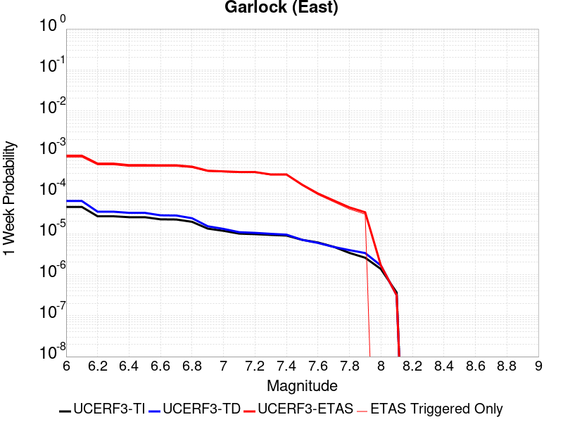 | 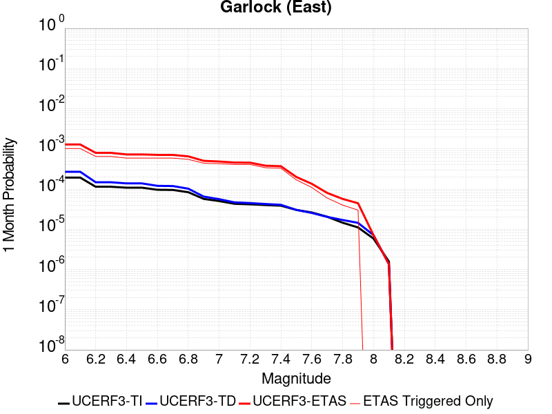 |  |  |

| Magnitude | 1 wk TI Prob | 1 wk TD Prob | 1 wk ETAS Prob | 1 wk ETAS/TD Gain | 1 wk ETAS Triggered Only | 1 mo TI Prob | 1 mo TD Prob | 1 mo ETAS Prob | 1 mo ETAS/TD Gain | 1 mo ETAS Triggered Only | 1 yr TI Prob | 1 yr TD Prob | 1 yr ETAS Prob | 1 yr ETAS/TD Gain | 1 yr ETAS Triggered Only | 10 yr TI Prob | 10 yr TD Prob | 10 yr ETAS Prob | 10 yr ETAS/TD Gain | 10 yr ETAS Triggered Only |
|-----|-----|-----|-----|-----|-----|-----|-----|-----|-----|-----|-----|-----|-----|-----|-----|-----|-----|-----|-----|-----|
| 6.0 | 4.5092507E-5 | 6.290254E-5 | 7.833711E-4 | 12.453728 | 7.2051387E-4 | 1.9323928E-4 | 2.6955697E-4 | 0.0012340528 | 4.578078 | 9.647559E-4 | 0.0023501497 | 0.003277363 | 0.004871905 | 1.486532 | 0.001599785 | 0.023254504 | 0.032351483 | 0.03483306 | 1.0767066 | 0.0025645408 |
| 6.1 | 4.5092507E-5 | 6.290254E-5 | 7.833711E-4 | 12.453728 | 7.2051387E-4 | 1.9323928E-4 | 2.6955697E-4 | 0.0012340528 | 4.578078 | 9.647559E-4 | 0.0023501497 | 0.003277363 | 0.004871905 | 1.486532 | 0.001599785 | 0.023254504 | 0.032351483 | 0.03483306 | 1.0767066 | 0.0025645408 |
| 6.2 | 2.6674514E-5 | 3.450911E-5 | 4.7412954E-4 | 13.739257 | 4.396356E-4 | 1.1431433E-4 | 1.4788799E-4 | 6.9735124E-4 | 4.715401 | 5.4954446E-4 | 0.0013908884 | 0.0017990824 | 0.002798673 | 1.5556114 | 0.0010013921 | 0.01382215 | 0.01789001 | 0.019437188 | 1.0864828 | 0.0015753609 |
| 6.3 | 2.6674514E-5 | 3.450911E-5 | 4.7412954E-4 | 13.739257 | 4.396356E-4 | 1.1431433E-4 | 1.4788799E-4 | 6.9735124E-4 | 4.715401 | 5.4954446E-4 | 0.0013908884 | 0.0017990824 | 0.002798673 | 1.5556114 | 0.0010013921 | 0.01382215 | 0.01789001 | 0.019437188 | 1.0864828 | 0.0015753609 |
| 6.4 | 2.5312667E-5 | 3.233838E-5 | 4.2311294E-4 | 13.083925 | 3.907872E-4 | 1.0847834E-4 | 1.3858585E-4 | 6.2700215E-4 | 4.5242867 | 4.88484E-4 | 0.0013199237 | 0.0016860063 | 0.002612561 | 1.5495559 | 9.281196E-4 | 0.013121112 | 0.016778054 | 0.01825494 | 1.0880249 | 0.0015020883 |
| 6.5 | 2.5312667E-5 | 3.233838E-5 | 4.2311294E-4 | 13.083925 | 3.907872E-4 | 1.0847834E-4 | 1.3858585E-4 | 6.2700215E-4 | 4.5242867 | 4.88484E-4 | 0.0013199237 | 0.0016860063 | 0.002612561 | 1.5495559 | 9.281196E-4 | 0.013121112 | 0.016778054 | 0.01825494 | 1.0880249 | 0.0015020883 |
| 6.6 | 2.246556E-5 | 2.8133245E-5 | 4.1890945E-4 | 14.890193 | 3.907872E-4 | 9.627742E-5 | 1.20565615E-4 | 6.089907E-4 | 5.0511146 | 4.88484E-4 | 0.0011715472 | 0.0014669215 | 0.0023205145 | 1.5818942 | 8.5484696E-4 | 0.011653901 | 0.014618388 | 0.015966149 | 1.0921962 | 0.0013677551 |
| 6.7 | 2.2241198E-5 | 2.780299E-5 | 4.1857932E-4 | 15.055191 | 3.907872E-4 | 9.531594E-5 | 1.1915036E-4 | 6.0757616E-4 | 5.099239 | 4.88484E-4 | 0.0011598538 | 0.0014497138 | 0.002291127 | 1.5803996 | 8.426349E-4 | 0.011538187 | 0.014448582 | 0.015772503 | 1.0916299 | 0.001343331 |
| 6.8 | 1.9528685E-5 | 2.3897695E-5 | 3.7804013E-4 | 15.819103 | 3.541509E-4 | 8.369167E-5 | 1.02414786E-4 | 5.542162E-4 | 5.411486 | 4.5184768E-4 | 0.0010184698 | 0.0012462065 | 0.0020268068 | 1.6263813 | 7.815744E-4 | 0.010138147 | 0.012436173 | 0.013666316 | 1.0989165 | 0.0012456342 |
| 6.9 | 1.3318621E-5 | 1.5198458E-5 | 3.082844E-4 | 20.283926 | 2.930904E-4 | 5.7078556E-5 | 6.5134656E-5 | 4.1926248E-4 | 6.436857 | 3.541509E-4 | 6.9470983E-4 | 7.927316E-4 | 0.0014272574 | 1.8004295 | 6.3502917E-4 | 0.0069254204 | 0.007939667 | 0.008836187 | 1.1129166 | 9.0369536E-4 |
| 7.0 | 1.1760853E-5 | 1.31073775E-5 | 2.9398198E-4 | 22.428741 | 2.808783E-4 | 5.0402683E-5 | 5.6173292E-5 | 3.9809287E-4 | 7.0868707 | 3.4193878E-4 | 6.134799E-4 | 6.8370026E-4 | 0.0012938877 | 1.8924781 | 6.10605E-4 | 0.0061178906 | 0.006856307 | 0.0077174213 | 1.1255945 | 8.670591E-4 |
| 7.1 | 1.0064758E-5 | 1.0902532E-5 | 2.795658E-4 | 25.64228 | 2.686662E-4 | 4.3133965E-5 | 4.6724323E-5 | 3.764356E-4 | 8.056523 | 3.297267E-4 | 5.2502943E-4 | 5.6872366E-4 | 0.0011545711 | 2.0301092 | 5.861808E-4 | 0.005237907 | 0.0057127923 | 0.0065263286 | 1.1424061 | 8.182107E-4 |
| 7.2 | 9.768808E-6 | 1.0498412E-5 | 2.791618E-4 | 26.590858 | 2.686662E-4 | 4.186565E-5 | 4.4992437E-5 | 3.747043E-4 | 8.328161 | 3.297267E-4 | 5.095951E-4 | 5.4764876E-4 | 0.0011090977 | 2.025199 | 5.617566E-4 | 0.0050842804 | 0.00550306 | 0.006280333 | 1.1412438 | 7.815744E-4 |
| 7.3 | 9.344516E-6 | 9.94408E-6 | 2.5418366E-4 | 25.561304 | 2.44242E-4 | 4.004731E-5 | 4.2616808E-5 | 3.356947E-4 | 7.8770494 | 2.930904E-4 | 4.8746695E-4 | 5.187396E-4 | 0.001019176 | 1.964716 | 5.006961E-4 | 0.0048639905 | 0.0052147433 | 0.0059193517 | 1.1351185 | 7.083018E-4 |
| 7.4 | 9.023491E-6 | 9.490282E-6 | 2.5372996E-4 | 26.735767 | 2.44242E-4 | 3.867153E-5 | 4.067202E-5 | 3.215389E-4 | 7.9056535 | 2.808783E-4 | 4.7072413E-4 | 4.950727E-4 | 9.833148E-4 | 1.986203 | 4.88484E-4 | 0.004697283 | 0.0049782004 | 0.0056586736 | 1.1366906 | 6.8387756E-4 |
| 7.5 | 7.081253E-6 | 7.0873343E-6 | 1.4141948E-4 | 19.953833 | 1.343331E-4 | 3.0347876E-5 | 3.037394E-5 | 1.7691469E-4 | 5.824555 | 1.465452E-4 | 3.6942272E-4 | 3.697407E-4 | 6.261E-4 | 1.6933488 | 2.564541E-4 | 0.003688092 | 0.0037241387 | 0.0040769707 | 1.094742 | 3.541509E-4 |
| 7.6 | 6.116396E-6 | 5.958924E-6 | 7.923108E-5 | 13.296207 | 7.32726E-5 | 2.6212863E-5 | 2.5537996E-5 | 1.1102051E-4 | 4.347268 | 8.5484695E-5 | 3.1909486E-4 | 3.10881E-4 | 4.8179724E-4 | 1.5497802 | 1.7096939E-4 | 0.0031863707 | 0.003135588 | 0.0033912382 | 1.0815318 | 2.564541E-4 |
| 7.7 | 4.797145E-6 | 4.7569774E-6 | 5.3605145E-5 | 11.268741 | 4.88484E-5 | 2.055903E-5 | 2.0386888E-5 | 6.923429E-5 | 3.3960207 | 4.88484E-5 | 2.5027743E-4 | 2.4818222E-4 | 3.4585476E-4 | 1.3935518 | 9.76968E-5 | 0.0024999576 | 0.0025091893 | 0.0026310037 | 1.0485474 | 1.22121E-4 |
| 7.8 | 3.4028885E-6 | 3.9781908E-6 | 4.0614344E-5 | 10.2092495 | 3.66363E-5 | 1.4583726E-5 | 1.7049279E-5 | 5.3684955E-5 | 3.1488109 | 3.66363E-5 | 1.775424E-4 | 2.0755526E-4 | 2.686031E-4 | 1.2941281 | 6.10605E-5 | 0.0017740062 | 0.0021010821 | 0.0021620144 | 1.0290004 | 6.10605E-5 |
| 7.9 | 2.5928412E-6 | 3.37222E-6 | 4.0008395E-5 | 11.864112 | 3.66363E-5 | 1.1112129E-5 | 1.4452292E-5 | 5.108806E-5 | 3.5349455 | 3.66363E-5 | 1.3528178E-4 | 1.759425E-4 | 2.2478231E-4 | 1.2775896 | 4.88484E-5 | 0.0013519945 | 0.0017811217 | 0.0018298831 | 1.0273768 | 4.88484E-5 |
| 8.0 | 1.3743648E-6 | 1.6733709E-6 | 1.6733709E-6 | 1.0 | 0.0 | 5.8901214E-6 | 7.17157E-6 | 7.17157E-6 | 1.0 | 0.0 | 7.1709874E-5 | 8.731039E-5 | 8.731039E-5 | 1.0 | 0.0 | 7.1686733E-4 | 8.8366936E-4 | 8.8366936E-4 | 1.0 | 0.0 |
| 8.1 | 3.6733252E-7 | 3.148811E-7 | 3.148811E-7 | 1.0 | 0.0 | 1.5742813E-6 | 1.3494899E-6 | 1.3494899E-6 | 1.0 | 0.0 | 1.9166706E-5 | 1.6429933E-5 | 1.6429933E-5 | 1.0 | 0.0 | 1.9165053E-4 | 1.6637788E-4 | 1.6637788E-4 | 1.0 | 0.0 |

## Blackwater
*[(top)](#table-of-contents)*

| 1 Week | 1 Month | 1 Year | 10 Year |
|-----|-----|-----|-----|
|  |  | 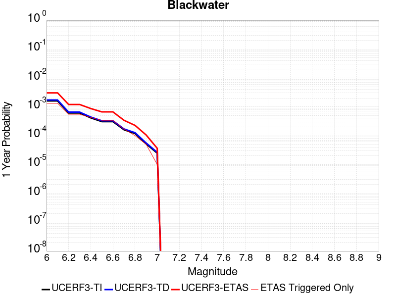 |  |

| Magnitude | 1 wk TI Prob | 1 wk TD Prob | 1 wk ETAS Prob | 1 wk ETAS/TD Gain | 1 wk ETAS Triggered Only | 1 mo TI Prob | 1 mo TD Prob | 1 mo ETAS Prob | 1 mo ETAS/TD Gain | 1 mo ETAS Triggered Only | 1 yr TI Prob | 1 yr TD Prob | 1 yr ETAS Prob | 1 yr ETAS/TD Gain | 1 yr ETAS Triggered Only | 10 yr TI Prob | 10 yr TD Prob | 10 yr ETAS Prob | 10 yr ETAS/TD Gain | 10 yr ETAS Triggered Only |
|-----|-----|-----|-----|-----|-----|-----|-----|-----|-----|-----|-----|-----|-----|-----|-----|-----|-----|-----|-----|-----|
| 6.0 | 3.0708583E-5 | 3.309578E-5 | 7.1695074E-4 | 21.662905 | 6.8387756E-4 | 1.3160157E-4 | 1.4183212E-4 | 0.0010087682 | 7.1124105 | 8.670591E-4 | 0.0016010714 | 0.001725575 | 0.003115352 | 1.8053994 | 0.0013921794 | 0.015895851 | 0.017135598 | 0.019020043 | 1.1099726 | 0.0019172997 |
| 6.1 | 3.0708583E-5 | 3.309578E-5 | 7.1695074E-4 | 21.662905 | 6.8387756E-4 | 1.3160157E-4 | 1.4183212E-4 | 0.0010087682 | 7.1124105 | 8.670591E-4 | 0.0016010714 | 0.001725575 | 0.003115352 | 1.8053994 | 0.0013921794 | 0.015895851 | 0.017135598 | 0.019020043 | 1.1099726 | 0.0019172997 |
| 6.2 | 1.1707779E-5 | 1.2545098E-5 | 3.3005571E-4 | 26.309536 | 3.1751458E-4 | 5.017523E-5 | 5.376365E-5 | 4.2010695E-4 | 7.813958 | 3.66363E-4 | 6.107122E-4 | 6.543855E-4 | 0.0012523868 | 1.9138365 | 5.983929E-4 | 0.006090366 | 0.006525557 | 0.007326296 | 1.1227082 | 8.0599857E-4 |
| 6.3 | 1.1707779E-5 | 1.2545098E-5 | 3.3005571E-4 | 26.309536 | 3.1751458E-4 | 5.017523E-5 | 5.376365E-5 | 4.2010695E-4 | 7.813958 | 3.66363E-4 | 6.107122E-4 | 6.543855E-4 | 0.0012523868 | 1.9138365 | 5.983929E-4 | 0.006090366 | 0.006525557 | 0.007326296 | 1.1227082 | 8.0599857E-4 |
| 6.4 | 7.929244E-6 | 8.480082E-6 | 3.0156798E-4 | 35.561916 | 2.930904E-4 | 3.3982033E-5 | 3.6342728E-5 | 3.6605744E-4 | 10.0723715 | 3.297267E-4 | 4.136527E-4 | 4.423869E-4 | 9.428615E-4 | 2.1313052 | 5.006961E-4 | 0.0041288356 | 0.004415468 | 0.005047693 | 1.1431842 | 6.3502917E-4 |
| 6.5 | 5.8832115E-6 | 6.2859795E-6 | 2.3831442E-4 | 37.91206 | 2.320299E-4 | 2.521352E-5 | 2.6939648E-5 | 2.955986E-4 | 10.972623 | 2.686662E-4 | 3.0693135E-4 | 3.279434E-4 | 7.4301864E-4 | 2.2656918 | 4.152114E-4 | 0.0030650778 | 0.0032748478 | 0.0037739042 | 1.1523907 | 5.006961E-4 |
| 6.6 | 5.8832115E-6 | 6.2859795E-6 | 2.3831442E-4 | 37.91206 | 2.320299E-4 | 2.521352E-5 | 2.6939648E-5 | 2.955986E-4 | 10.972623 | 2.686662E-4 | 3.0693135E-4 | 3.279434E-4 | 7.4301864E-4 | 2.2656918 | 4.152114E-4 | 0.0030650778 | 0.0032748478 | 0.0037739042 | 1.1523907 | 5.006961E-4 |
| 6.7 | 3.0715053E-6 | 3.2814603E-6 | 1.1319E-4 | 34.49379 | 1.099089E-4 | 1.3163528E-5 | 1.4063332E-5 | 1.6060646E-4 | 11.420229 | 1.465452E-4 | 1.6025416E-4 | 1.7120877E-4 | 3.7877893E-4 | 2.2123804 | 2.076057E-4 | 0.0016013865 | 0.0017108832 | 0.0019547073 | 1.1425136 | 2.44242E-4 |
| 6.8 | 2.2722281E-6 | 2.4287492E-6 | 5.127703E-5 | 21.112526 | 4.88484E-5 | 9.738084E-6 | 1.0408889E-5 | 8.368072E-5 | 8.039352 | 7.32726E-5 | 1.1855473E-4 | 1.2672177E-4 | 2.488273E-4 | 1.9635718 | 1.22121E-4 | 0.001184915 | 0.0012665853 | 0.0014007483 | 1.105925 | 1.343331E-4 |
| 6.9 | 9.952399E-7 | 1.0653469E-6 | 2.548952E-5 | 23.92603 | 2.44242E-5 | 4.265307E-6 | 4.565767E-6 | 2.8989854E-5 | 6.3493943 | 2.44242E-5 | 5.1928873E-5 | 5.5587312E-5 | 1.1664442E-4 | 2.0983999 | 6.10605E-5 | 5.191674E-4 | 5.5578473E-4 | 6.168113E-4 | 1.1098025 | 6.10605E-5 |
| 7.0 | 4.7385504E-7 | 5.07555E-7 | 5.07555E-7 | 1.0 | 0.0 | 2.0308057E-6 | 2.1752357E-6 | 2.1752357E-6 | 1.0 | 0.0 | 2.4724779E-5 | 2.6483494E-5 | 3.869527E-5 | 1.4611089 | 1.22121E-5 | 2.4722028E-4 | 2.6483493E-4 | 2.7704382E-4 | 1.0460999 | 1.22121E-5 |

## Ash Hill
*[(top)](#table-of-contents)*

| 1 Week | 1 Month | 1 Year | 10 Year |
|-----|-----|-----|-----|
|  |  |  | 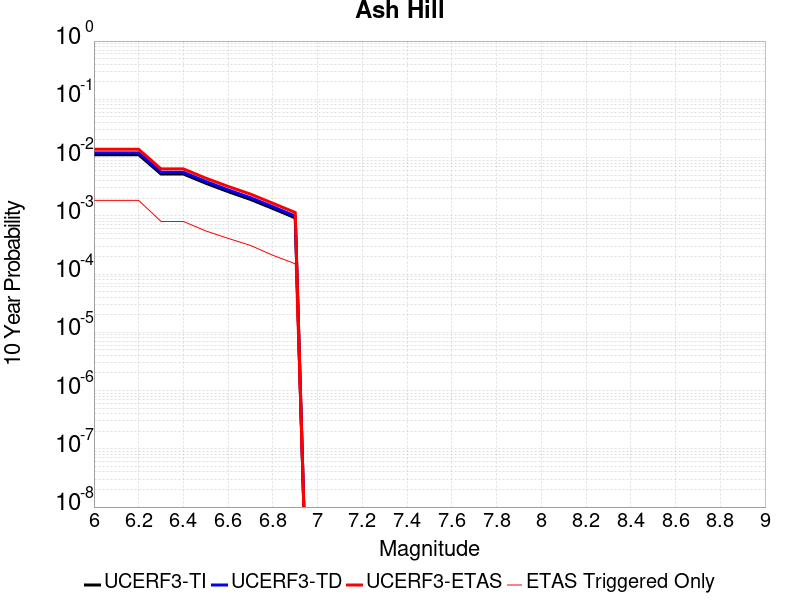 |

| Magnitude | 1 wk TI Prob | 1 wk TD Prob | 1 wk ETAS Prob | 1 wk ETAS/TD Gain | 1 wk ETAS Triggered Only | 1 mo TI Prob | 1 mo TD Prob | 1 mo ETAS Prob | 1 mo ETAS/TD Gain | 1 mo ETAS Triggered Only | 1 yr TI Prob | 1 yr TD Prob | 1 yr ETAS Prob | 1 yr ETAS/TD Gain | 1 yr ETAS Triggered Only | 10 yr TI Prob | 10 yr TD Prob | 10 yr ETAS Prob | 10 yr ETAS/TD Gain | 10 yr ETAS Triggered Only |
|-----|-----|-----|-----|-----|-----|-----|-----|-----|-----|-----|-----|-----|-----|-----|-----|-----|-----|-----|-----|-----|
| 6.0 | 2.1545662E-5 | 2.31944E-5 | 6.0936157E-4 | 26.271929 | 5.861808E-4 | 9.2335285E-5 | 9.940123E-5 | 8.808979E-4 | 8.862042 | 7.815744E-4 | 0.0011236023 | 0.001209618 | 0.002356167 | 1.9478601 | 0.0011479374 | 0.011179381 | 0.012038324 | 0.013691241 | 1.1373045 | 0.0016730577 |
| 6.1 | 2.1545662E-5 | 2.31944E-5 | 6.0936157E-4 | 26.271929 | 5.861808E-4 | 9.2335285E-5 | 9.940123E-5 | 8.808979E-4 | 8.862042 | 7.815744E-4 | 0.0011236023 | 0.001209618 | 0.002356167 | 1.9478601 | 0.0011479374 | 0.011179381 | 0.012038324 | 0.013691241 | 1.1373045 | 0.0016730577 |
| 6.2 | 2.1545662E-5 | 2.31944E-5 | 6.0936157E-4 | 26.271929 | 5.861808E-4 | 9.2335285E-5 | 9.940123E-5 | 8.808979E-4 | 8.862042 | 7.815744E-4 | 0.0011236023 | 0.001209618 | 0.002356167 | 1.9478601 | 0.0011479374 | 0.011179381 | 0.012038324 | 0.013691241 | 1.1373045 | 0.0016730577 |
| 6.3 | 1.0025529E-5 | 1.0746914E-5 | 2.5498628E-4 | 23.726465 | 2.44242E-4 | 4.2965847E-5 | 4.6057463E-5 | 3.7576896E-4 | 8.158699 | 3.297267E-4 | 5.229836E-4 | 5.606186E-4 | 0.0010854445 | 1.9361551 | 5.251203E-4 | 0.005217545 | 0.0055933557 | 0.0063098394 | 1.1280955 | 7.2051387E-4 |
| 6.4 | 1.0025529E-5 | 1.0746914E-5 | 2.5498628E-4 | 23.726465 | 2.44242E-4 | 4.2965847E-5 | 4.6057463E-5 | 3.7576896E-4 | 8.158699 | 3.297267E-4 | 5.229836E-4 | 5.606186E-4 | 0.0010854445 | 1.9361551 | 5.251203E-4 | 0.005217545 | 0.0055933557 | 0.0063098394 | 1.1280955 | 7.2051387E-4 |
| 6.5 | 6.9617327E-6 | 7.45662E-6 | 1.9063675E-4 | 25.566109 | 1.831815E-4 | 2.9835655E-5 | 3.19566E-5 | 2.7619078E-4 | 8.642684 | 2.44242E-4 | 3.6318856E-4 | 3.8901082E-4 | 7.552313E-4 | 1.9414146 | 3.66363E-4 | 0.0036259557 | 0.003884153 | 0.0043585747 | 1.1221429 | 4.762719E-4 |
| 6.6 | 4.9919777E-6 | 5.3466783E-6 | 1.2746702E-4 | 23.840414 | 1.22121E-4 | 2.1394015E-5 | 2.2914171E-5 | 1.9387965E-4 | 8.461124 | 1.7096939E-4 | 2.60441E-4 | 2.7895102E-4 | 5.353336E-4 | 1.9190953 | 2.564541E-4 | 0.0026013597 | 0.0027866673 | 0.0031154752 | 1.1179932 | 3.297267E-4 |
| 6.7 | 3.6630722E-6 | 3.924616E-6 | 7.719693E-5 | 19.66993 | 7.32726E-5 | 1.5698786E-5 | 1.6819708E-5 | 1.2672675E-4 | 7.534421 | 1.099089E-4 | 1.9111596E-4 | 2.0476643E-4 | 3.634912E-4 | 1.7751504 | 1.5875729E-4 | 0.0019095168 | 0.0020463406 | 0.0022778958 | 1.1131557 | 2.320299E-4 |
| 6.8 | 2.5599613E-6 | 2.7449198E-6 | 3.9381117E-5 | 14.34691 | 3.66363E-5 | 1.0971216E-5 | 1.17639165E-5 | 7.28237E-5 | 6.190429 | 6.10605E-5 | 1.3356637E-4 | 1.4322122E-4 | 2.5311438E-4 | 1.7672966 | 1.099089E-4 | 0.0013348613 | 0.0014317741 | 0.0015781096 | 1.1022056 | 1.465452E-4 |
| 6.9 | 1.7684905E-6 | 1.896867E-6 | 2.632102E-5 | 13.876049 | 2.44242E-5 | 7.579223E-6 | 8.12943E-6 | 5.697743E-5 | 7.0087852 | 4.88484E-5 | 9.2273134E-5 | 9.897581E-5 | 1.8445204E-4 | 1.8636073 | 8.5484695E-5 | 9.223483E-4 | 9.897582E-4 | 0.0010873582 | 1.09861 | 9.76968E-5 |

## Hunter Mountain-Saline Valley
*[(top)](#table-of-contents)*

| 1 Week | 1 Month | 1 Year | 10 Year |
|-----|-----|-----|-----|
|  | 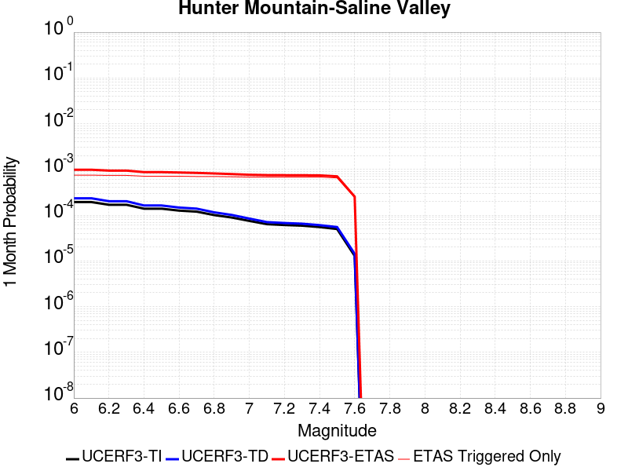 | 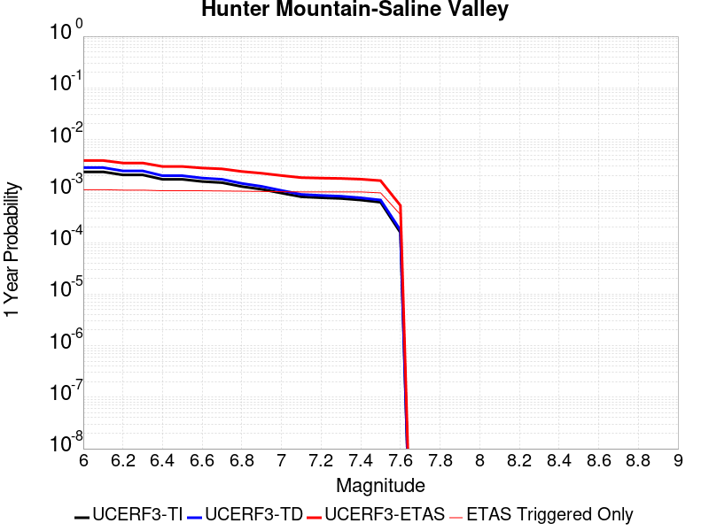 | 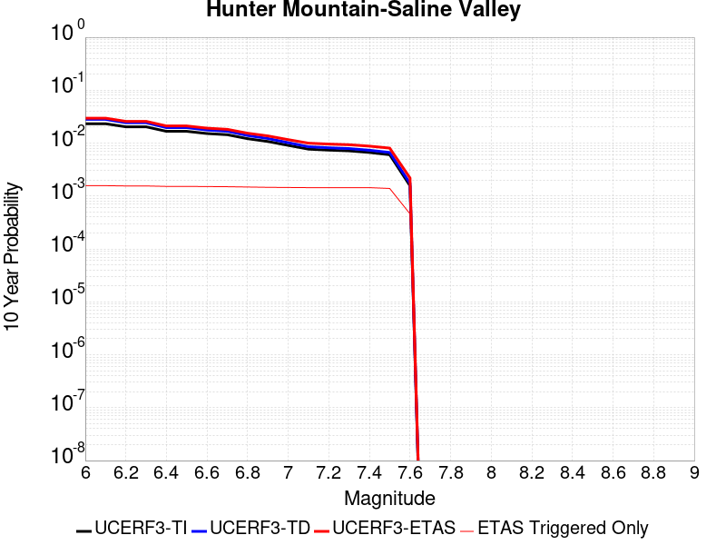 |

| Magnitude | 1 wk TI Prob | 1 wk TD Prob | 1 wk ETAS Prob | 1 wk ETAS/TD Gain | 1 wk ETAS Triggered Only | 1 mo TI Prob | 1 mo TD Prob | 1 mo ETAS Prob | 1 mo ETAS/TD Gain | 1 mo ETAS Triggered Only | 1 yr TI Prob | 1 yr TD Prob | 1 yr ETAS Prob | 1 yr ETAS/TD Gain | 1 yr ETAS Triggered Only | 10 yr TI Prob | 10 yr TD Prob | 10 yr ETAS Prob | 10 yr ETAS/TD Gain | 10 yr ETAS Triggered Only |
|-----|-----|-----|-----|-----|-----|-----|-----|-----|-----|-----|-----|-----|-----|-----|-----|-----|-----|-----|-----|-----|
| 6.0 | 4.5103672E-5 | 5.4569828E-5 | 5.6745E-4 | 10.398604 | 5.129082E-4 | 1.9328714E-4 | 2.3385094E-4 | 9.908241E-4 | 4.23699 | 7.571502E-4 | 0.002350731 | 0.002843498 | 0.0038785748 | 1.3640153 | 0.0010380285 | 0.023260195 | 0.028091714 | 0.029622821 | 1.0545038 | 0.0015753609 |
| 6.1 | 4.5103672E-5 | 5.4569828E-5 | 5.6745E-4 | 10.398604 | 5.129082E-4 | 1.9328714E-4 | 2.3385094E-4 | 9.908241E-4 | 4.23699 | 7.571502E-4 | 0.002350731 | 0.002843498 | 0.0038785748 | 1.3640153 | 0.0010380285 | 0.023260195 | 0.028091714 | 0.029622821 | 1.0545038 | 0.0015753609 |
| 6.2 | 3.9363465E-5 | 4.7063084E-5 | 5.5994716E-4 | 11.8977995 | 5.129082E-4 | 1.6868966E-4 | 2.0168422E-4 | 9.4647205E-4 | 4.6928415 | 7.449381E-4 | 0.002051862 | 0.002452803 | 0.0034761033 | 1.4171963 | 0.0010258164 | 0.020330196 | 0.024273338 | 0.025798544 | 1.0628346 | 0.0015631488 |
| 6.3 | 3.9363465E-5 | 4.7063084E-5 | 5.5994716E-4 | 11.8977995 | 5.129082E-4 | 1.6868966E-4 | 2.0168422E-4 | 9.4647205E-4 | 4.6928415 | 7.449381E-4 | 0.002051862 | 0.002452803 | 0.0034761033 | 1.4171963 | 0.0010258164 | 0.020330196 | 0.024273338 | 0.025798544 | 1.0628346 | 0.0015631488 |
| 6.4 | 3.2311684E-5 | 3.7950776E-5 | 5.2641623E-4 | 13.871027 | 4.88484E-4 | 1.384713E-4 | 1.6263645E-4 | 8.8303315E-4 | 5.429491 | 7.2051387E-4 | 0.0016845843 | 0.0019783732 | 0.0029777843 | 1.5051681 | 0.0010013921 | 0.016718714 | 0.019616365 | 0.021124905 | 1.0769022 | 0.0015387245 |
| 6.5 | 3.2311684E-5 | 3.7950776E-5 | 5.2641623E-4 | 13.871027 | 4.88484E-4 | 1.384713E-4 | 1.6263645E-4 | 8.8303315E-4 | 5.429491 | 7.2051387E-4 | 0.0016845843 | 0.0019783732 | 0.0029777843 | 1.5051681 | 0.0010013921 | 0.016718714 | 0.019616365 | 0.021124905 | 1.0769022 | 0.0015387245 |
| 6.6 | 2.9305844E-5 | 3.418164E-5 | 5.226489E-4 | 15.290339 | 4.88484E-4 | 1.2559042E-4 | 1.4648488E-4 | 8.668932E-4 | 5.9179707 | 7.2051387E-4 | 0.0015279909 | 0.0017820572 | 0.0027816647 | 1.5609291 | 0.0010013921 | 0.015175272 | 0.017685594 | 0.019185109 | 1.0847874 | 0.0015265124 |
| 6.7 | 2.7826512E-5 | 3.2344098E-5 | 5.208123E-4 | 16.102236 | 4.88484E-4 | 1.19251024E-4 | 1.3861054E-4 | 8.590245E-4 | 6.197397 | 7.2051387E-4 | 0.0014509142 | 0.0016863372 | 0.0026860407 | 1.5928254 | 0.0010013921 | 0.014414776 | 0.016743096 | 0.018244049 | 1.0896461 | 0.0015265124 |
| 6.8 | 2.3389874E-5 | 2.6866572E-5 | 5.1533745E-4 | 19.181362 | 4.88484E-4 | 1.0023846E-4 | 1.15137635E-4 | 8.355686E-4 | 7.2571282 | 7.2051387E-4 | 0.00121972 | 0.0014009465 | 0.002388741 | 1.7050906 | 9.891801E-4 | 0.01213047 | 0.01392736 | 0.015408528 | 1.1063495 | 0.0015020883 |
| 6.9 | 2.069209E-5 | 2.3569908E-5 | 5.120424E-4 | 21.724411 | 4.88484E-4 | 8.867737E-5 | 1.01010184E-4 | 8.214513E-4 | 8.132361 | 7.2051387E-4 | 0.0010791123 | 0.0012291414 | 0.0022171056 | 1.8037841 | 9.891801E-4 | 0.010738871 | 0.01222846 | 0.013700117 | 1.1203469 | 0.0014898762 |
| 7.0 | 1.7462342E-5 | 1.9633446E-5 | 5.081078E-4 | 25.87971 | 4.88484E-4 | 7.483646E-5 | 8.414075E-5 | 8.04594E-4 | 9.562477 | 7.2051387E-4 | 9.1075303E-4 | 0.0010239548 | 0.002012122 | 1.9650496 | 9.891801E-4 | 0.009070295 | 0.010196 | 0.011670686 | 1.1446337 | 0.0014898762 |
| 7.1 | 1.4807709E-5 | 1.6441667E-5 | 5.0491764E-4 | 30.709639 | 4.88484E-4 | 6.3460066E-5 | 7.0462476E-5 | 7.909256E-4 | 11.224777 | 7.2051387E-4 | 7.723524E-4 | 8.5755944E-4 | 0.0018336896 | 2.1382654 | 9.76968E-4 | 0.007696735 | 0.008545489 | 0.010010526 | 1.1714398 | 0.0014776641 |
| 7.2 | 1.4180048E-5 | 1.5698257E-5 | 5.0417456E-4 | 32.116596 | 4.88484E-4 | 6.077022E-5 | 6.72766E-5 | 7.87742E-4 | 11.709004 | 7.2051387E-4 | 7.396263E-4 | 8.18801E-4 | 0.0017949691 | 2.192192 | 9.76968E-4 | 0.0073716943 | 0.008160792 | 0.009626397 | 1.1795911 | 0.0014776641 |
| 7.3 | 1.3730402E-5 | 1.5171999E-5 | 5.036486E-4 | 33.19593 | 4.88484E-4 | 5.8843252E-5 | 6.502132E-5 | 7.8548834E-4 | 12.080474 | 7.2051387E-4 | 7.161811E-4 | 7.913631E-4 | 0.0017675579 | 2.2335613 | 9.76968E-4 | 0.007138774 | 0.007888383 | 0.00935439 | 1.1858438 | 0.0014776641 |
| 7.4 | 1.2810095E-5 | 1.4109204E-5 | 5.025863E-4 | 35.621166 | 4.88484E-4 | 5.489925E-5 | 6.0466708E-5 | 7.80937E-4 | 12.915157 | 7.2051387E-4 | 6.681934E-4 | 7.359493E-4 | 0.0017121983 | 2.3265166 | 9.76968E-4 | 0.006661878 | 0.0073380154 | 0.008804836 | 1.1998934 | 0.0014776641 |
| 7.5 | 1.1595659E-5 | 1.2800594E-5 | 4.646425E-4 | 36.29851 | 4.5184768E-4 | 4.9694736E-5 | 5.485862E-5 | 7.386987E-4 | 13.465499 | 6.8387756E-4 | 6.0486543E-4 | 6.677147E-4 | 0.0015952146 | 2.389066 | 9.281196E-4 | 0.006032217 | 0.0066599557 | 0.0080671245 | 1.2112881 | 0.0014166036 |
| 7.6 | 2.997694E-6 | 3.3251304E-6 | 1.3765779E-4 | 41.39921 | 1.343331E-4 | 1.28471975E-5 | 1.4250522E-5 | 2.3406518E-4 | 16.425026 | 2.198178E-4 | 1.564034E-4 | 1.7349358E-4 | 4.909531E-4 | 2.8298056 | 3.1751458E-4 | 0.0015629337 | 0.0017350167 | 0.0021738894 | 1.2529502 | 4.396356E-4 |

## Airport Lake
*[(top)](#table-of-contents)*

| 1 Week | 1 Month | 1 Year | 10 Year |
|-----|-----|-----|-----|
| 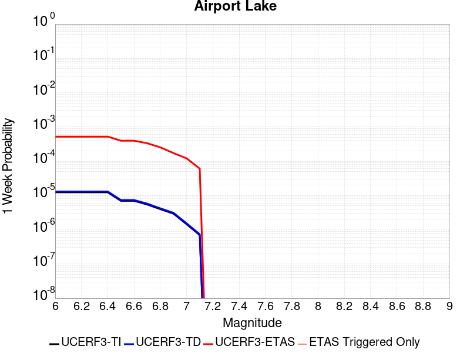 |  |  |  |

| Magnitude | 1 wk TI Prob | 1 wk TD Prob | 1 wk ETAS Prob | 1 wk ETAS/TD Gain | 1 wk ETAS Triggered Only | 1 mo TI Prob | 1 mo TD Prob | 1 mo ETAS Prob | 1 mo ETAS/TD Gain | 1 mo ETAS Triggered Only | 1 yr TI Prob | 1 yr TD Prob | 1 yr ETAS Prob | 1 yr ETAS/TD Gain | 1 yr ETAS Triggered Only | 10 yr TI Prob | 10 yr TD Prob | 10 yr ETAS Prob | 10 yr ETAS/TD Gain | 10 yr ETAS Triggered Only |
|-----|-----|-----|-----|-----|-----|-----|-----|-----|-----|-----|-----|-----|-----|-----|-----|-----|-----|-----|-----|-----|
| 6.0 | 1.2387061E-5 | 1.3103137E-5 | 4.893688E-4 | 37.347454 | 4.762719E-4 | 5.3086325E-5 | 5.615525E-5 | 7.1557163E-4 | 12.742737 | 6.594534E-4 | 6.461343E-4 | 6.835041E-4 | 0.0016476006 | 2.4105203 | 9.647559E-4 | 0.0064425888 | 0.0068168286 | 0.008029714 | 1.1779251 | 0.00122121 |
| 6.1 | 1.2387061E-5 | 1.3103137E-5 | 4.893688E-4 | 37.347454 | 4.762719E-4 | 5.3086325E-5 | 5.615525E-5 | 7.1557163E-4 | 12.742737 | 6.594534E-4 | 6.461343E-4 | 6.835041E-4 | 0.0016476006 | 2.4105203 | 9.647559E-4 | 0.0064425888 | 0.0068168286 | 0.008029714 | 1.1779251 | 0.00122121 |
| 6.2 | 1.2387061E-5 | 1.3103137E-5 | 4.893688E-4 | 37.347454 | 4.762719E-4 | 5.3086325E-5 | 5.615525E-5 | 7.1557163E-4 | 12.742737 | 6.594534E-4 | 6.461343E-4 | 6.835041E-4 | 0.0016476006 | 2.4105203 | 9.647559E-4 | 0.0064425888 | 0.0068168286 | 0.008029714 | 1.1779251 | 0.00122121 |
| 6.3 | 1.2387061E-5 | 1.3103137E-5 | 4.893688E-4 | 37.347454 | 4.762719E-4 | 5.3086325E-5 | 5.615525E-5 | 7.1557163E-4 | 12.742737 | 6.594534E-4 | 6.461343E-4 | 6.835041E-4 | 0.0016476006 | 2.4105203 | 9.647559E-4 | 0.0064425888 | 0.0068168286 | 0.008029714 | 1.1779251 | 0.00122121 |
| 6.4 | 1.2387061E-5 | 1.3103137E-5 | 4.893688E-4 | 37.347454 | 4.762719E-4 | 5.3086325E-5 | 5.615525E-5 | 7.1557163E-4 | 12.742737 | 6.594534E-4 | 6.461343E-4 | 6.835041E-4 | 0.0016476006 | 2.4105203 | 9.647559E-4 | 0.0064425888 | 0.0068168286 | 0.008029714 | 1.1779251 | 0.00122121 |
| 6.5 | 6.9922594E-6 | 7.384914E-6 | 3.4932117E-4 | 47.302 | 3.4193878E-4 | 2.996648E-5 | 3.1649277E-5 | 5.3232955E-4 | 16.819641 | 5.006961E-4 | 3.6478083E-4 | 3.8526725E-4 | 0.0011055035 | 2.8694458 | 7.2051387E-4 | 0.003641826 | 0.0038465308 | 0.00474675 | 1.2340341 | 9.0369536E-4 |
| 6.6 | 6.9922594E-6 | 7.384914E-6 | 3.4932117E-4 | 47.302 | 3.4193878E-4 | 2.996648E-5 | 3.1649277E-5 | 5.3232955E-4 | 16.819641 | 5.006961E-4 | 3.6478083E-4 | 3.8526725E-4 | 0.0011055035 | 2.8694458 | 7.2051387E-4 | 0.003641826 | 0.0038465308 | 0.00474675 | 1.2340341 | 9.0369536E-4 |
| 6.7 | 5.477277E-6 | 5.78606E-6 | 2.9887474E-4 | 51.65428 | 2.930904E-4 | 2.3473833E-5 | 2.4797186E-5 | 4.6442187E-4 | 18.728815 | 4.396356E-4 | 2.8575645E-4 | 3.0186778E-4 | 9.489137E-4 | 3.1434743 | 6.472413E-4 | 0.0028538927 | 0.0030149613 | 0.003830705 | 1.2705653 | 8.182107E-4 |
| 6.8 | 3.9950432E-6 | 4.219081E-6 | 2.118239E-4 | 50.206173 | 2.076057E-4 | 1.7121502E-5 | 1.8081664E-5 | 3.2337863E-4 | 17.88434 | 3.053025E-4 | 2.0843433E-4 | 2.2012478E-4 | 6.7187304E-4 | 3.052237 | 4.5184768E-4 | 0.0020823893 | 0.0021993385 | 0.0027598597 | 1.254859 | 5.617566E-4 |
| 6.9 | 2.95695E-6 | 3.1230197E-6 | 1.374557E-4 | 44.013714 | 1.343331E-4 | 1.2672582E-5 | 1.3384314E-5 | 2.087753E-4 | 15.598505 | 1.953936E-4 | 1.5427776E-4 | 1.629441E-4 | 4.5598674E-4 | 2.7984242 | 2.930904E-4 | 0.001541707 | 0.0016284687 | 0.001994235 | 1.2246076 | 3.66363E-4 |
| 7.0 | 1.456072E-6 | 1.5408096E-6 | 8.702538E-5 | 56.480293 | 8.5484695E-5 | 6.2402937E-6 | 6.6034586E-6 | 1.0429961E-4 | 15.794694 | 9.76968E-5 | 7.597293E-5 | 8.0395155E-5 | 2.2692856E-4 | 2.8226647 | 1.465452E-4 | 7.594696E-4 | 8.0375955E-4 | 9.7459153E-4 | 1.2125411 | 1.7096939E-4 |
| 7.1 | 6.995192E-7 | 7.4089627E-7 | 3.737717E-5 | 50.448586 | 3.66363E-5 | 2.997936E-6 | 3.1752697E-6 | 5.2023515E-5 | 16.383966 | 4.88484E-5 | 3.649926E-5 | 3.865891E-5 | 1.2414031E-4 | 3.2111692 | 8.5484695E-5 | 3.6493264E-4 | 3.865891E-4 | 4.8424813E-4 | 1.2526171 | 9.76968E-5 |

## Gravel Hills-Harper Lk
*[(top)](#table-of-contents)*

| 1 Week | 1 Month | 1 Year | 10 Year |
|-----|-----|-----|-----|
|  |  | 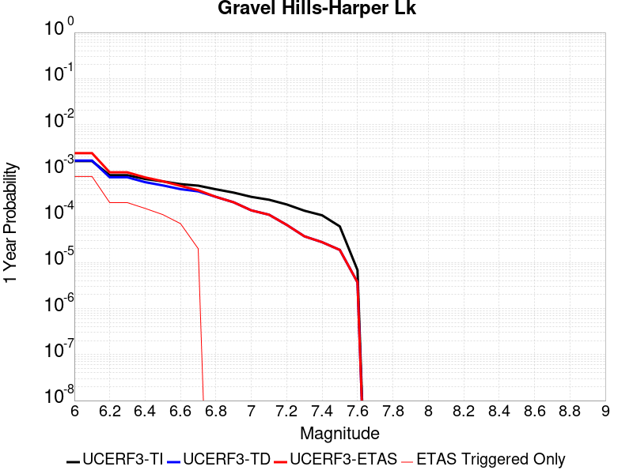 | 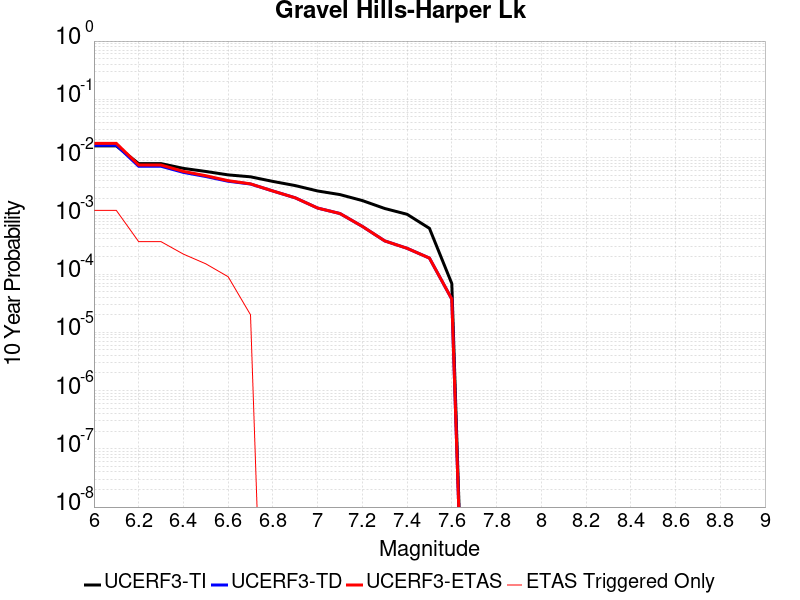 |

| Magnitude | 1 wk TI Prob | 1 wk TD Prob | 1 wk ETAS Prob | 1 wk ETAS/TD Gain | 1 wk ETAS Triggered Only | 1 mo TI Prob | 1 mo TD Prob | 1 mo ETAS Prob | 1 mo ETAS/TD Gain | 1 mo ETAS Triggered Only | 1 yr TI Prob | 1 yr TD Prob | 1 yr ETAS Prob | 1 yr ETAS/TD Gain | 1 yr ETAS Triggered Only | 10 yr TI Prob | 10 yr TD Prob | 10 yr ETAS Prob | 10 yr ETAS/TD Gain | 10 yr ETAS Triggered Only |
|-----|-----|-----|-----|-----|-----|-----|-----|-----|-----|-----|-----|-----|-----|-----|-----|-----|-----|-----|-----|-----|
| 6.0 | 3.0679566E-5 | 3.1464537E-5 | 4.1002771E-4 | 13.031424 | 3.785751E-4 | 1.3147724E-4 | 1.3484228E-4 | 5.8662903E-4 | 4.350483 | 4.5184768E-4 | 0.0015995599 | 0.001640685 | 0.0023478246 | 1.4310027 | 7.083018E-4 | 0.015880952 | 0.016307283 | 0.017496565 | 1.0729295 | 0.0012089979 |
| 6.1 | 3.0679566E-5 | 3.1464537E-5 | 4.1002771E-4 | 13.031424 | 3.785751E-4 | 1.3147724E-4 | 1.3484228E-4 | 5.8662903E-4 | 4.350483 | 4.5184768E-4 | 0.0015995599 | 0.001640685 | 0.0023478246 | 1.4310027 | 7.083018E-4 | 0.015880952 | 0.016307283 | 0.017496565 | 1.0729295 | 0.0012089979 |
| 6.2 | 1.514536E-5 | 1.3635169E-5 | 1.2354257E-4 | 9.060582 | 1.099089E-4 | 6.490707E-5 | 5.84352E-5 | 1.9276045E-4 | 3.2987044 | 1.343331E-4 | 7.8995706E-4 | 7.112282E-4 | 8.82076E-4 | 1.2402152 | 1.7096939E-4 | 0.007871548 | 0.0070907213 | 0.00741811 | 1.0461714 | 3.297267E-4 |
| 6.3 | 1.514536E-5 | 1.3635169E-5 | 1.2354257E-4 | 9.060582 | 1.099089E-4 | 6.490707E-5 | 5.84352E-5 | 1.9276045E-4 | 3.2987044 | 1.343331E-4 | 7.8995706E-4 | 7.112282E-4 | 8.82076E-4 | 1.2402152 | 1.7096939E-4 | 0.007871548 | 0.0070907213 | 0.00741811 | 1.0461714 | 3.297267E-4 |
| 6.4 | 1.2532521E-5 | 1.0689663E-5 | 9.617345E-5 | 8.996864 | 8.5484695E-5 | 5.37097E-5 | 4.5812074E-5 | 1.435044E-4 | 3.132458 | 9.76968E-5 | 6.537194E-4 | 5.576251E-4 | 6.79678E-4 | 1.2188798 | 1.22121E-4 | 0.0065179965 | 0.005562849 | 0.0057571554 | 1.0349294 | 1.953936E-4 |
| 6.5 | 1.1094058E-5 | 9.083641E-6 | 5.7931597E-5 | 6.3775744 | 4.88484E-5 | 4.7545094E-5 | 3.8929335E-5 | 9.9987454E-5 | 2.5684347 | 6.10605E-5 | 5.787078E-4 | 4.738656E-4 | 5.4710347E-4 | 1.1545541 | 7.32726E-5 | 0.0057720304 | 0.004728959 | 0.0048505026 | 1.025702 | 1.22121E-4 |
| 6.6 | 9.688328E-6 | 7.531677E-6 | 3.1955693E-5 | 4.242839 | 2.44242E-5 | 4.1520743E-5 | 3.2278233E-5 | 6.8913345E-5 | 2.134979 | 3.66363E-5 | 5.053978E-4 | 3.9291914E-4 | 4.4174836E-4 | 1.124273 | 4.88484E-5 | 0.0050424994 | 0.003922501 | 0.0039954865 | 1.0186068 | 7.32726E-5 |
| 6.7 | 8.974824E-6 | 6.749397E-6 | 1.8961415E-5 | 2.8093493 | 1.22121E-5 | 3.8462964E-5 | 2.892568E-5 | 4.1137428E-5 | 1.4221766 | 1.22121E-5 | 4.6818596E-4 | 3.5211546E-4 | 3.6432323E-4 | 1.0346699 | 1.22121E-5 | 0.004672008 | 0.0035157963 | 0.0035279654 | 1.0034612 | 1.22121E-5 |
| 6.8 | 7.4780046E-6 | 5.1161815E-6 | 5.1161815E-6 | 1.0 | 0.0 | 3.20482E-5 | 2.1926315E-5 | 2.1926315E-5 | 1.0 | 0.0 | 3.9011694E-4 | 2.669216E-4 | 2.669216E-4 | 1.0 | 0.0 | 0.0038943281 | 0.002666148 | 0.002666148 | 1.0 | 0.0 |
| 6.9 | 6.3409307E-6 | 3.9074876E-6 | 3.9074876E-6 | 1.0 | 0.0 | 2.7175134E-5 | 1.6746273E-5 | 1.6746273E-5 | 1.0 | 0.0 | 3.3080703E-4 | 2.0386779E-4 | 2.0386779E-4 | 1.0 | 0.0 | 0.0033031502 | 0.0020369058 | 0.0020369058 | 1.0 | 0.0 |
| 7.0 | 5.1239335E-6 | 2.60585E-6 | 2.60585E-6 | 1.0 | 0.0 | 2.195953E-5 | 1.1167882E-5 | 1.1167882E-5 | 1.0 | 0.0 | 2.6732447E-4 | 1.3596074E-4 | 1.3596074E-4 | 1.0 | 0.0 | 0.0026700313 | 0.0013588008 | 0.0013588008 | 1.0 | 0.0 |
| 7.1 | 4.438899E-6 | 2.0984673E-6 | 2.0984673E-6 | 1.0 | 0.0 | 1.9023713E-5 | 8.993402E-6 | 8.993402E-6 | 1.0 | 0.0 | 2.315891E-4 | 1.0948939E-4 | 1.0948939E-4 | 1.0 | 0.0 | 0.002313479 | 0.0010943763 | 0.0010943763 | 1.0 | 0.0 |
| 7.2 | 3.50367E-6 | 1.2615677E-6 | 1.2615677E-6 | 1.0 | 0.0 | 1.5015643E-5 | 5.4067077E-6 | 5.4067077E-6 | 1.0 | 0.0 | 1.8280011E-4 | 6.5824766E-5 | 6.5824766E-5 | 1.0 | 0.0 | 0.0018264982 | 6.580609E-4 | 6.580609E-4 | 1.0 | 0.0 |
| 7.3 | 2.561638E-6 | 7.119129E-7 | 7.119129E-7 | 1.0 | 0.0 | 1.0978401E-5 | 3.0510516E-6 | 3.0510516E-6 | 1.0 | 0.0 | 1.3365384E-4 | 3.7145943E-5 | 3.7145943E-5 | 1.0 | 0.0 | 0.0013357349 | 3.7139934E-4 | 3.7139934E-4 | 1.0 | 0.0 |
| 7.4 | 2.0368864E-6 | 5.304814E-7 | 5.304814E-7 | 1.0 | 0.0 | 8.729483E-6 | 2.2734896E-6 | 2.2734896E-6 | 1.0 | 0.0 | 1.06276275E-4 | 2.7679389E-5 | 2.7679389E-5 | 1.0 | 0.0 | 0.0010622547 | 2.7675997E-4 | 2.7675997E-4 | 1.0 | 0.0 |
| 7.5 | 1.1681728E-6 | 3.6030443E-7 | 3.6030443E-7 | 1.0 | 0.0 | 5.0064455E-6 | 1.544161E-6 | 1.544161E-6 | 1.0 | 0.0 | 6.0951766E-5 | 1.8800003E-5 | 1.8800003E-5 | 1.0 | 0.0 | 6.093505E-4 | 1.879846E-4 | 1.879846E-4 | 1.0 | 0.0 |
| 7.6 | 1.3154387E-7 | 7.1197206E-8 | 7.1197206E-8 | 1.0 | 0.0 | 5.6375933E-7 | 3.0513087E-7 | 3.0513087E-7 | 1.0 | 0.0 | 6.863748E-6 | 3.7149634E-6 | 3.7149634E-6 | 1.0 | 0.0 | 6.863536E-5 | 3.714917E-5 | 3.714917E-5 | 1.0 | 0.0 |

## Goldstone Lake
*[(top)](#table-of-contents)*

| 1 Week | 1 Month | 1 Year | 10 Year |
|-----|-----|-----|-----|
| 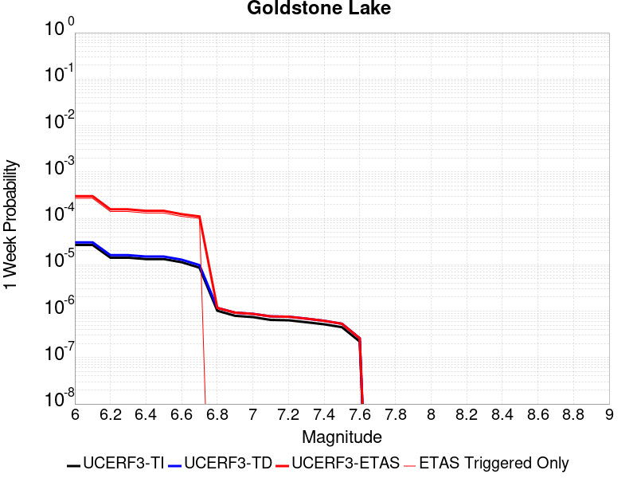 | 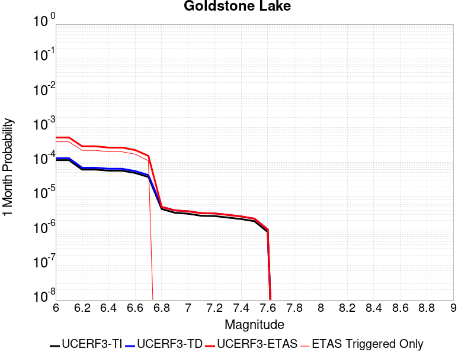 | 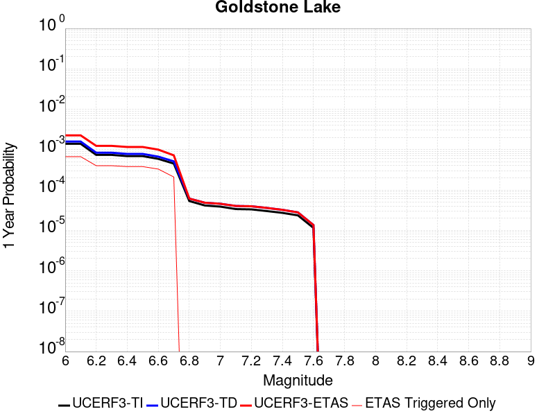 |  |

| Magnitude | 1 wk TI Prob | 1 wk TD Prob | 1 wk ETAS Prob | 1 wk ETAS/TD Gain | 1 wk ETAS Triggered Only | 1 mo TI Prob | 1 mo TD Prob | 1 mo ETAS Prob | 1 mo ETAS/TD Gain | 1 mo ETAS Triggered Only | 1 yr TI Prob | 1 yr TD Prob | 1 yr ETAS Prob | 1 yr ETAS/TD Gain | 1 yr ETAS Triggered Only | 10 yr TI Prob | 10 yr TD Prob | 10 yr ETAS Prob | 10 yr ETAS/TD Gain | 10 yr ETAS Triggered Only |
|-----|-----|-----|-----|-----|-----|-----|-----|-----|-----|-----|-----|-----|-----|-----|-----|-----|-----|-----|-----|-----|
| 6.0 | 2.671352E-5 | 3.037598E-5 | 3.2345747E-4 | 10.648461 | 2.930904E-4 | 1.1448149E-4 | 1.3017739E-4 | 5.453347E-4 | 4.189166 | 4.152114E-4 | 0.001392921 | 0.0015839539 | 0.0023155191 | 1.4618603 | 7.32726E-4 | 0.013842222 | 0.01574614 | 0.016815903 | 1.0679381 | 0.0010868768 |
| 6.1 | 2.671352E-5 | 3.037598E-5 | 3.2345747E-4 | 10.648461 | 2.930904E-4 | 1.1448149E-4 | 1.3017739E-4 | 5.453347E-4 | 4.189166 | 4.152114E-4 | 0.001392921 | 0.0015839539 | 0.0023155191 | 1.4618603 | 7.32726E-4 | 0.013842222 | 0.01574614 | 0.016815903 | 1.0679381 | 0.0010868768 |
| 6.2 | 1.4197047E-5 | 1.609619E-5 | 1.7485094E-4 | 10.862877 | 1.5875729E-4 | 6.0843064E-5 | 6.89824E-5 | 3.009963E-4 | 4.363378 | 2.320299E-4 | 7.4051257E-4 | 8.396358E-4 | 0.0012544985 | 1.4940985 | 4.152114E-4 | 0.007380498 | 0.008374331 | 0.008991932 | 1.0737493 | 6.228171E-4 |
| 6.3 | 1.4197047E-5 | 1.609619E-5 | 1.7485094E-4 | 10.862877 | 1.5875729E-4 | 6.0843064E-5 | 6.89824E-5 | 3.009963E-4 | 4.363378 | 2.320299E-4 | 7.4051257E-4 | 8.396358E-4 | 0.0012544985 | 1.4940985 | 4.152114E-4 | 0.007380498 | 0.008374331 | 0.008991932 | 1.0737493 | 6.228171E-4 |
| 6.4 | 1.3238931E-5 | 1.5008409E-5 | 1.615514E-4 | 10.764059 | 1.465452E-4 | 5.6737044E-5 | 6.432072E-5 | 2.7191307E-4 | 4.227457 | 2.076057E-4 | 6.9055456E-4 | 7.829214E-4 | 0.0011734026 | 1.498749 | 3.907872E-4 | 0.006884126 | 0.007811257 | 0.008404976 | 1.0760081 | 5.983929E-4 |
| 6.5 | 1.3238931E-5 | 1.5008409E-5 | 1.615514E-4 | 10.764059 | 1.465452E-4 | 5.6737044E-5 | 6.432072E-5 | 2.7191307E-4 | 4.227457 | 2.076057E-4 | 6.9055456E-4 | 7.829214E-4 | 0.0011734026 | 1.498749 | 3.907872E-4 | 0.006884126 | 0.007811257 | 0.008404976 | 1.0760081 | 5.983929E-4 |
| 6.6 | 1.1328278E-5 | 1.2855122E-5 | 1.3497454E-4 | 10.499671 | 1.22121E-4 | 4.8548856E-5 | 5.5092758E-5 | 2.2605274E-4 | 4.10313 | 1.7096939E-4 | 5.90922E-4 | 6.706436E-4 | 0.001012353 | 1.5095247 | 3.4193878E-4 | 0.0058935313 | 0.006695586 | 0.0071929297 | 1.0742793 | 5.006961E-4 |
| 6.7 | 8.651175E-6 | 9.824532E-6 | 1.1973235E-4 | 12.187079 | 1.099089E-4 | 3.707594E-5 | 4.2104966E-5 | 1.5200923E-4 | 3.6102448 | 1.099089E-4 | 4.5130608E-4 | 5.125979E-4 | 7.4450887E-4 | 1.4524227 | 2.320299E-4 | 0.0045039062 | 0.005123034 | 0.0054875202 | 1.0711465 | 3.66363E-4 |
| 6.8 | 1.0215377E-6 | 1.1754685E-6 | 1.1754685E-6 | 1.0 | 0.0 | 4.378012E-6 | 5.0377125E-6 | 5.0377125E-6 | 1.0 | 0.0 | 5.3300988E-5 | 6.133254E-5 | 6.133254E-5 | 1.0 | 0.0 | 5.3288206E-4 | 6.131674E-4 | 6.25372E-4 | 1.0199043 | 1.22121E-5 |
| 6.9 | 7.9360774E-7 | 9.283384E-7 | 9.283384E-7 | 1.0 | 0.0 | 3.4011714E-6 | 3.9785873E-6 | 3.9785873E-6 | 1.0 | 0.0 | 4.1408475E-5 | 4.8438294E-5 | 4.8438294E-5 | 1.0 | 0.0 | 4.140076E-4 | 4.842844E-4 | 4.842844E-4 | 1.0 | 0.0 |
| 7.0 | 7.4382757E-7 | 8.747317E-7 | 8.747317E-7 | 1.0 | 0.0 | 3.1878285E-6 | 3.748845E-6 | 3.748845E-6 | 1.0 | 0.0 | 3.8811122E-5 | 4.56413E-5 | 4.56413E-5 | 1.0 | 0.0 | 3.8804344E-4 | 4.563259E-4 | 4.563259E-4 | 1.0 | 0.0 |
| 7.1 | 6.4709513E-7 | 7.71129E-7 | 7.71129E-7 | 1.0 | 0.0 | 2.773262E-6 | 3.304835E-6 | 3.304835E-6 | 1.0 | 0.0 | 3.376394E-5 | 4.023568E-5 | 4.023568E-5 | 1.0 | 0.0 | 3.375881E-4 | 4.0228994E-4 | 4.0228994E-4 | 1.0 | 0.0 |
| 7.2 | 6.356704E-7 | 7.5883503E-7 | 7.5883503E-7 | 1.0 | 0.0 | 2.7242988E-6 | 3.2521464E-6 | 3.2521464E-6 | 1.0 | 0.0 | 3.3167835E-5 | 3.9594222E-5 | 3.9594222E-5 | 1.0 | 0.0 | 3.3162883E-4 | 3.9587764E-4 | 3.9587764E-4 | 1.0 | 0.0 |
| 7.3 | 5.7695723E-7 | 6.896557E-7 | 6.896557E-7 | 1.0 | 0.0 | 2.4726714E-6 | 2.955664E-6 | 2.955664E-6 | 1.0 | 0.0 | 3.0104358E-5 | 3.5984674E-5 | 3.5984674E-5 | 1.0 | 0.0 | 3.0100282E-4 | 3.597942E-4 | 3.597942E-4 | 1.0 | 0.0 |
| 7.4 | 5.209647E-7 | 6.1935066E-7 | 6.1935066E-7 | 1.0 | 0.0 | 2.232704E-6 | 2.6543576E-6 | 2.6543576E-6 | 1.0 | 0.0 | 2.718283E-5 | 3.231638E-5 | 3.231638E-5 | 1.0 | 0.0 | 2.7179506E-4 | 3.2312237E-4 | 3.2312237E-4 | 1.0 | 0.0 |
| 7.5 | 4.512955E-7 | 5.348879E-7 | 5.348879E-7 | 1.0 | 0.0 | 1.934122E-6 | 2.292375E-6 | 2.292375E-6 | 1.0 | 0.0 | 2.3547682E-5 | 2.7909362E-5 | 2.7909362E-5 | 1.0 | 0.0 | 2.3545188E-4 | 2.7906388E-4 | 2.7906388E-4 | 1.0 | 0.0 |
| 7.6 | 2.21172E-7 | 2.603958E-7 | 2.603958E-7 | 1.0 | 0.0 | 9.478797E-7 | 1.1159817E-6 | 1.1159817E-6 | 1.0 | 0.0 | 1.1540374E-5 | 1.3587022E-5 | 1.3587022E-5 | 1.0 | 0.0 | 1.1539775E-4 | 1.3586473E-4 | 1.3586473E-4 | 1.0 | 0.0 |

## McLean Lake
*[(top)](#table-of-contents)*

| 1 Week | 1 Month | 1 Year | 10 Year |
|-----|-----|-----|-----|
|  |  |  | 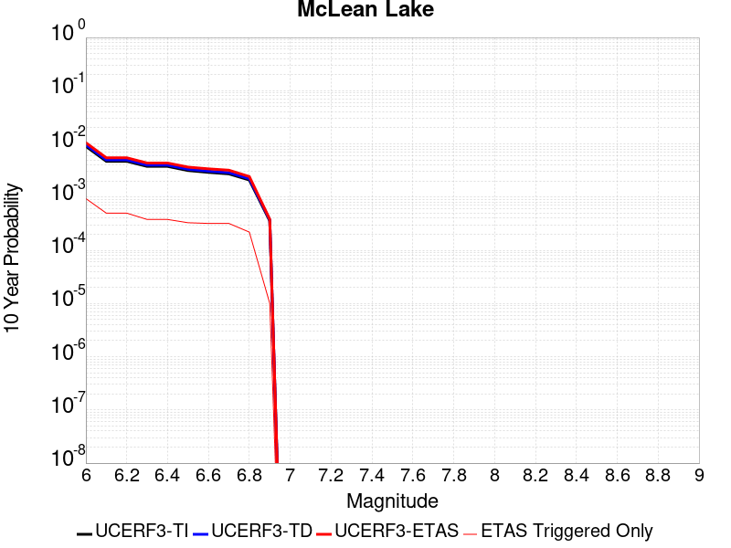 |

| Magnitude | 1 wk TI Prob | 1 wk TD Prob | 1 wk ETAS Prob | 1 wk ETAS/TD Gain | 1 wk ETAS Triggered Only | 1 mo TI Prob | 1 mo TD Prob | 1 mo ETAS Prob | 1 mo ETAS/TD Gain | 1 mo ETAS Triggered Only | 1 yr TI Prob | 1 yr TD Prob | 1 yr ETAS Prob | 1 yr ETAS/TD Gain | 1 yr ETAS Triggered Only | 10 yr TI Prob | 10 yr TD Prob | 10 yr ETAS Prob | 10 yr ETAS/TD Gain | 10 yr ETAS Triggered Only |
|-----|-----|-----|-----|-----|-----|-----|-----|-----|-----|-----|-----|-----|-----|-----|-----|-----|-----|-----|-----|-----|
| 6.0 | 1.7360222E-5 | 1.8501594E-5 | 2.871628E-4 | 15.520976 | 2.686662E-4 | 7.439883E-5 | 7.929042E-5 | 4.944689E-4 | 6.2361746 | 4.152114E-4 | 9.0542925E-4 | 9.6498185E-4 | 0.0015627973 | 1.6195095 | 5.983929E-4 | 0.009017491 | 0.009612758 | 0.010592429 | 1.1019137 | 9.891801E-4 |
| 6.1 | 9.062689E-6 | 9.592179E-6 | 1.5613597E-4 | 16.277426 | 1.465452E-4 | 3.8839516E-5 | 4.110874E-5 | 2.731291E-4 | 6.644064 | 2.320299E-4 | 4.727685E-4 | 5.0039287E-4 | 8.299545E-4 | 1.6586059 | 3.297267E-4 | 0.0047176396 | 0.004993544 | 0.0055403444 | 1.1095015 | 5.4954446E-4 |
| 6.2 | 9.062689E-6 | 9.592179E-6 | 1.5613597E-4 | 16.277426 | 1.465452E-4 | 3.8839516E-5 | 4.110874E-5 | 2.731291E-4 | 6.644064 | 2.320299E-4 | 4.727685E-4 | 5.0039287E-4 | 8.299545E-4 | 1.6586059 | 3.297267E-4 | 0.0047176396 | 0.004993544 | 0.0055403444 | 1.1095015 | 5.4954446E-4 |
| 6.3 | 7.2575485E-6 | 7.667698E-6 | 1.2978776E-4 | 16.926561 | 1.22121E-4 | 3.110341E-5 | 3.286119E-5 | 2.1603667E-4 | 6.5742197 | 1.831815E-4 | 3.786182E-4 | 4.0001865E-4 | 6.685774E-4 | 1.6713655 | 2.686662E-4 | 0.0037797375 | 0.003993691 | 0.004407244 | 1.1035516 | 4.152114E-4 |
| 6.4 | 7.2575485E-6 | 7.667698E-6 | 1.2978776E-4 | 16.926561 | 1.22121E-4 | 3.110341E-5 | 3.286119E-5 | 2.1603667E-4 | 6.5742197 | 1.831815E-4 | 3.786182E-4 | 4.0001865E-4 | 6.685774E-4 | 1.6713655 | 2.686662E-4 | 0.0037797375 | 0.003993691 | 0.004407244 | 1.1035516 | 4.152114E-4 |
| 6.5 | 6.06582E-6 | 6.4038677E-6 | 1.1631206E-4 | 18.162785 | 1.099089E-4 | 2.5996113E-5 | 2.7444894E-5 | 1.7398607E-4 | 6.3394694 | 1.465452E-4 | 3.164567E-4 | 3.3409684E-4 | 5.4163317E-4 | 1.6211861 | 2.076057E-4 | 0.0031600643 | 0.0033365842 | 0.0036895536 | 1.1057876 | 3.541509E-4 |
| 6.6 | 5.598744E-6 | 5.9102535E-6 | 1.15818504E-4 | 19.596199 | 1.099089E-4 | 2.3994397E-5 | 2.5329447E-5 | 1.5965915E-4 | 6.3033013 | 1.343331E-4 | 2.9209262E-4 | 3.0834877E-4 | 5.036821E-4 | 1.6334819 | 1.953936E-4 | 0.0029170897 | 0.0030798386 | 0.0034207243 | 1.110683 | 3.4193878E-4 |
| 6.7 | 5.246996E-6 | 5.539154E-6 | 1.15447445E-4 | 20.842072 | 1.099089E-4 | 2.2486933E-5 | 2.373905E-5 | 1.5806896E-4 | 6.658605 | 1.343331E-4 | 2.73744E-4 | 2.8899097E-4 | 4.8432808E-4 | 1.6759282 | 1.953936E-4 | 0.0027340704 | 0.0028867754 | 0.003227727 | 1.1181082 | 3.4193878E-4 |
| 6.8 | 4.02324E-6 | 4.2468982E-6 | 1.0194328E-4 | 24.004173 | 9.76968E-5 | 1.7242342E-5 | 1.8200899E-5 | 1.4031968E-4 | 7.7094917 | 1.22121E-4 | 2.099053E-4 | 2.2157936E-4 | 3.8030147E-4 | 1.7163217 | 1.5875729E-4 | 0.0020970714 | 0.0022141687 | 0.002470055 | 1.1155677 | 2.564541E-4 |
| 6.9 | 6.835972E-7 | 7.13992E-7 | 1.2926083E-5 | 18.103962 | 1.22121E-5 | 2.9296991E-6 | 3.0599638E-6 | 1.5272026E-5 | 4.990917 | 1.22121E-5 | 3.56685E-5 | 3.725474E-5 | 4.9466387E-5 | 1.3277876 | 1.22121E-5 | 3.5662777E-4 | 3.7251622E-4 | 3.8472377E-4 | 1.0327705 | 1.22121E-5 |

## Coyote Canyon
*[(top)](#table-of-contents)*

| 1 Week | 1 Month | 1 Year | 10 Year |
|-----|-----|-----|-----|
|  |  | 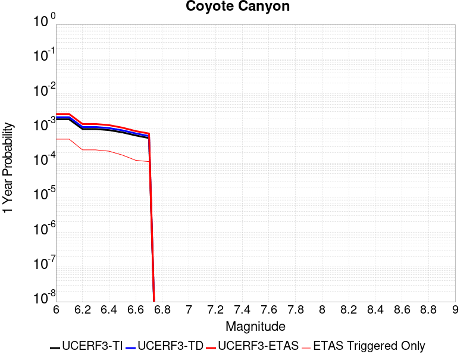 | 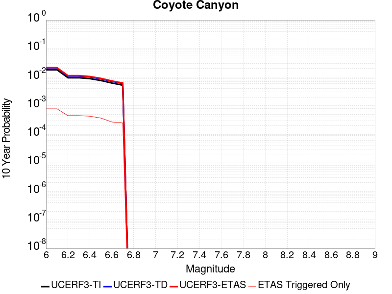 |

| Magnitude | 1 wk TI Prob | 1 wk TD Prob | 1 wk ETAS Prob | 1 wk ETAS/TD Gain | 1 wk ETAS Triggered Only | 1 mo TI Prob | 1 mo TD Prob | 1 mo ETAS Prob | 1 mo ETAS/TD Gain | 1 mo ETAS Triggered Only | 1 yr TI Prob | 1 yr TD Prob | 1 yr ETAS Prob | 1 yr ETAS/TD Gain | 1 yr ETAS Triggered Only | 10 yr TI Prob | 10 yr TD Prob | 10 yr ETAS Prob | 10 yr ETAS/TD Gain | 10 yr ETAS Triggered Only |
|-----|-----|-----|-----|-----|-----|-----|-----|-----|-----|-----|-----|-----|-----|-----|-----|-----|-----|-----|-----|-----|
| 6.0 | 3.5090034E-5 | 4.036416E-5 | 2.2353827E-4 | 5.5380383 | 1.831815E-4 | 1.503772E-4 | 1.7297924E-4 | 4.4159897E-4 | 2.5529015 | 2.686662E-4 | 0.0018293047 | 0.0021042444 | 0.002579514 | 1.2258624 | 4.762719E-4 | 0.018143194 | 0.02086912 | 0.02164634 | 1.0372427 | 7.937865E-4 |
| 6.1 | 3.5090034E-5 | 4.036416E-5 | 2.2353827E-4 | 5.5380383 | 1.831815E-4 | 1.503772E-4 | 1.7297924E-4 | 4.4159897E-4 | 2.5529015 | 2.686662E-4 | 0.0018293047 | 0.0021042444 | 0.002579514 | 1.2258624 | 4.762719E-4 | 0.018143194 | 0.02086912 | 0.02164634 | 1.0372427 | 7.937865E-4 |
| 6.2 | 1.841879E-5 | 2.1059714E-5 | 9.433077E-5 | 4.4792047 | 7.32726E-5 | 7.8935285E-5 | 9.0253365E-5 | 2.2457434E-4 | 2.4882655 | 1.343331E-4 | 9.606133E-4 | 0.0010983828 | 0.0013057605 | 1.1888027 | 2.076057E-4 | 0.0095647145 | 0.010939625 | 0.011362373 | 1.0386437 | 4.2742348E-4 |
| 6.3 | 1.841879E-5 | 2.1059714E-5 | 9.433077E-5 | 4.4792047 | 7.32726E-5 | 7.8935285E-5 | 9.0253365E-5 | 2.2457434E-4 | 2.4882655 | 1.343331E-4 | 9.606133E-4 | 0.0010983828 | 0.0013057605 | 1.1888027 | 2.076057E-4 | 0.0095647145 | 0.010939625 | 0.011362373 | 1.0386437 | 4.2742348E-4 |
| 6.4 | 1.712201E-5 | 1.9565137E-5 | 8.062444E-5 | 4.1208215 | 6.10605E-5 | 7.337798E-5 | 8.384846E-5 | 2.0595922E-4 | 2.4563267 | 1.22121E-4 | 8.930107E-4 | 0.0010204774 | 0.0012156717 | 1.1912774 | 1.953936E-4 | 0.008894307 | 0.010167832 | 0.010578821 | 1.0404205 | 4.152114E-4 |
| 6.5 | 1.4744935E-5 | 1.6836908E-5 | 7.789638E-5 | 4.6265254 | 6.10605E-5 | 6.3191044E-5 | 7.2156705E-5 | 1.8205767E-4 | 2.5230873 | 1.099089E-4 | 7.6907943E-4 | 8.782473E-4 | 0.0010490665 | 1.1945002 | 1.7096939E-4 | 0.007664232 | 0.008756962 | 0.009120116 | 1.0414704 | 3.66363E-4 |
| 6.6 | 1.2017839E-5 | 1.3724038E-5 | 6.2571766E-5 | 4.559283 | 4.88484E-5 | 5.150401E-5 | 5.8816477E-5 | 1.5650752E-4 | 2.660947 | 9.76968E-5 | 6.268809E-4 | 7.1594387E-4 | 8.3797745E-4 | 1.1704513 | 1.22121E-4 | 0.0062511545 | 0.0071450667 | 0.0073996885 | 1.0356361 | 2.564541E-4 |
| 6.7 | 1.00956095E-5 | 1.1533472E-5 | 6.038131E-5 | 5.23531 | 4.88484E-5 | 4.326618E-5 | 4.9428723E-5 | 1.4712069E-4 | 2.976421 | 9.76968E-5 | 5.266384E-4 | 6.017155E-4 | 7.1155827E-4 | 1.1825494 | 1.099089E-4 | 0.005253921 | 0.0060093896 | 0.006252164 | 1.0403992 | 2.44242E-4 |

## Garlock (West)
*[(top)](#table-of-contents)*

| 1 Week | 1 Month | 1 Year | 10 Year |
|-----|-----|-----|-----|
|  | 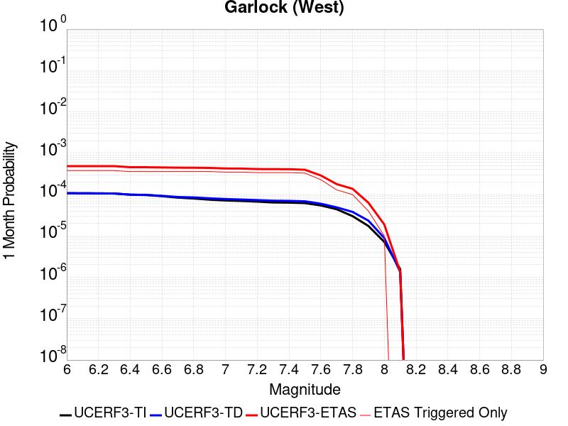 | 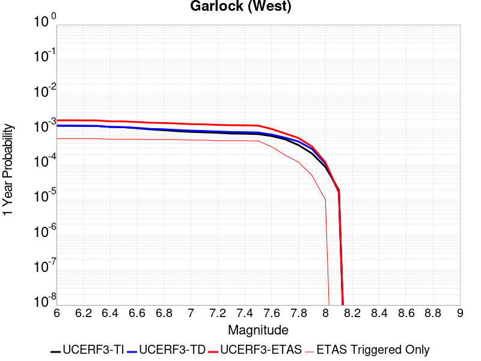 | 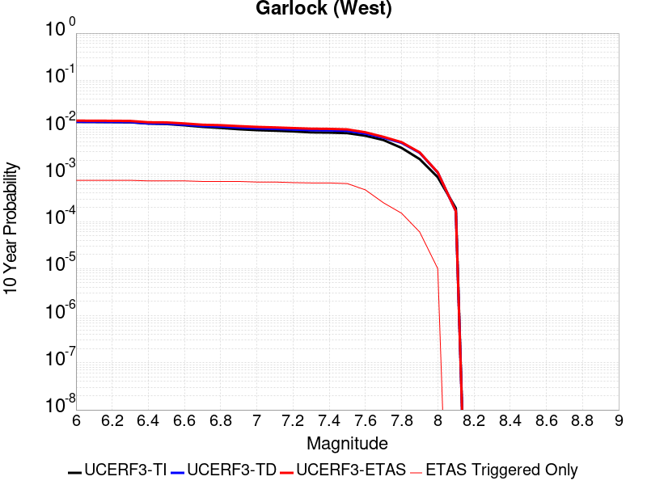 |

| Magnitude | 1 wk TI Prob | 1 wk TD Prob | 1 wk ETAS Prob | 1 wk ETAS/TD Gain | 1 wk ETAS Triggered Only | 1 mo TI Prob | 1 mo TD Prob | 1 mo ETAS Prob | 1 mo ETAS/TD Gain | 1 mo ETAS Triggered Only | 1 yr TI Prob | 1 yr TD Prob | 1 yr ETAS Prob | 1 yr ETAS/TD Gain | 1 yr ETAS Triggered Only | 10 yr TI Prob | 10 yr TD Prob | 10 yr ETAS Prob | 10 yr ETAS/TD Gain | 10 yr ETAS Triggered Only |
|-----|-----|-----|-----|-----|-----|-----|-----|-----|-----|-----|-----|-----|-----|-----|-----|-----|-----|-----|-----|-----|
| 6.0 | 2.5181727E-5 | 2.5196328E-5 | 2.9385576E-4 | 11.662642 | 2.686662E-4 | 1.0791722E-4 | 1.0797982E-4 | 4.6209246E-4 | 4.2794337 | 3.541509E-4 | 0.0013131002 | 0.0013138648 | 0.0018626873 | 1.417716 | 5.4954446E-4 | 0.013053683 | 0.0131414775 | 0.013840471 | 1.0531899 | 7.083018E-4 |
| 6.1 | 2.5077732E-5 | 2.50974E-5 | 2.9375686E-4 | 11.704672 | 2.686662E-4 | 1.0747157E-4 | 1.07555876E-4 | 4.6166868E-4 | 4.2923613 | 3.541509E-4 | 0.001307681 | 0.0013087096 | 0.0018575349 | 1.4193637 | 5.4954446E-4 | 0.013000126 | 0.013090534 | 0.013789563 | 1.0533997 | 7.083018E-4 |
| 6.2 | 2.494612E-5 | 2.497908E-5 | 2.9363856E-4 | 11.75538 | 2.686662E-4 | 1.0690756E-4 | 1.0704882E-4 | 4.611618E-4 | 4.3079576 | 3.541509E-4 | 0.0013008224 | 0.0013025437 | 0.0018513723 | 1.4213514 | 5.4954446E-4 | 0.012932341 | 0.013029599 | 0.013728672 | 1.0536526 | 7.083018E-4 |
| 6.3 | 2.4733758E-5 | 2.479845E-5 | 2.9345797E-4 | 11.833723 | 2.686662E-4 | 1.0599751E-4 | 1.0627476E-4 | 4.6038802E-4 | 4.332054 | 3.541509E-4 | 0.0012897556 | 0.0012931306 | 0.0018419644 | 1.4244226 | 5.4954446E-4 | 0.012822957 | 0.012936569 | 0.013635707 | 1.0540437 | 7.083018E-4 |
| 6.4 | 2.3237335E-5 | 2.3177769E-5 | 2.796259E-4 | 12.064403 | 2.564541E-4 | 9.958477E-5 | 9.9329525E-5 | 4.2902346E-4 | 4.319194 | 3.297267E-4 | 0.0012117702 | 0.0012086688 | 0.0017331544 | 1.4339366 | 5.251203E-4 | 0.012051838 | 0.012101421 | 0.012777023 | 1.0558283 | 6.8387756E-4 |
| 6.5 | 2.2732203E-5 | 2.299234E-5 | 2.7944054E-4 | 12.153636 | 2.564541E-4 | 9.742009E-5 | 9.8534896E-5 | 4.282291E-4 | 4.345964 | 3.297267E-4 | 0.0011854442 | 0.0011990049 | 0.0017234955 | 1.4374382 | 5.251203E-4 | 0.011791403 | 0.01200583 | 0.012681497 | 1.0562782 | 6.8387756E-4 |
| 6.6 | 2.1319436E-5 | 2.177255E-5 | 2.7822106E-4 | 12.778524 | 2.564541E-4 | 9.136581E-5 | 9.33076E-5 | 4.2300354E-4 | 4.5334306 | 3.297267E-4 | 0.001111811 | 0.0011354303 | 0.0016599544 | 1.4619606 | 5.251203E-4 | 0.011062649 | 0.011376739 | 0.012052836 | 1.0594281 | 6.8387756E-4 |
| 6.7 | 1.970802E-5 | 2.0392457E-5 | 2.768413E-4 | 13.575673 | 2.564541E-4 | 8.446021E-5 | 8.7393324E-5 | 4.170912E-4 | 4.772575 | 3.297267E-4 | 0.001027818 | 0.0010634961 | 0.0015758588 | 1.4817721 | 5.129082E-4 | 0.010230771 | 0.010664482 | 0.011316902 | 1.061177 | 6.594534E-4 |
| 6.8 | 1.8744462E-5 | 1.9900112E-5 | 2.763491E-4 | 13.886812 | 2.564541E-4 | 8.033094E-5 | 8.528341E-5 | 4.1498197E-4 | 4.8659167 | 3.297267E-4 | 9.775903E-4 | 0.0010378326 | 0.0015502084 | 1.493698 | 5.129082E-4 | 0.009733009 | 0.010410271 | 0.011062859 | 1.0626869 | 6.594534E-4 |
| 6.9 | 1.7559682E-5 | 1.8952487E-5 | 2.7540172E-4 | 14.531165 | 2.564541E-4 | 7.5253614E-5 | 8.1222424E-5 | 4.1092234E-4 | 5.0592227 | 3.297267E-4 | 9.158276E-4 | 9.884358E-4 | 0.001500837 | 1.518396 | 5.129082E-4 | 0.0091206245 | 0.009920754 | 0.010573665 | 1.0658127 | 6.594534E-4 |
| 7.0 | 1.6794445E-5 | 1.8215316E-5 | 2.6245287E-4 | 14.408361 | 2.44242E-4 | 7.197421E-5 | 7.806331E-5 | 3.9555313E-4 | 5.067081 | 3.1751458E-4 | 8.759337E-4 | 9.500078E-4 | 0.0014502283 | 1.5265435 | 5.006961E-4 | 0.008724891 | 0.009539667 | 0.010180733 | 1.0672002 | 6.472413E-4 |
| 7.1 | 1.6337795E-5 | 1.771613E-5 | 2.619538E-4 | 14.786176 | 2.44242E-4 | 7.0017246E-5 | 7.5924065E-5 | 3.9341455E-4 | 5.1816845 | 3.1751458E-4 | 8.521265E-4 | 9.2398486E-4 | 0.0014242183 | 1.5413871 | 5.006961E-4 | 0.008488664 | 0.009281524 | 0.009922759 | 1.0690871 | 6.472413E-4 |
| 7.2 | 1.5780008E-5 | 1.7164773E-5 | 2.6140257E-4 | 15.229013 | 2.44242E-4 | 6.762685E-5 | 7.356125E-5 | 3.7884127E-4 | 5.1500115 | 3.053025E-4 | 8.2304585E-4 | 8.952415E-4 | 0.001371087 | 1.5315275 | 4.762719E-4 | 0.008200042 | 0.008996368 | 0.009613582 | 1.068607 | 6.228171E-4 |
| 7.3 | 1.5058865E-5 | 1.6617856E-5 | 2.608558E-4 | 15.697319 | 2.44242E-4 | 6.45364E-5 | 7.121745E-5 | 3.764982E-4 | 5.2866006 | 3.053025E-4 | 7.854473E-4 | 8.667287E-4 | 0.0013425878 | 1.5490289 | 4.762719E-4 | 0.00782677 | 0.008713072 | 0.009330463 | 1.070858 | 6.228171E-4 |
| 7.4 | 1.4887923E-5 | 1.6453829E-5 | 2.606918E-4 | 15.843838 | 2.44242E-4 | 6.380382E-5 | 7.0514514E-5 | 3.7579547E-4 | 5.329335 | 3.053025E-4 | 7.7653467E-4 | 8.5817726E-4 | 0.0013340404 | 1.5545045 | 4.762719E-4 | 0.0077382675 | 0.008627934 | 0.009245377 | 1.0715634 | 6.228171E-4 |
| 7.5 | 1.4509299E-5 | 1.6045851E-5 | 2.6028394E-4 | 16.22126 | 2.44242E-4 | 6.218123E-5 | 6.876613E-5 | 3.7404764E-4 | 5.4394164 | 3.053025E-4 | 7.567935E-4 | 8.3690725E-4 | 0.0013127805 | 1.5686094 | 4.762719E-4 | 0.0075422134 | 0.008416242 | 0.009021708 | 1.0719402 | 6.10605E-4 |
| 7.6 | 1.2756717E-5 | 1.4049988E-5 | 1.6059313E-4 | 11.430125 | 1.465452E-4 | 5.4670498E-5 | 6.021285E-5 | 2.6780606E-4 | 4.447656 | 2.076057E-4 | 6.6541E-4 | 7.328455E-4 | 0.0010501274 | 1.4329451 | 3.1751458E-4 | 0.006634211 | 0.0073812436 | 0.007817634 | 1.0591215 | 4.396356E-4 |
| 7.7 | 1.0328985E-5 | 1.145975E-5 | 1.0915543E-4 | 9.525114 | 9.76968E-5 | 4.4266326E-5 | 4.9112292E-5 | 1.712273E-4 | 3.4864447 | 1.22121E-4 | 5.388092E-4 | 5.9777853E-4 | 7.930553E-4 | 1.3266708 | 1.953936E-4 | 0.0053750467 | 0.0060380935 | 0.0062929993 | 1.0422162 | 2.564541E-4 |
| 7.8 | 7.0306583E-6 | 8.8989555E-6 | 8.21709E-5 | 9.233769 | 7.32726E-5 | 3.0131043E-5 | 3.8137823E-5 | 1.358309E-4 | 3.5615795 | 9.76968E-5 | 3.667837E-4 | 4.6422923E-4 | 5.862936E-4 | 1.2629397 | 1.22121E-4 | 0.003661789 | 0.0046949377 | 0.004840795 | 1.0310669 | 1.465452E-4 |
| 7.9 | 4.060633E-6 | 5.4650154E-6 | 5.4313146E-5 | 9.938334 | 4.88484E-5 | 1.7402595E-5 | 2.3421284E-5 | 7.2268536E-5 | 3.0855925 | 4.88484E-5 | 2.11856E-4 | 2.8511693E-4 | 3.4616E-4 | 1.2140985 | 6.10605E-5 | 0.0021165414 | 0.0028840043 | 0.0029448888 | 1.021111 | 6.10605E-5 |
| 8.0 | 1.6729537E-6 | 2.0773857E-6 | 1.428946E-5 | 6.8785787 | 1.22121E-5 | 7.169782E-6 | 8.903051E-6 | 2.1115042E-5 | 2.3716636 | 1.22121E-5 | 8.7288594E-5 | 1.08389286E-4 | 1.2060007E-4 | 1.1126567 | 1.22121E-5 | 8.7254314E-4 | 0.0010968668 | 0.0011090655 | 1.0111214 | 1.22121E-5 |
| 8.1 | 3.6733252E-7 | 3.148811E-7 | 3.148811E-7 | 1.0 | 0.0 | 1.5742813E-6 | 1.3494899E-6 | 1.3494899E-6 | 1.0 | 0.0 | 1.9166706E-5 | 1.6429933E-5 | 1.6429933E-5 | 1.0 | 0.0 | 1.9165053E-4 | 1.6637788E-4 | 1.6637788E-4 | 1.0 | 0.0 |

## Lenwood-Lockhart-Old Woman Springs
*[(top)](#table-of-contents)*

| 1 Week | 1 Month | 1 Year | 10 Year |
|-----|-----|-----|-----|
| 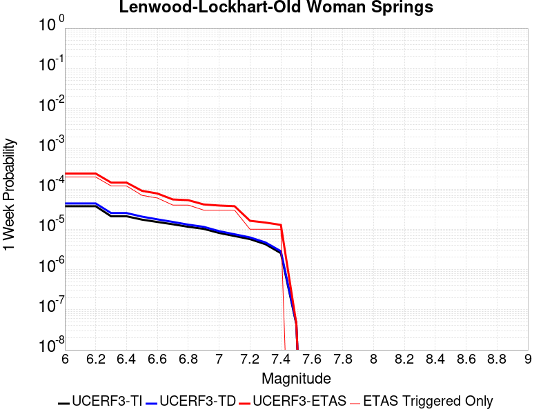 |  |  | 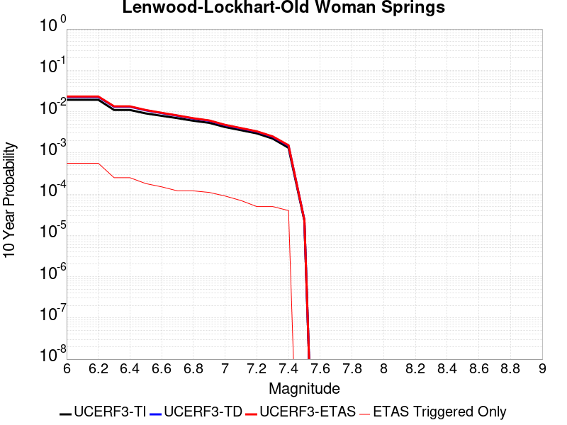 |

| Magnitude | 1 wk TI Prob | 1 wk TD Prob | 1 wk ETAS Prob | 1 wk ETAS/TD Gain | 1 wk ETAS Triggered Only | 1 mo TI Prob | 1 mo TD Prob | 1 mo ETAS Prob | 1 mo ETAS/TD Gain | 1 mo ETAS Triggered Only | 1 yr TI Prob | 1 yr TD Prob | 1 yr ETAS Prob | 1 yr ETAS/TD Gain | 1 yr ETAS Triggered Only | 10 yr TI Prob | 10 yr TD Prob | 10 yr ETAS Prob | 10 yr ETAS/TD Gain | 10 yr ETAS Triggered Only |
|-----|-----|-----|-----|-----|-----|-----|-----|-----|-----|-----|-----|-----|-----|-----|-----|-----|-----|-----|-----|-----|
| 6.0 | 3.744542E-5 | 4.396243E-5 | 2.3934744E-4 | 5.444363 | 1.953936E-4 | 1.604705E-4 | 1.8839778E-4 | 4.4480356E-4 | 2.360981 | 2.564541E-4 | 0.0019519776 | 0.0022915022 | 0.0027301302 | 1.1914151 | 4.396356E-4 | 0.019349206 | 0.02269674 | 0.023257684 | 1.0247146 | 5.739687E-4 |
| 6.1 | 3.744542E-5 | 4.396243E-5 | 2.3934744E-4 | 5.444363 | 1.953936E-4 | 1.604705E-4 | 1.8839778E-4 | 4.4480356E-4 | 2.360981 | 2.564541E-4 | 0.0019519776 | 0.0022915022 | 0.0027301302 | 1.1914151 | 4.396356E-4 | 0.019349206 | 0.02269674 | 0.023257684 | 1.0247146 | 5.739687E-4 |
| 6.2 | 3.744542E-5 | 4.396243E-5 | 2.3934744E-4 | 5.444363 | 1.953936E-4 | 1.604705E-4 | 1.8839778E-4 | 4.4480356E-4 | 2.360981 | 2.564541E-4 | 0.0019519776 | 0.0022915022 | 0.0027301302 | 1.1914151 | 4.396356E-4 | 0.019349206 | 0.02269674 | 0.023257684 | 1.0247146 | 5.739687E-4 |
| 6.3 | 2.1079984E-5 | 2.5353402E-5 | 1.474713E-4 | 5.816628 | 1.22121E-4 | 9.0339665E-5 | 1.0865302E-4 | 2.4297152E-4 | 2.236215 | 1.343331E-4 | 0.0010993304 | 0.0013220677 | 0.001541595 | 1.1660484 | 2.198178E-4 | 0.010939079 | 0.013144241 | 0.013409375 | 1.0201712 | 2.686662E-4 |
| 6.4 | 2.1079984E-5 | 2.5353402E-5 | 1.474713E-4 | 5.816628 | 1.22121E-4 | 9.0339665E-5 | 1.0865302E-4 | 2.4297152E-4 | 2.236215 | 1.343331E-4 | 0.0010993304 | 0.0013220677 | 0.001541595 | 1.1660484 | 2.198178E-4 | 0.010939079 | 0.013144241 | 0.013409375 | 1.0201712 | 2.686662E-4 |
| 6.5 | 1.7397282E-5 | 2.0662384E-5 | 1.06145315E-4 | 5.137128 | 8.5484695E-5 | 7.455765E-5 | 8.8550136E-5 | 1.7402727E-4 | 1.9652964 | 8.5484695E-5 | 9.073613E-4 | 0.0010775764 | 0.0012239638 | 1.1358486 | 1.465452E-4 | 0.009036654 | 0.010724808 | 0.010918106 | 1.0180235 | 1.953936E-4 |
| 6.6 | 1.52050325E-5 | 1.7679673E-5 | 9.0950976E-5 | 5.144381 | 7.32726E-5 | 6.51628E-5 | 7.576787E-5 | 1.4903491E-4 | 1.9669936 | 7.32726E-5 | 7.9306826E-4 | 9.220913E-4 | 0.0010440997 | 1.1323171 | 1.22121E-4 | 0.007902439 | 0.009183516 | 0.009340814 | 1.0171285 | 1.5875729E-4 |
| 6.7 | 1.332523E-5 | 1.5263984E-5 | 6.4111635E-5 | 4.20019 | 4.88484E-5 | 5.7106878E-5 | 6.541547E-5 | 1.1426067E-4 | 1.746692 | 4.88484E-5 | 6.950544E-4 | 7.9614815E-4 | 8.9376717E-4 | 1.1226141 | 9.76968E-5 | 0.006928845 | 0.00793359 | 0.008054742 | 1.0152708 | 1.22121E-4 |
| 6.8 | 1.1525329E-5 | 1.30309645E-5 | 6.187873E-5 | 4.7485914 | 4.88484E-5 | 4.9393333E-5 | 5.584582E-5 | 1.0469149E-4 | 1.8746523 | 4.88484E-5 | 6.011979E-4 | 6.79715E-4 | 7.773454E-4 | 1.1436343 | 9.76968E-5 | 0.00599574 | 0.0067768116 | 0.006898105 | 1.0178983 | 1.22121E-4 |
| 6.9 | 1.0253909E-5 | 1.1514427E-5 | 4.8150305E-5 | 4.181737 | 3.66363E-5 | 4.3944583E-5 | 4.9346632E-5 | 8.598112E-5 | 1.742391 | 3.66363E-5 | 5.3489394E-4 | 6.006332E-4 | 6.860666E-4 | 1.1422389 | 8.5484695E-5 | 0.0053360825 | 0.005990478 | 0.0060997284 | 1.0182374 | 1.099089E-4 |
| 7.0 | 8.104563E-6 | 8.99127E-6 | 4.562724E-5 | 5.0746155 | 3.66363E-5 | 3.4733377E-5 | 3.853346E-5 | 7.516835E-5 | 1.9507293 | 3.66363E-5 | 4.2279682E-4 | 4.690463E-4 | 5.544909E-4 | 1.1821667 | 8.5484695E-5 | 0.0042199334 | 0.0046808114 | 0.004778051 | 1.0207741 | 9.76968E-5 |
| 7.1 | 6.7986157E-6 | 7.515809E-6 | 4.415183E-5 | 5.874528 | 3.66363E-5 | 2.91366E-5 | 3.2210224E-5 | 6.8845344E-5 | 2.1373754 | 3.66363E-5 | 3.5468035E-4 | 3.9209108E-4 | 4.5312764E-4 | 1.1556693 | 6.10605E-5 | 0.003541148 | 0.003914209 | 0.003987195 | 1.0186464 | 7.32726E-5 |
| 7.2 | 5.6893327E-6 | 6.2800086E-6 | 1.8492032E-5 | 2.944587 | 1.22121E-5 | 2.4382627E-5 | 2.6914056E-5 | 3.912583E-5 | 1.4537321 | 1.22121E-5 | 2.9681803E-4 | 3.2763137E-4 | 3.6425565E-4 | 1.111785 | 3.66363E-5 | 0.002964219 | 0.003271682 | 0.0033203706 | 1.0148818 | 4.88484E-5 |
| 7.3 | 4.253348E-6 | 4.706907E-6 | 1.691895E-5 | 3.5944939 | 1.22121E-5 | 1.8228506E-5 | 2.0172314E-5 | 3.2384167E-5 | 1.605377 | 1.22121E-5 | 2.2190946E-4 | 2.4557207E-4 | 2.8219938E-4 | 1.149151 | 3.66363E-5 | 0.00221688 | 0.002453188 | 0.0025019166 | 1.0198634 | 4.88484E-5 |
| 7.4 | 2.5448119E-6 | 2.8520433E-6 | 1.5064108E-5 | 5.281865 | 1.22121E-5 | 1.0906291E-5 | 1.2222995E-5 | 2.4434945E-5 | 1.9990964 | 1.22121E-5 | 1.3277601E-4 | 1.4880644E-4 | 1.854373E-4 | 1.2461643 | 3.66363E-5 | 0.001326967 | 0.0014872303 | 0.001536006 | 1.0327964 | 4.88484E-5 |
| 7.5 | 4.3706837E-8 | 4.5629037E-8 | 4.5629037E-8 | 1.0 | 0.0 | 1.8731501E-7 | 1.9555301E-7 | 1.9555301E-7 | 1.0 | 0.0 | 2.2805577E-6 | 2.380856E-6 | 2.380856E-6 | 1.0 | 0.0 | 2.2805343E-5 | 2.3808358E-5 | 2.3808358E-5 | 1.0 | 0.0 |

## Nelson Lake
*[(top)](#table-of-contents)*

| 1 Week | 1 Month | 1 Year | 10 Year |
|-----|-----|-----|-----|
|  | 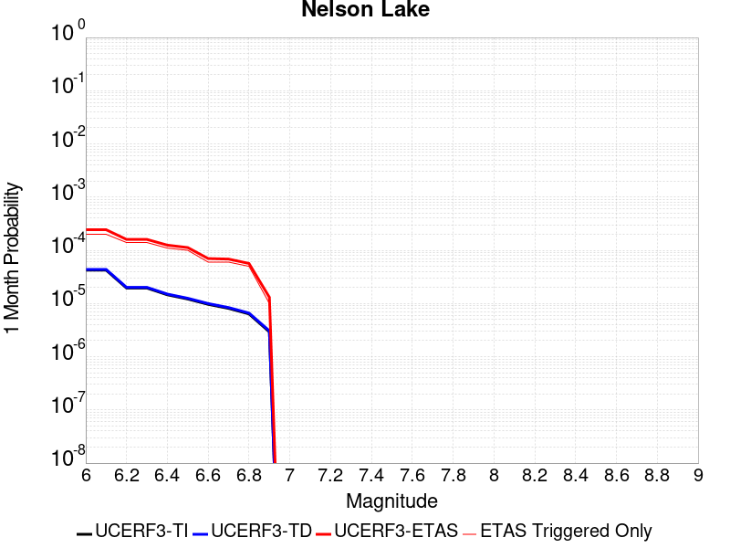 |  |  |

| Magnitude | 1 wk TI Prob | 1 wk TD Prob | 1 wk ETAS Prob | 1 wk ETAS/TD Gain | 1 wk ETAS Triggered Only | 1 mo TI Prob | 1 mo TD Prob | 1 mo ETAS Prob | 1 mo ETAS/TD Gain | 1 mo ETAS Triggered Only | 1 yr TI Prob | 1 yr TD Prob | 1 yr ETAS Prob | 1 yr ETAS/TD Gain | 1 yr ETAS Triggered Only | 10 yr TI Prob | 10 yr TD Prob | 10 yr ETAS Prob | 10 yr ETAS/TD Gain | 10 yr ETAS Triggered Only |
|-----|-----|-----|-----|-----|-----|-----|-----|-----|-----|-----|-----|-----|-----|-----|-----|-----|-----|-----|-----|-----|
| 6.0 | 9.913453E-6 | 1.0192248E-5 | 1.6894792E-4 | 16.57612 | 1.5875729E-4 | 4.2485535E-5 | 4.368039E-5 | 2.634886E-4 | 6.032194 | 2.198178E-4 | 5.1713863E-4 | 5.316893E-4 | 8.0021267E-4 | 1.5050381 | 2.686662E-4 | 0.0051593683 | 0.0053052 | 0.00580324 | 1.0938777 | 5.006961E-4 |
| 6.1 | 9.913453E-6 | 1.0192248E-5 | 1.6894792E-4 | 16.57612 | 1.5875729E-4 | 4.2485535E-5 | 4.368039E-5 | 2.634886E-4 | 6.032194 | 2.198178E-4 | 5.1713863E-4 | 5.316893E-4 | 8.0021267E-4 | 1.5050381 | 2.686662E-4 | 0.0051593683 | 0.0053052 | 0.00580324 | 1.0938777 | 5.006961E-4 |
| 6.2 | 4.5596407E-6 | 4.696309E-6 | 1.1460469E-4 | 24.40314 | 1.099089E-4 | 1.954117E-5 | 2.0126892E-5 | 1.6666914E-4 | 8.280918 | 1.465452E-4 | 2.3788778E-4 | 2.4501863E-4 | 4.03737E-4 | 1.647781 | 1.5875729E-4 | 0.0023763329 | 0.002447611 | 0.0027156195 | 1.109498 | 2.686662E-4 |
| 6.3 | 4.5596407E-6 | 4.696309E-6 | 1.1460469E-4 | 24.40314 | 1.099089E-4 | 1.954117E-5 | 2.0126892E-5 | 1.6666914E-4 | 8.280918 | 1.465452E-4 | 2.3788778E-4 | 2.4501863E-4 | 4.03737E-4 | 1.647781 | 1.5875729E-4 | 0.0023763329 | 0.002447611 | 0.0027156195 | 1.109498 | 2.686662E-4 |
| 6.4 | 3.4025713E-6 | 3.5098942E-6 | 1.0120635E-4 | 28.834587 | 9.76968E-5 | 1.4582367E-5 | 1.5042322E-5 | 1.3716148E-4 | 9.118372 | 1.22121E-4 | 1.7752586E-4 | 1.8312573E-4 | 3.1743423E-4 | 1.7334224 | 1.343331E-4 | 0.001773841 | 0.0018298312 | 0.0020614364 | 1.126572 | 2.320299E-4 |
| 6.5 | 2.8352947E-6 | 2.9278535E-6 | 8.84123E-5 | 30.196968 | 8.5484695E-5 | 1.2151207E-5 | 1.2547887E-5 | 1.224554E-4 | 9.759046 | 1.099089E-4 | 1.479309E-4 | 1.5276058E-4 | 2.7486292E-4 | 1.7993053 | 1.22121E-4 | 0.0014783246 | 0.0015266296 | 0.0017461117 | 1.1437691 | 2.198178E-4 |
| 6.6 | 2.251518E-6 | 2.3290654E-6 | 6.338942E-5 | 27.216677 | 6.10605E-5 | 9.649328E-6 | 9.981674E-6 | 8.3253544E-5 | 8.340639 | 7.32726E-5 | 1.1747423E-4 | 1.2152074E-4 | 1.9478443E-4 | 1.6028905 | 7.32726E-5 | 0.0011741214 | 0.0012146046 | 0.001373169 | 1.1305482 | 1.5875729E-4 |
| 6.7 | 1.8911853E-6 | 1.9591378E-6 | 6.301951E-5 | 32.166965 | 6.10605E-5 | 8.105055E-6 | 8.396281E-6 | 8.1668266E-5 | 9.726719 | 7.32726E-5 | 9.867457E-5 | 1.0222051E-4 | 1.7548562E-4 | 1.7167358 | 7.32726E-5 | 9.863076E-4 | 0.0010217924 | 0.0011803876 | 1.1552126 | 1.5875729E-4 |
| 6.8 | 1.4874814E-6 | 1.543829E-6 | 5.039215E-5 | 32.64102 | 4.88484E-5 | 6.374905E-6 | 6.6163957E-6 | 6.767649E-5 | 10.228603 | 6.10605E-5 | 7.76117E-5 | 8.055216E-5 | 1.4160774E-4 | 1.7579633 | 6.10605E-5 | 7.75846E-4 | 8.0528075E-4 | 8.906966E-4 | 1.1060697 | 8.5484695E-5 |
| 6.9 | 6.835972E-7 | 7.13992E-7 | 1.2926083E-5 | 18.103962 | 1.22121E-5 | 2.9296991E-6 | 3.0599638E-6 | 1.5272026E-5 | 4.990917 | 1.22121E-5 | 3.56685E-5 | 3.725474E-5 | 4.9466387E-5 | 1.3277876 | 1.22121E-5 | 3.5662777E-4 | 3.7251622E-4 | 3.8472377E-4 | 1.0327705 | 1.22121E-5 |

## Paradise
*[(top)](#table-of-contents)*

| 1 Week | 1 Month | 1 Year | 10 Year |
|-----|-----|-----|-----|
| 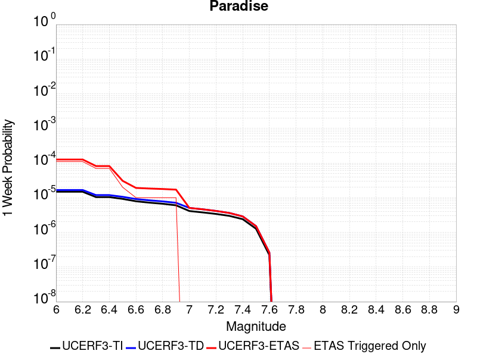 | 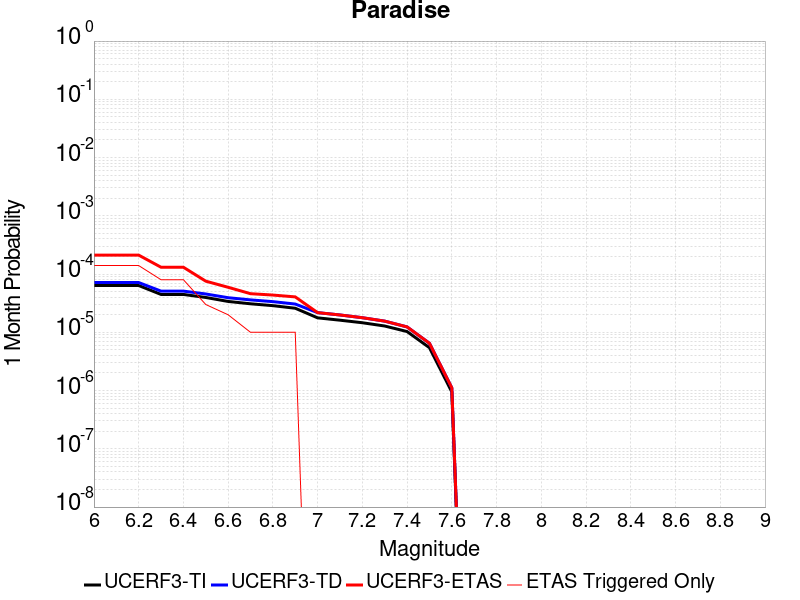 |  | 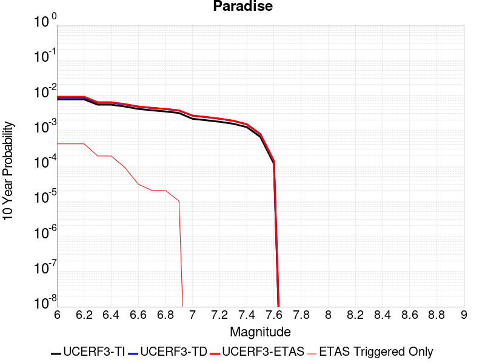 |

| Magnitude | 1 wk TI Prob | 1 wk TD Prob | 1 wk ETAS Prob | 1 wk ETAS/TD Gain | 1 wk ETAS Triggered Only | 1 mo TI Prob | 1 mo TD Prob | 1 mo ETAS Prob | 1 mo ETAS/TD Gain | 1 mo ETAS Triggered Only | 1 yr TI Prob | 1 yr TD Prob | 1 yr ETAS Prob | 1 yr ETAS/TD Gain | 1 yr ETAS Triggered Only | 10 yr TI Prob | 10 yr TD Prob | 10 yr ETAS Prob | 10 yr ETAS/TD Gain | 10 yr ETAS Triggered Only |
|-----|-----|-----|-----|-----|-----|-----|-----|-----|-----|-----|-----|-----|-----|-----|-----|-----|-----|-----|-----|-----|
| 6.0 | 1.4851273E-5 | 1.669466E-5 | 1.2660172E-4 | 7.583367 | 1.099089E-4 | 6.364676E-5 | 7.154671E-5 | 2.1808142E-4 | 3.0480986 | 1.465452E-4 | 7.7462377E-4 | 8.707567E-4 | 0.0011513904 | 1.3222872 | 2.808783E-4 | 0.0077192914 | 0.008675828 | 0.009147967 | 1.0544201 | 4.762719E-4 |
| 6.1 | 1.4851273E-5 | 1.669466E-5 | 1.2660172E-4 | 7.583367 | 1.099089E-4 | 6.364676E-5 | 7.154671E-5 | 2.1808142E-4 | 3.0480986 | 1.465452E-4 | 7.7462377E-4 | 8.707567E-4 | 0.0011513904 | 1.3222872 | 2.808783E-4 | 0.0077192914 | 0.008675828 | 0.009147967 | 1.0544201 | 4.762719E-4 |
| 6.2 | 1.4851273E-5 | 1.669466E-5 | 1.2660172E-4 | 7.583367 | 1.099089E-4 | 6.364676E-5 | 7.154671E-5 | 2.1808142E-4 | 3.0480986 | 1.465452E-4 | 7.7462377E-4 | 8.707567E-4 | 0.0011513904 | 1.3222872 | 2.808783E-4 | 0.0077192914 | 0.008675828 | 0.009147967 | 1.0544201 | 4.762719E-4 |
| 6.3 | 1.0426831E-5 | 1.1888599E-5 | 8.5160325E-5 | 7.1631927 | 7.32726E-5 | 4.4685654E-5 | 5.0950177E-5 | 1.3643052E-4 | 2.6777241 | 8.5484695E-5 | 5.43912E-4 | 6.201478E-4 | 7.666021E-4 | 1.2361604 | 1.465452E-4 | 0.0054258266 | 0.0061847805 | 0.0064032385 | 1.035322 | 2.198178E-4 |
| 6.4 | 1.0426831E-5 | 1.1888599E-5 | 8.5160325E-5 | 7.1631927 | 7.32726E-5 | 4.4685654E-5 | 5.0950177E-5 | 1.3643052E-4 | 2.6777241 | 8.5484695E-5 | 5.43912E-4 | 6.201478E-4 | 7.666021E-4 | 1.2361604 | 1.465452E-4 | 0.0054258266 | 0.0061847805 | 0.0064032385 | 1.035322 | 2.198178E-4 |
| 6.5 | 9.25027E-6 | 1.061994E-5 | 3.5043882E-5 | 3.2998188 | 2.44242E-5 | 3.964341E-5 | 4.5513265E-5 | 8.21479E-5 | 1.8049221 | 3.66363E-5 | 4.8255164E-4 | 5.5398804E-4 | 6.150147E-4 | 1.1101588 | 6.10605E-5 | 0.0048150513 | 0.0055265697 | 0.005635871 | 1.0197774 | 1.099089E-4 |
| 6.6 | 7.904275E-6 | 9.159509E-6 | 2.1371497E-5 | 2.333258 | 1.22121E-5 | 3.3875025E-5 | 3.925447E-5 | 6.367771E-5 | 1.6221772 | 2.44242E-5 | 4.1235037E-4 | 4.7782232E-4 | 5.0223485E-4 | 1.0510912 | 2.44242E-5 | 0.0041158604 | 0.0047683464 | 0.0048048077 | 1.0076466 | 3.66363E-5 |
| 6.7 | 7.2061953E-6 | 8.407234E-6 | 2.061923E-5 | 2.4525583 | 1.22121E-5 | 3.088333E-5 | 3.6030528E-5 | 4.8242186E-5 | 1.3389254 | 1.22121E-5 | 3.7593965E-4 | 4.3858704E-4 | 4.507938E-4 | 1.027832 | 1.22121E-5 | 0.003753043 | 0.0043775835 | 0.004401901 | 1.0055549 | 2.44242E-5 |
| 6.8 | 6.6948724E-6 | 7.842153E-6 | 2.0054156E-5 | 2.557226 | 1.22121E-5 | 2.8691995E-5 | 3.3608812E-5 | 4.5820503E-5 | 1.3633478 | 1.22121E-5 | 3.4926904E-4 | 4.0911406E-4 | 4.2132117E-4 | 1.0298378 | 1.22121E-5 | 0.003487206 | 0.0040839664 | 0.004108291 | 1.005956 | 2.44242E-5 |
| 6.9 | 6.0421025E-6 | 7.1306094E-6 | 1.9342622E-5 | 2.7126184 | 1.22121E-5 | 2.5894467E-5 | 3.0559415E-5 | 4.2771142E-5 | 1.399606 | 1.22121E-5 | 3.1521954E-4 | 3.7200077E-4 | 3.842083E-4 | 1.0328159 | 1.22121E-5 | 0.0031477278 | 0.0037141186 | 0.0037262854 | 1.0032758 | 1.22121E-5 |
| 7.0 | 4.134091E-6 | 5.080301E-6 | 5.080301E-6 | 1.0 | 0.0 | 1.7717413E-5 | 2.1772545E-5 | 2.1772545E-5 | 1.0 | 0.0 | 2.1568815E-4 | 2.6505004E-4 | 2.6505004E-4 | 1.0 | 0.0 | 0.0021547892 | 0.002647492 | 0.002647492 | 1.0 | 0.0 |
| 7.1 | 3.7674888E-6 | 4.6318623E-6 | 4.6318623E-6 | 1.0 | 0.0 | 1.6146281E-5 | 1.9850695E-5 | 1.9850695E-5 | 1.0 | 0.0 | 1.9656324E-4 | 2.4165693E-4 | 2.4165693E-4 | 1.0 | 0.0 | 0.0019638946 | 0.0024140922 | 0.0024140922 | 1.0 | 0.0 |
| 7.2 | 3.4065345E-6 | 4.156717E-6 | 4.156717E-6 | 1.0 | 0.0 | 1.4599351E-5 | 1.7814387E-5 | 1.7814387E-5 | 1.0 | 0.0 | 1.777326E-4 | 2.1687007E-4 | 2.1687007E-4 | 1.0 | 0.0 | 0.0017759053 | 0.0021667324 | 0.0021667324 | 1.0 | 0.0 |
| 7.3 | 2.9934936E-6 | 3.6293113E-6 | 3.6293113E-6 | 1.0 | 0.0 | 1.2829195E-5 | 1.5554107E-5 | 1.5554107E-5 | 1.0 | 0.0 | 1.5618425E-4 | 1.8935627E-4 | 1.8935627E-4 | 1.0 | 0.0 | 0.0015607453 | 0.0018920946 | 0.0018920946 | 1.0 | 0.0 |
| 7.4 | 2.4049796E-6 | 2.8889801E-6 | 2.8889801E-6 | 1.0 | 0.0 | 1.0307015E-5 | 1.2381293E-5 | 1.2381293E-5 | 1.0 | 0.0 | 1.2548068E-4 | 1.5073326E-4 | 1.5073326E-4 | 1.0 | 0.0 | 0.0012540985 | 0.0015064516 | 0.0015064516 | 1.0 | 0.0 |
| 7.5 | 1.2710091E-6 | 1.5134664E-6 | 1.5134664E-6 | 1.0 | 0.0 | 5.44717E-6 | 6.486275E-6 | 6.486275E-6 | 1.0 | 0.0 | 6.631728E-5 | 7.896879E-5 | 7.896879E-5 | 1.0 | 0.0 | 6.6297496E-4 | 7.8952993E-4 | 7.8952993E-4 | 1.0 | 0.0 |
| 7.6 | 2.21172E-7 | 2.603958E-7 | 2.603958E-7 | 1.0 | 0.0 | 9.478797E-7 | 1.1159817E-6 | 1.1159817E-6 | 1.0 | 0.0 | 1.1540374E-5 | 1.3587022E-5 | 1.3587022E-5 | 1.0 | 0.0 | 1.1539775E-4 | 1.3586473E-4 | 1.3586473E-4 | 1.0 | 0.0 |

## San Andreas (Mojave S)
*[(top)](#table-of-contents)*

| 1 Week | 1 Month | 1 Year | 10 Year |
|-----|-----|-----|-----|
|  | 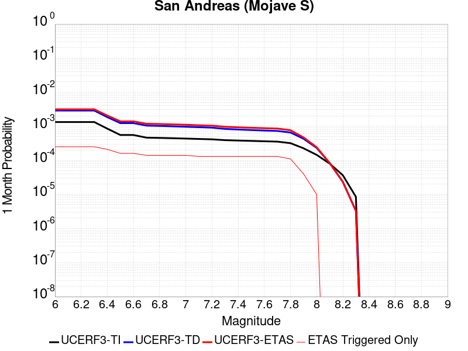 | 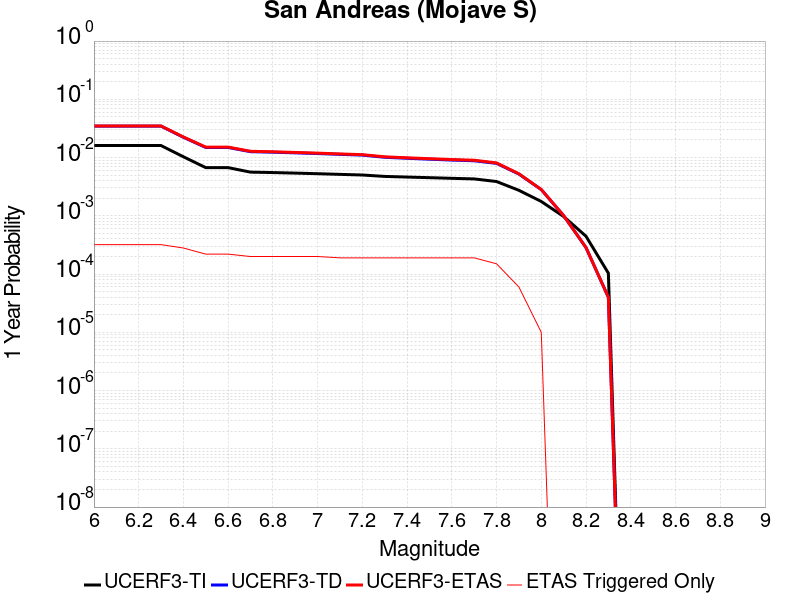 | 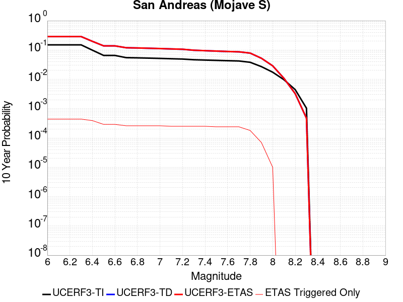 |

| Magnitude | 1 wk TI Prob | 1 wk TD Prob | 1 wk ETAS Prob | 1 wk ETAS/TD Gain | 1 wk ETAS Triggered Only | 1 mo TI Prob | 1 mo TD Prob | 1 mo ETAS Prob | 1 mo ETAS/TD Gain | 1 mo ETAS Triggered Only | 1 yr TI Prob | 1 yr TD Prob | 1 yr ETAS Prob | 1 yr ETAS/TD Gain | 1 yr ETAS Triggered Only | 10 yr TI Prob | 10 yr TD Prob | 10 yr ETAS Prob | 10 yr ETAS/TD Gain | 10 yr ETAS Triggered Only |
|-----|-----|-----|-----|-----|-----|-----|-----|-----|-----|-----|-----|-----|-----|-----|-----|-----|-----|-----|-----|-----|
| 6.0 | 3.1064058E-4 | 6.74589E-4 | 8.698508E-4 | 1.2894529 | 1.953936E-4 | 0.0013306376 | 0.0028880206 | 0.003143734 | 1.0885428 | 2.564541E-4 | 0.016080605 | 0.03462137 | 0.03492789 | 1.0088536 | 3.1751458E-4 | 0.1496549 | 0.286598 | 0.28691164 | 1.0010943 | 4.396356E-4 |
| 6.1 | 3.1064058E-4 | 6.74589E-4 | 8.698508E-4 | 1.2894529 | 1.953936E-4 | 0.0013306376 | 0.0028880206 | 0.003143734 | 1.0885428 | 2.564541E-4 | 0.016080605 | 0.03462137 | 0.03492789 | 1.0088536 | 3.1751458E-4 | 0.1496549 | 0.286598 | 0.28691164 | 1.0010943 | 4.396356E-4 |
| 6.2 | 3.1064058E-4 | 6.74589E-4 | 8.698508E-4 | 1.2894529 | 1.953936E-4 | 0.0013306376 | 0.0028880206 | 0.003143734 | 1.0885428 | 2.564541E-4 | 0.016080605 | 0.03462137 | 0.03492789 | 1.0088536 | 3.1751458E-4 | 0.1496549 | 0.286598 | 0.28691164 | 1.0010943 | 4.396356E-4 |
| 6.3 | 3.1064058E-4 | 6.74589E-4 | 8.698508E-4 | 1.2894529 | 1.953936E-4 | 0.0013306376 | 0.0028880206 | 0.003143734 | 1.0885428 | 2.564541E-4 | 0.016080605 | 0.03462137 | 0.03492789 | 1.0088536 | 3.1751458E-4 | 0.1496549 | 0.286598 | 0.28691164 | 1.0010943 | 4.396356E-4 |
| 6.4 | 1.9872203E-4 | 4.317752E-4 | 6.148776E-4 | 1.4240688 | 1.831815E-4 | 8.5138786E-4 | 0.001849181 | 0.0020807819 | 1.1252451 | 2.320299E-4 | 0.010316478 | 0.022287503 | 0.02257406 | 1.0128573 | 2.930904E-4 | 0.098504856 | 0.19699045 | 0.19730425 | 1.001593 | 3.907872E-4 |
| 6.5 | 1.291105E-4 | 2.875093E-4 | 4.3401236E-4 | 1.5095594 | 1.465452E-4 | 5.5321335E-4 | 0.0012316036 | 0.0014023624 | 1.1386476 | 1.7096939E-4 | 0.006714592 | 0.014892505 | 0.015109049 | 1.0145404 | 2.198178E-4 | 0.065152965 | 0.13802715 | 0.13827978 | 1.0018303 | 2.930904E-4 |
| 6.6 | 1.291105E-4 | 2.875093E-4 | 4.3401236E-4 | 1.5095594 | 1.465452E-4 | 5.5321335E-4 | 0.0012316036 | 0.0014023624 | 1.1386476 | 1.7096939E-4 | 0.006714592 | 0.014892505 | 0.015109049 | 1.0145404 | 2.198178E-4 | 0.065152965 | 0.13802715 | 0.13827978 | 1.0018303 | 2.930904E-4 |
| 6.7 | 1.08001186E-4 | 2.4332175E-4 | 3.6541303E-4 | 1.501769 | 1.22121E-4 | 4.6278012E-4 | 0.0010423913 | 0.0011887838 | 1.140439 | 1.465452E-4 | 0.0056198016 | 0.012617563 | 0.012810491 | 1.0152905 | 1.953936E-4 | 0.054797906 | 0.119169496 | 0.11939539 | 1.0018955 | 2.564541E-4 |
| 6.8 | 1.0624356E-4 | 2.3849847E-4 | 3.6059035E-4 | 1.5119189 | 1.22121E-4 | 4.5525006E-4 | 0.0010217364 | 0.0011681318 | 1.1432811 | 1.465452E-4 | 0.0055285925 | 0.012368962 | 0.01256194 | 1.0156018 | 1.953936E-4 | 0.053930566 | 0.117118634 | 0.11734505 | 1.0019332 | 2.564541E-4 |
| 6.9 | 1.0393785E-4 | 2.3220196E-4 | 3.542946E-4 | 1.5258037 | 1.22121E-4 | 4.4537184E-4 | 9.947722E-4 | 0.0011411717 | 1.1471688 | 1.465452E-4 | 0.0054089287 | 0.012044343 | 0.012237384 | 1.0160275 | 1.953936E-4 | 0.05279156 | 0.11441608 | 0.11464319 | 1.001985 | 2.564541E-4 |
| 7.0 | 1.0155622E-4 | 2.258978E-4 | 3.479912E-4 | 1.5404807 | 1.22121E-4 | 4.3516833E-4 | 9.6777466E-4 | 0.001114178 | 1.1512784 | 1.465452E-4 | 0.005285311 | 0.011719226 | 0.011912329 | 1.0164775 | 1.953936E-4 | 0.05161361 | 0.111676484 | 0.1119043 | 1.0020399 | 2.564541E-4 |
| 7.1 | 9.885595E-5 | 2.1878199E-4 | 3.2866685E-4 | 1.5022573 | 1.099089E-4 | 4.2359953E-4 | 9.373005E-4 | 0.0010715077 | 1.1431848 | 1.343331E-4 | 0.0051451353 | 0.011352123 | 0.011533225 | 1.0159532 | 1.831815E-4 | 0.05027629 | 0.10856094 | 0.10877867 | 1.0020056 | 2.44242E-4 |
| 7.2 | 9.6411415E-5 | 2.1241202E-4 | 3.2229756E-4 | 1.5173227 | 1.099089E-4 | 4.1312634E-4 | 9.1001997E-4 | 0.0010442308 | 1.1474812 | 1.343331E-4 | 0.005018219 | 0.011023389 | 0.011204552 | 1.0164343 | 1.831815E-4 | 0.049064007 | 0.10575075 | 0.10596916 | 1.0020653 | 2.44242E-4 |
| 7.3 | 9.1180635E-5 | 1.9469624E-4 | 3.0458375E-4 | 1.5644048 | 1.099089E-4 | 3.907156E-4 | 8.3414576E-4 | 9.683668E-4 | 1.1609083 | 1.343331E-4 | 0.004746591 | 0.010108546 | 0.010289876 | 1.0179383 | 1.831815E-4 | 0.046464786 | 0.097944014 | 0.098164335 | 1.0022495 | 2.44242E-4 |
| 7.4 | 8.887388E-5 | 1.8718264E-4 | 2.9707098E-4 | 1.5870647 | 1.099089E-4 | 3.8083247E-4 | 8.019648E-4 | 9.3619013E-4 | 1.1673707 | 1.343331E-4 | 0.0046267817 | 0.009720306 | 0.009901707 | 1.0186621 | 1.831815E-4 | 0.045316286 | 0.094579056 | 0.094800204 | 1.0023382 | 2.44242E-4 |
| 7.5 | 8.6750515E-5 | 1.804986E-4 | 2.9038766E-4 | 1.6088084 | 1.099089E-4 | 3.7173493E-4 | 7.7333616E-4 | 9.075654E-4 | 1.1735716 | 1.343331E-4 | 0.004516484 | 0.009374807 | 0.00955627 | 1.0193566 | 1.831815E-4 | 0.04425787 | 0.091542855 | 0.09175364 | 1.0023026 | 2.320299E-4 |
| 7.6 | 8.453092E-5 | 1.7437496E-4 | 2.842647E-4 | 1.6301922 | 1.099089E-4 | 3.6222505E-4 | 7.4710726E-4 | 8.8134E-4 | 1.17967 | 1.343331E-4 | 0.0044011753 | 0.009058169 | 0.009239691 | 1.0200396 | 1.831815E-4 | 0.04315024 | 0.08870201 | 0.088913456 | 1.0023838 | 2.320299E-4 |
| 7.7 | 8.259102E-5 | 1.6959656E-4 | 2.7948682E-4 | 1.647951 | 1.099089E-4 | 3.539135E-4 | 7.2664E-4 | 8.608755E-4 | 1.1847345 | 1.343331E-4 | 0.004300386 | 0.008811024 | 0.008992592 | 1.0206069 | 1.831815E-4 | 0.042181134 | 0.08645291 | 0.08666488 | 1.0024519 | 2.320299E-4 |
| 7.8 | 7.444844E-5 | 1.5282084E-4 | 2.3829247E-4 | 1.559293 | 8.5484695E-5 | 3.1902574E-4 | 6.5478205E-4 | 7.6461904E-4 | 1.1677458 | 1.099089E-4 | 0.0038772223 | 0.007942881 | 0.008076147 | 1.0167781 | 1.343331E-4 | 0.03810269 | 0.07828439 | 0.07843072 | 1.0018692 | 1.5875729E-4 |
| 7.9 | 5.2586525E-5 | 1.0005448E-4 | 1.4889799E-4 | 1.4881692 | 4.88484E-5 | 2.2535135E-4 | 4.2873443E-4 | 4.775619E-4 | 1.1138874 | 4.88484E-5 | 0.0027402006 | 0.00520736 | 0.0052681025 | 1.0116647 | 6.10605E-5 | 0.027066574 | 0.0521955 | 0.052253377 | 1.0011088 | 6.10605E-5 |
| 8.0 | 3.379877E-5 | 5.4068532E-5 | 6.627997E-5 | 1.2258512 | 1.22121E-5 | 1.4484383E-4 | 2.317017E-4 | 2.4391098E-4 | 1.052694 | 1.22121E-5 | 0.0017620471 | 0.0028173209 | 0.0028294986 | 1.0043224 | 1.22121E-5 | 0.017481409 | 0.028832143 | 0.028844004 | 1.0004114 | 1.22121E-5 |
| 8.1 | 1.8668277E-5 | 1.9306746E-5 | 1.9306746E-5 | 1.0 | 0.0 | 8.000444E-5 | 8.2740575E-5 | 8.2740575E-5 | 1.0 | 0.0 | 9.736188E-4 | 0.0010069016 | 0.0010069016 | 1.0 | 0.0 | 0.009693642 | 0.0107975025 | 0.0107975025 | 1.0 | 0.0 |
| 8.2 | 8.541571E-6 | 5.4598204E-6 | 5.4598204E-6 | 1.0 | 0.0 | 3.660622E-5 | 2.3399021E-5 | 2.3399021E-5 | 1.0 | 0.0 | 4.455896E-4 | 2.8484594E-4 | 2.8484594E-4 | 1.0 | 0.0 | 0.0044469717 | 0.0032402598 | 0.0032402598 | 1.0 | 0.0 |
| 8.3 | 1.983087E-6 | 7.658221E-7 | 7.658221E-7 | 1.0 | 0.0 | 8.498917E-6 | 3.2820906E-6 | 3.2820906E-6 | 1.0 | 0.0 | 1.034694E-4 | 3.9958737E-5 | 3.9958737E-5 | 1.0 | 0.0 | 0.0010342124 | 4.7187202E-4 | 4.7187202E-4 | 1.0 | 0.0 |

## Death Valley (So)
*[(top)](#table-of-contents)*

| 1 Week | 1 Month | 1 Year | 10 Year |
|-----|-----|-----|-----|
|  | 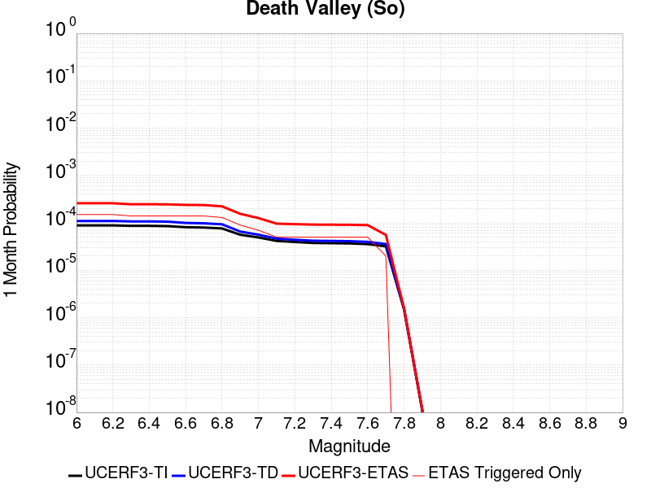 |  |  |

| Magnitude | 1 wk TI Prob | 1 wk TD Prob | 1 wk ETAS Prob | 1 wk ETAS/TD Gain | 1 wk ETAS Triggered Only | 1 mo TI Prob | 1 mo TD Prob | 1 mo ETAS Prob | 1 mo ETAS/TD Gain | 1 mo ETAS Triggered Only | 1 yr TI Prob | 1 yr TD Prob | 1 yr ETAS Prob | 1 yr ETAS/TD Gain | 1 yr ETAS Triggered Only | 10 yr TI Prob | 10 yr TD Prob | 10 yr ETAS Prob | 10 yr ETAS/TD Gain | 10 yr ETAS Triggered Only |
|-----|-----|-----|-----|-----|-----|-----|-----|-----|-----|-----|-----|-----|-----|-----|-----|-----|-----|-----|-----|-----|
| 6.0 | 2.0684236E-5 | 2.5617646E-5 | 7.446479E-5 | 2.9067774 | 4.88484E-5 | 8.864371E-5 | 1.0978539E-4 | 2.3189298E-4 | 2.1122391 | 1.22121E-4 | 0.0010787029 | 0.0013358344 | 0.0015797501 | 1.1825943 | 2.44242E-4 | 0.010734817 | 0.0132813305 | 0.013739226 | 1.0344768 | 4.640598E-4 |
| 6.1 | 2.0684236E-5 | 2.5617646E-5 | 7.446479E-5 | 2.9067774 | 4.88484E-5 | 8.864371E-5 | 1.0978539E-4 | 2.3189298E-4 | 2.1122391 | 1.22121E-4 | 0.0010787029 | 0.0013358344 | 0.0015797501 | 1.1825943 | 2.44242E-4 | 0.010734817 | 0.0132813305 | 0.013739226 | 1.0344768 | 4.640598E-4 |
| 6.2 | 2.0684236E-5 | 2.5617646E-5 | 7.446479E-5 | 2.9067774 | 4.88484E-5 | 8.864371E-5 | 1.0978539E-4 | 2.3189298E-4 | 2.1122391 | 1.22121E-4 | 0.0010787029 | 0.0013358344 | 0.0015797501 | 1.1825943 | 2.44242E-4 | 0.010734817 | 0.0132813305 | 0.013739226 | 1.0344768 | 4.640598E-4 |
| 6.3 | 2.0240292E-5 | 2.5117732E-5 | 7.3964904E-5 | 2.9447286 | 4.88484E-5 | 8.6741224E-5 | 1.0764308E-4 | 2.1754015E-4 | 2.0209396 | 1.099089E-4 | 0.0010555626 | 0.0013097833 | 0.001517117 | 1.1582962 | 2.076057E-4 | 0.010505628 | 0.013023891 | 0.013445747 | 1.032391 | 4.2742348E-4 |
| 6.4 | 2.0240292E-5 | 2.5117732E-5 | 7.3964904E-5 | 2.9447286 | 4.88484E-5 | 8.6741224E-5 | 1.0764308E-4 | 2.1754015E-4 | 2.0209396 | 1.099089E-4 | 0.0010555626 | 0.0013097833 | 0.001517117 | 1.1582962 | 2.076057E-4 | 0.010505628 | 0.013023891 | 0.013445747 | 1.032391 | 4.2742348E-4 |
| 6.5 | 1.9962767E-5 | 2.4806986E-5 | 7.365418E-5 | 2.96909 | 4.88484E-5 | 8.55519E-5 | 1.0631142E-4 | 2.1620863E-4 | 2.033729 | 1.099089E-4 | 0.0010410968 | 0.0012935897 | 0.0015009268 | 1.1602805 | 2.076057E-4 | 0.010362327 | 0.012863837 | 0.013273708 | 1.0318623 | 4.152114E-4 |
| 6.6 | 1.8937297E-5 | 2.3310844E-5 | 7.21581E-5 | 3.0954738 | 4.88484E-5 | 8.115732E-5 | 9.989987E-5 | 2.0979778E-4 | 2.1000807 | 1.099089E-4 | 9.876423E-4 | 0.0012156168 | 0.0014107729 | 1.1605408 | 1.953936E-4 | 0.009832645 | 0.012092726 | 0.012490852 | 1.0329227 | 4.0299929E-4 |
| 6.7 | 1.8621096E-5 | 2.2911487E-5 | 7.175877E-5 | 3.1319995 | 4.88484E-5 | 7.980225E-5 | 9.818847E-5 | 2.0808658E-4 | 2.1192567 | 1.099089E-4 | 9.711593E-4 | 0.0011948035 | 0.0013899637 | 1.1633408 | 1.953936E-4 | 0.009669261 | 0.011886842 | 0.012285051 | 1.0335 | 4.0299929E-4 |
| 6.8 | 1.7830353E-5 | 2.1805576E-5 | 7.065291E-5 | 3.2401304 | 4.88484E-5 | 7.641356E-5 | 9.34492E-5 | 1.9113686E-4 | 2.0453558 | 9.76968E-5 | 9.29938E-4 | 0.0011371642 | 0.0013079392 | 1.1501762 | 1.7096939E-4 | 0.009260561 | 0.011316297 | 0.011678514 | 1.0320084 | 3.66363E-4 |
| 6.9 | 1.3135183E-5 | 1.5303862E-5 | 3.9727685E-5 | 2.5959258 | 2.44242E-5 | 5.6292425E-5 | 6.558636E-5 | 1.2664286E-4 | 1.9309328 | 6.10605E-5 | 6.8514474E-4 | 7.982279E-4 | 9.0804906E-4 | 1.1375812 | 1.099089E-4 | 0.006830362 | 0.007954616 | 0.008172685 | 1.0274142 | 2.198178E-4 |
| 7.0 | 1.1507512E-5 | 1.315415E-5 | 2.536609E-5 | 1.9283715 | 1.22121E-5 | 4.9316975E-5 | 5.6373745E-5 | 1.0521939E-4 | 1.8664609 | 4.88484E-5 | 6.002687E-4 | 6.8614E-4 | 7.71566E-4 | 1.1245023 | 8.5484695E-5 | 0.0059864987 | 0.006840916 | 0.007010716 | 1.0248212 | 1.7096939E-4 |
| 7.1 | 9.715903E-6 | 1.0865243E-5 | 1.0865243E-5 | 1.0 | 0.0 | 4.1638916E-5 | 4.656452E-5 | 8.319911E-5 | 1.7867491 | 3.66363E-5 | 5.068359E-4 | 5.667798E-4 | 6.278057E-4 | 1.1076713 | 6.10605E-5 | 0.0050568148 | 0.0056537963 | 0.0057752267 | 1.0214777 | 1.22121E-4 |
| 7.2 | 9.233269E-6 | 1.0286278E-5 | 1.0286278E-5 | 1.0 | 0.0 | 3.9570554E-5 | 4.4083325E-5 | 8.071801E-5 | 1.8310326 | 3.66363E-5 | 4.81665E-4 | 5.3658657E-4 | 5.976143E-4 | 1.1137333 | 6.10605E-5 | 0.0048062233 | 0.005353341 | 0.005474808 | 1.0226899 | 1.22121E-4 |
| 7.3 | 8.8041315E-6 | 9.808134E-6 | 9.808134E-6 | 1.0 | 0.0 | 3.7731446E-5 | 4.2034208E-5 | 7.866896E-5 | 1.8715464 | 3.66363E-5 | 4.592835E-4 | 5.116505E-4 | 5.604739E-4 | 1.0954233 | 4.88484E-5 | 0.0045833546 | 0.005105152 | 0.0051901997 | 1.0166593 | 8.5484695E-5 |
| 7.4 | 8.708749E-6 | 9.707145E-6 | 9.707145E-6 | 1.0 | 0.0 | 3.7322676E-5 | 4.160141E-5 | 7.823619E-5 | 1.8806138 | 3.66363E-5 | 4.5430884E-4 | 5.0638366E-4 | 5.552073E-4 | 1.0964164 | 4.88484E-5 | 0.004533812 | 0.0050527244 | 0.005137777 | 1.0168331 | 8.5484695E-5 |
| 7.5 | 8.612678E-6 | 9.604788E-6 | 9.604788E-6 | 1.0 | 0.0 | 3.6910955E-5 | 4.116275E-5 | 7.7797544E-5 | 1.8899987 | 3.66363E-5 | 4.492982E-4 | 5.0104543E-4 | 5.498694E-4 | 1.097444 | 4.88484E-5 | 0.004483909 | 0.004999583 | 0.0050724894 | 1.0145825 | 7.32726E-5 |
| 7.6 | 8.319024E-6 | 9.283887E-6 | 9.283887E-6 | 1.0 | 0.0 | 3.5652476E-5 | 3.9787505E-5 | 7.642235E-5 | 1.9207624 | 3.66363E-5 | 4.3398244E-4 | 4.8430942E-4 | 5.2092795E-4 | 1.0756098 | 3.66363E-5 | 0.0043313587 | 0.0048329635 | 0.0048937285 | 1.0125731 | 6.10605E-5 |
| 7.7 | 7.4718328E-6 | 8.345144E-6 | 8.345144E-6 | 1.0 | 0.0 | 3.2021748E-5 | 3.5764435E-5 | 6.0187762E-5 | 1.6828942 | 2.44242E-5 | 3.8979502E-4 | 4.3534904E-4 | 4.597626E-4 | 1.0560782 | 2.44242E-5 | 0.00389112 | 0.004345367 | 0.004394003 | 1.0111927 | 4.88484E-5 |
| 7.8 | 3.4586725E-7 | 3.648256E-7 | 3.648256E-7 | 1.0 | 0.0 | 1.4822873E-6 | 1.5635374E-6 | 1.5635374E-6 | 1.0 | 0.0 | 1.80467E-5 | 1.9035906E-5 | 1.9035906E-5 | 1.0 | 0.0 | 1.8045233E-4 | 1.903432E-4 | 1.903432E-4 | 1.0 | 0.0 |
| 7.9 | 2.5591178E-9 | 2.6696687E-9 | 2.6696687E-9 | 1.0 | 0.0 | 1.0967647E-8 | 1.1441437E-8 | 1.1441437E-8 | 1.0 | 0.0 | 1.335311E-7 | 1.392995E-7 | 1.392995E-7 | 1.0 | 0.0 | 1.3353102E-6 | 1.3929949E-6 | 1.3929949E-6 | 1.0 | 0.0 |

## So Sierra Nevada
*[(top)](#table-of-contents)*

| 1 Week | 1 Month | 1 Year | 10 Year |
|-----|-----|-----|-----|
|  |  |  | 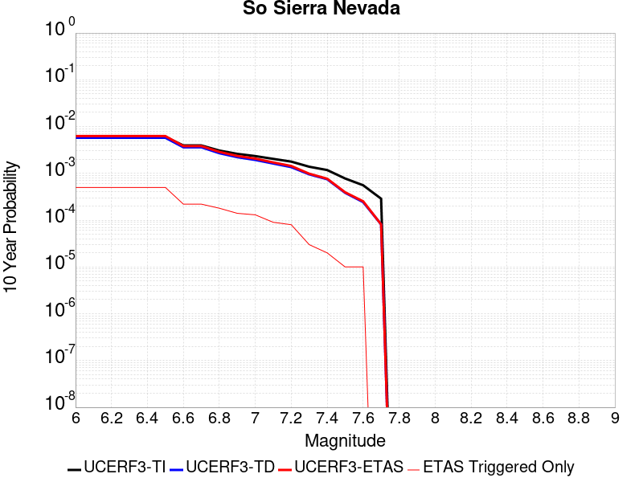 |

| Magnitude | 1 wk TI Prob | 1 wk TD Prob | 1 wk ETAS Prob | 1 wk ETAS/TD Gain | 1 wk ETAS Triggered Only | 1 mo TI Prob | 1 mo TD Prob | 1 mo ETAS Prob | 1 mo ETAS/TD Gain | 1 mo ETAS Triggered Only | 1 yr TI Prob | 1 yr TD Prob | 1 yr ETAS Prob | 1 yr ETAS/TD Gain | 1 yr ETAS Triggered Only | 10 yr TI Prob | 10 yr TD Prob | 10 yr ETAS Prob | 10 yr ETAS/TD Gain | 10 yr ETAS Triggered Only |
|-----|-----|-----|-----|-----|-----|-----|-----|-----|-----|-----|-----|-----|-----|-----|-----|-----|-----|-----|-----|-----|
| 6.0 | 1.15488665E-5 | 1.1079626E-5 | 1.6983517E-4 | 15.3286 | 1.5875729E-4 | 4.9494203E-5 | 4.748332E-5 | 2.4286764E-4 | 5.114799 | 1.953936E-4 | 6.024253E-4 | 5.7796884E-4 | 9.441201E-4 | 1.6335138 | 3.66363E-4 | 0.006007948 | 0.0057659256 | 0.006215168 | 1.0779133 | 4.5184768E-4 |
| 6.1 | 1.15488665E-5 | 1.1079626E-5 | 1.6983517E-4 | 15.3286 | 1.5875729E-4 | 4.9494203E-5 | 4.748332E-5 | 2.4286764E-4 | 5.114799 | 1.953936E-4 | 6.024253E-4 | 5.7796884E-4 | 9.441201E-4 | 1.6335138 | 3.66363E-4 | 0.006007948 | 0.0057659256 | 0.006215168 | 1.0779133 | 4.5184768E-4 |
| 6.2 | 1.15488665E-5 | 1.1079626E-5 | 1.6983517E-4 | 15.3286 | 1.5875729E-4 | 4.9494203E-5 | 4.748332E-5 | 2.4286764E-4 | 5.114799 | 1.953936E-4 | 6.024253E-4 | 5.7796884E-4 | 9.441201E-4 | 1.6335138 | 3.66363E-4 | 0.006007948 | 0.0057659256 | 0.006215168 | 1.0779133 | 4.5184768E-4 |
| 6.3 | 1.15488665E-5 | 1.1079626E-5 | 1.6983517E-4 | 15.3286 | 1.5875729E-4 | 4.9494203E-5 | 4.748332E-5 | 2.4286764E-4 | 5.114799 | 1.953936E-4 | 6.024253E-4 | 5.7796884E-4 | 9.441201E-4 | 1.6335138 | 3.66363E-4 | 0.006007948 | 0.0057659256 | 0.006215168 | 1.0779133 | 4.5184768E-4 |
| 6.4 | 1.15488665E-5 | 1.1079626E-5 | 1.6983517E-4 | 15.3286 | 1.5875729E-4 | 4.9494203E-5 | 4.748332E-5 | 2.4286764E-4 | 5.114799 | 1.953936E-4 | 6.024253E-4 | 5.7796884E-4 | 9.441201E-4 | 1.6335138 | 3.66363E-4 | 0.006007948 | 0.0057659256 | 0.006215168 | 1.0779133 | 4.5184768E-4 |
| 6.5 | 1.15488665E-5 | 1.1079626E-5 | 1.6983517E-4 | 15.3286 | 1.5875729E-4 | 4.9494203E-5 | 4.748332E-5 | 2.4286764E-4 | 5.114799 | 1.953936E-4 | 6.024253E-4 | 5.7796884E-4 | 9.441201E-4 | 1.6335138 | 3.66363E-4 | 0.006007948 | 0.0057659256 | 0.006215168 | 1.0779133 | 4.5184768E-4 |
| 6.6 | 7.587044E-6 | 6.9356242E-6 | 9.241973E-5 | 13.325366 | 8.5484695E-5 | 3.2515498E-5 | 2.9723782E-5 | 1.1520594E-4 | 3.8758843 | 8.5484695E-5 | 3.9580427E-4 | 3.6182988E-4 | 5.327374E-4 | 1.4723423 | 1.7096939E-4 | 0.003951 | 0.0036126992 | 0.0038195548 | 1.0572579 | 2.076057E-4 |
| 6.7 | 7.587044E-6 | 6.9356242E-6 | 9.241973E-5 | 13.325366 | 8.5484695E-5 | 3.2515498E-5 | 2.9723782E-5 | 1.1520594E-4 | 3.8758843 | 8.5484695E-5 | 3.9580427E-4 | 3.6182988E-4 | 5.327374E-4 | 1.4723423 | 1.7096939E-4 | 0.003951 | 0.0036126992 | 0.0038195548 | 1.0572579 | 2.076057E-4 |
| 6.8 | 5.9026956E-6 | 5.179384E-6 | 7.84516E-5 | 15.146898 | 7.32726E-5 | 2.5297022E-5 | 2.2197177E-5 | 9.546815E-5 | 4.300914 | 7.32726E-5 | 3.0794772E-4 | 2.702183E-4 | 4.167239E-4 | 1.542175 | 1.465452E-4 | 0.0030752132 | 0.0026990133 | 0.0028695213 | 1.0631741 | 1.7096939E-4 |
| 6.9 | 5.0118915E-6 | 4.2524175E-6 | 5.3100608E-5 | 12.487158 | 4.88484E-5 | 2.1479358E-5 | 1.8224524E-5 | 6.707203E-5 | 3.6803174 | 4.88484E-5 | 2.614798E-4 | 2.218617E-4 | 3.4395562E-4 | 1.5503154 | 1.22121E-4 | 0.0026117235 | 0.0022164746 | 0.002338325 | 1.0549748 | 1.22121E-4 |
| 7.0 | 4.4924795E-6 | 3.7139105E-6 | 5.256213E-5 | 14.152772 | 4.88484E-5 | 1.925334E-5 | 1.5916665E-5 | 6.476429E-5 | 4.0689607 | 4.88484E-5 | 2.3438422E-4 | 1.937688E-4 | 3.0365642E-4 | 1.5671067 | 1.099089E-4 | 0.0023413717 | 0.0019360614 | 0.0020457576 | 1.0566595 | 1.099089E-4 |
| 7.1 | 3.9118436E-6 | 3.111971E-6 | 3.9748156E-5 | 12.772663 | 3.66363E-5 | 1.6764936E-5 | 1.3336953E-5 | 4.9972765E-5 | 3.74694 | 3.66363E-5 | 2.0409399E-4 | 1.6236588E-4 | 2.3562658E-4 | 1.4512075 | 7.32726E-5 | 0.0020390663 | 0.0016225285 | 0.0016956823 | 1.0450863 | 7.32726E-5 |
| 7.2 | 3.4200818E-6 | 2.6054481E-6 | 3.924165E-5 | 15.061382 | 3.66363E-5 | 1.4657411E-5 | 1.1166161E-5 | 4.7802052E-5 | 4.2809744 | 3.66363E-5 | 1.7843937E-4 | 1.3594003E-4 | 2.0920268E-4 | 1.5389335 | 7.32726E-5 | 0.0017829615 | 0.0013586186 | 0.0014317916 | 1.0538584 | 7.32726E-5 |
| 7.3 | 2.6593618E-6 | 1.828415E-6 | 1.828415E-6 | 1.0 | 0.0 | 1.13972155E-5 | 7.836042E-6 | 7.836042E-6 | 1.0 | 0.0 | 1.3875226E-4 | 9.539993E-5 | 1.198218E-4 | 1.2559947 | 2.44242E-5 | 0.0013866565 | 9.5361867E-4 | 9.780196E-4 | 1.0255877 | 2.44242E-5 |
| 7.4 | 2.2577992E-6 | 1.4364332E-6 | 1.4364332E-6 | 1.0 | 0.0 | 9.676246E-6 | 6.156129E-6 | 6.156129E-6 | 1.0 | 0.0 | 1.1780193E-4 | 7.494855E-5 | 9.937092E-5 | 1.3258551 | 2.44242E-5 | 0.001177395 | 7.4925774E-4 | 7.7366363E-4 | 1.0325735 | 2.44242E-5 |
| 7.5 | 1.489319E-6 | 7.353898E-7 | 7.353898E-7 | 1.0 | 0.0 | 6.3827797E-6 | 3.1516668E-6 | 3.1516668E-6 | 1.0 | 0.0 | 7.770758E-5 | 3.8370872E-5 | 5.05825E-5 | 1.3182527 | 1.22121E-5 | 7.7680405E-4 | 3.8364288E-4 | 3.958503E-4 | 1.0318197 | 1.22121E-5 |
| 7.6 | 1.0680322E-6 | 4.6596273E-7 | 4.6596273E-7 | 1.0 | 0.0 | 4.577273E-6 | 1.9969816E-6 | 1.9969816E-6 | 1.0 | 0.0 | 5.5726876E-5 | 2.4312982E-5 | 3.6524783E-5 | 1.502275 | 1.22121E-5 | 5.5712904E-4 | 2.4310348E-4 | 2.5531263E-4 | 1.0502219 | 1.22121E-5 |
| 7.7 | 5.509146E-7 | 1.5580342E-7 | 1.5580342E-7 | 1.0 | 0.0 | 2.3610605E-6 | 6.677288E-7 | 6.677288E-7 | 1.0 | 0.0 | 2.8745531E-5 | 8.129569E-6 | 8.129569E-6 | 1.0 | 0.0 | 2.8741814E-4 | 8.1292834E-5 | 8.1292834E-5 | 1.0 | 0.0 |

## Bicycle Lake
*[(top)](#table-of-contents)*

| 1 Week | 1 Month | 1 Year | 10 Year |
|-----|-----|-----|-----|
| 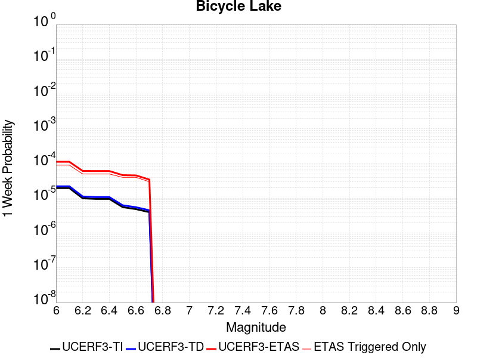 |  |  |  |

| Magnitude | 1 wk TI Prob | 1 wk TD Prob | 1 wk ETAS Prob | 1 wk ETAS/TD Gain | 1 wk ETAS Triggered Only | 1 mo TI Prob | 1 mo TD Prob | 1 mo ETAS Prob | 1 mo ETAS/TD Gain | 1 mo ETAS Triggered Only | 1 yr TI Prob | 1 yr TD Prob | 1 yr ETAS Prob | 1 yr ETAS/TD Gain | 1 yr ETAS Triggered Only | 10 yr TI Prob | 10 yr TD Prob | 10 yr ETAS Prob | 10 yr ETAS/TD Gain | 10 yr ETAS Triggered Only |
|-----|-----|-----|-----|-----|-----|-----|-----|-----|-----|-----|-----|-----|-----|-----|-----|-----|-----|-----|-----|-----|
| 6.0 | 1.9621975E-5 | 2.2097003E-5 | 1.1979164E-4 | 5.421171 | 9.76968E-5 | 8.4091465E-5 | 9.469877E-5 | 2.168082E-4 | 2.2894511 | 1.22121E-4 | 0.0010233327 | 0.0011524827 | 0.0013476511 | 1.1693461 | 1.953936E-4 | 0.01018633 | 0.011478369 | 0.011876743 | 1.0347065 | 4.0299929E-4 |
| 6.1 | 1.9621975E-5 | 2.2097003E-5 | 1.1979164E-4 | 5.421171 | 9.76968E-5 | 8.4091465E-5 | 9.469877E-5 | 2.168082E-4 | 2.2894511 | 1.22121E-4 | 0.0010233327 | 0.0011524827 | 0.0013476511 | 1.1693461 | 1.953936E-4 | 0.01018633 | 0.011478369 | 0.011876743 | 1.0347065 | 4.0299929E-4 |
| 6.2 | 9.9971285E-6 | 1.1255602E-5 | 6.010345E-5 | 5.33987 | 4.88484E-5 | 4.2844134E-5 | 4.8237693E-5 | 1.09295244E-4 | 2.2657642 | 6.10605E-5 | 5.2150246E-4 | 5.871877E-4 | 6.97032E-4 | 1.1870686 | 1.099089E-4 | 0.0052028033 | 0.0058614668 | 0.0060921367 | 1.0393536 | 2.320299E-4 |
| 6.3 | 9.589428E-6 | 1.079831E-5 | 5.964618E-5 | 5.523659 | 4.88484E-5 | 4.10969E-5 | 4.6277943E-5 | 1.0733562E-4 | 2.3193688 | 6.10605E-5 | 5.002399E-4 | 5.6334015E-4 | 6.609819E-4 | 1.1733265 | 9.76968E-5 | 0.0049911533 | 0.005624211 | 0.0058427923 | 1.0388644 | 2.198178E-4 |
| 6.4 | 9.589428E-6 | 1.079831E-5 | 5.964618E-5 | 5.523659 | 4.88484E-5 | 4.10969E-5 | 4.6277943E-5 | 1.0733562E-4 | 2.3193688 | 6.10605E-5 | 5.002399E-4 | 5.6334015E-4 | 6.609819E-4 | 1.1733265 | 9.76968E-5 | 0.0049911533 | 0.005624211 | 0.0058427923 | 1.0388644 | 2.198178E-4 |
| 6.5 | 5.557707E-6 | 6.2855797E-6 | 4.292165E-5 | 6.8285904 | 3.66363E-5 | 2.3818526E-5 | 2.693807E-5 | 7.578515E-5 | 2.8133104 | 4.88484E-5 | 2.8995197E-4 | 3.2794854E-4 | 4.0119712E-4 | 1.2233539 | 7.32726E-5 | 0.0028957394 | 0.003277282 | 0.003423347 | 1.0445689 | 1.465452E-4 |
| 6.6 | 4.8742945E-6 | 5.5132705E-6 | 4.2149368E-5 | 7.6450753 | 3.66363E-5 | 2.0889667E-5 | 2.3628236E-5 | 7.247548E-5 | 3.067325 | 4.88484E-5 | 2.54302E-4 | 2.87662E-4 | 3.4870493E-4 | 1.2122037 | 6.10605E-5 | 0.002540112 | 0.0028754652 | 0.002997235 | 1.0423479 | 1.22121E-4 |
| 6.7 | 3.991108E-6 | 4.5158945E-6 | 2.8939983E-5 | 6.408472 | 2.44242E-5 | 1.7104636E-5 | 1.9353833E-5 | 5.5989425E-5 | 2.8929372 | 3.66363E-5 | 2.0822904E-4 | 2.3563292E-4 | 2.722606E-4 | 1.1554438 | 3.66363E-5 | 0.0020803404 | 0.0023563292 | 0.0024416125 | 1.0361933 | 8.5484695E-5 |

## Towne Pass
*[(top)](#table-of-contents)*

| 1 Week | 1 Month | 1 Year | 10 Year |
|-----|-----|-----|-----|
|  | 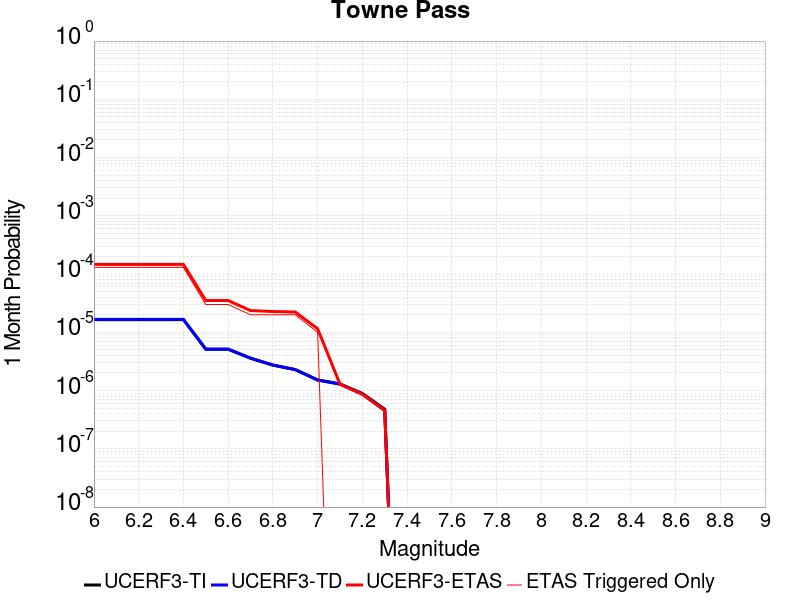 | 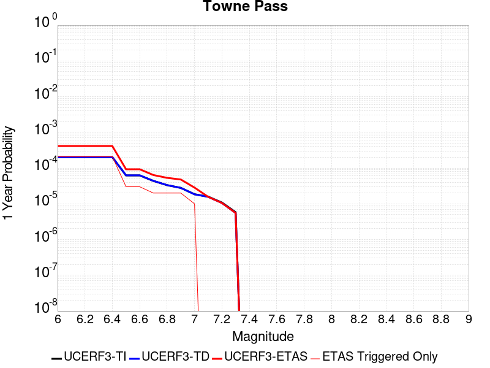 | 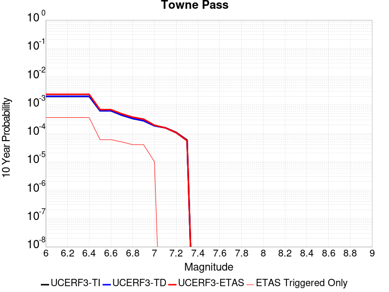 |

| Magnitude | 1 wk TI Prob | 1 wk TD Prob | 1 wk ETAS Prob | 1 wk ETAS/TD Gain | 1 wk ETAS Triggered Only | 1 mo TI Prob | 1 mo TD Prob | 1 mo ETAS Prob | 1 mo ETAS/TD Gain | 1 mo ETAS Triggered Only | 1 yr TI Prob | 1 yr TD Prob | 1 yr ETAS Prob | 1 yr ETAS/TD Gain | 1 yr ETAS Triggered Only | 10 yr TI Prob | 10 yr TD Prob | 10 yr ETAS Prob | 10 yr ETAS/TD Gain | 10 yr ETAS Triggered Only |
|-----|-----|-----|-----|-----|-----|-----|-----|-----|-----|-----|-----|-----|-----|-----|-----|-----|-----|-----|-----|-----|
| 6.0 | 3.849728E-6 | 3.8945395E-6 | 6.49548E-5 | 16.678429 | 6.10605E-5 | 1.649873E-5 | 1.6690803E-5 | 1.2659786E-4 | 7.584888 | 1.099089E-4 | 2.0085352E-4 | 2.0319594E-4 | 3.8634022E-4 | 1.9013186 | 1.831815E-4 | 0.0020067208 | 0.0020305307 | 0.0023595877 | 1.1620548 | 3.297267E-4 |
| 6.1 | 3.849728E-6 | 3.8945395E-6 | 6.49548E-5 | 16.678429 | 6.10605E-5 | 1.649873E-5 | 1.6690803E-5 | 1.2659786E-4 | 7.584888 | 1.099089E-4 | 2.0085352E-4 | 2.0319594E-4 | 3.8634022E-4 | 1.9013186 | 1.831815E-4 | 0.0020067208 | 0.0020305307 | 0.0023595877 | 1.1620548 | 3.297267E-4 |
| 6.2 | 3.849728E-6 | 3.8945395E-6 | 6.49548E-5 | 16.678429 | 6.10605E-5 | 1.649873E-5 | 1.6690803E-5 | 1.2659786E-4 | 7.584888 | 1.099089E-4 | 2.0085352E-4 | 2.0319594E-4 | 3.8634022E-4 | 1.9013186 | 1.831815E-4 | 0.0020067208 | 0.0020305307 | 0.0023595877 | 1.1620548 | 3.297267E-4 |
| 6.3 | 3.849728E-6 | 3.8945395E-6 | 6.49548E-5 | 16.678429 | 6.10605E-5 | 1.649873E-5 | 1.6690803E-5 | 1.2659786E-4 | 7.584888 | 1.099089E-4 | 2.0085352E-4 | 2.0319594E-4 | 3.8634022E-4 | 1.9013186 | 1.831815E-4 | 0.0020067208 | 0.0020305307 | 0.0023595877 | 1.1620548 | 3.297267E-4 |
| 6.4 | 3.849728E-6 | 3.8945395E-6 | 6.49548E-5 | 16.678429 | 6.10605E-5 | 1.649873E-5 | 1.6690803E-5 | 1.2659786E-4 | 7.584888 | 1.099089E-4 | 2.0085352E-4 | 2.0319594E-4 | 3.8634022E-4 | 1.9013186 | 1.831815E-4 | 0.0020067208 | 0.0020305307 | 0.0023595877 | 1.1620548 | 3.297267E-4 |
| 6.5 | 1.1953545E-6 | 1.2030514E-6 | 1.3415136E-5 | 11.150926 | 1.22121E-5 | 5.1229376E-6 | 5.155925E-6 | 1.7367962E-5 | 3.3685443 | 1.22121E-5 | 6.236998E-5 | 6.2771695E-5 | 7.498303E-5 | 1.1945356 | 1.22121E-5 | 6.235248E-4 | 6.275514E-4 | 6.763691E-4 | 1.0777909 | 4.88484E-5 |
| 6.6 | 1.1953545E-6 | 1.2030514E-6 | 1.3415136E-5 | 11.150926 | 1.22121E-5 | 5.1229376E-6 | 5.155925E-6 | 1.7367962E-5 | 3.3685443 | 1.22121E-5 | 6.236998E-5 | 6.2771695E-5 | 7.498303E-5 | 1.1945356 | 1.22121E-5 | 6.235248E-4 | 6.275514E-4 | 6.763691E-4 | 1.0777909 | 4.88484E-5 |
| 6.7 | 8.375951E-7 | 8.410665E-7 | 1.3053156E-5 | 15.519767 | 1.22121E-5 | 3.5896885E-6 | 3.604566E-6 | 1.5816622E-5 | 4.3879404 | 1.22121E-5 | 4.370358E-5 | 4.3884767E-5 | 5.609633E-5 | 1.2782643 | 1.22121E-5 | 4.3694986E-4 | 4.387667E-4 | 4.8759367E-4 | 1.1112823 | 4.88484E-5 |
| 6.8 | 6.38041E-7 | 6.3921516E-7 | 1.28513075E-5 | 20.104822 | 1.22121E-5 | 2.7344586E-6 | 2.7394908E-6 | 1.4951557E-5 | 5.4577866 | 1.22121E-5 | 3.3291526E-5 | 3.335283E-5 | 4.5564524E-5 | 1.3661367 | 1.22121E-5 | 3.3286537E-4 | 3.3348205E-4 | 3.7010614E-4 | 1.1098232 | 3.66363E-5 |
| 6.9 | 5.3460053E-7 | 5.345329E-7 | 1.2746626E-5 | 23.84629 | 1.22121E-5 | 2.2911431E-6 | 2.2908532E-6 | 1.4502925E-5 | 6.3307962 | 1.22121E-5 | 2.789431E-5 | 2.7890816E-5 | 4.0102575E-5 | 1.4378415 | 1.22121E-5 | 2.789081E-4 | 2.7887648E-4 | 3.1550255E-4 | 1.1313344 | 3.66363E-5 |
| 7.0 | 3.557783E-7 | 3.532419E-7 | 1.2565337E-5 | 35.571484 | 1.22121E-5 | 1.5247632E-6 | 1.5138929E-6 | 1.3725974E-5 | 9.066674 | 1.22121E-5 | 1.8563835E-5 | 1.84315E-5 | 3.0643376E-5 | 1.6625546 | 1.22121E-5 | 1.8562283E-4 | 1.8430054E-4 | 1.965104E-4 | 1.0662496 | 1.22121E-5 |
| 7.1 | 3.037942E-7 | 3.0002184E-7 | 3.0002184E-7 | 1.0 | 0.0 | 1.3019744E-6 | 1.2858072E-6 | 1.2858072E-6 | 1.0 | 0.0 | 1.5851423E-5 | 1.56546E-5 | 1.56546E-5 | 1.0 | 0.0 | 1.5850292E-4 | 1.5653571E-4 | 1.5653571E-4 | 1.0 | 0.0 |
| 7.2 | 2.0808248E-7 | 2.0217661E-7 | 2.0217661E-7 | 1.0 | 0.0 | 8.917818E-7 | 8.664709E-7 | 8.664709E-7 | 1.0 | 0.0 | 1.0857389E-5 | 1.0549237E-5 | 1.0549237E-5 | 1.0 | 0.0 | 1.0856859E-4 | 1.0548782E-4 | 1.0548782E-4 | 1.0 | 0.0 |
| 7.3 | 1.1162073E-7 | 1.0636875E-7 | 1.0636875E-7 | 1.0 | 0.0 | 4.7837443E-7 | 4.5586603E-7 | 4.5586603E-7 | 1.0 | 0.0 | 5.8241935E-6 | 5.550157E-6 | 5.550157E-6 | 1.0 | 0.0 | 5.8240406E-5 | 5.5500383E-5 | 5.5500383E-5 | 1.0 | 0.0 |

## San Andreas (Mojave N)
*[(top)](#table-of-contents)*

| 1 Week | 1 Month | 1 Year | 10 Year |
|-----|-----|-----|-----|
|  | 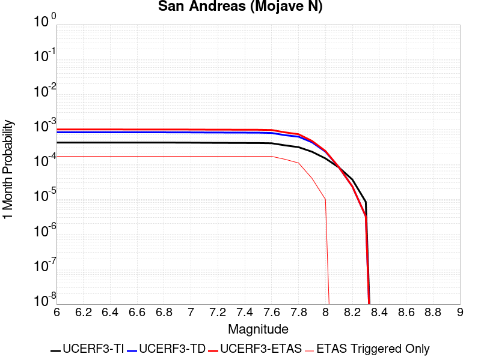 | 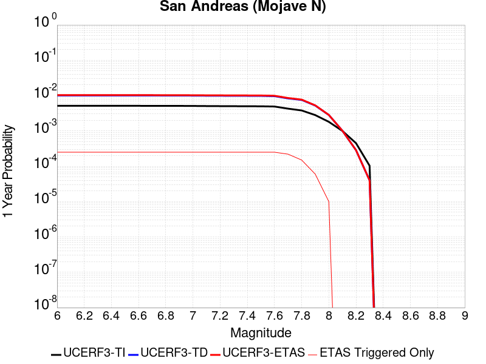 |  |

| Magnitude | 1 wk TI Prob | 1 wk TD Prob | 1 wk ETAS Prob | 1 wk ETAS/TD Gain | 1 wk ETAS Triggered Only | 1 mo TI Prob | 1 mo TD Prob | 1 mo ETAS Prob | 1 mo ETAS/TD Gain | 1 mo ETAS Triggered Only | 1 yr TI Prob | 1 yr TD Prob | 1 yr ETAS Prob | 1 yr ETAS/TD Gain | 1 yr ETAS Triggered Only | 10 yr TI Prob | 10 yr TD Prob | 10 yr ETAS Prob | 10 yr ETAS/TD Gain | 10 yr ETAS Triggered Only |
|-----|-----|-----|-----|-----|-----|-----|-----|-----|-----|-----|-----|-----|-----|-----|-----|-----|-----|-----|-----|-----|
| 6.0 | 9.877682E-5 | 1.9398969E-4 | 3.1608698E-4 | 1.629401 | 1.22121E-4 | 4.2326056E-4 | 8.3111966E-4 | 9.89745E-4 | 1.1908574 | 1.5875729E-4 | 0.0051410277 | 0.010072061 | 0.010301753 | 1.022805 | 2.320299E-4 | 0.05023708 | 0.09830668 | 0.09858197 | 1.0028003 | 3.053025E-4 |
| 6.1 | 9.877682E-5 | 1.9398969E-4 | 3.1608698E-4 | 1.629401 | 1.22121E-4 | 4.2326056E-4 | 8.3111966E-4 | 9.89745E-4 | 1.1908574 | 1.5875729E-4 | 0.0051410277 | 0.010072061 | 0.010301753 | 1.022805 | 2.320299E-4 | 0.05023708 | 0.09830668 | 0.09858197 | 1.0028003 | 3.053025E-4 |
| 6.2 | 9.877682E-5 | 1.9398969E-4 | 3.1608698E-4 | 1.629401 | 1.22121E-4 | 4.2326056E-4 | 8.3111966E-4 | 9.89745E-4 | 1.1908574 | 1.5875729E-4 | 0.0051410277 | 0.010072061 | 0.010301753 | 1.022805 | 2.320299E-4 | 0.05023708 | 0.09830668 | 0.09858197 | 1.0028003 | 3.053025E-4 |
| 6.3 | 9.877682E-5 | 1.9398969E-4 | 3.1608698E-4 | 1.629401 | 1.22121E-4 | 4.2326056E-4 | 8.3111966E-4 | 9.89745E-4 | 1.1908574 | 1.5875729E-4 | 0.0051410277 | 0.010072061 | 0.010301753 | 1.022805 | 2.320299E-4 | 0.05023708 | 0.09830668 | 0.09858197 | 1.0028003 | 3.053025E-4 |
| 6.4 | 9.877682E-5 | 1.9398969E-4 | 3.1608698E-4 | 1.629401 | 1.22121E-4 | 4.2326056E-4 | 8.3111966E-4 | 9.89745E-4 | 1.1908574 | 1.5875729E-4 | 0.0051410277 | 0.010072061 | 0.010301753 | 1.022805 | 2.320299E-4 | 0.05023708 | 0.09830668 | 0.09858197 | 1.0028003 | 3.053025E-4 |
| 6.5 | 9.861474E-5 | 1.9372735E-4 | 3.158247E-4 | 1.6302534 | 1.22121E-4 | 4.2256617E-4 | 8.299961E-4 | 9.886216E-4 | 1.191116 | 1.5875729E-4 | 0.0051326132 | 0.010058507 | 0.010288203 | 1.022836 | 2.320299E-4 | 0.050156746 | 0.098184474 | 0.0984598 | 1.0028042 | 3.053025E-4 |
| 6.6 | 9.861474E-5 | 1.9372735E-4 | 3.158247E-4 | 1.6302534 | 1.22121E-4 | 4.2256617E-4 | 8.299961E-4 | 9.886216E-4 | 1.191116 | 1.5875729E-4 | 0.0051326132 | 0.010058507 | 0.010288203 | 1.022836 | 2.320299E-4 | 0.050156746 | 0.098184474 | 0.0984598 | 1.0028042 | 3.053025E-4 |
| 6.7 | 9.8552715E-5 | 1.9362688E-4 | 3.1572423E-4 | 1.6305805 | 1.22121E-4 | 4.223004E-4 | 8.295658E-4 | 9.881913E-4 | 1.1912152 | 1.5875729E-4 | 0.0051293927 | 0.010053317 | 0.010283014 | 1.0228479 | 2.320299E-4 | 0.050125998 | 0.09813766 | 0.098413005 | 1.0028057 | 3.053025E-4 |
| 6.8 | 9.8464974E-5 | 1.9347853E-4 | 3.155759E-4 | 1.6310642 | 1.22121E-4 | 4.219245E-4 | 8.2893035E-4 | 9.875561E-4 | 1.1913619 | 1.5875729E-4 | 0.0051248376 | 0.010045652 | 0.010275351 | 1.0228655 | 2.320299E-4 | 0.05008251 | 0.098067686 | 0.09834305 | 1.0028079 | 3.053025E-4 |
| 6.9 | 9.825824E-5 | 1.9315863E-4 | 3.1525604E-4 | 1.6321095 | 1.22121E-4 | 4.2103877E-4 | 8.2756026E-4 | 9.861862E-4 | 1.191679 | 1.5875729E-4 | 0.0051141046 | 0.010029125 | 0.010258827 | 1.0229036 | 2.320299E-4 | 0.049980022 | 0.09791679 | 0.0981922 | 1.0028126 | 3.053025E-4 |
| 7.0 | 9.781462E-5 | 1.924723E-4 | 3.145698E-4 | 1.6343639 | 1.22121E-4 | 4.1913814E-4 | 8.246208E-4 | 9.832472E-4 | 1.1923628 | 1.5875729E-4 | 0.005091073 | 0.009993665 | 0.010223377 | 1.0229857 | 2.320299E-4 | 0.04976007 | 0.09759319 | 0.097868696 | 1.002823 | 3.053025E-4 |
| 7.1 | 9.7121134E-5 | 1.9148945E-4 | 3.1358708E-4 | 1.6376206 | 1.22121E-4 | 4.1616702E-4 | 8.2041114E-4 | 9.790382E-4 | 1.1933507 | 1.5875729E-4 | 0.005055068 | 0.009942883 | 0.0101726055 | 1.0231043 | 2.320299E-4 | 0.04941613 | 0.09712971 | 0.09740536 | 1.0028379 | 3.053025E-4 |
| 7.2 | 9.663819E-5 | 1.9079732E-4 | 3.1289502E-4 | 1.6399341 | 1.22121E-4 | 4.1409794E-4 | 8.1744674E-4 | 9.760743E-4 | 1.1940525 | 1.5875729E-4 | 0.0050299936 | 0.00990712 | 0.010136851 | 1.0231885 | 2.320299E-4 | 0.049176537 | 0.09680298 | 0.097078726 | 1.0028485 | 3.053025E-4 |
| 7.3 | 9.6277574E-5 | 1.9032248E-4 | 3.1242022E-4 | 1.6415309 | 1.22121E-4 | 4.125529E-4 | 8.1541296E-4 | 9.740408E-4 | 1.1945368 | 1.5875729E-4 | 0.0050112694 | 0.009882583 | 0.01011232 | 1.0232466 | 2.320299E-4 | 0.04899759 | 0.09657645 | 0.096852265 | 1.0028559 | 3.053025E-4 |
| 7.4 | 9.593308E-5 | 1.8972032E-4 | 3.1181815E-4 | 1.6435676 | 1.22121E-4 | 4.1107697E-4 | 8.128339E-4 | 9.714621E-4 | 1.1951545 | 1.5875729E-4 | 0.0049933824 | 0.009851467 | 0.010081211 | 1.0233208 | 2.320299E-4 | 0.04882661 | 0.096294634 | 0.09657054 | 1.0028652 | 3.053025E-4 |
| 7.5 | 9.561707E-5 | 1.8918114E-4 | 3.1127903E-4 | 1.6454021 | 1.22121E-4 | 4.0972308E-4 | 8.105246E-4 | 9.6915325E-4 | 1.195711 | 1.5875729E-4 | 0.0049769743 | 0.009823605 | 0.010053356 | 1.0233876 | 2.320299E-4 | 0.048669744 | 0.09604082 | 0.09631681 | 1.0028735 | 3.053025E-4 |
| 7.6 | 9.418194E-5 | 1.8570402E-4 | 3.0780234E-4 | 1.6574888 | 1.22121E-4 | 4.0357444E-4 | 7.956318E-4 | 9.542628E-4 | 1.1993774 | 1.5875729E-4 | 0.004902454 | 0.009643905 | 0.009873697 | 1.0238277 | 2.320299E-4 | 0.047957025 | 0.0944232 | 0.094699666 | 1.002928 | 3.053025E-4 |
| 7.7 | 8.202141E-5 | 1.6019761E-4 | 2.700889E-4 | 1.6859734 | 1.099089E-4 | 3.51473E-4 | 6.863806E-4 | 8.206215E-4 | 1.195578 | 1.343331E-4 | 0.00427079 | 0.00832472 | 0.008530598 | 1.0247308 | 2.076057E-4 | 0.04189639 | 0.08222524 | 0.08248302 | 1.0031351 | 2.808783E-4 |
| 7.8 | 7.2859846E-5 | 1.4515074E-4 | 2.3062303E-4 | 1.5888519 | 8.5484695E-5 | 3.1221908E-4 | 6.2192633E-4 | 7.317669E-4 | 1.1766135 | 1.099089E-4 | 0.003794643 | 0.007545706 | 0.0076790256 | 1.0176682 | 1.343331E-4 | 0.037304975 | 0.07471838 | 0.074865274 | 1.001966 | 1.5875729E-4 |
| 7.9 | 5.3874453E-5 | 1.0044695E-4 | 1.4929044E-4 | 1.4862616 | 4.88484E-5 | 2.3087008E-4 | 4.3041594E-4 | 4.7924332E-4 | 1.1134423 | 4.88484E-5 | 0.0028072202 | 0.005227734 | 0.005288475 | 1.0116191 | 6.10605E-5 | 0.02772022 | 0.052419845 | 0.052477706 | 1.0011038 | 6.10605E-5 |
| 8.0 | 3.468538E-5 | 5.4254586E-5 | 6.6466026E-5 | 1.2250766 | 1.22121E-5 | 1.4864317E-4 | 2.3249893E-4 | 2.447082E-4 | 1.0525132 | 1.22121E-5 | 0.0018082283 | 0.002827002 | 0.0028391795 | 1.0043076 | 1.22121E-5 | 0.017935853 | 0.028944723 | 0.028956583 | 1.0004097 | 1.22121E-5 |
| 8.1 | 1.9152367E-5 | 1.9399953E-5 | 1.9399953E-5 | 1.0 | 0.0 | 8.207899E-5 | 8.314001E-5 | 8.314001E-5 | 1.0 | 0.0 | 9.988535E-4 | 0.0010117602 | 0.0010117602 | 1.0 | 0.0 | 0.009943757 | 0.01085485 | 0.01085485 | 1.0 | 0.0 |
| 8.2 | 8.643924E-6 | 5.4738607E-6 | 5.4738607E-6 | 1.0 | 0.0 | 3.704486E-5 | 2.3459192E-5 | 2.3459192E-5 | 1.0 | 0.0 | 4.5092785E-4 | 2.855783E-4 | 2.855783E-4 | 1.0 | 0.0 | 0.0045001395 | 0.0032481598 | 0.0032481598 | 1.0 | 0.0 |
| 8.3 | 1.983087E-6 | 7.658221E-7 | 7.658221E-7 | 1.0 | 0.0 | 8.498917E-6 | 3.2820906E-6 | 3.2820906E-6 | 1.0 | 0.0 | 1.034694E-4 | 3.9958737E-5 | 3.9958737E-5 | 1.0 | 0.0 | 0.0010342124 | 4.7187202E-4 | 4.7187202E-4 | 1.0 | 0.0 |

## Helendale-So Lockhart
*[(top)](#table-of-contents)*

| 1 Week | 1 Month | 1 Year | 10 Year |
|-----|-----|-----|-----|
| 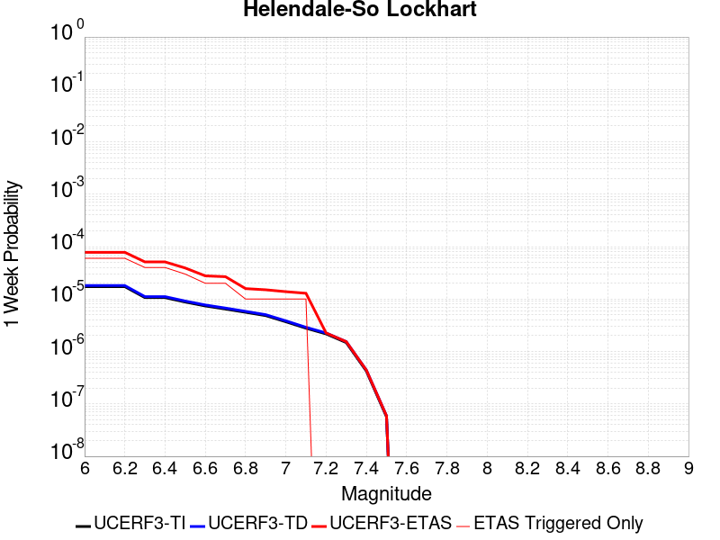 |  |  |  |

| Magnitude | 1 wk TI Prob | 1 wk TD Prob | 1 wk ETAS Prob | 1 wk ETAS/TD Gain | 1 wk ETAS Triggered Only | 1 mo TI Prob | 1 mo TD Prob | 1 mo ETAS Prob | 1 mo ETAS/TD Gain | 1 mo ETAS Triggered Only | 1 yr TI Prob | 1 yr TD Prob | 1 yr ETAS Prob | 1 yr ETAS/TD Gain | 1 yr ETAS Triggered Only | 10 yr TI Prob | 10 yr TD Prob | 10 yr ETAS Prob | 10 yr ETAS/TD Gain | 10 yr ETAS Triggered Only |
|-----|-----|-----|-----|-----|-----|-----|-----|-----|-----|-----|-----|-----|-----|-----|-----|-----|-----|-----|-----|-----|
| 6.0 | 1.7296055E-5 | 1.8103707E-5 | 9.1374975E-5 | 5.0473075 | 7.32726E-5 | 7.412385E-5 | 7.758512E-5 | 1.6306319E-4 | 2.1017327 | 8.5484695E-5 | 9.0208417E-4 | 9.442103E-4 | 0.001090617 | 1.1550574 | 1.465452E-4 | 0.008984311 | 0.009404104 | 0.009633953 | 1.0244412 | 2.320299E-4 |
| 6.1 | 1.7296055E-5 | 1.8103707E-5 | 9.1374975E-5 | 5.0473075 | 7.32726E-5 | 7.412385E-5 | 7.758512E-5 | 1.6306319E-4 | 2.1017327 | 8.5484695E-5 | 9.0208417E-4 | 9.442103E-4 | 0.001090617 | 1.1550574 | 1.465452E-4 | 0.008984311 | 0.009404104 | 0.009633953 | 1.0244412 | 2.320299E-4 |
| 6.2 | 1.7296055E-5 | 1.8103707E-5 | 9.1374975E-5 | 5.0473075 | 7.32726E-5 | 7.412385E-5 | 7.758512E-5 | 1.6306319E-4 | 2.1017327 | 8.5484695E-5 | 9.0208417E-4 | 9.442103E-4 | 0.001090617 | 1.1550574 | 1.465452E-4 | 0.008984311 | 0.009404104 | 0.009633953 | 1.0244412 | 2.320299E-4 |
| 6.3 | 1.0669118E-5 | 1.1135411E-5 | 5.9983267E-5 | 5.386713 | 4.88484E-5 | 4.5723988E-5 | 4.7722333E-5 | 1.0877992E-4 | 2.2794342 | 6.10605E-5 | 5.5654737E-4 | 5.8086734E-4 | 6.6630234E-4 | 1.1470819 | 8.5484695E-5 | 0.0055515557 | 0.0057937866 | 0.0059152003 | 1.0209558 | 1.22121E-4 |
| 6.4 | 1.0669118E-5 | 1.1135411E-5 | 5.9983267E-5 | 5.386713 | 4.88484E-5 | 4.5723988E-5 | 4.7722333E-5 | 1.0877992E-4 | 2.2794342 | 6.10605E-5 | 5.5654737E-4 | 5.8086734E-4 | 6.6630234E-4 | 1.1470819 | 8.5484695E-5 | 0.0055515557 | 0.0057937866 | 0.0059152003 | 1.0209558 | 1.22121E-4 |
| 6.5 | 8.790038E-6 | 9.170186E-6 | 4.580615E-5 | 4.9951167 | 3.66363E-5 | 3.767105E-5 | 3.9300216E-5 | 8.814669E-5 | 2.242906 | 4.88484E-5 | 4.585485E-4 | 4.783766E-4 | 5.5161415E-4 | 1.153096 | 7.32726E-5 | 0.0045760344 | 0.004773633 | 0.004883017 | 1.0229143 | 1.099089E-4 |
| 6.6 | 7.396949E-6 | 7.715528E-6 | 3.213954E-5 | 4.1655655 | 2.44242E-5 | 3.1700827E-5 | 3.3066135E-5 | 6.970122E-5 | 2.1079338 | 3.66363E-5 | 3.858892E-4 | 4.0250685E-4 | 4.6354276E-4 | 1.1516395 | 6.10605E-5 | 0.003852198 | 0.0040178853 | 0.0041030264 | 1.0211905 | 8.5484695E-5 |
| 6.7 | 6.4600285E-6 | 6.7380233E-6 | 3.1162057E-5 | 4.6248074 | 2.44242E-5 | 2.7685543E-5 | 2.8876928E-5 | 5.330042E-5 | 1.8457788 | 2.44242E-5 | 3.3701936E-4 | 3.5152066E-4 | 4.0035188E-4 | 1.1389142 | 4.88484E-5 | 0.0033650869 | 0.003509728 | 0.0035827435 | 1.0208037 | 7.32726E-5 |
| 6.8 | 5.600104E-6 | 5.836003E-6 | 1.8048031E-5 | 3.0925329 | 1.22121E-5 | 2.4000226E-5 | 2.5011204E-5 | 3.7223E-5 | 1.488253 | 1.22121E-5 | 2.9216358E-4 | 3.0446946E-4 | 3.410946E-4 | 1.1202917 | 3.66363E-5 | 0.0029177975 | 0.0030405847 | 0.0030892845 | 1.0160166 | 4.88484E-5 |
| 6.9 | 4.839122E-6 | 5.039504E-6 | 1.7251541E-5 | 3.4232621 | 1.22121E-5 | 2.0738931E-5 | 2.1597696E-5 | 3.3809534E-5 | 1.565423 | 1.22121E-5 | 2.5246723E-4 | 2.629207E-4 | 2.9954736E-4 | 1.1393069 | 3.66363E-5 | 0.002521806 | 0.0026261439 | 0.002674864 | 1.018552 | 4.88484E-5 |
| 7.0 | 3.6937633E-6 | 3.845204E-6 | 1.6057256E-5 | 4.175918 | 1.22121E-5 | 1.5830317E-5 | 1.6479342E-5 | 2.8691242E-5 | 1.7410429 | 1.22121E-5 | 1.9271708E-4 | 2.0061784E-4 | 2.3724679E-4 | 1.1825807 | 3.66363E-5 | 0.0019255003 | 0.0020043987 | 0.0020531493 | 1.0243218 | 4.88484E-5 |
| 7.1 | 2.7858857E-6 | 2.8978507E-6 | 1.5109915E-5 | 5.21418 | 1.22121E-5 | 1.1939455E-5 | 1.2419302E-5 | 2.463125E-5 | 1.9833039 | 1.22121E-5 | 1.4535317E-4 | 1.5119473E-4 | 1.7561523E-4 | 1.1615169 | 2.44242E-5 | 0.0014525814 | 0.0015109401 | 0.0015475211 | 1.0242107 | 3.66363E-5 |
| 7.2 | 2.1672065E-6 | 2.2540103E-6 | 2.2540103E-6 | 1.0 | 0.0 | 9.2879945E-6 | 9.66001E-6 | 9.66001E-6 | 1.0 | 0.0 | 1.1307546E-4 | 1.1760445E-4 | 1.2981512E-4 | 1.1038282 | 1.22121E-5 | 0.0011301794 | 0.0011754404 | 0.0011998359 | 1.0207543 | 2.44242E-5 |
| 7.3 | 1.4823496E-6 | 1.5422086E-6 | 1.5422086E-6 | 1.0 | 0.0 | 6.3529114E-6 | 6.6094494E-6 | 6.6094494E-6 | 1.0 | 0.0 | 7.734395E-5 | 8.046723E-5 | 9.267835E-5 | 1.1517527 | 1.22121E-5 | 7.731704E-4 | 8.04396E-4 | 8.2880055E-4 | 1.030339 | 2.44242E-5 |
| 7.4 | 4.2321457E-7 | 4.4108717E-7 | 4.4108717E-7 | 1.0 | 0.0 | 1.8137755E-6 | 1.8903725E-6 | 1.8903725E-6 | 1.0 | 0.0 | 2.2082493E-5 | 2.3015087E-5 | 3.5226905E-5 | 1.5306005 | 1.22121E-5 | 2.2080299E-4 | 2.3013157E-4 | 2.5455013E-4 | 1.106107 | 2.44242E-5 |
| 7.5 | 5.6942316E-8 | 5.9415576E-8 | 5.9415576E-8 | 1.0 | 0.0 | 2.440385E-7 | 2.5463817E-7 | 2.5463817E-7 | 1.0 | 0.0 | 2.9711643E-6 | 3.1002162E-6 | 3.1002162E-6 | 1.0 | 0.0 | 2.9711247E-5 | 3.1001808E-5 | 3.1001808E-5 | 1.0 | 0.0 |

## Garlic Springs
*[(top)](#table-of-contents)*

| 1 Week | 1 Month | 1 Year | 10 Year |
|-----|-----|-----|-----|
| 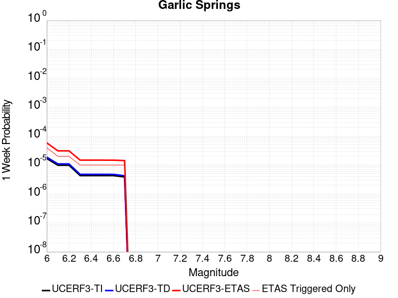 |  | 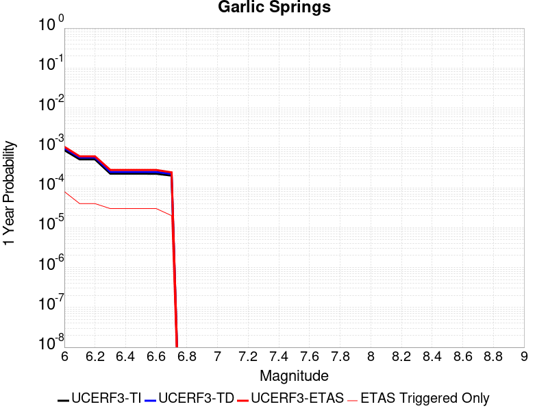 |  |

| Magnitude | 1 wk TI Prob | 1 wk TD Prob | 1 wk ETAS Prob | 1 wk ETAS/TD Gain | 1 wk ETAS Triggered Only | 1 mo TI Prob | 1 mo TD Prob | 1 mo ETAS Prob | 1 mo ETAS/TD Gain | 1 mo ETAS Triggered Only | 1 yr TI Prob | 1 yr TD Prob | 1 yr ETAS Prob | 1 yr ETAS/TD Gain | 1 yr ETAS Triggered Only | 10 yr TI Prob | 10 yr TD Prob | 10 yr ETAS Prob | 10 yr ETAS/TD Gain | 10 yr ETAS Triggered Only |
|-----|-----|-----|-----|-----|-----|-----|-----|-----|-----|-----|-----|-----|-----|-----|-----|-----|-----|-----|-----|-----|
| 6.0 | 1.6760017E-5 | 1.8776773E-5 | 6.7624256E-5 | 3.6014845 | 4.88484E-5 | 7.182667E-5 | 8.047006E-5 | 1.2931453E-4 | 1.6069894 | 4.88484E-5 | 8.7413884E-4 | 9.794E-4 | 0.0010770011 | 1.099654 | 9.76968E-5 | 0.008707083 | 0.009762381 | 0.009980054 | 1.022297 | 2.198178E-4 |
| 6.1 | 9.852767E-6 | 1.0973554E-5 | 3.5397486E-5 | 3.2257085 | 2.44242E-5 | 4.222546E-5 | 4.702907E-5 | 7.1452116E-5 | 1.5193182 | 2.44242E-5 | 5.139737E-4 | 5.724994E-4 | 6.2131986E-4 | 1.085276 | 4.88484E-5 | 0.005127866 | 0.005717204 | 0.005850769 | 1.0233619 | 1.343331E-4 |
| 6.2 | 9.852767E-6 | 1.0973554E-5 | 3.5397486E-5 | 3.2257085 | 2.44242E-5 | 4.222546E-5 | 4.702907E-5 | 7.1452116E-5 | 1.5193182 | 2.44242E-5 | 5.139737E-4 | 5.724994E-4 | 6.2131986E-4 | 1.085276 | 4.88484E-5 | 0.005127866 | 0.005717204 | 0.005850769 | 1.0233619 | 1.343331E-4 |
| 6.3 | 4.3167724E-6 | 4.778015E-6 | 1.6990056E-5 | 3.5558817 | 1.22121E-5 | 1.8500323E-5 | 2.0477177E-5 | 3.2689026E-5 | 1.5963639 | 1.22121E-5 | 2.2521814E-4 | 2.4930414E-4 | 2.8593128E-4 | 1.1469176 | 3.66363E-5 | 0.0022499003 | 0.0024925028 | 0.0025412296 | 1.0195493 | 4.88484E-5 |
| 6.4 | 4.3167724E-6 | 4.778015E-6 | 1.6990056E-5 | 3.5558817 | 1.22121E-5 | 1.8500323E-5 | 2.0477177E-5 | 3.2689026E-5 | 1.5963639 | 1.22121E-5 | 2.2521814E-4 | 2.4930414E-4 | 2.8593128E-4 | 1.1469176 | 3.66363E-5 | 0.0022499003 | 0.0024925028 | 0.0025412296 | 1.0195493 | 4.88484E-5 |
| 6.5 | 4.3167724E-6 | 4.778015E-6 | 1.6990056E-5 | 3.5558817 | 1.22121E-5 | 1.8500323E-5 | 2.0477177E-5 | 3.2689026E-5 | 1.5963639 | 1.22121E-5 | 2.2521814E-4 | 2.4930414E-4 | 2.8593128E-4 | 1.1469176 | 3.66363E-5 | 0.0022499003 | 0.0024925028 | 0.0025412296 | 1.0195493 | 4.88484E-5 |
| 6.6 | 4.301311E-6 | 4.7608837E-6 | 1.6972925E-5 | 3.565079 | 1.22121E-5 | 1.8434059E-5 | 2.0403757E-5 | 3.2615608E-5 | 1.5985099 | 1.22121E-5 | 2.2441156E-4 | 2.4841045E-4 | 2.8503765E-4 | 1.1474463 | 3.66363E-5 | 0.0022418506 | 0.002483586 | 0.002532313 | 1.0196197 | 4.88484E-5 |
| 6.7 | 3.8599724E-6 | 4.2710476E-6 | 1.6483094E-5 | 3.8592627 | 1.22121E-5 | 1.6542634E-5 | 1.830449E-5 | 3.0516367E-5 | 1.6671519 | 1.22121E-5 | 2.0138794E-4 | 2.2285717E-4 | 2.4727592E-4 | 1.1095713 | 2.44242E-5 | 0.0020120554 | 0.0022285716 | 0.0022651264 | 1.0164027 | 3.66363E-5 |

## Death Valley (Black Mtns Frontal)
*[(top)](#table-of-contents)*

| 1 Week | 1 Month | 1 Year | 10 Year |
|-----|-----|-----|-----|
| 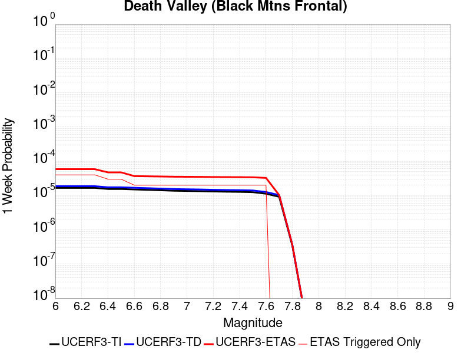 |  |  | 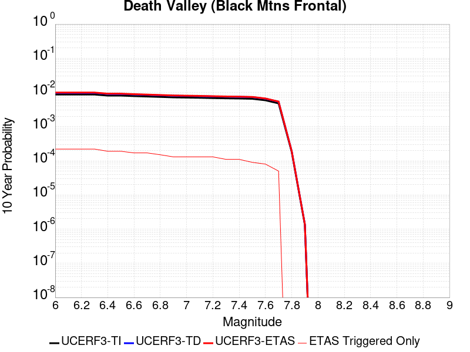 |

| Magnitude | 1 wk TI Prob | 1 wk TD Prob | 1 wk ETAS Prob | 1 wk ETAS/TD Gain | 1 wk ETAS Triggered Only | 1 mo TI Prob | 1 mo TD Prob | 1 mo ETAS Prob | 1 mo ETAS/TD Gain | 1 mo ETAS Triggered Only | 1 yr TI Prob | 1 yr TD Prob | 1 yr ETAS Prob | 1 yr ETAS/TD Gain | 1 yr ETAS Triggered Only | 10 yr TI Prob | 10 yr TD Prob | 10 yr ETAS Prob | 10 yr ETAS/TD Gain | 10 yr ETAS Triggered Only |
|-----|-----|-----|-----|-----|-----|-----|-----|-----|-----|-----|-----|-----|-----|-----|-----|-----|-----|-----|-----|-----|
| 6.0 | 1.6707214E-5 | 1.867021E-5 | 4.3093954E-5 | 2.3081665 | 2.44242E-5 | 7.160038E-5 | 8.0012775E-5 | 1.7770176E-4 | 2.2209172 | 9.76968E-5 | 8.71386E-4 | 9.737278E-4 | 0.0010957299 | 1.1252939 | 1.22121E-4 | 0.00867977 | 0.009695467 | 0.009913153 | 1.0224524 | 2.198178E-4 |
| 6.1 | 1.6707214E-5 | 1.867021E-5 | 4.3093954E-5 | 2.3081665 | 2.44242E-5 | 7.160038E-5 | 8.0012775E-5 | 1.7770176E-4 | 2.2209172 | 9.76968E-5 | 8.71386E-4 | 9.737278E-4 | 0.0010957299 | 1.1252939 | 1.22121E-4 | 0.00867977 | 0.009695467 | 0.009913153 | 1.0224524 | 2.198178E-4 |
| 6.2 | 1.6707214E-5 | 1.867021E-5 | 4.3093954E-5 | 2.3081665 | 2.44242E-5 | 7.160038E-5 | 8.0012775E-5 | 1.7770176E-4 | 2.2209172 | 9.76968E-5 | 8.71386E-4 | 9.737278E-4 | 0.0010957299 | 1.1252939 | 1.22121E-4 | 0.00867977 | 0.009695467 | 0.009913153 | 1.0224524 | 2.198178E-4 |
| 6.3 | 1.6707214E-5 | 1.867021E-5 | 4.3093954E-5 | 2.3081665 | 2.44242E-5 | 7.160038E-5 | 8.0012775E-5 | 1.7770176E-4 | 2.2209172 | 9.76968E-5 | 8.71386E-4 | 9.737278E-4 | 0.0010957299 | 1.1252939 | 1.22121E-4 | 0.00867977 | 0.009695467 | 0.009913153 | 1.0224524 | 2.198178E-4 |
| 6.4 | 1.5515609E-5 | 1.733816E-5 | 2.9550047E-5 | 1.7043359 | 1.22121E-5 | 6.649377E-5 | 7.430431E-5 | 1.4757147E-4 | 1.9860418 | 7.32726E-5 | 8.0926094E-4 | 9.0428564E-4 | 0.0010018941 | 1.1079398 | 9.76968E-5 | 0.008063202 | 0.009006744 | 0.009188277 | 1.0201551 | 1.831815E-4 |
| 6.5 | 1.5515609E-5 | 1.733816E-5 | 2.9550047E-5 | 1.7043359 | 1.22121E-5 | 6.649377E-5 | 7.430431E-5 | 1.4757147E-4 | 1.9860418 | 7.32726E-5 | 8.0926094E-4 | 9.0428564E-4 | 0.0010018941 | 1.1079398 | 9.76968E-5 | 0.008063202 | 0.009006744 | 0.009188277 | 1.0201551 | 1.831815E-4 |
| 6.6 | 1.5041828E-5 | 1.6809092E-5 | 1.6809092E-5 | 1.0 | 0.0 | 6.4463384E-5 | 7.203701E-5 | 1.3309311E-4 | 1.8475658 | 6.10605E-5 | 7.8455906E-4 | 8.767036E-4 | 9.621133E-4 | 1.0974215 | 8.5484695E-5 | 0.00781795 | 0.008733105 | 0.008890476 | 1.01802 | 1.5875729E-4 |
| 6.7 | 1.4634985E-5 | 1.6355965E-5 | 1.6355965E-5 | 1.0 | 0.0 | 6.271985E-5 | 7.009514E-5 | 1.3115136E-4 | 1.8710479 | 6.10605E-5 | 7.6334673E-4 | 8.5307995E-4 | 9.384917E-4 | 1.1001216 | 8.5484695E-5 | 0.007607299 | 0.008498689 | 0.008656097 | 1.0185214 | 1.5875729E-4 |
| 6.8 | 1.4209158E-5 | 1.5881998E-5 | 1.5881998E-5 | 1.0 | 0.0 | 6.089497E-5 | 6.806396E-5 | 1.1690903E-4 | 1.7176349 | 4.88484E-5 | 7.4114406E-4 | 8.283693E-4 | 9.015812E-4 | 1.0883808 | 7.32726E-5 | 0.007386771 | 0.00825343 | 0.008386655 | 1.0161417 | 1.343331E-4 |
| 6.9 | 1.3780098E-5 | 1.5404545E-5 | 1.5404545E-5 | 1.0 | 0.0 | 5.9056227E-5 | 6.6017834E-5 | 1.1486301E-4 | 1.7398784 | 4.88484E-5 | 7.1877235E-4 | 8.034762E-4 | 8.6448767E-4 | 1.0759343 | 6.10605E-5 | 0.0071645193 | 0.008006307 | 0.008127451 | 1.015131 | 1.22121E-4 |
| 7.0 | 1.3585064E-5 | 1.5188108E-5 | 1.5188108E-5 | 1.0 | 0.0 | 5.8220405E-5 | 6.5090295E-5 | 1.13935515E-4 | 1.7504225 | 4.88484E-5 | 7.086029E-4 | 7.9219165E-4 | 8.532038E-4 | 1.0770168 | 6.10605E-5 | 0.007063476 | 0.007894269 | 0.008015426 | 1.0153475 | 1.22121E-4 |
| 7.1 | 1.3398601E-5 | 1.4981292E-5 | 1.4981292E-5 | 1.0 | 0.0 | 5.742131E-5 | 6.420399E-5 | 1.1304925E-4 | 1.7607824 | 4.88484E-5 | 6.9888023E-4 | 7.814087E-4 | 8.4242143E-4 | 1.0780805 | 6.10605E-5 | 0.0069668638 | 0.0077871997 | 0.007908369 | 1.0155602 | 1.22121E-4 |
| 7.2 | 1.3126312E-5 | 1.4679515E-5 | 1.4679515E-5 | 1.0 | 0.0 | 5.6254412E-5 | 6.2910716E-5 | 1.11756046E-4 | 1.776423 | 4.88484E-5 | 6.846822E-4 | 7.656743E-4 | 8.26688E-4 | 1.0796863 | 6.10605E-5 | 0.006825765 | 0.007630946 | 0.007752135 | 1.0158813 | 1.22121E-4 |
| 7.3 | 1.2922429E-5 | 1.4453743E-5 | 1.4453743E-5 | 1.0 | 0.0 | 5.5380664E-5 | 6.194317E-5 | 1.1078854E-4 | 1.7885514 | 4.88484E-5 | 6.74051E-4 | 7.5390254E-4 | 8.1491703E-4 | 1.0809315 | 6.10605E-5 | 0.006720101 | 0.007514031 | 0.007610994 | 1.0129042 | 9.76968E-5 |
| 7.4 | 1.2768878E-5 | 1.4283726E-5 | 1.4283726E-5 | 1.0 | 0.0 | 5.4722615E-5 | 6.121456E-5 | 1.1005997E-4 | 1.7979378 | 4.88484E-5 | 6.660441E-4 | 7.4503786E-4 | 8.060529E-4 | 1.0818952 | 6.10605E-5 | 0.0066405144 | 0.00742598 | 0.0075229513 | 1.0130584 | 9.76968E-5 |
| 7.5 | 1.2521929E-5 | 1.401197E-5 | 1.401197E-5 | 1.0 | 0.0 | 5.366431E-5 | 6.004995E-5 | 9.668405E-5 | 1.6100605 | 3.66363E-5 | 6.531671E-4 | 7.308683E-4 | 7.79681E-4 | 1.0667872 | 4.88484E-5 | 0.006512506 | 0.007285223 | 0.0073579615 | 1.0099844 | 7.32726E-5 |
| 7.6 | 1.1301089E-5 | 1.2648108E-5 | 1.2648108E-5 | 1.0 | 0.0 | 4.8432343E-5 | 5.4205084E-5 | 9.08394E-5 | 1.6758465 | 3.66363E-5 | 5.895042E-4 | 6.5975235E-4 | 6.963645E-4 | 1.0554937 | 3.66363E-5 | 0.0058794282 | 0.006578489 | 0.006639148 | 1.0092208 | 6.10605E-5 |
| 7.7 | 9.189108E-6 | 1.02833255E-5 | 1.02833255E-5 | 1.0 | 0.0 | 3.93813E-5 | 4.407068E-5 | 6.8493806E-5 | 1.5541807 | 2.44242E-5 | 4.7936183E-4 | 5.364335E-4 | 5.6084455E-4 | 1.0455062 | 2.44242E-5 | 0.004783291 | 0.005351897 | 0.005400484 | 1.0090785 | 4.88484E-5 |
| 7.8 | 3.4586725E-7 | 3.648256E-7 | 3.648256E-7 | 1.0 | 0.0 | 1.4822873E-6 | 1.5635374E-6 | 1.5635374E-6 | 1.0 | 0.0 | 1.80467E-5 | 1.9035906E-5 | 1.9035906E-5 | 1.0 | 0.0 | 1.8045233E-4 | 1.903432E-4 | 1.903432E-4 | 1.0 | 0.0 |
| 7.9 | 2.5591178E-9 | 2.6696687E-9 | 2.6696687E-9 | 1.0 | 0.0 | 1.0967647E-8 | 1.1441437E-8 | 1.1441437E-8 | 1.0 | 0.0 | 1.335311E-7 | 1.392995E-7 | 1.392995E-7 | 1.0 | 0.0 | 1.3353102E-6 | 1.3929949E-6 | 1.3929949E-6 | 1.0 | 0.0 |

## San Andreas (San Bernardino N)
*[(top)](#table-of-contents)*

| 1 Week | 1 Month | 1 Year | 10 Year |
|-----|-----|-----|-----|
|  |  |  |  |

| Magnitude | 1 wk TI Prob | 1 wk TD Prob | 1 wk ETAS Prob | 1 wk ETAS/TD Gain | 1 wk ETAS Triggered Only | 1 mo TI Prob | 1 mo TD Prob | 1 mo ETAS Prob | 1 mo ETAS/TD Gain | 1 mo ETAS Triggered Only | 1 yr TI Prob | 1 yr TD Prob | 1 yr ETAS Prob | 1 yr ETAS/TD Gain | 1 yr ETAS Triggered Only | 10 yr TI Prob | 10 yr TD Prob | 10 yr ETAS Prob | 10 yr ETAS/TD Gain | 10 yr ETAS Triggered Only |
|-----|-----|-----|-----|-----|-----|-----|-----|-----|-----|-----|-----|-----|-----|-----|-----|-----|-----|-----|-----|-----|
| 6.0 | 1.4273766E-4 | 3.160502E-4 | 4.015079E-4 | 1.2703928 | 8.5484695E-5 | 6.115894E-4 | 0.0013538037 | 0.0014635638 | 1.0810753 | 1.099089E-4 | 0.0074207084 | 0.016359491 | 0.016479613 | 1.0073427 | 1.22121E-4 | 0.07177748 | 0.1502609 | 0.1503958 | 1.0008978 | 1.5875729E-4 |
| 6.1 | 1.4273766E-4 | 3.160502E-4 | 4.015079E-4 | 1.2703928 | 8.5484695E-5 | 6.115894E-4 | 0.0013538037 | 0.0014635638 | 1.0810753 | 1.099089E-4 | 0.0074207084 | 0.016359491 | 0.016479613 | 1.0073427 | 1.22121E-4 | 0.07177748 | 0.1502609 | 0.1503958 | 1.0008978 | 1.5875729E-4 |
| 6.2 | 1.4273766E-4 | 3.160502E-4 | 4.015079E-4 | 1.2703928 | 8.5484695E-5 | 6.115894E-4 | 0.0013538037 | 0.0014635638 | 1.0810753 | 1.099089E-4 | 0.0074207084 | 0.016359491 | 0.016479613 | 1.0073427 | 1.22121E-4 | 0.07177748 | 0.1502609 | 0.1503958 | 1.0008978 | 1.5875729E-4 |
| 6.3 | 1.3730655E-4 | 3.050988E-4 | 3.9055743E-4 | 1.2801014 | 8.5484695E-5 | 5.883239E-4 | 0.0013069167 | 0.001416682 | 1.083988 | 1.099089E-4 | 0.0071393442 | 0.015797025 | 0.015917215 | 1.0076085 | 1.22121E-4 | 0.06914291 | 0.14556077 | 0.14569642 | 1.0009319 | 1.5875729E-4 |
| 6.4 | 1.3730655E-4 | 3.050988E-4 | 3.9055743E-4 | 1.2801014 | 8.5484695E-5 | 5.883239E-4 | 0.0013069167 | 0.001416682 | 1.083988 | 1.099089E-4 | 0.0071393442 | 0.015797025 | 0.015917215 | 1.0076085 | 1.22121E-4 | 0.06914291 | 0.14556077 | 0.14569642 | 1.0009319 | 1.5875729E-4 |
| 6.5 | 1.2942807E-4 | 2.8924362E-4 | 3.7470358E-4 | 1.2954602 | 8.5484695E-5 | 5.545738E-4 | 0.0012390317 | 0.0013488044 | 1.0885955 | 1.099089E-4 | 0.0067310524 | 0.014982116 | 0.015102408 | 1.008029 | 1.22121E-4 | 0.06530788 | 0.13870342 | 0.13884017 | 1.0009859 | 1.5875729E-4 |
| 6.6 | 1.1125901E-4 | 2.53633E-4 | 3.3909603E-4 | 1.3369554 | 8.5484695E-5 | 4.767372E-4 | 0.0010865482 | 0.0011963376 | 1.1010443 | 1.099089E-4 | 0.005788839 | 0.013149117 | 0.013269632 | 1.0091653 | 1.22121E-4 | 0.056403454 | 0.122993305 | 0.12313254 | 1.001132 | 1.5875729E-4 |
| 6.7 | 1.02209575E-4 | 2.3498294E-4 | 3.2044755E-4 | 1.3637056 | 8.5484695E-5 | 4.3796748E-4 | 0.0010066825 | 0.0011164808 | 1.1090693 | 1.099089E-4 | 0.0053192247 | 0.012187905 | 0.012308537 | 1.0098977 | 1.22121E-4 | 0.051936906 | 0.11478492 | 0.11492546 | 1.0012243 | 1.5875729E-4 |
| 6.8 | 9.610582E-5 | 2.2024135E-4 | 3.0570722E-4 | 1.3880556 | 8.5484695E-5 | 4.1181705E-4 | 9.435507E-4 | 0.0010533559 | 1.1163745 | 1.099089E-4 | 0.0050023515 | 0.011427486 | 0.011548212 | 1.0105644 | 1.22121E-4 | 0.048912346 | 0.10818693 | 0.10831762 | 1.0012081 | 1.465452E-4 |
| 6.9 | 9.3877505E-5 | 2.1479696E-4 | 3.0026332E-4 | 1.3978935 | 8.5484695E-5 | 4.0227012E-4 | 9.202343E-4 | 0.0010300421 | 1.1193259 | 1.099089E-4 | 0.0048866454 | 0.011146543 | 0.011267303 | 1.0108339 | 1.22121E-4 | 0.04780577 | 0.10577726 | 0.10590831 | 1.0012388 | 1.465452E-4 |
| 7.0 | 9.1019785E-5 | 2.080665E-4 | 2.935334E-4 | 1.4107673 | 8.5484695E-5 | 3.900265E-4 | 8.9140947E-4 | 0.0010012204 | 1.123188 | 1.099089E-4 | 0.0047382377 | 0.010799129 | 0.010919931 | 1.0111862 | 1.22121E-4 | 0.046384744 | 0.102747776 | 0.10287926 | 1.0012797 | 1.465452E-4 |
| 7.1 | 8.771155E-5 | 1.9981233E-4 | 2.730703E-4 | 1.3666338 | 7.32726E-5 | 3.758525E-4 | 8.560581E-4 | 9.5367123E-4 | 1.1140263 | 9.76968E-5 | 0.0045664064 | 0.010372897 | 0.010481665 | 1.0104859 | 1.099089E-4 | 0.044737056 | 0.099059336 | 0.09918036 | 1.0012218 | 1.343331E-4 |
| 7.2 | 8.0830236E-5 | 1.8386859E-4 | 2.5712771E-4 | 1.398432 | 7.32726E-5 | 3.4636928E-4 | 7.877704E-4 | 8.853902E-4 | 1.1239191 | 9.76968E-5 | 0.0042088944 | 0.009549032 | 0.0096578915 | 1.0114 | 1.099089E-4 | 0.041300658 | 0.091790274 | 0.09191228 | 1.0013292 | 1.343331E-4 |
| 7.3 | 7.7668235E-5 | 1.7330446E-4 | 2.4656436E-4 | 1.4227237 | 7.32726E-5 | 3.328214E-4 | 7.4252207E-4 | 8.401463E-4 | 1.1314765 | 9.76968E-5 | 0.0040445733 | 0.009002813 | 0.009111732 | 1.0120984 | 1.099089E-4 | 0.03971748 | 0.08705745 | 0.087180085 | 1.0014087 | 1.343331E-4 |
| 7.4 | 7.520177E-5 | 1.65506E-4 | 2.3876647E-4 | 1.4426454 | 7.32726E-5 | 3.2225347E-4 | 7.0911867E-4 | 8.067462E-4 | 1.1376745 | 9.76968E-5 | 0.0039163795 | 0.00859941 | 0.008708374 | 1.0126711 | 1.099089E-4 | 0.038480744 | 0.08351379 | 0.0836369 | 1.0014741 | 1.343331E-4 |
| 7.5 | 7.274697E-5 | 1.5838286E-4 | 2.3164385E-4 | 1.4625564 | 7.32726E-5 | 3.1173544E-4 | 6.7860715E-4 | 7.7623763E-4 | 1.1438689 | 9.76968E-5 | 0.003788775 | 0.0082308 | 0.008339805 | 1.0132434 | 1.099089E-4 | 0.03724827 | 0.08023059 | 0.08034292 | 1.0014 | 1.22121E-4 |
| 7.6 | 7.1185845E-5 | 1.5408162E-4 | 2.2734293E-4 | 1.4754708 | 7.32726E-5 | 3.0504653E-4 | 6.6018273E-4 | 7.57815E-4 | 1.1478868 | 9.76968E-5 | 0.0037076178 | 0.008008154 | 0.008117183 | 1.0136147 | 1.099089E-4 | 0.036463667 | 0.0782203 | 0.07833287 | 1.0014391 | 1.22121E-4 |
| 7.7 | 6.709961E-5 | 1.4317075E-4 | 2.1643286E-4 | 1.5117114 | 7.32726E-5 | 2.8753807E-4 | 6.1344466E-4 | 7.1108155E-4 | 1.1591617 | 9.76968E-5 | 0.003495157 | 0.007443151 | 0.007552242 | 1.0146565 | 1.099089E-4 | 0.034406938 | 0.07304912 | 0.073162325 | 1.0015496 | 1.22121E-4 |
| 7.8 | 6.300812E-5 | 1.3201238E-4 | 2.0527531E-4 | 1.5549701 | 7.32726E-5 | 2.7000686E-4 | 5.656447E-4 | 6.6328625E-4 | 1.1726199 | 9.76968E-5 | 0.0032823787 | 0.0068650073 | 0.0069741616 | 1.0159001 | 1.099089E-4 | 0.032343175 | 0.06770821 | 0.06782206 | 1.0016816 | 1.22121E-4 |
| 7.9 | 4.983037E-5 | 9.722561E-5 | 1.4606926E-4 | 1.5023743 | 4.88484E-5 | 2.1354125E-4 | 4.1661464E-4 | 4.654427E-4 | 1.1172019 | 4.88484E-5 | 0.0025967648 | 0.0050604967 | 0.0051212483 | 1.0120051 | 6.10605E-5 | 0.025666296 | 0.05064454 | 0.05070251 | 1.0011446 | 6.10605E-5 |
| 8.0 | 3.2211527E-5 | 5.329913E-5 | 6.5510576E-5 | 1.2291116 | 1.22121E-5 | 1.380421E-4 | 2.2840484E-4 | 2.4061416E-4 | 1.0534546 | 1.22121E-5 | 0.0016793669 | 0.0027772845 | 0.0027894627 | 1.0043849 | 1.22121E-5 | 0.016667323 | 0.028358717 | 0.028370583 | 1.0004184 | 1.22121E-5 |
| 8.1 | 1.743376E-5 | 1.8821896E-5 | 1.8821896E-5 | 1.0 | 0.0 | 7.471398E-5 | 8.066278E-5 | 8.066278E-5 | 1.0 | 0.0 | 9.0926304E-4 | 9.816275E-4 | 9.816275E-4 | 1.0 | 0.0 | 0.009055517 | 0.01048279 | 0.01048279 | 1.0 | 0.0 |
| 8.2 | 7.831616E-6 | 5.1541824E-6 | 5.1541824E-6 | 1.0 | 0.0 | 3.3563636E-5 | 2.2089165E-5 | 2.2089165E-5 | 1.0 | 0.0 | 4.0856065E-4 | 2.6890248E-4 | 2.6890248E-4 | 1.0 | 0.0 | 0.004078103 | 0.0030413123 | 0.0030413123 | 1.0 | 0.0 |
| 8.3 | 1.983087E-6 | 7.658221E-7 | 7.658221E-7 | 1.0 | 0.0 | 8.498917E-6 | 3.2820906E-6 | 3.2820906E-6 | 1.0 | 0.0 | 1.034694E-4 | 3.9958737E-5 | 3.9958737E-5 | 1.0 | 0.0 | 0.0010342124 | 4.7187202E-4 | 4.7187202E-4 | 1.0 | 0.0 |

## Coyote Lake
*[(top)](#table-of-contents)*

| 1 Week | 1 Month | 1 Year | 10 Year |
|-----|-----|-----|-----|
| 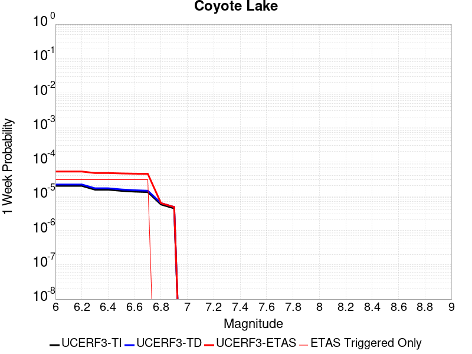 |  | 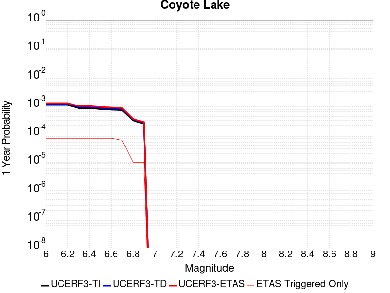 |  |

| Magnitude | 1 wk TI Prob | 1 wk TD Prob | 1 wk ETAS Prob | 1 wk ETAS/TD Gain | 1 wk ETAS Triggered Only | 1 mo TI Prob | 1 mo TD Prob | 1 mo ETAS Prob | 1 mo ETAS/TD Gain | 1 mo ETAS Triggered Only | 1 yr TI Prob | 1 yr TD Prob | 1 yr ETAS Prob | 1 yr ETAS/TD Gain | 1 yr ETAS Triggered Only | 10 yr TI Prob | 10 yr TD Prob | 10 yr ETAS Prob | 10 yr ETAS/TD Gain | 10 yr ETAS Triggered Only |
|-----|-----|-----|-----|-----|-----|-----|-----|-----|-----|-----|-----|-----|-----|-----|-----|-----|-----|-----|-----|-----|
| 6.0 | 1.980352E-5 | 2.170669E-5 | 5.8342193E-5 | 2.6877518 | 3.66363E-5 | 8.486947E-5 | 9.302576E-5 | 1.2965864E-4 | 1.393793 | 3.66363E-5 | 0.0010327959 | 0.0011320722 | 0.00121746 | 1.0754262 | 8.5484695E-5 | 0.010280091 | 0.01127023 | 0.011403048 | 1.0117849 | 1.343331E-4 |
| 6.1 | 1.980352E-5 | 2.170669E-5 | 5.8342193E-5 | 2.6877518 | 3.66363E-5 | 8.486947E-5 | 9.302576E-5 | 1.2965864E-4 | 1.393793 | 3.66363E-5 | 0.0010327959 | 0.0011320722 | 0.00121746 | 1.0754262 | 8.5484695E-5 | 0.010280091 | 0.01127023 | 0.011403048 | 1.0117849 | 1.343331E-4 |
| 6.2 | 1.980352E-5 | 2.170669E-5 | 5.8342193E-5 | 2.6877518 | 3.66363E-5 | 8.486947E-5 | 9.302576E-5 | 1.2965864E-4 | 1.393793 | 3.66363E-5 | 0.0010327959 | 0.0011320722 | 0.00121746 | 1.0754262 | 8.5484695E-5 | 0.010280091 | 0.01127023 | 0.011403048 | 1.0117849 | 1.343331E-4 |
| 6.3 | 1.5344787E-5 | 1.6820626E-5 | 5.3456308E-5 | 3.1780214 | 3.66363E-5 | 6.576172E-5 | 7.2086754E-5 | 1.0872041E-4 | 1.5081885 | 3.66363E-5 | 8.003548E-4 | 8.77364E-4 | 9.627737E-4 | 1.0973481 | 8.5484695E-5 | 0.007974784 | 0.008745047 | 0.0088661 | 1.0138425 | 1.22121E-4 |
| 6.4 | 1.5344787E-5 | 1.6820626E-5 | 5.3456308E-5 | 3.1780214 | 3.66363E-5 | 6.576172E-5 | 7.2086754E-5 | 1.0872041E-4 | 1.5081885 | 3.66363E-5 | 8.003548E-4 | 8.77364E-4 | 9.627737E-4 | 1.0973481 | 8.5484695E-5 | 0.007974784 | 0.008745047 | 0.0088661 | 1.0138425 | 1.22121E-4 |
| 6.5 | 1.4189697E-5 | 1.5557947E-5 | 5.2193674E-5 | 3.354792 | 3.66363E-5 | 6.081157E-5 | 6.667555E-5 | 1.0330941E-4 | 1.5494347 | 3.66363E-5 | 7.401293E-4 | 8.115328E-4 | 8.969481E-4 | 1.1052518 | 8.5484695E-5 | 0.0073766913 | 0.008091635 | 0.0082127685 | 1.0149702 | 1.22121E-4 |
| 6.6 | 1.3469301E-5 | 1.4771539E-5 | 5.1407296E-5 | 3.4801586 | 3.66363E-5 | 5.7724297E-5 | 6.33054E-5 | 9.993938E-5 | 1.5786865 | 3.66363E-5 | 7.025667E-4 | 7.7053066E-4 | 8.559495E-4 | 1.1108571 | 8.5484695E-5 | 0.0070034964 | 0.0076844944 | 0.007805677 | 1.0157697 | 1.22121E-4 |
| 6.7 | 1.3027966E-5 | 1.4281708E-5 | 5.0917486E-5 | 3.5652237 | 3.66363E-5 | 5.5832945E-5 | 6.120622E-5 | 9.784028E-5 | 1.5985348 | 3.66363E-5 | 6.7955407E-4 | 7.449907E-4 | 8.1820873E-4 | 1.0982804 | 7.32726E-5 | 0.006774798 | 0.0074308095 | 0.007539902 | 1.0146811 | 1.099089E-4 |
| 6.8 | 5.695434E-6 | 6.2244026E-6 | 6.2244026E-6 | 1.0 | 0.0 | 2.4408775E-5 | 2.6675907E-5 | 2.6675907E-5 | 1.0 | 0.0 | 2.971363E-4 | 3.2476074E-4 | 3.369689E-4 | 1.0375912 | 1.22121E-5 | 0.0029673933 | 0.0032458024 | 0.0032701474 | 1.0075004 | 2.44242E-5 |
| 6.9 | 4.385688E-6 | 4.7930434E-6 | 4.7930434E-6 | 1.0 | 0.0 | 1.879567E-5 | 2.0541615E-5 | 2.0541615E-5 | 1.0 | 0.0 | 2.2881327E-4 | 2.5009416E-4 | 2.6230322E-4 | 1.0488178 | 1.22121E-5 | 0.002285778 | 0.0025009417 | 0.0025131232 | 1.0048708 | 1.22121E-5 |

## Death Valley (No)
*[(top)](#table-of-contents)*

| 1 Week | 1 Month | 1 Year | 10 Year |
|-----|-----|-----|-----|
|  |  | 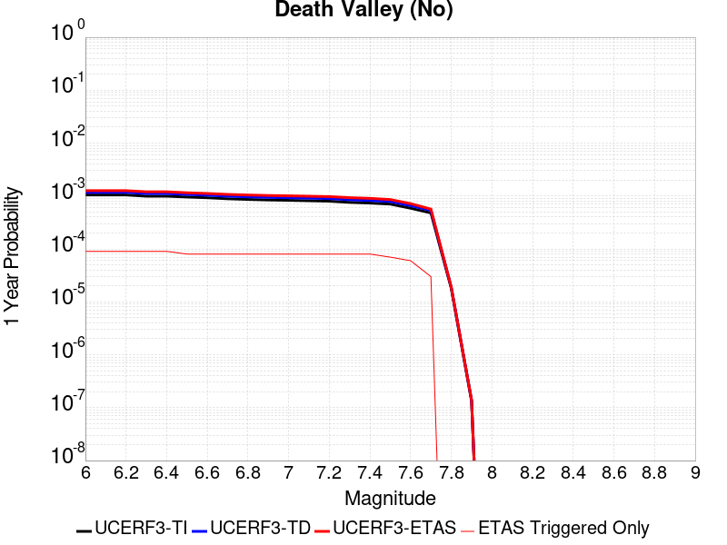 |  |

| Magnitude | 1 wk TI Prob | 1 wk TD Prob | 1 wk ETAS Prob | 1 wk ETAS/TD Gain | 1 wk ETAS Triggered Only | 1 mo TI Prob | 1 mo TD Prob | 1 mo ETAS Prob | 1 mo ETAS/TD Gain | 1 mo ETAS Triggered Only | 1 yr TI Prob | 1 yr TD Prob | 1 yr ETAS Prob | 1 yr ETAS/TD Gain | 1 yr ETAS Triggered Only | 10 yr TI Prob | 10 yr TD Prob | 10 yr ETAS Prob | 10 yr ETAS/TD Gain | 10 yr ETAS Triggered Only |
|-----|-----|-----|-----|-----|-----|-----|-----|-----|-----|-----|-----|-----|-----|-----|-----|-----|-----|-----|-----|-----|
| 6.0 | 2.0074807E-5 | 2.2500011E-5 | 2.2500011E-5 | 1.0 | 0.0 | 8.603206E-5 | 9.6425094E-5 | 1.4526879E-4 | 1.5065454 | 4.88484E-5 | 0.001046937 | 0.0011733507 | 0.0012465373 | 1.062374 | 7.32726E-5 | 0.010420183 | 0.011672469 | 0.011781095 | 1.0093062 | 1.099089E-4 |
| 6.1 | 2.0074807E-5 | 2.2500011E-5 | 2.2500011E-5 | 1.0 | 0.0 | 8.603206E-5 | 9.6425094E-5 | 1.4526879E-4 | 1.5065454 | 4.88484E-5 | 0.001046937 | 0.0011733507 | 0.0012465373 | 1.062374 | 7.32726E-5 | 0.010420183 | 0.011672469 | 0.011781095 | 1.0093062 | 1.099089E-4 |
| 6.2 | 2.0074807E-5 | 2.2500011E-5 | 2.2500011E-5 | 1.0 | 0.0 | 8.603206E-5 | 9.6425094E-5 | 1.4526879E-4 | 1.5065454 | 4.88484E-5 | 0.001046937 | 0.0011733507 | 0.0012465373 | 1.062374 | 7.32726E-5 | 0.010420183 | 0.011672469 | 0.011781095 | 1.0093062 | 1.099089E-4 |
| 6.3 | 1.9050609E-5 | 2.1336878E-5 | 2.1336878E-5 | 1.0 | 0.0 | 8.164292E-5 | 9.14406E-5 | 1.4028454E-4 | 1.5341603 | 4.88484E-5 | 9.935491E-4 | 0.0011127274 | 0.0011859186 | 1.0657762 | 7.32726E-5 | 0.009891188 | 0.011072383 | 0.011181075 | 1.0098165 | 1.099089E-4 |
| 6.4 | 1.9050609E-5 | 2.1336878E-5 | 2.1336878E-5 | 1.0 | 0.0 | 8.164292E-5 | 9.14406E-5 | 1.4028454E-4 | 1.5341603 | 4.88484E-5 | 9.935491E-4 | 0.0011127274 | 0.0011859186 | 1.0657762 | 7.32726E-5 | 0.009891188 | 0.011072383 | 0.011181075 | 1.0098165 | 1.099089E-4 |
| 6.5 | 1.8367004E-5 | 2.0560943E-5 | 2.0560943E-5 | 1.0 | 0.0 | 7.8713354E-5 | 8.811538E-5 | 1.3695948E-4 | 1.5543197 | 4.88484E-5 | 9.5791375E-4 | 0.0010722834 | 0.0011332784 | 1.0568833 | 6.10605E-5 | 0.009537951 | 0.010671882 | 0.010768536 | 1.0090569 | 9.76968E-5 |
| 6.6 | 1.779439E-5 | 1.9910865E-5 | 1.9910865E-5 | 1.0 | 0.0 | 7.625944E-5 | 8.532952E-5 | 1.3417375E-4 | 1.5724189 | 4.88484E-5 | 9.280632E-4 | 0.0010383982 | 0.0010993953 | 1.0587416 | 6.10605E-5 | 0.009241969 | 0.01033622 | 0.010432906 | 1.0093542 | 9.76968E-5 |
| 6.7 | 1.7025437E-5 | 1.9043366E-5 | 1.9043366E-5 | 1.0 | 0.0 | 7.296412E-5 | 8.16119E-5 | 1.3045632E-4 | 1.5984962 | 4.88484E-5 | 8.87976E-4 | 9.931781E-4 | 0.001054178 | 1.0614189 | 6.10605E-5 | 0.008844362 | 0.009888114 | 0.009984844 | 1.0097826 | 9.76968E-5 |
| 6.8 | 1.6545107E-5 | 1.8512486E-5 | 1.8512486E-5 | 1.0 | 0.0 | 7.090568E-5 | 7.933685E-5 | 1.2818137E-4 | 1.61566 | 4.88484E-5 | 8.629347E-4 | 9.655042E-4 | 0.0010265057 | 1.063181 | 6.10605E-5 | 0.008595915 | 0.009613798 | 0.009710556 | 1.0100645 | 9.76968E-5 |
| 6.9 | 1.615478E-5 | 1.8087536E-5 | 1.8087536E-5 | 1.0 | 0.0 | 6.9232934E-5 | 7.7515746E-5 | 1.2636035E-4 | 1.630125 | 4.88484E-5 | 8.4258494E-4 | 9.4335165E-4 | 0.0010043546 | 1.0646662 | 6.10605E-5 | 0.008393973 | 0.009394166 | 0.009490944 | 1.0103021 | 9.76968E-5 |
| 7.0 | 1.5894311E-5 | 1.7805492E-5 | 1.7805492E-5 | 1.0 | 0.0 | 6.81167E-5 | 7.630706E-5 | 1.2515172E-4 | 1.6401069 | 4.88484E-5 | 8.2900526E-4 | 9.286485E-4 | 9.896524E-4 | 1.065691 | 6.10605E-5 | 0.008259195 | 0.0092483675 | 0.009345161 | 1.010466 | 9.76968E-5 |
| 7.1 | 1.5602263E-5 | 1.7483448E-5 | 1.7483448E-5 | 1.0 | 0.0 | 6.6865134E-5 | 7.492694E-5 | 1.2377168E-4 | 1.6518983 | 4.88484E-5 | 8.137789E-4 | 9.118598E-4 | 9.728646E-4 | 1.0669016 | 6.10605E-5 | 0.008108052 | 0.009081865 | 0.009178674 | 1.0106597 | 9.76968E-5 |
| 7.2 | 1.5323829E-5 | 1.7170574E-5 | 1.7170574E-5 | 1.0 | 0.0 | 6.56719E-5 | 7.358614E-5 | 1.2243094E-4 | 1.6637772 | 4.88484E-5 | 7.99262E-4 | 8.95549E-4 | 9.5655484E-4 | 1.0681212 | 6.10605E-5 | 0.007963934 | 0.008920078 | 0.009016903 | 1.0108547 | 9.76968E-5 |
| 7.3 | 1.4556212E-5 | 1.6302403E-5 | 1.6302403E-5 | 1.0 | 0.0 | 6.238227E-5 | 6.98656E-5 | 1.1871059E-4 | 1.6991278 | 4.88484E-5 | 7.592395E-4 | 8.502876E-4 | 9.1129617E-4 | 1.0717505 | 6.10605E-5 | 0.0075665074 | 0.008470987 | 0.008567857 | 1.0114354 | 9.76968E-5 |
| 7.4 | 1.411725E-5 | 1.580791E-5 | 1.580791E-5 | 1.0 | 0.0 | 6.0501097E-5 | 6.7746456E-5 | 1.16591546E-4 | 1.7209984 | 4.88484E-5 | 7.363519E-4 | 8.245068E-4 | 8.855169E-4 | 1.073996 | 6.10605E-5 | 0.0073391674 | 0.008215112 | 0.0083120065 | 1.0117947 | 9.76968E-5 |
| 7.5 | 1.3503312E-5 | 1.512624E-5 | 1.512624E-5 | 1.0 | 0.0 | 5.7870053E-5 | 6.4825166E-5 | 1.0145909E-4 | 1.5651189 | 3.66363E-5 | 7.043401E-4 | 7.889664E-4 | 8.377763E-4 | 1.0618656 | 4.88484E-5 | 0.007021119 | 0.007862279 | 0.007934975 | 1.0092462 | 7.32726E-5 |
| 7.6 | 1.1279839E-5 | 1.2626287E-5 | 1.2626287E-5 | 1.0 | 0.0 | 4.834127E-5 | 5.4111566E-5 | 9.074588E-5 | 1.6770146 | 3.66363E-5 | 5.88396E-4 | 6.5861444E-4 | 6.9522666E-4 | 1.0555897 | 3.66363E-5 | 0.005868405 | 0.006567178 | 0.006627837 | 1.0092368 | 6.10605E-5 |
| 7.7 | 9.189108E-6 | 1.02833255E-5 | 1.02833255E-5 | 1.0 | 0.0 | 3.93813E-5 | 4.407068E-5 | 6.8493806E-5 | 1.5541807 | 2.44242E-5 | 4.7936183E-4 | 5.364335E-4 | 5.6084455E-4 | 1.0455062 | 2.44242E-5 | 0.004783291 | 0.005351897 | 0.005400484 | 1.0090785 | 4.88484E-5 |
| 7.8 | 3.4586725E-7 | 3.648256E-7 | 3.648256E-7 | 1.0 | 0.0 | 1.4822873E-6 | 1.5635374E-6 | 1.5635374E-6 | 1.0 | 0.0 | 1.80467E-5 | 1.9035906E-5 | 1.9035906E-5 | 1.0 | 0.0 | 1.8045233E-4 | 1.903432E-4 | 1.903432E-4 | 1.0 | 0.0 |
| 7.9 | 2.5591178E-9 | 2.6696687E-9 | 2.6696687E-9 | 1.0 | 0.0 | 1.0967647E-8 | 1.1441437E-8 | 1.1441437E-8 | 1.0 | 0.0 | 1.335311E-7 | 1.392995E-7 | 1.392995E-7 | 1.0 | 0.0 | 1.3353102E-6 | 1.3929949E-6 | 1.3929949E-6 | 1.0 | 0.0 |

## Manix-Afton Hills
*[(top)](#table-of-contents)*

| 1 Week | 1 Month | 1 Year | 10 Year |
|-----|-----|-----|-----|
| 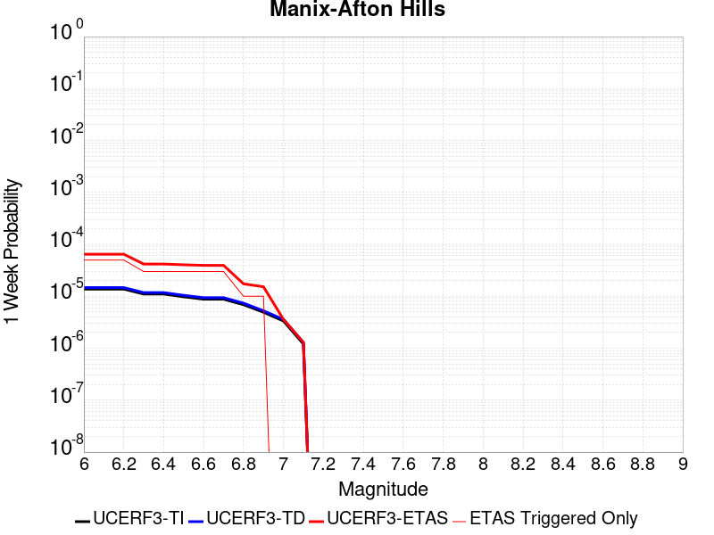 | 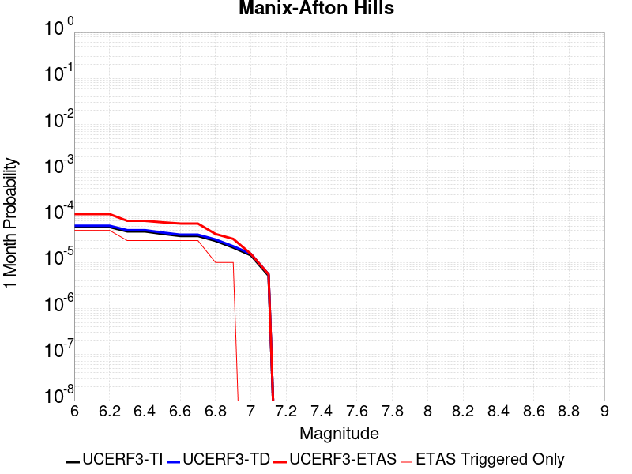 | 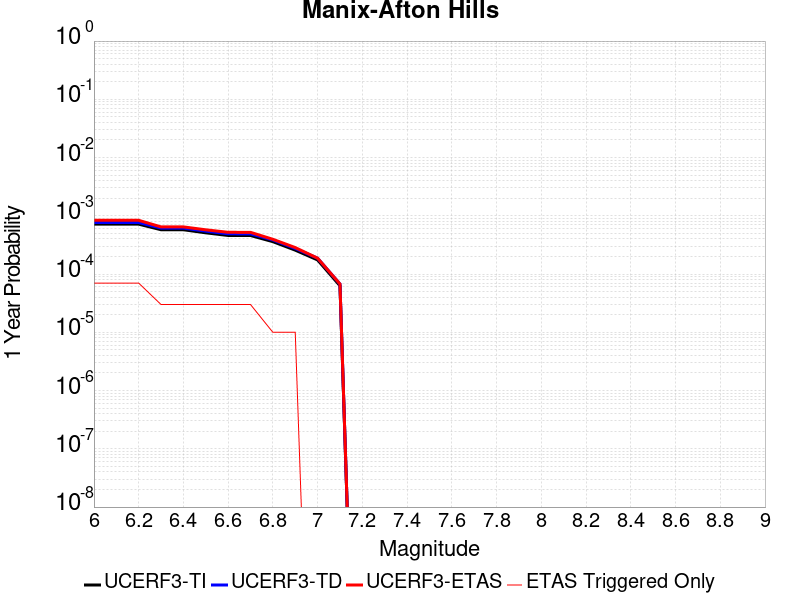 |  |

| Magnitude | 1 wk TI Prob | 1 wk TD Prob | 1 wk ETAS Prob | 1 wk ETAS/TD Gain | 1 wk ETAS Triggered Only | 1 mo TI Prob | 1 mo TD Prob | 1 mo ETAS Prob | 1 mo ETAS/TD Gain | 1 mo ETAS Triggered Only | 1 yr TI Prob | 1 yr TD Prob | 1 yr ETAS Prob | 1 yr ETAS/TD Gain | 1 yr ETAS Triggered Only | 10 yr TI Prob | 10 yr TD Prob | 10 yr ETAS Prob | 10 yr ETAS/TD Gain | 10 yr ETAS Triggered Only |
|-----|-----|-----|-----|-----|-----|-----|-----|-----|-----|-----|-----|-----|-----|-----|-----|-----|-----|-----|-----|-----|
| 6.0 | 1.3783202E-5 | 1.4711063E-5 | 7.5770666E-5 | 5.1505904 | 6.10605E-5 | 5.906953E-5 | 6.304599E-5 | 1.2410263E-4 | 1.9684463 | 6.10605E-5 | 7.189342E-4 | 7.673321E-4 | 8.527512E-4 | 1.1113197 | 8.5484695E-5 | 0.0071661277 | 0.007648582 | 0.007733413 | 1.0110911 | 8.5484695E-5 |
| 6.1 | 1.3783202E-5 | 1.4711063E-5 | 7.5770666E-5 | 5.1505904 | 6.10605E-5 | 5.906953E-5 | 6.304599E-5 | 1.2410263E-4 | 1.9684463 | 6.10605E-5 | 7.189342E-4 | 7.673321E-4 | 8.527512E-4 | 1.1113197 | 8.5484695E-5 | 0.0071661277 | 0.007648582 | 0.007733413 | 1.0110911 | 8.5484695E-5 |
| 6.2 | 1.3783202E-5 | 1.4711063E-5 | 7.5770666E-5 | 5.1505904 | 6.10605E-5 | 5.906953E-5 | 6.304599E-5 | 1.2410263E-4 | 1.9684463 | 6.10605E-5 | 7.189342E-4 | 7.673321E-4 | 8.527512E-4 | 1.1113197 | 8.5484695E-5 | 0.0071661277 | 0.007648582 | 0.007733413 | 1.0110911 | 8.5484695E-5 |
| 6.3 | 1.10494875E-5 | 1.1793114E-5 | 4.842898E-5 | 4.1065474 | 3.66363E-5 | 4.7354086E-5 | 5.0541E-5 | 8.7175446E-5 | 1.7248461 | 3.66363E-5 | 5.763835E-4 | 6.151733E-4 | 6.5178704E-4 | 1.0595177 | 3.66363E-5 | 0.005748908 | 0.0061357445 | 0.006172156 | 1.0059344 | 3.66363E-5 |
| 6.4 | 1.10494875E-5 | 1.1793114E-5 | 4.842898E-5 | 4.1065474 | 3.66363E-5 | 4.7354086E-5 | 5.0541E-5 | 8.7175446E-5 | 1.7248461 | 3.66363E-5 | 5.763835E-4 | 6.151733E-4 | 6.5178704E-4 | 1.0595177 | 3.66363E-5 | 0.005748908 | 0.0061357445 | 0.006172156 | 1.0059344 | 3.66363E-5 |
| 6.5 | 9.788949E-6 | 1.04543005E-5 | 4.7090216E-5 | 4.504387 | 3.66363E-5 | 4.1951964E-5 | 4.480343E-5 | 8.1438084E-5 | 1.8176754 | 3.66363E-5 | 5.1064545E-4 | 5.453545E-4 | 5.8197085E-4 | 1.0671422 | 3.66363E-5 | 0.0050947363 | 0.0054410887 | 0.0054775258 | 1.0066966 | 3.66363E-5 |
| 6.6 | 8.810006E-6 | 9.413611E-6 | 4.6049565E-5 | 4.8918066 | 3.66363E-5 | 3.775662E-5 | 4.034347E-5 | 7.697829E-5 | 1.9080731 | 3.66363E-5 | 4.5958988E-4 | 4.9108E-4 | 5.2769826E-4 | 1.0745668 | 3.66363E-5 | 0.0045864056 | 0.0049008303 | 0.004937287 | 1.0074389 | 3.66363E-5 |
| 6.7 | 8.80128E-6 | 9.404091E-6 | 4.6040044E-5 | 4.8957467 | 3.66363E-5 | 3.7719226E-5 | 4.0302675E-5 | 7.69375E-5 | 1.9089924 | 3.66363E-5 | 4.591348E-4 | 4.905835E-4 | 5.272018E-4 | 1.0746424 | 3.66363E-5 | 0.004581874 | 0.004895887 | 0.004932344 | 1.0074464 | 3.66363E-5 |
| 6.8 | 6.8994877E-6 | 7.3800625E-6 | 1.9592071E-5 | 2.6547298 | 1.22121E-5 | 2.9568899E-5 | 3.16285E-5 | 4.3840213E-5 | 1.3860984 | 1.22121E-5 | 3.5994186E-4 | 3.850171E-4 | 3.972245E-4 | 1.0317061 | 1.22121E-5 | 0.003593594 | 0.0038443056 | 0.0038564708 | 1.0031644 | 1.22121E-5 |
| 6.9 | 4.9328037E-6 | 5.270952E-6 | 1.7482987E-5 | 3.316856 | 1.22121E-5 | 2.1140417E-5 | 2.2589633E-5 | 3.4801455E-5 | 1.5405942 | 1.22121E-5 | 2.5735417E-4 | 2.7500023E-4 | 2.8720897E-4 | 1.0443953 | 1.22121E-5 | 0.0025705635 | 0.0027472044 | 0.002759383 | 1.004433 | 1.22121E-5 |
| 7.0 | 3.347973E-6 | 3.590023E-6 | 3.590023E-6 | 1.0 | 0.0 | 1.4348378E-5 | 1.5385745E-5 | 1.5385745E-5 | 1.0 | 0.0 | 1.746775E-4 | 1.8730946E-4 | 1.8730946E-4 | 1.0 | 0.0 | 0.0017454025 | 0.0018719183 | 0.0018719183 | 1.0 | 0.0 |
| 7.1 | 1.2073567E-6 | 1.2934796E-6 | 1.2934796E-6 | 1.0 | 0.0 | 5.1743755E-6 | 5.543481E-6 | 5.543481E-6 | 1.0 | 0.0 | 6.29962E-5 | 6.7491426E-5 | 6.7491426E-5 | 1.0 | 0.0 | 6.297835E-4 | 6.7486946E-4 | 6.7486946E-4 | 1.0 | 0.0 |

## San Andreas (Big Bend)
*[(top)](#table-of-contents)*

| 1 Week | 1 Month | 1 Year | 10 Year |
|-----|-----|-----|-----|
| 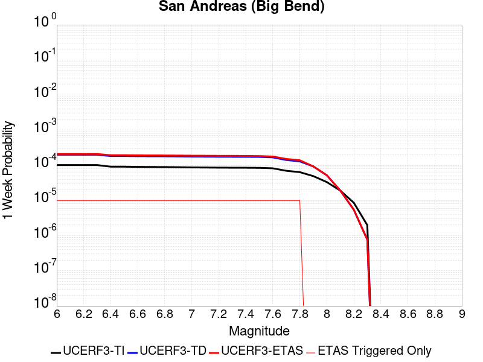 |  | 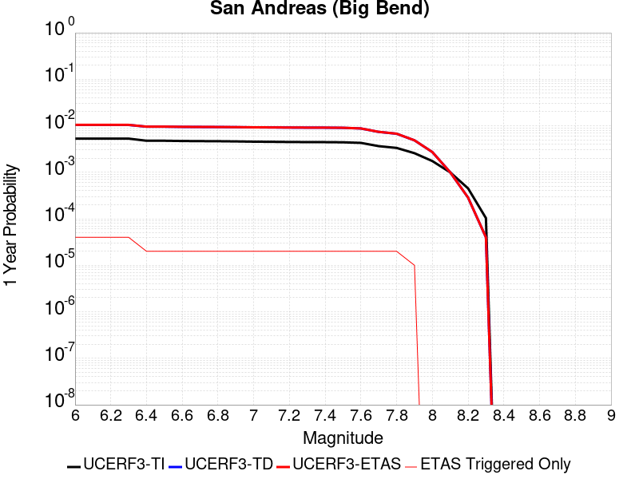 | 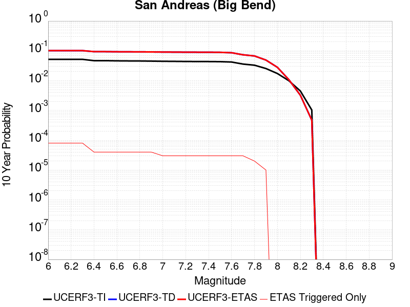 |

| Magnitude | 1 wk TI Prob | 1 wk TD Prob | 1 wk ETAS Prob | 1 wk ETAS/TD Gain | 1 wk ETAS Triggered Only | 1 mo TI Prob | 1 mo TD Prob | 1 mo ETAS Prob | 1 mo ETAS/TD Gain | 1 mo ETAS Triggered Only | 1 yr TI Prob | 1 yr TD Prob | 1 yr ETAS Prob | 1 yr ETAS/TD Gain | 1 yr ETAS Triggered Only | 10 yr TI Prob | 10 yr TD Prob | 10 yr ETAS Prob | 10 yr ETAS/TD Gain | 10 yr ETAS Triggered Only |
|-----|-----|-----|-----|-----|-----|-----|-----|-----|-----|-----|-----|-----|-----|-----|-----|-----|-----|-----|-----|-----|
| 6.0 | 1.0179969E-4 | 2.0070563E-4 | 2.1291529E-4 | 1.0608336 | 1.22121E-5 | 4.362114E-4 | 8.598845E-4 | 8.8428764E-4 | 1.0283797 | 2.44242E-5 | 0.0052979486 | 0.010419123 | 0.010455377 | 1.0034796 | 3.66363E-5 | 0.051734097 | 0.10144164 | 0.10151845 | 1.0007572 | 8.5484695E-5 |
| 6.1 | 1.0179969E-4 | 2.0070563E-4 | 2.1291529E-4 | 1.0608336 | 1.22121E-5 | 4.362114E-4 | 8.598845E-4 | 8.8428764E-4 | 1.0283797 | 2.44242E-5 | 0.0052979486 | 0.010419123 | 0.010455377 | 1.0034796 | 3.66363E-5 | 0.051734097 | 0.10144164 | 0.10151845 | 1.0007572 | 8.5484695E-5 |
| 6.2 | 1.0179969E-4 | 2.0070563E-4 | 2.1291529E-4 | 1.0608336 | 1.22121E-5 | 4.362114E-4 | 8.598845E-4 | 8.8428764E-4 | 1.0283797 | 2.44242E-5 | 0.0052979486 | 0.010419123 | 0.010455377 | 1.0034796 | 3.66363E-5 | 0.051734097 | 0.10144164 | 0.10151845 | 1.0007572 | 8.5484695E-5 |
| 6.3 | 1.0179969E-4 | 2.0070563E-4 | 2.1291529E-4 | 1.0608336 | 1.22121E-5 | 4.362114E-4 | 8.598845E-4 | 8.8428764E-4 | 1.0283797 | 2.44242E-5 | 0.0052979486 | 0.010419123 | 0.010455377 | 1.0034796 | 3.66363E-5 | 0.051734097 | 0.10144164 | 0.10151845 | 1.0007572 | 8.5484695E-5 |
| 6.4 | 9.1639464E-5 | 1.842787E-4 | 1.9648855E-4 | 1.0662575 | 1.22121E-5 | 3.9268145E-4 | 7.89527E-4 | 8.017295E-4 | 1.0154554 | 1.22121E-5 | 0.0047704205 | 0.009570243 | 0.009582338 | 1.0012639 | 1.22121E-5 | 0.046693064 | 0.09376797 | 0.09380117 | 1.000354 | 3.66363E-5 |
| 6.5 | 9.1639464E-5 | 1.842787E-4 | 1.9648855E-4 | 1.0662575 | 1.22121E-5 | 3.9268145E-4 | 7.89527E-4 | 8.017295E-4 | 1.0154554 | 1.22121E-5 | 0.0047704205 | 0.009570243 | 0.009582338 | 1.0012639 | 1.22121E-5 | 0.046693064 | 0.09376797 | 0.09380117 | 1.000354 | 3.66363E-5 |
| 6.6 | 9.042622E-5 | 1.8234932E-4 | 1.945592E-4 | 1.0669587 | 1.22121E-5 | 3.8748336E-4 | 7.812632E-4 | 7.934658E-4 | 1.015619 | 1.22121E-5 | 0.0047074095 | 0.009470508 | 0.009482604 | 1.0012773 | 1.22121E-5 | 0.046089325 | 0.09286199 | 0.092895225 | 1.0003579 | 3.66363E-5 |
| 6.7 | 8.9836685E-5 | 1.814927E-4 | 1.9370258E-4 | 1.0672748 | 1.22121E-5 | 3.8495753E-4 | 7.7759416E-4 | 7.8979676E-4 | 1.0156927 | 1.22121E-5 | 0.00467679 | 0.009426224 | 0.009438321 | 1.0012833 | 1.22121E-5 | 0.045795817 | 0.09245627 | 0.09248951 | 1.0003597 | 3.66363E-5 |
| 6.8 | 8.9471854E-5 | 1.8096055E-4 | 1.9317043E-4 | 1.0674727 | 1.22121E-5 | 3.8339442E-4 | 7.7531487E-4 | 7.875175E-4 | 1.015739 | 1.22121E-5 | 0.004657841 | 0.009398713 | 0.009410811 | 1.0012871 | 1.22121E-5 | 0.04561414 | 0.092203476 | 0.092236735 | 1.0003607 | 3.66363E-5 |
| 6.9 | 8.858234E-5 | 1.797803E-4 | 1.919902E-4 | 1.0679157 | 1.22121E-5 | 3.7958333E-4 | 7.7025965E-4 | 7.8246236E-4 | 1.0158423 | 1.22121E-5 | 0.004611638 | 0.009337694 | 0.009349792 | 1.0012956 | 1.22121E-5 | 0.04517103 | 0.0916436 | 0.09167688 | 1.0003631 | 3.66363E-5 |
| 7.0 | 8.7433385E-5 | 1.7816834E-4 | 1.9037825E-4 | 1.0685303 | 1.22121E-5 | 3.746607E-4 | 7.633553E-4 | 7.755581E-4 | 1.0159857 | 1.22121E-5 | 0.004551957 | 0.009254351 | 0.00926645 | 1.0013074 | 1.22121E-5 | 0.044598386 | 0.090878054 | 0.090900265 | 1.0002444 | 2.44242E-5 |
| 7.1 | 8.684964E-5 | 1.7728789E-4 | 1.8949783E-4 | 1.0688707 | 1.22121E-5 | 3.7215967E-4 | 7.595842E-4 | 7.71787E-4 | 1.0160651 | 1.22121E-5 | 0.0045216335 | 0.009208827 | 0.009220926 | 1.0013139 | 1.22121E-5 | 0.04430731 | 0.09045961 | 0.090481825 | 1.0002456 | 2.44242E-5 |
| 7.2 | 8.606521E-5 | 1.7619408E-4 | 1.8840402E-4 | 1.0692983 | 1.22121E-5 | 3.6879873E-4 | 7.548991E-4 | 7.67102E-4 | 1.0161649 | 1.22121E-5 | 0.0044808835 | 0.009152266 | 0.009164367 | 1.0013222 | 1.22121E-5 | 0.043916024 | 0.08994013 | 0.089962356 | 1.0002471 | 2.44242E-5 |
| 7.3 | 8.568266E-5 | 1.7561417E-4 | 1.8782412E-4 | 1.0695271 | 1.22121E-5 | 3.6715972E-4 | 7.524153E-4 | 7.6461816E-4 | 1.0162183 | 1.22121E-5 | 0.0044610105 | 0.0091222795 | 0.00913438 | 1.0013264 | 1.22121E-5 | 0.043725148 | 0.0896613 | 0.08968353 | 1.000248 | 2.44242E-5 |
| 7.4 | 8.5432206E-5 | 1.7524007E-4 | 1.8745003E-4 | 1.0696756 | 1.22121E-5 | 3.6608664E-4 | 7.508129E-4 | 7.630158E-4 | 1.016253 | 1.22121E-5 | 0.004447999 | 0.009102933 | 0.009115035 | 1.0013293 | 1.22121E-5 | 0.043600157 | 0.08948149 | 0.08950373 | 1.0002486 | 2.44242E-5 |
| 7.5 | 8.4791965E-5 | 1.7393343E-4 | 1.861434E-4 | 1.0701991 | 1.22121E-5 | 3.633435E-4 | 7.452162E-4 | 7.574192E-4 | 1.0163751 | 1.22121E-5 | 0.0044147377 | 0.009035361 | 0.009047463 | 1.0013394 | 1.22121E-5 | 0.043280575 | 0.08885915 | 0.0888814 | 1.0002505 | 2.44242E-5 |
| 7.6 | 8.241105E-5 | 1.68388E-4 | 1.8059804E-4 | 1.0725113 | 1.22121E-5 | 3.531424E-4 | 7.2146347E-4 | 7.3366676E-4 | 1.0169146 | 1.22121E-5 | 0.0042910352 | 0.0087485295 | 0.008760635 | 1.0013837 | 1.22121E-5 | 0.042091176 | 0.086236194 | 0.08625851 | 1.0002588 | 2.44242E-5 |
| 7.7 | 7.00432E-5 | 1.4203055E-4 | 1.5424092E-4 | 1.08597 | 1.22121E-5 | 3.001506E-4 | 6.085604E-4 | 6.207651E-4 | 1.0200549 | 1.22121E-5 | 0.0036482112 | 0.0073840916 | 0.0073962132 | 1.0016416 | 1.22121E-5 | 0.035888977 | 0.07351081 | 0.07353344 | 1.0003078 | 2.44242E-5 |
| 7.8 | 6.415362E-5 | 1.2967631E-4 | 1.4188682E-4 | 1.0941615 | 1.22121E-5 | 2.749151E-4 | 5.5563723E-4 | 5.6784257E-4 | 1.0219663 | 1.22121E-5 | 0.0033419547 | 0.00674393 | 0.0067560594 | 1.0017986 | 1.22121E-5 | 0.03292141 | 0.067246385 | 0.06725778 | 1.0001694 | 1.22121E-5 |
| 7.9 | 4.939911E-5 | 9.340218E-5 | 9.340218E-5 | 1.0 | 0.0 | 2.116933E-4 | 4.0023366E-4 | 4.0023366E-4 | 1.0 | 0.0 | 0.0025743195 | 0.0048619667 | 0.0048619667 | 1.0 | 0.0 | 0.025447013 | 0.04891005 | 0.04891005 | 1.0 | 0.0 |
| 8.0 | 3.344983E-5 | 5.222126E-5 | 5.222126E-5 | 1.0 | 0.0 | 1.4334853E-4 | 2.2378622E-4 | 2.2378622E-4 | 1.0 | 0.0 | 0.0017438711 | 0.0027211946 | 0.0027211946 | 1.0 | 0.0 | 0.017302496 | 0.027919443 | 0.027919443 | 1.0 | 0.0 |
| 8.1 | 1.9104898E-5 | 1.917038E-5 | 1.917038E-5 | 1.0 | 0.0 | 8.1875565E-5 | 8.215619E-5 | 8.215619E-5 | 1.0 | 0.0 | 9.963791E-4 | 9.997933E-4 | 9.997933E-4 | 1.0 | 0.0 | 0.009919235 | 0.010748395 | 0.010748395 | 1.0 | 0.0 |
| 8.2 | 8.643924E-6 | 5.4738607E-6 | 5.4738607E-6 | 1.0 | 0.0 | 3.704486E-5 | 2.3459192E-5 | 2.3459192E-5 | 1.0 | 0.0 | 4.5092785E-4 | 2.855783E-4 | 2.855783E-4 | 1.0 | 0.0 | 0.0045001395 | 0.0032481598 | 0.0032481598 | 1.0 | 0.0 |
| 8.3 | 1.983087E-6 | 7.658221E-7 | 7.658221E-7 | 1.0 | 0.0 | 8.498917E-6 | 3.2820906E-6 | 3.2820906E-6 | 1.0 | 0.0 | 1.034694E-4 | 3.9958737E-5 | 3.9958737E-5 | 1.0 | 0.0 | 0.0010342124 | 4.7187202E-4 | 4.7187202E-4 | 1.0 | 0.0 |

## San Andreas (Parkfield)
*[(top)](#table-of-contents)*

| 1 Week | 1 Month | 1 Year | 10 Year |
|-----|-----|-----|-----|
| 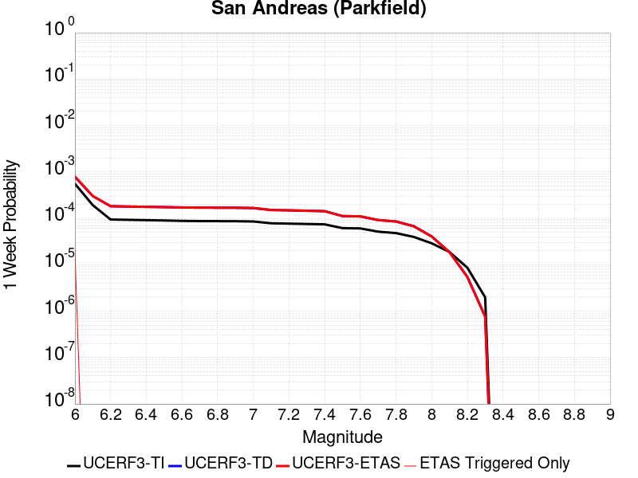 | 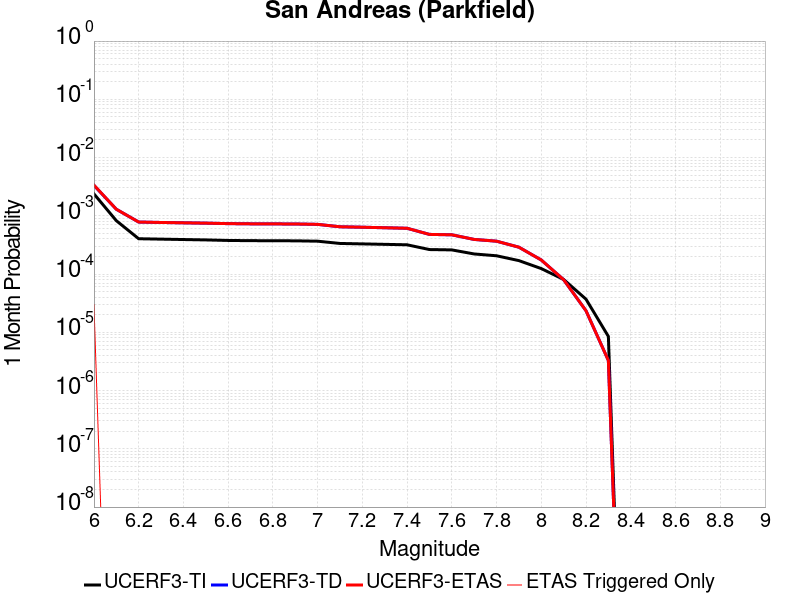 | 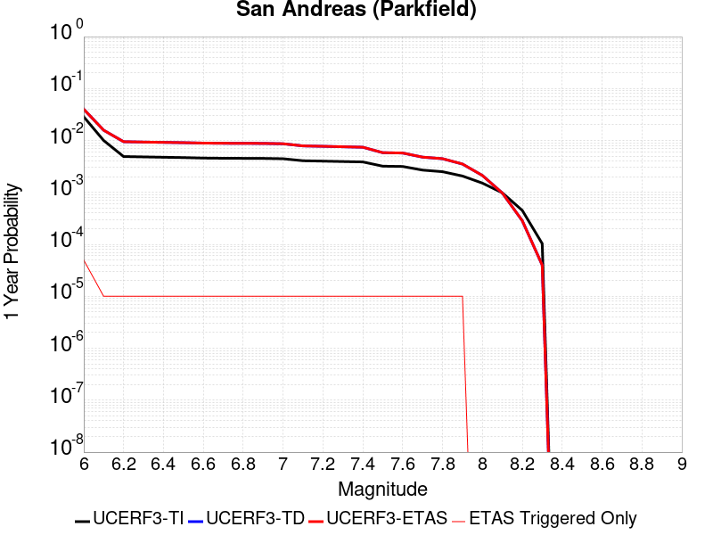 |  |

| Magnitude | 1 wk TI Prob | 1 wk TD Prob | 1 wk ETAS Prob | 1 wk ETAS/TD Gain | 1 wk ETAS Triggered Only | 1 mo TI Prob | 1 mo TD Prob | 1 mo ETAS Prob | 1 mo ETAS/TD Gain | 1 mo ETAS Triggered Only | 1 yr TI Prob | 1 yr TD Prob | 1 yr ETAS Prob | 1 yr ETAS/TD Gain | 1 yr ETAS Triggered Only | 10 yr TI Prob | 10 yr TD Prob | 10 yr ETAS Prob | 10 yr ETAS/TD Gain | 10 yr ETAS Triggered Only |
|-----|-----|-----|-----|-----|-----|-----|-----|-----|-----|-----|-----|-----|-----|-----|-----|-----|-----|-----|-----|-----|
| 6.0 | 5.556969E-4 | 7.776195E-4 | 8.0202473E-4 | 1.0313845 | 2.44242E-5 | 0.0023793848 | 0.003328946 | 0.0033532889 | 1.0073125 | 2.44242E-5 | 0.028586963 | 0.04018152 | 0.040216684 | 1.0008751 | 3.66363E-5 | 0.25176284 | 0.33713356 | 0.3371821 | 1.0001441 | 7.32726E-5 |
| 6.1 | 1.925858E-4 | 3.027076E-4 | 3.027076E-4 | 1.0 | 0.0 | 8.2510663E-4 | 0.001296767 | 0.001296767 | 1.0 | 0.0 | 0.0099994885 | 0.01577525 | 0.01577525 | 1.0 | 0.0 | 0.095613256 | 0.14970991 | 0.14970991 | 1.0 | 0.0 |
| 6.2 | 9.4306815E-5 | 1.824128E-4 | 1.824128E-4 | 1.0 | 0.0 | 4.0410945E-4 | 7.8153616E-4 | 7.8153616E-4 | 1.0 | 0.0 | 0.0049089384 | 0.009473897 | 0.009473897 | 1.0 | 0.0 | 0.048019063 | 0.09184752 | 0.09184752 | 1.0 | 0.0 |
| 6.3 | 9.283051E-5 | 1.793781E-4 | 1.793781E-4 | 1.0 | 0.0 | 3.9778434E-4 | 7.68538E-4 | 7.68538E-4 | 1.0 | 0.0 | 0.0048322747 | 0.009317007 | 0.009317007 | 1.0 | 0.0 | 0.047285385 | 0.09050047 | 0.09050047 | 1.0 | 0.0 |
| 6.4 | 9.138826E-5 | 1.7700029E-4 | 1.7700029E-4 | 1.0 | 0.0 | 3.916052E-4 | 7.5835333E-4 | 7.5835333E-4 | 1.0 | 0.0 | 0.0047573745 | 0.009194063 | 0.009194063 | 1.0 | 0.0 | 0.046568092 | 0.089402735 | 0.089402735 | 1.0 | 0.0 |
| 6.5 | 9.000255E-5 | 1.7458084E-4 | 1.7458084E-4 | 1.0 | 0.0 | 3.8566816E-4 | 7.479902E-4 | 7.479902E-4 | 1.0 | 0.0 | 0.0046854047 | 0.00906896 | 0.00906896 | 1.0 | 0.0 | 0.045878403 | 0.08828856 | 0.08828856 | 1.0 | 0.0 |
| 6.6 | 8.8109264E-5 | 1.7139279E-4 | 1.7139279E-4 | 1.0 | 0.0 | 3.7755648E-4 | 7.343349E-4 | 7.343349E-4 | 1.0 | 0.0 | 0.0045870654 | 0.008904092 | 0.008904092 | 1.0 | 0.0 | 0.04493529 | 0.08682025 | 0.08682025 | 1.0 | 0.0 |
| 6.7 | 8.738073E-5 | 1.7006363E-4 | 1.7006363E-4 | 1.0 | 0.0 | 3.7443507E-4 | 7.286417E-4 | 7.286417E-4 | 1.0 | 0.0 | 0.0045492216 | 0.008835384 | 0.008835384 | 1.0 | 0.0 | 0.04457213 | 0.08622064 | 0.08622064 | 1.0 | 0.0 |
| 6.8 | 8.710195E-5 | 1.695187E-4 | 1.695187E-4 | 1.0 | 0.0 | 3.7324068E-4 | 7.263075E-4 | 7.263075E-4 | 1.0 | 0.0 | 0.0045347405 | 0.008807203 | 0.008807203 | 1.0 | 0.0 | 0.04443313 | 0.085968256 | 0.085968256 | 1.0 | 0.0 |
| 6.9 | 8.6801556E-5 | 1.6892828E-4 | 1.6892828E-4 | 1.0 | 0.0 | 3.7195362E-4 | 7.237786E-4 | 7.237786E-4 | 1.0 | 0.0 | 0.0045191357 | 0.008776662 | 0.008776662 | 1.0 | 0.0 | 0.044283327 | 0.08569433 | 0.08569433 | 1.0 | 0.0 |
| 7.0 | 8.5571606E-5 | 1.6645678E-4 | 1.6645678E-4 | 1.0 | 0.0 | 3.6668387E-4 | 7.131923E-4 | 7.131923E-4 | 1.0 | 0.0 | 0.004455241 | 0.008648803 | 0.008648803 | 1.0 | 0.0 | 0.043669727 | 0.08454277 | 0.08454277 | 1.0 | 0.0 |
| 7.1 | 7.82589E-5 | 1.5126738E-4 | 1.5126738E-4 | 1.0 | 0.0 | 3.3535215E-4 | 6.4812845E-4 | 6.4812845E-4 | 1.0 | 0.0 | 0.0040752706 | 0.007862584 | 0.007862584 | 1.0 | 0.0 | 0.040013418 | 0.07745491 | 0.07745491 | 1.0 | 0.0 |
| 7.2 | 7.690929E-5 | 1.4864003E-4 | 1.4864003E-4 | 1.0 | 0.0 | 3.2956956E-4 | 6.368739E-4 | 6.368739E-4 | 1.0 | 0.0 | 0.004005129 | 0.007726539 | 0.007726539 | 1.0 | 0.0 | 0.0393371 | 0.0762281 | 0.0762281 | 1.0 | 0.0 |
| 7.3 | 7.5543794E-5 | 1.4560606E-4 | 1.4560606E-4 | 1.0 | 0.0 | 3.2371894E-4 | 6.2387745E-4 | 6.2387745E-4 | 1.0 | 0.0 | 0.003934157 | 0.007569417 | 0.007569417 | 1.0 | 0.0 | 0.038652334 | 0.07479123 | 0.07479123 | 1.0 | 0.0 |
| 7.4 | 7.4214564E-5 | 1.4261607E-4 | 1.4261607E-4 | 1.0 | 0.0 | 3.1802364E-4 | 6.110693E-4 | 6.110693E-4 | 1.0 | 0.0 | 0.003865065 | 0.0074145487 | 0.0074145487 | 1.0 | 0.0 | 0.03798529 | 0.07336518 | 0.07336518 | 1.0 | 0.0 |
| 7.5 | 6.149578E-5 | 1.11895584E-4 | 1.11895584E-4 | 1.0 | 0.0 | 2.6352672E-4 | 4.7946448E-4 | 4.7946448E-4 | 1.0 | 0.0 | 0.0032037178 | 0.0058218874 | 0.0058218874 | 1.0 | 0.0 | 0.03157923 | 0.05855221 | 0.05855221 | 1.0 | 0.0 |
| 7.6 | 6.0643448E-5 | 1.10182256E-4 | 1.10182256E-4 | 1.0 | 0.0 | 2.598746E-4 | 4.7212432E-4 | 4.7212432E-4 | 1.0 | 0.0 | 0.0031593828 | 0.005732995 | 0.005732995 | 1.0 | 0.0 | 0.031148417 | 0.057713263 | 0.057713263 | 1.0 | 0.0 |
| 7.7 | 5.1652263E-5 | 9.173663E-5 | 9.173663E-5 | 1.0 | 0.0 | 2.2134806E-4 | 3.9309775E-4 | 3.9309775E-4 | 1.0 | 0.0 | 0.002691582 | 0.0047754725 | 0.0047754725 | 1.0 | 0.0 | 0.026592141 | 0.048531387 | 0.048531387 | 1.0 | 0.0 |
| 7.8 | 4.8090482E-5 | 8.558682E-5 | 8.558682E-5 | 1.0 | 0.0 | 2.060858E-4 | 3.6674913E-4 | 3.6674913E-4 | 1.0 | 0.0 | 0.0025062072 | 0.0044560367 | 0.0044560367 | 1.0 | 0.0 | 0.024781305 | 0.045297977 | 0.045297977 | 1.0 | 0.0 |
| 7.9 | 3.970278E-5 | 6.749683E-5 | 6.749683E-5 | 1.0 | 0.0 | 1.7014367E-4 | 2.8924007E-4 | 2.8924007E-4 | 1.0 | 0.0 | 0.002069531 | 0.0035158154 | 0.0035158154 | 1.0 | 0.0 | 0.020503636 | 0.03587781 | 0.03587781 | 1.0 | 0.0 |
| 8.0 | 2.8982335E-5 | 4.0693238E-5 | 4.0693238E-5 | 1.0 | 0.0 | 1.2420409E-4 | 1.7438793E-4 | 1.7438793E-4 | 1.0 | 0.0 | 0.0015111357 | 0.0021211067 | 0.0021211067 | 1.0 | 0.0 | 0.015009012 | 0.022008339 | 0.022008339 | 1.0 | 0.0 |
| 8.1 | 1.8836186E-5 | 1.8678496E-5 | 1.8678496E-5 | 1.0 | 0.0 | 8.0724014E-5 | 8.0048245E-5 | 8.0048245E-5 | 1.0 | 0.0 | 9.823717E-4 | 9.7415224E-4 | 9.7415224E-4 | 1.0 | 0.0 | 0.009780403 | 0.010486731 | 0.010486731 | 1.0 | 0.0 |
| 8.2 | 8.643924E-6 | 5.4738607E-6 | 5.4738607E-6 | 1.0 | 0.0 | 3.704486E-5 | 2.3459192E-5 | 2.3459192E-5 | 1.0 | 0.0 | 4.5092785E-4 | 2.855783E-4 | 2.855783E-4 | 1.0 | 0.0 | 0.0045001395 | 0.0032481598 | 0.0032481598 | 1.0 | 0.0 |
| 8.3 | 1.983087E-6 | 7.658221E-7 | 7.658221E-7 | 1.0 | 0.0 | 8.498917E-6 | 3.2820906E-6 | 3.2820906E-6 | 1.0 | 0.0 | 1.034694E-4 | 3.9958737E-5 | 3.9958737E-5 | 1.0 | 0.0 | 0.0010342124 | 4.7187202E-4 | 4.7187202E-4 | 1.0 | 0.0 |

## Cady
*[(top)](#table-of-contents)*

| 1 Week | 1 Month | 1 Year | 10 Year |
|-----|-----|-----|-----|
|  |  | 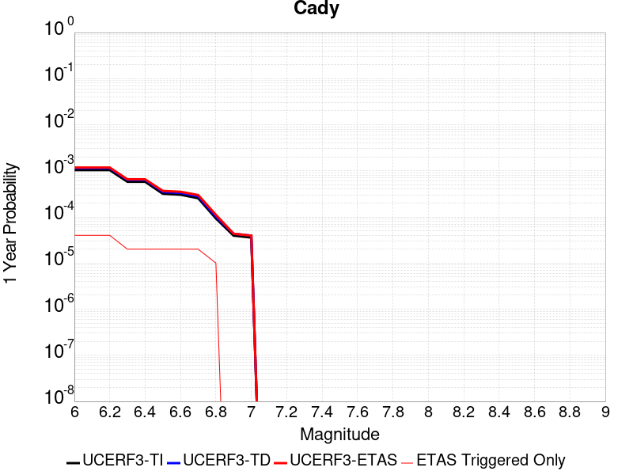 |  |

| Magnitude | 1 wk TI Prob | 1 wk TD Prob | 1 wk ETAS Prob | 1 wk ETAS/TD Gain | 1 wk ETAS Triggered Only | 1 mo TI Prob | 1 mo TD Prob | 1 mo ETAS Prob | 1 mo ETAS/TD Gain | 1 mo ETAS Triggered Only | 1 yr TI Prob | 1 yr TD Prob | 1 yr ETAS Prob | 1 yr ETAS/TD Gain | 1 yr ETAS Triggered Only | 10 yr TI Prob | 10 yr TD Prob | 10 yr ETAS Prob | 10 yr ETAS/TD Gain | 10 yr ETAS Triggered Only |
|-----|-----|-----|-----|-----|-----|-----|-----|-----|-----|-----|-----|-----|-----|-----|-----|-----|-----|-----|-----|-----|
| 6.0 | 1.9892565E-5 | 2.1858672E-5 | 5.849417E-5 | 2.6760168 | 3.66363E-5 | 8.525106E-5 | 9.367717E-5 | 1.3031004E-4 | 1.3910544 | 3.66363E-5 | 0.0010374374 | 0.0011400137 | 0.0011888064 | 1.0428001 | 4.88484E-5 | 0.010326075 | 0.011350671 | 0.011423112 | 1.0063821 | 7.32726E-5 |
| 6.1 | 1.9892565E-5 | 2.1858672E-5 | 5.849417E-5 | 2.6760168 | 3.66363E-5 | 8.525106E-5 | 9.367717E-5 | 1.3031004E-4 | 1.3910544 | 3.66363E-5 | 0.0010374374 | 0.0011400137 | 0.0011888064 | 1.0428001 | 4.88484E-5 | 0.010326075 | 0.011350671 | 0.011423112 | 1.0063821 | 7.32726E-5 |
| 6.2 | 1.9892565E-5 | 2.1858672E-5 | 5.849417E-5 | 2.6760168 | 3.66363E-5 | 8.525106E-5 | 9.367717E-5 | 1.3031004E-4 | 1.3910544 | 3.66363E-5 | 0.0010374374 | 0.0011400137 | 0.0011888064 | 1.0428001 | 4.88484E-5 | 0.010326075 | 0.011350671 | 0.011423112 | 1.0063821 | 7.32726E-5 |
| 6.3 | 1.1117327E-5 | 1.2176552E-5 | 2.4388504E-5 | 2.002907 | 1.22121E-5 | 4.764482E-5 | 5.2184358E-5 | 6.439582E-5 | 1.2340062 | 1.22121E-5 | 5.7992124E-4 | 6.3519087E-4 | 6.5959955E-4 | 1.0384274 | 2.44242E-5 | 0.0057841022 | 0.0063368594 | 0.0063732634 | 1.0057448 | 3.66363E-5 |
| 6.4 | 1.1117327E-5 | 1.2176552E-5 | 2.4388504E-5 | 2.002907 | 1.22121E-5 | 4.764482E-5 | 5.2184358E-5 | 6.439582E-5 | 1.2340062 | 1.22121E-5 | 5.7992124E-4 | 6.3519087E-4 | 6.5959955E-4 | 1.0384274 | 2.44242E-5 | 0.0057841022 | 0.0063368594 | 0.0063732634 | 1.0057448 | 3.66363E-5 |
| 6.5 | 6.103093E-6 | 6.672004E-6 | 1.8884022E-5 | 2.8303373 | 1.22121E-5 | 2.615585E-5 | 2.859406E-5 | 4.080581E-5 | 1.427073 | 1.22121E-5 | 3.1840094E-4 | 3.4808964E-4 | 3.7250534E-4 | 1.070142 | 2.44242E-5 | 0.0031794512 | 0.003476678 | 0.0035010173 | 1.0070007 | 2.44242E-5 |
| 6.6 | 5.817237E-6 | 6.3656425E-6 | 1.8577664E-5 | 2.9184272 | 1.22121E-5 | 2.4930776E-5 | 2.728111E-5 | 3.9492876E-5 | 1.4476272 | 1.22121E-5 | 3.034899E-4 | 3.3210934E-4 | 3.5652542E-4 | 1.0735183 | 2.44242E-5 | 0.0030307577 | 0.0033173522 | 0.0033416955 | 1.0073382 | 2.44242E-5 |
| 6.7 | 4.8846314E-6 | 5.3405547E-6 | 1.755259E-5 | 3.2866602 | 1.22121E-5 | 2.0933967E-5 | 2.2887958E-5 | 3.509978E-5 | 1.5335479 | 1.22121E-5 | 2.5484123E-4 | 2.7863705E-4 | 3.0305443E-4 | 1.0876316 | 2.44242E-5 | 0.0025454918 | 0.0027840321 | 0.0028083883 | 1.0087485 | 2.44242E-5 |
| 6.8 | 1.7788773E-6 | 1.9399033E-6 | 1.9399033E-6 | 1.0 | 0.0 | 7.6237375E-6 | 8.313854E-6 | 8.313854E-6 | 1.0 | 0.0 | 9.281505E-5 | 1.01218044E-4 | 1.13428905E-4 | 1.1206392 | 1.22121E-5 | 9.2776294E-4 | 0.0010118741 | 0.0010240738 | 1.0120566 | 1.22121E-5 |
| 6.9 | 7.5455404E-7 | 8.29707E-7 | 8.29707E-7 | 1.0 | 0.0 | 3.233799E-6 | 3.5558842E-6 | 3.5558842E-6 | 1.0 | 0.0 | 3.937079E-5 | 4.3292366E-5 | 4.3292366E-5 | 1.0 | 0.0 | 3.9363815E-4 | 4.3287227E-4 | 4.3287227E-4 | 1.0 | 0.0 |
| 7.0 | 6.8578805E-7 | 7.541796E-7 | 7.541796E-7 | 1.0 | 0.0 | 2.9390883E-6 | 3.2321961E-6 | 3.2321961E-6 | 1.0 | 0.0 | 3.578281E-5 | 3.935161E-5 | 3.935161E-5 | 1.0 | 0.0 | 3.577705E-4 | 3.9347887E-4 | 3.9347887E-4 | 1.0 | 0.0 |

## San Andreas (San Bernardino S)
*[(top)](#table-of-contents)*

| 1 Week | 1 Month | 1 Year | 10 Year |
|-----|-----|-----|-----|
| 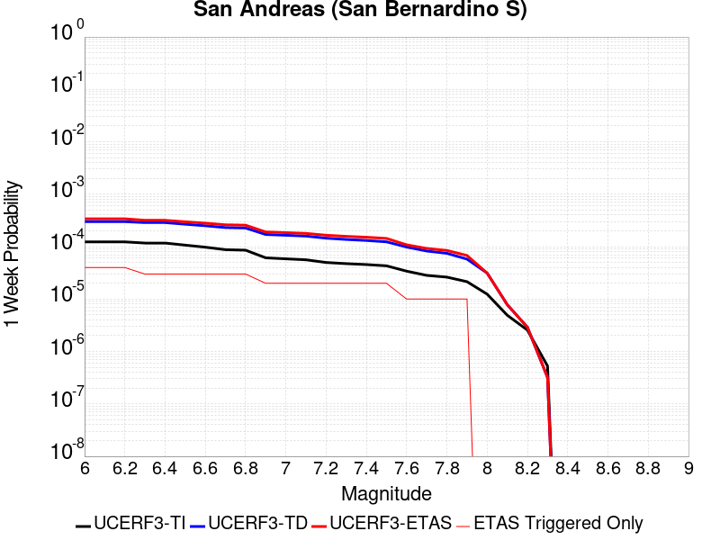 | 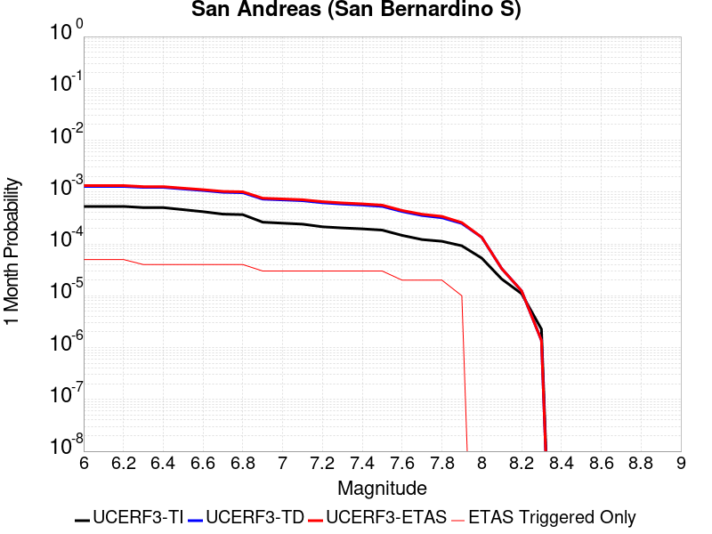 |  | 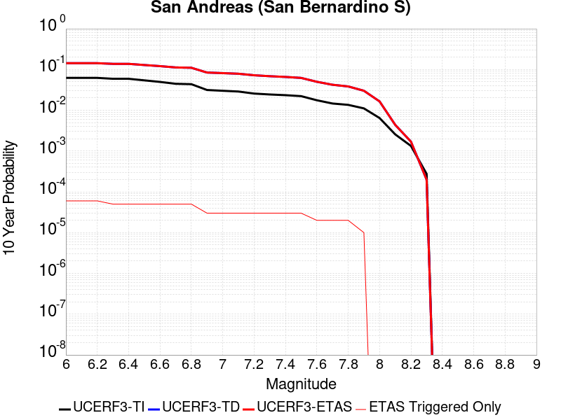 |

| Magnitude | 1 wk TI Prob | 1 wk TD Prob | 1 wk ETAS Prob | 1 wk ETAS/TD Gain | 1 wk ETAS Triggered Only | 1 mo TI Prob | 1 mo TD Prob | 1 mo ETAS Prob | 1 mo ETAS/TD Gain | 1 mo ETAS Triggered Only | 1 yr TI Prob | 1 yr TD Prob | 1 yr ETAS Prob | 1 yr ETAS/TD Gain | 1 yr ETAS Triggered Only | 10 yr TI Prob | 10 yr TD Prob | 10 yr ETAS Prob | 10 yr ETAS/TD Gain | 10 yr ETAS Triggered Only |
|-----|-----|-----|-----|-----|-----|-----|-----|-----|-----|-----|-----|-----|-----|-----|-----|-----|-----|-----|-----|-----|
| 6.0 | 1.2336002E-4 | 3.0003127E-4 | 3.4886503E-4 | 1.1627622 | 4.88484E-5 | 5.2857865E-4 | 0.0012852408 | 0.0013462227 | 1.0474479 | 6.10605E-5 | 0.006416472 | 0.015540493 | 0.015612626 | 1.0046417 | 7.32726E-5 | 0.06234337 | 0.14283332 | 0.14289613 | 1.0004398 | 7.32726E-5 |
| 6.1 | 1.2336002E-4 | 3.0003127E-4 | 3.4886503E-4 | 1.1627622 | 4.88484E-5 | 5.2857865E-4 | 0.0012852408 | 0.0013462227 | 1.0474479 | 6.10605E-5 | 0.006416472 | 0.015540493 | 0.015612626 | 1.0046417 | 7.32726E-5 | 0.06234337 | 0.14283332 | 0.14289613 | 1.0004398 | 7.32726E-5 |
| 6.2 | 1.2336002E-4 | 3.0003127E-4 | 3.4886503E-4 | 1.1627622 | 4.88484E-5 | 5.2857865E-4 | 0.0012852408 | 0.0013462227 | 1.0474479 | 6.10605E-5 | 0.006416472 | 0.015540493 | 0.015612626 | 1.0046417 | 7.32726E-5 | 0.06234337 | 0.14283332 | 0.14289613 | 1.0004398 | 7.32726E-5 |
| 6.3 | 1.1712257E-4 | 2.879145E-4 | 3.2454025E-4 | 1.1272105 | 3.66363E-5 | 5.018573E-4 | 0.0012333614 | 0.0012821496 | 1.0395571 | 4.88484E-5 | 0.006093008 | 0.014917629 | 0.014977779 | 1.0040321 | 6.10605E-5 | 0.059286322 | 0.1375418 | 0.13759446 | 1.0003829 | 6.10605E-5 |
| 6.4 | 1.1712257E-4 | 2.879145E-4 | 3.2454025E-4 | 1.1272105 | 3.66363E-5 | 5.018573E-4 | 0.0012333614 | 0.0012821496 | 1.0395571 | 4.88484E-5 | 0.006093008 | 0.014917629 | 0.014977779 | 1.0040321 | 6.10605E-5 | 0.059286322 | 0.1375418 | 0.13759446 | 1.0003829 | 6.10605E-5 |
| 6.5 | 1.0689076E-4 | 2.6804334E-4 | 3.046698E-4 | 1.1366439 | 3.66363E-5 | 4.5802278E-4 | 0.0011482761 | 0.0011970685 | 1.0424918 | 4.88484E-5 | 0.0055621783 | 0.013895263 | 0.013955475 | 1.0043333 | 6.10605E-5 | 0.05425003 | 0.12878914 | 0.12884234 | 1.0004131 | 6.10605E-5 |
| 6.6 | 9.7648895E-5 | 2.5049172E-4 | 2.8711883E-4 | 1.1462209 | 3.66363E-5 | 4.1842813E-4 | 0.0010731178 | 0.0011219138 | 1.0454712 | 4.88484E-5 | 0.005082469 | 0.012991305 | 0.013051573 | 1.004639 | 6.10605E-5 | 0.049677886 | 0.12094915 | 0.12100283 | 1.0004438 | 6.10605E-5 |
| 6.7 | 8.757013E-5 | 2.3119988E-4 | 2.678277E-4 | 1.158425 | 3.66363E-5 | 3.7524657E-4 | 9.905027E-4 | 0.0010393027 | 1.0492679 | 4.88484E-5 | 0.00455906 | 0.011996774 | 0.012057101 | 1.0050287 | 6.10605E-5 | 0.04466656 | 0.11225749 | 0.11231169 | 1.0004829 | 6.10605E-5 |
| 6.8 | 8.562978E-5 | 2.2679876E-4 | 2.6342674E-4 | 1.1615 | 3.66363E-5 | 3.6693315E-4 | 9.7165484E-4 | 0.0010204557 | 1.0502245 | 4.88484E-5 | 0.004458263 | 0.011769796 | 0.011830137 | 1.0051268 | 6.10605E-5 | 0.043698758 | 0.11026781 | 0.11032213 | 1.0004927 | 6.10605E-5 |
| 6.9 | 6.124075E-5 | 1.7064936E-4 | 1.9506938E-4 | 1.1431006 | 2.44242E-5 | 2.6243398E-4 | 7.311502E-4 | 7.6775975E-4 | 1.0500711 | 3.66363E-5 | 0.0031904527 | 0.008865628 | 0.00890194 | 1.0040958 | 3.66363E-5 | 0.031450346 | 0.08417915 | 0.0842127 | 1.0003986 | 3.66363E-5 |
| 7.0 | 5.8598747E-5 | 1.6493963E-4 | 1.893598E-4 | 1.1480552 | 2.44242E-5 | 2.5111332E-4 | 7.0669345E-4 | 7.4330386E-4 | 1.0518053 | 3.66363E-5 | 0.0030530186 | 0.008570245 | 0.008606567 | 1.0042382 | 3.66363E-5 | 0.03011414 | 0.08149692 | 0.08153056 | 1.000413 | 3.66363E-5 |
| 7.1 | 5.613814E-5 | 1.5912524E-4 | 1.8354555E-4 | 1.153466 | 2.44242E-5 | 2.4056983E-4 | 6.817878E-4 | 7.183991E-4 | 1.053699 | 3.66363E-5 | 0.0029250039 | 0.008269355 | 0.008305688 | 1.0043937 | 3.66363E-5 | 0.028868021 | 0.07879588 | 0.07882963 | 1.0004283 | 3.66363E-5 |
| 7.2 | 4.991222E-5 | 1.4519015E-4 | 1.6961081E-4 | 1.1681978 | 2.44242E-5 | 2.1389198E-4 | 6.220955E-4 | 6.5870903E-4 | 1.0588552 | 3.66363E-5 | 0.002601025 | 0.007547813 | 0.0075841728 | 1.0048172 | 3.66363E-5 | 0.025707912 | 0.072249845 | 0.072283834 | 1.0004704 | 3.66363E-5 |
| 7.3 | 4.7410045E-5 | 1.371324E-4 | 1.6155325E-4 | 1.1780822 | 2.44242E-5 | 2.0317009E-4 | 5.875783E-4 | 6.2419305E-4 | 1.0623147 | 3.66363E-5 | 0.0024707897 | 0.007130386 | 0.007166761 | 1.0051014 | 3.66363E-5 | 0.024434982 | 0.06853227 | 0.0685664 | 1.0004979 | 3.66363E-5 |
| 7.4 | 4.5556746E-5 | 1.3121162E-4 | 1.5563262E-4 | 1.1861192 | 2.44242E-5 | 1.952286E-4 | 5.6221464E-4 | 5.9883035E-4 | 1.0651276 | 3.66363E-5 | 0.002374317 | 0.006823559 | 0.006859945 | 1.0053325 | 3.66363E-5 | 0.023491086 | 0.06578475 | 0.06581898 | 1.0005202 | 3.66363E-5 |
| 7.5 | 4.3084514E-5 | 1.2356513E-4 | 1.4798631E-4 | 1.1976382 | 2.44242E-5 | 1.8463485E-4 | 5.2945764E-4 | 5.6607457E-4 | 1.0691593 | 3.66363E-5 | 0.0022456115 | 0.006427166 | 0.006463567 | 1.0056636 | 3.66363E-5 | 0.022230545 | 0.062185578 | 0.062219936 | 1.0005525 | 3.66363E-5 |
| 7.6 | 3.408608E-5 | 9.834847E-5 | 1.1055937E-4 | 1.1241596 | 1.22121E-5 | 1.4607502E-4 | 4.2142547E-4 | 4.4583937E-4 | 1.0579318 | 2.44242E-5 | 0.0017770125 | 0.00511881 | 0.0051431092 | 1.004747 | 2.44242E-5 | 0.017628696 | 0.050017312 | 0.050040517 | 1.0004638 | 2.44242E-5 |
| 7.7 | 2.8315713E-5 | 8.2480474E-5 | 9.469157E-5 | 1.1480483 | 1.22121E-5 | 1.2134742E-4 | 3.534399E-4 | 3.7785547E-4 | 1.0690799 | 2.44242E-5 | 0.0014764034 | 0.004294649 | 0.0043189684 | 1.0056627 | 2.44242E-5 | 0.01466633 | 0.04226858 | 0.042291977 | 1.0005534 | 2.44242E-5 |
| 7.8 | 2.6222975E-5 | 7.462497E-5 | 8.683616E-5 | 1.1636341 | 1.22121E-5 | 1.1237934E-4 | 3.1978212E-4 | 3.4419852E-4 | 1.0763532 | 2.44242E-5 | 0.0013673597 | 0.003886403 | 0.0039107325 | 1.0062602 | 2.44242E-5 | 0.013589768 | 0.038434092 | 0.038457576 | 1.0006111 | 2.44242E-5 |
| 7.9 | 2.1469694E-5 | 5.7873713E-5 | 7.008511E-5 | 1.2110007 | 1.22121E-5 | 9.200973E-5 | 2.4800663E-4 | 2.602157E-4 | 1.0492288 | 1.22121E-5 | 0.0011196428 | 0.003015303 | 0.0030274782 | 1.0040379 | 1.22121E-5 | 0.011140184 | 0.03014987 | 0.030161712 | 1.0003928 | 1.22121E-5 |
| 8.0 | 1.2420249E-5 | 3.1316227E-5 | 3.1316227E-5 | 1.0 | 0.0 | 5.322855E-5 | 1.342055E-4 | 1.342055E-4 | 1.0 | 0.0 | 6.478649E-4 | 0.0016327285 | 0.0016327285 | 1.0 | 0.0 | 0.0064597935 | 0.01652123 | 0.01652123 | 1.0 | 0.0 |
| 8.1 | 4.9197724E-6 | 7.82136E-6 | 7.82136E-6 | 1.0 | 0.0 | 2.1084568E-5 | 3.3519682E-5 | 3.3519682E-5 | 1.0 | 0.0 | 2.566744E-4 | 4.0802584E-4 | 4.0802584E-4 | 1.0 | 0.0 | 0.002563781 | 0.004383873 | 0.004383873 | 1.0 | 0.0 |
| 8.2 | 2.5634774E-6 | 2.9062624E-6 | 2.9062624E-6 | 1.0 | 0.0 | 1.0986286E-5 | 1.2455351E-5 | 1.2455351E-5 | 1.0 | 0.0 | 1.3374983E-4 | 1.5163339E-4 | 1.5163339E-4 | 1.0 | 0.0 | 0.0013366934 | 0.001704734 | 0.001704734 | 1.0 | 0.0 |
| 8.3 | 5.2850464E-7 | 3.2082596E-7 | 3.2082596E-7 | 1.0 | 0.0 | 2.2650179E-6 | 1.3749678E-6 | 1.3749678E-6 | 1.0 | 0.0 | 2.7576245E-5 | 1.6740116E-5 | 1.6740116E-5 | 1.0 | 0.0 | 2.7572823E-4 | 1.9866871E-4 | 1.9866871E-4 | 1.0 | 0.0 |

## Pinto Mtn
*[(top)](#table-of-contents)*

| 1 Week | 1 Month | 1 Year | 10 Year |
|-----|-----|-----|-----|
|  | 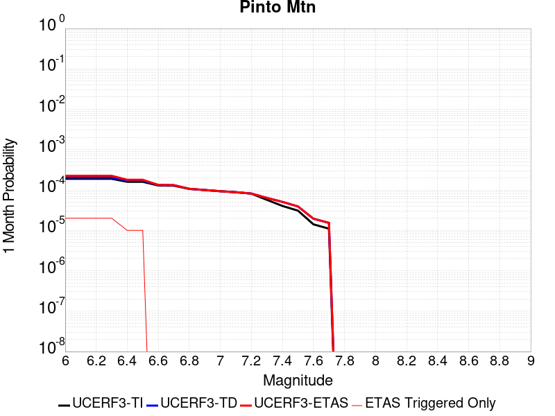 |  | 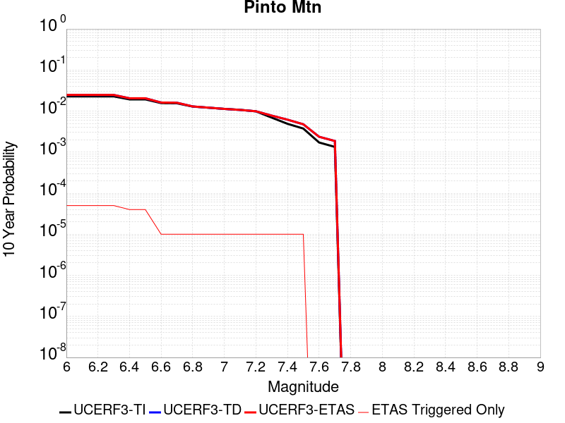 |

| Magnitude | 1 wk TI Prob | 1 wk TD Prob | 1 wk ETAS Prob | 1 wk ETAS/TD Gain | 1 wk ETAS Triggered Only | 1 mo TI Prob | 1 mo TD Prob | 1 mo ETAS Prob | 1 mo ETAS/TD Gain | 1 mo ETAS Triggered Only | 1 yr TI Prob | 1 yr TD Prob | 1 yr ETAS Prob | 1 yr ETAS/TD Gain | 1 yr ETAS Triggered Only | 10 yr TI Prob | 10 yr TD Prob | 10 yr ETAS Prob | 10 yr ETAS/TD Gain | 10 yr ETAS Triggered Only |
|-----|-----|-----|-----|-----|-----|-----|-----|-----|-----|-----|-----|-----|-----|-----|-----|-----|-----|-----|-----|-----|
| 6.0 | 4.4194956E-5 | 4.7853297E-5 | 6.006481E-5 | 1.2551866 | 1.22121E-5 | 1.893932E-4 | 2.0507036E-4 | 2.2948955E-4 | 1.1190771 | 2.44242E-5 | 0.0023034236 | 0.0024940374 | 0.0025305822 | 1.014653 | 3.66363E-5 | 0.022796938 | 0.02467798 | 0.024737533 | 1.0024133 | 6.10605E-5 |
| 6.1 | 4.4194956E-5 | 4.7853297E-5 | 6.006481E-5 | 1.2551866 | 1.22121E-5 | 1.893932E-4 | 2.0507036E-4 | 2.2948955E-4 | 1.1190771 | 2.44242E-5 | 0.0023034236 | 0.0024940374 | 0.0025305822 | 1.014653 | 3.66363E-5 | 0.022796938 | 0.02467798 | 0.024737533 | 1.0024133 | 6.10605E-5 |
| 6.2 | 4.4194956E-5 | 4.7853297E-5 | 6.006481E-5 | 1.2551866 | 1.22121E-5 | 1.893932E-4 | 2.0507036E-4 | 2.2948955E-4 | 1.1190771 | 2.44242E-5 | 0.0023034236 | 0.0024940374 | 0.0025305822 | 1.014653 | 3.66363E-5 | 0.022796938 | 0.02467798 | 0.024737533 | 1.0024133 | 6.10605E-5 |
| 6.3 | 4.4194956E-5 | 4.7853297E-5 | 6.006481E-5 | 1.2551866 | 1.22121E-5 | 1.893932E-4 | 2.0507036E-4 | 2.2948955E-4 | 1.1190771 | 2.44242E-5 | 0.0023034236 | 0.0024940374 | 0.0025305822 | 1.014653 | 3.66363E-5 | 0.022796938 | 0.02467798 | 0.024737533 | 1.0024133 | 6.10605E-5 |
| 6.4 | 3.729929E-5 | 3.9602906E-5 | 3.9602906E-5 | 1.0 | 0.0 | 1.5984432E-4 | 1.6971622E-4 | 1.8192625E-4 | 1.0719438 | 1.22121E-5 | 0.0019443673 | 0.0020644304 | 0.0020888043 | 1.0118065 | 2.44242E-5 | 0.019274427 | 0.020462546 | 0.020510396 | 1.0023384 | 4.88484E-5 |
| 6.5 | 3.729929E-5 | 3.9602906E-5 | 3.9602906E-5 | 1.0 | 0.0 | 1.5984432E-4 | 1.6971622E-4 | 1.8192625E-4 | 1.0719438 | 1.22121E-5 | 0.0019443673 | 0.0020644304 | 0.0020888043 | 1.0118065 | 2.44242E-5 | 0.019274427 | 0.020462546 | 0.020510396 | 1.0023384 | 4.88484E-5 |
| 6.6 | 3.0204548E-5 | 3.1205058E-5 | 3.1205058E-5 | 1.0 | 0.0 | 1.2944164E-4 | 1.337293E-4 | 1.337293E-4 | 1.0 | 0.0 | 0.0015748127 | 0.001626973 | 0.001626973 | 1.0 | 0.0 | 0.015636992 | 0.016154487 | 0.0161665 | 1.0007437 | 1.22121E-5 |
| 6.7 | 2.9857754E-5 | 3.0814444E-5 | 3.0814444E-5 | 1.0 | 0.0 | 1.2795553E-4 | 1.3205541E-4 | 1.3205541E-4 | 1.0 | 0.0 | 0.0015567453 | 0.0016066235 | 0.0016066235 | 1.0 | 0.0 | 0.015458848 | 0.015953926 | 0.015965944 | 1.0007533 | 1.22121E-5 |
| 6.8 | 2.4819734E-5 | 2.5009149E-5 | 2.5009149E-5 | 1.0 | 0.0 | 1.0636595E-4 | 1.0717779E-4 | 1.0717779E-4 | 1.0 | 0.0 | 0.0012942362 | 0.0013041301 | 0.0013041301 | 1.0 | 0.0 | 0.012867244 | 0.012967137 | 0.012979191 | 1.0009296 | 1.22121E-5 |
| 6.9 | 2.331124E-5 | 2.3337434E-5 | 2.3337434E-5 | 1.0 | 0.0 | 9.990149E-5 | 1.0001385E-4 | 1.0001385E-4 | 1.0 | 0.0 | 0.001215622 | 0.0012170088 | 0.0012170088 | 1.0 | 0.0 | 0.012089936 | 0.0121056335 | 0.012117698 | 1.0009966 | 1.22121E-5 |
| 7.0 | 2.1818534E-5 | 2.1760567E-5 | 2.1760567E-5 | 1.0 | 0.0 | 9.3504656E-5 | 9.325635E-5 | 9.325635E-5 | 1.0 | 0.0 | 0.0011378246 | 0.0011348245 | 0.0011348245 | 1.0 | 0.0 | 0.011320163 | 0.011292398 | 0.011304472 | 1.0010692 | 1.22121E-5 |
| 7.1 | 2.066081E-5 | 2.0540216E-5 | 2.0540216E-5 | 1.0 | 0.0 | 8.854332E-5 | 8.802664E-5 | 8.802664E-5 | 1.0 | 0.0 | 0.0010774818 | 0.001071217 | 0.001071217 | 1.0 | 0.0 | 0.010722724 | 0.010662585 | 0.010674667 | 1.0011331 | 1.22121E-5 |
| 7.2 | 1.8990233E-5 | 1.9053505E-5 | 1.9053505E-5 | 1.0 | 0.0 | 8.138417E-5 | 8.165543E-5 | 8.165543E-5 | 1.0 | 0.0 | 9.904018E-4 | 9.937207E-4 | 9.937207E-4 | 1.0 | 0.0 | 0.009859995 | 0.0098947715 | 0.009906863 | 1.001222 | 1.22121E-5 |
| 7.3 | 1.3335872E-5 | 1.490619E-5 | 1.490619E-5 | 1.0 | 0.0 | 5.7152483E-5 | 6.388218E-5 | 6.388218E-5 | 1.0 | 0.0 | 6.956093E-4 | 7.7750074E-4 | 7.7750074E-4 | 1.0 | 0.0 | 0.006934359 | 0.0077491053 | 0.007761223 | 1.0015637 | 1.22121E-5 |
| 7.4 | 9.414066E-6 | 1.1860438E-5 | 1.1860438E-5 | 1.0 | 0.0 | 4.0345374E-5 | 5.082951E-5 | 5.082951E-5 | 1.0 | 0.0 | 4.910942E-4 | 6.18683E-4 | 6.18683E-4 | 1.0 | 0.0 | 0.0049001034 | 0.006170554 | 0.006182691 | 1.0019668 | 1.22121E-5 |
| 7.5 | 7.2101157E-6 | 9.157725E-6 | 9.157725E-6 | 1.0 | 0.0 | 3.090013E-5 | 3.9246846E-5 | 3.9246846E-5 | 1.0 | 0.0 | 3.7614413E-4 | 4.7773338E-4 | 4.7773338E-4 | 1.0 | 0.0 | 0.0037550807 | 0.0047678393 | 0.004779993 | 1.0025492 | 1.22121E-5 |
| 7.6 | 3.296375E-6 | 4.545156E-6 | 4.545156E-6 | 1.0 | 0.0 | 1.4127245E-5 | 1.9479103E-5 | 1.9479103E-5 | 1.0 | 0.0 | 1.7198564E-4 | 2.3713366E-4 | 2.3713366E-4 | 1.0 | 0.0 | 0.0017185259 | 0.0023689435 | 0.0023689435 | 1.0 | 0.0 |
| 7.7 | 2.5741092E-6 | 3.5840987E-6 | 3.5840987E-6 | 1.0 | 0.0 | 1.103185E-5 | 1.5360341E-5 | 1.5360341E-5 | 1.0 | 0.0 | 1.3430449E-4 | 1.8699742E-4 | 1.8699742E-4 | 1.0 | 0.0 | 0.0013422335 | 0.0018685305 | 0.0018685305 | 1.0 | 0.0 |

## Cleghorn Lake
*[(top)](#table-of-contents)*

| 1 Week | 1 Month | 1 Year | 10 Year |
|-----|-----|-----|-----|
| 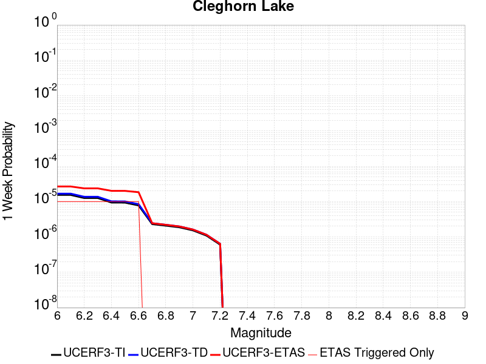 | 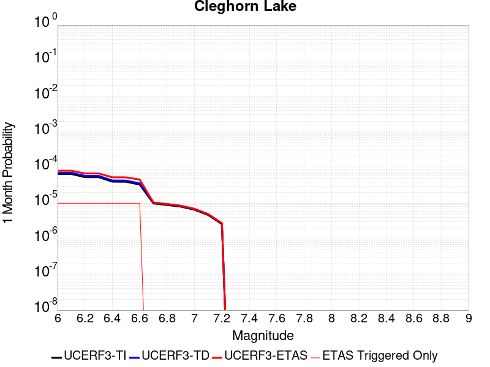 |  |  |

| Magnitude | 1 wk TI Prob | 1 wk TD Prob | 1 wk ETAS Prob | 1 wk ETAS/TD Gain | 1 wk ETAS Triggered Only | 1 mo TI Prob | 1 mo TD Prob | 1 mo ETAS Prob | 1 mo ETAS/TD Gain | 1 mo ETAS Triggered Only | 1 yr TI Prob | 1 yr TD Prob | 1 yr ETAS Prob | 1 yr ETAS/TD Gain | 1 yr ETAS Triggered Only | 10 yr TI Prob | 10 yr TD Prob | 10 yr ETAS Prob | 10 yr ETAS/TD Gain | 10 yr ETAS Triggered Only |
|-----|-----|-----|-----|-----|-----|-----|-----|-----|-----|-----|-----|-----|-----|-----|-----|-----|-----|-----|-----|-----|
| 6.0 | 1.5467183E-5 | 1.6794165E-5 | 2.900606E-5 | 1.727151 | 1.22121E-5 | 6.6286244E-5 | 7.1973314E-5 | 8.418454E-5 | 1.1696632 | 1.22121E-5 | 8.067362E-4 | 8.7597774E-4 | 9.0038055E-4 | 1.0278578 | 2.44242E-5 | 0.008038137 | 0.008730675 | 0.008766992 | 1.0041597 | 3.66363E-5 |
| 6.1 | 1.5467183E-5 | 1.6794165E-5 | 2.900606E-5 | 1.727151 | 1.22121E-5 | 6.6286244E-5 | 7.1973314E-5 | 8.418454E-5 | 1.1696632 | 1.22121E-5 | 8.067362E-4 | 8.7597774E-4 | 9.0038055E-4 | 1.0278578 | 2.44242E-5 | 0.008038137 | 0.008730675 | 0.008766992 | 1.0041597 | 3.66363E-5 |
| 6.2 | 1.2624631E-5 | 1.3681514E-5 | 2.5893447E-5 | 1.8925864 | 1.22121E-5 | 5.410444E-5 | 5.8634017E-5 | 7.08454E-5 | 1.2082645 | 1.22121E-5 | 6.585225E-4 | 7.13684E-4 | 7.380908E-4 | 1.0341983 | 2.44242E-5 | 0.0065657445 | 0.007118716 | 0.0071550915 | 1.0051098 | 3.66363E-5 |
| 6.3 | 1.2624631E-5 | 1.3681514E-5 | 2.5893447E-5 | 1.8925864 | 1.22121E-5 | 5.410444E-5 | 5.8634017E-5 | 7.08454E-5 | 1.2082645 | 1.22121E-5 | 6.585225E-4 | 7.13684E-4 | 7.380908E-4 | 1.0341983 | 2.44242E-5 | 0.0065657445 | 0.007118716 | 0.0071550915 | 1.0051098 | 3.66363E-5 |
| 6.4 | 9.417684E-6 | 1.0170096E-5 | 2.2382072E-5 | 2.200773 | 1.22121E-5 | 4.036088E-5 | 4.3585627E-5 | 5.5797194E-5 | 1.2801741 | 1.22121E-5 | 4.912829E-4 | 5.305669E-4 | 5.5497815E-4 | 1.0460098 | 2.44242E-5 | 0.004901982 | 0.005297038 | 0.00533348 | 1.0068797 | 3.66363E-5 |
| 6.5 | 9.368219E-6 | 1.0117523E-5 | 2.23295E-5 | 2.2070124 | 1.22121E-5 | 4.014889E-5 | 4.3360324E-5 | 5.557189E-5 | 1.28163 | 1.22121E-5 | 4.8870314E-4 | 5.2782515E-4 | 5.5223645E-4 | 1.0462489 | 2.44242E-5 | 0.004876298 | 0.00526975 | 0.0053061936 | 1.0069156 | 3.66363E-5 |
| 6.6 | 7.803798E-6 | 8.4418125E-6 | 2.065381E-5 | 2.4466083 | 1.22121E-5 | 3.3444423E-5 | 3.617892E-5 | 4.839058E-5 | 1.3375351 | 1.22121E-5 | 4.0710976E-4 | 4.4042926E-4 | 4.5263596E-4 | 1.0277156 | 1.22121E-5 | 0.0040636472 | 0.0043994808 | 0.0044237976 | 1.0055271 | 2.44242E-5 |
| 6.7 | 2.3108669E-6 | 2.44383E-6 | 2.44383E-6 | 1.0 | 0.0 | 9.903678E-6 | 1.0473515E-5 | 1.0473515E-5 | 1.0 | 0.0 | 1.205706E-4 | 1.2750778E-4 | 1.2750778E-4 | 1.0 | 0.0 | 0.001205052 | 0.0012743649 | 0.0012743649 | 1.0 | 0.0 |
| 6.8 | 2.0882828E-6 | 2.2062789E-6 | 2.2062789E-6 | 1.0 | 0.0 | 8.949753E-6 | 9.455448E-6 | 9.455448E-6 | 1.0 | 0.0 | 1.08957785E-4 | 1.1511416E-4 | 1.1511416E-4 | 1.0 | 0.0 | 0.0010890438 | 0.0011505622 | 0.0011505622 | 1.0 | 0.0 |
| 6.9 | 1.876935E-6 | 1.9810482E-6 | 1.9810482E-6 | 1.0 | 0.0 | 8.043982E-6 | 8.490179E-6 | 8.490179E-6 | 1.0 | 0.0 | 9.7931086E-5 | 1.0336319E-4 | 1.0336319E-4 | 1.0 | 0.0 | 9.788794E-4 | 0.0010331671 | 0.0010331671 | 1.0 | 0.0 |
| 7.0 | 1.5357559E-6 | 1.6202783E-6 | 1.6202783E-6 | 1.0 | 0.0 | 6.5817944E-6 | 6.944032E-6 | 6.944032E-6 | 1.0 | 0.0 | 8.01304E-5 | 8.4540436E-5 | 8.4540436E-5 | 1.0 | 0.0 | 8.010151E-4 | 8.4509526E-4 | 8.4509526E-4 | 1.0 | 0.0 |
| 7.1 | 1.0905424E-6 | 1.1497604E-6 | 1.1497604E-6 | 1.0 | 0.0 | 4.6737446E-6 | 4.9275354E-6 | 4.9275354E-6 | 1.0 | 0.0 | 5.6901354E-5 | 5.999119E-5 | 5.999119E-5 | 1.0 | 0.0 | 5.6886784E-4 | 5.9975975E-4 | 5.9975975E-4 | 1.0 | 0.0 |
| 7.2 | 6.06668E-7 | 6.387269E-7 | 6.387269E-7 | 1.0 | 0.0 | 2.600003E-6 | 2.7373983E-6 | 2.7373983E-6 | 1.0 | 0.0 | 3.1654577E-5 | 3.3327386E-5 | 3.3327386E-5 | 1.0 | 0.0 | 3.1650066E-4 | 3.332307E-4 | 3.332307E-4 | 1.0 | 0.0 |

## Lake Isabella (Seismicity)
*[(top)](#table-of-contents)*

| 1 Week | 1 Month | 1 Year | 10 Year |
|-----|-----|-----|-----|
| 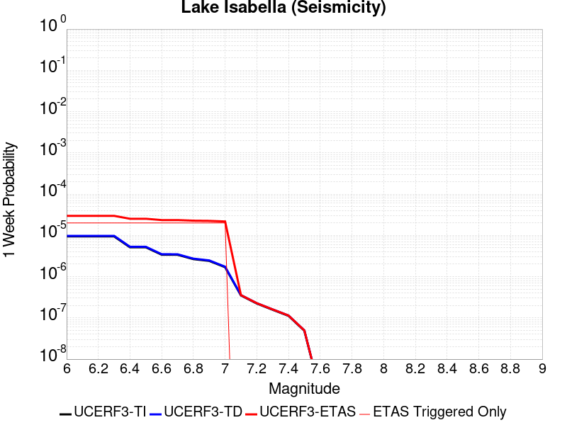 | 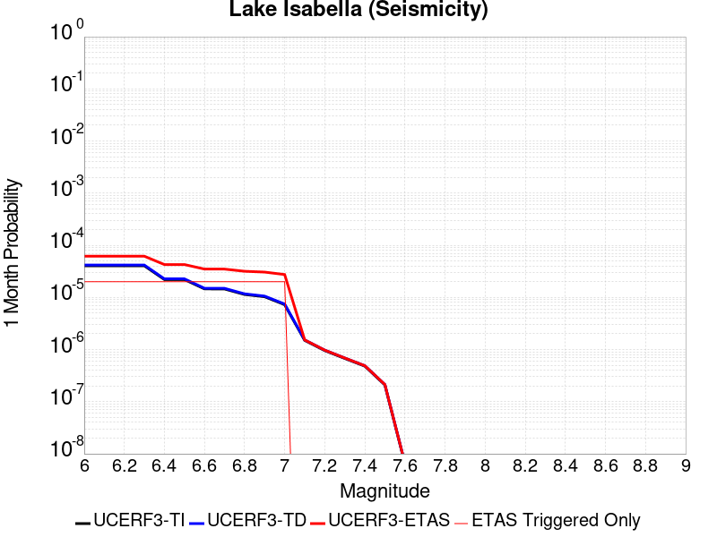 | 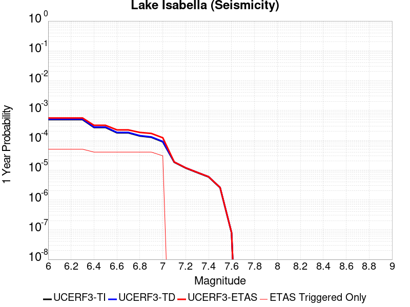 |  |

| Magnitude | 1 wk TI Prob | 1 wk TD Prob | 1 wk ETAS Prob | 1 wk ETAS/TD Gain | 1 wk ETAS Triggered Only | 1 mo TI Prob | 1 mo TD Prob | 1 mo ETAS Prob | 1 mo ETAS/TD Gain | 1 mo ETAS Triggered Only | 1 yr TI Prob | 1 yr TD Prob | 1 yr ETAS Prob | 1 yr ETAS/TD Gain | 1 yr ETAS Triggered Only | 10 yr TI Prob | 10 yr TD Prob | 10 yr ETAS Prob | 10 yr ETAS/TD Gain | 10 yr ETAS Triggered Only |
|-----|-----|-----|-----|-----|-----|-----|-----|-----|-----|-----|-----|-----|-----|-----|-----|-----|-----|-----|-----|-----|
| 6.0 | 9.431637E-6 | 9.741643E-6 | 3.4165605E-5 | 3.5071707 | 2.44242E-5 | 4.0420677E-5 | 4.1749303E-5 | 6.6172484E-5 | 1.5849961 | 2.44242E-5 | 4.920106E-4 | 5.081923E-4 | 5.692218E-4 | 1.1200913 | 6.10605E-5 | 0.004909227 | 0.0050715944 | 0.005132345 | 1.0119786 | 6.10605E-5 |
| 6.1 | 9.431637E-6 | 9.741643E-6 | 3.4165605E-5 | 3.5071707 | 2.44242E-5 | 4.0420677E-5 | 4.1749303E-5 | 6.6172484E-5 | 1.5849961 | 2.44242E-5 | 4.920106E-4 | 5.081923E-4 | 5.692218E-4 | 1.1200913 | 6.10605E-5 | 0.004909227 | 0.0050715944 | 0.005132345 | 1.0119786 | 6.10605E-5 |
| 6.2 | 9.431637E-6 | 9.741643E-6 | 3.4165605E-5 | 3.5071707 | 2.44242E-5 | 4.0420677E-5 | 4.1749303E-5 | 6.6172484E-5 | 1.5849961 | 2.44242E-5 | 4.920106E-4 | 5.081923E-4 | 5.692218E-4 | 1.1200913 | 6.10605E-5 | 0.004909227 | 0.0050715944 | 0.005132345 | 1.0119786 | 6.10605E-5 |
| 6.3 | 9.431637E-6 | 9.741643E-6 | 3.4165605E-5 | 3.5071707 | 2.44242E-5 | 4.0420677E-5 | 4.1749303E-5 | 6.6172484E-5 | 1.5849961 | 2.44242E-5 | 4.920106E-4 | 5.081923E-4 | 5.692218E-4 | 1.1200913 | 6.10605E-5 | 0.004909227 | 0.0050715944 | 0.005132345 | 1.0119786 | 6.10605E-5 |
| 6.4 | 5.144063E-6 | 5.3000717E-6 | 2.9724142E-5 | 5.6082525 | 2.44242E-5 | 2.2045799E-5 | 2.2714416E-5 | 4.713806E-5 | 2.0752487 | 2.44242E-5 | 2.6837454E-4 | 2.7651637E-4 | 3.2535126E-4 | 1.1766076 | 4.88484E-5 | 0.0026805066 | 0.0027620634 | 0.002810777 | 1.0176367 | 4.88484E-5 |
| 6.5 | 5.144063E-6 | 5.3000717E-6 | 2.9724142E-5 | 5.6082525 | 2.44242E-5 | 2.2045799E-5 | 2.2714416E-5 | 4.713806E-5 | 2.0752487 | 2.44242E-5 | 2.6837454E-4 | 2.7651637E-4 | 3.2535126E-4 | 1.1766076 | 4.88484E-5 | 0.0026805066 | 0.0027620634 | 0.002810777 | 1.0176367 | 4.88484E-5 |
| 6.6 | 3.4009804E-6 | 3.4987834E-6 | 2.7922897E-5 | 7.980745 | 2.44242E-5 | 1.4575549E-5 | 1.4994709E-5 | 3.941854E-5 | 2.6288302 | 2.44242E-5 | 1.7744285E-4 | 1.825469E-4 | 2.3138638E-4 | 1.2675449 | 4.88484E-5 | 0.0017730123 | 0.0018241272 | 0.0018728864 | 1.0267302 | 4.88484E-5 |
| 6.7 | 3.3880428E-6 | 3.48565E-6 | 2.7909764E-5 | 8.007047 | 2.44242E-5 | 1.4520103E-5 | 1.4938424E-5 | 3.9362258E-5 | 2.6349673 | 2.44242E-5 | 1.767679E-4 | 1.8186173E-4 | 2.3070125E-4 | 1.268553 | 4.88484E-5 | 0.0017662736 | 0.0018172868 | 0.0018660465 | 1.026831 | 4.88484E-5 |
| 6.8 | 2.6582E-6 | 2.733698E-6 | 2.715783E-5 | 9.934466 | 2.44242E-5 | 1.1392236E-5 | 1.1715804E-5 | 3.6139718E-5 | 3.084698 | 2.44242E-5 | 1.3869164E-4 | 1.4263192E-4 | 1.9147336E-4 | 1.3424299 | 4.88484E-5 | 0.0013860512 | 0.0014255359 | 0.0014743146 | 1.0342178 | 4.88484E-5 |
| 6.9 | 2.406011E-6 | 2.474327E-6 | 2.6898466E-5 | 10.871023 | 2.44242E-5 | 1.0311434E-5 | 1.0604223E-5 | 3.5028163E-5 | 3.3032277 | 2.44242E-5 | 1.2553448E-4 | 1.2910008E-4 | 1.7794217E-4 | 1.3783274 | 4.88484E-5 | 0.0012546359 | 0.0012903805 | 0.0013391658 | 1.037807 | 4.88484E-5 |
| 7.0 | 1.6953097E-6 | 1.7429359E-6 | 2.6167092E-5 | 15.013227 | 2.44242E-5 | 7.265593E-6 | 7.4697095E-6 | 3.1893727E-5 | 4.269741 | 2.44242E-5 | 8.8455E-5 | 9.0940965E-5 | 1.2757393E-4 | 1.4028214 | 3.66363E-5 | 8.84198E-4 | 9.091403E-4 | 9.457433E-4 | 1.0402611 | 3.66363E-5 |
| 7.1 | 3.5013824E-7 | 3.5714805E-7 | 3.5714805E-7 | 1.0 | 0.0 | 1.5005916E-6 | 1.5306335E-6 | 1.5306335E-6 | 1.0 | 0.0 | 1.826955E-5 | 1.8635306E-5 | 1.8635306E-5 | 1.0 | 0.0 | 1.8268047E-4 | 1.863377E-4 | 1.863377E-4 | 1.0 | 0.0 |
| 7.2 | 2.2321095E-7 | 2.2750562E-7 | 2.2750562E-7 | 1.0 | 0.0 | 9.56618E-7 | 9.750237E-7 | 9.750237E-7 | 1.0 | 0.0 | 1.1646762E-5 | 1.187085E-5 | 1.187085E-5 | 1.0 | 0.0 | 1.1646151E-4 | 1.18702264E-4 | 1.18702264E-4 | 1.0 | 0.0 |
| 7.3 | 1.5760406E-7 | 1.6060915E-7 | 1.6060915E-7 | 1.0 | 0.0 | 6.7544585E-7 | 6.883247E-7 | 6.883247E-7 | 1.0 | 0.0 | 8.223522E-6 | 8.380322E-6 | 8.380322E-6 | 1.0 | 0.0 | 8.2232174E-5 | 8.380012E-5 | 8.380012E-5 | 1.0 | 0.0 |
| 7.4 | 1.1216497E-7 | 1.14317004E-7 | 1.14317004E-7 | 1.0 | 0.0 | 4.8070694E-7 | 4.899299E-7 | 4.899299E-7 | 1.0 | 0.0 | 5.852591E-6 | 5.964881E-6 | 5.964881E-6 | 1.0 | 0.0 | 5.8524372E-5 | 5.9647253E-5 | 5.9647253E-5 | 1.0 | 0.0 |
| 7.5 | 4.885185E-8 | 4.978771E-8 | 4.978771E-8 | 1.0 | 0.0 | 2.0936506E-7 | 2.133759E-7 | 2.133759E-7 | 1.0 | 0.0 | 2.5490165E-6 | 2.5978486E-6 | 2.5978486E-6 | 1.0 | 0.0 | 2.5489873E-5 | 2.5978201E-5 | 2.5978201E-5 | 1.0 | 0.0 |
| 7.6 | 1.504641E-9 | 1.5317896E-9 | 1.5317896E-9 | 1.0 | 0.0 | 6.4484613E-9 | 6.5648122E-9 | 6.5648122E-9 | 1.0 | 0.0 | 7.851001E-8 | 7.992659E-8 | 7.992659E-8 | 1.0 | 0.0 | 7.8509987E-7 | 7.992659E-7 | 7.992659E-7 | 1.0 | 0.0 |

## Elsinore (Glen Ivy) rev
*[(top)](#table-of-contents)*

| 1 Week | 1 Month | 1 Year | 10 Year |
|-----|-----|-----|-----|
|  | 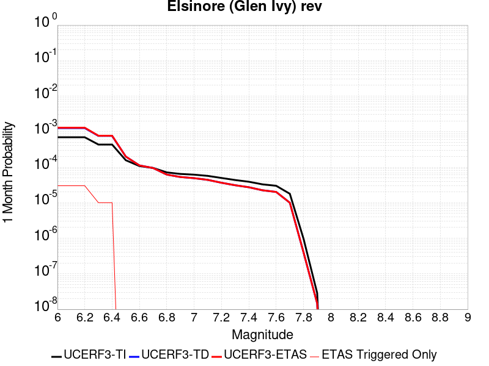 |  | 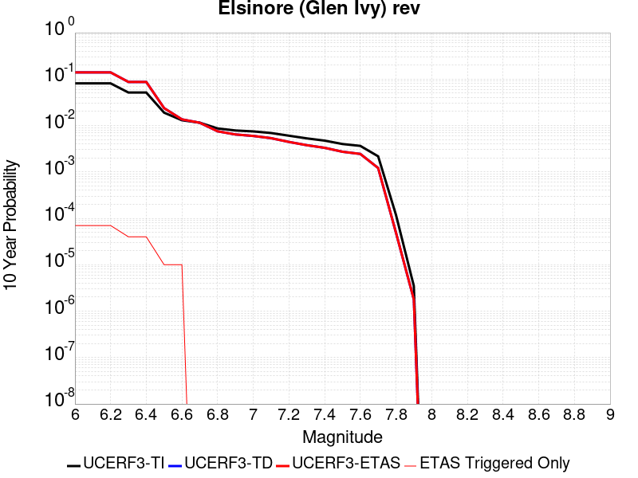 |

| Magnitude | 1 wk TI Prob | 1 wk TD Prob | 1 wk ETAS Prob | 1 wk ETAS/TD Gain | 1 wk ETAS Triggered Only | 1 mo TI Prob | 1 mo TD Prob | 1 mo ETAS Prob | 1 mo ETAS/TD Gain | 1 mo ETAS Triggered Only | 1 yr TI Prob | 1 yr TD Prob | 1 yr ETAS Prob | 1 yr ETAS/TD Gain | 1 yr ETAS Triggered Only | 10 yr TI Prob | 10 yr TD Prob | 10 yr ETAS Prob | 10 yr ETAS/TD Gain | 10 yr ETAS Triggered Only |
|-----|-----|-----|-----|-----|-----|-----|-----|-----|-----|-----|-----|-----|-----|-----|-----|-----|-----|-----|-----|-----|
| 6.0 | 1.6204086E-4 | 2.9360445E-4 | 2.9360445E-4 | 1.0 | 0.0 | 6.94276E-4 | 0.0012578527 | 0.0012700494 | 1.0096965 | 1.22121E-5 | 0.008420097 | 0.01523435 | 0.015270428 | 1.0023682 | 3.66363E-5 | 0.081081145 | 0.139691 | 0.13973302 | 1.0003009 | 4.88484E-5 |
| 6.1 | 1.6204086E-4 | 2.9360445E-4 | 2.9360445E-4 | 1.0 | 0.0 | 6.94276E-4 | 0.0012578527 | 0.0012700494 | 1.0096965 | 1.22121E-5 | 0.008420097 | 0.01523435 | 0.015270428 | 1.0023682 | 3.66363E-5 | 0.081081145 | 0.139691 | 0.13973302 | 1.0003009 | 4.88484E-5 |
| 6.2 | 1.6204086E-4 | 2.9360445E-4 | 2.9360445E-4 | 1.0 | 0.0 | 6.94276E-4 | 0.0012578527 | 0.0012700494 | 1.0096965 | 1.22121E-5 | 0.008420097 | 0.01523435 | 0.015270428 | 1.0023682 | 3.66363E-5 | 0.081081145 | 0.139691 | 0.13973302 | 1.0003009 | 4.88484E-5 |
| 6.3 | 1.0111737E-4 | 1.7703307E-4 | 1.7703307E-4 | 1.0 | 0.0 | 4.332882E-4 | 7.586092E-4 | 7.586092E-4 | 1.0 | 0.0 | 0.005262531 | 0.009217643 | 0.009229743 | 1.0013126 | 1.22121E-5 | 0.0513964 | 0.087018766 | 0.087041065 | 1.0002563 | 2.44242E-5 |
| 6.4 | 1.0111737E-4 | 1.7703307E-4 | 1.7703307E-4 | 1.0 | 0.0 | 4.332882E-4 | 7.586092E-4 | 7.586092E-4 | 1.0 | 0.0 | 0.005262531 | 0.009217643 | 0.009229743 | 1.0013126 | 1.22121E-5 | 0.0513964 | 0.087018766 | 0.087041065 | 1.0002563 | 2.44242E-5 |
| 6.5 | 3.6624708E-5 | 4.639072E-5 | 4.639072E-5 | 1.0 | 0.0 | 1.569536E-4 | 1.9880426E-4 | 1.9880426E-4 | 1.0 | 0.0 | 0.001909235 | 0.002418118 | 0.002418118 | 1.0 | 0.0 | 0.01892915 | 0.023739774 | 0.023739774 | 1.0 | 0.0 |
| 6.6 | 2.5051324E-5 | 2.6147469E-5 | 2.6147469E-5 | 1.0 | 0.0 | 1.073584E-4 | 1.1205602E-4 | 1.1205602E-4 | 1.0 | 0.0 | 0.0013063047 | 0.0013634728 | 0.0013634728 | 1.0 | 0.0 | 0.012986525 | 0.01356449 | 0.01356449 | 1.0 | 0.0 |
| 6.7 | 2.2189772E-5 | 2.2072634E-5 | 2.2072634E-5 | 1.0 | 0.0 | 9.509556E-5 | 9.459378E-5 | 9.459378E-5 | 1.0 | 0.0 | 0.0011571734 | 0.0011511071 | 0.0011511071 | 1.0 | 0.0 | 0.011511663 | 0.011465305 | 0.011465305 | 1.0 | 0.0 |
| 6.8 | 1.6654378E-5 | 1.443758E-5 | 1.443758E-5 | 1.0 | 0.0 | 7.137396E-5 | 6.18739E-5 | 6.18739E-5 | 1.0 | 0.0 | 8.686314E-4 | 7.530596E-4 | 7.530596E-4 | 1.0 | 0.0 | 0.008652439 | 0.0075104153 | 0.0075104153 | 1.0 | 0.0 |
| 6.9 | 1.5042909E-5 | 1.2331914E-5 | 1.2331914E-5 | 1.0 | 0.0 | 6.446802E-5 | 5.285001E-5 | 5.285001E-5 | 1.0 | 0.0 | 7.8461546E-4 | 6.4326206E-4 | 6.4326206E-4 | 1.0 | 0.0 | 0.007818509 | 0.006418224 | 0.006418224 | 1.0 | 0.0 |
| 7.0 | 1.4361385E-5 | 1.1451223E-5 | 1.1451223E-5 | 1.0 | 0.0 | 6.154734E-5 | 4.9075763E-5 | 4.9075763E-5 | 1.0 | 0.0 | 7.490812E-4 | 5.973365E-4 | 5.973365E-4 | 1.0 | 0.0 | 0.007465612 | 0.005961301 | 0.005961301 | 1.0 | 0.0 |
| 7.1 | 1.3265571E-5 | 1.0244836E-5 | 1.0244836E-5 | 1.0 | 0.0 | 5.6851208E-5 | 4.390571E-5 | 4.390571E-5 | 1.0 | 0.0 | 6.919436E-4 | 5.3442345E-4 | 5.3442345E-4 | 1.0 | 0.0 | 0.006897931 | 0.0053347396 | 0.0053347396 | 1.0 | 0.0 |
| 7.2 | 1.1596403E-5 | 8.504992E-6 | 8.504992E-6 | 1.0 | 0.0 | 4.9697923E-5 | 3.6449466E-5 | 3.6449466E-5 | 1.0 | 0.0 | 6.049042E-4 | 4.436836E-4 | 4.436836E-4 | 1.0 | 0.0 | 0.006032603 | 0.004429393 | 0.004429393 | 1.0 | 0.0 |
| 7.3 | 1.0150827E-5 | 7.2386983E-6 | 7.2386983E-6 | 1.0 | 0.0 | 4.3502816E-5 | 3.102263E-5 | 3.102263E-5 | 1.0 | 0.0 | 5.2951806E-4 | 3.7763652E-4 | 3.7763652E-4 | 1.0 | 0.0 | 0.005282581 | 0.0037703344 | 0.0037703344 | 1.0 | 0.0 |
| 7.4 | 9.080705E-6 | 6.3524662E-6 | 6.3524662E-6 | 1.0 | 0.0 | 3.8916725E-5 | 2.7224578E-5 | 2.7224578E-5 | 1.0 | 0.0 | 4.7370812E-4 | 3.3141018E-4 | 3.3141018E-4 | 1.0 | 0.0 | 0.004726996 | 0.0033093104 | 0.0033093104 | 1.0 | 0.0 |
| 7.5 | 7.671649E-6 | 5.22559E-6 | 5.22559E-6 | 1.0 | 0.0 | 3.287808E-5 | 2.2395201E-5 | 2.2395201E-5 | 1.0 | 0.0 | 4.0021708E-4 | 2.726287E-4 | 2.726287E-4 | 1.0 | 0.0 | 0.0039949706 | 0.0027230675 | 0.0027230675 | 1.0 | 0.0 |
| 7.6 | 6.990086E-6 | 4.687506E-6 | 4.687506E-6 | 1.0 | 0.0 | 2.9957167E-5 | 2.0089165E-5 | 2.0089165E-5 | 1.0 | 0.0 | 3.6466747E-4 | 2.4455928E-4 | 2.4455928E-4 | 1.0 | 0.0 | 0.0036406964 | 0.002443018 | 0.002443018 | 1.0 | 0.0 |
| 7.7 | 4.163505E-6 | 2.3295113E-6 | 2.3295113E-6 | 1.0 | 0.0 | 1.7843471E-5 | 9.983586E-6 | 9.983586E-6 | 1.0 | 0.0 | 2.172226E-4 | 1.2154412E-4 | 1.2154412E-4 | 1.0 | 0.0 | 0.0021701038 | 0.0012148495 | 0.0012148495 | 1.0 | 0.0 |
| 7.8 | 2.2692414E-7 | 9.385374E-8 | 9.385374E-8 | 1.0 | 0.0 | 9.725317E-7 | 4.0223028E-7 | 4.0223028E-7 | 1.0 | 0.0 | 1.1840509E-5 | 4.897146E-6 | 4.897146E-6 | 1.0 | 0.0 | 1.1839878E-4 | 4.897071E-5 | 4.897071E-5 | 1.0 | 0.0 |
| 7.9 | 6.676829E-9 | 3.439828E-9 | 3.439828E-9 | 1.0 | 0.0 | 2.861498E-8 | 1.47421195E-8 | 1.47421195E-8 | 1.0 | 0.0 | 3.4838732E-7 | 1.7948528E-7 | 1.7948528E-7 | 1.0 | 0.0 | 3.4838679E-6 | 1.7948516E-6 | 1.7948516E-6 | 1.0 | 0.0 |

## Death Valley (Fish Lake Valley)
*[(top)](#table-of-contents)*

| 1 Week | 1 Month | 1 Year | 10 Year |
|-----|-----|-----|-----|
|  | 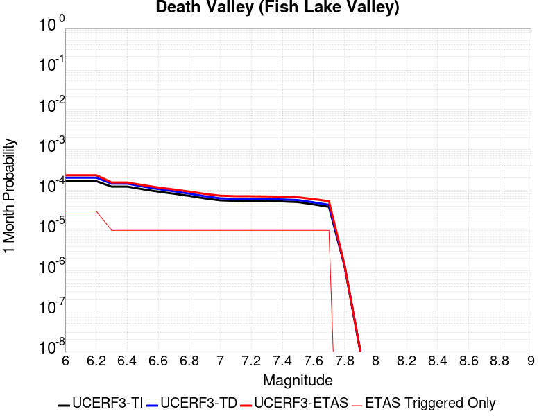 | 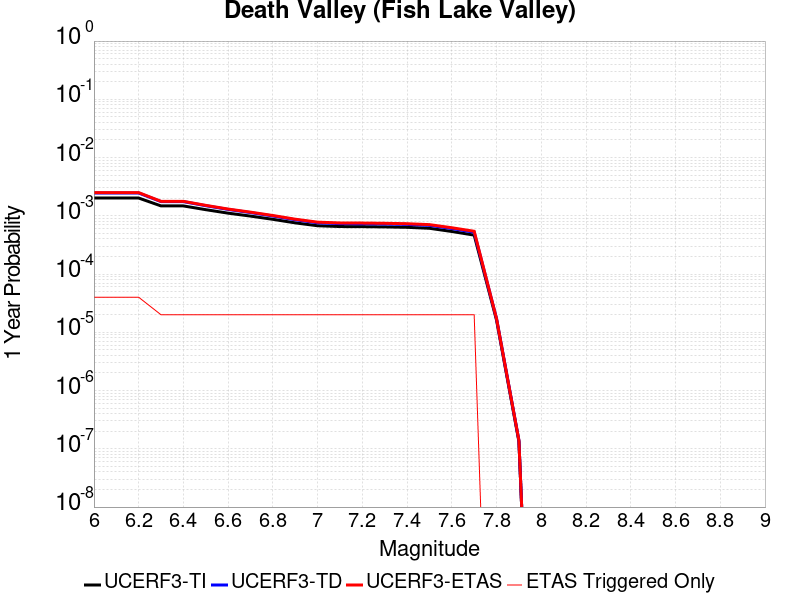 | 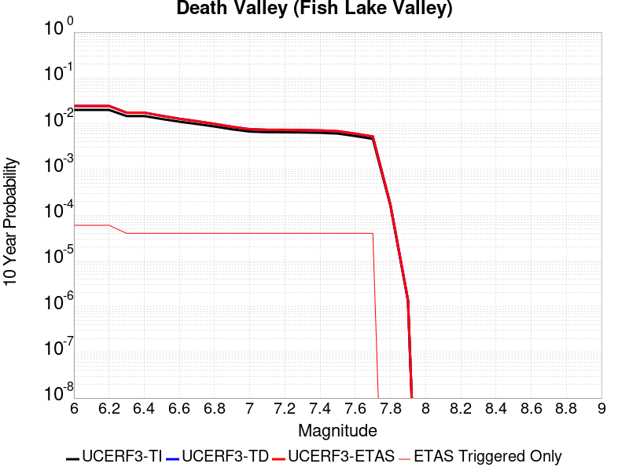 |

| Magnitude | 1 wk TI Prob | 1 wk TD Prob | 1 wk ETAS Prob | 1 wk ETAS/TD Gain | 1 wk ETAS Triggered Only | 1 mo TI Prob | 1 mo TD Prob | 1 mo ETAS Prob | 1 mo ETAS/TD Gain | 1 mo ETAS Triggered Only | 1 yr TI Prob | 1 yr TD Prob | 1 yr ETAS Prob | 1 yr ETAS/TD Gain | 1 yr ETAS Triggered Only | 10 yr TI Prob | 10 yr TD Prob | 10 yr ETAS Prob | 10 yr ETAS/TD Gain | 10 yr ETAS Triggered Only |
|-----|-----|-----|-----|-----|-----|-----|-----|-----|-----|-----|-----|-----|-----|-----|-----|-----|-----|-----|-----|-----|
| 6.0 | 3.872328E-5 | 4.7267185E-5 | 7.169023E-5 | 1.5167019 | 2.44242E-5 | 1.6594635E-4 | 2.0255962E-4 | 2.391885E-4 | 1.1808301 | 3.66363E-5 | 0.0020185246 | 0.00246352 | 0.002500066 | 1.0148349 | 3.66363E-5 | 0.02000288 | 0.02438804 | 0.02444761 | 1.0024426 | 6.10605E-5 |
| 6.1 | 3.872328E-5 | 4.7267185E-5 | 7.169023E-5 | 1.5167019 | 2.44242E-5 | 1.6594635E-4 | 2.0255962E-4 | 2.391885E-4 | 1.1808301 | 3.66363E-5 | 0.0020185246 | 0.00246352 | 0.002500066 | 1.0148349 | 3.66363E-5 | 0.02000288 | 0.02438804 | 0.02444761 | 1.0024426 | 6.10605E-5 |
| 6.2 | 3.872328E-5 | 4.7267185E-5 | 7.169023E-5 | 1.5167019 | 2.44242E-5 | 1.6594635E-4 | 2.0255962E-4 | 2.391885E-4 | 1.1808301 | 3.66363E-5 | 0.0020185246 | 0.00246352 | 0.002500066 | 1.0148349 | 3.66363E-5 | 0.02000288 | 0.02438804 | 0.02444761 | 1.0024426 | 6.10605E-5 |
| 6.3 | 2.8356371E-5 | 3.3609682E-5 | 3.3609682E-5 | 1.0 | 0.0 | 1.2152165E-4 | 1.4403398E-4 | 1.5624432E-4 | 1.084774 | 1.22121E-5 | 0.0014785219 | 0.0017522823 | 0.0017644729 | 1.006957 | 1.22121E-5 | 0.014687235 | 0.017391697 | 0.017427696 | 1.00207 | 3.66363E-5 |
| 6.4 | 2.8356371E-5 | 3.3609682E-5 | 3.3609682E-5 | 1.0 | 0.0 | 1.2152165E-4 | 1.4403398E-4 | 1.5624432E-4 | 1.084774 | 1.22121E-5 | 0.0014785219 | 0.0017522823 | 0.0017644729 | 1.006957 | 1.22121E-5 | 0.014687235 | 0.017391697 | 0.017427696 | 1.00207 | 3.66363E-5 |
| 6.5 | 2.4448687E-5 | 2.8607421E-5 | 2.8607421E-5 | 1.0 | 0.0 | 1.0477588E-4 | 1.2259776E-4 | 1.3480836E-4 | 1.0995989 | 1.22121E-5 | 0.0012748998 | 0.0014916563 | 0.0015038501 | 1.0081748 | 1.22121E-5 | 0.012676105 | 0.01482131 | 0.014857402 | 1.0024352 | 3.66363E-5 |
| 6.6 | 2.1298161E-5 | 2.465998E-5 | 2.465998E-5 | 1.0 | 0.0 | 9.127464E-5 | 1.0568153E-4 | 1.1789234E-4 | 1.1155435 | 1.22121E-5 | 0.0011107022 | 0.001285947 | 0.0012981434 | 1.0094844 | 1.22121E-5 | 0.011051672 | 0.012788472 | 0.012824639 | 1.0028281 | 3.66363E-5 |
| 6.7 | 1.8959729E-5 | 2.1780937E-5 | 2.1780937E-5 | 1.0 | 0.0 | 8.125345E-5 | 9.334368E-5 | 1.05554645E-4 | 1.1308172 | 1.22121E-5 | 9.888117E-4 | 0.0011358924 | 0.0011480906 | 1.0107388 | 1.22121E-5 | 0.009844234 | 0.0113035245 | 0.011339747 | 1.0032045 | 3.66363E-5 |
| 6.8 | 1.6691629E-5 | 1.901828E-5 | 1.901828E-5 | 1.0 | 0.0 | 7.153359E-5 | 8.150447E-5 | 9.371557E-5 | 1.1498213 | 1.22121E-5 | 8.7057345E-4 | 9.918819E-4 | 0.0010040819 | 1.0122999 | 1.22121E-5 | 0.008671708 | 0.009876307 | 0.009912581 | 1.0036728 | 3.66363E-5 |
| 6.9 | 1.450505E-5 | 1.6389482E-5 | 1.6389482E-5 | 1.0 | 0.0 | 6.216302E-5 | 7.02388E-5 | 8.245004E-5 | 1.1738533 | 1.22121E-5 | 7.5657194E-4 | 8.5483067E-4 | 8.6703233E-4 | 1.0142738 | 1.22121E-5 | 0.007540013 | 0.008516356 | 0.008552681 | 1.0042652 | 3.66363E-5 |
| 7.0 | 1.2940855E-5 | 1.4537924E-5 | 1.4537924E-5 | 1.0 | 0.0 | 5.545963E-5 | 6.230393E-5 | 7.451527E-5 | 1.1959963 | 1.22121E-5 | 6.750118E-4 | 7.5829215E-4 | 7.7049504E-4 | 1.0160925 | 1.22121E-5 | 0.006729651 | 0.007557665 | 0.0075940243 | 1.0048109 | 3.66363E-5 |
| 7.1 | 1.2544658E-5 | 1.4078161E-5 | 1.4078161E-5 | 1.0 | 0.0 | 5.3761712E-5 | 6.0333616E-5 | 7.254498E-5 | 1.2023973 | 1.22121E-5 | 6.5435225E-4 | 7.343198E-4 | 7.465229E-4 | 1.0166183 | 1.22121E-5 | 0.006524288 | 0.007319527 | 0.0073558954 | 1.0049686 | 3.66363E-5 |
| 7.2 | 1.2489416E-5 | 1.4015628E-5 | 1.4015628E-5 | 1.0 | 0.0 | 5.3524967E-5 | 6.0065628E-5 | 7.227699E-5 | 1.2033004 | 1.22121E-5 | 6.514716E-4 | 7.3105923E-4 | 7.432624E-4 | 1.0166924 | 1.22121E-5 | 0.006495651 | 0.007287136 | 0.0073235054 | 1.0049909 | 3.66363E-5 |
| 7.3 | 1.2368307E-5 | 1.3879767E-5 | 1.3879767E-5 | 1.0 | 0.0 | 5.3005948E-5 | 5.948339E-5 | 7.169476E-5 | 1.2052904 | 1.22121E-5 | 6.451563E-4 | 7.2397524E-4 | 7.3617854E-4 | 1.016856 | 1.22121E-5 | 0.0064328653 | 0.0072167586 | 0.0072531304 | 1.0050399 | 3.66363E-5 |
| 7.4 | 1.2161707E-5 | 1.3647823E-5 | 1.3647823E-5 | 1.0 | 0.0 | 5.212056E-5 | 5.8489393E-5 | 7.070078E-5 | 1.2087795 | 1.22121E-5 | 6.3438306E-4 | 7.1188126E-4 | 7.240847E-4 | 1.0171424 | 1.22121E-5 | 0.006325751 | 0.0070965975 | 0.007132974 | 1.0051259 | 3.66363E-5 |
| 7.5 | 1.1707948E-5 | 1.3145472E-5 | 1.3145472E-5 | 1.0 | 0.0 | 5.0175953E-5 | 5.633655E-5 | 6.854796E-5 | 1.2167583 | 1.22121E-5 | 6.10721E-4 | 6.8568724E-4 | 6.97891E-4 | 1.0177978 | 1.22121E-5 | 0.0060904534 | 0.006836299 | 0.0068726847 | 1.0053225 | 3.66363E-5 |
| 7.6 | 1.0319538E-5 | 1.1579585E-5 | 1.1579585E-5 | 1.0 | 0.0 | 4.4225842E-5 | 4.9625876E-5 | 6.183737E-5 | 1.2460711 | 1.22121E-5 | 5.383166E-4 | 6.040327E-4 | 6.1623746E-4 | 1.0202054 | 1.22121E-5 | 0.0053701443 | 0.0060244408 | 0.0060608564 | 1.0060446 | 3.66363E-5 |
| 7.7 | 8.937764E-6 | 1.0022746E-5 | 1.0022746E-5 | 1.0 | 0.0 | 3.830414E-5 | 4.295395E-5 | 5.5165525E-5 | 1.2842946 | 1.22121E-5 | 4.6625308E-4 | 5.228439E-4 | 5.350496E-4 | 1.0233449 | 1.22121E-5 | 0.0046527605 | 0.0052166474 | 0.0052530924 | 1.0069864 | 3.66363E-5 |
| 7.8 | 3.108007E-7 | 3.284649E-7 | 3.284649E-7 | 1.0 | 0.0 | 1.3320023E-6 | 1.407706E-6 | 1.407706E-6 | 1.0 | 0.0 | 1.6217007E-5 | 1.713869E-5 | 1.713869E-5 | 1.0 | 0.0 | 1.6215823E-4 | 1.7137405E-4 | 1.7137405E-4 | 1.0 | 0.0 |
| 7.9 | 2.5591178E-9 | 2.6696687E-9 | 2.6696687E-9 | 1.0 | 0.0 | 1.0967647E-8 | 1.1441437E-8 | 1.1441437E-8 | 1.0 | 0.0 | 1.335311E-7 | 1.392995E-7 | 1.392995E-7 | 1.0 | 0.0 | 1.3353102E-6 | 1.3929949E-6 | 1.3929949E-6 | 1.0 | 0.0 |

## Rose Canyon
*[(top)](#table-of-contents)*

| 1 Week | 1 Month | 1 Year | 10 Year |
|-----|-----|-----|-----|
| 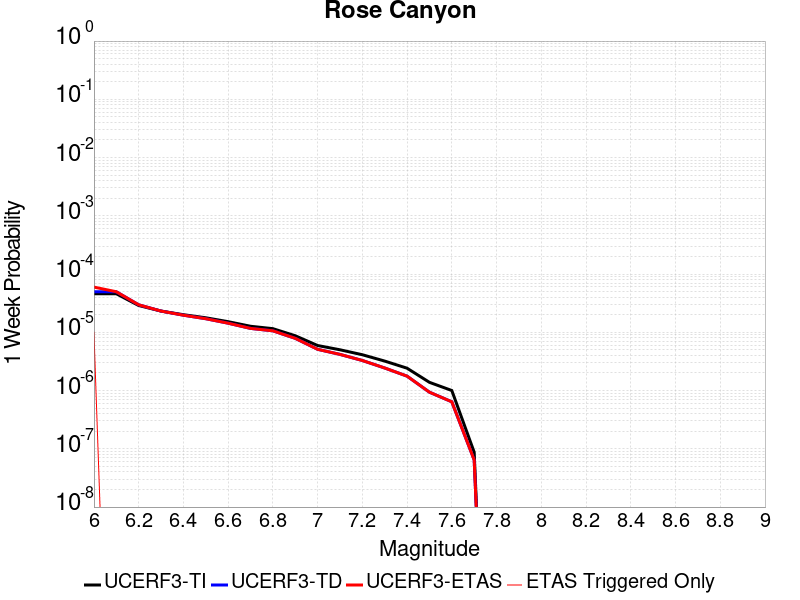 |  |  |  |

| Magnitude | 1 wk TI Prob | 1 wk TD Prob | 1 wk ETAS Prob | 1 wk ETAS/TD Gain | 1 wk ETAS Triggered Only | 1 mo TI Prob | 1 mo TD Prob | 1 mo ETAS Prob | 1 mo ETAS/TD Gain | 1 mo ETAS Triggered Only | 1 yr TI Prob | 1 yr TD Prob | 1 yr ETAS Prob | 1 yr ETAS/TD Gain | 1 yr ETAS Triggered Only | 10 yr TI Prob | 10 yr TD Prob | 10 yr ETAS Prob | 10 yr ETAS/TD Gain | 10 yr ETAS Triggered Only |
|-----|-----|-----|-----|-----|-----|-----|-----|-----|-----|-----|-----|-----|-----|-----|-----|-----|-----|-----|-----|-----|
| 6.0 | 4.5923203E-5 | 4.9713904E-5 | 6.19254E-5 | 1.2456354 | 1.22121E-5 | 1.9679888E-4 | 2.1304355E-4 | 2.3746253E-4 | 1.1146197 | 2.44242E-5 | 0.0023933933 | 0.0025909187 | 0.0026396406 | 1.0188049 | 4.88484E-5 | 0.023677798 | 0.025639834 | 0.02568743 | 1.0018563 | 4.88484E-5 |
| 6.1 | 4.5923203E-5 | 4.9713904E-5 | 4.9713904E-5 | 1.0 | 0.0 | 1.9679888E-4 | 2.1304355E-4 | 2.2525304E-4 | 1.0573099 | 1.22121E-5 | 0.0023933933 | 0.0025909187 | 0.0026152795 | 1.0094024 | 2.44242E-5 | 0.023677798 | 0.025639834 | 0.025663631 | 1.0009282 | 2.44242E-5 |
| 6.2 | 2.8844734E-5 | 2.9668578E-5 | 2.9668578E-5 | 1.0 | 0.0 | 1.2361443E-4 | 1.2714505E-4 | 1.3935559E-4 | 1.0960363 | 1.22121E-5 | 0.0015039665 | 0.0015468865 | 0.0015712728 | 1.0157648 | 2.44242E-5 | 0.0149382865 | 0.015374203 | 0.015398252 | 1.0015643 | 2.44242E-5 |
| 6.3 | 2.3171577E-5 | 2.3161147E-5 | 2.3161147E-5 | 1.0 | 0.0 | 9.9302975E-5 | 9.925836E-5 | 1.1146925E-4 | 1.1230212 | 1.22121E-5 | 0.0012083431 | 0.0012078139 | 0.0012322086 | 1.0201974 | 2.44242E-5 | 0.012017938 | 0.01202239 | 0.012046521 | 1.0020071 | 2.44242E-5 |
| 6.4 | 2.0066604E-5 | 1.966695E-5 | 1.966695E-5 | 1.0 | 0.0 | 8.599689E-5 | 8.428426E-5 | 9.649533E-5 | 1.1448796 | 1.22121E-5 | 0.0010465092 | 0.0010256878 | 0.0010500869 | 1.0237881 | 2.44242E-5 | 0.010415946 | 0.0102175195 | 0.010241694 | 1.002366 | 2.44242E-5 |
| 6.5 | 1.776989E-5 | 1.7113744E-5 | 1.7113744E-5 | 1.0 | 0.0 | 7.615444E-5 | 7.334259E-5 | 8.5553795E-5 | 1.1664954 | 1.22121E-5 | 9.267859E-4 | 8.9258724E-4 | 9.1698964E-4 | 1.027339 | 2.44242E-5 | 0.009229303 | 0.008896178 | 0.008920385 | 1.0027211 | 2.44242E-5 |
| 6.6 | 1.5227364E-5 | 1.4339211E-5 | 1.4339211E-5 | 1.0 | 0.0 | 6.52585E-5 | 6.1452345E-5 | 7.3663694E-5 | 1.1987125 | 1.22121E-5 | 7.942326E-4 | 7.4793067E-4 | 7.7233656E-4 | 1.0326313 | 2.44242E-5 | 0.007914 | 0.0074583334 | 0.0074825757 | 1.0032504 | 2.44242E-5 |
| 6.7 | 1.2703898E-5 | 1.1673238E-5 | 1.1673238E-5 | 1.0 | 0.0 | 5.4444143E-5 | 5.002723E-5 | 5.002723E-5 | 1.0 | 0.0 | 6.626558E-4 | 6.089155E-4 | 6.2112015E-4 | 1.0200433 | 1.22121E-5 | 0.006606833 | 0.0060750674 | 0.0060872054 | 1.001998 | 1.22121E-5 |
| 6.8 | 1.1554917E-5 | 1.06093075E-5 | 1.06093075E-5 | 1.0 | 0.0 | 4.9520135E-5 | 4.546769E-5 | 4.546769E-5 | 1.0 | 0.0 | 6.0274085E-4 | 5.5343256E-4 | 5.656379E-4 | 1.0220538 | 1.22121E-5 | 0.0060110865 | 0.005522552 | 0.005534697 | 1.002199 | 1.22121E-5 |
| 6.9 | 8.732078E-6 | 7.881339E-6 | 7.881339E-6 | 1.0 | 0.0 | 3.7422655E-5 | 3.377675E-5 | 3.377675E-5 | 1.0 | 0.0 | 4.5552556E-4 | 4.1115723E-4 | 4.233643E-4 | 1.0296896 | 1.22121E-5 | 0.0045459294 | 0.004104799 | 0.004116961 | 1.0029628 | 1.22121E-5 |
| 7.0 | 5.9337494E-6 | 5.107476E-6 | 5.107476E-6 | 1.0 | 0.0 | 2.5430107E-5 | 2.1889E-5 | 2.1889E-5 | 1.0 | 0.0 | 3.0956755E-4 | 2.6646614E-4 | 2.7867497E-4 | 1.0458176 | 1.22121E-5 | 0.0030913667 | 0.002661482 | 0.0026736616 | 1.0045762 | 1.22121E-5 |
| 7.1 | 5.013409E-6 | 4.177376E-6 | 4.177376E-6 | 1.0 | 0.0 | 2.1485863E-5 | 1.7902918E-5 | 1.7902918E-5 | 1.0 | 0.0 | 2.6155898E-4 | 2.1794632E-4 | 2.3015575E-4 | 1.0560204 | 1.22121E-5 | 0.0026125133 | 0.0021773374 | 0.0021895228 | 1.0055965 | 1.22121E-5 |
| 7.2 | 4.120763E-6 | 3.2821324E-6 | 3.2821324E-6 | 1.0 | 0.0 | 1.7660293E-5 | 1.4066206E-5 | 1.4066206E-5 | 1.0 | 0.0 | 2.1499286E-4 | 1.7124269E-4 | 1.834527E-4 | 1.0713024 | 1.22121E-5 | 0.0021478499 | 0.001711117 | 0.0017233081 | 1.0071247 | 1.22121E-5 |
| 7.3 | 3.2081239E-6 | 2.4405329E-6 | 2.4405329E-6 | 1.0 | 0.0 | 1.374903E-5 | 1.0459385E-5 | 1.0459385E-5 | 1.0 | 0.0 | 1.6738157E-4 | 1.2733563E-4 | 1.3954617E-4 | 1.0958925 | 1.22121E-5 | 0.0016725556 | 0.0012726337 | 0.0012848303 | 1.0095837 | 1.22121E-5 |
| 7.4 | 2.4194755E-6 | 1.76806E-6 | 1.76806E-6 | 1.0 | 0.0 | 1.0369139E-5 | 7.5773783E-6 | 7.5773783E-6 | 1.0 | 0.0 | 1.2623696E-4 | 9.2250724E-5 | 9.2250724E-5 | 1.0 | 0.0 | 0.0012616527 | 9.2212966E-4 | 9.2212966E-4 | 1.0 | 0.0 |
| 7.5 | 1.3842889E-6 | 9.3786053E-7 | 9.3786053E-7 | 1.0 | 0.0 | 5.9326535E-6 | 4.0193963E-6 | 4.0193963E-6 | 1.0 | 0.0 | 7.222766E-5 | 4.8935086E-5 | 4.8935086E-5 | 1.0 | 0.0 | 7.220419E-4 | 4.892466E-4 | 4.892466E-4 | 1.0 | 0.0 |
| 7.6 | 1.0021575E-6 | 6.411446E-7 | 6.411446E-7 | 1.0 | 0.0 | 4.2949537E-6 | 2.7477597E-6 | 2.7477597E-6 | 1.0 | 0.0 | 5.2289808E-5 | 3.345348E-5 | 3.345348E-5 | 1.0 | 0.0 | 5.2277505E-4 | 3.3448663E-4 | 3.3448663E-4 | 1.0 | 0.0 |
| 7.7 | 8.7620116E-8 | 6.449232E-8 | 6.449232E-8 | 1.0 | 0.0 | 3.7551473E-7 | 2.7639564E-7 | 2.7639564E-7 | 1.0 | 0.0 | 4.5718825E-6 | 3.365112E-6 | 3.365112E-6 | 1.0 | 0.0 | 4.5717883E-5 | 3.365064E-5 | 3.365064E-5 | 1.0 | 0.0 |

## San Andreas (Cholame) rev
*[(top)](#table-of-contents)*

| 1 Week | 1 Month | 1 Year | 10 Year |
|-----|-----|-----|-----|
| 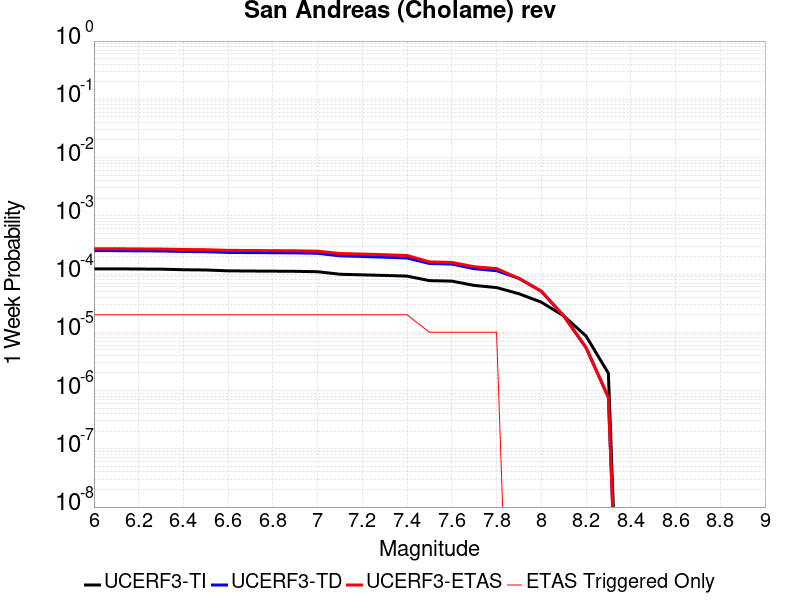 |  | 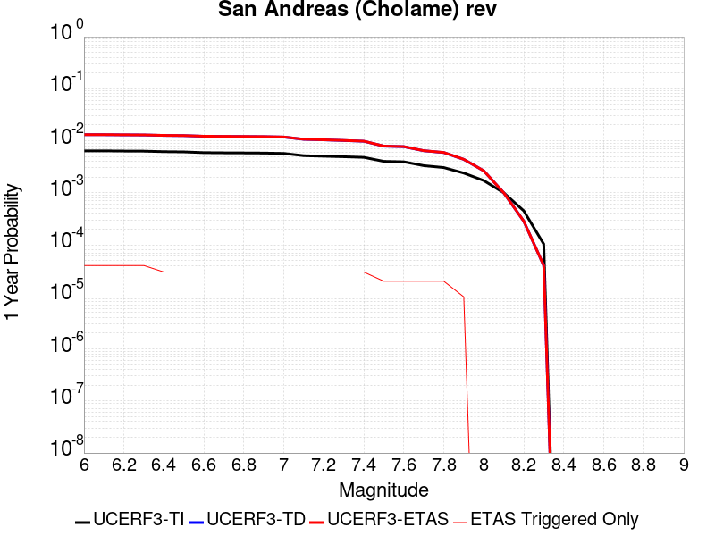 | 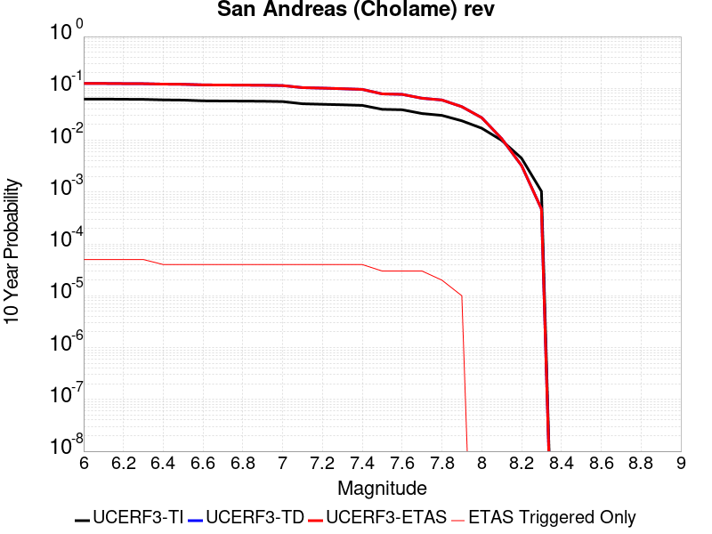 |

| Magnitude | 1 wk TI Prob | 1 wk TD Prob | 1 wk ETAS Prob | 1 wk ETAS/TD Gain | 1 wk ETAS Triggered Only | 1 mo TI Prob | 1 mo TD Prob | 1 mo ETAS Prob | 1 mo ETAS/TD Gain | 1 mo ETAS Triggered Only | 1 yr TI Prob | 1 yr TD Prob | 1 yr ETAS Prob | 1 yr ETAS/TD Gain | 1 yr ETAS Triggered Only | 10 yr TI Prob | 10 yr TD Prob | 10 yr ETAS Prob | 10 yr ETAS/TD Gain | 10 yr ETAS Triggered Only |
|-----|-----|-----|-----|-----|-----|-----|-----|-----|-----|-----|-----|-----|-----|-----|-----|-----|-----|-----|-----|-----|
| 6.0 | 1.2302514E-4 | 2.520236E-4 | 2.7644166E-4 | 1.096888 | 2.44242E-5 | 5.27144E-4 | 0.0010796557 | 0.0011040536 | 1.0225978 | 2.44242E-5 | 0.0063991086 | 0.013066091 | 0.013102248 | 1.0027673 | 3.66363E-5 | 0.06217949 | 0.124382704 | 0.12442548 | 1.0003439 | 4.88484E-5 |
| 6.1 | 1.2302514E-4 | 2.520236E-4 | 2.7644166E-4 | 1.096888 | 2.44242E-5 | 5.27144E-4 | 0.0010796557 | 0.0011040536 | 1.0225978 | 2.44242E-5 | 0.0063991086 | 0.013066091 | 0.013102248 | 1.0027673 | 3.66363E-5 | 0.06217949 | 0.124382704 | 0.12442548 | 1.0003439 | 4.88484E-5 |
| 6.2 | 1.2203569E-4 | 2.501916E-4 | 2.746097E-4 | 1.0975976 | 2.44242E-5 | 5.2290526E-4 | 0.0010718107 | 0.0010962087 | 1.0227634 | 2.44242E-5 | 0.006347804 | 0.012971719 | 0.013007879 | 1.0027877 | 3.66363E-5 | 0.061695136 | 0.123568885 | 0.1236117 | 1.0003464 | 4.88484E-5 |
| 6.3 | 1.2142645E-4 | 2.4905134E-4 | 2.7346946E-4 | 1.0980445 | 2.44242E-5 | 5.202953E-4 | 0.0010669279 | 0.001091326 | 1.0228677 | 2.44242E-5 | 0.006316212 | 0.012912977 | 0.01294914 | 1.0028006 | 3.66363E-5 | 0.06139677 | 0.12306301 | 0.123105854 | 1.0003481 | 4.88484E-5 |
| 6.4 | 1.1865206E-4 | 2.4410691E-4 | 2.6852515E-4 | 1.1000309 | 2.44242E-5 | 5.0840975E-4 | 0.0010457546 | 0.0010701532 | 1.0233312 | 2.44242E-5 | 0.006172335 | 0.012658212 | 0.012682327 | 1.0019051 | 2.44242E-5 | 0.060036868 | 0.120855816 | 0.120888025 | 1.0002666 | 3.66363E-5 |
| 6.5 | 1.17443946E-4 | 2.4204017E-4 | 2.6645846E-4 | 1.1008853 | 2.44242E-5 | 5.032341E-4 | 0.0010369042 | 0.0010613031 | 1.0235305 | 2.44242E-5 | 0.006109677 | 0.012551703 | 0.01257582 | 1.0019214 | 2.44242E-5 | 0.059444077 | 0.11993009 | 0.11996233 | 1.0002688 | 3.66363E-5 |
| 6.6 | 1.13579066E-4 | 2.3513076E-4 | 2.595492E-4 | 1.1038505 | 2.44242E-5 | 4.866766E-4 | 0.0010073156 | 0.0010317152 | 1.0242224 | 2.44242E-5 | 0.0059092017 | 0.012195546 | 0.012219672 | 1.0019783 | 2.44242E-5 | 0.057545185 | 0.11684424 | 0.116876595 | 1.0002769 | 3.66363E-5 |
| 6.7 | 1.1271412E-4 | 2.3357396E-4 | 2.5799245E-4 | 1.1045429 | 2.44242E-5 | 4.829711E-4 | 0.0010006487 | 0.0010250484 | 1.0243839 | 2.44242E-5 | 0.005864331 | 0.012115283 | 0.012139411 | 1.0019915 | 2.44242E-5 | 0.057119697 | 0.116147816 | 0.1161802 | 1.0002788 | 3.66363E-5 |
| 6.8 | 1.1217975E-4 | 2.3245826E-4 | 2.5687678E-4 | 1.1050447 | 2.44242E-5 | 4.8068175E-4 | 9.958708E-4 | 0.0010202707 | 1.0245011 | 2.44242E-5 | 0.005836608 | 0.012057758 | 0.012081888 | 1.0020012 | 2.44242E-5 | 0.056856725 | 0.11564609 | 0.11567848 | 1.0002801 | 3.66363E-5 |
| 6.9 | 1.1146753E-4 | 2.309458E-4 | 2.5536437E-4 | 1.1057328 | 2.44242E-5 | 4.7763053E-4 | 9.893938E-4 | 0.0010137939 | 1.0246615 | 2.44242E-5 | 0.0057996577 | 0.01197977 | 0.012003902 | 1.0020144 | 2.44242E-5 | 0.056506127 | 0.11496652 | 0.114998944 | 1.000282 | 3.66363E-5 |
| 7.0 | 1.0965793E-4 | 2.2717941E-4 | 2.5159804E-4 | 1.1074862 | 2.44242E-5 | 4.698779E-4 | 9.732642E-4 | 9.976646E-4 | 1.0250707 | 2.44242E-5 | 0.005705768 | 0.011785533 | 0.011809669 | 1.002048 | 2.44242E-5 | 0.055614736 | 0.113268144 | 0.11330063 | 1.0002868 | 3.66363E-5 |
| 7.1 | 9.927982E-5 | 2.0537146E-4 | 2.2979063E-4 | 1.1189026 | 2.44242E-5 | 4.2541555E-4 | 8.798675E-4 | 9.042702E-4 | 1.0277345 | 2.44242E-5 | 0.0051671406 | 0.0106600635 | 0.010684227 | 1.0022668 | 2.44242E-5 | 0.05048634 | 0.10336296 | 0.10339581 | 1.0003178 | 3.66363E-5 |
| 7.2 | 9.696786E-5 | 2.0041419E-4 | 2.248335E-4 | 1.1218442 | 2.44242E-5 | 4.1551032E-4 | 8.586362E-4 | 8.830395E-4 | 1.0284209 | 2.44242E-5 | 0.00504711 | 0.010404069 | 0.01042824 | 1.0023232 | 2.44242E-5 | 0.04934009 | 0.101101 | 0.101133935 | 1.0003257 | 3.66363E-5 |
| 7.3 | 9.4727984E-5 | 1.9470732E-4 | 2.1912676E-4 | 1.1254162 | 2.44242E-5 | 4.0591392E-4 | 8.3419407E-4 | 8.5859786E-4 | 1.0292543 | 2.44242E-5 | 0.0049308087 | 0.010109286 | 0.010133463 | 1.0023916 | 2.44242E-5 | 0.048228268 | 0.09847201 | 0.098505035 | 1.0003355 | 3.66363E-5 |
| 7.4 | 9.220358E-5 | 1.8841372E-4 | 2.1283331E-4 | 1.1296062 | 2.44242E-5 | 3.9509835E-4 | 8.072384E-4 | 8.316429E-4 | 1.0302321 | 2.44242E-5 | 0.004799717 | 0.009784087 | 0.009808271 | 1.0024719 | 2.44242E-5 | 0.046973653 | 0.0955501 | 0.09558323 | 1.0003468 | 3.66363E-5 |
| 7.5 | 7.71631E-5 | 1.5176479E-4 | 1.6397503E-4 | 1.0804551 | 1.22121E-5 | 3.306571E-4 | 6.5025856E-4 | 6.624627E-4 | 1.0187682 | 1.22121E-5 | 0.0040183207 | 0.007888231 | 0.007900347 | 1.0015359 | 1.22121E-5 | 0.03946433 | 0.078278646 | 0.07830116 | 1.0002875 | 2.44242E-5 |
| 7.6 | 7.5634416E-5 | 1.483597E-4 | 1.6057E-4 | 1.0823019 | 1.22121E-5 | 3.241072E-4 | 6.3567254E-4 | 6.478769E-4 | 1.0191991 | 1.22121E-5 | 0.0039388672 | 0.007711917 | 0.007724035 | 1.0015713 | 1.22121E-5 | 0.038697794 | 0.076642126 | 0.07666468 | 1.0002942 | 2.44242E-5 |
| 7.7 | 6.3783E-5 | 1.2357405E-4 | 1.3578463E-4 | 1.098812 | 1.22121E-5 | 2.7332708E-4 | 5.294956E-4 | 5.417012E-4 | 1.0230514 | 1.22121E-5 | 0.0033226798 | 0.00642758 | 0.0064397138 | 1.0018878 | 1.22121E-5 | 0.032734364 | 0.064534284 | 0.06455713 | 1.000354 | 2.44242E-5 |
| 7.8 | 5.863422E-5 | 1.1414911E-4 | 1.2635981E-4 | 1.1069715 | 1.22121E-5 | 2.512653E-4 | 4.891188E-4 | 5.013249E-4 | 1.0249554 | 1.22121E-5 | 0.003054864 | 0.005938782 | 0.0059509217 | 1.0020441 | 1.22121E-5 | 0.030132094 | 0.059653696 | 0.05966518 | 1.0001925 | 1.22121E-5 |
| 7.9 | 4.595283E-5 | 8.425456E-5 | 8.425456E-5 | 1.0 | 0.0 | 1.9692584E-4 | 3.6104105E-4 | 3.6104105E-4 | 1.0 | 0.0 | 0.0023949358 | 0.0043868218 | 0.0043868218 | 1.0 | 0.0 | 0.023692891 | 0.044357877 | 0.044357877 | 1.0 | 0.0 |
| 8.0 | 3.2950178E-5 | 5.076746E-5 | 5.076746E-5 | 1.0 | 0.0 | 1.412074E-4 | 2.1755669E-4 | 2.1755669E-4 | 1.0 | 0.0 | 0.0017178444 | 0.002645537 | 0.002645537 | 1.0 | 0.0 | 0.017046256 | 0.027177438 | 0.027177438 | 1.0 | 0.0 |
| 8.1 | 1.9177472E-5 | 1.9182458E-5 | 1.9182458E-5 | 1.0 | 0.0 | 8.218658E-5 | 8.220795E-5 | 8.220795E-5 | 1.0 | 0.0 | 0.0010001622 | 0.0010004229 | 0.0010004229 | 1.0 | 0.0 | 0.009956728 | 0.010756734 | 0.010756734 | 1.0 | 0.0 |
| 8.2 | 8.643924E-6 | 5.4738607E-6 | 5.4738607E-6 | 1.0 | 0.0 | 3.704486E-5 | 2.3459192E-5 | 2.3459192E-5 | 1.0 | 0.0 | 4.5092785E-4 | 2.855783E-4 | 2.855783E-4 | 1.0 | 0.0 | 0.0045001395 | 0.0032481598 | 0.0032481598 | 1.0 | 0.0 |
| 8.3 | 1.983087E-6 | 7.658221E-7 | 7.658221E-7 | 1.0 | 0.0 | 8.498917E-6 | 3.2820906E-6 | 3.2820906E-6 | 1.0 | 0.0 | 1.034694E-4 | 3.9958737E-5 | 3.9958737E-5 | 1.0 | 0.0 | 0.0010342124 | 4.7187202E-4 | 4.7187202E-4 | 1.0 | 0.0 |

## Mission Ridge-Arroyo Parida-Santa Ana
*[(top)](#table-of-contents)*

| 1 Week | 1 Month | 1 Year | 10 Year |
|-----|-----|-----|-----|
|  |  |  |  |

| Magnitude | 1 wk TI Prob | 1 wk TD Prob | 1 wk ETAS Prob | 1 wk ETAS/TD Gain | 1 wk ETAS Triggered Only | 1 mo TI Prob | 1 mo TD Prob | 1 mo ETAS Prob | 1 mo ETAS/TD Gain | 1 mo ETAS Triggered Only | 1 yr TI Prob | 1 yr TD Prob | 1 yr ETAS Prob | 1 yr ETAS/TD Gain | 1 yr ETAS Triggered Only | 10 yr TI Prob | 10 yr TD Prob | 10 yr ETAS Prob | 10 yr ETAS/TD Gain | 10 yr ETAS Triggered Only |
|-----|-----|-----|-----|-----|-----|-----|-----|-----|-----|-----|-----|-----|-----|-----|-----|-----|-----|-----|-----|-----|
| 6.0 | 4.169034E-5 | 4.7138004E-5 | 7.156105E-5 | 1.518118 | 2.44242E-5 | 1.7866064E-4 | 2.0200922E-4 | 2.264285E-4 | 1.1208819 | 2.44242E-5 | 0.0021730233 | 0.0024574373 | 0.0024818014 | 1.0099145 | 2.44242E-5 | 0.021518968 | 0.024384484 | 0.024420226 | 1.0014658 | 3.66363E-5 |
| 6.1 | 1.73813E-5 | 1.6854168E-5 | 1.6854168E-5 | 1.0 | 0.0 | 7.4489166E-5 | 7.2230214E-5 | 7.2230214E-5 | 1.0 | 0.0 | 9.065282E-4 | 8.7905885E-4 | 8.7905885E-4 | 1.0 | 0.0 | 0.009028391 | 0.008756958 | 0.008769063 | 1.0013824 | 1.22121E-5 |
| 6.2 | 1.4622182E-5 | 1.3673245E-5 | 1.3673245E-5 | 1.0 | 0.0 | 6.2664985E-5 | 5.859833E-5 | 5.859833E-5 | 1.0 | 0.0 | 7.6267915E-4 | 7.13205E-4 | 7.13205E-4 | 1.0 | 0.0 | 0.007600669 | 0.0071096043 | 0.0071217297 | 1.0017055 | 1.22121E-5 |
| 6.3 | 1.3552434E-5 | 1.248216E-5 | 1.248216E-5 | 1.0 | 0.0 | 5.8080568E-5 | 5.349389E-5 | 5.349389E-5 | 1.0 | 0.0 | 7.069015E-4 | 6.510967E-4 | 6.510967E-4 | 1.0 | 0.0 | 0.00704657 | 0.006492254 | 0.0065043867 | 1.0018688 | 1.22121E-5 |
| 6.4 | 1.30977305E-5 | 1.1979117E-5 | 1.1979117E-5 | 1.0 | 0.0 | 5.613192E-5 | 5.133808E-5 | 5.133808E-5 | 1.0 | 0.0 | 6.831918E-4 | 6.248649E-4 | 6.248649E-4 | 1.0 | 0.0 | 0.006810953 | 0.006231424 | 0.00624356 | 1.0019475 | 1.22121E-5 |
| 6.5 | 1.225205E-5 | 1.1048766E-5 | 1.1048766E-5 | 1.0 | 0.0 | 5.2507727E-5 | 4.735101E-5 | 4.735101E-5 | 1.0 | 0.0 | 6.3909404E-4 | 5.763488E-4 | 5.763488E-4 | 1.0 | 0.0 | 0.006372592 | 0.00574885 | 0.005760992 | 1.002112 | 1.22121E-5 |
| 6.6 | 1.1352241E-5 | 1.0063501E-5 | 1.0063501E-5 | 1.0 | 0.0 | 4.8651553E-5 | 4.3128588E-5 | 4.3128588E-5 | 1.0 | 0.0 | 5.921717E-4 | 5.2496616E-4 | 5.2496616E-4 | 1.0 | 0.0 | 0.0059059616 | 0.0052375067 | 0.005249655 | 1.0023195 | 1.22121E-5 |
| 6.7 | 1.0864116E-5 | 9.516994E-6 | 9.516994E-6 | 1.0 | 0.0 | 4.6559664E-5 | 4.0786494E-5 | 4.0786494E-5 | 1.0 | 0.0 | 5.667165E-4 | 4.9646443E-4 | 4.9646443E-4 | 1.0 | 0.0 | 0.005652734 | 0.004953787 | 0.0049659386 | 1.002453 | 1.22121E-5 |
| 6.8 | 1.0666365E-5 | 9.299747E-6 | 9.299747E-6 | 1.0 | 0.0 | 4.571219E-5 | 3.985546E-5 | 3.985546E-5 | 1.0 | 0.0 | 5.564038E-4 | 4.851342E-4 | 4.851342E-4 | 1.0 | 0.0 | 0.005550127 | 0.0048409835 | 0.0048531364 | 1.0025104 | 1.22121E-5 |
| 6.9 | 1.0038665E-5 | 8.592016E-6 | 8.592016E-6 | 1.0 | 0.0 | 4.302214E-5 | 3.6822417E-5 | 3.6822417E-5 | 1.0 | 0.0 | 5.236687E-4 | 4.482225E-4 | 4.482225E-4 | 1.0 | 0.0 | 0.005224364 | 0.0044733956 | 0.004485553 | 1.0027177 | 1.22121E-5 |
| 7.0 | 9.5379955E-6 | 8.025046E-6 | 8.025046E-6 | 1.0 | 0.0 | 4.0876483E-5 | 3.439261E-5 | 3.439261E-5 | 1.0 | 0.0 | 4.975576E-4 | 4.186513E-4 | 4.186513E-4 | 1.0 | 0.0 | 0.00496445 | 0.0041788258 | 0.0041909865 | 1.0029101 | 1.22121E-5 |
| 7.1 | 9.207389E-6 | 7.652349E-6 | 7.652349E-6 | 1.0 | 0.0 | 3.945964E-5 | 3.279538E-5 | 3.279538E-5 | 1.0 | 0.0 | 4.803152E-4 | 3.992123E-4 | 3.992123E-4 | 1.0 | 0.0 | 0.004792784 | 0.0039851475 | 0.003997311 | 1.0030522 | 1.22121E-5 |
| 7.2 | 7.638091E-6 | 5.9310996E-6 | 5.9310996E-6 | 1.0 | 0.0 | 3.2734264E-5 | 2.5418753E-5 | 2.5418753E-5 | 1.0 | 0.0 | 3.984668E-4 | 3.0942968E-4 | 3.0942968E-4 | 1.0 | 0.0 | 0.0039775306 | 0.0030900452 | 0.0030900452 | 1.0 | 0.0 |
| 7.3 | 7.2500147E-6 | 5.596136E-6 | 5.596136E-6 | 1.0 | 0.0 | 3.1071122E-5 | 2.398322E-5 | 2.398322E-5 | 1.0 | 0.0 | 3.7822526E-4 | 2.9195688E-4 | 2.9195688E-4 | 1.0 | 0.0 | 0.0037758215 | 0.0029157887 | 0.0029157887 | 1.0 | 0.0 |
| 7.4 | 6.3899715E-6 | 4.9184823E-6 | 4.9184823E-6 | 1.0 | 0.0 | 2.7385306E-5 | 2.107904E-5 | 2.107904E-5 | 1.0 | 0.0 | 3.3336508E-4 | 2.5660728E-4 | 2.5660728E-4 | 1.0 | 0.0 | 0.0033286542 | 0.0025631543 | 0.0025631543 | 1.0 | 0.0 |
| 7.5 | 5.379025E-6 | 4.0838413E-6 | 4.0838413E-6 | 1.0 | 0.0 | 2.305276E-5 | 1.7502061E-5 | 1.7502061E-5 | 1.0 | 0.0 | 2.806312E-4 | 2.1306686E-4 | 2.1306686E-4 | 1.0 | 0.0 | 0.0028027708 | 0.0021286372 | 0.0021286372 | 1.0 | 0.0 |
| 7.6 | 4.1270696E-6 | 3.088336E-6 | 3.088336E-6 | 1.0 | 0.0 | 1.768732E-5 | 1.3235658E-5 | 1.3235658E-5 | 1.0 | 0.0 | 2.1532185E-4 | 1.611323E-4 | 1.611323E-4 | 1.0 | 0.0 | 0.0021511333 | 0.0016101628 | 0.0016101628 | 1.0 | 0.0 |
| 7.7 | 2.5406805E-6 | 1.8281963E-6 | 1.8281963E-6 | 1.0 | 0.0 | 1.0888585E-5 | 7.835104E-6 | 7.835104E-6 | 1.0 | 0.0 | 1.3256045E-4 | 9.538828E-5 | 9.538828E-5 | 1.0 | 0.0 | 0.0013248142 | 9.534795E-4 | 9.534795E-4 | 1.0 | 0.0 |
| 7.8 | 4.8608285E-7 | 3.509878E-7 | 3.509878E-7 | 1.0 | 0.0 | 2.0832106E-6 | 1.5042325E-6 | 1.5042325E-6 | 1.0 | 0.0 | 2.5362791E-5 | 1.8313878E-5 | 1.8313878E-5 | 1.0 | 0.0 | 2.5359896E-4 | 1.831238E-4 | 1.831238E-4 | 1.0 | 0.0 |
| 7.9 | 2.0472514E-8 | 1.268872E-8 | 1.268872E-8 | 1.0 | 0.0 | 8.7739345E-8 | 5.438023E-8 | 5.438023E-8 | 1.0 | 0.0 | 1.068226E-6 | 6.620791E-7 | 6.620791E-7 | 1.0 | 0.0 | 1.0682209E-5 | 6.6207726E-6 | 6.6207726E-6 | 1.0 | 0.0 |
| 8.0 | 4.443582E-9 | 2.0320927E-9 | 2.0320927E-9 | 1.0 | 0.0 | 1.9043922E-8 | 8.7089695E-9 | 8.7089695E-9 | 1.0 | 0.0 | 2.3185973E-7 | 1.060317E-7 | 1.060317E-7 | 1.0 | 0.0 | 2.3185949E-6 | 1.0603165E-6 | 1.0603165E-6 | 1.0 | 0.0 |

## Ludlow
*[(top)](#table-of-contents)*

| 1 Week | 1 Month | 1 Year | 10 Year |
|-----|-----|-----|-----|
| 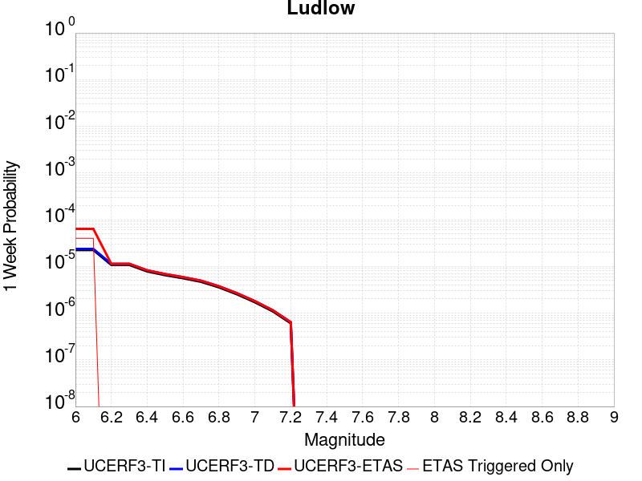 | 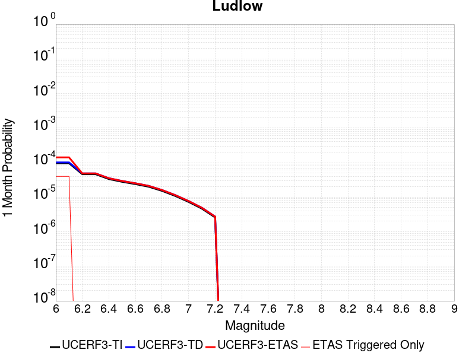 |  | 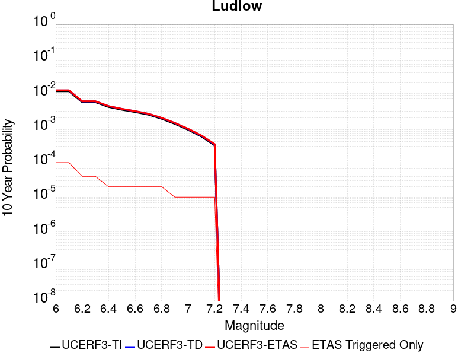 |

| Magnitude | 1 wk TI Prob | 1 wk TD Prob | 1 wk ETAS Prob | 1 wk ETAS/TD Gain | 1 wk ETAS Triggered Only | 1 mo TI Prob | 1 mo TD Prob | 1 mo ETAS Prob | 1 mo ETAS/TD Gain | 1 mo ETAS Triggered Only | 1 yr TI Prob | 1 yr TD Prob | 1 yr ETAS Prob | 1 yr ETAS/TD Gain | 1 yr ETAS Triggered Only | 10 yr TI Prob | 10 yr TD Prob | 10 yr ETAS Prob | 10 yr ETAS/TD Gain | 10 yr ETAS Triggered Only |
|-----|-----|-----|-----|-----|-----|-----|-----|-----|-----|-----|-----|-----|-----|-----|-----|-----|-----|-----|-----|-----|
| 6.0 | 2.2407607E-5 | 2.3657218E-5 | 3.586903E-5 | 1.516198 | 1.22121E-5 | 9.602906E-5 | 1.0138439E-4 | 1.1359525E-4 | 1.1204412 | 1.22121E-5 | 0.0011685267 | 0.0012337001 | 0.0012580942 | 1.0197731 | 2.44242E-5 | 0.011624013 | 0.012273024 | 0.012321273 | 1.0039313 | 4.88484E-5 |
| 6.1 | 2.2407607E-5 | 2.3657218E-5 | 3.586903E-5 | 1.516198 | 1.22121E-5 | 9.602906E-5 | 1.0138439E-4 | 1.1359525E-4 | 1.1204412 | 1.22121E-5 | 0.0011685267 | 0.0012337001 | 0.0012580942 | 1.0197731 | 2.44242E-5 | 0.011624013 | 0.012273024 | 0.012321273 | 1.0039313 | 4.88484E-5 |
| 6.2 | 1.0781252E-5 | 1.1365647E-5 | 1.1365647E-5 | 1.0 | 0.0 | 4.620455E-5 | 4.870903E-5 | 4.870903E-5 | 1.0 | 0.0 | 5.623952E-4 | 5.928751E-4 | 5.928751E-4 | 1.0 | 0.0 | 0.00560974 | 0.0059133526 | 0.0059254924 | 1.0020529 | 1.22121E-5 |
| 6.3 | 1.0781252E-5 | 1.1365647E-5 | 1.1365647E-5 | 1.0 | 0.0 | 4.620455E-5 | 4.870903E-5 | 4.870903E-5 | 1.0 | 0.0 | 5.623952E-4 | 5.928751E-4 | 5.928751E-4 | 1.0 | 0.0 | 0.00560974 | 0.0059133526 | 0.0059254924 | 1.0020529 | 1.22121E-5 |
| 6.4 | 7.814439E-6 | 8.237717E-6 | 8.237717E-6 | 1.0 | 0.0 | 3.3490025E-5 | 3.530403E-5 | 3.530403E-5 | 1.0 | 0.0 | 4.0766477E-4 | 4.297432E-4 | 4.297432E-4 | 1.0 | 0.0 | 0.0040691774 | 0.0042892685 | 0.004301428 | 1.0028349 | 1.22121E-5 |
| 6.5 | 6.4986366E-6 | 6.85091E-6 | 6.85091E-6 | 1.0 | 0.0 | 2.7851002E-5 | 2.9360717E-5 | 2.9360717E-5 | 1.0 | 0.0 | 3.390332E-4 | 3.57409E-4 | 3.57409E-4 | 1.0 | 0.0 | 0.003385164 | 0.003568438 | 0.0035806065 | 1.0034101 | 1.22121E-5 |
| 6.6 | 5.582177E-6 | 5.885997E-6 | 5.885997E-6 | 1.0 | 0.0 | 2.3923398E-5 | 2.5225461E-5 | 2.5225461E-5 | 1.0 | 0.0 | 2.9122844E-4 | 3.0707743E-4 | 3.0707743E-4 | 1.0 | 0.0 | 0.0029084706 | 0.0030666045 | 0.003078779 | 1.00397 | 1.22121E-5 |
| 6.7 | 4.6858763E-6 | 4.9404202E-6 | 4.9404202E-6 | 1.0 | 0.0 | 2.0082172E-5 | 2.117306E-5 | 2.117306E-5 | 1.0 | 0.0 | 2.4447302E-4 | 2.5775208E-4 | 2.5775208E-4 | 1.0 | 0.0 | 0.0024420423 | 0.0025745875 | 0.0025867682 | 1.004731 | 1.22121E-5 |
| 6.8 | 3.5584908E-6 | 3.7520128E-6 | 3.7520128E-6 | 1.0 | 0.0 | 1.5250586E-5 | 1.607996E-5 | 1.607996E-5 | 1.0 | 0.0 | 1.8566006E-4 | 1.9575632E-4 | 1.9575632E-4 | 1.0 | 0.0 | 0.0018550502 | 0.0019558799 | 0.001968068 | 1.0062315 | 1.22121E-5 |
| 6.9 | 2.532834E-6 | 2.6709995E-6 | 2.6709995E-6 | 1.0 | 0.0 | 1.0854958E-5 | 1.1447092E-5 | 1.1447092E-5 | 1.0 | 0.0 | 1.3215111E-4 | 1.3935972E-4 | 1.3935972E-4 | 1.0 | 0.0 | 0.0013207254 | 0.0013927508 | 0.0013927508 | 1.0 | 0.0 |
| 7.0 | 1.7083285E-6 | 1.8019413E-6 | 1.8019413E-6 | 1.0 | 0.0 | 7.3213873E-6 | 7.722583E-6 | 7.722583E-6 | 1.0 | 0.0 | 8.913424E-5 | 9.4018564E-5 | 9.4018564E-5 | 1.0 | 0.0 | 8.9098496E-4 | 9.3980436E-4 | 9.3980436E-4 | 1.0 | 0.0 |
| 7.1 | 1.0905424E-6 | 1.1497604E-6 | 1.1497604E-6 | 1.0 | 0.0 | 4.6737446E-6 | 4.9275354E-6 | 4.9275354E-6 | 1.0 | 0.0 | 5.6901354E-5 | 5.999119E-5 | 5.999119E-5 | 1.0 | 0.0 | 5.6886784E-4 | 5.9975975E-4 | 5.9975975E-4 | 1.0 | 0.0 |
| 7.2 | 6.06668E-7 | 6.387269E-7 | 6.387269E-7 | 1.0 | 0.0 | 2.600003E-6 | 2.7373983E-6 | 2.7373983E-6 | 1.0 | 0.0 | 3.1654577E-5 | 3.3327386E-5 | 3.3327386E-5 | 1.0 | 0.0 | 3.1650066E-4 | 3.332307E-4 | 3.332307E-4 | 1.0 | 0.0 |

## Red Pass
*[(top)](#table-of-contents)*

| 1 Week | 1 Month | 1 Year | 10 Year |
|-----|-----|-----|-----|
| 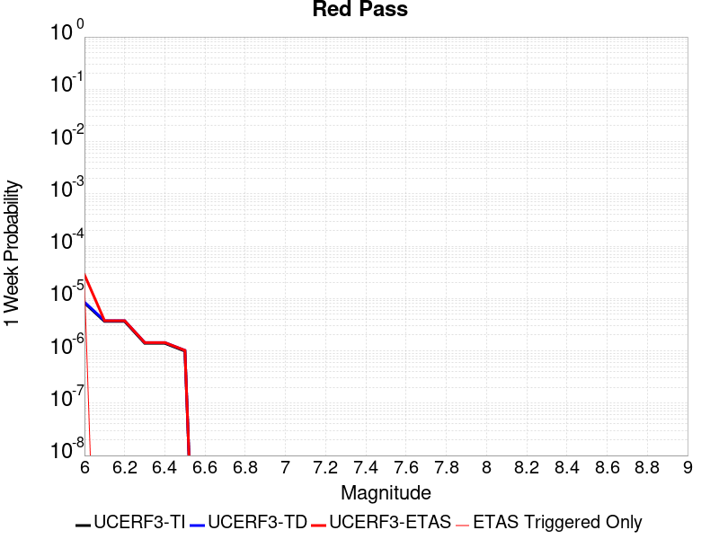 |  | 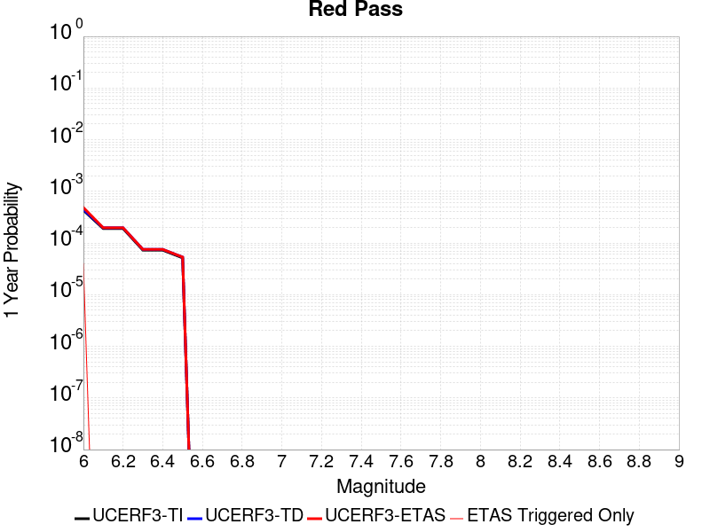 | 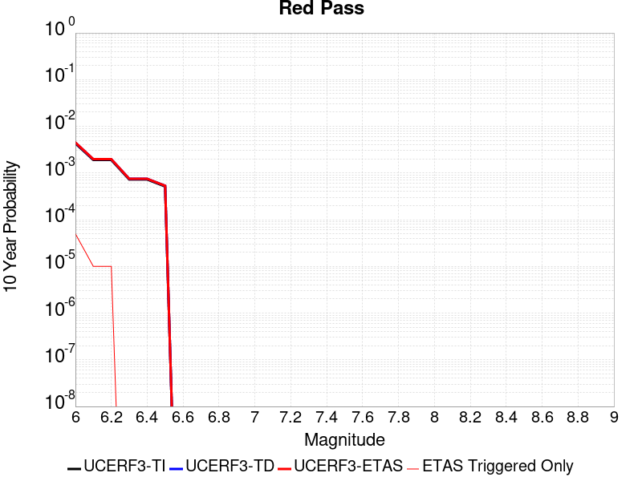 |

| Magnitude | 1 wk TI Prob | 1 wk TD Prob | 1 wk ETAS Prob | 1 wk ETAS/TD Gain | 1 wk ETAS Triggered Only | 1 mo TI Prob | 1 mo TD Prob | 1 mo ETAS Prob | 1 mo ETAS/TD Gain | 1 mo ETAS Triggered Only | 1 yr TI Prob | 1 yr TD Prob | 1 yr ETAS Prob | 1 yr ETAS/TD Gain | 1 yr ETAS Triggered Only | 10 yr TI Prob | 10 yr TD Prob | 10 yr ETAS Prob | 10 yr ETAS/TD Gain | 10 yr ETAS Triggered Only |
|-----|-----|-----|-----|-----|-----|-----|-----|-----|-----|-----|-----|-----|-----|-----|-----|-----|-----|-----|-----|-----|
| 6.0 | 8.258278E-6 | 8.5512565E-6 | 3.2975247E-5 | 3.8561873 | 2.44242E-5 | 3.539214E-5 | 3.664783E-5 | 7.328278E-5 | 1.9996487 | 3.66363E-5 | 4.308141E-4 | 4.4611385E-4 | 4.827338E-4 | 1.0820866 | 3.66363E-5 | 0.0042997985 | 0.004453941 | 0.0045025717 | 1.0109186 | 4.88484E-5 |
| 6.1 | 3.649988E-6 | 3.7753127E-6 | 3.7753127E-6 | 1.0 | 0.0 | 1.5642712E-5 | 1.6179838E-5 | 1.6179838E-5 | 1.0 | 0.0 | 1.9043336E-4 | 1.9697649E-4 | 1.9697649E-4 | 1.0 | 0.0 | 0.0019027026 | 0.0019684862 | 0.0019806742 | 1.0061916 | 1.22121E-5 |
| 6.2 | 3.649988E-6 | 3.7753127E-6 | 3.7753127E-6 | 1.0 | 0.0 | 1.5642712E-5 | 1.6179838E-5 | 1.6179838E-5 | 1.0 | 0.0 | 1.9043336E-4 | 1.9697649E-4 | 1.9697649E-4 | 1.0 | 0.0 | 0.0019027026 | 0.0019684862 | 0.0019806742 | 1.0061916 | 1.22121E-5 |
| 6.3 | 1.3924937E-6 | 1.4411153E-6 | 1.4411153E-6 | 1.0 | 0.0 | 5.9678164E-6 | 6.1762016E-6 | 6.1762016E-6 | 1.0 | 0.0 | 7.265574E-5 | 7.5194075E-5 | 7.5194075E-5 | 1.0 | 0.0 | 7.263199E-4 | 7.518251E-4 | 7.518251E-4 | 1.0 | 0.0 |
| 6.4 | 1.3924937E-6 | 1.4411153E-6 | 1.4411153E-6 | 1.0 | 0.0 | 5.9678164E-6 | 6.1762016E-6 | 6.1762016E-6 | 1.0 | 0.0 | 7.265574E-5 | 7.5194075E-5 | 7.5194075E-5 | 1.0 | 0.0 | 7.263199E-4 | 7.518251E-4 | 7.518251E-4 | 1.0 | 0.0 |
| 6.5 | 9.876812E-7 | 1.0221903E-6 | 1.0221903E-6 | 1.0 | 0.0 | 4.2329125E-6 | 4.3808154E-6 | 4.3808154E-6 | 1.0 | 0.0 | 5.153449E-5 | 5.333643E-5 | 5.333643E-5 | 1.0 | 0.0 | 5.1522546E-4 | 5.3336425E-4 | 5.3336425E-4 | 1.0 | 0.0 |

## Big Pine (Central)
*[(top)](#table-of-contents)*

| 1 Week | 1 Month | 1 Year | 10 Year |
|-----|-----|-----|-----|
|  |  |  | 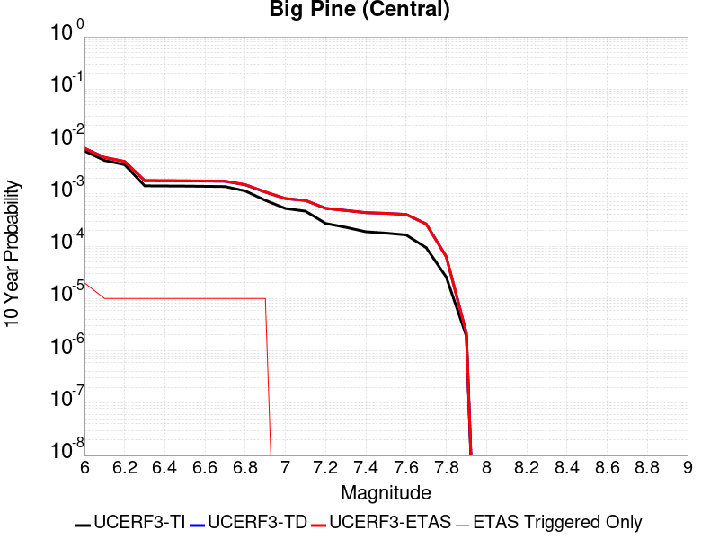 |

| Magnitude | 1 wk TI Prob | 1 wk TD Prob | 1 wk ETAS Prob | 1 wk ETAS/TD Gain | 1 wk ETAS Triggered Only | 1 mo TI Prob | 1 mo TD Prob | 1 mo ETAS Prob | 1 mo ETAS/TD Gain | 1 mo ETAS Triggered Only | 1 yr TI Prob | 1 yr TD Prob | 1 yr ETAS Prob | 1 yr ETAS/TD Gain | 1 yr ETAS Triggered Only | 10 yr TI Prob | 10 yr TD Prob | 10 yr ETAS Prob | 10 yr ETAS/TD Gain | 10 yr ETAS Triggered Only |
|-----|-----|-----|-----|-----|-----|-----|-----|-----|-----|-----|-----|-----|-----|-----|-----|-----|-----|-----|-----|-----|
| 6.0 | 1.2706755E-5 | 1.4250431E-5 | 1.4250431E-5 | 1.0 | 0.0 | 5.4456385E-5 | 6.107205E-5 | 6.107205E-5 | 1.0 | 0.0 | 6.628048E-4 | 7.433351E-4 | 7.555382E-4 | 1.0164165 | 1.22121E-5 | 0.006608314 | 0.007413517 | 0.00743776 | 1.0032701 | 2.44242E-5 |
| 6.1 | 8.342579E-6 | 9.510675E-6 | 9.510675E-6 | 1.0 | 0.0 | 3.5753423E-5 | 4.075952E-5 | 4.075952E-5 | 1.0 | 0.0 | 4.3521097E-4 | 4.9615593E-4 | 5.0836196E-4 | 1.0246012 | 1.22121E-5 | 0.0043435963 | 0.004954038 | 0.0049661896 | 1.0024529 | 1.22121E-5 |
| 6.2 | 6.923899E-6 | 7.967064E-6 | 7.967064E-6 | 1.0 | 0.0 | 2.9673516E-5 | 3.4144225E-5 | 3.4144225E-5 | 1.0 | 0.0 | 3.6121515E-4 | 4.1564586E-4 | 4.2785288E-4 | 1.0293688 | 1.22121E-5 | 0.003606286 | 0.0041519944 | 0.0041641556 | 1.0029291 | 1.22121E-5 |
| 6.3 | 2.728396E-6 | 3.424218E-6 | 3.424218E-6 | 1.0 | 0.0 | 1.1693074E-5 | 1.4675143E-5 | 1.4675143E-5 | 1.0 | 0.0 | 1.4235388E-4 | 1.7865608E-4 | 1.7865608E-4 | 1.0 | 0.0 | 0.0014226272 | 0.0017866332 | 0.0017988234 | 1.0068231 | 1.22121E-5 |
| 6.4 | 2.7136944E-6 | 3.4085115E-6 | 3.4085115E-6 | 1.0 | 0.0 | 1.1630066E-5 | 1.4607829E-5 | 1.4607829E-5 | 1.0 | 0.0 | 1.4158686E-4 | 1.7783667E-4 | 1.7783667E-4 | 1.0 | 0.0 | 0.0014149669 | 0.0017784522 | 0.0017906426 | 1.0068545 | 1.22121E-5 |
| 6.5 | 2.6971882E-6 | 3.3908566E-6 | 3.3908566E-6 | 1.0 | 0.0 | 1.1559327E-5 | 1.45321665E-5 | 1.45321665E-5 | 1.0 | 0.0 | 1.4072572E-4 | 1.7691562E-4 | 1.7691562E-4 | 1.0 | 0.0 | 0.0014063664 | 0.0017692564 | 0.001781447 | 1.0068902 | 1.22121E-5 |
| 6.6 | 2.669092E-6 | 3.3608771E-6 | 3.3608771E-6 | 1.0 | 0.0 | 1.1438916E-5 | 1.4403684E-5 | 1.4403684E-5 | 1.0 | 0.0 | 1.3925991E-4 | 1.7535161E-4 | 1.7535161E-4 | 1.0 | 0.0 | 0.0013917267 | 0.0017536411 | 0.0017658317 | 1.0069517 | 1.22121E-5 |
| 6.7 | 2.6408059E-6 | 3.3309027E-6 | 3.3309027E-6 | 1.0 | 0.0 | 1.1317691E-5 | 1.4275224E-5 | 1.4275224E-5 | 1.0 | 0.0 | 1.3778417E-4 | 1.7378786E-4 | 1.7378786E-4 | 1.0 | 0.0 | 0.0013769877 | 0.001738028 | 0.0017502189 | 1.0070142 | 1.22121E-5 |
| 6.8 | 2.1786943E-6 | 2.8543604E-6 | 2.8543604E-6 | 1.0 | 0.0 | 9.337228E-6 | 1.223292E-5 | 1.223292E-5 | 1.0 | 0.0 | 1.1367482E-4 | 1.4892635E-4 | 1.4892635E-4 | 1.0 | 0.0 | 0.0011361669 | 0.0014897605 | 0.0015019544 | 1.0081851 | 1.22121E-5 |
| 6.9 | 1.4411696E-6 | 2.0684301E-6 | 2.0684301E-6 | 1.0 | 0.0 | 6.1764263E-6 | 8.864672E-6 | 8.864672E-6 | 1.0 | 0.0 | 7.51954E-5 | 1.0792231E-4 | 1.0792231E-4 | 1.0 | 0.0 | 7.5169955E-4 | 0.0010801493 | 0.0010923482 | 1.0112938 | 1.22121E-5 |
| 7.0 | 1.0073411E-6 | 1.5541993E-6 | 1.5541993E-6 | 1.0 | 0.0 | 4.317169E-6 | 6.6608386E-6 | 6.6608386E-6 | 1.0 | 0.0 | 5.2560266E-5 | 8.109284E-5 | 8.109284E-5 | 1.0 | 0.0 | 5.2547833E-4 | 8.1207167E-4 | 8.1207167E-4 | 1.0 | 0.0 |
| 7.1 | 8.947104E-7 | 1.4301887E-6 | 1.4301887E-6 | 1.0 | 0.0 | 3.834468E-6 | 6.1293663E-6 | 6.1293663E-6 | 1.0 | 0.0 | 4.6683643E-5 | 7.462263E-5 | 7.462263E-5 | 1.0 | 0.0 | 4.6673836E-4 | 7.4741466E-4 | 7.4741466E-4 | 1.0 | 0.0 |
| 7.2 | 5.215166E-7 | 1.0111112E-6 | 1.0111112E-6 | 1.0 | 0.0 | 2.2350691E-6 | 4.3333266E-6 | 4.3333266E-6 | 1.0 | 0.0 | 2.7211627E-5 | 5.275702E-5 | 5.275702E-5 | 1.0 | 0.0 | 2.7208295E-4 | 5.288737E-4 | 5.288737E-4 | 1.0 | 0.0 |
| 7.3 | 4.4024807E-7 | 9.219039E-7 | 9.219039E-7 | 1.0 | 0.0 | 1.8867761E-6 | 3.951011E-6 | 3.951011E-6 | 1.0 | 0.0 | 2.2971257E-5 | 4.8102538E-5 | 4.8102538E-5 | 1.0 | 0.0 | 2.2968883E-4 | 4.823499E-4 | 4.823499E-4 | 1.0 | 0.0 |
| 7.4 | 3.6130905E-7 | 8.35799E-7 | 8.35799E-7 | 1.0 | 0.0 | 1.5484665E-6 | 3.5819912E-6 | 3.5819912E-6 | 1.0 | 0.0 | 1.8852415E-5 | 4.3609907E-5 | 4.3609907E-5 | 1.0 | 0.0 | 1.8850817E-4 | 4.3743252E-4 | 4.3743252E-4 | 1.0 | 0.0 |
| 7.5 | 3.408184E-7 | 8.1076263E-7 | 8.1076263E-7 | 1.0 | 0.0 | 1.4606494E-6 | 3.4746924E-6 | 3.4746924E-6 | 1.0 | 0.0 | 1.7783263E-5 | 4.23036E-5 | 4.23036E-5 | 1.0 | 0.0 | 1.778184E-4 | 4.2435306E-4 | 4.2435306E-4 | 1.0 | 0.0 |
| 7.6 | 3.1428627E-7 | 7.731098E-7 | 7.731098E-7 | 1.0 | 0.0 | 1.3469405E-6 | 3.3133235E-6 | 3.3133235E-6 | 1.0 | 0.0 | 1.6398877E-5 | 4.0339008E-5 | 4.0339008E-5 | 1.0 | 0.0 | 1.6397667E-4 | 4.0468544E-4 | 4.0468544E-4 | 1.0 | 0.0 |
| 7.7 | 1.7972785E-7 | 5.0773684E-7 | 5.0773684E-7 | 1.0 | 0.0 | 7.70262E-7 | 2.1760131E-6 | 2.1760131E-6 | 1.0 | 0.0 | 9.377899E-6 | 2.649265E-5 | 2.649265E-5 | 1.0 | 0.0 | 9.377503E-5 | 2.6627042E-4 | 2.6627042E-4 | 1.0 | 0.0 |
| 7.8 | 4.9230927E-8 | 1.1979883E-7 | 1.1979883E-7 | 1.0 | 0.0 | 2.1098968E-7 | 5.1342346E-7 | 5.1342346E-7 | 1.0 | 0.0 | 2.5687964E-6 | 6.2509143E-6 | 6.2509143E-6 | 1.0 | 0.0 | 2.5687666E-5 | 6.2949504E-5 | 6.2949504E-5 | 1.0 | 0.0 |
| 7.9 | 3.6805972E-9 | 4.1049364E-9 | 4.1049364E-9 | 1.0 | 0.0 | 1.5773987E-8 | 1.7592585E-8 | 1.7592585E-8 | 1.0 | 0.0 | 1.9204828E-7 | 2.141897E-7 | 2.141897E-7 | 1.0 | 0.0 | 1.920481E-6 | 2.1898745E-6 | 2.1898745E-6 | 1.0 | 0.0 |

## Calico-Hidalgo
*[(top)](#table-of-contents)*

| 1 Week | 1 Month | 1 Year | 10 Year |
|-----|-----|-----|-----|
| 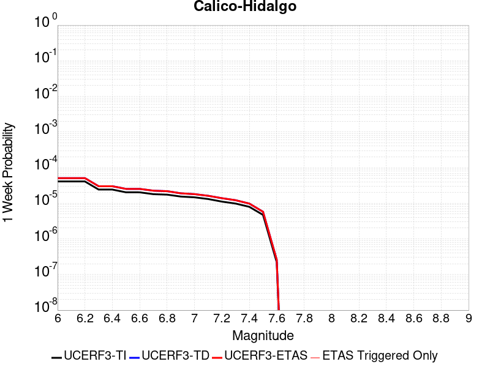 | 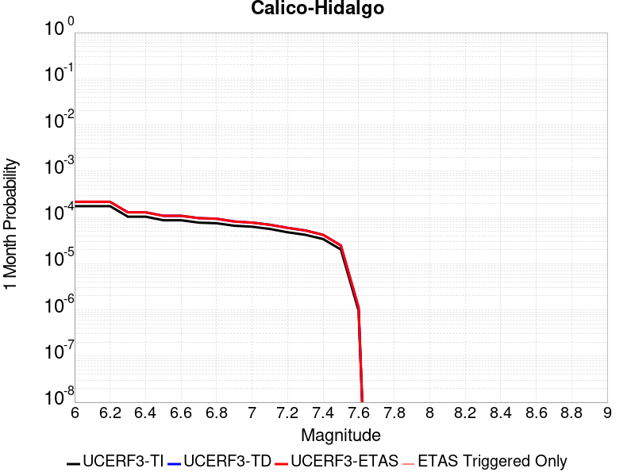 |  | 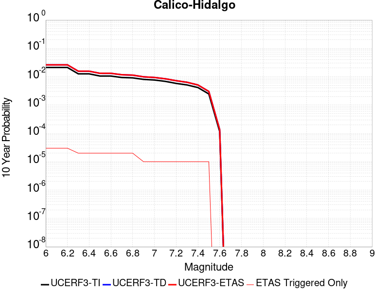 |

| Magnitude | 1 wk TI Prob | 1 wk TD Prob | 1 wk ETAS Prob | 1 wk ETAS/TD Gain | 1 wk ETAS Triggered Only | 1 mo TI Prob | 1 mo TD Prob | 1 mo ETAS Prob | 1 mo ETAS/TD Gain | 1 mo ETAS Triggered Only | 1 yr TI Prob | 1 yr TD Prob | 1 yr ETAS Prob | 1 yr ETAS/TD Gain | 1 yr ETAS Triggered Only | 10 yr TI Prob | 10 yr TD Prob | 10 yr ETAS Prob | 10 yr ETAS/TD Gain | 10 yr ETAS Triggered Only |
|-----|-----|-----|-----|-----|-----|-----|-----|-----|-----|-----|-----|-----|-----|-----|-----|-----|-----|-----|-----|-----|
| 6.0 | 4.0906612E-5 | 5.0703493E-5 | 5.0703493E-5 | 1.0 | 0.0 | 1.7530227E-4 | 2.1728488E-4 | 2.1728488E-4 | 1.0 | 0.0 | 0.0021322158 | 0.002642638 | 0.0026669977 | 1.009218 | 2.44242E-5 | 0.02111873 | 0.026152508 | 0.026188187 | 1.0013642 | 3.66363E-5 |
| 6.1 | 4.0906612E-5 | 5.0703493E-5 | 5.0703493E-5 | 1.0 | 0.0 | 1.7530227E-4 | 2.1728488E-4 | 2.1728488E-4 | 1.0 | 0.0 | 0.0021322158 | 0.002642638 | 0.0026669977 | 1.009218 | 2.44242E-5 | 0.02111873 | 0.026152508 | 0.026188187 | 1.0013642 | 3.66363E-5 |
| 6.2 | 4.0906612E-5 | 5.0703493E-5 | 5.0703493E-5 | 1.0 | 0.0 | 1.7530227E-4 | 2.1728488E-4 | 2.1728488E-4 | 1.0 | 0.0 | 0.0021322158 | 0.002642638 | 0.0026669977 | 1.009218 | 2.44242E-5 | 0.02111873 | 0.026152508 | 0.026188187 | 1.0013642 | 3.66363E-5 |
| 6.3 | 2.4242801E-5 | 3.0090596E-5 | 3.0090596E-5 | 1.0 | 0.0 | 1.0389358E-4 | 1.2895351E-4 | 1.2895351E-4 | 1.0 | 0.0 | 0.0012641704 | 0.0015689114 | 0.0015811042 | 1.0077716 | 1.22121E-5 | 0.01257003 | 0.015582023 | 0.015606066 | 1.001543 | 2.44242E-5 |
| 6.4 | 2.4242801E-5 | 3.0090596E-5 | 3.0090596E-5 | 1.0 | 0.0 | 1.0389358E-4 | 1.2895351E-4 | 1.2895351E-4 | 1.0 | 0.0 | 0.0012641704 | 0.0015689114 | 0.0015811042 | 1.0077716 | 1.22121E-5 | 0.01257003 | 0.015582023 | 0.015606066 | 1.001543 | 2.44242E-5 |
| 6.5 | 2.0286952E-5 | 2.5315689E-5 | 2.5315689E-5 | 1.0 | 0.0 | 8.694118E-5 | 1.0849139E-4 | 1.0849139E-4 | 1.0 | 0.0 | 0.0010579949 | 0.0013200995 | 0.0013322955 | 1.0092387 | 1.22121E-5 | 0.010529719 | 0.0131245125 | 0.013148616 | 1.0018365 | 2.44242E-5 |
| 6.6 | 2.0269223E-5 | 2.5296638E-5 | 2.5296638E-5 | 1.0 | 0.0 | 8.6865206E-5 | 1.0840975E-4 | 1.0840975E-4 | 1.0 | 0.0 | 0.0010570707 | 0.0013191067 | 0.0013313027 | 1.0092456 | 1.22121E-5 | 0.010520565 | 0.013114702 | 0.0131388055 | 1.001838 | 2.44242E-5 |
| 6.7 | 1.799852E-5 | 2.254056E-5 | 2.254056E-5 | 1.0 | 0.0 | 7.713423E-5 | 9.65989E-5 | 9.65989E-5 | 1.0 | 0.0 | 9.3870464E-4 | 0.0011754717 | 0.0011876695 | 1.0103769 | 1.22121E-5 | 0.009347493 | 0.011694153 | 0.011718291 | 1.0020641 | 2.44242E-5 |
| 6.8 | 1.7458793E-5 | 2.1842081E-5 | 2.1842081E-5 | 1.0 | 0.0 | 7.4821255E-5 | 9.3605646E-5 | 9.3605646E-5 | 1.0 | 0.0 | 9.10568E-4 | 0.0011390673 | 0.0011512656 | 1.0107089 | 1.22121E-5 | 0.009068459 | 0.0113338735 | 0.011358021 | 1.0021305 | 2.44242E-5 |
| 6.9 | 1.542884E-5 | 1.9025894E-5 | 1.9025894E-5 | 1.0 | 0.0 | 6.612192E-5 | 8.153707E-5 | 8.153707E-5 | 1.0 | 0.0 | 8.04737E-4 | 9.92275E-4 | 9.92275E-4 | 1.0 | 0.0 | 0.008018291 | 0.0098798415 | 0.009891933 | 1.0012238 | 1.22121E-5 |
| 7.0 | 1.468253E-5 | 1.8030569E-5 | 1.8030569E-5 | 1.0 | 0.0 | 6.292361E-5 | 7.727165E-5 | 7.727165E-5 | 1.0 | 0.0 | 7.658257E-4 | 9.403893E-4 | 9.403893E-4 | 1.0 | 0.0 | 0.0076319184 | 0.0093654655 | 0.009377563 | 1.0012918 | 1.22121E-5 |
| 7.1 | 1.3139281E-5 | 1.6200916E-5 | 1.6200916E-5 | 1.0 | 0.0 | 5.6309986E-5 | 6.9430724E-5 | 6.9430724E-5 | 1.0 | 0.0 | 6.853584E-4 | 8.450038E-4 | 8.450038E-4 | 1.0 | 0.0 | 0.0068324856 | 0.008419205 | 0.0084313145 | 1.0014383 | 1.22121E-5 |
| 7.2 | 1.1127404E-5 | 1.3866576E-5 | 1.3866576E-5 | 1.0 | 0.0 | 4.7688E-5 | 5.942689E-5 | 5.942689E-5 | 1.0 | 0.0 | 5.8044674E-4 | 7.232931E-4 | 7.232931E-4 | 1.0 | 0.0 | 0.0057893298 | 0.0072104977 | 0.0072226217 | 1.0016814 | 1.22121E-5 |
| 7.3 | 9.808154E-6 | 1.2176198E-5 | 1.2176198E-5 | 1.0 | 0.0 | 4.2034266E-5 | 5.218272E-5 | 5.218272E-5 | 1.0 | 0.0 | 5.11647E-4 | 6.351501E-4 | 6.351501E-4 | 1.0 | 0.0 | 0.0051047057 | 0.006334424 | 0.0063465587 | 1.0019157 | 1.22121E-5 |
| 7.4 | 7.942452E-6 | 9.79213E-6 | 9.79213E-6 | 1.0 | 0.0 | 3.4038632E-5 | 4.1965654E-5 | 4.1965654E-5 | 1.0 | 0.0 | 4.1434157E-4 | 5.108215E-4 | 5.108215E-4 | 1.0 | 0.0 | 0.0041356985 | 0.0050974144 | 0.0051095644 | 1.0023836 | 1.22121E-5 |
| 7.5 | 4.7121216E-6 | 5.7728294E-6 | 5.7728294E-6 | 1.0 | 0.0 | 2.019465E-5 | 2.4740506E-5 | 2.4740506E-5 | 1.0 | 0.0 | 2.4584212E-4 | 3.011817E-4 | 3.011817E-4 | 1.0 | 0.0 | 0.0024557032 | 0.0030084874 | 0.0030206628 | 1.004047 | 1.22121E-5 |
| 7.6 | 2.21172E-7 | 2.603958E-7 | 2.603958E-7 | 1.0 | 0.0 | 9.478797E-7 | 1.1159817E-6 | 1.1159817E-6 | 1.0 | 0.0 | 1.1540374E-5 | 1.3587022E-5 | 1.3587022E-5 | 1.0 | 0.0 | 1.1539775E-4 | 1.3586473E-4 | 1.3586473E-4 | 1.0 | 0.0 |

## San Jacinto (San Bernardino)
*[(top)](#table-of-contents)*

| 1 Week | 1 Month | 1 Year | 10 Year |
|-----|-----|-----|-----|
|  | 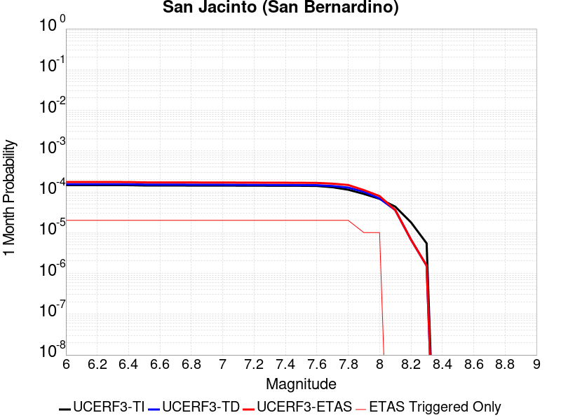 |  | 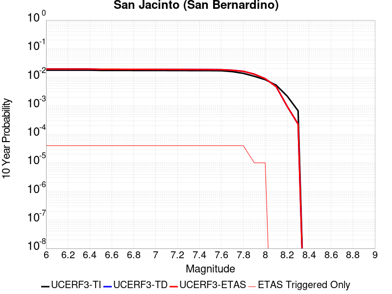 |

| Magnitude | 1 wk TI Prob | 1 wk TD Prob | 1 wk ETAS Prob | 1 wk ETAS/TD Gain | 1 wk ETAS Triggered Only | 1 mo TI Prob | 1 mo TD Prob | 1 mo ETAS Prob | 1 mo ETAS/TD Gain | 1 mo ETAS Triggered Only | 1 yr TI Prob | 1 yr TD Prob | 1 yr ETAS Prob | 1 yr ETAS/TD Gain | 1 yr ETAS Triggered Only | 10 yr TI Prob | 10 yr TD Prob | 10 yr ETAS Prob | 10 yr ETAS/TD Gain | 10 yr ETAS Triggered Only |
|-----|-----|-----|-----|-----|-----|-----|-----|-----|-----|-----|-----|-----|-----|-----|-----|-----|-----|-----|-----|-----|
| 6.0 | 3.409352E-5 | 3.597972E-5 | 4.819138E-5 | 1.339404 | 1.22121E-5 | 1.461069E-4 | 1.541897E-4 | 1.7861013E-4 | 1.1583792 | 2.44242E-5 | 0.0017774 | 0.0018756451 | 0.0019000235 | 1.0129974 | 2.44242E-5 | 0.01763251 | 0.019346429 | 0.019382356 | 1.001857 | 3.66363E-5 |
| 6.1 | 3.409352E-5 | 3.597972E-5 | 4.819138E-5 | 1.339404 | 1.22121E-5 | 1.461069E-4 | 1.541897E-4 | 1.7861013E-4 | 1.1583792 | 2.44242E-5 | 0.0017774 | 0.0018756451 | 0.0019000235 | 1.0129974 | 2.44242E-5 | 0.01763251 | 0.019346429 | 0.019382356 | 1.001857 | 3.66363E-5 |
| 6.2 | 3.409352E-5 | 3.597972E-5 | 4.819138E-5 | 1.339404 | 1.22121E-5 | 1.461069E-4 | 1.541897E-4 | 1.7861013E-4 | 1.1583792 | 2.44242E-5 | 0.0017774 | 0.0018756451 | 0.0019000235 | 1.0129974 | 2.44242E-5 | 0.01763251 | 0.019346429 | 0.019382356 | 1.001857 | 3.66363E-5 |
| 6.3 | 3.409352E-5 | 3.597972E-5 | 4.819138E-5 | 1.339404 | 1.22121E-5 | 1.461069E-4 | 1.541897E-4 | 1.7861013E-4 | 1.1583792 | 2.44242E-5 | 0.0017774 | 0.0018756451 | 0.0019000235 | 1.0129974 | 2.44242E-5 | 0.01763251 | 0.019346429 | 0.019382356 | 1.001857 | 3.66363E-5 |
| 6.4 | 3.400795E-5 | 3.5872385E-5 | 4.8084046E-5 | 1.3404195 | 1.22121E-5 | 1.4574021E-4 | 1.5372974E-4 | 1.7815019E-4 | 1.158853 | 2.44242E-5 | 0.0017729428 | 0.0018700549 | 0.0018944334 | 1.0130363 | 2.44242E-5 | 0.017588645 | 0.01929151 | 0.01932744 | 1.0018624 | 3.66363E-5 |
| 6.5 | 3.341482E-5 | 3.5133027E-5 | 4.73447E-5 | 1.3475838 | 1.22121E-5 | 1.4319851E-4 | 1.5056143E-4 | 1.7498196E-4 | 1.1621964 | 2.44242E-5 | 0.0017420477 | 0.0018315457 | 0.0018559252 | 1.0133109 | 2.44242E-5 | 0.017284546 | 0.018913053 | 0.018948996 | 1.0019004 | 3.66363E-5 |
| 6.6 | 3.3364955E-5 | 3.5070247E-5 | 4.728192E-5 | 1.348206 | 1.22121E-5 | 1.4298483E-4 | 1.5029241E-4 | 1.7471294E-4 | 1.1624868 | 2.44242E-5 | 0.0017394501 | 0.0018282757 | 0.0018526553 | 1.0133348 | 2.44242E-5 | 0.017258976 | 0.018880919 | 0.018916862 | 1.0019038 | 3.66363E-5 |
| 6.7 | 3.335922E-5 | 3.506002E-5 | 4.7271693E-5 | 1.3483076 | 1.22121E-5 | 1.4296026E-4 | 1.5024858E-4 | 1.7466911E-4 | 1.1625341 | 2.44242E-5 | 0.0017391514 | 0.0018277431 | 0.0018521227 | 1.0133386 | 2.44242E-5 | 0.017256035 | 0.018875709 | 0.018911654 | 1.0019042 | 3.66363E-5 |
| 6.8 | 3.327683E-5 | 3.495409E-5 | 4.7165762E-5 | 1.3493632 | 1.22121E-5 | 1.4260718E-4 | 1.4979464E-4 | 1.7421518E-4 | 1.1630268 | 2.44242E-5 | 0.0017348597 | 0.0018222256 | 0.0018466053 | 1.0133791 | 2.44242E-5 | 0.017213784 | 0.018821482 | 0.018857429 | 1.0019099 | 3.66363E-5 |
| 6.9 | 3.3235785E-5 | 3.489504E-5 | 4.7106718E-5 | 1.3499544 | 1.22121E-5 | 1.4243131E-4 | 1.4954162E-4 | 1.7396217E-4 | 1.1633027 | 2.44242E-5 | 0.0017327217 | 0.0018191502 | 0.00184353 | 1.0134017 | 2.44242E-5 | 0.017192734 | 0.01879135 | 0.018827299 | 1.001913 | 3.66363E-5 |
| 7.0 | 3.3197095E-5 | 3.4834975E-5 | 4.7046648E-5 | 1.3505579 | 1.22121E-5 | 1.422655E-4 | 1.4928421E-4 | 1.7370476E-4 | 1.1635844 | 2.44242E-5 | 0.0017307063 | 0.0018160215 | 0.0018404013 | 1.0134249 | 2.44242E-5 | 0.017172894 | 0.018760728 | 0.018796677 | 1.0019162 | 3.66363E-5 |
| 7.1 | 3.3129716E-5 | 3.4715187E-5 | 4.692686E-5 | 1.3517675 | 1.22121E-5 | 1.4197677E-4 | 1.487709E-4 | 1.7319145E-4 | 1.1641488 | 2.44242E-5 | 0.0017271966 | 0.0018097822 | 0.0018341623 | 1.0134712 | 2.44242E-5 | 0.017138338 | 0.018699808 | 0.018735759 | 1.0019225 | 3.66363E-5 |
| 7.2 | 3.3034008E-5 | 3.4582634E-5 | 4.679431E-5 | 1.3531159 | 1.22121E-5 | 1.4156665E-4 | 1.4820287E-4 | 1.7262346E-4 | 1.164778 | 2.44242E-5 | 0.0017222111 | 0.0018028781 | 0.0018272583 | 1.0135229 | 2.44242E-5 | 0.017089253 | 0.018632201 | 0.018668154 | 1.0019296 | 3.66363E-5 |
| 7.3 | 3.2956614E-5 | 3.4450393E-5 | 4.6662073E-5 | 1.3544714 | 1.22121E-5 | 1.4123498E-4 | 1.476362E-4 | 1.7205678E-4 | 1.1654106 | 2.44242E-5 | 0.0017181796 | 0.0017959902 | 0.0018203706 | 1.0135748 | 2.44242E-5 | 0.017049557 | 0.018564949 | 0.018600905 | 1.0019368 | 3.66363E-5 |
| 7.4 | 3.2915937E-5 | 3.437212E-5 | 4.65838E-5 | 1.3552786 | 1.22121E-5 | 1.4106068E-4 | 1.4730077E-4 | 1.7172137E-4 | 1.1657873 | 2.44242E-5 | 0.0017160608 | 0.0017919131 | 0.0018162935 | 1.0136058 | 2.44242E-5 | 0.017028693 | 0.01852523 | 0.018561188 | 1.001941 | 3.66363E-5 |
| 7.5 | 3.281791E-5 | 3.4237073E-5 | 4.6448753E-5 | 1.35668 | 1.22121E-5 | 1.406406E-4 | 1.4672207E-4 | 1.7114269E-4 | 1.1664413 | 2.44242E-5 | 0.0017109542 | 0.0017848789 | 0.0018092595 | 1.0136595 | 2.44242E-5 | 0.016978411 | 0.018456137 | 0.018492097 | 1.0019484 | 3.66363E-5 |
| 7.6 | 3.2521442E-5 | 3.3962282E-5 | 4.6173966E-5 | 1.3595661 | 1.22121E-5 | 1.3937015E-4 | 1.4554452E-4 | 1.6996516E-4 | 1.1677881 | 2.44242E-5 | 0.0016955109 | 0.0017705658 | 0.0017949467 | 1.0137701 | 2.44242E-5 | 0.016826328 | 0.018313898 | 0.018349864 | 1.0019639 | 3.66363E-5 |
| 7.7 | 3.0287873E-5 | 3.2449603E-5 | 4.466131E-5 | 1.3763282 | 1.22121E-5 | 1.297987E-4 | 1.3906232E-4 | 1.6348313E-4 | 1.1756105 | 2.44242E-5 | 0.0015791537 | 0.00169177 | 0.001716153 | 1.0144126 | 2.44242E-5 | 0.01567979 | 0.017526472 | 0.017562468 | 1.0020537 | 3.66363E-5 |
| 7.8 | 2.6316151E-5 | 2.9660547E-5 | 4.1872285E-5 | 1.4117166 | 1.22121E-5 | 1.1277862E-4 | 1.2711044E-4 | 1.5153154E-4 | 1.192125 | 2.44242E-5 | 0.0013722149 | 0.001546472 | 0.0015708584 | 1.0157691 | 2.44242E-5 | 0.013637724 | 0.016068073 | 0.01610412 | 1.0022434 | 3.66363E-5 |
| 7.9 | 2.0761147E-5 | 2.341544E-5 | 3.5627254E-5 | 1.5215282 | 1.22121E-5 | 8.897331E-5 | 1.0034803E-4 | 1.12558904E-4 | 1.1216853 | 1.22121E-5 | 0.0010827117 | 0.0012210533 | 0.0012332505 | 1.009989 | 1.22121E-5 | 0.010774517 | 0.012791798 | 0.012803854 | 1.0009425 | 1.22121E-5 |
| 8.0 | 1.5738568E-5 | 1.6031558E-5 | 2.8243461E-5 | 1.7617415 | 1.22121E-5 | 6.744926E-5 | 6.8704874E-5 | 8.091613E-5 | 1.177735 | 1.22121E-5 | 8.2088535E-4 | 8.361615E-4 | 8.483633E-4 | 1.0145928 | 1.22121E-5 | 0.008178596 | 0.008864859 | 0.008876963 | 1.0013654 | 1.22121E-5 |
| 8.1 | 1.0105832E-5 | 8.329329E-6 | 8.329329E-6 | 1.0 | 0.0 | 4.3309992E-5 | 3.5696637E-5 | 3.5696637E-5 | 1.0 | 0.0 | 5.2717153E-4 | 4.3452042E-4 | 4.3452042E-4 | 1.0 | 0.0 | 0.005259227 | 0.0046766037 | 0.0046766037 | 1.0 | 0.0 |
| 8.2 | 4.189207E-6 | 1.5781004E-6 | 1.5781004E-6 | 1.0 | 0.0 | 1.7953622E-5 | 6.76327E-6 | 6.76327E-6 | 1.0 | 0.0 | 2.1856341E-4 | 8.233973E-5 | 8.233973E-5 | 1.0 | 0.0 | 0.0021834858 | 9.5639535E-4 | 9.5639535E-4 | 1.0 | 0.0 |
| 8.3 | 1.2758221E-6 | 3.6140935E-7 | 3.6140935E-7 | 1.0 | 0.0 | 5.4677976E-6 | 1.5488963E-6 | 1.5488963E-6 | 1.0 | 0.0 | 6.65684E-5 | 1.8857654E-5 | 1.8857654E-5 | 1.0 | 0.0 | 6.6548464E-4 | 2.2746001E-4 | 2.2746001E-4 | 1.0 | 0.0 |

## Red Mountain
*[(top)](#table-of-contents)*

| 1 Week | 1 Month | 1 Year | 10 Year |
|-----|-----|-----|-----|
|  |  |  | 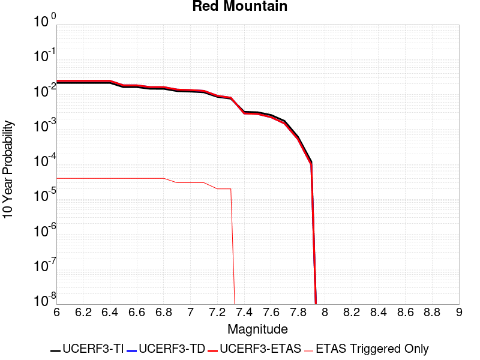 |

| Magnitude | 1 wk TI Prob | 1 wk TD Prob | 1 wk ETAS Prob | 1 wk ETAS/TD Gain | 1 wk ETAS Triggered Only | 1 mo TI Prob | 1 mo TD Prob | 1 mo ETAS Prob | 1 mo ETAS/TD Gain | 1 mo ETAS Triggered Only | 1 yr TI Prob | 1 yr TD Prob | 1 yr ETAS Prob | 1 yr ETAS/TD Gain | 1 yr ETAS Triggered Only | 10 yr TI Prob | 10 yr TD Prob | 10 yr ETAS Prob | 10 yr ETAS/TD Gain | 10 yr ETAS Triggered Only |
|-----|-----|-----|-----|-----|-----|-----|-----|-----|-----|-----|-----|-----|-----|-----|-----|-----|-----|-----|-----|-----|
| 6.0 | 4.1810763E-5 | 4.7589732E-5 | 7.201277E-5 | 1.5131997 | 2.44242E-5 | 1.7917668E-4 | 2.0394099E-4 | 2.2836021E-4 | 1.1197367 | 2.44242E-5 | 0.0021792934 | 0.0024803195 | 0.002504683 | 1.0098227 | 2.44242E-5 | 0.021580452 | 0.024543984 | 0.02457972 | 1.001456 | 3.66363E-5 |
| 6.1 | 4.1810763E-5 | 4.7589732E-5 | 7.201277E-5 | 1.5131997 | 2.44242E-5 | 1.7917668E-4 | 2.0394099E-4 | 2.2836021E-4 | 1.1197367 | 2.44242E-5 | 0.0021792934 | 0.0024803195 | 0.002504683 | 1.0098227 | 2.44242E-5 | 0.021580452 | 0.024543984 | 0.02457972 | 1.001456 | 3.66363E-5 |
| 6.2 | 4.1810763E-5 | 4.7589732E-5 | 7.201277E-5 | 1.5131997 | 2.44242E-5 | 1.7917668E-4 | 2.0394099E-4 | 2.2836021E-4 | 1.1197367 | 2.44242E-5 | 0.0021792934 | 0.0024803195 | 0.002504683 | 1.0098227 | 2.44242E-5 | 0.021580452 | 0.024543984 | 0.02457972 | 1.001456 | 3.66363E-5 |
| 6.3 | 4.1810763E-5 | 4.7589732E-5 | 7.201277E-5 | 1.5131997 | 2.44242E-5 | 1.7917668E-4 | 2.0394099E-4 | 2.2836021E-4 | 1.1197367 | 2.44242E-5 | 0.0021792934 | 0.0024803195 | 0.002504683 | 1.0098227 | 2.44242E-5 | 0.021580452 | 0.024543984 | 0.02457972 | 1.001456 | 3.66363E-5 |
| 6.4 | 4.1810763E-5 | 4.7589732E-5 | 7.201277E-5 | 1.5131997 | 2.44242E-5 | 1.7917668E-4 | 2.0394099E-4 | 2.2836021E-4 | 1.1197367 | 2.44242E-5 | 0.0021792934 | 0.0024803195 | 0.002504683 | 1.0098227 | 2.44242E-5 | 0.021580452 | 0.024543984 | 0.02457972 | 1.001456 | 3.66363E-5 |
| 6.5 | 3.154503E-5 | 3.535958E-5 | 5.9782913E-5 | 1.6907134 | 2.44242E-5 | 1.3518598E-4 | 1.5153276E-4 | 1.7595326E-4 | 1.1611565 | 2.44242E-5 | 0.0016446467 | 0.0018434423 | 0.0018678214 | 1.0132248 | 2.44242E-5 | 0.01632528 | 0.018291157 | 0.018327123 | 1.0019664 | 3.66363E-5 |
| 6.6 | 3.1535834E-5 | 3.534896E-5 | 5.9772297E-5 | 1.690921 | 2.44242E-5 | 1.3514658E-4 | 1.5148727E-4 | 1.7590776E-4 | 1.1612049 | 2.44242E-5 | 0.0016441676 | 0.0018428892 | 0.0018672685 | 1.0132288 | 2.44242E-5 | 0.01632056 | 0.018285718 | 0.018321684 | 1.001967 | 3.66363E-5 |
| 6.7 | 2.8267326E-5 | 3.1469208E-5 | 5.589264E-5 | 1.7761056 | 2.44242E-5 | 1.2114006E-4 | 1.3486155E-4 | 1.5928246E-4 | 1.1810813 | 2.44242E-5 | 0.0014738824 | 0.0016407877 | 0.0016651718 | 1.0148612 | 2.44242E-5 | 0.014641452 | 0.016295496 | 0.016331535 | 1.0022116 | 3.66363E-5 |
| 6.8 | 2.8212884E-5 | 3.1407093E-5 | 5.5830526E-5 | 1.7776406 | 2.44242E-5 | 1.20906756E-4 | 1.3459536E-4 | 1.5901629E-4 | 1.1814395 | 2.44242E-5 | 0.0014710457 | 0.0016375519 | 0.0016619362 | 1.0148907 | 2.44242E-5 | 0.014613459 | 0.016263612 | 0.016299654 | 1.002216 | 3.66363E-5 |
| 6.9 | 2.4227871E-5 | 2.670687E-5 | 3.8918643E-5 | 1.4572521 | 1.22121E-5 | 1.03829596E-4 | 1.1445342E-4 | 1.2666412E-4 | 1.1066871 | 1.22121E-5 | 0.0012633923 | 0.0013926555 | 0.0014048506 | 1.0087568 | 1.22121E-5 | 0.012562336 | 0.01384697 | 0.013871056 | 1.0017394 | 2.44242E-5 |
| 7.0 | 2.348524E-5 | 2.5835658E-5 | 3.804744E-5 | 1.4726716 | 1.22121E-5 | 1.0064714E-4 | 1.1071998E-4 | 1.2293072E-4 | 1.1102849 | 1.22121E-5 | 0.0012246901 | 0.0013472578 | 0.0013594534 | 1.0090522 | 1.22121E-5 | 0.012179627 | 0.013398536 | 0.013422633 | 1.0017985 | 2.44242E-5 |
| 7.1 | 2.2311642E-5 | 2.4462732E-5 | 3.6674533E-5 | 1.4992002 | 1.22121E-5 | 9.561782E-5 | 1.0483649E-4 | 1.17047304E-4 | 1.1164749 | 1.22121E-5 | 0.0011635252 | 0.0012757117 | 0.0012879082 | 1.0095606 | 1.22121E-5 | 0.01157452 | 0.012691401 | 0.012715515 | 1.0019001 | 2.44242E-5 |
| 7.2 | 1.6533986E-5 | 1.7670282E-5 | 2.9882165E-5 | 1.6910974 | 1.22121E-5 | 7.085802E-5 | 7.5727934E-5 | 8.793911E-5 | 1.1612506 | 1.22121E-5 | 8.623549E-4 | 9.2166103E-4 | 9.338619E-4 | 1.0132378 | 1.22121E-5 | 0.008590161 | 0.009184664 | 0.009196765 | 1.0013174 | 1.22121E-5 |
| 7.3 | 1.4703092E-5 | 1.5559463E-5 | 2.7771373E-5 | 1.7848542 | 1.22121E-5 | 6.301173E-5 | 6.6682056E-5 | 7.889334E-5 | 1.183127 | 1.22121E-5 | 7.668978E-4 | 8.116133E-4 | 8.2381547E-4 | 1.0150344 | 1.22121E-5 | 0.0076425658 | 0.008092566 | 0.008104679 | 1.0014968 | 1.22121E-5 |
| 7.4 | 6.1331984E-6 | 5.52886E-6 | 5.52886E-6 | 1.0 | 0.0 | 2.6284872E-5 | 2.3694902E-5 | 2.3694902E-5 | 1.0 | 0.0 | 3.199713E-4 | 2.8844777E-4 | 2.8844777E-4 | 1.0 | 0.0 | 0.0031951098 | 0.0028807882 | 0.0028807882 | 1.0 | 0.0 |
| 7.5 | 5.954766E-6 | 5.33849E-6 | 5.33849E-6 | 1.0 | 0.0 | 2.5520176E-5 | 2.2879047E-5 | 2.2879047E-5 | 1.0 | 0.0 | 3.1066386E-4 | 2.785173E-4 | 2.785173E-4 | 1.0 | 0.0 | 0.003102299 | 0.0027817364 | 0.0027817364 | 1.0 | 0.0 |
| 7.6 | 4.9726646E-6 | 4.315286E-6 | 4.315286E-6 | 1.0 | 0.0 | 2.1311245E-5 | 1.8493953E-5 | 1.8493953E-5 | 1.0 | 0.0 | 2.5943352E-4 | 2.2514095E-4 | 2.2514095E-4 | 1.0 | 0.0 | 0.0025913084 | 0.002249163 | 0.002249163 | 1.0 | 0.0 |
| 7.7 | 3.3613894E-6 | 2.8526583E-6 | 2.8526583E-6 | 1.0 | 0.0 | 1.4405875E-5 | 1.2225622E-5 | 1.2225622E-5 | 1.0 | 0.0 | 1.7537741E-4 | 1.4883705E-4 | 1.4883705E-4 | 1.0 | 0.0 | 0.0017523908 | 0.0014873999 | 0.0014873999 | 1.0 | 0.0 |
| 7.8 | 1.1828961E-6 | 1.0122739E-6 | 1.0122739E-6 | 1.0 | 0.0 | 5.069545E-6 | 4.3383093E-6 | 4.3383093E-6 | 1.0 | 0.0 | 6.171996E-5 | 5.2817664E-5 | 5.2817664E-5 | 1.0 | 0.0 | 6.170282E-4 | 5.28054E-4 | 5.28054E-4 | 1.0 | 0.0 |
| 7.9 | 2.2967266E-7 | 1.8618918E-7 | 1.8618918E-7 | 1.0 | 0.0 | 9.843111E-7 | 7.979534E-7 | 7.979534E-7 | 1.0 | 0.0 | 1.19839215E-5 | 9.715042E-6 | 9.715042E-6 | 1.0 | 0.0 | 1.1983275E-4 | 9.714647E-5 | 9.714647E-5 | 1.0 | 0.0 |

## San Andreas (Carrizo) rev
*[(top)](#table-of-contents)*

| 1 Week | 1 Month | 1 Year | 10 Year |
|-----|-----|-----|-----|
|  |  | 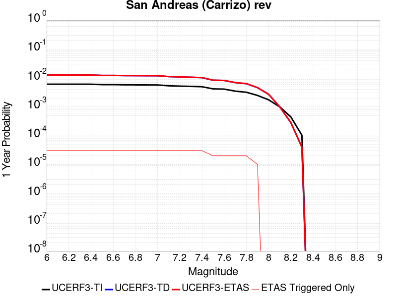 |  |

| Magnitude | 1 wk TI Prob | 1 wk TD Prob | 1 wk ETAS Prob | 1 wk ETAS/TD Gain | 1 wk ETAS Triggered Only | 1 mo TI Prob | 1 mo TD Prob | 1 mo ETAS Prob | 1 mo ETAS/TD Gain | 1 mo ETAS Triggered Only | 1 yr TI Prob | 1 yr TD Prob | 1 yr ETAS Prob | 1 yr ETAS/TD Gain | 1 yr ETAS Triggered Only | 10 yr TI Prob | 10 yr TD Prob | 10 yr ETAS Prob | 10 yr ETAS/TD Gain | 10 yr ETAS Triggered Only |
|-----|-----|-----|-----|-----|-----|-----|-----|-----|-----|-----|-----|-----|-----|-----|-----|-----|-----|-----|-----|-----|
| 6.0 | 1.1674632E-4 | 2.4321114E-4 | 2.676294E-4 | 1.1003994 | 2.44242E-5 | 5.002454E-4 | 0.0010419186 | 0.0010663174 | 1.0234171 | 2.44242E-5 | 0.006073493 | 0.01261206 | 0.012636176 | 1.0019121 | 2.44242E-5 | 0.0591016 | 0.12060616 | 0.12063838 | 1.0002671 | 3.66363E-5 |
| 6.1 | 1.1674632E-4 | 2.4321114E-4 | 2.676294E-4 | 1.1003994 | 2.44242E-5 | 5.002454E-4 | 0.0010419186 | 0.0010663174 | 1.0234171 | 2.44242E-5 | 0.006073493 | 0.01261206 | 0.012636176 | 1.0019121 | 2.44242E-5 | 0.0591016 | 0.12060616 | 0.12063838 | 1.0002671 | 3.66363E-5 |
| 6.2 | 1.1674632E-4 | 2.4321114E-4 | 2.676294E-4 | 1.1003994 | 2.44242E-5 | 5.002454E-4 | 0.0010419186 | 0.0010663174 | 1.0234171 | 2.44242E-5 | 0.006073493 | 0.01261206 | 0.012636176 | 1.0019121 | 2.44242E-5 | 0.0591016 | 0.12060616 | 0.12063838 | 1.0002671 | 3.66363E-5 |
| 6.3 | 1.1674632E-4 | 2.4321114E-4 | 2.676294E-4 | 1.1003994 | 2.44242E-5 | 5.002454E-4 | 0.0010419186 | 0.0010663174 | 1.0234171 | 2.44242E-5 | 0.006073493 | 0.01261206 | 0.012636176 | 1.0019121 | 2.44242E-5 | 0.0591016 | 0.12060616 | 0.12063838 | 1.0002671 | 3.66363E-5 |
| 6.4 | 1.1674632E-4 | 2.4321114E-4 | 2.676294E-4 | 1.1003994 | 2.44242E-5 | 5.002454E-4 | 0.0010419186 | 0.0010663174 | 1.0234171 | 2.44242E-5 | 0.006073493 | 0.01261206 | 0.012636176 | 1.0019121 | 2.44242E-5 | 0.0591016 | 0.12060616 | 0.12063838 | 1.0002671 | 3.66363E-5 |
| 6.5 | 1.13136164E-4 | 2.3641133E-4 | 2.6082975E-4 | 1.1032879 | 2.44242E-5 | 4.847792E-4 | 0.0010127996 | 0.001037199 | 1.0240911 | 2.44242E-5 | 0.0058862255 | 0.012261566 | 0.012285691 | 1.0019675 | 2.44242E-5 | 0.057327334 | 0.11757754 | 0.117609866 | 1.000275 | 3.66363E-5 |
| 6.6 | 1.13136164E-4 | 2.3641133E-4 | 2.6082975E-4 | 1.1032879 | 2.44242E-5 | 4.847792E-4 | 0.0010127996 | 0.001037199 | 1.0240911 | 2.44242E-5 | 0.0058862255 | 0.012261566 | 0.012285691 | 1.0019675 | 2.44242E-5 | 0.057327334 | 0.11757754 | 0.117609866 | 1.000275 | 3.66363E-5 |
| 6.7 | 1.1149675E-4 | 2.3332359E-4 | 2.577421E-4 | 1.104655 | 2.44242E-5 | 4.777557E-4 | 9.995765E-4 | 0.0010239764 | 1.0244101 | 2.44242E-5 | 0.0058011734 | 0.012102372 | 0.012126501 | 1.0019937 | 2.44242E-5 | 0.05652051 | 0.11619909 | 0.11623147 | 1.0002787 | 3.66363E-5 |
| 6.8 | 1.1103589E-4 | 2.323452E-4 | 2.5676374E-4 | 1.1050959 | 2.44242E-5 | 4.7578133E-4 | 9.953866E-4 | 0.0010197866 | 1.024513 | 2.44242E-5 | 0.005777263 | 0.012051926 | 0.012076056 | 1.0020021 | 2.44242E-5 | 0.056293584 | 0.115759395 | 0.11579179 | 1.0002799 | 3.66363E-5 |
| 6.9 | 1.1053259E-4 | 2.3126906E-4 | 2.556876E-4 | 1.105585 | 2.44242E-5 | 4.7362508E-4 | 9.907781E-4 | 0.0010151782 | 1.0246271 | 2.44242E-5 | 0.0057511497 | 0.011996436 | 0.012020567 | 1.0020115 | 2.44242E-5 | 0.05604569 | 0.1152756 | 0.11530802 | 1.0002812 | 3.66363E-5 |
| 7.0 | 1.1005377E-4 | 2.3027751E-4 | 2.546961E-4 | 1.1060398 | 2.44242E-5 | 4.7157376E-4 | 9.865318E-4 | 0.0010109319 | 1.0247332 | 2.44242E-5 | 0.0057263062 | 0.011945305 | 0.011969438 | 1.0020202 | 2.44242E-5 | 0.055809796 | 0.11482792 | 0.11486035 | 1.0002824 | 3.66363E-5 |
| 7.1 | 1.0308142E-4 | 2.1537494E-4 | 2.3979387E-4 | 1.1133788 | 2.44242E-5 | 4.417027E-4 | 9.2270994E-4 | 9.471116E-4 | 1.0264456 | 2.44242E-5 | 0.0053644776 | 0.011176443 | 0.011200594 | 1.0021609 | 2.44242E-5 | 0.052368138 | 0.10808435 | 0.10811703 | 1.0003023 | 3.66363E-5 |
| 7.2 | 1.0027479E-4 | 2.0945404E-4 | 2.3387313E-4 | 1.1165844 | 2.44242E-5 | 4.296783E-4 | 8.973524E-4 | 9.217547E-4 | 1.0271937 | 2.44242E-5 | 0.0052187922 | 0.010870834 | 0.010894993 | 1.0022223 | 2.44242E-5 | 0.050979212 | 0.10538838 | 0.105421156 | 1.000311 | 3.66363E-5 |
| 7.3 | 9.816942E-5 | 2.0420653E-4 | 2.2862575E-4 | 1.119581 | 2.44242E-5 | 4.2065824E-4 | 8.748783E-4 | 8.992812E-4 | 1.0278928 | 2.44242E-5 | 0.005109493 | 0.010599907 | 0.0106240725 | 1.0022798 | 2.44242E-5 | 0.049935985 | 0.10297221 | 0.103005074 | 1.0003191 | 3.66363E-5 |
| 7.4 | 9.5634205E-5 | 1.9790219E-4 | 2.2232156E-4 | 1.123391 | 2.44242E-5 | 4.0979648E-4 | 8.478775E-4 | 8.72281E-4 | 1.0287819 | 2.44242E-5 | 0.0049778637 | 0.010274311 | 0.010298484 | 1.0023528 | 2.44242E-5 | 0.048678253 | 0.10005864 | 0.100091614 | 1.0003295 | 3.66363E-5 |
| 7.5 | 8.052417E-5 | 1.611105E-4 | 1.7332063E-4 | 1.0757873 | 1.22121E-5 | 3.4505792E-4 | 6.90291E-4 | 7.024947E-4 | 1.017679 | 1.22121E-5 | 0.0041929903 | 0.008371988 | 0.008384098 | 1.0014465 | 1.22121E-5 | 0.04114753 | 0.08280355 | 0.08282595 | 1.0002705 | 2.44242E-5 |
| 7.6 | 7.897024E-5 | 1.5764312E-4 | 1.698533E-4 | 1.0774546 | 1.22121E-5 | 3.384E-4 | 6.754386E-4 | 6.876425E-4 | 1.0180681 | 1.22121E-5 | 0.0041122385 | 0.008192535 | 0.008204646 | 1.0014784 | 1.22121E-5 | 0.040369697 | 0.08114483 | 0.08116727 | 1.0002766 | 2.44242E-5 |
| 7.7 | 6.707427E-5 | 1.3274715E-4 | 1.4495762E-4 | 1.091983 | 1.22121E-5 | 2.8742946E-4 | 5.6879234E-4 | 5.809975E-4 | 1.021458 | 1.22121E-5 | 0.003493839 | 0.0069030905 | 0.0069152187 | 1.0017569 | 1.22121E-5 | 0.034394164 | 0.06904176 | 0.0690645 | 1.0003294 | 2.44242E-5 |
| 7.8 | 6.147705E-5 | 1.219623E-4 | 1.3417291E-4 | 1.1001179 | 1.22121E-5 | 2.6344648E-4 | 5.225909E-4 | 5.347966E-4 | 1.0233562 | 1.22121E-5 | 0.0032027436 | 0.0063440073 | 0.006356142 | 1.0019127 | 1.22121E-5 | 0.031569764 | 0.06350883 | 0.06352027 | 1.0001801 | 1.22121E-5 |
| 7.9 | 4.7636717E-5 | 8.8788634E-5 | 8.8788634E-5 | 1.0 | 0.0 | 2.0414138E-4 | 3.8046725E-4 | 3.8046725E-4 | 1.0 | 0.0 | 0.0024825884 | 0.004622358 | 0.004622358 | 1.0 | 0.0 | 0.024550365 | 0.04662383 | 0.04662383 | 1.0 | 0.0 |
| 8.0 | 3.3554235E-5 | 5.213132E-5 | 5.213132E-5 | 1.0 | 0.0 | 1.4379594E-4 | 2.2340081E-4 | 2.2340081E-4 | 1.0 | 0.0 | 0.0017493097 | 0.002716514 | 0.002716514 | 1.0 | 0.0 | 0.017356034 | 0.027878206 | 0.027878206 | 1.0 | 0.0 |
| 8.1 | 1.9175432E-5 | 1.918229E-5 | 1.918229E-5 | 1.0 | 0.0 | 8.217783E-5 | 8.2207225E-5 | 8.2207225E-5 | 1.0 | 0.0 | 0.0010000558 | 0.001000414 | 0.001000414 | 1.0 | 0.0 | 0.009955673 | 0.010756618 | 0.010756618 | 1.0 | 0.0 |
| 8.2 | 8.643924E-6 | 5.4738607E-6 | 5.4738607E-6 | 1.0 | 0.0 | 3.704486E-5 | 2.3459192E-5 | 2.3459192E-5 | 1.0 | 0.0 | 4.5092785E-4 | 2.855783E-4 | 2.855783E-4 | 1.0 | 0.0 | 0.0045001395 | 0.0032481598 | 0.0032481598 | 1.0 | 0.0 |
| 8.3 | 1.983087E-6 | 7.658221E-7 | 7.658221E-7 | 1.0 | 0.0 | 8.498917E-6 | 3.2820906E-6 | 3.2820906E-6 | 1.0 | 0.0 | 1.034694E-4 | 3.9958737E-5 | 3.9958737E-5 | 1.0 | 0.0 | 0.0010342124 | 4.7187202E-4 | 4.7187202E-4 | 1.0 | 0.0 |

## Cleghorn Pass
*[(top)](#table-of-contents)*

| 1 Week | 1 Month | 1 Year | 10 Year |
|-----|-----|-----|-----|
|  |  |  |  |

| Magnitude | 1 wk TI Prob | 1 wk TD Prob | 1 wk ETAS Prob | 1 wk ETAS/TD Gain | 1 wk ETAS Triggered Only | 1 mo TI Prob | 1 mo TD Prob | 1 mo ETAS Prob | 1 mo ETAS/TD Gain | 1 mo ETAS Triggered Only | 1 yr TI Prob | 1 yr TD Prob | 1 yr ETAS Prob | 1 yr ETAS/TD Gain | 1 yr ETAS Triggered Only | 10 yr TI Prob | 10 yr TD Prob | 10 yr ETAS Prob | 10 yr ETAS/TD Gain | 10 yr ETAS Triggered Only |
|-----|-----|-----|-----|-----|-----|-----|-----|-----|-----|-----|-----|-----|-----|-----|-----|-----|-----|-----|-----|-----|
| 6.0 | 1.0522846E-5 | 1.1040627E-5 | 1.1040627E-5 | 1.0 | 0.0 | 4.509713E-5 | 4.731641E-5 | 5.9527934E-5 | 1.2580822 | 1.22121E-5 | 5.4891926E-4 | 5.7597767E-4 | 6.003878E-4 | 1.0423803 | 2.44242E-5 | 0.0054756533 | 0.0057500144 | 0.00578644 | 1.0063349 | 3.66363E-5 |
| 6.1 | 1.0522846E-5 | 1.1040627E-5 | 1.1040627E-5 | 1.0 | 0.0 | 4.509713E-5 | 4.731641E-5 | 5.9527934E-5 | 1.2580822 | 1.22121E-5 | 5.4891926E-4 | 5.7597767E-4 | 6.003878E-4 | 1.0423803 | 2.44242E-5 | 0.0054756533 | 0.0057500144 | 0.00578644 | 1.0063349 | 3.66363E-5 |
| 6.2 | 2.1045846E-6 | 2.2081995E-6 | 2.2081995E-6 | 1.0 | 0.0 | 9.019617E-6 | 9.463702E-6 | 9.463702E-6 | 1.0 | 0.0 | 1.098083E-4 | 1.15218674E-4 | 1.15218674E-4 | 1.0 | 0.0 | 0.0010975406 | 0.0011520007 | 0.0011641987 | 1.0105885 | 1.22121E-5 |
| 6.3 | 2.1045846E-6 | 2.2081995E-6 | 2.2081995E-6 | 1.0 | 0.0 | 9.019617E-6 | 9.463702E-6 | 9.463702E-6 | 1.0 | 0.0 | 1.098083E-4 | 1.15218674E-4 | 1.15218674E-4 | 1.0 | 0.0 | 0.0010975406 | 0.0011520007 | 0.0011641987 | 1.0105885 | 1.22121E-5 |
| 6.4 | 1.7259927E-6 | 1.8108747E-6 | 1.8108747E-6 | 1.0 | 0.0 | 7.3970905E-6 | 7.760892E-6 | 7.760892E-6 | 1.0 | 0.0 | 9.005586E-5 | 9.448885E-5 | 9.448885E-5 | 1.0 | 0.0 | 9.001937E-4 | 9.4488857E-4 | 9.570891E-4 | 1.0129122 | 1.22121E-5 |

## Oceanic - West Huasna
*[(top)](#table-of-contents)*

| 1 Week | 1 Month | 1 Year | 10 Year |
|-----|-----|-----|-----|
| 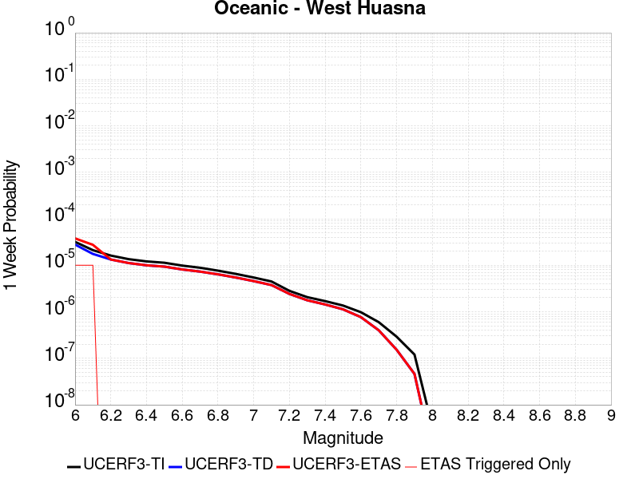 | 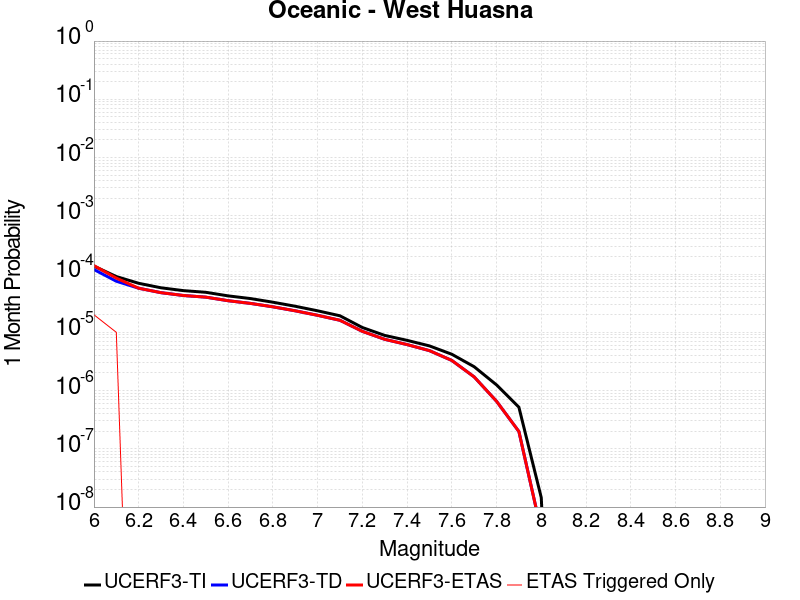 |  |  |

| Magnitude | 1 wk TI Prob | 1 wk TD Prob | 1 wk ETAS Prob | 1 wk ETAS/TD Gain | 1 wk ETAS Triggered Only | 1 mo TI Prob | 1 mo TD Prob | 1 mo ETAS Prob | 1 mo ETAS/TD Gain | 1 mo ETAS Triggered Only | 1 yr TI Prob | 1 yr TD Prob | 1 yr ETAS Prob | 1 yr ETAS/TD Gain | 1 yr ETAS Triggered Only | 10 yr TI Prob | 10 yr TD Prob | 10 yr ETAS Prob | 10 yr ETAS/TD Gain | 10 yr ETAS Triggered Only |
|-----|-----|-----|-----|-----|-----|-----|-----|-----|-----|-----|-----|-----|-----|-----|-----|-----|-----|-----|-----|-----|
| 6.0 | 3.195567E-5 | 2.7926753E-5 | 4.013851E-5 | 1.4372782 | 1.22121E-5 | 1.3694567E-4 | 1.1968084E-4 | 1.4410212E-4 | 1.2040534 | 2.44242E-5 | 0.0016660384 | 0.0014561834 | 0.001480572 | 1.0167483 | 2.44242E-5 | 0.016536033 | 0.014470968 | 0.014495039 | 1.0016633 | 2.44242E-5 |
| 6.1 | 2.1156782E-5 | 1.7573395E-5 | 2.978528E-5 | 1.6949075 | 1.22121E-5 | 9.066878E-5 | 7.5312426E-5 | 8.752361E-5 | 1.1621403 | 1.22121E-5 | 0.0011033333 | 9.1655244E-4 | 9.2875335E-4 | 1.0133117 | 1.22121E-5 | 0.010978713 | 0.009128731 | 0.009140831 | 1.0013256 | 1.22121E-5 |
| 6.2 | 1.6195117E-5 | 1.3327071E-5 | 1.3327071E-5 | 1.0 | 0.0 | 6.9405796E-5 | 5.7114787E-5 | 5.7114787E-5 | 1.0 | 0.0 | 8.44688E-4 | 6.9515326E-4 | 6.9515326E-4 | 1.0 | 0.0 | 0.008414844 | 0.006930081 | 0.006930081 | 1.0 | 0.0 |
| 6.3 | 1.3559345E-5 | 1.1179067E-5 | 1.1179067E-5 | 1.0 | 0.0 | 5.811018E-5 | 4.7909412E-5 | 4.7909412E-5 | 1.0 | 0.0 | 7.072618E-4 | 5.831419E-4 | 5.831419E-4 | 1.0 | 0.0 | 0.0070501505 | 0.0058162357 | 0.0058162357 | 1.0 | 0.0 |
| 6.4 | 1.2120619E-5 | 1.0000905E-5 | 1.0000905E-5 | 1.0 | 0.0 | 5.1944477E-5 | 4.2860316E-5 | 4.2860316E-5 | 1.0 | 0.0 | 6.322405E-4 | 5.216999E-4 | 5.216999E-4 | 1.0 | 0.0 | 0.006304447 | 0.005204819 | 0.005204819 | 1.0 | 0.0 |
| 6.5 | 1.13511915E-5 | 9.367402E-6 | 9.367402E-6 | 1.0 | 0.0 | 4.8647056E-5 | 4.014539E-5 | 4.014539E-5 | 1.0 | 0.0 | 5.9211696E-4 | 4.8866094E-4 | 4.8866094E-4 | 1.0 | 0.0 | 0.0059054173 | 0.0048759235 | 0.0048759235 | 1.0 | 0.0 |
| 6.6 | 9.850605E-6 | 8.135348E-6 | 8.135348E-6 | 1.0 | 0.0 | 4.2216197E-5 | 3.4865312E-5 | 3.4865312E-5 | 1.0 | 0.0 | 5.1386096E-4 | 4.2440274E-4 | 4.2440274E-4 | 1.0 | 0.0 | 0.0051267436 | 0.0042359545 | 0.0042359545 | 1.0 | 0.0 |
| 6.7 | 8.8558645E-6 | 7.318364E-6 | 7.318364E-6 | 1.0 | 0.0 | 3.7953152E-5 | 3.136404E-5 | 3.136404E-5 | 1.0 | 0.0 | 4.6198163E-4 | 3.8179048E-4 | 3.8179048E-4 | 1.0 | 0.0 | 0.004610224 | 0.003811371 | 0.003811371 | 1.0 | 0.0 |
| 6.8 | 7.67136E-6 | 6.3916887E-6 | 6.3916887E-6 | 1.0 | 0.0 | 3.2876844E-5 | 2.7392665E-5 | 2.7392665E-5 | 1.0 | 0.0 | 4.0020206E-4 | 3.334548E-4 | 3.334548E-4 | 1.0 | 0.0 | 0.003994821 | 0.0033295657 | 0.0033295657 | 1.0 | 0.0 |
| 6.9 | 6.534529E-6 | 5.458264E-6 | 5.458264E-6 | 1.0 | 0.0 | 2.8004823E-5 | 2.339235E-5 | 2.339235E-5 | 1.0 | 0.0 | 3.4090536E-4 | 2.8476477E-4 | 2.8476477E-4 | 1.0 | 0.0 | 0.0034038287 | 0.0028440156 | 0.0028440156 | 1.0 | 0.0 |
| 7.0 | 5.460525E-6 | 4.569887E-6 | 4.569887E-6 | 1.0 | 0.0 | 2.3402039E-5 | 1.9585083E-5 | 1.9585083E-5 | 1.0 | 0.0 | 2.8488258E-4 | 2.384224E-4 | 2.384224E-4 | 1.0 | 0.0 | 0.0028451765 | 0.00238168 | 0.00238168 | 1.0 | 0.0 |
| 7.1 | 4.4825083E-6 | 3.752379E-6 | 3.752379E-6 | 1.0 | 0.0 | 1.9210609E-5 | 1.6081525E-5 | 1.6081525E-5 | 1.0 | 0.0 | 2.3386406E-4 | 1.9577508E-4 | 1.9577508E-4 | 1.0 | 0.0 | 0.002336181 | 0.001956038 | 0.001956038 | 1.0 | 0.0 |
| 7.2 | 2.821708E-6 | 2.4248707E-6 | 2.4248707E-6 | 1.0 | 0.0 | 1.2092979E-5 | 1.0392262E-5 | 1.0392262E-5 | 1.0 | 0.0 | 1.4722206E-4 | 1.2651845E-4 | 1.2651845E-4 | 1.0 | 0.0 | 0.0014712457 | 0.0012644667 | 0.0012644667 | 1.0 | 0.0 |
| 7.3 | 2.0644757E-6 | 1.768679E-6 | 1.768679E-6 | 1.0 | 0.0 | 8.847723E-6 | 7.580031E-6 | 7.580031E-6 | 1.0 | 0.0 | 1.0771569E-4 | 9.228297E-5 | 9.228297E-5 | 1.0 | 0.0 | 0.001076635 | 9.2244823E-4 | 9.2244823E-4 | 1.0 | 0.0 |
| 7.4 | 1.6980367E-6 | 1.4379273E-6 | 1.4379273E-6 | 1.0 | 0.0 | 7.27728E-6 | 6.1625306E-6 | 6.1625306E-6 | 1.0 | 0.0 | 8.8597284E-5 | 7.502623E-5 | 7.502623E-5 | 1.0 | 0.0 | 8.8561967E-4 | 7.500106E-4 | 7.500106E-4 | 1.0 | 0.0 |
| 7.5 | 1.3637683E-6 | 1.1302018E-6 | 1.1302018E-6 | 1.0 | 0.0 | 5.844708E-6 | 4.8437128E-6 | 4.8437128E-6 | 1.0 | 0.0 | 7.1156996E-5 | 5.897061E-5 | 5.897061E-5 | 1.0 | 0.0 | 7.1134215E-4 | 5.895511E-4 | 5.895511E-4 | 1.0 | 0.0 |
| 7.6 | 9.802994E-7 | 7.676632E-7 | 7.676632E-7 | 1.0 | 0.0 | 4.2012766E-6 | 3.2899811E-6 | 3.2899811E-6 | 1.0 | 0.0 | 5.1149345E-5 | 4.0054783E-5 | 4.0054783E-5 | 1.0 | 0.0 | 5.113757E-4 | 4.0047706E-4 | 4.0047706E-4 | 1.0 | 0.0 |
| 7.7 | 5.986191E-7 | 4.004442E-7 | 4.004442E-7 | 1.0 | 0.0 | 2.5655079E-6 | 1.7161883E-6 | 1.7161883E-6 | 1.0 | 0.0 | 3.1234613E-5 | 2.0894393E-5 | 2.0894393E-5 | 1.0 | 0.0 | 3.123022E-4 | 2.0892563E-4 | 2.0892563E-4 | 1.0 | 0.0 |
| 7.8 | 2.9189815E-7 | 1.5285478E-7 | 1.5285478E-7 | 1.0 | 0.0 | 1.2509914E-6 | 6.550917E-7 | 6.550917E-7 | 1.0 | 0.0 | 1.5230714E-5 | 7.975713E-6 | 7.975713E-6 | 1.0 | 0.0 | 1.522967E-4 | 7.975558E-5 | 7.975558E-5 | 1.0 | 0.0 |
| 7.9 | 1.2057845E-7 | 4.6210737E-8 | 4.6210737E-8 | 1.0 | 0.0 | 5.1676466E-7 | 1.98046E-7 | 1.98046E-7 | 1.0 | 0.0 | 6.2915915E-6 | 2.4112073E-6 | 2.4112073E-6 | 1.0 | 0.0 | 6.2914136E-5 | 2.4113115E-5 | 2.4113115E-5 | 1.0 | 0.0 |
| 8.0 | 3.3806387E-9 | 9.01072E-10 | 9.01072E-10 | 1.0 | 0.0 | 1.4488451E-8 | 3.8617367E-9 | 3.8617367E-9 | 1.0 | 0.0 | 1.7639688E-7 | 4.701664E-8 | 4.701664E-8 | 1.0 | 0.0 | 1.7639674E-6 | 4.7126008E-7 | 4.7126008E-7 | 1.0 | 0.0 |

## San Jacinto (Anza) rev
*[(top)](#table-of-contents)*

| 1 Week | 1 Month | 1 Year | 10 Year |
|-----|-----|-----|-----|
|  |  | 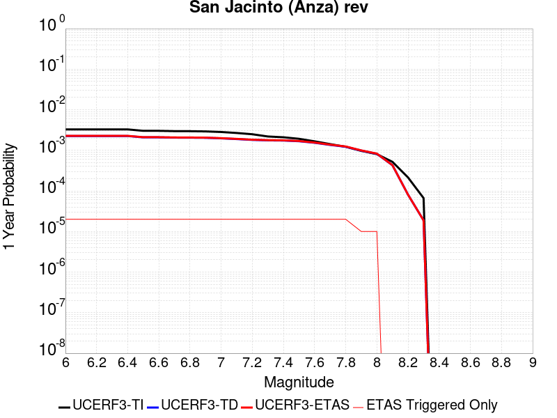 |  |

| Magnitude | 1 wk TI Prob | 1 wk TD Prob | 1 wk ETAS Prob | 1 wk ETAS/TD Gain | 1 wk ETAS Triggered Only | 1 mo TI Prob | 1 mo TD Prob | 1 mo ETAS Prob | 1 mo ETAS/TD Gain | 1 mo ETAS Triggered Only | 1 yr TI Prob | 1 yr TD Prob | 1 yr ETAS Prob | 1 yr ETAS/TD Gain | 1 yr ETAS Triggered Only | 10 yr TI Prob | 10 yr TD Prob | 10 yr ETAS Prob | 10 yr ETAS/TD Gain | 10 yr ETAS Triggered Only |
|-----|-----|-----|-----|-----|-----|-----|-----|-----|-----|-----|-----|-----|-----|-----|-----|-----|-----|-----|-----|-----|
| 6.0 | 6.3015636E-5 | 4.329564E-5 | 5.550721E-5 | 1.2820508 | 1.22121E-5 | 2.7003905E-4 | 1.8553961E-4 | 1.9774944E-4 | 1.0658071 | 1.22121E-5 | 0.0032827691 | 0.0022566165 | 0.002268801 | 1.0053995 | 1.22121E-5 | 0.032346968 | 0.023292562 | 0.023316419 | 1.0010241 | 2.44242E-5 |
| 6.1 | 6.3015636E-5 | 4.329564E-5 | 5.550721E-5 | 1.2820508 | 1.22121E-5 | 2.7003905E-4 | 1.8553961E-4 | 1.9774944E-4 | 1.0658071 | 1.22121E-5 | 0.0032827691 | 0.0022566165 | 0.002268801 | 1.0053995 | 1.22121E-5 | 0.032346968 | 0.023292562 | 0.023316419 | 1.0010241 | 2.44242E-5 |
| 6.2 | 6.3015636E-5 | 4.329564E-5 | 5.550721E-5 | 1.2820508 | 1.22121E-5 | 2.7003905E-4 | 1.8553961E-4 | 1.9774944E-4 | 1.0658071 | 1.22121E-5 | 0.0032827691 | 0.0022566165 | 0.002268801 | 1.0053995 | 1.22121E-5 | 0.032346968 | 0.023292562 | 0.023316419 | 1.0010241 | 2.44242E-5 |
| 6.3 | 6.3015636E-5 | 4.329564E-5 | 5.550721E-5 | 1.2820508 | 1.22121E-5 | 2.7003905E-4 | 1.8553961E-4 | 1.9774944E-4 | 1.0658071 | 1.22121E-5 | 0.0032827691 | 0.0022566165 | 0.002268801 | 1.0053995 | 1.22121E-5 | 0.032346968 | 0.023292562 | 0.023316419 | 1.0010241 | 2.44242E-5 |
| 6.4 | 6.3015636E-5 | 4.329564E-5 | 5.550721E-5 | 1.2820508 | 1.22121E-5 | 2.7003905E-4 | 1.8553961E-4 | 1.9774944E-4 | 1.0658071 | 1.22121E-5 | 0.0032827691 | 0.0022566165 | 0.002268801 | 1.0053995 | 1.22121E-5 | 0.032346968 | 0.023292562 | 0.023316419 | 1.0010241 | 2.44242E-5 |
| 6.5 | 5.811017E-5 | 4.007568E-5 | 5.228729E-5 | 1.3047137 | 1.22121E-5 | 2.4901982E-4 | 1.7174163E-4 | 1.8395163E-4 | 1.0710952 | 1.22121E-5 | 0.0030276014 | 0.002088955 | 0.0021011415 | 1.0058339 | 1.22121E-5 | 0.02986684 | 0.021590188 | 0.021614086 | 1.0011069 | 2.44242E-5 |
| 6.6 | 5.811017E-5 | 4.007568E-5 | 5.228729E-5 | 1.3047137 | 1.22121E-5 | 2.4901982E-4 | 1.7174163E-4 | 1.8395163E-4 | 1.0710952 | 1.22121E-5 | 0.0030276014 | 0.002088955 | 0.0021011415 | 1.0058339 | 1.22121E-5 | 0.02986684 | 0.021590188 | 0.021614086 | 1.0011069 | 2.44242E-5 |
| 6.7 | 5.712442E-5 | 3.9498424E-5 | 5.171004E-5 | 1.3091671 | 1.22121E-5 | 2.4479596E-4 | 1.6926801E-4 | 1.8147804E-4 | 1.0721344 | 1.22121E-5 | 0.0029763177 | 0.0020588955 | 0.0020710826 | 1.0059192 | 1.22121E-5 | 0.029367693 | 0.02128203 | 0.021305935 | 1.0011232 | 2.44242E-5 |
| 6.8 | 5.6967532E-5 | 3.935485E-5 | 5.1566472E-5 | 1.3102951 | 1.22121E-5 | 2.4412372E-4 | 1.6865278E-4 | 1.8086281E-4 | 1.0723975 | 1.22121E-5 | 0.0029681553 | 0.0020514193 | 0.0020636064 | 1.0059408 | 1.22121E-5 | 0.029288229 | 0.021206751 | 0.021230659 | 1.0011272 | 2.44242E-5 |
| 6.9 | 5.6211324E-5 | 3.9059665E-5 | 5.127129E-5 | 1.3126402 | 1.22121E-5 | 2.4088343E-4 | 1.6738786E-4 | 1.7959792E-4 | 1.0729446 | 1.22121E-5 | 0.0029288116 | 0.0020360479 | 0.0020482352 | 1.0059857 | 1.22121E-5 | 0.028905109 | 0.021046195 | 0.021070106 | 1.0011361 | 2.44242E-5 |
| 7.0 | 5.4383527E-5 | 3.7920276E-5 | 5.0131912E-5 | 1.3220345 | 1.22121E-5 | 2.3305144E-4 | 1.6250537E-4 | 1.7471549E-4 | 1.0751367 | 1.22121E-5 | 0.0028337094 | 0.0019767124 | 0.0019889004 | 1.0061657 | 1.22121E-5 | 0.027978465 | 0.020437196 | 0.020461122 | 1.0011706 | 2.44242E-5 |
| 7.1 | 5.1393665E-5 | 3.6383335E-5 | 4.859499E-5 | 1.3356386 | 1.22121E-5 | 2.2023996E-4 | 1.5591929E-4 | 1.6812948E-4 | 1.078311 | 1.22121E-5 | 0.0026781242 | 0.0018966687 | 0.0019088576 | 1.0064265 | 1.22121E-5 | 0.026460782 | 0.019610861 | 0.019634806 | 1.0012211 | 2.44242E-5 |
| 7.2 | 4.785222E-5 | 3.4735345E-5 | 4.694702E-5 | 1.3515635 | 1.22121E-5 | 2.0506482E-4 | 1.4885729E-4 | 1.6106757E-4 | 1.0820267 | 1.22121E-5 | 0.0024938055 | 0.0018108344 | 0.0018230245 | 1.0067317 | 1.22121E-5 | 0.024660049 | 0.018725628 | 0.018749595 | 1.00128 | 2.44242E-5 |
| 7.3 | 4.2143256E-5 | 3.382991E-5 | 4.6041594E-5 | 1.3609731 | 1.22121E-5 | 1.8060145E-4 | 1.4497728E-4 | 1.5718762E-4 | 1.0842223 | 1.22121E-5 | 0.002196605 | 0.0017636728 | 0.0017758633 | 1.006912 | 1.22121E-5 | 0.02175019 | 0.018233923 | 0.018257901 | 1.0013151 | 2.44242E-5 |
| 7.4 | 4.0264713E-5 | 3.3468146E-5 | 4.5679837E-5 | 1.3648751 | 1.22121E-5 | 1.7255165E-4 | 1.4342705E-4 | 1.556374E-4 | 1.0851328 | 1.22121E-5 | 0.002098792 | 0.0017448291 | 0.0017570199 | 1.0069869 | 1.22121E-5 | 0.020790804 | 0.01803853 | 0.018062513 | 1.0013295 | 2.44242E-5 |
| 7.5 | 3.694492E-5 | 3.218225E-5 | 4.4393957E-5 | 1.3794547 | 1.22121E-5 | 1.5832575E-4 | 1.3791666E-4 | 1.5012707E-4 | 1.0885347 | 1.22121E-5 | 0.0019259118 | 0.0016778451 | 0.0016900367 | 1.0072663 | 1.22121E-5 | 0.01909306 | 0.017355029 | 0.017379029 | 1.001383 | 2.44242E-5 |
| 7.6 | 3.200565E-5 | 2.949823E-5 | 4.170997E-5 | 1.4139822 | 1.22121E-5 | 1.3715986E-4 | 1.2641487E-4 | 1.3862543E-4 | 1.0965911 | 1.22121E-5 | 0.001668642 | 0.0015380166 | 0.0015502099 | 1.0079279 | 1.22121E-5 | 0.01656168 | 0.015943231 | 0.015967267 | 1.0015075 | 2.44242E-5 |
| 7.7 | 2.731642E-5 | 2.6090234E-5 | 3.8302016E-5 | 1.4680594 | 1.22121E-5 | 1.1706512E-4 | 1.1181051E-4 | 1.2402124E-4 | 1.1092092 | 1.22121E-5 | 0.001424336 | 0.0013604438 | 0.0013726393 | 1.0089643 | 1.22121E-5 | 0.014152412 | 0.014165673 | 0.014189752 | 1.0016998 | 2.44242E-5 |
| 7.8 | 2.3466424E-5 | 2.3502365E-5 | 3.571418E-5 | 1.5195993 | 1.22121E-5 | 1.0056651E-4 | 1.0072054E-4 | 1.1293141E-4 | 1.1212351 | 1.22121E-5 | 0.0012237094 | 0.0012255836 | 0.0012377807 | 1.0099521 | 1.22121E-5 | 0.012169928 | 0.012807612 | 0.012831723 | 1.0018826 | 2.44242E-5 |
| 7.9 | 1.8611925E-5 | 1.89059E-5 | 3.111777E-5 | 1.645929 | 1.22121E-5 | 7.9762955E-5 | 8.102277E-5 | 9.323388E-5 | 1.1507121 | 1.22121E-5 | 9.7068126E-4 | 9.860066E-4 | 9.982067E-4 | 1.0123732 | 1.22121E-5 | 0.0096645225 | 0.010392662 | 0.010404747 | 1.0011629 | 1.22121E-5 |
| 8.0 | 1.5460775E-5 | 1.5738988E-5 | 2.7950895E-5 | 1.7759018 | 1.22121E-5 | 6.6258784E-5 | 6.745106E-5 | 7.9662335E-5 | 1.1810391 | 1.22121E-5 | 8.0640207E-4 | 8.2090794E-4 | 8.3311E-4 | 1.0148641 | 1.22121E-5 | 0.008034821 | 0.008701843 | 0.008713949 | 1.0013912 | 1.22121E-5 |
| 8.1 | 9.983884E-6 | 8.268797E-6 | 8.268797E-6 | 1.0 | 0.0 | 4.2787375E-5 | 3.543722E-5 | 3.543722E-5 | 1.0 | 0.0 | 5.2081177E-4 | 4.3136327E-4 | 4.3136327E-4 | 1.0 | 0.0 | 0.0051959283 | 0.0046394016 | 0.0046394016 | 1.0 | 0.0 |
| 8.2 | 4.1226E-6 | 1.5526499E-6 | 1.5526499E-6 | 1.0 | 0.0 | 1.7668166E-5 | 6.654197E-6 | 6.654197E-6 | 1.0 | 0.0 | 2.1508869E-4 | 8.1011865E-5 | 8.1011865E-5 | 1.0 | 0.0 | 0.0021488064 | 9.40314E-4 | 9.40314E-4 | 1.0 | 0.0 |
| 8.3 | 1.2750878E-6 | 3.6112328E-7 | 3.6112328E-7 | 1.0 | 0.0 | 5.4646503E-6 | 1.5476703E-6 | 1.5476703E-6 | 1.0 | 0.0 | 6.653009E-5 | 1.8842728E-5 | 1.8842728E-5 | 1.0 | 0.0 | 6.6510175E-4 | 2.2728964E-4 | 2.2728964E-4 | 1.0 | 0.0 |

## San Andreas (Coachella) rev
*[(top)](#table-of-contents)*

| 1 Week | 1 Month | 1 Year | 10 Year |
|-----|-----|-----|-----|
|  |  | 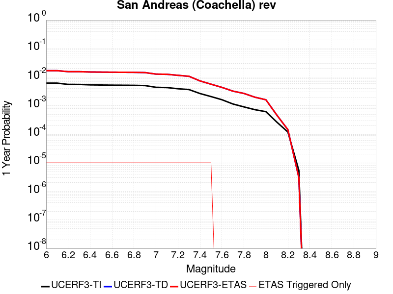 |  |

| Magnitude | 1 wk TI Prob | 1 wk TD Prob | 1 wk ETAS Prob | 1 wk ETAS/TD Gain | 1 wk ETAS Triggered Only | 1 mo TI Prob | 1 mo TD Prob | 1 mo ETAS Prob | 1 mo ETAS/TD Gain | 1 mo ETAS Triggered Only | 1 yr TI Prob | 1 yr TD Prob | 1 yr ETAS Prob | 1 yr ETAS/TD Gain | 1 yr ETAS Triggered Only | 10 yr TI Prob | 10 yr TD Prob | 10 yr ETAS Prob | 10 yr ETAS/TD Gain | 10 yr ETAS Triggered Only |
|-----|-----|-----|-----|-----|-----|-----|-----|-----|-----|-----|-----|-----|-----|-----|-----|-----|-----|-----|-----|-----|
| 6.0 | 1.1925945E-4 | 3.2723017E-4 | 3.3943827E-4 | 1.0373074 | 1.22121E-5 | 5.110118E-4 | 0.001401666 | 0.0014138609 | 1.0087004 | 1.22121E-5 | 0.0062038354 | 0.016933087 | 0.016945092 | 1.0007089 | 1.22121E-5 | 0.060334753 | 0.15262908 | 0.15264978 | 1.0001355 | 2.44242E-5 |
| 6.1 | 1.1925945E-4 | 3.2723017E-4 | 3.3943827E-4 | 1.0373074 | 1.22121E-5 | 5.110118E-4 | 0.001401666 | 0.0014138609 | 1.0087004 | 1.22121E-5 | 0.0062038354 | 0.016933087 | 0.016945092 | 1.0007089 | 1.22121E-5 | 0.060334753 | 0.15262908 | 0.15264978 | 1.0001355 | 2.44242E-5 |
| 6.2 | 1.07432395E-4 | 3.0223778E-4 | 3.144462E-4 | 1.0403934 | 1.22121E-5 | 4.603433E-4 | 0.0012946657 | 0.0013068621 | 1.0094204 | 1.22121E-5 | 0.005590286 | 0.01564973 | 0.015661752 | 1.0007682 | 1.22121E-5 | 0.05451731 | 0.1417999 | 0.14181037 | 1.0000739 | 1.22121E-5 |
| 6.3 | 1.0718766E-4 | 3.0169083E-4 | 3.1389925E-4 | 1.0404667 | 1.22121E-5 | 4.592948E-4 | 0.001292324 | 0.0013045204 | 1.0094376 | 1.22121E-5 | 0.005577586 | 0.01562163 | 0.015633652 | 1.0007695 | 1.22121E-5 | 0.054396555 | 0.14156814 | 0.14157863 | 1.000074 | 1.22121E-5 |
| 6.4 | 1.0355944E-4 | 2.9377177E-4 | 3.0598027E-4 | 1.0415578 | 1.22121E-5 | 4.4375064E-4 | 0.0012584183 | 0.001270615 | 1.0096921 | 1.22121E-5 | 0.0053892885 | 0.015214663 | 0.015226689 | 1.0007905 | 1.22121E-5 | 0.052604496 | 0.13812812 | 0.13813864 | 1.0000762 | 1.22121E-5 |
| 6.5 | 1.0227914E-4 | 2.909661E-4 | 3.0317466E-4 | 1.0419587 | 1.22121E-5 | 4.382655E-4 | 0.0012464056 | 0.0012586025 | 1.0097857 | 1.22121E-5 | 0.0053228354 | 0.015070442 | 0.01508247 | 1.0007981 | 1.22121E-5 | 0.051971316 | 0.13690725 | 0.13691778 | 1.000077 | 1.22121E-5 |
| 6.6 | 1.0116757E-4 | 2.8862362E-4 | 3.008322E-4 | 1.0422993 | 1.22121E-5 | 4.3350324E-4 | 0.0012363759 | 0.001248573 | 1.0098652 | 1.22121E-5 | 0.0052651367 | 0.014950012 | 0.014962041 | 1.0008047 | 1.22121E-5 | 0.051421247 | 0.1358854 | 0.13589595 | 1.0000776 | 1.22121E-5 |
| 6.7 | 1.0050676E-4 | 2.8720926E-4 | 2.9941785E-4 | 1.0425076 | 1.22121E-5 | 4.3067214E-4 | 0.0012303201 | 0.0012425171 | 1.0099137 | 1.22121E-5 | 0.005230834 | 0.014877291 | 0.014889321 | 1.0008086 | 1.22121E-5 | 0.051094085 | 0.1352701 | 0.13528067 | 1.0000781 | 1.22121E-5 |
| 6.8 | 9.976819E-5 | 2.8524583E-4 | 2.9745445E-4 | 1.0428003 | 1.22121E-5 | 4.2750788E-4 | 0.0012219134 | 0.0012341106 | 1.009982 | 1.22121E-5 | 0.0051924936 | 0.014776332 | 0.014788364 | 1.0008142 | 1.22121E-5 | 0.050728295 | 0.13442177 | 0.13443235 | 1.0000787 | 1.22121E-5 |
| 6.9 | 9.77719E-5 | 2.8021506E-4 | 2.9242373E-4 | 1.043569 | 1.22121E-5 | 4.1895514E-4 | 0.0012003728 | 0.0012125702 | 1.0101614 | 1.22121E-5 | 0.0050888555 | 0.014517602 | 0.014529636 | 1.000829 | 1.22121E-5 | 0.049738888 | 0.13225023 | 0.13226083 | 1.0000801 | 1.22121E-5 |
| 7.0 | 8.500761E-5 | 2.4756166E-4 | 2.5977072E-4 | 1.0493174 | 1.22121E-5 | 3.6426744E-4 | 0.0010605503 | 0.0010727495 | 1.0115026 | 1.22121E-5 | 0.0044259406 | 0.012836529 | 0.012848584 | 1.0009391 | 1.22121E-5 | 0.04338823 | 0.11810792 | 0.118118696 | 1.0000912 | 1.22121E-5 |
| 7.1 | 8.319876E-5 | 2.4358921E-4 | 2.5579834E-4 | 1.0501218 | 1.22121E-5 | 3.5651738E-4 | 0.0010435393 | 0.0010557387 | 1.0116904 | 1.22121E-5 | 0.004331963 | 0.01263184 | 0.012643898 | 1.0009545 | 1.22121E-5 | 0.042484846 | 0.11632819 | 0.11633898 | 1.0000927 | 1.22121E-5 |
| 7.2 | 7.563917E-5 | 2.2407399E-4 | 2.3628335E-4 | 1.0544881 | 1.22121E-5 | 3.2412758E-4 | 9.599667E-4 | 9.7216706E-4 | 1.0127091 | 1.22121E-5 | 0.0039391145 | 0.01162565 | 0.01163772 | 1.0010382 | 1.22121E-5 | 0.03870018 | 0.10773429 | 0.10774519 | 1.0001011 | 1.22121E-5 |
| 7.3 | 7.082985E-5 | 2.0723743E-4 | 2.1944701E-4 | 1.0589159 | 1.22121E-5 | 3.0352117E-4 | 8.87861E-4 | 9.0006227E-4 | 1.0137423 | 1.22121E-5 | 0.0036891096 | 0.010756755 | 0.010768836 | 1.0011231 | 1.22121E-5 | 0.03628465 | 0.10025747 | 0.10026846 | 1.0001096 | 1.22121E-5 |
| 7.4 | 5.146215E-5 | 1.4271007E-4 | 1.5492042E-4 | 1.0855606 | 1.22121E-5 | 2.2053342E-4 | 6.1147206E-4 | 6.236767E-4 | 1.0199594 | 1.22121E-5 | 0.0026816884 | 0.007419449 | 0.0074315704 | 1.0016338 | 1.22121E-5 | 0.02649557 | 0.070837796 | 0.07084914 | 1.0001602 | 1.22121E-5 |
| 7.5 | 4.0285166E-5 | 1.0941066E-4 | 1.2162143E-4 | 1.1116049 | 1.22121E-5 | 1.7263928E-4 | 4.688189E-4 | 4.810253E-4 | 1.0260364 | 1.22121E-5 | 0.002099857 | 0.005693001 | 0.005705144 | 1.0021329 | 1.22121E-5 | 0.020801254 | 0.055008773 | 0.055020314 | 1.0002098 | 1.22121E-5 |
| 7.6 | 3.1168736E-5 | 8.438435E-5 | 8.438435E-5 | 1.0 | 0.0 | 1.3357346E-4 | 3.6159722E-4 | 3.6159722E-4 | 1.0 | 0.0 | 0.0016250437 | 0.004393586 | 0.004393586 | 1.0 | 0.0 | 0.016132116 | 0.04280791 | 0.04280791 | 1.0 | 0.0 |
| 7.7 | 2.2100989E-5 | 6.2383384E-5 | 6.2383384E-5 | 1.0 | 0.0 | 9.4715084E-5 | 2.6733E-4 | 2.6733E-4 | 1.0 | 0.0 | 0.001152546 | 0.0032498916 | 0.0032498916 | 1.0 | 0.0 | 0.011465867 | 0.031898305 | 0.031898305 | 1.0 | 0.0 |
| 7.8 | 1.7484861E-5 | 5.1792E-5 | 5.1792E-5 | 1.0 | 0.0 | 7.493296E-5 | 2.2194686E-4 | 2.2194686E-4 | 1.0 | 0.0 | 9.1192697E-4 | 0.0026988573 | 0.0026988573 | 1.0 | 0.0 | 0.009081938 | 0.026638424 | 0.026638424 | 1.0 | 0.0 |
| 7.9 | 1.3967285E-5 | 3.8219507E-5 | 3.8219507E-5 | 1.0 | 0.0 | 5.985842E-5 | 1.6378761E-4 | 1.6378761E-4 | 1.0 | 0.0 | 7.2853256E-4 | 0.0019922915 | 0.0019922915 | 1.0 | 0.0 | 0.0072614877 | 0.01990803 | 0.01990803 | 1.0 | 0.0 |
| 8.0 | 1.1887396E-5 | 3.10626E-5 | 3.10626E-5 | 1.0 | 0.0 | 5.094499E-5 | 1.3311864E-4 | 1.3311864E-4 | 1.0 | 0.0 | 6.200787E-4 | 0.0016195155 | 0.0016195155 | 1.0 | 0.0 | 0.006183513 | 0.016278049 | 0.016278049 | 1.0 | 0.0 |
| 8.1 | 5.100864E-6 | 8.972364E-6 | 8.972364E-6 | 1.0 | 0.0 | 2.1860664E-5 | 3.8452425E-5 | 3.8452425E-5 | 1.0 | 0.0 | 2.6612106E-4 | 4.680578E-4 | 4.680578E-4 | 1.0 | 0.0 | 0.002658026 | 0.004917206 | 0.004917206 | 1.0 | 0.0 |
| 8.2 | 2.3004484E-6 | 2.7860247E-6 | 2.7860247E-6 | 1.0 | 0.0 | 9.859027E-6 | 1.1940051E-5 | 1.1940051E-5 | 1.0 | 0.0 | 1.2002704E-4 | 1.4536046E-4 | 1.4536046E-4 | 1.0 | 0.0 | 0.0011996223 | 0.0015971722 | 0.0015971722 | 1.0 | 0.0 |
| 8.3 | 1.0424446E-7 | 5.814984E-8 | 5.814984E-8 | 1.0 | 0.0 | 4.4676187E-7 | 2.4921357E-7 | 2.4921357E-7 | 1.0 | 0.0 | 5.439312E-6 | 3.0341714E-6 | 3.0341714E-6 | 1.0 | 0.0 | 5.4391792E-5 | 3.1900923E-5 | 3.1900923E-5 | 1.0 | 0.0 |

## White Wolf (Extension)
*[(top)](#table-of-contents)*

| 1 Week | 1 Month | 1 Year | 10 Year |
|-----|-----|-----|-----|
| 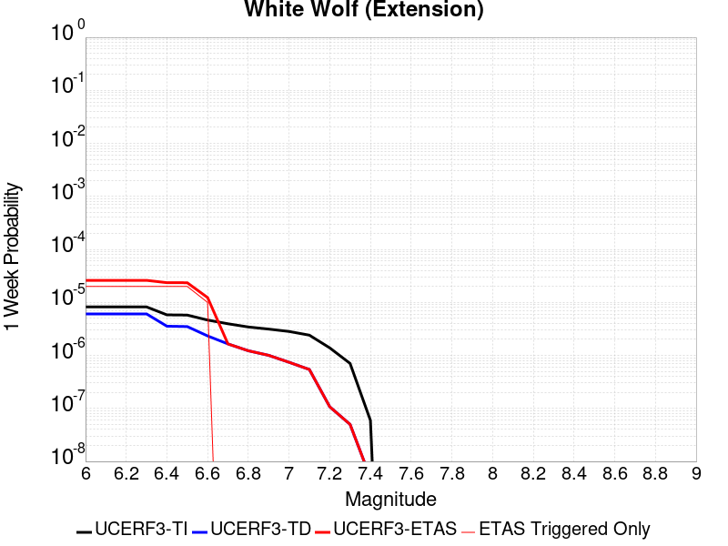 |  | 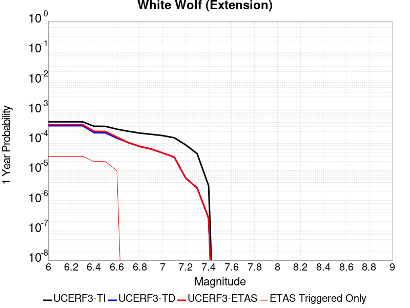 | 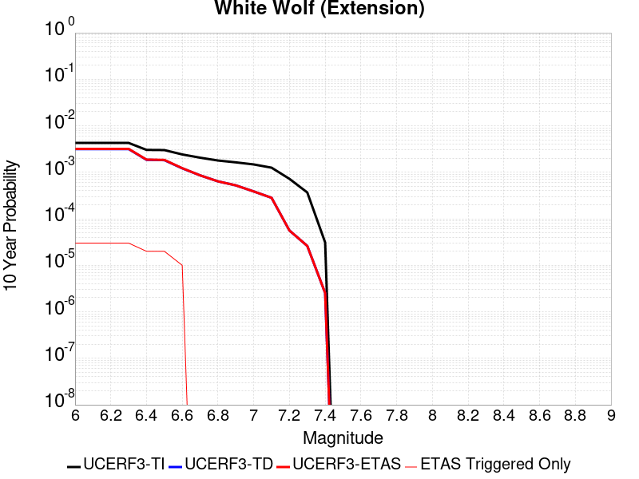 |

| Magnitude | 1 wk TI Prob | 1 wk TD Prob | 1 wk ETAS Prob | 1 wk ETAS/TD Gain | 1 wk ETAS Triggered Only | 1 mo TI Prob | 1 mo TD Prob | 1 mo ETAS Prob | 1 mo ETAS/TD Gain | 1 mo ETAS Triggered Only | 1 yr TI Prob | 1 yr TD Prob | 1 yr ETAS Prob | 1 yr ETAS/TD Gain | 1 yr ETAS Triggered Only | 10 yr TI Prob | 10 yr TD Prob | 10 yr ETAS Prob | 10 yr ETAS/TD Gain | 10 yr ETAS Triggered Only |
|-----|-----|-----|-----|-----|-----|-----|-----|-----|-----|-----|-----|-----|-----|-----|-----|-----|-----|-----|-----|-----|
| 6.0 | 8.222555E-6 | 6.0666575E-6 | 1.8278683E-5 | 3.0129743 | 1.22121E-5 | 3.5239045E-5 | 2.599974E-5 | 5.0423303E-5 | 1.9393773 | 2.44242E-5 | 4.289509E-4 | 3.1650747E-4 | 3.4092393E-4 | 1.0771434 | 2.44242E-5 | 0.0042812387 | 0.0031612187 | 0.0031855658 | 1.0077018 | 2.44242E-5 |
| 6.1 | 8.222555E-6 | 6.0666575E-6 | 1.8278683E-5 | 3.0129743 | 1.22121E-5 | 3.5239045E-5 | 2.599974E-5 | 5.0423303E-5 | 1.9393773 | 2.44242E-5 | 4.289509E-4 | 3.1650747E-4 | 3.4092393E-4 | 1.0771434 | 2.44242E-5 | 0.0042812387 | 0.0031612187 | 0.0031855658 | 1.0077018 | 2.44242E-5 |
| 6.2 | 8.222555E-6 | 6.0666575E-6 | 1.8278683E-5 | 3.0129743 | 1.22121E-5 | 3.5239045E-5 | 2.599974E-5 | 5.0423303E-5 | 1.9393773 | 2.44242E-5 | 4.289509E-4 | 3.1650747E-4 | 3.4092393E-4 | 1.0771434 | 2.44242E-5 | 0.0042812387 | 0.0031612187 | 0.0031855658 | 1.0077018 | 2.44242E-5 |
| 6.3 | 8.222555E-6 | 6.0666575E-6 | 1.8278683E-5 | 3.0129743 | 1.22121E-5 | 3.5239045E-5 | 2.599974E-5 | 5.0423303E-5 | 1.9393773 | 2.44242E-5 | 4.289509E-4 | 3.1650747E-4 | 3.4092393E-4 | 1.0771434 | 2.44242E-5 | 0.0042812387 | 0.0031612187 | 0.0031855658 | 1.0077018 | 2.44242E-5 |
| 6.4 | 5.821773E-6 | 3.5571713E-6 | 1.5769228E-5 | 4.4330807 | 1.22121E-5 | 2.4950215E-5 | 1.52449375E-5 | 2.7456852E-5 | 1.8010471 | 1.22121E-5 | 3.0372653E-4 | 1.855924E-4 | 1.9780223E-4 | 1.0657884 | 1.22121E-5 | 0.0030331176 | 0.0018544825 | 0.0018666718 | 1.006573 | 1.22121E-5 |
| 6.5 | 5.766023E-6 | 3.4991056E-6 | 1.5711163E-5 | 4.490051 | 1.22121E-5 | 2.4711293E-5 | 1.4996087E-5 | 2.7208003E-5 | 1.8143402 | 1.22121E-5 | 3.0081844E-4 | 1.8256316E-4 | 1.9477303E-4 | 1.0668802 | 1.22121E-5 | 0.0030041158 | 0.00182424 | 0.0018364298 | 1.0066822 | 1.22121E-5 |
| 6.6 | 4.643576E-6 | 2.3326204E-6 | 2.3326204E-6 | 1.0 | 0.0 | 1.9900888E-5 | 9.996908E-6 | 9.996908E-6 | 1.0 | 0.0 | 2.4226638E-4 | 1.2170599E-4 | 1.2170599E-4 | 1.0 | 0.0 | 0.0024200242 | 0.0012164358 | 0.0012164358 | 1.0 | 0.0 |
| 6.7 | 3.9529173E-6 | 1.6483448E-6 | 1.6483448E-6 | 1.0 | 0.0 | 1.6940963E-5 | 7.064317E-6 | 7.064317E-6 | 1.0 | 0.0 | 2.0623671E-4 | 8.6004846E-5 | 8.6004846E-5 | 1.0 | 0.0 | 0.002060454 | 8.5973414E-4 | 8.5973414E-4 | 1.0 | 0.0 |
| 6.8 | 3.4377522E-6 | 1.2245212E-6 | 1.2245212E-6 | 1.0 | 0.0 | 1.473314E-5 | 5.247938E-6 | 5.247938E-6 | 1.0 | 0.0 | 1.7936122E-4 | 6.3891865E-5 | 6.3891865E-5 | 1.0 | 0.0 | 0.0017921652 | 6.3874404E-4 | 6.3874404E-4 | 1.0 | 0.0 |
| 6.9 | 3.1367306E-6 | 1.0033762E-6 | 1.0033762E-6 | 1.0 | 0.0 | 1.3443062E-5 | 4.300177E-6 | 4.300177E-6 | 1.0 | 0.0 | 1.63657E-4 | 5.2353473E-5 | 5.2353473E-5 | 1.0 | 0.0 | 0.0016353652 | 5.2341906E-4 | 5.2341906E-4 | 1.0 | 0.0 |
| 7.0 | 2.8298145E-6 | 7.4286453E-7 | 7.4286453E-7 | 1.0 | 0.0 | 1.2127721E-5 | 3.1837017E-6 | 3.1837017E-6 | 1.0 | 0.0 | 1.47645E-4 | 3.876093E-5 | 3.876093E-5 | 1.0 | 0.0 | 0.0014754693 | 3.8754666E-4 | 3.8754666E-4 | 1.0 | 0.0 |
| 7.1 | 2.4091064E-6 | 5.422737E-7 | 5.422737E-7 | 1.0 | 0.0 | 1.03247E-5 | 2.3240282E-6 | 2.3240282E-6 | 1.0 | 0.0 | 1.2569598E-4 | 2.8294719E-5 | 2.8294719E-5 | 1.0 | 0.0 | 0.001256249 | 2.829152E-4 | 2.829152E-4 | 1.0 | 0.0 |
| 7.2 | 1.3875518E-6 | 1.0742987E-7 | 1.0742987E-7 | 1.0 | 0.0 | 5.9466374E-6 | 4.6041367E-7 | 4.6041367E-7 | 1.0 | 0.0 | 7.23979E-5 | 5.6055233E-6 | 5.6055233E-6 | 1.0 | 0.0 | 7.2374323E-4 | 5.605393E-5 | 5.605393E-5 | 1.0 | 0.0 |
| 7.3 | 7.056077E-7 | 5.0019906E-8 | 5.0019906E-8 | 1.0 | 0.0 | 3.0240296E-6 | 2.14371E-7 | 2.14371E-7 | 1.0 | 0.0 | 3.681694E-5 | 2.6099644E-6 | 2.6099644E-6 | 1.0 | 0.0 | 3.681084E-4 | 2.6099384E-5 | 2.6099384E-5 | 1.0 | 0.0 |
| 7.4 | 5.9334678E-8 | 4.868311E-9 | 4.868311E-9 | 1.0 | 0.0 | 2.5429145E-7 | 2.0864192E-8 | 2.0864192E-8 | 1.0 | 0.0 | 3.095994E-6 | 2.540215E-7 | 2.540215E-7 | 1.0 | 0.0 | 3.095951E-5 | 2.5402135E-6 | 2.5402135E-6 | 1.0 | 0.0 |

## Pisgah-Bullion Mtn-Mesquite Lk
*[(top)](#table-of-contents)*

| 1 Week | 1 Month | 1 Year | 10 Year |
|-----|-----|-----|-----|
| 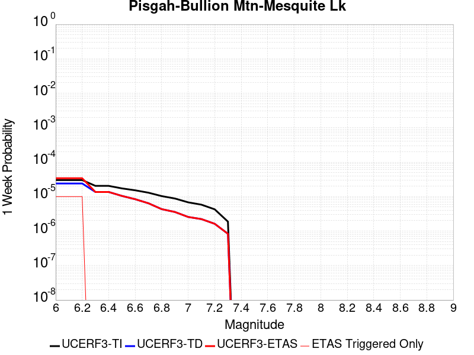 | 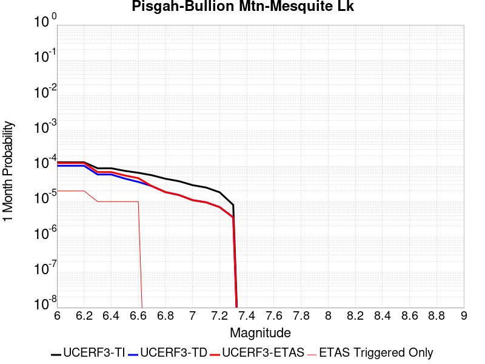 |  |  |

| Magnitude | 1 wk TI Prob | 1 wk TD Prob | 1 wk ETAS Prob | 1 wk ETAS/TD Gain | 1 wk ETAS Triggered Only | 1 mo TI Prob | 1 mo TD Prob | 1 mo ETAS Prob | 1 mo ETAS/TD Gain | 1 mo ETAS Triggered Only | 1 yr TI Prob | 1 yr TD Prob | 1 yr ETAS Prob | 1 yr ETAS/TD Gain | 1 yr ETAS Triggered Only | 10 yr TI Prob | 10 yr TD Prob | 10 yr ETAS Prob | 10 yr ETAS/TD Gain | 10 yr ETAS Triggered Only |
|-----|-----|-----|-----|-----|-----|-----|-----|-----|-----|-----|-----|-----|-----|-----|-----|-----|-----|-----|-----|-----|
| 6.0 | 3.0240792E-5 | 2.4091038E-5 | 3.6302845E-5 | 1.5069025 | 1.22121E-5 | 1.2959696E-4 | 1.0324379E-4 | 1.2766547E-4 | 1.2365438 | 2.44242E-5 | 0.0015767008 | 0.0012563687 | 0.0012807623 | 1.0194159 | 2.44242E-5 | 0.015655609 | 0.012502681 | 0.0125268 | 1.001929 | 2.44242E-5 |
| 6.1 | 3.0240792E-5 | 2.4091038E-5 | 3.6302845E-5 | 1.5069025 | 1.22121E-5 | 1.2959696E-4 | 1.0324379E-4 | 1.2766547E-4 | 1.2365438 | 2.44242E-5 | 0.0015767008 | 0.0012563687 | 0.0012807623 | 1.0194159 | 2.44242E-5 | 0.015655609 | 0.012502681 | 0.0125268 | 1.001929 | 2.44242E-5 |
| 6.2 | 3.0240792E-5 | 2.4091038E-5 | 3.6302845E-5 | 1.5069025 | 1.22121E-5 | 1.2959696E-4 | 1.0324379E-4 | 1.2766547E-4 | 1.2365438 | 2.44242E-5 | 0.0015767008 | 0.0012563687 | 0.0012807623 | 1.0194159 | 2.44242E-5 | 0.015655609 | 0.012502681 | 0.0125268 | 1.001929 | 2.44242E-5 |
| 6.3 | 2.0498217E-5 | 1.3638032E-5 | 1.3638032E-5 | 1.0 | 0.0 | 8.784654E-5 | 5.844749E-5 | 7.0658876E-5 | 1.2089292 | 1.22121E-5 | 0.0010690069 | 7.1138213E-4 | 7.2358554E-4 | 1.0171545 | 1.22121E-5 | 0.01063879 | 0.007092675 | 0.0071048005 | 1.0017096 | 1.22121E-5 |
| 6.4 | 2.0498217E-5 | 1.3638032E-5 | 1.3638032E-5 | 1.0 | 0.0 | 8.784654E-5 | 5.844749E-5 | 7.0658876E-5 | 1.2089292 | 1.22121E-5 | 0.0010690069 | 7.1138213E-4 | 7.2358554E-4 | 1.0171545 | 1.22121E-5 | 0.01063879 | 0.007092675 | 0.0071048005 | 1.0017096 | 1.22121E-5 |
| 6.5 | 1.7316182E-5 | 1.0477016E-5 | 1.0477016E-5 | 1.0 | 0.0 | 7.42101E-5 | 4.490078E-5 | 5.711233E-5 | 1.2719675 | 1.22121E-5 | 9.0313336E-4 | 5.4653984E-4 | 5.587453E-4 | 1.0223322 | 1.22121E-5 | 0.008994718 | 0.005452953 | 0.0054650987 | 1.0022273 | 1.22121E-5 |
| 6.6 | 1.5251077E-5 | 8.414252E-6 | 8.414252E-6 | 1.0 | 0.0 | 6.536012E-5 | 3.606062E-5 | 4.8272283E-5 | 1.3386425 | 1.22121E-5 | 7.9546886E-4 | 4.3895686E-4 | 4.511636E-4 | 1.0278085 | 1.22121E-5 | 0.007926274 | 0.004381615 | 0.004393774 | 1.002775 | 1.22121E-5 |
| 6.7 | 1.2997425E-5 | 6.411481E-6 | 6.411481E-6 | 1.0 | 0.0 | 5.570206E-5 | 2.7477512E-5 | 2.7477512E-5 | 1.0 | 0.0 | 6.7796157E-4 | 3.34492E-4 | 3.34492E-4 | 1.0 | 0.0 | 0.0067589693 | 0.0033403458 | 0.0033403458 | 1.0 | 0.0 |
| 6.8 | 1.035386E-5 | 4.3332066E-6 | 4.3332066E-6 | 1.0 | 0.0 | 4.437293E-5 | 1.8570758E-5 | 1.8570758E-5 | 1.0 | 0.0 | 5.401065E-4 | 2.260764E-4 | 2.260764E-4 | 1.0 | 0.0 | 0.0053879567 | 0.0022585508 | 0.0022585508 | 1.0 | 0.0 |
| 6.9 | 8.816252E-6 | 3.580627E-6 | 3.580627E-6 | 1.0 | 0.0 | 3.778339E-5 | 1.5345457E-5 | 1.5345457E-5 | 1.0 | 0.0 | 4.5991567E-4 | 1.8681551E-4 | 1.8681551E-4 | 1.0 | 0.0 | 0.00458965 | 0.0018666431 | 0.0018666431 | 1.0 | 0.0 |
| 7.0 | 6.8232207E-6 | 2.567576E-6 | 2.567576E-6 | 1.0 | 0.0 | 2.9242048E-5 | 1.1003853E-5 | 1.1003853E-5 | 1.0 | 0.0 | 3.5596377E-4 | 1.3396399E-4 | 1.3396399E-4 | 1.0 | 0.0 | 0.0035539411 | 0.0013388634 | 0.0013388634 | 1.0 | 0.0 |
| 7.1 | 5.837013E-6 | 2.227373E-6 | 2.227373E-6 | 1.0 | 0.0 | 2.501553E-5 | 9.545851E-6 | 9.545851E-6 | 1.0 | 0.0 | 3.045215E-4 | 1.16214826E-4 | 1.16214826E-4 | 1.0 | 0.0 | 0.0030410455 | 0.0011615696 | 0.0011615696 | 1.0 | 0.0 |
| 7.2 | 4.278052E-6 | 1.627566E-6 | 1.627566E-6 | 1.0 | 0.0 | 1.833438E-5 | 6.9752655E-6 | 6.9752655E-6 | 1.0 | 0.0 | 2.231982E-4 | 8.4920786E-5 | 8.4920786E-5 | 1.0 | 0.0 | 0.0022297418 | 8.489065E-4 | 8.489065E-4 | 1.0 | 0.0 |
| 7.3 | 1.8803692E-6 | 8.344903E-7 | 8.344903E-7 | 1.0 | 0.0 | 8.0587E-6 | 3.576383E-6 | 3.576383E-6 | 1.0 | 0.0 | 9.811026E-5 | 4.354174E-5 | 4.354174E-5 | 1.0 | 0.0 | 9.806695E-4 | 4.3534656E-4 | 4.3534656E-4 | 1.0 | 0.0 |

## White Mountains
*[(top)](#table-of-contents)*

| 1 Week | 1 Month | 1 Year | 10 Year |
|-----|-----|-----|-----|
|  | 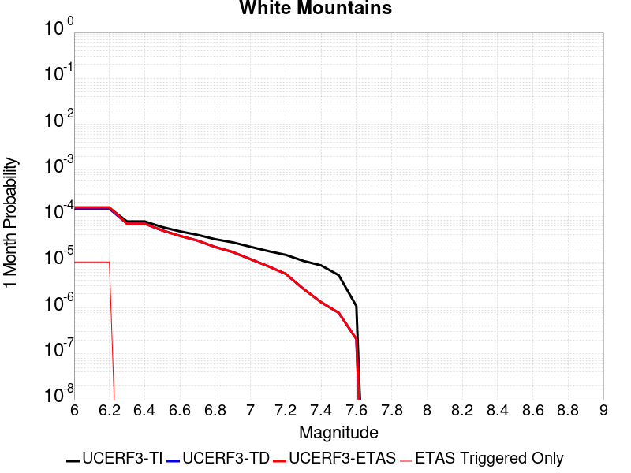 | 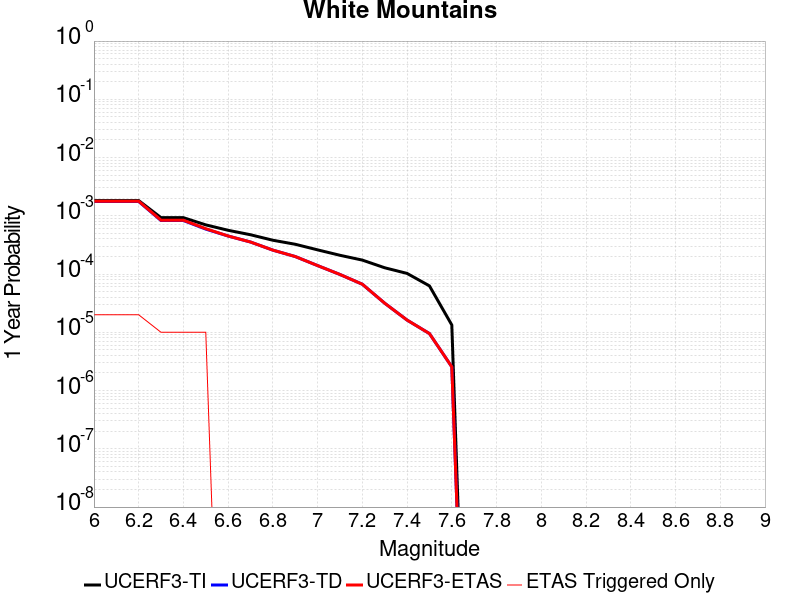 | 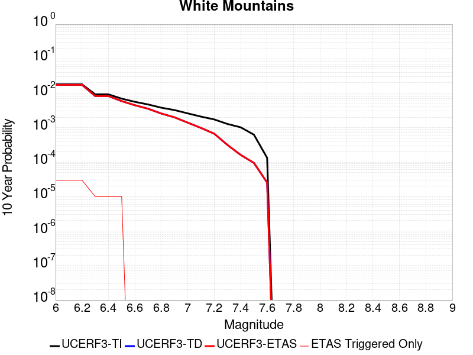 |

| Magnitude | 1 wk TI Prob | 1 wk TD Prob | 1 wk ETAS Prob | 1 wk ETAS/TD Gain | 1 wk ETAS Triggered Only | 1 mo TI Prob | 1 mo TD Prob | 1 mo ETAS Prob | 1 mo ETAS/TD Gain | 1 mo ETAS Triggered Only | 1 yr TI Prob | 1 yr TD Prob | 1 yr ETAS Prob | 1 yr ETAS/TD Gain | 1 yr ETAS Triggered Only | 10 yr TI Prob | 10 yr TD Prob | 10 yr ETAS Prob | 10 yr ETAS/TD Gain | 10 yr ETAS Triggered Only |
|-----|-----|-----|-----|-----|-----|-----|-----|-----|-----|-----|-----|-----|-----|-----|-----|-----|-----|-----|-----|-----|
| 6.0 | 3.503579E-5 | 3.3783974E-5 | 4.599566E-5 | 1.3614639 | 1.22121E-5 | 1.5014476E-4 | 1.4478111E-4 | 1.5699145E-4 | 1.0843365 | 1.22121E-5 | 0.0018264796 | 0.0017614056 | 0.0017735962 | 1.0069209 | 1.22121E-5 | 0.018115403 | 0.017486779 | 0.017510777 | 1.0013723 | 2.44242E-5 |
| 6.1 | 3.503579E-5 | 3.3783974E-5 | 4.599566E-5 | 1.3614639 | 1.22121E-5 | 1.5014476E-4 | 1.4478111E-4 | 1.5699145E-4 | 1.0843365 | 1.22121E-5 | 0.0018264796 | 0.0017614056 | 0.0017735962 | 1.0069209 | 1.22121E-5 | 0.018115403 | 0.017486779 | 0.017510777 | 1.0013723 | 2.44242E-5 |
| 6.2 | 3.503579E-5 | 3.3783974E-5 | 4.599566E-5 | 1.3614639 | 1.22121E-5 | 1.5014476E-4 | 1.4478111E-4 | 1.5699145E-4 | 1.0843365 | 1.22121E-5 | 0.0018264796 | 0.0017614056 | 0.0017735962 | 1.0069209 | 1.22121E-5 | 0.018115403 | 0.017486779 | 0.017510777 | 1.0013723 | 2.44242E-5 |
| 6.3 | 1.7818425E-5 | 1.591604E-5 | 1.591604E-5 | 1.0 | 0.0 | 7.636245E-5 | 6.8209905E-5 | 6.8209905E-5 | 1.0 | 0.0 | 9.293162E-4 | 8.301534E-4 | 8.301534E-4 | 1.0 | 0.0 | 0.009254395 | 0.008271982 | 0.008271982 | 1.0 | 0.0 |
| 6.4 | 1.7818425E-5 | 1.591604E-5 | 1.591604E-5 | 1.0 | 0.0 | 7.636245E-5 | 6.8209905E-5 | 6.8209905E-5 | 1.0 | 0.0 | 9.293162E-4 | 8.301534E-4 | 8.301534E-4 | 1.0 | 0.0 | 0.009254395 | 0.008271982 | 0.008271982 | 1.0 | 0.0 |
| 6.5 | 1.3397557E-5 | 1.1336246E-5 | 1.1336246E-5 | 1.0 | 0.0 | 5.741684E-5 | 4.8583046E-5 | 4.8583046E-5 | 1.0 | 0.0 | 6.988258E-4 | 5.91345E-4 | 5.91345E-4 | 1.0 | 0.0 | 0.006966323 | 0.0058984202 | 0.0058984202 | 1.0 | 0.0 |
| 6.6 | 1.0818695E-5 | 8.6253485E-6 | 8.6253485E-6 | 1.0 | 0.0 | 4.6365014E-5 | 3.696528E-5 | 3.696528E-5 | 1.0 | 0.0 | 5.6434784E-4 | 4.4996373E-4 | 4.4996373E-4 | 1.0 | 0.0 | 0.005629168 | 0.004490963 | 0.004490963 | 1.0 | 0.0 |
| 6.7 | 9.067908E-6 | 6.8024283E-6 | 6.8024283E-6 | 1.0 | 0.0 | 3.8861883E-5 | 2.9152956E-5 | 2.9152956E-5 | 1.0 | 0.0 | 4.7304068E-4 | 3.5488262E-4 | 3.5488262E-4 | 1.0 | 0.0 | 0.00472035 | 0.003543476 | 0.003543476 | 1.0 | 0.0 |
| 6.8 | 7.295947E-6 | 4.9363807E-6 | 4.9363807E-6 | 1.0 | 0.0 | 3.126797E-5 | 2.1155753E-5 | 2.1155753E-5 | 1.0 | 0.0 | 3.8062103E-4 | 2.5754198E-4 | 2.5754198E-4 | 1.0 | 0.0 | 0.0037996976 | 0.002572548 | 0.002572548 | 1.0 | 0.0 |
| 6.9 | 6.2243444E-6 | 3.8322046E-6 | 3.8322046E-6 | 1.0 | 0.0 | 2.6675489E-5 | 1.6423633E-5 | 1.6423633E-5 | 1.0 | 0.0 | 3.2472567E-4 | 1.9993992E-4 | 1.9993992E-4 | 1.0 | 0.0 | 0.0032425157 | 0.0019976532 | 0.0019976532 | 1.0 | 0.0 |
| 7.0 | 4.9878413E-6 | 2.679527E-6 | 2.679527E-6 | 1.0 | 0.0 | 2.1376287E-5 | 1.1483638E-5 | 1.1483638E-5 | 1.0 | 0.0 | 2.602252E-4 | 1.3980459E-4 | 1.3980459E-4 | 1.0 | 0.0 | 0.002599207 | 0.0013971926 | 0.0013971926 | 1.0 | 0.0 |
| 7.1 | 4.0252844E-6 | 1.8857509E-6 | 1.8857509E-6 | 1.0 | 0.0 | 1.7251105E-5 | 8.081765E-6 | 8.081765E-6 | 1.0 | 0.0 | 2.1001195E-4 | 9.8391174E-5 | 9.8391174E-5 | 1.0 | 0.0 | 0.0020981359 | 9.83489E-4 | 9.83489E-4 | 1.0 | 0.0 |
| 7.2 | 3.3284066E-6 | 1.281958E-6 | 1.281958E-6 | 1.0 | 0.0 | 1.4264522E-5 | 5.4940947E-6 | 5.4940947E-6 | 1.0 | 0.0 | 1.736567E-4 | 6.688865E-5 | 6.688865E-5 | 1.0 | 0.0 | 0.0017352107 | 6.6869525E-4 | 6.6869525E-4 | 1.0 | 0.0 |
| 7.3 | 2.458226E-6 | 6.0571654E-7 | 6.0571654E-7 | 1.0 | 0.0 | 1.0535211E-5 | 2.5959255E-6 | 2.5959255E-6 | 1.0 | 0.0 | 1.2825865E-4 | 3.1604974E-5 | 3.1604974E-5 | 1.0 | 0.0 | 0.0012818464 | 3.1600855E-4 | 3.1600855E-4 | 1.0 | 0.0 |
| 7.4 | 1.965953E-6 | 3.1088828E-7 | 3.1088828E-7 | 1.0 | 0.0 | 8.425486E-6 | 1.3323777E-6 | 1.3323777E-6 | 1.0 | 0.0 | 1.0257547E-4 | 1.6221578E-5 | 1.6221578E-5 | 1.0 | 0.0 | 0.0010252813 | 1.6220407E-4 | 1.6220407E-4 | 1.0 | 0.0 |
| 7.5 | 1.2014192E-6 | 1.8243925E-7 | 1.8243925E-7 | 1.0 | 0.0 | 5.148929E-6 | 7.8188225E-7 | 7.8188225E-7 | 1.0 | 0.0 | 6.2686406E-5 | 9.519375E-6 | 9.519375E-6 | 1.0 | 0.0 | 6.266873E-4 | 9.518977E-5 | 9.518977E-5 | 1.0 | 0.0 |
| 7.6 | 2.5612175E-7 | 4.894561E-8 | 4.894561E-8 | 1.0 | 0.0 | 1.0976642E-6 | 2.0976687E-7 | 2.0976687E-7 | 1.0 | 0.0 | 1.3363979E-5 | 2.553909E-6 | 2.553909E-6 | 1.0 | 0.0 | 1.3363175E-4 | 2.5538833E-5 | 2.5538833E-5 | 1.0 | 0.0 |

## San Jacinto (Clark) rev
*[(top)](#table-of-contents)*

| 1 Week | 1 Month | 1 Year | 10 Year |
|-----|-----|-----|-----|
| 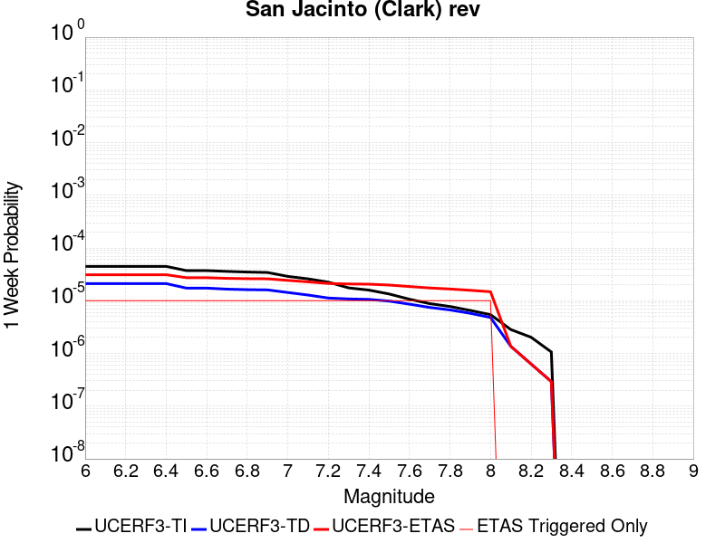 |  | 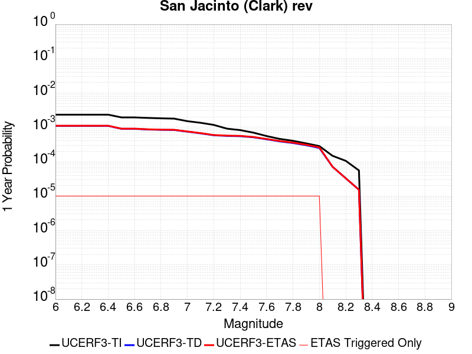 | 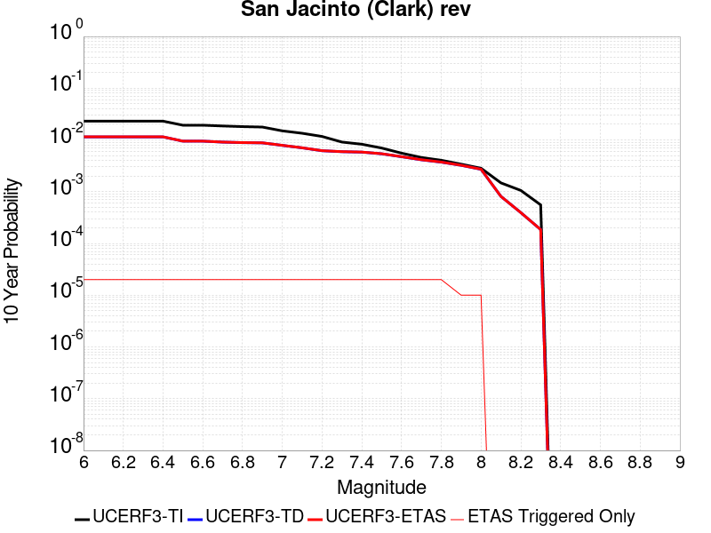 |

| Magnitude | 1 wk TI Prob | 1 wk TD Prob | 1 wk ETAS Prob | 1 wk ETAS/TD Gain | 1 wk ETAS Triggered Only | 1 mo TI Prob | 1 mo TD Prob | 1 mo ETAS Prob | 1 mo ETAS/TD Gain | 1 mo ETAS Triggered Only | 1 yr TI Prob | 1 yr TD Prob | 1 yr ETAS Prob | 1 yr ETAS/TD Gain | 1 yr ETAS Triggered Only | 10 yr TI Prob | 10 yr TD Prob | 10 yr ETAS Prob | 10 yr ETAS/TD Gain | 10 yr ETAS Triggered Only |
|-----|-----|-----|-----|-----|-----|-----|-----|-----|-----|-----|-----|-----|-----|-----|-----|-----|-----|-----|-----|-----|
| 6.0 | 4.482615E-5 | 2.1148973E-5 | 3.3360815E-5 | 1.5774201 | 1.22121E-5 | 1.9209793E-4 | 9.063536E-5 | 1.0284635E-4 | 1.1347266 | 1.22121E-5 | 0.0023362834 | 0.0011029361 | 0.0011151348 | 1.0110601 | 1.22121E-5 | 0.02311874 | 0.011501086 | 0.011525229 | 1.0020993 | 2.44242E-5 |
| 6.1 | 4.482615E-5 | 2.1148973E-5 | 3.3360815E-5 | 1.5774201 | 1.22121E-5 | 1.9209793E-4 | 9.063536E-5 | 1.0284635E-4 | 1.1347266 | 1.22121E-5 | 0.0023362834 | 0.0011029361 | 0.0011151348 | 1.0110601 | 1.22121E-5 | 0.02311874 | 0.011501086 | 0.011525229 | 1.0020993 | 2.44242E-5 |
| 6.2 | 4.482615E-5 | 2.1148973E-5 | 3.3360815E-5 | 1.5774201 | 1.22121E-5 | 1.9209793E-4 | 9.063536E-5 | 1.0284635E-4 | 1.1347266 | 1.22121E-5 | 0.0023362834 | 0.0011029361 | 0.0011151348 | 1.0110601 | 1.22121E-5 | 0.02311874 | 0.011501086 | 0.011525229 | 1.0020993 | 2.44242E-5 |
| 6.3 | 4.482615E-5 | 2.1148973E-5 | 3.3360815E-5 | 1.5774201 | 1.22121E-5 | 1.9209793E-4 | 9.063536E-5 | 1.0284635E-4 | 1.1347266 | 1.22121E-5 | 0.0023362834 | 0.0011029361 | 0.0011151348 | 1.0110601 | 1.22121E-5 | 0.02311874 | 0.011501086 | 0.011525229 | 1.0020993 | 2.44242E-5 |
| 6.4 | 4.482615E-5 | 2.1148973E-5 | 3.3360815E-5 | 1.5774201 | 1.22121E-5 | 1.9209793E-4 | 9.063536E-5 | 1.0284635E-4 | 1.1347266 | 1.22121E-5 | 0.0023362834 | 0.0011029361 | 0.0011151348 | 1.0110601 | 1.22121E-5 | 0.02311874 | 0.011501086 | 0.011525229 | 1.0020993 | 2.44242E-5 |
| 6.5 | 3.7294863E-5 | 1.7351053E-5 | 2.9562942E-5 | 1.7038125 | 1.22121E-5 | 1.5982533E-4 | 7.435956E-5 | 8.6570755E-5 | 1.1642182 | 1.22121E-5 | 0.0019441366 | 9.0495613E-4 | 9.1715716E-4 | 1.0134825 | 1.22121E-5 | 0.01927216 | 0.009491439 | 0.009515632 | 1.0025488 | 2.44242E-5 |
| 6.6 | 3.7294863E-5 | 1.7351053E-5 | 2.9562942E-5 | 1.7038125 | 1.22121E-5 | 1.5982533E-4 | 7.435956E-5 | 8.6570755E-5 | 1.1642182 | 1.22121E-5 | 0.0019441366 | 9.0495613E-4 | 9.1715716E-4 | 1.0134825 | 1.22121E-5 | 0.01927216 | 0.009491439 | 0.009515632 | 1.0025488 | 2.44242E-5 |
| 6.7 | 3.6039248E-5 | 1.6599313E-5 | 2.881121E-5 | 1.7356869 | 1.22121E-5 | 1.5444479E-4 | 7.1138E-5 | 8.334923E-5 | 1.1716555 | 1.22121E-5 | 0.0018787434 | 8.657651E-4 | 8.7796664E-4 | 1.0140934 | 1.22121E-5 | 0.01862939 | 0.0090934 | 0.009117601 | 1.0026615 | 2.44242E-5 |
| 6.8 | 3.5031844E-5 | 1.6227968E-5 | 2.843987E-5 | 1.7525219 | 1.22121E-5 | 1.5012783E-4 | 6.954661E-5 | 8.1757855E-5 | 1.1755837 | 1.22121E-5 | 0.0018262739 | 8.4640505E-4 | 8.586068E-4 | 1.014416 | 1.22121E-5 | 0.01811338 | 0.008893334 | 0.008917541 | 1.0027219 | 2.44242E-5 |
| 6.9 | 3.435112E-5 | 1.6058235E-5 | 2.8270139E-5 | 1.7604761 | 1.22121E-5 | 1.4721078E-4 | 6.8819216E-5 | 8.103048E-5 | 1.1774397 | 1.22121E-5 | 0.0017908178 | 8.3755597E-4 | 8.497578E-4 | 1.0145684 | 1.22121E-5 | 0.017764548 | 0.008801554 | 0.008825763 | 1.0027505 | 2.44242E-5 |
| 7.0 | 2.8959772E-5 | 1.4331922E-5 | 2.6543847E-5 | 1.8520787 | 1.22121E-5 | 1.241074E-4 | 6.1421095E-5 | 7.3632444E-5 | 1.1988136 | 1.22121E-5 | 0.0015099603 | 7.4754807E-4 | 7.59751E-4 | 1.016324 | 1.22121E-5 | 0.014997416 | 0.007865488 | 0.00788972 | 1.0030808 | 2.44242E-5 |
| 7.1 | 2.6002877E-5 | 1.28242955E-5 | 2.503624E-5 | 1.9522506 | 1.22121E-5 | 1.11436144E-4 | 5.496012E-5 | 6.717155E-5 | 1.222187 | 1.22121E-5 | 0.0013558907 | 6.689362E-4 | 6.811401E-4 | 1.0182438 | 1.22121E-5 | 0.013476475 | 0.0070440206 | 0.0070682727 | 1.0034429 | 2.44242E-5 |
| 7.2 | 2.2544838E-5 | 1.1257961E-5 | 2.3469924E-5 | 2.0847402 | 1.22121E-5 | 9.661716E-5 | 4.824752E-5 | 6.0459028E-5 | 1.2531013 | 1.22121E-5 | 0.001175679 | 5.872566E-4 | 5.994616E-4 | 1.020783 | 1.22121E-5 | 0.011694785 | 0.006190321 | 0.006214594 | 1.0039212 | 2.44242E-5 |
| 7.3 | 1.75334E-5 | 1.0807203E-5 | 2.301917E-5 | 2.1299841 | 1.22121E-5 | 7.514098E-5 | 4.631577E-5 | 5.85273E-5 | 1.2636583 | 1.22121E-5 | 9.144575E-4 | 5.6375E-4 | 5.759552E-4 | 1.0216501 | 1.22121E-5 | 0.009107036 | 0.0059313844 | 0.005955664 | 1.0040934 | 2.44242E-5 |
| 7.4 | 1.5924552E-5 | 1.06070265E-5 | 2.2818997E-5 | 2.1513095 | 1.22121E-5 | 6.82463E-5 | 4.5457902E-5 | 5.7669447E-5 | 1.2686342 | 1.22121E-5 | 8.305819E-4 | 5.533108E-4 | 5.655161E-4 | 1.0220587 | 1.22121E-5 | 0.008274844 | 0.0058186566 | 0.0058429386 | 1.0041732 | 2.44242E-5 |
| 7.5 | 1.3428931E-5 | 9.847458E-6 | 2.2059437E-5 | 2.240115 | 1.22121E-5 | 5.7551293E-5 | 4.2202715E-5 | 5.44143E-5 | 1.2893554 | 1.22121E-5 | 7.004617E-4 | 5.13698E-4 | 5.2590383E-4 | 1.0237607 | 1.22121E-5 | 0.006982579 | 0.00540425 | 0.0054285424 | 1.004495 | 2.44242E-5 |
| 7.6 | 1.0688787E-5 | 8.610701E-6 | 2.0822696E-5 | 2.4182346 | 1.22121E-5 | 4.5808283E-5 | 3.6902486E-5 | 4.9114136E-5 | 1.3309166 | 1.22121E-5 | 5.5757316E-4 | 4.4919562E-4 | 4.6140223E-4 | 1.0271744 | 1.22121E-5 | 0.005561762 | 0.0047394587 | 0.004763767 | 1.005129 | 2.44242E-5 |
| 7.7 | 8.81236E-6 | 7.4671725E-6 | 1.967918E-5 | 2.635426 | 1.22121E-5 | 3.776671E-5 | 3.2001775E-5 | 4.4213484E-5 | 1.3815948 | 1.22121E-5 | 4.597127E-4 | 3.8955218E-4 | 4.0175952E-4 | 1.0313369 | 1.22121E-5 | 0.0045876284 | 0.004134198 | 0.004158521 | 1.0058835 | 2.44242E-5 |
| 7.8 | 7.780431E-6 | 6.695772E-6 | 1.890779E-5 | 2.8238401 | 1.22121E-5 | 3.3344273E-5 | 2.8695851E-5 | 4.09076E-5 | 1.425558 | 1.22121E-5 | 4.0589093E-4 | 3.4931616E-4 | 3.61524E-4 | 1.0349478 | 1.22121E-5 | 0.0040515037 | 0.0037223601 | 0.0037466933 | 1.0065371 | 2.44242E-5 |
| 7.9 | 6.5437994E-6 | 5.779629E-6 | 1.7991659E-5 | 3.1129434 | 1.22121E-5 | 2.8044553E-5 | 2.4769604E-5 | 3.69814E-5 | 1.4930154 | 1.22121E-5 | 3.4138895E-4 | 3.0152837E-4 | 3.137368E-4 | 1.0404885 | 1.22121E-5 | 0.0034086495 | 0.0032340821 | 0.0032462548 | 1.0037638 | 1.22121E-5 |
| 8.0 | 5.4488164E-6 | 4.812673E-6 | 1.7024713E-5 | 3.5374758 | 1.22121E-5 | 2.3351862E-5 | 2.0625579E-5 | 3.2837426E-5 | 1.592073 | 1.22121E-5 | 2.8427184E-4 | 2.5108762E-4 | 2.6329668E-4 | 1.0486246 | 1.22121E-5 | 0.0028390845 | 0.0027104812 | 0.00272266 | 1.0044934 | 1.22121E-5 |
| 8.1 | 2.8397242E-6 | 1.3667719E-6 | 1.3667719E-6 | 1.0 | 0.0 | 1.217019E-5 | 5.8575806E-6 | 5.8575806E-6 | 1.0 | 0.0 | 1.4816198E-4 | 7.131373E-5 | 7.131373E-5 | 1.0 | 0.0 | 0.0014806325 | 8.113878E-4 | 8.113878E-4 | 1.0 | 0.0 |
| 8.2 | 2.030244E-6 | 6.317443E-7 | 6.317443E-7 | 1.0 | 0.0 | 8.701017E-6 | 2.7074727E-6 | 2.7074727E-6 | 1.0 | 0.0 | 1.05929736E-4 | 3.2962987E-5 | 3.2962987E-5 | 1.0 | 0.0 | 0.0010587925 | 3.9477667E-4 | 3.9477667E-4 | 1.0 | 0.0 |
| 8.3 | 1.0659804E-6 | 2.9242594E-7 | 2.9242594E-7 | 1.0 | 0.0 | 4.568479E-6 | 1.2532535E-6 | 1.2532535E-6 | 1.0 | 0.0 | 5.5619817E-5 | 1.5258258E-5 | 1.5258258E-5 | 1.0 | 0.0 | 5.5605895E-4 | 1.8561793E-4 | 1.8561793E-4 | 1.0 | 0.0 |

## San Jacinto (Stepovers Combined)
*[(top)](#table-of-contents)*

| 1 Week | 1 Month | 1 Year | 10 Year |
|-----|-----|-----|-----|
|  |  |  | 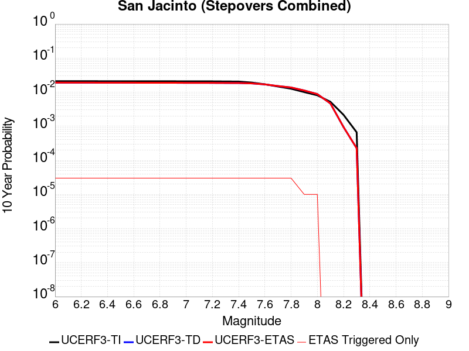 |

| Magnitude | 1 wk TI Prob | 1 wk TD Prob | 1 wk ETAS Prob | 1 wk ETAS/TD Gain | 1 wk ETAS Triggered Only | 1 mo TI Prob | 1 mo TD Prob | 1 mo ETAS Prob | 1 mo ETAS/TD Gain | 1 mo ETAS Triggered Only | 1 yr TI Prob | 1 yr TD Prob | 1 yr ETAS Prob | 1 yr ETAS/TD Gain | 1 yr ETAS Triggered Only | 10 yr TI Prob | 10 yr TD Prob | 10 yr ETAS Prob | 10 yr ETAS/TD Gain | 10 yr ETAS Triggered Only |
|-----|-----|-----|-----|-----|-----|-----|-----|-----|-----|-----|-----|-----|-----|-----|-----|-----|-----|-----|-----|-----|
| 6.0 | 4.0667746E-5 | 3.5266257E-5 | 4.7477926E-5 | 1.3462706 | 1.22121E-5 | 1.742787E-4 | 1.5113236E-4 | 1.6334261E-4 | 1.0807918 | 1.22121E-5 | 0.0021197782 | 0.0018384842 | 0.0018506738 | 1.0066303 | 1.22121E-5 | 0.020996714 | 0.018983515 | 0.019007474 | 1.0012622 | 2.44242E-5 |
| 6.1 | 4.0667746E-5 | 3.5266257E-5 | 4.7477926E-5 | 1.3462706 | 1.22121E-5 | 1.742787E-4 | 1.5113236E-4 | 1.6334261E-4 | 1.0807918 | 1.22121E-5 | 0.0021197782 | 0.0018384842 | 0.0018506738 | 1.0066303 | 1.22121E-5 | 0.020996714 | 0.018983515 | 0.019007474 | 1.0012622 | 2.44242E-5 |
| 6.2 | 4.0667746E-5 | 3.5266257E-5 | 4.7477926E-5 | 1.3462706 | 1.22121E-5 | 1.742787E-4 | 1.5113236E-4 | 1.6334261E-4 | 1.0807918 | 1.22121E-5 | 0.0021197782 | 0.0018384842 | 0.0018506738 | 1.0066303 | 1.22121E-5 | 0.020996714 | 0.018983515 | 0.019007474 | 1.0012622 | 2.44242E-5 |
| 6.3 | 4.0667746E-5 | 3.5266257E-5 | 4.7477926E-5 | 1.3462706 | 1.22121E-5 | 1.742787E-4 | 1.5113236E-4 | 1.6334261E-4 | 1.0807918 | 1.22121E-5 | 0.0021197782 | 0.0018384842 | 0.0018506738 | 1.0066303 | 1.22121E-5 | 0.020996714 | 0.018983515 | 0.019007474 | 1.0012622 | 2.44242E-5 |
| 6.4 | 4.0577226E-5 | 3.513816E-5 | 4.734983E-5 | 1.347533 | 1.22121E-5 | 1.738908E-4 | 1.5058344E-4 | 1.627937E-4 | 1.0810864 | 1.22121E-5 | 0.0021150648 | 0.001831814 | 0.0018440037 | 1.0066545 | 1.22121E-5 | 0.020950472 | 0.018918084 | 0.018942045 | 1.0012666 | 2.44242E-5 |
| 6.5 | 4.0577226E-5 | 3.513816E-5 | 4.734983E-5 | 1.347533 | 1.22121E-5 | 1.738908E-4 | 1.5058344E-4 | 1.627937E-4 | 1.0810864 | 1.22121E-5 | 0.0021150648 | 0.001831814 | 0.0018440037 | 1.0066545 | 1.22121E-5 | 0.020950472 | 0.018918084 | 0.018942045 | 1.0012666 | 2.44242E-5 |
| 6.6 | 4.053861E-5 | 3.5083507E-5 | 4.7295176E-5 | 1.3480744 | 1.22121E-5 | 1.7372532E-4 | 1.5034924E-4 | 1.625595E-4 | 1.0812126 | 1.22121E-5 | 0.0021130538 | 0.0018289674 | 0.0018411571 | 1.0066649 | 1.22121E-5 | 0.020930743 | 0.018890161 | 0.018914124 | 1.0012685 | 2.44242E-5 |
| 6.7 | 4.0516545E-5 | 3.5052573E-5 | 4.7264246E-5 | 1.3483816 | 1.22121E-5 | 1.7363077E-4 | 1.5021669E-4 | 1.6242695E-4 | 1.0812844 | 1.22121E-5 | 0.002111905 | 0.0018273568 | 0.0018395465 | 1.0066707 | 1.22121E-5 | 0.020919468 | 0.018874358 | 0.018898321 | 1.0012696 | 2.44242E-5 |
| 6.8 | 4.049434E-5 | 3.5024135E-5 | 4.7235808E-5 | 1.3486645 | 1.22121E-5 | 1.7353562E-4 | 1.5009483E-4 | 1.6230509E-4 | 1.0813503 | 1.22121E-5 | 0.0021107488 | 0.0018258755 | 0.0018380653 | 1.0066762 | 1.22121E-5 | 0.020908125 | 0.018859772 | 0.018883735 | 1.0012707 | 2.44242E-5 |
| 6.9 | 4.046386E-5 | 3.4986697E-5 | 4.719837E-5 | 1.3490376 | 1.22121E-5 | 1.73405E-4 | 1.4993439E-4 | 1.6214466E-4 | 1.0814375 | 1.22121E-5 | 0.0021091616 | 0.0018239255 | 0.0018361154 | 1.0066833 | 1.22121E-5 | 0.020892553 | 0.018840544 | 0.018864509 | 1.001272 | 2.44242E-5 |
| 7.0 | 4.036382E-5 | 3.4867266E-5 | 4.707894E-5 | 1.3502332 | 1.22121E-5 | 1.7297632E-4 | 1.494226E-4 | 1.6163287E-4 | 1.0817164 | 1.22121E-5 | 0.0021039525 | 0.0018177053 | 0.0018298953 | 1.0067062 | 1.22121E-5 | 0.02084144 | 0.01877916 | 0.018803125 | 1.0012761 | 2.44242E-5 |
| 7.1 | 4.0343282E-5 | 3.484573E-5 | 4.70574E-5 | 1.3504497 | 1.22121E-5 | 1.7288832E-4 | 1.493303E-4 | 1.6154058E-4 | 1.0817668 | 1.22121E-5 | 0.002102883 | 0.0018165836 | 0.0018287735 | 1.0067104 | 1.22121E-5 | 0.020830948 | 0.018768037 | 0.018792003 | 1.001277 | 2.44242E-5 |
| 7.2 | 4.0257353E-5 | 3.4750232E-5 | 4.6961904E-5 | 1.3514128 | 1.22121E-5 | 1.725201E-4 | 1.4892107E-4 | 1.6113136E-4 | 1.0819917 | 1.22121E-5 | 0.0020984085 | 0.0018116096 | 0.0018237996 | 1.0067288 | 1.22121E-5 | 0.020787042 | 0.018718777 | 0.018742744 | 1.0012804 | 2.44242E-5 |
| 7.3 | 3.9940667E-5 | 3.4577894E-5 | 4.678957E-5 | 1.3531643 | 1.22121E-5 | 1.7116306E-4 | 1.4818257E-4 | 1.6039285E-4 | 1.0824003 | 1.22121E-5 | 0.0020819185 | 0.0018026332 | 0.0018148232 | 1.0067624 | 1.22121E-5 | 0.020625217 | 0.018627413 | 0.018651381 | 1.0012867 | 2.44242E-5 |
| 7.4 | 3.9721202E-5 | 3.4463315E-5 | 4.6674995E-5 | 1.3543385 | 1.22121E-5 | 1.7022261E-4 | 1.4769158E-4 | 1.5990187E-4 | 1.0826743 | 1.22121E-5 | 0.0020704903 | 0.0017966651 | 0.0018088553 | 1.0067849 | 1.22121E-5 | 0.020513052 | 0.01856655 | 0.018590521 | 1.001291 | 2.44242E-5 |
| 7.5 | 3.7036873E-5 | 3.353082E-5 | 4.5742512E-5 | 1.364193 | 1.22121E-5 | 1.5871979E-4 | 1.4369562E-4 | 1.5590597E-4 | 1.0849737 | 1.22121E-5 | 0.0019307006 | 0.0017480933 | 0.0017602841 | 1.0069737 | 1.22121E-5 | 0.019140124 | 0.018068153 | 0.018092137 | 1.0013274 | 2.44242E-5 |
| 7.6 | 3.2940967E-5 | 3.1311945E-5 | 4.3523665E-5 | 1.3900019 | 1.22121E-5 | 1.4116794E-4 | 1.3418717E-4 | 1.4639762E-4 | 1.0909958 | 1.22121E-5 | 0.0017173645 | 0.0016325067 | 0.0016446989 | 1.0074683 | 1.22121E-5 | 0.01704153 | 0.016901208 | 0.01692522 | 1.0014207 | 2.44242E-5 |
| 7.7 | 2.8236149E-5 | 2.7881175E-5 | 4.0092935E-5 | 1.437993 | 1.22121E-5 | 1.2100645E-4 | 1.1948528E-4 | 1.3169592E-4 | 1.1021937 | 1.22121E-5 | 0.0014722579 | 0.0014537636 | 0.001465958 | 1.0083882 | 1.22121E-5 | 0.014625421 | 0.015113685 | 0.01513774 | 1.0015916 | 2.44242E-5 |
| 7.8 | 2.4329287E-5 | 2.5204929E-5 | 3.741672E-5 | 1.4845002 | 1.22121E-5 | 1.042642E-4 | 1.08016655E-4 | 1.20227436E-4 | 1.1130453 | 1.22121E-5 | 0.0012686774 | 0.0013143102 | 0.0013265063 | 1.0092794 | 1.22121E-5 | 0.012614589 | 0.013711039 | 0.013735129 | 1.0017569 | 2.44242E-5 |
| 7.9 | 1.9370926E-5 | 2.0419093E-5 | 3.2630942E-5 | 1.5980604 | 1.22121E-5 | 8.301561E-5 | 8.750747E-5 | 9.97185E-5 | 1.1395427 | 1.22121E-5 | 0.0010102465 | 0.0010648834 | 0.0010770826 | 1.0114558 | 1.22121E-5 | 0.0100566605 | 0.011198251 | 0.011210326 | 1.0010784 | 1.22121E-5 |
| 8.0 | 1.5583017E-5 | 1.5884476E-5 | 2.8096381E-5 | 1.768795 | 1.22121E-5 | 6.6782646E-5 | 6.807455E-5 | 8.028582E-5 | 1.1793808 | 1.22121E-5 | 8.127754E-4 | 8.284932E-4 | 8.4069517E-4 | 1.014728 | 1.22121E-5 | 0.008098091 | 0.008780761 | 0.008792866 | 1.0013785 | 1.22121E-5 |
| 8.1 | 1.0024873E-5 | 8.291244E-6 | 8.291244E-6 | 1.0 | 0.0 | 4.2963035E-5 | 3.5533423E-5 | 3.5533423E-5 | 1.0 | 0.0 | 5.229494E-4 | 4.3253406E-4 | 4.3253406E-4 | 1.0 | 0.0 | 0.0052172043 | 0.0046527875 | 0.0046527875 | 1.0 | 0.0 |
| 8.2 | 4.142796E-6 | 1.5606732E-6 | 1.5606732E-6 | 1.0 | 0.0 | 1.775472E-5 | 6.6885823E-6 | 6.6885823E-6 | 1.0 | 0.0 | 2.1614227E-4 | 8.143048E-5 | 8.143048E-5 | 1.0 | 0.0 | 0.0021593217 | 9.452761E-4 | 9.452761E-4 | 1.0 | 0.0 |
| 8.3 | 1.2750878E-6 | 3.6112328E-7 | 3.6112328E-7 | 1.0 | 0.0 | 5.4646503E-6 | 1.5476703E-6 | 1.5476703E-6 | 1.0 | 0.0 | 6.653009E-5 | 1.8842728E-5 | 1.8842728E-5 | 1.0 | 0.0 | 6.6510175E-4 | 2.2728964E-4 | 2.2728964E-4 | 1.0 | 0.0 |

## San Jacinto (San Jacinto Valley) rev
*[(top)](#table-of-contents)*

| 1 Week | 1 Month | 1 Year | 10 Year |
|-----|-----|-----|-----|
|  | 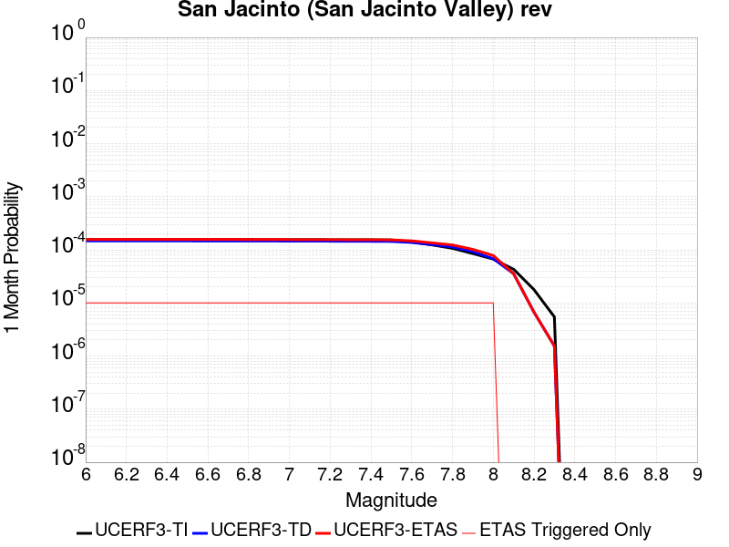 |  |  |

| Magnitude | 1 wk TI Prob | 1 wk TD Prob | 1 wk ETAS Prob | 1 wk ETAS/TD Gain | 1 wk ETAS Triggered Only | 1 mo TI Prob | 1 mo TD Prob | 1 mo ETAS Prob | 1 mo ETAS/TD Gain | 1 mo ETAS Triggered Only | 1 yr TI Prob | 1 yr TD Prob | 1 yr ETAS Prob | 1 yr ETAS/TD Gain | 1 yr ETAS Triggered Only | 10 yr TI Prob | 10 yr TD Prob | 10 yr ETAS Prob | 10 yr ETAS/TD Gain | 10 yr ETAS Triggered Only |
|-----|-----|-----|-----|-----|-----|-----|-----|-----|-----|-----|-----|-----|-----|-----|-----|-----|-----|-----|-----|-----|
| 6.0 | 3.652694E-5 | 3.4395853E-5 | 4.6607533E-5 | 1.3550335 | 1.22121E-5 | 1.5653463E-4 | 1.4740248E-4 | 1.5961277E-4 | 1.0828365 | 1.22121E-5 | 0.0019041431 | 0.0017931493 | 0.0018053395 | 1.0067983 | 1.22121E-5 | 0.018879099 | 0.018523198 | 0.01854717 | 1.0012941 | 2.44242E-5 |
| 6.1 | 3.652694E-5 | 3.4395853E-5 | 4.6607533E-5 | 1.3550335 | 1.22121E-5 | 1.5653463E-4 | 1.4740248E-4 | 1.5961277E-4 | 1.0828365 | 1.22121E-5 | 0.0019041431 | 0.0017931493 | 0.0018053395 | 1.0067983 | 1.22121E-5 | 0.018879099 | 0.018523198 | 0.01854717 | 1.0012941 | 2.44242E-5 |
| 6.2 | 3.652694E-5 | 3.4395853E-5 | 4.6607533E-5 | 1.3550335 | 1.22121E-5 | 1.5653463E-4 | 1.4740248E-4 | 1.5961277E-4 | 1.0828365 | 1.22121E-5 | 0.0019041431 | 0.0017931493 | 0.0018053395 | 1.0067983 | 1.22121E-5 | 0.018879099 | 0.018523198 | 0.01854717 | 1.0012941 | 2.44242E-5 |
| 6.3 | 3.652694E-5 | 3.4395853E-5 | 4.6607533E-5 | 1.3550335 | 1.22121E-5 | 1.5653463E-4 | 1.4740248E-4 | 1.5961277E-4 | 1.0828365 | 1.22121E-5 | 0.0019041431 | 0.0017931493 | 0.0018053395 | 1.0067983 | 1.22121E-5 | 0.018879099 | 0.018523198 | 0.01854717 | 1.0012941 | 2.44242E-5 |
| 6.4 | 3.646941E-5 | 3.431743E-5 | 4.652911E-5 | 1.3558449 | 1.22121E-5 | 1.5628811E-4 | 1.4706641E-4 | 1.5927672E-4 | 1.0830258 | 1.22121E-5 | 0.0019011468 | 0.001789065 | 0.0018012553 | 1.0068138 | 1.22121E-5 | 0.018849645 | 0.01848308 | 0.018507052 | 1.001297 | 2.44242E-5 |
| 6.5 | 3.646941E-5 | 3.431743E-5 | 4.652911E-5 | 1.3558449 | 1.22121E-5 | 1.5628811E-4 | 1.4706641E-4 | 1.5927672E-4 | 1.0830258 | 1.22121E-5 | 0.0019011468 | 0.001789065 | 0.0018012553 | 1.0068138 | 1.22121E-5 | 0.018849645 | 0.01848308 | 0.018507052 | 1.001297 | 2.44242E-5 |
| 6.6 | 3.6442503E-5 | 3.4280816E-5 | 4.6492496E-5 | 1.3562249 | 1.22121E-5 | 1.561728E-4 | 1.4690952E-4 | 1.5911982E-4 | 1.0831145 | 1.22121E-5 | 0.0018997455 | 0.0017871578 | 0.0017993482 | 1.006821 | 1.22121E-5 | 0.018835869 | 0.01846435 | 0.018488321 | 1.0012983 | 2.44242E-5 |
| 6.7 | 3.6432113E-5 | 3.4266388E-5 | 4.6478068E-5 | 1.356375 | 1.22121E-5 | 1.5612828E-4 | 1.4684768E-4 | 1.5905799E-4 | 1.0831494 | 1.22121E-5 | 0.0018992044 | 0.0017864066 | 0.0017985969 | 1.0068239 | 1.22121E-5 | 0.018830549 | 0.018456973 | 0.018480945 | 1.0012989 | 2.44242E-5 |
| 6.8 | 3.6409598E-5 | 3.4235443E-5 | 4.6447123E-5 | 1.3566971 | 1.22121E-5 | 1.560318E-4 | 1.4671509E-4 | 1.589254E-4 | 1.0832247 | 1.22121E-5 | 0.0018980318 | 0.0017847948 | 0.0017969852 | 1.0068301 | 1.22121E-5 | 0.018819023 | 0.018441128 | 0.018465102 | 1.0013 | 2.44242E-5 |
| 6.9 | 3.638078E-5 | 3.4195866E-5 | 4.640755E-5 | 1.3571099 | 1.22121E-5 | 1.5590832E-4 | 1.465455E-4 | 1.587558E-4 | 1.083321 | 1.22121E-5 | 0.0018965311 | 0.0017827335 | 0.0017949238 | 1.006838 | 1.22121E-5 | 0.018804269 | 0.018420862 | 0.018444836 | 1.0013015 | 2.44242E-5 |
| 7.0 | 3.6294874E-5 | 3.4077882E-5 | 4.6289566E-5 | 1.3583463 | 1.22121E-5 | 1.5554018E-4 | 1.460399E-4 | 1.5825022E-4 | 1.0836095 | 1.22121E-5 | 0.0018920569 | 0.0017765884 | 0.0017887788 | 1.0068617 | 1.22121E-5 | 0.018760284 | 0.018360443 | 0.01838442 | 1.0013058 | 2.44242E-5 |
| 7.1 | 3.6260717E-5 | 3.4034165E-5 | 4.624585E-5 | 1.3588066 | 1.22121E-5 | 1.5539382E-4 | 1.4585257E-4 | 1.5806289E-4 | 1.0837169 | 1.22121E-5 | 0.001890278 | 0.0017743113 | 0.0017865017 | 1.0068705 | 1.22121E-5 | 0.018742796 | 0.018338045 | 0.018362021 | 1.0013075 | 2.44242E-5 |
| 7.2 | 3.6210204E-5 | 3.3968383E-5 | 4.618007E-5 | 1.3595015 | 1.22121E-5 | 1.5517735E-4 | 1.4557068E-4 | 1.57781E-4 | 1.083879 | 1.22121E-5 | 0.001887647 | 0.001770885 | 0.0017830754 | 1.0068839 | 1.22121E-5 | 0.01871693 | 0.018304324 | 0.018328302 | 1.0013099 | 2.44242E-5 |
| 7.3 | 3.6119454E-5 | 3.385667E-5 | 4.606836E-5 | 1.3606877 | 1.22121E-5 | 1.5478847E-4 | 1.4509197E-4 | 1.573023E-4 | 1.0841558 | 1.22121E-5 | 0.0018829206 | 0.0017650661 | 0.0017772566 | 1.0069065 | 1.22121E-5 | 0.018670462 | 0.018246878 | 0.018270858 | 1.0013142 | 2.44242E-5 |
| 7.4 | 3.607848E-5 | 3.38042E-5 | 4.6015888E-5 | 1.3612477 | 1.22121E-5 | 1.5461289E-4 | 1.4486712E-4 | 1.5707745E-4 | 1.0842865 | 1.22121E-5 | 0.0018807866 | 0.001762333 | 0.0017745235 | 1.0069172 | 1.22121E-5 | 0.018649481 | 0.018219888 | 0.018243868 | 1.0013161 | 2.44242E-5 |
| 7.5 | 3.5856774E-5 | 3.361402E-5 | 4.5825705E-5 | 1.3632916 | 1.22121E-5 | 1.5366284E-4 | 1.4405213E-4 | 1.5626248E-4 | 1.0847633 | 1.22121E-5 | 0.0018692396 | 0.0017524265 | 0.0017646173 | 1.0069565 | 1.22121E-5 | 0.018535944 | 0.018121008 | 0.01814499 | 1.0013235 | 2.44242E-5 |
| 7.6 | 3.286655E-5 | 3.213729E-5 | 4.4349E-5 | 1.3799856 | 1.22121E-5 | 1.4084904E-4 | 1.3772398E-4 | 1.499344E-4 | 1.0886586 | 1.22121E-5 | 0.001713488 | 0.0016755019 | 0.0016876935 | 1.0072764 | 1.22121E-5 | 0.017003361 | 0.01734083 | 0.017364832 | 1.001384 | 2.44242E-5 |
| 7.7 | 2.8882527E-5 | 2.9233452E-5 | 4.1445193E-5 | 1.4177319 | 1.22121E-5 | 1.237764E-4 | 1.252802E-4 | 1.3749077E-4 | 1.0974661 | 1.22121E-5 | 0.0015059357 | 0.0015242205 | 0.0015364139 | 1.0079998 | 1.22121E-5 | 0.014957713 | 0.01582899 | 0.015853027 | 1.0015186 | 2.44242E-5 |
| 7.8 | 2.4950225E-5 | 2.6524469E-5 | 3.8736245E-5 | 1.4603966 | 1.22121E-5 | 1.0692515E-4 | 1.1367135E-4 | 1.2588206E-4 | 1.1074212 | 1.22121E-5 | 0.0013010362 | 0.0013830708 | 0.0013952662 | 1.0088174 | 1.22121E-5 | 0.012934455 | 0.014410337 | 0.014434409 | 1.0016705 | 2.44242E-5 |
| 7.9 | 1.9881603E-5 | 2.150498E-5 | 3.3716817E-5 | 1.5678608 | 1.22121E-5 | 8.520408E-5 | 9.2160946E-5 | 1.04371924E-4 | 1.1324962 | 1.22121E-5 | 0.001036866 | 0.0011214828 | 0.0011336812 | 1.010877 | 1.22121E-5 | 0.010320415 | 0.011775744 | 0.011787812 | 1.0010248 | 1.22121E-5 |
| 8.0 | 1.563292E-5 | 1.5935346E-5 | 2.814725E-5 | 1.7663409 | 1.22121E-5 | 6.6996516E-5 | 6.829255E-5 | 8.0503814E-5 | 1.1788082 | 1.22121E-5 | 8.153773E-4 | 8.311453E-4 | 8.433473E-4 | 1.0146809 | 1.22121E-5 | 0.00812392 | 0.008809454 | 0.008821558 | 1.001374 | 1.22121E-5 |
| 8.1 | 1.0045313E-5 | 8.300641E-6 | 8.300641E-6 | 1.0 | 0.0 | 4.305063E-5 | 3.5573692E-5 | 3.5573692E-5 | 1.0 | 0.0 | 5.2401534E-4 | 4.3302414E-4 | 4.3302414E-4 | 1.0 | 0.0 | 0.0052278144 | 0.0046584895 | 0.0046584895 | 1.0 | 0.0 |
| 8.2 | 4.1554413E-6 | 1.565228E-6 | 1.565228E-6 | 1.0 | 0.0 | 1.7808914E-5 | 6.708103E-6 | 6.708103E-6 | 1.0 | 0.0 | 2.1680194E-4 | 8.166812E-5 | 8.166812E-5 | 1.0 | 0.0 | 0.0021659054 | 9.481009E-4 | 9.481009E-4 | 1.0 | 0.0 |
| 8.3 | 1.2758221E-6 | 3.6140935E-7 | 3.6140935E-7 | 1.0 | 0.0 | 5.4677976E-6 | 1.5488963E-6 | 1.5488963E-6 | 1.0 | 0.0 | 6.65684E-5 | 1.8857654E-5 | 1.8857654E-5 | 1.0 | 0.0 | 6.6548464E-4 | 2.2746001E-4 | 2.2746001E-4 | 1.0 | 0.0 |

## Santa Ynez (West)
*[(top)](#table-of-contents)*

| 1 Week | 1 Month | 1 Year | 10 Year |
|-----|-----|-----|-----|
| 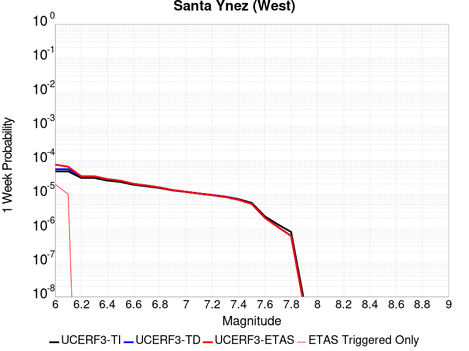 |  | 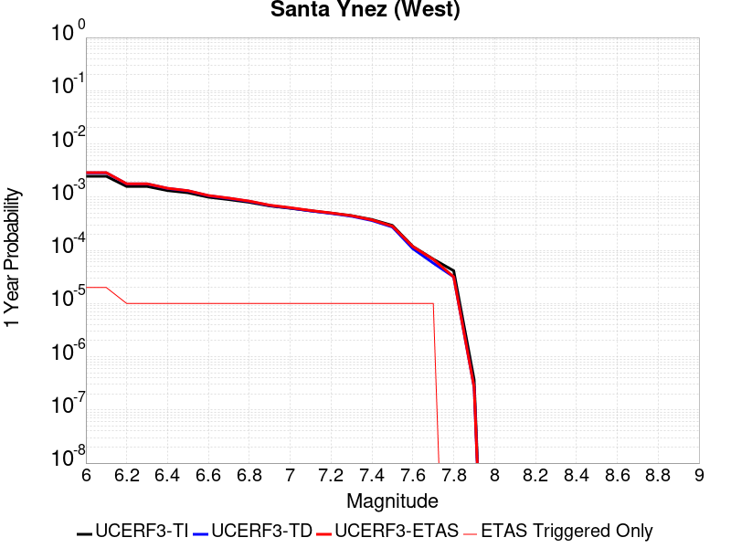 |  |

| Magnitude | 1 wk TI Prob | 1 wk TD Prob | 1 wk ETAS Prob | 1 wk ETAS/TD Gain | 1 wk ETAS Triggered Only | 1 mo TI Prob | 1 mo TD Prob | 1 mo ETAS Prob | 1 mo ETAS/TD Gain | 1 mo ETAS Triggered Only | 1 yr TI Prob | 1 yr TD Prob | 1 yr ETAS Prob | 1 yr ETAS/TD Gain | 1 yr ETAS Triggered Only | 10 yr TI Prob | 10 yr TD Prob | 10 yr ETAS Prob | 10 yr ETAS/TD Gain | 10 yr ETAS Triggered Only |
|-----|-----|-----|-----|-----|-----|-----|-----|-----|-----|-----|-----|-----|-----|-----|-----|-----|-----|-----|-----|-----|
| 6.0 | 4.7352758E-5 | 5.497185E-5 | 5.497185E-5 | 1.0 | 0.0 | 2.0292461E-4 | 2.3557404E-4 | 2.3557404E-4 | 1.0 | 0.0 | 0.0024678076 | 0.0028645147 | 0.0028645147 | 1.0 | 0.0 | 0.024405818 | 0.02830428 | 0.028316148 | 1.0004193 | 1.22121E-5 |
| 6.1 | 4.7352758E-5 | 5.497185E-5 | 5.497185E-5 | 1.0 | 0.0 | 2.0292461E-4 | 2.3557404E-4 | 2.3557404E-4 | 1.0 | 0.0 | 0.0024678076 | 0.0028645147 | 0.0028645147 | 1.0 | 0.0 | 0.024405818 | 0.02830428 | 0.028316148 | 1.0004193 | 1.22121E-5 |
| 6.2 | 3.0415853E-5 | 3.3924975E-5 | 3.3924975E-5 | 1.0 | 0.0 | 1.3034715E-4 | 1.4538487E-4 | 1.4538487E-4 | 1.0 | 0.0 | 0.0015858212 | 0.001768659 | 0.001768659 | 1.0 | 0.0 | 0.015745522 | 0.017549738 | 0.017561736 | 1.0006837 | 1.22121E-5 |
| 6.3 | 3.0415853E-5 | 3.3924975E-5 | 3.3924975E-5 | 1.0 | 0.0 | 1.3034715E-4 | 1.4538487E-4 | 1.4538487E-4 | 1.0 | 0.0 | 0.0015858212 | 0.001768659 | 0.001768659 | 1.0 | 0.0 | 0.015745522 | 0.017549738 | 0.017561736 | 1.0006837 | 1.22121E-5 |
| 6.4 | 2.5452082E-5 | 2.7912321E-5 | 2.7912321E-5 | 1.0 | 0.0 | 1.09075794E-4 | 1.1961886E-4 | 1.1961886E-4 | 1.0 | 0.0 | 0.0013271887 | 0.0014554035 | 0.0014554035 | 1.0 | 0.0 | 0.013192902 | 0.0144609 | 0.014472935 | 1.0008323 | 1.22121E-5 |
| 6.5 | 2.3143784E-5 | 2.512817E-5 | 2.512817E-5 | 1.0 | 0.0 | 9.9183875E-5 | 1.076878E-4 | 1.076878E-4 | 1.0 | 0.0 | 0.0012068948 | 0.0013103223 | 0.0013103223 | 1.0 | 0.0 | 0.012003611 | 0.013027636 | 0.0130396895 | 1.0009252 | 1.22121E-5 |
| 6.6 | 1.9118515E-5 | 2.0354279E-5 | 2.0354279E-5 | 1.0 | 0.0 | 8.193392E-5 | 8.722975E-5 | 8.722975E-5 | 1.0 | 0.0 | 9.97089E-4 | 0.0010615127 | 0.0010615127 | 1.0 | 0.0 | 0.00992627 | 0.010565333 | 0.010577416 | 1.0011437 | 1.22121E-5 |
| 6.7 | 1.722807E-5 | 1.8146295E-5 | 1.8146295E-5 | 1.0 | 0.0 | 7.3832496E-5 | 7.776755E-5 | 7.776755E-5 | 1.0 | 0.0 | 8.985399E-4 | 9.4641425E-4 | 9.4641425E-4 | 1.0 | 0.0 | 0.008949154 | 0.009424483 | 0.00943658 | 1.0012835 | 1.22121E-5 |
| 6.8 | 1.5317364E-5 | 1.5926444E-5 | 1.5926444E-5 | 1.0 | 0.0 | 6.56442E-5 | 6.825442E-5 | 6.825442E-5 | 1.0 | 0.0 | 7.98925E-4 | 8.306851E-4 | 8.306851E-4 | 1.0 | 0.0 | 0.007960589 | 0.0082762875 | 0.008288399 | 1.0014633 | 1.22121E-5 |
| 6.9 | 1.3071226E-5 | 1.3329593E-5 | 1.3329593E-5 | 1.0 | 0.0 | 5.6018336E-5 | 5.7125588E-5 | 5.7125588E-5 | 1.0 | 0.0 | 6.8180985E-4 | 6.9528434E-4 | 6.9528434E-4 | 1.0 | 0.0 | 0.0067972173 | 0.006931351 | 0.0069434782 | 1.0017496 | 1.22121E-5 |
| 7.0 | 1.1836986E-5 | 1.1932755E-5 | 1.1932755E-5 | 1.0 | 0.0 | 5.0728955E-5 | 5.113939E-5 | 5.113939E-5 | 1.0 | 0.0 | 6.1745E-4 | 6.2244583E-4 | 6.2244583E-4 | 1.0 | 0.0 | 0.006157372 | 0.0062072175 | 0.0062072175 | 1.0 | 0.0 |
| 7.1 | 1.0597169E-5 | 1.054218E-5 | 1.054218E-5 | 1.0 | 0.0 | 4.541565E-5 | 4.5179993E-5 | 4.5179993E-5 | 1.0 | 0.0 | 5.5279525E-4 | 5.499287E-4 | 5.499287E-4 | 1.0 | 0.0 | 0.0055142213 | 0.00548581 | 0.00548581 | 1.0 | 0.0 |
| 7.2 | 9.59113E-6 | 9.459124E-6 | 9.459124E-6 | 1.0 | 0.0 | 4.11042E-5 | 4.053848E-5 | 4.053848E-5 | 1.0 | 0.0 | 5.0032866E-4 | 4.934453E-4 | 4.934453E-4 | 1.0 | 0.0 | 0.004992037 | 0.004923615 | 0.004923615 | 1.0 | 0.0 |
| 7.3 | 8.586084E-6 | 8.379566E-6 | 8.379566E-6 | 1.0 | 0.0 | 3.679698E-5 | 3.5911937E-5 | 3.5911937E-5 | 1.0 | 0.0 | 4.4791115E-4 | 4.3714116E-4 | 4.3714116E-4 | 1.0 | 0.0 | 0.004470094 | 0.004362924 | 0.004362924 | 1.0 | 0.0 |
| 7.4 | 7.2622997E-6 | 6.9515286E-6 | 6.9515286E-6 | 1.0 | 0.0 | 3.112377E-5 | 2.979193E-5 | 2.979193E-5 | 1.0 | 0.0 | 3.78866E-4 | 3.6265736E-4 | 3.6265736E-4 | 1.0 | 0.0 | 0.0037822074 | 0.0036207556 | 0.0036207556 | 1.0 | 0.0 |
| 7.5 | 5.627296E-6 | 5.2515775E-6 | 5.2515775E-6 | 1.0 | 0.0 | 2.411676E-5 | 2.250657E-5 | 2.250657E-5 | 1.0 | 0.0 | 2.9358198E-4 | 2.7398375E-4 | 2.7398375E-4 | 1.0 | 0.0 | 0.0029319443 | 0.0027365317 | 0.0027365317 | 1.0 | 0.0 |
| 7.6 | 2.265244E-6 | 2.0608593E-6 | 2.0608593E-6 | 1.0 | 0.0 | 9.708152E-6 | 8.832224E-6 | 8.832224E-6 | 1.0 | 0.0 | 1.18190335E-4 | 1.0752711E-4 | 1.0752711E-4 | 1.0 | 0.0 | 0.001181275 | 0.0010747594 | 0.0010747594 | 1.0 | 0.0 |
| 7.7 | 1.3099874E-6 | 1.1016234E-6 | 1.1016234E-6 | 1.0 | 0.0 | 5.61422E-6 | 4.7212347E-6 | 4.7212347E-6 | 1.0 | 0.0 | 6.8350986E-5 | 5.747954E-5 | 5.747954E-5 | 1.0 | 0.0 | 6.832996E-4 | 5.7464914E-4 | 5.7464914E-4 | 1.0 | 0.0 |
| 7.8 | 7.903951E-7 | 6.071132E-7 | 6.071132E-7 | 1.0 | 0.0 | 3.3874032E-6 | 2.601911E-6 | 2.601911E-6 | 1.0 | 0.0 | 4.1240855E-5 | 3.167782E-5 | 3.167782E-5 | 1.0 | 0.0 | 4.12332E-4 | 3.1673437E-4 | 3.1673437E-4 | 1.0 | 0.0 |
| 7.9 | 7.0753297E-9 | 5.0899414E-9 | 5.0899414E-9 | 1.0 | 0.0 | 3.032284E-8 | 2.1814033E-8 | 2.1814033E-8 | 1.0 | 0.0 | 3.6918053E-7 | 2.6558584E-7 | 2.6558584E-7 | 1.0 | 0.0 | 3.691799E-6 | 2.6558562E-6 | 2.6558562E-6 | 1.0 | 0.0 |

## Great Valley 09 (Laguna Seca)
*[(top)](#table-of-contents)*

| 1 Week | 1 Month | 1 Year | 10 Year |
|-----|-----|-----|-----|
| 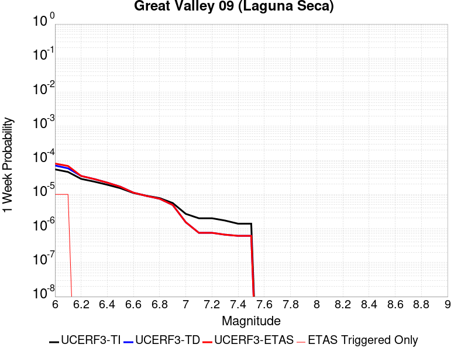 |  |  |  |

| Magnitude | 1 wk TI Prob | 1 wk TD Prob | 1 wk ETAS Prob | 1 wk ETAS/TD Gain | 1 wk ETAS Triggered Only | 1 mo TI Prob | 1 mo TD Prob | 1 mo ETAS Prob | 1 mo ETAS/TD Gain | 1 mo ETAS Triggered Only | 1 yr TI Prob | 1 yr TD Prob | 1 yr ETAS Prob | 1 yr ETAS/TD Gain | 1 yr ETAS Triggered Only | 10 yr TI Prob | 10 yr TD Prob | 10 yr ETAS Prob | 10 yr ETAS/TD Gain | 10 yr ETAS Triggered Only |
|-----|-----|-----|-----|-----|-----|-----|-----|-----|-----|-----|-----|-----|-----|-----|-----|-----|-----|-----|-----|-----|
| 6.0 | 5.4353277E-5 | 7.050156E-5 | 8.27128E-5 | 1.1732053 | 1.22121E-5 | 2.3292181E-4 | 3.0211333E-4 | 3.1432175E-4 | 1.04041 | 1.22121E-5 | 0.0028321352 | 0.0036721656 | 0.0036843326 | 1.0033134 | 1.22121E-5 | 0.02796312 | 0.03611518 | 0.036138725 | 1.0006518 | 2.44242E-5 |
| 6.1 | 4.5578287E-5 | 5.8220674E-5 | 7.043206E-5 | 1.2097431 | 1.22121E-5 | 1.953209E-4 | 2.494915E-4 | 2.6170057E-4 | 1.0489358 | 1.22121E-5 | 0.0023754383 | 0.0030334084 | 0.0030455834 | 1.0040137 | 1.22121E-5 | 0.023502063 | 0.029919315 | 0.029943008 | 1.0007919 | 2.44242E-5 |
| 6.2 | 2.8536782E-5 | 3.4737008E-5 | 3.4737008E-5 | 1.0 | 0.0 | 1.2229476E-4 | 1.4886151E-4 | 1.4886151E-4 | 1.0 | 0.0 | 0.0014879217 | 0.0018108002 | 0.0018108002 | 1.0 | 0.0 | 0.014779986 | 0.017957991 | 0.017969983 | 1.0006678 | 1.22121E-5 |
| 6.3 | 2.3698774E-5 | 2.8213091E-5 | 2.8213091E-5 | 1.0 | 0.0 | 1.01562226E-4 | 1.20904624E-4 | 1.20904624E-4 | 1.0 | 0.0 | 0.0012358186 | 0.0014710116 | 0.0014710116 | 1.0 | 0.0 | 0.012289686 | 0.014611243 | 0.014623277 | 1.0008236 | 1.22121E-5 |
| 6.4 | 1.9191197E-5 | 2.2123037E-5 | 2.2123037E-5 | 1.0 | 0.0 | 8.2245395E-5 | 9.480646E-5 | 9.480646E-5 | 1.0 | 0.0 | 0.0010008777 | 0.0011536357 | 0.0011536357 | 1.0 | 0.0 | 0.009963818 | 0.011476876 | 0.011488948 | 1.0010519 | 1.22121E-5 |
| 6.5 | 1.5203241E-5 | 1.6802105E-5 | 1.6802105E-5 | 1.0 | 0.0 | 6.5155116E-5 | 7.2003866E-5 | 7.2003866E-5 | 1.0 | 0.0 | 7.9297484E-4 | 8.762611E-4 | 8.762611E-4 | 1.0 | 0.0 | 0.007901512 | 0.008729468 | 0.008741573 | 1.0013868 | 1.22121E-5 |
| 6.6 | 1.0984925E-5 | 1.1242545E-5 | 1.1242545E-5 | 1.0 | 0.0 | 4.70774E-5 | 4.818147E-5 | 4.818147E-5 | 1.0 | 0.0 | 5.730166E-4 | 5.8645394E-4 | 5.8645394E-4 | 1.0 | 0.0 | 0.005715413 | 0.0058494597 | 0.0058494597 | 1.0 | 0.0 |
| 6.7 | 9.134616E-6 | 9.019856E-6 | 9.019856E-6 | 1.0 | 0.0 | 3.9147766E-5 | 3.8655966E-5 | 3.8655966E-5 | 1.0 | 0.0 | 4.7651984E-4 | 4.7053714E-4 | 4.7053714E-4 | 1.0 | 0.0 | 0.004754993 | 0.0046956534 | 0.0046956534 | 1.0 | 0.0 |
| 6.8 | 7.785589E-6 | 7.451913E-6 | 7.451913E-6 | 1.0 | 0.0 | 3.3366385E-5 | 3.193639E-5 | 3.193639E-5 | 1.0 | 0.0 | 4.0616E-4 | 3.887582E-4 | 3.887582E-4 | 1.0 | 0.0 | 0.0040541845 | 0.0038809853 | 0.0038809853 | 1.0 | 0.0 |
| 6.9 | 5.579095E-6 | 4.8984716E-6 | 4.8984716E-6 | 1.0 | 0.0 | 2.3910188E-5 | 2.099329E-5 | 2.099329E-5 | 1.0 | 0.0 | 2.9106764E-4 | 2.555647E-4 | 2.555647E-4 | 1.0 | 0.0 | 0.002906867 | 0.0025528453 | 0.0025528453 | 1.0 | 0.0 |
| 7.0 | 2.6816688E-6 | 1.521607E-6 | 1.521607E-6 | 1.0 | 0.0 | 1.1492816E-5 | 6.521157E-6 | 6.521157E-6 | 1.0 | 0.0 | 1.3991605E-4 | 7.939228E-5 | 7.939228E-5 | 1.0 | 0.0 | 0.0013982799 | 7.9364795E-4 | 7.9364795E-4 | 1.0 | 0.0 |
| 7.1 | 1.9951021E-6 | 7.4537974E-7 | 7.4537974E-7 | 1.0 | 0.0 | 8.55041E-6 | 3.194481E-6 | 3.194481E-6 | 1.0 | 0.0 | 1.0409627E-4 | 3.8892154E-5 | 3.8892154E-5 | 1.0 | 0.0 | 0.0010404752 | 3.8885762E-4 | 3.8885762E-4 | 1.0 | 0.0 |
| 7.2 | 1.9951021E-6 | 7.4537974E-7 | 7.4537974E-7 | 1.0 | 0.0 | 8.55041E-6 | 3.194481E-6 | 3.194481E-6 | 1.0 | 0.0 | 1.0409627E-4 | 3.8892154E-5 | 3.8892154E-5 | 1.0 | 0.0 | 0.0010404752 | 3.8885762E-4 | 3.8885762E-4 | 1.0 | 0.0 |
| 7.3 | 1.7087556E-6 | 6.5788566E-7 | 6.5788566E-7 | 1.0 | 0.0 | 7.3232177E-6 | 2.8195072E-6 | 2.8195072E-6 | 1.0 | 0.0 | 8.915652E-5 | 3.4327E-5 | 3.4327E-5 | 1.0 | 0.0 | 8.9120766E-4 | 3.43221E-4 | 3.43221E-4 | 1.0 | 0.0 |
| 7.4 | 1.3804846E-6 | 6.0738313E-7 | 6.0738313E-7 | 1.0 | 0.0 | 5.916349E-6 | 2.6030682E-6 | 2.6030682E-6 | 1.0 | 0.0 | 7.2029165E-5 | 3.1691936E-5 | 3.1691936E-5 | 1.0 | 0.0 | 7.200583E-4 | 3.1687817E-4 | 3.1687817E-4 | 1.0 | 0.0 |
| 7.5 | 1.3804846E-6 | 6.0738313E-7 | 6.0738313E-7 | 1.0 | 0.0 | 5.916349E-6 | 2.6030682E-6 | 2.6030682E-6 | 1.0 | 0.0 | 7.2029165E-5 | 3.1691936E-5 | 3.1691936E-5 | 1.0 | 0.0 | 7.200583E-4 | 3.1687817E-4 | 3.1687817E-4 | 1.0 | 0.0 |

## Coronado Bank alt1
*[(top)](#table-of-contents)*

| 1 Week | 1 Month | 1 Year | 10 Year |
|-----|-----|-----|-----|
| 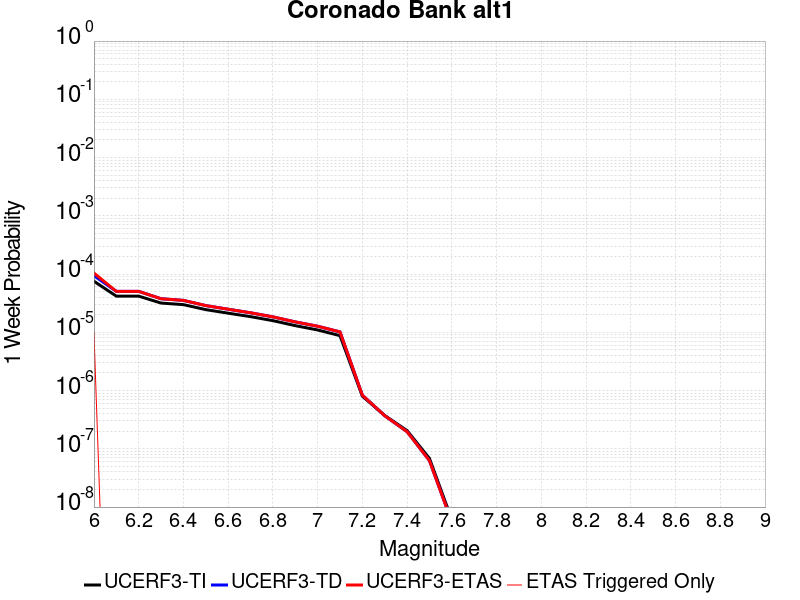 |  |  | 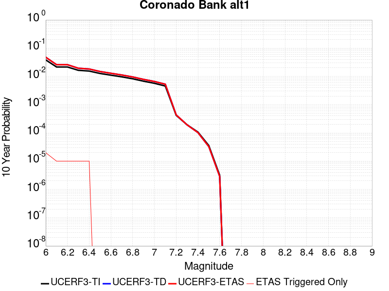 |

| Magnitude | 1 wk TI Prob | 1 wk TD Prob | 1 wk ETAS Prob | 1 wk ETAS/TD Gain | 1 wk ETAS Triggered Only | 1 mo TI Prob | 1 mo TD Prob | 1 mo ETAS Prob | 1 mo ETAS/TD Gain | 1 mo ETAS Triggered Only | 1 yr TI Prob | 1 yr TD Prob | 1 yr ETAS Prob | 1 yr ETAS/TD Gain | 1 yr ETAS Triggered Only | 10 yr TI Prob | 10 yr TD Prob | 10 yr ETAS Prob | 10 yr ETAS/TD Gain | 10 yr ETAS Triggered Only |
|-----|-----|-----|-----|-----|-----|-----|-----|-----|-----|-----|-----|-----|-----|-----|-----|-----|-----|-----|-----|-----|
| 6.0 | 7.533492E-5 | 9.3948496E-5 | 1.06159445E-4 | 1.129975 | 1.22121E-5 | 3.22824E-4 | 4.0257853E-4 | 4.1478573E-4 | 1.0303224 | 1.22121E-5 | 0.0039233007 | 0.0048909336 | 0.004903086 | 1.0024847 | 1.22121E-5 | 0.03854755 | 0.04790326 | 0.04792651 | 1.0004854 | 2.44242E-5 |
| 6.1 | 4.1807285E-5 | 5.0492545E-5 | 5.0492545E-5 | 1.0 | 0.0 | 1.7916178E-4 | 2.1637927E-4 | 2.1637927E-4 | 1.0 | 0.0 | 0.0021791123 | 0.0026313327 | 0.0026313327 | 1.0 | 0.0 | 0.021578677 | 0.026010904 | 0.0260228 | 1.0004573 | 1.22121E-5 |
| 6.2 | 4.1807285E-5 | 5.0492545E-5 | 5.0492545E-5 | 1.0 | 0.0 | 1.7916178E-4 | 2.1637927E-4 | 2.1637927E-4 | 1.0 | 0.0 | 0.0021791123 | 0.0026313327 | 0.0026313327 | 1.0 | 0.0 | 0.021578677 | 0.026010904 | 0.0260228 | 1.0004573 | 1.22121E-5 |
| 6.3 | 3.1793104E-5 | 3.7710925E-5 | 3.7710925E-5 | 1.0 | 0.0 | 1.3624904E-4 | 1.6160845E-4 | 1.6160845E-4 | 1.0 | 0.0 | 0.0016575698 | 0.0019658383 | 0.0019658383 | 1.0 | 0.0 | 0.016452603 | 0.019488368 | 0.019500343 | 1.0006144 | 1.22121E-5 |
| 6.4 | 2.9878007E-5 | 3.533562E-5 | 3.533562E-5 | 1.0 | 0.0 | 1.2804232E-4 | 1.5142979E-4 | 1.5142979E-4 | 1.0 | 0.0 | 0.0015578003 | 0.0018421296 | 0.0018421296 | 1.0 | 0.0 | 0.015469253 | 0.018272351 | 0.018284341 | 1.0006561 | 1.22121E-5 |
| 6.5 | 2.4512565E-5 | 2.8763909E-5 | 2.8763909E-5 | 1.0 | 0.0 | 1.0504962E-4 | 1.2326823E-4 | 1.2326823E-4 | 1.0 | 0.0 | 0.0012782287 | 0.0014997851 | 0.0014997851 | 1.0 | 0.0 | 0.012709012 | 0.014899614 | 0.014899614 | 1.0 | 0.0 |
| 6.6 | 2.1317413E-5 | 2.4906556E-5 | 2.4906556E-5 | 1.0 | 0.0 | 9.135714E-5 | 1.06738145E-4 | 1.06738145E-4 | 1.0 | 0.0 | 0.0011117056 | 0.0012987846 | 0.0012987846 | 1.0 | 0.0 | 0.011061605 | 0.0129143465 | 0.0129143465 | 1.0 | 0.0 |
| 6.7 | 1.8585655E-5 | 2.1634783E-5 | 2.1634783E-5 | 1.0 | 0.0 | 7.9650374E-5 | 9.2717324E-5 | 9.2717324E-5 | 1.0 | 0.0 | 9.6931186E-4 | 0.0011282694 | 0.0011282694 | 1.0 | 0.0 | 0.0096509475 | 0.011227572 | 0.011227572 | 1.0 | 0.0 |
| 6.8 | 1.5862879E-5 | 1.8419394E-5 | 1.8419394E-5 | 1.0 | 0.0 | 6.798199E-5 | 7.8937985E-5 | 7.8937985E-5 | 1.0 | 0.0 | 8.273665E-4 | 9.6066546E-4 | 9.6066546E-4 | 1.0 | 0.0 | 0.008242928 | 0.009567108 | 0.009567108 | 1.0 | 0.0 |
| 6.9 | 1.3021509E-5 | 1.5095199E-5 | 1.5095199E-5 | 1.0 | 0.0 | 5.5805274E-5 | 6.4692205E-5 | 6.4692205E-5 | 1.0 | 0.0 | 6.792174E-4 | 7.873611E-4 | 7.873611E-4 | 1.0 | 0.0 | 0.006771452 | 0.007847538 | 0.007847538 | 1.0 | 0.0 |
| 7.0 | 1.0974371E-5 | 1.2720049E-5 | 1.2720049E-5 | 1.0 | 0.0 | 4.7032172E-5 | 5.4513454E-5 | 5.4513454E-5 | 1.0 | 0.0 | 5.7246623E-4 | 6.6351675E-4 | 6.6351675E-4 | 1.0 | 0.0 | 0.0057099373 | 0.006617106 | 0.006617106 | 1.0 | 0.0 |
| 7.1 | 8.766221E-6 | 1.0163788E-5 | 1.0163788E-5 | 1.0 | 0.0 | 3.7568978E-5 | 4.355846E-5 | 4.355846E-5 | 1.0 | 0.0 | 4.573063E-4 | 5.302124E-4 | 5.302124E-4 | 1.0 | 0.0 | 0.0045636636 | 0.0052911737 | 0.0052911737 | 1.0 | 0.0 |
| 7.2 | 8.026024E-7 | 8.33175E-7 | 8.33175E-7 | 1.0 | 0.0 | 3.43972E-6 | 3.5707453E-6 | 3.5707453E-6 | 1.0 | 0.0 | 4.1877785E-5 | 4.3472966E-5 | 4.3472966E-5 | 1.0 | 0.0 | 4.1869894E-4 | 4.346457E-4 | 4.346457E-4 | 1.0 | 0.0 |
| 7.3 | 3.7293114E-7 | 3.7000905E-7 | 3.7000905E-7 | 1.0 | 0.0 | 1.5982754E-6 | 1.5857521E-6 | 1.5857521E-6 | 1.0 | 0.0 | 1.9458828E-5 | 1.930636E-5 | 1.930636E-5 | 1.0 | 0.0 | 1.9457124E-4 | 1.930469E-4 | 1.930469E-4 | 1.0 | 0.0 |
| 7.4 | 2.0557036E-7 | 1.9674341E-7 | 1.9674341E-7 | 1.0 | 0.0 | 8.810155E-7 | 8.431858E-7 | 8.431858E-7 | 1.0 | 0.0 | 1.0726311E-5 | 1.0265739E-5 | 1.0265739E-5 | 1.0 | 0.0 | 1.0725793E-4 | 1.0265268E-4 | 1.0265268E-4 | 1.0 | 0.0 |
| 7.5 | 6.845446E-8 | 6.279365E-8 | 6.279365E-8 | 1.0 | 0.0 | 2.9337625E-7 | 2.6911562E-7 | 2.6911562E-7 | 1.0 | 0.0 | 3.5718497E-6 | 3.2764776E-6 | 3.2764776E-6 | 1.0 | 0.0 | 3.5717923E-5 | 3.2764303E-5 | 3.2764303E-5 | 1.0 | 0.0 |
| 7.6 | 6.0975145E-9 | 5.531848E-9 | 5.531848E-9 | 1.0 | 0.0 | 2.6132206E-8 | 2.370792E-8 | 2.370792E-8 | 1.0 | 0.0 | 3.1815955E-7 | 2.886439E-7 | 2.886439E-7 | 1.0 | 0.0 | 3.181591E-6 | 2.8864363E-6 | 2.8864363E-6 | 1.0 | 0.0 |

## Big Pine (East)
*[(top)](#table-of-contents)*

| 1 Week | 1 Month | 1 Year | 10 Year |
|-----|-----|-----|-----|
| 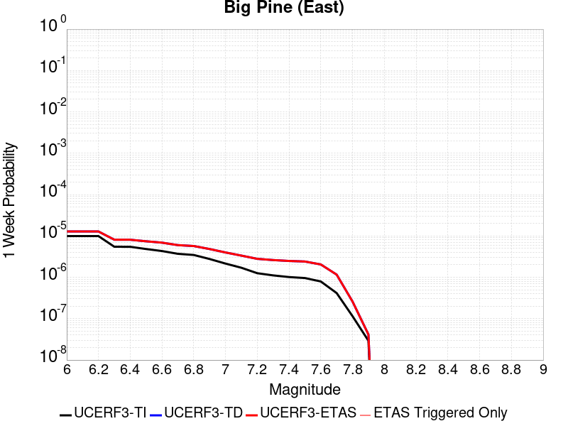 |  |  | 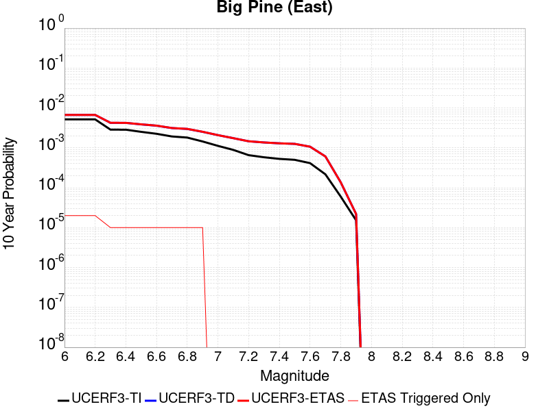 |

| Magnitude | 1 wk TI Prob | 1 wk TD Prob | 1 wk ETAS Prob | 1 wk ETAS/TD Gain | 1 wk ETAS Triggered Only | 1 mo TI Prob | 1 mo TD Prob | 1 mo ETAS Prob | 1 mo ETAS/TD Gain | 1 mo ETAS Triggered Only | 1 yr TI Prob | 1 yr TD Prob | 1 yr ETAS Prob | 1 yr ETAS/TD Gain | 1 yr ETAS Triggered Only | 10 yr TI Prob | 10 yr TD Prob | 10 yr ETAS Prob | 10 yr ETAS/TD Gain | 10 yr ETAS Triggered Only |
|-----|-----|-----|-----|-----|-----|-----|-----|-----|-----|-----|-----|-----|-----|-----|-----|-----|-----|-----|-----|-----|
| 6.0 | 9.916913E-6 | 1.2816734E-5 | 1.2816734E-5 | 1.0 | 0.0 | 4.250036E-5 | 5.4927827E-5 | 5.4927827E-5 | 1.0 | 0.0 | 5.173191E-4 | 6.6856324E-4 | 6.6856324E-4 | 1.0 | 0.0 | 0.0051611643 | 0.0066703134 | 0.006694575 | 1.0036372 | 2.44242E-5 |
| 6.1 | 9.916913E-6 | 1.2816734E-5 | 1.2816734E-5 | 1.0 | 0.0 | 4.250036E-5 | 5.4927827E-5 | 5.4927827E-5 | 1.0 | 0.0 | 5.173191E-4 | 6.6856324E-4 | 6.6856324E-4 | 1.0 | 0.0 | 0.0051611643 | 0.0066703134 | 0.006694575 | 1.0036372 | 2.44242E-5 |
| 6.2 | 9.916913E-6 | 1.2816734E-5 | 1.2816734E-5 | 1.0 | 0.0 | 4.250036E-5 | 5.4927827E-5 | 5.4927827E-5 | 1.0 | 0.0 | 5.173191E-4 | 6.6856324E-4 | 6.6856324E-4 | 1.0 | 0.0 | 0.0051611643 | 0.0066703134 | 0.006694575 | 1.0036372 | 2.44242E-5 |
| 6.3 | 5.479711E-6 | 8.112708E-6 | 8.112708E-6 | 1.0 | 0.0 | 2.3484265E-5 | 3.4768305E-5 | 3.4768305E-5 | 1.0 | 0.0 | 2.858834E-4 | 4.2322508E-4 | 4.2322508E-4 | 1.0 | 0.0 | 0.0028551589 | 0.0042271195 | 0.00423928 | 1.0028768 | 1.22121E-5 |
| 6.4 | 5.465009E-6 | 8.097002E-6 | 8.097002E-6 | 1.0 | 0.0 | 2.3421257E-5 | 3.470099E-5 | 3.470099E-5 | 1.0 | 0.0 | 2.851165E-4 | 4.224059E-4 | 4.224059E-4 | 1.0 | 0.0 | 0.0028475097 | 0.0042189583 | 0.004231119 | 1.0028824 | 1.22121E-5 |
| 6.5 | 4.826767E-6 | 7.4220593E-6 | 7.4220593E-6 | 1.0 | 0.0 | 2.068598E-5 | 3.1808453E-5 | 3.1808453E-5 | 1.0 | 0.0 | 2.518227E-4 | 3.8720187E-4 | 3.8720187E-4 | 1.0 | 0.0 | 0.0025153751 | 0.0038681594 | 0.003880324 | 1.0031449 | 1.22121E-5 |
| 6.6 | 4.3146847E-6 | 6.881996E-6 | 6.881996E-6 | 1.0 | 0.0 | 1.8491375E-5 | 2.949395E-5 | 2.949395E-5 | 1.0 | 0.0 | 2.2510924E-4 | 3.590321E-4 | 3.590321E-4 | 1.0 | 0.0 | 0.0022488134 | 0.0035873752 | 0.0035995436 | 1.003392 | 1.22121E-5 |
| 6.7 | 3.6968106E-6 | 5.995246E-6 | 5.995246E-6 | 1.0 | 0.0 | 1.5843378E-5 | 2.5693666E-5 | 2.5693666E-5 | 1.0 | 0.0 | 1.9287605E-4 | 3.12777E-4 | 3.12777E-4 | 1.0 | 0.0 | 0.0019270873 | 0.0031261323 | 0.0031383063 | 1.0038942 | 1.22121E-5 |
| 6.8 | 3.4671132E-6 | 5.7019565E-6 | 5.7019565E-6 | 1.0 | 0.0 | 1.4858972E-5 | 2.4436735E-5 | 2.4436735E-5 | 1.0 | 0.0 | 1.8089297E-4 | 2.9747808E-4 | 2.9747808E-4 | 1.0 | 0.0 | 0.0018074579 | 0.0029735544 | 0.0029857303 | 1.0040947 | 1.22121E-5 |
| 6.9 | 2.7686972E-6 | 4.8250195E-6 | 4.8250195E-6 | 1.0 | 0.0 | 1.1865792E-5 | 2.0678495E-5 | 2.0678495E-5 | 1.0 | 0.0 | 1.4445644E-4 | 2.5173233E-4 | 2.5173233E-4 | 1.0 | 0.0 | 0.0014436257 | 0.0025171598 | 0.002529341 | 1.0048393 | 1.22121E-5 |
| 7.0 | 2.1472624E-6 | 3.9848555E-6 | 3.9848555E-6 | 1.0 | 0.0 | 9.20252E-6 | 1.7077842E-5 | 1.7077842E-5 | 1.0 | 0.0 | 1.12034926E-4 | 2.0790343E-4 | 2.0790343E-4 | 1.0 | 0.0 | 0.0011197845 | 0.002079745 | 0.002079745 | 1.0 | 0.0 |
| 7.1 | 1.7018335E-6 | 3.3447075E-6 | 3.3447075E-6 | 1.0 | 0.0 | 7.293552E-6 | 1.4334384E-5 | 1.4334384E-5 | 1.0 | 0.0 | 8.879537E-5 | 1.745075E-4 | 1.745075E-4 | 1.0 | 0.0 | 8.87599E-4 | 0.0017463288 | 0.0017463288 | 1.0 | 0.0 |
| 7.2 | 1.25603E-6 | 2.794325E-6 | 2.794325E-6 | 1.0 | 0.0 | 5.3829745E-6 | 1.1975625E-5 | 1.1975625E-5 | 1.0 | 0.0 | 6.553574E-5 | 1.457937E-4 | 1.457937E-4 | 1.0 | 0.0 | 6.551642E-4 | 0.0014595803 | 0.0014595803 | 1.0 | 0.0 |
| 7.3 | 1.112297E-6 | 2.6101818E-6 | 2.6101818E-6 | 1.0 | 0.0 | 4.7669787E-6 | 1.11864465E-5 | 1.11864465E-5 | 1.0 | 0.0 | 5.803642E-5 | 1.3618669E-4 | 1.3618669E-4 | 1.0 | 0.0 | 5.802127E-4 | 0.0013634646 | 0.0013634646 | 1.0 | 0.0 |
| 7.4 | 1.0137181E-6 | 2.483348E-6 | 2.483348E-6 | 1.0 | 0.0 | 4.3444993E-6 | 1.0642877E-5 | 1.0642877E-5 | 1.0 | 0.0 | 5.2892992E-5 | 1.2956954E-4 | 1.2956954E-4 | 1.0 | 0.0 | 5.288041E-4 | 0.0012971561 | 0.0012971561 | 1.0 | 0.0 |
| 7.5 | 9.598608E-7 | 2.4070087E-6 | 2.4070087E-6 | 1.0 | 0.0 | 4.1136827E-6 | 1.0315712E-5 | 1.0315712E-5 | 1.0 | 0.0 | 5.0082934E-5 | 1.2558677E-4 | 1.2558677E-4 | 1.0 | 0.0 | 5.007165E-4 | 0.001257182 | 0.001257182 | 1.0 | 0.0 |
| 7.6 | 7.929459E-7 | 2.0447355E-6 | 2.0447355E-6 | 1.0 | 0.0 | 3.3983351E-6 | 8.763124E-6 | 8.763124E-6 | 1.0 | 0.0 | 4.1373947E-5 | 1.06685984E-4 | 1.06685984E-4 | 1.0 | 0.0 | 4.1366243E-4 | 0.0010684599 | 0.0010684599 | 1.0 | 0.0 |
| 7.7 | 4.155788E-7 | 1.1604716E-6 | 1.1604716E-6 | 1.0 | 0.0 | 1.7810507E-6 | 4.9734404E-6 | 4.9734404E-6 | 1.0 | 0.0 | 2.1684076E-5 | 6.054999E-5 | 6.054999E-5 | 1.0 | 0.0 | 2.1681961E-4 | 6.0852885E-4 | 6.0852885E-4 | 1.0 | 0.0 |
| 7.8 | 1.14666925E-7 | 2.5918186E-7 | 2.5918186E-7 | 1.0 | 0.0 | 4.914296E-7 | 1.110779E-6 | 1.110779E-6 | 1.0 | 0.0 | 5.9831386E-6 | 1.3523654E-5 | 1.3523654E-5 | 1.0 | 0.0 | 5.9829777E-5 | 1.3633117E-4 | 1.3633117E-4 | 1.0 | 0.0 |
| 7.9 | 2.9231824E-8 | 4.1460694E-8 | 4.1460694E-8 | 1.0 | 0.0 | 1.2527924E-7 | 1.7768868E-7 | 1.7768868E-7 | 1.0 | 0.0 | 1.5252737E-6 | 2.1633577E-6 | 2.1633577E-6 | 1.0 | 0.0 | 1.5252632E-5 | 2.1966041E-5 | 2.1966041E-5 | 1.0 | 0.0 |

## Santa Ynez (East)
*[(top)](#table-of-contents)*

| 1 Week | 1 Month | 1 Year | 10 Year |
|-----|-----|-----|-----|
| 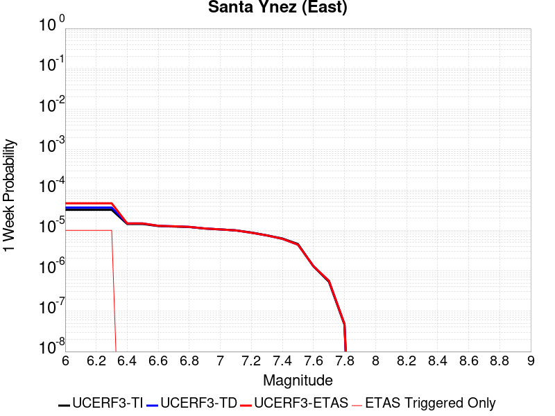 |  | 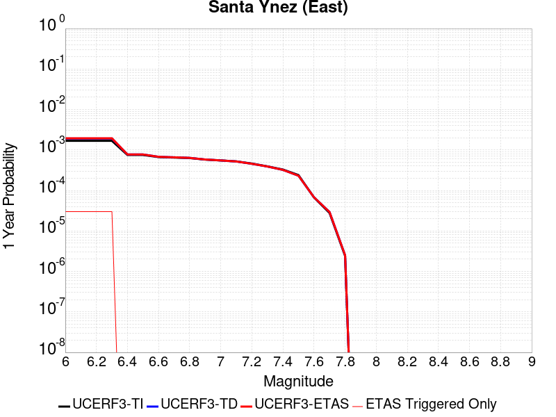 | 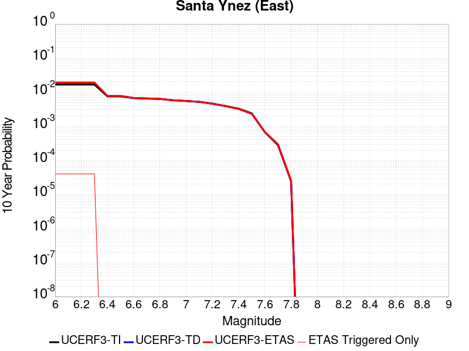 |

| Magnitude | 1 wk TI Prob | 1 wk TD Prob | 1 wk ETAS Prob | 1 wk ETAS/TD Gain | 1 wk ETAS Triggered Only | 1 mo TI Prob | 1 mo TD Prob | 1 mo ETAS Prob | 1 mo ETAS/TD Gain | 1 mo ETAS Triggered Only | 1 yr TI Prob | 1 yr TD Prob | 1 yr ETAS Prob | 1 yr ETAS/TD Gain | 1 yr ETAS Triggered Only | 10 yr TI Prob | 10 yr TD Prob | 10 yr ETAS Prob | 10 yr ETAS/TD Gain | 10 yr ETAS Triggered Only |
|-----|-----|-----|-----|-----|-----|-----|-----|-----|-----|-----|-----|-----|-----|-----|-----|-----|-----|-----|-----|-----|
| 6.0 | 3.2269712E-5 | 3.6750334E-5 | 3.6750334E-5 | 1.0 | 0.0 | 1.3829143E-4 | 1.5749525E-4 | 1.5749525E-4 | 1.0 | 0.0 | 0.0016823979 | 0.0019164077 | 0.0019285964 | 1.0063602 | 1.22121E-5 | 0.016697178 | 0.019056354 | 0.019080313 | 1.0012573 | 2.44242E-5 |
| 6.1 | 3.2269712E-5 | 3.6750334E-5 | 3.6750334E-5 | 1.0 | 0.0 | 1.3829143E-4 | 1.5749525E-4 | 1.5749525E-4 | 1.0 | 0.0 | 0.0016823979 | 0.0019164077 | 0.0019285964 | 1.0063602 | 1.22121E-5 | 0.016697178 | 0.019056354 | 0.019080313 | 1.0012573 | 2.44242E-5 |
| 6.2 | 3.2269712E-5 | 3.6750334E-5 | 3.6750334E-5 | 1.0 | 0.0 | 1.3829143E-4 | 1.5749525E-4 | 1.5749525E-4 | 1.0 | 0.0 | 0.0016823979 | 0.0019164077 | 0.0019285964 | 1.0063602 | 1.22121E-5 | 0.016697178 | 0.019056354 | 0.019080313 | 1.0012573 | 2.44242E-5 |
| 6.3 | 3.2269712E-5 | 3.6750334E-5 | 3.6750334E-5 | 1.0 | 0.0 | 1.3829143E-4 | 1.5749525E-4 | 1.5749525E-4 | 1.0 | 0.0 | 0.0016823979 | 0.0019164077 | 0.0019285964 | 1.0063602 | 1.22121E-5 | 0.016697178 | 0.019056354 | 0.019080313 | 1.0012573 | 2.44242E-5 |
| 6.4 | 1.4404779E-5 | 1.4849345E-5 | 1.4849345E-5 | 1.0 | 0.0 | 6.1733306E-5 | 6.363852E-5 | 6.363852E-5 | 1.0 | 0.0 | 7.513438E-4 | 7.7452866E-4 | 7.7452866E-4 | 1.0 | 0.0 | 0.0074880854 | 0.0077188425 | 0.0077188425 | 1.0 | 0.0 |
| 6.5 | 1.4404779E-5 | 1.4849345E-5 | 1.4849345E-5 | 1.0 | 0.0 | 6.1733306E-5 | 6.363852E-5 | 6.363852E-5 | 1.0 | 0.0 | 7.513438E-4 | 7.7452866E-4 | 7.7452866E-4 | 1.0 | 0.0 | 0.0074880854 | 0.0077188425 | 0.0077188425 | 1.0 | 0.0 |
| 6.6 | 1.280208E-5 | 1.3011917E-5 | 1.3011917E-5 | 1.0 | 0.0 | 5.4864904E-5 | 5.5764176E-5 | 5.5764176E-5 | 1.0 | 0.0 | 6.6777546E-4 | 6.7871914E-4 | 6.7871914E-4 | 1.0 | 0.0 | 0.006657724 | 0.0067666727 | 0.0067666727 | 1.0 | 0.0 |
| 6.7 | 1.2457027E-5 | 1.26284385E-5 | 1.26284385E-5 | 1.0 | 0.0 | 5.3386164E-5 | 5.4120766E-5 | 5.4120766E-5 | 1.0 | 0.0 | 6.497827E-4 | 6.5872277E-4 | 6.5872277E-4 | 1.0 | 0.0 | 0.00647886 | 0.0065678996 | 0.0065678996 | 1.0 | 0.0 |
| 6.8 | 1.2095134E-5 | 1.2230887E-5 | 1.2230887E-5 | 1.0 | 0.0 | 5.1835254E-5 | 5.241704E-5 | 5.241704E-5 | 1.0 | 0.0 | 6.309115E-4 | 6.379922E-4 | 6.379922E-4 | 1.0 | 0.0 | 0.0062912325 | 0.006361794 | 0.006361794 | 1.0 | 0.0 |
| 6.9 | 1.1104036E-5 | 1.1157322E-5 | 1.1157322E-5 | 1.0 | 0.0 | 4.758786E-5 | 4.7816222E-5 | 4.7816222E-5 | 1.0 | 0.0 | 5.7922816E-4 | 5.820083E-4 | 5.820083E-4 | 1.0 | 0.0 | 0.005777207 | 0.0058049858 | 0.0058049858 | 1.0 | 0.0 |
| 7.0 | 1.0577444E-5 | 1.0581656E-5 | 1.0581656E-5 | 1.0 | 0.0 | 4.5331115E-5 | 4.534917E-5 | 4.534917E-5 | 1.0 | 0.0 | 5.5176654E-4 | 5.519875E-4 | 5.519875E-4 | 1.0 | 0.0 | 0.0055039856 | 0.0055063027 | 0.0055063027 | 1.0 | 0.0 |
| 7.1 | 1.0021775E-5 | 9.980964E-6 | 9.980964E-6 | 1.0 | 0.0 | 4.294976E-5 | 4.2774867E-5 | 4.2774867E-5 | 1.0 | 0.0 | 5.2278786E-4 | 5.206607E-4 | 5.206607E-4 | 1.0 | 0.0 | 0.0052155964 | 0.0051945415 | 0.0051945415 | 1.0 | 0.0 |
| 7.2 | 8.874109E-6 | 8.748773E-6 | 8.748773E-6 | 1.0 | 0.0 | 3.8031343E-5 | 3.749421E-5 | 3.749421E-5 | 1.0 | 0.0 | 4.629332E-4 | 4.5639748E-4 | 4.5639748E-4 | 1.0 | 0.0 | 0.0046197 | 0.0045547197 | 0.0045547197 | 1.0 | 0.0 |
| 7.3 | 7.5504267E-6 | 7.505101E-6 | 7.505101E-6 | 1.0 | 0.0 | 3.235857E-5 | 3.2164327E-5 | 3.2164327E-5 | 1.0 | 0.0 | 3.9389438E-4 | 3.9153136E-4 | 3.9153136E-4 | 1.0 | 0.0 | 0.0039319694 | 0.0039085224 | 0.0039085224 | 1.0 | 0.0 |
| 7.4 | 6.309394E-6 | 6.1831424E-6 | 6.1831424E-6 | 1.0 | 0.0 | 2.703998E-5 | 2.6498918E-5 | 2.6498918E-5 | 1.0 | 0.0 | 3.2916202E-4 | 3.225775E-4 | 3.225775E-4 | 1.0 | 0.0 | 0.003286749 | 0.00322119 | 0.00322119 | 1.0 | 0.0 |
| 7.5 | 4.6103073E-6 | 4.440881E-6 | 4.440881E-6 | 1.0 | 0.0 | 1.975831E-5 | 1.9032213E-5 | 1.9032213E-5 | 1.0 | 0.0 | 2.4053088E-4 | 2.3169327E-4 | 2.3169327E-4 | 1.0 | 0.0 | 0.002402707 | 0.0023145864 | 0.0023145864 | 1.0 | 0.0 |
| 7.6 | 1.2858658E-6 | 1.3008154E-6 | 1.3008154E-6 | 1.0 | 0.0 | 5.5108417E-6 | 5.5749115E-6 | 5.5749115E-6 | 1.0 | 0.0 | 6.7092435E-5 | 6.7872505E-5 | 6.7872505E-5 | 1.0 | 0.0 | 6.707218E-4 | 6.785246E-4 | 6.785246E-4 | 1.0 | 0.0 |
| 7.7 | 5.3302307E-7 | 5.61213E-7 | 5.61213E-7 | 1.0 | 0.0 | 2.2843826E-6 | 2.4051967E-6 | 2.4051967E-6 | 1.0 | 0.0 | 2.7812002E-5 | 2.9282912E-5 | 2.9282912E-5 | 1.0 | 0.0 | 2.7808524E-4 | 2.927941E-4 | 2.927941E-4 | 1.0 | 0.0 |
| 7.8 | 4.613933E-8 | 4.8030046E-8 | 4.8030046E-8 | 1.0 | 0.0 | 1.9773998E-7 | 2.0584304E-7 | 2.0584304E-7 | 1.0 | 0.0 | 2.4074816E-6 | 2.506136E-6 | 2.506136E-6 | 1.0 | 0.0 | 2.4074554E-5 | 2.5061088E-5 | 2.5061088E-5 | 1.0 | 0.0 |

## Sheephole
*[(top)](#table-of-contents)*

| 1 Week | 1 Month | 1 Year | 10 Year |
|-----|-----|-----|-----|
| 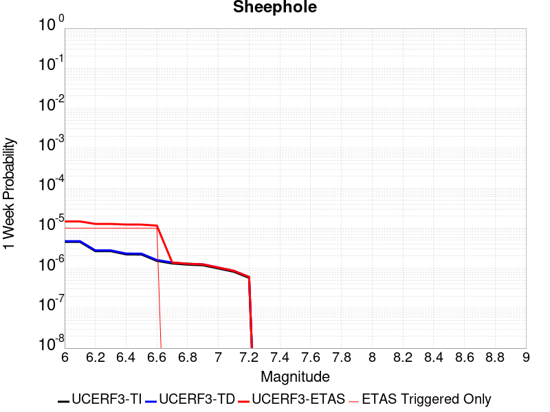 |  |  | 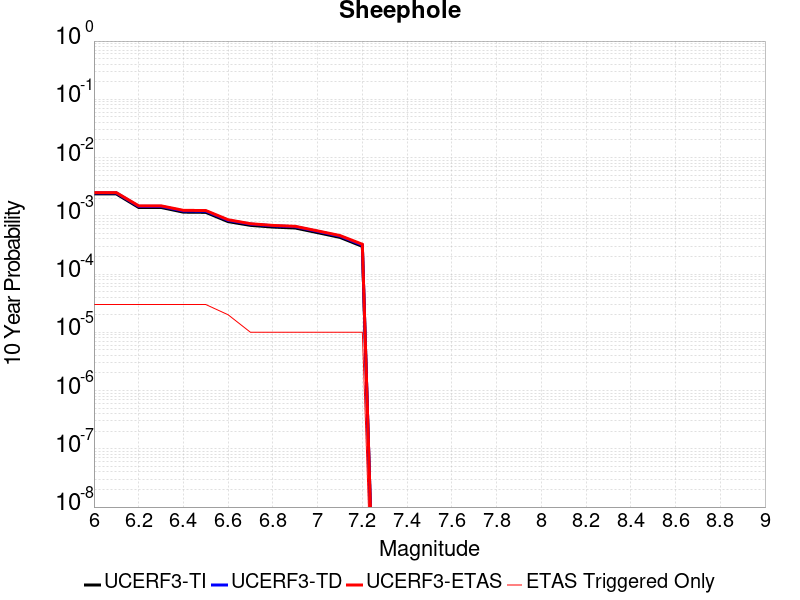 |

| Magnitude | 1 wk TI Prob | 1 wk TD Prob | 1 wk ETAS Prob | 1 wk ETAS/TD Gain | 1 wk ETAS Triggered Only | 1 mo TI Prob | 1 mo TD Prob | 1 mo ETAS Prob | 1 mo ETAS/TD Gain | 1 mo ETAS Triggered Only | 1 yr TI Prob | 1 yr TD Prob | 1 yr ETAS Prob | 1 yr ETAS/TD Gain | 1 yr ETAS Triggered Only | 10 yr TI Prob | 10 yr TD Prob | 10 yr ETAS Prob | 10 yr ETAS/TD Gain | 10 yr ETAS Triggered Only |
|-----|-----|-----|-----|-----|-----|-----|-----|-----|-----|-----|-----|-----|-----|-----|-----|-----|-----|-----|-----|-----|
| 6.0 | 4.5579695E-6 | 4.7412573E-6 | 1.69533E-5 | 3.575697 | 1.22121E-5 | 1.9534009E-5 | 2.0319549E-5 | 3.25314E-5 | 1.6009903 | 1.22121E-5 | 2.3780059E-4 | 2.4736795E-4 | 2.7178612E-4 | 1.0987118 | 2.44242E-5 | 0.0023754628 | 0.0024714705 | 0.0024958344 | 1.009858 | 2.44242E-5 |
| 6.1 | 4.5579695E-6 | 4.7412573E-6 | 1.69533E-5 | 3.575697 | 1.22121E-5 | 1.9534009E-5 | 2.0319549E-5 | 3.25314E-5 | 1.6009903 | 1.22121E-5 | 2.3780059E-4 | 2.4736795E-4 | 2.7178612E-4 | 1.0987118 | 2.44242E-5 | 0.0023754628 | 0.0024714705 | 0.0024958344 | 1.009858 | 2.44242E-5 |
| 6.2 | 2.6677674E-6 | 2.787391E-6 | 1.4999457E-5 | 5.3811817 | 1.22121E-5 | 1.1433239E-5 | 1.1945912E-5 | 2.4157865E-5 | 2.0222704 | 1.22121E-5 | 1.3919079E-4 | 1.4543286E-4 | 1.698535E-4 | 1.167917 | 2.44242E-5 | 0.0013910364 | 0.0014534827 | 0.0014778713 | 1.0167795 | 2.44242E-5 |
| 6.3 | 2.6677674E-6 | 2.787391E-6 | 1.4999457E-5 | 5.3811817 | 1.22121E-5 | 1.1433239E-5 | 1.1945912E-5 | 2.4157865E-5 | 2.0222704 | 1.22121E-5 | 1.3919079E-4 | 1.4543286E-4 | 1.698535E-4 | 1.167917 | 2.44242E-5 | 0.0013910364 | 0.0014534827 | 0.0014778713 | 1.0167795 | 2.44242E-5 |
| 6.4 | 2.2159759E-6 | 2.3228756E-6 | 1.4534947E-5 | 6.257307 | 1.22121E-5 | 9.497005E-6 | 9.955148E-6 | 2.2167127E-5 | 2.2266998 | 1.22121E-5 | 1.156199E-4 | 1.21198E-4 | 1.4561924E-4 | 1.2014987 | 2.44242E-5 | 0.0011555976 | 0.0012113983 | 0.001235793 | 1.0201375 | 2.44242E-5 |
| 6.5 | 2.1986082E-6 | 2.304756E-6 | 1.4516828E-5 | 6.2986393 | 1.22121E-5 | 9.4225725E-6 | 9.8774935E-6 | 2.2089473E-5 | 2.2363439 | 1.22121E-5 | 1.1471378E-4 | 1.2025265E-4 | 1.4467392E-4 | 1.2030829 | 2.44242E-5 | 0.0011465458 | 0.0012019551 | 0.00122635 | 1.020296 | 2.44242E-5 |
| 6.6 | 1.5232331E-6 | 1.6018896E-6 | 1.3813969E-5 | 8.623547 | 1.22121E-5 | 6.5281256E-6 | 6.8652243E-6 | 1.907724E-5 | 2.7788227 | 1.22121E-5 | 7.947703E-5 | 8.3581086E-5 | 9.5792166E-5 | 1.1460986 | 1.22121E-5 | 7.9448614E-4 | 8.3551527E-4 | 8.4771717E-4 | 1.0146041 | 1.22121E-5 |
| 6.7 | 1.3137362E-6 | 1.3828171E-6 | 1.3828171E-6 | 1.0 | 0.0 | 5.6302856E-6 | 5.926346E-6 | 5.926346E-6 | 1.0 | 0.0 | 6.854657E-5 | 7.215102E-5 | 7.215102E-5 | 1.0 | 0.0 | 6.8525434E-4 | 7.2128983E-4 | 7.2128983E-4 | 1.0 | 0.0 |
| 6.8 | 1.2275751E-6 | 1.2922828E-6 | 1.2922828E-6 | 1.0 | 0.0 | 5.2610258E-6 | 5.538344E-6 | 5.538344E-6 | 1.0 | 0.0 | 6.4051106E-5 | 6.742739E-5 | 6.742739E-5 | 1.0 | 0.0 | 6.4032647E-4 | 6.7408266E-4 | 6.7408266E-4 | 1.0 | 0.0 |
| 6.9 | 1.1837088E-6 | 1.2461003E-6 | 1.2461003E-6 | 1.0 | 0.0 | 5.0730278E-6 | 5.3404196E-6 | 5.3404196E-6 | 1.0 | 0.0 | 6.176237E-5 | 6.5017804E-5 | 6.5017804E-5 | 1.0 | 0.0 | 6.17452E-4 | 6.5000093E-4 | 6.5000093E-4 | 1.0 | 0.0 |
| 7.0 | 9.849371E-7 | 1.0366274E-6 | 1.0366274E-6 | 1.0 | 0.0 | 4.2211523E-6 | 4.4426815E-6 | 4.4426815E-6 | 1.0 | 0.0 | 5.1391315E-5 | 5.408841E-5 | 5.408841E-5 | 1.0 | 0.0 | 5.137943E-4 | 5.4076256E-4 | 5.4076256E-4 | 1.0 | 0.0 |
| 7.1 | 8.1643645E-7 | 8.591657E-7 | 8.591657E-7 | 1.0 | 0.0 | 3.4990085E-6 | 3.682134E-6 | 3.682134E-6 | 1.0 | 0.0 | 4.2599597E-5 | 4.4829147E-5 | 4.4829147E-5 | 1.0 | 0.0 | 4.259143E-4 | 4.4820967E-4 | 4.4820967E-4 | 1.0 | 0.0 |
| 7.2 | 5.7295756E-7 | 6.0294934E-7 | 6.0294934E-7 | 1.0 | 0.0 | 2.45553E-6 | 2.5840664E-6 | 2.5840664E-6 | 1.0 | 0.0 | 2.9895667E-5 | 3.1460622E-5 | 3.1460622E-5 | 1.0 | 0.0 | 2.9891645E-4 | 3.1456837E-4 | 3.1456837E-4 | 1.0 | 0.0 |

## Sierra Madre
*[(top)](#table-of-contents)*

| 1 Week | 1 Month | 1 Year | 10 Year |
|-----|-----|-----|-----|
| 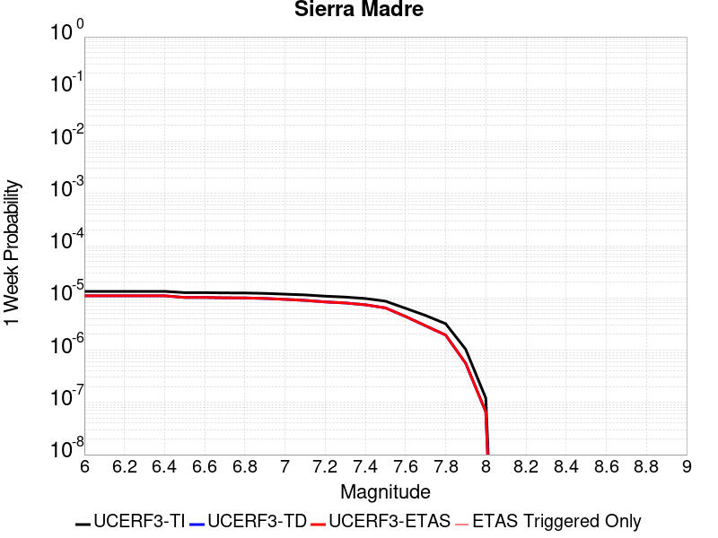 |  |  | 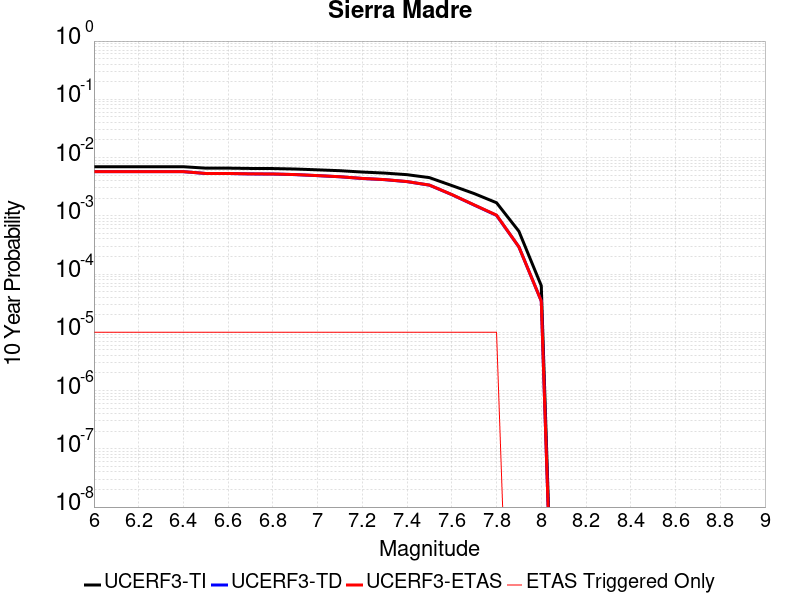 |

| Magnitude | 1 wk TI Prob | 1 wk TD Prob | 1 wk ETAS Prob | 1 wk ETAS/TD Gain | 1 wk ETAS Triggered Only | 1 mo TI Prob | 1 mo TD Prob | 1 mo ETAS Prob | 1 mo ETAS/TD Gain | 1 mo ETAS Triggered Only | 1 yr TI Prob | 1 yr TD Prob | 1 yr ETAS Prob | 1 yr ETAS/TD Gain | 1 yr ETAS Triggered Only | 10 yr TI Prob | 10 yr TD Prob | 10 yr ETAS Prob | 10 yr ETAS/TD Gain | 10 yr ETAS Triggered Only |
|-----|-----|-----|-----|-----|-----|-----|-----|-----|-----|-----|-----|-----|-----|-----|-----|-----|-----|-----|-----|-----|
| 6.0 | 1.3379373E-5 | 1.1000673E-5 | 1.1000673E-5 | 1.0 | 0.0 | 5.7338908E-5 | 4.71449E-5 | 4.71449E-5 | 1.0 | 0.0 | 6.978776E-4 | 5.738394E-4 | 5.738394E-4 | 1.0 | 0.0 | 0.0069569005 | 0.0057239407 | 0.0057360833 | 1.0021213 | 1.22121E-5 |
| 6.1 | 1.3379373E-5 | 1.1000673E-5 | 1.1000673E-5 | 1.0 | 0.0 | 5.7338908E-5 | 4.71449E-5 | 4.71449E-5 | 1.0 | 0.0 | 6.978776E-4 | 5.738394E-4 | 5.738394E-4 | 1.0 | 0.0 | 0.0069569005 | 0.0057239407 | 0.0057360833 | 1.0021213 | 1.22121E-5 |
| 6.2 | 1.3379373E-5 | 1.1000673E-5 | 1.1000673E-5 | 1.0 | 0.0 | 5.7338908E-5 | 4.71449E-5 | 4.71449E-5 | 1.0 | 0.0 | 6.978776E-4 | 5.738394E-4 | 5.738394E-4 | 1.0 | 0.0 | 0.0069569005 | 0.0057239407 | 0.0057360833 | 1.0021213 | 1.22121E-5 |
| 6.3 | 1.3379373E-5 | 1.1000673E-5 | 1.1000673E-5 | 1.0 | 0.0 | 5.7338908E-5 | 4.71449E-5 | 4.71449E-5 | 1.0 | 0.0 | 6.978776E-4 | 5.738394E-4 | 5.738394E-4 | 1.0 | 0.0 | 0.0069569005 | 0.0057239407 | 0.0057360833 | 1.0021213 | 1.22121E-5 |
| 6.4 | 1.3379373E-5 | 1.1000673E-5 | 1.1000673E-5 | 1.0 | 0.0 | 5.7338908E-5 | 4.71449E-5 | 4.71449E-5 | 1.0 | 0.0 | 6.978776E-4 | 5.738394E-4 | 5.738394E-4 | 1.0 | 0.0 | 0.0069569005 | 0.0057239407 | 0.0057360833 | 1.0021213 | 1.22121E-5 |
| 6.5 | 1.26563245E-5 | 1.023013E-5 | 1.023013E-5 | 1.0 | 0.0 | 5.4240263E-5 | 4.3842683E-5 | 4.3842683E-5 | 1.0 | 0.0 | 6.601751E-4 | 5.33655E-4 | 5.33655E-4 | 1.0 | 0.0 | 0.006582173 | 0.005324057 | 0.005336204 | 1.0022815 | 1.22121E-5 |
| 6.6 | 1.26563245E-5 | 1.023013E-5 | 1.023013E-5 | 1.0 | 0.0 | 5.4240263E-5 | 4.3842683E-5 | 4.3842683E-5 | 1.0 | 0.0 | 6.601751E-4 | 5.33655E-4 | 5.33655E-4 | 1.0 | 0.0 | 0.006582173 | 0.005324057 | 0.005336204 | 1.0022815 | 1.22121E-5 |
| 6.7 | 1.2502474E-5 | 1.0066275E-5 | 1.0066275E-5 | 1.0 | 0.0 | 5.3580934E-5 | 4.314047E-5 | 4.314047E-5 | 1.0 | 0.0 | 6.521526E-4 | 5.251097E-4 | 5.251097E-4 | 1.0 | 0.0 | 0.0065024206 | 0.0052390085 | 0.0052511566 | 1.0023187 | 1.22121E-5 |
| 6.8 | 1.2454966E-5 | 1.001856E-5 | 1.001856E-5 | 1.0 | 0.0 | 5.3377335E-5 | 4.2935986E-5 | 4.2935986E-5 | 1.0 | 0.0 | 6.4967526E-4 | 5.226213E-4 | 5.226213E-4 | 1.0 | 0.0 | 0.006477792 | 0.0052142413 | 0.00522639 | 1.0023298 | 1.22121E-5 |
| 6.9 | 1.2225574E-5 | 9.792538E-6 | 9.792538E-6 | 1.0 | 0.0 | 5.2394265E-5 | 4.196735E-5 | 4.196735E-5 | 1.0 | 0.0 | 6.3771347E-4 | 5.108337E-4 | 5.108337E-4 | 1.0 | 0.0 | 0.006358865 | 0.005096911 | 0.0051090606 | 1.0023837 | 1.22121E-5 |
| 7.0 | 1.182946E-5 | 9.399079E-6 | 9.399079E-6 | 1.0 | 0.0 | 5.06967E-5 | 4.0281153E-5 | 4.0281153E-5 | 1.0 | 0.0 | 6.1705755E-4 | 4.903137E-4 | 4.903137E-4 | 1.0 | 0.0 | 0.006153469 | 0.0048926305 | 0.004904783 | 1.0024838 | 1.22121E-5 |
| 7.1 | 1.14369095E-5 | 8.986096E-6 | 8.986096E-6 | 1.0 | 0.0 | 4.9014405E-5 | 3.851128E-5 | 3.851128E-5 | 1.0 | 0.0 | 5.9658696E-4 | 4.687749E-4 | 4.687749E-4 | 1.0 | 0.0 | 0.005949879 | 0.0046781665 | 0.0046903216 | 1.0025983 | 1.22121E-5 |
| 7.2 | 1.0836419E-5 | 8.3994955E-6 | 8.3994955E-6 | 1.0 | 0.0 | 4.644097E-5 | 3.599735E-5 | 3.599735E-5 | 1.0 | 0.0 | 5.652721E-4 | 4.381805E-4 | 4.381805E-4 | 1.0 | 0.0 | 0.0056383642 | 0.0043734624 | 0.0043856213 | 1.0027801 | 1.22121E-5 |
| 7.3 | 1.0403439E-5 | 8.02076E-6 | 8.02076E-6 | 1.0 | 0.0 | 4.4585406E-5 | 3.437424E-5 | 3.437424E-5 | 1.0 | 0.0 | 5.426921E-4 | 4.1842688E-4 | 4.1842688E-4 | 1.0 | 0.0 | 0.005413687 | 0.004176686 | 0.004188847 | 1.0029117 | 1.22121E-5 |
| 7.4 | 9.768864E-6 | 7.4143904E-6 | 7.4143904E-6 | 1.0 | 0.0 | 4.186589E-5 | 3.1775577E-5 | 3.1775577E-5 | 1.0 | 0.0 | 5.09598E-4 | 3.8679986E-4 | 3.8679986E-4 | 1.0 | 0.0 | 0.0050843097 | 0.0038615582 | 0.003873723 | 1.0031502 | 1.22121E-5 |
| 7.5 | 8.687089E-6 | 6.450101E-6 | 6.450101E-6 | 1.0 | 0.0 | 3.722985E-5 | 2.7643002E-5 | 2.7643002E-5 | 1.0 | 0.0 | 4.5317915E-4 | 3.3650245E-4 | 3.3650245E-4 | 1.0 | 0.0 | 0.004522561 | 0.0033602165 | 0.0033723875 | 1.003622 | 1.22121E-5 |
| 7.6 | 6.3506063E-6 | 4.430282E-6 | 4.430282E-6 | 1.0 | 0.0 | 2.72166E-5 | 1.8986786E-5 | 1.8986786E-5 | 1.0 | 0.0 | 3.3131172E-4 | 2.3113986E-4 | 2.3113986E-4 | 1.0 | 0.0 | 0.003308182 | 0.0023092194 | 0.0023214032 | 1.0052762 | 1.22121E-5 |
| 7.7 | 4.62223E-6 | 2.93293E-6 | 2.93293E-6 | 1.0 | 0.0 | 1.9809406E-5 | 1.2569641E-5 | 1.2569641E-5 | 1.0 | 0.0 | 2.4115283E-4 | 1.5302465E-4 | 1.5302465E-4 | 1.0 | 0.0 | 0.0024089129 | 0.0015293938 | 0.0015415873 | 1.0079727 | 1.22121E-5 |
| 7.8 | 3.2145008E-6 | 1.9494078E-6 | 1.9494078E-6 | 1.0 | 0.0 | 1.3776359E-5 | 8.354577E-6 | 8.354577E-6 | 1.0 | 0.0 | 1.6771426E-4 | 1.0171225E-4 | 1.0171225E-4 | 1.0 | 0.0 | 0.0016758774 | 0.0010168012 | 0.001029001 | 1.011998 | 1.22121E-5 |
| 7.9 | 1.0391769E-6 | 5.602568E-7 | 5.602568E-7 | 1.0 | 0.0 | 4.4536077E-6 | 2.4010983E-6 | 2.4010983E-6 | 1.0 | 0.0 | 5.4221324E-5 | 2.9232984E-5 | 2.9232984E-5 | 1.0 | 0.0 | 5.4208096E-4 | 2.922918E-4 | 2.922918E-4 | 1.0 | 0.0 |
| 8.0 | 1.210983E-7 | 6.61375E-8 | 6.61375E-8 | 1.0 | 0.0 | 5.1899264E-7 | 2.8344644E-7 | 2.8344644E-7 | 1.0 | 0.0 | 6.3187167E-6 | 3.4509549E-6 | 3.4509549E-6 | 1.0 | 0.0 | 6.318537E-5 | 3.450903E-5 | 3.450903E-5 | 1.0 | 0.0 |

## Elysian Park (Upper)
*[(top)](#table-of-contents)*

| 1 Week | 1 Month | 1 Year | 10 Year |
|-----|-----|-----|-----|
|  |  | 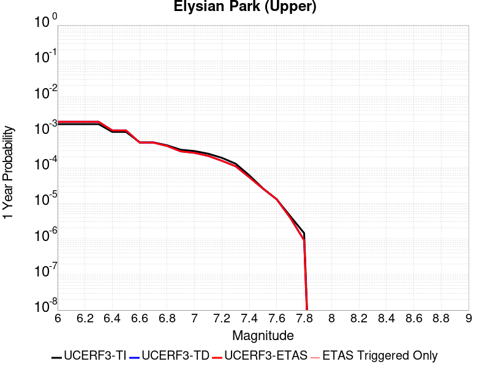 |  |

| Magnitude | 1 wk TI Prob | 1 wk TD Prob | 1 wk ETAS Prob | 1 wk ETAS/TD Gain | 1 wk ETAS Triggered Only | 1 mo TI Prob | 1 mo TD Prob | 1 mo ETAS Prob | 1 mo ETAS/TD Gain | 1 mo ETAS Triggered Only | 1 yr TI Prob | 1 yr TD Prob | 1 yr ETAS Prob | 1 yr ETAS/TD Gain | 1 yr ETAS Triggered Only | 10 yr TI Prob | 10 yr TD Prob | 10 yr ETAS Prob | 10 yr ETAS/TD Gain | 10 yr ETAS Triggered Only |
|-----|-----|-----|-----|-----|-----|-----|-----|-----|-----|-----|-----|-----|-----|-----|-----|-----|-----|-----|-----|-----|
| 6.0 | 3.1876025E-5 | 3.7035312E-5 | 3.7035312E-5 | 1.0 | 0.0 | 1.3660437E-4 | 1.5871585E-4 | 1.5871585E-4 | 1.0 | 0.0 | 0.0016618895 | 0.0019310972 | 0.0019310972 | 1.0 | 0.0 | 0.016495159 | 0.01918968 | 0.019201659 | 1.0006242 | 1.22121E-5 |
| 6.1 | 3.1876025E-5 | 3.7035312E-5 | 3.7035312E-5 | 1.0 | 0.0 | 1.3660437E-4 | 1.5871585E-4 | 1.5871585E-4 | 1.0 | 0.0 | 0.0016618895 | 0.0019310972 | 0.0019310972 | 1.0 | 0.0 | 0.016495159 | 0.01918968 | 0.019201659 | 1.0006242 | 1.22121E-5 |
| 6.2 | 3.1876025E-5 | 3.7035312E-5 | 3.7035312E-5 | 1.0 | 0.0 | 1.3660437E-4 | 1.5871585E-4 | 1.5871585E-4 | 1.0 | 0.0 | 0.0016618895 | 0.0019310972 | 0.0019310972 | 1.0 | 0.0 | 0.016495159 | 0.01918968 | 0.019201659 | 1.0006242 | 1.22121E-5 |
| 6.3 | 3.1876025E-5 | 3.7035312E-5 | 3.7035312E-5 | 1.0 | 0.0 | 1.3660437E-4 | 1.5871585E-4 | 1.5871585E-4 | 1.0 | 0.0 | 0.0016618895 | 0.0019310972 | 0.0019310972 | 1.0 | 0.0 | 0.016495159 | 0.01918968 | 0.019201659 | 1.0006242 | 1.22121E-5 |
| 6.4 | 1.9273462E-5 | 2.1202171E-5 | 2.1202171E-5 | 1.0 | 0.0 | 8.259794E-5 | 9.086426E-5 | 9.086426E-5 | 1.0 | 0.0 | 0.001005166 | 0.0011058843 | 0.0011058843 | 1.0 | 0.0 | 0.010006315 | 0.011020675 | 0.011020675 | 1.0 | 0.0 |
| 6.5 | 1.9273462E-5 | 2.1202171E-5 | 2.1202171E-5 | 1.0 | 0.0 | 8.259794E-5 | 9.086426E-5 | 9.086426E-5 | 1.0 | 0.0 | 0.001005166 | 0.0011058843 | 0.0011058843 | 1.0 | 0.0 | 0.010006315 | 0.011020675 | 0.011020675 | 1.0 | 0.0 |
| 6.6 | 9.813258E-6 | 9.665572E-6 | 9.665572E-6 | 1.0 | 0.0 | 4.205614E-5 | 4.1423264E-5 | 4.1423264E-5 | 1.0 | 0.0 | 5.119132E-4 | 5.042188E-4 | 5.042188E-4 | 1.0 | 0.0 | 0.005107356 | 0.005031471 | 0.005031471 | 1.0 | 0.0 |
| 6.7 | 9.801478E-6 | 9.653142E-6 | 9.653142E-6 | 1.0 | 0.0 | 4.2005657E-5 | 4.1369993E-5 | 4.1369993E-5 | 1.0 | 0.0 | 5.112989E-4 | 5.035705E-4 | 5.035705E-4 | 1.0 | 0.0 | 0.0051012407 | 0.005025018 | 0.005025018 | 1.0 | 0.0 |
| 6.8 | 8.102489E-6 | 7.772984E-6 | 7.772984E-6 | 1.0 | 0.0 | 3.4724493E-5 | 3.331239E-5 | 3.331239E-5 | 1.0 | 0.0 | 4.2268867E-4 | 4.0550783E-4 | 4.0550783E-4 | 1.0 | 0.0 | 0.004218856 | 0.004048173 | 0.004048173 | 1.0 | 0.0 |
| 6.9 | 6.08275E-6 | 5.481439E-6 | 5.481439E-6 | 1.0 | 0.0 | 2.6068668E-5 | 2.3491673E-5 | 2.3491673E-5 | 1.0 | 0.0 | 3.173398E-4 | 2.8597435E-4 | 2.8597435E-4 | 1.0 | 0.0 | 0.0031688702 | 0.0028561412 | 0.0028561412 | 1.0 | 0.0 |
| 7.0 | 5.5995934E-6 | 4.982769E-6 | 4.982769E-6 | 1.0 | 0.0 | 2.3998036E-5 | 2.1354552E-5 | 2.1354552E-5 | 1.0 | 0.0 | 2.9213692E-4 | 2.5996132E-4 | 2.5996132E-4 | 1.0 | 0.0 | 0.0029175316 | 0.0025966396 | 0.0025966396 | 1.0 | 0.0 |
| 7.1 | 4.709881E-6 | 4.0873924E-6 | 4.0873924E-6 | 1.0 | 0.0 | 2.0185047E-5 | 1.751728E-5 | 1.751728E-5 | 1.0 | 0.0 | 2.4572524E-4 | 2.1325242E-4 | 2.1325242E-4 | 1.0 | 0.0 | 0.002454537 | 0.0021305194 | 0.0021305194 | 1.0 | 0.0 |
| 7.2 | 3.6063436E-6 | 2.977948E-6 | 2.977948E-6 | 1.0 | 0.0 | 1.5455667E-5 | 1.2762573E-5 | 1.2762573E-5 | 1.0 | 0.0 | 1.881565E-4 | 1.5537335E-4 | 1.5537335E-4 | 1.0 | 0.0 | 0.0018799726 | 0.0015526584 | 0.0015526584 | 1.0 | 0.0 |
| 7.3 | 2.471135E-6 | 2.095457E-6 | 2.095457E-6 | 1.0 | 0.0 | 1.0590536E-5 | 8.9805E-6 | 8.9805E-6 | 1.0 | 0.0 | 1.2893214E-4 | 1.0933217E-4 | 1.0933217E-4 | 1.0 | 0.0 | 0.0012885736 | 0.001092791 | 0.001092791 | 1.0 | 0.0 |
| 7.4 | 1.163943E-6 | 1.0275068E-6 | 1.0275068E-6 | 1.0 | 0.0 | 4.988318E-6 | 4.403593E-6 | 4.403593E-6 | 1.0 | 0.0 | 6.0731076E-5 | 5.3612457E-5 | 5.3612457E-5 | 1.0 | 0.0 | 6.071448E-4 | 5.359982E-4 | 5.359982E-4 | 1.0 | 0.0 |
| 7.5 | 4.99459E-7 | 4.9175924E-7 | 4.9175924E-7 | 1.0 | 0.0 | 2.140537E-6 | 2.107538E-6 | 2.107538E-6 | 1.0 | 0.0 | 2.6060725E-5 | 2.5658988E-5 | 2.5658988E-5 | 1.0 | 0.0 | 2.605767E-4 | 2.5656182E-4 | 2.5656182E-4 | 1.0 | 0.0 |
| 7.6 | 2.4667852E-7 | 2.4778268E-7 | 2.4778268E-7 | 1.0 | 0.0 | 1.0571932E-6 | 1.0619254E-6 | 1.0619254E-6 | 1.0 | 0.0 | 1.2871251E-5 | 1.2928869E-5 | 1.2928869E-5 | 1.0 | 0.0 | 1.2870505E-4 | 1.2928153E-4 | 1.2928153E-4 | 1.0 | 0.0 |
| 7.7 | 8.2312795E-8 | 7.3864086E-8 | 7.3864086E-8 | 1.0 | 0.0 | 3.527691E-7 | 3.1656032E-7 | 3.1656032E-7 | 1.0 | 0.0 | 4.294955E-6 | 3.854116E-6 | 3.854116E-6 | 1.0 | 0.0 | 4.2948723E-5 | 3.854061E-5 | 3.854061E-5 | 1.0 | 0.0 |
| 7.8 | 2.7819295E-8 | 1.7565762E-8 | 1.7565762E-8 | 1.0 | 0.0 | 1.1922555E-7 | 7.528184E-8 | 7.528184E-8 | 1.0 | 0.0 | 1.45157E-6 | 9.1655613E-7 | 9.1655613E-7 | 1.0 | 0.0 | 1.45156055E-5 | 9.165538E-6 | 9.165538E-6 | 1.0 | 0.0 |

## North Frontal  (East)
*[(top)](#table-of-contents)*

| 1 Week | 1 Month | 1 Year | 10 Year |
|-----|-----|-----|-----|
|  |  | 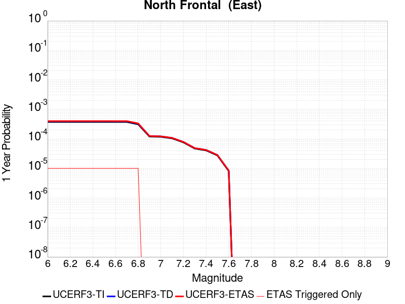 |  |

| Magnitude | 1 wk TI Prob | 1 wk TD Prob | 1 wk ETAS Prob | 1 wk ETAS/TD Gain | 1 wk ETAS Triggered Only | 1 mo TI Prob | 1 mo TD Prob | 1 mo ETAS Prob | 1 mo ETAS/TD Gain | 1 mo ETAS Triggered Only | 1 yr TI Prob | 1 yr TD Prob | 1 yr ETAS Prob | 1 yr ETAS/TD Gain | 1 yr ETAS Triggered Only | 10 yr TI Prob | 10 yr TD Prob | 10 yr ETAS Prob | 10 yr ETAS/TD Gain | 10 yr ETAS Triggered Only |
|-----|-----|-----|-----|-----|-----|-----|-----|-----|-----|-----|-----|-----|-----|-----|-----|-----|-----|-----|-----|-----|
| 6.0 | 7.135738E-6 | 7.477167E-6 | 1.9689176E-5 | 2.63324 | 1.22121E-5 | 3.0581377E-5 | 3.204472E-5 | 4.4256427E-5 | 1.3810834 | 1.22121E-5 | 3.7226462E-4 | 3.9009456E-4 | 4.023019E-4 | 1.0312933 | 1.22121E-5 | 0.0037164164 | 0.0038960557 | 0.00390822 | 1.0031222 | 1.22121E-5 |
| 6.1 | 7.135738E-6 | 7.477167E-6 | 1.9689176E-5 | 2.63324 | 1.22121E-5 | 3.0581377E-5 | 3.204472E-5 | 4.4256427E-5 | 1.3810834 | 1.22121E-5 | 3.7226462E-4 | 3.9009456E-4 | 4.023019E-4 | 1.0312933 | 1.22121E-5 | 0.0037164164 | 0.0038960557 | 0.00390822 | 1.0031222 | 1.22121E-5 |
| 6.2 | 7.135738E-6 | 7.477167E-6 | 1.9689176E-5 | 2.63324 | 1.22121E-5 | 3.0581377E-5 | 3.204472E-5 | 4.4256427E-5 | 1.3810834 | 1.22121E-5 | 3.7226462E-4 | 3.9009456E-4 | 4.023019E-4 | 1.0312933 | 1.22121E-5 | 0.0037164164 | 0.0038960557 | 0.00390822 | 1.0031222 | 1.22121E-5 |
| 6.3 | 7.135738E-6 | 7.477167E-6 | 1.9689176E-5 | 2.63324 | 1.22121E-5 | 3.0581377E-5 | 3.204472E-5 | 4.4256427E-5 | 1.3810834 | 1.22121E-5 | 3.7226462E-4 | 3.9009456E-4 | 4.023019E-4 | 1.0312933 | 1.22121E-5 | 0.0037164164 | 0.0038960557 | 0.00390822 | 1.0031222 | 1.22121E-5 |
| 6.4 | 7.135738E-6 | 7.477167E-6 | 1.9689176E-5 | 2.63324 | 1.22121E-5 | 3.0581377E-5 | 3.204472E-5 | 4.4256427E-5 | 1.3810834 | 1.22121E-5 | 3.7226462E-4 | 3.9009456E-4 | 4.023019E-4 | 1.0312933 | 1.22121E-5 | 0.0037164164 | 0.0038960557 | 0.00390822 | 1.0031222 | 1.22121E-5 |
| 6.5 | 7.135738E-6 | 7.477167E-6 | 1.9689176E-5 | 2.63324 | 1.22121E-5 | 3.0581377E-5 | 3.204472E-5 | 4.4256427E-5 | 1.3810834 | 1.22121E-5 | 3.7226462E-4 | 3.9009456E-4 | 4.023019E-4 | 1.0312933 | 1.22121E-5 | 0.0037164164 | 0.0038960557 | 0.00390822 | 1.0031222 | 1.22121E-5 |
| 6.6 | 7.135738E-6 | 7.477167E-6 | 1.9689176E-5 | 2.63324 | 1.22121E-5 | 3.0581377E-5 | 3.204472E-5 | 4.4256427E-5 | 1.3810834 | 1.22121E-5 | 3.7226462E-4 | 3.9009456E-4 | 4.023019E-4 | 1.0312933 | 1.22121E-5 | 0.0037164164 | 0.0038960557 | 0.00390822 | 1.0031222 | 1.22121E-5 |
| 6.7 | 7.135738E-6 | 7.477167E-6 | 1.9689176E-5 | 2.63324 | 1.22121E-5 | 3.0581377E-5 | 3.204472E-5 | 4.4256427E-5 | 1.3810834 | 1.22121E-5 | 3.7226462E-4 | 3.9009456E-4 | 4.023019E-4 | 1.0312933 | 1.22121E-5 | 0.0037164164 | 0.0038960557 | 0.00390822 | 1.0031222 | 1.22121E-5 |
| 6.8 | 5.959142E-6 | 6.2366753E-6 | 1.8448698E-5 | 2.9580984 | 1.22121E-5 | 2.553893E-5 | 2.6728436E-5 | 3.894021E-5 | 1.4568832 | 1.22121E-5 | 3.108921E-4 | 3.253882E-4 | 3.375963E-4 | 1.0375186 | 1.22121E-5 | 0.0031045752 | 0.0032508906 | 0.003263063 | 1.0037444 | 1.22121E-5 |
| 6.9 | 2.2946929E-6 | 2.382458E-6 | 2.382458E-6 | 1.0 | 0.0 | 9.834361E-6 | 1.0210498E-5 | 1.0210498E-5 | 1.0 | 0.0 | 1.1972676E-4 | 1.2430619E-4 | 1.2430619E-4 | 1.0 | 0.0 | 0.0011966228 | 0.0012424131 | 0.0012424131 | 1.0 | 0.0 |
| 7.0 | 2.2468673E-6 | 2.3321513E-6 | 2.3321513E-6 | 1.0 | 0.0 | 9.629396E-6 | 9.994899E-6 | 9.994899E-6 | 1.0 | 0.0 | 1.1723159E-4 | 1.2168157E-4 | 1.2168157E-4 | 1.0 | 0.0 | 0.0011716976 | 0.0012161958 | 0.0012161958 | 1.0 | 0.0 |
| 7.1 | 1.9921076E-6 | 2.0646012E-6 | 2.0646012E-6 | 1.0 | 0.0 | 8.537577E-6 | 8.848263E-6 | 8.848263E-6 | 1.0 | 0.0 | 1.0394004E-4 | 1.0772271E-4 | 1.0772271E-4 | 1.0 | 0.0 | 0.0010389143 | 0.0010767477 | 0.0010767477 | 1.0 | 0.0 |
| 7.2 | 1.4524545E-6 | 1.5045133E-6 | 1.5045133E-6 | 1.0 | 0.0 | 6.2247905E-6 | 6.4479E-6 | 6.4479E-6 | 1.0 | 0.0 | 7.5784184E-5 | 7.85006E-5 | 7.85006E-5 | 1.0 | 0.0 | 7.575835E-4 | 7.847532E-4 | 7.847532E-4 | 1.0 | 0.0 |
| 7.3 | 8.9802575E-7 | 9.308719E-7 | 9.308719E-7 | 1.0 | 0.0 | 3.848676E-6 | 3.9894453E-6 | 3.9894453E-6 | 1.0 | 0.0 | 4.685662E-5 | 4.857053E-5 | 4.857053E-5 | 1.0 | 0.0 | 4.6846745E-4 | 4.8561045E-4 | 4.8561045E-4 | 1.0 | 0.0 |
| 7.4 | 7.776139E-7 | 8.0604667E-7 | 8.0604667E-7 | 1.0 | 0.0 | 3.3326266E-6 | 3.4544819E-6 | 3.4544819E-6 | 1.0 | 0.0 | 4.0573974E-5 | 4.2057614E-5 | 4.2057614E-5 | 1.0 | 0.0 | 4.0566566E-4 | 4.205073E-4 | 4.205073E-4 | 1.0 | 0.0 |
| 7.5 | 5.244417E-7 | 5.441214E-7 | 5.441214E-7 | 1.0 | 0.0 | 2.2476054E-6 | 2.3319471E-6 | 2.3319471E-6 | 1.0 | 0.0 | 2.7364253E-5 | 2.8391152E-5 | 2.8391152E-5 | 1.0 | 0.0 | 2.7360884E-4 | 2.8388176E-4 | 2.8388176E-4 | 1.0 | 0.0 |
| 7.6 | 1.5489647E-7 | 1.6089487E-7 | 1.6089487E-7 | 1.0 | 0.0 | 6.6384183E-7 | 6.895494E-7 | 6.895494E-7 | 1.0 | 0.0 | 8.082245E-6 | 8.395252E-6 | 8.395252E-6 | 1.0 | 0.0 | 8.08195E-5 | 8.3951345E-5 | 8.3951345E-5 | 1.0 | 0.0 |

## Calaveras (So) 2011 CFM
*[(top)](#table-of-contents)*

| 1 Week | 1 Month | 1 Year | 10 Year |
|-----|-----|-----|-----|
| 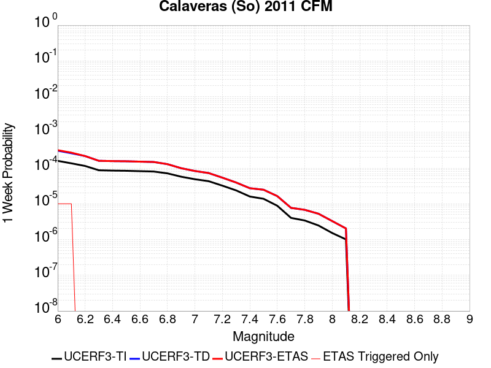 | 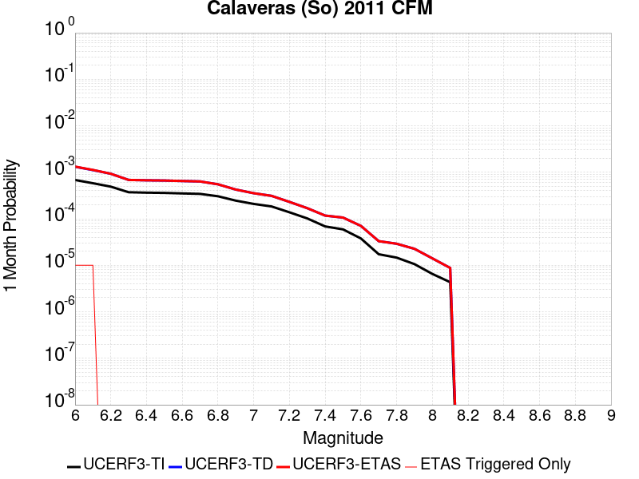 | 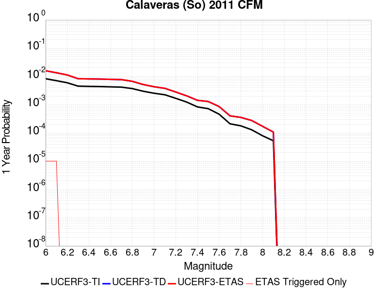 |  |

| Magnitude | 1 wk TI Prob | 1 wk TD Prob | 1 wk ETAS Prob | 1 wk ETAS/TD Gain | 1 wk ETAS Triggered Only | 1 mo TI Prob | 1 mo TD Prob | 1 mo ETAS Prob | 1 mo ETAS/TD Gain | 1 mo ETAS Triggered Only | 1 yr TI Prob | 1 yr TD Prob | 1 yr ETAS Prob | 1 yr ETAS/TD Gain | 1 yr ETAS Triggered Only | 10 yr TI Prob | 10 yr TD Prob | 10 yr ETAS Prob | 10 yr ETAS/TD Gain | 10 yr ETAS Triggered Only |
|-----|-----|-----|-----|-----|-----|-----|-----|-----|-----|-----|-----|-----|-----|-----|-----|-----|-----|-----|-----|-----|
| 6.0 | 1.5950744E-4 | 3.0710758E-4 | 3.1931594E-4 | 1.0397527 | 1.22121E-5 | 6.834242E-4 | 0.0013155134 | 0.0013277094 | 1.0092709 | 1.22121E-5 | 0.00828899 | 0.015858818 | 0.015870836 | 1.0007578 | 1.22121E-5 | 0.079865426 | 0.14439851 | 0.14440896 | 1.0000724 | 1.22121E-5 |
| 6.1 | 1.3584697E-4 | 2.6036007E-4 | 2.72569E-4 | 1.0468924 | 1.22121E-5 | 5.8207137E-4 | 0.0011153528 | 0.0011275514 | 1.0109369 | 1.22121E-5 | 0.007063716 | 0.013461906 | 0.013473954 | 1.0008949 | 1.22121E-5 | 0.06843361 | 0.12402653 | 0.12403722 | 1.0000863 | 1.22121E-5 |
| 6.2 | 1.14676266E-4 | 2.1725375E-4 | 2.1725375E-4 | 1.0 | 0.0 | 4.9137714E-4 | 9.307542E-4 | 9.307542E-4 | 1.0 | 0.0 | 0.0059661185 | 0.011245421 | 0.011245421 | 1.0 | 0.0 | 0.058084648 | 0.10501737 | 0.10501737 | 1.0 | 0.0 |
| 6.3 | 8.691518E-5 | 1.5986769E-4 | 1.5986769E-4 | 1.0 | 0.0 | 3.7244044E-4 | 6.849467E-4 | 6.849467E-4 | 1.0 | 0.0 | 0.004525038 | 0.0083006825 | 0.0083006825 | 1.0 | 0.0 | 0.044339992 | 0.07933282 | 0.07933282 | 1.0 | 0.0 |
| 6.4 | 8.50982E-5 | 1.5693177E-4 | 1.5693177E-4 | 1.0 | 0.0 | 3.646556E-4 | 6.7237066E-4 | 6.7237066E-4 | 1.0 | 0.0 | 0.0044306475 | 0.008148721 | 0.008148721 | 1.0 | 0.0 | 0.04343345 | 0.077938974 | 0.077938974 | 1.0 | 0.0 |
| 6.5 | 8.4062965E-5 | 1.5517746E-4 | 1.5517746E-4 | 1.0 | 0.0 | 3.602201E-4 | 6.6485605E-4 | 6.6485605E-4 | 1.0 | 0.0 | 0.004376863 | 0.008057924 | 0.008057924 | 1.0 | 0.0 | 0.042916555 | 0.077110246 | 0.077110246 | 1.0 | 0.0 |
| 6.6 | 8.194716E-5 | 1.5153716E-4 | 1.5153716E-4 | 1.0 | 0.0 | 3.5115483E-4 | 6.4926257E-4 | 6.4926257E-4 | 1.0 | 0.0 | 0.0042669317 | 0.007869773 | 0.007869773 | 1.0 | 0.0 | 0.04185927 | 0.07539553 | 0.07539553 | 1.0 | 0.0 |
| 6.7 | 8.012326E-5 | 1.4821463E-4 | 1.4821463E-4 | 1.0 | 0.0 | 3.433402E-4 | 6.350302E-4 | 6.350302E-4 | 1.0 | 0.0 | 0.004172157 | 0.0076982686 | 0.0076982686 | 1.0 | 0.0 | 0.040946912 | 0.07383767 | 0.07383767 | 1.0 | 0.0 |
| 6.8 | 7.119773E-5 | 1.288018E-4 | 1.288018E-4 | 1.0 | 0.0 | 3.0509746E-4 | 5.5188267E-4 | 5.5188267E-4 | 1.0 | 0.0 | 0.0037082357 | 0.006695695 | 0.006695695 | 1.0 | 0.0 | 0.036469642 | 0.064682275 | 0.064682275 | 1.0 | 0.0 |
| 6.9 | 5.7343088E-5 | 9.9185636E-5 | 9.9185636E-5 | 1.0 | 0.0 | 2.4573295E-4 | 4.250125E-4 | 4.250125E-4 | 1.0 | 0.0 | 0.0029876942 | 0.005162333 | 0.005162333 | 1.0 | 0.0 | 0.02947844 | 0.050507538 | 0.050507538 | 1.0 | 0.0 |
| 7.0 | 4.8746577E-5 | 8.2844235E-5 | 8.2844235E-5 | 1.0 | 0.0 | 2.0889717E-4 | 3.5499875E-4 | 3.5499875E-4 | 1.0 | 0.0 | 0.0025403565 | 0.0043136105 | 0.0043136105 | 1.0 | 0.0 | 0.025115121 | 0.042483483 | 0.042483483 | 1.0 | 0.0 |
| 7.1 | 4.2998014E-5 | 7.264594E-5 | 7.264594E-5 | 1.0 | 0.0 | 1.8426418E-4 | 3.1130292E-4 | 3.1130292E-4 | 1.0 | 0.0 | 0.002241108 | 0.0037835862 | 0.0037835862 | 1.0 | 0.0 | 0.022186412 | 0.0374217 | 0.0374217 | 1.0 | 0.0 |
| 7.2 | 3.221292E-5 | 5.390257E-5 | 5.390257E-5 | 1.0 | 0.0 | 1.3804805E-4 | 2.3099071E-4 | 2.3099071E-4 | 1.0 | 0.0 | 0.0016794393 | 0.0028087131 | 0.0028087131 | 1.0 | 0.0 | 0.016668037 | 0.028034493 | 0.028034493 | 1.0 | 0.0 |
| 7.3 | 2.3756531E-5 | 3.946884E-5 | 3.946884E-5 | 1.0 | 0.0 | 1.0180973E-4 | 1.691413E-4 | 1.691413E-4 | 1.0 | 0.0 | 0.0012388286 | 0.0020573675 | 0.0020573675 | 1.0 | 0.0 | 0.012319452 | 0.020642038 | 0.020642038 | 1.0 | 0.0 |
| 7.4 | 1.5997684E-5 | 2.733813E-5 | 2.733813E-5 | 1.0 | 0.0 | 6.8559704E-5 | 1.1715816E-4 | 1.1715816E-4 | 1.0 | 0.0 | 8.343947E-4 | 0.0014254698 | 0.0014254698 | 1.0 | 0.0 | 0.008312687 | 0.0143752 | 0.0143752 | 1.0 | 0.0 |
| 7.5 | 1.3814293E-5 | 2.4779916E-5 | 2.4779916E-5 | 1.0 | 0.0 | 5.9202768E-5 | 1.0619533E-4 | 1.0619533E-4 | 1.0 | 0.0 | 7.205553E-4 | 0.0012921637 | 0.0012921637 | 1.0 | 0.0 | 0.007182234 | 0.013054431 | 0.013054431 | 1.0 | 0.0 |
| 7.6 | 8.817309E-6 | 1.642736E-5 | 1.642736E-5 | 1.0 | 0.0 | 3.7787922E-5 | 7.040108E-5 | 7.040108E-5 | 1.0 | 0.0 | 4.5997082E-4 | 8.567974E-4 | 8.567974E-4 | 1.0 | 0.0 | 0.004590199 | 0.008718628 | 0.008718628 | 1.0 | 0.0 |
| 7.7 | 4.0352206E-6 | 7.706098E-6 | 7.706098E-6 | 1.0 | 0.0 | 1.7293689E-5 | 3.3025717E-5 | 3.3025717E-5 | 1.0 | 0.0 | 2.1053031E-4 | 4.0201397E-4 | 4.0201397E-4 | 1.0 | 0.0 | 0.0021033096 | 0.004164605 | 0.004164605 | 1.0 | 0.0 |
| 7.8 | 3.413169E-6 | 6.786183E-6 | 6.786183E-6 | 1.0 | 0.0 | 1.4627784E-5 | 2.9083318E-5 | 2.9083318E-5 | 1.0 | 0.0 | 1.7807873E-4 | 3.5403192E-4 | 3.5403192E-4 | 1.0 | 0.0 | 0.0017793609 | 0.0036659774 | 0.0036659774 | 1.0 | 0.0 |
| 7.9 | 2.4740732E-6 | 5.2783053E-6 | 5.2783053E-6 | 1.0 | 0.0 | 1.06031275E-5 | 2.2621112E-5 | 2.2621112E-5 | 1.0 | 0.0 | 1.2908543E-4 | 2.753773E-4 | 2.753773E-4 | 1.0 | 0.0 | 0.0012901047 | 0.002834394 | 0.002834394 | 1.0 | 0.0 |
| 8.0 | 1.5231818E-6 | 3.2884188E-6 | 3.2884188E-6 | 1.0 | 0.0 | 6.527906E-6 | 1.4093148E-5 | 1.4093148E-5 | 1.0 | 0.0 | 7.9474354E-5 | 1.715706E-4 | 1.715706E-4 | 1.0 | 0.0 | 7.944594E-4 | 0.0017562305 | 0.0017562305 | 1.0 | 0.0 |
| 8.1 | 1.0104524E-6 | 2.0454734E-6 | 2.0454734E-6 | 1.0 | 0.0 | 4.330503E-6 | 8.766285E-6 | 8.766285E-6 | 1.0 | 0.0 | 5.2722597E-5 | 1.0672433E-4 | 1.0672433E-4 | 1.0 | 0.0 | 5.271009E-4 | 0.0010928321 | 0.0010928321 | 1.0 | 0.0 |

## Johnson Valley (No) 2011 rev
*[(top)](#table-of-contents)*

| 1 Week | 1 Month | 1 Year | 10 Year |
|-----|-----|-----|-----|
| 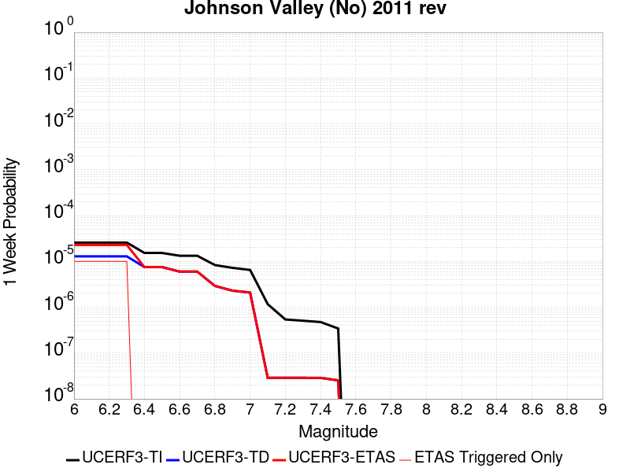 |  | 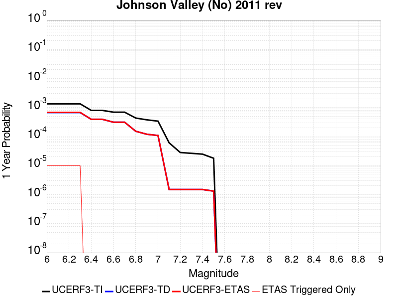 |  |

| Magnitude | 1 wk TI Prob | 1 wk TD Prob | 1 wk ETAS Prob | 1 wk ETAS/TD Gain | 1 wk ETAS Triggered Only | 1 mo TI Prob | 1 mo TD Prob | 1 mo ETAS Prob | 1 mo ETAS/TD Gain | 1 mo ETAS Triggered Only | 1 yr TI Prob | 1 yr TD Prob | 1 yr ETAS Prob | 1 yr ETAS/TD Gain | 1 yr ETAS Triggered Only | 10 yr TI Prob | 10 yr TD Prob | 10 yr ETAS Prob | 10 yr ETAS/TD Gain | 10 yr ETAS Triggered Only |
|-----|-----|-----|-----|-----|-----|-----|-----|-----|-----|-----|-----|-----|-----|-----|-----|-----|-----|-----|-----|-----|
| 6.0 | 2.577707E-5 | 1.2900895E-5 | 2.5112837E-5 | 1.9465965 | 1.22121E-5 | 1.1046848E-4 | 5.52886E-5 | 6.750003E-5 | 1.2208669 | 1.22121E-5 | 0.0013441239 | 6.7297055E-4 | 6.851744E-4 | 1.0181344 | 1.22121E-5 | 0.013360229 | 0.006713235 | 0.006725365 | 1.0018069 | 1.22121E-5 |
| 6.1 | 2.577707E-5 | 1.2900895E-5 | 2.5112837E-5 | 1.9465965 | 1.22121E-5 | 1.1046848E-4 | 5.52886E-5 | 6.750003E-5 | 1.2208669 | 1.22121E-5 | 0.0013441239 | 6.7297055E-4 | 6.851744E-4 | 1.0181344 | 1.22121E-5 | 0.013360229 | 0.006713235 | 0.006725365 | 1.0018069 | 1.22121E-5 |
| 6.2 | 2.577707E-5 | 1.2900895E-5 | 2.5112837E-5 | 1.9465965 | 1.22121E-5 | 1.1046848E-4 | 5.52886E-5 | 6.750003E-5 | 1.2208669 | 1.22121E-5 | 0.0013441239 | 6.7297055E-4 | 6.851744E-4 | 1.0181344 | 1.22121E-5 | 0.013360229 | 0.006713235 | 0.006725365 | 1.0018069 | 1.22121E-5 |
| 6.3 | 2.577707E-5 | 1.2900895E-5 | 2.5112837E-5 | 1.9465965 | 1.22121E-5 | 1.1046848E-4 | 5.52886E-5 | 6.750003E-5 | 1.2208669 | 1.22121E-5 | 0.0013441239 | 6.7297055E-4 | 6.851744E-4 | 1.0181344 | 1.22121E-5 | 0.013360229 | 0.006713235 | 0.006725365 | 1.0018069 | 1.22121E-5 |
| 6.4 | 1.5296591E-5 | 7.536715E-6 | 7.536715E-6 | 1.0 | 0.0 | 6.555518E-5 | 3.229991E-5 | 3.229991E-5 | 1.0 | 0.0 | 7.97842E-4 | 3.9319924E-4 | 3.9319924E-4 | 1.0 | 0.0 | 0.007949836 | 0.0039268765 | 0.0039268765 | 1.0 | 0.0 |
| 6.5 | 1.5296591E-5 | 7.536715E-6 | 7.536715E-6 | 1.0 | 0.0 | 6.555518E-5 | 3.229991E-5 | 3.229991E-5 | 1.0 | 0.0 | 7.97842E-4 | 3.9319924E-4 | 3.9319924E-4 | 1.0 | 0.0 | 0.007949836 | 0.0039268765 | 0.0039268765 | 1.0 | 0.0 |
| 6.6 | 1.3289383E-5 | 5.991708E-6 | 5.991708E-6 | 1.0 | 0.0 | 5.6953253E-5 | 2.5678592E-5 | 2.5678592E-5 | 1.0 | 0.0 | 6.9318525E-4 | 3.1260896E-4 | 3.1260896E-4 | 1.0 | 0.0 | 0.0069102696 | 0.0031233565 | 0.0031233565 | 1.0 | 0.0 |
| 6.7 | 1.3289383E-5 | 5.991708E-6 | 5.991708E-6 | 1.0 | 0.0 | 5.6953253E-5 | 2.5678592E-5 | 2.5678592E-5 | 1.0 | 0.0 | 6.9318525E-4 | 3.1260896E-4 | 3.1260896E-4 | 1.0 | 0.0 | 0.0069102696 | 0.0031233565 | 0.0031233565 | 1.0 | 0.0 |
| 6.8 | 8.330789E-6 | 2.9211749E-6 | 2.9211749E-6 | 1.0 | 0.0 | 3.570289E-5 | 1.2519293E-5 | 1.2519293E-5 | 1.0 | 0.0 | 4.34596E-4 | 1.5241744E-4 | 1.5241744E-4 | 1.0 | 0.0 | 0.0043374705 | 0.0015236889 | 0.0015236889 | 1.0 | 0.0 |
| 6.9 | 7.2359003E-6 | 2.3013124E-6 | 2.3013124E-6 | 1.0 | 0.0 | 3.1010633E-5 | 9.86276E-6 | 9.86276E-6 | 1.0 | 0.0 | 3.7748902E-4 | 1.2007781E-4 | 1.2007781E-4 | 1.0 | 0.0 | 0.0037684843 | 0.0012006522 | 0.0012006522 | 1.0 | 0.0 |
| 7.0 | 6.5149957E-6 | 2.0884709E-6 | 2.0884709E-6 | 1.0 | 0.0 | 2.792111E-5 | 8.950588E-6 | 8.950588E-6 | 1.0 | 0.0 | 3.398865E-4 | 1.0897326E-4 | 1.0897326E-4 | 1.0 | 0.0 | 0.003393671 | 0.001089718 | 0.001089718 | 1.0 | 0.0 |
| 7.1 | 1.1662233E-6 | 2.8801654E-8 | 2.8801654E-8 | 1.0 | 0.0 | 4.9980904E-6 | 1.2343565E-7 | 1.2343565E-7 | 1.0 | 0.0 | 6.0850052E-5 | 1.5028284E-6 | 1.5028284E-6 | 1.0 | 0.0 | 6.083339E-4 | 1.5028198E-5 | 1.5028198E-5 | 1.0 | 0.0 |
| 7.2 | 5.413881E-7 | 2.8801654E-8 | 2.8801654E-8 | 1.0 | 0.0 | 2.3202326E-6 | 1.2343565E-7 | 1.2343565E-7 | 1.0 | 0.0 | 2.8248465E-5 | 1.5028284E-6 | 1.5028284E-6 | 1.0 | 0.0 | 2.8244875E-4 | 1.5028198E-5 | 1.5028198E-5 | 1.0 | 0.0 |
| 7.3 | 5.076821E-7 | 2.8801654E-8 | 2.8801654E-8 | 1.0 | 0.0 | 2.1757785E-6 | 1.2343565E-7 | 1.2343565E-7 | 1.0 | 0.0 | 2.648978E-5 | 1.5028282E-6 | 1.5028282E-6 | 1.0 | 0.0 | 2.6486625E-4 | 1.5028198E-5 | 1.5028198E-5 | 1.0 | 0.0 |
| 7.4 | 4.7568687E-7 | 2.878358E-8 | 2.878358E-8 | 1.0 | 0.0 | 2.0386565E-6 | 1.2335819E-7 | 1.2335819E-7 | 1.0 | 0.0 | 2.482036E-5 | 1.5018852E-6 | 1.5018852E-6 | 1.0 | 0.0 | 2.4817587E-4 | 1.5018766E-5 | 1.5018766E-5 | 1.0 | 0.0 |
| 7.5 | 3.435626E-7 | 2.535737E-8 | 2.535737E-8 | 1.0 | 0.0 | 1.4724103E-6 | 1.08674435E-7 | 1.08674435E-7 | 1.0 | 0.0 | 1.7926448E-5 | 1.3231106E-6 | 1.3231106E-6 | 1.0 | 0.0 | 1.7925001E-4 | 1.3231043E-5 | 1.3231043E-5 | 1.0 | 0.0 |

## Rinconada 2011 CFM
*[(top)](#table-of-contents)*

| 1 Week | 1 Month | 1 Year | 10 Year |
|-----|-----|-----|-----|
|  |  |  |  |

| Magnitude | 1 wk TI Prob | 1 wk TD Prob | 1 wk ETAS Prob | 1 wk ETAS/TD Gain | 1 wk ETAS Triggered Only | 1 mo TI Prob | 1 mo TD Prob | 1 mo ETAS Prob | 1 mo ETAS/TD Gain | 1 mo ETAS Triggered Only | 1 yr TI Prob | 1 yr TD Prob | 1 yr ETAS Prob | 1 yr ETAS/TD Gain | 1 yr ETAS Triggered Only | 10 yr TI Prob | 10 yr TD Prob | 10 yr ETAS Prob | 10 yr ETAS/TD Gain | 10 yr ETAS Triggered Only |
|-----|-----|-----|-----|-----|-----|-----|-----|-----|-----|-----|-----|-----|-----|-----|-----|-----|-----|-----|-----|-----|
| 6.0 | 1.5752368E-5 | 1.6274702E-5 | 1.6274702E-5 | 1.0 | 0.0 | 6.75084E-5 | 6.974687E-5 | 6.974687E-5 | 1.0 | 0.0 | 8.2160486E-4 | 8.4884046E-4 | 8.6104224E-4 | 1.0143746 | 1.22121E-5 | 0.008185739 | 0.008456362 | 0.0084684715 | 1.001432 | 1.22121E-5 |
| 6.1 | 1.0966133E-5 | 1.1323019E-5 | 1.1323019E-5 | 1.0 | 0.0 | 4.6996865E-5 | 4.8526326E-5 | 4.8526326E-5 | 1.0 | 0.0 | 5.720366E-4 | 5.906486E-4 | 5.906486E-4 | 1.0 | 0.0 | 0.0057056635 | 0.0058908835 | 0.0058908835 | 1.0 | 0.0 |
| 6.2 | 1.0966133E-5 | 1.1323019E-5 | 1.1323019E-5 | 1.0 | 0.0 | 4.6996865E-5 | 4.8526326E-5 | 4.8526326E-5 | 1.0 | 0.0 | 5.720366E-4 | 5.906486E-4 | 5.906486E-4 | 1.0 | 0.0 | 0.0057056635 | 0.0058908835 | 0.0058908835 | 1.0 | 0.0 |
| 6.3 | 8.926149E-6 | 9.212764E-6 | 9.212764E-6 | 1.0 | 0.0 | 3.8254362E-5 | 3.948268E-5 | 3.948268E-5 | 1.0 | 0.0 | 4.6564735E-4 | 4.805959E-4 | 4.805959E-4 | 1.0 | 0.0 | 0.0046467283 | 0.0047956104 | 0.0047956104 | 1.0 | 0.0 |
| 6.4 | 7.676955E-6 | 7.920184E-6 | 7.920184E-6 | 1.0 | 0.0 | 3.290082E-5 | 3.3943204E-5 | 3.3943204E-5 | 1.0 | 0.0 | 4.0049385E-4 | 4.1318033E-4 | 4.1318033E-4 | 1.0 | 0.0 | 0.0039977287 | 0.004124148 | 0.004124148 | 1.0 | 0.0 |
| 6.5 | 6.1671026E-6 | 6.3589496E-6 | 6.3589496E-6 | 1.0 | 0.0 | 2.6430173E-5 | 2.7252356E-5 | 2.7252356E-5 | 1.0 | 0.0 | 3.2173982E-4 | 3.31747E-4 | 3.31747E-4 | 1.0 | 0.0 | 0.003212744 | 0.0033125298 | 0.0033125298 | 1.0 | 0.0 |
| 6.6 | 5.553456E-6 | 5.7248076E-6 | 5.7248076E-6 | 1.0 | 0.0 | 2.3800309E-5 | 2.453466E-5 | 2.453466E-5 | 1.0 | 0.0 | 2.897302E-4 | 2.986686E-4 | 2.986686E-4 | 1.0 | 0.0 | 0.0028935277 | 0.0029826807 | 0.0029826807 | 1.0 | 0.0 |
| 6.7 | 4.787857E-6 | 4.9333053E-6 | 4.9333053E-6 | 1.0 | 0.0 | 2.0519226E-5 | 2.1142567E-5 | 2.1142567E-5 | 1.0 | 0.0 | 2.4979294E-4 | 2.5738036E-4 | 2.5738036E-4 | 1.0 | 0.0 | 0.0024951235 | 0.0025708287 | 0.0025708287 | 1.0 | 0.0 |
| 6.8 | 3.9955166E-6 | 4.1134726E-6 | 4.1134726E-6 | 1.0 | 0.0 | 1.7123532E-5 | 1.762905E-5 | 1.762905E-5 | 1.0 | 0.0 | 2.0845905E-4 | 2.1461258E-4 | 2.1461258E-4 | 1.0 | 0.0 | 0.002082636 | 0.0021440568 | 0.0021440568 | 1.0 | 0.0 |
| 6.9 | 3.4250072E-6 | 3.5224436E-6 | 3.5224436E-6 | 1.0 | 0.0 | 1.46785205E-5 | 1.50961E-5 | 1.50961E-5 | 1.0 | 0.0 | 1.7869633E-4 | 1.8377953E-4 | 1.8377953E-4 | 1.0 | 0.0 | 0.001785527 | 0.0018362779 | 0.0018362779 | 1.0 | 0.0 |
| 7.0 | 2.7712713E-6 | 2.8466977E-6 | 2.8466977E-6 | 1.0 | 0.0 | 1.1876823E-5 | 1.22000765E-5 | 1.22000765E-5 | 1.0 | 0.0 | 1.4459073E-4 | 1.4852583E-4 | 1.4852583E-4 | 1.0 | 0.0 | 0.0014449668 | 0.0014842671 | 0.0014842671 | 1.0 | 0.0 |
| 7.1 | 2.227358E-6 | 2.2856968E-6 | 2.2856968E-6 | 1.0 | 0.0 | 9.545785E-6 | 9.795806E-6 | 9.795806E-6 | 1.0 | 0.0 | 1.16213734E-4 | 1.1925743E-4 | 1.1925743E-4 | 1.0 | 0.0 | 0.0011615298 | 0.0011919354 | 0.0011919354 | 1.0 | 0.0 |
| 7.2 | 1.581796E-6 | 1.6209E-6 | 1.6209E-6 | 1.0 | 0.0 | 6.779108E-6 | 6.946696E-6 | 6.946696E-6 | 1.0 | 0.0 | 8.253252E-5 | 8.457275E-5 | 8.457275E-5 | 1.0 | 0.0 | 8.250187E-4 | 8.4540615E-4 | 8.4540615E-4 | 1.0 | 0.0 |
| 7.3 | 1.0306567E-6 | 1.054647E-6 | 1.054647E-6 | 1.0 | 0.0 | 4.4170924E-6 | 4.5199076E-6 | 4.5199076E-6 | 1.0 | 0.0 | 5.3776774E-5 | 5.502849E-5 | 5.502849E-5 | 1.0 | 0.0 | 5.376376E-4 | 5.501489E-4 | 5.501489E-4 | 1.0 | 0.0 |
| 7.4 | 6.535541E-7 | 6.6827374E-7 | 6.6827374E-7 | 1.0 | 0.0 | 2.800943E-6 | 2.8640272E-6 | 2.8640272E-6 | 1.0 | 0.0 | 3.4100947E-5 | 3.4868972E-5 | 3.4868972E-5 | 1.0 | 0.0 | 3.4095717E-4 | 3.4863513E-4 | 3.4863513E-4 | 1.0 | 0.0 |
| 7.5 | 3.2656962E-7 | 3.3316664E-7 | 3.3316664E-7 | 1.0 | 0.0 | 1.3995833E-6 | 1.4278562E-6 | 1.4278562E-6 | 1.0 | 0.0 | 1.7039794E-5 | 1.738401E-5 | 1.738401E-5 | 1.0 | 0.0 | 1.7038487E-4 | 1.7382656E-4 | 1.7382656E-4 | 1.0 | 0.0 |
| 7.6 | 9.754343E-8 | 9.820984E-8 | 9.820984E-8 | 1.0 | 0.0 | 4.180432E-7 | 4.2089923E-7 | 4.2089923E-7 | 1.0 | 0.0 | 5.089664E-6 | 5.124436E-6 | 5.124436E-6 | 1.0 | 0.0 | 5.0895473E-5 | 5.124319E-5 | 5.124319E-5 | 1.0 | 0.0 |
| 7.7 | 6.0001453E-9 | 5.849038E-9 | 5.849038E-9 | 1.0 | 0.0 | 2.5714908E-8 | 2.5067308E-8 | 2.5067308E-8 | 1.0 | 0.0 | 3.1307894E-7 | 3.0519442E-7 | 3.0519442E-7 | 1.0 | 0.0 | 3.1307852E-6 | 3.0519402E-6 | 3.0519402E-6 | 1.0 | 0.0 |
| 7.8 | 7.400003E-11 | 7.4654394E-11 | 7.4654394E-11 | 1.0 | 0.0 | 3.171432E-10 | 3.1994762E-10 | 3.1994762E-10 | 1.0 | 0.0 | 3.861218E-9 | 3.8953623E-9 | 3.8953623E-9 | 1.0 | 0.0 | 3.861218E-8 | 3.8953623E-8 | 3.8953623E-8 | 1.0 | 0.0 |

## Anacapa-Dume alt 1
*[(top)](#table-of-contents)*

| 1 Week | 1 Month | 1 Year | 10 Year |
|-----|-----|-----|-----|
|  |  | 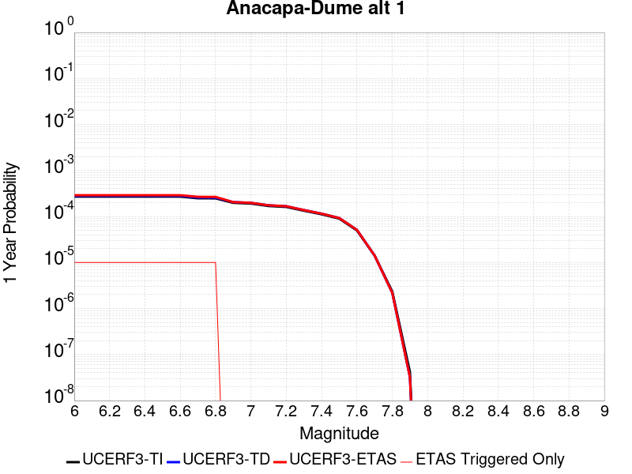 |  |

| Magnitude | 1 wk TI Prob | 1 wk TD Prob | 1 wk ETAS Prob | 1 wk ETAS/TD Gain | 1 wk ETAS Triggered Only | 1 mo TI Prob | 1 mo TD Prob | 1 mo ETAS Prob | 1 mo ETAS/TD Gain | 1 mo ETAS Triggered Only | 1 yr TI Prob | 1 yr TD Prob | 1 yr ETAS Prob | 1 yr ETAS/TD Gain | 1 yr ETAS Triggered Only | 10 yr TI Prob | 10 yr TD Prob | 10 yr ETAS Prob | 10 yr ETAS/TD Gain | 10 yr ETAS Triggered Only |
|-----|-----|-----|-----|-----|-----|-----|-----|-----|-----|-----|-----|-----|-----|-----|-----|-----|-----|-----|-----|-----|
| 6.0 | 5.1871802E-6 | 5.3673853E-6 | 1.757942E-5 | 3.2752297 | 1.22121E-5 | 2.2230583E-5 | 2.3002882E-5 | 3.52147E-5 | 1.5308821 | 1.22121E-5 | 2.7062374E-4 | 2.8002492E-4 | 2.9223363E-4 | 1.0435985 | 1.22121E-5 | 0.002702944 | 0.0027968062 | 0.0028089841 | 1.0043542 | 1.22121E-5 |
| 6.1 | 5.1871802E-6 | 5.3673853E-6 | 1.757942E-5 | 3.2752297 | 1.22121E-5 | 2.2230583E-5 | 2.3002882E-5 | 3.52147E-5 | 1.5308821 | 1.22121E-5 | 2.7062374E-4 | 2.8002492E-4 | 2.9223363E-4 | 1.0435985 | 1.22121E-5 | 0.002702944 | 0.0027968062 | 0.0028089841 | 1.0043542 | 1.22121E-5 |
| 6.2 | 5.1871802E-6 | 5.3673853E-6 | 1.757942E-5 | 3.2752297 | 1.22121E-5 | 2.2230583E-5 | 2.3002882E-5 | 3.52147E-5 | 1.5308821 | 1.22121E-5 | 2.7062374E-4 | 2.8002492E-4 | 2.9223363E-4 | 1.0435985 | 1.22121E-5 | 0.002702944 | 0.0027968062 | 0.0028089841 | 1.0043542 | 1.22121E-5 |
| 6.3 | 5.1871802E-6 | 5.3673853E-6 | 1.757942E-5 | 3.2752297 | 1.22121E-5 | 2.2230583E-5 | 2.3002882E-5 | 3.52147E-5 | 1.5308821 | 1.22121E-5 | 2.7062374E-4 | 2.8002492E-4 | 2.9223363E-4 | 1.0435985 | 1.22121E-5 | 0.002702944 | 0.0027968062 | 0.0028089841 | 1.0043542 | 1.22121E-5 |
| 6.4 | 5.1871802E-6 | 5.3673853E-6 | 1.757942E-5 | 3.2752297 | 1.22121E-5 | 2.2230583E-5 | 2.3002882E-5 | 3.52147E-5 | 1.5308821 | 1.22121E-5 | 2.7062374E-4 | 2.8002492E-4 | 2.9223363E-4 | 1.0435985 | 1.22121E-5 | 0.002702944 | 0.0027968062 | 0.0028089841 | 1.0043542 | 1.22121E-5 |
| 6.5 | 5.1871802E-6 | 5.3673853E-6 | 1.757942E-5 | 3.2752297 | 1.22121E-5 | 2.2230583E-5 | 2.3002882E-5 | 3.52147E-5 | 1.5308821 | 1.22121E-5 | 2.7062374E-4 | 2.8002492E-4 | 2.9223363E-4 | 1.0435985 | 1.22121E-5 | 0.002702944 | 0.0027968062 | 0.0028089841 | 1.0043542 | 1.22121E-5 |
| 6.6 | 5.1871802E-6 | 5.3673853E-6 | 1.757942E-5 | 3.2752297 | 1.22121E-5 | 2.2230583E-5 | 2.3002882E-5 | 3.52147E-5 | 1.5308821 | 1.22121E-5 | 2.7062374E-4 | 2.8002492E-4 | 2.9223363E-4 | 1.0435985 | 1.22121E-5 | 0.002702944 | 0.0027968062 | 0.0028089841 | 1.0043542 | 1.22121E-5 |
| 6.7 | 4.7693475E-6 | 4.9366863E-6 | 1.7148726E-5 | 3.473732 | 1.22121E-5 | 2.04399E-5 | 2.115706E-5 | 3.3368902E-5 | 1.5771993 | 1.22121E-5 | 2.4882736E-4 | 2.5755752E-4 | 2.6976646E-4 | 1.0474029 | 1.22121E-5 | 0.0024854892 | 0.0025726662 | 0.0025848467 | 1.0047346 | 1.22121E-5 |
| 6.8 | 4.753408E-6 | 4.9202345E-6 | 1.7132274E-5 | 3.4820035 | 1.22121E-5 | 2.037159E-5 | 2.1086553E-5 | 3.3298395E-5 | 1.5791293 | 1.22121E-5 | 2.4799586E-4 | 2.566993E-4 | 2.6890828E-4 | 1.0475614 | 1.22121E-5 | 0.002477193 | 0.0025641038 | 0.0025762846 | 1.0047505 | 1.22121E-5 |
| 6.9 | 3.800069E-6 | 3.9371216E-6 | 3.9371216E-6 | 1.0 | 0.0 | 1.6285909E-5 | 1.6873271E-5 | 1.6873271E-5 | 1.0 | 0.0 | 1.9826289E-4 | 2.0541293E-4 | 2.0541293E-4 | 1.0 | 0.0 | 0.001980861 | 0.0020522545 | 0.0020522545 | 1.0 | 0.0 |
| 7.0 | 3.6671938E-6 | 3.7999139E-6 | 3.7999139E-6 | 1.0 | 0.0 | 1.571645E-5 | 1.6285245E-5 | 1.6285245E-5 | 1.0 | 0.0 | 1.9133097E-4 | 1.9825505E-4 | 1.9825505E-4 | 1.0 | 0.0 | 0.0019116632 | 0.001980805 | 0.001980805 | 1.0 | 0.0 |
| 7.1 | 3.2394885E-6 | 3.3587892E-6 | 3.3587892E-6 | 1.0 | 0.0 | 1.3883448E-5 | 1.4394732E-5 | 1.4394732E-5 | 1.0 | 0.0 | 1.6901788E-4 | 1.7524188E-4 | 1.7524188E-4 | 1.0 | 0.0 | 0.0016888938 | 0.001751048 | 0.001751048 | 1.0 | 0.0 |
| 7.2 | 3.0935948E-6 | 3.207922E-6 | 3.207922E-6 | 1.0 | 0.0 | 1.3258196E-5 | 1.3748166E-5 | 1.3748166E-5 | 1.0 | 0.0 | 1.6140658E-4 | 1.6737117E-4 | 1.6737117E-4 | 1.0 | 0.0 | 0.001612894 | 0.0016724621 | 0.0016724621 | 1.0 | 0.0 |
| 7.3 | 2.5604163E-6 | 2.64707E-6 | 2.64707E-6 | 1.0 | 0.0 | 1.0973167E-5 | 1.1344537E-5 | 1.1344537E-5 | 1.0 | 0.0 | 1.3359012E-4 | 1.3811102E-4 | 1.3811102E-4 | 1.0 | 0.0 | 0.0013350984 | 0.0013802565 | 0.0013802565 | 1.0 | 0.0 |
| 7.4 | 2.1429005E-6 | 2.2106E-6 | 2.2106E-6 | 1.0 | 0.0 | 9.1838265E-6 | 9.473966E-6 | 9.473966E-6 | 1.0 | 0.0 | 1.11807356E-4 | 1.1533946E-4 | 1.1533946E-4 | 1.0 | 0.0 | 0.0011175112 | 0.0011527986 | 0.0011527986 | 1.0 | 0.0 |
| 7.5 | 1.7237151E-6 | 1.776143E-6 | 1.776143E-6 | 1.0 | 0.0 | 7.3873293E-6 | 7.612019E-6 | 7.612019E-6 | 1.0 | 0.0 | 8.993702E-5 | 9.267242E-5 | 9.267242E-5 | 1.0 | 0.0 | 8.990063E-4 | 9.2634E-4 | 9.2634E-4 | 1.0 | 0.0 |
| 7.6 | 9.541696E-7 | 9.823194E-7 | 9.823194E-7 | 1.0 | 0.0 | 4.089292E-6 | 4.2099336E-6 | 4.2099336E-6 | 1.0 | 0.0 | 4.9785995E-5 | 5.125475E-5 | 5.125475E-5 | 1.0 | 0.0 | 4.9774844E-4 | 5.1243056E-4 | 5.1243056E-4 | 1.0 | 0.0 |
| 7.7 | 2.7226676E-7 | 2.717239E-7 | 2.717239E-7 | 1.0 | 0.0 | 1.166857E-6 | 1.1645305E-6 | 1.1645305E-6 | 1.0 | 0.0 | 1.4206392E-5 | 1.4178068E-5 | 1.4178068E-5 | 1.0 | 0.0 | 1.4205484E-4 | 1.417717E-4 | 1.417717E-4 | 1.0 | 0.0 |
| 7.8 | 4.5017995E-8 | 4.2157644E-8 | 4.2157644E-8 | 1.0 | 0.0 | 1.9293425E-7 | 1.806756E-7 | 1.806756E-7 | 1.0 | 0.0 | 2.348972E-6 | 2.1997234E-6 | 2.1997234E-6 | 1.0 | 0.0 | 2.348947E-5 | 2.1997039E-5 | 2.1997039E-5 | 1.0 | 0.0 |
| 7.9 | 8.007447E-10 | 6.160872E-10 | 6.160872E-10 | 1.0 | 0.0 | 3.4317629E-9 | 2.6403733E-9 | 2.6403733E-9 | 1.0 | 0.0 | 4.1781714E-8 | 3.2146545E-8 | 3.2146545E-8 | 1.0 | 0.0 | 4.1781706E-7 | 3.214654E-7 | 3.214654E-7 | 1.0 | 0.0 |

## Raymond
*[(top)](#table-of-contents)*

| 1 Week | 1 Month | 1 Year | 10 Year |
|-----|-----|-----|-----|
|  |  |  |  |

| Magnitude | 1 wk TI Prob | 1 wk TD Prob | 1 wk ETAS Prob | 1 wk ETAS/TD Gain | 1 wk ETAS Triggered Only | 1 mo TI Prob | 1 mo TD Prob | 1 mo ETAS Prob | 1 mo ETAS/TD Gain | 1 mo ETAS Triggered Only | 1 yr TI Prob | 1 yr TD Prob | 1 yr ETAS Prob | 1 yr ETAS/TD Gain | 1 yr ETAS Triggered Only | 10 yr TI Prob | 10 yr TD Prob | 10 yr ETAS Prob | 10 yr ETAS/TD Gain | 10 yr ETAS Triggered Only |
|-----|-----|-----|-----|-----|-----|-----|-----|-----|-----|-----|-----|-----|-----|-----|-----|-----|-----|-----|-----|-----|
| 6.0 | 1.5157413E-5 | 1.5810077E-5 | 1.5810077E-5 | 1.0 | 0.0 | 6.4958724E-5 | 6.775586E-5 | 6.775586E-5 | 1.0 | 0.0 | 7.905855E-4 | 8.2464045E-4 | 8.2464045E-4 | 1.0 | 0.0 | 0.007877788 | 0.008218322 | 0.008230434 | 1.0014738 | 1.22121E-5 |
| 6.1 | 1.5157413E-5 | 1.5810077E-5 | 1.5810077E-5 | 1.0 | 0.0 | 6.4958724E-5 | 6.775586E-5 | 6.775586E-5 | 1.0 | 0.0 | 7.905855E-4 | 8.2464045E-4 | 8.2464045E-4 | 1.0 | 0.0 | 0.007877788 | 0.008218322 | 0.008230434 | 1.0014738 | 1.22121E-5 |
| 6.2 | 1.5157413E-5 | 1.5810077E-5 | 1.5810077E-5 | 1.0 | 0.0 | 6.4958724E-5 | 6.775586E-5 | 6.775586E-5 | 1.0 | 0.0 | 7.905855E-4 | 8.2464045E-4 | 8.2464045E-4 | 1.0 | 0.0 | 0.007877788 | 0.008218322 | 0.008230434 | 1.0014738 | 1.22121E-5 |
| 6.3 | 1.5157413E-5 | 1.5810077E-5 | 1.5810077E-5 | 1.0 | 0.0 | 6.4958724E-5 | 6.775586E-5 | 6.775586E-5 | 1.0 | 0.0 | 7.905855E-4 | 8.2464045E-4 | 8.2464045E-4 | 1.0 | 0.0 | 0.007877788 | 0.008218322 | 0.008230434 | 1.0014738 | 1.22121E-5 |
| 6.4 | 1.3941944E-5 | 1.4454645E-5 | 1.4454645E-5 | 1.0 | 0.0 | 5.9749822E-5 | 6.194714E-5 | 6.194714E-5 | 1.0 | 0.0 | 7.2721124E-4 | 7.539688E-4 | 7.539688E-4 | 1.0 | 0.0 | 0.007248361 | 0.007516441 | 0.0075285616 | 1.0016125 | 1.22121E-5 |
| 6.5 | 1.3941944E-5 | 1.4454645E-5 | 1.4454645E-5 | 1.0 | 0.0 | 5.9749822E-5 | 6.194714E-5 | 6.194714E-5 | 1.0 | 0.0 | 7.2721124E-4 | 7.539688E-4 | 7.539688E-4 | 1.0 | 0.0 | 0.007248361 | 0.007516441 | 0.0075285616 | 1.0016125 | 1.22121E-5 |
| 6.6 | 1.0542609E-5 | 1.0671079E-5 | 1.0671079E-5 | 1.0 | 0.0 | 4.5181827E-5 | 4.5732424E-5 | 4.5732424E-5 | 1.0 | 0.0 | 5.499499E-4 | 5.5665546E-4 | 5.5665546E-4 | 1.0 | 0.0 | 0.005485909 | 0.0055531724 | 0.005565317 | 1.0021869 | 1.22121E-5 |
| 6.7 | 1.0542609E-5 | 1.0671079E-5 | 1.0671079E-5 | 1.0 | 0.0 | 4.5181827E-5 | 4.5732424E-5 | 4.5732424E-5 | 1.0 | 0.0 | 5.499499E-4 | 5.5665546E-4 | 5.5665546E-4 | 1.0 | 0.0 | 0.005485909 | 0.0055531724 | 0.005565317 | 1.0021869 | 1.22121E-5 |
| 6.8 | 1.0079132E-5 | 1.0176613E-5 | 1.0176613E-5 | 1.0 | 0.0 | 4.3195567E-5 | 4.3613356E-5 | 4.3613356E-5 | 1.0 | 0.0 | 5.257791E-4 | 5.308686E-4 | 5.308686E-4 | 1.0 | 0.0 | 0.0052453685 | 0.005296554 | 0.005308701 | 1.0022935 | 1.22121E-5 |
| 6.9 | 7.721598E-6 | 7.5488792E-6 | 7.5488792E-6 | 1.0 | 0.0 | 3.3092143E-5 | 3.2351945E-5 | 3.2351945E-5 | 1.0 | 0.0 | 4.0282236E-4 | 3.9381496E-4 | 3.9381496E-4 | 1.0 | 0.0 | 0.0040209293 | 0.0039313044 | 0.0039434684 | 1.0030942 | 1.22121E-5 |
| 7.0 | 7.137566E-6 | 6.911282E-6 | 6.911282E-6 | 1.0 | 0.0 | 3.058921E-5 | 2.9619448E-5 | 2.9619448E-5 | 1.0 | 0.0 | 3.7236E-4 | 3.605582E-4 | 3.605582E-4 | 1.0 | 0.0 | 0.0037173668 | 0.0035998505 | 0.0036120184 | 1.0033802 | 1.22121E-5 |
| 7.1 | 5.654976E-6 | 5.29952E-6 | 5.29952E-6 | 1.0 | 0.0 | 2.4235387E-5 | 2.2712033E-5 | 2.2712033E-5 | 1.0 | 0.0 | 2.9502588E-4 | 2.7648412E-4 | 2.7648412E-4 | 1.0 | 0.0 | 0.0029463451 | 0.0027614324 | 0.0027736109 | 1.0044101 | 1.22121E-5 |
| 7.2 | 4.9358455E-6 | 4.5266393E-6 | 4.5266393E-6 | 1.0 | 0.0 | 2.1153453E-5 | 1.9399738E-5 | 1.9399738E-5 | 1.0 | 0.0 | 2.5751285E-4 | 2.3616636E-4 | 2.3616636E-4 | 1.0 | 0.0 | 0.0025721465 | 0.002359176 | 0.0023713592 | 1.0051643 | 1.22121E-5 |
| 7.3 | 4.2368597E-6 | 3.8055998E-6 | 3.8055998E-6 | 1.0 | 0.0 | 1.8157843E-5 | 1.6309612E-5 | 1.6309612E-5 | 1.0 | 0.0 | 2.2104931E-4 | 1.9855154E-4 | 1.9855154E-4 | 1.0 | 0.0 | 0.0022082955 | 0.0019837602 | 0.001995948 | 1.0061438 | 1.22121E-5 |
| 7.4 | 3.4999923E-6 | 3.043729E-6 | 3.043729E-6 | 1.0 | 0.0 | 1.49998805E-5 | 1.3044489E-5 | 1.3044489E-5 | 1.0 | 0.0 | 1.8260824E-4 | 1.5880515E-4 | 1.5880515E-4 | 1.0 | 0.0 | 0.0018245826 | 0.0015869325 | 0.0015991252 | 1.0076832 | 1.22121E-5 |
| 7.5 | 2.738017E-6 | 2.302034E-6 | 2.302034E-6 | 1.0 | 0.0 | 1.1734306E-5 | 9.865823E-6 | 9.865823E-6 | 1.0 | 0.0 | 1.428558E-4 | 1.2010984E-4 | 1.2010984E-4 | 1.0 | 0.0 | 0.0014276401 | 0.0012004636 | 0.001212661 | 1.0101606 | 1.22121E-5 |
| 7.6 | 1.8186392E-6 | 1.4423032E-6 | 1.4423032E-6 | 1.0 | 0.0 | 7.794145E-6 | 6.181285E-6 | 6.181285E-6 | 1.0 | 0.0 | 9.488958E-5 | 7.525458E-5 | 7.525458E-5 | 1.0 | 0.0 | 9.4849075E-4 | 7.523025E-4 | 7.645054E-4 | 1.0162208 | 1.22121E-5 |
| 7.7 | 1.0660348E-6 | 7.643733E-7 | 7.643733E-7 | 1.0 | 0.0 | 4.5687125E-6 | 3.2758817E-6 | 3.2758817E-6 | 1.0 | 0.0 | 5.5622655E-5 | 3.9883143E-5 | 3.9883143E-5 | 1.0 | 0.0 | 5.5608735E-4 | 3.9876899E-4 | 4.1097624E-4 | 1.0306122 | 1.22121E-5 |
| 7.8 | 6.913602E-7 | 4.3203528E-7 | 4.3203528E-7 | 1.0 | 0.0 | 2.962969E-6 | 1.8515785E-6 | 1.8515785E-6 | 1.0 | 0.0 | 3.607355E-5 | 2.2542741E-5 | 2.2542741E-5 | 1.0 | 0.0 | 3.6067693E-4 | 2.254124E-4 | 2.3762175E-4 | 1.0541645 | 1.22121E-5 |
| 7.9 | 7.425201E-8 | 5.3221502E-8 | 5.3221502E-8 | 1.0 | 0.0 | 3.1822285E-7 | 2.2809213E-7 | 2.2809213E-7 | 1.0 | 0.0 | 3.874356E-6 | 2.7770195E-6 | 2.7770195E-6 | 1.0 | 0.0 | 3.8742884E-5 | 2.7769978E-5 | 2.7769978E-5 | 1.0 | 0.0 |

## Ortigalita (South)
*[(top)](#table-of-contents)*

| 1 Week | 1 Month | 1 Year | 10 Year |
|-----|-----|-----|-----|
| 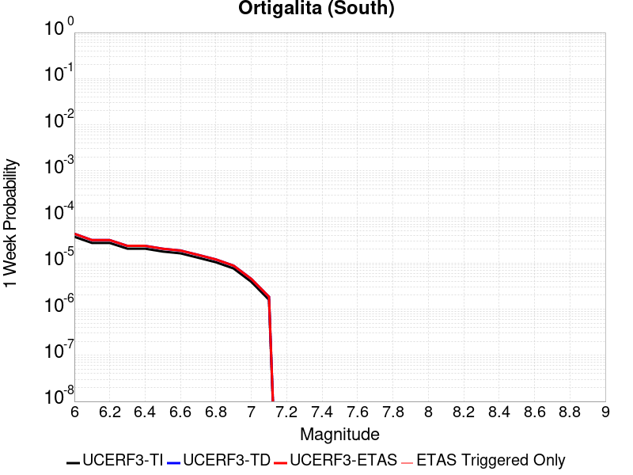 |  |  |  |

| Magnitude | 1 wk TI Prob | 1 wk TD Prob | 1 wk ETAS Prob | 1 wk ETAS/TD Gain | 1 wk ETAS Triggered Only | 1 mo TI Prob | 1 mo TD Prob | 1 mo ETAS Prob | 1 mo ETAS/TD Gain | 1 mo ETAS Triggered Only | 1 yr TI Prob | 1 yr TD Prob | 1 yr ETAS Prob | 1 yr ETAS/TD Gain | 1 yr ETAS Triggered Only | 10 yr TI Prob | 10 yr TD Prob | 10 yr ETAS Prob | 10 yr ETAS/TD Gain | 10 yr ETAS Triggered Only |
|-----|-----|-----|-----|-----|-----|-----|-----|-----|-----|-----|-----|-----|-----|-----|-----|-----|-----|-----|-----|-----|
| 6.0 | 3.72394E-5 | 4.325543E-5 | 4.325543E-5 | 1.0 | 0.0 | 1.5958765E-4 | 1.8536813E-4 | 1.9757797E-4 | 1.065868 | 1.22121E-5 | 0.0019412481 | 0.0022546777 | 0.0022668622 | 1.0054041 | 1.22121E-5 | 0.019243775 | 0.0223344 | 0.02234634 | 1.0005345 | 1.22121E-5 |
| 6.1 | 2.7299884E-5 | 3.1491913E-5 | 3.1491913E-5 | 1.0 | 0.0 | 1.16994255E-4 | 1.3495867E-4 | 1.3495867E-4 | 1.0 | 0.0 | 0.0014234743 | 0.0016419389 | 0.0016419389 | 1.0 | 0.0 | 0.014143906 | 0.016304003 | 0.016304003 | 1.0 | 0.0 |
| 6.2 | 2.7299884E-5 | 3.1491913E-5 | 3.1491913E-5 | 1.0 | 0.0 | 1.16994255E-4 | 1.3495867E-4 | 1.3495867E-4 | 1.0 | 0.0 | 0.0014234743 | 0.0016419389 | 0.0016419389 | 1.0 | 0.0 | 0.014143906 | 0.016304003 | 0.016304003 | 1.0 | 0.0 |
| 6.3 | 2.0546433E-5 | 2.3631355E-5 | 2.3631355E-5 | 1.0 | 0.0 | 8.805317E-5 | 1.01273414E-4 | 1.01273414E-4 | 1.0 | 0.0 | 0.00107152 | 0.0012323253 | 0.0012323253 | 1.0 | 0.0 | 0.010663681 | 0.012256981 | 0.012256981 | 1.0 | 0.0 |
| 6.4 | 2.0546433E-5 | 2.3631355E-5 | 2.3631355E-5 | 1.0 | 0.0 | 8.805317E-5 | 1.01273414E-4 | 1.01273414E-4 | 1.0 | 0.0 | 0.00107152 | 0.0012323253 | 0.0012323253 | 1.0 | 0.0 | 0.010663681 | 0.012256981 | 0.012256981 | 1.0 | 0.0 |
| 6.5 | 1.7779594E-5 | 2.0446892E-5 | 2.0446892E-5 | 1.0 | 0.0 | 7.619603E-5 | 8.762667E-5 | 8.762667E-5 | 1.0 | 0.0 | 9.272918E-4 | 0.0010663462 | 0.0010663462 | 1.0 | 0.0 | 0.009234319 | 0.010613761 | 0.010613761 | 1.0 | 0.0 |
| 6.6 | 1.6272212E-5 | 1.8714893E-5 | 1.8714893E-5 | 1.0 | 0.0 | 6.973618E-5 | 8.0204285E-5 | 8.0204285E-5 | 1.0 | 0.0 | 8.487073E-4 | 9.760619E-4 | 9.760619E-4 | 1.0 | 0.0 | 0.008454733 | 0.009719051 | 0.009719051 | 1.0 | 0.0 |
| 6.7 | 1.3051484E-5 | 1.5038697E-5 | 1.5038697E-5 | 1.0 | 0.0 | 5.593373E-5 | 6.445002E-5 | 6.445002E-5 | 1.0 | 0.0 | 6.807804E-4 | 7.84406E-4 | 7.84406E-4 | 1.0 | 0.0 | 0.006786986 | 0.007817356 | 0.007817356 | 1.0 | 0.0 |
| 6.8 | 1.04277415E-5 | 1.19871875E-5 | 1.19871875E-5 | 1.0 | 0.0 | 4.4689557E-5 | 5.1372688E-5 | 5.1372688E-5 | 1.0 | 0.0 | 5.439595E-4 | 6.2529044E-4 | 6.2529044E-4 | 1.0 | 0.0 | 0.0054262993 | 0.006236065 | 0.006236065 | 1.0 | 0.0 |
| 6.9 | 7.639968E-6 | 8.791468E-6 | 8.791468E-6 | 1.0 | 0.0 | 3.274231E-5 | 3.7677208E-5 | 3.7677208E-5 | 1.0 | 0.0 | 3.9856473E-4 | 4.5862934E-4 | 4.5862934E-4 | 1.0 | 0.0 | 0.003978506 | 0.0045774146 | 0.0045774146 | 1.0 | 0.0 |
| 7.0 | 3.919831E-6 | 4.5333823E-6 | 4.5333823E-6 | 1.0 | 0.0 | 1.679917E-5 | 1.942865E-5 | 1.942865E-5 | 1.0 | 0.0 | 2.045107E-4 | 2.3652024E-4 | 2.3652024E-4 | 1.0 | 0.0 | 0.0020432258 | 0.0023628937 | 0.0023628937 | 1.0 | 0.0 |
| 7.1 | 1.6017933E-6 | 1.8570338E-6 | 1.8570338E-6 | 1.0 | 0.0 | 6.8648105E-6 | 7.958698E-6 | 7.958698E-6 | 1.0 | 0.0 | 8.357586E-5 | 9.6893906E-5 | 9.6893906E-5 | 1.0 | 0.0 | 8.3544437E-4 | 9.6862135E-4 | 9.6862135E-4 | 1.0 | 0.0 |

## Casmalia 2011 CFM
*[(top)](#table-of-contents)*

| 1 Week | 1 Month | 1 Year | 10 Year |
|-----|-----|-----|-----|
|  |  | 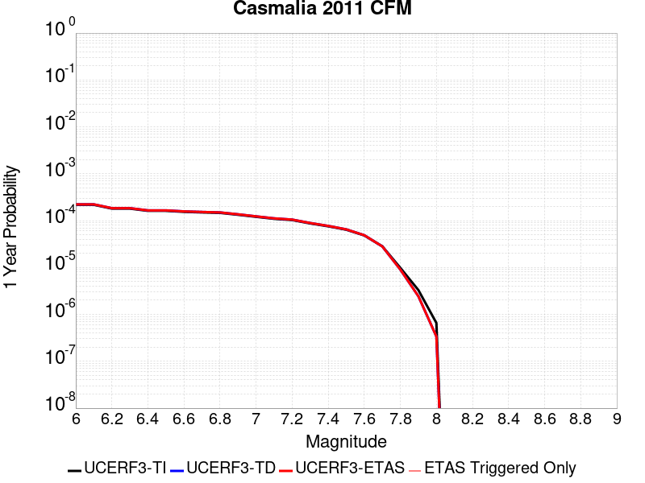 |  |

| Magnitude | 1 wk TI Prob | 1 wk TD Prob | 1 wk ETAS Prob | 1 wk ETAS/TD Gain | 1 wk ETAS Triggered Only | 1 mo TI Prob | 1 mo TD Prob | 1 mo ETAS Prob | 1 mo ETAS/TD Gain | 1 mo ETAS Triggered Only | 1 yr TI Prob | 1 yr TD Prob | 1 yr ETAS Prob | 1 yr ETAS/TD Gain | 1 yr ETAS Triggered Only | 10 yr TI Prob | 10 yr TD Prob | 10 yr ETAS Prob | 10 yr ETAS/TD Gain | 10 yr ETAS Triggered Only |
|-----|-----|-----|-----|-----|-----|-----|-----|-----|-----|-----|-----|-----|-----|-----|-----|-----|-----|-----|-----|-----|
| 6.0 | 4.1704893E-6 | 4.2624793E-6 | 4.2624793E-6 | 1.0 | 0.0 | 1.7873403E-5 | 1.8267641E-5 | 1.8267641E-5 | 1.0 | 0.0 | 2.1758694E-4 | 2.2238602E-4 | 2.2238602E-4 | 1.0 | 0.0 | 0.0021737402 | 0.0022216558 | 0.0022338408 | 1.0054846 | 1.22121E-5 |
| 6.1 | 4.1704893E-6 | 4.2624793E-6 | 4.2624793E-6 | 1.0 | 0.0 | 1.7873403E-5 | 1.8267641E-5 | 1.8267641E-5 | 1.0 | 0.0 | 2.1758694E-4 | 2.2238602E-4 | 2.2238602E-4 | 1.0 | 0.0 | 0.0021737402 | 0.0022216558 | 0.0022338408 | 1.0054846 | 1.22121E-5 |
| 6.2 | 3.457312E-6 | 3.5370183E-6 | 3.5370183E-6 | 1.0 | 0.0 | 1.4816967E-5 | 1.5158563E-5 | 1.5158563E-5 | 1.0 | 0.0 | 1.8038164E-4 | 1.8453995E-4 | 1.8453995E-4 | 1.0 | 0.0 | 0.001802353 | 0.0018438766 | 0.0018560662 | 1.0066109 | 1.22121E-5 |
| 6.3 | 3.457312E-6 | 3.5370183E-6 | 3.5370183E-6 | 1.0 | 0.0 | 1.4816967E-5 | 1.5158563E-5 | 1.5158563E-5 | 1.0 | 0.0 | 1.8038164E-4 | 1.8453995E-4 | 1.8453995E-4 | 1.0 | 0.0 | 0.001802353 | 0.0018438766 | 0.0018560662 | 1.0066109 | 1.22121E-5 |
| 6.4 | 3.0957337E-6 | 3.1692225E-6 | 3.1692225E-6 | 1.0 | 0.0 | 1.3267363E-5 | 1.3582311E-5 | 1.3582311E-5 | 1.0 | 0.0 | 1.6151817E-4 | 1.6535215E-4 | 1.6535215E-4 | 1.0 | 0.0 | 0.0016140083 | 0.0016522973 | 0.0016644893 | 1.0073788 | 1.22121E-5 |
| 6.5 | 3.0957337E-6 | 3.1692225E-6 | 3.1692225E-6 | 1.0 | 0.0 | 1.3267363E-5 | 1.3582311E-5 | 1.3582311E-5 | 1.0 | 0.0 | 1.6151817E-4 | 1.6535215E-4 | 1.6535215E-4 | 1.0 | 0.0 | 0.0016140083 | 0.0016522973 | 0.0016644893 | 1.0073788 | 1.22121E-5 |
| 6.6 | 2.9459152E-6 | 3.016572E-6 | 3.016572E-6 | 1.0 | 0.0 | 1.262529E-5 | 1.2928102E-5 | 1.2928102E-5 | 1.0 | 0.0 | 1.5370206E-4 | 1.5738832E-4 | 1.5738832E-4 | 1.0 | 0.0 | 0.0015359579 | 0.0015727741 | 0.001584967 | 1.0077524 | 1.22121E-5 |
| 6.7 | 2.8634809E-6 | 2.9324694E-6 | 2.9324694E-6 | 1.0 | 0.0 | 1.2272003E-5 | 1.2567666E-5 | 1.2567666E-5 | 1.0 | 0.0 | 1.4940138E-4 | 1.5300064E-4 | 1.5300064E-4 | 1.0 | 0.0 | 0.0014930099 | 0.0015289584 | 0.0015411519 | 1.007975 | 1.22121E-5 |
| 6.8 | 2.7999822E-6 | 2.8675936E-6 | 2.8675936E-6 | 1.0 | 0.0 | 1.1999869E-5 | 1.2289629E-5 | 1.2289629E-5 | 1.0 | 0.0 | 1.460886E-4 | 1.4961601E-4 | 1.4961601E-4 | 1.0 | 0.0 | 0.001459926 | 0.0014951582 | 0.001507352 | 1.0081556 | 1.22121E-5 |
| 6.9 | 2.551052E-6 | 2.611962E-6 | 2.611962E-6 | 1.0 | 0.0 | 1.0933034E-5 | 1.1194074E-5 | 1.1194074E-5 | 1.0 | 0.0 | 1.3310155E-4 | 1.3627937E-4 | 1.3627937E-4 | 1.0 | 0.0 | 0.0013302186 | 0.0013619621 | 0.0013741575 | 1.0089543 | 1.22121E-5 |
| 7.0 | 2.3081875E-6 | 2.3624061E-6 | 2.3624061E-6 | 1.0 | 0.0 | 9.892195E-6 | 1.0124559E-5 | 1.0124559E-5 | 1.0 | 0.0 | 1.20430814E-4 | 1.2325955E-4 | 1.2325955E-4 | 1.0 | 0.0 | 0.0012036557 | 0.0012319147 | 0.0012441118 | 1.0099009 | 1.22121E-5 |
| 7.1 | 2.093245E-6 | 2.1417218E-6 | 2.1417218E-6 | 1.0 | 0.0 | 8.971019E-6 | 9.178775E-6 | 9.178775E-6 | 1.0 | 0.0 | 1.09216686E-4 | 1.11745874E-4 | 1.11745874E-4 | 1.0 | 0.0 | 0.0010916302 | 0.0011168988 | 0.0011290973 | 1.0109217 | 1.22121E-5 |
| 7.2 | 1.9714576E-6 | 2.0165066E-6 | 2.0165066E-6 | 1.0 | 0.0 | 8.449076E-6 | 8.642142E-6 | 8.642142E-6 | 1.0 | 0.0 | 1.0286264E-4 | 1.05213025E-4 | 1.05213025E-4 | 1.0 | 0.0 | 0.0010281504 | 0.001051634 | 0.0010638332 | 1.0116003 | 1.22121E-5 |
| 7.3 | 1.6689512E-6 | 1.7047108E-6 | 1.7047108E-6 | 1.0 | 0.0 | 7.1526288E-6 | 7.305883E-6 | 7.305883E-6 | 1.0 | 0.0 | 8.7079774E-5 | 8.8945504E-5 | 8.8945504E-5 | 1.0 | 0.0 | 8.7045657E-4 | 8.8909984E-4 | 9.0130104E-4 | 1.0137231 | 1.22121E-5 |
| 7.4 | 1.4490954E-6 | 1.4778888E-6 | 1.4778888E-6 | 1.0 | 0.0 | 6.210394E-6 | 6.3337934E-6 | 6.3337934E-6 | 1.0 | 0.0 | 7.560892E-5 | 7.711121E-5 | 7.711121E-5 | 1.0 | 0.0 | 7.55832E-4 | 7.708452E-4 | 7.830479E-4 | 1.0158303 | 1.22121E-5 |
| 7.5 | 1.226873E-6 | 1.2481682E-6 | 1.2481682E-6 | 1.0 | 0.0 | 5.2580162E-6 | 5.3492818E-6 | 5.3492818E-6 | 1.0 | 0.0 | 6.401447E-5 | 6.512556E-5 | 6.512556E-5 | 1.0 | 0.0 | 6.399603E-4 | 6.510653E-4 | 6.632694E-4 | 1.018745 | 1.22121E-5 |
| 7.6 | 9.2561345E-7 | 9.3619076E-7 | 9.3619076E-7 | 1.0 | 0.0 | 3.966909E-6 | 4.01224E-6 | 4.01224E-6 | 1.0 | 0.0 | 4.8296046E-5 | 4.884793E-5 | 4.884793E-5 | 1.0 | 0.0 | 4.828555E-4 | 4.8837234E-4 | 4.8837234E-4 | 1.0 | 0.0 |
| 7.7 | 5.4367933E-7 | 5.392877E-7 | 5.392877E-7 | 1.0 | 0.0 | 2.3300522E-6 | 2.311231E-6 | 2.311231E-6 | 1.0 | 0.0 | 2.8368017E-5 | 2.8138875E-5 | 2.8138875E-5 | 1.0 | 0.0 | 2.8364395E-4 | 2.8135325E-4 | 2.8135325E-4 | 1.0 | 0.0 |
| 7.8 | 1.8825742E-7 | 1.7342205E-7 | 1.7342205E-7 | 1.0 | 0.0 | 8.068173E-7 | 7.432372E-7 | 7.432372E-7 | 1.0 | 0.0 | 9.822956E-6 | 9.048875E-6 | 9.048875E-6 | 1.0 | 0.0 | 9.822522E-5 | 9.048509E-5 | 9.048509E-5 | 1.0 | 0.0 |
| 7.9 | 6.342771E-8 | 4.679015E-8 | 4.679015E-8 | 1.0 | 0.0 | 2.7183304E-7 | 2.0052919E-7 | 2.0052919E-7 | 1.0 | 0.0 | 3.3095623E-6 | 2.4414403E-6 | 2.4414403E-6 | 1.0 | 0.0 | 3.309513E-5 | 2.4414137E-5 | 2.4414137E-5 | 1.0 | 0.0 |
| 8.0 | 1.2574819E-8 | 6.473155E-9 | 6.473155E-9 | 1.0 | 0.0 | 5.3892084E-8 | 2.7742091E-8 | 2.7742091E-8 | 1.0 | 0.0 | 6.561359E-7 | 3.377599E-7 | 3.377599E-7 | 1.0 | 0.0 | 6.56134E-6 | 3.377594E-6 | 3.377594E-6 | 1.0 | 0.0 |

## Simi-Santa Rosa
*[(top)](#table-of-contents)*

| 1 Week | 1 Month | 1 Year | 10 Year |
|-----|-----|-----|-----|
| 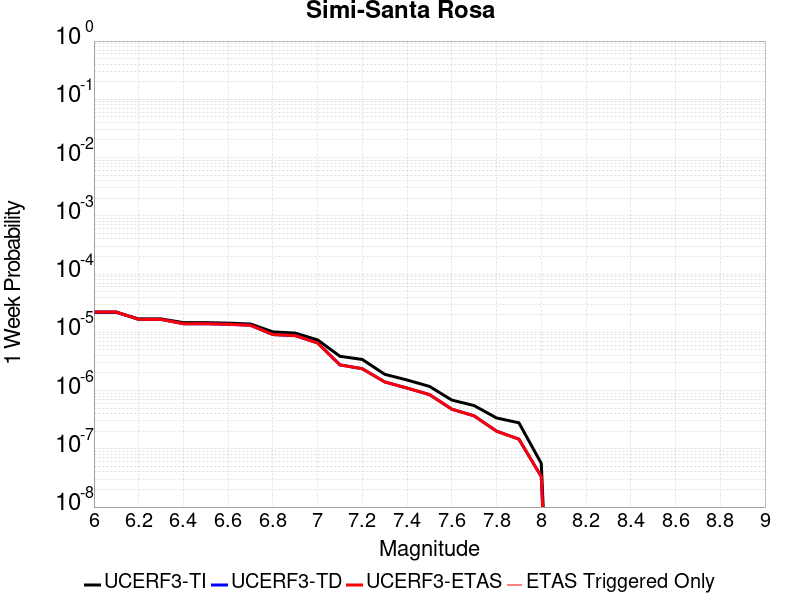 |  | 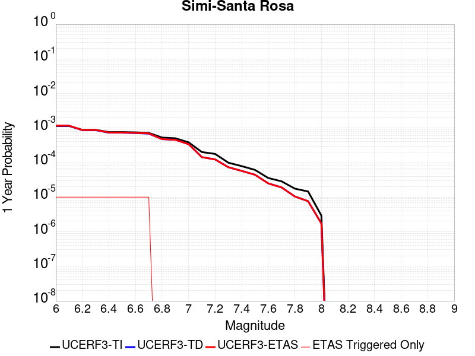 | 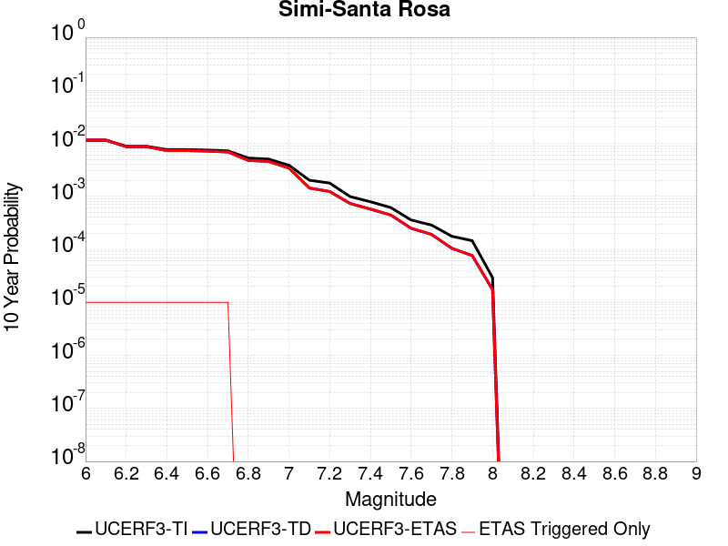 |

| Magnitude | 1 wk TI Prob | 1 wk TD Prob | 1 wk ETAS Prob | 1 wk ETAS/TD Gain | 1 wk ETAS Triggered Only | 1 mo TI Prob | 1 mo TD Prob | 1 mo ETAS Prob | 1 mo ETAS/TD Gain | 1 mo ETAS Triggered Only | 1 yr TI Prob | 1 yr TD Prob | 1 yr ETAS Prob | 1 yr ETAS/TD Gain | 1 yr ETAS Triggered Only | 10 yr TI Prob | 10 yr TD Prob | 10 yr ETAS Prob | 10 yr ETAS/TD Gain | 10 yr ETAS Triggered Only |
|-----|-----|-----|-----|-----|-----|-----|-----|-----|-----|-----|-----|-----|-----|-----|-----|-----|-----|-----|-----|-----|
| 6.0 | 2.198912E-5 | 2.2275362E-5 | 2.2275362E-5 | 1.0 | 0.0 | 9.4235686E-5 | 9.5462594E-5 | 9.5462594E-5 | 1.0 | 0.0 | 0.0011467156 | 0.0011616813 | 0.0011738791 | 1.0105002 | 1.22121E-5 | 0.011408163 | 0.011560534 | 0.011572605 | 1.0010442 | 1.22121E-5 |
| 6.1 | 2.198912E-5 | 2.2275362E-5 | 2.2275362E-5 | 1.0 | 0.0 | 9.4235686E-5 | 9.5462594E-5 | 9.5462594E-5 | 1.0 | 0.0 | 0.0011467156 | 0.0011616813 | 0.0011738791 | 1.0105002 | 1.22121E-5 | 0.011408163 | 0.011560534 | 0.011572605 | 1.0010442 | 1.22121E-5 |
| 6.2 | 1.69983E-5 | 1.6668499E-5 | 1.6668499E-5 | 1.0 | 0.0 | 7.284782E-5 | 7.143463E-5 | 7.143463E-5 | 1.0 | 0.0 | 8.865613E-4 | 8.6939876E-4 | 8.8160025E-4 | 1.0140344 | 1.22121E-5 | 0.008830327 | 0.008662896 | 0.0086750025 | 1.0013975 | 1.22121E-5 |
| 6.3 | 1.69983E-5 | 1.6668499E-5 | 1.6668499E-5 | 1.0 | 0.0 | 7.284782E-5 | 7.143463E-5 | 7.143463E-5 | 1.0 | 0.0 | 8.865613E-4 | 8.6939876E-4 | 8.8160025E-4 | 1.0140344 | 1.22121E-5 | 0.008830327 | 0.008662896 | 0.0086750025 | 1.0013975 | 1.22121E-5 |
| 6.4 | 1.4666188E-5 | 1.405249E-5 | 1.405249E-5 | 1.0 | 0.0 | 6.285358E-5 | 6.022371E-5 | 6.022371E-5 | 1.0 | 0.0 | 7.6497364E-4 | 7.3300186E-4 | 7.4520503E-4 | 1.0166482 | 1.22121E-5 | 0.0076234564 | 0.007308317 | 0.0073204394 | 1.0016588 | 1.22121E-5 |
| 6.5 | 1.4666188E-5 | 1.405249E-5 | 1.405249E-5 | 1.0 | 0.0 | 6.285358E-5 | 6.022371E-5 | 6.022371E-5 | 1.0 | 0.0 | 7.6497364E-4 | 7.3300186E-4 | 7.4520503E-4 | 1.0166482 | 1.22121E-5 | 0.0076234564 | 0.007308317 | 0.0073204394 | 1.0016588 | 1.22121E-5 |
| 6.6 | 1.4377586E-5 | 1.3729531E-5 | 1.3729531E-5 | 1.0 | 0.0 | 6.1616774E-5 | 5.8839658E-5 | 5.8839658E-5 | 1.0 | 0.0 | 7.4992597E-4 | 7.1616226E-4 | 7.283656E-4 | 1.0170399 | 1.22121E-5 | 0.007474003 | 0.0071410118 | 0.0071531367 | 1.0016979 | 1.22121E-5 |
| 6.7 | 1.3881404E-5 | 1.32075E-5 | 1.32075E-5 | 1.0 | 0.0 | 5.9490372E-5 | 5.6602486E-5 | 5.6602486E-5 | 1.0 | 0.0 | 7.240546E-4 | 6.889421E-4 | 7.0114573E-4 | 1.0177137 | 1.22121E-5 | 0.007217 | 0.0068705124 | 0.0068826405 | 1.0017653 | 1.22121E-5 |
| 6.8 | 1.0176516E-5 | 9.154114E-6 | 9.154114E-6 | 1.0 | 0.0 | 4.3612912E-5 | 3.923142E-5 | 3.923142E-5 | 1.0 | 0.0 | 5.308578E-4 | 4.7755442E-4 | 4.7755442E-4 | 1.0 | 0.0 | 0.0052959146 | 0.0047669155 | 0.0047669155 | 1.0 | 0.0 |
| 6.9 | 9.699797E-6 | 8.774685E-6 | 8.774685E-6 | 1.0 | 0.0 | 4.15699E-5 | 3.7605343E-5 | 3.7605343E-5 | 1.0 | 0.0 | 5.05996E-4 | 4.577653E-4 | 4.577653E-4 | 1.0 | 0.0 | 0.005048454 | 0.0045698415 | 0.0045698415 | 1.0 | 0.0 |
| 7.0 | 7.4049476E-6 | 6.559307E-6 | 6.559307E-6 | 1.0 | 0.0 | 3.1735104E-5 | 2.8111084E-5 | 2.8111084E-5 | 1.0 | 0.0 | 3.8630638E-4 | 3.4221137E-4 | 3.4221137E-4 | 1.0 | 0.0 | 0.0038563553 | 0.003418086 | 0.003418086 | 1.0 | 0.0 |
| 7.1 | 3.873439E-6 | 2.7594979E-6 | 2.7594979E-6 | 1.0 | 0.0 | 1.6600346E-5 | 1.1826367E-5 | 1.1826367E-5 | 1.0 | 0.0 | 2.0209046E-4 | 1.4397675E-4 | 1.4397675E-4 | 1.0 | 0.0 | 0.0020190678 | 0.0014388582 | 0.0014388582 | 1.0 | 0.0 |
| 7.2 | 3.417706E-6 | 2.367638E-6 | 2.367638E-6 | 1.0 | 0.0 | 1.4647229E-5 | 1.0146982E-5 | 1.0146982E-5 | 1.0 | 0.0 | 1.7831543E-4 | 1.2353274E-4 | 1.2353274E-4 | 1.0 | 0.0 | 0.0017817242 | 0.0012346628 | 0.0012346628 | 1.0 | 0.0 |
| 7.3 | 1.90225E-6 | 1.4073678E-6 | 1.4073678E-6 | 1.0 | 0.0 | 8.152474E-6 | 6.0315624E-6 | 6.0315624E-6 | 1.0 | 0.0 | 9.9251854E-5 | 7.3431824E-5 | 7.3431824E-5 | 1.0 | 0.0 | 9.920754E-4 | 7.340778E-4 | 7.340778E-4 | 1.0 | 0.0 |
| 7.4 | 1.5170556E-6 | 1.1024704E-6 | 1.1024704E-6 | 1.0 | 0.0 | 6.5016507E-6 | 4.7248645E-6 | 4.7248645E-6 | 1.0 | 0.0 | 7.915472E-5 | 5.752372E-5 | 5.752372E-5 | 1.0 | 0.0 | 7.9126534E-4 | 5.750894E-4 | 5.750894E-4 | 1.0 | 0.0 |
| 7.5 | 1.178732E-6 | 8.5350376E-7 | 8.5350376E-7 | 1.0 | 0.0 | 5.0516987E-6 | 3.6578683E-6 | 3.6578683E-6 | 1.0 | 0.0 | 6.1502695E-5 | 4.4533645E-5 | 4.4533645E-5 | 1.0 | 0.0 | 6.148568E-4 | 4.4524815E-4 | 4.4524815E-4 | 1.0 | 0.0 |
| 7.6 | 6.8722386E-7 | 4.793161E-7 | 4.793161E-7 | 1.0 | 0.0 | 2.9452417E-6 | 2.0542102E-6 | 2.0542102E-6 | 1.0 | 0.0 | 3.5857727E-5 | 2.5009724E-5 | 2.5009724E-5 | 1.0 | 0.0 | 3.5851944E-4 | 2.5006922E-4 | 2.5006922E-4 | 1.0 | 0.0 |
| 7.7 | 5.5126515E-7 | 3.6730805E-7 | 3.6730805E-7 | 1.0 | 0.0 | 2.3625628E-6 | 1.5741764E-6 | 1.5741764E-6 | 1.0 | 0.0 | 2.8763823E-5 | 1.9165429E-5 | 1.9165429E-5 | 1.0 | 0.0 | 2.87601E-4 | 1.9163788E-4 | 1.9163788E-4 | 1.0 | 0.0 |
| 7.8 | 3.3860243E-7 | 2.007573E-7 | 2.007573E-7 | 1.0 | 0.0 | 1.4511525E-6 | 8.603882E-7 | 8.603882E-7 | 1.0 | 0.0 | 1.7667637E-5 | 1.0475176E-5 | 1.0475176E-5 | 1.0 | 0.0 | 1.7666233E-4 | 1.04746876E-4 | 1.04746876E-4 | 1.0 | 0.0 |
| 7.9 | 2.7955386E-7 | 1.4648928E-7 | 1.4648928E-7 | 1.0 | 0.0 | 1.1980875E-6 | 6.2781106E-7 | 6.2781106E-7 | 1.0 | 0.0 | 1.4586617E-5 | 7.643574E-6 | 7.643574E-6 | 1.0 | 0.0 | 1.458566E-4 | 7.643315E-5 | 7.643315E-5 | 1.0 | 0.0 |
| 8.0 | 5.6259015E-8 | 3.335497E-8 | 3.335497E-8 | 1.0 | 0.0 | 2.4111003E-7 | 1.4294986E-7 | 1.4294986E-7 | 1.0 | 0.0 | 2.9355108E-6 | 1.7404133E-6 | 1.7404133E-6 | 1.0 | 0.0 | 2.935472E-5 | 1.740401E-5 | 1.740401E-5 | 1.0 | 0.0 |

## Hartley Springs 2011 CFM
*[(top)](#table-of-contents)*

| 1 Week | 1 Month | 1 Year | 10 Year |
|-----|-----|-----|-----|
| 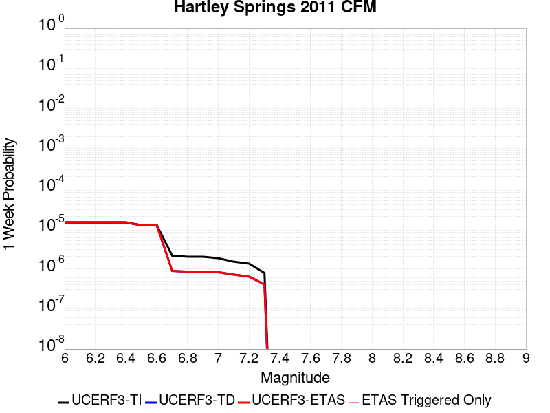 |  |  |  |

| Magnitude | 1 wk TI Prob | 1 wk TD Prob | 1 wk ETAS Prob | 1 wk ETAS/TD Gain | 1 wk ETAS Triggered Only | 1 mo TI Prob | 1 mo TD Prob | 1 mo ETAS Prob | 1 mo ETAS/TD Gain | 1 mo ETAS Triggered Only | 1 yr TI Prob | 1 yr TD Prob | 1 yr ETAS Prob | 1 yr ETAS/TD Gain | 1 yr ETAS Triggered Only | 10 yr TI Prob | 10 yr TD Prob | 10 yr ETAS Prob | 10 yr ETAS/TD Gain | 10 yr ETAS Triggered Only |
|-----|-----|-----|-----|-----|-----|-----|-----|-----|-----|-----|-----|-----|-----|-----|-----|-----|-----|-----|-----|-----|
| 6.0 | 1.4352418E-5 | 1.4434136E-5 | 1.4434136E-5 | 1.0 | 0.0 | 6.1508916E-5 | 6.186004E-5 | 6.186004E-5 | 1.0 | 0.0 | 7.486137E-4 | 7.5305015E-4 | 7.6525303E-4 | 1.0162046 | 1.22121E-5 | 0.007460968 | 0.0075211045 | 0.0075332248 | 1.0016115 | 1.22121E-5 |
| 6.1 | 1.4352418E-5 | 1.4434136E-5 | 1.4434136E-5 | 1.0 | 0.0 | 6.1508916E-5 | 6.186004E-5 | 6.186004E-5 | 1.0 | 0.0 | 7.486137E-4 | 7.5305015E-4 | 7.6525303E-4 | 1.0162046 | 1.22121E-5 | 0.007460968 | 0.0075211045 | 0.0075332248 | 1.0016115 | 1.22121E-5 |
| 6.2 | 1.4352418E-5 | 1.4434136E-5 | 1.4434136E-5 | 1.0 | 0.0 | 6.1508916E-5 | 6.186004E-5 | 6.186004E-5 | 1.0 | 0.0 | 7.486137E-4 | 7.5305015E-4 | 7.6525303E-4 | 1.0162046 | 1.22121E-5 | 0.007460968 | 0.0075211045 | 0.0075332248 | 1.0016115 | 1.22121E-5 |
| 6.3 | 1.4352418E-5 | 1.4434136E-5 | 1.4434136E-5 | 1.0 | 0.0 | 6.1508916E-5 | 6.186004E-5 | 6.186004E-5 | 1.0 | 0.0 | 7.486137E-4 | 7.5305015E-4 | 7.6525303E-4 | 1.0162046 | 1.22121E-5 | 0.007460968 | 0.0075211045 | 0.0075332248 | 1.0016115 | 1.22121E-5 |
| 6.4 | 1.4352418E-5 | 1.4434136E-5 | 1.4434136E-5 | 1.0 | 0.0 | 6.1508916E-5 | 6.186004E-5 | 6.186004E-5 | 1.0 | 0.0 | 7.486137E-4 | 7.5305015E-4 | 7.6525303E-4 | 1.0162046 | 1.22121E-5 | 0.007460968 | 0.0075211045 | 0.0075332248 | 1.0016115 | 1.22121E-5 |
| 6.5 | 1.2279858E-5 | 1.2133067E-5 | 1.2133067E-5 | 1.0 | 0.0 | 5.26269E-5 | 5.1998715E-5 | 5.1998715E-5 | 1.0 | 0.0 | 6.4054417E-4 | 6.330586E-4 | 6.45263E-4 | 1.0192784 | 1.22121E-5 | 0.0063870098 | 0.0063280645 | 0.006340199 | 1.0019176 | 1.22121E-5 |
| 6.6 | 1.2279858E-5 | 1.2133067E-5 | 1.2133067E-5 | 1.0 | 0.0 | 5.26269E-5 | 5.1998715E-5 | 5.1998715E-5 | 1.0 | 0.0 | 6.4054417E-4 | 6.330586E-4 | 6.45263E-4 | 1.0192784 | 1.22121E-5 | 0.0063870098 | 0.0063280645 | 0.006340199 | 1.0019176 | 1.22121E-5 |
| 6.7 | 2.1282601E-6 | 8.8947627E-7 | 8.8947627E-7 | 1.0 | 0.0 | 9.121083E-6 | 3.812037E-6 | 3.812037E-6 | 1.0 | 0.0 | 1.11043526E-4 | 4.641082E-5 | 4.641082E-5 | 1.0 | 0.0 | 0.0011098806 | 4.640366E-4 | 4.640366E-4 | 1.0 | 0.0 |
| 6.8 | 2.00516E-6 | 8.5175327E-7 | 8.5175327E-7 | 1.0 | 0.0 | 8.593515E-6 | 3.6503675E-6 | 3.6503675E-6 | 1.0 | 0.0 | 1.04621024E-4 | 4.4442575E-5 | 4.4442575E-5 | 1.0 | 0.0 | 0.0010457177 | 4.4436203E-4 | 4.4436203E-4 | 1.0 | 0.0 |
| 6.9 | 2.00516E-6 | 8.5175327E-7 | 8.5175327E-7 | 1.0 | 0.0 | 8.593515E-6 | 3.6503675E-6 | 3.6503675E-6 | 1.0 | 0.0 | 1.04621024E-4 | 4.4442575E-5 | 4.4442575E-5 | 1.0 | 0.0 | 0.0010457177 | 4.4436203E-4 | 4.4436203E-4 | 1.0 | 0.0 |
| 7.0 | 1.8366732E-6 | 8.2372486E-7 | 8.2372486E-7 | 1.0 | 0.0 | 7.871433E-6 | 3.5302462E-6 | 3.5302462E-6 | 1.0 | 0.0 | 9.583048E-5 | 4.2980155E-5 | 4.2980155E-5 | 1.0 | 0.0 | 9.5789164E-4 | 4.2974346E-4 | 4.2974346E-4 | 1.0 | 0.0 |
| 7.1 | 1.5097997E-6 | 7.190216E-7 | 7.190216E-7 | 1.0 | 0.0 | 6.470554E-6 | 3.0815188E-6 | 3.0815188E-6 | 1.0 | 0.0 | 7.877615E-5 | 3.751709E-5 | 3.751709E-5 | 1.0 | 0.0 | 7.874823E-4 | 3.7513126E-4 | 3.7513126E-4 | 1.0 | 0.0 |
| 7.2 | 1.3490993E-6 | 6.405214E-7 | 6.405214E-7 | 1.0 | 0.0 | 5.7818415E-6 | 2.7450903E-6 | 2.7450903E-6 | 1.0 | 0.0 | 7.0391645E-5 | 3.3421195E-5 | 3.3421195E-5 | 1.0 | 0.0 | 7.0369354E-4 | 3.3418465E-4 | 3.3418465E-4 | 1.0 | 0.0 |
| 7.3 | 7.900015E-7 | 4.0889267E-7 | 4.0889267E-7 | 1.0 | 0.0 | 3.3857161E-6 | 1.7523972E-6 | 1.7523972E-6 | 1.0 | 0.0 | 4.1220315E-5 | 2.1335436E-5 | 2.1335436E-5 | 1.0 | 0.0 | 4.121267E-4 | 2.1335436E-4 | 2.1335436E-4 | 1.0 | 0.0 |

## Elsinore (Stepovers Combined)
*[(top)](#table-of-contents)*

| 1 Week | 1 Month | 1 Year | 10 Year |
|-----|-----|-----|-----|
| 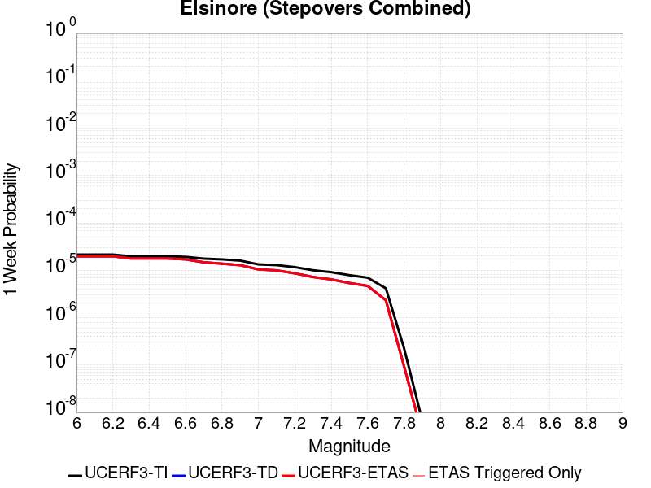 | 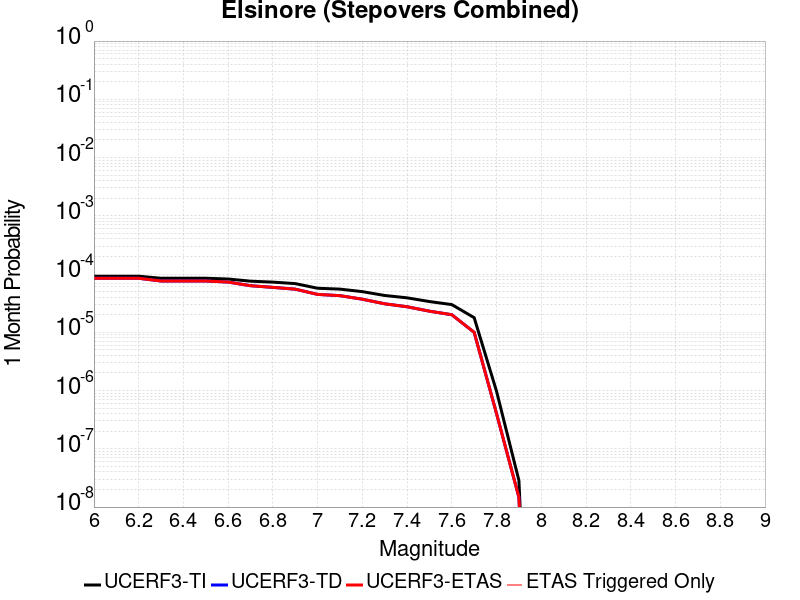 | 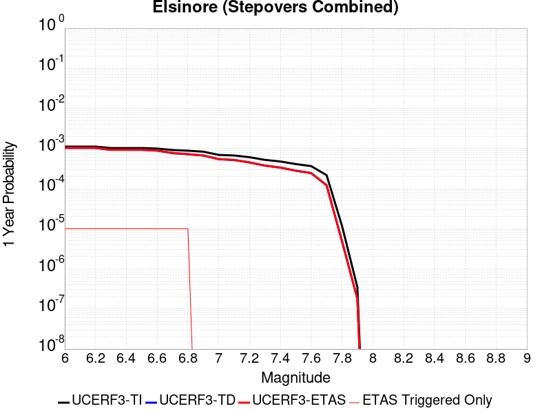 |  |

| Magnitude | 1 wk TI Prob | 1 wk TD Prob | 1 wk ETAS Prob | 1 wk ETAS/TD Gain | 1 wk ETAS Triggered Only | 1 mo TI Prob | 1 mo TD Prob | 1 mo ETAS Prob | 1 mo ETAS/TD Gain | 1 mo ETAS Triggered Only | 1 yr TI Prob | 1 yr TD Prob | 1 yr ETAS Prob | 1 yr ETAS/TD Gain | 1 yr ETAS Triggered Only | 10 yr TI Prob | 10 yr TD Prob | 10 yr ETAS Prob | 10 yr ETAS/TD Gain | 10 yr ETAS Triggered Only |
|-----|-----|-----|-----|-----|-----|-----|-----|-----|-----|-----|-----|-----|-----|-----|-----|-----|-----|-----|-----|-----|
| 6.0 | 2.144392E-5 | 1.9760038E-5 | 1.9760038E-5 | 1.0 | 0.0 | 9.189928E-5 | 8.468325E-5 | 8.468325E-5 | 1.0 | 0.0 | 0.0011182994 | 0.0010305526 | 0.0010427521 | 1.0118378 | 1.22121E-5 | 0.011126885 | 0.010264838 | 0.010276925 | 1.0011775 | 1.22121E-5 |
| 6.1 | 2.144392E-5 | 1.9760038E-5 | 1.9760038E-5 | 1.0 | 0.0 | 9.189928E-5 | 8.468325E-5 | 8.468325E-5 | 1.0 | 0.0 | 0.0011182994 | 0.0010305526 | 0.0010427521 | 1.0118378 | 1.22121E-5 | 0.011126885 | 0.010264838 | 0.010276925 | 1.0011775 | 1.22121E-5 |
| 6.2 | 2.144392E-5 | 1.9760038E-5 | 1.9760038E-5 | 1.0 | 0.0 | 9.189928E-5 | 8.468325E-5 | 8.468325E-5 | 1.0 | 0.0 | 0.0011182994 | 0.0010305526 | 0.0010427521 | 1.0118378 | 1.22121E-5 | 0.011126885 | 0.010264838 | 0.010276925 | 1.0011775 | 1.22121E-5 |
| 6.3 | 1.9751555E-5 | 1.7741308E-5 | 1.7741308E-5 | 1.0 | 0.0 | 8.4646774E-5 | 7.6032054E-5 | 7.6032054E-5 | 1.0 | 0.0 | 0.0010300872 | 9.2531374E-4 | 9.3751453E-4 | 1.0131856 | 1.22121E-5 | 0.010253254 | 0.009221202 | 0.0092333015 | 1.0013121 | 1.22121E-5 |
| 6.4 | 1.9751555E-5 | 1.7741308E-5 | 1.7741308E-5 | 1.0 | 0.0 | 8.4646774E-5 | 7.6032054E-5 | 7.6032054E-5 | 1.0 | 0.0 | 0.0010300872 | 9.2531374E-4 | 9.3751453E-4 | 1.0131856 | 1.22121E-5 | 0.010253254 | 0.009221202 | 0.0092333015 | 1.0013121 | 1.22121E-5 |
| 6.5 | 1.9751555E-5 | 1.7741308E-5 | 1.7741308E-5 | 1.0 | 0.0 | 8.4646774E-5 | 7.6032054E-5 | 7.6032054E-5 | 1.0 | 0.0 | 0.0010300872 | 9.2531374E-4 | 9.3751453E-4 | 1.0131856 | 1.22121E-5 | 0.010253254 | 0.009221202 | 0.0092333015 | 1.0013121 | 1.22121E-5 |
| 6.6 | 1.9188685E-5 | 1.7003254E-5 | 1.7003254E-5 | 1.0 | 0.0 | 8.2234634E-5 | 7.2869145E-5 | 7.2869145E-5 | 1.0 | 0.0 | 0.0010007467 | 8.868369E-4 | 8.990382E-4 | 1.0137582 | 1.22121E-5 | 0.00996252 | 0.008839776 | 0.00885188 | 1.0013692 | 1.22121E-5 |
| 6.7 | 1.7608272E-5 | 1.4732497E-5 | 1.4732497E-5 | 1.0 | 0.0 | 7.546184E-5 | 6.31378E-5 | 6.31378E-5 | 1.0 | 0.0 | 9.183606E-4 | 7.6844136E-4 | 7.8064407E-4 | 1.0158799 | 1.22121E-5 | 0.009145746 | 0.007664848 | 0.0076769665 | 1.0015811 | 1.22121E-5 |
| 6.8 | 1.697165E-5 | 1.3783255E-5 | 1.3783255E-5 | 1.0 | 0.0 | 7.273361E-5 | 5.9069804E-5 | 5.9069804E-5 | 1.0 | 0.0 | 8.8517193E-4 | 7.189462E-4 | 7.311495E-4 | 1.0169739 | 1.22121E-5 | 0.008816543 | 0.0071726176 | 0.0071847425 | 1.0016904 | 1.22121E-5 |
| 6.9 | 1.600365E-5 | 1.28465645E-5 | 1.28465645E-5 | 1.0 | 0.0 | 6.858527E-5 | 5.505559E-5 | 5.505559E-5 | 1.0 | 0.0 | 8.347058E-4 | 6.701034E-4 | 6.701034E-4 | 1.0 | 0.0 | 0.008315775 | 0.0066867108 | 0.0066867108 | 1.0 | 0.0 |
| 7.0 | 1.3314581E-5 | 1.0447457E-5 | 1.0447457E-5 | 1.0 | 0.0 | 5.7061243E-5 | 4.4774064E-5 | 4.4774064E-5 | 1.0 | 0.0 | 6.944992E-4 | 5.449906E-4 | 5.449906E-4 | 1.0 | 0.0 | 0.006923327 | 0.005440468 | 0.005440468 | 1.0 | 0.0 |
| 7.1 | 1.2865345E-5 | 9.937449E-6 | 9.937449E-6 | 1.0 | 0.0 | 5.5136024E-5 | 4.2588388E-5 | 4.2588388E-5 | 1.0 | 0.0 | 6.710743E-4 | 5.183928E-4 | 5.183928E-4 | 1.0 | 0.0 | 0.0066905143 | 0.0051751686 | 0.0051751686 | 1.0 | 0.0 |
| 7.2 | 1.1650051E-5 | 8.633734E-6 | 8.633734E-6 | 1.0 | 0.0 | 4.9927836E-5 | 3.7001206E-5 | 3.7001206E-5 | 1.0 | 0.0 | 6.0770183E-4 | 4.503983E-4 | 4.503983E-4 | 1.0 | 0.0 | 0.0060604266 | 0.0044962782 | 0.0044962782 | 1.0 | 0.0 |
| 7.3 | 1.0008533E-5 | 7.200982E-6 | 7.200982E-6 | 1.0 | 0.0 | 4.2893007E-5 | 3.0860992E-5 | 3.0860992E-5 | 1.0 | 0.0 | 5.220972E-4 | 3.7566927E-4 | 3.7566927E-4 | 1.0 | 0.0 | 0.005208723 | 0.0037507294 | 0.0037507294 | 1.0 | 0.0 |
| 7.4 | 9.116759E-6 | 6.4100154E-6 | 6.4100154E-6 | 1.0 | 0.0 | 3.907124E-5 | 2.7471213E-5 | 2.7471213E-5 | 1.0 | 0.0 | 4.7558855E-4 | 3.3441206E-4 | 3.3441206E-4 | 1.0 | 0.0 | 0.00474572 | 0.0033392403 | 0.0033392403 | 1.0 | 0.0 |
| 7.5 | 7.870524E-6 | 5.382493E-6 | 5.382493E-6 | 1.0 | 0.0 | 3.3730383E-5 | 2.3067629E-5 | 2.3067629E-5 | 1.0 | 0.0 | 4.1059E-4 | 2.8081346E-4 | 2.8081346E-4 | 1.0 | 0.0 | 0.0040983222 | 0.0028047129 | 0.0028047129 | 1.0 | 0.0 |
| 7.6 | 6.9774537E-6 | 4.6775685E-6 | 4.6775685E-6 | 1.0 | 0.0 | 2.990303E-5 | 2.0046575E-5 | 2.0046575E-5 | 1.0 | 0.0 | 3.640086E-4 | 2.4404087E-4 | 2.4404087E-4 | 1.0 | 0.0 | 0.003634129 | 0.002437845 | 0.002437845 | 1.0 | 0.0 |
| 7.7 | 4.1616954E-6 | 2.3283174E-6 | 2.3283174E-6 | 1.0 | 0.0 | 1.7835715E-5 | 9.978469E-6 | 9.978469E-6 | 1.0 | 0.0 | 2.171282E-4 | 1.2148183E-4 | 1.2148183E-4 | 1.0 | 0.0 | 0.0021691616 | 0.0012142273 | 0.0012142273 | 1.0 | 0.0 |
| 7.8 | 2.2692414E-7 | 9.385374E-8 | 9.385374E-8 | 1.0 | 0.0 | 9.725317E-7 | 4.0223028E-7 | 4.0223028E-7 | 1.0 | 0.0 | 1.1840509E-5 | 4.897146E-6 | 4.897146E-6 | 1.0 | 0.0 | 1.1839878E-4 | 4.897071E-5 | 4.897071E-5 | 1.0 | 0.0 |
| 7.9 | 6.676829E-9 | 3.439828E-9 | 3.439828E-9 | 1.0 | 0.0 | 2.861498E-8 | 1.47421195E-8 | 1.47421195E-8 | 1.0 | 0.0 | 3.4838732E-7 | 1.7948528E-7 | 1.7948528E-7 | 1.0 | 0.0 | 3.4838679E-6 | 1.7948516E-6 | 1.7948516E-6 | 1.0 | 0.0 |

## Eureka Peak
*[(top)](#table-of-contents)*

| 1 Week | 1 Month | 1 Year | 10 Year |
|-----|-----|-----|-----|
|  |  |  |  |

| Magnitude | 1 wk TI Prob | 1 wk TD Prob | 1 wk ETAS Prob | 1 wk ETAS/TD Gain | 1 wk ETAS Triggered Only | 1 mo TI Prob | 1 mo TD Prob | 1 mo ETAS Prob | 1 mo ETAS/TD Gain | 1 mo ETAS Triggered Only | 1 yr TI Prob | 1 yr TD Prob | 1 yr ETAS Prob | 1 yr ETAS/TD Gain | 1 yr ETAS Triggered Only | 10 yr TI Prob | 10 yr TD Prob | 10 yr ETAS Prob | 10 yr ETAS/TD Gain | 10 yr ETAS Triggered Only |
|-----|-----|-----|-----|-----|-----|-----|-----|-----|-----|-----|-----|-----|-----|-----|-----|-----|-----|-----|-----|-----|
| 6.0 | 3.1949054E-5 | 9.310349E-6 | 2.1522335E-5 | 2.3116572 | 1.22121E-5 | 1.3691733E-4 | 3.9901326E-5 | 5.211294E-5 | 1.3060453 | 1.22121E-5 | 0.0016656938 | 4.8576848E-4 | 4.9797463E-4 | 1.0251275 | 1.22121E-5 | 0.016532637 | 0.004924774 | 0.004936926 | 1.0024675 | 1.22121E-5 |
| 6.1 | 3.1949054E-5 | 9.310349E-6 | 2.1522335E-5 | 2.3116572 | 1.22121E-5 | 1.3691733E-4 | 3.9901326E-5 | 5.211294E-5 | 1.3060453 | 1.22121E-5 | 0.0016656938 | 4.8576848E-4 | 4.9797463E-4 | 1.0251275 | 1.22121E-5 | 0.016532637 | 0.004924774 | 0.004936926 | 1.0024675 | 1.22121E-5 |
| 6.2 | 3.1949054E-5 | 9.310349E-6 | 2.1522335E-5 | 2.3116572 | 1.22121E-5 | 1.3691733E-4 | 3.9901326E-5 | 5.211294E-5 | 1.3060453 | 1.22121E-5 | 0.0016656938 | 4.8576848E-4 | 4.9797463E-4 | 1.0251275 | 1.22121E-5 | 0.016532637 | 0.004924774 | 0.004936926 | 1.0024675 | 1.22121E-5 |
| 6.3 | 2.7339745E-5 | 7.980512E-6 | 2.0192514E-5 | 2.530228 | 1.22121E-5 | 1.1716507E-4 | 3.4202174E-5 | 4.6413857E-5 | 1.357044 | 1.22121E-5 | 0.0014255513 | 4.164078E-4 | 4.2861482E-4 | 1.029315 | 1.22121E-5 | 0.0141644105 | 0.004228261 | 0.004240421 | 1.002876 | 1.22121E-5 |
| 6.4 | 2.7339745E-5 | 7.980512E-6 | 2.0192514E-5 | 2.530228 | 1.22121E-5 | 1.1716507E-4 | 3.4202174E-5 | 4.6413857E-5 | 1.357044 | 1.22121E-5 | 0.0014255513 | 4.164078E-4 | 4.2861482E-4 | 1.029315 | 1.22121E-5 | 0.0141644105 | 0.004228261 | 0.004240421 | 1.002876 | 1.22121E-5 |
| 6.5 | 9.738388E-8 | 1.8618802E-7 | 1.8618802E-7 | 1.0 | 0.0 | 4.1735944E-7 | 7.979484E-7 | 7.979484E-7 | 1.0 | 0.0 | 5.081339E-6 | 9.71498E-6 | 9.71498E-6 | 1.0 | 0.0 | 5.0812232E-5 | 9.7145625E-5 | 9.7145625E-5 | 1.0 | 0.0 |
| 6.6 | 9.3495956E-8 | 1.8327636E-7 | 1.8327636E-7 | 1.0 | 0.0 | 4.0069688E-7 | 7.8546987E-7 | 7.8546987E-7 | 1.0 | 0.0 | 4.8784736E-6 | 9.563055E-6 | 9.563055E-6 | 1.0 | 0.0 | 4.8783666E-5 | 9.5626514E-5 | 9.5626514E-5 | 1.0 | 0.0 |
| 6.7 | 9.3495956E-8 | 1.8327636E-7 | 1.8327636E-7 | 1.0 | 0.0 | 4.0069688E-7 | 7.8546987E-7 | 7.8546987E-7 | 1.0 | 0.0 | 4.8784736E-6 | 9.563055E-6 | 9.563055E-6 | 1.0 | 0.0 | 4.8783666E-5 | 9.5626514E-5 | 9.5626514E-5 | 1.0 | 0.0 |
| 6.8 | 8.591428E-8 | 1.8020607E-7 | 1.8020607E-7 | 1.0 | 0.0 | 3.68204E-7 | 7.723115E-7 | 7.723115E-7 | 1.0 | 0.0 | 4.4828744E-6 | 9.402853E-6 | 9.402853E-6 | 1.0 | 0.0 | 4.482784E-5 | 9.4024625E-5 | 9.4024625E-5 | 1.0 | 0.0 |
| 6.9 | 7.749723E-8 | 1.7438616E-7 | 1.7438616E-7 | 1.0 | 0.0 | 3.3213098E-7 | 7.473691E-7 | 7.473691E-7 | 1.0 | 0.0 | 4.043687E-6 | 9.099182E-6 | 9.099182E-6 | 1.0 | 0.0 | 4.0436134E-5 | 9.0988164E-5 | 9.0988164E-5 | 1.0 | 0.0 |
| 7.0 | 6.897872E-8 | 1.6414864E-7 | 1.6414864E-7 | 1.0 | 0.0 | 2.9562307E-7 | 7.0349404E-7 | 7.0349404E-7 | 1.0 | 0.0 | 3.5992048E-6 | 8.565007E-6 | 8.565007E-6 | 1.0 | 0.0 | 3.5991467E-5 | 8.564684E-5 | 8.564684E-5 | 1.0 | 0.0 |
| 7.1 | 5.859318E-8 | 1.4786792E-7 | 1.4786792E-7 | 1.0 | 0.0 | 2.5111362E-7 | 6.3371954E-7 | 6.3371954E-7 | 1.0 | 0.0 | 3.057304E-6 | 7.715508E-6 | 7.715508E-6 | 1.0 | 0.0 | 3.0572617E-5 | 7.715247E-5 | 7.715247E-5 | 1.0 | 0.0 |
| 7.2 | 5.1375338E-8 | 1.3420691E-7 | 1.3420691E-7 | 1.0 | 0.0 | 2.2018E-7 | 5.7517235E-7 | 5.7517235E-7 | 1.0 | 0.0 | 2.680688E-6 | 7.0027013E-6 | 7.0027013E-6 | 1.0 | 0.0 | 2.6806558E-5 | 7.0024864E-5 | 7.0024864E-5 | 1.0 | 0.0 |
| 7.3 | 4.5441396E-8 | 1.1635977E-7 | 1.1635977E-7 | 1.0 | 0.0 | 1.9474882E-7 | 4.9868464E-7 | 4.9868464E-7 | 1.0 | 0.0 | 2.3710643E-6 | 6.071469E-6 | 6.071469E-6 | 1.0 | 0.0 | 2.371039E-5 | 6.0713086E-5 | 6.0713086E-5 | 1.0 | 0.0 |
| 7.4 | 2.981918E-8 | 6.9110754E-8 | 6.9110754E-8 | 1.0 | 0.0 | 1.2779647E-7 | 2.9618892E-7 | 2.9618892E-7 | 1.0 | 0.0 | 1.5559209E-6 | 3.6060947E-6 | 3.6060947E-6 | 1.0 | 0.0 | 1.55591E-5 | 3.6060403E-5 | 3.6060403E-5 | 1.0 | 0.0 |
| 7.5 | 4.24214E-9 | 8.342036E-9 | 8.342036E-9 | 1.0 | 0.0 | 1.81806E-8 | 3.5751587E-8 | 3.5751587E-8 | 1.0 | 0.0 | 2.213488E-7 | 4.3527552E-7 | 4.3527552E-7 | 1.0 | 0.0 | 2.2134857E-6 | 4.352753E-6 | 4.352753E-6 | 1.0 | 0.0 |

## Owens Valley
*[(top)](#table-of-contents)*

| 1 Week | 1 Month | 1 Year | 10 Year |
|-----|-----|-----|-----|
|  | 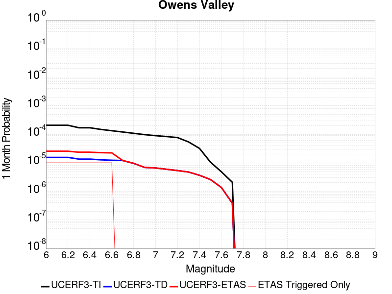 |  | 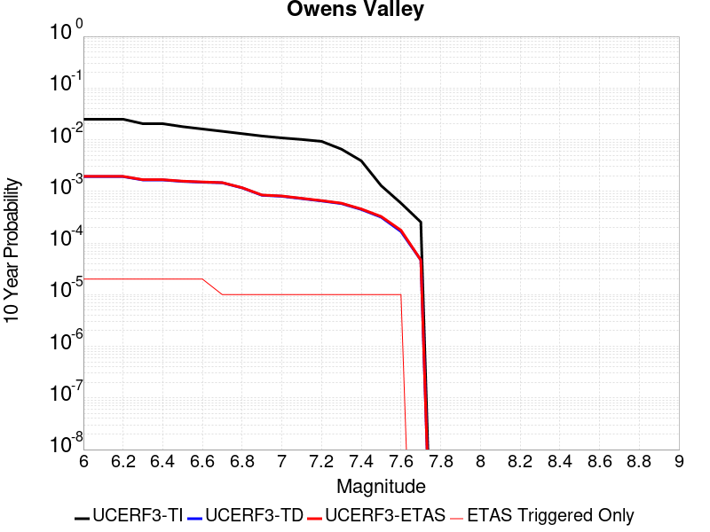 |

| Magnitude | 1 wk TI Prob | 1 wk TD Prob | 1 wk ETAS Prob | 1 wk ETAS/TD Gain | 1 wk ETAS Triggered Only | 1 mo TI Prob | 1 mo TD Prob | 1 mo ETAS Prob | 1 mo ETAS/TD Gain | 1 mo ETAS Triggered Only | 1 yr TI Prob | 1 yr TD Prob | 1 yr ETAS Prob | 1 yr ETAS/TD Gain | 1 yr ETAS Triggered Only | 10 yr TI Prob | 10 yr TD Prob | 10 yr ETAS Prob | 10 yr ETAS/TD Gain | 10 yr ETAS Triggered Only |
|-----|-----|-----|-----|-----|-----|-----|-----|-----|-----|-----|-----|-----|-----|-----|-----|-----|-----|-----|-----|-----|
| 6.0 | 4.83821E-5 | 3.6264003E-6 | 3.6264003E-6 | 1.0 | 0.0 | 2.0733538E-4 | 1.554163E-5 | 1.554163E-5 | 1.0 | 0.0 | 0.002521386 | 1.8920389E-4 | 2.0141368E-4 | 1.0645324 | 1.22121E-5 | 0.024929691 | 0.0019249251 | 0.0019371137 | 1.006332 | 1.22121E-5 |
| 6.1 | 4.83821E-5 | 3.6264003E-6 | 3.6264003E-6 | 1.0 | 0.0 | 2.0733538E-4 | 1.554163E-5 | 1.554163E-5 | 1.0 | 0.0 | 0.002521386 | 1.8920389E-4 | 2.0141368E-4 | 1.0645324 | 1.22121E-5 | 0.024929691 | 0.0019249251 | 0.0019371137 | 1.006332 | 1.22121E-5 |
| 6.2 | 4.83821E-5 | 3.6264003E-6 | 3.6264003E-6 | 1.0 | 0.0 | 2.0733538E-4 | 1.554163E-5 | 1.554163E-5 | 1.0 | 0.0 | 0.002521386 | 1.8920389E-4 | 2.0141368E-4 | 1.0645324 | 1.22121E-5 | 0.024929691 | 0.0019249251 | 0.0019371137 | 1.006332 | 1.22121E-5 |
| 6.3 | 3.953008E-5 | 3.1553045E-6 | 3.1553045E-6 | 1.0 | 0.0 | 1.6940363E-4 | 1.3522667E-5 | 1.3522667E-5 | 1.0 | 0.0 | 0.002060538 | 1.6462678E-4 | 1.7683685E-4 | 1.0741683 | 1.22121E-5 | 0.020415364 | 0.0016591517 | 0.0016713436 | 1.0073482 | 1.22121E-5 |
| 6.4 | 3.953008E-5 | 3.1553045E-6 | 3.1553045E-6 | 1.0 | 0.0 | 1.6940363E-4 | 1.3522667E-5 | 1.3522667E-5 | 1.0 | 0.0 | 0.002060538 | 1.6462678E-4 | 1.7683685E-4 | 1.0741683 | 1.22121E-5 | 0.020415364 | 0.0016591517 | 0.0016713436 | 1.0073482 | 1.22121E-5 |
| 6.5 | 3.457342E-5 | 2.9715377E-6 | 2.9715377E-6 | 1.0 | 0.0 | 1.4816338E-4 | 1.2735103E-5 | 1.2735103E-5 | 1.0 | 0.0 | 0.0018023965 | 1.5503954E-4 | 1.6724975E-4 | 1.0787554 | 1.22121E-5 | 0.017878477 | 0.0015556873 | 0.0015678804 | 1.0078378 | 1.22121E-5 |
| 6.6 | 3.1127765E-5 | 2.874452E-6 | 2.874452E-6 | 1.0 | 0.0 | 1.3339789E-4 | 1.2319027E-5 | 1.2319027E-5 | 1.0 | 0.0 | 0.0016229092 | 1.4997451E-4 | 1.6218478E-4 | 1.0814157 | 1.22121E-5 | 0.016111081 | 0.0015012339 | 0.0015134277 | 1.0081224 | 1.22121E-5 |
| 6.7 | 2.806885E-5 | 2.8103827E-6 | 2.8103827E-6 | 1.0 | 0.0 | 1.2028952E-4 | 1.2044446E-5 | 1.2044446E-5 | 1.0 | 0.0 | 0.001463541 | 1.4663194E-4 | 1.5884225E-4 | 1.0832719 | 1.22121E-5 | 0.014539397 | 0.001465735 | 0.0014779292 | 1.0083195 | 1.22121E-5 |
| 6.8 | 2.524524E-5 | 2.2353422E-6 | 2.2353422E-6 | 1.0 | 0.0 | 1.0818939E-4 | 9.580004E-6 | 9.580004E-6 | 1.0 | 0.0 | 0.0013164099 | 1.1663061E-4 | 1.2884129E-4 | 1.1046953 | 1.22121E-5 | 0.01308639 | 0.0011659673 | 0.0011781652 | 1.0104616 | 1.22121E-5 |
| 6.9 | 2.2704568E-5 | 1.6081486E-6 | 1.6081486E-6 | 1.0 | 0.0 | 9.730166E-5 | 6.8920476E-6 | 6.8920476E-6 | 1.0 | 0.0 | 0.0011840039 | 8.3907464E-5 | 9.611854E-5 | 1.1455302 | 1.22121E-5 | 0.011777153 | 8.389696E-4 | 8.5117144E-4 | 1.0145439 | 1.22121E-5 |
| 7.0 | 2.0871712E-5 | 1.5395268E-6 | 1.5395268E-6 | 1.0 | 0.0 | 8.944713E-5 | 6.5979552E-6 | 6.5979552E-6 | 1.0 | 0.0 | 0.0010884746 | 8.032716E-5 | 9.2538285E-5 | 1.1520174 | 1.22121E-5 | 0.010831586 | 8.031529E-4 | 8.153552E-4 | 1.015193 | 1.22121E-5 |
| 7.1 | 1.944928E-5 | 1.386402E-6 | 1.386402E-6 | 1.0 | 0.0 | 8.335139E-5 | 5.9417093E-6 | 5.9417093E-6 | 1.0 | 0.0 | 0.0010143308 | 7.233792E-5 | 8.454914E-5 | 1.168808 | 1.22121E-5 | 0.010097133 | 7.2330143E-4 | 7.355047E-4 | 1.0168716 | 1.22121E-5 |
| 7.2 | 1.7876306E-5 | 1.2489002E-6 | 1.2489002E-6 | 1.0 | 0.0 | 7.6610486E-5 | 5.3524186E-6 | 5.3524186E-6 | 1.0 | 0.0 | 9.3233347E-4 | 6.516375E-5 | 7.737506E-5 | 1.1873941 | 1.22121E-5 | 0.009284316 | 6.515837E-4 | 6.637879E-4 | 1.0187299 | 1.22121E-5 |
| 7.3 | 1.2618672E-5 | 1.1115079E-6 | 1.1115079E-6 | 1.0 | 0.0 | 5.40789E-5 | 4.7635967E-6 | 4.7635967E-6 | 1.0 | 0.0 | 6.582117E-4 | 5.7995258E-5 | 7.0206646E-5 | 1.2105584 | 1.22121E-5 | 0.0065626553 | 5.799336E-4 | 5.9213856E-4 | 1.0210456 | 1.22121E-5 |
| 7.4 | 7.4874442E-6 | 8.548535E-7 | 8.548535E-7 | 1.0 | 0.0 | 3.208865E-5 | 3.663653E-6 | 3.663653E-6 | 1.0 | 0.0 | 3.906093E-4 | 4.4604065E-5 | 5.681562E-5 | 1.2737768 | 1.22121E-5 | 0.003899234 | 4.4604312E-4 | 4.582498E-4 | 1.0273665 | 1.22121E-5 |
| 7.5 | 2.4734156E-6 | 6.0685437E-7 | 6.0685437E-7 | 1.0 | 0.0 | 1.060031E-5 | 2.6008017E-6 | 2.6008017E-6 | 1.0 | 0.0 | 1.2905113E-4 | 3.1664305E-5 | 4.3876018E-5 | 1.3856618 | 1.22121E-5 | 0.0012897621 | 3.1659825E-4 | 3.288065E-4 | 1.0385606 | 1.22121E-5 |
| 7.6 | 1.1328841E-6 | 3.196495E-7 | 3.196495E-7 | 1.0 | 0.0 | 4.8552088E-6 | 1.3699258E-6 | 1.3699258E-6 | 1.0 | 0.0 | 5.9110564E-5 | 1.6678721E-5 | 2.8890618E-5 | 1.7321842 | 1.22121E-5 | 5.9094845E-4 | 1.6677487E-4 | 1.7898493E-4 | 1.0732129 | 1.22121E-5 |
| 7.7 | 4.8613185E-7 | 8.9645496E-8 | 8.9645496E-8 | 1.0 | 0.0 | 2.0834207E-6 | 3.8419492E-7 | 3.8419492E-7 | 1.0 | 0.0 | 2.536535E-5 | 4.677564E-6 | 4.677564E-6 | 1.0 | 0.0 | 2.5362454E-4 | 4.677472E-5 | 4.677472E-5 | 1.0 | 0.0 |

## Elsinore (Temecula) rev
*[(top)](#table-of-contents)*

| 1 Week | 1 Month | 1 Year | 10 Year |
|-----|-----|-----|-----|
|  |  | 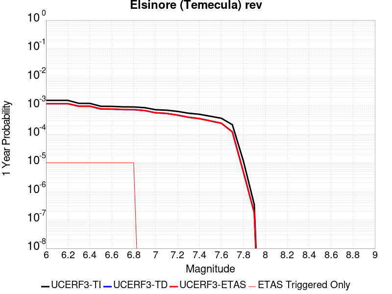 | 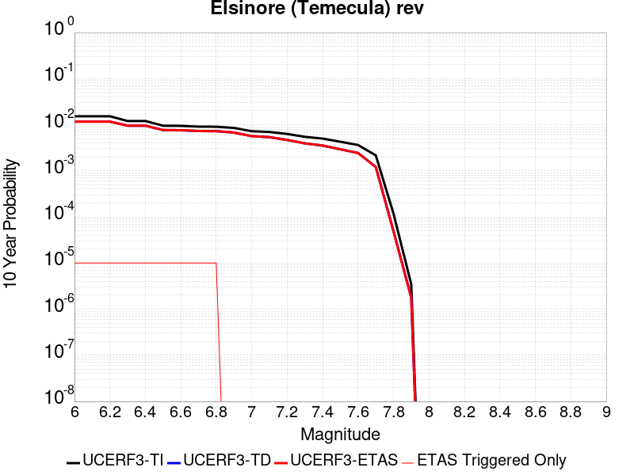 |

| Magnitude | 1 wk TI Prob | 1 wk TD Prob | 1 wk ETAS Prob | 1 wk ETAS/TD Gain | 1 wk ETAS Triggered Only | 1 mo TI Prob | 1 mo TD Prob | 1 mo ETAS Prob | 1 mo ETAS/TD Gain | 1 mo ETAS Triggered Only | 1 yr TI Prob | 1 yr TD Prob | 1 yr ETAS Prob | 1 yr ETAS/TD Gain | 1 yr ETAS Triggered Only | 10 yr TI Prob | 10 yr TD Prob | 10 yr ETAS Prob | 10 yr ETAS/TD Gain | 10 yr ETAS Triggered Only |
|-----|-----|-----|-----|-----|-----|-----|-----|-----|-----|-----|-----|-----|-----|-----|-----|-----|-----|-----|-----|-----|
| 6.0 | 2.9514995E-5 | 2.2516873E-5 | 2.2516873E-5 | 1.0 | 0.0 | 1.264867E-4 | 9.6497446E-5 | 9.6497446E-5 | 1.0 | 0.0 | 0.0015388876 | 0.0011742454 | 0.0011864431 | 1.0103878 | 1.22121E-5 | 0.015282745 | 0.011696772 | 0.011708841 | 1.0010319 | 1.22121E-5 |
| 6.1 | 2.9514995E-5 | 2.2516873E-5 | 2.2516873E-5 | 1.0 | 0.0 | 1.264867E-4 | 9.6497446E-5 | 9.6497446E-5 | 1.0 | 0.0 | 0.0015388876 | 0.0011742454 | 0.0011864431 | 1.0103878 | 1.22121E-5 | 0.015282745 | 0.011696772 | 0.011708841 | 1.0010319 | 1.22121E-5 |
| 6.2 | 2.9514995E-5 | 2.2516873E-5 | 2.2516873E-5 | 1.0 | 0.0 | 1.264867E-4 | 9.6497446E-5 | 9.6497446E-5 | 1.0 | 0.0 | 0.0015388876 | 0.0011742454 | 0.0011864431 | 1.0103878 | 1.22121E-5 | 0.015282745 | 0.011696772 | 0.011708841 | 1.0010319 | 1.22121E-5 |
| 6.3 | 2.3223649E-5 | 1.8406283E-5 | 1.8406283E-5 | 1.0 | 0.0 | 9.952613E-5 | 7.8881785E-5 | 7.8881785E-5 | 1.0 | 0.0 | 0.001211057 | 9.599799E-4 | 9.721802E-4 | 1.012709 | 1.22121E-5 | 0.012044783 | 0.009569862 | 0.009581957 | 1.0012639 | 1.22121E-5 |
| 6.4 | 2.3223649E-5 | 1.8406283E-5 | 1.8406283E-5 | 1.0 | 0.0 | 9.952613E-5 | 7.8881785E-5 | 7.8881785E-5 | 1.0 | 0.0 | 0.001211057 | 9.599799E-4 | 9.721802E-4 | 1.012709 | 1.22121E-5 | 0.012044783 | 0.009569862 | 0.009581957 | 1.0012639 | 1.22121E-5 |
| 6.5 | 1.8338875E-5 | 1.4749999E-5 | 1.4749999E-5 | 1.0 | 0.0 | 7.8592806E-5 | 6.32128E-5 | 6.32128E-5 | 1.0 | 0.0 | 9.5644733E-4 | 7.6935283E-4 | 7.815555E-4 | 1.015861 | 1.22121E-5 | 0.009523412 | 0.0076738503 | 0.0076859687 | 1.0015792 | 1.22121E-5 |
| 6.6 | 1.8223333E-5 | 1.4612555E-5 | 1.4612555E-5 | 1.0 | 0.0 | 7.809766E-5 | 6.262378E-5 | 6.262378E-5 | 1.0 | 0.0 | 9.504242E-4 | 7.621866E-4 | 7.7438937E-4 | 1.0160103 | 1.22121E-5 | 0.009463696 | 0.0076026795 | 0.007614799 | 1.0015941 | 1.22121E-5 |
| 6.7 | 1.7512752E-5 | 1.4027098E-5 | 1.4027098E-5 | 1.0 | 0.0 | 7.505249E-5 | 6.01148E-5 | 6.01148E-5 | 1.0 | 0.0 | 9.13381E-4 | 7.3166046E-4 | 7.4386364E-4 | 1.0166787 | 1.22121E-5 | 0.00909636 | 0.0072988616 | 0.0073109847 | 1.001661 | 1.22121E-5 |
| 6.8 | 1.7417142E-5 | 1.3951083E-5 | 1.3951083E-5 | 1.0 | 0.0 | 7.4642754E-5 | 5.9789036E-5 | 5.9789036E-5 | 1.0 | 0.0 | 9.083966E-4 | 7.27697E-4 | 7.3990016E-4 | 1.0167696 | 1.22121E-5 | 0.009046922 | 0.007259431 | 0.0072715543 | 1.00167 | 1.22121E-5 |
| 6.9 | 1.6402591E-5 | 1.2988507E-5 | 1.2988507E-5 | 1.0 | 0.0 | 7.0294926E-5 | 5.5663884E-5 | 5.5663884E-5 | 1.0 | 0.0 | 8.5550465E-4 | 6.7750475E-4 | 6.7750475E-4 | 1.0 | 0.0 | 0.008522186 | 0.0067601134 | 0.0067601134 | 1.0 | 0.0 |
| 7.0 | 1.3912486E-5 | 1.087814E-5 | 1.087814E-5 | 1.0 | 0.0 | 5.9623577E-5 | 4.6619778E-5 | 4.6619778E-5 | 1.0 | 0.0 | 7.2567526E-4 | 5.674507E-4 | 5.674507E-4 | 1.0 | 0.0 | 0.0072331014 | 0.005663937 | 0.005663937 | 1.0 | 0.0 |
| 7.1 | 1.3405147E-5 | 1.0327332E-5 | 1.0327332E-5 | 1.0 | 0.0 | 5.7449364E-5 | 4.4259257E-5 | 4.4259257E-5 | 1.0 | 0.0 | 6.9922156E-4 | 5.387258E-4 | 5.387258E-4 | 1.0 | 0.0 | 0.0069702556 | 0.0053775306 | 0.0053775306 | 1.0 | 0.0 |
| 7.2 | 1.21402E-5 | 8.996661E-6 | 8.996661E-6 | 1.0 | 0.0 | 5.202839E-5 | 3.8556558E-5 | 3.8556558E-5 | 1.0 | 0.0 | 6.332616E-4 | 4.6932677E-4 | 4.6932677E-4 | 1.0 | 0.0 | 0.0063146 | 0.004684781 | 0.004684781 | 1.0 | 0.0 |
| 7.3 | 1.05047775E-5 | 7.5717085E-6 | 7.5717085E-6 | 1.0 | 0.0 | 4.5019697E-5 | 3.2449785E-5 | 3.2449785E-5 | 1.0 | 0.0 | 5.4797693E-4 | 3.9500595E-4 | 3.9500595E-4 | 1.0 | 0.0 | 0.005466277 | 0.003943428 | 0.003943428 | 1.0 | 0.0 |
| 7.4 | 9.624483E-6 | 6.7868145E-6 | 6.7868145E-6 | 1.0 | 0.0 | 4.124713E-5 | 2.9086032E-5 | 2.9086032E-5 | 1.0 | 0.0 | 5.0206814E-4 | 3.540663E-4 | 3.540663E-4 | 1.0 | 0.0 | 0.005009353 | 0.0035351755 | 0.0035351755 | 1.0 | 0.0 |
| 7.5 | 8.215151E-6 | 5.635493E-6 | 5.635493E-6 | 1.0 | 0.0 | 3.5207315E-5 | 2.4151896E-5 | 2.4151896E-5 | 1.0 | 0.0 | 4.2856473E-4 | 2.9401094E-4 | 2.9401094E-4 | 1.0 | 0.0 | 0.004277392 | 0.0029363474 | 0.0029363474 | 1.0 | 0.0 |
| 7.6 | 6.975058E-6 | 4.6760065E-6 | 4.6760065E-6 | 1.0 | 0.0 | 2.9892764E-5 | 2.003988E-5 | 2.003988E-5 | 1.0 | 0.0 | 3.6388362E-4 | 2.439594E-4 | 2.439594E-4 | 1.0 | 0.0 | 0.0036328835 | 0.002437032 | 0.002437032 | 1.0 | 0.0 |
| 7.7 | 4.159604E-6 | 2.3269697E-6 | 2.3269697E-6 | 1.0 | 0.0 | 1.7826753E-5 | 9.972693E-6 | 9.972693E-6 | 1.0 | 0.0 | 2.1701909E-4 | 1.2141152E-4 | 1.2141152E-4 | 1.0 | 0.0 | 0.0021680726 | 0.0012135248 | 0.0012135248 | 1.0 | 0.0 |
| 7.8 | 2.2692414E-7 | 9.385374E-8 | 9.385374E-8 | 1.0 | 0.0 | 9.725317E-7 | 4.0223028E-7 | 4.0223028E-7 | 1.0 | 0.0 | 1.1840509E-5 | 4.897146E-6 | 4.897146E-6 | 1.0 | 0.0 | 1.1839878E-4 | 4.897071E-5 | 4.897071E-5 | 1.0 | 0.0 |
| 7.9 | 6.676829E-9 | 3.439828E-9 | 3.439828E-9 | 1.0 | 0.0 | 2.861498E-8 | 1.47421195E-8 | 1.47421195E-8 | 1.0 | 0.0 | 3.4838732E-7 | 1.7948528E-7 | 1.7948528E-7 | 1.0 | 0.0 | 3.4838679E-6 | 1.7948516E-6 | 1.7948516E-6 | 1.0 | 0.0 |

## Sierra Nevada  (No Extension)
*[(top)](#table-of-contents)*

| 1 Week | 1 Month | 1 Year | 10 Year |
|-----|-----|-----|-----|
|  |  |  |  |

| Magnitude | 1 wk TI Prob | 1 wk TD Prob | 1 wk ETAS Prob | 1 wk ETAS/TD Gain | 1 wk ETAS Triggered Only | 1 mo TI Prob | 1 mo TD Prob | 1 mo ETAS Prob | 1 mo ETAS/TD Gain | 1 mo ETAS Triggered Only | 1 yr TI Prob | 1 yr TD Prob | 1 yr ETAS Prob | 1 yr ETAS/TD Gain | 1 yr ETAS Triggered Only | 10 yr TI Prob | 10 yr TD Prob | 10 yr ETAS Prob | 10 yr ETAS/TD Gain | 10 yr ETAS Triggered Only |
|-----|-----|-----|-----|-----|-----|-----|-----|-----|-----|-----|-----|-----|-----|-----|-----|-----|-----|-----|-----|-----|
| 6.0 | 7.7690465E-6 | 6.9763096E-6 | 6.9763096E-6 | 1.0 | 0.0 | 3.329549E-5 | 2.9898329E-5 | 2.9898329E-5 | 1.0 | 0.0 | 4.0529718E-4 | 3.639872E-4 | 3.7619486E-4 | 1.0335387 | 1.22121E-5 | 0.004045588 | 0.0036374263 | 0.003649594 | 1.0033451 | 1.22121E-5 |
| 6.1 | 7.7690465E-6 | 6.9763096E-6 | 6.9763096E-6 | 1.0 | 0.0 | 3.329549E-5 | 2.9898329E-5 | 2.9898329E-5 | 1.0 | 0.0 | 4.0529718E-4 | 3.639872E-4 | 3.7619486E-4 | 1.0335387 | 1.22121E-5 | 0.004045588 | 0.0036374263 | 0.003649594 | 1.0033451 | 1.22121E-5 |
| 6.2 | 7.7690465E-6 | 6.9763096E-6 | 6.9763096E-6 | 1.0 | 0.0 | 3.329549E-5 | 2.9898329E-5 | 2.9898329E-5 | 1.0 | 0.0 | 4.0529718E-4 | 3.639872E-4 | 3.7619486E-4 | 1.0335387 | 1.22121E-5 | 0.004045588 | 0.0036374263 | 0.003649594 | 1.0033451 | 1.22121E-5 |
| 6.3 | 7.7690465E-6 | 6.9763096E-6 | 6.9763096E-6 | 1.0 | 0.0 | 3.329549E-5 | 2.9898329E-5 | 2.9898329E-5 | 1.0 | 0.0 | 4.0529718E-4 | 3.639872E-4 | 3.7619486E-4 | 1.0335387 | 1.22121E-5 | 0.004045588 | 0.0036374263 | 0.003649594 | 1.0033451 | 1.22121E-5 |
| 6.4 | 7.7690465E-6 | 6.9763096E-6 | 6.9763096E-6 | 1.0 | 0.0 | 3.329549E-5 | 2.9898329E-5 | 2.9898329E-5 | 1.0 | 0.0 | 4.0529718E-4 | 3.639872E-4 | 3.7619486E-4 | 1.0335387 | 1.22121E-5 | 0.004045588 | 0.0036374263 | 0.003649594 | 1.0033451 | 1.22121E-5 |
| 6.5 | 7.7690465E-6 | 6.9763096E-6 | 6.9763096E-6 | 1.0 | 0.0 | 3.329549E-5 | 2.9898329E-5 | 2.9898329E-5 | 1.0 | 0.0 | 4.0529718E-4 | 3.639872E-4 | 3.7619486E-4 | 1.0335387 | 1.22121E-5 | 0.004045588 | 0.0036374263 | 0.003649594 | 1.0033451 | 1.22121E-5 |
| 6.6 | 2.653E-6 | 1.6148484E-6 | 1.6148484E-6 | 1.0 | 0.0 | 1.136995E-5 | 6.920761E-6 | 6.920761E-6 | 1.0 | 0.0 | 1.3842035E-4 | 8.4257044E-5 | 9.646811E-5 | 1.1449264 | 1.22121E-5 | 0.0013833415 | 8.422544E-4 | 8.544562E-4 | 1.0144871 | 1.22121E-5 |
| 6.7 | 2.5902466E-6 | 1.5501821E-6 | 1.5501821E-6 | 1.0 | 0.0 | 1.11010095E-5 | 6.6436205E-6 | 6.6436205E-6 | 1.0 | 0.0 | 1.351464E-4 | 8.088311E-5 | 9.309422E-5 | 1.1509724 | 1.22121E-5 | 0.0013506424 | 8.085397E-4 | 8.2074193E-4 | 1.0150917 | 1.22121E-5 |
| 6.8 | 2.5853892E-6 | 1.5469824E-6 | 1.5469824E-6 | 1.0 | 0.0 | 1.1080193E-5 | 6.6299076E-6 | 6.6299076E-6 | 1.0 | 0.0 | 1.34893E-4 | 8.071616E-5 | 9.292728E-5 | 1.1512846 | 1.22121E-5 | 0.0013481114 | 8.0687145E-4 | 8.190737E-4 | 1.0151229 | 1.22121E-5 |
| 6.9 | 2.458257E-6 | 1.4220567E-6 | 1.4220567E-6 | 1.0 | 0.0 | 1.0535345E-5 | 6.0945144E-6 | 6.0945144E-6 | 1.0 | 0.0 | 1.2826028E-4 | 7.419821E-5 | 8.64094E-5 | 1.1645753 | 1.22121E-5 | 0.0012818627 | 7.417363E-4 | 7.539393E-4 | 1.016452 | 1.22121E-5 |
| 7.0 | 2.4341468E-6 | 1.3990206E-6 | 1.3990206E-6 | 1.0 | 0.0 | 1.0432016E-5 | 5.995789E-6 | 5.995789E-6 | 1.0 | 0.0 | 1.270024E-4 | 7.29963E-5 | 8.520751E-5 | 1.1672853 | 1.22121E-5 | 0.0012692984 | 7.297252E-4 | 7.4192835E-4 | 1.016723 | 1.22121E-5 |
| 7.1 | 2.3652476E-6 | 1.3339702E-6 | 1.3339702E-6 | 1.0 | 0.0 | 1.0136736E-5 | 5.7170028E-6 | 5.7170028E-6 | 1.0 | 0.0 | 1.2340778E-4 | 6.9602305E-5 | 8.181355E-5 | 1.1754432 | 1.22121E-5 | 0.0012333926 | 6.9580675E-4 | 7.0801034E-4 | 1.0175388 | 1.22121E-5 |
| 7.2 | 2.272158E-6 | 1.250277E-6 | 1.250277E-6 | 1.0 | 0.0 | 9.737784E-6 | 5.3583194E-6 | 5.3583194E-6 | 1.0 | 0.0 | 1.1855107E-4 | 6.52356E-5 | 7.74469E-5 | 1.1871877 | 1.22121E-5 | 0.0011848784 | 6.52166E-4 | 6.6437013E-4 | 1.0187132 | 1.22121E-5 |
| 7.3 | 2.1382127E-6 | 1.1419653E-6 | 1.1419653E-6 | 1.0 | 0.0 | 9.163737E-6 | 4.8941283E-6 | 4.8941283E-6 | 1.0 | 0.0 | 1.1156279E-4 | 5.9584392E-5 | 7.179577E-5 | 1.2049425 | 1.22121E-5 | 0.001115068 | 5.956853E-4 | 6.078902E-4 | 1.0204887 | 1.22121E-5 |
| 7.4 | 1.9048055E-6 | 9.575195E-7 | 9.575195E-7 | 1.0 | 0.0 | 8.163426E-6 | 4.1036487E-6 | 4.1036487E-6 | 1.0 | 0.0 | 9.9385186E-5 | 4.996079E-5 | 6.217228E-5 | 1.2444215 | 1.22121E-5 | 9.934074E-4 | 4.9949624E-4 | 5.1170227E-4 | 1.0244366 | 1.22121E-5 |
| 7.5 | 1.5373403E-6 | 7.5600025E-7 | 7.5600025E-7 | 1.0 | 0.0 | 6.5885843E-6 | 3.239997E-6 | 3.239997E-6 | 1.0 | 0.0 | 8.021306E-5 | 3.9446255E-5 | 5.1657873E-5 | 1.3095762 | 1.22121E-5 | 8.0184115E-4 | 3.9439302E-4 | 4.066003E-4 | 1.0309521 | 1.22121E-5 |
| 7.6 | 1.0680322E-6 | 4.6596273E-7 | 4.6596273E-7 | 1.0 | 0.0 | 4.577273E-6 | 1.9969816E-6 | 1.9969816E-6 | 1.0 | 0.0 | 5.5726876E-5 | 2.4312982E-5 | 3.6524783E-5 | 1.502275 | 1.22121E-5 | 5.5712904E-4 | 2.4310348E-4 | 2.5531263E-4 | 1.0502219 | 1.22121E-5 |
| 7.7 | 5.509146E-7 | 1.5580342E-7 | 1.5580342E-7 | 1.0 | 0.0 | 2.3610605E-6 | 6.677288E-7 | 6.677288E-7 | 1.0 | 0.0 | 2.8745531E-5 | 8.129569E-6 | 8.129569E-6 | 1.0 | 0.0 | 2.8741814E-4 | 8.1292834E-5 | 8.1292834E-5 | 1.0 | 0.0 |

## San Andreas (Creeping Section) 2011 CFM
*[(top)](#table-of-contents)*

| 1 Week | 1 Month | 1 Year | 10 Year |
|-----|-----|-----|-----|
|  |  |  | 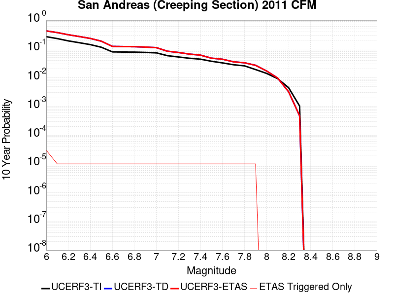 |

| Magnitude | 1 wk TI Prob | 1 wk TD Prob | 1 wk ETAS Prob | 1 wk ETAS/TD Gain | 1 wk ETAS Triggered Only | 1 mo TI Prob | 1 mo TD Prob | 1 mo ETAS Prob | 1 mo ETAS/TD Gain | 1 mo ETAS Triggered Only | 1 yr TI Prob | 1 yr TD Prob | 1 yr ETAS Prob | 1 yr ETAS/TD Gain | 1 yr ETAS Triggered Only | 10 yr TI Prob | 10 yr TD Prob | 10 yr ETAS Prob | 10 yr ETAS/TD Gain | 10 yr ETAS Triggered Only |
|-----|-----|-----|-----|-----|-----|-----|-----|-----|-----|-----|-----|-----|-----|-----|-----|-----|-----|-----|-----|-----|
| 6.0 | 5.986481E-4 | 0.0012286972 | 0.0012286972 | 1.0 | 0.0 | 0.0025631124 | 0.00524696 | 0.00524696 | 1.0 | 0.0 | 0.030762846 | 0.061202604 | 0.061202604 | 1.0 | 0.0 | 0.26835477 | 0.42592302 | 0.42593002 | 1.0000165 | 1.22121E-5 |
| 6.1 | 5.015945E-4 | 0.0010229645 | 0.0010229645 | 1.0 | 0.0 | 0.00214792 | 0.004369588 | 0.004369588 | 1.0 | 0.0 | 0.025839351 | 0.051246066 | 0.051246066 | 1.0 | 0.0 | 0.23032776 | 0.37284485 | 0.37284485 | 1.0 | 0.0 |
| 6.2 | 4.073338E-4 | 8.115361E-4 | 8.115361E-4 | 1.0 | 0.0 | 0.0017445484 | 0.003468385 | 0.003468385 | 1.0 | 0.0 | 0.021034058 | 0.040931217 | 0.040931217 | 1.0 | 0.0 | 0.19150782 | 0.31302088 | 0.31302088 | 1.0 | 0.0 |
| 6.3 | 3.464099E-4 | 6.745419E-4 | 6.745419E-4 | 1.0 | 0.0 | 0.0014837692 | 0.002883343 | 0.002883343 | 1.0 | 0.0 | 0.017915873 | 0.034187317 | 0.034187317 | 1.0 | 0.0 | 0.16538359 | 0.2713031 | 0.2713031 | 1.0 | 0.0 |
| 6.4 | 2.935057E-4 | 5.551342E-4 | 5.551342E-4 | 1.0 | 0.0 | 0.0012572751 | 0.002372886 | 0.002372886 | 1.0 | 0.0 | 0.015200248 | 0.028262215 | 0.028262215 | 1.0 | 0.0 | 0.14201577 | 0.23297104 | 0.23297104 | 1.0 | 0.0 |
| 6.5 | 2.3409708E-4 | 4.2130658E-4 | 4.2130658E-4 | 1.0 | 0.0 | 0.0010028875 | 0.0018018549 | 0.0018018549 | 1.0 | 0.0 | 0.012141965 | 0.021585694 | 0.021585694 | 1.0 | 0.0 | 0.11499573 | 0.18680891 | 0.18680891 | 1.0 | 0.0 |
| 6.6 | 1.5842178E-4 | 2.5067228E-4 | 2.5067228E-4 | 1.0 | 0.0 | 6.7877385E-4 | 0.0010738597 | 0.0010738597 | 1.0 | 0.0 | 0.0082328 | 0.012994494 | 0.012994494 | 1.0 | 0.0 | 0.07934396 | 0.1231311 | 0.1231311 | 1.0 | 0.0 |
| 6.7 | 1.5616413E-4 | 2.4603796E-4 | 2.4603796E-4 | 1.0 | 0.0 | 6.691031E-4 | 0.0010540152 | 0.0010540152 | 1.0 | 0.0 | 0.0081159435 | 0.012756367 | 0.012756367 | 1.0 | 0.0 | 0.0782586 | 0.12115822 | 0.12115822 | 1.0 | 0.0 |
| 6.8 | 1.5538467E-4 | 2.442769E-4 | 2.442769E-4 | 1.0 | 0.0 | 6.6576427E-4 | 0.0010464739 | 0.0010464739 | 1.0 | 0.0 | 0.008075596 | 0.012665753 | 0.012665753 | 1.0 | 0.0 | 0.07788358 | 0.12038911 | 0.12038911 | 1.0 | 0.0 |
| 6.9 | 1.5153569E-4 | 2.3536953E-4 | 2.3536953E-4 | 1.0 | 0.0 | 6.49277E-4 | 0.0010083386 | 0.0010083386 | 1.0 | 0.0 | 0.007876333 | 0.012207948 | 0.012207948 | 1.0 | 0.0 | 0.07602952 | 0.11645927 | 0.11645927 | 1.0 | 0.0 |
| 7.0 | 1.4588932E-4 | 2.239424E-4 | 2.239424E-4 | 1.0 | 0.0 | 6.250901E-4 | 9.594021E-4 | 9.594021E-4 | 1.0 | 0.0 | 0.0075839474 | 0.011618658 | 0.011618658 | 1.0 | 0.0 | 0.073302895 | 0.11130563 | 0.11130563 | 1.0 | 0.0 |
| 7.1 | 1.1565079E-4 | 1.6279978E-4 | 1.6279978E-4 | 1.0 | 0.0 | 4.955521E-4 | 6.9752766E-4 | 6.9752766E-4 | 1.0 | 0.0 | 0.006016669 | 0.008459533 | 0.008459533 | 1.0 | 0.0 | 0.058563538 | 0.08365876 | 0.08365876 | 1.0 | 0.0 |
| 7.2 | 1.0393792E-4 | 1.4614112E-4 | 1.4614112E-4 | 1.0 | 0.0 | 4.4537216E-4 | 6.261695E-4 | 6.261695E-4 | 1.0 | 0.0 | 0.005408933 | 0.007597135 | 0.007597135 | 1.0 | 0.0 | 0.052791595 | 0.075609244 | 0.075609244 | 1.0 | 0.0 |
| 7.3 | 9.332884E-5 | 1.277942E-4 | 1.277942E-4 | 1.0 | 0.0 | 3.999194E-4 | 5.475752E-4 | 5.475752E-4 | 1.0 | 0.0 | 0.0048581534 | 0.006646483 | 0.006646483 | 1.0 | 0.0 | 0.047533102 | 0.06647413 | 0.06647413 | 1.0 | 0.0 |
| 7.4 | 8.670252E-5 | 1.1701832E-4 | 1.1701832E-4 | 1.0 | 0.0 | 3.715293E-4 | 5.0141127E-4 | 5.0141127E-4 | 1.0 | 0.0 | 0.004513991 | 0.0060877153 | 0.0060877153 | 1.0 | 0.0 | 0.044233937 | 0.061143413 | 0.061143413 | 1.0 | 0.0 |
| 7.5 | 7.3036405E-5 | 9.004733E-5 | 9.004733E-5 | 1.0 | 0.0 | 3.129756E-4 | 3.8586016E-4 | 3.8586016E-4 | 1.0 | 0.0 | 0.0038038217 | 0.0046877493 | 0.0046877493 | 1.0 | 0.0 | 0.03739367 | 0.047871016 | 0.047871016 | 1.0 | 0.0 |
| 7.6 | 6.3935775E-5 | 8.279309E-5 | 8.279309E-5 | 1.0 | 0.0 | 2.7398168E-4 | 3.5477936E-4 | 3.5477936E-4 | 1.0 | 0.0 | 0.0033306254 | 0.0043109027 | 0.0043109027 | 1.0 | 0.0 | 0.032811474 | 0.04398585 | 0.04398585 | 1.0 | 0.0 |
| 7.7 | 5.5050095E-5 | 6.66093E-5 | 6.66093E-5 | 1.0 | 0.0 | 2.3590765E-4 | 2.854372E-4 | 2.854372E-4 | 1.0 | 0.0 | 0.0028683927 | 0.0034696644 | 0.0034696644 | 1.0 | 0.0 | 0.0283165 | 0.035791222 | 0.035791222 | 1.0 | 0.0 |
| 7.8 | 5.027131E-5 | 6.1620405E-5 | 6.1620405E-5 | 1.0 | 0.0 | 2.1543067E-4 | 2.640607E-4 | 2.640607E-4 | 1.0 | 0.0 | 0.0026197135 | 0.0032102033 | 0.0032102033 | 1.0 | 0.0 | 0.025890453 | 0.03312217 | 0.03312217 | 1.0 | 0.0 |
| 7.9 | 3.7271806E-5 | 5.0218474E-5 | 5.0218474E-5 | 1.0 | 0.0 | 1.5972654E-4 | 2.1520429E-4 | 2.1520429E-4 | 1.0 | 0.0 | 0.0019429359 | 0.002616966 | 0.002616966 | 1.0 | 0.0 | 0.019260362 | 0.027063787 | 0.027063787 | 1.0 | 0.0 |
| 8.0 | 2.7310243E-5 | 3.1424468E-5 | 3.1424468E-5 | 1.0 | 0.0 | 1.17038646E-4 | 1.3466935E-4 | 1.3466935E-4 | 1.0 | 0.0 | 0.0014240141 | 0.0016383671 | 0.0016383671 | 1.0 | 0.0 | 0.014149235 | 0.017211871 | 0.017211871 | 1.0 | 0.0 |
| 8.1 | 1.7940547E-5 | 1.7398293E-5 | 1.7398293E-5 | 1.0 | 0.0 | 7.688579E-5 | 7.456199E-5 | 7.456199E-5 | 1.0 | 0.0 | 9.3568244E-4 | 9.074147E-4 | 9.074147E-4 | 1.0 | 0.0 | 0.009317525 | 0.009797759 | 0.009797759 | 1.0 | 0.0 |
| 8.2 | 8.643924E-6 | 5.4738607E-6 | 5.4738607E-6 | 1.0 | 0.0 | 3.704486E-5 | 2.3459192E-5 | 2.3459192E-5 | 1.0 | 0.0 | 4.5092785E-4 | 2.855783E-4 | 2.855783E-4 | 1.0 | 0.0 | 0.0045001395 | 0.0032481598 | 0.0032481598 | 1.0 | 0.0 |
| 8.3 | 1.983087E-6 | 7.658221E-7 | 7.658221E-7 | 1.0 | 0.0 | 8.498917E-6 | 3.2820906E-6 | 3.2820906E-6 | 1.0 | 0.0 | 1.034694E-4 | 3.9958737E-5 | 3.9958737E-5 | 1.0 | 0.0 | 0.0010342124 | 4.7187202E-4 | 4.7187202E-4 | 1.0 | 0.0 |

## La Panza 2011
*[(top)](#table-of-contents)*

| 1 Week | 1 Month | 1 Year | 10 Year |
|-----|-----|-----|-----|
|  | 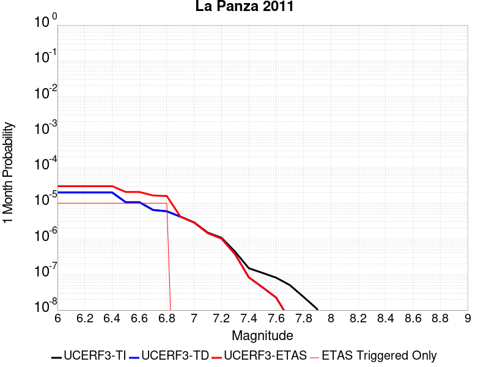 | 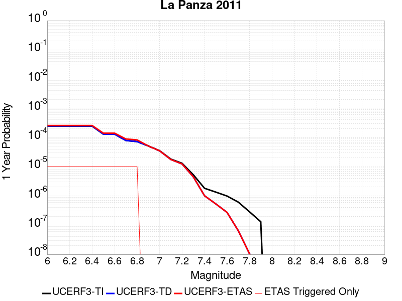 | 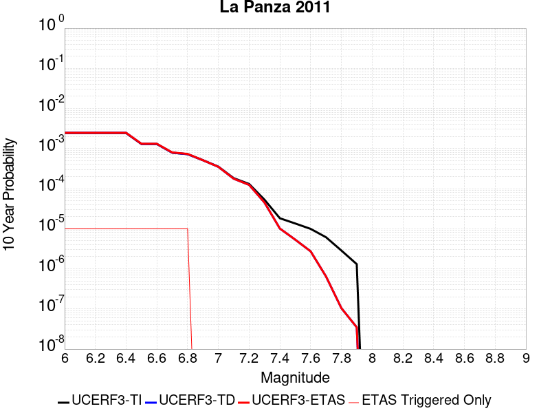 |

| Magnitude | 1 wk TI Prob | 1 wk TD Prob | 1 wk ETAS Prob | 1 wk ETAS/TD Gain | 1 wk ETAS Triggered Only | 1 mo TI Prob | 1 mo TD Prob | 1 mo ETAS Prob | 1 mo ETAS/TD Gain | 1 mo ETAS Triggered Only | 1 yr TI Prob | 1 yr TD Prob | 1 yr ETAS Prob | 1 yr ETAS/TD Gain | 1 yr ETAS Triggered Only | 10 yr TI Prob | 10 yr TD Prob | 10 yr ETAS Prob | 10 yr ETAS/TD Gain | 10 yr ETAS Triggered Only |
|-----|-----|-----|-----|-----|-----|-----|-----|-----|-----|-----|-----|-----|-----|-----|-----|-----|-----|-----|-----|-----|
| 6.0 | 4.6754544E-6 | 4.7175827E-6 | 1.6929625E-5 | 3.5886228 | 1.22121E-5 | 2.0037509E-5 | 2.0218065E-5 | 3.2429918E-5 | 1.604007 | 1.22121E-5 | 2.4392935E-4 | 2.4612912E-4 | 2.583382E-4 | 1.0496044 | 1.22121E-5 | 0.0024366176 | 0.0024587596 | 0.0024709417 | 1.0049546 | 1.22121E-5 |
| 6.1 | 4.6754544E-6 | 4.7175827E-6 | 1.6929625E-5 | 3.5886228 | 1.22121E-5 | 2.0037509E-5 | 2.0218065E-5 | 3.2429918E-5 | 1.604007 | 1.22121E-5 | 2.4392935E-4 | 2.4612912E-4 | 2.583382E-4 | 1.0496044 | 1.22121E-5 | 0.0024366176 | 0.0024587596 | 0.0024709417 | 1.0049546 | 1.22121E-5 |
| 6.2 | 4.6754544E-6 | 4.7175827E-6 | 1.6929625E-5 | 3.5886228 | 1.22121E-5 | 2.0037509E-5 | 2.0218065E-5 | 3.2429918E-5 | 1.604007 | 1.22121E-5 | 2.4392935E-4 | 2.4612912E-4 | 2.583382E-4 | 1.0496044 | 1.22121E-5 | 0.0024366176 | 0.0024587596 | 0.0024709417 | 1.0049546 | 1.22121E-5 |
| 6.3 | 4.6754544E-6 | 4.7175827E-6 | 1.6929625E-5 | 3.5886228 | 1.22121E-5 | 2.0037509E-5 | 2.0218065E-5 | 3.2429918E-5 | 1.604007 | 1.22121E-5 | 2.4392935E-4 | 2.4612912E-4 | 2.583382E-4 | 1.0496044 | 1.22121E-5 | 0.0024366176 | 0.0024587596 | 0.0024709417 | 1.0049546 | 1.22121E-5 |
| 6.4 | 4.6754544E-6 | 4.7175827E-6 | 1.6929625E-5 | 3.5886228 | 1.22121E-5 | 2.0037509E-5 | 2.0218065E-5 | 3.2429918E-5 | 1.604007 | 1.22121E-5 | 2.4392935E-4 | 2.4612912E-4 | 2.583382E-4 | 1.0496044 | 1.22121E-5 | 0.0024366176 | 0.0024587596 | 0.0024709417 | 1.0049546 | 1.22121E-5 |
| 6.5 | 2.485343E-6 | 2.5005954E-6 | 1.4712665E-5 | 5.8836646 | 1.22121E-5 | 1.0651426E-5 | 1.0716795E-5 | 2.2928765E-5 | 2.1395168 | 1.22121E-5 | 1.296734E-4 | 1.3046956E-4 | 1.4268007E-4 | 1.093589 | 1.22121E-5 | 0.0012959775 | 0.001303968 | 0.0013161643 | 1.0093532 | 1.22121E-5 |
| 6.6 | 2.485343E-6 | 2.5005954E-6 | 1.4712665E-5 | 5.8836646 | 1.22121E-5 | 1.0651426E-5 | 1.0716795E-5 | 2.2928765E-5 | 2.1395168 | 1.22121E-5 | 1.296734E-4 | 1.3046956E-4 | 1.4268007E-4 | 1.093589 | 1.22121E-5 | 0.0012959775 | 0.001303968 | 0.0013161643 | 1.0093532 | 1.22121E-5 |
| 6.7 | 1.5108508E-6 | 1.5146343E-6 | 1.3726715E-5 | 9.062726 | 1.22121E-5 | 6.4750584E-6 | 6.4912742E-6 | 1.8703295E-5 | 2.8812978 | 1.22121E-5 | 7.8830984E-5 | 7.9028505E-5 | 9.123964E-5 | 1.1545156 | 1.22121E-5 | 7.880303E-4 | 7.900148E-4 | 8.022173E-4 | 1.0154458 | 1.22121E-5 |
| 6.8 | 1.3865837E-6 | 1.388507E-6 | 1.360059E-5 | 9.795118 | 1.22121E-5 | 5.942488E-6 | 5.950731E-6 | 1.8162758E-5 | 3.0521894 | 1.22121E-5 | 7.234739E-5 | 7.2447845E-5 | 8.465906E-5 | 1.1685518 | 1.22121E-5 | 7.232384E-4 | 7.242521E-4 | 7.364553E-4 | 1.0168494 | 1.22121E-5 |
| 6.9 | 9.826583E-7 | 9.796256E-7 | 9.796256E-7 | 1.0 | 0.0 | 4.2113857E-6 | 4.198389E-6 | 4.198389E-6 | 1.0 | 0.0 | 5.1272415E-5 | 5.1114243E-5 | 5.1114243E-5 | 1.0 | 0.0 | 5.126059E-4 | 5.110302E-4 | 5.110302E-4 | 1.0 | 0.0 |
| 7.0 | 6.7797646E-7 | 6.7101854E-7 | 6.7101854E-7 | 1.0 | 0.0 | 2.9056102E-6 | 2.8757909E-6 | 2.8757909E-6 | 1.0 | 0.0 | 3.537523E-5 | 3.501222E-5 | 3.501222E-5 | 1.0 | 0.0 | 3.5369597E-4 | 3.5007016E-4 | 3.5007016E-4 | 1.0 | 0.0 |
| 7.1 | 3.4979826E-7 | 3.38736E-7 | 3.38736E-7 | 1.0 | 0.0 | 1.4991346E-6 | 1.451725E-6 | 1.451725E-6 | 1.0 | 0.0 | 1.825181E-5 | 1.767462E-5 | 1.767462E-5 | 1.0 | 0.0 | 1.825031E-4 | 1.767333E-4 | 1.767333E-4 | 1.0 | 0.0 |
| 7.2 | 2.5088332E-7 | 2.3831622E-7 | 2.3831622E-7 | 1.0 | 0.0 | 1.0752137E-6 | 1.0213549E-6 | 1.0213549E-6 | 1.0 | 0.0 | 1.3090649E-5 | 1.24349335E-5 | 1.24349335E-5 | 1.0 | 0.0 | 1.3089878E-4 | 1.2434323E-4 | 1.2434323E-4 | 1.0 | 0.0 |
| 7.3 | 1.0159086E-7 | 8.644351E-8 | 8.644351E-8 | 1.0 | 0.0 | 4.3538932E-7 | 3.704721E-7 | 3.704721E-7 | 1.0 | 0.0 | 5.300852E-6 | 4.510489E-6 | 4.510489E-6 | 1.0 | 0.0 | 5.3007258E-5 | 4.5104014E-5 | 4.5104014E-5 | 1.0 | 0.0 |
| 7.4 | 3.5006252E-8 | 1.9403462E-8 | 1.9403462E-8 | 1.0 | 0.0 | 1.5002678E-7 | 8.315769E-8 | 8.315769E-8 | 1.0 | 0.0 | 1.8265745E-6 | 1.0124444E-6 | 1.0124444E-6 | 1.0 | 0.0 | 1.8265595E-5 | 1.01244E-5 | 1.01244E-5 | 1.0 | 0.0 |
| 7.5 | 2.592274E-8 | 1.0238448E-8 | 1.0238448E-8 | 1.0 | 0.0 | 1.1109746E-7 | 4.3879062E-8 | 4.3879062E-8 | 1.0 | 0.0 | 1.3526106E-6 | 5.3422747E-7 | 5.3422747E-7 | 1.0 | 0.0 | 1.3526024E-5 | 5.3422627E-6 | 5.3422627E-6 | 1.0 | 0.0 |
| 7.6 | 1.9016717E-8 | 5.2443867E-9 | 5.2443867E-9 | 1.0 | 0.0 | 8.150022E-8 | 2.2475943E-8 | 2.2475943E-8 | 1.0 | 0.0 | 9.922647E-7 | 2.7364456E-7 | 2.7364456E-7 | 1.0 | 0.0 | 9.922603E-6 | 2.7364424E-6 | 2.7364424E-6 | 1.0 | 0.0 |
| 7.7 | 1.17738495E-8 | 1.2396277E-9 | 1.2396277E-9 | 1.0 | 0.0 | 5.0459356E-8 | 5.31269E-9 | 5.31269E-9 | 1.0 | 0.0 | 6.1434247E-7 | 6.4682E-8 | 6.4682E-8 | 1.0 | 0.0 | 6.143408E-6 | 6.468198E-7 | 6.468198E-7 | 1.0 | 0.0 |
| 7.8 | 5.489079E-9 | 2.010706E-10 | 2.010706E-10 | 1.0 | 0.0 | 2.3524624E-8 | 8.617309E-10 | 8.617309E-10 | 1.0 | 0.0 | 2.8641225E-7 | 1.0491576E-8 | 1.0491576E-8 | 1.0 | 0.0 | 2.8641189E-6 | 1.0491575E-7 | 1.0491575E-7 | 1.0 | 0.0 |
| 7.9 | 2.5081048E-9 | 6.682088E-11 | 6.682088E-11 | 1.0 | 0.0 | 1.0749021E-8 | 2.8637537E-10 | 2.8637537E-10 | 1.0 | 0.0 | 1.3086932E-7 | 3.4866208E-9 | 3.4866208E-9 | 1.0 | 0.0 | 1.3086925E-6 | 3.4866208E-8 | 3.4866208E-8 | 1.0 | 0.0 |

## Cucamonga
*[(top)](#table-of-contents)*

| 1 Week | 1 Month | 1 Year | 10 Year |
|-----|-----|-----|-----|
|  |  | 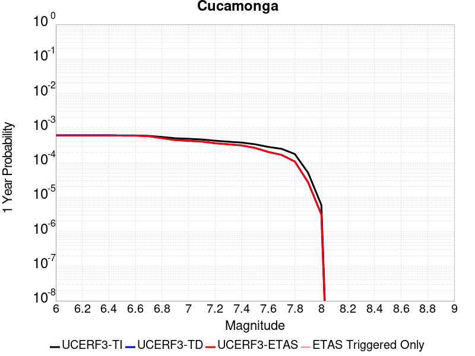 |  |

| Magnitude | 1 wk TI Prob | 1 wk TD Prob | 1 wk ETAS Prob | 1 wk ETAS/TD Gain | 1 wk ETAS Triggered Only | 1 mo TI Prob | 1 mo TD Prob | 1 mo ETAS Prob | 1 mo ETAS/TD Gain | 1 mo ETAS Triggered Only | 1 yr TI Prob | 1 yr TD Prob | 1 yr ETAS Prob | 1 yr ETAS/TD Gain | 1 yr ETAS Triggered Only | 10 yr TI Prob | 10 yr TD Prob | 10 yr ETAS Prob | 10 yr ETAS/TD Gain | 10 yr ETAS Triggered Only |
|-----|-----|-----|-----|-----|-----|-----|-----|-----|-----|-----|-----|-----|-----|-----|-----|-----|-----|-----|-----|-----|
| 6.0 | 1.1848348E-5 | 1.1736872E-5 | 1.1736872E-5 | 1.0 | 0.0 | 5.0777642E-5 | 5.0299925E-5 | 5.0299925E-5 | 1.0 | 0.0 | 6.180424E-4 | 6.1223225E-4 | 6.1223225E-4 | 1.0 | 0.0 | 0.0061632637 | 0.0061066314 | 0.006118769 | 1.0019876 | 1.22121E-5 |
| 6.1 | 1.1848348E-5 | 1.1736872E-5 | 1.1736872E-5 | 1.0 | 0.0 | 5.0777642E-5 | 5.0299925E-5 | 5.0299925E-5 | 1.0 | 0.0 | 6.180424E-4 | 6.1223225E-4 | 6.1223225E-4 | 1.0 | 0.0 | 0.0061632637 | 0.0061066314 | 0.006118769 | 1.0019876 | 1.22121E-5 |
| 6.2 | 1.1848348E-5 | 1.1736872E-5 | 1.1736872E-5 | 1.0 | 0.0 | 5.0777642E-5 | 5.0299925E-5 | 5.0299925E-5 | 1.0 | 0.0 | 6.180424E-4 | 6.1223225E-4 | 6.1223225E-4 | 1.0 | 0.0 | 0.0061632637 | 0.0061066314 | 0.006118769 | 1.0019876 | 1.22121E-5 |
| 6.3 | 1.1848348E-5 | 1.1736872E-5 | 1.1736872E-5 | 1.0 | 0.0 | 5.0777642E-5 | 5.0299925E-5 | 5.0299925E-5 | 1.0 | 0.0 | 6.180424E-4 | 6.1223225E-4 | 6.1223225E-4 | 1.0 | 0.0 | 0.0061632637 | 0.0061066314 | 0.006118769 | 1.0019876 | 1.22121E-5 |
| 6.4 | 1.1848348E-5 | 1.1736872E-5 | 1.1736872E-5 | 1.0 | 0.0 | 5.0777642E-5 | 5.0299925E-5 | 5.0299925E-5 | 1.0 | 0.0 | 6.180424E-4 | 6.1223225E-4 | 6.1223225E-4 | 1.0 | 0.0 | 0.0061632637 | 0.0061066314 | 0.006118769 | 1.0019876 | 1.22121E-5 |
| 6.5 | 1.16988695E-5 | 1.1575903E-5 | 1.1575903E-5 | 1.0 | 0.0 | 5.013705E-5 | 4.9610087E-5 | 4.9610087E-5 | 1.0 | 0.0 | 6.102476E-4 | 6.0383807E-4 | 6.0383807E-4 | 1.0 | 0.0 | 0.006085745 | 0.0060231457 | 0.0060352846 | 1.0020154 | 1.22121E-5 |
| 6.6 | 1.16988695E-5 | 1.1575903E-5 | 1.1575903E-5 | 1.0 | 0.0 | 5.013705E-5 | 4.9610087E-5 | 4.9610087E-5 | 1.0 | 0.0 | 6.102476E-4 | 6.0383807E-4 | 6.0383807E-4 | 1.0 | 0.0 | 0.006085745 | 0.0060231457 | 0.0060352846 | 1.0020154 | 1.22121E-5 |
| 6.7 | 1.1397107E-5 | 1.1114816E-5 | 1.1114816E-5 | 1.0 | 0.0 | 4.884383E-5 | 4.763407E-5 | 4.763407E-5 | 1.0 | 0.0 | 5.9451134E-4 | 5.7979295E-4 | 5.7979295E-4 | 1.0 | 0.0 | 0.005929234 | 0.005783954 | 0.005796096 | 1.0020992 | 1.22121E-5 |
| 6.8 | 1.058387E-5 | 9.784875E-6 | 9.784875E-6 | 1.0 | 0.0 | 4.5358654E-5 | 4.1934512E-5 | 4.1934512E-5 | 1.0 | 0.0 | 5.521017E-4 | 5.1043415E-4 | 5.1043415E-4 | 1.0 | 0.0 | 0.00550732 | 0.0050936276 | 0.005105777 | 1.0023853 | 1.22121E-5 |
| 6.9 | 9.690046E-6 | 8.5793745E-6 | 8.5793745E-6 | 1.0 | 0.0 | 4.1528107E-5 | 3.676823E-5 | 3.676823E-5 | 1.0 | 0.0 | 5.054874E-4 | 4.4756167E-4 | 4.4756167E-4 | 1.0 | 0.0 | 0.005043391 | 0.004467539 | 0.004479697 | 1.0027213 | 1.22121E-5 |
| 7.0 | 9.381461E-6 | 8.1869985E-6 | 8.1869985E-6 | 1.0 | 0.0 | 4.020564E-5 | 3.5086665E-5 | 3.5086665E-5 | 1.0 | 0.0 | 4.893937E-4 | 4.2709676E-4 | 4.2709676E-4 | 1.0 | 0.0 | 0.0048831734 | 0.004263694 | 0.004275854 | 1.002852 | 1.22121E-5 |
| 7.1 | 8.946492E-6 | 7.781785E-6 | 7.781785E-6 | 1.0 | 0.0 | 3.8341543E-5 | 3.3350083E-5 | 3.3350083E-5 | 1.0 | 0.0 | 4.667083E-4 | 4.059619E-4 | 4.059619E-4 | 1.0 | 0.0 | 0.0046572937 | 0.00405314 | 0.0040653027 | 1.0030007 | 1.22121E-5 |
| 7.2 | 8.251016E-6 | 6.9751854E-6 | 6.9751854E-6 | 1.0 | 0.0 | 3.5361016E-5 | 2.989331E-5 | 2.989331E-5 | 1.0 | 0.0 | 4.3043532E-4 | 3.6389052E-4 | 3.6389052E-4 | 1.0 | 0.0 | 0.0042960253 | 0.0036338803 | 0.003646048 | 1.0033485 | 1.22121E-5 |
| 7.3 | 7.717881E-6 | 6.4862593E-6 | 6.4862593E-6 | 1.0 | 0.0 | 3.3076216E-5 | 2.7797958E-5 | 2.7797958E-5 | 1.0 | 0.0 | 4.026285E-4 | 3.383878E-4 | 3.383878E-4 | 1.0 | 0.0 | 0.004018998 | 0.0033796628 | 0.0033918337 | 1.0036012 | 1.22121E-5 |
| 7.4 | 7.275623E-6 | 6.0319094E-6 | 6.0319094E-6 | 1.0 | 0.0 | 3.118087E-5 | 2.5850786E-5 | 2.5850786E-5 | 1.0 | 0.0 | 3.7956095E-4 | 3.1468808E-4 | 3.1468808E-4 | 1.0 | 0.0 | 0.0037891332 | 0.0031433608 | 0.0031555346 | 1.0038729 | 1.22121E-5 |
| 7.5 | 6.5109502E-6 | 5.1005236E-6 | 5.1005236E-6 | 1.0 | 0.0 | 2.7903774E-5 | 2.1859205E-5 | 2.1859205E-5 | 1.0 | 0.0 | 3.3967546E-4 | 2.6610345E-4 | 2.6610345E-4 | 1.0 | 0.0 | 0.0033915674 | 0.0026587727 | 0.0026709524 | 1.004581 | 1.22121E-5 |
| 7.6 | 5.4495326E-6 | 3.908509E-6 | 3.908509E-6 | 1.0 | 0.0 | 2.335493E-5 | 1.6750646E-5 | 1.6750646E-5 | 1.0 | 0.0 | 2.8430918E-4 | 2.0392009E-4 | 2.0392009E-4 | 1.0 | 0.0 | 0.0028394572 | 0.0020382507 | 0.002050438 | 1.0059793 | 1.22121E-5 |
| 7.7 | 4.7997164E-6 | 3.2002004E-6 | 3.2002004E-6 | 1.0 | 0.0 | 2.057005E-5 | 1.3715072E-5 | 1.3715072E-5 | 1.0 | 0.0 | 2.504116E-4 | 1.6696824E-4 | 1.6696824E-4 | 1.0 | 0.0 | 0.002501296 | 0.0016693595 | 0.0016815512 | 1.0073032 | 1.22121E-5 |
| 7.8 | 3.3941733E-6 | 2.0641605E-6 | 2.0641605E-6 | 1.0 | 0.0 | 1.4546376E-5 | 8.846372E-6 | 8.846372E-6 | 1.0 | 0.0 | 1.7708774E-4 | 1.0769927E-4 | 1.0769927E-4 | 1.0 | 0.0 | 0.0017694668 | 0.0010767077 | 0.0010889067 | 1.0113299 | 1.22121E-5 |
| 7.9 | 9.750552E-7 | 5.1558817E-7 | 5.1558817E-7 | 1.0 | 0.0 | 4.178801E-6 | 2.2096617E-6 | 2.2096617E-6 | 1.0 | 0.0 | 5.0875715E-5 | 2.6902302E-5 | 2.6902302E-5 | 1.0 | 0.0 | 5.086407E-4 | 2.6899087E-4 | 2.6899087E-4 | 1.0 | 0.0 |
| 8.0 | 1.133857E-7 | 6.053637E-8 | 6.053637E-8 | 1.0 | 0.0 | 4.8593864E-7 | 2.5944158E-7 | 2.5944158E-7 | 1.0 | 0.0 | 5.9162867E-6 | 3.1586967E-6 | 3.1586967E-6 | 1.0 | 0.0 | 5.916129E-5 | 3.1586536E-5 | 3.1586536E-5 | 1.0 | 0.0 |

## Los Alamos 2011 CFM
*[(top)](#table-of-contents)*

| 1 Week | 1 Month | 1 Year | 10 Year |
|-----|-----|-----|-----|
|  |  |  |  |

| Magnitude | 1 wk TI Prob | 1 wk TD Prob | 1 wk ETAS Prob | 1 wk ETAS/TD Gain | 1 wk ETAS Triggered Only | 1 mo TI Prob | 1 mo TD Prob | 1 mo ETAS Prob | 1 mo ETAS/TD Gain | 1 mo ETAS Triggered Only | 1 yr TI Prob | 1 yr TD Prob | 1 yr ETAS Prob | 1 yr ETAS/TD Gain | 1 yr ETAS Triggered Only | 10 yr TI Prob | 10 yr TD Prob | 10 yr ETAS Prob | 10 yr ETAS/TD Gain | 10 yr ETAS Triggered Only |
|-----|-----|-----|-----|-----|-----|-----|-----|-----|-----|-----|-----|-----|-----|-----|-----|-----|-----|-----|-----|-----|
| 6.0 | 4.6284417E-6 | 4.751727E-6 | 4.751727E-6 | 1.0 | 0.0 | 1.9836029E-5 | 2.0364394E-5 | 2.0364394E-5 | 1.0 | 0.0 | 2.4147688E-4 | 2.4791007E-4 | 2.4791007E-4 | 1.0 | 0.0 | 0.0024121467 | 0.0024765092 | 0.002488691 | 1.0049189 | 1.22121E-5 |
| 6.1 | 4.6284417E-6 | 4.751727E-6 | 4.751727E-6 | 1.0 | 0.0 | 1.9836029E-5 | 2.0364394E-5 | 2.0364394E-5 | 1.0 | 0.0 | 2.4147688E-4 | 2.4791007E-4 | 2.4791007E-4 | 1.0 | 0.0 | 0.0024121467 | 0.0024765092 | 0.002488691 | 1.0049189 | 1.22121E-5 |
| 6.2 | 4.6284417E-6 | 4.751727E-6 | 4.751727E-6 | 1.0 | 0.0 | 1.9836029E-5 | 2.0364394E-5 | 2.0364394E-5 | 1.0 | 0.0 | 2.4147688E-4 | 2.4791007E-4 | 2.4791007E-4 | 1.0 | 0.0 | 0.0024121467 | 0.0024765092 | 0.002488691 | 1.0049189 | 1.22121E-5 |
| 6.3 | 4.6284417E-6 | 4.751727E-6 | 4.751727E-6 | 1.0 | 0.0 | 1.9836029E-5 | 2.0364394E-5 | 2.0364394E-5 | 1.0 | 0.0 | 2.4147688E-4 | 2.4791007E-4 | 2.4791007E-4 | 1.0 | 0.0 | 0.0024121467 | 0.0024765092 | 0.002488691 | 1.0049189 | 1.22121E-5 |
| 6.4 | 4.6284417E-6 | 4.751727E-6 | 4.751727E-6 | 1.0 | 0.0 | 1.9836029E-5 | 2.0364394E-5 | 2.0364394E-5 | 1.0 | 0.0 | 2.4147688E-4 | 2.4791007E-4 | 2.4791007E-4 | 1.0 | 0.0 | 0.0024121467 | 0.0024765092 | 0.002488691 | 1.0049189 | 1.22121E-5 |
| 6.5 | 4.6284417E-6 | 4.751727E-6 | 4.751727E-6 | 1.0 | 0.0 | 1.9836029E-5 | 2.0364394E-5 | 2.0364394E-5 | 1.0 | 0.0 | 2.4147688E-4 | 2.4791007E-4 | 2.4791007E-4 | 1.0 | 0.0 | 0.0024121467 | 0.0024765092 | 0.002488691 | 1.0049189 | 1.22121E-5 |
| 6.6 | 4.6284417E-6 | 4.751727E-6 | 4.751727E-6 | 1.0 | 0.0 | 1.9836029E-5 | 2.0364394E-5 | 2.0364394E-5 | 1.0 | 0.0 | 2.4147688E-4 | 2.4791007E-4 | 2.4791007E-4 | 1.0 | 0.0 | 0.0024121467 | 0.0024765092 | 0.002488691 | 1.0049189 | 1.22121E-5 |
| 6.7 | 4.062321E-6 | 4.1663448E-6 | 4.1663448E-6 | 1.0 | 0.0 | 1.7409831E-5 | 1.7855651E-5 | 1.7855651E-5 | 1.0 | 0.0 | 2.1194408E-4 | 2.1737238E-4 | 2.1737238E-4 | 1.0 | 0.0 | 0.0021174205 | 0.0021717472 | 0.0021839328 | 1.005611 | 1.22121E-5 |
| 6.8 | 4.062321E-6 | 4.1663448E-6 | 4.1663448E-6 | 1.0 | 0.0 | 1.7409831E-5 | 1.7855651E-5 | 1.7855651E-5 | 1.0 | 0.0 | 2.1194408E-4 | 2.1737238E-4 | 2.1737238E-4 | 1.0 | 0.0 | 0.0021174205 | 0.0021717472 | 0.0021839328 | 1.005611 | 1.22121E-5 |
| 6.9 | 3.2936077E-6 | 3.3729548E-6 | 3.3729548E-6 | 1.0 | 0.0 | 1.4115385E-5 | 1.4455445E-5 | 1.4455445E-5 | 1.0 | 0.0 | 1.7184127E-4 | 1.7598177E-4 | 1.7598177E-4 | 1.0 | 0.0 | 0.0017170844 | 0.0017585168 | 0.0017707074 | 1.0069324 | 1.22121E-5 |
| 7.0 | 3.1687898E-6 | 3.2448124E-6 | 3.2448124E-6 | 1.0 | 0.0 | 1.3580457E-5 | 1.390627E-5 | 1.390627E-5 | 1.0 | 0.0 | 1.6532952E-4 | 1.6929662E-4 | 1.6929662E-4 | 1.0 | 0.0 | 0.0016520657 | 0.0016917681 | 0.0017039594 | 1.0072063 | 1.22121E-5 |
| 7.1 | 2.9379228E-6 | 3.007323E-6 | 3.007323E-6 | 1.0 | 0.0 | 1.25910365E-5 | 1.28884685E-5 | 1.28884685E-5 | 1.0 | 0.0 | 1.5328509E-4 | 1.5690671E-4 | 1.5690671E-4 | 1.0 | 0.0 | 0.001531794 | 0.0015680484 | 0.0015802414 | 1.0077759 | 1.22121E-5 |
| 7.2 | 2.0020686E-6 | 2.0416278E-6 | 2.0416278E-6 | 1.0 | 0.0 | 8.580266E-6 | 8.749804E-6 | 8.749804E-6 | 1.0 | 0.0 | 1.0445973E-4 | 1.065237E-4 | 1.065237E-4 | 1.0 | 0.0 | 0.0010441064 | 0.0010647308 | 0.00107693 | 1.0114574 | 1.22121E-5 |
| 7.3 | 1.7364243E-6 | 1.7678784E-6 | 1.7678784E-6 | 1.0 | 0.0 | 7.441797E-6 | 7.5765997E-6 | 7.5765997E-6 | 1.0 | 0.0 | 9.0600115E-5 | 9.224123E-5 | 9.224123E-5 | 1.0 | 0.0 | 9.0563187E-4 | 9.220326E-4 | 9.342334E-4 | 1.0132326 | 1.22121E-5 |
| 7.4 | 1.5718434E-6 | 1.598316E-6 | 1.598316E-6 | 1.0 | 0.0 | 6.7364545E-6 | 6.8499075E-6 | 6.8499075E-6 | 1.0 | 0.0 | 8.201325E-5 | 8.3394465E-5 | 8.3394465E-5 | 1.0 | 0.0 | 8.198299E-4 | 8.336347E-4 | 8.458366E-4 | 1.014637 | 1.22121E-5 |
| 7.5 | 1.3841119E-6 | 1.4042777E-6 | 1.4042777E-6 | 1.0 | 0.0 | 5.9318945E-6 | 6.0183193E-6 | 6.0183193E-6 | 1.0 | 0.0 | 7.221842E-5 | 7.32706E-5 | 7.32706E-5 | 1.0 | 0.0 | 7.2194956E-4 | 7.3246734E-4 | 7.4467045E-4 | 1.0166603 | 1.22121E-5 |
| 7.6 | 1.0843726E-6 | 1.0934409E-6 | 1.0934409E-6 | 1.0 | 0.0 | 4.647303E-6 | 4.686167E-6 | 4.686167E-6 | 1.0 | 0.0 | 5.6579443E-5 | 5.7052614E-5 | 5.7052614E-5 | 1.0 | 0.0 | 5.656504E-4 | 5.703822E-4 | 5.703822E-4 | 1.0 | 0.0 |
| 7.7 | 5.544814E-7 | 5.501864E-7 | 5.501864E-7 | 1.0 | 0.0 | 2.3763469E-6 | 2.3579396E-6 | 2.3579396E-6 | 1.0 | 0.0 | 2.8931638E-5 | 2.8707538E-5 | 2.8707538E-5 | 1.0 | 0.0 | 2.8927872E-4 | 2.8703845E-4 | 2.8703845E-4 | 1.0 | 0.0 |
| 7.8 | 2.0707465E-7 | 1.9778435E-7 | 1.9778435E-7 | 1.0 | 0.0 | 8.874625E-7 | 8.4764696E-7 | 8.4764696E-7 | 1.0 | 0.0 | 1.08048025E-5 | 1.0320053E-5 | 1.0320053E-5 | 1.0 | 0.0 | 1.0804277E-4 | 1.0319578E-4 | 1.0319578E-4 | 1.0 | 0.0 |
| 7.9 | 3.9821284E-8 | 3.4331045E-8 | 3.4331045E-8 | 1.0 | 0.0 | 1.7066264E-7 | 1.4713304E-7 | 1.4713304E-7 | 1.0 | 0.0 | 2.0778157E-6 | 1.7913433E-6 | 1.7913433E-6 | 1.0 | 0.0 | 2.0777963E-5 | 1.7913293E-5 | 1.7913293E-5 | 1.0 | 0.0 |
| 8.0 | 7.880441E-11 | 8.235301E-11 | 8.235301E-11 | 1.0 | 0.0 | 3.3773329E-10 | 3.5294168E-10 | 3.5294168E-10 | 1.0 | 0.0 | 4.1119033E-9 | 4.2970645E-9 | 4.2970645E-9 | 1.0 | 0.0 | 4.1119034E-8 | 4.2970644E-8 | 4.2970644E-8 | 1.0 | 0.0 |

## Quien Sabe 2011 CFM
*[(top)](#table-of-contents)*

| 1 Week | 1 Month | 1 Year | 10 Year |
|-----|-----|-----|-----|
|  |  |  | 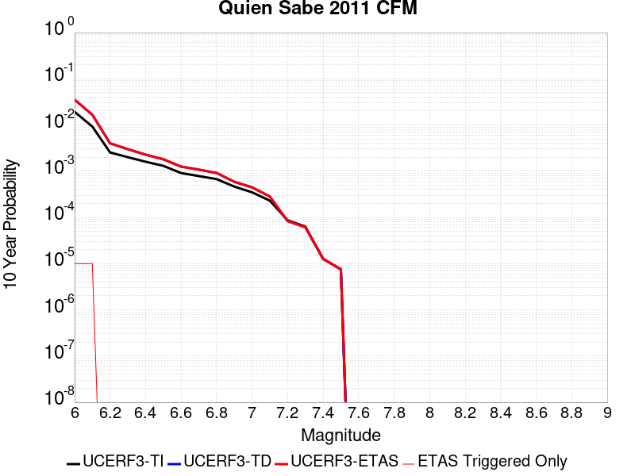 |

| Magnitude | 1 wk TI Prob | 1 wk TD Prob | 1 wk ETAS Prob | 1 wk ETAS/TD Gain | 1 wk ETAS Triggered Only | 1 mo TI Prob | 1 mo TD Prob | 1 mo ETAS Prob | 1 mo ETAS/TD Gain | 1 mo ETAS Triggered Only | 1 yr TI Prob | 1 yr TD Prob | 1 yr ETAS Prob | 1 yr ETAS/TD Gain | 1 yr ETAS Triggered Only | 10 yr TI Prob | 10 yr TD Prob | 10 yr ETAS Prob | 10 yr ETAS/TD Gain | 10 yr ETAS Triggered Only |
|-----|-----|-----|-----|-----|-----|-----|-----|-----|-----|-----|-----|-----|-----|-----|-----|-----|-----|-----|-----|-----|
| 6.0 | 3.729899E-5 | 7.087571E-5 | 8.308694E-5 | 1.1722908 | 1.22121E-5 | 1.5984301E-4 | 3.0372254E-4 | 3.1593096E-4 | 1.0401958 | 1.22121E-5 | 0.0019443515 | 0.003685207 | 0.0036973741 | 1.0033016 | 1.22121E-5 | 0.019274272 | 0.035349447 | 0.03536123 | 1.0003333 | 1.22121E-5 |
| 6.1 | 1.7825725E-5 | 3.3144555E-5 | 4.535625E-5 | 1.3684374 | 1.22121E-5 | 7.639373E-5 | 1.4204149E-4 | 1.5425186E-4 | 1.0859634 | 1.22121E-5 | 9.296967E-4 | 0.0017267119 | 0.0017389029 | 1.0070603 | 1.22121E-5 | 0.009258169 | 0.016698448 | 0.016710456 | 1.0007191 | 1.22121E-5 |
| 6.2 | 4.8865336E-6 | 7.804838E-6 | 7.804838E-6 | 1.0 | 0.0 | 2.0942118E-5 | 3.344893E-5 | 3.344893E-5 | 1.0 | 0.0 | 2.5494045E-4 | 4.0691148E-4 | 4.0691148E-4 | 1.0 | 0.0 | 0.0025464818 | 0.0040135104 | 0.0040135104 | 1.0 | 0.0 |
| 6.3 | 3.858491E-6 | 5.7895204E-6 | 5.7895204E-6 | 1.0 | 0.0 | 1.6536285E-5 | 2.4812021E-5 | 2.4812021E-5 | 1.0 | 0.0 | 2.0131067E-4 | 3.0204916E-4 | 3.0204916E-4 | 1.0 | 0.0 | 0.002011284 | 0.003001956 | 0.003001956 | 1.0 | 0.0 |
| 6.4 | 3.0771805E-6 | 4.3847567E-6 | 4.3847567E-6 | 1.0 | 0.0 | 1.318785E-5 | 1.8791692E-5 | 1.8791692E-5 | 1.0 | 0.0 | 1.6055023E-4 | 2.2876727E-4 | 2.2876727E-4 | 1.0 | 0.0 | 0.001604343 | 0.0022864533 | 0.0022864533 | 1.0 | 0.0 |
| 6.5 | 2.5081235E-6 | 3.463468E-6 | 3.463468E-6 | 1.0 | 0.0 | 1.0749056E-5 | 1.4843358E-5 | 1.4843358E-5 | 1.0 | 0.0 | 1.308619E-4 | 1.8070436E-4 | 1.8070436E-4 | 1.0 | 0.0 | 0.0013078486 | 0.0018122907 | 0.0018122907 | 1.0 | 0.0 |
| 6.6 | 1.7505364E-6 | 2.4022895E-6 | 2.4022895E-6 | 1.0 | 0.0 | 7.502277E-6 | 1.029549E-5 | 1.029549E-5 | 1.0 | 0.0 | 9.13364E-5 | 1.2534109E-4 | 1.2534109E-4 | 1.0 | 0.0 | 9.129886E-4 | 0.001258278 | 0.001258278 | 1.0 | 0.0 |
| 6.7 | 1.505737E-6 | 2.0637117E-6 | 2.0637117E-6 | 1.0 | 0.0 | 6.4531428E-6 | 8.844452E-6 | 8.844452E-6 | 1.0 | 0.0 | 7.8564175E-5 | 1.0767648E-4 | 1.0767648E-4 | 1.0 | 0.0 | 7.853641E-4 | 0.0010818024 | 0.0010818024 | 1.0 | 0.0 |
| 6.8 | 1.2924105E-6 | 1.7483842E-6 | 1.7483842E-6 | 1.0 | 0.0 | 5.5388905E-6 | 7.4930567E-6 | 7.4930567E-6 | 1.0 | 0.0 | 6.74339E-5 | 9.122469E-5 | 9.122469E-5 | 1.0 | 0.0 | 6.741344E-4 | 9.1608684E-4 | 9.1608684E-4 | 1.0 | 0.0 |
| 6.9 | 8.9075286E-7 | 1.124984E-6 | 1.124984E-6 | 1.0 | 0.0 | 3.8175067E-6 | 4.8213524E-6 | 4.8213524E-6 | 1.0 | 0.0 | 4.6477155E-5 | 5.8698606E-5 | 5.8698606E-5 | 1.0 | 0.0 | 4.6467435E-4 | 5.903889E-4 | 5.903889E-4 | 1.0 | 0.0 |
| 7.0 | 6.6891175E-7 | 8.516548E-7 | 8.516548E-7 | 1.0 | 0.0 | 2.8667614E-6 | 3.6499453E-6 | 3.6499453E-6 | 1.0 | 0.0 | 3.4902263E-5 | 4.4437373E-5 | 4.4437373E-5 | 1.0 | 0.0 | 3.4896782E-4 | 4.4678204E-4 | 4.4678204E-4 | 1.0 | 0.0 |
| 7.1 | 4.4205015E-7 | 5.391918E-7 | 5.391918E-7 | 1.0 | 0.0 | 1.8944993E-6 | 2.3108207E-6 | 2.3108207E-6 | 1.0 | 0.0 | 2.3065284E-5 | 2.8134049E-5 | 2.8134049E-5 | 1.0 | 0.0 | 2.3062891E-4 | 2.8269002E-4 | 2.8269002E-4 | 1.0 | 0.0 |
| 7.2 | 1.6620965E-7 | 1.598743E-7 | 1.598743E-7 | 1.0 | 0.0 | 7.123269E-7 | 6.8517545E-7 | 6.8517545E-7 | 1.0 | 0.0 | 8.672545E-6 | 8.341984E-6 | 8.341984E-6 | 1.0 | 0.0 | 8.6722066E-5 | 8.357226E-5 | 8.357226E-5 | 1.0 | 0.0 |
| 7.3 | 1.2142488E-7 | 1.1726376E-7 | 1.1726376E-7 | 1.0 | 0.0 | 5.2039223E-7 | 5.025589E-7 | 5.025589E-7 | 1.0 | 0.0 | 6.335757E-6 | 6.118641E-6 | 6.118641E-6 | 1.0 | 0.0 | 6.3355765E-5 | 6.124788E-5 | 6.124788E-5 | 1.0 | 0.0 |
| 7.4 | 2.4192937E-8 | 2.4543251E-8 | 2.4543251E-8 | 1.0 | 0.0 | 1.0368401E-7 | 1.0518536E-7 | 1.0518536E-7 | 1.0 | 0.0 | 1.2623522E-6 | 1.2806311E-6 | 1.2806311E-6 | 1.0 | 0.0 | 1.2623449E-5 | 1.281258E-5 | 1.281258E-5 | 1.0 | 0.0 |
| 7.5 | 1.4432802E-8 | 1.4506394E-8 | 1.4506394E-8 | 1.0 | 0.0 | 6.185486E-8 | 6.217026E-8 | 6.217026E-8 | 1.0 | 0.0 | 7.530827E-7 | 7.5692276E-7 | 7.5692276E-7 | 1.0 | 0.0 | 7.530801E-6 | 7.573478E-6 | 7.573478E-6 | 1.0 | 0.0 |

## Great Valley 10 (Panoche)
*[(top)](#table-of-contents)*

| 1 Week | 1 Month | 1 Year | 10 Year |
|-----|-----|-----|-----|
| 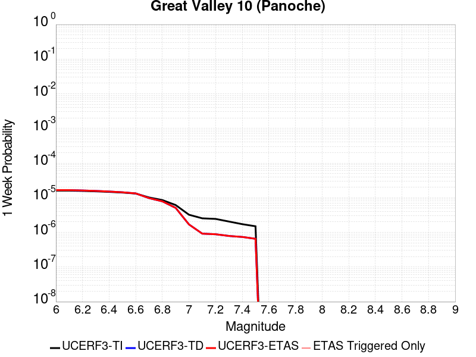 | 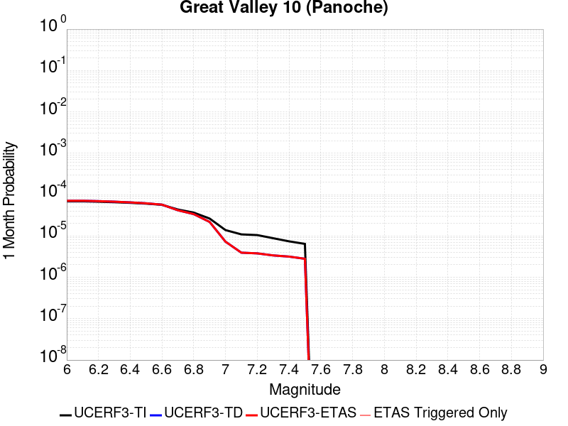 | 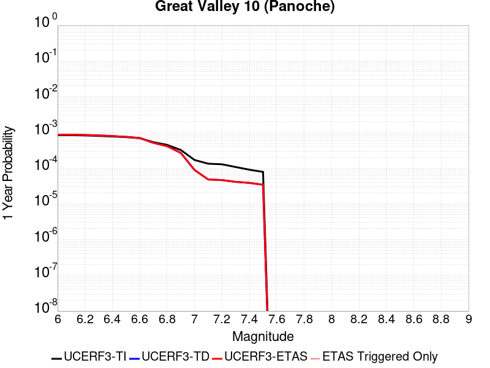 | 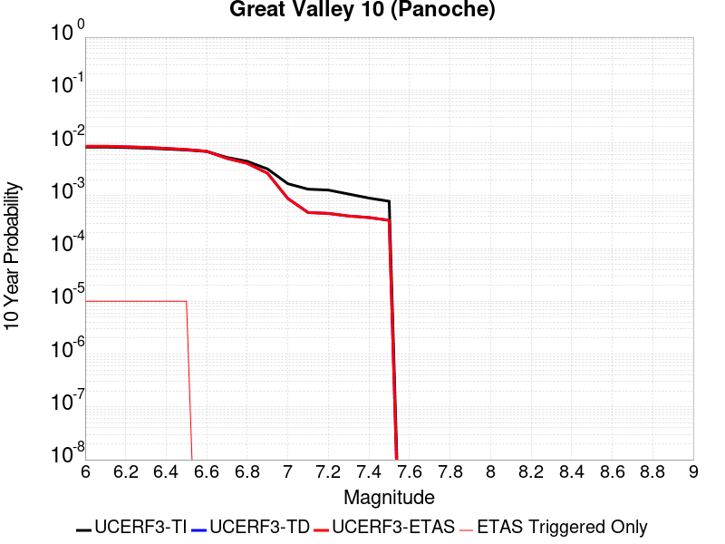 |

| Magnitude | 1 wk TI Prob | 1 wk TD Prob | 1 wk ETAS Prob | 1 wk ETAS/TD Gain | 1 wk ETAS Triggered Only | 1 mo TI Prob | 1 mo TD Prob | 1 mo ETAS Prob | 1 mo ETAS/TD Gain | 1 mo ETAS Triggered Only | 1 yr TI Prob | 1 yr TD Prob | 1 yr ETAS Prob | 1 yr ETAS/TD Gain | 1 yr ETAS Triggered Only | 10 yr TI Prob | 10 yr TD Prob | 10 yr ETAS Prob | 10 yr ETAS/TD Gain | 10 yr ETAS Triggered Only |
|-----|-----|-----|-----|-----|-----|-----|-----|-----|-----|-----|-----|-----|-----|-----|-----|-----|-----|-----|-----|-----|
| 6.0 | 1.6014626E-5 | 1.6575326E-5 | 1.6575326E-5 | 1.0 | 0.0 | 6.863231E-5 | 7.103522E-5 | 7.103522E-5 | 1.0 | 0.0 | 8.35278E-4 | 8.6451473E-4 | 8.6451473E-4 | 1.0 | 0.0 | 0.008321454 | 0.0086121345 | 0.008624242 | 1.0014058 | 1.22121E-5 |
| 6.1 | 1.6014626E-5 | 1.6575326E-5 | 1.6575326E-5 | 1.0 | 0.0 | 6.863231E-5 | 7.103522E-5 | 7.103522E-5 | 1.0 | 0.0 | 8.35278E-4 | 8.6451473E-4 | 8.6451473E-4 | 1.0 | 0.0 | 0.008321454 | 0.0086121345 | 0.008624242 | 1.0014058 | 1.22121E-5 |
| 6.2 | 1.56782E-5 | 1.6198375E-5 | 1.6198375E-5 | 1.0 | 0.0 | 6.719056E-5 | 6.9419795E-5 | 6.9419795E-5 | 1.0 | 0.0 | 8.17738E-4 | 8.4486237E-4 | 8.4486237E-4 | 1.0 | 0.0 | 0.008147354 | 0.008417111 | 0.00842922 | 1.0014386 | 1.22121E-5 |
| 6.3 | 1.5263338E-5 | 1.5723446E-5 | 1.5723446E-5 | 1.0 | 0.0 | 6.541267E-5 | 6.7384484E-5 | 6.7384484E-5 | 1.0 | 0.0 | 7.961082E-4 | 8.2010136E-4 | 8.2010136E-4 | 1.0 | 0.0 | 0.007932622 | 0.008171341 | 0.008183453 | 1.0014822 | 1.22121E-5 |
| 6.4 | 1.4720723E-5 | 1.509931E-5 | 1.509931E-5 | 1.0 | 0.0 | 6.308728E-5 | 6.4709755E-5 | 6.4709755E-5 | 1.0 | 0.0 | 7.67817E-4 | 7.8756036E-4 | 7.8756036E-4 | 1.0 | 0.0 | 0.007651695 | 0.007848268 | 0.007860385 | 1.0015438 | 1.22121E-5 |
| 6.5 | 1.408264E-5 | 1.4355906E-5 | 1.4355906E-5 | 1.0 | 0.0 | 6.0352773E-5 | 6.15239E-5 | 6.15239E-5 | 1.0 | 0.0 | 7.3454727E-4 | 7.487998E-4 | 7.487998E-4 | 1.0 | 0.0 | 0.0073212404 | 0.0074633234 | 0.007475444 | 1.0016241 | 1.22121E-5 |
| 6.6 | 1.3197086E-5 | 1.3321831E-5 | 1.3321831E-5 | 1.0 | 0.0 | 5.6557717E-5 | 5.709234E-5 | 5.709234E-5 | 1.0 | 0.0 | 6.8837265E-4 | 6.948813E-4 | 6.948813E-4 | 1.0 | 0.0 | 0.006862442 | 0.0069276234 | 0.0069276234 | 1.0 | 0.0 |
| 6.7 | 1.017583E-5 | 9.745341E-6 | 9.745341E-6 | 1.0 | 0.0 | 4.360997E-5 | 4.1765095E-5 | 4.1765095E-5 | 1.0 | 0.0 | 5.30822E-4 | 5.083738E-4 | 5.083738E-4 | 1.0 | 0.0 | 0.0052955584 | 0.005072361 | 0.005072361 | 1.0 | 0.0 |
| 6.8 | 8.557912E-6 | 7.872674E-6 | 7.872674E-6 | 1.0 | 0.0 | 3.667625E-5 | 3.373961E-5 | 3.373961E-5 | 1.0 | 0.0 | 4.4644187E-4 | 4.1070435E-4 | 4.1070435E-4 | 1.0 | 0.0 | 0.0044554602 | 0.00409966 | 0.00409966 | 1.0 | 0.0 |
| 6.9 | 6.14664E-6 | 5.09205E-6 | 5.09205E-6 | 1.0 | 0.0 | 2.6342475E-5 | 2.1822896E-5 | 2.1822896E-5 | 1.0 | 0.0 | 3.2067244E-4 | 2.6566276E-4 | 2.6566276E-4 | 1.0 | 0.0 | 0.003202101 | 0.0026535902 | 0.0026535902 | 1.0 | 0.0 |
| 7.0 | 3.2310581E-6 | 1.6951154E-6 | 1.6951154E-6 | 1.0 | 0.0 | 1.3847319E-5 | 7.264761E-6 | 7.264761E-6 | 1.0 | 0.0 | 1.6857806E-4 | 8.844497E-5 | 8.844497E-5 | 1.0 | 0.0 | 0.0016845023 | 8.84107E-4 | 8.84107E-4 | 1.0 | 0.0 |
| 7.1 | 2.544492E-6 | 9.188883E-7 | 9.188883E-7 | 1.0 | 0.0 | 1.090492E-5 | 3.938087E-6 | 3.938087E-6 | 1.0 | 0.0 | 1.327593E-4 | 4.7945203E-5 | 4.7945203E-5 | 1.0 | 0.0 | 0.0013268003 | 4.7935336E-4 | 4.7935336E-4 | 1.0 | 0.0 |
| 7.2 | 2.4479045E-6 | 8.8412685E-7 | 8.8412685E-7 | 1.0 | 0.0 | 1.0490977E-5 | 3.7891098E-6 | 3.7891098E-6 | 1.0 | 0.0 | 1.2772017E-4 | 4.613148E-5 | 4.613148E-5 | 1.0 | 0.0 | 0.0012764678 | 4.612238E-4 | 4.612238E-4 | 1.0 | 0.0 |
| 7.3 | 2.0559578E-6 | 7.892757E-7 | 7.892757E-7 | 1.0 | 0.0 | 8.811218E-6 | 3.382606E-6 | 3.382606E-6 | 1.0 | 0.0 | 1.072713E-4 | 4.11825E-5 | 4.11825E-5 | 1.0 | 0.0 | 0.0010721954 | 4.117533E-4 | 4.117533E-4 | 1.0 | 0.0 |
| 7.4 | 1.727687E-6 | 7.387732E-7 | 7.387732E-7 | 1.0 | 0.0 | 7.404352E-6 | 3.1661673E-6 | 3.1661673E-6 | 1.0 | 0.0 | 9.0144255E-5 | 3.8547452E-5 | 3.8547452E-5 | 1.0 | 0.0 | 9.0107694E-4 | 3.8541225E-4 | 3.8541225E-4 | 1.0 | 0.0 |
| 7.5 | 1.5002679E-6 | 6.5461217E-7 | 6.5461217E-7 | 1.0 | 0.0 | 6.4297037E-6 | 2.8054778E-6 | 2.8054778E-6 | 1.0 | 0.0 | 7.827883E-5 | 3.41562E-5 | 3.41562E-5 | 1.0 | 0.0 | 7.825126E-4 | 3.4151366E-4 | 3.4151366E-4 | 1.0 | 0.0 |

## Newport-Inglewood (Offshore)
*[(top)](#table-of-contents)*

| 1 Week | 1 Month | 1 Year | 10 Year |
|-----|-----|-----|-----|
|  | 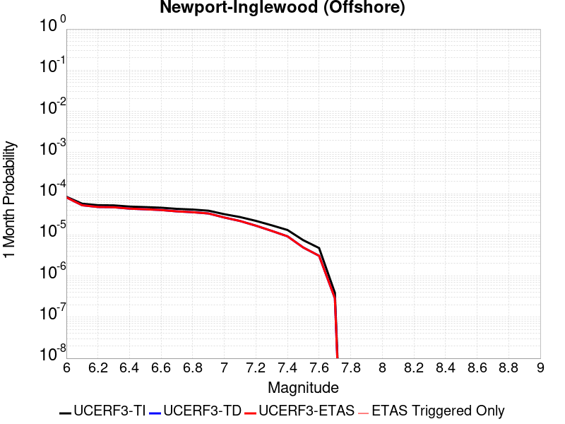 |  | 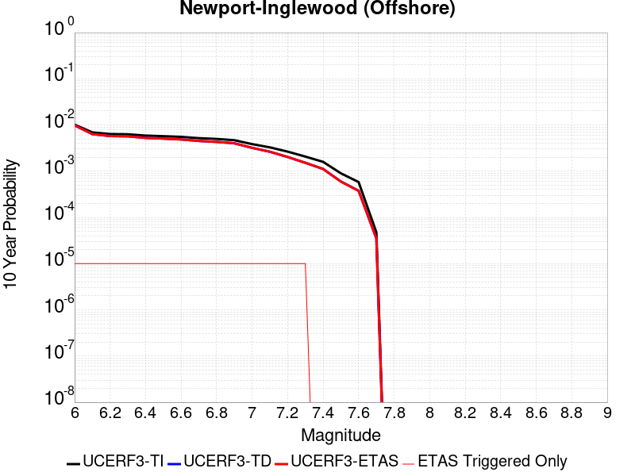 |

| Magnitude | 1 wk TI Prob | 1 wk TD Prob | 1 wk ETAS Prob | 1 wk ETAS/TD Gain | 1 wk ETAS Triggered Only | 1 mo TI Prob | 1 mo TD Prob | 1 mo ETAS Prob | 1 mo ETAS/TD Gain | 1 mo ETAS Triggered Only | 1 yr TI Prob | 1 yr TD Prob | 1 yr ETAS Prob | 1 yr ETAS/TD Gain | 1 yr ETAS Triggered Only | 10 yr TI Prob | 10 yr TD Prob | 10 yr ETAS Prob | 10 yr ETAS/TD Gain | 10 yr ETAS Triggered Only |
|-----|-----|-----|-----|-----|-----|-----|-----|-----|-----|-----|-----|-----|-----|-----|-----|-----|-----|-----|-----|-----|
| 6.0 | 1.9626508E-5 | 1.896532E-5 | 1.896532E-5 | 1.0 | 0.0 | 8.411089E-5 | 8.127748E-5 | 8.127748E-5 | 1.0 | 0.0 | 0.001023569 | 9.891167E-4 | 0.0010013167 | 1.0123342 | 1.22121E-5 | 0.010188672 | 0.009848485 | 0.009860577 | 1.0012277 | 1.22121E-5 |
| 6.1 | 1.331886E-5 | 1.2218068E-5 | 1.2218068E-5 | 1.0 | 0.0 | 5.707958E-5 | 5.236211E-5 | 5.236211E-5 | 1.0 | 0.0 | 6.947222E-4 | 6.373237E-4 | 6.49528E-4 | 1.0191493 | 1.22121E-5 | 0.006925544 | 0.0063551366 | 0.0063672713 | 1.0019094 | 1.22121E-5 |
| 6.2 | 1.2250852E-5 | 1.10760075E-5 | 1.10760075E-5 | 1.0 | 0.0 | 5.2502597E-5 | 4.7467747E-5 | 4.7467747E-5 | 1.0 | 0.0 | 6.3903164E-4 | 5.7776755E-4 | 5.899726E-4 | 1.0211245 | 1.22121E-5 | 0.006371971 | 0.0057627754 | 0.005774917 | 1.0021069 | 1.22121E-5 |
| 6.3 | 1.2106258E-5 | 1.09188695E-5 | 1.09188695E-5 | 1.0 | 0.0 | 5.1882926E-5 | 4.679432E-5 | 4.679432E-5 | 1.0 | 0.0 | 6.3149154E-4 | 5.695729E-4 | 5.8177806E-4 | 1.0214286 | 1.22121E-5 | 0.0062970007 | 0.0056812484 | 0.005693391 | 1.0021373 | 1.22121E-5 |
| 6.4 | 1.1348758E-5 | 1.0109342E-5 | 1.0109342E-5 | 1.0 | 0.0 | 4.8636626E-5 | 4.332504E-5 | 4.332504E-5 | 1.0 | 0.0 | 5.919901E-4 | 5.2735547E-4 | 5.3956115E-4 | 1.0231451 | 1.22121E-5 | 0.005904155 | 0.005261136 | 0.005273284 | 1.002309 | 1.22121E-5 |
| 6.5 | 1.100837E-5 | 9.74337E-6 | 9.74337E-6 | 1.0 | 0.0 | 4.7177873E-5 | 4.1756637E-5 | 4.1756637E-5 | 1.0 | 0.0 | 5.7423924E-4 | 5.0826924E-4 | 5.2047515E-4 | 1.0240146 | 1.22121E-5 | 0.005727576 | 0.005071159 | 0.005083309 | 1.002396 | 1.22121E-5 |
| 6.6 | 1.0634696E-5 | 9.3455255E-6 | 9.3455255E-6 | 1.0 | 0.0 | 4.557647E-5 | 4.005164E-5 | 4.005164E-5 | 1.0 | 0.0 | 5.5475225E-4 | 4.8752036E-4 | 4.997265E-4 | 1.0250372 | 1.22121E-5 | 0.0055336943 | 0.0048645954 | 0.0048767477 | 1.0024981 | 1.22121E-5 |
| 6.7 | 9.9780855E-6 | 8.667894E-6 | 8.667894E-6 | 1.0 | 0.0 | 4.276252E-5 | 3.714759E-5 | 3.714759E-5 | 1.0 | 0.0 | 5.205093E-4 | 4.5217876E-4 | 4.6438535E-4 | 1.0269951 | 1.22121E-5 | 0.0051929182 | 0.0045126663 | 0.0045248233 | 1.002694 | 1.22121E-5 |
| 6.8 | 9.59546E-6 | 8.272935E-6 | 8.272935E-6 | 1.0 | 0.0 | 4.1122752E-5 | 3.5454956E-5 | 3.5454956E-5 | 1.0 | 0.0 | 5.0055445E-4 | 4.3157925E-4 | 4.437861E-4 | 1.0282841 | 1.22121E-5 | 0.004994285 | 0.0043074866 | 0.0043196464 | 1.0028229 | 1.22121E-5 |
| 6.9 | 9.000614E-6 | 7.706825E-6 | 7.706825E-6 | 1.0 | 0.0 | 3.857349E-5 | 3.302884E-5 | 3.302884E-5 | 1.0 | 0.0 | 4.6953102E-4 | 4.0205254E-4 | 4.1425973E-4 | 1.0303621 | 1.22121E-5 | 0.004685402 | 0.004013323 | 0.0040254863 | 1.0030307 | 1.22121E-5 |
| 7.0 | 7.4070194E-6 | 6.148893E-6 | 6.148893E-6 | 1.0 | 0.0 | 3.1743984E-5 | 2.6352134E-5 | 2.6352134E-5 | 1.0 | 0.0 | 3.8641447E-4 | 3.2079016E-4 | 3.3299834E-4 | 1.0380566 | 1.22121E-5 | 0.0038574322 | 0.0032032907 | 0.0032154636 | 1.0038002 | 1.22121E-5 |
| 7.1 | 6.299615E-6 | 5.056584E-6 | 5.056584E-6 | 1.0 | 0.0 | 2.699807E-5 | 2.1670896E-5 | 2.1670896E-5 | 1.0 | 0.0 | 3.2865192E-4 | 2.6381135E-4 | 2.760202E-4 | 1.0462788 | 1.22121E-5 | 0.003281663 | 0.0026349965 | 0.0026471764 | 1.0046223 | 1.22121E-5 |
| 7.2 | 5.096653E-6 | 3.892762E-6 | 3.892762E-6 | 1.0 | 0.0 | 2.1842614E-5 | 1.668316E-5 | 1.668316E-5 | 1.0 | 0.0 | 2.6590136E-4 | 2.0309865E-4 | 2.1530826E-4 | 1.0601166 | 1.22121E-5 | 0.0026558342 | 0.0020291414 | 0.002041329 | 1.0060061 | 1.22121E-5 |
| 7.3 | 3.9753018E-6 | 2.9099049E-6 | 2.9099049E-6 | 1.0 | 0.0 | 1.7036897E-5 | 1.2470961E-5 | 1.2470961E-5 | 1.0 | 0.0 | 2.0740448E-4 | 1.5182345E-4 | 1.640337E-4 | 1.080424 | 1.22121E-5 | 0.00207211 | 0.0015172054 | 0.001529399 | 1.0080369 | 1.22121E-5 |
| 7.4 | 3.0568392E-6 | 2.1449912E-6 | 2.1449912E-6 | 1.0 | 0.0 | 1.3100675E-5 | 9.192787E-6 | 9.192787E-6 | 1.0 | 0.0 | 1.5948903E-4 | 1.11916495E-4 | 1.11916495E-4 | 1.0 | 0.0 | 0.0015937461 | 0.0011186076 | 0.0011186076 | 1.0 | 0.0 |
| 7.5 | 1.7279019E-6 | 1.1469856E-6 | 1.1469856E-6 | 1.0 | 0.0 | 7.405273E-6 | 4.9156433E-6 | 4.9156433E-6 | 1.0 | 0.0 | 9.015547E-5 | 5.9846356E-5 | 5.9846356E-5 | 1.0 | 0.0 | 9.01189E-4 | 5.9830624E-4 | 5.9830624E-4 | 1.0 | 0.0 |
| 7.6 | 1.1156416E-6 | 7.222994E-7 | 7.222994E-7 | 1.0 | 0.0 | 4.7813123E-6 | 3.0955653E-6 | 3.0955653E-6 | 1.0 | 0.0 | 5.821092E-5 | 3.7687878E-5 | 3.7687878E-5 | 1.0 | 0.0 | 5.8195676E-4 | 3.7681722E-4 | 3.7681722E-4 | 1.0 | 0.0 |
| 7.7 | 9.117973E-8 | 6.734136E-8 | 6.734136E-8 | 1.0 | 0.0 | 3.907702E-7 | 2.886058E-7 | 2.886058E-7 | 1.0 | 0.0 | 4.757617E-6 | 3.5137703E-6 | 3.5137703E-6 | 1.0 | 0.0 | 4.7575148E-5 | 3.513718E-5 | 3.513718E-5 | 1.0 | 0.0 |

## Newport-Inglewood alt 1
*[(top)](#table-of-contents)*

| 1 Week | 1 Month | 1 Year | 10 Year |
|-----|-----|-----|-----|
|  |  |  | 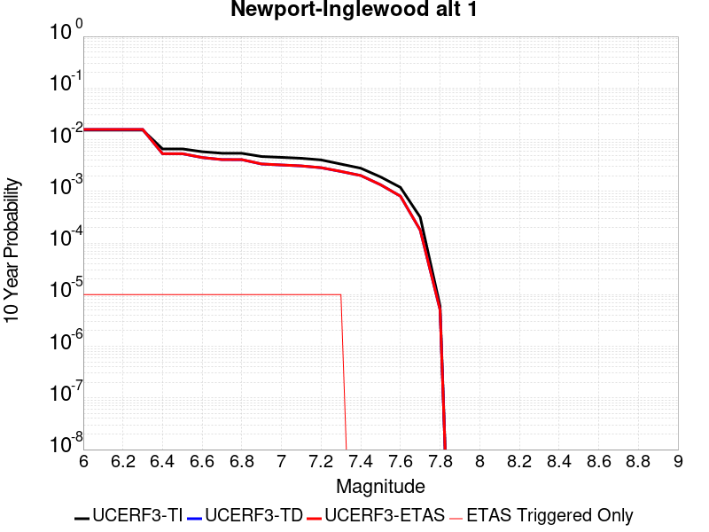 |

| Magnitude | 1 wk TI Prob | 1 wk TD Prob | 1 wk ETAS Prob | 1 wk ETAS/TD Gain | 1 wk ETAS Triggered Only | 1 mo TI Prob | 1 mo TD Prob | 1 mo ETAS Prob | 1 mo ETAS/TD Gain | 1 mo ETAS Triggered Only | 1 yr TI Prob | 1 yr TD Prob | 1 yr ETAS Prob | 1 yr ETAS/TD Gain | 1 yr ETAS Triggered Only | 10 yr TI Prob | 10 yr TD Prob | 10 yr ETAS Prob | 10 yr ETAS/TD Gain | 10 yr ETAS Triggered Only |
|-----|-----|-----|-----|-----|-----|-----|-----|-----|-----|-----|-----|-----|-----|-----|-----|-----|-----|-----|-----|-----|
| 6.0 | 2.9668912E-5 | 3.0404688E-5 | 3.0404688E-5 | 1.0 | 0.0 | 1.2714628E-4 | 1.3030204E-4 | 1.3030204E-4 | 1.0 | 0.0 | 0.0015469068 | 0.0015857558 | 0.0015979486 | 1.0076889 | 1.22121E-5 | 0.015361829 | 0.015791977 | 0.015803995 | 1.0007612 | 1.22121E-5 |
| 6.1 | 2.9668912E-5 | 3.0404688E-5 | 3.0404688E-5 | 1.0 | 0.0 | 1.2714628E-4 | 1.3030204E-4 | 1.3030204E-4 | 1.0 | 0.0 | 0.0015469068 | 0.0015857558 | 0.0015979486 | 1.0076889 | 1.22121E-5 | 0.015361829 | 0.015791977 | 0.015803995 | 1.0007612 | 1.22121E-5 |
| 6.2 | 2.9668912E-5 | 3.0404688E-5 | 3.0404688E-5 | 1.0 | 0.0 | 1.2714628E-4 | 1.3030204E-4 | 1.3030204E-4 | 1.0 | 0.0 | 0.0015469068 | 0.0015857558 | 0.0015979486 | 1.0076889 | 1.22121E-5 | 0.015361829 | 0.015791977 | 0.015803995 | 1.0007612 | 1.22121E-5 |
| 6.3 | 2.9668912E-5 | 3.0404688E-5 | 3.0404688E-5 | 1.0 | 0.0 | 1.2714628E-4 | 1.3030204E-4 | 1.3030204E-4 | 1.0 | 0.0 | 0.0015469068 | 0.0015857558 | 0.0015979486 | 1.0076889 | 1.22121E-5 | 0.015361829 | 0.015791977 | 0.015803995 | 1.0007612 | 1.22121E-5 |
| 6.4 | 1.275942E-5 | 1.0272481E-5 | 1.0272481E-5 | 1.0 | 0.0 | 5.4682085E-5 | 4.40242E-5 | 4.40242E-5 | 1.0 | 0.0 | 6.65551E-4 | 5.3586694E-4 | 5.480725E-4 | 1.0227772 | 1.22121E-5 | 0.0066356123 | 0.005346173 | 0.0053583197 | 1.002272 | 1.22121E-5 |
| 6.5 | 1.275942E-5 | 1.0272481E-5 | 1.0272481E-5 | 1.0 | 0.0 | 5.4682085E-5 | 4.40242E-5 | 4.40242E-5 | 1.0 | 0.0 | 6.65551E-4 | 5.3586694E-4 | 5.480725E-4 | 1.0227772 | 1.22121E-5 | 0.0066356123 | 0.005346173 | 0.0053583197 | 1.002272 | 1.22121E-5 |
| 6.6 | 1.1255358E-5 | 8.6618675E-6 | 8.6618675E-6 | 1.0 | 0.0 | 4.8236358E-5 | 3.7121772E-5 | 3.7121772E-5 | 1.0 | 0.0 | 5.871194E-4 | 4.5186555E-4 | 4.6407213E-4 | 1.0270138 | 1.22121E-5 | 0.005855706 | 0.0045096446 | 0.0045218016 | 1.0026958 | 1.22121E-5 |
| 6.7 | 1.0504745E-5 | 7.899781E-6 | 7.899781E-6 | 1.0 | 0.0 | 4.5019555E-5 | 3.3855773E-5 | 3.3855773E-5 | 1.0 | 0.0 | 5.4797524E-4 | 4.121173E-4 | 4.243244E-4 | 1.0296204 | 1.22121E-5 | 0.0054662596 | 0.0041136607 | 0.0041258223 | 1.0029565 | 1.22121E-5 |
| 6.8 | 1.0476007E-5 | 7.881163E-6 | 7.881163E-6 | 1.0 | 0.0 | 4.4896402E-5 | 3.377598E-5 | 3.377598E-5 | 1.0 | 0.0 | 5.464766E-4 | 4.111462E-4 | 4.2335328E-4 | 1.0296904 | 1.22121E-5 | 0.005451347 | 0.0041039856 | 0.0041161473 | 1.0029634 | 1.22121E-5 |
| 6.9 | 9.076797E-6 | 6.4896203E-6 | 6.4896203E-6 | 1.0 | 0.0 | 3.889998E-5 | 2.7812364E-5 | 2.7812364E-5 | 1.0 | 0.0 | 4.7350433E-4 | 3.3856326E-4 | 3.507712E-4 | 1.0360582 | 1.22121E-5 | 0.004724967 | 0.0033805121 | 0.0033926829 | 1.0036002 | 1.22121E-5 |
| 7.0 | 8.73795E-6 | 6.212002E-6 | 6.212002E-6 | 1.0 | 0.0 | 3.7447822E-5 | 2.6622596E-5 | 2.6622596E-5 | 1.0 | 0.0 | 4.5583185E-4 | 3.2408218E-4 | 3.362903E-4 | 1.0376699 | 1.22121E-5 | 0.0045489795 | 0.0032361273 | 0.0032482997 | 1.0037614 | 1.22121E-5 |
| 7.1 | 8.391299E-6 | 5.9557797E-6 | 5.9557797E-6 | 1.0 | 0.0 | 3.5962214E-5 | 2.5524523E-5 | 2.5524523E-5 | 1.0 | 0.0 | 4.37752E-4 | 3.10717E-4 | 3.229253E-4 | 1.0392908 | 1.22121E-5 | 0.004368907 | 0.0031028553 | 0.0031150295 | 1.0039235 | 1.22121E-5 |
| 7.2 | 7.796882E-6 | 5.496525E-6 | 5.496525E-6 | 1.0 | 0.0 | 3.341478E-5 | 2.3556324E-5 | 2.3556324E-5 | 1.0 | 0.0 | 4.06749E-4 | 2.867607E-4 | 2.989693E-4 | 1.0425742 | 1.22121E-5 | 0.0040600533 | 0.0028639308 | 0.0028761078 | 1.0042518 | 1.22121E-5 |
| 7.3 | 6.4738833E-6 | 4.647809E-6 | 4.647809E-6 | 1.0 | 0.0 | 2.774492E-5 | 1.991903E-5 | 1.991903E-5 | 1.0 | 0.0 | 3.3774204E-4 | 2.4248735E-4 | 2.546965E-4 | 1.0503496 | 1.22121E-5 | 0.0033722918 | 0.0024222443 | 0.002434427 | 1.0050294 | 1.22121E-5 |
| 7.4 | 5.382145E-6 | 3.885754E-6 | 3.885754E-6 | 1.0 | 0.0 | 2.3066134E-5 | 1.6653124E-5 | 1.6653124E-5 | 1.0 | 0.0 | 2.8079396E-4 | 2.0273308E-4 | 2.0273308E-4 | 1.0 | 0.0 | 0.0028043943 | 0.0020254957 | 0.0020254957 | 1.0 | 0.0 |
| 7.5 | 3.648244E-6 | 2.5737802E-6 | 2.5737802E-6 | 1.0 | 0.0 | 1.5635238E-5 | 1.103044E-5 | 1.103044E-5 | 1.0 | 0.0 | 1.9034238E-4 | 1.3428743E-4 | 1.3428743E-4 | 1.0 | 0.0 | 0.0019017943 | 0.0013420733 | 0.0013420733 | 1.0 | 0.0 |
| 7.6 | 2.2906888E-6 | 1.5479815E-6 | 1.5479815E-6 | 1.0 | 0.0 | 9.817201E-6 | 6.6341895E-6 | 6.6341895E-6 | 1.0 | 0.0 | 1.1951787E-4 | 8.076833E-5 | 8.076833E-5 | 1.0 | 0.0 | 0.0011945361 | 8.073965E-4 | 8.073965E-4 | 1.0 | 0.0 |
| 7.7 | 6.0479874E-7 | 3.3975047E-7 | 3.3975047E-7 | 1.0 | 0.0 | 2.5919921E-6 | 1.4560728E-6 | 1.4560728E-6 | 1.0 | 0.0 | 3.1557047E-5 | 1.7727556E-5 | 1.7727556E-5 | 1.0 | 0.0 | 3.1552566E-4 | 1.7726279E-4 | 1.7726279E-4 | 1.0 | 0.0 |
| 7.8 | 1.16056995E-8 | 9.782369E-9 | 9.782369E-9 | 1.0 | 0.0 | 4.9738713E-8 | 4.1924437E-8 | 4.1924437E-8 | 1.0 | 0.0 | 6.0556863E-7 | 5.1043E-7 | 5.1043E-7 | 1.0 | 0.0 | 6.05567E-6 | 5.1043003E-6 | 5.1043003E-6 | 1.0 | 0.0 |

## Deep Springs
*[(top)](#table-of-contents)*

| 1 Week | 1 Month | 1 Year | 10 Year |
|-----|-----|-----|-----|
|  |  |  |  |

| Magnitude | 1 wk TI Prob | 1 wk TD Prob | 1 wk ETAS Prob | 1 wk ETAS/TD Gain | 1 wk ETAS Triggered Only | 1 mo TI Prob | 1 mo TD Prob | 1 mo ETAS Prob | 1 mo ETAS/TD Gain | 1 mo ETAS Triggered Only | 1 yr TI Prob | 1 yr TD Prob | 1 yr ETAS Prob | 1 yr ETAS/TD Gain | 1 yr ETAS Triggered Only | 10 yr TI Prob | 10 yr TD Prob | 10 yr ETAS Prob | 10 yr ETAS/TD Gain | 10 yr ETAS Triggered Only |
|-----|-----|-----|-----|-----|-----|-----|-----|-----|-----|-----|-----|-----|-----|-----|-----|-----|-----|-----|-----|-----|
| 6.0 | 1.9810619E-5 | 2.3112418E-5 | 2.3112418E-5 | 1.0 | 0.0 | 8.489989E-5 | 9.905232E-5 | 9.905232E-5 | 1.0 | 0.0 | 0.001033166 | 0.0012058025 | 0.0012058025 | 1.0 | 0.0 | 0.010283757 | 0.012042372 | 0.012054437 | 1.0010018 | 1.22121E-5 |
| 6.1 | 1.9810619E-5 | 2.3112418E-5 | 2.3112418E-5 | 1.0 | 0.0 | 8.489989E-5 | 9.905232E-5 | 9.905232E-5 | 1.0 | 0.0 | 0.001033166 | 0.0012058025 | 0.0012058025 | 1.0 | 0.0 | 0.010283757 | 0.012042372 | 0.012054437 | 1.0010018 | 1.22121E-5 |
| 6.2 | 1.9810619E-5 | 2.3112418E-5 | 2.3112418E-5 | 1.0 | 0.0 | 8.489989E-5 | 9.905232E-5 | 9.905232E-5 | 1.0 | 0.0 | 0.001033166 | 0.0012058025 | 0.0012058025 | 1.0 | 0.0 | 0.010283757 | 0.012042372 | 0.012054437 | 1.0010018 | 1.22121E-5 |
| 6.3 | 1.9810619E-5 | 2.3112418E-5 | 2.3112418E-5 | 1.0 | 0.0 | 8.489989E-5 | 9.905232E-5 | 9.905232E-5 | 1.0 | 0.0 | 0.001033166 | 0.0012058025 | 0.0012058025 | 1.0 | 0.0 | 0.010283757 | 0.012042372 | 0.012054437 | 1.0010018 | 1.22121E-5 |
| 6.4 | 1.9810619E-5 | 2.3112418E-5 | 2.3112418E-5 | 1.0 | 0.0 | 8.489989E-5 | 9.905232E-5 | 9.905232E-5 | 1.0 | 0.0 | 0.001033166 | 0.0012058025 | 0.0012058025 | 1.0 | 0.0 | 0.010283757 | 0.012042372 | 0.012054437 | 1.0010018 | 1.22121E-5 |
| 6.5 | 1.7190405E-5 | 2.0050467E-5 | 2.0050467E-5 | 1.0 | 0.0 | 7.367108E-5 | 8.593057E-5 | 8.593057E-5 | 1.0 | 0.0 | 8.9657627E-4 | 0.0010462047 | 0.0010462047 | 1.0 | 0.0 | 0.008929676 | 0.01046201 | 0.010474094 | 1.001155 | 1.22121E-5 |
| 6.6 | 1.7190405E-5 | 2.0050467E-5 | 2.0050467E-5 | 1.0 | 0.0 | 7.367108E-5 | 8.593057E-5 | 8.593057E-5 | 1.0 | 0.0 | 8.9657627E-4 | 0.0010462047 | 0.0010462047 | 1.0 | 0.0 | 0.008929676 | 0.01046201 | 0.010474094 | 1.001155 | 1.22121E-5 |

## South Cuyama
*[(top)](#table-of-contents)*

| 1 Week | 1 Month | 1 Year | 10 Year |
|-----|-----|-----|-----|
|  |  |  |  |

| Magnitude | 1 wk TI Prob | 1 wk TD Prob | 1 wk ETAS Prob | 1 wk ETAS/TD Gain | 1 wk ETAS Triggered Only | 1 mo TI Prob | 1 mo TD Prob | 1 mo ETAS Prob | 1 mo ETAS/TD Gain | 1 mo ETAS Triggered Only | 1 yr TI Prob | 1 yr TD Prob | 1 yr ETAS Prob | 1 yr ETAS/TD Gain | 1 yr ETAS Triggered Only | 10 yr TI Prob | 10 yr TD Prob | 10 yr ETAS Prob | 10 yr ETAS/TD Gain | 10 yr ETAS Triggered Only |
|-----|-----|-----|-----|-----|-----|-----|-----|-----|-----|-----|-----|-----|-----|-----|-----|-----|-----|-----|-----|-----|
| 6.0 | 1.2747308E-6 | 1.2818696E-6 | 1.2818696E-6 | 1.0 | 0.0 | 5.4631205E-6 | 5.4937154E-6 | 5.4937154E-6 | 1.0 | 0.0 | 6.6511464E-5 | 6.6884E-5 | 6.6884E-5 | 1.0 | 0.0 | 6.649156E-4 | 6.686457E-4 | 6.8084965E-4 | 1.0182518 | 1.22121E-5 |
| 6.1 | 1.2747308E-6 | 1.2818696E-6 | 1.2818696E-6 | 1.0 | 0.0 | 5.4631205E-6 | 5.4937154E-6 | 5.4937154E-6 | 1.0 | 0.0 | 6.6511464E-5 | 6.6884E-5 | 6.6884E-5 | 1.0 | 0.0 | 6.649156E-4 | 6.686457E-4 | 6.8084965E-4 | 1.0182518 | 1.22121E-5 |
| 6.2 | 1.2747308E-6 | 1.2818696E-6 | 1.2818696E-6 | 1.0 | 0.0 | 5.4631205E-6 | 5.4937154E-6 | 5.4937154E-6 | 1.0 | 0.0 | 6.6511464E-5 | 6.6884E-5 | 6.6884E-5 | 1.0 | 0.0 | 6.649156E-4 | 6.686457E-4 | 6.8084965E-4 | 1.0182518 | 1.22121E-5 |
| 6.3 | 1.2747308E-6 | 1.2818696E-6 | 1.2818696E-6 | 1.0 | 0.0 | 5.4631205E-6 | 5.4937154E-6 | 5.4937154E-6 | 1.0 | 0.0 | 6.6511464E-5 | 6.6884E-5 | 6.6884E-5 | 1.0 | 0.0 | 6.649156E-4 | 6.686457E-4 | 6.8084965E-4 | 1.0182518 | 1.22121E-5 |
| 6.4 | 1.2747308E-6 | 1.2818696E-6 | 1.2818696E-6 | 1.0 | 0.0 | 5.4631205E-6 | 5.4937154E-6 | 5.4937154E-6 | 1.0 | 0.0 | 6.6511464E-5 | 6.6884E-5 | 6.6884E-5 | 1.0 | 0.0 | 6.649156E-4 | 6.686457E-4 | 6.8084965E-4 | 1.0182518 | 1.22121E-5 |
| 6.5 | 1.2747308E-6 | 1.2818696E-6 | 1.2818696E-6 | 1.0 | 0.0 | 5.4631205E-6 | 5.4937154E-6 | 5.4937154E-6 | 1.0 | 0.0 | 6.6511464E-5 | 6.6884E-5 | 6.6884E-5 | 1.0 | 0.0 | 6.649156E-4 | 6.686457E-4 | 6.8084965E-4 | 1.0182518 | 1.22121E-5 |
| 6.6 | 1.2747308E-6 | 1.2818696E-6 | 1.2818696E-6 | 1.0 | 0.0 | 5.4631205E-6 | 5.4937154E-6 | 5.4937154E-6 | 1.0 | 0.0 | 6.6511464E-5 | 6.6884E-5 | 6.6884E-5 | 1.0 | 0.0 | 6.649156E-4 | 6.686457E-4 | 6.8084965E-4 | 1.0182518 | 1.22121E-5 |
| 6.7 | 1.2747308E-6 | 1.2818696E-6 | 1.2818696E-6 | 1.0 | 0.0 | 5.4631205E-6 | 5.4937154E-6 | 5.4937154E-6 | 1.0 | 0.0 | 6.6511464E-5 | 6.6884E-5 | 6.6884E-5 | 1.0 | 0.0 | 6.649156E-4 | 6.686457E-4 | 6.8084965E-4 | 1.0182518 | 1.22121E-5 |
| 6.8 | 1.2747308E-6 | 1.2818696E-6 | 1.2818696E-6 | 1.0 | 0.0 | 5.4631205E-6 | 5.4937154E-6 | 5.4937154E-6 | 1.0 | 0.0 | 6.6511464E-5 | 6.6884E-5 | 6.6884E-5 | 1.0 | 0.0 | 6.649156E-4 | 6.686457E-4 | 6.8084965E-4 | 1.0182518 | 1.22121E-5 |
| 6.9 | 8.4566324E-7 | 8.507881E-7 | 8.507881E-7 | 1.0 | 0.0 | 3.624266E-6 | 3.6462297E-6 | 3.6462297E-6 | 1.0 | 0.0 | 4.4124543E-5 | 4.4391953E-5 | 4.4391953E-5 | 1.0 | 0.0 | 4.4115784E-4 | 4.438319E-4 | 4.5603857E-4 | 1.0275029 | 1.22121E-5 |
| 7.0 | 8.2277904E-7 | 8.2778183E-7 | 8.2778183E-7 | 1.0 | 0.0 | 3.526191E-6 | 3.5476316E-6 | 3.5476316E-6 | 1.0 | 0.0 | 4.293053E-5 | 4.319157E-5 | 4.319157E-5 | 1.0 | 0.0 | 4.292224E-4 | 4.3183277E-4 | 4.440396E-4 | 1.0282675 | 1.22121E-5 |
| 7.1 | 6.7661887E-7 | 6.809129E-7 | 6.809129E-7 | 1.0 | 0.0 | 2.899792E-6 | 2.918195E-6 | 2.918195E-6 | 1.0 | 0.0 | 3.5304394E-5 | 3.5528446E-5 | 3.5528446E-5 | 1.0 | 0.0 | 3.5298787E-4 | 3.5522805E-4 | 3.5522805E-4 | 1.0 | 0.0 |
| 7.2 | 5.783336E-7 | 5.8211896E-7 | 5.8211896E-7 | 1.0 | 0.0 | 2.4785702E-6 | 2.4947933E-6 | 2.4947933E-6 | 1.0 | 0.0 | 3.0176174E-5 | 3.0373687E-5 | 3.0373687E-5 | 1.0 | 0.0 | 3.0172078E-4 | 3.036956E-4 | 3.036956E-4 | 1.0 | 0.0 |
| 7.3 | 5.136759E-7 | 5.170937E-7 | 5.170937E-7 | 1.0 | 0.0 | 2.2014663E-6 | 2.216114E-6 | 2.216114E-6 | 1.0 | 0.0 | 2.6802521E-5 | 2.6980855E-5 | 2.6980855E-5 | 1.0 | 0.0 | 2.679929E-4 | 2.69776E-4 | 2.69776E-4 | 1.0 | 0.0 |
| 7.4 | 4.3370295E-7 | 4.3665355E-7 | 4.3665355E-7 | 1.0 | 0.0 | 1.8587256E-6 | 1.871371E-6 | 1.871371E-6 | 1.0 | 0.0 | 2.2629749E-5 | 2.2783704E-5 | 2.2783704E-5 | 1.0 | 0.0 | 2.2627445E-4 | 2.2781386E-4 | 2.2781386E-4 | 1.0 | 0.0 |
| 7.5 | 3.3242574E-7 | 3.347646E-7 | 3.347646E-7 | 1.0 | 0.0 | 1.4246809E-6 | 1.4347046E-6 | 1.4347046E-6 | 1.0 | 0.0 | 1.7345352E-5 | 1.746739E-5 | 1.746739E-5 | 1.0 | 0.0 | 1.7343998E-4 | 1.746603E-4 | 1.746603E-4 | 1.0 | 0.0 |
| 7.6 | 2.0627535E-7 | 2.0778896E-7 | 2.0778896E-7 | 1.0 | 0.0 | 8.840369E-7 | 8.9052384E-7 | 8.9052384E-7 | 1.0 | 0.0 | 1.0763096E-5 | 1.08420745E-5 | 1.08420745E-5 | 1.0 | 0.0 | 1.0762575E-4 | 1.0841554E-4 | 1.0841554E-4 | 1.0 | 0.0 |
| 7.7 | 6.15236E-8 | 6.198304E-8 | 6.198304E-8 | 1.0 | 0.0 | 2.6367252E-7 | 2.6564155E-7 | 2.6564155E-7 | 1.0 | 0.0 | 3.2102084E-6 | 3.2341811E-6 | 3.2341811E-6 | 1.0 | 0.0 | 3.210162E-5 | 3.234135E-5 | 3.234135E-5 | 1.0 | 0.0 |
| 7.8 | 1.1765573E-8 | 1.1873411E-8 | 1.1873411E-8 | 1.0 | 0.0 | 5.0423886E-8 | 5.0886047E-8 | 5.0886047E-8 | 1.0 | 0.0 | 6.1391063E-7 | 6.1953745E-7 | 6.1953745E-7 | 1.0 | 0.0 | 6.1390897E-6 | 6.1953583E-6 | 6.1953583E-6 | 1.0 | 0.0 |
| 7.9 | 6.0381755E-10 | 6.100578E-10 | 6.100578E-10 | 1.0 | 0.0 | 2.5877895E-9 | 2.6145335E-9 | 2.6145335E-9 | 1.0 | 0.0 | 3.1506335E-8 | 3.1831945E-8 | 3.1831945E-8 | 1.0 | 0.0 | 3.1506332E-7 | 3.1831942E-7 | 3.1831942E-7 | 1.0 | 0.0 |

## Hunting Creek - Berryessa 2011 CFM
*[(top)](#table-of-contents)*

| 1 Week | 1 Month | 1 Year | 10 Year |
|-----|-----|-----|-----|
| 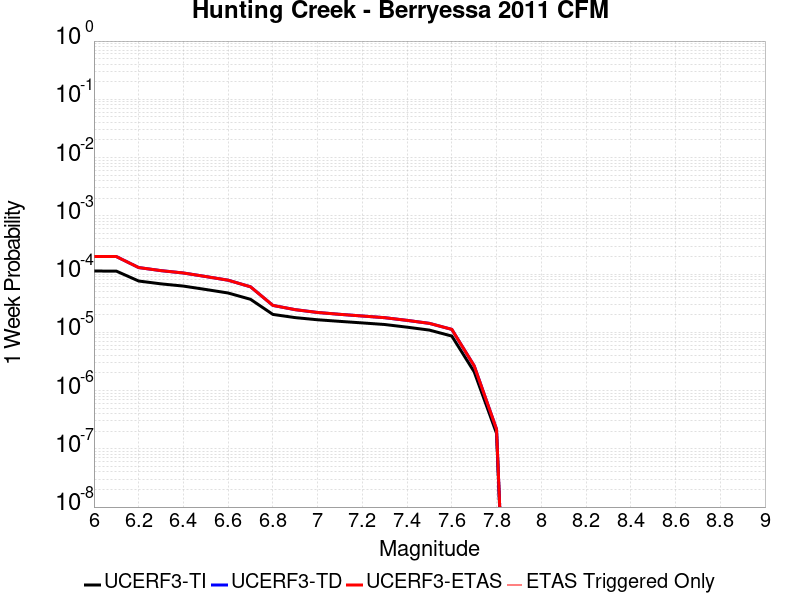 |  | 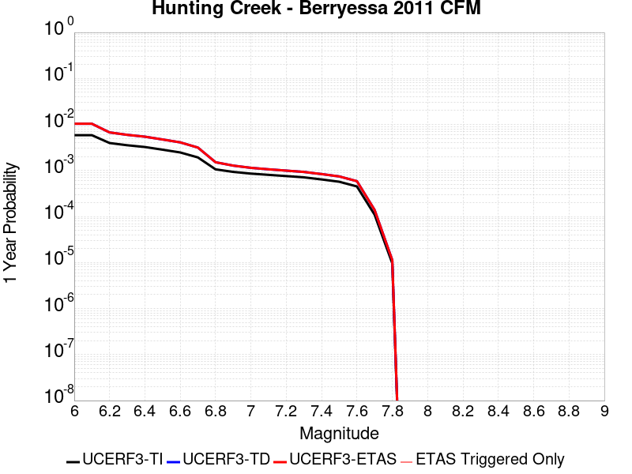 |  |

| Magnitude | 1 wk TI Prob | 1 wk TD Prob | 1 wk ETAS Prob | 1 wk ETAS/TD Gain | 1 wk ETAS Triggered Only | 1 mo TI Prob | 1 mo TD Prob | 1 mo ETAS Prob | 1 mo ETAS/TD Gain | 1 mo ETAS Triggered Only | 1 yr TI Prob | 1 yr TD Prob | 1 yr ETAS Prob | 1 yr ETAS/TD Gain | 1 yr ETAS Triggered Only | 10 yr TI Prob | 10 yr TD Prob | 10 yr ETAS Prob | 10 yr ETAS/TD Gain | 10 yr ETAS Triggered Only |
|-----|-----|-----|-----|-----|-----|-----|-----|-----|-----|-----|-----|-----|-----|-----|-----|-----|-----|-----|-----|-----|
| 6.0 | 1.1270982E-4 | 2.0011736E-4 | 2.0011736E-4 | 1.0 | 0.0 | 4.8295266E-4 | 8.573803E-4 | 8.573803E-4 | 1.0 | 0.0 | 0.0058641075 | 0.0103861485 | 0.0103861485 | 1.0 | 0.0 | 0.057117578 | 0.0980363 | 0.09804731 | 1.0001124 | 1.22121E-5 |
| 6.1 | 1.1239393E-4 | 1.9959877E-4 | 1.9959877E-4 | 1.0 | 0.0 | 4.8159933E-4 | 8.551592E-4 | 8.551592E-4 | 1.0 | 0.0 | 0.0058477195 | 0.010359387 | 0.010359387 | 1.0 | 0.0 | 0.056962132 | 0.09779478 | 0.0978058 | 1.0001127 | 1.22121E-5 |
| 6.2 | 7.596265E-5 | 1.2939998E-4 | 1.2939998E-4 | 1.0 | 0.0 | 3.2551357E-4 | 5.5443676E-4 | 5.5443676E-4 | 1.0 | 0.0 | 0.0039559277 | 0.006720976 | 0.006720976 | 1.0 | 0.0 | 0.038862433 | 0.064591035 | 0.06460246 | 1.0001769 | 1.22121E-5 |
| 6.3 | 6.78794E-5 | 1.14510345E-4 | 1.14510345E-4 | 1.0 | 0.0 | 2.9087928E-4 | 4.906482E-4 | 4.906482E-4 | 1.0 | 0.0 | 0.003535705 | 0.0059526437 | 0.0059526437 | 1.0 | 0.0 | 0.034799766 | 0.05746498 | 0.05747649 | 1.0002003 | 1.22121E-5 |
| 6.4 | 6.2165134E-5 | 1.0436487E-4 | 1.0436487E-4 | 1.0 | 0.0 | 2.6639478E-4 | 4.4720477E-4 | 4.4720477E-4 | 1.0 | 0.0 | 0.0032385332 | 0.0054275393 | 0.0054275393 | 1.0 | 0.0 | 0.03191742 | 0.052550133 | 0.0525617 | 1.0002202 | 1.22121E-5 |
| 6.5 | 5.4368087E-5 | 9.0713E-5 | 9.0713E-5 | 1.0 | 0.0 | 2.3298527E-4 | 3.887152E-4 | 3.887152E-4 | 1.0 | 0.0 | 0.0028329059 | 0.004719838 | 0.004719838 | 1.0 | 0.0 | 0.027970633 | 0.04587979 | 0.04587979 | 1.0 | 0.0 |
| 6.6 | 4.729947E-5 | 7.847478E-5 | 7.847478E-5 | 1.0 | 0.0 | 2.0269625E-4 | 3.3628018E-4 | 3.3628018E-4 | 1.0 | 0.0 | 0.002465034 | 0.0040849387 | 0.0040849387 | 1.0 | 0.0 | 0.02437869 | 0.039851252 | 0.039851252 | 1.0 | 0.0 |
| 6.7 | 3.6875328E-5 | 6.045114E-5 | 6.045114E-5 | 1.0 | 0.0 | 1.5802756E-4 | 2.5905314E-4 | 2.5905314E-4 | 1.0 | 0.0 | 0.0019222875 | 0.0031481837 | 0.0031481837 | 1.0 | 0.0 | 0.019057442 | 0.03089214 | 0.03089214 | 1.0 | 0.0 |
| 6.8 | 2.0292036E-5 | 2.8976181E-5 | 2.8976181E-5 | 1.0 | 0.0 | 8.6962966E-5 | 1.2417776E-4 | 1.2417776E-4 | 1.0 | 0.0 | 0.0010582599 | 0.0015108008 | 0.0015108008 | 1.0 | 0.0 | 0.010532344 | 0.01497846 | 0.01497846 | 1.0 | 0.0 |
| 6.9 | 1.7871042E-5 | 2.447215E-5 | 2.447215E-5 | 1.0 | 0.0 | 7.658793E-5 | 1.0487645E-4 | 1.0487645E-4 | 1.0 | 0.0 | 9.320591E-4 | 0.0012761244 | 0.0012761244 | 1.0 | 0.0 | 0.009281595 | 0.012679722 | 0.012679722 | 1.0 | 0.0 |
| 7.0 | 1.6415532E-5 | 2.1906184E-5 | 2.1906184E-5 | 1.0 | 0.0 | 7.035038E-5 | 9.3880284E-5 | 9.3880284E-5 | 1.0 | 0.0 | 8.561793E-4 | 0.0011423966 | 0.0011423966 | 1.0 | 0.0 | 0.008528882 | 0.01136447 | 0.01136447 | 1.0 | 0.0 |
| 7.1 | 1.5409885E-5 | 2.0346255E-5 | 2.0346255E-5 | 1.0 | 0.0 | 6.6040695E-5 | 8.719533E-5 | 8.719533E-5 | 1.0 | 0.0 | 8.0374884E-4 | 0.0010610891 | 0.0010610891 | 1.0 | 0.0 | 0.00800848 | 0.01056055 | 0.01056055 | 1.0 | 0.0 |
| 7.2 | 1.4497423E-5 | 1.9054882E-5 | 1.9054882E-5 | 1.0 | 0.0 | 6.213033E-5 | 8.166124E-5 | 8.166124E-5 | 1.0 | 0.0 | 7.5617427E-4 | 9.937752E-4 | 9.937752E-4 | 1.0 | 0.0 | 0.0075360634 | 0.009893886 | 0.009893886 | 1.0 | 0.0 |
| 7.3 | 1.3615175E-5 | 1.7826049E-5 | 1.7826049E-5 | 1.0 | 0.0 | 5.8349444E-5 | 7.639513E-5 | 7.639513E-5 | 1.0 | 0.0 | 7.101729E-4 | 9.2971674E-4 | 9.2971674E-4 | 1.0 | 0.0 | 0.0070790765 | 0.009258782 | 0.009258782 | 1.0 | 0.0 |
| 7.4 | 1.2252825E-5 | 1.6026179E-5 | 1.6026179E-5 | 1.0 | 0.0 | 5.251105E-5 | 6.868183E-5 | 6.868183E-5 | 1.0 | 0.0 | 6.391345E-4 | 8.358833E-4 | 8.358833E-4 | 1.0 | 0.0 | 0.0063729943 | 0.008327835 | 0.008327835 | 1.0 | 0.0 |
| 7.5 | 1.0913301E-5 | 1.4241053E-5 | 1.4241053E-5 | 1.0 | 0.0 | 4.6770452E-5 | 6.103167E-5 | 6.103167E-5 | 1.0 | 0.0 | 5.6928146E-4 | 7.4280996E-4 | 7.4280996E-4 | 1.0 | 0.0 | 0.0056782532 | 0.007403646 | 0.007403646 | 1.0 | 0.0 |
| 7.6 | 8.623192E-6 | 1.1234591E-5 | 1.1234591E-5 | 1.0 | 0.0 | 3.6956015E-5 | 4.814737E-5 | 4.814737E-5 | 1.0 | 0.0 | 4.4984656E-4 | 5.8603915E-4 | 5.8603915E-4 | 1.0 | 0.0 | 0.00448937 | 0.0058452515 | 0.0058452515 | 1.0 | 0.0 |
| 7.7 | 2.0993634E-6 | 2.6625735E-6 | 2.6625735E-6 | 1.0 | 0.0 | 8.997241E-6 | 1.141098E-5 | 1.141098E-5 | 1.0 | 0.0 | 1.09535904E-4 | 1.3891989E-4 | 1.3891989E-4 | 1.0 | 0.0 | 0.0010948193 | 0.001388337 | 0.001388337 | 1.0 | 0.0 |
| 7.8 | 1.8428308E-7 | 2.1674295E-7 | 2.1674295E-7 | 1.0 | 0.0 | 7.897844E-7 | 9.2889803E-7 | 9.2889803E-7 | 1.0 | 0.0 | 9.615583E-6 | 1.1309278E-5 | 1.1309278E-5 | 1.0 | 0.0 | 9.615166E-5 | 1.1308563E-4 | 1.1308563E-4 | 1.0 | 0.0 |

## Hosgri
*[(top)](#table-of-contents)*

| 1 Week | 1 Month | 1 Year | 10 Year |
|-----|-----|-----|-----|
| 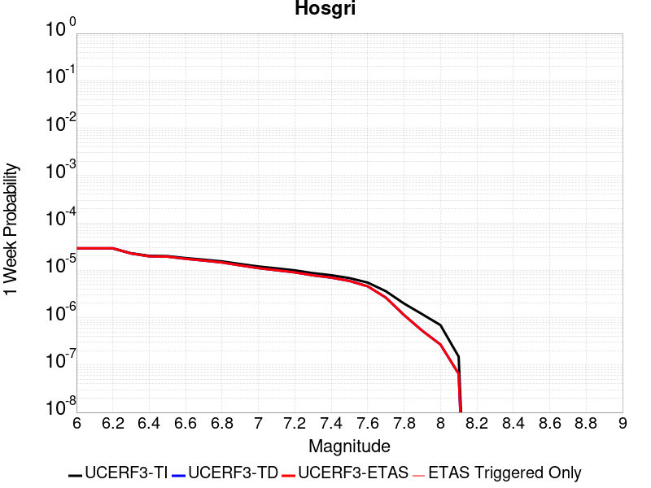 |  |  | 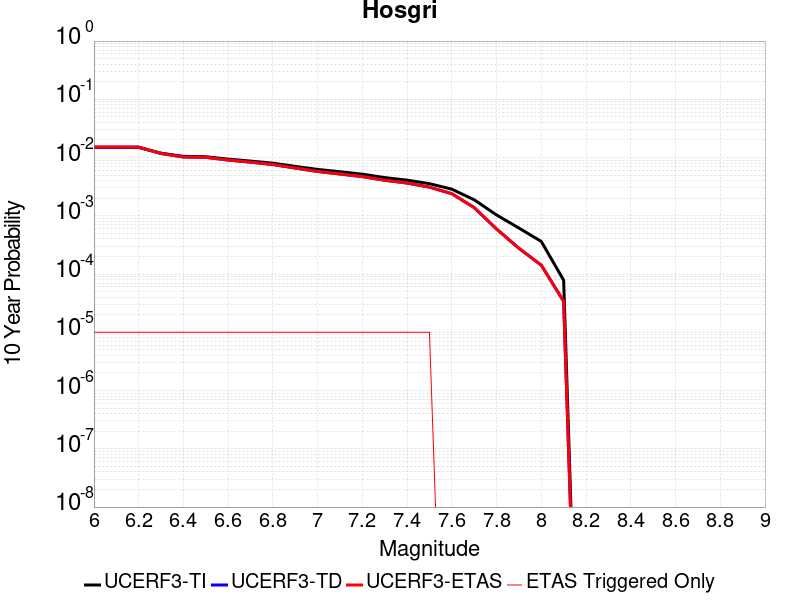 |

| Magnitude | 1 wk TI Prob | 1 wk TD Prob | 1 wk ETAS Prob | 1 wk ETAS/TD Gain | 1 wk ETAS Triggered Only | 1 mo TI Prob | 1 mo TD Prob | 1 mo ETAS Prob | 1 mo ETAS/TD Gain | 1 mo ETAS Triggered Only | 1 yr TI Prob | 1 yr TD Prob | 1 yr ETAS Prob | 1 yr ETAS/TD Gain | 1 yr ETAS Triggered Only | 10 yr TI Prob | 10 yr TD Prob | 10 yr ETAS Prob | 10 yr ETAS/TD Gain | 10 yr ETAS Triggered Only |
|-----|-----|-----|-----|-----|-----|-----|-----|-----|-----|-----|-----|-----|-----|-----|-----|-----|-----|-----|-----|-----|
| 6.0 | 2.883978E-5 | 2.9128276E-5 | 2.9128276E-5 | 1.0 | 0.0 | 1.235932E-4 | 1.2482965E-4 | 1.2482965E-4 | 1.0 | 0.0 | 0.0015037085 | 0.0015187687 | 0.0015187687 | 1.0 | 0.0 | 0.01493574 | 0.015087668 | 0.015099696 | 1.0007972 | 1.22121E-5 |
| 6.1 | 2.883978E-5 | 2.9128276E-5 | 2.9128276E-5 | 1.0 | 0.0 | 1.235932E-4 | 1.2482965E-4 | 1.2482965E-4 | 1.0 | 0.0 | 0.0015037085 | 0.0015187687 | 0.0015187687 | 1.0 | 0.0 | 0.01493574 | 0.015087668 | 0.015099696 | 1.0007972 | 1.22121E-5 |
| 6.2 | 2.883978E-5 | 2.9128276E-5 | 2.9128276E-5 | 1.0 | 0.0 | 1.235932E-4 | 1.2482965E-4 | 1.2482965E-4 | 1.0 | 0.0 | 0.0015037085 | 0.0015187687 | 0.0015187687 | 1.0 | 0.0 | 0.01493574 | 0.015087668 | 0.015099696 | 1.0007972 | 1.22121E-5 |
| 6.3 | 2.2914428E-5 | 2.2641847E-5 | 2.2641847E-5 | 1.0 | 0.0 | 9.8200995E-5 | 9.7032906E-5 | 9.7032906E-5 | 1.0 | 0.0 | 0.0011949413 | 0.0011807403 | 0.0011807403 | 1.0 | 0.0 | 0.011885363 | 0.011746069 | 0.011758138 | 1.0010275 | 1.22121E-5 |
| 6.4 | 2.0195741E-5 | 1.9696443E-5 | 1.9696443E-5 | 1.0 | 0.0 | 8.65503E-5 | 8.441061E-5 | 8.441061E-5 | 1.0 | 0.0 | 0.0010532405 | 0.0010272167 | 0.0010272167 | 1.0 | 0.0 | 0.010482626 | 0.010225733 | 0.0102378195 | 1.0011821 | 1.22121E-5 |
| 6.5 | 1.9924333E-5 | 1.9408866E-5 | 1.9408866E-5 | 1.0 | 0.0 | 8.53872E-5 | 8.317821E-5 | 8.317821E-5 | 1.0 | 0.0 | 0.0010390934 | 0.0010122261 | 0.0010122261 | 1.0 | 0.0 | 0.010342481 | 0.010077193 | 0.010089282 | 1.0011996 | 1.22121E-5 |
| 6.6 | 1.809694E-5 | 1.7458187E-5 | 1.7458187E-5 | 1.0 | 0.0 | 7.7556004E-5 | 7.4818665E-5 | 7.4818665E-5 | 1.0 | 0.0 | 9.438353E-4 | 9.105379E-4 | 9.105379E-4 | 1.0 | 0.0 | 0.009398366 | 0.009069015 | 0.009081117 | 1.0013343 | 1.22121E-5 |
| 6.7 | 1.675989E-5 | 1.6042655E-5 | 1.6042655E-5 | 1.0 | 0.0 | 7.182612E-5 | 6.875243E-5 | 6.875243E-5 | 1.0 | 0.0 | 8.7413215E-4 | 8.3674054E-4 | 8.3674054E-4 | 1.0 | 0.0 | 0.008707017 | 0.008336807 | 0.008348917 | 1.0014527 | 1.22121E-5 |
| 6.8 | 1.5401129E-5 | 1.46139755E-5 | 1.46139755E-5 | 1.0 | 0.0 | 6.6003166E-5 | 6.262983E-5 | 6.262983E-5 | 1.0 | 0.0 | 8.032922E-4 | 7.622522E-4 | 7.622522E-4 | 1.0 | 0.0 | 0.008003947 | 0.0075972406 | 0.00760936 | 1.0015953 | 1.22121E-5 |
| 6.9 | 1.356559E-5 | 1.2689864E-5 | 1.2689864E-5 | 1.0 | 0.0 | 5.8136946E-5 | 5.4384E-5 | 5.4384E-5 | 1.0 | 0.0 | 7.0758746E-4 | 6.619245E-4 | 6.619245E-4 | 1.0 | 0.0 | 0.007053386 | 0.0066003343 | 0.0066124657 | 1.001838 | 1.22121E-5 |
| 7.0 | 1.2030819E-5 | 1.1095861E-5 | 1.1095861E-5 | 1.0 | 0.0 | 5.155963E-5 | 4.755282E-5 | 4.755282E-5 | 1.0 | 0.0 | 6.275577E-4 | 5.788019E-4 | 5.788019E-4 | 1.0 | 0.0 | 0.006257884 | 0.0057737045 | 0.005785846 | 1.002103 | 1.22121E-5 |
| 7.1 | 1.0972698E-5 | 1.002208E-5 | 1.002208E-5 | 1.0 | 0.0 | 4.7025E-5 | 4.2951062E-5 | 4.2951062E-5 | 1.0 | 0.0 | 5.72379E-4 | 5.228038E-4 | 5.228038E-4 | 1.0 | 0.0 | 0.0057090693 | 0.0052164905 | 0.005228639 | 1.0023289 | 1.22121E-5 |
| 7.2 | 9.961926E-6 | 9.0346475E-6 | 9.0346475E-6 | 1.0 | 0.0 | 4.2693267E-5 | 3.8719343E-5 | 3.8719343E-5 | 1.0 | 0.0 | 5.1966653E-4 | 4.713061E-4 | 4.713061E-4 | 1.0 | 0.0 | 0.00518453 | 0.004703812 | 0.004715966 | 1.002584 | 1.22121E-5 |
| 7.3 | 8.700929E-6 | 7.828004E-6 | 7.828004E-6 | 1.0 | 0.0 | 3.7289166E-5 | 3.3548156E-5 | 3.3548156E-5 | 1.0 | 0.0 | 4.53901E-4 | 4.083723E-4 | 4.083723E-4 | 1.0 | 0.0 | 0.00452975 | 0.004076958 | 0.0040891203 | 1.0029832 | 1.22121E-5 |
| 7.4 | 7.866285E-6 | 6.9986436E-6 | 6.9986436E-6 | 1.0 | 0.0 | 3.3712215E-5 | 2.9993842E-5 | 2.9993842E-5 | 1.0 | 0.0 | 4.103689E-4 | 3.6511387E-4 | 3.6511387E-4 | 1.0 | 0.0 | 0.004096119 | 0.003645877 | 0.0036580446 | 1.0033374 | 1.22121E-5 |
| 7.5 | 6.8381305E-6 | 5.9596014E-6 | 5.9596014E-6 | 1.0 | 0.0 | 2.9305946E-5 | 2.5540898E-5 | 2.5540898E-5 | 1.0 | 0.0 | 3.5674145E-4 | 3.1091608E-4 | 3.1091608E-4 | 1.0 | 0.0 | 0.0035616932 | 0.0031055456 | 0.00311772 | 1.0039202 | 1.22121E-5 |
| 7.6 | 5.503376E-6 | 4.5951515E-6 | 4.5951515E-6 | 1.0 | 0.0 | 2.3585684E-5 | 1.9693358E-5 | 1.9693358E-5 | 1.0 | 0.0 | 2.8711787E-4 | 2.3974029E-4 | 2.3974029E-4 | 1.0 | 0.0 | 0.002867472 | 0.0023955493 | 0.0023955493 | 1.0 | 0.0 |
| 7.7 | 3.6144982E-6 | 2.6521213E-6 | 2.6521213E-6 | 1.0 | 0.0 | 1.5490614E-5 | 1.13661845E-5 | 1.13661845E-5 | 1.0 | 0.0 | 1.8858191E-4 | 1.3837451E-4 | 1.3837451E-4 | 1.0 | 0.0 | 0.0018842196 | 0.0013836145 | 0.0013836145 | 1.0 | 0.0 |
| 7.8 | 1.9853494E-6 | 1.136086E-6 | 1.136086E-6 | 1.0 | 0.0 | 8.508612E-6 | 4.868931E-6 | 4.868931E-6 | 1.0 | 0.0 | 1.0358743E-4 | 5.927762E-5 | 5.927762E-5 | 1.0 | 0.0 | 0.0010353916 | 5.933477E-4 | 5.933477E-4 | 1.0 | 0.0 |
| 7.9 | 1.1818757E-6 | 5.294974E-7 | 5.294974E-7 | 1.0 | 0.0 | 5.0651715E-6 | 2.2692725E-6 | 2.2692725E-6 | 1.0 | 0.0 | 6.1666724E-5 | 2.7628043E-5 | 2.7628043E-5 | 1.0 | 0.0 | 6.1649614E-4 | 2.7693406E-4 | 2.7693406E-4 | 1.0 | 0.0 |
| 8.0 | 6.962958E-7 | 2.713834E-7 | 2.713834E-7 | 1.0 | 0.0 | 2.9841215E-6 | 1.1630713E-6 | 1.1630713E-6 | 1.0 | 0.0 | 3.6331072E-5 | 1.41603E-5 | 1.41603E-5 | 1.0 | 0.0 | 3.6325134E-4 | 1.4216424E-4 | 1.4216424E-4 | 1.0 | 0.0 |
| 8.1 | 1.5033264E-7 | 6.527309E-8 | 6.527309E-8 | 1.0 | 0.0 | 6.442826E-7 | 2.7974178E-7 | 2.7974178E-7 | 1.0 | 0.0 | 7.844113E-6 | 3.4058512E-6 | 3.4058512E-6 | 1.0 | 0.0 | 7.843835E-5 | 3.407529E-5 | 3.407529E-5 | 1.0 | 0.0 |

## North Frontal  (West)
*[(top)](#table-of-contents)*

| 1 Week | 1 Month | 1 Year | 10 Year |
|-----|-----|-----|-----|
|  |  | 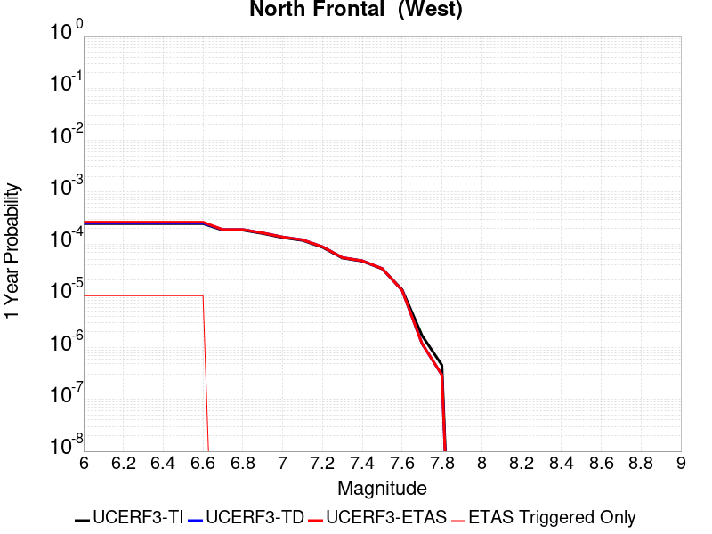 |  |

| Magnitude | 1 wk TI Prob | 1 wk TD Prob | 1 wk ETAS Prob | 1 wk ETAS/TD Gain | 1 wk ETAS Triggered Only | 1 mo TI Prob | 1 mo TD Prob | 1 mo ETAS Prob | 1 mo ETAS/TD Gain | 1 mo ETAS Triggered Only | 1 yr TI Prob | 1 yr TD Prob | 1 yr ETAS Prob | 1 yr ETAS/TD Gain | 1 yr ETAS Triggered Only | 10 yr TI Prob | 10 yr TD Prob | 10 yr ETAS Prob | 10 yr ETAS/TD Gain | 10 yr ETAS Triggered Only |
|-----|-----|-----|-----|-----|-----|-----|-----|-----|-----|-----|-----|-----|-----|-----|-----|-----|-----|-----|-----|-----|
| 6.0 | 4.7316266E-6 | 4.852669E-6 | 4.852669E-6 | 1.0 | 0.0 | 2.0278241E-5 | 2.0796995E-5 | 3.300884E-5 | 1.5871928 | 1.22121E-5 | 2.4685962E-4 | 2.5317547E-4 | 2.6538447E-4 | 1.0482235 | 1.22121E-5 | 0.0024658558 | 0.0025290165 | 0.0025411977 | 1.0048165 | 1.22121E-5 |
| 6.1 | 4.7316266E-6 | 4.852669E-6 | 4.852669E-6 | 1.0 | 0.0 | 2.0278241E-5 | 2.0796995E-5 | 3.300884E-5 | 1.5871928 | 1.22121E-5 | 2.4685962E-4 | 2.5317547E-4 | 2.6538447E-4 | 1.0482235 | 1.22121E-5 | 0.0024658558 | 0.0025290165 | 0.0025411977 | 1.0048165 | 1.22121E-5 |
| 6.2 | 4.7316266E-6 | 4.852669E-6 | 4.852669E-6 | 1.0 | 0.0 | 2.0278241E-5 | 2.0796995E-5 | 3.300884E-5 | 1.5871928 | 1.22121E-5 | 2.4685962E-4 | 2.5317547E-4 | 2.6538447E-4 | 1.0482235 | 1.22121E-5 | 0.0024658558 | 0.0025290165 | 0.0025411977 | 1.0048165 | 1.22121E-5 |
| 6.3 | 4.7316266E-6 | 4.852669E-6 | 4.852669E-6 | 1.0 | 0.0 | 2.0278241E-5 | 2.0796995E-5 | 3.300884E-5 | 1.5871928 | 1.22121E-5 | 2.4685962E-4 | 2.5317547E-4 | 2.6538447E-4 | 1.0482235 | 1.22121E-5 | 0.0024658558 | 0.0025290165 | 0.0025411977 | 1.0048165 | 1.22121E-5 |
| 6.4 | 4.7316266E-6 | 4.852669E-6 | 4.852669E-6 | 1.0 | 0.0 | 2.0278241E-5 | 2.0796995E-5 | 3.300884E-5 | 1.5871928 | 1.22121E-5 | 2.4685962E-4 | 2.5317547E-4 | 2.6538447E-4 | 1.0482235 | 1.22121E-5 | 0.0024658558 | 0.0025290165 | 0.0025411977 | 1.0048165 | 1.22121E-5 |
| 6.5 | 4.7316266E-6 | 4.852669E-6 | 4.852669E-6 | 1.0 | 0.0 | 2.0278241E-5 | 2.0796995E-5 | 3.300884E-5 | 1.5871928 | 1.22121E-5 | 2.4685962E-4 | 2.5317547E-4 | 2.6538447E-4 | 1.0482235 | 1.22121E-5 | 0.0024658558 | 0.0025290165 | 0.0025411977 | 1.0048165 | 1.22121E-5 |
| 6.6 | 4.7316266E-6 | 4.852669E-6 | 4.852669E-6 | 1.0 | 0.0 | 2.0278241E-5 | 2.0796995E-5 | 3.300884E-5 | 1.5871928 | 1.22121E-5 | 2.4685962E-4 | 2.5317547E-4 | 2.6538447E-4 | 1.0482235 | 1.22121E-5 | 0.0024658558 | 0.0025290165 | 0.0025411977 | 1.0048165 | 1.22121E-5 |
| 6.7 | 3.5382777E-6 | 3.630883E-6 | 3.630883E-6 | 1.0 | 0.0 | 1.516396E-5 | 1.5560838E-5 | 1.5560838E-5 | 1.0 | 0.0 | 1.8460557E-4 | 1.8943752E-4 | 1.8943752E-4 | 1.0 | 0.0 | 0.0018445229 | 0.0018928373 | 0.0018928373 | 1.0 | 0.0 |
| 6.8 | 3.5382777E-6 | 3.630883E-6 | 3.630883E-6 | 1.0 | 0.0 | 1.516396E-5 | 1.5560838E-5 | 1.5560838E-5 | 1.0 | 0.0 | 1.8460557E-4 | 1.8943752E-4 | 1.8943752E-4 | 1.0 | 0.0 | 0.0018445229 | 0.0018928373 | 0.0018928373 | 1.0 | 0.0 |
| 6.9 | 3.0428037E-6 | 3.122758E-6 | 3.122758E-6 | 1.0 | 0.0 | 1.30405215E-5 | 1.3383184E-5 | 1.3383184E-5 | 1.0 | 0.0 | 1.5875678E-4 | 1.6292876E-4 | 1.6292876E-4 | 1.0 | 0.0 | 0.0015864341 | 0.0016281601 | 0.0016281601 | 1.0 | 0.0 |
| 7.0 | 2.538778E-6 | 2.606088E-6 | 2.606088E-6 | 1.0 | 0.0 | 1.0880432E-5 | 1.1168903E-5 | 1.1168903E-5 | 1.0 | 0.0 | 1.324612E-4 | 1.3597339E-4 | 1.3597339E-4 | 1.0 | 0.0 | 0.0013238228 | 0.0013589488 | 0.0013589488 | 1.0 | 0.0 |
| 7.1 | 2.2418935E-6 | 2.301205E-6 | 2.301205E-6 | 1.0 | 0.0 | 9.60808E-6 | 9.862273E-6 | 9.862273E-6 | 1.0 | 0.0 | 1.1697209E-4 | 1.2006701E-4 | 1.2006701E-4 | 1.0 | 0.0 | 0.0011691054 | 0.0012000652 | 0.0012000652 | 1.0 | 0.0 |
| 7.2 | 1.6526745E-6 | 1.6924836E-6 | 1.6924836E-6 | 1.0 | 0.0 | 7.082872E-6 | 7.253482E-6 | 7.253482E-6 | 1.0 | 0.0 | 8.623055E-5 | 8.8307825E-5 | 8.8307825E-5 | 1.0 | 0.0 | 8.61971E-4 | 8.8275236E-4 | 8.8275236E-4 | 1.0 | 0.0 |
| 7.3 | 1.0246019E-6 | 1.0442251E-6 | 1.0442251E-6 | 1.0 | 0.0 | 4.391144E-6 | 4.4752433E-6 | 4.4752433E-6 | 1.0 | 0.0 | 5.3460866E-5 | 5.448484E-5 | 5.448484E-5 | 1.0 | 0.0 | 5.344801E-4 | 5.447263E-4 | 5.447263E-4 | 1.0 | 0.0 |
| 7.4 | 8.9045164E-7 | 9.05655E-7 | 9.05655E-7 | 1.0 | 0.0 | 3.8162157E-6 | 3.8813732E-6 | 3.8813732E-6 | 1.0 | 0.0 | 4.646144E-5 | 4.7254805E-5 | 4.7254805E-5 | 1.0 | 0.0 | 4.6451724E-4 | 4.7245846E-4 | 4.7245846E-4 | 1.0 | 0.0 |
| 7.5 | 6.3357E-7 | 6.402694E-7 | 6.402694E-7 | 1.0 | 0.0 | 2.7152971E-6 | 2.7440092E-6 | 2.7440092E-6 | 1.0 | 0.0 | 3.305824E-5 | 3.340787E-5 | 3.340787E-5 | 1.0 | 0.0 | 3.3053322E-4 | 3.3403502E-4 | 3.3403502E-4 | 1.0 | 0.0 |
| 7.6 | 2.5087024E-7 | 2.4361074E-7 | 2.4361074E-7 | 1.0 | 0.0 | 1.0751578E-6 | 1.0440457E-6 | 1.0440457E-6 | 1.0 | 0.0 | 1.3089967E-5 | 1.2711203E-5 | 1.2711203E-5 | 1.0 | 0.0 | 1.3089196E-4 | 1.2710682E-4 | 1.2710682E-4 | 1.0 | 0.0 |
| 7.7 | 3.282987E-8 | 2.2874167E-8 | 2.2874167E-8 | 1.0 | 0.0 | 1.4069944E-7 | 9.803214E-8 | 9.803214E-8 | 1.0 | 0.0 | 1.7130144E-6 | 1.1935407E-6 | 1.1935407E-6 | 1.0 | 0.0 | 1.7130013E-5 | 1.1935352E-5 | 1.1935352E-5 | 1.0 | 0.0 |
| 7.8 | 8.77499E-9 | 5.681583E-9 | 5.681583E-9 | 1.0 | 0.0 | 3.7607098E-8 | 2.4349642E-8 | 2.4349642E-8 | 1.0 | 0.0 | 4.578663E-7 | 2.9645685E-7 | 2.9645685E-7 | 1.0 | 0.0 | 4.5786537E-6 | 2.964566E-6 | 2.964566E-6 | 1.0 | 0.0 |

## Imperial
*[(top)](#table-of-contents)*

| 1 Week | 1 Month | 1 Year | 10 Year |
|-----|-----|-----|-----|
| 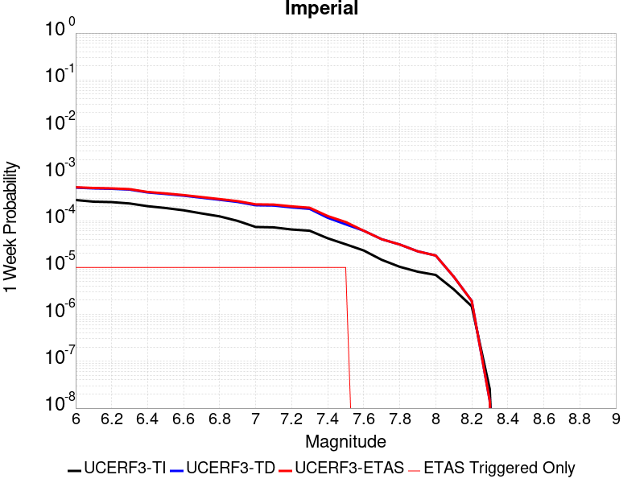 |  |  | 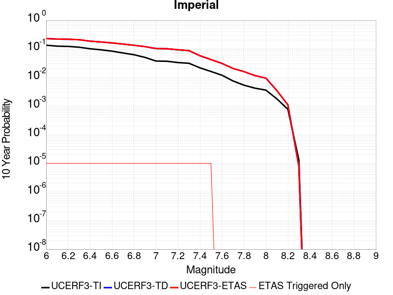 |

| Magnitude | 1 wk TI Prob | 1 wk TD Prob | 1 wk ETAS Prob | 1 wk ETAS/TD Gain | 1 wk ETAS Triggered Only | 1 mo TI Prob | 1 mo TD Prob | 1 mo ETAS Prob | 1 mo ETAS/TD Gain | 1 mo ETAS Triggered Only | 1 yr TI Prob | 1 yr TD Prob | 1 yr ETAS Prob | 1 yr ETAS/TD Gain | 1 yr ETAS Triggered Only | 10 yr TI Prob | 10 yr TD Prob | 10 yr ETAS Prob | 10 yr ETAS/TD Gain | 10 yr ETAS Triggered Only |
|-----|-----|-----|-----|-----|-----|-----|-----|-----|-----|-----|-----|-----|-----|-----|-----|-----|-----|-----|-----|-----|
| 6.0 | 2.7496446E-4 | 5.054469E-4 | 5.1765284E-4 | 1.0241488 | 1.22121E-5 | 0.0011778869 | 0.002164442 | 0.0021766277 | 1.0056299 | 1.22121E-5 | 0.0142467655 | 0.026034584 | 0.026046477 | 1.0004568 | 1.22121E-5 | 0.13367249 | 0.22801645 | 0.22802588 | 1.0000414 | 1.22121E-5 |
| 6.1 | 2.5356023E-4 | 4.864905E-4 | 4.9869664E-4 | 1.0250902 | 1.22121E-5 | 0.001086234 | 0.0020833316 | 0.0020955182 | 1.0058496 | 1.22121E-5 | 0.013144928 | 0.02506727 | 0.025079176 | 1.0004749 | 1.22121E-5 | 0.123940155 | 0.21945325 | 0.21946277 | 1.0000434 | 1.22121E-5 |
| 6.2 | 2.4820742E-4 | 4.7744514E-4 | 4.896514E-4 | 1.0255659 | 1.22121E-5 | 0.0010633124 | 0.0020446267 | 0.0020568138 | 1.0059606 | 1.22121E-5 | 0.01286919 | 0.024607308 | 0.02461922 | 1.0004841 | 1.22121E-5 | 0.12148927 | 0.21595894 | 0.21596852 | 1.0000443 | 1.22121E-5 |
| 6.3 | 2.3205351E-4 | 4.588303E-4 | 4.710368E-4 | 1.0266035 | 1.22121E-5 | 9.94136E-4 | 0.0019649705 | 0.0019771587 | 1.0062027 | 1.22121E-5 | 0.012036599 | 0.023657534 | 0.023669457 | 1.000504 | 1.22121E-5 | 0.11405133 | 0.20790851 | 0.20791818 | 1.0000465 | 1.22121E-5 |
| 6.4 | 2.0304754E-4 | 3.9869116E-4 | 4.108984E-4 | 1.0306183 | 1.22121E-5 | 8.6991355E-4 | 0.0017075721 | 0.0017197634 | 1.0071396 | 1.22121E-5 | 0.010539869 | 0.020591887 | 0.020603847 | 1.0005808 | 1.22121E-5 | 0.100537635 | 0.18504018 | 0.18505013 | 1.0000538 | 1.22121E-5 |
| 6.5 | 1.854992E-4 | 3.6981583E-4 | 3.8202343E-4 | 1.0330099 | 1.22121E-5 | 7.9475436E-4 | 0.0015839747 | 0.0015961675 | 1.0076976 | 1.22121E-5 | 0.009633281 | 0.01911576 | 0.01912774 | 1.0006267 | 1.22121E-5 | 0.0922623 | 0.17327131 | 0.17328142 | 1.0000583 | 1.22121E-5 |
| 6.6 | 1.6586106E-4 | 3.4027954E-4 | 3.5248746E-4 | 1.0358763 | 1.22121E-5 | 7.106394E-4 | 0.0014575359 | 0.0014697302 | 1.0083663 | 1.22121E-5 | 0.008617763 | 0.017602775 | 0.017614773 | 1.0006815 | 1.22121E-5 | 0.08291132 | 0.16074891 | 0.16075917 | 1.0000638 | 1.22121E-5 |
| 6.7 | 1.4224656E-4 | 3.0760013E-4 | 3.1980846E-4 | 1.0396891 | 1.22121E-5 | 6.094856E-4 | 0.0013176284 | 0.0013298244 | 1.009256 | 1.22121E-5 | 0.0073952693 | 0.01592603 | 0.015938047 | 1.0007546 | 1.22121E-5 | 0.07153955 | 0.14645793 | 0.14646834 | 1.0000712 | 1.22121E-5 |
| 6.8 | 1.2317259E-4 | 2.7784536E-4 | 2.9005407E-4 | 1.0439407 | 1.22121E-5 | 5.2777573E-4 | 0.0011902286 | 0.0012024262 | 1.0102481 | 1.22121E-5 | 0.0064067547 | 0.014396132 | 0.014408168 | 1.0008361 | 1.22121E-5 | 0.06225166 | 0.13291098 | 0.13292156 | 1.0000796 | 1.22121E-5 |
| 6.9 | 9.859898E-5 | 2.500792E-4 | 2.6228826E-4 | 1.0488207 | 1.22121E-5 | 4.2249862E-4 | 0.001071332 | 0.0010835311 | 1.0113868 | 1.22121E-5 | 0.0051317946 | 0.012966422 | 0.012978476 | 1.0009296 | 1.22121E-5 | 0.05014893 | 0.11938127 | 0.11939202 | 1.0000901 | 1.22121E-5 |
| 7.0 | 7.3191884E-5 | 2.1260617E-4 | 2.2481567E-4 | 1.0574278 | 1.22121E-5 | 3.136418E-4 | 9.108543E-4 | 9.230553E-4 | 1.0133951 | 1.22121E-5 | 0.003811904 | 0.011033948 | 0.011046025 | 1.0010946 | 1.22121E-5 | 0.037471764 | 0.10204036 | 0.102051325 | 1.0001074 | 1.22121E-5 |
| 7.1 | 7.1760296E-5 | 2.0961992E-4 | 2.2182945E-4 | 1.0582461 | 1.22121E-5 | 3.0750787E-4 | 8.980649E-4 | 9.1026607E-4 | 1.013586 | 1.22121E-5 | 0.003737482 | 0.0108798025 | 0.010891882 | 1.0011102 | 1.22121E-5 | 0.03675245 | 0.10067689 | 0.10068787 | 1.0001091 | 1.22121E-5 |
| 7.2 | 6.46614E-5 | 1.913056E-4 | 2.0351536E-4 | 1.0638233 | 1.22121E-5 | 2.7709085E-4 | 8.1962656E-4 | 8.318286E-4 | 1.0148873 | 1.22121E-5 | 0.0033683628 | 0.009933916 | 0.009946006 | 1.0012171 | 1.22121E-5 | 0.033177625 | 0.09248428 | 0.09249537 | 1.0001198 | 1.22121E-5 |
| 7.3 | 6.088115E-5 | 1.7802432E-4 | 1.9023425E-4 | 1.0685858 | 1.22121E-5 | 2.6089314E-4 | 7.6274114E-4 | 7.749439E-4 | 1.0159986 | 1.22121E-5 | 0.0031717476 | 0.009247407 | 0.009259507 | 1.0013084 | 1.22121E-5 | 0.031268585 | 0.08653566 | 0.086546816 | 1.0001289 | 1.22121E-5 |
| 7.4 | 4.199346E-5 | 1.1507733E-4 | 1.2728802E-4 | 1.1061085 | 1.22121E-5 | 1.7995955E-4 | 4.930962E-4 | 5.053023E-4 | 1.0247539 | 1.22121E-5 | 0.0021888057 | 0.00598709 | 0.005999229 | 1.0020275 | 1.22121E-5 | 0.02167372 | 0.057428524 | 0.057440035 | 1.0002004 | 1.22121E-5 |
| 7.5 | 3.130448E-5 | 8.332899E-5 | 9.554007E-5 | 1.1465406 | 1.22121E-5 | 1.3415517E-4 | 3.5707568E-4 | 3.692834E-4 | 1.0341882 | 1.22121E-5 | 0.0016321153 | 0.00433879 | 0.004350949 | 1.0028024 | 1.22121E-5 | 0.016201803 | 0.042130288 | 0.042141985 | 1.0002776 | 1.22121E-5 |
| 7.6 | 2.3074248E-5 | 6.0841397E-5 | 6.0841397E-5 | 1.0 | 0.0 | 9.888588E-5 | 2.607229E-4 | 2.607229E-4 | 1.0 | 0.0 | 0.0012032706 | 0.0031697042 | 0.0031697042 | 1.0 | 0.0 | 0.011967761 | 0.03102491 | 0.03102491 | 1.0 | 0.0 |
| 7.7 | 1.45864815E-5 | 4.0122002E-5 | 4.0122002E-5 | 1.0 | 0.0 | 6.2511994E-5 | 1.7194013E-4 | 1.7194013E-4 | 1.0 | 0.0 | 7.608177E-4 | 0.0020913668 | 0.0020913668 | 1.0 | 0.0 | 0.007582182 | 0.020626526 | 0.020626526 | 1.0 | 0.0 |
| 7.8 | 1.0352979E-5 | 3.0958607E-5 | 3.0958607E-5 | 1.0 | 0.0 | 4.4369157E-5 | 1.3267301E-4 | 1.3267301E-4 | 1.0 | 0.0 | 5.400606E-4 | 0.0016140995 | 0.0016140995 | 1.0 | 0.0 | 0.0053875 | 0.016015781 | 0.016015781 | 1.0 | 0.0 |
| 7.9 | 8.137906E-6 | 2.214726E-5 | 2.214726E-5 | 1.0 | 0.0 | 3.4876273E-5 | 9.491338E-5 | 9.491338E-5 | 1.0 | 0.0 | 4.2453592E-4 | 0.0011549587 | 0.0011549587 | 1.0 | 0.0 | 0.004237258 | 0.011617044 | 0.011617044 | 1.0 | 0.0 |
| 8.0 | 6.93792E-6 | 1.800718E-5 | 1.800718E-5 | 1.0 | 0.0 | 2.9733603E-5 | 7.717135E-5 | 7.717135E-5 | 1.0 | 0.0 | 3.6194647E-4 | 9.39157E-4 | 9.39157E-4 | 1.0 | 0.0 | 0.0036135751 | 0.009500807 | 0.009500807 | 1.0 | 0.0 |
| 8.1 | 3.4286315E-6 | 6.3791363E-6 | 6.3791363E-6 | 1.0 | 0.0 | 1.4694053E-5 | 2.7338869E-5 | 2.7338869E-5 | 1.0 | 0.0 | 1.7888541E-4 | 3.328E-4 | 3.328E-4 | 1.0 | 0.0 | 0.0017874148 | 0.0034856654 | 0.0034856654 | 1.0 | 0.0 |
| 8.2 | 1.4906886E-6 | 1.936376E-6 | 1.936376E-6 | 1.0 | 0.0 | 6.3886496E-6 | 8.298728E-6 | 8.298728E-6 | 1.0 | 0.0 | 7.7779034E-5 | 1.0103236E-4 | 1.0103236E-4 | 1.0 | 0.0 | 7.775182E-4 | 0.001107385 | 0.001107385 | 1.0 | 0.0 |
| 8.3 | 2.5758007E-8 | 1.449717E-8 | 1.449717E-8 | 1.0 | 0.0 | 1.10391454E-7 | 6.2130724E-8 | 6.2130724E-8 | 1.0 | 0.0 | 1.3440151E-6 | 7.564416E-7 | 7.564416E-7 | 1.0 | 0.0 | 1.344007E-5 | 7.8862E-6 | 7.8862E-6 | 1.0 | 0.0 |

## Dry Mountain
*[(top)](#table-of-contents)*

| 1 Week | 1 Month | 1 Year | 10 Year |
|-----|-----|-----|-----|
| 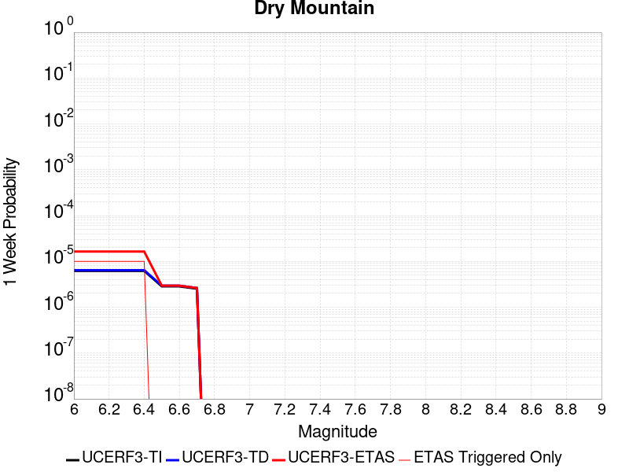 |  |  |  |

| Magnitude | 1 wk TI Prob | 1 wk TD Prob | 1 wk ETAS Prob | 1 wk ETAS/TD Gain | 1 wk ETAS Triggered Only | 1 mo TI Prob | 1 mo TD Prob | 1 mo ETAS Prob | 1 mo ETAS/TD Gain | 1 mo ETAS Triggered Only | 1 yr TI Prob | 1 yr TD Prob | 1 yr ETAS Prob | 1 yr ETAS/TD Gain | 1 yr ETAS Triggered Only | 10 yr TI Prob | 10 yr TD Prob | 10 yr ETAS Prob | 10 yr ETAS/TD Gain | 10 yr ETAS Triggered Only |
|-----|-----|-----|-----|-----|-----|-----|-----|-----|-----|-----|-----|-----|-----|-----|-----|-----|-----|-----|-----|-----|
| 6.0 | 6.222801E-6 | 6.4393753E-6 | 1.8651397E-5 | 2.8964605 | 1.22121E-5 | 2.6668875E-5 | 2.759712E-5 | 3.9808885E-5 | 1.4425013 | 1.22121E-5 | 3.2464517E-4 | 3.3595905E-4 | 3.4816706E-4 | 1.0363377 | 1.22121E-5 | 0.0032417132 | 0.0033560738 | 0.0033682447 | 1.0036266 | 1.22121E-5 |
| 6.1 | 6.222801E-6 | 6.4393753E-6 | 1.8651397E-5 | 2.8964605 | 1.22121E-5 | 2.6668875E-5 | 2.759712E-5 | 3.9808885E-5 | 1.4425013 | 1.22121E-5 | 3.2464517E-4 | 3.3595905E-4 | 3.4816706E-4 | 1.0363377 | 1.22121E-5 | 0.0032417132 | 0.0033560738 | 0.0033682447 | 1.0036266 | 1.22121E-5 |
| 6.2 | 6.222801E-6 | 6.4393753E-6 | 1.8651397E-5 | 2.8964605 | 1.22121E-5 | 2.6668875E-5 | 2.759712E-5 | 3.9808885E-5 | 1.4425013 | 1.22121E-5 | 3.2464517E-4 | 3.3595905E-4 | 3.4816706E-4 | 1.0363377 | 1.22121E-5 | 0.0032417132 | 0.0033560738 | 0.0033682447 | 1.0036266 | 1.22121E-5 |
| 6.3 | 6.222801E-6 | 6.4393753E-6 | 1.8651397E-5 | 2.8964605 | 1.22121E-5 | 2.6668875E-5 | 2.759712E-5 | 3.9808885E-5 | 1.4425013 | 1.22121E-5 | 3.2464517E-4 | 3.3595905E-4 | 3.4816706E-4 | 1.0363377 | 1.22121E-5 | 0.0032417132 | 0.0033560738 | 0.0033682447 | 1.0036266 | 1.22121E-5 |
| 6.4 | 6.222801E-6 | 6.4393753E-6 | 1.8651397E-5 | 2.8964605 | 1.22121E-5 | 2.6668875E-5 | 2.759712E-5 | 3.9808885E-5 | 1.4425013 | 1.22121E-5 | 3.2464517E-4 | 3.3595905E-4 | 3.4816706E-4 | 1.0363377 | 1.22121E-5 | 0.0032417132 | 0.0033560738 | 0.0033682447 | 1.0036266 | 1.22121E-5 |
| 6.5 | 2.8528623E-6 | 2.9521657E-6 | 2.9521657E-6 | 1.0 | 0.0 | 1.22264955E-5 | 1.2652126E-5 | 1.2652126E-5 | 1.0 | 0.0 | 1.4884741E-4 | 1.5403745E-4 | 1.5403745E-4 | 1.0 | 0.0 | 0.0014874774 | 0.0015401602 | 0.0015401602 | 1.0 | 0.0 |
| 6.6 | 2.8528623E-6 | 2.9521657E-6 | 2.9521657E-6 | 1.0 | 0.0 | 1.22264955E-5 | 1.2652126E-5 | 1.2652126E-5 | 1.0 | 0.0 | 1.4884741E-4 | 1.5403745E-4 | 1.5403745E-4 | 1.0 | 0.0 | 0.0014874774 | 0.0015401602 | 0.0015401602 | 1.0 | 0.0 |
| 6.7 | 2.541E-6 | 2.6293555E-6 | 2.6293555E-6 | 1.0 | 0.0 | 1.0889954E-5 | 1.1268666E-5 | 1.1268666E-5 | 1.0 | 0.0 | 1.3257713E-4 | 1.3719601E-4 | 1.3719601E-4 | 1.0 | 0.0 | 0.0013249806 | 0.0013719602 | 0.0013719602 | 1.0 | 0.0 |

## Pleito
*[(top)](#table-of-contents)*

| 1 Week | 1 Month | 1 Year | 10 Year |
|-----|-----|-----|-----|
|  |  |  |  |

| Magnitude | 1 wk TI Prob | 1 wk TD Prob | 1 wk ETAS Prob | 1 wk ETAS/TD Gain | 1 wk ETAS Triggered Only | 1 mo TI Prob | 1 mo TD Prob | 1 mo ETAS Prob | 1 mo ETAS/TD Gain | 1 mo ETAS Triggered Only | 1 yr TI Prob | 1 yr TD Prob | 1 yr ETAS Prob | 1 yr ETAS/TD Gain | 1 yr ETAS Triggered Only | 10 yr TI Prob | 10 yr TD Prob | 10 yr ETAS Prob | 10 yr ETAS/TD Gain | 10 yr ETAS Triggered Only |
|-----|-----|-----|-----|-----|-----|-----|-----|-----|-----|-----|-----|-----|-----|-----|-----|-----|-----|-----|-----|-----|
| 6.0 | 1.6763008E-5 | 2.47625E-5 | 3.6974296E-5 | 1.4931569 | 1.22121E-5 | 7.183948E-5 | 1.0612109E-4 | 1.183319E-4 | 1.1150649 | 1.22121E-5 | 8.742947E-4 | 0.0012913306 | 0.0013035269 | 1.0094448 | 1.22121E-5 | 0.00870863 | 0.012953214 | 0.012965268 | 1.0009305 | 1.22121E-5 |
| 6.1 | 1.6763008E-5 | 2.47625E-5 | 3.6974296E-5 | 1.4931569 | 1.22121E-5 | 7.183948E-5 | 1.0612109E-4 | 1.183319E-4 | 1.1150649 | 1.22121E-5 | 8.742947E-4 | 0.0012913306 | 0.0013035269 | 1.0094448 | 1.22121E-5 | 0.00870863 | 0.012953214 | 0.012965268 | 1.0009305 | 1.22121E-5 |
| 6.2 | 1.6763008E-5 | 2.47625E-5 | 3.6974296E-5 | 1.4931569 | 1.22121E-5 | 7.183948E-5 | 1.0612109E-4 | 1.183319E-4 | 1.1150649 | 1.22121E-5 | 8.742947E-4 | 0.0012913306 | 0.0013035269 | 1.0094448 | 1.22121E-5 | 0.00870863 | 0.012953214 | 0.012965268 | 1.0009305 | 1.22121E-5 |
| 6.3 | 1.6763008E-5 | 2.47625E-5 | 3.6974296E-5 | 1.4931569 | 1.22121E-5 | 7.183948E-5 | 1.0612109E-4 | 1.183319E-4 | 1.1150649 | 1.22121E-5 | 8.742947E-4 | 0.0012913306 | 0.0013035269 | 1.0094448 | 1.22121E-5 | 0.00870863 | 0.012953214 | 0.012965268 | 1.0009305 | 1.22121E-5 |
| 6.4 | 1.6763008E-5 | 2.47625E-5 | 3.6974296E-5 | 1.4931569 | 1.22121E-5 | 7.183948E-5 | 1.0612109E-4 | 1.183319E-4 | 1.1150649 | 1.22121E-5 | 8.742947E-4 | 0.0012913306 | 0.0013035269 | 1.0094448 | 1.22121E-5 | 0.00870863 | 0.012953214 | 0.012965268 | 1.0009305 | 1.22121E-5 |
| 6.5 | 1.6763008E-5 | 2.47625E-5 | 3.6974296E-5 | 1.4931569 | 1.22121E-5 | 7.183948E-5 | 1.0612109E-4 | 1.183319E-4 | 1.1150649 | 1.22121E-5 | 8.742947E-4 | 0.0012913306 | 0.0013035269 | 1.0094448 | 1.22121E-5 | 0.00870863 | 0.012953214 | 0.012965268 | 1.0009305 | 1.22121E-5 |
| 6.6 | 9.910213E-6 | 1.7213306E-5 | 2.9425195E-5 | 1.7094448 | 1.22121E-5 | 4.247165E-5 | 7.3769246E-5 | 8.598044E-5 | 1.1655324 | 1.22121E-5 | 5.169696E-4 | 8.977742E-4 | 9.099753E-4 | 1.0135905 | 1.22121E-5 | 0.0051576863 | 0.009050034 | 0.009062136 | 1.0013372 | 1.22121E-5 |
| 6.7 | 9.910213E-6 | 1.7213306E-5 | 2.9425195E-5 | 1.7094448 | 1.22121E-5 | 4.247165E-5 | 7.3769246E-5 | 8.598044E-5 | 1.1655324 | 1.22121E-5 | 5.169696E-4 | 8.977742E-4 | 9.099753E-4 | 1.0135905 | 1.22121E-5 | 0.0051576863 | 0.009050034 | 0.009062136 | 1.0013372 | 1.22121E-5 |
| 6.8 | 8.300162E-6 | 1.5472919E-5 | 2.768483E-5 | 1.7892442 | 1.22121E-5 | 3.557164E-5 | 6.631083E-5 | 7.852212E-5 | 1.1841522 | 1.22121E-5 | 4.3299864E-4 | 8.070367E-4 | 8.1923895E-4 | 1.0151198 | 1.22121E-5 | 0.004321559 | 0.008149472 | 0.008161585 | 1.0014863 | 1.22121E-5 |
| 6.9 | 8.183114E-6 | 1.5344134E-5 | 2.7556045E-5 | 1.7958685 | 1.22121E-5 | 3.5070017E-5 | 6.5758926E-5 | 7.797022E-5 | 1.1856979 | 1.22121E-5 | 4.2689382E-4 | 8.003222E-4 | 8.125246E-4 | 1.0152467 | 1.22121E-5 | 0.0042607468 | 0.008082817 | 0.008094931 | 1.0014987 | 1.22121E-5 |
| 7.0 | 7.1748823E-6 | 1.4131142E-5 | 2.634307E-5 | 1.8641855 | 1.22121E-5 | 3.0749135E-5 | 6.0560636E-5 | 7.2771996E-5 | 1.2016386 | 1.22121E-5 | 3.743064E-4 | 7.370768E-4 | 7.492799E-4 | 1.016556 | 1.22121E-5 | 0.0037367654 | 0.007454281 | 0.0074664024 | 1.001626 | 1.22121E-5 |
| 7.1 | 7.1671807E-6 | 1.4121513E-5 | 2.633344E-5 | 1.8647747 | 1.22121E-5 | 3.0716128E-5 | 6.051937E-5 | 7.273073E-5 | 1.201776 | 1.22121E-5 | 3.7390468E-4 | 7.3657476E-4 | 7.487779E-4 | 1.0165673 | 1.22121E-5 | 0.0037327618 | 0.007449294 | 0.007461415 | 1.0016272 | 1.22121E-5 |
| 7.2 | 7.0649667E-6 | 1.3968809E-5 | 2.6180738E-5 | 1.8742284 | 1.22121E-5 | 3.0278077E-5 | 5.9864953E-5 | 7.207632E-5 | 1.2039819 | 1.22121E-5 | 3.6857324E-4 | 7.286126E-4 | 7.4081577E-4 | 1.0167485 | 1.22121E-5 | 0.0036796255 | 0.0073700533 | 0.0073821754 | 1.0016447 | 1.22121E-5 |
| 7.3 | 7.02082E-6 | 1.3912267E-5 | 2.6124197E-5 | 1.8777815 | 1.22121E-5 | 3.008888E-5 | 5.962264E-5 | 7.183401E-5 | 1.204811 | 1.22121E-5 | 3.6627054E-4 | 7.256644E-4 | 7.378676E-4 | 1.0168166 | 1.22121E-5 | 0.0036566744 | 0.007340554 | 0.0073526767 | 1.0016514 | 1.22121E-5 |
| 7.4 | 6.987146E-6 | 1.387183E-5 | 2.608376E-5 | 1.8803403 | 1.22121E-5 | 2.9944567E-5 | 5.9449347E-5 | 7.166072E-5 | 1.2054081 | 1.22121E-5 | 3.6451413E-4 | 7.235559E-4 | 7.357592E-4 | 1.0168657 | 1.22121E-5 | 0.0036391679 | 0.0073194904 | 0.007331613 | 1.0016562 | 1.22121E-5 |
| 7.5 | 6.9494554E-6 | 1.3828736E-5 | 2.6040667E-5 | 1.8830837 | 1.22121E-5 | 2.9783041E-5 | 5.926467E-5 | 7.1476046E-5 | 1.2060481 | 1.22121E-5 | 3.625482E-4 | 7.21309E-4 | 7.335123E-4 | 1.0169183 | 1.22121E-5 | 0.0036195726 | 0.007297119 | 0.007309242 | 1.0016613 | 1.22121E-5 |
| 7.6 | 6.92694E-6 | 1.3787852E-5 | 2.5999783E-5 | 1.8857023 | 1.22121E-5 | 2.9686547E-5 | 5.908946E-5 | 7.130084E-5 | 1.2066592 | 1.22121E-5 | 3.6137376E-4 | 7.1917725E-4 | 7.3138054E-4 | 1.0169685 | 1.22121E-5 | 0.0036078666 | 0.0072758733 | 0.007287997 | 1.0016662 | 1.22121E-5 |
| 7.7 | 6.395867E-6 | 1.26669875E-5 | 2.4878933E-5 | 1.9640765 | 1.22121E-5 | 2.741057E-5 | 5.4285963E-5 | 6.64974E-5 | 1.2249465 | 1.22121E-5 | 3.336726E-4 | 6.607315E-4 | 6.729355E-4 | 1.0184705 | 1.22121E-5 | 0.0033317201 | 0.006694559 | 0.0067066895 | 1.001812 | 1.22121E-5 |
| 7.8 | 5.8664327E-6 | 1.1534736E-5 | 2.3746696E-5 | 2.0587115 | 1.22121E-5 | 2.5141611E-5 | 4.943365E-5 | 6.164514E-5 | 1.247028 | 1.22121E-5 | 3.060561E-4 | 6.016887E-4 | 6.1389344E-4 | 1.0202842 | 1.22121E-5 | 0.0030563495 | 0.0061000953 | 0.006112233 | 1.0019897 | 1.22121E-5 |
| 7.9 | 3.7167474E-6 | 7.1134045E-6 | 7.1134045E-6 | 1.0 | 0.0 | 1.592882E-5 | 3.0485664E-5 | 3.0485664E-5 | 1.0 | 0.0 | 1.9391612E-4 | 3.7109992E-4 | 3.7109992E-4 | 1.0 | 0.0 | 0.0019374699 | 0.0037671442 | 0.0037671442 | 1.0 | 0.0 |
| 8.0 | 1.0903841E-6 | 1.2877897E-6 | 1.2877897E-6 | 1.0 | 0.0 | 4.6730665E-6 | 5.519087E-6 | 5.519087E-6 | 1.0 | 0.0 | 5.68931E-5 | 6.719283E-5 | 6.719283E-5 | 1.0 | 0.0 | 5.6878536E-4 | 6.941163E-4 | 6.941163E-4 | 1.0 | 0.0 |
| 8.1 | 2.6894583E-7 | 1.1057816E-7 | 1.1057816E-7 | 1.0 | 0.0 | 1.1526245E-6 | 4.739063E-7 | 4.739063E-7 | 1.0 | 0.0 | 1.4033113E-5 | 5.7697944E-6 | 5.7697944E-6 | 1.0 | 0.0 | 1.4032227E-4 | 6.455498E-5 | 6.455498E-5 | 1.0 | 0.0 |
| 8.2 | 5.2967013E-9 | 2.4572189E-9 | 2.4572189E-9 | 1.0 | 0.0 | 2.2700148E-8 | 1.0530939E-8 | 1.0530939E-8 | 1.0 | 0.0 | 2.7637427E-7 | 1.2821418E-7 | 1.2821418E-7 | 1.0 | 0.0 | 2.7637393E-6 | 1.4589409E-6 | 1.4589409E-6 | 1.0 | 0.0 |

## Santa Ynez River
*[(top)](#table-of-contents)*

| 1 Week | 1 Month | 1 Year | 10 Year |
|-----|-----|-----|-----|
|  | 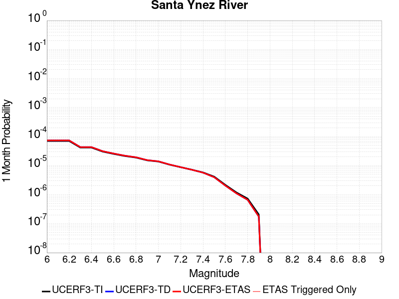 | 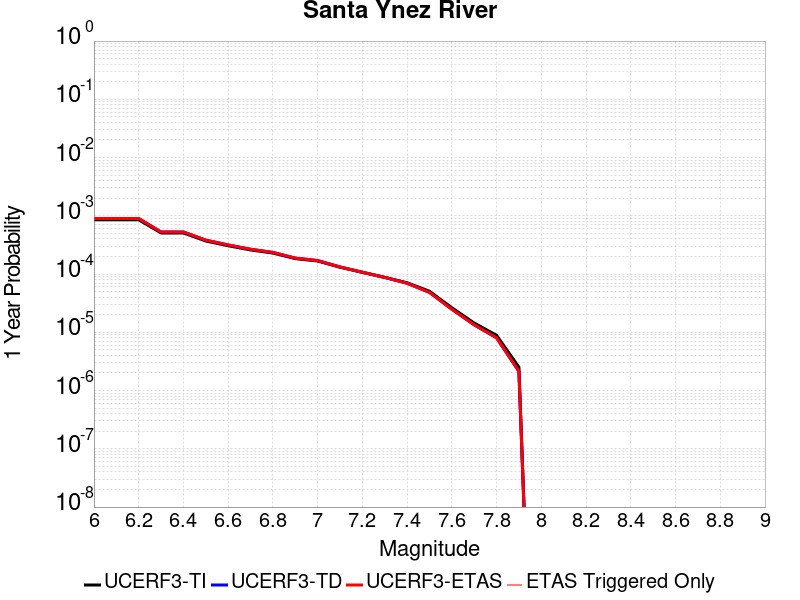 |  |

| Magnitude | 1 wk TI Prob | 1 wk TD Prob | 1 wk ETAS Prob | 1 wk ETAS/TD Gain | 1 wk ETAS Triggered Only | 1 mo TI Prob | 1 mo TD Prob | 1 mo ETAS Prob | 1 mo ETAS/TD Gain | 1 mo ETAS Triggered Only | 1 yr TI Prob | 1 yr TD Prob | 1 yr ETAS Prob | 1 yr ETAS/TD Gain | 1 yr ETAS Triggered Only | 10 yr TI Prob | 10 yr TD Prob | 10 yr ETAS Prob | 10 yr ETAS/TD Gain | 10 yr ETAS Triggered Only |
|-----|-----|-----|-----|-----|-----|-----|-----|-----|-----|-----|-----|-----|-----|-----|-----|-----|-----|-----|-----|-----|
| 6.0 | 1.6396456E-5 | 1.720941E-5 | 1.720941E-5 | 1.0 | 0.0 | 7.026863E-5 | 7.375273E-5 | 7.375273E-5 | 1.0 | 0.0 | 8.551848E-4 | 8.976051E-4 | 8.976051E-4 | 1.0 | 0.0 | 0.0085190125 | 0.0089433445 | 0.008955448 | 1.0013533 | 1.22121E-5 |
| 6.1 | 1.6396456E-5 | 1.720941E-5 | 1.720941E-5 | 1.0 | 0.0 | 7.026863E-5 | 7.375273E-5 | 7.375273E-5 | 1.0 | 0.0 | 8.551848E-4 | 8.976051E-4 | 8.976051E-4 | 1.0 | 0.0 | 0.0085190125 | 0.0089433445 | 0.008955448 | 1.0013533 | 1.22121E-5 |
| 6.2 | 1.6396456E-5 | 1.720941E-5 | 1.720941E-5 | 1.0 | 0.0 | 7.026863E-5 | 7.375273E-5 | 7.375273E-5 | 1.0 | 0.0 | 8.551848E-4 | 8.976051E-4 | 8.976051E-4 | 1.0 | 0.0 | 0.0085190125 | 0.0089433445 | 0.008955448 | 1.0013533 | 1.22121E-5 |
| 6.3 | 9.736976E-6 | 1.0122317E-5 | 1.0122317E-5 | 1.0 | 0.0 | 4.172923E-5 | 4.3380664E-5 | 4.3380664E-5 | 1.0 | 0.0 | 5.0793495E-4 | 5.2803656E-4 | 5.2803656E-4 | 1.0 | 0.0 | 0.005067755 | 0.005268325 | 0.005268325 | 1.0 | 0.0 |
| 6.4 | 9.736976E-6 | 1.0122317E-5 | 1.0122317E-5 | 1.0 | 0.0 | 4.172923E-5 | 4.3380664E-5 | 4.3380664E-5 | 1.0 | 0.0 | 5.0793495E-4 | 5.2803656E-4 | 5.2803656E-4 | 1.0 | 0.0 | 0.005067755 | 0.005268325 | 0.005268325 | 1.0 | 0.0 |
| 6.5 | 7.081964E-6 | 7.3298866E-6 | 7.3298866E-6 | 1.0 | 0.0 | 3.035092E-5 | 3.141343E-5 | 3.141343E-5 | 1.0 | 0.0 | 3.694598E-4 | 3.82393E-4 | 3.82393E-4 | 1.0 | 0.0 | 0.0036884616 | 0.0038175117 | 0.0038175117 | 1.0 | 0.0 |
| 6.6 | 5.873247E-6 | 6.059735E-6 | 6.059735E-6 | 1.0 | 0.0 | 2.5170815E-5 | 2.597004E-5 | 2.597004E-5 | 1.0 | 0.0 | 3.064116E-4 | 3.161402E-4 | 3.161402E-4 | 1.0 | 0.0 | 0.0030598943 | 0.0031569921 | 0.0031569921 | 1.0 | 0.0 |
| 6.7 | 4.973277E-6 | 5.115894E-6 | 5.115894E-6 | 1.0 | 0.0 | 2.1313872E-5 | 2.192508E-5 | 2.192508E-5 | 1.0 | 0.0 | 2.5946548E-4 | 2.669056E-4 | 2.669056E-4 | 1.0 | 0.0 | 0.0025916274 | 0.0026658995 | 0.0026658995 | 1.0 | 0.0 |
| 6.8 | 4.396492E-6 | 4.5109714E-6 | 4.5109714E-6 | 1.0 | 0.0 | 1.884197E-5 | 1.9332594E-5 | 1.9332594E-5 | 1.0 | 0.0 | 2.2937685E-4 | 2.3534926E-4 | 2.3534926E-4 | 1.0 | 0.0 | 0.0022914023 | 0.0023510356 | 0.0023510356 | 1.0 | 0.0 |
| 6.9 | 3.5255632E-6 | 3.6013282E-6 | 3.6013282E-6 | 1.0 | 0.0 | 1.5109469E-5 | 1.5434174E-5 | 1.5434174E-5 | 1.0 | 0.0 | 1.8394225E-4 | 1.8789501E-4 | 1.8789501E-4 | 1.0 | 0.0 | 0.0018379007 | 0.0018773776 | 0.0018773776 | 1.0 | 0.0 |
| 7.0 | 3.211603E-6 | 3.2736493E-6 | 3.2736493E-6 | 1.0 | 0.0 | 1.376394E-5 | 1.4029852E-5 | 1.4029852E-5 | 1.0 | 0.0 | 1.6756308E-4 | 1.708002E-4 | 1.708002E-4 | 1.0 | 0.0 | 0.0016743679 | 0.0017067033 | 0.0017067033 | 1.0 | 0.0 |
| 7.1 | 2.5094619E-6 | 2.5409167E-6 | 2.5409167E-6 | 1.0 | 0.0 | 1.0754793E-5 | 1.0889597E-5 | 1.0889597E-5 | 1.0 | 0.0 | 1.3093173E-4 | 1.3257284E-4 | 1.3257284E-4 | 1.0 | 0.0 | 0.0013085462 | 0.0013249436 | 0.0013249436 | 1.0 | 0.0 |
| 7.2 | 2.0515774E-6 | 2.0619343E-6 | 2.0619343E-6 | 1.0 | 0.0 | 8.792445E-6 | 8.8368315E-6 | 8.8368315E-6 | 1.0 | 0.0 | 1.0704277E-4 | 1.0758315E-4 | 1.0758315E-4 | 1.0 | 0.0 | 0.0010699122 | 0.001075315 | 0.001075315 | 1.0 | 0.0 |
| 7.3 | 1.6845745E-6 | 1.6773879E-6 | 1.6773879E-6 | 1.0 | 0.0 | 7.219585E-6 | 7.1887857E-6 | 7.1887857E-6 | 1.0 | 0.0 | 8.78949E-5 | 8.751998E-5 | 8.751998E-5 | 1.0 | 0.0 | 8.7860145E-4 | 8.74858E-4 | 8.74858E-4 | 1.0 | 0.0 |
| 7.4 | 1.3600285E-6 | 1.3333336E-6 | 1.3333336E-6 | 1.0 | 0.0 | 5.82868E-6 | 5.7142743E-6 | 5.7142743E-6 | 1.0 | 0.0 | 7.096187E-5 | 6.956909E-5 | 6.956909E-5 | 1.0 | 0.0 | 7.0939213E-4 | 6.954753E-4 | 6.954753E-4 | 1.0 | 0.0 |
| 7.5 | 9.735342E-7 | 9.2900865E-7 | 9.2900865E-7 | 1.0 | 0.0 | 4.172283E-6 | 3.98146E-6 | 3.98146E-6 | 1.0 | 0.0 | 5.079636E-5 | 4.847321E-5 | 4.847321E-5 | 1.0 | 0.0 | 5.0784746E-4 | 4.8462808E-4 | 4.8462808E-4 | 1.0 | 0.0 |
| 7.6 | 5.067187E-7 | 4.7785625E-7 | 4.7785625E-7 | 1.0 | 0.0 | 2.1716498E-6 | 2.0479538E-6 | 2.0479538E-6 | 1.0 | 0.0 | 2.6439517E-5 | 2.4933559E-5 | 2.4933559E-5 | 1.0 | 0.0 | 2.643637E-4 | 2.4930836E-4 | 2.4930836E-4 | 1.0 | 0.0 |
| 7.7 | 2.769089E-7 | 2.5759087E-7 | 2.5759087E-7 | 1.0 | 0.0 | 1.1867519E-6 | 1.1039605E-6 | 1.1039605E-6 | 1.0 | 0.0 | 1.4448608E-5 | 1.34406355E-5 | 1.34406355E-5 | 1.0 | 0.0 | 1.444767E-4 | 1.3439826E-4 | 1.3439826E-4 | 1.0 | 0.0 |
| 7.8 | 1.7044663E-7 | 1.5448994E-7 | 1.5448994E-7 | 1.0 | 0.0 | 7.3048534E-7 | 6.620995E-7 | 6.620995E-7 | 1.0 | 0.0 | 8.893623E-6 | 8.0610325E-6 | 8.0610325E-6 | 1.0 | 0.0 | 8.893267E-5 | 8.060742E-5 | 8.060742E-5 | 1.0 | 0.0 |
| 7.9 | 4.8344287E-8 | 4.091086E-8 | 4.091086E-8 | 1.0 | 0.0 | 2.0718979E-7 | 1.7533225E-7 | 1.7533225E-7 | 1.0 | 0.0 | 2.5225327E-6 | 2.134668E-6 | 2.134668E-6 | 1.0 | 0.0 | 2.5225041E-5 | 2.134648E-5 | 2.134648E-5 | 1.0 | 0.0 |

## Pitas Point (Lower West)
*[(top)](#table-of-contents)*

| 1 Week | 1 Month | 1 Year | 10 Year |
|-----|-----|-----|-----|
|  |  |  |  |

| Magnitude | 1 wk TI Prob | 1 wk TD Prob | 1 wk ETAS Prob | 1 wk ETAS/TD Gain | 1 wk ETAS Triggered Only | 1 mo TI Prob | 1 mo TD Prob | 1 mo ETAS Prob | 1 mo ETAS/TD Gain | 1 mo ETAS Triggered Only | 1 yr TI Prob | 1 yr TD Prob | 1 yr ETAS Prob | 1 yr ETAS/TD Gain | 1 yr ETAS Triggered Only | 10 yr TI Prob | 10 yr TD Prob | 10 yr ETAS Prob | 10 yr ETAS/TD Gain | 10 yr ETAS Triggered Only |
|-----|-----|-----|-----|-----|-----|-----|-----|-----|-----|-----|-----|-----|-----|-----|-----|-----|-----|-----|-----|-----|
| 6.0 | 8.151497E-6 | 7.855749E-6 | 2.0067753E-5 | 2.5545309 | 1.22121E-5 | 3.493452E-5 | 3.3667064E-5 | 4.5878754E-5 | 1.3627192 | 1.22121E-5 | 4.252448E-4 | 4.0982018E-4 | 4.2202725E-4 | 1.0297865 | 1.22121E-5 | 0.0042443196 | 0.0040907245 | 0.0041028867 | 1.0029731 | 1.22121E-5 |
| 6.1 | 8.151497E-6 | 7.855749E-6 | 2.0067753E-5 | 2.5545309 | 1.22121E-5 | 3.493452E-5 | 3.3667064E-5 | 4.5878754E-5 | 1.3627192 | 1.22121E-5 | 4.252448E-4 | 4.0982018E-4 | 4.2202725E-4 | 1.0297865 | 1.22121E-5 | 0.0042443196 | 0.0040907245 | 0.0041028867 | 1.0029731 | 1.22121E-5 |
| 6.2 | 8.151497E-6 | 7.855749E-6 | 2.0067753E-5 | 2.5545309 | 1.22121E-5 | 3.493452E-5 | 3.3667064E-5 | 4.5878754E-5 | 1.3627192 | 1.22121E-5 | 4.252448E-4 | 4.0982018E-4 | 4.2202725E-4 | 1.0297865 | 1.22121E-5 | 0.0042443196 | 0.0040907245 | 0.0041028867 | 1.0029731 | 1.22121E-5 |
| 6.3 | 8.151497E-6 | 7.855749E-6 | 2.0067753E-5 | 2.5545309 | 1.22121E-5 | 3.493452E-5 | 3.3667064E-5 | 4.5878754E-5 | 1.3627192 | 1.22121E-5 | 4.252448E-4 | 4.0982018E-4 | 4.2202725E-4 | 1.0297865 | 1.22121E-5 | 0.0042443196 | 0.0040907245 | 0.0041028867 | 1.0029731 | 1.22121E-5 |
| 6.4 | 8.151497E-6 | 7.855749E-6 | 2.0067753E-5 | 2.5545309 | 1.22121E-5 | 3.493452E-5 | 3.3667064E-5 | 4.5878754E-5 | 1.3627192 | 1.22121E-5 | 4.252448E-4 | 4.0982018E-4 | 4.2202725E-4 | 1.0297865 | 1.22121E-5 | 0.0042443196 | 0.0040907245 | 0.0041028867 | 1.0029731 | 1.22121E-5 |
| 6.5 | 8.151497E-6 | 7.855749E-6 | 2.0067753E-5 | 2.5545309 | 1.22121E-5 | 3.493452E-5 | 3.3667064E-5 | 4.5878754E-5 | 1.3627192 | 1.22121E-5 | 4.252448E-4 | 4.0982018E-4 | 4.2202725E-4 | 1.0297865 | 1.22121E-5 | 0.0042443196 | 0.0040907245 | 0.0041028867 | 1.0029731 | 1.22121E-5 |
| 6.6 | 8.151497E-6 | 7.855749E-6 | 2.0067753E-5 | 2.5545309 | 1.22121E-5 | 3.493452E-5 | 3.3667064E-5 | 4.5878754E-5 | 1.3627192 | 1.22121E-5 | 4.252448E-4 | 4.0982018E-4 | 4.2202725E-4 | 1.0297865 | 1.22121E-5 | 0.0042443196 | 0.0040907245 | 0.0041028867 | 1.0029731 | 1.22121E-5 |
| 6.7 | 8.151497E-6 | 7.855749E-6 | 2.0067753E-5 | 2.5545309 | 1.22121E-5 | 3.493452E-5 | 3.3667064E-5 | 4.5878754E-5 | 1.3627192 | 1.22121E-5 | 4.252448E-4 | 4.0982018E-4 | 4.2202725E-4 | 1.0297865 | 1.22121E-5 | 0.0042443196 | 0.0040907245 | 0.0041028867 | 1.0029731 | 1.22121E-5 |
| 6.8 | 8.151497E-6 | 7.855749E-6 | 2.0067753E-5 | 2.5545309 | 1.22121E-5 | 3.493452E-5 | 3.3667064E-5 | 4.5878754E-5 | 1.3627192 | 1.22121E-5 | 4.252448E-4 | 4.0982018E-4 | 4.2202725E-4 | 1.0297865 | 1.22121E-5 | 0.0042443196 | 0.0040907245 | 0.0041028867 | 1.0029731 | 1.22121E-5 |
| 6.9 | 8.151497E-6 | 7.855749E-6 | 2.0067753E-5 | 2.5545309 | 1.22121E-5 | 3.493452E-5 | 3.3667064E-5 | 4.5878754E-5 | 1.3627192 | 1.22121E-5 | 4.252448E-4 | 4.0982018E-4 | 4.2202725E-4 | 1.0297865 | 1.22121E-5 | 0.0042443196 | 0.0040907245 | 0.0041028867 | 1.0029731 | 1.22121E-5 |
| 7.0 | 8.103535E-6 | 7.805179E-6 | 2.0017183E-5 | 2.5646029 | 1.22121E-5 | 3.4728975E-5 | 3.3450342E-5 | 4.5662033E-5 | 1.3650693 | 1.22121E-5 | 4.2274324E-4 | 4.0718252E-4 | 4.1938966E-4 | 1.0299795 | 1.22121E-5 | 0.0042193993 | 0.004064445 | 0.0040766075 | 1.0029924 | 1.22121E-5 |
| 7.1 | 7.853298E-6 | 7.5408702E-6 | 7.5408702E-6 | 1.0 | 0.0 | 3.3656554E-5 | 3.2317617E-5 | 3.2317617E-5 | 1.0 | 0.0 | 4.096915E-4 | 3.9339668E-4 | 3.9339668E-4 | 1.0 | 0.0 | 0.00408937 | 0.003927079 | 0.003927079 | 1.0 | 0.0 |
| 7.2 | 7.771102E-6 | 7.453152E-6 | 7.453152E-6 | 1.0 | 0.0 | 3.33043E-5 | 3.1941694E-5 | 3.1941694E-5 | 1.0 | 0.0 | 4.0540437E-4 | 3.8882144E-4 | 3.8882144E-4 | 1.0 | 0.0 | 0.0040466557 | 0.0038814868 | 0.0038814868 | 1.0 | 0.0 |
| 7.3 | 7.3945344E-6 | 7.0492574E-6 | 7.0492574E-6 | 1.0 | 0.0 | 3.1690477E-5 | 3.0210758E-5 | 3.0210758E-5 | 1.0 | 0.0 | 3.8576324E-4 | 3.6775452E-4 | 3.6775452E-4 | 1.0 | 0.0 | 0.0038509427 | 0.0036715271 | 0.0036715271 | 1.0 | 0.0 |
| 7.4 | 6.964645E-6 | 6.5901077E-6 | 6.5901077E-6 | 1.0 | 0.0 | 2.9848137E-5 | 2.8243016E-5 | 2.8243016E-5 | 1.0 | 0.0 | 3.6334046E-4 | 3.4380495E-4 | 3.4380495E-4 | 1.0 | 0.0 | 0.0036274698 | 0.0034327838 | 0.0034327838 | 1.0 | 0.0 |
| 7.5 | 6.6525035E-6 | 6.2591466E-6 | 6.2591466E-6 | 1.0 | 0.0 | 2.851042E-5 | 2.682464E-5 | 2.682464E-5 | 1.0 | 0.0 | 3.4705905E-4 | 3.2654154E-4 | 3.2654154E-4 | 1.0 | 0.0 | 0.0034651754 | 0.0032606688 | 0.0032606688 | 1.0 | 0.0 |
| 7.6 | 5.613338E-6 | 5.151378E-6 | 5.151378E-6 | 1.0 | 0.0 | 2.405694E-5 | 2.2077149E-5 | 2.2077149E-5 | 1.0 | 0.0 | 2.928539E-4 | 2.6875644E-4 | 2.6875644E-4 | 1.0 | 0.0 | 0.0029246826 | 0.0026843457 | 0.0026843457 | 1.0 | 0.0 |
| 7.7 | 4.494704E-6 | 3.9969045E-6 | 3.9969045E-6 | 1.0 | 0.0 | 1.9262876E-5 | 1.712948E-5 | 1.712948E-5 | 1.0 | 0.0 | 2.3450027E-4 | 2.0853168E-4 | 2.0853168E-4 | 1.0 | 0.0 | 0.0023425296 | 0.0020833842 | 0.0020833842 | 1.0 | 0.0 |
| 7.8 | 2.6075882E-6 | 2.183634E-6 | 2.183634E-6 | 1.0 | 0.0 | 1.117533E-5 | 9.358398E-6 | 9.358398E-6 | 1.0 | 0.0 | 1.3605114E-4 | 1.1393258E-4 | 1.1393258E-4 | 1.0 | 0.0 | 0.0013596788 | 0.0011387464 | 0.0011387464 | 1.0 | 0.0 |
| 7.9 | 4.045984E-7 | 3.2423694E-7 | 3.2423694E-7 | 1.0 | 0.0 | 1.733992E-6 | 1.3895861E-6 | 1.3895861E-6 | 1.0 | 0.0 | 2.1111147E-5 | 1.6918082E-5 | 1.6918082E-5 | 1.0 | 0.0 | 2.1109142E-4 | 1.6916826E-4 | 1.6916826E-4 | 1.0 | 0.0 |
| 8.0 | 7.791402E-9 | 5.6834857E-9 | 5.6834857E-9 | 1.0 | 0.0 | 3.3391725E-8 | 2.4357796E-8 | 2.4357796E-8 | 1.0 | 0.0 | 4.0654416E-7 | 2.9655615E-7 | 2.9655615E-7 | 1.0 | 0.0 | 4.065434E-6 | 2.9655596E-6 | 2.9655596E-6 | 1.0 | 0.0 |

## Pine Mtn
*[(top)](#table-of-contents)*

| 1 Week | 1 Month | 1 Year | 10 Year |
|-----|-----|-----|-----|
|  |  | 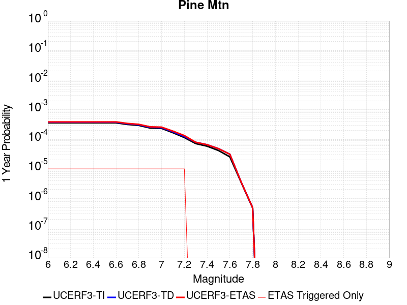 |  |

| Magnitude | 1 wk TI Prob | 1 wk TD Prob | 1 wk ETAS Prob | 1 wk ETAS/TD Gain | 1 wk ETAS Triggered Only | 1 mo TI Prob | 1 mo TD Prob | 1 mo ETAS Prob | 1 mo ETAS/TD Gain | 1 mo ETAS Triggered Only | 1 yr TI Prob | 1 yr TD Prob | 1 yr ETAS Prob | 1 yr ETAS/TD Gain | 1 yr ETAS Triggered Only | 10 yr TI Prob | 10 yr TD Prob | 10 yr ETAS Prob | 10 yr ETAS/TD Gain | 10 yr ETAS Triggered Only |
|-----|-----|-----|-----|-----|-----|-----|-----|-----|-----|-----|-----|-----|-----|-----|-----|-----|-----|-----|-----|-----|
| 6.0 | 6.894797E-6 | 7.2254406E-6 | 7.2254406E-6 | 1.0 | 0.0 | 2.9548795E-5 | 3.0965824E-5 | 3.0965824E-5 | 1.0 | 0.0 | 3.596972E-4 | 3.7694667E-4 | 3.8915416E-4 | 1.0323852 | 1.22121E-5 | 0.0035911554 | 0.0037633702 | 0.0037755365 | 1.0032328 | 1.22121E-5 |
| 6.1 | 6.894797E-6 | 7.2254406E-6 | 7.2254406E-6 | 1.0 | 0.0 | 2.9548795E-5 | 3.0965824E-5 | 3.0965824E-5 | 1.0 | 0.0 | 3.596972E-4 | 3.7694667E-4 | 3.8915416E-4 | 1.0323852 | 1.22121E-5 | 0.0035911554 | 0.0037633702 | 0.0037755365 | 1.0032328 | 1.22121E-5 |
| 6.2 | 6.894797E-6 | 7.2254406E-6 | 7.2254406E-6 | 1.0 | 0.0 | 2.9548795E-5 | 3.0965824E-5 | 3.0965824E-5 | 1.0 | 0.0 | 3.596972E-4 | 3.7694667E-4 | 3.8915416E-4 | 1.0323852 | 1.22121E-5 | 0.0035911554 | 0.0037633702 | 0.0037755365 | 1.0032328 | 1.22121E-5 |
| 6.3 | 6.894797E-6 | 7.2254406E-6 | 7.2254406E-6 | 1.0 | 0.0 | 2.9548795E-5 | 3.0965824E-5 | 3.0965824E-5 | 1.0 | 0.0 | 3.596972E-4 | 3.7694667E-4 | 3.8915416E-4 | 1.0323852 | 1.22121E-5 | 0.0035911554 | 0.0037633702 | 0.0037755365 | 1.0032328 | 1.22121E-5 |
| 6.4 | 6.894797E-6 | 7.2254406E-6 | 7.2254406E-6 | 1.0 | 0.0 | 2.9548795E-5 | 3.0965824E-5 | 3.0965824E-5 | 1.0 | 0.0 | 3.596972E-4 | 3.7694667E-4 | 3.8915416E-4 | 1.0323852 | 1.22121E-5 | 0.0035911554 | 0.0037633702 | 0.0037755365 | 1.0032328 | 1.22121E-5 |
| 6.5 | 6.894797E-6 | 7.2254406E-6 | 7.2254406E-6 | 1.0 | 0.0 | 2.9548795E-5 | 3.0965824E-5 | 3.0965824E-5 | 1.0 | 0.0 | 3.596972E-4 | 3.7694667E-4 | 3.8915416E-4 | 1.0323852 | 1.22121E-5 | 0.0035911554 | 0.0037633702 | 0.0037755365 | 1.0032328 | 1.22121E-5 |
| 6.6 | 6.894797E-6 | 7.2254406E-6 | 7.2254406E-6 | 1.0 | 0.0 | 2.9548795E-5 | 3.0965824E-5 | 3.0965824E-5 | 1.0 | 0.0 | 3.596972E-4 | 3.7694667E-4 | 3.8915416E-4 | 1.0323852 | 1.22121E-5 | 0.0035911554 | 0.0037633702 | 0.0037755365 | 1.0032328 | 1.22121E-5 |
| 6.7 | 6.0867933E-6 | 6.3970933E-6 | 6.3970933E-6 | 1.0 | 0.0 | 2.6085996E-5 | 2.7415837E-5 | 2.7415837E-5 | 1.0 | 0.0 | 3.1755073E-4 | 3.337389E-4 | 3.4594693E-4 | 1.0365796 | 1.22121E-5 | 0.0031709734 | 0.003332596 | 0.0033447675 | 1.0036522 | 1.22121E-5 |
| 6.8 | 5.6530425E-6 | 5.950576E-6 | 5.950576E-6 | 1.0 | 0.0 | 2.42271E-5 | 2.550223E-5 | 2.550223E-5 | 1.0 | 0.0 | 2.94925E-4 | 3.1044747E-4 | 3.2265577E-4 | 1.0393249 | 1.22121E-5 | 0.002945339 | 0.0031003426 | 0.0031125168 | 1.0039268 | 1.22121E-5 |
| 6.9 | 4.6015225E-6 | 4.8638153E-6 | 4.8638153E-6 | 1.0 | 0.0 | 1.9720663E-5 | 2.0844764E-5 | 2.0844764E-5 | 1.0 | 0.0 | 2.4007261E-4 | 2.537569E-4 | 2.659659E-4 | 1.048113 | 1.22121E-5 | 0.0023981342 | 0.0025348158 | 0.0025469968 | 1.0048056 | 1.22121E-5 |
| 7.0 | 4.4875965E-6 | 4.7474546E-6 | 4.7474546E-6 | 1.0 | 0.0 | 1.9232413E-5 | 2.0346082E-5 | 2.0346082E-5 | 1.0 | 0.0 | 2.3412947E-4 | 2.4768684E-4 | 2.5989593E-4 | 1.0492923 | 1.22121E-5 | 0.0023388295 | 0.0024742517 | 0.0024864336 | 1.0049235 | 1.22121E-5 |
| 7.1 | 3.203907E-6 | 3.4293919E-6 | 3.4293919E-6 | 1.0 | 0.0 | 1.3730958E-5 | 1.4697314E-5 | 1.4697314E-5 | 1.0 | 0.0 | 1.6716159E-4 | 1.7892578E-4 | 1.911357E-4 | 1.0682402 | 1.22121E-5 | 0.0016703589 | 0.0017878833 | 0.0018000737 | 1.0068183 | 1.22121E-5 |
| 7.2 | 2.2060601E-6 | 2.3784671E-6 | 2.3784671E-6 | 1.0 | 0.0 | 9.4545085E-6 | 1.0193393E-5 | 1.0193393E-5 | 1.0 | 0.0 | 1.15102564E-4 | 1.2409795E-4 | 1.3630853E-4 | 1.0983948 | 1.22121E-5 | 0.0011504296 | 0.0012403313 | 0.0012525283 | 1.0098336 | 1.22121E-5 |
| 7.3 | 1.3765207E-6 | 1.5216351E-6 | 1.5216351E-6 | 1.0 | 0.0 | 5.899361E-6 | 6.521277E-6 | 6.521277E-6 | 1.0 | 0.0 | 7.182235E-5 | 7.939375E-5 | 7.939375E-5 | 1.0 | 0.0 | 7.1799144E-4 | 7.9366297E-4 | 7.9366297E-4 | 1.0 | 0.0 |
| 7.4 | 1.1245983E-6 | 1.2586958E-6 | 1.2586958E-6 | 1.0 | 0.0 | 4.819698E-6 | 5.3944E-6 | 5.3944E-6 | 1.0 | 0.0 | 5.8678244E-5 | 6.5674925E-5 | 6.5674925E-5 | 1.0 | 0.0 | 5.866275E-4 | 6.5656344E-4 | 6.5656344E-4 | 1.0 | 0.0 |
| 7.5 | 8.031682E-7 | 9.276842E-7 | 9.276842E-7 | 1.0 | 0.0 | 3.4421448E-6 | 3.975784E-6 | 3.975784E-6 | 1.0 | 0.0 | 4.1907308E-5 | 4.840416E-5 | 4.840416E-5 | 1.0 | 0.0 | 4.1899405E-4 | 4.8394292E-4 | 4.8394292E-4 | 1.0 | 0.0 |
| 7.6 | 4.8953444E-7 | 6.0029123E-7 | 6.0029123E-7 | 1.0 | 0.0 | 2.098003E-6 | 2.5726742E-6 | 2.5726742E-6 | 1.0 | 0.0 | 2.5542888E-5 | 3.132191E-5 | 3.132191E-5 | 1.0 | 0.0 | 2.5539953E-4 | 3.131798E-4 | 3.131798E-4 | 1.0 | 0.0 |
| 7.7 | 6.634529E-8 | 6.7888216E-8 | 6.7888216E-8 | 1.0 | 0.0 | 2.843369E-7 | 2.9094946E-7 | 2.9094946E-7 | 1.0 | 0.0 | 3.4617963E-6 | 3.5423045E-6 | 3.5423045E-6 | 1.0 | 0.0 | 3.4617424E-5 | 3.5422527E-5 | 3.5422527E-5 | 1.0 | 0.0 |
| 7.8 | 9.235578E-9 | 9.488559E-9 | 9.488559E-9 | 1.0 | 0.0 | 3.9581046E-8 | 4.0665252E-8 | 4.0665252E-8 | 1.0 | 0.0 | 4.818991E-7 | 4.9509936E-7 | 4.9509936E-7 | 1.0 | 0.0 | 4.8189804E-6 | 4.950984E-6 | 4.950984E-6 | 1.0 | 0.0 |

## Palos Verdes
*[(top)](#table-of-contents)*

| 1 Week | 1 Month | 1 Year | 10 Year |
|-----|-----|-----|-----|
| 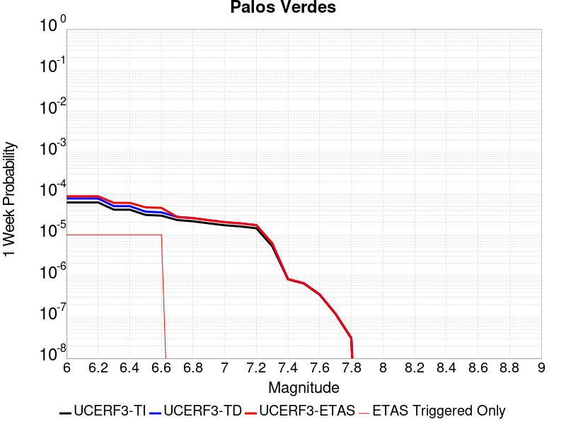 | 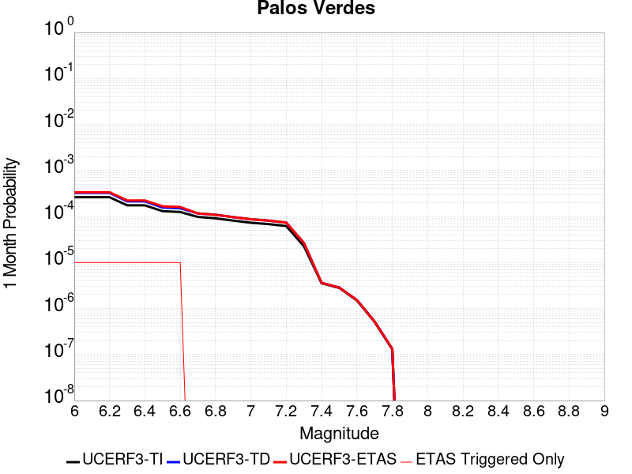 | 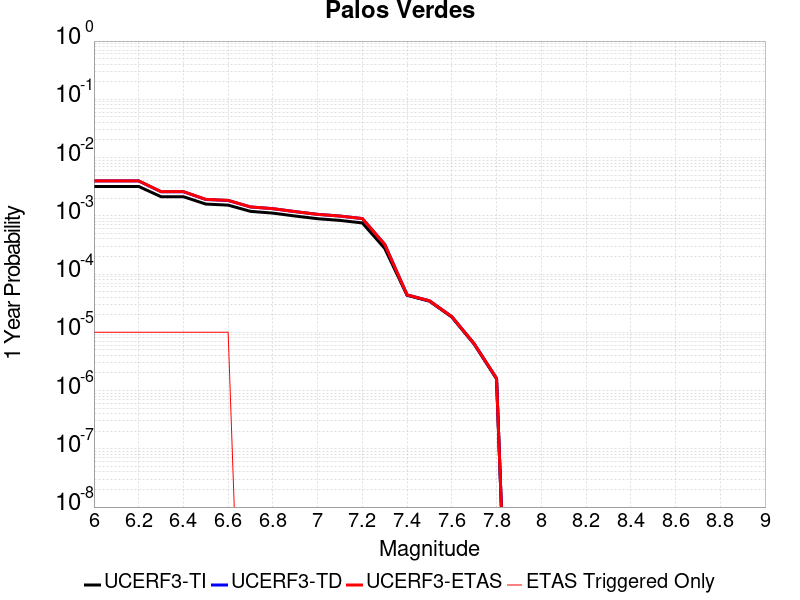 |  |

| Magnitude | 1 wk TI Prob | 1 wk TD Prob | 1 wk ETAS Prob | 1 wk ETAS/TD Gain | 1 wk ETAS Triggered Only | 1 mo TI Prob | 1 mo TD Prob | 1 mo ETAS Prob | 1 mo ETAS/TD Gain | 1 mo ETAS Triggered Only | 1 yr TI Prob | 1 yr TD Prob | 1 yr ETAS Prob | 1 yr ETAS/TD Gain | 1 yr ETAS Triggered Only | 10 yr TI Prob | 10 yr TD Prob | 10 yr ETAS Prob | 10 yr ETAS/TD Gain | 10 yr ETAS Triggered Only |
|-----|-----|-----|-----|-----|-----|-----|-----|-----|-----|-----|-----|-----|-----|-----|-----|-----|-----|-----|-----|-----|
| 6.0 | 6.126063E-5 | 7.622562E-5 | 8.8436784E-5 | 1.1601977 | 1.22121E-5 | 2.6251914E-4 | 3.2664367E-4 | 3.3885177E-4 | 1.0373744 | 1.22121E-5 | 0.0031914865 | 0.003970149 | 0.0039823125 | 1.0030638 | 1.22121E-5 | 0.031460393 | 0.03904865 | 0.039060384 | 1.0003005 | 1.22121E-5 |
| 6.1 | 6.126063E-5 | 7.622562E-5 | 8.8436784E-5 | 1.1601977 | 1.22121E-5 | 2.6251914E-4 | 3.2664367E-4 | 3.3885177E-4 | 1.0373744 | 1.22121E-5 | 0.0031914865 | 0.003970149 | 0.0039823125 | 1.0030638 | 1.22121E-5 | 0.031460393 | 0.03904865 | 0.039060384 | 1.0003005 | 1.22121E-5 |
| 6.2 | 6.126063E-5 | 7.622562E-5 | 8.8436784E-5 | 1.1601977 | 1.22121E-5 | 2.6251914E-4 | 3.2664367E-4 | 3.3885177E-4 | 1.0373744 | 1.22121E-5 | 0.0031914865 | 0.003970149 | 0.0039823125 | 1.0030638 | 1.22121E-5 | 0.031460393 | 0.03904865 | 0.039060384 | 1.0003005 | 1.22121E-5 |
| 6.3 | 4.0838047E-5 | 4.9749142E-5 | 6.1960636E-5 | 1.2454613 | 1.22121E-5 | 1.7500846E-4 | 2.1319446E-4 | 2.2540396E-4 | 1.0572693 | 1.22121E-5 | 0.0021286458 | 0.0025927671 | 0.0026049474 | 1.0046978 | 1.22121E-5 | 0.021083709 | 0.025646534 | 0.025658432 | 1.000464 | 1.22121E-5 |
| 6.4 | 4.0838047E-5 | 4.9749142E-5 | 6.1960636E-5 | 1.2454613 | 1.22121E-5 | 1.7500846E-4 | 2.1319446E-4 | 2.2540396E-4 | 1.0572693 | 1.22121E-5 | 0.0021286458 | 0.0025927671 | 0.0026049474 | 1.0046978 | 1.22121E-5 | 0.021083709 | 0.025646534 | 0.025658432 | 1.000464 | 1.22121E-5 |
| 6.5 | 3.0512005E-5 | 3.656143E-5 | 4.877308E-5 | 1.3340037 | 1.22121E-5 | 1.3075917E-4 | 1.5668309E-4 | 1.6889328E-4 | 1.0779291 | 1.22121E-5 | 0.0015908304 | 0.0019060666 | 0.0019182554 | 1.0063947 | 1.22121E-5 | 0.015794903 | 0.018909054 | 0.018921034 | 1.0006336 | 1.22121E-5 |
| 6.6 | 2.9255087E-5 | 3.515423E-5 | 4.73659E-5 | 1.3473742 | 1.22121E-5 | 1.2537291E-4 | 1.5065294E-4 | 1.628632E-4 | 1.081049 | 1.22121E-5 | 0.0015253464 | 0.001832773 | 0.0018449626 | 1.0066509 | 1.22121E-5 | 0.015149189 | 0.018188128 | 0.018200118 | 1.0006592 | 1.22121E-5 |
| 6.7 | 2.287198E-5 | 2.7248137E-5 | 2.7248137E-5 | 1.0 | 0.0 | 9.801909E-5 | 1.1677302E-4 | 1.1677302E-4 | 1.0 | 0.0 | 0.001192729 | 0.001420876 | 0.001420876 | 1.0 | 0.0 | 0.011863477 | 0.014127145 | 0.014127145 | 1.0 | 0.0 |
| 6.8 | 2.1325764E-5 | 2.5431746E-5 | 2.5431746E-5 | 1.0 | 0.0 | 9.139293E-5 | 1.0898915E-4 | 1.0898915E-4 | 1.0 | 0.0 | 0.001112141 | 0.0013262255 | 0.0013262255 | 1.0 | 0.0 | 0.011065915 | 0.013192143 | 0.013192143 | 1.0 | 0.0 |
| 6.9 | 1.9009392E-5 | 2.2613433E-5 | 2.2613433E-5 | 1.0 | 0.0 | 8.1466285E-5 | 9.69116E-5 | 9.69116E-5 | 1.0 | 0.0 | 9.914007E-4 | 0.0011793474 | 0.0011793474 | 1.0 | 0.0 | 0.009869894 | 0.0117395725 | 0.0117395725 | 1.0 | 0.0 |
| 7.0 | 1.7098473E-5 | 2.0319252E-5 | 2.0319252E-5 | 1.0 | 0.0 | 7.3277115E-5 | 8.708009E-5 | 8.708009E-5 | 1.0 | 0.0 | 8.917837E-4 | 0.0010597695 | 0.0010597695 | 1.0 | 0.0 | 0.008882134 | 0.010555593 | 0.010555593 | 1.0 | 0.0 |
| 7.1 | 1.5982785E-5 | 1.8994664E-5 | 1.8994664E-5 | 1.0 | 0.0 | 6.849585E-5 | 8.140364E-5 | 8.140364E-5 | 1.0 | 0.0 | 8.336179E-4 | 9.907234E-4 | 9.907234E-4 | 1.0 | 0.0 | 0.008304977 | 0.00987143 | 0.00987143 | 1.0 | 0.0 |
| 7.2 | 1.4468002E-5 | 1.719715E-5 | 1.719715E-5 | 1.0 | 0.0 | 6.200425E-5 | 7.370046E-5 | 7.370046E-5 | 1.0 | 0.0 | 7.546402E-4 | 8.9701766E-4 | 8.9701766E-4 | 1.0 | 0.0 | 0.007520827 | 0.008942238 | 0.008942238 | 1.0 | 0.0 |
| 7.3 | 5.288233E-6 | 6.203645E-6 | 6.203645E-6 | 1.0 | 0.0 | 2.2663658E-5 | 2.6586977E-5 | 2.6586977E-5 | 1.0 | 0.0 | 2.7589512E-4 | 3.2368326E-4 | 3.2368326E-4 | 1.0 | 0.0 | 0.0027555283 | 0.0032355408 | 0.0032355408 | 1.0 | 0.0 |
| 7.4 | 8.279556E-7 | 8.4083433E-7 | 8.4083433E-7 | 1.0 | 0.0 | 3.5483763E-6 | 3.603571E-6 | 3.603571E-6 | 1.0 | 0.0 | 4.3200624E-5 | 4.3872667E-5 | 4.3872667E-5 | 1.0 | 0.0 | 4.3192226E-4 | 4.386473E-4 | 4.386473E-4 | 1.0 | 0.0 |
| 7.5 | 6.559831E-7 | 6.667226E-7 | 6.667226E-7 | 1.0 | 0.0 | 2.8113532E-6 | 2.8573797E-6 | 2.8573797E-6 | 1.0 | 0.0 | 3.4227687E-5 | 3.478811E-5 | 3.478811E-5 | 1.0 | 0.0 | 3.4222414E-4 | 3.478333E-4 | 3.478333E-4 | 1.0 | 0.0 |
| 7.6 | 3.5018968E-7 | 3.5620013E-7 | 3.5620013E-7 | 1.0 | 0.0 | 1.500812E-6 | 1.5265713E-6 | 1.5265713E-6 | 1.0 | 0.0 | 1.8272232E-5 | 1.8585893E-5 | 1.8585893E-5 | 1.0 | 0.0 | 1.8270731E-4 | 1.85848E-4 | 1.85848E-4 | 1.0 | 0.0 |
| 7.7 | 1.1986104E-7 | 1.219837E-7 | 1.219837E-7 | 1.0 | 0.0 | 5.1369005E-7 | 5.227872E-7 | 5.227872E-7 | 1.0 | 0.0 | 6.2541585E-6 | 6.3649163E-6 | 6.3649163E-6 | 1.0 | 0.0 | 6.2539824E-5 | 6.364738E-5 | 6.364738E-5 | 1.0 | 0.0 |
| 7.8 | 3.0445005E-8 | 3.1027568E-8 | 3.1027568E-8 | 1.0 | 0.0 | 1.3047858E-7 | 1.3297529E-7 | 1.3297529E-7 | 1.0 | 0.0 | 1.5885756E-6 | 1.6189731E-6 | 1.6189731E-6 | 1.0 | 0.0 | 1.5885644E-5 | 1.6189633E-5 | 1.6189633E-5 | 1.0 | 0.0 |

## Almanor 2011 CFM
*[(top)](#table-of-contents)*

| 1 Week | 1 Month | 1 Year | 10 Year |
|-----|-----|-----|-----|
|  |  |  |  |

| Magnitude | 1 wk TI Prob | 1 wk TD Prob | 1 wk ETAS Prob | 1 wk ETAS/TD Gain | 1 wk ETAS Triggered Only | 1 mo TI Prob | 1 mo TD Prob | 1 mo ETAS Prob | 1 mo ETAS/TD Gain | 1 mo ETAS Triggered Only | 1 yr TI Prob | 1 yr TD Prob | 1 yr ETAS Prob | 1 yr ETAS/TD Gain | 1 yr ETAS Triggered Only | 10 yr TI Prob | 10 yr TD Prob | 10 yr ETAS Prob | 10 yr ETAS/TD Gain | 10 yr ETAS Triggered Only |
|-----|-----|-----|-----|-----|-----|-----|-----|-----|-----|-----|-----|-----|-----|-----|-----|-----|-----|-----|-----|-----|
| 6.0 | 6.1479834E-5 | 8.32779E-5 | 8.32779E-5 | 1.0 | 0.0 | 2.6345838E-4 | 3.5686235E-4 | 3.5686235E-4 | 1.0 | 0.0 | 0.0032028882 | 0.0043365774 | 0.0043365774 | 1.0 | 0.0 | 0.031571172 | 0.04258541 | 0.0425971 | 1.0002745 | 1.22121E-5 |
| 6.1 | 4.4387216E-5 | 5.9769885E-5 | 5.9769885E-5 | 1.0 | 0.0 | 1.9021705E-4 | 2.561357E-4 | 2.561357E-4 | 1.0 | 0.0 | 0.0023134327 | 0.0031144004 | 0.0031144004 | 1.0 | 0.0 | 0.022894967 | 0.030754777 | 0.030766614 | 1.0003849 | 1.22121E-5 |
| 6.2 | 4.4387216E-5 | 5.9769885E-5 | 5.9769885E-5 | 1.0 | 0.0 | 1.9021705E-4 | 2.561357E-4 | 2.561357E-4 | 1.0 | 0.0 | 0.0023134327 | 0.0031144004 | 0.0031144004 | 1.0 | 0.0 | 0.022894967 | 0.030754777 | 0.030766614 | 1.0003849 | 1.22121E-5 |
| 6.3 | 2.9523822E-5 | 3.9546827E-5 | 3.9546827E-5 | 1.0 | 0.0 | 1.2652454E-4 | 1.6947828E-4 | 1.6947828E-4 | 1.0 | 0.0 | 0.0015393476 | 0.002061856 | 0.002061856 | 1.0 | 0.0 | 0.015287281 | 0.020460624 | 0.020460624 | 1.0 | 0.0 |
| 6.4 | 2.0512744E-5 | 2.7431366E-5 | 2.7431366E-5 | 1.0 | 0.0 | 8.79088E-5 | 1.1756013E-4 | 1.1756013E-4 | 1.0 | 0.0 | 0.001069764 | 0.0014307296 | 0.0014307296 | 1.0 | 0.0 | 0.010646289 | 0.014244295 | 0.014244295 | 1.0 | 0.0 |
| 6.5 | 1.6750226E-5 | 2.2391096E-5 | 2.2391096E-5 | 1.0 | 0.0 | 7.178471E-5 | 9.596065E-5 | 9.596065E-5 | 1.0 | 0.0 | 8.7362836E-4 | 0.0011680545 | 0.0011680545 | 1.0 | 0.0 | 0.008702018 | 0.011648942 | 0.011648942 | 1.0 | 0.0 |
| 6.6 | 1.4745303E-5 | 1.9707772E-5 | 1.9707772E-5 | 1.0 | 0.0 | 6.319262E-5 | 8.4461455E-5 | 8.4461455E-5 | 1.0 | 0.0 | 7.690986E-4 | 0.0010281889 | 0.0010281889 | 1.0 | 0.0 | 0.0076644225 | 0.010264887 | 0.010264887 | 1.0 | 0.0 |
| 6.7 | 9.951145E-7 | 1.1616295E-6 | 1.1616295E-6 | 1.0 | 0.0 | 4.26477E-6 | 4.9784035E-6 | 4.9784035E-6 | 1.0 | 0.0 | 5.1922336E-5 | 6.0610553E-5 | 6.0610553E-5 | 1.0 | 0.0 | 5.1910203E-4 | 6.0595747E-4 | 6.0595747E-4 | 1.0 | 0.0 |
| 6.8 | 5.866312E-7 | 6.8493534E-7 | 6.8493534E-7 | 1.0 | 0.0 | 2.5141312E-6 | 2.9354346E-6 | 2.9354346E-6 | 1.0 | 0.0 | 3.0609117E-5 | 3.5738463E-5 | 3.5738463E-5 | 1.0 | 0.0 | 3.06049E-4 | 3.5733997E-4 | 3.5733997E-4 | 1.0 | 0.0 |

## San Gorgonio Pass
*[(top)](#table-of-contents)*

| 1 Week | 1 Month | 1 Year | 10 Year |
|-----|-----|-----|-----|
|  |  |  |  |

| Magnitude | 1 wk TI Prob | 1 wk TD Prob | 1 wk ETAS Prob | 1 wk ETAS/TD Gain | 1 wk ETAS Triggered Only | 1 mo TI Prob | 1 mo TD Prob | 1 mo ETAS Prob | 1 mo ETAS/TD Gain | 1 mo ETAS Triggered Only | 1 yr TI Prob | 1 yr TD Prob | 1 yr ETAS Prob | 1 yr ETAS/TD Gain | 1 yr ETAS Triggered Only | 10 yr TI Prob | 10 yr TD Prob | 10 yr ETAS Prob | 10 yr ETAS/TD Gain | 10 yr ETAS Triggered Only |
|-----|-----|-----|-----|-----|-----|-----|-----|-----|-----|-----|-----|-----|-----|-----|-----|-----|-----|-----|-----|-----|
| 6.0 | 7.644328E-6 | 1.33138155E-5 | 2.5525753E-5 | 1.917238 | 1.22121E-5 | 3.2760996E-5 | 5.7058012E-5 | 6.9269416E-5 | 1.2140173 | 1.22121E-5 | 3.987921E-4 | 6.9446844E-4 | 7.066721E-4 | 1.0175726 | 1.22121E-5 | 0.003980772 | 0.006929767 | 0.006941894 | 1.0017501 | 1.22121E-5 |
| 6.1 | 7.644328E-6 | 1.33138155E-5 | 2.5525753E-5 | 1.917238 | 1.22121E-5 | 3.2760996E-5 | 5.7058012E-5 | 6.9269416E-5 | 1.2140173 | 1.22121E-5 | 3.987921E-4 | 6.9446844E-4 | 7.066721E-4 | 1.0175726 | 1.22121E-5 | 0.003980772 | 0.006929767 | 0.006941894 | 1.0017501 | 1.22121E-5 |
| 6.2 | 7.644328E-6 | 1.33138155E-5 | 2.5525753E-5 | 1.917238 | 1.22121E-5 | 3.2760996E-5 | 5.7058012E-5 | 6.9269416E-5 | 1.2140173 | 1.22121E-5 | 3.987921E-4 | 6.9446844E-4 | 7.066721E-4 | 1.0175726 | 1.22121E-5 | 0.003980772 | 0.006929767 | 0.006941894 | 1.0017501 | 1.22121E-5 |
| 6.3 | 7.644328E-6 | 1.33138155E-5 | 2.5525753E-5 | 1.917238 | 1.22121E-5 | 3.2760996E-5 | 5.7058012E-5 | 6.9269416E-5 | 1.2140173 | 1.22121E-5 | 3.987921E-4 | 6.9446844E-4 | 7.066721E-4 | 1.0175726 | 1.22121E-5 | 0.003980772 | 0.006929767 | 0.006941894 | 1.0017501 | 1.22121E-5 |
| 6.4 | 7.644328E-6 | 1.33138155E-5 | 2.5525753E-5 | 1.917238 | 1.22121E-5 | 3.2760996E-5 | 5.7058012E-5 | 6.9269416E-5 | 1.2140173 | 1.22121E-5 | 3.987921E-4 | 6.9446844E-4 | 7.066721E-4 | 1.0175726 | 1.22121E-5 | 0.003980772 | 0.006929767 | 0.006941894 | 1.0017501 | 1.22121E-5 |
| 6.5 | 7.644328E-6 | 1.33138155E-5 | 2.5525753E-5 | 1.917238 | 1.22121E-5 | 3.2760996E-5 | 5.7058012E-5 | 6.9269416E-5 | 1.2140173 | 1.22121E-5 | 3.987921E-4 | 6.9446844E-4 | 7.066721E-4 | 1.0175726 | 1.22121E-5 | 0.003980772 | 0.006929767 | 0.006941894 | 1.0017501 | 1.22121E-5 |
| 6.6 | 7.644328E-6 | 1.33138155E-5 | 2.5525753E-5 | 1.917238 | 1.22121E-5 | 3.2760996E-5 | 5.7058012E-5 | 6.9269416E-5 | 1.2140173 | 1.22121E-5 | 3.987921E-4 | 6.9446844E-4 | 7.066721E-4 | 1.0175726 | 1.22121E-5 | 0.003980772 | 0.006929767 | 0.006941894 | 1.0017501 | 1.22121E-5 |
| 6.7 | 6.987586E-6 | 1.2618091E-5 | 2.4830037E-5 | 1.9678124 | 1.22121E-5 | 2.9946454E-5 | 5.407646E-5 | 6.6287896E-5 | 1.225818 | 1.22121E-5 | 3.645371E-4 | 6.581901E-4 | 6.7039416E-4 | 1.0185418 | 1.22121E-5 | 0.0036393967 | 0.0065691434 | 0.0065812753 | 1.0018468 | 1.22121E-5 |
| 6.8 | 6.987586E-6 | 1.2618091E-5 | 2.4830037E-5 | 1.9678124 | 1.22121E-5 | 2.9946454E-5 | 5.407646E-5 | 6.6287896E-5 | 1.225818 | 1.22121E-5 | 3.645371E-4 | 6.581901E-4 | 6.7039416E-4 | 1.0185418 | 1.22121E-5 | 0.0036393967 | 0.0065691434 | 0.0065812753 | 1.0018468 | 1.22121E-5 |
| 6.9 | 5.504702E-6 | 1.1048957E-5 | 1.1048957E-5 | 1.0 | 0.0 | 2.3591367E-5 | 4.735184E-5 | 4.735184E-5 | 1.0 | 0.0 | 2.8718702E-4 | 5.7636126E-4 | 5.7636126E-4 | 1.0 | 0.0 | 0.0028681618 | 0.0057550967 | 0.0057550967 | 1.0 | 0.0 |
| 7.0 | 5.4825764E-6 | 1.1025298E-5 | 1.1025298E-5 | 1.0 | 0.0 | 2.3496545E-5 | 4.725045E-5 | 4.725045E-5 | 1.0 | 0.0 | 2.8603288E-4 | 5.7512743E-4 | 5.7512743E-4 | 1.0 | 0.0 | 0.00285665 | 0.005742823 | 0.005742823 | 1.0 | 0.0 |
| 7.1 | 5.4692787E-6 | 1.1011008E-5 | 1.1011008E-5 | 1.0 | 0.0 | 2.3439556E-5 | 4.718921E-5 | 4.718921E-5 | 1.0 | 0.0 | 2.8533922E-4 | 5.743822E-4 | 5.743822E-4 | 1.0 | 0.0 | 0.0028497311 | 0.005735409 | 0.005735409 | 1.0 | 0.0 |
| 7.2 | 5.453661E-6 | 1.0994035E-5 | 1.0994035E-5 | 1.0 | 0.0 | 2.3372622E-5 | 4.7116468E-5 | 4.7116468E-5 | 1.0 | 0.0 | 2.8452452E-4 | 5.734971E-4 | 5.734971E-4 | 1.0 | 0.0 | 0.002841605 | 0.0057266033 | 0.0057266033 | 1.0 | 0.0 |
| 7.3 | 5.4422303E-6 | 1.0980958E-5 | 1.0980958E-5 | 1.0 | 0.0 | 2.3323635E-5 | 4.706043E-5 | 4.706043E-5 | 1.0 | 0.0 | 2.8392827E-4 | 5.7281513E-4 | 5.7281513E-4 | 1.0 | 0.0 | 0.0028356577 | 0.0057198186 | 0.0057198186 | 1.0 | 0.0 |
| 7.4 | 5.398595E-6 | 1.0928323E-5 | 1.0928323E-5 | 1.0 | 0.0 | 2.313663E-5 | 4.6834855E-5 | 4.6834855E-5 | 1.0 | 0.0 | 2.8165206E-4 | 5.7007023E-4 | 5.7007023E-4 | 1.0 | 0.0 | 0.0028129534 | 0.0056925113 | 0.0056925113 | 1.0 | 0.0 |
| 7.5 | 5.3578788E-6 | 1.085487E-5 | 1.085487E-5 | 1.0 | 0.0 | 2.2962136E-5 | 4.6520072E-5 | 4.6520072E-5 | 1.0 | 0.0 | 2.7952815E-4 | 5.6623976E-4 | 5.6623976E-4 | 1.0 | 0.0 | 0.002791768 | 0.005654426 | 0.005654426 | 1.0 | 0.0 |
| 7.6 | 4.8091474E-6 | 9.603292E-6 | 9.603292E-6 | 1.0 | 0.0 | 2.0610469E-5 | 4.1156345E-5 | 4.1156345E-5 | 1.0 | 0.0 | 2.5090357E-4 | 5.0096813E-4 | 5.0096813E-4 | 1.0 | 0.0 | 0.0025062046 | 0.005005103 | 0.005005103 | 1.0 | 0.0 |
| 7.7 | 1.5991155E-6 | 3.3526564E-6 | 3.3526564E-6 | 1.0 | 0.0 | 6.853334E-6 | 1.436845E-5 | 1.436845E-5 | 1.0 | 0.0 | 8.343615E-5 | 1.749221E-4 | 1.749221E-4 | 1.0 | 0.0 | 8.340483E-4 | 0.0017532986 | 0.0017532986 | 1.0 | 0.0 |
| 7.8 | 9.258398E-7 | 2.0578384E-6 | 2.0578384E-6 | 1.0 | 0.0 | 3.967879E-6 | 8.819278E-6 | 8.819278E-6 | 1.0 | 0.0 | 4.8307855E-5 | 1.0736944E-4 | 1.0736944E-4 | 1.0 | 0.0 | 4.8297356E-4 | 0.0010786061 | 0.0010786061 | 1.0 | 0.0 |
| 7.9 | 5.975575E-7 | 1.2290661E-6 | 1.2290661E-6 | 1.0 | 0.0 | 2.5609581E-6 | 5.267416E-6 | 5.267416E-6 | 1.0 | 0.0 | 3.117922E-5 | 6.412891E-5 | 6.412891E-5 | 1.0 | 0.0 | 3.1174847E-4 | 6.462507E-4 | 6.462507E-4 | 1.0 | 0.0 |
| 8.0 | 3.4413725E-7 | 6.7141735E-7 | 6.7141735E-7 | 1.0 | 0.0 | 1.4748731E-6 | 2.8774998E-6 | 2.8774998E-6 | 1.0 | 0.0 | 1.7956432E-5 | 3.5033E-5 | 3.5033E-5 | 1.0 | 0.0 | 1.7954981E-4 | 3.5370397E-4 | 3.5370397E-4 | 1.0 | 0.0 |
| 8.1 | 1.1787731E-8 | 9.632651E-9 | 9.632651E-9 | 1.0 | 0.0 | 5.0518846E-8 | 4.128279E-8 | 4.128279E-8 | 1.0 | 0.0 | 6.1506677E-7 | 5.026178E-7 | 5.026178E-7 | 1.0 | 0.0 | 6.1506507E-6 | 5.2415717E-6 | 5.2415717E-6 | 1.0 | 0.0 |

## Baker
*[(top)](#table-of-contents)*

| 1 Week | 1 Month | 1 Year | 10 Year |
|-----|-----|-----|-----|
|  | 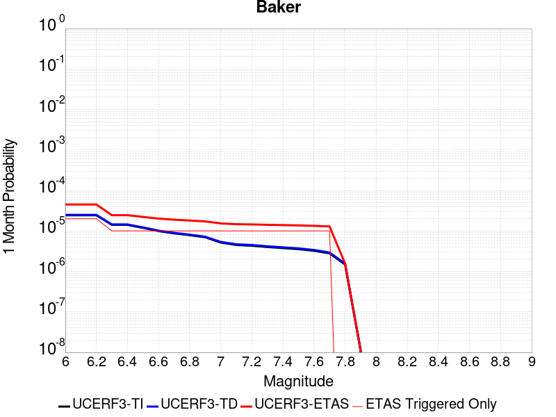 | 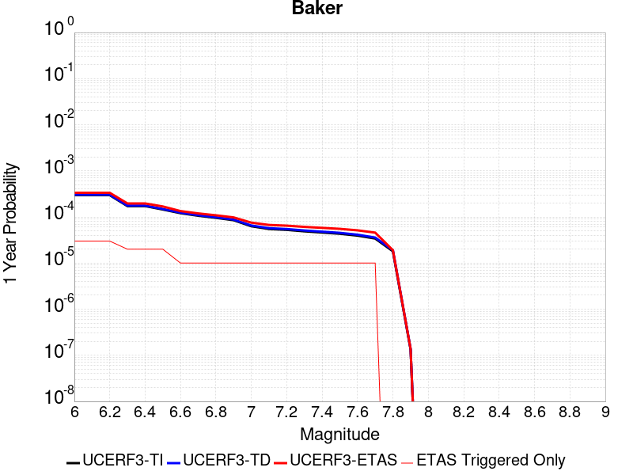 |  |

| Magnitude | 1 wk TI Prob | 1 wk TD Prob | 1 wk ETAS Prob | 1 wk ETAS/TD Gain | 1 wk ETAS Triggered Only | 1 mo TI Prob | 1 mo TD Prob | 1 mo ETAS Prob | 1 mo ETAS/TD Gain | 1 mo ETAS Triggered Only | 1 yr TI Prob | 1 yr TD Prob | 1 yr ETAS Prob | 1 yr ETAS/TD Gain | 1 yr ETAS Triggered Only | 10 yr TI Prob | 10 yr TD Prob | 10 yr ETAS Prob | 10 yr ETAS/TD Gain | 10 yr ETAS Triggered Only |
|-----|-----|-----|-----|-----|-----|-----|-----|-----|-----|-----|-----|-----|-----|-----|-----|-----|-----|-----|-----|-----|
| 6.0 | 5.695525E-6 | 5.8348332E-6 | 5.8348332E-6 | 1.0 | 0.0 | 2.4409164E-5 | 2.5006211E-5 | 3.7218007E-5 | 1.4883504 | 1.22121E-5 | 2.9714106E-4 | 3.044121E-4 | 3.1662048E-4 | 1.0401047 | 1.22121E-5 | 0.0029674405 | 0.0030403468 | 0.0030525217 | 1.0040045 | 1.22121E-5 |
| 6.1 | 5.695525E-6 | 5.8348332E-6 | 5.8348332E-6 | 1.0 | 0.0 | 2.4409164E-5 | 2.5006211E-5 | 3.7218007E-5 | 1.4883504 | 1.22121E-5 | 2.9714106E-4 | 3.044121E-4 | 3.1662048E-4 | 1.0401047 | 1.22121E-5 | 0.0029674405 | 0.0030403468 | 0.0030525217 | 1.0040045 | 1.22121E-5 |
| 6.2 | 5.695525E-6 | 5.8348332E-6 | 5.8348332E-6 | 1.0 | 0.0 | 2.4409164E-5 | 2.5006211E-5 | 3.7218007E-5 | 1.4883504 | 1.22121E-5 | 2.9714106E-4 | 3.044121E-4 | 3.1662048E-4 | 1.0401047 | 1.22121E-5 | 0.0029674405 | 0.0030403468 | 0.0030525217 | 1.0040045 | 1.22121E-5 |
| 6.3 | 3.2995713E-6 | 3.3836648E-6 | 3.3836648E-6 | 1.0 | 0.0 | 1.4140943E-5 | 1.4501343E-5 | 2.6713265E-5 | 1.8421236 | 1.22121E-5 | 1.7215237E-4 | 1.7654001E-4 | 1.8874995E-4 | 1.0691625 | 1.22121E-5 | 0.0017201907 | 0.0017640449 | 0.0017762354 | 1.0069106 | 1.22121E-5 |
| 6.4 | 3.2995713E-6 | 3.3836648E-6 | 3.3836648E-6 | 1.0 | 0.0 | 1.4140943E-5 | 1.4501343E-5 | 2.6713265E-5 | 1.8421236 | 1.22121E-5 | 1.7215237E-4 | 1.7654001E-4 | 1.8874995E-4 | 1.0691625 | 1.22121E-5 | 0.0017201907 | 0.0017640449 | 0.0017762354 | 1.0069106 | 1.22121E-5 |
| 6.5 | 2.782202E-6 | 2.8558384E-6 | 2.8558384E-6 | 1.0 | 0.0 | 1.1923668E-5 | 1.2239252E-5 | 2.4451203E-5 | 1.9977694 | 1.22121E-5 | 1.4516099E-4 | 1.4900303E-4 | 1.612133E-4 | 1.0819465 | 1.22121E-5 | 0.001450662 | 0.001489064 | 0.0015012579 | 1.008189 | 1.22121E-5 |
| 6.6 | 2.3163404E-6 | 2.3809182E-6 | 2.3809182E-6 | 1.0 | 0.0 | 9.927136E-6 | 1.0203897E-5 | 2.2415872E-5 | 2.1967952 | 1.22121E-5 | 1.20856166E-4 | 1.2422555E-4 | 1.3643614E-4 | 1.0982937 | 1.22121E-5 | 0.0012079047 | 0.0012415814 | 0.0012537783 | 1.0098237 | 1.22121E-5 |
| 6.7 | 2.037056E-6 | 2.0964987E-6 | 2.0964987E-6 | 1.0 | 0.0 | 8.7302105E-6 | 8.984965E-6 | 2.1196955E-5 | 2.3591583 | 1.22121E-5 | 1.0628513E-4 | 1.09386616E-4 | 1.2159738E-4 | 1.1116294 | 1.22121E-5 | 0.0010623431 | 0.0010933438 | 0.0011055426 | 1.0111573 | 1.22121E-5 |
| 6.8 | 1.8356744E-6 | 1.8915271E-6 | 1.8915271E-6 | 1.0 | 0.0 | 7.867153E-6 | 8.10652E-6 | 2.0318521E-5 | 2.5064418 | 1.22121E-5 | 9.577837E-5 | 9.869256E-5 | 1.1090345E-4 | 1.1237266 | 1.22121E-5 | 9.57371E-4 | 9.865012E-4 | 9.987013E-4 | 1.012367 | 1.22121E-5 |
| 6.9 | 1.6310546E-6 | 1.6832057E-6 | 1.6832057E-6 | 1.0 | 0.0 | 6.9902153E-6 | 7.2137195E-6 | 1.9425732E-5 | 2.6928868 | 1.22121E-5 | 8.510255E-5 | 8.782361E-5 | 1.0003464E-4 | 1.1390404 | 1.22121E-5 | 8.5069967E-4 | 8.779003E-4 | 8.9010166E-4 | 1.0138984 | 1.22121E-5 |
| 7.0 | 1.2058036E-6 | 1.2508652E-6 | 1.2508652E-6 | 1.0 | 0.0 | 5.1677193E-6 | 5.3608405E-6 | 1.7572875E-5 | 3.2780075 | 1.22121E-5 | 6.291517E-5 | 6.52663E-5 | 7.7477605E-5 | 1.1870997 | 1.22121E-5 | 6.289736E-4 | 6.5247365E-4 | 6.6467776E-4 | 1.0187044 | 1.22121E-5 |
| 7.1 | 1.052382E-6 | 1.0951596E-6 | 1.0951596E-6 | 1.0 | 0.0 | 4.5102006E-6 | 4.693533E-6 | 1.6905575E-5 | 3.601887 | 1.22121E-5 | 5.491031E-5 | 5.7142275E-5 | 6.935368E-5 | 1.2137017 | 1.22121E-5 | 5.4896745E-4 | 5.712767E-4 | 5.834818E-4 | 1.0213647 | 1.22121E-5 |
| 7.2 | 1.0067454E-6 | 1.0487698E-6 | 1.0487698E-6 | 1.0 | 0.0 | 4.3146156E-6 | 4.4947205E-6 | 1.6706765E-5 | 3.7169755 | 1.22121E-5 | 5.252918E-5 | 5.4721855E-5 | 6.693329E-5 | 1.2231545 | 1.22121E-5 | 5.251676E-4 | 5.4708467E-4 | 5.592901E-4 | 1.0223099 | 1.22121E-5 |
| 7.3 | 9.3596316E-7 | 9.767712E-7 | 9.767712E-7 | 1.0 | 0.0 | 4.0112645E-6 | 4.1861554E-6 | 1.6398204E-5 | 3.9172468 | 1.22121E-5 | 4.8836053E-5 | 5.096526E-5 | 6.317674E-5 | 1.239604 | 1.22121E-5 | 4.8825322E-4 | 5.095365E-4 | 5.217424E-4 | 1.0239549 | 1.22121E-5 |
| 7.4 | 8.8117395E-7 | 9.207652E-7 | 9.207652E-7 | 1.0 | 0.0 | 3.7764542E-6 | 3.9461306E-6 | 1.6158183E-5 | 4.09469 | 1.22121E-5 | 4.5977362E-5 | 4.804309E-5 | 6.0254602E-5 | 1.2541783 | 1.22121E-5 | 4.596785E-4 | 4.803278E-4 | 4.92534E-4 | 1.0254123 | 1.22121E-5 |
| 7.5 | 8.292386E-7 | 8.674585E-7 | 8.674585E-7 | 1.0 | 0.0 | 3.5538749E-6 | 3.717674E-6 | 1.5929729E-5 | 4.2848644 | 1.22121E-5 | 4.326757E-5 | 4.526175E-5 | 5.7473295E-5 | 1.2697984 | 1.22121E-5 | 4.3259145E-4 | 4.5252603E-4 | 4.647326E-4 | 1.0269743 | 1.22121E-5 |
| 7.6 | 7.553842E-7 | 7.9144604E-7 | 7.9144604E-7 | 1.0 | 0.0 | 3.2373566E-6 | 3.3919073E-6 | 1.5603966E-5 | 4.6003513 | 1.22121E-5 | 3.9414106E-5 | 4.1295694E-5 | 5.350729E-5 | 1.2957112 | 1.22121E-5 | 3.9407116E-4 | 4.128809E-4 | 4.25088E-4 | 1.0295656 | 1.22121E-5 |
| 7.7 | 6.5285366E-7 | 6.8527874E-7 | 6.8527874E-7 | 1.0 | 0.0 | 2.797941E-6 | 2.9369057E-6 | 1.5148969E-5 | 5.1581397 | 1.22121E-5 | 3.40644E-5 | 3.5756246E-5 | 4.796791E-5 | 1.3415253 | 1.22121E-5 | 3.405918E-4 | 3.575056E-4 | 3.6971332E-4 | 1.034147 | 1.22121E-5 |
| 7.8 | 3.4586725E-7 | 3.648256E-7 | 3.648256E-7 | 1.0 | 0.0 | 1.4822873E-6 | 1.5635374E-6 | 1.5635374E-6 | 1.0 | 0.0 | 1.80467E-5 | 1.9035906E-5 | 1.9035906E-5 | 1.0 | 0.0 | 1.8045233E-4 | 1.903432E-4 | 1.903432E-4 | 1.0 | 0.0 |
| 7.9 | 2.5591178E-9 | 2.6696687E-9 | 2.6696687E-9 | 1.0 | 0.0 | 1.0967647E-8 | 1.1441437E-8 | 1.1441437E-8 | 1.0 | 0.0 | 1.335311E-7 | 1.392995E-7 | 1.392995E-7 | 1.0 | 0.0 | 1.3353102E-6 | 1.3929949E-6 | 1.3929949E-6 | 1.0 | 0.0 |

## Ventura-Pitas Point
*[(top)](#table-of-contents)*

| 1 Week | 1 Month | 1 Year | 10 Year |
|-----|-----|-----|-----|
|  | 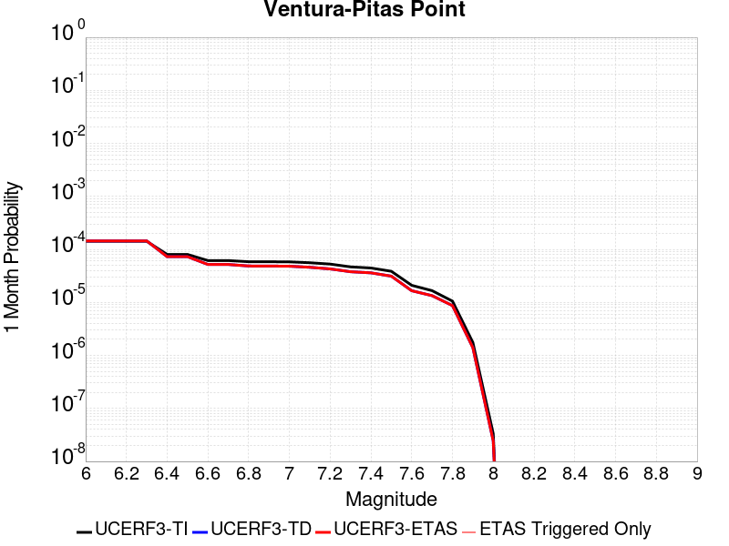 | 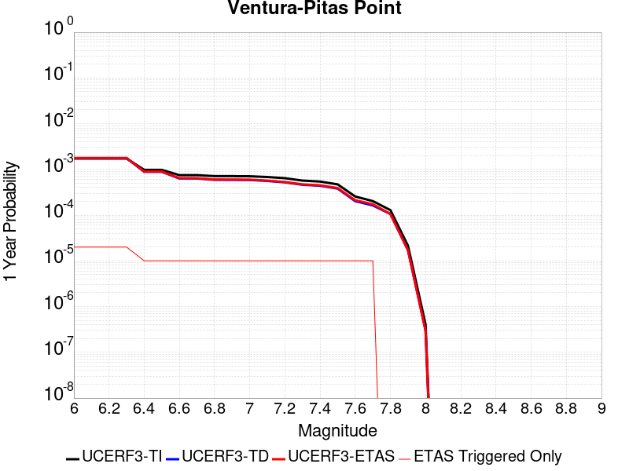 |  |

| Magnitude | 1 wk TI Prob | 1 wk TD Prob | 1 wk ETAS Prob | 1 wk ETAS/TD Gain | 1 wk ETAS Triggered Only | 1 mo TI Prob | 1 mo TD Prob | 1 mo ETAS Prob | 1 mo ETAS/TD Gain | 1 mo ETAS Triggered Only | 1 yr TI Prob | 1 yr TD Prob | 1 yr ETAS Prob | 1 yr ETAS/TD Gain | 1 yr ETAS Triggered Only | 10 yr TI Prob | 10 yr TD Prob | 10 yr ETAS Prob | 10 yr ETAS/TD Gain | 10 yr ETAS Triggered Only |
|-----|-----|-----|-----|-----|-----|-----|-----|-----|-----|-----|-----|-----|-----|-----|-----|-----|-----|-----|-----|-----|
| 6.0 | 3.3179622E-5 | 3.3735058E-5 | 3.3735058E-5 | 1.0 | 0.0 | 1.4219063E-4 | 1.4457226E-4 | 1.4457226E-4 | 1.0 | 0.0 | 0.0017297962 | 0.001759003 | 0.0017711937 | 1.0069305 | 1.22121E-5 | 0.017163932 | 0.017476337 | 0.017488334 | 1.0006865 | 1.22121E-5 |
| 6.1 | 3.3179622E-5 | 3.3735058E-5 | 3.3735058E-5 | 1.0 | 0.0 | 1.4219063E-4 | 1.4457226E-4 | 1.4457226E-4 | 1.0 | 0.0 | 0.0017297962 | 0.001759003 | 0.0017711937 | 1.0069305 | 1.22121E-5 | 0.017163932 | 0.017476337 | 0.017488334 | 1.0006865 | 1.22121E-5 |
| 6.2 | 3.3179622E-5 | 3.3735058E-5 | 3.3735058E-5 | 1.0 | 0.0 | 1.4219063E-4 | 1.4457226E-4 | 1.4457226E-4 | 1.0 | 0.0 | 0.0017297962 | 0.001759003 | 0.0017711937 | 1.0069305 | 1.22121E-5 | 0.017163932 | 0.017476337 | 0.017488334 | 1.0006865 | 1.22121E-5 |
| 6.3 | 3.3179622E-5 | 3.3735058E-5 | 3.3735058E-5 | 1.0 | 0.0 | 1.4219063E-4 | 1.4457226E-4 | 1.4457226E-4 | 1.0 | 0.0 | 0.0017297962 | 0.001759003 | 0.0017711937 | 1.0069305 | 1.22121E-5 | 0.017163932 | 0.017476337 | 0.017488334 | 1.0006865 | 1.22121E-5 |
| 6.4 | 1.8754668E-5 | 1.7019556E-5 | 1.7019556E-5 | 1.0 | 0.0 | 8.037467E-5 | 7.2939045E-5 | 7.2939045E-5 | 1.0 | 0.0 | 9.781223E-4 | 8.876942E-4 | 8.876942E-4 | 1.0 | 0.0 | 0.009738282 | 0.00884382 | 0.00884382 | 1.0 | 0.0 |
| 6.5 | 1.8754668E-5 | 1.7019556E-5 | 1.7019556E-5 | 1.0 | 0.0 | 8.037467E-5 | 7.2939045E-5 | 7.2939045E-5 | 1.0 | 0.0 | 9.781223E-4 | 8.876942E-4 | 8.876942E-4 | 1.0 | 0.0 | 0.009738282 | 0.00884382 | 0.00884382 | 1.0 | 0.0 |
| 6.6 | 1.4361558E-5 | 1.2122236E-5 | 1.2122236E-5 | 1.0 | 0.0 | 6.154808E-5 | 5.1951418E-5 | 5.1951418E-5 | 1.0 | 0.0 | 7.490902E-4 | 6.323272E-4 | 6.323272E-4 | 1.0 | 0.0 | 0.0074657016 | 0.006305537 | 0.006305537 | 1.0 | 0.0 |
| 6.7 | 1.4361558E-5 | 1.2122236E-5 | 1.2122236E-5 | 1.0 | 0.0 | 6.154808E-5 | 5.1951418E-5 | 5.1951418E-5 | 1.0 | 0.0 | 7.490902E-4 | 6.323272E-4 | 6.323272E-4 | 1.0 | 0.0 | 0.0074657016 | 0.006305537 | 0.006305537 | 1.0 | 0.0 |
| 6.8 | 1.3663846E-5 | 1.1344381E-5 | 1.1344381E-5 | 1.0 | 0.0 | 5.8558027E-5 | 4.8617883E-5 | 4.8617883E-5 | 1.0 | 0.0 | 7.127108E-4 | 5.917639E-4 | 5.917639E-4 | 1.0 | 0.0 | 0.007104293 | 0.005902097 | 0.005902097 | 1.0 | 0.0 |
| 6.9 | 1.3644157E-5 | 1.1322482E-5 | 1.1322482E-5 | 1.0 | 0.0 | 5.8473648E-5 | 4.852403E-5 | 4.852403E-5 | 1.0 | 0.0 | 7.116841E-4 | 5.9062184E-4 | 5.9062184E-4 | 1.0 | 0.0 | 0.007094092 | 0.0058907378 | 0.0058907378 | 1.0 | 0.0 |
| 7.0 | 1.3568845E-5 | 1.1242049E-5 | 1.1242049E-5 | 1.0 | 0.0 | 5.8150898E-5 | 4.8179332E-5 | 4.8179332E-5 | 1.0 | 0.0 | 7.077572E-4 | 5.864274E-4 | 5.864274E-4 | 1.0 | 0.0 | 0.007055073 | 0.0058490145 | 0.0058490145 | 1.0 | 0.0 |
| 7.1 | 1.306572E-5 | 1.0720505E-5 | 1.0720505E-5 | 1.0 | 0.0 | 5.599474E-5 | 4.5944224E-5 | 4.5944224E-5 | 1.0 | 0.0 | 6.815227E-4 | 5.5922923E-4 | 5.5922923E-4 | 1.0 | 0.0 | 0.0067943637 | 0.0055784243 | 0.0055784243 | 1.0 | 0.0 |
| 7.2 | 1.232604E-5 | 9.995112E-6 | 9.995112E-6 | 1.0 | 0.0 | 5.2824813E-5 | 4.28355E-5 | 4.28355E-5 | 1.0 | 0.0 | 6.429523E-4 | 5.213992E-4 | 5.213992E-4 | 1.0 | 0.0 | 0.0064109527 | 0.0052019507 | 0.0052019507 | 1.0 | 0.0 |
| 7.3 | 1.0917261E-5 | 8.843815E-6 | 8.843815E-6 | 1.0 | 0.0 | 4.678742E-5 | 3.7901522E-5 | 3.7901522E-5 | 1.0 | 0.0 | 5.69488E-4 | 4.6135488E-4 | 4.6135488E-4 | 1.0 | 0.0 | 0.0056803077 | 0.004604137 | 0.004604137 | 1.0 | 0.0 |
| 7.4 | 1.039959E-5 | 8.423539E-6 | 8.423539E-6 | 1.0 | 0.0 | 4.456891E-5 | 3.6100388E-5 | 3.6100388E-5 | 1.0 | 0.0 | 5.424914E-4 | 4.3943513E-4 | 4.3943513E-4 | 1.0 | 0.0 | 0.0054116896 | 0.0043858234 | 0.0043858234 | 1.0 | 0.0 |
| 7.5 | 9.015877E-6 | 7.297526E-6 | 7.297526E-6 | 1.0 | 0.0 | 3.86389E-5 | 3.1274743E-5 | 3.1274743E-5 | 1.0 | 0.0 | 4.7032707E-4 | 3.8070488E-4 | 3.8070488E-4 | 1.0 | 0.0 | 0.004693329 | 0.003800672 | 0.003800672 | 1.0 | 0.0 |
| 7.6 | 4.900162E-6 | 3.874108E-6 | 3.874108E-6 | 1.0 | 0.0 | 2.1000526E-5 | 1.6603217E-5 | 1.6603217E-5 | 1.0 | 0.0 | 2.556514E-4 | 2.0212553E-4 | 2.0212553E-4 | 1.0 | 0.0 | 0.0025535747 | 0.0020194307 | 0.0020194307 | 1.0 | 0.0 |
| 7.7 | 3.8850626E-6 | 3.1267248E-6 | 3.1267248E-6 | 1.0 | 0.0 | 1.6650163E-5 | 1.340018E-5 | 1.340018E-5 | 1.0 | 0.0 | 2.0269687E-4 | 1.6313508E-4 | 1.6313508E-4 | 1.0 | 0.0 | 0.002025121 | 0.0016301625 | 0.0016301625 | 1.0 | 0.0 |
| 7.8 | 2.4654719E-6 | 2.0298717E-6 | 2.0298717E-6 | 1.0 | 0.0 | 1.0566265E-5 | 8.699421E-6 | 8.699421E-6 | 1.0 | 0.0 | 1.2863669E-4 | 1.0591035E-4 | 1.0591035E-4 | 1.0 | 0.0 | 0.0012856225 | 0.0010586034 | 0.0010586034 | 1.0 | 0.0 |
| 7.9 | 4.095894E-7 | 3.276471E-7 | 3.276471E-7 | 1.0 | 0.0 | 1.7553821E-6 | 1.404201E-6 | 1.404201E-6 | 1.0 | 0.0 | 2.1371567E-5 | 1.7096016E-5 | 1.7096016E-5 | 1.0 | 0.0 | 2.1369511E-4 | 1.7094731E-4 | 1.7094731E-4 | 1.0 | 0.0 |
| 8.0 | 7.791402E-9 | 5.6834857E-9 | 5.6834857E-9 | 1.0 | 0.0 | 3.3391725E-8 | 2.4357796E-8 | 2.4357796E-8 | 1.0 | 0.0 | 4.0654416E-7 | 2.9655615E-7 | 2.9655615E-7 | 1.0 | 0.0 | 4.065434E-6 | 2.9655596E-6 | 2.9655596E-6 | 1.0 | 0.0 |

## Los Alamos extension
*[(top)](#table-of-contents)*

| 1 Week | 1 Month | 1 Year | 10 Year |
|-----|-----|-----|-----|
|  |  |  |  |

| Magnitude | 1 wk TI Prob | 1 wk TD Prob | 1 wk ETAS Prob | 1 wk ETAS/TD Gain | 1 wk ETAS Triggered Only | 1 mo TI Prob | 1 mo TD Prob | 1 mo ETAS Prob | 1 mo ETAS/TD Gain | 1 mo ETAS Triggered Only | 1 yr TI Prob | 1 yr TD Prob | 1 yr ETAS Prob | 1 yr ETAS/TD Gain | 1 yr ETAS Triggered Only | 10 yr TI Prob | 10 yr TD Prob | 10 yr ETAS Prob | 10 yr ETAS/TD Gain | 10 yr ETAS Triggered Only |
|-----|-----|-----|-----|-----|-----|-----|-----|-----|-----|-----|-----|-----|-----|-----|-----|-----|-----|-----|-----|-----|
| 6.0 | 4.0146506E-6 | 4.0861555E-6 | 4.0861555E-6 | 1.0 | 0.0 | 1.7205533E-5 | 1.7511984E-5 | 1.7511984E-5 | 1.0 | 0.0 | 2.0945723E-4 | 2.1318864E-4 | 2.1318864E-4 | 1.0 | 0.0 | 0.0020925992 | 0.0021299506 | 0.0021421365 | 1.0057213 | 1.22121E-5 |
| 6.1 | 4.0146506E-6 | 4.0861555E-6 | 4.0861555E-6 | 1.0 | 0.0 | 1.7205533E-5 | 1.7511984E-5 | 1.7511984E-5 | 1.0 | 0.0 | 2.0945723E-4 | 2.1318864E-4 | 2.1318864E-4 | 1.0 | 0.0 | 0.0020925992 | 0.0021299506 | 0.0021421365 | 1.0057213 | 1.22121E-5 |
| 6.2 | 4.0146506E-6 | 4.0861555E-6 | 4.0861555E-6 | 1.0 | 0.0 | 1.7205533E-5 | 1.7511984E-5 | 1.7511984E-5 | 1.0 | 0.0 | 2.0945723E-4 | 2.1318864E-4 | 2.1318864E-4 | 1.0 | 0.0 | 0.0020925992 | 0.0021299506 | 0.0021421365 | 1.0057213 | 1.22121E-5 |
| 6.3 | 4.0146506E-6 | 4.0861555E-6 | 4.0861555E-6 | 1.0 | 0.0 | 1.7205533E-5 | 1.7511984E-5 | 1.7511984E-5 | 1.0 | 0.0 | 2.0945723E-4 | 2.1318864E-4 | 2.1318864E-4 | 1.0 | 0.0 | 0.0020925992 | 0.0021299506 | 0.0021421365 | 1.0057213 | 1.22121E-5 |
| 6.4 | 4.0146506E-6 | 4.0861555E-6 | 4.0861555E-6 | 1.0 | 0.0 | 1.7205533E-5 | 1.7511984E-5 | 1.7511984E-5 | 1.0 | 0.0 | 2.0945723E-4 | 2.1318864E-4 | 2.1318864E-4 | 1.0 | 0.0 | 0.0020925992 | 0.0021299506 | 0.0021421365 | 1.0057213 | 1.22121E-5 |
| 6.5 | 4.0146506E-6 | 4.0861555E-6 | 4.0861555E-6 | 1.0 | 0.0 | 1.7205533E-5 | 1.7511984E-5 | 1.7511984E-5 | 1.0 | 0.0 | 2.0945723E-4 | 2.1318864E-4 | 2.1318864E-4 | 1.0 | 0.0 | 0.0020925992 | 0.0021299506 | 0.0021421365 | 1.0057213 | 1.22121E-5 |
| 6.6 | 4.0146506E-6 | 4.0861555E-6 | 4.0861555E-6 | 1.0 | 0.0 | 1.7205533E-5 | 1.7511984E-5 | 1.7511984E-5 | 1.0 | 0.0 | 2.0945723E-4 | 2.1318864E-4 | 2.1318864E-4 | 1.0 | 0.0 | 0.0020925992 | 0.0021299506 | 0.0021421365 | 1.0057213 | 1.22121E-5 |
| 6.7 | 4.0146506E-6 | 4.0861555E-6 | 4.0861555E-6 | 1.0 | 0.0 | 1.7205533E-5 | 1.7511984E-5 | 1.7511984E-5 | 1.0 | 0.0 | 2.0945723E-4 | 2.1318864E-4 | 2.1318864E-4 | 1.0 | 0.0 | 0.0020925992 | 0.0021299506 | 0.0021421365 | 1.0057213 | 1.22121E-5 |
| 6.8 | 3.6584688E-6 | 3.7188552E-6 | 3.7188552E-6 | 1.0 | 0.0 | 1.5679057E-5 | 1.5937858E-5 | 1.5937858E-5 | 1.0 | 0.0 | 1.9087581E-4 | 1.9402707E-4 | 1.9402707E-4 | 1.0 | 0.0 | 0.0019071194 | 0.0019386692 | 0.0019508576 | 1.006287 | 1.22121E-5 |
| 6.9 | 3.644631E-6 | 3.704565E-6 | 3.704565E-6 | 1.0 | 0.0 | 1.5619753E-5 | 1.5876616E-5 | 1.5876616E-5 | 1.0 | 0.0 | 1.901539E-4 | 1.932816E-4 | 1.932816E-4 | 1.0 | 0.0 | 0.0018999127 | 0.0019312273 | 0.0019434157 | 1.0063113 | 1.22121E-5 |
| 7.0 | 3.6318522E-6 | 3.6913257E-6 | 3.6913257E-6 | 1.0 | 0.0 | 1.5564989E-5 | 1.5819876E-5 | 1.5819876E-5 | 1.0 | 0.0 | 1.8948725E-4 | 1.925909E-4 | 1.925909E-4 | 1.0 | 0.0 | 0.0018932576 | 0.0019243323 | 0.001936521 | 1.006334 | 1.22121E-5 |
| 7.1 | 3.5001724E-6 | 3.5553962E-6 | 3.5553962E-6 | 1.0 | 0.0 | 1.5000653E-5 | 1.5237329E-5 | 1.5237329E-5 | 1.0 | 0.0 | 1.8261763E-4 | 1.8549961E-4 | 1.8549961E-4 | 1.0 | 0.0 | 0.0018246764 | 0.0018535383 | 0.0018657278 | 1.0065763 | 1.22121E-5 |
| 7.2 | 2.5204702E-6 | 2.5436914E-6 | 2.5436914E-6 | 1.0 | 0.0 | 1.080197E-5 | 1.0901489E-5 | 1.0901489E-5 | 1.0 | 0.0 | 1.3150605E-4 | 1.327176E-4 | 1.327176E-4 | 1.0 | 0.0 | 0.0013142825 | 0.001326389 | 0.0013385849 | 1.0091949 | 1.22121E-5 |
| 7.3 | 2.1399692E-6 | 2.1501291E-6 | 2.1501291E-6 | 1.0 | 0.0 | 9.1712645E-6 | 9.214807E-6 | 9.214807E-6 | 1.0 | 0.0 | 1.1165442E-4 | 1.1218453E-4 | 1.1218453E-4 | 1.0 | 0.0 | 0.0011159834 | 0.0011212822 | 0.0011334807 | 1.0108789 | 1.22121E-5 |
| 7.4 | 1.9660122E-6 | 1.970234E-6 | 1.970234E-6 | 1.0 | 0.0 | 8.42574E-6 | 8.443833E-6 | 8.443833E-6 | 1.0 | 0.0 | 1.0257855E-4 | 1.0279885E-4 | 1.0279885E-4 | 1.0 | 0.0 | 0.0010253121 | 0.0010275161 | 0.0010397156 | 1.0118729 | 1.22121E-5 |
| 7.5 | 1.7204633E-6 | 1.7150962E-6 | 1.7150962E-6 | 1.0 | 0.0 | 7.373393E-6 | 7.350392E-6 | 7.350392E-6 | 1.0 | 0.0 | 8.976737E-5 | 8.9487374E-5 | 8.9487374E-5 | 1.0 | 0.0 | 8.9731114E-4 | 8.945164E-4 | 9.0671756E-4 | 1.0136399 | 1.22121E-5 |
| 7.6 | 1.3717638E-6 | 1.353581E-6 | 1.353581E-6 | 1.0 | 0.0 | 5.878974E-6 | 5.8010487E-6 | 5.8010487E-6 | 1.0 | 0.0 | 7.157416E-5 | 7.06255E-5 | 7.06255E-5 | 1.0 | 0.0 | 7.1551115E-4 | 7.060332E-4 | 7.060332E-4 | 1.0 | 0.0 |
| 7.7 | 8.272564E-7 | 7.9576256E-7 | 7.9576256E-7 | 1.0 | 0.0 | 3.5453797E-6 | 3.4104066E-6 | 3.4104066E-6 | 1.0 | 0.0 | 4.3164142E-5 | 4.152091E-5 | 4.152091E-5 | 1.0 | 0.0 | 4.315576E-4 | 4.151317E-4 | 4.151317E-4 | 1.0 | 0.0 |
| 7.8 | 3.9708277E-7 | 3.6718976E-7 | 3.6718976E-7 | 1.0 | 0.0 | 1.7017821E-6 | 1.5736695E-6 | 1.5736695E-6 | 1.0 | 0.0 | 2.0719E-5 | 1.9159257E-5 | 1.9159257E-5 | 1.0 | 0.0 | 2.071707E-4 | 1.9157612E-4 | 1.9157612E-4 | 1.0 | 0.0 |
| 7.9 | 9.292528E-8 | 7.889076E-8 | 7.889076E-8 | 1.0 | 0.0 | 3.9825116E-7 | 3.381032E-7 | 3.381032E-7 | 1.0 | 0.0 | 4.848697E-6 | 4.1163985E-6 | 4.1163985E-6 | 1.0 | 0.0 | 4.8485912E-5 | 4.1163235E-5 | 4.1163235E-5 | 1.0 | 0.0 |
| 8.0 | 7.880441E-11 | 8.235301E-11 | 8.235301E-11 | 1.0 | 0.0 | 3.3773329E-10 | 3.5294168E-10 | 3.5294168E-10 | 1.0 | 0.0 | 4.1119033E-9 | 4.2970645E-9 | 4.2970645E-9 | 1.0 | 0.0 | 4.1119034E-8 | 4.2970644E-8 | 4.2970644E-8 | 1.0 | 0.0 |

## Scodie Lineament
*[(top)](#table-of-contents)*

| 1 Week | 1 Month | 1 Year | 10 Year |
|-----|-----|-----|-----|
| 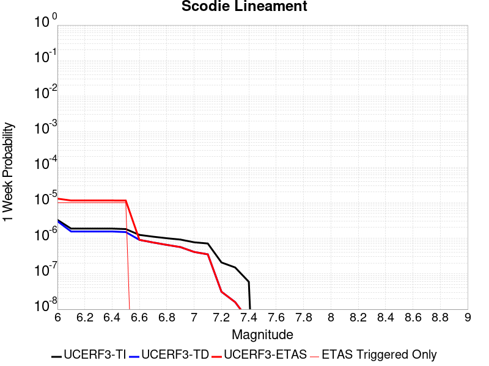 |  | 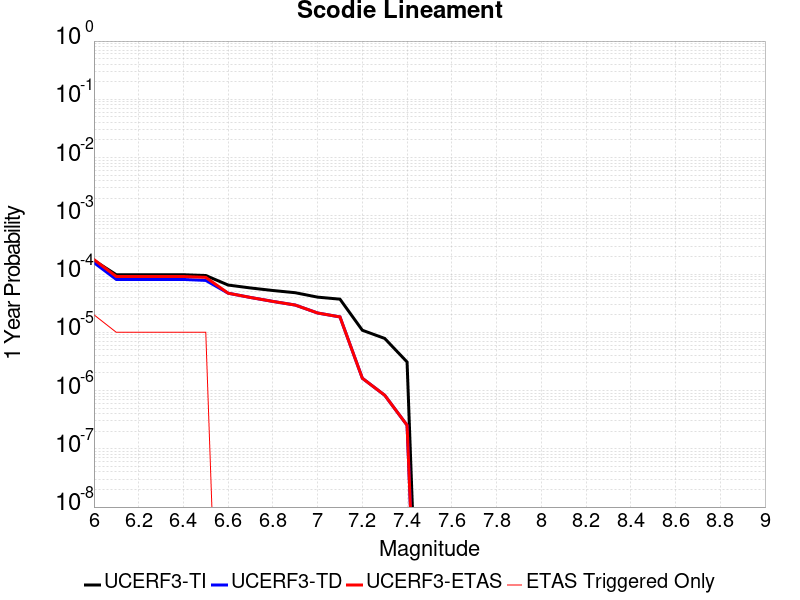 |  |

| Magnitude | 1 wk TI Prob | 1 wk TD Prob | 1 wk ETAS Prob | 1 wk ETAS/TD Gain | 1 wk ETAS Triggered Only | 1 mo TI Prob | 1 mo TD Prob | 1 mo ETAS Prob | 1 mo ETAS/TD Gain | 1 mo ETAS Triggered Only | 1 yr TI Prob | 1 yr TD Prob | 1 yr ETAS Prob | 1 yr ETAS/TD Gain | 1 yr ETAS Triggered Only | 10 yr TI Prob | 10 yr TD Prob | 10 yr ETAS Prob | 10 yr ETAS/TD Gain | 10 yr ETAS Triggered Only |
|-----|-----|-----|-----|-----|-----|-----|-----|-----|-----|-----|-----|-----|-----|-----|-----|-----|-----|-----|-----|-----|
| 6.0 | 3.2919327E-6 | 3.0133394E-6 | 1.5225402E-5 | 5.0526676 | 1.22121E-5 | 1.4108206E-5 | 1.2914265E-5 | 2.5126208E-5 | 1.9456165 | 1.22121E-5 | 1.7175387E-4 | 1.5722301E-4 | 1.6943319E-4 | 1.0776615 | 1.22121E-5 | 0.0017162118 | 0.0015714294 | 0.0015836223 | 1.0077591 | 1.22121E-5 |
| 6.1 | 1.8663811E-6 | 1.5490481E-6 | 1.3761129E-5 | 8.883603 | 1.22121E-5 | 7.998751E-6 | 6.638764E-6 | 1.8850782E-5 | 2.8395019 | 1.22121E-5 | 9.738045E-5 | 8.0824444E-5 | 9.303556E-5 | 1.1510819 | 1.22121E-5 | 9.7337784E-4 | 8.0799934E-4 | 8.2020153E-4 | 1.0151018 | 1.22121E-5 |
| 6.2 | 1.8663811E-6 | 1.5490481E-6 | 1.3761129E-5 | 8.883603 | 1.22121E-5 | 7.998751E-6 | 6.638764E-6 | 1.8850782E-5 | 2.8395019 | 1.22121E-5 | 9.738045E-5 | 8.0824444E-5 | 9.303556E-5 | 1.1510819 | 1.22121E-5 | 9.7337784E-4 | 8.0799934E-4 | 8.2020153E-4 | 1.0151018 | 1.22121E-5 |
| 6.3 | 1.8663811E-6 | 1.5490481E-6 | 1.3761129E-5 | 8.883603 | 1.22121E-5 | 7.998751E-6 | 6.638764E-6 | 1.8850782E-5 | 2.8395019 | 1.22121E-5 | 9.738045E-5 | 8.0824444E-5 | 9.303556E-5 | 1.1510819 | 1.22121E-5 | 9.7337784E-4 | 8.0799934E-4 | 8.2020153E-4 | 1.0151018 | 1.22121E-5 |
| 6.4 | 1.8663811E-6 | 1.5490481E-6 | 1.3761129E-5 | 8.883603 | 1.22121E-5 | 7.998751E-6 | 6.638764E-6 | 1.8850782E-5 | 2.8395019 | 1.22121E-5 | 9.738045E-5 | 8.0824444E-5 | 9.303556E-5 | 1.1510819 | 1.22121E-5 | 9.7337784E-4 | 8.0799934E-4 | 8.2020153E-4 | 1.0151018 | 1.22121E-5 |
| 6.5 | 1.8106311E-6 | 1.4909822E-6 | 1.3703064E-5 | 9.190629 | 1.22121E-5 | 7.759824E-6 | 6.389911E-6 | 1.8601933E-5 | 2.9111412 | 1.22121E-5 | 9.447177E-5 | 7.779488E-5 | 9.000603E-5 | 1.156966 | 1.22121E-5 | 9.4431615E-4 | 7.777252E-4 | 7.899278E-4 | 1.0156901 | 1.22121E-5 |
| 6.6 | 1.2414679E-6 | 8.9975464E-7 | 8.9975464E-7 | 1.0 | 0.0 | 5.320566E-6 | 3.856086E-6 | 3.856086E-6 | 1.0 | 0.0 | 6.477596E-5 | 4.6946923E-5 | 4.6946923E-5 | 1.0 | 0.0 | 6.475708E-4 | 4.6937872E-4 | 4.6937872E-4 | 1.0 | 0.0 |
| 6.7 | 1.1062215E-6 | 7.594301E-7 | 7.594301E-7 | 1.0 | 0.0 | 4.7409408E-6 | 3.2546968E-6 | 3.2546968E-6 | 1.0 | 0.0 | 5.7719422E-5 | 3.9625284E-5 | 3.9625284E-5 | 1.0 | 0.0 | 5.770443E-4 | 3.9618916E-4 | 3.9618916E-4 | 1.0 | 0.0 |
| 6.8 | 1.0006736E-6 | 6.5003877E-7 | 6.5003877E-7 | 1.0 | 0.0 | 4.288594E-6 | 2.785878E-6 | 2.785878E-6 | 1.0 | 0.0 | 5.221238E-5 | 3.3917597E-5 | 3.3917597E-5 | 1.0 | 0.0 | 5.220012E-4 | 3.391303E-4 | 3.391303E-4 | 1.0 | 0.0 |
| 6.9 | 9.167364E-7 | 5.631617E-7 | 5.631617E-7 | 1.0 | 0.0 | 3.9288643E-6 | 2.4135481E-6 | 2.4135481E-6 | 1.0 | 0.0 | 4.7832873E-5 | 2.938461E-5 | 2.938461E-5 | 1.0 | 0.0 | 4.782258E-4 | 2.9381292E-4 | 2.9381292E-4 | 1.0 | 0.0 |
| 7.0 | 7.6987664E-7 | 4.1133762E-7 | 4.1133762E-7 | 1.0 | 0.0 | 3.2994672E-6 | 1.7628746E-6 | 1.7628746E-6 | 1.0 | 0.0 | 4.0170275E-5 | 2.1462827E-5 | 2.1462827E-5 | 1.0 | 0.0 | 4.0163012E-4 | 2.1461138E-4 | 2.1461138E-4 | 1.0 | 0.0 |
| 7.1 | 7.1038727E-7 | 3.521143E-7 | 3.521143E-7 | 1.0 | 0.0 | 3.0445133E-6 | 1.5090607E-6 | 1.5090607E-6 | 1.0 | 0.0 | 3.706632E-5 | 1.8372695E-5 | 1.8372695E-5 | 1.0 | 0.0 | 3.7060137E-4 | 1.8371525E-4 | 1.8371525E-4 | 1.0 | 0.0 |
| 7.2 | 2.0799602E-7 | 3.1186687E-8 | 3.1186687E-8 | 1.0 | 0.0 | 8.914113E-7 | 1.3365722E-7 | 1.3365722E-7 | 1.0 | 0.0 | 1.0852878E-5 | 1.6272755E-6 | 1.6272755E-6 | 1.0 | 0.0 | 1.08523476E-4 | 1.6272643E-5 | 1.6272643E-5 | 1.0 | 0.0 |
| 7.3 | 1.5048182E-7 | 1.5945583E-8 | 1.5945583E-8 | 1.0 | 0.0 | 6.449219E-7 | 6.833821E-8 | 6.833821E-8 | 1.0 | 0.0 | 7.851896E-6 | 8.320174E-7 | 8.320174E-7 | 1.0 | 0.0 | 7.851618E-5 | 8.320146E-6 | 8.320146E-6 | 1.0 | 0.0 |
| 7.4 | 5.9334678E-8 | 4.868311E-9 | 4.868311E-9 | 1.0 | 0.0 | 2.5429145E-7 | 2.0864192E-8 | 2.0864192E-8 | 1.0 | 0.0 | 3.095994E-6 | 2.540215E-7 | 2.540215E-7 | 1.0 | 0.0 | 3.095951E-5 | 2.5402135E-6 | 2.5402135E-6 | 1.0 | 0.0 |

## Brawley (Seismic Zone) alt 1
*[(top)](#table-of-contents)*

| 1 Week | 1 Month | 1 Year | 10 Year |
|-----|-----|-----|-----|
|  |  |  | 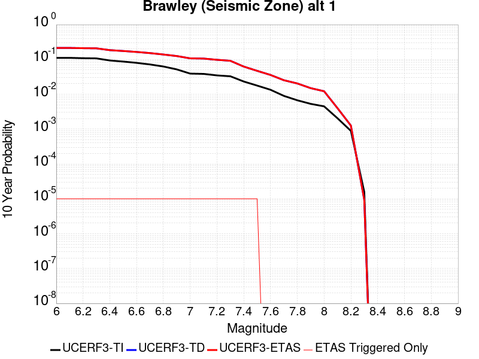 |

| Magnitude | 1 wk TI Prob | 1 wk TD Prob | 1 wk ETAS Prob | 1 wk ETAS/TD Gain | 1 wk ETAS Triggered Only | 1 mo TI Prob | 1 mo TD Prob | 1 mo ETAS Prob | 1 mo ETAS/TD Gain | 1 mo ETAS Triggered Only | 1 yr TI Prob | 1 yr TD Prob | 1 yr ETAS Prob | 1 yr ETAS/TD Gain | 1 yr ETAS Triggered Only | 10 yr TI Prob | 10 yr TD Prob | 10 yr ETAS Prob | 10 yr ETAS/TD Gain | 10 yr ETAS Triggered Only |
|-----|-----|-----|-----|-----|-----|-----|-----|-----|-----|-----|-----|-----|-----|-----|-----|-----|-----|-----|-----|-----|
| 6.0 | 2.2521618E-4 | 4.7625226E-4 | 4.8845855E-4 | 1.0256299 | 1.22121E-5 | 9.6485513E-4 | 0.0020395215 | 0.0020517088 | 1.0059755 | 1.22121E-5 | 0.011683988 | 0.024542542 | 0.024554454 | 1.0004854 | 1.22121E-5 | 0.11088423 | 0.21347483 | 0.21348444 | 1.000045 | 1.22121E-5 |
| 6.1 | 2.2521618E-4 | 4.7625226E-4 | 4.8845855E-4 | 1.0256299 | 1.22121E-5 | 9.6485513E-4 | 0.0020395215 | 0.0020517088 | 1.0059755 | 1.22121E-5 | 0.011683988 | 0.024542542 | 0.024554454 | 1.0004854 | 1.22121E-5 | 0.11088423 | 0.21347483 | 0.21348444 | 1.000045 | 1.22121E-5 |
| 6.2 | 2.198148E-4 | 4.6709873E-4 | 4.793051E-4 | 1.0261323 | 1.22121E-5 | 9.417233E-4 | 0.0020003526 | 0.0020125401 | 1.0060928 | 1.22121E-5 | 0.011405343 | 0.024076827 | 0.024088744 | 1.000495 | 1.22121E-5 | 0.10837428 | 0.20991138 | 0.20992102 | 1.000046 | 1.22121E-5 |
| 6.3 | 2.1704129E-4 | 4.6145564E-4 | 4.736621E-4 | 1.0264521 | 1.22121E-5 | 9.298453E-4 | 0.0019762046 | 0.0019883926 | 1.0061674 | 1.22121E-5 | 0.011262234 | 0.023789987 | 0.023801908 | 1.0005012 | 1.22121E-5 | 0.107082725 | 0.2078023 | 0.20781198 | 1.0000466 | 1.22121E-5 |
| 6.4 | 1.876142E-4 | 4.0037738E-4 | 4.1258457E-4 | 1.0304892 | 1.22121E-5 | 8.038131E-4 | 0.001714789 | 0.0017269801 | 1.0071094 | 1.22121E-5 | 0.00974259 | 0.02067674 | 0.0206887 | 1.0005784 | 1.22121E-5 | 0.093263686 | 0.18455231 | 0.18456227 | 1.000054 | 1.22121E-5 |
| 6.5 | 1.7390939E-4 | 3.746997E-4 | 3.8690722E-4 | 1.0325795 | 1.22121E-5 | 7.45113E-4 | 0.0016048797 | 0.0016170722 | 1.0075971 | 1.22121E-5 | 0.009034078 | 0.019365085 | 0.019377062 | 1.0006185 | 1.22121E-5 | 0.086755216 | 0.17437433 | 0.17438442 | 1.0000578 | 1.22121E-5 |
| 6.6 | 1.591791E-4 | 3.4884937E-4 | 3.610572E-4 | 1.0349946 | 1.22121E-5 | 6.8201777E-4 | 0.0014942222 | 0.001506416 | 1.0081607 | 1.22121E-5 | 0.008271996 | 0.018041968 | 0.01805396 | 1.0006647 | 1.22121E-5 | 0.07970774 | 0.16378246 | 0.16379267 | 1.0000623 | 1.22121E-5 |
| 6.7 | 1.4268003E-4 | 3.2051268E-4 | 3.3272087E-4 | 1.0380895 | 1.22121E-5 | 6.1134255E-4 | 0.0013729108 | 0.0013851061 | 1.0088829 | 1.22121E-5 | 0.007417723 | 0.016589044 | 0.016601052 | 1.000724 | 1.22121E-5 | 0.07174956 | 0.15190692 | 0.15191728 | 1.0000682 | 1.22121E-5 |
| 6.8 | 1.239713E-4 | 2.904694E-4 | 3.0267797E-4 | 1.0420305 | 1.22121E-5 | 5.3119735E-4 | 0.0012442812 | 0.0012564781 | 1.0098023 | 1.22121E-5 | 0.0064481674 | 0.015045324 | 0.015057353 | 1.0007994 | 1.22121E-5 | 0.06264243 | 0.13835184 | 0.13836236 | 1.000076 | 1.22121E-5 |
| 6.9 | 1.0180238E-4 | 2.624795E-4 | 2.7468838E-4 | 1.0465137 | 1.22121E-5 | 4.3622297E-4 | 0.0011244314 | 0.0011366298 | 1.0108485 | 1.22121E-5 | 0.005298089 | 0.013605019 | 0.013617066 | 1.0008854 | 1.22121E-5 | 0.05173543 | 0.124936566 | 0.12494725 | 1.0000856 | 1.22121E-5 |
| 7.0 | 7.6619996E-5 | 2.2393082E-4 | 2.3614019E-4 | 1.054523 | 1.22121E-5 | 3.283301E-4 | 9.593537E-4 | 9.715541E-4 | 1.0127172 | 1.22121E-5 | 0.0039900932 | 0.011618287 | 0.011630357 | 1.0010389 | 1.22121E-5 | 0.039192066 | 0.1072422 | 0.1072531 | 1.0001017 | 1.22121E-5 |
| 7.1 | 7.5127435E-5 | 2.2076255E-4 | 2.3297196E-4 | 1.0553056 | 1.22121E-5 | 3.2193496E-4 | 9.457853E-4 | 9.579859E-4 | 1.0128999 | 1.22121E-5 | 0.0039125155 | 0.01145484 | 0.011466913 | 1.0010539 | 1.22121E-5 | 0.038443442 | 0.10580618 | 0.1058171 | 1.0001032 | 1.22121E-5 |
| 7.2 | 6.788582E-5 | 2.0204009E-4 | 2.1424973E-4 | 1.0604317 | 1.22121E-5 | 2.9090676E-4 | 8.6560176E-4 | 8.778033E-4 | 1.014096 | 1.22121E-5 | 0.0035360386 | 0.010488416 | 0.0105005 | 1.0011522 | 1.22121E-5 | 0.034803 | 0.097476505 | 0.09748753 | 1.0001131 | 1.22121E-5 |
| 7.3 | 6.399602E-5 | 1.8835113E-4 | 2.0056093E-4 | 1.0648247 | 1.22121E-5 | 2.7423984E-4 | 8.0697227E-4 | 8.191745E-4 | 1.015121 | 1.22121E-5 | 0.0033337586 | 0.009781217 | 0.0097933095 | 1.0012363 | 1.22121E-5 | 0.03284188 | 0.09137183 | 0.09138292 | 1.0001215 | 1.22121E-5 |
| 7.4 | 4.506759E-5 | 1.2526519E-4 | 1.3747576E-4 | 1.0974778 | 1.22121E-5 | 1.9313251E-4 | 5.367412E-4 | 5.4894673E-4 | 1.0227401 | 1.22121E-5 | 0.0023488526 | 0.006515418 | 0.0065275505 | 1.0018622 | 1.22121E-5 | 0.023241805 | 0.062352248 | 0.0623637 | 1.0001837 | 1.22121E-5 |
| 7.5 | 3.43289E-5 | 9.334972E-5 | 1.0556068E-4 | 1.1308087 | 1.22121E-5 | 1.4711556E-4 | 4.0000922E-4 | 4.122164E-4 | 1.0305173 | 1.22121E-5 | 0.0017896603 | 0.004859299 | 0.0048714518 | 1.0025009 | 1.22121E-5 | 0.01775316 | 0.04705323 | 0.047064867 | 1.0002474 | 1.22121E-5 |
| 7.6 | 2.5980507E-5 | 7.0527196E-5 | 7.0527196E-5 | 1.0 | 0.0 | 1.1134028E-4 | 3.022245E-4 | 3.022245E-4 | 1.0 | 0.0 | 0.001354725 | 0.0036733993 | 0.0036733993 | 1.0 | 0.0 | 0.013464959 | 0.035839107 | 0.035839107 | 1.0 | 0.0 |
| 7.7 | 1.7292105E-5 | 4.940404E-5 | 4.940404E-5 | 1.0 | 0.0 | 7.4106916E-5 | 2.1171445E-4 | 2.1171445E-4 | 1.0 | 0.0 | 9.018782E-4 | 0.0025745821 | 0.0025745821 | 1.0 | 0.0 | 0.008982267 | 0.025288915 | 0.025288915 | 1.0 | 0.0 |
| 7.8 | 1.2927471E-5 | 3.9690432E-5 | 3.9690432E-5 | 1.0 | 0.0 | 5.5402274E-5 | 1.7009077E-4 | 1.7009077E-4 | 1.0 | 0.0 | 6.743139E-4 | 0.002068891 | 0.002068891 | 1.0 | 0.0 | 0.0067227143 | 0.020430436 | 0.020430436 | 1.0 | 0.0 |
| 7.9 | 1.0200774E-5 | 2.8743396E-5 | 2.8743396E-5 | 1.0 | 0.0 | 4.371687E-5 | 1.2318017E-4 | 1.2318017E-4 | 1.0 | 0.0 | 5.321229E-4 | 0.001498688 | 0.001498688 | 1.0 | 0.0 | 0.005308505 | 0.014990583 | 0.014990583 | 1.0 | 0.0 |
| 8.0 | 8.650396E-6 | 2.3275401E-5 | 2.3275401E-5 | 1.0 | 0.0 | 3.70726E-5 | 9.974791E-5 | 9.974791E-5 | 1.0 | 0.0 | 4.5126543E-4 | 0.0012137551 | 0.0012137551 | 1.0 | 0.0 | 0.0045035016 | 0.012210181 | 0.012210181 | 1.0 | 0.0 |
| 8.1 | 3.9368224E-6 | 7.3271426E-6 | 7.3271426E-6 | 1.0 | 0.0 | 1.6871985E-5 | 3.1401665E-5 | 3.1401665E-5 | 1.0 | 0.0 | 2.0539707E-4 | 3.822483E-4 | 3.822483E-4 | 1.0 | 0.0 | 0.0020520731 | 0.004000768 | 0.004000768 | 1.0 | 0.0 |
| 8.2 | 1.7101195E-6 | 2.2175473E-6 | 2.2175473E-6 | 1.0 | 0.0 | 7.329063E-6 | 9.50374E-6 | 9.50374E-6 | 1.0 | 0.0 | 8.922769E-5 | 1.1570192E-4 | 1.1570192E-4 | 1.0 | 0.0 | 8.9191867E-4 | 0.0012665088 | 0.0012665088 | 1.0 | 0.0 |
| 8.3 | 3.0346666E-8 | 1.72124E-8 | 1.72124E-8 | 1.0 | 0.0 | 1.3005713E-7 | 7.3767424E-8 | 7.3767424E-8 | 1.0 | 0.0 | 1.5834444E-6 | 8.9811834E-7 | 8.9811834E-7 | 1.0 | 0.0 | 1.5834332E-5 | 9.365885E-6 | 9.365885E-6 | 1.0 | 0.0 |

## Whittier alt 1
*[(top)](#table-of-contents)*

| 1 Week | 1 Month | 1 Year | 10 Year |
|-----|-----|-----|-----|
| 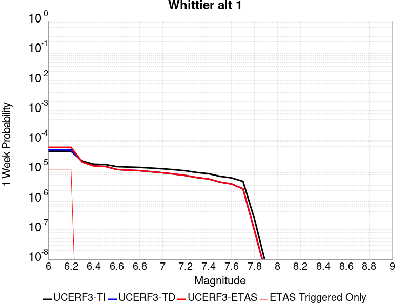 |  | 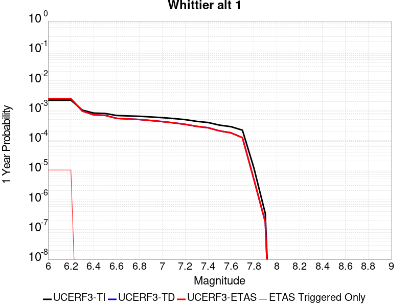 |  |

| Magnitude | 1 wk TI Prob | 1 wk TD Prob | 1 wk ETAS Prob | 1 wk ETAS/TD Gain | 1 wk ETAS Triggered Only | 1 mo TI Prob | 1 mo TD Prob | 1 mo ETAS Prob | 1 mo ETAS/TD Gain | 1 mo ETAS Triggered Only | 1 yr TI Prob | 1 yr TD Prob | 1 yr ETAS Prob | 1 yr ETAS/TD Gain | 1 yr ETAS Triggered Only | 10 yr TI Prob | 10 yr TD Prob | 10 yr ETAS Prob | 10 yr ETAS/TD Gain | 10 yr ETAS Triggered Only |
|-----|-----|-----|-----|-----|-----|-----|-----|-----|-----|-----|-----|-----|-----|-----|-----|-----|-----|-----|-----|-----|
| 6.0 | 4.2554693E-5 | 4.7251942E-5 | 5.9463466E-5 | 1.2584343 | 1.22121E-5 | 1.8236451E-4 | 2.0249443E-4 | 2.1470407E-4 | 1.060296 | 1.22121E-5 | 0.002218027 | 0.002462903 | 0.0024750852 | 1.0049462 | 1.22121E-5 | 0.02196019 | 0.024390114 | 0.02440203 | 1.0004885 | 1.22121E-5 |
| 6.1 | 4.2554693E-5 | 4.7251942E-5 | 5.9463466E-5 | 1.2584343 | 1.22121E-5 | 1.8236451E-4 | 2.0249443E-4 | 2.1470407E-4 | 1.060296 | 1.22121E-5 | 0.002218027 | 0.002462903 | 0.0024750852 | 1.0049462 | 1.22121E-5 | 0.02196019 | 0.024390114 | 0.02440203 | 1.0004885 | 1.22121E-5 |
| 6.2 | 4.2554693E-5 | 4.7251942E-5 | 5.9463466E-5 | 1.2584343 | 1.22121E-5 | 1.8236451E-4 | 2.0249443E-4 | 2.1470407E-4 | 1.060296 | 1.22121E-5 | 0.002218027 | 0.002462903 | 0.0024750852 | 1.0049462 | 1.22121E-5 | 0.02196019 | 0.024390114 | 0.02440203 | 1.0004885 | 1.22121E-5 |
| 6.3 | 1.9617712E-5 | 1.826847E-5 | 1.826847E-5 | 1.0 | 0.0 | 8.40732E-5 | 7.82912E-5 | 7.82912E-5 | 1.0 | 0.0 | 0.0010231105 | 9.527976E-4 | 9.527976E-4 | 1.0 | 0.0 | 0.01018413 | 0.009490412 | 0.009490412 | 1.0 | 0.0 |
| 6.4 | 1.5611336E-5 | 1.3604169E-5 | 1.3604169E-5 | 1.0 | 0.0 | 6.690401E-5 | 5.830231E-5 | 5.830231E-5 | 1.0 | 0.0 | 8.142519E-4 | 7.0960546E-4 | 7.0960546E-4 | 1.0 | 0.0 | 0.008112748 | 0.007075362 | 0.007075362 | 1.0 | 0.0 |
| 6.5 | 1.5150166E-5 | 1.3100825E-5 | 1.3100825E-5 | 1.0 | 0.0 | 6.492767E-5 | 5.6145214E-5 | 5.6145214E-5 | 1.0 | 0.0 | 7.9020765E-4 | 6.833595E-4 | 6.833595E-4 | 1.0 | 0.0 | 0.007874036 | 0.0068145324 | 0.0068145324 | 1.0 | 0.0 |
| 6.6 | 1.295588E-5 | 1.0380643E-5 | 1.0380643E-5 | 1.0 | 0.0 | 5.552402E-5 | 4.4487722E-5 | 4.4487722E-5 | 1.0 | 0.0 | 6.7579525E-4 | 5.4150535E-4 | 5.4150535E-4 | 1.0 | 0.0 | 0.006737438 | 0.005403293 | 0.005403293 | 1.0 | 0.0 |
| 6.7 | 1.2542085E-5 | 9.899289E-6 | 9.899289E-6 | 1.0 | 0.0 | 5.3750682E-5 | 4.2424843E-5 | 4.2424843E-5 | 1.0 | 0.0 | 6.542181E-4 | 5.1640195E-4 | 5.1640195E-4 | 1.0 | 0.0 | 0.006522954 | 0.005153438 | 0.005153438 | 1.0 | 0.0 |
| 6.8 | 1.2195878E-5 | 9.4953375E-6 | 9.4953375E-6 | 1.0 | 0.0 | 5.2267E-5 | 4.0693678E-5 | 4.0693678E-5 | 1.0 | 0.0 | 6.36165E-4 | 4.953348E-4 | 4.953348E-4 | 1.0 | 0.0 | 0.0063434686 | 0.004943648 | 0.004943648 | 1.0 | 0.0 |
| 6.9 | 1.1580298E-5 | 8.772861E-6 | 8.772861E-6 | 1.0 | 0.0 | 4.9628903E-5 | 3.7597445E-5 | 3.7597445E-5 | 1.0 | 0.0 | 6.040644E-4 | 4.576544E-4 | 4.576544E-4 | 1.0 | 0.0 | 0.00602425 | 0.0045683784 | 0.0045683784 | 1.0 | 0.0 |
| 7.0 | 1.0964795E-5 | 8.083925E-6 | 8.083925E-6 | 1.0 | 0.0 | 4.6991136E-5 | 3.4644945E-5 | 3.4644945E-5 | 1.0 | 0.0 | 5.7196687E-4 | 4.217221E-4 | 4.217221E-4 | 1.0 | 0.0 | 0.0057049696 | 0.0042104265 | 0.0042104265 | 1.0 | 0.0 |
| 7.1 | 1.0230601E-5 | 7.326608E-6 | 7.326608E-6 | 1.0 | 0.0 | 4.3844695E-5 | 3.1399377E-5 | 3.1399377E-5 | 1.0 | 0.0 | 5.336784E-4 | 3.8222165E-4 | 3.8222165E-4 | 1.0 | 0.0 | 0.005323986 | 0.003816806 | 0.003816806 | 1.0 | 0.0 |
| 7.2 | 9.40865E-6 | 6.5432328E-6 | 6.5432328E-6 | 1.0 | 0.0 | 4.032216E-5 | 2.8042132E-5 | 2.8042132E-5 | 1.0 | 0.0 | 4.908117E-4 | 3.413607E-4 | 3.413607E-4 | 1.0 | 0.0 | 0.0048972913 | 0.0034094558 | 0.0034094558 | 1.0 | 0.0 |
| 7.3 | 8.237384E-6 | 5.5977043E-6 | 5.5977043E-6 | 1.0 | 0.0 | 3.5302593E-5 | 2.3989947E-5 | 2.3989947E-5 | 1.0 | 0.0 | 4.2972428E-4 | 2.920395E-4 | 2.920395E-4 | 1.0 | 0.0 | 0.0042889426 | 0.002916878 | 0.002916878 | 1.0 | 0.0 |
| 7.4 | 7.5316966E-6 | 5.027776E-6 | 5.027776E-6 | 1.0 | 0.0 | 3.2278298E-5 | 2.1547437E-5 | 2.1547437E-5 | 1.0 | 0.0 | 3.9291743E-4 | 2.6230948E-4 | 2.6230948E-4 | 1.0 | 0.0 | 0.0039222343 | 0.0026201105 | 0.0026201105 | 1.0 | 0.0 |
| 7.5 | 6.149649E-6 | 3.933807E-6 | 3.933807E-6 | 1.0 | 0.0 | 2.6355372E-5 | 1.6859069E-5 | 1.6859069E-5 | 1.0 | 0.0 | 3.208294E-4 | 2.0524072E-4 | 2.0524072E-4 | 1.0 | 0.0 | 0.003203666 | 0.002050601 | 0.002050601 | 1.0 | 0.0 |
| 7.6 | 5.457711E-6 | 3.395349E-6 | 3.395349E-6 | 1.0 | 0.0 | 2.338998E-5 | 1.455142E-5 | 1.455142E-5 | 1.0 | 0.0 | 2.8473578E-4 | 1.7714995E-4 | 1.7714995E-4 | 1.0 | 0.0 | 0.0028437122 | 0.0017701681 | 0.0017701681 | 1.0 | 0.0 |
| 7.7 | 4.1676276E-6 | 2.3331725E-6 | 2.3331725E-6 | 1.0 | 0.0 | 1.7861139E-5 | 9.999276E-6 | 9.999276E-6 | 1.0 | 0.0 | 2.1743766E-4 | 1.2173513E-4 | 1.2173513E-4 | 1.0 | 0.0 | 0.0021722503 | 0.0012167575 | 0.0012167575 | 1.0 | 0.0 |
| 7.8 | 2.2692414E-7 | 9.385374E-8 | 9.385374E-8 | 1.0 | 0.0 | 9.725317E-7 | 4.0223028E-7 | 4.0223028E-7 | 1.0 | 0.0 | 1.1840509E-5 | 4.897146E-6 | 4.897146E-6 | 1.0 | 0.0 | 1.1839878E-4 | 4.897071E-5 | 4.897071E-5 | 1.0 | 0.0 |
| 7.9 | 6.676829E-9 | 3.439828E-9 | 3.439828E-9 | 1.0 | 0.0 | 2.861498E-8 | 1.47421195E-8 | 1.47421195E-8 | 1.0 | 0.0 | 3.4838732E-7 | 1.7948528E-7 | 1.7948528E-7 | 1.0 | 0.0 | 3.4838679E-6 | 1.7948516E-6 | 1.7948516E-6 | 1.0 | 0.0 |

## Earthquake Valley (So Extension)
*[(top)](#table-of-contents)*

| 1 Week | 1 Month | 1 Year | 10 Year |
|-----|-----|-----|-----|
| 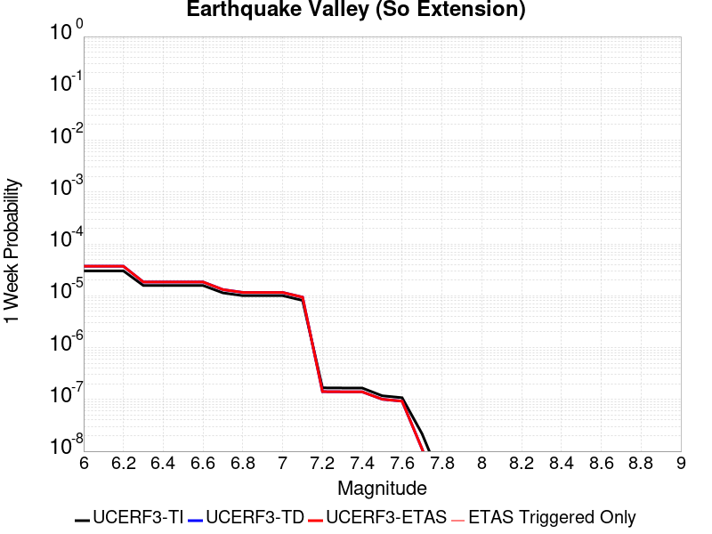 | 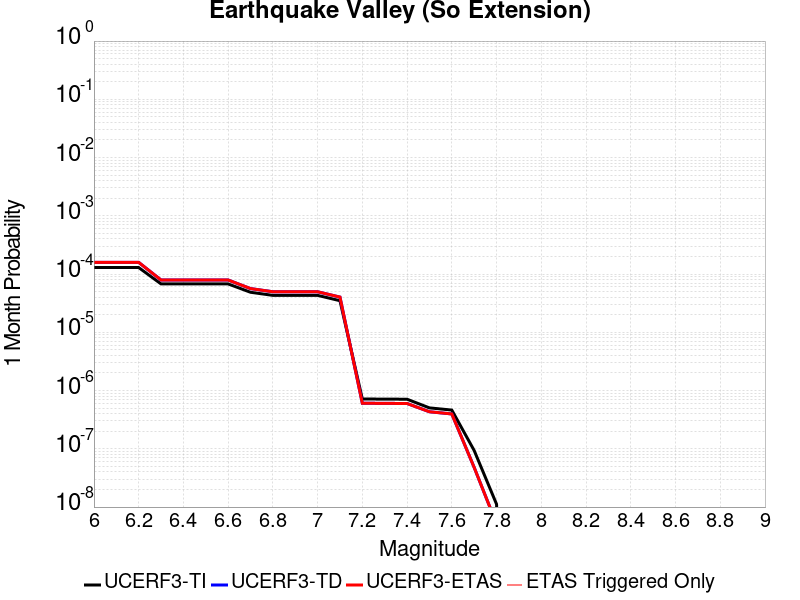 |  |  |

| Magnitude | 1 wk TI Prob | 1 wk TD Prob | 1 wk ETAS Prob | 1 wk ETAS/TD Gain | 1 wk ETAS Triggered Only | 1 mo TI Prob | 1 mo TD Prob | 1 mo ETAS Prob | 1 mo ETAS/TD Gain | 1 mo ETAS Triggered Only | 1 yr TI Prob | 1 yr TD Prob | 1 yr ETAS Prob | 1 yr ETAS/TD Gain | 1 yr ETAS Triggered Only | 10 yr TI Prob | 10 yr TD Prob | 10 yr ETAS Prob | 10 yr ETAS/TD Gain | 10 yr ETAS Triggered Only |
|-----|-----|-----|-----|-----|-----|-----|-----|-----|-----|-----|-----|-----|-----|-----|-----|-----|-----|-----|-----|-----|
| 6.0 | 3.0194888E-5 | 3.707188E-5 | 3.707188E-5 | 1.0 | 0.0 | 1.2940024E-4 | 1.5887289E-4 | 1.5887289E-4 | 1.0 | 0.0 | 0.0015743093 | 0.0019331054 | 0.0019331054 | 1.0 | 0.0 | 0.01563203 | 0.019212902 | 0.01922488 | 1.0006235 | 1.22121E-5 |
| 6.1 | 3.0194888E-5 | 3.707188E-5 | 3.707188E-5 | 1.0 | 0.0 | 1.2940024E-4 | 1.5887289E-4 | 1.5887289E-4 | 1.0 | 0.0 | 0.0015743093 | 0.0019331054 | 0.0019331054 | 1.0 | 0.0 | 0.01563203 | 0.019212902 | 0.01922488 | 1.0006235 | 1.22121E-5 |
| 6.2 | 3.0194888E-5 | 3.707188E-5 | 3.707188E-5 | 1.0 | 0.0 | 1.2940024E-4 | 1.5887289E-4 | 1.5887289E-4 | 1.0 | 0.0 | 0.0015743093 | 0.0019331054 | 0.0019331054 | 1.0 | 0.0 | 0.01563203 | 0.019212902 | 0.01922488 | 1.0006235 | 1.22121E-5 |
| 6.3 | 1.5795305E-5 | 1.8446497E-5 | 1.8446497E-5 | 1.0 | 0.0 | 6.769241E-5 | 7.905465E-5 | 7.905465E-5 | 1.0 | 0.0 | 8.238434E-4 | 9.6217653E-4 | 9.6217653E-4 | 1.0 | 0.0 | 0.008207959 | 0.009591017 | 0.009591017 | 1.0 | 0.0 |
| 6.4 | 1.5795305E-5 | 1.8446497E-5 | 1.8446497E-5 | 1.0 | 0.0 | 6.769241E-5 | 7.905465E-5 | 7.905465E-5 | 1.0 | 0.0 | 8.238434E-4 | 9.6217653E-4 | 9.6217653E-4 | 1.0 | 0.0 | 0.008207959 | 0.009591017 | 0.009591017 | 1.0 | 0.0 |
| 6.5 | 1.5795305E-5 | 1.8446497E-5 | 1.8446497E-5 | 1.0 | 0.0 | 6.769241E-5 | 7.905465E-5 | 7.905465E-5 | 1.0 | 0.0 | 8.238434E-4 | 9.6217653E-4 | 9.6217653E-4 | 1.0 | 0.0 | 0.008207959 | 0.009591017 | 0.009591017 | 1.0 | 0.0 |
| 6.6 | 1.5795305E-5 | 1.8446497E-5 | 1.8446497E-5 | 1.0 | 0.0 | 6.769241E-5 | 7.905465E-5 | 7.905465E-5 | 1.0 | 0.0 | 8.238434E-4 | 9.6217653E-4 | 9.6217653E-4 | 1.0 | 0.0 | 0.008207959 | 0.009591017 | 0.009591017 | 1.0 | 0.0 |
| 6.7 | 1.1363076E-5 | 1.3138238E-5 | 1.3138238E-5 | 1.0 | 0.0 | 4.8697988E-5 | 5.6305948E-5 | 5.6305948E-5 | 1.0 | 0.0 | 5.927367E-4 | 6.853854E-4 | 6.853854E-4 | 1.0 | 0.0 | 0.0059115817 | 0.006840189 | 0.006840189 | 1.0 | 0.0 |
| 6.8 | 1.0049611E-5 | 1.1594285E-5 | 1.1594285E-5 | 1.0 | 0.0 | 4.306905E-5 | 4.9689257E-5 | 4.9689257E-5 | 1.0 | 0.0 | 5.242395E-4 | 6.0487195E-4 | 6.0487195E-4 | 1.0 | 0.0 | 0.0052300454 | 0.0060394322 | 0.0060394322 | 1.0 | 0.0 |
| 6.9 | 1.0049611E-5 | 1.1594285E-5 | 1.1594285E-5 | 1.0 | 0.0 | 4.306905E-5 | 4.9689257E-5 | 4.9689257E-5 | 1.0 | 0.0 | 5.242395E-4 | 6.0487195E-4 | 6.0487195E-4 | 1.0 | 0.0 | 0.0052300454 | 0.0060394322 | 0.0060394322 | 1.0 | 0.0 |
| 7.0 | 1.0049611E-5 | 1.1594285E-5 | 1.1594285E-5 | 1.0 | 0.0 | 4.306905E-5 | 4.9689257E-5 | 4.9689257E-5 | 1.0 | 0.0 | 5.242395E-4 | 6.0487195E-4 | 6.0487195E-4 | 1.0 | 0.0 | 0.0052300454 | 0.0060394322 | 0.0060394322 | 1.0 | 0.0 |
| 7.1 | 8.140254E-6 | 9.383418E-6 | 9.383418E-6 | 1.0 | 0.0 | 3.4886336E-5 | 4.0214403E-5 | 4.0214403E-5 | 1.0 | 0.0 | 4.2465836E-4 | 4.8956746E-4 | 4.8956746E-4 | 1.0 | 0.0 | 0.0042384774 | 0.004891466 | 0.004891466 | 1.0 | 0.0 |
| 7.2 | 1.673835E-7 | 1.4154043E-7 | 1.4154043E-7 | 1.0 | 0.0 | 7.173577E-7 | 6.066017E-7 | 6.066017E-7 | 1.0 | 0.0 | 8.733795E-6 | 7.3853544E-6 | 7.3853544E-6 | 1.0 | 0.0 | 8.733451E-5 | 7.385144E-5 | 7.385144E-5 | 1.0 | 0.0 |
| 7.3 | 1.6632116E-7 | 1.4052272E-7 | 1.4052272E-7 | 1.0 | 0.0 | 7.1280476E-7 | 6.022401E-7 | 6.022401E-7 | 1.0 | 0.0 | 8.678364E-6 | 7.332252E-6 | 7.332252E-6 | 1.0 | 0.0 | 8.6780245E-5 | 7.332046E-5 | 7.332046E-5 | 1.0 | 0.0 |
| 7.4 | 1.6569169E-7 | 1.39969E-7 | 1.39969E-7 | 1.0 | 0.0 | 7.1010703E-7 | 5.9986706E-7 | 5.9986706E-7 | 1.0 | 0.0 | 8.645519E-6 | 7.3033607E-6 | 7.3033607E-6 | 1.0 | 0.0 | 8.645182E-5 | 7.303156E-5 | 7.303156E-5 | 1.0 | 0.0 |
| 7.5 | 1.1764555E-7 | 1.0095854E-7 | 1.0095854E-7 | 1.0 | 0.0 | 5.041951E-7 | 4.326794E-7 | 4.326794E-7 | 1.0 | 0.0 | 6.138558E-6 | 5.267861E-6 | 5.267861E-6 | 1.0 | 0.0 | 6.1383886E-5 | 5.2677577E-5 | 5.2677577E-5 | 1.0 | 0.0 |
| 7.6 | 1.07927605E-7 | 9.260677E-8 | 9.260677E-8 | 1.0 | 0.0 | 4.6254678E-7 | 3.968861E-7 | 3.968861E-7 | 1.0 | 0.0 | 5.6314925E-6 | 4.8320794E-6 | 4.8320794E-6 | 1.0 | 0.0 | 5.63135E-5 | 4.8319955E-5 | 4.8319955E-5 | 1.0 | 0.0 |
| 7.7 | 2.1826905E-8 | 1.1180403E-8 | 1.1180403E-8 | 1.0 | 0.0 | 9.3543875E-8 | 4.7916014E-8 | 4.7916014E-8 | 1.0 | 0.0 | 1.1388961E-6 | 5.8337736E-7 | 5.8337736E-7 | 1.0 | 0.0 | 1.1388902E-5 | 5.8337637E-6 | 5.8337637E-6 | 1.0 | 0.0 |
| 7.8 | 2.6169649E-9 | 1.1969353E-9 | 1.1969353E-9 | 1.0 | 0.0 | 1.1215564E-8 | 5.1297233E-9 | 5.1297233E-9 | 1.0 | 0.0 | 1.3654947E-7 | 6.2454376E-8 | 6.2454376E-8 | 1.0 | 0.0 | 1.365494E-6 | 6.2454376E-7 | 6.2454376E-7 | 1.0 | 0.0 |

## Surprise Valley 2011 CFM
*[(top)](#table-of-contents)*

| 1 Week | 1 Month | 1 Year | 10 Year |
|-----|-----|-----|-----|
|  |  | 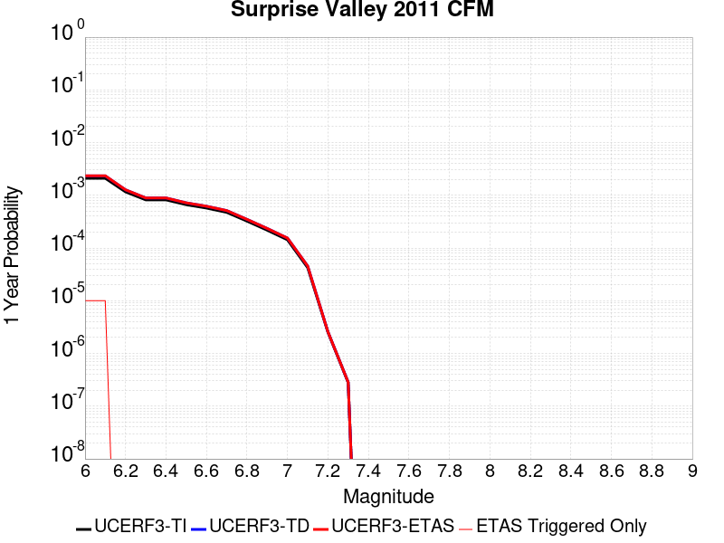 | 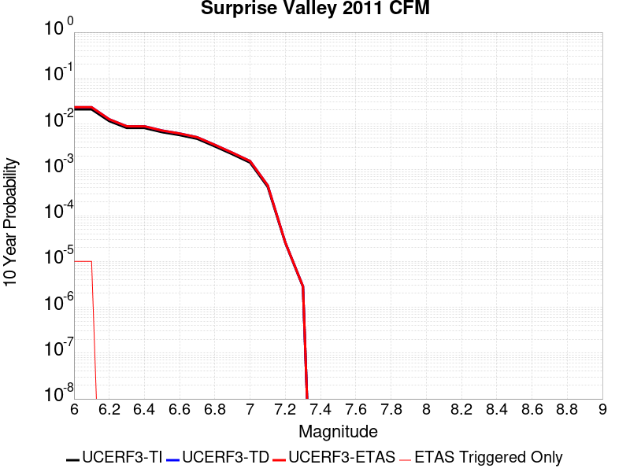 |

| Magnitude | 1 wk TI Prob | 1 wk TD Prob | 1 wk ETAS Prob | 1 wk ETAS/TD Gain | 1 wk ETAS Triggered Only | 1 mo TI Prob | 1 mo TD Prob | 1 mo ETAS Prob | 1 mo ETAS/TD Gain | 1 mo ETAS Triggered Only | 1 yr TI Prob | 1 yr TD Prob | 1 yr ETAS Prob | 1 yr ETAS/TD Gain | 1 yr ETAS Triggered Only | 10 yr TI Prob | 10 yr TD Prob | 10 yr ETAS Prob | 10 yr ETAS/TD Gain | 10 yr ETAS Triggered Only |
|-----|-----|-----|-----|-----|-----|-----|-----|-----|-----|-----|-----|-----|-----|-----|-----|-----|-----|-----|-----|-----|
| 6.0 | 4.0396248E-5 | 4.485118E-5 | 4.485118E-5 | 1.0 | 0.0 | 1.7311527E-4 | 1.9220635E-4 | 2.0441611E-4 | 1.0635242 | 1.22121E-5 | 0.002105641 | 0.0023378108 | 0.0023499944 | 1.0052115 | 1.22121E-5 | 0.020858008 | 0.023153897 | 0.023165828 | 1.0005152 | 1.22121E-5 |
| 6.1 | 4.0396248E-5 | 4.485118E-5 | 4.485118E-5 | 1.0 | 0.0 | 1.7311527E-4 | 1.9220635E-4 | 2.0441611E-4 | 1.0635242 | 1.22121E-5 | 0.002105641 | 0.0023378108 | 0.0023499944 | 1.0052115 | 1.22121E-5 | 0.020858008 | 0.023153897 | 0.023165828 | 1.0005152 | 1.22121E-5 |
| 6.2 | 2.2295266E-5 | 2.4401188E-5 | 2.4401188E-5 | 1.0 | 0.0 | 9.554764E-5 | 1.045725E-4 | 1.045725E-4 | 1.0 | 0.0 | 0.0011626717 | 0.0012724574 | 0.0012724574 | 1.0 | 0.0 | 0.011566074 | 0.012654949 | 0.012654949 | 1.0 | 0.0 |
| 6.3 | 1.572643E-5 | 1.7096767E-5 | 1.7096767E-5 | 1.0 | 0.0 | 6.7397246E-5 | 7.326986E-5 | 7.326986E-5 | 1.0 | 0.0 | 8.202525E-4 | 8.91706E-4 | 8.91706E-4 | 1.0 | 0.0 | 0.008172315 | 0.008882387 | 0.008882387 | 1.0 | 0.0 |
| 6.4 | 1.5714395E-5 | 1.7084589E-5 | 1.7084589E-5 | 1.0 | 0.0 | 6.734567E-5 | 7.321767E-5 | 7.321767E-5 | 1.0 | 0.0 | 8.1962504E-4 | 8.9107105E-4 | 8.9107105E-4 | 1.0 | 0.0 | 0.008166086 | 0.008876088 | 0.008876088 | 1.0 | 0.0 |
| 6.5 | 1.2733495E-5 | 1.3801569E-5 | 1.3801569E-5 | 1.0 | 0.0 | 5.457098E-5 | 5.914828E-5 | 5.914828E-5 | 1.0 | 0.0 | 6.641992E-4 | 7.19899E-4 | 7.19899E-4 | 1.0 | 0.0 | 0.0066221743 | 0.0071763634 | 0.0071763634 | 1.0 | 0.0 |
| 6.6 | 1.0983784E-5 | 1.1886527E-5 | 1.1886527E-5 | 1.0 | 0.0 | 4.7072506E-5 | 5.0941297E-5 | 5.0941297E-5 | 1.0 | 0.0 | 5.7295704E-4 | 6.200391E-4 | 6.200391E-4 | 1.0 | 0.0 | 0.0057148207 | 0.006183641 | 0.006183641 | 1.0 | 0.0 |
| 6.7 | 9.104806E-6 | 9.83947E-6 | 9.83947E-6 | 1.0 | 0.0 | 3.902001E-5 | 4.2168496E-5 | 4.2168496E-5 | 1.0 | 0.0 | 4.7496508E-4 | 5.132844E-4 | 5.132844E-4 | 1.0 | 0.0 | 0.004739512 | 0.0051213857 | 0.0051213857 | 1.0 | 0.0 |
| 6.8 | 6.2162403E-6 | 6.7041196E-6 | 6.7041196E-6 | 1.0 | 0.0 | 2.6640759E-5 | 2.8731638E-5 | 2.8731638E-5 | 1.0 | 0.0 | 3.2430296E-4 | 3.4975377E-4 | 3.4975377E-4 | 1.0 | 0.0 | 0.003238301 | 0.0034922564 | 0.0034922564 | 1.0 | 0.0 |
| 6.9 | 4.1792696E-6 | 4.5032207E-6 | 4.5032207E-6 | 1.0 | 0.0 | 1.7911032E-5 | 1.9299383E-5 | 1.9299383E-5 | 1.0 | 0.0 | 2.1804498E-4 | 2.349462E-4 | 2.349462E-4 | 1.0 | 0.0 | 0.0021783116 | 0.0023471313 | 0.0023471313 | 1.0 | 0.0 |
| 7.0 | 2.7478413E-6 | 2.9622363E-6 | 2.9622363E-6 | 1.0 | 0.0 | 1.177641E-5 | 1.2695244E-5 | 1.2695244E-5 | 1.0 | 0.0 | 1.4336836E-4 | 1.5455487E-4 | 1.5455487E-4 | 1.0 | 0.0 | 0.001432759 | 0.0015445963 | 0.0015445963 | 1.0 | 0.0 |
| 7.1 | 8.128648E-7 | 8.7249043E-7 | 8.7249043E-7 | 1.0 | 0.0 | 3.4837017E-6 | 3.7392429E-6 | 3.7392429E-6 | 1.0 | 0.0 | 4.2413245E-5 | 4.552493E-5 | 4.552493E-5 | 1.0 | 0.0 | 4.2405148E-4 | 4.5521485E-4 | 4.5521485E-4 | 1.0 | 0.0 |
| 7.2 | 4.8641045E-8 | 4.9402047E-8 | 4.9402047E-8 | 1.0 | 0.0 | 2.084616E-7 | 2.1172303E-7 | 2.1172303E-7 | 1.0 | 0.0 | 2.538017E-6 | 2.5777251E-6 | 2.5777251E-6 | 1.0 | 0.0 | 2.537988E-5 | 2.5776963E-5 | 2.5776963E-5 | 1.0 | 0.0 |
| 7.3 | 5.3911844E-9 | 5.475812E-9 | 5.475812E-9 | 1.0 | 0.0 | 2.3105075E-8 | 2.3467765E-8 | 2.3467765E-8 | 1.0 | 0.0 | 2.8130427E-7 | 2.8572003E-7 | 2.8572003E-7 | 1.0 | 0.0 | 2.8130391E-6 | 2.857198E-6 | 2.857198E-6 | 1.0 | 0.0 |

## Robinson Creek
*[(top)](#table-of-contents)*

| 1 Week | 1 Month | 1 Year | 10 Year |
|-----|-----|-----|-----|
|  |  |  | 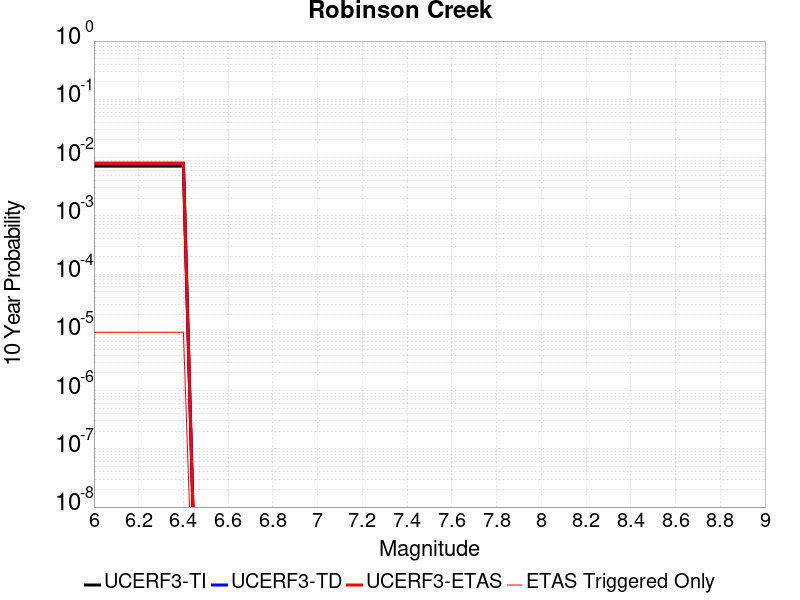 |

| Magnitude | 1 wk TI Prob | 1 wk TD Prob | 1 wk ETAS Prob | 1 wk ETAS/TD Gain | 1 wk ETAS Triggered Only | 1 mo TI Prob | 1 mo TD Prob | 1 mo ETAS Prob | 1 mo ETAS/TD Gain | 1 mo ETAS Triggered Only | 1 yr TI Prob | 1 yr TD Prob | 1 yr ETAS Prob | 1 yr ETAS/TD Gain | 1 yr ETAS Triggered Only | 10 yr TI Prob | 10 yr TD Prob | 10 yr ETAS Prob | 10 yr ETAS/TD Gain | 10 yr ETAS Triggered Only |
|-----|-----|-----|-----|-----|-----|-----|-----|-----|-----|-----|-----|-----|-----|-----|-----|-----|-----|-----|-----|-----|
| 6.0 | 1.3705327E-5 | 1.5284966E-5 | 1.5284966E-5 | 1.0 | 0.0 | 5.8735794E-5 | 6.5506996E-5 | 6.5506996E-5 | 1.0 | 0.0 | 7.1487366E-4 | 7.975477E-4 | 8.0975005E-4 | 1.0152998 | 1.22121E-5 | 0.0071257832 | 0.007975477 | 0.007987591 | 1.001519 | 1.22121E-5 |
| 6.1 | 1.3705327E-5 | 1.5284966E-5 | 1.5284966E-5 | 1.0 | 0.0 | 5.8735794E-5 | 6.5506996E-5 | 6.5506996E-5 | 1.0 | 0.0 | 7.1487366E-4 | 7.975477E-4 | 8.0975005E-4 | 1.0152998 | 1.22121E-5 | 0.0071257832 | 0.007975477 | 0.007987591 | 1.001519 | 1.22121E-5 |
| 6.2 | 1.3705327E-5 | 1.5284966E-5 | 1.5284966E-5 | 1.0 | 0.0 | 5.8735794E-5 | 6.5506996E-5 | 6.5506996E-5 | 1.0 | 0.0 | 7.1487366E-4 | 7.975477E-4 | 8.0975005E-4 | 1.0152998 | 1.22121E-5 | 0.0071257832 | 0.007975477 | 0.007987591 | 1.001519 | 1.22121E-5 |
| 6.3 | 1.3705327E-5 | 1.5284966E-5 | 1.5284966E-5 | 1.0 | 0.0 | 5.8735794E-5 | 6.5506996E-5 | 6.5506996E-5 | 1.0 | 0.0 | 7.1487366E-4 | 7.975477E-4 | 8.0975005E-4 | 1.0152998 | 1.22121E-5 | 0.0071257832 | 0.007975477 | 0.007987591 | 1.001519 | 1.22121E-5 |
| 6.4 | 1.3705327E-5 | 1.5284966E-5 | 1.5284966E-5 | 1.0 | 0.0 | 5.8735794E-5 | 6.5506996E-5 | 6.5506996E-5 | 1.0 | 0.0 | 7.1487366E-4 | 7.975477E-4 | 8.0975005E-4 | 1.0152998 | 1.22121E-5 | 0.0071257832 | 0.007975477 | 0.007987591 | 1.001519 | 1.22121E-5 |

## Great Valley 07 (Orestimba)
*[(top)](#table-of-contents)*

| 1 Week | 1 Month | 1 Year | 10 Year |
|-----|-----|-----|-----|
|  |  |  |  |

| Magnitude | 1 wk TI Prob | 1 wk TD Prob | 1 wk ETAS Prob | 1 wk ETAS/TD Gain | 1 wk ETAS Triggered Only | 1 mo TI Prob | 1 mo TD Prob | 1 mo ETAS Prob | 1 mo ETAS/TD Gain | 1 mo ETAS Triggered Only | 1 yr TI Prob | 1 yr TD Prob | 1 yr ETAS Prob | 1 yr ETAS/TD Gain | 1 yr ETAS Triggered Only | 10 yr TI Prob | 10 yr TD Prob | 10 yr ETAS Prob | 10 yr ETAS/TD Gain | 10 yr ETAS Triggered Only |
|-----|-----|-----|-----|-----|-----|-----|-----|-----|-----|-----|-----|-----|-----|-----|-----|-----|-----|-----|-----|-----|
| 6.0 | 2.9687902E-5 | 3.275741E-5 | 4.4969107E-5 | 1.372792 | 1.22121E-5 | 1.2722766E-4 | 1.4038174E-4 | 1.5259213E-4 | 1.0869799 | 1.22121E-5 | 0.0015478961 | 0.0017078797 | 0.001720071 | 1.0071383 | 1.22121E-5 | 0.015371585 | 0.016955089 | 0.016967095 | 1.0007081 | 1.22121E-5 |
| 6.1 | 2.9687902E-5 | 3.275741E-5 | 4.4969107E-5 | 1.372792 | 1.22121E-5 | 1.2722766E-4 | 1.4038174E-4 | 1.5259213E-4 | 1.0869799 | 1.22121E-5 | 0.0015478961 | 0.0017078797 | 0.001720071 | 1.0071383 | 1.22121E-5 | 0.015371585 | 0.016955089 | 0.016967095 | 1.0007081 | 1.22121E-5 |
| 6.2 | 1.9231524E-5 | 2.1159109E-5 | 3.337095E-5 | 1.5771434 | 1.22121E-5 | 8.2418206E-5 | 9.067888E-5 | 1.0288987E-4 | 1.1346619 | 1.22121E-5 | 0.0010029797 | 0.0011034793 | 0.0011156779 | 1.0110546 | 1.22121E-5 | 0.00998465 | 0.010982411 | 0.010994489 | 1.0010997 | 1.22121E-5 |
| 6.3 | 1.324766E-5 | 1.45484955E-5 | 1.45484955E-5 | 1.0 | 0.0 | 5.6774446E-5 | 6.234925E-5 | 6.234925E-5 | 1.0 | 0.0 | 6.910097E-4 | 7.58847E-4 | 7.58847E-4 | 1.0 | 0.0 | 0.006888649 | 0.007563504 | 0.007563504 | 1.0 | 0.0 |
| 6.4 | 7.818645E-6 | 8.572818E-6 | 8.572818E-6 | 1.0 | 0.0 | 3.3508048E-5 | 3.674015E-5 | 3.674015E-5 | 1.0 | 0.0 | 4.078841E-4 | 4.4722288E-4 | 4.4722288E-4 | 1.0 | 0.0 | 0.004071363 | 0.0044635693 | 0.0044635693 | 1.0 | 0.0 |
| 6.5 | 5.3076565E-6 | 5.8177857E-6 | 5.8177857E-6 | 1.0 | 0.0 | 2.27469E-5 | 2.4933142E-5 | 2.4933142E-5 | 1.0 | 0.0 | 2.7690834E-4 | 3.0352082E-4 | 3.0352082E-4 | 1.0 | 0.0 | 0.0027656353 | 0.0030312722 | 0.0030312722 | 1.0 | 0.0 |
| 6.6 | 3.6003578E-6 | 3.9484853E-6 | 3.9484853E-6 | 1.0 | 0.0 | 1.5430012E-5 | 1.6921978E-5 | 1.6921978E-5 | 1.0 | 0.0 | 1.8784421E-4 | 2.0600717E-4 | 2.0600717E-4 | 1.0 | 0.0 | 0.0018768552 | 0.002058316 | 0.002058316 | 1.0 | 0.0 |
| 6.7 | 2.5361826E-6 | 2.7834608E-6 | 2.7834608E-6 | 1.0 | 0.0 | 1.0869308E-5 | 1.192907E-5 | 1.192907E-5 | 1.0 | 0.0 | 1.3232579E-4 | 1.4522807E-4 | 1.4522807E-4 | 1.0 | 0.0 | 0.0013224703 | 0.0014514616 | 0.0014514616 | 1.0 | 0.0 |
| 6.8 | 1.2115831E-6 | 1.3313763E-6 | 1.3313763E-6 | 1.0 | 0.0 | 5.1924885E-6 | 5.7058915E-6 | 5.7058915E-6 | 1.0 | 0.0 | 6.3216714E-5 | 6.9467984E-5 | 6.9467984E-5 | 1.0 | 0.0 | 6.3198735E-4 | 6.945578E-4 | 6.945578E-4 | 1.0 | 0.0 |

## San Andreas (San Gorgonio Pass-Garnet HIll)
*[(top)](#table-of-contents)*

| 1 Week | 1 Month | 1 Year | 10 Year |
|-----|-----|-----|-----|
|  |  | 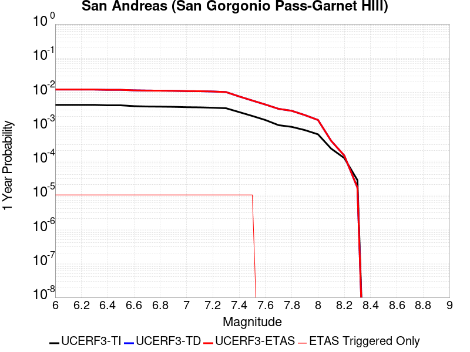 |  |

| Magnitude | 1 wk TI Prob | 1 wk TD Prob | 1 wk ETAS Prob | 1 wk ETAS/TD Gain | 1 wk ETAS Triggered Only | 1 mo TI Prob | 1 mo TD Prob | 1 mo ETAS Prob | 1 mo ETAS/TD Gain | 1 mo ETAS Triggered Only | 1 yr TI Prob | 1 yr TD Prob | 1 yr ETAS Prob | 1 yr ETAS/TD Gain | 1 yr ETAS Triggered Only | 10 yr TI Prob | 10 yr TD Prob | 10 yr ETAS Prob | 10 yr ETAS/TD Gain | 10 yr ETAS Triggered Only |
|-----|-----|-----|-----|-----|-----|-----|-----|-----|-----|-----|-----|-----|-----|-----|-----|-----|-----|-----|-----|-----|
| 6.0 | 8.31567E-5 | 2.3376173E-4 | 2.45971E-4 | 1.0522294 | 1.22121E-5 | 3.5633717E-4 | 0.0010014536 | 0.0010136535 | 1.0121821 | 1.22121E-5 | 0.004329778 | 0.012124644 | 0.012136708 | 1.000995 | 1.22121E-5 | 0.042463828 | 0.11255409 | 0.11256492 | 1.0000963 | 1.22121E-5 |
| 6.1 | 8.31567E-5 | 2.3376173E-4 | 2.45971E-4 | 1.0522294 | 1.22121E-5 | 3.5633717E-4 | 0.0010014536 | 0.0010136535 | 1.0121821 | 1.22121E-5 | 0.004329778 | 0.012124644 | 0.012136708 | 1.000995 | 1.22121E-5 | 0.042463828 | 0.11255409 | 0.11256492 | 1.0000963 | 1.22121E-5 |
| 6.2 | 8.31567E-5 | 2.3376173E-4 | 2.45971E-4 | 1.0522294 | 1.22121E-5 | 3.5633717E-4 | 0.0010014536 | 0.0010136535 | 1.0121821 | 1.22121E-5 | 0.004329778 | 0.012124644 | 0.012136708 | 1.000995 | 1.22121E-5 | 0.042463828 | 0.11255409 | 0.11256492 | 1.0000963 | 1.22121E-5 |
| 6.3 | 8.31567E-5 | 2.3376173E-4 | 2.45971E-4 | 1.0522294 | 1.22121E-5 | 3.5633717E-4 | 0.0010014536 | 0.0010136535 | 1.0121821 | 1.22121E-5 | 0.004329778 | 0.012124644 | 0.012136708 | 1.000995 | 1.22121E-5 | 0.042463828 | 0.11255409 | 0.11256492 | 1.0000963 | 1.22121E-5 |
| 6.4 | 8.059055E-5 | 2.2934518E-4 | 2.4155449E-4 | 1.0532354 | 1.22121E-5 | 3.4534236E-4 | 9.825402E-4 | 9.947403E-4 | 1.0124168 | 1.22121E-5 | 0.0041964394 | 0.011896912 | 0.011908978 | 1.0010142 | 1.22121E-5 | 0.041180745 | 0.11053528 | 0.11054614 | 1.0000982 | 1.22121E-5 |
| 6.5 | 8.059055E-5 | 2.2934518E-4 | 2.4155449E-4 | 1.0532354 | 1.22121E-5 | 3.4534236E-4 | 9.825402E-4 | 9.947403E-4 | 1.0124168 | 1.22121E-5 | 0.0041964394 | 0.011896912 | 0.011908978 | 1.0010142 | 1.22121E-5 | 0.041180745 | 0.11053528 | 0.11054614 | 1.0000982 | 1.22121E-5 |
| 6.6 | 7.619237E-5 | 2.2178894E-4 | 2.3399833E-4 | 1.0550495 | 1.22121E-5 | 3.2649786E-4 | 9.5018005E-4 | 9.6238055E-4 | 1.0128402 | 1.22121E-5 | 0.0039678677 | 0.011507631 | 0.011519703 | 1.001049 | 1.22121E-5 | 0.03897764 | 0.1070719 | 0.1070828 | 1.0001018 | 1.22121E-5 |
| 6.7 | 7.440636E-5 | 2.1854721E-4 | 2.3075665E-4 | 1.0558664 | 1.22121E-5 | 3.188454E-4 | 9.36297E-4 | 9.484977E-4 | 1.0130308 | 1.22121E-5 | 0.0038750346 | 0.0113403695 | 0.011352443 | 1.0010647 | 1.22121E-5 | 0.038081564 | 0.10558031 | 0.10559123 | 1.0001035 | 1.22121E-5 |
| 6.8 | 7.3735864E-5 | 2.1701894E-4 | 2.2922839E-4 | 1.0562599 | 1.22121E-5 | 3.1597257E-4 | 9.2975196E-4 | 9.419527E-4 | 1.0131226 | 1.22121E-5 | 0.0038401815 | 0.011261511 | 0.011273585 | 1.0010722 | 1.22121E-5 | 0.03774495 | 0.104881845 | 0.104892775 | 1.0001042 | 1.22121E-5 |
| 6.9 | 7.27575E-5 | 2.1470869E-4 | 2.2691817E-4 | 1.0568653 | 1.22121E-5 | 3.117806E-4 | 9.198579E-4 | 9.320587E-4 | 1.0132638 | 1.22121E-5 | 0.003789323 | 0.011142288 | 0.011154364 | 1.0010839 | 1.22121E-5 | 0.037253562 | 0.103829734 | 0.10384068 | 1.0001054 | 1.22121E-5 |
| 7.0 | 7.102591E-5 | 2.1054916E-4 | 2.2275868E-4 | 1.057989 | 1.22121E-5 | 3.0436125E-4 | 9.020437E-4 | 9.142448E-4 | 1.0135261 | 1.22121E-5 | 0.003699303 | 0.010927594 | 0.010939673 | 1.0011053 | 1.22121E-5 | 0.03638325 | 0.1019319 | 0.10194287 | 1.0001076 | 1.22121E-5 |
| 7.1 | 7.028513E-5 | 2.0890564E-4 | 2.2111519E-4 | 1.0584453 | 1.22121E-5 | 3.0118722E-4 | 8.950049E-4 | 9.0720603E-4 | 1.0136325 | 1.22121E-5 | 0.0036607897 | 0.010842753 | 0.010854833 | 1.0011141 | 1.22121E-5 | 0.036010686 | 0.10117493 | 0.1011859 | 1.0001085 | 1.22121E-5 |
| 7.2 | 6.8498244E-5 | 2.0498442E-4 | 2.1719401E-4 | 1.0595635 | 1.22121E-5 | 2.9353087E-4 | 8.782111E-4 | 8.904125E-4 | 1.0138935 | 1.22121E-5 | 0.003567883 | 0.010640301 | 0.010652383 | 1.0011355 | 1.22121E-5 | 0.035111405 | 0.099366926 | 0.09937792 | 1.0001107 | 1.22121E-5 |
| 7.3 | 6.622592E-5 | 1.9725891E-4 | 2.0946859E-4 | 1.0618968 | 1.22121E-5 | 2.8379448E-4 | 8.4512355E-4 | 8.573253E-4 | 1.0144379 | 1.22121E-5 | 0.0034497243 | 0.010241316 | 0.010253403 | 1.0011802 | 1.22121E-5 | 0.033966612 | 0.09586389 | 0.095874935 | 1.0001152 | 1.22121E-5 |
| 7.4 | 5.1050705E-5 | 1.468621E-4 | 1.5907241E-4 | 1.0831413 | 1.22121E-5 | 2.1877038E-4 | 6.292581E-4 | 6.414625E-4 | 1.0193949 | 1.22121E-5 | 0.002660276 | 0.0076344977 | 0.0076466165 | 1.0015874 | 1.22121E-5 | 0.02628654 | 0.07285113 | 0.072862454 | 1.0001554 | 1.22121E-5 |
| 7.5 | 3.9302922E-5 | 1.1129282E-4 | 1.2350356E-4 | 1.1097172 | 1.22121E-5 | 1.6843023E-4 | 4.768824E-4 | 4.8908865E-4 | 1.025596 | 1.22121E-5 | 0.0020487092 | 0.005790656 | 0.005802797 | 1.0020968 | 1.22121E-5 | 0.020299247 | 0.05600702 | 0.056018546 | 1.0002059 | 1.22121E-5 |
| 7.6 | 2.9851626E-5 | 8.494473E-5 | 8.494473E-5 | 1.0 | 0.0 | 1.2792926E-4 | 3.6399817E-4 | 3.6399817E-4 | 1.0 | 0.0 | 0.0015564259 | 0.0044226977 | 0.0044226977 | 1.0 | 0.0 | 0.0154556995 | 0.043191496 | 0.043191496 | 1.0 | 0.0 |
| 7.7 | 2.1135214E-5 | 6.352455E-5 | 6.352455E-5 | 1.0 | 0.0 | 9.0576345E-5 | 2.7221968E-4 | 2.7221968E-4 | 1.0 | 0.0 | 0.0011022091 | 0.0033092434 | 0.0033092434 | 1.0 | 0.0 | 0.010967582 | 0.03258059 | 0.03258059 | 1.0 | 0.0 |
| 7.8 | 1.883379E-5 | 5.56362E-5 | 5.56362E-5 | 1.0 | 0.0 | 8.0713755E-5 | 2.3841907E-4 | 2.3841907E-4 | 1.0 | 0.0 | 9.822468E-4 | 0.0028988915 | 0.0028988915 | 1.0 | 0.0 | 0.0097791655 | 0.02869336 | 0.02869336 | 1.0 | 0.0 |
| 7.9 | 1.5156185E-5 | 4.165507E-5 | 4.165507E-5 | 1.0 | 0.0 | 6.495346E-5 | 1.7850952E-4 | 1.7850952E-4 | 1.0 | 0.0 | 7.9052144E-4 | 0.0021711884 | 0.0021711884 | 1.0 | 0.0 | 0.007877152 | 0.021757882 | 0.021757882 | 1.0 | 0.0 |
| 8.0 | 1.1405907E-5 | 2.9971703E-5 | 2.9971703E-5 | 1.0 | 0.0 | 4.8881542E-5 | 1.2844383E-4 | 1.2844383E-4 | 1.0 | 0.0 | 5.9497025E-4 | 0.001562683 | 0.001562683 | 1.0 | 0.0 | 0.005933798 | 0.015771678 | 0.015771678 | 1.0 | 0.0 |
| 8.1 | 4.3511436E-6 | 7.36832E-6 | 7.36832E-6 | 1.0 | 0.0 | 1.8647626E-5 | 3.1578133E-5 | 3.1578133E-5 | 1.0 | 0.0 | 2.2701119E-4 | 3.8439606E-4 | 3.8439606E-4 | 1.0 | 0.0 | 0.0022677942 | 0.004115886 | 0.004115886 | 1.0 | 0.0 |
| 8.2 | 2.3042528E-6 | 2.7325216E-6 | 2.7325216E-6 | 1.0 | 0.0 | 9.875332E-6 | 1.1710755E-5 | 1.1710755E-5 | 1.0 | 0.0 | 1.2022553E-4 | 1.4256914E-4 | 1.4256914E-4 | 1.0 | 0.0 | 0.0012016051 | 0.0015977593 | 0.0015977593 | 1.0 | 0.0 |
| 8.3 | 5.202968E-7 | 3.1592276E-7 | 3.1592276E-7 | 1.0 | 0.0 | 2.2298414E-6 | 1.3539541E-6 | 1.3539541E-6 | 1.0 | 0.0 | 2.714798E-5 | 1.6484279E-5 | 1.6484279E-5 | 1.0 | 0.0 | 2.7144665E-4 | 1.9559723E-4 | 1.9559723E-4 | 1.0 | 0.0 |

## Green Valley 2011 CFM
*[(top)](#table-of-contents)*

| 1 Week | 1 Month | 1 Year | 10 Year |
|-----|-----|-----|-----|
|  | 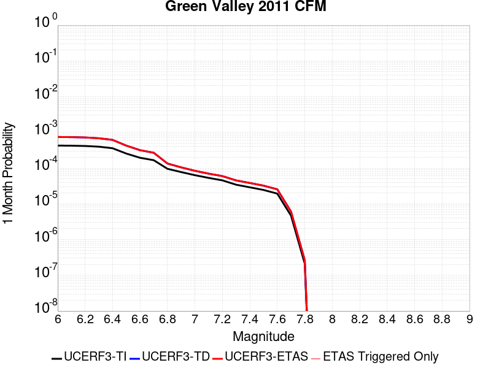 | 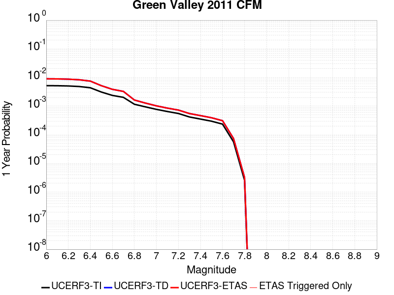 |  |

| Magnitude | 1 wk TI Prob | 1 wk TD Prob | 1 wk ETAS Prob | 1 wk ETAS/TD Gain | 1 wk ETAS Triggered Only | 1 mo TI Prob | 1 mo TD Prob | 1 mo ETAS Prob | 1 mo ETAS/TD Gain | 1 mo ETAS Triggered Only | 1 yr TI Prob | 1 yr TD Prob | 1 yr ETAS Prob | 1 yr ETAS/TD Gain | 1 yr ETAS Triggered Only | 10 yr TI Prob | 10 yr TD Prob | 10 yr ETAS Prob | 10 yr ETAS/TD Gain | 10 yr ETAS Triggered Only |
|-----|-----|-----|-----|-----|-----|-----|-----|-----|-----|-----|-----|-----|-----|-----|-----|-----|-----|-----|-----|-----|
| 6.0 | 9.9629346E-5 | 1.7305402E-4 | 1.7305402E-4 | 1.0 | 0.0 | 4.2691303E-4 | 7.414357E-4 | 7.414357E-4 | 1.0 | 0.0 | 0.0051852856 | 0.008986672 | 0.008986672 | 1.0 | 0.0 | 0.050659515 | 0.0855217 | 0.08553287 | 1.0001305 | 1.22121E-5 |
| 6.1 | 9.88615E-5 | 1.7152716E-4 | 1.7152716E-4 | 1.0 | 0.0 | 4.2362334E-4 | 7.3489564E-4 | 7.3489564E-4 | 1.0 | 0.0 | 0.0051454236 | 0.008907701 | 0.008907701 | 1.0 | 0.0 | 0.050279044 | 0.08480932 | 0.084820494 | 1.0001317 | 1.22121E-5 |
| 6.2 | 9.696895E-5 | 1.679176E-4 | 1.679176E-4 | 1.0 | 0.0 | 4.15515E-4 | 7.1943476E-4 | 7.1943476E-4 | 1.0 | 0.0 | 0.0050471667 | 0.008721082 | 0.008721082 | 1.0 | 0.0 | 0.04934063 | 0.083118245 | 0.08312944 | 1.0001347 | 1.22121E-5 |
| 6.3 | 9.275224E-5 | 1.5971102E-4 | 1.5971102E-4 | 1.0 | 0.0 | 3.9744904E-4 | 6.842823E-4 | 6.842823E-4 | 1.0 | 0.0 | 0.0048282105 | 0.008296408 | 0.008296408 | 1.0 | 0.0 | 0.047246475 | 0.07925671 | 0.079267964 | 1.0001419 | 1.22121E-5 |
| 6.4 | 8.391499E-5 | 1.4367682E-4 | 1.4367682E-4 | 1.0 | 0.0 | 3.595861E-4 | 6.1561994E-4 | 6.1561994E-4 | 1.0 | 0.0 | 0.004369175 | 0.0074670548 | 0.0074670548 | 1.0 | 0.0 | 0.04284265 | 0.07163053 | 0.07164187 | 1.0001583 | 1.22121E-5 |
| 6.5 | 5.9519385E-5 | 9.934002E-5 | 9.934002E-5 | 1.0 | 0.0 | 2.5505814E-4 | 4.256776E-4 | 4.256776E-4 | 1.0 | 0.0 | 0.0031009112 | 0.005168271 | 0.005168271 | 1.0 | 0.0 | 0.030579966 | 0.050145593 | 0.050145593 | 1.0 | 0.0 |
| 6.6 | 4.5361558E-5 | 7.402536E-5 | 7.402536E-5 | 1.0 | 0.0 | 1.9439218E-4 | 3.1721583E-4 | 3.1721583E-4 | 1.0 | 0.0 | 0.0023641558 | 0.0038539206 | 0.0038539206 | 1.0 | 0.0 | 0.023391623 | 0.037665732 | 0.037665732 | 1.0 | 0.0 |
| 6.7 | 3.8808106E-5 | 6.265138E-5 | 6.265138E-5 | 1.0 | 0.0 | 1.6630985E-4 | 2.684809E-4 | 2.684809E-4 | 1.0 | 0.0 | 0.0020229418 | 0.0032626393 | 0.0032626393 | 1.0 | 0.0 | 0.020046256 | 0.032005716 | 0.032005716 | 1.0 | 0.0 |
| 6.8 | 2.2284667E-5 | 3.1285173E-5 | 3.1285173E-5 | 1.0 | 0.0 | 9.550222E-5 | 1.3407251E-4 | 1.3407251E-4 | 1.0 | 0.0 | 0.0011621192 | 0.0016311047 | 0.0016311047 | 1.0 | 0.0 | 0.011560607 | 0.016165968 | 0.016165968 | 1.0 | 0.0 |
| 6.9 | 1.8050168E-5 | 2.4448014E-5 | 2.4448014E-5 | 1.0 | 0.0 | 7.735557E-5 | 1.04773026E-4 | 1.04773026E-4 | 1.0 | 0.0 | 9.4139716E-4 | 0.0012748688 | 0.0012748688 | 1.0 | 0.0 | 0.009374191 | 0.012667812 | 0.012667812 | 1.0 | 0.0 |
| 7.0 | 1.4763166E-5 | 1.9582823E-5 | 1.9582823E-5 | 1.0 | 0.0 | 6.326917E-5 | 8.3923704E-5 | 8.3923704E-5 | 1.0 | 0.0 | 7.7002996E-4 | 0.0010212951 | 0.0010212951 | 1.0 | 0.0 | 0.007673672 | 0.010165328 | 0.010165328 | 1.0 | 0.0 |
| 7.1 | 1.2399713E-5 | 1.6303691E-5 | 1.6303691E-5 | 1.0 | 0.0 | 5.3140546E-5 | 6.98711E-5 | 6.98711E-5 | 1.0 | 0.0 | 6.467941E-4 | 8.503506E-4 | 8.503506E-4 | 1.0 | 0.0 | 0.006449148 | 0.008471247 | 0.008471247 | 1.0 | 0.0 |
| 7.2 | 1.0584195E-5 | 1.3921721E-5 | 1.3921721E-5 | 1.0 | 0.0 | 4.5360044E-5 | 5.966316E-5 | 5.966316E-5 | 1.0 | 0.0 | 5.521186E-4 | 7.2615856E-4 | 7.2615856E-4 | 1.0 | 0.0 | 0.0055074887 | 0.007238274 | 0.007238274 | 1.0 | 0.0 |
| 7.3 | 7.998173E-6 | 1.0544004E-5 | 1.0544004E-5 | 1.0 | 0.0 | 3.4277433E-5 | 4.518781E-5 | 4.518781E-5 | 1.0 | 0.0 | 4.1724785E-4 | 5.500238E-4 | 5.500238E-4 | 1.0 | 0.0 | 0.004164653 | 0.0054868907 | 0.0054868907 | 1.0 | 0.0 |
| 7.4 | 6.7571127E-6 | 8.932682E-6 | 8.932682E-6 | 1.0 | 0.0 | 2.8958733E-5 | 3.8282367E-5 | 3.8282367E-5 | 1.0 | 0.0 | 3.5251552E-4 | 4.6598908E-4 | 4.6598908E-4 | 1.0 | 0.0 | 0.0035195686 | 0.0046503227 | 0.0046503227 | 1.0 | 0.0 |
| 7.5 | 5.69878E-6 | 7.516301E-6 | 7.516301E-6 | 1.0 | 0.0 | 2.4423114E-5 | 3.2212327E-5 | 3.2212327E-5 | 1.0 | 0.0 | 2.9731085E-4 | 3.9211538E-4 | 3.9211538E-4 | 1.0 | 0.0 | 0.002969134 | 0.003914387 | 0.003914387 | 1.0 | 0.0 |
| 7.6 | 4.503664E-6 | 5.9356703E-6 | 5.9356703E-6 | 1.0 | 0.0 | 1.9301275E-5 | 2.5438343E-5 | 2.5438343E-5 | 1.0 | 0.0 | 2.3496768E-4 | 3.0966863E-4 | 3.0966863E-4 | 1.0 | 0.0 | 0.002347194 | 0.0030924964 | 0.0030924964 | 1.0 | 0.0 |
| 7.7 | 1.0873546E-6 | 1.4106953E-6 | 1.4106953E-6 | 1.0 | 0.0 | 4.6600826E-6 | 6.0458233E-6 | 6.0458233E-6 | 1.0 | 0.0 | 5.6735033E-5 | 7.3605435E-5 | 7.3605435E-5 | 1.0 | 0.0 | 5.672055E-4 | 7.3581265E-4 | 7.3581265E-4 | 1.0 | 0.0 |
| 7.8 | 4.9373917E-8 | 6.177699E-8 | 6.177699E-8 | 1.0 | 0.0 | 2.1160248E-7 | 2.647585E-7 | 2.647585E-7 | 1.0 | 0.0 | 2.5762572E-6 | 3.2234313E-6 | 3.2234313E-6 | 1.0 | 0.0 | 2.5762274E-5 | 3.223222E-5 | 3.223222E-5 | 1.0 | 0.0 |

