# ComCat M6.4 (ci38443183), ShakeMap Surface Results

|   | ComCat M6.4 (ci38443183), ShakeMap Surface |
|-----|-----|
| Num Simulations | 100000 |
| Start Time | 2019/07/04 17:33:50 UTC |
| Start Time Epoch Milliseconds | 1562261630000 |
| Duration | 10 Years |
| Includes Spontaneous? | false |
| Trigger Ruptures | *(none)* |
| Config Generated With | u3etas_comcat_event_config_builder.sh --event-id ci38443183 --num-simulations 100000 --days-before 7 --finite-surf-shakemap --finite-surf-shakemap-min-mag 5 --hpc-site USC_HPC --nodes 36 --hours 24 --queue scec_hiprio |

## Table Of Contents

* [Probabilities Summary Table](#probabilities-summary-table)
* [Magnitude Number Distribution](#magnitude-number-distribution)
  * [10 Year Magnitude Number Distribution](#10-year-magnitude-number-distribution)
  * [1 Year Magnitude Number Distribution](#1-year-magnitude-number-distribution)
  * [1 Month Magnitude Number Distribution](#1-month-magnitude-number-distribution)
  * [1 Week Magnitude Number Distribution](#1-week-magnitude-number-distribution)
  * [1 Day Magnitude Number Distribution](#1-day-magnitude-number-distribution)
  * [1 Hour Magnitude Number Distribution](#1-hour-magnitude-number-distribution)
* [Hazard Change Over Time](#hazard-change-over-time)
  * [M&ge;5.0 Hazard Change Over Time](#m50-hazard-change-over-time)
  * [M&ge;6.0 Hazard Change Over Time](#m60-hazard-change-over-time)
  * [M&ge;7.0 Hazard Change Over Time](#m70-hazard-change-over-time)
  * [M&ge;8.0 Hazard Change Over Time](#m80-hazard-change-over-time)
* [Trigger Rupture Fault Map](#trigger-rupture-fault-map)
* [Trigger Rupture Depth Map](#trigger-rupture-depth-map)
* [Fault Distances To Triggers](#fault-distances-to-triggers)
* [Individual Simulated Catalog Maps](#individual-simulated-catalog-maps)
* [ComCat Data Comparisons](#comcat-data-comparisons)
  * [ComCat Magnitude-Number Distributions](#comcat-magnitude-number-distributions)
  * [ComCat Time-Dependent Mc](#comcat-time-dependent-mc)
  * [ComCat Cumulative Number Vs Time](#comcat-cumulative-number-vs-time)
  * [ComCat Cumulative Number Simulation Percentiles](#comcat-cumulative-number-simulation-percentiles)
  * [ComCat Probability Spatial Distribution](#comcat-probability-spatial-distribution)
  * [ComCat Mean Expectation Spatial Distribution](#comcat-mean-expectation-spatial-distribution)
  * [ComCat Depth Distribution](#comcat-depth-distribution)
* [Section Participation](#section-participation)
  * [Section Participation Plots](#section-participation-plots)
  * [Supra-Seismogenic Parent Sections Table](#supra-seismogenic-parent-sections-table)
  * [M≥6.5 Parent Sections Table](#m65-parent-sections-table)
  * [M≥7 Parent Sections Table](#m7-parent-sections-table)
  * [M≥7.5 Parent Sections Table](#m75-parent-sections-table)
  * [M≥8 Parent Sections Table](#m8-parent-sections-table)
  * [Fault Magnitude-Probability Distributions](#fault-magnitude-probability-distributions)
* [Gridded Nucleation](#gridded-nucleation)
* [JSON Input File](#json-input-file)

## Probabilities Summary Table
*[(top)](#table-of-contents)*

| Magnitude | 1 Hour Prob | 1 Day Prob | 1 Week Prob | 1 Month Prob | 1 Year Prob | 10 Year Prob |
|-----|-----|-----|-----|-----|-----|-----|
| **M&ge;3** | 1.000 (100.00%) | 1.000 (100.00%) | 1.000 (100.00%) | 1.000 (100.00%) | 1.000 (100.00%) | 1.000 (100.00%) |
| **M&ge;3.5** | 1.000 (99.99%) | 1.000 (100.00%) | 1.000 (100.00%) | 1.000 (100.00%) | 1.000 (100.00%) | 1.000 (100.00%) |
| **M&ge;4** | 0.948 (94.75%) | 0.999 (99.91%) | 1.000 (99.99%) | 1.000 (100.00%) | 1.000 (100.00%) | 1.000 (100.00%) |
| **M&ge;4.5** | 0.608 (60.80%) | 0.901 (90.10%) | 0.957 (95.73%) | 0.977 (97.71%) | 0.991 (99.11%) | 0.996 (99.57%) |
| **M&ge;5** | 0.254 (25.45%) | 0.526 (52.56%) | 0.641 (64.14%) | 0.708 (70.85%) | 0.792 (79.20%) | 0.844 (84.42%) |
| **M&ge;5.5** | 0.086 (8.61%) | 0.209 (20.86%) | 0.279 (27.93%) | 0.328 (32.78%) | 0.402 (40.23%) | 0.461 (46.15%) |
| **M&ge;6** | 0.025 (2.51%) | 0.067 (6.70%) | 0.095 (9.45%) | 0.115 (11.51%) | 0.150 (14.97%) | 0.180 (17.98%) |
| **M&ge;6.4** | 8.37E-3 (0.84%) | 0.023 (2.29%) | 0.033 (3.31%) | 0.041 (4.07%) | 0.054 (5.40%) | 0.067 (6.69%) |
| **M&ge;6.5** | 6.03E-3 (0.60%) | 0.017 (1.67%) | 0.024 (2.44%) | 0.030 (3.03%) | 0.040 (4.02%) | 0.051 (5.06%) |
| **M&ge;7** | 1.35E-3 (0.14%) | 3.72E-3 (0.37%) | 5.74E-3 (0.57%) | 7.24E-3 (0.72%) | 0.010 (1.03%) | 0.013 (1.34%) |
| **M&ge;7.5** | 2.80E-4 (0.03%) | 9.80E-4 (0.10%) | 1.38E-3 (0.14%) | 1.80E-3 (0.18%) | 2.61E-3 (0.26%) | 3.62E-3 (0.36%) |
| **M&ge;8** | 1.00E-5 (0.00%) | 3.00E-5 (0.00%) | 4.00E-5 (0.00%) | 4.00E-5 (0.00%) | 4.00E-5 (0.00%) | 1.00E-4 (0.01%) |

## Magnitude Number Distribution
*[(top)](#table-of-contents)*

### 10 Year Magnitude Number Distribution
*[(top)](#table-of-contents)*

**Legend**
* **Mean** (thick black line): mean expected number across all 100000 catalogs
* **2.5%,97.5%** (thin black lines): expected number percentiles across all 100000 catalogs
* **Median** (thin blue line): median expected number across all 100000 catalogs
* **Mode** (thin cyan line): modal expected number across all 100000 catalogs
* **10 yr Probability** (thin red line): 10 year probability calculated as the fraction of catalogs with at least 1 occurrence
* **10 yr Supraseismogenic Probability** (thin dashed red line): same as above, but only for supraseismogenic ruptures on explicitly modeled UCERF3 faults
* **95% Conf** (light red shaded region): binomial 95% confidence bounds on probability
* **Primary** (thin green line): mean expected number from primary triggered aftershocks only (no secondary, tertiary, etc...) across all 100000 catalogs


| Mag | Mean | 2.5 %ile | 97.5 %ile | Median | Mode | 10 yr Probability | 10 yr Supra-Seis Prob | Primary Aftershocks Mean |
|-----|-----|-----|-----|-----|-----|-----|-----|-----|
| **M&ge;2.5** | 982.644 | 544.000 | 2890.000 | 722.000 | 646.000 | 1.000 (100.00%) | 0.046 (4.61%) | 419.101 |
| **M&ge;2.6** | 780.507 | 429.000 | 2294.000 | 575.000 | 499.000 | 1.000 (100.00%) | 0.046 (4.61%) | 332.893 |
| **M&ge;2.7** | 619.942 | 338.000 | 1824.000 | 457.000 | 402.000 | 1.000 (100.00%) | 0.046 (4.61%) | 264.426 |
| **M&ge;2.8** | 492.433 | 265.000 | 1449.000 | 363.000 | 323.000 | 1.000 (100.00%) | 0.046 (4.61%) | 210.016 |
| **M&ge;2.9** | 391.104 | 208.000 | 1154.000 | 289.000 | 262.000 | 1.000 (100.00%) | 0.046 (4.61%) | 166.810 |
| **M&ge;3** | 310.661 | 163.000 | 915.000 | 230.000 | 206.000 | 1.000 (100.00%) | 0.046 (4.61%) | 132.500 |
| **M&ge;3.1** | 246.735 | 127.000 | 727.000 | 183.000 | 164.000 | 1.000 (100.00%) | 0.046 (4.61%) | 105.241 |
| **M&ge;3.2** | 195.952 | 99.000 | 580.000 | 146.000 | 130.000 | 1.000 (100.00%) | 0.046 (4.61%) | 83.571 |
| **M&ge;3.3** | 155.661 | 76.000 | 461.000 | 116.000 | 103.000 | 1.000 (100.00%) | 0.046 (4.61%) | 66.380 |
| **M&ge;3.4** | 123.629 | 59.000 | 367.000 | 92.000 | 84.000 | 1.000 (100.00%) | 0.046 (4.61%) | 52.717 |
| **M&ge;3.5** | 98.203 | 45.000 | 292.000 | 73.000 | 66.000 | 1.000 (100.00%) | 0.046 (4.61%) | 41.868 |
| **M&ge;3.6** | 77.965 | 35.000 | 232.000 | 58.000 | 52.000 | 1.000 (100.00%) | 0.046 (4.61%) | 33.239 |
| **M&ge;3.7** | 61.908 | 26.000 | 186.000 | 46.000 | 40.000 | 1.000 (100.00%) | 0.046 (4.61%) | 26.398 |
| **M&ge;3.8** | 49.146 | 20.000 | 148.000 | 37.000 | 32.000 | 1.000 (100.00%) | 0.046 (4.61%) | 20.968 |
| **M&ge;3.9** | 39.030 | 15.000 | 118.000 | 29.000 | 25.000 | 1.000 (100.00%) | 0.046 (4.61%) | 16.648 |
| **M&ge;4** | 30.965 | 11.000 | 95.000 | 23.000 | 20.000 | 1.000 (100.00%) | 0.046 (4.61%) | 13.211 |
| **M&ge;4.1** | 24.583 | 8.000 | 76.000 | 18.000 | 16.000 | 1.000 (100.00%) | 0.046 (4.61%) | 10.482 |
| **M&ge;4.2** | 19.513 | 6.000 | 60.000 | 15.000 | 12.000 | 1.000 (100.00%) | 0.046 (4.61%) | 8.325 |
| **M&ge;4.3** | 15.494 | 4.000 | 49.000 | 12.000 | 9.000 | 1.000 (99.98%) | 0.046 (4.61%) | 6.613 |
| **M&ge;4.4** | 12.292 | 3.000 | 39.000 | 9.000 | 7.000 | 0.999 (99.88%) | 0.046 (4.61%) | 5.245 |
| **M&ge;4.5** | 9.749 | 2.000 | 32.000 | 7.000 | 6.000 | 0.996 (99.57%) | 0.046 (4.61%) | 4.163 |
| **M&ge;4.6** | 7.731 | 1.000 | 26.000 | 6.000 | 4.000 | 0.988 (98.78%) | 0.046 (4.61%) | 3.302 |
| **M&ge;4.7** | 6.127 | 0.000 | 21.000 | 4.000 | 3.000 | 0.971 (97.10%) | 0.046 (4.61%) | 2.619 |
| **M&ge;4.8** | 4.853 | 0.000 | 17.000 | 3.000 | 2.000 | 0.943 (94.26%) | 0.046 (4.61%) | 2.075 |
| **M&ge;4.9** | 3.841 | 0.000 | 14.000 | 3.000 | 2.000 | 0.900 (90.02%) | 0.046 (4.61%) | 1.641 |
| **M&ge;5** | 3.034 | 0.000 | 12.000 | 2.000 | 1.000 | 0.844 (84.42%) | 0.046 (4.61%) | 1.299 |
| **M&ge;5.1** | 2.398 | 0.000 | 10.000 | 2.000 | 1.000 | 0.777 (77.66%) | 0.046 (4.61%) | 1.028 |
| **M&ge;5.2** | 1.891 | 0.000 | 8.000 | 1.000 | 0.000 | 0.699 (69.94%) | 0.046 (4.61%) | 0.812 |
| **M&ge;5.3** | 1.491 | 0.000 | 7.000 | 1.000 | 0.000 | 0.619 (61.92%) | 0.046 (4.61%) | 0.640 |
| **M&ge;5.4** | 1.169 | 0.000 | 6.000 | 1.000 | 0.000 | 0.538 (53.76%) | 0.046 (4.61%) | 0.502 |
| **M&ge;5.5** | 0.916 | 0.000 | 5.000 | 0.000 | 0.000 | 0.461 (46.15%) | 0.046 (4.61%) | 0.394 |
| **M&ge;5.6** | 0.715 | 0.000 | 4.000 | 0.000 | 0.000 | 0.390 (39.04%) | 0.046 (4.61%) | 0.308 |
| **M&ge;5.7** | 0.553 | 0.000 | 3.000 | 0.000 | 0.000 | 0.325 (32.48%) | 0.046 (4.61%) | 0.239 |
| **M&ge;5.8** | 0.424 | 0.000 | 3.000 | 0.000 | 0.000 | 0.266 (26.60%) | 0.046 (4.61%) | 0.184 |
| **M&ge;5.9** | 0.325 | 0.000 | 2.000 | 0.000 | 0.000 | 0.217 (21.71%) | 0.046 (4.61%) | 0.142 |
| **M&ge;6** | 0.258 | 0.000 | 2.000 | 0.000 | 0.000 | 0.180 (17.98%) | 0.046 (4.61%) | 0.113 |
| **M&ge;6.1** | 0.199 | 0.000 | 2.000 | 0.000 | 0.000 | 0.146 (14.58%) | 0.038 (3.79%) | 0.089 |
| **M&ge;6.2** | 0.145 | 0.000 | 1.000 | 0.000 | 0.000 | 0.114 (11.35%) | 0.029 (2.92%) | 0.067 |
| **M&ge;6.3** | 0.108 | 0.000 | 1.000 | 0.000 | 0.000 | 0.087 (8.72%) | 0.024 (2.37%) | 0.050 |
| **M&ge;6.4** | 0.082 | 0.000 | 1.000 | 0.000 | 0.000 | 0.067 (6.69%) | 0.020 (1.99%) | 0.037 |
| **M&ge;6.5** | 0.061 | 0.000 | 1.000 | 0.000 | 0.000 | 0.051 (5.06%) | 0.017 (1.69%) | 0.027 |
| **M&ge;6.6** | 0.046 | 0.000 | 1.000 | 0.000 | 0.000 | 0.039 (3.95%) | 0.015 (1.55%) | 0.020 |
| **M&ge;6.7** | 0.035 | 0.000 | 1.000 | 0.000 | 0.000 | 0.030 (3.00%) | 0.014 (1.36%) | 0.015 |
| **M&ge;6.8** | 0.026 | 0.000 | 0.000 | 0.000 | 0.000 | 0.023 (2.28%) | 0.012 (1.19%) | 0.011 |
| **M&ge;6.9** | 0.019 | 0.000 | 0.000 | 0.000 | 0.000 | 0.017 (1.72%) | 0.010 (1.02%) | 7.80E-3 |
| **M&ge;7** | 0.014 | 0.000 | 0.000 | 0.000 | 0.000 | 0.013 (1.34%) | 9.22E-3 (0.92%) | 5.86E-3 |
| **M&ge;7.1** | 0.012 | 0.000 | 0.000 | 0.000 | 0.000 | 0.011 (1.10%) | 8.71E-3 (0.87%) | 4.35E-3 |
| **M&ge;7.2** | 8.91E-3 | 0.000 | 0.000 | 0.000 | 0.000 | 8.54E-3 (0.85%) | 7.28E-3 (0.73%) | 3.19E-3 |
| **M&ge;7.3** | 5.88E-3 | 0.000 | 0.000 | 0.000 | 0.000 | 5.70E-3 (0.57%) | 5.05E-3 (0.51%) | 1.98E-3 |
| **M&ge;7.4** | 4.99E-3 | 0.000 | 0.000 | 0.000 | 0.000 | 4.87E-3 (0.49%) | 4.55E-3 (0.46%) | 1.64E-3 |
| **M&ge;7.5** | 3.68E-3 | 0.000 | 0.000 | 0.000 | 0.000 | 3.62E-3 (0.36%) | 3.53E-3 (0.35%) | 1.16E-3 |
| **M&ge;7.6** | 2.38E-3 | 0.000 | 0.000 | 0.000 | 0.000 | 2.34E-3 (0.23%) | 2.30E-3 (0.23%) | 6.60E-4 |
| **M&ge;7.7** | 7.80E-4 | 0.000 | 0.000 | 0.000 | 0.000 | 7.60E-4 (0.08%) | 7.30E-4 (0.07%) | 2.00E-4 |
| **M&ge;7.8** | 5.00E-4 | 0.000 | 0.000 | 0.000 | 0.000 | 5.00E-4 (0.05%) | 4.70E-4 (0.05%) | 1.10E-4 |
| **M&ge;7.9** | 2.30E-4 | 0.000 | 0.000 | 0.000 | 0.000 | 2.30E-4 (0.02%) | 2.30E-4 (0.02%) | 6.00E-5 |
| **M&ge;8** | 1.00E-4 | 0.000 | 0.000 | 0.000 | 0.000 | 1.00E-4 (0.01%) | 1.00E-4 (0.01%) | 3.00E-5 |
| **M&ge;8.1** | 5.00E-5 | 0.000 | 0.000 | 0.000 | 0.000 | 5.00E-5 (0.01%) | 5.00E-5 (0.01%) | 1.00E-5 |
| **M&ge;8.2** | 0.000 | 0.000 | 0.000 | 0.000 | 0.000 | 0.000 (0.00%) | 0.000 (0.00%) | 0.000 |
| **M&ge;8.3** | 0.000 | 0.000 | 0.000 | 0.000 | 0.000 | 0.000 (0.00%) | 0.000 (0.00%) | 0.000 |
| **M&ge;8.4** | 0.000 | 0.000 | 0.000 | 0.000 | 0.000 | 0.000 (0.00%) | 0.000 (0.00%) | 0.000 |
| **M&ge;8.5** | 0.000 | 0.000 | 0.000 | 0.000 | 0.000 | 0.000 (0.00%) | 0.000 (0.00%) | 0.000 |
| **M&ge;8.6** | 0.000 | 0.000 | 0.000 | 0.000 | 0.000 | 0.000 (0.00%) | 0.000 (0.00%) | 0.000 |
| **M&ge;8.7** | 0.000 | 0.000 | 0.000 | 0.000 | 0.000 | 0.000 (0.00%) | 0.000 (0.00%) | 0.000 |
| **M&ge;8.8** | 0.000 | 0.000 | 0.000 | 0.000 | 0.000 | 0.000 (0.00%) | 0.000 (0.00%) | 0.000 |
| **M&ge;8.9** | 0.000 | 0.000 | 0.000 | 0.000 | 0.000 | 0.000 (0.00%) | 0.000 (0.00%) | 0.000 |
| **M&ge;9** | 0.000 | 0.000 | 0.000 | 0.000 | 0.000 | 0.000 (0.00%) | 0.000 (0.00%) | 0.000 |

### 1 Year Magnitude Number Distribution
*[(top)](#table-of-contents)*

**Legend**
* **Mean** (thick black line): mean expected number across all 100000 catalogs
* **2.5%,97.5%** (thin black lines): expected number percentiles across all 100000 catalogs
* **Median** (thin blue line): median expected number across all 100000 catalogs
* **Mode** (thin cyan line): modal expected number across all 100000 catalogs
* **1 yr Probability** (thin red line): 1 year probability calculated as the fraction of catalogs with at least 1 occurrence
* **1 yr Supraseismogenic Probability** (thin dashed red line): same as above, but only for supraseismogenic ruptures on explicitly modeled UCERF3 faults
* **95% Conf** (light red shaded region): binomial 95% confidence bounds on probability
* **Primary** (thin green line): mean expected number from primary triggered aftershocks only (no secondary, tertiary, etc...) across all 100000 catalogs


| Mag | Mean | 2.5 %ile | 97.5 %ile | Median | Mode | 1 yr Probability | 1 yr Supra-Seis Prob | Primary Aftershocks Mean |
|-----|-----|-----|-----|-----|-----|-----|-----|-----|
| **M&ge;2.5** | 748.723 | 455.000 | 1945.000 | 584.000 | 537.000 | 1.000 (100.00%) | 0.035 (3.46%) | 371.039 |
| **M&ge;2.6** | 594.685 | 358.000 | 1551.000 | 464.000 | 421.000 | 1.000 (100.00%) | 0.035 (3.46%) | 294.710 |
| **M&ge;2.7** | 472.345 | 281.000 | 1231.000 | 369.000 | 347.000 | 1.000 (100.00%) | 0.035 (3.46%) | 234.087 |
| **M&ge;2.8** | 375.195 | 220.000 | 981.000 | 294.000 | 266.000 | 1.000 (100.00%) | 0.035 (3.46%) | 185.924 |
| **M&ge;2.9** | 297.999 | 173.000 | 778.000 | 234.000 | 208.000 | 1.000 (100.00%) | 0.035 (3.46%) | 147.682 |
| **M&ge;3** | 236.712 | 135.000 | 618.000 | 186.000 | 171.000 | 1.000 (100.00%) | 0.035 (3.46%) | 117.305 |
| **M&ge;3.1** | 187.997 | 105.000 | 493.000 | 148.000 | 135.000 | 1.000 (100.00%) | 0.035 (3.46%) | 93.165 |
| **M&ge;3.2** | 149.307 | 81.000 | 391.000 | 118.000 | 109.000 | 1.000 (100.00%) | 0.035 (3.46%) | 73.982 |
| **M&ge;3.3** | 118.601 | 63.000 | 312.000 | 94.000 | 82.000 | 1.000 (100.00%) | 0.035 (3.46%) | 58.763 |
| **M&ge;3.4** | 94.197 | 48.000 | 249.000 | 75.000 | 67.000 | 1.000 (100.00%) | 0.035 (3.46%) | 46.670 |
| **M&ge;3.5** | 74.824 | 37.000 | 198.000 | 59.000 | 53.000 | 1.000 (100.00%) | 0.035 (3.46%) | 37.064 |
| **M&ge;3.6** | 59.415 | 28.000 | 158.000 | 47.000 | 41.000 | 1.000 (100.00%) | 0.035 (3.46%) | 29.427 |
| **M&ge;3.7** | 47.176 | 21.000 | 126.000 | 38.000 | 32.000 | 1.000 (100.00%) | 0.035 (3.46%) | 23.370 |
| **M&ge;3.8** | 37.458 | 16.000 | 101.000 | 30.000 | 27.000 | 1.000 (100.00%) | 0.035 (3.46%) | 18.564 |
| **M&ge;3.9** | 29.747 | 12.000 | 81.000 | 24.000 | 21.000 | 1.000 (100.00%) | 0.035 (3.46%) | 14.740 |
| **M&ge;4** | 23.603 | 8.000 | 65.000 | 19.000 | 16.000 | 1.000 (100.00%) | 0.035 (3.46%) | 11.697 |
| **M&ge;4.1** | 18.738 | 6.000 | 52.000 | 15.000 | 14.000 | 1.000 (100.00%) | 0.035 (3.46%) | 9.282 |
| **M&ge;4.2** | 14.870 | 4.000 | 42.000 | 12.000 | 10.000 | 1.000 (99.99%) | 0.035 (3.46%) | 7.370 |
| **M&ge;4.3** | 11.808 | 3.000 | 34.000 | 9.000 | 8.000 | 0.999 (99.92%) | 0.035 (3.46%) | 5.857 |
| **M&ge;4.4** | 9.370 | 2.000 | 27.000 | 7.000 | 6.000 | 0.997 (99.70%) | 0.035 (3.46%) | 4.646 |
| **M&ge;4.5** | 7.436 | 1.000 | 22.000 | 6.000 | 5.000 | 0.991 (99.11%) | 0.035 (3.46%) | 3.689 |
| **M&ge;4.6** | 5.898 | 1.000 | 18.000 | 5.000 | 3.000 | 0.977 (97.67%) | 0.035 (3.46%) | 2.926 |
| **M&ge;4.7** | 4.674 | 0.000 | 15.000 | 4.000 | 3.000 | 0.951 (95.11%) | 0.035 (3.46%) | 2.320 |
| **M&ge;4.8** | 3.702 | 0.000 | 12.000 | 3.000 | 2.000 | 0.912 (91.16%) | 0.035 (3.46%) | 1.838 |
| **M&ge;4.9** | 2.928 | 0.000 | 10.000 | 2.000 | 1.000 | 0.858 (85.81%) | 0.035 (3.46%) | 1.453 |
| **M&ge;5** | 2.314 | 0.000 | 9.000 | 2.000 | 1.000 | 0.792 (79.20%) | 0.035 (3.46%) | 1.150 |
| **M&ge;5.1** | 1.828 | 0.000 | 7.000 | 1.000 | 1.000 | 0.717 (71.67%) | 0.035 (3.46%) | 0.909 |
| **M&ge;5.2** | 1.442 | 0.000 | 6.000 | 1.000 | 0.000 | 0.636 (63.55%) | 0.035 (3.46%) | 0.718 |
| **M&ge;5.3** | 1.137 | 0.000 | 5.000 | 1.000 | 0.000 | 0.554 (55.37%) | 0.035 (3.46%) | 0.567 |
| **M&ge;5.4** | 0.893 | 0.000 | 4.000 | 0.000 | 0.000 | 0.475 (47.48%) | 0.035 (3.46%) | 0.445 |
| **M&ge;5.5** | 0.700 | 0.000 | 4.000 | 0.000 | 0.000 | 0.402 (40.23%) | 0.035 (3.46%) | 0.350 |
| **M&ge;5.6** | 0.546 | 0.000 | 3.000 | 0.000 | 0.000 | 0.336 (33.61%) | 0.035 (3.46%) | 0.273 |
| **M&ge;5.7** | 0.423 | 0.000 | 3.000 | 0.000 | 0.000 | 0.277 (27.68%) | 0.035 (3.46%) | 0.212 |
| **M&ge;5.8** | 0.325 | 0.000 | 2.000 | 0.000 | 0.000 | 0.225 (22.48%) | 0.035 (3.46%) | 0.163 |
| **M&ge;5.9** | 0.250 | 0.000 | 2.000 | 0.000 | 0.000 | 0.182 (18.18%) | 0.035 (3.46%) | 0.126 |
| **M&ge;6** | 0.199 | 0.000 | 2.000 | 0.000 | 0.000 | 0.150 (14.97%) | 0.035 (3.45%) | 0.100 |
| **M&ge;6.1** | 0.153 | 0.000 | 1.000 | 0.000 | 0.000 | 0.121 (12.06%) | 0.028 (2.81%) | 0.079 |
| **M&ge;6.2** | 0.113 | 0.000 | 1.000 | 0.000 | 0.000 | 0.093 (9.34%) | 0.021 (2.15%) | 0.060 |
| **M&ge;6.3** | 0.084 | 0.000 | 1.000 | 0.000 | 0.000 | 0.071 (7.13%) | 0.017 (1.73%) | 0.045 |
| **M&ge;6.4** | 0.063 | 0.000 | 1.000 | 0.000 | 0.000 | 0.054 (5.40%) | 0.015 (1.45%) | 0.033 |
| **M&ge;6.5** | 0.046 | 0.000 | 1.000 | 0.000 | 0.000 | 0.040 (4.02%) | 0.012 (1.21%) | 0.024 |
| **M&ge;6.6** | 0.035 | 0.000 | 1.000 | 0.000 | 0.000 | 0.031 (3.12%) | 0.011 (1.11%) | 0.018 |
| **M&ge;6.7** | 0.026 | 0.000 | 0.000 | 0.000 | 0.000 | 0.023 (2.35%) | 9.73E-3 (0.97%) | 0.013 |
| **M&ge;6.8** | 0.020 | 0.000 | 0.000 | 0.000 | 0.000 | 0.018 (1.77%) | 8.64E-3 (0.86%) | 9.46E-3 |
| **M&ge;6.9** | 0.014 | 0.000 | 0.000 | 0.000 | 0.000 | 0.013 (1.33%) | 7.48E-3 (0.75%) | 6.92E-3 |
| **M&ge;7** | 0.011 | 0.000 | 0.000 | 0.000 | 0.000 | 0.010 (1.03%) | 6.76E-3 (0.68%) | 5.17E-3 |
| **M&ge;7.1** | 8.58E-3 | 0.000 | 0.000 | 0.000 | 0.000 | 8.24E-3 (0.82%) | 6.42E-3 (0.64%) | 3.78E-3 |
| **M&ge;7.2** | 6.62E-3 | 0.000 | 0.000 | 0.000 | 0.000 | 6.44E-3 (0.64%) | 5.45E-3 (0.55%) | 2.76E-3 |
| **M&ge;7.3** | 4.25E-3 | 0.000 | 0.000 | 0.000 | 0.000 | 4.17E-3 (0.42%) | 3.69E-3 (0.37%) | 1.68E-3 |
| **M&ge;7.4** | 3.65E-3 | 0.000 | 0.000 | 0.000 | 0.000 | 3.60E-3 (0.36%) | 3.36E-3 (0.34%) | 1.40E-3 |
| **M&ge;7.5** | 2.63E-3 | 0.000 | 0.000 | 0.000 | 0.000 | 2.61E-3 (0.26%) | 2.54E-3 (0.25%) | 1.00E-3 |
| **M&ge;7.6** | 1.65E-3 | 0.000 | 0.000 | 0.000 | 0.000 | 1.64E-3 (0.16%) | 1.62E-3 (0.16%) | 5.90E-4 |
| **M&ge;7.7** | 4.90E-4 | 0.000 | 0.000 | 0.000 | 0.000 | 4.80E-4 (0.05%) | 4.60E-4 (0.05%) | 1.70E-4 |
| **M&ge;7.8** | 3.00E-4 | 0.000 | 0.000 | 0.000 | 0.000 | 3.00E-4 (0.03%) | 2.80E-4 (0.03%) | 1.00E-4 |
| **M&ge;7.9** | 1.10E-4 | 0.000 | 0.000 | 0.000 | 0.000 | 1.10E-4 (0.01%) | 1.10E-4 (0.01%) | 5.00E-5 |
| **M&ge;8** | 4.00E-5 | 0.000 | 0.000 | 0.000 | 0.000 | 4.00E-5 (0.00%) | 4.00E-5 (0.00%) | 3.00E-5 |
| **M&ge;8.1** | 2.00E-5 | 0.000 | 0.000 | 0.000 | 0.000 | 2.00E-5 (0.00%) | 2.00E-5 (0.00%) | 1.00E-5 |
| **M&ge;8.2** | 0.000 | 0.000 | 0.000 | 0.000 | 0.000 | 0.000 (0.00%) | 0.000 (0.00%) | 0.000 |
| **M&ge;8.3** | 0.000 | 0.000 | 0.000 | 0.000 | 0.000 | 0.000 (0.00%) | 0.000 (0.00%) | 0.000 |
| **M&ge;8.4** | 0.000 | 0.000 | 0.000 | 0.000 | 0.000 | 0.000 (0.00%) | 0.000 (0.00%) | 0.000 |
| **M&ge;8.5** | 0.000 | 0.000 | 0.000 | 0.000 | 0.000 | 0.000 (0.00%) | 0.000 (0.00%) | 0.000 |
| **M&ge;8.6** | 0.000 | 0.000 | 0.000 | 0.000 | 0.000 | 0.000 (0.00%) | 0.000 (0.00%) | 0.000 |
| **M&ge;8.7** | 0.000 | 0.000 | 0.000 | 0.000 | 0.000 | 0.000 (0.00%) | 0.000 (0.00%) | 0.000 |
| **M&ge;8.8** | 0.000 | 0.000 | 0.000 | 0.000 | 0.000 | 0.000 (0.00%) | 0.000 (0.00%) | 0.000 |
| **M&ge;8.9** | 0.000 | 0.000 | 0.000 | 0.000 | 0.000 | 0.000 (0.00%) | 0.000 (0.00%) | 0.000 |
| **M&ge;9** | 0.000 | 0.000 | 0.000 | 0.000 | 0.000 | 0.000 (0.00%) | 0.000 (0.00%) | 0.000 |

### 1 Month Magnitude Number Distribution
*[(top)](#table-of-contents)*

**Legend**
* **Mean** (thick black line): mean expected number across all 100000 catalogs
* **2.5%,97.5%** (thin black lines): expected number percentiles across all 100000 catalogs
* **Median** (thin blue line): median expected number across all 100000 catalogs
* **Mode** (thin cyan line): modal expected number across all 100000 catalogs
* **1 mo Probability** (thin red line): 1 month probability calculated as the fraction of catalogs with at least 1 occurrence
* **1 mo Supraseismogenic Probability** (thin dashed red line): same as above, but only for supraseismogenic ruptures on explicitly modeled UCERF3 faults
* **95% Conf** (light red shaded region): binomial 95% confidence bounds on probability
* **Primary** (thin green line): mean expected number from primary triggered aftershocks only (no secondary, tertiary, etc...) across all 100000 catalogs


| Mag | Mean | 2.5 %ile | 97.5 %ile | Median | Mode | 1 mo Probability | 1 mo Supra-Seis Prob | Primary Aftershocks Mean |
|-----|-----|-----|-----|-----|-----|-----|-----|-----|
| **M&ge;2.5** | 530.544 | 352.000 | 1203.000 | 440.000 | 415.000 | 1.000 (100.00%) | 0.024 (2.38%) | 309.299 |
| **M&ge;2.6** | 421.383 | 277.000 | 954.000 | 350.000 | 318.000 | 1.000 (100.00%) | 0.024 (2.38%) | 245.679 |
| **M&ge;2.7** | 334.706 | 217.000 | 758.000 | 278.000 | 257.000 | 1.000 (100.00%) | 0.024 (2.38%) | 195.140 |
| **M&ge;2.8** | 265.856 | 170.000 | 603.000 | 221.000 | 209.000 | 1.000 (100.00%) | 0.024 (2.38%) | 154.992 |
| **M&ge;2.9** | 211.179 | 132.000 | 480.000 | 176.000 | 166.000 | 1.000 (100.00%) | 0.024 (2.38%) | 123.126 |
| **M&ge;3** | 167.751 | 103.000 | 383.000 | 140.000 | 129.000 | 1.000 (100.00%) | 0.024 (2.38%) | 97.793 |
| **M&ge;3.1** | 133.228 | 80.000 | 303.000 | 112.000 | 108.000 | 1.000 (100.00%) | 0.024 (2.38%) | 77.666 |
| **M&ge;3.2** | 105.808 | 62.000 | 242.000 | 89.000 | 81.000 | 1.000 (100.00%) | 0.024 (2.38%) | 61.675 |
| **M&ge;3.3** | 84.053 | 47.000 | 194.000 | 71.000 | 65.000 | 1.000 (100.00%) | 0.024 (2.38%) | 48.992 |
| **M&ge;3.4** | 66.763 | 36.000 | 154.000 | 56.000 | 52.000 | 1.000 (100.00%) | 0.024 (2.38%) | 38.916 |
| **M&ge;3.5** | 53.040 | 27.000 | 123.000 | 45.000 | 40.000 | 1.000 (100.00%) | 0.024 (2.38%) | 30.909 |
| **M&ge;3.6** | 42.120 | 21.000 | 99.000 | 36.000 | 32.000 | 1.000 (100.00%) | 0.024 (2.38%) | 24.539 |
| **M&ge;3.7** | 33.446 | 15.000 | 79.000 | 28.000 | 27.000 | 1.000 (100.00%) | 0.024 (2.38%) | 19.488 |
| **M&ge;3.8** | 26.563 | 11.000 | 63.000 | 22.000 | 20.000 | 1.000 (100.00%) | 0.024 (2.38%) | 15.482 |
| **M&ge;3.9** | 21.095 | 8.000 | 51.000 | 18.000 | 15.000 | 1.000 (100.00%) | 0.024 (2.38%) | 12.295 |
| **M&ge;4** | 16.737 | 6.000 | 41.000 | 14.000 | 13.000 | 1.000 (100.00%) | 0.024 (2.38%) | 9.757 |
| **M&ge;4.1** | 13.280 | 4.000 | 33.000 | 11.000 | 10.000 | 1.000 (99.98%) | 0.024 (2.38%) | 7.740 |
| **M&ge;4.2** | 10.540 | 3.000 | 27.000 | 9.000 | 7.000 | 0.999 (99.92%) | 0.024 (2.38%) | 6.144 |
| **M&ge;4.3** | 8.369 | 2.000 | 22.000 | 7.000 | 6.000 | 0.997 (99.68%) | 0.024 (2.38%) | 4.882 |
| **M&ge;4.4** | 6.643 | 1.000 | 18.000 | 5.000 | 5.000 | 0.991 (99.06%) | 0.024 (2.38%) | 3.874 |
| **M&ge;4.5** | 5.273 | 1.000 | 15.000 | 4.000 | 3.000 | 0.977 (97.71%) | 0.024 (2.38%) | 3.077 |
| **M&ge;4.6** | 4.183 | 0.000 | 12.000 | 3.000 | 2.000 | 0.950 (95.02%) | 0.024 (2.38%) | 2.441 |
| **M&ge;4.7** | 3.316 | 0.000 | 10.000 | 3.000 | 2.000 | 0.909 (90.86%) | 0.024 (2.38%) | 1.935 |
| **M&ge;4.8** | 2.627 | 0.000 | 9.000 | 2.000 | 1.000 | 0.853 (85.34%) | 0.024 (2.38%) | 1.534 |
| **M&ge;4.9** | 2.077 | 0.000 | 7.000 | 2.000 | 1.000 | 0.785 (78.54%) | 0.024 (2.38%) | 1.212 |
| **M&ge;5** | 1.642 | 0.000 | 6.000 | 1.000 | 1.000 | 0.708 (70.85%) | 0.024 (2.38%) | 0.959 |
| **M&ge;5.1** | 1.296 | 0.000 | 5.000 | 1.000 | 0.000 | 0.627 (62.72%) | 0.024 (2.38%) | 0.758 |
| **M&ge;5.2** | 1.024 | 0.000 | 4.000 | 1.000 | 0.000 | 0.545 (54.51%) | 0.024 (2.38%) | 0.600 |
| **M&ge;5.3** | 0.808 | 0.000 | 4.000 | 0.000 | 0.000 | 0.466 (46.57%) | 0.024 (2.38%) | 0.474 |
| **M&ge;5.4** | 0.635 | 0.000 | 3.000 | 0.000 | 0.000 | 0.393 (39.27%) | 0.024 (2.38%) | 0.372 |
| **M&ge;5.5** | 0.498 | 0.000 | 3.000 | 0.000 | 0.000 | 0.328 (32.78%) | 0.024 (2.38%) | 0.293 |
| **M&ge;5.6** | 0.389 | 0.000 | 2.000 | 0.000 | 0.000 | 0.270 (26.99%) | 0.024 (2.38%) | 0.229 |
| **M&ge;5.7** | 0.302 | 0.000 | 2.000 | 0.000 | 0.000 | 0.220 (21.99%) | 0.024 (2.38%) | 0.177 |
| **M&ge;5.8** | 0.232 | 0.000 | 2.000 | 0.000 | 0.000 | 0.176 (17.61%) | 0.024 (2.38%) | 0.136 |
| **M&ge;5.9** | 0.178 | 0.000 | 2.000 | 0.000 | 0.000 | 0.141 (14.08%) | 0.024 (2.38%) | 0.105 |
| **M&ge;6** | 0.141 | 0.000 | 1.000 | 0.000 | 0.000 | 0.115 (11.51%) | 0.024 (2.38%) | 0.083 |
| **M&ge;6.1** | 0.109 | 0.000 | 1.000 | 0.000 | 0.000 | 0.092 (9.20%) | 0.019 (1.93%) | 0.066 |
| **M&ge;6.2** | 0.081 | 0.000 | 1.000 | 0.000 | 0.000 | 0.071 (7.10%) | 0.015 (1.46%) | 0.050 |
| **M&ge;6.3** | 0.061 | 0.000 | 1.000 | 0.000 | 0.000 | 0.054 (5.43%) | 0.012 (1.17%) | 0.037 |
| **M&ge;6.4** | 0.046 | 0.000 | 1.000 | 0.000 | 0.000 | 0.041 (4.07%) | 9.74E-3 (0.97%) | 0.028 |
| **M&ge;6.5** | 0.033 | 0.000 | 1.000 | 0.000 | 0.000 | 0.030 (3.03%) | 8.18E-3 (0.82%) | 0.020 |
| **M&ge;6.6** | 0.025 | 0.000 | 0.000 | 0.000 | 0.000 | 0.023 (2.32%) | 7.59E-3 (0.76%) | 0.015 |
| **M&ge;6.7** | 0.019 | 0.000 | 0.000 | 0.000 | 0.000 | 0.017 (1.74%) | 6.64E-3 (0.66%) | 0.011 |
| **M&ge;6.8** | 0.014 | 0.000 | 0.000 | 0.000 | 0.000 | 0.013 (1.30%) | 5.90E-3 (0.59%) | 8.03E-3 |
| **M&ge;6.9** | 0.010 | 0.000 | 0.000 | 0.000 | 0.000 | 9.56E-3 (0.96%) | 5.06E-3 (0.51%) | 5.82E-3 |
| **M&ge;7** | 7.50E-3 | 0.000 | 0.000 | 0.000 | 0.000 | 7.24E-3 (0.72%) | 4.53E-3 (0.45%) | 4.30E-3 |
| **M&ge;7.1** | 5.89E-3 | 0.000 | 0.000 | 0.000 | 0.000 | 5.69E-3 (0.57%) | 4.30E-3 (0.43%) | 3.13E-3 |
| **M&ge;7.2** | 4.50E-3 | 0.000 | 0.000 | 0.000 | 0.000 | 4.39E-3 (0.44%) | 3.64E-3 (0.36%) | 2.33E-3 |
| **M&ge;7.3** | 2.86E-3 | 0.000 | 0.000 | 0.000 | 0.000 | 2.80E-3 (0.28%) | 2.43E-3 (0.24%) | 1.38E-3 |
| **M&ge;7.4** | 2.41E-3 | 0.000 | 0.000 | 0.000 | 0.000 | 2.37E-3 (0.24%) | 2.20E-3 (0.22%) | 1.14E-3 |
| **M&ge;7.5** | 1.82E-3 | 0.000 | 0.000 | 0.000 | 0.000 | 1.80E-3 (0.18%) | 1.74E-3 (0.17%) | 8.30E-4 |
| **M&ge;7.6** | 1.14E-3 | 0.000 | 0.000 | 0.000 | 0.000 | 1.13E-3 (0.11%) | 1.11E-3 (0.11%) | 4.70E-4 |
| **M&ge;7.7** | 3.30E-4 | 0.000 | 0.000 | 0.000 | 0.000 | 3.20E-4 (0.03%) | 3.00E-4 (0.03%) | 1.40E-4 |
| **M&ge;7.8** | 2.10E-4 | 0.000 | 0.000 | 0.000 | 0.000 | 2.10E-4 (0.02%) | 1.90E-4 (0.02%) | 1.00E-4 |
| **M&ge;7.9** | 1.00E-4 | 0.000 | 0.000 | 0.000 | 0.000 | 1.00E-4 (0.01%) | 1.00E-4 (0.01%) | 5.00E-5 |
| **M&ge;8** | 4.00E-5 | 0.000 | 0.000 | 0.000 | 0.000 | 4.00E-5 (0.00%) | 4.00E-5 (0.00%) | 3.00E-5 |
| **M&ge;8.1** | 2.00E-5 | 0.000 | 0.000 | 0.000 | 0.000 | 2.00E-5 (0.00%) | 2.00E-5 (0.00%) | 1.00E-5 |
| **M&ge;8.2** | 0.000 | 0.000 | 0.000 | 0.000 | 0.000 | 0.000 (0.00%) | 0.000 (0.00%) | 0.000 |
| **M&ge;8.3** | 0.000 | 0.000 | 0.000 | 0.000 | 0.000 | 0.000 (0.00%) | 0.000 (0.00%) | 0.000 |
| **M&ge;8.4** | 0.000 | 0.000 | 0.000 | 0.000 | 0.000 | 0.000 (0.00%) | 0.000 (0.00%) | 0.000 |
| **M&ge;8.5** | 0.000 | 0.000 | 0.000 | 0.000 | 0.000 | 0.000 (0.00%) | 0.000 (0.00%) | 0.000 |
| **M&ge;8.6** | 0.000 | 0.000 | 0.000 | 0.000 | 0.000 | 0.000 (0.00%) | 0.000 (0.00%) | 0.000 |
| **M&ge;8.7** | 0.000 | 0.000 | 0.000 | 0.000 | 0.000 | 0.000 (0.00%) | 0.000 (0.00%) | 0.000 |
| **M&ge;8.8** | 0.000 | 0.000 | 0.000 | 0.000 | 0.000 | 0.000 (0.00%) | 0.000 (0.00%) | 0.000 |
| **M&ge;8.9** | 0.000 | 0.000 | 0.000 | 0.000 | 0.000 | 0.000 (0.00%) | 0.000 (0.00%) | 0.000 |
| **M&ge;9** | 0.000 | 0.000 | 0.000 | 0.000 | 0.000 | 0.000 (0.00%) | 0.000 (0.00%) | 0.000 |

### 1 Week Magnitude Number Distribution
*[(top)](#table-of-contents)*

**Legend**
* **Mean** (thick black line): mean expected number across all 100000 catalogs
* **2.5%,97.5%** (thin black lines): expected number percentiles across all 100000 catalogs
* **Median** (thin blue line): median expected number across all 100000 catalogs
* **Mode** (thin cyan line): modal expected number across all 100000 catalogs
* **1 wk Probability** (thin red line): 1 week probability calculated as the fraction of catalogs with at least 1 occurrence
* **1 wk Supraseismogenic Probability** (thin dashed red line): same as above, but only for supraseismogenic ruptures on explicitly modeled UCERF3 faults
* **95% Conf** (light red shaded region): binomial 95% confidence bounds on probability
* **Primary** (thin green line): mean expected number from primary triggered aftershocks only (no secondary, tertiary, etc...) across all 100000 catalogs


| Mag | Mean | 2.5 %ile | 97.5 %ile | Median | Mode | 1 wk Probability | 1 wk Supra-Seis Prob | Primary Aftershocks Mean |
|-----|-----|-----|-----|-----|-----|-----|-----|-----|
| **M&ge;2.5** | 417.452 | 291.000 | 861.000 | 358.000 | 331.000 | 1.000 (100.00%) | 0.018 (1.81%) | 268.093 |
| **M&ge;2.6** | 331.575 | 228.000 | 686.000 | 285.000 | 264.000 | 1.000 (100.00%) | 0.018 (1.81%) | 212.954 |
| **M&ge;2.7** | 263.368 | 179.000 | 545.000 | 227.000 | 218.000 | 1.000 (100.00%) | 0.018 (1.81%) | 169.143 |
| **M&ge;2.8** | 209.179 | 139.000 | 434.000 | 181.000 | 170.000 | 1.000 (100.00%) | 0.018 (1.81%) | 134.338 |
| **M&ge;2.9** | 166.153 | 108.000 | 346.000 | 144.000 | 136.000 | 1.000 (100.00%) | 0.018 (1.81%) | 106.714 |
| **M&ge;3** | 131.978 | 84.000 | 276.000 | 114.000 | 108.000 | 1.000 (100.00%) | 0.018 (1.81%) | 84.757 |
| **M&ge;3.1** | 104.831 | 65.000 | 220.000 | 91.000 | 89.000 | 1.000 (100.00%) | 0.018 (1.81%) | 67.321 |
| **M&ge;3.2** | 83.257 | 50.000 | 175.000 | 72.000 | 68.000 | 1.000 (100.00%) | 0.018 (1.81%) | 53.463 |
| **M&ge;3.3** | 66.133 | 38.000 | 139.000 | 58.000 | 56.000 | 1.000 (100.00%) | 0.018 (1.81%) | 42.470 |
| **M&ge;3.4** | 52.529 | 29.000 | 112.000 | 46.000 | 43.000 | 1.000 (100.00%) | 0.018 (1.81%) | 33.731 |
| **M&ge;3.5** | 41.738 | 22.000 | 89.000 | 36.000 | 35.000 | 1.000 (100.00%) | 0.018 (1.81%) | 26.795 |
| **M&ge;3.6** | 33.134 | 16.000 | 71.000 | 29.000 | 27.000 | 1.000 (100.00%) | 0.018 (1.81%) | 21.270 |
| **M&ge;3.7** | 26.312 | 12.000 | 57.000 | 23.000 | 20.000 | 1.000 (100.00%) | 0.018 (1.81%) | 16.891 |
| **M&ge;3.8** | 20.894 | 9.000 | 46.000 | 18.000 | 16.000 | 1.000 (100.00%) | 0.018 (1.81%) | 13.417 |
| **M&ge;3.9** | 16.588 | 6.000 | 38.000 | 14.000 | 13.000 | 1.000 (100.00%) | 0.018 (1.81%) | 10.652 |
| **M&ge;4** | 13.158 | 4.000 | 30.000 | 11.000 | 10.000 | 1.000 (99.99%) | 0.018 (1.81%) | 8.451 |
| **M&ge;4.1** | 10.441 | 3.000 | 25.000 | 9.000 | 8.000 | 0.999 (99.95%) | 0.018 (1.81%) | 6.705 |
| **M&ge;4.2** | 8.292 | 2.000 | 20.000 | 7.000 | 6.000 | 0.998 (99.76%) | 0.018 (1.81%) | 5.324 |
| **M&ge;4.3** | 6.585 | 1.000 | 17.000 | 6.000 | 5.000 | 0.992 (99.22%) | 0.018 (1.81%) | 4.230 |
| **M&ge;4.4** | 5.227 | 1.000 | 14.000 | 4.000 | 4.000 | 0.980 (98.02%) | 0.018 (1.81%) | 3.356 |
| **M&ge;4.5** | 4.149 | 0.000 | 11.000 | 3.000 | 3.000 | 0.957 (95.73%) | 0.018 (1.81%) | 2.665 |
| **M&ge;4.6** | 3.292 | 0.000 | 10.000 | 3.000 | 2.000 | 0.919 (91.92%) | 0.018 (1.81%) | 2.114 |
| **M&ge;4.7** | 2.610 | 0.000 | 8.000 | 2.000 | 1.000 | 0.866 (86.56%) | 0.018 (1.81%) | 1.676 |
| **M&ge;4.8** | 2.069 | 0.000 | 7.000 | 2.000 | 1.000 | 0.799 (79.90%) | 0.018 (1.81%) | 1.328 |
| **M&ge;4.9** | 1.636 | 0.000 | 6.000 | 1.000 | 1.000 | 0.723 (72.29%) | 0.018 (1.81%) | 1.049 |
| **M&ge;5** | 1.293 | 0.000 | 5.000 | 1.000 | 0.000 | 0.641 (64.14%) | 0.018 (1.81%) | 0.831 |
| **M&ge;5.1** | 1.022 | 0.000 | 4.000 | 1.000 | 0.000 | 0.559 (55.92%) | 0.018 (1.81%) | 0.657 |
| **M&ge;5.2** | 0.806 | 0.000 | 4.000 | 0.000 | 0.000 | 0.479 (47.91%) | 0.018 (1.81%) | 0.520 |
| **M&ge;5.3** | 0.637 | 0.000 | 3.000 | 0.000 | 0.000 | 0.405 (40.47%) | 0.018 (1.81%) | 0.411 |
| **M&ge;5.4** | 0.500 | 0.000 | 3.000 | 0.000 | 0.000 | 0.338 (33.78%) | 0.018 (1.81%) | 0.322 |
| **M&ge;5.5** | 0.392 | 0.000 | 2.000 | 0.000 | 0.000 | 0.279 (27.93%) | 0.018 (1.81%) | 0.254 |
| **M&ge;5.6** | 0.306 | 0.000 | 2.000 | 0.000 | 0.000 | 0.228 (22.82%) | 0.018 (1.81%) | 0.198 |
| **M&ge;5.7** | 0.238 | 0.000 | 2.000 | 0.000 | 0.000 | 0.184 (18.45%) | 0.018 (1.81%) | 0.154 |
| **M&ge;5.8** | 0.183 | 0.000 | 2.000 | 0.000 | 0.000 | 0.147 (14.68%) | 0.018 (1.81%) | 0.119 |
| **M&ge;5.9** | 0.140 | 0.000 | 1.000 | 0.000 | 0.000 | 0.116 (11.62%) | 0.018 (1.81%) | 0.092 |
| **M&ge;6** | 0.111 | 0.000 | 1.000 | 0.000 | 0.000 | 0.095 (9.45%) | 0.018 (1.81%) | 0.073 |
| **M&ge;6.1** | 0.086 | 0.000 | 1.000 | 0.000 | 0.000 | 0.075 (7.53%) | 0.015 (1.47%) | 0.057 |
| **M&ge;6.2** | 0.065 | 0.000 | 1.000 | 0.000 | 0.000 | 0.058 (5.80%) | 0.011 (1.10%) | 0.043 |
| **M&ge;6.3** | 0.048 | 0.000 | 1.000 | 0.000 | 0.000 | 0.044 (4.41%) | 8.76E-3 (0.88%) | 0.032 |
| **M&ge;6.4** | 0.036 | 0.000 | 1.000 | 0.000 | 0.000 | 0.033 (3.31%) | 7.33E-3 (0.73%) | 0.024 |
| **M&ge;6.5** | 0.026 | 0.000 | 0.000 | 0.000 | 0.000 | 0.024 (2.44%) | 6.13E-3 (0.61%) | 0.018 |
| **M&ge;6.6** | 0.020 | 0.000 | 0.000 | 0.000 | 0.000 | 0.018 (1.85%) | 5.66E-3 (0.57%) | 0.013 |
| **M&ge;6.7** | 0.015 | 0.000 | 0.000 | 0.000 | 0.000 | 0.014 (1.37%) | 4.99E-3 (0.50%) | 9.53E-3 |
| **M&ge;6.8** | 0.011 | 0.000 | 0.000 | 0.000 | 0.000 | 0.010 (1.03%) | 4.50E-3 (0.45%) | 6.93E-3 |
| **M&ge;6.9** | 7.95E-3 | 0.000 | 0.000 | 0.000 | 0.000 | 7.62E-3 (0.76%) | 3.86E-3 (0.39%) | 5.03E-3 |
| **M&ge;7** | 5.89E-3 | 0.000 | 0.000 | 0.000 | 0.000 | 5.74E-3 (0.57%) | 3.50E-3 (0.35%) | 3.73E-3 |
| **M&ge;7.1** | 4.63E-3 | 0.000 | 0.000 | 0.000 | 0.000 | 4.51E-3 (0.45%) | 3.33E-3 (0.33%) | 2.77E-3 |
| **M&ge;7.2** | 3.51E-3 | 0.000 | 0.000 | 0.000 | 0.000 | 3.42E-3 (0.34%) | 2.82E-3 (0.28%) | 2.03E-3 |
| **M&ge;7.3** | 2.21E-3 | 0.000 | 0.000 | 0.000 | 0.000 | 2.15E-3 (0.21%) | 1.85E-3 (0.18%) | 1.19E-3 |
| **M&ge;7.4** | 1.84E-3 | 0.000 | 0.000 | 0.000 | 0.000 | 1.80E-3 (0.18%) | 1.67E-3 (0.17%) | 9.60E-4 |
| **M&ge;7.5** | 1.40E-3 | 0.000 | 0.000 | 0.000 | 0.000 | 1.38E-3 (0.14%) | 1.32E-3 (0.13%) | 6.90E-4 |
| **M&ge;7.6** | 9.00E-4 | 0.000 | 0.000 | 0.000 | 0.000 | 8.90E-4 (0.09%) | 8.70E-4 (0.09%) | 4.10E-4 |
| **M&ge;7.7** | 2.60E-4 | 0.000 | 0.000 | 0.000 | 0.000 | 2.50E-4 (0.03%) | 2.30E-4 (0.02%) | 1.30E-4 |
| **M&ge;7.8** | 1.70E-4 | 0.000 | 0.000 | 0.000 | 0.000 | 1.70E-4 (0.02%) | 1.50E-4 (0.01%) | 9.00E-5 |
| **M&ge;7.9** | 8.00E-5 | 0.000 | 0.000 | 0.000 | 0.000 | 8.00E-5 (0.01%) | 8.00E-5 (0.01%) | 4.00E-5 |
| **M&ge;8** | 4.00E-5 | 0.000 | 0.000 | 0.000 | 0.000 | 4.00E-5 (0.00%) | 4.00E-5 (0.00%) | 3.00E-5 |
| **M&ge;8.1** | 2.00E-5 | 0.000 | 0.000 | 0.000 | 0.000 | 2.00E-5 (0.00%) | 2.00E-5 (0.00%) | 1.00E-5 |
| **M&ge;8.2** | 0.000 | 0.000 | 0.000 | 0.000 | 0.000 | 0.000 (0.00%) | 0.000 (0.00%) | 0.000 |
| **M&ge;8.3** | 0.000 | 0.000 | 0.000 | 0.000 | 0.000 | 0.000 (0.00%) | 0.000 (0.00%) | 0.000 |
| **M&ge;8.4** | 0.000 | 0.000 | 0.000 | 0.000 | 0.000 | 0.000 (0.00%) | 0.000 (0.00%) | 0.000 |
| **M&ge;8.5** | 0.000 | 0.000 | 0.000 | 0.000 | 0.000 | 0.000 (0.00%) | 0.000 (0.00%) | 0.000 |
| **M&ge;8.6** | 0.000 | 0.000 | 0.000 | 0.000 | 0.000 | 0.000 (0.00%) | 0.000 (0.00%) | 0.000 |
| **M&ge;8.7** | 0.000 | 0.000 | 0.000 | 0.000 | 0.000 | 0.000 (0.00%) | 0.000 (0.00%) | 0.000 |
| **M&ge;8.8** | 0.000 | 0.000 | 0.000 | 0.000 | 0.000 | 0.000 (0.00%) | 0.000 (0.00%) | 0.000 |
| **M&ge;8.9** | 0.000 | 0.000 | 0.000 | 0.000 | 0.000 | 0.000 (0.00%) | 0.000 (0.00%) | 0.000 |
| **M&ge;9** | 0.000 | 0.000 | 0.000 | 0.000 | 0.000 | 0.000 (0.00%) | 0.000 (0.00%) | 0.000 |

### 1 Day Magnitude Number Distribution
*[(top)](#table-of-contents)*

**Legend**
* **Mean** (thick black line): mean expected number across all 100000 catalogs
* **2.5%,97.5%** (thin black lines): expected number percentiles across all 100000 catalogs
* **Median** (thin blue line): median expected number across all 100000 catalogs
* **Mode** (thin cyan line): modal expected number across all 100000 catalogs
* **1 d Probability** (thin red line): 1 day probability calculated as the fraction of catalogs with at least 1 occurrence
* **1 d Supraseismogenic Probability** (thin dashed red line): same as above, but only for supraseismogenic ruptures on explicitly modeled UCERF3 faults
* **95% Conf** (light red shaded region): binomial 95% confidence bounds on probability
* **Primary** (thin green line): mean expected number from primary triggered aftershocks only (no secondary, tertiary, etc...) across all 100000 catalogs


| Mag | Mean | 2.5 %ile | 97.5 %ile | Median | Mode | 1 d Probability | 1 d Supra-Seis Prob | Primary Aftershocks Mean |
|-----|-----|-----|-----|-----|-----|-----|-----|-----|
| **M&ge;2.5** | 281.103 | 208.000 | 503.000 | 253.000 | 244.000 | 1.000 (100.00%) | 0.012 (1.16%) | 206.134 |
| **M&ge;2.6** | 223.292 | 162.000 | 400.000 | 201.000 | 195.000 | 1.000 (100.00%) | 0.012 (1.16%) | 163.758 |
| **M&ge;2.7** | 177.381 | 127.000 | 318.000 | 160.000 | 154.000 | 1.000 (100.00%) | 0.012 (1.16%) | 130.081 |
| **M&ge;2.8** | 140.884 | 98.000 | 254.000 | 127.000 | 121.000 | 1.000 (100.00%) | 0.012 (1.16%) | 103.318 |
| **M&ge;2.9** | 111.907 | 76.000 | 202.000 | 101.000 | 97.000 | 1.000 (100.00%) | 0.012 (1.16%) | 82.068 |
| **M&ge;3** | 88.893 | 59.000 | 162.000 | 81.000 | 75.000 | 1.000 (100.00%) | 0.012 (1.16%) | 65.186 |
| **M&ge;3.1** | 70.600 | 45.000 | 129.000 | 64.000 | 62.000 | 1.000 (100.00%) | 0.012 (1.16%) | 51.772 |
| **M&ge;3.2** | 56.060 | 34.000 | 103.000 | 51.000 | 49.000 | 1.000 (100.00%) | 0.012 (1.16%) | 41.110 |
| **M&ge;3.3** | 44.526 | 26.000 | 83.000 | 40.000 | 39.000 | 1.000 (100.00%) | 0.012 (1.16%) | 32.654 |
| **M&ge;3.4** | 35.364 | 20.000 | 66.000 | 32.000 | 31.000 | 1.000 (100.00%) | 0.012 (1.16%) | 25.932 |
| **M&ge;3.5** | 28.092 | 15.000 | 54.000 | 26.000 | 24.000 | 1.000 (100.00%) | 0.012 (1.16%) | 20.596 |
| **M&ge;3.6** | 22.301 | 11.000 | 43.000 | 20.000 | 19.000 | 1.000 (100.00%) | 0.012 (1.16%) | 16.348 |
| **M&ge;3.7** | 17.709 | 8.000 | 35.000 | 16.000 | 15.000 | 1.000 (100.00%) | 0.012 (1.16%) | 12.983 |
| **M&ge;3.8** | 14.066 | 6.000 | 29.000 | 13.000 | 12.000 | 1.000 (100.00%) | 0.012 (1.16%) | 10.313 |
| **M&ge;3.9** | 11.165 | 4.000 | 23.000 | 10.000 | 9.000 | 1.000 (99.98%) | 0.012 (1.16%) | 8.187 |
| **M&ge;4** | 8.855 | 3.000 | 19.000 | 8.000 | 7.000 | 0.999 (99.91%) | 0.012 (1.16%) | 6.496 |
| **M&ge;4.1** | 7.028 | 2.000 | 16.000 | 6.000 | 5.000 | 0.997 (99.66%) | 0.012 (1.16%) | 5.156 |
| **M&ge;4.2** | 5.586 | 1.000 | 13.000 | 5.000 | 4.000 | 0.989 (98.93%) | 0.012 (1.16%) | 4.096 |
| **M&ge;4.3** | 4.437 | 0.000 | 11.000 | 4.000 | 3.000 | 0.973 (97.28%) | 0.012 (1.16%) | 3.255 |
| **M&ge;4.4** | 3.522 | 0.000 | 9.000 | 3.000 | 2.000 | 0.944 (94.43%) | 0.012 (1.16%) | 2.583 |
| **M&ge;4.5** | 2.793 | 0.000 | 8.000 | 2.000 | 2.000 | 0.901 (90.10%) | 0.012 (1.16%) | 2.049 |
| **M&ge;4.6** | 2.215 | 0.000 | 7.000 | 2.000 | 1.000 | 0.842 (84.15%) | 0.012 (1.16%) | 1.625 |
| **M&ge;4.7** | 1.756 | 0.000 | 6.000 | 1.000 | 1.000 | 0.770 (76.96%) | 0.012 (1.16%) | 1.287 |
| **M&ge;4.8** | 1.394 | 0.000 | 5.000 | 1.000 | 1.000 | 0.691 (69.07%) | 0.012 (1.16%) | 1.021 |
| **M&ge;4.9** | 1.103 | 0.000 | 4.000 | 1.000 | 0.000 | 0.608 (60.79%) | 0.012 (1.16%) | 0.808 |
| **M&ge;5** | 0.872 | 0.000 | 4.000 | 1.000 | 0.000 | 0.526 (52.56%) | 0.012 (1.16%) | 0.640 |
| **M&ge;5.1** | 0.689 | 0.000 | 3.000 | 0.000 | 0.000 | 0.447 (44.73%) | 0.012 (1.16%) | 0.506 |
| **M&ge;5.2** | 0.543 | 0.000 | 3.000 | 0.000 | 0.000 | 0.375 (37.51%) | 0.012 (1.16%) | 0.399 |
| **M&ge;5.3** | 0.429 | 0.000 | 2.000 | 0.000 | 0.000 | 0.311 (31.14%) | 0.012 (1.16%) | 0.315 |
| **M&ge;5.4** | 0.336 | 0.000 | 2.000 | 0.000 | 0.000 | 0.255 (25.55%) | 0.012 (1.16%) | 0.247 |
| **M&ge;5.5** | 0.264 | 0.000 | 2.000 | 0.000 | 0.000 | 0.209 (20.86%) | 0.012 (1.16%) | 0.195 |
| **M&ge;5.6** | 0.206 | 0.000 | 2.000 | 0.000 | 0.000 | 0.168 (16.84%) | 0.012 (1.16%) | 0.152 |
| **M&ge;5.7** | 0.160 | 0.000 | 1.000 | 0.000 | 0.000 | 0.134 (13.44%) | 0.012 (1.16%) | 0.118 |
| **M&ge;5.8** | 0.123 | 0.000 | 1.000 | 0.000 | 0.000 | 0.106 (10.59%) | 0.012 (1.16%) | 0.091 |
| **M&ge;5.9** | 0.095 | 0.000 | 1.000 | 0.000 | 0.000 | 0.083 (8.31%) | 0.012 (1.16%) | 0.070 |
| **M&ge;6** | 0.075 | 0.000 | 1.000 | 0.000 | 0.000 | 0.067 (6.70%) | 0.012 (1.16%) | 0.055 |
| **M&ge;6.1** | 0.058 | 0.000 | 1.000 | 0.000 | 0.000 | 0.053 (5.30%) | 9.25E-3 (0.92%) | 0.043 |
| **M&ge;6.2** | 0.044 | 0.000 | 1.000 | 0.000 | 0.000 | 0.041 (4.07%) | 6.88E-3 (0.69%) | 0.033 |
| **M&ge;6.3** | 0.033 | 0.000 | 1.000 | 0.000 | 0.000 | 0.031 (3.06%) | 5.43E-3 (0.54%) | 0.025 |
| **M&ge;6.4** | 0.024 | 0.000 | 0.000 | 0.000 | 0.000 | 0.023 (2.29%) | 4.62E-3 (0.46%) | 0.018 |
| **M&ge;6.5** | 0.018 | 0.000 | 0.000 | 0.000 | 0.000 | 0.017 (1.67%) | 3.83E-3 (0.38%) | 0.013 |
| **M&ge;6.6** | 0.013 | 0.000 | 0.000 | 0.000 | 0.000 | 0.012 (1.24%) | 3.52E-3 (0.35%) | 9.58E-3 |
| **M&ge;6.7** | 9.57E-3 | 0.000 | 0.000 | 0.000 | 0.000 | 9.15E-3 (0.92%) | 3.09E-3 (0.31%) | 7.03E-3 |
| **M&ge;6.8** | 7.11E-3 | 0.000 | 0.000 | 0.000 | 0.000 | 6.80E-3 (0.68%) | 2.86E-3 (0.29%) | 5.11E-3 |
| **M&ge;6.9** | 5.06E-3 | 0.000 | 0.000 | 0.000 | 0.000 | 4.89E-3 (0.49%) | 2.45E-3 (0.24%) | 3.58E-3 |
| **M&ge;7** | 3.80E-3 | 0.000 | 0.000 | 0.000 | 0.000 | 3.72E-3 (0.37%) | 2.25E-3 (0.22%) | 2.71E-3 |
| **M&ge;7.1** | 3.01E-3 | 0.000 | 0.000 | 0.000 | 0.000 | 2.95E-3 (0.29%) | 2.13E-3 (0.21%) | 2.06E-3 |
| **M&ge;7.2** | 2.31E-3 | 0.000 | 0.000 | 0.000 | 0.000 | 2.26E-3 (0.23%) | 1.81E-3 (0.18%) | 1.51E-3 |
| **M&ge;7.3** | 1.49E-3 | 0.000 | 0.000 | 0.000 | 0.000 | 1.46E-3 (0.15%) | 1.22E-3 (0.12%) | 9.20E-4 |
| **M&ge;7.4** | 1.24E-3 | 0.000 | 0.000 | 0.000 | 0.000 | 1.22E-3 (0.12%) | 1.11E-3 (0.11%) | 7.60E-4 |
| **M&ge;7.5** | 1.00E-3 | 0.000 | 0.000 | 0.000 | 0.000 | 9.80E-4 (0.10%) | 9.20E-4 (0.09%) | 5.70E-4 |
| **M&ge;7.6** | 6.40E-4 | 0.000 | 0.000 | 0.000 | 0.000 | 6.30E-4 (0.06%) | 6.10E-4 (0.06%) | 3.30E-4 |
| **M&ge;7.7** | 1.90E-4 | 0.000 | 0.000 | 0.000 | 0.000 | 1.80E-4 (0.02%) | 1.60E-4 (0.02%) | 1.10E-4 |
| **M&ge;7.8** | 1.20E-4 | 0.000 | 0.000 | 0.000 | 0.000 | 1.20E-4 (0.01%) | 1.00E-4 (0.01%) | 8.00E-5 |
| **M&ge;7.9** | 6.00E-5 | 0.000 | 0.000 | 0.000 | 0.000 | 6.00E-5 (0.01%) | 6.00E-5 (0.01%) | 4.00E-5 |
| **M&ge;8** | 3.00E-5 | 0.000 | 0.000 | 0.000 | 0.000 | 3.00E-5 (0.00%) | 3.00E-5 (0.00%) | 3.00E-5 |
| **M&ge;8.1** | 1.00E-5 | 0.000 | 0.000 | 0.000 | 0.000 | 1.00E-5 (0.00%) | 1.00E-5 (0.00%) | 1.00E-5 |
| **M&ge;8.2** | 0.000 | 0.000 | 0.000 | 0.000 | 0.000 | 0.000 (0.00%) | 0.000 (0.00%) | 0.000 |
| **M&ge;8.3** | 0.000 | 0.000 | 0.000 | 0.000 | 0.000 | 0.000 (0.00%) | 0.000 (0.00%) | 0.000 |
| **M&ge;8.4** | 0.000 | 0.000 | 0.000 | 0.000 | 0.000 | 0.000 (0.00%) | 0.000 (0.00%) | 0.000 |
| **M&ge;8.5** | 0.000 | 0.000 | 0.000 | 0.000 | 0.000 | 0.000 (0.00%) | 0.000 (0.00%) | 0.000 |
| **M&ge;8.6** | 0.000 | 0.000 | 0.000 | 0.000 | 0.000 | 0.000 (0.00%) | 0.000 (0.00%) | 0.000 |
| **M&ge;8.7** | 0.000 | 0.000 | 0.000 | 0.000 | 0.000 | 0.000 (0.00%) | 0.000 (0.00%) | 0.000 |
| **M&ge;8.8** | 0.000 | 0.000 | 0.000 | 0.000 | 0.000 | 0.000 (0.00%) | 0.000 (0.00%) | 0.000 |
| **M&ge;8.9** | 0.000 | 0.000 | 0.000 | 0.000 | 0.000 | 0.000 (0.00%) | 0.000 (0.00%) | 0.000 |
| **M&ge;9** | 0.000 | 0.000 | 0.000 | 0.000 | 0.000 | 0.000 (0.00%) | 0.000 (0.00%) | 0.000 |

### 1 Hour Magnitude Number Distribution
*[(top)](#table-of-contents)*

**Legend**
* **Mean** (thick black line): mean expected number across all 100000 catalogs
* **2.5%,97.5%** (thin black lines): expected number percentiles across all 100000 catalogs
* **Median** (thin blue line): median expected number across all 100000 catalogs
* **Mode** (thin cyan line): modal expected number across all 100000 catalogs
* **1 hr Probability** (thin red line): 1 hour probability calculated as the fraction of catalogs with at least 1 occurrence
* **1 hr Supraseismogenic Probability** (thin dashed red line): same as above, but only for supraseismogenic ruptures on explicitly modeled UCERF3 faults
* **95% Conf** (light red shaded region): binomial 95% confidence bounds on probability
* **Primary** (thin green line): mean expected number from primary triggered aftershocks only (no secondary, tertiary, etc...) across all 100000 catalogs


| Mag | Mean | 2.5 %ile | 97.5 %ile | Median | Mode | 1 hr Probability | 1 hr Supra-Seis Prob | Primary Aftershocks Mean |
|-----|-----|-----|-----|-----|-----|-----|-----|-----|
| **M&ge;2.5** | 100.207 | 76.000 | 134.000 | 97.000 | 95.000 | 1.000 (100.00%) | 3.90E-3 (0.39%) | 90.528 |
| **M&ge;2.6** | 79.614 | 59.000 | 108.000 | 77.000 | 76.000 | 1.000 (100.00%) | 3.90E-3 (0.39%) | 71.925 |
| **M&ge;2.7** | 63.245 | 45.000 | 87.000 | 61.000 | 59.000 | 1.000 (100.00%) | 3.90E-3 (0.39%) | 57.139 |
| **M&ge;2.8** | 50.229 | 35.000 | 71.000 | 49.000 | 47.000 | 1.000 (100.00%) | 3.90E-3 (0.39%) | 45.385 |
| **M&ge;2.9** | 39.900 | 26.000 | 57.000 | 39.000 | 37.000 | 1.000 (100.00%) | 3.90E-3 (0.39%) | 36.047 |
| **M&ge;3** | 31.705 | 20.000 | 47.000 | 31.000 | 31.000 | 1.000 (100.00%) | 3.90E-3 (0.39%) | 28.640 |
| **M&ge;3.1** | 25.186 | 15.000 | 38.000 | 24.000 | 24.000 | 1.000 (100.00%) | 3.90E-3 (0.39%) | 22.749 |
| **M&ge;3.2** | 20.001 | 11.000 | 32.000 | 19.000 | 18.000 | 1.000 (100.00%) | 3.90E-3 (0.39%) | 18.063 |
| **M&ge;3.3** | 15.884 | 8.000 | 26.000 | 15.000 | 14.000 | 1.000 (100.00%) | 3.90E-3 (0.39%) | 14.346 |
| **M&ge;3.4** | 12.612 | 6.000 | 21.000 | 12.000 | 12.000 | 1.000 (100.00%) | 3.90E-3 (0.39%) | 11.392 |
| **M&ge;3.5** | 10.020 | 4.000 | 18.000 | 10.000 | 9.000 | 1.000 (99.99%) | 3.90E-3 (0.39%) | 9.048 |
| **M&ge;3.6** | 7.952 | 3.000 | 15.000 | 8.000 | 7.000 | 0.999 (99.94%) | 3.90E-3 (0.39%) | 7.179 |
| **M&ge;3.7** | 6.313 | 2.000 | 13.000 | 6.000 | 5.000 | 0.997 (99.71%) | 3.90E-3 (0.39%) | 5.702 |
| **M&ge;3.8** | 5.015 | 1.000 | 11.000 | 5.000 | 4.000 | 0.990 (99.05%) | 3.90E-3 (0.39%) | 4.529 |
| **M&ge;3.9** | 3.978 | 1.000 | 9.000 | 4.000 | 3.000 | 0.975 (97.52%) | 3.90E-3 (0.39%) | 3.593 |
| **M&ge;4** | 3.156 | 0.000 | 8.000 | 3.000 | 3.000 | 0.948 (94.75%) | 3.90E-3 (0.39%) | 2.852 |
| **M&ge;4.1** | 2.505 | 0.000 | 6.000 | 2.000 | 2.000 | 0.904 (90.38%) | 3.90E-3 (0.39%) | 2.263 |
| **M&ge;4.2** | 1.991 | 0.000 | 6.000 | 2.000 | 1.000 | 0.846 (84.55%) | 3.90E-3 (0.39%) | 1.799 |
| **M&ge;4.3** | 1.582 | 0.000 | 5.000 | 1.000 | 1.000 | 0.773 (77.27%) | 3.90E-3 (0.39%) | 1.429 |
| **M&ge;4.4** | 1.254 | 0.000 | 4.000 | 1.000 | 1.000 | 0.692 (69.19%) | 3.90E-3 (0.39%) | 1.134 |
| **M&ge;4.5** | 0.993 | 0.000 | 4.000 | 1.000 | 0.000 | 0.608 (60.80%) | 3.90E-3 (0.39%) | 0.898 |
| **M&ge;4.6** | 0.787 | 0.000 | 3.000 | 1.000 | 0.000 | 0.525 (52.50%) | 3.90E-3 (0.39%) | 0.711 |
| **M&ge;4.7** | 0.623 | 0.000 | 3.000 | 0.000 | 0.000 | 0.445 (44.53%) | 3.90E-3 (0.39%) | 0.563 |
| **M&ge;4.8** | 0.494 | 0.000 | 2.000 | 0.000 | 0.000 | 0.373 (37.34%) | 3.90E-3 (0.39%) | 0.446 |
| **M&ge;4.9** | 0.390 | 0.000 | 2.000 | 0.000 | 0.000 | 0.310 (30.96%) | 3.90E-3 (0.39%) | 0.352 |
| **M&ge;5** | 0.308 | 0.000 | 2.000 | 0.000 | 0.000 | 0.254 (25.45%) | 3.90E-3 (0.39%) | 0.278 |
| **M&ge;5.1** | 0.243 | 0.000 | 2.000 | 0.000 | 0.000 | 0.208 (20.79%) | 3.90E-3 (0.39%) | 0.220 |
| **M&ge;5.2** | 0.192 | 0.000 | 1.000 | 0.000 | 0.000 | 0.168 (16.85%) | 3.90E-3 (0.39%) | 0.174 |
| **M&ge;5.3** | 0.151 | 0.000 | 1.000 | 0.000 | 0.000 | 0.135 (13.52%) | 3.90E-3 (0.39%) | 0.137 |
| **M&ge;5.4** | 0.119 | 0.000 | 1.000 | 0.000 | 0.000 | 0.108 (10.79%) | 3.90E-3 (0.39%) | 0.107 |
| **M&ge;5.5** | 0.093 | 0.000 | 1.000 | 0.000 | 0.000 | 0.086 (8.61%) | 3.90E-3 (0.39%) | 0.084 |
| **M&ge;5.6** | 0.073 | 0.000 | 1.000 | 0.000 | 0.000 | 0.068 (6.85%) | 3.90E-3 (0.39%) | 0.066 |
| **M&ge;5.7** | 0.056 | 0.000 | 1.000 | 0.000 | 0.000 | 0.053 (5.29%) | 3.90E-3 (0.39%) | 0.050 |
| **M&ge;5.8** | 0.043 | 0.000 | 1.000 | 0.000 | 0.000 | 0.041 (4.13%) | 3.90E-3 (0.39%) | 0.039 |
| **M&ge;5.9** | 0.033 | 0.000 | 1.000 | 0.000 | 0.000 | 0.032 (3.16%) | 3.90E-3 (0.39%) | 0.030 |
| **M&ge;6** | 0.026 | 0.000 | 1.000 | 0.000 | 0.000 | 0.025 (2.51%) | 3.90E-3 (0.39%) | 0.024 |
| **M&ge;6.1** | 0.020 | 0.000 | 0.000 | 0.000 | 0.000 | 0.020 (1.96%) | 3.08E-3 (0.31%) | 0.018 |
| **M&ge;6.2** | 0.015 | 0.000 | 0.000 | 0.000 | 0.000 | 0.015 (1.49%) | 2.23E-3 (0.22%) | 0.014 |
| **M&ge;6.3** | 0.011 | 0.000 | 0.000 | 0.000 | 0.000 | 0.011 (1.11%) | 1.64E-3 (0.16%) | 0.010 |
| **M&ge;6.4** | 8.48E-3 | 0.000 | 0.000 | 0.000 | 0.000 | 8.37E-3 (0.84%) | 1.46E-3 (0.15%) | 7.80E-3 |
| **M&ge;6.5** | 6.10E-3 | 0.000 | 0.000 | 0.000 | 0.000 | 6.03E-3 (0.60%) | 1.17E-3 (0.12%) | 5.64E-3 |
| **M&ge;6.6** | 4.30E-3 | 0.000 | 0.000 | 0.000 | 0.000 | 4.24E-3 (0.42%) | 1.09E-3 (0.11%) | 3.95E-3 |
| **M&ge;6.7** | 3.13E-3 | 0.000 | 0.000 | 0.000 | 0.000 | 3.08E-3 (0.31%) | 9.70E-4 (0.10%) | 2.88E-3 |
| **M&ge;6.8** | 2.38E-3 | 0.000 | 0.000 | 0.000 | 0.000 | 2.33E-3 (0.23%) | 9.20E-4 (0.09%) | 2.15E-3 |
| **M&ge;6.9** | 1.78E-3 | 0.000 | 0.000 | 0.000 | 0.000 | 1.77E-3 (0.18%) | 8.50E-4 (0.08%) | 1.59E-3 |
| **M&ge;7** | 1.35E-3 | 0.000 | 0.000 | 0.000 | 0.000 | 1.35E-3 (0.14%) | 7.90E-4 (0.08%) | 1.21E-3 |
| **M&ge;7.1** | 1.08E-3 | 0.000 | 0.000 | 0.000 | 0.000 | 1.08E-3 (0.11%) | 7.50E-4 (0.07%) | 9.40E-4 |
| **M&ge;7.2** | 8.20E-4 | 0.000 | 0.000 | 0.000 | 0.000 | 8.20E-4 (0.08%) | 6.40E-4 (0.06%) | 7.10E-4 |
| **M&ge;7.3** | 4.50E-4 | 0.000 | 0.000 | 0.000 | 0.000 | 4.50E-4 (0.04%) | 3.60E-4 (0.04%) | 3.70E-4 |
| **M&ge;7.4** | 3.70E-4 | 0.000 | 0.000 | 0.000 | 0.000 | 3.70E-4 (0.04%) | 3.30E-4 (0.03%) | 3.10E-4 |
| **M&ge;7.5** | 2.80E-4 | 0.000 | 0.000 | 0.000 | 0.000 | 2.80E-4 (0.03%) | 2.70E-4 (0.03%) | 2.20E-4 |
| **M&ge;7.6** | 2.10E-4 | 0.000 | 0.000 | 0.000 | 0.000 | 2.10E-4 (0.02%) | 2.00E-4 (0.02%) | 1.70E-4 |
| **M&ge;7.7** | 6.00E-5 | 0.000 | 0.000 | 0.000 | 0.000 | 6.00E-5 (0.01%) | 5.00E-5 (0.01%) | 6.00E-5 |
| **M&ge;7.8** | 4.00E-5 | 0.000 | 0.000 | 0.000 | 0.000 | 4.00E-5 (0.00%) | 3.00E-5 (0.00%) | 4.00E-5 |
| **M&ge;7.9** | 1.00E-5 | 0.000 | 0.000 | 0.000 | 0.000 | 1.00E-5 (0.00%) | 1.00E-5 (0.00%) | 1.00E-5 |
| **M&ge;8** | 1.00E-5 | 0.000 | 0.000 | 0.000 | 0.000 | 1.00E-5 (0.00%) | 1.00E-5 (0.00%) | 1.00E-5 |
| **M&ge;8.1** | 0.000 | 0.000 | 0.000 | 0.000 | 0.000 | 0.000 (0.00%) | 0.000 (0.00%) | 0.000 |
| **M&ge;8.2** | 0.000 | 0.000 | 0.000 | 0.000 | 0.000 | 0.000 (0.00%) | 0.000 (0.00%) | 0.000 |
| **M&ge;8.3** | 0.000 | 0.000 | 0.000 | 0.000 | 0.000 | 0.000 (0.00%) | 0.000 (0.00%) | 0.000 |
| **M&ge;8.4** | 0.000 | 0.000 | 0.000 | 0.000 | 0.000 | 0.000 (0.00%) | 0.000 (0.00%) | 0.000 |
| **M&ge;8.5** | 0.000 | 0.000 | 0.000 | 0.000 | 0.000 | 0.000 (0.00%) | 0.000 (0.00%) | 0.000 |
| **M&ge;8.6** | 0.000 | 0.000 | 0.000 | 0.000 | 0.000 | 0.000 (0.00%) | 0.000 (0.00%) | 0.000 |
| **M&ge;8.7** | 0.000 | 0.000 | 0.000 | 0.000 | 0.000 | 0.000 (0.00%) | 0.000 (0.00%) | 0.000 |
| **M&ge;8.8** | 0.000 | 0.000 | 0.000 | 0.000 | 0.000 | 0.000 (0.00%) | 0.000 (0.00%) | 0.000 |
| **M&ge;8.9** | 0.000 | 0.000 | 0.000 | 0.000 | 0.000 | 0.000 (0.00%) | 0.000 (0.00%) | 0.000 |
| **M&ge;9** | 0.000 | 0.000 | 0.000 | 0.000 | 0.000 | 0.000 (0.00%) | 0.000 (0.00%) | 0.000 |


## Hazard Change Over Time
*[(top)](#table-of-contents)*

These plots show how the probability of ruptures of various magnitudes within 100km of any scenario rupture changes over time

### M&ge;5.0 Hazard Change Over Time
*[(top)](#table-of-contents)*


| Forecast Duration | UCERF3-ETAS [95% Conf] | UCERF3-ETAS Triggered Only | UCERF3-TD | UCERF3-ETAS/TD Gain | UCERF3-TI |
|-----|-----|-----|-----|-----|-----|
| 1 Hour | 0.253 [0.250 - 0.256] | 0.253 | 6.09E-5 | 4153.13 | 6.05E-5 |
| 1 Day | 0.523 [0.520 - 0.526] | 0.523 | 1.46E-3 | 358.26 | 1.45E-3 |
| 1 Week | 0.642 [0.639 - 0.645] | 0.638 | 0.010 | 63.04 | 0.010 |
| 1 Month | 0.718 [0.715 - 0.720] | 0.705 | 0.043 | 16.72 | 0.043 |
| 1 Year | 0.876 [0.875 - 0.878] | 0.789 | 0.414 | 2.12 | 0.411 |
| 10 Years | 0.999 [0.999 - 0.999] | 0.841 | 0.995 | 1 | 0.995 |
| 30 Years | 1.000 [1.000 - 1.000] \* | \* | 1.000 | 1 \* | 1.000 |
| 100 Years | 1.000 [1.000 - 1.000] \* | \* | 1.000 | 1 \* | 1.000 |

\* *forecast duration is longer than simulation length, only ETAS ruptures from the first 10 years are included*
### M&ge;6.0 Hazard Change Over Time
*[(top)](#table-of-contents)*


| Forecast Duration | UCERF3-ETAS [95% Conf] | UCERF3-ETAS Triggered Only | UCERF3-TD | UCERF3-ETAS/TD Gain | UCERF3-TI |
|-----|-----|-----|-----|-----|-----|
| 1 Hour | 0.025 [0.024 - 0.026] | 0.025 | 6.90E-6 | 3620.73 | 6.45E-6 |
| 1 Day | 0.066 [0.065 - 0.068] | 0.066 | 1.66E-4 | 400.93 | 1.55E-4 |
| 1 Week | 0.095 [0.093 - 0.096] | 0.093 | 1.16E-3 | 81.54 | 1.08E-3 |
| 1 Month | 0.118 [0.116 - 0.120] | 0.114 | 4.96E-3 | 23.83 | 4.63E-3 |
| 1 Year | 0.198 [0.196 - 0.200] | 0.148 | 0.059 | 3.37 | 0.055 |
| 10 Years | 0.551 [0.550 - 0.553] | 0.178 | 0.454 | 1.21 | 0.432 |
| 30 Years | 0.867 [0.867 - 0.868] \* | \* | 0.838 | 1.03 \* | 0.816 |
| 100 Years | 0.998 [0.998 - 0.998] \* | \* | 0.998 | 1 \* | 0.996 |

\* *forecast duration is longer than simulation length, only ETAS ruptures from the first 10 years are included*
### M&ge;7.0 Hazard Change Over Time
*[(top)](#table-of-contents)*


| Forecast Duration | UCERF3-ETAS [95% Conf] | UCERF3-ETAS Triggered Only | UCERF3-TD | UCERF3-ETAS/TD Gain | UCERF3-TI |
|-----|-----|-----|-----|-----|-----|
| 1 Hour | 1.32E-3 [1.11E-3 - 1.57E-3] | 1.32E-3 | 6.79E-7 | 1945.12 | 6.12E-7 |
| 1 Day | 3.67E-3 [3.31E-3 - 4.06E-3] | 3.65E-3 | 1.63E-5 | 224.99 | 1.47E-5 |
| 1 Week | 5.76E-3 [5.31E-3 - 6.25E-3] | 5.65E-3 | 1.14E-4 | 50.53 | 1.03E-4 |
| 1 Month | 7.59E-3 [7.08E-3 - 8.13E-3] | 7.10E-3 | 4.89E-4 | 15.52 | 4.41E-4 |
| 1 Year | 0.016 [0.015 - 0.017] | 0.010 | 5.93E-3 | 2.69 | 5.35E-3 |
| 10 Years | 0.070 [0.070 - 0.071] | 0.013 | 0.058 | 1.22 | 0.052 |
| 30 Years | 0.177 [0.176 - 0.177] \* | \* | 0.166 | 1.07 \* | 0.149 |
| 100 Years | 0.475 [0.474 - 0.475] \* | \* | 0.468 | 1.02 \* | 0.415 |

\* *forecast duration is longer than simulation length, only ETAS ruptures from the first 10 years are included*
### M&ge;8.0 Hazard Change Over Time
*[(top)](#table-of-contents)*


| Forecast Duration | UCERF3-ETAS [95% Conf] | UCERF3-ETAS Triggered Only | UCERF3-TD | UCERF3-ETAS/TD Gain | UCERF3-TI |
|-----|-----|-----|-----|-----|-----|
| 1 Hour | 1.00E-5 [5.34E-7 - 6.50E-5] | 1.00E-5 | 1.24E-8 | 809.71 | 1.06E-8 |
| 1 Day | 3.03E-5 [8.04E-6 - 9.59E-5] | 3.00E-5 | 2.97E-7 | 102.09 | 2.54E-7 |
| 1 Week | 4.21E-5 [1.49E-5 - 1.12E-4] | 4.00E-5 | 2.08E-6 | 20.25 | 1.78E-6 |
| 1 Month | 4.89E-5 [2.17E-5 - 1.19E-4] | 4.00E-5 | 8.90E-6 | 5.49 | 7.63E-6 |
| 1 Year | 1.48E-4 [1.21E-4 - 2.18E-4] | 4.00E-5 | 1.08E-4 | 1.37 | 9.29E-5 |
| 10 Years | 1.20E-3 [1.15E-3 - 1.29E-3] | 1.00E-4 | 1.10E-3 | 1.09 | 9.29E-4 |
| 30 Years | 3.60E-3 [3.55E-3 - 3.69E-3] \* | \* | 3.50E-3 | 1.03 \* | 2.78E-3 |
| 100 Years | 0.014 [0.014 - 0.014] \* | \* | 0.014 | 1.01 \* | 9.25E-3 |

\* *forecast duration is longer than simulation length, only ETAS ruptures from the first 10 years are included*

## Trigger Rupture Fault Map
*[(top)](#table-of-contents)*


## Trigger Rupture Depth Map
*[(top)](#table-of-contents)*


## Fault Distances To Triggers
*[(top)](#table-of-contents)*

| Section Name | Strike, Dip, Rake | # Hypos In Poly | Max Mag w/ Hypo In Poly | # Surfs In Poly | Max Mag w/ Surf In Poly | Min Dist To Any (km) | Min Poly Dist To Any (km) | Min Dist To Largest (km) | Min Poly Dist To Largest (km) | Min Hypo Dist To Largest (km) | Min Hypo Poly Dist To Largest (km) |
|-----|-----|-----|-----|-----|-----|-----|-----|-----|-----|-----|-----|
| Little Lake | 327, 90, 180 | 0 |  | 0 |  | 5.149 | 1.410 | 5.149 | 1.410 | 16.936 | 4.928 |
| Airport Lake | 358, 50, -90 | 0 |  | 0 |  | 12.124 | 1.599 | 13.299 | 1.599 | 12.221 | 2.716 |
| Garlock (Central) | 68, 90, 0 | 0 |  | 0 |  | 14.413 | 2.407 | 14.413 | 2.407 | 22.766 | 10.797 |
| So Sierra Nevada | 9, 50, -90 | 0 |  | 0 |  | 15.988 | 15.982 | 15.988 | 15.982 | 22.039 | 21.742 |
| Tank Canyon | 189, 50, -90 | 0 |  | 0 |  | 16.989 | 16.985 | 16.989 | 16.985 | 17.039 | 16.895 |

## Individual Simulated Catalog Maps
*[(top)](#table-of-contents)*

These are map plots of individual catalogs from the simulations, selected as the closest catalog to each of the given percentiles in terms of total number of events.

| Duration | p0.0 %-ile | p25.0 %-ile | p50.0 %-ile | p75.0 %-ile | p90.0 %-ile | p95.0 %-ile | p97.5 %-ile | p98.0 %-ile | p99.0 %-ile | p99.5 %-ile | p99.9 %-ile | p100.0 %-ile |
|-----|-----|-----|-----|-----|-----|-----|-----|-----|-----|-----|-----|-----|
| **1 Week** |  |  |  | 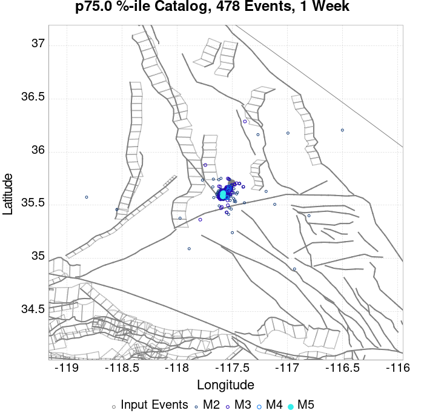 |  |  |  |  |  |  |  |  |
| **1 Month** |  |  |  |  |  |  |  |  |  |  |  |  |
| **1 Year** |  |  |  |  |  |  |  |  |  |  |  |  |
| **10 Year** |  |  |  |  |  |  |  |  |  |  |  |  |

## ComCat Data Comparisons
*[(top)](#table-of-contents)*

These plots compare simulated sequences with data from ComCat. All plots only consider events with hypocenters inside the ComCat region defined in the JSON input file.

Last updated at 2020/02/27 03:46:52 UTC, 237.4 days after the simulation start time.

Total matching ComCat events found: 1097

### ComCat Magnitude-Number Distributions
*[(top)](#table-of-contents)*

| Incremental MND | Cumulative MND |
|-----|-----|
|  |  |

### ComCat Time-Dependent Mc
*[(top)](#table-of-contents)*

The following plots compare simulation results with ComCat data above a magnitude threshold. Plots labeled as *M&ge;Mc(t)* use the time-dependent magnitude of completeness (Mc) defined in Helmstetter et al. (2006), which is plotted below. In the case of multiple M&ge;5 ruptures, either as input to the simulation or in the comparison data, the maximum calculated time-dependent Mc is used. This time-dependent Mc function is plotted below.

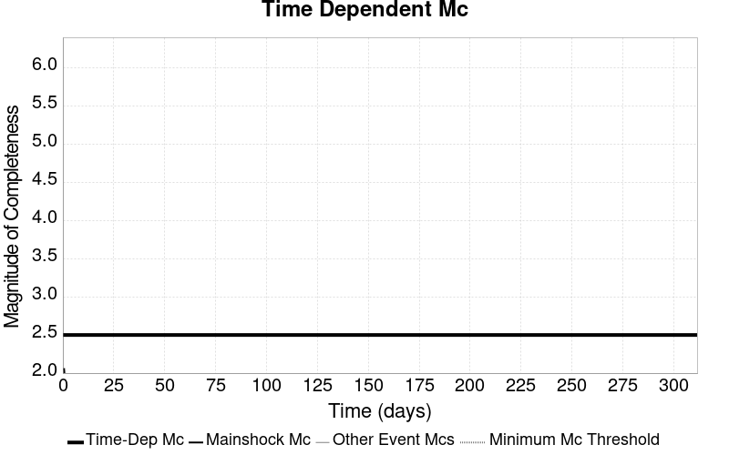

### ComCat Cumulative Number Vs Time
*[(top)](#table-of-contents)*

| M&ge;Mc(t) | M&ge;3 | M&ge;4 | M&ge;5 | M&ge;6 | M&ge;7 |
|-----|-----|-----|-----|-----|-----|
|  |  |  |  |  |  |

### ComCat Cumulative Number Simulation Percentiles
*[(top)](#table-of-contents)*


### ComCat Probability Spatial Distribution
*[(top)](#table-of-contents)*

*Note: maps labeled 'Forecast' are for a duration that extends into the future, only forecasted values are plotted (ComCat data omitted)*

|  | 1 Day | 1 Week | 1 Month | Current (237.4 Day) | Forecast: 1 Year |
|-----|-----|-----|-----|-----|-----|
| **M&ge;Mc(t)** |  |  | 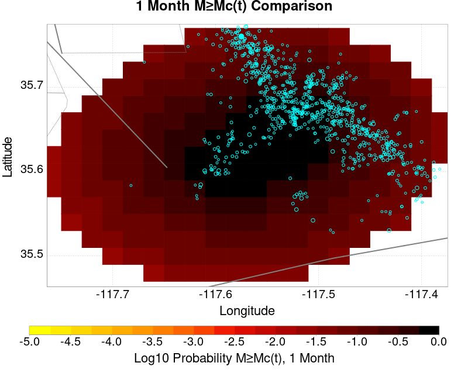 |  |  |
|  | Prob: 100.00%, Actual: 181 | Prob: 100.00%, Actual: 712 | Prob: 100.00%, Actual: 860 | Prob: 100.00%, Actual: 1019 | Prob: 100.00% |
| **M&ge;3** |  |  |  |  |  |
|  | Prob: 100.00%, Actual: 137 | Prob: 100.00%, Actual: 373 | Prob: 100.00%, Actual: 418 | Prob: 100.00%, Actual: 462 | Prob: 100.00% |
| **M&ge;4** |  |  |  |  |  |
|  | Prob: 99.87%, Actual: 18 | Prob: 99.99%, Actual: 42 | Prob: 100.00%, Actual: 44 | Prob: 100.00%, Actual: 44 | Prob: 100.00% |
| **M&ge;5** |  | 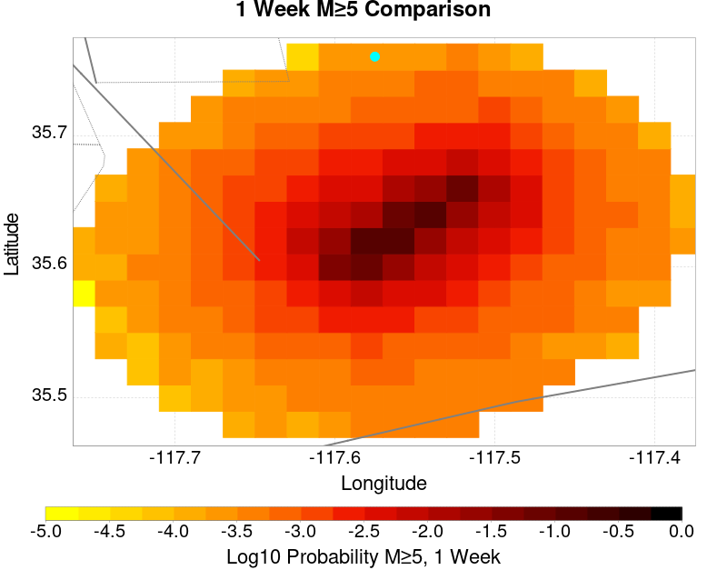 |  |  |  |
|  | Prob: 50.46%, Actual: 1 | Prob: 61.81%, Actual: 1 | Prob: 68.46%, Actual: 1 | Prob: 75.60%, Actual: 1 | Prob: 76.85% |
| **M&ge;6** |  | 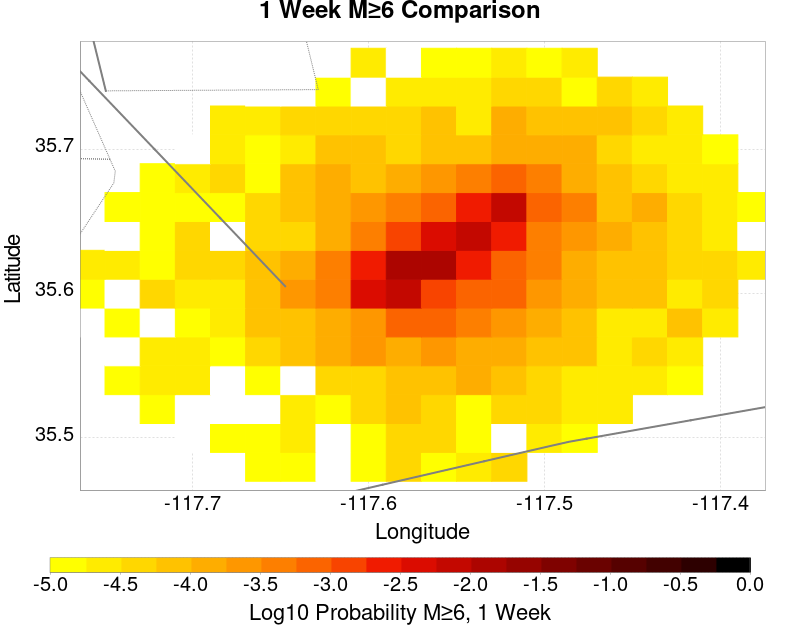 |  |  |  |
|  | Prob: 5.87%, Actual: 0 | Prob: 8.22%, Actual: 0 | Prob: 9.95%, Actual: 0 | Prob: 12.35%, Actual: 0 | Prob: 12.85% |
| **M&ge;7** |  |  |  | 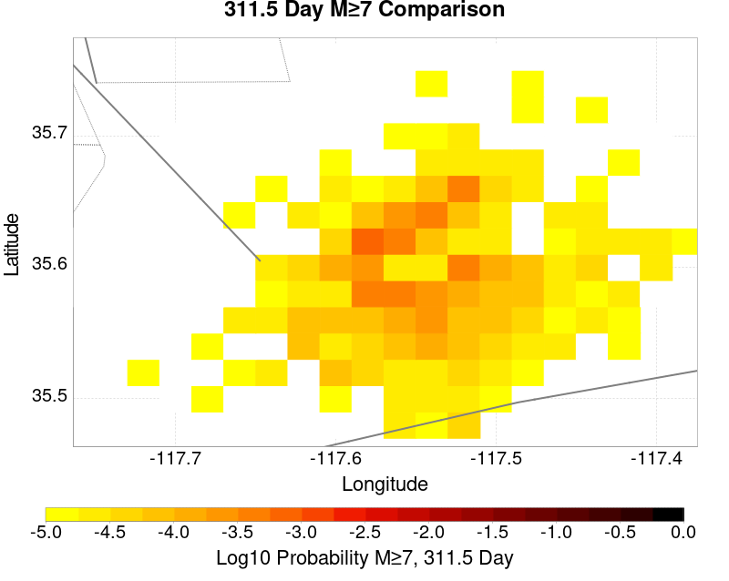 |  |
|  | Prob: 0.30%, Actual: 0 | Prob: 0.46%, Actual: 0 | Prob: 0.57%, Actual: 0 | Prob: 0.76%, Actual: 0 | Prob: 0.80% |

### ComCat Mean Expectation Spatial Distribution
*[(top)](#table-of-contents)*

*Note: maps labeled 'Forecast' are for a duration that extends into the future, only forecasted values are plotted (ComCat data omitted)*

|  | 1 Day | 1 Week | 1 Month | Current (237.4 Day) | Forecast: 1 Year |
|-----|-----|-----|-----|-----|-----|
| **M&ge;Mc(t)** |  |  |  | 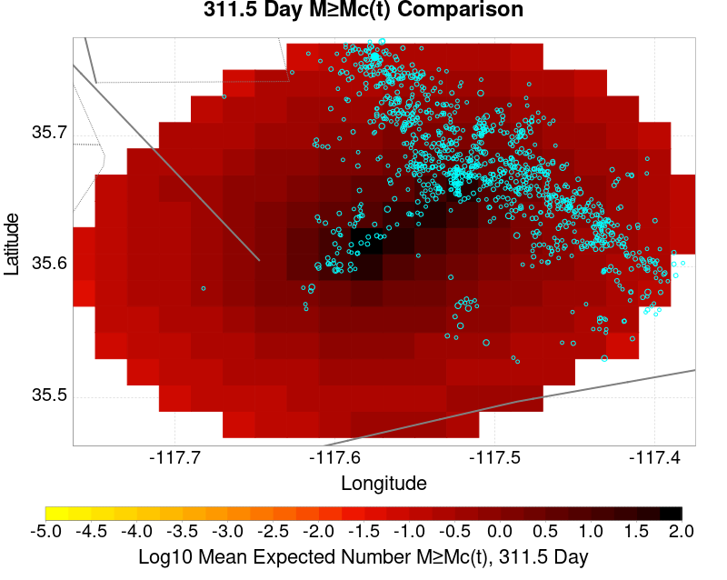 |  |
|  | Mean: 153.525, Actual: 181 | Mean: 267.805, Actual: 712 | Mean: 358.199, Actual: 860 | Mean: 492.727, Actual: 1019 | Mean: 521.651 |
| **M&ge;3** |  |  | 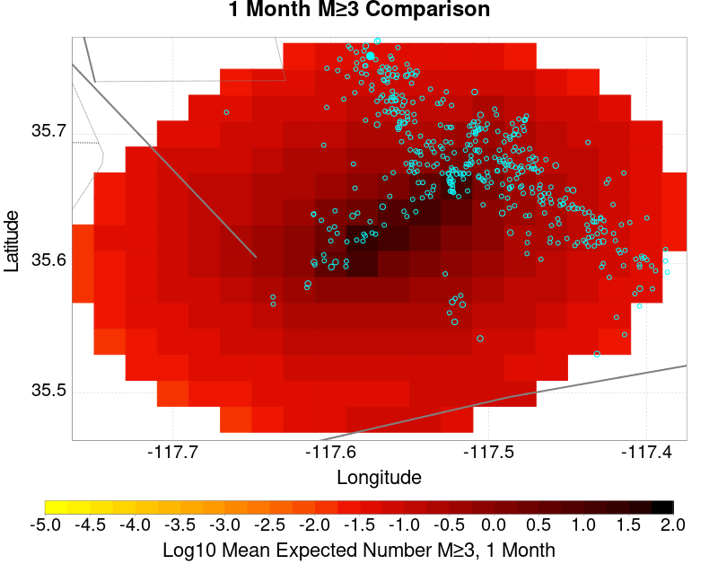 |  |  |
|  | Mean: 80.789, Actual: 137 | Mean: 116.897, Actual: 373 | Mean: 145.487, Actual: 418 | Mean: 188.025, Actual: 462 | Mean: 197.158 |
| **M&ge;4** |  |  |  |  |  |
|  | Mean: 8.049, Actual: 18 | Mean: 11.656, Actual: 42 | Mean: 14.515, Actual: 44 | Mean: 18.743, Actual: 44 | Mean: 19.652 |
| **M&ge;5** |  |  |  |  |  |
|  | Mean: 0.788, Actual: 1 | Mean: 1.139, Actual: 1 | Mean: 1.416, Actual: 1 | Mean: 1.826, Actual: 1 | Mean: 1.915 |
| **M&ge;6** |  |  | 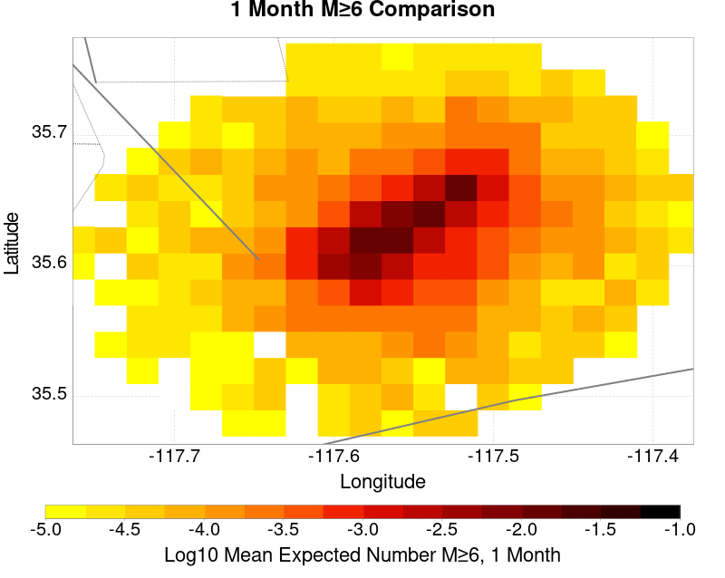 |  |  |
|  | Mean: 0.063, Actual: 0 | Mean: 0.091, Actual: 0 | Mean: 0.112, Actual: 0 | Mean: 0.144, Actual: 0 | Mean: 0.151 |
| **M&ge;7** |  | 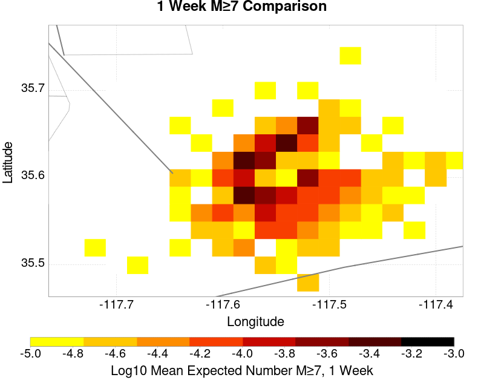 |  | 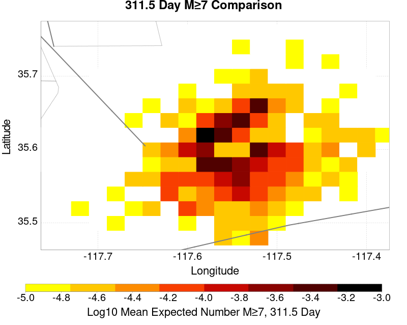 |  |
|  | Mean: 3.03E-3, Actual: 0 | Mean: 4.62E-3, Actual: 0 | Mean: 5.78E-3, Actual: 0 | Mean: 7.75E-3, Actual: 0 | Mean: 8.13E-3 |

### ComCat Depth Distribution
*[(top)](#table-of-contents)*

| M&ge;Mc(t) | M&ge;3 | M&ge;4 | M&ge;5 | M&ge;6 | M&ge;7 |
|-----|-----|-----|-----|-----|-----|
| 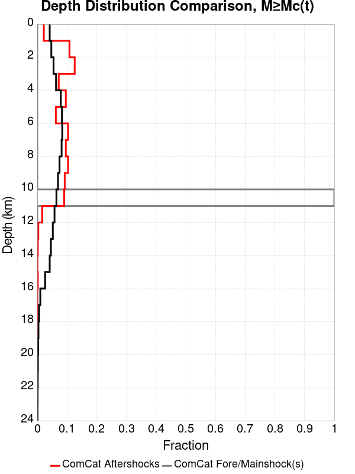 |  |  | 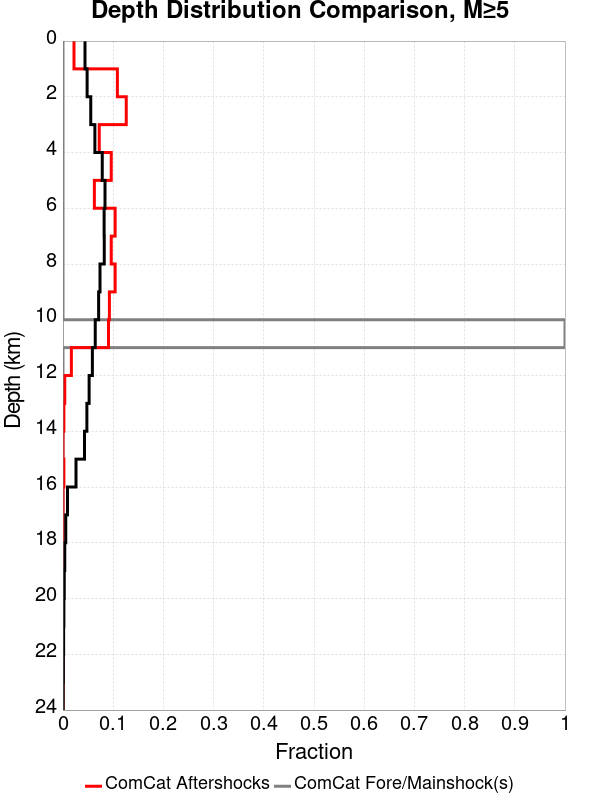 |  |  |

## Section Participation
*[(top)](#table-of-contents)*

### Section Participation Plots
*[(top)](#table-of-contents)*

| Min Mag | 1 yr Triggered Ruptures (no spontaneous) | 10 yr Triggered Ruptures (no spontaneous) | 10 yr Triggered Ruptures (primary aftershocks only) |
|-----|-----|-----|-----|
| **All Supra. Seis.** |  |  |  |
| **M&ge;6.5** |  |  |  |
| **M&ge;7** |  |  |  |
| **M&ge;7.5** |  |  |  |
| **M&ge;8** |  | 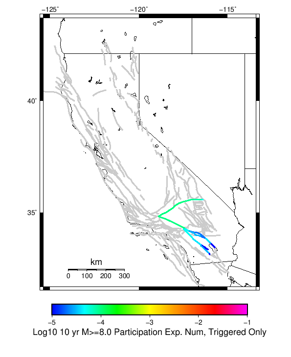 |  |

### Supra-Seismogenic Parent Sections Table
*[(top)](#table-of-contents)*

*First 10 of 128 with matching ruptures shown*

| Parent Name | Triggered 10 Year Mean Count | Triggered 1 Day Prob | Triggered 1 Week Prob | Triggered 1 Month Prob | Triggered 1 Year Prob | Triggered 10 Year Prob | Triggered 10 Year Primary Mean Count |
|-----|-----|-----|-----|-----|-----|-----|-----|
| Garlock (Central) | 0.01847 | 0.00432 | 0.00677 | 0.00907 | 0.01368 | 0.01803 | 0.00579 |
| Tank Canyon | 0.01784 | 0.00354 | 0.00551 | 0.00728 | 0.01088 | 0.01523 | 0.00412 |
| Owl Lake | 0.00767 | 0.00127 | 0.00222 | 0.00306 | 0.00464 | 0.00682 | 0.00138 |
| Garlock (East) | 0.00534 | 8.5E-4 | 0.00148 | 0.00202 | 0.00317 | 0.00474 | 0.00101 |
| Little Lake | 0.00498 | 0.00111 | 0.00191 | 0.00248 | 0.00357 | 0.00494 | 0.00147 |
| Panamint Valley | 0.00488 | 9.5E-4 | 0.00145 | 0.00204 | 0.00326 | 0.00475 | 0.00106 |
| Blackwater | 0.00311 | 5.8E-4 | 0.00105 | 0.00143 | 0.00199 | 0.00299 | 6.2E-4 |
| Gravel Hills-Harper Lk | 0.00225 | 5.1E-4 | 8.2E-4 | 0.00104 | 0.00158 | 0.00219 | 5.9E-4 |
| Hunter Mountain-Saline Valley | 0.0021 | 5.6E-4 | 7.8E-4 | 0.00105 | 0.00155 | 0.00205 | 5.9E-4 |
| Garlock (West) | 0.00177 | 4.7E-4 | 6.8E-4 | 8.7E-4 | 0.00123 | 0.00177 | 5.8E-4 |

### M≥6.5 Parent Sections Table
*[(top)](#table-of-contents)*

*First 10 of 101 with matching ruptures shown*

| Parent Name | Triggered 10 Year Mean Count | Triggered 1 Day Prob | Triggered 1 Week Prob | Triggered 1 Month Prob | Triggered 1 Year Prob | Triggered 10 Year Prob | Triggered 10 Year Primary Mean Count |
|-----|-----|-----|-----|-----|-----|-----|-----|
| Garlock (Central) | 0.00946 | 0.00223 | 0.00348 | 0.00458 | 0.00687 | 0.00931 | 0.00301 |
| Panamint Valley | 0.0045 | 8.7E-4 | 0.00134 | 0.0019 | 0.003 | 0.00438 | 0.00104 |
| Owl Lake | 0.00392 | 8.7E-4 | 0.00146 | 0.00188 | 0.00278 | 0.00392 | 0.00112 |
| Garlock (East) | 0.00367 | 7.0E-4 | 0.00117 | 0.00153 | 0.0024 | 0.00344 | 9.6E-4 |
| Hunter Mountain-Saline Valley | 0.00204 | 5.4E-4 | 7.6E-4 | 0.00103 | 0.00152 | 0.00202 | 5.8E-4 |
| Tank Canyon | 0.00193 | 3.9E-4 | 6.5E-4 | 8.7E-4 | 0.00128 | 0.00193 | 4.6E-4 |
| Garlock (West) | 0.00176 | 4.6E-4 | 6.7E-4 | 8.6E-4 | 0.00122 | 0.00176 | 5.7E-4 |
| Little Lake | 0.00175 | 3.5E-4 | 6.7E-4 | 8.4E-4 | 0.00119 | 0.00173 | 4.9E-4 |
| Airport Lake | 0.00109 | 2.2E-4 | 4.3E-4 | 5.4E-4 | 7.2E-4 | 0.00109 | 3.2E-4 |
| So Sierra Nevada | 8.9E-4 | 1.1E-4 | 2.2E-4 | 3.3E-4 | 5.9E-4 | 8.9E-4 | 8.0E-5 |

### M≥7 Parent Sections Table
*[(top)](#table-of-contents)*

*First 10 of 65 with matching ruptures shown*

| Parent Name | Triggered 10 Year Mean Count | Triggered 1 Day Prob | Triggered 1 Week Prob | Triggered 1 Month Prob | Triggered 1 Year Prob | Triggered 10 Year Prob | Triggered 10 Year Primary Mean Count |
|-----|-----|-----|-----|-----|-----|-----|-----|
| Garlock (Central) | 0.00835 | 0.00207 | 0.00321 | 0.00413 | 0.00611 | 0.00827 | 0.00274 |
| Panamint Valley | 0.00289 | 6.7E-4 | 9.8E-4 | 0.00137 | 0.00209 | 0.00289 | 8.1E-4 |
| Owl Lake | 0.00287 | 7.3E-4 | 0.0012 | 0.00147 | 0.00209 | 0.00287 | 0.00102 |
| Garlock (East) | 0.0025 | 6.0E-4 | 9.2E-4 | 0.00118 | 0.00179 | 0.00246 | 8.5E-4 |
| Hunter Mountain-Saline Valley | 0.002 | 5.4E-4 | 7.6E-4 | 0.00102 | 0.0015 | 0.00199 | 5.8E-4 |
| Garlock (West) | 0.00172 | 4.3E-4 | 6.4E-4 | 8.2E-4 | 0.00118 | 0.00172 | 5.6E-4 |
| San Andreas (Mojave N) | 7.5E-4 | 1.9E-4 | 2.6E-4 | 3.4E-4 | 4.8E-4 | 7.4E-4 | 1.8E-4 |
| San Andreas (Mojave S) | 5.6E-4 | 1.3E-4 | 1.8E-4 | 2.3E-4 | 3.4E-4 | 5.6E-4 | 1.3E-4 |
| San Andreas (San Bernardino N) | 3.6E-4 | 1.0E-4 | 1.4E-4 | 1.8E-4 | 2.2E-4 | 3.6E-4 | 9.0E-5 |
| Death Valley (So) | 3.2E-4 | 5.0E-5 | 6.0E-5 | 7.0E-5 | 1.8E-4 | 3.2E-4 | 4.0E-5 |

### M≥7.5 Parent Sections Table
*[(top)](#table-of-contents)*

*First 10 of 45 with matching ruptures shown*

| Parent Name | Triggered 10 Year Mean Count | Triggered 1 Day Prob | Triggered 1 Week Prob | Triggered 1 Month Prob | Triggered 1 Year Prob | Triggered 10 Year Prob | Triggered 10 Year Primary Mean Count |
|-----|-----|-----|-----|-----|-----|-----|-----|
| Garlock (Central) | 0.00329 | 8.8E-4 | 0.00127 | 0.00167 | 0.00239 | 0.00328 | 0.001 |
| Hunter Mountain-Saline Valley | 0.00187 | 5.1E-4 | 7.2E-4 | 9.8E-4 | 0.00143 | 0.00187 | 5.5E-4 |
| Panamint Valley | 0.00187 | 5.1E-4 | 7.2E-4 | 9.8E-4 | 0.00143 | 0.00187 | 5.5E-4 |
| Garlock (West) | 0.00155 | 4.0E-4 | 5.8E-4 | 7.4E-4 | 0.00104 | 0.00155 | 5.0E-4 |
| Garlock (East) | 0.001 | 2.8E-4 | 3.9E-4 | 5.3E-4 | 6.9E-4 | 0.001 | 3.7E-4 |
| San Andreas (Mojave N) | 7.5E-4 | 1.9E-4 | 2.6E-4 | 3.4E-4 | 4.8E-4 | 7.4E-4 | 1.8E-4 |
| San Andreas (Mojave S) | 5.4E-4 | 1.2E-4 | 1.7E-4 | 2.1E-4 | 3.2E-4 | 5.4E-4 | 1.2E-4 |
| San Andreas (San Bernardino N) | 3.4E-4 | 9.0E-5 | 1.3E-4 | 1.6E-4 | 2.0E-4 | 3.4E-4 | 8.0E-5 |
| Owl Lake | 2.6E-4 | 6.0E-5 | 9.0E-5 | 1.0E-4 | 1.7E-4 | 2.6E-4 | 7.0E-5 |
| San Andreas (San Bernardino S) | 1.1E-4 | 3.0E-5 | 4.0E-5 | 6.0E-5 | 6.0E-5 | 1.1E-4 | 3.0E-5 |

### M≥8 Parent Sections Table
*[(top)](#table-of-contents)*

*First 10 of 18 with matching ruptures shown*

| Parent Name | Triggered 10 Year Mean Count | Triggered 1 Day Prob | Triggered 1 Week Prob | Triggered 1 Month Prob | Triggered 1 Year Prob | Triggered 10 Year Prob | Triggered 10 Year Primary Mean Count |
|-----|-----|-----|-----|-----|-----|-----|-----|
| Garlock (Central) | 1.0E-4 | 3.0E-5 | 4.0E-5 | 4.0E-5 | 4.0E-5 | 1.0E-4 | 3.0E-5 |
| Garlock (West) | 1.0E-4 | 3.0E-5 | 4.0E-5 | 4.0E-5 | 4.0E-5 | 1.0E-4 | 3.0E-5 |
| San Andreas (Mojave N) | 1.0E-4 | 3.0E-5 | 4.0E-5 | 4.0E-5 | 4.0E-5 | 1.0E-4 | 3.0E-5 |
| San Andreas (Mojave S) | 1.0E-4 | 3.0E-5 | 4.0E-5 | 4.0E-5 | 4.0E-5 | 1.0E-4 | 3.0E-5 |
| San Andreas (San Bernardino N) | 1.0E-4 | 3.0E-5 | 4.0E-5 | 4.0E-5 | 4.0E-5 | 1.0E-4 | 3.0E-5 |
| Garlock (East) | 8.0E-5 | 3.0E-5 | 4.0E-5 | 4.0E-5 | 4.0E-5 | 8.0E-5 | 3.0E-5 |
| San Jacinto (Lytle Creek connector) | 5.0E-5 | 2.0E-5 | 3.0E-5 | 3.0E-5 | 3.0E-5 | 5.0E-5 | 2.0E-5 |
| San Jacinto (San Bernardino) | 5.0E-5 | 2.0E-5 | 3.0E-5 | 3.0E-5 | 3.0E-5 | 5.0E-5 | 2.0E-5 |
| San Jacinto (San Jacinto Valley) rev | 5.0E-5 | 2.0E-5 | 3.0E-5 | 3.0E-5 | 3.0E-5 | 5.0E-5 | 2.0E-5 |
| San Jacinto (Stepovers Combined) | 5.0E-5 | 2.0E-5 | 3.0E-5 | 3.0E-5 | 3.0E-5 | 5.0E-5 | 2.0E-5 |

### Fault Magnitude-Probability Distributions
*[(top)](#table-of-contents)*

The first 5 sections (sorted by trigger rate) are plotted below. All fault MPDs are available [here](plots/parent_sect_mpds/README.md)

| 1 Week | 1 Month | 1 Year | 10 Year |
|-----|-----|-----|-----|
|  |  |  |  |
|  |  |  |  |
|  |  |  |  |
|  |  |  |  |
|  |  | 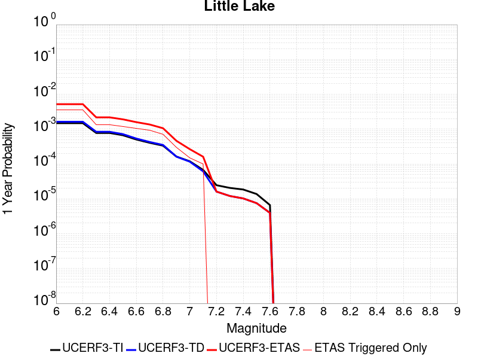 |  |

## Gridded Nucleation
*[(top)](#table-of-contents)*

| Min Mag | Triggered Ruptures (no spontaneous) | Triggered Ruptures (primary aftershocks only) |
|-----|-----|-----|
| **M&ge;2.5** |  |  |
| **M&ge;5** |  |  |
| **M&ge;6** |  |  |
| **M&ge;7** |  |  |


## JSON Input File
*[(top)](#table-of-contents)*

```
{
  "numSimulations": 100000,
  "duration": 10.0,
  "startTimeMillis": 1562261630000,
  "includeSpontaneous": false,
  "randomSeed": 1566347078259,
  "binaryOutput": true,
  "binaryOutputFilters": [
    {
      "prefix": "results_complete",
      "descendantsOnly": false
    },
    {
      "prefix": "results_m5_preserve_chain",
      "minMag": 5.0,
      "preserveChainBelowMag": true,
      "descendantsOnly": false
    }
  ],
  "forceRecalc": false,
  "simulationName": "ComCat M6.4 (ci38443183), ShakeMap Surface",
  "numRetries": 3,
  "outputDir": "${ETAS_SIM_DIR}/2019_08_20-ComCatM6p4_ci38443183_ShakeMapSurface-noSpont-full_td-scale1.14",
  "triggerRuptures": [
    {
      "occurrenceTimeMillis": 1562259775340,
      "comcatEventID": "ci38443095",
      "mag": 3.98,
      "latitude": 35.708,
      "longitude": -117.5036667,
      "depth": 10.58
    },
    {
      "occurrenceTimeMillis": 1562261629000,
      "comcatEventID": "ci38443183",
      "mag": 6.4,
      "latitude": 35.7053333,
      "longitude": -117.5038333,
      "depth": 10.5,
      "ruptureSurfaces": [
        {
          "outline": [
            {
              "latitude": 35.6051534466,
              "longitude": -117.5905380735,
              "depth": 0.0
            },
            {
              "latitude": 35.6173144101,
              "longitude": -117.57249634649999,
              "depth": 0.0
            },
            {
              "latitude": 35.6173135736,
              "longitude": -117.5726723708,
              "depth": 0.0
            },
            {
              "latitude": 35.61731357360001,
              "longitude": -117.5726723708,
              "depth": 15.0
            },
            {
              "latitude": 35.6173144101,
              "longitude": -117.57249634649999,
              "depth": 15.0
            },
            {
              "latitude": 35.6051534466,
              "longitude": -117.5905380735,
              "depth": 15.0
            },
            {
              "latitude": 35.6051534466,
              "longitude": -117.5905380735,
              "depth": 0.0
            }
          ]
        },
        {
          "outline": [
            {
              "latitude": 35.6338128629,
              "longitude": -117.54831678310002,
              "depth": 0.0
            },
            {
              "latitude": 35.6413274733,
              "longitude": -117.5393878708,
              "depth": 0.0
            },
            {
              "latitude": 35.664283512,
              "longitude": -117.51611643970001,
              "depth": 0.0
            },
            {
              "latitude": 35.664283512000004,
              "longitude": -117.51611643970001,
              "depth": 15.0
            },
            {
              "latitude": 35.641327473299995,
              "longitude": -117.5393878708,
              "depth": 15.0
            },
            {
              "latitude": 35.63381286290001,
              "longitude": -117.54831678310002,
              "depth": 15.0
            },
            {
              "latitude": 35.6338128629,
              "longitude": -117.54831678310002,
              "depth": 0.0
            }
          ]
        },
        {
          "outline": [
            {
              "latitude": 35.6322100797,
              "longitude": -117.55305954249998,
              "depth": 0.0
            },
            {
              "latitude": 35.6196274701,
              "longitude": -117.56969626549999,
              "depth": 0.0
            },
            {
              "latitude": 35.6196274701,
              "longitude": -117.56969626549999,
              "depth": 15.0
            },
            {
              "latitude": 35.6322100797,
              "longitude": -117.55305954249998,
              "depth": 15.0
            },
            {
              "latitude": 35.6322100797,
              "longitude": -117.55305954249998,
              "depth": 0.0
            }
          ]
        }
      ]
    }
  ],
  "cacheDir": "${ETAS_LAUNCHER}/inputs/cache_fm3p1_ba",
  "fssFile": "${ETAS_LAUNCHER}/inputs/2013_05_10-ucerf3p3-production-10runs_COMPOUND_SOL_FM3_1_SpatSeisU3_MEAN_BRANCH_AVG_SOL.zip",
  "probModel": "FULL_TD",
  "applySubSeisForSupraNucl": true,
  "totRateScaleFactor": 1.14,
  "gridSeisCorr": true,
  "timeIndependentERF": false,
  "griddedOnly": false,
  "imposeGR": false,
  "includeIndirectTriggering": true,
  "gridSeisDiscr": 0.1,
  "catalogCompletenessModel": "RELAXED",
  "configCommand": "u3etas_comcat_event_config_builder.sh --event-id ci38443183 --num-simulations 100000 --days-before 7 --finite-surf-shakemap --finite-surf-shakemap-min-mag 5 --hpc-site USC_HPC --nodes 36 --hours 24 --queue scec_hiprio",
  "configTime": 1566347078259,
  "comcatMetadata": {
    "region": {
      "border": [
        {
          "latitude": 35.46606927860588,
          "longitude": -117.62064836613342
        },
        {
          "latitude": 35.47242991448156,
          "longitude": -117.6498484716345
        },
        {
          "latitude": 35.482817097748814,
          "longitude": -117.67725529634286
        },
        {
          "latitude": 35.49691670426917,
          "longitude": -117.70203917688171
        },
        {
          "latitude": 35.514302148883885,
          "longitude": -117.72344871893849
        },
        {
          "latitude": 35.53444712853589,
          "longitude": -117.740833427602
        },
        {
          "latitude": 35.55674138030309,
          "longitude": -117.75366346613521
        },
        {
          "latitude": 35.58050900338554,
          "longitude": -117.76154594446818
        },
        {
          "latitude": 35.60502881482475,
          "longitude": -117.76423722085674
        },
        {
          "latitude": 35.62955614241808,
          "longitude": -117.76165080029024
        },
        {
          "latitude": 35.653345407425206,
          "longitude": -117.7538605308302
        },
        {
          "latitude": 35.67567281660627,
          "longitude": -117.74109893258196
        },
        {
          "latitude": 35.69585846994947,
          "longitude": -117.72375064066809
        },
        {
          "latitude": 35.713287198725496,
          "longitude": -117.70234109925646
        },
        {
          "latitude": 35.71346496372066,
          "longitude": -117.70202907009484
        },
        {
          "latitude": 35.71346496372066,
          "longitude": -117.70202907009487
        },
        {
          "latitude": 35.71348545735071,
          "longitude": -117.70205012681431
        },
        {
          "latitude": 35.742183720006956,
          "longitude": -117.65981170091426
        },
        {
          "latitude": 35.74215925198131,
          "longitude": -117.6597865735152
        },
        {
          "latitude": 35.75608686243055,
          "longitude": -117.63533083057963
        },
        {
          "latitude": 35.76650722104156,
          "longitude": -117.60784568160133
        },
        {
          "latitude": 35.77288951063023,
          "longitude": -117.57854281843034
        },
        {
          "latitude": 35.77503882320442,
          "longitude": -117.54831678310002
        },
        {
          "latitude": 35.77288951063023,
          "longitude": -117.5180907477697
        },
        {
          "latitude": 35.76650722104156,
          "longitude": -117.4887878845987
        },
        {
          "latitude": 35.75608686243055,
          "longitude": -117.4613027356204
        },
        {
          "latitude": 35.74194656044276,
          "longitude": -117.43647352376779
        },
        {
          "latitude": 35.72451780876076,
          "longitude": -117.41505630866529
        },
        {
          "latitude": 35.704332133920666,
          "longitude": -117.39770181804158
        },
        {
          "latitude": 35.68200470724838,
          "longitude": -117.38493568202598
        },
        {
          "latitude": 35.658215430864715,
          "longitude": -117.37714266919008
        },
        {
          "latitude": 35.63368809937713,
          "longitude": -117.37455537706376
        },
        {
          "latitude": 35.609168291988915,
          "longitude": -117.37724767347744
        },
        {
          "latitude": 35.585400680407325,
          "longitude": -117.38513302574503
        },
        {
          "latitude": 35.56310644619927,
          "longitude": -117.39796769895074
        },
        {
          "latitude": 35.54296148804621,
          "longitude": -117.41535865788727
        },
        {
          "latitude": 35.52557606628098,
          "longitude": -117.43677587363653
        },
        {
          "latitude": 35.525363902593746,
          "longitude": -117.43714894277798
        },
        {
          "latitude": 35.52533954853871,
          "longitude": -117.43712393242085
        },
        {
          "latitude": 35.49671898152695,
          "longitude": -117.47932770716311
        },
        {
          "latitude": 35.496739379812894,
          "longitude": -117.47934866591878
        },
        {
          "latitude": 35.4967393798129,
          "longitude": -117.47934866591878
        },
        {
          "latitude": 35.496739379812894,
          "longitude": -117.47934866591878
        },
        {
          "latitude": 35.482817097748814,
          "longitude": -117.50382085065715
        },
        {
          "latitude": 35.47242991448156,
          "longitude": -117.5312276753655
        },
        {
          "latitude": 35.46606927860588,
          "longitude": -117.56042778086658
        },
        {
          "latitude": 35.46392748629558,
          "longitude": -117.5905380735
        }
      ]
    },
    "eventID": "ci38443183",
    "minDepth": -10.0,
    "maxDepth": 24.0,
    "minMag": 2.5,
    "startTime": 1561656829000,
    "endTime": 1562261629001
  }
}
```

