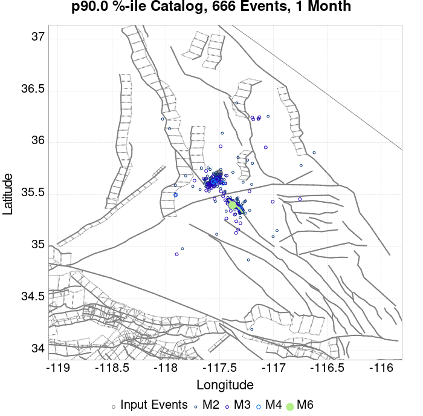
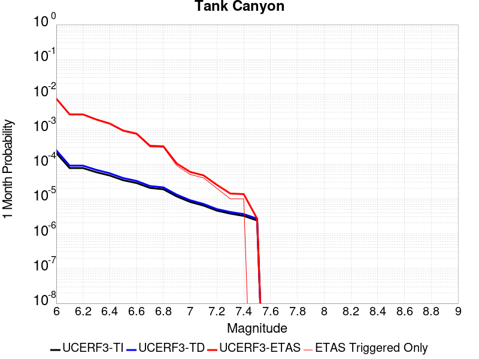
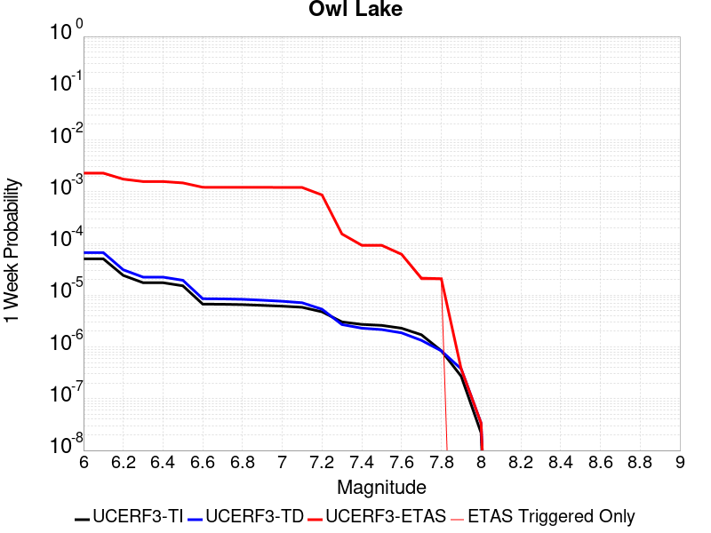

# ComCat M6.4 (ci38443183), ShakeMap Surface Results

|   | ComCat M6.4 (ci38443183), ShakeMap Surface |
|-----|-----|
| Num Simulations | 4096 (incomplete) |
| Start Time | 2019/07/04 17:33:50 UTC |
| Start Time Epoch Milliseconds | 1562261630000 |
| Duration | 10 Years |
| Includes Spontaneous? | false |
| Historical Ruptures | *(none)* |

## Table Of Contents

* [Probabilities Summary Table](#probabilities-summary-table)
* [Magnitude Number Distribution](#magnitude-number-distribution)
  * [10 Year Magnitude Number Distribution](#10-year-magnitude-number-distribution)
  * [1 Year Magnitude Number Distribution](#1-year-magnitude-number-distribution)
  * [1 Month Magnitude Number Distribution](#1-month-magnitude-number-distribution)
  * [1 Week Magnitude Number Distribution](#1-week-magnitude-number-distribution)
  * [1 Day Magnitude Number Distribution](#1-day-magnitude-number-distribution)
  * [1 Hour Magnitude Number Distribution](#1-hour-magnitude-number-distribution)
* [Hazard Change Over Time](#hazard-change-over-time)
  * [M&ge;5.0 Hazard Change Over Time](#m50-hazard-change-over-time)
  * [M&ge;6.0 Hazard Change Over Time](#m60-hazard-change-over-time)
  * [M&ge;7.0 Hazard Change Over Time](#m70-hazard-change-over-time)
* [Trigger Rupture Fault Map](#trigger-rupture-fault-map)
* [Trigger Rupture Depth Map](#trigger-rupture-depth-map)
* [Fault Distances To Triggers](#fault-distances-to-triggers)
* [Individual Simulated Catalog Maps](#individual-simulated-catalog-maps)
* [ComCat Data Comparisons](#comcat-data-comparisons)
  * [ComCat Magnitude-Number Distributions](#comcat-magnitude-number-distributions)
  * [ComCat Cumulative Number Vs Time](#comcat-cumulative-number-vs-time)
  * [ComCat Cumulative Number Simulation Percentiles](#comcat-cumulative-number-simulation-percentiles)
  * [ComCat Mean Spatial Distribution](#comcat-mean-spatial-distribution)
  * [ComCat Depth Distribution](#comcat-depth-distribution)
* [Section Participation](#section-participation)
  * [Section Participation Plots](#section-participation-plots)
  * [Supra-Seismogenic Parent Sections Table](#supra-seismogenic-parent-sections-table)
  * [M≥6.5 Parent Sections Table](#m65-parent-sections-table)
  * [M≥7 Parent Sections Table](#m7-parent-sections-table)
  * [M≥7.5 Parent Sections Table](#m75-parent-sections-table)
  * [Fault Magnitude-Probability Distributions](#fault-magnitude-probability-distributions)
* [Gridded Nucleation](#gridded-nucleation)
* [JSON Input File](#json-input-file)

## Probabilities Summary Table
*[(top)](#table-of-contents)*

| Magnitude | 1 Hour Prob | 1 Day Prob | 1 Week Prob | 1 Month Prob | 1 Year Prob | 10 Year Prob |
|-----|-----|-----|-----|-----|-----|-----|
| **M&ge;3** | 1.000 (100.00%) | 1.000 (100.00%) | 1.000 (100.00%) | 1.000 (100.00%) | 1.000 (100.00%) | 1.000 (100.00%) |
| **M&ge;3.5** | 1.000 (100.00%) | 1.000 (100.00%) | 1.000 (100.00%) | 1.000 (100.00%) | 1.000 (100.00%) | 1.000 (100.00%) |
| **M&ge;4** | 0.943 (94.34%) | 0.999 (99.93%) | 1.000 (99.95%) | 1.000 (100.00%) | 1.000 (100.00%) | 1.000 (100.00%) |
| **M&ge;4.5** | 0.593 (59.28%) | 0.899 (89.87%) | 0.957 (95.65%) | 0.978 (97.80%) | 0.992 (99.19%) | 0.996 (99.63%) |
| **M&ge;5** | 0.257 (25.68%) | 0.527 (52.69%) | 0.642 (64.16%) | 0.708 (70.83%) | 0.789 (78.91%) | 0.843 (84.30%) |
| **M&ge;5.5** | 0.090 (8.96%) | 0.213 (21.29%) | 0.283 (28.27%) | 0.327 (32.67%) | 0.398 (39.82%) | 0.457 (45.70%) |
| **M&ge;6** | 0.029 (2.86%) | 0.070 (6.98%) | 0.095 (9.50%) | 0.110 (10.99%) | 0.143 (14.28%) | 0.174 (17.36%) |
| **M&ge;6.4** | 0.011 (1.07%) | 0.025 (2.54%) | 0.036 (3.61%) | 0.044 (4.37%) | 0.053 (5.32%) | 0.064 (6.45%) |
| **M&ge;6.5** | 7.57E-3 (0.76%) | 0.020 (1.95%) | 0.027 (2.66%) | 0.032 (3.22%) | 0.040 (4.03%) | 0.050 (4.98%) |
| **M&ge;7** | 1.71E-3 (0.17%) | 5.13E-3 (0.51%) | 7.32E-3 (0.73%) | 8.06E-3 (0.81%) | 0.011 (1.10%) | 0.013 (1.34%) |
| **M&ge;7.5** | 4.88E-4 (0.05%) | 1.95E-3 (0.20%) | 2.93E-3 (0.29%) | 3.17E-3 (0.32%) | 4.88E-3 (0.49%) | 5.62E-3 (0.56%) |

## Magnitude Number Distribution
*[(top)](#table-of-contents)*

### 10 Year Magnitude Number Distribution
*[(top)](#table-of-contents)*

**Legend**
* **Mean** (thick black line): mean expected number across all 4096 catalogs
* **2.5%,97.5%** (thin black lines): expected number percentiles across all 4096 catalogs
* **Median** (thin blue line): median expected number across all 4096 catalogs
* **Mode** (thin cyan line): modal expected number across all 4096 catalogs
* **10 yr Probability** (thin red line): 10 year probability calculated as the fraction of catalogs with at least 1 occurrence
* **10 yr Supraseismogenic Probability** (thin dashed red line): same as above, but only for supraseismogenic ruptures on explicitly modeled UCERF3 faults
* **95% Conf** (light red shaded region): binomial 95% confidence bounds on probability
* **Primary** (thin green line): mean expected number from primary triggered aftershocks only (no secondary, tertiary, etc...) across all 4096 catalogs


| Mag | Mean | 2.5 %ile | 97.5 %ile | Median | Mode | 10 yr Probability | 10 yr Supra-Seis Prob | Primary Aftershocks Mean |
|-----|-----|-----|-----|-----|-----|-----|-----|-----|
| **M&ge;2.5** | 1003.926 | 542.000 | 3034.000 | 721.000 | 615.000 | 1.000 (100.00%) | 0.050 (5.03%) | 418.997 |
| **M&ge;2.6** | 797.236 | 429.000 | 2412.000 | 573.000 | 482.000 | 1.000 (100.00%) | 0.050 (5.03%) | 333.000 |
| **M&ge;2.7** | 633.271 | 338.000 | 1921.000 | 457.000 | 411.000 | 1.000 (100.00%) | 0.050 (5.03%) | 264.583 |
| **M&ge;2.8** | 503.019 | 266.000 | 1532.000 | 363.000 | 308.000 | 1.000 (100.00%) | 0.050 (5.03%) | 210.118 |
| **M&ge;2.9** | 399.523 | 207.000 | 1195.000 | 288.000 | 246.000 | 1.000 (100.00%) | 0.050 (5.03%) | 166.930 |
| **M&ge;3** | 317.074 | 161.000 | 956.000 | 229.000 | 212.000 | 1.000 (100.00%) | 0.050 (5.03%) | 132.431 |
| **M&ge;3.1** | 251.610 | 127.000 | 756.000 | 181.000 | 173.000 | 1.000 (100.00%) | 0.050 (5.03%) | 105.173 |
| **M&ge;3.2** | 199.874 | 98.000 | 601.000 | 145.000 | 126.000 | 1.000 (100.00%) | 0.050 (5.03%) | 83.478 |
| **M&ge;3.3** | 158.743 | 76.000 | 468.000 | 115.000 | 105.000 | 1.000 (100.00%) | 0.050 (5.03%) | 66.264 |
| **M&ge;3.4** | 126.136 | 59.000 | 374.000 | 92.000 | 78.000 | 1.000 (100.00%) | 0.050 (5.03%) | 52.652 |
| **M&ge;3.5** | 100.039 | 45.000 | 302.000 | 73.000 | 67.000 | 1.000 (100.00%) | 0.050 (5.03%) | 41.761 |
| **M&ge;3.6** | 79.463 | 34.000 | 238.000 | 58.000 | 47.000 | 1.000 (100.00%) | 0.050 (5.03%) | 33.158 |
| **M&ge;3.7** | 63.105 | 26.000 | 189.000 | 46.000 | 37.000 | 1.000 (100.00%) | 0.050 (5.03%) | 26.319 |
| **M&ge;3.8** | 50.082 | 19.000 | 150.000 | 37.000 | 32.000 | 1.000 (100.00%) | 0.050 (5.03%) | 20.911 |
| **M&ge;3.9** | 39.768 | 15.000 | 121.000 | 29.000 | 25.000 | 1.000 (100.00%) | 0.050 (5.03%) | 16.582 |
| **M&ge;4** | 31.539 | 11.000 | 95.000 | 23.000 | 20.000 | 1.000 (100.00%) | 0.050 (5.03%) | 13.123 |
| **M&ge;4.1** | 25.043 | 8.000 | 76.000 | 18.000 | 15.000 | 1.000 (100.00%) | 0.050 (5.03%) | 10.426 |
| **M&ge;4.2** | 19.859 | 5.000 | 63.000 | 15.000 | 12.000 | 1.000 (100.00%) | 0.050 (5.03%) | 8.262 |
| **M&ge;4.3** | 15.756 | 4.000 | 50.000 | 12.000 | 10.000 | 1.000 (99.95%) | 0.050 (5.03%) | 6.533 |
| **M&ge;4.4** | 12.502 | 3.000 | 39.000 | 9.000 | 7.000 | 0.999 (99.85%) | 0.050 (5.03%) | 5.169 |
| **M&ge;4.5** | 9.919 | 2.000 | 33.000 | 7.000 | 5.000 | 0.996 (99.63%) | 0.050 (5.03%) | 4.118 |
| **M&ge;4.6** | 7.838 | 1.000 | 27.000 | 6.000 | 4.000 | 0.986 (98.63%) | 0.050 (5.03%) | 3.255 |
| **M&ge;4.7** | 6.229 | 0.000 | 21.000 | 4.000 | 4.000 | 0.972 (97.22%) | 0.050 (5.03%) | 2.601 |
| **M&ge;4.8** | 4.942 | 0.000 | 17.000 | 3.000 | 2.000 | 0.944 (94.38%) | 0.050 (5.03%) | 2.062 |
| **M&ge;4.9** | 3.923 | 0.000 | 14.000 | 3.000 | 2.000 | 0.899 (89.89%) | 0.050 (5.03%) | 1.634 |
| **M&ge;5** | 3.100 | 0.000 | 11.000 | 2.000 | 1.000 | 0.843 (84.30%) | 0.050 (5.03%) | 1.294 |
| **M&ge;5.1** | 2.429 | 0.000 | 10.000 | 2.000 | 1.000 | 0.775 (77.51%) | 0.050 (5.03%) | 1.007 |
| **M&ge;5.2** | 1.922 | 0.000 | 8.000 | 1.000 | 0.000 | 0.695 (69.53%) | 0.050 (5.03%) | 0.789 |
| **M&ge;5.3** | 1.528 | 0.000 | 7.000 | 1.000 | 0.000 | 0.615 (61.52%) | 0.050 (5.03%) | 0.629 |
| **M&ge;5.4** | 1.194 | 0.000 | 6.000 | 1.000 | 0.000 | 0.534 (53.42%) | 0.050 (5.03%) | 0.495 |
| **M&ge;5.5** | 0.931 | 0.000 | 5.000 | 0.000 | 0.000 | 0.457 (45.70%) | 0.050 (5.03%) | 0.394 |
| **M&ge;5.6** | 0.728 | 0.000 | 4.000 | 0.000 | 0.000 | 0.389 (38.92%) | 0.050 (5.03%) | 0.312 |
| **M&ge;5.7** | 0.563 | 0.000 | 3.000 | 0.000 | 0.000 | 0.326 (32.57%) | 0.050 (5.03%) | 0.246 |
| **M&ge;5.8** | 0.432 | 0.000 | 3.000 | 0.000 | 0.000 | 0.264 (26.42%) | 0.050 (5.03%) | 0.188 |
| **M&ge;5.9** | 0.328 | 0.000 | 2.000 | 0.000 | 0.000 | 0.212 (21.19%) | 0.050 (5.03%) | 0.140 |
| **M&ge;6** | 0.259 | 0.000 | 2.000 | 0.000 | 0.000 | 0.174 (17.36%) | 0.050 (5.03%) | 0.110 |
| **M&ge;6.1** | 0.197 | 0.000 | 2.000 | 0.000 | 0.000 | 0.138 (13.84%) | 0.041 (4.08%) | 0.086 |
| **M&ge;6.2** | 0.143 | 0.000 | 1.000 | 0.000 | 0.000 | 0.108 (10.82%) | 0.030 (3.03%) | 0.064 |
| **M&ge;6.3** | 0.108 | 0.000 | 1.000 | 0.000 | 0.000 | 0.083 (8.28%) | 0.024 (2.44%) | 0.049 |
| **M&ge;6.4** | 0.083 | 0.000 | 1.000 | 0.000 | 0.000 | 0.064 (6.45%) | 0.021 (2.05%) | 0.037 |
| **M&ge;6.5** | 0.062 | 0.000 | 1.000 | 0.000 | 0.000 | 0.050 (4.98%) | 0.018 (1.78%) | 0.028 |
| **M&ge;6.6** | 0.048 | 0.000 | 1.000 | 0.000 | 0.000 | 0.040 (4.00%) | 0.017 (1.71%) | 0.020 |
| **M&ge;6.7** | 0.039 | 0.000 | 1.000 | 0.000 | 0.000 | 0.033 (3.27%) | 0.016 (1.59%) | 0.016 |
| **M&ge;6.8** | 0.027 | 0.000 | 0.000 | 0.000 | 0.000 | 0.024 (2.39%) | 0.013 (1.32%) | 0.010 |
| **M&ge;6.9** | 0.020 | 0.000 | 0.000 | 0.000 | 0.000 | 0.018 (1.78%) | 0.011 (1.15%) | 7.81E-3 |
| **M&ge;7** | 0.014 | 0.000 | 0.000 | 0.000 | 0.000 | 0.013 (1.34%) | 0.010 (1.00%) | 5.13E-3 |
| **M&ge;7.1** | 0.012 | 0.000 | 0.000 | 0.000 | 0.000 | 0.012 (1.17%) | 9.77E-3 (0.98%) | 3.66E-3 |
| **M&ge;7.2** | 9.52E-3 | 0.000 | 0.000 | 0.000 | 0.000 | 9.03E-3 (0.90%) | 8.54E-3 (0.85%) | 2.44E-3 |
| **M&ge;7.3** | 6.59E-3 | 0.000 | 0.000 | 0.000 | 0.000 | 6.10E-3 (0.61%) | 5.86E-3 (0.59%) | 1.71E-3 |
| **M&ge;7.4** | 6.35E-3 | 0.000 | 0.000 | 0.000 | 0.000 | 5.86E-3 (0.59%) | 5.62E-3 (0.56%) | 1.71E-3 |
| **M&ge;7.5** | 5.62E-3 | 0.000 | 0.000 | 0.000 | 0.000 | 5.62E-3 (0.56%) | 5.37E-3 (0.54%) | 1.46E-3 |
| **M&ge;7.6** | 3.91E-3 | 0.000 | 0.000 | 0.000 | 0.000 | 3.91E-3 (0.39%) | 3.66E-3 (0.37%) | 9.77E-4 |
| **M&ge;7.7** | 1.71E-3 | 0.000 | 0.000 | 0.000 | 0.000 | 1.71E-3 (0.17%) | 1.46E-3 (0.15%) | 4.88E-4 |
| **M&ge;7.8** | 1.22E-3 | 0.000 | 0.000 | 0.000 | 0.000 | 1.22E-3 (0.12%) | 9.77E-4 (0.10%) | 4.88E-4 |
| **M&ge;7.9** | 4.88E-4 | 0.000 | 0.000 | 0.000 | 0.000 | 4.88E-4 (0.05%) | 4.88E-4 (0.05%) | 2.44E-4 |
| **M&ge;8** | 0.000 | 0.000 | 0.000 | 0.000 | 0.000 | 0.000 (0.00%) | 0.000 (0.00%) | 0.000 |
| **M&ge;8.1** | 0.000 | 0.000 | 0.000 | 0.000 | 0.000 | 0.000 (0.00%) | 0.000 (0.00%) | 0.000 |
| **M&ge;8.2** | 0.000 | 0.000 | 0.000 | 0.000 | 0.000 | 0.000 (0.00%) | 0.000 (0.00%) | 0.000 |
| **M&ge;8.3** | 0.000 | 0.000 | 0.000 | 0.000 | 0.000 | 0.000 (0.00%) | 0.000 (0.00%) | 0.000 |
| **M&ge;8.4** | 0.000 | 0.000 | 0.000 | 0.000 | 0.000 | 0.000 (0.00%) | 0.000 (0.00%) | 0.000 |
| **M&ge;8.5** | 0.000 | 0.000 | 0.000 | 0.000 | 0.000 | 0.000 (0.00%) | 0.000 (0.00%) | 0.000 |
| **M&ge;8.6** | 0.000 | 0.000 | 0.000 | 0.000 | 0.000 | 0.000 (0.00%) | 0.000 (0.00%) | 0.000 |
| **M&ge;8.7** | 0.000 | 0.000 | 0.000 | 0.000 | 0.000 | 0.000 (0.00%) | 0.000 (0.00%) | 0.000 |
| **M&ge;8.8** | 0.000 | 0.000 | 0.000 | 0.000 | 0.000 | 0.000 (0.00%) | 0.000 (0.00%) | 0.000 |
| **M&ge;8.9** | 0.000 | 0.000 | 0.000 | 0.000 | 0.000 | 0.000 (0.00%) | 0.000 (0.00%) | 0.000 |
| **M&ge;9** | 0.000 | 0.000 | 0.000 | 0.000 | 0.000 | 0.000 (0.00%) | 0.000 (0.00%) | 0.000 |

### 1 Year Magnitude Number Distribution
*[(top)](#table-of-contents)*

**Legend**
* **Mean** (thick black line): mean expected number across all 4096 catalogs
* **2.5%,97.5%** (thin black lines): expected number percentiles across all 4096 catalogs
* **Median** (thin blue line): median expected number across all 4096 catalogs
* **Mode** (thin cyan line): modal expected number across all 4096 catalogs
* **1 yr Probability** (thin red line): 1 year probability calculated as the fraction of catalogs with at least 1 occurrence
* **1 yr Supraseismogenic Probability** (thin dashed red line): same as above, but only for supraseismogenic ruptures on explicitly modeled UCERF3 faults
* **95% Conf** (light red shaded region): binomial 95% confidence bounds on probability
* **Primary** (thin green line): mean expected number from primary triggered aftershocks only (no secondary, tertiary, etc...) across all 4096 catalogs


| Mag | Mean | 2.5 %ile | 97.5 %ile | Median | Mode | 1 yr Probability | 1 yr Supra-Seis Prob | Primary Aftershocks Mean |
|-----|-----|-----|-----|-----|-----|-----|-----|-----|
| **M&ge;2.5** | 770.747 | 455.000 | 2047.000 | 583.000 | 548.000 | 1.000 (100.00%) | 0.041 (4.08%) | 371.097 |
| **M&ge;2.6** | 612.031 | 359.000 | 1623.000 | 464.000 | 404.000 | 1.000 (100.00%) | 0.041 (4.08%) | 294.912 |
| **M&ge;2.7** | 486.166 | 282.000 | 1294.000 | 369.000 | 341.000 | 1.000 (100.00%) | 0.041 (4.08%) | 234.323 |
| **M&ge;2.8** | 386.290 | 222.000 | 1028.000 | 294.000 | 274.000 | 1.000 (100.00%) | 0.041 (4.08%) | 186.120 |
| **M&ge;2.9** | 306.925 | 173.000 | 818.000 | 234.000 | 214.000 | 1.000 (100.00%) | 0.041 (4.08%) | 147.869 |
| **M&ge;3** | 243.568 | 135.000 | 649.000 | 186.000 | 178.000 | 1.000 (100.00%) | 0.041 (4.08%) | 117.341 |
| **M&ge;3.1** | 193.225 | 105.000 | 512.000 | 148.000 | 142.000 | 1.000 (100.00%) | 0.041 (4.08%) | 93.145 |
| **M&ge;3.2** | 153.519 | 81.000 | 412.000 | 118.000 | 108.000 | 1.000 (100.00%) | 0.041 (4.08%) | 73.935 |
| **M&ge;3.3** | 121.922 | 63.000 | 328.000 | 94.000 | 82.000 | 1.000 (100.00%) | 0.041 (4.08%) | 58.682 |
| **M&ge;3.4** | 96.882 | 48.000 | 256.000 | 75.000 | 68.000 | 1.000 (100.00%) | 0.041 (4.08%) | 46.648 |
| **M&ge;3.5** | 76.842 | 37.000 | 206.000 | 59.000 | 50.000 | 1.000 (100.00%) | 0.041 (4.08%) | 36.989 |
| **M&ge;3.6** | 61.020 | 28.000 | 164.000 | 47.000 | 40.000 | 1.000 (100.00%) | 0.041 (4.08%) | 29.374 |
| **M&ge;3.7** | 48.464 | 21.000 | 132.000 | 37.000 | 35.000 | 1.000 (100.00%) | 0.041 (4.08%) | 23.316 |
| **M&ge;3.8** | 38.462 | 16.000 | 105.000 | 30.000 | 27.000 | 1.000 (100.00%) | 0.041 (4.08%) | 18.523 |
| **M&ge;3.9** | 30.542 | 12.000 | 84.000 | 24.000 | 20.000 | 1.000 (100.00%) | 0.041 (4.08%) | 14.696 |
| **M&ge;4** | 24.200 | 8.000 | 68.000 | 19.000 | 16.000 | 1.000 (100.00%) | 0.041 (4.08%) | 11.637 |
| **M&ge;4.1** | 19.195 | 6.000 | 53.000 | 15.000 | 12.000 | 1.000 (100.00%) | 0.041 (4.08%) | 9.244 |
| **M&ge;4.2** | 15.217 | 4.000 | 43.000 | 12.000 | 11.000 | 1.000 (99.98%) | 0.041 (4.08%) | 7.328 |
| **M&ge;4.3** | 12.080 | 3.000 | 34.000 | 9.000 | 7.000 | 0.998 (99.80%) | 0.041 (4.08%) | 5.796 |
| **M&ge;4.4** | 9.579 | 2.000 | 28.000 | 7.000 | 6.000 | 0.997 (99.73%) | 0.041 (4.08%) | 4.588 |
| **M&ge;4.5** | 7.594 | 1.000 | 23.000 | 6.000 | 4.000 | 0.992 (99.19%) | 0.041 (4.08%) | 3.652 |
| **M&ge;4.6** | 5.999 | 1.000 | 19.000 | 4.000 | 3.000 | 0.976 (97.61%) | 0.041 (4.08%) | 2.888 |
| **M&ge;4.7** | 4.761 | 0.000 | 15.000 | 4.000 | 2.000 | 0.952 (95.24%) | 0.041 (4.08%) | 2.300 |
| **M&ge;4.8** | 3.762 | 0.000 | 12.000 | 3.000 | 1.000 | 0.911 (91.14%) | 0.041 (4.08%) | 1.818 |
| **M&ge;4.9** | 2.980 | 0.000 | 10.000 | 2.000 | 1.000 | 0.853 (85.30%) | 0.041 (4.08%) | 1.439 |
| **M&ge;5** | 2.361 | 0.000 | 9.000 | 2.000 | 1.000 | 0.789 (78.91%) | 0.041 (4.08%) | 1.137 |
| **M&ge;5.1** | 1.845 | 0.000 | 7.000 | 1.000 | 1.000 | 0.713 (71.31%) | 0.041 (4.08%) | 0.882 |
| **M&ge;5.2** | 1.457 | 0.000 | 6.000 | 1.000 | 0.000 | 0.627 (62.74%) | 0.041 (4.08%) | 0.693 |
| **M&ge;5.3** | 1.159 | 0.000 | 5.000 | 1.000 | 0.000 | 0.549 (54.93%) | 0.041 (4.08%) | 0.553 |
| **M&ge;5.4** | 0.907 | 0.000 | 4.000 | 0.000 | 0.000 | 0.470 (47.00%) | 0.041 (4.08%) | 0.437 |
| **M&ge;5.5** | 0.708 | 0.000 | 4.000 | 0.000 | 0.000 | 0.398 (39.82%) | 0.041 (4.08%) | 0.349 |
| **M&ge;5.6** | 0.553 | 0.000 | 3.000 | 0.000 | 0.000 | 0.334 (33.45%) | 0.041 (4.08%) | 0.278 |
| **M&ge;5.7** | 0.431 | 0.000 | 3.000 | 0.000 | 0.000 | 0.277 (27.69%) | 0.041 (4.08%) | 0.218 |
| **M&ge;5.8** | 0.329 | 0.000 | 2.000 | 0.000 | 0.000 | 0.221 (22.14%) | 0.041 (4.08%) | 0.166 |
| **M&ge;5.9** | 0.250 | 0.000 | 2.000 | 0.000 | 0.000 | 0.175 (17.50%) | 0.041 (4.08%) | 0.124 |
| **M&ge;6** | 0.199 | 0.000 | 2.000 | 0.000 | 0.000 | 0.143 (14.28%) | 0.041 (4.08%) | 0.098 |
| **M&ge;6.1** | 0.152 | 0.000 | 1.000 | 0.000 | 0.000 | 0.114 (11.40%) | 0.032 (3.22%) | 0.076 |
| **M&ge;6.2** | 0.111 | 0.000 | 1.000 | 0.000 | 0.000 | 0.088 (8.81%) | 0.024 (2.37%) | 0.057 |
| **M&ge;6.3** | 0.085 | 0.000 | 1.000 | 0.000 | 0.000 | 0.068 (6.84%) | 0.019 (1.90%) | 0.045 |
| **M&ge;6.4** | 0.066 | 0.000 | 1.000 | 0.000 | 0.000 | 0.053 (5.32%) | 0.016 (1.64%) | 0.034 |
| **M&ge;6.5** | 0.049 | 0.000 | 1.000 | 0.000 | 0.000 | 0.040 (4.03%) | 0.013 (1.34%) | 0.025 |
| **M&ge;6.6** | 0.037 | 0.000 | 1.000 | 0.000 | 0.000 | 0.031 (3.10%) | 0.013 (1.27%) | 0.017 |
| **M&ge;6.7** | 0.030 | 0.000 | 1.000 | 0.000 | 0.000 | 0.026 (2.59%) | 0.012 (1.17%) | 0.014 |
| **M&ge;6.8** | 0.021 | 0.000 | 0.000 | 0.000 | 0.000 | 0.019 (1.93%) | 9.77E-3 (0.98%) | 9.28E-3 |
| **M&ge;6.9** | 0.016 | 0.000 | 0.000 | 0.000 | 0.000 | 0.015 (1.46%) | 9.03E-3 (0.90%) | 6.84E-3 |
| **M&ge;7** | 0.011 | 0.000 | 0.000 | 0.000 | 0.000 | 0.011 (1.10%) | 8.06E-3 (0.81%) | 4.39E-3 |
| **M&ge;7.1** | 9.77E-3 | 0.000 | 0.000 | 0.000 | 0.000 | 9.52E-3 (0.95%) | 7.81E-3 (0.78%) | 3.17E-3 |
| **M&ge;7.2** | 7.81E-3 | 0.000 | 0.000 | 0.000 | 0.000 | 7.57E-3 (0.76%) | 7.08E-3 (0.71%) | 2.20E-3 |
| **M&ge;7.3** | 5.62E-3 | 0.000 | 0.000 | 0.000 | 0.000 | 5.37E-3 (0.54%) | 5.13E-3 (0.51%) | 1.71E-3 |
| **M&ge;7.4** | 5.37E-3 | 0.000 | 0.000 | 0.000 | 0.000 | 5.13E-3 (0.51%) | 4.88E-3 (0.49%) | 1.71E-3 |
| **M&ge;7.5** | 4.88E-3 | 0.000 | 0.000 | 0.000 | 0.000 | 4.88E-3 (0.49%) | 4.64E-3 (0.46%) | 1.46E-3 |
| **M&ge;7.6** | 3.42E-3 | 0.000 | 0.000 | 0.000 | 0.000 | 3.42E-3 (0.34%) | 3.17E-3 (0.32%) | 9.77E-4 |
| **M&ge;7.7** | 1.46E-3 | 0.000 | 0.000 | 0.000 | 0.000 | 1.46E-3 (0.15%) | 1.22E-3 (0.12%) | 4.88E-4 |
| **M&ge;7.8** | 1.22E-3 | 0.000 | 0.000 | 0.000 | 0.000 | 1.22E-3 (0.12%) | 9.77E-4 (0.10%) | 4.88E-4 |
| **M&ge;7.9** | 4.88E-4 | 0.000 | 0.000 | 0.000 | 0.000 | 4.88E-4 (0.05%) | 4.88E-4 (0.05%) | 2.44E-4 |
| **M&ge;8** | 0.000 | 0.000 | 0.000 | 0.000 | 0.000 | 0.000 (0.00%) | 0.000 (0.00%) | 0.000 |
| **M&ge;8.1** | 0.000 | 0.000 | 0.000 | 0.000 | 0.000 | 0.000 (0.00%) | 0.000 (0.00%) | 0.000 |
| **M&ge;8.2** | 0.000 | 0.000 | 0.000 | 0.000 | 0.000 | 0.000 (0.00%) | 0.000 (0.00%) | 0.000 |
| **M&ge;8.3** | 0.000 | 0.000 | 0.000 | 0.000 | 0.000 | 0.000 (0.00%) | 0.000 (0.00%) | 0.000 |
| **M&ge;8.4** | 0.000 | 0.000 | 0.000 | 0.000 | 0.000 | 0.000 (0.00%) | 0.000 (0.00%) | 0.000 |
| **M&ge;8.5** | 0.000 | 0.000 | 0.000 | 0.000 | 0.000 | 0.000 (0.00%) | 0.000 (0.00%) | 0.000 |
| **M&ge;8.6** | 0.000 | 0.000 | 0.000 | 0.000 | 0.000 | 0.000 (0.00%) | 0.000 (0.00%) | 0.000 |
| **M&ge;8.7** | 0.000 | 0.000 | 0.000 | 0.000 | 0.000 | 0.000 (0.00%) | 0.000 (0.00%) | 0.000 |
| **M&ge;8.8** | 0.000 | 0.000 | 0.000 | 0.000 | 0.000 | 0.000 (0.00%) | 0.000 (0.00%) | 0.000 |
| **M&ge;8.9** | 0.000 | 0.000 | 0.000 | 0.000 | 0.000 | 0.000 (0.00%) | 0.000 (0.00%) | 0.000 |
| **M&ge;9** | 0.000 | 0.000 | 0.000 | 0.000 | 0.000 | 0.000 (0.00%) | 0.000 (0.00%) | 0.000 |

### 1 Month Magnitude Number Distribution
*[(top)](#table-of-contents)*

**Legend**
* **Mean** (thick black line): mean expected number across all 4096 catalogs
* **2.5%,97.5%** (thin black lines): expected number percentiles across all 4096 catalogs
* **Median** (thin blue line): median expected number across all 4096 catalogs
* **Mode** (thin cyan line): modal expected number across all 4096 catalogs
* **1 mo Probability** (thin red line): 1 month probability calculated as the fraction of catalogs with at least 1 occurrence
* **1 mo Supraseismogenic Probability** (thin dashed red line): same as above, but only for supraseismogenic ruptures on explicitly modeled UCERF3 faults
* **95% Conf** (light red shaded region): binomial 95% confidence bounds on probability
* **Primary** (thin green line): mean expected number from primary triggered aftershocks only (no secondary, tertiary, etc...) across all 4096 catalogs


| Mag | Mean | 2.5 %ile | 97.5 %ile | Median | Mode | 1 mo Probability | 1 mo Supra-Seis Prob | Primary Aftershocks Mean |
|-----|-----|-----|-----|-----|-----|-----|-----|-----|
| **M&ge;2.5** | 545.822 | 352.000 | 1243.000 | 440.000 | 420.000 | 1.000 (100.00%) | 0.028 (2.81%) | 309.337 |
| **M&ge;2.6** | 433.494 | 277.000 | 999.000 | 351.000 | 326.000 | 1.000 (100.00%) | 0.028 (2.81%) | 245.856 |
| **M&ge;2.7** | 344.306 | 217.000 | 788.000 | 279.000 | 257.000 | 1.000 (100.00%) | 0.028 (2.81%) | 195.302 |
| **M&ge;2.8** | 273.586 | 170.000 | 630.000 | 222.000 | 202.000 | 1.000 (100.00%) | 0.028 (2.81%) | 155.150 |
| **M&ge;2.9** | 217.217 | 132.000 | 497.000 | 176.000 | 166.000 | 1.000 (100.00%) | 0.028 (2.81%) | 123.165 |
| **M&ge;3** | 172.365 | 103.000 | 391.000 | 140.000 | 135.000 | 1.000 (100.00%) | 0.028 (2.81%) | 97.718 |
| **M&ge;3.1** | 136.812 | 80.000 | 305.000 | 111.000 | 108.000 | 1.000 (100.00%) | 0.028 (2.81%) | 77.592 |
| **M&ge;3.2** | 108.675 | 61.000 | 245.000 | 89.000 | 77.000 | 1.000 (100.00%) | 0.028 (2.81%) | 61.592 |
| **M&ge;3.3** | 86.309 | 47.000 | 203.000 | 70.000 | 63.000 | 1.000 (100.00%) | 0.028 (2.81%) | 48.897 |
| **M&ge;3.4** | 68.562 | 36.000 | 159.000 | 56.000 | 47.000 | 1.000 (100.00%) | 0.028 (2.81%) | 38.890 |
| **M&ge;3.5** | 54.365 | 28.000 | 127.000 | 44.000 | 39.000 | 1.000 (100.00%) | 0.028 (2.81%) | 30.852 |
| **M&ge;3.6** | 43.174 | 21.000 | 102.000 | 35.000 | 33.000 | 1.000 (100.00%) | 0.028 (2.81%) | 24.502 |
| **M&ge;3.7** | 34.274 | 16.000 | 82.000 | 28.000 | 25.000 | 1.000 (100.00%) | 0.028 (2.81%) | 19.434 |
| **M&ge;3.8** | 27.221 | 11.000 | 66.000 | 22.000 | 22.000 | 1.000 (100.00%) | 0.028 (2.81%) | 15.451 |
| **M&ge;3.9** | 21.596 | 8.000 | 53.000 | 18.000 | 14.000 | 1.000 (100.00%) | 0.028 (2.81%) | 12.248 |
| **M&ge;4** | 17.103 | 6.000 | 42.000 | 14.000 | 11.000 | 1.000 (100.00%) | 0.028 (2.81%) | 9.702 |
| **M&ge;4.1** | 13.567 | 4.000 | 33.000 | 11.000 | 11.000 | 0.999 (99.93%) | 0.028 (2.81%) | 7.711 |
| **M&ge;4.2** | 10.775 | 3.000 | 27.000 | 9.000 | 8.000 | 0.998 (99.83%) | 0.028 (2.81%) | 6.118 |
| **M&ge;4.3** | 8.557 | 2.000 | 23.000 | 7.000 | 6.000 | 0.996 (99.58%) | 0.028 (2.81%) | 4.843 |
| **M&ge;4.4** | 6.791 | 1.000 | 18.000 | 5.000 | 5.000 | 0.991 (99.15%) | 0.028 (2.81%) | 3.845 |
| **M&ge;4.5** | 5.396 | 1.000 | 15.000 | 4.000 | 3.000 | 0.978 (97.80%) | 0.028 (2.81%) | 3.066 |
| **M&ge;4.6** | 4.264 | 0.000 | 12.000 | 3.000 | 3.000 | 0.948 (94.75%) | 0.028 (2.81%) | 2.428 |
| **M&ge;4.7** | 3.386 | 0.000 | 10.000 | 3.000 | 2.000 | 0.906 (90.60%) | 0.028 (2.81%) | 1.935 |
| **M&ge;4.8** | 2.687 | 0.000 | 9.000 | 2.000 | 1.000 | 0.850 (85.03%) | 0.028 (2.81%) | 1.535 |
| **M&ge;4.9** | 2.129 | 0.000 | 7.000 | 2.000 | 1.000 | 0.782 (78.25%) | 0.028 (2.81%) | 1.217 |
| **M&ge;5** | 1.697 | 0.000 | 6.000 | 1.000 | 1.000 | 0.708 (70.83%) | 0.028 (2.81%) | 0.965 |
| **M&ge;5.1** | 1.320 | 0.000 | 5.000 | 1.000 | 0.000 | 0.627 (62.70%) | 0.028 (2.81%) | 0.746 |
| **M&ge;5.2** | 1.040 | 0.000 | 5.000 | 1.000 | 0.000 | 0.540 (54.03%) | 0.028 (2.81%) | 0.585 |
| **M&ge;5.3** | 0.827 | 0.000 | 4.000 | 0.000 | 0.000 | 0.461 (46.09%) | 0.028 (2.81%) | 0.468 |
| **M&ge;5.4** | 0.646 | 0.000 | 3.000 | 0.000 | 0.000 | 0.387 (38.67%) | 0.028 (2.81%) | 0.369 |
| **M&ge;5.5** | 0.506 | 0.000 | 3.000 | 0.000 | 0.000 | 0.327 (32.67%) | 0.028 (2.81%) | 0.294 |
| **M&ge;5.6** | 0.397 | 0.000 | 2.000 | 0.000 | 0.000 | 0.270 (26.98%) | 0.028 (2.81%) | 0.234 |
| **M&ge;5.7** | 0.311 | 0.000 | 2.000 | 0.000 | 0.000 | 0.223 (22.27%) | 0.028 (2.81%) | 0.185 |
| **M&ge;5.8** | 0.235 | 0.000 | 2.000 | 0.000 | 0.000 | 0.174 (17.43%) | 0.028 (2.81%) | 0.139 |
| **M&ge;5.9** | 0.178 | 0.000 | 2.000 | 0.000 | 0.000 | 0.136 (13.57%) | 0.028 (2.81%) | 0.103 |
| **M&ge;6** | 0.141 | 0.000 | 1.000 | 0.000 | 0.000 | 0.110 (10.99%) | 0.028 (2.81%) | 0.082 |
| **M&ge;6.1** | 0.110 | 0.000 | 1.000 | 0.000 | 0.000 | 0.088 (8.81%) | 0.023 (2.27%) | 0.064 |
| **M&ge;6.2** | 0.082 | 0.000 | 1.000 | 0.000 | 0.000 | 0.069 (6.91%) | 0.018 (1.76%) | 0.048 |
| **M&ge;6.3** | 0.065 | 0.000 | 1.000 | 0.000 | 0.000 | 0.055 (5.49%) | 0.014 (1.42%) | 0.038 |
| **M&ge;6.4** | 0.052 | 0.000 | 1.000 | 0.000 | 0.000 | 0.044 (4.37%) | 0.012 (1.25%) | 0.029 |
| **M&ge;6.5** | 0.037 | 0.000 | 1.000 | 0.000 | 0.000 | 0.032 (3.22%) | 9.77E-3 (0.98%) | 0.021 |
| **M&ge;6.6** | 0.027 | 0.000 | 0.000 | 0.000 | 0.000 | 0.024 (2.44%) | 9.28E-3 (0.93%) | 0.014 |
| **M&ge;6.7** | 0.022 | 0.000 | 0.000 | 0.000 | 0.000 | 0.021 (2.05%) | 8.54E-3 (0.85%) | 0.011 |
| **M&ge;6.8** | 0.016 | 0.000 | 0.000 | 0.000 | 0.000 | 0.015 (1.51%) | 7.32E-3 (0.73%) | 7.57E-3 |
| **M&ge;6.9** | 0.012 | 0.000 | 0.000 | 0.000 | 0.000 | 0.011 (1.15%) | 6.59E-3 (0.66%) | 5.86E-3 |
| **M&ge;7** | 8.06E-3 | 0.000 | 0.000 | 0.000 | 0.000 | 8.06E-3 (0.81%) | 5.62E-3 (0.56%) | 3.66E-3 |
| **M&ge;7.1** | 6.59E-3 | 0.000 | 0.000 | 0.000 | 0.000 | 6.59E-3 (0.66%) | 5.37E-3 (0.54%) | 2.44E-3 |
| **M&ge;7.2** | 5.13E-3 | 0.000 | 0.000 | 0.000 | 0.000 | 5.13E-3 (0.51%) | 4.64E-3 (0.46%) | 1.71E-3 |
| **M&ge;7.3** | 3.66E-3 | 0.000 | 0.000 | 0.000 | 0.000 | 3.66E-3 (0.37%) | 3.42E-3 (0.34%) | 1.22E-3 |
| **M&ge;7.4** | 3.42E-3 | 0.000 | 0.000 | 0.000 | 0.000 | 3.42E-3 (0.34%) | 3.17E-3 (0.32%) | 1.22E-3 |
| **M&ge;7.5** | 3.17E-3 | 0.000 | 0.000 | 0.000 | 0.000 | 3.17E-3 (0.32%) | 2.93E-3 (0.29%) | 9.77E-4 |
| **M&ge;7.6** | 2.20E-3 | 0.000 | 0.000 | 0.000 | 0.000 | 2.20E-3 (0.22%) | 1.95E-3 (0.20%) | 4.88E-4 |
| **M&ge;7.7** | 1.22E-3 | 0.000 | 0.000 | 0.000 | 0.000 | 1.22E-3 (0.12%) | 9.77E-4 (0.10%) | 4.88E-4 |
| **M&ge;7.8** | 9.77E-4 | 0.000 | 0.000 | 0.000 | 0.000 | 9.77E-4 (0.10%) | 7.32E-4 (0.07%) | 4.88E-4 |
| **M&ge;7.9** | 4.88E-4 | 0.000 | 0.000 | 0.000 | 0.000 | 4.88E-4 (0.05%) | 4.88E-4 (0.05%) | 2.44E-4 |
| **M&ge;8** | 0.000 | 0.000 | 0.000 | 0.000 | 0.000 | 0.000 (0.00%) | 0.000 (0.00%) | 0.000 |
| **M&ge;8.1** | 0.000 | 0.000 | 0.000 | 0.000 | 0.000 | 0.000 (0.00%) | 0.000 (0.00%) | 0.000 |
| **M&ge;8.2** | 0.000 | 0.000 | 0.000 | 0.000 | 0.000 | 0.000 (0.00%) | 0.000 (0.00%) | 0.000 |
| **M&ge;8.3** | 0.000 | 0.000 | 0.000 | 0.000 | 0.000 | 0.000 (0.00%) | 0.000 (0.00%) | 0.000 |
| **M&ge;8.4** | 0.000 | 0.000 | 0.000 | 0.000 | 0.000 | 0.000 (0.00%) | 0.000 (0.00%) | 0.000 |
| **M&ge;8.5** | 0.000 | 0.000 | 0.000 | 0.000 | 0.000 | 0.000 (0.00%) | 0.000 (0.00%) | 0.000 |
| **M&ge;8.6** | 0.000 | 0.000 | 0.000 | 0.000 | 0.000 | 0.000 (0.00%) | 0.000 (0.00%) | 0.000 |
| **M&ge;8.7** | 0.000 | 0.000 | 0.000 | 0.000 | 0.000 | 0.000 (0.00%) | 0.000 (0.00%) | 0.000 |
| **M&ge;8.8** | 0.000 | 0.000 | 0.000 | 0.000 | 0.000 | 0.000 (0.00%) | 0.000 (0.00%) | 0.000 |
| **M&ge;8.9** | 0.000 | 0.000 | 0.000 | 0.000 | 0.000 | 0.000 (0.00%) | 0.000 (0.00%) | 0.000 |
| **M&ge;9** | 0.000 | 0.000 | 0.000 | 0.000 | 0.000 | 0.000 (0.00%) | 0.000 (0.00%) | 0.000 |

### 1 Week Magnitude Number Distribution
*[(top)](#table-of-contents)*

**Legend**
* **Mean** (thick black line): mean expected number across all 4096 catalogs
* **2.5%,97.5%** (thin black lines): expected number percentiles across all 4096 catalogs
* **Median** (thin blue line): median expected number across all 4096 catalogs
* **Mode** (thin cyan line): modal expected number across all 4096 catalogs
* **1 wk Probability** (thin red line): 1 week probability calculated as the fraction of catalogs with at least 1 occurrence
* **1 wk Supraseismogenic Probability** (thin dashed red line): same as above, but only for supraseismogenic ruptures on explicitly modeled UCERF3 faults
* **95% Conf** (light red shaded region): binomial 95% confidence bounds on probability
* **Primary** (thin green line): mean expected number from primary triggered aftershocks only (no secondary, tertiary, etc...) across all 4096 catalogs


| Mag | Mean | 2.5 %ile | 97.5 %ile | Median | Mode | 1 wk Probability | 1 wk Supra-Seis Prob | Primary Aftershocks Mean |
|-----|-----|-----|-----|-----|-----|-----|-----|-----|
| **M&ge;2.5** | 432.888 | 291.000 | 877.000 | 360.000 | 331.000 | 1.000 (100.00%) | 0.025 (2.54%) | 268.241 |
| **M&ge;2.6** | 343.884 | 229.000 | 700.000 | 287.000 | 266.000 | 1.000 (100.00%) | 0.025 (2.54%) | 213.262 |
| **M&ge;2.7** | 273.197 | 179.000 | 557.000 | 228.000 | 228.000 | 1.000 (100.00%) | 0.025 (2.54%) | 169.413 |
| **M&ge;2.8** | 217.180 | 140.000 | 442.000 | 181.000 | 183.000 | 1.000 (100.00%) | 0.025 (2.54%) | 134.616 |
| **M&ge;2.9** | 172.413 | 107.000 | 346.000 | 144.000 | 142.000 | 1.000 (100.00%) | 0.025 (2.54%) | 106.828 |
| **M&ge;3** | 136.783 | 84.000 | 278.000 | 115.000 | 117.000 | 1.000 (100.00%) | 0.025 (2.54%) | 84.740 |
| **M&ge;3.1** | 108.574 | 65.000 | 222.000 | 91.000 | 80.000 | 1.000 (100.00%) | 0.025 (2.54%) | 67.305 |
| **M&ge;3.2** | 86.229 | 50.000 | 175.000 | 72.000 | 67.000 | 1.000 (100.00%) | 0.025 (2.54%) | 53.428 |
| **M&ge;3.3** | 68.457 | 38.000 | 140.000 | 58.000 | 56.000 | 1.000 (100.00%) | 0.025 (2.54%) | 42.397 |
| **M&ge;3.4** | 54.421 | 29.000 | 112.000 | 46.000 | 43.000 | 1.000 (100.00%) | 0.025 (2.54%) | 33.729 |
| **M&ge;3.5** | 43.149 | 22.000 | 91.000 | 36.000 | 37.000 | 1.000 (100.00%) | 0.025 (2.54%) | 26.756 |
| **M&ge;3.6** | 34.252 | 17.000 | 74.000 | 29.000 | 29.000 | 1.000 (100.00%) | 0.025 (2.54%) | 21.238 |
| **M&ge;3.7** | 27.168 | 12.000 | 60.000 | 23.000 | 20.000 | 1.000 (100.00%) | 0.025 (2.54%) | 16.820 |
| **M&ge;3.8** | 21.594 | 9.000 | 48.000 | 18.000 | 18.000 | 1.000 (100.00%) | 0.025 (2.54%) | 13.366 |
| **M&ge;3.9** | 17.128 | 6.000 | 38.000 | 14.000 | 12.000 | 1.000 (99.98%) | 0.025 (2.54%) | 10.595 |
| **M&ge;4** | 13.574 | 5.000 | 31.000 | 11.000 | 10.000 | 1.000 (99.95%) | 0.025 (2.54%) | 8.406 |
| **M&ge;4.1** | 10.787 | 3.000 | 25.000 | 9.000 | 9.000 | 0.999 (99.90%) | 0.025 (2.54%) | 6.687 |
| **M&ge;4.2** | 8.571 | 2.000 | 21.000 | 7.000 | 6.000 | 0.997 (99.73%) | 0.025 (2.54%) | 5.314 |
| **M&ge;4.3** | 6.805 | 1.000 | 17.000 | 6.000 | 5.000 | 0.991 (99.15%) | 0.025 (2.54%) | 4.207 |
| **M&ge;4.4** | 5.402 | 1.000 | 14.000 | 4.000 | 4.000 | 0.979 (97.92%) | 0.025 (2.54%) | 3.342 |
| **M&ge;4.5** | 4.293 | 0.000 | 12.000 | 3.000 | 3.000 | 0.957 (95.65%) | 0.025 (2.54%) | 2.660 |
| **M&ge;4.6** | 3.396 | 0.000 | 10.000 | 3.000 | 2.000 | 0.915 (91.50%) | 0.025 (2.54%) | 2.105 |
| **M&ge;4.7** | 2.703 | 0.000 | 8.000 | 2.000 | 1.000 | 0.862 (86.18%) | 0.025 (2.54%) | 1.680 |
| **M&ge;4.8** | 2.149 | 0.000 | 7.000 | 2.000 | 1.000 | 0.795 (79.52%) | 0.025 (2.54%) | 1.334 |
| **M&ge;4.9** | 1.703 | 0.000 | 6.000 | 1.000 | 1.000 | 0.722 (72.22%) | 0.025 (2.54%) | 1.059 |
| **M&ge;5** | 1.353 | 0.000 | 5.000 | 1.000 | 0.000 | 0.642 (64.16%) | 0.025 (2.54%) | 0.839 |
| **M&ge;5.1** | 1.052 | 0.000 | 4.000 | 1.000 | 0.000 | 0.561 (56.08%) | 0.025 (2.54%) | 0.652 |
| **M&ge;5.2** | 0.824 | 0.000 | 4.000 | 0.000 | 0.000 | 0.476 (47.63%) | 0.025 (2.54%) | 0.507 |
| **M&ge;5.3** | 0.650 | 0.000 | 3.000 | 0.000 | 0.000 | 0.403 (40.31%) | 0.025 (2.54%) | 0.405 |
| **M&ge;5.4** | 0.511 | 0.000 | 3.000 | 0.000 | 0.000 | 0.340 (33.98%) | 0.025 (2.54%) | 0.321 |
| **M&ge;5.5** | 0.403 | 0.000 | 2.000 | 0.000 | 0.000 | 0.283 (28.27%) | 0.025 (2.54%) | 0.255 |
| **M&ge;5.6** | 0.319 | 0.000 | 2.000 | 0.000 | 0.000 | 0.234 (23.41%) | 0.025 (2.54%) | 0.204 |
| **M&ge;5.7** | 0.250 | 0.000 | 2.000 | 0.000 | 0.000 | 0.193 (19.26%) | 0.025 (2.54%) | 0.161 |
| **M&ge;5.8** | 0.189 | 0.000 | 2.000 | 0.000 | 0.000 | 0.151 (15.06%) | 0.025 (2.54%) | 0.121 |
| **M&ge;5.9** | 0.145 | 0.000 | 1.000 | 0.000 | 0.000 | 0.118 (11.79%) | 0.025 (2.54%) | 0.090 |
| **M&ge;6** | 0.115 | 0.000 | 1.000 | 0.000 | 0.000 | 0.095 (9.50%) | 0.025 (2.54%) | 0.071 |
| **M&ge;6.1** | 0.089 | 0.000 | 1.000 | 0.000 | 0.000 | 0.075 (7.54%) | 0.021 (2.05%) | 0.055 |
| **M&ge;6.2** | 0.066 | 0.000 | 1.000 | 0.000 | 0.000 | 0.058 (5.79%) | 0.016 (1.56%) | 0.041 |
| **M&ge;6.3** | 0.052 | 0.000 | 1.000 | 0.000 | 0.000 | 0.045 (4.49%) | 0.012 (1.25%) | 0.032 |
| **M&ge;6.4** | 0.042 | 0.000 | 1.000 | 0.000 | 0.000 | 0.036 (3.61%) | 0.011 (1.10%) | 0.025 |
| **M&ge;6.5** | 0.031 | 0.000 | 1.000 | 0.000 | 0.000 | 0.027 (2.66%) | 8.54E-3 (0.85%) | 0.018 |
| **M&ge;6.6** | 0.023 | 0.000 | 0.000 | 0.000 | 0.000 | 0.021 (2.05%) | 8.30E-3 (0.83%) | 0.012 |
| **M&ge;6.7** | 0.018 | 0.000 | 0.000 | 0.000 | 0.000 | 0.016 (1.64%) | 7.57E-3 (0.76%) | 9.52E-3 |
| **M&ge;6.8** | 0.014 | 0.000 | 0.000 | 0.000 | 0.000 | 0.013 (1.32%) | 6.59E-3 (0.66%) | 7.08E-3 |
| **M&ge;6.9** | 0.010 | 0.000 | 0.000 | 0.000 | 0.000 | 0.010 (1.00%) | 5.86E-3 (0.59%) | 5.37E-3 |
| **M&ge;7** | 7.32E-3 | 0.000 | 0.000 | 0.000 | 0.000 | 7.32E-3 (0.73%) | 5.37E-3 (0.54%) | 3.42E-3 |
| **M&ge;7.1** | 5.86E-3 | 0.000 | 0.000 | 0.000 | 0.000 | 5.86E-3 (0.59%) | 5.13E-3 (0.51%) | 2.20E-3 |
| **M&ge;7.2** | 4.88E-3 | 0.000 | 0.000 | 0.000 | 0.000 | 4.88E-3 (0.49%) | 4.39E-3 (0.44%) | 1.71E-3 |
| **M&ge;7.3** | 3.42E-3 | 0.000 | 0.000 | 0.000 | 0.000 | 3.42E-3 (0.34%) | 3.17E-3 (0.32%) | 1.22E-3 |
| **M&ge;7.4** | 3.17E-3 | 0.000 | 0.000 | 0.000 | 0.000 | 3.17E-3 (0.32%) | 2.93E-3 (0.29%) | 1.22E-3 |
| **M&ge;7.5** | 2.93E-3 | 0.000 | 0.000 | 0.000 | 0.000 | 2.93E-3 (0.29%) | 2.69E-3 (0.27%) | 9.77E-4 |
| **M&ge;7.6** | 1.95E-3 | 0.000 | 0.000 | 0.000 | 0.000 | 1.95E-3 (0.20%) | 1.71E-3 (0.17%) | 4.88E-4 |
| **M&ge;7.7** | 9.77E-4 | 0.000 | 0.000 | 0.000 | 0.000 | 9.77E-4 (0.10%) | 7.32E-4 (0.07%) | 4.88E-4 |
| **M&ge;7.8** | 9.77E-4 | 0.000 | 0.000 | 0.000 | 0.000 | 9.77E-4 (0.10%) | 7.32E-4 (0.07%) | 4.88E-4 |
| **M&ge;7.9** | 4.88E-4 | 0.000 | 0.000 | 0.000 | 0.000 | 4.88E-4 (0.05%) | 4.88E-4 (0.05%) | 2.44E-4 |
| **M&ge;8** | 0.000 | 0.000 | 0.000 | 0.000 | 0.000 | 0.000 (0.00%) | 0.000 (0.00%) | 0.000 |
| **M&ge;8.1** | 0.000 | 0.000 | 0.000 | 0.000 | 0.000 | 0.000 (0.00%) | 0.000 (0.00%) | 0.000 |
| **M&ge;8.2** | 0.000 | 0.000 | 0.000 | 0.000 | 0.000 | 0.000 (0.00%) | 0.000 (0.00%) | 0.000 |
| **M&ge;8.3** | 0.000 | 0.000 | 0.000 | 0.000 | 0.000 | 0.000 (0.00%) | 0.000 (0.00%) | 0.000 |
| **M&ge;8.4** | 0.000 | 0.000 | 0.000 | 0.000 | 0.000 | 0.000 (0.00%) | 0.000 (0.00%) | 0.000 |
| **M&ge;8.5** | 0.000 | 0.000 | 0.000 | 0.000 | 0.000 | 0.000 (0.00%) | 0.000 (0.00%) | 0.000 |
| **M&ge;8.6** | 0.000 | 0.000 | 0.000 | 0.000 | 0.000 | 0.000 (0.00%) | 0.000 (0.00%) | 0.000 |
| **M&ge;8.7** | 0.000 | 0.000 | 0.000 | 0.000 | 0.000 | 0.000 (0.00%) | 0.000 (0.00%) | 0.000 |
| **M&ge;8.8** | 0.000 | 0.000 | 0.000 | 0.000 | 0.000 | 0.000 (0.00%) | 0.000 (0.00%) | 0.000 |
| **M&ge;8.9** | 0.000 | 0.000 | 0.000 | 0.000 | 0.000 | 0.000 (0.00%) | 0.000 (0.00%) | 0.000 |
| **M&ge;9** | 0.000 | 0.000 | 0.000 | 0.000 | 0.000 | 0.000 (0.00%) | 0.000 (0.00%) | 0.000 |

### 1 Day Magnitude Number Distribution
*[(top)](#table-of-contents)*

**Legend**
* **Mean** (thick black line): mean expected number across all 4096 catalogs
* **2.5%,97.5%** (thin black lines): expected number percentiles across all 4096 catalogs
* **Median** (thin blue line): median expected number across all 4096 catalogs
* **Mode** (thin cyan line): modal expected number across all 4096 catalogs
* **1 d Probability** (thin red line): 1 day probability calculated as the fraction of catalogs with at least 1 occurrence
* **1 d Supraseismogenic Probability** (thin dashed red line): same as above, but only for supraseismogenic ruptures on explicitly modeled UCERF3 faults
* **95% Conf** (light red shaded region): binomial 95% confidence bounds on probability
* **Primary** (thin green line): mean expected number from primary triggered aftershocks only (no secondary, tertiary, etc...) across all 4096 catalogs


| Mag | Mean | 2.5 %ile | 97.5 %ile | Median | Mode | 1 d Probability | 1 d Supra-Seis Prob | Primary Aftershocks Mean |
|-----|-----|-----|-----|-----|-----|-----|-----|-----|
| **M&ge;2.5** | 289.776 | 208.000 | 510.000 | 254.000 | 254.000 | 1.000 (100.00%) | 0.017 (1.66%) | 206.324 |
| **M&ge;2.6** | 230.282 | 163.000 | 408.000 | 202.000 | 193.000 | 1.000 (100.00%) | 0.017 (1.66%) | 164.045 |
| **M&ge;2.7** | 182.922 | 127.000 | 325.000 | 161.000 | 156.000 | 1.000 (100.00%) | 0.017 (1.66%) | 130.337 |
| **M&ge;2.8** | 145.376 | 99.000 | 259.000 | 128.000 | 120.000 | 1.000 (100.00%) | 0.017 (1.66%) | 103.533 |
| **M&ge;2.9** | 115.391 | 76.000 | 212.000 | 101.000 | 101.000 | 1.000 (100.00%) | 0.017 (1.66%) | 82.160 |
| **M&ge;3** | 91.550 | 59.000 | 170.000 | 81.000 | 77.000 | 1.000 (100.00%) | 0.017 (1.66%) | 65.186 |
| **M&ge;3.1** | 72.692 | 46.000 | 134.000 | 64.000 | 67.000 | 1.000 (100.00%) | 0.017 (1.66%) | 51.808 |
| **M&ge;3.2** | 57.730 | 34.000 | 106.000 | 51.000 | 45.000 | 1.000 (100.00%) | 0.017 (1.66%) | 41.115 |
| **M&ge;3.3** | 45.787 | 26.000 | 86.000 | 41.000 | 37.000 | 1.000 (100.00%) | 0.017 (1.66%) | 32.603 |
| **M&ge;3.4** | 36.414 | 20.000 | 68.000 | 32.000 | 31.000 | 1.000 (100.00%) | 0.017 (1.66%) | 25.956 |
| **M&ge;3.5** | 28.872 | 14.000 | 55.000 | 26.000 | 26.000 | 1.000 (100.00%) | 0.017 (1.66%) | 20.571 |
| **M&ge;3.6** | 22.913 | 11.000 | 44.000 | 20.000 | 18.000 | 1.000 (100.00%) | 0.017 (1.66%) | 16.327 |
| **M&ge;3.7** | 18.187 | 8.000 | 36.000 | 16.000 | 15.000 | 1.000 (100.00%) | 0.017 (1.66%) | 12.941 |
| **M&ge;3.8** | 14.453 | 5.000 | 29.000 | 13.000 | 12.000 | 1.000 (100.00%) | 0.017 (1.66%) | 10.284 |
| **M&ge;3.9** | 11.480 | 4.000 | 24.000 | 10.000 | 8.000 | 1.000 (99.95%) | 0.017 (1.66%) | 8.166 |
| **M&ge;4** | 9.119 | 3.000 | 20.000 | 8.000 | 7.000 | 0.999 (99.93%) | 0.017 (1.66%) | 6.486 |
| **M&ge;4.1** | 7.230 | 2.000 | 17.000 | 6.000 | 5.000 | 0.997 (99.68%) | 0.017 (1.66%) | 5.148 |
| **M&ge;4.2** | 5.750 | 1.000 | 14.000 | 5.000 | 5.000 | 0.991 (99.07%) | 0.017 (1.66%) | 4.092 |
| **M&ge;4.3** | 4.565 | 0.000 | 11.000 | 4.000 | 3.000 | 0.972 (97.19%) | 0.017 (1.66%) | 3.240 |
| **M&ge;4.4** | 3.617 | 0.000 | 9.000 | 3.000 | 3.000 | 0.943 (94.34%) | 0.017 (1.66%) | 2.575 |
| **M&ge;4.5** | 2.871 | 0.000 | 8.000 | 2.000 | 1.000 | 0.899 (89.87%) | 0.017 (1.66%) | 2.045 |
| **M&ge;4.6** | 2.284 | 0.000 | 7.000 | 2.000 | 1.000 | 0.840 (83.96%) | 0.017 (1.66%) | 1.627 |
| **M&ge;4.7** | 1.817 | 0.000 | 6.000 | 1.000 | 1.000 | 0.766 (76.61%) | 0.017 (1.66%) | 1.296 |
| **M&ge;4.8** | 1.446 | 0.000 | 5.000 | 1.000 | 1.000 | 0.688 (68.80%) | 0.017 (1.66%) | 1.031 |
| **M&ge;4.9** | 1.149 | 0.000 | 4.000 | 1.000 | 0.000 | 0.609 (60.89%) | 0.017 (1.66%) | 0.822 |
| **M&ge;5** | 0.914 | 0.000 | 4.000 | 1.000 | 0.000 | 0.527 (52.69%) | 0.017 (1.66%) | 0.654 |
| **M&ge;5.1** | 0.713 | 0.000 | 3.000 | 0.000 | 0.000 | 0.448 (44.75%) | 0.017 (1.66%) | 0.510 |
| **M&ge;5.2** | 0.556 | 0.000 | 3.000 | 0.000 | 0.000 | 0.372 (37.21%) | 0.017 (1.66%) | 0.396 |
| **M&ge;5.3** | 0.442 | 0.000 | 2.000 | 0.000 | 0.000 | 0.311 (31.10%) | 0.017 (1.66%) | 0.317 |
| **M&ge;5.4** | 0.348 | 0.000 | 2.000 | 0.000 | 0.000 | 0.257 (25.68%) | 0.017 (1.66%) | 0.250 |
| **M&ge;5.5** | 0.275 | 0.000 | 2.000 | 0.000 | 0.000 | 0.213 (21.29%) | 0.017 (1.66%) | 0.200 |
| **M&ge;5.6** | 0.218 | 0.000 | 2.000 | 0.000 | 0.000 | 0.173 (17.31%) | 0.017 (1.66%) | 0.159 |
| **M&ge;5.7** | 0.168 | 0.000 | 1.000 | 0.000 | 0.000 | 0.140 (13.96%) | 0.017 (1.66%) | 0.124 |
| **M&ge;5.8** | 0.129 | 0.000 | 1.000 | 0.000 | 0.000 | 0.110 (10.96%) | 0.017 (1.66%) | 0.093 |
| **M&ge;5.9** | 0.101 | 0.000 | 1.000 | 0.000 | 0.000 | 0.087 (8.74%) | 0.017 (1.66%) | 0.071 |
| **M&ge;6** | 0.079 | 0.000 | 1.000 | 0.000 | 0.000 | 0.070 (6.98%) | 0.017 (1.66%) | 0.055 |
| **M&ge;6.1** | 0.062 | 0.000 | 1.000 | 0.000 | 0.000 | 0.055 (5.52%) | 0.013 (1.32%) | 0.043 |
| **M&ge;6.2** | 0.045 | 0.000 | 1.000 | 0.000 | 0.000 | 0.041 (4.10%) | 9.77E-3 (0.98%) | 0.032 |
| **M&ge;6.3** | 0.035 | 0.000 | 1.000 | 0.000 | 0.000 | 0.032 (3.20%) | 8.06E-3 (0.81%) | 0.025 |
| **M&ge;6.4** | 0.029 | 0.000 | 1.000 | 0.000 | 0.000 | 0.025 (2.54%) | 6.84E-3 (0.68%) | 0.020 |
| **M&ge;6.5** | 0.022 | 0.000 | 0.000 | 0.000 | 0.000 | 0.020 (1.95%) | 5.37E-3 (0.54%) | 0.015 |
| **M&ge;6.6** | 0.015 | 0.000 | 0.000 | 0.000 | 0.000 | 0.014 (1.44%) | 5.37E-3 (0.54%) | 0.010 |
| **M&ge;6.7** | 0.013 | 0.000 | 0.000 | 0.000 | 0.000 | 0.012 (1.20%) | 5.13E-3 (0.51%) | 8.06E-3 |
| **M&ge;6.8** | 9.77E-3 | 0.000 | 0.000 | 0.000 | 0.000 | 9.52E-3 (0.95%) | 4.88E-3 (0.49%) | 6.10E-3 |
| **M&ge;6.9** | 7.32E-3 | 0.000 | 0.000 | 0.000 | 0.000 | 7.08E-3 (0.71%) | 4.39E-3 (0.44%) | 4.39E-3 |
| **M&ge;7** | 5.13E-3 | 0.000 | 0.000 | 0.000 | 0.000 | 5.13E-3 (0.51%) | 4.15E-3 (0.42%) | 2.44E-3 |
| **M&ge;7.1** | 4.64E-3 | 0.000 | 0.000 | 0.000 | 0.000 | 4.64E-3 (0.46%) | 3.91E-3 (0.39%) | 1.95E-3 |
| **M&ge;7.2** | 3.66E-3 | 0.000 | 0.000 | 0.000 | 0.000 | 3.66E-3 (0.37%) | 3.17E-3 (0.32%) | 1.46E-3 |
| **M&ge;7.3** | 2.20E-3 | 0.000 | 0.000 | 0.000 | 0.000 | 2.20E-3 (0.22%) | 1.95E-3 (0.20%) | 9.77E-4 |
| **M&ge;7.4** | 2.20E-3 | 0.000 | 0.000 | 0.000 | 0.000 | 2.20E-3 (0.22%) | 1.95E-3 (0.20%) | 9.77E-4 |
| **M&ge;7.5** | 1.95E-3 | 0.000 | 0.000 | 0.000 | 0.000 | 1.95E-3 (0.20%) | 1.71E-3 (0.17%) | 7.32E-4 |
| **M&ge;7.6** | 1.46E-3 | 0.000 | 0.000 | 0.000 | 0.000 | 1.46E-3 (0.15%) | 1.22E-3 (0.12%) | 4.88E-4 |
| **M&ge;7.7** | 9.77E-4 | 0.000 | 0.000 | 0.000 | 0.000 | 9.77E-4 (0.10%) | 7.32E-4 (0.07%) | 4.88E-4 |
| **M&ge;7.8** | 9.77E-4 | 0.000 | 0.000 | 0.000 | 0.000 | 9.77E-4 (0.10%) | 7.32E-4 (0.07%) | 4.88E-4 |
| **M&ge;7.9** | 4.88E-4 | 0.000 | 0.000 | 0.000 | 0.000 | 4.88E-4 (0.05%) | 4.88E-4 (0.05%) | 2.44E-4 |
| **M&ge;8** | 0.000 | 0.000 | 0.000 | 0.000 | 0.000 | 0.000 (0.00%) | 0.000 (0.00%) | 0.000 |
| **M&ge;8.1** | 0.000 | 0.000 | 0.000 | 0.000 | 0.000 | 0.000 (0.00%) | 0.000 (0.00%) | 0.000 |
| **M&ge;8.2** | 0.000 | 0.000 | 0.000 | 0.000 | 0.000 | 0.000 (0.00%) | 0.000 (0.00%) | 0.000 |
| **M&ge;8.3** | 0.000 | 0.000 | 0.000 | 0.000 | 0.000 | 0.000 (0.00%) | 0.000 (0.00%) | 0.000 |
| **M&ge;8.4** | 0.000 | 0.000 | 0.000 | 0.000 | 0.000 | 0.000 (0.00%) | 0.000 (0.00%) | 0.000 |
| **M&ge;8.5** | 0.000 | 0.000 | 0.000 | 0.000 | 0.000 | 0.000 (0.00%) | 0.000 (0.00%) | 0.000 |
| **M&ge;8.6** | 0.000 | 0.000 | 0.000 | 0.000 | 0.000 | 0.000 (0.00%) | 0.000 (0.00%) | 0.000 |
| **M&ge;8.7** | 0.000 | 0.000 | 0.000 | 0.000 | 0.000 | 0.000 (0.00%) | 0.000 (0.00%) | 0.000 |
| **M&ge;8.8** | 0.000 | 0.000 | 0.000 | 0.000 | 0.000 | 0.000 (0.00%) | 0.000 (0.00%) | 0.000 |
| **M&ge;8.9** | 0.000 | 0.000 | 0.000 | 0.000 | 0.000 | 0.000 (0.00%) | 0.000 (0.00%) | 0.000 |
| **M&ge;9** | 0.000 | 0.000 | 0.000 | 0.000 | 0.000 | 0.000 (0.00%) | 0.000 (0.00%) | 0.000 |

### 1 Hour Magnitude Number Distribution
*[(top)](#table-of-contents)*

**Legend**
* **Mean** (thick black line): mean expected number across all 4096 catalogs
* **2.5%,97.5%** (thin black lines): expected number percentiles across all 4096 catalogs
* **Median** (thin blue line): median expected number across all 4096 catalogs
* **Mode** (thin cyan line): modal expected number across all 4096 catalogs
* **1 hr Probability** (thin red line): 1 hour probability calculated as the fraction of catalogs with at least 1 occurrence
* **1 hr Supraseismogenic Probability** (thin dashed red line): same as above, but only for supraseismogenic ruptures on explicitly modeled UCERF3 faults
* **95% Conf** (light red shaded region): binomial 95% confidence bounds on probability
* **Primary** (thin green line): mean expected number from primary triggered aftershocks only (no secondary, tertiary, etc...) across all 4096 catalogs


| Mag | Mean | 2.5 %ile | 97.5 %ile | Median | Mode | 1 hr Probability | 1 hr Supra-Seis Prob | Primary Aftershocks Mean |
|-----|-----|-----|-----|-----|-----|-----|-----|-----|
| **M&ge;2.5** | 101.083 | 76.000 | 141.000 | 97.000 | 95.000 | 1.000 (100.00%) | 6.10E-3 (0.61%) | 90.742 |
| **M&ge;2.6** | 80.302 | 59.000 | 113.000 | 77.000 | 76.000 | 1.000 (100.00%) | 6.10E-3 (0.61%) | 72.101 |
| **M&ge;2.7** | 63.791 | 45.000 | 89.000 | 62.000 | 61.000 | 1.000 (100.00%) | 6.10E-3 (0.61%) | 57.274 |
| **M&ge;2.8** | 50.631 | 35.000 | 71.000 | 49.000 | 48.000 | 1.000 (100.00%) | 6.10E-3 (0.61%) | 45.461 |
| **M&ge;2.9** | 40.211 | 26.000 | 59.000 | 39.000 | 37.000 | 1.000 (100.00%) | 6.10E-3 (0.61%) | 36.107 |
| **M&ge;3** | 31.927 | 19.000 | 48.000 | 31.000 | 30.000 | 1.000 (100.00%) | 6.10E-3 (0.61%) | 28.669 |
| **M&ge;3.1** | 25.390 | 15.000 | 39.000 | 24.000 | 26.000 | 1.000 (100.00%) | 6.10E-3 (0.61%) | 22.777 |
| **M&ge;3.2** | 20.180 | 11.000 | 33.000 | 19.000 | 19.000 | 1.000 (100.00%) | 6.10E-3 (0.61%) | 18.107 |
| **M&ge;3.3** | 15.974 | 8.000 | 26.000 | 15.000 | 15.000 | 1.000 (100.00%) | 6.10E-3 (0.61%) | 14.337 |
| **M&ge;3.4** | 12.737 | 6.000 | 22.000 | 12.000 | 12.000 | 1.000 (100.00%) | 6.10E-3 (0.61%) | 11.438 |
| **M&ge;3.5** | 10.083 | 4.000 | 18.000 | 10.000 | 8.000 | 1.000 (100.00%) | 6.10E-3 (0.61%) | 9.058 |
| **M&ge;3.6** | 8.032 | 3.000 | 15.000 | 8.000 | 7.000 | 0.999 (99.93%) | 6.10E-3 (0.61%) | 7.213 |
| **M&ge;3.7** | 6.373 | 2.000 | 13.000 | 6.000 | 6.000 | 0.996 (99.61%) | 6.10E-3 (0.61%) | 5.726 |
| **M&ge;3.8** | 5.054 | 1.000 | 11.000 | 5.000 | 4.000 | 0.990 (98.97%) | 6.10E-3 (0.61%) | 4.539 |
| **M&ge;3.9** | 4.014 | 0.000 | 9.000 | 4.000 | 3.000 | 0.975 (97.49%) | 6.10E-3 (0.61%) | 3.603 |
| **M&ge;4** | 3.162 | 0.000 | 8.000 | 3.000 | 3.000 | 0.943 (94.34%) | 6.10E-3 (0.61%) | 2.844 |
| **M&ge;4.1** | 2.491 | 0.000 | 6.000 | 2.000 | 2.000 | 0.898 (89.79%) | 6.10E-3 (0.61%) | 2.242 |
| **M&ge;4.2** | 1.970 | 0.000 | 5.000 | 2.000 | 1.000 | 0.831 (83.08%) | 6.10E-3 (0.61%) | 1.773 |
| **M&ge;4.3** | 1.554 | 0.000 | 5.000 | 1.000 | 1.000 | 0.756 (75.59%) | 6.10E-3 (0.61%) | 1.400 |
| **M&ge;4.4** | 1.241 | 0.000 | 4.000 | 1.000 | 1.000 | 0.679 (67.92%) | 6.10E-3 (0.61%) | 1.117 |
| **M&ge;4.5** | 0.985 | 0.000 | 4.000 | 1.000 | 0.000 | 0.593 (59.28%) | 6.10E-3 (0.61%) | 0.887 |
| **M&ge;4.6** | 0.779 | 0.000 | 3.000 | 1.000 | 0.000 | 0.509 (50.93%) | 6.10E-3 (0.61%) | 0.702 |
| **M&ge;4.7** | 0.620 | 0.000 | 3.000 | 0.000 | 0.000 | 0.430 (42.99%) | 6.10E-3 (0.61%) | 0.558 |
| **M&ge;4.8** | 0.490 | 0.000 | 2.000 | 0.000 | 0.000 | 0.362 (36.18%) | 6.10E-3 (0.61%) | 0.440 |
| **M&ge;4.9** | 0.393 | 0.000 | 2.000 | 0.000 | 0.000 | 0.308 (30.81%) | 6.10E-3 (0.61%) | 0.355 |
| **M&ge;5** | 0.317 | 0.000 | 2.000 | 0.000 | 0.000 | 0.257 (25.68%) | 6.10E-3 (0.61%) | 0.287 |
| **M&ge;5.1** | 0.250 | 0.000 | 2.000 | 0.000 | 0.000 | 0.209 (20.92%) | 6.10E-3 (0.61%) | 0.225 |
| **M&ge;5.2** | 0.193 | 0.000 | 1.000 | 0.000 | 0.000 | 0.166 (16.55%) | 6.10E-3 (0.61%) | 0.175 |
| **M&ge;5.3** | 0.156 | 0.000 | 1.000 | 0.000 | 0.000 | 0.136 (13.60%) | 6.10E-3 (0.61%) | 0.141 |
| **M&ge;5.4** | 0.124 | 0.000 | 1.000 | 0.000 | 0.000 | 0.112 (11.16%) | 6.10E-3 (0.61%) | 0.112 |
| **M&ge;5.5** | 0.097 | 0.000 | 1.000 | 0.000 | 0.000 | 0.090 (8.96%) | 6.10E-3 (0.61%) | 0.090 |
| **M&ge;5.6** | 0.077 | 0.000 | 1.000 | 0.000 | 0.000 | 0.071 (7.08%) | 6.10E-3 (0.61%) | 0.071 |
| **M&ge;5.7** | 0.062 | 0.000 | 1.000 | 0.000 | 0.000 | 0.058 (5.81%) | 6.10E-3 (0.61%) | 0.057 |
| **M&ge;5.8** | 0.048 | 0.000 | 1.000 | 0.000 | 0.000 | 0.046 (4.59%) | 6.10E-3 (0.61%) | 0.044 |
| **M&ge;5.9** | 0.038 | 0.000 | 1.000 | 0.000 | 0.000 | 0.036 (3.56%) | 6.10E-3 (0.61%) | 0.034 |
| **M&ge;6** | 0.029 | 0.000 | 1.000 | 0.000 | 0.000 | 0.029 (2.86%) | 6.10E-3 (0.61%) | 0.026 |
| **M&ge;6.1** | 0.024 | 0.000 | 0.000 | 0.000 | 0.000 | 0.023 (2.32%) | 5.13E-3 (0.51%) | 0.021 |
| **M&ge;6.2** | 0.017 | 0.000 | 0.000 | 0.000 | 0.000 | 0.017 (1.66%) | 3.66E-3 (0.37%) | 0.015 |
| **M&ge;6.3** | 0.013 | 0.000 | 0.000 | 0.000 | 0.000 | 0.012 (1.25%) | 2.69E-3 (0.27%) | 0.011 |
| **M&ge;6.4** | 0.011 | 0.000 | 0.000 | 0.000 | 0.000 | 0.011 (1.07%) | 2.69E-3 (0.27%) | 9.77E-3 |
| **M&ge;6.5** | 7.81E-3 | 0.000 | 0.000 | 0.000 | 0.000 | 7.57E-3 (0.76%) | 1.46E-3 (0.15%) | 7.08E-3 |
| **M&ge;6.6** | 4.88E-3 | 0.000 | 0.000 | 0.000 | 0.000 | 4.64E-3 (0.46%) | 1.46E-3 (0.15%) | 4.15E-3 |
| **M&ge;6.7** | 3.42E-3 | 0.000 | 0.000 | 0.000 | 0.000 | 3.42E-3 (0.34%) | 1.22E-3 (0.12%) | 2.93E-3 |
| **M&ge;6.8** | 2.69E-3 | 0.000 | 0.000 | 0.000 | 0.000 | 2.69E-3 (0.27%) | 1.22E-3 (0.12%) | 2.20E-3 |
| **M&ge;6.9** | 2.69E-3 | 0.000 | 0.000 | 0.000 | 0.000 | 2.69E-3 (0.27%) | 1.22E-3 (0.12%) | 2.20E-3 |
| **M&ge;7** | 1.71E-3 | 0.000 | 0.000 | 0.000 | 0.000 | 1.71E-3 (0.17%) | 1.22E-3 (0.12%) | 1.22E-3 |
| **M&ge;7.1** | 1.46E-3 | 0.000 | 0.000 | 0.000 | 0.000 | 1.46E-3 (0.15%) | 9.77E-4 (0.10%) | 9.77E-4 |
| **M&ge;7.2** | 9.77E-4 | 0.000 | 0.000 | 0.000 | 0.000 | 9.77E-4 (0.10%) | 4.88E-4 (0.05%) | 7.32E-4 |
| **M&ge;7.3** | 4.88E-4 | 0.000 | 0.000 | 0.000 | 0.000 | 4.88E-4 (0.05%) | 2.44E-4 (0.02%) | 2.44E-4 |
| **M&ge;7.4** | 4.88E-4 | 0.000 | 0.000 | 0.000 | 0.000 | 4.88E-4 (0.05%) | 2.44E-4 (0.02%) | 2.44E-4 |
| **M&ge;7.5** | 4.88E-4 | 0.000 | 0.000 | 0.000 | 0.000 | 4.88E-4 (0.05%) | 2.44E-4 (0.02%) | 2.44E-4 |
| **M&ge;7.6** | 4.88E-4 | 0.000 | 0.000 | 0.000 | 0.000 | 4.88E-4 (0.05%) | 2.44E-4 (0.02%) | 2.44E-4 |
| **M&ge;7.7** | 2.44E-4 | 0.000 | 0.000 | 0.000 | 0.000 | 2.44E-4 (0.02%) | 0.000 (0.00%) | 2.44E-4 |
| **M&ge;7.8** | 2.44E-4 | 0.000 | 0.000 | 0.000 | 0.000 | 2.44E-4 (0.02%) | 0.000 (0.00%) | 2.44E-4 |
| **M&ge;7.9** | 0.000 | 0.000 | 0.000 | 0.000 | 0.000 | 0.000 (0.00%) | 0.000 (0.00%) | 0.000 |
| **M&ge;8** | 0.000 | 0.000 | 0.000 | 0.000 | 0.000 | 0.000 (0.00%) | 0.000 (0.00%) | 0.000 |
| **M&ge;8.1** | 0.000 | 0.000 | 0.000 | 0.000 | 0.000 | 0.000 (0.00%) | 0.000 (0.00%) | 0.000 |
| **M&ge;8.2** | 0.000 | 0.000 | 0.000 | 0.000 | 0.000 | 0.000 (0.00%) | 0.000 (0.00%) | 0.000 |
| **M&ge;8.3** | 0.000 | 0.000 | 0.000 | 0.000 | 0.000 | 0.000 (0.00%) | 0.000 (0.00%) | 0.000 |
| **M&ge;8.4** | 0.000 | 0.000 | 0.000 | 0.000 | 0.000 | 0.000 (0.00%) | 0.000 (0.00%) | 0.000 |
| **M&ge;8.5** | 0.000 | 0.000 | 0.000 | 0.000 | 0.000 | 0.000 (0.00%) | 0.000 (0.00%) | 0.000 |
| **M&ge;8.6** | 0.000 | 0.000 | 0.000 | 0.000 | 0.000 | 0.000 (0.00%) | 0.000 (0.00%) | 0.000 |
| **M&ge;8.7** | 0.000 | 0.000 | 0.000 | 0.000 | 0.000 | 0.000 (0.00%) | 0.000 (0.00%) | 0.000 |
| **M&ge;8.8** | 0.000 | 0.000 | 0.000 | 0.000 | 0.000 | 0.000 (0.00%) | 0.000 (0.00%) | 0.000 |
| **M&ge;8.9** | 0.000 | 0.000 | 0.000 | 0.000 | 0.000 | 0.000 (0.00%) | 0.000 (0.00%) | 0.000 |
| **M&ge;9** | 0.000 | 0.000 | 0.000 | 0.000 | 0.000 | 0.000 (0.00%) | 0.000 (0.00%) | 0.000 |


## Hazard Change Over Time
*[(top)](#table-of-contents)*

These plots show how the probability of ruptures of various magnitudes within 100km of any scenario rupture changes over time

### M&ge;5.0 Hazard Change Over Time
*[(top)](#table-of-contents)*


| Forecast Duration | UCERF3-ETAS [95% Conf] | UCERF3-ETAS Triggered Only | UCERF3-TD | UCERF3-ETAS/TD Gain | UCERF3-TI |
|-----|-----|-----|-----|-----|-----|
| 1 Hour | 0.255 [0.242 - 0.269] | 0.255 | 6.09E-5 | 4189.03 | 6.05E-5 |
| 1 Day | 0.526 [0.510 - 0.541] | 0.525 | 1.46E-3 | 359.77 | 1.45E-3 |
| 1 Week | 0.644 [0.629 - 0.659] | 0.640 | 0.010 | 63.25 | 0.010 |
| 1 Month | 0.719 [0.705 - 0.732] | 0.706 | 0.043 | 16.75 | 0.043 |
| 1 Year | 0.874 [0.867 - 0.882] | 0.786 | 0.414 | 2.11 | 0.411 |
| 10 Years | 0.999 [0.999 - 0.999] | 0.840 | 0.995 | 1 | 0.995 |
| 30 Years | 1.000 [1.000 - 1.000] \* | \* | 1.000 | 1 \* | 1.000 |
| 100 Years | 1.000 [1.000 - 1.000] \* | \* | 1.000 | 1 \* | 1.000 |

\* *forecast duration is longer than simulation length, only ETAS ruptures from the first 10 years are included*
### M&ge;6.0 Hazard Change Over Time
*[(top)](#table-of-contents)*


| Forecast Duration | UCERF3-ETAS [95% Conf] | UCERF3-ETAS Triggered Only | UCERF3-TD | UCERF3-ETAS/TD Gain | UCERF3-TI |
|-----|-----|-----|-----|-----|-----|
| 1 Hour | 0.028 [0.024 - 0.034] | 0.028 | 6.90E-6 | 4103.11 | 6.45E-6 |
| 1 Day | 0.069 [0.062 - 0.078] | 0.069 | 1.66E-4 | 419.43 | 1.55E-4 |
| 1 Week | 0.095 [0.086 - 0.104] | 0.094 | 1.16E-3 | 81.78 | 1.08E-3 |
| 1 Month | 0.113 [0.104 - 0.123] | 0.108 | 4.96E-3 | 22.75 | 4.63E-3 |
| 1 Year | 0.191 [0.182 - 0.202] | 0.141 | 0.059 | 3.26 | 0.055 |
| 10 Years | 0.548 [0.542 - 0.554] | 0.171 | 0.454 | 1.21 | 0.432 |
| 30 Years | 0.866 [0.864 - 0.868] \* | \* | 0.838 | 1.03 \* | 0.816 |
| 100 Years | 0.998 [0.998 - 0.998] \* | \* | 0.998 | 1 \* | 0.996 |

\* *forecast duration is longer than simulation length, only ETAS ruptures from the first 10 years are included*
### M&ge;7.0 Hazard Change Over Time
*[(top)](#table-of-contents)*


| Forecast Duration | UCERF3-ETAS [95% Conf] | UCERF3-ETAS Triggered Only | UCERF3-TD | UCERF3-ETAS/TD Gain | UCERF3-TI |
|-----|-----|-----|-----|-----|-----|
| 1 Hour | 1.71E-3 [7.50E-4 - 3.69E-3] | 1.71E-3 | 6.79E-7 | 2518.02 | 6.12E-7 |
| 1 Day | 5.14E-3 [3.28E-3 - 7.99E-3] | 5.13E-3 | 1.63E-5 | 315.63 | 1.47E-5 |
| 1 Week | 7.44E-3 [5.15E-3 - 0.011] | 7.32E-3 | 1.14E-4 | 65.21 | 1.03E-4 |
| 1 Month | 8.54E-3 [6.13E-3 - 0.012] | 8.06E-3 | 4.89E-4 | 17.48 | 4.41E-4 |
| 1 Year | 0.017 [0.014 - 0.021] | 0.011 | 5.93E-3 | 2.84 | 5.35E-3 |
| 10 Years | 0.070 [0.067 - 0.074] | 0.013 | 0.058 | 1.21 | 0.052 |
| 30 Years | 0.177 [0.174 - 0.180] \* | \* | 0.166 | 1.07 \* | 0.149 |
| 100 Years | 0.475 [0.473 - 0.477] \* | \* | 0.468 | 1.02 \* | 0.415 |

\* *forecast duration is longer than simulation length, only ETAS ruptures from the first 10 years are included*

## Trigger Rupture Fault Map
*[(top)](#table-of-contents)*


## Trigger Rupture Depth Map
*[(top)](#table-of-contents)*


## Fault Distances To Triggers
*[(top)](#table-of-contents)*

| Section Name | Strike, Dip, Rake | # Hypos In Poly | Max Mag w/ Hypo In Poly | # Surfs In Poly | Max Mag w/ Surf In Poly | Min Dist To Any (km) | Min Poly Dist To Any (km) | Min Dist To Largest (km) | Min Poly Dist To Largest (km) | Min Hypo Dist To Largest (km) | Min Hypo Poly Dist To Largest (km) |
|-----|-----|-----|-----|-----|-----|-----|-----|-----|-----|-----|-----|
| Little Lake | 327, 90, 180 | 0 |  | 0 |  | 5.149 | 1.410 | 5.149 | 1.410 | 16.936 | 4.928 |
| Airport Lake | 358, 50, -90 | 0 |  | 0 |  | 12.124 | 1.599 | 13.299 | 1.599 | 12.221 | 2.716 |
| Garlock (Central) | 68, 90, 0 | 0 |  | 0 |  | 14.413 | 2.407 | 14.413 | 2.407 | 22.766 | 10.797 |
| So Sierra Nevada | 9, 50, -90 | 0 |  | 0 |  | 15.988 | 15.982 | 15.988 | 15.982 | 22.039 | 21.742 |
| Tank Canyon | 189, 50, -90 | 0 |  | 0 |  | 16.989 | 16.985 | 16.989 | 16.985 | 17.039 | 16.895 |

## Individual Simulated Catalog Maps
*[(top)](#table-of-contents)*

These are map plots of individual catalogs from the simulations, selected as the closest catalog to each of the given percentiles in terms of total number of events.

| Duration | p0.0 %-ile | p25.0 %-ile | p50.0 %-ile | p75.0 %-ile | p90.0 %-ile | p95.0 %-ile | p97.5 %-ile | p98.0 %-ile | p99.0 %-ile | p99.5 %-ile | p99.9 %-ile | p100.0 %-ile |
|-----|-----|-----|-----|-----|-----|-----|-----|-----|-----|-----|-----|-----|
| **1 Week** |  |  |  |  |  |  |  |  |  |  |  |  |
| **1 Month** |  |  |  |  |  |  |  |  |  |  |  |  |
| **1 Year** |  |  |  |  |  |  |  |  |  |  |  |  |
| **10 Year** |  |  |  |  |  |  |  |  |  |  |  |  |

## ComCat Data Comparisons
*[(top)](#table-of-contents)*

These plots compare simulated sequences with data from ComCat. All plots only consider events with hypocenters inside the ComCat region defined in the JSON input file, and consider ruptures above Mc=3.0

Last updated at 2019/08/21 12:35:04 UTC, 47.8 d after the simulation start time

### ComCat Magnitude-Number Distributions
*[(top)](#table-of-contents)*


### ComCat Cumulative Number Vs Time
*[(top)](#table-of-contents)*

| M&ge;3 | M&ge;4 | M&ge;5 |
|-----|-----|-----|
|  |  |  |

### ComCat Cumulative Number Simulation Percentiles
*[(top)](#table-of-contents)*


### ComCat Mean Spatial Distribution
*[(top)](#table-of-contents)*

|  | 1 Day | 1 Week | 1 Month | 47.8 Day |
|-----|-----|-----|-----|-----|
| **M≥3** |  |  |  |  |
| **M≥4** |  |  |  |  |
| **M≥5** |  |  |  |  |
| **M≥6** |  |  |  |  |
| **M≥7** |  |  |  |  |

### ComCat Depth Distribution
*[(top)](#table-of-contents)*

| M&ge;3 | M&ge;4 | M&ge;5 | M&ge;6 | M&ge;7 |
|-----|-----|-----|-----|-----|
|  |  |  |  |  |

## Section Participation
*[(top)](#table-of-contents)*

### Section Participation Plots
*[(top)](#table-of-contents)*

| Min Mag | 1 yr Triggered Ruptures (no spontaneous) | 10 yr Triggered Ruptures (no spontaneous) | 10 yr Triggered Ruptures (primary aftershocks only) |
|-----|-----|-----|-----|
| **All Supra. Seis.** |  |  |  |
| **M&ge;6.5** |  |  |  |
| **M&ge;7** |  |  |  |
| **M&ge;7.5** |  |  |  |

### Supra-Seismogenic Parent Sections Table
*[(top)](#table-of-contents)*

*First 10 of 42 with matching ruptures shown*

| Parent Name | Triggered 10 Year Mean Count | Triggered 1 Day Prob | Triggered 1 Week Prob | Triggered 1 Month Prob | Triggered 1 Year Prob | Triggered 10 Year Prob | Triggered 10 Year Primary Mean Count |
|-----|-----|-----|-----|-----|-----|-----|-----|
| Garlock (Central) | 0.020263672 | 0.007080078 | 0.009521484 | 0.009765625 | 0.016357422 | 0.01977539 | 0.006591797 |
| Tank Canyon | 0.018798828 | 0.004638672 | 0.007080078 | 0.008300781 | 0.012451172 | 0.016357422 | 0.0043945312 |
| Owl Lake | 0.010253906 | 0.0031738281 | 0.0041503906 | 0.0043945312 | 0.0061035156 | 0.009277344 | 0.0017089844 |
| Little Lake | 0.006591797 | 0.0014648438 | 0.0036621094 | 0.00390625 | 0.0048828125 | 0.0063476562 | 0.0026855469 |
| Garlock (East) | 0.005859375 | 0.0017089844 | 0.0021972656 | 0.0029296875 | 0.0036621094 | 0.004638672 | 0.0012207031 |
| Panamint Valley | 0.004638672 | 7.324219E-4 | 0.0012207031 | 0.0014648438 | 0.0031738281 | 0.0043945312 | 7.324219E-4 |
| Garlock (West) | 0.0031738281 | 0.0014648438 | 0.0021972656 | 0.0024414062 | 0.0026855469 | 0.0031738281 | 7.324219E-4 |
| Airport Lake | 0.0026855469 | 4.8828125E-4 | 0.0014648438 | 0.0014648438 | 0.0014648438 | 0.0026855469 | 9.765625E-4 |
| Blackwater | 0.0026855469 | 2.4414062E-4 | 4.8828125E-4 | 7.324219E-4 | 0.0012207031 | 0.0026855469 | 2.4414062E-4 |
| Ash Hill | 0.0021972656 | 2.4414062E-4 | 7.324219E-4 | 7.324219E-4 | 0.0014648438 | 0.0021972656 | 4.8828125E-4 |

### M≥6.5 Parent Sections Table
*[(top)](#table-of-contents)*

*First 10 of 31 with matching ruptures shown*

| Parent Name | Triggered 10 Year Mean Count | Triggered 1 Day Prob | Triggered 1 Week Prob | Triggered 1 Month Prob | Triggered 1 Year Prob | Triggered 10 Year Prob | Triggered 10 Year Primary Mean Count |
|-----|-----|-----|-----|-----|-----|-----|-----|
| Garlock (Central) | 0.009765625 | 0.0041503906 | 0.005126953 | 0.0053710938 | 0.008056641 | 0.009765625 | 0.0026855469 |
| Owl Lake | 0.004638672 | 0.0021972656 | 0.0026855469 | 0.0026855469 | 0.0031738281 | 0.004638672 | 7.324219E-4 |
| Panamint Valley | 0.004638672 | 7.324219E-4 | 0.0012207031 | 0.0014648438 | 0.0031738281 | 0.0043945312 | 7.324219E-4 |
| Garlock (East) | 0.0041503906 | 0.0014648438 | 0.001953125 | 0.0024414062 | 0.0031738281 | 0.00390625 | 0.0012207031 |
| Garlock (West) | 0.0031738281 | 0.0014648438 | 0.0021972656 | 0.0024414062 | 0.0026855469 | 0.0031738281 | 7.324219E-4 |
| Little Lake | 0.0024414062 | 4.8828125E-4 | 0.0017089844 | 0.0017089844 | 0.0017089844 | 0.0024414062 | 0.0014648438 |
| Hunter Mountain-Saline Valley | 0.0021972656 | 2.4414062E-4 | 7.324219E-4 | 7.324219E-4 | 0.001953125 | 0.0021972656 | 4.8828125E-4 |
| Airport Lake | 0.001953125 | 2.4414062E-4 | 0.0012207031 | 0.0012207031 | 0.0012207031 | 0.001953125 | 9.765625E-4 |
| Tank Canyon | 0.0017089844 | 0.0 | 4.8828125E-4 | 7.324219E-4 | 0.0012207031 | 0.0017089844 | 0.0 |
| So Sierra Nevada | 0.0014648438 | 2.4414062E-4 | 2.4414062E-4 | 2.4414062E-4 | 9.765625E-4 | 0.0014648438 | 2.4414062E-4 |

### M≥7 Parent Sections Table
*[(top)](#table-of-contents)*

*First 10 of 17 with matching ruptures shown*

| Parent Name | Triggered 10 Year Mean Count | Triggered 1 Day Prob | Triggered 1 Week Prob | Triggered 1 Month Prob | Triggered 1 Year Prob | Triggered 10 Year Prob | Triggered 10 Year Primary Mean Count |
|-----|-----|-----|-----|-----|-----|-----|-----|
| Garlock (Central) | 0.009521484 | 0.0041503906 | 0.005126953 | 0.0053710938 | 0.0078125 | 0.009521484 | 0.0024414062 |
| Owl Lake | 0.0036621094 | 0.0017089844 | 0.001953125 | 0.001953125 | 0.0024414062 | 0.0036621094 | 7.324219E-4 |
| Garlock (West) | 0.0031738281 | 0.0014648438 | 0.0021972656 | 0.0024414062 | 0.0026855469 | 0.0031738281 | 7.324219E-4 |
| Garlock (East) | 0.0029296875 | 0.0012207031 | 0.0017089844 | 0.001953125 | 0.0024414062 | 0.0026855469 | 7.324219E-4 |
| Panamint Valley | 0.0029296875 | 7.324219E-4 | 0.0012207031 | 0.0012207031 | 0.0026855469 | 0.0029296875 | 7.324219E-4 |
| Hunter Mountain-Saline Valley | 0.0021972656 | 2.4414062E-4 | 7.324219E-4 | 7.324219E-4 | 0.001953125 | 0.0021972656 | 4.8828125E-4 |
| San Andreas (Mojave N) | 0.0012207031 | 7.324219E-4 | 7.324219E-4 | 9.765625E-4 | 9.765625E-4 | 0.0012207031 | 2.4414062E-4 |
| San Andreas (Mojave S) | 7.324219E-4 | 7.324219E-4 | 7.324219E-4 | 7.324219E-4 | 7.324219E-4 | 7.324219E-4 | 2.4414062E-4 |
| San Andreas (San Bernardino N) | 7.324219E-4 | 7.324219E-4 | 7.324219E-4 | 7.324219E-4 | 7.324219E-4 | 7.324219E-4 | 2.4414062E-4 |
| Death Valley (So) | 4.8828125E-4 | 0.0 | 0.0 | 0.0 | 4.8828125E-4 | 4.8828125E-4 | 0.0 |

### M≥7.5 Parent Sections Table
*[(top)](#table-of-contents)*

*First 10 of 16 with matching ruptures shown*

| Parent Name | Triggered 10 Year Mean Count | Triggered 1 Day Prob | Triggered 1 Week Prob | Triggered 1 Month Prob | Triggered 1 Year Prob | Triggered 10 Year Prob | Triggered 10 Year Primary Mean Count |
|-----|-----|-----|-----|-----|-----|-----|-----|
| Garlock (Central) | 0.005126953 | 0.0017089844 | 0.0026855469 | 0.0029296875 | 0.0043945312 | 0.005126953 | 0.0012207031 |
| Garlock (West) | 0.0031738281 | 0.0014648438 | 0.0021972656 | 0.0024414062 | 0.0026855469 | 0.0031738281 | 7.324219E-4 |
| Garlock (East) | 0.0021972656 | 9.765625E-4 | 0.0014648438 | 0.0017089844 | 0.001953125 | 0.0021972656 | 4.8828125E-4 |
| Hunter Mountain-Saline Valley | 0.001953125 | 2.4414062E-4 | 4.8828125E-4 | 4.8828125E-4 | 0.0017089844 | 0.001953125 | 4.8828125E-4 |
| Panamint Valley | 0.001953125 | 2.4414062E-4 | 4.8828125E-4 | 4.8828125E-4 | 0.0017089844 | 0.001953125 | 4.8828125E-4 |
| San Andreas (Mojave N) | 0.0012207031 | 7.324219E-4 | 7.324219E-4 | 9.765625E-4 | 9.765625E-4 | 0.0012207031 | 2.4414062E-4 |
| Owl Lake | 7.324219E-4 | 2.4414062E-4 | 4.8828125E-4 | 4.8828125E-4 | 4.8828125E-4 | 7.324219E-4 | 2.4414062E-4 |
| San Andreas (Mojave S) | 7.324219E-4 | 7.324219E-4 | 7.324219E-4 | 7.324219E-4 | 7.324219E-4 | 7.324219E-4 | 2.4414062E-4 |
| San Andreas (San Bernardino N) | 7.324219E-4 | 7.324219E-4 | 7.324219E-4 | 7.324219E-4 | 7.324219E-4 | 7.324219E-4 | 2.4414062E-4 |
| San Andreas (San Bernardino S) | 4.8828125E-4 | 4.8828125E-4 | 4.8828125E-4 | 4.8828125E-4 | 4.8828125E-4 | 4.8828125E-4 | 2.4414062E-4 |

### Fault Magnitude-Probability Distributions
*[(top)](#table-of-contents)*

The first 5 sections (sorted by trigger rate) are plotted below. All fault MPDs are available [here](plots/parent_sect_mpds/README.md)

| 1 Week | 1 Month | 1 Year | 10 Year |
|-----|-----|-----|-----|
|  |  |  |  |
|  |  |  |  |
|  |  |  |  |
|  |  |  |  |
|  |  |  |  |

## Gridded Nucleation
*[(top)](#table-of-contents)*

| Min Mag | Triggered Ruptures (no spontaneous) | Triggered Ruptures (primary aftershocks only) |
|-----|-----|-----|
| **M&ge;2.5** |  |  |
| **M&ge;5** |  |  |
| **M&ge;6** |  |  |
| **M&ge;7** |  |  |


## JSON Input File
*[(top)](#table-of-contents)*

```
{
  "numSimulations": 100000,
  "duration": 10.0,
  "startTimeMillis": 1562261630000,
  "includeSpontaneous": false,
  "randomSeed": 1566347078259,
  "binaryOutput": true,
  "binaryOutputFilters": [
    {
      "prefix": "results_complete",
      "descendantsOnly": false
    },
    {
      "prefix": "results_m5_preserve_chain",
      "minMag": 5.0,
      "preserveChainBelowMag": true,
      "descendantsOnly": false
    }
  ],
  "forceRecalc": false,
  "simulationName": "ComCat M6.4 (ci38443183), ShakeMap Surface",
  "numRetries": 3,
  "outputDir": "${ETAS_SIM_DIR}/2019_08_20-ComCatM6p4_ci38443183_ShakeMapSurface-noSpont-full_td-scale1.14",
  "triggerRuptures": [
    {
      "occurrenceTimeMillis": 1562259775340,
      "comcatEventID": "ci38443095",
      "mag": 3.98,
      "latitude": 35.708,
      "longitude": -117.5036667,
      "depth": 10.58
    },
    {
      "occurrenceTimeMillis": 1562261629000,
      "comcatEventID": "ci38443183",
      "mag": 6.4,
      "latitude": 35.7053333,
      "longitude": -117.5038333,
      "depth": 10.5,
      "ruptureSurfaces": [
        {
          "outline": [
            {
              "latitude": 35.6051534466,
              "longitude": -117.5905380735,
              "depth": 0.0
            },
            {
              "latitude": 35.6173144101,
              "longitude": -117.57249634649999,
              "depth": 0.0
            },
            {
              "latitude": 35.6173135736,
              "longitude": -117.5726723708,
              "depth": 0.0
            },
            {
              "latitude": 35.61731357360001,
              "longitude": -117.5726723708,
              "depth": 15.0
            },
            {
              "latitude": 35.6173144101,
              "longitude": -117.57249634649999,
              "depth": 15.0
            },
            {
              "latitude": 35.6051534466,
              "longitude": -117.5905380735,
              "depth": 15.0
            },
            {
              "latitude": 35.6051534466,
              "longitude": -117.5905380735,
              "depth": 0.0
            }
          ]
        },
        {
          "outline": [
            {
              "latitude": 35.6338128629,
              "longitude": -117.54831678310002,
              "depth": 0.0
            },
            {
              "latitude": 35.6413274733,
              "longitude": -117.5393878708,
              "depth": 0.0
            },
            {
              "latitude": 35.664283512,
              "longitude": -117.51611643970001,
              "depth": 0.0
            },
            {
              "latitude": 35.664283512000004,
              "longitude": -117.51611643970001,
              "depth": 15.0
            },
            {
              "latitude": 35.641327473299995,
              "longitude": -117.5393878708,
              "depth": 15.0
            },
            {
              "latitude": 35.63381286290001,
              "longitude": -117.54831678310002,
              "depth": 15.0
            },
            {
              "latitude": 35.6338128629,
              "longitude": -117.54831678310002,
              "depth": 0.0
            }
          ]
        },
        {
          "outline": [
            {
              "latitude": 35.6322100797,
              "longitude": -117.55305954249998,
              "depth": 0.0
            },
            {
              "latitude": 35.6196274701,
              "longitude": -117.56969626549999,
              "depth": 0.0
            },
            {
              "latitude": 35.6196274701,
              "longitude": -117.56969626549999,
              "depth": 15.0
            },
            {
              "latitude": 35.6322100797,
              "longitude": -117.55305954249998,
              "depth": 15.0
            },
            {
              "latitude": 35.6322100797,
              "longitude": -117.55305954249998,
              "depth": 0.0
            }
          ]
        }
      ]
    }
  ],
  "cacheDir": "${ETAS_LAUNCHER}/inputs/cache_fm3p1_ba",
  "fssFile": "${ETAS_LAUNCHER}/inputs/2013_05_10-ucerf3p3-production-10runs_COMPOUND_SOL_FM3_1_SpatSeisU3_MEAN_BRANCH_AVG_SOL.zip",
  "probModel": "FULL_TD",
  "applySubSeisForSupraNucl": true,
  "totRateScaleFactor": 1.14,
  "gridSeisCorr": true,
  "timeIndependentERF": false,
  "griddedOnly": false,
  "imposeGR": false,
  "includeIndirectTriggering": true,
  "gridSeisDiscr": 0.1,
  "catalogCompletenessModel": "RELAXED",
  "configCommand": "u3etas_comcat_event_config_builder.sh --event-id ci38443183 --num-simulations 100000 --days-before 7 --finite-surf-shakemap --finite-surf-shakemap-min-mag 5 --hpc-site USC_HPC --nodes 36 --hours 24 --queue scec_hiprio",
  "configTime": 1566347078259,
  "comcatMetadata": {
    "region": {
      "border": [
        {
          "latitude": 35.46606927860588,
          "longitude": -117.62064836613342
        },
        {
          "latitude": 35.47242991448156,
          "longitude": -117.6498484716345
        },
        {
          "latitude": 35.482817097748814,
          "longitude": -117.67725529634286
        },
        {
          "latitude": 35.49691670426917,
          "longitude": -117.70203917688171
        },
        {
          "latitude": 35.514302148883885,
          "longitude": -117.72344871893849
        },
        {
          "latitude": 35.53444712853589,
          "longitude": -117.740833427602
        },
        {
          "latitude": 35.55674138030309,
          "longitude": -117.75366346613521
        },
        {
          "latitude": 35.58050900338554,
          "longitude": -117.76154594446818
        },
        {
          "latitude": 35.60502881482475,
          "longitude": -117.76423722085674
        },
        {
          "latitude": 35.62955614241808,
          "longitude": -117.76165080029024
        },
        {
          "latitude": 35.653345407425206,
          "longitude": -117.7538605308302
        },
        {
          "latitude": 35.67567281660627,
          "longitude": -117.74109893258196
        },
        {
          "latitude": 35.69585846994947,
          "longitude": -117.72375064066809
        },
        {
          "latitude": 35.713287198725496,
          "longitude": -117.70234109925646
        },
        {
          "latitude": 35.71346496372066,
          "longitude": -117.70202907009484
        },
        {
          "latitude": 35.71346496372066,
          "longitude": -117.70202907009487
        },
        {
          "latitude": 35.71348545735071,
          "longitude": -117.70205012681431
        },
        {
          "latitude": 35.742183720006956,
          "longitude": -117.65981170091426
        },
        {
          "latitude": 35.74215925198131,
          "longitude": -117.6597865735152
        },
        {
          "latitude": 35.75608686243055,
          "longitude": -117.63533083057963
        },
        {
          "latitude": 35.76650722104156,
          "longitude": -117.60784568160133
        },
        {
          "latitude": 35.77288951063023,
          "longitude": -117.57854281843034
        },
        {
          "latitude": 35.77503882320442,
          "longitude": -117.54831678310002
        },
        {
          "latitude": 35.77288951063023,
          "longitude": -117.5180907477697
        },
        {
          "latitude": 35.76650722104156,
          "longitude": -117.4887878845987
        },
        {
          "latitude": 35.75608686243055,
          "longitude": -117.4613027356204
        },
        {
          "latitude": 35.74194656044276,
          "longitude": -117.43647352376779
        },
        {
          "latitude": 35.72451780876076,
          "longitude": -117.41505630866529
        },
        {
          "latitude": 35.704332133920666,
          "longitude": -117.39770181804158
        },
        {
          "latitude": 35.68200470724838,
          "longitude": -117.38493568202598
        },
        {
          "latitude": 35.658215430864715,
          "longitude": -117.37714266919008
        },
        {
          "latitude": 35.63368809937713,
          "longitude": -117.37455537706376
        },
        {
          "latitude": 35.609168291988915,
          "longitude": -117.37724767347744
        },
        {
          "latitude": 35.585400680407325,
          "longitude": -117.38513302574503
        },
        {
          "latitude": 35.56310644619927,
          "longitude": -117.39796769895074
        },
        {
          "latitude": 35.54296148804621,
          "longitude": -117.41535865788727
        },
        {
          "latitude": 35.52557606628098,
          "longitude": -117.43677587363653
        },
        {
          "latitude": 35.525363902593746,
          "longitude": -117.43714894277798
        },
        {
          "latitude": 35.52533954853871,
          "longitude": -117.43712393242085
        },
        {
          "latitude": 35.49671898152695,
          "longitude": -117.47932770716311
        },
        {
          "latitude": 35.496739379812894,
          "longitude": -117.47934866591878
        },
        {
          "latitude": 35.4967393798129,
          "longitude": -117.47934866591878
        },
        {
          "latitude": 35.496739379812894,
          "longitude": -117.47934866591878
        },
        {
          "latitude": 35.482817097748814,
          "longitude": -117.50382085065715
        },
        {
          "latitude": 35.47242991448156,
          "longitude": -117.5312276753655
        },
        {
          "latitude": 35.46606927860588,
          "longitude": -117.56042778086658
        },
        {
          "latitude": 35.46392748629558,
          "longitude": -117.5905380735
        }
      ]
    },
    "eventID": "ci38443183",
    "minDepth": -10.0,
    "maxDepth": 24.0,
    "minMag": 2.5,
    "startTime": 1561656829000,
    "endTime": 1562261629001
  }
}
```

