# Parent Section Magnitude-Probability Distributions

Only fault sections with at least one triggered aftershock are plotted. Sections are sorted by total supraseismogenic trigger rate (decreasing)

## Table Of Contents

* [Garlock (Central)](#garlock-central)
* [Tank Canyon](#tank-canyon)
* [Owl Lake](#owl-lake)
* [Garlock (East)](#garlock-east)
* [Little Lake](#little-lake)
* [Panamint Valley](#panamint-valley)
* [Blackwater](#blackwater)
* [Gravel Hills-Harper Lk](#gravel-hills-harper-lk)
* [Hunter Mountain-Saline Valley](#hunter-mountain-saline-valley)
* [Garlock (West)](#garlock-west)
* [Ash Hill](#ash-hill)
* [McLean Lake](#mclean-lake)
* [Goldstone Lake](#goldstone-lake)
* [Airport Lake](#airport-lake)
* [Coyote Canyon](#coyote-canyon)
* [Lenwood-Lockhart-Old Woman Springs](#lenwood-lockhart-old-woman-springs)
* [So Sierra Nevada](#so-sierra-nevada)
* [Nelson Lake](#nelson-lake)
* [San Andreas (Mojave S)](#san-andreas-mojave-s)
* [Death Valley (So)](#death-valley-so)
* [San Andreas (Mojave N)](#san-andreas-mojave-n)
* [Towne Pass](#towne-pass)
* [Bicycle Lake](#bicycle-lake)
* [San Andreas (San Bernardino N)](#san-andreas-san-bernardino-n)
* [Garlic Springs](#garlic-springs)
* [Paradise](#paradise)
* [Death Valley (Black Mtns Frontal)](#death-valley-black-mtns-frontal)
* [Coyote Lake](#coyote-lake)
* [Helendale-So Lockhart](#helendale-so-lockhart)
* [San Andreas (San Bernardino S)](#san-andreas-san-bernardino-s)
* [San Andreas (Big Bend)](#san-andreas-big-bend)
* [Baker](#baker)
* [Death Valley (No)](#death-valley-no)
* [San Jacinto (San Bernardino)](#san-jacinto-san-bernardino)
* [Red Pass](#red-pass)
* [San Andreas (Parkfield)](#san-andreas-parkfield)
* [Elsinore (Glen Ivy) rev](#elsinore-glen-ivy-rev)
* [Ludlow](#ludlow)
* [Cady](#cady)
* [San Andreas (Coachella) rev](#san-andreas-coachella-rev)
* [San Andreas (Cholame) rev](#san-andreas-cholame-rev)
* [San Jacinto (San Jacinto Valley) rev](#san-jacinto-san-jacinto-valley-rev)
* [Manix-Afton Hills](#manix-afton-hills)
* [San Andreas (San Gorgonio Pass-Garnet HIll)](#san-andreas-san-gorgonio-pass-garnet-hill)
* [San Jacinto (Stepovers Combined)](#san-jacinto-stepovers-combined)
* [Death Valley (Fish Lake Valley)](#death-valley-fish-lake-valley)
* [San Jacinto (Anza) rev](#san-jacinto-anza-rev)
* [San Andreas (Carrizo) rev](#san-andreas-carrizo-rev)
* [San Jacinto (Lytle Creek connector)](#san-jacinto-lytle-creek-connector)
* [San Jacinto (Borrego)](#san-jacinto-borrego)
* [Dry Mountain](#dry-mountain)
* [White Wolf (Extension)](#white-wolf-extension)
* [San Jacinto (Coyote Creek)](#san-jacinto-coyote-creek)
* [Brawley (Seismic Zone) alt 1](#brawley-seismic-zone-alt-1)
* [San Diego Trough north alt1](#san-diego-trough-north-alt1)
* [Imperial](#imperial)
* [Pisgah-Bullion Mtn-Mesquite Lk](#pisgah-bullion-mtn-mesquite-lk)
* [Palos Verdes](#palos-verdes)
* [Tin Mountain](#tin-mountain)
* [Oceanic - West Huasna](#oceanic---west-huasna)
* [Blue Cut](#blue-cut)
* [Cleghorn Lake](#cleghorn-lake)
* [Big Pine (East)](#big-pine-east)
* [San Andreas (Creeping Section) 2011 CFM](#san-andreas-creeping-section-2011-cfm)
* [Big Pine (Central)](#big-pine-central)
* [San Jacinto (Superstition Mtn)](#san-jacinto-superstition-mtn)
* [West Napa 2011 CFM](#west-napa-2011-cfm)
* [Lake Isabella (Seismicity)](#lake-isabella-seismicity)
* [Scodie Lineament](#scodie-lineament)
* [San Diego Trough south](#san-diego-trough-south)
* [San Andreas (North Branch Mill Creek)](#san-andreas-north-branch-mill-creek)
* [San Pedro Basin](#san-pedro-basin)
* [Lost Hills](#lost-hills)
* [Great Valley 07 (Orestimba)](#great-valley-07-orestimba)
* [Santa Ynez (West)](#santa-ynez-west)
* [Cleghorn](#cleghorn)
* [Pleito](#pleito)
* [Santa Rosa Island](#santa-rosa-island)
* [San Gabriel](#san-gabriel)
* [Mission Ridge-Arroyo Parida-Santa Ana](#mission-ridge-arroyo-parida-santa-ana)
* [Kickapoo](#kickapoo)
* [Del Valle](#del-valle)
* [Almanor 2011 CFM](#almanor-2011-cfm)
* [Burnt Mtn](#burnt-mtn)
* [Monterey Bay-Tularcitos](#monterey-bay-tularcitos)
* [Calico-Hidalgo](#calico-hidalgo)
* [Mono Lake 2011 CFM](#mono-lake-2011-cfm)
* [Mission Creek](#mission-creek)
* [Oak Ridge (Onshore)](#oak-ridge-onshore)
* [Emerson-Copper Mtn 2011](#emerson-copper-mtn-2011)
* [Elysian Park (Upper)](#elysian-park-upper)
* [North Frontal  (East)](#north-frontal--east)
* [Deep Springs](#deep-springs)
* [Calaveras (So) 2011 CFM](#calaveras-so-2011-cfm)
* [Kern Canyon (Lake Isabella) 2011](#kern-canyon-lake-isabella-2011)
* [Kern Canyon (South Kern) 2011](#kern-canyon-south-kern-2011)
* [Eureka Peak](#eureka-peak)
* [Pine Mtn](#pine-mtn)
* [Channel Islands Western Deep Ramp](#channel-islands-western-deep-ramp)
* [Rose Canyon](#rose-canyon)
* [Morales (East)](#morales-east)
* [Davis Creek](#davis-creek)
* [Rinconada 2011 CFM](#rinconada-2011-cfm)
* [Independence rev 2011](#independence-rev-2011)
* [Ortigalita (North)](#ortigalita-north)
* [Santa Ynez (East)](#santa-ynez-east)
* [Santa Cruz Island](#santa-cruz-island)
* [Johnson Valley (No) 2011 rev](#johnson-valley-no-2011-rev)
* [Sierra Nevada  (No Extension)](#sierra-nevada--no-extension)
* [North Frontal  (West)](#north-frontal--west)
* [Great Valley 03a Dunnigan Hills](#great-valley-03a-dunnigan-hills)
* [Santa Cruz Catalina Ridge alt1](#santa-cruz-catalina-ridge-alt1)
* [Ventura-Pitas Point](#ventura-pitas-point)
* [Santa Susana alt 1](#santa-susana-alt-1)
* [Owens Valley](#owens-valley)
* [Malibu Coast alt 1](#malibu-coast-alt-1)
* [Camp Rock 2011](#camp-rock-2011)
* [San Jacinto (Clark) rev](#san-jacinto-clark-rev)
* [Homestead Valley 2011](#homestead-valley-2011)
* [Morales (West)](#morales-west)
* [Channel Islands Thrust](#channel-islands-thrust)
* [Laguna Salada](#laguna-salada)
* [Great Valley 08 (Quinto)](#great-valley-08-quinto)
* [Pinto Mtn](#pinto-mtn)
* [Ortigalita (South)](#ortigalita-south)
* [Santa Susana East (connector)](#santa-susana-east-connector)
* [White Mountains](#white-mountains)
* [West Tahoe](#west-tahoe)

## Garlock (Central)
*[(top)](#table-of-contents)*

| 1 Week | 1 Month | 1 Year | 10 Year |
|-----|-----|-----|-----|
|  |  |  |  |

| Magnitude | 1 wk TI Prob | 1 wk TD Prob | 1 wk ETAS Prob | 1 wk ETAS/TD Gain | 1 wk ETAS Triggered Only | 1 mo TI Prob | 1 mo TD Prob | 1 mo ETAS Prob | 1 mo ETAS/TD Gain | 1 mo ETAS Triggered Only | 1 yr TI Prob | 1 yr TD Prob | 1 yr ETAS Prob | 1 yr ETAS/TD Gain | 1 yr ETAS Triggered Only | 10 yr TI Prob | 10 yr TD Prob | 10 yr ETAS Prob | 10 yr ETAS/TD Gain | 10 yr ETAS Triggered Only |
|-----|-----|-----|-----|-----|-----|-----|-----|-----|-----|-----|-----|-----|-----|-----|-----|-----|-----|-----|-----|-----|
| 6.0 | 5.5131142E-5 | 7.0246155E-5 | 0.006839771 | 97.36861 | 0.00677 | 2.3625491E-4 | 3.010206E-4 | 0.00936829 | 31.12176 | 0.00907 | 0.0028726095 | 0.003658831 | 0.017288778 | 4.7252192 | 0.01368 | 0.028357591 | 0.036142167 | 0.053520523 | 1.4808333 | 0.01803 |
| 6.1 | 5.5131142E-5 | 7.0246155E-5 | 0.006839771 | 97.36861 | 0.00677 | 2.3625491E-4 | 3.010206E-4 | 0.00936829 | 31.12176 | 0.00907 | 0.0028726095 | 0.003658831 | 0.017288778 | 4.7252192 | 0.01368 | 0.028357591 | 0.036142167 | 0.053520523 | 1.4808333 | 0.01803 |
| 6.2 | 4.216245E-5 | 5.1660383E-5 | 0.0046914206 | 90.81274 | 0.00464 | 1.806837E-4 | 2.2138303E-4 | 0.006519988 | 29.451166 | 0.0063 | 0.0021976046 | 0.0026920382 | 0.012176436 | 4.5231295 | 0.00951 | 0.021759989 | 0.026709503 | 0.038982697 | 1.4595066 | 0.01261 |
| 6.3 | 4.216245E-5 | 5.1660383E-5 | 0.0046914206 | 90.81274 | 0.00464 | 1.806837E-4 | 2.2138303E-4 | 0.006519988 | 29.451166 | 0.0063 | 0.0021976046 | 0.0026920382 | 0.012176436 | 4.5231295 | 0.00951 | 0.021759989 | 0.026709503 | 0.038982697 | 1.4595066 | 0.01261 |
| 6.4 | 3.6858168E-5 | 4.4109085E-5 | 0.00387394 | 87.826355 | 0.00383 | 1.5795401E-4 | 1.8902538E-4 | 0.005318056 | 28.134083 | 0.00513 | 0.0019213937 | 0.00229898 | 0.009991255 | 4.345951 | 0.00771 | 0.019048655 | 0.022869706 | 0.032914605 | 1.4392229 | 0.01028 |
| 6.5 | 3.39199E-5 | 4.001738E-5 | 0.003519878 | 87.95873 | 0.00348 | 1.453629E-4 | 1.7149192E-4 | 0.0047507063 | 27.702219 | 0.00458 | 0.0017683565 | 0.0020859365 | 0.008941606 | 4.286615 | 0.00687 | 0.017543508 | 0.02075889 | 0.029875625 | 1.4391725 | 0.00931 |
| 6.6 | 3.3571985E-5 | 3.9471543E-5 | 0.0035193341 | 89.1613 | 0.00348 | 1.4387199E-4 | 1.691529E-4 | 0.0047483784 | 28.071514 | 0.00458 | 0.0017502342 | 0.0020575132 | 0.008913378 | 4.3321123 | 0.00687 | 0.017365133 | 0.020480096 | 0.029599426 | 1.4452777 | 0.00931 |
| 6.7 | 3.2580007E-5 | 3.8087983E-5 | 0.0034279588 | 90.00106 | 0.00339 | 1.3962112E-4 | 1.6322412E-4 | 0.004582503 | 28.074911 | 0.00442 | 0.0016985617 | 0.0019854638 | 0.00857236 | 4.31756 | 0.0066 | 0.016856372 | 0.019770922 | 0.028563578 | 1.4447266 | 0.00897 |
| 6.8 | 3.2185937E-5 | 3.751518E-5 | 0.0034073887 | 90.82693 | 0.00337 | 1.3793244E-4 | 1.6076956E-4 | 0.0045200684 | 28.115202 | 0.00436 | 0.0016780337 | 0.0019556335 | 0.0084329415 | 4.3121276 | 0.00649 | 0.016654192 | 0.019477926 | 0.0280673 | 1.4409798 | 0.00876 |
| 6.9 | 3.165394E-5 | 3.6719717E-5 | 0.0033565979 | 91.411316 | 0.00332 | 1.3565269E-4 | 1.5736085E-4 | 0.004426689 | 28.130816 | 0.00427 | 0.0016503202 | 0.0019142062 | 0.00823209 | 4.3005238 | 0.00633 | 0.01638118 | 0.01907158 | 0.027478138 | 1.4407897 | 0.00857 |
| 7.0 | 3.0903822E-5 | 3.5624882E-5 | 0.0032455106 | 91.10235 | 0.00321 | 1.3243823E-4 | 1.5266925E-4 | 0.0042820387 | 28.047813 | 0.00413 | 0.0016112428 | 0.0018571847 | 0.007955837 | 4.283816 | 0.00611 | 0.015996104 | 0.018513601 | 0.026630495 | 1.4384286 | 0.00827 |
| 7.1 | 3.0069863E-5 | 3.4391156E-5 | 0.0031442842 | 91.42712 | 0.00311 | 1.2886449E-4 | 1.4738245E-4 | 0.004146793 | 28.136272 | 0.004 | 0.0015677959 | 0.0017929256 | 0.0077122934 | 4.301513 | 0.00593 | 0.01556781 | 0.017881276 | 0.025757868 | 1.4404938 | 0.00802 |
| 7.2 | 2.7957109E-5 | 3.128042E-5 | 0.0027111967 | 86.67393 | 0.00268 | 1.1981068E-4 | 1.3405216E-4 | 0.0035835896 | 26.732801 | 0.00345 | 0.0014577188 | 0.0016308826 | 0.0067425324 | 4.1342845 | 0.00512 | 0.014481937 | 0.016284546 | 0.022983648 | 1.4113779 | 0.00681 |
| 7.3 | 2.4519275E-5 | 2.671366E-5 | 0.0017966664 | 67.25647 | 0.00177 | 1.0507837E-4 | 1.1448217E-4 | 0.0024342167 | 21.262844 | 0.00232 | 0.0012785783 | 0.001392944 | 0.0048481245 | 3.4804878 | 0.00346 | 0.012712469 | 0.013928749 | 0.018543562 | 1.3313158 | 0.00468 |
| 7.4 | 2.3225532E-5 | 2.5198244E-5 | 0.0016351576 | 64.89173 | 0.00161 | 9.95342E-5 | 1.0798809E-4 | 0.0022277592 | 20.629675 | 0.00212 | 0.0012111551 | 0.0013139764 | 0.004489798 | 3.4169548 | 0.00318 | 0.012045753 | 0.013146298 | 0.017340427 | 1.3190349 | 0.00425 |
| 7.5 | 2.097765E-5 | 2.2482514E-5 | 0.001292454 | 57.487076 | 0.00127 | 8.9901114E-5 | 9.635014E-5 | 0.0017661892 | 18.330946 | 0.00167 | 0.0010939965 | 0.0011724435 | 0.0035596413 | 3.0360878 | 0.00239 | 0.010886264 | 0.011740618 | 0.014982109 | 1.276092 | 0.00328 |
| 7.6 | 1.511254E-5 | 1.5990141E-5 | 8.559767E-4 | 53.531532 | 8.4E-4 | 6.476642E-5 | 6.852741E-5 | 0.0011484534 | 16.759035 | 0.00108 | 7.882459E-4 | 8.340097E-4 | 0.0023727254 | 2.8449612 | 0.00154 | 0.007854558 | 0.008383859 | 0.0105455825 | 1.2578435 | 0.00218 |
| 7.7 | 9.934069E-6 | 1.0677792E-5 | 2.2067555E-4 | 20.666779 | 2.1E-4 | 4.2573887E-5 | 4.576116E-5 | 3.2574835E-4 | 7.118446 | 2.8E-4 | 5.182138E-4 | 5.570001E-4 | 9.6677174E-4 | 1.735676 | 4.1E-4 | 0.00517007 | 0.005627016 | 0.006263415 | 1.113097 | 6.4E-4 |
| 7.8 | 6.7562896E-6 | 8.427758E-6 | 1.584265E-4 | 18.798178 | 1.5E-4 | 2.8955206E-5 | 3.6118465E-5 | 2.261116E-4 | 6.2602773 | 1.9E-4 | 3.5247262E-4 | 4.3965373E-4 | 7.0953503E-4 | 1.6138496 | 2.7E-4 | 0.0035191406 | 0.004446126 | 0.0048841694 | 1.0985225 | 4.4E-4 |
| 7.9 | 3.975453E-6 | 5.3706963E-6 | 8.5370266E-5 | 15.895568 | 8.0E-5 | 1.7037546E-5 | 2.3017068E-5 | 1.2301476E-4 | 5.344502 | 1.0E-4 | 2.0741238E-4 | 2.8019687E-4 | 3.9016604E-4 | 1.3924711 | 1.1E-4 | 0.002072189 | 0.002833258 | 0.0030426627 | 1.0739096 | 2.1E-4 |
| 8.0 | 1.6729537E-6 | 2.077398E-6 | 4.2077314E-5 | 20.254816 | 4.0E-5 | 7.169782E-6 | 8.903104E-6 | 4.8902748E-5 | 5.492775 | 4.0E-5 | 8.7288594E-5 | 1.0838993E-4 | 1.483856E-4 | 1.3689979 | 4.0E-5 | 8.7254314E-4 | 0.0010967436 | 0.0011966339 | 1.091079 | 1.0E-4 |
| 8.1 | 3.6733252E-7 | 3.1487303E-7 | 2.0314867E-5 | 64.51765 | 2.0E-5 | 1.5742813E-6 | 1.3494553E-6 | 2.1349428E-5 | 15.820775 | 2.0E-5 | 1.9166706E-5 | 1.642951E-5 | 3.642918E-5 | 2.2173018 | 2.0E-5 | 1.9165053E-4 | 1.6628111E-4 | 2.1627279E-4 | 1.3006456 | 5.0E-5 |

## Tank Canyon
*[(top)](#table-of-contents)*

| 1 Week | 1 Month | 1 Year | 10 Year |
|-----|-----|-----|-----|
|  |  |  |  |

| Magnitude | 1 wk TI Prob | 1 wk TD Prob | 1 wk ETAS Prob | 1 wk ETAS/TD Gain | 1 wk ETAS Triggered Only | 1 mo TI Prob | 1 mo TD Prob | 1 mo ETAS Prob | 1 mo ETAS/TD Gain | 1 mo ETAS Triggered Only | 1 yr TI Prob | 1 yr TD Prob | 1 yr ETAS Prob | 1 yr ETAS/TD Gain | 1 yr ETAS Triggered Only | 10 yr TI Prob | 10 yr TD Prob | 10 yr ETAS Prob | 10 yr ETAS/TD Gain | 10 yr ETAS Triggered Only |
|-----|-----|-----|-----|-----|-----|-----|-----|-----|-----|-----|-----|-----|-----|-----|-----|-----|-----|-----|-----|-----|
| 6.0 | 4.8284557E-5 | 5.7964142E-5 | 0.0055676447 | 96.05326 | 0.00551 | 2.0691741E-4 | 2.4839793E-4 | 0.0075265896 | 30.300531 | 0.00728 | 0.0025163088 | 0.0030207178 | 0.013867852 | 4.5909133 | 0.01088 | 0.02488006 | 0.029863678 | 0.044638854 | 1.4947541 | 0.01523 |
| 6.1 | 1.7796336E-5 | 2.0873285E-5 | 0.0019808323 | 94.89797 | 0.00196 | 7.626778E-5 | 8.9454086E-5 | 0.002649225 | 29.615473 | 0.00256 | 9.281647E-4 | 0.0010885975 | 0.004904439 | 4.5052824 | 0.00382 | 0.009242975 | 0.010836816 | 0.016475046 | 1.5202848 | 0.0057 |
| 6.2 | 1.7796336E-5 | 2.0873285E-5 | 0.0019808323 | 94.89797 | 0.00196 | 7.626778E-5 | 8.9454086E-5 | 0.002649225 | 29.615473 | 0.00256 | 9.281647E-4 | 0.0010885975 | 0.004904439 | 4.5052824 | 0.00382 | 0.009242975 | 0.010836816 | 0.016475046 | 1.5202848 | 0.0057 |
| 6.3 | 1.3515912E-5 | 1.5759586E-5 | 0.0013957379 | 88.56437 | 0.00138 | 5.792405E-5 | 6.753947E-5 | 0.0018874166 | 27.945387 | 0.00182 | 7.049971E-4 | 8.2200643E-4 | 0.0035997212 | 4.3791885 | 0.00278 | 0.007027647 | 0.0081923455 | 0.012318265 | 1.5036311 | 0.00416 |
| 6.4 | 1.0870146E-5 | 1.2618064E-5 | 0.0010926045 | 86.59049 | 0.00108 | 4.658551E-5 | 5.4076394E-5 | 0.0014440012 | 26.702988 | 0.00139 | 5.67031E-4 | 6.5819896E-4 | 0.0027768034 | 4.2187905 | 0.00212 | 0.005655863 | 0.0065645785 | 0.009733638 | 1.4827514 | 0.00319 |
| 6.5 | 7.964826E-6 | 9.19615E-6 | 6.591902E-4 | 71.68111 | 6.5E-4 | 3.4134522E-5 | 3.9411534E-5 | 9.0937724E-4 | 23.073885 | 8.7E-4 | 4.1550855E-4 | 4.7974035E-4 | 0.0017591263 | 3.66683 | 0.00128 | 0.0041473247 | 0.004788422 | 0.0067091803 | 1.4011256 | 0.00193 |
| 6.6 | 6.6317E-6 | 7.6123542E-6 | 5.176085E-4 | 67.99585 | 5.1E-4 | 2.8421264E-5 | 3.262402E-5 | 7.426009E-4 | 22.762398 | 7.1E-4 | 3.4597394E-4 | 3.971341E-4 | 0.001406733 | 3.5422115 | 0.00101 | 0.0034543579 | 0.0039654695 | 0.005459521 | 1.3767655 | 0.0015 |
| 6.7 | 4.793663E-6 | 5.4308466E-6 | 2.2542966E-4 | 41.509117 | 2.2E-4 | 2.0544108E-5 | 2.3274873E-5 | 3.3326767E-4 | 14.318774 | 3.1E-4 | 2.500958E-4 | 2.8333912E-4 | 7.732003E-4 | 2.7288864 | 4.9E-4 | 0.0024981452 | 0.0028305429 | 0.00357842 | 1.2642168 | 7.5E-4 |
| 6.8 | 4.382823E-6 | 4.9693126E-6 | 2.2496821E-4 | 45.2715 | 2.2E-4 | 1.8783392E-5 | 2.1296904E-5 | 3.212905E-4 | 15.086255 | 3.0E-4 | 2.286638E-4 | 2.592632E-4 | 7.0914655E-4 | 2.7352378 | 4.5E-4 | 0.0022842865 | 0.0025903475 | 0.0032785602 | 1.2656835 | 6.9E-4 |
| 6.9 | 2.729601E-6 | 3.0735741E-6 | 5.307342E-5 | 17.267656 | 5.0E-5 | 1.1698237E-5 | 1.3172401E-5 | 1.03171216E-4 | 7.8323774 | 9.0E-5 | 1.4241673E-4 | 1.6036342E-4 | 3.2033774E-4 | 1.9975739 | 1.6E-4 | 0.001423255 | 0.0016027166 | 0.0018623 | 1.1619645 | 2.6E-4 |
| 7.0 | 1.8987357E-6 | 2.1269682E-6 | 3.2126904E-5 | 15.104553 | 3.0E-5 | 8.137413E-6 | 9.11555E-6 | 5.9115093E-5 | 6.4850826 | 5.0E-5 | 9.90685E-5 | 1.1097687E-4 | 2.0096688E-4 | 1.8108898 | 9.0E-5 | 9.902435E-4 | 0.0011092832 | 0.0012591168 | 1.1350725 | 1.5E-4 |
| 7.1 | 1.4928986E-6 | 1.6641504E-6 | 2.1664117E-5 | 13.018125 | 2.0E-5 | 6.398121E-6 | 7.132057E-6 | 4.7131773E-5 | 6.60844 | 4.0E-5 | 7.789434E-5 | 8.6829925E-5 | 1.4682472E-4 | 1.690946 | 6.0E-5 | 7.786704E-4 | 8.6801784E-4 | 9.779223E-4 | 1.1266155 | 1.1E-4 |
| 7.2 | 1.069082E-6 | 1.182876E-6 | 1.1182864E-5 | 9.453961 | 1.0E-5 | 4.581772E-6 | 5.0694616E-6 | 2.5069361E-5 | 4.9451723 | 2.0E-5 | 5.5781646E-5 | 6.171948E-5 | 9.171763E-5 | 1.4860402 | 3.0E-5 | 5.576765E-4 | 6.1707565E-4 | 6.670448E-4 | 1.0809773 | 5.0E-5 |
| 7.3 | 8.776551E-7 | 9.77015E-7 | 1.0977005E-5 | 11.235248 | 1.0E-5 | 3.7613736E-6 | 4.187203E-6 | 1.41871615E-5 | 3.3882189 | 1.0E-5 | 4.579376E-5 | 5.0978528E-5 | 7.0977505E-5 | 1.392302 | 2.0E-5 | 4.5784327E-4 | 5.0971936E-4 | 5.4969895E-4 | 1.0784346 | 4.0E-5 |
| 7.4 | 7.55721E-7 | 8.510383E-7 | 1.0851029E-5 | 12.750342 | 1.0E-5 | 3.2388E-6 | 3.647305E-6 | 1.3647268E-5 | 3.7417405 | 1.0E-5 | 3.9431678E-5 | 4.440555E-5 | 6.440466E-5 | 1.4503741 | 2.0E-5 | 3.942468E-4 | 4.4401764E-4 | 4.740043E-4 | 1.0675349 | 3.0E-5 |
| 7.5 | 5.587665E-7 | 6.305732E-7 | 6.305732E-7 | 1.0 | 0.0 | 2.3947114E-6 | 2.7024564E-6 | 2.7024564E-6 | 1.0 | 0.0 | 2.915522E-5 | 3.2902408E-5 | 4.290208E-5 | 1.3039191 | 1.0E-5 | 2.9151395E-4 | 3.2902407E-4 | 3.390208E-4 | 1.0303829 | 1.0E-5 |

## Owl Lake
*[(top)](#table-of-contents)*

| 1 Week | 1 Month | 1 Year | 10 Year |
|-----|-----|-----|-----|
|  |  |  |  |

| Magnitude | 1 wk TI Prob | 1 wk TD Prob | 1 wk ETAS Prob | 1 wk ETAS/TD Gain | 1 wk ETAS Triggered Only | 1 mo TI Prob | 1 mo TD Prob | 1 mo ETAS Prob | 1 mo ETAS/TD Gain | 1 mo ETAS Triggered Only | 1 yr TI Prob | 1 yr TD Prob | 1 yr ETAS Prob | 1 yr ETAS/TD Gain | 1 yr ETAS Triggered Only | 10 yr TI Prob | 10 yr TD Prob | 10 yr ETAS Prob | 10 yr ETAS/TD Gain | 10 yr ETAS Triggered Only |
|-----|-----|-----|-----|-----|-----|-----|-----|-----|-----|-----|-----|-----|-----|-----|-----|-----|-----|-----|-----|-----|
| 6.0 | 5.0320643E-5 | 6.635841E-5 | 0.0022862111 | 34.452473 | 0.00222 | 2.1564208E-4 | 2.8436191E-4 | 0.0033434918 | 11.7578745 | 0.00306 | 0.0026222812 | 0.003457515 | 0.0080814725 | 2.3373644 | 0.00464 | 0.02591553 | 0.03414095 | 0.040728107 | 1.1929401 | 0.00682 |
| 6.1 | 5.0320643E-5 | 6.635841E-5 | 0.0022862111 | 34.452473 | 0.00222 | 2.1564208E-4 | 2.8436191E-4 | 0.0033434918 | 11.7578745 | 0.00306 | 0.0026222812 | 0.003457515 | 0.0080814725 | 2.3373644 | 0.00464 | 0.02591553 | 0.03414095 | 0.040728107 | 1.1929401 | 0.00682 |
| 6.2 | 2.4125871E-5 | 3.09802E-5 | 0.001750927 | 56.51761 | 0.00172 | 1.0339249E-4 | 1.327667E-4 | 0.0024624574 | 18.547253 | 0.00233 | 0.0012580766 | 0.0016154092 | 0.005129723 | 3.1754947 | 0.00352 | 0.012509781 | 0.016070558 | 0.020990206 | 1.3061279 | 0.005 |
| 6.3 | 1.7433485E-5 | 2.2355298E-5 | 0.0015723207 | 70.333244 | 0.00155 | 7.471279E-5 | 9.5805786E-5 | 0.0021156122 | 22.082302 | 0.00202 | 9.0924866E-4 | 0.0011659492 | 0.0042024045 | 3.6042778 | 0.00304 | 0.009055373 | 0.011628982 | 0.015839443 | 1.3620661 | 0.00426 |
| 6.4 | 1.7433485E-5 | 2.2355298E-5 | 0.0015723207 | 70.333244 | 0.00155 | 7.471279E-5 | 9.5805786E-5 | 0.0021156122 | 22.082302 | 0.00202 | 9.0924866E-4 | 0.0011659492 | 0.0042024045 | 3.6042778 | 0.00304 | 0.009055373 | 0.011628982 | 0.015839443 | 1.3620661 | 0.00426 |
| 6.5 | 1.5182742E-5 | 1.9429051E-5 | 0.0014794007 | 76.14374 | 0.00146 | 6.506727E-5 | 8.3265564E-5 | 0.001963109 | 23.576483 | 0.00188 | 7.919061E-4 | 0.0010134227 | 0.0037906053 | 3.740399 | 0.00278 | 0.0078909 | 0.010118514 | 0.01399885 | 1.3834887 | 0.00392 |
| 6.6 | 6.7271576E-6 | 8.547377E-6 | 0.001218537 | 142.5627 | 0.00121 | 2.8830356E-5 | 3.6631132E-5 | 0.0015465758 | 42.220257 | 0.00151 | 3.5095305E-4 | 4.4589842E-4 | 0.0025949397 | 5.8195763 | 0.00215 | 0.0035039932 | 0.004467895 | 0.0074047144 | 1.6573162 | 0.00295 |
| 6.7 | 6.682835E-6 | 8.47982E-6 | 0.0012184696 | 143.6905 | 0.00121 | 2.8640408E-5 | 3.634161E-5 | 0.0015462867 | 42.548656 | 0.00151 | 3.4864116E-4 | 4.4237493E-4 | 0.002591424 | 5.8579807 | 0.00215 | 0.003480947 | 0.0044328026 | 0.007369726 | 1.6625432 | 0.00295 |
| 6.8 | 6.5774975E-6 | 8.326286E-6 | 0.0012183163 | 146.32169 | 0.00121 | 2.8188972E-5 | 3.5683628E-5 | 0.0015456297 | 43.314816 | 0.00151 | 3.4314668E-4 | 4.343672E-4 | 0.0025834334 | 5.9475794 | 0.00215 | 0.0034261728 | 0.00435297 | 0.0072801723 | 1.6724609 | 0.00294 |
| 6.9 | 6.363419E-6 | 7.99945E-6 | 0.0012179897 | 152.2592 | 0.00121 | 2.727151E-5 | 3.4282937E-5 | 0.0015142323 | 44.168682 | 0.00148 | 3.3198006E-4 | 4.173204E-4 | 0.00252644 | 6.053957 | 0.00211 | 0.0033148455 | 0.004182952 | 0.0070708217 | 1.6903902 | 0.0029 |
| 7.0 | 6.1342453E-6 | 7.63164E-6 | 0.0012076225 | 158.23892 | 0.0012 | 2.6289357E-5 | 3.2706652E-5 | 0.0015026586 | 45.943516 | 0.00147 | 3.2002592E-4 | 3.981362E-4 | 0.0024873042 | 6.24737 | 0.00209 | 0.0031956544 | 0.0039916327 | 0.0068501765 | 1.7161341 | 0.00287 |
| 7.1 | 5.842926E-6 | 7.1421773E-6 | 0.0012071336 | 169.0148 | 0.0012 | 2.504087E-5 | 3.0609E-5 | 0.001500564 | 49.023617 | 0.00147 | 3.0482994E-4 | 3.726063E-4 | 0.0024618276 | 6.6070476 | 0.00209 | 0.0030441214 | 0.0037371595 | 0.006566546 | 1.7570955 | 0.00284 |
| 7.2 | 4.77173E-6 | 5.3583553E-6 | 8.6535374E-4 | 161.49615 | 8.6E-4 | 2.045011E-5 | 2.2964201E-5 | 0.0010429408 | 45.41594 | 0.00102 | 2.4895166E-4 | 2.7955734E-4 | 0.0017391492 | 6.221082 | 0.00146 | 0.0024867293 | 0.0028085853 | 0.0047630803 | 1.6959003 | 0.00196 |
| 7.3 | 3.0494948E-6 | 2.7102524E-6 | 1.5270985E-4 | 56.34525 | 1.5E-4 | 1.3069198E-5 | 1.1615316E-5 | 1.9161323E-4 | 16.4966 | 1.8E-4 | 1.5910587E-4 | 1.4140746E-4 | 4.2136788E-4 | 2.9798136 | 2.8E-4 | 0.0015899199 | 0.0014230711 | 0.0018624449 | 1.3087505 | 4.4E-4 |
| 7.4 | 2.7263884E-6 | 2.3054622E-6 | 9.230526E-5 | 40.037636 | 9.0E-5 | 1.1684469E-5 | 9.880516E-6 | 1.09879526E-4 | 11.12083 | 1.0E-4 | 1.4224913E-4 | 1.20288736E-4 | 2.9026828E-4 | 2.4130962 | 1.7E-4 | 0.0014215811 | 0.0012110462 | 0.0014807193 | 1.2226777 | 2.7E-4 |
| 7.5 | 2.6090431E-6 | 2.165403E-6 | 9.216521E-5 | 42.562614 | 9.0E-5 | 1.1181565E-5 | 9.280266E-6 | 1.0927934E-4 | 11.775454 | 1.0E-4 | 1.3612706E-4 | 1.1298147E-4 | 2.8296225E-4 | 2.5045016 | 1.7E-4 | 0.001360437 | 0.0011377857 | 0.0013974899 | 1.2282541 | 2.6E-4 |
| 7.6 | 2.3008756E-6 | 1.8725879E-6 | 6.187247E-5 | 33.04116 | 6.0E-5 | 9.860858E-6 | 8.025352E-6 | 7.8024794E-5 | 9.722288 | 7.0E-5 | 1.20049335E-4 | 9.770437E-5 | 2.2769166E-4 | 2.3304143 | 1.3E-4 | 0.001199845 | 9.84804E-4 | 0.0011646268 | 1.1825975 | 1.8E-4 |
| 7.7 | 1.7184348E-6 | 1.3417229E-6 | 2.1341695E-5 | 15.906188 | 2.0E-5 | 7.3646997E-6 | 5.7502284E-6 | 2.5750114E-5 | 4.4781027 | 2.0E-5 | 8.966153E-5 | 7.000682E-5 | 1.2000332E-4 | 1.7141662 | 5.0E-5 | 8.962536E-4 | 7.076213E-4 | 7.7757175E-4 | 1.098853 | 7.0E-5 |
| 7.8 | 8.4612907E-7 | 8.404941E-7 | 2.0840478E-5 | 24.795506 | 2.0E-5 | 3.6262625E-6 | 3.6021129E-6 | 2.360204E-5 | 6.5522766 | 2.0E-5 | 4.4148852E-5 | 4.3854863E-5 | 8.385311E-5 | 1.9120595 | 4.0E-5 | 4.414008E-4 | 4.4375105E-4 | 4.9372885E-4 | 1.1126258 | 5.0E-5 |
| 7.9 | 2.716738E-7 | 3.767946E-7 | 3.767946E-7 | 1.0 | 0.0 | 1.1643157E-6 | 1.614833E-6 | 1.614833E-6 | 1.0 | 0.0 | 1.4175452E-5 | 1.9660425E-5 | 1.9660425E-5 | 1.0 | 0.0 | 1.4174548E-4 | 1.981758E-4 | 1.981758E-4 | 1.0 | 0.0 |
| 8.0 | 2.1995428E-8 | 3.385256E-8 | 3.385256E-8 | 1.0 | 0.0 | 9.426611E-8 | 1.450824E-7 | 1.450824E-7 | 1.0 | 0.0 | 1.1476893E-6 | 1.7663774E-6 | 1.7663774E-6 | 1.0 | 0.0 | 1.14768345E-5 | 1.7869035E-5 | 1.7869035E-5 | 1.0 | 0.0 |

## Garlock (East)
*[(top)](#table-of-contents)*

| 1 Week | 1 Month | 1 Year | 10 Year |
|-----|-----|-----|-----|
|  |  |  |  |

| Magnitude | 1 wk TI Prob | 1 wk TD Prob | 1 wk ETAS Prob | 1 wk ETAS/TD Gain | 1 wk ETAS Triggered Only | 1 mo TI Prob | 1 mo TD Prob | 1 mo ETAS Prob | 1 mo ETAS/TD Gain | 1 mo ETAS Triggered Only | 1 yr TI Prob | 1 yr TD Prob | 1 yr ETAS Prob | 1 yr ETAS/TD Gain | 1 yr ETAS Triggered Only | 10 yr TI Prob | 10 yr TD Prob | 10 yr ETAS Prob | 10 yr ETAS/TD Gain | 10 yr ETAS Triggered Only |
|-----|-----|-----|-----|-----|-----|-----|-----|-----|-----|-----|-----|-----|-----|-----|-----|-----|-----|-----|-----|-----|
| 6.0 | 4.5092507E-5 | 6.290427E-5 | 0.0015428112 | 24.526333 | 0.00148 | 1.9323928E-4 | 2.695644E-4 | 0.00228902 | 8.491551 | 0.00202 | 0.0023501497 | 0.0032774536 | 0.006437064 | 1.9640443 | 0.00317 | 0.023254504 | 0.03235496 | 0.036941595 | 1.14176 | 0.00474 |
| 6.1 | 4.5092507E-5 | 6.290427E-5 | 0.0015428112 | 24.526333 | 0.00148 | 1.9323928E-4 | 2.695644E-4 | 0.00228902 | 8.491551 | 0.00202 | 0.0023501497 | 0.0032774536 | 0.006437064 | 1.9640443 | 0.00317 | 0.023254504 | 0.03235496 | 0.036941595 | 1.14176 | 0.00474 |
| 6.2 | 2.6674514E-5 | 3.4511064E-5 | 0.00122447 | 35.480507 | 0.00119 | 1.1431433E-4 | 1.4789637E-4 | 0.0016976672 | 11.478762 | 0.00155 | 0.0013908884 | 0.0017991841 | 0.004224812 | 2.3481822 | 0.00243 | 0.01382215 | 0.017874004 | 0.021301623 | 1.1917657 | 0.00349 |
| 6.3 | 2.6674514E-5 | 3.4511064E-5 | 0.00122447 | 35.480507 | 0.00119 | 1.1431433E-4 | 1.4789637E-4 | 0.0016976672 | 11.478762 | 0.00155 | 0.0013908884 | 0.0017991841 | 0.004224812 | 2.3481822 | 0.00243 | 0.01382215 | 0.017874004 | 0.021301623 | 1.1917657 | 0.00349 |
| 6.4 | 2.5312667E-5 | 3.2339947E-5 | 0.001202302 | 37.177 | 0.00117 | 1.0847834E-4 | 1.3859257E-4 | 0.0016683806 | 12.038023 | 0.00153 | 0.0013199237 | 0.0016860879 | 0.0040820413 | 2.4210134 | 0.0024 | 0.013121112 | 0.016773503 | 0.020155802 | 1.2016454 | 0.00344 |
| 6.5 | 2.5312667E-5 | 3.2339947E-5 | 0.001202302 | 37.177 | 0.00117 | 1.0847834E-4 | 1.3859257E-4 | 0.0016683806 | 12.038023 | 0.00153 | 0.0013199237 | 0.0016860879 | 0.0040820413 | 2.4210134 | 0.0024 | 0.013121112 | 0.016773503 | 0.020155802 | 1.2016454 | 0.00344 |
| 6.6 | 2.246556E-5 | 2.8134184E-5 | 0.0011281032 | 40.097244 | 0.0011 | 9.627742E-5 | 1.2056964E-4 | 0.0015703948 | 13.024796 | 0.00145 | 0.0011715472 | 0.0014669704 | 0.0037236551 | 2.53833 | 0.00226 | 0.011653901 | 0.014614102 | 0.01774763 | 1.214418 | 0.00318 |
| 6.7 | 2.2241198E-5 | 2.7803926E-5 | 0.0011277733 | 40.561657 | 0.0011 | 9.531594E-5 | 1.1915438E-4 | 0.0015689816 | 13.167637 | 0.00145 | 0.0011598538 | 0.0014497626 | 0.0036965008 | 2.5497282 | 0.00225 | 0.011538187 | 0.014443748 | 0.017558105 | 1.2156198 | 0.00316 |
| 6.8 | 1.9528685E-5 | 2.3898472E-5 | 0.0010538738 | 44.09796 | 0.00103 | 8.369167E-5 | 1.0241811E-4 | 0.0014522799 | 14.179913 | 0.00135 | 0.0010184698 | 0.0012462469 | 0.0032936921 | 2.642889 | 0.00205 | 0.010138147 | 0.012437571 | 0.015271875 | 1.2278825 | 0.00287 |
| 6.9 | 1.3318621E-5 | 1.5198411E-5 | 9.4518426E-4 | 62.189674 | 9.3E-4 | 5.7078556E-5 | 6.513445E-5 | 0.0012650563 | 19.42223 | 0.0012 | 6.9470983E-4 | 7.9272914E-4 | 0.0026212784 | 3.3066506 | 0.00183 | 0.0069254204 | 0.007940531 | 0.010440521 | 1.3148391 | 0.00252 |
| 7.0 | 1.1760853E-5 | 1.3107256E-5 | 9.330952E-4 | 71.18922 | 9.2E-4 | 5.0402683E-5 | 5.6172772E-5 | 0.0012361065 | 22.00544 | 0.00118 | 6.134799E-4 | 6.836939E-4 | 0.00247247 | 3.6163406 | 0.00179 | 0.0061178906 | 0.006857147 | 0.0093002785 | 1.3562897 | 0.00246 |
| 7.1 | 1.0064758E-5 | 1.0902388E-5 | 9.2089246E-4 | 84.46704 | 9.1E-4 | 4.3133965E-5 | 4.67237E-5 | 0.001216669 | 26.039654 | 0.00117 | 5.2502943E-4 | 5.687161E-4 | 0.0023077265 | 4.057783 | 0.00174 | 0.005237907 | 0.0057130987 | 0.008029787 | 1.4055047 | 0.00233 |
| 7.2 | 9.768808E-6 | 1.049826E-5 | 8.90489E-4 | 84.82254 | 8.8E-4 | 4.186565E-5 | 4.4991786E-5 | 0.0011849405 | 26.336819 | 0.00114 | 5.095951E-4 | 5.476408E-4 | 0.0022567043 | 4.1207747 | 0.00171 | 0.0050842804 | 0.0055033076 | 0.0077807046 | 1.4138234 | 0.00229 |
| 7.3 | 9.344516E-6 | 9.943912E-6 | 7.9993607E-4 | 80.4448 | 7.9E-4 | 4.004731E-5 | 4.261609E-5 | 0.0010925713 | 25.637531 | 0.00105 | 4.8746695E-4 | 5.1873084E-4 | 0.0020979112 | 4.044316 | 0.00158 | 0.0048639905 | 0.0052149626 | 0.0073338547 | 1.4063101 | 0.00213 |
| 7.4 | 9.023491E-6 | 9.490095E-6 | 7.1948336E-4 | 75.81413 | 7.1E-4 | 3.867153E-5 | 4.067122E-5 | 0.0010006322 | 24.602955 | 9.6E-4 | 4.7072413E-4 | 4.9506297E-4 | 0.0019543401 | 3.9476597 | 0.00146 | 0.004697283 | 0.004978356 | 0.006908698 | 1.3877469 | 0.00194 |
| 7.5 | 7.081253E-6 | 7.0870797E-6 | 3.970843E-4 | 56.02933 | 3.9E-4 | 3.0347876E-5 | 3.0372848E-5 | 5.6035677E-4 | 18.449266 | 5.3E-4 | 3.6942272E-4 | 3.697274E-4 | 0.0010594723 | 2.8655498 | 6.9E-4 | 0.003688092 | 0.0037239692 | 0.004720245 | 1.2675307 | 0.001 |
| 7.6 | 6.116396E-6 | 5.958634E-6 | 2.5595716E-4 | 42.955673 | 2.5E-4 | 2.6212863E-5 | 2.5536756E-5 | 3.455286E-4 | 13.530638 | 3.2E-4 | 3.1909486E-4 | 3.108659E-4 | 7.2073843E-4 | 2.3184867 | 4.1E-4 | 0.0031863707 | 0.003135549 | 0.0037536048 | 1.1971126 | 6.2E-4 |
| 7.7 | 4.797145E-6 | 4.7568233E-6 | 1.347562E-4 | 28.329035 | 1.3E-4 | 2.055903E-5 | 2.0386226E-5 | 2.1038235E-4 | 10.319828 | 1.9E-4 | 2.5027743E-4 | 2.4817415E-4 | 4.881146E-4 | 1.9668227 | 2.4E-4 | 0.0024999576 | 0.0025091725 | 0.0028582944 | 1.1391382 | 3.5E-4 |
| 7.8 | 3.4028885E-6 | 3.9781057E-6 | 9.3977746E-5 | 23.623741 | 9.0E-5 | 1.4583726E-5 | 1.7048915E-5 | 1.3704687E-4 | 8.038451 | 1.2E-4 | 1.775424E-4 | 2.0755084E-4 | 3.4752177E-4 | 1.6743935 | 1.4E-4 | 0.0017740062 | 0.002101066 | 0.0023106248 | 1.0997393 | 2.1E-4 |
| 7.9 | 2.5928412E-6 | 3.3722088E-6 | 8.337194E-5 | 24.723244 | 8.0E-5 | 1.1112129E-5 | 1.4452244E-5 | 1.144508E-4 | 7.919241 | 1.0E-4 | 1.3528178E-4 | 1.7594192E-4 | 2.8592258E-4 | 1.6250963 | 1.1E-4 | 0.0013519945 | 0.0017811462 | 0.0019408612 | 1.0896698 | 1.6E-4 |
| 8.0 | 1.3743648E-6 | 1.673372E-6 | 4.1673306E-5 | 24.903791 | 4.0E-5 | 5.8901214E-6 | 7.1715745E-6 | 4.717129E-5 | 6.5775356 | 4.0E-5 | 7.1709874E-5 | 8.731045E-5 | 1.2730696E-4 | 1.4580953 | 4.0E-5 | 7.1686733E-4 | 8.8365114E-4 | 9.6358045E-4 | 1.0904535 | 8.0E-5 |
| 8.1 | 3.6733252E-7 | 3.1487303E-7 | 2.0314867E-5 | 64.51765 | 2.0E-5 | 1.5742813E-6 | 1.3494553E-6 | 2.1349428E-5 | 15.820775 | 2.0E-5 | 1.9166706E-5 | 1.642951E-5 | 3.642918E-5 | 2.2173018 | 2.0E-5 | 1.9165053E-4 | 1.6628111E-4 | 2.1627279E-4 | 1.3006456 | 5.0E-5 |

## Little Lake
*[(top)](#table-of-contents)*

| 1 Week | 1 Month | 1 Year | 10 Year |
|-----|-----|-----|-----|
|  |  |  |  |

| Magnitude | 1 wk TI Prob | 1 wk TD Prob | 1 wk ETAS Prob | 1 wk ETAS/TD Gain | 1 wk ETAS Triggered Only | 1 mo TI Prob | 1 mo TD Prob | 1 mo ETAS Prob | 1 mo ETAS/TD Gain | 1 mo ETAS Triggered Only | 1 yr TI Prob | 1 yr TD Prob | 1 yr ETAS Prob | 1 yr ETAS/TD Gain | 1 yr ETAS Triggered Only | 10 yr TI Prob | 10 yr TD Prob | 10 yr ETAS Prob | 10 yr ETAS/TD Gain | 10 yr ETAS Triggered Only |
|-----|-----|-----|-----|-----|-----|-----|-----|-----|-----|-----|-----|-----|-----|-----|-----|-----|-----|-----|-----|-----|
| 6.0 | 2.8424427E-5 | 3.120563E-5 | 0.001941146 | 62.204998 | 0.00191 | 1.2181328E-4 | 1.337323E-4 | 0.0026134006 | 19.54203 | 0.00248 | 0.0014820677 | 0.0016271078 | 0.005191299 | 3.190507 | 0.00357 | 0.014722223 | 0.016165353 | 0.021025496 | 1.3006518 | 0.00494 |
| 6.1 | 2.8424427E-5 | 3.120563E-5 | 0.001941146 | 62.204998 | 0.00191 | 1.2181328E-4 | 1.337323E-4 | 0.0026134006 | 19.54203 | 0.00248 | 0.0014820677 | 0.0016271078 | 0.005191299 | 3.190507 | 0.00357 | 0.014722223 | 0.016165353 | 0.021025496 | 1.3006518 | 0.00494 |
| 6.2 | 2.8424427E-5 | 3.120563E-5 | 0.001941146 | 62.204998 | 0.00191 | 1.2181328E-4 | 1.337323E-4 | 0.0026134006 | 19.54203 | 0.00248 | 0.0014820677 | 0.0016271078 | 0.005191299 | 3.190507 | 0.00357 | 0.014722223 | 0.016165353 | 0.021025496 | 1.3006518 | 0.00494 |
| 6.3 | 1.48860645E-5 | 1.6081343E-5 | 7.460696E-4 | 46.39349 | 7.3E-4 | 6.379586E-5 | 6.891838E-5 | 9.988543E-4 | 14.493293 | 9.3E-4 | 7.7643775E-4 | 8.387865E-4 | 0.0021776624 | 2.596206 | 0.00134 | 0.007737305 | 0.008359024 | 0.010292724 | 1.2313309 | 0.00195 |
| 6.4 | 1.48860645E-5 | 1.6081343E-5 | 7.460696E-4 | 46.39349 | 7.3E-4 | 6.379586E-5 | 6.891838E-5 | 9.988543E-4 | 14.493293 | 9.3E-4 | 7.7643775E-4 | 8.387865E-4 | 0.0021776624 | 2.596206 | 0.00134 | 0.007737305 | 0.008359024 | 0.010292724 | 1.2313309 | 0.00195 |
| 6.5 | 1.2797581E-5 | 1.3765525E-5 | 6.837563E-4 | 49.671646 | 6.7E-4 | 5.4845623E-5 | 5.899392E-5 | 8.989444E-4 | 15.237916 | 8.4E-4 | 6.675408E-4 | 7.1804E-4 | 0.0019071855 | 2.6560993 | 0.00119 | 0.006655392 | 0.0071597495 | 0.008877363 | 1.2398986 | 0.00173 |
| 6.6 | 9.661896E-6 | 1.0289008E-5 | 6.302826E-4 | 61.257862 | 6.2E-4 | 4.1407468E-5 | 4.4095097E-5 | 7.9406204E-4 | 18.007944 | 7.5E-4 | 5.040193E-4 | 5.367418E-4 | 0.0015861782 | 2.9551978 | 0.00105 | 0.005028777 | 0.005356059 | 0.0069275964 | 1.293413 | 0.00158 |
| 6.7 | 7.767871E-6 | 8.199663E-6 | 5.5819517E-4 | 68.07538 | 5.5E-4 | 3.329045E-5 | 3.5141016E-5 | 6.951178E-4 | 19.780811 | 6.6E-4 | 4.0523586E-4 | 4.2777162E-4 | 0.0013573738 | 3.1731274 | 9.3E-4 | 0.004044977 | 0.0042708335 | 0.0056648543 | 1.3264048 | 0.0014 |
| 6.8 | 6.4235196E-6 | 6.735724E-6 | 4.1673298E-4 | 61.869064 | 4.1E-4 | 2.752908E-5 | 2.8867142E-5 | 5.18853E-4 | 17.973825 | 4.9E-4 | 3.35115E-4 | 3.5141362E-4 | 0.0010611641 | 3.0197012 | 7.1E-4 | 0.003346101 | 0.0035098395 | 0.0046059787 | 1.3123046 | 0.0011 |
| 6.9 | 3.1283696E-6 | 3.11217E-6 | 1.6311168E-4 | 52.410915 | 1.6E-4 | 1.3407229E-5 | 1.3337811E-5 | 2.0333528E-4 | 15.245027 | 1.9E-4 | 1.6322079E-4 | 1.6237726E-4 | 4.6232855E-4 | 2.8472493 | 3.0E-4 | 0.0016310095 | 0.0016227345 | 0.0020620204 | 1.2707072 | 4.4E-4 |
| 7.0 | 2.290603E-6 | 2.2286722E-6 | 7.222852E-5 | 32.408768 | 7.0E-5 | 9.816834E-6 | 9.551423E-6 | 8.955066E-5 | 9.375635 | 8.0E-5 | 1.19513395E-4 | 1.16283416E-4 | 2.6626597E-4 | 2.2898018 | 1.5E-4 | 0.0011944914 | 0.0011623278 | 0.0014120373 | 1.2148356 | 2.5E-4 |
| 7.1 | 1.293693E-6 | 1.1776749E-6 | 5.1177616E-5 | 43.456486 | 5.0E-5 | 5.5443866E-6 | 5.0471726E-6 | 6.504687E-5 | 12.887784 | 6.0E-5 | 6.750081E-5 | 6.144829E-5 | 1.6144215E-4 | 2.6272845 | 1.0E-4 | 6.7480316E-4 | 6.143815E-4 | 7.6428935E-4 | 1.2439979 | 1.5E-4 |
| 7.2 | 4.715842E-7 | 3.0917207E-7 | 3.0917207E-7 | 1.0 | 0.0 | 2.0210737E-6 | 1.3250225E-6 | 1.3250225E-6 | 1.0 | 0.0 | 2.4606294E-5 | 1.6132035E-5 | 1.6132035E-5 | 1.0 | 0.0 | 2.460357E-4 | 1.6130917E-4 | 1.6130917E-4 | 1.0 | 0.0 |
| 7.3 | 3.9430947E-7 | 2.3096845E-7 | 2.3096845E-7 | 1.0 | 0.0 | 1.6898966E-6 | 9.898645E-7 | 9.898645E-7 | 1.0 | 0.0 | 2.0574296E-5 | 1.2051533E-5 | 1.2051533E-5 | 1.0 | 0.0 | 2.0572392E-4 | 1.2050887E-4 | 1.2050887E-4 | 1.0 | 0.0 |
| 7.4 | 3.547123E-7 | 1.9678492E-7 | 1.9678492E-7 | 1.0 | 0.0 | 1.5201948E-6 | 8.433637E-7 | 8.433637E-7 | 1.0 | 0.0 | 1.8508214E-5 | 1.0267905E-5 | 1.0267905E-5 | 1.0 | 0.0 | 1.8506673E-4 | 1.0267437E-4 | 1.0267437E-4 | 1.0 | 0.0 |
| 7.5 | 2.6354266E-7 | 1.442265E-7 | 1.442265E-7 | 1.0 | 0.0 | 1.129468E-6 | 6.1811346E-7 | 6.1811346E-7 | 1.0 | 0.0 | 1.3751187E-5 | 7.525506E-6 | 7.525506E-6 | 1.0 | 0.0 | 1.3750336E-4 | 7.525257E-5 | 7.525257E-5 | 1.0 | 0.0 |
| 7.6 | 1.269913E-7 | 7.572318E-8 | 7.572318E-8 | 1.0 | 0.0 | 5.4424834E-7 | 3.2452786E-7 | 3.2452786E-7 | 1.0 | 0.0 | 6.6262032E-6 | 3.95112E-6 | 3.95112E-6 | 1.0 | 0.0 | 6.626006E-5 | 3.9510534E-5 | 3.9510534E-5 | 1.0 | 0.0 |

## Panamint Valley
*[(top)](#table-of-contents)*

| 1 Week | 1 Month | 1 Year | 10 Year |
|-----|-----|-----|-----|
|  |  |  |  |

| Magnitude | 1 wk TI Prob | 1 wk TD Prob | 1 wk ETAS Prob | 1 wk ETAS/TD Gain | 1 wk ETAS Triggered Only | 1 mo TI Prob | 1 mo TD Prob | 1 mo ETAS Prob | 1 mo ETAS/TD Gain | 1 mo ETAS Triggered Only | 1 yr TI Prob | 1 yr TD Prob | 1 yr ETAS Prob | 1 yr ETAS/TD Gain | 1 yr ETAS Triggered Only | 10 yr TI Prob | 10 yr TD Prob | 10 yr ETAS Prob | 10 yr ETAS/TD Gain | 10 yr ETAS Triggered Only |
|-----|-----|-----|-----|-----|-----|-----|-----|-----|-----|-----|-----|-----|-----|-----|-----|-----|-----|-----|-----|-----|
| 6.0 | 3.0211835E-5 | 3.3984004E-5 | 0.0014839347 | 43.66568 | 0.00145 | 1.2947287E-4 | 1.4563776E-4 | 0.0021853407 | 15.005315 | 0.00204 | 0.0015751923 | 0.0017717272 | 0.005025951 | 2.8367524 | 0.00326 | 0.015640736 | 0.017583862 | 0.022250338 | 1.2653841 | 0.00475 |
| 6.1 | 3.0211835E-5 | 3.3984004E-5 | 0.0014839347 | 43.66568 | 0.00145 | 1.2947287E-4 | 1.4563776E-4 | 0.0021853407 | 15.005315 | 0.00204 | 0.0015751923 | 0.0017717272 | 0.005025951 | 2.8367524 | 0.00326 | 0.015640736 | 0.017583862 | 0.022250338 | 1.2653841 | 0.00475 |
| 6.2 | 3.0211835E-5 | 3.3984004E-5 | 0.0014839347 | 43.66568 | 0.00145 | 1.2947287E-4 | 1.4563776E-4 | 0.0021853407 | 15.005315 | 0.00204 | 0.0015751923 | 0.0017717272 | 0.005025951 | 2.8367524 | 0.00326 | 0.015640736 | 0.017583862 | 0.022250338 | 1.2653841 | 0.00475 |
| 6.3 | 2.8573924E-5 | 3.2102194E-5 | 0.0014320572 | 44.609325 | 0.0014 | 1.2245393E-4 | 1.3757373E-4 | 0.0021073027 | 15.317624 | 0.00197 | 0.001489857 | 0.0016737011 | 0.004778496 | 2.8550472 | 0.00311 | 0.01479908 | 0.0166189 | 0.021044115 | 1.266276 | 0.0045 |
| 6.4 | 2.8573924E-5 | 3.2102194E-5 | 0.0014320572 | 44.609325 | 0.0014 | 1.2245393E-4 | 1.3757373E-4 | 0.0021073027 | 15.317624 | 0.00197 | 0.001489857 | 0.0016737011 | 0.004778496 | 2.8550472 | 0.00311 | 0.01479908 | 0.0166189 | 0.021044115 | 1.266276 | 0.0045 |
| 6.5 | 2.7468774E-5 | 3.0827894E-5 | 0.0013707866 | 44.46579 | 0.00134 | 1.1771801E-4 | 1.3211301E-4 | 0.002031862 | 15.379727 | 0.0019 | 0.0014322745 | 0.0016073164 | 0.0046024946 | 2.863465 | 0.003 | 0.014230782 | 0.015964754 | 0.02027483 | 1.2699744 | 0.00438 |
| 6.6 | 2.6135967E-5 | 2.9251982E-5 | 0.001329214 | 45.440132 | 0.0013 | 1.1200648E-4 | 1.2535976E-4 | 0.001965129 | 15.675916 | 0.00184 | 0.0013628257 | 0.001525213 | 0.0044307746 | 2.9050202 | 0.00291 | 0.013544982 | 0.015155199 | 0.019291546 | 1.2729326 | 0.0042 |
| 6.7 | 2.4498746E-5 | 2.7340879E-5 | 0.001267307 | 46.352097 | 0.00124 | 1.04990395E-4 | 1.1717007E-4 | 0.001866965 | 15.9338045 | 0.00175 | 0.0012775084 | 0.0014256372 | 0.0041817026 | 2.9332166 | 0.00276 | 0.012701893 | 0.014172449 | 0.018096043 | 1.2768465 | 0.00398 |
| 6.8 | 2.2244329E-5 | 2.4935209E-5 | 0.0012149055 | 48.722492 | 0.00119 | 9.532935E-5 | 1.0686093E-4 | 0.0017866814 | 16.719688 | 0.00168 | 0.0011600169 | 0.0013002771 | 0.0038569483 | 2.9662511 | 0.00256 | 0.011539802 | 0.012933811 | 0.016457638 | 1.2724507 | 0.00357 |
| 6.9 | 1.9902658E-5 | 2.2290018E-5 | 0.0010622669 | 47.656616 | 0.00104 | 8.529431E-5 | 9.5525254E-5 | 0.0015653848 | 16.38713 | 0.00147 | 0.0010379635 | 0.0011624179 | 0.0034397678 | 2.9591486 | 0.00228 | 0.010331288 | 0.011569883 | 0.0146834375 | 1.2691085 | 0.00315 |
| 7.0 | 1.8353881E-5 | 2.0565898E-5 | 0.0010005457 | 48.650723 | 9.8E-4 | 7.865712E-5 | 8.813668E-5 | 0.001458016 | 16.54267 | 0.00137 | 9.5722964E-4 | 0.0010725536 | 0.0031603118 | 2.9465306 | 0.00209 | 0.009531168 | 0.010680015 | 0.013539149 | 1.2677089 | 0.00289 |
| 7.1 | 1.7667631E-5 | 1.9772282E-5 | 9.797533E-4 | 49.551857 | 9.6E-4 | 7.571623E-5 | 8.47357E-5 | 0.0014246221 | 16.812538 | 0.00134 | 9.2145515E-4 | 0.0010311864 | 0.0030690827 | 2.9762638 | 0.00204 | 0.009176437 | 0.010270224 | 0.013071159 | 1.2727239 | 0.00283 |
| 7.2 | 1.6381597E-5 | 1.8157898E-5 | 9.081417E-4 | 50.01359 | 8.9E-4 | 7.020495E-5 | 7.781734E-5 | 0.0013177209 | 16.933512 | 0.00124 | 8.544101E-4 | 9.470316E-4 | 0.0028152606 | 2.9727209 | 0.00187 | 0.008511325 | 0.009435871 | 0.011912282 | 1.2624464 | 0.0025 |
| 7.3 | 1.4520491E-5 | 1.596645E-5 | 7.7595434E-4 | 48.59905 | 7.6E-4 | 6.222919E-5 | 6.842594E-5 | 0.0010883561 | 15.905607 | 0.00102 | 7.57377E-4 | 8.3278364E-4 | 0.0023315344 | 2.799688 | 0.0015 | 0.0075480095 | 0.008300997 | 0.010294313 | 1.2401296 | 0.00201 |
| 7.4 | 1.2852287E-5 | 1.4145376E-5 | 7.541349E-4 | 53.313175 | 7.4E-4 | 5.5080065E-5 | 6.062172E-5 | 0.001060561 | 17.494738 | 0.001 | 6.7039346E-4 | 7.378353E-4 | 0.0022067507 | 2.9908445 | 0.00147 | 0.0066837464 | 0.007358031 | 0.009283756 | 1.2617176 | 0.00194 |
| 7.5 | 1.1637851E-5 | 1.2836758E-5 | 7.328275E-4 | 57.088207 | 7.2E-4 | 4.987555E-5 | 5.5013606E-5 | 0.0010349597 | 18.812796 | 9.8E-4 | 6.070656E-4 | 6.696005E-4 | 0.002098643 | 3.1341717 | 0.00143 | 0.006054099 | 0.006679987 | 0.0085374955 | 1.2780707 | 0.00187 |
| 7.6 | 3.0068115E-6 | 3.3329961E-6 | 4.533315E-4 | 136.01321 | 4.5E-4 | 1.2886271E-5 | 1.4284232E-5 | 6.142757E-4 | 43.003757 | 6.0E-4 | 1.5687906E-4 | 1.7390393E-4 | 0.0010237561 | 5.886906 | 8.5E-4 | 0.0015676835 | 0.0017402826 | 0.0028583335 | 1.6424537 | 0.00112 |

## Blackwater
*[(top)](#table-of-contents)*

| 1 Week | 1 Month | 1 Year | 10 Year |
|-----|-----|-----|-----|
|  |  |  |  |

| Magnitude | 1 wk TI Prob | 1 wk TD Prob | 1 wk ETAS Prob | 1 wk ETAS/TD Gain | 1 wk ETAS Triggered Only | 1 mo TI Prob | 1 mo TD Prob | 1 mo ETAS Prob | 1 mo ETAS/TD Gain | 1 mo ETAS Triggered Only | 1 yr TI Prob | 1 yr TD Prob | 1 yr ETAS Prob | 1 yr ETAS/TD Gain | 1 yr ETAS Triggered Only | 10 yr TI Prob | 10 yr TD Prob | 10 yr ETAS Prob | 10 yr ETAS/TD Gain | 10 yr ETAS Triggered Only |
|-----|-----|-----|-----|-----|-----|-----|-----|-----|-----|-----|-----|-----|-----|-----|-----|-----|-----|-----|-----|-----|
| 6.0 | 3.0708583E-5 | 3.309578E-5 | 0.001083061 | 32.725048 | 0.00105 | 1.3160157E-4 | 1.4183212E-4 | 0.0015716293 | 11.080913 | 0.00143 | 0.0016010714 | 0.001725575 | 0.003712141 | 2.151249 | 0.00199 | 0.015895851 | 0.017135598 | 0.020074362 | 1.1715006 | 0.00299 |
| 6.1 | 3.0708583E-5 | 3.309578E-5 | 0.001083061 | 32.725048 | 0.00105 | 1.3160157E-4 | 1.4183212E-4 | 0.0015716293 | 11.080913 | 0.00143 | 0.0016010714 | 0.001725575 | 0.003712141 | 2.151249 | 0.00199 | 0.015895851 | 0.017135598 | 0.020074362 | 1.1715006 | 0.00299 |
| 6.2 | 1.1707779E-5 | 1.2545098E-5 | 3.8254046E-4 | 30.493221 | 3.7E-4 | 5.017523E-5 | 5.376365E-5 | 5.737357E-4 | 10.671442 | 5.2E-4 | 6.107122E-4 | 6.543855E-4 | 0.0013539274 | 2.069006 | 7.0E-4 | 0.006090366 | 0.006525557 | 0.0077177263 | 1.1826923 | 0.0012 |
| 6.3 | 1.1707779E-5 | 1.2545098E-5 | 3.8254046E-4 | 30.493221 | 3.7E-4 | 5.017523E-5 | 5.376365E-5 | 5.737357E-4 | 10.671442 | 5.2E-4 | 6.107122E-4 | 6.543855E-4 | 0.0013539274 | 2.069006 | 7.0E-4 | 0.006090366 | 0.006525557 | 0.0077177263 | 1.1826923 | 0.0012 |
| 6.4 | 7.929244E-6 | 8.480082E-6 | 2.1847831E-4 | 25.7637 | 2.1E-4 | 3.3982033E-5 | 3.6342728E-5 | 3.363318E-4 | 9.254447 | 3.0E-4 | 4.136527E-4 | 4.423869E-4 | 8.522055E-4 | 1.9263805 | 4.1E-4 | 0.0041288356 | 0.004415468 | 0.005182068 | 1.173617 | 7.7E-4 |
| 6.5 | 5.8832115E-6 | 6.2859795E-6 | 1.5628504E-4 | 24.86248 | 1.5E-4 | 2.521352E-5 | 2.6939648E-5 | 2.5693345E-4 | 9.537373 | 2.3E-4 | 3.0693135E-4 | 3.279434E-4 | 6.27845E-4 | 1.914492 | 3.0E-4 | 0.0030650778 | 0.0032748478 | 0.003842981 | 1.1734838 | 5.7E-4 |
| 6.6 | 5.8832115E-6 | 6.2859795E-6 | 1.5628504E-4 | 24.86248 | 1.5E-4 | 2.521352E-5 | 2.6939648E-5 | 2.5693345E-4 | 9.537373 | 2.3E-4 | 3.0693135E-4 | 3.279434E-4 | 6.27845E-4 | 1.914492 | 3.0E-4 | 0.0030650778 | 0.0032748478 | 0.003842981 | 1.1734838 | 5.7E-4 |
| 6.7 | 3.0715053E-6 | 3.2814603E-6 | 1.03281134E-4 | 31.474138 | 1.0E-4 | 1.3163528E-5 | 1.4063332E-5 | 1.3406164E-4 | 9.532709 | 1.2E-4 | 1.6025416E-4 | 1.7120877E-4 | 3.211831E-4 | 1.8759733 | 1.5E-4 | 0.0016013865 | 0.0017108832 | 0.0019804214 | 1.1575432 | 2.7E-4 |
| 6.8 | 2.2722281E-6 | 2.4287492E-6 | 7.242858E-5 | 29.82135 | 7.0E-5 | 9.738084E-6 | 1.0408889E-5 | 9.040806E-5 | 8.685658 | 8.0E-5 | 1.1855473E-4 | 1.2672177E-4 | 2.267091E-4 | 1.7890304 | 1.0E-4 | 0.001184915 | 0.0012665853 | 0.00143637 | 1.1340492 | 1.7E-4 |
| 6.9 | 9.952399E-7 | 1.0653469E-6 | 2.1065325E-5 | 19.773209 | 2.0E-5 | 4.265307E-6 | 4.565767E-6 | 2.4565676E-5 | 5.380405 | 2.0E-5 | 5.1928873E-5 | 5.5587312E-5 | 9.558509E-5 | 1.7195487 | 4.0E-5 | 5.191674E-4 | 5.5578473E-4 | 6.4573466E-4 | 1.1618432 | 9.0E-5 |
| 7.0 | 4.7385504E-7 | 5.07555E-7 | 5.07555E-7 | 1.0 | 0.0 | 2.0308057E-6 | 2.1752357E-6 | 2.1752357E-6 | 1.0 | 0.0 | 2.4724779E-5 | 2.6483494E-5 | 3.648323E-5 | 1.3775836 | 1.0E-5 | 2.4722028E-4 | 2.6483493E-4 | 2.8482964E-4 | 1.0754987 | 2.0E-5 |

## Gravel Hills-Harper Lk
*[(top)](#table-of-contents)*

| 1 Week | 1 Month | 1 Year | 10 Year |
|-----|-----|-----|-----|
|  |  |  |  |

| Magnitude | 1 wk TI Prob | 1 wk TD Prob | 1 wk ETAS Prob | 1 wk ETAS/TD Gain | 1 wk ETAS Triggered Only | 1 mo TI Prob | 1 mo TD Prob | 1 mo ETAS Prob | 1 mo ETAS/TD Gain | 1 mo ETAS Triggered Only | 1 yr TI Prob | 1 yr TD Prob | 1 yr ETAS Prob | 1 yr ETAS/TD Gain | 1 yr ETAS Triggered Only | 10 yr TI Prob | 10 yr TD Prob | 10 yr ETAS Prob | 10 yr ETAS/TD Gain | 10 yr ETAS Triggered Only |
|-----|-----|-----|-----|-----|-----|-----|-----|-----|-----|-----|-----|-----|-----|-----|-----|-----|-----|-----|-----|-----|
| 6.0 | 3.0679566E-5 | 3.146452E-5 | 8.5143873E-4 | 27.060282 | 8.2E-4 | 1.3147724E-4 | 1.348422E-4 | 0.001174702 | 8.711679 | 0.00104 | 0.0015995599 | 0.0016406843 | 0.003218092 | 1.9614328 | 0.00158 | 0.015880952 | 0.016307283 | 0.01846157 | 1.1321058 | 0.00219 |
| 6.1 | 3.0679566E-5 | 3.146452E-5 | 8.5143873E-4 | 27.060282 | 8.2E-4 | 1.3147724E-4 | 1.348422E-4 | 0.001174702 | 8.711679 | 0.00104 | 0.0015995599 | 0.0016406843 | 0.003218092 | 1.9614328 | 0.00158 | 0.015880952 | 0.016307283 | 0.01846157 | 1.1321058 | 0.00219 |
| 6.2 | 1.514536E-5 | 1.3635164E-5 | 2.236323E-4 | 16.401146 | 2.1E-4 | 6.490707E-5 | 5.8435176E-5 | 2.8842172E-4 | 4.9357553 | 2.3E-4 | 7.8995706E-4 | 7.112279E-4 | 0.0011009505 | 1.5479574 | 3.9E-4 | 0.007871548 | 0.007090718 | 0.0076666055 | 1.081217 | 5.8E-4 |
| 6.3 | 1.514536E-5 | 1.3635164E-5 | 2.236323E-4 | 16.401146 | 2.1E-4 | 6.490707E-5 | 5.8435176E-5 | 2.8842172E-4 | 4.9357553 | 2.3E-4 | 7.8995706E-4 | 7.112279E-4 | 0.0011009505 | 1.5479574 | 3.9E-4 | 0.007871548 | 0.007090718 | 0.0076666055 | 1.081217 | 5.8E-4 |
| 6.4 | 1.2532521E-5 | 1.0689658E-5 | 1.6068805E-4 | 15.0321045 | 1.5E-4 | 5.37097E-5 | 4.581205E-5 | 2.0580471E-4 | 4.492371 | 1.6E-4 | 6.537194E-4 | 5.5762473E-4 | 8.5745746E-4 | 1.5376962 | 3.0E-4 | 0.0065179965 | 0.0055628456 | 0.0059805093 | 1.0750809 | 4.2E-4 |
| 6.5 | 1.1094058E-5 | 9.083636E-6 | 1.0908273E-4 | 12.008708 | 1.0E-4 | 4.7545094E-5 | 3.8929305E-5 | 1.4892503E-4 | 3.8255246 | 1.1E-4 | 5.787078E-4 | 4.7386528E-4 | 6.6377525E-4 | 1.4007678 | 1.9E-4 | 0.0057720304 | 0.0047289557 | 0.0050076316 | 1.0589297 | 2.8E-4 |
| 6.6 | 9.688328E-6 | 7.531671E-6 | 7.753114E-5 | 10.294016 | 7.0E-5 | 4.1520743E-5 | 3.2278207E-5 | 1.1227562E-4 | 3.4783726 | 8.0E-5 | 5.053978E-4 | 3.9291885E-4 | 5.228678E-4 | 1.3307271 | 1.3E-4 | 0.0050424994 | 0.003922498 | 0.0040918314 | 1.0431697 | 1.7E-4 |
| 6.7 | 8.974824E-6 | 6.749391E-6 | 4.6749123E-5 | 6.9264207 | 4.0E-5 | 3.8462964E-5 | 2.8925653E-5 | 6.89245E-5 | 2.3828156 | 4.0E-5 | 4.6818596E-4 | 3.5211514E-4 | 4.12094E-4 | 1.1703389 | 6.0E-5 | 0.004672008 | 0.0035157932 | 0.003595512 | 1.0226744 | 8.0E-5 |
| 6.8 | 7.4780046E-6 | 5.1161755E-6 | 3.5116023E-5 | 6.863725 | 3.0E-5 | 3.20482E-5 | 2.192629E-5 | 5.1925632E-5 | 2.3681905 | 3.0E-5 | 3.9011694E-4 | 2.6692127E-4 | 2.9691326E-4 | 1.1123627 | 3.0E-5 | 0.0038943281 | 0.0026661449 | 0.0027160116 | 1.0187037 | 5.0E-5 |
| 6.9 | 6.3409307E-6 | 3.9074807E-6 | 3.9074807E-6 | 1.0 | 0.0 | 2.7175134E-5 | 1.6746244E-5 | 1.6746244E-5 | 1.0 | 0.0 | 3.3080703E-4 | 2.0386743E-4 | 2.0386743E-4 | 1.0 | 0.0 | 0.0033031502 | 0.0020369024 | 0.002046882 | 1.0048994 | 1.0E-5 |
| 7.0 | 5.1239335E-6 | 2.6058435E-6 | 2.6058435E-6 | 1.0 | 0.0 | 2.195953E-5 | 1.1167855E-5 | 1.1167855E-5 | 1.0 | 0.0 | 2.6732447E-4 | 1.359604E-4 | 1.359604E-4 | 1.0 | 0.0 | 0.0026700313 | 0.0013587974 | 0.0013687839 | 1.0073495 | 1.0E-5 |
| 7.1 | 4.438899E-6 | 2.0984642E-6 | 2.0984642E-6 | 1.0 | 0.0 | 1.9023713E-5 | 8.993388E-6 | 8.993388E-6 | 1.0 | 0.0 | 2.315891E-4 | 1.0948922E-4 | 1.0948922E-4 | 1.0 | 0.0 | 0.002313479 | 0.0010943746 | 0.0011043637 | 1.0091276 | 1.0E-5 |
| 7.2 | 3.50367E-6 | 1.2615674E-6 | 1.2615674E-6 | 1.0 | 0.0 | 1.5015643E-5 | 5.406707E-6 | 5.406707E-6 | 1.0 | 0.0 | 1.8280011E-4 | 6.582475E-5 | 6.582475E-5 | 1.0 | 0.0 | 0.0018264982 | 6.580607E-4 | 6.6805416E-4 | 1.0151862 | 1.0E-5 |
| 7.3 | 2.561638E-6 | 7.1186463E-7 | 7.1186463E-7 | 1.0 | 0.0 | 1.0978401E-5 | 3.050845E-6 | 3.050845E-6 | 1.0 | 0.0 | 1.3365384E-4 | 3.7143425E-5 | 3.7143425E-5 | 1.0 | 0.0 | 0.0013357349 | 3.7137416E-4 | 3.8137045E-4 | 1.026917 | 1.0E-5 |
| 7.4 | 2.0368864E-6 | 5.304434E-7 | 5.304434E-7 | 1.0 | 0.0 | 8.729483E-6 | 2.273327E-6 | 2.273327E-6 | 1.0 | 0.0 | 1.06276275E-4 | 2.767741E-5 | 2.767741E-5 | 1.0 | 0.0 | 0.0010622547 | 2.7674017E-4 | 2.867374E-4 | 1.036125 | 1.0E-5 |
| 7.5 | 1.1681728E-6 | 3.6028206E-7 | 3.6028206E-7 | 1.0 | 0.0 | 5.0064455E-6 | 1.5440651E-6 | 1.5440651E-6 | 1.0 | 0.0 | 6.0951766E-5 | 1.8798835E-5 | 1.8798835E-5 | 1.0 | 0.0 | 6.093505E-4 | 1.8797291E-4 | 1.9797104E-4 | 1.0531892 | 1.0E-5 |
| 7.6 | 1.3154387E-7 | 7.1196375E-8 | 7.1196375E-8 | 1.0 | 0.0 | 5.6375933E-7 | 3.051273E-7 | 3.051273E-7 | 1.0 | 0.0 | 6.863748E-6 | 3.71492E-6 | 3.71492E-6 | 1.0 | 0.0 | 6.863536E-5 | 3.7148737E-5 | 3.7148737E-5 | 1.0 | 0.0 |

## Hunter Mountain-Saline Valley
*[(top)](#table-of-contents)*

| 1 Week | 1 Month | 1 Year | 10 Year |
|-----|-----|-----|-----|
|  |  |  |  |

| Magnitude | 1 wk TI Prob | 1 wk TD Prob | 1 wk ETAS Prob | 1 wk ETAS/TD Gain | 1 wk ETAS Triggered Only | 1 mo TI Prob | 1 mo TD Prob | 1 mo ETAS Prob | 1 mo ETAS/TD Gain | 1 mo ETAS Triggered Only | 1 yr TI Prob | 1 yr TD Prob | 1 yr ETAS Prob | 1 yr ETAS/TD Gain | 1 yr ETAS Triggered Only | 10 yr TI Prob | 10 yr TD Prob | 10 yr ETAS Prob | 10 yr ETAS/TD Gain | 10 yr ETAS Triggered Only |
|-----|-----|-----|-----|-----|-----|-----|-----|-----|-----|-----|-----|-----|-----|-----|-----|-----|-----|-----|-----|-----|
| 6.0 | 4.5103672E-5 | 5.4568674E-5 | 8.345261E-4 | 15.293136 | 7.8E-4 | 1.9328714E-4 | 2.3384552E-4 | 0.0012836 | 5.489094 | 0.00105 | 0.002350731 | 0.0028435262 | 0.004389119 | 1.5435479 | 0.00155 | 0.023260195 | 0.028093081 | 0.030085491 | 1.0709217 | 0.00205 |
| 6.1 | 4.5103672E-5 | 5.4568674E-5 | 8.345261E-4 | 15.293136 | 7.8E-4 | 1.9328714E-4 | 2.3384552E-4 | 0.0012836 | 5.489094 | 0.00105 | 0.002350731 | 0.0028435262 | 0.004389119 | 1.5435479 | 0.00155 | 0.023260195 | 0.028093081 | 0.030085491 | 1.0709217 | 0.00205 |
| 6.2 | 3.9363465E-5 | 4.7062385E-5 | 8.170261E-4 | 17.360493 | 7.7E-4 | 1.6868966E-4 | 2.0168122E-4 | 0.0012414715 | 6.155613 | 0.00104 | 0.002051862 | 0.0024528366 | 0.0039790836 | 1.6222376 | 0.00153 | 0.020330196 | 0.024274675 | 0.026255399 | 1.0815963 | 0.00203 |
| 6.3 | 3.9363465E-5 | 4.7062385E-5 | 8.170261E-4 | 17.360493 | 7.7E-4 | 1.6868966E-4 | 2.0168122E-4 | 0.0012414715 | 6.155613 | 0.00104 | 0.002051862 | 0.0024528366 | 0.0039790836 | 1.6222376 | 0.00153 | 0.020330196 | 0.024274675 | 0.026255399 | 1.0815963 | 0.00203 |
| 6.4 | 3.2311684E-5 | 3.7950864E-5 | 7.97922E-4 | 21.025135 | 7.6E-4 | 1.384713E-4 | 1.6263683E-4 | 0.0011924693 | 7.332099 | 0.00103 | 0.0016845843 | 0.0019783739 | 0.0034953668 | 1.7667878 | 0.00152 | 0.016718714 | 0.019617645 | 0.021598017 | 1.1009486 | 0.00202 |
| 6.5 | 3.2311684E-5 | 3.7950864E-5 | 7.97922E-4 | 21.025135 | 7.6E-4 | 1.384713E-4 | 1.6263683E-4 | 0.0011924693 | 7.332099 | 0.00103 | 0.0016845843 | 0.0019783739 | 0.0034953668 | 1.7667878 | 0.00152 | 0.016718714 | 0.019617645 | 0.021598017 | 1.1009486 | 0.00202 |
| 6.6 | 2.9305844E-5 | 3.4181736E-5 | 7.9415576E-4 | 23.233337 | 7.6E-4 | 1.2559042E-4 | 1.4648527E-4 | 0.0011763345 | 8.030394 | 0.00103 | 0.0015279909 | 0.0017820608 | 0.003299352 | 1.851425 | 0.00152 | 0.015175272 | 0.017686864 | 0.019671137 | 1.112189 | 0.00202 |
| 6.7 | 2.7826512E-5 | 3.2344138E-5 | 7.9231954E-4 | 24.496542 | 7.6E-4 | 1.19251024E-4 | 1.386107E-4 | 0.0011684679 | 8.429853 | 0.00103 | 0.0014509142 | 0.0016863393 | 0.003203776 | 1.8998407 | 0.00152 | 0.014414776 | 0.016744364 | 0.018730542 | 1.1186177 | 0.00202 |
| 6.8 | 2.3389874E-5 | 2.686661E-5 | 7.868462E-4 | 29.287142 | 7.6E-4 | 1.0023846E-4 | 1.15137795E-4 | 0.0011450192 | 9.944773 | 0.00103 | 0.00121972 | 0.0014009486 | 0.002908833 | 2.0763311 | 0.00151 | 0.01213047 | 0.013928632 | 0.015910637 | 1.142297 | 0.00201 |
| 6.9 | 2.069209E-5 | 2.3569948E-5 | 7.83552E-4 | 33.24369 | 7.6E-4 | 8.867737E-5 | 1.0101035E-4 | 0.0011309063 | 11.195945 | 0.00103 | 0.0010791123 | 0.0012291434 | 0.0027372874 | 2.2269878 | 0.00151 | 0.010738871 | 0.012229734 | 0.014205274 | 1.1615359 | 0.002 |
| 7.0 | 1.7462342E-5 | 1.9633484E-5 | 7.7961857E-4 | 39.708622 | 7.6E-4 | 7.483646E-5 | 8.414092E-5 | 0.0011040551 | 13.121501 | 0.00102 | 9.1075303E-4 | 0.0010239568 | 0.0025224208 | 2.4634054 | 0.0015 | 0.009070295 | 0.010197277 | 0.012166984 | 1.1931602 | 0.00199 |
| 7.1 | 1.4807709E-5 | 1.6441705E-5 | 7.6642935E-4 | 46.61496 | 7.5E-4 | 6.3460066E-5 | 7.0462636E-5 | 0.0010803915 | 15.332828 | 0.00101 | 7.723524E-4 | 8.575615E-4 | 0.0023362923 | 2.7243438 | 0.00148 | 0.007696735 | 0.008546768 | 0.01049993 | 1.2285265 | 0.00197 |
| 7.2 | 1.4180048E-5 | 1.5698295E-5 | 7.656865E-4 | 48.77514 | 7.5E-4 | 6.077022E-5 | 6.7276764E-5 | 0.0010772088 | 16.011602 | 0.00101 | 7.396263E-4 | 8.18803E-4 | 0.0022975912 | 2.8060365 | 0.00148 | 0.0073716943 | 0.008162071 | 0.010115992 | 1.2393903 | 0.00197 |
| 7.3 | 1.3730402E-5 | 1.5172035E-5 | 7.6516066E-4 | 50.432304 | 7.5E-4 | 5.8843252E-5 | 6.502148E-5 | 0.0010749558 | 16.53232 | 0.00101 | 7.161811E-4 | 7.9136505E-4 | 0.0022701938 | 2.8687062 | 0.00148 | 0.007138774 | 0.007889661 | 0.009844119 | 1.2477238 | 0.00197 |
| 7.4 | 1.2810095E-5 | 1.4109242E-5 | 7.540988E-4 | 53.44715 | 7.4E-4 | 5.489925E-5 | 6.0466868E-5 | 0.0010604064 | 17.536983 | 0.001 | 6.681934E-4 | 7.3595124E-4 | 0.0022048694 | 2.995945 | 0.00147 | 0.006661878 | 0.0073392955 | 0.009265057 | 1.2623906 | 0.00194 |
| 7.5 | 1.1595659E-5 | 1.2800624E-5 | 7.3279144E-4 | 57.24654 | 7.2E-4 | 4.9694736E-5 | 5.4858752E-5 | 0.001034805 | 18.86308 | 9.8E-4 | 6.0486543E-4 | 6.677163E-4 | 0.0020967615 | 3.1401982 | 0.00143 | 0.006032217 | 0.006661239 | 0.008518782 | 1.2788585 | 0.00187 |
| 7.6 | 2.997694E-6 | 3.3251215E-6 | 4.5332362E-4 | 136.33295 | 4.5E-4 | 1.28471975E-5 | 1.4250483E-5 | 6.1424193E-4 | 43.103233 | 6.0E-4 | 1.564034E-4 | 1.734931E-4 | 0.0010233456 | 5.8984804 | 8.5E-4 | 0.0015629337 | 0.0017361854 | 0.0028542408 | 1.6439724 | 0.00112 |

## Garlock (West)
*[(top)](#table-of-contents)*

| 1 Week | 1 Month | 1 Year | 10 Year |
|-----|-----|-----|-----|
|  |  |  |  |

| Magnitude | 1 wk TI Prob | 1 wk TD Prob | 1 wk ETAS Prob | 1 wk ETAS/TD Gain | 1 wk ETAS Triggered Only | 1 mo TI Prob | 1 mo TD Prob | 1 mo ETAS Prob | 1 mo ETAS/TD Gain | 1 mo ETAS Triggered Only | 1 yr TI Prob | 1 yr TD Prob | 1 yr ETAS Prob | 1 yr ETAS/TD Gain | 1 yr ETAS Triggered Only | 10 yr TI Prob | 10 yr TD Prob | 10 yr ETAS Prob | 10 yr ETAS/TD Gain | 10 yr ETAS Triggered Only |
|-----|-----|-----|-----|-----|-----|-----|-----|-----|-----|-----|-----|-----|-----|-----|-----|-----|-----|-----|-----|-----|
| 6.0 | 2.5181727E-5 | 2.519625E-5 | 7.051791E-4 | 27.987463 | 6.8E-4 | 1.0791722E-4 | 1.0797948E-4 | 9.778856E-4 | 9.056216 | 8.7E-4 | 0.0013131002 | 0.0013138608 | 0.0025422447 | 1.9349422 | 0.00123 | 0.013053683 | 0.013141131 | 0.014887871 | 1.1329216 | 0.00177 |
| 6.1 | 2.5077732E-5 | 2.5097293E-5 | 7.050802E-4 | 28.093876 | 6.8E-4 | 1.0747157E-4 | 1.0755541E-4 | 9.774618E-4 | 9.087984 | 8.7E-4 | 0.001307681 | 0.0013087039 | 0.0025370943 | 1.9386312 | 0.00123 | 0.013000126 | 0.013090172 | 0.014837001 | 1.133446 | 0.00177 |
| 6.2 | 2.494612E-5 | 2.4978985E-5 | 7.04962E-4 | 28.222204 | 6.8E-4 | 1.0690756E-4 | 1.0704842E-4 | 9.769553E-4 | 9.126293 | 8.7E-4 | 0.0013008224 | 0.0013025387 | 0.0025309366 | 1.9430797 | 0.00123 | 0.012932341 | 0.013029243 | 0.014776181 | 1.1340783 | 0.00177 |
| 6.3 | 2.4733758E-5 | 2.4798346E-5 | 7.047815E-4 | 28.420504 | 6.8E-4 | 1.0599751E-4 | 1.0627432E-4 | 9.761819E-4 | 9.185492 | 8.7E-4 | 0.0012897556 | 0.0012931252 | 0.0025215347 | 1.9499539 | 0.00123 | 0.012822957 | 0.012936208 | 0.014683312 | 1.1350553 | 0.00177 |
| 6.4 | 2.3237335E-5 | 2.3177683E-5 | 6.9316215E-4 | 29.906446 | 6.7E-4 | 9.958477E-5 | 9.932916E-5 | 9.5924374E-4 | 9.657222 | 8.6E-4 | 0.0012117702 | 0.0012086645 | 0.0024271898 | 2.0081584 | 0.00122 | 0.012051838 | 0.012101071 | 0.013839773 | 1.1436816 | 0.00176 |
| 6.5 | 2.2732203E-5 | 2.2992053E-5 | 6.9297664E-4 | 30.139833 | 6.7E-4 | 9.742009E-5 | 9.853367E-5 | 9.584489E-4 | 9.727121 | 8.6E-4 | 0.0011854442 | 0.0011989899 | 0.0024175271 | 2.016303 | 0.00122 | 0.011791403 | 0.012005375 | 0.013744245 | 1.144841 | 0.00176 |
| 6.6 | 2.1319436E-5 | 2.1772283E-5 | 6.817579E-4 | 31.313112 | 6.6E-4 | 9.136581E-5 | 9.330646E-5 | 9.3322806E-4 | 10.001753 | 8.4E-4 | 0.001111811 | 0.0011354164 | 0.0023340539 | 2.055681 | 0.0012 | 0.011062649 | 0.011376292 | 0.013096497 | 1.1512097 | 0.00174 |
| 6.7 | 1.970802E-5 | 2.0392179E-5 | 6.803787E-4 | 33.36469 | 6.6E-4 | 8.446021E-5 | 8.739214E-5 | 9.273187E-4 | 10.611009 | 8.4E-4 | 0.001027818 | 0.0010634817 | 0.0022622054 | 2.1271694 | 0.0012 | 0.010230771 | 0.01066403 | 0.012385475 | 1.1614254 | 0.00174 |
| 6.8 | 1.8744462E-5 | 1.9899864E-5 | 6.6988694E-4 | 33.662888 | 6.5E-4 | 8.033094E-5 | 8.528236E-5 | 9.1521157E-4 | 10.731546 | 8.3E-4 | 9.775903E-4 | 0.0010378198 | 0.0022265848 | 2.1454446 | 0.00119 | 0.009733009 | 0.010409822 | 0.012121813 | 1.1644592 | 0.00173 |
| 6.9 | 1.7559682E-5 | 1.8952243E-5 | 6.689399E-4 | 35.29608 | 6.5E-4 | 7.5253614E-5 | 8.1221384E-5 | 9.1115397E-4 | 11.218154 | 8.3E-4 | 9.158276E-4 | 9.884231E-4 | 0.0021772468 | 2.2027478 | 0.00119 | 0.0091206245 | 0.009920391 | 0.011633229 | 1.1726583 | 0.00173 |
| 7.0 | 1.6794445E-5 | 1.8215069E-5 | 6.5820344E-4 | 36.135105 | 6.4E-4 | 7.197421E-5 | 7.806226E-5 | 8.979982E-4 | 11.503616 | 8.2E-4 | 8.759337E-4 | 9.4999495E-4 | 0.002128874 | 2.240932 | 0.00118 | 0.008724891 | 0.009539245 | 0.011242838 | 1.1785878 | 0.00172 |
| 7.1 | 1.6337795E-5 | 1.7715876E-5 | 6.5770454E-4 | 37.12515 | 6.4E-4 | 7.0017246E-5 | 7.592298E-5 | 8.8586146E-4 | 11.667896 | 8.1E-4 | 8.521265E-4 | 9.2397165E-4 | 0.0020928907 | 2.2651026 | 0.00117 | 0.008488664 | 0.009281053 | 0.010975183 | 1.1825364 | 0.00171 |
| 7.2 | 1.5780008E-5 | 1.716451E-5 | 6.5715355E-4 | 38.2856 | 6.4E-4 | 6.762685E-5 | 7.356012E-5 | 8.8350056E-4 | 12.0105915 | 8.1E-4 | 8.2304585E-4 | 8.952278E-4 | 0.0020541893 | 2.2945995 | 0.00116 | 0.008200042 | 0.008995891 | 0.010680597 | 1.1872752 | 0.0017 |
| 7.3 | 1.5058865E-5 | 1.6617598E-5 | 6.56607E-4 | 39.512745 | 6.4E-4 | 6.45364E-5 | 7.1216346E-5 | 8.8115863E-4 | 12.372984 | 8.1E-4 | 7.854473E-4 | 8.667153E-4 | 0.00202571 | 2.3372264 | 0.00116 | 0.00782677 | 0.008712597 | 0.010397785 | 1.1934198 | 0.0017 |
| 7.4 | 1.4887923E-5 | 1.645357E-5 | 6.364434E-4 | 38.68117 | 6.2E-4 | 6.380382E-5 | 7.05134E-5 | 8.504584E-4 | 12.060946 | 7.8E-4 | 7.7653467E-4 | 8.5816375E-4 | 0.0019672113 | 2.2923493 | 0.00111 | 0.0077382675 | 0.0086274315 | 0.010253282 | 1.1884513 | 0.00164 |
| 7.5 | 1.4509299E-5 | 1.6045597E-5 | 5.9603626E-4 | 37.146408 | 5.8E-4 | 6.218123E-5 | 6.876503E-5 | 8.0871413E-4 | 11.760543 | 7.4E-4 | 7.567935E-4 | 8.368939E-4 | 0.0018760235 | 2.2416503 | 0.00104 | 0.0075422134 | 0.00841572 | 0.0099526765 | 1.1826291 | 0.00155 |
| 7.6 | 1.2756717E-5 | 1.40496895E-5 | 4.040442E-4 | 28.75823 | 3.9E-4 | 5.4670498E-5 | 6.021157E-5 | 5.401827E-4 | 8.97141 | 4.8E-4 | 6.6541E-4 | 7.3282997E-4 | 0.0014223243 | 1.9408654 | 6.9E-4 | 0.006634211 | 0.007380847 | 0.0084330235 | 1.142555 | 0.00106 |
| 7.7 | 1.0328985E-5 | 1.1459538E-5 | 2.2145713E-4 | 19.325136 | 2.1E-4 | 4.4266326E-5 | 4.9111382E-5 | 3.2909765E-4 | 6.701046 | 2.8E-4 | 5.388092E-4 | 5.977675E-4 | 0.0010075223 | 1.6854755 | 4.1E-4 | 0.0053750467 | 0.006037873 | 0.006674009 | 1.1053576 | 6.4E-4 |
| 7.8 | 7.0306583E-6 | 8.89889E-6 | 1.5889756E-4 | 17.855885 | 1.5E-4 | 3.0131043E-5 | 3.8137543E-5 | 2.281303E-4 | 5.9817777 | 1.9E-4 | 3.667837E-4 | 4.6422583E-4 | 7.3410047E-4 | 1.5813435 | 2.7E-4 | 0.003661789 | 0.004694754 | 0.0051326877 | 1.0932816 | 4.4E-4 |
| 7.9 | 4.060633E-6 | 5.46505E-6 | 8.546461E-5 | 15.638396 | 8.0E-5 | 1.7402595E-5 | 2.3421433E-5 | 1.2341909E-4 | 5.2694936 | 1.0E-4 | 2.11856E-4 | 2.8511873E-4 | 3.9508735E-4 | 1.3856941 | 1.1E-4 | 0.0021165414 | 0.0028838275 | 0.003093222 | 1.0726099 | 2.1E-4 |
| 8.0 | 1.6729537E-6 | 2.077398E-6 | 4.2077314E-5 | 20.254816 | 4.0E-5 | 7.169782E-6 | 8.903104E-6 | 4.8902748E-5 | 5.492775 | 4.0E-5 | 8.7288594E-5 | 1.0838993E-4 | 1.483856E-4 | 1.3689979 | 4.0E-5 | 8.7254314E-4 | 0.0010967436 | 0.0011966339 | 1.091079 | 1.0E-4 |
| 8.1 | 3.6733252E-7 | 3.1487303E-7 | 2.0314867E-5 | 64.51765 | 2.0E-5 | 1.5742813E-6 | 1.3494553E-6 | 2.1349428E-5 | 15.820775 | 2.0E-5 | 1.9166706E-5 | 1.642951E-5 | 3.642918E-5 | 2.2173018 | 2.0E-5 | 1.9165053E-4 | 1.6628111E-4 | 2.1627279E-4 | 1.3006456 | 5.0E-5 |

## Ash Hill
*[(top)](#table-of-contents)*

| 1 Week | 1 Month | 1 Year | 10 Year |
|-----|-----|-----|-----|
|  |  |  |  |

| Magnitude | 1 wk TI Prob | 1 wk TD Prob | 1 wk ETAS Prob | 1 wk ETAS/TD Gain | 1 wk ETAS Triggered Only | 1 mo TI Prob | 1 mo TD Prob | 1 mo ETAS Prob | 1 mo ETAS/TD Gain | 1 mo ETAS Triggered Only | 1 yr TI Prob | 1 yr TD Prob | 1 yr ETAS Prob | 1 yr ETAS/TD Gain | 1 yr ETAS Triggered Only | 10 yr TI Prob | 10 yr TD Prob | 10 yr ETAS Prob | 10 yr ETAS/TD Gain | 10 yr ETAS Triggered Only |
|-----|-----|-----|-----|-----|-----|-----|-----|-----|-----|-----|-----|-----|-----|-----|-----|-----|-----|-----|-----|-----|
| 6.0 | 2.1545662E-5 | 2.31944E-5 | 5.031833E-4 | 21.694172 | 4.8E-4 | 9.2335285E-5 | 9.940123E-5 | 7.9933164E-4 | 8.041466 | 7.0E-4 | 0.0011236023 | 0.001209618 | 0.0024281424 | 2.0073628 | 0.00122 | 0.011179381 | 0.012038324 | 0.0136981 | 1.1378744 | 0.00168 |
| 6.1 | 2.1545662E-5 | 2.31944E-5 | 5.031833E-4 | 21.694172 | 4.8E-4 | 9.2335285E-5 | 9.940123E-5 | 7.9933164E-4 | 8.041466 | 7.0E-4 | 0.0011236023 | 0.001209618 | 0.0024281424 | 2.0073628 | 0.00122 | 0.011179381 | 0.012038324 | 0.0136981 | 1.1378744 | 0.00168 |
| 6.2 | 2.1545662E-5 | 2.31944E-5 | 5.031833E-4 | 21.694172 | 4.8E-4 | 9.2335285E-5 | 9.940123E-5 | 7.9933164E-4 | 8.041466 | 7.0E-4 | 0.0011236023 | 0.001209618 | 0.0024281424 | 2.0073628 | 0.00122 | 0.011179381 | 0.012038324 | 0.0136981 | 1.1378744 | 0.00168 |
| 6.3 | 1.0025529E-5 | 1.0746914E-5 | 2.3074455E-4 | 21.470774 | 2.2E-4 | 4.2965847E-5 | 4.6057463E-5 | 4.0604087E-4 | 8.815963 | 3.6E-4 | 5.229836E-4 | 5.606186E-4 | 0.0011302991 | 2.016164 | 5.7E-4 | 0.005217545 | 0.0055933557 | 0.0063391607 | 1.1333376 | 7.5E-4 |
| 6.4 | 1.0025529E-5 | 1.0746914E-5 | 2.3074455E-4 | 21.470774 | 2.2E-4 | 4.2965847E-5 | 4.6057463E-5 | 4.0604087E-4 | 8.815963 | 3.6E-4 | 5.229836E-4 | 5.606186E-4 | 0.0011302991 | 2.016164 | 5.7E-4 | 0.005217545 | 0.0055933557 | 0.0063391607 | 1.1333376 | 7.5E-4 |
| 6.5 | 6.9617327E-6 | 7.45662E-6 | 1.6745542E-4 | 22.457283 | 1.6E-4 | 2.9835655E-5 | 3.19566E-5 | 3.0194796E-4 | 9.4486885 | 2.7E-4 | 3.6318856E-4 | 3.8901082E-4 | 7.68863E-4 | 1.9764566 | 3.8E-4 | 0.0036259557 | 0.003884153 | 0.00437225 | 1.1256636 | 4.9E-4 |
| 6.6 | 4.9919777E-6 | 5.3466783E-6 | 1.2534604E-4 | 23.443722 | 1.2E-4 | 2.1394015E-5 | 2.2914171E-5 | 2.4290913E-4 | 10.600825 | 2.2E-4 | 2.60441E-4 | 2.7895102E-4 | 5.7886733E-4 | 2.0751576 | 3.0E-4 | 0.0026013597 | 0.0027866673 | 0.0031456642 | 1.1288266 | 3.6E-4 |
| 6.7 | 3.6630722E-6 | 3.924616E-6 | 1.2392414E-4 | 31.576118 | 1.2E-4 | 1.5698786E-5 | 1.6819708E-5 | 2.1681635E-4 | 12.890614 | 2.0E-4 | 1.9111596E-4 | 2.0476643E-4 | 4.7471115E-4 | 2.3183055 | 2.7E-4 | 0.0019095168 | 0.0020463406 | 0.0023656858 | 1.1560566 | 3.2E-4 |
| 6.8 | 2.5599613E-6 | 2.7449198E-6 | 1.0274465E-4 | 37.430836 | 1.0E-4 | 1.0971216E-5 | 1.17639165E-5 | 1.8176192E-4 | 15.450799 | 1.7E-4 | 1.3356637E-4 | 1.4322122E-4 | 3.731883E-4 | 2.6056774 | 2.3E-4 | 0.0013348613 | 0.0014317741 | 0.0017013876 | 1.1883073 | 2.7E-4 |
| 6.9 | 1.7684905E-6 | 1.896867E-6 | 8.189672E-5 | 43.174725 | 8.0E-5 | 7.579223E-6 | 8.12943E-6 | 1.481283E-4 | 18.22124 | 1.4E-4 | 9.2273134E-5 | 9.897581E-5 | 2.78958E-4 | 2.8184462 | 1.8E-4 | 9.223483E-4 | 9.897582E-4 | 0.0011895602 | 1.2018696 | 2.0E-4 |

## McLean Lake
*[(top)](#table-of-contents)*

| 1 Week | 1 Month | 1 Year | 10 Year |
|-----|-----|-----|-----|
|  |  |  |  |

| Magnitude | 1 wk TI Prob | 1 wk TD Prob | 1 wk ETAS Prob | 1 wk ETAS/TD Gain | 1 wk ETAS Triggered Only | 1 mo TI Prob | 1 mo TD Prob | 1 mo ETAS Prob | 1 mo ETAS/TD Gain | 1 mo ETAS Triggered Only | 1 yr TI Prob | 1 yr TD Prob | 1 yr ETAS Prob | 1 yr ETAS/TD Gain | 1 yr ETAS Triggered Only | 10 yr TI Prob | 10 yr TD Prob | 10 yr ETAS Prob | 10 yr ETAS/TD Gain | 10 yr ETAS Triggered Only |
|-----|-----|-----|-----|-----|-----|-----|-----|-----|-----|-----|-----|-----|-----|-----|-----|-----|-----|-----|-----|-----|
| 6.0 | 1.7360222E-5 | 1.8501594E-5 | 2.784968E-4 | 15.052583 | 2.6E-4 | 7.439883E-5 | 7.929042E-5 | 5.3925393E-4 | 6.8009977 | 4.6E-4 | 9.0542925E-4 | 9.6498185E-4 | 0.0018541231 | 1.9214071 | 8.9E-4 | 0.009017491 | 0.009612758 | 0.011068627 | 1.1514518 | 0.00147 |
| 6.1 | 9.062689E-6 | 9.592179E-6 | 1.5959074E-4 | 16.63759 | 1.5E-4 | 3.8839516E-5 | 4.110874E-5 | 3.0109804E-4 | 7.3244295 | 2.6E-4 | 4.727685E-4 | 5.0039287E-4 | 0.0010701076 | 2.138535 | 5.7E-4 | 0.0047176396 | 0.004993544 | 0.0058591994 | 1.173355 | 8.7E-4 |
| 6.2 | 9.062689E-6 | 9.592179E-6 | 1.5959074E-4 | 16.63759 | 1.5E-4 | 3.8839516E-5 | 4.110874E-5 | 3.0109804E-4 | 7.3244295 | 2.6E-4 | 4.727685E-4 | 5.0039287E-4 | 0.0010701076 | 2.138535 | 5.7E-4 | 0.0047176396 | 0.004993544 | 0.0058591994 | 1.173355 | 8.7E-4 |
| 6.3 | 7.2575485E-6 | 7.667698E-6 | 1.2766678E-4 | 16.64995 | 1.2E-4 | 3.110341E-5 | 3.286119E-5 | 2.3285461E-4 | 7.086007 | 2.0E-4 | 3.786182E-4 | 4.0001865E-4 | 8.0985465E-4 | 2.0245423 | 4.1E-4 | 0.0037797375 | 0.003993691 | 0.0046311347 | 1.1596128 | 6.4E-4 |
| 6.4 | 7.2575485E-6 | 7.667698E-6 | 1.2766678E-4 | 16.64995 | 1.2E-4 | 3.110341E-5 | 3.286119E-5 | 2.3285461E-4 | 7.086007 | 2.0E-4 | 3.786182E-4 | 4.0001865E-4 | 8.0985465E-4 | 2.0245423 | 4.1E-4 | 0.0037797375 | 0.003993691 | 0.0046311347 | 1.1596128 | 6.4E-4 |
| 6.5 | 6.06582E-6 | 6.4038677E-6 | 1.16403164E-4 | 18.17701 | 1.1E-4 | 2.5996113E-5 | 2.7444894E-5 | 1.9744023E-4 | 7.1940603 | 1.7E-4 | 3.164567E-4 | 3.3409684E-4 | 7.0397323E-4 | 2.1070933 | 3.7E-4 | 0.0031600643 | 0.0033365842 | 0.003914649 | 1.1732504 | 5.8E-4 |
| 6.6 | 5.598744E-6 | 5.9102535E-6 | 1.0590966E-4 | 17.919647 | 1.0E-4 | 2.3994397E-5 | 2.5329447E-5 | 1.8532539E-4 | 7.3165984 | 1.6E-4 | 2.9209262E-4 | 3.0834877E-4 | 6.5824087E-4 | 2.1347282 | 3.5E-4 | 0.0029170897 | 0.0030798386 | 0.0036181754 | 1.1747938 | 5.4E-4 |
| 6.7 | 5.246996E-6 | 5.539154E-6 | 1.055386E-4 | 19.0532 | 1.0E-4 | 2.2486933E-5 | 2.373905E-5 | 1.8373525E-4 | 7.7397895 | 1.6E-4 | 2.73744E-4 | 2.8899097E-4 | 6.388898E-4 | 2.2107606 | 3.5E-4 | 0.0027340704 | 0.0028867754 | 0.0033953032 | 1.1761577 | 5.1E-4 |
| 6.8 | 4.02324E-6 | 4.2468982E-6 | 8.424656E-5 | 19.837198 | 8.0E-5 | 1.7242342E-5 | 1.8200899E-5 | 1.1819908E-4 | 6.4941344 | 1.0E-4 | 2.099053E-4 | 2.2157936E-4 | 4.7152396E-4 | 2.1280138 | 2.5E-4 | 0.0020970714 | 0.0022141687 | 0.0025833494 | 1.1667356 | 3.7E-4 |
| 6.9 | 6.835972E-7 | 7.13992E-7 | 2.0713978E-5 | 29.0115 | 2.0E-5 | 2.9296991E-6 | 3.0599638E-6 | 2.3059903E-5 | 7.536005 | 2.0E-5 | 3.56685E-5 | 3.725474E-5 | 6.7253626E-5 | 1.8052366 | 3.0E-5 | 3.5662777E-4 | 3.7251622E-4 | 4.224976E-4 | 1.1341723 | 5.0E-5 |

## Goldstone Lake
*[(top)](#table-of-contents)*

| 1 Week | 1 Month | 1 Year | 10 Year |
|-----|-----|-----|-----|
|  |  |  |  |

| Magnitude | 1 wk TI Prob | 1 wk TD Prob | 1 wk ETAS Prob | 1 wk ETAS/TD Gain | 1 wk ETAS Triggered Only | 1 mo TI Prob | 1 mo TD Prob | 1 mo ETAS Prob | 1 mo ETAS/TD Gain | 1 mo ETAS Triggered Only | 1 yr TI Prob | 1 yr TD Prob | 1 yr ETAS Prob | 1 yr ETAS/TD Gain | 1 yr ETAS Triggered Only | 10 yr TI Prob | 10 yr TD Prob | 10 yr ETAS Prob | 10 yr ETAS/TD Gain | 10 yr ETAS Triggered Only |
|-----|-----|-----|-----|-----|-----|-----|-----|-----|-----|-----|-----|-----|-----|-----|-----|-----|-----|-----|-----|-----|
| 6.0 | 2.671352E-5 | 3.0375995E-5 | 3.003678E-4 | 9.888328 | 2.7E-4 | 1.1448149E-4 | 1.3017745E-4 | 5.5012276E-4 | 4.2259455 | 4.2E-4 | 0.001392921 | 0.0015839544 | 0.0024026555 | 1.5168717 | 8.2E-4 | 0.013842222 | 0.015746146 | 0.017055204 | 1.0831351 | 0.00133 |
| 6.1 | 2.671352E-5 | 3.0375995E-5 | 3.003678E-4 | 9.888328 | 2.7E-4 | 1.1448149E-4 | 1.3017745E-4 | 5.5012276E-4 | 4.2259455 | 4.2E-4 | 0.001392921 | 0.0015839544 | 0.0024026555 | 1.5168717 | 8.2E-4 | 0.013842222 | 0.015746146 | 0.017055204 | 1.0831351 | 0.00133 |
| 6.2 | 1.4197047E-5 | 1.6096199E-5 | 1.7609363E-4 | 10.940075 | 1.6E-4 | 6.0843064E-5 | 6.8982445E-5 | 3.089659E-4 | 4.478906 | 2.4E-4 | 7.4051257E-4 | 8.3963625E-4 | 0.00129925 | 1.5473963 | 4.6E-4 | 0.007380498 | 0.008374335 | 0.009118055 | 1.0888094 | 7.5E-4 |
| 6.3 | 1.4197047E-5 | 1.6096199E-5 | 1.7609363E-4 | 10.940075 | 1.6E-4 | 6.0843064E-5 | 6.8982445E-5 | 3.089659E-4 | 4.478906 | 2.4E-4 | 7.4051257E-4 | 8.3963625E-4 | 0.00129925 | 1.5473963 | 4.6E-4 | 0.007380498 | 0.008374335 | 0.009118055 | 1.0888094 | 7.5E-4 |
| 6.4 | 1.3238931E-5 | 1.5008418E-5 | 1.7500602E-4 | 11.660523 | 1.6E-4 | 5.6737044E-5 | 6.432076E-5 | 3.0430531E-4 | 4.731059 | 2.4E-4 | 6.9055456E-4 | 7.8292185E-4 | 0.0012325696 | 1.57432 | 4.5E-4 | 0.006884126 | 0.0078112623 | 0.008525638 | 1.0914546 | 7.2E-4 |
| 6.5 | 1.3238931E-5 | 1.5008418E-5 | 1.7500602E-4 | 11.660523 | 1.6E-4 | 5.6737044E-5 | 6.432076E-5 | 3.0430531E-4 | 4.731059 | 2.4E-4 | 6.9055456E-4 | 7.8292185E-4 | 0.0012325696 | 1.57432 | 4.5E-4 | 0.006884126 | 0.0078112623 | 0.008525638 | 1.0914546 | 7.2E-4 |
| 6.6 | 1.1328278E-5 | 1.2855132E-5 | 1.3285359E-4 | 10.334674 | 1.2E-4 | 4.8548856E-5 | 5.5092798E-5 | 2.4508234E-4 | 4.448537 | 1.9E-4 | 5.90922E-4 | 6.7064405E-4 | 0.0010104161 | 1.5066353 | 3.4E-4 | 0.0058935313 | 0.006695591 | 0.0072617745 | 1.0845606 | 5.7E-4 |
| 6.7 | 8.651175E-6 | 9.824541E-6 | 1.2982337E-4 | 13.2141905 | 1.2E-4 | 3.707594E-5 | 4.2105006E-5 | 2.2209743E-4 | 5.274846 | 1.8E-4 | 4.5130608E-4 | 5.1259843E-4 | 7.8246003E-4 | 1.5264581 | 2.7E-4 | 0.0045039062 | 0.005123039 | 0.0055309385 | 1.0796206 | 4.1E-4 |
| 6.8 | 1.0215377E-6 | 1.1754779E-6 | 1.1754779E-6 | 1.0 | 0.0 | 4.378012E-6 | 5.037753E-6 | 5.037753E-6 | 1.0 | 0.0 | 5.3300988E-5 | 6.1333034E-5 | 6.1333034E-5 | 1.0 | 0.0 | 5.3288206E-4 | 6.131723E-4 | 6.131723E-4 | 1.0 | 0.0 |
| 6.9 | 7.9360774E-7 | 9.2834784E-7 | 9.2834784E-7 | 1.0 | 0.0 | 3.4011714E-6 | 3.978628E-6 | 3.978628E-6 | 1.0 | 0.0 | 4.1408475E-5 | 4.843879E-5 | 4.843879E-5 | 1.0 | 0.0 | 4.140076E-4 | 4.842893E-4 | 4.842893E-4 | 1.0 | 0.0 |
| 7.0 | 7.4382757E-7 | 8.7474115E-7 | 8.7474115E-7 | 1.0 | 0.0 | 3.1878285E-6 | 3.7488855E-6 | 3.7488855E-6 | 1.0 | 0.0 | 3.8811122E-5 | 4.5641795E-5 | 4.5641795E-5 | 1.0 | 0.0 | 3.8804344E-4 | 4.5633083E-4 | 4.5633083E-4 | 1.0 | 0.0 |
| 7.1 | 6.4709513E-7 | 7.7113845E-7 | 7.7113845E-7 | 1.0 | 0.0 | 2.773262E-6 | 3.3048752E-6 | 3.3048752E-6 | 1.0 | 0.0 | 3.376394E-5 | 4.0236177E-5 | 4.0236177E-5 | 1.0 | 0.0 | 3.375881E-4 | 4.0229486E-4 | 4.0229486E-4 | 1.0 | 0.0 |
| 7.2 | 6.356704E-7 | 7.5884446E-7 | 7.5884446E-7 | 1.0 | 0.0 | 2.7242988E-6 | 3.2521868E-6 | 3.2521868E-6 | 1.0 | 0.0 | 3.3167835E-5 | 3.9594717E-5 | 3.9594717E-5 | 1.0 | 0.0 | 3.3162883E-4 | 3.9588255E-4 | 3.9588255E-4 | 1.0 | 0.0 |
| 7.3 | 5.7695723E-7 | 6.8966335E-7 | 6.8966335E-7 | 1.0 | 0.0 | 2.4726714E-6 | 2.955697E-6 | 2.955697E-6 | 1.0 | 0.0 | 3.0104358E-5 | 3.598508E-5 | 3.598508E-5 | 1.0 | 0.0 | 3.0100282E-4 | 3.5979823E-4 | 3.5979823E-4 | 1.0 | 0.0 |
| 7.4 | 5.209647E-7 | 6.193571E-7 | 6.193571E-7 | 1.0 | 0.0 | 2.232704E-6 | 2.6543853E-6 | 2.6543853E-6 | 1.0 | 0.0 | 2.718283E-5 | 3.231672E-5 | 3.231672E-5 | 1.0 | 0.0 | 2.7179506E-4 | 3.2312574E-4 | 3.2312574E-4 | 1.0 | 0.0 |
| 7.5 | 4.512955E-7 | 5.3489373E-7 | 5.3489373E-7 | 1.0 | 0.0 | 1.934122E-6 | 2.2924E-6 | 2.2924E-6 | 1.0 | 0.0 | 2.3547682E-5 | 2.7909666E-5 | 2.7909666E-5 | 1.0 | 0.0 | 2.3545188E-4 | 2.790669E-4 | 2.790669E-4 | 1.0 | 0.0 |
| 7.6 | 2.21172E-7 | 2.6040198E-7 | 2.6040198E-7 | 1.0 | 0.0 | 9.478797E-7 | 1.1160082E-6 | 1.1160082E-6 | 1.0 | 0.0 | 1.1540374E-5 | 1.3587343E-5 | 1.3587343E-5 | 1.0 | 0.0 | 1.1539775E-4 | 1.3586794E-4 | 1.3586794E-4 | 1.0 | 0.0 |

## Airport Lake
*[(top)](#table-of-contents)*

| 1 Week | 1 Month | 1 Year | 10 Year |
|-----|-----|-----|-----|
|  |  |  |  |

| Magnitude | 1 wk TI Prob | 1 wk TD Prob | 1 wk ETAS Prob | 1 wk ETAS/TD Gain | 1 wk ETAS Triggered Only | 1 mo TI Prob | 1 mo TD Prob | 1 mo ETAS Prob | 1 mo ETAS/TD Gain | 1 mo ETAS Triggered Only | 1 yr TI Prob | 1 yr TD Prob | 1 yr ETAS Prob | 1 yr ETAS/TD Gain | 1 yr ETAS Triggered Only | 10 yr TI Prob | 10 yr TD Prob | 10 yr ETAS Prob | 10 yr ETAS/TD Gain | 10 yr ETAS Triggered Only |
|-----|-----|-----|-----|-----|-----|-----|-----|-----|-----|-----|-----|-----|-----|-----|-----|-----|-----|-----|-----|-----|
| 6.0 | 1.2387061E-5 | 1.3103137E-5 | 5.430962E-4 | 41.4478 | 5.3E-4 | 5.3086325E-5 | 5.615525E-5 | 7.2611764E-4 | 12.930538 | 6.7E-4 | 6.461343E-4 | 6.835041E-4 | 0.0016228616 | 2.374326 | 9.4E-4 | 0.0064425888 | 0.0068168286 | 0.008256945 | 1.2112589 | 0.00145 |
| 6.1 | 1.2387061E-5 | 1.3103137E-5 | 5.430962E-4 | 41.4478 | 5.3E-4 | 5.3086325E-5 | 5.615525E-5 | 7.2611764E-4 | 12.930538 | 6.7E-4 | 6.461343E-4 | 6.835041E-4 | 0.0016228616 | 2.374326 | 9.4E-4 | 0.0064425888 | 0.0068168286 | 0.008256945 | 1.2112589 | 0.00145 |
| 6.2 | 1.2387061E-5 | 1.3103137E-5 | 5.430962E-4 | 41.4478 | 5.3E-4 | 5.3086325E-5 | 5.615525E-5 | 7.2611764E-4 | 12.930538 | 6.7E-4 | 6.461343E-4 | 6.835041E-4 | 0.0016228616 | 2.374326 | 9.4E-4 | 0.0064425888 | 0.0068168286 | 0.008256945 | 1.2112589 | 0.00145 |
| 6.3 | 1.2387061E-5 | 1.3103137E-5 | 5.430962E-4 | 41.4478 | 5.3E-4 | 5.3086325E-5 | 5.615525E-5 | 7.2611764E-4 | 12.930538 | 6.7E-4 | 6.461343E-4 | 6.835041E-4 | 0.0016228616 | 2.374326 | 9.4E-4 | 0.0064425888 | 0.0068168286 | 0.008256945 | 1.2112589 | 0.00145 |
| 6.4 | 1.2387061E-5 | 1.3103137E-5 | 5.430962E-4 | 41.4478 | 5.3E-4 | 5.3086325E-5 | 5.615525E-5 | 7.2611764E-4 | 12.930538 | 6.7E-4 | 6.461343E-4 | 6.835041E-4 | 0.0016228616 | 2.374326 | 9.4E-4 | 0.0064425888 | 0.0068168286 | 0.008256945 | 1.2112589 | 0.00145 |
| 6.5 | 6.9922594E-6 | 7.384914E-6 | 4.3738174E-4 | 59.22638 | 4.3E-4 | 2.996648E-5 | 3.1649277E-5 | 5.716322E-4 | 18.06146 | 5.4E-4 | 3.6478083E-4 | 3.8526725E-4 | 0.0011049899 | 2.8681126 | 7.2E-4 | 0.003641826 | 0.0038465308 | 0.004932338 | 1.2822822 | 0.00109 |
| 6.6 | 6.9922594E-6 | 7.384914E-6 | 4.3738174E-4 | 59.22638 | 4.3E-4 | 2.996648E-5 | 3.1649277E-5 | 5.716322E-4 | 18.06146 | 5.4E-4 | 3.6478083E-4 | 3.8526725E-4 | 0.0011049899 | 2.8681126 | 7.2E-4 | 0.003641826 | 0.0038465308 | 0.004932338 | 1.2822822 | 0.00109 |
| 6.7 | 5.477277E-6 | 5.78606E-6 | 3.8578387E-4 | 66.67471 | 3.8E-4 | 2.3473833E-5 | 2.4797186E-5 | 5.1478506E-4 | 20.759817 | 4.9E-4 | 2.8575645E-4 | 3.0186778E-4 | 9.5167157E-4 | 3.1526105 | 6.5E-4 | 0.0028538927 | 0.0030149613 | 0.003982037 | 1.3207588 | 9.7E-4 |
| 6.8 | 3.9950432E-6 | 4.219081E-6 | 2.64218E-4 | 62.62454 | 2.6E-4 | 1.7121502E-5 | 1.8081664E-5 | 3.5807551E-4 | 19.803238 | 3.4E-4 | 2.0843433E-4 | 2.2012478E-4 | 6.800235E-4 | 3.0892637 | 4.6E-4 | 0.0020823893 | 0.0021993385 | 0.002907777 | 1.3221143 | 7.1E-4 |
| 6.9 | 2.95695E-6 | 3.1230197E-6 | 1.9312243E-4 | 61.838364 | 1.9E-4 | 1.2672582E-5 | 1.3384314E-5 | 2.4338123E-4 | 18.184065 | 2.3E-4 | 1.5427776E-4 | 1.629441E-4 | 4.928903E-4 | 3.0249045 | 3.3E-4 | 0.001541707 | 0.0016284687 | 0.0021276544 | 1.3065369 | 5.0E-4 |
| 7.0 | 1.456072E-6 | 1.5408096E-6 | 7.15407E-5 | 46.43059 | 7.0E-5 | 6.2402937E-6 | 6.6034586E-6 | 8.660293E-5 | 13.114783 | 8.0E-5 | 7.597293E-5 | 8.0395155E-5 | 2.203839E-4 | 2.7412586 | 1.4E-4 | 7.594696E-4 | 8.0375955E-4 | 0.0010335747 | 1.2859253 | 2.3E-4 |
| 7.1 | 6.995192E-7 | 7.4089627E-7 | 5.074086E-5 | 68.48578 | 5.0E-5 | 2.997936E-6 | 3.1752697E-6 | 6.317508E-5 | 19.895973 | 6.0E-5 | 3.649926E-5 | 3.865891E-5 | 1.3865504E-4 | 3.5866258 | 1.0E-4 | 3.6493264E-4 | 3.865891E-4 | 5.26535E-4 | 1.3620017 | 1.4E-4 |

## Coyote Canyon
*[(top)](#table-of-contents)*

| 1 Week | 1 Month | 1 Year | 10 Year |
|-----|-----|-----|-----|
|  |  |  |  |

| Magnitude | 1 wk TI Prob | 1 wk TD Prob | 1 wk ETAS Prob | 1 wk ETAS/TD Gain | 1 wk ETAS Triggered Only | 1 mo TI Prob | 1 mo TD Prob | 1 mo ETAS Prob | 1 mo ETAS/TD Gain | 1 mo ETAS Triggered Only | 1 yr TI Prob | 1 yr TD Prob | 1 yr ETAS Prob | 1 yr ETAS/TD Gain | 1 yr ETAS Triggered Only | 10 yr TI Prob | 10 yr TD Prob | 10 yr ETAS Prob | 10 yr ETAS/TD Gain | 10 yr ETAS Triggered Only |
|-----|-----|-----|-----|-----|-----|-----|-----|-----|-----|-----|-----|-----|-----|-----|-----|-----|-----|-----|-----|-----|
| 6.0 | 3.5090034E-5 | 4.0364153E-5 | 1.803585E-4 | 4.468284 | 1.4E-4 | 1.503772E-4 | 1.7297921E-4 | 3.9294115E-4 | 2.271609 | 2.2E-4 | 0.0018293047 | 0.002104245 | 0.002573256 | 1.222888 | 4.7E-4 | 0.018143194 | 0.020869121 | 0.021701382 | 1.03988 | 8.5E-4 |
| 6.1 | 3.5090034E-5 | 4.0364153E-5 | 1.803585E-4 | 4.468284 | 1.4E-4 | 1.503772E-4 | 1.7297921E-4 | 3.9294115E-4 | 2.271609 | 2.2E-4 | 0.0018293047 | 0.002104245 | 0.002573256 | 1.222888 | 4.7E-4 | 0.018143194 | 0.020869121 | 0.021701382 | 1.03988 | 8.5E-4 |
| 6.2 | 1.841879E-5 | 2.1059712E-5 | 9.105824E-5 | 4.323812 | 7.0E-5 | 7.8935285E-5 | 9.0253365E-5 | 2.3024072E-4 | 2.5510488 | 1.4E-4 | 9.606133E-4 | 0.0010983829 | 0.0013580972 | 1.2364516 | 2.6E-4 | 0.0095647145 | 0.010939626 | 0.0114044845 | 1.0424931 | 4.7E-4 |
| 6.3 | 1.841879E-5 | 2.1059712E-5 | 9.105824E-5 | 4.323812 | 7.0E-5 | 7.8935285E-5 | 9.0253365E-5 | 2.3024072E-4 | 2.5510488 | 1.4E-4 | 9.606133E-4 | 0.0010983829 | 0.0013580972 | 1.2364516 | 2.6E-4 | 0.0095647145 | 0.010939626 | 0.0114044845 | 1.0424931 | 4.7E-4 |
| 6.4 | 1.712201E-5 | 1.9565137E-5 | 7.9563964E-5 | 4.0666194 | 6.0E-5 | 7.337798E-5 | 8.384846E-5 | 2.1383756E-4 | 2.550286 | 1.3E-4 | 8.930107E-4 | 0.0010204775 | 0.0012702224 | 1.2447333 | 2.5E-4 | 0.008894307 | 0.0101678325 | 0.010613257 | 1.0438073 | 4.5E-4 |
| 6.5 | 1.4744935E-5 | 1.6836908E-5 | 7.6835895E-5 | 4.5635395 | 6.0E-5 | 6.3191044E-5 | 7.215671E-5 | 1.9214804E-4 | 2.662927 | 1.2E-4 | 7.6907943E-4 | 8.782473E-4 | 0.0011080453 | 1.2616552 | 2.3E-4 | 0.007664232 | 0.008756962 | 0.009183196 | 1.0486737 | 4.3E-4 |
| 6.6 | 1.2017839E-5 | 1.3724037E-5 | 7.372321E-5 | 5.3718314 | 6.0E-5 | 5.150401E-5 | 5.8816477E-5 | 1.7880942E-4 | 3.0401247 | 1.2E-4 | 6.268809E-4 | 7.1594387E-4 | 9.457792E-4 | 1.3210242 | 2.3E-4 | 0.0062511545 | 0.0071450667 | 0.007552137 | 1.0569723 | 4.1E-4 |
| 6.7 | 1.00956095E-5 | 1.1533472E-5 | 6.15329E-5 | 5.335158 | 5.0E-5 | 4.326618E-5 | 4.9428723E-5 | 1.5942329E-4 | 3.2253168 | 1.1E-4 | 5.266384E-4 | 6.017155E-4 | 7.916012E-4 | 1.3155738 | 1.9E-4 | 0.005253921 | 0.0060093896 | 0.0063572866 | 1.0578922 | 3.5E-4 |

## Lenwood-Lockhart-Old Woman Springs
*[(top)](#table-of-contents)*

| 1 Week | 1 Month | 1 Year | 10 Year |
|-----|-----|-----|-----|
|  |  |  |  |

| Magnitude | 1 wk TI Prob | 1 wk TD Prob | 1 wk ETAS Prob | 1 wk ETAS/TD Gain | 1 wk ETAS Triggered Only | 1 mo TI Prob | 1 mo TD Prob | 1 mo ETAS Prob | 1 mo ETAS/TD Gain | 1 mo ETAS Triggered Only | 1 yr TI Prob | 1 yr TD Prob | 1 yr ETAS Prob | 1 yr ETAS/TD Gain | 1 yr ETAS Triggered Only | 10 yr TI Prob | 10 yr TD Prob | 10 yr ETAS Prob | 10 yr ETAS/TD Gain | 10 yr ETAS Triggered Only |
|-----|-----|-----|-----|-----|-----|-----|-----|-----|-----|-----|-----|-----|-----|-----|-----|-----|-----|-----|-----|-----|
| 6.0 | 3.744542E-5 | 4.3963413E-5 | 3.7394892E-4 | 8.505912 | 3.3E-4 | 1.604705E-4 | 1.8840199E-4 | 6.1832095E-4 | 3.2819238 | 4.3E-4 | 0.0019519776 | 0.0022915532 | 0.0029201095 | 1.2742927 | 6.3E-4 | 0.019349206 | 0.022697242 | 0.023567041 | 1.0383219 | 8.9E-4 |
| 6.1 | 3.744542E-5 | 4.3963413E-5 | 3.7394892E-4 | 8.505912 | 3.3E-4 | 1.604705E-4 | 1.8840199E-4 | 6.1832095E-4 | 3.2819238 | 4.3E-4 | 0.0019519776 | 0.0022915532 | 0.0029201095 | 1.2742927 | 6.3E-4 | 0.019349206 | 0.022697242 | 0.023567041 | 1.0383219 | 8.9E-4 |
| 6.2 | 3.744542E-5 | 4.3963413E-5 | 3.7394892E-4 | 8.505912 | 3.3E-4 | 1.604705E-4 | 1.8840199E-4 | 6.1832095E-4 | 3.2819238 | 4.3E-4 | 0.0019519776 | 0.0022915532 | 0.0029201095 | 1.2742927 | 6.3E-4 | 0.019349206 | 0.022697242 | 0.023567041 | 1.0383219 | 8.9E-4 |
| 6.3 | 2.1079984E-5 | 2.5354364E-5 | 1.0535234E-4 | 4.155195 | 8.0E-5 | 9.0339665E-5 | 1.0865715E-4 | 2.1864519E-4 | 2.0122485 | 1.1E-4 | 0.0010993304 | 0.001322118 | 0.0015218535 | 1.1510724 | 2.0E-4 | 0.010939079 | 0.013144737 | 0.013450662 | 1.0232736 | 3.1E-4 |
| 6.4 | 2.1079984E-5 | 2.5354364E-5 | 1.0535234E-4 | 4.155195 | 8.0E-5 | 9.0339665E-5 | 1.0865715E-4 | 2.1864519E-4 | 2.0122485 | 1.1E-4 | 0.0010993304 | 0.001322118 | 0.0015218535 | 1.1510724 | 2.0E-4 | 0.010939079 | 0.013144737 | 0.013450662 | 1.0232736 | 3.1E-4 |
| 6.5 | 1.7397282E-5 | 2.066327E-5 | 8.066203E-5 | 3.903643 | 6.0E-5 | 7.455765E-5 | 8.8553934E-5 | 1.5854773E-4 | 1.7904087 | 7.0E-5 | 9.073613E-4 | 0.0010776226 | 0.001227461 | 1.1390452 | 1.5E-4 | 0.009036654 | 0.010725265 | 0.010952799 | 1.0212147 | 2.3E-4 |
| 6.6 | 1.52050325E-5 | 1.7680073E-5 | 7.767901E-5 | 4.3935914 | 6.0E-5 | 6.51628E-5 | 7.576958E-5 | 1.4576428E-4 | 1.9237835 | 7.0E-5 | 7.9306826E-4 | 9.2211214E-4 | 0.0010420015 | 1.130016 | 1.2E-4 | 0.007902439 | 0.009183723 | 0.009371977 | 1.0204988 | 1.9E-4 |
| 6.7 | 1.332523E-5 | 1.526437E-5 | 4.526391E-5 | 2.9653313 | 3.0E-5 | 5.7106878E-5 | 6.5417116E-5 | 1.054145E-4 | 1.6114208 | 4.0E-5 | 6.950544E-4 | 7.961682E-4 | 8.5612043E-4 | 1.0753009 | 6.0E-5 | 0.006928845 | 0.007933789 | 0.008062758 | 1.0162556 | 1.3E-4 |
| 6.8 | 1.1525329E-5 | 1.30313565E-5 | 4.3030966E-5 | 3.3021095 | 3.0E-5 | 4.9393333E-5 | 5.5847497E-5 | 9.5845266E-5 | 1.7161962 | 4.0E-5 | 6.011979E-4 | 6.797354E-4 | 7.297014E-4 | 1.073508 | 5.0E-5 | 0.00599574 | 0.0067770146 | 0.0068962015 | 1.017587 | 1.2E-4 |
| 6.9 | 1.0253909E-5 | 1.1514828E-5 | 3.1514595E-5 | 2.736871 | 2.0E-5 | 4.3944583E-5 | 4.9348346E-5 | 7.9346864E-5 | 1.6078931 | 3.0E-5 | 5.3489394E-4 | 6.006541E-4 | 6.306361E-4 | 1.0499156 | 3.0E-5 | 0.0053360825 | 0.005990686 | 0.0060702064 | 1.0132741 | 8.0E-5 |
| 7.0 | 8.104563E-6 | 8.991426E-6 | 2.8991246E-5 | 3.2243214 | 2.0E-5 | 3.4733377E-5 | 3.8534123E-5 | 6.8532965E-5 | 1.7785007 | 3.0E-5 | 4.2279682E-4 | 4.690544E-4 | 4.990403E-4 | 1.0639285 | 3.0E-5 | 0.0042199334 | 0.0046808915 | 0.004750564 | 1.0148845 | 7.0E-5 |
| 7.1 | 6.7986157E-6 | 7.515976E-6 | 2.7515825E-5 | 3.6609783 | 2.0E-5 | 2.91366E-5 | 3.221094E-5 | 5.2210296E-5 | 1.620887 | 2.0E-5 | 3.5468035E-4 | 3.9209976E-4 | 4.120919E-4 | 1.0509875 | 2.0E-5 | 0.003541148 | 0.0039142957 | 0.003954139 | 1.0101789 | 4.0E-5 |
| 7.2 | 5.6893327E-6 | 6.280129E-6 | 2.6280004E-5 | 4.184628 | 2.0E-5 | 2.4382627E-5 | 2.6914573E-5 | 4.6914036E-5 | 1.7430719 | 2.0E-5 | 2.9681803E-4 | 3.2763765E-4 | 3.4763108E-4 | 1.061023 | 2.0E-5 | 0.002964219 | 0.0032717446 | 0.0033116138 | 1.0121859 | 4.0E-5 |
| 7.3 | 4.253348E-6 | 4.707073E-6 | 4.707073E-6 | 1.0 | 0.0 | 1.8228506E-5 | 2.0173025E-5 | 2.0173025E-5 | 1.0 | 0.0 | 2.2190946E-4 | 2.4558074E-4 | 2.4558074E-4 | 1.0 | 0.0 | 0.00221688 | 0.0024532743 | 0.00246325 | 1.0040662 | 1.0E-5 |
| 7.4 | 2.5448119E-6 | 2.852059E-6 | 2.852059E-6 | 1.0 | 0.0 | 1.0906291E-5 | 1.2223062E-5 | 1.2223062E-5 | 1.0 | 0.0 | 1.3277601E-4 | 1.4880727E-4 | 1.4880727E-4 | 1.0 | 0.0 | 0.001326967 | 0.0014872384 | 0.0014872384 | 1.0 | 0.0 |
| 7.5 | 4.3706837E-8 | 4.5629037E-8 | 4.5629037E-8 | 1.0 | 0.0 | 1.8731501E-7 | 1.9555301E-7 | 1.9555301E-7 | 1.0 | 0.0 | 2.2805577E-6 | 2.380856E-6 | 2.380856E-6 | 1.0 | 0.0 | 2.2805343E-5 | 2.3808358E-5 | 2.3808358E-5 | 1.0 | 0.0 |

## So Sierra Nevada
*[(top)](#table-of-contents)*

| 1 Week | 1 Month | 1 Year | 10 Year |
|-----|-----|-----|-----|
|  |  |  |  |

| Magnitude | 1 wk TI Prob | 1 wk TD Prob | 1 wk ETAS Prob | 1 wk ETAS/TD Gain | 1 wk ETAS Triggered Only | 1 mo TI Prob | 1 mo TD Prob | 1 mo ETAS Prob | 1 mo ETAS/TD Gain | 1 mo ETAS Triggered Only | 1 yr TI Prob | 1 yr TD Prob | 1 yr ETAS Prob | 1 yr ETAS/TD Gain | 1 yr ETAS Triggered Only | 10 yr TI Prob | 10 yr TD Prob | 10 yr ETAS Prob | 10 yr ETAS/TD Gain | 10 yr ETAS Triggered Only |
|-----|-----|-----|-----|-----|-----|-----|-----|-----|-----|-----|-----|-----|-----|-----|-----|-----|-----|-----|-----|-----|
| 6.0 | 1.15488665E-5 | 1.1079595E-5 | 2.3107715E-4 | 20.8561 | 2.2E-4 | 4.9494203E-5 | 4.7483187E-5 | 3.774675E-4 | 7.949498 | 3.3E-4 | 6.024253E-4 | 5.779672E-4 | 0.0011676262 | 2.020229 | 5.9E-4 | 0.006007948 | 0.00576591 | 0.006650778 | 1.1534655 | 8.9E-4 |
| 6.1 | 1.15488665E-5 | 1.1079595E-5 | 2.3107715E-4 | 20.8561 | 2.2E-4 | 4.9494203E-5 | 4.7483187E-5 | 3.774675E-4 | 7.949498 | 3.3E-4 | 6.024253E-4 | 5.779672E-4 | 0.0011676262 | 2.020229 | 5.9E-4 | 0.006007948 | 0.00576591 | 0.006650778 | 1.1534655 | 8.9E-4 |
| 6.2 | 1.15488665E-5 | 1.1079595E-5 | 2.3107715E-4 | 20.8561 | 2.2E-4 | 4.9494203E-5 | 4.7483187E-5 | 3.774675E-4 | 7.949498 | 3.3E-4 | 6.024253E-4 | 5.779672E-4 | 0.0011676262 | 2.020229 | 5.9E-4 | 0.006007948 | 0.00576591 | 0.006650778 | 1.1534655 | 8.9E-4 |
| 6.3 | 1.15488665E-5 | 1.1079595E-5 | 2.3107715E-4 | 20.8561 | 2.2E-4 | 4.9494203E-5 | 4.7483187E-5 | 3.774675E-4 | 7.949498 | 3.3E-4 | 6.024253E-4 | 5.779672E-4 | 0.0011676262 | 2.020229 | 5.9E-4 | 0.006007948 | 0.00576591 | 0.006650778 | 1.1534655 | 8.9E-4 |
| 6.4 | 1.15488665E-5 | 1.1079595E-5 | 2.3107715E-4 | 20.8561 | 2.2E-4 | 4.9494203E-5 | 4.7483187E-5 | 3.774675E-4 | 7.949498 | 3.3E-4 | 6.024253E-4 | 5.779672E-4 | 0.0011676262 | 2.020229 | 5.9E-4 | 0.006007948 | 0.00576591 | 0.006650778 | 1.1534655 | 8.9E-4 |
| 6.5 | 1.15488665E-5 | 1.1079595E-5 | 2.3107715E-4 | 20.8561 | 2.2E-4 | 4.9494203E-5 | 4.7483187E-5 | 3.774675E-4 | 7.949498 | 3.3E-4 | 6.024253E-4 | 5.779672E-4 | 0.0011676262 | 2.020229 | 5.9E-4 | 0.006007948 | 0.00576591 | 0.006650778 | 1.1534655 | 8.9E-4 |
| 6.6 | 7.587044E-6 | 6.9355933E-6 | 1.2693476E-4 | 18.301933 | 1.2E-4 | 3.2515498E-5 | 2.972365E-5 | 2.097183E-4 | 7.055604 | 1.8E-4 | 3.9580427E-4 | 3.6182825E-4 | 6.3173054E-4 | 1.7459403 | 2.7E-4 | 0.003951 | 0.0036126832 | 0.004011238 | 1.110321 | 4.0E-4 |
| 6.7 | 7.587044E-6 | 6.9355933E-6 | 1.2693476E-4 | 18.301933 | 1.2E-4 | 3.2515498E-5 | 2.972365E-5 | 2.097183E-4 | 7.055604 | 1.8E-4 | 3.9580427E-4 | 3.6182825E-4 | 6.3173054E-4 | 1.7459403 | 2.7E-4 | 0.003951 | 0.0036126832 | 0.004011238 | 1.110321 | 4.0E-4 |
| 6.8 | 5.9026956E-6 | 5.179353E-6 | 6.517904E-5 | 12.584398 | 6.0E-5 | 2.5297022E-5 | 2.2197044E-5 | 1.1219505E-4 | 5.054504 | 9.0E-5 | 3.0794772E-4 | 2.7021667E-4 | 4.2017613E-4 | 1.5549601 | 1.5E-4 | 0.0030752132 | 0.0026989973 | 0.0028884844 | 1.0702065 | 1.9E-4 |
| 6.9 | 5.0118915E-6 | 4.2523866E-6 | 5.4252174E-5 | 12.758053 | 5.0E-5 | 2.1479358E-5 | 1.8224391E-5 | 8.822312E-5 | 4.840936 | 7.0E-5 | 2.614798E-4 | 2.2186009E-4 | 3.4183348E-4 | 1.5407615 | 1.2E-4 | 0.0026117235 | 0.0022164586 | 0.0023561483 | 1.0630238 | 1.4E-4 |
| 7.0 | 4.4924795E-6 | 3.7138793E-6 | 3.3713768E-5 | 9.077777 | 3.0E-5 | 1.925334E-5 | 1.5916532E-5 | 5.5915894E-5 | 3.51307 | 4.0E-5 | 2.3438422E-4 | 1.9376719E-4 | 2.8374974E-4 | 1.4643849 | 9.0E-5 | 0.0023413717 | 0.0019360452 | 0.0020458323 | 1.0567069 | 1.1E-4 |
| 7.1 | 3.9118436E-6 | 3.1119403E-6 | 2.3111877E-5 | 7.426839 | 2.0E-5 | 1.6764936E-5 | 1.3336821E-5 | 4.3336422E-5 | 3.2493815 | 3.0E-5 | 2.0409399E-4 | 1.6236427E-4 | 2.323529E-4 | 1.4310594 | 7.0E-5 | 0.0020390663 | 0.0016225125 | 0.0017023827 | 1.0492263 | 8.0E-5 |
| 7.2 | 3.4200818E-6 | 2.6054174E-6 | 2.2605365E-5 | 8.676293 | 2.0E-5 | 1.4657411E-5 | 1.1166029E-5 | 4.1165695E-5 | 3.6866906 | 3.0E-5 | 1.7843937E-4 | 1.3593843E-4 | 2.0592891E-4 | 1.514869 | 7.0E-5 | 0.0017829615 | 0.0013586025 | 0.0014285074 | 1.0514536 | 7.0E-5 |
| 7.3 | 2.6593618E-6 | 1.8283843E-6 | 1.8283843E-6 | 1.0 | 0.0 | 1.13972155E-5 | 7.835911E-6 | 7.835911E-6 | 1.0 | 0.0 | 1.3875226E-4 | 9.539833E-5 | 1.15396426E-4 | 1.2096273 | 2.0E-5 | 0.0013866565 | 9.536027E-4 | 9.735836E-4 | 1.020953 | 2.0E-5 |
| 7.4 | 2.2577992E-6 | 1.4364028E-6 | 1.4364028E-6 | 1.0 | 0.0 | 9.676246E-6 | 6.155999E-6 | 6.155999E-6 | 1.0 | 0.0 | 1.1780193E-4 | 7.494696E-5 | 9.494546E-5 | 1.2668353 | 2.0E-5 | 0.001177395 | 7.4924197E-4 | 7.692269E-4 | 1.0266737 | 2.0E-5 |
| 7.5 | 1.489319E-6 | 7.353621E-7 | 7.353621E-7 | 1.0 | 0.0 | 6.3827797E-6 | 3.151548E-6 | 3.151548E-6 | 1.0 | 0.0 | 7.770758E-5 | 3.8369424E-5 | 4.8369042E-5 | 1.2606142 | 1.0E-5 | 7.7680405E-4 | 3.8362844E-4 | 3.9362462E-4 | 1.0260569 | 1.0E-5 |
| 7.6 | 1.0680322E-6 | 4.659381E-7 | 4.659381E-7 | 1.0 | 0.0 | 4.577273E-6 | 1.996876E-6 | 1.996876E-6 | 1.0 | 0.0 | 5.5726876E-5 | 2.4311697E-5 | 3.4311455E-5 | 1.4113146 | 1.0E-5 | 5.5712904E-4 | 2.4309063E-4 | 2.530882E-4 | 1.041127 | 1.0E-5 |
| 7.7 | 5.509146E-7 | 1.5578398E-7 | 1.5578398E-7 | 1.0 | 0.0 | 2.3610605E-6 | 6.6764545E-7 | 6.6764545E-7 | 1.0 | 0.0 | 2.8745531E-5 | 8.128554E-6 | 8.128554E-6 | 1.0 | 0.0 | 2.8741814E-4 | 8.1282684E-5 | 8.1282684E-5 | 1.0 | 0.0 |

## Nelson Lake
*[(top)](#table-of-contents)*

| 1 Week | 1 Month | 1 Year | 10 Year |
|-----|-----|-----|-----|
|  |  |  |  |

| Magnitude | 1 wk TI Prob | 1 wk TD Prob | 1 wk ETAS Prob | 1 wk ETAS/TD Gain | 1 wk ETAS Triggered Only | 1 mo TI Prob | 1 mo TD Prob | 1 mo ETAS Prob | 1 mo ETAS/TD Gain | 1 mo ETAS Triggered Only | 1 yr TI Prob | 1 yr TD Prob | 1 yr ETAS Prob | 1 yr ETAS/TD Gain | 1 yr ETAS Triggered Only | 10 yr TI Prob | 10 yr TD Prob | 10 yr ETAS Prob | 10 yr ETAS/TD Gain | 10 yr ETAS Triggered Only |
|-----|-----|-----|-----|-----|-----|-----|-----|-----|-----|-----|-----|-----|-----|-----|-----|-----|-----|-----|-----|-----|
| 6.0 | 9.913453E-6 | 1.0192248E-5 | 1.7019061E-4 | 16.698046 | 1.6E-4 | 4.2485535E-5 | 4.368039E-5 | 2.5367123E-4 | 5.8074393 | 2.1E-4 | 5.1713863E-4 | 5.316893E-4 | 0.0010214287 | 1.9211009 | 4.9E-4 | 0.0051593683 | 0.0053052 | 0.006051221 | 1.1406207 | 7.5E-4 |
| 6.1 | 9.913453E-6 | 1.0192248E-5 | 1.7019061E-4 | 16.698046 | 1.6E-4 | 4.2485535E-5 | 4.368039E-5 | 2.5367123E-4 | 5.8074393 | 2.1E-4 | 5.1713863E-4 | 5.316893E-4 | 0.0010214287 | 1.9211009 | 4.9E-4 | 0.0051593683 | 0.0053052 | 0.006051221 | 1.1406207 | 7.5E-4 |
| 6.2 | 4.5596407E-6 | 4.696309E-6 | 4.469612E-5 | 9.517286 | 4.0E-5 | 1.954117E-5 | 2.0126892E-5 | 9.012548E-5 | 4.477864 | 7.0E-5 | 2.3788778E-4 | 2.4501863E-4 | 4.6496472E-4 | 1.897671 | 2.2E-4 | 0.0023763329 | 0.002447611 | 0.0028167053 | 1.1507978 | 3.7E-4 |
| 6.3 | 4.5596407E-6 | 4.696309E-6 | 4.469612E-5 | 9.517286 | 4.0E-5 | 1.954117E-5 | 2.0126892E-5 | 9.012548E-5 | 4.477864 | 7.0E-5 | 2.3788778E-4 | 2.4501863E-4 | 4.6496472E-4 | 1.897671 | 2.2E-4 | 0.0023763329 | 0.002447611 | 0.0028167053 | 1.1507978 | 3.7E-4 |
| 6.4 | 3.4025713E-6 | 3.5098942E-6 | 2.3509823E-5 | 6.6981573 | 2.0E-5 | 1.4582367E-5 | 1.5042322E-5 | 5.504172E-5 | 3.659124 | 4.0E-5 | 1.7752586E-4 | 1.8312573E-4 | 3.2310007E-4 | 1.7643621 | 1.4E-4 | 0.001773841 | 0.0018298312 | 0.0020793737 | 1.1363746 | 2.5E-4 |
| 6.5 | 2.8352947E-6 | 2.9278535E-6 | 2.2927796E-5 | 7.8309226 | 2.0E-5 | 1.2151207E-5 | 1.2547887E-5 | 5.2547384E-5 | 4.1877475 | 4.0E-5 | 1.479309E-4 | 1.5276058E-4 | 2.6274376E-4 | 1.7199711 | 1.1E-4 | 0.0014783246 | 0.0015266296 | 0.0017263242 | 1.1308075 | 2.0E-4 |
| 6.6 | 2.251518E-6 | 2.3290654E-6 | 2.2329019E-5 | 9.587115 | 2.0E-5 | 9.649328E-6 | 9.981674E-6 | 3.9981376E-5 | 4.005478 | 3.0E-5 | 1.1747423E-4 | 1.2152074E-4 | 2.0151101E-4 | 1.6582439 | 8.0E-5 | 0.0011741214 | 0.0012146046 | 0.0013544345 | 1.1151239 | 1.4E-4 |
| 6.7 | 1.8911853E-6 | 1.9591378E-6 | 2.1959098E-5 | 11.208552 | 2.0E-5 | 8.105055E-6 | 8.396281E-6 | 3.839603E-5 | 4.5729804 | 3.0E-5 | 9.867457E-5 | 1.0222051E-4 | 1.8221233E-4 | 1.7825418 | 8.0E-5 | 9.863076E-4 | 0.0010217924 | 0.0011616494 | 1.1368741 | 1.4E-4 |
| 6.8 | 1.4874814E-6 | 1.543829E-6 | 2.1543798E-5 | 13.954783 | 2.0E-5 | 6.374905E-6 | 6.6163957E-6 | 3.66162E-5 | 5.5341606 | 3.0E-5 | 7.76117E-5 | 8.055216E-5 | 1.5054652E-4 | 1.8689321 | 7.0E-5 | 7.75846E-4 | 8.0528075E-4 | 9.052002E-4 | 1.1240803 | 1.0E-4 |
| 6.9 | 6.835972E-7 | 7.13992E-7 | 2.0713978E-5 | 29.0115 | 2.0E-5 | 2.9296991E-6 | 3.0599638E-6 | 2.3059903E-5 | 7.536005 | 2.0E-5 | 3.56685E-5 | 3.725474E-5 | 6.7253626E-5 | 1.8052366 | 3.0E-5 | 3.5662777E-4 | 3.7251622E-4 | 4.224976E-4 | 1.1341723 | 5.0E-5 |

## San Andreas (Mojave S)
*[(top)](#table-of-contents)*

| 1 Week | 1 Month | 1 Year | 10 Year |
|-----|-----|-----|-----|
|  |  |  |  |

| Magnitude | 1 wk TI Prob | 1 wk TD Prob | 1 wk ETAS Prob | 1 wk ETAS/TD Gain | 1 wk ETAS Triggered Only | 1 mo TI Prob | 1 mo TD Prob | 1 mo ETAS Prob | 1 mo ETAS/TD Gain | 1 mo ETAS Triggered Only | 1 yr TI Prob | 1 yr TD Prob | 1 yr ETAS Prob | 1 yr ETAS/TD Gain | 1 yr ETAS Triggered Only | 10 yr TI Prob | 10 yr TD Prob | 10 yr ETAS Prob | 10 yr ETAS/TD Gain | 10 yr ETAS Triggered Only |
|-----|-----|-----|-----|-----|-----|-----|-----|-----|-----|-----|-----|-----|-----|-----|-----|-----|-----|-----|-----|-----|
| 6.0 | 3.1064058E-4 | 6.7460246E-4 | 9.644068E-4 | 1.4295928 | 2.9E-4 | 0.0013306376 | 0.0028880783 | 0.0032370675 | 1.1208378 | 3.5E-4 | 0.016080605 | 0.03456449 | 0.03506652 | 1.0145243 | 5.2E-4 | 0.1496549 | 0.28653982 | 0.28710344 | 1.0019671 | 7.9E-4 |
| 6.1 | 3.1064058E-4 | 6.7460246E-4 | 9.644068E-4 | 1.4295928 | 2.9E-4 | 0.0013306376 | 0.0028880783 | 0.0032370675 | 1.1208378 | 3.5E-4 | 0.016080605 | 0.03456449 | 0.03506652 | 1.0145243 | 5.2E-4 | 0.1496549 | 0.28653982 | 0.28710344 | 1.0019671 | 7.9E-4 |
| 6.2 | 3.1064058E-4 | 6.7460246E-4 | 9.644068E-4 | 1.4295928 | 2.9E-4 | 0.0013306376 | 0.0028880783 | 0.0032370675 | 1.1208378 | 3.5E-4 | 0.016080605 | 0.03456449 | 0.03506652 | 1.0145243 | 5.2E-4 | 0.1496549 | 0.28653982 | 0.28710344 | 1.0019671 | 7.9E-4 |
| 6.3 | 3.1064058E-4 | 6.7460246E-4 | 9.644068E-4 | 1.4295928 | 2.9E-4 | 0.0013306376 | 0.0028880783 | 0.0032370675 | 1.1208378 | 3.5E-4 | 0.016080605 | 0.03456449 | 0.03506652 | 1.0145243 | 5.2E-4 | 0.1496549 | 0.28653982 | 0.28710344 | 1.0019671 | 7.9E-4 |
| 6.4 | 1.9872203E-4 | 4.3178877E-4 | 6.7168515E-4 | 1.5555873 | 2.4E-4 | 8.5138786E-4 | 0.0018492391 | 0.0021486843 | 1.1619289 | 3.0E-4 | 0.010316478 | 0.022288196 | 0.022728166 | 1.0197401 | 4.5E-4 | 0.098504856 | 0.1969439 | 0.19750604 | 1.0028543 | 7.0E-4 |
| 6.5 | 1.291105E-4 | 2.8752213E-4 | 4.874646E-4 | 1.6953987 | 2.0E-4 | 5.5321335E-4 | 0.0012316585 | 0.0014813506 | 1.2027284 | 2.5E-4 | 0.006714592 | 0.014893164 | 0.015267504 | 1.025135 | 3.8E-4 | 0.065152965 | 0.13802564 | 0.13855146 | 1.0038095 | 6.1E-4 |
| 6.6 | 1.291105E-4 | 2.8752213E-4 | 4.874646E-4 | 1.6953987 | 2.0E-4 | 5.5321335E-4 | 0.0012316585 | 0.0014813506 | 1.2027284 | 2.5E-4 | 0.006714592 | 0.014893164 | 0.015267504 | 1.025135 | 3.8E-4 | 0.065152965 | 0.13802564 | 0.13855146 | 1.0038095 | 6.1E-4 |
| 6.7 | 1.08001186E-4 | 2.4333477E-4 | 4.3328854E-4 | 1.7806274 | 1.9E-4 | 4.6278012E-4 | 0.001042447 | 0.0012821968 | 1.2299875 | 2.4E-4 | 0.0056198016 | 0.012618233 | 0.012973691 | 1.0281701 | 3.6E-4 | 0.054797906 | 0.11918109 | 0.11970077 | 1.0043604 | 5.9E-4 |
| 6.8 | 1.0624356E-4 | 2.3851135E-4 | 4.2846604E-4 | 1.7964178 | 1.9E-4 | 4.5525006E-4 | 0.0010217916 | 0.0012615463 | 1.2346416 | 2.4E-4 | 0.0055285925 | 0.012369626 | 0.012715297 | 1.0279452 | 3.5E-4 | 0.053930566 | 0.11712997 | 0.11764203 | 1.0043718 | 5.8E-4 |
| 6.9 | 1.0393785E-4 | 2.3221466E-4 | 4.2217053E-4 | 1.8180184 | 1.9E-4 | 4.4537184E-4 | 9.948266E-4 | 0.0012345879 | 1.241008 | 2.4E-4 | 0.0054089287 | 0.012044998 | 0.012390782 | 1.0287077 | 3.5E-4 | 0.05279156 | 0.11443017 | 0.114943795 | 1.0044886 | 5.8E-4 |
| 7.0 | 1.0155622E-4 | 2.2591038E-4 | 4.058697E-4 | 1.7965962 | 1.8E-4 | 4.3516833E-4 | 9.678285E-4 | 0.0011976059 | 1.2374154 | 2.3E-4 | 0.005285311 | 0.011719874 | 0.01205589 | 1.0286705 | 3.4E-4 | 0.05161361 | 0.111694634 | 0.11219209 | 1.0044537 | 5.6E-4 |
| 7.1 | 9.885595E-5 | 2.1879452E-4 | 3.9875513E-4 | 1.8225096 | 1.8E-4 | 4.2359953E-4 | 9.373542E-4 | 0.0011671386 | 1.2451415 | 2.3E-4 | 0.0051451353 | 0.011352769 | 0.0116889095 | 1.0296086 | 3.4E-4 | 0.05027629 | 0.10857562 | 0.109074816 | 1.0045977 | 5.6E-4 |
| 7.2 | 9.6411415E-5 | 2.1242435E-4 | 3.923861E-4 | 1.8471805 | 1.8E-4 | 4.1312634E-4 | 9.100727E-4 | 0.0011398634 | 1.2524971 | 2.3E-4 | 0.005018219 | 0.011024025 | 0.011360277 | 1.0305017 | 3.4E-4 | 0.049064007 | 0.10576863 | 0.1062694 | 1.0047346 | 5.6E-4 |
| 7.3 | 9.1180635E-5 | 1.9470933E-4 | 3.7467427E-4 | 1.9242749 | 1.8E-4 | 3.907156E-4 | 8.3420175E-4 | 0.0010640098 | 1.2754827 | 2.3E-4 | 0.004746591 | 0.010109222 | 0.010445785 | 1.0332927 | 3.4E-4 | 0.046464786 | 0.09795409 | 0.09845924 | 1.005157 | 5.6E-4 |
| 7.4 | 8.887388E-5 | 1.8719549E-4 | 3.5716366E-4 | 1.9079715 | 1.7E-4 | 3.8083247E-4 | 8.020198E-4 | 0.0010118514 | 1.261629 | 2.1E-4 | 0.0046267817 | 0.00972097 | 0.010037859 | 1.0325985 | 3.2E-4 | 0.045316286 | 0.09458639 | 0.09507531 | 1.005169 | 5.4E-4 |
| 7.5 | 8.6750515E-5 | 1.8051128E-4 | 3.504806E-4 | 1.9415994 | 1.7E-4 | 3.7173493E-4 | 7.733905E-4 | 9.832281E-4 | 1.2713217 | 2.1E-4 | 0.004516484 | 0.009375462 | 0.009692462 | 1.0338117 | 3.2E-4 | 0.04425787 | 0.09154962 | 0.09204019 | 1.0053585 | 5.4E-4 |
| 7.6 | 8.453092E-5 | 1.7438729E-4 | 3.4435763E-4 | 1.9746717 | 1.7E-4 | 3.6222505E-4 | 7.4716005E-4 | 9.5700315E-4 | 1.2808542 | 2.1E-4 | 0.0044011753 | 0.009058807 | 0.009375908 | 1.0350047 | 3.2E-4 | 0.04315024 | 0.08870782 | 0.089199916 | 1.0055474 | 5.4E-4 |
| 7.7 | 8.259102E-5 | 1.6960864E-4 | 3.395798E-4 | 2.0021374 | 1.7E-4 | 3.539135E-4 | 7.2669174E-4 | 9.3653915E-4 | 1.2887708 | 2.1E-4 | 0.004300386 | 0.008811649 | 0.009128829 | 1.0359956 | 3.2E-4 | 0.042181134 | 0.08645931 | 0.08695262 | 1.0057057 | 5.4E-4 |
| 7.8 | 7.444844E-5 | 1.5283158E-4 | 3.0280865E-4 | 1.9813226 | 1.5E-4 | 3.1902574E-4 | 6.548281E-4 | 8.4470364E-4 | 1.2899625 | 1.9E-4 | 0.0038772223 | 0.007943437 | 0.008211292 | 1.0337204 | 2.7E-4 | 0.03810269 | 0.078290515 | 0.078714505 | 1.0054156 | 4.6E-4 |
| 7.9 | 5.2586525E-5 | 1.0006018E-4 | 1.8005217E-4 | 1.799439 | 8.0E-5 | 2.2535135E-4 | 4.2875885E-4 | 5.2871596E-4 | 1.2331313 | 1.0E-4 | 0.0027402006 | 0.0052076555 | 0.0053170826 | 1.0210128 | 1.1E-4 | 0.027066574 | 0.052197643 | 0.05241564 | 1.0041764 | 2.3E-4 |
| 8.0 | 3.379877E-5 | 5.406992E-5 | 9.406776E-5 | 1.7397429 | 4.0E-5 | 1.4484383E-4 | 2.3170764E-4 | 2.7169837E-4 | 1.1725913 | 4.0E-5 | 0.0017620471 | 0.0028173928 | 0.0028572802 | 1.0141575 | 4.0E-5 | 0.017481409 | 0.028833257 | 0.028930373 | 1.0033683 | 1.0E-4 |
| 8.1 | 1.8668277E-5 | 1.930551E-5 | 3.9305123E-5 | 2.0359538 | 2.0E-5 | 8.000444E-5 | 8.273527E-5 | 1.0273362E-4 | 1.2417148 | 2.0E-5 | 9.736188E-4 | 0.0010068371 | 0.001026817 | 1.0198442 | 2.0E-5 | 0.009693642 | 0.010797266 | 0.010846726 | 1.0045809 | 5.0E-5 |
| 8.2 | 8.541571E-6 | 5.458615E-6 | 5.458615E-6 | 1.0 | 0.0 | 3.660622E-5 | 2.3393854E-5 | 2.3393854E-5 | 1.0 | 0.0 | 4.455896E-4 | 2.8478302E-4 | 2.8478302E-4 | 1.0 | 0.0 | 0.0044469717 | 0.003239759 | 0.003239759 | 1.0 | 0.0 |
| 8.3 | 1.983087E-6 | 7.6547434E-7 | 7.6547434E-7 | 1.0 | 0.0 | 8.498917E-6 | 3.2806004E-6 | 3.2806004E-6 | 1.0 | 0.0 | 1.034694E-4 | 3.9940594E-5 | 3.9940594E-5 | 1.0 | 0.0 | 0.0010342124 | 4.7170694E-4 | 4.7170694E-4 | 1.0 | 0.0 |

## Death Valley (So)
*[(top)](#table-of-contents)*

| 1 Week | 1 Month | 1 Year | 10 Year |
|-----|-----|-----|-----|
|  |  |  |  |

| Magnitude | 1 wk TI Prob | 1 wk TD Prob | 1 wk ETAS Prob | 1 wk ETAS/TD Gain | 1 wk ETAS Triggered Only | 1 mo TI Prob | 1 mo TD Prob | 1 mo ETAS Prob | 1 mo ETAS/TD Gain | 1 mo ETAS Triggered Only | 1 yr TI Prob | 1 yr TD Prob | 1 yr ETAS Prob | 1 yr ETAS/TD Gain | 1 yr ETAS Triggered Only | 10 yr TI Prob | 10 yr TD Prob | 10 yr ETAS Prob | 10 yr ETAS/TD Gain | 10 yr ETAS Triggered Only |
|-----|-----|-----|-----|-----|-----|-----|-----|-----|-----|-----|-----|-----|-----|-----|-----|-----|-----|-----|-----|-----|
| 6.0 | 2.0684236E-5 | 2.5618123E-5 | 1.9561377E-4 | 7.635757 | 1.7E-4 | 8.864371E-5 | 1.09787434E-4 | 3.2976328E-4 | 3.0036523 | 2.2E-4 | 0.0010787029 | 0.0013358593 | 0.0017852582 | 1.3364118 | 4.5E-4 | 0.010734817 | 0.013281459 | 0.014060967 | 1.0586914 | 7.9E-4 |
| 6.1 | 2.0684236E-5 | 2.5618123E-5 | 1.9561377E-4 | 7.635757 | 1.7E-4 | 8.864371E-5 | 1.09787434E-4 | 3.2976328E-4 | 3.0036523 | 2.2E-4 | 0.0010787029 | 0.0013358593 | 0.0017852582 | 1.3364118 | 4.5E-4 | 0.010734817 | 0.013281459 | 0.014060967 | 1.0586914 | 7.9E-4 |
| 6.2 | 2.0684236E-5 | 2.5618123E-5 | 1.9561377E-4 | 7.635757 | 1.7E-4 | 8.864371E-5 | 1.09787434E-4 | 3.2976328E-4 | 3.0036523 | 2.2E-4 | 0.0010787029 | 0.0013358593 | 0.0017852582 | 1.3364118 | 4.5E-4 | 0.010734817 | 0.013281459 | 0.014060967 | 1.0586914 | 7.9E-4 |
| 6.3 | 2.0240292E-5 | 2.511821E-5 | 1.8511419E-4 | 7.369721 | 1.6E-4 | 8.6741224E-5 | 1.0764512E-4 | 3.1762253E-4 | 2.9506447 | 2.1E-4 | 0.0010555626 | 0.0013098082 | 0.0017392449 | 1.3278624 | 4.3E-4 | 0.010505628 | 0.013024019 | 0.01378399 | 1.0583515 | 7.7E-4 |
| 6.4 | 2.0240292E-5 | 2.511821E-5 | 1.8511419E-4 | 7.369721 | 1.6E-4 | 8.6741224E-5 | 1.0764512E-4 | 3.1762253E-4 | 2.9506447 | 2.1E-4 | 0.0010555626 | 0.0013098082 | 0.0017392449 | 1.3278624 | 4.3E-4 | 0.010505628 | 0.013024019 | 0.01378399 | 1.0583515 | 7.7E-4 |
| 6.5 | 1.9962767E-5 | 2.4807463E-5 | 1.8480349E-4 | 7.449512 | 1.6E-4 | 8.55519E-5 | 1.0631346E-4 | 3.1629115E-4 | 2.9750807 | 2.1E-4 | 0.0010410968 | 0.0012936145 | 0.0017230583 | 1.331972 | 4.3E-4 | 0.010362327 | 0.012863967 | 0.013624061 | 1.0590872 | 7.7E-4 |
| 6.6 | 1.8937297E-5 | 2.3311291E-5 | 1.6330802E-4 | 7.0055337 | 1.4E-4 | 8.115732E-5 | 9.990179E-5 | 2.798838E-4 | 2.8015895 | 1.8E-4 | 9.876423E-4 | 0.0012156401 | 0.0015851903 | 1.3039964 | 3.7E-4 | 0.009832645 | 0.012092689 | 0.012784224 | 1.0571862 | 7.0E-4 |
| 6.7 | 1.8621096E-5 | 2.2911929E-5 | 1.5290895E-4 | 6.6737704 | 1.3E-4 | 7.980225E-5 | 9.8190365E-5 | 2.6817367E-4 | 2.7311606 | 1.7E-4 | 9.711593E-4 | 0.0011948266 | 0.0015444084 | 1.2925795 | 3.5E-4 | 0.009669261 | 0.011886794 | 0.012519186 | 1.0532013 | 6.4E-4 |
| 6.8 | 1.7830353E-5 | 2.1805923E-5 | 1.5180309E-4 | 6.961553 | 1.3E-4 | 7.641356E-5 | 9.345069E-5 | 2.5343575E-4 | 2.711973 | 1.6E-4 | 9.29938E-4 | 0.0011371822 | 0.001466807 | 1.289861 | 3.3E-4 | 0.009260561 | 0.011317186 | 0.011920283 | 1.0532904 | 6.1E-4 |
| 6.9 | 1.3135183E-5 | 1.5303958E-5 | 8.530289E-5 | 5.5739098 | 7.0E-5 | 5.6292425E-5 | 6.5586784E-5 | 1.5558088E-4 | 2.3721378 | 9.0E-5 | 6.8514474E-4 | 7.9823297E-4 | 0.0010180573 | 1.2753887 | 2.2E-4 | 0.006830362 | 0.007955219 | 0.008381798 | 1.0536226 | 4.3E-4 |
| 7.0 | 1.1507512E-5 | 1.3154176E-5 | 7.315339E-5 | 5.561229 | 6.0E-5 | 4.9316975E-5 | 5.6373854E-5 | 1.2636991E-4 | 2.2416403 | 7.0E-5 | 6.002687E-4 | 6.861413E-4 | 8.6601777E-4 | 1.2621566 | 1.8E-4 | 0.0059864987 | 0.0068414966 | 0.0071593076 | 1.0464534 | 3.2E-4 |
| 7.1 | 9.715903E-6 | 1.0865248E-5 | 6.0864706E-5 | 5.6017776 | 5.0E-5 | 4.1638916E-5 | 4.6564543E-5 | 1.0656175E-4 | 2.288474 | 6.0E-5 | 5.068359E-4 | 5.667801E-4 | 6.767178E-4 | 1.1939688 | 1.1E-4 | 0.0050568148 | 0.005653847 | 0.0058129425 | 1.0281394 | 1.6E-4 |
| 7.2 | 9.233269E-6 | 1.028628E-5 | 5.0285867E-5 | 4.888635 | 4.0E-5 | 3.9570554E-5 | 4.4083336E-5 | 8.408157E-5 | 1.9073324 | 4.0E-5 | 4.81665E-4 | 5.365867E-4 | 6.1654375E-4 | 1.1490105 | 8.0E-5 | 0.0048062233 | 0.005353342 | 0.005472699 | 1.022296 | 1.2E-4 |
| 7.3 | 8.8041315E-6 | 9.808134E-6 | 3.980784E-5 | 4.0586557 | 3.0E-5 | 3.7731446E-5 | 4.2034208E-5 | 7.203295E-5 | 1.7136744 | 3.0E-5 | 4.592835E-4 | 5.116505E-4 | 5.816147E-4 | 1.1367421 | 7.0E-5 | 0.0045833546 | 0.005105152 | 0.00521459 | 1.0214368 | 1.1E-4 |
| 7.4 | 8.708749E-6 | 9.707145E-6 | 3.9706854E-5 | 4.090477 | 3.0E-5 | 3.7322676E-5 | 4.160141E-5 | 7.160016E-5 | 1.7210994 | 3.0E-5 | 4.5430884E-4 | 5.0638366E-4 | 5.6635326E-4 | 1.1184273 | 6.0E-5 | 0.004533812 | 0.0050527244 | 0.005152219 | 1.0196913 | 1.0E-4 |
| 7.5 | 8.612678E-6 | 9.604788E-6 | 3.96045E-5 | 4.123412 | 3.0E-5 | 3.6910955E-5 | 4.116275E-5 | 7.1161514E-5 | 1.7287843 | 3.0E-5 | 4.492982E-4 | 5.0104543E-4 | 5.610154E-4 | 1.1196896 | 6.0E-5 | 0.004483909 | 0.004999583 | 0.0050990833 | 1.0199016 | 1.0E-4 |
| 7.6 | 8.319024E-6 | 9.283887E-6 | 3.928361E-5 | 4.2313747 | 3.0E-5 | 3.5652476E-5 | 3.9787505E-5 | 6.9786314E-5 | 1.7539755 | 3.0E-5 | 4.3398244E-4 | 4.8430942E-4 | 5.4428034E-4 | 1.1238277 | 6.0E-5 | 0.0043313587 | 0.0048329635 | 0.00493248 | 1.0205913 | 1.0E-4 |
| 7.7 | 7.4718328E-6 | 8.345144E-6 | 2.8344977E-5 | 3.3965833 | 2.0E-5 | 3.2021748E-5 | 3.5764435E-5 | 5.5763718E-5 | 1.5591948 | 2.0E-5 | 3.8979502E-4 | 4.3534904E-4 | 4.8532727E-4 | 1.1148003 | 5.0E-5 | 0.00389112 | 0.004345367 | 0.0044250195 | 1.0183305 | 8.0E-5 |
| 7.8 | 3.4586725E-7 | 3.648256E-7 | 3.648256E-7 | 1.0 | 0.0 | 1.4822873E-6 | 1.5635374E-6 | 1.5635374E-6 | 1.0 | 0.0 | 1.80467E-5 | 1.9035906E-5 | 2.9035715E-5 | 1.525313 | 1.0E-5 | 1.8045233E-4 | 1.903432E-4 | 2.003413E-4 | 1.0525267 | 1.0E-5 |
| 7.9 | 2.5591178E-9 | 2.6696687E-9 | 2.6696687E-9 | 1.0 | 0.0 | 1.0967647E-8 | 1.1441437E-8 | 1.1441437E-8 | 1.0 | 0.0 | 1.335311E-7 | 1.392995E-7 | 1.392995E-7 | 1.0 | 0.0 | 1.3353102E-6 | 1.3929949E-6 | 1.3929949E-6 | 1.0 | 0.0 |

## San Andreas (Mojave N)
*[(top)](#table-of-contents)*

| 1 Week | 1 Month | 1 Year | 10 Year |
|-----|-----|-----|-----|
|  |  |  |  |

| Magnitude | 1 wk TI Prob | 1 wk TD Prob | 1 wk ETAS Prob | 1 wk ETAS/TD Gain | 1 wk ETAS Triggered Only | 1 mo TI Prob | 1 mo TD Prob | 1 mo ETAS Prob | 1 mo ETAS/TD Gain | 1 mo ETAS Triggered Only | 1 yr TI Prob | 1 yr TD Prob | 1 yr ETAS Prob | 1 yr ETAS/TD Gain | 1 yr ETAS Triggered Only | 10 yr TI Prob | 10 yr TD Prob | 10 yr ETAS Prob | 10 yr ETAS/TD Gain | 10 yr ETAS Triggered Only |
|-----|-----|-----|-----|-----|-----|-----|-----|-----|-----|-----|-----|-----|-----|-----|-----|-----|-----|-----|-----|-----|
| 6.0 | 9.877682E-5 | 1.9400376E-4 | 4.539533E-4 | 2.3399203 | 2.6E-4 | 4.2326056E-4 | 8.311799E-4 | 0.0011708973 | 1.408717 | 3.4E-4 | 0.0051410277 | 0.010072787 | 0.010547953 | 1.0471731 | 4.8E-4 | 0.05023708 | 0.09831418 | 0.09899045 | 1.0068786 | 7.5E-4 |
| 6.1 | 9.877682E-5 | 1.9400376E-4 | 4.539533E-4 | 2.3399203 | 2.6E-4 | 4.2326056E-4 | 8.311799E-4 | 0.0011708973 | 1.408717 | 3.4E-4 | 0.0051410277 | 0.010072787 | 0.010547953 | 1.0471731 | 4.8E-4 | 0.05023708 | 0.09831418 | 0.09899045 | 1.0068786 | 7.5E-4 |
| 6.2 | 9.877682E-5 | 1.9400376E-4 | 4.539533E-4 | 2.3399203 | 2.6E-4 | 4.2326056E-4 | 8.311799E-4 | 0.0011708973 | 1.408717 | 3.4E-4 | 0.0051410277 | 0.010072787 | 0.010547953 | 1.0471731 | 4.8E-4 | 0.05023708 | 0.09831418 | 0.09899045 | 1.0068786 | 7.5E-4 |
| 6.3 | 9.877682E-5 | 1.9400376E-4 | 4.539533E-4 | 2.3399203 | 2.6E-4 | 4.2326056E-4 | 8.311799E-4 | 0.0011708973 | 1.408717 | 3.4E-4 | 0.0051410277 | 0.010072787 | 0.010547953 | 1.0471731 | 4.8E-4 | 0.05023708 | 0.09831418 | 0.09899045 | 1.0068786 | 7.5E-4 |
| 6.4 | 9.877682E-5 | 1.9400376E-4 | 4.539533E-4 | 2.3399203 | 2.6E-4 | 4.2326056E-4 | 8.311799E-4 | 0.0011708973 | 1.408717 | 3.4E-4 | 0.0051410277 | 0.010072787 | 0.010547953 | 1.0471731 | 4.8E-4 | 0.05023708 | 0.09831418 | 0.09899045 | 1.0068786 | 7.5E-4 |
| 6.5 | 9.861474E-5 | 1.9374143E-4 | 4.5369106E-4 | 2.3417346 | 2.6E-4 | 4.2256617E-4 | 8.3005644E-4 | 0.0011697742 | 1.4092708 | 3.4E-4 | 0.0051326132 | 0.010059236 | 0.010534407 | 1.0472374 | 4.8E-4 | 0.050156746 | 0.09819207 | 0.09886843 | 1.006888 | 7.5E-4 |
| 6.6 | 9.861474E-5 | 1.9374143E-4 | 4.5369106E-4 | 2.3417346 | 2.6E-4 | 4.2256617E-4 | 8.3005644E-4 | 0.0011697742 | 1.4092708 | 3.4E-4 | 0.0051326132 | 0.010059236 | 0.010534407 | 1.0472374 | 4.8E-4 | 0.050156746 | 0.09819207 | 0.09886843 | 1.006888 | 7.5E-4 |
| 6.7 | 9.8552715E-5 | 1.9364097E-4 | 4.5359062E-4 | 2.342431 | 2.6E-4 | 4.223004E-4 | 8.296261E-4 | 0.0011693441 | 1.4094832 | 3.4E-4 | 0.0051293927 | 0.010054044 | 0.010529218 | 1.047262 | 4.8E-4 | 0.050125998 | 0.098145284 | 0.09882168 | 1.0068917 | 7.5E-4 |
| 6.8 | 9.8464974E-5 | 1.9349258E-4 | 4.5344228E-4 | 2.3434608 | 2.6E-4 | 4.219245E-4 | 8.2899054E-4 | 0.0011687087 | 1.4097973 | 3.4E-4 | 0.0051248376 | 0.010046378 | 0.010521556 | 1.0472984 | 4.8E-4 | 0.05008251 | 0.09807551 | 0.09875195 | 1.0068972 | 7.5E-4 |
| 6.9 | 9.825824E-5 | 1.9317267E-4 | 4.5312245E-4 | 2.345686 | 2.6E-4 | 4.2103877E-4 | 8.2762045E-4 | 0.001167339 | 1.4104763 | 3.4E-4 | 0.0051141046 | 0.0100298505 | 0.010505036 | 1.0473771 | 4.8E-4 | 0.049980022 | 0.097924836 | 0.09860139 | 1.0069089 | 7.5E-4 |
| 7.0 | 9.781462E-5 | 1.9248636E-4 | 4.524363E-4 | 2.350485 | 2.6E-4 | 4.1913814E-4 | 8.246809E-4 | 0.0011644005 | 1.4119407 | 3.4E-4 | 0.005091073 | 0.00999439 | 0.010469593 | 1.047547 | 4.8E-4 | 0.04976007 | 0.09760108 | 0.09826886 | 1.0068419 | 7.4E-4 |
| 7.1 | 9.7121134E-5 | 1.9150345E-4 | 4.5145367E-4 | 2.3574178 | 2.6E-4 | 4.1616702E-4 | 8.2047115E-4 | 0.0011601922 | 1.4140561 | 3.4E-4 | 0.005055068 | 0.009943605 | 0.010418832 | 1.0477922 | 4.8E-4 | 0.04941613 | 0.09713763 | 0.09780575 | 1.006878 | 7.4E-4 |
| 7.2 | 9.663819E-5 | 1.9081132E-4 | 4.507617E-4 | 2.3623426 | 2.6E-4 | 4.1409794E-4 | 8.175067E-4 | 0.0011572287 | 1.4155587 | 3.4E-4 | 0.0050299936 | 0.009907843 | 0.010383086 | 1.0479665 | 4.8E-4 | 0.049176537 | 0.096810766 | 0.09747912 | 1.0069038 | 7.4E-4 |
| 7.3 | 9.6277574E-5 | 1.9033643E-4 | 4.5028696E-4 | 2.3657422 | 2.6E-4 | 4.125529E-4 | 8.1547274E-4 | 0.0011551955 | 1.416596 | 3.4E-4 | 0.0050112694 | 0.009883304 | 0.01035856 | 1.0480868 | 4.8E-4 | 0.04899759 | 0.096584216 | 0.09725274 | 1.0069216 | 7.4E-4 |
| 7.4 | 9.593308E-5 | 1.897343E-4 | 4.4968497E-4 | 2.3700774 | 2.6E-4 | 4.1107697E-4 | 8.128938E-4 | 0.0011526174 | 1.4179188 | 3.4E-4 | 0.0049933824 | 0.00985219 | 0.01032746 | 1.0482402 | 4.8E-4 | 0.04882661 | 0.096301794 | 0.096970536 | 1.0069442 | 7.4E-4 |
| 7.5 | 9.561707E-5 | 1.8919505E-4 | 4.4914585E-4 | 2.3739831 | 2.6E-4 | 4.0972308E-4 | 8.1058417E-4 | 0.0011503085 | 1.4191105 | 3.4E-4 | 0.0049769743 | 0.009824324 | 0.010299609 | 1.0483783 | 4.8E-4 | 0.048669744 | 0.0960482 | 0.09671712 | 1.0069644 | 7.4E-4 |
| 7.6 | 9.418194E-5 | 1.857177E-4 | 4.456694E-4 | 2.3997142 | 2.6E-4 | 4.0357444E-4 | 7.9569034E-4 | 0.0011354198 | 1.4269619 | 3.4E-4 | 0.004902454 | 0.009644611 | 0.010119981 | 1.0492887 | 4.8E-4 | 0.047957025 | 0.094429545 | 0.09509967 | 1.0070965 | 7.4E-4 |
| 7.7 | 8.202141E-5 | 1.6020852E-4 | 3.801733E-4 | 2.3729904 | 2.2E-4 | 3.51473E-4 | 6.8642735E-4 | 9.762283E-4 | 1.4221873 | 2.9E-4 | 0.00427079 | 0.008325285 | 0.008741789 | 1.0500287 | 4.2E-4 | 0.04189639 | 0.082231544 | 0.08284645 | 1.0074778 | 6.7E-4 |
| 7.8 | 7.2859846E-5 | 1.4516065E-4 | 2.9513886E-4 | 2.0331879 | 1.5E-4 | 3.1221908E-4 | 6.2196876E-4 | 8.118506E-4 | 1.3052915 | 1.9E-4 | 0.003794643 | 0.007546219 | 0.007814181 | 1.0355095 | 2.7E-4 | 0.037304975 | 0.07472429 | 0.07514991 | 1.0056959 | 4.6E-4 |
| 7.9 | 5.3874453E-5 | 1.00452475E-4 | 1.8044443E-4 | 1.7963165 | 8.0E-5 | 2.3087008E-4 | 4.3043957E-4 | 5.3039653E-4 | 1.2322206 | 1.0E-4 | 0.0028072202 | 0.0052280203 | 0.0053374455 | 1.0209304 | 1.1E-4 | 0.02772022 | 0.052421875 | 0.05263982 | 1.0041574 | 2.3E-4 |
| 8.0 | 3.468538E-5 | 5.4255845E-5 | 9.425367E-5 | 1.7372078 | 4.0E-5 | 1.4864317E-4 | 2.3250433E-4 | 2.7249503E-4 | 1.1719998 | 4.0E-5 | 0.0018082283 | 0.0028270676 | 0.0028669545 | 1.0141089 | 4.0E-5 | 0.017935853 | 0.02894576 | 0.029042866 | 1.0033548 | 1.0E-4 |
| 8.1 | 1.9152367E-5 | 1.9398649E-5 | 3.9398263E-5 | 2.0309796 | 2.0E-5 | 8.207899E-5 | 8.313442E-5 | 1.03132756E-4 | 1.2405542 | 2.0E-5 | 9.988535E-4 | 0.0010116922 | 0.001031672 | 1.0197488 | 2.0E-5 | 0.009943757 | 0.0108545665 | 0.010904023 | 1.0045563 | 5.0E-5 |
| 8.2 | 8.643924E-6 | 5.472644E-6 | 5.472644E-6 | 1.0 | 0.0 | 3.704486E-5 | 2.3453977E-5 | 2.3453977E-5 | 1.0 | 0.0 | 4.5092785E-4 | 2.8551483E-4 | 2.8551483E-4 | 1.0 | 0.0 | 0.0045001395 | 0.003247653 | 0.003247653 | 1.0 | 0.0 |
| 8.3 | 1.983087E-6 | 7.6547434E-7 | 7.6547434E-7 | 1.0 | 0.0 | 8.498917E-6 | 3.2806004E-6 | 3.2806004E-6 | 1.0 | 0.0 | 1.034694E-4 | 3.9940594E-5 | 3.9940594E-5 | 1.0 | 0.0 | 0.0010342124 | 4.7170694E-4 | 4.7170694E-4 | 1.0 | 0.0 |

## Towne Pass
*[(top)](#table-of-contents)*

| 1 Week | 1 Month | 1 Year | 10 Year |
|-----|-----|-----|-----|
|  |  |  |  |

| Magnitude | 1 wk TI Prob | 1 wk TD Prob | 1 wk ETAS Prob | 1 wk ETAS/TD Gain | 1 wk ETAS Triggered Only | 1 mo TI Prob | 1 mo TD Prob | 1 mo ETAS Prob | 1 mo ETAS/TD Gain | 1 mo ETAS Triggered Only | 1 yr TI Prob | 1 yr TD Prob | 1 yr ETAS Prob | 1 yr ETAS/TD Gain | 1 yr ETAS Triggered Only | 10 yr TI Prob | 10 yr TD Prob | 10 yr ETAS Prob | 10 yr ETAS/TD Gain | 10 yr ETAS Triggered Only |
|-----|-----|-----|-----|-----|-----|-----|-----|-----|-----|-----|-----|-----|-----|-----|-----|-----|-----|-----|-----|-----|
| 6.0 | 3.849728E-6 | 3.8945404E-6 | 1.5389395E-4 | 39.515305 | 1.5E-4 | 1.649873E-5 | 1.6690807E-5 | 2.3668713E-4 | 14.18069 | 2.2E-4 | 2.0085352E-4 | 2.0319599E-4 | 5.331289E-4 | 2.6237178 | 3.3E-4 | 0.0020067208 | 0.002030531 | 0.0025694345 | 1.2654003 | 5.4E-4 |
| 6.1 | 3.849728E-6 | 3.8945404E-6 | 1.5389395E-4 | 39.515305 | 1.5E-4 | 1.649873E-5 | 1.6690807E-5 | 2.3668713E-4 | 14.18069 | 2.2E-4 | 2.0085352E-4 | 2.0319599E-4 | 5.331289E-4 | 2.6237178 | 3.3E-4 | 0.0020067208 | 0.002030531 | 0.0025694345 | 1.2654003 | 5.4E-4 |
| 6.2 | 3.849728E-6 | 3.8945404E-6 | 1.5389395E-4 | 39.515305 | 1.5E-4 | 1.649873E-5 | 1.6690807E-5 | 2.3668713E-4 | 14.18069 | 2.2E-4 | 2.0085352E-4 | 2.0319599E-4 | 5.331289E-4 | 2.6237178 | 3.3E-4 | 0.0020067208 | 0.002030531 | 0.0025694345 | 1.2654003 | 5.4E-4 |
| 6.3 | 3.849728E-6 | 3.8945404E-6 | 1.5389395E-4 | 39.515305 | 1.5E-4 | 1.649873E-5 | 1.6690807E-5 | 2.3668713E-4 | 14.18069 | 2.2E-4 | 2.0085352E-4 | 2.0319599E-4 | 5.331289E-4 | 2.6237178 | 3.3E-4 | 0.0020067208 | 0.002030531 | 0.0025694345 | 1.2654003 | 5.4E-4 |
| 6.4 | 3.849728E-6 | 3.8945404E-6 | 1.5389395E-4 | 39.515305 | 1.5E-4 | 1.649873E-5 | 1.6690807E-5 | 2.3668713E-4 | 14.18069 | 2.2E-4 | 2.0085352E-4 | 2.0319599E-4 | 5.331289E-4 | 2.6237178 | 3.3E-4 | 0.0020067208 | 0.002030531 | 0.0025694345 | 1.2654003 | 5.4E-4 |
| 6.5 | 1.1953545E-6 | 1.2030522E-6 | 4.1203006E-5 | 34.248726 | 4.0E-5 | 5.1229376E-6 | 5.155928E-6 | 4.515572E-5 | 8.758019 | 4.0E-5 | 6.236998E-5 | 6.277174E-5 | 1.0276923E-4 | 1.6371894 | 4.0E-5 | 6.235248E-4 | 6.275518E-4 | 6.8751414E-4 | 1.0955496 | 6.0E-5 |
| 6.6 | 1.1953545E-6 | 1.2030522E-6 | 4.1203006E-5 | 34.248726 | 4.0E-5 | 5.1229376E-6 | 5.155928E-6 | 4.515572E-5 | 8.758019 | 4.0E-5 | 6.236998E-5 | 6.277174E-5 | 1.0276923E-4 | 1.6371894 | 4.0E-5 | 6.235248E-4 | 6.275518E-4 | 6.8751414E-4 | 1.0955496 | 6.0E-5 |
| 6.7 | 8.375951E-7 | 8.4106733E-7 | 2.0841051E-5 | 24.77929 | 2.0E-5 | 3.5896885E-6 | 3.6045697E-6 | 2.3604498E-5 | 6.5484924 | 2.0E-5 | 4.370358E-5 | 4.3884807E-5 | 6.3883934E-5 | 1.4557185 | 2.0E-5 | 4.3694986E-4 | 4.3876714E-4 | 4.6875398E-4 | 1.0683434 | 3.0E-5 |
| 6.8 | 6.38041E-7 | 6.3921595E-7 | 2.0639203E-5 | 32.28831 | 2.0E-5 | 2.7344586E-6 | 2.7394944E-6 | 2.273944E-5 | 8.300597 | 2.0E-5 | 3.3291526E-5 | 3.3352873E-5 | 5.3352207E-5 | 1.5996284 | 2.0E-5 | 3.3286537E-4 | 3.334825E-4 | 3.6347247E-4 | 1.0899297 | 3.0E-5 |
| 6.9 | 5.3460053E-7 | 5.345337E-7 | 2.0534522E-5 | 38.41577 | 2.0E-5 | 2.2911431E-6 | 2.2908569E-6 | 2.2290811E-5 | 9.730338 | 2.0E-5 | 2.789431E-5 | 2.789086E-5 | 4.7890302E-5 | 1.7170608 | 2.0E-5 | 2.789081E-4 | 2.788769E-4 | 3.0886853E-4 | 1.1075443 | 3.0E-5 |
| 7.0 | 3.557783E-7 | 3.532427E-7 | 3.532427E-7 | 1.0 | 0.0 | 1.5247632E-6 | 1.5138964E-6 | 1.5138964E-6 | 1.0 | 0.0 | 1.8563835E-5 | 1.8431541E-5 | 1.8431541E-5 | 1.0 | 0.0 | 1.8562283E-4 | 1.8430098E-4 | 1.8430098E-4 | 1.0 | 0.0 |
| 7.1 | 3.037942E-7 | 3.0002266E-7 | 3.0002266E-7 | 1.0 | 0.0 | 1.3019744E-6 | 1.2858108E-6 | 1.2858108E-6 | 1.0 | 0.0 | 1.5851423E-5 | 1.5654641E-5 | 1.5654641E-5 | 1.0 | 0.0 | 1.5850292E-4 | 1.5653613E-4 | 1.5653613E-4 | 1.0 | 0.0 |
| 7.2 | 2.0808248E-7 | 2.0217729E-7 | 2.0217729E-7 | 1.0 | 0.0 | 8.917818E-7 | 8.6647384E-7 | 8.6647384E-7 | 1.0 | 0.0 | 1.0857389E-5 | 1.0549273E-5 | 1.0549273E-5 | 1.0 | 0.0 | 1.0856859E-4 | 1.0548818E-4 | 1.0548818E-4 | 1.0 | 0.0 |
| 7.3 | 1.1162073E-7 | 1.0636901E-7 | 1.0636901E-7 | 1.0 | 0.0 | 4.7837443E-7 | 4.558671E-7 | 4.558671E-7 | 1.0 | 0.0 | 5.8241935E-6 | 5.55017E-6 | 5.55017E-6 | 1.0 | 0.0 | 5.8240406E-5 | 5.5500514E-5 | 5.5500514E-5 | 1.0 | 0.0 |

## Bicycle Lake
*[(top)](#table-of-contents)*

| 1 Week | 1 Month | 1 Year | 10 Year |
|-----|-----|-----|-----|
|  |  |  |  |

| Magnitude | 1 wk TI Prob | 1 wk TD Prob | 1 wk ETAS Prob | 1 wk ETAS/TD Gain | 1 wk ETAS Triggered Only | 1 mo TI Prob | 1 mo TD Prob | 1 mo ETAS Prob | 1 mo ETAS/TD Gain | 1 mo ETAS Triggered Only | 1 yr TI Prob | 1 yr TD Prob | 1 yr ETAS Prob | 1 yr ETAS/TD Gain | 1 yr ETAS Triggered Only | 10 yr TI Prob | 10 yr TD Prob | 10 yr ETAS Prob | 10 yr ETAS/TD Gain | 10 yr ETAS Triggered Only |
|-----|-----|-----|-----|-----|-----|-----|-----|-----|-----|-----|-----|-----|-----|-----|-----|-----|-----|-----|-----|-----|
| 6.0 | 1.9621975E-5 | 2.2097003E-5 | 9.2095455E-5 | 4.1677804 | 7.0E-5 | 8.4091465E-5 | 9.469877E-5 | 2.146874E-4 | 2.267056 | 1.2E-4 | 0.0010233327 | 0.0011524827 | 0.0014021945 | 1.216673 | 2.5E-4 | 0.01018633 | 0.01147837 | 0.01193309 | 1.0396154 | 4.6E-4 |
| 6.1 | 1.9621975E-5 | 2.2097003E-5 | 9.2095455E-5 | 4.1677804 | 7.0E-5 | 8.4091465E-5 | 9.469877E-5 | 2.146874E-4 | 2.267056 | 1.2E-4 | 0.0010233327 | 0.0011524827 | 0.0014021945 | 1.216673 | 2.5E-4 | 0.01018633 | 0.01147837 | 0.01193309 | 1.0396154 | 4.6E-4 |
| 6.2 | 9.9971285E-6 | 1.1255602E-5 | 7.125493E-5 | 6.330619 | 6.0E-5 | 4.2844134E-5 | 4.8237696E-5 | 1.4823287E-4 | 3.0729675 | 1.0E-4 | 5.2150246E-4 | 5.871877E-4 | 7.67082E-4 | 1.306366 | 1.8E-4 | 0.0052028033 | 0.005861467 | 0.0061298846 | 1.0457935 | 2.7E-4 |
| 6.3 | 9.589428E-6 | 1.079831E-5 | 7.0797665E-5 | 6.556365 | 6.0E-5 | 4.10969E-5 | 4.6277943E-5 | 1.4627332E-4 | 3.1607566 | 1.0E-4 | 5.002399E-4 | 5.6334015E-4 | 7.332444E-4 | 1.3016015 | 1.7E-4 | 0.0049911533 | 0.005624211 | 0.0058827484 | 1.0459687 | 2.6E-4 |
| 6.4 | 9.589428E-6 | 1.079831E-5 | 7.0797665E-5 | 6.556365 | 6.0E-5 | 4.10969E-5 | 4.6277943E-5 | 1.4627332E-4 | 3.1607566 | 1.0E-4 | 5.002399E-4 | 5.6334015E-4 | 7.332444E-4 | 1.3016015 | 1.7E-4 | 0.0049911533 | 0.005624211 | 0.0058827484 | 1.0459687 | 2.6E-4 |
| 6.5 | 5.557707E-6 | 6.2855797E-6 | 4.6285328E-5 | 7.363733 | 4.0E-5 | 2.3818526E-5 | 2.693807E-5 | 8.693645E-5 | 3.2272708 | 6.0E-5 | 2.8995197E-4 | 3.2794854E-4 | 4.3791247E-4 | 1.3353084 | 1.1E-4 | 0.0028957394 | 0.003277282 | 0.003446725 | 1.0517023 | 1.7E-4 |
| 6.6 | 4.8742945E-6 | 5.5132705E-6 | 4.551305E-5 | 8.255181 | 4.0E-5 | 2.0889667E-5 | 2.3628236E-5 | 8.3626815E-5 | 3.5392747 | 6.0E-5 | 2.54302E-4 | 2.87662E-4 | 3.9763036E-4 | 1.3822832 | 1.1E-4 | 0.002540112 | 0.0028754652 | 0.0030449764 | 1.0589509 | 1.7E-4 |
| 6.7 | 3.991108E-6 | 4.5158945E-6 | 3.451576E-5 | 7.6431723 | 3.0E-5 | 1.7104636E-5 | 1.9353833E-5 | 6.9352864E-5 | 3.5834174 | 5.0E-5 | 2.0822904E-4 | 2.3563292E-4 | 3.256117E-4 | 1.38186 | 9.0E-5 | 0.0020803404 | 0.0023563292 | 0.002486023 | 1.0550406 | 1.3E-4 |

## San Andreas (San Bernardino N)
*[(top)](#table-of-contents)*

| 1 Week | 1 Month | 1 Year | 10 Year |
|-----|-----|-----|-----|
|  |  |  |  |

| Magnitude | 1 wk TI Prob | 1 wk TD Prob | 1 wk ETAS Prob | 1 wk ETAS/TD Gain | 1 wk ETAS Triggered Only | 1 mo TI Prob | 1 mo TD Prob | 1 mo ETAS Prob | 1 mo ETAS/TD Gain | 1 mo ETAS Triggered Only | 1 yr TI Prob | 1 yr TD Prob | 1 yr ETAS Prob | 1 yr ETAS/TD Gain | 1 yr ETAS Triggered Only | 10 yr TI Prob | 10 yr TD Prob | 10 yr ETAS Prob | 10 yr ETAS/TD Gain | 10 yr ETAS Triggered Only |
|-----|-----|-----|-----|-----|-----|-----|-----|-----|-----|-----|-----|-----|-----|-----|-----|-----|-----|-----|-----|-----|
| 6.0 | 1.4273766E-4 | 3.16063E-4 | 4.5601875E-4 | 1.4428097 | 1.4E-4 | 6.115894E-4 | 0.0013538585 | 0.0015436013 | 1.1401496 | 1.9E-4 | 0.0074207084 | 0.016360149 | 0.016596222 | 1.0144298 | 2.4E-4 | 0.07177748 | 0.1502109 | 0.15054232 | 1.0022063 | 3.9E-4 |
| 6.1 | 1.4273766E-4 | 3.16063E-4 | 4.5601875E-4 | 1.4428097 | 1.4E-4 | 6.115894E-4 | 0.0013538585 | 0.0015436013 | 1.1401496 | 1.9E-4 | 0.0074207084 | 0.016360149 | 0.016596222 | 1.0144298 | 2.4E-4 | 0.07177748 | 0.1502109 | 0.15054232 | 1.0022063 | 3.9E-4 |
| 6.2 | 1.4273766E-4 | 3.16063E-4 | 4.5601875E-4 | 1.4428097 | 1.4E-4 | 6.115894E-4 | 0.0013538585 | 0.0015436013 | 1.1401496 | 1.9E-4 | 0.0074207084 | 0.016360149 | 0.016596222 | 1.0144298 | 2.4E-4 | 0.07177748 | 0.1502109 | 0.15054232 | 1.0022063 | 3.9E-4 |
| 6.3 | 1.3730655E-4 | 3.051113E-4 | 4.4506855E-4 | 1.458709 | 1.4E-4 | 5.883239E-4 | 0.0013069701 | 0.0014967218 | 1.1451844 | 1.9E-4 | 0.0071393442 | 0.015797663 | 0.016033873 | 1.0149521 | 2.4E-4 | 0.06914291 | 0.14551277 | 0.14584602 | 1.0022901 | 3.9E-4 |
| 6.4 | 1.3730655E-4 | 3.051113E-4 | 4.4506855E-4 | 1.458709 | 1.4E-4 | 5.883239E-4 | 0.0013069701 | 0.0014967218 | 1.1451844 | 1.9E-4 | 0.0071393442 | 0.015797663 | 0.016033873 | 1.0149521 | 2.4E-4 | 0.06914291 | 0.14551277 | 0.14584602 | 1.0022901 | 3.9E-4 |
| 6.5 | 1.2942807E-4 | 2.8925604E-4 | 4.2921555E-4 | 1.4838603 | 1.4E-4 | 5.545738E-4 | 0.001239085 | 0.0014188619 | 1.1450884 | 1.8E-4 | 0.0067310524 | 0.014982755 | 0.015199459 | 1.0144635 | 2.2E-4 | 0.06530788 | 0.13865015 | 0.13896884 | 1.0022986 | 3.7E-4 |
| 6.6 | 1.1125901E-4 | 2.5364384E-4 | 3.9360835E-4 | 1.551815 | 1.4E-4 | 4.767372E-4 | 0.0010865945 | 0.0012663989 | 1.1654751 | 1.8E-4 | 0.005788839 | 0.013149675 | 0.013366782 | 1.0165105 | 2.2E-4 | 0.056403454 | 0.123004206 | 0.1233287 | 1.002638 | 3.7E-4 |
| 6.7 | 1.02209575E-4 | 2.3499398E-4 | 3.749611E-4 | 1.5956199 | 1.4E-4 | 4.3796748E-4 | 0.0010067298 | 0.0011865485 | 1.1786168 | 1.8E-4 | 0.0053192247 | 0.012188473 | 0.012405791 | 1.0178299 | 2.2E-4 | 0.051936906 | 0.11479201 | 0.11511069 | 1.0027761 | 3.6E-4 |
| 6.8 | 9.610582E-5 | 2.2025258E-4 | 3.6022175E-4 | 1.6354939 | 1.4E-4 | 4.1181705E-4 | 9.4359886E-4 | 0.001123429 | 1.190579 | 1.8E-4 | 0.0050023515 | 0.011428066 | 0.011645552 | 1.0190308 | 2.2E-4 | 0.048912346 | 0.10820394 | 0.108524986 | 1.002967 | 3.6E-4 |
| 6.9 | 9.3877505E-5 | 2.1480804E-4 | 3.5477796E-4 | 1.6516048 | 1.4E-4 | 4.0227012E-4 | 9.202817E-4 | 0.0011001161 | 1.1954123 | 1.8E-4 | 0.0048866454 | 0.011147114 | 0.011364661 | 1.019516 | 2.2E-4 | 0.04780577 | 0.10579753 | 0.10611944 | 1.0030427 | 3.6E-4 |
| 7.0 | 9.1019785E-5 | 2.080777E-4 | 3.4804858E-4 | 1.6726856 | 1.4E-4 | 3.900265E-4 | 8.914574E-4 | 0.001071297 | 1.2017366 | 1.8E-4 | 0.0047382377 | 0.010799707 | 0.011017331 | 1.0201509 | 2.2E-4 | 0.046384744 | 0.102768935 | 0.10309194 | 1.003143 | 3.6E-4 |
| 7.1 | 8.771155E-5 | 1.998233E-4 | 3.397953E-4 | 1.700479 | 1.4E-4 | 3.758525E-4 | 8.56105E-4 | 0.001035951 | 1.2100745 | 1.8E-4 | 0.0045664064 | 0.010373463 | 0.010591181 | 1.020988 | 2.2E-4 | 0.044737056 | 0.09907483 | 0.099399164 | 1.0032736 | 3.6E-4 |
| 7.2 | 8.0830236E-5 | 1.8387941E-4 | 3.238537E-4 | 1.7612286 | 1.4E-4 | 3.4636928E-4 | 7.878168E-4 | 9.67675E-4 | 1.2282995 | 1.8E-4 | 0.0042088944 | 0.009549593 | 0.009767491 | 1.0228176 | 2.2E-4 | 0.041300658 | 0.091802835 | 0.09212978 | 1.0035615 | 3.6E-4 |
| 7.3 | 7.7668235E-5 | 1.7331538E-4 | 3.1329112E-4 | 1.807636 | 1.4E-4 | 3.328214E-4 | 7.4256887E-4 | 9.224352E-4 | 1.2422217 | 1.8E-4 | 0.0040445733 | 0.009003378 | 0.009221397 | 1.0242152 | 2.2E-4 | 0.03971748 | 0.087064296 | 0.087392956 | 1.0037749 | 3.6E-4 |
| 7.4 | 7.520177E-5 | 1.6551661E-4 | 2.954951E-4 | 1.7852896 | 1.3E-4 | 3.2225347E-4 | 7.091642E-4 | 8.690507E-4 | 1.2254577 | 1.6E-4 | 0.0039163795 | 0.008599959 | 0.00879824 | 1.0230559 | 2.0E-4 | 0.038480744 | 0.083518505 | 0.0838301 | 1.003731 | 3.4E-4 |
| 7.5 | 7.274697E-5 | 1.5839333E-4 | 2.8837274E-4 | 1.8206116 | 1.3E-4 | 3.1173544E-4 | 6.786521E-4 | 8.3854346E-4 | 1.2356014 | 1.6E-4 | 0.003788775 | 0.008231343 | 0.008429697 | 1.0240973 | 2.0E-4 | 0.03724827 | 0.080234535 | 0.08054725 | 1.0038975 | 3.4E-4 |
| 7.6 | 7.1185845E-5 | 1.5409182E-4 | 2.8407178E-4 | 1.8435229 | 1.3E-4 | 3.0504653E-4 | 6.602264E-4 | 8.201208E-4 | 1.2421811 | 1.6E-4 | 0.0037076178 | 0.008008682 | 0.008207081 | 1.0247729 | 2.0E-4 | 0.036463667 | 0.07822442 | 0.07853782 | 1.0040065 | 3.4E-4 |
| 7.7 | 6.709961E-5 | 1.4318043E-4 | 2.731618E-4 | 1.9078153 | 1.3E-4 | 2.8753807E-4 | 6.134861E-4 | 7.7338796E-4 | 1.2606446 | 1.6E-4 | 0.003495157 | 0.007443652 | 0.0076421634 | 1.0266685 | 2.0E-4 | 0.034406938 | 0.07305383 | 0.07336899 | 1.0043141 | 3.4E-4 |
| 7.8 | 6.300812E-5 | 1.3202122E-4 | 2.6200406E-4 | 1.9845603 | 1.3E-4 | 2.7000686E-4 | 5.6568254E-4 | 7.25592E-4 | 1.2826842 | 1.6E-4 | 0.0032823787 | 0.0068654646 | 0.0070640915 | 1.0289313 | 2.0E-4 | 0.032343175 | 0.06771227 | 0.06802925 | 1.0046812 | 3.4E-4 |
| 7.9 | 4.983037E-5 | 9.723151E-5 | 1.7722373E-4 | 1.8226986 | 8.0E-5 | 2.1354125E-4 | 4.1663993E-4 | 5.165983E-4 | 1.2399154 | 1.0E-4 | 0.0025967648 | 0.005060803 | 0.0051702466 | 1.0216256 | 1.1E-4 | 0.025666296 | 0.050646737 | 0.050865088 | 1.0043112 | 2.3E-4 |
| 8.0 | 3.2211527E-5 | 5.3300802E-5 | 9.329867E-5 | 1.7504177 | 4.0E-5 | 1.380421E-4 | 2.2841203E-4 | 2.684029E-4 | 1.1750821 | 4.0E-5 | 0.0016793669 | 0.0027773718 | 0.0028172606 | 1.0143621 | 4.0E-5 | 0.016667323 | 0.028359966 | 0.028457131 | 1.0034261 | 1.0E-4 |
| 8.1 | 1.743376E-5 | 1.8820898E-5 | 3.8820523E-5 | 2.0626285 | 2.0E-5 | 7.471398E-5 | 8.06585E-5 | 1.00656885E-4 | 1.247939 | 2.0E-5 | 9.0926304E-4 | 9.815755E-4 | 0.0010015558 | 1.0203555 | 2.0E-5 | 0.009055517 | 0.010482702 | 0.010532178 | 1.0047197 | 5.0E-5 |
| 8.2 | 7.831616E-6 | 5.153101E-6 | 5.153101E-6 | 1.0 | 0.0 | 3.3563636E-5 | 2.2084532E-5 | 2.2084532E-5 | 1.0 | 0.0 | 4.0856065E-4 | 2.6884608E-4 | 2.6884608E-4 | 1.0 | 0.0 | 0.004078103 | 0.0030408972 | 0.0030408972 | 1.0 | 0.0 |
| 8.3 | 1.983087E-6 | 7.6547434E-7 | 7.6547434E-7 | 1.0 | 0.0 | 8.498917E-6 | 3.2806004E-6 | 3.2806004E-6 | 1.0 | 0.0 | 1.034694E-4 | 3.9940594E-5 | 3.9940594E-5 | 1.0 | 0.0 | 0.0010342124 | 4.7170694E-4 | 4.7170694E-4 | 1.0 | 0.0 |

## Garlic Springs
*[(top)](#table-of-contents)*

| 1 Week | 1 Month | 1 Year | 10 Year |
|-----|-----|-----|-----|
|  |  |  |  |

| Magnitude | 1 wk TI Prob | 1 wk TD Prob | 1 wk ETAS Prob | 1 wk ETAS/TD Gain | 1 wk ETAS Triggered Only | 1 mo TI Prob | 1 mo TD Prob | 1 mo ETAS Prob | 1 mo ETAS/TD Gain | 1 mo ETAS Triggered Only | 1 yr TI Prob | 1 yr TD Prob | 1 yr ETAS Prob | 1 yr ETAS/TD Gain | 1 yr ETAS Triggered Only | 10 yr TI Prob | 10 yr TD Prob | 10 yr ETAS Prob | 10 yr ETAS/TD Gain | 10 yr ETAS Triggered Only |
|-----|-----|-----|-----|-----|-----|-----|-----|-----|-----|-----|-----|-----|-----|-----|-----|-----|-----|-----|-----|-----|
| 6.0 | 1.6760017E-5 | 1.8776773E-5 | 6.877584E-5 | 3.6628146 | 5.0E-5 | 7.182667E-5 | 8.047006E-5 | 1.8046201E-4 | 2.2425983 | 1.0E-4 | 8.7413884E-4 | 9.794E-4 | 0.0012890964 | 1.3162103 | 3.1E-4 | 0.008707083 | 0.009762382 | 0.010188184 | 1.0436167 | 4.3E-4 |
| 6.1 | 9.852767E-6 | 1.0973554E-5 | 4.0973224E-5 | 3.7338154 | 3.0E-5 | 4.222546E-5 | 4.702907E-5 | 1.17025775E-4 | 2.4883711 | 7.0E-5 | 5.139737E-4 | 5.724994E-4 | 7.224136E-4 | 1.2618589 | 1.5E-4 | 0.005127866 | 0.005717204 | 0.0059359465 | 1.0382603 | 2.2E-4 |
| 6.2 | 9.852767E-6 | 1.0973554E-5 | 4.0973224E-5 | 3.7338154 | 3.0E-5 | 4.222546E-5 | 4.702907E-5 | 1.17025775E-4 | 2.4883711 | 7.0E-5 | 5.139737E-4 | 5.724994E-4 | 7.224136E-4 | 1.2618589 | 1.5E-4 | 0.005127866 | 0.005717204 | 0.0059359465 | 1.0382603 | 2.2E-4 |
| 6.3 | 4.3167724E-6 | 4.778015E-6 | 1.4777967E-5 | 3.0929093 | 1.0E-5 | 1.8500323E-5 | 2.0477177E-5 | 5.0476563E-5 | 2.4650156 | 3.0E-5 | 2.2521814E-4 | 2.4930414E-4 | 2.9929166E-4 | 1.2005082 | 5.0E-5 | 0.0022499003 | 0.0024925028 | 0.0025822786 | 1.0360183 | 9.0E-5 |
| 6.4 | 4.3167724E-6 | 4.778015E-6 | 1.4777967E-5 | 3.0929093 | 1.0E-5 | 1.8500323E-5 | 2.0477177E-5 | 5.0476563E-5 | 2.4650156 | 3.0E-5 | 2.2521814E-4 | 2.4930414E-4 | 2.9929166E-4 | 1.2005082 | 5.0E-5 | 0.0022499003 | 0.0024925028 | 0.0025822786 | 1.0360183 | 9.0E-5 |
| 6.5 | 4.3167724E-6 | 4.778015E-6 | 1.4777967E-5 | 3.0929093 | 1.0E-5 | 1.8500323E-5 | 2.0477177E-5 | 5.0476563E-5 | 2.4650156 | 3.0E-5 | 2.2521814E-4 | 2.4930414E-4 | 2.9929166E-4 | 1.2005082 | 5.0E-5 | 0.0022499003 | 0.0024925028 | 0.0025822786 | 1.0360183 | 9.0E-5 |
| 6.6 | 4.301311E-6 | 4.7608837E-6 | 1.4760836E-5 | 3.1004405 | 1.0E-5 | 1.8434059E-5 | 2.0403757E-5 | 5.0403145E-5 | 2.4702876 | 3.0E-5 | 2.2441156E-4 | 2.4841045E-4 | 2.9839802E-4 | 1.2012298 | 5.0E-5 | 0.0022418506 | 0.002483586 | 0.0025733626 | 1.036148 | 9.0E-5 |
| 6.7 | 3.8599724E-6 | 4.2710476E-6 | 1.4271005E-5 | 3.3413358 | 1.0E-5 | 1.6542634E-5 | 1.830449E-5 | 4.830394E-5 | 2.6389122 | 3.0E-5 | 2.0138794E-4 | 2.2285717E-4 | 2.7284602E-4 | 1.224309 | 5.0E-5 | 0.0020120554 | 0.0022285716 | 0.002318371 | 1.0402946 | 9.0E-5 |

## Paradise
*[(top)](#table-of-contents)*

| 1 Week | 1 Month | 1 Year | 10 Year |
|-----|-----|-----|-----|
|  |  |  |  |

| Magnitude | 1 wk TI Prob | 1 wk TD Prob | 1 wk ETAS Prob | 1 wk ETAS/TD Gain | 1 wk ETAS Triggered Only | 1 mo TI Prob | 1 mo TD Prob | 1 mo ETAS Prob | 1 mo ETAS/TD Gain | 1 mo ETAS Triggered Only | 1 yr TI Prob | 1 yr TD Prob | 1 yr ETAS Prob | 1 yr ETAS/TD Gain | 1 yr ETAS Triggered Only | 10 yr TI Prob | 10 yr TD Prob | 10 yr ETAS Prob | 10 yr ETAS/TD Gain | 10 yr ETAS Triggered Only |
|-----|-----|-----|-----|-----|-----|-----|-----|-----|-----|-----|-----|-----|-----|-----|-----|-----|-----|-----|-----|-----|
| 6.0 | 1.4851273E-5 | 1.6694737E-5 | 7.669374E-5 | 4.593887 | 6.0E-5 | 6.364676E-5 | 7.1547045E-5 | 1.7153988E-4 | 2.3975818 | 1.0E-4 | 7.7462377E-4 | 8.7076076E-4 | 0.0010705866 | 1.2294842 | 2.0E-4 | 0.0077192914 | 0.008675868 | 0.009062485 | 1.0445622 | 3.9E-4 |
| 6.1 | 1.4851273E-5 | 1.6694737E-5 | 7.669374E-5 | 4.593887 | 6.0E-5 | 6.364676E-5 | 7.1547045E-5 | 1.7153988E-4 | 2.3975818 | 1.0E-4 | 7.7462377E-4 | 8.7076076E-4 | 0.0010705866 | 1.2294842 | 2.0E-4 | 0.0077192914 | 0.008675868 | 0.009062485 | 1.0445622 | 3.9E-4 |
| 6.2 | 1.4851273E-5 | 1.6694737E-5 | 7.669374E-5 | 4.593887 | 6.0E-5 | 6.364676E-5 | 7.1547045E-5 | 1.7153988E-4 | 2.3975818 | 1.0E-4 | 7.7462377E-4 | 8.7076076E-4 | 0.0010705866 | 1.2294842 | 2.0E-4 | 0.0077192914 | 0.008675868 | 0.009062485 | 1.0445622 | 3.9E-4 |
| 6.3 | 1.0426831E-5 | 1.1888677E-5 | 4.188832E-5 | 3.5233793 | 3.0E-5 | 4.4685654E-5 | 5.095051E-5 | 9.094847E-5 | 1.7850355 | 4.0E-5 | 5.43912E-4 | 6.2015187E-4 | 7.1009604E-4 | 1.1450357 | 9.0E-5 | 0.0054258266 | 0.006184821 | 0.006363708 | 1.0289235 | 1.8E-4 |
| 6.4 | 1.0426831E-5 | 1.1888677E-5 | 4.188832E-5 | 3.5233793 | 3.0E-5 | 4.4685654E-5 | 5.095051E-5 | 9.094847E-5 | 1.7850355 | 4.0E-5 | 5.43912E-4 | 6.2015187E-4 | 7.1009604E-4 | 1.1450357 | 9.0E-5 | 0.0054258266 | 0.006184821 | 0.006363708 | 1.0289235 | 1.8E-4 |
| 6.5 | 9.25027E-6 | 1.062002E-5 | 4.06197E-5 | 3.8248236 | 3.0E-5 | 3.964341E-5 | 4.5513603E-5 | 8.551178E-5 | 1.8788182 | 4.0E-5 | 4.8255164E-4 | 5.539921E-4 | 6.339478E-4 | 1.1443263 | 8.0E-5 | 0.0048150513 | 0.00552661 | 0.0056558917 | 1.0233926 | 1.3E-4 |
| 6.6 | 7.904275E-6 | 9.1595875E-6 | 9.1595875E-6 | 1.0 | 0.0 | 3.3875025E-5 | 3.925481E-5 | 4.9254417E-5 | 1.2547358 | 1.0E-5 | 4.1235037E-4 | 4.7782643E-4 | 5.178073E-4 | 1.0836724 | 4.0E-5 | 0.0041158604 | 0.004768387 | 0.0048480057 | 1.0166972 | 8.0E-5 |
| 6.7 | 7.2061953E-6 | 8.407313E-6 | 8.407313E-6 | 1.0 | 0.0 | 3.088333E-5 | 3.6030862E-5 | 4.6030502E-5 | 1.2775298 | 1.0E-5 | 3.7593965E-4 | 4.3859115E-4 | 4.68578E-4 | 1.0683708 | 3.0E-5 | 0.003753043 | 0.0043776245 | 0.004447318 | 1.0159204 | 7.0E-5 |
| 6.8 | 6.6948724E-6 | 7.84223E-6 | 7.84223E-6 | 1.0 | 0.0 | 2.8691995E-5 | 3.3609143E-5 | 3.3609143E-5 | 1.0 | 0.0 | 3.4926904E-4 | 4.0911807E-4 | 4.2910987E-4 | 1.0488657 | 2.0E-5 | 0.003487206 | 0.0040840064 | 0.0041238433 | 1.0097543 | 4.0E-5 |
| 6.9 | 6.0421025E-6 | 7.1306854E-6 | 7.1306854E-6 | 1.0 | 0.0 | 2.5894467E-5 | 3.0559742E-5 | 3.0559742E-5 | 1.0 | 0.0 | 3.1521954E-4 | 3.7200472E-4 | 3.9199728E-4 | 1.0537428 | 2.0E-5 | 0.0031477278 | 0.0037141584 | 0.0037540097 | 1.0107296 | 4.0E-5 |
| 7.0 | 4.134091E-6 | 5.0803756E-6 | 5.0803756E-6 | 1.0 | 0.0 | 1.7717413E-5 | 2.1772865E-5 | 2.1772865E-5 | 1.0 | 0.0 | 2.1568815E-4 | 2.650539E-4 | 2.650539E-4 | 1.0 | 0.0 | 0.0021547892 | 0.002647531 | 0.002647531 | 1.0 | 0.0 |
| 7.1 | 3.7674888E-6 | 4.63193E-6 | 4.63193E-6 | 1.0 | 0.0 | 1.6146281E-5 | 1.9850986E-5 | 1.9850986E-5 | 1.0 | 0.0 | 1.9656324E-4 | 2.4166047E-4 | 2.4166047E-4 | 1.0 | 0.0 | 0.0019638946 | 0.0024141273 | 0.0024141273 | 1.0 | 0.0 |
| 7.2 | 3.4065345E-6 | 4.156776E-6 | 4.156776E-6 | 1.0 | 0.0 | 1.4599351E-5 | 1.7814642E-5 | 1.7814642E-5 | 1.0 | 0.0 | 1.777326E-4 | 2.1687317E-4 | 2.1687317E-4 | 1.0 | 0.0 | 0.0017759053 | 0.0021667634 | 0.0021667634 | 1.0 | 0.0 |
| 7.3 | 2.9934936E-6 | 3.6293627E-6 | 3.6293627E-6 | 1.0 | 0.0 | 1.2829195E-5 | 1.5554328E-5 | 1.5554328E-5 | 1.0 | 0.0 | 1.5618425E-4 | 1.8935895E-4 | 1.8935895E-4 | 1.0 | 0.0 | 0.0015607453 | 0.0018921213 | 0.0018921213 | 1.0 | 0.0 |
| 7.4 | 2.4049796E-6 | 2.889017E-6 | 2.889017E-6 | 1.0 | 0.0 | 1.0307015E-5 | 1.238145E-5 | 1.238145E-5 | 1.0 | 0.0 | 1.2548068E-4 | 1.5073517E-4 | 1.5073517E-4 | 1.0 | 0.0 | 0.0012540985 | 0.0015064707 | 0.0015064707 | 1.0 | 0.0 |
| 7.5 | 1.2710091E-6 | 1.5134848E-6 | 1.5134848E-6 | 1.0 | 0.0 | 5.44717E-6 | 6.4863543E-6 | 6.4863543E-6 | 1.0 | 0.0 | 6.631728E-5 | 7.896975E-5 | 7.896975E-5 | 1.0 | 0.0 | 6.6297496E-4 | 7.8953954E-4 | 7.8953954E-4 | 1.0 | 0.0 |
| 7.6 | 2.21172E-7 | 2.6040198E-7 | 2.6040198E-7 | 1.0 | 0.0 | 9.478797E-7 | 1.1160082E-6 | 1.1160082E-6 | 1.0 | 0.0 | 1.1540374E-5 | 1.3587343E-5 | 1.3587343E-5 | 1.0 | 0.0 | 1.1539775E-4 | 1.3586794E-4 | 1.3586794E-4 | 1.0 | 0.0 |

## Death Valley (Black Mtns Frontal)
*[(top)](#table-of-contents)*

| 1 Week | 1 Month | 1 Year | 10 Year |
|-----|-----|-----|-----|
|  |  |  |  |

| Magnitude | 1 wk TI Prob | 1 wk TD Prob | 1 wk ETAS Prob | 1 wk ETAS/TD Gain | 1 wk ETAS Triggered Only | 1 mo TI Prob | 1 mo TD Prob | 1 mo ETAS Prob | 1 mo ETAS/TD Gain | 1 mo ETAS Triggered Only | 1 yr TI Prob | 1 yr TD Prob | 1 yr ETAS Prob | 1 yr ETAS/TD Gain | 1 yr ETAS Triggered Only | 10 yr TI Prob | 10 yr TD Prob | 10 yr ETAS Prob | 10 yr ETAS/TD Gain | 10 yr ETAS Triggered Only |
|-----|-----|-----|-----|-----|-----|-----|-----|-----|-----|-----|-----|-----|-----|-----|-----|-----|-----|-----|-----|-----|
| 6.0 | 1.6707214E-5 | 1.867021E-5 | 6.866927E-5 | 3.678013 | 5.0E-5 | 7.160038E-5 | 8.0012775E-5 | 1.3000878E-4 | 1.6248503 | 5.0E-5 | 8.71386E-4 | 9.737278E-4 | 0.0010736304 | 1.1025981 | 1.0E-4 | 0.00867977 | 0.009695467 | 0.0098836245 | 1.0194068 | 1.9E-4 |
| 6.1 | 1.6707214E-5 | 1.867021E-5 | 6.866927E-5 | 3.678013 | 5.0E-5 | 7.160038E-5 | 8.0012775E-5 | 1.3000878E-4 | 1.6248503 | 5.0E-5 | 8.71386E-4 | 9.737278E-4 | 0.0010736304 | 1.1025981 | 1.0E-4 | 0.00867977 | 0.009695467 | 0.0098836245 | 1.0194068 | 1.9E-4 |
| 6.2 | 1.6707214E-5 | 1.867021E-5 | 6.866927E-5 | 3.678013 | 5.0E-5 | 7.160038E-5 | 8.0012775E-5 | 1.3000878E-4 | 1.6248503 | 5.0E-5 | 8.71386E-4 | 9.737278E-4 | 0.0010736304 | 1.1025981 | 1.0E-4 | 0.00867977 | 0.009695467 | 0.0098836245 | 1.0194068 | 1.9E-4 |
| 6.3 | 1.6707214E-5 | 1.867021E-5 | 6.866927E-5 | 3.678013 | 5.0E-5 | 7.160038E-5 | 8.0012775E-5 | 1.3000878E-4 | 1.6248503 | 5.0E-5 | 8.71386E-4 | 9.737278E-4 | 0.0010736304 | 1.1025981 | 1.0E-4 | 0.00867977 | 0.009695467 | 0.0098836245 | 1.0194068 | 1.9E-4 |
| 6.4 | 1.5515609E-5 | 1.733816E-5 | 5.7337464E-5 | 3.30701 | 4.0E-5 | 6.649377E-5 | 7.430431E-5 | 1.1430134E-4 | 1.5382868 | 4.0E-5 | 8.0926094E-4 | 9.0428564E-4 | 9.942043E-4 | 1.099436 | 9.0E-5 | 0.008063202 | 0.009006744 | 0.009185123 | 1.0198051 | 1.8E-4 |
| 6.5 | 1.5515609E-5 | 1.733816E-5 | 5.7337464E-5 | 3.30701 | 4.0E-5 | 6.649377E-5 | 7.430431E-5 | 1.1430134E-4 | 1.5382868 | 4.0E-5 | 8.0926094E-4 | 9.0428564E-4 | 9.942043E-4 | 1.099436 | 9.0E-5 | 0.008063202 | 0.009006744 | 0.009185123 | 1.0198051 | 1.8E-4 |
| 6.6 | 1.5041828E-5 | 1.6809092E-5 | 4.680859E-5 | 2.7847185 | 3.0E-5 | 6.4463384E-5 | 7.203701E-5 | 1.0203485E-4 | 1.4164226 | 3.0E-5 | 7.8455906E-4 | 8.767036E-4 | 9.566334E-4 | 1.0911709 | 8.0E-5 | 0.00781795 | 0.008733105 | 0.00890162 | 1.0192962 | 1.7E-4 |
| 6.7 | 1.4634985E-5 | 1.6355965E-5 | 4.6355475E-5 | 2.8341632 | 3.0E-5 | 6.271985E-5 | 7.009514E-5 | 1.00093035E-4 | 1.4279597 | 3.0E-5 | 7.6334673E-4 | 8.5307995E-4 | 9.330117E-4 | 1.0936978 | 8.0E-5 | 0.007607299 | 0.008498689 | 0.008647414 | 1.0174998 | 1.5E-4 |
| 6.8 | 1.4209158E-5 | 1.5881998E-5 | 4.588152E-5 | 2.8889012 | 3.0E-5 | 6.089497E-5 | 6.806396E-5 | 9.8061915E-5 | 1.4407319 | 3.0E-5 | 7.4114406E-4 | 8.283693E-4 | 9.08303E-4 | 1.0964953 | 8.0E-5 | 0.007386771 | 0.00825343 | 0.008402192 | 1.0180242 | 1.5E-4 |
| 6.9 | 1.3780098E-5 | 1.5404545E-5 | 4.5404082E-5 | 2.9474473 | 3.0E-5 | 5.9056227E-5 | 6.6017834E-5 | 9.601586E-5 | 1.4543927 | 3.0E-5 | 7.1877235E-4 | 8.034762E-4 | 8.8341197E-4 | 1.0994873 | 8.0E-5 | 0.0071645193 | 0.008006307 | 0.008155107 | 1.0185852 | 1.5E-4 |
| 7.0 | 1.3585064E-5 | 1.5188108E-5 | 4.518765E-5 | 2.9751997 | 3.0E-5 | 5.8220405E-5 | 6.5090295E-5 | 9.508834E-5 | 1.4608682 | 3.0E-5 | 7.086029E-4 | 7.9219165E-4 | 8.721283E-4 | 1.1009057 | 8.0E-5 | 0.007063476 | 0.007894269 | 0.008033164 | 1.0175943 | 1.4E-4 |
| 7.1 | 1.3398601E-5 | 1.4981292E-5 | 4.4980843E-5 | 3.0024674 | 3.0E-5 | 5.742131E-5 | 6.420399E-5 | 9.420206E-5 | 1.4672307 | 3.0E-5 | 6.9888023E-4 | 7.814087E-4 | 8.6134614E-4 | 1.1022992 | 8.0E-5 | 0.0069668638 | 0.0077871997 | 0.007916187 | 1.016564 | 1.3E-4 |
| 7.2 | 1.3126312E-5 | 1.4679515E-5 | 4.4679073E-5 | 3.0436344 | 3.0E-5 | 5.6254412E-5 | 6.2910716E-5 | 9.290883E-5 | 1.4768363 | 3.0E-5 | 6.846822E-4 | 7.656743E-4 | 8.356207E-4 | 1.0913527 | 7.0E-5 | 0.006825765 | 0.007630946 | 0.0077401064 | 1.014305 | 1.1E-4 |
| 7.3 | 1.2922429E-5 | 1.4453743E-5 | 4.4453307E-5 | 3.075557 | 3.0E-5 | 5.5380664E-5 | 6.194317E-5 | 9.1941314E-5 | 1.4842849 | 3.0E-5 | 6.74051E-4 | 7.5390254E-4 | 8.238498E-4 | 1.0927802 | 7.0E-5 | 0.006720101 | 0.007514031 | 0.0076232045 | 1.0145292 | 1.1E-4 |
| 7.4 | 1.2768878E-5 | 1.4283726E-5 | 4.4283297E-5 | 3.1002624 | 3.0E-5 | 5.4722615E-5 | 6.121456E-5 | 9.121273E-5 | 1.4900495 | 3.0E-5 | 6.660441E-4 | 7.4503786E-4 | 8.049932E-4 | 1.0804728 | 6.0E-5 | 0.0066405144 | 0.00742598 | 0.0075252373 | 1.0133662 | 1.0E-4 |
| 7.5 | 1.2521929E-5 | 1.401197E-5 | 4.401155E-5 | 3.1409965 | 3.0E-5 | 5.366431E-5 | 6.004995E-5 | 9.004815E-5 | 1.499554 | 3.0E-5 | 6.531671E-4 | 7.308683E-4 | 7.908245E-4 | 1.0820341 | 6.0E-5 | 0.006512506 | 0.007285223 | 0.007384494 | 1.0136265 | 1.0E-4 |
| 7.6 | 1.1301089E-5 | 1.2648108E-5 | 4.264773E-5 | 3.3718662 | 3.0E-5 | 4.8432343E-5 | 5.4205084E-5 | 8.420346E-5 | 1.5534236 | 3.0E-5 | 5.895042E-4 | 6.5975235E-4 | 7.1971276E-4 | 1.0908833 | 6.0E-5 | 0.0058794282 | 0.006578489 | 0.0066778315 | 1.0151011 | 1.0E-4 |
| 7.7 | 9.189108E-6 | 1.02833255E-5 | 3.028312E-5 | 2.9448762 | 2.0E-5 | 3.93813E-5 | 4.407068E-5 | 6.40698E-5 | 1.4537965 | 2.0E-5 | 4.7936183E-4 | 5.364335E-4 | 5.864066E-4 | 1.0931582 | 5.0E-5 | 0.004783291 | 0.005351897 | 0.0054314686 | 1.014868 | 8.0E-5 |
| 7.8 | 3.4586725E-7 | 3.648256E-7 | 3.648256E-7 | 1.0 | 0.0 | 1.4822873E-6 | 1.5635374E-6 | 1.5635374E-6 | 1.0 | 0.0 | 1.80467E-5 | 1.9035906E-5 | 2.9035715E-5 | 1.525313 | 1.0E-5 | 1.8045233E-4 | 1.903432E-4 | 2.003413E-4 | 1.0525267 | 1.0E-5 |
| 7.9 | 2.5591178E-9 | 2.6696687E-9 | 2.6696687E-9 | 1.0 | 0.0 | 1.0967647E-8 | 1.1441437E-8 | 1.1441437E-8 | 1.0 | 0.0 | 1.335311E-7 | 1.392995E-7 | 1.392995E-7 | 1.0 | 0.0 | 1.3353102E-6 | 1.3929949E-6 | 1.3929949E-6 | 1.0 | 0.0 |

## Coyote Lake
*[(top)](#table-of-contents)*

| 1 Week | 1 Month | 1 Year | 10 Year |
|-----|-----|-----|-----|
|  |  |  |  |

| Magnitude | 1 wk TI Prob | 1 wk TD Prob | 1 wk ETAS Prob | 1 wk ETAS/TD Gain | 1 wk ETAS Triggered Only | 1 mo TI Prob | 1 mo TD Prob | 1 mo ETAS Prob | 1 mo ETAS/TD Gain | 1 mo ETAS Triggered Only | 1 yr TI Prob | 1 yr TD Prob | 1 yr ETAS Prob | 1 yr ETAS/TD Gain | 1 yr ETAS Triggered Only | 10 yr TI Prob | 10 yr TD Prob | 10 yr ETAS Prob | 10 yr ETAS/TD Gain | 10 yr ETAS Triggered Only |
|-----|-----|-----|-----|-----|-----|-----|-----|-----|-----|-----|-----|-----|-----|-----|-----|-----|-----|-----|-----|-----|
| 6.0 | 1.980352E-5 | 2.170669E-5 | 3.1706473E-5 | 1.4606775 | 1.0E-5 | 8.486947E-5 | 9.302576E-5 | 1.4302111E-4 | 1.5374355 | 5.0E-5 | 0.0010327959 | 0.0011320722 | 0.0012419476 | 1.097057 | 1.1E-4 | 0.010280091 | 0.01127023 | 0.011448201 | 1.0157913 | 1.8E-4 |
| 6.1 | 1.980352E-5 | 2.170669E-5 | 3.1706473E-5 | 1.4606775 | 1.0E-5 | 8.486947E-5 | 9.302576E-5 | 1.4302111E-4 | 1.5374355 | 5.0E-5 | 0.0010327959 | 0.0011320722 | 0.0012419476 | 1.097057 | 1.1E-4 | 0.010280091 | 0.01127023 | 0.011448201 | 1.0157913 | 1.8E-4 |
| 6.2 | 1.980352E-5 | 2.170669E-5 | 3.1706473E-5 | 1.4606775 | 1.0E-5 | 8.486947E-5 | 9.302576E-5 | 1.4302111E-4 | 1.5374355 | 5.0E-5 | 0.0010327959 | 0.0011320722 | 0.0012419476 | 1.097057 | 1.1E-4 | 0.010280091 | 0.01127023 | 0.011448201 | 1.0157913 | 1.8E-4 |
| 6.3 | 1.5344787E-5 | 1.6820626E-5 | 2.6820459E-5 | 1.5944982 | 1.0E-5 | 6.576172E-5 | 7.2086754E-5 | 1.12083864E-4 | 1.554847 | 4.0E-5 | 8.003548E-4 | 8.77364E-4 | 9.572938E-4 | 1.0911022 | 8.0E-5 | 0.007974784 | 0.008745047 | 0.00887391 | 1.0147356 | 1.3E-4 |
| 6.4 | 1.5344787E-5 | 1.6820626E-5 | 2.6820459E-5 | 1.5944982 | 1.0E-5 | 6.576172E-5 | 7.2086754E-5 | 1.12083864E-4 | 1.554847 | 4.0E-5 | 8.003548E-4 | 8.77364E-4 | 9.572938E-4 | 1.0911022 | 8.0E-5 | 0.007974784 | 0.008745047 | 0.00887391 | 1.0147356 | 1.3E-4 |
| 6.5 | 1.4189697E-5 | 1.5557947E-5 | 2.555779E-5 | 1.6427484 | 1.0E-5 | 6.081157E-5 | 6.667555E-5 | 1.0667289E-4 | 1.5998801 | 4.0E-5 | 7.401293E-4 | 8.115328E-4 | 8.9146785E-4 | 1.098499 | 8.0E-5 | 0.0073766913 | 0.008091635 | 0.008220583 | 1.015936 | 1.3E-4 |
| 6.6 | 1.3469301E-5 | 1.4771539E-5 | 2.4771392E-5 | 1.6769675 | 1.0E-5 | 5.7724297E-5 | 6.33054E-5 | 1.0330287E-4 | 1.6318177 | 4.0E-5 | 7.025667E-4 | 7.7053066E-4 | 8.50469E-4 | 1.1037445 | 8.0E-5 | 0.0070034964 | 0.0076844944 | 0.007813496 | 1.0167872 | 1.3E-4 |
| 6.7 | 1.3027966E-5 | 1.4281708E-5 | 2.4281566E-5 | 1.7001864 | 1.0E-5 | 5.5832945E-5 | 6.120622E-5 | 1.01203776E-4 | 1.6534883 | 4.0E-5 | 6.7955407E-4 | 7.449907E-4 | 8.2493114E-4 | 1.1073039 | 8.0E-5 | 0.006774798 | 0.0074308095 | 0.007559844 | 1.0173647 | 1.3E-4 |
| 6.8 | 5.695434E-6 | 6.2244026E-6 | 6.2244026E-6 | 1.0 | 0.0 | 2.4408775E-5 | 2.6675907E-5 | 3.667564E-5 | 1.3748602 | 1.0E-5 | 2.971363E-4 | 3.2476074E-4 | 3.347575E-4 | 1.0307819 | 1.0E-5 | 0.0029673933 | 0.0032458024 | 0.0032557698 | 1.003071 | 1.0E-5 |
| 6.9 | 4.385688E-6 | 4.7930434E-6 | 4.7930434E-6 | 1.0 | 0.0 | 1.879567E-5 | 2.0541615E-5 | 3.054141E-5 | 1.4868066 | 1.0E-5 | 2.2881327E-4 | 2.5009416E-4 | 2.6009165E-4 | 1.0399749 | 1.0E-5 | 0.002285778 | 0.0025009417 | 0.0025109167 | 1.0039885 | 1.0E-5 |

## Helendale-So Lockhart
*[(top)](#table-of-contents)*

| 1 Week | 1 Month | 1 Year | 10 Year |
|-----|-----|-----|-----|
|  |  |  |  |

| Magnitude | 1 wk TI Prob | 1 wk TD Prob | 1 wk ETAS Prob | 1 wk ETAS/TD Gain | 1 wk ETAS Triggered Only | 1 mo TI Prob | 1 mo TD Prob | 1 mo ETAS Prob | 1 mo ETAS/TD Gain | 1 mo ETAS Triggered Only | 1 yr TI Prob | 1 yr TD Prob | 1 yr ETAS Prob | 1 yr ETAS/TD Gain | 1 yr ETAS Triggered Only | 10 yr TI Prob | 10 yr TD Prob | 10 yr ETAS Prob | 10 yr ETAS/TD Gain | 10 yr ETAS Triggered Only |
|-----|-----|-----|-----|-----|-----|-----|-----|-----|-----|-----|-----|-----|-----|-----|-----|-----|-----|-----|-----|-----|
| 6.0 | 1.7296055E-5 | 1.8103707E-5 | 4.8103164E-5 | 2.6570892 | 3.0E-5 | 7.412385E-5 | 7.758512E-5 | 1.075828E-4 | 1.3866421 | 3.0E-5 | 9.0208417E-4 | 9.442103E-4 | 0.0010441159 | 1.1058086 | 1.0E-4 | 0.008984311 | 0.009404104 | 0.009572506 | 1.0179073 | 1.7E-4 |
| 6.1 | 1.7296055E-5 | 1.8103707E-5 | 4.8103164E-5 | 2.6570892 | 3.0E-5 | 7.412385E-5 | 7.758512E-5 | 1.075828E-4 | 1.3866421 | 3.0E-5 | 9.0208417E-4 | 9.442103E-4 | 0.0010441159 | 1.1058086 | 1.0E-4 | 0.008984311 | 0.009404104 | 0.009572506 | 1.0179073 | 1.7E-4 |
| 6.2 | 1.7296055E-5 | 1.8103707E-5 | 4.8103164E-5 | 2.6570892 | 3.0E-5 | 7.412385E-5 | 7.758512E-5 | 1.075828E-4 | 1.3866421 | 3.0E-5 | 9.0208417E-4 | 9.442103E-4 | 0.0010441159 | 1.1058086 | 1.0E-4 | 0.008984311 | 0.009404104 | 0.009572506 | 1.0179073 | 1.7E-4 |
| 6.3 | 1.0669118E-5 | 1.1135411E-5 | 2.11353E-5 | 1.898026 | 1.0E-5 | 4.5723988E-5 | 4.7722333E-5 | 5.7721856E-5 | 1.2095355 | 1.0E-5 | 5.5654737E-4 | 5.8086734E-4 | 6.108499E-4 | 1.0516169 | 3.0E-5 | 0.0055515557 | 0.0057937866 | 0.005863381 | 1.0120119 | 7.0E-5 |
| 6.4 | 1.0669118E-5 | 1.1135411E-5 | 2.11353E-5 | 1.898026 | 1.0E-5 | 4.5723988E-5 | 4.7722333E-5 | 5.7721856E-5 | 1.2095355 | 1.0E-5 | 5.5654737E-4 | 5.8086734E-4 | 6.108499E-4 | 1.0516169 | 3.0E-5 | 0.0055515557 | 0.0057937866 | 0.005863381 | 1.0120119 | 7.0E-5 |
| 6.5 | 8.790038E-6 | 9.170186E-6 | 1.9170095E-5 | 2.0904803 | 1.0E-5 | 3.767105E-5 | 3.9300216E-5 | 4.9299822E-5 | 1.2544415 | 1.0E-5 | 4.585485E-4 | 4.783766E-4 | 4.9836707E-4 | 1.0417881 | 2.0E-5 | 0.0045760344 | 0.004773633 | 0.004823394 | 1.0104243 | 5.0E-5 |
| 6.6 | 7.396949E-6 | 7.715528E-6 | 1.771545E-5 | 2.2960775 | 1.0E-5 | 3.1700827E-5 | 3.3066135E-5 | 4.3065804E-5 | 1.3024142 | 1.0E-5 | 3.858892E-4 | 4.0250685E-4 | 4.1250282E-4 | 1.0248343 | 1.0E-5 | 0.003852198 | 0.0040178853 | 0.0040577245 | 1.0099155 | 4.0E-5 |
| 6.7 | 6.4600285E-6 | 6.7380233E-6 | 1.6737957E-5 | 2.4841049 | 1.0E-5 | 2.7685543E-5 | 2.8876928E-5 | 3.887664E-5 | 1.3462873 | 1.0E-5 | 3.3701936E-4 | 3.5152066E-4 | 3.6151713E-4 | 1.0284379 | 1.0E-5 | 0.0033650869 | 0.003509728 | 0.0035495874 | 1.011357 | 4.0E-5 |
| 6.8 | 5.600104E-6 | 5.836003E-6 | 1.5835945E-5 | 2.7134917 | 1.0E-5 | 2.4000226E-5 | 2.5011204E-5 | 3.5010955E-5 | 1.3998108 | 1.0E-5 | 2.9216358E-4 | 3.0446946E-4 | 3.1446642E-4 | 1.032834 | 1.0E-5 | 0.0029177975 | 0.0030405847 | 0.003080463 | 1.0131154 | 4.0E-5 |
| 6.9 | 4.839122E-6 | 5.039504E-6 | 1.50394535E-5 | 2.9843123 | 1.0E-5 | 2.0738931E-5 | 2.1597696E-5 | 3.159748E-5 | 1.4630023 | 1.0E-5 | 2.5246723E-4 | 2.629207E-4 | 2.7291806E-4 | 1.0380243 | 1.0E-5 | 0.002521806 | 0.0026261439 | 0.0026560652 | 1.0113935 | 3.0E-5 |
| 7.0 | 3.6937633E-6 | 3.845204E-6 | 1.3845165E-5 | 3.6006324 | 1.0E-5 | 1.5830317E-5 | 1.6479342E-5 | 2.6479178E-5 | 1.6068103 | 1.0E-5 | 1.9271708E-4 | 2.0061784E-4 | 2.1061584E-4 | 1.049836 | 1.0E-5 | 0.0019255003 | 0.0020043987 | 0.0020343387 | 1.014937 | 3.0E-5 |
| 7.1 | 2.7858857E-6 | 2.8978507E-6 | 1.2897822E-5 | 4.4508233 | 1.0E-5 | 1.1939455E-5 | 1.2419302E-5 | 2.2419177E-5 | 1.8051882 | 1.0E-5 | 1.4535317E-4 | 1.5119473E-4 | 1.6119321E-4 | 1.0661299 | 1.0E-5 | 0.0014525814 | 0.0015109401 | 0.0015309099 | 1.0132167 | 2.0E-5 |
| 7.2 | 2.1672065E-6 | 2.2540103E-6 | 1.2253988E-5 | 5.436527 | 1.0E-5 | 9.2879945E-6 | 9.66001E-6 | 1.9659914E-5 | 2.0351856 | 1.0E-5 | 1.1307546E-4 | 1.1760445E-4 | 1.2760329E-4 | 1.0850208 | 1.0E-5 | 0.0011301794 | 0.0011754404 | 0.0011954169 | 1.016995 | 2.0E-5 |
| 7.3 | 1.4823496E-6 | 1.5422086E-6 | 1.5422086E-6 | 1.0 | 0.0 | 6.3529114E-6 | 6.6094494E-6 | 6.6094494E-6 | 1.0 | 0.0 | 7.734395E-5 | 8.046723E-5 | 8.046723E-5 | 1.0 | 0.0 | 7.731704E-4 | 8.04396E-4 | 8.14388E-4 | 1.0124217 | 1.0E-5 |
| 7.4 | 4.2321457E-7 | 4.4108717E-7 | 4.4108717E-7 | 1.0 | 0.0 | 1.8137755E-6 | 1.8903725E-6 | 1.8903725E-6 | 1.0 | 0.0 | 2.2082493E-5 | 2.3015087E-5 | 2.3015087E-5 | 1.0 | 0.0 | 2.2080299E-4 | 2.3013157E-4 | 2.3013157E-4 | 1.0 | 0.0 |
| 7.5 | 5.6942316E-8 | 5.9415576E-8 | 5.9415576E-8 | 1.0 | 0.0 | 2.440385E-7 | 2.5463817E-7 | 2.5463817E-7 | 1.0 | 0.0 | 2.9711643E-6 | 3.1002162E-6 | 3.1002162E-6 | 1.0 | 0.0 | 2.9711247E-5 | 3.1001808E-5 | 3.1001808E-5 | 1.0 | 0.0 |

## San Andreas (San Bernardino S)
*[(top)](#table-of-contents)*

| 1 Week | 1 Month | 1 Year | 10 Year |
|-----|-----|-----|-----|
|  |  |  |  |

| Magnitude | 1 wk TI Prob | 1 wk TD Prob | 1 wk ETAS Prob | 1 wk ETAS/TD Gain | 1 wk ETAS Triggered Only | 1 mo TI Prob | 1 mo TD Prob | 1 mo ETAS Prob | 1 mo ETAS/TD Gain | 1 mo ETAS Triggered Only | 1 yr TI Prob | 1 yr TD Prob | 1 yr ETAS Prob | 1 yr ETAS/TD Gain | 1 yr ETAS Triggered Only | 10 yr TI Prob | 10 yr TD Prob | 10 yr ETAS Prob | 10 yr ETAS/TD Gain | 10 yr ETAS Triggered Only |
|-----|-----|-----|-----|-----|-----|-----|-----|-----|-----|-----|-----|-----|-----|-----|-----|-----|-----|-----|-----|-----|
| 6.0 | 1.2336002E-4 | 3.0004286E-4 | 3.5002787E-4 | 1.1665928 | 5.0E-5 | 5.2857865E-4 | 0.0012852903 | 0.0013552004 | 1.0543925 | 7.0E-5 | 0.006416472 | 0.015541089 | 0.015610001 | 1.0044342 | 7.0E-5 | 0.06234337 | 0.1429477 | 0.14305912 | 1.0007794 | 1.3E-4 |
| 6.1 | 1.2336002E-4 | 3.0004286E-4 | 3.5002787E-4 | 1.1665928 | 5.0E-5 | 5.2857865E-4 | 0.0012852903 | 0.0013552004 | 1.0543925 | 7.0E-5 | 0.006416472 | 0.015541089 | 0.015610001 | 1.0044342 | 7.0E-5 | 0.06234337 | 0.1429477 | 0.14305912 | 1.0007794 | 1.3E-4 |
| 6.2 | 1.2336002E-4 | 3.0004286E-4 | 3.5002787E-4 | 1.1665928 | 5.0E-5 | 5.2857865E-4 | 0.0012852903 | 0.0013552004 | 1.0543925 | 7.0E-5 | 0.006416472 | 0.015541089 | 0.015610001 | 1.0044342 | 7.0E-5 | 0.06234337 | 0.1429477 | 0.14305912 | 1.0007794 | 1.3E-4 |
| 6.3 | 1.1712257E-4 | 2.8792562E-4 | 3.3791122E-4 | 1.1736059 | 5.0E-5 | 5.018573E-4 | 0.001233409 | 0.0013033227 | 1.0566833 | 7.0E-5 | 0.006093008 | 0.014918202 | 0.014987157 | 1.0046222 | 7.0E-5 | 0.059286322 | 0.13765801 | 0.13777012 | 1.0008143 | 1.3E-4 |
| 6.4 | 1.1712257E-4 | 2.8792562E-4 | 3.3791122E-4 | 1.1736059 | 5.0E-5 | 5.018573E-4 | 0.001233409 | 0.0013033227 | 1.0566833 | 7.0E-5 | 0.006093008 | 0.014918202 | 0.014987157 | 1.0046222 | 7.0E-5 | 0.059286322 | 0.13765801 | 0.13777012 | 1.0008143 | 1.3E-4 |
| 6.5 | 1.0689076E-4 | 2.6805513E-4 | 3.180417E-4 | 1.1864789 | 5.0E-5 | 4.5802278E-4 | 0.0011483267 | 0.0012182463 | 1.0608883 | 7.0E-5 | 0.0055621783 | 0.01389587 | 0.013964898 | 1.0049675 | 7.0E-5 | 0.05425003 | 0.12889914 | 0.12901238 | 1.0008786 | 1.3E-4 |
| 6.6 | 9.7648895E-5 | 2.505039E-4 | 3.0049135E-4 | 1.1995476 | 5.0E-5 | 4.1842813E-4 | 0.00107317 | 0.0011430949 | 1.0651573 | 7.0E-5 | 0.005082469 | 0.012991933 | 0.013061023 | 1.0053179 | 7.0E-5 | 0.049677886 | 0.12107798 | 0.12119224 | 1.0009437 | 1.3E-4 |
| 6.7 | 8.757013E-5 | 2.3121275E-4 | 2.8120118E-4 | 1.2162011 | 5.0E-5 | 3.7524657E-4 | 9.905577E-4 | 0.0010604884 | 1.0705973 | 7.0E-5 | 0.00455906 | 0.011997437 | 0.012066597 | 1.0057646 | 7.0E-5 | 0.04466656 | 0.11237316 | 0.11248855 | 1.0010269 | 1.3E-4 |
| 6.8 | 8.562978E-5 | 2.2681156E-4 | 2.7680022E-4 | 1.2203974 | 5.0E-5 | 3.6693315E-4 | 9.7170967E-4 | 0.0010416416 | 1.071968 | 7.0E-5 | 0.004458263 | 0.011770456 | 0.011839633 | 1.0058771 | 7.0E-5 | 0.043698758 | 0.110378765 | 0.11049442 | 1.0010477 | 1.3E-4 |
| 6.9 | 6.124075E-5 | 1.7065984E-4 | 2.206513E-4 | 1.2929305 | 5.0E-5 | 2.6243398E-4 | 7.3119515E-4 | 8.0114393E-4 | 1.0956637 | 7.0E-5 | 0.0031904527 | 0.00886617 | 0.00893555 | 1.0078251 | 7.0E-5 | 0.031450346 | 0.08420276 | 0.084312655 | 1.0013051 | 1.2E-4 |
| 7.0 | 5.8598747E-5 | 1.6495038E-4 | 2.1494213E-4 | 1.3030715 | 5.0E-5 | 2.5111332E-4 | 7.067395E-4 | 7.7669E-4 | 1.0989764 | 7.0E-5 | 0.0030530186 | 0.0085708015 | 0.008640201 | 1.0080973 | 7.0E-5 | 0.03011414 | 0.08151641 | 0.08162663 | 1.0013521 | 1.2E-4 |
| 7.1 | 5.613814E-5 | 1.591358E-4 | 2.0912784E-4 | 1.3141471 | 5.0E-5 | 2.4056983E-4 | 6.818331E-4 | 7.5178535E-4 | 1.1025944 | 7.0E-5 | 0.0029250039 | 0.008269901 | 0.008339323 | 1.0083945 | 7.0E-5 | 0.028868021 | 0.07881104 | 0.07892159 | 1.0014026 | 1.2E-4 |
| 7.2 | 4.991222E-5 | 1.4520068E-4 | 1.9519341E-4 | 1.344301 | 5.0E-5 | 2.1389198E-4 | 6.221406E-4 | 6.9209706E-4 | 1.1124448 | 7.0E-5 | 0.002601025 | 0.0075483583 | 0.00761783 | 1.0092036 | 7.0E-5 | 0.025707912 | 0.07226014 | 0.07237147 | 1.0015407 | 1.2E-4 |
| 7.3 | 4.7410045E-5 | 1.3714298E-4 | 1.8713613E-4 | 1.364533 | 5.0E-5 | 2.0317009E-4 | 5.8762357E-4 | 6.575825E-4 | 1.1190538 | 7.0E-5 | 0.0024707897 | 0.0071309344 | 0.0072004353 | 1.0097464 | 7.0E-5 | 0.024434982 | 0.068538874 | 0.06865065 | 1.0016308 | 1.2E-4 |
| 7.4 | 4.5556746E-5 | 1.312221E-4 | 1.7121685E-4 | 1.3047867 | 4.0E-5 | 1.952286E-4 | 5.622595E-4 | 6.2222575E-4 | 1.1066523 | 6.0E-5 | 0.002374317 | 0.006824102 | 0.0068836925 | 1.0087323 | 6.0E-5 | 0.023491086 | 0.065788716 | 0.065891474 | 1.001562 | 1.1E-4 |
| 7.5 | 4.3084514E-5 | 1.2357533E-4 | 1.635704E-4 | 1.3236492 | 4.0E-5 | 1.8463485E-4 | 5.2950135E-4 | 5.894696E-4 | 1.1132542 | 6.0E-5 | 0.0022456115 | 0.006427695 | 0.0064873095 | 1.0092746 | 6.0E-5 | 0.022230545 | 0.06218917 | 0.06229233 | 1.0016588 | 1.1E-4 |
| 7.6 | 3.408608E-5 | 9.835737E-5 | 1.3835344E-4 | 1.4066403 | 4.0E-5 | 1.4607502E-4 | 4.214636E-4 | 4.814383E-4 | 1.1423011 | 6.0E-5 | 0.0017770125 | 0.005119272 | 0.0051789647 | 1.0116605 | 6.0E-5 | 0.017628696 | 0.05002095 | 0.05012545 | 1.002089 | 1.1E-4 |
| 7.7 | 2.8315713E-5 | 8.248871E-5 | 1.224854E-4 | 1.4848748 | 4.0E-5 | 1.2134742E-4 | 3.534752E-4 | 4.1345396E-4 | 1.1696832 | 6.0E-5 | 0.0014764034 | 0.004295077 | 0.0043548197 | 1.0139095 | 6.0E-5 | 0.01466633 | 0.042271324 | 0.042376675 | 1.0024922 | 1.1E-4 |
| 7.8 | 2.6222975E-5 | 7.463234E-5 | 1.1462936E-4 | 1.5359206 | 4.0E-5 | 1.1237934E-4 | 3.198137E-4 | 3.797945E-4 | 1.1875492 | 6.0E-5 | 0.0013673597 | 0.0038867863 | 0.003946553 | 1.0153769 | 6.0E-5 | 0.013589768 | 0.03843662 | 0.038542394 | 1.0027518 | 1.1E-4 |
| 7.9 | 2.1469694E-5 | 5.787948E-5 | 8.787774E-5 | 1.5182884 | 3.0E-5 | 9.200973E-5 | 2.4803134E-4 | 2.9801895E-4 | 1.2015374 | 5.0E-5 | 0.0011196428 | 0.003015603 | 0.0030654522 | 1.0165304 | 5.0E-5 | 0.011140184 | 0.030151661 | 0.030248646 | 1.0032166 | 1.0E-4 |
| 8.0 | 1.2420249E-5 | 3.1318876E-5 | 4.1318563E-5 | 1.3192862 | 1.0E-5 | 5.322855E-5 | 1.3421685E-4 | 1.442155E-4 | 1.0744963 | 1.0E-5 | 6.478649E-4 | 0.0016328663 | 0.00164285 | 1.0061142 | 1.0E-5 | 0.0064597935 | 0.01652268 | 0.016552184 | 1.0017856 | 3.0E-5 |
| 8.1 | 4.9197724E-6 | 7.8215E-6 | 7.8215E-6 | 1.0 | 0.0 | 2.1084568E-5 | 3.3520282E-5 | 3.3520282E-5 | 1.0 | 0.0 | 2.566744E-4 | 4.0803317E-4 | 4.0803317E-4 | 1.0 | 0.0 | 0.002563781 | 0.0043841708 | 0.0043841708 | 1.0 | 0.0 |
| 8.2 | 2.5634774E-6 | 2.906094E-6 | 2.906094E-6 | 1.0 | 0.0 | 1.0986286E-5 | 1.245463E-5 | 1.245463E-5 | 1.0 | 0.0 | 1.3374983E-4 | 1.5162461E-4 | 1.5162461E-4 | 1.0 | 0.0 | 0.0013366934 | 0.0017047176 | 0.0017047176 | 1.0 | 0.0 |
| 8.3 | 5.2850464E-7 | 3.2074206E-7 | 3.2074206E-7 | 1.0 | 0.0 | 2.2650179E-6 | 1.3746081E-6 | 1.3746081E-6 | 1.0 | 0.0 | 2.7576245E-5 | 1.6735738E-5 | 1.6735738E-5 | 1.0 | 0.0 | 2.7572823E-4 | 1.986336E-4 | 1.986336E-4 | 1.0 | 0.0 |

## San Andreas (Big Bend)
*[(top)](#table-of-contents)*

| 1 Week | 1 Month | 1 Year | 10 Year |
|-----|-----|-----|-----|
|  |  |  |  |

| Magnitude | 1 wk TI Prob | 1 wk TD Prob | 1 wk ETAS Prob | 1 wk ETAS/TD Gain | 1 wk ETAS Triggered Only | 1 mo TI Prob | 1 mo TD Prob | 1 mo ETAS Prob | 1 mo ETAS/TD Gain | 1 mo ETAS Triggered Only | 1 yr TI Prob | 1 yr TD Prob | 1 yr ETAS Prob | 1 yr ETAS/TD Gain | 1 yr ETAS Triggered Only | 10 yr TI Prob | 10 yr TD Prob | 10 yr ETAS Prob | 10 yr ETAS/TD Gain | 10 yr ETAS Triggered Only |
|-----|-----|-----|-----|-----|-----|-----|-----|-----|-----|-----|-----|-----|-----|-----|-----|-----|-----|-----|-----|-----|
| 6.0 | 1.0179969E-4 | 2.007218E-4 | 2.2071777E-4 | 1.0996203 | 2.0E-5 | 4.362114E-4 | 8.599537E-4 | 8.799365E-4 | 1.0232371 | 2.0E-5 | 0.0052979486 | 0.010419957 | 0.010449645 | 1.0028491 | 3.0E-5 | 0.051734097 | 0.10145083 | 0.10154967 | 1.0009743 | 1.1E-4 |
| 6.1 | 1.0179969E-4 | 2.007218E-4 | 2.2071777E-4 | 1.0996203 | 2.0E-5 | 4.362114E-4 | 8.599537E-4 | 8.799365E-4 | 1.0232371 | 2.0E-5 | 0.0052979486 | 0.010419957 | 0.010449645 | 1.0028491 | 3.0E-5 | 0.051734097 | 0.10145083 | 0.10154967 | 1.0009743 | 1.1E-4 |
| 6.2 | 1.0179969E-4 | 2.007218E-4 | 2.2071777E-4 | 1.0996203 | 2.0E-5 | 4.362114E-4 | 8.599537E-4 | 8.799365E-4 | 1.0232371 | 2.0E-5 | 0.0052979486 | 0.010419957 | 0.010449645 | 1.0028491 | 3.0E-5 | 0.051734097 | 0.10145083 | 0.10154967 | 1.0009743 | 1.1E-4 |
| 6.3 | 1.0179969E-4 | 2.007218E-4 | 2.2071777E-4 | 1.0996203 | 2.0E-5 | 4.362114E-4 | 8.599537E-4 | 8.799365E-4 | 1.0232371 | 2.0E-5 | 0.0052979486 | 0.010419957 | 0.010449645 | 1.0028491 | 3.0E-5 | 0.051734097 | 0.10145083 | 0.10154967 | 1.0009743 | 1.1E-4 |
| 6.4 | 9.1639464E-5 | 1.8429171E-4 | 1.9428987E-4 | 1.0542518 | 1.0E-5 | 3.9268145E-4 | 7.895828E-4 | 7.995749E-4 | 1.0126549 | 1.0E-5 | 0.0047704205 | 0.009570916 | 0.00958082 | 1.0010349 | 1.0E-5 | 0.046693064 | 0.09378183 | 0.093818076 | 1.0003865 | 4.0E-5 |
| 6.5 | 9.1639464E-5 | 1.8429171E-4 | 1.9428987E-4 | 1.0542518 | 1.0E-5 | 3.9268145E-4 | 7.895828E-4 | 7.995749E-4 | 1.0126549 | 1.0E-5 | 0.0047704205 | 0.009570916 | 0.00958082 | 1.0010349 | 1.0E-5 | 0.046693064 | 0.09378183 | 0.093818076 | 1.0003865 | 4.0E-5 |
| 6.6 | 9.042622E-5 | 1.8236267E-4 | 1.9236084E-4 | 1.0548258 | 1.0E-5 | 3.8748336E-4 | 7.813204E-4 | 7.9131254E-4 | 1.0127889 | 1.0E-5 | 0.0047074095 | 0.009471198 | 0.009481103 | 1.0010458 | 1.0E-5 | 0.046089325 | 0.09287209 | 0.092908375 | 1.0003906 | 4.0E-5 |
| 6.7 | 8.9836685E-5 | 1.8150604E-4 | 1.9150422E-4 | 1.0550846 | 1.0E-5 | 3.8495753E-4 | 7.776513E-4 | 7.8764354E-4 | 1.0128492 | 1.0E-5 | 0.00467679 | 0.009426914 | 0.00943682 | 1.0010508 | 1.0E-5 | 0.045795817 | 0.09246637 | 0.092502676 | 1.0003926 | 4.0E-5 |
| 6.8 | 8.9471854E-5 | 1.809739E-4 | 1.9097209E-4 | 1.0552466 | 1.0E-5 | 3.8339442E-4 | 7.753721E-4 | 7.8536436E-4 | 1.012887 | 1.0E-5 | 0.004657841 | 0.009399404 | 0.009409309 | 1.0010539 | 1.0E-5 | 0.04561414 | 0.09221355 | 0.092249855 | 1.0003937 | 4.0E-5 |
| 6.9 | 8.858234E-5 | 1.7979364E-4 | 1.8979184E-4 | 1.0556093 | 1.0E-5 | 3.7958333E-4 | 7.703168E-4 | 7.803091E-4 | 1.0129716 | 1.0E-5 | 0.004611638 | 0.0093383845 | 0.009348291 | 1.0010608 | 1.0E-5 | 0.04517103 | 0.09165367 | 0.091690004 | 1.0003964 | 4.0E-5 |
| 7.0 | 8.7433385E-5 | 1.7818164E-4 | 1.8817987E-4 | 1.0561125 | 1.0E-5 | 3.746607E-4 | 7.6341233E-4 | 7.7340467E-4 | 1.0130891 | 1.0E-5 | 0.004551957 | 0.0092550395 | 0.009264947 | 1.0010705 | 1.0E-5 | 0.044598386 | 0.09088798 | 0.090924345 | 1.0004001 | 4.0E-5 |
| 7.1 | 8.684964E-5 | 1.7730116E-4 | 1.8729939E-4 | 1.0563912 | 1.0E-5 | 3.7215967E-4 | 7.5964106E-4 | 7.6963345E-4 | 1.0131541 | 1.0E-5 | 0.0045216335 | 0.009209513 | 0.009219421 | 1.0010759 | 1.0E-5 | 0.04430731 | 0.09046952 | 0.0905059 | 1.0004021 | 4.0E-5 |
| 7.2 | 8.606521E-5 | 1.7620731E-4 | 1.8620554E-4 | 1.0567414 | 1.0E-5 | 3.6879873E-4 | 7.549558E-4 | 7.6494826E-4 | 1.0132358 | 1.0E-5 | 0.0044808835 | 0.009152951 | 0.009162859 | 1.0010825 | 1.0E-5 | 0.043916024 | 0.08995003 | 0.089986436 | 1.0004047 | 4.0E-5 |
| 7.3 | 8.568266E-5 | 1.7562733E-4 | 1.8562557E-4 | 1.0569288 | 1.0E-5 | 3.6715972E-4 | 7.524716E-4 | 7.624641E-4 | 1.0132796 | 1.0E-5 | 0.0044610105 | 0.009122959 | 0.009132869 | 1.0010861 | 1.0E-5 | 0.043725148 | 0.08967111 | 0.08970752 | 1.000406 | 4.0E-5 |
| 7.4 | 8.5432206E-5 | 1.752532E-4 | 1.8525144E-4 | 1.0570503 | 1.0E-5 | 3.6608664E-4 | 7.508691E-4 | 7.608616E-4 | 1.0133079 | 1.0E-5 | 0.004447999 | 0.009103612 | 0.009113521 | 1.0010885 | 1.0E-5 | 0.043600157 | 0.0894914 | 0.089527816 | 1.000407 | 4.0E-5 |
| 7.5 | 8.4791965E-5 | 1.7394664E-4 | 1.839449E-4 | 1.0574789 | 1.0E-5 | 3.633435E-4 | 7.452728E-4 | 7.5526536E-4 | 1.013408 | 1.0E-5 | 0.0044147377 | 0.009036045 | 0.009045954 | 1.0010967 | 1.0E-5 | 0.043280575 | 0.088867545 | 0.08890399 | 1.0004101 | 4.0E-5 |
| 7.6 | 8.241105E-5 | 1.6840106E-4 | 1.7839938E-4 | 1.0593721 | 1.0E-5 | 3.531424E-4 | 7.215194E-4 | 7.3151215E-4 | 1.0138496 | 1.0E-5 | 0.0042910352 | 0.008749205 | 0.008759118 | 1.001133 | 1.0E-5 | 0.042091176 | 0.086243145 | 0.0862797 | 1.0004238 | 4.0E-5 |
| 7.7 | 7.00432E-5 | 1.4204094E-4 | 1.5203952E-4 | 1.0703923 | 1.0E-5 | 3.001506E-4 | 6.0860487E-4 | 6.185988E-4 | 1.0164211 | 1.0E-5 | 0.0036482112 | 0.0073846295 | 0.0073945555 | 1.0013442 | 1.0E-5 | 0.035888977 | 0.07351696 | 0.07354475 | 1.000378 | 3.0E-5 |
| 7.8 | 6.415362E-5 | 1.2968556E-4 | 1.2968556E-4 | 1.0 | 0.0 | 2.749151E-4 | 5.556769E-4 | 5.556769E-4 | 1.0 | 0.0 | 0.0033419547 | 0.0067444094 | 0.0067444094 | 1.0 | 0.0 | 0.03292141 | 0.067252055 | 0.06727071 | 1.0002774 | 2.0E-5 |
| 7.9 | 4.939911E-5 | 9.3407485E-5 | 9.3407485E-5 | 1.0 | 0.0 | 2.116933E-4 | 4.002564E-4 | 4.002564E-4 | 1.0 | 0.0 | 0.0025743195 | 0.004862242 | 0.004862242 | 1.0 | 0.0 | 0.025447013 | 0.048912104 | 0.048931126 | 1.0003889 | 2.0E-5 |
| 8.0 | 3.344983E-5 | 5.2222407E-5 | 5.2222407E-5 | 1.0 | 0.0 | 1.4334853E-4 | 2.2379112E-4 | 2.2379112E-4 | 1.0 | 0.0 | 0.0017438711 | 0.0027212542 | 0.0027212542 | 1.0 | 0.0 | 0.017302496 | 0.027920531 | 0.027920531 | 1.0 | 0.0 |
| 8.1 | 1.9104898E-5 | 1.9169016E-5 | 1.9169016E-5 | 1.0 | 0.0 | 8.1875565E-5 | 8.215035E-5 | 8.215035E-5 | 1.0 | 0.0 | 9.963791E-4 | 9.997222E-4 | 9.997222E-4 | 1.0 | 0.0 | 0.009919235 | 0.010748157 | 0.010748157 | 1.0 | 0.0 |
| 8.2 | 8.643924E-6 | 5.472644E-6 | 5.472644E-6 | 1.0 | 0.0 | 3.704486E-5 | 2.3453977E-5 | 2.3453977E-5 | 1.0 | 0.0 | 4.5092785E-4 | 2.8551483E-4 | 2.8551483E-4 | 1.0 | 0.0 | 0.0045001395 | 0.003247653 | 0.003247653 | 1.0 | 0.0 |
| 8.3 | 1.983087E-6 | 7.6547434E-7 | 7.6547434E-7 | 1.0 | 0.0 | 8.498917E-6 | 3.2806004E-6 | 3.2806004E-6 | 1.0 | 0.0 | 1.034694E-4 | 3.9940594E-5 | 3.9940594E-5 | 1.0 | 0.0 | 0.0010342124 | 4.7170694E-4 | 4.7170694E-4 | 1.0 | 0.0 |

## Baker
*[(top)](#table-of-contents)*

| 1 Week | 1 Month | 1 Year | 10 Year |
|-----|-----|-----|-----|
|  |  |  |  |

| Magnitude | 1 wk TI Prob | 1 wk TD Prob | 1 wk ETAS Prob | 1 wk ETAS/TD Gain | 1 wk ETAS Triggered Only | 1 mo TI Prob | 1 mo TD Prob | 1 mo ETAS Prob | 1 mo ETAS/TD Gain | 1 mo ETAS Triggered Only | 1 yr TI Prob | 1 yr TD Prob | 1 yr ETAS Prob | 1 yr ETAS/TD Gain | 1 yr ETAS Triggered Only | 10 yr TI Prob | 10 yr TD Prob | 10 yr ETAS Prob | 10 yr ETAS/TD Gain | 10 yr ETAS Triggered Only |
|-----|-----|-----|-----|-----|-----|-----|-----|-----|-----|-----|-----|-----|-----|-----|-----|-----|-----|-----|-----|-----|
| 6.0 | 5.695525E-6 | 5.8348332E-6 | 4.58346E-5 | 7.85534 | 4.0E-5 | 2.4409164E-5 | 2.5006211E-5 | 7.500496E-5 | 2.9994533 | 5.0E-5 | 2.9714106E-4 | 3.044121E-4 | 3.943847E-4 | 1.2955618 | 9.0E-5 | 0.0029674405 | 0.0030403468 | 0.0031500123 | 1.0360701 | 1.1E-4 |
| 6.1 | 5.695525E-6 | 5.8348332E-6 | 4.58346E-5 | 7.85534 | 4.0E-5 | 2.4409164E-5 | 2.5006211E-5 | 7.500496E-5 | 2.9994533 | 5.0E-5 | 2.9714106E-4 | 3.044121E-4 | 3.943847E-4 | 1.2955618 | 9.0E-5 | 0.0029674405 | 0.0030403468 | 0.0031500123 | 1.0360701 | 1.1E-4 |
| 6.2 | 5.695525E-6 | 5.8348332E-6 | 4.58346E-5 | 7.85534 | 4.0E-5 | 2.4409164E-5 | 2.5006211E-5 | 7.500496E-5 | 2.9994533 | 5.0E-5 | 2.9714106E-4 | 3.044121E-4 | 3.943847E-4 | 1.2955618 | 9.0E-5 | 0.0029674405 | 0.0030403468 | 0.0031500123 | 1.0360701 | 1.1E-4 |
| 6.3 | 3.2995713E-6 | 3.3836648E-6 | 4.338353E-5 | 12.821462 | 4.0E-5 | 1.4140943E-5 | 1.4501343E-5 | 5.4500764E-5 | 3.7583253 | 4.0E-5 | 1.7215237E-4 | 1.7654001E-4 | 2.4652766E-4 | 1.3964406 | 7.0E-5 | 0.0017201907 | 0.0017640449 | 0.0018439037 | 1.0452703 | 8.0E-5 |
| 6.4 | 3.2995713E-6 | 3.3836648E-6 | 4.338353E-5 | 12.821462 | 4.0E-5 | 1.4140943E-5 | 1.4501343E-5 | 5.4500764E-5 | 3.7583253 | 4.0E-5 | 1.7215237E-4 | 1.7654001E-4 | 2.4652766E-4 | 1.3964406 | 7.0E-5 | 0.0017201907 | 0.0017640449 | 0.0018439037 | 1.0452703 | 8.0E-5 |
| 6.5 | 2.782202E-6 | 2.8558384E-6 | 3.2855754E-5 | 11.504766 | 3.0E-5 | 1.1923668E-5 | 1.2239252E-5 | 4.2238884E-5 | 3.4511 | 3.0E-5 | 1.4516099E-4 | 1.4900303E-4 | 2.089941E-4 | 1.4026164 | 6.0E-5 | 0.001450662 | 0.001489064 | 0.0015589598 | 1.0469394 | 7.0E-5 |
| 6.6 | 2.3163404E-6 | 2.3809182E-6 | 3.2380845E-5 | 13.600151 | 3.0E-5 | 9.927136E-6 | 1.0203897E-5 | 4.020359E-5 | 3.9400234 | 3.0E-5 | 1.20856166E-4 | 1.2422555E-4 | 1.8421811E-4 | 1.4829324 | 6.0E-5 | 0.0012079047 | 0.0012415814 | 0.0013114945 | 1.0563097 | 7.0E-5 |
| 6.7 | 2.037056E-6 | 2.0964987E-6 | 2.2096458E-5 | 10.539695 | 2.0E-5 | 8.7302105E-6 | 8.984965E-6 | 2.8984785E-5 | 3.225921 | 2.0E-5 | 1.0628513E-4 | 1.09386616E-4 | 1.5938115E-4 | 1.4570442 | 5.0E-5 | 0.0010623431 | 0.0010933438 | 0.0011432893 | 1.0456812 | 5.0E-5 |
| 6.8 | 1.8356744E-6 | 1.8915271E-6 | 2.189149E-5 | 11.573447 | 2.0E-5 | 7.867153E-6 | 8.10652E-6 | 2.8106359E-5 | 3.4671297 | 2.0E-5 | 9.577837E-5 | 9.869256E-5 | 1.4868763E-4 | 1.5065738 | 5.0E-5 | 9.57371E-4 | 9.865012E-4 | 0.0010364519 | 1.0506341 | 5.0E-5 |
| 6.9 | 1.6310546E-6 | 1.6832057E-6 | 2.1683172E-5 | 12.882069 | 2.0E-5 | 6.9902153E-6 | 7.2137195E-6 | 2.7213575E-5 | 3.7724748 | 2.0E-5 | 8.510255E-5 | 8.782361E-5 | 1.3781922E-4 | 1.569273 | 5.0E-5 | 8.5069967E-4 | 8.779003E-4 | 9.278564E-4 | 1.0569041 | 5.0E-5 |
| 7.0 | 1.2058036E-6 | 1.2508652E-6 | 2.125084E-5 | 16.988913 | 2.0E-5 | 5.1677193E-6 | 5.3608405E-6 | 2.5360732E-5 | 4.730738 | 2.0E-5 | 6.291517E-5 | 6.52663E-5 | 1.15263036E-4 | 1.7660421 | 5.0E-5 | 6.289736E-4 | 6.5247365E-4 | 7.0244103E-4 | 1.0765815 | 5.0E-5 |
| 7.1 | 1.052382E-6 | 1.0951596E-6 | 2.1095138E-5 | 19.262157 | 2.0E-5 | 4.5102006E-6 | 4.693533E-6 | 2.469344E-5 | 5.2611623 | 2.0E-5 | 5.491031E-5 | 5.7142275E-5 | 1.07139414E-4 | 1.8749589 | 5.0E-5 | 5.4896745E-4 | 5.712767E-4 | 6.2124815E-4 | 1.0874733 | 5.0E-5 |
| 7.2 | 1.0067454E-6 | 1.0487698E-6 | 2.1048749E-5 | 20.06994 | 2.0E-5 | 4.3146156E-6 | 4.4947205E-6 | 2.4494631E-5 | 5.449645 | 2.0E-5 | 5.252918E-5 | 5.4721855E-5 | 1.0471912E-4 | 1.9136617 | 5.0E-5 | 5.251676E-4 | 5.4708467E-4 | 5.9705734E-4 | 1.0913435 | 5.0E-5 |
| 7.3 | 9.3596316E-7 | 9.767712E-7 | 2.0976751E-5 | 21.475605 | 2.0E-5 | 4.0112645E-6 | 4.1861554E-6 | 2.4186073E-5 | 5.777633 | 2.0E-5 | 4.8836053E-5 | 5.096526E-5 | 1.0096271E-4 | 1.9810104 | 5.0E-5 | 4.8825322E-4 | 5.095365E-4 | 5.59511E-4 | 1.0980784 | 5.0E-5 |
| 7.4 | 8.8117395E-7 | 9.207652E-7 | 2.0920746E-5 | 22.721045 | 2.0E-5 | 3.7764542E-6 | 3.9461306E-6 | 2.3946051E-5 | 6.068236 | 2.0E-5 | 4.5977362E-5 | 4.804309E-5 | 8.804117E-5 | 1.8325459 | 4.0E-5 | 4.596785E-4 | 4.803278E-4 | 5.2030856E-4 | 1.0832365 | 4.0E-5 |
| 7.5 | 8.292386E-7 | 8.674585E-7 | 2.0867441E-5 | 24.055838 | 2.0E-5 | 3.5538749E-6 | 3.717674E-6 | 2.37176E-5 | 6.379688 | 2.0E-5 | 4.326757E-5 | 4.526175E-5 | 8.525994E-5 | 1.8837085 | 4.0E-5 | 4.3259145E-4 | 4.5252603E-4 | 4.9250794E-4 | 1.0883527 | 4.0E-5 |
| 7.6 | 7.553842E-7 | 7.9144604E-7 | 2.079143E-5 | 26.27018 | 2.0E-5 | 3.2373566E-6 | 3.3919073E-6 | 2.339184E-5 | 6.8963675 | 2.0E-5 | 3.9414106E-5 | 4.1295694E-5 | 8.129404E-5 | 1.968584 | 4.0E-5 | 3.9407116E-4 | 4.128809E-4 | 4.528644E-4 | 1.0968403 | 4.0E-5 |
| 7.7 | 6.5285366E-7 | 6.8527874E-7 | 1.0685272E-5 | 15.592591 | 1.0E-5 | 2.797941E-6 | 2.9369057E-6 | 1.2936876E-5 | 4.4049344 | 1.0E-5 | 3.40644E-5 | 3.5756246E-5 | 6.575517E-5 | 1.8389843 | 3.0E-5 | 3.405918E-4 | 3.575056E-4 | 3.874949E-4 | 1.0838847 | 3.0E-5 |
| 7.8 | 3.4586725E-7 | 3.648256E-7 | 3.648256E-7 | 1.0 | 0.0 | 1.4822873E-6 | 1.5635374E-6 | 1.5635374E-6 | 1.0 | 0.0 | 1.80467E-5 | 1.9035906E-5 | 2.9035715E-5 | 1.525313 | 1.0E-5 | 1.8045233E-4 | 1.903432E-4 | 2.003413E-4 | 1.0525267 | 1.0E-5 |
| 7.9 | 2.5591178E-9 | 2.6696687E-9 | 2.6696687E-9 | 1.0 | 0.0 | 1.0967647E-8 | 1.1441437E-8 | 1.1441437E-8 | 1.0 | 0.0 | 1.335311E-7 | 1.392995E-7 | 1.392995E-7 | 1.0 | 0.0 | 1.3353102E-6 | 1.3929949E-6 | 1.3929949E-6 | 1.0 | 0.0 |

## Death Valley (No)
*[(top)](#table-of-contents)*

| 1 Week | 1 Month | 1 Year | 10 Year |
|-----|-----|-----|-----|
|  |  |  |  |

| Magnitude | 1 wk TI Prob | 1 wk TD Prob | 1 wk ETAS Prob | 1 wk ETAS/TD Gain | 1 wk ETAS Triggered Only | 1 mo TI Prob | 1 mo TD Prob | 1 mo ETAS Prob | 1 mo ETAS/TD Gain | 1 mo ETAS Triggered Only | 1 yr TI Prob | 1 yr TD Prob | 1 yr ETAS Prob | 1 yr ETAS/TD Gain | 1 yr ETAS Triggered Only | 10 yr TI Prob | 10 yr TD Prob | 10 yr ETAS Prob | 10 yr ETAS/TD Gain | 10 yr ETAS Triggered Only |
|-----|-----|-----|-----|-----|-----|-----|-----|-----|-----|-----|-----|-----|-----|-----|-----|-----|-----|-----|-----|-----|
| 6.0 | 2.0074807E-5 | 2.2500011E-5 | 5.2499337E-5 | 2.3333027 | 3.0E-5 | 8.603206E-5 | 9.6425094E-5 | 1.2642221E-4 | 1.3110924 | 3.0E-5 | 0.001046937 | 0.0011733507 | 0.0012332803 | 1.0510756 | 6.0E-5 | 0.010420183 | 0.011672469 | 0.011771302 | 1.0084672 | 1.0E-4 |
| 6.1 | 2.0074807E-5 | 2.2500011E-5 | 5.2499337E-5 | 2.3333027 | 3.0E-5 | 8.603206E-5 | 9.6425094E-5 | 1.2642221E-4 | 1.3110924 | 3.0E-5 | 0.001046937 | 0.0011733507 | 0.0012332803 | 1.0510756 | 6.0E-5 | 0.010420183 | 0.011672469 | 0.011771302 | 1.0084672 | 1.0E-4 |
| 6.2 | 2.0074807E-5 | 2.2500011E-5 | 5.2499337E-5 | 2.3333027 | 3.0E-5 | 8.603206E-5 | 9.6425094E-5 | 1.2642221E-4 | 1.3110924 | 3.0E-5 | 0.001046937 | 0.0011733507 | 0.0012332803 | 1.0510756 | 6.0E-5 | 0.010420183 | 0.011672469 | 0.011771302 | 1.0084672 | 1.0E-4 |
| 6.3 | 1.9050609E-5 | 2.1336878E-5 | 5.133624E-5 | 2.4059863 | 3.0E-5 | 8.164292E-5 | 9.14406E-5 | 1.2143786E-4 | 1.3280518 | 3.0E-5 | 9.935491E-4 | 0.0011127274 | 0.0011726607 | 1.0538616 | 6.0E-5 | 0.009891188 | 0.011072383 | 0.011171276 | 1.0089315 | 1.0E-4 |
| 6.4 | 1.9050609E-5 | 2.1336878E-5 | 5.133624E-5 | 2.4059863 | 3.0E-5 | 8.164292E-5 | 9.14406E-5 | 1.2143786E-4 | 1.3280518 | 3.0E-5 | 9.935491E-4 | 0.0011127274 | 0.0011726607 | 1.0538616 | 6.0E-5 | 0.009891188 | 0.011072383 | 0.011171276 | 1.0089315 | 1.0E-4 |
| 6.5 | 1.8367004E-5 | 2.0560943E-5 | 5.0560328E-5 | 2.459047 | 3.0E-5 | 7.8713354E-5 | 8.811538E-5 | 1.18112745E-4 | 1.3404326 | 3.0E-5 | 9.5791375E-4 | 0.0010722834 | 0.0011322191 | 1.0558953 | 6.0E-5 | 0.009537951 | 0.010671882 | 0.0107708145 | 1.0092704 | 1.0E-4 |
| 6.6 | 1.779439E-5 | 1.9910865E-5 | 4.9910268E-5 | 2.506685 | 3.0E-5 | 7.625944E-5 | 8.532952E-5 | 1.1532696E-4 | 1.3515482 | 3.0E-5 | 9.280632E-4 | 0.0010383982 | 0.0010983358 | 1.0577213 | 6.0E-5 | 0.009241969 | 0.01033622 | 0.010435186 | 1.0095748 | 1.0E-4 |
| 6.7 | 1.7025437E-5 | 1.9043366E-5 | 4.9042792E-5 | 2.575322 | 3.0E-5 | 7.296412E-5 | 8.16119E-5 | 1.1160946E-4 | 1.3675635 | 3.0E-5 | 8.87976E-4 | 9.931781E-4 | 0.0010531186 | 1.0603521 | 6.0E-5 | 0.008844362 | 0.009888114 | 0.009987125 | 1.0100131 | 1.0E-4 |
| 6.8 | 1.6545107E-5 | 1.8512486E-5 | 4.851193E-5 | 2.620498 | 3.0E-5 | 7.090568E-5 | 7.933685E-5 | 1.0933447E-4 | 1.3781044 | 3.0E-5 | 8.629347E-4 | 9.655042E-4 | 0.0010254462 | 1.0620837 | 6.0E-5 | 0.008595915 | 0.009613798 | 0.009712837 | 1.0103017 | 1.0E-4 |
| 6.9 | 1.615478E-5 | 1.8087536E-5 | 4.8086993E-5 | 2.6585708 | 3.0E-5 | 6.9232934E-5 | 7.7515746E-5 | 1.0751342E-4 | 1.3869882 | 3.0E-5 | 8.4258494E-4 | 9.4335165E-4 | 0.0010032951 | 1.063543 | 6.0E-5 | 0.008393973 | 0.009394166 | 0.009493226 | 1.0105449 | 1.0E-4 |
| 7.0 | 1.5894311E-5 | 1.7805492E-5 | 4.780496E-5 | 2.6848433 | 3.0E-5 | 6.81167E-5 | 7.630706E-5 | 1.0630477E-4 | 1.3931184 | 3.0E-5 | 8.2900526E-4 | 9.286485E-4 | 9.885927E-4 | 1.06455 | 6.0E-5 | 0.008259195 | 0.0092483675 | 0.0093474435 | 1.0107127 | 1.0E-4 |
| 7.1 | 1.5602263E-5 | 1.7483448E-5 | 4.748292E-5 | 2.7158787 | 3.0E-5 | 6.6865134E-5 | 7.492694E-5 | 1.0492469E-4 | 1.40036 | 3.0E-5 | 8.137789E-4 | 9.118598E-4 | 9.718051E-4 | 1.0657396 | 6.0E-5 | 0.008108052 | 0.009081865 | 0.0091809565 | 1.010911 | 1.0E-4 |
| 7.2 | 1.5323829E-5 | 1.7170574E-5 | 4.717006E-5 | 2.7471452 | 3.0E-5 | 6.56719E-5 | 7.358614E-5 | 1.0358393E-4 | 1.4076555 | 3.0E-5 | 7.99262E-4 | 8.95549E-4 | 9.554953E-4 | 1.066938 | 6.0E-5 | 0.007963934 | 0.008920078 | 0.009019186 | 1.0111107 | 1.0E-4 |
| 7.3 | 1.4556212E-5 | 1.6302403E-5 | 4.6301913E-5 | 2.8401895 | 3.0E-5 | 6.238227E-5 | 6.98656E-5 | 9.986351E-5 | 1.4293659 | 3.0E-5 | 7.592395E-4 | 8.502876E-4 | 9.102366E-4 | 1.0705043 | 6.0E-5 | 0.0075665074 | 0.008470987 | 0.00857014 | 1.011705 | 1.0E-4 |
| 7.4 | 1.411725E-5 | 1.580791E-5 | 4.5807436E-5 | 2.8977542 | 3.0E-5 | 6.0501097E-5 | 6.7746456E-5 | 9.774442E-5 | 1.4427975 | 3.0E-5 | 7.363519E-4 | 8.245068E-4 | 8.844573E-4 | 1.0727108 | 6.0E-5 | 0.0073391674 | 0.008215112 | 0.00831429 | 1.0120727 | 1.0E-4 |
| 7.5 | 1.3503312E-5 | 1.512624E-5 | 4.5125787E-5 | 2.9832785 | 3.0E-5 | 5.7870053E-5 | 6.4825166E-5 | 9.482322E-5 | 1.4627532 | 3.0E-5 | 7.043401E-4 | 7.889664E-4 | 8.489191E-4 | 1.0759889 | 6.0E-5 | 0.007021119 | 0.007862279 | 0.007961493 | 1.0126189 | 1.0E-4 |
| 7.6 | 1.1279839E-5 | 1.2626287E-5 | 4.2625907E-5 | 3.3759656 | 3.0E-5 | 4.834127E-5 | 5.4111566E-5 | 8.410994E-5 | 1.5543802 | 3.0E-5 | 5.88396E-4 | 6.5861444E-4 | 7.18575E-4 | 1.0910404 | 6.0E-5 | 0.005868405 | 0.006567178 | 0.006666521 | 1.0151272 | 1.0E-4 |
| 7.7 | 9.189108E-6 | 1.02833255E-5 | 3.028312E-5 | 2.9448762 | 2.0E-5 | 3.93813E-5 | 4.407068E-5 | 6.40698E-5 | 1.4537965 | 2.0E-5 | 4.7936183E-4 | 5.364335E-4 | 5.864066E-4 | 1.0931582 | 5.0E-5 | 0.004783291 | 0.005351897 | 0.0054314686 | 1.014868 | 8.0E-5 |
| 7.8 | 3.4586725E-7 | 3.648256E-7 | 3.648256E-7 | 1.0 | 0.0 | 1.4822873E-6 | 1.5635374E-6 | 1.5635374E-6 | 1.0 | 0.0 | 1.80467E-5 | 1.9035906E-5 | 2.9035715E-5 | 1.525313 | 1.0E-5 | 1.8045233E-4 | 1.903432E-4 | 2.003413E-4 | 1.0525267 | 1.0E-5 |
| 7.9 | 2.5591178E-9 | 2.6696687E-9 | 2.6696687E-9 | 1.0 | 0.0 | 1.0967647E-8 | 1.1441437E-8 | 1.1441437E-8 | 1.0 | 0.0 | 1.335311E-7 | 1.392995E-7 | 1.392995E-7 | 1.0 | 0.0 | 1.3353102E-6 | 1.3929949E-6 | 1.3929949E-6 | 1.0 | 0.0 |

## San Jacinto (San Bernardino)
*[(top)](#table-of-contents)*

| 1 Week | 1 Month | 1 Year | 10 Year |
|-----|-----|-----|-----|
|  |  |  |  |

| Magnitude | 1 wk TI Prob | 1 wk TD Prob | 1 wk ETAS Prob | 1 wk ETAS/TD Gain | 1 wk ETAS Triggered Only | 1 mo TI Prob | 1 mo TD Prob | 1 mo ETAS Prob | 1 mo ETAS/TD Gain | 1 mo ETAS Triggered Only | 1 yr TI Prob | 1 yr TD Prob | 1 yr ETAS Prob | 1 yr ETAS/TD Gain | 1 yr ETAS Triggered Only | 10 yr TI Prob | 10 yr TD Prob | 10 yr ETAS Prob | 10 yr ETAS/TD Gain | 10 yr ETAS Triggered Only |
|-----|-----|-----|-----|-----|-----|-----|-----|-----|-----|-----|-----|-----|-----|-----|-----|-----|-----|-----|-----|-----|
| 6.0 | 3.409352E-5 | 3.5978872E-5 | 7.5977434E-5 | 2.1117237 | 4.0E-5 | 1.461069E-4 | 1.5418605E-4 | 1.9417988E-4 | 1.2593868 | 4.0E-5 | 0.0017774 | 0.0018756005 | 0.0019255067 | 1.0266081 | 5.0E-5 | 0.01763251 | 0.019346233 | 0.019444298 | 1.005069 | 1.0E-4 |
| 6.1 | 3.409352E-5 | 3.5978872E-5 | 7.5977434E-5 | 2.1117237 | 4.0E-5 | 1.461069E-4 | 1.5418605E-4 | 1.9417988E-4 | 1.2593868 | 4.0E-5 | 0.0017774 | 0.0018756005 | 0.0019255067 | 1.0266081 | 5.0E-5 | 0.01763251 | 0.019346233 | 0.019444298 | 1.005069 | 1.0E-4 |
| 6.2 | 3.409352E-5 | 3.5978872E-5 | 7.5977434E-5 | 2.1117237 | 4.0E-5 | 1.461069E-4 | 1.5418605E-4 | 1.9417988E-4 | 1.2593868 | 4.0E-5 | 0.0017774 | 0.0018756005 | 0.0019255067 | 1.0266081 | 5.0E-5 | 0.01763251 | 0.019346233 | 0.019444298 | 1.005069 | 1.0E-4 |
| 6.3 | 3.409352E-5 | 3.5978872E-5 | 7.5977434E-5 | 2.1117237 | 4.0E-5 | 1.461069E-4 | 1.5418605E-4 | 1.9417988E-4 | 1.2593868 | 4.0E-5 | 0.0017774 | 0.0018756005 | 0.0019255067 | 1.0266081 | 5.0E-5 | 0.01763251 | 0.019346233 | 0.019444298 | 1.005069 | 1.0E-4 |
| 6.4 | 3.400795E-5 | 3.5871537E-5 | 7.58701E-5 | 2.1150503 | 4.0E-5 | 1.4574021E-4 | 1.5372611E-4 | 1.9371996E-4 | 1.2601631 | 4.0E-5 | 0.0017729428 | 0.0018700104 | 0.0019199168 | 1.0266879 | 5.0E-5 | 0.017588645 | 0.019291315 | 0.019389385 | 1.0050837 | 1.0E-4 |
| 6.5 | 3.341482E-5 | 3.5132172E-5 | 7.513077E-5 | 2.1385176 | 4.0E-5 | 1.4319851E-4 | 1.5055777E-4 | 1.9055174E-4 | 1.2656387 | 4.0E-5 | 0.0017420477 | 0.001831501 | 0.0018814094 | 1.02725 | 5.0E-5 | 0.017284546 | 0.018912857 | 0.019010965 | 1.0051874 | 1.0E-4 |
| 6.6 | 3.3364955E-5 | 3.5069388E-5 | 7.506799E-5 | 2.1405559 | 4.0E-5 | 1.4298483E-4 | 1.5028873E-4 | 1.9028272E-4 | 1.2661144 | 4.0E-5 | 0.0017394501 | 0.0018282312 | 0.0018781397 | 1.0272988 | 5.0E-5 | 0.017258976 | 0.018880721 | 0.018978834 | 1.0051965 | 1.0E-4 |
| 6.7 | 3.335922E-5 | 3.5059165E-5 | 7.505776E-5 | 2.1408885 | 4.0E-5 | 1.4296026E-4 | 1.5024492E-4 | 1.902389E-4 | 1.266192 | 4.0E-5 | 0.0017391514 | 0.0018276984 | 0.0018776071 | 1.0273068 | 5.0E-5 | 0.017256035 | 0.018875511 | 0.018973624 | 1.0051979 | 1.0E-4 |
| 6.8 | 3.327683E-5 | 3.495323E-5 | 7.495183E-5 | 2.1443465 | 4.0E-5 | 1.4260718E-4 | 1.4979097E-4 | 1.8978497E-4 | 1.2669988 | 4.0E-5 | 0.0017348597 | 0.0018221809 | 0.0018720898 | 1.0273896 | 5.0E-5 | 0.017213784 | 0.018821284 | 0.0189194 | 1.0052131 | 1.0E-4 |
| 6.9 | 3.3235785E-5 | 3.4894183E-5 | 7.489279E-5 | 2.146283 | 4.0E-5 | 1.4243131E-4 | 1.4953794E-4 | 1.8953196E-4 | 1.2674507 | 4.0E-5 | 0.0017327217 | 0.0018191055 | 0.0018690146 | 1.027436 | 5.0E-5 | 0.017192734 | 0.018791152 | 0.018889273 | 1.0052216 | 1.0E-4 |
| 7.0 | 3.3197095E-5 | 3.4834113E-5 | 7.483272E-5 | 2.1482596 | 4.0E-5 | 1.422655E-4 | 1.4928053E-4 | 1.8927455E-4 | 1.2679119 | 4.0E-5 | 0.0017307063 | 0.0018159767 | 0.0018658859 | 1.0274833 | 5.0E-5 | 0.017172894 | 0.018760532 | 0.018858656 | 1.0052303 | 1.0E-4 |
| 7.1 | 3.3129716E-5 | 3.4714325E-5 | 7.471294E-5 | 2.1522222 | 4.0E-5 | 1.4197677E-4 | 1.487672E-4 | 1.8876125E-4 | 1.2688365 | 4.0E-5 | 0.0017271966 | 0.0018097374 | 0.0018596469 | 1.0275784 | 5.0E-5 | 0.017138338 | 0.01869961 | 0.01879774 | 1.0052477 | 1.0E-4 |
| 7.2 | 3.3034008E-5 | 3.458177E-5 | 7.458039E-5 | 2.1566386 | 4.0E-5 | 1.4156665E-4 | 1.4819918E-4 | 1.8819325E-4 | 1.2698671 | 4.0E-5 | 0.0017222111 | 0.0018028333 | 0.0018527431 | 1.0276841 | 5.0E-5 | 0.017089253 | 0.018631995 | 0.018730132 | 1.0052671 | 1.0E-4 |
| 7.3 | 3.2956614E-5 | 3.444953E-5 | 7.444815E-5 | 2.161079 | 4.0E-5 | 1.4123498E-4 | 1.476325E-4 | 1.8762659E-4 | 1.2709031 | 4.0E-5 | 0.0017181796 | 0.0017959452 | 0.0018458554 | 1.0277905 | 5.0E-5 | 0.017049557 | 0.018564742 | 0.018662887 | 1.0052866 | 1.0E-4 |
| 7.4 | 3.2915937E-5 | 3.4371253E-5 | 7.436988E-5 | 2.1637232 | 4.0E-5 | 1.4106068E-4 | 1.4729705E-4 | 1.8729117E-4 | 1.2715201 | 4.0E-5 | 0.0017160608 | 0.0017918679 | 0.0018417783 | 1.0278538 | 5.0E-5 | 0.017028693 | 0.01852503 | 0.018623179 | 1.0052981 | 1.0E-4 |
| 7.5 | 3.281791E-5 | 3.4236204E-5 | 7.4234835E-5 | 2.1683137 | 4.0E-5 | 1.406406E-4 | 1.4671835E-4 | 1.8671247E-4 | 1.2725912 | 4.0E-5 | 0.0017109542 | 0.0017848337 | 0.0018347445 | 1.0279638 | 5.0E-5 | 0.016978411 | 0.018455938 | 0.018554091 | 1.0053183 | 1.0E-4 |
| 7.6 | 3.2521442E-5 | 3.3961413E-5 | 7.396005E-5 | 2.1777673 | 4.0E-5 | 1.3937015E-4 | 1.4554079E-4 | 1.8553497E-4 | 1.2747971 | 4.0E-5 | 0.0016955109 | 0.0017705205 | 0.0018204319 | 1.0281903 | 5.0E-5 | 0.016826328 | 0.018313715 | 0.018411884 | 1.0053604 | 1.0E-4 |
| 7.7 | 3.0287873E-5 | 3.2448777E-5 | 7.244748E-5 | 2.2326722 | 4.0E-5 | 1.297987E-4 | 1.3905877E-4 | 1.7905321E-4 | 1.2876081 | 4.0E-5 | 0.0015791537 | 0.001691727 | 0.0017416424 | 1.0295056 | 5.0E-5 | 0.01567979 | 0.017526435 | 0.017624682 | 1.0056057 | 1.0E-4 |
| 7.8 | 2.6316151E-5 | 2.9659845E-5 | 6.965866E-5 | 2.3485847 | 4.0E-5 | 1.1277862E-4 | 1.2710743E-4 | 1.6710235E-4 | 1.3146545 | 4.0E-5 | 0.0013722149 | 0.0015464354 | 0.0015963581 | 1.0322825 | 5.0E-5 | 0.013637724 | 0.016068002 | 0.016166395 | 1.0061235 | 1.0E-4 |
| 7.9 | 2.0761147E-5 | 2.3414696E-5 | 6.341376E-5 | 2.708289 | 4.0E-5 | 8.897331E-5 | 1.00344834E-4 | 1.4034082E-4 | 1.3985854 | 4.0E-5 | 0.0010827117 | 0.0012210145 | 0.0012709534 | 1.0408995 | 5.0E-5 | 0.010774517 | 0.012791605 | 0.012880454 | 1.0069458 | 9.0E-5 |
| 8.0 | 1.5738568E-5 | 1.6030555E-5 | 4.6030073E-5 | 2.871396 | 3.0E-5 | 6.744926E-5 | 6.8700574E-5 | 9.869851E-5 | 1.4366475 | 3.0E-5 | 8.2088535E-4 | 8.3610916E-4 | 8.6608407E-4 | 1.0358505 | 3.0E-5 | 0.008178596 | 0.00886444 | 0.008913997 | 1.0055906 | 5.0E-5 |
| 8.1 | 1.0105832E-5 | 8.328345E-6 | 2.8328179E-5 | 3.4014175 | 2.0E-5 | 4.3309992E-5 | 3.569242E-5 | 5.5691708E-5 | 1.5603231 | 2.0E-5 | 5.2717153E-4 | 4.3446908E-4 | 4.544604E-4 | 1.0460132 | 2.0E-5 | 0.005259227 | 0.0046761446 | 0.0047159577 | 1.008514 | 4.0E-5 |
| 8.2 | 4.189207E-6 | 1.5773577E-6 | 1.5773577E-6 | 1.0 | 0.0 | 1.7953622E-5 | 6.7600868E-6 | 6.7600868E-6 | 1.0 | 0.0 | 2.1856341E-4 | 8.2300976E-5 | 8.2300976E-5 | 1.0 | 0.0 | 0.0021834858 | 9.560642E-4 | 9.560642E-4 | 1.0 | 0.0 |
| 8.3 | 1.2758221E-6 | 3.6117652E-7 | 3.6117652E-7 | 1.0 | 0.0 | 5.4677976E-6 | 1.5478985E-6 | 1.5478985E-6 | 1.0 | 0.0 | 6.65684E-5 | 1.8845505E-5 | 1.8845505E-5 | 1.0 | 0.0 | 6.6548464E-4 | 2.273426E-4 | 2.273426E-4 | 1.0 | 0.0 |

## Red Pass
*[(top)](#table-of-contents)*

| 1 Week | 1 Month | 1 Year | 10 Year |
|-----|-----|-----|-----|
|  |  |  |  |

| Magnitude | 1 wk TI Prob | 1 wk TD Prob | 1 wk ETAS Prob | 1 wk ETAS/TD Gain | 1 wk ETAS Triggered Only | 1 mo TI Prob | 1 mo TD Prob | 1 mo ETAS Prob | 1 mo ETAS/TD Gain | 1 mo ETAS Triggered Only | 1 yr TI Prob | 1 yr TD Prob | 1 yr ETAS Prob | 1 yr ETAS/TD Gain | 1 yr ETAS Triggered Only | 10 yr TI Prob | 10 yr TD Prob | 10 yr ETAS Prob | 10 yr ETAS/TD Gain | 10 yr ETAS Triggered Only |
|-----|-----|-----|-----|-----|-----|-----|-----|-----|-----|-----|-----|-----|-----|-----|-----|-----|-----|-----|-----|-----|
| 6.0 | 8.258278E-6 | 8.5512565E-6 | 3.8551E-5 | 4.5082264 | 3.0E-5 | 3.539214E-5 | 3.664783E-5 | 7.664636E-5 | 2.0914297 | 4.0E-5 | 4.308141E-4 | 4.4611385E-4 | 5.060871E-4 | 1.1344348 | 6.0E-5 | 0.0042997985 | 0.004453941 | 0.0045534954 | 1.022352 | 1.0E-4 |
| 6.1 | 3.649988E-6 | 3.7753127E-6 | 1.3775275E-5 | 3.6487772 | 1.0E-5 | 1.5642712E-5 | 1.6179838E-5 | 2.6179676E-5 | 1.6180432 | 1.0E-5 | 1.9043336E-4 | 1.9697649E-4 | 2.0697451E-4 | 1.0507575 | 1.0E-5 | 0.0019027026 | 0.0019684862 | 0.0020084074 | 1.0202802 | 4.0E-5 |
| 6.2 | 3.649988E-6 | 3.7753127E-6 | 1.3775275E-5 | 3.6487772 | 1.0E-5 | 1.5642712E-5 | 1.6179838E-5 | 2.6179676E-5 | 1.6180432 | 1.0E-5 | 1.9043336E-4 | 1.9697649E-4 | 2.0697451E-4 | 1.0507575 | 1.0E-5 | 0.0019027026 | 0.0019684862 | 0.0020084074 | 1.0202802 | 4.0E-5 |
| 6.3 | 1.3924937E-6 | 1.4411153E-6 | 1.14411005E-5 | 7.93906 | 1.0E-5 | 5.9678164E-6 | 6.1762016E-6 | 1.617614E-5 | 2.6191082 | 1.0E-5 | 7.265574E-5 | 7.5194075E-5 | 8.519332E-5 | 1.1329792 | 1.0E-5 | 7.263199E-4 | 7.518251E-4 | 7.7181007E-4 | 1.0265819 | 2.0E-5 |
| 6.4 | 1.3924937E-6 | 1.4411153E-6 | 1.14411005E-5 | 7.93906 | 1.0E-5 | 5.9678164E-6 | 6.1762016E-6 | 1.617614E-5 | 2.6191082 | 1.0E-5 | 7.265574E-5 | 7.5194075E-5 | 8.519332E-5 | 1.1329792 | 1.0E-5 | 7.263199E-4 | 7.518251E-4 | 7.7181007E-4 | 1.0265819 | 2.0E-5 |
| 6.5 | 9.876812E-7 | 1.0221903E-6 | 1.0221903E-6 | 1.0 | 0.0 | 4.2329125E-6 | 4.3808154E-6 | 4.3808154E-6 | 1.0 | 0.0 | 5.153449E-5 | 5.333643E-5 | 5.333643E-5 | 1.0 | 0.0 | 5.1522546E-4 | 5.3336425E-4 | 5.4335897E-4 | 1.0187389 | 1.0E-5 |

## San Andreas (Parkfield)
*[(top)](#table-of-contents)*

| 1 Week | 1 Month | 1 Year | 10 Year |
|-----|-----|-----|-----|
|  |  |  |  |

| Magnitude | 1 wk TI Prob | 1 wk TD Prob | 1 wk ETAS Prob | 1 wk ETAS/TD Gain | 1 wk ETAS Triggered Only | 1 mo TI Prob | 1 mo TD Prob | 1 mo ETAS Prob | 1 mo ETAS/TD Gain | 1 mo ETAS Triggered Only | 1 yr TI Prob | 1 yr TD Prob | 1 yr ETAS Prob | 1 yr ETAS/TD Gain | 1 yr ETAS Triggered Only | 10 yr TI Prob | 10 yr TD Prob | 10 yr ETAS Prob | 10 yr ETAS/TD Gain | 10 yr ETAS Triggered Only |
|-----|-----|-----|-----|-----|-----|-----|-----|-----|-----|-----|-----|-----|-----|-----|-----|-----|-----|-----|-----|-----|
| 6.0 | 5.556969E-4 | 7.778346E-4 | 8.178035E-4 | 1.0513848 | 4.0E-5 | 0.0023793848 | 0.0033298659 | 0.0033796993 | 1.0149657 | 5.0E-5 | 0.028586963 | 0.040046964 | 0.04011416 | 1.001678 | 7.0E-5 | 0.25176284 | 0.3370342 | 0.33709386 | 1.000177 | 9.0E-5 |
| 6.1 | 1.925858E-4 | 3.0276488E-4 | 3.1276184E-4 | 1.033019 | 1.0E-5 | 8.2510663E-4 | 0.0012970122 | 0.0013069992 | 1.0077001 | 1.0E-5 | 0.0099994885 | 0.01577305 | 0.015782893 | 1.000624 | 1.0E-5 | 0.095613256 | 0.14968696 | 0.14969547 | 1.0000569 | 1.0E-5 |
| 6.2 | 9.4306815E-5 | 1.824223E-4 | 1.9242048E-4 | 1.0548079 | 1.0E-5 | 4.0410945E-4 | 7.8157685E-4 | 7.9156907E-4 | 1.0127846 | 1.0E-5 | 0.0049089384 | 0.009474405 | 0.009484311 | 1.0010455 | 1.0E-5 | 0.048019063 | 0.09185756 | 0.09186664 | 1.0000988 | 1.0E-5 |
| 6.3 | 9.283051E-5 | 1.7938759E-4 | 1.893858E-4 | 1.0557352 | 1.0E-5 | 3.9778434E-4 | 7.685786E-4 | 7.7857095E-4 | 1.0130011 | 1.0E-5 | 0.0048322747 | 0.009317504 | 0.009327411 | 1.0010632 | 1.0E-5 | 0.047285385 | 0.09051052 | 0.09051961 | 1.0001005 | 1.0E-5 |
| 6.4 | 9.138826E-5 | 1.7700944E-4 | 1.8700767E-4 | 1.0564842 | 1.0E-5 | 3.916052E-4 | 7.583925E-4 | 7.683849E-4 | 1.0131757 | 1.0E-5 | 0.0047573745 | 0.009194541 | 0.009204449 | 1.0010777 | 1.0E-5 | 0.046568092 | 0.089414164 | 0.08942327 | 1.0001018 | 1.0E-5 |
| 6.5 | 9.000255E-5 | 1.7459E-4 | 1.8458825E-4 | 1.0572671 | 1.0E-5 | 3.8566816E-4 | 7.4802944E-4 | 7.5802195E-4 | 1.0133585 | 1.0E-5 | 0.0046854047 | 0.0090694325 | 0.009079342 | 1.0010926 | 1.0E-5 | 0.045878403 | 0.08829737 | 0.08830648 | 1.0001032 | 1.0E-5 |
| 6.6 | 8.8109264E-5 | 1.7140193E-4 | 1.8140022E-4 | 1.0583324 | 1.0E-5 | 3.7755648E-4 | 7.3437404E-4 | 7.4436667E-4 | 1.013607 | 1.0E-5 | 0.0045870654 | 0.008904563 | 0.008914474 | 1.001113 | 1.0E-5 | 0.04493529 | 0.086828575 | 0.08683771 | 1.0001051 | 1.0E-5 |
| 6.7 | 8.738073E-5 | 1.7007279E-4 | 1.8007109E-4 | 1.0587883 | 1.0E-5 | 3.7443507E-4 | 7.286809E-4 | 7.386736E-4 | 1.0137135 | 1.0E-5 | 0.0045492216 | 0.008835857 | 0.008845769 | 1.0011218 | 1.0E-5 | 0.04457213 | 0.086228445 | 0.08623758 | 1.000106 | 1.0E-5 |
| 6.8 | 8.710195E-5 | 1.6952785E-4 | 1.7952615E-4 | 1.0589774 | 1.0E-5 | 3.7324068E-4 | 7.2634674E-4 | 7.363395E-4 | 1.0137576 | 1.0E-5 | 0.0045347405 | 0.008807677 | 0.008817589 | 1.0011253 | 1.0E-5 | 0.04443313 | 0.0859759 | 0.08598504 | 1.0001063 | 1.0E-5 |
| 6.9 | 8.6801556E-5 | 1.6893743E-4 | 1.7893573E-4 | 1.0591835 | 1.0E-5 | 3.7195362E-4 | 7.238178E-4 | 7.3381054E-4 | 1.0138056 | 1.0E-5 | 0.0045191357 | 0.008777135 | 0.008787048 | 1.0011293 | 1.0E-5 | 0.044283327 | 0.08570191 | 0.085711055 | 1.0001067 | 1.0E-5 |
| 7.0 | 8.5571606E-5 | 1.6646592E-4 | 1.7646425E-4 | 1.0600624 | 1.0E-5 | 3.6668387E-4 | 7.1323145E-4 | 7.232243E-4 | 1.0140107 | 1.0E-5 | 0.004455241 | 0.008649277 | 0.00865919 | 1.0011462 | 1.0E-5 | 0.043669727 | 0.084549636 | 0.084558785 | 1.0001082 | 1.0E-5 |
| 7.1 | 7.82589E-5 | 1.5127397E-4 | 1.6127246E-4 | 1.0660952 | 1.0E-5 | 3.3535215E-4 | 6.481567E-4 | 6.581502E-4 | 1.0154184 | 1.0E-5 | 0.0040752706 | 0.007862925 | 0.007872846 | 1.0012618 | 1.0E-5 | 0.040013418 | 0.07746162 | 0.07747085 | 1.0001191 | 1.0E-5 |
| 7.2 | 7.690929E-5 | 1.4864646E-4 | 1.5864498E-4 | 1.0672637 | 1.0E-5 | 3.2956956E-4 | 6.369015E-4 | 6.468951E-4 | 1.015691 | 1.0E-5 | 0.004005129 | 0.0077268723 | 0.007736795 | 1.0012842 | 1.0E-5 | 0.0393371 | 0.07623468 | 0.07624392 | 1.0001211 | 1.0E-5 |
| 7.3 | 7.5543794E-5 | 1.4561295E-4 | 1.556115E-4 | 1.0686651 | 1.0E-5 | 3.2371894E-4 | 6.23907E-4 | 6.3390075E-4 | 1.016018 | 1.0E-5 | 0.003934157 | 0.007569774 | 0.007579698 | 1.0013111 | 1.0E-5 | 0.038652334 | 0.07479546 | 0.07480471 | 1.0001237 | 1.0E-5 |
| 7.4 | 7.4214564E-5 | 1.4262283E-4 | 1.526214E-4 | 1.070105 | 1.0E-5 | 3.1802364E-4 | 6.110982E-4 | 6.210921E-4 | 1.016354 | 1.0E-5 | 0.003865065 | 0.007414898 | 0.007424824 | 1.0013386 | 1.0E-5 | 0.03798529 | 0.0733692 | 0.073378466 | 1.0001262 | 1.0E-5 |
| 7.5 | 6.149578E-5 | 1.1190168E-4 | 1.21900564E-4 | 1.0893542 | 1.0E-5 | 2.6352672E-4 | 4.7949058E-4 | 4.894858E-4 | 1.0208454 | 1.0E-5 | 0.0032037178 | 0.0058222036 | 0.0058321455 | 1.0017076 | 1.0E-5 | 0.03157923 | 0.058556058 | 0.05856547 | 1.0001608 | 1.0E-5 |
| 7.6 | 6.0643448E-5 | 1.1018825E-4 | 1.2018715E-4 | 1.0907438 | 1.0E-5 | 2.598746E-4 | 4.7215E-4 | 4.8214526E-4 | 1.0211697 | 1.0E-5 | 0.0031593828 | 0.0057333056 | 0.0057432484 | 1.0017341 | 1.0E-5 | 0.031148417 | 0.057717044 | 0.05772647 | 1.0001633 | 1.0E-5 |
| 7.7 | 5.1652263E-5 | 9.174102E-5 | 1.0174011E-4 | 1.1089925 | 1.0E-5 | 2.2134806E-4 | 3.9311658E-4 | 4.0311264E-4 | 1.0254277 | 1.0E-5 | 0.002691582 | 0.0047757006 | 0.004785653 | 1.0020839 | 1.0E-5 | 0.026592141 | 0.048532683 | 0.048542198 | 1.0001961 | 1.0E-5 |
| 7.8 | 4.8090482E-5 | 8.559073E-5 | 8.559073E-5 | 1.0 | 0.0 | 2.060858E-4 | 3.6676586E-4 | 3.6676586E-4 | 1.0 | 0.0 | 0.0025062072 | 0.0044562398 | 0.0044562398 | 1.0 | 0.0 | 0.024781305 | 0.045299396 | 0.045299396 | 1.0 | 0.0 |
| 7.9 | 3.970278E-5 | 6.74995E-5 | 6.74995E-5 | 1.0 | 0.0 | 1.7014367E-4 | 2.892515E-4 | 2.892515E-4 | 1.0 | 0.0 | 0.002069531 | 0.0035159541 | 0.0035159541 | 1.0 | 0.0 | 0.020503636 | 0.03587903 | 0.03587903 | 1.0 | 0.0 |
| 8.0 | 2.8982335E-5 | 4.069344E-5 | 4.069344E-5 | 1.0 | 0.0 | 1.2420409E-4 | 1.7438881E-4 | 1.7438881E-4 | 1.0 | 0.0 | 0.0015111357 | 0.0021211174 | 0.0021211174 | 1.0 | 0.0 | 0.015009012 | 0.022008745 | 0.022008745 | 1.0 | 0.0 |
| 8.1 | 1.8836186E-5 | 1.867712E-5 | 1.867712E-5 | 1.0 | 0.0 | 8.0724014E-5 | 8.004235E-5 | 8.004235E-5 | 1.0 | 0.0 | 9.823717E-4 | 9.740805E-4 | 9.740805E-4 | 1.0 | 0.0 | 0.009780403 | 0.010486352 | 0.010486352 | 1.0 | 0.0 |
| 8.2 | 8.643924E-6 | 5.472644E-6 | 5.472644E-6 | 1.0 | 0.0 | 3.704486E-5 | 2.3453977E-5 | 2.3453977E-5 | 1.0 | 0.0 | 4.5092785E-4 | 2.8551483E-4 | 2.8551483E-4 | 1.0 | 0.0 | 0.0045001395 | 0.003247653 | 0.003247653 | 1.0 | 0.0 |
| 8.3 | 1.983087E-6 | 7.6547434E-7 | 7.6547434E-7 | 1.0 | 0.0 | 8.498917E-6 | 3.2806004E-6 | 3.2806004E-6 | 1.0 | 0.0 | 1.034694E-4 | 3.9940594E-5 | 3.9940594E-5 | 1.0 | 0.0 | 0.0010342124 | 4.7170694E-4 | 4.7170694E-4 | 1.0 | 0.0 |

## Elsinore (Glen Ivy) rev
*[(top)](#table-of-contents)*

| 1 Week | 1 Month | 1 Year | 10 Year |
|-----|-----|-----|-----|
|  |  |  |  |

| Magnitude | 1 wk TI Prob | 1 wk TD Prob | 1 wk ETAS Prob | 1 wk ETAS/TD Gain | 1 wk ETAS Triggered Only | 1 mo TI Prob | 1 mo TD Prob | 1 mo ETAS Prob | 1 mo ETAS/TD Gain | 1 mo ETAS Triggered Only | 1 yr TI Prob | 1 yr TD Prob | 1 yr ETAS Prob | 1 yr ETAS/TD Gain | 1 yr ETAS Triggered Only | 10 yr TI Prob | 10 yr TD Prob | 10 yr ETAS Prob | 10 yr ETAS/TD Gain | 10 yr ETAS Triggered Only |
|-----|-----|-----|-----|-----|-----|-----|-----|-----|-----|-----|-----|-----|-----|-----|-----|-----|-----|-----|-----|-----|
| 6.0 | 1.6204086E-4 | 2.937252E-4 | 3.3371345E-4 | 1.1361417 | 4.0E-5 | 6.94276E-4 | 0.0012583698 | 0.0013083068 | 1.0396839 | 5.0E-5 | 0.008420097 | 0.015234572 | 0.01528381 | 1.003232 | 5.0E-5 | 0.081081145 | 0.13948786 | 0.1395481 | 1.0004319 | 7.0E-5 |
| 6.1 | 1.6204086E-4 | 2.937252E-4 | 3.3371345E-4 | 1.1361417 | 4.0E-5 | 6.94276E-4 | 0.0012583698 | 0.0013083068 | 1.0396839 | 5.0E-5 | 0.008420097 | 0.015234572 | 0.01528381 | 1.003232 | 5.0E-5 | 0.081081145 | 0.13948786 | 0.1395481 | 1.0004319 | 7.0E-5 |
| 6.2 | 1.6204086E-4 | 2.937252E-4 | 3.3371345E-4 | 1.1361417 | 4.0E-5 | 6.94276E-4 | 0.0012583698 | 0.0013083068 | 1.0396839 | 5.0E-5 | 0.008420097 | 0.015234572 | 0.01528381 | 1.003232 | 5.0E-5 | 0.081081145 | 0.13948786 | 0.1395481 | 1.0004319 | 7.0E-5 |
| 6.3 | 1.0111737E-4 | 1.7703425E-4 | 2.1702716E-4 | 1.225905 | 4.0E-5 | 4.332882E-4 | 7.586143E-4 | 7.985839E-4 | 1.0526878 | 4.0E-5 | 0.005262531 | 0.009217702 | 0.009257333 | 1.0042995 | 4.0E-5 | 0.0513964 | 0.08692913 | 0.08697478 | 1.0005252 | 5.0E-5 |
| 6.4 | 1.0111737E-4 | 1.7703425E-4 | 2.1702716E-4 | 1.225905 | 4.0E-5 | 4.332882E-4 | 7.586143E-4 | 7.985839E-4 | 1.0526878 | 4.0E-5 | 0.005262531 | 0.009217702 | 0.009257333 | 1.0042995 | 4.0E-5 | 0.0513964 | 0.08692913 | 0.08697478 | 1.0005252 | 5.0E-5 |
| 6.5 | 3.6624708E-5 | 4.639161E-5 | 5.639115E-5 | 1.2155463 | 1.0E-5 | 1.569536E-4 | 1.9880808E-4 | 2.0880609E-4 | 1.0502898 | 1.0E-5 | 0.001909235 | 0.0024181618 | 0.0024281377 | 1.0041254 | 1.0E-5 | 0.01892915 | 0.023697129 | 0.02370689 | 1.000412 | 1.0E-5 |
| 6.6 | 2.5051324E-5 | 2.614718E-5 | 2.614718E-5 | 1.0 | 0.0 | 1.073584E-4 | 1.12054775E-4 | 1.12054775E-4 | 1.0 | 0.0 | 0.0013063047 | 0.0013634576 | 0.0013634576 | 1.0 | 0.0 | 0.012986525 | 0.0135658905 | 0.0135658905 | 1.0 | 0.0 |
| 6.7 | 2.2189772E-5 | 2.2072209E-5 | 2.2072209E-5 | 1.0 | 0.0 | 9.509556E-5 | 9.459196E-5 | 9.459196E-5 | 1.0 | 0.0 | 0.0011571734 | 0.001151085 | 0.001151085 | 1.0 | 0.0 | 0.011511663 | 0.011466836 | 0.011466836 | 1.0 | 0.0 |
| 6.8 | 1.6654378E-5 | 1.44374735E-5 | 1.44374735E-5 | 1.0 | 0.0 | 7.137396E-5 | 6.187345E-5 | 6.187345E-5 | 1.0 | 0.0 | 8.686314E-4 | 7.53054E-4 | 7.53054E-4 | 1.0 | 0.0 | 0.008652439 | 0.0075098155 | 0.0075098155 | 1.0 | 0.0 |
| 6.9 | 1.5042909E-5 | 1.2331781E-5 | 1.2331781E-5 | 1.0 | 0.0 | 6.446802E-5 | 5.2849442E-5 | 5.2849442E-5 | 1.0 | 0.0 | 7.8461546E-4 | 6.4325513E-4 | 6.4325513E-4 | 1.0 | 0.0 | 0.007818509 | 0.006417556 | 0.006417556 | 1.0 | 0.0 |
| 7.0 | 1.4361385E-5 | 1.1451071E-5 | 1.1451071E-5 | 1.0 | 0.0 | 6.154734E-5 | 4.9075115E-5 | 4.9075115E-5 | 1.0 | 0.0 | 7.490812E-4 | 5.9732865E-4 | 5.9732865E-4 | 1.0 | 0.0 | 0.007465612 | 0.0059606205 | 0.0059606205 | 1.0 | 0.0 |
| 7.1 | 1.3265571E-5 | 1.0244655E-5 | 1.0244655E-5 | 1.0 | 0.0 | 5.6851208E-5 | 4.390494E-5 | 4.390494E-5 | 1.0 | 0.0 | 6.919436E-4 | 5.344141E-4 | 5.344141E-4 | 1.0 | 0.0 | 0.006897931 | 0.0053345314 | 0.0053345314 | 1.0 | 0.0 |
| 7.2 | 1.1596403E-5 | 8.504791E-6 | 8.504791E-6 | 1.0 | 0.0 | 4.9697923E-5 | 3.6448608E-5 | 3.6448608E-5 | 1.0 | 0.0 | 6.049042E-4 | 4.436731E-4 | 4.436731E-4 | 1.0 | 0.0 | 0.006032603 | 0.0044293273 | 0.0044293273 | 1.0 | 0.0 |
| 7.3 | 1.0150827E-5 | 7.2385E-6 | 7.2385E-6 | 1.0 | 0.0 | 4.3502816E-5 | 3.1021784E-5 | 3.1021784E-5 | 1.0 | 0.0 | 5.2951806E-4 | 3.776262E-4 | 3.776262E-4 | 1.0 | 0.0 | 0.005282581 | 0.003770243 | 0.003770243 | 1.0 | 0.0 |
| 7.4 | 9.080705E-6 | 6.3522734E-6 | 6.3522734E-6 | 1.0 | 0.0 | 3.8916725E-5 | 2.7223752E-5 | 2.7223752E-5 | 1.0 | 0.0 | 4.7370812E-4 | 3.3140014E-4 | 3.3140014E-4 | 1.0 | 0.0 | 0.004726996 | 0.0033092108 | 0.0033092108 | 1.0 | 0.0 |
| 7.5 | 7.671649E-6 | 5.2253913E-6 | 5.2253913E-6 | 1.0 | 0.0 | 3.287808E-5 | 2.2394348E-5 | 2.2394348E-5 | 1.0 | 0.0 | 4.0021708E-4 | 2.7261834E-4 | 2.7261834E-4 | 1.0 | 0.0 | 0.0039949706 | 0.002722964 | 0.002722964 | 1.0 | 0.0 |
| 7.6 | 6.990086E-6 | 4.6873092E-6 | 4.6873092E-6 | 1.0 | 0.0 | 2.9957167E-5 | 2.008832E-5 | 2.008832E-5 | 1.0 | 0.0 | 3.6466747E-4 | 2.4454904E-4 | 2.4454904E-4 | 1.0 | 0.0 | 0.0036406964 | 0.0024429155 | 0.0024429155 | 1.0 | 0.0 |
| 7.7 | 4.163505E-6 | 2.329326E-6 | 2.329326E-6 | 1.0 | 0.0 | 1.7843471E-5 | 9.982792E-6 | 9.982792E-6 | 1.0 | 0.0 | 2.172226E-4 | 1.2153445E-4 | 1.2153445E-4 | 1.0 | 0.0 | 0.0021701038 | 0.0012147529 | 0.0012147529 | 1.0 | 0.0 |
| 7.8 | 2.2692414E-7 | 9.384396E-8 | 9.384396E-8 | 1.0 | 0.0 | 9.725317E-7 | 4.0218833E-7 | 4.0218833E-7 | 1.0 | 0.0 | 1.1840509E-5 | 4.8966353E-6 | 4.8966353E-6 | 1.0 | 0.0 | 1.1839878E-4 | 4.89656E-5 | 4.89656E-5 | 1.0 | 0.0 |
| 7.9 | 6.676829E-9 | 3.4396095E-9 | 3.4396095E-9 | 1.0 | 0.0 | 2.861498E-8 | 1.47411825E-8 | 1.47411825E-8 | 1.0 | 0.0 | 3.4838732E-7 | 1.7947389E-7 | 1.7947389E-7 | 1.0 | 0.0 | 3.4838679E-6 | 1.7947376E-6 | 1.7947376E-6 | 1.0 | 0.0 |

## Ludlow
*[(top)](#table-of-contents)*

| 1 Week | 1 Month | 1 Year | 10 Year |
|-----|-----|-----|-----|
|  |  |  |  |

| Magnitude | 1 wk TI Prob | 1 wk TD Prob | 1 wk ETAS Prob | 1 wk ETAS/TD Gain | 1 wk ETAS Triggered Only | 1 mo TI Prob | 1 mo TD Prob | 1 mo ETAS Prob | 1 mo ETAS/TD Gain | 1 mo ETAS Triggered Only | 1 yr TI Prob | 1 yr TD Prob | 1 yr ETAS Prob | 1 yr ETAS/TD Gain | 1 yr ETAS Triggered Only | 10 yr TI Prob | 10 yr TD Prob | 10 yr ETAS Prob | 10 yr ETAS/TD Gain | 10 yr ETAS Triggered Only |
|-----|-----|-----|-----|-----|-----|-----|-----|-----|-----|-----|-----|-----|-----|-----|-----|-----|-----|-----|-----|-----|
| 6.0 | 2.2407607E-5 | 2.3657218E-5 | 3.3656983E-5 | 1.422694 | 1.0E-5 | 9.602906E-5 | 1.0138439E-4 | 1.1138337E-4 | 1.0986245 | 1.0E-5 | 0.0011685267 | 0.0012337001 | 0.0012836384 | 1.0404785 | 5.0E-5 | 0.011624013 | 0.012273024 | 0.012352042 | 1.0064384 | 8.0E-5 |
| 6.1 | 2.2407607E-5 | 2.3657218E-5 | 3.3656983E-5 | 1.422694 | 1.0E-5 | 9.602906E-5 | 1.0138439E-4 | 1.1138337E-4 | 1.0986245 | 1.0E-5 | 0.0011685267 | 0.0012337001 | 0.0012836384 | 1.0404785 | 5.0E-5 | 0.011624013 | 0.012273024 | 0.012352042 | 1.0064384 | 8.0E-5 |
| 6.2 | 1.0781252E-5 | 1.1365647E-5 | 2.1365533E-5 | 1.8798343 | 1.0E-5 | 4.620455E-5 | 4.870903E-5 | 5.870854E-5 | 1.2052908 | 1.0E-5 | 5.623952E-4 | 5.928751E-4 | 6.128632E-4 | 1.0337139 | 2.0E-5 | 0.00560974 | 0.0059133526 | 0.0059531163 | 1.0067244 | 4.0E-5 |
| 6.3 | 1.0781252E-5 | 1.1365647E-5 | 2.1365533E-5 | 1.8798343 | 1.0E-5 | 4.620455E-5 | 4.870903E-5 | 5.870854E-5 | 1.2052908 | 1.0E-5 | 5.623952E-4 | 5.928751E-4 | 6.128632E-4 | 1.0337139 | 2.0E-5 | 0.00560974 | 0.0059133526 | 0.0059531163 | 1.0067244 | 4.0E-5 |
| 6.4 | 7.814439E-6 | 8.237717E-6 | 8.237717E-6 | 1.0 | 0.0 | 3.3490025E-5 | 3.530403E-5 | 3.530403E-5 | 1.0 | 0.0 | 4.0766477E-4 | 4.297432E-4 | 4.397389E-4 | 1.0232598 | 1.0E-5 | 0.0040691774 | 0.0042892685 | 0.0043191398 | 1.0069642 | 3.0E-5 |
| 6.5 | 6.4986366E-6 | 6.85091E-6 | 6.85091E-6 | 1.0 | 0.0 | 2.7851002E-5 | 2.9360717E-5 | 2.9360717E-5 | 1.0 | 0.0 | 3.390332E-4 | 3.57409E-4 | 3.57409E-4 | 1.0 | 0.0 | 0.003385164 | 0.003568438 | 0.0035883668 | 1.0055847 | 2.0E-5 |
| 6.6 | 5.582177E-6 | 5.885997E-6 | 5.885997E-6 | 1.0 | 0.0 | 2.3923398E-5 | 2.5225461E-5 | 2.5225461E-5 | 1.0 | 0.0 | 2.9122844E-4 | 3.0707743E-4 | 3.0707743E-4 | 1.0 | 0.0 | 0.0029084706 | 0.0030666045 | 0.0030765738 | 1.003251 | 1.0E-5 |
| 6.7 | 4.6858763E-6 | 4.9404202E-6 | 4.9404202E-6 | 1.0 | 0.0 | 2.0082172E-5 | 2.117306E-5 | 2.117306E-5 | 1.0 | 0.0 | 2.4447302E-4 | 2.5775208E-4 | 2.5775208E-4 | 1.0 | 0.0 | 0.0024420423 | 0.0025745875 | 0.002584562 | 1.0038741 | 1.0E-5 |
| 6.8 | 3.5584908E-6 | 3.7520128E-6 | 3.7520128E-6 | 1.0 | 0.0 | 1.5250586E-5 | 1.607996E-5 | 1.607996E-5 | 1.0 | 0.0 | 1.8566006E-4 | 1.9575632E-4 | 1.9575632E-4 | 1.0 | 0.0 | 0.0018550502 | 0.0019558799 | 0.0019658604 | 1.0051028 | 1.0E-5 |
| 6.9 | 2.532834E-6 | 2.6709995E-6 | 2.6709995E-6 | 1.0 | 0.0 | 1.0854958E-5 | 1.1447092E-5 | 1.1447092E-5 | 1.0 | 0.0 | 1.3215111E-4 | 1.3935972E-4 | 1.3935972E-4 | 1.0 | 0.0 | 0.0013207254 | 0.0013927508 | 0.0013927508 | 1.0 | 0.0 |
| 7.0 | 1.7083285E-6 | 1.8019413E-6 | 1.8019413E-6 | 1.0 | 0.0 | 7.3213873E-6 | 7.722583E-6 | 7.722583E-6 | 1.0 | 0.0 | 8.913424E-5 | 9.4018564E-5 | 9.4018564E-5 | 1.0 | 0.0 | 8.9098496E-4 | 9.3980436E-4 | 9.3980436E-4 | 1.0 | 0.0 |
| 7.1 | 1.0905424E-6 | 1.1497604E-6 | 1.1497604E-6 | 1.0 | 0.0 | 4.6737446E-6 | 4.9275354E-6 | 4.9275354E-6 | 1.0 | 0.0 | 5.6901354E-5 | 5.999119E-5 | 5.999119E-5 | 1.0 | 0.0 | 5.6886784E-4 | 5.9975975E-4 | 5.9975975E-4 | 1.0 | 0.0 |
| 7.2 | 6.06668E-7 | 6.387269E-7 | 6.387269E-7 | 1.0 | 0.0 | 2.600003E-6 | 2.7373983E-6 | 2.7373983E-6 | 1.0 | 0.0 | 3.1654577E-5 | 3.3327386E-5 | 3.3327386E-5 | 1.0 | 0.0 | 3.1650066E-4 | 3.332307E-4 | 3.332307E-4 | 1.0 | 0.0 |

## Cady
*[(top)](#table-of-contents)*

| 1 Week | 1 Month | 1 Year | 10 Year |
|-----|-----|-----|-----|
|  |  |  |  |

| Magnitude | 1 wk TI Prob | 1 wk TD Prob | 1 wk ETAS Prob | 1 wk ETAS/TD Gain | 1 wk ETAS Triggered Only | 1 mo TI Prob | 1 mo TD Prob | 1 mo ETAS Prob | 1 mo ETAS/TD Gain | 1 mo ETAS Triggered Only | 1 yr TI Prob | 1 yr TD Prob | 1 yr ETAS Prob | 1 yr ETAS/TD Gain | 1 yr ETAS Triggered Only | 10 yr TI Prob | 10 yr TD Prob | 10 yr ETAS Prob | 10 yr ETAS/TD Gain | 10 yr ETAS Triggered Only |
|-----|-----|-----|-----|-----|-----|-----|-----|-----|-----|-----|-----|-----|-----|-----|-----|-----|-----|-----|-----|-----|
| 6.0 | 1.9892565E-5 | 2.1858672E-5 | 4.1858235E-5 | 1.9149487 | 2.0E-5 | 8.525106E-5 | 9.367717E-5 | 1.2367436E-4 | 1.3202188 | 3.0E-5 | 0.0010374374 | 0.0011400137 | 0.0011999453 | 1.0525709 | 6.0E-5 | 0.010326075 | 0.011350671 | 0.0114297625 | 1.006968 | 8.0E-5 |
| 6.1 | 1.9892565E-5 | 2.1858672E-5 | 4.1858235E-5 | 1.9149487 | 2.0E-5 | 8.525106E-5 | 9.367717E-5 | 1.2367436E-4 | 1.3202188 | 3.0E-5 | 0.0010374374 | 0.0011400137 | 0.0011999453 | 1.0525709 | 6.0E-5 | 0.010326075 | 0.011350671 | 0.0114297625 | 1.006968 | 8.0E-5 |
| 6.2 | 1.9892565E-5 | 2.1858672E-5 | 4.1858235E-5 | 1.9149487 | 2.0E-5 | 8.525106E-5 | 9.367717E-5 | 1.2367436E-4 | 1.3202188 | 3.0E-5 | 0.0010374374 | 0.0011400137 | 0.0011999453 | 1.0525709 | 6.0E-5 | 0.010326075 | 0.011350671 | 0.0114297625 | 1.006968 | 8.0E-5 |
| 6.3 | 1.1117327E-5 | 1.2176552E-5 | 3.217631E-5 | 2.642481 | 2.0E-5 | 4.764482E-5 | 5.2184358E-5 | 8.218279E-5 | 1.5748549 | 3.0E-5 | 5.7992124E-4 | 6.3519087E-4 | 6.851591E-4 | 1.0786664 | 5.0E-5 | 0.0057841022 | 0.0063368594 | 0.006396479 | 1.0094084 | 6.0E-5 |
| 6.4 | 1.1117327E-5 | 1.2176552E-5 | 3.217631E-5 | 2.642481 | 2.0E-5 | 4.764482E-5 | 5.2184358E-5 | 8.218279E-5 | 1.5748549 | 3.0E-5 | 5.7992124E-4 | 6.3519087E-4 | 6.851591E-4 | 1.0786664 | 5.0E-5 | 0.0057841022 | 0.0063368594 | 0.006396479 | 1.0094084 | 6.0E-5 |
| 6.5 | 6.103093E-6 | 6.672004E-6 | 6.672004E-6 | 1.0 | 0.0 | 2.615585E-5 | 2.859406E-5 | 2.859406E-5 | 1.0 | 0.0 | 3.1840094E-4 | 3.4808964E-4 | 3.5808617E-4 | 1.0287182 | 1.0E-5 | 0.0031794512 | 0.003476678 | 0.0034966085 | 1.0057327 | 2.0E-5 |
| 6.6 | 5.817237E-6 | 6.3656425E-6 | 6.3656425E-6 | 1.0 | 0.0 | 2.4930776E-5 | 2.728111E-5 | 2.728111E-5 | 1.0 | 0.0 | 3.034899E-4 | 3.3210934E-4 | 3.42106E-4 | 1.0301006 | 1.0E-5 | 0.0030307577 | 0.0033173522 | 0.003337286 | 1.0060089 | 2.0E-5 |
| 6.7 | 4.8846314E-6 | 5.3405547E-6 | 5.3405547E-6 | 1.0 | 0.0 | 2.0933967E-5 | 2.2887958E-5 | 2.2887958E-5 | 1.0 | 0.0 | 2.5484123E-4 | 2.7863705E-4 | 2.8863424E-4 | 1.035879 | 1.0E-5 | 0.0025454918 | 0.0027840321 | 0.0028039764 | 1.0071639 | 2.0E-5 |
| 6.8 | 1.7788773E-6 | 1.9399033E-6 | 1.9399033E-6 | 1.0 | 0.0 | 7.6237375E-6 | 8.313854E-6 | 8.313854E-6 | 1.0 | 0.0 | 9.281505E-5 | 1.01218044E-4 | 1.01218044E-4 | 1.0 | 0.0 | 9.2776294E-4 | 0.0010118741 | 0.0010118741 | 1.0 | 0.0 |
| 6.9 | 7.5455404E-7 | 8.29707E-7 | 8.29707E-7 | 1.0 | 0.0 | 3.233799E-6 | 3.5558842E-6 | 3.5558842E-6 | 1.0 | 0.0 | 3.937079E-5 | 4.3292366E-5 | 4.3292366E-5 | 1.0 | 0.0 | 3.9363815E-4 | 4.3287227E-4 | 4.3287227E-4 | 1.0 | 0.0 |
| 7.0 | 6.8578805E-7 | 7.541796E-7 | 7.541796E-7 | 1.0 | 0.0 | 2.9390883E-6 | 3.2321961E-6 | 3.2321961E-6 | 1.0 | 0.0 | 3.578281E-5 | 3.935161E-5 | 3.935161E-5 | 1.0 | 0.0 | 3.577705E-4 | 3.9347887E-4 | 3.9347887E-4 | 1.0 | 0.0 |

## San Andreas (Coachella) rev
*[(top)](#table-of-contents)*

| 1 Week | 1 Month | 1 Year | 10 Year |
|-----|-----|-----|-----|
|  |  |  |  |

| Magnitude | 1 wk TI Prob | 1 wk TD Prob | 1 wk ETAS Prob | 1 wk ETAS/TD Gain | 1 wk ETAS Triggered Only | 1 mo TI Prob | 1 mo TD Prob | 1 mo ETAS Prob | 1 mo ETAS/TD Gain | 1 mo ETAS Triggered Only | 1 yr TI Prob | 1 yr TD Prob | 1 yr ETAS Prob | 1 yr ETAS/TD Gain | 1 yr ETAS Triggered Only | 10 yr TI Prob | 10 yr TD Prob | 10 yr ETAS Prob | 10 yr ETAS/TD Gain | 10 yr ETAS Triggered Only |
|-----|-----|-----|-----|-----|-----|-----|-----|-----|-----|-----|-----|-----|-----|-----|-----|-----|-----|-----|-----|-----|
| 6.0 | 1.1925945E-4 | 3.2724344E-4 | 3.3724017E-4 | 1.0305483 | 1.0E-5 | 5.110118E-4 | 0.0014017228 | 0.0014117088 | 1.0071241 | 1.0E-5 | 0.0062038354 | 0.016933769 | 0.01695343 | 1.0011611 | 2.0E-5 | 0.060334753 | 0.15264614 | 0.15271392 | 1.000444 | 8.0E-5 |
| 6.1 | 1.1925945E-4 | 3.2724344E-4 | 3.3724017E-4 | 1.0305483 | 1.0E-5 | 5.110118E-4 | 0.0014017228 | 0.0014117088 | 1.0071241 | 1.0E-5 | 0.0062038354 | 0.016933769 | 0.01695343 | 1.0011611 | 2.0E-5 | 0.060334753 | 0.15264614 | 0.15271392 | 1.000444 | 8.0E-5 |
| 6.2 | 1.07432395E-4 | 3.0225134E-4 | 3.1224833E-4 | 1.0330751 | 1.0E-5 | 4.603433E-4 | 0.0012947238 | 0.0013047109 | 1.0077137 | 1.0E-5 | 0.005590286 | 0.015650427 | 0.015670115 | 1.0012579 | 2.0E-5 | 0.05451731 | 0.14180507 | 0.14187373 | 1.0004841 | 8.0E-5 |
| 6.3 | 1.0718766E-4 | 3.017044E-4 | 3.1170138E-4 | 1.033135 | 1.0E-5 | 4.592948E-4 | 0.0012923821 | 0.0013023692 | 1.0077276 | 1.0E-5 | 0.005577586 | 0.015622327 | 0.015642013 | 1.0012602 | 2.0E-5 | 0.054396555 | 0.1415733 | 0.14164197 | 1.0004851 | 8.0E-5 |
| 6.4 | 1.0355944E-4 | 2.9378527E-4 | 3.0378232E-4 | 1.0340284 | 1.0E-5 | 4.4375064E-4 | 0.0012584762 | 0.0012684636 | 1.0079361 | 1.0E-5 | 0.0053892885 | 0.015215358 | 0.015235053 | 1.0012945 | 2.0E-5 | 0.052604496 | 0.13813514 | 0.13820408 | 1.0004991 | 8.0E-5 |
| 6.5 | 1.0227914E-4 | 2.9097957E-4 | 3.0097665E-4 | 1.0343567 | 1.0E-5 | 4.382655E-4 | 0.0012464633 | 0.0012564508 | 1.0080127 | 1.0E-5 | 0.0053228354 | 0.015071134 | 0.0150908325 | 1.001307 | 2.0E-5 | 0.051971316 | 0.1369198 | 0.13698885 | 1.0005043 | 8.0E-5 |
| 6.6 | 1.0116757E-4 | 2.8863706E-4 | 2.986342E-4 | 1.0346355 | 1.0E-5 | 4.3350324E-4 | 0.0012364335 | 0.0012464211 | 1.0080777 | 1.0E-5 | 0.0052651367 | 0.014950704 | 0.014970404 | 1.0013177 | 2.0E-5 | 0.051421247 | 0.13589692 | 0.13596606 | 1.0005087 | 8.0E-5 |
| 6.7 | 1.0050676E-4 | 2.872227E-4 | 2.9721984E-4 | 1.0348061 | 1.0E-5 | 4.3067214E-4 | 0.0012303777 | 0.0012403653 | 1.0081176 | 1.0E-5 | 0.005230834 | 0.014877982 | 0.0148976855 | 1.0013243 | 2.0E-5 | 0.051094085 | 0.13528185 | 0.13534237 | 1.0004474 | 7.0E-5 |
| 6.8 | 9.976819E-5 | 2.8525927E-4 | 2.952564E-4 | 1.0350459 | 1.0E-5 | 4.2750788E-4 | 0.0012219709 | 0.0012319586 | 1.0081735 | 1.0E-5 | 0.0051924936 | 0.014777023 | 0.014796727 | 1.0013335 | 2.0E-5 | 0.050728295 | 0.13443343 | 0.13449404 | 1.0004507 | 7.0E-5 |
| 6.9 | 9.77719E-5 | 2.8022839E-4 | 2.9022558E-4 | 1.0356752 | 1.0E-5 | 4.1895514E-4 | 0.00120043 | 0.001210418 | 1.0083203 | 1.0E-5 | 0.0050888555 | 0.014518287 | 0.014537997 | 1.0013576 | 2.0E-5 | 0.049738888 | 0.1322617 | 0.13232243 | 1.0004592 | 7.0E-5 |
| 7.0 | 8.500761E-5 | 2.4757453E-4 | 2.5757207E-4 | 1.0403819 | 1.0E-5 | 3.6426744E-4 | 0.0010606055 | 0.0010705949 | 1.0094186 | 1.0E-5 | 0.0044259406 | 0.012837193 | 0.012856936 | 1.0015379 | 2.0E-5 | 0.04338823 | 0.11811238 | 0.11817411 | 1.0005226 | 7.0E-5 |
| 7.1 | 8.319876E-5 | 2.4360199E-4 | 2.5359954E-4 | 1.0410405 | 1.0E-5 | 3.5651738E-4 | 0.001043594 | 0.0010535836 | 1.0095723 | 1.0E-5 | 0.004331963 | 0.0126324985 | 0.012652245 | 1.0015632 | 2.0E-5 | 0.042484846 | 0.11633272 | 0.11639458 | 1.0005317 | 7.0E-5 |
| 7.2 | 7.563917E-5 | 2.2408647E-4 | 2.3408423E-4 | 1.0446156 | 1.0E-5 | 3.2412758E-4 | 9.600202E-4 | 9.700106E-4 | 1.0104065 | 1.0E-5 | 0.0039391145 | 0.011626295 | 0.011636179 | 1.0008501 | 1.0E-5 | 0.03870018 | 0.10773813 | 0.10779166 | 1.0004969 | 6.0E-5 |
| 7.3 | 7.082985E-5 | 2.072494E-4 | 2.072494E-4 | 1.0 | 0.0 | 3.0352117E-4 | 8.8791223E-4 | 8.8791223E-4 | 1.0 | 0.0 | 0.0036891096 | 0.010757373 | 0.010757373 | 1.0 | 0.0 | 0.03628465 | 0.10026088 | 0.10030587 | 1.0004487 | 5.0E-5 |
| 7.4 | 5.146215E-5 | 1.4271964E-4 | 1.4271964E-4 | 1.0 | 0.0 | 2.2053342E-4 | 6.115131E-4 | 6.115131E-4 | 1.0 | 0.0 | 0.0026816884 | 0.007419945 | 0.007419945 | 1.0 | 0.0 | 0.02649557 | 0.070839524 | 0.070885986 | 1.0006558 | 5.0E-5 |
| 7.5 | 4.0285166E-5 | 1.0941875E-4 | 1.0941875E-4 | 1.0 | 0.0 | 1.7263928E-4 | 4.6885354E-4 | 4.6885354E-4 | 1.0 | 0.0 | 0.002099857 | 0.005693421 | 0.005693421 | 1.0 | 0.0 | 0.020801254 | 0.05501138 | 0.05505863 | 1.0008589 | 5.0E-5 |
| 7.6 | 3.1168736E-5 | 8.439118E-5 | 8.439118E-5 | 1.0 | 0.0 | 1.3357346E-4 | 3.6162647E-4 | 3.6162647E-4 | 1.0 | 0.0 | 0.0016250437 | 0.004393941 | 0.004393941 | 1.0 | 0.0 | 0.016132116 | 0.04281056 | 0.042858418 | 1.001118 | 5.0E-5 |
| 7.7 | 2.2100989E-5 | 6.238918E-5 | 6.238918E-5 | 1.0 | 0.0 | 9.4715084E-5 | 2.6735486E-4 | 2.6735486E-4 | 1.0 | 0.0 | 0.001152546 | 0.0032501933 | 0.0032501933 | 1.0 | 0.0 | 0.011465867 | 0.031900857 | 0.031949263 | 1.0015174 | 5.0E-5 |
| 7.8 | 1.7484861E-5 | 5.1796946E-5 | 5.1796946E-5 | 1.0 | 0.0 | 7.493296E-5 | 2.2196803E-4 | 2.2196803E-4 | 1.0 | 0.0 | 9.1192697E-4 | 0.0026991146 | 0.0026991146 | 1.0 | 0.0 | 0.009081938 | 0.026640752 | 0.026689421 | 1.0018269 | 5.0E-5 |
| 7.9 | 1.3967285E-5 | 3.822304E-5 | 3.822304E-5 | 1.0 | 0.0 | 5.985842E-5 | 1.6380275E-4 | 1.6380275E-4 | 1.0 | 0.0 | 7.2853256E-4 | 0.0019924755 | 0.0019924755 | 1.0 | 0.0 | 0.0072614877 | 0.019910011 | 0.019959016 | 1.0024613 | 5.0E-5 |
| 8.0 | 1.1887396E-5 | 3.1065316E-5 | 3.1065316E-5 | 1.0 | 0.0 | 5.094499E-5 | 1.3313028E-4 | 1.3313028E-4 | 1.0 | 0.0 | 6.200787E-4 | 0.0016196569 | 0.0016196569 | 1.0 | 0.0 | 0.006183513 | 0.016279692 | 0.01631904 | 1.0024171 | 4.0E-5 |
| 8.1 | 5.100864E-6 | 8.972689E-6 | 8.972689E-6 | 1.0 | 0.0 | 2.1860664E-5 | 3.8453814E-5 | 3.8453814E-5 | 1.0 | 0.0 | 2.6612106E-4 | 4.6807475E-4 | 4.6807475E-4 | 1.0 | 0.0 | 0.002658026 | 0.0049177213 | 0.004927672 | 1.0020235 | 1.0E-5 |
| 8.2 | 2.3004484E-6 | 2.78591E-6 | 2.78591E-6 | 1.0 | 0.0 | 9.859027E-6 | 1.193956E-5 | 1.193956E-5 | 1.0 | 0.0 | 1.2002704E-4 | 1.4535447E-4 | 1.4535447E-4 | 1.0 | 0.0 | 0.0011996223 | 0.0015971703 | 0.0015971703 | 1.0 | 0.0 |
| 8.3 | 1.0424446E-7 | 5.813156E-8 | 5.813156E-8 | 1.0 | 0.0 | 4.4676187E-7 | 2.491352E-7 | 2.491352E-7 | 1.0 | 0.0 | 5.439312E-6 | 3.0332174E-6 | 3.0332174E-6 | 1.0 | 0.0 | 5.4391792E-5 | 3.1893844E-5 | 3.1893844E-5 | 1.0 | 0.0 |

## San Andreas (Cholame) rev
*[(top)](#table-of-contents)*

| 1 Week | 1 Month | 1 Year | 10 Year |
|-----|-----|-----|-----|
|  |  |  |  |

| Magnitude | 1 wk TI Prob | 1 wk TD Prob | 1 wk ETAS Prob | 1 wk ETAS/TD Gain | 1 wk ETAS Triggered Only | 1 mo TI Prob | 1 mo TD Prob | 1 mo ETAS Prob | 1 mo ETAS/TD Gain | 1 mo ETAS Triggered Only | 1 yr TI Prob | 1 yr TD Prob | 1 yr ETAS Prob | 1 yr ETAS/TD Gain | 1 yr ETAS Triggered Only | 10 yr TI Prob | 10 yr TD Prob | 10 yr ETAS Prob | 10 yr ETAS/TD Gain | 10 yr ETAS Triggered Only |
|-----|-----|-----|-----|-----|-----|-----|-----|-----|-----|-----|-----|-----|-----|-----|-----|-----|-----|-----|-----|-----|
| 6.0 | 1.2302514E-4 | 2.5203943E-4 | 2.720344E-4 | 1.0793327 | 2.0E-5 | 5.27144E-4 | 0.0010797235 | 0.0011196804 | 1.0370065 | 4.0E-5 | 0.0063991086 | 0.0130669065 | 0.013106383 | 1.0030211 | 4.0E-5 | 0.06217949 | 0.124393165 | 0.12444571 | 1.0004224 | 6.0E-5 |
| 6.1 | 1.2302514E-4 | 2.5203943E-4 | 2.720344E-4 | 1.0793327 | 2.0E-5 | 5.27144E-4 | 0.0010797235 | 0.0011196804 | 1.0370065 | 4.0E-5 | 0.0063991086 | 0.0130669065 | 0.013106383 | 1.0030211 | 4.0E-5 | 0.06217949 | 0.124393165 | 0.12444571 | 1.0004224 | 6.0E-5 |
| 6.2 | 1.2203569E-4 | 2.502073E-4 | 2.7020226E-4 | 1.0799137 | 2.0E-5 | 5.2290526E-4 | 0.0010718779 | 0.001111835 | 1.0372777 | 4.0E-5 | 0.006347804 | 0.012972526 | 0.013012008 | 1.0030434 | 4.0E-5 | 0.061695136 | 0.12358037 | 0.12363295 | 1.0004255 | 6.0E-5 |
| 6.3 | 1.2142645E-4 | 2.4906697E-4 | 2.6906197E-4 | 1.0802797 | 2.0E-5 | 5.202953E-4 | 0.0010669949 | 0.0011069521 | 1.0374485 | 4.0E-5 | 0.006316212 | 0.012913782 | 0.012953266 | 1.0030575 | 4.0E-5 | 0.06139677 | 0.12307438 | 0.123127 | 1.0004275 | 6.0E-5 |
| 6.4 | 1.1865206E-4 | 2.4412213E-4 | 2.6411726E-4 | 1.0819062 | 2.0E-5 | 5.0840975E-4 | 0.0010458198 | 0.0010757884 | 1.0286556 | 3.0E-5 | 0.006172335 | 0.0126589965 | 0.012688617 | 1.0023398 | 3.0E-5 | 0.060036868 | 0.120867655 | 0.12091161 | 1.0003637 | 5.0E-5 |
| 6.5 | 1.17443946E-4 | 2.4205542E-4 | 2.620506E-4 | 1.0826057 | 2.0E-5 | 5.032341E-4 | 0.0010369696 | 0.0010669384 | 1.0289005 | 3.0E-5 | 0.006109677 | 0.012552489 | 0.012582112 | 1.00236 | 3.0E-5 | 0.059444077 | 0.1199394 | 0.119983405 | 1.0003669 | 5.0E-5 |
| 6.6 | 1.13579066E-4 | 2.3514601E-4 | 2.5514132E-4 | 1.0850335 | 2.0E-5 | 4.866766E-4 | 0.0010073809 | 0.0010373507 | 1.0297502 | 3.0E-5 | 0.0059092017 | 0.012196333 | 0.012225967 | 1.0024297 | 3.0E-5 | 0.057545185 | 0.1168523 | 0.11689646 | 1.0003779 | 5.0E-5 |
| 6.7 | 1.1271412E-4 | 2.335892E-4 | 2.5358453E-4 | 1.0856004 | 2.0E-5 | 4.829711E-4 | 0.001000714 | 0.001030684 | 1.0299486 | 3.0E-5 | 0.005864331 | 0.012116069 | 0.0121457055 | 1.002446 | 3.0E-5 | 0.057119697 | 0.116155826 | 0.116200015 | 1.0003804 | 5.0E-5 |
| 6.8 | 1.1217975E-4 | 2.3247355E-4 | 2.5246892E-4 | 1.0860113 | 2.0E-5 | 4.8068175E-4 | 9.959363E-4 | 0.0010259064 | 1.0300924 | 3.0E-5 | 0.005836608 | 0.012058547 | 0.012088185 | 1.0024579 | 3.0E-5 | 0.056856725 | 0.11565359 | 0.1156978 | 1.0003823 | 5.0E-5 |
| 6.9 | 1.1146753E-4 | 2.3096106E-4 | 2.5095645E-4 | 1.0865747 | 2.0E-5 | 4.7763053E-4 | 9.894591E-4 | 0.0010194294 | 1.0302896 | 3.0E-5 | 0.0057996577 | 0.011980557 | 0.012010197 | 1.0024741 | 3.0E-5 | 0.056506127 | 0.114974126 | 0.11501838 | 1.0003849 | 5.0E-5 |
| 7.0 | 1.0965793E-4 | 2.2719476E-4 | 2.471902E-4 | 1.0880102 | 2.0E-5 | 4.698779E-4 | 9.7332994E-4 | 0.0010033008 | 1.030792 | 3.0E-5 | 0.005705768 | 0.011786325 | 0.011815972 | 1.0025153 | 3.0E-5 | 0.055614736 | 0.11327481 | 0.11331915 | 1.0003914 | 5.0E-5 |
| 7.1 | 9.927982E-5 | 2.0538457E-4 | 2.2538047E-4 | 1.0973583 | 2.0E-5 | 4.2541555E-4 | 8.799237E-4 | 9.0989727E-4 | 1.0340638 | 3.0E-5 | 0.0051671406 | 0.010660741 | 0.010690421 | 1.002784 | 3.0E-5 | 0.05048634 | 0.10336789 | 0.10341272 | 1.0004337 | 5.0E-5 |
| 7.2 | 9.696786E-5 | 2.0042722E-4 | 2.1042522E-4 | 1.0498834 | 1.0E-5 | 4.1551032E-4 | 8.586921E-4 | 8.786749E-4 | 1.0232712 | 2.0E-5 | 0.00504711 | 0.010404742 | 0.010424535 | 1.0019022 | 2.0E-5 | 0.04934009 | 0.1011037 | 0.10113966 | 1.0003556 | 4.0E-5 |
| 7.3 | 9.4727984E-5 | 1.9472018E-4 | 2.0471824E-4 | 1.0513457 | 1.0E-5 | 4.0591392E-4 | 8.342492E-4 | 8.442408E-4 | 1.0119768 | 1.0E-5 | 0.0049308087 | 0.01010995 | 0.010119849 | 1.0009791 | 1.0E-5 | 0.048228268 | 0.09847186 | 0.0984989 | 1.0002747 | 3.0E-5 |
| 7.4 | 9.220358E-5 | 1.8842531E-4 | 1.9842343E-4 | 1.0530614 | 1.0E-5 | 3.9509835E-4 | 8.0728804E-4 | 8.1728E-4 | 1.0123771 | 1.0E-5 | 0.004799717 | 0.009784685 | 0.009794587 | 1.001012 | 1.0E-5 | 0.046973653 | 0.09555601 | 0.09558315 | 1.000284 | 3.0E-5 |
| 7.5 | 7.71631E-5 | 1.517759E-4 | 1.6177438E-4 | 1.0658766 | 1.0E-5 | 3.306571E-4 | 6.503062E-4 | 6.602997E-4 | 1.0153674 | 1.0E-5 | 0.0040183207 | 0.007888806 | 0.007898727 | 1.0012577 | 1.0E-5 | 0.03946433 | 0.07828588 | 0.07831353 | 1.0003532 | 3.0E-5 |
| 7.6 | 7.5634416E-5 | 1.483708E-4 | 1.5836931E-4 | 1.0673887 | 1.0E-5 | 3.241072E-4 | 6.3572003E-4 | 6.457137E-4 | 1.0157202 | 1.0E-5 | 0.0039388672 | 0.0077124913 | 0.007722414 | 1.0012866 | 1.0E-5 | 0.038697794 | 0.07664891 | 0.076676615 | 1.0003614 | 3.0E-5 |
| 7.7 | 6.3783E-5 | 1.2358253E-4 | 1.335813E-4 | 1.0809076 | 1.0E-5 | 2.7332708E-4 | 5.29532E-4 | 5.395267E-4 | 1.0188746 | 1.0E-5 | 0.0033226798 | 0.0064280205 | 0.0064379564 | 1.0015457 | 1.0E-5 | 0.032734364 | 0.06453964 | 0.06455836 | 1.0002899 | 2.0E-5 |
| 7.8 | 5.863422E-5 | 1.1415685E-4 | 1.1415685E-4 | 1.0 | 0.0 | 2.512653E-4 | 4.891519E-4 | 4.891519E-4 | 1.0 | 0.0 | 0.003054864 | 0.0059391838 | 0.0059391838 | 1.0 | 0.0 | 0.030132094 | 0.059658356 | 0.05966776 | 1.0001576 | 1.0E-5 |
| 7.9 | 4.595283E-5 | 8.4259045E-5 | 8.4259045E-5 | 1.0 | 0.0 | 1.9692584E-4 | 3.6106026E-4 | 3.6106026E-4 | 1.0 | 0.0 | 0.0023949358 | 0.0043870546 | 0.0043870546 | 1.0 | 0.0 | 0.023692891 | 0.04435963 | 0.044369187 | 1.0002154 | 1.0E-5 |
| 8.0 | 3.2950178E-5 | 5.0768474E-5 | 5.0768474E-5 | 1.0 | 0.0 | 1.412074E-4 | 2.1756104E-4 | 2.1756104E-4 | 1.0 | 0.0 | 0.0017178444 | 0.0026455899 | 0.0026455899 | 1.0 | 0.0 | 0.017046256 | 0.027178457 | 0.027178457 | 1.0 | 0.0 |
| 8.1 | 1.9177472E-5 | 1.9181087E-5 | 1.9181087E-5 | 1.0 | 0.0 | 8.218658E-5 | 8.220207E-5 | 8.220207E-5 | 1.0 | 0.0 | 0.0010001622 | 0.0010003513 | 0.0010003513 | 1.0 | 0.0 | 0.009956728 | 0.010756486 | 0.010756486 | 1.0 | 0.0 |
| 8.2 | 8.643924E-6 | 5.472644E-6 | 5.472644E-6 | 1.0 | 0.0 | 3.704486E-5 | 2.3453977E-5 | 2.3453977E-5 | 1.0 | 0.0 | 4.5092785E-4 | 2.8551483E-4 | 2.8551483E-4 | 1.0 | 0.0 | 0.0045001395 | 0.003247653 | 0.003247653 | 1.0 | 0.0 |
| 8.3 | 1.983087E-6 | 7.6547434E-7 | 7.6547434E-7 | 1.0 | 0.0 | 8.498917E-6 | 3.2806004E-6 | 3.2806004E-6 | 1.0 | 0.0 | 1.034694E-4 | 3.9940594E-5 | 3.9940594E-5 | 1.0 | 0.0 | 0.0010342124 | 4.7170694E-4 | 4.7170694E-4 | 1.0 | 0.0 |

## San Jacinto (San Jacinto Valley) rev
*[(top)](#table-of-contents)*

| 1 Week | 1 Month | 1 Year | 10 Year |
|-----|-----|-----|-----|
|  |  |  |  |

| Magnitude | 1 wk TI Prob | 1 wk TD Prob | 1 wk ETAS Prob | 1 wk ETAS/TD Gain | 1 wk ETAS Triggered Only | 1 mo TI Prob | 1 mo TD Prob | 1 mo ETAS Prob | 1 mo ETAS/TD Gain | 1 mo ETAS Triggered Only | 1 yr TI Prob | 1 yr TD Prob | 1 yr ETAS Prob | 1 yr ETAS/TD Gain | 1 yr ETAS Triggered Only | 10 yr TI Prob | 10 yr TD Prob | 10 yr ETAS Prob | 10 yr ETAS/TD Gain | 10 yr ETAS Triggered Only |
|-----|-----|-----|-----|-----|-----|-----|-----|-----|-----|-----|-----|-----|-----|-----|-----|-----|-----|-----|-----|-----|
| 6.0 | 3.652694E-5 | 3.4394532E-5 | 6.43935E-5 | 1.8722017 | 3.0E-5 | 1.5653463E-4 | 1.4739682E-4 | 1.7739239E-4 | 1.2035022 | 3.0E-5 | 0.0019041431 | 0.0017930809 | 0.0018230272 | 1.016701 | 3.0E-5 | 0.018879099 | 0.018522728 | 0.018581618 | 1.0031793 | 6.0E-5 |
| 6.1 | 3.652694E-5 | 3.4394532E-5 | 6.43935E-5 | 1.8722017 | 3.0E-5 | 1.5653463E-4 | 1.4739682E-4 | 1.7739239E-4 | 1.2035022 | 3.0E-5 | 0.0019041431 | 0.0017930809 | 0.0018230272 | 1.016701 | 3.0E-5 | 0.018879099 | 0.018522728 | 0.018581618 | 1.0031793 | 6.0E-5 |
| 6.2 | 3.652694E-5 | 3.4394532E-5 | 6.43935E-5 | 1.8722017 | 3.0E-5 | 1.5653463E-4 | 1.4739682E-4 | 1.7739239E-4 | 1.2035022 | 3.0E-5 | 0.0019041431 | 0.0017930809 | 0.0018230272 | 1.016701 | 3.0E-5 | 0.018879099 | 0.018522728 | 0.018581618 | 1.0031793 | 6.0E-5 |
| 6.3 | 3.652694E-5 | 3.4394532E-5 | 6.43935E-5 | 1.8722017 | 3.0E-5 | 1.5653463E-4 | 1.4739682E-4 | 1.7739239E-4 | 1.2035022 | 3.0E-5 | 0.0019041431 | 0.0017930809 | 0.0018230272 | 1.016701 | 3.0E-5 | 0.018879099 | 0.018522728 | 0.018581618 | 1.0031793 | 6.0E-5 |
| 6.4 | 3.646941E-5 | 3.4316105E-5 | 6.431508E-5 | 1.8741951 | 3.0E-5 | 1.5628811E-4 | 1.4706074E-4 | 1.7705632E-4 | 1.2039673 | 3.0E-5 | 0.0019011468 | 0.0017889964 | 0.0018189427 | 1.0167391 | 3.0E-5 | 0.018849645 | 0.01848261 | 0.0185415 | 1.0031863 | 6.0E-5 |
| 6.5 | 3.646941E-5 | 3.4316105E-5 | 6.431508E-5 | 1.8741951 | 3.0E-5 | 1.5628811E-4 | 1.4706074E-4 | 1.7705632E-4 | 1.2039673 | 3.0E-5 | 0.0019011468 | 0.0017889964 | 0.0018189427 | 1.0167391 | 3.0E-5 | 0.018849645 | 0.01848261 | 0.0185415 | 1.0031863 | 6.0E-5 |
| 6.6 | 3.6442503E-5 | 3.4279492E-5 | 6.4278465E-5 | 1.8751289 | 3.0E-5 | 1.561728E-4 | 1.4690385E-4 | 1.7689944E-4 | 1.2041852 | 3.0E-5 | 0.0018997455 | 0.0017870895 | 0.001817036 | 1.0167571 | 3.0E-5 | 0.018835869 | 0.018463878 | 0.018522771 | 1.0031896 | 6.0E-5 |
| 6.7 | 3.6432113E-5 | 3.4265067E-5 | 6.426404E-5 | 1.8754972 | 3.0E-5 | 1.5612828E-4 | 1.4684204E-4 | 1.7683764E-4 | 1.2042712 | 3.0E-5 | 0.0018992044 | 0.0017863383 | 0.0018162847 | 1.0167642 | 3.0E-5 | 0.018830549 | 0.018456502 | 0.018515395 | 1.0031909 | 6.0E-5 |
| 6.8 | 3.6409598E-5 | 3.4234123E-5 | 6.42331E-5 | 1.8762887 | 3.0E-5 | 1.560318E-4 | 1.4670944E-4 | 1.7670504E-4 | 1.2044559 | 3.0E-5 | 0.0018980318 | 0.0017847265 | 0.001814673 | 1.0167793 | 3.0E-5 | 0.018819023 | 0.018440656 | 0.01849955 | 1.0031937 | 6.0E-5 |
| 6.9 | 3.638078E-5 | 3.419455E-5 | 6.419352E-5 | 1.8773029 | 3.0E-5 | 1.5590832E-4 | 1.4653984E-4 | 1.7653545E-4 | 1.2046925 | 3.0E-5 | 0.0018965311 | 0.0017826651 | 0.0018126117 | 1.0167987 | 3.0E-5 | 0.018804269 | 0.01842039 | 0.018479286 | 1.0031973 | 6.0E-5 |
| 7.0 | 3.6294874E-5 | 3.407657E-5 | 6.4075546E-5 | 1.8803403 | 3.0E-5 | 1.5554018E-4 | 1.4603428E-4 | 1.7602989E-4 | 1.2054012 | 3.0E-5 | 0.0018920569 | 0.0017765199 | 0.0018064666 | 1.0168569 | 3.0E-5 | 0.018760284 | 0.018359972 | 0.01841887 | 1.0032079 | 6.0E-5 |
| 7.1 | 3.6260717E-5 | 3.403285E-5 | 6.403183E-5 | 1.8814713 | 3.0E-5 | 1.5539382E-4 | 1.4584693E-4 | 1.7584256E-4 | 1.2056651 | 3.0E-5 | 0.001890278 | 0.0017742428 | 0.0018041896 | 1.0168786 | 3.0E-5 | 0.018742796 | 0.018337566 | 0.018396467 | 1.003212 | 6.0E-5 |
| 7.2 | 3.6210204E-5 | 3.396707E-5 | 6.396605E-5 | 1.8831784 | 3.0E-5 | 1.5517735E-4 | 1.4556505E-4 | 1.7556068E-4 | 1.2060634 | 3.0E-5 | 0.001887647 | 0.0017708165 | 0.0018007634 | 1.0169114 | 3.0E-5 | 0.01871693 | 0.018303836 | 0.018362738 | 1.003218 | 6.0E-5 |
| 7.3 | 3.6119454E-5 | 3.385536E-5 | 6.385434E-5 | 1.8860927 | 3.0E-5 | 1.5478847E-4 | 1.4508633E-4 | 1.7508198E-4 | 1.2067435 | 3.0E-5 | 0.0018829206 | 0.0017649976 | 0.0017949446 | 1.0169672 | 3.0E-5 | 0.018670462 | 0.018246388 | 0.018305294 | 1.0032283 | 6.0E-5 |
| 7.4 | 3.607848E-5 | 3.3802888E-5 | 6.3801876E-5 | 1.8874682 | 3.0E-5 | 1.5461289E-4 | 1.4486148E-4 | 1.7485714E-4 | 1.2070644 | 3.0E-5 | 0.0018807866 | 0.0017622644 | 0.0017922116 | 1.0169935 | 3.0E-5 | 0.018649481 | 0.0182194 | 0.018278308 | 1.0032332 | 6.0E-5 |
| 7.5 | 3.5856774E-5 | 3.3612705E-5 | 6.36117E-5 | 1.8924897 | 3.0E-5 | 1.5366284E-4 | 1.4404651E-4 | 1.7404219E-4 | 1.2082361 | 3.0E-5 | 0.0018692396 | 0.0017523582 | 0.0017823057 | 1.0170898 | 3.0E-5 | 0.018535944 | 0.01812053 | 0.01817944 | 1.0032512 | 6.0E-5 |
| 7.6 | 3.286655E-5 | 3.213617E-5 | 6.213521E-5 | 1.9334975 | 3.0E-5 | 1.4084904E-4 | 1.3771918E-4 | 1.6771506E-4 | 1.2178046 | 3.0E-5 | 0.001713488 | 0.0016754436 | 0.0017053933 | 1.0178757 | 3.0E-5 | 0.017003361 | 0.017340416 | 0.017399376 | 1.0034001 | 6.0E-5 |
| 7.7 | 2.8882527E-5 | 2.9232393E-5 | 5.9231515E-5 | 2.026229 | 3.0E-5 | 1.237764E-4 | 1.2527568E-4 | 1.5527192E-4 | 1.2394419 | 3.0E-5 | 0.0015059357 | 0.0015241653 | 0.0015541195 | 1.019653 | 3.0E-5 | 0.014957713 | 0.015828714 | 0.015887765 | 1.0037305 | 6.0E-5 |
| 7.8 | 2.4950225E-5 | 2.6523543E-5 | 5.6522746E-5 | 2.1310406 | 3.0E-5 | 1.0692515E-4 | 1.1366738E-4 | 1.4366397E-4 | 1.263898 | 3.0E-5 | 0.0013010362 | 0.0013830226 | 0.0014129812 | 1.0216616 | 3.0E-5 | 0.012934455 | 0.014410028 | 0.0144691635 | 1.0041038 | 6.0E-5 |
| 7.9 | 1.9881603E-5 | 2.1504095E-5 | 5.1503448E-5 | 2.3950531 | 3.0E-5 | 8.520408E-5 | 9.2157155E-5 | 1.221544E-4 | 1.3255008 | 3.0E-5 | 0.001036866 | 0.0011214366 | 0.001151403 | 1.0267214 | 3.0E-5 | 0.010320415 | 0.011775419 | 0.011834713 | 1.0050354 | 6.0E-5 |
| 8.0 | 1.563292E-5 | 1.5934353E-5 | 4.5933873E-5 | 2.8826947 | 3.0E-5 | 6.6996516E-5 | 6.82883E-5 | 9.828625E-5 | 1.439284 | 3.0E-5 | 8.153773E-4 | 8.310935E-4 | 8.610686E-4 | 1.036067 | 3.0E-5 | 0.00812392 | 0.00880904 | 0.0088586 | 1.005626 | 5.0E-5 |
| 8.1 | 1.0045313E-5 | 8.299667E-6 | 2.82995E-5 | 3.4097154 | 2.0E-5 | 4.305063E-5 | 3.556952E-5 | 5.5568806E-5 | 1.5622592 | 2.0E-5 | 5.2401534E-4 | 4.3297335E-4 | 4.5296468E-4 | 1.0461723 | 2.0E-5 | 0.0052278144 | 0.004658037 | 0.0046978504 | 1.0085473 | 4.0E-5 |
| 8.2 | 4.1554413E-6 | 1.5644919E-6 | 1.5644919E-6 | 1.0 | 0.0 | 1.7808914E-5 | 6.7049477E-6 | 6.7049477E-6 | 1.0 | 0.0 | 2.1680194E-4 | 8.162971E-5 | 8.162971E-5 | 1.0 | 0.0 | 0.0021659054 | 9.4777363E-4 | 9.4777363E-4 | 1.0 | 0.0 |
| 8.3 | 1.2758221E-6 | 3.6117652E-7 | 3.6117652E-7 | 1.0 | 0.0 | 5.4677976E-6 | 1.5478985E-6 | 1.5478985E-6 | 1.0 | 0.0 | 6.65684E-5 | 1.8845505E-5 | 1.8845505E-5 | 1.0 | 0.0 | 6.6548464E-4 | 2.273426E-4 | 2.273426E-4 | 1.0 | 0.0 |

## Manix-Afton Hills
*[(top)](#table-of-contents)*

| 1 Week | 1 Month | 1 Year | 10 Year |
|-----|-----|-----|-----|
|  |  |  |  |

| Magnitude | 1 wk TI Prob | 1 wk TD Prob | 1 wk ETAS Prob | 1 wk ETAS/TD Gain | 1 wk ETAS Triggered Only | 1 mo TI Prob | 1 mo TD Prob | 1 mo ETAS Prob | 1 mo ETAS/TD Gain | 1 mo ETAS Triggered Only | 1 yr TI Prob | 1 yr TD Prob | 1 yr ETAS Prob | 1 yr ETAS/TD Gain | 1 yr ETAS Triggered Only | 10 yr TI Prob | 10 yr TD Prob | 10 yr ETAS Prob | 10 yr ETAS/TD Gain | 10 yr ETAS Triggered Only |
|-----|-----|-----|-----|-----|-----|-----|-----|-----|-----|-----|-----|-----|-----|-----|-----|-----|-----|-----|-----|-----|
| 6.0 | 1.3783202E-5 | 1.4711063E-5 | 3.471077E-5 | 2.3595011 | 2.0E-5 | 5.906953E-5 | 6.304599E-5 | 9.30441E-5 | 1.4758132 | 3.0E-5 | 7.189342E-4 | 7.673321E-4 | 8.073014E-4 | 1.0520886 | 4.0E-5 | 0.0071661277 | 0.007648582 | 0.0076981997 | 1.0064871 | 5.0E-5 |
| 6.1 | 1.3783202E-5 | 1.4711063E-5 | 3.471077E-5 | 2.3595011 | 2.0E-5 | 5.906953E-5 | 6.304599E-5 | 9.30441E-5 | 1.4758132 | 3.0E-5 | 7.189342E-4 | 7.673321E-4 | 8.073014E-4 | 1.0520886 | 4.0E-5 | 0.0071661277 | 0.007648582 | 0.0076981997 | 1.0064871 | 5.0E-5 |
| 6.2 | 1.3783202E-5 | 1.4711063E-5 | 3.471077E-5 | 2.3595011 | 2.0E-5 | 5.906953E-5 | 6.304599E-5 | 9.30441E-5 | 1.4758132 | 3.0E-5 | 7.189342E-4 | 7.673321E-4 | 8.073014E-4 | 1.0520886 | 4.0E-5 | 0.0071661277 | 0.007648582 | 0.0076981997 | 1.0064871 | 5.0E-5 |
| 6.3 | 1.10494875E-5 | 1.1793114E-5 | 2.1792997E-5 | 1.8479425 | 1.0E-5 | 4.7354086E-5 | 5.0541E-5 | 7.053999E-5 | 1.3956983 | 2.0E-5 | 5.763835E-4 | 6.151733E-4 | 6.4515485E-4 | 1.0487367 | 3.0E-5 | 0.005748908 | 0.0061357445 | 0.006175499 | 1.0064791 | 4.0E-5 |
| 6.4 | 1.10494875E-5 | 1.1793114E-5 | 2.1792997E-5 | 1.8479425 | 1.0E-5 | 4.7354086E-5 | 5.0541E-5 | 7.053999E-5 | 1.3956983 | 2.0E-5 | 5.763835E-4 | 6.151733E-4 | 6.4515485E-4 | 1.0487367 | 3.0E-5 | 0.005748908 | 0.0061357445 | 0.006175499 | 1.0064791 | 4.0E-5 |
| 6.5 | 9.788949E-6 | 1.04543005E-5 | 2.0454196E-5 | 1.9565341 | 1.0E-5 | 4.1951964E-5 | 4.480343E-5 | 6.480253E-5 | 1.4463744 | 2.0E-5 | 5.1064545E-4 | 5.453545E-4 | 5.7533814E-4 | 1.05498 | 3.0E-5 | 0.0050947363 | 0.0054410887 | 0.005480871 | 1.0073115 | 4.0E-5 |
| 6.6 | 8.810006E-6 | 9.413611E-6 | 1.9413517E-5 | 2.0622816 | 1.0E-5 | 3.775662E-5 | 4.034347E-5 | 6.0342667E-5 | 1.4957231 | 2.0E-5 | 4.5958988E-4 | 4.9108E-4 | 5.2106526E-4 | 1.0610598 | 3.0E-5 | 0.0045864056 | 0.0049008303 | 0.004940634 | 1.0081218 | 4.0E-5 |
| 6.7 | 8.80128E-6 | 9.404091E-6 | 1.9403997E-5 | 2.063357 | 1.0E-5 | 3.7719226E-5 | 4.0302675E-5 | 6.0301867E-5 | 1.496225 | 2.0E-5 | 4.591348E-4 | 4.905835E-4 | 5.2056875E-4 | 1.0611217 | 3.0E-5 | 0.004581874 | 0.004895887 | 0.004935691 | 1.0081301 | 4.0E-5 |
| 6.8 | 6.8994877E-6 | 7.3800625E-6 | 1.7379989E-5 | 2.3549922 | 1.0E-5 | 2.9568899E-5 | 3.16285E-5 | 5.1627867E-5 | 1.6323211 | 2.0E-5 | 3.5994186E-4 | 3.850171E-4 | 4.1500558E-4 | 1.0778886 | 3.0E-5 | 0.003593594 | 0.0038443056 | 0.003884152 | 1.010365 | 4.0E-5 |
| 6.9 | 4.9328037E-6 | 5.270952E-6 | 1.52709E-5 | 2.8971806 | 1.0E-5 | 2.1140417E-5 | 2.2589633E-5 | 4.258918E-5 | 1.8853419 | 2.0E-5 | 2.5735417E-4 | 2.7500023E-4 | 2.9499474E-4 | 1.0727072 | 2.0E-5 | 0.0025705635 | 0.0027472044 | 0.002777122 | 1.0108902 | 3.0E-5 |
| 7.0 | 3.347973E-6 | 3.590023E-6 | 1.3589987E-5 | 3.7854874 | 1.0E-5 | 1.4348378E-5 | 1.5385745E-5 | 3.5385438E-5 | 2.2998846 | 2.0E-5 | 1.746775E-4 | 1.8730946E-4 | 2.0730571E-4 | 1.1067551 | 2.0E-5 | 0.0017454025 | 0.0018719183 | 0.0018918809 | 1.0106642 | 2.0E-5 |
| 7.1 | 1.2073567E-6 | 1.2934796E-6 | 1.2934796E-6 | 1.0 | 0.0 | 5.1743755E-6 | 5.543481E-6 | 5.543481E-6 | 1.0 | 0.0 | 6.29962E-5 | 6.7491426E-5 | 6.7491426E-5 | 1.0 | 0.0 | 6.297835E-4 | 6.7486946E-4 | 6.7486946E-4 | 1.0 | 0.0 |

## San Andreas (San Gorgonio Pass-Garnet HIll)
*[(top)](#table-of-contents)*

| 1 Week | 1 Month | 1 Year | 10 Year |
|-----|-----|-----|-----|
|  |  |  |  |

| Magnitude | 1 wk TI Prob | 1 wk TD Prob | 1 wk ETAS Prob | 1 wk ETAS/TD Gain | 1 wk ETAS Triggered Only | 1 mo TI Prob | 1 mo TD Prob | 1 mo ETAS Prob | 1 mo ETAS/TD Gain | 1 mo ETAS Triggered Only | 1 yr TI Prob | 1 yr TD Prob | 1 yr ETAS Prob | 1 yr ETAS/TD Gain | 1 yr ETAS Triggered Only | 10 yr TI Prob | 10 yr TD Prob | 10 yr ETAS Prob | 10 yr ETAS/TD Gain | 10 yr ETAS Triggered Only |
|-----|-----|-----|-----|-----|-----|-----|-----|-----|-----|-----|-----|-----|-----|-----|-----|-----|-----|-----|-----|-----|
| 6.0 | 8.31567E-5 | 2.3378068E-4 | 2.53776E-4 | 1.0855303 | 2.0E-5 | 3.5633717E-4 | 0.0010015318 | 0.0010215119 | 1.0199494 | 2.0E-5 | 0.004329778 | 0.0121253645 | 0.0121451225 | 1.0016295 | 2.0E-5 | 0.042463828 | 0.11255738 | 0.11261063 | 1.000473 | 6.0E-5 |
| 6.1 | 8.31567E-5 | 2.3378068E-4 | 2.53776E-4 | 1.0855303 | 2.0E-5 | 3.5633717E-4 | 0.0010015318 | 0.0010215119 | 1.0199494 | 2.0E-5 | 0.004329778 | 0.0121253645 | 0.0121451225 | 1.0016295 | 2.0E-5 | 0.042463828 | 0.11255738 | 0.11261063 | 1.000473 | 6.0E-5 |
| 6.2 | 8.31567E-5 | 2.3378068E-4 | 2.53776E-4 | 1.0855303 | 2.0E-5 | 3.5633717E-4 | 0.0010015318 | 0.0010215119 | 1.0199494 | 2.0E-5 | 0.004329778 | 0.0121253645 | 0.0121451225 | 1.0016295 | 2.0E-5 | 0.042463828 | 0.11255738 | 0.11261063 | 1.000473 | 6.0E-5 |
| 6.3 | 8.31567E-5 | 2.3378068E-4 | 2.53776E-4 | 1.0855303 | 2.0E-5 | 3.5633717E-4 | 0.0010015318 | 0.0010215119 | 1.0199494 | 2.0E-5 | 0.004329778 | 0.0121253645 | 0.0121451225 | 1.0016295 | 2.0E-5 | 0.042463828 | 0.11255738 | 0.11261063 | 1.000473 | 6.0E-5 |
| 6.4 | 8.059055E-5 | 2.2935575E-4 | 2.4935117E-4 | 1.0871807 | 2.0E-5 | 3.4534236E-4 | 9.825854E-4 | 0.0010025657 | 1.0203345 | 2.0E-5 | 0.0041964394 | 0.011897563 | 0.011917326 | 1.0016611 | 2.0E-5 | 0.041180745 | 0.11053844 | 0.11059181 | 1.0004828 | 6.0E-5 |
| 6.5 | 8.059055E-5 | 2.2935575E-4 | 2.4935117E-4 | 1.0871807 | 2.0E-5 | 3.4534236E-4 | 9.825854E-4 | 0.0010025657 | 1.0203345 | 2.0E-5 | 0.0041964394 | 0.011897563 | 0.011917326 | 1.0016611 | 2.0E-5 | 0.041180745 | 0.11053844 | 0.11059181 | 1.0004828 | 6.0E-5 |
| 6.6 | 7.619237E-5 | 2.2180163E-4 | 2.4179718E-4 | 1.0901507 | 2.0E-5 | 3.2649786E-4 | 9.502344E-4 | 9.702154E-4 | 1.0210274 | 2.0E-5 | 0.0039678677 | 0.01150828 | 0.0115280505 | 1.0017179 | 2.0E-5 | 0.03897764 | 0.1070749 | 0.10712848 | 1.0005003 | 6.0E-5 |
| 6.7 | 7.440636E-5 | 2.1855978E-4 | 2.3855541E-4 | 1.0914881 | 2.0E-5 | 3.188454E-4 | 9.363508E-4 | 9.563321E-4 | 1.0213395 | 2.0E-5 | 0.0038750346 | 0.011341016 | 0.011360789 | 1.0017436 | 2.0E-5 | 0.038081564 | 0.10558336 | 0.10563703 | 1.0005083 | 6.0E-5 |
| 6.8 | 7.3735864E-5 | 2.1703144E-4 | 2.370271E-4 | 1.0921326 | 2.0E-5 | 3.1597257E-4 | 9.298054E-4 | 9.497868E-4 | 1.0214899 | 2.0E-5 | 0.0038401815 | 0.011262154 | 0.011281929 | 1.0017558 | 2.0E-5 | 0.03774495 | 0.10488491 | 0.10493861 | 1.000512 | 6.0E-5 |
| 6.9 | 7.27575E-5 | 2.1472113E-4 | 2.3471683E-4 | 1.093124 | 2.0E-5 | 3.117806E-4 | 9.1991114E-4 | 9.398927E-4 | 1.0217212 | 2.0E-5 | 0.003789323 | 0.01114293 | 0.011162707 | 1.0017749 | 2.0E-5 | 0.037253562 | 0.10383277 | 0.10388654 | 1.0005178 | 6.0E-5 |
| 7.0 | 7.102591E-5 | 2.1056154E-4 | 2.3055733E-4 | 1.0949641 | 2.0E-5 | 3.0436125E-4 | 9.0209674E-4 | 9.220787E-4 | 1.0221505 | 2.0E-5 | 0.003699303 | 0.010928233 | 0.010948014 | 1.0018101 | 2.0E-5 | 0.03638325 | 0.10193441 | 0.10198829 | 1.0005286 | 6.0E-5 |
| 7.1 | 7.028513E-5 | 2.0891799E-4 | 2.289138E-4 | 1.0957114 | 2.0E-5 | 3.0118722E-4 | 8.950578E-4 | 9.1503985E-4 | 1.0223249 | 2.0E-5 | 0.0036607897 | 0.010843391 | 0.010863174 | 1.0018245 | 2.0E-5 | 0.036010686 | 0.10117731 | 0.10123124 | 1.000533 | 6.0E-5 |
| 7.2 | 6.8498244E-5 | 2.0499669E-4 | 2.2499259E-4 | 1.0975425 | 2.0E-5 | 2.9353087E-4 | 8.782636E-4 | 8.982461E-4 | 1.0227522 | 2.0E-5 | 0.003567883 | 0.010640934 | 0.010660722 | 1.0018595 | 2.0E-5 | 0.035111405 | 0.09936919 | 0.09942323 | 1.0005438 | 6.0E-5 |
| 7.3 | 6.622592E-5 | 1.9727086E-4 | 2.172669E-4 | 1.1013634 | 2.0E-5 | 2.8379448E-4 | 8.451747E-4 | 8.651578E-4 | 1.0236437 | 2.0E-5 | 0.0034497243 | 0.010241933 | 0.010261728 | 1.0019327 | 2.0E-5 | 0.033966612 | 0.09586687 | 0.09592112 | 1.0005659 | 6.0E-5 |
| 7.4 | 5.1050705E-5 | 1.4687212E-4 | 1.6686918E-4 | 1.1361529 | 2.0E-5 | 2.1877038E-4 | 6.29301E-4 | 6.492884E-4 | 1.0317613 | 2.0E-5 | 0.002660276 | 0.007635016 | 0.0076548634 | 1.0025995 | 2.0E-5 | 0.02628654 | 0.07285434 | 0.07290997 | 1.0007635 | 6.0E-5 |
| 7.5 | 3.9302922E-5 | 1.1130129E-4 | 1.3129906E-4 | 1.1796725 | 2.0E-5 | 1.6843023E-4 | 4.7691865E-4 | 4.969091E-4 | 1.0419159 | 2.0E-5 | 0.0020487092 | 0.005791095 | 0.0058109793 | 1.0034336 | 2.0E-5 | 0.020299247 | 0.05600946 | 0.056066103 | 1.0010113 | 6.0E-5 |
| 7.6 | 2.9851626E-5 | 8.49519E-5 | 1.04950195E-4 | 1.2354074 | 2.0E-5 | 1.2792926E-4 | 3.6402888E-4 | 3.840216E-4 | 1.0549207 | 2.0E-5 | 0.0015564259 | 0.0044230702 | 0.004442982 | 1.0045017 | 2.0E-5 | 0.0154556995 | 0.043193877 | 0.043251283 | 1.0013291 | 6.0E-5 |
| 7.7 | 2.1135214E-5 | 6.3530715E-5 | 8.352945E-5 | 1.3147883 | 2.0E-5 | 9.0576345E-5 | 2.722461E-4 | 2.9224067E-4 | 1.0734429 | 2.0E-5 | 0.0011022091 | 0.003309564 | 0.0033294978 | 1.006023 | 2.0E-5 | 0.010967582 | 0.032582883 | 0.032640927 | 1.0017815 | 6.0E-5 |
| 7.8 | 1.883379E-5 | 5.5641565E-5 | 7.564045E-5 | 1.3594235 | 2.0E-5 | 8.0713755E-5 | 2.3844207E-4 | 2.584373E-4 | 1.0838578 | 2.0E-5 | 9.822468E-4 | 0.0028991706 | 0.0029191128 | 1.0068785 | 2.0E-5 | 0.0097791655 | 0.028695542 | 0.02875382 | 1.002031 | 6.0E-5 |
| 7.9 | 1.5156185E-5 | 4.1659005E-5 | 6.165817E-5 | 1.4800683 | 2.0E-5 | 6.495346E-5 | 1.7852637E-4 | 1.985228E-4 | 1.1120082 | 2.0E-5 | 7.9052144E-4 | 0.0021713933 | 0.0021913499 | 1.0091907 | 2.0E-5 | 0.007877152 | 0.021759626 | 0.02181832 | 1.0026973 | 6.0E-5 |
| 8.0 | 1.1405907E-5 | 2.9974355E-5 | 3.9974057E-5 | 1.3336085 | 1.0E-5 | 4.8881542E-5 | 1.284552E-4 | 1.3845392E-4 | 1.0778382 | 1.0E-5 | 5.9497025E-4 | 0.0015628211 | 0.0015728056 | 1.0063887 | 1.0E-5 | 0.005933798 | 0.015773011 | 0.015802538 | 1.001872 | 3.0E-5 |
| 8.1 | 4.3511436E-6 | 7.368541E-6 | 7.368541E-6 | 1.0 | 0.0 | 1.8647626E-5 | 3.157908E-5 | 3.157908E-5 | 1.0 | 0.0 | 2.2701119E-4 | 3.8440758E-4 | 3.8440758E-4 | 1.0 | 0.0 | 0.0022677942 | 0.0041162004 | 0.0041162004 | 1.0 | 0.0 |
| 8.2 | 2.3042528E-6 | 2.7323963E-6 | 2.7323963E-6 | 1.0 | 0.0 | 9.875332E-6 | 1.1710217E-5 | 1.1710217E-5 | 1.0 | 0.0 | 1.2022553E-4 | 1.4256261E-4 | 1.4256261E-4 | 1.0 | 0.0 | 0.0012016051 | 0.0015977557 | 0.0015977557 | 1.0 | 0.0 |
| 8.3 | 5.202968E-7 | 3.1584074E-7 | 3.1584074E-7 | 1.0 | 0.0 | 2.2298414E-6 | 1.3536024E-6 | 1.3536024E-6 | 1.0 | 0.0 | 2.714798E-5 | 1.6479999E-5 | 1.6479999E-5 | 1.0 | 0.0 | 2.7144665E-4 | 1.9555954E-4 | 1.9555954E-4 | 1.0 | 0.0 |

## San Jacinto (Stepovers Combined)
*[(top)](#table-of-contents)*

| 1 Week | 1 Month | 1 Year | 10 Year |
|-----|-----|-----|-----|
|  |  |  |  |

| Magnitude | 1 wk TI Prob | 1 wk TD Prob | 1 wk ETAS Prob | 1 wk ETAS/TD Gain | 1 wk ETAS Triggered Only | 1 mo TI Prob | 1 mo TD Prob | 1 mo ETAS Prob | 1 mo ETAS/TD Gain | 1 mo ETAS Triggered Only | 1 yr TI Prob | 1 yr TD Prob | 1 yr ETAS Prob | 1 yr ETAS/TD Gain | 1 yr ETAS Triggered Only | 10 yr TI Prob | 10 yr TD Prob | 10 yr ETAS Prob | 10 yr ETAS/TD Gain | 10 yr ETAS Triggered Only |
|-----|-----|-----|-----|-----|-----|-----|-----|-----|-----|-----|-----|-----|-----|-----|-----|-----|-----|-----|-----|-----|
| 6.0 | 4.0667746E-5 | 3.5264533E-5 | 6.526348E-5 | 1.8506831 | 3.0E-5 | 1.742787E-4 | 1.5112499E-4 | 1.8112044E-4 | 1.1984812 | 3.0E-5 | 0.0021197782 | 0.001838395 | 0.0018783215 | 1.0217181 | 4.0E-5 | 0.020996714 | 0.018982861 | 0.019041723 | 1.0031008 | 6.0E-5 |
| 6.1 | 4.0667746E-5 | 3.5264533E-5 | 6.526348E-5 | 1.8506831 | 3.0E-5 | 1.742787E-4 | 1.5112499E-4 | 1.8112044E-4 | 1.1984812 | 3.0E-5 | 0.0021197782 | 0.001838395 | 0.0018783215 | 1.0217181 | 4.0E-5 | 0.020996714 | 0.018982861 | 0.019041723 | 1.0031008 | 6.0E-5 |
| 6.2 | 4.0667746E-5 | 3.5264533E-5 | 6.526348E-5 | 1.8506831 | 3.0E-5 | 1.742787E-4 | 1.5112499E-4 | 1.8112044E-4 | 1.1984812 | 3.0E-5 | 0.0021197782 | 0.001838395 | 0.0018783215 | 1.0217181 | 4.0E-5 | 0.020996714 | 0.018982861 | 0.019041723 | 1.0031008 | 6.0E-5 |
| 6.3 | 4.0667746E-5 | 3.5264533E-5 | 6.526348E-5 | 1.8506831 | 3.0E-5 | 1.742787E-4 | 1.5112499E-4 | 1.8112044E-4 | 1.1984812 | 3.0E-5 | 0.0021197782 | 0.001838395 | 0.0018783215 | 1.0217181 | 4.0E-5 | 0.020996714 | 0.018982861 | 0.019041723 | 1.0031008 | 6.0E-5 |
| 6.4 | 4.0577226E-5 | 3.5136447E-5 | 6.513539E-5 | 1.8537843 | 3.0E-5 | 1.738908E-4 | 1.505761E-4 | 1.8057159E-4 | 1.1992048 | 3.0E-5 | 0.0021150648 | 0.0018317249 | 0.0018716516 | 1.0217973 | 4.0E-5 | 0.020950472 | 0.018917428 | 0.018976294 | 1.0031117 | 6.0E-5 |
| 6.5 | 4.0577226E-5 | 3.5136447E-5 | 6.513539E-5 | 1.8537843 | 3.0E-5 | 1.738908E-4 | 1.505761E-4 | 1.8057159E-4 | 1.1992048 | 3.0E-5 | 0.0021150648 | 0.0018317249 | 0.0018716516 | 1.0217973 | 4.0E-5 | 0.020950472 | 0.018917428 | 0.018976294 | 1.0031117 | 6.0E-5 |
| 6.6 | 4.053861E-5 | 3.508179E-5 | 6.5080734E-5 | 1.8551145 | 3.0E-5 | 1.7372532E-4 | 1.5034188E-4 | 1.8033737E-4 | 1.1995152 | 3.0E-5 | 0.0021130538 | 0.0018288785 | 0.0018688054 | 1.0218313 | 4.0E-5 | 0.020930743 | 0.018889507 | 0.018948374 | 1.0031164 | 6.0E-5 |
| 6.7 | 4.0516545E-5 | 3.5050864E-5 | 6.504981E-5 | 1.855869 | 3.0E-5 | 1.7363077E-4 | 1.5020935E-4 | 1.8020485E-4 | 1.1996913 | 3.0E-5 | 0.002111905 | 0.001827268 | 0.0018671949 | 1.0218506 | 4.0E-5 | 0.020919468 | 0.018873703 | 0.018932572 | 1.003119 | 6.0E-5 |
| 6.8 | 4.049434E-5 | 3.5022425E-5 | 6.502138E-5 | 1.8565639 | 3.0E-5 | 1.7353562E-4 | 1.500875E-4 | 1.8008299E-4 | 1.1998534 | 3.0E-5 | 0.0021107488 | 0.0018257869 | 0.0018657139 | 1.0218683 | 4.0E-5 | 0.020908125 | 0.018859116 | 0.018917985 | 1.0031215 | 6.0E-5 |
| 6.9 | 4.046386E-5 | 3.4984987E-5 | 6.4983935E-5 | 1.8574806 | 3.0E-5 | 1.73405E-4 | 1.4992706E-4 | 1.7992256E-4 | 1.2000673 | 3.0E-5 | 0.0021091616 | 0.0018238368 | 0.0018637639 | 1.0218918 | 4.0E-5 | 0.020892553 | 0.018839888 | 0.018898759 | 1.0031247 | 6.0E-5 |
| 7.0 | 4.036382E-5 | 3.486556E-5 | 6.4864515E-5 | 1.860418 | 3.0E-5 | 1.7297632E-4 | 1.4941528E-4 | 1.7941081E-4 | 1.2007526 | 3.0E-5 | 0.0021039525 | 0.0018176165 | 0.0018575438 | 1.0219668 | 4.0E-5 | 0.02084144 | 0.018778505 | 0.018837377 | 1.0031351 | 6.0E-5 |
| 7.1 | 4.0343282E-5 | 3.4844023E-5 | 6.484298E-5 | 1.8609498 | 3.0E-5 | 1.7288832E-4 | 1.49323E-4 | 1.7931852E-4 | 1.2008767 | 3.0E-5 | 0.002102883 | 0.0018164949 | 0.0018564222 | 1.0219804 | 4.0E-5 | 0.020830948 | 0.018767375 | 0.01882625 | 1.003137 | 6.0E-5 |
| 7.2 | 4.0257353E-5 | 3.4748526E-5 | 6.474748E-5 | 1.863316 | 3.0E-5 | 1.725201E-4 | 1.4891376E-4 | 1.789093E-4 | 1.2014289 | 3.0E-5 | 0.0020984085 | 0.0018115207 | 0.0018514482 | 1.0220408 | 4.0E-5 | 0.020787042 | 0.018718114 | 0.018776992 | 1.0031455 | 6.0E-5 |
| 7.3 | 3.9940667E-5 | 3.4576202E-5 | 6.4575164E-5 | 1.8676188 | 3.0E-5 | 1.7116306E-4 | 1.4817533E-4 | 1.7817089E-4 | 1.2024329 | 3.0E-5 | 0.0020819185 | 0.0018025452 | 0.001842473 | 1.0221509 | 4.0E-5 | 0.020625217 | 0.018626764 | 0.018685646 | 1.0031612 | 6.0E-5 |
| 7.4 | 3.9721202E-5 | 3.4461642E-5 | 6.446061E-5 | 1.8705031 | 3.0E-5 | 1.7022261E-4 | 1.4768442E-4 | 1.7767999E-4 | 1.2031058 | 3.0E-5 | 0.0020704903 | 0.0017965782 | 0.0018365063 | 1.0222245 | 4.0E-5 | 0.020513052 | 0.018565914 | 0.0186248 | 1.0031717 | 6.0E-5 |
| 7.5 | 3.7036873E-5 | 3.352937E-5 | 6.3528365E-5 | 1.8947079 | 3.0E-5 | 1.5871979E-4 | 1.4368941E-4 | 1.736851E-4 | 1.2087537 | 3.0E-5 | 0.0019307006 | 0.0017480177 | 0.0017879477 | 1.0228431 | 4.0E-5 | 0.019140124 | 0.018067606 | 0.018126521 | 1.0032609 | 6.0E-5 |
| 7.6 | 3.2940967E-5 | 3.13107E-5 | 6.1309765E-5 | 1.9581089 | 3.0E-5 | 1.4116794E-4 | 1.3418183E-4 | 1.641778E-4 | 1.2235472 | 3.0E-5 | 0.0017173645 | 0.0016324419 | 0.0016723766 | 1.0244632 | 4.0E-5 | 0.01704153 | 0.016900703 | 0.01695969 | 1.0034901 | 6.0E-5 |
| 7.7 | 2.8236149E-5 | 2.7880007E-5 | 5.7879173E-5 | 2.0760098 | 3.0E-5 | 1.2100645E-4 | 1.1948028E-4 | 1.4947669E-4 | 1.2510575 | 3.0E-5 | 0.0014722579 | 0.0014537028 | 0.0014836591 | 1.020607 | 3.0E-5 | 0.014625421 | 0.015113378 | 0.015162623 | 1.0032583 | 5.0E-5 |
| 7.8 | 2.4329287E-5 | 2.5203897E-5 | 5.520314E-5 | 2.190262 | 3.0E-5 | 1.042642E-4 | 1.0801223E-4 | 1.38009E-4 | 1.2777163 | 3.0E-5 | 0.0012686774 | 0.0013142565 | 0.001344217 | 1.0227966 | 3.0E-5 | 0.012614589 | 0.013710698 | 0.013760013 | 1.0035968 | 5.0E-5 |
| 7.9 | 1.9370926E-5 | 2.041812E-5 | 5.0417508E-5 | 2.469253 | 3.0E-5 | 8.301561E-5 | 8.75033E-5 | 1.1750068E-4 | 1.3428142 | 3.0E-5 | 0.0010102465 | 0.0010648328 | 0.0010948008 | 1.0281434 | 3.0E-5 | 0.0100566605 | 0.011197893 | 0.011247333 | 1.0044152 | 5.0E-5 |
| 8.0 | 1.5583017E-5 | 1.5883486E-5 | 4.588301E-5 | 2.888724 | 3.0E-5 | 6.6782646E-5 | 6.807031E-5 | 9.806827E-5 | 1.4406908 | 3.0E-5 | 8.127754E-4 | 8.2844164E-4 | 8.584168E-4 | 1.0361825 | 3.0E-5 | 0.008098091 | 0.008780348 | 0.008829909 | 1.0056446 | 5.0E-5 |
| 8.1 | 1.0024873E-5 | 8.290274E-6 | 2.8290107E-5 | 3.4124455 | 2.0E-5 | 4.2963035E-5 | 3.5529265E-5 | 5.5528555E-5 | 1.5628963 | 2.0E-5 | 5.229494E-4 | 4.3248344E-4 | 4.524748E-4 | 1.0462246 | 2.0E-5 | 0.0052172043 | 0.0046523367 | 0.0046921507 | 1.0085578 | 4.0E-5 |
| 8.2 | 4.142796E-6 | 1.5599394E-6 | 1.5599394E-6 | 1.0 | 0.0 | 1.775472E-5 | 6.6854377E-6 | 6.6854377E-6 | 1.0 | 0.0 | 2.1614227E-4 | 8.139219E-5 | 8.139219E-5 | 1.0 | 0.0 | 0.0021593217 | 9.449501E-4 | 9.449501E-4 | 1.0 | 0.0 |
| 8.3 | 1.2750878E-6 | 3.6089054E-7 | 3.6089054E-7 | 1.0 | 0.0 | 5.4646503E-6 | 1.5466729E-6 | 1.5466729E-6 | 1.0 | 0.0 | 6.653009E-5 | 1.8830584E-5 | 1.8830584E-5 | 1.0 | 0.0 | 6.6510175E-4 | 2.271723E-4 | 2.271723E-4 | 1.0 | 0.0 |

## Death Valley (Fish Lake Valley)
*[(top)](#table-of-contents)*

| 1 Week | 1 Month | 1 Year | 10 Year |
|-----|-----|-----|-----|
|  |  |  |  |

| Magnitude | 1 wk TI Prob | 1 wk TD Prob | 1 wk ETAS Prob | 1 wk ETAS/TD Gain | 1 wk ETAS Triggered Only | 1 mo TI Prob | 1 mo TD Prob | 1 mo ETAS Prob | 1 mo ETAS/TD Gain | 1 mo ETAS Triggered Only | 1 yr TI Prob | 1 yr TD Prob | 1 yr ETAS Prob | 1 yr ETAS/TD Gain | 1 yr ETAS Triggered Only | 10 yr TI Prob | 10 yr TD Prob | 10 yr ETAS Prob | 10 yr ETAS/TD Gain | 10 yr ETAS Triggered Only |
|-----|-----|-----|-----|-----|-----|-----|-----|-----|-----|-----|-----|-----|-----|-----|-----|-----|-----|-----|-----|-----|
| 6.0 | 3.872328E-5 | 4.7265417E-5 | 5.7264944E-5 | 1.2115612 | 1.0E-5 | 1.6594635E-4 | 2.0255202E-4 | 2.1255E-4 | 1.04936 | 1.0E-5 | 0.0020185246 | 0.002463546 | 0.0024934723 | 1.0121475 | 3.0E-5 | 0.02000288 | 0.024388196 | 0.024446731 | 1.0024002 | 6.0E-5 |
| 6.1 | 3.872328E-5 | 4.7265417E-5 | 5.7264944E-5 | 1.2115612 | 1.0E-5 | 1.6594635E-4 | 2.0255202E-4 | 2.1255E-4 | 1.04936 | 1.0E-5 | 0.0020185246 | 0.002463546 | 0.0024934723 | 1.0121475 | 3.0E-5 | 0.02000288 | 0.024388196 | 0.024446731 | 1.0024002 | 6.0E-5 |
| 6.2 | 3.872328E-5 | 4.7265417E-5 | 5.7264944E-5 | 1.2115612 | 1.0E-5 | 1.6594635E-4 | 2.0255202E-4 | 2.1255E-4 | 1.04936 | 1.0E-5 | 0.0020185246 | 0.002463546 | 0.0024934723 | 1.0121475 | 3.0E-5 | 0.02000288 | 0.024388196 | 0.024446731 | 1.0024002 | 6.0E-5 |
| 6.3 | 2.8356371E-5 | 3.360962E-5 | 4.3609285E-5 | 1.2975239 | 1.0E-5 | 1.2152165E-4 | 1.4403371E-4 | 1.5403227E-4 | 1.0694182 | 1.0E-5 | 0.0014785219 | 0.00175227 | 0.0017822175 | 1.0170907 | 3.0E-5 | 0.014687235 | 0.01739173 | 0.017450687 | 1.00339 | 6.0E-5 |
| 6.4 | 2.8356371E-5 | 3.360962E-5 | 4.3609285E-5 | 1.2975239 | 1.0E-5 | 1.2152165E-4 | 1.4403371E-4 | 1.5403227E-4 | 1.0694182 | 1.0E-5 | 0.0014785219 | 0.00175227 | 0.0017822175 | 1.0170907 | 3.0E-5 | 0.014687235 | 0.01739173 | 0.017450687 | 1.00339 | 6.0E-5 |
| 6.5 | 2.4448687E-5 | 2.8607454E-5 | 3.8607166E-5 | 1.3495493 | 1.0E-5 | 1.0477588E-4 | 1.2259788E-4 | 1.3259666E-4 | 1.0815575 | 1.0E-5 | 0.0012748998 | 0.0014916548 | 0.0015216101 | 1.0200819 | 3.0E-5 | 0.012676105 | 0.014821324 | 0.014880435 | 1.0039883 | 6.0E-5 |
| 6.6 | 2.1298161E-5 | 2.465998E-5 | 3.4659734E-5 | 1.4055053 | 1.0E-5 | 9.127464E-5 | 1.05681516E-4 | 1.15680465E-4 | 1.0946139 | 1.0E-5 | 0.0011107022 | 0.0012859458 | 0.0013159072 | 1.0232991 | 3.0E-5 | 0.011051672 | 0.012788476 | 0.012847709 | 1.0046318 | 6.0E-5 |
| 6.7 | 1.8959729E-5 | 2.178094E-5 | 3.178072E-5 | 1.459107 | 1.0E-5 | 8.125345E-5 | 9.334368E-5 | 1.03342754E-4 | 1.107121 | 1.0E-5 | 9.888117E-4 | 0.0011358925 | 0.0011658584 | 1.0263809 | 3.0E-5 | 0.009844234 | 0.011303525 | 0.011362847 | 1.0052481 | 6.0E-5 |
| 6.8 | 1.6691629E-5 | 1.901828E-5 | 2.901809E-5 | 1.5257999 | 1.0E-5 | 7.153359E-5 | 8.150446E-5 | 9.150365E-5 | 1.1226827 | 1.0E-5 | 8.7057345E-4 | 9.918819E-4 | 0.0010218523 | 1.0302155 | 3.0E-5 | 0.008671708 | 0.009876307 | 0.009935714 | 1.0060152 | 6.0E-5 |
| 6.9 | 1.450505E-5 | 1.6389482E-5 | 2.6389318E-5 | 1.6101373 | 1.0E-5 | 6.216302E-5 | 7.02388E-5 | 8.02381E-5 | 1.1423614 | 1.0E-5 | 7.5657194E-4 | 8.5483067E-4 | 8.84805E-4 | 1.0350647 | 3.0E-5 | 0.007540013 | 0.008516356 | 0.0085758455 | 1.0069853 | 6.0E-5 |
| 7.0 | 1.2940855E-5 | 1.4537924E-5 | 2.4537778E-5 | 1.6878462 | 1.0E-5 | 5.545963E-5 | 6.230393E-5 | 7.230331E-5 | 1.1604935 | 1.0E-5 | 6.750118E-4 | 7.5829215E-4 | 7.8826945E-4 | 1.0395325 | 3.0E-5 | 0.006729651 | 0.007557665 | 0.0076172114 | 1.007879 | 6.0E-5 |
| 7.1 | 1.2544658E-5 | 1.4078161E-5 | 2.4078021E-5 | 1.71031 | 1.0E-5 | 5.3761712E-5 | 6.0333616E-5 | 7.033301E-5 | 1.1657351 | 1.0E-5 | 6.5435225E-4 | 7.343198E-4 | 7.642978E-4 | 1.0408242 | 3.0E-5 | 0.006524288 | 0.007319527 | 0.007379088 | 1.0081372 | 6.0E-5 |
| 7.2 | 1.2489416E-5 | 1.4015628E-5 | 2.4015488E-5 | 1.7134793 | 1.0E-5 | 5.3524967E-5 | 6.0065628E-5 | 7.006503E-5 | 1.1664746 | 1.0E-5 | 6.514716E-4 | 7.3105923E-4 | 7.610373E-4 | 1.0410063 | 3.0E-5 | 0.006495651 | 0.007287136 | 0.0073466985 | 1.0081737 | 6.0E-5 |
| 7.3 | 1.2368307E-5 | 1.3879767E-5 | 2.387963E-5 | 1.7204632 | 1.0E-5 | 5.3005948E-5 | 5.948339E-5 | 6.94828E-5 | 1.1681042 | 1.0E-5 | 6.451563E-4 | 7.2397524E-4 | 7.539535E-4 | 1.0414078 | 3.0E-5 | 0.0064328653 | 0.0072167586 | 0.0072763255 | 1.0082539 | 6.0E-5 |
| 7.4 | 1.2161707E-5 | 1.3647823E-5 | 2.3647686E-5 | 1.7327076 | 1.0E-5 | 5.212056E-5 | 5.8489393E-5 | 6.848881E-5 | 1.1709611 | 1.0E-5 | 6.3438306E-4 | 7.1188126E-4 | 7.418599E-4 | 1.0421119 | 3.0E-5 | 0.006325751 | 0.0070965975 | 0.007156172 | 1.0083947 | 6.0E-5 |
| 7.5 | 1.1707948E-5 | 1.3145472E-5 | 2.3145341E-5 | 1.7607082 | 1.0E-5 | 5.0175953E-5 | 5.633655E-5 | 6.633599E-5 | 1.1774946 | 1.0E-5 | 6.10721E-4 | 6.8568724E-4 | 7.156667E-4 | 1.0437217 | 3.0E-5 | 0.0060904534 | 0.006836299 | 0.0068958886 | 1.0087167 | 6.0E-5 |
| 7.6 | 1.0319538E-5 | 1.1579585E-5 | 2.1579468E-5 | 1.8635788 | 1.0E-5 | 4.4225842E-5 | 4.9625876E-5 | 5.962538E-5 | 1.2014978 | 1.0E-5 | 5.383166E-4 | 6.040327E-4 | 6.340146E-4 | 1.0496361 | 3.0E-5 | 0.0053701443 | 0.0060244408 | 0.0060840794 | 1.0098994 | 6.0E-5 |
| 7.7 | 8.937764E-6 | 1.0022746E-5 | 2.0022646E-5 | 1.9977205 | 1.0E-5 | 3.830414E-5 | 4.295395E-5 | 5.295352E-5 | 1.2327975 | 1.0E-5 | 4.6625308E-4 | 5.228439E-4 | 5.528282E-4 | 1.0573485 | 3.0E-5 | 0.0046527605 | 0.0052166474 | 0.0052763345 | 1.0114416 | 6.0E-5 |
| 7.8 | 3.108007E-7 | 3.284649E-7 | 3.284649E-7 | 1.0 | 0.0 | 1.3320023E-6 | 1.407706E-6 | 1.407706E-6 | 1.0 | 0.0 | 1.6217007E-5 | 1.713869E-5 | 2.7138518E-5 | 1.5834652 | 1.0E-5 | 1.6215823E-4 | 1.7137405E-4 | 1.8137234E-4 | 1.0583419 | 1.0E-5 |
| 7.9 | 2.5591178E-9 | 2.6696687E-9 | 2.6696687E-9 | 1.0 | 0.0 | 1.0967647E-8 | 1.1441437E-8 | 1.1441437E-8 | 1.0 | 0.0 | 1.335311E-7 | 1.392995E-7 | 1.392995E-7 | 1.0 | 0.0 | 1.3353102E-6 | 1.3929949E-6 | 1.3929949E-6 | 1.0 | 0.0 |

## San Jacinto (Anza) rev
*[(top)](#table-of-contents)*

| 1 Week | 1 Month | 1 Year | 10 Year |
|-----|-----|-----|-----|
|  |  |  |  |

| Magnitude | 1 wk TI Prob | 1 wk TD Prob | 1 wk ETAS Prob | 1 wk ETAS/TD Gain | 1 wk ETAS Triggered Only | 1 mo TI Prob | 1 mo TD Prob | 1 mo ETAS Prob | 1 mo ETAS/TD Gain | 1 mo ETAS Triggered Only | 1 yr TI Prob | 1 yr TD Prob | 1 yr ETAS Prob | 1 yr ETAS/TD Gain | 1 yr ETAS Triggered Only | 10 yr TI Prob | 10 yr TD Prob | 10 yr ETAS Prob | 10 yr ETAS/TD Gain | 10 yr ETAS Triggered Only |
|-----|-----|-----|-----|-----|-----|-----|-----|-----|-----|-----|-----|-----|-----|-----|-----|-----|-----|-----|-----|-----|
| 6.0 | 6.3015636E-5 | 4.3291904E-5 | 6.329104E-5 | 1.4619602 | 2.0E-5 | 2.7003905E-4 | 1.8552359E-4 | 2.0551989E-4 | 1.107783 | 2.0E-5 | 0.0032827691 | 0.0022564218 | 0.002286354 | 1.0132654 | 3.0E-5 | 0.032346968 | 0.02328549 | 0.023334324 | 1.0020972 | 5.0E-5 |
| 6.1 | 6.3015636E-5 | 4.3291904E-5 | 6.329104E-5 | 1.4619602 | 2.0E-5 | 2.7003905E-4 | 1.8552359E-4 | 2.0551989E-4 | 1.107783 | 2.0E-5 | 0.0032827691 | 0.0022564218 | 0.002286354 | 1.0132654 | 3.0E-5 | 0.032346968 | 0.02328549 | 0.023334324 | 1.0020972 | 5.0E-5 |
| 6.2 | 6.3015636E-5 | 4.3291904E-5 | 6.329104E-5 | 1.4619602 | 2.0E-5 | 2.7003905E-4 | 1.8552359E-4 | 2.0551989E-4 | 1.107783 | 2.0E-5 | 0.0032827691 | 0.0022564218 | 0.002286354 | 1.0132654 | 3.0E-5 | 0.032346968 | 0.02328549 | 0.023334324 | 1.0020972 | 5.0E-5 |
| 6.3 | 6.3015636E-5 | 4.3291904E-5 | 6.329104E-5 | 1.4619602 | 2.0E-5 | 2.7003905E-4 | 1.8552359E-4 | 2.0551989E-4 | 1.107783 | 2.0E-5 | 0.0032827691 | 0.0022564218 | 0.002286354 | 1.0132654 | 3.0E-5 | 0.032346968 | 0.02328549 | 0.023334324 | 1.0020972 | 5.0E-5 |
| 6.4 | 6.3015636E-5 | 4.3291904E-5 | 6.329104E-5 | 1.4619602 | 2.0E-5 | 2.7003905E-4 | 1.8552359E-4 | 2.0551989E-4 | 1.107783 | 2.0E-5 | 0.0032827691 | 0.0022564218 | 0.002286354 | 1.0132654 | 3.0E-5 | 0.032346968 | 0.02328549 | 0.023334324 | 1.0020972 | 5.0E-5 |
| 6.5 | 5.811017E-5 | 4.007384E-5 | 6.007304E-5 | 1.4990587 | 2.0E-5 | 2.4901982E-4 | 1.7173376E-4 | 1.9173032E-4 | 1.1164393 | 2.0E-5 | 0.0030276014 | 0.002088859 | 0.0021187963 | 1.0143319 | 3.0E-5 | 0.02986684 | 0.021582697 | 0.021631619 | 1.0022666 | 5.0E-5 |
| 6.6 | 5.811017E-5 | 4.007384E-5 | 6.007304E-5 | 1.4990587 | 2.0E-5 | 2.4901982E-4 | 1.7173376E-4 | 1.9173032E-4 | 1.1164393 | 2.0E-5 | 0.0030276014 | 0.002088859 | 0.0021187963 | 1.0143319 | 3.0E-5 | 0.02986684 | 0.021582697 | 0.021631619 | 1.0022666 | 5.0E-5 |
| 6.7 | 5.712442E-5 | 3.949657E-5 | 5.949578E-5 | 1.5063531 | 2.0E-5 | 2.4479596E-4 | 1.6926005E-4 | 1.8925667E-4 | 1.1181414 | 2.0E-5 | 0.0029763177 | 0.002058799 | 0.0020887372 | 1.0145416 | 3.0E-5 | 0.029367693 | 0.021274779 | 0.021323714 | 1.0023001 | 5.0E-5 |
| 6.8 | 5.6967532E-5 | 3.9352853E-5 | 5.9352067E-5 | 1.5082023 | 2.0E-5 | 2.4412372E-4 | 1.6864421E-4 | 1.8864084E-4 | 1.1185728 | 2.0E-5 | 0.0029681553 | 0.0020513153 | 0.0020812538 | 1.0145948 | 3.0E-5 | 0.029288229 | 0.02120038 | 0.02124932 | 1.0023085 | 5.0E-5 |
| 6.9 | 5.6211324E-5 | 3.9057773E-5 | 5.905699E-5 | 1.5120419 | 2.0E-5 | 2.4088343E-4 | 1.6737974E-4 | 1.873764E-4 | 1.1194688 | 2.0E-5 | 0.0029288116 | 0.0020359491 | 0.0020658881 | 1.0147052 | 3.0E-5 | 0.028905109 | 0.021039387 | 0.021088336 | 1.0023265 | 5.0E-5 |
| 7.0 | 5.4383527E-5 | 3.7918566E-5 | 5.791781E-5 | 1.5274261 | 2.0E-5 | 2.3305144E-4 | 1.6249805E-4 | 1.824948E-4 | 1.1230584 | 2.0E-5 | 0.0028337094 | 0.0019766234 | 0.002006564 | 1.0151474 | 3.0E-5 | 0.027978465 | 0.02043281 | 0.020481788 | 1.0023971 | 5.0E-5 |
| 7.1 | 5.1393665E-5 | 3.6381425E-5 | 5.63807E-5 | 1.5497111 | 2.0E-5 | 2.2023996E-4 | 1.5591111E-4 | 1.7590799E-4 | 1.1282582 | 2.0E-5 | 0.0026781242 | 0.0018965693 | 0.0019265123 | 1.0157881 | 3.0E-5 | 0.026460782 | 0.01960793 | 0.019656949 | 1.0024999 | 5.0E-5 |
| 7.2 | 4.785222E-5 | 3.4732413E-5 | 5.473172E-5 | 1.575811 | 2.0E-5 | 2.0506482E-4 | 1.4884473E-4 | 1.6884175E-4 | 1.1343482 | 2.0E-5 | 0.0024938055 | 0.0018106819 | 0.0018406275 | 1.0165384 | 3.0E-5 | 0.024660049 | 0.018725147 | 0.018774211 | 1.0026202 | 5.0E-5 |
| 7.3 | 4.2143256E-5 | 3.3828E-5 | 5.3827323E-5 | 1.5912062 | 2.0E-5 | 1.8060145E-4 | 1.449691E-4 | 1.6496622E-4 | 1.1379404 | 2.0E-5 | 0.002196605 | 0.0017635735 | 0.0017935205 | 1.0169809 | 3.0E-5 | 0.02175019 | 0.018233053 | 0.018282142 | 1.0026922 | 5.0E-5 |
| 7.4 | 4.0264713E-5 | 3.3466327E-5 | 5.3465657E-5 | 1.5975957 | 2.0E-5 | 1.7255165E-4 | 1.4341925E-4 | 1.6341638E-4 | 1.1394314 | 2.0E-5 | 0.002098792 | 0.0017447342 | 0.0017746818 | 1.0171646 | 3.0E-5 | 0.020790804 | 0.018037783 | 0.01808688 | 1.0027219 | 5.0E-5 |
| 7.5 | 3.694492E-5 | 3.2180662E-5 | 5.218002E-5 | 1.6214712 | 2.0E-5 | 1.5832575E-4 | 1.3790985E-4 | 1.579071E-4 | 1.1450022 | 2.0E-5 | 0.0019259118 | 0.0016777625 | 0.0017077121 | 1.017851 | 3.0E-5 | 0.01909306 | 0.017354406 | 0.01740354 | 1.0028311 | 5.0E-5 |
| 7.6 | 3.200565E-5 | 2.9496878E-5 | 4.9496288E-5 | 1.6780179 | 2.0E-5 | 1.3715986E-4 | 1.2640908E-4 | 1.4640656E-4 | 1.1581964 | 2.0E-5 | 0.001668642 | 0.0015379463 | 0.0015679001 | 1.0194765 | 3.0E-5 | 0.01656168 | 0.015942672 | 0.015991876 | 1.0030862 | 5.0E-5 |
| 7.7 | 2.731642E-5 | 2.6088961E-5 | 4.608844E-5 | 1.7665877 | 2.0E-5 | 1.1706512E-4 | 1.1180505E-4 | 1.3180281E-4 | 1.1788628 | 2.0E-5 | 0.001424336 | 0.0013603775 | 0.0013803503 | 1.0146818 | 2.0E-5 | 0.014152412 | 0.014165312 | 0.014204745 | 1.0027838 | 4.0E-5 |
| 7.8 | 2.3466424E-5 | 2.3501236E-5 | 4.3500764E-5 | 1.8509991 | 2.0E-5 | 1.0056651E-4 | 1.007157E-4 | 1.2071368E-4 | 1.1985588 | 2.0E-5 | 0.0012237094 | 0.0012255247 | 0.0012455002 | 1.0162995 | 2.0E-5 | 0.012169928 | 0.01280721 | 0.012846698 | 1.0030832 | 4.0E-5 |
| 7.9 | 1.8611925E-5 | 1.8904842E-5 | 3.8904465E-5 | 2.05791 | 2.0E-5 | 7.9762955E-5 | 8.101824E-5 | 1.0101662E-4 | 1.246838 | 2.0E-5 | 9.7068126E-4 | 9.859514E-4 | 0.0010059318 | 1.020265 | 2.0E-5 | 0.0096645225 | 0.01039224 | 0.010431824 | 1.003809 | 4.0E-5 |
| 8.0 | 1.5460775E-5 | 1.5738E-5 | 3.5737685E-5 | 2.2707894 | 2.0E-5 | 6.6258784E-5 | 6.744683E-5 | 8.7445485E-5 | 1.2965099 | 2.0E-5 | 8.0640207E-4 | 8.2085654E-4 | 8.408401E-4 | 1.0243448 | 2.0E-5 | 0.008034821 | 0.0087014325 | 0.0087410845 | 1.0045569 | 4.0E-5 |
| 8.1 | 9.983884E-6 | 8.267833E-6 | 2.8267668E-5 | 3.4189935 | 2.0E-5 | 4.2787375E-5 | 3.543309E-5 | 5.5432385E-5 | 1.564424 | 2.0E-5 | 5.2081177E-4 | 4.3131303E-4 | 4.513044E-4 | 1.04635 | 2.0E-5 | 0.0051959283 | 0.004638954 | 0.0046787686 | 1.0085826 | 4.0E-5 |
| 8.2 | 4.1226E-6 | 1.5519201E-6 | 1.5519201E-6 | 1.0 | 0.0 | 1.7668166E-5 | 6.6510697E-6 | 6.6510697E-6 | 1.0 | 0.0 | 2.1508869E-4 | 8.097379E-5 | 8.097379E-5 | 1.0 | 0.0 | 0.0021488064 | 9.3998964E-4 | 9.3998964E-4 | 1.0 | 0.0 |
| 8.3 | 1.2750878E-6 | 3.6089054E-7 | 3.6089054E-7 | 1.0 | 0.0 | 5.4646503E-6 | 1.5466729E-6 | 1.5466729E-6 | 1.0 | 0.0 | 6.653009E-5 | 1.8830584E-5 | 1.8830584E-5 | 1.0 | 0.0 | 6.6510175E-4 | 2.271723E-4 | 2.271723E-4 | 1.0 | 0.0 |

## San Andreas (Carrizo) rev
*[(top)](#table-of-contents)*

| 1 Week | 1 Month | 1 Year | 10 Year |
|-----|-----|-----|-----|
|  |  |  |  |

| Magnitude | 1 wk TI Prob | 1 wk TD Prob | 1 wk ETAS Prob | 1 wk ETAS/TD Gain | 1 wk ETAS Triggered Only | 1 mo TI Prob | 1 mo TD Prob | 1 mo ETAS Prob | 1 mo ETAS/TD Gain | 1 mo ETAS Triggered Only | 1 yr TI Prob | 1 yr TD Prob | 1 yr ETAS Prob | 1 yr ETAS/TD Gain | 1 yr ETAS Triggered Only | 10 yr TI Prob | 10 yr TD Prob | 10 yr ETAS Prob | 10 yr ETAS/TD Gain | 10 yr ETAS Triggered Only |
|-----|-----|-----|-----|-----|-----|-----|-----|-----|-----|-----|-----|-----|-----|-----|-----|-----|-----|-----|-----|-----|
| 6.0 | 1.1674632E-4 | 2.4322356E-4 | 2.632187E-4 | 1.0822089 | 2.0E-5 | 5.002454E-4 | 0.0010419718 | 0.0010719406 | 1.0287615 | 3.0E-5 | 0.006073493 | 0.0126127 | 0.012642322 | 1.0023485 | 3.0E-5 | 0.0591016 | 0.12061794 | 0.12066191 | 1.0003645 | 5.0E-5 |
| 6.1 | 1.1674632E-4 | 2.4322356E-4 | 2.632187E-4 | 1.0822089 | 2.0E-5 | 5.002454E-4 | 0.0010419718 | 0.0010719406 | 1.0287615 | 3.0E-5 | 0.006073493 | 0.0126127 | 0.012642322 | 1.0023485 | 3.0E-5 | 0.0591016 | 0.12061794 | 0.12066191 | 1.0003645 | 5.0E-5 |
| 6.2 | 1.1674632E-4 | 2.4322356E-4 | 2.632187E-4 | 1.0822089 | 2.0E-5 | 5.002454E-4 | 0.0010419718 | 0.0010719406 | 1.0287615 | 3.0E-5 | 0.006073493 | 0.0126127 | 0.012642322 | 1.0023485 | 3.0E-5 | 0.0591016 | 0.12061794 | 0.12066191 | 1.0003645 | 5.0E-5 |
| 6.3 | 1.1674632E-4 | 2.4322356E-4 | 2.632187E-4 | 1.0822089 | 2.0E-5 | 5.002454E-4 | 0.0010419718 | 0.0010719406 | 1.0287615 | 3.0E-5 | 0.006073493 | 0.0126127 | 0.012642322 | 1.0023485 | 3.0E-5 | 0.0591016 | 0.12061794 | 0.12066191 | 1.0003645 | 5.0E-5 |
| 6.4 | 1.1674632E-4 | 2.4322356E-4 | 2.632187E-4 | 1.0822089 | 2.0E-5 | 5.002454E-4 | 0.0010419718 | 0.0010719406 | 1.0287615 | 3.0E-5 | 0.006073493 | 0.0126127 | 0.012642322 | 1.0023485 | 3.0E-5 | 0.0591016 | 0.12061794 | 0.12066191 | 1.0003645 | 5.0E-5 |
| 6.5 | 1.13136164E-4 | 2.3642433E-4 | 2.564196E-4 | 1.0845736 | 2.0E-5 | 4.847792E-4 | 0.0010128552 | 0.0010428248 | 1.0295893 | 3.0E-5 | 0.0058862255 | 0.012262235 | 0.012291867 | 1.0024165 | 3.0E-5 | 0.057327334 | 0.11758334 | 0.117627464 | 1.0003753 | 5.0E-5 |
| 6.6 | 1.13136164E-4 | 2.3642433E-4 | 2.564196E-4 | 1.0845736 | 2.0E-5 | 4.847792E-4 | 0.0010128552 | 0.0010428248 | 1.0295893 | 3.0E-5 | 0.0058862255 | 0.012262235 | 0.012291867 | 1.0024165 | 3.0E-5 | 0.057327334 | 0.11758334 | 0.117627464 | 1.0003753 | 5.0E-5 |
| 6.7 | 1.1149675E-4 | 2.3333685E-4 | 2.5333217E-4 | 1.085693 | 2.0E-5 | 4.777557E-4 | 9.996332E-4 | 0.0010296033 | 1.029981 | 3.0E-5 | 0.0058011734 | 0.012103056 | 0.012132692 | 1.0024487 | 3.0E-5 | 0.05652051 | 0.11620166 | 0.11624585 | 1.0003803 | 5.0E-5 |
| 6.8 | 1.1103589E-4 | 2.3235848E-4 | 2.523538E-4 | 1.0860538 | 2.0E-5 | 4.7578133E-4 | 9.954434E-4 | 0.0010254136 | 1.0301074 | 3.0E-5 | 0.005777263 | 0.01205261 | 0.012082248 | 1.002459 | 3.0E-5 | 0.056293584 | 0.11576148 | 0.11580569 | 1.000382 | 5.0E-5 |
| 6.9 | 1.1053259E-4 | 2.312823E-4 | 2.5127767E-4 | 1.0864544 | 2.0E-5 | 4.7362508E-4 | 9.908348E-4 | 0.0010208051 | 1.0302474 | 3.0E-5 | 0.0057511497 | 0.011997119 | 0.012026759 | 1.0024706 | 3.0E-5 | 0.05604569 | 0.115277916 | 0.11532215 | 1.0003837 | 5.0E-5 |
| 7.0 | 1.1005377E-4 | 2.3029075E-4 | 2.5028613E-4 | 1.0868267 | 2.0E-5 | 4.7157376E-4 | 9.865885E-4 | 0.001016559 | 1.0303779 | 3.0E-5 | 0.0057263062 | 0.011945989 | 0.01197563 | 1.0024813 | 3.0E-5 | 0.055809796 | 0.11483013 | 0.11487439 | 1.0003854 | 5.0E-5 |
| 7.1 | 1.0308142E-4 | 2.1538913E-4 | 2.3538481E-4 | 1.0928352 | 2.0E-5 | 4.417027E-4 | 9.227707E-4 | 9.5274305E-4 | 1.0324808 | 3.0E-5 | 0.0053644776 | 0.011177175 | 0.011206839 | 1.0026541 | 3.0E-5 | 0.052368138 | 0.108091824 | 0.10813642 | 1.0004126 | 5.0E-5 |
| 7.2 | 1.0027479E-4 | 2.0946808E-4 | 2.1946599E-4 | 1.04773 | 1.0E-5 | 4.296783E-4 | 8.974125E-4 | 9.173945E-4 | 1.0222663 | 2.0E-5 | 0.0052187922 | 0.010871558 | 0.010891342 | 1.0018196 | 2.0E-5 | 0.050979212 | 0.10539154 | 0.105427325 | 1.0003395 | 4.0E-5 |
| 7.3 | 9.816942E-5 | 2.042204E-4 | 2.1421837E-4 | 1.0489568 | 1.0E-5 | 4.2065824E-4 | 8.749377E-4 | 8.84929E-4 | 1.0114194 | 1.0E-5 | 0.005109493 | 0.010600623 | 0.010610517 | 1.0009333 | 1.0E-5 | 0.049935985 | 0.10297247 | 0.10299938 | 1.0002613 | 3.0E-5 |
| 7.4 | 9.5634205E-5 | 1.9791478E-4 | 2.079128E-4 | 1.0505168 | 1.0E-5 | 4.0979648E-4 | 8.4793137E-4 | 8.579229E-4 | 1.0117834 | 1.0E-5 | 0.0049778637 | 0.010274961 | 0.010284858 | 1.0009632 | 1.0E-5 | 0.048678253 | 0.100064956 | 0.10009196 | 1.0002698 | 3.0E-5 |
| 7.5 | 8.052417E-5 | 1.6112256E-4 | 1.7112095E-4 | 1.0620545 | 1.0E-5 | 3.4505792E-4 | 6.903427E-4 | 7.003358E-4 | 1.0144756 | 1.0E-5 | 0.0041929903 | 0.008372612 | 0.008382529 | 1.0011843 | 1.0E-5 | 0.04114753 | 0.08281128 | 0.082838796 | 1.0003322 | 3.0E-5 |
| 7.6 | 7.897024E-5 | 1.5765514E-4 | 1.6765358E-4 | 1.0634196 | 1.0E-5 | 3.384E-4 | 6.754901E-4 | 6.854834E-4 | 1.0147941 | 1.0E-5 | 0.0041122385 | 0.008193157 | 0.008203075 | 1.0012106 | 1.0E-5 | 0.040369697 | 0.0811521 | 0.08117966 | 1.0003396 | 3.0E-5 |
| 7.7 | 6.707427E-5 | 1.3275658E-4 | 1.4275526E-4 | 1.0753158 | 1.0E-5 | 2.8742946E-4 | 5.688328E-4 | 5.788271E-4 | 1.0175699 | 1.0E-5 | 0.003493839 | 0.00690358 | 0.0069135106 | 1.0014385 | 1.0E-5 | 0.034394164 | 0.06904754 | 0.06906616 | 1.0002697 | 2.0E-5 |
| 7.8 | 6.147705E-5 | 1.2197082E-4 | 1.2197082E-4 | 1.0 | 0.0 | 2.6344648E-4 | 5.226274E-4 | 5.226274E-4 | 1.0 | 0.0 | 0.0032027436 | 0.0063444492 | 0.0063444492 | 1.0 | 0.0 | 0.031569764 | 0.06351423 | 0.0635236 | 1.0001475 | 1.0E-5 |
| 7.9 | 4.7636717E-5 | 8.879351E-5 | 8.879351E-5 | 1.0 | 0.0 | 2.0414138E-4 | 3.8048814E-4 | 3.8048814E-4 | 1.0 | 0.0 | 0.0024825884 | 0.004622611 | 0.004622611 | 1.0 | 0.0 | 0.024550365 | 0.046625797 | 0.04663533 | 1.0002044 | 1.0E-5 |
| 8.0 | 3.3554235E-5 | 5.2132433E-5 | 5.2132433E-5 | 1.0 | 0.0 | 1.4379594E-4 | 2.2340559E-4 | 2.2340559E-4 | 1.0 | 0.0 | 0.0017493097 | 0.002716572 | 0.002716572 | 1.0 | 0.0 | 0.017356034 | 0.027879264 | 0.027879264 | 1.0 | 0.0 |
| 8.1 | 1.9175432E-5 | 1.9180918E-5 | 1.9180918E-5 | 1.0 | 0.0 | 8.217783E-5 | 8.220134E-5 | 8.220134E-5 | 1.0 | 0.0 | 0.0010000558 | 0.0010003424 | 0.0010003424 | 1.0 | 0.0 | 0.009955673 | 0.010756371 | 0.010756371 | 1.0 | 0.0 |
| 8.2 | 8.643924E-6 | 5.472644E-6 | 5.472644E-6 | 1.0 | 0.0 | 3.704486E-5 | 2.3453977E-5 | 2.3453977E-5 | 1.0 | 0.0 | 4.5092785E-4 | 2.8551483E-4 | 2.8551483E-4 | 1.0 | 0.0 | 0.0045001395 | 0.003247653 | 0.003247653 | 1.0 | 0.0 |
| 8.3 | 1.983087E-6 | 7.6547434E-7 | 7.6547434E-7 | 1.0 | 0.0 | 8.498917E-6 | 3.2806004E-6 | 3.2806004E-6 | 1.0 | 0.0 | 1.034694E-4 | 3.9940594E-5 | 3.9940594E-5 | 1.0 | 0.0 | 0.0010342124 | 4.7170694E-4 | 4.7170694E-4 | 1.0 | 0.0 |

## San Jacinto (Lytle Creek connector)
*[(top)](#table-of-contents)*

| 1 Week | 1 Month | 1 Year | 10 Year |
|-----|-----|-----|-----|
|  |  |  |  |

| Magnitude | 1 wk TI Prob | 1 wk TD Prob | 1 wk ETAS Prob | 1 wk ETAS/TD Gain | 1 wk ETAS Triggered Only | 1 mo TI Prob | 1 mo TD Prob | 1 mo ETAS Prob | 1 mo ETAS/TD Gain | 1 mo ETAS Triggered Only | 1 yr TI Prob | 1 yr TD Prob | 1 yr ETAS Prob | 1 yr ETAS/TD Gain | 1 yr ETAS Triggered Only | 10 yr TI Prob | 10 yr TD Prob | 10 yr ETAS Prob | 10 yr ETAS/TD Gain | 10 yr ETAS Triggered Only |
|-----|-----|-----|-----|-----|-----|-----|-----|-----|-----|-----|-----|-----|-----|-----|-----|-----|-----|-----|-----|-----|
| 6.0 | 6.693995E-6 | 6.6595903E-6 | 3.665939E-5 | 5.5047517 | 3.0E-5 | 2.8688235E-5 | 2.854079E-5 | 5.8539932E-5 | 2.0510972 | 3.0E-5 | 3.492233E-4 | 3.4742878E-4 | 3.7741836E-4 | 1.0863186 | 3.0E-5 | 0.00348675 | 0.0035488552 | 0.0035986777 | 1.014039 | 5.0E-5 |
| 6.1 | 6.693995E-6 | 6.6595903E-6 | 3.665939E-5 | 5.5047517 | 3.0E-5 | 2.8688235E-5 | 2.854079E-5 | 5.8539932E-5 | 2.0510972 | 3.0E-5 | 3.492233E-4 | 3.4742878E-4 | 3.7741836E-4 | 1.0863186 | 3.0E-5 | 0.00348675 | 0.0035488552 | 0.0035986777 | 1.014039 | 5.0E-5 |
| 6.2 | 6.693995E-6 | 6.6595903E-6 | 3.665939E-5 | 5.5047517 | 3.0E-5 | 2.8688235E-5 | 2.854079E-5 | 5.8539932E-5 | 2.0510972 | 3.0E-5 | 3.492233E-4 | 3.4742878E-4 | 3.7741836E-4 | 1.0863186 | 3.0E-5 | 0.00348675 | 0.0035488552 | 0.0035986777 | 1.014039 | 5.0E-5 |
| 6.3 | 6.693995E-6 | 6.6595903E-6 | 3.665939E-5 | 5.5047517 | 3.0E-5 | 2.8688235E-5 | 2.854079E-5 | 5.8539932E-5 | 2.0510972 | 3.0E-5 | 3.492233E-4 | 3.4742878E-4 | 3.7741836E-4 | 1.0863186 | 3.0E-5 | 0.00348675 | 0.0035488552 | 0.0035986777 | 1.014039 | 5.0E-5 |
| 6.4 | 6.693995E-6 | 6.6595903E-6 | 3.665939E-5 | 5.5047517 | 3.0E-5 | 2.8688235E-5 | 2.854079E-5 | 5.8539932E-5 | 2.0510972 | 3.0E-5 | 3.492233E-4 | 3.4742878E-4 | 3.7741836E-4 | 1.0863186 | 3.0E-5 | 0.00348675 | 0.0035488552 | 0.0035986777 | 1.014039 | 5.0E-5 |
| 6.5 | 6.6561875E-6 | 6.619808E-6 | 3.661961E-5 | 5.531823 | 3.0E-5 | 2.8526205E-5 | 2.83703E-5 | 5.836945E-5 | 2.0574138 | 3.0E-5 | 3.472512E-4 | 3.4535374E-4 | 3.7534337E-4 | 1.0868374 | 3.0E-5 | 0.0034670907 | 0.0035281708 | 0.0035779944 | 1.0141217 | 5.0E-5 |
| 6.6 | 6.6561875E-6 | 6.619808E-6 | 3.661961E-5 | 5.531823 | 3.0E-5 | 2.8526205E-5 | 2.83703E-5 | 5.836945E-5 | 2.0574138 | 3.0E-5 | 3.472512E-4 | 3.4535374E-4 | 3.7534337E-4 | 1.0868374 | 3.0E-5 | 0.0034670907 | 0.0035281708 | 0.0035779944 | 1.0141217 | 5.0E-5 |
| 6.7 | 6.5802237E-6 | 6.538985E-6 | 3.653879E-5 | 5.5878377 | 3.0E-5 | 2.8200653E-5 | 2.8023922E-5 | 5.802308E-5 | 2.070484 | 3.0E-5 | 3.4328885E-4 | 3.411379E-4 | 3.7112765E-4 | 1.087911 | 3.0E-5 | 0.0034275902 | 0.0034861453 | 0.0035359708 | 1.0142925 | 5.0E-5 |
| 6.8 | 6.575632E-6 | 6.533475E-6 | 3.6533278E-5 | 5.591707 | 3.0E-5 | 2.8180975E-5 | 2.8000306E-5 | 5.7999467E-5 | 2.0713868 | 3.0E-5 | 3.4304935E-4 | 3.4085047E-4 | 3.7084025E-4 | 1.0879852 | 3.0E-5 | 0.0034252026 | 0.00348328 | 0.0035331058 | 1.0143043 | 5.0E-5 |
| 6.9 | 6.570433E-6 | 6.5248687E-6 | 3.6524674E-5 | 5.5977635 | 3.0E-5 | 2.8158694E-5 | 2.7963424E-5 | 5.7962585E-5 | 2.0728 | 3.0E-5 | 3.4277816E-4 | 3.4040157E-4 | 3.7039135E-4 | 1.0881011 | 3.0E-5 | 0.0034224992 | 0.003478805 | 0.0035286313 | 1.0143228 | 5.0E-5 |
| 7.0 | 6.5643826E-6 | 6.5149898E-6 | 3.6514793E-5 | 5.6047354 | 3.0E-5 | 2.8132765E-5 | 2.7921087E-5 | 5.792025E-5 | 2.0744267 | 3.0E-5 | 3.424626E-4 | 3.398863E-4 | 3.6987607E-4 | 1.0882348 | 3.0E-5 | 0.0034193532 | 0.0034736684 | 0.0035234946 | 1.014344 | 5.0E-5 |
| 7.1 | 6.557402E-6 | 6.5037016E-6 | 3.6503505E-5 | 5.6127276 | 3.0E-5 | 2.8102848E-5 | 2.787271E-5 | 5.7871875E-5 | 2.0762916 | 3.0E-5 | 3.4209844E-4 | 3.3929746E-4 | 3.692873E-4 | 1.088388 | 3.0E-5 | 0.0034157229 | 0.0034677996 | 0.0035176263 | 1.0143684 | 5.0E-5 |
| 7.2 | 6.546394E-6 | 6.485668E-6 | 3.6485475E-5 | 5.6255536 | 3.0E-5 | 2.8055672E-5 | 2.7795426E-5 | 5.779459E-5 | 2.0792842 | 3.0E-5 | 3.4152428E-4 | 3.3835683E-4 | 3.6834666E-4 | 1.0886338 | 3.0E-5 | 0.0034099987 | 0.0034584268 | 0.0035082537 | 1.0144074 | 5.0E-5 |
| 7.3 | 6.5364216E-6 | 6.466454E-6 | 3.646626E-5 | 5.639298 | 3.0E-5 | 2.8012933E-5 | 2.771308E-5 | 5.771225E-5 | 2.0824914 | 3.0E-5 | 3.4100408E-4 | 3.3735458E-4 | 3.6734447E-4 | 1.0888972 | 3.0E-5 | 0.003404813 | 0.0034484495 | 0.0034982772 | 1.0144492 | 5.0E-5 |
| 7.4 | 6.5269523E-6 | 6.4475407E-6 | 3.644735E-5 | 5.652907 | 3.0E-5 | 2.7972354E-5 | 2.7632026E-5 | 5.7631198E-5 | 2.0856667 | 3.0E-5 | 3.4051016E-4 | 3.3636804E-4 | 3.6635797E-4 | 1.089158 | 3.0E-5 | 0.0033998888 | 0.003438632 | 0.00348846 | 1.0144907 | 5.0E-5 |
| 7.5 | 6.5111835E-6 | 6.4238147E-6 | 3.6423622E-5 | 5.670092 | 3.0E-5 | 2.7904773E-5 | 2.7530345E-5 | 5.752952E-5 | 2.0896766 | 3.0E-5 | 3.3968766E-4 | 3.3513046E-4 | 3.6512042E-4 | 1.0894874 | 3.0E-5 | 0.0033916887 | 0.003426305 | 0.0034761338 | 1.0145429 | 5.0E-5 |
| 7.6 | 6.4768806E-6 | 6.382924E-6 | 3.638273E-5 | 5.7000103 | 3.0E-5 | 2.7757764E-5 | 2.7355101E-5 | 5.7354282E-5 | 2.0966575 | 3.0E-5 | 3.3789838E-4 | 3.3299756E-4 | 3.6298754E-4 | 1.0900607 | 3.0E-5 | 0.0033738504 | 0.003405038 | 0.0034548678 | 1.0146341 | 5.0E-5 |
| 7.7 | 6.1655364E-6 | 6.1754195E-6 | 3.6175235E-5 | 5.8579397 | 3.0E-5 | 2.642346E-5 | 2.6465816E-5 | 5.646502E-5 | 2.1335077 | 3.0E-5 | 3.2165812E-4 | 3.2217373E-4 | 3.5216406E-4 | 1.0930874 | 3.0E-5 | 0.0032119295 | 0.0032966493 | 0.0033464844 | 1.0151169 | 5.0E-5 |
| 7.8 | 5.5043524E-6 | 5.736509E-6 | 3.573634E-5 | 6.2296314 | 3.0E-5 | 2.3589868E-5 | 2.4584808E-5 | 5.458407E-5 | 2.2202358 | 3.0E-5 | 2.871688E-4 | 2.9927897E-4 | 3.2927E-4 | 1.1002109 | 3.0E-5 | 0.0028679797 | 0.0030667698 | 0.0031166165 | 1.0162538 | 5.0E-5 |
| 7.9 | 3.889249E-6 | 4.0762266E-6 | 3.4076103E-5 | 8.359718 | 3.0E-5 | 1.6668104E-5 | 1.7469425E-5 | 4.74689E-5 | 2.717256 | 3.0E-5 | 2.0291525E-4 | 2.1266953E-4 | 2.4266315E-4 | 1.1410339 | 3.0E-5 | 0.0020273007 | 0.0021939029 | 0.002243793 | 1.0227405 | 5.0E-5 |
| 8.0 | 2.668535E-6 | 2.531063E-6 | 3.253099E-5 | 12.852696 | 3.0E-5 | 1.1436528E-5 | 1.0847369E-5 | 4.0847044E-5 | 3.7656178 | 3.0E-5 | 1.3923083E-4 | 1.3205873E-4 | 1.6205477E-4 | 1.2271416 | 3.0E-5 | 0.0013914363 | 0.0013754078 | 0.001425339 | 1.0363028 | 5.0E-5 |
| 8.1 | 1.5911459E-6 | 1.2183608E-6 | 2.1218337E-5 | 17.415478 | 2.0E-5 | 6.8191785E-6 | 5.221536E-6 | 2.5221432E-5 | 4.8302703 | 2.0E-5 | 8.3020335E-5 | 6.357037E-5 | 8.3569095E-5 | 1.314592 | 2.0E-5 | 8.298933E-4 | 6.6903053E-4 | 7.0900377E-4 | 1.059748 | 4.0E-5 |
| 8.2 | 6.1294963E-7 | 2.1797568E-7 | 2.1797568E-7 | 1.0 | 0.0 | 2.6269242E-6 | 9.341812E-7 | 9.341812E-7 | 1.0 | 0.0 | 3.1982334E-5 | 1.1373597E-5 | 1.1373597E-5 | 1.0 | 0.0 | 3.1977732E-4 | 1.2776689E-4 | 1.2776689E-4 | 1.0 | 0.0 |
| 8.3 | 1.762871E-7 | 4.7504173E-8 | 4.7504173E-8 | 1.0 | 0.0 | 7.5551594E-7 | 2.035893E-7 | 2.035893E-7 | 1.0 | 0.0 | 9.1983675E-6 | 2.4786968E-6 | 2.4786968E-6 | 1.0 | 0.0 | 9.197987E-5 | 2.8665521E-5 | 2.8665521E-5 | 1.0 | 0.0 |

## San Jacinto (Borrego)
*[(top)](#table-of-contents)*

| 1 Week | 1 Month | 1 Year | 10 Year |
|-----|-----|-----|-----|
|  |  |  |  |

| Magnitude | 1 wk TI Prob | 1 wk TD Prob | 1 wk ETAS Prob | 1 wk ETAS/TD Gain | 1 wk ETAS Triggered Only | 1 mo TI Prob | 1 mo TD Prob | 1 mo ETAS Prob | 1 mo ETAS/TD Gain | 1 mo ETAS Triggered Only | 1 yr TI Prob | 1 yr TD Prob | 1 yr ETAS Prob | 1 yr ETAS/TD Gain | 1 yr ETAS Triggered Only | 10 yr TI Prob | 10 yr TD Prob | 10 yr ETAS Prob | 10 yr ETAS/TD Gain | 10 yr ETAS Triggered Only |
|-----|-----|-----|-----|-----|-----|-----|-----|-----|-----|-----|-----|-----|-----|-----|-----|-----|-----|-----|-----|-----|
| 6.0 | 3.543992E-5 | 2.7924447E-5 | 4.7923888E-5 | 1.7161983 | 2.0E-5 | 1.5187653E-4 | 1.19670774E-4 | 1.4966719E-4 | 1.2506578 | 3.0E-5 | 0.0018475284 | 0.0014560302 | 0.0014959719 | 1.027432 | 4.0E-5 | 0.018322436 | 0.014866998 | 0.014916255 | 1.0033132 | 5.0E-5 |
| 6.1 | 3.542281E-5 | 2.7924447E-5 | 4.7923888E-5 | 1.7161983 | 2.0E-5 | 1.5180321E-4 | 1.19670774E-4 | 1.4966719E-4 | 1.2506578 | 3.0E-5 | 0.0018466372 | 0.0014560302 | 0.0014959719 | 1.027432 | 4.0E-5 | 0.018313672 | 0.014866998 | 0.014916255 | 1.0033132 | 5.0E-5 |
| 6.2 | 3.4688688E-5 | 2.7924447E-5 | 4.7923888E-5 | 1.7161983 | 2.0E-5 | 1.4865733E-4 | 1.19670774E-4 | 1.4966719E-4 | 1.2506578 | 3.0E-5 | 0.0018084005 | 0.0014560302 | 0.0014959719 | 1.027432 | 4.0E-5 | 0.017937548 | 0.014866998 | 0.014916255 | 1.0033132 | 5.0E-5 |
| 6.3 | 3.2087122E-5 | 2.7769796E-5 | 4.776924E-5 | 1.720187 | 2.0E-5 | 1.3750899E-4 | 1.1900805E-4 | 1.4900448E-4 | 1.2520537 | 3.0E-5 | 0.0016728862 | 0.0014479723 | 0.0014879144 | 1.0275848 | 4.0E-5 | 0.016603488 | 0.014788155 | 0.014837416 | 1.0033311 | 5.0E-5 |
| 6.4 | 3.1828724E-5 | 2.7736773E-5 | 4.773622E-5 | 1.7210444 | 2.0E-5 | 1.364017E-4 | 1.18866534E-4 | 1.4886296E-4 | 1.2523539 | 3.0E-5 | 0.0016594254 | 0.0014462515 | 0.0014861937 | 1.0276177 | 4.0E-5 | 0.016470885 | 0.014771349 | 0.01482061 | 1.0033349 | 5.0E-5 |
| 6.5 | 3.1563577E-5 | 2.7476459E-5 | 4.747591E-5 | 1.7278758 | 2.0E-5 | 1.3526545E-4 | 1.17751006E-4 | 1.4774747E-4 | 1.2547449 | 3.0E-5 | 0.0016456128 | 0.001432688 | 0.0014726307 | 1.0278796 | 4.0E-5 | 0.0163348 | 0.014638765 | 0.014688033 | 1.0033656 | 5.0E-5 |
| 6.6 | 3.1467625E-5 | 2.732068E-5 | 4.7320133E-5 | 1.7320262 | 2.0E-5 | 1.3485427E-4 | 1.17083444E-4 | 1.4707993E-4 | 1.2561976 | 3.0E-5 | 0.0016406142 | 0.0014245709 | 0.001464514 | 1.0280386 | 4.0E-5 | 0.016285548 | 0.014559092 | 0.014608365 | 1.0033842 | 5.0E-5 |
| 6.7 | 3.1223695E-5 | 2.6938706E-5 | 4.6938167E-5 | 1.7424061 | 2.0E-5 | 1.3380898E-4 | 1.1544655E-4 | 1.4544309E-4 | 1.2598305 | 3.0E-5 | 0.0016279068 | 0.0014046676 | 0.0014446115 | 1.0284365 | 4.0E-5 | 0.01616033 | 0.01436336 | 0.0144126415 | 1.0034311 | 5.0E-5 |
| 6.8 | 3.1015585E-5 | 2.6759712E-5 | 4.6759178E-5 | 1.7473722 | 2.0E-5 | 1.3291716E-4 | 1.14679504E-4 | 1.4467607E-4 | 1.2615687 | 3.0E-5 | 0.001617065 | 0.0013953409 | 0.0014352851 | 1.0286268 | 4.0E-5 | 0.016053487 | 0.014270625 | 0.014319912 | 1.0034537 | 5.0E-5 |
| 6.9 | 2.6641965E-5 | 2.2182034E-5 | 4.218159E-5 | 1.9016106 | 2.0E-5 | 1.1417485E-4 | 9.5062416E-5 | 1.1506051E-4 | 1.210368 | 2.0E-5 | 0.0013891924 | 0.0011567742 | 0.0011867395 | 1.0259042 | 3.0E-5 | 0.0138054015 | 0.011881202 | 0.011920727 | 1.0033267 | 4.0E-5 |
| 7.0 | 2.3854353E-5 | 2.0476871E-5 | 4.047646E-5 | 1.9766917 | 2.0E-5 | 1.02228936E-4 | 8.7755085E-5 | 1.0775333E-4 | 1.227887 | 2.0E-5 | 0.0012439266 | 0.0010678971 | 0.0010978649 | 1.0280626 | 3.0E-5 | 0.012369866 | 0.010981717 | 0.011021278 | 1.0036024 | 4.0E-5 |
| 7.1 | 2.3672901E-5 | 2.0313362E-5 | 4.0312956E-5 | 1.9845536 | 2.0E-5 | 1.0145135E-4 | 8.705438E-5 | 1.0705264E-4 | 1.2297214 | 2.0E-5 | 0.0012344702 | 0.0010593743 | 0.0010893425 | 1.0282886 | 3.0E-5 | 0.0122763505 | 0.010896954 | 0.010936518 | 1.0036308 | 4.0E-5 |
| 7.2 | 2.2717244E-5 | 1.954077E-5 | 3.954038E-5 | 2.0234811 | 2.0E-5 | 9.735599E-5 | 8.374348E-5 | 1.03741804E-4 | 1.2388046 | 2.0E-5 | 0.0011846646 | 0.0010191023 | 0.0010490718 | 1.0294076 | 3.0E-5 | 0.01178369 | 0.010494285 | 0.010533866 | 1.0037715 | 4.0E-5 |
| 7.3 | 2.1016205E-5 | 1.8382441E-5 | 3.8382073E-5 | 2.0879748 | 2.0E-5 | 9.006634E-5 | 7.877952E-5 | 9.877795E-5 | 1.2538531 | 2.0E-5 | 0.001096006 | 9.5872075E-4 | 9.886919E-4 | 1.0312617 | 3.0E-5 | 0.010906163 | 0.009889957 | 0.009929561 | 1.0040045 | 4.0E-5 |
| 7.4 | 2.0683625E-5 | 1.8184974E-5 | 3.818461E-5 | 2.0997891 | 2.0E-5 | 8.86411E-5 | 7.793329E-5 | 9.793173E-5 | 1.2566098 | 2.0E-5 | 0.001078671 | 9.484268E-4 | 9.783984E-4 | 1.0316013 | 3.0E-5 | 0.010734501 | 0.009786689 | 0.009826298 | 1.0040472 | 4.0E-5 |
| 7.5 | 1.9993966E-5 | 1.778003E-5 | 3.7779675E-5 | 2.1248376 | 2.0E-5 | 8.568561E-5 | 7.619791E-5 | 9.619639E-5 | 1.2624544 | 2.0E-5 | 0.001042723 | 9.273168E-4 | 9.5728895E-4 | 1.0323215 | 3.0E-5 | 0.010378438 | 0.009573653 | 0.009613271 | 1.0041381 | 4.0E-5 |
| 7.6 | 1.788966E-5 | 1.6433327E-5 | 3.6432997E-5 | 2.217019 | 2.0E-5 | 7.666772E-5 | 7.042666E-5 | 9.0425245E-5 | 1.2839634 | 2.0E-5 | 9.3302975E-4 | 8.57109E-4 | 8.8708324E-4 | 1.0349714 | 3.0E-5 | 0.00929122 | 0.008865524 | 0.00890517 | 1.0044719 | 4.0E-5 |
| 7.7 | 1.5125781E-5 | 1.4235488E-5 | 3.4235203E-5 | 2.4049194 | 2.0E-5 | 6.4823165E-5 | 6.1007817E-5 | 8.10066E-5 | 1.3278068 | 2.0E-5 | 7.889362E-4 | 7.425178E-4 | 7.6250295E-4 | 1.0269154 | 2.0E-5 | 0.007861412 | 0.007713296 | 0.0077430643 | 1.0038594 | 3.0E-5 |
| 7.8 | 1.250089E-5 | 1.2628741E-5 | 3.262849E-5 | 2.583669 | 2.0E-5 | 5.3574146E-5 | 5.4122058E-5 | 7.412097E-5 | 1.3695151 | 2.0E-5 | 6.5207E-4 | 6.587375E-4 | 6.787243E-4 | 1.0303411 | 2.0E-5 | 0.006501599 | 0.00686686 | 0.006896654 | 1.0043389 | 3.0E-5 |
| 7.9 | 9.561E-6 | 9.753001E-6 | 2.9752806E-5 | 3.0506308 | 2.0E-5 | 4.0975072E-5 | 4.179791E-5 | 6.179707E-5 | 1.4784728 | 2.0E-5 | 4.987573E-4 | 5.087713E-4 | 5.287611E-4 | 1.0392904 | 2.0E-5 | 0.0049763937 | 0.005351598 | 0.005381437 | 1.0055758 | 3.0E-5 |
| 8.0 | 8.01699E-6 | 8.2920105E-6 | 2.8291845E-5 | 3.4119403 | 2.0E-5 | 3.4358076E-5 | 3.5536705E-5 | 5.5535995E-5 | 1.5627784 | 2.0E-5 | 4.1822926E-4 | 4.3257402E-4 | 4.5256538E-4 | 1.0462148 | 2.0E-5 | 0.0041744304 | 0.0045726597 | 0.0046025226 | 1.0065308 | 3.0E-5 |
| 8.1 | 6.541947E-6 | 6.4609976E-6 | 2.6460868E-5 | 4.095477 | 2.0E-5 | 2.8036617E-5 | 2.7689697E-5 | 4.7689144E-5 | 1.7222703 | 2.0E-5 | 3.4129233E-4 | 3.3707044E-4 | 3.570637E-4 | 1.0593147 | 2.0E-5 | 0.0034076865 | 0.003580059 | 0.0036099516 | 1.0083498 | 3.0E-5 |
| 8.2 | 1.7968189E-6 | 7.966976E-7 | 7.966976E-7 | 1.0 | 0.0 | 7.70063E-6 | 3.4144139E-6 | 3.4144139E-6 | 1.0 | 0.0 | 9.3751136E-5 | 4.1569718E-5 | 4.1569718E-5 | 1.0 | 0.0 | 9.371159E-4 | 4.7097838E-4 | 4.7097838E-4 | 1.0 | 0.0 |
| 8.3 | 1.5167889E-7 | 4.8941292E-8 | 4.8941292E-8 | 1.0 | 0.0 | 6.500522E-7 | 2.0974838E-7 | 2.0974838E-7 | 1.0 | 0.0 | 7.9143565E-6 | 2.553684E-6 | 2.553684E-6 | 1.0 | 0.0 | 7.914075E-5 | 2.9674611E-5 | 2.9674611E-5 | 1.0 | 0.0 |

## Dry Mountain
*[(top)](#table-of-contents)*

| 1 Week | 1 Month | 1 Year | 10 Year |
|-----|-----|-----|-----|
|  |  |  |  |

| Magnitude | 1 wk TI Prob | 1 wk TD Prob | 1 wk ETAS Prob | 1 wk ETAS/TD Gain | 1 wk ETAS Triggered Only | 1 mo TI Prob | 1 mo TD Prob | 1 mo ETAS Prob | 1 mo ETAS/TD Gain | 1 mo ETAS Triggered Only | 1 yr TI Prob | 1 yr TD Prob | 1 yr ETAS Prob | 1 yr ETAS/TD Gain | 1 yr ETAS Triggered Only | 10 yr TI Prob | 10 yr TD Prob | 10 yr ETAS Prob | 10 yr ETAS/TD Gain | 10 yr ETAS Triggered Only |
|-----|-----|-----|-----|-----|-----|-----|-----|-----|-----|-----|-----|-----|-----|-----|-----|-----|-----|-----|-----|-----|
| 6.0 | 6.222801E-6 | 6.4393753E-6 | 3.643918E-5 | 5.658807 | 3.0E-5 | 2.6668875E-5 | 2.759712E-5 | 5.759629E-5 | 2.08704 | 3.0E-5 | 3.2464517E-4 | 3.3595905E-4 | 3.6594897E-4 | 1.0892665 | 3.0E-5 | 0.0032417132 | 0.0033560738 | 0.0033959395 | 1.0118787 | 4.0E-5 |
| 6.1 | 6.222801E-6 | 6.4393753E-6 | 3.643918E-5 | 5.658807 | 3.0E-5 | 2.6668875E-5 | 2.759712E-5 | 5.759629E-5 | 2.08704 | 3.0E-5 | 3.2464517E-4 | 3.3595905E-4 | 3.6594897E-4 | 1.0892665 | 3.0E-5 | 0.0032417132 | 0.0033560738 | 0.0033959395 | 1.0118787 | 4.0E-5 |
| 6.2 | 6.222801E-6 | 6.4393753E-6 | 3.643918E-5 | 5.658807 | 3.0E-5 | 2.6668875E-5 | 2.759712E-5 | 5.759629E-5 | 2.08704 | 3.0E-5 | 3.2464517E-4 | 3.3595905E-4 | 3.6594897E-4 | 1.0892665 | 3.0E-5 | 0.0032417132 | 0.0033560738 | 0.0033959395 | 1.0118787 | 4.0E-5 |
| 6.3 | 6.222801E-6 | 6.4393753E-6 | 3.643918E-5 | 5.658807 | 3.0E-5 | 2.6668875E-5 | 2.759712E-5 | 5.759629E-5 | 2.08704 | 3.0E-5 | 3.2464517E-4 | 3.3595905E-4 | 3.6594897E-4 | 1.0892665 | 3.0E-5 | 0.0032417132 | 0.0033560738 | 0.0033959395 | 1.0118787 | 4.0E-5 |
| 6.4 | 6.222801E-6 | 6.4393753E-6 | 3.643918E-5 | 5.658807 | 3.0E-5 | 2.6668875E-5 | 2.759712E-5 | 5.759629E-5 | 2.08704 | 3.0E-5 | 3.2464517E-4 | 3.3595905E-4 | 3.6594897E-4 | 1.0892665 | 3.0E-5 | 0.0032417132 | 0.0033560738 | 0.0033959395 | 1.0118787 | 4.0E-5 |
| 6.5 | 2.8528623E-6 | 2.9521657E-6 | 3.2952077E-5 | 11.162002 | 3.0E-5 | 1.22264955E-5 | 1.2652126E-5 | 4.2651747E-5 | 3.371113 | 3.0E-5 | 1.4884741E-4 | 1.5403745E-4 | 1.8403283E-4 | 1.1947278 | 3.0E-5 | 0.0014874774 | 0.0015401602 | 0.0015701139 | 1.0194485 | 3.0E-5 |
| 6.6 | 2.8528623E-6 | 2.9521657E-6 | 3.2952077E-5 | 11.162002 | 3.0E-5 | 1.22264955E-5 | 1.2652126E-5 | 4.2651747E-5 | 3.371113 | 3.0E-5 | 1.4884741E-4 | 1.5403745E-4 | 1.8403283E-4 | 1.1947278 | 3.0E-5 | 0.0014874774 | 0.0015401602 | 0.0015701139 | 1.0194485 | 3.0E-5 |
| 6.7 | 2.541E-6 | 2.6293555E-6 | 2.2629303E-5 | 8.606407 | 2.0E-5 | 1.0889954E-5 | 1.1268666E-5 | 3.1268442E-5 | 2.774813 | 2.0E-5 | 1.3257713E-4 | 1.3719601E-4 | 1.5719327E-4 | 1.1457568 | 2.0E-5 | 0.0013249806 | 0.0013719602 | 0.0013919327 | 1.0145577 | 2.0E-5 |

## White Wolf (Extension)
*[(top)](#table-of-contents)*

| 1 Week | 1 Month | 1 Year | 10 Year |
|-----|-----|-----|-----|
|  |  |  |  |

| Magnitude | 1 wk TI Prob | 1 wk TD Prob | 1 wk ETAS Prob | 1 wk ETAS/TD Gain | 1 wk ETAS Triggered Only | 1 mo TI Prob | 1 mo TD Prob | 1 mo ETAS Prob | 1 mo ETAS/TD Gain | 1 mo ETAS Triggered Only | 1 yr TI Prob | 1 yr TD Prob | 1 yr ETAS Prob | 1 yr ETAS/TD Gain | 1 yr ETAS Triggered Only | 10 yr TI Prob | 10 yr TD Prob | 10 yr ETAS Prob | 10 yr ETAS/TD Gain | 10 yr ETAS Triggered Only |
|-----|-----|-----|-----|-----|-----|-----|-----|-----|-----|-----|-----|-----|-----|-----|-----|-----|-----|-----|-----|-----|
| 6.0 | 8.222555E-6 | 6.066608E-6 | 2.6066487E-5 | 4.2967153 | 2.0E-5 | 3.5239045E-5 | 2.5999527E-5 | 4.5999008E-5 | 1.7692248 | 2.0E-5 | 4.289509E-4 | 3.1650488E-4 | 3.464954E-4 | 1.0947553 | 3.0E-5 | 0.0042812387 | 0.003161193 | 0.0032010665 | 1.0126134 | 4.0E-5 |
| 6.1 | 8.222555E-6 | 6.066608E-6 | 2.6066487E-5 | 4.2967153 | 2.0E-5 | 3.5239045E-5 | 2.5999527E-5 | 4.5999008E-5 | 1.7692248 | 2.0E-5 | 4.289509E-4 | 3.1650488E-4 | 3.464954E-4 | 1.0947553 | 3.0E-5 | 0.0042812387 | 0.003161193 | 0.0032010665 | 1.0126134 | 4.0E-5 |
| 6.2 | 8.222555E-6 | 6.066608E-6 | 2.6066487E-5 | 4.2967153 | 2.0E-5 | 3.5239045E-5 | 2.5999527E-5 | 4.5999008E-5 | 1.7692248 | 2.0E-5 | 4.289509E-4 | 3.1650488E-4 | 3.464954E-4 | 1.0947553 | 3.0E-5 | 0.0042812387 | 0.003161193 | 0.0032010665 | 1.0126134 | 4.0E-5 |
| 6.3 | 8.222555E-6 | 6.066608E-6 | 2.6066487E-5 | 4.2967153 | 2.0E-5 | 3.5239045E-5 | 2.5999527E-5 | 4.5999008E-5 | 1.7692248 | 2.0E-5 | 4.289509E-4 | 3.1650488E-4 | 3.464954E-4 | 1.0947553 | 3.0E-5 | 0.0042812387 | 0.003161193 | 0.0032010665 | 1.0126134 | 4.0E-5 |
| 6.4 | 5.821773E-6 | 3.5571218E-6 | 2.3557051E-5 | 6.6225033 | 2.0E-5 | 2.4950215E-5 | 1.5244725E-5 | 3.524442E-5 | 2.3119092 | 2.0E-5 | 3.0372653E-4 | 1.8558982E-4 | 2.055861E-4 | 1.1077446 | 2.0E-5 | 0.0030331176 | 0.0018544566 | 0.0018744195 | 1.0107648 | 2.0E-5 |
| 6.5 | 5.766023E-6 | 3.499056E-6 | 1.3499021E-5 | 3.8579037 | 1.0E-5 | 2.4711293E-5 | 1.4995874E-5 | 2.4995725E-5 | 1.6668401 | 1.0E-5 | 3.0081844E-4 | 1.8256057E-4 | 1.9255874E-4 | 1.0547663 | 1.0E-5 | 0.0030041158 | 0.0018242141 | 0.0018341959 | 1.0054718 | 1.0E-5 |
| 6.6 | 4.643576E-6 | 2.3325706E-6 | 1.2332547E-5 | 5.2871056 | 1.0E-5 | 1.9900888E-5 | 9.996696E-6 | 1.9996596E-5 | 2.0003204 | 1.0E-5 | 2.4226638E-4 | 1.217034E-4 | 1.3170218E-4 | 1.082157 | 1.0E-5 | 0.0024200242 | 0.00121641 | 0.0012263978 | 1.0082109 | 1.0E-5 |
| 6.7 | 3.9529173E-6 | 1.6482956E-6 | 1.1648279E-5 | 7.066863 | 1.0E-5 | 1.6940963E-5 | 7.064106E-6 | 1.7064036E-5 | 2.4155972 | 1.0E-5 | 2.0623671E-4 | 8.6002285E-5 | 9.600142E-5 | 1.116266 | 1.0E-5 | 0.002060454 | 8.597085E-4 | 8.696999E-4 | 1.0116218 | 1.0E-5 |
| 6.8 | 3.4377522E-6 | 1.2244749E-6 | 1.2244749E-6 | 1.0 | 0.0 | 1.473314E-5 | 5.2477394E-6 | 5.2477394E-6 | 1.0 | 0.0 | 1.7936122E-4 | 6.388945E-5 | 6.388945E-5 | 1.0 | 0.0 | 0.0017921652 | 6.387199E-4 | 6.387199E-4 | 1.0 | 0.0 |
| 6.9 | 3.1367306E-6 | 1.0033302E-6 | 1.0033302E-6 | 1.0 | 0.0 | 1.3443062E-5 | 4.29998E-6 | 4.29998E-6 | 1.0 | 0.0 | 1.63657E-4 | 5.235108E-5 | 5.235108E-5 | 1.0 | 0.0 | 0.0016353652 | 5.233951E-4 | 5.233951E-4 | 1.0 | 0.0 |
| 7.0 | 2.8298145E-6 | 7.428222E-7 | 7.428222E-7 | 1.0 | 0.0 | 1.2127721E-5 | 3.18352E-6 | 3.18352E-6 | 1.0 | 0.0 | 1.47645E-4 | 3.8758717E-5 | 3.8758717E-5 | 1.0 | 0.0 | 0.0014754693 | 3.8752457E-4 | 3.8752457E-4 | 1.0 | 0.0 |
| 7.1 | 2.4091064E-6 | 5.4223744E-7 | 5.4223744E-7 | 1.0 | 0.0 | 1.03247E-5 | 2.323873E-6 | 2.323873E-6 | 1.0 | 0.0 | 1.2569598E-4 | 2.8292827E-5 | 2.8292827E-5 | 1.0 | 0.0 | 0.001256249 | 2.828963E-4 | 2.828963E-4 | 1.0 | 0.0 |
| 7.2 | 1.3875518E-6 | 1.07402464E-7 | 1.07402464E-7 | 1.0 | 0.0 | 5.9466374E-6 | 4.602962E-7 | 4.602962E-7 | 1.0 | 0.0 | 7.23979E-5 | 5.604093E-6 | 5.604093E-6 | 1.0 | 0.0 | 7.2374323E-4 | 5.6039633E-5 | 5.6039633E-5 | 1.0 | 0.0 |
| 7.3 | 7.056077E-7 | 5.0002754E-8 | 5.0002754E-8 | 1.0 | 0.0 | 3.0240296E-6 | 2.142975E-7 | 2.142975E-7 | 1.0 | 0.0 | 3.681694E-5 | 2.6090695E-6 | 2.6090695E-6 | 1.0 | 0.0 | 3.681084E-4 | 2.6090434E-5 | 2.6090434E-5 | 1.0 | 0.0 |
| 7.4 | 5.9334678E-8 | 4.8638475E-9 | 4.8638475E-9 | 1.0 | 0.0 | 2.5429145E-7 | 2.084506E-8 | 2.084506E-8 | 1.0 | 0.0 | 3.095994E-6 | 2.5378858E-7 | 2.5378858E-7 | 1.0 | 0.0 | 3.095951E-5 | 2.5378843E-6 | 2.5378843E-6 | 1.0 | 0.0 |

## San Jacinto (Coyote Creek)
*[(top)](#table-of-contents)*

| 1 Week | 1 Month | 1 Year | 10 Year |
|-----|-----|-----|-----|
|  |  |  |  |

| Magnitude | 1 wk TI Prob | 1 wk TD Prob | 1 wk ETAS Prob | 1 wk ETAS/TD Gain | 1 wk ETAS Triggered Only | 1 mo TI Prob | 1 mo TD Prob | 1 mo ETAS Prob | 1 mo ETAS/TD Gain | 1 mo ETAS Triggered Only | 1 yr TI Prob | 1 yr TD Prob | 1 yr ETAS Prob | 1 yr ETAS/TD Gain | 1 yr ETAS Triggered Only | 10 yr TI Prob | 10 yr TD Prob | 10 yr ETAS Prob | 10 yr ETAS/TD Gain | 10 yr ETAS Triggered Only |
|-----|-----|-----|-----|-----|-----|-----|-----|-----|-----|-----|-----|-----|-----|-----|-----|-----|-----|-----|-----|-----|
| 6.0 | 2.7374346E-5 | 2.4142788E-5 | 4.4142304E-5 | 1.8283848 | 2.0E-5 | 1.1731335E-4 | 1.03465E-4 | 1.2346293E-4 | 1.1932821 | 2.0E-5 | 0.0014273542 | 0.001258961 | 0.0012889232 | 1.0237992 | 3.0E-5 | 0.01418221 | 0.012927159 | 0.012966642 | 1.0030543 | 4.0E-5 |
| 6.1 | 2.7374346E-5 | 2.4142788E-5 | 4.4142304E-5 | 1.8283848 | 2.0E-5 | 1.1731335E-4 | 1.03465E-4 | 1.2346293E-4 | 1.1932821 | 2.0E-5 | 0.0014273542 | 0.001258961 | 0.0012889232 | 1.0237992 | 3.0E-5 | 0.01418221 | 0.012927159 | 0.012966642 | 1.0030543 | 4.0E-5 |
| 6.2 | 2.7374346E-5 | 2.4142788E-5 | 4.4142304E-5 | 1.8283848 | 2.0E-5 | 1.1731335E-4 | 1.03465E-4 | 1.2346293E-4 | 1.1932821 | 2.0E-5 | 0.0014273542 | 0.001258961 | 0.0012889232 | 1.0237992 | 3.0E-5 | 0.01418221 | 0.012927159 | 0.012966642 | 1.0030543 | 4.0E-5 |
| 6.3 | 2.7374346E-5 | 2.4142788E-5 | 4.4142304E-5 | 1.8283848 | 2.0E-5 | 1.1731335E-4 | 1.03465E-4 | 1.2346293E-4 | 1.1932821 | 2.0E-5 | 0.0014273542 | 0.001258961 | 0.0012889232 | 1.0237992 | 3.0E-5 | 0.01418221 | 0.012927159 | 0.012966642 | 1.0030543 | 4.0E-5 |
| 6.4 | 2.7374346E-5 | 2.4142788E-5 | 4.4142304E-5 | 1.8283848 | 2.0E-5 | 1.1731335E-4 | 1.03465E-4 | 1.2346293E-4 | 1.1932821 | 2.0E-5 | 0.0014273542 | 0.001258961 | 0.0012889232 | 1.0237992 | 3.0E-5 | 0.01418221 | 0.012927159 | 0.012966642 | 1.0030543 | 4.0E-5 |
| 6.5 | 2.7282445E-5 | 2.4028866E-5 | 4.4028384E-5 | 1.8323122 | 2.0E-5 | 1.16919524E-4 | 1.029768E-4 | 1.2297474E-4 | 1.1941985 | 2.0E-5 | 0.0014225657 | 0.0012530241 | 0.0012829865 | 1.0239121 | 3.0E-5 | 0.014134934 | 0.012868487 | 0.012907973 | 1.0030683 | 4.0E-5 |
| 6.6 | 2.7282445E-5 | 2.4028866E-5 | 4.4028384E-5 | 1.8323122 | 2.0E-5 | 1.16919524E-4 | 1.029768E-4 | 1.2297474E-4 | 1.1941985 | 2.0E-5 | 0.0014225657 | 0.0012530241 | 0.0012829865 | 1.0239121 | 3.0E-5 | 0.014134934 | 0.012868487 | 0.012907973 | 1.0030683 | 4.0E-5 |
| 6.7 | 2.7216198E-5 | 2.3953988E-5 | 4.3953507E-5 | 1.8349141 | 2.0E-5 | 1.1663563E-4 | 1.0265592E-4 | 1.2265386E-4 | 1.1948056 | 2.0E-5 | 0.0014191137 | 0.0012491219 | 0.0012790844 | 1.0239868 | 3.0E-5 | 0.014100855 | 0.012829898 | 0.012869385 | 1.0030777 | 4.0E-5 |
| 6.8 | 2.7078617E-5 | 2.3871207E-5 | 4.387073E-5 | 1.8378094 | 2.0E-5 | 1.1604605E-4 | 1.0230118E-4 | 1.2229913E-4 | 1.1954812 | 2.0E-5 | 0.001411945 | 0.0012448078 | 0.0012747705 | 1.0240701 | 3.0E-5 | 0.014030075 | 0.012787037 | 0.012826525 | 1.0030881 | 4.0E-5 |
| 6.9 | 2.6982952E-5 | 2.379072E-5 | 4.3790245E-5 | 1.8406439 | 2.0E-5 | 1.15636096E-4 | 1.0195626E-4 | 1.21954225E-4 | 1.1961426 | 2.0E-5 | 0.0014069602 | 0.0012406133 | 0.0012705761 | 1.0241516 | 3.0E-5 | 0.013980856 | 0.012745332 | 0.012784823 | 1.0030984 | 4.0E-5 |
| 7.0 | 2.6449972E-5 | 2.3367753E-5 | 4.3367287E-5 | 1.8558604 | 2.0E-5 | 1.1335209E-4 | 1.0014368E-4 | 1.2014168E-4 | 1.1996931 | 2.0E-5 | 0.001379188 | 0.0012185699 | 0.0012485334 | 1.0245891 | 3.0E-5 | 0.0137065975 | 0.012526683 | 0.012566181 | 1.0031532 | 4.0E-5 |
| 7.1 | 2.6257849E-5 | 2.3193794E-5 | 4.319333E-5 | 1.8622797 | 2.0E-5 | 1.1252879E-4 | 9.93982E-5 | 1.19396216E-4 | 1.2011908 | 2.0E-5 | 0.0013691769 | 0.0012095039 | 0.0012394675 | 1.0247736 | 3.0E-5 | 0.013607717 | 0.012436609 | 0.012476112 | 1.0031763 | 4.0E-5 |
| 7.2 | 2.5270041E-5 | 2.2388584E-5 | 4.2388136E-5 | 1.8932924 | 2.0E-5 | 1.0829568E-4 | 9.594756E-5 | 1.1594564E-4 | 1.2084272 | 2.0E-5 | 0.0013177024 | 0.0011675379 | 0.0011975028 | 1.025665 | 3.0E-5 | 0.013099162 | 0.01201761 | 0.012057129 | 1.0032885 | 4.0E-5 |
| 7.3 | 2.339701E-5 | 2.1120475E-5 | 4.1120053E-5 | 1.9469284 | 2.0E-5 | 1.0026905E-4 | 9.051319E-5 | 1.10511384E-4 | 1.2209423 | 2.0E-5 | 0.001220092 | 0.0011014431 | 0.00113141 | 1.027207 | 3.0E-5 | 0.012134149 | 0.011356557 | 0.011396103 | 1.0034822 | 4.0E-5 |
| 7.4 | 2.296333E-5 | 2.0850846E-5 | 4.0850427E-5 | 1.9591737 | 2.0E-5 | 9.841056E-5 | 8.9357716E-5 | 1.0935593E-4 | 1.2237995 | 2.0E-5 | 0.0011974899 | 0.0010873893 | 0.0011173567 | 1.027559 | 3.0E-5 | 0.011910575 | 0.011215675 | 0.011255225 | 1.0035264 | 4.0E-5 |
| 7.5 | 2.2188895E-5 | 2.0373802E-5 | 4.0373394E-5 | 1.9816328 | 2.0E-5 | 9.50918E-5 | 8.731338E-5 | 1.0731164E-4 | 1.2290399 | 2.0E-5 | 0.0011571277 | 0.001062524 | 0.0010924921 | 1.0282047 | 3.0E-5 | 0.011511209 | 0.010965329 | 0.01100489 | 1.0036079 | 4.0E-5 |
| 7.6 | 2.0013189E-5 | 1.8960156E-5 | 3.8959777E-5 | 2.0548236 | 2.0E-5 | 8.5767984E-5 | 8.125529E-5 | 1.0125366E-4 | 1.2461178 | 2.0E-5 | 0.001043725 | 9.888359E-4 | 0.0010188062 | 1.0303087 | 3.0E-5 | 0.010388365 | 0.010223334 | 0.010262924 | 1.0038726 | 4.0E-5 |
| 7.7 | 1.7230794E-5 | 1.6741575E-5 | 3.674124E-5 | 2.1946108 | 2.0E-5 | 7.384417E-5 | 7.1747636E-5 | 9.17462E-5 | 1.2787348 | 2.0E-5 | 8.986819E-4 | 8.731782E-4 | 8.9316076E-4 | 1.0228848 | 2.0E-5 | 0.008950562 | 0.009061908 | 0.009091637 | 1.0032805 | 3.0E-5 |
| 7.8 | 1.4478809E-5 | 1.4988977E-5 | 3.4988676E-5 | 2.3342938 | 2.0E-5 | 6.205057E-5 | 6.423689E-5 | 8.423561E-5 | 1.3113276 | 2.0E-5 | 7.552038E-4 | 7.8180415E-4 | 8.017885E-4 | 1.0255618 | 2.0E-5 | 0.0075264242 | 0.008140343 | 0.008170099 | 1.0036553 | 3.0E-5 |
| 7.9 | 1.1114467E-5 | 1.1643263E-5 | 3.164303E-5 | 2.7177117 | 2.0E-5 | 4.7632562E-5 | 4.9898747E-5 | 6.9897746E-5 | 1.4007916 | 2.0E-5 | 5.797721E-4 | 6.0734845E-4 | 6.273363E-4 | 1.03291 | 2.0E-5 | 0.0057826187 | 0.0063794446 | 0.0064092535 | 1.0046726 | 3.0E-5 |
| 8.0 | 9.327402E-6 | 9.897503E-6 | 2.9897305E-5 | 3.0206916 | 2.0E-5 | 3.9973966E-5 | 4.2417185E-5 | 6.241634E-5 | 1.471487 | 2.0E-5 | 4.8657437E-4 | 5.1630737E-4 | 5.3629704E-4 | 1.0387167 | 2.0E-5 | 0.0048551033 | 0.0054491456 | 0.005478982 | 1.0054754 | 3.0E-5 |
| 8.1 | 7.0235833E-6 | 6.826148E-6 | 2.6826012E-5 | 3.9298902 | 2.0E-5 | 3.0100724E-5 | 2.9254594E-5 | 4.925401E-5 | 1.6836333 | 2.0E-5 | 3.664147E-4 | 3.5611697E-4 | 3.7610985E-4 | 1.0561414 | 2.0E-5 | 0.003658111 | 0.0037869003 | 0.0038167867 | 1.007892 | 3.0E-5 |
| 8.2 | 2.0358202E-6 | 8.9895474E-7 | 8.9895474E-7 | 1.0 | 0.0 | 8.724915E-6 | 3.8526578E-6 | 3.8526578E-6 | 1.0 | 0.0 | 1.06220665E-4 | 4.690512E-5 | 4.690512E-5 | 1.0 | 0.0 | 0.001061699 | 5.3228246E-4 | 5.3228246E-4 | 1.0 | 0.0 |
| 8.3 | 2.0051264E-7 | 6.612408E-8 | 6.612408E-8 | 1.0 | 0.0 | 8.5933965E-7 | 2.8338889E-7 | 2.8338889E-7 | 1.0 | 0.0 | 1.046241E-5 | 3.4502548E-6 | 3.4502548E-6 | 1.0 | 0.0 | 1.0461917E-4 | 4.0113817E-5 | 4.0113817E-5 | 1.0 | 0.0 |

## Brawley (Seismic Zone) alt 1
*[(top)](#table-of-contents)*

| 1 Week | 1 Month | 1 Year | 10 Year |
|-----|-----|-----|-----|
|  |  |  |  |

| Magnitude | 1 wk TI Prob | 1 wk TD Prob | 1 wk ETAS Prob | 1 wk ETAS/TD Gain | 1 wk ETAS Triggered Only | 1 mo TI Prob | 1 mo TD Prob | 1 mo ETAS Prob | 1 mo ETAS/TD Gain | 1 mo ETAS Triggered Only | 1 yr TI Prob | 1 yr TD Prob | 1 yr ETAS Prob | 1 yr ETAS/TD Gain | 1 yr ETAS Triggered Only | 10 yr TI Prob | 10 yr TD Prob | 10 yr ETAS Prob | 10 yr ETAS/TD Gain | 10 yr ETAS Triggered Only |
|-----|-----|-----|-----|-----|-----|-----|-----|-----|-----|-----|-----|-----|-----|-----|-----|-----|-----|-----|-----|-----|
| 6.0 | 2.2521618E-4 | 4.762709E-4 | 4.8626616E-4 | 1.0209864 | 1.0E-5 | 9.6485513E-4 | 0.0020396016 | 0.0020595607 | 1.0097859 | 2.0E-5 | 0.011683988 | 0.024541805 | 0.024571069 | 1.0011925 | 3.0E-5 | 0.11088423 | 0.21347821 | 0.21350966 | 1.0001473 | 4.0E-5 |
| 6.1 | 2.2521618E-4 | 4.762709E-4 | 4.8626616E-4 | 1.0209864 | 1.0E-5 | 9.6485513E-4 | 0.0020396016 | 0.0020595607 | 1.0097859 | 2.0E-5 | 0.011683988 | 0.024541805 | 0.024571069 | 1.0011925 | 3.0E-5 | 0.11088423 | 0.21347821 | 0.21350966 | 1.0001473 | 4.0E-5 |
| 6.2 | 2.198148E-4 | 4.6711712E-4 | 4.7711245E-4 | 1.021398 | 1.0E-5 | 9.417233E-4 | 0.0020004313 | 0.0020203914 | 1.0099778 | 2.0E-5 | 0.011405343 | 0.024076113 | 0.02410539 | 1.001216 | 3.0E-5 | 0.10837428 | 0.20991476 | 0.20994636 | 1.0001506 | 4.0E-5 |
| 6.3 | 2.1704129E-4 | 4.6147394E-4 | 4.7146934E-4 | 1.0216597 | 1.0E-5 | 9.298453E-4 | 0.001976283 | 0.0019962436 | 1.0101 | 2.0E-5 | 0.011262234 | 0.023789674 | 0.02381896 | 1.0012311 | 3.0E-5 | 0.107082725 | 0.20780581 | 0.2078375 | 1.0001525 | 4.0E-5 |
| 6.4 | 1.876142E-4 | 4.0039537E-4 | 4.1039137E-4 | 1.0249653 | 1.0E-5 | 8.038131E-4 | 0.001714866 | 0.0017248489 | 1.0058213 | 1.0E-5 | 0.00974259 | 0.020675711 | 0.020695297 | 1.0009474 | 2.0E-5 | 0.093263686 | 0.18455538 | 0.18457983 | 1.0001326 | 3.0E-5 |
| 6.5 | 1.7390939E-4 | 3.747172E-4 | 3.8471346E-4 | 1.0266768 | 1.0E-5 | 7.45113E-4 | 0.0016049546 | 0.0016149386 | 1.0062207 | 1.0E-5 | 0.009034078 | 0.01936447 | 0.019384084 | 1.0010128 | 2.0E-5 | 0.086755216 | 0.17437775 | 0.17440252 | 1.0001421 | 3.0E-5 |
| 6.6 | 1.591791E-4 | 3.4886636E-4 | 3.5886286E-4 | 1.0286542 | 1.0E-5 | 6.8201777E-4 | 0.0014942948 | 0.0015042799 | 1.0066822 | 1.0E-5 | 0.008271996 | 0.018041687 | 0.018061327 | 1.0010885 | 2.0E-5 | 0.07970774 | 0.16378574 | 0.16381083 | 1.0001532 | 3.0E-5 |
| 6.7 | 1.4268003E-4 | 3.2052814E-4 | 3.3052496E-4 | 1.0311885 | 1.0E-5 | 6.1134255E-4 | 0.001372977 | 0.0013829634 | 1.0072734 | 1.0E-5 | 0.007417723 | 0.016588448 | 0.016608115 | 1.0011857 | 2.0E-5 | 0.07174956 | 0.15191332 | 0.15193877 | 1.0001675 | 3.0E-5 |
| 6.8 | 1.239713E-4 | 2.9048265E-4 | 3.0047973E-4 | 1.0344155 | 1.0E-5 | 5.3119735E-4 | 0.0012443379 | 0.0012543254 | 1.0080264 | 1.0E-5 | 0.0064481674 | 0.015046005 | 0.0150657045 | 1.0013093 | 2.0E-5 | 0.06264243 | 0.13835827 | 0.13838412 | 1.0001868 | 3.0E-5 |
| 6.9 | 1.0180238E-4 | 2.624914E-4 | 2.7248877E-4 | 1.0380865 | 1.0E-5 | 4.3622297E-4 | 0.0011244824 | 0.0011344712 | 1.008883 | 1.0E-5 | 0.005298089 | 0.013605632 | 0.01362536 | 1.00145 | 2.0E-5 | 0.05173543 | 0.124942064 | 0.12496831 | 1.0002102 | 3.0E-5 |
| 7.0 | 7.6619996E-5 | 2.2394217E-4 | 2.3393994E-4 | 1.0446444 | 1.0E-5 | 3.283301E-4 | 9.594023E-4 | 9.693927E-4 | 1.0104132 | 1.0E-5 | 0.0039900932 | 0.011618873 | 0.01163864 | 1.0017014 | 2.0E-5 | 0.039192066 | 0.10724666 | 0.107273445 | 1.0002497 | 3.0E-5 |
| 7.1 | 7.5127435E-5 | 2.207738E-4 | 2.3077159E-4 | 1.0452852 | 1.0E-5 | 3.2193496E-4 | 9.458335E-4 | 9.5582404E-4 | 1.0105627 | 1.0E-5 | 0.0039125155 | 0.011455421 | 0.011475192 | 1.0017259 | 2.0E-5 | 0.038443442 | 0.10581073 | 0.10583756 | 1.0002536 | 3.0E-5 |
| 7.2 | 6.788582E-5 | 2.0205107E-4 | 2.1204905E-4 | 1.0494825 | 1.0E-5 | 2.9090676E-4 | 8.6564885E-4 | 8.756402E-4 | 1.0115421 | 1.0E-5 | 0.0035360386 | 0.010488983 | 0.010498879 | 1.0009434 | 1.0E-5 | 0.034803 | 0.0974804 | 0.097498454 | 1.0001851 | 2.0E-5 |
| 7.3 | 6.399602E-5 | 1.883617E-4 | 1.883617E-4 | 1.0 | 0.0 | 2.7423984E-4 | 8.070175E-4 | 8.070175E-4 | 1.0 | 0.0 | 0.0033337586 | 0.009781763 | 0.009781763 | 1.0 | 0.0 | 0.03284188 | 0.091375224 | 0.091384314 | 1.0000994 | 1.0E-5 |
| 7.4 | 4.506759E-5 | 1.2527342E-4 | 1.2527342E-4 | 1.0 | 0.0 | 1.9313251E-4 | 5.367765E-4 | 5.367765E-4 | 1.0 | 0.0 | 0.0023488526 | 0.006515845 | 0.006515845 | 1.0 | 0.0 | 0.023241805 | 0.062353857 | 0.062363233 | 1.0001503 | 1.0E-5 |
| 7.5 | 3.43289E-5 | 9.335652E-5 | 9.335652E-5 | 1.0 | 0.0 | 1.4711556E-4 | 4.0003832E-4 | 4.0003832E-4 | 1.0 | 0.0 | 0.0017896603 | 0.004859652 | 0.004859652 | 1.0 | 0.0 | 0.01775316 | 0.047055803 | 0.047065333 | 1.0002025 | 1.0E-5 |
| 7.6 | 2.5980507E-5 | 7.053283E-5 | 7.053283E-5 | 1.0 | 0.0 | 1.1134028E-4 | 3.0224866E-4 | 3.0224866E-4 | 1.0 | 0.0 | 0.001354725 | 0.0036736925 | 0.0036736925 | 1.0 | 0.0 | 0.013464959 | 0.03584153 | 0.03585117 | 1.000269 | 1.0E-5 |
| 7.7 | 1.7292105E-5 | 4.940868E-5 | 4.940868E-5 | 1.0 | 0.0 | 7.4106916E-5 | 2.1173434E-4 | 2.1173434E-4 | 1.0 | 0.0 | 9.018782E-4 | 0.0025748238 | 0.0025748238 | 1.0 | 0.0 | 0.008982267 | 0.025291234 | 0.025300981 | 1.0003854 | 1.0E-5 |
| 7.8 | 1.2927471E-5 | 3.9694296E-5 | 3.9694296E-5 | 1.0 | 0.0 | 5.5402274E-5 | 1.7010733E-4 | 1.7010733E-4 | 1.0 | 0.0 | 6.743139E-4 | 0.0020690921 | 0.0020690921 | 1.0 | 0.0 | 0.0067227143 | 0.020432515 | 0.02044231 | 1.0004795 | 1.0E-5 |
| 7.9 | 1.0200774E-5 | 2.8746123E-5 | 2.8746123E-5 | 1.0 | 0.0 | 4.371687E-5 | 1.2319186E-4 | 1.2319186E-4 | 1.0 | 0.0 | 5.321229E-4 | 0.00149883 | 0.00149883 | 1.0 | 0.0 | 0.005308505 | 0.014992237 | 0.015002088 | 1.000657 | 1.0E-5 |
| 8.0 | 8.650396E-6 | 2.3277493E-5 | 2.3277493E-5 | 1.0 | 0.0 | 3.70726E-5 | 9.975687E-5 | 9.975687E-5 | 1.0 | 0.0 | 4.5126543E-4 | 0.0012138641 | 0.0012138641 | 1.0 | 0.0 | 0.0045035016 | 0.012211572 | 0.012211572 | 1.0 | 0.0 |
| 8.1 | 3.9368224E-6 | 7.3274655E-6 | 7.3274655E-6 | 1.0 | 0.0 | 1.6871985E-5 | 3.1403044E-5 | 3.1403044E-5 | 1.0 | 0.0 | 2.0539707E-4 | 3.8226513E-4 | 3.8226513E-4 | 1.0 | 0.0 | 0.0020520731 | 0.004001267 | 0.004001267 | 1.0 | 0.0 |
| 8.2 | 1.7101195E-6 | 2.2174895E-6 | 2.2174895E-6 | 1.0 | 0.0 | 7.329063E-6 | 9.503492E-6 | 9.503492E-6 | 1.0 | 0.0 | 8.922769E-5 | 1.156989E-4 | 1.156989E-4 | 1.0 | 0.0 | 8.9191867E-4 | 0.0012665318 | 0.0012665318 | 1.0 | 0.0 |
| 8.3 | 3.0346666E-8 | 1.720686E-8 | 1.720686E-8 | 1.0 | 0.0 | 1.3005713E-7 | 7.3743685E-8 | 7.3743685E-8 | 1.0 | 0.0 | 1.5834444E-6 | 8.9782924E-7 | 8.9782924E-7 | 1.0 | 0.0 | 1.5834332E-5 | 9.364711E-6 | 9.364711E-6 | 1.0 | 0.0 |

## San Diego Trough north alt1
*[(top)](#table-of-contents)*

| 1 Week | 1 Month | 1 Year | 10 Year |
|-----|-----|-----|-----|
|  |  |  |  |

| Magnitude | 1 wk TI Prob | 1 wk TD Prob | 1 wk ETAS Prob | 1 wk ETAS/TD Gain | 1 wk ETAS Triggered Only | 1 mo TI Prob | 1 mo TD Prob | 1 mo ETAS Prob | 1 mo ETAS/TD Gain | 1 mo ETAS Triggered Only | 1 yr TI Prob | 1 yr TD Prob | 1 yr ETAS Prob | 1 yr ETAS/TD Gain | 1 yr ETAS Triggered Only | 10 yr TI Prob | 10 yr TD Prob | 10 yr ETAS Prob | 10 yr ETAS/TD Gain | 10 yr ETAS Triggered Only |
|-----|-----|-----|-----|-----|-----|-----|-----|-----|-----|-----|-----|-----|-----|-----|-----|-----|-----|-----|-----|-----|
| 6.0 | 7.329252E-5 | 8.821221E-5 | 9.8211334E-5 | 1.113353 | 1.0E-5 | 3.14073E-4 | 3.7800116E-4 | 3.979936E-4 | 1.05289 | 2.0E-5 | 0.0038171355 | 0.0045930236 | 0.004612932 | 1.0043344 | 2.0E-5 | 0.03752231 | 0.0450449 | 0.045073546 | 1.000636 | 3.0E-5 |
| 6.1 | 3.7940346E-5 | 4.488469E-5 | 4.488469E-5 | 1.0 | 0.0 | 1.6259136E-4 | 1.923493E-4 | 2.0234738E-4 | 1.0519787 | 1.0E-5 | 0.0019777524 | 0.0023394194 | 0.002349396 | 1.0042646 | 1.0E-5 | 0.019602431 | 0.02315662 | 0.023166388 | 1.0004219 | 1.0E-5 |
| 6.2 | 2.8645263E-5 | 3.3296576E-5 | 3.3296576E-5 | 1.0 | 0.0 | 1.2275964E-4 | 1.4269195E-4 | 1.5269053E-4 | 1.070071 | 1.0E-5 | 0.0014935739 | 0.001735913 | 0.0017458956 | 1.0057507 | 1.0E-5 | 0.0148357535 | 0.017226191 | 0.01723602 | 1.0005705 | 1.0E-5 |
| 6.3 | 2.8645263E-5 | 3.3296576E-5 | 3.3296576E-5 | 1.0 | 0.0 | 1.2275964E-4 | 1.4269195E-4 | 1.5269053E-4 | 1.070071 | 1.0E-5 | 0.0014935739 | 0.001735913 | 0.0017458956 | 1.0057507 | 1.0E-5 | 0.0148357535 | 0.017226191 | 0.01723602 | 1.0005705 | 1.0E-5 |
| 6.4 | 2.2204576E-5 | 2.544822E-5 | 2.544822E-5 | 1.0 | 0.0 | 9.5159E-5 | 1.0905929E-4 | 1.19058204E-4 | 1.0916833 | 1.0E-5 | 0.001157945 | 0.0013269975 | 0.0013369843 | 1.0075258 | 1.0E-5 | 0.011519298 | 0.013191907 | 0.013201775 | 1.000748 | 1.0E-5 |
| 6.5 | 2.1004838E-5 | 2.4024603E-5 | 2.4024603E-5 | 1.0 | 0.0 | 9.0017624E-5 | 1.0295857E-4 | 1.1295754E-4 | 1.0971165 | 1.0E-5 | 0.0010954136 | 0.0012528086 | 0.0012627961 | 1.0079721 | 1.0E-5 | 0.010900296 | 0.012458543 | 0.012468419 | 1.0007926 | 1.0E-5 |
| 6.6 | 1.820557E-5 | 2.0704714E-5 | 2.0704714E-5 | 1.0 | 0.0 | 7.802154E-5 | 8.8731496E-5 | 9.873061E-5 | 1.1126895 | 1.0E-5 | 9.4949827E-4 | 0.001079776 | 0.0010897652 | 1.0092512 | 1.0E-5 | 0.009454516 | 0.010745966 | 0.010755858 | 1.0009205 | 1.0E-5 |
| 6.7 | 1.5884485E-5 | 1.7983582E-5 | 1.7983582E-5 | 1.0 | 0.0 | 6.807459E-5 | 7.707023E-5 | 8.7069464E-5 | 1.1297418 | 1.0E-5 | 8.284929E-4 | 9.379289E-4 | 9.4791956E-4 | 1.0106518 | 1.0E-5 | 0.008254109 | 0.00934007 | 0.009349977 | 1.0010606 | 1.0E-5 |
| 6.8 | 1.4331171E-5 | 1.6201007E-5 | 1.6201007E-5 | 1.0 | 0.0 | 6.141786E-5 | 6.943105E-5 | 7.943036E-5 | 1.1440178 | 1.0E-5 | 7.4750587E-4 | 8.4499724E-4 | 8.549888E-4 | 1.0118244 | 1.0E-5 | 0.0074499645 | 0.008418109 | 0.008428025 | 1.0011779 | 1.0E-5 |
| 6.9 | 1.2574203E-5 | 1.4205785E-5 | 1.4205785E-5 | 1.0 | 0.0 | 5.3888325E-5 | 6.0880524E-5 | 7.087991E-5 | 1.1642461 | 1.0E-5 | 6.558929E-4 | 7.409697E-4 | 7.509623E-4 | 1.0134858 | 1.0E-5 | 0.0065396037 | 0.0073851775 | 0.007395104 | 1.0013441 | 1.0E-5 |
| 7.0 | 1.0883844E-5 | 1.2289219E-5 | 1.2289219E-5 | 1.0 | 0.0 | 4.664421E-5 | 5.2667023E-5 | 6.26665E-5 | 1.1898621 | 1.0E-5 | 5.677453E-4 | 6.4103334E-4 | 6.510269E-4 | 1.0155898 | 1.0E-5 | 0.00566297 | 0.0063919704 | 0.0064019067 | 1.0015545 | 1.0E-5 |
| 7.1 | 9.393088E-6 | 1.0606983E-5 | 1.0606983E-5 | 1.0 | 0.0 | 4.025547E-5 | 4.545771E-5 | 5.5457258E-5 | 1.2199746 | 1.0E-5 | 4.900001E-4 | 5.533079E-4 | 5.633023E-4 | 1.0180631 | 1.0E-5 | 0.0048892107 | 0.005519399 | 0.0055293436 | 1.0018018 | 1.0E-5 |
| 7.2 | 8.190791E-6 | 9.258593E-6 | 9.258593E-6 | 1.0 | 0.0 | 3.510292E-5 | 3.9679086E-5 | 3.9679086E-5 | 1.0 | 0.0 | 4.2729423E-4 | 4.8298645E-4 | 4.8298645E-4 | 1.0 | 0.0 | 0.0042647356 | 0.0048194476 | 0.0048194476 | 1.0 | 0.0 |
| 7.3 | 6.268162E-6 | 7.089691E-6 | 7.089691E-6 | 1.0 | 0.0 | 2.6863276E-5 | 3.0384037E-5 | 3.0384037E-5 | 1.0 | 0.0 | 3.2701128E-4 | 3.6986326E-4 | 3.6986326E-4 | 1.0 | 0.0 | 0.003265305 | 0.0036925229 | 0.0036925229 | 1.0 | 0.0 |
| 7.4 | 4.985186E-6 | 5.6426616E-6 | 5.6426616E-6 | 1.0 | 0.0 | 2.1364907E-5 | 2.4182613E-5 | 2.4182613E-5 | 1.0 | 0.0 | 2.600867E-4 | 2.9438394E-4 | 2.9438394E-4 | 1.0 | 0.0 | 0.002597825 | 0.002939981 | 0.002939981 | 1.0 | 0.0 |
| 7.5 | 1.7489613E-6 | 1.969671E-6 | 1.969671E-6 | 1.0 | 0.0 | 7.495527E-6 | 8.441422E-6 | 8.441422E-6 | 1.0 | 0.0 | 9.125422E-5 | 1.02769685E-4 | 1.02769685E-4 | 1.0 | 0.0 | 9.1216754E-4 | 0.0010272437 | 0.0010272437 | 1.0 | 0.0 |
| 7.6 | 1.6988751E-7 | 1.7533809E-7 | 1.7533809E-7 | 1.0 | 0.0 | 7.2808916E-7 | 7.5144874E-7 | 7.5144874E-7 | 1.0 | 0.0 | 8.864449E-6 | 9.148852E-6 | 9.148852E-6 | 1.0 | 0.0 | 8.8640954E-5 | 9.148495E-5 | 9.148495E-5 | 1.0 | 0.0 |

## Imperial
*[(top)](#table-of-contents)*

| 1 Week | 1 Month | 1 Year | 10 Year |
|-----|-----|-----|-----|
|  |  |  |  |

| Magnitude | 1 wk TI Prob | 1 wk TD Prob | 1 wk ETAS Prob | 1 wk ETAS/TD Gain | 1 wk ETAS Triggered Only | 1 mo TI Prob | 1 mo TD Prob | 1 mo ETAS Prob | 1 mo ETAS/TD Gain | 1 mo ETAS Triggered Only | 1 yr TI Prob | 1 yr TD Prob | 1 yr ETAS Prob | 1 yr ETAS/TD Gain | 1 yr ETAS Triggered Only | 10 yr TI Prob | 10 yr TD Prob | 10 yr ETAS Prob | 10 yr ETAS/TD Gain | 10 yr ETAS Triggered Only |
|-----|-----|-----|-----|-----|-----|-----|-----|-----|-----|-----|-----|-----|-----|-----|-----|-----|-----|-----|-----|-----|
| 6.0 | 2.7496446E-4 | 5.0544227E-4 | 5.154372E-4 | 1.0197747 | 1.0E-5 | 0.0011778869 | 0.0021644223 | 0.002184379 | 1.0092204 | 2.0E-5 | 0.0142467655 | 0.026058238 | 0.026087455 | 1.0011213 | 3.0E-5 | 0.13367249 | 0.22804803 | 0.22807118 | 1.0001016 | 3.0E-5 |
| 6.1 | 2.5356023E-4 | 4.864932E-4 | 4.9648836E-4 | 1.0205452 | 1.0E-5 | 0.001086234 | 0.0020833432 | 0.0021033015 | 1.0095799 | 2.0E-5 | 0.013144928 | 0.025072256 | 0.025101503 | 1.0011666 | 3.0E-5 | 0.123940155 | 0.21948382 | 0.21950723 | 1.0001067 | 3.0E-5 |
| 6.2 | 2.4820742E-4 | 4.7744758E-4 | 4.8744283E-4 | 1.0209347 | 1.0E-5 | 0.0010633124 | 0.0020446372 | 0.0020645964 | 1.0097617 | 2.0E-5 | 0.01286919 | 0.024612322 | 0.024641585 | 1.0011889 | 3.0E-5 | 0.12148927 | 0.21598965 | 0.21601316 | 1.0001088 | 3.0E-5 |
| 6.3 | 2.3205351E-4 | 4.588405E-4 | 4.6883593E-4 | 1.0217841 | 1.0E-5 | 9.94136E-4 | 0.0019650143 | 0.0019849748 | 1.0101581 | 2.0E-5 | 0.012036599 | 0.023659883 | 0.023689173 | 1.001238 | 3.0E-5 | 0.11405133 | 0.20792368 | 0.20794745 | 1.0001143 | 3.0E-5 |
| 6.4 | 2.0304754E-4 | 3.9870106E-4 | 4.086971E-4 | 1.0250715 | 1.0E-5 | 8.6991355E-4 | 0.0017076145 | 0.0017175974 | 1.0058461 | 1.0E-5 | 0.010539869 | 0.02059353 | 0.020613117 | 1.0009512 | 2.0E-5 | 0.100537635 | 0.18505521 | 0.18507151 | 1.0000881 | 2.0E-5 |
| 6.5 | 1.854992E-4 | 3.6982604E-4 | 3.7982233E-4 | 1.0270298 | 1.0E-5 | 7.9475436E-4 | 0.0015840183 | 0.0015940025 | 1.0063031 | 1.0E-5 | 0.009633281 | 0.01912025 | 0.019139867 | 1.001026 | 2.0E-5 | 0.0922623 | 0.17328814 | 0.17330468 | 1.0000954 | 2.0E-5 |
| 6.6 | 1.6586106E-4 | 3.402928E-4 | 3.5028943E-4 | 1.0293765 | 1.0E-5 | 7.106394E-4 | 0.0014575928 | 0.0014675782 | 1.0068506 | 1.0E-5 | 0.008617763 | 0.017604336 | 0.017623983 | 1.001116 | 2.0E-5 | 0.08291132 | 0.16075848 | 0.16077527 | 1.0001044 | 2.0E-5 |
| 6.7 | 1.4224656E-4 | 3.076128E-4 | 3.1760972E-4 | 1.0324984 | 1.0E-5 | 6.094856E-4 | 0.0013176827 | 0.0013276695 | 1.0075791 | 1.0E-5 | 0.0073952693 | 0.01592529 | 0.01594497 | 1.0012358 | 2.0E-5 | 0.07153955 | 0.14646539 | 0.14648247 | 1.0001166 | 2.0E-5 |
| 6.8 | 1.2317259E-4 | 2.778561E-4 | 2.8785333E-4 | 1.0359799 | 1.0E-5 | 5.2777573E-4 | 0.0011902746 | 0.0012002627 | 1.0083914 | 1.0E-5 | 0.0064067547 | 0.014396684 | 0.014416397 | 1.0013692 | 2.0E-5 | 0.06225166 | 0.13291866 | 0.132936 | 1.0001304 | 2.0E-5 |
| 6.9 | 9.859898E-5 | 2.5009012E-4 | 2.600876E-4 | 1.0399756 | 1.0E-5 | 4.2249862E-4 | 0.0010713787 | 0.0010813681 | 1.0093237 | 1.0E-5 | 0.0051317946 | 0.012966984 | 0.012986724 | 1.0015224 | 2.0E-5 | 0.05014893 | 0.11938625 | 0.11940386 | 1.0001476 | 2.0E-5 |
| 7.0 | 7.3191884E-5 | 2.1261652E-4 | 2.2261438E-4 | 1.047023 | 1.0E-5 | 3.136418E-4 | 9.108986E-4 | 9.208895E-4 | 1.0109682 | 1.0E-5 | 0.003811904 | 0.011034482 | 0.011054262 | 1.0017926 | 2.0E-5 | 0.037471764 | 0.1020444 | 0.10206236 | 1.000176 | 2.0E-5 |
| 7.1 | 7.1760296E-5 | 2.0963016E-4 | 2.1962807E-4 | 1.047693 | 1.0E-5 | 3.0750787E-4 | 8.981088E-4 | 9.080999E-4 | 1.0111245 | 1.0E-5 | 0.003737482 | 0.0108803315 | 0.010900114 | 1.0018182 | 2.0E-5 | 0.03675245 | 0.10068103 | 0.100699015 | 1.0001787 | 2.0E-5 |
| 7.2 | 6.46614E-5 | 1.9131559E-4 | 2.0131367E-4 | 1.0522597 | 1.0E-5 | 2.7709085E-4 | 8.196693E-4 | 8.296611E-4 | 1.01219 | 1.0E-5 | 0.0033683628 | 0.009934432 | 0.009944332 | 1.0009966 | 1.0E-5 | 0.033177625 | 0.09248776 | 0.092496835 | 1.0000981 | 1.0E-5 |
| 7.3 | 6.088115E-5 | 1.7803388E-4 | 1.7803388E-4 | 1.0 | 0.0 | 2.6089314E-4 | 7.627821E-4 | 7.627821E-4 | 1.0 | 0.0 | 0.0031717476 | 0.009247902 | 0.009247902 | 1.0 | 0.0 | 0.031268585 | 0.086538635 | 0.086538635 | 1.0 | 0.0 |
| 7.4 | 4.199346E-5 | 1.1508458E-4 | 1.1508458E-4 | 1.0 | 0.0 | 1.7995955E-4 | 4.9312727E-4 | 4.9312727E-4 | 1.0 | 0.0 | 0.0021888057 | 0.005987466 | 0.005987466 | 1.0 | 0.0 | 0.02167372 | 0.057429686 | 0.057429686 | 1.0 | 0.0 |
| 7.5 | 3.130448E-5 | 8.33348E-5 | 8.33348E-5 | 1.0 | 0.0 | 1.3415517E-4 | 3.5710057E-4 | 3.5710057E-4 | 1.0 | 0.0 | 0.0016321153 | 0.004339092 | 0.004339092 | 1.0 | 0.0 | 0.016201803 | 0.042132407 | 0.042132407 | 1.0 | 0.0 |
| 7.6 | 2.3074248E-5 | 6.084606E-5 | 6.084606E-5 | 1.0 | 0.0 | 9.888588E-5 | 2.607429E-4 | 2.607429E-4 | 1.0 | 0.0 | 0.0012032706 | 0.003169947 | 0.003169947 | 1.0 | 0.0 | 0.011967761 | 0.031026881 | 0.031026881 | 1.0 | 0.0 |
| 7.7 | 1.45864815E-5 | 4.012569E-5 | 4.012569E-5 | 1.0 | 0.0 | 6.2511994E-5 | 1.7195594E-4 | 1.7195594E-4 | 1.0 | 0.0 | 7.608177E-4 | 0.0020915589 | 0.0020915589 | 1.0 | 0.0 | 0.007582182 | 0.0206284 | 0.0206284 | 1.0 | 0.0 |
| 7.8 | 1.0352979E-5 | 3.096157E-5 | 3.096157E-5 | 1.0 | 0.0 | 4.4369157E-5 | 1.3268572E-4 | 1.3268572E-4 | 1.0 | 0.0 | 5.400606E-4 | 0.0016142539 | 0.0016142539 | 1.0 | 0.0 | 0.0053875 | 0.016017422 | 0.016017422 | 1.0 | 0.0 |
| 7.9 | 8.137906E-6 | 2.2149336E-5 | 2.2149336E-5 | 1.0 | 0.0 | 3.4876273E-5 | 9.492228E-5 | 9.492228E-5 | 1.0 | 0.0 | 4.2453592E-4 | 0.001155067 | 0.001155067 | 1.0 | 0.0 | 0.004237258 | 0.011618343 | 0.011618343 | 1.0 | 0.0 |
| 8.0 | 6.93792E-6 | 1.8008765E-5 | 1.8008765E-5 | 1.0 | 0.0 | 2.9733603E-5 | 7.717814E-5 | 7.717814E-5 | 1.0 | 0.0 | 3.6194647E-4 | 9.392395E-4 | 9.392395E-4 | 1.0 | 0.0 | 0.0036135751 | 0.009501954 | 0.009501954 | 1.0 | 0.0 |
| 8.1 | 3.4286315E-6 | 6.3794105E-6 | 6.3794105E-6 | 1.0 | 0.0 | 1.4694053E-5 | 2.7340044E-5 | 2.7340044E-5 | 1.0 | 0.0 | 1.7888541E-4 | 3.3281432E-4 | 3.3281432E-4 | 1.0 | 0.0 | 0.0017874148 | 0.003486159 | 0.003486159 | 1.0 | 0.0 |
| 8.2 | 1.4906886E-6 | 1.9363238E-6 | 1.9363238E-6 | 1.0 | 0.0 | 6.3886496E-6 | 8.298504E-6 | 8.298504E-6 | 1.0 | 0.0 | 7.7779034E-5 | 1.0102963E-4 | 1.0102963E-4 | 1.0 | 0.0 | 7.775182E-4 | 0.0011074151 | 0.0011074151 | 1.0 | 0.0 |
| 8.3 | 2.5758007E-8 | 1.4492432E-8 | 1.4492432E-8 | 1.0 | 0.0 | 1.10391454E-7 | 6.211042E-8 | 6.211042E-8 | 1.0 | 0.0 | 1.3440151E-6 | 7.561944E-7 | 7.561944E-7 | 1.0 | 0.0 | 1.344007E-5 | 7.885293E-6 | 7.885293E-6 | 1.0 | 0.0 |

## Pisgah-Bullion Mtn-Mesquite Lk
*[(top)](#table-of-contents)*

| 1 Week | 1 Month | 1 Year | 10 Year |
|-----|-----|-----|-----|
|  |  |  |  |

| Magnitude | 1 wk TI Prob | 1 wk TD Prob | 1 wk ETAS Prob | 1 wk ETAS/TD Gain | 1 wk ETAS Triggered Only | 1 mo TI Prob | 1 mo TD Prob | 1 mo ETAS Prob | 1 mo ETAS/TD Gain | 1 mo ETAS Triggered Only | 1 yr TI Prob | 1 yr TD Prob | 1 yr ETAS Prob | 1 yr ETAS/TD Gain | 1 yr ETAS Triggered Only | 10 yr TI Prob | 10 yr TD Prob | 10 yr ETAS Prob | 10 yr ETAS/TD Gain | 10 yr ETAS Triggered Only |
|-----|-----|-----|-----|-----|-----|-----|-----|-----|-----|-----|-----|-----|-----|-----|-----|-----|-----|-----|-----|-----|
| 6.0 | 3.0240792E-5 | 2.4090827E-5 | 3.4090586E-5 | 1.4150858 | 1.0E-5 | 1.2959696E-4 | 1.0324288E-4 | 1.2324081E-4 | 1.1936979 | 2.0E-5 | 0.0015767008 | 0.0012563579 | 0.0012763328 | 1.0158991 | 2.0E-5 | 0.015655609 | 0.012502574 | 0.0125322 | 1.0023695 | 3.0E-5 |
| 6.1 | 3.0240792E-5 | 2.4090827E-5 | 3.4090586E-5 | 1.4150858 | 1.0E-5 | 1.2959696E-4 | 1.0324288E-4 | 1.2324081E-4 | 1.1936979 | 2.0E-5 | 0.0015767008 | 0.0012563579 | 0.0012763328 | 1.0158991 | 2.0E-5 | 0.015655609 | 0.012502574 | 0.0125322 | 1.0023695 | 3.0E-5 |
| 6.2 | 3.0240792E-5 | 2.4090827E-5 | 3.4090586E-5 | 1.4150858 | 1.0E-5 | 1.2959696E-4 | 1.0324288E-4 | 1.2324081E-4 | 1.1936979 | 2.0E-5 | 0.0015767008 | 0.0012563579 | 0.0012763328 | 1.0158991 | 2.0E-5 | 0.015655609 | 0.012502574 | 0.0125322 | 1.0023695 | 3.0E-5 |
| 6.3 | 2.0498217E-5 | 1.3638019E-5 | 2.3637882E-5 | 1.7332344 | 1.0E-5 | 8.784654E-5 | 5.8447433E-5 | 6.844685E-5 | 1.1710839 | 1.0E-5 | 0.0010690069 | 7.113814E-4 | 7.213743E-4 | 1.0140471 | 1.0E-5 | 0.01063879 | 0.0070926677 | 0.007102597 | 1.0013999 | 1.0E-5 |
| 6.4 | 2.0498217E-5 | 1.3638019E-5 | 2.3637882E-5 | 1.7332344 | 1.0E-5 | 8.784654E-5 | 5.8447433E-5 | 6.844685E-5 | 1.1710839 | 1.0E-5 | 0.0010690069 | 7.113814E-4 | 7.213743E-4 | 1.0140471 | 1.0E-5 | 0.01063879 | 0.0070926677 | 0.007102597 | 1.0013999 | 1.0E-5 |
| 6.5 | 1.7316182E-5 | 1.0476945E-5 | 2.047684E-5 | 1.9544667 | 1.0E-5 | 7.42101E-5 | 4.4900476E-5 | 5.4900025E-5 | 1.2227048 | 1.0E-5 | 9.0313336E-4 | 5.465362E-4 | 5.565307E-4 | 1.0182871 | 1.0E-5 | 0.008994718 | 0.005452916 | 0.0054628616 | 1.0018239 | 1.0E-5 |
| 6.6 | 1.5251077E-5 | 8.414112E-6 | 1.8414028E-5 | 2.1884696 | 1.0E-5 | 6.536012E-5 | 3.606002E-5 | 4.605966E-5 | 1.2773055 | 1.0E-5 | 7.9546886E-4 | 4.3894956E-4 | 4.4894515E-4 | 1.0227717 | 1.0E-5 | 0.007926274 | 0.0043815426 | 0.004391499 | 1.0022722 | 1.0E-5 |
| 6.7 | 1.2997425E-5 | 6.4111982E-6 | 1.6411133E-5 | 2.5597608 | 1.0E-5 | 5.570206E-5 | 2.74763E-5 | 3.7476028E-5 | 1.36394 | 1.0E-5 | 6.7796157E-4 | 3.3447728E-4 | 3.4447393E-4 | 1.0298874 | 1.0E-5 | 0.0067589693 | 0.0033401987 | 0.0033501652 | 1.0029838 | 1.0E-5 |
| 6.8 | 1.035386E-5 | 4.3331297E-6 | 1.4333086E-5 | 3.3077908 | 1.0E-5 | 4.437293E-5 | 1.8570428E-5 | 2.8570243E-5 | 1.5384805 | 1.0E-5 | 5.401065E-4 | 2.2607238E-4 | 2.3607012E-4 | 1.0442237 | 1.0E-5 | 0.0053879567 | 0.0022585108 | 0.0022684883 | 1.0044177 | 1.0E-5 |
| 6.9 | 8.816252E-6 | 3.580573E-6 | 3.580573E-6 | 1.0 | 0.0 | 3.778339E-5 | 1.5345226E-5 | 1.5345226E-5 | 1.0 | 0.0 | 4.5991567E-4 | 1.868127E-4 | 1.868127E-4 | 1.0 | 0.0 | 0.00458965 | 0.001866615 | 0.001866615 | 1.0 | 0.0 |
| 7.0 | 6.8232207E-6 | 2.567426E-6 | 2.567426E-6 | 1.0 | 0.0 | 2.9242048E-5 | 1.100321E-5 | 1.100321E-5 | 1.0 | 0.0 | 3.5596377E-4 | 1.3395616E-4 | 1.3395616E-4 | 1.0 | 0.0 | 0.0035539411 | 0.0013387852 | 0.0013387852 | 1.0 | 0.0 |
| 7.1 | 5.837013E-6 | 2.2273025E-6 | 2.2273025E-6 | 1.0 | 0.0 | 2.501553E-5 | 9.545549E-6 | 9.545549E-6 | 1.0 | 0.0 | 3.045215E-4 | 1.1621116E-4 | 1.1621116E-4 | 1.0 | 0.0 | 0.0030410455 | 0.0011615328 | 0.0011615328 | 1.0 | 0.0 |
| 7.2 | 4.278052E-6 | 1.6274947E-6 | 1.6274947E-6 | 1.0 | 0.0 | 1.833438E-5 | 6.9749603E-6 | 6.9749603E-6 | 1.0 | 0.0 | 2.231982E-4 | 8.491707E-5 | 8.491707E-5 | 1.0 | 0.0 | 0.0022297418 | 8.488694E-4 | 8.488694E-4 | 1.0 | 0.0 |
| 7.3 | 1.8803692E-6 | 8.344683E-7 | 8.344683E-7 | 1.0 | 0.0 | 8.0587E-6 | 3.576289E-6 | 3.576289E-6 | 1.0 | 0.0 | 9.811026E-5 | 4.3540593E-5 | 4.3540593E-5 | 1.0 | 0.0 | 9.806695E-4 | 4.353351E-4 | 4.353351E-4 | 1.0 | 0.0 |

## Palos Verdes
*[(top)](#table-of-contents)*

| 1 Week | 1 Month | 1 Year | 10 Year |
|-----|-----|-----|-----|
|  |  |  |  |

| Magnitude | 1 wk TI Prob | 1 wk TD Prob | 1 wk ETAS Prob | 1 wk ETAS/TD Gain | 1 wk ETAS Triggered Only | 1 mo TI Prob | 1 mo TD Prob | 1 mo ETAS Prob | 1 mo ETAS/TD Gain | 1 mo ETAS Triggered Only | 1 yr TI Prob | 1 yr TD Prob | 1 yr ETAS Prob | 1 yr ETAS/TD Gain | 1 yr ETAS Triggered Only | 10 yr TI Prob | 10 yr TD Prob | 10 yr ETAS Prob | 10 yr ETAS/TD Gain | 10 yr ETAS Triggered Only |
|-----|-----|-----|-----|-----|-----|-----|-----|-----|-----|-----|-----|-----|-----|-----|-----|-----|-----|-----|-----|-----|
| 6.0 | 6.126063E-5 | 7.622522E-5 | 7.622522E-5 | 1.0 | 0.0 | 2.6251914E-4 | 3.2664195E-4 | 3.3663868E-4 | 1.0306046 | 1.0E-5 | 0.0031914865 | 0.003970148 | 0.0039900686 | 1.0050176 | 2.0E-5 | 0.031460393 | 0.03904884 | 0.03907767 | 1.0007383 | 3.0E-5 |
| 6.1 | 6.126063E-5 | 7.622522E-5 | 7.622522E-5 | 1.0 | 0.0 | 2.6251914E-4 | 3.2664195E-4 | 3.3663868E-4 | 1.0306046 | 1.0E-5 | 0.0031914865 | 0.003970148 | 0.0039900686 | 1.0050176 | 2.0E-5 | 0.031460393 | 0.03904884 | 0.03907767 | 1.0007383 | 3.0E-5 |
| 6.2 | 6.126063E-5 | 7.622522E-5 | 7.622522E-5 | 1.0 | 0.0 | 2.6251914E-4 | 3.2664195E-4 | 3.3663868E-4 | 1.0306046 | 1.0E-5 | 0.0031914865 | 0.003970148 | 0.0039900686 | 1.0050176 | 2.0E-5 | 0.031460393 | 0.03904884 | 0.03907767 | 1.0007383 | 3.0E-5 |
| 6.3 | 4.0838047E-5 | 4.9748713E-5 | 4.9748713E-5 | 1.0 | 0.0 | 1.7500846E-4 | 2.1319262E-4 | 2.1319262E-4 | 1.0 | 0.0 | 0.0021286458 | 0.0025927392 | 0.0026027132 | 1.0038469 | 1.0E-5 | 0.021083709 | 0.025646599 | 0.025666086 | 1.0007598 | 2.0E-5 |
| 6.4 | 4.0838047E-5 | 4.9748713E-5 | 4.9748713E-5 | 1.0 | 0.0 | 1.7500846E-4 | 2.1319262E-4 | 2.1319262E-4 | 1.0 | 0.0 | 0.0021286458 | 0.0025927392 | 0.0026027132 | 1.0038469 | 1.0E-5 | 0.021083709 | 0.025646599 | 0.025666086 | 1.0007598 | 2.0E-5 |
| 6.5 | 3.0512005E-5 | 3.65614E-5 | 3.65614E-5 | 1.0 | 0.0 | 1.3075917E-4 | 1.5668297E-4 | 1.5668297E-4 | 1.0 | 0.0 | 0.0015908304 | 0.0019060619 | 0.0019160429 | 1.0052364 | 1.0E-5 | 0.015794903 | 0.018909073 | 0.018918883 | 1.0005188 | 1.0E-5 |
| 6.6 | 2.9255087E-5 | 3.51542E-5 | 3.51542E-5 | 1.0 | 0.0 | 1.2537291E-4 | 1.5065282E-4 | 1.5065282E-4 | 1.0 | 0.0 | 0.0015253464 | 0.0018327683 | 0.00184275 | 1.0054462 | 1.0E-5 | 0.015149189 | 0.018188147 | 0.018197965 | 1.0005398 | 1.0E-5 |
| 6.7 | 2.287198E-5 | 2.724814E-5 | 2.724814E-5 | 1.0 | 0.0 | 9.801909E-5 | 1.1677303E-4 | 1.1677303E-4 | 1.0 | 0.0 | 0.001192729 | 0.001420876 | 0.0014308619 | 1.0070279 | 1.0E-5 | 0.011863477 | 0.0141271455 | 0.0141370045 | 1.0006979 | 1.0E-5 |
| 6.8 | 2.1325764E-5 | 2.5431746E-5 | 2.5431746E-5 | 1.0 | 0.0 | 9.139293E-5 | 1.0898915E-4 | 1.0898915E-4 | 1.0 | 0.0 | 0.001112141 | 0.0013262255 | 0.0013362122 | 1.0075302 | 1.0E-5 | 0.011065915 | 0.013192143 | 0.013202012 | 1.000748 | 1.0E-5 |
| 6.9 | 1.9009392E-5 | 2.2613433E-5 | 2.2613433E-5 | 1.0 | 0.0 | 8.1466285E-5 | 9.69116E-5 | 9.69116E-5 | 1.0 | 0.0 | 9.914007E-4 | 0.0011793475 | 0.0011893357 | 1.0084692 | 1.0E-5 | 0.009869894 | 0.011739573 | 0.011749456 | 1.0008419 | 1.0E-5 |
| 7.0 | 1.7098473E-5 | 2.0319252E-5 | 2.0319252E-5 | 1.0 | 0.0 | 7.3277115E-5 | 8.708009E-5 | 8.708009E-5 | 1.0 | 0.0 | 8.917837E-4 | 0.0010597695 | 0.001069759 | 1.009426 | 1.0E-5 | 0.008882134 | 0.010555593 | 0.010565488 | 1.0009373 | 1.0E-5 |
| 7.1 | 1.5982785E-5 | 1.8994664E-5 | 1.8994664E-5 | 1.0 | 0.0 | 6.849585E-5 | 8.140364E-5 | 8.140364E-5 | 1.0 | 0.0 | 8.336179E-4 | 9.907234E-4 | 0.0010007134 | 1.0100837 | 1.0E-5 | 0.008304977 | 0.00987143 | 0.009881331 | 1.001003 | 1.0E-5 |
| 7.2 | 1.4468002E-5 | 1.719715E-5 | 1.719715E-5 | 1.0 | 0.0 | 6.200425E-5 | 7.370046E-5 | 7.370046E-5 | 1.0 | 0.0 | 7.546402E-4 | 8.9701766E-4 | 9.070087E-4 | 1.0111381 | 1.0E-5 | 0.007520827 | 0.008942238 | 0.008952149 | 1.0011083 | 1.0E-5 |
| 7.3 | 5.288233E-6 | 6.203645E-6 | 6.203645E-6 | 1.0 | 0.0 | 2.2663658E-5 | 2.6586977E-5 | 2.6586977E-5 | 1.0 | 0.0 | 2.7589512E-4 | 3.2368326E-4 | 3.2368326E-4 | 1.0 | 0.0 | 0.0027555283 | 0.0032355408 | 0.0032355408 | 1.0 | 0.0 |
| 7.4 | 8.279556E-7 | 8.4083433E-7 | 8.4083433E-7 | 1.0 | 0.0 | 3.5483763E-6 | 3.603571E-6 | 3.603571E-6 | 1.0 | 0.0 | 4.3200624E-5 | 4.3872667E-5 | 4.3872667E-5 | 1.0 | 0.0 | 4.3192226E-4 | 4.386473E-4 | 4.386473E-4 | 1.0 | 0.0 |
| 7.5 | 6.559831E-7 | 6.667226E-7 | 6.667226E-7 | 1.0 | 0.0 | 2.8113532E-6 | 2.8573797E-6 | 2.8573797E-6 | 1.0 | 0.0 | 3.4227687E-5 | 3.478811E-5 | 3.478811E-5 | 1.0 | 0.0 | 3.4222414E-4 | 3.478333E-4 | 3.478333E-4 | 1.0 | 0.0 |
| 7.6 | 3.5018968E-7 | 3.5620013E-7 | 3.5620013E-7 | 1.0 | 0.0 | 1.500812E-6 | 1.5265713E-6 | 1.5265713E-6 | 1.0 | 0.0 | 1.8272232E-5 | 1.8585893E-5 | 1.8585893E-5 | 1.0 | 0.0 | 1.8270731E-4 | 1.85848E-4 | 1.85848E-4 | 1.0 | 0.0 |
| 7.7 | 1.1986104E-7 | 1.219837E-7 | 1.219837E-7 | 1.0 | 0.0 | 5.1369005E-7 | 5.227872E-7 | 5.227872E-7 | 1.0 | 0.0 | 6.2541585E-6 | 6.3649163E-6 | 6.3649163E-6 | 1.0 | 0.0 | 6.2539824E-5 | 6.364738E-5 | 6.364738E-5 | 1.0 | 0.0 |
| 7.8 | 3.0445005E-8 | 3.1027568E-8 | 3.1027568E-8 | 1.0 | 0.0 | 1.3047858E-7 | 1.3297529E-7 | 1.3297529E-7 | 1.0 | 0.0 | 1.5885756E-6 | 1.6189731E-6 | 1.6189731E-6 | 1.0 | 0.0 | 1.5885644E-5 | 1.6189633E-5 | 1.6189633E-5 | 1.0 | 0.0 |

## Tin Mountain
*[(top)](#table-of-contents)*

| 1 Week | 1 Month | 1 Year | 10 Year |
|-----|-----|-----|-----|
|  |  |  |  |

| Magnitude | 1 wk TI Prob | 1 wk TD Prob | 1 wk ETAS Prob | 1 wk ETAS/TD Gain | 1 wk ETAS Triggered Only | 1 mo TI Prob | 1 mo TD Prob | 1 mo ETAS Prob | 1 mo ETAS/TD Gain | 1 mo ETAS Triggered Only | 1 yr TI Prob | 1 yr TD Prob | 1 yr ETAS Prob | 1 yr ETAS/TD Gain | 1 yr ETAS Triggered Only | 10 yr TI Prob | 10 yr TD Prob | 10 yr ETAS Prob | 10 yr ETAS/TD Gain | 10 yr ETAS Triggered Only |
|-----|-----|-----|-----|-----|-----|-----|-----|-----|-----|-----|-----|-----|-----|-----|-----|-----|-----|-----|-----|-----|
| 6.0 | 4.083776E-6 | 4.181534E-6 | 1.4181493E-5 | 3.3914568 | 1.0E-5 | 1.750178E-5 | 1.7920758E-5 | 3.79204E-5 | 2.1160042 | 2.0E-5 | 2.1306332E-4 | 2.181671E-4 | 2.3816274E-4 | 1.0916529 | 2.0E-5 | 0.0021285915 | 0.002179895 | 0.0022098296 | 1.0137321 | 3.0E-5 |
| 6.1 | 4.083776E-6 | 4.181534E-6 | 1.4181493E-5 | 3.3914568 | 1.0E-5 | 1.750178E-5 | 1.7920758E-5 | 3.79204E-5 | 2.1160042 | 2.0E-5 | 2.1306332E-4 | 2.181671E-4 | 2.3816274E-4 | 1.0916529 | 2.0E-5 | 0.0021285915 | 0.002179895 | 0.0022098296 | 1.0137321 | 3.0E-5 |
| 6.2 | 4.083776E-6 | 4.181534E-6 | 1.4181493E-5 | 3.3914568 | 1.0E-5 | 1.750178E-5 | 1.7920758E-5 | 3.79204E-5 | 2.1160042 | 2.0E-5 | 2.1306332E-4 | 2.181671E-4 | 2.3816274E-4 | 1.0916529 | 2.0E-5 | 0.0021285915 | 0.002179895 | 0.0022098296 | 1.0137321 | 3.0E-5 |
| 6.3 | 4.083776E-6 | 4.181534E-6 | 1.4181493E-5 | 3.3914568 | 1.0E-5 | 1.750178E-5 | 1.7920758E-5 | 3.79204E-5 | 2.1160042 | 2.0E-5 | 2.1306332E-4 | 2.181671E-4 | 2.3816274E-4 | 1.0916529 | 2.0E-5 | 0.0021285915 | 0.002179895 | 0.0022098296 | 1.0137321 | 3.0E-5 |
| 6.4 | 4.083776E-6 | 4.181534E-6 | 1.4181493E-5 | 3.3914568 | 1.0E-5 | 1.750178E-5 | 1.7920758E-5 | 3.79204E-5 | 2.1160042 | 2.0E-5 | 2.1306332E-4 | 2.181671E-4 | 2.3816274E-4 | 1.0916529 | 2.0E-5 | 0.0021285915 | 0.002179895 | 0.0022098296 | 1.0137321 | 3.0E-5 |
| 6.5 | 2.3143427E-6 | 2.3731554E-6 | 2.3731554E-6 | 1.0 | 0.0 | 9.9185745E-6 | 1.0170631E-5 | 1.0170631E-5 | 1.0 | 0.0 | 1.2075195E-4 | 1.2382117E-4 | 1.2382117E-4 | 1.0 | 0.0 | 0.0012068636 | 0.0012375978 | 0.0012475854 | 1.0080701 | 1.0E-5 |
| 6.6 | 2.3143427E-6 | 2.3731554E-6 | 2.3731554E-6 | 1.0 | 0.0 | 9.9185745E-6 | 1.0170631E-5 | 1.0170631E-5 | 1.0 | 0.0 | 1.2075195E-4 | 1.2382117E-4 | 1.2382117E-4 | 1.0 | 0.0 | 0.0012068636 | 0.0012375978 | 0.0012475854 | 1.0080701 | 1.0E-5 |
| 6.7 | 1.7029532E-6 | 1.7497902E-6 | 1.7497902E-6 | 1.0 | 0.0 | 7.2983503E-6 | 7.499082E-6 | 7.499082E-6 | 1.0 | 0.0 | 8.885379E-5 | 9.129804E-5 | 9.129804E-5 | 1.0 | 0.0 | 8.881827E-4 | 9.1265794E-4 | 9.226488E-4 | 1.010947 | 1.0E-5 |
| 6.8 | 1.2914646E-6 | 1.3299368E-6 | 1.3299368E-6 | 1.0 | 0.0 | 5.534837E-6 | 5.699719E-6 | 5.699719E-6 | 1.0 | 0.0 | 6.738455E-5 | 6.9392314E-5 | 6.9392314E-5 | 1.0 | 0.0 | 6.736412E-4 | 6.937498E-4 | 7.0374284E-4 | 1.0144044 | 1.0E-5 |
| 6.9 | 5.8708974E-7 | 6.116987E-7 | 6.116987E-7 | 1.0 | 0.0 | 2.5160964E-6 | 2.6215635E-6 | 2.6215635E-6 | 1.0 | 0.0 | 3.0633044E-5 | 3.191711E-5 | 3.191711E-5 | 1.0 | 0.0 | 3.0628822E-4 | 3.1912935E-4 | 3.1912935E-4 | 1.0 | 0.0 |
| 7.0 | 4.6248786E-7 | 4.8320095E-7 | 4.8320095E-7 | 1.0 | 0.0 | 1.9820893E-6 | 2.0708599E-6 | 2.0708599E-6 | 1.0 | 0.0 | 2.413167E-5 | 2.5212465E-5 | 2.5212465E-5 | 1.0 | 0.0 | 2.412905E-4 | 2.5209974E-4 | 2.5209974E-4 | 1.0 | 0.0 |
| 7.1 | 3.804606E-7 | 3.9871418E-7 | 3.9871418E-7 | 1.0 | 0.0 | 1.6305444E-6 | 1.7087742E-6 | 1.7087742E-6 | 1.0 | 0.0 | 1.9851697E-5 | 2.0804162E-5 | 2.0804162E-5 | 1.0 | 0.0 | 1.9849923E-4 | 2.0802549E-4 | 2.0802549E-4 | 1.0 | 0.0 |
| 7.2 | 3.5864858E-7 | 3.7616815E-7 | 3.7616815E-7 | 1.0 | 0.0 | 1.5370645E-6 | 1.6121484E-6 | 1.6121484E-6 | 1.0 | 0.0 | 1.87136E-5 | 1.9627763E-5 | 1.9627763E-5 | 1.0 | 0.0 | 1.8712023E-4 | 1.9626362E-4 | 1.9626362E-4 | 1.0 | 0.0 |
| 7.3 | 3.342063E-7 | 3.5063425E-7 | 3.5063425E-7 | 1.0 | 0.0 | 1.4323119E-6 | 1.5027176E-6 | 1.5027176E-6 | 1.0 | 0.0 | 1.7438259E-5 | 1.8295466E-5 | 1.8295466E-5 | 1.0 | 0.0 | 1.743689E-4 | 1.8294291E-4 | 1.8294291E-4 | 1.0 | 0.0 |
| 7.4 | 2.971242E-7 | 3.1165777E-7 | 3.1165777E-7 | 1.0 | 0.0 | 1.2733886E-6 | 1.3356756E-6 | 1.3356756E-6 | 1.0 | 0.0 | 1.5503398E-5 | 1.6261763E-5 | 1.6261763E-5 | 1.0 | 0.0 | 1.5502315E-4 | 1.6260901E-4 | 1.6260901E-4 | 1.0 | 0.0 |
| 7.5 | 1.4326713E-7 | 1.5012505E-7 | 1.5012505E-7 | 1.0 | 0.0 | 6.140018E-7 | 6.433931E-7 | 6.433931E-7 | 1.0 | 0.0 | 7.4754466E-6 | 7.8333105E-6 | 7.8333105E-6 | 1.0 | 0.0 | 7.475195E-5 | 7.8333105E-5 | 7.8333105E-5 | 1.0 | 0.0 |

## Oceanic - West Huasna
*[(top)](#table-of-contents)*

| 1 Week | 1 Month | 1 Year | 10 Year |
|-----|-----|-----|-----|
|  |  |  |  |

| Magnitude | 1 wk TI Prob | 1 wk TD Prob | 1 wk ETAS Prob | 1 wk ETAS/TD Gain | 1 wk ETAS Triggered Only | 1 mo TI Prob | 1 mo TD Prob | 1 mo ETAS Prob | 1 mo ETAS/TD Gain | 1 mo ETAS Triggered Only | 1 yr TI Prob | 1 yr TD Prob | 1 yr ETAS Prob | 1 yr ETAS/TD Gain | 1 yr ETAS Triggered Only | 10 yr TI Prob | 10 yr TD Prob | 10 yr ETAS Prob | 10 yr ETAS/TD Gain | 10 yr ETAS Triggered Only |
|-----|-----|-----|-----|-----|-----|-----|-----|-----|-----|-----|-----|-----|-----|-----|-----|-----|-----|-----|-----|-----|
| 6.0 | 3.195567E-5 | 2.7926262E-5 | 3.7925984E-5 | 1.3580759 | 1.0E-5 | 1.3694567E-4 | 1.19678734E-4 | 1.2967753E-4 | 1.083547 | 1.0E-5 | 0.0016660384 | 0.0014561578 | 0.0014761287 | 1.0137148 | 2.0E-5 | 0.016536033 | 0.014470716 | 0.0144904265 | 1.0013621 | 2.0E-5 |
| 6.1 | 2.1156782E-5 | 1.7573033E-5 | 2.7572856E-5 | 1.5690438 | 1.0E-5 | 9.066878E-5 | 7.5310876E-5 | 8.531012E-5 | 1.1327729 | 1.0E-5 | 0.0011033333 | 9.165336E-4 | 9.365153E-4 | 1.0218014 | 2.0E-5 | 0.010978713 | 0.009128544 | 0.009148361 | 1.0021709 | 2.0E-5 |
| 6.2 | 1.6195117E-5 | 1.33271515E-5 | 2.3327018E-5 | 1.7503378 | 1.0E-5 | 6.9405796E-5 | 5.711513E-5 | 6.711455E-5 | 1.1750749 | 1.0E-5 | 8.44688E-4 | 6.951574E-4 | 7.151435E-4 | 1.0287504 | 2.0E-5 | 0.008414844 | 0.0069301226 | 0.006949984 | 1.0028659 | 2.0E-5 |
| 6.3 | 1.3559345E-5 | 1.1178941E-5 | 2.117883E-5 | 1.8945291 | 1.0E-5 | 5.811018E-5 | 4.7908874E-5 | 5.7908397E-5 | 1.2087196 | 1.0E-5 | 7.072618E-4 | 5.831354E-4 | 6.0312374E-4 | 1.0342773 | 2.0E-5 | 0.0070501505 | 0.005816171 | 0.0058360547 | 1.0034187 | 2.0E-5 |
| 6.4 | 1.2120619E-5 | 1.0000804E-5 | 1.0000804E-5 | 1.0 | 0.0 | 5.1944477E-5 | 4.2859887E-5 | 4.2859887E-5 | 1.0 | 0.0 | 6.322405E-4 | 5.216947E-4 | 5.316895E-4 | 1.0191582 | 1.0E-5 | 0.006304447 | 0.0052047675 | 0.0052147154 | 1.0019113 | 1.0E-5 |
| 6.5 | 1.13511915E-5 | 9.36731E-6 | 9.36731E-6 | 1.0 | 0.0 | 4.8647056E-5 | 4.0144998E-5 | 4.0144998E-5 | 1.0 | 0.0 | 5.9211696E-4 | 4.8865617E-4 | 4.986513E-4 | 1.0204543 | 1.0E-5 | 0.0059054173 | 0.004875876 | 0.004885827 | 1.0020409 | 1.0E-5 |
| 6.6 | 9.850605E-6 | 8.135249E-6 | 8.135249E-6 | 1.0 | 0.0 | 4.2216197E-5 | 3.4864886E-5 | 3.4864886E-5 | 1.0 | 0.0 | 5.1386096E-4 | 4.2439753E-4 | 4.2439753E-4 | 1.0 | 0.0 | 0.0051267436 | 0.0042359033 | 0.0042359033 | 1.0 | 0.0 |
| 6.7 | 8.8558645E-6 | 7.318275E-6 | 7.318275E-6 | 1.0 | 0.0 | 3.7953152E-5 | 3.136366E-5 | 3.136366E-5 | 1.0 | 0.0 | 4.6198163E-4 | 3.8178582E-4 | 3.8178582E-4 | 1.0 | 0.0 | 0.004610224 | 0.003811325 | 0.003811325 | 1.0 | 0.0 |
| 6.8 | 7.67136E-6 | 6.3916254E-6 | 6.3916254E-6 | 1.0 | 0.0 | 3.2876844E-5 | 2.7392392E-5 | 2.7392392E-5 | 1.0 | 0.0 | 4.0020206E-4 | 3.334515E-4 | 3.334515E-4 | 1.0 | 0.0 | 0.003994821 | 0.003329533 | 0.003329533 | 1.0 | 0.0 |
| 6.9 | 6.534529E-6 | 5.458197E-6 | 5.458197E-6 | 1.0 | 0.0 | 2.8004823E-5 | 2.3392064E-5 | 2.3392064E-5 | 1.0 | 0.0 | 3.4090536E-4 | 2.847613E-4 | 2.847613E-4 | 1.0 | 0.0 | 0.0034038287 | 0.002843981 | 0.002843981 | 1.0 | 0.0 |
| 7.0 | 5.460525E-6 | 4.569857E-6 | 4.569857E-6 | 1.0 | 0.0 | 2.3402039E-5 | 1.9584955E-5 | 1.9584955E-5 | 1.0 | 0.0 | 2.8488258E-4 | 2.3842085E-4 | 2.3842085E-4 | 1.0 | 0.0 | 0.0028451765 | 0.0023816647 | 0.0023816647 | 1.0 | 0.0 |
| 7.1 | 4.4825083E-6 | 3.7523525E-6 | 3.7523525E-6 | 1.0 | 0.0 | 1.9210609E-5 | 1.6081412E-5 | 1.6081412E-5 | 1.0 | 0.0 | 2.3386406E-4 | 1.9577371E-4 | 1.9577371E-4 | 1.0 | 0.0 | 0.002336181 | 0.0019560247 | 0.0019560247 | 1.0 | 0.0 |
| 7.2 | 2.821708E-6 | 2.4248786E-6 | 2.4248786E-6 | 1.0 | 0.0 | 1.2092979E-5 | 1.0392296E-5 | 1.0392296E-5 | 1.0 | 0.0 | 1.4722206E-4 | 1.2651886E-4 | 1.2651886E-4 | 1.0 | 0.0 | 0.0014712457 | 0.001264471 | 0.001264471 | 1.0 | 0.0 |
| 7.3 | 2.0644757E-6 | 1.7686885E-6 | 1.7686885E-6 | 1.0 | 0.0 | 8.847723E-6 | 7.5800717E-6 | 7.5800717E-6 | 1.0 | 0.0 | 1.0771569E-4 | 9.2283466E-5 | 9.2283466E-5 | 1.0 | 0.0 | 0.001076635 | 9.224534E-4 | 9.224534E-4 | 1.0 | 0.0 |
| 7.4 | 1.6980367E-6 | 1.4379352E-6 | 1.4379352E-6 | 1.0 | 0.0 | 7.27728E-6 | 6.1625647E-6 | 6.1625647E-6 | 1.0 | 0.0 | 8.8597284E-5 | 7.502665E-5 | 7.502665E-5 | 1.0 | 0.0 | 8.8561967E-4 | 7.5001497E-4 | 7.5001497E-4 | 1.0 | 0.0 |
| 7.5 | 1.3637683E-6 | 1.1302084E-6 | 1.1302084E-6 | 1.0 | 0.0 | 5.844708E-6 | 4.843741E-6 | 4.843741E-6 | 1.0 | 0.0 | 7.1156996E-5 | 5.8970953E-5 | 5.8970953E-5 | 1.0 | 0.0 | 7.1134215E-4 | 5.895547E-4 | 5.895547E-4 | 1.0 | 0.0 |
| 7.6 | 9.802994E-7 | 7.676674E-7 | 7.676674E-7 | 1.0 | 0.0 | 4.2012766E-6 | 3.2899989E-6 | 3.2899989E-6 | 1.0 | 0.0 | 5.1149345E-5 | 4.0055E-5 | 4.0055E-5 | 1.0 | 0.0 | 5.113757E-4 | 4.0047945E-4 | 4.0047945E-4 | 1.0 | 0.0 |
| 7.7 | 5.986191E-7 | 4.0044617E-7 | 4.0044617E-7 | 1.0 | 0.0 | 2.5655079E-6 | 1.7161967E-6 | 1.7161967E-6 | 1.0 | 0.0 | 3.1234613E-5 | 2.0894495E-5 | 2.0894495E-5 | 1.0 | 0.0 | 3.123022E-4 | 2.0892687E-4 | 2.0892687E-4 | 1.0 | 0.0 |
| 7.8 | 2.9189815E-7 | 1.5284915E-7 | 1.5284915E-7 | 1.0 | 0.0 | 1.2509914E-6 | 6.5506765E-7 | 6.5506765E-7 | 1.0 | 0.0 | 1.5230714E-5 | 7.975419E-6 | 7.975419E-6 | 1.0 | 0.0 | 1.522967E-4 | 7.9752856E-5 | 7.9752856E-5 | 1.0 | 0.0 |
| 7.9 | 1.2057845E-7 | 4.620623E-8 | 4.620623E-8 | 1.0 | 0.0 | 5.1676466E-7 | 1.980267E-7 | 1.980267E-7 | 1.0 | 0.0 | 6.2915915E-6 | 2.4109722E-6 | 2.4109722E-6 | 1.0 | 0.0 | 6.2914136E-5 | 2.4110974E-5 | 2.4110974E-5 | 1.0 | 0.0 |
| 8.0 | 3.3806387E-9 | 9.008415E-10 | 9.008415E-10 | 1.0 | 0.0 | 1.4488451E-8 | 3.860749E-9 | 3.860749E-9 | 1.0 | 0.0 | 1.7639688E-7 | 4.700462E-8 | 4.700462E-8 | 1.0 | 0.0 | 1.7639674E-6 | 4.713628E-7 | 4.713628E-7 | 1.0 | 0.0 |

## Blue Cut
*[(top)](#table-of-contents)*

| 1 Week | 1 Month | 1 Year | 10 Year |
|-----|-----|-----|-----|
|  |  |  |  |

| Magnitude | 1 wk TI Prob | 1 wk TD Prob | 1 wk ETAS Prob | 1 wk ETAS/TD Gain | 1 wk ETAS Triggered Only | 1 mo TI Prob | 1 mo TD Prob | 1 mo ETAS Prob | 1 mo ETAS/TD Gain | 1 mo ETAS Triggered Only | 1 yr TI Prob | 1 yr TD Prob | 1 yr ETAS Prob | 1 yr ETAS/TD Gain | 1 yr ETAS Triggered Only | 10 yr TI Prob | 10 yr TD Prob | 10 yr ETAS Prob | 10 yr ETAS/TD Gain | 10 yr ETAS Triggered Only |
|-----|-----|-----|-----|-----|-----|-----|-----|-----|-----|-----|-----|-----|-----|-----|-----|-----|-----|-----|-----|-----|
| 6.0 | 2.1227985E-5 | 2.2719532E-5 | 2.2719532E-5 | 1.0 | 0.0 | 9.097391E-5 | 9.7366115E-5 | 9.7366115E-5 | 1.0 | 0.0 | 0.0011070445 | 0.0011848459 | 0.001194834 | 1.0084299 | 1.0E-5 | 0.011015458 | 0.01179113 | 0.011810894 | 1.0016762 | 2.0E-5 |
| 6.1 | 2.1227985E-5 | 2.2719532E-5 | 2.2719532E-5 | 1.0 | 0.0 | 9.097391E-5 | 9.7366115E-5 | 9.7366115E-5 | 1.0 | 0.0 | 0.0011070445 | 0.0011848459 | 0.001194834 | 1.0084299 | 1.0E-5 | 0.011015458 | 0.01179113 | 0.011810894 | 1.0016762 | 2.0E-5 |
| 6.2 | 2.1227985E-5 | 2.2719532E-5 | 2.2719532E-5 | 1.0 | 0.0 | 9.097391E-5 | 9.7366115E-5 | 9.7366115E-5 | 1.0 | 0.0 | 0.0011070445 | 0.0011848459 | 0.001194834 | 1.0084299 | 1.0E-5 | 0.011015458 | 0.01179113 | 0.011810894 | 1.0016762 | 2.0E-5 |
| 6.3 | 1.1613981E-5 | 1.2353521E-5 | 1.2353521E-5 | 1.0 | 0.0 | 4.9773254E-5 | 5.2942658E-5 | 5.2942658E-5 | 1.0 | 0.0 | 6.0582085E-4 | 6.443987E-4 | 6.443987E-4 | 1.0 | 0.0 | 0.0060417196 | 0.006426548 | 0.006436484 | 1.001546 | 1.0E-5 |
| 6.4 | 1.1613981E-5 | 1.2353521E-5 | 1.2353521E-5 | 1.0 | 0.0 | 4.9773254E-5 | 5.2942658E-5 | 5.2942658E-5 | 1.0 | 0.0 | 6.0582085E-4 | 6.443987E-4 | 6.443987E-4 | 1.0 | 0.0 | 0.0060417196 | 0.006426548 | 0.006436484 | 1.001546 | 1.0E-5 |
| 6.5 | 8.931326E-6 | 9.481584E-6 | 9.481584E-6 | 1.0 | 0.0 | 3.8276554E-5 | 4.063478E-5 | 4.063478E-5 | 1.0 | 0.0 | 4.6591737E-4 | 4.946253E-4 | 4.946253E-4 | 1.0 | 0.0 | 0.0046494175 | 0.004936153 | 0.004946104 | 1.0020158 | 1.0E-5 |
| 6.6 | 7.345353E-6 | 7.790267E-6 | 7.790267E-6 | 1.0 | 0.0 | 3.1479703E-5 | 3.3386474E-5 | 3.3386474E-5 | 1.0 | 0.0 | 3.83198E-4 | 4.0641252E-4 | 4.0641252E-4 | 1.0 | 0.0 | 0.0038253788 | 0.004057484 | 0.004067444 | 1.0024546 | 1.0E-5 |
| 6.7 | 6.2775666E-6 | 6.6551383E-6 | 6.6551383E-6 | 1.0 | 0.0 | 2.690358E-5 | 2.8521752E-5 | 2.8521752E-5 | 1.0 | 0.0 | 3.2750185E-4 | 3.4720454E-4 | 3.4720454E-4 | 1.0 | 0.0 | 0.0032701963 | 0.0034673614 | 0.0034773268 | 1.002874 | 1.0E-5 |
| 6.8 | 5.5234095E-6 | 5.855102E-6 | 5.855102E-6 | 1.0 | 0.0 | 2.367154E-5 | 2.5093093E-5 | 2.5093093E-5 | 1.0 | 0.0 | 2.8816288E-4 | 3.0547287E-4 | 3.0547287E-4 | 1.0 | 0.0 | 0.002877895 | 0.0030512456 | 0.0030612152 | 1.0032674 | 1.0E-5 |
| 6.9 | 4.7780054E-6 | 5.0654126E-6 | 5.0654126E-6 | 1.0 | 0.0 | 2.0477004E-5 | 2.1708769E-5 | 2.1708769E-5 | 1.0 | 0.0 | 2.4927902E-4 | 2.6427925E-4 | 2.6427925E-4 | 1.0 | 0.0 | 0.0024899957 | 0.0026403419 | 0.0026503154 | 1.0037774 | 1.0E-5 |
| 7.0 | 3.883171E-6 | 4.1184803E-6 | 4.1184803E-6 | 1.0 | 0.0 | 1.6642054E-5 | 1.765055E-5 | 1.765055E-5 | 1.0 | 0.0 | 2.0259817E-4 | 2.1488115E-4 | 2.1488115E-4 | 1.0 | 0.0 | 0.0020241356 | 0.0021474094 | 0.0021573878 | 1.0046468 | 1.0E-5 |
| 7.1 | 2.8358215E-6 | 3.009711E-6 | 3.009711E-6 | 1.0 | 0.0 | 1.2153464E-5 | 1.2898735E-5 | 1.2898735E-5 | 1.0 | 0.0 | 1.4795837E-4 | 1.5703736E-4 | 1.5703736E-4 | 1.0 | 0.0 | 0.001478599 | 0.001569909 | 0.001569909 | 1.0 | 0.0 |

## Cleghorn Lake
*[(top)](#table-of-contents)*

| 1 Week | 1 Month | 1 Year | 10 Year |
|-----|-----|-----|-----|
|  |  |  |  |

| Magnitude | 1 wk TI Prob | 1 wk TD Prob | 1 wk ETAS Prob | 1 wk ETAS/TD Gain | 1 wk ETAS Triggered Only | 1 mo TI Prob | 1 mo TD Prob | 1 mo ETAS Prob | 1 mo ETAS/TD Gain | 1 mo ETAS Triggered Only | 1 yr TI Prob | 1 yr TD Prob | 1 yr ETAS Prob | 1 yr ETAS/TD Gain | 1 yr ETAS Triggered Only | 10 yr TI Prob | 10 yr TD Prob | 10 yr ETAS Prob | 10 yr ETAS/TD Gain | 10 yr ETAS Triggered Only |
|-----|-----|-----|-----|-----|-----|-----|-----|-----|-----|-----|-----|-----|-----|-----|-----|-----|-----|-----|-----|-----|
| 6.0 | 1.5467183E-5 | 1.6794165E-5 | 3.679383E-5 | 2.1908698 | 2.0E-5 | 6.6286244E-5 | 7.1973314E-5 | 9.197188E-5 | 1.2778608 | 2.0E-5 | 8.067362E-4 | 8.7597774E-4 | 8.959602E-4 | 1.0228117 | 2.0E-5 | 0.008038137 | 0.008730675 | 0.008750501 | 1.0022708 | 2.0E-5 |
| 6.1 | 1.5467183E-5 | 1.6794165E-5 | 3.679383E-5 | 2.1908698 | 2.0E-5 | 6.6286244E-5 | 7.1973314E-5 | 9.197188E-5 | 1.2778608 | 2.0E-5 | 8.067362E-4 | 8.7597774E-4 | 8.959602E-4 | 1.0228117 | 2.0E-5 | 0.008038137 | 0.008730675 | 0.008750501 | 1.0022708 | 2.0E-5 |
| 6.2 | 1.2624631E-5 | 1.3681514E-5 | 3.368124E-5 | 2.4618065 | 2.0E-5 | 5.410444E-5 | 5.8634017E-5 | 7.8632846E-5 | 1.3410789 | 2.0E-5 | 6.585225E-4 | 7.13684E-4 | 7.3366973E-4 | 1.0280036 | 2.0E-5 | 0.0065657445 | 0.007118716 | 0.0071385736 | 1.0027895 | 2.0E-5 |
| 6.3 | 1.2624631E-5 | 1.3681514E-5 | 3.368124E-5 | 2.4618065 | 2.0E-5 | 5.410444E-5 | 5.8634017E-5 | 7.8632846E-5 | 1.3410789 | 2.0E-5 | 6.585225E-4 | 7.13684E-4 | 7.3366973E-4 | 1.0280036 | 2.0E-5 | 0.0065657445 | 0.007118716 | 0.0071385736 | 1.0027895 | 2.0E-5 |
| 6.4 | 9.417684E-6 | 1.0170096E-5 | 2.0169995E-5 | 1.9832649 | 1.0E-5 | 4.036088E-5 | 4.3585627E-5 | 5.3585194E-5 | 1.2294234 | 1.0E-5 | 4.912829E-4 | 5.305669E-4 | 5.405616E-4 | 1.0188378 | 1.0E-5 | 0.004901982 | 0.005297038 | 0.0053069848 | 1.0018779 | 1.0E-5 |
| 6.5 | 9.368219E-6 | 1.0117523E-5 | 2.011742E-5 | 1.9883742 | 1.0E-5 | 4.014889E-5 | 4.3360324E-5 | 5.3359887E-5 | 1.2306156 | 1.0E-5 | 4.8870314E-4 | 5.2782515E-4 | 5.3781987E-4 | 1.0189357 | 1.0E-5 | 0.004876298 | 0.00526975 | 0.0052796975 | 1.0018877 | 1.0E-5 |
| 6.6 | 7.803798E-6 | 8.4418125E-6 | 1.8441728E-5 | 2.1845698 | 1.0E-5 | 3.3444423E-5 | 3.617892E-5 | 4.6178557E-5 | 1.276394 | 1.0E-5 | 4.0710976E-4 | 4.4042926E-4 | 4.5042485E-4 | 1.0226951 | 1.0E-5 | 0.0040636472 | 0.0043994808 | 0.0044094366 | 1.002263 | 1.0E-5 |
| 6.7 | 2.3108669E-6 | 2.44383E-6 | 2.44383E-6 | 1.0 | 0.0 | 9.903678E-6 | 1.0473515E-5 | 1.0473515E-5 | 1.0 | 0.0 | 1.205706E-4 | 1.2750778E-4 | 1.2750778E-4 | 1.0 | 0.0 | 0.001205052 | 0.0012743649 | 0.0012743649 | 1.0 | 0.0 |
| 6.8 | 2.0882828E-6 | 2.2062789E-6 | 2.2062789E-6 | 1.0 | 0.0 | 8.949753E-6 | 9.455448E-6 | 9.455448E-6 | 1.0 | 0.0 | 1.08957785E-4 | 1.1511416E-4 | 1.1511416E-4 | 1.0 | 0.0 | 0.0010890438 | 0.0011505622 | 0.0011505622 | 1.0 | 0.0 |
| 6.9 | 1.876935E-6 | 1.9810482E-6 | 1.9810482E-6 | 1.0 | 0.0 | 8.043982E-6 | 8.490179E-6 | 8.490179E-6 | 1.0 | 0.0 | 9.7931086E-5 | 1.0336319E-4 | 1.0336319E-4 | 1.0 | 0.0 | 9.788794E-4 | 0.0010331671 | 0.0010331671 | 1.0 | 0.0 |
| 7.0 | 1.5357559E-6 | 1.6202783E-6 | 1.6202783E-6 | 1.0 | 0.0 | 6.5817944E-6 | 6.944032E-6 | 6.944032E-6 | 1.0 | 0.0 | 8.01304E-5 | 8.4540436E-5 | 8.4540436E-5 | 1.0 | 0.0 | 8.010151E-4 | 8.4509526E-4 | 8.4509526E-4 | 1.0 | 0.0 |
| 7.1 | 1.0905424E-6 | 1.1497604E-6 | 1.1497604E-6 | 1.0 | 0.0 | 4.6737446E-6 | 4.9275354E-6 | 4.9275354E-6 | 1.0 | 0.0 | 5.6901354E-5 | 5.999119E-5 | 5.999119E-5 | 1.0 | 0.0 | 5.6886784E-4 | 5.9975975E-4 | 5.9975975E-4 | 1.0 | 0.0 |
| 7.2 | 6.06668E-7 | 6.387269E-7 | 6.387269E-7 | 1.0 | 0.0 | 2.600003E-6 | 2.7373983E-6 | 2.7373983E-6 | 1.0 | 0.0 | 3.1654577E-5 | 3.3327386E-5 | 3.3327386E-5 | 1.0 | 0.0 | 3.1650066E-4 | 3.332307E-4 | 3.332307E-4 | 1.0 | 0.0 |

## Big Pine (East)
*[(top)](#table-of-contents)*

| 1 Week | 1 Month | 1 Year | 10 Year |
|-----|-----|-----|-----|
|  |  |  |  |

| Magnitude | 1 wk TI Prob | 1 wk TD Prob | 1 wk ETAS Prob | 1 wk ETAS/TD Gain | 1 wk ETAS Triggered Only | 1 mo TI Prob | 1 mo TD Prob | 1 mo ETAS Prob | 1 mo ETAS/TD Gain | 1 mo ETAS Triggered Only | 1 yr TI Prob | 1 yr TD Prob | 1 yr ETAS Prob | 1 yr ETAS/TD Gain | 1 yr ETAS Triggered Only | 10 yr TI Prob | 10 yr TD Prob | 10 yr ETAS Prob | 10 yr ETAS/TD Gain | 10 yr ETAS Triggered Only |
|-----|-----|-----|-----|-----|-----|-----|-----|-----|-----|-----|-----|-----|-----|-----|-----|-----|-----|-----|-----|-----|
| 6.0 | 9.916913E-6 | 1.2817004E-5 | 3.2816748E-5 | 2.5604072 | 2.0E-5 | 4.250036E-5 | 5.4928983E-5 | 7.4927884E-5 | 1.3640865 | 2.0E-5 | 5.173191E-4 | 6.6857727E-4 | 6.885639E-4 | 1.0298942 | 2.0E-5 | 0.0051611643 | 0.006670253 | 0.0066901194 | 1.0029784 | 2.0E-5 |
| 6.1 | 9.916913E-6 | 1.2817004E-5 | 3.2816748E-5 | 2.5604072 | 2.0E-5 | 4.250036E-5 | 5.4928983E-5 | 7.4927884E-5 | 1.3640865 | 2.0E-5 | 5.173191E-4 | 6.6857727E-4 | 6.885639E-4 | 1.0298942 | 2.0E-5 | 0.0051611643 | 0.006670253 | 0.0066901194 | 1.0029784 | 2.0E-5 |
| 6.2 | 9.916913E-6 | 1.2817004E-5 | 3.2816748E-5 | 2.5604072 | 2.0E-5 | 4.250036E-5 | 5.4928983E-5 | 7.4927884E-5 | 1.3640865 | 2.0E-5 | 5.173191E-4 | 6.6857727E-4 | 6.885639E-4 | 1.0298942 | 2.0E-5 | 0.0051611643 | 0.006670253 | 0.0066901194 | 1.0029784 | 2.0E-5 |
| 6.3 | 5.479711E-6 | 8.112978E-6 | 1.8112898E-5 | 2.232583 | 1.0E-5 | 2.3484265E-5 | 3.4769462E-5 | 4.4769113E-5 | 1.2875987 | 1.0E-5 | 2.858834E-4 | 4.2323917E-4 | 4.3323493E-4 | 1.0236173 | 1.0E-5 | 0.0028551589 | 0.004227059 | 0.0042370167 | 1.0023557 | 1.0E-5 |
| 6.4 | 5.465009E-6 | 8.097271E-6 | 1.8097191E-5 | 2.234974 | 1.0E-5 | 2.3421257E-5 | 3.470215E-5 | 4.4701803E-5 | 1.2881566 | 1.0E-5 | 2.851165E-4 | 4.2241995E-4 | 4.3241572E-4 | 1.0236632 | 1.0E-5 | 0.0028475097 | 0.004218898 | 0.004228856 | 1.0023603 | 1.0E-5 |
| 6.5 | 4.826767E-6 | 7.422329E-6 | 1.7422255E-5 | 2.347276 | 1.0E-5 | 2.068598E-5 | 3.180961E-5 | 4.1809293E-5 | 1.3143604 | 1.0E-5 | 2.518227E-4 | 3.8721596E-4 | 3.9721208E-4 | 1.0258154 | 1.0E-5 | 0.0025153751 | 0.0038680986 | 0.00387806 | 1.0025753 | 1.0E-5 |
| 6.6 | 4.3146847E-6 | 6.882266E-6 | 6.882266E-6 | 1.0 | 0.0 | 1.8491375E-5 | 2.9495106E-5 | 2.9495106E-5 | 1.0 | 0.0 | 2.2510924E-4 | 3.590462E-4 | 3.590462E-4 | 1.0 | 0.0 | 0.0022488134 | 0.0035873146 | 0.0035873146 | 1.0 | 0.0 |
| 6.7 | 3.6968106E-6 | 5.9955223E-6 | 5.9955223E-6 | 1.0 | 0.0 | 1.5843378E-5 | 2.5694852E-5 | 2.5694852E-5 | 1.0 | 0.0 | 1.9287605E-4 | 3.1279144E-4 | 3.1279144E-4 | 1.0 | 0.0 | 0.0019270873 | 0.0031260753 | 0.0031260753 | 1.0 | 0.0 |
| 6.8 | 3.4671132E-6 | 5.70223E-6 | 5.70223E-6 | 1.0 | 0.0 | 1.4858972E-5 | 2.4437906E-5 | 2.4437906E-5 | 1.0 | 0.0 | 1.8089297E-4 | 2.9749234E-4 | 2.9749234E-4 | 1.0 | 0.0 | 0.0018074579 | 0.0029734957 | 0.0029734957 | 1.0 | 0.0 |
| 6.9 | 2.7686972E-6 | 4.8252696E-6 | 4.8252696E-6 | 1.0 | 0.0 | 1.1865792E-5 | 2.0679567E-5 | 2.0679567E-5 | 1.0 | 0.0 | 1.4445644E-4 | 2.517454E-4 | 2.517454E-4 | 1.0 | 0.0 | 0.0014436257 | 0.0025170888 | 0.0025170888 | 1.0 | 0.0 |
| 7.0 | 2.1472624E-6 | 3.985086E-6 | 3.985086E-6 | 1.0 | 0.0 | 9.20252E-6 | 1.7078832E-5 | 1.7078832E-5 | 1.0 | 0.0 | 1.12034926E-4 | 2.0791547E-4 | 2.0791547E-4 | 1.0 | 0.0 | 0.0011197845 | 0.0020796808 | 0.0020796808 | 1.0 | 0.0 |
| 7.1 | 1.7018335E-6 | 3.3449014E-6 | 3.3449014E-6 | 1.0 | 0.0 | 7.293552E-6 | 1.4335215E-5 | 1.4335215E-5 | 1.0 | 0.0 | 8.879537E-5 | 1.7451763E-4 | 1.7451763E-4 | 1.0 | 0.0 | 8.87599E-4 | 0.0017462499 | 0.0017462499 | 1.0 | 0.0 |
| 7.2 | 1.25603E-6 | 2.7945132E-6 | 2.7945132E-6 | 1.0 | 0.0 | 5.3829745E-6 | 1.1976432E-5 | 1.1976432E-5 | 1.0 | 0.0 | 6.553574E-5 | 1.4580353E-4 | 1.4580353E-4 | 1.0 | 0.0 | 6.551642E-4 | 0.0014595026 | 0.0014595026 | 1.0 | 0.0 |
| 7.3 | 1.112297E-6 | 2.610364E-6 | 2.610364E-6 | 1.0 | 0.0 | 4.7669787E-6 | 1.1187228E-5 | 1.1187228E-5 | 1.0 | 0.0 | 5.803642E-5 | 1.3619619E-4 | 1.3619619E-4 | 1.0 | 0.0 | 5.802127E-4 | 0.0013634147 | 0.0013634147 | 1.0 | 0.0 |
| 7.4 | 1.0137181E-6 | 2.4835244E-6 | 2.4835244E-6 | 1.0 | 0.0 | 4.3444993E-6 | 1.0643634E-5 | 1.0643634E-5 | 1.0 | 0.0 | 5.2892992E-5 | 1.2957875E-4 | 1.2957875E-4 | 1.0 | 0.0 | 5.288041E-4 | 0.001297109 | 0.001297109 | 1.0 | 0.0 |
| 7.5 | 9.598608E-7 | 2.4071812E-6 | 2.4071812E-6 | 1.0 | 0.0 | 4.1136827E-6 | 1.0316451E-5 | 1.0316451E-5 | 1.0 | 0.0 | 5.0082934E-5 | 1.2559578E-4 | 1.2559578E-4 | 1.0 | 0.0 | 5.007165E-4 | 0.0012571341 | 0.0012571341 | 1.0 | 0.0 |
| 7.6 | 7.929459E-7 | 2.044886E-6 | 2.044886E-6 | 1.0 | 0.0 | 3.3983351E-6 | 8.763768E-6 | 8.763768E-6 | 1.0 | 0.0 | 4.1373947E-5 | 1.06693835E-4 | 1.06693835E-4 | 1.0 | 0.0 | 4.1366243E-4 | 0.0010684839 | 0.0010684839 | 1.0 | 0.0 |
| 7.7 | 4.155788E-7 | 1.160584E-6 | 1.160584E-6 | 1.0 | 0.0 | 1.7810507E-6 | 4.9739224E-6 | 4.9739224E-6 | 1.0 | 0.0 | 2.1684076E-5 | 6.055586E-5 | 6.055586E-5 | 1.0 | 0.0 | 2.1681961E-4 | 6.085691E-4 | 6.085691E-4 | 1.0 | 0.0 |
| 7.8 | 1.14666925E-7 | 2.5919704E-7 | 2.5919704E-7 | 1.0 | 0.0 | 4.914296E-7 | 1.110844E-6 | 1.110844E-6 | 1.0 | 0.0 | 5.9831386E-6 | 1.3524445E-5 | 1.3524445E-5 | 1.0 | 0.0 | 5.9829777E-5 | 1.3635166E-4 | 1.3635166E-4 | 1.0 | 0.0 |
| 7.9 | 2.9231824E-8 | 4.1459394E-8 | 4.1459394E-8 | 1.0 | 0.0 | 1.2527924E-7 | 1.776831E-7 | 1.776831E-7 | 1.0 | 0.0 | 1.5252737E-6 | 2.16329E-6 | 2.16329E-6 | 1.0 | 0.0 | 1.5252632E-5 | 2.1966192E-5 | 2.1966192E-5 | 1.0 | 0.0 |

## San Andreas (Creeping Section) 2011 CFM
*[(top)](#table-of-contents)*

| 1 Week | 1 Month | 1 Year | 10 Year |
|-----|-----|-----|-----|
|  |  |  |  |

| Magnitude | 1 wk TI Prob | 1 wk TD Prob | 1 wk ETAS Prob | 1 wk ETAS/TD Gain | 1 wk ETAS Triggered Only | 1 mo TI Prob | 1 mo TD Prob | 1 mo ETAS Prob | 1 mo ETAS/TD Gain | 1 mo ETAS Triggered Only | 1 yr TI Prob | 1 yr TD Prob | 1 yr ETAS Prob | 1 yr ETAS/TD Gain | 1 yr ETAS Triggered Only | 10 yr TI Prob | 10 yr TD Prob | 10 yr ETAS Prob | 10 yr ETAS/TD Gain | 10 yr ETAS Triggered Only |
|-----|-----|-----|-----|-----|-----|-----|-----|-----|-----|-----|-----|-----|-----|-----|-----|-----|-----|-----|-----|-----|
| 6.0 | 5.986481E-4 | 0.0012275568 | 0.0012375446 | 1.0081363 | 1.0E-5 | 0.0025631124 | 0.005245443 | 0.005255391 | 1.0018964 | 1.0E-5 | 0.030762846 | 0.061203696 | 0.06122247 | 1.0003067 | 2.0E-5 | 0.26835477 | 0.42593017 | 0.42594165 | 1.000027 | 2.0E-5 |
| 6.1 | 5.015945E-4 | 0.0010217631 | 0.0010317529 | 1.009777 | 1.0E-5 | 0.00214792 | 0.004367768 | 0.004377724 | 1.0022795 | 1.0E-5 | 0.025839351 | 0.051247615 | 0.05126659 | 1.0003703 | 2.0E-5 | 0.23032776 | 0.37285197 | 0.3728645 | 1.0000336 | 2.0E-5 |
| 6.2 | 4.073338E-4 | 8.107063E-4 | 8.2069816E-4 | 1.0123249 | 1.0E-5 | 0.0017445484 | 0.003467065 | 0.0034770304 | 1.0028743 | 1.0E-5 | 0.021034058 | 0.04093243 | 0.040942024 | 1.0002342 | 1.0E-5 | 0.19150782 | 0.3130283 | 0.31303516 | 1.0000219 | 1.0E-5 |
| 6.3 | 3.464099E-4 | 6.7388907E-4 | 6.8388233E-4 | 1.0148293 | 1.0E-5 | 0.0014837692 | 0.0028828874 | 0.0028928586 | 1.0034587 | 1.0E-5 | 0.017915873 | 0.034188833 | 0.03419849 | 1.0002825 | 1.0E-5 | 0.16538359 | 0.27131107 | 0.27131835 | 1.0000268 | 1.0E-5 |
| 6.4 | 2.935057E-4 | 5.543981E-4 | 5.6439254E-4 | 1.0180275 | 1.0E-5 | 0.0012572751 | 0.0023724644 | 0.0023824407 | 1.004205 | 1.0E-5 | 0.015200248 | 0.028263751 | 0.028273469 | 1.0003438 | 1.0E-5 | 0.14201577 | 0.23297946 | 0.23298714 | 1.0000329 | 1.0E-5 |
| 6.5 | 2.3409708E-4 | 4.2091837E-4 | 4.3091414E-4 | 1.0237476 | 1.0E-5 | 0.0010028875 | 0.0018019082 | 0.0018118902 | 1.0055397 | 1.0E-5 | 0.012141965 | 0.021586698 | 0.021596482 | 1.0004532 | 1.0E-5 | 0.11499573 | 0.18681763 | 0.18682577 | 1.0000435 | 1.0E-5 |
| 6.6 | 1.5842178E-4 | 2.5067857E-4 | 2.6067605E-4 | 1.0398817 | 1.0E-5 | 6.7877385E-4 | 0.0010738866 | 0.0010838759 | 1.009302 | 1.0E-5 | 0.0082328 | 0.01299481 | 0.013004679 | 1.0007595 | 1.0E-5 | 0.07934396 | 0.12314034 | 0.12314911 | 1.0000712 | 1.0E-5 |
| 6.7 | 1.5616413E-4 | 2.460442E-4 | 2.5604173E-4 | 1.0406331 | 1.0E-5 | 6.691031E-4 | 0.0010540439 | 0.0010640334 | 1.0094773 | 1.0E-5 | 0.0081159435 | 0.01275668 | 0.012766552 | 1.0007739 | 1.0E-5 | 0.0782586 | 0.12116749 | 0.12117628 | 1.0000725 | 1.0E-5 |
| 6.8 | 1.5538467E-4 | 2.4428288E-4 | 2.5428043E-4 | 1.0409261 | 1.0E-5 | 6.6576427E-4 | 0.0010465018 | 0.0010564914 | 1.0095457 | 1.0E-5 | 0.008075596 | 0.012666085 | 0.012675958 | 1.0007795 | 1.0E-5 | 0.07788358 | 0.12039834 | 0.12040714 | 1.0000731 | 1.0E-5 |
| 6.9 | 1.5153569E-4 | 2.3537583E-4 | 2.453735E-4 | 1.0424752 | 1.0E-5 | 6.49277E-4 | 0.0010083655 | 0.0010183555 | 1.009907 | 1.0E-5 | 0.007876333 | 0.012208263 | 0.012218141 | 1.0008091 | 1.0E-5 | 0.07602952 | 0.116468415 | 0.11647725 | 1.0000758 | 1.0E-5 |
| 7.0 | 1.4588932E-4 | 2.2394823E-4 | 2.3394599E-4 | 1.0446432 | 1.0E-5 | 6.250901E-4 | 9.594271E-4 | 9.694175E-4 | 1.0104129 | 1.0E-5 | 0.0075839474 | 0.011618959 | 0.011628843 | 1.0008507 | 1.0E-5 | 0.073302895 | 0.111314535 | 0.11132342 | 1.0000799 | 1.0E-5 |
| 7.1 | 1.1565079E-4 | 1.628044E-4 | 1.7280277E-4 | 1.0614134 | 1.0E-5 | 4.955521E-4 | 6.9754745E-4 | 7.075404E-4 | 1.014326 | 1.0E-5 | 0.006016669 | 0.008459772 | 0.008469687 | 1.0011721 | 1.0E-5 | 0.058563538 | 0.08366677 | 0.08367593 | 1.0001096 | 1.0E-5 |
| 7.2 | 1.0393792E-4 | 1.4614522E-4 | 1.5614375E-4 | 1.068415 | 1.0E-5 | 4.4537216E-4 | 6.261871E-4 | 6.361808E-4 | 1.0159596 | 1.0E-5 | 0.005408933 | 0.007597347 | 0.007607271 | 1.0013063 | 1.0E-5 | 0.052791595 | 0.07561691 | 0.07562616 | 1.0001222 | 1.0E-5 |
| 7.3 | 9.332884E-5 | 1.2779726E-4 | 1.3779599E-4 | 1.078239 | 1.0E-5 | 3.999194E-4 | 5.475882E-4 | 5.575827E-4 | 1.0182519 | 1.0E-5 | 0.0048581534 | 0.006646641 | 0.0066565746 | 1.0014945 | 1.0E-5 | 0.047533102 | 0.06648109 | 0.06649043 | 1.0001404 | 1.0E-5 |
| 7.4 | 8.670252E-5 | 1.1702097E-4 | 1.2701981E-4 | 1.0854448 | 1.0E-5 | 3.715293E-4 | 5.014227E-4 | 5.1141763E-4 | 1.0199332 | 1.0E-5 | 0.004513991 | 0.0060878536 | 0.0060977926 | 1.0016326 | 1.0E-5 | 0.044233937 | 0.06114961 | 0.061159 | 1.0001535 | 1.0E-5 |
| 7.5 | 7.3036405E-5 | 9.0049005E-5 | 1.00048106E-4 | 1.1110406 | 1.0E-5 | 3.129756E-4 | 3.8586732E-4 | 3.9586346E-4 | 1.0259056 | 1.0E-5 | 0.0038038217 | 0.004687836 | 0.004697789 | 1.0021232 | 1.0E-5 | 0.03739367 | 0.047874223 | 0.047883745 | 1.0001988 | 1.0E-5 |
| 7.6 | 6.3935775E-5 | 8.279483E-5 | 9.2794005E-5 | 1.1207705 | 1.0E-5 | 2.7398168E-4 | 3.5478684E-4 | 3.6478328E-4 | 1.028176 | 1.0E-5 | 0.0033306254 | 0.004310993 | 0.00432095 | 1.0023097 | 1.0E-5 | 0.032811474 | 0.043989062 | 0.04399862 | 1.0002173 | 1.0E-5 |
| 7.7 | 5.5050095E-5 | 6.6610344E-5 | 7.660968E-5 | 1.1501168 | 1.0E-5 | 2.3590765E-4 | 2.854417E-4 | 2.9543883E-4 | 1.0350235 | 1.0E-5 | 0.0028683927 | 0.0034697189 | 0.0034796842 | 1.0028721 | 1.0E-5 | 0.0283165 | 0.035792835 | 0.035802476 | 1.0002694 | 1.0E-5 |
| 7.8 | 5.027131E-5 | 6.162133E-5 | 6.162133E-5 | 1.0 | 0.0 | 2.1543067E-4 | 2.640647E-4 | 2.640647E-4 | 1.0 | 0.0 | 0.0026197135 | 0.0032102512 | 0.0032102512 | 1.0 | 0.0 | 0.025890453 | 0.033123713 | 0.033123713 | 1.0 | 0.0 |
| 7.9 | 3.7271806E-5 | 5.0219067E-5 | 5.0219067E-5 | 1.0 | 0.0 | 1.5972654E-4 | 2.1520683E-4 | 2.1520683E-4 | 1.0 | 0.0 | 0.0019429359 | 0.0026169969 | 0.0026169969 | 1.0 | 0.0 | 0.019260362 | 0.02706497 | 0.02706497 | 1.0 | 0.0 |
| 8.0 | 2.7310243E-5 | 3.142378E-5 | 3.142378E-5 | 1.0 | 0.0 | 1.17038646E-4 | 1.3466639E-4 | 1.3466639E-4 | 1.0 | 0.0 | 0.0014240141 | 0.0016383311 | 0.0016383311 | 1.0 | 0.0 | 0.014149235 | 0.017211884 | 0.017211884 | 1.0 | 0.0 |
| 8.1 | 1.7940547E-5 | 1.7396878E-5 | 1.7396878E-5 | 1.0 | 0.0 | 7.688579E-5 | 7.455592E-5 | 7.455592E-5 | 1.0 | 0.0 | 9.3568244E-4 | 9.073409E-4 | 9.073409E-4 | 1.0 | 0.0 | 0.009317525 | 0.009797363 | 0.009797363 | 1.0 | 0.0 |
| 8.2 | 8.643924E-6 | 5.472644E-6 | 5.472644E-6 | 1.0 | 0.0 | 3.704486E-5 | 2.3453977E-5 | 2.3453977E-5 | 1.0 | 0.0 | 4.5092785E-4 | 2.8551483E-4 | 2.8551483E-4 | 1.0 | 0.0 | 0.0045001395 | 0.003247653 | 0.003247653 | 1.0 | 0.0 |
| 8.3 | 1.983087E-6 | 7.6547434E-7 | 7.6547434E-7 | 1.0 | 0.0 | 8.498917E-6 | 3.2806004E-6 | 3.2806004E-6 | 1.0 | 0.0 | 1.034694E-4 | 3.9940594E-5 | 3.9940594E-5 | 1.0 | 0.0 | 0.0010342124 | 4.7170694E-4 | 4.7170694E-4 | 1.0 | 0.0 |

## Big Pine (Central)
*[(top)](#table-of-contents)*

| 1 Week | 1 Month | 1 Year | 10 Year |
|-----|-----|-----|-----|
|  |  |  |  |

| Magnitude | 1 wk TI Prob | 1 wk TD Prob | 1 wk ETAS Prob | 1 wk ETAS/TD Gain | 1 wk ETAS Triggered Only | 1 mo TI Prob | 1 mo TD Prob | 1 mo ETAS Prob | 1 mo ETAS/TD Gain | 1 mo ETAS Triggered Only | 1 yr TI Prob | 1 yr TD Prob | 1 yr ETAS Prob | 1 yr ETAS/TD Gain | 1 yr ETAS Triggered Only | 10 yr TI Prob | 10 yr TD Prob | 10 yr ETAS Prob | 10 yr ETAS/TD Gain | 10 yr ETAS Triggered Only |
|-----|-----|-----|-----|-----|-----|-----|-----|-----|-----|-----|-----|-----|-----|-----|-----|-----|-----|-----|-----|-----|
| 6.0 | 1.2706755E-5 | 1.4250498E-5 | 1.4250498E-5 | 1.0 | 0.0 | 5.4456385E-5 | 6.107234E-5 | 6.107234E-5 | 1.0 | 0.0 | 6.628048E-4 | 7.4333866E-4 | 7.633238E-4 | 1.0268856 | 2.0E-5 | 0.006608314 | 0.0074135745 | 0.007433426 | 1.0026778 | 2.0E-5 |
| 6.1 | 8.342579E-6 | 9.5107425E-6 | 9.5107425E-6 | 1.0 | 0.0 | 3.5753423E-5 | 4.075981E-5 | 4.075981E-5 | 1.0 | 0.0 | 4.3521097E-4 | 4.961594E-4 | 4.961594E-4 | 1.0 | 0.0 | 0.0043435963 | 0.0049540955 | 0.0049540955 | 1.0 | 0.0 |
| 6.2 | 6.923899E-6 | 7.967132E-6 | 7.967132E-6 | 1.0 | 0.0 | 2.9673516E-5 | 3.4144512E-5 | 3.4144512E-5 | 1.0 | 0.0 | 3.6121515E-4 | 4.1564938E-4 | 4.1564938E-4 | 1.0 | 0.0 | 0.003606286 | 0.0041520516 | 0.0041520516 | 1.0 | 0.0 |
| 6.3 | 2.728396E-6 | 3.424285E-6 | 3.424285E-6 | 1.0 | 0.0 | 1.1693074E-5 | 1.467543E-5 | 1.467543E-5 | 1.0 | 0.0 | 1.4235388E-4 | 1.7865958E-4 | 1.7865958E-4 | 1.0 | 0.0 | 0.0014226272 | 0.0017866908 | 0.0017866908 | 1.0 | 0.0 |
| 6.4 | 2.7136944E-6 | 3.4085786E-6 | 3.4085786E-6 | 1.0 | 0.0 | 1.1630066E-5 | 1.46081165E-5 | 1.46081165E-5 | 1.0 | 0.0 | 1.4158686E-4 | 1.7784018E-4 | 1.7784018E-4 | 1.0 | 0.0 | 0.0014149669 | 0.0017785098 | 0.0017785098 | 1.0 | 0.0 |
| 6.5 | 2.6971882E-6 | 3.3909237E-6 | 3.3909237E-6 | 1.0 | 0.0 | 1.1559327E-5 | 1.4532454E-5 | 1.4532454E-5 | 1.0 | 0.0 | 1.4072572E-4 | 1.7691913E-4 | 1.7691913E-4 | 1.0 | 0.0 | 0.0014063664 | 0.001769314 | 0.001769314 | 1.0 | 0.0 |
| 6.6 | 2.669092E-6 | 3.3609442E-6 | 3.3609442E-6 | 1.0 | 0.0 | 1.1438916E-5 | 1.4403972E-5 | 1.4403972E-5 | 1.0 | 0.0 | 1.3925991E-4 | 1.7535512E-4 | 1.7535512E-4 | 1.0 | 0.0 | 0.0013917267 | 0.0017536987 | 0.0017536987 | 1.0 | 0.0 |
| 6.7 | 2.6408059E-6 | 3.3309698E-6 | 3.3309698E-6 | 1.0 | 0.0 | 1.1317691E-5 | 1.4275512E-5 | 1.4275512E-5 | 1.0 | 0.0 | 1.3778417E-4 | 1.7379137E-4 | 1.7379137E-4 | 1.0 | 0.0 | 0.0013769877 | 0.0017380856 | 0.0017380856 | 1.0 | 0.0 |
| 6.8 | 2.1786943E-6 | 2.8544275E-6 | 2.8544275E-6 | 1.0 | 0.0 | 9.337228E-6 | 1.2233208E-5 | 1.2233208E-5 | 1.0 | 0.0 | 1.1367482E-4 | 1.4892986E-4 | 1.4892986E-4 | 1.0 | 0.0 | 0.0011361669 | 0.0014898182 | 0.0014898182 | 1.0 | 0.0 |
| 6.9 | 1.4411696E-6 | 2.0684924E-6 | 2.0684924E-6 | 1.0 | 0.0 | 6.1764263E-6 | 8.864939E-6 | 8.864939E-6 | 1.0 | 0.0 | 7.51954E-5 | 1.0792556E-4 | 1.0792556E-4 | 1.0 | 0.0 | 7.5169955E-4 | 0.0010802045 | 0.0010802045 | 1.0 | 0.0 |
| 7.0 | 1.0073411E-6 | 1.554256E-6 | 1.554256E-6 | 1.0 | 0.0 | 4.317169E-6 | 6.661081E-6 | 6.661081E-6 | 1.0 | 0.0 | 5.2560266E-5 | 8.109579E-5 | 8.109579E-5 | 1.0 | 0.0 | 5.2547833E-4 | 8.121238E-4 | 8.121238E-4 | 1.0 | 0.0 |
| 7.1 | 8.947104E-7 | 1.4302454E-6 | 1.4302454E-6 | 1.0 | 0.0 | 3.834468E-6 | 6.1296096E-6 | 6.1296096E-6 | 1.0 | 0.0 | 4.6683643E-5 | 7.462559E-5 | 7.462559E-5 | 1.0 | 0.0 | 4.6673836E-4 | 7.474669E-4 | 7.474669E-4 | 1.0 | 0.0 |
| 7.2 | 5.215166E-7 | 1.0111658E-6 | 1.0111658E-6 | 1.0 | 0.0 | 2.2350691E-6 | 4.333561E-6 | 4.333561E-6 | 1.0 | 0.0 | 2.7211627E-5 | 5.2759868E-5 | 5.2759868E-5 | 1.0 | 0.0 | 2.7208295E-4 | 5.2892487E-4 | 5.2892487E-4 | 1.0 | 0.0 |
| 7.3 | 4.4024807E-7 | 9.219577E-7 | 9.219577E-7 | 1.0 | 0.0 | 1.8867761E-6 | 3.9512415E-6 | 3.9512415E-6 | 1.0 | 0.0 | 2.2971257E-5 | 4.8105347E-5 | 4.8105347E-5 | 1.0 | 0.0 | 2.2968883E-4 | 4.824004E-4 | 4.824004E-4 | 1.0 | 0.0 |
| 7.4 | 3.6130905E-7 | 8.3585223E-7 | 8.3585223E-7 | 1.0 | 0.0 | 1.5484665E-6 | 3.5822193E-6 | 3.5822193E-6 | 1.0 | 0.0 | 1.8852415E-5 | 4.3612687E-5 | 4.3612687E-5 | 1.0 | 0.0 | 1.8850817E-4 | 4.3748372E-4 | 4.3748372E-4 | 1.0 | 0.0 |
| 7.5 | 3.408184E-7 | 8.1081475E-7 | 8.1081475E-7 | 1.0 | 0.0 | 1.4606494E-6 | 3.474916E-6 | 3.474916E-6 | 1.0 | 0.0 | 1.7783263E-5 | 4.2306317E-5 | 4.2306317E-5 | 1.0 | 0.0 | 1.778184E-4 | 4.2440768E-4 | 4.2440768E-4 | 1.0 | 0.0 |
| 7.6 | 3.1428627E-7 | 7.731605E-7 | 7.731605E-7 | 1.0 | 0.0 | 1.3469405E-6 | 3.313541E-6 | 3.313541E-6 | 1.0 | 0.0 | 1.6398877E-5 | 4.0341652E-5 | 4.0341652E-5 | 1.0 | 0.0 | 1.6397667E-4 | 4.0474106E-4 | 4.0474106E-4 | 1.0 | 0.0 |
| 7.7 | 1.7972785E-7 | 5.077867E-7 | 5.077867E-7 | 1.0 | 0.0 | 7.70262E-7 | 2.176227E-6 | 2.176227E-6 | 1.0 | 0.0 | 9.377899E-6 | 2.6495252E-5 | 2.6495252E-5 | 1.0 | 0.0 | 9.377503E-5 | 2.6631152E-4 | 2.6631152E-4 | 1.0 | 0.0 |
| 7.8 | 4.9230927E-8 | 1.1980723E-7 | 1.1980723E-7 | 1.0 | 0.0 | 2.1098968E-7 | 5.1345944E-7 | 5.1345944E-7 | 1.0 | 0.0 | 2.5687964E-6 | 6.2513527E-6 | 6.2513527E-6 | 1.0 | 0.0 | 2.5687666E-5 | 6.296943E-5 | 6.296943E-5 | 1.0 | 0.0 |
| 7.9 | 3.6805972E-9 | 4.104788E-9 | 4.104788E-9 | 1.0 | 0.0 | 1.5773987E-8 | 1.759195E-8 | 1.759195E-8 | 1.0 | 0.0 | 1.9204828E-7 | 2.1418197E-7 | 2.1418197E-7 | 1.0 | 0.0 | 1.920481E-6 | 2.1900398E-6 | 2.1900398E-6 | 1.0 | 0.0 |

## San Jacinto (Superstition Mtn)
*[(top)](#table-of-contents)*

| 1 Week | 1 Month | 1 Year | 10 Year |
|-----|-----|-----|-----|
|  |  |  |  |

| Magnitude | 1 wk TI Prob | 1 wk TD Prob | 1 wk ETAS Prob | 1 wk ETAS/TD Gain | 1 wk ETAS Triggered Only | 1 mo TI Prob | 1 mo TD Prob | 1 mo ETAS Prob | 1 mo ETAS/TD Gain | 1 mo ETAS Triggered Only | 1 yr TI Prob | 1 yr TD Prob | 1 yr ETAS Prob | 1 yr ETAS/TD Gain | 1 yr ETAS Triggered Only | 10 yr TI Prob | 10 yr TD Prob | 10 yr ETAS Prob | 10 yr ETAS/TD Gain | 10 yr ETAS Triggered Only |
|-----|-----|-----|-----|-----|-----|-----|-----|-----|-----|-----|-----|-----|-----|-----|-----|-----|-----|-----|-----|-----|
| 6.0 | 6.4193904E-5 | 9.5994255E-5 | 9.5994255E-5 | 1.0 | 0.0 | 2.7508775E-4 | 4.1134856E-4 | 4.2134445E-4 | 1.0243003 | 1.0E-5 | 0.0033440501 | 0.0049981014 | 0.0050180014 | 1.0039815 | 2.0E-5 | 0.03294174 | 0.048819054 | 0.04883808 | 1.0003897 | 2.0E-5 |
| 6.1 | 6.4193904E-5 | 9.5994255E-5 | 9.5994255E-5 | 1.0 | 0.0 | 2.7508775E-4 | 4.1134856E-4 | 4.2134445E-4 | 1.0243003 | 1.0E-5 | 0.0033440501 | 0.0049981014 | 0.0050180014 | 1.0039815 | 2.0E-5 | 0.03294174 | 0.048819054 | 0.04883808 | 1.0003897 | 2.0E-5 |
| 6.2 | 5.7023593E-5 | 8.314343E-5 | 8.314343E-5 | 1.0 | 0.0 | 2.4436394E-4 | 3.5628938E-4 | 3.6628582E-4 | 1.0280571 | 1.0E-5 | 0.002971072 | 0.0043308414 | 0.0043507544 | 1.004598 | 2.0E-5 | 0.029316625 | 0.042501494 | 0.042520642 | 1.0004506 | 2.0E-5 |
| 6.3 | 5.6940098E-5 | 8.298879E-5 | 8.298879E-5 | 1.0 | 0.0 | 2.4400617E-4 | 3.5562683E-4 | 3.6562327E-4 | 1.0281093 | 1.0E-5 | 0.002966728 | 0.0043228064 | 0.00434272 | 1.0046066 | 2.0E-5 | 0.029274331 | 0.042424865 | 0.042444017 | 1.0004514 | 2.0E-5 |
| 6.4 | 5.4171585E-5 | 7.74827E-5 | 7.74827E-5 | 1.0 | 0.0 | 2.3214328E-4 | 3.3203574E-4 | 3.4203244E-4 | 1.0301073 | 1.0E-5 | 0.0028226813 | 0.00403669 | 0.0040566097 | 1.0049345 | 2.0E-5 | 0.02787096 | 0.039714325 | 0.03973353 | 1.0004836 | 2.0E-5 |
| 6.5 | 4.375144E-5 | 5.642031E-5 | 5.642031E-5 | 1.0 | 0.0 | 1.874927E-4 | 2.4178556E-4 | 2.5178315E-4 | 1.0413489 | 1.0E-5 | 0.0022803338 | 0.0029409411 | 0.0029608824 | 1.0067805 | 2.0E-5 | 0.022570757 | 0.029233973 | 0.02925339 | 1.0006641 | 2.0E-5 |
| 6.6 | 2.772192E-5 | 2.5486897E-5 | 2.5486897E-5 | 1.0 | 0.0 | 1.1880282E-4 | 1.092251E-4 | 1.1922401E-4 | 1.091544 | 1.0E-5 | 0.0014454646 | 0.0013290237 | 0.0013489971 | 1.0150286 | 2.0E-5 | 0.014360986 | 0.0135393385 | 0.013559068 | 1.0014572 | 2.0E-5 |
| 6.7 | 2.7124124E-5 | 2.4697933E-5 | 2.4697933E-5 | 1.0 | 0.0 | 1.1624106E-4 | 1.058441E-4 | 1.1584304E-4 | 1.0944686 | 1.0E-5 | 0.0014143161 | 0.0012879093 | 0.0013078835 | 1.015509 | 2.0E-5 | 0.014053487 | 0.01313264 | 0.013152378 | 1.0015029 | 2.0E-5 |
| 6.8 | 2.5475807E-5 | 2.216295E-5 | 2.216295E-5 | 1.0 | 0.0 | 1.0917746E-4 | 9.4980685E-5 | 1.04979736E-4 | 1.1052746 | 1.0E-5 | 0.001328425 | 0.0011557884 | 0.0011757653 | 1.0172842 | 2.0E-5 | 0.0132051185 | 0.011820861 | 0.011840625 | 1.0016719 | 2.0E-5 |
| 6.9 | 2.1162023E-5 | 1.7624629E-5 | 1.7624629E-5 | 1.0 | 0.0 | 9.069123E-5 | 7.5531956E-5 | 7.5531956E-5 | 1.0 | 0.0 | 0.0011036064 | 9.192174E-4 | 9.2920824E-4 | 1.0108688 | 1.0E-5 | 0.010981417 | 0.009445965 | 0.009455871 | 1.0010487 | 1.0E-5 |
| 7.0 | 1.8754288E-5 | 1.6159998E-5 | 1.6159998E-5 | 1.0 | 0.0 | 8.037304E-5 | 6.925531E-5 | 6.925531E-5 | 1.0 | 0.0 | 9.781026E-4 | 8.428597E-4 | 8.5285126E-4 | 1.0118544 | 1.0E-5 | 0.009738087 | 0.0086692935 | 0.0086792065 | 1.0011435 | 1.0E-5 |
| 7.1 | 1.8678527E-5 | 1.6085145E-5 | 1.6085145E-5 | 1.0 | 0.0 | 8.0048376E-5 | 6.8934525E-5 | 6.8934525E-5 | 1.0 | 0.0 | 9.7415317E-4 | 8.3895714E-4 | 8.489488E-4 | 1.0119096 | 1.0E-5 | 0.009698939 | 0.008630307 | 0.008640221 | 1.0011487 | 1.0E-5 |
| 7.2 | 1.7804578E-5 | 1.537975E-5 | 1.537975E-5 | 1.0 | 0.0 | 7.6303106E-5 | 6.591156E-5 | 6.591156E-5 | 1.0 | 0.0 | 9.285943E-4 | 8.0218003E-4 | 8.12172E-4 | 1.012456 | 1.0E-5 | 0.009247236 | 0.008261584 | 0.0082715005 | 1.0012004 | 1.0E-5 |
| 7.3 | 1.6583685E-5 | 1.4528889E-5 | 1.4528889E-5 | 1.0 | 0.0 | 7.1070994E-5 | 6.2265186E-5 | 6.2265186E-5 | 1.0 | 0.0 | 8.649459E-4 | 7.57817E-4 | 7.6780946E-4 | 1.0131857 | 1.0E-5 | 0.00861587 | 0.007816916 | 0.007826838 | 1.0012692 | 1.0E-5 |
| 7.4 | 1.6387552E-5 | 1.4393779E-5 | 1.4393779E-5 | 1.0 | 0.0 | 7.023047E-5 | 6.168617E-5 | 6.168617E-5 | 1.0 | 0.0 | 8.5472054E-4 | 7.507724E-4 | 7.607649E-4 | 1.0133096 | 1.0E-5 | 0.008514405 | 0.0077462983 | 0.0077562206 | 1.0012809 | 1.0E-5 |
| 7.5 | 1.5790754E-5 | 1.4034489E-5 | 1.4034489E-5 | 1.0 | 0.0 | 6.767291E-5 | 6.0146438E-5 | 6.0146438E-5 | 1.0 | 0.0 | 8.236062E-4 | 7.320388E-4 | 7.420315E-4 | 1.0136505 | 1.0E-5 | 0.008205604 | 0.0075569027 | 0.0075668273 | 1.0013133 | 1.0E-5 |
| 7.6 | 1.4248672E-5 | 1.3053527E-5 | 1.3053527E-5 | 1.0 | 0.0 | 6.106431E-5 | 5.59425E-5 | 5.59425E-5 | 1.0 | 0.0 | 7.432043E-4 | 6.808888E-4 | 6.90882E-4 | 1.0146767 | 1.0E-5 | 0.007407237 | 0.0070394916 | 0.0070494213 | 1.0014106 | 1.0E-5 |
| 7.7 | 1.15449975E-5 | 1.0902346E-5 | 1.0902346E-5 | 1.0 | 0.0 | 4.947762E-5 | 4.6723508E-5 | 4.6723508E-5 | 1.0 | 0.0 | 6.022235E-4 | 5.6871097E-4 | 5.6871097E-4 | 1.0 | 0.0 | 0.006005941 | 0.0059095933 | 0.0059095933 | 1.0 | 0.0 |
| 7.8 | 9.1391985E-6 | 9.513086E-6 | 9.513086E-6 | 1.0 | 0.0 | 3.9167408E-5 | 4.0769737E-5 | 4.0769737E-5 | 1.0 | 0.0 | 4.767588E-4 | 4.962591E-4 | 4.962591E-4 | 1.0 | 0.0 | 0.0047573727 | 0.005176109 | 0.005176109 | 1.0 | 0.0 |
| 7.9 | 6.973017E-6 | 7.3810584E-6 | 7.3810584E-6 | 1.0 | 0.0 | 2.9884017E-5 | 3.1632728E-5 | 3.1632728E-5 | 1.0 | 0.0 | 3.6377716E-4 | 3.8506094E-4 | 3.8506094E-4 | 1.0 | 0.0 | 0.0036318225 | 0.0040514143 | 0.0040514143 | 1.0 | 0.0 |
| 8.0 | 5.7638235E-6 | 6.258963E-6 | 6.258963E-6 | 1.0 | 0.0 | 2.4701867E-5 | 2.6823855E-5 | 2.6823855E-5 | 1.0 | 0.0 | 3.0070372E-4 | 3.26532E-4 | 3.26532E-4 | 1.0 | 0.0 | 0.0030029714 | 0.003453075 | 0.003453075 | 1.0 | 0.0 |
| 8.1 | 5.1124434E-6 | 5.494747E-6 | 5.494747E-6 | 1.0 | 0.0 | 2.1910288E-5 | 2.3548704E-5 | 2.3548704E-5 | 1.0 | 0.0 | 2.6672508E-4 | 2.8666825E-4 | 2.8666825E-4 | 1.0 | 0.0 | 0.0026640517 | 0.0030399594 | 0.0030399594 | 1.0 | 0.0 |
| 8.2 | 1.1075938E-6 | 5.333862E-7 | 5.333862E-7 | 1.0 | 0.0 | 4.7468216E-6 | 2.2859388E-6 | 2.2859388E-6 | 1.0 | 0.0 | 5.779102E-5 | 2.783097E-5 | 2.783097E-5 | 1.0 | 0.0 | 5.777599E-4 | 3.1333236E-4 | 3.1333236E-4 | 1.0 | 0.0 |
| 8.3 | 1.3584393E-8 | 4.470754E-9 | 4.470754E-9 | 1.0 | 0.0 | 5.8218827E-8 | 1.9160375E-8 | 1.9160375E-8 | 1.0 | 0.0 | 7.0881396E-7 | 2.3327756E-7 | 2.3327756E-7 | 1.0 | 0.0 | 7.0881174E-6 | 2.6155124E-6 | 2.6155124E-6 | 1.0 | 0.0 |

## West Napa 2011 CFM
*[(top)](#table-of-contents)*

| 1 Week | 1 Month | 1 Year | 10 Year |
|-----|-----|-----|-----|
|  |  |  |  |

| Magnitude | 1 wk TI Prob | 1 wk TD Prob | 1 wk ETAS Prob | 1 wk ETAS/TD Gain | 1 wk ETAS Triggered Only | 1 mo TI Prob | 1 mo TD Prob | 1 mo ETAS Prob | 1 mo ETAS/TD Gain | 1 mo ETAS Triggered Only | 1 yr TI Prob | 1 yr TD Prob | 1 yr ETAS Prob | 1 yr ETAS/TD Gain | 1 yr ETAS Triggered Only | 10 yr TI Prob | 10 yr TD Prob | 10 yr ETAS Prob | 10 yr ETAS/TD Gain | 10 yr ETAS Triggered Only |
|-----|-----|-----|-----|-----|-----|-----|-----|-----|-----|-----|-----|-----|-----|-----|-----|-----|-----|-----|-----|-----|
| 6.0 | 3.773104E-5 | 4.452827E-5 | 4.452827E-5 | 1.0 | 0.0 | 1.6169442E-4 | 1.908233E-4 | 1.908233E-4 | 1.0 | 0.0 | 0.001966852 | 0.0023211157 | 0.0023310925 | 1.0042983 | 1.0E-5 | 0.019495348 | 0.023001917 | 0.023011686 | 1.0004247 | 1.0E-5 |
| 6.1 | 3.773104E-5 | 4.452827E-5 | 4.452827E-5 | 1.0 | 0.0 | 1.6169442E-4 | 1.908233E-4 | 1.908233E-4 | 1.0 | 0.0 | 0.001966852 | 0.0023211157 | 0.0023310925 | 1.0042983 | 1.0E-5 | 0.019495348 | 0.023001917 | 0.023011686 | 1.0004247 | 1.0E-5 |
| 6.2 | 3.773104E-5 | 4.452827E-5 | 4.452827E-5 | 1.0 | 0.0 | 1.6169442E-4 | 1.908233E-4 | 1.908233E-4 | 1.0 | 0.0 | 0.001966852 | 0.0023211157 | 0.0023310925 | 1.0042983 | 1.0E-5 | 0.019495348 | 0.023001917 | 0.023011686 | 1.0004247 | 1.0E-5 |
| 6.3 | 2.147964E-5 | 2.4986939E-5 | 2.4986939E-5 | 1.0 | 0.0 | 9.2052345E-5 | 1.07083004E-4 | 1.07083004E-4 | 1.0 | 0.0 | 0.001120161 | 0.0013030475 | 0.0013130346 | 1.0076643 | 1.0E-5 | 0.011145315 | 0.012964442 | 0.0129743125 | 1.0007614 | 1.0E-5 |
| 6.4 | 2.147964E-5 | 2.4986939E-5 | 2.4986939E-5 | 1.0 | 0.0 | 9.2052345E-5 | 1.07083004E-4 | 1.07083004E-4 | 1.0 | 0.0 | 0.001120161 | 0.0013030475 | 0.0013130346 | 1.0076643 | 1.0E-5 | 0.011145315 | 0.012964442 | 0.0129743125 | 1.0007614 | 1.0E-5 |
| 6.5 | 1.688201E-5 | 1.9547271E-5 | 1.9547271E-5 | 1.0 | 0.0 | 7.234947E-5 | 8.3771745E-5 | 8.3771745E-5 | 1.0 | 0.0 | 8.804988E-4 | 0.0010195165 | 0.0010195165 | 1.0 | 0.0 | 0.008770182 | 0.010156813 | 0.010156813 | 1.0 | 0.0 |
| 6.6 | 1.6846381E-5 | 1.9506964E-5 | 1.9506964E-5 | 1.0 | 0.0 | 7.219678E-5 | 8.359901E-5 | 8.359901E-5 | 1.0 | 0.0 | 8.7864127E-4 | 0.0010174154 | 0.0010174154 | 1.0 | 0.0 | 0.008751754 | 0.010135994 | 0.010135994 | 1.0 | 0.0 |
| 6.7 | 1.3396501E-5 | 1.5467604E-5 | 1.5467604E-5 | 1.0 | 0.0 | 5.7412315E-5 | 6.62884E-5 | 6.62884E-5 | 1.0 | 0.0 | 6.9877075E-4 | 8.0682593E-4 | 8.0682593E-4 | 1.0 | 0.0 | 0.0069657755 | 0.008046442 | 0.008046442 | 1.0 | 0.0 |
| 6.8 | 1.0139058E-5 | 1.1672114E-5 | 1.1672114E-5 | 1.0 | 0.0 | 4.3452383E-5 | 5.00227E-5 | 5.00227E-5 | 1.0 | 0.0 | 5.289043E-4 | 6.089117E-4 | 6.089117E-4 | 1.0 | 0.0 | 0.005276473 | 0.006079104 | 0.006079104 | 1.0 | 0.0 |
| 6.9 | 7.761281E-6 | 8.89067E-6 | 8.89067E-6 | 1.0 | 0.0 | 3.326221E-5 | 3.8102608E-5 | 3.8102608E-5 | 1.0 | 0.0 | 4.0489217E-4 | 4.6385187E-4 | 4.6385187E-4 | 1.0 | 0.0 | 0.0040415525 | 0.0046351003 | 0.0046351003 | 1.0 | 0.0 |
| 7.0 | 2.2109202E-6 | 2.3666103E-6 | 2.3666103E-6 | 1.0 | 0.0 | 9.475338E-6 | 1.0142576E-5 | 1.0142576E-5 | 1.0 | 0.0 | 1.1535613E-4 | 1.2347895E-4 | 1.2347895E-4 | 1.0 | 0.0 | 0.0011529627 | 0.0012353375 | 0.0012353375 | 1.0 | 0.0 |
| 7.1 | 1.9008926E-6 | 2.0133002E-6 | 2.0133002E-6 | 1.0 | 0.0 | 8.146657E-6 | 8.628402E-6 | 8.628402E-6 | 1.0 | 0.0 | 9.918104E-5 | 1.0504575E-4 | 1.0504575E-4 | 1.0 | 0.0 | 9.913679E-4 | 0.00105119 | 0.00105119 | 1.0 | 0.0 |
| 7.2 | 1.8495944E-6 | 1.956107E-6 | 1.956107E-6 | 1.0 | 0.0 | 7.926808E-6 | 8.38329E-6 | 8.38329E-6 | 1.0 | 0.0 | 9.650462E-5 | 1.020618E-4 | 1.020618E-4 | 1.0 | 0.0 | 9.6462725E-4 | 0.0010213783 | 0.0010213783 | 1.0 | 0.0 |
| 7.3 | 1.7883189E-6 | 1.8880698E-6 | 1.8880698E-6 | 1.0 | 0.0 | 7.664201E-6 | 8.0917025E-6 | 8.0917025E-6 | 1.0 | 0.0 | 9.330765E-5 | 9.851206E-5 | 9.851206E-5 | 1.0 | 0.0 | 9.3268487E-4 | 9.859127E-4 | 9.859127E-4 | 1.0 | 0.0 |
| 7.4 | 1.6520572E-6 | 1.7414918E-6 | 1.7414918E-6 | 1.0 | 0.0 | 7.0802257E-6 | 7.463515E-6 | 7.463515E-6 | 1.0 | 0.0 | 8.6198335E-5 | 9.086453E-5 | 9.086453E-5 | 1.0 | 0.0 | 8.616491E-4 | 9.095005E-4 | 9.095005E-4 | 1.0 | 0.0 |
| 7.5 | 1.4040345E-6 | 1.4800088E-6 | 1.4800088E-6 | 1.0 | 0.0 | 6.0172765E-6 | 6.3428797E-6 | 6.3428797E-6 | 1.0 | 0.0 | 7.325788E-5 | 7.722185E-5 | 7.722185E-5 | 1.0 | 0.0 | 7.3233736E-4 | 7.7313225E-4 | 7.7313225E-4 | 1.0 | 0.0 |
| 7.6 | 1.3013842E-7 | 1.4414977E-7 | 1.4414977E-7 | 1.0 | 0.0 | 5.57736E-7 | 6.1778456E-7 | 6.1778456E-7 | 1.0 | 0.0 | 6.790414E-6 | 7.521501E-6 | 7.521501E-6 | 1.0 | 0.0 | 6.790207E-5 | 7.6143E-5 | 7.6143E-5 | 1.0 | 0.0 |
| 7.7 | 8.541512E-8 | 9.715676E-8 | 9.715676E-8 | 1.0 | 0.0 | 3.6606474E-7 | 4.16386E-7 | 4.16386E-7 | 1.0 | 0.0 | 4.456829E-6 | 5.069488E-6 | 5.069488E-6 | 1.0 | 0.0 | 4.4567398E-5 | 5.1598206E-5 | 5.1598206E-5 | 1.0 | 0.0 |
| 7.8 | 5.6074793E-8 | 6.894807E-8 | 6.894807E-8 | 1.0 | 0.0 | 2.403205E-7 | 2.954917E-7 | 2.954917E-7 | 1.0 | 0.0 | 2.9258983E-6 | 3.5976054E-6 | 3.5976054E-6 | 1.0 | 0.0 | 2.9258597E-5 | 3.68088E-5 | 3.68088E-5 | 1.0 | 0.0 |
| 7.9 | 2.9475839E-8 | 3.8563538E-8 | 3.8563538E-8 | 1.0 | 0.0 | 1.2632502E-7 | 1.652723E-7 | 1.652723E-7 | 1.0 | 0.0 | 1.538006E-6 | 2.0121884E-6 | 2.0121884E-6 | 1.0 | 0.0 | 1.5379954E-5 | 2.0662792E-5 | 2.0662792E-5 | 1.0 | 0.0 |
| 8.0 | 1.3337122E-8 | 2.163074E-8 | 2.163074E-8 | 1.0 | 0.0 | 5.7159088E-8 | 9.270317E-8 | 9.270317E-8 | 1.0 | 0.0 | 6.959117E-7 | 1.1286604E-6 | 1.1286604E-6 | 1.0 | 0.0 | 6.959095E-6 | 1.1643814E-5 | 1.1643814E-5 | 1.0 | 0.0 |
| 8.1 | 2.6589986E-10 | 4.8613213E-10 | 4.8613213E-10 | 1.0 | 0.0 | 1.1395708E-9 | 2.0834245E-9 | 2.0834245E-9 | 1.0 | 0.0 | 1.3874274E-8 | 2.5365692E-8 | 2.5365692E-8 | 1.0 | 0.0 | 1.3874273E-7 | 2.603387E-7 | 2.603387E-7 | 1.0 | 0.0 |

## Lake Isabella (Seismicity)
*[(top)](#table-of-contents)*

| 1 Week | 1 Month | 1 Year | 10 Year |
|-----|-----|-----|-----|
|  |  |  |  |

| Magnitude | 1 wk TI Prob | 1 wk TD Prob | 1 wk ETAS Prob | 1 wk ETAS/TD Gain | 1 wk ETAS Triggered Only | 1 mo TI Prob | 1 mo TD Prob | 1 mo ETAS Prob | 1 mo ETAS/TD Gain | 1 mo ETAS Triggered Only | 1 yr TI Prob | 1 yr TD Prob | 1 yr ETAS Prob | 1 yr ETAS/TD Gain | 1 yr ETAS Triggered Only | 10 yr TI Prob | 10 yr TD Prob | 10 yr ETAS Prob | 10 yr ETAS/TD Gain | 10 yr ETAS Triggered Only |
|-----|-----|-----|-----|-----|-----|-----|-----|-----|-----|-----|-----|-----|-----|-----|-----|-----|-----|-----|-----|-----|
| 6.0 | 9.431637E-6 | 9.741643E-6 | 2.9741448E-5 | 3.0530217 | 2.0E-5 | 4.0420677E-5 | 4.1749303E-5 | 6.174847E-5 | 1.4790299 | 2.0E-5 | 4.920106E-4 | 5.081923E-4 | 5.2818214E-4 | 1.0393351 | 2.0E-5 | 0.004909227 | 0.0050715944 | 0.005091493 | 1.0039235 | 2.0E-5 |
| 6.1 | 9.431637E-6 | 9.741643E-6 | 2.9741448E-5 | 3.0530217 | 2.0E-5 | 4.0420677E-5 | 4.1749303E-5 | 6.174847E-5 | 1.4790299 | 2.0E-5 | 4.920106E-4 | 5.081923E-4 | 5.2818214E-4 | 1.0393351 | 2.0E-5 | 0.004909227 | 0.0050715944 | 0.005091493 | 1.0039235 | 2.0E-5 |
| 6.2 | 9.431637E-6 | 9.741643E-6 | 2.9741448E-5 | 3.0530217 | 2.0E-5 | 4.0420677E-5 | 4.1749303E-5 | 6.174847E-5 | 1.4790299 | 2.0E-5 | 4.920106E-4 | 5.081923E-4 | 5.2818214E-4 | 1.0393351 | 2.0E-5 | 0.004909227 | 0.0050715944 | 0.005091493 | 1.0039235 | 2.0E-5 |
| 6.3 | 9.431637E-6 | 9.741643E-6 | 2.9741448E-5 | 3.0530217 | 2.0E-5 | 4.0420677E-5 | 4.1749303E-5 | 6.174847E-5 | 1.4790299 | 2.0E-5 | 4.920106E-4 | 5.081923E-4 | 5.2818214E-4 | 1.0393351 | 2.0E-5 | 0.004909227 | 0.0050715944 | 0.005091493 | 1.0039235 | 2.0E-5 |
| 6.4 | 5.144063E-6 | 5.3000717E-6 | 5.3000717E-6 | 1.0 | 0.0 | 2.2045799E-5 | 2.2714416E-5 | 2.2714416E-5 | 1.0 | 0.0 | 2.6837454E-4 | 2.7651637E-4 | 2.7651637E-4 | 1.0 | 0.0 | 0.0026805066 | 0.0027620634 | 0.0027620634 | 1.0 | 0.0 |
| 6.5 | 5.144063E-6 | 5.3000717E-6 | 5.3000717E-6 | 1.0 | 0.0 | 2.2045799E-5 | 2.2714416E-5 | 2.2714416E-5 | 1.0 | 0.0 | 2.6837454E-4 | 2.7651637E-4 | 2.7651637E-4 | 1.0 | 0.0 | 0.0026805066 | 0.0027620634 | 0.0027620634 | 1.0 | 0.0 |
| 6.6 | 3.4009804E-6 | 3.4987834E-6 | 3.4987834E-6 | 1.0 | 0.0 | 1.4575549E-5 | 1.4994709E-5 | 1.4994709E-5 | 1.0 | 0.0 | 1.7744285E-4 | 1.825469E-4 | 1.825469E-4 | 1.0 | 0.0 | 0.0017730123 | 0.0018241272 | 0.0018241272 | 1.0 | 0.0 |
| 6.7 | 3.3880428E-6 | 3.48565E-6 | 3.48565E-6 | 1.0 | 0.0 | 1.4520103E-5 | 1.4938424E-5 | 1.4938424E-5 | 1.0 | 0.0 | 1.767679E-4 | 1.8186173E-4 | 1.8186173E-4 | 1.0 | 0.0 | 0.0017662736 | 0.0018172868 | 0.0018172868 | 1.0 | 0.0 |
| 6.8 | 2.6582E-6 | 2.733698E-6 | 2.733698E-6 | 1.0 | 0.0 | 1.1392236E-5 | 1.1715804E-5 | 1.1715804E-5 | 1.0 | 0.0 | 1.3869164E-4 | 1.4263192E-4 | 1.4263192E-4 | 1.0 | 0.0 | 0.0013860512 | 0.0014255359 | 0.0014255359 | 1.0 | 0.0 |
| 6.9 | 2.406011E-6 | 2.474327E-6 | 2.474327E-6 | 1.0 | 0.0 | 1.0311434E-5 | 1.0604223E-5 | 1.0604223E-5 | 1.0 | 0.0 | 1.2553448E-4 | 1.2910008E-4 | 1.2910008E-4 | 1.0 | 0.0 | 0.0012546359 | 0.0012903805 | 0.0012903805 | 1.0 | 0.0 |
| 7.0 | 1.6953097E-6 | 1.7429359E-6 | 1.7429359E-6 | 1.0 | 0.0 | 7.265593E-6 | 7.4697095E-6 | 7.4697095E-6 | 1.0 | 0.0 | 8.8455E-5 | 9.0940965E-5 | 9.0940965E-5 | 1.0 | 0.0 | 8.84198E-4 | 9.091403E-4 | 9.091403E-4 | 1.0 | 0.0 |
| 7.1 | 3.5013824E-7 | 3.5714805E-7 | 3.5714805E-7 | 1.0 | 0.0 | 1.5005916E-6 | 1.5306335E-6 | 1.5306335E-6 | 1.0 | 0.0 | 1.826955E-5 | 1.8635306E-5 | 1.8635306E-5 | 1.0 | 0.0 | 1.8268047E-4 | 1.863377E-4 | 1.863377E-4 | 1.0 | 0.0 |
| 7.2 | 2.2321095E-7 | 2.2750562E-7 | 2.2750562E-7 | 1.0 | 0.0 | 9.56618E-7 | 9.750237E-7 | 9.750237E-7 | 1.0 | 0.0 | 1.1646762E-5 | 1.187085E-5 | 1.187085E-5 | 1.0 | 0.0 | 1.1646151E-4 | 1.18702264E-4 | 1.18702264E-4 | 1.0 | 0.0 |
| 7.3 | 1.5760406E-7 | 1.6060915E-7 | 1.6060915E-7 | 1.0 | 0.0 | 6.7544585E-7 | 6.883247E-7 | 6.883247E-7 | 1.0 | 0.0 | 8.223522E-6 | 8.380322E-6 | 8.380322E-6 | 1.0 | 0.0 | 8.2232174E-5 | 8.380012E-5 | 8.380012E-5 | 1.0 | 0.0 |
| 7.4 | 1.1216497E-7 | 1.14317004E-7 | 1.14317004E-7 | 1.0 | 0.0 | 4.8070694E-7 | 4.899299E-7 | 4.899299E-7 | 1.0 | 0.0 | 5.852591E-6 | 5.964881E-6 | 5.964881E-6 | 1.0 | 0.0 | 5.8524372E-5 | 5.9647253E-5 | 5.9647253E-5 | 1.0 | 0.0 |
| 7.5 | 4.885185E-8 | 4.978771E-8 | 4.978771E-8 | 1.0 | 0.0 | 2.0936506E-7 | 2.133759E-7 | 2.133759E-7 | 1.0 | 0.0 | 2.5490165E-6 | 2.5978486E-6 | 2.5978486E-6 | 1.0 | 0.0 | 2.5489873E-5 | 2.5978201E-5 | 2.5978201E-5 | 1.0 | 0.0 |
| 7.6 | 1.504641E-9 | 1.5317896E-9 | 1.5317896E-9 | 1.0 | 0.0 | 6.4484613E-9 | 6.5648122E-9 | 6.5648122E-9 | 1.0 | 0.0 | 7.851001E-8 | 7.992659E-8 | 7.992659E-8 | 1.0 | 0.0 | 7.8509987E-7 | 7.992659E-7 | 7.992659E-7 | 1.0 | 0.0 |

## Scodie Lineament
*[(top)](#table-of-contents)*

| 1 Week | 1 Month | 1 Year | 10 Year |
|-----|-----|-----|-----|
|  |  |  |  |

| Magnitude | 1 wk TI Prob | 1 wk TD Prob | 1 wk ETAS Prob | 1 wk ETAS/TD Gain | 1 wk ETAS Triggered Only | 1 mo TI Prob | 1 mo TD Prob | 1 mo ETAS Prob | 1 mo ETAS/TD Gain | 1 mo ETAS Triggered Only | 1 yr TI Prob | 1 yr TD Prob | 1 yr ETAS Prob | 1 yr ETAS/TD Gain | 1 yr ETAS Triggered Only | 10 yr TI Prob | 10 yr TD Prob | 10 yr ETAS Prob | 10 yr ETAS/TD Gain | 10 yr ETAS Triggered Only |
|-----|-----|-----|-----|-----|-----|-----|-----|-----|-----|-----|-----|-----|-----|-----|-----|-----|-----|-----|-----|-----|
| 6.0 | 3.2919327E-6 | 3.0133278E-6 | 1.3013298E-5 | 4.31858 | 1.0E-5 | 1.4108206E-5 | 1.2914216E-5 | 2.2914088E-5 | 1.7743305 | 1.0E-5 | 1.7175387E-4 | 1.5722241E-4 | 1.7721928E-4 | 1.1271883 | 2.0E-5 | 0.0017162118 | 0.0015714234 | 0.001591392 | 1.0127074 | 2.0E-5 |
| 6.1 | 1.8663811E-6 | 1.5490366E-6 | 1.1549021E-5 | 7.455615 | 1.0E-5 | 7.998751E-6 | 6.6387142E-6 | 1.6638647E-5 | 2.5063057 | 1.0E-5 | 9.738045E-5 | 8.082385E-5 | 9.0823036E-5 | 1.1237159 | 1.0E-5 | 9.7337784E-4 | 8.0799335E-4 | 8.179852E-4 | 1.0123663 | 1.0E-5 |
| 6.2 | 1.8663811E-6 | 1.5490366E-6 | 1.1549021E-5 | 7.455615 | 1.0E-5 | 7.998751E-6 | 6.6387142E-6 | 1.6638647E-5 | 2.5063057 | 1.0E-5 | 9.738045E-5 | 8.082385E-5 | 9.0823036E-5 | 1.1237159 | 1.0E-5 | 9.7337784E-4 | 8.0799335E-4 | 8.179852E-4 | 1.0123663 | 1.0E-5 |
| 6.3 | 1.8663811E-6 | 1.5490366E-6 | 1.1549021E-5 | 7.455615 | 1.0E-5 | 7.998751E-6 | 6.6387142E-6 | 1.6638647E-5 | 2.5063057 | 1.0E-5 | 9.738045E-5 | 8.082385E-5 | 9.0823036E-5 | 1.1237159 | 1.0E-5 | 9.7337784E-4 | 8.0799335E-4 | 8.179852E-4 | 1.0123663 | 1.0E-5 |
| 6.4 | 1.8663811E-6 | 1.5490366E-6 | 1.1549021E-5 | 7.455615 | 1.0E-5 | 7.998751E-6 | 6.6387142E-6 | 1.6638647E-5 | 2.5063057 | 1.0E-5 | 9.738045E-5 | 8.082385E-5 | 9.0823036E-5 | 1.1237159 | 1.0E-5 | 9.7337784E-4 | 8.0799335E-4 | 8.179852E-4 | 1.0123663 | 1.0E-5 |
| 6.5 | 1.8106311E-6 | 1.4909707E-6 | 1.4909707E-6 | 1.0 | 0.0 | 7.759824E-6 | 6.3898615E-6 | 6.3898615E-6 | 1.0 | 0.0 | 9.447177E-5 | 7.7794284E-5 | 7.7794284E-5 | 1.0 | 0.0 | 9.4431615E-4 | 7.777192E-4 | 7.777192E-4 | 1.0 | 0.0 |
| 6.6 | 1.2414679E-6 | 8.9974316E-7 | 8.9974316E-7 | 1.0 | 0.0 | 5.320566E-6 | 3.856037E-6 | 3.856037E-6 | 1.0 | 0.0 | 6.477596E-5 | 4.6946323E-5 | 4.6946323E-5 | 1.0 | 0.0 | 6.475708E-4 | 4.6937272E-4 | 4.6937272E-4 | 1.0 | 0.0 |
| 6.7 | 1.1062215E-6 | 7.5941864E-7 | 7.5941864E-7 | 1.0 | 0.0 | 4.7409408E-6 | 3.2546475E-6 | 3.2546475E-6 | 1.0 | 0.0 | 5.7719422E-5 | 3.9624683E-5 | 3.9624683E-5 | 1.0 | 0.0 | 5.770443E-4 | 3.9618317E-4 | 3.9618317E-4 | 1.0 | 0.0 |
| 6.8 | 1.0006736E-6 | 6.500273E-7 | 6.500273E-7 | 1.0 | 0.0 | 4.288594E-6 | 2.7858287E-6 | 2.7858287E-6 | 1.0 | 0.0 | 5.221238E-5 | 3.3916996E-5 | 3.3916996E-5 | 1.0 | 0.0 | 5.220012E-4 | 3.391243E-4 | 3.391243E-4 | 1.0 | 0.0 |
| 6.9 | 9.167364E-7 | 5.631502E-7 | 5.631502E-7 | 1.0 | 0.0 | 3.9288643E-6 | 2.4134988E-6 | 2.4134988E-6 | 1.0 | 0.0 | 4.7832873E-5 | 2.938401E-5 | 2.938401E-5 | 1.0 | 0.0 | 4.782258E-4 | 2.9380692E-4 | 2.9380692E-4 | 1.0 | 0.0 |
| 7.0 | 7.6987664E-7 | 4.1132614E-7 | 4.1132614E-7 | 1.0 | 0.0 | 3.2994672E-6 | 1.7628253E-6 | 1.7628253E-6 | 1.0 | 0.0 | 4.0170275E-5 | 2.1462227E-5 | 2.1462227E-5 | 1.0 | 0.0 | 4.0163012E-4 | 2.1460539E-4 | 2.1460539E-4 | 1.0 | 0.0 |
| 7.1 | 7.1038727E-7 | 3.5210272E-7 | 3.5210272E-7 | 1.0 | 0.0 | 3.0445133E-6 | 1.509011E-6 | 1.509011E-6 | 1.0 | 0.0 | 3.706632E-5 | 1.837209E-5 | 1.837209E-5 | 1.0 | 0.0 | 3.7060137E-4 | 1.837092E-4 | 1.837092E-4 | 1.0 | 0.0 |
| 7.2 | 2.0799602E-7 | 3.117835E-8 | 3.117835E-8 | 1.0 | 0.0 | 8.914113E-7 | 1.3362148E-7 | 1.3362148E-7 | 1.0 | 0.0 | 1.0852878E-5 | 1.6268405E-6 | 1.6268405E-6 | 1.0 | 0.0 | 1.08523476E-4 | 1.6268294E-5 | 1.6268294E-5 | 1.0 | 0.0 |
| 7.3 | 1.5048182E-7 | 1.5938921E-8 | 1.5938921E-8 | 1.0 | 0.0 | 6.449219E-7 | 6.830967E-8 | 6.830967E-8 | 1.0 | 0.0 | 7.851896E-6 | 8.3166987E-7 | 8.3166987E-7 | 1.0 | 0.0 | 7.851618E-5 | 8.316671E-6 | 8.316671E-6 | 1.0 | 0.0 |
| 7.4 | 5.9334678E-8 | 4.8638475E-9 | 4.8638475E-9 | 1.0 | 0.0 | 2.5429145E-7 | 2.084506E-8 | 2.084506E-8 | 1.0 | 0.0 | 3.095994E-6 | 2.5378858E-7 | 2.5378858E-7 | 1.0 | 0.0 | 3.095951E-5 | 2.5378843E-6 | 2.5378843E-6 | 1.0 | 0.0 |

## San Diego Trough south
*[(top)](#table-of-contents)*

| 1 Week | 1 Month | 1 Year | 10 Year |
|-----|-----|-----|-----|
|  |  |  |  |

| Magnitude | 1 wk TI Prob | 1 wk TD Prob | 1 wk ETAS Prob | 1 wk ETAS/TD Gain | 1 wk ETAS Triggered Only | 1 mo TI Prob | 1 mo TD Prob | 1 mo ETAS Prob | 1 mo ETAS/TD Gain | 1 mo ETAS Triggered Only | 1 yr TI Prob | 1 yr TD Prob | 1 yr ETAS Prob | 1 yr ETAS/TD Gain | 1 yr ETAS Triggered Only | 10 yr TI Prob | 10 yr TD Prob | 10 yr ETAS Prob | 10 yr ETAS/TD Gain | 10 yr ETAS Triggered Only |
|-----|-----|-----|-----|-----|-----|-----|-----|-----|-----|-----|-----|-----|-----|-----|-----|-----|-----|-----|-----|-----|
| 6.0 | 8.279495E-5 | 1.0425469E-4 | 1.1425365E-4 | 1.095909 | 1.0E-5 | 3.5478722E-4 | 4.4673192E-4 | 4.66723E-4 | 1.0447496 | 2.0E-5 | 0.004310982 | 0.005425877 | 0.0054457686 | 1.003666 | 2.0E-5 | 0.042283054 | 0.05299269 | 0.05301163 | 1.0003574 | 2.0E-5 |
| 6.1 | 4.6961468E-5 | 5.7729918E-5 | 5.7729918E-5 | 1.0 | 0.0 | 2.0124791E-4 | 2.4738914E-4 | 2.5738668E-4 | 1.0404122 | 1.0E-5 | 0.00244744 | 0.0030078678 | 0.0030178376 | 1.0033146 | 1.0E-5 | 0.024206603 | 0.02967946 | 0.029689163 | 1.000327 | 1.0E-5 |
| 6.2 | 3.5079658E-5 | 4.2142394E-5 | 4.2142394E-5 | 1.0 | 0.0 | 1.5033272E-4 | 1.8059736E-4 | 1.9059554E-4 | 1.0553617 | 1.0E-5 | 0.0018287642 | 0.0021965753 | 0.0022065532 | 1.0045426 | 1.0E-5 | 0.018137876 | 0.021751072 | 0.021760855 | 1.0004498 | 1.0E-5 |
| 6.3 | 3.5079658E-5 | 4.2142394E-5 | 4.2142394E-5 | 1.0 | 0.0 | 1.5033272E-4 | 1.8059736E-4 | 1.9059554E-4 | 1.0553617 | 1.0E-5 | 0.0018287642 | 0.0021965753 | 0.0022065532 | 1.0045426 | 1.0E-5 | 0.018137876 | 0.021751072 | 0.021760855 | 1.0004498 | 1.0E-5 |
| 6.4 | 2.7196904E-5 | 3.2086995E-5 | 3.2086995E-5 | 1.0 | 0.0 | 1.16552954E-4 | 1.3750845E-4 | 1.4750707E-4 | 1.0727128 | 1.0E-5 | 0.0014181085 | 0.0016728914 | 0.0016828746 | 1.0059676 | 1.0E-5 | 0.014090929 | 0.016604587 | 0.01661442 | 1.0005922 | 1.0E-5 |
| 6.5 | 2.5584688E-5 | 3.0101488E-5 | 3.0101488E-5 | 1.0 | 0.0 | 1.0964406E-4 | 1.29E-4 | 1.389987E-4 | 1.0775094 | 1.0E-5 | 0.0013340989 | 0.0015694553 | 0.0015794395 | 1.0063616 | 1.0E-5 | 0.013261181 | 0.015585259 | 0.015595103 | 1.0006317 | 1.0E-5 |
| 6.6 | 2.2034688E-5 | 2.5742593E-5 | 2.5742593E-5 | 1.0 | 0.0 | 9.443096E-5 | 1.10320776E-4 | 1.2031967E-4 | 1.0906347 | 1.0E-5 | 0.0011490905 | 0.0013423351 | 0.0013523217 | 1.0074397 | 1.0E-5 | 0.011431668 | 0.013343264 | 0.013353132 | 1.0007395 | 1.0E-5 |
| 6.7 | 1.9394853E-5 | 2.2541662E-5 | 2.2541662E-5 | 1.0 | 0.0 | 8.311815E-5 | 9.660358E-5 | 1.06602616E-4 | 1.1035058 | 1.0E-5 | 0.0010114936 | 0.0011755192 | 0.0011855075 | 1.0084969 | 1.0E-5 | 0.01006902 | 0.011693716 | 0.011703598 | 1.0008452 | 1.0E-5 |
| 6.8 | 1.7615313E-5 | 2.0403097E-5 | 2.0403097E-5 | 1.0 | 0.0 | 7.549201E-5 | 8.743894E-5 | 9.743806E-5 | 1.1143556 | 1.0E-5 | 9.1872766E-4 | 0.0010640535 | 0.0010740428 | 1.009388 | 1.0E-5 | 0.009149387 | 0.010590154 | 0.010600047 | 1.0009342 | 1.0E-5 |
| 6.9 | 1.5621423E-5 | 1.8026041E-5 | 1.8026041E-5 | 1.0 | 0.0 | 6.6947236E-5 | 7.725219E-5 | 8.725142E-5 | 1.1294361 | 1.0E-5 | 8.147778E-4 | 9.4014313E-4 | 9.501337E-4 | 1.0106267 | 1.0E-5 | 0.008117969 | 0.009362103 | 0.00937201 | 1.0010581 | 1.0E-5 |
| 7.0 | 1.3444376E-5 | 1.5448028E-5 | 1.5448028E-5 | 1.0 | 0.0 | 5.7617483E-5 | 6.6204164E-5 | 7.6203505E-5 | 1.1510379 | 1.0E-5 | 7.0126704E-4 | 8.057404E-4 | 8.1573235E-4 | 1.012401 | 1.0E-5 | 0.006990582 | 0.008028523 | 0.008038443 | 1.0012356 | 1.0E-5 |
| 7.1 | 1.2268361E-5 | 1.4072974E-5 | 1.4072974E-5 | 1.0 | 0.0 | 5.2577634E-5 | 6.031137E-5 | 7.0310765E-5 | 1.1657962 | 1.0E-5 | 6.399447E-4 | 7.3404616E-4 | 7.4403884E-4 | 1.0136131 | 1.0E-5 | 0.0063810493 | 0.0073165204 | 0.0073264474 | 1.0013567 | 1.0E-5 |
| 7.2 | 1.0922655E-5 | 1.2513514E-5 | 1.2513514E-5 | 1.0 | 0.0 | 4.681054E-5 | 5.3628257E-5 | 5.3628257E-5 | 1.0 | 0.0 | 5.697693E-4 | 6.52731E-4 | 6.52731E-4 | 1.0 | 0.0 | 0.0056831064 | 0.0065084184 | 0.0065084184 | 1.0 | 0.0 |
| 7.3 | 6.1106753E-6 | 6.9289E-6 | 6.9289E-6 | 1.0 | 0.0 | 2.6188345E-5 | 2.969495E-5 | 2.969495E-5 | 1.0 | 0.0 | 3.1879646E-4 | 3.6147644E-4 | 3.6147644E-4 | 1.0 | 0.0 | 0.0031833951 | 0.00360893 | 0.00360893 | 1.0 | 0.0 |
| 7.4 | 4.933187E-6 | 5.5895325E-6 | 5.5895325E-6 | 1.0 | 0.0 | 2.114206E-5 | 2.3954923E-5 | 2.3954923E-5 | 1.0 | 0.0 | 2.5737417E-4 | 2.9161252E-4 | 2.9161252E-4 | 1.0 | 0.0 | 0.002570763 | 0.00291234 | 0.00291234 | 1.0 | 0.0 |
| 7.5 | 1.7489613E-6 | 1.969671E-6 | 1.969671E-6 | 1.0 | 0.0 | 7.495527E-6 | 8.441422E-6 | 8.441422E-6 | 1.0 | 0.0 | 9.125422E-5 | 1.02769685E-4 | 1.02769685E-4 | 1.0 | 0.0 | 9.1216754E-4 | 0.0010272437 | 0.0010272437 | 1.0 | 0.0 |
| 7.6 | 1.6988751E-7 | 1.7533809E-7 | 1.7533809E-7 | 1.0 | 0.0 | 7.2808916E-7 | 7.5144874E-7 | 7.5144874E-7 | 1.0 | 0.0 | 8.864449E-6 | 9.148852E-6 | 9.148852E-6 | 1.0 | 0.0 | 8.8640954E-5 | 9.148495E-5 | 9.148495E-5 | 1.0 | 0.0 |

## San Andreas (North Branch Mill Creek)
*[(top)](#table-of-contents)*

| 1 Week | 1 Month | 1 Year | 10 Year |
|-----|-----|-----|-----|
|  |  |  |  |

| Magnitude | 1 wk TI Prob | 1 wk TD Prob | 1 wk ETAS Prob | 1 wk ETAS/TD Gain | 1 wk ETAS Triggered Only | 1 mo TI Prob | 1 mo TD Prob | 1 mo ETAS Prob | 1 mo ETAS/TD Gain | 1 mo ETAS Triggered Only | 1 yr TI Prob | 1 yr TD Prob | 1 yr ETAS Prob | 1 yr ETAS/TD Gain | 1 yr ETAS Triggered Only | 10 yr TI Prob | 10 yr TD Prob | 10 yr ETAS Prob | 10 yr ETAS/TD Gain | 10 yr ETAS Triggered Only |
|-----|-----|-----|-----|-----|-----|-----|-----|-----|-----|-----|-----|-----|-----|-----|-----|-----|-----|-----|-----|-----|
| 6.0 | 1.3461156E-5 | 2.3499637E-5 | 2.3499637E-5 | 1.0 | 0.0 | 5.7689394E-5 | 1.0070886E-4 | 1.0070886E-4 | 1.0 | 0.0 | 7.02142E-4 | 0.001225444 | 0.001225444 | 1.0 | 0.0 | 0.0069992766 | 0.012227687 | 0.012247443 | 1.0016156 | 2.0E-5 |
| 6.1 | 1.3461156E-5 | 2.3499637E-5 | 2.3499637E-5 | 1.0 | 0.0 | 5.7689394E-5 | 1.0070886E-4 | 1.0070886E-4 | 1.0 | 0.0 | 7.02142E-4 | 0.001225444 | 0.001225444 | 1.0 | 0.0 | 0.0069992766 | 0.012227687 | 0.012247443 | 1.0016156 | 2.0E-5 |
| 6.2 | 1.3461156E-5 | 2.3499637E-5 | 2.3499637E-5 | 1.0 | 0.0 | 5.7689394E-5 | 1.0070886E-4 | 1.0070886E-4 | 1.0 | 0.0 | 7.02142E-4 | 0.001225444 | 0.001225444 | 1.0 | 0.0 | 0.0069992766 | 0.012227687 | 0.012247443 | 1.0016156 | 2.0E-5 |
| 6.3 | 1.3461156E-5 | 2.3499637E-5 | 2.3499637E-5 | 1.0 | 0.0 | 5.7689394E-5 | 1.0070886E-4 | 1.0070886E-4 | 1.0 | 0.0 | 7.02142E-4 | 0.001225444 | 0.001225444 | 1.0 | 0.0 | 0.0069992766 | 0.012227687 | 0.012247443 | 1.0016156 | 2.0E-5 |
| 6.4 | 1.3461156E-5 | 2.3499637E-5 | 2.3499637E-5 | 1.0 | 0.0 | 5.7689394E-5 | 1.0070886E-4 | 1.0070886E-4 | 1.0 | 0.0 | 7.02142E-4 | 0.001225444 | 0.001225444 | 1.0 | 0.0 | 0.0069992766 | 0.012227687 | 0.012247443 | 1.0016156 | 2.0E-5 |
| 6.5 | 1.3450706E-5 | 2.3488596E-5 | 2.3488596E-5 | 1.0 | 0.0 | 5.764461E-5 | 1.0066155E-4 | 1.0066155E-4 | 1.0 | 0.0 | 7.0159714E-4 | 0.0012248686 | 0.0012248686 | 1.0 | 0.0 | 0.006993862 | 0.012221997 | 0.012241753 | 1.0016164 | 2.0E-5 |
| 6.6 | 1.3074523E-5 | 2.310288E-5 | 2.310288E-5 | 1.0 | 0.0 | 5.6032466E-5 | 9.9008605E-5 | 9.9008605E-5 | 1.0 | 0.0 | 6.8198174E-4 | 0.0012047664 | 0.0012047664 | 1.0 | 0.0 | 0.006798926 | 0.012023162 | 0.012042922 | 1.0016434 | 2.0E-5 |
| 6.7 | 1.3050216E-5 | 2.3078179E-5 | 2.3078179E-5 | 1.0 | 0.0 | 5.59283E-5 | 9.890275E-5 | 9.890275E-5 | 1.0 | 0.0 | 6.8071426E-4 | 0.001203479 | 0.001203479 | 1.0 | 0.0 | 0.0067863287 | 0.012010427 | 0.012030187 | 1.0016452 | 2.0E-5 |
| 6.8 | 1.29049395E-5 | 2.2926586E-5 | 2.2926586E-5 | 1.0 | 0.0 | 5.530571E-5 | 9.825311E-5 | 9.825311E-5 | 1.0 | 0.0 | 6.73139E-4 | 0.0011955785 | 0.0011955785 | 1.0 | 0.0 | 0.0067110364 | 0.0119322715 | 0.011952033 | 1.0016562 | 2.0E-5 |
| 6.9 | 1.2867369E-5 | 2.288599E-5 | 2.288599E-5 | 1.0 | 0.0 | 5.51447E-5 | 9.807914E-5 | 9.807914E-5 | 1.0 | 0.0 | 6.711799E-4 | 0.0011934626 | 0.0011934626 | 1.0 | 0.0 | 0.006691564 | 0.011911341 | 0.011931103 | 1.001659 | 2.0E-5 |
| 7.0 | 1.2495996E-5 | 2.2286069E-5 | 2.2286069E-5 | 1.0 | 0.0 | 5.3553173E-5 | 9.550824E-5 | 9.550824E-5 | 1.0 | 0.0 | 6.518148E-4 | 0.0011621955 | 0.0011621955 | 1.0 | 0.0 | 0.0064990623 | 0.011601945 | 0.011621714 | 1.0017039 | 2.0E-5 |
| 7.1 | 1.2452067E-5 | 2.2231143E-5 | 2.2231143E-5 | 1.0 | 0.0 | 5.3364907E-5 | 9.527286E-5 | 9.527286E-5 | 1.0 | 0.0 | 6.4952404E-4 | 0.0011593327 | 0.0011593327 | 1.0 | 0.0 | 0.0064762887 | 0.011573616 | 0.011593385 | 1.001708 | 2.0E-5 |
| 7.2 | 1.2002777E-5 | 2.1609669E-5 | 2.1609669E-5 | 1.0 | 0.0 | 5.143946E-5 | 9.2609596E-5 | 9.2609596E-5 | 1.0 | 0.0 | 6.2609545E-4 | 0.0011269413 | 0.0011269413 | 1.0 | 0.0 | 0.006243344 | 0.01125298 | 0.0112727545 | 1.0017573 | 2.0E-5 |
| 7.3 | 1.1923425E-5 | 2.147951E-5 | 2.147951E-5 | 1.0 | 0.0 | 5.109939E-5 | 9.205181E-5 | 9.205181E-5 | 1.0 | 0.0 | 6.219575E-4 | 0.0011201572 | 0.0011201572 | 1.0 | 0.0 | 0.0062021962 | 0.011185858 | 0.011205635 | 1.001768 | 2.0E-5 |
| 7.4 | 1.16105175E-5 | 2.0853473E-5 | 2.0853473E-5 | 1.0 | 0.0 | 4.975841E-5 | 8.936898E-5 | 8.936898E-5 | 1.0 | 0.0 | 6.0564023E-4 | 0.0010875268 | 0.0010875268 | 1.0 | 0.0 | 0.006039923 | 0.010863296 | 0.010883078 | 1.001821 | 2.0E-5 |
| 7.5 | 1.1037265E-5 | 1.9553554E-5 | 1.9553554E-5 | 1.0 | 0.0 | 4.7301706E-5 | 8.3798266E-5 | 8.3798266E-5 | 1.0 | 0.0 | 5.757461E-4 | 0.0010197685 | 0.0010197685 | 1.0 | 0.0 | 0.005742567 | 0.01019476 | 0.010214556 | 1.0019418 | 2.0E-5 |
| 7.6 | 1.0720915E-5 | 1.8995455E-5 | 1.8995455E-5 | 1.0 | 0.0 | 4.5945973E-5 | 8.1406564E-5 | 8.1406564E-5 | 1.0 | 0.0 | 5.592486E-4 | 9.906765E-4 | 9.906765E-4 | 1.0 | 0.0 | 0.005578433 | 0.009906478 | 0.00992628 | 1.0019989 | 2.0E-5 |
| 7.7 | 9.276279E-6 | 1.6441258E-5 | 1.6441258E-5 | 1.0 | 0.0 | 3.9754876E-5 | 7.0460635E-5 | 7.0460635E-5 | 1.0 | 0.0 | 4.839081E-4 | 8.575223E-4 | 8.575223E-4 | 1.0 | 0.0 | 0.0048285574 | 0.008585833 | 0.008605662 | 1.0023094 | 2.0E-5 |
| 7.8 | 5.8346777E-6 | 1.115459E-5 | 1.115459E-5 | 1.0 | 0.0 | 2.5005522E-5 | 4.7804508E-5 | 4.7804508E-5 | 1.0 | 0.0 | 3.043997E-4 | 5.8186456E-4 | 5.8186456E-4 | 1.0 | 0.0 | 0.0030398308 | 0.0058467295 | 0.0058666123 | 1.0034007 | 2.0E-5 |
| 7.9 | 4.690204E-6 | 8.508639E-6 | 8.508639E-6 | 1.0 | 0.0 | 2.0100719E-5 | 3.6465088E-5 | 3.6465088E-5 | 1.0 | 0.0 | 2.4469878E-4 | 4.4387212E-4 | 4.4387212E-4 | 1.0 | 0.0 | 0.002444295 | 0.0044707404 | 0.004490651 | 1.0044535 | 2.0E-5 |
| 8.0 | 2.9570454E-6 | 4.8465567E-6 | 4.8465567E-6 | 1.0 | 0.0 | 1.267299E-5 | 2.077079E-5 | 2.077079E-5 | 1.0 | 0.0 | 1.5428272E-4 | 2.5285507E-4 | 2.5285507E-4 | 1.0 | 0.0 | 0.0015417566 | 0.002549722 | 0.0025696713 | 1.007824 | 2.0E-5 |
| 8.1 | 1.6376824E-6 | 2.1966046E-6 | 2.1966046E-6 | 1.0 | 0.0 | 7.01862E-6 | 9.413985E-6 | 9.413985E-6 | 1.0 | 0.0 | 8.544835E-5 | 1.1460926E-4 | 1.1460926E-4 | 1.0 | 0.0 | 8.54155E-4 | 0.0011606573 | 0.0011706457 | 1.0086058 | 1.0E-5 |
| 8.2 | 6.9631557E-7 | 4.5341665E-7 | 4.5341665E-7 | 1.0 | 0.0 | 2.984206E-6 | 1.9432127E-6 | 1.9432127E-6 | 1.0 | 0.0 | 3.63321E-5 | 2.365836E-5 | 2.365836E-5 | 1.0 | 0.0 | 3.6326164E-4 | 2.4506272E-4 | 2.4506272E-4 | 1.0 | 0.0 |
| 8.3 | 1.7876137E-7 | 8.355595E-8 | 8.355595E-8 | 1.0 | 0.0 | 7.661199E-7 | 3.5809688E-7 | 3.5809688E-7 | 1.0 | 0.0 | 9.32747E-6 | 4.359821E-6 | 4.359821E-6 | 1.0 | 0.0 | 9.3270784E-5 | 4.5795394E-5 | 4.5795394E-5 | 1.0 | 0.0 |

## San Pedro Basin
*[(top)](#table-of-contents)*

| 1 Week | 1 Month | 1 Year | 10 Year |
|-----|-----|-----|-----|
|  |  |  |  |

| Magnitude | 1 wk TI Prob | 1 wk TD Prob | 1 wk ETAS Prob | 1 wk ETAS/TD Gain | 1 wk ETAS Triggered Only | 1 mo TI Prob | 1 mo TD Prob | 1 mo ETAS Prob | 1 mo ETAS/TD Gain | 1 mo ETAS Triggered Only | 1 yr TI Prob | 1 yr TD Prob | 1 yr ETAS Prob | 1 yr ETAS/TD Gain | 1 yr ETAS Triggered Only | 10 yr TI Prob | 10 yr TD Prob | 10 yr ETAS Prob | 10 yr ETAS/TD Gain | 10 yr ETAS Triggered Only |
|-----|-----|-----|-----|-----|-----|-----|-----|-----|-----|-----|-----|-----|-----|-----|-----|-----|-----|-----|-----|-----|
| 6.0 | 5.3449043E-5 | 6.3369866E-5 | 8.336859E-5 | 1.3155874 | 2.0E-5 | 2.2904722E-4 | 2.715603E-4 | 2.9155487E-4 | 1.0736284 | 2.0E-5 | 0.0027850836 | 0.003301835 | 0.0033217687 | 1.0060372 | 2.0E-5 | 0.027504366 | 0.03258932 | 0.03260867 | 1.0005937 | 2.0E-5 |
| 6.1 | 5.3449043E-5 | 6.3369866E-5 | 8.336859E-5 | 1.3155874 | 2.0E-5 | 2.2904722E-4 | 2.715603E-4 | 2.9155487E-4 | 1.0736284 | 2.0E-5 | 0.0027850836 | 0.003301835 | 0.0033217687 | 1.0060372 | 2.0E-5 | 0.027504366 | 0.03258932 | 0.03260867 | 1.0005937 | 2.0E-5 |
| 6.2 | 2.3189454E-5 | 2.6642721E-5 | 2.6642721E-5 | 1.0 | 0.0 | 9.9379584E-5 | 1.1417834E-4 | 1.1417834E-4 | 1.0 | 0.0 | 0.0012092749 | 0.0013892819 | 0.0013892819 | 1.0 | 0.0 | 0.012027155 | 0.013810834 | 0.013810834 | 1.0 | 0.0 |
| 6.3 | 2.3189454E-5 | 2.6642721E-5 | 2.6642721E-5 | 1.0 | 0.0 | 9.9379584E-5 | 1.1417834E-4 | 1.1417834E-4 | 1.0 | 0.0 | 0.0012092749 | 0.0013892819 | 0.0013892819 | 1.0 | 0.0 | 0.012027155 | 0.013810834 | 0.013810834 | 1.0 | 0.0 |
| 6.4 | 1.966056E-5 | 2.2463333E-5 | 2.2463333E-5 | 1.0 | 0.0 | 8.425682E-5 | 9.62681E-5 | 9.62681E-5 | 1.0 | 0.0 | 0.001025344 | 0.0011714741 | 0.0011714741 | 1.0 | 0.0 | 0.010206259 | 0.011657074 | 0.011657074 | 1.0 | 0.0 |
| 6.5 | 1.7342953E-5 | 1.9745077E-5 | 1.9745077E-5 | 1.0 | 0.0 | 7.4324824E-5 | 8.461922E-5 | 8.461922E-5 | 1.0 | 0.0 | 9.04529E-4 | 0.001029789 | 0.001029789 | 1.0 | 0.0 | 0.009008561 | 0.010253894 | 0.010253894 | 1.0 | 0.0 |
| 6.6 | 1.439804E-5 | 1.6322656E-5 | 1.6322656E-5 | 1.0 | 0.0 | 6.170443E-5 | 6.995255E-5 | 6.995255E-5 | 1.0 | 0.0 | 7.509924E-4 | 8.5137156E-4 | 8.5137156E-4 | 1.0 | 0.0 | 0.0074845953 | 0.008484302 | 0.008484302 | 1.0 | 0.0 |
| 6.7 | 1.2634884E-5 | 1.4285246E-5 | 1.4285246E-5 | 1.0 | 0.0 | 5.414838E-5 | 6.122122E-5 | 6.122122E-5 | 1.0 | 0.0 | 6.590571E-4 | 7.451439E-4 | 7.451439E-4 | 1.0 | 0.0 | 0.006571059 | 0.007429475 | 0.007429475 | 1.0 | 0.0 |
| 6.8 | 1.146091E-5 | 1.29331465E-5 | 1.29331465E-5 | 1.0 | 0.0 | 4.911726E-5 | 5.542676E-5 | 5.542676E-5 | 1.0 | 0.0 | 5.9783855E-4 | 6.7464163E-4 | 6.7464163E-4 | 1.0 | 0.0 | 0.0059623276 | 0.0067288755 | 0.0067288755 | 1.0 | 0.0 |
| 6.9 | 9.109035E-6 | 1.0234977E-5 | 1.0234977E-5 | 1.0 | 0.0 | 3.9038136E-5 | 4.386361E-5 | 4.386361E-5 | 1.0 | 0.0 | 4.7518566E-4 | 5.3393655E-4 | 5.3393655E-4 | 1.0 | 0.0 | 0.0047417083 | 0.005329291 | 0.005329291 | 1.0 | 0.0 |
| 7.0 | 5.9351028E-6 | 6.583944E-6 | 6.583944E-6 | 1.0 | 0.0 | 2.5435906E-5 | 2.8216731E-5 | 2.8216731E-5 | 1.0 | 0.0 | 3.0963816E-4 | 3.4350815E-4 | 3.4350815E-4 | 1.0 | 0.0 | 0.0030920706 | 0.0034320888 | 0.0034320888 | 1.0 | 0.0 |
| 7.1 | 2.1557585E-6 | 2.2096465E-6 | 2.2096465E-6 | 1.0 | 0.0 | 9.238933E-6 | 9.46988E-6 | 9.46988E-6 | 1.0 | 0.0 | 1.1247819E-4 | 1.1528984E-4 | 1.1528984E-4 | 1.0 | 0.0 | 0.0011242128 | 0.0011523156 | 0.0011523156 | 1.0 | 0.0 |
| 7.2 | 2.1251979E-6 | 2.1779927E-6 | 2.1779927E-6 | 1.0 | 0.0 | 9.107958E-6 | 9.334222E-6 | 9.334222E-6 | 1.0 | 0.0 | 1.1088375E-4 | 1.1363838E-4 | 1.1363838E-4 | 1.0 | 0.0 | 0.0011082845 | 0.0011358181 | 0.0011358181 | 1.0 | 0.0 |
| 7.3 | 1.7145798E-6 | 1.7442865E-6 | 1.7442865E-6 | 1.0 | 0.0 | 7.3481783E-6 | 7.4754926E-6 | 7.4754926E-6 | 1.0 | 0.0 | 8.94604E-5 | 9.101041E-5 | 9.101041E-5 | 1.0 | 0.0 | 8.9424395E-4 | 9.097405E-4 | 9.097405E-4 | 1.0 | 0.0 |
| 7.4 | 1.4467993E-6 | 1.4641861E-6 | 1.4641861E-6 | 1.0 | 0.0 | 6.200554E-6 | 6.2750687E-6 | 6.2750687E-6 | 1.0 | 0.0 | 7.548913E-5 | 7.6396354E-5 | 7.6396354E-5 | 1.0 | 0.0 | 7.546349E-4 | 7.637082E-4 | 7.637082E-4 | 1.0 | 0.0 |
| 7.5 | 1.2803735E-6 | 1.293149E-6 | 1.293149E-6 | 1.0 | 0.0 | 5.487303E-6 | 5.542056E-6 | 5.542056E-6 | 1.0 | 0.0 | 6.680587E-5 | 6.7472516E-5 | 6.7472516E-5 | 1.0 | 0.0 | 6.678579E-4 | 6.745274E-4 | 6.745274E-4 | 1.0 | 0.0 |
| 7.6 | 6.755009E-7 | 6.769461E-7 | 6.769461E-7 | 1.0 | 0.0 | 2.8950008E-6 | 2.9011946E-6 | 2.9011946E-6 | 1.0 | 0.0 | 3.5246063E-5 | 3.532153E-5 | 3.532153E-5 | 1.0 | 0.0 | 3.5240475E-4 | 3.5316488E-4 | 3.5316488E-4 | 1.0 | 0.0 |
| 7.7 | 6.211885E-8 | 4.5699434E-8 | 4.5699434E-8 | 1.0 | 0.0 | 2.6622362E-7 | 1.958547E-7 | 1.958547E-7 | 1.0 | 0.0 | 3.2412677E-6 | 2.3845287E-6 | 2.3845287E-6 | 1.0 | 0.0 | 3.2412205E-5 | 2.384505E-5 | 2.384505E-5 | 1.0 | 0.0 |
| 7.8 | 2.6580573E-9 | 1.5138054E-9 | 1.5138054E-9 | 1.0 | 0.0 | 1.1391674E-8 | 6.4877375E-9 | 6.4877375E-9 | 1.0 | 0.0 | 1.3869362E-7 | 7.89882E-8 | 7.89882E-8 | 1.0 | 0.0 | 1.3869354E-6 | 7.89882E-7 | 7.89882E-7 | 1.0 | 0.0 |

## Lost Hills
*[(top)](#table-of-contents)*

| 1 Week | 1 Month | 1 Year | 10 Year |
|-----|-----|-----|-----|
|  |  |  |  |

| Magnitude | 1 wk TI Prob | 1 wk TD Prob | 1 wk ETAS Prob | 1 wk ETAS/TD Gain | 1 wk ETAS Triggered Only | 1 mo TI Prob | 1 mo TD Prob | 1 mo ETAS Prob | 1 mo ETAS/TD Gain | 1 mo ETAS Triggered Only | 1 yr TI Prob | 1 yr TD Prob | 1 yr ETAS Prob | 1 yr ETAS/TD Gain | 1 yr ETAS Triggered Only | 10 yr TI Prob | 10 yr TD Prob | 10 yr ETAS Prob | 10 yr ETAS/TD Gain | 10 yr ETAS Triggered Only |
|-----|-----|-----|-----|-----|-----|-----|-----|-----|-----|-----|-----|-----|-----|-----|-----|-----|-----|-----|-----|-----|
| 6.0 | 2.233523E-5 | 2.51065E-5 | 3.5106248E-5 | 1.3982933 | 1.0E-5 | 9.571891E-5 | 1.0759579E-4 | 1.1759472E-4 | 1.0929304 | 1.0E-5 | 0.0011647546 | 0.0013093597 | 0.0013293335 | 1.0152546 | 2.0E-5 | 0.011586686 | 0.013033048 | 0.013052788 | 1.0015146 | 2.0E-5 |
| 6.1 | 2.233523E-5 | 2.51065E-5 | 3.5106248E-5 | 1.3982933 | 1.0E-5 | 9.571891E-5 | 1.0759579E-4 | 1.1759472E-4 | 1.0929304 | 1.0E-5 | 0.0011647546 | 0.0013093597 | 0.0013293335 | 1.0152546 | 2.0E-5 | 0.011586686 | 0.013033048 | 0.013052788 | 1.0015146 | 2.0E-5 |
| 6.2 | 2.233523E-5 | 2.51065E-5 | 3.5106248E-5 | 1.3982933 | 1.0E-5 | 9.571891E-5 | 1.0759579E-4 | 1.1759472E-4 | 1.0929304 | 1.0E-5 | 0.0011647546 | 0.0013093597 | 0.0013293335 | 1.0152546 | 2.0E-5 | 0.011586686 | 0.013033048 | 0.013052788 | 1.0015146 | 2.0E-5 |
| 6.3 | 2.233523E-5 | 2.51065E-5 | 3.5106248E-5 | 1.3982933 | 1.0E-5 | 9.571891E-5 | 1.0759579E-4 | 1.1759472E-4 | 1.0929304 | 1.0E-5 | 0.0011647546 | 0.0013093597 | 0.0013293335 | 1.0152546 | 2.0E-5 | 0.011586686 | 0.013033048 | 0.013052788 | 1.0015146 | 2.0E-5 |
| 6.4 | 1.2288092E-5 | 1.3781063E-5 | 2.3780925E-5 | 1.7256235 | 1.0E-5 | 5.2662188E-5 | 5.906089E-5 | 6.90603E-5 | 1.1693068 | 1.0E-5 | 6.409735E-4 | 7.189229E-4 | 7.3890854E-4 | 1.0277994 | 2.0E-5 | 0.006391279 | 0.007175178 | 0.007195034 | 1.0027674 | 2.0E-5 |
| 6.5 | 1.2288092E-5 | 1.3781063E-5 | 2.3780925E-5 | 1.7256235 | 1.0E-5 | 5.2662188E-5 | 5.906089E-5 | 6.90603E-5 | 1.1693068 | 1.0E-5 | 6.409735E-4 | 7.189229E-4 | 7.3890854E-4 | 1.0277994 | 2.0E-5 | 0.006391279 | 0.007175178 | 0.007195034 | 1.0027674 | 2.0E-5 |
| 6.6 | 8.58281E-6 | 9.633739E-6 | 1.9633642E-5 | 2.0380087 | 1.0E-5 | 3.6782953E-5 | 4.1287265E-5 | 5.1286854E-5 | 1.2421955 | 1.0E-5 | 4.4774043E-4 | 5.0263974E-4 | 5.126347E-4 | 1.019885 | 1.0E-5 | 0.0044683935 | 0.005023189 | 0.0050331387 | 1.0019808 | 1.0E-5 |
| 6.7 | 7.205685E-6 | 8.0882755E-6 | 1.8088194E-5 | 2.2363474 | 1.0E-5 | 3.088114E-5 | 3.4664037E-5 | 4.466369E-5 | 1.2884734 | 1.0E-5 | 3.7591302E-4 | 4.2203465E-4 | 4.3203044E-4 | 1.0236847 | 1.0E-5 | 0.0037527776 | 0.0042203465 | 0.004230304 | 1.0023595 | 1.0E-5 |

## Great Valley 07 (Orestimba)
*[(top)](#table-of-contents)*

| 1 Week | 1 Month | 1 Year | 10 Year |
|-----|-----|-----|-----|
|  |  |  |  |

| Magnitude | 1 wk TI Prob | 1 wk TD Prob | 1 wk ETAS Prob | 1 wk ETAS/TD Gain | 1 wk ETAS Triggered Only | 1 mo TI Prob | 1 mo TD Prob | 1 mo ETAS Prob | 1 mo ETAS/TD Gain | 1 mo ETAS Triggered Only | 1 yr TI Prob | 1 yr TD Prob | 1 yr ETAS Prob | 1 yr ETAS/TD Gain | 1 yr ETAS Triggered Only | 10 yr TI Prob | 10 yr TD Prob | 10 yr ETAS Prob | 10 yr ETAS/TD Gain | 10 yr ETAS Triggered Only |
|-----|-----|-----|-----|-----|-----|-----|-----|-----|-----|-----|-----|-----|-----|-----|-----|-----|-----|-----|-----|-----|
| 6.0 | 2.9687902E-5 | 3.275741E-5 | 3.275741E-5 | 1.0 | 0.0 | 1.2722766E-4 | 1.4038174E-4 | 1.5038034E-4 | 1.0712243 | 1.0E-5 | 0.0015478961 | 0.0017078797 | 0.0017278455 | 1.0116904 | 2.0E-5 | 0.015371585 | 0.016955089 | 0.01697475 | 1.0011595 | 2.0E-5 |
| 6.1 | 2.9687902E-5 | 3.275741E-5 | 3.275741E-5 | 1.0 | 0.0 | 1.2722766E-4 | 1.4038174E-4 | 1.5038034E-4 | 1.0712243 | 1.0E-5 | 0.0015478961 | 0.0017078797 | 0.0017278455 | 1.0116904 | 2.0E-5 | 0.015371585 | 0.016955089 | 0.01697475 | 1.0011595 | 2.0E-5 |
| 6.2 | 1.9231524E-5 | 2.1159109E-5 | 2.1159109E-5 | 1.0 | 0.0 | 8.2418206E-5 | 9.067888E-5 | 1.0067797E-4 | 1.1102693 | 1.0E-5 | 0.0010029797 | 0.0011034793 | 0.0011234572 | 1.0181044 | 2.0E-5 | 0.00998465 | 0.010982411 | 0.011002191 | 1.0018011 | 2.0E-5 |
| 6.3 | 1.324766E-5 | 1.45484955E-5 | 1.45484955E-5 | 1.0 | 0.0 | 5.6774446E-5 | 6.234925E-5 | 7.234863E-5 | 1.1603768 | 1.0E-5 | 6.910097E-4 | 7.58847E-4 | 7.788318E-4 | 1.0263357 | 2.0E-5 | 0.006888649 | 0.007563504 | 0.0075833527 | 1.0026243 | 2.0E-5 |
| 6.4 | 7.818645E-6 | 8.572818E-6 | 8.572818E-6 | 1.0 | 0.0 | 3.3508048E-5 | 3.674015E-5 | 3.674015E-5 | 1.0 | 0.0 | 4.078841E-4 | 4.4722288E-4 | 4.572184E-4 | 1.0223502 | 1.0E-5 | 0.004071363 | 0.0044635693 | 0.0044735246 | 1.0022304 | 1.0E-5 |
| 6.5 | 5.3076565E-6 | 5.8177857E-6 | 5.8177857E-6 | 1.0 | 0.0 | 2.27469E-5 | 2.4933142E-5 | 2.4933142E-5 | 1.0 | 0.0 | 2.7690834E-4 | 3.0352082E-4 | 3.1351778E-4 | 1.0329367 | 1.0E-5 | 0.0027656353 | 0.0030312722 | 0.0030412418 | 1.003289 | 1.0E-5 |
| 6.6 | 3.6003578E-6 | 3.9484853E-6 | 3.9484853E-6 | 1.0 | 0.0 | 1.5430012E-5 | 1.6921978E-5 | 1.6921978E-5 | 1.0 | 0.0 | 1.8784421E-4 | 2.0600717E-4 | 2.1600511E-4 | 1.048532 | 1.0E-5 | 0.0018768552 | 0.002058316 | 0.0020682956 | 1.0048484 | 1.0E-5 |
| 6.7 | 2.5361826E-6 | 2.7834608E-6 | 2.7834608E-6 | 1.0 | 0.0 | 1.0869308E-5 | 1.192907E-5 | 1.192907E-5 | 1.0 | 0.0 | 1.3232579E-4 | 1.4522807E-4 | 1.5522662E-4 | 1.0688472 | 1.0E-5 | 0.0013224703 | 0.0014514616 | 0.0014614471 | 1.0068796 | 1.0E-5 |
| 6.8 | 1.2115831E-6 | 1.3313763E-6 | 1.3313763E-6 | 1.0 | 0.0 | 5.1924885E-6 | 5.7058915E-6 | 5.7058915E-6 | 1.0 | 0.0 | 6.3216714E-5 | 6.9467984E-5 | 6.9467984E-5 | 1.0 | 0.0 | 6.3198735E-4 | 6.945578E-4 | 6.945578E-4 | 1.0 | 0.0 |

## Santa Ynez (West)
*[(top)](#table-of-contents)*

| 1 Week | 1 Month | 1 Year | 10 Year |
|-----|-----|-----|-----|
|  |  |  |  |

| Magnitude | 1 wk TI Prob | 1 wk TD Prob | 1 wk ETAS Prob | 1 wk ETAS/TD Gain | 1 wk ETAS Triggered Only | 1 mo TI Prob | 1 mo TD Prob | 1 mo ETAS Prob | 1 mo ETAS/TD Gain | 1 mo ETAS Triggered Only | 1 yr TI Prob | 1 yr TD Prob | 1 yr ETAS Prob | 1 yr ETAS/TD Gain | 1 yr ETAS Triggered Only | 10 yr TI Prob | 10 yr TD Prob | 10 yr ETAS Prob | 10 yr ETAS/TD Gain | 10 yr ETAS Triggered Only |
|-----|-----|-----|-----|-----|-----|-----|-----|-----|-----|-----|-----|-----|-----|-----|-----|-----|-----|-----|-----|-----|
| 6.0 | 4.7352758E-5 | 5.497057E-5 | 5.497057E-5 | 1.0 | 0.0 | 2.0292461E-4 | 2.3556853E-4 | 2.3556853E-4 | 1.0 | 0.0 | 0.0024678076 | 0.002864544 | 0.0028745155 | 1.0034809 | 1.0E-5 | 0.024405818 | 0.02830432 | 0.028314037 | 1.0003433 | 1.0E-5 |
| 6.1 | 4.7352758E-5 | 5.497057E-5 | 5.497057E-5 | 1.0 | 0.0 | 2.0292461E-4 | 2.3556853E-4 | 2.3556853E-4 | 1.0 | 0.0 | 0.0024678076 | 0.002864544 | 0.0028745155 | 1.0034809 | 1.0E-5 | 0.024405818 | 0.02830432 | 0.028314037 | 1.0003433 | 1.0E-5 |
| 6.2 | 3.0415853E-5 | 3.3924873E-5 | 3.3924873E-5 | 1.0 | 0.0 | 1.3034715E-4 | 1.453844E-4 | 1.453844E-4 | 1.0 | 0.0 | 0.0015858212 | 0.0017686523 | 0.0017686523 | 1.0 | 0.0 | 0.015745522 | 0.017549712 | 0.017549712 | 1.0 | 0.0 |
| 6.3 | 3.0415853E-5 | 3.3924873E-5 | 3.3924873E-5 | 1.0 | 0.0 | 1.3034715E-4 | 1.453844E-4 | 1.453844E-4 | 1.0 | 0.0 | 0.0015858212 | 0.0017686523 | 0.0017686523 | 1.0 | 0.0 | 0.015745522 | 0.017549712 | 0.017549712 | 1.0 | 0.0 |
| 6.4 | 2.5452082E-5 | 2.7912221E-5 | 2.7912221E-5 | 1.0 | 0.0 | 1.09075794E-4 | 1.1961844E-4 | 1.1961844E-4 | 1.0 | 0.0 | 0.0013271887 | 0.0014554005 | 0.0014554005 | 1.0 | 0.0 | 0.013192902 | 0.01446086 | 0.01446086 | 1.0 | 0.0 |
| 6.5 | 2.3143784E-5 | 2.512805E-5 | 2.512805E-5 | 1.0 | 0.0 | 9.9183875E-5 | 1.0768729E-4 | 1.0768729E-4 | 1.0 | 0.0 | 0.0012068948 | 0.0013103187 | 0.0013103187 | 1.0 | 0.0 | 0.012003611 | 0.013027596 | 0.013027596 | 1.0 | 0.0 |
| 6.6 | 1.9118515E-5 | 2.0354188E-5 | 2.0354188E-5 | 1.0 | 0.0 | 8.193392E-5 | 8.722936E-5 | 8.722936E-5 | 1.0 | 0.0 | 9.97089E-4 | 0.001061508 | 0.001061508 | 1.0 | 0.0 | 0.00992627 | 0.010565287 | 0.010565287 | 1.0 | 0.0 |
| 6.7 | 1.722807E-5 | 1.8146206E-5 | 1.8146206E-5 | 1.0 | 0.0 | 7.3832496E-5 | 7.776717E-5 | 7.776717E-5 | 1.0 | 0.0 | 8.985399E-4 | 9.4640953E-4 | 9.4640953E-4 | 1.0 | 0.0 | 0.008949154 | 0.009424437 | 0.009424437 | 1.0 | 0.0 |
| 6.8 | 1.5317364E-5 | 1.5926353E-5 | 1.5926353E-5 | 1.0 | 0.0 | 6.56442E-5 | 6.8254034E-5 | 6.8254034E-5 | 1.0 | 0.0 | 7.98925E-4 | 8.3068036E-4 | 8.3068036E-4 | 1.0 | 0.0 | 0.007960589 | 0.008276241 | 0.008276241 | 1.0 | 0.0 |
| 6.9 | 1.3071226E-5 | 1.33295025E-5 | 1.33295025E-5 | 1.0 | 0.0 | 5.6018336E-5 | 5.7125202E-5 | 5.7125202E-5 | 1.0 | 0.0 | 6.8180985E-4 | 6.952797E-4 | 6.952797E-4 | 1.0 | 0.0 | 0.0067972173 | 0.0069313045 | 0.0069313045 | 1.0 | 0.0 |
| 7.0 | 1.1836986E-5 | 1.1932665E-5 | 1.1932665E-5 | 1.0 | 0.0 | 5.0728955E-5 | 5.1139003E-5 | 5.1139003E-5 | 1.0 | 0.0 | 6.1745E-4 | 6.224412E-4 | 6.224412E-4 | 1.0 | 0.0 | 0.006157372 | 0.006207171 | 0.006207171 | 1.0 | 0.0 |
| 7.1 | 1.0597169E-5 | 1.05420895E-5 | 1.05420895E-5 | 1.0 | 0.0 | 4.541565E-5 | 4.5179608E-5 | 4.5179608E-5 | 1.0 | 0.0 | 5.5279525E-4 | 5.4992404E-4 | 5.4992404E-4 | 1.0 | 0.0 | 0.0055142213 | 0.005485763 | 0.005485763 | 1.0 | 0.0 |
| 7.2 | 9.59113E-6 | 9.459034E-6 | 9.459034E-6 | 1.0 | 0.0 | 4.11042E-5 | 4.0538096E-5 | 4.0538096E-5 | 1.0 | 0.0 | 5.0032866E-4 | 4.934406E-4 | 4.934406E-4 | 1.0 | 0.0 | 0.004992037 | 0.0049235686 | 0.0049235686 | 1.0 | 0.0 |
| 7.3 | 8.586084E-6 | 8.379476E-6 | 8.379476E-6 | 1.0 | 0.0 | 3.679698E-5 | 3.591155E-5 | 3.591155E-5 | 1.0 | 0.0 | 4.4791115E-4 | 4.3713645E-4 | 4.3713645E-4 | 1.0 | 0.0 | 0.004470094 | 0.004362877 | 0.004362877 | 1.0 | 0.0 |
| 7.4 | 7.2622997E-6 | 6.9514385E-6 | 6.9514385E-6 | 1.0 | 0.0 | 3.112377E-5 | 2.9791545E-5 | 2.9791545E-5 | 1.0 | 0.0 | 3.78866E-4 | 3.6265264E-4 | 3.6265264E-4 | 1.0 | 0.0 | 0.0037822074 | 0.0036207086 | 0.0036207086 | 1.0 | 0.0 |
| 7.5 | 5.627296E-6 | 5.2514924E-6 | 5.2514924E-6 | 1.0 | 0.0 | 2.411676E-5 | 2.2506205E-5 | 2.2506205E-5 | 1.0 | 0.0 | 2.9358198E-4 | 2.739793E-4 | 2.739793E-4 | 1.0 | 0.0 | 0.0029319443 | 0.0027364872 | 0.0027364872 | 1.0 | 0.0 |
| 7.6 | 2.265244E-6 | 2.0608607E-6 | 2.0608607E-6 | 1.0 | 0.0 | 9.708152E-6 | 8.832231E-6 | 8.832231E-6 | 1.0 | 0.0 | 1.18190335E-4 | 1.07527194E-4 | 1.07527194E-4 | 1.0 | 0.0 | 0.001181275 | 0.0010747602 | 0.0010747602 | 1.0 | 0.0 |
| 7.7 | 1.3099874E-6 | 1.1016216E-6 | 1.1016216E-6 | 1.0 | 0.0 | 5.61422E-6 | 4.721227E-6 | 4.721227E-6 | 1.0 | 0.0 | 6.8350986E-5 | 5.7479447E-5 | 5.7479447E-5 | 1.0 | 0.0 | 6.832996E-4 | 5.746482E-4 | 5.746482E-4 | 1.0 | 0.0 |
| 7.8 | 7.903951E-7 | 6.0710653E-7 | 6.0710653E-7 | 1.0 | 0.0 | 3.3874032E-6 | 2.6018827E-6 | 2.6018827E-6 | 1.0 | 0.0 | 4.1240855E-5 | 3.1677475E-5 | 3.1677475E-5 | 1.0 | 0.0 | 4.12332E-4 | 3.167309E-4 | 3.167309E-4 | 1.0 | 0.0 |
| 7.9 | 7.0753297E-9 | 5.0900173E-9 | 5.0900173E-9 | 1.0 | 0.0 | 3.032284E-8 | 2.181436E-8 | 2.181436E-8 | 1.0 | 0.0 | 3.6918053E-7 | 2.6558982E-7 | 2.6558982E-7 | 1.0 | 0.0 | 3.691799E-6 | 2.655896E-6 | 2.655896E-6 | 1.0 | 0.0 |

## Cleghorn
*[(top)](#table-of-contents)*

| 1 Week | 1 Month | 1 Year | 10 Year |
|-----|-----|-----|-----|
|  |  |  |  |

| Magnitude | 1 wk TI Prob | 1 wk TD Prob | 1 wk ETAS Prob | 1 wk ETAS/TD Gain | 1 wk ETAS Triggered Only | 1 mo TI Prob | 1 mo TD Prob | 1 mo ETAS Prob | 1 mo ETAS/TD Gain | 1 mo ETAS Triggered Only | 1 yr TI Prob | 1 yr TD Prob | 1 yr ETAS Prob | 1 yr ETAS/TD Gain | 1 yr ETAS Triggered Only | 10 yr TI Prob | 10 yr TD Prob | 10 yr ETAS Prob | 10 yr ETAS/TD Gain | 10 yr ETAS Triggered Only |
|-----|-----|-----|-----|-----|-----|-----|-----|-----|-----|-----|-----|-----|-----|-----|-----|-----|-----|-----|-----|-----|
| 6.0 | 7.9267165E-6 | 9.831569E-6 | 9.831569E-6 | 1.0 | 0.0 | 3.39712E-5 | 4.2134674E-5 | 4.2134674E-5 | 1.0 | 0.0 | 4.1352084E-4 | 5.128795E-4 | 5.128795E-4 | 1.0 | 0.0 | 0.004127522 | 0.005132171 | 0.005152068 | 1.003877 | 2.0E-5 |
| 6.1 | 7.9267165E-6 | 9.831569E-6 | 9.831569E-6 | 1.0 | 0.0 | 3.39712E-5 | 4.2134674E-5 | 4.2134674E-5 | 1.0 | 0.0 | 4.1352084E-4 | 5.128795E-4 | 5.128795E-4 | 1.0 | 0.0 | 0.004127522 | 0.005132171 | 0.005152068 | 1.003877 | 2.0E-5 |
| 6.2 | 7.9267165E-6 | 9.831569E-6 | 9.831569E-6 | 1.0 | 0.0 | 3.39712E-5 | 4.2134674E-5 | 4.2134674E-5 | 1.0 | 0.0 | 4.1352084E-4 | 5.128795E-4 | 5.128795E-4 | 1.0 | 0.0 | 0.004127522 | 0.005132171 | 0.005152068 | 1.003877 | 2.0E-5 |
| 6.3 | 7.9267165E-6 | 9.831569E-6 | 9.831569E-6 | 1.0 | 0.0 | 3.39712E-5 | 4.2134674E-5 | 4.2134674E-5 | 1.0 | 0.0 | 4.1352084E-4 | 5.128795E-4 | 5.128795E-4 | 1.0 | 0.0 | 0.004127522 | 0.005132171 | 0.005152068 | 1.003877 | 2.0E-5 |
| 6.4 | 4.3445207E-6 | 6.091434E-6 | 6.091434E-6 | 1.0 | 0.0 | 1.8619241E-5 | 2.610589E-5 | 2.610589E-5 | 1.0 | 0.0 | 2.2666567E-4 | 3.1779386E-4 | 3.1779386E-4 | 1.0 | 0.0 | 0.0022643462 | 0.0031876834 | 0.0031976514 | 1.0031271 | 1.0E-5 |
| 6.5 | 4.3445207E-6 | 6.091434E-6 | 6.091434E-6 | 1.0 | 0.0 | 1.8619241E-5 | 2.610589E-5 | 2.610589E-5 | 1.0 | 0.0 | 2.2666567E-4 | 3.1779386E-4 | 3.1779386E-4 | 1.0 | 0.0 | 0.0022643462 | 0.0031876834 | 0.0031976514 | 1.0031271 | 1.0E-5 |
| 6.6 | 4.040109E-6 | 5.773842E-6 | 5.773842E-6 | 1.0 | 0.0 | 1.7314638E-5 | 2.4744808E-5 | 2.4744808E-5 | 1.0 | 0.0 | 2.1078532E-4 | 3.0122732E-4 | 3.0122732E-4 | 1.0 | 0.0 | 0.002105855 | 0.0030224733 | 0.003032443 | 1.0032985 | 1.0E-5 |
| 6.7 | 3.3632055E-6 | 5.0673398E-6 | 5.0673398E-6 | 1.0 | 0.0 | 1.4413658E-5 | 2.171699E-5 | 2.171699E-5 | 1.0 | 0.0 | 1.7547216E-4 | 2.643726E-4 | 2.643726E-4 | 1.0 | 0.0 | 0.0017533366 | 0.0026548079 | 0.0026548079 | 1.0 | 0.0 |
| 6.8 | 3.2902772E-6 | 4.9892474E-6 | 4.9892474E-6 | 1.0 | 0.0 | 1.4101111E-5 | 2.1382315E-5 | 2.1382315E-5 | 1.0 | 0.0 | 1.716675E-4 | 2.602989E-4 | 2.602989E-4 | 1.0 | 0.0 | 0.0017153495 | 0.0026141668 | 0.0026141668 | 1.0 | 0.0 |
| 6.9 | 3.031547E-6 | 4.69101E-6 | 4.69101E-6 | 1.0 | 0.0 | 1.299228E-5 | 2.0104175E-5 | 2.0104175E-5 | 1.0 | 0.0 | 1.5816953E-4 | 2.447411E-4 | 2.447411E-4 | 1.0 | 0.0 | 0.00158057 | 0.0024589403 | 0.0024589403 | 1.0 | 0.0 |
| 7.0 | 2.8259715E-6 | 4.370579E-6 | 4.370579E-6 | 1.0 | 0.0 | 1.211125E-5 | 1.8730922E-5 | 1.8730922E-5 | 1.0 | 0.0 | 1.4744449E-4 | 2.2802534E-4 | 2.2802534E-4 | 1.0 | 0.0 | 0.001473467 | 0.002292137 | 0.002292137 | 1.0 | 0.0 |
| 7.1 | 2.5962665E-6 | 4.0658E-6 | 4.0658E-6 | 1.0 | 0.0 | 1.1126809E-5 | 1.7424743E-5 | 1.7424743E-5 | 1.0 | 0.0 | 1.3546048E-4 | 2.1212581E-4 | 2.1212581E-4 | 1.0 | 0.0 | 0.0013537793 | 0.0021334658 | 0.0021334658 | 1.0 | 0.0 |
| 7.2 | 2.3247253E-6 | 3.6763556E-6 | 3.6763556E-6 | 1.0 | 0.0 | 9.96307E-6 | 1.5755715E-5 | 1.5755715E-5 | 1.0 | 0.0 | 1.21293626E-4 | 1.9180914E-4 | 1.9180914E-4 | 1.0 | 0.0 | 0.0012122744 | 0.0019306875 | 0.0019306875 | 1.0 | 0.0 |
| 7.3 | 2.056928E-6 | 3.2350797E-6 | 3.2350797E-6 | 1.0 | 0.0 | 8.815376E-6 | 1.3864555E-5 | 1.3864555E-5 | 1.0 | 0.0 | 1.0732192E-4 | 1.6878804E-4 | 1.6878804E-4 | 1.0 | 0.0 | 0.001072701 | 0.0017009112 | 0.0017009112 | 1.0 | 0.0 |
| 7.4 | 1.8055999E-6 | 2.825487E-6 | 2.825487E-6 | 1.0 | 0.0 | 7.738263E-6 | 1.2109174E-5 | 1.2109174E-5 | 1.0 | 0.0 | 9.4209274E-5 | 1.4741936E-4 | 1.4741936E-4 | 1.0 | 0.0 | 9.4169343E-4 | 0.0014876479 | 0.0014876479 | 1.0 | 0.0 |
| 7.5 | 1.4683443E-6 | 2.42473E-6 | 2.42473E-6 | 1.0 | 0.0 | 6.292889E-6 | 1.0391659E-5 | 1.0391659E-5 | 1.0 | 0.0 | 7.661323E-5 | 1.2651121E-4 | 1.2651121E-4 | 1.0 | 0.0 | 7.658682E-4 | 0.0012788613 | 0.0012788613 | 1.0 | 0.0 |
| 7.6 | 9.804088E-7 | 1.9002471E-6 | 1.9002471E-6 | 1.0 | 0.0 | 4.201745E-6 | 8.143891E-6 | 8.143891E-6 | 1.0 | 0.0 | 5.1155046E-5 | 9.914741E-5 | 9.914741E-5 | 1.0 | 0.0 | 5.114327E-4 | 0.0010055363 | 0.0010055363 | 1.0 | 0.0 |
| 7.7 | 7.3434086E-7 | 1.6283949E-6 | 1.6283949E-6 | 1.0 | 0.0 | 3.1471714E-6 | 6.9788166E-6 | 6.9788166E-6 | 1.0 | 0.0 | 3.831614E-5 | 8.496381E-5 | 8.496381E-5 | 1.0 | 0.0 | 3.8309532E-4 | 8.638507E-4 | 8.638507E-4 | 1.0 | 0.0 |
| 7.8 | 6.434184E-7 | 1.521984E-6 | 1.521984E-6 | 1.0 | 0.0 | 2.7575045E-6 | 6.5227723E-6 | 6.5227723E-6 | 1.0 | 0.0 | 3.35721E-5 | 7.941188E-5 | 7.941188E-5 | 1.0 | 0.0 | 3.3567028E-4 | 8.080201E-4 | 8.080201E-4 | 1.0 | 0.0 |
| 7.9 | 3.4943926E-7 | 7.574203E-7 | 7.574203E-7 | 1.0 | 0.0 | 1.497596E-6 | 3.246083E-6 | 3.246083E-6 | 1.0 | 0.0 | 1.8233079E-5 | 3.9520353E-5 | 3.9520353E-5 | 1.0 | 0.0 | 1.8231584E-4 | 4.0402258E-4 | 4.0402258E-4 | 1.0 | 0.0 |
| 8.0 | 6.717524E-8 | 5.8364506E-8 | 5.8364506E-8 | 1.0 | 0.0 | 2.8789387E-7 | 2.5013355E-7 | 2.5013355E-7 | 1.0 | 0.0 | 3.505102E-6 | 3.045372E-6 | 3.045372E-6 | 1.0 | 0.0 | 3.5050467E-5 | 3.2745604E-5 | 3.2745604E-5 | 1.0 | 0.0 |
| 8.1 | 3.1984914E-8 | 1.2946327E-8 | 1.2946327E-8 | 1.0 | 0.0 | 1.370782E-7 | 5.5484257E-8 | 5.5484257E-8 | 1.0 | 0.0 | 1.6689258E-6 | 6.7552065E-7 | 6.7552065E-7 | 1.0 | 0.0 | 1.6689133E-5 | 7.739309E-6 | 7.739309E-6 | 1.0 | 0.0 |
| 8.2 | 1.21887656E-8 | 3.6460996E-9 | 3.6460996E-9 | 1.0 | 0.0 | 5.2237567E-8 | 1.5626142E-8 | 1.5626142E-8 | 1.0 | 0.0 | 6.359922E-7 | 1.9024826E-7 | 1.9024826E-7 | 1.0 | 0.0 | 6.3599036E-6 | 2.2450613E-6 | 2.2450613E-6 | 1.0 | 0.0 |

## Pleito
*[(top)](#table-of-contents)*

| 1 Week | 1 Month | 1 Year | 10 Year |
|-----|-----|-----|-----|
|  |  |  |  |

| Magnitude | 1 wk TI Prob | 1 wk TD Prob | 1 wk ETAS Prob | 1 wk ETAS/TD Gain | 1 wk ETAS Triggered Only | 1 mo TI Prob | 1 mo TD Prob | 1 mo ETAS Prob | 1 mo ETAS/TD Gain | 1 mo ETAS Triggered Only | 1 yr TI Prob | 1 yr TD Prob | 1 yr ETAS Prob | 1 yr ETAS/TD Gain | 1 yr ETAS Triggered Only | 10 yr TI Prob | 10 yr TD Prob | 10 yr ETAS Prob | 10 yr ETAS/TD Gain | 10 yr ETAS Triggered Only |
|-----|-----|-----|-----|-----|-----|-----|-----|-----|-----|-----|-----|-----|-----|-----|-----|-----|-----|-----|-----|-----|
| 6.0 | 1.6763008E-5 | 2.476339E-5 | 2.476339E-5 | 1.0 | 0.0 | 7.183948E-5 | 1.06124906E-4 | 1.06124906E-4 | 1.0 | 0.0 | 8.742947E-4 | 0.0012913769 | 0.0012913769 | 1.0 | 0.0 | 0.00870863 | 0.012953495 | 0.012973236 | 1.001524 | 2.0E-5 |
| 6.1 | 1.6763008E-5 | 2.476339E-5 | 2.476339E-5 | 1.0 | 0.0 | 7.183948E-5 | 1.06124906E-4 | 1.06124906E-4 | 1.0 | 0.0 | 8.742947E-4 | 0.0012913769 | 0.0012913769 | 1.0 | 0.0 | 0.00870863 | 0.012953495 | 0.012973236 | 1.001524 | 2.0E-5 |
| 6.2 | 1.6763008E-5 | 2.476339E-5 | 2.476339E-5 | 1.0 | 0.0 | 7.183948E-5 | 1.06124906E-4 | 1.06124906E-4 | 1.0 | 0.0 | 8.742947E-4 | 0.0012913769 | 0.0012913769 | 1.0 | 0.0 | 0.00870863 | 0.012953495 | 0.012973236 | 1.001524 | 2.0E-5 |
| 6.3 | 1.6763008E-5 | 2.476339E-5 | 2.476339E-5 | 1.0 | 0.0 | 7.183948E-5 | 1.06124906E-4 | 1.06124906E-4 | 1.0 | 0.0 | 8.742947E-4 | 0.0012913769 | 0.0012913769 | 1.0 | 0.0 | 0.00870863 | 0.012953495 | 0.012973236 | 1.001524 | 2.0E-5 |
| 6.4 | 1.6763008E-5 | 2.476339E-5 | 2.476339E-5 | 1.0 | 0.0 | 7.183948E-5 | 1.06124906E-4 | 1.06124906E-4 | 1.0 | 0.0 | 8.742947E-4 | 0.0012913769 | 0.0012913769 | 1.0 | 0.0 | 0.00870863 | 0.012953495 | 0.012973236 | 1.001524 | 2.0E-5 |
| 6.5 | 1.6763008E-5 | 2.476339E-5 | 2.476339E-5 | 1.0 | 0.0 | 7.183948E-5 | 1.06124906E-4 | 1.06124906E-4 | 1.0 | 0.0 | 8.742947E-4 | 0.0012913769 | 0.0012913769 | 1.0 | 0.0 | 0.00870863 | 0.012953495 | 0.012973236 | 1.001524 | 2.0E-5 |
| 6.6 | 9.910213E-6 | 1.7214195E-5 | 1.7214195E-5 | 1.0 | 0.0 | 4.247165E-5 | 7.377306E-5 | 7.377306E-5 | 1.0 | 0.0 | 5.169696E-4 | 8.978206E-4 | 8.978206E-4 | 1.0 | 0.0 | 0.0051576863 | 0.009050315 | 0.009050315 | 1.0 | 0.0 |
| 6.7 | 9.910213E-6 | 1.7214195E-5 | 1.7214195E-5 | 1.0 | 0.0 | 4.247165E-5 | 7.377306E-5 | 7.377306E-5 | 1.0 | 0.0 | 5.169696E-4 | 8.978206E-4 | 8.978206E-4 | 1.0 | 0.0 | 0.0051576863 | 0.009050315 | 0.009050315 | 1.0 | 0.0 |
| 6.8 | 8.300162E-6 | 1.5473808E-5 | 1.5473808E-5 | 1.0 | 0.0 | 3.557164E-5 | 6.631464E-5 | 6.631464E-5 | 1.0 | 0.0 | 4.3299864E-4 | 8.0708315E-4 | 8.0708315E-4 | 1.0 | 0.0 | 0.004321559 | 0.008149754 | 0.008149754 | 1.0 | 0.0 |
| 6.9 | 8.183114E-6 | 1.5345024E-5 | 1.5345024E-5 | 1.0 | 0.0 | 3.5070017E-5 | 6.576274E-5 | 6.576274E-5 | 1.0 | 0.0 | 4.2689382E-4 | 8.0036867E-4 | 8.0036867E-4 | 1.0 | 0.0 | 0.0042607468 | 0.008083099 | 0.008083099 | 1.0 | 0.0 |
| 7.0 | 7.1748823E-6 | 1.413199E-5 | 1.413199E-5 | 1.0 | 0.0 | 3.0749135E-5 | 6.0564267E-5 | 6.0564267E-5 | 1.0 | 0.0 | 3.743064E-4 | 7.3712104E-4 | 7.3712104E-4 | 1.0 | 0.0 | 0.0037367654 | 0.0074546537 | 0.0074546537 | 1.0 | 0.0 |
| 7.1 | 7.1671807E-6 | 1.412236E-5 | 1.412236E-5 | 1.0 | 0.0 | 3.0716128E-5 | 6.0522998E-5 | 6.0522998E-5 | 1.0 | 0.0 | 3.7390468E-4 | 7.3661894E-4 | 7.3661894E-4 | 1.0 | 0.0 | 0.0037327618 | 0.007449666 | 0.007449666 | 1.0 | 0.0 |
| 7.2 | 7.0649667E-6 | 1.396965E-5 | 1.396965E-5 | 1.0 | 0.0 | 3.0278077E-5 | 5.986856E-5 | 5.986856E-5 | 1.0 | 0.0 | 3.6857324E-4 | 7.286564E-4 | 7.286564E-4 | 1.0 | 0.0 | 0.0036796255 | 0.0073704203 | 0.0073704203 | 1.0 | 0.0 |
| 7.3 | 7.02082E-6 | 1.3913106E-5 | 1.3913106E-5 | 1.0 | 0.0 | 3.008888E-5 | 5.9626236E-5 | 5.9626236E-5 | 1.0 | 0.0 | 3.6627054E-4 | 7.2570815E-4 | 7.2570815E-4 | 1.0 | 0.0 | 0.0036566744 | 0.007340922 | 0.007340922 | 1.0 | 0.0 |
| 7.4 | 6.987146E-6 | 1.3872668E-5 | 1.3872668E-5 | 1.0 | 0.0 | 2.9944567E-5 | 5.9452937E-5 | 5.9452937E-5 | 1.0 | 0.0 | 3.6451413E-4 | 7.2359963E-4 | 7.2359963E-4 | 1.0 | 0.0 | 0.0036391679 | 0.0073198583 | 0.0073198583 | 1.0 | 0.0 |
| 7.5 | 6.9494554E-6 | 1.3829574E-5 | 1.3829574E-5 | 1.0 | 0.0 | 2.9783041E-5 | 5.9268255E-5 | 5.9268255E-5 | 1.0 | 0.0 | 3.625482E-4 | 7.2135264E-4 | 7.2135264E-4 | 1.0 | 0.0 | 0.0036195726 | 0.0072974865 | 0.0072974865 | 1.0 | 0.0 |
| 7.6 | 6.92694E-6 | 1.3788687E-5 | 1.3788687E-5 | 1.0 | 0.0 | 2.9686547E-5 | 5.909304E-5 | 5.909304E-5 | 1.0 | 0.0 | 3.6137376E-4 | 7.192208E-4 | 7.192208E-4 | 1.0 | 0.0 | 0.0036078666 | 0.00727624 | 0.00727624 | 1.0 | 0.0 |
| 7.7 | 6.395867E-6 | 1.266776E-5 | 1.266776E-5 | 1.0 | 0.0 | 2.741057E-5 | 5.428927E-5 | 5.428927E-5 | 1.0 | 0.0 | 3.336726E-4 | 6.6077174E-4 | 6.6077174E-4 | 1.0 | 0.0 | 0.0033317201 | 0.006694865 | 0.006694865 | 1.0 | 0.0 |
| 7.8 | 5.8664327E-6 | 1.1535436E-5 | 1.1535436E-5 | 1.0 | 0.0 | 2.5141611E-5 | 4.9436647E-5 | 4.9436647E-5 | 1.0 | 0.0 | 3.060561E-4 | 6.017252E-4 | 6.017252E-4 | 1.0 | 0.0 | 0.0030563495 | 0.00610041 | 0.00610041 | 1.0 | 0.0 |
| 7.9 | 3.7167474E-6 | 7.113836E-6 | 7.113836E-6 | 1.0 | 0.0 | 1.592882E-5 | 3.0487514E-5 | 3.0487514E-5 | 1.0 | 0.0 | 1.9391612E-4 | 3.711224E-4 | 3.711224E-4 | 1.0 | 0.0 | 0.0019374699 | 0.0037672876 | 0.0037672876 | 1.0 | 0.0 |
| 8.0 | 1.0903841E-6 | 1.2877698E-6 | 1.2877698E-6 | 1.0 | 0.0 | 4.6730665E-6 | 5.5190017E-6 | 5.5190017E-6 | 1.0 | 0.0 | 5.68931E-5 | 6.719179E-5 | 6.719179E-5 | 1.0 | 0.0 | 5.6878536E-4 | 6.9408386E-4 | 6.9408386E-4 | 1.0 | 0.0 |
| 8.1 | 2.6894583E-7 | 1.1053666E-7 | 1.1053666E-7 | 1.0 | 0.0 | 1.1526245E-6 | 4.7372845E-7 | 4.7372845E-7 | 1.0 | 0.0 | 1.4033113E-5 | 5.767629E-6 | 5.767629E-6 | 1.0 | 0.0 | 1.4032227E-4 | 6.4533284E-5 | 6.4533284E-5 | 1.0 | 0.0 |
| 8.2 | 5.2967013E-9 | 2.4562583E-9 | 2.4562583E-9 | 1.0 | 0.0 | 2.2700148E-8 | 1.0526822E-8 | 1.0526822E-8 | 1.0 | 0.0 | 2.7637427E-7 | 1.2816405E-7 | 1.2816405E-7 | 1.0 | 0.0 | 2.7637393E-6 | 1.4582747E-6 | 1.4582747E-6 | 1.0 | 0.0 |

## Santa Rosa Island
*[(top)](#table-of-contents)*

| 1 Week | 1 Month | 1 Year | 10 Year |
|-----|-----|-----|-----|
|  |  |  |  |

| Magnitude | 1 wk TI Prob | 1 wk TD Prob | 1 wk ETAS Prob | 1 wk ETAS/TD Gain | 1 wk ETAS Triggered Only | 1 mo TI Prob | 1 mo TD Prob | 1 mo ETAS Prob | 1 mo ETAS/TD Gain | 1 mo ETAS Triggered Only | 1 yr TI Prob | 1 yr TD Prob | 1 yr ETAS Prob | 1 yr ETAS/TD Gain | 1 yr ETAS Triggered Only | 10 yr TI Prob | 10 yr TD Prob | 10 yr ETAS Prob | 10 yr ETAS/TD Gain | 10 yr ETAS Triggered Only |
|-----|-----|-----|-----|-----|-----|-----|-----|-----|-----|-----|-----|-----|-----|-----|-----|-----|-----|-----|-----|-----|
| 6.0 | 4.1143165E-5 | 4.7090944E-5 | 4.7090944E-5 | 1.0 | 0.0 | 1.7631594E-4 | 2.0180384E-4 | 2.1180182E-4 | 1.049543 | 1.0E-5 | 0.002144533 | 0.0024543896 | 0.0024743406 | 1.0081286 | 2.0E-5 | 0.021239553 | 0.024293464 | 0.024312977 | 1.0008032 | 2.0E-5 |
| 6.1 | 2.1061249E-5 | 2.3864874E-5 | 2.3864874E-5 | 1.0 | 0.0 | 9.0259375E-5 | 1.02274185E-4 | 1.1227316E-4 | 1.0977664 | 1.0E-5 | 0.0010983539 | 0.0012445059 | 0.001264481 | 1.0160506 | 2.0E-5 | 0.01092941 | 0.012378406 | 0.012398158 | 1.0015957 | 2.0E-5 |
| 6.2 | 2.1061249E-5 | 2.3864874E-5 | 2.3864874E-5 | 1.0 | 0.0 | 9.0259375E-5 | 1.02274185E-4 | 1.1227316E-4 | 1.0977664 | 1.0E-5 | 0.0010983539 | 0.0012445059 | 0.001264481 | 1.0160506 | 2.0E-5 | 0.01092941 | 0.012378406 | 0.012398158 | 1.0015957 | 2.0E-5 |
| 6.3 | 1.5158236E-5 | 1.707436E-5 | 1.707436E-5 | 1.0 | 0.0 | 6.496225E-5 | 7.317385E-5 | 8.3173116E-5 | 1.1366508 | 1.0E-5 | 7.906284E-4 | 8.9053944E-4 | 9.1052166E-4 | 1.0224383 | 2.0E-5 | 0.007878214 | 0.00887096 | 0.0088907825 | 1.0022346 | 2.0E-5 |
| 6.4 | 1.2341918E-5 | 1.3852871E-5 | 1.3852871E-5 | 1.0 | 0.0 | 5.2892858E-5 | 5.9368143E-5 | 6.936755E-5 | 1.1684304 | 1.0E-5 | 6.437803E-4 | 7.225755E-4 | 7.425611E-4 | 1.0276588 | 2.0E-5 | 0.006419184 | 0.007203098 | 0.007222954 | 1.0027566 | 2.0E-5 |
| 6.5 | 9.061158E-6 | 1.0117E-5 | 1.0117E-5 | 1.0 | 0.0 | 3.883296E-5 | 4.335788E-5 | 5.3357446E-5 | 1.2306286 | 1.0E-5 | 4.726887E-4 | 5.2775966E-4 | 5.477491E-4 | 1.037876 | 2.0E-5 | 0.004716845 | 0.005265601 | 0.005285496 | 1.0037782 | 2.0E-5 |
| 6.6 | 7.5461685E-6 | 8.400708E-6 | 8.400708E-6 | 1.0 | 0.0 | 3.2340322E-5 | 3.6002562E-5 | 4.6002202E-5 | 1.277748 | 1.0E-5 | 3.936723E-4 | 4.3824734E-4 | 4.5823856E-4 | 1.0456164 | 2.0E-5 | 0.003929756 | 0.0043742605 | 0.004394173 | 1.0045522 | 2.0E-5 |
| 6.7 | 5.5023775E-6 | 6.0873635E-6 | 6.0873635E-6 | 1.0 | 0.0 | 2.3581404E-5 | 2.6088457E-5 | 2.6088457E-5 | 1.0 | 0.0 | 2.8706578E-4 | 3.1758394E-4 | 3.2758075E-4 | 1.0314777 | 1.0E-5 | 0.0028669522 | 0.0031716225 | 0.0031815907 | 1.003143 | 1.0E-5 |
| 6.8 | 3.7351679E-6 | 4.08313E-6 | 4.08313E-6 | 1.0 | 0.0 | 1.6007763E-5 | 1.7499025E-5 | 1.7499025E-5 | 1.0 | 0.0 | 1.948771E-4 | 2.1303231E-4 | 2.2303018E-4 | 1.0469313 | 1.0E-5 | 0.0019470629 | 0.002128526 | 0.0021385048 | 1.0046881 | 1.0E-5 |
| 6.9 | 2.456366E-6 | 2.6292657E-6 | 2.6292657E-6 | 1.0 | 0.0 | 1.0527241E-5 | 1.1268233E-5 | 1.1268233E-5 | 1.0 | 0.0 | 1.2816161E-4 | 1.3718213E-4 | 1.4718075E-4 | 1.0728858 | 1.0E-5 | 0.0012808773 | 0.0013709774 | 0.0013809637 | 1.007284 | 1.0E-5 |
| 7.0 | 2.3245157E-6 | 2.4827739E-6 | 2.4827739E-6 | 1.0 | 0.0 | 9.962172E-6 | 1.0640416E-5 | 1.0640416E-5 | 1.0 | 0.0 | 1.2128269E-4 | 1.2953939E-4 | 1.2953939E-4 | 1.0 | 0.0 | 0.0012121652 | 0.001294641 | 0.001294641 | 1.0 | 0.0 |
| 7.1 | 2.2248344E-6 | 2.373246E-6 | 2.373246E-6 | 1.0 | 0.0 | 9.53497E-6 | 1.0171014E-5 | 1.0171014E-5 | 1.0 | 0.0 | 1.1608207E-4 | 1.2382507E-4 | 1.2382507E-4 | 1.0 | 0.0 | 0.0011602144 | 0.0012375629 | 0.0012375629 | 1.0 | 0.0 |
| 7.2 | 2.1350402E-6 | 2.27615E-6 | 2.27615E-6 | 1.0 | 0.0 | 9.150141E-6 | 9.754892E-6 | 9.754892E-6 | 1.0 | 0.0 | 1.1139726E-4 | 1.1875936E-4 | 1.1875936E-4 | 1.0 | 0.0 | 0.0011134144 | 0.0011869608 | 0.0011869608 | 1.0 | 0.0 |
| 7.3 | 1.9793572E-6 | 2.1087155E-6 | 2.1087155E-6 | 1.0 | 0.0 | 8.482932E-6 | 9.0373205E-6 | 9.0373205E-6 | 1.0 | 0.0 | 1.032748E-4 | 1.10023844E-4 | 1.10023844E-4 | 1.0 | 0.0 | 0.0010322682 | 0.0010996955 | 0.0010996955 | 1.0 | 0.0 |
| 7.4 | 1.6951194E-6 | 1.8045704E-6 | 1.8045704E-6 | 1.0 | 0.0 | 7.264777E-6 | 7.73385E-6 | 7.73385E-6 | 1.0 | 0.0 | 8.844508E-5 | 9.415557E-5 | 9.415557E-5 | 1.0 | 0.0 | 8.840988E-4 | 9.4115845E-4 | 9.4115845E-4 | 1.0 | 0.0 |
| 7.5 | 8.987207E-7 | 9.512201E-7 | 9.512201E-7 | 1.0 | 0.0 | 3.8516546E-6 | 4.0766513E-6 | 4.0766513E-6 | 1.0 | 0.0 | 4.6892885E-5 | 4.9632108E-5 | 4.9632108E-5 | 1.0 | 0.0 | 4.688299E-4 | 4.962114E-4 | 4.962114E-4 | 1.0 | 0.0 |
| 7.6 | 3.8783037E-7 | 4.0529284E-7 | 4.0529284E-7 | 1.0 | 0.0 | 1.6621291E-6 | 1.7369682E-6 | 1.7369682E-6 | 1.0 | 0.0 | 2.0236233E-5 | 2.1147389E-5 | 2.1147389E-5 | 1.0 | 0.0 | 2.023439E-4 | 2.1145442E-4 | 2.1145442E-4 | 1.0 | 0.0 |
| 7.7 | 6.181804E-8 | 6.339041E-8 | 6.339041E-8 | 1.0 | 0.0 | 2.6493444E-7 | 2.7167314E-7 | 2.7167314E-7 | 1.0 | 0.0 | 3.225572E-6 | 3.3076155E-6 | 3.3076155E-6 | 1.0 | 0.0 | 3.225525E-5 | 3.307567E-5 | 3.307567E-5 | 1.0 | 0.0 |
| 7.8 | 1.3704449E-9 | 1.3964147E-9 | 1.3964147E-9 | 1.0 | 0.0 | 5.873335E-9 | 5.984634E-9 | 5.984634E-9 | 1.0 | 0.0 | 7.1507856E-8 | 7.286292E-8 | 7.286292E-8 | 1.0 | 0.0 | 7.1507833E-7 | 7.28629E-7 | 7.28629E-7 | 1.0 | 0.0 |

## San Gabriel
*[(top)](#table-of-contents)*

| 1 Week | 1 Month | 1 Year | 10 Year |
|-----|-----|-----|-----|
|  |  |  |  |

| Magnitude | 1 wk TI Prob | 1 wk TD Prob | 1 wk ETAS Prob | 1 wk ETAS/TD Gain | 1 wk ETAS Triggered Only | 1 mo TI Prob | 1 mo TD Prob | 1 mo ETAS Prob | 1 mo ETAS/TD Gain | 1 mo ETAS Triggered Only | 1 yr TI Prob | 1 yr TD Prob | 1 yr ETAS Prob | 1 yr ETAS/TD Gain | 1 yr ETAS Triggered Only | 10 yr TI Prob | 10 yr TD Prob | 10 yr ETAS Prob | 10 yr ETAS/TD Gain | 10 yr ETAS Triggered Only |
|-----|-----|-----|-----|-----|-----|-----|-----|-----|-----|-----|-----|-----|-----|-----|-----|-----|-----|-----|-----|-----|
| 6.0 | 1.083775E-5 | 1.1984809E-5 | 3.1984568E-5 | 2.668759 | 2.0E-5 | 4.6446676E-5 | 5.136252E-5 | 7.136149E-5 | 1.389369 | 2.0E-5 | 5.653415E-4 | 6.251706E-4 | 6.4515806E-4 | 1.0319712 | 2.0E-5 | 0.0056390543 | 0.006246196 | 0.006266071 | 1.0031819 | 2.0E-5 |
| 6.1 | 1.083775E-5 | 1.1984809E-5 | 3.1984568E-5 | 2.668759 | 2.0E-5 | 4.6446676E-5 | 5.136252E-5 | 7.136149E-5 | 1.389369 | 2.0E-5 | 5.653415E-4 | 6.251706E-4 | 6.4515806E-4 | 1.0319712 | 2.0E-5 | 0.0056390543 | 0.006246196 | 0.006266071 | 1.0031819 | 2.0E-5 |
| 6.2 | 1.083775E-5 | 1.1984809E-5 | 3.1984568E-5 | 2.668759 | 2.0E-5 | 4.6446676E-5 | 5.136252E-5 | 7.136149E-5 | 1.389369 | 2.0E-5 | 5.653415E-4 | 6.251706E-4 | 6.4515806E-4 | 1.0319712 | 2.0E-5 | 0.0056390543 | 0.006246196 | 0.006266071 | 1.0031819 | 2.0E-5 |
| 6.3 | 1.083775E-5 | 1.1984809E-5 | 3.1984568E-5 | 2.668759 | 2.0E-5 | 4.6446676E-5 | 5.136252E-5 | 7.136149E-5 | 1.389369 | 2.0E-5 | 5.653415E-4 | 6.251706E-4 | 6.4515806E-4 | 1.0319712 | 2.0E-5 | 0.0056390543 | 0.006246196 | 0.006266071 | 1.0031819 | 2.0E-5 |
| 6.4 | 1.083775E-5 | 1.1984809E-5 | 3.1984568E-5 | 2.668759 | 2.0E-5 | 4.6446676E-5 | 5.136252E-5 | 7.136149E-5 | 1.389369 | 2.0E-5 | 5.653415E-4 | 6.251706E-4 | 6.4515806E-4 | 1.0319712 | 2.0E-5 | 0.0056390543 | 0.006246196 | 0.006266071 | 1.0031819 | 2.0E-5 |
| 6.5 | 6.7317824E-6 | 7.7165705E-6 | 1.7716493E-5 | 2.2959025 | 1.0E-5 | 2.8850178E-5 | 3.3070603E-5 | 4.307027E-5 | 1.3023734 | 1.0E-5 | 3.511943E-4 | 4.0256127E-4 | 4.1255724E-4 | 1.0248309 | 1.0E-5 | 0.003506398 | 0.0040293983 | 0.004039358 | 1.0024718 | 1.0E-5 |
| 6.6 | 6.7317824E-6 | 7.7165705E-6 | 1.7716493E-5 | 2.2959025 | 1.0E-5 | 2.8850178E-5 | 3.3070603E-5 | 4.307027E-5 | 1.3023734 | 1.0E-5 | 3.511943E-4 | 4.0256127E-4 | 4.1255724E-4 | 1.0248309 | 1.0E-5 | 0.003506398 | 0.0040293983 | 0.004039358 | 1.0024718 | 1.0E-5 |
| 6.7 | 6.274881E-6 | 7.245491E-6 | 1.7245418E-5 | 2.3801587 | 1.0E-5 | 2.6892068E-5 | 3.105174E-5 | 4.105143E-5 | 1.3220332 | 1.0E-5 | 3.2736175E-4 | 3.7799033E-4 | 3.8798654E-4 | 1.0264457 | 1.0E-5 | 0.0032687993 | 0.0037845452 | 0.0037945074 | 1.0026324 | 1.0E-5 |
| 6.8 | 5.996209E-6 | 6.9582115E-6 | 1.6958142E-5 | 2.437141 | 1.0E-5 | 2.5697784E-5 | 2.982057E-5 | 3.9820272E-5 | 1.3353289 | 1.0E-5 | 3.128256E-4 | 3.630059E-4 | 3.7300226E-4 | 1.0275377 | 1.0E-5 | 0.003123856 | 0.003635198 | 0.0036451619 | 1.0027409 | 1.0E-5 |
| 6.9 | 5.686331E-6 | 6.623257E-6 | 1.6623191E-5 | 2.5098212 | 1.0E-5 | 2.4369761E-5 | 2.8385084E-5 | 3.83848E-5 | 1.3522878 | 1.0E-5 | 2.9666146E-4 | 3.455345E-4 | 3.5553102E-4 | 1.0289307 | 1.0E-5 | 0.0029626573 | 0.0034610399 | 0.0034710052 | 1.0028793 | 1.0E-5 |
| 7.0 | 5.2329838E-6 | 6.1471414E-6 | 1.614708E-5 | 2.6267624 | 1.0E-5 | 2.242688E-5 | 2.634463E-5 | 3.634437E-5 | 1.379574 | 1.0E-5 | 2.7301308E-4 | 3.2069944E-4 | 3.3069623E-4 | 1.0311718 | 1.0E-5 | 0.002726779 | 0.0032134214 | 0.0032233894 | 1.003102 | 1.0E-5 |
| 7.1 | 5.135671E-6 | 6.037267E-6 | 1.6037207E-5 | 2.6563687 | 1.0E-5 | 2.2009834E-5 | 2.587375E-5 | 3.587349E-5 | 1.3864821 | 1.0E-5 | 2.6793676E-4 | 3.149681E-4 | 3.2496496E-4 | 1.0317392 | 1.0E-5 | 0.0026761394 | 0.0031562725 | 0.0031662409 | 1.0031583 | 1.0E-5 |
| 7.2 | 4.989062E-6 | 5.8706473E-6 | 1.5870588E-5 | 2.7033796 | 1.0E-5 | 2.1381518E-5 | 2.515968E-5 | 3.5159428E-5 | 1.3974513 | 1.0E-5 | 2.6028889E-4 | 3.062768E-4 | 3.1627374E-4 | 1.0326402 | 1.0E-5 | 0.0025998424 | 0.003069602 | 0.0030795713 | 1.0032477 | 1.0E-5 |
| 7.3 | 4.8219395E-6 | 5.7022025E-6 | 1.5702146E-5 | 2.7536983 | 1.0E-5 | 2.0665291E-5 | 2.4437786E-5 | 3.443754E-5 | 1.4091923 | 1.0E-5 | 2.5157086E-4 | 2.9749016E-4 | 3.074872E-4 | 1.0336045 | 1.0E-5 | 0.0025128627 | 0.002981975 | 0.002991945 | 1.0033435 | 1.0E-5 |
| 7.4 | 4.7118383E-6 | 5.590761E-6 | 1.5590706E-5 | 2.7886555 | 1.0E-5 | 2.0193436E-5 | 2.3960187E-5 | 3.3959946E-5 | 1.417349 | 1.0E-5 | 2.4582737E-4 | 2.9167696E-4 | 3.0167407E-4 | 1.0342745 | 1.0E-5 | 0.002455556 | 0.0029239964 | 0.0029339672 | 1.00341 | 1.0E-5 |
| 7.5 | 4.5506545E-6 | 5.436129E-6 | 1.5436075E-5 | 2.8395343 | 1.0E-5 | 1.9502659E-5 | 2.329749E-5 | 3.329726E-5 | 1.4292208 | 1.0E-5 | 2.37419E-4 | 2.8361077E-4 | 2.9360794E-4 | 1.0352496 | 1.0E-5 | 0.002371655 | 0.0028435425 | 0.002853514 | 1.0035068 | 1.0E-5 |
| 7.6 | 4.343636E-6 | 5.2290106E-6 | 1.5228959E-5 | 2.9123976 | 1.0E-5 | 1.861545E-5 | 2.2409857E-5 | 3.2409633E-5 | 1.4462222 | 1.0E-5 | 2.2661954E-4 | 2.7280662E-4 | 2.8280387E-4 | 1.036646 | 1.0E-5 | 0.0022638857 | 0.0027357617 | 0.0027457343 | 1.0036453 | 1.0E-5 |
| 7.7 | 2.936235E-6 | 2.7436556E-6 | 1.2743628E-5 | 4.6447625 | 1.0E-5 | 1.2583803E-5 | 1.1758471E-5 | 2.1758353E-5 | 1.8504407 | 1.0E-5 | 1.5319703E-4 | 1.4315001E-4 | 1.5314858E-4 | 1.0698467 | 1.0E-5 | 0.0015309147 | 0.0014378818 | 0.0014478675 | 1.0069447 | 1.0E-5 |
| 7.8 | 1.4541639E-6 | 9.121426E-7 | 9.121426E-7 | 1.0 | 0.0 | 6.232116E-6 | 3.9091765E-6 | 3.9091765E-6 | 1.0 | 0.0 | 7.587337E-5 | 4.759319E-5 | 4.759319E-5 | 1.0 | 0.0 | 7.584747E-4 | 4.807264E-4 | 4.807264E-4 | 1.0 | 0.0 |
| 7.9 | 8.098958E-7 | 2.4161702E-7 | 2.4161702E-7 | 1.0 | 0.0 | 3.4709774E-6 | 1.0355011E-6 | 1.0355011E-6 | 1.0 | 0.0 | 4.225833E-5 | 1.2607153E-5 | 1.2607153E-5 | 1.0 | 0.0 | 4.2250296E-4 | 1.2914473E-4 | 1.2914473E-4 | 1.0 | 0.0 |
| 8.0 | 5.2473234E-7 | 7.670804E-8 | 7.670804E-8 | 1.0 | 0.0 | 2.248851E-6 | 3.2874868E-7 | 3.2874868E-7 | 1.0 | 0.0 | 2.7379416E-5 | 4.002508E-6 | 4.002508E-6 | 1.0 | 0.0 | 2.7376044E-4 | 4.214537E-5 | 4.214537E-5 | 1.0 | 0.0 |
| 8.1 | 3.3162388E-7 | 4.144662E-8 | 4.144662E-8 | 1.0 | 0.0 | 1.4212444E-6 | 1.7762837E-7 | 1.7762837E-7 | 1.0 | 0.0 | 1.7303513E-5 | 2.162623E-6 | 2.162623E-6 | 1.0 | 0.0 | 1.7302166E-4 | 2.2937164E-5 | 2.2937164E-5 | 1.0 | 0.0 |
| 8.2 | 1.0235345E-7 | 1.4029061E-8 | 1.4029061E-8 | 1.0 | 0.0 | 4.3865757E-7 | 6.012455E-8 | 6.012455E-8 | 1.0 | 0.0 | 5.340643E-6 | 7.3201613E-7 | 7.3201613E-7 | 1.0 | 0.0 | 5.3405143E-5 | 7.919559E-6 | 7.919559E-6 | 1.0 | 0.0 |

## Mission Ridge-Arroyo Parida-Santa Ana
*[(top)](#table-of-contents)*

| 1 Week | 1 Month | 1 Year | 10 Year |
|-----|-----|-----|-----|
|  |  |  |  |

| Magnitude | 1 wk TI Prob | 1 wk TD Prob | 1 wk ETAS Prob | 1 wk ETAS/TD Gain | 1 wk ETAS Triggered Only | 1 mo TI Prob | 1 mo TD Prob | 1 mo ETAS Prob | 1 mo ETAS/TD Gain | 1 mo ETAS Triggered Only | 1 yr TI Prob | 1 yr TD Prob | 1 yr ETAS Prob | 1 yr ETAS/TD Gain | 1 yr ETAS Triggered Only | 10 yr TI Prob | 10 yr TD Prob | 10 yr ETAS Prob | 10 yr ETAS/TD Gain | 10 yr ETAS Triggered Only |
|-----|-----|-----|-----|-----|-----|-----|-----|-----|-----|-----|-----|-----|-----|-----|-----|-----|-----|-----|-----|-----|
| 6.0 | 4.169034E-5 | 4.713679E-5 | 5.713632E-5 | 1.2121385 | 1.0E-5 | 1.7866064E-4 | 2.0200403E-4 | 2.12002E-4 | 1.0494939 | 1.0E-5 | 0.0021730233 | 0.0024574527 | 0.002467428 | 1.0040592 | 1.0E-5 | 0.021518968 | 0.024384702 | 0.024394456 | 1.0004001 | 1.0E-5 |
| 6.1 | 1.73813E-5 | 1.685415E-5 | 1.685415E-5 | 1.0 | 0.0 | 7.4489166E-5 | 7.2230134E-5 | 7.2230134E-5 | 1.0 | 0.0 | 9.065282E-4 | 8.7905774E-4 | 8.7905774E-4 | 1.0 | 0.0 | 0.009028391 | 0.008757101 | 0.008757101 | 1.0 | 0.0 |
| 6.2 | 1.4622182E-5 | 1.3673222E-5 | 1.3673222E-5 | 1.0 | 0.0 | 6.2664985E-5 | 5.859823E-5 | 5.859823E-5 | 1.0 | 0.0 | 7.6267915E-4 | 7.132038E-4 | 7.132038E-4 | 1.0 | 0.0 | 0.007600669 | 0.0071097463 | 0.0071097463 | 1.0 | 0.0 |
| 6.3 | 1.3552434E-5 | 1.2482137E-5 | 1.2482137E-5 | 1.0 | 0.0 | 5.8080568E-5 | 5.3493794E-5 | 5.3493794E-5 | 1.0 | 0.0 | 7.069015E-4 | 6.5109547E-4 | 6.5109547E-4 | 1.0 | 0.0 | 0.00704657 | 0.006492396 | 0.006492396 | 1.0 | 0.0 |
| 6.4 | 1.30977305E-5 | 1.1979094E-5 | 1.1979094E-5 | 1.0 | 0.0 | 5.613192E-5 | 5.133798E-5 | 5.133798E-5 | 1.0 | 0.0 | 6.831918E-4 | 6.2486366E-4 | 6.2486366E-4 | 1.0 | 0.0 | 0.006810953 | 0.006231566 | 0.006231566 | 1.0 | 0.0 |
| 6.5 | 1.225205E-5 | 1.1048743E-5 | 1.1048743E-5 | 1.0 | 0.0 | 5.2507727E-5 | 4.7350914E-5 | 4.7350914E-5 | 1.0 | 0.0 | 6.3909404E-4 | 5.763476E-4 | 5.763476E-4 | 1.0 | 0.0 | 0.006372592 | 0.005748992 | 0.005748992 | 1.0 | 0.0 |
| 6.6 | 1.1352241E-5 | 1.0063478E-5 | 1.0063478E-5 | 1.0 | 0.0 | 4.8651553E-5 | 4.312849E-5 | 4.312849E-5 | 1.0 | 0.0 | 5.921717E-4 | 5.2496494E-4 | 5.2496494E-4 | 1.0 | 0.0 | 0.0059059616 | 0.0052376487 | 0.0052376487 | 1.0 | 0.0 |
| 6.7 | 1.0864116E-5 | 9.516972E-6 | 9.516972E-6 | 1.0 | 0.0 | 4.6559664E-5 | 4.0786395E-5 | 4.0786395E-5 | 1.0 | 0.0 | 5.667165E-4 | 4.964632E-4 | 4.964632E-4 | 1.0 | 0.0 | 0.005652734 | 0.0049539288 | 0.0049539288 | 1.0 | 0.0 |
| 6.8 | 1.0666365E-5 | 9.299723E-6 | 9.299723E-6 | 1.0 | 0.0 | 4.571219E-5 | 3.985536E-5 | 3.985536E-5 | 1.0 | 0.0 | 5.564038E-4 | 4.85133E-4 | 4.85133E-4 | 1.0 | 0.0 | 0.005550127 | 0.0048411256 | 0.0048411256 | 1.0 | 0.0 |
| 6.9 | 1.0038665E-5 | 8.591993E-6 | 8.591993E-6 | 1.0 | 0.0 | 4.302214E-5 | 3.682232E-5 | 3.682232E-5 | 1.0 | 0.0 | 5.236687E-4 | 4.482213E-4 | 4.482213E-4 | 1.0 | 0.0 | 0.005224364 | 0.0044735377 | 0.0044735377 | 1.0 | 0.0 |
| 7.0 | 9.5379955E-6 | 8.025023E-6 | 8.025023E-6 | 1.0 | 0.0 | 4.0876483E-5 | 3.4392513E-5 | 3.4392513E-5 | 1.0 | 0.0 | 4.975576E-4 | 4.186501E-4 | 4.186501E-4 | 1.0 | 0.0 | 0.00496445 | 0.004178968 | 0.004178968 | 1.0 | 0.0 |
| 7.1 | 9.207389E-6 | 7.652326E-6 | 7.652326E-6 | 1.0 | 0.0 | 3.945964E-5 | 3.279528E-5 | 3.279528E-5 | 1.0 | 0.0 | 4.803152E-4 | 3.9921107E-4 | 3.9921107E-4 | 1.0 | 0.0 | 0.004792784 | 0.0039852895 | 0.0039852895 | 1.0 | 0.0 |
| 7.2 | 7.638091E-6 | 5.931077E-6 | 5.931077E-6 | 1.0 | 0.0 | 3.2734264E-5 | 2.5418654E-5 | 2.5418654E-5 | 1.0 | 0.0 | 3.984668E-4 | 3.094285E-4 | 3.094285E-4 | 1.0 | 0.0 | 0.0039775306 | 0.0030901874 | 0.0030901874 | 1.0 | 0.0 |
| 7.3 | 7.2500147E-6 | 5.596116E-6 | 5.596116E-6 | 1.0 | 0.0 | 3.1071122E-5 | 2.3983135E-5 | 2.3983135E-5 | 1.0 | 0.0 | 3.7822526E-4 | 2.9195583E-4 | 2.9195583E-4 | 1.0 | 0.0 | 0.0037758215 | 0.0029159326 | 0.0029159326 | 1.0 | 0.0 |
| 7.4 | 6.3899715E-6 | 4.9184723E-6 | 4.9184723E-6 | 1.0 | 0.0 | 2.7385306E-5 | 2.1078999E-5 | 2.1078999E-5 | 1.0 | 0.0 | 3.3336508E-4 | 2.5660679E-4 | 2.5660679E-4 | 1.0 | 0.0 | 0.0033286542 | 0.0025633036 | 0.0025633036 | 1.0 | 0.0 |
| 7.5 | 5.379025E-6 | 4.0838345E-6 | 4.0838345E-6 | 1.0 | 0.0 | 2.305276E-5 | 1.750203E-5 | 1.750203E-5 | 1.0 | 0.0 | 2.806312E-4 | 2.130665E-4 | 2.130665E-4 | 1.0 | 0.0 | 0.0028027708 | 0.0021286334 | 0.0021286334 | 1.0 | 0.0 |
| 7.6 | 4.1270696E-6 | 3.0883268E-6 | 3.0883268E-6 | 1.0 | 0.0 | 1.768732E-5 | 1.323562E-5 | 1.323562E-5 | 1.0 | 0.0 | 2.1532185E-4 | 1.6113183E-4 | 1.6113183E-4 | 1.0 | 0.0 | 0.0021511333 | 0.0016101581 | 0.0016101581 | 1.0 | 0.0 |
| 7.7 | 2.5406805E-6 | 1.8281966E-6 | 1.8281966E-6 | 1.0 | 0.0 | 1.0888585E-5 | 7.835105E-6 | 7.835105E-6 | 1.0 | 0.0 | 1.3256045E-4 | 9.5388285E-5 | 9.5388285E-5 | 1.0 | 0.0 | 0.0013248142 | 9.534796E-4 | 9.534796E-4 | 1.0 | 0.0 |
| 7.8 | 4.8608285E-7 | 3.509852E-7 | 3.509852E-7 | 1.0 | 0.0 | 2.0832106E-6 | 1.5042215E-6 | 1.5042215E-6 | 1.0 | 0.0 | 2.5362791E-5 | 1.8313744E-5 | 1.8313744E-5 | 1.0 | 0.0 | 2.5359896E-4 | 1.8312247E-4 | 1.8312247E-4 | 1.0 | 0.0 |
| 7.9 | 2.0472514E-8 | 1.2688697E-8 | 1.2688697E-8 | 1.0 | 0.0 | 8.7739345E-8 | 5.438013E-8 | 5.438013E-8 | 1.0 | 0.0 | 1.068226E-6 | 6.6207787E-7 | 6.6207787E-7 | 1.0 | 0.0 | 1.0682209E-5 | 6.62076E-6 | 6.62076E-6 | 1.0 | 0.0 |
| 8.0 | 4.443582E-9 | 2.0320647E-9 | 2.0320647E-9 | 1.0 | 0.0 | 1.9043922E-8 | 8.708849E-9 | 8.708849E-9 | 1.0 | 0.0 | 2.3185973E-7 | 1.0603022E-7 | 1.0603022E-7 | 1.0 | 0.0 | 2.3185949E-6 | 1.0603018E-6 | 1.0603018E-6 | 1.0 | 0.0 |

## Kickapoo
*[(top)](#table-of-contents)*

| 1 Week | 1 Month | 1 Year | 10 Year |
|-----|-----|-----|-----|
| 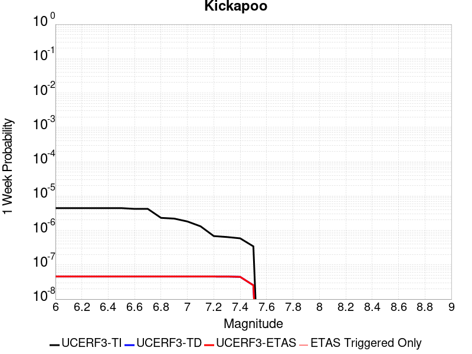 | 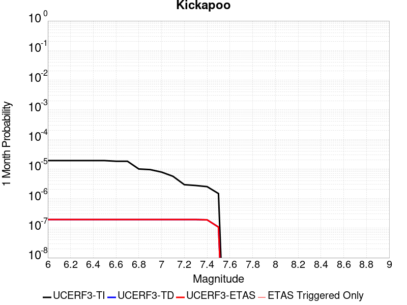 | 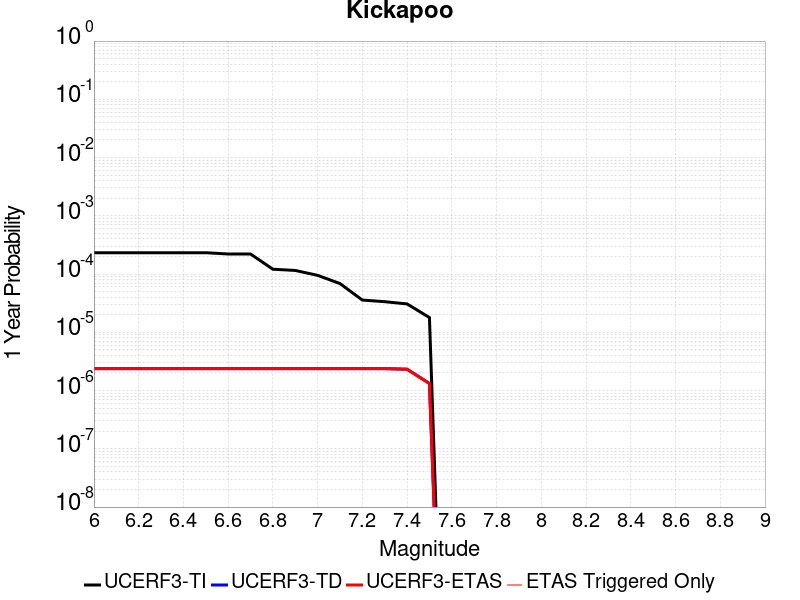 | 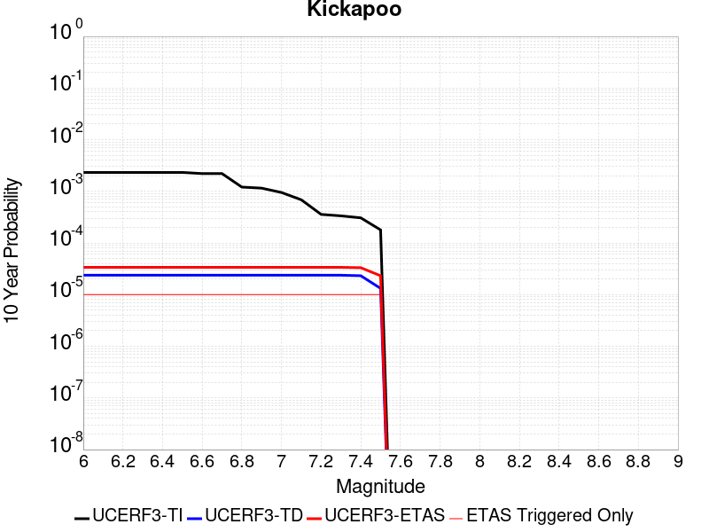 |

| Magnitude | 1 wk TI Prob | 1 wk TD Prob | 1 wk ETAS Prob | 1 wk ETAS/TD Gain | 1 wk ETAS Triggered Only | 1 mo TI Prob | 1 mo TD Prob | 1 mo ETAS Prob | 1 mo ETAS/TD Gain | 1 mo ETAS Triggered Only | 1 yr TI Prob | 1 yr TD Prob | 1 yr ETAS Prob | 1 yr ETAS/TD Gain | 1 yr ETAS Triggered Only | 10 yr TI Prob | 10 yr TD Prob | 10 yr ETAS Prob | 10 yr ETAS/TD Gain | 10 yr ETAS Triggered Only |
|-----|-----|-----|-----|-----|-----|-----|-----|-----|-----|-----|-----|-----|-----|-----|-----|-----|-----|-----|-----|-----|
| 6.0 | 4.4610633E-6 | 4.5585903E-8 | 4.5585903E-8 | 1.0 | 0.0 | 1.9118703E-5 | 1.9536814E-7 | 1.9536814E-7 | 1.0 | 0.0 | 2.3274534E-4 | 2.378605E-6 | 2.378605E-6 | 1.0 | 0.0 | 0.0023250172 | 2.3785822E-5 | 3.3785585E-5 | 1.4204085 | 1.0E-5 |
| 6.1 | 4.4610633E-6 | 4.5585903E-8 | 4.5585903E-8 | 1.0 | 0.0 | 1.9118703E-5 | 1.9536814E-7 | 1.9536814E-7 | 1.0 | 0.0 | 2.3274534E-4 | 2.378605E-6 | 2.378605E-6 | 1.0 | 0.0 | 0.0023250172 | 2.3785822E-5 | 3.3785585E-5 | 1.4204085 | 1.0E-5 |
| 6.2 | 4.4610633E-6 | 4.5585903E-8 | 4.5585903E-8 | 1.0 | 0.0 | 1.9118703E-5 | 1.9536814E-7 | 1.9536814E-7 | 1.0 | 0.0 | 2.3274534E-4 | 2.378605E-6 | 2.378605E-6 | 1.0 | 0.0 | 0.0023250172 | 2.3785822E-5 | 3.3785585E-5 | 1.4204085 | 1.0E-5 |
| 6.3 | 4.4610633E-6 | 4.5585903E-8 | 4.5585903E-8 | 1.0 | 0.0 | 1.9118703E-5 | 1.9536814E-7 | 1.9536814E-7 | 1.0 | 0.0 | 2.3274534E-4 | 2.378605E-6 | 2.378605E-6 | 1.0 | 0.0 | 0.0023250172 | 2.3785822E-5 | 3.3785585E-5 | 1.4204085 | 1.0E-5 |
| 6.4 | 4.4610633E-6 | 4.5585903E-8 | 4.5585903E-8 | 1.0 | 0.0 | 1.9118703E-5 | 1.9536814E-7 | 1.9536814E-7 | 1.0 | 0.0 | 2.3274534E-4 | 2.378605E-6 | 2.378605E-6 | 1.0 | 0.0 | 0.0023250172 | 2.3785822E-5 | 3.3785585E-5 | 1.4204085 | 1.0E-5 |
| 6.5 | 4.4610633E-6 | 4.5585903E-8 | 4.5585903E-8 | 1.0 | 0.0 | 1.9118703E-5 | 1.9536814E-7 | 1.9536814E-7 | 1.0 | 0.0 | 2.3274534E-4 | 2.378605E-6 | 2.378605E-6 | 1.0 | 0.0 | 0.0023250172 | 2.3785822E-5 | 3.3785585E-5 | 1.4204085 | 1.0E-5 |
| 6.6 | 4.236531E-6 | 4.5585903E-8 | 4.5585903E-8 | 1.0 | 0.0 | 1.8156434E-5 | 1.9536814E-7 | 1.9536814E-7 | 1.0 | 0.0 | 2.2103215E-4 | 2.378605E-6 | 2.378605E-6 | 1.0 | 0.0 | 0.0022081244 | 2.3785822E-5 | 3.3785585E-5 | 1.4204085 | 1.0E-5 |
| 6.7 | 4.236531E-6 | 4.5585903E-8 | 4.5585903E-8 | 1.0 | 0.0 | 1.8156434E-5 | 1.9536814E-7 | 1.9536814E-7 | 1.0 | 0.0 | 2.2103215E-4 | 2.378605E-6 | 2.378605E-6 | 1.0 | 0.0 | 0.0022081244 | 2.3785822E-5 | 3.3785585E-5 | 1.4204085 | 1.0E-5 |
| 6.8 | 2.3202913E-6 | 4.5585903E-8 | 4.5585903E-8 | 1.0 | 0.0 | 9.944068E-6 | 1.9536814E-7 | 1.9536814E-7 | 1.0 | 0.0 | 1.210623E-4 | 2.378605E-6 | 2.378605E-6 | 1.0 | 0.0 | 0.0012099637 | 2.3785822E-5 | 3.3785585E-5 | 1.4204085 | 1.0E-5 |
| 6.9 | 2.2111808E-6 | 4.5585903E-8 | 4.5585903E-8 | 1.0 | 0.0 | 9.4764555E-6 | 1.9536814E-7 | 1.9536814E-7 | 1.0 | 0.0 | 1.1536973E-4 | 2.378605E-6 | 2.378605E-6 | 1.0 | 0.0 | 0.0011530985 | 2.3785822E-5 | 3.3785585E-5 | 1.4204085 | 1.0E-5 |
| 7.0 | 1.8222031E-6 | 4.5585903E-8 | 4.5585903E-8 | 1.0 | 0.0 | 7.809419E-6 | 1.9536814E-7 | 1.9536814E-7 | 1.0 | 0.0 | 9.507552E-5 | 2.378605E-6 | 2.378605E-6 | 1.0 | 0.0 | 9.5034856E-4 | 2.3785822E-5 | 3.3785585E-5 | 1.4204085 | 1.0E-5 |
| 7.1 | 1.3163254E-6 | 4.5585903E-8 | 4.5585903E-8 | 1.0 | 0.0 | 5.6413824E-6 | 1.9536814E-7 | 1.9536814E-7 | 1.0 | 0.0 | 6.868167E-5 | 2.378605E-6 | 2.378605E-6 | 1.0 | 0.0 | 6.866045E-4 | 2.3785822E-5 | 3.3785585E-5 | 1.4204085 | 1.0E-5 |
| 7.2 | 6.8603634E-7 | 4.5584986E-8 | 4.5584986E-8 | 1.0 | 0.0 | 2.9401524E-6 | 1.9536421E-7 | 1.9536421E-7 | 1.0 | 0.0 | 3.579577E-5 | 2.378557E-6 | 2.378557E-6 | 1.0 | 0.0 | 3.5790002E-4 | 2.3785342E-5 | 3.3785105E-5 | 1.420417 | 1.0E-5 |
| 7.3 | 6.4299127E-7 | 4.5568793E-8 | 4.5568793E-8 | 1.0 | 0.0 | 2.755674E-6 | 1.952948E-7 | 1.952948E-7 | 1.0 | 0.0 | 3.3549815E-5 | 2.377712E-6 | 2.377712E-6 | 1.0 | 0.0 | 3.354475E-4 | 2.3776895E-5 | 3.3776654E-5 | 1.4205664 | 1.0E-5 |
| 7.4 | 5.8856347E-7 | 4.45452E-8 | 4.45452E-8 | 1.0 | 0.0 | 2.5224124E-6 | 1.9090798E-7 | 1.9090798E-7 | 1.0 | 0.0 | 3.070994E-5 | 2.3243026E-6 | 2.3243026E-6 | 1.0 | 0.0 | 3.0705697E-4 | 2.324281E-5 | 3.3242577E-5 | 1.4302306 | 1.0E-5 |
| 7.5 | 3.435626E-7 | 2.535013E-8 | 2.535013E-8 | 1.0 | 0.0 | 1.4724103E-6 | 1.0864341E-7 | 1.0864341E-7 | 1.0 | 0.0 | 1.7926448E-5 | 1.3227329E-6 | 1.3227329E-6 | 1.0 | 0.0 | 1.7925001E-4 | 1.3227266E-5 | 2.3227134E-5 | 1.7560041 | 1.0E-5 |

## Del Valle
*[(top)](#table-of-contents)*

| 1 Week | 1 Month | 1 Year | 10 Year |
|-----|-----|-----|-----|
|  |  |  |  |

| Magnitude | 1 wk TI Prob | 1 wk TD Prob | 1 wk ETAS Prob | 1 wk ETAS/TD Gain | 1 wk ETAS Triggered Only | 1 mo TI Prob | 1 mo TD Prob | 1 mo ETAS Prob | 1 mo ETAS/TD Gain | 1 mo ETAS Triggered Only | 1 yr TI Prob | 1 yr TD Prob | 1 yr ETAS Prob | 1 yr ETAS/TD Gain | 1 yr ETAS Triggered Only | 10 yr TI Prob | 10 yr TD Prob | 10 yr ETAS Prob | 10 yr ETAS/TD Gain | 10 yr ETAS Triggered Only |
|-----|-----|-----|-----|-----|-----|-----|-----|-----|-----|-----|-----|-----|-----|-----|-----|-----|-----|-----|-----|-----|
| 6.0 | 1.0716125E-5 | 8.767853E-6 | 8.767853E-6 | 1.0 | 0.0 | 4.592544E-5 | 3.7576083E-5 | 3.7576083E-5 | 1.0 | 0.0 | 5.589988E-4 | 4.574125E-4 | 4.6740792E-4 | 1.0218521 | 1.0E-5 | 0.0055759475 | 0.004566676 | 0.0045766304 | 1.0021797 | 1.0E-5 |
| 6.1 | 1.0716125E-5 | 8.767853E-6 | 8.767853E-6 | 1.0 | 0.0 | 4.592544E-5 | 3.7576083E-5 | 3.7576083E-5 | 1.0 | 0.0 | 5.589988E-4 | 4.574125E-4 | 4.6740792E-4 | 1.0218521 | 1.0E-5 | 0.0055759475 | 0.004566676 | 0.0045766304 | 1.0021797 | 1.0E-5 |
| 6.2 | 1.0716125E-5 | 8.767853E-6 | 8.767853E-6 | 1.0 | 0.0 | 4.592544E-5 | 3.7576083E-5 | 3.7576083E-5 | 1.0 | 0.0 | 5.589988E-4 | 4.574125E-4 | 4.6740792E-4 | 1.0218521 | 1.0E-5 | 0.0055759475 | 0.004566676 | 0.0045766304 | 1.0021797 | 1.0E-5 |
| 6.3 | 7.1293784E-6 | 4.8658026E-6 | 4.8658026E-6 | 1.0 | 0.0 | 3.055412E-5 | 2.0853278E-5 | 2.0853278E-5 | 1.0 | 0.0 | 3.7193293E-4 | 2.5385982E-4 | 2.6385728E-4 | 1.0393819 | 1.0E-5 | 0.0037131102 | 0.0025357953 | 0.00254577 | 1.0039335 | 1.0E-5 |
| 6.4 | 7.1293784E-6 | 4.8658026E-6 | 4.8658026E-6 | 1.0 | 0.0 | 3.055412E-5 | 2.0853278E-5 | 2.0853278E-5 | 1.0 | 0.0 | 3.7193293E-4 | 2.5385982E-4 | 2.6385728E-4 | 1.0393819 | 1.0E-5 | 0.0037131102 | 0.0025357953 | 0.00254577 | 1.0039335 | 1.0E-5 |
| 6.5 | 7.1293784E-6 | 4.8658026E-6 | 4.8658026E-6 | 1.0 | 0.0 | 3.055412E-5 | 2.0853278E-5 | 2.0853278E-5 | 1.0 | 0.0 | 3.7193293E-4 | 2.5385982E-4 | 2.6385728E-4 | 1.0393819 | 1.0E-5 | 0.0037131102 | 0.0025357953 | 0.00254577 | 1.0039335 | 1.0E-5 |
| 6.6 | 7.1293784E-6 | 4.8658026E-6 | 4.8658026E-6 | 1.0 | 0.0 | 3.055412E-5 | 2.0853278E-5 | 2.0853278E-5 | 1.0 | 0.0 | 3.7193293E-4 | 2.5385982E-4 | 2.6385728E-4 | 1.0393819 | 1.0E-5 | 0.0037131102 | 0.0025357953 | 0.00254577 | 1.0039335 | 1.0E-5 |
| 6.7 | 7.12272E-6 | 4.863178E-6 | 4.863178E-6 | 1.0 | 0.0 | 3.0525585E-5 | 2.0842032E-5 | 2.0842032E-5 | 1.0 | 0.0 | 3.7158563E-4 | 2.5372292E-4 | 2.6372037E-4 | 1.0394031 | 1.0E-5 | 0.003709649 | 0.0025344295 | 0.0025444042 | 1.0039357 | 1.0E-5 |
| 6.8 | 6.7558703E-6 | 4.559385E-6 | 4.559385E-6 | 1.0 | 0.0 | 2.895341E-5 | 1.954008E-5 | 1.954008E-5 | 1.0 | 0.0 | 3.5245073E-4 | 2.3787514E-4 | 2.4787275E-4 | 1.0420289 | 1.0E-5 | 0.0035189227 | 0.0023762917 | 0.0023862678 | 1.0041982 | 1.0E-5 |
| 6.9 | 6.6700386E-6 | 4.502526E-6 | 4.502526E-6 | 1.0 | 0.0 | 2.8585566E-5 | 1.92964E-5 | 1.92964E-5 | 1.0 | 0.0 | 3.479737E-4 | 2.3490896E-4 | 2.449066E-4 | 1.0425596 | 1.0E-5 | 0.003474293 | 0.0023466928 | 0.0023566694 | 1.0042514 | 1.0E-5 |
| 7.0 | 6.3181424E-6 | 4.098692E-6 | 4.098692E-6 | 1.0 | 0.0 | 2.7077473E-5 | 1.7565706E-5 | 1.7565706E-5 | 1.0 | 0.0 | 3.2961834E-4 | 2.1384191E-4 | 2.2383977E-4 | 1.0467535 | 1.0E-5 | 0.0032912986 | 0.0021364274 | 0.002146406 | 1.0046707 | 1.0E-5 |
| 7.1 | 6.248759E-6 | 4.0338837E-6 | 4.0338837E-6 | 1.0 | 0.0 | 2.678012E-5 | 1.728796E-5 | 1.728796E-5 | 1.0 | 0.0 | 3.2599916E-4 | 2.1046102E-4 | 2.1046102E-4 | 1.0 | 0.0 | 0.0032552136 | 0.0021026826 | 0.0021026826 | 1.0 | 0.0 |
| 7.2 | 6.0411944E-6 | 3.869879E-6 | 3.869879E-6 | 1.0 | 0.0 | 2.5890577E-5 | 1.6585092E-5 | 1.6585092E-5 | 1.0 | 0.0 | 3.1517216E-4 | 2.0190519E-4 | 2.0190519E-4 | 1.0 | 0.0 | 0.0031472554 | 0.0020172822 | 0.0020172822 | 1.0 | 0.0 |
| 7.3 | 4.7691183E-6 | 3.0780795E-6 | 3.0780795E-6 | 1.0 | 0.0 | 2.0438918E-5 | 1.3191704E-5 | 1.3191704E-5 | 1.0 | 0.0 | 2.488154E-4 | 1.6059738E-4 | 1.6059738E-4 | 1.0 | 0.0 | 0.00248537 | 0.0016048425 | 0.0016048425 | 1.0 | 0.0 |
| 7.4 | 3.5524722E-6 | 2.1893054E-6 | 2.1893054E-6 | 1.0 | 0.0 | 1.5224792E-5 | 9.382705E-6 | 9.382705E-6 | 1.0 | 0.0 | 1.8534607E-4 | 1.1422852E-4 | 1.1422852E-4 | 1.0 | 0.0 | 0.0018519156 | 0.0011417064 | 0.0011417064 | 1.0 | 0.0 |
| 7.5 | 2.7133442E-6 | 1.5915778E-6 | 1.5915778E-6 | 1.0 | 0.0 | 1.1628566E-5 | 6.8210297E-6 | 6.8210297E-6 | 1.0 | 0.0 | 1.415686E-4 | 8.304289E-5 | 8.304289E-5 | 1.0 | 0.0 | 0.0014147845 | 8.301205E-4 | 8.301205E-4 | 1.0 | 0.0 |
| 7.6 | 1.915338E-6 | 1.1738903E-6 | 1.1738903E-6 | 1.0 | 0.0 | 8.208566E-6 | 5.0309486E-6 | 5.0309486E-6 | 1.0 | 0.0 | 9.993471E-5 | 6.125009E-5 | 6.125009E-5 | 1.0 | 0.0 | 9.988978E-4 | 6.12333E-4 | 6.12333E-4 | 1.0 | 0.0 |
| 7.7 | 1.2120448E-6 | 7.180127E-7 | 7.180127E-7 | 1.0 | 0.0 | 5.194467E-6 | 3.0771935E-6 | 3.0771935E-6 | 1.0 | 0.0 | 6.3240805E-5 | 3.746419E-5 | 3.746419E-5 | 1.0 | 0.0 | 6.322281E-4 | 3.7457913E-4 | 3.7457913E-4 | 1.0 | 0.0 |
| 7.8 | 6.272381E-7 | 3.9324328E-7 | 3.9324328E-7 | 1.0 | 0.0 | 2.6881603E-6 | 1.6853273E-6 | 1.6853273E-6 | 1.0 | 0.0 | 3.272786E-5 | 2.0518668E-5 | 2.0518668E-5 | 1.0 | 0.0 | 3.272304E-4 | 2.051679E-4 | 2.051679E-4 | 1.0 | 0.0 |
| 7.9 | 2.0292627E-7 | 1.2004168E-7 | 1.2004168E-7 | 1.0 | 0.0 | 8.6968373E-7 | 5.144642E-7 | 5.144642E-7 | 1.0 | 0.0 | 1.0588348E-5 | 6.263584E-6 | 6.263584E-6 | 1.0 | 0.0 | 1.0587843E-4 | 6.26341E-5 | 6.26341E-5 | 1.0 | 0.0 |
| 8.0 | 4.374492E-8 | 2.1898728E-8 | 2.1898728E-8 | 1.0 | 0.0 | 1.8747821E-7 | 9.3851696E-8 | 9.3851696E-8 | 1.0 | 0.0 | 2.2825448E-6 | 1.1426438E-6 | 1.1426438E-6 | 1.0 | 0.0 | 2.2825214E-5 | 1.1426383E-5 | 1.1426383E-5 | 1.0 | 0.0 |

## Almanor 2011 CFM
*[(top)](#table-of-contents)*

| 1 Week | 1 Month | 1 Year | 10 Year |
|-----|-----|-----|-----|
|  |  |  |  |

| Magnitude | 1 wk TI Prob | 1 wk TD Prob | 1 wk ETAS Prob | 1 wk ETAS/TD Gain | 1 wk ETAS Triggered Only | 1 mo TI Prob | 1 mo TD Prob | 1 mo ETAS Prob | 1 mo ETAS/TD Gain | 1 mo ETAS Triggered Only | 1 yr TI Prob | 1 yr TD Prob | 1 yr ETAS Prob | 1 yr ETAS/TD Gain | 1 yr ETAS Triggered Only | 10 yr TI Prob | 10 yr TD Prob | 10 yr ETAS Prob | 10 yr ETAS/TD Gain | 10 yr ETAS Triggered Only |
|-----|-----|-----|-----|-----|-----|-----|-----|-----|-----|-----|-----|-----|-----|-----|-----|-----|-----|-----|-----|-----|
| 6.0 | 6.1479834E-5 | 8.3271654E-5 | 8.3271654E-5 | 1.0 | 0.0 | 2.6345838E-4 | 3.5683217E-4 | 3.5683217E-4 | 1.0 | 0.0 | 0.0032028882 | 0.004336457 | 0.004336457 | 1.0 | 0.0 | 0.031571172 | 0.042586215 | 0.04259579 | 1.0002248 | 1.0E-5 |
| 6.1 | 4.4387216E-5 | 5.9766873E-5 | 5.9766873E-5 | 1.0 | 0.0 | 1.9021705E-4 | 2.5612145E-4 | 2.5612145E-4 | 1.0 | 0.0 | 0.0023134327 | 0.003114324 | 0.003114324 | 1.0 | 0.0 | 0.022894967 | 0.030755322 | 0.030765014 | 1.0003152 | 1.0E-5 |
| 6.2 | 4.4387216E-5 | 5.9766873E-5 | 5.9766873E-5 | 1.0 | 0.0 | 1.9021705E-4 | 2.5612145E-4 | 2.5612145E-4 | 1.0 | 0.0 | 0.0023134327 | 0.003114324 | 0.003114324 | 1.0 | 0.0 | 0.022894967 | 0.030755322 | 0.030765014 | 1.0003152 | 1.0E-5 |
| 6.3 | 2.9523822E-5 | 3.9546605E-5 | 3.9546605E-5 | 1.0 | 0.0 | 1.2652454E-4 | 1.6947598E-4 | 1.6947598E-4 | 1.0 | 0.0 | 0.0015393476 | 0.0020617754 | 0.0020617754 | 1.0 | 0.0 | 0.015287281 | 0.020460943 | 0.020460943 | 1.0 | 0.0 |
| 6.4 | 2.0512744E-5 | 2.743039E-5 | 2.743039E-5 | 1.0 | 0.0 | 8.79088E-5 | 1.17554795E-4 | 1.17554795E-4 | 1.0 | 0.0 | 0.001069764 | 0.001430605 | 0.001430605 | 1.0 | 0.0 | 0.010646289 | 0.0142444605 | 0.0142444605 | 1.0 | 0.0 |
| 6.5 | 1.6750226E-5 | 2.239016E-5 | 2.239016E-5 | 1.0 | 0.0 | 7.178471E-5 | 9.5955504E-5 | 9.5955504E-5 | 1.0 | 0.0 | 8.7362836E-4 | 0.0011679507 | 0.0011679507 | 1.0 | 0.0 | 0.008702018 | 0.011649098 | 0.011649098 | 1.0 | 0.0 |
| 6.6 | 1.4745303E-5 | 1.970668E-5 | 1.970668E-5 | 1.0 | 0.0 | 6.319262E-5 | 8.4455794E-5 | 8.4455794E-5 | 1.0 | 0.0 | 7.690986E-4 | 0.0010280898 | 0.0010280898 | 1.0 | 0.0 | 0.0076644225 | 0.010265044 | 0.010265044 | 1.0 | 0.0 |
| 6.7 | 9.951145E-7 | 1.1616295E-6 | 1.1616295E-6 | 1.0 | 0.0 | 4.26477E-6 | 4.9784035E-6 | 4.9784035E-6 | 1.0 | 0.0 | 5.1922336E-5 | 6.0610553E-5 | 6.0610553E-5 | 1.0 | 0.0 | 5.1910203E-4 | 6.0595747E-4 | 6.0595747E-4 | 1.0 | 0.0 |
| 6.8 | 5.866312E-7 | 6.8493534E-7 | 6.8493534E-7 | 1.0 | 0.0 | 2.5141312E-6 | 2.9354346E-6 | 2.9354346E-6 | 1.0 | 0.0 | 3.0609117E-5 | 3.5738463E-5 | 3.5738463E-5 | 1.0 | 0.0 | 3.06049E-4 | 3.5733997E-4 | 3.5733997E-4 | 1.0 | 0.0 |

## Burnt Mtn
*[(top)](#table-of-contents)*

| 1 Week | 1 Month | 1 Year | 10 Year |
|-----|-----|-----|-----|
| 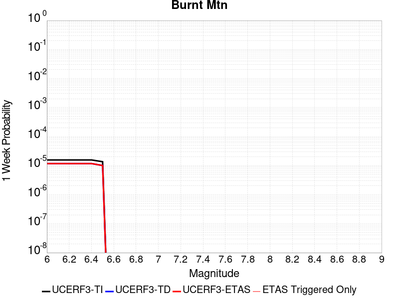 | 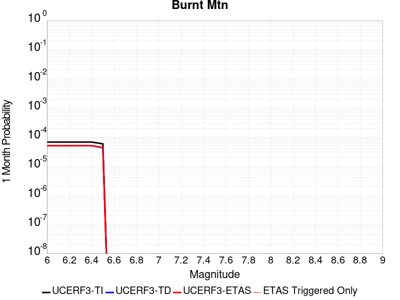 |  | 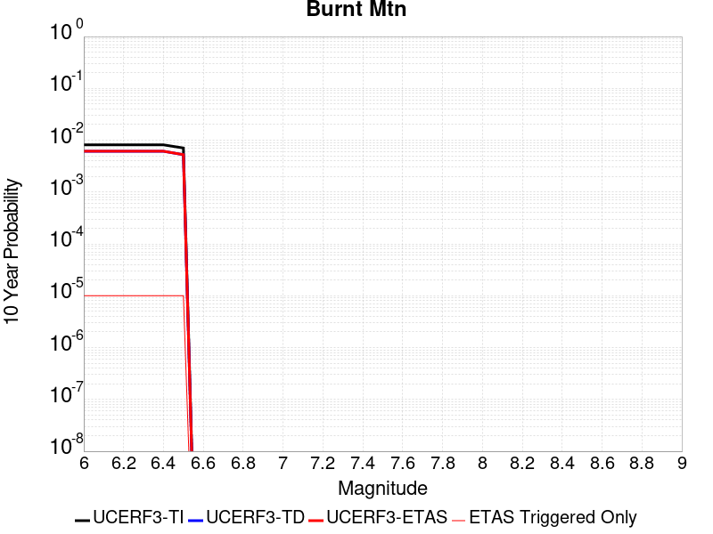 |

| Magnitude | 1 wk TI Prob | 1 wk TD Prob | 1 wk ETAS Prob | 1 wk ETAS/TD Gain | 1 wk ETAS Triggered Only | 1 mo TI Prob | 1 mo TD Prob | 1 mo ETAS Prob | 1 mo ETAS/TD Gain | 1 mo ETAS Triggered Only | 1 yr TI Prob | 1 yr TD Prob | 1 yr ETAS Prob | 1 yr ETAS/TD Gain | 1 yr ETAS Triggered Only | 10 yr TI Prob | 10 yr TD Prob | 10 yr ETAS Prob | 10 yr ETAS/TD Gain | 10 yr ETAS Triggered Only |
|-----|-----|-----|-----|-----|-----|-----|-----|-----|-----|-----|-----|-----|-----|-----|-----|-----|-----|-----|-----|-----|
| 6.0 | 1.5673151E-5 | 1.1749243E-5 | 1.1749243E-5 | 1.0 | 0.0 | 6.716892E-5 | 5.0353654E-5 | 5.0353654E-5 | 1.0 | 0.0 | 8.1747473E-4 | 6.130122E-4 | 6.23006E-4 | 1.016303 | 1.0E-5 | 0.008144741 | 0.0061258525 | 0.006135791 | 1.0016224 | 1.0E-5 |
| 6.1 | 1.5673151E-5 | 1.1749243E-5 | 1.1749243E-5 | 1.0 | 0.0 | 6.716892E-5 | 5.0353654E-5 | 5.0353654E-5 | 1.0 | 0.0 | 8.1747473E-4 | 6.130122E-4 | 6.23006E-4 | 1.016303 | 1.0E-5 | 0.008144741 | 0.0061258525 | 0.006135791 | 1.0016224 | 1.0E-5 |
| 6.2 | 1.5673151E-5 | 1.1749243E-5 | 1.1749243E-5 | 1.0 | 0.0 | 6.716892E-5 | 5.0353654E-5 | 5.0353654E-5 | 1.0 | 0.0 | 8.1747473E-4 | 6.130122E-4 | 6.23006E-4 | 1.016303 | 1.0E-5 | 0.008144741 | 0.0061258525 | 0.006135791 | 1.0016224 | 1.0E-5 |
| 6.3 | 1.5673151E-5 | 1.1749243E-5 | 1.1749243E-5 | 1.0 | 0.0 | 6.716892E-5 | 5.0353654E-5 | 5.0353654E-5 | 1.0 | 0.0 | 8.1747473E-4 | 6.130122E-4 | 6.23006E-4 | 1.016303 | 1.0E-5 | 0.008144741 | 0.0061258525 | 0.006135791 | 1.0016224 | 1.0E-5 |
| 6.4 | 1.5673151E-5 | 1.1749243E-5 | 1.1749243E-5 | 1.0 | 0.0 | 6.716892E-5 | 5.0353654E-5 | 5.0353654E-5 | 1.0 | 0.0 | 8.1747473E-4 | 6.130122E-4 | 6.23006E-4 | 1.016303 | 1.0E-5 | 0.008144741 | 0.0061258525 | 0.006135791 | 1.0016224 | 1.0E-5 |
| 6.5 | 1.36191375E-5 | 1.007816E-5 | 1.007816E-5 | 1.0 | 0.0 | 5.8366426E-5 | 4.319211E-5 | 4.319211E-5 | 1.0 | 0.0 | 7.103795E-4 | 5.2586396E-4 | 5.358587E-4 | 1.0190064 | 1.0E-5 | 0.0070811296 | 0.00525864 | 0.0052685873 | 1.0018916 | 1.0E-5 |

## Monterey Bay-Tularcitos
*[(top)](#table-of-contents)*

| 1 Week | 1 Month | 1 Year | 10 Year |
|-----|-----|-----|-----|
|  |  |  |  |

| Magnitude | 1 wk TI Prob | 1 wk TD Prob | 1 wk ETAS Prob | 1 wk ETAS/TD Gain | 1 wk ETAS Triggered Only | 1 mo TI Prob | 1 mo TD Prob | 1 mo ETAS Prob | 1 mo ETAS/TD Gain | 1 mo ETAS Triggered Only | 1 yr TI Prob | 1 yr TD Prob | 1 yr ETAS Prob | 1 yr ETAS/TD Gain | 1 yr ETAS Triggered Only | 10 yr TI Prob | 10 yr TD Prob | 10 yr ETAS Prob | 10 yr ETAS/TD Gain | 10 yr ETAS Triggered Only |
|-----|-----|-----|-----|-----|-----|-----|-----|-----|-----|-----|-----|-----|-----|-----|-----|-----|-----|-----|-----|-----|
| 6.0 | 3.0131365E-5 | 3.2798693E-5 | 4.2798365E-5 | 1.3048803 | 1.0E-5 | 1.2912804E-4 | 1.4055884E-4 | 1.5055743E-4 | 1.0711346 | 1.0E-5 | 0.001571 | 0.0017100661 | 0.0017200491 | 1.0058377 | 1.0E-5 | 0.015599402 | 0.016979877 | 0.016989706 | 1.0005789 | 1.0E-5 |
| 6.1 | 3.0131365E-5 | 3.2798693E-5 | 4.2798365E-5 | 1.3048803 | 1.0E-5 | 1.2912804E-4 | 1.4055884E-4 | 1.5055743E-4 | 1.0711346 | 1.0E-5 | 0.001571 | 0.0017100661 | 0.0017200491 | 1.0058377 | 1.0E-5 | 0.015599402 | 0.016979877 | 0.016989706 | 1.0005789 | 1.0E-5 |
| 6.2 | 3.0131365E-5 | 3.2798693E-5 | 4.2798365E-5 | 1.3048803 | 1.0E-5 | 1.2912804E-4 | 1.4055884E-4 | 1.5055743E-4 | 1.0711346 | 1.0E-5 | 0.001571 | 0.0017100661 | 0.0017200491 | 1.0058377 | 1.0E-5 | 0.015599402 | 0.016979877 | 0.016989706 | 1.0005789 | 1.0E-5 |
| 6.3 | 1.6998249E-5 | 1.8330758E-5 | 1.8330758E-5 | 1.0 | 0.0 | 7.28476E-5 | 7.8558136E-5 | 7.8558136E-5 | 1.0 | 0.0 | 8.865586E-4 | 9.560443E-4 | 9.560443E-4 | 1.0 | 0.0 | 0.0088303005 | 0.009521238 | 0.009521238 | 1.0 | 0.0 |
| 6.4 | 1.6998249E-5 | 1.8330758E-5 | 1.8330758E-5 | 1.0 | 0.0 | 7.28476E-5 | 7.8558136E-5 | 7.8558136E-5 | 1.0 | 0.0 | 8.865586E-4 | 9.560443E-4 | 9.560443E-4 | 1.0 | 0.0 | 0.0088303005 | 0.009521238 | 0.009521238 | 1.0 | 0.0 |
| 6.5 | 1.27470785E-5 | 1.3693284E-5 | 1.3693284E-5 | 1.0 | 0.0 | 5.4629192E-5 | 5.8684243E-5 | 5.8684243E-5 | 1.0 | 0.0 | 6.649074E-4 | 7.142568E-4 | 7.142568E-4 | 1.0 | 0.0 | 0.0066292146 | 0.0071206638 | 0.0071206638 | 1.0 | 0.0 |
| 6.6 | 1.2739422E-5 | 1.3685371E-5 | 1.3685371E-5 | 1.0 | 0.0 | 5.4596385E-5 | 5.865033E-5 | 5.865033E-5 | 1.0 | 0.0 | 6.645082E-4 | 7.138442E-4 | 7.138442E-4 | 1.0 | 0.0 | 0.0066252467 | 0.007116564 | 0.007116564 | 1.0 | 0.0 |
| 6.7 | 1.0160109E-5 | 1.0885733E-5 | 1.0885733E-5 | 1.0 | 0.0 | 4.35426E-5 | 4.6652345E-5 | 4.6652345E-5 | 1.0 | 0.0 | 5.300022E-4 | 5.6785136E-4 | 5.6785136E-4 | 1.0 | 0.0 | 0.005287399 | 0.005664715 | 0.005664715 | 1.0 | 0.0 |
| 6.8 | 8.349859E-6 | 8.9325695E-6 | 8.9325695E-6 | 1.0 | 0.0 | 3.578462E-5 | 3.828191E-5 | 3.828191E-5 | 1.0 | 0.0 | 4.3559066E-4 | 4.6598824E-4 | 4.6598824E-4 | 1.0 | 0.0 | 0.004347378 | 0.004650676 | 0.004650676 | 1.0 | 0.0 |
| 6.9 | 5.193639E-6 | 5.5364194E-6 | 5.5364194E-6 | 1.0 | 0.0 | 2.2258262E-5 | 2.3727313E-5 | 2.3727313E-5 | 1.0 | 0.0 | 2.7096065E-4 | 2.88845E-4 | 2.88845E-4 | 1.0 | 0.0 | 0.0027063051 | 0.0028850166 | 0.0028850166 | 1.0 | 0.0 |
| 7.0 | 4.359381E-6 | 4.643357E-6 | 4.643357E-6 | 1.0 | 0.0 | 1.8682927E-5 | 1.9899966E-5 | 1.9899966E-5 | 1.0 | 0.0 | 2.274409E-4 | 2.4225812E-4 | 2.4225812E-4 | 1.0 | 0.0 | 0.0022720827 | 0.0024202333 | 0.0024202333 | 1.0 | 0.0 |
| 7.1 | 3.0398533E-6 | 3.231036E-6 | 3.231036E-6 | 1.0 | 0.0 | 1.3027877E-5 | 1.3847239E-5 | 1.3847239E-5 | 1.0 | 0.0 | 1.5860285E-4 | 1.6857972E-4 | 1.6857972E-4 | 1.0 | 0.0 | 0.001584897 | 0.001684776 | 0.001684776 | 1.0 | 0.0 |
| 7.2 | 1.642335E-6 | 1.7333118E-6 | 1.7333118E-6 | 1.0 | 0.0 | 7.0385595E-6 | 7.4284694E-6 | 7.4284694E-6 | 1.0 | 0.0 | 8.569109E-5 | 9.043993E-5 | 9.043993E-5 | 1.0 | 0.0 | 8.5658056E-4 | 9.0423395E-4 | 9.0423395E-4 | 1.0 | 0.0 |
| 7.3 | 3.356842E-7 | 3.2952312E-7 | 3.2952312E-7 | 1.0 | 0.0 | 1.4386458E-6 | 1.4122412E-6 | 1.4122412E-6 | 1.0 | 0.0 | 1.7515373E-5 | 1.7193901E-5 | 1.7193901E-5 | 1.0 | 0.0 | 1.7513991E-4 | 1.7192581E-4 | 1.7192581E-4 | 1.0 | 0.0 |
| 7.4 | 2.1973483E-7 | 2.1006346E-7 | 2.1006346E-7 | 1.0 | 0.0 | 9.417204E-7 | 9.002717E-7 | 9.002717E-7 | 1.0 | 0.0 | 1.1465385E-5 | 1.0960753E-5 | 1.0960753E-5 | 1.0 | 0.0 | 1.1464794E-4 | 1.0960216E-4 | 1.0960216E-4 | 1.0 | 0.0 |
| 7.5 | 1.1944135E-7 | 1.06959774E-7 | 1.06959774E-7 | 1.0 | 0.0 | 5.118914E-7 | 4.5839894E-7 | 4.5839894E-7 | 1.0 | 0.0 | 6.23226E-6 | 5.580993E-6 | 5.580993E-6 | 1.0 | 0.0 | 6.2320854E-5 | 5.580854E-5 | 5.580854E-5 | 1.0 | 0.0 |
| 7.6 | 4.636058E-8 | 3.336394E-8 | 3.336394E-8 | 1.0 | 0.0 | 1.9868818E-7 | 1.429883E-7 | 1.429883E-7 | 1.0 | 0.0 | 2.419026E-6 | 1.7408811E-6 | 1.7408811E-6 | 1.0 | 0.0 | 2.4189996E-5 | 1.7408676E-5 | 1.7408676E-5 | 1.0 | 0.0 |
| 7.7 | 1.8588572E-8 | 8.002803E-9 | 8.002803E-9 | 1.0 | 0.0 | 7.9665305E-8 | 3.4297724E-8 | 3.4297724E-8 | 1.0 | 0.0 | 9.699246E-7 | 4.175747E-7 | 4.175747E-7 | 1.0 | 0.0 | 9.699204E-6 | 4.1757394E-6 | 4.1757394E-6 | 1.0 | 0.0 |
| 7.8 | 2.7960154E-9 | 7.6083606E-10 | 7.6083606E-10 | 1.0 | 0.0 | 1.1982923E-8 | 3.2607255E-9 | 3.2607255E-9 | 1.0 | 0.0 | 1.4589209E-7 | 3.969933E-8 | 3.969933E-8 | 1.0 | 0.0 | 1.4589199E-6 | 3.9699327E-7 | 3.9699327E-7 | 1.0 | 0.0 |

## Calico-Hidalgo
*[(top)](#table-of-contents)*

| 1 Week | 1 Month | 1 Year | 10 Year |
|-----|-----|-----|-----|
|  |  |  |  |

| Magnitude | 1 wk TI Prob | 1 wk TD Prob | 1 wk ETAS Prob | 1 wk ETAS/TD Gain | 1 wk ETAS Triggered Only | 1 mo TI Prob | 1 mo TD Prob | 1 mo ETAS Prob | 1 mo ETAS/TD Gain | 1 mo ETAS Triggered Only | 1 yr TI Prob | 1 yr TD Prob | 1 yr ETAS Prob | 1 yr ETAS/TD Gain | 1 yr ETAS Triggered Only | 10 yr TI Prob | 10 yr TD Prob | 10 yr ETAS Prob | 10 yr ETAS/TD Gain | 10 yr ETAS Triggered Only |
|-----|-----|-----|-----|-----|-----|-----|-----|-----|-----|-----|-----|-----|-----|-----|-----|-----|-----|-----|-----|-----|
| 6.0 | 4.0906612E-5 | 5.070417E-5 | 6.0703664E-5 | 1.1972125 | 1.0E-5 | 1.7530227E-4 | 2.1728777E-4 | 2.2728559E-4 | 1.0460119 | 1.0E-5 | 0.0021322158 | 0.0026426686 | 0.002652642 | 1.003774 | 1.0E-5 | 0.02111873 | 0.02615272 | 0.026162459 | 1.0003724 | 1.0E-5 |
| 6.1 | 4.0906612E-5 | 5.070417E-5 | 6.0703664E-5 | 1.1972125 | 1.0E-5 | 1.7530227E-4 | 2.1728777E-4 | 2.2728559E-4 | 1.0460119 | 1.0E-5 | 0.0021322158 | 0.0026426686 | 0.002652642 | 1.003774 | 1.0E-5 | 0.02111873 | 0.02615272 | 0.026162459 | 1.0003724 | 1.0E-5 |
| 6.2 | 4.0906612E-5 | 5.070417E-5 | 6.0703664E-5 | 1.1972125 | 1.0E-5 | 1.7530227E-4 | 2.1728777E-4 | 2.2728559E-4 | 1.0460119 | 1.0E-5 | 0.0021322158 | 0.0026426686 | 0.002652642 | 1.003774 | 1.0E-5 | 0.02111873 | 0.02615272 | 0.026162459 | 1.0003724 | 1.0E-5 |
| 6.3 | 2.4242801E-5 | 3.0090901E-5 | 4.00906E-5 | 1.3323164 | 1.0E-5 | 1.0389358E-4 | 1.2895482E-4 | 1.3895353E-4 | 1.0775366 | 1.0E-5 | 0.0012641704 | 0.0015689277 | 0.001578912 | 1.0063637 | 1.0E-5 | 0.01257003 | 0.015582195 | 0.015592039 | 1.0006318 | 1.0E-5 |
| 6.4 | 2.4242801E-5 | 3.0090901E-5 | 4.00906E-5 | 1.3323164 | 1.0E-5 | 1.0389358E-4 | 1.2895482E-4 | 1.3895353E-4 | 1.0775366 | 1.0E-5 | 0.0012641704 | 0.0015689277 | 0.001578912 | 1.0063637 | 1.0E-5 | 0.01257003 | 0.015582195 | 0.015592039 | 1.0006318 | 1.0E-5 |
| 6.5 | 2.0286952E-5 | 2.531601E-5 | 3.531576E-5 | 1.3949969 | 1.0E-5 | 8.694118E-5 | 1.0849277E-4 | 1.1849169E-4 | 1.092162 | 1.0E-5 | 0.0010579949 | 0.0013201162 | 0.001330103 | 1.0075651 | 1.0E-5 | 0.010529719 | 0.013124678 | 0.013134547 | 1.000752 | 1.0E-5 |
| 6.6 | 2.0269223E-5 | 2.529696E-5 | 3.5296707E-5 | 1.3952944 | 1.0E-5 | 8.6865206E-5 | 1.08411135E-4 | 1.18410055E-4 | 1.0922314 | 1.0E-5 | 0.0010570707 | 0.0013191235 | 0.0013291104 | 1.0075707 | 1.0E-5 | 0.010520565 | 0.013114868 | 0.013124737 | 1.0007524 | 1.0E-5 |
| 6.7 | 1.799852E-5 | 2.2540898E-5 | 3.2540673E-5 | 1.4436281 | 1.0E-5 | 7.713423E-5 | 9.660036E-5 | 1.0659939E-4 | 1.1035093 | 1.0E-5 | 9.3870464E-4 | 0.0011754894 | 0.0011854776 | 1.0084971 | 1.0E-5 | 0.009347493 | 0.011694328 | 0.01170421 | 1.0008451 | 1.0E-5 |
| 6.8 | 1.7458793E-5 | 2.1842547E-5 | 3.1842326E-5 | 1.4578121 | 1.0E-5 | 7.4821255E-5 | 9.360763E-5 | 1.036067E-4 | 1.1068189 | 1.0E-5 | 9.10568E-4 | 0.0011390916 | 0.0011490801 | 1.0087689 | 1.0E-5 | 0.009068459 | 0.011334113 | 0.011344 | 1.0008723 | 1.0E-5 |
| 6.9 | 1.542884E-5 | 1.9026254E-5 | 1.9026254E-5 | 1.0 | 0.0 | 6.612192E-5 | 8.1538616E-5 | 8.1538616E-5 | 1.0 | 0.0 | 8.04737E-4 | 9.922937E-4 | 9.922937E-4 | 1.0 | 0.0 | 0.008018291 | 0.009880027 | 0.009880027 | 1.0 | 0.0 |
| 7.0 | 1.468253E-5 | 1.8031062E-5 | 1.8031062E-5 | 1.0 | 0.0 | 6.292361E-5 | 7.727376E-5 | 7.727376E-5 | 1.0 | 0.0 | 7.658257E-4 | 9.40415E-4 | 9.40415E-4 | 1.0 | 0.0 | 0.0076319184 | 0.009365721 | 0.009365721 | 1.0 | 0.0 |
| 7.1 | 1.3139281E-5 | 1.6201364E-5 | 1.6201364E-5 | 1.0 | 0.0 | 5.6309986E-5 | 6.943264E-5 | 6.943264E-5 | 1.0 | 0.0 | 6.853584E-4 | 8.450271E-4 | 8.450271E-4 | 1.0 | 0.0 | 0.0068324856 | 0.008419436 | 0.008419436 | 1.0 | 0.0 |
| 7.2 | 1.1127404E-5 | 1.3867016E-5 | 1.3867016E-5 | 1.0 | 0.0 | 4.7688E-5 | 5.9428774E-5 | 5.9428774E-5 | 1.0 | 0.0 | 5.8044674E-4 | 7.2331604E-4 | 7.2331604E-4 | 1.0 | 0.0 | 0.0057893298 | 0.0072107255 | 0.0072107255 | 1.0 | 0.0 |
| 7.3 | 9.808154E-6 | 1.2176565E-5 | 1.2176565E-5 | 1.0 | 0.0 | 4.2034266E-5 | 5.2184296E-5 | 5.2184296E-5 | 1.0 | 0.0 | 5.11647E-4 | 6.351693E-4 | 6.351693E-4 | 1.0 | 0.0 | 0.0051047057 | 0.0063346145 | 0.0063346145 | 1.0 | 0.0 |
| 7.4 | 7.942452E-6 | 9.79233E-6 | 9.79233E-6 | 1.0 | 0.0 | 3.4038632E-5 | 4.1966505E-5 | 4.1966505E-5 | 1.0 | 0.0 | 4.1434157E-4 | 5.108319E-4 | 5.108319E-4 | 1.0 | 0.0 | 0.0041356985 | 0.0050975177 | 0.0050975177 | 1.0 | 0.0 |
| 7.5 | 4.7121216E-6 | 5.772962E-6 | 5.772962E-6 | 1.0 | 0.0 | 2.019465E-5 | 2.4741075E-5 | 2.4741075E-5 | 1.0 | 0.0 | 2.4584212E-4 | 3.0118861E-4 | 3.0118861E-4 | 1.0 | 0.0 | 0.0024557032 | 0.0030085566 | 0.0030085566 | 1.0 | 0.0 |
| 7.6 | 2.21172E-7 | 2.6040198E-7 | 2.6040198E-7 | 1.0 | 0.0 | 9.478797E-7 | 1.1160082E-6 | 1.1160082E-6 | 1.0 | 0.0 | 1.1540374E-5 | 1.3587343E-5 | 1.3587343E-5 | 1.0 | 0.0 | 1.1539775E-4 | 1.3586794E-4 | 1.3586794E-4 | 1.0 | 0.0 |

## Mono Lake 2011 CFM
*[(top)](#table-of-contents)*

| 1 Week | 1 Month | 1 Year | 10 Year |
|-----|-----|-----|-----|
|  |  |  |  |

| Magnitude | 1 wk TI Prob | 1 wk TD Prob | 1 wk ETAS Prob | 1 wk ETAS/TD Gain | 1 wk ETAS Triggered Only | 1 mo TI Prob | 1 mo TD Prob | 1 mo ETAS Prob | 1 mo ETAS/TD Gain | 1 mo ETAS Triggered Only | 1 yr TI Prob | 1 yr TD Prob | 1 yr ETAS Prob | 1 yr ETAS/TD Gain | 1 yr ETAS Triggered Only | 10 yr TI Prob | 10 yr TD Prob | 10 yr ETAS Prob | 10 yr ETAS/TD Gain | 10 yr ETAS Triggered Only |
|-----|-----|-----|-----|-----|-----|-----|-----|-----|-----|-----|-----|-----|-----|-----|-----|-----|-----|-----|-----|-----|
| 6.0 | 2.0341662E-5 | 2.3828083E-5 | 2.3828083E-5 | 1.0 | 0.0 | 8.717564E-5 | 1.0211935E-4 | 1.0211935E-4 | 1.0 | 0.0 | 0.0010608466 | 0.0012431251 | 0.0012531127 | 1.0080342 | 1.0E-5 | 0.010557966 | 0.012413785 | 0.012423661 | 1.0007956 | 1.0E-5 |
| 6.1 | 2.0341662E-5 | 2.3828083E-5 | 2.3828083E-5 | 1.0 | 0.0 | 8.717564E-5 | 1.0211935E-4 | 1.0211935E-4 | 1.0 | 0.0 | 0.0010608466 | 0.0012431251 | 0.0012531127 | 1.0080342 | 1.0E-5 | 0.010557966 | 0.012413785 | 0.012423661 | 1.0007956 | 1.0E-5 |
| 6.2 | 2.0341662E-5 | 2.3828083E-5 | 2.3828083E-5 | 1.0 | 0.0 | 8.717564E-5 | 1.0211935E-4 | 1.0211935E-4 | 1.0 | 0.0 | 0.0010608466 | 0.0012431251 | 0.0012531127 | 1.0080342 | 1.0E-5 | 0.010557966 | 0.012413785 | 0.012423661 | 1.0007956 | 1.0E-5 |
| 6.3 | 2.0341662E-5 | 2.3828083E-5 | 2.3828083E-5 | 1.0 | 0.0 | 8.717564E-5 | 1.0211935E-4 | 1.0211935E-4 | 1.0 | 0.0 | 0.0010608466 | 0.0012431251 | 0.0012531127 | 1.0080342 | 1.0E-5 | 0.010557966 | 0.012413785 | 0.012423661 | 1.0007956 | 1.0E-5 |
| 6.4 | 1.749821E-5 | 2.0490916E-5 | 2.0490916E-5 | 1.0 | 0.0 | 7.499018E-5 | 8.781821E-5 | 8.781821E-5 | 1.0 | 0.0 | 9.1262296E-4 | 0.0010691865 | 0.0010791759 | 1.0093429 | 1.0E-5 | 0.009088841 | 0.010691822 | 0.010701715 | 1.0009253 | 1.0E-5 |
| 6.5 | 1.749821E-5 | 2.0490916E-5 | 2.0490916E-5 | 1.0 | 0.0 | 7.499018E-5 | 8.781821E-5 | 8.781821E-5 | 1.0 | 0.0 | 9.1262296E-4 | 0.0010691865 | 0.0010791759 | 1.0093429 | 1.0E-5 | 0.009088841 | 0.010691822 | 0.010701715 | 1.0009253 | 1.0E-5 |

## Mission Creek
*[(top)](#table-of-contents)*

| 1 Week | 1 Month | 1 Year | 10 Year |
|-----|-----|-----|-----|
|  |  |  |  |

| Magnitude | 1 wk TI Prob | 1 wk TD Prob | 1 wk ETAS Prob | 1 wk ETAS/TD Gain | 1 wk ETAS Triggered Only | 1 mo TI Prob | 1 mo TD Prob | 1 mo ETAS Prob | 1 mo ETAS/TD Gain | 1 mo ETAS Triggered Only | 1 yr TI Prob | 1 yr TD Prob | 1 yr ETAS Prob | 1 yr ETAS/TD Gain | 1 yr ETAS Triggered Only | 10 yr TI Prob | 10 yr TD Prob | 10 yr ETAS Prob | 10 yr ETAS/TD Gain | 10 yr ETAS Triggered Only |
|-----|-----|-----|-----|-----|-----|-----|-----|-----|-----|-----|-----|-----|-----|-----|-----|-----|-----|-----|-----|-----|
| 6.0 | 1.1549387E-5 | 1.6322329E-5 | 1.6322329E-5 | 1.0 | 0.0 | 4.9496433E-5 | 6.995104E-5 | 7.995035E-5 | 1.1429471 | 1.0E-5 | 6.0245243E-4 | 8.513362E-4 | 8.613277E-4 | 1.0117363 | 1.0E-5 | 0.006008218 | 0.008509756 | 0.008519672 | 1.0011652 | 1.0E-5 |
| 6.1 | 1.1549387E-5 | 1.6322329E-5 | 1.6322329E-5 | 1.0 | 0.0 | 4.9496433E-5 | 6.995104E-5 | 7.995035E-5 | 1.1429471 | 1.0E-5 | 6.0245243E-4 | 8.513362E-4 | 8.613277E-4 | 1.0117363 | 1.0E-5 | 0.006008218 | 0.008509756 | 0.008519672 | 1.0011652 | 1.0E-5 |
| 6.2 | 1.1549387E-5 | 1.6322329E-5 | 1.6322329E-5 | 1.0 | 0.0 | 4.9496433E-5 | 6.995104E-5 | 7.995035E-5 | 1.1429471 | 1.0E-5 | 6.0245243E-4 | 8.513362E-4 | 8.613277E-4 | 1.0117363 | 1.0E-5 | 0.006008218 | 0.008509756 | 0.008519672 | 1.0011652 | 1.0E-5 |
| 6.3 | 1.1549387E-5 | 1.6322329E-5 | 1.6322329E-5 | 1.0 | 0.0 | 4.9496433E-5 | 6.995104E-5 | 7.995035E-5 | 1.1429471 | 1.0E-5 | 6.0245243E-4 | 8.513362E-4 | 8.613277E-4 | 1.0117363 | 1.0E-5 | 0.006008218 | 0.008509756 | 0.008519672 | 1.0011652 | 1.0E-5 |
| 6.4 | 1.1549387E-5 | 1.6322329E-5 | 1.6322329E-5 | 1.0 | 0.0 | 4.9496433E-5 | 6.995104E-5 | 7.995035E-5 | 1.1429471 | 1.0E-5 | 6.0245243E-4 | 8.513362E-4 | 8.613277E-4 | 1.0117363 | 1.0E-5 | 0.006008218 | 0.008509756 | 0.008519672 | 1.0011652 | 1.0E-5 |
| 6.5 | 1.1549387E-5 | 1.6322329E-5 | 1.6322329E-5 | 1.0 | 0.0 | 4.9496433E-5 | 6.995104E-5 | 7.995035E-5 | 1.1429471 | 1.0E-5 | 6.0245243E-4 | 8.513362E-4 | 8.613277E-4 | 1.0117363 | 1.0E-5 | 0.006008218 | 0.008509756 | 0.008519672 | 1.0011652 | 1.0E-5 |
| 6.6 | 9.202681E-6 | 1.3845609E-5 | 1.3845609E-5 | 1.0 | 0.0 | 3.9439463E-5 | 5.9337024E-5 | 6.9336435E-5 | 1.1685189 | 1.0E-5 | 4.800697E-4 | 7.221979E-4 | 7.321906E-4 | 1.0138366 | 1.0E-5 | 0.004790339 | 0.0072269416 | 0.0072368695 | 1.0013738 | 1.0E-5 |
| 6.7 | 9.019164E-6 | 1.3651278E-5 | 1.3651278E-5 | 1.0 | 0.0 | 3.8652986E-5 | 5.8504218E-5 | 6.8503636E-5 | 1.1709179 | 1.0E-5 | 4.7049852E-4 | 7.120651E-4 | 7.2205794E-4 | 1.0140337 | 1.0E-5 | 0.004695036 | 0.007126266 | 0.007136195 | 1.0013933 | 1.0E-5 |
| 6.8 | 8.673558E-6 | 1.327339E-5 | 1.327339E-5 | 1.0 | 0.0 | 3.717186E-5 | 5.6884768E-5 | 6.68842E-5 | 1.175784 | 1.0E-5 | 4.524734E-4 | 6.923608E-4 | 7.023539E-4 | 1.0144334 | 1.0E-5 | 0.0045155324 | 0.0069304546 | 0.0069403853 | 1.0014329 | 1.0E-5 |
| 6.9 | 7.002255E-6 | 1.1477623E-5 | 1.1477623E-5 | 1.0 | 0.0 | 3.000932E-5 | 4.9188922E-5 | 5.918843E-5 | 1.2032878 | 1.0E-5 | 3.653022E-4 | 5.987174E-4 | 6.0871145E-4 | 1.0166924 | 1.0E-5 | 0.0036470229 | 0.005999279 | 0.006009219 | 1.0016569 | 1.0E-5 |
| 7.0 | 5.84644E-6 | 9.674926E-6 | 9.674926E-6 | 1.0 | 0.0 | 2.5055931E-5 | 4.1463336E-5 | 5.146292E-5 | 1.241167 | 1.0E-5 | 3.0501327E-4 | 5.047037E-4 | 5.146987E-4 | 1.0198036 | 1.0E-5 | 0.0030459496 | 0.0050636036 | 0.005073553 | 1.0019649 | 1.0E-5 |
| 7.1 | 5.54703E-6 | 9.329403E-6 | 9.329403E-6 | 1.0 | 0.0 | 2.377277E-5 | 3.9982566E-5 | 4.998217E-5 | 1.250099 | 1.0E-5 | 2.8939504E-4 | 4.8668348E-4 | 4.9667864E-4 | 1.0205373 | 1.0E-5 | 0.0028901845 | 0.004884198 | 0.004894149 | 1.0020374 | 1.0E-5 |
| 7.2 | 4.384709E-6 | 7.681513E-6 | 7.681513E-6 | 1.0 | 0.0 | 1.8791474E-5 | 3.2920376E-5 | 4.2920048E-5 | 1.3037533 | 1.0E-5 | 2.2876218E-4 | 4.0073553E-4 | 4.1073153E-4 | 1.0249441 | 1.0E-5 | 0.0022852682 | 0.004028155 | 0.0040381146 | 1.0024725 | 1.0E-5 |
| 7.3 | 3.7888456E-6 | 6.9153903E-6 | 6.9153903E-6 | 1.0 | 0.0 | 1.623781E-5 | 2.9637069E-5 | 3.9636772E-5 | 1.3374053 | 1.0E-5 | 1.9767738E-4 | 3.6077492E-4 | 3.707713E-4 | 1.0277082 | 1.0E-5 | 0.0019750162 | 0.003629908 | 0.0036398715 | 1.0027449 | 1.0E-5 |
| 7.4 | 2.1982462E-6 | 5.0237163E-6 | 5.0237163E-6 | 1.0 | 0.0 | 9.421021E-6 | 2.1530035E-5 | 3.152982E-5 | 1.4644574 | 1.0E-5 | 1.1469489E-4 | 2.6209684E-4 | 2.720942E-4 | 1.0381439 | 1.0E-5 | 0.0011463572 | 0.0026456737 | 0.0026556472 | 1.0037698 | 1.0E-5 |
| 7.5 | 2.051923E-6 | 4.614947E-6 | 4.614947E-6 | 1.0 | 0.0 | 8.793926E-6 | 1.9778196E-5 | 2.9777997E-5 | 1.5055974 | 1.0E-5 | 1.0706078E-4 | 2.4077305E-4 | 2.5077065E-4 | 1.0415229 | 1.0E-5 | 0.0010700922 | 0.0024334798 | 0.0024434554 | 1.0040994 | 1.0E-5 |
| 7.6 | 1.8733427E-6 | 4.1232965E-6 | 4.1232965E-6 | 1.0 | 0.0 | 8.028587E-6 | 1.7671153E-5 | 2.7670976E-5 | 1.5658841 | 1.0E-5 | 9.774366E-5 | 2.1512512E-4 | 2.2512296E-4 | 1.0464746 | 1.0E-5 | 9.770069E-4 | 0.0021779903 | 0.0021879685 | 1.0045813 | 1.0E-5 |
| 7.7 | 1.8411953E-6 | 4.0429704E-6 | 4.0429704E-6 | 1.0 | 0.0 | 7.890813E-6 | 1.7326902E-5 | 2.7326729E-5 | 1.5771272 | 1.0E-5 | 9.606641E-5 | 2.109347E-4 | 2.2093259E-4 | 1.0473981 | 1.0E-5 | 9.6024893E-4 | 0.0021362707 | 0.0021462494 | 1.0046711 | 1.0E-5 |
| 7.8 | 1.7194251E-6 | 3.7103412E-6 | 3.7103412E-6 | 1.0 | 0.0 | 7.368944E-6 | 1.5901365E-5 | 2.5901207E-5 | 1.6288668 | 1.0E-5 | 8.97132E-5 | 1.93582E-4 | 2.0358007E-4 | 1.0516477 | 1.0E-5 | 8.967699E-4 | 0.0019622566 | 0.001972237 | 1.0050862 | 1.0E-5 |
| 7.9 | 1.4035052E-6 | 2.9499822E-6 | 2.9499822E-6 | 1.0 | 0.0 | 6.0150082E-6 | 1.264272E-5 | 2.2642595E-5 | 1.790959 | 1.0E-5 | 7.3230265E-5 | 1.5391431E-4 | 1.6391277E-4 | 1.0649612 | 1.0E-5 | 7.3206134E-4 | 0.0015629107 | 0.0015728951 | 1.0063883 | 1.0E-5 |
| 8.0 | 3.9318823E-7 | 5.5278144E-7 | 5.5278144E-7 | 1.0 | 0.0 | 1.6850913E-6 | 2.3690613E-6 | 2.3690613E-6 | 1.0 | 0.0 | 2.0515794E-5 | 2.8842946E-5 | 2.8842946E-5 | 1.0 | 0.0 | 2.0513899E-4 | 2.9905947E-4 | 2.9905947E-4 | 1.0 | 0.0 |
| 8.1 | 1.596793E-7 | 1.1375019E-7 | 1.1375019E-7 | 1.0 | 0.0 | 6.8433974E-7 | 4.875007E-7 | 4.875007E-7 | 1.0 | 0.0 | 8.331805E-6 | 5.9353056E-6 | 5.9353056E-6 | 1.0 | 0.0 | 8.331492E-5 | 6.548086E-5 | 6.548086E-5 | 1.0 | 0.0 |
| 8.2 | 4.9003038E-8 | 2.5429568E-8 | 2.5429568E-8 | 1.0 | 0.0 | 2.10013E-7 | 1.08983855E-7 | 1.08983855E-7 | 1.0 | 0.0 | 2.5569052E-6 | 1.3268777E-6 | 1.3268777E-6 | 1.0 | 0.0 | 2.556876E-5 | 1.4948596E-5 | 1.4948596E-5 | 1.0 | 0.0 |

## Oak Ridge (Onshore)
*[(top)](#table-of-contents)*

| 1 Week | 1 Month | 1 Year | 10 Year |
|-----|-----|-----|-----|
|  |  |  |  |

| Magnitude | 1 wk TI Prob | 1 wk TD Prob | 1 wk ETAS Prob | 1 wk ETAS/TD Gain | 1 wk ETAS Triggered Only | 1 mo TI Prob | 1 mo TD Prob | 1 mo ETAS Prob | 1 mo ETAS/TD Gain | 1 mo ETAS Triggered Only | 1 yr TI Prob | 1 yr TD Prob | 1 yr ETAS Prob | 1 yr ETAS/TD Gain | 1 yr ETAS Triggered Only | 10 yr TI Prob | 10 yr TD Prob | 10 yr ETAS Prob | 10 yr ETAS/TD Gain | 10 yr ETAS Triggered Only |
|-----|-----|-----|-----|-----|-----|-----|-----|-----|-----|-----|-----|-----|-----|-----|-----|-----|-----|-----|-----|-----|
| 6.0 | 3.155064E-5 | 2.9525989E-5 | 3.9525694E-5 | 1.3386747 | 1.0E-5 | 1.3521002E-4 | 1.2653404E-4 | 1.3653276E-4 | 1.0790201 | 1.0E-5 | 0.001644939 | 0.0015395012 | 0.0015494858 | 1.0064856 | 1.0E-5 | 0.01632816 | 0.015292844 | 0.015302691 | 1.0006438 | 1.0E-5 |
| 6.1 | 3.155064E-5 | 2.9525989E-5 | 3.9525694E-5 | 1.3386747 | 1.0E-5 | 1.3521002E-4 | 1.2653404E-4 | 1.3653276E-4 | 1.0790201 | 1.0E-5 | 0.001644939 | 0.0015395012 | 0.0015494858 | 1.0064856 | 1.0E-5 | 0.01632816 | 0.015292844 | 0.015302691 | 1.0006438 | 1.0E-5 |
| 6.2 | 3.155064E-5 | 2.9525989E-5 | 3.9525694E-5 | 1.3386747 | 1.0E-5 | 1.3521002E-4 | 1.2653404E-4 | 1.3653276E-4 | 1.0790201 | 1.0E-5 | 0.001644939 | 0.0015395012 | 0.0015494858 | 1.0064856 | 1.0E-5 | 0.01632816 | 0.015292844 | 0.015302691 | 1.0006438 | 1.0E-5 |
| 6.3 | 3.155064E-5 | 2.9525989E-5 | 3.9525694E-5 | 1.3386747 | 1.0E-5 | 1.3521002E-4 | 1.2653404E-4 | 1.3653276E-4 | 1.0790201 | 1.0E-5 | 0.001644939 | 0.0015395012 | 0.0015494858 | 1.0064856 | 1.0E-5 | 0.01632816 | 0.015292844 | 0.015302691 | 1.0006438 | 1.0E-5 |
| 6.4 | 3.155064E-5 | 2.9525989E-5 | 3.9525694E-5 | 1.3386747 | 1.0E-5 | 1.3521002E-4 | 1.2653404E-4 | 1.3653276E-4 | 1.0790201 | 1.0E-5 | 0.001644939 | 0.0015395012 | 0.0015494858 | 1.0064856 | 1.0E-5 | 0.01632816 | 0.015292844 | 0.015302691 | 1.0006438 | 1.0E-5 |
| 6.5 | 3.155064E-5 | 2.9525989E-5 | 3.9525694E-5 | 1.3386747 | 1.0E-5 | 1.3521002E-4 | 1.2653404E-4 | 1.3653276E-4 | 1.0790201 | 1.0E-5 | 0.001644939 | 0.0015395012 | 0.0015494858 | 1.0064856 | 1.0E-5 | 0.01632816 | 0.015292844 | 0.015302691 | 1.0006438 | 1.0E-5 |
| 6.6 | 3.155064E-5 | 2.9525989E-5 | 3.9525694E-5 | 1.3386747 | 1.0E-5 | 1.3521002E-4 | 1.2653404E-4 | 1.3653276E-4 | 1.0790201 | 1.0E-5 | 0.001644939 | 0.0015395012 | 0.0015494858 | 1.0064856 | 1.0E-5 | 0.01632816 | 0.015292844 | 0.015302691 | 1.0006438 | 1.0E-5 |
| 6.7 | 3.098897E-5 | 2.8864195E-5 | 3.8863906E-5 | 1.34644 | 1.0E-5 | 1.328031E-4 | 1.2369803E-4 | 1.336968E-4 | 1.080832 | 1.0E-5 | 0.0016156785 | 0.0015050209 | 0.0015150058 | 1.0066345 | 1.0E-5 | 0.016039822 | 0.014952701 | 0.014962551 | 1.0006588 | 1.0E-5 |
| 6.8 | 3.0449872E-5 | 2.8239394E-5 | 3.823911E-5 | 1.3541052 | 1.0E-5 | 1.3049292E-4 | 1.21020574E-4 | 1.3101936E-4 | 1.0826206 | 1.0E-5 | 0.0015875935 | 0.0014724669 | 0.001482452 | 1.0067813 | 1.0E-5 | 0.015762992 | 0.01463145 | 0.014641304 | 1.0006734 | 1.0E-5 |
| 6.9 | 2.697928E-5 | 2.4219813E-5 | 2.4219813E-5 | 1.0 | 0.0 | 1.15620365E-4 | 1.0379519E-4 | 1.0379519E-4 | 1.0 | 0.0 | 0.0014067689 | 0.0012629954 | 0.0012629954 | 1.0 | 0.0 | 0.0139789665 | 0.012560867 | 0.012560867 | 1.0 | 0.0 |
| 7.0 | 2.4893961E-5 | 2.1862092E-5 | 2.1862092E-5 | 1.0 | 0.0 | 1.0668404E-4 | 9.3691415E-5 | 9.3691415E-5 | 1.0 | 0.0 | 0.0012981043 | 0.0011401138 | 0.0011401138 | 1.0 | 0.0 | 0.012905477 | 0.011344908 | 0.011344908 | 1.0 | 0.0 |
| 7.1 | 2.0945363E-5 | 1.7354554E-5 | 1.7354554E-5 | 1.0 | 0.0 | 8.976275E-5 | 7.437457E-5 | 7.437457E-5 | 1.0 | 0.0 | 0.0010923136 | 9.0513896E-4 | 9.0513896E-4 | 1.0 | 0.0 | 0.0108696 | 0.009015434 | 0.009015434 | 1.0 | 0.0 |
| 7.2 | 2.0439404E-5 | 1.6809494E-5 | 1.6809494E-5 | 1.0 | 0.0 | 8.7594504E-5 | 7.2038725E-5 | 7.2038725E-5 | 1.0 | 0.0 | 0.0010659413 | 8.767232E-4 | 8.767232E-4 | 1.0 | 0.0 | 0.010608427 | 0.008733539 | 0.008733539 | 1.0 | 0.0 |
| 7.3 | 1.8463334E-5 | 1.5381915E-5 | 1.5381915E-5 | 1.0 | 0.0 | 7.912617E-5 | 6.5920845E-5 | 6.5920845E-5 | 1.0 | 0.0 | 9.6293533E-4 | 8.0229517E-4 | 8.0229517E-4 | 1.0 | 0.0 | 0.009587734 | 0.007994827 | 0.007994827 | 1.0 | 0.0 |
| 7.4 | 1.763139E-5 | 1.4516949E-5 | 1.4516949E-5 | 1.0 | 0.0 | 7.556091E-5 | 6.2214036E-5 | 6.2214036E-5 | 1.0 | 0.0 | 9.1956573E-4 | 7.5719657E-4 | 7.5719657E-4 | 1.0 | 0.0 | 0.009157699 | 0.0075469445 | 0.0075469445 | 1.0 | 0.0 |
| 7.5 | 1.3594944E-5 | 1.1163342E-5 | 1.1163342E-5 | 1.0 | 0.0 | 5.8262744E-5 | 4.784203E-5 | 4.784203E-5 | 1.0 | 0.0 | 7.0911803E-4 | 5.823236E-4 | 5.823236E-4 | 1.0 | 0.0 | 0.007068595 | 0.0058081965 | 0.0058081965 | 1.0 | 0.0 |
| 7.6 | 6.9889534E-6 | 5.636704E-6 | 5.636704E-6 | 1.0 | 0.0 | 2.9952313E-5 | 2.4157081E-5 | 2.4157081E-5 | 1.0 | 0.0 | 3.646084E-4 | 2.940732E-4 | 2.940732E-4 | 1.0 | 0.0 | 0.0036401073 | 0.0029368845 | 0.0029368845 | 1.0 | 0.0 |
| 7.7 | 4.0824193E-6 | 3.2832643E-6 | 3.2832643E-6 | 1.0 | 0.0 | 1.7495966E-5 | 1.4071058E-5 | 1.4071058E-5 | 1.0 | 0.0 | 2.1299256E-4 | 1.7130178E-4 | 1.7130178E-4 | 1.0 | 0.0 | 0.0021278851 | 0.0017117109 | 0.0017117109 | 1.0 | 0.0 |
| 7.8 | 1.7023609E-6 | 1.4370586E-6 | 1.4370586E-6 | 1.0 | 0.0 | 7.295812E-6 | 6.158808E-6 | 6.158808E-6 | 1.0 | 0.0 | 8.882289E-5 | 7.498093E-5 | 7.498093E-5 | 1.0 | 0.0 | 8.8787393E-4 | 7.4955914E-4 | 7.4955914E-4 | 1.0 | 0.0 |
| 7.9 | 2.721225E-7 | 2.2616888E-7 | 2.2616888E-7 | 1.0 | 0.0 | 1.1662388E-6 | 9.692949E-7 | 9.692949E-7 | 1.0 | 0.0 | 1.4198865E-5 | 1.1801104E-5 | 1.1801104E-5 | 1.0 | 0.0 | 1.4197957E-4 | 1.1800505E-4 | 1.1800505E-4 | 1.0 | 0.0 |
| 8.0 | 9.364255E-9 | 5.12048E-9 | 5.12048E-9 | 1.0 | 0.0 | 4.0132523E-8 | 2.1944917E-8 | 2.1944917E-8 | 1.0 | 0.0 | 4.8861335E-7 | 2.6717933E-7 | 2.6717933E-7 | 1.0 | 0.0 | 4.8861225E-6 | 2.6717903E-6 | 2.6717903E-6 | 1.0 | 0.0 |

## Emerson-Copper Mtn 2011
*[(top)](#table-of-contents)*

| 1 Week | 1 Month | 1 Year | 10 Year |
|-----|-----|-----|-----|
| 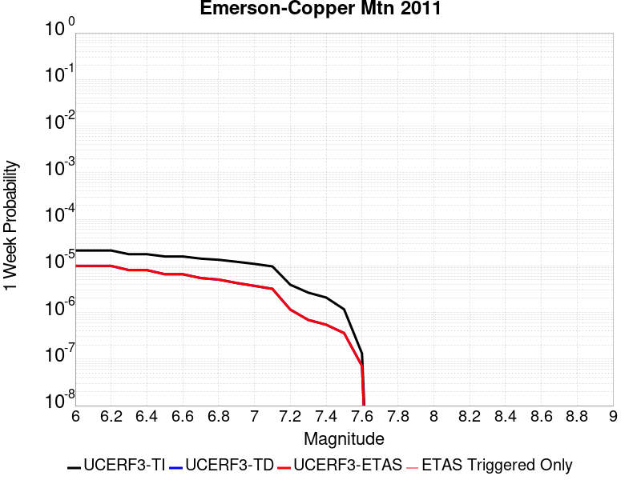 | 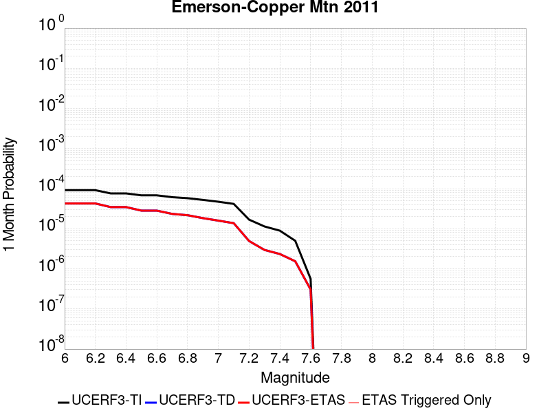 | 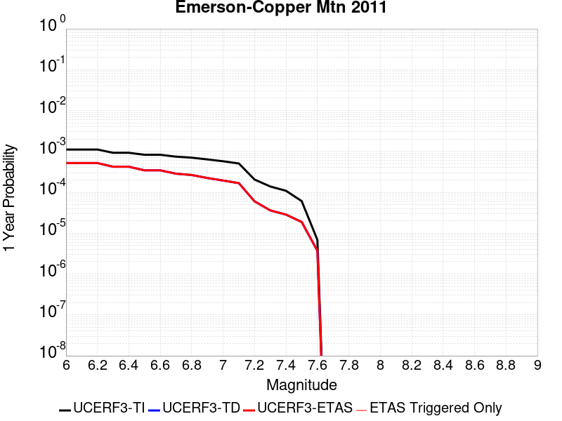 | 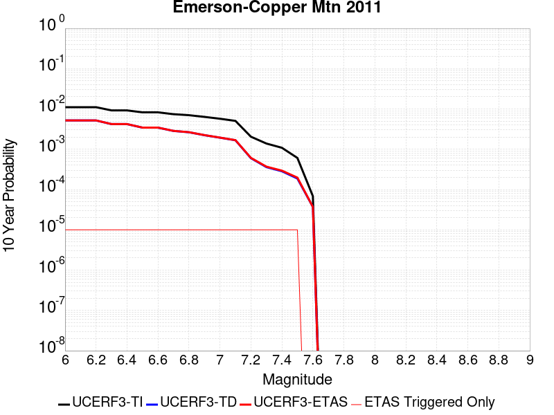 |

| Magnitude | 1 wk TI Prob | 1 wk TD Prob | 1 wk ETAS Prob | 1 wk ETAS/TD Gain | 1 wk ETAS Triggered Only | 1 mo TI Prob | 1 mo TD Prob | 1 mo ETAS Prob | 1 mo ETAS/TD Gain | 1 mo ETAS Triggered Only | 1 yr TI Prob | 1 yr TD Prob | 1 yr ETAS Prob | 1 yr ETAS/TD Gain | 1 yr ETAS Triggered Only | 10 yr TI Prob | 10 yr TD Prob | 10 yr ETAS Prob | 10 yr ETAS/TD Gain | 10 yr ETAS Triggered Only |
|-----|-----|-----|-----|-----|-----|-----|-----|-----|-----|-----|-----|-----|-----|-----|-----|-----|-----|-----|-----|-----|
| 6.0 | 2.1364202E-5 | 9.967977E-6 | 9.967977E-6 | 1.0 | 0.0 | 9.1557646E-5 | 4.2719254E-5 | 4.2719254E-5 | 1.0 | 0.0 | 0.0011141442 | 5.199915E-4 | 5.199915E-4 | 1.0 | 0.0 | 0.011085749 | 0.0051886174 | 0.005198566 | 1.0019172 | 1.0E-5 |
| 6.1 | 2.1364202E-5 | 9.967977E-6 | 9.967977E-6 | 1.0 | 0.0 | 9.1557646E-5 | 4.2719254E-5 | 4.2719254E-5 | 1.0 | 0.0 | 0.0011141442 | 5.199915E-4 | 5.199915E-4 | 1.0 | 0.0 | 0.011085749 | 0.0051886174 | 0.005198566 | 1.0019172 | 1.0E-5 |
| 6.2 | 2.1364202E-5 | 9.967977E-6 | 9.967977E-6 | 1.0 | 0.0 | 9.1557646E-5 | 4.2719254E-5 | 4.2719254E-5 | 1.0 | 0.0 | 0.0011141442 | 5.199915E-4 | 5.199915E-4 | 1.0 | 0.0 | 0.011085749 | 0.0051886174 | 0.005198566 | 1.0019172 | 1.0E-5 |
| 6.3 | 1.7751237E-5 | 8.089092E-6 | 8.089092E-6 | 1.0 | 0.0 | 7.607452E-5 | 3.466711E-5 | 3.466711E-5 | 1.0 | 0.0 | 9.258136E-4 | 4.2199664E-4 | 4.2199664E-4 | 1.0 | 0.0 | 0.00921966 | 0.0042125755 | 0.004222533 | 1.0023638 | 1.0E-5 |
| 6.4 | 1.7751237E-5 | 8.089092E-6 | 8.089092E-6 | 1.0 | 0.0 | 7.607452E-5 | 3.466711E-5 | 3.466711E-5 | 1.0 | 0.0 | 9.258136E-4 | 4.2199664E-4 | 4.2199664E-4 | 1.0 | 0.0 | 0.00921966 | 0.0042125755 | 0.004222533 | 1.0023638 | 1.0E-5 |
| 6.5 | 1.5886664E-5 | 6.603731E-6 | 6.603731E-6 | 1.0 | 0.0 | 6.808392E-5 | 2.8301425E-5 | 2.8301425E-5 | 1.0 | 0.0 | 8.286065E-4 | 3.4452006E-4 | 3.4452006E-4 | 1.0 | 0.0 | 0.008255237 | 0.0034403238 | 0.0034502894 | 1.0028967 | 1.0E-5 |
| 6.6 | 1.5886664E-5 | 6.603731E-6 | 6.603731E-6 | 1.0 | 0.0 | 6.808392E-5 | 2.8301425E-5 | 2.8301425E-5 | 1.0 | 0.0 | 8.286065E-4 | 3.4452006E-4 | 3.4452006E-4 | 1.0 | 0.0 | 0.008255237 | 0.0034403238 | 0.0034502894 | 1.0028967 | 1.0E-5 |
| 6.7 | 1.428471E-5 | 5.4702955E-6 | 5.4702955E-6 | 1.0 | 0.0 | 6.121875E-5 | 2.3443936E-5 | 2.3443936E-5 | 1.0 | 0.0 | 7.450834E-4 | 2.8539647E-4 | 2.8539647E-4 | 1.0 | 0.0 | 0.007425902 | 0.0028506874 | 0.0028606588 | 1.003498 | 1.0E-5 |
| 6.8 | 1.3490684E-5 | 5.0735807E-6 | 5.0735807E-6 | 1.0 | 0.0 | 5.7815934E-5 | 2.1743757E-5 | 2.1743757E-5 | 1.0 | 0.0 | 7.0368167E-4 | 2.6470196E-4 | 2.6470196E-4 | 1.0 | 0.0 | 0.007014576 | 0.0026442474 | 0.002654221 | 1.0037718 | 1.0E-5 |
| 6.9 | 1.2235421E-5 | 4.2895367E-6 | 4.2895367E-6 | 1.0 | 0.0 | 5.2436466E-5 | 1.838362E-5 | 1.838362E-5 | 1.0 | 0.0 | 6.38227E-4 | 2.238012E-4 | 2.238012E-4 | 1.0 | 0.0 | 0.0063639707 | 0.0022361123 | 0.00224609 | 1.004462 | 1.0E-5 |
| 7.0 | 1.1009851E-5 | 3.7188272E-6 | 3.7188272E-6 | 1.0 | 0.0 | 4.7184225E-5 | 1.5937752E-5 | 1.5937752E-5 | 1.0 | 0.0 | 5.743165E-4 | 1.940283E-4 | 1.940283E-4 | 1.0 | 0.0 | 0.005728345 | 0.0019389268 | 0.0019489073 | 1.0051475 | 1.0E-5 |
| 7.1 | 9.726373E-6 | 3.2115622E-6 | 3.2115622E-6 | 1.0 | 0.0 | 4.168379E-5 | 1.3763784E-5 | 1.3763784E-5 | 1.0 | 0.0 | 5.07382E-4 | 1.6756456E-4 | 1.6756456E-4 | 1.0 | 0.0 | 0.0050622504 | 0.0016747133 | 0.0016846966 | 1.0059612 | 1.0E-5 |
| 7.2 | 3.9335127E-6 | 1.1524072E-6 | 1.1524072E-6 | 1.0 | 0.0 | 1.6857803E-5 | 4.938879E-6 | 4.938879E-6 | 1.0 | 0.0 | 2.0522442E-4 | 6.0129252E-5 | 6.0129252E-5 | 1.0 | 0.0 | 0.00205035 | 6.011358E-4 | 6.111298E-4 | 1.0166252 | 1.0E-5 |
| 7.3 | 2.661632E-6 | 6.91094E-7 | 6.91094E-7 | 1.0 | 0.0 | 1.14069435E-5 | 2.961828E-6 | 2.961828E-6 | 1.0 | 0.0 | 1.3887069E-4 | 3.605967E-5 | 3.605967E-5 | 1.0 | 0.0 | 0.0013878393 | 3.605392E-4 | 3.7053562E-4 | 1.0277263 | 1.0E-5 |
| 7.4 | 2.0893426E-6 | 5.461424E-7 | 5.461424E-7 | 1.0 | 0.0 | 8.954295E-6 | 2.3406083E-6 | 2.3406083E-6 | 1.0 | 0.0 | 1.0901308E-4 | 2.8496537E-5 | 2.8496537E-5 | 1.0 | 0.0 | 0.0010895962 | 2.8492938E-4 | 2.9492652E-4 | 1.0350864 | 1.0E-5 |
| 7.5 | 1.1681728E-6 | 3.6028206E-7 | 3.6028206E-7 | 1.0 | 0.0 | 5.0064455E-6 | 1.5440651E-6 | 1.5440651E-6 | 1.0 | 0.0 | 6.0951766E-5 | 1.8798835E-5 | 1.8798835E-5 | 1.0 | 0.0 | 6.093505E-4 | 1.8797291E-4 | 1.9797104E-4 | 1.0531892 | 1.0E-5 |
| 7.6 | 1.3154387E-7 | 7.1196375E-8 | 7.1196375E-8 | 1.0 | 0.0 | 5.6375933E-7 | 3.051273E-7 | 3.051273E-7 | 1.0 | 0.0 | 6.863748E-6 | 3.71492E-6 | 3.71492E-6 | 1.0 | 0.0 | 6.863536E-5 | 3.7148737E-5 | 3.7148737E-5 | 1.0 | 0.0 |

## Elysian Park (Upper)
*[(top)](#table-of-contents)*

| 1 Week | 1 Month | 1 Year | 10 Year |
|-----|-----|-----|-----|
|  |  |  |  |

| Magnitude | 1 wk TI Prob | 1 wk TD Prob | 1 wk ETAS Prob | 1 wk ETAS/TD Gain | 1 wk ETAS Triggered Only | 1 mo TI Prob | 1 mo TD Prob | 1 mo ETAS Prob | 1 mo ETAS/TD Gain | 1 mo ETAS Triggered Only | 1 yr TI Prob | 1 yr TD Prob | 1 yr ETAS Prob | 1 yr ETAS/TD Gain | 1 yr ETAS Triggered Only | 10 yr TI Prob | 10 yr TD Prob | 10 yr ETAS Prob | 10 yr ETAS/TD Gain | 10 yr ETAS Triggered Only |
|-----|-----|-----|-----|-----|-----|-----|-----|-----|-----|-----|-----|-----|-----|-----|-----|-----|-----|-----|-----|-----|
| 6.0 | 3.1876025E-5 | 3.7035075E-5 | 3.7035075E-5 | 1.0 | 0.0 | 1.3660437E-4 | 1.5871483E-4 | 1.5871483E-4 | 1.0 | 0.0 | 0.0016618895 | 0.0019311117 | 0.0019410923 | 1.0051683 | 1.0E-5 | 0.016495159 | 0.01918976 | 0.019199567 | 1.0005112 | 1.0E-5 |
| 6.1 | 3.1876025E-5 | 3.7035075E-5 | 3.7035075E-5 | 1.0 | 0.0 | 1.3660437E-4 | 1.5871483E-4 | 1.5871483E-4 | 1.0 | 0.0 | 0.0016618895 | 0.0019311117 | 0.0019410923 | 1.0051683 | 1.0E-5 | 0.016495159 | 0.01918976 | 0.019199567 | 1.0005112 | 1.0E-5 |
| 6.2 | 3.1876025E-5 | 3.7035075E-5 | 3.7035075E-5 | 1.0 | 0.0 | 1.3660437E-4 | 1.5871483E-4 | 1.5871483E-4 | 1.0 | 0.0 | 0.0016618895 | 0.0019311117 | 0.0019410923 | 1.0051683 | 1.0E-5 | 0.016495159 | 0.01918976 | 0.019199567 | 1.0005112 | 1.0E-5 |
| 6.3 | 3.1876025E-5 | 3.7035075E-5 | 3.7035075E-5 | 1.0 | 0.0 | 1.3660437E-4 | 1.5871483E-4 | 1.5871483E-4 | 1.0 | 0.0 | 0.0016618895 | 0.0019311117 | 0.0019410923 | 1.0051683 | 1.0E-5 | 0.016495159 | 0.01918976 | 0.019199567 | 1.0005112 | 1.0E-5 |
| 6.4 | 1.9273462E-5 | 2.120235E-5 | 2.120235E-5 | 1.0 | 0.0 | 8.259794E-5 | 9.0865025E-5 | 9.0865025E-5 | 1.0 | 0.0 | 0.001005166 | 0.0011058919 | 0.0011158808 | 1.0090325 | 1.0E-5 | 0.010006315 | 0.011020696 | 0.0110305855 | 1.0008974 | 1.0E-5 |
| 6.5 | 1.9273462E-5 | 2.120235E-5 | 2.120235E-5 | 1.0 | 0.0 | 8.259794E-5 | 9.0865025E-5 | 9.0865025E-5 | 1.0 | 0.0 | 0.001005166 | 0.0011058919 | 0.0011158808 | 1.0090325 | 1.0E-5 | 0.010006315 | 0.011020696 | 0.0110305855 | 1.0008974 | 1.0E-5 |
| 6.6 | 9.813258E-6 | 9.665563E-6 | 9.665563E-6 | 1.0 | 0.0 | 4.205614E-5 | 4.1423224E-5 | 4.1423224E-5 | 1.0 | 0.0 | 5.119132E-4 | 5.0421833E-4 | 5.0421833E-4 | 1.0 | 0.0 | 0.005107356 | 0.0050314665 | 0.0050314665 | 1.0 | 0.0 |
| 6.7 | 9.801478E-6 | 9.653133E-6 | 9.653133E-6 | 1.0 | 0.0 | 4.2005657E-5 | 4.1369953E-5 | 4.1369953E-5 | 1.0 | 0.0 | 5.112989E-4 | 5.0357E-4 | 5.0357E-4 | 1.0 | 0.0 | 0.0051012407 | 0.005025013 | 0.005025013 | 1.0 | 0.0 |
| 6.8 | 8.102489E-6 | 7.772975E-6 | 7.772975E-6 | 1.0 | 0.0 | 3.4724493E-5 | 3.331235E-5 | 3.331235E-5 | 1.0 | 0.0 | 4.2268867E-4 | 4.0550734E-4 | 4.0550734E-4 | 1.0 | 0.0 | 0.004218856 | 0.004048168 | 0.004048168 | 1.0 | 0.0 |
| 6.9 | 6.08275E-6 | 5.4814295E-6 | 5.4814295E-6 | 1.0 | 0.0 | 2.6068668E-5 | 2.3491633E-5 | 2.3491633E-5 | 1.0 | 0.0 | 3.173398E-4 | 2.8597386E-4 | 2.8597386E-4 | 1.0 | 0.0 | 0.0031688702 | 0.0028561365 | 0.0028561365 | 1.0 | 0.0 |
| 7.0 | 5.5995934E-6 | 4.9827586E-6 | 4.9827586E-6 | 1.0 | 0.0 | 2.3998036E-5 | 2.1354508E-5 | 2.1354508E-5 | 1.0 | 0.0 | 2.9213692E-4 | 2.599608E-4 | 2.599608E-4 | 1.0 | 0.0 | 0.0029175316 | 0.0025966342 | 0.0025966342 | 1.0 | 0.0 |
| 7.1 | 4.709881E-6 | 4.087382E-6 | 4.087382E-6 | 1.0 | 0.0 | 2.0185047E-5 | 1.7517235E-5 | 1.7517235E-5 | 1.0 | 0.0 | 2.4572524E-4 | 2.1325189E-4 | 2.1325189E-4 | 1.0 | 0.0 | 0.002454537 | 0.002130514 | 0.002130514 | 1.0 | 0.0 |
| 7.2 | 3.6063436E-6 | 2.9779353E-6 | 2.9779353E-6 | 1.0 | 0.0 | 1.5455667E-5 | 1.2762518E-5 | 1.2762518E-5 | 1.0 | 0.0 | 1.881565E-4 | 1.5537269E-4 | 1.5537269E-4 | 1.0 | 0.0 | 0.0018799726 | 0.0015526518 | 0.0015526518 | 1.0 | 0.0 |
| 7.3 | 2.471135E-6 | 2.0954517E-6 | 2.0954517E-6 | 1.0 | 0.0 | 1.0590536E-5 | 8.980477E-6 | 8.980477E-6 | 1.0 | 0.0 | 1.2893214E-4 | 1.0933189E-4 | 1.0933189E-4 | 1.0 | 0.0 | 0.0012885736 | 0.0010927882 | 0.0010927882 | 1.0 | 0.0 |
| 7.4 | 1.163943E-6 | 1.027504E-6 | 1.027504E-6 | 1.0 | 0.0 | 4.988318E-6 | 4.4035814E-6 | 4.4035814E-6 | 1.0 | 0.0 | 6.0731076E-5 | 5.3612315E-5 | 5.3612315E-5 | 1.0 | 0.0 | 6.071448E-4 | 5.359968E-4 | 5.359968E-4 | 1.0 | 0.0 |
| 7.5 | 4.99459E-7 | 4.91759E-7 | 4.91759E-7 | 1.0 | 0.0 | 2.140537E-6 | 2.107537E-6 | 2.107537E-6 | 1.0 | 0.0 | 2.6060725E-5 | 2.5658977E-5 | 2.5658977E-5 | 1.0 | 0.0 | 2.605767E-4 | 2.565617E-4 | 2.565617E-4 | 1.0 | 0.0 |
| 7.6 | 2.4667852E-7 | 2.477825E-7 | 2.477825E-7 | 1.0 | 0.0 | 1.0571932E-6 | 1.0619246E-6 | 1.0619246E-6 | 1.0 | 0.0 | 1.2871251E-5 | 1.2928859E-5 | 1.2928859E-5 | 1.0 | 0.0 | 1.2870505E-4 | 1.2928144E-4 | 1.2928144E-4 | 1.0 | 0.0 |
| 7.7 | 8.2312795E-8 | 7.386387E-8 | 7.386387E-8 | 1.0 | 0.0 | 3.527691E-7 | 3.1655944E-7 | 3.1655944E-7 | 1.0 | 0.0 | 4.294955E-6 | 3.8541057E-6 | 3.8541057E-6 | 1.0 | 0.0 | 4.2948723E-5 | 3.8540504E-5 | 3.8540504E-5 | 1.0 | 0.0 |
| 7.8 | 2.7819295E-8 | 1.756536E-8 | 1.756536E-8 | 1.0 | 0.0 | 1.1922555E-7 | 7.528011E-8 | 7.528011E-8 | 1.0 | 0.0 | 1.45157E-6 | 9.1653516E-7 | 9.1653516E-7 | 1.0 | 0.0 | 1.45156055E-5 | 9.165329E-6 | 9.165329E-6 | 1.0 | 0.0 |

## North Frontal  (East)
*[(top)](#table-of-contents)*

| 1 Week | 1 Month | 1 Year | 10 Year |
|-----|-----|-----|-----|
|  |  |  |  |

| Magnitude | 1 wk TI Prob | 1 wk TD Prob | 1 wk ETAS Prob | 1 wk ETAS/TD Gain | 1 wk ETAS Triggered Only | 1 mo TI Prob | 1 mo TD Prob | 1 mo ETAS Prob | 1 mo ETAS/TD Gain | 1 mo ETAS Triggered Only | 1 yr TI Prob | 1 yr TD Prob | 1 yr ETAS Prob | 1 yr ETAS/TD Gain | 1 yr ETAS Triggered Only | 10 yr TI Prob | 10 yr TD Prob | 10 yr ETAS Prob | 10 yr ETAS/TD Gain | 10 yr ETAS Triggered Only |
|-----|-----|-----|-----|-----|-----|-----|-----|-----|-----|-----|-----|-----|-----|-----|-----|-----|-----|-----|-----|-----|
| 6.0 | 7.135738E-6 | 7.477167E-6 | 7.477167E-6 | 1.0 | 0.0 | 3.0581377E-5 | 3.204472E-5 | 4.20444E-5 | 1.3120539 | 1.0E-5 | 3.7226462E-4 | 3.9009456E-4 | 4.0009068E-4 | 1.0256248 | 1.0E-5 | 0.0037164164 | 0.0038960557 | 0.003906017 | 1.0025567 | 1.0E-5 |
| 6.1 | 7.135738E-6 | 7.477167E-6 | 7.477167E-6 | 1.0 | 0.0 | 3.0581377E-5 | 3.204472E-5 | 4.20444E-5 | 1.3120539 | 1.0E-5 | 3.7226462E-4 | 3.9009456E-4 | 4.0009068E-4 | 1.0256248 | 1.0E-5 | 0.0037164164 | 0.0038960557 | 0.003906017 | 1.0025567 | 1.0E-5 |
| 6.2 | 7.135738E-6 | 7.477167E-6 | 7.477167E-6 | 1.0 | 0.0 | 3.0581377E-5 | 3.204472E-5 | 4.20444E-5 | 1.3120539 | 1.0E-5 | 3.7226462E-4 | 3.9009456E-4 | 4.0009068E-4 | 1.0256248 | 1.0E-5 | 0.0037164164 | 0.0038960557 | 0.003906017 | 1.0025567 | 1.0E-5 |
| 6.3 | 7.135738E-6 | 7.477167E-6 | 7.477167E-6 | 1.0 | 0.0 | 3.0581377E-5 | 3.204472E-5 | 4.20444E-5 | 1.3120539 | 1.0E-5 | 3.7226462E-4 | 3.9009456E-4 | 4.0009068E-4 | 1.0256248 | 1.0E-5 | 0.0037164164 | 0.0038960557 | 0.003906017 | 1.0025567 | 1.0E-5 |
| 6.4 | 7.135738E-6 | 7.477167E-6 | 7.477167E-6 | 1.0 | 0.0 | 3.0581377E-5 | 3.204472E-5 | 4.20444E-5 | 1.3120539 | 1.0E-5 | 3.7226462E-4 | 3.9009456E-4 | 4.0009068E-4 | 1.0256248 | 1.0E-5 | 0.0037164164 | 0.0038960557 | 0.003906017 | 1.0025567 | 1.0E-5 |
| 6.5 | 7.135738E-6 | 7.477167E-6 | 7.477167E-6 | 1.0 | 0.0 | 3.0581377E-5 | 3.204472E-5 | 4.20444E-5 | 1.3120539 | 1.0E-5 | 3.7226462E-4 | 3.9009456E-4 | 4.0009068E-4 | 1.0256248 | 1.0E-5 | 0.0037164164 | 0.0038960557 | 0.003906017 | 1.0025567 | 1.0E-5 |
| 6.6 | 7.135738E-6 | 7.477167E-6 | 7.477167E-6 | 1.0 | 0.0 | 3.0581377E-5 | 3.204472E-5 | 4.20444E-5 | 1.3120539 | 1.0E-5 | 3.7226462E-4 | 3.9009456E-4 | 4.0009068E-4 | 1.0256248 | 1.0E-5 | 0.0037164164 | 0.0038960557 | 0.003906017 | 1.0025567 | 1.0E-5 |
| 6.7 | 7.135738E-6 | 7.477167E-6 | 7.477167E-6 | 1.0 | 0.0 | 3.0581377E-5 | 3.204472E-5 | 4.20444E-5 | 1.3120539 | 1.0E-5 | 3.7226462E-4 | 3.9009456E-4 | 4.0009068E-4 | 1.0256248 | 1.0E-5 | 0.0037164164 | 0.0038960557 | 0.003906017 | 1.0025567 | 1.0E-5 |
| 6.8 | 5.959142E-6 | 6.2366753E-6 | 6.2366753E-6 | 1.0 | 0.0 | 2.553893E-5 | 2.6728436E-5 | 3.672817E-5 | 1.3741233 | 1.0E-5 | 3.108921E-4 | 3.253882E-4 | 3.3538492E-4 | 1.0307225 | 1.0E-5 | 0.0031045752 | 0.0032508906 | 0.0032608581 | 1.0030661 | 1.0E-5 |
| 6.9 | 2.2946929E-6 | 2.382458E-6 | 2.382458E-6 | 1.0 | 0.0 | 9.834361E-6 | 1.0210498E-5 | 2.0210395E-5 | 1.9793742 | 1.0E-5 | 1.1972676E-4 | 1.2430619E-4 | 1.3430494E-4 | 1.0804365 | 1.0E-5 | 0.0011966228 | 0.0012424131 | 0.0012524006 | 1.0080389 | 1.0E-5 |
| 7.0 | 2.2468673E-6 | 2.3321513E-6 | 2.3321513E-6 | 1.0 | 0.0 | 9.629396E-6 | 9.994899E-6 | 1.9994799E-5 | 2.0005004 | 1.0E-5 | 1.1723159E-4 | 1.2168157E-4 | 1.3168035E-4 | 1.0821717 | 1.0E-5 | 0.0011716976 | 0.0012161958 | 0.0012261836 | 1.0082123 | 1.0E-5 |
| 7.1 | 1.9921076E-6 | 2.0646012E-6 | 2.0646012E-6 | 1.0 | 0.0 | 8.537577E-6 | 8.848263E-6 | 1.8848175E-5 | 2.1301553 | 1.0E-5 | 1.0394004E-4 | 1.0772271E-4 | 1.1772164E-4 | 1.0928209 | 1.0E-5 | 0.0010389143 | 0.0010767477 | 0.0010867369 | 1.0092772 | 1.0E-5 |
| 7.2 | 1.4524545E-6 | 1.5045133E-6 | 1.5045133E-6 | 1.0 | 0.0 | 6.2247905E-6 | 6.4479E-6 | 1.6447835E-5 | 2.5508826 | 1.0E-5 | 7.5784184E-5 | 7.85006E-5 | 8.8499815E-5 | 1.1273775 | 1.0E-5 | 7.575835E-4 | 7.847532E-4 | 7.9474534E-4 | 1.0127329 | 1.0E-5 |
| 7.3 | 8.9802575E-7 | 9.308719E-7 | 9.308719E-7 | 1.0 | 0.0 | 3.848676E-6 | 3.9894453E-6 | 3.9894453E-6 | 1.0 | 0.0 | 4.685662E-5 | 4.857053E-5 | 4.857053E-5 | 1.0 | 0.0 | 4.6846745E-4 | 4.8561045E-4 | 4.8561045E-4 | 1.0 | 0.0 |
| 7.4 | 7.776139E-7 | 8.0604667E-7 | 8.0604667E-7 | 1.0 | 0.0 | 3.3326266E-6 | 3.4544819E-6 | 3.4544819E-6 | 1.0 | 0.0 | 4.0573974E-5 | 4.2057614E-5 | 4.2057614E-5 | 1.0 | 0.0 | 4.0566566E-4 | 4.205073E-4 | 4.205073E-4 | 1.0 | 0.0 |
| 7.5 | 5.244417E-7 | 5.441214E-7 | 5.441214E-7 | 1.0 | 0.0 | 2.2476054E-6 | 2.3319471E-6 | 2.3319471E-6 | 1.0 | 0.0 | 2.7364253E-5 | 2.8391152E-5 | 2.8391152E-5 | 1.0 | 0.0 | 2.7360884E-4 | 2.8388176E-4 | 2.8388176E-4 | 1.0 | 0.0 |
| 7.6 | 1.5489647E-7 | 1.6089487E-7 | 1.6089487E-7 | 1.0 | 0.0 | 6.6384183E-7 | 6.895494E-7 | 6.895494E-7 | 1.0 | 0.0 | 8.082245E-6 | 8.395252E-6 | 8.395252E-6 | 1.0 | 0.0 | 8.08195E-5 | 8.3951345E-5 | 8.3951345E-5 | 1.0 | 0.0 |

## Deep Springs
*[(top)](#table-of-contents)*

| 1 Week | 1 Month | 1 Year | 10 Year |
|-----|-----|-----|-----|
|  |  |  |  |

| Magnitude | 1 wk TI Prob | 1 wk TD Prob | 1 wk ETAS Prob | 1 wk ETAS/TD Gain | 1 wk ETAS Triggered Only | 1 mo TI Prob | 1 mo TD Prob | 1 mo ETAS Prob | 1 mo ETAS/TD Gain | 1 mo ETAS Triggered Only | 1 yr TI Prob | 1 yr TD Prob | 1 yr ETAS Prob | 1 yr ETAS/TD Gain | 1 yr ETAS Triggered Only | 10 yr TI Prob | 10 yr TD Prob | 10 yr ETAS Prob | 10 yr ETAS/TD Gain | 10 yr ETAS Triggered Only |
|-----|-----|-----|-----|-----|-----|-----|-----|-----|-----|-----|-----|-----|-----|-----|-----|-----|-----|-----|-----|-----|
| 6.0 | 1.9810619E-5 | 2.3112418E-5 | 2.3112418E-5 | 1.0 | 0.0 | 8.489989E-5 | 9.905232E-5 | 9.905232E-5 | 1.0 | 0.0 | 0.001033166 | 0.0012058024 | 0.0012157904 | 1.0082833 | 1.0E-5 | 0.010283757 | 0.012042377 | 0.012052257 | 1.0008204 | 1.0E-5 |
| 6.1 | 1.9810619E-5 | 2.3112418E-5 | 2.3112418E-5 | 1.0 | 0.0 | 8.489989E-5 | 9.905232E-5 | 9.905232E-5 | 1.0 | 0.0 | 0.001033166 | 0.0012058024 | 0.0012157904 | 1.0082833 | 1.0E-5 | 0.010283757 | 0.012042377 | 0.012052257 | 1.0008204 | 1.0E-5 |
| 6.2 | 1.9810619E-5 | 2.3112418E-5 | 2.3112418E-5 | 1.0 | 0.0 | 8.489989E-5 | 9.905232E-5 | 9.905232E-5 | 1.0 | 0.0 | 0.001033166 | 0.0012058024 | 0.0012157904 | 1.0082833 | 1.0E-5 | 0.010283757 | 0.012042377 | 0.012052257 | 1.0008204 | 1.0E-5 |
| 6.3 | 1.9810619E-5 | 2.3112418E-5 | 2.3112418E-5 | 1.0 | 0.0 | 8.489989E-5 | 9.905232E-5 | 9.905232E-5 | 1.0 | 0.0 | 0.001033166 | 0.0012058024 | 0.0012157904 | 1.0082833 | 1.0E-5 | 0.010283757 | 0.012042377 | 0.012052257 | 1.0008204 | 1.0E-5 |
| 6.4 | 1.9810619E-5 | 2.3112418E-5 | 2.3112418E-5 | 1.0 | 0.0 | 8.489989E-5 | 9.905232E-5 | 9.905232E-5 | 1.0 | 0.0 | 0.001033166 | 0.0012058024 | 0.0012157904 | 1.0082833 | 1.0E-5 | 0.010283757 | 0.012042377 | 0.012052257 | 1.0008204 | 1.0E-5 |
| 6.5 | 1.7190405E-5 | 2.005047E-5 | 2.005047E-5 | 1.0 | 0.0 | 7.367108E-5 | 8.593058E-5 | 8.593058E-5 | 1.0 | 0.0 | 8.9657627E-4 | 0.0010462046 | 0.0010462046 | 1.0 | 0.0 | 0.008929676 | 0.010462015 | 0.010462015 | 1.0 | 0.0 |
| 6.6 | 1.7190405E-5 | 2.005047E-5 | 2.005047E-5 | 1.0 | 0.0 | 7.367108E-5 | 8.593058E-5 | 8.593058E-5 | 1.0 | 0.0 | 8.9657627E-4 | 0.0010462046 | 0.0010462046 | 1.0 | 0.0 | 0.008929676 | 0.010462015 | 0.010462015 | 1.0 | 0.0 |

## Calaveras (So) 2011 CFM
*[(top)](#table-of-contents)*

| 1 Week | 1 Month | 1 Year | 10 Year |
|-----|-----|-----|-----|
|  |  |  |  |

| Magnitude | 1 wk TI Prob | 1 wk TD Prob | 1 wk ETAS Prob | 1 wk ETAS/TD Gain | 1 wk ETAS Triggered Only | 1 mo TI Prob | 1 mo TD Prob | 1 mo ETAS Prob | 1 mo ETAS/TD Gain | 1 mo ETAS Triggered Only | 1 yr TI Prob | 1 yr TD Prob | 1 yr ETAS Prob | 1 yr ETAS/TD Gain | 1 yr ETAS Triggered Only | 10 yr TI Prob | 10 yr TD Prob | 10 yr ETAS Prob | 10 yr ETAS/TD Gain | 10 yr ETAS Triggered Only |
|-----|-----|-----|-----|-----|-----|-----|-----|-----|-----|-----|-----|-----|-----|-----|-----|-----|-----|-----|-----|-----|
| 6.0 | 1.5950744E-4 | 3.0713103E-4 | 3.0713103E-4 | 1.0 | 0.0 | 6.834242E-4 | 0.0013153937 | 0.0013153937 | 1.0 | 0.0 | 0.00828899 | 0.015858073 | 0.015858073 | 1.0 | 0.0 | 0.079865426 | 0.14439669 | 0.14440526 | 1.0000592 | 1.0E-5 |
| 6.1 | 1.3584697E-4 | 2.6035146E-4 | 2.6035146E-4 | 1.0 | 0.0 | 5.8207137E-4 | 0.0011151606 | 0.0011151606 | 1.0 | 0.0 | 0.007063716 | 0.013461149 | 0.013461149 | 1.0 | 0.0 | 0.06843361 | 0.12402486 | 0.12403362 | 1.0000706 | 1.0E-5 |
| 6.2 | 1.14676266E-4 | 2.1714337E-4 | 2.1714337E-4 | 1.0 | 0.0 | 4.9137714E-4 | 9.3020935E-4 | 9.3020935E-4 | 1.0 | 0.0 | 0.0059661185 | 0.011244834 | 0.011244834 | 1.0 | 0.0 | 0.058084648 | 0.105015434 | 0.10502438 | 1.0000852 | 1.0E-5 |
| 6.3 | 8.691518E-5 | 1.5987532E-4 | 1.5987532E-4 | 1.0 | 0.0 | 3.7244044E-4 | 6.8496366E-4 | 6.8496366E-4 | 1.0 | 0.0 | 0.004525038 | 0.008300914 | 0.008300914 | 1.0 | 0.0 | 0.044339992 | 0.07933137 | 0.07933137 | 1.0 | 0.0 |
| 6.4 | 8.50982E-5 | 1.5693929E-4 | 1.5693929E-4 | 1.0 | 0.0 | 3.646556E-4 | 6.7238725E-4 | 6.7238725E-4 | 1.0 | 0.0 | 0.0044306475 | 0.008148949 | 0.008148949 | 1.0 | 0.0 | 0.04343345 | 0.07793759 | 0.07793759 | 1.0 | 0.0 |
| 6.5 | 8.4062965E-5 | 1.5518344E-4 | 1.5518344E-4 | 1.0 | 0.0 | 3.602201E-4 | 6.648665E-4 | 6.648665E-4 | 1.0 | 0.0 | 0.004376863 | 0.008058159 | 0.008058159 | 1.0 | 0.0 | 0.042916555 | 0.07710881 | 0.07710881 | 1.0 | 0.0 |
| 6.6 | 8.194716E-5 | 1.5154164E-4 | 1.5154164E-4 | 1.0 | 0.0 | 3.5115483E-4 | 6.4926746E-4 | 6.4926746E-4 | 1.0 | 0.0 | 0.0042669317 | 0.0078700045 | 0.0078700045 | 1.0 | 0.0 | 0.04185927 | 0.07539403 | 0.07539403 | 1.0 | 0.0 |
| 6.7 | 8.012326E-5 | 1.4822086E-4 | 1.4822086E-4 | 1.0 | 0.0 | 3.433402E-4 | 6.3504453E-4 | 6.3504453E-4 | 1.0 | 0.0 | 0.004172157 | 0.007698498 | 0.007698498 | 1.0 | 0.0 | 0.040946912 | 0.073836125 | 0.073836125 | 1.0 | 0.0 |
| 6.8 | 7.119773E-5 | 1.2881529E-4 | 1.2881529E-4 | 1.0 | 0.0 | 3.0509746E-4 | 5.519339E-4 | 5.519339E-4 | 1.0 | 0.0 | 0.0037082357 | 0.0066958778 | 0.0066958778 | 1.0 | 0.0 | 0.036469642 | 0.064680636 | 0.064680636 | 1.0 | 0.0 |
| 6.9 | 5.7343088E-5 | 9.9189514E-5 | 9.9189514E-5 | 1.0 | 0.0 | 2.4573295E-4 | 4.2502902E-4 | 4.2502902E-4 | 1.0 | 0.0 | 0.0029876942 | 0.005162525 | 0.005162525 | 1.0 | 0.0 | 0.02947844 | 0.050507598 | 0.050507598 | 1.0 | 0.0 |
| 7.0 | 4.8746577E-5 | 8.2847495E-5 | 8.2847495E-5 | 1.0 | 0.0 | 2.0889717E-4 | 3.5501274E-4 | 3.5501274E-4 | 1.0 | 0.0 | 0.0025403565 | 0.0043137805 | 0.0043137805 | 1.0 | 0.0 | 0.025115121 | 0.042482752 | 0.042482752 | 1.0 | 0.0 |
| 7.1 | 4.2998014E-5 | 7.264887E-5 | 7.264887E-5 | 1.0 | 0.0 | 1.8426418E-4 | 3.113155E-4 | 3.113155E-4 | 1.0 | 0.0 | 0.002241108 | 0.003783739 | 0.003783739 | 1.0 | 0.0 | 0.022186412 | 0.037421085 | 0.037421085 | 1.0 | 0.0 |
| 7.2 | 3.221292E-5 | 5.3904925E-5 | 5.3904925E-5 | 1.0 | 0.0 | 1.3804805E-4 | 2.3100081E-4 | 2.3100081E-4 | 1.0 | 0.0 | 0.0016794393 | 0.0028088356 | 0.0028088356 | 1.0 | 0.0 | 0.016668037 | 0.028033655 | 0.028033655 | 1.0 | 0.0 |
| 7.3 | 2.3756531E-5 | 3.9470644E-5 | 3.9470644E-5 | 1.0 | 0.0 | 1.0180973E-4 | 1.6914903E-4 | 1.6914903E-4 | 1.0 | 0.0 | 0.0012388286 | 0.0020574613 | 0.0020574613 | 1.0 | 0.0 | 0.012319452 | 0.020641495 | 0.020641495 | 1.0 | 0.0 |
| 7.4 | 1.5997684E-5 | 2.7339498E-5 | 2.7339498E-5 | 1.0 | 0.0 | 6.8559704E-5 | 1.1716403E-4 | 1.1716403E-4 | 1.0 | 0.0 | 8.343947E-4 | 0.0014255411 | 0.0014255411 | 1.0 | 0.0 | 0.008312687 | 0.014374586 | 0.014374586 | 1.0 | 0.0 |
| 7.5 | 1.3814293E-5 | 2.4781242E-5 | 2.4781242E-5 | 1.0 | 0.0 | 5.9202768E-5 | 1.0620101E-4 | 1.0620101E-4 | 1.0 | 0.0 | 7.205553E-4 | 0.0012922328 | 0.0012922328 | 1.0 | 0.0 | 0.007182234 | 0.01305369 | 0.01305369 | 1.0 | 0.0 |
| 7.6 | 8.817309E-6 | 1.6428305E-5 | 1.6428305E-5 | 1.0 | 0.0 | 3.7787922E-5 | 7.040513E-5 | 7.040513E-5 | 1.0 | 0.0 | 4.5997082E-4 | 8.568467E-4 | 8.568467E-4 | 1.0 | 0.0 | 0.004590199 | 0.008718078 | 0.008718078 | 1.0 | 0.0 |
| 7.7 | 4.0352206E-6 | 7.706533E-6 | 7.706533E-6 | 1.0 | 0.0 | 1.7293689E-5 | 3.3027583E-5 | 3.3027583E-5 | 1.0 | 0.0 | 2.1053031E-4 | 4.020367E-4 | 4.020367E-4 | 1.0 | 0.0 | 0.0021033096 | 0.0041648396 | 0.0041648396 | 1.0 | 0.0 |
| 7.8 | 3.413169E-6 | 6.7865935E-6 | 6.7865935E-6 | 1.0 | 0.0 | 1.4627784E-5 | 2.9085077E-5 | 2.9085077E-5 | 1.0 | 0.0 | 1.7807873E-4 | 3.5405334E-4 | 3.5405334E-4 | 1.0 | 0.0 | 0.0017793609 | 0.0036662305 | 0.0036662305 | 1.0 | 0.0 |
| 7.9 | 2.4740732E-6 | 5.2786727E-6 | 5.2786727E-6 | 1.0 | 0.0 | 1.06031275E-5 | 2.2622688E-5 | 2.2622688E-5 | 1.0 | 0.0 | 1.2908543E-4 | 2.7539645E-4 | 2.7539645E-4 | 1.0 | 0.0 | 0.0012901047 | 0.0028345648 | 0.0028345648 | 1.0 | 0.0 |
| 8.0 | 1.5231818E-6 | 3.288654E-6 | 3.288654E-6 | 1.0 | 0.0 | 6.527906E-6 | 1.4094155E-5 | 1.4094155E-5 | 1.0 | 0.0 | 7.9474354E-5 | 1.7158285E-4 | 1.7158285E-4 | 1.0 | 0.0 | 7.944594E-4 | 0.0017563011 | 0.0017563011 | 1.0 | 0.0 |
| 8.1 | 1.0104524E-6 | 2.0455911E-6 | 2.0455911E-6 | 1.0 | 0.0 | 4.330503E-6 | 8.7667895E-6 | 8.7667895E-6 | 1.0 | 0.0 | 5.2722597E-5 | 1.0673047E-4 | 1.0673047E-4 | 1.0 | 0.0 | 5.271009E-4 | 0.0010928642 | 0.0010928642 | 1.0 | 0.0 |

## Kern Canyon (Lake Isabella) 2011
*[(top)](#table-of-contents)*

| 1 Week | 1 Month | 1 Year | 10 Year |
|-----|-----|-----|-----|
|  |  |  |  |

| Magnitude | 1 wk TI Prob | 1 wk TD Prob | 1 wk ETAS Prob | 1 wk ETAS/TD Gain | 1 wk ETAS Triggered Only | 1 mo TI Prob | 1 mo TD Prob | 1 mo ETAS Prob | 1 mo ETAS/TD Gain | 1 mo ETAS Triggered Only | 1 yr TI Prob | 1 yr TD Prob | 1 yr ETAS Prob | 1 yr ETAS/TD Gain | 1 yr ETAS Triggered Only | 10 yr TI Prob | 10 yr TD Prob | 10 yr ETAS Prob | 10 yr ETAS/TD Gain | 10 yr ETAS Triggered Only |
|-----|-----|-----|-----|-----|-----|-----|-----|-----|-----|-----|-----|-----|-----|-----|-----|-----|-----|-----|-----|-----|
| 6.0 | 4.2387383E-6 | 4.001632E-6 | 1.4001592E-5 | 3.4989705 | 1.0E-5 | 1.8165894E-5 | 1.7149749E-5 | 2.7149577E-5 | 1.5830889 | 1.0E-5 | 2.2114732E-4 | 2.0878005E-4 | 2.1877796E-4 | 1.0478873 | 1.0E-5 | 0.0022092736 | 0.0020860229 | 0.002096002 | 1.0047839 | 1.0E-5 |
| 6.1 | 4.2387383E-6 | 4.001632E-6 | 1.4001592E-5 | 3.4989705 | 1.0E-5 | 1.8165894E-5 | 1.7149749E-5 | 2.7149577E-5 | 1.5830889 | 1.0E-5 | 2.2114732E-4 | 2.0878005E-4 | 2.1877796E-4 | 1.0478873 | 1.0E-5 | 0.0022092736 | 0.0020860229 | 0.002096002 | 1.0047839 | 1.0E-5 |
| 6.2 | 4.2387383E-6 | 4.001632E-6 | 1.4001592E-5 | 3.4989705 | 1.0E-5 | 1.8165894E-5 | 1.7149749E-5 | 2.7149577E-5 | 1.5830889 | 1.0E-5 | 2.2114732E-4 | 2.0878005E-4 | 2.1877796E-4 | 1.0478873 | 1.0E-5 | 0.0022092736 | 0.0020860229 | 0.002096002 | 1.0047839 | 1.0E-5 |
| 6.3 | 4.2387383E-6 | 4.001632E-6 | 1.4001592E-5 | 3.4989705 | 1.0E-5 | 1.8165894E-5 | 1.7149749E-5 | 2.7149577E-5 | 1.5830889 | 1.0E-5 | 2.2114732E-4 | 2.0878005E-4 | 2.1877796E-4 | 1.0478873 | 1.0E-5 | 0.0022092736 | 0.0020860229 | 0.002096002 | 1.0047839 | 1.0E-5 |
| 6.4 | 4.2387383E-6 | 4.001632E-6 | 1.4001592E-5 | 3.4989705 | 1.0E-5 | 1.8165894E-5 | 1.7149749E-5 | 2.7149577E-5 | 1.5830889 | 1.0E-5 | 2.2114732E-4 | 2.0878005E-4 | 2.1877796E-4 | 1.0478873 | 1.0E-5 | 0.0022092736 | 0.0020860229 | 0.002096002 | 1.0047839 | 1.0E-5 |
| 6.5 | 2.7857532E-6 | 2.5178608E-6 | 2.5178608E-6 | 1.0 | 0.0 | 1.1938888E-5 | 1.079079E-5 | 1.079079E-5 | 1.0 | 0.0 | 1.4534626E-4 | 1.3137028E-4 | 1.3137028E-4 | 1.0 | 0.0 | 0.0014525123 | 0.0013129589 | 0.0013129589 | 1.0 | 0.0 |
| 6.6 | 2.2233348E-6 | 1.944118E-6 | 1.944118E-6 | 1.0 | 0.0 | 9.528543E-6 | 8.331908E-6 | 8.331908E-6 | 1.0 | 0.0 | 1.1600384E-4 | 1.01436344E-4 | 1.01436344E-4 | 1.0 | 0.0 | 0.001159433 | 0.001013909 | 0.001013909 | 1.0 | 0.0 |
| 6.7 | 2.1635126E-6 | 1.8834979E-6 | 1.8834979E-6 | 1.0 | 0.0 | 9.272164E-6 | 8.072109E-6 | 8.072109E-6 | 1.0 | 0.0 | 1.1288274E-4 | 9.827358E-5 | 9.827358E-5 | 1.0 | 0.0 | 0.0011282542 | 9.823095E-4 | 9.823095E-4 | 1.0 | 0.0 |
| 6.8 | 1.8685711E-6 | 1.5831371E-6 | 1.5831371E-6 | 1.0 | 0.0 | 8.008137E-6 | 6.7848555E-6 | 6.7848555E-6 | 1.0 | 0.0 | 9.74947E-5 | 8.2602535E-5 | 8.2602535E-5 | 1.0 | 0.0 | 9.745194E-4 | 8.257232E-4 | 8.257232E-4 | 1.0 | 0.0 |
| 6.9 | 1.5815071E-6 | 1.3064879E-6 | 1.3064879E-6 | 1.0 | 0.0 | 6.77787E-6 | 5.599222E-6 | 5.599222E-6 | 1.0 | 0.0 | 8.251744E-5 | 6.8168425E-5 | 6.8168425E-5 | 1.0 | 0.0 | 8.248681E-4 | 6.814778E-4 | 6.814778E-4 | 1.0 | 0.0 |
| 7.0 | 1.3772564E-6 | 1.1210674E-6 | 1.1210674E-6 | 1.0 | 0.0 | 5.9025137E-6 | 4.8045654E-6 | 4.8045654E-6 | 1.0 | 0.0 | 7.186073E-5 | 5.8494035E-5 | 5.8494035E-5 | 1.0 | 0.0 | 7.18375E-4 | 5.8478845E-4 | 5.8478845E-4 | 1.0 | 0.0 |
| 7.1 | 1.0916998E-6 | 8.763745E-7 | 8.763745E-7 | 1.0 | 0.0 | 4.678705E-6 | 3.7558852E-6 | 3.7558852E-6 | 1.0 | 0.0 | 5.6961744E-5 | 4.5726956E-5 | 4.5726956E-5 | 1.0 | 0.0 | 5.6947145E-4 | 4.5717682E-4 | 4.5717682E-4 | 1.0 | 0.0 |
| 7.2 | 7.6277024E-7 | 5.9014343E-7 | 5.9014343E-7 | 1.0 | 0.0 | 3.2690114E-6 | 2.5291838E-6 | 2.5291838E-6 | 1.0 | 0.0 | 3.9799485E-5 | 3.0792384E-5 | 3.0792384E-5 | 1.0 | 0.0 | 3.9792358E-4 | 3.0788177E-4 | 3.0788177E-4 | 1.0 | 0.0 |
| 7.3 | 5.3265916E-7 | 4.3824227E-7 | 4.3824227E-7 | 1.0 | 0.0 | 2.282823E-6 | 1.8781799E-6 | 1.8781799E-6 | 1.0 | 0.0 | 2.7793016E-5 | 2.2866603E-5 | 2.2866603E-5 | 1.0 | 0.0 | 2.778954E-4 | 2.286429E-4 | 2.286429E-4 | 1.0 | 0.0 |
| 7.4 | 3.4946007E-7 | 3.0065618E-7 | 3.0065618E-7 | 1.0 | 0.0 | 1.497685E-6 | 1.2885259E-6 | 1.2885259E-6 | 1.0 | 0.0 | 1.8234163E-5 | 1.5687692E-5 | 1.5687692E-5 | 1.0 | 0.0 | 1.8232666E-4 | 1.5686607E-4 | 1.5686607E-4 | 1.0 | 0.0 |
| 7.5 | 1.8317026E-7 | 1.4244733E-7 | 1.4244733E-7 | 1.0 | 0.0 | 7.850152E-7 | 6.104884E-7 | 6.104884E-7 | 1.0 | 0.0 | 9.557518E-6 | 7.432672E-6 | 7.432672E-6 | 1.0 | 0.0 | 9.5571064E-5 | 7.4324314E-5 | 7.4324314E-5 | 1.0 | 0.0 |
| 7.6 | 2.572245E-8 | 1.7352638E-8 | 1.7352638E-8 | 1.0 | 0.0 | 1.10239064E-7 | 7.436845E-8 | 7.436845E-8 | 1.0 | 0.0 | 1.3421597E-6 | 9.054355E-7 | 9.054355E-7 | 1.0 | 0.0 | 1.3421517E-5 | 9.0543235E-6 | 9.0543235E-6 | 1.0 | 0.0 |

## Kern Canyon (South Kern) 2011
*[(top)](#table-of-contents)*

| 1 Week | 1 Month | 1 Year | 10 Year |
|-----|-----|-----|-----|
|  |  |  |  |

| Magnitude | 1 wk TI Prob | 1 wk TD Prob | 1 wk ETAS Prob | 1 wk ETAS/TD Gain | 1 wk ETAS Triggered Only | 1 mo TI Prob | 1 mo TD Prob | 1 mo ETAS Prob | 1 mo ETAS/TD Gain | 1 mo ETAS Triggered Only | 1 yr TI Prob | 1 yr TD Prob | 1 yr ETAS Prob | 1 yr ETAS/TD Gain | 1 yr ETAS Triggered Only | 10 yr TI Prob | 10 yr TD Prob | 10 yr ETAS Prob | 10 yr ETAS/TD Gain | 10 yr ETAS Triggered Only |
|-----|-----|-----|-----|-----|-----|-----|-----|-----|-----|-----|-----|-----|-----|-----|-----|-----|-----|-----|-----|-----|
| 6.0 | 4.105075E-6 | 4.1137237E-6 | 1.41136825E-5 | 3.4308777 | 1.0E-5 | 1.7593058E-5 | 1.763013E-5 | 2.7629952E-5 | 1.5672008 | 1.0E-5 | 2.1417443E-4 | 2.1462631E-4 | 2.2462418E-4 | 1.0465826 | 1.0E-5 | 0.0021396813 | 0.0021442543 | 0.002154233 | 1.0046536 | 1.0E-5 |
| 6.1 | 4.105075E-6 | 4.1137237E-6 | 1.41136825E-5 | 3.4308777 | 1.0E-5 | 1.7593058E-5 | 1.763013E-5 | 2.7629952E-5 | 1.5672008 | 1.0E-5 | 2.1417443E-4 | 2.1462631E-4 | 2.2462418E-4 | 1.0465826 | 1.0E-5 | 0.0021396813 | 0.0021442543 | 0.002154233 | 1.0046536 | 1.0E-5 |
| 6.2 | 4.105075E-6 | 4.1137237E-6 | 1.41136825E-5 | 3.4308777 | 1.0E-5 | 1.7593058E-5 | 1.763013E-5 | 2.7629952E-5 | 1.5672008 | 1.0E-5 | 2.1417443E-4 | 2.1462631E-4 | 2.2462418E-4 | 1.0465826 | 1.0E-5 | 0.0021396813 | 0.0021442543 | 0.002154233 | 1.0046536 | 1.0E-5 |
| 6.3 | 4.105075E-6 | 4.1137237E-6 | 1.41136825E-5 | 3.4308777 | 1.0E-5 | 1.7593058E-5 | 1.763013E-5 | 2.7629952E-5 | 1.5672008 | 1.0E-5 | 2.1417443E-4 | 2.1462631E-4 | 2.2462418E-4 | 1.0465826 | 1.0E-5 | 0.0021396813 | 0.0021442543 | 0.002154233 | 1.0046536 | 1.0E-5 |
| 6.4 | 4.105075E-6 | 4.1137237E-6 | 1.41136825E-5 | 3.4308777 | 1.0E-5 | 1.7593058E-5 | 1.763013E-5 | 2.7629952E-5 | 1.5672008 | 1.0E-5 | 2.1417443E-4 | 2.1462631E-4 | 2.2462418E-4 | 1.0465826 | 1.0E-5 | 0.0021396813 | 0.0021442543 | 0.002154233 | 1.0046536 | 1.0E-5 |
| 6.5 | 2.9849807E-6 | 2.9731525E-6 | 2.9731525E-6 | 1.0 | 0.0 | 1.2792712E-5 | 1.2742021E-5 | 1.2742021E-5 | 1.0 | 0.0 | 1.5574014E-4 | 1.5512321E-4 | 1.5512321E-4 | 1.0 | 0.0 | 0.0015563103 | 0.0015501645 | 0.0015501645 | 1.0 | 0.0 |
| 6.6 | 2.9849807E-6 | 2.9731525E-6 | 2.9731525E-6 | 1.0 | 0.0 | 1.2792712E-5 | 1.2742021E-5 | 1.2742021E-5 | 1.0 | 0.0 | 1.5574014E-4 | 1.5512321E-4 | 1.5512321E-4 | 1.0 | 0.0 | 0.0015563103 | 0.0015501645 | 0.0015501645 | 1.0 | 0.0 |
| 6.7 | 2.6756725E-6 | 2.6582188E-6 | 2.6582188E-6 | 1.0 | 0.0 | 1.1467117E-5 | 1.1392317E-5 | 1.1392317E-5 | 1.0 | 0.0 | 1.396032E-4 | 1.3869273E-4 | 1.3869273E-4 | 1.0 | 0.0 | 0.0013951553 | 0.0013860727 | 0.0013860727 | 1.0 | 0.0 |
| 6.8 | 2.3283721E-6 | 2.304777E-6 | 2.304777E-6 | 1.0 | 0.0 | 9.9787E-6 | 9.877579E-6 | 9.877579E-6 | 1.0 | 0.0 | 1.214839E-4 | 1.2025296E-4 | 1.2025296E-4 | 1.0 | 0.0 | 0.001214175 | 0.0012018863 | 0.0012018863 | 1.0 | 0.0 |
| 6.9 | 2.0972677E-6 | 2.0696393E-6 | 2.0696393E-6 | 1.0 | 0.0 | 8.988259E-6 | 8.869853E-6 | 8.869853E-6 | 1.0 | 0.0 | 1.0942656E-4 | 1.0798517E-4 | 1.0798517E-4 | 1.0 | 0.0 | 0.0010937268 | 0.0010793328 | 0.0010793328 | 1.0 | 0.0 |
| 7.0 | 1.7132242E-6 | 1.678702E-6 | 1.678702E-6 | 1.0 | 0.0 | 7.3423685E-6 | 7.194418E-6 | 7.194418E-6 | 1.0 | 0.0 | 8.938967E-5 | 8.758855E-5 | 8.758855E-5 | 1.0 | 0.0 | 8.935372E-4 | 8.7554415E-4 | 8.7554415E-4 | 1.0 | 0.0 |
| 7.1 | 1.4215541E-6 | 1.3815738E-6 | 1.3815738E-6 | 1.0 | 0.0 | 6.0923603E-6 | 5.9210174E-6 | 5.9210174E-6 | 1.0 | 0.0 | 7.417196E-5 | 7.2086026E-5 | 7.2086026E-5 | 1.0 | 0.0 | 7.414721E-4 | 7.206291E-4 | 7.206291E-4 | 1.0 | 0.0 |
| 7.2 | 9.097853E-7 | 8.603764E-7 | 8.603764E-7 | 1.0 | 0.0 | 3.899074E-6 | 3.6873223E-6 | 3.6873223E-6 | 1.0 | 0.0 | 4.7470192E-5 | 4.4892236E-5 | 4.4892236E-5 | 1.0 | 0.0 | 4.7460053E-4 | 4.4883275E-4 | 4.4883275E-4 | 1.0 | 0.0 |
| 7.3 | 6.144169E-7 | 5.628195E-7 | 5.628195E-7 | 1.0 | 0.0 | 2.6332125E-6 | 2.4120814E-6 | 2.4120814E-6 | 1.0 | 0.0 | 3.205889E-5 | 2.93667E-5 | 2.93667E-5 | 1.0 | 0.0 | 3.2054266E-4 | 2.936287E-4 | 2.936287E-4 | 1.0 | 0.0 |
| 7.4 | 4.049844E-7 | 3.572822E-7 | 3.572822E-7 | 1.0 | 0.0 | 1.7356463E-6 | 1.5312086E-6 | 1.5312086E-6 | 1.0 | 0.0 | 2.1131287E-5 | 1.8642308E-5 | 1.8642308E-5 | 1.0 | 0.0 | 2.1129279E-4 | 1.8640768E-4 | 1.8640768E-4 | 1.0 | 0.0 |
| 7.5 | 1.9871162E-7 | 1.583036E-7 | 1.583036E-7 | 1.0 | 0.0 | 8.5162094E-7 | 6.784439E-7 | 6.784439E-7 | 1.0 | 0.0 | 1.0368436E-5 | 8.260024E-6 | 8.260024E-6 | 1.0 | 0.0 | 1.0367952E-4 | 8.259725E-5 | 8.259725E-5 | 1.0 | 0.0 |
| 7.6 | 2.572245E-8 | 1.7352638E-8 | 1.7352638E-8 | 1.0 | 0.0 | 1.10239064E-7 | 7.436845E-8 | 7.436845E-8 | 1.0 | 0.0 | 1.3421597E-6 | 9.054355E-7 | 9.054355E-7 | 1.0 | 0.0 | 1.3421517E-5 | 9.0543235E-6 | 9.0543235E-6 | 1.0 | 0.0 |

## Eureka Peak
*[(top)](#table-of-contents)*

| 1 Week | 1 Month | 1 Year | 10 Year |
|-----|-----|-----|-----|
|  |  |  |  |

| Magnitude | 1 wk TI Prob | 1 wk TD Prob | 1 wk ETAS Prob | 1 wk ETAS/TD Gain | 1 wk ETAS Triggered Only | 1 mo TI Prob | 1 mo TD Prob | 1 mo ETAS Prob | 1 mo ETAS/TD Gain | 1 mo ETAS Triggered Only | 1 yr TI Prob | 1 yr TD Prob | 1 yr ETAS Prob | 1 yr ETAS/TD Gain | 1 yr ETAS Triggered Only | 10 yr TI Prob | 10 yr TD Prob | 10 yr ETAS Prob | 10 yr ETAS/TD Gain | 10 yr ETAS Triggered Only |
|-----|-----|-----|-----|-----|-----|-----|-----|-----|-----|-----|-----|-----|-----|-----|-----|-----|-----|-----|-----|-----|
| 6.0 | 3.1949054E-5 | 9.310974E-6 | 1.931088E-5 | 2.0739915 | 1.0E-5 | 1.3691733E-4 | 3.9904004E-5 | 4.9903607E-5 | 1.2505914 | 1.0E-5 | 0.0016656938 | 4.8580105E-4 | 4.957962E-4 | 1.0205746 | 1.0E-5 | 0.016532637 | 0.0049212906 | 0.0049312413 | 1.002022 | 1.0E-5 |
| 6.1 | 3.1949054E-5 | 9.310974E-6 | 1.931088E-5 | 2.0739915 | 1.0E-5 | 1.3691733E-4 | 3.9904004E-5 | 4.9903607E-5 | 1.2505914 | 1.0E-5 | 0.0016656938 | 4.8580105E-4 | 4.957962E-4 | 1.0205746 | 1.0E-5 | 0.016532637 | 0.0049212906 | 0.0049312413 | 1.002022 | 1.0E-5 |
| 6.2 | 3.1949054E-5 | 9.310974E-6 | 1.931088E-5 | 2.0739915 | 1.0E-5 | 1.3691733E-4 | 3.9904004E-5 | 4.9903607E-5 | 1.2505914 | 1.0E-5 | 0.0016656938 | 4.8580105E-4 | 4.957962E-4 | 1.0205746 | 1.0E-5 | 0.016532637 | 0.0049212906 | 0.0049312413 | 1.002022 | 1.0E-5 |
| 6.3 | 2.7339745E-5 | 7.980816E-6 | 1.7980736E-5 | 2.2529948 | 1.0E-5 | 1.1716507E-4 | 3.4203476E-5 | 4.4203134E-5 | 1.2923579 | 1.0E-5 | 0.0014255513 | 4.1642363E-4 | 4.2641946E-4 | 1.024004 | 1.0E-5 | 0.0141644105 | 0.004225993 | 0.0042359508 | 1.0023563 | 1.0E-5 |
| 6.4 | 2.7339745E-5 | 7.980816E-6 | 1.7980736E-5 | 2.2529948 | 1.0E-5 | 1.1716507E-4 | 3.4203476E-5 | 4.4203134E-5 | 1.2923579 | 1.0E-5 | 0.0014255513 | 4.1642363E-4 | 4.2641946E-4 | 1.024004 | 1.0E-5 | 0.0141644105 | 0.004225993 | 0.0042359508 | 1.0023563 | 1.0E-5 |
| 6.5 | 9.738388E-8 | 1.8619542E-7 | 1.8619542E-7 | 1.0 | 0.0 | 4.1735944E-7 | 7.9798014E-7 | 7.9798014E-7 | 1.0 | 0.0 | 5.081339E-6 | 9.715366E-6 | 9.715366E-6 | 1.0 | 0.0 | 5.0812232E-5 | 9.7149496E-5 | 9.7149496E-5 | 1.0 | 0.0 |
| 6.6 | 9.3495956E-8 | 1.8328369E-7 | 1.8328369E-7 | 1.0 | 0.0 | 4.0069688E-7 | 7.855013E-7 | 7.855013E-7 | 1.0 | 0.0 | 4.8784736E-6 | 9.563437E-6 | 9.563437E-6 | 1.0 | 0.0 | 4.8783666E-5 | 9.5630334E-5 | 9.5630334E-5 | 1.0 | 0.0 |
| 6.7 | 9.3495956E-8 | 1.8328369E-7 | 1.8328369E-7 | 1.0 | 0.0 | 4.0069688E-7 | 7.855013E-7 | 7.855013E-7 | 1.0 | 0.0 | 4.8784736E-6 | 9.563437E-6 | 9.563437E-6 | 1.0 | 0.0 | 4.8783666E-5 | 9.5630334E-5 | 9.5630334E-5 | 1.0 | 0.0 |
| 6.8 | 8.591428E-8 | 1.8021346E-7 | 1.8021346E-7 | 1.0 | 0.0 | 3.68204E-7 | 7.723432E-7 | 7.723432E-7 | 1.0 | 0.0 | 4.4828744E-6 | 9.403238E-6 | 9.403238E-6 | 1.0 | 0.0 | 4.482784E-5 | 9.402848E-5 | 9.402848E-5 | 1.0 | 0.0 |
| 6.9 | 7.749723E-8 | 1.7439365E-7 | 1.7439365E-7 | 1.0 | 0.0 | 3.3213098E-7 | 7.4740115E-7 | 7.4740115E-7 | 1.0 | 0.0 | 4.043687E-6 | 9.099572E-6 | 9.099572E-6 | 1.0 | 0.0 | 4.0436134E-5 | 9.099206E-5 | 9.099206E-5 | 1.0 | 0.0 |
| 7.0 | 6.897872E-8 | 1.6415588E-7 | 1.6415588E-7 | 1.0 | 0.0 | 2.9562307E-7 | 7.0352496E-7 | 7.0352496E-7 | 1.0 | 0.0 | 3.5992048E-6 | 8.565384E-6 | 8.565384E-6 | 1.0 | 0.0 | 3.5991467E-5 | 8.565061E-5 | 8.565061E-5 | 1.0 | 0.0 |
| 7.1 | 5.859318E-8 | 1.4787464E-7 | 1.4787464E-7 | 1.0 | 0.0 | 2.5111362E-7 | 6.3374836E-7 | 6.3374836E-7 | 1.0 | 0.0 | 3.057304E-6 | 7.715859E-6 | 7.715859E-6 | 1.0 | 0.0 | 3.0572617E-5 | 7.715598E-5 | 7.715598E-5 | 1.0 | 0.0 |
| 7.2 | 5.1375338E-8 | 1.3421325E-7 | 1.3421325E-7 | 1.0 | 0.0 | 2.2018E-7 | 5.751996E-7 | 5.751996E-7 | 1.0 | 0.0 | 2.680688E-6 | 7.003033E-6 | 7.003033E-6 | 1.0 | 0.0 | 2.6806558E-5 | 7.002818E-5 | 7.002818E-5 | 1.0 | 0.0 |
| 7.3 | 4.5441396E-8 | 1.1636534E-7 | 1.1636534E-7 | 1.0 | 0.0 | 1.9474882E-7 | 4.987085E-7 | 4.987085E-7 | 1.0 | 0.0 | 2.3710643E-6 | 6.07176E-6 | 6.07176E-6 | 1.0 | 0.0 | 2.371039E-5 | 6.0715996E-5 | 6.0715996E-5 | 1.0 | 0.0 |
| 7.4 | 2.981918E-8 | 6.911435E-8 | 6.911435E-8 | 1.0 | 0.0 | 1.2779647E-7 | 2.9620432E-7 | 2.9620432E-7 | 1.0 | 0.0 | 1.5559209E-6 | 3.606282E-6 | 3.606282E-6 | 1.0 | 0.0 | 1.55591E-5 | 3.6062276E-5 | 3.6062276E-5 | 1.0 | 0.0 |
| 7.5 | 4.24214E-9 | 8.342346E-9 | 8.342346E-9 | 1.0 | 0.0 | 1.81806E-8 | 3.575291E-8 | 3.575291E-8 | 1.0 | 0.0 | 2.213488E-7 | 4.352917E-7 | 4.352917E-7 | 1.0 | 0.0 | 2.2134857E-6 | 4.352915E-6 | 4.352915E-6 | 1.0 | 0.0 |

## Pine Mtn
*[(top)](#table-of-contents)*

| 1 Week | 1 Month | 1 Year | 10 Year |
|-----|-----|-----|-----|
|  |  |  |  |

| Magnitude | 1 wk TI Prob | 1 wk TD Prob | 1 wk ETAS Prob | 1 wk ETAS/TD Gain | 1 wk ETAS Triggered Only | 1 mo TI Prob | 1 mo TD Prob | 1 mo ETAS Prob | 1 mo ETAS/TD Gain | 1 mo ETAS Triggered Only | 1 yr TI Prob | 1 yr TD Prob | 1 yr ETAS Prob | 1 yr ETAS/TD Gain | 1 yr ETAS Triggered Only | 10 yr TI Prob | 10 yr TD Prob | 10 yr ETAS Prob | 10 yr ETAS/TD Gain | 10 yr ETAS Triggered Only |
|-----|-----|-----|-----|-----|-----|-----|-----|-----|-----|-----|-----|-----|-----|-----|-----|-----|-----|-----|-----|-----|
| 6.0 | 6.894797E-6 | 7.2254406E-6 | 7.2254406E-6 | 1.0 | 0.0 | 2.9548795E-5 | 3.0965824E-5 | 3.0965824E-5 | 1.0 | 0.0 | 3.596972E-4 | 3.7694667E-4 | 3.869429E-4 | 1.026519 | 1.0E-5 | 0.0035911554 | 0.0037633702 | 0.0037733328 | 1.0026472 | 1.0E-5 |
| 6.1 | 6.894797E-6 | 7.2254406E-6 | 7.2254406E-6 | 1.0 | 0.0 | 2.9548795E-5 | 3.0965824E-5 | 3.0965824E-5 | 1.0 | 0.0 | 3.596972E-4 | 3.7694667E-4 | 3.869429E-4 | 1.026519 | 1.0E-5 | 0.0035911554 | 0.0037633702 | 0.0037733328 | 1.0026472 | 1.0E-5 |
| 6.2 | 6.894797E-6 | 7.2254406E-6 | 7.2254406E-6 | 1.0 | 0.0 | 2.9548795E-5 | 3.0965824E-5 | 3.0965824E-5 | 1.0 | 0.0 | 3.596972E-4 | 3.7694667E-4 | 3.869429E-4 | 1.026519 | 1.0E-5 | 0.0035911554 | 0.0037633702 | 0.0037733328 | 1.0026472 | 1.0E-5 |
| 6.3 | 6.894797E-6 | 7.2254406E-6 | 7.2254406E-6 | 1.0 | 0.0 | 2.9548795E-5 | 3.0965824E-5 | 3.0965824E-5 | 1.0 | 0.0 | 3.596972E-4 | 3.7694667E-4 | 3.869429E-4 | 1.026519 | 1.0E-5 | 0.0035911554 | 0.0037633702 | 0.0037733328 | 1.0026472 | 1.0E-5 |
| 6.4 | 6.894797E-6 | 7.2254406E-6 | 7.2254406E-6 | 1.0 | 0.0 | 2.9548795E-5 | 3.0965824E-5 | 3.0965824E-5 | 1.0 | 0.0 | 3.596972E-4 | 3.7694667E-4 | 3.869429E-4 | 1.026519 | 1.0E-5 | 0.0035911554 | 0.0037633702 | 0.0037733328 | 1.0026472 | 1.0E-5 |
| 6.5 | 6.894797E-6 | 7.2254406E-6 | 7.2254406E-6 | 1.0 | 0.0 | 2.9548795E-5 | 3.0965824E-5 | 3.0965824E-5 | 1.0 | 0.0 | 3.596972E-4 | 3.7694667E-4 | 3.869429E-4 | 1.026519 | 1.0E-5 | 0.0035911554 | 0.0037633702 | 0.0037733328 | 1.0026472 | 1.0E-5 |
| 6.6 | 6.894797E-6 | 7.2254406E-6 | 7.2254406E-6 | 1.0 | 0.0 | 2.9548795E-5 | 3.0965824E-5 | 3.0965824E-5 | 1.0 | 0.0 | 3.596972E-4 | 3.7694667E-4 | 3.869429E-4 | 1.026519 | 1.0E-5 | 0.0035911554 | 0.0037633702 | 0.0037733328 | 1.0026472 | 1.0E-5 |
| 6.7 | 6.0867933E-6 | 6.3970933E-6 | 6.3970933E-6 | 1.0 | 0.0 | 2.6085996E-5 | 2.741584E-5 | 2.741584E-5 | 1.0 | 0.0 | 3.1755073E-4 | 3.337389E-4 | 3.4373556E-4 | 1.0299536 | 1.0E-5 | 0.0031709734 | 0.003332596 | 0.0033425628 | 1.0029907 | 1.0E-5 |
| 6.8 | 5.6530425E-6 | 5.950576E-6 | 5.950576E-6 | 1.0 | 0.0 | 2.42271E-5 | 2.5502231E-5 | 2.5502231E-5 | 1.0 | 0.0 | 2.94925E-4 | 3.1044747E-4 | 3.2044438E-4 | 1.0322015 | 1.0E-5 | 0.002945339 | 0.0031003426 | 0.0031103117 | 1.0032154 | 1.0E-5 |
| 6.9 | 4.6015225E-6 | 4.8638153E-6 | 4.8638153E-6 | 1.0 | 0.0 | 1.9720663E-5 | 2.0844765E-5 | 2.0844765E-5 | 1.0 | 0.0 | 2.4007261E-4 | 2.537569E-4 | 2.6375437E-4 | 1.0393978 | 1.0E-5 | 0.0023981342 | 0.0025348158 | 0.0025447903 | 1.0039351 | 1.0E-5 |
| 7.0 | 4.4875965E-6 | 4.7474546E-6 | 4.7474546E-6 | 1.0 | 0.0 | 1.9232413E-5 | 2.0346082E-5 | 2.0346082E-5 | 1.0 | 0.0 | 2.3412947E-4 | 2.4768687E-4 | 2.5768438E-4 | 1.0403636 | 1.0E-5 | 0.0023388295 | 0.0024742517 | 0.002484227 | 1.0040317 | 1.0E-5 |
| 7.1 | 3.203907E-6 | 3.4293919E-6 | 3.4293919E-6 | 1.0 | 0.0 | 1.3730958E-5 | 1.4697315E-5 | 1.4697315E-5 | 1.0 | 0.0 | 1.6716159E-4 | 1.7892578E-4 | 1.7892578E-4 | 1.0 | 0.0 | 0.0016703589 | 0.0017878833 | 0.0017878833 | 1.0 | 0.0 |
| 7.2 | 2.2060601E-6 | 2.3784671E-6 | 2.3784671E-6 | 1.0 | 0.0 | 9.4545085E-6 | 1.0193393E-5 | 1.0193393E-5 | 1.0 | 0.0 | 1.15102564E-4 | 1.2409795E-4 | 1.2409795E-4 | 1.0 | 0.0 | 0.0011504296 | 0.0012403313 | 0.0012403313 | 1.0 | 0.0 |
| 7.3 | 1.3765207E-6 | 1.5216344E-6 | 1.5216344E-6 | 1.0 | 0.0 | 5.899361E-6 | 6.5212744E-6 | 6.5212744E-6 | 1.0 | 0.0 | 7.182235E-5 | 7.9393714E-5 | 7.9393714E-5 | 1.0 | 0.0 | 7.1799144E-4 | 7.936626E-4 | 7.936626E-4 | 1.0 | 0.0 |
| 7.4 | 1.1245983E-6 | 1.2586951E-6 | 1.2586951E-6 | 1.0 | 0.0 | 4.819698E-6 | 5.394397E-6 | 5.394397E-6 | 1.0 | 0.0 | 5.8678244E-5 | 6.567488E-5 | 6.567488E-5 | 1.0 | 0.0 | 5.866275E-4 | 6.565631E-4 | 6.565631E-4 | 1.0 | 0.0 |
| 7.5 | 8.031682E-7 | 9.2768295E-7 | 9.2768295E-7 | 1.0 | 0.0 | 3.4421448E-6 | 3.9757783E-6 | 3.9757783E-6 | 1.0 | 0.0 | 4.1907308E-5 | 4.8404094E-5 | 4.8404094E-5 | 1.0 | 0.0 | 4.1899405E-4 | 4.8394228E-4 | 4.8394228E-4 | 1.0 | 0.0 |
| 7.6 | 4.8953444E-7 | 6.002896E-7 | 6.002896E-7 | 1.0 | 0.0 | 2.098003E-6 | 2.5726674E-6 | 2.5726674E-6 | 1.0 | 0.0 | 2.5542888E-5 | 3.1321826E-5 | 3.1321826E-5 | 1.0 | 0.0 | 2.5539953E-4 | 3.1317896E-4 | 3.1317896E-4 | 1.0 | 0.0 |
| 7.7 | 6.634529E-8 | 6.7888216E-8 | 6.7888216E-8 | 1.0 | 0.0 | 2.843369E-7 | 2.9094946E-7 | 2.9094946E-7 | 1.0 | 0.0 | 3.4617963E-6 | 3.5423045E-6 | 3.5423045E-6 | 1.0 | 0.0 | 3.4617424E-5 | 3.5422527E-5 | 3.5422527E-5 | 1.0 | 0.0 |
| 7.8 | 9.235578E-9 | 9.488559E-9 | 9.488559E-9 | 1.0 | 0.0 | 3.9581046E-8 | 4.0665252E-8 | 4.0665252E-8 | 1.0 | 0.0 | 4.818991E-7 | 4.9509936E-7 | 4.9509936E-7 | 1.0 | 0.0 | 4.8189804E-6 | 4.950984E-6 | 4.950984E-6 | 1.0 | 0.0 |

## Channel Islands Western Deep Ramp
*[(top)](#table-of-contents)*

| 1 Week | 1 Month | 1 Year | 10 Year |
|-----|-----|-----|-----|
|  |  |  |  |

| Magnitude | 1 wk TI Prob | 1 wk TD Prob | 1 wk ETAS Prob | 1 wk ETAS/TD Gain | 1 wk ETAS Triggered Only | 1 mo TI Prob | 1 mo TD Prob | 1 mo ETAS Prob | 1 mo ETAS/TD Gain | 1 mo ETAS Triggered Only | 1 yr TI Prob | 1 yr TD Prob | 1 yr ETAS Prob | 1 yr ETAS/TD Gain | 1 yr ETAS Triggered Only | 10 yr TI Prob | 10 yr TD Prob | 10 yr ETAS Prob | 10 yr ETAS/TD Gain | 10 yr ETAS Triggered Only |
|-----|-----|-----|-----|-----|-----|-----|-----|-----|-----|-----|-----|-----|-----|-----|-----|-----|-----|-----|-----|-----|
| 6.0 | 6.0213506E-6 | 6.254862E-6 | 6.254862E-6 | 1.0 | 0.0 | 2.5805533E-5 | 2.6806301E-5 | 2.6806301E-5 | 1.0 | 0.0 | 3.1413708E-4 | 3.263223E-4 | 3.263223E-4 | 1.0 | 0.0 | 0.0031369338 | 0.003258873 | 0.0032688403 | 1.0030586 | 1.0E-5 |
| 6.1 | 6.0213506E-6 | 6.254862E-6 | 6.254862E-6 | 1.0 | 0.0 | 2.5805533E-5 | 2.6806301E-5 | 2.6806301E-5 | 1.0 | 0.0 | 3.1413708E-4 | 3.263223E-4 | 3.263223E-4 | 1.0 | 0.0 | 0.0031369338 | 0.003258873 | 0.0032688403 | 1.0030586 | 1.0E-5 |
| 6.2 | 6.0213506E-6 | 6.254862E-6 | 6.254862E-6 | 1.0 | 0.0 | 2.5805533E-5 | 2.6806301E-5 | 2.6806301E-5 | 1.0 | 0.0 | 3.1413708E-4 | 3.263223E-4 | 3.263223E-4 | 1.0 | 0.0 | 0.0031369338 | 0.003258873 | 0.0032688403 | 1.0030586 | 1.0E-5 |
| 6.3 | 6.0213506E-6 | 6.254862E-6 | 6.254862E-6 | 1.0 | 0.0 | 2.5805533E-5 | 2.6806301E-5 | 2.6806301E-5 | 1.0 | 0.0 | 3.1413708E-4 | 3.263223E-4 | 3.263223E-4 | 1.0 | 0.0 | 0.0031369338 | 0.003258873 | 0.0032688403 | 1.0030586 | 1.0E-5 |
| 6.4 | 6.0213506E-6 | 6.254862E-6 | 6.254862E-6 | 1.0 | 0.0 | 2.5805533E-5 | 2.6806301E-5 | 2.6806301E-5 | 1.0 | 0.0 | 3.1413708E-4 | 3.263223E-4 | 3.263223E-4 | 1.0 | 0.0 | 0.0031369338 | 0.003258873 | 0.0032688403 | 1.0030586 | 1.0E-5 |
| 6.5 | 6.0213506E-6 | 6.254862E-6 | 6.254862E-6 | 1.0 | 0.0 | 2.5805533E-5 | 2.6806301E-5 | 2.6806301E-5 | 1.0 | 0.0 | 3.1413708E-4 | 3.263223E-4 | 3.263223E-4 | 1.0 | 0.0 | 0.0031369338 | 0.003258873 | 0.0032688403 | 1.0030586 | 1.0E-5 |
| 6.6 | 6.0213506E-6 | 6.254862E-6 | 6.254862E-6 | 1.0 | 0.0 | 2.5805533E-5 | 2.6806301E-5 | 2.6806301E-5 | 1.0 | 0.0 | 3.1413708E-4 | 3.263223E-4 | 3.263223E-4 | 1.0 | 0.0 | 0.0031369338 | 0.003258873 | 0.0032688403 | 1.0030586 | 1.0E-5 |
| 6.7 | 5.313309E-6 | 5.5252344E-6 | 5.5252344E-6 | 1.0 | 0.0 | 2.2771126E-5 | 2.3679384E-5 | 2.3679384E-5 | 1.0 | 0.0 | 2.772032E-4 | 2.8826247E-4 | 2.8826247E-4 | 1.0 | 0.0 | 0.0027685766 | 0.0028792885 | 0.0028892597 | 1.003463 | 1.0E-5 |
| 6.8 | 5.313309E-6 | 5.5252344E-6 | 5.5252344E-6 | 1.0 | 0.0 | 2.2771126E-5 | 2.3679384E-5 | 2.3679384E-5 | 1.0 | 0.0 | 2.772032E-4 | 2.8826247E-4 | 2.8826247E-4 | 1.0 | 0.0 | 0.0027685766 | 0.0028792885 | 0.0028892597 | 1.003463 | 1.0E-5 |
| 6.9 | 4.744377E-6 | 4.9394253E-6 | 4.9394253E-6 | 1.0 | 0.0 | 2.0332885E-5 | 2.1168813E-5 | 2.1168813E-5 | 1.0 | 0.0 | 2.4752476E-4 | 2.5770356E-4 | 2.5770356E-4 | 1.0 | 0.0 | 0.0024724922 | 0.0025744147 | 0.002584389 | 1.0038744 | 1.0E-5 |
| 7.0 | 4.722209E-6 | 4.916468E-6 | 4.916468E-6 | 1.0 | 0.0 | 2.0237881E-5 | 2.1070427E-5 | 2.1070427E-5 | 1.0 | 0.0 | 2.4636835E-4 | 2.5650597E-4 | 2.5650597E-4 | 1.0 | 0.0 | 0.002460954 | 0.0025624665 | 0.0025724408 | 1.0038925 | 1.0E-5 |
| 7.1 | 4.611174E-6 | 4.8014035E-6 | 4.8014035E-6 | 1.0 | 0.0 | 1.9762025E-5 | 2.0577303E-5 | 2.0577303E-5 | 1.0 | 0.0 | 2.4057609E-4 | 2.505036E-4 | 2.505036E-4 | 1.0 | 0.0 | 0.002403158 | 0.0025025792 | 0.0025125542 | 1.0039859 | 1.0E-5 |
| 7.2 | 4.043994E-6 | 4.212022E-6 | 4.212022E-6 | 1.0 | 0.0 | 1.7331287E-5 | 1.8051418E-5 | 1.8051418E-5 | 1.0 | 0.0 | 2.10988E-4 | 2.1975742E-4 | 2.1975742E-4 | 1.0 | 0.0 | 0.002107878 | 0.0021957518 | 0.0022057297 | 1.0045443 | 1.0E-5 |
| 7.3 | 2.1233036E-6 | 2.2297845E-6 | 2.2297845E-6 | 1.0 | 0.0 | 9.099841E-6 | 9.5561845E-6 | 9.5561845E-6 | 1.0 | 0.0 | 1.1078493E-4 | 1.1634039E-4 | 1.1634039E-4 | 1.0 | 0.0 | 0.0011072971 | 0.0011628004 | 0.0011628004 | 1.0 | 0.0 |
| 7.4 | 1.9051884E-6 | 2.0014945E-6 | 2.0014945E-6 | 1.0 | 0.0 | 8.165067E-6 | 8.577806E-6 | 8.577806E-6 | 1.0 | 0.0 | 9.940516E-5 | 1.0442983E-4 | 1.0442983E-4 | 1.0 | 0.0 | 9.93607E-4 | 0.001043813 | 0.001043813 | 1.0 | 0.0 |
| 7.5 | 1.2408497E-6 | 1.3038822E-6 | 1.3038822E-6 | 1.0 | 0.0 | 5.317916E-6 | 5.5880546E-6 | 5.5880546E-6 | 1.0 | 0.0 | 6.4743705E-5 | 6.803246E-5 | 6.803246E-5 | 1.0 | 0.0 | 6.4724847E-4 | 6.801185E-4 | 6.801185E-4 | 1.0 | 0.0 |
| 7.6 | 6.5440025E-7 | 6.886708E-7 | 6.886708E-7 | 1.0 | 0.0 | 2.8045695E-6 | 2.951443E-6 | 2.951443E-6 | 1.0 | 0.0 | 3.4145098E-5 | 3.593324E-5 | 3.593324E-5 | 1.0 | 0.0 | 3.4139853E-4 | 3.5927573E-4 | 3.5927573E-4 | 1.0 | 0.0 |
| 7.7 | 3.985963E-7 | 4.193073E-7 | 4.193073E-7 | 1.0 | 0.0 | 1.7082689E-6 | 1.7970301E-6 | 1.7970301E-6 | 1.0 | 0.0 | 2.0797976E-5 | 2.1878634E-5 | 2.1878634E-5 | 1.0 | 0.0 | 2.0796029E-4 | 2.1876597E-4 | 2.1876597E-4 | 1.0 | 0.0 |
| 7.8 | 3.706329E-8 | 3.8591754E-8 | 3.8591754E-8 | 1.0 | 0.0 | 1.5884267E-7 | 1.6539322E-7 | 1.6539322E-7 | 1.0 | 0.0 | 1.9339077E-6 | 2.0136606E-6 | 2.0136606E-6 | 1.0 | 0.0 | 1.933891E-5 | 2.0136436E-5 | 2.0136436E-5 | 1.0 | 0.0 |

## Rose Canyon
*[(top)](#table-of-contents)*

| 1 Week | 1 Month | 1 Year | 10 Year |
|-----|-----|-----|-----|
|  |  |  |  |

| Magnitude | 1 wk TI Prob | 1 wk TD Prob | 1 wk ETAS Prob | 1 wk ETAS/TD Gain | 1 wk ETAS Triggered Only | 1 mo TI Prob | 1 mo TD Prob | 1 mo ETAS Prob | 1 mo ETAS/TD Gain | 1 mo ETAS Triggered Only | 1 yr TI Prob | 1 yr TD Prob | 1 yr ETAS Prob | 1 yr ETAS/TD Gain | 1 yr ETAS Triggered Only | 10 yr TI Prob | 10 yr TD Prob | 10 yr ETAS Prob | 10 yr ETAS/TD Gain | 10 yr ETAS Triggered Only |
|-----|-----|-----|-----|-----|-----|-----|-----|-----|-----|-----|-----|-----|-----|-----|-----|-----|-----|-----|-----|-----|
| 6.0 | 4.5923203E-5 | 4.971441E-5 | 4.971441E-5 | 1.0 | 0.0 | 1.9679888E-4 | 2.130457E-4 | 2.130457E-4 | 1.0 | 0.0 | 0.0023933933 | 0.002590938 | 0.002590938 | 1.0 | 0.0 | 0.023677798 | 0.02561842 | 0.025628164 | 1.0003804 | 1.0E-5 |
| 6.1 | 4.5923203E-5 | 4.971441E-5 | 4.971441E-5 | 1.0 | 0.0 | 1.9679888E-4 | 2.130457E-4 | 2.130457E-4 | 1.0 | 0.0 | 0.0023933933 | 0.002590938 | 0.002590938 | 1.0 | 0.0 | 0.023677798 | 0.02561842 | 0.025628164 | 1.0003804 | 1.0E-5 |
| 6.2 | 2.8844734E-5 | 2.9669607E-5 | 2.9669607E-5 | 1.0 | 0.0 | 1.2361443E-4 | 1.2714945E-4 | 1.2714945E-4 | 1.0 | 0.0 | 0.0015039665 | 0.0015469724 | 0.0015469724 | 1.0 | 0.0 | 0.0149382865 | 0.015364838 | 0.015374684 | 1.0006409 | 1.0E-5 |
| 6.3 | 2.3171577E-5 | 2.316239E-5 | 2.316239E-5 | 1.0 | 0.0 | 9.9302975E-5 | 9.926369E-5 | 9.926369E-5 | 1.0 | 0.0 | 0.0012083431 | 0.0012078787 | 0.0012078787 | 1.0 | 0.0 | 0.012017938 | 0.012012135 | 0.012022015 | 1.0008225 | 1.0E-5 |
| 6.4 | 2.0066604E-5 | 1.9668036E-5 | 1.9668036E-5 | 1.0 | 0.0 | 8.599689E-5 | 8.428891E-5 | 8.428891E-5 | 1.0 | 0.0 | 0.0010465092 | 0.0010257445 | 0.0010257445 | 1.0 | 0.0 | 0.010415946 | 0.010211463 | 0.01022136 | 1.0009693 | 1.0E-5 |
| 6.5 | 1.776989E-5 | 1.7115373E-5 | 1.7115373E-5 | 1.0 | 0.0 | 7.615444E-5 | 7.3349576E-5 | 7.3349576E-5 | 1.0 | 0.0 | 9.267859E-4 | 8.9267216E-4 | 8.9267216E-4 | 1.0 | 0.0 | 0.009229303 | 0.008874648 | 0.008884559 | 1.0011168 | 1.0E-5 |
| 6.6 | 1.5227364E-5 | 1.4340845E-5 | 1.4340845E-5 | 1.0 | 0.0 | 6.52585E-5 | 6.1459345E-5 | 6.1459345E-5 | 1.0 | 0.0 | 7.942326E-4 | 7.480159E-4 | 7.480159E-4 | 1.0 | 0.0 | 0.007914 | 0.007441019 | 0.0074509447 | 1.001334 | 1.0E-5 |
| 6.7 | 1.2703898E-5 | 1.167425E-5 | 1.167425E-5 | 1.0 | 0.0 | 5.4444143E-5 | 5.0031565E-5 | 5.0031565E-5 | 1.0 | 0.0 | 6.626558E-4 | 6.089683E-4 | 6.089683E-4 | 1.0 | 0.0 | 0.006606833 | 0.0060622953 | 0.006072235 | 1.0016395 | 1.0E-5 |
| 6.8 | 1.1554917E-5 | 1.0610358E-5 | 1.0610358E-5 | 1.0 | 0.0 | 4.9520135E-5 | 4.5472192E-5 | 4.5472192E-5 | 1.0 | 0.0 | 6.0274085E-4 | 5.534874E-4 | 5.534874E-4 | 1.0 | 0.0 | 0.0060110865 | 0.0055044 | 0.005514345 | 1.0018067 | 1.0E-5 |
| 6.9 | 8.732078E-6 | 7.88226E-6 | 7.88226E-6 | 1.0 | 0.0 | 3.7422655E-5 | 3.3780696E-5 | 3.3780696E-5 | 1.0 | 0.0 | 4.5552556E-4 | 4.112053E-4 | 4.112053E-4 | 1.0 | 0.0 | 0.0045459294 | 0.004089502 | 0.004089502 | 1.0 | 0.0 |
| 7.0 | 5.9337494E-6 | 5.1074267E-6 | 5.1074267E-6 | 1.0 | 0.0 | 2.5430107E-5 | 2.1888789E-5 | 2.1888789E-5 | 1.0 | 0.0 | 3.0956755E-4 | 2.6646355E-4 | 2.6646355E-4 | 1.0 | 0.0 | 0.0030913667 | 0.0026614561 | 0.0026614561 | 1.0 | 0.0 |
| 7.1 | 5.013409E-6 | 4.1773346E-6 | 4.1773346E-6 | 1.0 | 0.0 | 2.1485863E-5 | 1.7902741E-5 | 1.7902741E-5 | 1.0 | 0.0 | 2.6155898E-4 | 2.1794418E-4 | 2.1794418E-4 | 1.0 | 0.0 | 0.0026125133 | 0.002177316 | 0.002177316 | 1.0 | 0.0 |
| 7.2 | 4.120763E-6 | 3.2820874E-6 | 3.2820874E-6 | 1.0 | 0.0 | 1.7660293E-5 | 1.4066013E-5 | 1.4066013E-5 | 1.0 | 0.0 | 2.1499286E-4 | 1.7124035E-4 | 1.7124035E-4 | 1.0 | 0.0 | 0.0021478499 | 0.0017110935 | 0.0017110935 | 1.0 | 0.0 |
| 7.3 | 3.2081239E-6 | 2.4404928E-6 | 2.4404928E-6 | 1.0 | 0.0 | 1.374903E-5 | 1.0459213E-5 | 1.0459213E-5 | 1.0 | 0.0 | 1.6738157E-4 | 1.2733355E-4 | 1.2733355E-4 | 1.0 | 0.0 | 0.0016725556 | 0.0012726128 | 0.0012726128 | 1.0 | 0.0 |
| 7.4 | 2.4194755E-6 | 1.7680296E-6 | 1.7680296E-6 | 1.0 | 0.0 | 1.0369139E-5 | 7.577248E-6 | 7.577248E-6 | 1.0 | 0.0 | 1.2623696E-4 | 9.2249145E-5 | 9.2249145E-5 | 1.0 | 0.0 | 0.0012616527 | 9.2211383E-4 | 9.2211383E-4 | 1.0 | 0.0 |
| 7.5 | 1.3842889E-6 | 9.378286E-7 | 9.378286E-7 | 1.0 | 0.0 | 5.9326535E-6 | 4.0192594E-6 | 4.0192594E-6 | 1.0 | 0.0 | 7.222766E-5 | 4.893342E-5 | 4.893342E-5 | 1.0 | 0.0 | 7.220419E-4 | 4.8923E-4 | 4.8923E-4 | 1.0 | 0.0 |
| 7.6 | 1.0021575E-6 | 6.4113425E-7 | 6.4113425E-7 | 1.0 | 0.0 | 4.2949537E-6 | 2.7477154E-6 | 2.7477154E-6 | 1.0 | 0.0 | 5.2289808E-5 | 3.3452943E-5 | 3.3452943E-5 | 1.0 | 0.0 | 5.2277505E-4 | 3.344812E-4 | 3.344812E-4 | 1.0 | 0.0 |
| 7.7 | 8.7620116E-8 | 6.4492745E-8 | 6.4492745E-8 | 1.0 | 0.0 | 3.7551473E-7 | 2.7639746E-7 | 2.7639746E-7 | 1.0 | 0.0 | 4.5718825E-6 | 3.365134E-6 | 3.365134E-6 | 1.0 | 0.0 | 4.5717883E-5 | 3.365086E-5 | 3.365086E-5 | 1.0 | 0.0 |

## Morales (East)
*[(top)](#table-of-contents)*

| 1 Week | 1 Month | 1 Year | 10 Year |
|-----|-----|-----|-----|
|  |  |  |  |

| Magnitude | 1 wk TI Prob | 1 wk TD Prob | 1 wk ETAS Prob | 1 wk ETAS/TD Gain | 1 wk ETAS Triggered Only | 1 mo TI Prob | 1 mo TD Prob | 1 mo ETAS Prob | 1 mo ETAS/TD Gain | 1 mo ETAS Triggered Only | 1 yr TI Prob | 1 yr TD Prob | 1 yr ETAS Prob | 1 yr ETAS/TD Gain | 1 yr ETAS Triggered Only | 10 yr TI Prob | 10 yr TD Prob | 10 yr ETAS Prob | 10 yr ETAS/TD Gain | 10 yr ETAS Triggered Only |
|-----|-----|-----|-----|-----|-----|-----|-----|-----|-----|-----|-----|-----|-----|-----|-----|-----|-----|-----|-----|-----|
| 6.0 | 1.4942771E-6 | 2.1234753E-6 | 2.1234753E-6 | 1.0 | 0.0 | 6.404029E-6 | 9.1005795E-6 | 9.1005795E-6 | 1.0 | 0.0 | 7.7966266E-5 | 1.10794506E-4 | 1.207934E-4 | 1.0902472 | 1.0E-5 | 7.793892E-4 | 0.0011074524 | 0.0011174413 | 1.0090197 | 1.0E-5 |
| 6.1 | 1.4942771E-6 | 2.1234753E-6 | 2.1234753E-6 | 1.0 | 0.0 | 6.404029E-6 | 9.1005795E-6 | 9.1005795E-6 | 1.0 | 0.0 | 7.7966266E-5 | 1.10794506E-4 | 1.207934E-4 | 1.0902472 | 1.0E-5 | 7.793892E-4 | 0.0011074524 | 0.0011174413 | 1.0090197 | 1.0E-5 |
| 6.2 | 1.4942771E-6 | 2.1234753E-6 | 2.1234753E-6 | 1.0 | 0.0 | 6.404029E-6 | 9.1005795E-6 | 9.1005795E-6 | 1.0 | 0.0 | 7.7966266E-5 | 1.10794506E-4 | 1.207934E-4 | 1.0902472 | 1.0E-5 | 7.793892E-4 | 0.0011074524 | 0.0011174413 | 1.0090197 | 1.0E-5 |
| 6.3 | 1.4942771E-6 | 2.1234753E-6 | 2.1234753E-6 | 1.0 | 0.0 | 6.404029E-6 | 9.1005795E-6 | 9.1005795E-6 | 1.0 | 0.0 | 7.7966266E-5 | 1.10794506E-4 | 1.207934E-4 | 1.0902472 | 1.0E-5 | 7.793892E-4 | 0.0011074524 | 0.0011174413 | 1.0090197 | 1.0E-5 |
| 6.4 | 8.798845E-7 | 1.5022695E-6 | 1.5022695E-6 | 1.0 | 0.0 | 3.7709283E-6 | 6.4382825E-6 | 6.4382825E-6 | 1.0 | 0.0 | 4.5910085E-5 | 7.838338E-5 | 7.838338E-5 | 1.0 | 0.0 | 4.59006E-4 | 7.835708E-4 | 7.835708E-4 | 1.0 | 0.0 |
| 6.5 | 7.1751725E-7 | 1.3384193E-6 | 1.3384193E-6 | 1.0 | 0.0 | 3.0750705E-6 | 5.7360703E-6 | 5.7360703E-6 | 1.0 | 0.0 | 3.7438338E-5 | 6.9834496E-5 | 6.9834496E-5 | 1.0 | 0.0 | 3.743203E-4 | 6.981357E-4 | 6.981357E-4 | 1.0 | 0.0 |
| 6.6 | 7.1751725E-7 | 1.3384193E-6 | 1.3384193E-6 | 1.0 | 0.0 | 3.0750705E-6 | 5.7360703E-6 | 5.7360703E-6 | 1.0 | 0.0 | 3.7438338E-5 | 6.9834496E-5 | 6.9834496E-5 | 1.0 | 0.0 | 3.743203E-4 | 6.981357E-4 | 6.981357E-4 | 1.0 | 0.0 |
| 6.7 | 7.159057E-7 | 1.3358854E-6 | 1.3358854E-6 | 1.0 | 0.0 | 3.0681638E-6 | 5.7252105E-6 | 5.7252105E-6 | 1.0 | 0.0 | 3.7354253E-5 | 6.9702284E-5 | 6.9702284E-5 | 1.0 | 0.0 | 3.7347974E-4 | 6.9681444E-4 | 6.9681444E-4 | 1.0 | 0.0 |
| 6.8 | 7.032203E-7 | 1.3174406E-6 | 1.3174406E-6 | 1.0 | 0.0 | 3.0137978E-6 | 5.646162E-6 | 5.646162E-6 | 1.0 | 0.0 | 3.669237E-5 | 6.873994E-5 | 6.873994E-5 | 1.0 | 0.0 | 3.6686313E-4 | 6.8719685E-4 | 6.8719685E-4 | 1.0 | 0.0 |
| 6.9 | 6.941549E-7 | 1.3025023E-6 | 1.3025023E-6 | 1.0 | 0.0 | 2.974946E-6 | 5.5821406E-6 | 5.5821406E-6 | 1.0 | 0.0 | 3.6219368E-5 | 6.796052E-5 | 6.796052E-5 | 1.0 | 0.0 | 3.6213463E-4 | 6.794075E-4 | 6.794075E-4 | 1.0 | 0.0 |
| 7.0 | 6.2932247E-7 | 1.1877343E-6 | 1.1877343E-6 | 1.0 | 0.0 | 2.6970936E-6 | 5.0902804E-6 | 5.0902804E-6 | 1.0 | 0.0 | 3.283662E-5 | 6.197247E-5 | 6.197247E-5 | 1.0 | 0.0 | 3.283177E-4 | 6.195607E-4 | 6.195607E-4 | 1.0 | 0.0 |
| 7.1 | 5.6200963E-7 | 1.0640298E-6 | 1.0640298E-6 | 1.0 | 0.0 | 2.4086105E-6 | 4.56012E-6 | 4.56012E-6 | 1.0 | 0.0 | 2.9324437E-5 | 5.5518096E-5 | 5.5518096E-5 | 1.0 | 0.0 | 2.9320567E-4 | 5.550495E-4 | 5.550495E-4 | 1.0 | 0.0 |
| 7.2 | 4.91044E-7 | 9.2856226E-7 | 9.2856226E-7 | 1.0 | 0.0 | 2.1044725E-6 | 3.979547E-6 | 3.979547E-6 | 1.0 | 0.0 | 2.5621652E-5 | 4.844994E-5 | 4.844994E-5 | 1.0 | 0.0 | 2.56187E-4 | 4.844001E-4 | 4.844001E-4 | 1.0 | 0.0 |
| 7.3 | 4.2978448E-7 | 7.9738794E-7 | 7.9738794E-7 | 1.0 | 0.0 | 1.8419321E-6 | 3.4173725E-6 | 3.4173725E-6 | 1.0 | 0.0 | 2.2425293E-5 | 4.160575E-5 | 4.160575E-5 | 1.0 | 0.0 | 2.242303E-4 | 4.1598524E-4 | 4.1598524E-4 | 1.0 | 0.0 |
| 7.4 | 3.774317E-7 | 6.806621E-7 | 6.806621E-7 | 1.0 | 0.0 | 1.6175634E-6 | 2.9171201E-6 | 2.9171201E-6 | 1.0 | 0.0 | 1.9693656E-5 | 3.5515386E-5 | 3.5515386E-5 | 1.0 | 0.0 | 1.969191E-4 | 3.551024E-4 | 3.551024E-4 | 1.0 | 0.0 |
| 7.5 | 1.0603232E-7 | 9.839772E-8 | 9.839772E-8 | 1.0 | 0.0 | 4.5442414E-7 | 4.2170444E-7 | 4.2170444E-7 | 1.0 | 0.0 | 5.5326E-6 | 5.13424E-6 | 5.13424E-6 | 1.0 | 0.0 | 5.532462E-5 | 5.1343795E-5 | 5.1343795E-5 | 1.0 | 0.0 |
| 7.6 | 9.960384E-8 | 8.75423E-8 | 8.75423E-8 | 1.0 | 0.0 | 4.2687353E-7 | 3.7518123E-7 | 3.7518123E-7 | 1.0 | 0.0 | 5.197173E-6 | 4.567822E-6 | 4.567822E-6 | 1.0 | 0.0 | 5.1970514E-5 | 4.5679863E-5 | 4.5679863E-5 | 1.0 | 0.0 |
| 7.7 | 6.499468E-8 | 4.1028805E-8 | 4.1028805E-8 | 1.0 | 0.0 | 2.785486E-7 | 1.7583773E-7 | 1.7583773E-7 | 1.0 | 0.0 | 3.3913238E-6 | 2.1408223E-6 | 2.1408223E-6 | 1.0 | 0.0 | 3.3912722E-5 | 2.141059E-5 | 2.141059E-5 | 1.0 | 0.0 |
| 7.8 | 2.2517119E-8 | 7.1284454E-9 | 7.1284454E-9 | 1.0 | 0.0 | 9.6501935E-8 | 3.055048E-8 | 3.055048E-8 | 1.0 | 0.0 | 1.1749105E-6 | 3.7195207E-7 | 3.7195207E-7 | 1.0 | 0.0 | 1.1749043E-5 | 3.7220645E-6 | 3.7220645E-6 | 1.0 | 0.0 |
| 7.9 | 8.493023E-9 | 9.96053E-10 | 9.96053E-10 | 1.0 | 0.0 | 3.639867E-8 | 4.2687995E-9 | 4.2687995E-9 | 1.0 | 0.0 | 4.4315374E-7 | 5.1972627E-8 | 5.1972627E-8 | 1.0 | 0.0 | 4.4315284E-6 | 5.218409E-7 | 5.218409E-7 | 1.0 | 0.0 |
| 8.0 | 1.4971842E-9 | 5.5315086E-11 | 5.5315086E-11 | 1.0 | 0.0 | 6.4165038E-9 | 2.3706404E-10 | 2.3706404E-10 | 1.0 | 0.0 | 7.812093E-8 | 2.8862548E-9 | 2.8862548E-9 | 1.0 | 0.0 | 7.81209E-7 | 3.0124667E-8 | 3.0124667E-8 | 1.0 | 0.0 |

## Davis Creek
*[(top)](#table-of-contents)*

| 1 Week | 1 Month | 1 Year | 10 Year |
|-----|-----|-----|-----|
|  |  |  |  |

| Magnitude | 1 wk TI Prob | 1 wk TD Prob | 1 wk ETAS Prob | 1 wk ETAS/TD Gain | 1 wk ETAS Triggered Only | 1 mo TI Prob | 1 mo TD Prob | 1 mo ETAS Prob | 1 mo ETAS/TD Gain | 1 mo ETAS Triggered Only | 1 yr TI Prob | 1 yr TD Prob | 1 yr ETAS Prob | 1 yr ETAS/TD Gain | 1 yr ETAS Triggered Only | 10 yr TI Prob | 10 yr TD Prob | 10 yr ETAS Prob | 10 yr ETAS/TD Gain | 10 yr ETAS Triggered Only |
|-----|-----|-----|-----|-----|-----|-----|-----|-----|-----|-----|-----|-----|-----|-----|-----|-----|-----|-----|-----|-----|
| 6.0 | 2.331472E-5 | 2.5417152E-5 | 3.54169E-5 | 1.3934251 | 1.0E-5 | 9.99164E-5 | 1.08926775E-4 | 1.1892569E-4 | 1.0917948 | 1.0E-5 | 0.0012158032 | 0.0013254952 | 0.0013354819 | 1.0075344 | 1.0E-5 | 0.01209173 | 0.013187673 | 0.01319754 | 1.0007483 | 1.0E-5 |
| 6.1 | 1.0407654E-5 | 1.131696E-5 | 1.131696E-5 | 1.0 | 0.0 | 4.4603472E-5 | 4.8500508E-5 | 4.8500508E-5 | 1.0 | 0.0 | 5.4291193E-4 | 5.9036084E-4 | 5.9036084E-4 | 1.0 | 0.0 | 0.0054158745 | 0.0058905976 | 0.0058905976 | 1.0 | 0.0 |
| 6.2 | 1.0407654E-5 | 1.131696E-5 | 1.131696E-5 | 1.0 | 0.0 | 4.4603472E-5 | 4.8500508E-5 | 4.8500508E-5 | 1.0 | 0.0 | 5.4291193E-4 | 5.9036084E-4 | 5.9036084E-4 | 1.0 | 0.0 | 0.0054158745 | 0.0058905976 | 0.0058905976 | 1.0 | 0.0 |
| 6.3 | 5.1323277E-6 | 5.568543E-6 | 5.568543E-6 | 1.0 | 0.0 | 2.1995505E-5 | 2.3865015E-5 | 2.3865015E-5 | 1.0 | 0.0 | 2.6776237E-4 | 2.9052646E-4 | 2.9052646E-4 | 1.0 | 0.0 | 0.0026743996 | 0.0029023124 | 0.0029023124 | 1.0 | 0.0 |
| 6.4 | 2.4985154E-6 | 2.704532E-6 | 2.704532E-6 | 1.0 | 0.0 | 1.07078795E-5 | 1.1590821E-5 | 1.1590821E-5 | 1.0 | 0.0 | 1.3036063E-4 | 1.4111272E-4 | 1.4111272E-4 | 1.0 | 0.0 | 0.0013028418 | 0.001410586 | 0.001410586 | 1.0 | 0.0 |
| 6.5 | 2.4846438E-6 | 2.6904663E-6 | 2.6904663E-6 | 1.0 | 0.0 | 1.064843E-5 | 1.1530539E-5 | 1.1530539E-5 | 1.0 | 0.0 | 1.2963692E-4 | 1.4037889E-4 | 1.4037889E-4 | 1.0 | 0.0 | 0.0012956132 | 0.0014032569 | 0.0014032569 | 1.0 | 0.0 |
| 6.6 | 2.072566E-7 | 2.1018079E-7 | 2.1018079E-7 | 1.0 | 0.0 | 8.882423E-7 | 9.007745E-7 | 9.007745E-7 | 1.0 | 0.0 | 1.0814296E-5 | 1.0966876E-5 | 1.0966876E-5 | 1.0 | 0.0 | 1.081377E-4 | 1.0966354E-4 | 1.0966354E-4 | 1.0 | 0.0 |
| 6.7 | 1.7544528E-7 | 1.7790819E-7 | 1.7790819E-7 | 1.0 | 0.0 | 7.5190815E-7 | 7.6246346E-7 | 7.6246346E-7 | 1.0 | 0.0 | 9.154443E-6 | 9.282955E-6 | 9.282955E-6 | 1.0 | 0.0 | 9.1540656E-5 | 9.282582E-5 | 9.282582E-5 | 1.0 | 0.0 |
| 6.8 | 1.2320395E-7 | 1.2481134E-7 | 1.2481134E-7 | 1.0 | 0.0 | 5.280168E-7 | 5.349056E-7 | 5.349056E-7 | 1.0 | 0.0 | 6.428586E-6 | 6.5124573E-6 | 6.5124573E-6 | 1.0 | 0.0 | 6.4284E-5 | 6.512278E-5 | 6.512278E-5 | 1.0 | 0.0 |
| 6.9 | 6.399997E-8 | 6.486056E-8 | 6.486056E-8 | 1.0 | 0.0 | 2.7428555E-7 | 2.7797378E-7 | 2.7797378E-7 | 1.0 | 0.0 | 3.3394215E-6 | 3.3843262E-6 | 3.3843262E-6 | 1.0 | 0.0 | 3.3393713E-5 | 3.384281E-5 | 3.384281E-5 | 1.0 | 0.0 |
| 7.0 | 6.4455685E-9 | 6.5352617E-9 | 6.5352617E-9 | 1.0 | 0.0 | 2.7623864E-8 | 2.8008264E-8 | 2.8008264E-8 | 1.0 | 0.0 | 3.3632048E-7 | 3.4100063E-7 | 3.4100063E-7 | 1.0 | 0.0 | 3.3631998E-6 | 3.4100062E-6 | 3.4100062E-6 | 1.0 | 0.0 |

## Rinconada 2011 CFM
*[(top)](#table-of-contents)*

| 1 Week | 1 Month | 1 Year | 10 Year |
|-----|-----|-----|-----|
|  |  |  |  |

| Magnitude | 1 wk TI Prob | 1 wk TD Prob | 1 wk ETAS Prob | 1 wk ETAS/TD Gain | 1 wk ETAS Triggered Only | 1 mo TI Prob | 1 mo TD Prob | 1 mo ETAS Prob | 1 mo ETAS/TD Gain | 1 mo ETAS Triggered Only | 1 yr TI Prob | 1 yr TD Prob | 1 yr ETAS Prob | 1 yr ETAS/TD Gain | 1 yr ETAS Triggered Only | 10 yr TI Prob | 10 yr TD Prob | 10 yr ETAS Prob | 10 yr ETAS/TD Gain | 10 yr ETAS Triggered Only |
|-----|-----|-----|-----|-----|-----|-----|-----|-----|-----|-----|-----|-----|-----|-----|-----|-----|-----|-----|-----|-----|
| 6.0 | 1.5752368E-5 | 1.6274702E-5 | 1.6274702E-5 | 1.0 | 0.0 | 6.75084E-5 | 6.974687E-5 | 6.974687E-5 | 1.0 | 0.0 | 8.2160486E-4 | 8.488405E-4 | 8.5883203E-4 | 1.0117707 | 1.0E-5 | 0.008185739 | 0.008456362 | 0.008466278 | 1.0011725 | 1.0E-5 |
| 6.1 | 1.0966133E-5 | 1.1323019E-5 | 1.1323019E-5 | 1.0 | 0.0 | 4.6996865E-5 | 4.8526326E-5 | 4.8526326E-5 | 1.0 | 0.0 | 5.720366E-4 | 5.906486E-4 | 5.906486E-4 | 1.0 | 0.0 | 0.0057056635 | 0.005890884 | 0.005890884 | 1.0 | 0.0 |
| 6.2 | 1.0966133E-5 | 1.1323019E-5 | 1.1323019E-5 | 1.0 | 0.0 | 4.6996865E-5 | 4.8526326E-5 | 4.8526326E-5 | 1.0 | 0.0 | 5.720366E-4 | 5.906486E-4 | 5.906486E-4 | 1.0 | 0.0 | 0.0057056635 | 0.005890884 | 0.005890884 | 1.0 | 0.0 |
| 6.3 | 8.926149E-6 | 9.212764E-6 | 9.212764E-6 | 1.0 | 0.0 | 3.8254362E-5 | 3.948268E-5 | 3.948268E-5 | 1.0 | 0.0 | 4.6564735E-4 | 4.805959E-4 | 4.805959E-4 | 1.0 | 0.0 | 0.0046467283 | 0.0047956104 | 0.0047956104 | 1.0 | 0.0 |
| 6.4 | 7.676955E-6 | 7.9201845E-6 | 7.9201845E-6 | 1.0 | 0.0 | 3.290082E-5 | 3.3943208E-5 | 3.3943208E-5 | 1.0 | 0.0 | 4.0049385E-4 | 4.1318036E-4 | 4.1318036E-4 | 1.0 | 0.0 | 0.0039977287 | 0.004124148 | 0.004124148 | 1.0 | 0.0 |
| 6.5 | 6.1671026E-6 | 6.3589496E-6 | 6.3589496E-6 | 1.0 | 0.0 | 2.6430173E-5 | 2.7252358E-5 | 2.7252358E-5 | 1.0 | 0.0 | 3.2173982E-4 | 3.3174703E-4 | 3.3174703E-4 | 1.0 | 0.0 | 0.003212744 | 0.0033125298 | 0.0033125298 | 1.0 | 0.0 |
| 6.6 | 5.553456E-6 | 5.724808E-6 | 5.724808E-6 | 1.0 | 0.0 | 2.3800309E-5 | 2.4534662E-5 | 2.4534662E-5 | 1.0 | 0.0 | 2.897302E-4 | 2.986686E-4 | 2.986686E-4 | 1.0 | 0.0 | 0.0028935277 | 0.0029826807 | 0.0029826807 | 1.0 | 0.0 |
| 6.7 | 4.787857E-6 | 4.9333057E-6 | 4.9333057E-6 | 1.0 | 0.0 | 2.0519226E-5 | 2.1142567E-5 | 2.1142567E-5 | 1.0 | 0.0 | 2.4979294E-4 | 2.573804E-4 | 2.573804E-4 | 1.0 | 0.0 | 0.0024951235 | 0.002570829 | 0.002570829 | 1.0 | 0.0 |
| 6.8 | 3.9955166E-6 | 4.113473E-6 | 4.113473E-6 | 1.0 | 0.0 | 1.7123532E-5 | 1.762905E-5 | 1.762905E-5 | 1.0 | 0.0 | 2.0845905E-4 | 2.1461258E-4 | 2.1461258E-4 | 1.0 | 0.0 | 0.002082636 | 0.0021440568 | 0.0021440568 | 1.0 | 0.0 |
| 6.9 | 3.4250072E-6 | 3.5224439E-6 | 3.5224439E-6 | 1.0 | 0.0 | 1.46785205E-5 | 1.50961005E-5 | 1.50961005E-5 | 1.0 | 0.0 | 1.7869633E-4 | 1.8377954E-4 | 1.8377954E-4 | 1.0 | 0.0 | 0.001785527 | 0.0018362781 | 0.0018362781 | 1.0 | 0.0 |
| 7.0 | 2.7712713E-6 | 2.8466982E-6 | 2.8466982E-6 | 1.0 | 0.0 | 1.1876823E-5 | 1.2200077E-5 | 1.2200077E-5 | 1.0 | 0.0 | 1.4459073E-4 | 1.4852583E-4 | 1.4852583E-4 | 1.0 | 0.0 | 0.0014449668 | 0.0014842672 | 0.0014842672 | 1.0 | 0.0 |
| 7.1 | 2.227358E-6 | 2.285697E-6 | 2.285697E-6 | 1.0 | 0.0 | 9.545785E-6 | 9.795808E-6 | 9.795808E-6 | 1.0 | 0.0 | 1.16213734E-4 | 1.1925744E-4 | 1.1925744E-4 | 1.0 | 0.0 | 0.0011615298 | 0.0011919355 | 0.0011919355 | 1.0 | 0.0 |
| 7.2 | 1.581796E-6 | 1.6209003E-6 | 1.6209003E-6 | 1.0 | 0.0 | 6.779108E-6 | 6.946697E-6 | 6.946697E-6 | 1.0 | 0.0 | 8.253252E-5 | 8.4572755E-5 | 8.4572755E-5 | 1.0 | 0.0 | 8.250187E-4 | 8.4540626E-4 | 8.4540626E-4 | 1.0 | 0.0 |
| 7.3 | 1.0306567E-6 | 1.0546472E-6 | 1.0546472E-6 | 1.0 | 0.0 | 4.4170924E-6 | 4.519909E-6 | 4.519909E-6 | 1.0 | 0.0 | 5.3776774E-5 | 5.5028504E-5 | 5.5028504E-5 | 1.0 | 0.0 | 5.376376E-4 | 5.50149E-4 | 5.50149E-4 | 1.0 | 0.0 |
| 7.4 | 6.535541E-7 | 6.6827397E-7 | 6.6827397E-7 | 1.0 | 0.0 | 2.800943E-6 | 2.8640281E-6 | 2.8640281E-6 | 1.0 | 0.0 | 3.4100947E-5 | 3.4868986E-5 | 3.4868986E-5 | 1.0 | 0.0 | 3.4095717E-4 | 3.4863528E-4 | 3.4863528E-4 | 1.0 | 0.0 |
| 7.5 | 3.2656962E-7 | 3.331669E-7 | 3.331669E-7 | 1.0 | 0.0 | 1.3995833E-6 | 1.4278573E-6 | 1.4278573E-6 | 1.0 | 0.0 | 1.7039794E-5 | 1.7384024E-5 | 1.7384024E-5 | 1.0 | 0.0 | 1.7038487E-4 | 1.7382669E-4 | 1.7382669E-4 | 1.0 | 0.0 |
| 7.6 | 9.754343E-8 | 9.8210094E-8 | 9.8210094E-8 | 1.0 | 0.0 | 4.180432E-7 | 4.209003E-7 | 4.209003E-7 | 1.0 | 0.0 | 5.089664E-6 | 5.124449E-6 | 5.124449E-6 | 1.0 | 0.0 | 5.0895473E-5 | 5.124332E-5 | 5.124332E-5 | 1.0 | 0.0 |
| 7.7 | 6.0001453E-9 | 5.8491194E-9 | 5.8491194E-9 | 1.0 | 0.0 | 2.5714908E-8 | 2.5067655E-8 | 2.5067655E-8 | 1.0 | 0.0 | 3.1307894E-7 | 3.0519865E-7 | 3.0519865E-7 | 1.0 | 0.0 | 3.1307852E-6 | 3.0519825E-6 | 3.0519825E-6 | 1.0 | 0.0 |
| 7.8 | 7.400003E-11 | 7.4654394E-11 | 7.4654394E-11 | 1.0 | 0.0 | 3.171432E-10 | 3.1994762E-10 | 3.1994762E-10 | 1.0 | 0.0 | 3.861218E-9 | 3.8953623E-9 | 3.8953623E-9 | 1.0 | 0.0 | 3.861218E-8 | 3.8953623E-8 | 3.8953623E-8 | 1.0 | 0.0 |

## Independence rev 2011
*[(top)](#table-of-contents)*

| 1 Week | 1 Month | 1 Year | 10 Year |
|-----|-----|-----|-----|
|  |  |  |  |

| Magnitude | 1 wk TI Prob | 1 wk TD Prob | 1 wk ETAS Prob | 1 wk ETAS/TD Gain | 1 wk ETAS Triggered Only | 1 mo TI Prob | 1 mo TD Prob | 1 mo ETAS Prob | 1 mo ETAS/TD Gain | 1 mo ETAS Triggered Only | 1 yr TI Prob | 1 yr TD Prob | 1 yr ETAS Prob | 1 yr ETAS/TD Gain | 1 yr ETAS Triggered Only | 10 yr TI Prob | 10 yr TD Prob | 10 yr ETAS Prob | 10 yr ETAS/TD Gain | 10 yr ETAS Triggered Only |
|-----|-----|-----|-----|-----|-----|-----|-----|-----|-----|-----|-----|-----|-----|-----|-----|-----|-----|-----|-----|-----|
| 6.0 | 4.422171E-6 | 4.326221E-6 | 4.326221E-6 | 1.0 | 0.0 | 1.8952025E-5 | 1.8540833E-5 | 2.8540648E-5 | 1.5393401 | 1.0E-5 | 2.3071647E-4 | 2.2571425E-4 | 2.3571198E-4 | 1.0442938 | 1.0E-5 | 0.0023047708 | 0.0022551436 | 0.0022651209 | 1.0044243 | 1.0E-5 |
| 6.1 | 4.422171E-6 | 4.326221E-6 | 4.326221E-6 | 1.0 | 0.0 | 1.8952025E-5 | 1.8540833E-5 | 2.8540648E-5 | 1.5393401 | 1.0E-5 | 2.3071647E-4 | 2.2571425E-4 | 2.3571198E-4 | 1.0442938 | 1.0E-5 | 0.0023047708 | 0.0022551436 | 0.0022651209 | 1.0044243 | 1.0E-5 |
| 6.2 | 4.422171E-6 | 4.326221E-6 | 4.326221E-6 | 1.0 | 0.0 | 1.8952025E-5 | 1.8540833E-5 | 2.8540648E-5 | 1.5393401 | 1.0E-5 | 2.3071647E-4 | 2.2571425E-4 | 2.3571198E-4 | 1.0442938 | 1.0E-5 | 0.0023047708 | 0.0022551436 | 0.0022651209 | 1.0044243 | 1.0E-5 |
| 6.3 | 4.422171E-6 | 4.326221E-6 | 4.326221E-6 | 1.0 | 0.0 | 1.8952025E-5 | 1.8540833E-5 | 2.8540648E-5 | 1.5393401 | 1.0E-5 | 2.3071647E-4 | 2.2571425E-4 | 2.3571198E-4 | 1.0442938 | 1.0E-5 | 0.0023047708 | 0.0022551436 | 0.0022651209 | 1.0044243 | 1.0E-5 |
| 6.4 | 4.422171E-6 | 4.326221E-6 | 4.326221E-6 | 1.0 | 0.0 | 1.8952025E-5 | 1.8540833E-5 | 2.8540648E-5 | 1.5393401 | 1.0E-5 | 2.3071647E-4 | 2.2571425E-4 | 2.3571198E-4 | 1.0442938 | 1.0E-5 | 0.0023047708 | 0.0022551436 | 0.0022651209 | 1.0044243 | 1.0E-5 |
| 6.5 | 4.422171E-6 | 4.326221E-6 | 4.326221E-6 | 1.0 | 0.0 | 1.8952025E-5 | 1.8540833E-5 | 2.8540648E-5 | 1.5393401 | 1.0E-5 | 2.3071647E-4 | 2.2571425E-4 | 2.3571198E-4 | 1.0442938 | 1.0E-5 | 0.0023047708 | 0.0022551436 | 0.0022651209 | 1.0044243 | 1.0E-5 |
| 6.6 | 2.663744E-6 | 2.5319814E-6 | 2.5319814E-6 | 1.0 | 0.0 | 1.1415996E-5 | 1.0851306E-5 | 2.0851197E-5 | 1.921538 | 1.0E-5 | 1.3898089E-4 | 1.3210713E-4 | 1.4210581E-4 | 1.0756861 | 1.0E-5 | 0.0013889399 | 0.0013203343 | 0.0013303211 | 1.0075638 | 1.0E-5 |
| 6.7 | 2.663744E-6 | 2.5319814E-6 | 2.5319814E-6 | 1.0 | 0.0 | 1.1415996E-5 | 1.0851306E-5 | 2.0851197E-5 | 1.921538 | 1.0E-5 | 1.3898089E-4 | 1.3210713E-4 | 1.4210581E-4 | 1.0756861 | 1.0E-5 | 0.0013889399 | 0.0013203343 | 0.0013303211 | 1.0075638 | 1.0E-5 |
| 6.8 | 1.9716529E-6 | 1.8322539E-6 | 1.8322539E-6 | 1.0 | 0.0 | 8.449913E-6 | 7.852494E-6 | 7.852494E-6 | 1.0 | 0.0 | 1.0287284E-4 | 9.5600044E-5 | 9.5600044E-5 | 1.0 | 0.0 | 0.0010282523 | 9.556021E-4 | 9.556021E-4 | 1.0 | 0.0 |
| 6.9 | 1.8788617E-6 | 1.7429949E-6 | 1.7429949E-6 | 1.0 | 0.0 | 8.0522395E-6 | 7.4699574E-6 | 7.4699574E-6 | 1.0 | 0.0 | 9.80316E-5 | 9.094306E-5 | 9.094306E-5 | 1.0 | 0.0 | 9.798837E-4 | 9.090704E-4 | 9.090704E-4 | 1.0 | 0.0 |
| 7.0 | 1.5045488E-6 | 1.3849473E-6 | 1.3849473E-6 | 1.0 | 0.0 | 6.44805E-6 | 5.9354747E-6 | 5.9354747E-6 | 1.0 | 0.0 | 7.8502184E-5 | 7.226206E-5 | 7.226206E-5 | 1.0 | 0.0 | 7.8474457E-4 | 7.223908E-4 | 7.223908E-4 | 1.0 | 0.0 |
| 7.1 | 1.272341E-6 | 1.1625067E-6 | 1.1625067E-6 | 1.0 | 0.0 | 5.4528787E-6 | 4.982162E-6 | 4.982162E-6 | 1.0 | 0.0 | 6.6386776E-5 | 6.0656166E-5 | 6.0656166E-5 | 1.0 | 0.0 | 6.636695E-4 | 6.063993E-4 | 6.063993E-4 | 1.0 | 0.0 |
| 7.2 | 1.0416892E-6 | 9.4098533E-7 | 9.4098533E-7 | 1.0 | 0.0 | 4.464375E-6 | 4.032788E-6 | 4.032788E-6 | 1.0 | 0.0 | 5.4352407E-5 | 4.909811E-5 | 4.909811E-5 | 1.0 | 0.0 | 5.4339116E-4 | 4.9087446E-4 | 4.9087446E-4 | 1.0 | 0.0 |
| 7.3 | 7.9450155E-7 | 7.2349917E-7 | 7.2349917E-7 | 1.0 | 0.0 | 3.4050022E-6 | 3.100707E-6 | 3.100707E-6 | 1.0 | 0.0 | 4.1455114E-5 | 3.7750466E-5 | 3.7750466E-5 | 1.0 | 0.0 | 4.144738E-4 | 3.7744167E-4 | 3.7744167E-4 | 1.0 | 0.0 |
| 7.4 | 5.3893444E-7 | 5.0195126E-7 | 5.0195126E-7 | 1.0 | 0.0 | 2.309717E-6 | 2.1512178E-6 | 2.1512178E-6 | 1.0 | 0.0 | 2.8120441E-5 | 2.6190768E-5 | 2.6190768E-5 | 1.0 | 0.0 | 2.8116882E-4 | 2.6187726E-4 | 2.6187726E-4 | 1.0 | 0.0 |
| 7.5 | 3.8852085E-7 | 3.6825597E-7 | 3.6825597E-7 | 1.0 | 0.0 | 1.6650882E-6 | 1.578239E-6 | 1.578239E-6 | 1.0 | 0.0 | 2.027226E-5 | 1.9214893E-5 | 1.9214893E-5 | 1.0 | 0.0 | 2.0270412E-4 | 1.9213252E-4 | 1.9213252E-4 | 1.0 | 0.0 |
| 7.6 | 2.414929E-7 | 2.345759E-7 | 2.345759E-7 | 1.0 | 0.0 | 1.0349692E-6 | 1.0053249E-6 | 1.0053249E-6 | 1.0 | 0.0 | 1.2600677E-5 | 1.2239763E-5 | 1.2239763E-5 | 1.0 | 0.0 | 1.2599962E-4 | 1.2239101E-4 | 1.2239101E-4 | 1.0 | 0.0 |
| 7.7 | 6.8298014E-8 | 6.85897E-8 | 6.85897E-8 | 1.0 | 0.0 | 2.9270575E-7 | 2.9395585E-7 | 2.9395585E-7 | 1.0 | 0.0 | 3.5636867E-6 | 3.578907E-6 | 3.578907E-6 | 1.0 | 0.0 | 3.5636294E-5 | 3.578854E-5 | 3.578854E-5 | 1.0 | 0.0 |

## Ortigalita (North)
*[(top)](#table-of-contents)*

| 1 Week | 1 Month | 1 Year | 10 Year |
|-----|-----|-----|-----|
|  |  |  |  |

| Magnitude | 1 wk TI Prob | 1 wk TD Prob | 1 wk ETAS Prob | 1 wk ETAS/TD Gain | 1 wk ETAS Triggered Only | 1 mo TI Prob | 1 mo TD Prob | 1 mo ETAS Prob | 1 mo ETAS/TD Gain | 1 mo ETAS Triggered Only | 1 yr TI Prob | 1 yr TD Prob | 1 yr ETAS Prob | 1 yr ETAS/TD Gain | 1 yr ETAS Triggered Only | 10 yr TI Prob | 10 yr TD Prob | 10 yr ETAS Prob | 10 yr ETAS/TD Gain | 10 yr ETAS Triggered Only |
|-----|-----|-----|-----|-----|-----|-----|-----|-----|-----|-----|-----|-----|-----|-----|-----|-----|-----|-----|-----|-----|
| 6.0 | 7.711876E-5 | 1.0505203E-4 | 1.0505203E-4 | 1.0 | 0.0 | 3.3046713E-4 | 4.501557E-4 | 4.501557E-4 | 1.0 | 0.0 | 0.004016016 | 0.0054680067 | 0.005477952 | 1.0018188 | 1.0E-5 | 0.039442103 | 0.05345516 | 0.053464625 | 1.000177 | 1.0E-5 |
| 6.1 | 4.607858E-5 | 6.023939E-5 | 6.023939E-5 | 1.0 | 0.0 | 1.9746469E-4 | 2.5814556E-4 | 2.5814556E-4 | 1.0 | 0.0 | 0.0024014818 | 0.0031387117 | 0.0031387117 | 1.0 | 0.0 | 0.023756953 | 0.03097507 | 0.03097507 | 1.0 | 0.0 |
| 6.2 | 4.607858E-5 | 6.023939E-5 | 6.023939E-5 | 1.0 | 0.0 | 1.9746469E-4 | 2.5814556E-4 | 2.5814556E-4 | 1.0 | 0.0 | 0.0024014818 | 0.0031387117 | 0.0031387117 | 1.0 | 0.0 | 0.023756953 | 0.03097507 | 0.03097507 | 1.0 | 0.0 |
| 6.3 | 3.327423E-5 | 4.247581E-5 | 4.247581E-5 | 1.0 | 0.0 | 1.4259605E-4 | 1.8202818E-4 | 1.8202818E-4 | 1.0 | 0.0 | 0.0017347244 | 0.0022141896 | 0.0022141896 | 1.0 | 0.0 | 0.017212452 | 0.021945579 | 0.021945579 | 1.0 | 0.0 |
| 6.4 | 2.7732503E-5 | 3.499876E-5 | 3.499876E-5 | 1.0 | 0.0 | 1.1884817E-4 | 1.4998752E-4 | 1.4998752E-4 | 1.0 | 0.0 | 0.001446016 | 0.0018248028 | 0.0018248028 | 1.0 | 0.0 | 0.014366428 | 0.01812117 | 0.01812117 | 1.0 | 0.0 |
| 6.5 | 2.7689714E-5 | 3.4948574E-5 | 3.4948574E-5 | 1.0 | 0.0 | 1.186648E-4 | 1.4977247E-4 | 1.4977247E-4 | 1.0 | 0.0 | 0.0014437864 | 0.001822189 | 0.001822189 | 1.0 | 0.0 | 0.014344421 | 0.018095456 | 0.018095456 | 1.0 | 0.0 |
| 6.6 | 2.2976905E-5 | 2.8718101E-5 | 2.8718101E-5 | 1.0 | 0.0 | 9.846873E-5 | 1.2307316E-4 | 1.2307316E-4 | 1.0 | 0.0 | 0.0011981975 | 0.0014976246 | 0.0014976246 | 1.0 | 0.0 | 0.011917574 | 0.014898633 | 0.014898633 | 1.0 | 0.0 |
| 6.7 | 1.9871539E-5 | 2.4904462E-5 | 2.4904462E-5 | 1.0 | 0.0 | 8.516096E-5 | 1.0673045E-4 | 1.0673045E-4 | 1.0 | 0.0 | 0.0010363415 | 0.0012989109 | 0.0012989109 | 1.0 | 0.0 | 0.010315218 | 0.012936848 | 0.012936848 | 1.0 | 0.0 |
| 6.8 | 6.5640475E-6 | 7.6054603E-6 | 7.6054603E-6 | 1.0 | 0.0 | 2.813133E-5 | 3.259444E-5 | 3.259444E-5 | 1.0 | 0.0 | 3.424451E-4 | 3.967679E-4 | 3.967679E-4 | 1.0 | 0.0 | 0.0034191788 | 0.0039608823 | 0.0039608823 | 1.0 | 0.0 |
| 6.9 | 5.6219683E-6 | 6.5018107E-6 | 6.5018107E-6 | 1.0 | 0.0 | 2.4093928E-5 | 2.7864618E-5 | 2.7864618E-5 | 1.0 | 0.0 | 2.933041E-4 | 3.392015E-4 | 3.392015E-4 | 1.0 | 0.0 | 0.0029291727 | 0.0033870947 | 0.0033870947 | 1.0 | 0.0 |
| 7.0 | 3.875591E-6 | 4.484736E-6 | 4.484736E-6 | 1.0 | 0.0 | 1.6609569E-5 | 1.9220168E-5 | 1.9220168E-5 | 1.0 | 0.0 | 2.0220275E-4 | 2.3398253E-4 | 2.3398253E-4 | 1.0 | 0.0 | 0.0020201886 | 0.00233757 | 0.00233757 | 1.0 | 0.0 |
| 7.1 | 1.6017933E-6 | 1.8570338E-6 | 1.8570338E-6 | 1.0 | 0.0 | 6.8648105E-6 | 7.958698E-6 | 7.958698E-6 | 1.0 | 0.0 | 8.357586E-5 | 9.6893906E-5 | 9.6893906E-5 | 1.0 | 0.0 | 8.3544437E-4 | 9.6862135E-4 | 9.6862135E-4 | 1.0 | 0.0 |

## Santa Ynez (East)
*[(top)](#table-of-contents)*

| 1 Week | 1 Month | 1 Year | 10 Year |
|-----|-----|-----|-----|
|  |  |  |  |

| Magnitude | 1 wk TI Prob | 1 wk TD Prob | 1 wk ETAS Prob | 1 wk ETAS/TD Gain | 1 wk ETAS Triggered Only | 1 mo TI Prob | 1 mo TD Prob | 1 mo ETAS Prob | 1 mo ETAS/TD Gain | 1 mo ETAS Triggered Only | 1 yr TI Prob | 1 yr TD Prob | 1 yr ETAS Prob | 1 yr ETAS/TD Gain | 1 yr ETAS Triggered Only | 10 yr TI Prob | 10 yr TD Prob | 10 yr ETAS Prob | 10 yr ETAS/TD Gain | 10 yr ETAS Triggered Only |
|-----|-----|-----|-----|-----|-----|-----|-----|-----|-----|-----|-----|-----|-----|-----|-----|-----|-----|-----|-----|-----|
| 6.0 | 3.2269712E-5 | 3.67506E-5 | 4.6750236E-5 | 1.2720944 | 1.0E-5 | 1.3829143E-4 | 1.574964E-4 | 1.6749481E-4 | 1.0634835 | 1.0E-5 | 0.0016823979 | 0.0019164163 | 0.0019263972 | 1.005208 | 1.0E-5 | 0.016697178 | 0.01905635 | 0.019066159 | 1.0005147 | 1.0E-5 |
| 6.1 | 3.2269712E-5 | 3.67506E-5 | 4.6750236E-5 | 1.2720944 | 1.0E-5 | 1.3829143E-4 | 1.574964E-4 | 1.6749481E-4 | 1.0634835 | 1.0E-5 | 0.0016823979 | 0.0019164163 | 0.0019263972 | 1.005208 | 1.0E-5 | 0.016697178 | 0.01905635 | 0.019066159 | 1.0005147 | 1.0E-5 |
| 6.2 | 3.2269712E-5 | 3.67506E-5 | 4.6750236E-5 | 1.2720944 | 1.0E-5 | 1.3829143E-4 | 1.574964E-4 | 1.6749481E-4 | 1.0634835 | 1.0E-5 | 0.0016823979 | 0.0019164163 | 0.0019263972 | 1.005208 | 1.0E-5 | 0.016697178 | 0.01905635 | 0.019066159 | 1.0005147 | 1.0E-5 |
| 6.3 | 3.2269712E-5 | 3.67506E-5 | 4.6750236E-5 | 1.2720944 | 1.0E-5 | 1.3829143E-4 | 1.574964E-4 | 1.6749481E-4 | 1.0634835 | 1.0E-5 | 0.0016823979 | 0.0019164163 | 0.0019263972 | 1.005208 | 1.0E-5 | 0.016697178 | 0.01905635 | 0.019066159 | 1.0005147 | 1.0E-5 |
| 6.4 | 1.4404779E-5 | 1.48492545E-5 | 1.48492545E-5 | 1.0 | 0.0 | 6.1733306E-5 | 6.363814E-5 | 6.363814E-5 | 1.0 | 0.0 | 7.513438E-4 | 7.74524E-4 | 7.74524E-4 | 1.0 | 0.0 | 0.0074880854 | 0.0077187964 | 0.0077187964 | 1.0 | 0.0 |
| 6.5 | 1.4404779E-5 | 1.48492545E-5 | 1.48492545E-5 | 1.0 | 0.0 | 6.1733306E-5 | 6.363814E-5 | 6.363814E-5 | 1.0 | 0.0 | 7.513438E-4 | 7.74524E-4 | 7.74524E-4 | 1.0 | 0.0 | 0.0074880854 | 0.0077187964 | 0.0077187964 | 1.0 | 0.0 |
| 6.6 | 1.280208E-5 | 1.3011827E-5 | 1.3011827E-5 | 1.0 | 0.0 | 5.4864904E-5 | 5.576379E-5 | 5.576379E-5 | 1.0 | 0.0 | 6.6777546E-4 | 6.787144E-4 | 6.787144E-4 | 1.0 | 0.0 | 0.006657724 | 0.0067666266 | 0.0067666266 | 1.0 | 0.0 |
| 6.7 | 1.2457027E-5 | 1.26283485E-5 | 1.26283485E-5 | 1.0 | 0.0 | 5.3386164E-5 | 5.412038E-5 | 5.412038E-5 | 1.0 | 0.0 | 6.497827E-4 | 6.587181E-4 | 6.587181E-4 | 1.0 | 0.0 | 0.00647886 | 0.0065678535 | 0.0065678535 | 1.0 | 0.0 |
| 6.8 | 1.2095134E-5 | 1.22307965E-5 | 1.22307965E-5 | 1.0 | 0.0 | 5.1835254E-5 | 5.2416657E-5 | 5.2416657E-5 | 1.0 | 0.0 | 6.309115E-4 | 6.379875E-4 | 6.379875E-4 | 1.0 | 0.0 | 0.0062912325 | 0.006361748 | 0.006361748 | 1.0 | 0.0 |
| 6.9 | 1.1104036E-5 | 1.1157232E-5 | 1.1157232E-5 | 1.0 | 0.0 | 4.758786E-5 | 4.781584E-5 | 4.781584E-5 | 1.0 | 0.0 | 5.7922816E-4 | 5.8200356E-4 | 5.8200356E-4 | 1.0 | 0.0 | 0.005777207 | 0.005804939 | 0.005804939 | 1.0 | 0.0 |
| 7.0 | 1.0577444E-5 | 1.0581566E-5 | 1.0581566E-5 | 1.0 | 0.0 | 4.5331115E-5 | 4.534879E-5 | 4.534879E-5 | 1.0 | 0.0 | 5.5176654E-4 | 5.5198284E-4 | 5.5198284E-4 | 1.0 | 0.0 | 0.0055039856 | 0.0055062566 | 0.0055062566 | 1.0 | 0.0 |
| 7.1 | 1.0021775E-5 | 9.980875E-6 | 9.980875E-6 | 1.0 | 0.0 | 4.294976E-5 | 4.2774485E-5 | 4.2774485E-5 | 1.0 | 0.0 | 5.2278786E-4 | 5.2065606E-4 | 5.2065606E-4 | 1.0 | 0.0 | 0.0052155964 | 0.005194495 | 0.005194495 | 1.0 | 0.0 |
| 7.2 | 8.874109E-6 | 8.748684E-6 | 8.748684E-6 | 1.0 | 0.0 | 3.8031343E-5 | 3.7493828E-5 | 3.7493828E-5 | 1.0 | 0.0 | 4.629332E-4 | 4.5639282E-4 | 4.5639282E-4 | 1.0 | 0.0 | 0.0046197 | 0.004554673 | 0.004554673 | 1.0 | 0.0 |
| 7.3 | 7.5504267E-6 | 7.5050116E-6 | 7.5050116E-6 | 1.0 | 0.0 | 3.235857E-5 | 3.2163945E-5 | 3.2163945E-5 | 1.0 | 0.0 | 3.9389438E-4 | 3.9152667E-4 | 3.9152667E-4 | 1.0 | 0.0 | 0.0039319694 | 0.003908476 | 0.003908476 | 1.0 | 0.0 |
| 7.4 | 6.309394E-6 | 6.1830524E-6 | 6.1830524E-6 | 1.0 | 0.0 | 2.703998E-5 | 2.6498532E-5 | 2.6498532E-5 | 1.0 | 0.0 | 3.2916202E-4 | 3.225728E-4 | 3.225728E-4 | 1.0 | 0.0 | 0.003286749 | 0.0032211433 | 0.0032211433 | 1.0 | 0.0 |
| 7.5 | 4.6103073E-6 | 4.4407966E-6 | 4.4407966E-6 | 1.0 | 0.0 | 1.975831E-5 | 1.903185E-5 | 1.903185E-5 | 1.0 | 0.0 | 2.4053088E-4 | 2.3168883E-4 | 2.3168883E-4 | 1.0 | 0.0 | 0.002402707 | 0.0023145422 | 0.0023145422 | 1.0 | 0.0 |
| 7.6 | 1.2858658E-6 | 1.300818E-6 | 1.300818E-6 | 1.0 | 0.0 | 5.5108417E-6 | 5.574923E-6 | 5.574923E-6 | 1.0 | 0.0 | 6.7092435E-5 | 6.787264E-5 | 6.787264E-5 | 1.0 | 0.0 | 6.707218E-4 | 6.78526E-4 | 6.78526E-4 | 1.0 | 0.0 |
| 7.7 | 5.3302307E-7 | 5.61213E-7 | 5.61213E-7 | 1.0 | 0.0 | 2.2843826E-6 | 2.4051967E-6 | 2.4051967E-6 | 1.0 | 0.0 | 2.7812002E-5 | 2.9282914E-5 | 2.9282914E-5 | 1.0 | 0.0 | 2.7808524E-4 | 2.9279414E-4 | 2.9279414E-4 | 1.0 | 0.0 |
| 7.8 | 4.613933E-8 | 4.8030046E-8 | 4.8030046E-8 | 1.0 | 0.0 | 1.9773998E-7 | 2.0584304E-7 | 2.0584304E-7 | 1.0 | 0.0 | 2.4074816E-6 | 2.506136E-6 | 2.506136E-6 | 1.0 | 0.0 | 2.4074554E-5 | 2.5061088E-5 | 2.5061088E-5 | 1.0 | 0.0 |

## Santa Cruz Island
*[(top)](#table-of-contents)*

| 1 Week | 1 Month | 1 Year | 10 Year |
|-----|-----|-----|-----|
|  |  |  |  |

| Magnitude | 1 wk TI Prob | 1 wk TD Prob | 1 wk ETAS Prob | 1 wk ETAS/TD Gain | 1 wk ETAS Triggered Only | 1 mo TI Prob | 1 mo TD Prob | 1 mo ETAS Prob | 1 mo ETAS/TD Gain | 1 mo ETAS Triggered Only | 1 yr TI Prob | 1 yr TD Prob | 1 yr ETAS Prob | 1 yr ETAS/TD Gain | 1 yr ETAS Triggered Only | 10 yr TI Prob | 10 yr TD Prob | 10 yr ETAS Prob | 10 yr ETAS/TD Gain | 10 yr ETAS Triggered Only |
|-----|-----|-----|-----|-----|-----|-----|-----|-----|-----|-----|-----|-----|-----|-----|-----|-----|-----|-----|-----|-----|
| 6.0 | 2.9164563E-5 | 3.1599673E-5 | 3.1599673E-5 | 1.0 | 0.0 | 1.2498499E-4 | 1.3542091E-4 | 1.3542091E-4 | 1.0 | 0.0 | 0.0015206301 | 0.0016476389 | 0.0016576224 | 1.0060593 | 1.0E-5 | 0.015102667 | 0.016367963 | 0.0163778 | 1.0006009 | 1.0E-5 |
| 6.1 | 2.9164563E-5 | 3.1599673E-5 | 3.1599673E-5 | 1.0 | 0.0 | 1.2498499E-4 | 1.3542091E-4 | 1.3542091E-4 | 1.0 | 0.0 | 0.0015206301 | 0.0016476389 | 0.0016576224 | 1.0060593 | 1.0E-5 | 0.015102667 | 0.016367963 | 0.0163778 | 1.0006009 | 1.0E-5 |
| 6.2 | 2.9164563E-5 | 3.1599673E-5 | 3.1599673E-5 | 1.0 | 0.0 | 1.2498499E-4 | 1.3542091E-4 | 1.3542091E-4 | 1.0 | 0.0 | 0.0015206301 | 0.0016476389 | 0.0016576224 | 1.0060593 | 1.0E-5 | 0.015102667 | 0.016367963 | 0.0163778 | 1.0006009 | 1.0E-5 |
| 6.3 | 1.6635553E-5 | 1.7804325E-5 | 1.7804325E-5 | 1.0 | 0.0 | 7.1293274E-5 | 7.630212E-5 | 7.630212E-5 | 1.0 | 0.0 | 8.6765E-4 | 9.2860067E-4 | 9.385914E-4 | 1.0107589 | 1.0E-5 | 0.008642701 | 0.009249076 | 0.009258984 | 1.0010712 | 1.0E-5 |
| 6.4 | 1.6635553E-5 | 1.7804325E-5 | 1.7804325E-5 | 1.0 | 0.0 | 7.1293274E-5 | 7.630212E-5 | 7.630212E-5 | 1.0 | 0.0 | 8.6765E-4 | 9.2860067E-4 | 9.385914E-4 | 1.0107589 | 1.0E-5 | 0.008642701 | 0.009249076 | 0.009258984 | 1.0010712 | 1.0E-5 |
| 6.5 | 1.2238748E-5 | 1.3042973E-5 | 1.3042973E-5 | 1.0 | 0.0 | 5.2450723E-5 | 5.589728E-5 | 5.589728E-5 | 1.0 | 0.0 | 6.3840044E-4 | 6.8034057E-4 | 6.903338E-4 | 1.0146885 | 1.0E-5 | 0.0063656955 | 0.006782976 | 0.006792908 | 1.0014642 | 1.0E-5 |
| 6.6 | 1.0489767E-5 | 1.1156617E-5 | 1.1156617E-5 | 1.0 | 0.0 | 4.495537E-5 | 4.781321E-5 | 4.781321E-5 | 1.0 | 0.0 | 5.4719415E-4 | 5.8197253E-4 | 5.9196673E-4 | 1.0171729 | 1.0E-5 | 0.005458487 | 0.005804726 | 0.005814668 | 1.0017127 | 1.0E-5 |
| 6.7 | 8.699222E-6 | 9.236767E-6 | 9.236767E-6 | 1.0 | 0.0 | 3.7281847E-5 | 3.9585546E-5 | 3.9585546E-5 | 1.0 | 0.0 | 4.5381195E-4 | 4.81848E-4 | 4.9184315E-4 | 1.0207435 | 1.0E-5 | 0.0045288634 | 0.0048081 | 0.004818052 | 1.0020698 | 1.0E-5 |
| 6.8 | 8.307732E-6 | 8.81689E-6 | 8.81689E-6 | 1.0 | 0.0 | 3.560408E-5 | 3.7786125E-5 | 3.7786125E-5 | 1.0 | 0.0 | 4.3339343E-4 | 4.599494E-4 | 4.699448E-4 | 1.0217315 | 1.0E-5 | 0.004325492 | 0.004590028 | 0.004599982 | 1.0021687 | 1.0E-5 |
| 6.9 | 8.073121E-6 | 8.564925E-6 | 8.564925E-6 | 1.0 | 0.0 | 3.459863E-5 | 3.6706308E-5 | 3.6706308E-5 | 1.0 | 0.0 | 4.2115687E-4 | 4.4680806E-4 | 4.568036E-4 | 1.0223709 | 1.0E-5 | 0.004203596 | 0.0044591487 | 0.004469104 | 1.0022326 | 1.0E-5 |
| 7.0 | 7.617019E-6 | 8.074651E-6 | 8.074651E-6 | 1.0 | 0.0 | 3.264396E-5 | 3.4605193E-5 | 3.4605193E-5 | 1.0 | 0.0 | 3.9736772E-4 | 4.2123714E-4 | 4.2123714E-4 | 1.0 | 0.0 | 0.003966579 | 0.0042044343 | 0.0042044343 | 1.0 | 0.0 |
| 7.1 | 7.1224836E-6 | 7.545776E-6 | 7.545776E-6 | 1.0 | 0.0 | 3.052457E-5 | 3.233864E-5 | 3.233864E-5 | 1.0 | 0.0 | 3.715733E-4 | 3.9365218E-4 | 3.9365218E-4 | 1.0 | 0.0 | 0.003709526 | 0.0039295917 | 0.0039295917 | 1.0 | 0.0 |
| 7.2 | 6.441115E-6 | 6.8273725E-6 | 6.8273725E-6 | 1.0 | 0.0 | 2.7604487E-5 | 2.9259842E-5 | 2.9259842E-5 | 1.0 | 0.0 | 3.360328E-4 | 3.5618056E-4 | 3.5618056E-4 | 1.0 | 0.0 | 0.0033552512 | 0.0035561253 | 0.0035561253 | 1.0 | 0.0 |
| 7.3 | 5.494274E-6 | 5.8199853E-6 | 5.8199853E-6 | 1.0 | 0.0 | 2.3546674E-5 | 2.4942556E-5 | 2.4942556E-5 | 1.0 | 0.0 | 2.8664304E-4 | 3.036335E-4 | 3.036335E-4 | 1.0 | 0.0 | 0.002862736 | 0.0030322096 | 0.0030322096 | 1.0 | 0.0 |
| 7.4 | 4.0802624E-6 | 4.3122495E-6 | 4.3122495E-6 | 1.0 | 0.0 | 1.7486722E-5 | 1.848094E-5 | 1.848094E-5 | 1.0 | 0.0 | 2.1288003E-4 | 2.2498229E-4 | 2.2498229E-4 | 1.0 | 0.0 | 0.0021267622 | 0.002247554 | 0.002247554 | 1.0 | 0.0 |
| 7.5 | 2.3584746E-6 | 2.4753065E-6 | 2.4753065E-6 | 1.0 | 0.0 | 1.0107709E-5 | 1.06084135E-5 | 1.06084135E-5 | 1.0 | 0.0 | 1.2305441E-4 | 1.2914982E-4 | 1.2914982E-4 | 1.0 | 0.0 | 0.0012298629 | 0.0012907528 | 0.0012907528 | 1.0 | 0.0 |
| 7.6 | 9.4981914E-7 | 9.860922E-7 | 9.860922E-7 | 1.0 | 0.0 | 4.0706473E-6 | 4.2261026E-6 | 4.2261026E-6 | 1.0 | 0.0 | 4.9559E-5 | 5.1451596E-5 | 5.1451596E-5 | 1.0 | 0.0 | 4.954795E-4 | 5.1439815E-4 | 5.1439815E-4 | 1.0 | 0.0 |
| 7.7 | 2.6013532E-7 | 2.641661E-7 | 2.641661E-7 | 1.0 | 0.0 | 1.1148652E-6 | 1.1321399E-6 | 1.1321399E-6 | 1.0 | 0.0 | 1.3573399E-5 | 1.3783717E-5 | 1.3783717E-5 | 1.0 | 0.0 | 1.357257E-4 | 1.3782868E-4 | 1.3782868E-4 | 1.0 | 0.0 |
| 7.8 | 4.1522263E-8 | 3.9656964E-8 | 3.9656964E-8 | 1.0 | 0.0 | 1.7795254E-7 | 1.6995841E-7 | 1.6995841E-7 | 1.0 | 0.0 | 2.16657E-6 | 2.0692419E-6 | 2.0692419E-6 | 1.0 | 0.0 | 2.1665488E-5 | 2.0692247E-5 | 2.0692247E-5 | 1.0 | 0.0 |
| 7.9 | 7.7242046E-10 | 5.9475225E-10 | 5.9475225E-10 | 1.0 | 0.0 | 3.3103735E-9 | 2.5489382E-9 | 2.5489382E-9 | 1.0 | 0.0 | 4.0303796E-8 | 3.1033323E-8 | 3.1033323E-8 | 1.0 | 0.0 | 4.030379E-7 | 3.103332E-7 | 3.103332E-7 | 1.0 | 0.0 |

## Johnson Valley (No) 2011 rev
*[(top)](#table-of-contents)*

| 1 Week | 1 Month | 1 Year | 10 Year |
|-----|-----|-----|-----|
| 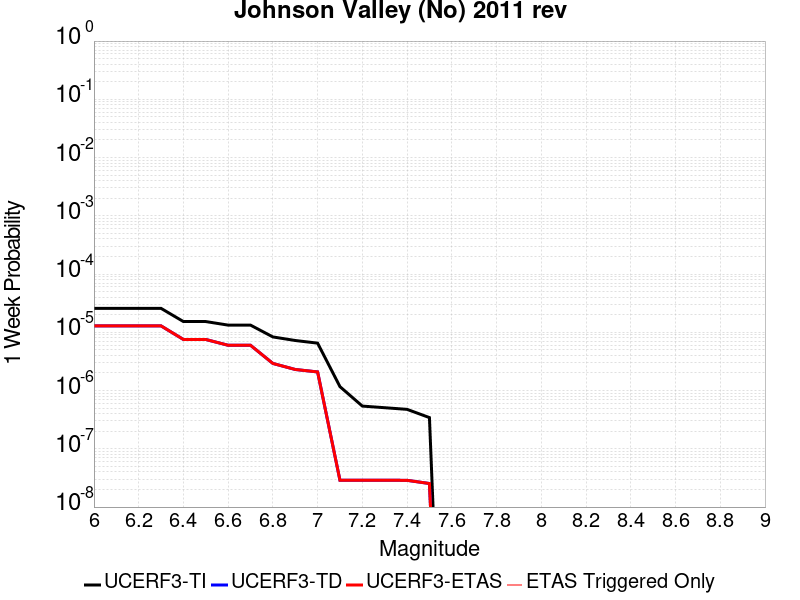 | 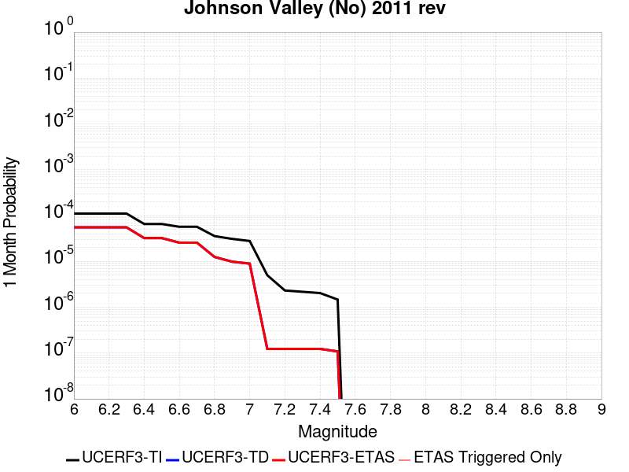 |  | 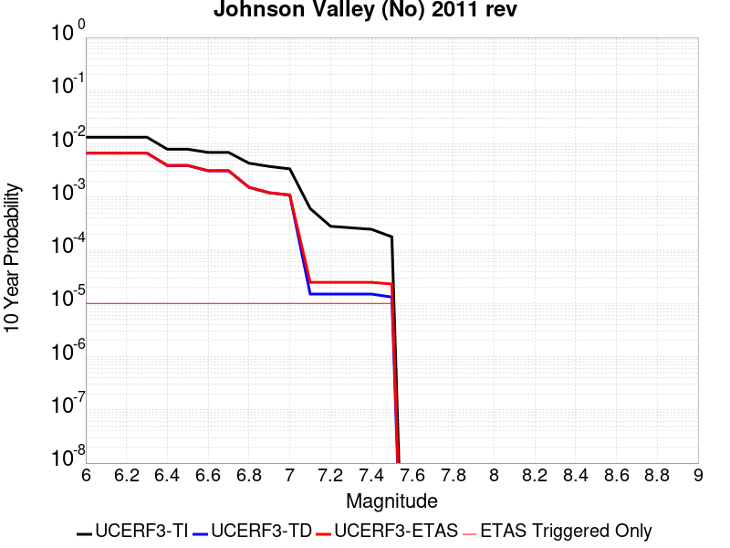 |

| Magnitude | 1 wk TI Prob | 1 wk TD Prob | 1 wk ETAS Prob | 1 wk ETAS/TD Gain | 1 wk ETAS Triggered Only | 1 mo TI Prob | 1 mo TD Prob | 1 mo ETAS Prob | 1 mo ETAS/TD Gain | 1 mo ETAS Triggered Only | 1 yr TI Prob | 1 yr TD Prob | 1 yr ETAS Prob | 1 yr ETAS/TD Gain | 1 yr ETAS Triggered Only | 10 yr TI Prob | 10 yr TD Prob | 10 yr ETAS Prob | 10 yr ETAS/TD Gain | 10 yr ETAS Triggered Only |
|-----|-----|-----|-----|-----|-----|-----|-----|-----|-----|-----|-----|-----|-----|-----|-----|-----|-----|-----|-----|-----|
| 6.0 | 2.577707E-5 | 1.29011805E-5 | 1.29011805E-5 | 1.0 | 0.0 | 1.1046848E-4 | 5.5289824E-5 | 5.5289824E-5 | 1.0 | 0.0 | 0.0013441239 | 6.729854E-4 | 6.729854E-4 | 1.0 | 0.0 | 0.013360229 | 0.006713383 | 0.0067233155 | 1.0014795 | 1.0E-5 |
| 6.1 | 2.577707E-5 | 1.29011805E-5 | 1.29011805E-5 | 1.0 | 0.0 | 1.1046848E-4 | 5.5289824E-5 | 5.5289824E-5 | 1.0 | 0.0 | 0.0013441239 | 6.729854E-4 | 6.729854E-4 | 1.0 | 0.0 | 0.013360229 | 0.006713383 | 0.0067233155 | 1.0014795 | 1.0E-5 |
| 6.2 | 2.577707E-5 | 1.29011805E-5 | 1.29011805E-5 | 1.0 | 0.0 | 1.1046848E-4 | 5.5289824E-5 | 5.5289824E-5 | 1.0 | 0.0 | 0.0013441239 | 6.729854E-4 | 6.729854E-4 | 1.0 | 0.0 | 0.013360229 | 0.006713383 | 0.0067233155 | 1.0014795 | 1.0E-5 |
| 6.3 | 2.577707E-5 | 1.29011805E-5 | 1.29011805E-5 | 1.0 | 0.0 | 1.1046848E-4 | 5.5289824E-5 | 5.5289824E-5 | 1.0 | 0.0 | 0.0013441239 | 6.729854E-4 | 6.729854E-4 | 1.0 | 0.0 | 0.013360229 | 0.006713383 | 0.0067233155 | 1.0014795 | 1.0E-5 |
| 6.4 | 1.5296591E-5 | 7.536961E-6 | 7.536961E-6 | 1.0 | 0.0 | 6.555518E-5 | 3.2300966E-5 | 3.2300966E-5 | 1.0 | 0.0 | 7.97842E-4 | 3.9321207E-4 | 3.9321207E-4 | 1.0 | 0.0 | 0.007949836 | 0.0039270045 | 0.0039369655 | 1.0025364 | 1.0E-5 |
| 6.5 | 1.5296591E-5 | 7.536961E-6 | 7.536961E-6 | 1.0 | 0.0 | 6.555518E-5 | 3.2300966E-5 | 3.2300966E-5 | 1.0 | 0.0 | 7.97842E-4 | 3.9321207E-4 | 3.9321207E-4 | 1.0 | 0.0 | 0.007949836 | 0.0039270045 | 0.0039369655 | 1.0025364 | 1.0E-5 |
| 6.6 | 1.3289383E-5 | 5.991923E-6 | 5.991923E-6 | 1.0 | 0.0 | 5.6953253E-5 | 2.5679514E-5 | 2.5679514E-5 | 1.0 | 0.0 | 6.9318525E-4 | 3.126202E-4 | 3.126202E-4 | 1.0 | 0.0 | 0.0069102696 | 0.0031234685 | 0.0031334374 | 1.0031916 | 1.0E-5 |
| 6.7 | 1.3289383E-5 | 5.991923E-6 | 5.991923E-6 | 1.0 | 0.0 | 5.6953253E-5 | 2.5679514E-5 | 2.5679514E-5 | 1.0 | 0.0 | 6.9318525E-4 | 3.126202E-4 | 3.126202E-4 | 1.0 | 0.0 | 0.0069102696 | 0.0031234685 | 0.0031334374 | 1.0031916 | 1.0E-5 |
| 6.8 | 8.330789E-6 | 2.9214575E-6 | 2.9214575E-6 | 1.0 | 0.0 | 3.570289E-5 | 1.2520504E-5 | 1.2520504E-5 | 1.0 | 0.0 | 4.34596E-4 | 1.5243219E-4 | 1.5243219E-4 | 1.0 | 0.0 | 0.0043374705 | 0.0015238363 | 0.001533821 | 1.0065523 | 1.0E-5 |
| 6.9 | 7.2359003E-6 | 2.3014697E-6 | 2.3014697E-6 | 1.0 | 0.0 | 3.1010633E-5 | 9.863435E-6 | 9.863435E-6 | 1.0 | 0.0 | 3.7748902E-4 | 1.20086035E-4 | 1.20086035E-4 | 1.0 | 0.0 | 0.0037684843 | 0.0012007343 | 0.0012107224 | 1.0083182 | 1.0E-5 |
| 7.0 | 6.5149957E-6 | 2.0886396E-6 | 2.0886396E-6 | 1.0 | 0.0 | 2.792111E-5 | 8.951311E-6 | 8.951311E-6 | 1.0 | 0.0 | 3.398865E-4 | 1.08982065E-4 | 1.08982065E-4 | 1.0 | 0.0 | 0.003393671 | 0.0010898061 | 0.0010997951 | 1.009166 | 1.0E-5 |
| 7.1 | 1.1662233E-6 | 2.8792787E-8 | 2.8792787E-8 | 1.0 | 0.0 | 4.9980904E-6 | 1.2339765E-7 | 1.2339765E-7 | 1.0 | 0.0 | 6.0850052E-5 | 1.5023655E-6 | 1.5023655E-6 | 1.0 | 0.0 | 6.083339E-4 | 1.502357E-5 | 2.502342E-5 | 1.6656108 | 1.0E-5 |
| 7.2 | 5.413881E-7 | 2.8792787E-8 | 2.8792787E-8 | 1.0 | 0.0 | 2.3202326E-6 | 1.2339765E-7 | 1.2339765E-7 | 1.0 | 0.0 | 2.8248465E-5 | 1.5023655E-6 | 1.5023655E-6 | 1.0 | 0.0 | 2.8244875E-4 | 1.502357E-5 | 2.502342E-5 | 1.6656108 | 1.0E-5 |
| 7.3 | 5.076821E-7 | 2.8792787E-8 | 2.8792787E-8 | 1.0 | 0.0 | 2.1757785E-6 | 1.2339765E-7 | 1.2339765E-7 | 1.0 | 0.0 | 2.648978E-5 | 1.5023655E-6 | 1.5023655E-6 | 1.0 | 0.0 | 2.6486625E-4 | 1.502357E-5 | 2.502342E-5 | 1.6656108 | 1.0E-5 |
| 7.4 | 4.7568687E-7 | 2.8774735E-8 | 2.8774735E-8 | 1.0 | 0.0 | 2.0386565E-6 | 1.2332029E-7 | 1.2332029E-7 | 1.0 | 0.0 | 2.482036E-5 | 1.5014238E-6 | 1.5014238E-6 | 1.0 | 0.0 | 2.4817587E-4 | 1.5014152E-5 | 2.5014002E-5 | 1.6660283 | 1.0E-5 |
| 7.5 | 3.435626E-7 | 2.535013E-8 | 2.535013E-8 | 1.0 | 0.0 | 1.4724103E-6 | 1.0864341E-7 | 1.0864341E-7 | 1.0 | 0.0 | 1.7926448E-5 | 1.3227329E-6 | 1.3227329E-6 | 1.0 | 0.0 | 1.7925001E-4 | 1.3227266E-5 | 2.3227134E-5 | 1.7560041 | 1.0E-5 |

## Sierra Nevada  (No Extension)
*[(top)](#table-of-contents)*

| 1 Week | 1 Month | 1 Year | 10 Year |
|-----|-----|-----|-----|
|  |  |  |  |

| Magnitude | 1 wk TI Prob | 1 wk TD Prob | 1 wk ETAS Prob | 1 wk ETAS/TD Gain | 1 wk ETAS Triggered Only | 1 mo TI Prob | 1 mo TD Prob | 1 mo ETAS Prob | 1 mo ETAS/TD Gain | 1 mo ETAS Triggered Only | 1 yr TI Prob | 1 yr TD Prob | 1 yr ETAS Prob | 1 yr ETAS/TD Gain | 1 yr ETAS Triggered Only | 10 yr TI Prob | 10 yr TD Prob | 10 yr ETAS Prob | 10 yr ETAS/TD Gain | 10 yr ETAS Triggered Only |
|-----|-----|-----|-----|-----|-----|-----|-----|-----|-----|-----|-----|-----|-----|-----|-----|-----|-----|-----|-----|-----|
| 6.0 | 7.7690465E-6 | 6.976276E-6 | 6.976276E-6 | 1.0 | 0.0 | 3.329549E-5 | 2.9898185E-5 | 2.9898185E-5 | 1.0 | 0.0 | 4.0529718E-4 | 3.6398545E-4 | 3.739818E-4 | 1.0274637 | 1.0E-5 | 0.004045588 | 0.0036374088 | 0.0036473726 | 1.0027392 | 1.0E-5 |
| 6.1 | 7.7690465E-6 | 6.976276E-6 | 6.976276E-6 | 1.0 | 0.0 | 3.329549E-5 | 2.9898185E-5 | 2.9898185E-5 | 1.0 | 0.0 | 4.0529718E-4 | 3.6398545E-4 | 3.739818E-4 | 1.0274637 | 1.0E-5 | 0.004045588 | 0.0036374088 | 0.0036473726 | 1.0027392 | 1.0E-5 |
| 6.2 | 7.7690465E-6 | 6.976276E-6 | 6.976276E-6 | 1.0 | 0.0 | 3.329549E-5 | 2.9898185E-5 | 2.9898185E-5 | 1.0 | 0.0 | 4.0529718E-4 | 3.6398545E-4 | 3.739818E-4 | 1.0274637 | 1.0E-5 | 0.004045588 | 0.0036374088 | 0.0036473726 | 1.0027392 | 1.0E-5 |
| 6.3 | 7.7690465E-6 | 6.976276E-6 | 6.976276E-6 | 1.0 | 0.0 | 3.329549E-5 | 2.9898185E-5 | 2.9898185E-5 | 1.0 | 0.0 | 4.0529718E-4 | 3.6398545E-4 | 3.739818E-4 | 1.0274637 | 1.0E-5 | 0.004045588 | 0.0036374088 | 0.0036473726 | 1.0027392 | 1.0E-5 |
| 6.4 | 7.7690465E-6 | 6.976276E-6 | 6.976276E-6 | 1.0 | 0.0 | 3.329549E-5 | 2.9898185E-5 | 2.9898185E-5 | 1.0 | 0.0 | 4.0529718E-4 | 3.6398545E-4 | 3.739818E-4 | 1.0274637 | 1.0E-5 | 0.004045588 | 0.0036374088 | 0.0036473726 | 1.0027392 | 1.0E-5 |
| 6.5 | 7.7690465E-6 | 6.976276E-6 | 6.976276E-6 | 1.0 | 0.0 | 3.329549E-5 | 2.9898185E-5 | 2.9898185E-5 | 1.0 | 0.0 | 4.0529718E-4 | 3.6398545E-4 | 3.739818E-4 | 1.0274637 | 1.0E-5 | 0.004045588 | 0.0036374088 | 0.0036473726 | 1.0027392 | 1.0E-5 |
| 6.6 | 2.653E-6 | 1.614815E-6 | 1.614815E-6 | 1.0 | 0.0 | 1.136995E-5 | 6.9206176E-6 | 6.9206176E-6 | 1.0 | 0.0 | 1.3842035E-4 | 8.42553E-5 | 9.425445E-5 | 1.1186769 | 1.0E-5 | 0.0013833415 | 8.42237E-4 | 8.5222855E-4 | 1.0118631 | 1.0E-5 |
| 6.7 | 2.5902466E-6 | 1.5501486E-6 | 1.5501486E-6 | 1.0 | 0.0 | 1.11010095E-5 | 6.6434773E-6 | 6.6434773E-6 | 1.0 | 0.0 | 1.351464E-4 | 8.0881364E-5 | 9.088055E-5 | 1.1236279 | 1.0E-5 | 0.0013506424 | 8.085222E-4 | 8.1851415E-4 | 1.0123582 | 1.0E-5 |
| 6.8 | 2.5853892E-6 | 1.5469489E-6 | 1.5469489E-6 | 1.0 | 0.0 | 1.1080193E-5 | 6.6297644E-6 | 6.6297644E-6 | 1.0 | 0.0 | 1.34893E-4 | 8.071442E-5 | 9.071361E-5 | 1.1238836 | 1.0E-5 | 0.0013481114 | 8.06854E-4 | 8.168459E-4 | 1.0123838 | 1.0E-5 |
| 6.9 | 2.458257E-6 | 1.4220233E-6 | 1.4220233E-6 | 1.0 | 0.0 | 1.0535345E-5 | 6.094371E-6 | 6.094371E-6 | 1.0 | 0.0 | 1.2826028E-4 | 7.419646E-5 | 8.419572E-5 | 1.1347673 | 1.0E-5 | 0.0012818627 | 7.4171886E-4 | 7.517115E-4 | 1.0134722 | 1.0E-5 |
| 7.0 | 2.4341468E-6 | 1.3989873E-6 | 1.3989873E-6 | 1.0 | 0.0 | 1.0432016E-5 | 5.9956456E-6 | 5.9956456E-6 | 1.0 | 0.0 | 1.270024E-4 | 7.299456E-5 | 8.299383E-5 | 1.1369865 | 1.0E-5 | 0.0012692984 | 7.2970777E-4 | 7.3970045E-4 | 1.0136942 | 1.0E-5 |
| 7.1 | 2.3652476E-6 | 1.3339372E-6 | 1.3339372E-6 | 1.0 | 0.0 | 1.0136736E-5 | 5.7168613E-6 | 5.7168613E-6 | 1.0 | 0.0 | 1.2340778E-4 | 6.960058E-5 | 7.9599886E-5 | 1.143667 | 1.0E-5 | 0.0012333926 | 6.957895E-4 | 7.0578256E-4 | 1.0143622 | 1.0E-5 |
| 7.2 | 2.272158E-6 | 1.2502445E-6 | 1.2502445E-6 | 1.0 | 0.0 | 9.737784E-6 | 5.35818E-6 | 5.35818E-6 | 1.0 | 0.0 | 1.1855107E-4 | 6.52339E-5 | 7.523325E-5 | 1.1532845 | 1.0E-5 | 0.0011848784 | 6.52149E-4 | 6.621425E-4 | 1.0153239 | 1.0E-5 |
| 7.3 | 2.1382127E-6 | 1.1419334E-6 | 1.1419334E-6 | 1.0 | 0.0 | 9.163737E-6 | 4.893991E-6 | 4.893991E-6 | 1.0 | 0.0 | 1.1156279E-4 | 5.958272E-5 | 6.958212E-5 | 1.1678239 | 1.0E-5 | 0.001115068 | 5.956686E-4 | 6.056627E-4 | 1.0167779 | 1.0E-5 |
| 7.4 | 1.9048055E-6 | 9.574882E-7 | 9.574882E-7 | 1.0 | 0.0 | 8.163426E-6 | 4.1035146E-6 | 4.1035146E-6 | 1.0 | 0.0 | 9.9385186E-5 | 4.995915E-5 | 5.995865E-5 | 1.2001536 | 1.0E-5 | 9.934074E-4 | 4.994799E-4 | 5.094749E-4 | 1.0200108 | 1.0E-5 |
| 7.5 | 1.5373403E-6 | 7.559723E-7 | 7.559723E-7 | 1.0 | 0.0 | 6.5885843E-6 | 3.239877E-6 | 3.239877E-6 | 1.0 | 0.0 | 8.021306E-5 | 3.9444796E-5 | 4.94444E-5 | 1.2535089 | 1.0E-5 | 8.0184115E-4 | 3.943784E-4 | 4.0437447E-4 | 1.0253464 | 1.0E-5 |
| 7.6 | 1.0680322E-6 | 4.659381E-7 | 4.659381E-7 | 1.0 | 0.0 | 4.577273E-6 | 1.996876E-6 | 1.996876E-6 | 1.0 | 0.0 | 5.5726876E-5 | 2.4311697E-5 | 3.4311455E-5 | 1.4113146 | 1.0E-5 | 5.5712904E-4 | 2.4309063E-4 | 2.530882E-4 | 1.041127 | 1.0E-5 |
| 7.7 | 5.509146E-7 | 1.5578398E-7 | 1.5578398E-7 | 1.0 | 0.0 | 2.3610605E-6 | 6.6764545E-7 | 6.6764545E-7 | 1.0 | 0.0 | 2.8745531E-5 | 8.128554E-6 | 8.128554E-6 | 1.0 | 0.0 | 2.8741814E-4 | 8.1282684E-5 | 8.1282684E-5 | 1.0 | 0.0 |

## North Frontal  (West)
*[(top)](#table-of-contents)*

| 1 Week | 1 Month | 1 Year | 10 Year |
|-----|-----|-----|-----|
|  |  |  |  |

| Magnitude | 1 wk TI Prob | 1 wk TD Prob | 1 wk ETAS Prob | 1 wk ETAS/TD Gain | 1 wk ETAS Triggered Only | 1 mo TI Prob | 1 mo TD Prob | 1 mo ETAS Prob | 1 mo ETAS/TD Gain | 1 mo ETAS Triggered Only | 1 yr TI Prob | 1 yr TD Prob | 1 yr ETAS Prob | 1 yr ETAS/TD Gain | 1 yr ETAS Triggered Only | 10 yr TI Prob | 10 yr TD Prob | 10 yr ETAS Prob | 10 yr ETAS/TD Gain | 10 yr ETAS Triggered Only |
|-----|-----|-----|-----|-----|-----|-----|-----|-----|-----|-----|-----|-----|-----|-----|-----|-----|-----|-----|-----|-----|
| 6.0 | 4.7316266E-6 | 4.8526704E-6 | 4.8526704E-6 | 1.0 | 0.0 | 2.0278241E-5 | 2.0797E-5 | 3.0796793E-5 | 1.4808285 | 1.0E-5 | 2.4685962E-4 | 2.5317553E-4 | 2.6317302E-4 | 1.0394883 | 1.0E-5 | 0.0024658558 | 0.0025290172 | 0.0025389919 | 1.0039442 | 1.0E-5 |
| 6.1 | 4.7316266E-6 | 4.8526704E-6 | 4.8526704E-6 | 1.0 | 0.0 | 2.0278241E-5 | 2.0797E-5 | 3.0796793E-5 | 1.4808285 | 1.0E-5 | 2.4685962E-4 | 2.5317553E-4 | 2.6317302E-4 | 1.0394883 | 1.0E-5 | 0.0024658558 | 0.0025290172 | 0.0025389919 | 1.0039442 | 1.0E-5 |
| 6.2 | 4.7316266E-6 | 4.8526704E-6 | 4.8526704E-6 | 1.0 | 0.0 | 2.0278241E-5 | 2.0797E-5 | 3.0796793E-5 | 1.4808285 | 1.0E-5 | 2.4685962E-4 | 2.5317553E-4 | 2.6317302E-4 | 1.0394883 | 1.0E-5 | 0.0024658558 | 0.0025290172 | 0.0025389919 | 1.0039442 | 1.0E-5 |
| 6.3 | 4.7316266E-6 | 4.8526704E-6 | 4.8526704E-6 | 1.0 | 0.0 | 2.0278241E-5 | 2.0797E-5 | 3.0796793E-5 | 1.4808285 | 1.0E-5 | 2.4685962E-4 | 2.5317553E-4 | 2.6317302E-4 | 1.0394883 | 1.0E-5 | 0.0024658558 | 0.0025290172 | 0.0025389919 | 1.0039442 | 1.0E-5 |
| 6.4 | 4.7316266E-6 | 4.8526704E-6 | 4.8526704E-6 | 1.0 | 0.0 | 2.0278241E-5 | 2.0797E-5 | 3.0796793E-5 | 1.4808285 | 1.0E-5 | 2.4685962E-4 | 2.5317553E-4 | 2.6317302E-4 | 1.0394883 | 1.0E-5 | 0.0024658558 | 0.0025290172 | 0.0025389919 | 1.0039442 | 1.0E-5 |
| 6.5 | 4.7316266E-6 | 4.8526704E-6 | 4.8526704E-6 | 1.0 | 0.0 | 2.0278241E-5 | 2.0797E-5 | 3.0796793E-5 | 1.4808285 | 1.0E-5 | 2.4685962E-4 | 2.5317553E-4 | 2.6317302E-4 | 1.0394883 | 1.0E-5 | 0.0024658558 | 0.0025290172 | 0.0025389919 | 1.0039442 | 1.0E-5 |
| 6.6 | 4.7316266E-6 | 4.8526704E-6 | 4.8526704E-6 | 1.0 | 0.0 | 2.0278241E-5 | 2.0797E-5 | 3.0796793E-5 | 1.4808285 | 1.0E-5 | 2.4685962E-4 | 2.5317553E-4 | 2.6317302E-4 | 1.0394883 | 1.0E-5 | 0.0024658558 | 0.0025290172 | 0.0025389919 | 1.0039442 | 1.0E-5 |
| 6.7 | 3.5382777E-6 | 3.6308843E-6 | 3.6308843E-6 | 1.0 | 0.0 | 1.516396E-5 | 1.5560845E-5 | 2.5560688E-5 | 1.6426287 | 1.0E-5 | 1.8460557E-4 | 1.8943759E-4 | 1.994357E-4 | 1.0527779 | 1.0E-5 | 0.0018445229 | 0.001892838 | 0.0019028191 | 1.0052731 | 1.0E-5 |
| 6.8 | 3.5382777E-6 | 3.6308843E-6 | 3.6308843E-6 | 1.0 | 0.0 | 1.516396E-5 | 1.5560845E-5 | 2.5560688E-5 | 1.6426287 | 1.0E-5 | 1.8460557E-4 | 1.8943759E-4 | 1.994357E-4 | 1.0527779 | 1.0E-5 | 0.0018445229 | 0.001892838 | 0.0019028191 | 1.0052731 | 1.0E-5 |
| 6.9 | 3.0428037E-6 | 3.1227594E-6 | 3.1227594E-6 | 1.0 | 0.0 | 1.30405215E-5 | 1.3383189E-5 | 2.3383056E-5 | 1.7471961 | 1.0E-5 | 1.5875678E-4 | 1.6292883E-4 | 1.729272E-4 | 1.0613664 | 1.0E-5 | 0.0015864341 | 0.001628161 | 0.0016381446 | 1.0061319 | 1.0E-5 |
| 7.0 | 2.538778E-6 | 2.6060895E-6 | 2.6060895E-6 | 1.0 | 0.0 | 1.0880432E-5 | 1.116891E-5 | 2.1168798E-5 | 1.8953326 | 1.0E-5 | 1.324612E-4 | 1.3597346E-4 | 1.4597211E-4 | 1.0735338 | 1.0E-5 | 0.0013238228 | 0.0013589495 | 0.0013689358 | 1.0073487 | 1.0E-5 |
| 7.1 | 2.2418935E-6 | 2.3012067E-6 | 2.3012067E-6 | 1.0 | 0.0 | 9.60808E-6 | 9.8622795E-6 | 1.986218E-5 | 2.0139544 | 1.0E-5 | 1.1697209E-4 | 1.2006708E-4 | 1.3006588E-4 | 1.0832767 | 1.0E-5 | 0.0011691054 | 0.0012000661 | 0.001210054 | 1.0083228 | 1.0E-5 |
| 7.2 | 1.6526745E-6 | 1.692485E-6 | 1.692485E-6 | 1.0 | 0.0 | 7.082872E-6 | 7.253488E-6 | 1.7253416E-5 | 2.378637 | 1.0E-5 | 8.623055E-5 | 8.83079E-5 | 9.830701E-5 | 1.1132301 | 1.0E-5 | 8.61971E-4 | 8.827531E-4 | 8.927443E-4 | 1.0113182 | 1.0E-5 |
| 7.3 | 1.0246019E-6 | 1.0442265E-6 | 1.0442265E-6 | 1.0 | 0.0 | 4.391144E-6 | 4.475249E-6 | 4.475249E-6 | 1.0 | 0.0 | 5.3460866E-5 | 5.4484914E-5 | 5.4484914E-5 | 1.0 | 0.0 | 5.344801E-4 | 5.44727E-4 | 5.44727E-4 | 1.0 | 0.0 |
| 7.4 | 8.9045164E-7 | 9.056564E-7 | 9.056564E-7 | 1.0 | 0.0 | 3.8162157E-6 | 3.881379E-6 | 3.881379E-6 | 1.0 | 0.0 | 4.646144E-5 | 4.7254878E-5 | 4.7254878E-5 | 1.0 | 0.0 | 4.6451724E-4 | 4.7245919E-4 | 4.7245919E-4 | 1.0 | 0.0 |
| 7.5 | 6.3357E-7 | 6.402708E-7 | 6.402708E-7 | 1.0 | 0.0 | 2.7152971E-6 | 2.744015E-6 | 2.744015E-6 | 1.0 | 0.0 | 3.305824E-5 | 3.3407938E-5 | 3.3407938E-5 | 1.0 | 0.0 | 3.3053322E-4 | 3.3403575E-4 | 3.3403575E-4 | 1.0 | 0.0 |
| 7.6 | 2.5087024E-7 | 2.436121E-7 | 2.436121E-7 | 1.0 | 0.0 | 1.0751578E-6 | 1.0440516E-6 | 1.0440516E-6 | 1.0 | 0.0 | 1.3089967E-5 | 1.2711275E-5 | 1.2711275E-5 | 1.0 | 0.0 | 1.3089196E-4 | 1.2710755E-4 | 1.2710755E-4 | 1.0 | 0.0 |
| 7.7 | 3.282987E-8 | 2.2875435E-8 | 2.2875435E-8 | 1.0 | 0.0 | 1.4069944E-7 | 9.8037575E-8 | 9.8037575E-8 | 1.0 | 0.0 | 1.7130144E-6 | 1.193607E-6 | 1.193607E-6 | 1.0 | 0.0 | 1.7130013E-5 | 1.1936014E-5 | 1.1936014E-5 | 1.0 | 0.0 |
| 7.8 | 8.77499E-9 | 5.6817466E-9 | 5.6817466E-9 | 1.0 | 0.0 | 3.7607098E-8 | 2.4350342E-8 | 2.4350342E-8 | 1.0 | 0.0 | 4.578663E-7 | 2.964654E-7 | 2.964654E-7 | 1.0 | 0.0 | 4.5786537E-6 | 2.9646512E-6 | 2.9646512E-6 | 1.0 | 0.0 |

## Great Valley 03a Dunnigan Hills
*[(top)](#table-of-contents)*

| 1 Week | 1 Month | 1 Year | 10 Year |
|-----|-----|-----|-----|
|  |  |  |  |

| Magnitude | 1 wk TI Prob | 1 wk TD Prob | 1 wk ETAS Prob | 1 wk ETAS/TD Gain | 1 wk ETAS Triggered Only | 1 mo TI Prob | 1 mo TD Prob | 1 mo ETAS Prob | 1 mo ETAS/TD Gain | 1 mo ETAS Triggered Only | 1 yr TI Prob | 1 yr TD Prob | 1 yr ETAS Prob | 1 yr ETAS/TD Gain | 1 yr ETAS Triggered Only | 10 yr TI Prob | 10 yr TD Prob | 10 yr ETAS Prob | 10 yr ETAS/TD Gain | 10 yr ETAS Triggered Only |
|-----|-----|-----|-----|-----|-----|-----|-----|-----|-----|-----|-----|-----|-----|-----|-----|-----|-----|-----|-----|-----|
| 6.0 | 1.6591328E-5 | 1.810791E-5 | 2.8107728E-5 | 1.5522349 | 1.0E-5 | 7.110376E-5 | 7.760341E-5 | 8.760263E-5 | 1.1288503 | 1.0E-5 | 8.6534437E-4 | 9.444811E-4 | 9.5447164E-4 | 1.0105778 | 1.0E-5 | 0.008619824 | 0.009411503 | 0.009421408 | 1.0010525 | 1.0E-5 |
| 6.1 | 8.041125E-6 | 8.769705E-6 | 1.8769617E-5 | 2.140279 | 1.0E-5 | 3.4461507E-5 | 3.7584025E-5 | 4.758365E-5 | 1.2660605 | 1.0E-5 | 4.194881E-4 | 4.5750974E-4 | 4.6750516E-4 | 1.0218475 | 1.0E-5 | 0.004186971 | 0.004567676 | 0.00457763 | 1.0021793 | 1.0E-5 |
| 6.2 | 3.2807004E-6 | 3.5795601E-6 | 3.5795601E-6 | 1.0 | 0.0 | 1.4060069E-5 | 1.5340906E-5 | 1.5340906E-5 | 1.0 | 0.0 | 1.7116789E-4 | 1.8676367E-4 | 1.8676367E-4 | 1.0 | 0.0 | 0.0017103611 | 0.0018664751 | 0.0018664751 | 1.0 | 0.0 |
| 6.3 | 1.9339366E-6 | 2.1103756E-6 | 2.1103756E-6 | 1.0 | 0.0 | 8.288273E-6 | 9.044452E-6 | 9.044452E-6 | 1.0 | 0.0 | 1.00905054E-4 | 1.10113484E-4 | 1.10113484E-4 | 1.0 | 0.0 | 0.0010085925 | 0.0011008692 | 0.0011008692 | 1.0 | 0.0 |
| 6.4 | 1.3142635E-6 | 1.4339831E-6 | 1.4339831E-6 | 1.0 | 0.0 | 5.6325457E-6 | 6.145642E-6 | 6.145642E-6 | 1.0 | 0.0 | 6.857408E-5 | 7.482319E-5 | 7.482319E-5 | 1.0 | 0.0 | 6.8552926E-4 | 7.4823195E-4 | 7.4823195E-4 | 1.0 | 0.0 |

## Santa Cruz Catalina Ridge alt1
*[(top)](#table-of-contents)*

| 1 Week | 1 Month | 1 Year | 10 Year |
|-----|-----|-----|-----|
|  |  |  |  |

| Magnitude | 1 wk TI Prob | 1 wk TD Prob | 1 wk ETAS Prob | 1 wk ETAS/TD Gain | 1 wk ETAS Triggered Only | 1 mo TI Prob | 1 mo TD Prob | 1 mo ETAS Prob | 1 mo ETAS/TD Gain | 1 mo ETAS Triggered Only | 1 yr TI Prob | 1 yr TD Prob | 1 yr ETAS Prob | 1 yr ETAS/TD Gain | 1 yr ETAS Triggered Only | 10 yr TI Prob | 10 yr TD Prob | 10 yr ETAS Prob | 10 yr ETAS/TD Gain | 10 yr ETAS Triggered Only |
|-----|-----|-----|-----|-----|-----|-----|-----|-----|-----|-----|-----|-----|-----|-----|-----|-----|-----|-----|-----|-----|
| 6.0 | 3.2833184E-5 | 3.655829E-5 | 3.655829E-5 | 1.0 | 0.0 | 1.4070606E-4 | 1.566699E-4 | 1.566699E-4 | 1.0 | 0.0 | 0.00171175 | 0.0019059536 | 0.0019159345 | 1.0052367 | 1.0E-5 | 0.016986247 | 0.018912975 | 0.018922787 | 1.0005187 | 1.0E-5 |
| 6.1 | 1.9835548E-5 | 2.1659453E-5 | 2.1659453E-5 | 1.0 | 0.0 | 8.500672E-5 | 9.282304E-5 | 9.282304E-5 | 1.0 | 0.0 | 0.0010344655 | 0.0011295547 | 0.0011395434 | 1.0088431 | 1.0E-5 | 0.010296632 | 0.011240268 | 0.011250156 | 1.0008796 | 1.0E-5 |
| 6.2 | 1.9835548E-5 | 2.1659453E-5 | 2.1659453E-5 | 1.0 | 0.0 | 8.500672E-5 | 9.282304E-5 | 9.282304E-5 | 1.0 | 0.0 | 0.0010344655 | 0.0011295547 | 0.0011395434 | 1.0088431 | 1.0E-5 | 0.010296632 | 0.011240268 | 0.011250156 | 1.0008796 | 1.0E-5 |
| 6.3 | 1.5728183E-5 | 1.7033912E-5 | 1.7033912E-5 | 1.0 | 0.0 | 6.7404755E-5 | 7.300047E-5 | 7.300047E-5 | 1.0 | 0.0 | 8.2034385E-4 | 8.884244E-4 | 8.984155E-4 | 1.0112458 | 1.0E-5 | 0.008173222 | 0.008849408 | 0.008859319 | 1.00112 | 1.0E-5 |
| 6.4 | 1.5728183E-5 | 1.7033912E-5 | 1.7033912E-5 | 1.0 | 0.0 | 6.7404755E-5 | 7.300047E-5 | 7.300047E-5 | 1.0 | 0.0 | 8.2034385E-4 | 8.884244E-4 | 8.984155E-4 | 1.0112458 | 1.0E-5 | 0.008173222 | 0.008849408 | 0.008859319 | 1.00112 | 1.0E-5 |
| 6.5 | 1.3707734E-5 | 1.479449E-5 | 1.479449E-5 | 1.0 | 0.0 | 5.8746107E-5 | 6.340344E-5 | 6.340344E-5 | 1.0 | 0.0 | 7.1499916E-4 | 7.71667E-4 | 7.8165927E-4 | 1.012949 | 1.0E-5 | 0.0071270303 | 0.007690273 | 0.0077001965 | 1.0012903 | 1.0E-5 |
| 6.6 | 1.2539813E-5 | 1.3510192E-5 | 1.3510192E-5 | 1.0 | 0.0 | 5.3740947E-5 | 5.789955E-5 | 5.789955E-5 | 1.0 | 0.0 | 6.540996E-4 | 7.047017E-4 | 7.146947E-4 | 1.0141804 | 1.0E-5 | 0.0065217763 | 0.007024974 | 0.007034904 | 1.0014135 | 1.0E-5 |
| 6.7 | 1.1504083E-5 | 1.237735E-5 | 1.237735E-5 | 1.0 | 0.0 | 4.930228E-5 | 5.3044718E-5 | 5.3044718E-5 | 1.0 | 0.0 | 6.0008996E-4 | 6.4563006E-4 | 6.556236E-4 | 1.0154787 | 1.0E-5 | 0.005984721 | 0.006437773 | 0.0064477087 | 1.0015433 | 1.0E-5 |
| 6.8 | 1.012739E-5 | 1.087705E-5 | 1.087705E-5 | 1.0 | 0.0 | 4.340238E-5 | 4.6615103E-5 | 4.6615103E-5 | 1.0 | 0.0 | 5.282958E-4 | 5.673926E-4 | 5.7738693E-4 | 1.0176145 | 1.0E-5 | 0.0052704164 | 0.0056596086 | 0.005669552 | 1.0017569 | 1.0E-5 |
| 6.9 | 8.9607865E-6 | 9.609099E-6 | 9.609099E-6 | 1.0 | 0.0 | 3.8402806E-5 | 4.1181207E-5 | 4.1181207E-5 | 1.0 | 0.0 | 4.6745385E-4 | 5.012669E-4 | 5.112619E-4 | 1.0199394 | 1.0E-5 | 0.0046647177 | 0.005001482 | 0.005011432 | 1.0019894 | 1.0E-5 |
| 7.0 | 8.046829E-6 | 8.61973E-6 | 8.61973E-6 | 1.0 | 0.0 | 3.4485955E-5 | 3.694118E-5 | 3.694118E-5 | 1.0 | 0.0 | 4.1978562E-4 | 4.4966684E-4 | 4.5966235E-4 | 1.0222287 | 1.0E-5 | 0.004189935 | 0.0044876602 | 0.0044976156 | 1.0022184 | 1.0E-5 |
| 7.1 | 7.136131E-6 | 7.637642E-6 | 7.637642E-6 | 1.0 | 0.0 | 3.0583058E-5 | 3.2732343E-5 | 3.2732343E-5 | 1.0 | 0.0 | 3.7228514E-4 | 3.984441E-4 | 4.0844013E-4 | 1.0250876 | 1.0E-5 | 0.0037166206 | 0.0039773737 | 0.003987334 | 1.0025042 | 1.0E-5 |
| 7.2 | 6.362014E-6 | 6.8049458E-6 | 6.8049458E-6 | 1.0 | 0.0 | 2.726549E-5 | 2.9163732E-5 | 2.9163732E-5 | 1.0 | 0.0 | 3.3190678E-4 | 3.5501123E-4 | 3.6500767E-4 | 1.0281581 | 1.0E-5 | 0.0033141149 | 0.0035445094 | 0.003554474 | 1.0028113 | 1.0E-5 |
| 7.3 | 5.004101E-6 | 5.351705E-6 | 5.351705E-6 | 1.0 | 0.0 | 2.1445969E-5 | 2.2935681E-5 | 2.2935681E-5 | 1.0 | 0.0 | 2.6107338E-4 | 2.7920667E-4 | 2.8920386E-4 | 1.0358058 | 1.0E-5 | 0.002607669 | 0.0027886136 | 0.0027985855 | 1.003576 | 1.0E-5 |
| 7.4 | 3.4901443E-6 | 3.7320456E-6 | 3.7320456E-6 | 1.0 | 0.0 | 1.4957676E-5 | 1.5994385E-5 | 1.5994385E-5 | 1.0 | 0.0 | 1.8209449E-4 | 1.9471462E-4 | 1.9471462E-4 | 1.0 | 0.0 | 0.0018194534 | 0.0019454787 | 0.0019454787 | 1.0 | 0.0 |
| 7.5 | 1.1215045E-6 | 1.1893851E-6 | 1.1893851E-6 | 1.0 | 0.0 | 4.806439E-6 | 5.097355E-6 | 5.097355E-6 | 1.0 | 0.0 | 5.851682E-5 | 6.205856E-5 | 6.205856E-5 | 1.0 | 0.0 | 5.850142E-4 | 6.204154E-4 | 6.204154E-4 | 1.0 | 0.0 |
| 7.6 | 2.8599047E-7 | 2.9951954E-7 | 2.9951954E-7 | 1.0 | 0.0 | 1.2256729E-6 | 1.2836546E-6 | 1.2836546E-6 | 1.0 | 0.0 | 1.4922465E-5 | 1.5628384E-5 | 1.5628384E-5 | 1.0 | 0.0 | 1.4921463E-4 | 1.5627299E-4 | 1.5627299E-4 | 1.0 | 0.0 |
| 7.7 | 2.0781519E-7 | 2.1744296E-7 | 2.1744296E-7 | 1.0 | 0.0 | 8.906362E-7 | 9.3189806E-7 | 9.3189806E-7 | 1.0 | 0.0 | 1.08434415E-5 | 1.1345801E-5 | 1.1345801E-5 | 1.0 | 0.0 | 1.0842913E-4 | 1.1345231E-4 | 1.1345231E-4 | 1.0 | 0.0 |
| 7.8 | 3.614776E-8 | 3.7640977E-8 | 3.7640977E-8 | 1.0 | 0.0 | 1.5491896E-7 | 1.6131847E-7 | 1.6131847E-7 | 1.0 | 0.0 | 1.8861368E-6 | 1.9640506E-6 | 1.9640506E-6 | 1.0 | 0.0 | 1.8861208E-5 | 1.9640345E-5 | 1.9640345E-5 | 1.0 | 0.0 |

## Ventura-Pitas Point
*[(top)](#table-of-contents)*

| 1 Week | 1 Month | 1 Year | 10 Year |
|-----|-----|-----|-----|
|  |  |  |  |

| Magnitude | 1 wk TI Prob | 1 wk TD Prob | 1 wk ETAS Prob | 1 wk ETAS/TD Gain | 1 wk ETAS Triggered Only | 1 mo TI Prob | 1 mo TD Prob | 1 mo ETAS Prob | 1 mo ETAS/TD Gain | 1 mo ETAS Triggered Only | 1 yr TI Prob | 1 yr TD Prob | 1 yr ETAS Prob | 1 yr ETAS/TD Gain | 1 yr ETAS Triggered Only | 10 yr TI Prob | 10 yr TD Prob | 10 yr ETAS Prob | 10 yr ETAS/TD Gain | 10 yr ETAS Triggered Only |
|-----|-----|-----|-----|-----|-----|-----|-----|-----|-----|-----|-----|-----|-----|-----|-----|-----|-----|-----|-----|-----|
| 6.0 | 3.3179622E-5 | 3.373506E-5 | 4.3734723E-5 | 1.2964175 | 1.0E-5 | 1.4219063E-4 | 1.4457226E-4 | 1.5457082E-4 | 1.0691595 | 1.0E-5 | 0.0017297962 | 0.001759003 | 0.0017689854 | 1.0056751 | 1.0E-5 | 0.017163932 | 0.01747628 | 0.017486105 | 1.0005622 | 1.0E-5 |
| 6.1 | 3.3179622E-5 | 3.373506E-5 | 4.3734723E-5 | 1.2964175 | 1.0E-5 | 1.4219063E-4 | 1.4457226E-4 | 1.5457082E-4 | 1.0691595 | 1.0E-5 | 0.0017297962 | 0.001759003 | 0.0017689854 | 1.0056751 | 1.0E-5 | 0.017163932 | 0.01747628 | 0.017486105 | 1.0005622 | 1.0E-5 |
| 6.2 | 3.3179622E-5 | 3.373506E-5 | 4.3734723E-5 | 1.2964175 | 1.0E-5 | 1.4219063E-4 | 1.4457226E-4 | 1.5457082E-4 | 1.0691595 | 1.0E-5 | 0.0017297962 | 0.001759003 | 0.0017689854 | 1.0056751 | 1.0E-5 | 0.017163932 | 0.01747628 | 0.017486105 | 1.0005622 | 1.0E-5 |
| 6.3 | 3.3179622E-5 | 3.373506E-5 | 4.3734723E-5 | 1.2964175 | 1.0E-5 | 1.4219063E-4 | 1.4457226E-4 | 1.5457082E-4 | 1.0691595 | 1.0E-5 | 0.0017297962 | 0.001759003 | 0.0017689854 | 1.0056751 | 1.0E-5 | 0.017163932 | 0.01747628 | 0.017486105 | 1.0005622 | 1.0E-5 |
| 6.4 | 1.8754668E-5 | 1.7019538E-5 | 1.7019538E-5 | 1.0 | 0.0 | 8.037467E-5 | 7.2938965E-5 | 7.2938965E-5 | 1.0 | 0.0 | 9.781223E-4 | 8.876932E-4 | 8.876932E-4 | 1.0 | 0.0 | 0.009738282 | 0.008843759 | 0.008843759 | 1.0 | 0.0 |
| 6.5 | 1.8754668E-5 | 1.7019538E-5 | 1.7019538E-5 | 1.0 | 0.0 | 8.037467E-5 | 7.2938965E-5 | 7.2938965E-5 | 1.0 | 0.0 | 9.781223E-4 | 8.876932E-4 | 8.876932E-4 | 1.0 | 0.0 | 0.009738282 | 0.008843759 | 0.008843759 | 1.0 | 0.0 |
| 6.6 | 1.4361558E-5 | 1.21222165E-5 | 1.21222165E-5 | 1.0 | 0.0 | 6.154808E-5 | 5.1951334E-5 | 5.1951334E-5 | 1.0 | 0.0 | 7.490902E-4 | 6.3232624E-4 | 6.3232624E-4 | 1.0 | 0.0 | 0.0074657016 | 0.006305476 | 0.006305476 | 1.0 | 0.0 |
| 6.7 | 1.4361558E-5 | 1.21222165E-5 | 1.21222165E-5 | 1.0 | 0.0 | 6.154808E-5 | 5.1951334E-5 | 5.1951334E-5 | 1.0 | 0.0 | 7.490902E-4 | 6.3232624E-4 | 6.3232624E-4 | 1.0 | 0.0 | 0.0074657016 | 0.006305476 | 0.006305476 | 1.0 | 0.0 |
| 6.8 | 1.3663846E-5 | 1.1344362E-5 | 1.1344362E-5 | 1.0 | 0.0 | 5.8558027E-5 | 4.86178E-5 | 4.86178E-5 | 1.0 | 0.0 | 7.127108E-4 | 5.917629E-4 | 5.917629E-4 | 1.0 | 0.0 | 0.007104293 | 0.005902036 | 0.005902036 | 1.0 | 0.0 |
| 6.9 | 1.3644157E-5 | 1.1322462E-5 | 1.1322462E-5 | 1.0 | 0.0 | 5.8473648E-5 | 4.8523947E-5 | 4.8523947E-5 | 1.0 | 0.0 | 7.116841E-4 | 5.9062085E-4 | 5.9062085E-4 | 1.0 | 0.0 | 0.007094092 | 0.0058906763 | 0.0058906763 | 1.0 | 0.0 |
| 7.0 | 1.3568845E-5 | 1.1242029E-5 | 1.1242029E-5 | 1.0 | 0.0 | 5.8150898E-5 | 4.817925E-5 | 4.817925E-5 | 1.0 | 0.0 | 7.077572E-4 | 5.864264E-4 | 5.864264E-4 | 1.0 | 0.0 | 0.007055073 | 0.0058489535 | 0.0058489535 | 1.0 | 0.0 |
| 7.1 | 1.306572E-5 | 1.0720488E-5 | 1.0720488E-5 | 1.0 | 0.0 | 5.599474E-5 | 4.5944147E-5 | 4.5944147E-5 | 1.0 | 0.0 | 6.815227E-4 | 5.592283E-4 | 5.592283E-4 | 1.0 | 0.0 | 0.0067943637 | 0.0055783642 | 0.0055783642 | 1.0 | 0.0 |
| 7.2 | 1.232604E-5 | 9.995097E-6 | 9.995097E-6 | 1.0 | 0.0 | 5.2824813E-5 | 4.2835436E-5 | 4.2835436E-5 | 1.0 | 0.0 | 6.429523E-4 | 5.213984E-4 | 5.213984E-4 | 1.0 | 0.0 | 0.0064109527 | 0.005201892 | 0.005201892 | 1.0 | 0.0 |
| 7.3 | 1.0917261E-5 | 8.84379E-6 | 8.84379E-6 | 1.0 | 0.0 | 4.678742E-5 | 3.7901416E-5 | 3.7901416E-5 | 1.0 | 0.0 | 5.69488E-4 | 4.613536E-4 | 4.613536E-4 | 1.0 | 0.0 | 0.0056803077 | 0.004604073 | 0.004604073 | 1.0 | 0.0 |
| 7.4 | 1.039959E-5 | 8.423521E-6 | 8.423521E-6 | 1.0 | 0.0 | 4.456891E-5 | 3.610031E-5 | 3.610031E-5 | 1.0 | 0.0 | 5.424914E-4 | 4.394342E-4 | 4.394342E-4 | 1.0 | 0.0 | 0.0054116896 | 0.004385763 | 0.004385763 | 1.0 | 0.0 |
| 7.5 | 9.015877E-6 | 7.2975085E-6 | 7.2975085E-6 | 1.0 | 0.0 | 3.86389E-5 | 3.127467E-5 | 3.127467E-5 | 1.0 | 0.0 | 4.7032707E-4 | 3.80704E-4 | 3.80704E-4 | 1.0 | 0.0 | 0.004693329 | 0.0038006115 | 0.0038006115 | 1.0 | 0.0 |
| 7.6 | 4.900162E-6 | 3.874114E-6 | 3.874114E-6 | 1.0 | 0.0 | 2.1000526E-5 | 1.660324E-5 | 1.660324E-5 | 1.0 | 0.0 | 2.556514E-4 | 2.0212584E-4 | 2.0212584E-4 | 1.0 | 0.0 | 0.0025535747 | 0.0020194335 | 0.0020194335 | 1.0 | 0.0 |
| 7.7 | 3.8850626E-6 | 3.126756E-6 | 3.126756E-6 | 1.0 | 0.0 | 1.6650163E-5 | 1.3400314E-5 | 1.3400314E-5 | 1.0 | 0.0 | 2.0269687E-4 | 1.631367E-4 | 1.631367E-4 | 1.0 | 0.0 | 0.002025121 | 0.0016301788 | 0.0016301788 | 1.0 | 0.0 |
| 7.8 | 2.4654719E-6 | 2.0299E-6 | 2.0299E-6 | 1.0 | 0.0 | 1.0566265E-5 | 8.699543E-6 | 8.699543E-6 | 1.0 | 0.0 | 1.2863669E-4 | 1.0591184E-4 | 1.0591184E-4 | 1.0 | 0.0 | 0.0012856225 | 0.0010586183 | 0.0010586183 | 1.0 | 0.0 |
| 7.9 | 4.095894E-7 | 3.2765044E-7 | 3.2765044E-7 | 1.0 | 0.0 | 1.7553821E-6 | 1.4042155E-6 | 1.4042155E-6 | 1.0 | 0.0 | 2.1371567E-5 | 1.7096192E-5 | 1.7096192E-5 | 1.0 | 0.0 | 2.1369511E-4 | 1.7094908E-4 | 1.7094908E-4 | 1.0 | 0.0 |
| 8.0 | 7.791402E-9 | 5.6836047E-9 | 5.6836047E-9 | 1.0 | 0.0 | 3.3391725E-8 | 2.4358307E-8 | 2.4358307E-8 | 1.0 | 0.0 | 4.0654416E-7 | 2.9656238E-7 | 2.9656238E-7 | 1.0 | 0.0 | 4.065434E-6 | 2.9656217E-6 | 2.9656217E-6 | 1.0 | 0.0 |

## Santa Susana alt 1
*[(top)](#table-of-contents)*

| 1 Week | 1 Month | 1 Year | 10 Year |
|-----|-----|-----|-----|
|  |  |  |  |

| Magnitude | 1 wk TI Prob | 1 wk TD Prob | 1 wk ETAS Prob | 1 wk ETAS/TD Gain | 1 wk ETAS Triggered Only | 1 mo TI Prob | 1 mo TD Prob | 1 mo ETAS Prob | 1 mo ETAS/TD Gain | 1 mo ETAS Triggered Only | 1 yr TI Prob | 1 yr TD Prob | 1 yr ETAS Prob | 1 yr ETAS/TD Gain | 1 yr ETAS Triggered Only | 10 yr TI Prob | 10 yr TD Prob | 10 yr ETAS Prob | 10 yr ETAS/TD Gain | 10 yr ETAS Triggered Only |
|-----|-----|-----|-----|-----|-----|-----|-----|-----|-----|-----|-----|-----|-----|-----|-----|-----|-----|-----|-----|-----|
| 6.0 | 2.674877E-5 | 2.7198106E-5 | 2.7198106E-5 | 1.0 | 0.0 | 1.1463255E-4 | 1.16558746E-4 | 1.16558746E-4 | 1.0 | 0.0 | 0.0013947578 | 0.0014182925 | 0.0014282784 | 1.0070407 | 1.0E-5 | 0.013860362 | 0.014104164 | 0.014114023 | 1.000699 | 1.0E-5 |
| 6.1 | 2.674877E-5 | 2.7198106E-5 | 2.7198106E-5 | 1.0 | 0.0 | 1.1463255E-4 | 1.16558746E-4 | 1.16558746E-4 | 1.0 | 0.0 | 0.0013947578 | 0.0014182925 | 0.0014282784 | 1.0070407 | 1.0E-5 | 0.013860362 | 0.014104164 | 0.014114023 | 1.000699 | 1.0E-5 |
| 6.2 | 2.674877E-5 | 2.7198106E-5 | 2.7198106E-5 | 1.0 | 0.0 | 1.1463255E-4 | 1.16558746E-4 | 1.16558746E-4 | 1.0 | 0.0 | 0.0013947578 | 0.0014182925 | 0.0014282784 | 1.0070407 | 1.0E-5 | 0.013860362 | 0.014104164 | 0.014114023 | 1.000699 | 1.0E-5 |
| 6.3 | 2.674877E-5 | 2.7198106E-5 | 2.7198106E-5 | 1.0 | 0.0 | 1.1463255E-4 | 1.16558746E-4 | 1.16558746E-4 | 1.0 | 0.0 | 0.0013947578 | 0.0014182925 | 0.0014282784 | 1.0070407 | 1.0E-5 | 0.013860362 | 0.014104164 | 0.014114023 | 1.000699 | 1.0E-5 |
| 6.4 | 2.674877E-5 | 2.7198106E-5 | 2.7198106E-5 | 1.0 | 0.0 | 1.1463255E-4 | 1.16558746E-4 | 1.16558746E-4 | 1.0 | 0.0 | 0.0013947578 | 0.0014182925 | 0.0014282784 | 1.0070407 | 1.0E-5 | 0.013860362 | 0.014104164 | 0.014114023 | 1.000699 | 1.0E-5 |
| 6.5 | 2.674877E-5 | 2.7198106E-5 | 2.7198106E-5 | 1.0 | 0.0 | 1.1463255E-4 | 1.16558746E-4 | 1.16558746E-4 | 1.0 | 0.0 | 0.0013947578 | 0.0014182925 | 0.0014282784 | 1.0070407 | 1.0E-5 | 0.013860362 | 0.014104164 | 0.014114023 | 1.000699 | 1.0E-5 |
| 6.6 | 2.6647976E-5 | 2.7074446E-5 | 2.7074446E-5 | 1.0 | 0.0 | 1.14200615E-4 | 1.1602882E-4 | 1.1602882E-4 | 1.0 | 0.0 | 0.0013895056 | 0.0014118492 | 0.001421835 | 1.0070729 | 1.0E-5 | 0.013808494 | 0.014040549 | 0.014050409 | 1.0007023 | 1.0E-5 |
| 6.7 | 2.6647976E-5 | 2.7074446E-5 | 2.7074446E-5 | 1.0 | 0.0 | 1.14200615E-4 | 1.1602882E-4 | 1.1602882E-4 | 1.0 | 0.0 | 0.0013895056 | 0.0014118492 | 0.001421835 | 1.0070729 | 1.0E-5 | 0.013808494 | 0.014040549 | 0.014050409 | 1.0007023 | 1.0E-5 |
| 6.8 | 1.9073179E-5 | 1.7637421E-5 | 1.7637421E-5 | 1.0 | 0.0 | 8.1739636E-5 | 7.558686E-5 | 7.558686E-5 | 1.0 | 0.0 | 9.947256E-4 | 9.1989967E-4 | 9.298905E-4 | 1.0108608 | 1.0E-5 | 0.009902848 | 0.009163169 | 0.0091730775 | 1.0010813 | 1.0E-5 |
| 6.9 | 1.9041876E-5 | 1.7619554E-5 | 1.7619554E-5 | 1.0 | 0.0 | 8.160549E-5 | 7.551029E-5 | 7.551029E-5 | 1.0 | 0.0 | 9.930939E-4 | 9.189682E-4 | 9.28959E-4 | 1.0108718 | 1.0E-5 | 0.0098866755 | 0.0091539305 | 0.00916384 | 1.0010824 | 1.0E-5 |
| 7.0 | 1.5917482E-5 | 1.3864026E-5 | 1.3864026E-5 | 1.0 | 0.0 | 6.8215995E-5 | 5.941593E-5 | 5.941593E-5 | 1.0 | 0.0 | 8.302132E-4 | 7.2315347E-4 | 7.3314627E-4 | 1.0138183 | 1.0E-5 | 0.008271185 | 0.0072088856 | 0.0072188135 | 1.0013772 | 1.0E-5 |
| 7.1 | 1.577788E-5 | 1.3744033E-5 | 1.3744033E-5 | 1.0 | 0.0 | 6.761774E-5 | 5.8901696E-5 | 5.8901696E-5 | 1.0 | 0.0 | 8.2293496E-4 | 7.1689684E-4 | 7.1689684E-4 | 1.0 | 0.0 | 0.008198941 | 0.007146723 | 0.007146723 | 1.0 | 0.0 |
| 7.2 | 1.5416446E-5 | 1.3470108E-5 | 1.3470108E-5 | 1.0 | 0.0 | 6.606882E-5 | 5.7727782E-5 | 5.7727782E-5 | 1.0 | 0.0 | 8.0409093E-4 | 7.0261373E-4 | 7.0261373E-4 | 1.0 | 0.0 | 0.008011877 | 0.007004795 | 0.007004795 | 1.0 | 0.0 |
| 7.3 | 1.4534083E-5 | 1.2718011E-5 | 1.2718011E-5 | 1.0 | 0.0 | 6.228744E-5 | 5.450465E-5 | 5.450465E-5 | 1.0 | 0.0 | 7.580857E-4 | 6.633965E-4 | 6.633965E-4 | 1.0 | 0.0 | 0.007555048 | 0.0066149924 | 0.0066149924 | 1.0 | 0.0 |
| 7.4 | 1.2858995E-5 | 1.1229797E-5 | 1.1229797E-5 | 1.0 | 0.0 | 5.5108816E-5 | 4.8126836E-5 | 4.8126836E-5 | 1.0 | 0.0 | 6.7074323E-4 | 5.857906E-4 | 5.857906E-4 | 1.0 | 0.0 | 0.0066872234 | 0.005843214 | 0.005843214 | 1.0 | 0.0 |
| 7.5 | 8.827668E-6 | 7.805483E-6 | 7.805483E-6 | 1.0 | 0.0 | 3.7832317E-5 | 3.3451655E-5 | 3.3451655E-5 | 1.0 | 0.0 | 4.605111E-4 | 4.0720025E-4 | 4.0720025E-4 | 1.0 | 0.0 | 0.0045955796 | 0.0040647383 | 0.0040647383 | 1.0 | 0.0 |
| 7.6 | 3.2533426E-6 | 2.8720037E-6 | 2.8720037E-6 | 1.0 | 0.0 | 1.3942822E-5 | 1.2308531E-5 | 1.2308531E-5 | 1.0 | 0.0 | 1.6974064E-4 | 1.4984643E-4 | 1.4984643E-4 | 1.0 | 0.0 | 0.0016961104 | 0.0014974908 | 0.0014974908 | 1.0 | 0.0 |
| 7.7 | 1.2751709E-6 | 1.1491329E-6 | 1.1491329E-6 | 1.0 | 0.0 | 5.4650063E-6 | 4.9248465E-6 | 4.9248465E-6 | 1.0 | 0.0 | 6.653442E-5 | 5.995845E-5 | 5.995845E-5 | 1.0 | 0.0 | 6.6514505E-4 | 5.9943163E-4 | 5.9943163E-4 | 1.0 | 0.0 |
| 7.8 | 3.067544E-7 | 3.2400467E-7 | 3.2400467E-7 | 1.0 | 0.0 | 1.3146611E-6 | 1.3885908E-6 | 1.3885908E-6 | 1.0 | 0.0 | 1.600588E-5 | 1.6905971E-5 | 1.6905971E-5 | 1.0 | 0.0 | 1.6004729E-4 | 1.6904788E-4 | 1.6904788E-4 | 1.0 | 0.0 |
| 7.9 | 7.622999E-8 | 8.087958E-8 | 8.087958E-8 | 1.0 | 0.0 | 3.2669993E-7 | 3.4662673E-7 | 3.4662673E-7 | 1.0 | 0.0 | 3.977564E-6 | 4.2201746E-6 | 4.2201746E-6 | 1.0 | 0.0 | 3.977493E-5 | 4.220115E-5 | 4.220115E-5 | 1.0 | 0.0 |

## Owens Valley
*[(top)](#table-of-contents)*

| 1 Week | 1 Month | 1 Year | 10 Year |
|-----|-----|-----|-----|
|  |  |  |  |

| Magnitude | 1 wk TI Prob | 1 wk TD Prob | 1 wk ETAS Prob | 1 wk ETAS/TD Gain | 1 wk ETAS Triggered Only | 1 mo TI Prob | 1 mo TD Prob | 1 mo ETAS Prob | 1 mo ETAS/TD Gain | 1 mo ETAS Triggered Only | 1 yr TI Prob | 1 yr TD Prob | 1 yr ETAS Prob | 1 yr ETAS/TD Gain | 1 yr ETAS Triggered Only | 10 yr TI Prob | 10 yr TD Prob | 10 yr ETAS Prob | 10 yr ETAS/TD Gain | 10 yr ETAS Triggered Only |
|-----|-----|-----|-----|-----|-----|-----|-----|-----|-----|-----|-----|-----|-----|-----|-----|-----|-----|-----|-----|-----|
| 6.0 | 4.83821E-5 | 3.6210222E-6 | 3.6210222E-6 | 1.0 | 0.0 | 2.0733538E-4 | 1.5518579E-5 | 1.5518579E-5 | 1.0 | 0.0 | 0.002521386 | 1.8892331E-4 | 1.9892142E-4 | 1.0529215 | 1.0E-5 | 0.024929691 | 0.0019296809 | 0.0019396616 | 1.0051723 | 1.0E-5 |
| 6.1 | 4.83821E-5 | 3.6210222E-6 | 3.6210222E-6 | 1.0 | 0.0 | 2.0733538E-4 | 1.5518579E-5 | 1.5518579E-5 | 1.0 | 0.0 | 0.002521386 | 1.8892331E-4 | 1.9892142E-4 | 1.0529215 | 1.0E-5 | 0.024929691 | 0.0019296809 | 0.0019396616 | 1.0051723 | 1.0E-5 |
| 6.2 | 4.83821E-5 | 3.6210222E-6 | 3.6210222E-6 | 1.0 | 0.0 | 2.0733538E-4 | 1.5518579E-5 | 1.5518579E-5 | 1.0 | 0.0 | 0.002521386 | 1.8892331E-4 | 1.9892142E-4 | 1.0529215 | 1.0E-5 | 0.024929691 | 0.0019296809 | 0.0019396616 | 1.0051723 | 1.0E-5 |
| 6.3 | 3.953008E-5 | 3.1530674E-6 | 3.1530674E-6 | 1.0 | 0.0 | 1.6940363E-4 | 1.351308E-5 | 1.351308E-5 | 1.0 | 0.0 | 0.002060538 | 1.6451007E-4 | 1.7450842E-4 | 1.0607766 | 1.0E-5 | 0.020415364 | 0.0016621284 | 0.0016721118 | 1.0060064 | 1.0E-5 |
| 6.4 | 3.953008E-5 | 3.1530674E-6 | 3.1530674E-6 | 1.0 | 0.0 | 1.6940363E-4 | 1.351308E-5 | 1.351308E-5 | 1.0 | 0.0 | 0.002060538 | 1.6451007E-4 | 1.7450842E-4 | 1.0607766 | 1.0E-5 | 0.020415364 | 0.0016621284 | 0.0016721118 | 1.0060064 | 1.0E-5 |
| 6.5 | 3.457342E-5 | 2.9707103E-6 | 2.9707103E-6 | 1.0 | 0.0 | 1.4816338E-4 | 1.2731558E-5 | 1.2731558E-5 | 1.0 | 0.0 | 0.0018023965 | 1.5499639E-4 | 1.6499484E-4 | 1.0645076 | 1.0E-5 | 0.017878477 | 0.0015562775 | 0.0015662619 | 1.0064156 | 1.0E-5 |
| 6.6 | 3.1127765E-5 | 2.8737022E-6 | 2.8737022E-6 | 1.0 | 0.0 | 1.3339789E-4 | 1.23158125E-5 | 1.23158125E-5 | 1.0 | 0.0 | 0.0016229092 | 1.4993538E-4 | 1.5993389E-4 | 1.0666854 | 1.0E-5 | 0.016111081 | 0.0015013095 | 0.0015112944 | 1.0066508 | 1.0E-5 |
| 6.7 | 2.806885E-5 | 2.8101322E-6 | 2.8101322E-6 | 1.0 | 0.0 | 1.2028952E-4 | 1.2043372E-5 | 1.2043372E-5 | 1.0 | 0.0 | 0.001463541 | 1.4661888E-4 | 1.5661742E-4 | 1.068194 | 1.0E-5 | 0.014539397 | 0.0014655745 | 0.0014755599 | 1.0068133 | 1.0E-5 |
| 6.8 | 2.524524E-5 | 2.2351205E-6 | 2.2351205E-6 | 1.0 | 0.0 | 1.0818939E-4 | 9.579055E-6 | 9.579055E-6 | 1.0 | 0.0 | 0.0013164099 | 1.16619056E-4 | 1.2661789E-4 | 1.0857393 | 1.0E-5 | 0.01308639 | 0.0011657963 | 0.0011757846 | 1.0085678 | 1.0E-5 |
| 6.9 | 2.2704568E-5 | 1.6079553E-6 | 1.6079553E-6 | 1.0 | 0.0 | 9.730166E-5 | 6.8912186E-6 | 6.8912186E-6 | 1.0 | 0.0 | 0.0011840039 | 8.389737E-5 | 9.389654E-5 | 1.1191832 | 1.0E-5 | 0.011777153 | 8.388229E-4 | 8.4881455E-4 | 1.0119115 | 1.0E-5 |
| 7.0 | 2.0871712E-5 | 1.5393473E-6 | 1.5393473E-6 | 1.0 | 0.0 | 8.944713E-5 | 6.5971863E-6 | 6.5971863E-6 | 1.0 | 0.0 | 0.0010884746 | 8.03178E-5 | 9.031699E-5 | 1.1244954 | 1.0E-5 | 0.010831586 | 8.0301013E-4 | 8.1300206E-4 | 1.0124432 | 1.0E-5 |
| 7.1 | 1.944928E-5 | 1.3862423E-6 | 1.3862423E-6 | 1.0 | 0.0 | 8.335139E-5 | 5.941025E-6 | 5.941025E-6 | 1.0 | 0.0 | 0.0010143308 | 7.232959E-5 | 8.2328865E-5 | 1.138246 | 1.0E-5 | 0.010097133 | 7.2316936E-4 | 7.331621E-4 | 1.013818 | 1.0E-5 |
| 7.2 | 1.7876306E-5 | 1.2487566E-6 | 1.2487566E-6 | 1.0 | 0.0 | 7.6610486E-5 | 5.351803E-6 | 5.351803E-6 | 1.0 | 0.0 | 9.3233347E-4 | 6.5156266E-5 | 7.515561E-5 | 1.1534672 | 1.0E-5 | 0.009284316 | 6.514696E-4 | 6.614631E-4 | 1.0153399 | 1.0E-5 |
| 7.3 | 1.2618672E-5 | 1.111373E-6 | 1.111373E-6 | 1.0 | 0.0 | 5.40789E-5 | 4.7630183E-6 | 4.7630183E-6 | 1.0 | 0.0 | 6.582117E-4 | 5.798821E-5 | 6.798763E-5 | 1.1724389 | 1.0E-5 | 0.0065626553 | 5.7982403E-4 | 5.898183E-4 | 1.0172366 | 1.0E-5 |
| 7.4 | 7.4874442E-6 | 8.5474284E-7 | 8.5474284E-7 | 1.0 | 0.0 | 3.208865E-5 | 3.6631784E-6 | 3.6631784E-6 | 1.0 | 0.0 | 3.906093E-4 | 4.4598288E-5 | 5.4597844E-5 | 1.2242138 | 1.0E-5 | 0.003899234 | 4.4594568E-4 | 4.5594122E-4 | 1.0224142 | 1.0E-5 |
| 7.5 | 2.4734156E-6 | 6.0679236E-7 | 6.0679236E-7 | 1.0 | 0.0 | 1.060031E-5 | 2.6005362E-6 | 2.6005362E-6 | 1.0 | 0.0 | 1.2905113E-4 | 3.166107E-5 | 4.1660755E-5 | 1.3158352 | 1.0E-5 | 0.0012897621 | 3.165659E-4 | 3.2656276E-4 | 1.031579 | 1.0E-5 |
| 7.6 | 1.1328841E-6 | 3.1961662E-7 | 3.1961662E-7 | 1.0 | 0.0 | 4.8552088E-6 | 1.3697849E-6 | 1.3697849E-6 | 1.0 | 0.0 | 5.9110564E-5 | 1.6677004E-5 | 2.6676838E-5 | 1.5996181 | 1.0E-5 | 5.9094845E-4 | 1.6675772E-4 | 1.7675605E-4 | 1.0599573 | 1.0E-5 |
| 7.7 | 4.8613185E-7 | 8.962604E-8 | 8.962604E-8 | 1.0 | 0.0 | 2.0834207E-6 | 3.8411156E-7 | 3.8411156E-7 | 1.0 | 0.0 | 2.536535E-5 | 4.676549E-6 | 4.676549E-6 | 1.0 | 0.0 | 2.5362454E-4 | 4.6764573E-5 | 4.6764573E-5 | 1.0 | 0.0 |

## Malibu Coast alt 1
*[(top)](#table-of-contents)*

| 1 Week | 1 Month | 1 Year | 10 Year |
|-----|-----|-----|-----|
|  |  |  |  |

| Magnitude | 1 wk TI Prob | 1 wk TD Prob | 1 wk ETAS Prob | 1 wk ETAS/TD Gain | 1 wk ETAS Triggered Only | 1 mo TI Prob | 1 mo TD Prob | 1 mo ETAS Prob | 1 mo ETAS/TD Gain | 1 mo ETAS Triggered Only | 1 yr TI Prob | 1 yr TD Prob | 1 yr ETAS Prob | 1 yr ETAS/TD Gain | 1 yr ETAS Triggered Only | 10 yr TI Prob | 10 yr TD Prob | 10 yr ETAS Prob | 10 yr ETAS/TD Gain | 10 yr ETAS Triggered Only |
|-----|-----|-----|-----|-----|-----|-----|-----|-----|-----|-----|-----|-----|-----|-----|-----|-----|-----|-----|-----|-----|
| 6.0 | 1.6572556E-5 | 1.7598028E-5 | 1.7598028E-5 | 1.0 | 0.0 | 7.102331E-5 | 7.5418044E-5 | 8.541729E-5 | 1.1325842 | 1.0E-5 | 8.6436566E-4 | 9.178468E-4 | 9.278376E-4 | 1.0108851 | 1.0E-5 | 0.0086101135 | 0.009142493 | 0.009152401 | 1.0010839 | 1.0E-5 |
| 6.1 | 1.6572556E-5 | 1.7598028E-5 | 1.7598028E-5 | 1.0 | 0.0 | 7.102331E-5 | 7.5418044E-5 | 7.5418044E-5 | 1.0 | 0.0 | 8.6436566E-4 | 9.178468E-4 | 9.178468E-4 | 1.0 | 0.0 | 0.0086101135 | 0.009142493 | 0.009142493 | 1.0 | 0.0 |
| 6.2 | 1.1085717E-5 | 1.1557126E-5 | 1.1557126E-5 | 1.0 | 0.0 | 4.750935E-5 | 4.9529615E-5 | 4.9529615E-5 | 1.0 | 0.0 | 5.782728E-4 | 6.0285977E-4 | 6.0285977E-4 | 1.0 | 0.0 | 0.0057677035 | 0.0060126144 | 0.0060126144 | 1.0 | 0.0 |
| 6.3 | 1.0208568E-5 | 1.0592218E-5 | 1.0592218E-5 | 1.0 | 0.0 | 4.375027E-5 | 4.539445E-5 | 4.539445E-5 | 1.0 | 0.0 | 5.325294E-4 | 5.525402E-4 | 5.525402E-4 | 1.0 | 0.0 | 0.0053125503 | 0.0055119717 | 0.0055119717 | 1.0 | 0.0 |
| 6.4 | 9.0682315E-6 | 9.3426215E-6 | 9.3426215E-6 | 1.0 | 0.0 | 3.8863272E-5 | 4.0039202E-5 | 4.0039202E-5 | 1.0 | 0.0 | 4.730576E-4 | 4.873703E-4 | 4.873703E-4 | 1.0 | 0.0 | 0.0047205184 | 0.004863228 | 0.004863228 | 1.0 | 0.0 |
| 6.5 | 7.605796E-6 | 7.748576E-6 | 7.748576E-6 | 1.0 | 0.0 | 3.259586E-5 | 3.3207765E-5 | 3.3207765E-5 | 1.0 | 0.0 | 3.9678233E-4 | 4.0423084E-4 | 4.0423084E-4 | 1.0 | 0.0 | 0.0039607463 | 0.0040350934 | 0.0040350934 | 1.0 | 0.0 |
| 6.6 | 5.889873E-6 | 5.879531E-6 | 5.879531E-6 | 1.0 | 0.0 | 2.5242069E-5 | 2.5197747E-5 | 2.5197747E-5 | 1.0 | 0.0 | 3.0727885E-4 | 3.0673947E-4 | 3.0673947E-4 | 1.0 | 0.0 | 0.003068543 | 0.0030631737 | 0.0030631737 | 1.0 | 0.0 |
| 6.7 | 5.66586E-6 | 5.641634E-6 | 5.641634E-6 | 1.0 | 0.0 | 2.428203E-5 | 2.4178207E-5 | 2.4178207E-5 | 1.0 | 0.0 | 2.955936E-4 | 2.9433E-4 | 2.9433E-4 | 1.0 | 0.0 | 0.0029520073 | 0.0029394138 | 0.0029394138 | 1.0 | 0.0 |
| 6.8 | 5.521556E-6 | 5.48942E-6 | 5.48942E-6 | 1.0 | 0.0 | 2.3663597E-5 | 2.3525874E-5 | 2.3525874E-5 | 1.0 | 0.0 | 2.880662E-4 | 2.8638996E-4 | 2.8638996E-4 | 1.0 | 0.0 | 0.0028769306 | 0.0028602204 | 0.0028602204 | 1.0 | 0.0 |
| 6.9 | 5.29752E-6 | 5.249925E-6 | 5.249925E-6 | 1.0 | 0.0 | 2.270346E-5 | 2.2499484E-5 | 2.2499484E-5 | 1.0 | 0.0 | 2.7637955E-4 | 2.7389688E-4 | 2.7389688E-4 | 1.0 | 0.0 | 0.0027603607 | 0.0027356034 | 0.0027356034 | 1.0 | 0.0 |
| 7.0 | 5.106743E-6 | 5.0476724E-6 | 5.0476724E-6 | 1.0 | 0.0 | 2.1885859E-5 | 2.1632703E-5 | 2.1632703E-5 | 1.0 | 0.0 | 2.6642776E-4 | 2.633464E-4 | 2.633464E-4 | 1.0 | 0.0 | 0.0026610855 | 0.0026303527 | 0.0026303527 | 1.0 | 0.0 |
| 7.1 | 4.8469647E-6 | 4.770367E-6 | 4.770367E-6 | 1.0 | 0.0 | 2.0772539E-5 | 2.0444271E-5 | 2.0444271E-5 | 1.0 | 0.0 | 2.528763E-4 | 2.4888062E-4 | 2.4888062E-4 | 1.0 | 0.0 | 0.0025258875 | 0.002486027 | 0.002486027 | 1.0 | 0.0 |
| 7.2 | 4.545514E-6 | 4.4481885E-6 | 4.4481885E-6 | 1.0 | 0.0 | 1.9480629E-5 | 1.9063526E-5 | 1.9063526E-5 | 1.0 | 0.0 | 2.3715083E-4 | 2.3207375E-4 | 2.3207375E-4 | 1.0 | 0.0 | 0.0023689792 | 0.0023183215 | 0.0023183215 | 1.0 | 0.0 |
| 7.3 | 3.794097E-6 | 3.6519305E-6 | 3.6519305E-6 | 1.0 | 0.0 | 1.6260314E-5 | 1.5651038E-5 | 1.5651038E-5 | 1.0 | 0.0 | 1.9795135E-4 | 1.9053476E-4 | 1.9053476E-4 | 1.0 | 0.0 | 0.001977751 | 0.0019037186 | 0.0019037186 | 1.0 | 0.0 |
| 7.4 | 2.808217E-6 | 2.7190729E-6 | 2.7190729E-6 | 1.0 | 0.0 | 1.203516E-5 | 1.1653117E-5 | 1.1653117E-5 | 1.0 | 0.0 | 1.4651821E-4 | 1.418675E-4 | 1.418675E-4 | 1.0 | 0.0 | 0.0014642165 | 0.0014177719 | 0.0014177719 | 1.0 | 0.0 |
| 7.5 | 1.83809E-6 | 1.8190672E-6 | 1.8190672E-6 | 1.0 | 0.0 | 7.877505E-6 | 7.795979E-6 | 7.795979E-6 | 1.0 | 0.0 | 9.59044E-5 | 9.491193E-5 | 9.491193E-5 | 1.0 | 0.0 | 9.5863023E-4 | 9.4871596E-4 | 9.4871596E-4 | 1.0 | 0.0 |
| 7.6 | 1.1292672E-6 | 1.1001435E-6 | 1.1001435E-6 | 1.0 | 0.0 | 4.839708E-6 | 4.7148924E-6 | 4.7148924E-6 | 1.0 | 0.0 | 5.8921847E-5 | 5.740232E-5 | 5.740232E-5 | 1.0 | 0.0 | 5.890623E-4 | 5.738766E-4 | 5.738766E-4 | 1.0 | 0.0 |
| 7.7 | 5.065272E-7 | 4.6091432E-7 | 4.6091432E-7 | 1.0 | 0.0 | 2.170829E-6 | 1.9753456E-6 | 1.9753456E-6 | 1.0 | 0.0 | 2.6429525E-5 | 2.404958E-5 | 2.404958E-5 | 1.0 | 0.0 | 2.642638E-4 | 2.404709E-4 | 2.404709E-4 | 1.0 | 0.0 |
| 7.8 | 8.952991E-8 | 6.707807E-8 | 6.707807E-8 | 1.0 | 0.0 | 3.8369956E-7 | 2.874774E-7 | 2.874774E-7 | 1.0 | 0.0 | 4.671532E-6 | 3.5000319E-6 | 3.5000319E-6 | 1.0 | 0.0 | 4.671434E-5 | 3.4999786E-5 | 3.4999786E-5 | 1.0 | 0.0 |
| 7.9 | 8.007447E-10 | 6.161581E-10 | 6.161581E-10 | 1.0 | 0.0 | 3.4317629E-9 | 2.640678E-9 | 2.640678E-9 | 1.0 | 0.0 | 4.1781714E-8 | 3.2150254E-8 | 3.2150254E-8 | 1.0 | 0.0 | 4.1781706E-7 | 3.2150248E-7 | 3.2150248E-7 | 1.0 | 0.0 |

## Camp Rock 2011
*[(top)](#table-of-contents)*

| 1 Week | 1 Month | 1 Year | 10 Year |
|-----|-----|-----|-----|
| 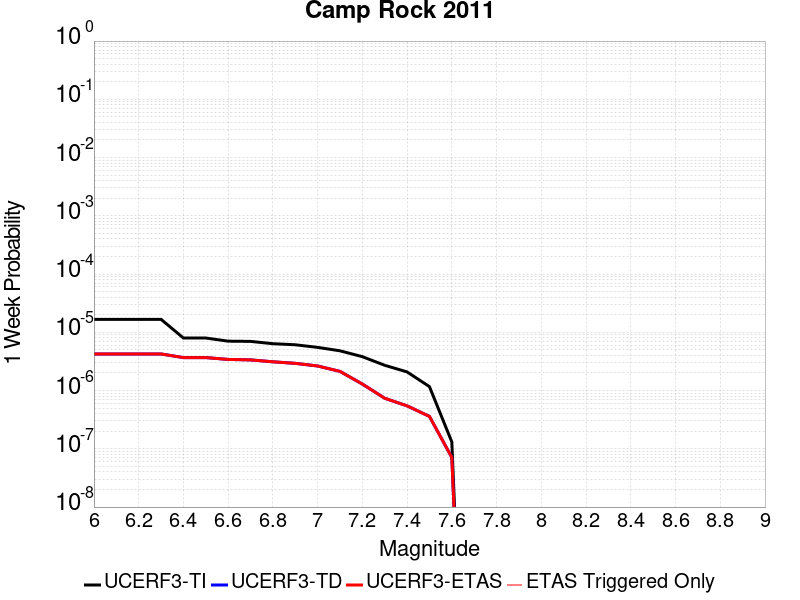 | 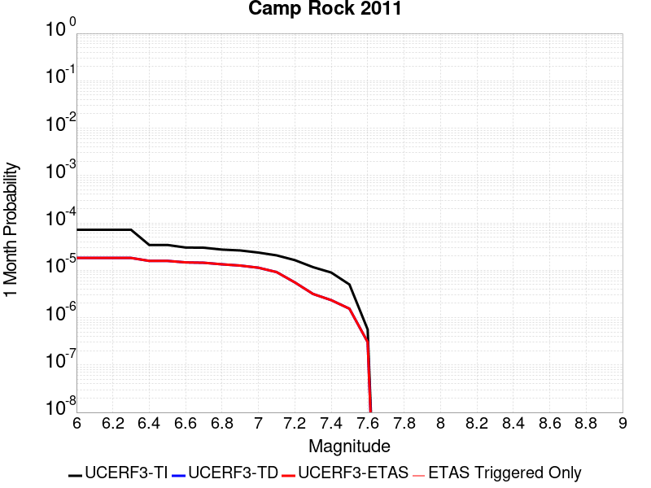 |  | 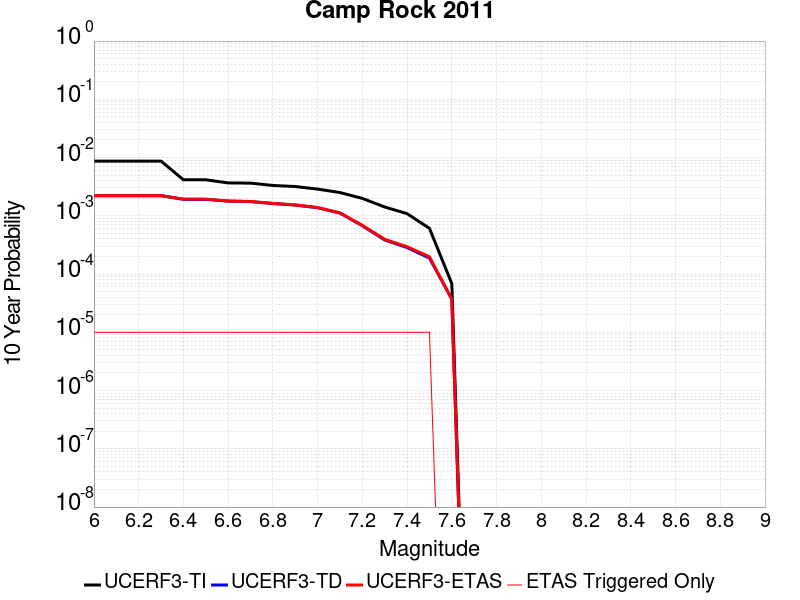 |

| Magnitude | 1 wk TI Prob | 1 wk TD Prob | 1 wk ETAS Prob | 1 wk ETAS/TD Gain | 1 wk ETAS Triggered Only | 1 mo TI Prob | 1 mo TD Prob | 1 mo ETAS Prob | 1 mo ETAS/TD Gain | 1 mo ETAS Triggered Only | 1 yr TI Prob | 1 yr TD Prob | 1 yr ETAS Prob | 1 yr ETAS/TD Gain | 1 yr ETAS Triggered Only | 10 yr TI Prob | 10 yr TD Prob | 10 yr ETAS Prob | 10 yr ETAS/TD Gain | 10 yr ETAS Triggered Only |
|-----|-----|-----|-----|-----|-----|-----|-----|-----|-----|-----|-----|-----|-----|-----|-----|-----|-----|-----|-----|-----|
| 6.0 | 1.6710783E-5 | 4.249992E-6 | 4.249992E-6 | 1.0 | 0.0 | 7.161568E-5 | 1.8214127E-5 | 1.8214127E-5 | 1.0 | 0.0 | 8.7157206E-4 | 2.2173495E-4 | 2.2173495E-4 | 1.0 | 0.0 | 0.008681616 | 0.00221519 | 0.0022251678 | 1.0045043 | 1.0E-5 |
| 6.1 | 1.6710783E-5 | 4.249992E-6 | 4.249992E-6 | 1.0 | 0.0 | 7.161568E-5 | 1.8214127E-5 | 1.8214127E-5 | 1.0 | 0.0 | 8.7157206E-4 | 2.2173495E-4 | 2.2173495E-4 | 1.0 | 0.0 | 0.008681616 | 0.00221519 | 0.0022251678 | 1.0045043 | 1.0E-5 |
| 6.2 | 1.6710783E-5 | 4.249992E-6 | 4.249992E-6 | 1.0 | 0.0 | 7.161568E-5 | 1.8214127E-5 | 1.8214127E-5 | 1.0 | 0.0 | 8.7157206E-4 | 2.2173495E-4 | 2.2173495E-4 | 1.0 | 0.0 | 0.008681616 | 0.00221519 | 0.0022251678 | 1.0045043 | 1.0E-5 |
| 6.3 | 1.6710783E-5 | 4.249992E-6 | 4.249992E-6 | 1.0 | 0.0 | 7.161568E-5 | 1.8214127E-5 | 1.8214127E-5 | 1.0 | 0.0 | 8.7157206E-4 | 2.2173495E-4 | 2.2173495E-4 | 1.0 | 0.0 | 0.008681616 | 0.00221519 | 0.0022251678 | 1.0045043 | 1.0E-5 |
| 6.4 | 7.982846E-6 | 3.682029E-6 | 3.682029E-6 | 1.0 | 0.0 | 3.421175E-5 | 1.5780031E-5 | 1.5780031E-5 | 1.0 | 0.0 | 4.1644843E-4 | 1.9210529E-4 | 1.9210529E-4 | 1.0 | 0.0 | 0.0041566887 | 0.0019194271 | 0.0019294078 | 1.0051999 | 1.0E-5 |
| 6.5 | 7.982846E-6 | 3.682029E-6 | 3.682029E-6 | 1.0 | 0.0 | 3.421175E-5 | 1.5780031E-5 | 1.5780031E-5 | 1.0 | 0.0 | 4.1644843E-4 | 1.9210529E-4 | 1.9210529E-4 | 1.0 | 0.0 | 0.0041566887 | 0.0019194271 | 0.0019294078 | 1.0051999 | 1.0E-5 |
| 6.6 | 7.048869E-6 | 3.4242933E-6 | 3.4242933E-6 | 1.0 | 0.0 | 3.0209088E-5 | 1.4675462E-5 | 1.4675462E-5 | 1.0 | 0.0 | 3.677336E-4 | 1.7865942E-4 | 1.7865942E-4 | 1.0 | 0.0 | 0.0036712566 | 0.0017851895 | 0.0017951716 | 1.0055916 | 1.0E-5 |
| 6.7 | 6.987307E-6 | 3.362271E-6 | 3.362271E-6 | 1.0 | 0.0 | 2.9945259E-5 | 1.4409655E-5 | 1.4409655E-5 | 1.0 | 0.0 | 3.6452254E-4 | 1.7542373E-4 | 1.7542373E-4 | 1.0 | 0.0 | 0.0036392517 | 0.0017528838 | 0.0017628663 | 1.0056949 | 1.0E-5 |
| 6.8 | 6.3737602E-6 | 3.117861E-6 | 3.117861E-6 | 1.0 | 0.0 | 2.731583E-5 | 1.3362195E-5 | 1.3362195E-5 | 1.0 | 0.0 | 3.3251947E-4 | 1.6267286E-4 | 1.6267286E-4 | 1.0 | 0.0 | 0.0033202237 | 0.0016255665 | 0.0016355502 | 1.0061417 | 1.0E-5 |
| 6.9 | 6.112211E-6 | 2.933072E-6 | 2.933072E-6 | 1.0 | 0.0 | 2.6194928E-5 | 1.2570249E-5 | 1.2570249E-5 | 1.0 | 0.0 | 3.1887658E-4 | 1.5303232E-4 | 1.5303232E-4 | 1.0 | 0.0 | 0.003184194 | 0.0015292971 | 0.0015392818 | 1.006529 | 1.0E-5 |
| 7.0 | 5.5140117E-6 | 2.641904E-6 | 2.641904E-6 | 1.0 | 0.0 | 2.3631264E-5 | 1.1322398E-5 | 1.1322398E-5 | 1.0 | 0.0 | 2.8767265E-4 | 1.3784174E-4 | 1.3784174E-4 | 1.0 | 0.0 | 0.0028730053 | 0.0013775876 | 0.0013875738 | 1.0072491 | 1.0E-5 |
| 7.1 | 4.8151105E-6 | 2.1342557E-6 | 2.1342557E-6 | 1.0 | 0.0 | 2.0636026E-5 | 9.14678E-6 | 9.14678E-6 | 1.0 | 0.0 | 2.5121463E-4 | 1.11356574E-4 | 1.11356574E-4 | 1.0 | 0.0 | 0.0025093083 | 0.0011130297 | 0.0011230186 | 1.0089744 | 1.0E-5 |
| 7.2 | 3.818335E-6 | 1.2937331E-6 | 1.2937331E-6 | 1.0 | 0.0 | 1.6364189E-5 | 5.544559E-6 | 5.544559E-6 | 1.0 | 0.0 | 1.9921579E-4 | 6.7502995E-5 | 6.7502995E-5 | 1.0 | 0.0 | 0.0019903728 | 6.748332E-4 | 6.848264E-4 | 1.0148085 | 1.0E-5 |
| 7.3 | 2.7166698E-6 | 7.3830375E-7 | 7.3830375E-7 | 1.0 | 0.0 | 1.1642818E-5 | 3.1641553E-6 | 3.1641553E-6 | 1.0 | 0.0 | 1.4174209E-4 | 3.852293E-5 | 3.852293E-5 | 1.0 | 0.0 | 0.0014165172 | 3.8516452E-4 | 3.9516066E-4 | 1.0259529 | 1.0E-5 |
| 7.4 | 2.0893426E-6 | 5.461424E-7 | 5.461424E-7 | 1.0 | 0.0 | 8.954295E-6 | 2.3406083E-6 | 2.3406083E-6 | 1.0 | 0.0 | 1.0901308E-4 | 2.8496537E-5 | 2.8496537E-5 | 1.0 | 0.0 | 0.0010895962 | 2.8492938E-4 | 2.9492652E-4 | 1.0350864 | 1.0E-5 |
| 7.5 | 1.1681728E-6 | 3.6028206E-7 | 3.6028206E-7 | 1.0 | 0.0 | 5.0064455E-6 | 1.5440651E-6 | 1.5440651E-6 | 1.0 | 0.0 | 6.0951766E-5 | 1.8798835E-5 | 1.8798835E-5 | 1.0 | 0.0 | 6.093505E-4 | 1.8797291E-4 | 1.9797104E-4 | 1.0531892 | 1.0E-5 |
| 7.6 | 1.3154387E-7 | 7.1196375E-8 | 7.1196375E-8 | 1.0 | 0.0 | 5.6375933E-7 | 3.051273E-7 | 3.051273E-7 | 1.0 | 0.0 | 6.863748E-6 | 3.71492E-6 | 3.71492E-6 | 1.0 | 0.0 | 6.863536E-5 | 3.7148737E-5 | 3.7148737E-5 | 1.0 | 0.0 |

## San Jacinto (Clark) rev
*[(top)](#table-of-contents)*

| 1 Week | 1 Month | 1 Year | 10 Year |
|-----|-----|-----|-----|
|  |  |  |  |

| Magnitude | 1 wk TI Prob | 1 wk TD Prob | 1 wk ETAS Prob | 1 wk ETAS/TD Gain | 1 wk ETAS Triggered Only | 1 mo TI Prob | 1 mo TD Prob | 1 mo ETAS Prob | 1 mo ETAS/TD Gain | 1 mo ETAS Triggered Only | 1 yr TI Prob | 1 yr TD Prob | 1 yr ETAS Prob | 1 yr ETAS/TD Gain | 1 yr ETAS Triggered Only | 10 yr TI Prob | 10 yr TD Prob | 10 yr ETAS Prob | 10 yr ETAS/TD Gain | 10 yr ETAS Triggered Only |
|-----|-----|-----|-----|-----|-----|-----|-----|-----|-----|-----|-----|-----|-----|-----|-----|-----|-----|-----|-----|-----|
| 6.0 | 4.482615E-5 | 2.1148431E-5 | 2.1148431E-5 | 1.0 | 0.0 | 1.9209793E-4 | 9.063304E-5 | 9.063304E-5 | 1.0 | 0.0 | 0.0023362834 | 0.0011029079 | 0.0011029079 | 1.0 | 0.0 | 0.02311874 | 0.011478677 | 0.011488562 | 1.0008612 | 1.0E-5 |
| 6.1 | 4.482615E-5 | 2.1148431E-5 | 2.1148431E-5 | 1.0 | 0.0 | 1.9209793E-4 | 9.063304E-5 | 9.063304E-5 | 1.0 | 0.0 | 0.0023362834 | 0.0011029079 | 0.0011029079 | 1.0 | 0.0 | 0.02311874 | 0.011478677 | 0.011488562 | 1.0008612 | 1.0E-5 |
| 6.2 | 4.482615E-5 | 2.1148431E-5 | 2.1148431E-5 | 1.0 | 0.0 | 1.9209793E-4 | 9.063304E-5 | 9.063304E-5 | 1.0 | 0.0 | 0.0023362834 | 0.0011029079 | 0.0011029079 | 1.0 | 0.0 | 0.02311874 | 0.011478677 | 0.011488562 | 1.0008612 | 1.0E-5 |
| 6.3 | 4.482615E-5 | 2.1148431E-5 | 2.1148431E-5 | 1.0 | 0.0 | 1.9209793E-4 | 9.063304E-5 | 9.063304E-5 | 1.0 | 0.0 | 0.0023362834 | 0.0011029079 | 0.0011029079 | 1.0 | 0.0 | 0.02311874 | 0.011478677 | 0.011488562 | 1.0008612 | 1.0E-5 |
| 6.4 | 4.482615E-5 | 2.1148431E-5 | 2.1148431E-5 | 1.0 | 0.0 | 1.9209793E-4 | 9.063304E-5 | 9.063304E-5 | 1.0 | 0.0 | 0.0023362834 | 0.0011029079 | 0.0011029079 | 1.0 | 0.0 | 0.02311874 | 0.011478677 | 0.011488562 | 1.0008612 | 1.0E-5 |
| 6.5 | 3.7294863E-5 | 1.735004E-5 | 1.735004E-5 | 1.0 | 0.0 | 1.5982533E-4 | 7.4355215E-5 | 7.4355215E-5 | 1.0 | 0.0 | 0.0019441366 | 9.049032E-4 | 9.049032E-4 | 1.0 | 0.0 | 0.01927216 | 0.009478857 | 0.009488761 | 1.001045 | 1.0E-5 |
| 6.6 | 3.7294863E-5 | 1.735004E-5 | 1.735004E-5 | 1.0 | 0.0 | 1.5982533E-4 | 7.4355215E-5 | 7.4355215E-5 | 1.0 | 0.0 | 0.0019441366 | 9.049032E-4 | 9.049032E-4 | 1.0 | 0.0 | 0.01927216 | 0.009478857 | 0.009488761 | 1.001045 | 1.0E-5 |
| 6.7 | 3.6039248E-5 | 1.6598056E-5 | 1.6598056E-5 | 1.0 | 0.0 | 1.5444479E-4 | 7.113261E-5 | 7.113261E-5 | 1.0 | 0.0 | 0.0018787434 | 8.6569955E-4 | 8.6569955E-4 | 1.0 | 0.0 | 0.01862939 | 0.00908114 | 0.009091049 | 1.0010912 | 1.0E-5 |
| 6.8 | 3.5031844E-5 | 1.6226495E-5 | 1.6226495E-5 | 1.0 | 0.0 | 1.5012783E-4 | 6.954029E-5 | 6.954029E-5 | 1.0 | 0.0 | 0.0018262739 | 8.463283E-4 | 8.463283E-4 | 1.0 | 0.0 | 0.01811338 | 0.0088817375 | 0.008891649 | 1.0011159 | 1.0E-5 |
| 6.9 | 3.435112E-5 | 1.605703E-5 | 1.605703E-5 | 1.0 | 0.0 | 1.4721078E-4 | 6.881406E-5 | 6.881406E-5 | 1.0 | 0.0 | 0.0017908178 | 8.3749316E-4 | 8.3749316E-4 | 1.0 | 0.0 | 0.017764548 | 0.008789461 | 0.008799373 | 1.0011277 | 1.0E-5 |
| 7.0 | 2.8959772E-5 | 1.4330898E-5 | 1.4330898E-5 | 1.0 | 0.0 | 1.241074E-4 | 6.14167E-5 | 6.14167E-5 | 1.0 | 0.0 | 0.0015099603 | 7.4749463E-4 | 7.4749463E-4 | 1.0 | 0.0 | 0.014997416 | 0.007861273 | 0.007871195 | 1.0012621 | 1.0E-5 |
| 7.1 | 2.6002877E-5 | 1.2823071E-5 | 1.2823071E-5 | 1.0 | 0.0 | 1.11436144E-4 | 5.4954875E-5 | 5.4954875E-5 | 1.0 | 0.0 | 0.0013558907 | 6.688723E-4 | 6.688723E-4 | 1.0 | 0.0 | 0.013476475 | 0.00704128 | 0.00705121 | 1.0014102 | 1.0E-5 |
| 7.2 | 2.2544838E-5 | 1.1255716E-5 | 1.1255716E-5 | 1.0 | 0.0 | 9.661716E-5 | 4.82379E-5 | 4.82379E-5 | 1.0 | 0.0 | 0.001175679 | 5.871396E-4 | 5.871396E-4 | 1.0 | 0.0 | 0.011694785 | 0.0061900634 | 0.0062000016 | 1.0016055 | 1.0E-5 |
| 7.3 | 1.75334E-5 | 1.0805979E-5 | 1.0805979E-5 | 1.0 | 0.0 | 7.514098E-5 | 4.6310524E-5 | 4.6310524E-5 | 1.0 | 0.0 | 9.144575E-4 | 5.636862E-4 | 5.636862E-4 | 1.0 | 0.0 | 0.009107036 | 0.0059307297 | 0.0059406706 | 1.0016761 | 1.0E-5 |
| 7.4 | 1.5924552E-5 | 1.0605883E-5 | 1.0605883E-5 | 1.0 | 0.0 | 6.82463E-5 | 4.5453E-5 | 4.5453E-5 | 1.0 | 0.0 | 8.305819E-4 | 5.532511E-4 | 5.532511E-4 | 1.0 | 0.0 | 0.008274844 | 0.0058181193 | 0.005828061 | 1.0017087 | 1.0E-5 |
| 7.5 | 1.3428931E-5 | 9.84653E-6 | 9.84653E-6 | 1.0 | 0.0 | 5.7551293E-5 | 4.219874E-5 | 4.219874E-5 | 1.0 | 0.0 | 7.004617E-4 | 5.136496E-4 | 5.136496E-4 | 1.0 | 0.0 | 0.006982579 | 0.0054038092 | 0.0054137553 | 1.0018406 | 1.0E-5 |
| 7.6 | 1.0688787E-5 | 8.609963E-6 | 8.609963E-6 | 1.0 | 0.0 | 4.5808283E-5 | 3.689932E-5 | 3.689932E-5 | 1.0 | 0.0 | 5.5757316E-4 | 4.491571E-4 | 4.491571E-4 | 1.0 | 0.0 | 0.005561762 | 0.0047391006 | 0.004749053 | 1.0021001 | 1.0E-5 |
| 7.7 | 8.81236E-6 | 7.4664786E-6 | 7.4664786E-6 | 1.0 | 0.0 | 3.776671E-5 | 3.1998803E-5 | 3.1998803E-5 | 1.0 | 0.0 | 4.597127E-4 | 3.8951598E-4 | 3.8951598E-4 | 1.0 | 0.0 | 0.0045876284 | 0.0041340096 | 0.004143968 | 1.002409 | 1.0E-5 |
| 7.8 | 7.780431E-6 | 6.695141E-6 | 6.695141E-6 | 1.0 | 0.0 | 3.3344273E-5 | 2.8693148E-5 | 2.8693148E-5 | 1.0 | 0.0 | 4.0589093E-4 | 3.4928325E-4 | 3.4928325E-4 | 1.0 | 0.0 | 0.0040515037 | 0.0037221527 | 0.0037321155 | 1.0026766 | 1.0E-5 |
| 7.9 | 6.5437994E-6 | 5.7790494E-6 | 5.7790494E-6 | 1.0 | 0.0 | 2.8044553E-5 | 2.4767121E-5 | 2.4767121E-5 | 1.0 | 0.0 | 3.4138895E-4 | 3.0149813E-4 | 3.0149813E-4 | 1.0 | 0.0 | 0.0034086495 | 0.0032338423 | 0.00324381 | 1.0030823 | 1.0E-5 |
| 8.0 | 5.4488164E-6 | 4.812146E-6 | 4.812146E-6 | 1.0 | 0.0 | 2.3351862E-5 | 2.0623322E-5 | 2.0623322E-5 | 1.0 | 0.0 | 2.8427184E-4 | 2.5106015E-4 | 2.5106015E-4 | 1.0 | 0.0 | 0.0028390845 | 0.0027102758 | 0.002720249 | 1.0036796 | 1.0E-5 |
| 8.1 | 2.8397242E-6 | 1.3662986E-6 | 1.3662986E-6 | 1.0 | 0.0 | 1.217019E-5 | 5.855553E-6 | 5.855553E-6 | 1.0 | 0.0 | 1.4816198E-4 | 7.128903E-5 | 7.128903E-5 | 1.0 | 0.0 | 0.0014806325 | 8.111905E-4 | 8.211824E-4 | 1.0123175 | 1.0E-5 |
| 8.2 | 2.030244E-6 | 6.3135167E-7 | 6.3135167E-7 | 1.0 | 0.0 | 8.701017E-6 | 2.70579E-6 | 2.70579E-6 | 1.0 | 0.0 | 1.05929736E-4 | 3.2942502E-5 | 3.2942502E-5 | 1.0 | 0.0 | 0.0010587925 | 3.9462151E-4 | 3.9462151E-4 | 1.0 | 0.0 |
| 8.3 | 1.0659804E-6 | 2.9222883E-7 | 2.9222883E-7 | 1.0 | 0.0 | 4.568479E-6 | 1.2524088E-6 | 1.2524088E-6 | 1.0 | 0.0 | 5.5619817E-5 | 1.5247973E-5 | 1.5247973E-5 | 1.0 | 0.0 | 5.5605895E-4 | 1.8551825E-4 | 1.8551825E-4 | 1.0 | 0.0 |

## Homestead Valley 2011
*[(top)](#table-of-contents)*

| 1 Week | 1 Month | 1 Year | 10 Year |
|-----|-----|-----|-----|
| 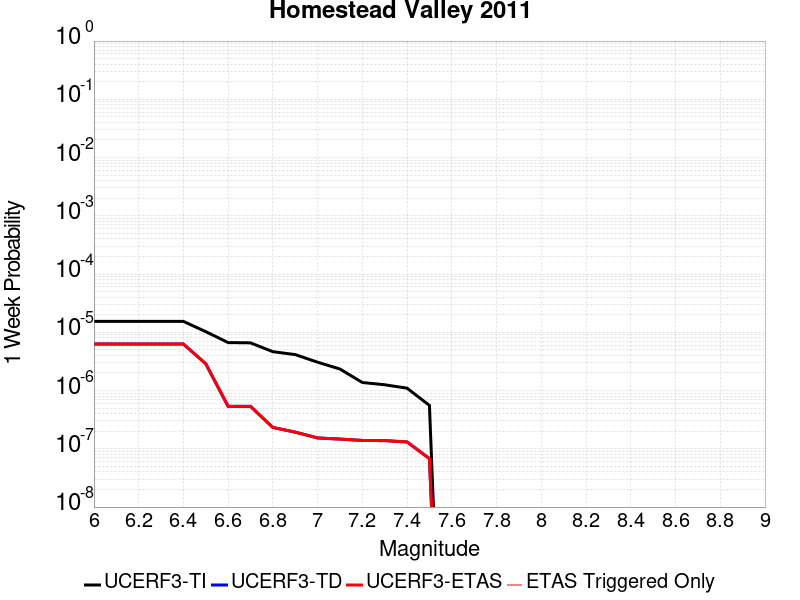 | 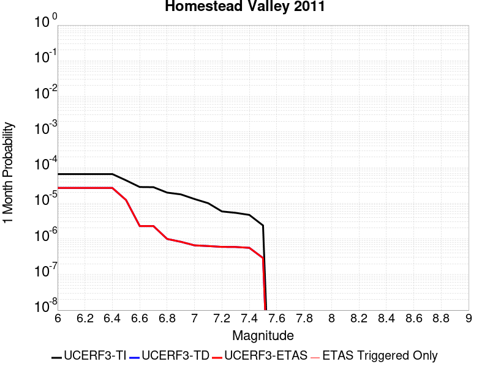 | 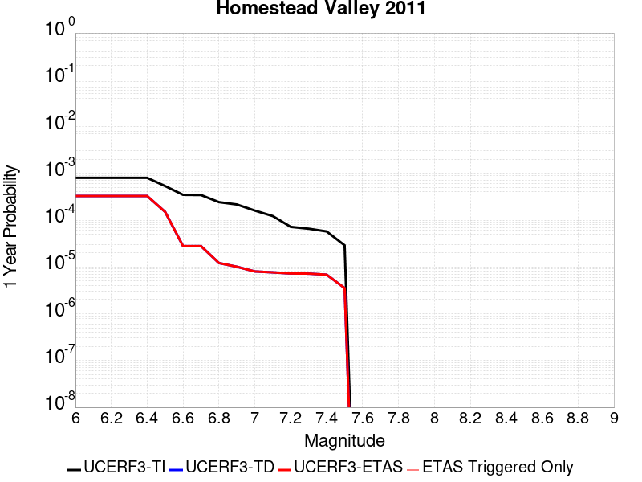 | 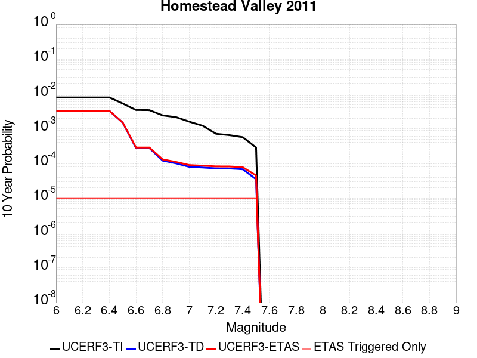 |

| Magnitude | 1 wk TI Prob | 1 wk TD Prob | 1 wk ETAS Prob | 1 wk ETAS/TD Gain | 1 wk ETAS Triggered Only | 1 mo TI Prob | 1 mo TD Prob | 1 mo ETAS Prob | 1 mo ETAS/TD Gain | 1 mo ETAS Triggered Only | 1 yr TI Prob | 1 yr TD Prob | 1 yr ETAS Prob | 1 yr ETAS/TD Gain | 1 yr ETAS Triggered Only | 10 yr TI Prob | 10 yr TD Prob | 10 yr ETAS Prob | 10 yr ETAS/TD Gain | 10 yr ETAS Triggered Only |
|-----|-----|-----|-----|-----|-----|-----|-----|-----|-----|-----|-----|-----|-----|-----|-----|-----|-----|-----|-----|-----|
| 6.0 | 1.539795E-5 | 6.2864615E-6 | 6.2864615E-6 | 1.0 | 0.0 | 6.5989545E-5 | 2.6941816E-5 | 2.6941816E-5 | 1.0 | 0.0 | 8.0312655E-4 | 3.2798786E-4 | 3.2798786E-4 | 1.0 | 0.0 | 0.008002302 | 0.0032770587 | 0.003287026 | 1.0030415 | 1.0E-5 |
| 6.1 | 1.539795E-5 | 6.2864615E-6 | 6.2864615E-6 | 1.0 | 0.0 | 6.5989545E-5 | 2.6941816E-5 | 2.6941816E-5 | 1.0 | 0.0 | 8.0312655E-4 | 3.2798786E-4 | 3.2798786E-4 | 1.0 | 0.0 | 0.008002302 | 0.0032770587 | 0.003287026 | 1.0030415 | 1.0E-5 |
| 6.2 | 1.539795E-5 | 6.2864615E-6 | 6.2864615E-6 | 1.0 | 0.0 | 6.5989545E-5 | 2.6941816E-5 | 2.6941816E-5 | 1.0 | 0.0 | 8.0312655E-4 | 3.2798786E-4 | 3.2798786E-4 | 1.0 | 0.0 | 0.008002302 | 0.0032770587 | 0.003287026 | 1.0030415 | 1.0E-5 |
| 6.3 | 1.539795E-5 | 6.2864615E-6 | 6.2864615E-6 | 1.0 | 0.0 | 6.5989545E-5 | 2.6941816E-5 | 2.6941816E-5 | 1.0 | 0.0 | 8.0312655E-4 | 3.2798786E-4 | 3.2798786E-4 | 1.0 | 0.0 | 0.008002302 | 0.0032770587 | 0.003287026 | 1.0030415 | 1.0E-5 |
| 6.4 | 1.539795E-5 | 6.2864615E-6 | 6.2864615E-6 | 1.0 | 0.0 | 6.5989545E-5 | 2.6941816E-5 | 2.6941816E-5 | 1.0 | 0.0 | 8.0312655E-4 | 3.2798786E-4 | 3.2798786E-4 | 1.0 | 0.0 | 0.008002302 | 0.0032770587 | 0.003287026 | 1.0030415 | 1.0E-5 |
| 6.5 | 1.0265258E-5 | 2.8786867E-6 | 2.8786867E-6 | 1.0 | 0.0 | 4.3993223E-5 | 1.2337209E-5 | 1.2337209E-5 | 1.0 | 0.0 | 5.3548586E-4 | 1.5020212E-4 | 1.5020212E-4 | 1.0 | 0.0 | 0.005341973 | 0.001501688 | 0.0015116731 | 1.0066491 | 1.0E-5 |
| 6.6 | 6.664671E-6 | 5.3438487E-7 | 5.3438487E-7 | 1.0 | 0.0 | 2.8562565E-5 | 2.2902195E-6 | 2.2902195E-6 | 1.0 | 0.0 | 3.476937E-4 | 2.7883183E-5 | 2.7883183E-5 | 1.0 | 0.0 | 0.003471502 | 2.7880847E-4 | 2.8880566E-4 | 1.035857 | 1.0E-5 |
| 6.7 | 6.5954046E-6 | 5.3438487E-7 | 5.3438487E-7 | 1.0 | 0.0 | 2.8265715E-5 | 2.2902195E-6 | 2.2902195E-6 | 1.0 | 0.0 | 3.4408073E-4 | 2.7883183E-5 | 2.7883183E-5 | 1.0 | 0.0 | 0.0034354846 | 2.7880847E-4 | 2.8880566E-4 | 1.035857 | 1.0E-5 |
| 6.8 | 4.648189E-6 | 2.3257135E-7 | 2.3257135E-7 | 1.0 | 0.0 | 1.9920659E-5 | 9.96734E-7 | 9.96734E-7 | 1.0 | 0.0 | 2.4250703E-4 | 1.2135173E-5 | 1.2135173E-5 | 1.0 | 0.0 | 0.0024224254 | 1.2134559E-4 | 1.3134438E-4 | 1.0823992 | 1.0E-5 |
| 6.9 | 4.1428534E-6 | 1.9342674E-7 | 1.9342674E-7 | 1.0 | 0.0 | 1.7754966E-5 | 8.289715E-7 | 8.289715E-7 | 1.0 | 0.0 | 2.1614527E-4 | 1.00926845E-5 | 1.00926845E-5 | 1.0 | 0.0 | 0.0021593515 | 1.0092255E-4 | 1.10921545E-4 | 1.0990759 | 1.0E-5 |
| 7.0 | 3.0673707E-6 | 1.5364239E-7 | 1.5364239E-7 | 1.0 | 0.0 | 1.3145808E-5 | 6.5846723E-7 | 6.5846723E-7 | 1.0 | 0.0 | 1.6003846E-4 | 8.01681E-6 | 8.01681E-6 | 1.0 | 0.0 | 0.0015992324 | 8.0165315E-5 | 9.016451E-5 | 1.1247323 | 1.0E-5 |
| 7.1 | 2.340854E-6 | 1.4684625E-7 | 1.4684625E-7 | 1.0 | 0.0 | 1.0032193E-5 | 6.293409E-7 | 6.293409E-7 | 1.0 | 0.0 | 1.221351E-4 | 7.6622E-6 | 7.6622E-6 | 1.0 | 0.0 | 0.00122068 | 7.661946E-5 | 8.661869E-5 | 1.1305052 | 1.0E-5 |
| 7.2 | 1.3754182E-6 | 1.392005E-7 | 1.392005E-7 | 1.0 | 0.0 | 5.8946357E-6 | 5.9657344E-7 | 5.9657344E-7 | 1.0 | 0.0 | 7.176483E-5 | 7.2632583E-6 | 7.2632583E-6 | 1.0 | 0.0 | 7.174166E-4 | 7.2630304E-5 | 8.262957E-5 | 1.1376736 | 1.0E-5 |
| 7.3 | 1.2573237E-6 | 1.3824602E-7 | 1.3824602E-7 | 1.0 | 0.0 | 5.388519E-6 | 5.924828E-7 | 5.924828E-7 | 1.0 | 0.0 | 6.560324E-5 | 7.213455E-6 | 7.213455E-6 | 1.0 | 0.0 | 6.558388E-4 | 7.21323E-5 | 8.213158E-5 | 1.1386242 | 1.0E-5 |
| 7.4 | 1.0994207E-6 | 1.310381E-7 | 1.310381E-7 | 1.0 | 0.0 | 4.7117946E-6 | 5.615918E-7 | 5.615918E-7 | 1.0 | 0.0 | 5.736459E-5 | 6.8373597E-6 | 6.8373597E-6 | 1.0 | 0.0 | 5.734978E-4 | 6.8371584E-5 | 7.8370904E-5 | 1.1462497 | 1.0E-5 |
| 7.5 | 5.5569126E-7 | 6.771724E-8 | 6.771724E-8 | 1.0 | 0.0 | 2.3815317E-6 | 2.902167E-7 | 2.902167E-7 | 1.0 | 0.0 | 2.8994764E-5 | 3.5333833E-6 | 3.5333833E-6 | 1.0 | 0.0 | 2.899098E-4 | 3.5333334E-5 | 4.533298E-5 | 1.2830088 | 1.0E-5 |

## Morales (West)
*[(top)](#table-of-contents)*

| 1 Week | 1 Month | 1 Year | 10 Year |
|-----|-----|-----|-----|
|  |  |  |  |

| Magnitude | 1 wk TI Prob | 1 wk TD Prob | 1 wk ETAS Prob | 1 wk ETAS/TD Gain | 1 wk ETAS Triggered Only | 1 mo TI Prob | 1 mo TD Prob | 1 mo ETAS Prob | 1 mo ETAS/TD Gain | 1 mo ETAS Triggered Only | 1 yr TI Prob | 1 yr TD Prob | 1 yr ETAS Prob | 1 yr ETAS/TD Gain | 1 yr ETAS Triggered Only | 10 yr TI Prob | 10 yr TD Prob | 10 yr ETAS Prob | 10 yr ETAS/TD Gain | 10 yr ETAS Triggered Only |
|-----|-----|-----|-----|-----|-----|-----|-----|-----|-----|-----|-----|-----|-----|-----|-----|-----|-----|-----|-----|-----|
| 6.0 | 1.4027072E-6 | 1.4791476E-6 | 1.4791476E-6 | 1.0 | 0.0 | 6.0115885E-6 | 6.339192E-6 | 6.339192E-6 | 1.0 | 0.0 | 7.318863E-5 | 7.717763E-5 | 8.7176864E-5 | 1.1295612 | 1.0E-5 | 7.316453E-4 | 7.7157683E-4 | 7.815691E-4 | 1.0129504 | 1.0E-5 |
| 6.1 | 1.4027072E-6 | 1.4791476E-6 | 1.4791476E-6 | 1.0 | 0.0 | 6.0115885E-6 | 6.339192E-6 | 6.339192E-6 | 1.0 | 0.0 | 7.318863E-5 | 7.717763E-5 | 8.7176864E-5 | 1.1295612 | 1.0E-5 | 7.316453E-4 | 7.7157683E-4 | 7.815691E-4 | 1.0129504 | 1.0E-5 |
| 6.2 | 1.4027072E-6 | 1.4791476E-6 | 1.4791476E-6 | 1.0 | 0.0 | 6.0115885E-6 | 6.339192E-6 | 6.339192E-6 | 1.0 | 0.0 | 7.318863E-5 | 7.717763E-5 | 8.7176864E-5 | 1.1295612 | 1.0E-5 | 7.316453E-4 | 7.7157683E-4 | 7.815691E-4 | 1.0129504 | 1.0E-5 |
| 6.3 | 1.4027072E-6 | 1.4791476E-6 | 1.4791476E-6 | 1.0 | 0.0 | 6.0115885E-6 | 6.339192E-6 | 6.339192E-6 | 1.0 | 0.0 | 7.318863E-5 | 7.717763E-5 | 8.7176864E-5 | 1.1295612 | 1.0E-5 | 7.316453E-4 | 7.7157683E-4 | 7.815691E-4 | 1.0129504 | 1.0E-5 |
| 6.4 | 6.504502E-7 | 7.2037835E-7 | 7.2037835E-7 | 1.0 | 0.0 | 2.7876408E-6 | 3.087332E-6 | 3.087332E-6 | 1.0 | 0.0 | 3.3939E-5 | 3.7587633E-5 | 3.7587633E-5 | 1.0 | 0.0 | 3.3933815E-4 | 3.7581392E-4 | 3.7581392E-4 | 1.0 | 0.0 |
| 6.5 | 6.504502E-7 | 7.2037835E-7 | 7.2037835E-7 | 1.0 | 0.0 | 2.7876408E-6 | 3.087332E-6 | 3.087332E-6 | 1.0 | 0.0 | 3.3939E-5 | 3.7587633E-5 | 3.7587633E-5 | 1.0 | 0.0 | 3.3933815E-4 | 3.7581392E-4 | 3.7581392E-4 | 1.0 | 0.0 |
| 6.6 | 5.8056526E-7 | 6.500043E-7 | 6.500043E-7 | 1.0 | 0.0 | 2.4881344E-6 | 2.78573E-6 | 2.78573E-6 | 1.0 | 0.0 | 3.0292615E-5 | 3.391574E-5 | 3.391574E-5 | 1.0 | 0.0 | 3.0288487E-4 | 3.3910625E-4 | 3.3910625E-4 | 1.0 | 0.0 |
| 6.7 | 5.741448E-7 | 6.435355E-7 | 6.435355E-7 | 1.0 | 0.0 | 2.4606184E-6 | 2.7580063E-6 | 2.7580063E-6 | 1.0 | 0.0 | 2.9957617E-5 | 3.3578213E-5 | 3.3578213E-5 | 1.0 | 0.0 | 2.9953578E-4 | 3.35732E-4 | 3.35732E-4 | 1.0 | 0.0 |
| 6.8 | 5.299428E-7 | 5.890803E-7 | 5.890803E-7 | 1.0 | 0.0 | 2.2711813E-6 | 2.5246275E-6 | 2.5246275E-6 | 1.0 | 0.0 | 2.7651282E-5 | 3.073691E-5 | 3.073691E-5 | 1.0 | 0.0 | 2.7647841E-4 | 3.0732705E-4 | 3.0732705E-4 | 1.0 | 0.0 |
| 6.9 | 4.82394E-7 | 5.3415795E-7 | 5.3415795E-7 | 1.0 | 0.0 | 2.0674013E-6 | 2.2892464E-6 | 2.2892464E-6 | 1.0 | 0.0 | 2.517032E-5 | 2.7871223E-5 | 2.7871223E-5 | 1.0 | 0.0 | 2.516747E-4 | 2.7867767E-4 | 2.7867767E-4 | 1.0 | 0.0 |
| 7.0 | 4.3264512E-7 | 4.759762E-7 | 4.759762E-7 | 1.0 | 0.0 | 1.8541921E-6 | 2.0398963E-6 | 2.0398963E-6 | 1.0 | 0.0 | 2.2574555E-5 | 2.4835459E-5 | 2.4835459E-5 | 1.0 | 0.0 | 2.2572262E-4 | 2.4832715E-4 | 2.4832715E-4 | 1.0 | 0.0 |
| 7.1 | 3.7388565E-7 | 4.0002755E-7 | 4.0002755E-7 | 1.0 | 0.0 | 1.6023661E-6 | 1.7144026E-6 | 1.7144026E-6 | 1.0 | 0.0 | 1.9508632E-5 | 2.0872654E-5 | 2.0872654E-5 | 1.0 | 0.0 | 1.950692E-4 | 2.0870718E-4 | 2.0870718E-4 | 1.0 | 0.0 |
| 7.2 | 3.1592543E-7 | 3.319798E-7 | 3.319798E-7 | 1.0 | 0.0 | 1.3539654E-6 | 1.4227697E-6 | 1.4227697E-6 | 1.0 | 0.0 | 1.6484404E-5 | 1.7322085E-5 | 1.7322085E-5 | 1.0 | 0.0 | 1.6483181E-4 | 1.7320753E-4 | 1.7320753E-4 | 1.0 | 0.0 |
| 7.3 | 2.2677783E-7 | 2.1792827E-7 | 2.1792827E-7 | 1.0 | 0.0 | 9.719047E-7 | 9.3397796E-7 | 9.3397796E-7 | 1.0 | 0.0 | 1.1832874E-5 | 1.1371123E-5 | 1.1371123E-5 | 1.0 | 0.0 | 1.18322445E-4 | 1.1370546E-4 | 1.1370546E-4 | 1.0 | 0.0 |
| 7.4 | 1.2295531E-7 | 8.350101E-8 | 8.350101E-8 | 1.0 | 0.0 | 5.269512E-7 | 3.578614E-7 | 3.578614E-7 | 1.0 | 0.0 | 6.4156125E-6 | 4.356954E-6 | 4.356954E-6 | 1.0 | 0.0 | 6.415427E-5 | 4.356869E-5 | 4.356869E-5 | 1.0 | 0.0 |
| 7.5 | 9.9632544E-8 | 5.4425204E-8 | 5.4425204E-8 | 1.0 | 0.0 | 4.2699656E-7 | 2.3325086E-7 | 2.3325086E-7 | 1.0 | 0.0 | 5.198671E-6 | 2.8398254E-6 | 2.8398254E-6 | 1.0 | 0.0 | 5.198549E-5 | 2.8397893E-5 | 2.8397893E-5 | 1.0 | 0.0 |
| 7.6 | 8.125894E-8 | 3.5944545E-8 | 3.5944545E-8 | 1.0 | 0.0 | 3.4825257E-7 | 1.5404804E-7 | 1.5404804E-7 | 1.0 | 0.0 | 4.2399665E-6 | 1.8755331E-6 | 1.8755331E-6 | 1.0 | 0.0 | 4.2398857E-5 | 1.8755176E-5 | 1.8755176E-5 | 1.0 | 0.0 |
| 7.7 | 5.1810765E-8 | 1.1638859E-8 | 1.1638859E-8 | 1.0 | 0.0 | 2.2204613E-7 | 4.9880814E-8 | 4.9880814E-8 | 1.0 | 0.0 | 2.7034082E-6 | 6.072988E-7 | 6.072988E-7 | 1.0 | 0.0 | 2.7033753E-5 | 6.072972E-6 | 6.072972E-6 | 1.0 | 0.0 |
| 7.8 | 2.6315043E-8 | 2.3364786E-9 | 2.3364786E-9 | 1.0 | 0.0 | 1.1277875E-7 | 1.0013476E-8 | 1.0013476E-8 | 1.0 | 0.0 | 1.3730804E-6 | 1.2191407E-7 | 1.2191407E-7 | 1.0 | 0.0 | 1.3730719E-5 | 1.2191412E-6 | 1.2191412E-6 | 1.0 | 0.0 |
| 7.9 | 1.24281545E-8 | 4.2004267E-10 | 4.2004267E-10 | 1.0 | 0.0 | 5.3263516E-8 | 1.8001807E-9 | 1.8001807E-9 | 1.0 | 0.0 | 6.4848314E-7 | 2.1917202E-8 | 2.1917202E-8 | 1.0 | 0.0 | 6.4848123E-6 | 2.1917313E-7 | 2.1917313E-7 | 1.0 | 0.0 |
| 8.0 | 5.954214E-9 | 1.8475743E-10 | 1.8475743E-10 | 1.0 | 0.0 | 2.551806E-8 | 7.9181806E-10 | 7.9181806E-10 | 1.0 | 0.0 | 3.1068234E-7 | 9.640382E-9 | 9.640382E-9 | 1.0 | 0.0 | 3.1068191E-6 | 9.640492E-8 | 9.640492E-8 | 1.0 | 0.0 |
| 8.1 | 1.2586262E-9 | 8.335088E-11 | 8.335088E-11 | 1.0 | 0.0 | 5.3941123E-9 | 3.572178E-10 | 3.572178E-10 | 1.0 | 0.0 | 6.567332E-8 | 4.3491264E-9 | 4.3491264E-9 | 1.0 | 0.0 | 6.56733E-7 | 4.3492367E-8 | 4.3492367E-8 | 1.0 | 0.0 |

## Channel Islands Thrust
*[(top)](#table-of-contents)*

| 1 Week | 1 Month | 1 Year | 10 Year |
|-----|-----|-----|-----|
|  |  |  |  |

| Magnitude | 1 wk TI Prob | 1 wk TD Prob | 1 wk ETAS Prob | 1 wk ETAS/TD Gain | 1 wk ETAS Triggered Only | 1 mo TI Prob | 1 mo TD Prob | 1 mo ETAS Prob | 1 mo ETAS/TD Gain | 1 mo ETAS Triggered Only | 1 yr TI Prob | 1 yr TD Prob | 1 yr ETAS Prob | 1 yr ETAS/TD Gain | 1 yr ETAS Triggered Only | 10 yr TI Prob | 10 yr TD Prob | 10 yr ETAS Prob | 10 yr ETAS/TD Gain | 10 yr ETAS Triggered Only |
|-----|-----|-----|-----|-----|-----|-----|-----|-----|-----|-----|-----|-----|-----|-----|-----|-----|-----|-----|-----|-----|
| 6.0 | 2.2156251E-5 | 2.4091965E-5 | 2.4091965E-5 | 1.0 | 0.0 | 9.495191E-5 | 1.03247796E-4 | 1.03247796E-4 | 1.0 | 0.0 | 0.0011554264 | 0.0012564235 | 0.001266411 | 1.0079491 | 1.0E-5 | 0.011494373 | 0.012503792 | 0.012513666 | 1.0007898 | 1.0E-5 |
| 6.1 | 2.2156251E-5 | 2.4091965E-5 | 2.4091965E-5 | 1.0 | 0.0 | 9.495191E-5 | 1.03247796E-4 | 1.03247796E-4 | 1.0 | 0.0 | 0.0011554264 | 0.0012564235 | 0.001266411 | 1.0079491 | 1.0E-5 | 0.011494373 | 0.012503792 | 0.012513666 | 1.0007898 | 1.0E-5 |
| 6.2 | 2.2156251E-5 | 2.4091965E-5 | 2.4091965E-5 | 1.0 | 0.0 | 9.495191E-5 | 1.03247796E-4 | 1.03247796E-4 | 1.0 | 0.0 | 0.0011554264 | 0.0012564235 | 0.001266411 | 1.0079491 | 1.0E-5 | 0.011494373 | 0.012503792 | 0.012513666 | 1.0007898 | 1.0E-5 |
| 6.3 | 2.2156251E-5 | 2.4091965E-5 | 2.4091965E-5 | 1.0 | 0.0 | 9.495191E-5 | 1.03247796E-4 | 1.03247796E-4 | 1.0 | 0.0 | 0.0011554264 | 0.0012564235 | 0.001266411 | 1.0079491 | 1.0E-5 | 0.011494373 | 0.012503792 | 0.012513666 | 1.0007898 | 1.0E-5 |
| 6.4 | 2.2156251E-5 | 2.4091965E-5 | 2.4091965E-5 | 1.0 | 0.0 | 9.495191E-5 | 1.03247796E-4 | 1.03247796E-4 | 1.0 | 0.0 | 0.0011554264 | 0.0012564235 | 0.001266411 | 1.0079491 | 1.0E-5 | 0.011494373 | 0.012503792 | 0.012513666 | 1.0007898 | 1.0E-5 |
| 6.5 | 2.2156251E-5 | 2.4091965E-5 | 2.4091965E-5 | 1.0 | 0.0 | 9.495191E-5 | 1.03247796E-4 | 1.03247796E-4 | 1.0 | 0.0 | 0.0011554264 | 0.0012564235 | 0.001266411 | 1.0079491 | 1.0E-5 | 0.011494373 | 0.012503792 | 0.012513666 | 1.0007898 | 1.0E-5 |
| 6.6 | 2.2156251E-5 | 2.4091965E-5 | 2.4091965E-5 | 1.0 | 0.0 | 9.495191E-5 | 1.03247796E-4 | 1.03247796E-4 | 1.0 | 0.0 | 0.0011554264 | 0.0012564235 | 0.001266411 | 1.0079491 | 1.0E-5 | 0.011494373 | 0.012503792 | 0.012513666 | 1.0007898 | 1.0E-5 |
| 6.7 | 1.0601296E-5 | 1.1379521E-5 | 1.1379521E-5 | 1.0 | 0.0 | 4.5433335E-5 | 4.8768492E-5 | 4.8768492E-5 | 1.0 | 0.0 | 5.5301044E-4 | 5.935995E-4 | 6.035936E-4 | 1.0168364 | 1.0E-5 | 0.005516363 | 0.0059206416 | 0.0059305825 | 1.0016791 | 1.0E-5 |
| 6.8 | 1.0246747E-5 | 1.0996648E-5 | 1.0996648E-5 | 1.0 | 0.0 | 4.391389E-5 | 4.7127665E-5 | 4.7127665E-5 | 1.0 | 0.0 | 5.345204E-4 | 5.7363306E-4 | 5.836273E-4 | 1.0174228 | 1.0E-5 | 0.0053323656 | 0.005722014 | 0.0057319566 | 1.0017376 | 1.0E-5 |
| 6.9 | 9.049551E-6 | 9.6996255E-6 | 9.6996255E-6 | 1.0 | 0.0 | 3.878322E-5 | 4.1569187E-5 | 4.1569187E-5 | 1.0 | 0.0 | 4.7208337E-4 | 5.059914E-4 | 5.1598635E-4 | 1.0197532 | 1.0E-5 | 0.0047108172 | 0.0050488105 | 0.0050587603 | 1.0019706 | 1.0E-5 |
| 7.0 | 8.6542195E-6 | 9.274585E-6 | 9.274585E-6 | 1.0 | 0.0 | 3.7088983E-5 | 3.974764E-5 | 3.974764E-5 | 1.0 | 0.0 | 4.5146482E-4 | 4.8382414E-4 | 4.938193E-4 | 1.0206586 | 1.0E-5 | 0.004505487 | 0.00482812 | 0.0048380718 | 1.0020612 | 1.0E-5 |
| 7.1 | 8.391028E-6 | 8.992907E-6 | 8.992907E-6 | 1.0 | 0.0 | 3.5961057E-5 | 3.8540486E-5 | 3.8540486E-5 | 1.0 | 0.0 | 4.3773788E-4 | 4.6913346E-4 | 4.7912876E-4 | 1.0213059 | 1.0E-5 | 0.004368766 | 0.0046818415 | 0.0046917945 | 1.0021259 | 1.0E-5 |
| 7.2 | 5.965188E-6 | 6.371684E-6 | 6.371684E-6 | 1.0 | 0.0 | 2.556484E-5 | 2.7306933E-5 | 2.7306933E-5 | 1.0 | 0.0 | 3.1120746E-4 | 3.3241173E-4 | 3.4240843E-4 | 1.0300732 | 1.0E-5 | 0.00310772 | 0.0033192032 | 0.00332917 | 1.0030028 | 1.0E-5 |
| 7.3 | 4.877518E-6 | 5.2059972E-6 | 5.2059972E-6 | 1.0 | 0.0 | 2.0903482E-5 | 2.2311227E-5 | 2.2311227E-5 | 1.0 | 0.0 | 2.5447016E-4 | 2.716058E-4 | 2.8160308E-4 | 1.036808 | 1.0E-5 | 0.0025417898 | 0.0027127846 | 0.0027227574 | 1.0036763 | 1.0E-5 |
| 7.4 | 3.8829853E-6 | 4.1418552E-6 | 4.1418552E-6 | 1.0 | 0.0 | 1.664126E-5 | 1.775069E-5 | 1.775069E-5 | 1.0 | 0.0 | 2.0258849E-4 | 2.1609364E-4 | 2.1609364E-4 | 1.0 | 0.0 | 0.002024039 | 0.002158877 | 0.002158877 | 1.0 | 0.0 |
| 7.5 | 1.3489616E-6 | 1.4277881E-6 | 1.4277881E-6 | 1.0 | 0.0 | 5.7812517E-6 | 6.1190776E-6 | 6.1190776E-6 | 1.0 | 0.0 | 7.038446E-5 | 7.4497264E-5 | 7.4497264E-5 | 1.0 | 0.0 | 7.036218E-4 | 7.4472686E-4 | 7.4472686E-4 | 1.0 | 0.0 |
| 7.6 | 6.058192E-7 | 6.35377E-7 | 6.35377E-7 | 1.0 | 0.0 | 2.5963652E-6 | 2.7230412E-6 | 2.7230412E-6 | 1.0 | 0.0 | 3.161029E-5 | 3.315254E-5 | 3.315254E-5 | 1.0 | 0.0 | 3.1605794E-4 | 3.3147755E-4 | 3.3147755E-4 | 1.0 | 0.0 |
| 7.7 | 2.2170494E-7 | 2.2607891E-7 | 2.2607891E-7 | 1.0 | 0.0 | 9.5016367E-7 | 9.689093E-7 | 9.689093E-7 | 1.0 | 0.0 | 1.1568181E-5 | 1.1796418E-5 | 1.1796418E-5 | 1.0 | 0.0 | 1.1567579E-4 | 1.1795903E-4 | 1.1795903E-4 | 1.0 | 0.0 |
| 7.8 | 2.1613102E-8 | 1.5466837E-8 | 1.5466837E-8 | 1.0 | 0.0 | 9.262757E-8 | 6.628645E-8 | 6.628645E-8 | 1.0 | 0.0 | 1.1277401E-6 | 8.070372E-7 | 8.070372E-7 | 1.0 | 0.0 | 1.1277344E-5 | 8.07035E-6 | 8.07035E-6 | 1.0 | 0.0 |

## Laguna Salada
*[(top)](#table-of-contents)*

| 1 Week | 1 Month | 1 Year | 10 Year |
|-----|-----|-----|-----|
|  |  |  |  |

| Magnitude | 1 wk TI Prob | 1 wk TD Prob | 1 wk ETAS Prob | 1 wk ETAS/TD Gain | 1 wk ETAS Triggered Only | 1 mo TI Prob | 1 mo TD Prob | 1 mo ETAS Prob | 1 mo ETAS/TD Gain | 1 mo ETAS Triggered Only | 1 yr TI Prob | 1 yr TD Prob | 1 yr ETAS Prob | 1 yr ETAS/TD Gain | 1 yr ETAS Triggered Only | 10 yr TI Prob | 10 yr TD Prob | 10 yr ETAS Prob | 10 yr ETAS/TD Gain | 10 yr ETAS Triggered Only |
|-----|-----|-----|-----|-----|-----|-----|-----|-----|-----|-----|-----|-----|-----|-----|-----|-----|-----|-----|-----|-----|
| 6.0 | 4.6465593E-5 | 4.6344834E-5 | 5.634437E-5 | 1.2157638 | 1.0E-5 | 1.9912305E-4 | 1.9860645E-4 | 2.0860446E-4 | 1.0503409 | 1.0E-5 | 0.0024216278 | 0.0024154296 | 0.0024254054 | 1.00413 | 1.0E-5 | 0.02395408 | 0.02396623 | 0.02397599 | 1.0004072 | 1.0E-5 |
| 6.1 | 3.982297E-5 | 3.7244736E-5 | 3.7244736E-5 | 1.0 | 0.0 | 1.706587E-4 | 1.5961113E-4 | 1.5961113E-4 | 1.0 | 0.0 | 0.0020757897 | 0.0019416304 | 0.0019416304 | 1.0 | 0.0 | 0.020565065 | 0.019322935 | 0.019322935 | 1.0 | 0.0 |
| 6.2 | 3.6067784E-5 | 3.2600045E-5 | 3.2600045E-5 | 1.0 | 0.0 | 1.5456705E-4 | 1.3970752E-4 | 1.3970752E-4 | 1.0 | 0.0 | 0.0018802295 | 0.0016997065 | 0.0016997065 | 1.0 | 0.0 | 0.018644003 | 0.016964097 | 0.016964097 | 1.0 | 0.0 |
| 6.3 | 3.2859112E-5 | 2.8847136E-5 | 2.8847136E-5 | 1.0 | 0.0 | 1.4081717E-4 | 1.236252E-4 | 1.236252E-4 | 1.0 | 0.0 | 0.0017131006 | 0.0015041907 | 0.0015041907 | 1.0 | 0.0 | 0.016999546 | 0.015032753 | 0.015032753 | 1.0 | 0.0 |
| 6.4 | 2.9132116E-5 | 2.4851786E-5 | 2.4851786E-5 | 1.0 | 0.0 | 1.2484594E-4 | 1.06503816E-4 | 1.06503816E-4 | 1.0 | 0.0 | 0.0015189396 | 0.0012960014 | 0.0012960014 | 1.0 | 0.0 | 0.015085992 | 0.012966056 | 0.012966056 | 1.0 | 0.0 |
| 6.5 | 2.7075037E-5 | 2.2824597E-5 | 2.2824597E-5 | 1.0 | 0.0 | 1.1603071E-4 | 9.781653E-5 | 9.781653E-5 | 1.0 | 0.0 | 0.0014117584 | 0.001190354 | 0.001190354 | 1.0 | 0.0 | 0.014028233 | 0.011917195 | 0.011917195 | 1.0 | 0.0 |
| 6.6 | 2.2367465E-5 | 1.8572771E-5 | 1.8572771E-5 | 1.0 | 0.0 | 9.5857045E-5 | 7.959563E-5 | 7.959563E-5 | 1.0 | 0.0 | 0.0011664346 | 9.687282E-4 | 9.687282E-4 | 1.0 | 0.0 | 0.011603311 | 0.009709696 | 0.009709696 | 1.0 | 0.0 |
| 6.7 | 1.9458053E-5 | 1.5913605E-5 | 1.5913605E-5 | 1.0 | 0.0 | 8.338899E-5 | 6.8199835E-5 | 6.8199835E-5 | 1.0 | 0.0 | 0.001014788 | 8.3009707E-4 | 8.3009707E-4 | 1.0 | 0.0 | 0.010101665 | 0.008315944 | 0.008315944 | 1.0 | 0.0 |
| 6.8 | 1.0767866E-5 | 9.183345E-6 | 9.183345E-6 | 1.0 | 0.0 | 4.614718E-5 | 3.9356986E-5 | 3.9356986E-5 | 1.0 | 0.0 | 5.6169706E-4 | 4.7913461E-4 | 4.7913461E-4 | 1.0 | 0.0 | 0.0056027942 | 0.0048085316 | 0.0048085316 | 1.0 | 0.0 |
| 6.9 | 2.1384765E-6 | 1.7913949E-6 | 1.7913949E-6 | 1.0 | 0.0 | 9.164866E-6 | 7.677386E-6 | 7.677386E-6 | 1.0 | 0.0 | 1.1157654E-4 | 9.346855E-5 | 9.346855E-5 | 1.0 | 0.0 | 0.0011152053 | 9.343307E-4 | 9.343307E-4 | 1.0 | 0.0 |
| 7.0 | 2.0952946E-6 | 1.749332E-6 | 1.749332E-6 | 1.0 | 0.0 | 8.979802E-6 | 7.4971176E-6 | 7.4971176E-6 | 1.0 | 0.0 | 1.0932361E-4 | 9.127397E-5 | 9.127397E-5 | 1.0 | 0.0 | 0.0010926984 | 9.1240305E-4 | 9.1240305E-4 | 1.0 | 0.0 |
| 7.1 | 1.7887576E-6 | 1.450053E-6 | 1.450053E-6 | 1.0 | 0.0 | 7.666081E-6 | 6.2145E-6 | 6.2145E-6 | 1.0 | 0.0 | 9.333054E-5 | 7.565922E-5 | 7.565922E-5 | 1.0 | 0.0 | 9.329135E-4 | 7.5636496E-4 | 7.5636496E-4 | 1.0 | 0.0 |
| 7.2 | 9.723109E-7 | 7.135829E-7 | 7.135829E-7 | 1.0 | 0.0 | 4.16704E-6 | 3.0582096E-6 | 3.0582096E-6 | 1.0 | 0.0 | 5.073253E-5 | 3.7233232E-5 | 3.7233232E-5 | 1.0 | 0.0 | 5.072095E-4 | 3.722862E-4 | 3.722862E-4 | 1.0 | 0.0 |

## Great Valley 08 (Quinto)
*[(top)](#table-of-contents)*

| 1 Week | 1 Month | 1 Year | 10 Year |
|-----|-----|-----|-----|
|  |  |  |  |

| Magnitude | 1 wk TI Prob | 1 wk TD Prob | 1 wk ETAS Prob | 1 wk ETAS/TD Gain | 1 wk ETAS Triggered Only | 1 mo TI Prob | 1 mo TD Prob | 1 mo ETAS Prob | 1 mo ETAS/TD Gain | 1 mo ETAS Triggered Only | 1 yr TI Prob | 1 yr TD Prob | 1 yr ETAS Prob | 1 yr ETAS/TD Gain | 1 yr ETAS Triggered Only | 10 yr TI Prob | 10 yr TD Prob | 10 yr ETAS Prob | 10 yr ETAS/TD Gain | 10 yr ETAS Triggered Only |
|-----|-----|-----|-----|-----|-----|-----|-----|-----|-----|-----|-----|-----|-----|-----|-----|-----|-----|-----|-----|-----|
| 6.0 | 7.737697E-6 | 8.253023E-6 | 8.253023E-6 | 1.0 | 0.0 | 3.3161137E-5 | 3.5369725E-5 | 3.5369725E-5 | 1.0 | 0.0 | 4.0366207E-4 | 4.305602E-4 | 4.405559E-4 | 1.0232155 | 1.0E-5 | 0.004029296 | 0.004299113 | 0.00430907 | 1.0023161 | 1.0E-5 |
| 6.1 | 7.737697E-6 | 8.253023E-6 | 8.253023E-6 | 1.0 | 0.0 | 3.3161137E-5 | 3.5369725E-5 | 3.5369725E-5 | 1.0 | 0.0 | 4.0366207E-4 | 4.305602E-4 | 4.405559E-4 | 1.0232155 | 1.0E-5 | 0.004029296 | 0.004299113 | 0.00430907 | 1.0023161 | 1.0E-5 |
| 6.2 | 7.737697E-6 | 8.253023E-6 | 8.253023E-6 | 1.0 | 0.0 | 3.3161137E-5 | 3.5369725E-5 | 3.5369725E-5 | 1.0 | 0.0 | 4.0366207E-4 | 4.305602E-4 | 4.405559E-4 | 1.0232155 | 1.0E-5 | 0.004029296 | 0.004299113 | 0.00430907 | 1.0023161 | 1.0E-5 |
| 6.3 | 5.374012E-6 | 5.7505627E-6 | 5.7505627E-6 | 1.0 | 0.0 | 2.3031276E-5 | 2.46451E-5 | 2.46451E-5 | 1.0 | 0.0 | 2.803697E-4 | 3.000239E-4 | 3.000239E-4 | 1.0 | 0.0 | 0.0028001624 | 0.002997282 | 0.002997282 | 1.0 | 0.0 |
| 6.4 | 5.374012E-6 | 5.7505627E-6 | 5.7505627E-6 | 1.0 | 0.0 | 2.3031276E-5 | 2.46451E-5 | 2.46451E-5 | 1.0 | 0.0 | 2.803697E-4 | 3.000239E-4 | 3.000239E-4 | 1.0 | 0.0 | 0.0028001624 | 0.002997282 | 0.002997282 | 1.0 | 0.0 |
| 6.5 | 3.65427E-6 | 3.9413158E-6 | 3.9413158E-6 | 1.0 | 0.0 | 1.5661062E-5 | 1.6891283E-5 | 1.6891283E-5 | 1.0 | 0.0 | 1.9065675E-4 | 2.0563902E-4 | 2.0563902E-4 | 1.0 | 0.0 | 0.0019049325 | 0.0020551789 | 0.0020551789 | 1.0 | 0.0 |
| 6.6 | 3.6143538E-6 | 3.898502E-6 | 3.898502E-6 | 1.0 | 0.0 | 1.5489995E-5 | 1.67078E-5 | 1.67078E-5 | 1.0 | 0.0 | 1.8857437E-4 | 2.0340552E-4 | 2.0340552E-4 | 1.0 | 0.0 | 0.0018841444 | 0.002032885 | 0.002032885 | 1.0 | 0.0 |
| 6.7 | 2.4821015E-6 | 2.6857008E-6 | 2.6857008E-6 | 1.0 | 0.0 | 1.0637535E-5 | 1.15101275E-5 | 1.15101275E-5 | 1.0 | 0.0 | 1.2950429E-4 | 1.4013246E-4 | 1.4013246E-4 | 1.0 | 0.0 | 0.0012942884 | 0.0014009958 | 0.0014009958 | 1.0 | 0.0 |
| 6.8 | 4.7110538E-7 | 5.1930067E-7 | 5.1930067E-7 | 1.0 | 0.0 | 2.0190216E-6 | 2.2255724E-6 | 2.2255724E-6 | 1.0 | 0.0 | 2.458131E-5 | 2.7096026E-5 | 2.7096026E-5 | 1.0 | 0.0 | 2.457859E-4 | 2.7092904E-4 | 2.7092904E-4 | 1.0 | 0.0 |
| 6.9 | 3.958685E-7 | 4.3703332E-7 | 4.3703332E-7 | 1.0 | 0.0 | 1.6965782E-6 | 1.8729986E-6 | 1.8729986E-6 | 1.0 | 0.0 | 2.0655643E-5 | 2.2803537E-5 | 2.2803537E-5 | 1.0 | 0.0 | 2.0653724E-4 | 2.2801358E-4 | 2.2801358E-4 | 1.0 | 0.0 |
| 7.0 | 2.70294E-7 | 2.9919923E-7 | 2.9919923E-7 | 1.0 | 0.0 | 1.1584025E-6 | 1.2822819E-6 | 1.2822819E-6 | 1.0 | 0.0 | 1.4103458E-5 | 1.5611682E-5 | 1.5611682E-5 | 1.0 | 0.0 | 1.4102564E-4 | 1.5610714E-4 | 1.5610714E-4 | 1.0 | 0.0 |
| 7.1 | 1.4828602E-7 | 1.6469059E-7 | 1.6469059E-7 | 1.0 | 0.0 | 6.3551136E-7 | 7.0581666E-7 | 7.0581666E-7 | 1.0 | 0.0 | 7.737323E-6 | 8.593292E-6 | 8.593292E-6 | 1.0 | 0.0 | 7.737054E-5 | 8.59304E-5 | 8.59304E-5 | 1.0 | 0.0 |

## Pinto Mtn
*[(top)](#table-of-contents)*

| 1 Week | 1 Month | 1 Year | 10 Year |
|-----|-----|-----|-----|
| 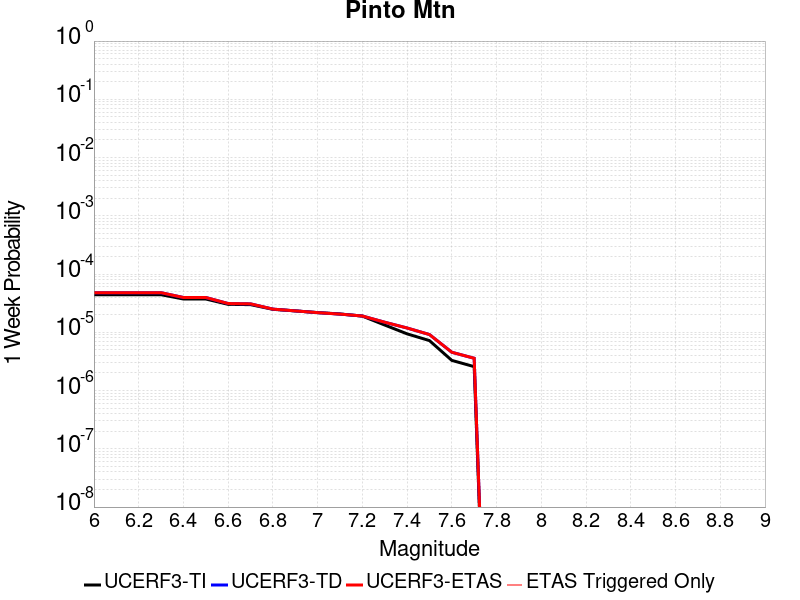 | 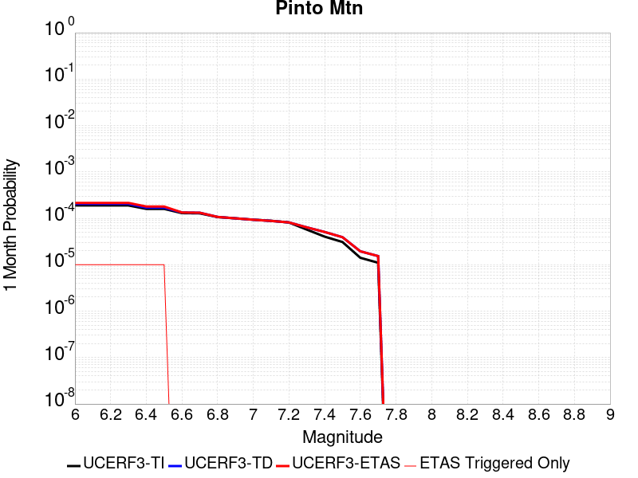 | 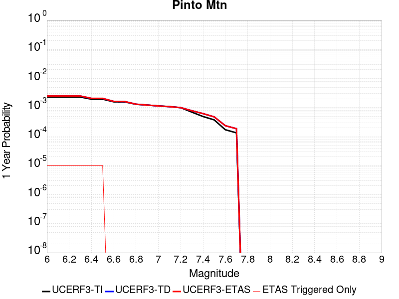 | 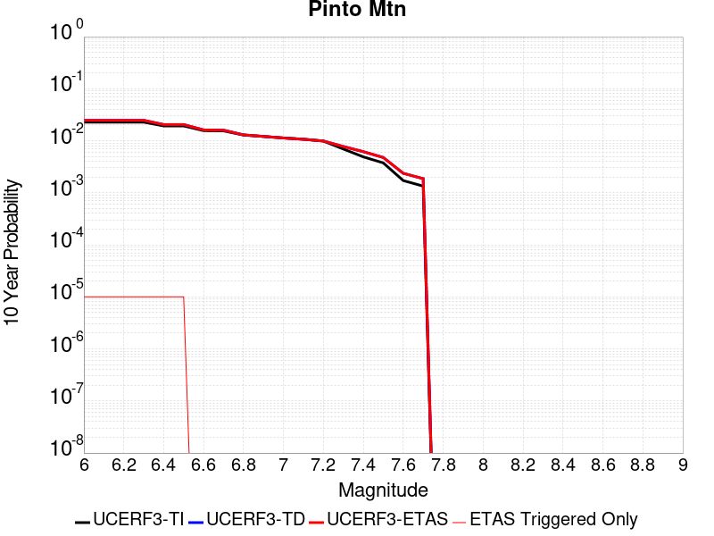 |

| Magnitude | 1 wk TI Prob | 1 wk TD Prob | 1 wk ETAS Prob | 1 wk ETAS/TD Gain | 1 wk ETAS Triggered Only | 1 mo TI Prob | 1 mo TD Prob | 1 mo ETAS Prob | 1 mo ETAS/TD Gain | 1 mo ETAS Triggered Only | 1 yr TI Prob | 1 yr TD Prob | 1 yr ETAS Prob | 1 yr ETAS/TD Gain | 1 yr ETAS Triggered Only | 10 yr TI Prob | 10 yr TD Prob | 10 yr ETAS Prob | 10 yr ETAS/TD Gain | 10 yr ETAS Triggered Only |
|-----|-----|-----|-----|-----|-----|-----|-----|-----|-----|-----|-----|-----|-----|-----|-----|-----|-----|-----|-----|-----|
| 6.0 | 4.4194956E-5 | 4.78536E-5 | 4.78536E-5 | 1.0 | 0.0 | 1.893932E-4 | 2.0507166E-4 | 2.150696E-4 | 1.0487535 | 1.0E-5 | 0.0023034236 | 0.0024940518 | 0.002504027 | 1.0039996 | 1.0E-5 | 0.022796938 | 0.024678139 | 0.024687892 | 1.0003952 | 1.0E-5 |
| 6.1 | 4.4194956E-5 | 4.78536E-5 | 4.78536E-5 | 1.0 | 0.0 | 1.893932E-4 | 2.0507166E-4 | 2.150696E-4 | 1.0487535 | 1.0E-5 | 0.0023034236 | 0.0024940518 | 0.002504027 | 1.0039996 | 1.0E-5 | 0.022796938 | 0.024678139 | 0.024687892 | 1.0003952 | 1.0E-5 |
| 6.2 | 4.4194956E-5 | 4.78536E-5 | 4.78536E-5 | 1.0 | 0.0 | 1.893932E-4 | 2.0507166E-4 | 2.150696E-4 | 1.0487535 | 1.0E-5 | 0.0023034236 | 0.0024940518 | 0.002504027 | 1.0039996 | 1.0E-5 | 0.022796938 | 0.024678139 | 0.024687892 | 1.0003952 | 1.0E-5 |
| 6.3 | 4.4194956E-5 | 4.78536E-5 | 4.78536E-5 | 1.0 | 0.0 | 1.893932E-4 | 2.0507166E-4 | 2.150696E-4 | 1.0487535 | 1.0E-5 | 0.0023034236 | 0.0024940518 | 0.002504027 | 1.0039996 | 1.0E-5 | 0.022796938 | 0.024678139 | 0.024687892 | 1.0003952 | 1.0E-5 |
| 6.4 | 3.729929E-5 | 3.960321E-5 | 3.960321E-5 | 1.0 | 0.0 | 1.5984432E-4 | 1.6971752E-4 | 1.7971582E-4 | 1.0589114 | 1.0E-5 | 0.0019443673 | 0.0020644458 | 0.002074425 | 1.0048339 | 1.0E-5 | 0.019274427 | 0.020462705 | 0.0204725 | 1.0004787 | 1.0E-5 |
| 6.5 | 3.729929E-5 | 3.960321E-5 | 3.960321E-5 | 1.0 | 0.0 | 1.5984432E-4 | 1.6971752E-4 | 1.7971582E-4 | 1.0589114 | 1.0E-5 | 0.0019443673 | 0.0020644458 | 0.002074425 | 1.0048339 | 1.0E-5 | 0.019274427 | 0.020462705 | 0.0204725 | 1.0004787 | 1.0E-5 |
| 6.6 | 3.0204548E-5 | 3.120536E-5 | 3.120536E-5 | 1.0 | 0.0 | 1.2944164E-4 | 1.337306E-4 | 1.337306E-4 | 1.0 | 0.0 | 0.0015748127 | 0.0016269886 | 0.0016269886 | 1.0 | 0.0 | 0.015636992 | 0.016154641 | 0.016154641 | 1.0 | 0.0 |
| 6.7 | 2.9857754E-5 | 3.0814746E-5 | 3.0814746E-5 | 1.0 | 0.0 | 1.2795553E-4 | 1.3205671E-4 | 1.3205671E-4 | 1.0 | 0.0 | 0.0015567453 | 0.0016066392 | 0.0016066392 | 1.0 | 0.0 | 0.015458848 | 0.015954081 | 0.015954081 | 1.0 | 0.0 |
| 6.8 | 2.4819734E-5 | 2.500945E-5 | 2.500945E-5 | 1.0 | 0.0 | 1.0636595E-4 | 1.07179076E-4 | 1.07179076E-4 | 1.0 | 0.0 | 0.0012942362 | 0.0013041458 | 0.0013041458 | 1.0 | 0.0 | 0.012867244 | 0.012967292 | 0.012967292 | 1.0 | 0.0 |
| 6.9 | 2.331124E-5 | 2.3337734E-5 | 2.3337734E-5 | 1.0 | 0.0 | 9.990149E-5 | 1.00015146E-4 | 1.00015146E-4 | 1.0 | 0.0 | 0.001215622 | 0.0012170245 | 0.0012170245 | 1.0 | 0.0 | 0.012089936 | 0.012105788 | 0.012105788 | 1.0 | 0.0 |
| 7.0 | 2.1818534E-5 | 2.1760867E-5 | 2.1760867E-5 | 1.0 | 0.0 | 9.3504656E-5 | 9.325764E-5 | 9.325764E-5 | 1.0 | 0.0 | 0.0011378246 | 0.0011348402 | 0.0011348402 | 1.0 | 0.0 | 0.011320163 | 0.011292553 | 0.011292553 | 1.0 | 0.0 |
| 7.1 | 2.066081E-5 | 2.0540516E-5 | 2.0540516E-5 | 1.0 | 0.0 | 8.854332E-5 | 8.8027926E-5 | 8.8027926E-5 | 1.0 | 0.0 | 0.0010774818 | 0.0010712326 | 0.0010712326 | 1.0 | 0.0 | 0.010722724 | 0.010662739 | 0.010662739 | 1.0 | 0.0 |
| 7.2 | 1.8990233E-5 | 1.9053807E-5 | 1.9053807E-5 | 1.0 | 0.0 | 8.138417E-5 | 8.165672E-5 | 8.165672E-5 | 1.0 | 0.0 | 9.904018E-4 | 9.937364E-4 | 9.937364E-4 | 1.0 | 0.0 | 0.009859995 | 0.009894928 | 0.009894928 | 1.0 | 0.0 |
| 7.3 | 1.3335872E-5 | 1.490653E-5 | 1.490653E-5 | 1.0 | 0.0 | 5.7152483E-5 | 6.3883635E-5 | 6.3883635E-5 | 1.0 | 0.0 | 6.956093E-4 | 7.775185E-4 | 7.775185E-4 | 1.0 | 0.0 | 0.006934359 | 0.0077492814 | 0.0077492814 | 1.0 | 0.0 |
| 7.4 | 9.414066E-6 | 1.1860794E-5 | 1.1860794E-5 | 1.0 | 0.0 | 4.0345374E-5 | 5.0831037E-5 | 5.0831037E-5 | 1.0 | 0.0 | 4.910942E-4 | 6.1870157E-4 | 6.1870157E-4 | 1.0 | 0.0 | 0.0049001034 | 0.0061707394 | 0.0061707394 | 1.0 | 0.0 |
| 7.5 | 7.2101157E-6 | 9.158034E-6 | 9.158034E-6 | 1.0 | 0.0 | 3.090013E-5 | 3.924817E-5 | 3.924817E-5 | 1.0 | 0.0 | 3.7614413E-4 | 4.7774953E-4 | 4.7774953E-4 | 1.0 | 0.0 | 0.0037550807 | 0.004768 | 0.004768 | 1.0 | 0.0 |
| 7.6 | 3.296375E-6 | 4.5453544E-6 | 4.5453544E-6 | 1.0 | 0.0 | 1.4127245E-5 | 1.9479952E-5 | 1.9479952E-5 | 1.0 | 0.0 | 1.7198564E-4 | 2.37144E-4 | 2.37144E-4 | 1.0 | 0.0 | 0.0017185259 | 0.0023690467 | 0.0023690467 | 1.0 | 0.0 |
| 7.7 | 2.5741092E-6 | 3.584271E-6 | 3.584271E-6 | 1.0 | 0.0 | 1.103185E-5 | 1.5361078E-5 | 1.5361078E-5 | 1.0 | 0.0 | 1.3430449E-4 | 1.870064E-4 | 1.870064E-4 | 1.0 | 0.0 | 0.0013422335 | 0.0018686203 | 0.0018686203 | 1.0 | 0.0 |

## Ortigalita (South)
*[(top)](#table-of-contents)*

| 1 Week | 1 Month | 1 Year | 10 Year |
|-----|-----|-----|-----|
|  |  |  |  |

| Magnitude | 1 wk TI Prob | 1 wk TD Prob | 1 wk ETAS Prob | 1 wk ETAS/TD Gain | 1 wk ETAS Triggered Only | 1 mo TI Prob | 1 mo TD Prob | 1 mo ETAS Prob | 1 mo ETAS/TD Gain | 1 mo ETAS Triggered Only | 1 yr TI Prob | 1 yr TD Prob | 1 yr ETAS Prob | 1 yr ETAS/TD Gain | 1 yr ETAS Triggered Only | 10 yr TI Prob | 10 yr TD Prob | 10 yr ETAS Prob | 10 yr ETAS/TD Gain | 10 yr ETAS Triggered Only |
|-----|-----|-----|-----|-----|-----|-----|-----|-----|-----|-----|-----|-----|-----|-----|-----|-----|-----|-----|-----|-----|
| 6.0 | 3.72394E-5 | 4.325541E-5 | 4.325541E-5 | 1.0 | 0.0 | 1.5958765E-4 | 1.8536806E-4 | 1.8536806E-4 | 1.0 | 0.0 | 0.0019412481 | 0.0022546765 | 0.002264654 | 1.0044252 | 1.0E-5 | 0.019243775 | 0.022334406 | 0.022344183 | 1.0004377 | 1.0E-5 |
| 6.1 | 2.7299884E-5 | 3.1491905E-5 | 3.1491905E-5 | 1.0 | 0.0 | 1.16994255E-4 | 1.3495865E-4 | 1.3495865E-4 | 1.0 | 0.0 | 0.0014234743 | 0.0016419389 | 0.0016519226 | 1.0060804 | 1.0E-5 | 0.014143906 | 0.016304005 | 0.016313843 | 1.0006033 | 1.0E-5 |
| 6.2 | 2.7299884E-5 | 3.1491905E-5 | 3.1491905E-5 | 1.0 | 0.0 | 1.16994255E-4 | 1.3495865E-4 | 1.3495865E-4 | 1.0 | 0.0 | 0.0014234743 | 0.0016419389 | 0.0016519226 | 1.0060804 | 1.0E-5 | 0.014143906 | 0.016304005 | 0.016313843 | 1.0006033 | 1.0E-5 |
| 6.3 | 2.0546433E-5 | 2.3631357E-5 | 2.3631357E-5 | 1.0 | 0.0 | 8.805317E-5 | 1.0127342E-4 | 1.0127342E-4 | 1.0 | 0.0 | 0.00107152 | 0.0012323254 | 0.0012423132 | 1.0081047 | 1.0E-5 | 0.010663681 | 0.012256982 | 0.012266859 | 1.0008059 | 1.0E-5 |
| 6.4 | 2.0546433E-5 | 2.3631357E-5 | 2.3631357E-5 | 1.0 | 0.0 | 8.805317E-5 | 1.0127342E-4 | 1.0127342E-4 | 1.0 | 0.0 | 0.00107152 | 0.0012323254 | 0.0012423132 | 1.0081047 | 1.0E-5 | 0.010663681 | 0.012256982 | 0.012266859 | 1.0008059 | 1.0E-5 |
| 6.5 | 1.7779594E-5 | 2.0446892E-5 | 2.0446892E-5 | 1.0 | 0.0 | 7.619603E-5 | 8.762667E-5 | 8.762667E-5 | 1.0 | 0.0 | 9.272918E-4 | 0.0010663462 | 0.0010663462 | 1.0 | 0.0 | 0.009234319 | 0.010613761 | 0.010613761 | 1.0 | 0.0 |
| 6.6 | 1.6272212E-5 | 1.8714893E-5 | 1.8714893E-5 | 1.0 | 0.0 | 6.973618E-5 | 8.0204285E-5 | 8.0204285E-5 | 1.0 | 0.0 | 8.487073E-4 | 9.76062E-4 | 9.76062E-4 | 1.0 | 0.0 | 0.008454733 | 0.009719051 | 0.009719051 | 1.0 | 0.0 |
| 6.7 | 1.3051484E-5 | 1.5038697E-5 | 1.5038697E-5 | 1.0 | 0.0 | 5.593373E-5 | 6.445002E-5 | 6.445002E-5 | 1.0 | 0.0 | 6.807804E-4 | 7.84406E-4 | 7.84406E-4 | 1.0 | 0.0 | 0.006786986 | 0.007817356 | 0.007817356 | 1.0 | 0.0 |
| 6.8 | 1.04277415E-5 | 1.19871875E-5 | 1.19871875E-5 | 1.0 | 0.0 | 4.4689557E-5 | 5.1372688E-5 | 5.1372688E-5 | 1.0 | 0.0 | 5.439595E-4 | 6.2529044E-4 | 6.2529044E-4 | 1.0 | 0.0 | 0.0054262993 | 0.006236065 | 0.006236065 | 1.0 | 0.0 |
| 6.9 | 7.639968E-6 | 8.791468E-6 | 8.791468E-6 | 1.0 | 0.0 | 3.274231E-5 | 3.7677208E-5 | 3.7677208E-5 | 1.0 | 0.0 | 3.9856473E-4 | 4.5862934E-4 | 4.5862934E-4 | 1.0 | 0.0 | 0.003978506 | 0.0045774146 | 0.0045774146 | 1.0 | 0.0 |
| 7.0 | 3.919831E-6 | 4.5333823E-6 | 4.5333823E-6 | 1.0 | 0.0 | 1.679917E-5 | 1.942865E-5 | 1.942865E-5 | 1.0 | 0.0 | 2.045107E-4 | 2.3652024E-4 | 2.3652024E-4 | 1.0 | 0.0 | 0.0020432258 | 0.0023628937 | 0.0023628937 | 1.0 | 0.0 |
| 7.1 | 1.6017933E-6 | 1.8570338E-6 | 1.8570338E-6 | 1.0 | 0.0 | 6.8648105E-6 | 7.958698E-6 | 7.958698E-6 | 1.0 | 0.0 | 8.357586E-5 | 9.6893906E-5 | 9.6893906E-5 | 1.0 | 0.0 | 8.3544437E-4 | 9.6862135E-4 | 9.6862135E-4 | 1.0 | 0.0 |

## Santa Susana East (connector)
*[(top)](#table-of-contents)*

| 1 Week | 1 Month | 1 Year | 10 Year |
|-----|-----|-----|-----|
|  |  |  |  |

| Magnitude | 1 wk TI Prob | 1 wk TD Prob | 1 wk ETAS Prob | 1 wk ETAS/TD Gain | 1 wk ETAS Triggered Only | 1 mo TI Prob | 1 mo TD Prob | 1 mo ETAS Prob | 1 mo ETAS/TD Gain | 1 mo ETAS Triggered Only | 1 yr TI Prob | 1 yr TD Prob | 1 yr ETAS Prob | 1 yr ETAS/TD Gain | 1 yr ETAS Triggered Only | 10 yr TI Prob | 10 yr TD Prob | 10 yr ETAS Prob | 10 yr ETAS/TD Gain | 10 yr ETAS Triggered Only |
|-----|-----|-----|-----|-----|-----|-----|-----|-----|-----|-----|-----|-----|-----|-----|-----|-----|-----|-----|-----|-----|
| 6.0 | 2.858397E-5 | 3.2021515E-5 | 3.2021515E-5 | 1.0 | 0.0 | 1.2249697E-4 | 1.3722944E-4 | 1.3722944E-4 | 1.0 | 0.0 | 0.0014903803 | 0.0016697609 | 0.0016797442 | 1.0059788 | 1.0E-5 | 0.014804244 | 0.01659906 | 0.016608894 | 1.0005925 | 1.0E-5 |
| 6.1 | 2.858397E-5 | 3.2021515E-5 | 3.2021515E-5 | 1.0 | 0.0 | 1.2249697E-4 | 1.3722944E-4 | 1.3722944E-4 | 1.0 | 0.0 | 0.0014903803 | 0.0016697609 | 0.0016797442 | 1.0059788 | 1.0E-5 | 0.014804244 | 0.01659906 | 0.016608894 | 1.0005925 | 1.0E-5 |
| 6.2 | 2.858397E-5 | 3.2021515E-5 | 3.2021515E-5 | 1.0 | 0.0 | 1.2249697E-4 | 1.3722944E-4 | 1.3722944E-4 | 1.0 | 0.0 | 0.0014903803 | 0.0016697609 | 0.0016797442 | 1.0059788 | 1.0E-5 | 0.014804244 | 0.01659906 | 0.016608894 | 1.0005925 | 1.0E-5 |
| 6.3 | 1.943582E-5 | 2.0367252E-5 | 2.0367252E-5 | 1.0 | 0.0 | 8.329371E-5 | 8.728594E-5 | 8.728594E-5 | 1.0 | 0.0 | 0.001013629 | 0.0010623002 | 0.0010722895 | 1.0094036 | 1.0E-5 | 0.010090181 | 0.010583636 | 0.010593531 | 1.0009348 | 1.0E-5 |
| 6.4 | 1.943582E-5 | 2.0367252E-5 | 2.0367252E-5 | 1.0 | 0.0 | 8.329371E-5 | 8.728594E-5 | 8.728594E-5 | 1.0 | 0.0 | 0.001013629 | 0.0010623002 | 0.0010722895 | 1.0094036 | 1.0E-5 | 0.010090181 | 0.010583636 | 0.010593531 | 1.0009348 | 1.0E-5 |
| 6.5 | 1.943582E-5 | 2.0367252E-5 | 2.0367252E-5 | 1.0 | 0.0 | 8.329371E-5 | 8.728594E-5 | 8.728594E-5 | 1.0 | 0.0 | 0.001013629 | 0.0010623002 | 0.0010722895 | 1.0094036 | 1.0E-5 | 0.010090181 | 0.010583636 | 0.010593531 | 1.0009348 | 1.0E-5 |
| 6.6 | 1.943582E-5 | 2.0367252E-5 | 2.0367252E-5 | 1.0 | 0.0 | 8.329371E-5 | 8.728594E-5 | 8.728594E-5 | 1.0 | 0.0 | 0.001013629 | 0.0010623002 | 0.0010722895 | 1.0094036 | 1.0E-5 | 0.010090181 | 0.010583636 | 0.010593531 | 1.0009348 | 1.0E-5 |
| 6.7 | 1.9404439E-5 | 2.0354675E-5 | 2.0354675E-5 | 1.0 | 0.0 | 8.3159226E-5 | 8.723203E-5 | 8.723203E-5 | 1.0 | 0.0 | 0.0010119933 | 0.0010616446 | 0.001071634 | 1.0094093 | 1.0E-5 | 0.010073971 | 0.010577142 | 0.010587037 | 1.0009354 | 1.0E-5 |
| 6.8 | 1.2217526E-5 | 1.1593124E-5 | 1.1593124E-5 | 1.0 | 0.0 | 5.2359774E-5 | 4.9683968E-5 | 4.9683968E-5 | 1.0 | 0.0 | 6.372938E-4 | 6.047512E-4 | 6.147452E-4 | 1.0165257 | 1.0E-5 | 0.0063546924 | 0.006033087 | 0.006043027 | 1.0016475 | 1.0E-5 |
| 6.9 | 1.2217526E-5 | 1.1593124E-5 | 1.1593124E-5 | 1.0 | 0.0 | 5.2359774E-5 | 4.9683968E-5 | 4.9683968E-5 | 1.0 | 0.0 | 6.372938E-4 | 6.047512E-4 | 6.147452E-4 | 1.0165257 | 1.0E-5 | 0.0063546924 | 0.006033087 | 0.006043027 | 1.0016475 | 1.0E-5 |
| 7.0 | 9.276017E-6 | 8.059261E-6 | 8.059261E-6 | 1.0 | 0.0 | 3.9753755E-5 | 3.453925E-5 | 3.453925E-5 | 1.0 | 0.0 | 4.8389446E-4 | 4.2043766E-4 | 4.3043346E-4 | 1.0237747 | 1.0E-5 | 0.0048284214 | 0.0041971332 | 0.0042070914 | 1.0023726 | 1.0E-5 |
| 7.1 | 9.130355E-6 | 7.942434E-6 | 7.942434E-6 | 1.0 | 0.0 | 3.9129503E-5 | 3.403858E-5 | 3.403858E-5 | 1.0 | 0.0 | 4.7629757E-4 | 4.1434434E-4 | 4.1434434E-4 | 1.0 | 0.0 | 0.00475278 | 0.0041364282 | 0.0041364282 | 1.0 | 0.0 |
| 7.2 | 8.851015E-6 | 7.741596E-6 | 7.741596E-6 | 1.0 | 0.0 | 3.7932372E-5 | 3.3177865E-5 | 3.3177865E-5 | 1.0 | 0.0 | 4.6172875E-4 | 4.0386908E-4 | 4.0386908E-4 | 1.0 | 0.0 | 0.0046077054 | 0.004032058 | 0.004032058 | 1.0 | 0.0 |
| 7.3 | 8.573006E-6 | 7.55032E-6 | 7.55032E-6 | 1.0 | 0.0 | 3.6740938E-5 | 3.235813E-5 | 3.235813E-5 | 1.0 | 0.0 | 4.472291E-4 | 3.9389243E-4 | 3.9389243E-4 | 1.0 | 0.0 | 0.004463301 | 0.0039326404 | 0.0039326404 | 1.0 | 0.0 |
| 7.4 | 7.852282E-6 | 6.817847E-6 | 6.817847E-6 | 1.0 | 0.0 | 3.36522E-5 | 2.9219034E-5 | 2.9219034E-5 | 1.0 | 0.0 | 4.096385E-4 | 3.556867E-4 | 3.556867E-4 | 1.0 | 0.0 | 0.0040888423 | 0.0035518138 | 0.0035518138 | 1.0 | 0.0 |
| 7.5 | 4.8869324E-6 | 4.27909E-6 | 4.27909E-6 | 1.0 | 0.0 | 2.0943828E-5 | 1.8338837E-5 | 1.8338837E-5 | 1.0 | 0.0 | 2.5496128E-4 | 2.2325412E-4 | 2.2325412E-4 | 1.0 | 0.0 | 0.0025466895 | 0.002230411 | 0.002230411 | 1.0 | 0.0 |
| 7.6 | 1.3894544E-6 | 1.1568352E-6 | 1.1568352E-6 | 1.0 | 0.0 | 5.954791E-6 | 4.957857E-6 | 4.957857E-6 | 1.0 | 0.0 | 7.249717E-5 | 6.036046E-5 | 6.036046E-5 | 1.0 | 0.0 | 7.247352E-4 | 6.0346245E-4 | 6.0346245E-4 | 1.0 | 0.0 |
| 7.7 | 2.9924632E-7 | 2.3719298E-7 | 2.3719298E-7 | 1.0 | 0.0 | 1.2824837E-6 | 1.016541E-6 | 1.016541E-6 | 1.0 | 0.0 | 1.5614127E-5 | 1.2376324E-5 | 1.2376324E-5 | 1.0 | 0.0 | 1.5613029E-4 | 1.2375705E-4 | 1.2375705E-4 | 1.0 | 0.0 |
| 7.8 | 4.8188564E-8 | 2.6321734E-8 | 2.6321734E-8 | 1.0 | 0.0 | 2.065224E-7 | 1.1280743E-7 | 1.1280743E-7 | 1.0 | 0.0 | 2.5144072E-6 | 1.3734297E-6 | 1.3734297E-6 | 1.0 | 0.0 | 2.5143789E-5 | 1.373422E-5 | 1.373422E-5 | 1.0 | 0.0 |
| 7.9 | 2.6127251E-9 | 2.7681057E-9 | 2.7681057E-9 | 1.0 | 0.0 | 1.1197393E-8 | 1.186331E-8 | 1.186331E-8 | 1.0 | 0.0 | 1.3632825E-7 | 1.444358E-7 | 1.444358E-7 | 1.0 | 0.0 | 1.3632817E-6 | 1.4443581E-6 | 1.4443581E-6 | 1.0 | 0.0 |

## White Mountains
*[(top)](#table-of-contents)*

| 1 Week | 1 Month | 1 Year | 10 Year |
|-----|-----|-----|-----|
|  |  |  |  |

| Magnitude | 1 wk TI Prob | 1 wk TD Prob | 1 wk ETAS Prob | 1 wk ETAS/TD Gain | 1 wk ETAS Triggered Only | 1 mo TI Prob | 1 mo TD Prob | 1 mo ETAS Prob | 1 mo ETAS/TD Gain | 1 mo ETAS Triggered Only | 1 yr TI Prob | 1 yr TD Prob | 1 yr ETAS Prob | 1 yr ETAS/TD Gain | 1 yr ETAS Triggered Only | 10 yr TI Prob | 10 yr TD Prob | 10 yr ETAS Prob | 10 yr ETAS/TD Gain | 10 yr ETAS Triggered Only |
|-----|-----|-----|-----|-----|-----|-----|-----|-----|-----|-----|-----|-----|-----|-----|-----|-----|-----|-----|-----|-----|
| 6.0 | 3.503579E-5 | 3.3784054E-5 | 4.3783715E-5 | 1.2959876 | 1.0E-5 | 1.5014476E-4 | 1.4478144E-4 | 1.5477999E-4 | 1.0690596 | 1.0E-5 | 0.0018264796 | 0.0017614097 | 0.0017713921 | 1.0056673 | 1.0E-5 | 0.018115403 | 0.01748682 | 0.017496644 | 1.0005618 | 1.0E-5 |
| 6.1 | 3.503579E-5 | 3.3784054E-5 | 4.3783715E-5 | 1.2959876 | 1.0E-5 | 1.5014476E-4 | 1.4478144E-4 | 1.5477999E-4 | 1.0690596 | 1.0E-5 | 0.0018264796 | 0.0017614097 | 0.0017713921 | 1.0056673 | 1.0E-5 | 0.018115403 | 0.01748682 | 0.017496644 | 1.0005618 | 1.0E-5 |
| 6.2 | 3.503579E-5 | 3.3784054E-5 | 4.3783715E-5 | 1.2959876 | 1.0E-5 | 1.5014476E-4 | 1.4478144E-4 | 1.5477999E-4 | 1.0690596 | 1.0E-5 | 0.0018264796 | 0.0017614097 | 0.0017713921 | 1.0056673 | 1.0E-5 | 0.018115403 | 0.01748682 | 0.017496644 | 1.0005618 | 1.0E-5 |
| 6.3 | 1.7818425E-5 | 1.591613E-5 | 1.591613E-5 | 1.0 | 0.0 | 7.636245E-5 | 6.821028E-5 | 6.821028E-5 | 1.0 | 0.0 | 9.293162E-4 | 8.30158E-4 | 8.30158E-4 | 1.0 | 0.0 | 0.009254395 | 0.008272028 | 0.008272028 | 1.0 | 0.0 |
| 6.4 | 1.7818425E-5 | 1.591613E-5 | 1.591613E-5 | 1.0 | 0.0 | 7.636245E-5 | 6.821028E-5 | 6.821028E-5 | 1.0 | 0.0 | 9.293162E-4 | 8.30158E-4 | 8.30158E-4 | 1.0 | 0.0 | 0.009254395 | 0.008272028 | 0.008272028 | 1.0 | 0.0 |
| 6.5 | 1.3397557E-5 | 1.1336354E-5 | 1.1336354E-5 | 1.0 | 0.0 | 5.741684E-5 | 4.8583508E-5 | 4.8583508E-5 | 1.0 | 0.0 | 6.988258E-4 | 5.9135066E-4 | 5.9135066E-4 | 1.0 | 0.0 | 0.006966323 | 0.005898476 | 0.005898476 | 1.0 | 0.0 |
| 6.6 | 1.0818695E-5 | 8.6254195E-6 | 8.6254195E-6 | 1.0 | 0.0 | 4.6365014E-5 | 3.6965583E-5 | 3.6965583E-5 | 1.0 | 0.0 | 5.6434784E-4 | 4.499674E-4 | 4.499674E-4 | 1.0 | 0.0 | 0.005629168 | 0.0044909995 | 0.0044909995 | 1.0 | 0.0 |
| 6.7 | 9.067908E-6 | 6.802464E-6 | 6.802464E-6 | 1.0 | 0.0 | 3.8861883E-5 | 2.915311E-5 | 2.915311E-5 | 1.0 | 0.0 | 4.7304068E-4 | 3.548845E-4 | 3.548845E-4 | 1.0 | 0.0 | 0.00472035 | 0.003543495 | 0.003543495 | 1.0 | 0.0 |
| 6.8 | 7.295947E-6 | 4.9364203E-6 | 4.9364203E-6 | 1.0 | 0.0 | 3.126797E-5 | 2.1155922E-5 | 2.1155922E-5 | 1.0 | 0.0 | 3.8062103E-4 | 2.5754404E-4 | 2.5754404E-4 | 1.0 | 0.0 | 0.0037996976 | 0.0025725686 | 0.0025725686 | 1.0 | 0.0 |
| 6.9 | 6.2243444E-6 | 3.8322482E-6 | 3.8322482E-6 | 1.0 | 0.0 | 2.6675489E-5 | 1.642382E-5 | 1.642382E-5 | 1.0 | 0.0 | 3.2472567E-4 | 1.999422E-4 | 1.999422E-4 | 1.0 | 0.0 | 0.0032425157 | 0.0019976757 | 0.0019976757 | 1.0 | 0.0 |
| 7.0 | 4.9878413E-6 | 2.6795587E-6 | 2.6795587E-6 | 1.0 | 0.0 | 2.1376287E-5 | 1.1483774E-5 | 1.1483774E-5 | 1.0 | 0.0 | 2.602252E-4 | 1.3980624E-4 | 1.3980624E-4 | 1.0 | 0.0 | 0.002599207 | 0.0013972091 | 0.0013972091 | 1.0 | 0.0 |
| 7.1 | 4.0252844E-6 | 1.885697E-6 | 1.885697E-6 | 1.0 | 0.0 | 1.7251105E-5 | 8.081534E-6 | 8.081534E-6 | 1.0 | 0.0 | 2.1001195E-4 | 9.8388366E-5 | 9.8388366E-5 | 1.0 | 0.0 | 0.0020981359 | 9.834609E-4 | 9.834609E-4 | 1.0 | 0.0 |
| 7.2 | 3.3284066E-6 | 1.2818881E-6 | 1.2818881E-6 | 1.0 | 0.0 | 1.4264522E-5 | 5.4937955E-6 | 5.4937955E-6 | 1.0 | 0.0 | 1.736567E-4 | 6.688501E-5 | 6.688501E-5 | 1.0 | 0.0 | 0.0017352107 | 6.686588E-4 | 6.686588E-4 | 1.0 | 0.0 |
| 7.3 | 2.458226E-6 | 6.05664E-7 | 6.05664E-7 | 1.0 | 0.0 | 1.0535211E-5 | 2.5957006E-6 | 2.5957006E-6 | 1.0 | 0.0 | 1.2825865E-4 | 3.1602234E-5 | 3.1602234E-5 | 1.0 | 0.0 | 0.0012818464 | 3.1598116E-4 | 3.1598116E-4 | 1.0 | 0.0 |
| 7.4 | 1.965953E-6 | 3.1084303E-7 | 3.1084303E-7 | 1.0 | 0.0 | 8.425486E-6 | 1.3321838E-6 | 1.3321838E-6 | 1.0 | 0.0 | 1.0257547E-4 | 1.6219217E-5 | 1.6219217E-5 | 1.0 | 0.0 | 0.0010252813 | 1.6218047E-4 | 1.6218047E-4 | 1.0 | 0.0 |
| 7.5 | 1.2014192E-6 | 1.8240732E-7 | 1.8240732E-7 | 1.0 | 0.0 | 5.148929E-6 | 7.817454E-7 | 7.817454E-7 | 1.0 | 0.0 | 6.2686406E-5 | 9.51771E-6 | 9.51771E-6 | 1.0 | 0.0 | 6.266873E-4 | 9.5173105E-5 | 9.5173105E-5 | 1.0 | 0.0 |
| 7.6 | 2.5612175E-7 | 4.893735E-8 | 4.893735E-8 | 1.0 | 0.0 | 1.0976642E-6 | 2.0973148E-7 | 2.0973148E-7 | 1.0 | 0.0 | 1.3363979E-5 | 2.553478E-6 | 2.553478E-6 | 1.0 | 0.0 | 1.3363175E-4 | 2.5534524E-5 | 2.5534524E-5 | 1.0 | 0.0 |

## West Tahoe
*[(top)](#table-of-contents)*

| 1 Week | 1 Month | 1 Year | 10 Year |
|-----|-----|-----|-----|
|  |  |  |  |

| Magnitude | 1 wk TI Prob | 1 wk TD Prob | 1 wk ETAS Prob | 1 wk ETAS/TD Gain | 1 wk ETAS Triggered Only | 1 mo TI Prob | 1 mo TD Prob | 1 mo ETAS Prob | 1 mo ETAS/TD Gain | 1 mo ETAS Triggered Only | 1 yr TI Prob | 1 yr TD Prob | 1 yr ETAS Prob | 1 yr ETAS/TD Gain | 1 yr ETAS Triggered Only | 10 yr TI Prob | 10 yr TD Prob | 10 yr ETAS Prob | 10 yr ETAS/TD Gain | 10 yr ETAS Triggered Only |
|-----|-----|-----|-----|-----|-----|-----|-----|-----|-----|-----|-----|-----|-----|-----|-----|-----|-----|-----|-----|-----|
| 6.0 | 1.952444E-5 | 2.1183121E-5 | 3.118291E-5 | 1.4720639 | 1.0E-5 | 8.367348E-5 | 9.0781956E-5 | 1.0078105E-4 | 1.110144 | 1.0E-5 | 0.0010182485 | 0.0011047646 | 0.0011147537 | 1.0090417 | 1.0E-5 | 0.010135954 | 0.010998211 | 0.011008101 | 1.0008992 | 1.0E-5 |
| 6.1 | 1.952444E-5 | 2.1183121E-5 | 3.118291E-5 | 1.4720639 | 1.0E-5 | 8.367348E-5 | 9.0781956E-5 | 1.0078105E-4 | 1.110144 | 1.0E-5 | 0.0010182485 | 0.0011047646 | 0.0011147537 | 1.0090417 | 1.0E-5 | 0.010135954 | 0.010998211 | 0.011008101 | 1.0008992 | 1.0E-5 |
| 6.2 | 1.952444E-5 | 2.1183121E-5 | 3.118291E-5 | 1.4720639 | 1.0E-5 | 8.367348E-5 | 9.0781956E-5 | 1.0078105E-4 | 1.110144 | 1.0E-5 | 0.0010182485 | 0.0011047646 | 0.0011147537 | 1.0090417 | 1.0E-5 | 0.010135954 | 0.010998211 | 0.011008101 | 1.0008992 | 1.0E-5 |
| 6.3 | 1.952444E-5 | 2.1183121E-5 | 3.118291E-5 | 1.4720639 | 1.0E-5 | 8.367348E-5 | 9.0781956E-5 | 1.0078105E-4 | 1.110144 | 1.0E-5 | 0.0010182485 | 0.0011047646 | 0.0011147537 | 1.0090417 | 1.0E-5 | 0.010135954 | 0.010998211 | 0.011008101 | 1.0008992 | 1.0E-5 |
| 6.4 | 1.952444E-5 | 2.1183121E-5 | 3.118291E-5 | 1.4720639 | 1.0E-5 | 8.367348E-5 | 9.0781956E-5 | 1.0078105E-4 | 1.110144 | 1.0E-5 | 0.0010182485 | 0.0011047646 | 0.0011147537 | 1.0090417 | 1.0E-5 | 0.010135954 | 0.010998211 | 0.011008101 | 1.0008992 | 1.0E-5 |
| 6.5 | 1.2685271E-5 | 1.3690598E-5 | 2.3690462E-5 | 1.7304182 | 1.0E-5 | 5.4364315E-5 | 5.867277E-5 | 6.867218E-5 | 1.1704268 | 1.0E-5 | 6.616845E-4 | 7.141233E-4 | 7.2411617E-4 | 1.0139931 | 1.0E-5 | 0.0065971776 | 0.0071199345 | 0.0071298634 | 1.0013945 | 1.0E-5 |
| 6.6 | 1.2685271E-5 | 1.3690598E-5 | 2.3690462E-5 | 1.7304182 | 1.0E-5 | 5.4364315E-5 | 5.867277E-5 | 6.867218E-5 | 1.1704268 | 1.0E-5 | 6.616845E-4 | 7.141233E-4 | 7.2411617E-4 | 1.0139931 | 1.0E-5 | 0.0065971776 | 0.0071199345 | 0.0071298634 | 1.0013945 | 1.0E-5 |
| 6.7 | 9.117886E-6 | 9.809826E-6 | 1.9809728E-5 | 2.019376 | 1.0E-5 | 3.9076072E-5 | 4.2041476E-5 | 5.2041058E-5 | 1.2378503 | 1.0E-5 | 4.756473E-4 | 5.1174196E-4 | 5.2173686E-4 | 1.0195311 | 1.0E-5 | 0.0047463053 | 0.005106353 | 0.005116302 | 1.0019484 | 1.0E-5 |
| 6.8 | 8.786828E-6 | 9.457844E-6 | 1.945775E-5 | 2.0573134 | 1.0E-5 | 3.7657293E-5 | 4.0533025E-5 | 5.053262E-5 | 1.2467024 | 1.0E-5 | 4.5838108E-4 | 4.933849E-4 | 5.0337997E-4 | 1.0202582 | 1.0E-5 | 0.0045743673 | 0.004923596 | 0.0049335468 | 1.0020211 | 1.0E-5 |
| 6.9 | 6.7562123E-6 | 7.263794E-6 | 7.263794E-6 | 1.0 | 0.0 | 2.8954875E-5 | 3.1130203E-5 | 3.1130203E-5 | 1.0 | 0.0 | 3.5246857E-4 | 3.7894904E-4 | 3.7894904E-4 | 1.0 | 0.0 | 0.0035191004 | 0.0037835005 | 0.0037835005 | 1.0 | 0.0 |
| 7.0 | 5.1792854E-6 | 5.567327E-6 | 5.567327E-6 | 1.0 | 0.0 | 2.2196748E-5 | 2.3859777E-5 | 2.3859777E-5 | 1.0 | 0.0 | 2.702119E-4 | 2.9045786E-4 | 2.9045786E-4 | 1.0 | 0.0 | 0.0026988357 | 0.0029011576 | 0.0029011576 | 1.0 | 0.0 |
| 7.1 | 4.090765E-6 | 4.3974137E-6 | 4.3974137E-6 | 1.0 | 0.0 | 1.7531731E-5 | 1.8845942E-5 | 1.8845942E-5 | 1.0 | 0.0 | 2.134279E-4 | 2.2942858E-4 | 2.2942858E-4 | 1.0 | 0.0 | 0.0021322304 | 0.0022922517 | 0.0022922517 | 1.0 | 0.0 |
| 7.2 | 2.2356758E-6 | 2.4023636E-6 | 2.4023636E-6 | 1.0 | 0.0 | 9.581432E-6 | 1.0295814E-5 | 1.0295814E-5 | 1.0 | 0.0 | 1.1664769E-4 | 1.2534621E-4 | 1.2534621E-4 | 1.0 | 0.0 | 0.0011658648 | 0.001252941 | 0.001252941 | 1.0 | 0.0 |

