# Parent Section Magnitude-Probability Distributions

Only fault sections with at least one triggered aftershock are plotted. Sections are sorted by total supraseismogenic trigger rate (decreasing)

## Table Of Contents

* [Garlock (Central)](#garlock-central)
* [Tank Canyon](#tank-canyon)
* [Owl Lake](#owl-lake)
* [Garlock (East)](#garlock-east)
* [Little Lake](#little-lake)
* [Panamint Valley](#panamint-valley)
* [Blackwater](#blackwater)
* [Hunter Mountain-Saline Valley](#hunter-mountain-saline-valley)
* [Garlock (West)](#garlock-west)
* [Gravel Hills-Harper Lk](#gravel-hills-harper-lk)
* [Ash Hill](#ash-hill)
* [Airport Lake](#airport-lake)
* [Goldstone Lake](#goldstone-lake)
* [McLean Lake](#mclean-lake)
* [Coyote Canyon](#coyote-canyon)
* [So Sierra Nevada](#so-sierra-nevada)
* [Death Valley (So)](#death-valley-so)
* [Nelson Lake](#nelson-lake)
* [San Andreas (Mojave N)](#san-andreas-mojave-n)
* [San Andreas (Mojave S)](#san-andreas-mojave-s)
* [Lenwood-Lockhart-Old Woman Springs](#lenwood-lockhart-old-woman-springs)
* [San Andreas (San Bernardino N)](#san-andreas-san-bernardino-n)
* [Towne Pass](#towne-pass)
* [Bicycle Lake](#bicycle-lake)
* [Paradise](#paradise)
* [Garlic Springs](#garlic-springs)
* [Death Valley (Black Mtns Frontal)](#death-valley-black-mtns-frontal)
* [Death Valley (Fish Lake Valley)](#death-valley-fish-lake-valley)
* [San Andreas (San Bernardino S)](#san-andreas-san-bernardino-s)
* [Death Valley (No)](#death-valley-no)
* [Baker](#baker)
* [Coyote Lake](#coyote-lake)
* [Red Pass](#red-pass)
* [Santa Rosa Island](#santa-rosa-island)
* [Elsinore (Glen Ivy) rev](#elsinore-glen-ivy-rev)
* [Helendale-So Lockhart](#helendale-so-lockhart)
* [Big Pine (East)](#big-pine-east)
* [Brawley (Seismic Zone) alt 1](#brawley-seismic-zone-alt-1)
* [San Andreas (San Gorgonio Pass-Garnet HIll)](#san-andreas-san-gorgonio-pass-garnet-hill)
* [Lost Hills](#lost-hills)
* [San Pedro Basin](#san-pedro-basin)
* [San Andreas (Coachella) rev](#san-andreas-coachella-rev)
* [San Andreas (Parkfield)](#san-andreas-parkfield)
* [Santa Cruz Catalina Ridge alt1](#santa-cruz-catalina-ridge-alt1)
* [Kern Canyon (Lake Isabella) 2011](#kern-canyon-lake-isabella-2011)
* [White Mountains](#white-mountains)
* [Santa Cruz Island](#santa-cruz-island)
* [Great Valley 03a Dunnigan Hills](#great-valley-03a-dunnigan-hills)
* [Eureka Peak](#eureka-peak)
* [Davis Creek](#davis-creek)
* [San Andreas (Big Bend)](#san-andreas-big-bend)
* [Palos Verdes](#palos-verdes)
* [Channel Islands Thrust](#channel-islands-thrust)
* [Channel Islands Western Deep Ramp](#channel-islands-western-deep-ramp)
* [Imperial](#imperial)
* [Kern Canyon (South Kern) 2011](#kern-canyon-south-kern-2011)
* [West Tahoe](#west-tahoe)
* [San Gabriel](#san-gabriel)
* [Cleghorn Lake](#cleghorn-lake)
* [Independence rev 2011](#independence-rev-2011)
* [San Jacinto (San Bernardino)](#san-jacinto-san-bernardino)

## Garlock (Central)
*[(top)](#table-of-contents)*

| 1 Week | 1 Month | 1 Year | 10 Year |
|-----|-----|-----|-----|
| 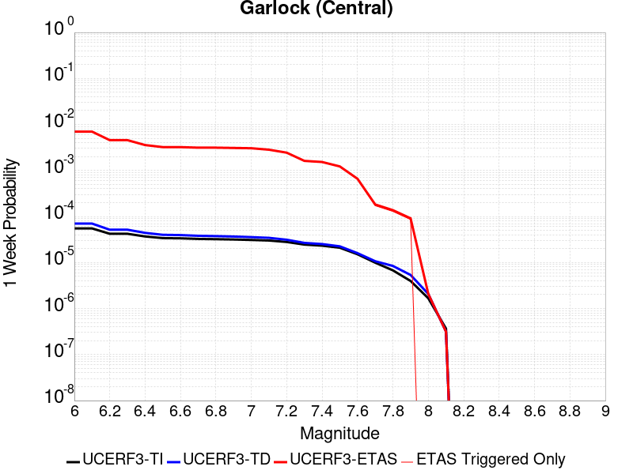 | 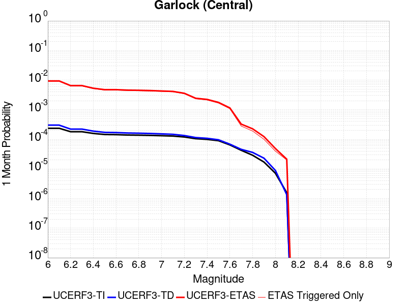 | 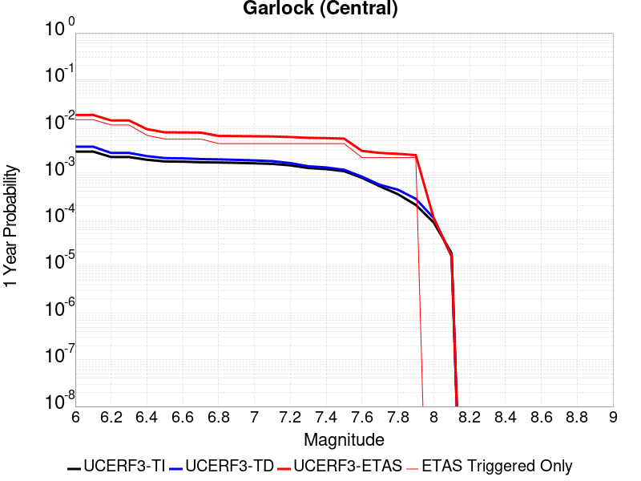 | 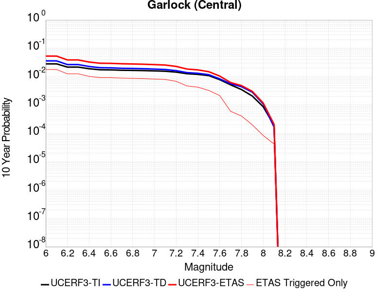 |

| Magnitude | 1 wk TI Prob | 1 wk TD Prob | 1 wk ETAS Prob | 1 wk ETAS/TD Gain | 1 wk ETAS Triggered Only | 1 mo TI Prob | 1 mo TD Prob | 1 mo ETAS Prob | 1 mo ETAS/TD Gain | 1 mo ETAS Triggered Only | 1 yr TI Prob | 1 yr TD Prob | 1 yr ETAS Prob | 1 yr ETAS/TD Gain | 1 yr ETAS Triggered Only | 10 yr TI Prob | 10 yr TD Prob | 10 yr ETAS Prob | 10 yr ETAS/TD Gain | 10 yr ETAS Triggered Only |
|-----|-----|-----|-----|-----|-----|-----|-----|-----|-----|-----|-----|-----|-----|-----|-----|-----|-----|-----|-----|-----|
| 6.0 | 5.5131142E-5 | 7.024558E-5 | 0.0073310914 | 104.36373 | 0.007261356 | 2.3625491E-4 | 3.0101812E-4 | 0.00941472 | 31.276258 | 0.009116447 | 0.0028726095 | 0.0036588025 | 0.017389057 | 4.7526636 | 0.013780675 | 0.028357591 | 0.03607921 | 0.053960815 | 1.4956208 | 0.018550908 |
| 6.1 | 5.5131142E-5 | 7.024558E-5 | 0.0073310914 | 104.36373 | 0.007261356 | 2.3625491E-4 | 3.0101812E-4 | 0.00941472 | 31.276258 | 0.009116447 | 0.0028726095 | 0.0036588025 | 0.017389057 | 4.7526636 | 0.013780675 | 0.028357591 | 0.03607921 | 0.053960815 | 1.4956208 | 0.018550908 |
| 6.2 | 4.216245E-5 | 5.1660383E-5 | 0.0049276473 | 95.38542 | 0.0048762388 | 1.806837E-4 | 2.2138303E-4 | 0.006739259 | 30.441626 | 0.0065193195 | 0.0021976046 | 0.0026920384 | 0.012471123 | 4.632594 | 0.00980548 | 0.021759989 | 0.02668921 | 0.03932827 | 1.4735644 | 0.0129856365 |
| 6.3 | 4.216245E-5 | 5.1660383E-5 | 0.0049276473 | 95.38542 | 0.0048762388 | 1.806837E-4 | 2.2138303E-4 | 0.006739259 | 30.441626 | 0.0065193195 | 0.0021976046 | 0.0026920384 | 0.012471123 | 4.632594 | 0.00980548 | 0.021759989 | 0.02668921 | 0.03932827 | 1.4735644 | 0.0129856365 |
| 6.4 | 3.6858168E-5 | 4.4109474E-5 | 0.003860128 | 87.51244 | 0.003816187 | 1.5795401E-4 | 1.8902705E-4 | 0.0053823 | 28.4737 | 0.0051942547 | 0.0019213937 | 0.0022990005 | 0.009913827 | 4.312234 | 0.007632374 | 0.019048655 | 0.022848397 | 0.03284417 | 1.4374825 | 0.010229501 |
| 6.5 | 3.39199E-5 | 4.001704E-5 | 0.003485048 | 87.0891 | 0.0034451687 | 1.453629E-4 | 1.7149044E-4 | 0.0048879124 | 28.502537 | 0.0047172313 | 0.0017683565 | 0.0020859186 | 0.008908992 | 4.271016 | 0.006837335 | 0.017543508 | 0.02075933 | 0.029842231 | 1.4375335 | 0.009275454 |
| 6.6 | 3.3571985E-5 | 3.947123E-5 | 0.003484504 | 88.279594 | 0.0034451687 | 1.4387199E-4 | 1.6915156E-4 | 0.0048855846 | 28.882883 | 0.0047172313 | 0.0017502342 | 0.002057497 | 0.008880764 | 4.3162956 | 0.006837335 | 0.017365133 | 0.020480646 | 0.029566133 | 1.4436133 | 0.009275454 |
| 6.7 | 3.2580007E-5 | 3.8087666E-5 | 0.0033771242 | 88.66713 | 0.0033391637 | 1.3962112E-4 | 1.6322276E-4 | 0.004773696 | 29.24651 | 0.004611226 | 0.0016985617 | 0.0019854472 | 0.008544721 | 4.303675 | 0.006572322 | 0.016856372 | 0.019773284 | 0.028553605 | 1.4440497 | 0.008957439 |
| 6.8 | 3.2185937E-5 | 3.751489E-5 | 0.0033765533 | 90.00569 | 0.0033391637 | 1.3793244E-4 | 1.607683E-4 | 0.004718259 | 29.348192 | 0.0045582233 | 0.0016780337 | 0.0019556184 | 0.00840929 | 4.300067 | 0.006466317 | 0.016654192 | 0.019480087 | 0.028003184 | 1.4375287 | 0.008692426 |
| 6.9 | 3.165394E-5 | 3.6719477E-5 | 0.0033227599 | 90.49039 | 0.003286161 | 1.3565269E-4 | 1.5735981E-4 | 0.0046618716 | 29.625553 | 0.004505221 | 0.0016503202 | 0.0019141936 | 0.008315232 | 4.3439865 | 0.006413314 | 0.01638118 | 0.01907272 | 0.027495377 | 1.4416074 | 0.008586421 |
| 7.0 | 3.0903822E-5 | 3.5624747E-5 | 0.003268668 | 91.75274 | 0.0032331585 | 1.3243823E-4 | 1.5266867E-4 | 0.004551213 | 29.811045 | 0.0043992153 | 0.0016112428 | 0.0018571776 | 0.008099869 | 4.3613863 | 0.0062543065 | 0.015996104 | 0.018511891 | 0.026731277 | 1.4440056 | 0.008374411 |
| 7.1 | 3.0069863E-5 | 3.439106E-5 | 0.0030554351 | 88.84388 | 0.003021148 | 1.2886449E-4 | 1.4738206E-4 | 0.00433397 | 29.406363 | 0.0041872053 | 0.0015677959 | 0.0017929208 | 0.007718568 | 4.305025 | 0.005936291 | 0.01556781 | 0.017879559 | 0.025739852 | 1.4396247 | 0.008003392 |
| 7.2 | 2.7957109E-5 | 3.1280466E-5 | 0.0026813275 | 85.71891 | 0.0026501298 | 1.1981068E-4 | 1.3405236E-4 | 0.0037907413 | 28.278065 | 0.0036571792 | 0.0014577188 | 0.0016308852 | 0.007028333 | 4.3095207 | 0.0054062647 | 0.014481937 | 0.016283188 | 0.023165608 | 1.4226704 | 0.006996343 |
| 7.3 | 2.4519275E-5 | 2.6713868E-5 | 0.0018817552 | 70.44114 | 0.0018550908 | 1.0507837E-4 | 1.1448306E-4 | 0.0027643095 | 24.146013 | 0.0026501298 | 0.0012785783 | 0.0013929547 | 0.005203826 | 3.7358184 | 0.003816187 | 0.012712469 | 0.013927576 | 0.01884043 | 1.3527429 | 0.004982244 |
| 7.4 | 2.3225532E-5 | 2.5198491E-5 | 0.0018272414 | 72.51392 | 0.0018020883 | 9.95342E-5 | 1.07989144E-4 | 0.002651839 | 24.556534 | 0.0025441246 | 0.0012111551 | 0.0013139893 | 0.004966363 | 3.7796068 | 0.0036571792 | 0.012045753 | 0.013145258 | 0.01780048 | 1.354137 | 0.0047172313 |
| 7.5 | 2.097765E-5 | 2.2482824E-5 | 0.0014535207 | 64.650276 | 0.0014310702 | 8.9901114E-5 | 9.635147E-5 | 0.0021632535 | 22.451693 | 0.0020671012 | 0.0010939965 | 0.0011724597 | 0.004031244 | 3.4382796 | 0.0028621403 | 0.010886264 | 0.01173992 | 0.015511305 | 1.3212446 | 0.003816187 |
| 7.6 | 1.511254E-5 | 1.5990528E-5 | 8.1101677E-4 | 50.71857 | 7.9503894E-4 | 6.476642E-5 | 6.852908E-5 | 0.0012345063 | 18.014341 | 0.0011660572 | 7.882459E-4 | 8.3403E-4 | 0.002581657 | 3.0954006 | 0.0017490857 | 0.007854558 | 0.008383143 | 0.010958498 | 1.3072064 | 0.0025971273 |
| 7.7 | 9.934069E-6 | 1.0678047E-5 | 2.2268617E-4 | 20.854578 | 2.1201039E-4 | 4.2573887E-5 | 4.576226E-5 | 3.6376328E-4 | 7.9489803 | 3.1801558E-4 | 5.182138E-4 | 5.5701344E-4 | 9.2782493E-4 | 1.6657138 | 3.710182E-4 | 0.00517007 | 0.0056272964 | 0.0062597487 | 1.11239 | 6.3603115E-4 |
| 7.8 | 6.7562896E-6 | 8.427841E-6 | 1.674343E-4 | 19.866808 | 1.5900779E-4 | 2.8955206E-5 | 3.6118818E-5 | 1.9512087E-4 | 5.402194 | 1.5900779E-4 | 3.5247262E-4 | 4.3965803E-4 | 5.985959E-4 | 1.3615035 | 1.5900779E-4 | 0.0035191406 | 0.0044463384 | 0.004815707 | 1.0830725 | 3.710182E-4 |
| 7.9 | 3.975453E-6 | 5.3706585E-6 | 1.1137528E-4 | 20.737734 | 1.06005195E-4 | 1.7037546E-5 | 2.3016906E-5 | 1.2901967E-4 | 5.60543 | 1.06005195E-4 | 2.0741238E-4 | 2.801949E-4 | 3.8617037E-4 | 1.3782207 | 1.06005195E-4 | 0.002072189 | 0.002833435 | 0.0029919925 | 1.0559593 | 1.5900779E-4 |
| 8.0 | 1.6729537E-6 | 2.0773857E-6 | 2.0773857E-6 | 1.0 | 0.0 | 7.169782E-6 | 8.903051E-6 | 8.903051E-6 | 1.0 | 0.0 | 8.7288594E-5 | 1.08389286E-4 | 1.08389286E-4 | 1.0 | 0.0 | 8.7254314E-4 | 0.0010968668 | 0.0010968668 | 1.0 | 0.0 |
| 8.1 | 3.6733252E-7 | 3.148811E-7 | 3.148811E-7 | 1.0 | 0.0 | 1.5742813E-6 | 1.3494899E-6 | 1.3494899E-6 | 1.0 | 0.0 | 1.9166706E-5 | 1.6429933E-5 | 1.6429933E-5 | 1.0 | 0.0 | 1.9165053E-4 | 1.6637788E-4 | 1.6637788E-4 | 1.0 | 0.0 |

## Tank Canyon
*[(top)](#table-of-contents)*

| 1 Week | 1 Month | 1 Year | 10 Year |
|-----|-----|-----|-----|
| 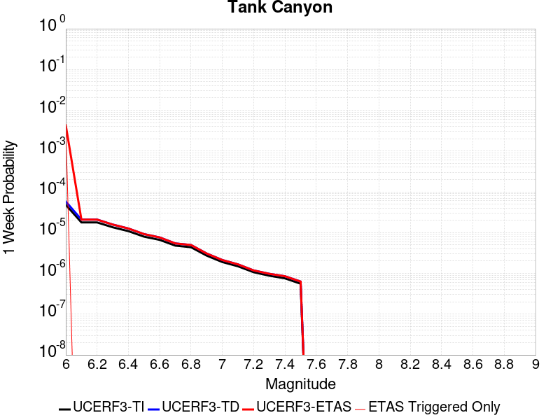 | 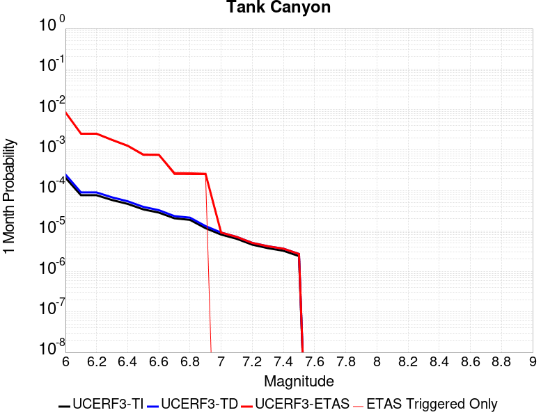 |  |  |

| Magnitude | 1 wk TI Prob | 1 wk TD Prob | 1 wk ETAS Prob | 1 wk ETAS/TD Gain | 1 wk ETAS Triggered Only | 1 mo TI Prob | 1 mo TD Prob | 1 mo ETAS Prob | 1 mo ETAS/TD Gain | 1 mo ETAS Triggered Only | 1 yr TI Prob | 1 yr TD Prob | 1 yr ETAS Prob | 1 yr ETAS/TD Gain | 1 yr ETAS Triggered Only | 10 yr TI Prob | 10 yr TD Prob | 10 yr ETAS Prob | 10 yr ETAS/TD Gain | 10 yr ETAS Triggered Only |
|-----|-----|-----|-----|-----|-----|-----|-----|-----|-----|-----|-----|-----|-----|-----|-----|-----|-----|-----|-----|-----|
| 6.0 | 4.8284557E-5 | 5.7964517E-5 | 0.005834913 | 100.66353 | 0.005777283 | 2.0691741E-4 | 2.4839956E-4 | 0.008090835 | 32.57186 | 0.007844385 | 0.0025163088 | 0.0030207448 | 0.01501599 | 4.9709563 | 0.01203159 | 0.02488006 | 0.029863482 | 0.04544367 | 1.5217136 | 0.016059786 |
| 6.1 | 1.7796336E-5 | 2.0873225E-5 | 0.0020349298 | 97.48996 | 0.0020140987 | 7.626778E-5 | 8.945383E-5 | 0.0027393466 | 30.623022 | 0.0026501298 | 9.281647E-4 | 0.0010885935 | 0.0051653506 | 4.7449765 | 0.0040812 | 0.009242975 | 0.010836697 | 0.016708659 | 1.5418589 | 0.005936291 |
| 6.2 | 1.7796336E-5 | 2.0873225E-5 | 0.0020349298 | 97.48996 | 0.0020140987 | 7.626778E-5 | 8.945383E-5 | 0.0027393466 | 30.623022 | 0.0026501298 | 9.281647E-4 | 0.0010885935 | 0.0051653506 | 4.7449765 | 0.0040812 | 0.009242975 | 0.010836697 | 0.016708659 | 1.5418589 | 0.005936291 |
| 6.3 | 1.3515912E-5 | 1.57595E-5 | 0.0013938053 | 88.44222 | 0.0013780675 | 5.792405E-5 | 6.7539106E-5 | 0.0020285028 | 30.034492 | 0.0019610962 | 7.049971E-4 | 8.220024E-4 | 0.003787708 | 4.6079035 | 0.0029681455 | 0.007027647 | 0.008192232 | 0.012450271 | 1.5197655 | 0.0042932103 |
| 6.4 | 1.0870146E-5 | 1.2617973E-5 | 9.666527E-4 | 76.60919 | 9.540467E-4 | 4.658551E-5 | 5.407601E-5 | 0.0013260696 | 24.522327 | 0.0012720623 | 5.67031E-4 | 6.581944E-4 | 0.002723935 | 4.1384964 | 0.0020671012 | 0.005655863 | 0.006564466 | 0.009513127 | 1.4491853 | 0.0029681455 |
| 6.5 | 7.964826E-6 | 9.196063E-6 | 5.3921714E-4 | 58.63566 | 5.30026E-4 | 3.4134522E-5 | 3.941116E-5 | 8.874193E-4 | 22.516954 | 8.4804156E-4 | 4.1550855E-4 | 4.797359E-4 | 0.0018041652 | 3.7607465 | 0.0013250649 | 0.0041473247 | 0.0047883047 | 0.0067400103 | 1.4075985 | 0.0019610962 |
| 6.6 | 6.6317E-6 | 7.6122747E-6 | 4.84632E-4 | 63.664547 | 4.7702336E-4 | 2.8421264E-5 | 3.2623677E-5 | 8.276367E-4 | 25.369202 | 7.9503894E-4 | 3.4597394E-4 | 3.9713003E-4 | 0.0015097426 | 3.801633 | 0.0011130546 | 0.0034543579 | 0.0039653555 | 0.005443543 | 1.3727757 | 0.0014840728 |
| 6.7 | 4.793663E-6 | 5.430772E-6 | 1.644377E-4 | 30.278883 | 1.5900779E-4 | 2.0544108E-5 | 2.3274553E-5 | 2.8828136E-4 | 12.386118 | 2.65013E-4 | 2.500958E-4 | 2.8333522E-4 | 6.542483E-4 | 2.309096 | 3.710182E-4 | 0.0024981452 | 0.0028304325 | 0.0034118108 | 1.2054026 | 5.830286E-4 |
| 6.8 | 4.382823E-6 | 4.969245E-6 | 1.6397625E-4 | 32.998222 | 1.5900779E-4 | 1.8783392E-5 | 2.1296615E-5 | 2.8630396E-4 | 13.443637 | 2.65013E-4 | 2.286638E-4 | 2.5925972E-4 | 5.771928E-4 | 2.2263114 | 3.1801558E-4 | 0.0022842865 | 0.0025902467 | 0.0031189 | 1.2040937 | 5.30026E-4 |
| 6.9 | 2.729601E-6 | 3.0735362E-6 | 5.607597E-5 | 18.244774 | 5.3002597E-5 | 1.1698237E-5 | 1.3172238E-5 | 1.7217794E-4 | 13.071274 | 1.5900779E-4 | 1.4241673E-4 | 1.6036142E-4 | 3.7233782E-4 | 2.3218665 | 2.1201039E-4 | 0.001423255 | 0.0016026229 | 0.0019201288 | 1.1981164 | 3.1801558E-4 |
| 7.0 | 1.8987357E-6 | 2.1269361E-6 | 2.1269361E-6 | 1.0 | 0.0 | 8.137413E-6 | 9.1154125E-6 | 6.211753E-5 | 6.8145604 | 5.3002597E-5 | 9.90685E-5 | 1.1097519E-4 | 2.1696862E-4 | 1.9551092 | 1.06005195E-4 | 9.902435E-4 | 0.0011092664 | 0.001215154 | 1.0954573 | 1.06005195E-4 |
| 7.1 | 1.4928986E-6 | 1.6641251E-6 | 1.6641251E-6 | 1.0 | 0.0 | 6.398121E-6 | 7.1319487E-6 | 6.0134167E-5 | 8.431661 | 5.3002597E-5 | 7.789434E-5 | 8.682861E-5 | 1.9282459E-4 | 2.2207496 | 1.06005195E-4 | 7.786704E-4 | 8.680047E-4 | 9.7391783E-4 | 1.1220192 | 1.06005195E-4 |
| 7.2 | 1.069082E-6 | 1.182856E-6 | 1.182856E-6 | 1.0 | 0.0 | 4.581772E-6 | 5.0693757E-6 | 5.0693757E-6 | 1.0 | 0.0 | 5.5781646E-5 | 6.1718434E-5 | 1.1471776E-4 | 1.8587276 | 5.3002597E-5 | 5.576765E-4 | 6.1706523E-4 | 6.700351E-4 | 1.0858417 | 5.3002597E-5 |
| 7.3 | 8.776551E-7 | 9.769996E-7 | 9.769996E-7 | 1.0 | 0.0 | 3.7613736E-6 | 4.187137E-6 | 4.187137E-6 | 1.0 | 0.0 | 4.579376E-5 | 5.097772E-5 | 1.0397762E-4 | 2.0396678 | 5.3002597E-5 | 4.5784327E-4 | 5.097113E-4 | 5.626869E-4 | 1.1039325 | 5.3002597E-5 |
| 7.4 | 7.55721E-7 | 8.5102363E-7 | 8.5102363E-7 | 1.0 | 0.0 | 3.2388E-6 | 3.647242E-6 | 3.647242E-6 | 1.0 | 0.0 | 3.9431678E-5 | 4.4404784E-5 | 9.740503E-5 | 2.1935706 | 5.3002597E-5 | 3.942468E-4 | 4.4401E-4 | 4.9698906E-4 | 1.1193196 | 5.3002597E-5 |
| 7.5 | 5.587665E-7 | 6.305613E-7 | 6.305613E-7 | 1.0 | 0.0 | 2.3947114E-6 | 2.7024057E-6 | 2.7024057E-6 | 1.0 | 0.0 | 2.915522E-5 | 3.290179E-5 | 8.590264E-5 | 2.6108806 | 5.3002597E-5 | 2.9151395E-4 | 3.2901787E-4 | 3.8200305E-4 | 1.1610403 | 5.3002597E-5 |

## Owl Lake
*[(top)](#table-of-contents)*

| 1 Week | 1 Month | 1 Year | 10 Year |
|-----|-----|-----|-----|
| 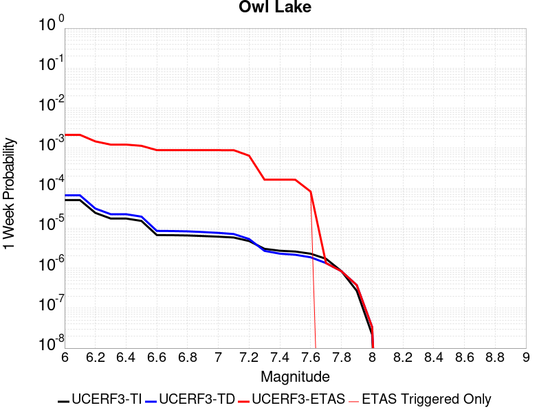 | 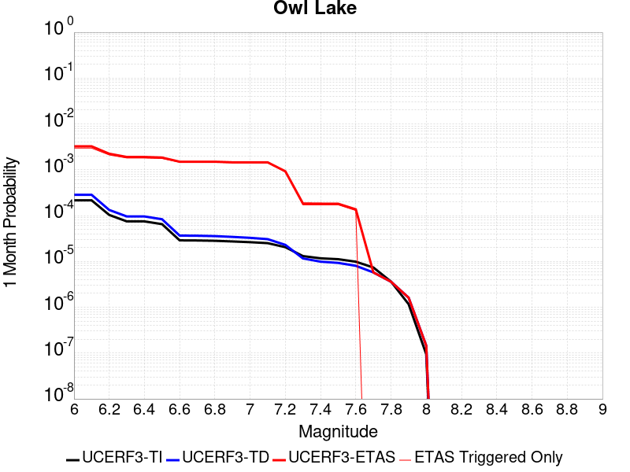 | 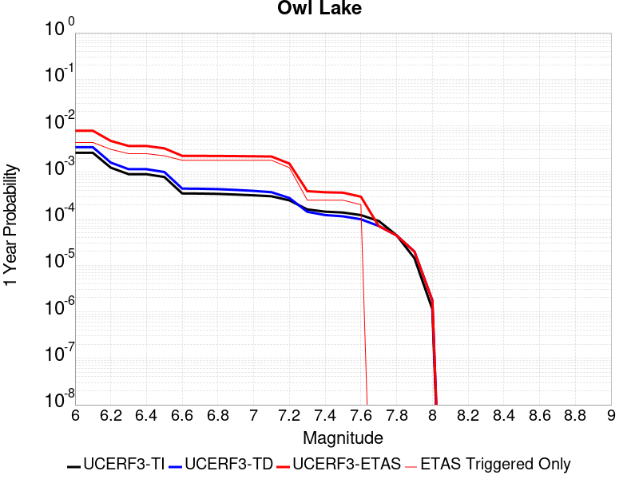 | 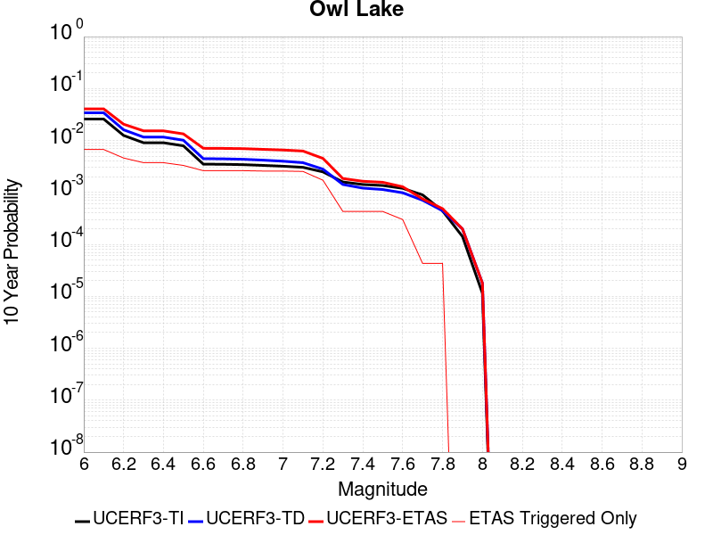 |

| Magnitude | 1 wk TI Prob | 1 wk TD Prob | 1 wk ETAS Prob | 1 wk ETAS/TD Gain | 1 wk ETAS Triggered Only | 1 mo TI Prob | 1 mo TD Prob | 1 mo ETAS Prob | 1 mo ETAS/TD Gain | 1 mo ETAS Triggered Only | 1 yr TI Prob | 1 yr TD Prob | 1 yr ETAS Prob | 1 yr ETAS/TD Gain | 1 yr ETAS Triggered Only | 10 yr TI Prob | 10 yr TD Prob | 10 yr ETAS Prob | 10 yr ETAS/TD Gain | 10 yr ETAS Triggered Only |
|-----|-----|-----|-----|-----|-----|-----|-----|-----|-----|-----|-----|-----|-----|-----|-----|-----|-----|-----|-----|-----|
| 6.0 | 5.0320643E-5 | 6.635748E-5 | 0.0021333217 | 32.148922 | 0.0020671012 | 2.1564208E-4 | 2.843645E-4 | 0.003251666 | 11.434852 | 0.0029681455 | 0.0026222812 | 0.0034577043 | 0.0077888896 | 2.2526186 | 0.004346213 | 0.02591553 | 0.0341404 | 0.040744305 | 1.1934338 | 0.006837335 |
| 6.1 | 5.0320643E-5 | 6.635748E-5 | 0.0021333217 | 32.148922 | 0.0020671012 | 2.1564208E-4 | 2.843645E-4 | 0.003251666 | 11.434852 | 0.0029681455 | 0.0026222812 | 0.0034577043 | 0.0077888896 | 2.2526186 | 0.004346213 | 0.02591553 | 0.0341404 | 0.040744305 | 1.1934338 | 0.006837335 |
| 6.2 | 2.4125871E-5 | 3.0980704E-5 | 0.0015150075 | 48.90165 | 0.0014840728 | 1.0339249E-4 | 1.3276885E-4 | 0.0021995958 | 16.567106 | 0.0020671012 | 0.0012580766 | 0.0016154221 | 0.004737524 | 2.9326847 | 0.0031271533 | 0.012509781 | 0.016070297 | 0.02060742 | 1.2823297 | 0.004611226 |
| 6.3 | 1.7433485E-5 | 2.2355249E-5 | 0.0012413877 | 55.530037 | 0.0012190597 | 7.471279E-5 | 9.580558E-5 | 0.0017917262 | 18.701689 | 0.0016960831 | 9.0924866E-4 | 0.0011659606 | 0.003654178 | 3.1340494 | 0.002491122 | 0.009055373 | 0.011628761 | 0.015295798 | 1.3153421 | 0.0037101817 |
| 6.4 | 1.7433485E-5 | 2.2355249E-5 | 0.0012413877 | 55.530037 | 0.0012190597 | 7.471279E-5 | 9.580558E-5 | 0.0017917262 | 18.701689 | 0.0016960831 | 9.0924866E-4 | 0.0011659606 | 0.003654178 | 3.1340494 | 0.002491122 | 0.009055373 | 0.011628761 | 0.015295798 | 1.3153421 | 0.0037101817 |
| 6.5 | 1.5182742E-5 | 1.9428902E-5 | 0.0011854634 | 61.01546 | 0.0011660572 | 6.506727E-5 | 8.326492E-5 | 0.0017262086 | 20.731524 | 0.0016430805 | 7.919061E-4 | 0.0010134302 | 0.0032372833 | 3.194382 | 0.0022261092 | 0.0078909 | 0.010118305 | 0.013371215 | 1.3214878 | 0.003286161 |
| 6.6 | 6.7271576E-6 | 8.547201E-6 | 0.001015588 | 118.82111 | 0.0010070493 | 2.8830356E-5 | 3.663038E-5 | 0.0014676481 | 40.066418 | 0.0014310702 | 3.5095305E-4 | 4.4588925E-4 | 0.002247174 | 5.039758 | 0.0018020883 | 0.0035039932 | 0.0044677295 | 0.007106019 | 1.5905213 | 0.0026501298 |
| 6.7 | 6.682835E-6 | 8.4796475E-6 | 0.0010155204 | 119.75975 | 0.0010070493 | 2.8640408E-5 | 3.6340873E-5 | 0.001467359 | 40.37765 | 0.0014310702 | 3.4864116E-4 | 4.4236594E-4 | 0.0022436571 | 5.071948 | 0.0018020883 | 0.003480947 | 0.004432656 | 0.0070710387 | 1.5952148 | 0.0026501298 |
| 6.8 | 6.5774975E-6 | 8.326121E-6 | 0.0010153671 | 121.949585 | 0.0010070493 | 2.8188972E-5 | 3.5682922E-5 | 0.001466702 | 41.103752 | 0.0014310702 | 3.4314668E-4 | 4.343586E-4 | 0.002235664 | 5.147047 | 0.0018020883 | 0.0034261728 | 0.0043528024 | 0.0069913967 | 1.6061829 | 0.0026501298 |
| 6.9 | 6.363419E-6 | 7.999298E-6 | 0.0010150406 | 126.89121 | 0.0010070493 | 2.727151E-5 | 3.4282286E-5 | 0.0014653034 | 42.74229 | 0.0014310702 | 3.3198006E-4 | 4.1731246E-4 | 0.0022186488 | 5.316517 | 0.0018020883 | 0.0033148455 | 0.004182795 | 0.00682184 | 1.6309285 | 0.0026501298 |
| 7.0 | 6.1342453E-6 | 7.631501E-6 | 0.0010146732 | 132.95853 | 0.0010070493 | 2.6289357E-5 | 3.2706055E-5 | 0.0014637294 | 44.75408 | 0.0014310702 | 3.2002592E-4 | 3.9812896E-4 | 0.0021994999 | 5.5245914 | 0.0018020883 | 0.0031956544 | 0.00399149 | 0.0066310423 | 1.6612948 | 0.0026501298 |
| 7.1 | 5.842926E-6 | 7.1420604E-6 | 0.0010141842 | 142.00163 | 0.0010070493 | 2.504087E-5 | 3.0608502E-5 | 0.0014616349 | 47.752575 | 0.0014310702 | 3.0482994E-4 | 3.7260022E-4 | 0.002174017 | 5.8347178 | 0.0018020883 | 0.0030441214 | 0.0037369546 | 0.0063243764 | 1.6923878 | 0.0025971273 |
| 7.2 | 4.77173E-6 | 5.3583467E-6 | 7.4739073E-4 | 139.4816 | 7.420364E-4 | 2.045011E-5 | 2.2964163E-5 | 9.76989E-4 | 42.54407 | 9.540467E-4 | 2.4895166E-4 | 2.7955687E-4 | 0.0016042513 | 5.738551 | 0.0013250649 | 0.0024867293 | 0.002808574 | 0.0046584546 | 1.6586548 | 0.0018550908 |
| 7.3 | 3.0494948E-6 | 2.7103622E-6 | 1.6171772E-4 | 59.666462 | 1.5900779E-4 | 1.3069198E-5 | 1.1615787E-5 | 2.2362372E-4 | 19.251705 | 2.1201039E-4 | 1.5910587E-4 | 1.4141318E-4 | 4.063887E-4 | 2.873768 | 2.65013E-4 | 0.0015899199 | 0.0014231888 | 0.0018995333 | 1.3347023 | 4.7702336E-4 |
| 7.4 | 2.7263884E-6 | 2.3055816E-6 | 1.61313E-4 | 69.9663 | 1.5900779E-4 | 1.1684469E-5 | 9.881027E-6 | 2.2188932E-4 | 22.456099 | 2.1201039E-4 | 1.4224913E-4 | 1.20294964E-4 | 3.8527607E-4 | 3.2027614 | 2.65013E-4 | 0.0014215811 | 0.0012111744 | 0.00168762 | 1.3933749 | 4.7702336E-4 |
| 7.5 | 2.6090431E-6 | 2.1655203E-6 | 1.6117297E-4 | 74.4269 | 1.5900779E-4 | 1.1181565E-5 | 9.280769E-6 | 2.2128918E-4 | 23.843843 | 2.1201039E-4 | 1.3612706E-4 | 1.129876E-4 | 3.7797063E-4 | 3.34524 | 2.65013E-4 | 0.001360437 | 0.0011379321 | 0.0016144126 | 1.4187249 | 4.7702336E-4 |
| 7.6 | 2.3008756E-6 | 1.872704E-6 | 1.078777E-4 | 57.605312 | 1.06005195E-4 | 9.860858E-6 | 8.025851E-6 | 1.6703237E-4 | 20.811796 | 1.5900779E-4 | 1.20049335E-4 | 9.771043E-5 | 3.097001E-4 | 3.1695707 | 2.1201039E-4 | 0.001199845 | 9.849465E-4 | 0.0013026489 | 1.3225579 | 3.1801558E-4 |
| 7.7 | 1.7184348E-6 | 1.3418345E-6 | 1.3418345E-6 | 1.0 | 0.0 | 7.3646997E-6 | 5.750707E-6 | 5.750707E-6 | 1.0 | 0.0 | 8.966153E-5 | 7.001265E-5 | 7.001265E-5 | 1.0 | 0.0 | 8.962536E-4 | 7.077913E-4 | 7.607564E-4 | 1.0748315 | 5.3002597E-5 |
| 7.8 | 8.4612907E-7 | 8.4052675E-7 | 8.4052675E-7 | 1.0 | 0.0 | 3.6262625E-6 | 3.6022527E-6 | 3.6022527E-6 | 1.0 | 0.0 | 4.4148852E-5 | 4.3856566E-5 | 4.3856566E-5 | 1.0 | 0.0 | 4.414008E-4 | 4.4395277E-4 | 4.9693184E-4 | 1.1193349 | 5.3002597E-5 |
| 7.9 | 2.716738E-7 | 3.767845E-7 | 3.767845E-7 | 1.0 | 0.0 | 1.1643157E-6 | 1.6147899E-6 | 1.6147899E-6 | 1.0 | 0.0 | 1.4175452E-5 | 1.96599E-5 | 1.96599E-5 | 1.0 | 0.0 | 1.4174548E-4 | 1.9835318E-4 | 1.9835318E-4 | 1.0 | 0.0 |
| 8.0 | 2.1995428E-8 | 3.38465E-8 | 3.38465E-8 | 1.0 | 0.0 | 9.426611E-8 | 1.4505643E-7 | 1.4505643E-7 | 1.0 | 0.0 | 1.1476893E-6 | 1.7660612E-6 | 1.7660612E-6 | 1.0 | 0.0 | 1.14768345E-5 | 1.796186E-5 | 1.796186E-5 | 1.0 | 0.0 |

## Garlock (East)
*[(top)](#table-of-contents)*

| 1 Week | 1 Month | 1 Year | 10 Year |
|-----|-----|-----|-----|
| 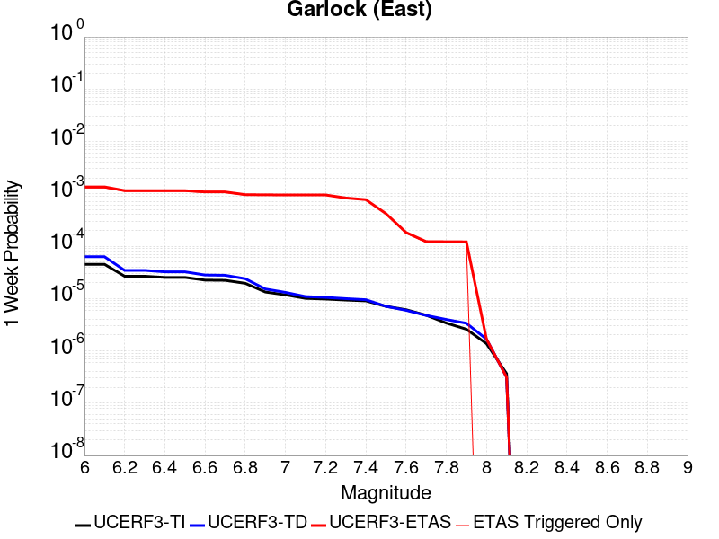 | 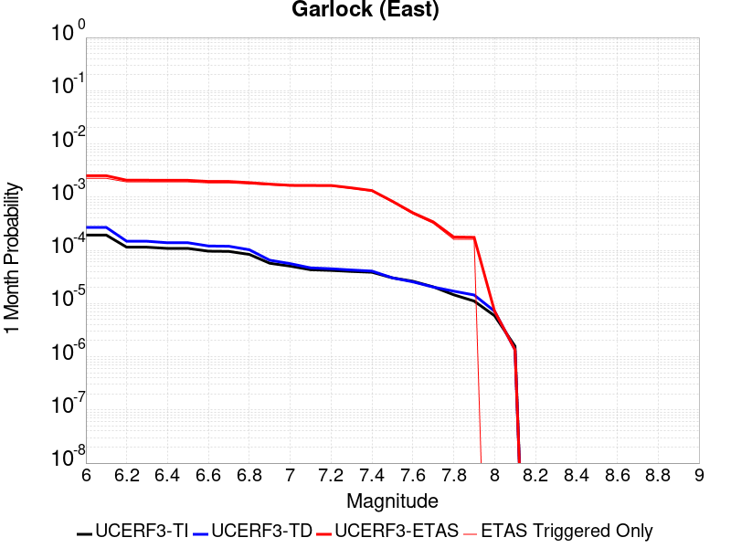 | 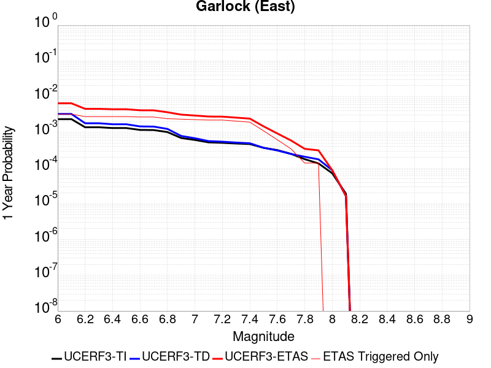 | 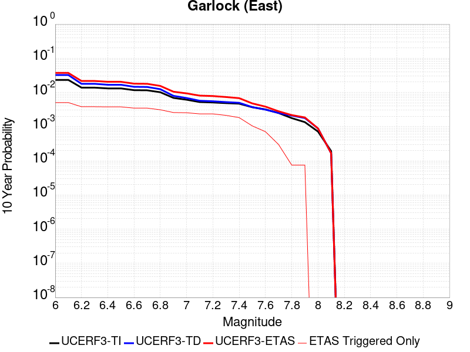 |

| Magnitude | 1 wk TI Prob | 1 wk TD Prob | 1 wk ETAS Prob | 1 wk ETAS/TD Gain | 1 wk ETAS Triggered Only | 1 mo TI Prob | 1 mo TD Prob | 1 mo ETAS Prob | 1 mo ETAS/TD Gain | 1 mo ETAS Triggered Only | 1 yr TI Prob | 1 yr TD Prob | 1 yr ETAS Prob | 1 yr ETAS/TD Gain | 1 yr ETAS Triggered Only | 10 yr TI Prob | 10 yr TD Prob | 10 yr ETAS Prob | 10 yr ETAS/TD Gain | 10 yr ETAS Triggered Only |
|-----|-----|-----|-----|-----|-----|-----|-----|-----|-----|-----|-----|-----|-----|-----|-----|-----|-----|-----|-----|-----|
| 6.0 | 4.5092507E-5 | 6.290254E-5 | 0.0013348849 | 21.22148 | 0.0012720623 | 1.9323928E-4 | 2.6955697E-4 | 0.0022301243 | 8.273295 | 0.0019610962 | 0.0023501497 | 0.003277363 | 0.0063942675 | 1.9510404 | 0.0031271533 | 0.023254504 | 0.032351483 | 0.037018683 | 1.1442653 | 0.0048232363 |
| 6.1 | 4.5092507E-5 | 6.290254E-5 | 0.0013348849 | 21.22148 | 0.0012720623 | 1.9323928E-4 | 2.6955697E-4 | 0.0022301243 | 8.273295 | 0.0019610962 | 0.0023501497 | 0.003277363 | 0.0063942675 | 1.9510404 | 0.0031271533 | 0.023254504 | 0.032351483 | 0.037018683 | 1.1442653 | 0.0048232363 |
| 6.2 | 2.6674514E-5 | 3.450911E-5 | 0.0010945245 | 31.71697 | 0.001060052 | 1.1431433E-4 | 1.4788799E-4 | 0.0017377308 | 11.750317 | 0.0015900779 | 0.0013908884 | 0.0017990824 | 0.004391537 | 2.4409873 | 0.0025971273 | 0.01382215 | 0.01789001 | 0.021533817 | 1.2036783 | 0.0037101817 |
| 6.3 | 2.6674514E-5 | 3.450911E-5 | 0.0010945245 | 31.71697 | 0.001060052 | 1.1431433E-4 | 1.4788799E-4 | 0.0017377308 | 11.750317 | 0.0015900779 | 0.0013908884 | 0.0017990824 | 0.004391537 | 2.4409873 | 0.0025971273 | 0.01382215 | 0.01789001 | 0.021533817 | 1.2036783 | 0.0037101817 |
| 6.4 | 2.5312667E-5 | 3.233838E-5 | 0.001092356 | 33.77894 | 0.001060052 | 1.0847834E-4 | 1.3858585E-4 | 0.0017284434 | 12.472005 | 0.0015900779 | 0.0013199237 | 0.0016860063 | 0.004278755 | 2.5378048 | 0.0025971273 | 0.013121112 | 0.016778054 | 0.020425986 | 1.2174228 | 0.0037101817 |
| 6.5 | 2.5312667E-5 | 3.233838E-5 | 0.001092356 | 33.77894 | 0.001060052 | 1.0847834E-4 | 1.3858585E-4 | 0.0017284434 | 12.472005 | 0.0015900779 | 0.0013199237 | 0.0016860063 | 0.004278755 | 2.5378048 | 0.0025971273 | 0.013121112 | 0.016778054 | 0.020425986 | 1.2174228 | 0.0037101817 |
| 6.6 | 2.246556E-5 | 2.8133245E-5 | 0.0010351542 | 36.794697 | 0.0010070493 | 9.627742E-5 | 1.20565615E-4 | 0.0016044594 | 13.30777 | 0.0014840728 | 0.0011715472 | 0.0014669215 | 0.003954389 | 2.6957061 | 0.002491122 | 0.011653901 | 0.014618388 | 0.018013194 | 1.2322285 | 0.0034451687 |
| 6.7 | 2.2241198E-5 | 2.780299E-5 | 0.0010348243 | 37.219894 | 0.0010070493 | 9.531594E-5 | 1.1915036E-4 | 0.0016030462 | 13.453978 | 0.0014840728 | 0.0011598538 | 0.0014497138 | 0.0039372244 | 2.7158632 | 0.002491122 | 0.011538187 | 0.014448582 | 0.017843973 | 1.2349982 | 0.0034451687 |
| 6.8 | 1.9528685E-5 | 2.3897695E-5 | 9.249203E-4 | 38.703327 | 9.010442E-4 | 8.369167E-5 | 1.02414786E-4 | 0.0014803412 | 14.45437 | 0.0013780675 | 0.0010184698 | 0.0012462065 | 0.0034166048 | 2.741604 | 0.0021731064 | 0.010138147 | 0.012436173 | 0.0153674055 | 1.2357022 | 0.0029681455 |
| 6.9 | 1.3318621E-5 | 1.5198458E-5 | 9.162289E-4 | 60.284332 | 9.010442E-4 | 5.7078556E-5 | 6.5134656E-5 | 0.0013901133 | 21.342146 | 0.0013250649 | 6.9470983E-4 | 7.927316E-4 | 0.0029111549 | 3.6723082 | 0.002120104 | 0.0069254204 | 0.007939667 | 0.010568756 | 1.3311334 | 0.0026501298 |
| 7.0 | 1.1760853E-5 | 1.31073775E-5 | 9.1413973E-4 | 69.74238 | 9.010442E-4 | 5.0402683E-5 | 5.6173292E-5 | 0.0013281641 | 23.64405 | 0.0012720623 | 6.134799E-4 | 6.8370026E-4 | 0.0027493883 | 4.0213356 | 0.0020671012 | 0.0061178906 | 0.006856307 | 0.009435628 | 1.3761967 | 0.0025971273 |
| 7.1 | 1.0064758E-5 | 1.0902532E-5 | 9.1193686E-4 | 83.6445 | 9.010442E-4 | 4.3133965E-5 | 4.6724323E-5 | 0.0013187273 | 28.22357 | 0.0012720623 | 5.2502943E-4 | 5.6872366E-4 | 0.002581677 | 4.5394225 | 0.0020140987 | 0.005237907 | 0.0057127923 | 0.008136983 | 1.4243443 | 0.0024381194 |
| 7.2 | 9.768808E-6 | 1.0498412E-5 | 9.115331E-4 | 86.825806 | 9.010442E-4 | 4.186565E-5 | 4.4992437E-5 | 0.0013169976 | 29.271532 | 0.0012720623 | 5.095951E-4 | 5.4764876E-4 | 0.0025606444 | 4.675706 | 0.0020140987 | 0.0050842804 | 0.00550306 | 0.007927762 | 1.4406098 | 0.0024381194 |
| 7.3 | 9.344516E-6 | 9.94408E-6 | 8.049751E-4 | 80.95019 | 7.9503894E-4 | 4.004731E-5 | 4.2616808E-5 | 0.0012086242 | 28.360271 | 0.0011660572 | 4.8746695E-4 | 5.187396E-4 | 0.0023728681 | 4.5742955 | 0.0018550908 | 0.0048639905 | 0.0052147433 | 0.007429244 | 1.4246614 | 0.0022261092 |
| 7.4 | 9.023491E-6 | 9.490282E-6 | 7.515196E-4 | 79.18834 | 7.420364E-4 | 3.867153E-5 | 4.067202E-5 | 0.0011006808 | 27.06236 | 0.001060052 | 4.7072413E-4 | 4.950727E-4 | 0.002190316 | 4.4242315 | 0.0016960831 | 0.004697283 | 0.0049782004 | 0.0069295336 | 1.3919756 | 0.0019610962 |
| 7.5 | 7.081253E-6 | 7.0873343E-6 | 4.3110512E-4 | 60.827538 | 4.2402078E-4 | 3.0347876E-5 | 3.037394E-5 | 6.663858E-4 | 21.939392 | 6.3603115E-4 | 3.6942272E-4 | 3.697407E-4 | 0.0013234348 | 3.5793588 | 9.540467E-4 | 0.003688092 | 0.0037241387 | 0.004833048 | 1.2977626 | 0.0011130546 |
| 7.6 | 6.116396E-6 | 5.958924E-6 | 2.1796805E-4 | 36.578426 | 2.1201039E-4 | 2.6212863E-5 | 2.5537996E-5 | 3.965467E-4 | 15.527715 | 3.710182E-4 | 3.1909486E-4 | 3.10881E-4 | 8.937283E-4 | 2.8748245 | 5.830286E-4 | 0.0031863707 | 0.003135588 | 0.0038752977 | 1.2359078 | 7.420364E-4 |
| 7.7 | 4.797145E-6 | 4.7569774E-6 | 1.1076167E-4 | 23.284044 | 1.06005195E-4 | 2.055903E-5 | 2.0386888E-5 | 2.3239295E-4 | 11.399138 | 2.1201039E-4 | 2.5027743E-4 | 2.4818222E-4 | 5.131294E-4 | 2.0675511 | 2.65013E-4 | 0.0024999576 | 0.0025091893 | 0.0028264069 | 1.1264224 | 3.1801558E-4 |
| 7.8 | 3.4028885E-6 | 3.9781908E-6 | 1.0998296E-4 | 27.646477 | 1.06005195E-4 | 1.4583726E-5 | 1.7049279E-5 | 1.2305267E-4 | 7.2174706 | 1.06005195E-4 | 1.775424E-4 | 2.0755526E-4 | 3.1353845E-4 | 1.5106263 | 1.06005195E-4 | 0.0017740062 | 0.0021010821 | 0.0022068645 | 1.0503466 | 1.06005195E-4 |
| 7.9 | 2.5928412E-6 | 3.37222E-6 | 1.09377055E-4 | 32.434734 | 1.06005195E-4 | 1.1112129E-5 | 1.4452292E-5 | 1.2045595E-4 | 8.33473 | 1.06005195E-4 | 1.3528178E-4 | 1.759425E-4 | 2.8192904E-4 | 1.602393 | 1.06005195E-4 | 0.0013519945 | 0.0017811217 | 0.0018869381 | 1.05941 | 1.06005195E-4 |
| 8.0 | 1.3743648E-6 | 1.6733709E-6 | 1.6733709E-6 | 1.0 | 0.0 | 5.8901214E-6 | 7.17157E-6 | 7.17157E-6 | 1.0 | 0.0 | 7.1709874E-5 | 8.731039E-5 | 8.731039E-5 | 1.0 | 0.0 | 7.1686733E-4 | 8.8366936E-4 | 8.8366936E-4 | 1.0 | 0.0 |
| 8.1 | 3.6733252E-7 | 3.148811E-7 | 3.148811E-7 | 1.0 | 0.0 | 1.5742813E-6 | 1.3494899E-6 | 1.3494899E-6 | 1.0 | 0.0 | 1.9166706E-5 | 1.6429933E-5 | 1.6429933E-5 | 1.0 | 0.0 | 1.9165053E-4 | 1.6637788E-4 | 1.6637788E-4 | 1.0 | 0.0 |

## Little Lake
*[(top)](#table-of-contents)*

| 1 Week | 1 Month | 1 Year | 10 Year |
|-----|-----|-----|-----|
| 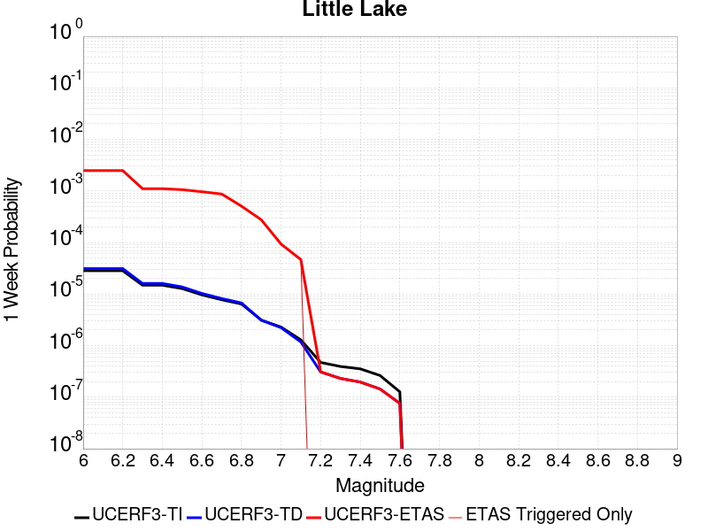 | 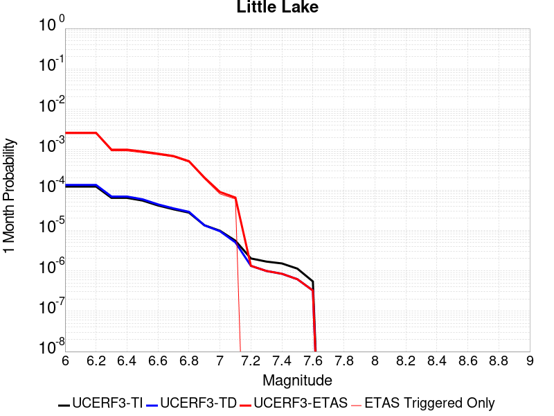 | 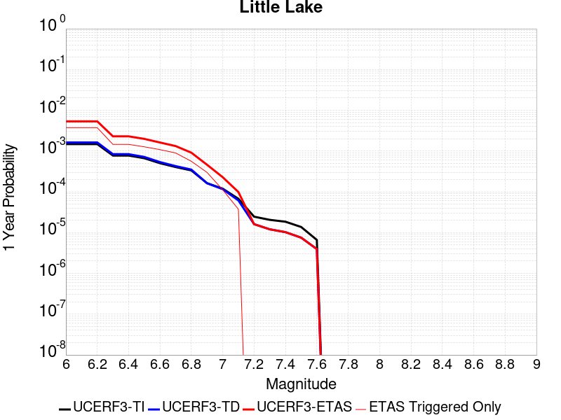 | 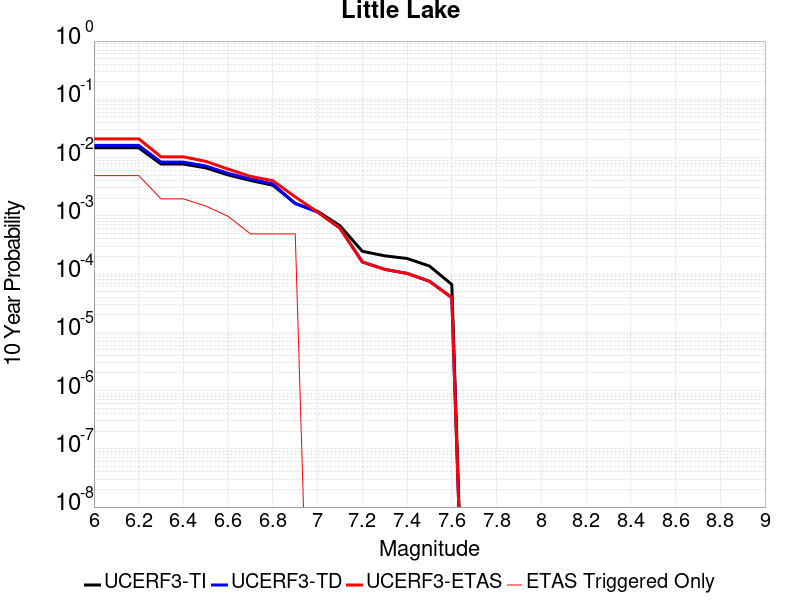 |

| Magnitude | 1 wk TI Prob | 1 wk TD Prob | 1 wk ETAS Prob | 1 wk ETAS/TD Gain | 1 wk ETAS Triggered Only | 1 mo TI Prob | 1 mo TD Prob | 1 mo ETAS Prob | 1 mo ETAS/TD Gain | 1 mo ETAS Triggered Only | 1 yr TI Prob | 1 yr TD Prob | 1 yr ETAS Prob | 1 yr ETAS/TD Gain | 1 yr ETAS Triggered Only | 10 yr TI Prob | 10 yr TD Prob | 10 yr ETAS Prob | 10 yr ETAS/TD Gain | 10 yr ETAS Triggered Only |
|-----|-----|-----|-----|-----|-----|-----|-----|-----|-----|-----|-----|-----|-----|-----|-----|-----|-----|-----|-----|-----|
| 6.0 | 2.8424427E-5 | 3.1205633E-5 | 0.002469249 | 79.12831 | 0.0024381194 | 1.2181328E-4 | 1.3373232E-4 | 0.0032604674 | 24.380548 | 0.0031271533 | 0.0014820677 | 0.0016271081 | 0.005331253 | 3.2765205 | 0.0037101817 | 0.014722223 | 0.016165355 | 0.021223497 | 1.3129001 | 0.0051412517 |
| 6.1 | 2.8424427E-5 | 3.1205633E-5 | 0.002469249 | 79.12831 | 0.0024381194 | 1.2181328E-4 | 1.3373232E-4 | 0.0032604674 | 24.380548 | 0.0031271533 | 0.0014820677 | 0.0016271081 | 0.005331253 | 3.2765205 | 0.0037101817 | 0.014722223 | 0.016165355 | 0.021223497 | 1.3129001 | 0.0051412517 |
| 6.2 | 2.8424427E-5 | 3.1205633E-5 | 0.002469249 | 79.12831 | 0.0024381194 | 1.2181328E-4 | 1.3373232E-4 | 0.0032604674 | 24.380548 | 0.0031271533 | 0.0014820677 | 0.0016271081 | 0.005331253 | 3.2765205 | 0.0037101817 | 0.014722223 | 0.016165355 | 0.021223497 | 1.3129001 | 0.0051412517 |
| 6.3 | 1.48860645E-5 | 1.6081349E-5 | 0.001129118 | 70.21289 | 0.0011130546 | 6.379586E-5 | 6.89184E-5 | 0.0013408931 | 19.456242 | 0.0012720623 | 7.7643775E-4 | 8.387868E-4 | 0.0023216147 | 2.7678246 | 0.0014840728 | 0.007737305 | 0.008359027 | 0.010619087 | 1.2703737 | 0.0022791116 |
| 6.4 | 1.48860645E-5 | 1.6081349E-5 | 0.001129118 | 70.21289 | 0.0011130546 | 6.379586E-5 | 6.89184E-5 | 0.0013408931 | 19.456242 | 0.0012720623 | 7.7643775E-4 | 8.387868E-4 | 0.0023216147 | 2.7678246 | 0.0014840728 | 0.007737305 | 0.008359027 | 0.010619087 | 1.2703737 | 0.0022791116 |
| 6.5 | 1.2797581E-5 | 1.3765531E-5 | 0.0010738029 | 78.006645 | 0.001060052 | 5.4845623E-5 | 5.899394E-5 | 0.0011719828 | 19.866156 | 0.0011130546 | 6.675408E-4 | 7.180402E-4 | 0.001989189 | 2.7703032 | 0.0012720623 | 0.006655392 | 0.0071597523 | 0.009106807 | 1.2719445 | 0.0019610962 |
| 6.6 | 9.661896E-6 | 1.02890135E-5 | 9.6432597E-4 | 93.72385 | 9.540467E-4 | 4.1407468E-5 | 4.409512E-5 | 9.980998E-4 | 22.635155 | 9.540467E-4 | 5.040193E-4 | 5.3674204E-4 | 0.0016491992 | 3.0726104 | 0.0011130546 | 0.005028777 | 0.0053560617 | 0.007148498 | 1.3346556 | 0.0018020883 |
| 6.7 | 7.767871E-6 | 8.199668E-6 | 8.562343E-4 | 104.42304 | 8.4804156E-4 | 3.329045E-5 | 3.5141038E-5 | 8.8315277E-4 | 25.131664 | 8.4804156E-4 | 4.0523586E-4 | 4.2777188E-4 | 0.0013284306 | 3.105465 | 9.010442E-4 | 0.004044977 | 0.0042708362 | 0.005801347 | 1.3583633 | 0.0015370753 |
| 6.8 | 6.4235196E-6 | 6.7357296E-6 | 4.3075366E-4 | 63.950554 | 4.2402078E-4 | 2.752908E-5 | 2.8867165E-5 | 4.528757E-4 | 15.688264 | 4.2402078E-4 | 3.35115E-4 | 3.5141388E-4 | 8.2826964E-4 | 2.3569634 | 4.7702336E-4 | 0.003346101 | 0.0035098423 | 0.0045661735 | 1.3009626 | 0.001060052 |
| 6.9 | 3.1283696E-6 | 3.1121751E-6 | 2.6812433E-4 | 86.15336 | 2.65013E-4 | 1.3407229E-5 | 1.33378335E-5 | 2.783473E-4 | 20.869001 | 2.65013E-4 | 1.6322079E-4 | 1.6237753E-4 | 4.273475E-4 | 2.631814 | 2.65013E-4 | 0.0016310095 | 0.0016227373 | 0.0020460698 | 1.2608757 | 4.2402078E-4 |
| 7.0 | 2.290603E-6 | 2.2286777E-6 | 5.5231158E-5 | 24.782032 | 5.3002597E-5 | 9.816834E-6 | 9.551446E-6 | 6.255354E-5 | 6.549117 | 5.3002597E-5 | 1.19513395E-4 | 1.1628369E-4 | 1.6928013E-4 | 1.4557512 | 5.3002597E-5 | 0.0011944914 | 0.0011623306 | 0.0012682126 | 1.0910945 | 1.06005195E-4 |
| 7.1 | 1.293693E-6 | 1.1776802E-6 | 1.1776802E-6 | 1.0 | 0.0 | 5.5443866E-6 | 5.0471954E-6 | 5.0471954E-6 | 1.0 | 0.0 | 6.750081E-5 | 6.144857E-5 | 6.144857E-5 | 1.0 | 0.0 | 6.7480316E-4 | 6.1438425E-4 | 6.673543E-4 | 1.0862164 | 5.3002597E-5 |
| 7.2 | 4.715842E-7 | 3.091774E-7 | 3.091774E-7 | 1.0 | 0.0 | 2.0210737E-6 | 1.3250453E-6 | 1.3250453E-6 | 1.0 | 0.0 | 2.4606294E-5 | 1.6132313E-5 | 1.6132313E-5 | 1.0 | 0.0 | 2.460357E-4 | 1.6131197E-4 | 1.6131197E-4 | 1.0 | 0.0 |
| 7.3 | 3.9430947E-7 | 2.309738E-7 | 2.309738E-7 | 1.0 | 0.0 | 1.6898966E-6 | 9.898873E-7 | 9.898873E-7 | 1.0 | 0.0 | 2.0574296E-5 | 1.20518125E-5 | 1.20518125E-5 | 1.0 | 0.0 | 2.0572392E-4 | 1.2051166E-4 | 1.2051166E-4 | 1.0 | 0.0 |
| 7.4 | 3.547123E-7 | 1.9679035E-7 | 1.9679035E-7 | 1.0 | 0.0 | 1.5201948E-6 | 8.4338694E-7 | 8.4338694E-7 | 1.0 | 0.0 | 1.8508214E-5 | 1.0268188E-5 | 1.0268188E-5 | 1.0 | 0.0 | 1.8506673E-4 | 1.026772E-4 | 1.026772E-4 | 1.0 | 0.0 |
| 7.5 | 2.6354266E-7 | 1.4423068E-7 | 1.4423068E-7 | 1.0 | 0.0 | 1.129468E-6 | 6.1813137E-7 | 6.1813137E-7 | 1.0 | 0.0 | 1.3751187E-5 | 7.5257235E-6 | 7.5257235E-6 | 1.0 | 0.0 | 1.3750336E-4 | 7.525474E-5 | 7.525474E-5 | 1.0 | 0.0 |
| 7.6 | 1.269913E-7 | 7.572526E-8 | 7.572526E-8 | 1.0 | 0.0 | 5.4424834E-7 | 3.245368E-7 | 3.245368E-7 | 1.0 | 0.0 | 6.6262032E-6 | 3.951229E-6 | 3.951229E-6 | 1.0 | 0.0 | 6.626006E-5 | 3.9511622E-5 | 3.9511622E-5 | 1.0 | 0.0 |

## Panamint Valley
*[(top)](#table-of-contents)*

| 1 Week | 1 Month | 1 Year | 10 Year |
|-----|-----|-----|-----|
|  | 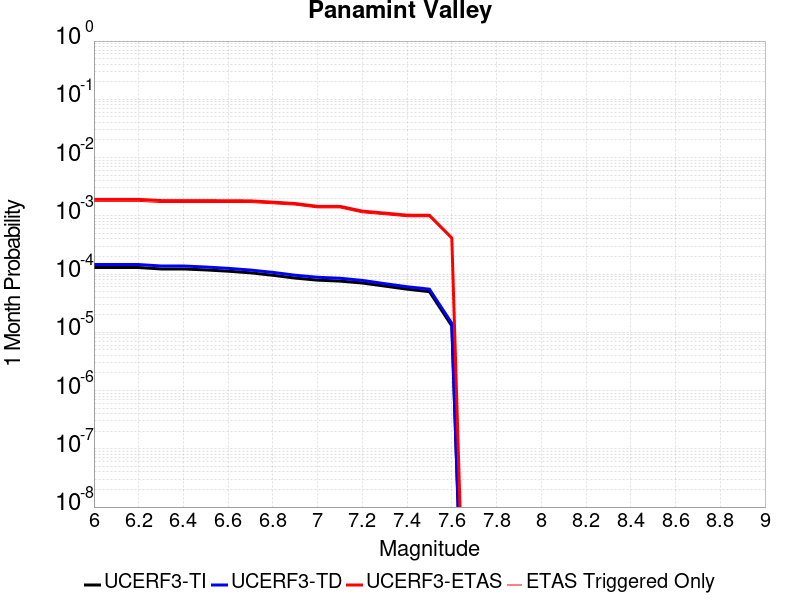 | 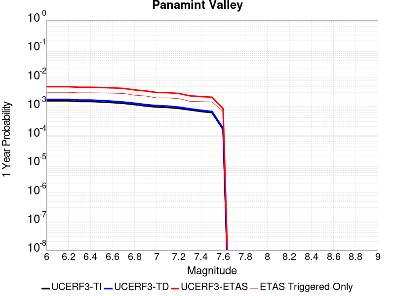 | 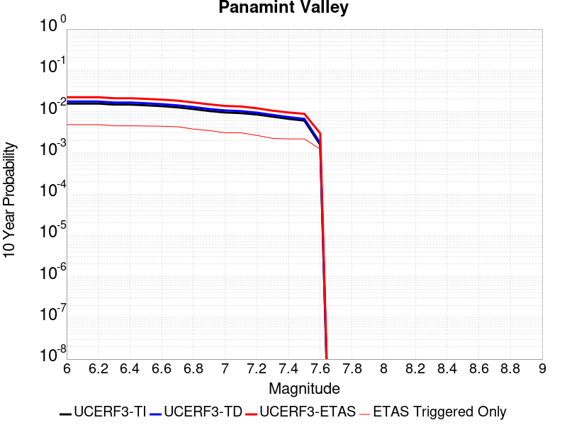 |

| Magnitude | 1 wk TI Prob | 1 wk TD Prob | 1 wk ETAS Prob | 1 wk ETAS/TD Gain | 1 wk ETAS Triggered Only | 1 mo TI Prob | 1 mo TD Prob | 1 mo ETAS Prob | 1 mo ETAS/TD Gain | 1 mo ETAS Triggered Only | 1 yr TI Prob | 1 yr TD Prob | 1 yr ETAS Prob | 1 yr ETAS/TD Gain | 1 yr ETAS Triggered Only | 10 yr TI Prob | 10 yr TD Prob | 10 yr ETAS Prob | 10 yr ETAS/TD Gain | 10 yr ETAS Triggered Only |
|-----|-----|-----|-----|-----|-----|-----|-----|-----|-----|-----|-----|-----|-----|-----|-----|-----|-----|-----|-----|-----|
| 6.0 | 3.0211835E-5 | 3.398435E-5 | 0.0014650058 | 43.10825 | 0.0014310702 | 1.2947287E-4 | 1.4563925E-4 | 0.0022654345 | 15.555108 | 0.002120104 | 0.0015751923 | 0.0017717453 | 0.005052084 | 2.851473 | 0.003286161 | 0.015640736 | 0.017583055 | 0.0221132 | 1.2576427 | 0.004611226 |
| 6.1 | 3.0211835E-5 | 3.398435E-5 | 0.0014650058 | 43.10825 | 0.0014310702 | 1.2947287E-4 | 1.4563925E-4 | 0.0022654345 | 15.555108 | 0.002120104 | 0.0015751923 | 0.0017717453 | 0.005052084 | 2.851473 | 0.003286161 | 0.015640736 | 0.017583055 | 0.0221132 | 1.2576427 | 0.004611226 |
| 6.2 | 3.0211835E-5 | 3.398435E-5 | 0.0014650058 | 43.10825 | 0.0014310702 | 1.2947287E-4 | 1.4563925E-4 | 0.0022654345 | 15.555108 | 0.002120104 | 0.0015751923 | 0.0017717453 | 0.005052084 | 2.851473 | 0.003286161 | 0.015640736 | 0.017583055 | 0.0221132 | 1.2576427 | 0.004611226 |
| 6.3 | 2.8573924E-5 | 3.2102525E-5 | 0.0014631267 | 45.576683 | 0.0014310702 | 1.2245393E-4 | 1.3757516E-4 | 0.002204392 | 16.023184 | 0.0020671012 | 0.001489857 | 0.0016737186 | 0.004795638 | 2.8652594 | 0.0031271533 | 0.01479908 | 0.016617723 | 0.020891711 | 1.2571946 | 0.004346213 |
| 6.4 | 2.8573924E-5 | 3.2102525E-5 | 0.0014631267 | 45.576683 | 0.0014310702 | 1.2245393E-4 | 1.3757516E-4 | 0.002204392 | 16.023184 | 0.0020671012 | 0.001489857 | 0.0016737186 | 0.004795638 | 2.8652594 | 0.0031271533 | 0.01479908 | 0.016617723 | 0.020891711 | 1.2571946 | 0.004346213 |
| 6.5 | 2.7468774E-5 | 3.0828287E-5 | 0.0014618543 | 47.41925 | 0.0014310702 | 1.1771801E-4 | 1.321147E-4 | 0.002198943 | 16.644196 | 0.0020671012 | 0.0014322745 | 0.0016073369 | 0.0046765464 | 2.9094996 | 0.0030741505 | 0.014230782 | 0.015963601 | 0.020188276 | 1.2646443 | 0.0042932103 |
| 6.6 | 2.6135967E-5 | 2.925234E-5 | 0.0014072795 | 48.108273 | 0.0013780675 | 1.1200648E-4 | 1.253613E-4 | 0.0021392074 | 17.064337 | 0.0020140987 | 0.0013628257 | 0.0015252318 | 0.004541772 | 2.9777584 | 0.003021148 | 0.013544982 | 0.0151539715 | 0.019329924 | 1.2755681 | 0.004240208 |
| 6.7 | 2.4498746E-5 | 2.73412E-5 | 0.001405371 | 51.40122 | 0.0013780675 | 1.04990395E-4 | 1.17171454E-4 | 0.0021310342 | 18.187315 | 0.0020140987 | 0.0012775084 | 0.0014256539 | 0.0043895678 | 3.0789855 | 0.0029681455 | 0.012701893 | 0.014171205 | 0.018246822 | 1.2875984 | 0.0041342024 |
| 6.8 | 2.2244329E-5 | 2.4935298E-5 | 0.0012439647 | 49.8877 | 0.0012190597 | 9.532935E-5 | 1.0686131E-4 | 0.001961754 | 18.357944 | 0.0018550908 | 0.0011600169 | 0.0013002817 | 0.003999899 | 3.076179 | 0.0027031323 | 0.011539802 | 0.012932454 | 0.016542338 | 1.2791337 | 0.0036571792 |
| 6.9 | 1.9902658E-5 | 2.229015E-5 | 0.0011353199 | 50.9337 | 0.0011130546 | 8.529431E-5 | 9.552582E-5 | 0.0018444444 | 19.308332 | 0.0017490857 | 0.0010379635 | 0.0011624249 | 0.0037565331 | 3.231635 | 0.0025971273 | 0.010331288 | 0.011568548 | 0.0149214715 | 1.289831 | 0.0033921662 |
| 7.0 | 1.8353881E-5 | 2.0566078E-5 | 0.0010275947 | 49.96552 | 0.0010070493 | 7.865712E-5 | 8.813745E-5 | 0.0016250773 | 18.437988 | 0.0015370753 | 9.5722964E-4 | 0.001072563 | 0.0032962845 | 3.0732782 | 0.0022261092 | 0.009531168 | 0.010678793 | 0.013562806 | 1.2700691 | 0.0029151428 |
| 7.1 | 1.7667631E-5 | 1.9772506E-5 | 0.0010268019 | 51.930794 | 0.0010070493 | 7.571623E-5 | 8.473666E-5 | 0.0016216817 | 19.137901 | 0.0015370753 | 9.2145515E-4 | 0.0010311981 | 0.0032550115 | 3.1565337 | 0.0022261092 | 0.009176437 | 0.010269018 | 0.0131542245 | 1.2809623 | 0.0029151428 |
| 7.2 | 1.6381597E-5 | 1.815815E-5 | 9.191859E-4 | 50.62112 | 9.010442E-4 | 7.020495E-5 | 7.7818426E-5 | 0.0014557787 | 18.707378 | 0.0013780675 | 8.544101E-4 | 9.4704475E-4 | 0.0030121885 | 3.1806188 | 0.0020671012 | 0.008511325 | 0.009434741 | 0.011954863 | 1.2671108 | 0.0025441246 |
| 7.3 | 1.4520491E-5 | 1.5966394E-5 | 8.109927E-4 | 50.793728 | 7.9503894E-4 | 6.222919E-5 | 6.84257E-5 | 0.001287402 | 18.814598 | 0.0012190597 | 7.57377E-4 | 8.327807E-4 | 0.0025274514 | 3.0349543 | 0.0016960831 | 0.0075480095 | 0.008299708 | 0.010402216 | 1.2533231 | 0.002120104 |
| 7.4 | 1.2852287E-5 | 1.4145337E-5 | 7.561712E-4 | 53.457275 | 7.420364E-4 | 5.5080065E-5 | 6.0621558E-5 | 0.0012266081 | 20.233858 | 0.0011660572 | 6.7039346E-4 | 7.378333E-4 | 0.0023797015 | 3.2252562 | 0.0016430805 | 0.0066837464 | 0.0073567564 | 0.009408651 | 1.2789129 | 0.0020671012 |
| 7.5 | 1.1637851E-5 | 1.2836727E-5 | 7.5486355E-4 | 58.804985 | 7.420364E-4 | 4.987555E-5 | 5.5013472E-5 | 0.0012210065 | 22.194681 | 0.0011660572 | 6.070656E-4 | 6.6959887E-4 | 0.0023115792 | 3.452185 | 0.0016430805 | 0.006054099 | 0.0066787098 | 0.008732005 | 1.307439 | 0.0020671012 |
| 7.6 | 3.0068115E-6 | 3.3330039E-6 | 3.7434994E-4 | 112.31608 | 3.710182E-4 | 1.2886271E-5 | 1.42842655E-5 | 5.443027E-4 | 38.10505 | 5.30026E-4 | 1.5687906E-4 | 1.7390434E-4 | 0.0010217985 | 5.875635 | 8.4804156E-4 | 0.0015676835 | 0.0017391219 | 0.0029560616 | 1.6997437 | 0.0012190597 |

## Blackwater
*[(top)](#table-of-contents)*

| 1 Week | 1 Month | 1 Year | 10 Year |
|-----|-----|-----|-----|
| 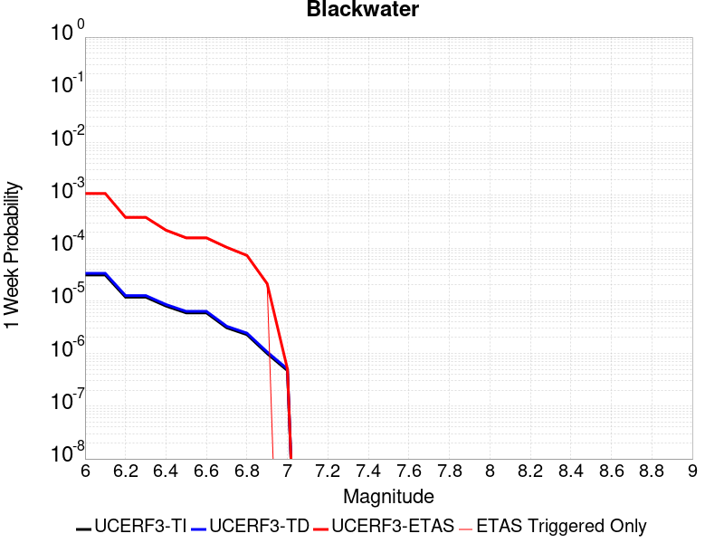 | 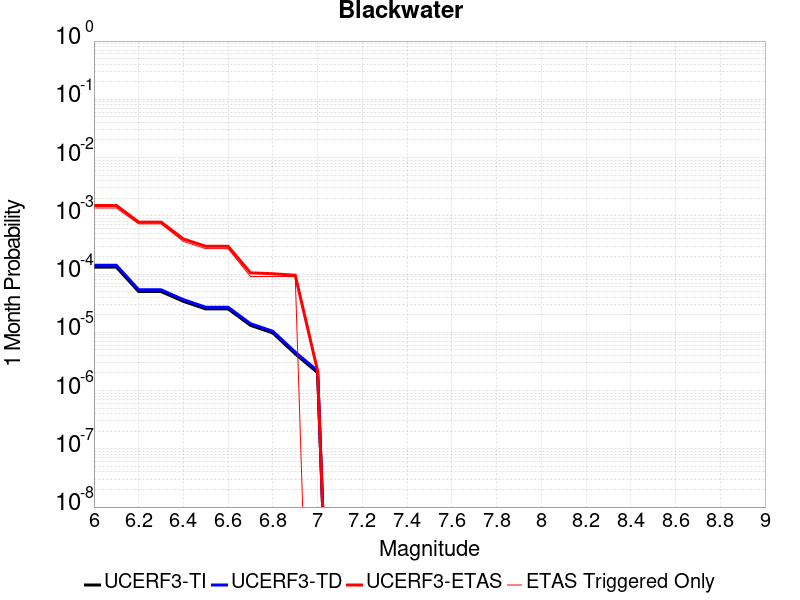 | 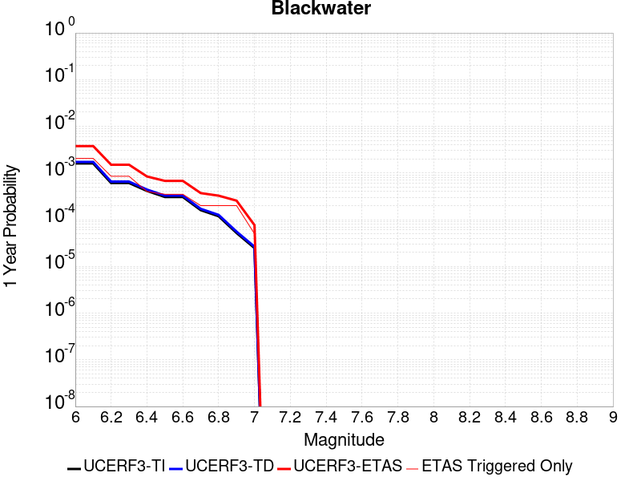 | 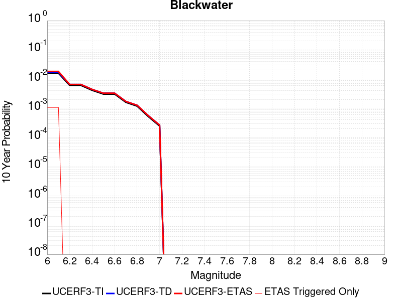 |

| Magnitude | 1 wk TI Prob | 1 wk TD Prob | 1 wk ETAS Prob | 1 wk ETAS/TD Gain | 1 wk ETAS Triggered Only | 1 mo TI Prob | 1 mo TD Prob | 1 mo ETAS Prob | 1 mo ETAS/TD Gain | 1 mo ETAS Triggered Only | 1 yr TI Prob | 1 yr TD Prob | 1 yr ETAS Prob | 1 yr ETAS/TD Gain | 1 yr ETAS Triggered Only | 10 yr TI Prob | 10 yr TD Prob | 10 yr ETAS Prob | 10 yr ETAS/TD Gain | 10 yr ETAS Triggered Only |
|-----|-----|-----|-----|-----|-----|-----|-----|-----|-----|-----|-----|-----|-----|-----|-----|-----|-----|-----|-----|-----|
| 6.0 | 3.0708583E-5 | 3.309578E-5 | 9.87111E-4 | 29.825886 | 9.540467E-4 | 1.3160157E-4 | 1.4183212E-4 | 0.0015197042 | 10.71481 | 0.0013780675 | 0.0016010714 | 0.001725575 | 0.003683287 | 2.1345274 | 0.0019610962 | 0.015895851 | 0.017135598 | 0.020209165 | 1.1793674 | 0.0031271533 |
| 6.1 | 3.0708583E-5 | 3.309578E-5 | 9.87111E-4 | 29.825886 | 9.540467E-4 | 1.3160157E-4 | 1.4183212E-4 | 0.0015197042 | 10.71481 | 0.0013780675 | 0.0016010714 | 0.001725575 | 0.003683287 | 2.1345274 | 0.0019610962 | 0.015895851 | 0.017135598 | 0.020209165 | 1.1793674 | 0.0031271533 |
| 6.2 | 1.1707779E-5 | 1.2545098E-5 | 3.8355862E-4 | 30.57438 | 3.710182E-4 | 5.017523E-5 | 5.376365E-5 | 6.367609E-4 | 11.843705 | 5.830286E-4 | 6.107122E-4 | 6.543855E-4 | 0.0013959362 | 2.1332018 | 7.420364E-4 | 0.006090366 | 0.006525557 | 0.007841975 | 1.2017326 | 0.0013250649 |
| 6.3 | 1.1707779E-5 | 1.2545098E-5 | 3.8355862E-4 | 30.57438 | 3.710182E-4 | 5.017523E-5 | 5.376365E-5 | 6.367609E-4 | 11.843705 | 5.830286E-4 | 6.107122E-4 | 6.543855E-4 | 0.0013959362 | 2.1332018 | 7.420364E-4 | 0.006090366 | 0.006525557 | 0.007841975 | 1.2017326 | 0.0013250649 |
| 6.4 | 7.929244E-6 | 8.480082E-6 | 1.1448438E-4 | 13.500385 | 1.06005195E-4 | 3.3982033E-5 | 3.6342728E-5 | 3.0134607E-4 | 8.291785 | 2.65013E-4 | 4.136527E-4 | 4.423869E-4 | 8.1324094E-4 | 1.8383025 | 3.710182E-4 | 0.0041288356 | 0.004415468 | 0.005206996 | 1.1792626 | 7.9503894E-4 |
| 6.5 | 5.8832115E-6 | 6.2859795E-6 | 1.1229051E-4 | 17.863646 | 1.06005195E-4 | 2.521352E-5 | 2.6939648E-5 | 2.3894433E-4 | 8.869616 | 2.1201039E-4 | 3.0693135E-4 | 3.279434E-4 | 6.458547E-4 | 1.969409 | 3.1801558E-4 | 0.0030650778 | 0.0032748478 | 0.0039087962 | 1.193581 | 6.3603115E-4 |
| 6.6 | 5.8832115E-6 | 6.2859795E-6 | 1.1229051E-4 | 17.863646 | 1.06005195E-4 | 2.521352E-5 | 2.6939648E-5 | 2.3894433E-4 | 8.869616 | 2.1201039E-4 | 3.0693135E-4 | 3.279434E-4 | 6.458547E-4 | 1.969409 | 3.1801558E-4 | 0.0030650778 | 0.0032748478 | 0.0039087962 | 1.193581 | 6.3603115E-4 |
| 6.7 | 3.0715053E-6 | 3.2814603E-6 | 5.6283883E-5 | 17.152084 | 5.3002597E-5 | 1.3163528E-5 | 1.4063332E-5 | 6.7065186E-5 | 4.768798 | 5.3002597E-5 | 1.6025416E-4 | 1.7120877E-4 | 3.3018933E-4 | 1.9285772 | 1.5900779E-4 | 0.0016013865 | 0.0017108832 | 0.0020283547 | 1.18556 | 3.1801558E-4 |
| 6.8 | 2.2722281E-6 | 2.4287492E-6 | 5.5431217E-5 | 22.822948 | 5.3002597E-5 | 9.738084E-6 | 1.0408889E-5 | 6.341093E-5 | 6.0919986 | 5.3002597E-5 | 1.1855473E-4 | 1.2672177E-4 | 2.8570942E-4 | 2.2546198 | 1.5900779E-4 | 0.001184915 | 0.0012665853 | 0.0015312625 | 1.2089692 | 2.65013E-4 |
| 6.9 | 9.952399E-7 | 1.0653469E-6 | 5.406789E-5 | 50.751442 | 5.3002597E-5 | 4.265307E-6 | 4.565767E-6 | 5.7568122E-5 | 12.608642 | 5.3002597E-5 | 5.1928873E-5 | 5.5587312E-5 | 2.1458627E-4 | 3.860346 | 1.5900779E-4 | 5.191674E-4 | 5.5578473E-4 | 7.6767727E-4 | 1.3812493 | 2.1201039E-4 |
| 7.0 | 4.7385504E-7 | 5.07555E-7 | 5.07555E-7 | 1.0 | 0.0 | 2.0308057E-6 | 2.1752357E-6 | 2.1752357E-6 | 1.0 | 0.0 | 2.4724779E-5 | 2.6483494E-5 | 7.9484686E-5 | 3.0012915 | 5.3002597E-5 | 2.4722028E-4 | 2.6483493E-4 | 3.178235E-4 | 1.2000815 | 5.3002597E-5 |

## Hunter Mountain-Saline Valley
*[(top)](#table-of-contents)*

| 1 Week | 1 Month | 1 Year | 10 Year |
|-----|-----|-----|-----|
| 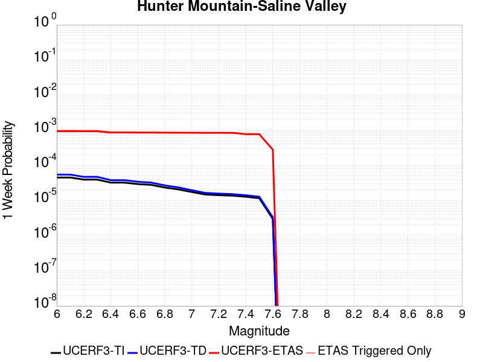 | 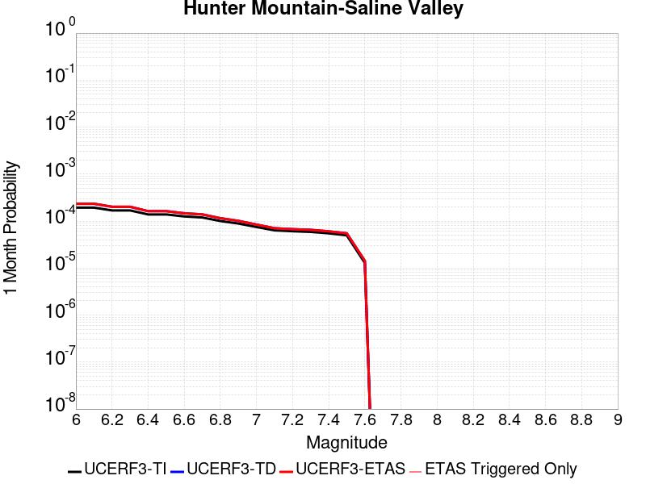 | 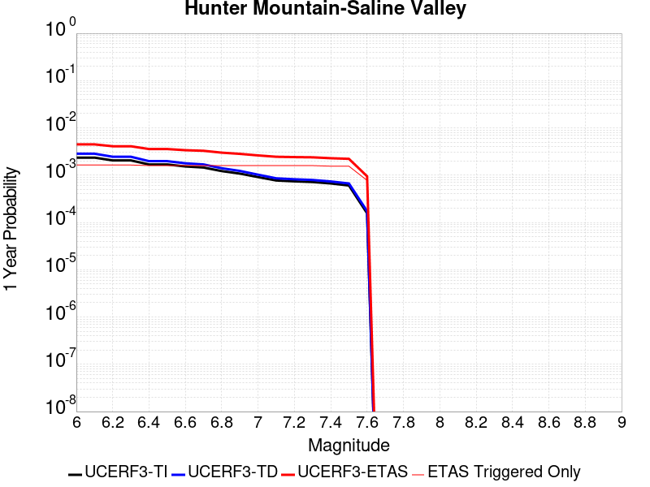 | 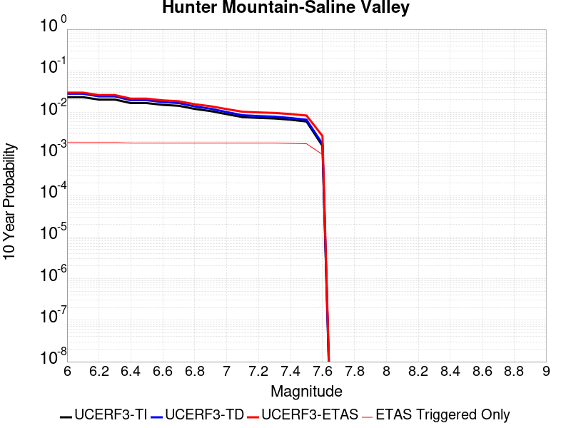 |

| Magnitude | 1 wk TI Prob | 1 wk TD Prob | 1 wk ETAS Prob | 1 wk ETAS/TD Gain | 1 wk ETAS Triggered Only | 1 mo TI Prob | 1 mo TD Prob | 1 mo ETAS Prob | 1 mo ETAS/TD Gain | 1 mo ETAS Triggered Only | 1 yr TI Prob | 1 yr TD Prob | 1 yr ETAS Prob | 1 yr ETAS/TD Gain | 1 yr ETAS Triggered Only | 10 yr TI Prob | 10 yr TD Prob | 10 yr ETAS Prob | 10 yr ETAS/TD Gain | 10 yr ETAS Triggered Only |
|-----|-----|-----|-----|-----|-----|-----|-----|-----|-----|-----|-----|-----|-----|-----|-----|-----|-----|-----|-----|-----|
| 6.0 | 4.5103672E-5 | 5.4569828E-5 | 9.025651E-4 | 16.539637 | 8.4804156E-4 | 1.9328714E-4 | 2.3385094E-4 | 0.0015056158 | 6.438357 | 0.0012720623 | 0.002350731 | 0.002843498 | 0.0045876103 | 1.6133685 | 0.0017490857 | 0.023260195 | 0.028091714 | 0.030203775 | 1.0751845 | 0.0021731064 |
| 6.1 | 4.5103672E-5 | 5.4569828E-5 | 9.025651E-4 | 16.539637 | 8.4804156E-4 | 1.9328714E-4 | 2.3385094E-4 | 0.0015056158 | 6.438357 | 0.0012720623 | 0.002350731 | 0.002843498 | 0.0045876103 | 1.6133685 | 0.0017490857 | 0.023260195 | 0.028091714 | 0.030203775 | 1.0751845 | 0.0021731064 |
| 6.2 | 3.9363465E-5 | 4.7063084E-5 | 8.9506473E-4 | 19.018404 | 8.4804156E-4 | 1.6868966E-4 | 2.0168422E-4 | 0.00147349 | 7.3059263 | 0.0012720623 | 0.002051862 | 0.002452803 | 0.0041975984 | 1.7113476 | 0.0017490857 | 0.020330196 | 0.024273338 | 0.026393697 | 1.0873533 | 0.0021731064 |
| 6.3 | 3.9363465E-5 | 4.7063084E-5 | 8.9506473E-4 | 19.018404 | 8.4804156E-4 | 1.6868966E-4 | 2.0168422E-4 | 0.00147349 | 7.3059263 | 0.0012720623 | 0.002051862 | 0.002452803 | 0.0041975984 | 1.7113476 | 0.0017490857 | 0.020330196 | 0.024273338 | 0.026393697 | 1.0873533 | 0.0021731064 |
| 6.4 | 3.2311684E-5 | 3.7950776E-5 | 8.3295954E-4 | 21.94842 | 7.9503894E-4 | 1.384713E-4 | 1.6263645E-4 | 0.001381498 | 8.494393 | 0.0012190597 | 0.0016845843 | 0.0019783732 | 0.0036711008 | 1.855616 | 0.0016960831 | 0.016718714 | 0.019616365 | 0.02169488 | 1.1059582 | 0.002120104 |
| 6.5 | 3.2311684E-5 | 3.7950776E-5 | 8.3295954E-4 | 21.94842 | 7.9503894E-4 | 1.384713E-4 | 1.6263645E-4 | 0.001381498 | 8.494393 | 0.0012190597 | 0.0016845843 | 0.0019783732 | 0.0036711008 | 1.855616 | 0.0016960831 | 0.016718714 | 0.019616365 | 0.02169488 | 1.1059582 | 0.002120104 |
| 6.6 | 2.9305844E-5 | 3.418164E-5 | 8.2919345E-4 | 24.258442 | 7.9503894E-4 | 1.2559042E-4 | 1.4648488E-4 | 0.001365366 | 9.320867 | 0.0012190597 | 0.0015279909 | 0.0017820572 | 0.0034751177 | 1.9500597 | 0.0016960831 | 0.015175272 | 0.017685594 | 0.019768203 | 1.1177573 | 0.002120104 |
| 6.7 | 2.7826512E-5 | 3.2344098E-5 | 8.2735735E-4 | 25.579855 | 7.9503894E-4 | 1.19251024E-4 | 1.3861054E-4 | 0.0013575013 | 9.793637 | 0.0012190597 | 0.0014509142 | 0.0016863372 | 0.00337956 | 2.0040832 | 0.0016960831 | 0.014414776 | 0.016743096 | 0.018827703 | 1.1245054 | 0.002120104 |
| 6.8 | 2.3389874E-5 | 2.6866572E-5 | 8.2188414E-4 | 30.591331 | 7.9503894E-4 | 1.0023846E-4 | 1.15137635E-4 | 0.001334057 | 11.586629 | 0.0012190597 | 0.00121972 | 0.0014009465 | 0.0030946536 | 2.2089734 | 0.0016960831 | 0.01213047 | 0.01392736 | 0.016017936 | 1.1501057 | 0.002120104 |
| 6.9 | 2.069209E-5 | 2.3569908E-5 | 8.185901E-4 | 34.730305 | 7.9503894E-4 | 8.867737E-5 | 1.01010184E-4 | 0.0013199468 | 13.067462 | 0.0012190597 | 0.0010791123 | 0.0012291414 | 0.0029231398 | 2.3781965 | 0.0016960831 | 0.010738871 | 0.01222846 | 0.0143226385 | 1.1712545 | 0.002120104 |
| 7.0 | 1.7462342E-5 | 1.9633446E-5 | 8.146568E-4 | 41.493317 | 7.9503894E-4 | 7.483646E-5 | 8.414075E-5 | 0.0013030979 | 15.48712 | 0.0012190597 | 9.1075303E-4 | 0.0010239548 | 0.0027183013 | 2.6547081 | 0.0016960831 | 0.009070295 | 0.010196 | 0.012294488 | 1.2058147 | 0.002120104 |
| 7.1 | 1.4807709E-5 | 1.6441667E-5 | 8.1146753E-4 | 49.35434 | 7.9503894E-4 | 6.3460066E-5 | 7.0462476E-5 | 0.0012894364 | 18.299618 | 0.0012190597 | 7.723524E-4 | 8.5755944E-4 | 0.002552188 | 2.9761062 | 0.0016960831 | 0.007696735 | 0.008545489 | 0.010647476 | 1.2459762 | 0.002120104 |
| 7.2 | 1.4180048E-5 | 1.5698257E-5 | 8.1072474E-4 | 51.644253 | 7.9503894E-4 | 6.077022E-5 | 6.72766E-5 | 0.0012862543 | 19.118896 | 0.0012190597 | 7.396263E-4 | 8.18801E-4 | 0.0025134953 | 3.0697267 | 0.0016960831 | 0.0073716943 | 0.008160792 | 0.010263594 | 1.2576714 | 0.002120104 |
| 7.3 | 1.3730402E-5 | 1.5171999E-5 | 8.101989E-4 | 53.400936 | 7.9503894E-4 | 5.8843252E-5 | 6.502132E-5 | 0.0012840017 | 19.747396 | 0.0012190597 | 7.161811E-4 | 7.913631E-4 | 0.002486104 | 3.1415465 | 0.0016960831 | 0.007138774 | 0.007888383 | 0.009991762 | 1.2666427 | 0.002120104 |
| 7.4 | 1.2810095E-5 | 1.4109204E-5 | 7.561351E-4 | 53.591618 | 7.420364E-4 | 5.489925E-5 | 6.0466708E-5 | 0.0012264533 | 20.283117 | 0.0011660572 | 6.681934E-4 | 7.359493E-4 | 0.0023778207 | 3.230957 | 0.0016430805 | 0.006661878 | 0.0073380154 | 0.009389948 | 1.2796305 | 0.0020671012 |
| 7.5 | 1.1595659E-5 | 1.2800594E-5 | 7.5482746E-4 | 58.96816 | 7.420364E-4 | 4.9694736E-5 | 5.485862E-5 | 0.0012208518 | 22.25451 | 0.0011660572 | 6.0486543E-4 | 6.677147E-4 | 0.0023096981 | 3.4591093 | 0.0016430805 | 0.006032217 | 0.0066599557 | 0.00871329 | 1.3083105 | 0.0020671012 |
| 7.6 | 2.997694E-6 | 3.3251304E-6 | 3.7434208E-4 | 112.579666 | 3.710182E-4 | 1.28471975E-5 | 1.4250522E-5 | 5.442689E-4 | 38.192913 | 5.30026E-4 | 1.564034E-4 | 1.7349358E-4 | 0.001021388 | 5.887181 | 8.4804156E-4 | 0.0015629337 | 0.0017350167 | 0.0029519612 | 1.7014023 | 0.0012190597 |

## Garlock (West)
*[(top)](#table-of-contents)*

| 1 Week | 1 Month | 1 Year | 10 Year |
|-----|-----|-----|-----|
| 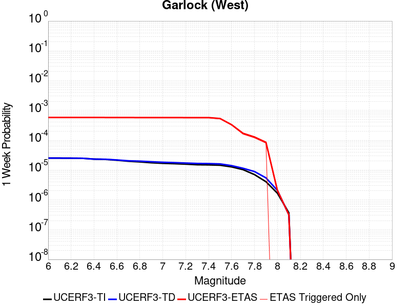 | 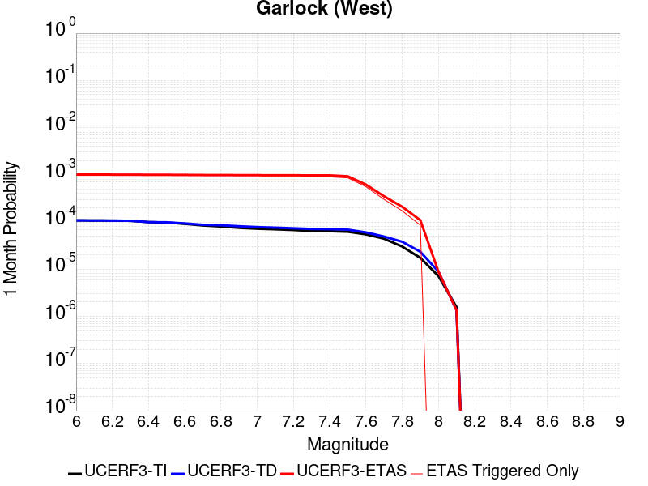 | 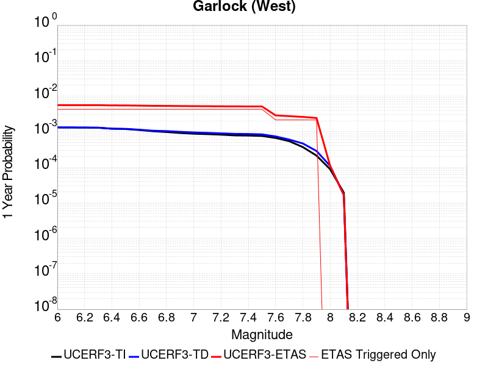 | 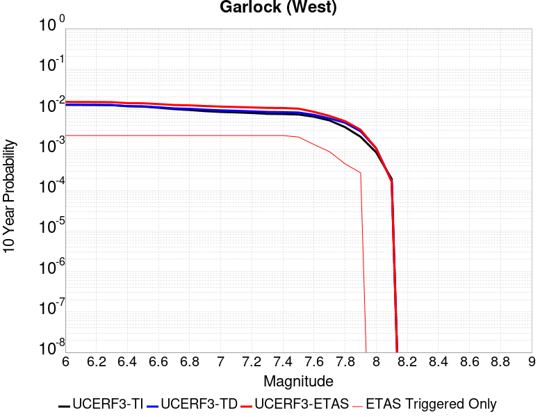 |

| Magnitude | 1 wk TI Prob | 1 wk TD Prob | 1 wk ETAS Prob | 1 wk ETAS/TD Gain | 1 wk ETAS Triggered Only | 1 mo TI Prob | 1 mo TD Prob | 1 mo ETAS Prob | 1 mo ETAS/TD Gain | 1 mo ETAS Triggered Only | 1 yr TI Prob | 1 yr TD Prob | 1 yr ETAS Prob | 1 yr ETAS/TD Gain | 1 yr ETAS Triggered Only | 10 yr TI Prob | 10 yr TD Prob | 10 yr ETAS Prob | 10 yr ETAS/TD Gain | 10 yr ETAS Triggered Only |
|-----|-----|-----|-----|-----|-----|-----|-----|-----|-----|-----|-----|-----|-----|-----|-----|-----|-----|-----|-----|-----|
| 6.0 | 2.5181727E-5 | 2.5196328E-5 | 7.67214E-4 | 30.449436 | 7.420364E-4 | 1.0791722E-4 | 1.0797982E-4 | 0.0011149204 | 10.325267 | 0.0010070493 | 0.0013131002 | 0.0013138648 | 0.0027430546 | 2.0877755 | 0.0014310702 | 0.013053683 | 0.0131414775 | 0.015129108 | 1.1512486 | 0.0020140987 |
| 6.1 | 2.5077732E-5 | 2.50974E-5 | 7.6711515E-4 | 30.565521 | 7.420364E-4 | 1.0747157E-4 | 1.07555876E-4 | 0.001114497 | 10.362027 | 0.0010070493 | 0.001307681 | 0.0013087096 | 0.0027379068 | 2.092066 | 0.0014310702 | 0.013000126 | 0.013090534 | 0.015078267 | 1.1518451 | 0.0020140987 |
| 6.2 | 2.494612E-5 | 2.497908E-5 | 7.669969E-4 | 30.70557 | 7.420364E-4 | 1.0690756E-4 | 1.0704882E-4 | 0.0011139903 | 10.406377 | 0.0010070493 | 0.0013008224 | 0.0013025437 | 0.0027317498 | 2.0972424 | 0.0014310702 | 0.012932341 | 0.013029599 | 0.0150174545 | 1.1525646 | 0.0020140987 |
| 6.3 | 2.4733758E-5 | 2.479845E-5 | 7.6681643E-4 | 30.92195 | 7.420364E-4 | 1.0599751E-4 | 1.0627476E-4 | 0.0011132171 | 10.474896 | 0.0010070493 | 0.0012897556 | 0.0012931306 | 0.0027223502 | 2.1052399 | 0.0014310702 | 0.012822957 | 0.012936569 | 0.014924612 | 1.1536763 | 0.0020140987 |
| 6.4 | 2.3237335E-5 | 2.3177769E-5 | 7.651969E-4 | 33.014263 | 7.420364E-4 | 9.958477E-5 | 9.9329525E-5 | 0.0011062789 | 11.137463 | 0.0010070493 | 0.0012117702 | 0.0012086688 | 0.0026380094 | 2.182574 | 0.0014310702 | 0.012051838 | 0.012101421 | 0.014091146 | 1.1644208 | 0.0020140987 |
| 6.5 | 2.2732203E-5 | 2.299234E-5 | 7.6501165E-4 | 33.272457 | 7.420364E-4 | 9.742009E-5 | 9.8534896E-5 | 0.001105485 | 11.219224 | 0.0010070493 | 0.0011854442 | 0.0011990049 | 0.0026283592 | 2.1921172 | 0.0014310702 | 0.011791403 | 0.01200583 | 0.013995748 | 1.165746 | 0.0020140987 |
| 6.6 | 2.1319436E-5 | 2.177255E-5 | 7.637928E-4 | 35.08054 | 7.420364E-4 | 9.136581E-5 | 9.33076E-5 | 0.001100263 | 11.791782 | 0.0010070493 | 0.001111811 | 0.0011354303 | 0.0025648756 | 2.2589457 | 0.0014310702 | 0.011062649 | 0.011376739 | 0.013367923 | 1.1750225 | 0.0020140987 |
| 6.7 | 1.970802E-5 | 2.0392457E-5 | 7.6241366E-4 | 37.387043 | 7.420364E-4 | 8.446021E-5 | 8.7393324E-5 | 0.0010943547 | 12.522177 | 0.0010070493 | 0.001027818 | 0.0010634961 | 0.0024930444 | 2.344197 | 0.0014310702 | 0.010230771 | 0.010664482 | 0.0126571 | 1.1868464 | 0.0020140987 |
| 6.8 | 1.8744462E-5 | 1.9900112E-5 | 7.619217E-4 | 38.28731 | 7.420364E-4 | 8.033094E-5 | 8.528341E-5 | 0.0010922469 | 12.8072605 | 0.0010070493 | 9.775903E-4 | 0.0010378326 | 0.0024674176 | 2.3774717 | 0.0014310702 | 0.009733009 | 0.010410271 | 0.012403402 | 1.1914582 | 0.0020140987 |
| 6.9 | 1.7559682E-5 | 1.8952487E-5 | 7.6097477E-4 | 40.15171 | 7.420364E-4 | 7.5253614E-5 | 8.1222424E-5 | 0.00108819 | 13.397655 | 0.0010070493 | 9.158276E-4 | 9.884358E-4 | 0.0024180915 | 2.4463818 | 0.0014310702 | 0.0091206245 | 0.009920754 | 0.011914872 | 1.2010046 | 0.0020140987 |
| 7.0 | 1.6794445E-5 | 1.8215316E-5 | 7.6023815E-4 | 41.736202 | 7.420364E-4 | 7.197421E-5 | 7.806331E-5 | 0.001085034 | 13.89941 | 0.0010070493 | 8.759337E-4 | 9.500078E-4 | 0.0023797185 | 2.5049462 | 0.0014310702 | 0.008724891 | 0.009539667 | 0.011534551 | 1.2091148 | 0.0020140987 |
| 7.1 | 1.6337795E-5 | 1.771613E-5 | 7.5973937E-4 | 42.88405 | 7.420364E-4 | 7.0017246E-5 | 7.5924065E-5 | 0.001082897 | 14.262895 | 0.0010070493 | 8.521265E-4 | 9.2398486E-4 | 0.0023537327 | 2.5473716 | 0.0014310702 | 0.008488664 | 0.009281524 | 0.01127693 | 1.2149868 | 0.0020140987 |
| 7.2 | 1.5780008E-5 | 1.7164773E-5 | 7.591884E-4 | 44.229443 | 7.420364E-4 | 6.762685E-5 | 7.356125E-5 | 0.0010805365 | 14.688936 | 0.0010070493 | 8.2304585E-4 | 8.952415E-4 | 0.0023250305 | 2.5970986 | 0.0014310702 | 0.008200042 | 0.008996368 | 0.010992347 | 1.2218649 | 0.0020140987 |
| 7.3 | 1.5058865E-5 | 1.6617856E-5 | 7.5864187E-4 | 45.65221 | 7.420364E-4 | 6.45364E-5 | 7.121745E-5 | 0.001078195 | 15.139479 | 0.0010070493 | 7.854473E-4 | 8.667287E-4 | 0.0022965586 | 2.6496854 | 0.0014310702 | 0.00782677 | 0.008713072 | 0.010709622 | 1.2291442 | 0.0020140987 |
| 7.4 | 1.4887923E-5 | 1.6453829E-5 | 7.5847795E-4 | 46.09735 | 7.420364E-4 | 6.380382E-5 | 7.0514514E-5 | 0.0010774928 | 15.280441 | 0.0010070493 | 7.7653467E-4 | 8.5817726E-4 | 0.0022880193 | 2.6661384 | 0.0014310702 | 0.0077382675 | 0.008627934 | 0.0106246555 | 1.2314252 | 0.0020140987 |
| 7.5 | 1.4509299E-5 | 1.6045851E-5 | 7.050686E-4 | 43.94086 | 6.8903377E-4 | 6.218123E-5 | 6.876613E-5 | 0.0010227473 | 14.872834 | 9.540467E-4 | 7.567935E-4 | 8.3690725E-4 | 0.0021608633 | 2.5819626 | 0.0013250649 | 0.0075422134 | 0.008416242 | 0.010308277 | 1.2248075 | 0.0019080935 |
| 7.6 | 1.2756717E-5 | 1.4049988E-5 | 4.380648E-4 | 31.179016 | 4.2402078E-4 | 5.4670498E-5 | 6.021285E-5 | 6.962057E-4 | 11.562411 | 6.3603115E-4 | 6.6541E-4 | 7.328455E-4 | 0.0016332293 | 2.2286134 | 9.010442E-4 | 0.006634211 | 0.0073812436 | 0.0087491395 | 1.1853205 | 0.0013780675 |
| 7.7 | 1.0328985E-5 | 1.145975E-5 | 2.2346771E-4 | 19.500225 | 2.1201039E-4 | 4.4266326E-5 | 4.9112292E-5 | 3.6711225E-4 | 7.4749565 | 3.1801558E-4 | 5.388092E-4 | 5.9777853E-4 | 9.685749E-4 | 1.6202906 | 3.710182E-4 | 0.0053750467 | 0.0060380935 | 0.006670284 | 1.1047004 | 6.3603115E-4 |
| 7.8 | 7.0306583E-6 | 8.8989555E-6 | 1.6790534E-4 | 18.867981 | 1.5900779E-4 | 3.0131043E-5 | 3.8137823E-5 | 1.9713955E-4 | 5.1691346 | 1.5900779E-4 | 3.667837E-4 | 4.6422923E-4 | 6.2316324E-4 | 1.342361 | 1.5900779E-4 | 0.003661789 | 0.0046949377 | 0.005064214 | 1.0786542 | 3.710182E-4 |
| 7.9 | 4.060633E-6 | 5.4650154E-6 | 1.1146963E-4 | 20.396948 | 1.06005195E-4 | 1.7402595E-5 | 2.3421284E-5 | 1.2942399E-4 | 5.5259137 | 1.06005195E-4 | 2.11856E-4 | 2.8511693E-4 | 3.910919E-4 | 1.3716896 | 1.06005195E-4 | 0.0021165414 | 0.0028840043 | 0.0030425536 | 1.0549754 | 1.5900779E-4 |
| 8.0 | 1.6729537E-6 | 2.0773857E-6 | 2.0773857E-6 | 1.0 | 0.0 | 7.169782E-6 | 8.903051E-6 | 8.903051E-6 | 1.0 | 0.0 | 8.7288594E-5 | 1.08389286E-4 | 1.08389286E-4 | 1.0 | 0.0 | 8.7254314E-4 | 0.0010968668 | 0.0010968668 | 1.0 | 0.0 |
| 8.1 | 3.6733252E-7 | 3.148811E-7 | 3.148811E-7 | 1.0 | 0.0 | 1.5742813E-6 | 1.3494899E-6 | 1.3494899E-6 | 1.0 | 0.0 | 1.9166706E-5 | 1.6429933E-5 | 1.6429933E-5 | 1.0 | 0.0 | 1.9165053E-4 | 1.6637788E-4 | 1.6637788E-4 | 1.0 | 0.0 |

## Gravel Hills-Harper Lk
*[(top)](#table-of-contents)*

| 1 Week | 1 Month | 1 Year | 10 Year |
|-----|-----|-----|-----|
| 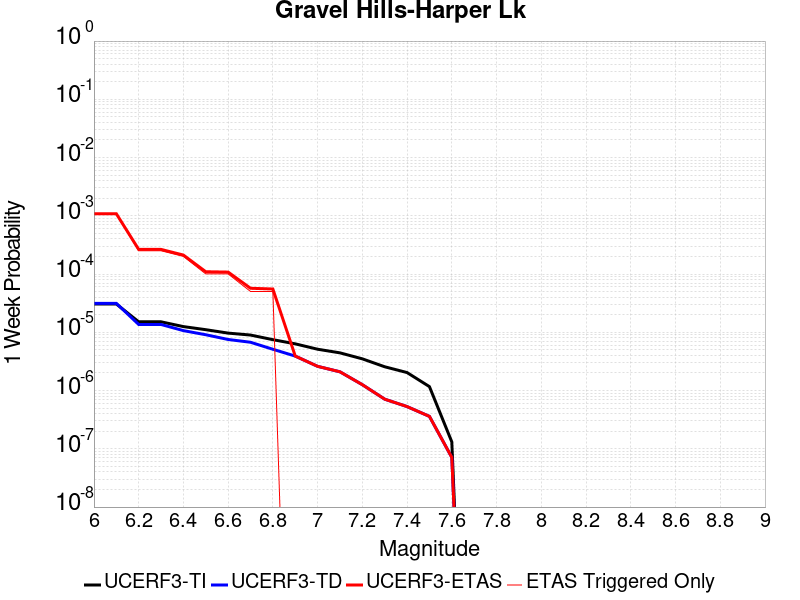 | 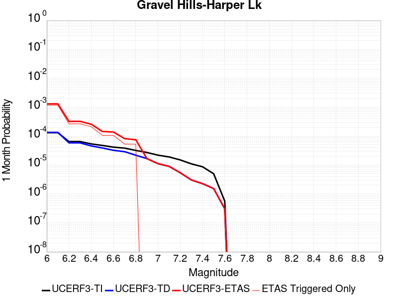 | 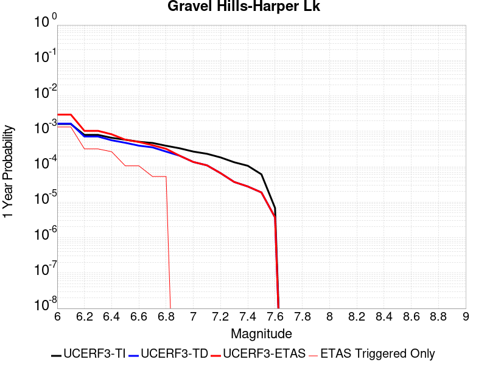 | 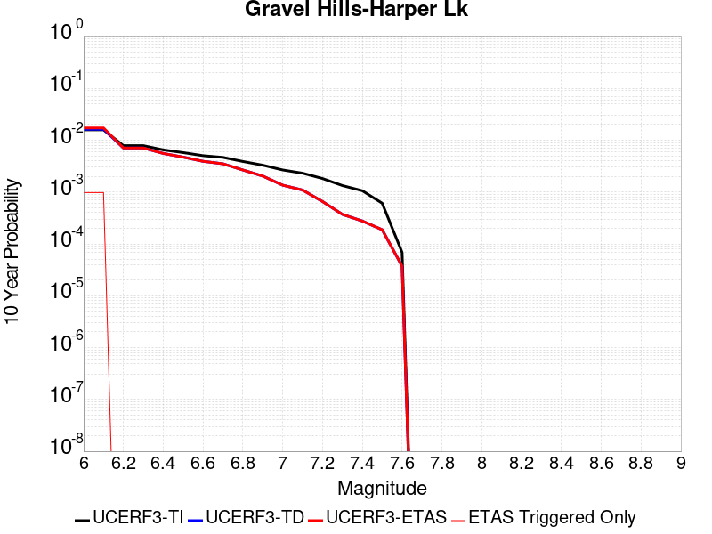 |

| Magnitude | 1 wk TI Prob | 1 wk TD Prob | 1 wk ETAS Prob | 1 wk ETAS/TD Gain | 1 wk ETAS Triggered Only | 1 mo TI Prob | 1 mo TD Prob | 1 mo ETAS Prob | 1 mo ETAS/TD Gain | 1 mo ETAS Triggered Only | 1 yr TI Prob | 1 yr TD Prob | 1 yr ETAS Prob | 1 yr ETAS/TD Gain | 1 yr ETAS Triggered Only | 10 yr TI Prob | 10 yr TD Prob | 10 yr ETAS Prob | 10 yr ETAS/TD Gain | 10 yr ETAS Triggered Only |
|-----|-----|-----|-----|-----|-----|-----|-----|-----|-----|-----|-----|-----|-----|-----|-----|-----|-----|-----|-----|-----|
| 6.0 | 3.0679566E-5 | 3.1464537E-5 | 0.0010384822 | 33.004845 | 0.0010070493 | 1.3147724E-4 | 1.3484228E-4 | 0.0013007422 | 9.646398 | 0.0011660572 | 0.0015995599 | 0.001640685 | 0.002963576 | 1.806304 | 0.0013250649 | 0.015880952 | 0.016307283 | 0.018132122 | 1.1119033 | 0.0018550908 |
| 6.1 | 3.0679566E-5 | 3.1464537E-5 | 0.0010384822 | 33.004845 | 0.0010070493 | 1.3147724E-4 | 1.3484228E-4 | 0.0013007422 | 9.646398 | 0.0011660572 | 0.0015995599 | 0.001640685 | 0.002963576 | 1.806304 | 0.0013250649 | 0.015880952 | 0.016307283 | 0.018132122 | 1.1119033 | 0.0018550908 |
| 6.2 | 1.514536E-5 | 1.3635169E-5 | 2.7864455E-4 | 20.435722 | 2.65013E-4 | 6.490707E-5 | 5.84352E-5 | 3.234327E-4 | 5.534895 | 2.65013E-4 | 7.8995706E-4 | 7.112282E-4 | 0.0010290176 | 1.4468178 | 3.1801558E-4 | 0.007871548 | 0.0070907213 | 0.0075117354 | 1.0593754 | 4.2402078E-4 |
| 6.3 | 1.514536E-5 | 1.3635169E-5 | 2.7864455E-4 | 20.435722 | 2.65013E-4 | 6.490707E-5 | 5.84352E-5 | 3.234327E-4 | 5.534895 | 2.65013E-4 | 7.8995706E-4 | 7.112282E-4 | 0.0010290176 | 1.4468178 | 3.1801558E-4 | 0.007871548 | 0.0070907213 | 0.0075117354 | 1.0593754 | 4.2402078E-4 |
| 6.4 | 1.2532521E-5 | 1.0689663E-5 | 2.2269778E-4 | 20.833002 | 2.1201039E-4 | 5.37097E-5 | 4.5812074E-5 | 2.5781276E-4 | 5.627616 | 2.1201039E-4 | 6.537194E-4 | 5.576251E-4 | 8.2249026E-4 | 1.474988 | 2.65013E-4 | 0.0065179965 | 0.005562849 | 0.005931803 | 1.0663247 | 3.710182E-4 |
| 6.5 | 1.1094058E-5 | 9.083641E-6 | 1.15087874E-4 | 12.669795 | 1.06005195E-4 | 4.7545094E-5 | 3.8929335E-5 | 1.449304E-4 | 3.72291 | 1.06005195E-4 | 5.787078E-4 | 4.738656E-4 | 5.7982054E-4 | 1.223597 | 1.06005195E-4 | 0.0057720304 | 0.004728959 | 0.004939967 | 1.0446204 | 2.1201039E-4 |
| 6.6 | 9.688328E-6 | 7.531677E-6 | 1.1353607E-4 | 15.074474 | 1.06005195E-4 | 4.1520743E-5 | 3.2278233E-5 | 1.3828001E-4 | 4.284002 | 1.06005195E-4 | 5.053978E-4 | 3.9291914E-4 | 4.988827E-4 | 1.2696828 | 1.06005195E-4 | 0.0050424994 | 0.003922501 | 0.0040280907 | 1.0269189 | 1.06005195E-4 |
| 6.7 | 8.974824E-6 | 6.749397E-6 | 5.9751637E-5 | 8.852885 | 5.3002597E-5 | 3.8462964E-5 | 2.892568E-5 | 8.1926744E-5 | 2.8323188 | 5.3002597E-5 | 4.6818596E-4 | 3.5211546E-4 | 4.050994E-4 | 1.1504732 | 5.3002597E-5 | 0.004672008 | 0.0035157963 | 0.0035686125 | 1.0150225 | 5.3002597E-5 |
| 6.8 | 7.4780046E-6 | 5.1161815E-6 | 5.811851E-5 | 11.359743 | 5.3002597E-5 | 3.20482E-5 | 2.1926315E-5 | 7.492775E-5 | 3.4172523 | 5.3002597E-5 | 3.9011694E-4 | 2.669216E-4 | 3.1991003E-4 | 1.198517 | 5.3002597E-5 | 0.0038943281 | 0.002666148 | 0.0027190093 | 1.0198269 | 5.3002597E-5 |
| 6.9 | 6.3409307E-6 | 3.9074876E-6 | 3.9074876E-6 | 1.0 | 0.0 | 2.7175134E-5 | 1.6746273E-5 | 1.6746273E-5 | 1.0 | 0.0 | 3.3080703E-4 | 2.0386779E-4 | 2.0386779E-4 | 1.0 | 0.0 | 0.0033031502 | 0.0020369058 | 0.0020369058 | 1.0 | 0.0 |
| 7.0 | 5.1239335E-6 | 2.60585E-6 | 2.60585E-6 | 1.0 | 0.0 | 2.195953E-5 | 1.1167882E-5 | 1.1167882E-5 | 1.0 | 0.0 | 2.6732447E-4 | 1.3596074E-4 | 1.3596074E-4 | 1.0 | 0.0 | 0.0026700313 | 0.0013588008 | 0.0013588008 | 1.0 | 0.0 |
| 7.1 | 4.438899E-6 | 2.0984673E-6 | 2.0984673E-6 | 1.0 | 0.0 | 1.9023713E-5 | 8.993402E-6 | 8.993402E-6 | 1.0 | 0.0 | 2.315891E-4 | 1.0948939E-4 | 1.0948939E-4 | 1.0 | 0.0 | 0.002313479 | 0.0010943763 | 0.0010943763 | 1.0 | 0.0 |
| 7.2 | 3.50367E-6 | 1.2615677E-6 | 1.2615677E-6 | 1.0 | 0.0 | 1.5015643E-5 | 5.4067077E-6 | 5.4067077E-6 | 1.0 | 0.0 | 1.8280011E-4 | 6.5824766E-5 | 6.5824766E-5 | 1.0 | 0.0 | 0.0018264982 | 6.580609E-4 | 6.580609E-4 | 1.0 | 0.0 |
| 7.3 | 2.561638E-6 | 7.119129E-7 | 7.119129E-7 | 1.0 | 0.0 | 1.0978401E-5 | 3.0510516E-6 | 3.0510516E-6 | 1.0 | 0.0 | 1.3365384E-4 | 3.7145943E-5 | 3.7145943E-5 | 1.0 | 0.0 | 0.0013357349 | 3.7139934E-4 | 3.7139934E-4 | 1.0 | 0.0 |
| 7.4 | 2.0368864E-6 | 5.304814E-7 | 5.304814E-7 | 1.0 | 0.0 | 8.729483E-6 | 2.2734896E-6 | 2.2734896E-6 | 1.0 | 0.0 | 1.06276275E-4 | 2.7679389E-5 | 2.7679389E-5 | 1.0 | 0.0 | 0.0010622547 | 2.7675997E-4 | 2.7675997E-4 | 1.0 | 0.0 |
| 7.5 | 1.1681728E-6 | 3.6030443E-7 | 3.6030443E-7 | 1.0 | 0.0 | 5.0064455E-6 | 1.544161E-6 | 1.544161E-6 | 1.0 | 0.0 | 6.0951766E-5 | 1.8800003E-5 | 1.8800003E-5 | 1.0 | 0.0 | 6.093505E-4 | 1.879846E-4 | 1.879846E-4 | 1.0 | 0.0 |
| 7.6 | 1.3154387E-7 | 7.1197206E-8 | 7.1197206E-8 | 1.0 | 0.0 | 5.6375933E-7 | 3.0513087E-7 | 3.0513087E-7 | 1.0 | 0.0 | 6.863748E-6 | 3.7149634E-6 | 3.7149634E-6 | 1.0 | 0.0 | 6.863536E-5 | 3.714917E-5 | 3.714917E-5 | 1.0 | 0.0 |

## Ash Hill
*[(top)](#table-of-contents)*

| 1 Week | 1 Month | 1 Year | 10 Year |
|-----|-----|-----|-----|
| 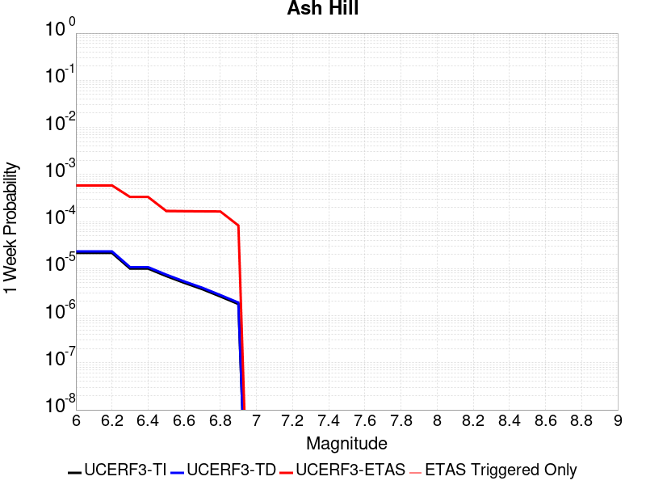 | 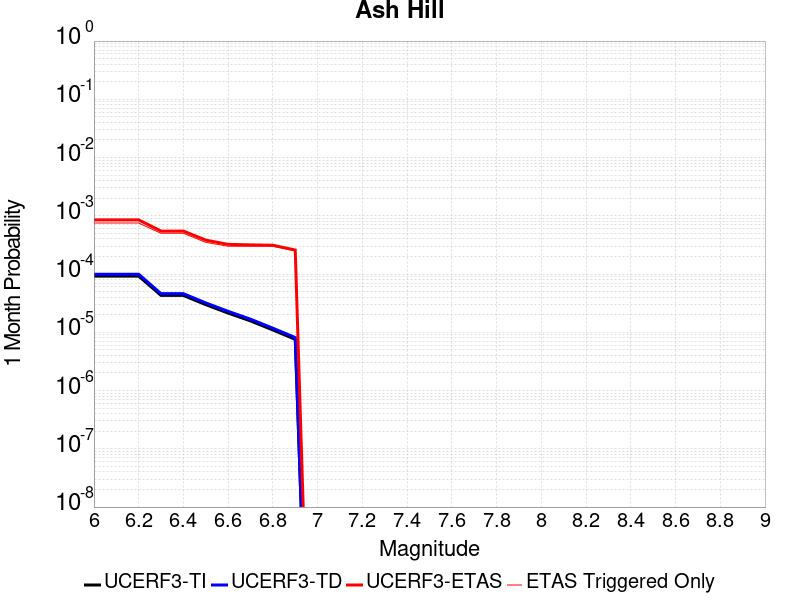 | 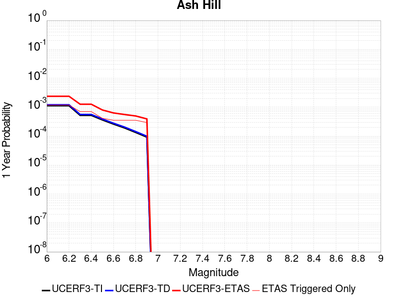 | 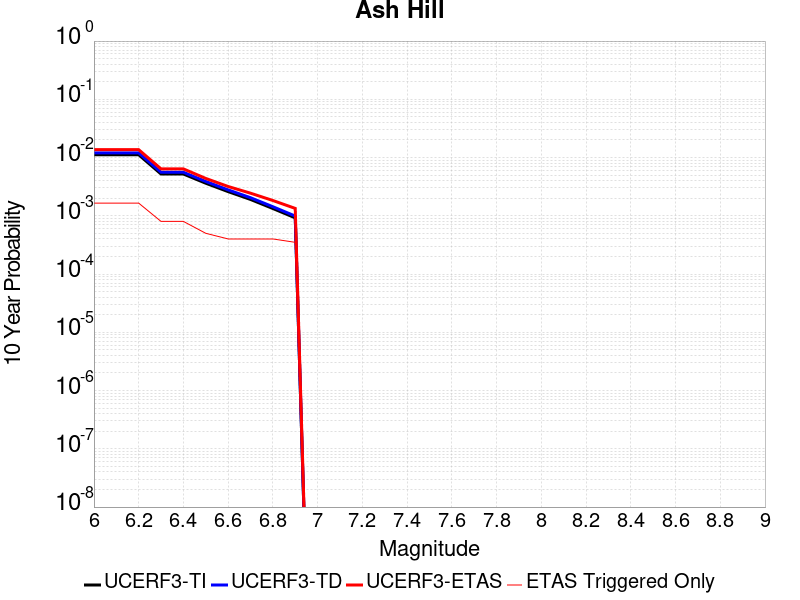 |

| Magnitude | 1 wk TI Prob | 1 wk TD Prob | 1 wk ETAS Prob | 1 wk ETAS/TD Gain | 1 wk ETAS Triggered Only | 1 mo TI Prob | 1 mo TD Prob | 1 mo ETAS Prob | 1 mo ETAS/TD Gain | 1 mo ETAS Triggered Only | 1 yr TI Prob | 1 yr TD Prob | 1 yr ETAS Prob | 1 yr ETAS/TD Gain | 1 yr ETAS Triggered Only | 10 yr TI Prob | 10 yr TD Prob | 10 yr ETAS Prob | 10 yr ETAS/TD Gain | 10 yr ETAS Triggered Only |
|-----|-----|-----|-----|-----|-----|-----|-----|-----|-----|-----|-----|-----|-----|-----|-----|-----|-----|-----|-----|-----|
| 6.0 | 2.1545662E-5 | 2.31944E-5 | 5.002067E-4 | 21.56584 | 4.7702336E-4 | 9.2335285E-5 | 9.940123E-5 | 8.4136386E-4 | 8.46432 | 7.420364E-4 | 0.0011236023 | 0.001209618 | 0.0023742646 | 1.9628217 | 0.0011660572 | 0.011179381 | 0.012038324 | 0.013661625 | 1.1348444 | 0.0016430805 |
| 6.1 | 2.1545662E-5 | 2.31944E-5 | 5.002067E-4 | 21.56584 | 4.7702336E-4 | 9.2335285E-5 | 9.940123E-5 | 8.4136386E-4 | 8.46432 | 7.420364E-4 | 0.0011236023 | 0.001209618 | 0.0023742646 | 1.9628217 | 0.0011660572 | 0.011179381 | 0.012038324 | 0.013661625 | 1.1348444 | 0.0016430805 |
| 6.2 | 2.1545662E-5 | 2.31944E-5 | 5.002067E-4 | 21.56584 | 4.7702336E-4 | 9.2335285E-5 | 9.940123E-5 | 8.4136386E-4 | 8.46432 | 7.420364E-4 | 0.0011236023 | 0.001209618 | 0.0023742646 | 1.9628217 | 0.0011660572 | 0.011179381 | 0.012038324 | 0.013661625 | 1.1348444 | 0.0016430805 |
| 6.3 | 1.0025529E-5 | 1.0746914E-5 | 3.2875908E-4 | 30.591022 | 3.1801558E-4 | 4.2965847E-5 | 4.6057463E-5 | 5.230589E-4 | 11.356658 | 4.7702336E-4 | 5.229836E-4 | 5.606186E-4 | 0.0011962932 | 2.1338809 | 6.3603115E-4 | 0.005217545 | 0.0055933557 | 0.0063312417 | 1.1319219 | 7.420364E-4 |
| 6.4 | 1.0025529E-5 | 1.0746914E-5 | 3.2875908E-4 | 30.591022 | 3.1801558E-4 | 4.2965847E-5 | 4.6057463E-5 | 5.230589E-4 | 11.356658 | 4.7702336E-4 | 5.229836E-4 | 5.606186E-4 | 0.0011962932 | 2.1338809 | 6.3603115E-4 | 0.005217545 | 0.0055933557 | 0.0063312417 | 1.1319219 | 7.420364E-4 |
| 6.5 | 6.9617327E-6 | 7.45662E-6 | 2.1946542E-4 | 29.432293 | 2.1201039E-4 | 2.9835655E-5 | 3.19566E-5 | 3.49962E-4 | 10.951165 | 3.1801558E-4 | 3.6318856E-4 | 3.8901082E-4 | 7.5988466E-4 | 1.9533768 | 3.710182E-4 | 0.0036259557 | 0.003884153 | 0.0043593235 | 1.1223357 | 4.7702336E-4 |
| 6.6 | 4.9919777E-6 | 5.3466783E-6 | 1.6435362E-4 | 30.73939 | 1.5900779E-4 | 2.1394015E-5 | 2.2914171E-5 | 2.8792108E-4 | 12.565197 | 2.65013E-4 | 2.60441E-4 | 2.7895102E-4 | 5.968779E-4 | 2.1397228 | 3.1801558E-4 | 0.0026013597 | 0.0027866673 | 0.0031566515 | 1.1327695 | 3.710182E-4 |
| 6.7 | 3.6630722E-6 | 3.924616E-6 | 1.6293178E-4 | 41.515343 | 1.5900779E-4 | 1.5698786E-5 | 1.6819708E-5 | 2.8182822E-4 | 16.755835 | 2.65013E-4 | 1.9111596E-4 | 2.0476643E-4 | 5.227169E-4 | 2.552747 | 3.1801558E-4 | 0.0019095168 | 0.0020463406 | 0.0024165995 | 1.180937 | 3.710182E-4 |
| 6.8 | 2.5599613E-6 | 2.7449198E-6 | 1.6175228E-4 | 58.927868 | 1.5900779E-4 | 1.0971216E-5 | 1.17639165E-5 | 2.767738E-4 | 23.52735 | 2.65013E-4 | 1.3356637E-4 | 1.4322122E-4 | 4.6119126E-4 | 3.220132 | 3.1801558E-4 | 0.0013348613 | 0.0014317741 | 0.0018022611 | 1.2587608 | 3.710182E-4 |
| 6.9 | 1.7684905E-6 | 1.896867E-6 | 1.0790186E-4 | 56.88425 | 1.06005195E-4 | 7.579223E-6 | 8.12943E-6 | 2.201381E-4 | 27.079155 | 2.1201039E-4 | 9.2273134E-5 | 9.897581E-5 | 3.6396258E-4 | 3.677288 | 2.65013E-4 | 9.223483E-4 | 9.897582E-4 | 0.001307459 | 1.3209883 | 3.1801558E-4 |

## Airport Lake
*[(top)](#table-of-contents)*

| 1 Week | 1 Month | 1 Year | 10 Year |
|-----|-----|-----|-----|
| 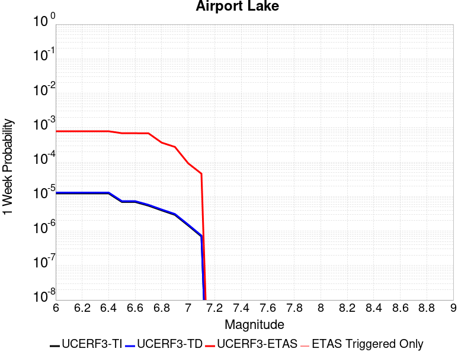 | 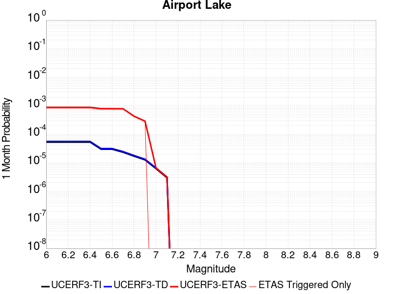 | 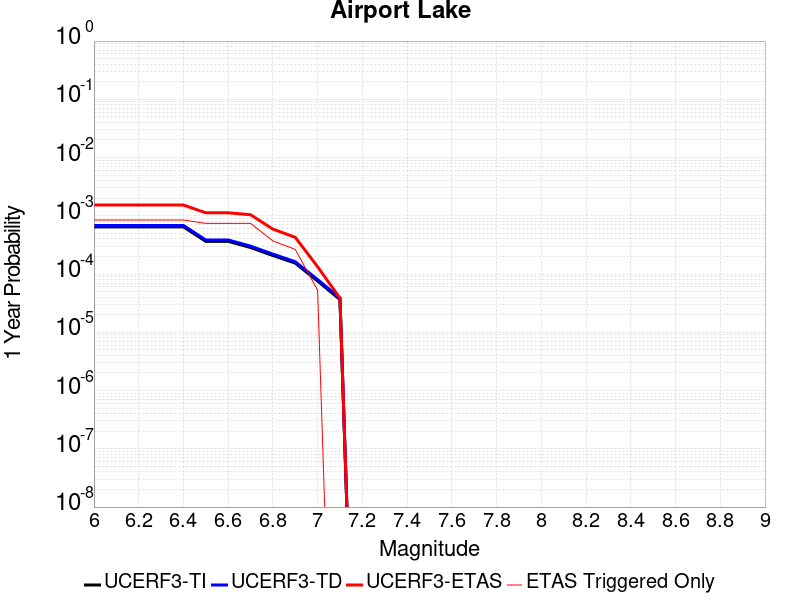 | 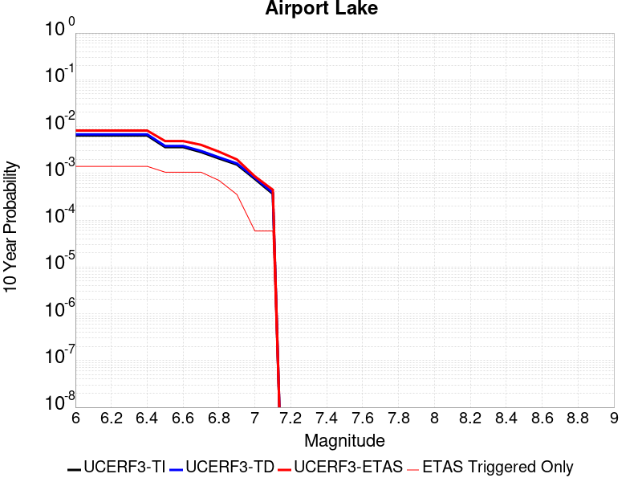 |

| Magnitude | 1 wk TI Prob | 1 wk TD Prob | 1 wk ETAS Prob | 1 wk ETAS/TD Gain | 1 wk ETAS Triggered Only | 1 mo TI Prob | 1 mo TD Prob | 1 mo ETAS Prob | 1 mo ETAS/TD Gain | 1 mo ETAS Triggered Only | 1 yr TI Prob | 1 yr TD Prob | 1 yr ETAS Prob | 1 yr ETAS/TD Gain | 1 yr ETAS Triggered Only | 10 yr TI Prob | 10 yr TD Prob | 10 yr ETAS Prob | 10 yr ETAS/TD Gain | 10 yr ETAS Triggered Only |
|-----|-----|-----|-----|-----|-----|-----|-----|-----|-----|-----|-----|-----|-----|-----|-----|-----|-----|-----|-----|-----|
| 6.0 | 1.2387061E-5 | 1.3103137E-5 | 8.0813165E-4 | 61.674675 | 7.9503894E-4 | 5.3086325E-5 | 5.615525E-5 | 8.5114955E-4 | 15.157079 | 7.9503894E-4 | 6.461343E-4 | 6.835041E-4 | 0.001530966 | 2.2398782 | 8.4804156E-4 | 0.0064425888 | 0.0068168286 | 0.0083434265 | 1.2239454 | 0.0015370753 |
| 6.1 | 1.2387061E-5 | 1.3103137E-5 | 8.0813165E-4 | 61.674675 | 7.9503894E-4 | 5.3086325E-5 | 5.615525E-5 | 8.5114955E-4 | 15.157079 | 7.9503894E-4 | 6.461343E-4 | 6.835041E-4 | 0.001530966 | 2.2398782 | 8.4804156E-4 | 0.0064425888 | 0.0068168286 | 0.0083434265 | 1.2239454 | 0.0015370753 |
| 6.2 | 1.2387061E-5 | 1.3103137E-5 | 8.0813165E-4 | 61.674675 | 7.9503894E-4 | 5.3086325E-5 | 5.615525E-5 | 8.5114955E-4 | 15.157079 | 7.9503894E-4 | 6.461343E-4 | 6.835041E-4 | 0.001530966 | 2.2398782 | 8.4804156E-4 | 0.0064425888 | 0.0068168286 | 0.0083434265 | 1.2239454 | 0.0015370753 |
| 6.3 | 1.2387061E-5 | 1.3103137E-5 | 8.0813165E-4 | 61.674675 | 7.9503894E-4 | 5.3086325E-5 | 5.615525E-5 | 8.5114955E-4 | 15.157079 | 7.9503894E-4 | 6.461343E-4 | 6.835041E-4 | 0.001530966 | 2.2398782 | 8.4804156E-4 | 0.0064425888 | 0.0068168286 | 0.0083434265 | 1.2239454 | 0.0015370753 |
| 6.4 | 1.2387061E-5 | 1.3103137E-5 | 8.0813165E-4 | 61.674675 | 7.9503894E-4 | 5.3086325E-5 | 5.615525E-5 | 8.5114955E-4 | 15.157079 | 7.9503894E-4 | 6.461343E-4 | 6.835041E-4 | 0.001530966 | 2.2398782 | 8.4804156E-4 | 0.0064425888 | 0.0068168286 | 0.0083434265 | 1.2239454 | 0.0015370753 |
| 6.5 | 6.9922594E-6 | 7.384914E-6 | 7.494158E-4 | 101.47929 | 7.420364E-4 | 2.996648E-5 | 3.1649277E-5 | 7.736622E-4 | 24.444859 | 7.420364E-4 | 3.6478083E-4 | 3.8526725E-4 | 0.0011270178 | 2.9252882 | 7.420364E-4 | 0.003641826 | 0.0038465308 | 0.0050609014 | 1.3157054 | 0.0012190597 |
| 6.6 | 6.9922594E-6 | 7.384914E-6 | 7.494158E-4 | 101.47929 | 7.420364E-4 | 2.996648E-5 | 3.1649277E-5 | 7.736622E-4 | 24.444859 | 7.420364E-4 | 3.6478083E-4 | 3.8526725E-4 | 0.0011270178 | 2.9252882 | 7.420364E-4 | 0.003641826 | 0.0038465308 | 0.0050609014 | 1.3157054 | 0.0012190597 |
| 6.7 | 5.477277E-6 | 5.78606E-6 | 7.4781815E-4 | 129.2448 | 7.420364E-4 | 2.3473833E-5 | 2.4797186E-5 | 7.6681515E-4 | 30.923475 | 7.420364E-4 | 2.8575645E-4 | 3.0186778E-4 | 0.0010436801 | 3.4574082 | 7.420364E-4 | 0.0028538927 | 0.0030149613 | 0.004177503 | 1.3855909 | 0.0011660572 |
| 6.8 | 3.9950432E-6 | 4.219081E-6 | 3.752357E-4 | 88.93778 | 3.710182E-4 | 1.7121502E-5 | 1.8081664E-5 | 3.8909313E-4 | 21.518656 | 3.710182E-4 | 2.0843433E-4 | 2.2012478E-4 | 5.910613E-4 | 2.6851192 | 3.710182E-4 | 0.0020823893 | 0.0021993385 | 0.0029397428 | 1.3366487 | 7.420364E-4 |
| 6.9 | 2.95695E-6 | 3.1230197E-6 | 2.681352E-4 | 85.857666 | 2.65013E-4 | 1.2672582E-5 | 1.3384314E-5 | 2.7839377E-4 | 20.800001 | 2.65013E-4 | 1.5427776E-4 | 1.629441E-4 | 4.279139E-4 | 2.6261392 | 2.65013E-4 | 0.001541707 | 0.0016284687 | 0.0020517989 | 1.259956 | 4.2402078E-4 |
| 7.0 | 1.456072E-6 | 1.5408096E-6 | 5.4543325E-5 | 35.39913 | 5.3002597E-5 | 6.2402937E-6 | 6.6034586E-6 | 5.9605707E-5 | 9.026437 | 5.3002597E-5 | 7.597293E-5 | 8.0395155E-5 | 1.3339349E-4 | 1.6592231 | 5.3002597E-5 | 7.594696E-4 | 8.0375955E-4 | 9.0967957E-4 | 1.1317807 | 1.06005195E-4 |
| 7.1 | 6.995192E-7 | 7.4089627E-7 | 7.4089627E-7 | 1.0 | 0.0 | 2.997936E-6 | 3.1752697E-6 | 3.1752697E-6 | 1.0 | 0.0 | 3.649926E-5 | 3.865891E-5 | 3.865891E-5 | 1.0 | 0.0 | 3.6493264E-4 | 3.865891E-4 | 4.395712E-4 | 1.1370502 | 5.3002597E-5 |

## Goldstone Lake
*[(top)](#table-of-contents)*

| 1 Week | 1 Month | 1 Year | 10 Year |
|-----|-----|-----|-----|
| 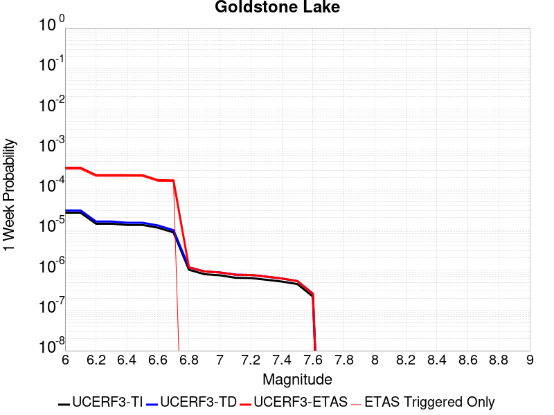 | 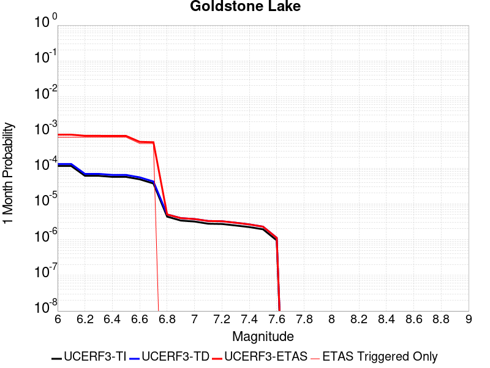 | 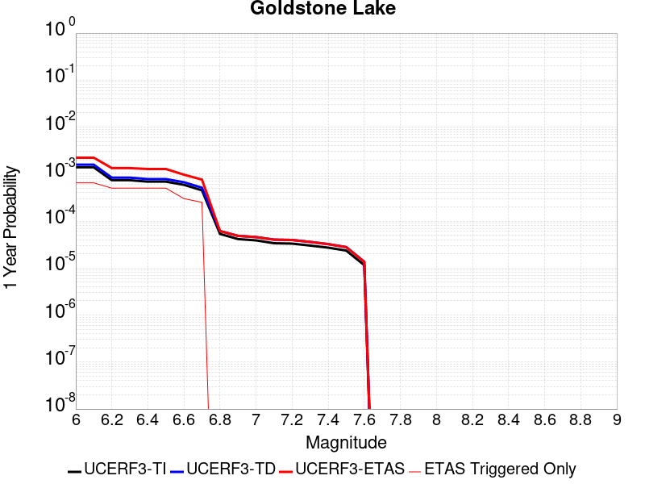 | 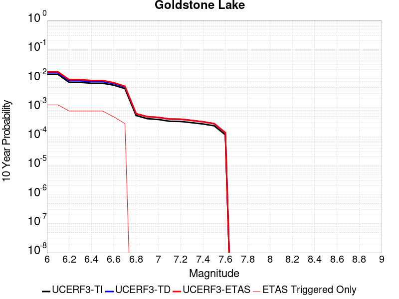 |

| Magnitude | 1 wk TI Prob | 1 wk TD Prob | 1 wk ETAS Prob | 1 wk ETAS/TD Gain | 1 wk ETAS Triggered Only | 1 mo TI Prob | 1 mo TD Prob | 1 mo ETAS Prob | 1 mo ETAS/TD Gain | 1 mo ETAS Triggered Only | 1 yr TI Prob | 1 yr TD Prob | 1 yr ETAS Prob | 1 yr ETAS/TD Gain | 1 yr ETAS Triggered Only | 10 yr TI Prob | 10 yr TD Prob | 10 yr ETAS Prob | 10 yr ETAS/TD Gain | 10 yr ETAS Triggered Only |
|-----|-----|-----|-----|-----|-----|-----|-----|-----|-----|-----|-----|-----|-----|-----|-----|-----|-----|-----|-----|-----|
| 6.0 | 2.671352E-5 | 3.037598E-5 | 3.483819E-4 | 11.468992 | 3.1801558E-4 | 1.1448149E-4 | 1.3017739E-4 | 6.071387E-4 | 4.6639333 | 4.7702336E-4 | 0.001392921 | 0.0015839539 | 0.0022718962 | 1.4343197 | 6.8903377E-4 | 0.013842222 | 0.01574614 | 0.01705034 | 1.0828266 | 0.0013250649 |
| 6.1 | 2.671352E-5 | 3.037598E-5 | 3.483819E-4 | 11.468992 | 3.1801558E-4 | 1.1448149E-4 | 1.3017739E-4 | 6.071387E-4 | 4.6639333 | 4.7702336E-4 | 0.001392921 | 0.0015839539 | 0.0022718962 | 1.4343197 | 6.8903377E-4 | 0.013842222 | 0.01574614 | 0.01705034 | 1.0828266 | 0.0013250649 |
| 6.2 | 1.4197047E-5 | 1.609619E-5 | 2.2810316E-4 | 14.171252 | 2.1201039E-4 | 6.0843064E-5 | 6.89824E-5 | 4.39975E-4 | 6.3780756 | 3.710182E-4 | 7.4051257E-4 | 8.396358E-4 | 0.0013692167 | 1.6307269 | 5.30026E-4 | 0.007380498 | 0.008374331 | 0.00921527 | 1.1004187 | 8.4804156E-4 |
| 6.3 | 1.4197047E-5 | 1.609619E-5 | 2.2810316E-4 | 14.171252 | 2.1201039E-4 | 6.0843064E-5 | 6.89824E-5 | 4.39975E-4 | 6.3780756 | 3.710182E-4 | 7.4051257E-4 | 8.396358E-4 | 0.0013692167 | 1.6307269 | 5.30026E-4 | 0.007380498 | 0.008374331 | 0.00921527 | 1.1004187 | 8.4804156E-4 |
| 6.4 | 1.3238931E-5 | 1.5008409E-5 | 2.2701561E-4 | 15.125895 | 2.1201039E-4 | 5.6737044E-5 | 6.432072E-5 | 4.3531504E-4 | 6.767882 | 3.710182E-4 | 6.9055456E-4 | 7.829214E-4 | 0.0013125323 | 1.6764549 | 5.30026E-4 | 0.006884126 | 0.007811257 | 0.008652674 | 1.1077186 | 8.4804156E-4 |
| 6.5 | 1.3238931E-5 | 1.5008409E-5 | 2.2701561E-4 | 15.125895 | 2.1201039E-4 | 5.6737044E-5 | 6.432072E-5 | 4.3531504E-4 | 6.767882 | 3.710182E-4 | 6.9055456E-4 | 7.829214E-4 | 0.0013125323 | 1.6764549 | 5.30026E-4 | 0.006884126 | 0.007811257 | 0.008652674 | 1.1077186 | 8.4804156E-4 |
| 6.6 | 1.1328278E-5 | 1.2855122E-5 | 1.7186087E-4 | 13.369058 | 1.5900779E-4 | 4.8548856E-5 | 5.5092758E-5 | 3.2009115E-4 | 5.8100405 | 2.65013E-4 | 5.90922E-4 | 6.706436E-4 | 9.884458E-4 | 1.4738766 | 3.1801558E-4 | 0.0058935313 | 0.006695586 | 0.007222063 | 1.0786304 | 5.30026E-4 |
| 6.7 | 8.651175E-6 | 9.824532E-6 | 1.6883077E-4 | 17.18461 | 1.5900779E-4 | 3.707594E-5 | 4.2104966E-5 | 3.071068E-4 | 7.2938375 | 2.65013E-4 | 4.5130608E-4 | 5.125979E-4 | 7.7747507E-4 | 1.5167347 | 2.65013E-4 | 0.0045039062 | 0.005123034 | 0.0054394207 | 1.0617576 | 3.1801558E-4 |
| 6.8 | 1.0215377E-6 | 1.1754685E-6 | 1.1754685E-6 | 1.0 | 0.0 | 4.378012E-6 | 5.0377125E-6 | 5.0377125E-6 | 1.0 | 0.0 | 5.3300988E-5 | 6.133254E-5 | 6.133254E-5 | 1.0 | 0.0 | 5.3288206E-4 | 6.131674E-4 | 6.131674E-4 | 1.0 | 0.0 |
| 6.9 | 7.9360774E-7 | 9.283384E-7 | 9.283384E-7 | 1.0 | 0.0 | 3.4011714E-6 | 3.9785873E-6 | 3.9785873E-6 | 1.0 | 0.0 | 4.1408475E-5 | 4.8438294E-5 | 4.8438294E-5 | 1.0 | 0.0 | 4.140076E-4 | 4.842844E-4 | 4.842844E-4 | 1.0 | 0.0 |
| 7.0 | 7.4382757E-7 | 8.747317E-7 | 8.747317E-7 | 1.0 | 0.0 | 3.1878285E-6 | 3.748845E-6 | 3.748845E-6 | 1.0 | 0.0 | 3.8811122E-5 | 4.56413E-5 | 4.56413E-5 | 1.0 | 0.0 | 3.8804344E-4 | 4.563259E-4 | 4.563259E-4 | 1.0 | 0.0 |
| 7.1 | 6.4709513E-7 | 7.71129E-7 | 7.71129E-7 | 1.0 | 0.0 | 2.773262E-6 | 3.304835E-6 | 3.304835E-6 | 1.0 | 0.0 | 3.376394E-5 | 4.023568E-5 | 4.023568E-5 | 1.0 | 0.0 | 3.375881E-4 | 4.0228994E-4 | 4.0228994E-4 | 1.0 | 0.0 |
| 7.2 | 6.356704E-7 | 7.5883503E-7 | 7.5883503E-7 | 1.0 | 0.0 | 2.7242988E-6 | 3.2521464E-6 | 3.2521464E-6 | 1.0 | 0.0 | 3.3167835E-5 | 3.9594222E-5 | 3.9594222E-5 | 1.0 | 0.0 | 3.3162883E-4 | 3.9587764E-4 | 3.9587764E-4 | 1.0 | 0.0 |
| 7.3 | 5.7695723E-7 | 6.896557E-7 | 6.896557E-7 | 1.0 | 0.0 | 2.4726714E-6 | 2.955664E-6 | 2.955664E-6 | 1.0 | 0.0 | 3.0104358E-5 | 3.5984674E-5 | 3.5984674E-5 | 1.0 | 0.0 | 3.0100282E-4 | 3.597942E-4 | 3.597942E-4 | 1.0 | 0.0 |
| 7.4 | 5.209647E-7 | 6.1935066E-7 | 6.1935066E-7 | 1.0 | 0.0 | 2.232704E-6 | 2.6543576E-6 | 2.6543576E-6 | 1.0 | 0.0 | 2.718283E-5 | 3.231638E-5 | 3.231638E-5 | 1.0 | 0.0 | 2.7179506E-4 | 3.2312237E-4 | 3.2312237E-4 | 1.0 | 0.0 |
| 7.5 | 4.512955E-7 | 5.348879E-7 | 5.348879E-7 | 1.0 | 0.0 | 1.934122E-6 | 2.292375E-6 | 2.292375E-6 | 1.0 | 0.0 | 2.3547682E-5 | 2.7909362E-5 | 2.7909362E-5 | 1.0 | 0.0 | 2.3545188E-4 | 2.7906388E-4 | 2.7906388E-4 | 1.0 | 0.0 |
| 7.6 | 2.21172E-7 | 2.603958E-7 | 2.603958E-7 | 1.0 | 0.0 | 9.478797E-7 | 1.1159817E-6 | 1.1159817E-6 | 1.0 | 0.0 | 1.1540374E-5 | 1.3587022E-5 | 1.3587022E-5 | 1.0 | 0.0 | 1.1539775E-4 | 1.3586473E-4 | 1.3586473E-4 | 1.0 | 0.0 |

## McLean Lake
*[(top)](#table-of-contents)*

| 1 Week | 1 Month | 1 Year | 10 Year |
|-----|-----|-----|-----|
| 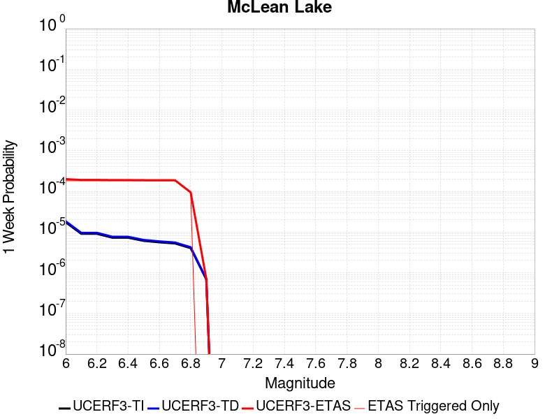 | 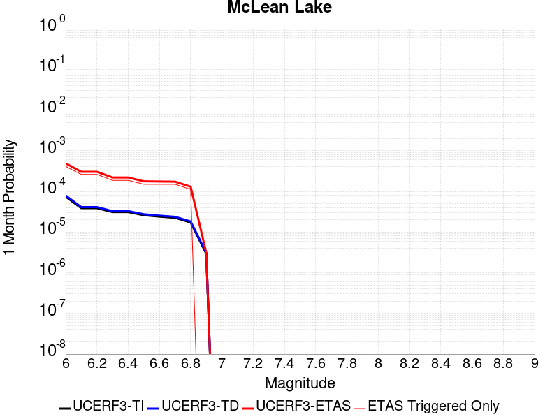 | 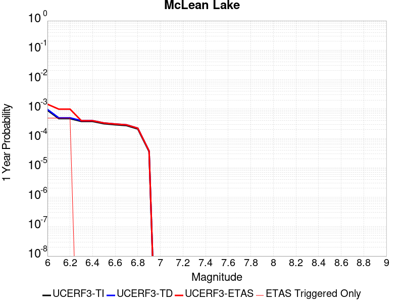 | 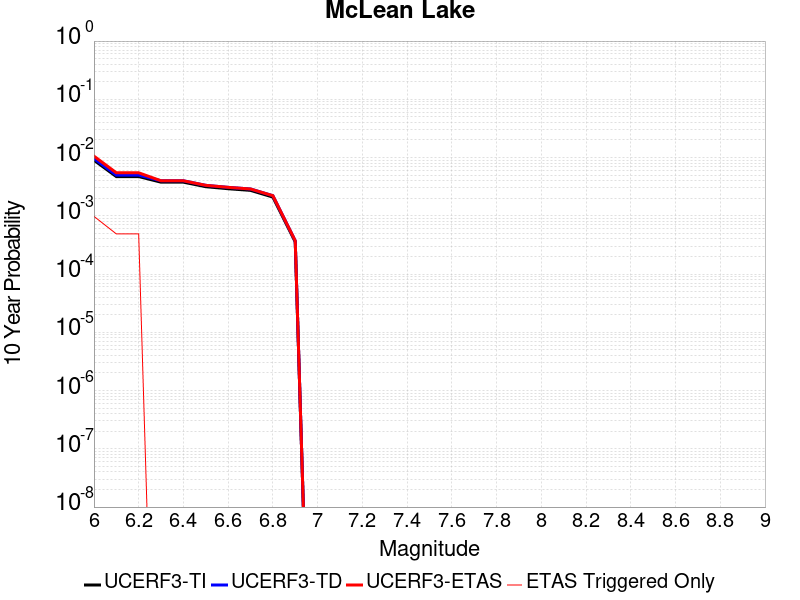 |

| Magnitude | 1 wk TI Prob | 1 wk TD Prob | 1 wk ETAS Prob | 1 wk ETAS/TD Gain | 1 wk ETAS Triggered Only | 1 mo TI Prob | 1 mo TD Prob | 1 mo ETAS Prob | 1 mo ETAS/TD Gain | 1 mo ETAS Triggered Only | 1 yr TI Prob | 1 yr TD Prob | 1 yr ETAS Prob | 1 yr ETAS/TD Gain | 1 yr ETAS Triggered Only | 10 yr TI Prob | 10 yr TD Prob | 10 yr ETAS Prob | 10 yr ETAS/TD Gain | 10 yr ETAS Triggered Only |
|-----|-----|-----|-----|-----|-----|-----|-----|-----|-----|-----|-----|-----|-----|-----|-----|-----|-----|-----|-----|-----|
| 6.0 | 1.7360222E-5 | 1.8501594E-5 | 1.7750644E-4 | 9.594116 | 1.5900779E-4 | 7.439883E-5 | 7.929042E-5 | 3.972808E-4 | 5.010452 | 3.1801558E-4 | 9.0542925E-4 | 9.6498185E-4 | 0.0016533508 | 1.713349 | 6.8903377E-4 | 0.009017491 | 0.009612758 | 0.010977578 | 1.1419802 | 0.0013780675 |
| 6.1 | 9.062689E-6 | 9.592179E-6 | 1.15596355E-4 | 12.0511055 | 1.06005195E-4 | 3.8839516E-5 | 4.110874E-5 | 2.0011E-4 | 4.867821 | 1.5900779E-4 | 4.727685E-4 | 5.0039287E-4 | 9.771775E-4 | 1.9528208 | 4.7702336E-4 | 0.0047176396 | 0.004993544 | 0.0058900886 | 1.1795408 | 9.010442E-4 |
| 6.2 | 9.062689E-6 | 9.592179E-6 | 1.15596355E-4 | 12.0511055 | 1.06005195E-4 | 3.8839516E-5 | 4.110874E-5 | 2.0011E-4 | 4.867821 | 1.5900779E-4 | 4.727685E-4 | 5.0039287E-4 | 9.771775E-4 | 1.9528208 | 4.7702336E-4 | 0.0047176396 | 0.004993544 | 0.0058900886 | 1.1795408 | 9.010442E-4 |
| 6.3 | 7.2575485E-6 | 7.667698E-6 | 1.1367208E-4 | 14.8248 | 1.06005195E-4 | 3.110341E-5 | 3.286119E-5 | 1.9186376E-4 | 5.838613 | 1.5900779E-4 | 3.786182E-4 | 4.0001865E-4 | 7.708884E-4 | 1.9271312 | 3.710182E-4 | 0.0037797375 | 0.003993691 | 0.004679973 | 1.1718415 | 6.8903377E-4 |
| 6.4 | 7.2575485E-6 | 7.667698E-6 | 1.1367208E-4 | 14.8248 | 1.06005195E-4 | 3.110341E-5 | 3.286119E-5 | 1.9186376E-4 | 5.838613 | 1.5900779E-4 | 3.786182E-4 | 4.0001865E-4 | 7.708884E-4 | 1.9271312 | 3.710182E-4 | 0.0037797375 | 0.003993691 | 0.004679973 | 1.1718415 | 6.8903377E-4 |
| 6.5 | 6.06582E-6 | 6.4038677E-6 | 1.1240839E-4 | 17.553202 | 1.06005195E-4 | 2.5996113E-5 | 2.7444894E-5 | 1.3344717E-4 | 4.862368 | 1.06005195E-4 | 3.164567E-4 | 3.3409684E-4 | 6.520062E-4 | 1.9515485 | 3.1801558E-4 | 0.0031600643 | 0.0033365842 | 0.0039176675 | 1.1741551 | 5.830286E-4 |
| 6.6 | 5.598744E-6 | 5.9102535E-6 | 1.1191482E-4 | 18.935705 | 1.06005195E-4 | 2.3994397E-5 | 2.5329447E-5 | 1.3133195E-4 | 5.1849513 | 1.06005195E-4 | 2.9209262E-4 | 3.0834877E-4 | 6.262663E-4 | 2.031032 | 3.1801558E-4 | 0.0029170897 | 0.0030798386 | 0.0036610714 | 1.1887219 | 5.830286E-4 |
| 6.7 | 5.246996E-6 | 5.539154E-6 | 1.1154376E-4 | 20.13733 | 1.06005195E-4 | 2.2486933E-5 | 2.373905E-5 | 1.2974173E-4 | 5.465329 | 1.06005195E-4 | 2.73744E-4 | 2.8899097E-4 | 6.0691463E-4 | 2.1001165 | 3.1801558E-4 | 0.0027340704 | 0.0028867754 | 0.0033624216 | 1.1647674 | 4.7702336E-4 |
| 6.8 | 4.02324E-6 | 4.2468982E-6 | 5.724927E-5 | 13.480255 | 5.3002597E-5 | 1.7242342E-5 | 1.8200899E-5 | 7.120253E-5 | 3.9120338 | 5.3002597E-5 | 2.099053E-4 | 2.2157936E-4 | 3.805519E-4 | 1.717452 | 1.5900779E-4 | 0.0020970714 | 0.0022141687 | 0.002478595 | 1.1194246 | 2.65013E-4 |
| 6.9 | 6.835972E-7 | 7.13992E-7 | 7.13992E-7 | 1.0 | 0.0 | 2.9296991E-6 | 3.0599638E-6 | 3.0599638E-6 | 1.0 | 0.0 | 3.56685E-5 | 3.725474E-5 | 3.725474E-5 | 1.0 | 0.0 | 3.5662777E-4 | 3.7251622E-4 | 3.7251622E-4 | 1.0 | 0.0 |

## Coyote Canyon
*[(top)](#table-of-contents)*

| 1 Week | 1 Month | 1 Year | 10 Year |
|-----|-----|-----|-----|
| 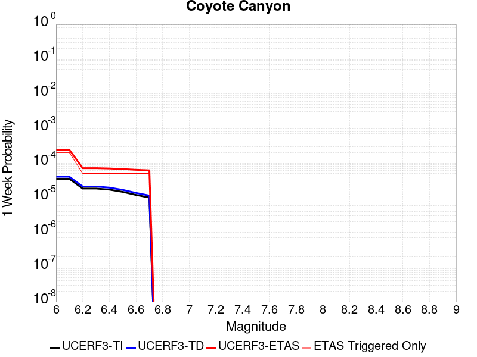 | 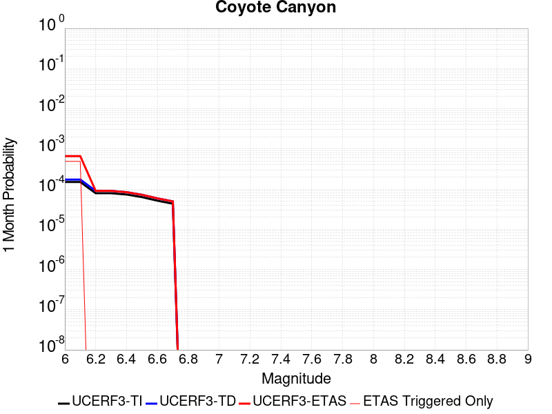 | 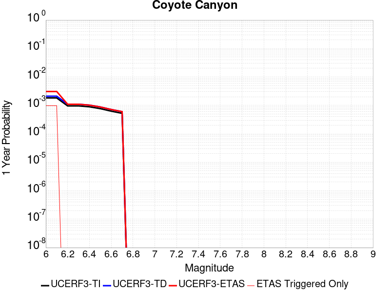 | 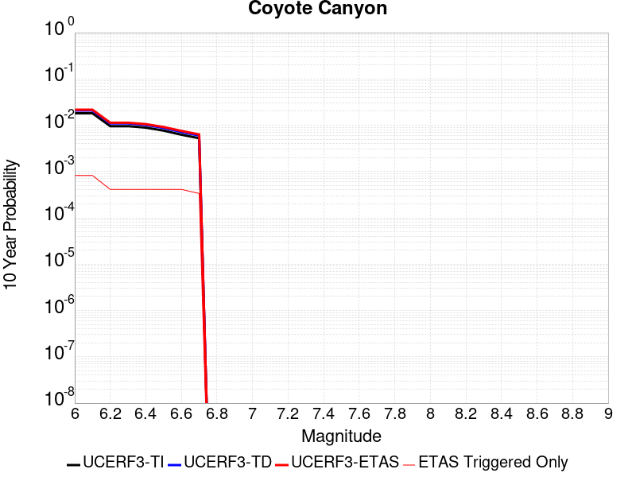 |

| Magnitude | 1 wk TI Prob | 1 wk TD Prob | 1 wk ETAS Prob | 1 wk ETAS/TD Gain | 1 wk ETAS Triggered Only | 1 mo TI Prob | 1 mo TD Prob | 1 mo ETAS Prob | 1 mo ETAS/TD Gain | 1 mo ETAS Triggered Only | 1 yr TI Prob | 1 yr TD Prob | 1 yr ETAS Prob | 1 yr ETAS/TD Gain | 1 yr ETAS Triggered Only | 10 yr TI Prob | 10 yr TD Prob | 10 yr ETAS Prob | 10 yr ETAS/TD Gain | 10 yr ETAS Triggered Only |
|-----|-----|-----|-----|-----|-----|-----|-----|-----|-----|-----|-----|-----|-----|-----|-----|-----|-----|-----|-----|-----|
| 6.0 | 3.5090034E-5 | 4.036416E-5 | 2.5236598E-4 | 6.252229 | 2.1201039E-4 | 1.503772E-4 | 1.7297924E-4 | 4.3794638E-4 | 2.5317857 | 2.65013E-4 | 0.0018293047 | 0.0021042444 | 0.002527373 | 1.2010834 | 4.2402078E-4 | 0.018143194 | 0.02086912 | 0.021803256 | 1.0447617 | 9.540467E-4 |
| 6.1 | 3.5090034E-5 | 4.036416E-5 | 2.5236598E-4 | 6.252229 | 2.1201039E-4 | 1.503772E-4 | 1.7297924E-4 | 4.3794638E-4 | 2.5317857 | 2.65013E-4 | 0.0018293047 | 0.0021042444 | 0.002527373 | 1.2010834 | 4.2402078E-4 | 0.018143194 | 0.02086912 | 0.021803256 | 1.0447617 | 9.540467E-4 |
| 6.2 | 1.841879E-5 | 2.1059714E-5 | 7.4061194E-5 | 3.5167239 | 5.3002597E-5 | 7.8935285E-5 | 9.0253365E-5 | 1.4325118E-4 | 1.5872115 | 5.3002597E-5 | 9.606133E-4 | 0.0010983828 | 0.0012042716 | 1.0964042 | 1.06005195E-4 | 0.0095647145 | 0.010939625 | 0.011306585 | 1.0335441 | 3.710182E-4 |
| 6.3 | 1.841879E-5 | 2.1059714E-5 | 7.4061194E-5 | 3.5167239 | 5.3002597E-5 | 7.8935285E-5 | 9.0253365E-5 | 1.4325118E-4 | 1.5872115 | 5.3002597E-5 | 9.606133E-4 | 0.0010983828 | 0.0012042716 | 1.0964042 | 1.06005195E-4 | 0.0095647145 | 0.010939625 | 0.011306585 | 1.0335441 | 3.710182E-4 |
| 6.4 | 1.712201E-5 | 1.9565137E-5 | 7.25667E-5 | 3.7089798 | 5.3002597E-5 | 7.337798E-5 | 8.384846E-5 | 1.3684662E-4 | 1.6320707 | 5.3002597E-5 | 8.930107E-4 | 0.0010204774 | 0.0011263745 | 1.103772 | 1.06005195E-4 | 0.008894307 | 0.010167832 | 0.010535078 | 1.0361184 | 3.710182E-4 |
| 6.5 | 1.4744935E-5 | 1.6836908E-5 | 6.9838614E-5 | 4.147948 | 5.3002597E-5 | 6.3191044E-5 | 7.2156705E-5 | 1.2515548E-4 | 1.7344954 | 5.3002597E-5 | 7.6907943E-4 | 8.782473E-4 | 9.841594E-4 | 1.1205949 | 1.06005195E-4 | 0.007664232 | 0.008756962 | 0.009124731 | 1.0419973 | 3.710182E-4 |
| 6.6 | 1.2017839E-5 | 1.3724038E-5 | 6.672591E-5 | 4.861974 | 5.3002597E-5 | 5.150401E-5 | 5.8816477E-5 | 1.11815956E-4 | 1.9010992 | 5.3002597E-5 | 6.268809E-4 | 7.1594387E-4 | 8.218732E-4 | 1.1479576 | 1.06005195E-4 | 0.0062511545 | 0.0071450667 | 0.0075134337 | 1.0515555 | 3.710182E-4 |
| 6.7 | 1.00956095E-5 | 1.1533472E-5 | 6.453546E-5 | 5.5954924 | 5.3002597E-5 | 4.326618E-5 | 4.9428723E-5 | 1.024287E-4 | 2.0722506 | 5.3002597E-5 | 5.266384E-4 | 6.017155E-4 | 7.076569E-4 | 1.1760656 | 1.06005195E-4 | 0.005253921 | 0.0060093896 | 0.006325494 | 1.0526018 | 3.1801558E-4 |

## So Sierra Nevada
*[(top)](#table-of-contents)*

| 1 Week | 1 Month | 1 Year | 10 Year |
|-----|-----|-----|-----|
| 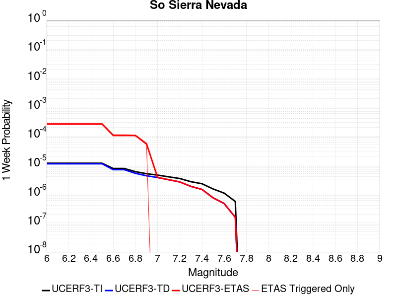 |  | 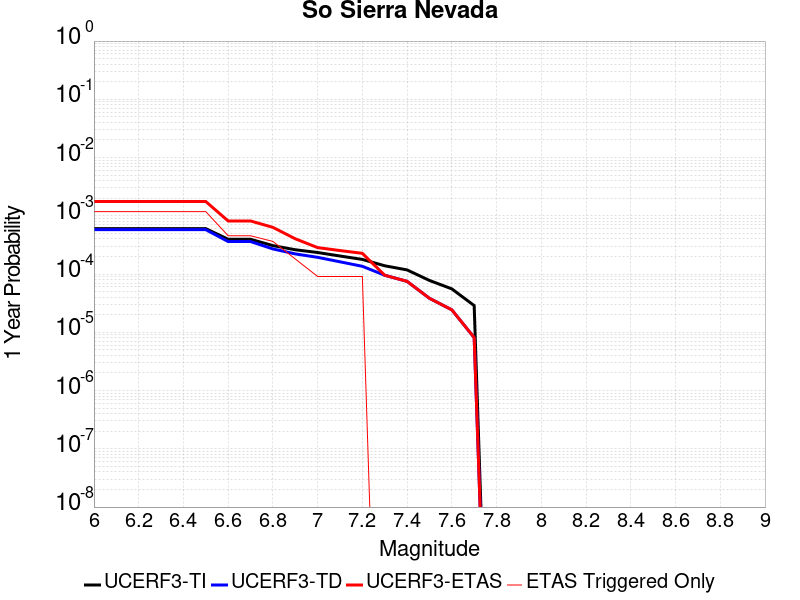 | 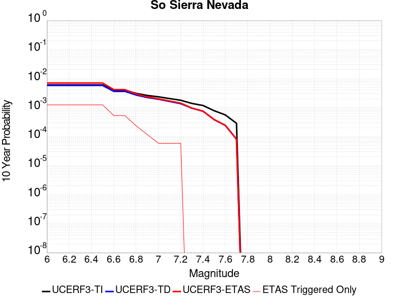 |

| Magnitude | 1 wk TI Prob | 1 wk TD Prob | 1 wk ETAS Prob | 1 wk ETAS/TD Gain | 1 wk ETAS Triggered Only | 1 mo TI Prob | 1 mo TD Prob | 1 mo ETAS Prob | 1 mo ETAS/TD Gain | 1 mo ETAS Triggered Only | 1 yr TI Prob | 1 yr TD Prob | 1 yr ETAS Prob | 1 yr ETAS/TD Gain | 1 yr ETAS Triggered Only | 10 yr TI Prob | 10 yr TD Prob | 10 yr ETAS Prob | 10 yr ETAS/TD Gain | 10 yr ETAS Triggered Only |
|-----|-----|-----|-----|-----|-----|-----|-----|-----|-----|-----|-----|-----|-----|-----|-----|-----|-----|-----|-----|-----|
| 6.0 | 1.15488665E-5 | 1.1079626E-5 | 2.7608968E-4 | 24.91868 | 2.65013E-4 | 4.9494203E-5 | 4.748332E-5 | 3.654838E-4 | 7.6970987 | 3.1801558E-4 | 6.024253E-4 | 5.7796884E-4 | 0.0013725483 | 2.374779 | 7.9503894E-4 | 0.006007948 | 0.0057659256 | 0.0068725627 | 1.191927 | 0.0011130546 |
| 6.1 | 1.15488665E-5 | 1.1079626E-5 | 2.7608968E-4 | 24.91868 | 2.65013E-4 | 4.9494203E-5 | 4.748332E-5 | 3.654838E-4 | 7.6970987 | 3.1801558E-4 | 6.024253E-4 | 5.7796884E-4 | 0.0013725483 | 2.374779 | 7.9503894E-4 | 0.006007948 | 0.0057659256 | 0.0068725627 | 1.191927 | 0.0011130546 |
| 6.2 | 1.15488665E-5 | 1.1079626E-5 | 2.7608968E-4 | 24.91868 | 2.65013E-4 | 4.9494203E-5 | 4.748332E-5 | 3.654838E-4 | 7.6970987 | 3.1801558E-4 | 6.024253E-4 | 5.7796884E-4 | 0.0013725483 | 2.374779 | 7.9503894E-4 | 0.006007948 | 0.0057659256 | 0.0068725627 | 1.191927 | 0.0011130546 |
| 6.3 | 1.15488665E-5 | 1.1079626E-5 | 2.7608968E-4 | 24.91868 | 2.65013E-4 | 4.9494203E-5 | 4.748332E-5 | 3.654838E-4 | 7.6970987 | 3.1801558E-4 | 6.024253E-4 | 5.7796884E-4 | 0.0013725483 | 2.374779 | 7.9503894E-4 | 0.006007948 | 0.0057659256 | 0.0068725627 | 1.191927 | 0.0011130546 |
| 6.4 | 1.15488665E-5 | 1.1079626E-5 | 2.7608968E-4 | 24.91868 | 2.65013E-4 | 4.9494203E-5 | 4.748332E-5 | 3.654838E-4 | 7.6970987 | 3.1801558E-4 | 6.024253E-4 | 5.7796884E-4 | 0.0013725483 | 2.374779 | 7.9503894E-4 | 0.006007948 | 0.0057659256 | 0.0068725627 | 1.191927 | 0.0011130546 |
| 6.5 | 1.15488665E-5 | 1.1079626E-5 | 2.7608968E-4 | 24.91868 | 2.65013E-4 | 4.9494203E-5 | 4.748332E-5 | 3.654838E-4 | 7.6970987 | 3.1801558E-4 | 6.024253E-4 | 5.7796884E-4 | 0.0013725483 | 2.374779 | 7.9503894E-4 | 0.006007948 | 0.0057659256 | 0.0068725627 | 1.191927 | 0.0011130546 |
| 6.6 | 7.587044E-6 | 6.9356242E-6 | 1.12940084E-4 | 16.284054 | 1.06005195E-4 | 3.2515498E-5 | 2.9723782E-5 | 1.3572583E-4 | 4.566237 | 1.06005195E-4 | 3.9580427E-4 | 3.6182988E-4 | 6.26747E-4 | 1.7321593 | 2.65013E-4 | 0.003951 | 0.0036126992 | 0.004087999 | 1.1315637 | 4.7702336E-4 |
| 6.7 | 7.587044E-6 | 6.9356242E-6 | 1.12940084E-4 | 16.284054 | 1.06005195E-4 | 3.2515498E-5 | 2.9723782E-5 | 1.3572583E-4 | 4.566237 | 1.06005195E-4 | 3.9580427E-4 | 3.6182988E-4 | 6.26747E-4 | 1.7321593 | 2.65013E-4 | 0.003951 | 0.0036126992 | 0.004087999 | 1.1315637 | 4.7702336E-4 |
| 6.8 | 5.9026956E-6 | 5.179384E-6 | 1.1118403E-4 | 21.466652 | 1.06005195E-4 | 2.5297022E-5 | 2.2197177E-5 | 1.2820002E-4 | 5.77551 | 1.06005195E-4 | 3.0794772E-4 | 2.702183E-4 | 4.821714E-4 | 1.7843773 | 2.1201039E-4 | 0.0030752132 | 0.0026990133 | 0.0029104515 | 1.0783391 | 2.1201039E-4 |
| 6.9 | 5.0118915E-6 | 4.2524175E-6 | 5.725479E-5 | 13.464056 | 5.3002597E-5 | 2.1479358E-5 | 1.8224524E-5 | 7.122615E-5 | 3.908259 | 5.3002597E-5 | 2.614798E-4 | 2.218617E-4 | 3.278434E-4 | 1.4776925 | 1.06005195E-4 | 0.0026117235 | 0.0022164746 | 0.002322245 | 1.0477201 | 1.06005195E-4 |
| 7.0 | 4.4924795E-6 | 3.7139105E-6 | 3.7139105E-6 | 1.0 | 0.0 | 1.925334E-5 | 1.5916665E-5 | 1.5916665E-5 | 1.0 | 0.0 | 2.3438422E-4 | 1.937688E-4 | 2.4676113E-4 | 1.2734822 | 5.3002597E-5 | 0.0023413717 | 0.0019360614 | 0.0019889614 | 1.0273235 | 5.3002597E-5 |
| 7.1 | 3.9118436E-6 | 3.111971E-6 | 3.111971E-6 | 1.0 | 0.0 | 1.6764936E-5 | 1.3336953E-5 | 1.3336953E-5 | 1.0 | 0.0 | 2.0409399E-4 | 1.6236588E-4 | 2.1535986E-4 | 1.3263862 | 5.3002597E-5 | 0.0020390663 | 0.0016225285 | 0.0016754452 | 1.0326136 | 5.3002597E-5 |
| 7.2 | 3.4200818E-6 | 2.6054481E-6 | 2.6054481E-6 | 1.0 | 0.0 | 1.4657411E-5 | 1.1166161E-5 | 1.1166161E-5 | 1.0 | 0.0 | 1.7843937E-4 | 1.3594003E-4 | 1.8893543E-4 | 1.3898438 | 5.3002597E-5 | 0.0017829615 | 0.0013586186 | 0.0014115492 | 1.0389591 | 5.3002597E-5 |
| 7.3 | 2.6593618E-6 | 1.828415E-6 | 1.828415E-6 | 1.0 | 0.0 | 1.13972155E-5 | 7.836042E-6 | 7.836042E-6 | 1.0 | 0.0 | 1.3875226E-4 | 9.539993E-5 | 9.539993E-5 | 1.0 | 0.0 | 0.0013866565 | 9.5361867E-4 | 9.5361867E-4 | 1.0 | 0.0 |
| 7.4 | 2.2577992E-6 | 1.4364332E-6 | 1.4364332E-6 | 1.0 | 0.0 | 9.676246E-6 | 6.156129E-6 | 6.156129E-6 | 1.0 | 0.0 | 1.1780193E-4 | 7.494855E-5 | 7.494855E-5 | 1.0 | 0.0 | 0.001177395 | 7.4925774E-4 | 7.4925774E-4 | 1.0 | 0.0 |
| 7.5 | 1.489319E-6 | 7.353898E-7 | 7.353898E-7 | 1.0 | 0.0 | 6.3827797E-6 | 3.1516668E-6 | 3.1516668E-6 | 1.0 | 0.0 | 7.770758E-5 | 3.8370872E-5 | 3.8370872E-5 | 1.0 | 0.0 | 7.7680405E-4 | 3.8364288E-4 | 3.8364288E-4 | 1.0 | 0.0 |
| 7.6 | 1.0680322E-6 | 4.6596273E-7 | 4.6596273E-7 | 1.0 | 0.0 | 4.577273E-6 | 1.9969816E-6 | 1.9969816E-6 | 1.0 | 0.0 | 5.5726876E-5 | 2.4312982E-5 | 2.4312982E-5 | 1.0 | 0.0 | 5.5712904E-4 | 2.4310348E-4 | 2.4310348E-4 | 1.0 | 0.0 |
| 7.7 | 5.509146E-7 | 1.5580342E-7 | 1.5580342E-7 | 1.0 | 0.0 | 2.3610605E-6 | 6.677288E-7 | 6.677288E-7 | 1.0 | 0.0 | 2.8745531E-5 | 8.129569E-6 | 8.129569E-6 | 1.0 | 0.0 | 2.8741814E-4 | 8.1292834E-5 | 8.1292834E-5 | 1.0 | 0.0 |

## Death Valley (So)
*[(top)](#table-of-contents)*

| 1 Week | 1 Month | 1 Year | 10 Year |
|-----|-----|-----|-----|
| 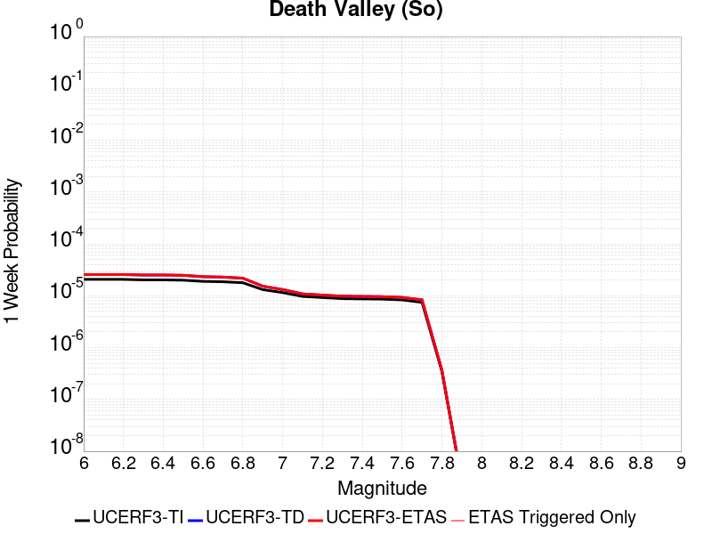 | 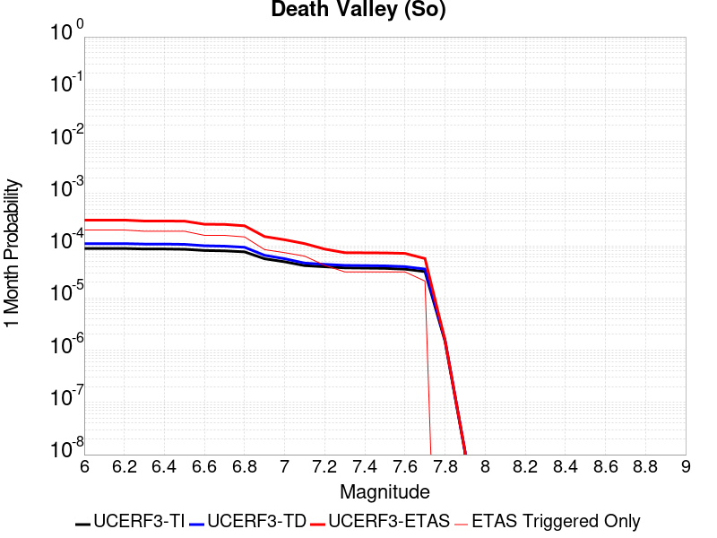 | 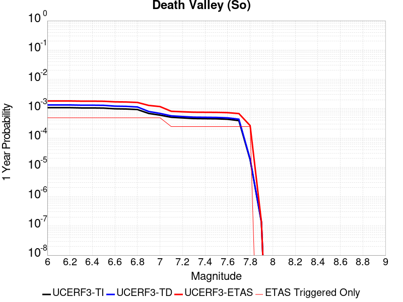 | 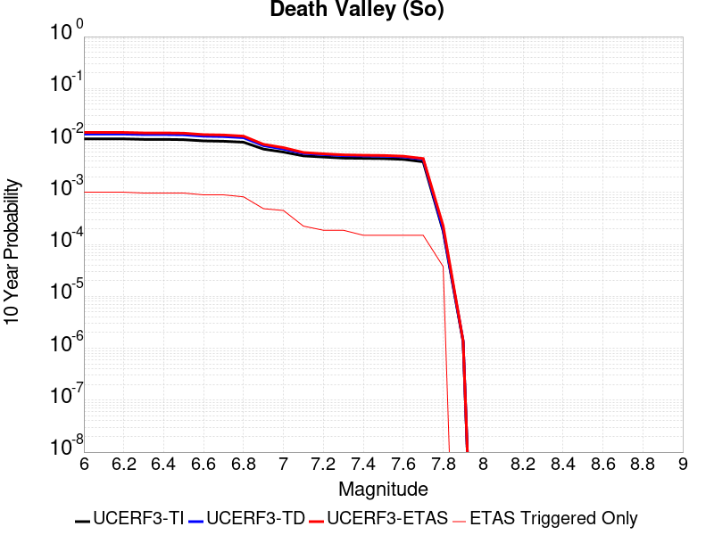 |

| Magnitude | 1 wk TI Prob | 1 wk TD Prob | 1 wk ETAS Prob | 1 wk ETAS/TD Gain | 1 wk ETAS Triggered Only | 1 mo TI Prob | 1 mo TD Prob | 1 mo ETAS Prob | 1 mo ETAS/TD Gain | 1 mo ETAS Triggered Only | 1 yr TI Prob | 1 yr TD Prob | 1 yr ETAS Prob | 1 yr ETAS/TD Gain | 1 yr ETAS Triggered Only | 10 yr TI Prob | 10 yr TD Prob | 10 yr ETAS Prob | 10 yr ETAS/TD Gain | 10 yr ETAS Triggered Only |
|-----|-----|-----|-----|-----|-----|-----|-----|-----|-----|-----|-----|-----|-----|-----|-----|-----|-----|-----|-----|-----|
| 6.0 | 2.0684236E-5 | 2.5617646E-5 | 7.861888E-5 | 3.0689347 | 5.3002597E-5 | 8.864371E-5 | 1.0978539E-4 | 2.687757E-4 | 2.4481921 | 1.5900779E-4 | 0.0010787029 | 0.0013358344 | 0.0018122206 | 1.3566207 | 4.7702336E-4 | 0.010734817 | 0.0132813305 | 0.014170407 | 1.0669419 | 9.010442E-4 |
| 6.1 | 2.0684236E-5 | 2.5617646E-5 | 7.861888E-5 | 3.0689347 | 5.3002597E-5 | 8.864371E-5 | 1.0978539E-4 | 2.687757E-4 | 2.4481921 | 1.5900779E-4 | 0.0010787029 | 0.0013358344 | 0.0018122206 | 1.3566207 | 4.7702336E-4 | 0.010734817 | 0.0132813305 | 0.014170407 | 1.0669419 | 9.010442E-4 |
| 6.2 | 2.0684236E-5 | 2.5617646E-5 | 7.861888E-5 | 3.0689347 | 5.3002597E-5 | 8.864371E-5 | 1.0978539E-4 | 2.687757E-4 | 2.4481921 | 1.5900779E-4 | 0.0010787029 | 0.0013358344 | 0.0018122206 | 1.3566207 | 4.7702336E-4 | 0.010734817 | 0.0132813305 | 0.014170407 | 1.0669419 | 9.010442E-4 |
| 6.3 | 2.0240292E-5 | 2.5117732E-5 | 7.8118996E-5 | 3.1101134 | 5.3002597E-5 | 8.6741224E-5 | 1.0764308E-4 | 2.6663375E-4 | 2.4770172 | 1.5900779E-4 | 0.0010555626 | 0.0013097833 | 0.0017861819 | 1.3637232 | 4.7702336E-4 | 0.010505628 | 0.013023891 | 0.013913199 | 1.068283 | 9.010442E-4 |
| 6.4 | 2.0240292E-5 | 2.5117732E-5 | 7.8118996E-5 | 3.1101134 | 5.3002597E-5 | 8.6741224E-5 | 1.0764308E-4 | 2.6663375E-4 | 2.4770172 | 1.5900779E-4 | 0.0010555626 | 0.0013097833 | 0.0017861819 | 1.3637232 | 4.7702336E-4 | 0.010505628 | 0.013023891 | 0.013913199 | 1.068283 | 9.010442E-4 |
| 6.5 | 1.9962767E-5 | 2.4806986E-5 | 7.780827E-5 | 3.1365466 | 5.3002597E-5 | 8.55519E-5 | 1.0631142E-4 | 2.653023E-4 | 2.4955204 | 1.5900779E-4 | 0.0010410968 | 0.0012935897 | 0.001769996 | 1.3682824 | 4.7702336E-4 | 0.010362327 | 0.012863837 | 0.01375329 | 1.0691437 | 9.010442E-4 |
| 6.6 | 1.8937297E-5 | 2.3310844E-5 | 7.631221E-5 | 3.2736783 | 5.3002597E-5 | 8.115732E-5 | 9.989987E-5 | 2.5889179E-4 | 2.5915127 | 1.5900779E-4 | 9.876423E-4 | 0.0012156168 | 0.0016920604 | 1.3919356 | 4.7702336E-4 | 0.009832645 | 0.012092726 | 0.012982874 | 1.0736102 | 9.010442E-4 |
| 6.7 | 1.8621096E-5 | 2.2911487E-5 | 7.591287E-5 | 3.3133106 | 5.3002597E-5 | 7.980225E-5 | 9.818847E-5 | 2.5718065E-4 | 2.619255 | 1.5900779E-4 | 9.711593E-4 | 0.0011948035 | 0.001671257 | 1.3987714 | 4.7702336E-4 | 0.009669261 | 0.011886842 | 0.012777176 | 1.0749007 | 9.010442E-4 |
| 6.8 | 1.7830353E-5 | 2.1805576E-5 | 7.4807016E-5 | 3.4306371 | 5.3002597E-5 | 7.641356E-5 | 9.34492E-5 | 1.9944449E-4 | 2.1342556 | 1.06005195E-4 | 9.29938E-4 | 0.0011371642 | 0.0015607028 | 1.3724515 | 4.2402078E-4 | 0.009260561 | 0.011316297 | 0.0121023385 | 1.0694611 | 7.9503894E-4 |
| 6.9 | 1.3135183E-5 | 1.5303862E-5 | 1.5303862E-5 | 1.0 | 0.0 | 5.6292425E-5 | 6.558636E-5 | 1.18585485E-4 | 1.8080814 | 5.3002597E-5 | 6.8514474E-4 | 7.982279E-4 | 0.0011159896 | 1.3980839 | 3.1801558E-4 | 0.006830362 | 0.007954616 | 0.008480426 | 1.0661012 | 5.30026E-4 |
| 7.0 | 1.1507512E-5 | 1.315415E-5 | 1.315415E-5 | 1.0 | 0.0 | 4.9316975E-5 | 5.6373745E-5 | 5.6373745E-5 | 1.0 | 0.0 | 6.002687E-4 | 6.8614E-4 | 9.509711E-4 | 1.3859725 | 2.65013E-4 | 0.0059864987 | 0.006840916 | 0.007314676 | 1.0692539 | 4.7702336E-4 |
| 7.1 | 9.715903E-6 | 1.0865243E-5 | 1.0865243E-5 | 1.0 | 0.0 | 4.1638916E-5 | 4.656452E-5 | 4.656452E-5 | 1.0 | 0.0 | 5.068359E-4 | 5.667798E-4 | 7.256975E-4 | 1.2803869 | 1.5900779E-4 | 0.0050568148 | 0.0056537963 | 0.0059173107 | 1.0466084 | 2.65013E-4 |
| 7.2 | 9.233269E-6 | 1.0286278E-5 | 1.0286278E-5 | 1.0 | 0.0 | 3.9570554E-5 | 4.4083325E-5 | 4.4083325E-5 | 1.0 | 0.0 | 4.81665E-4 | 5.3658657E-4 | 6.95509E-4 | 1.2961731 | 1.5900779E-4 | 0.0048062233 | 0.005353341 | 0.005616935 | 1.0492392 | 2.65013E-4 |
| 7.3 | 8.8041315E-6 | 9.808134E-6 | 9.808134E-6 | 1.0 | 0.0 | 3.7731446E-5 | 4.2034208E-5 | 4.2034208E-5 | 1.0 | 0.0 | 4.592835E-4 | 5.116505E-4 | 6.7057693E-4 | 1.3106152 | 1.5900779E-4 | 0.0045833546 | 0.005105152 | 0.0053688115 | 1.0516459 | 2.65013E-4 |
| 7.4 | 8.708749E-6 | 9.707145E-6 | 9.707145E-6 | 1.0 | 0.0 | 3.7322676E-5 | 4.160141E-5 | 4.160141E-5 | 1.0 | 0.0 | 4.5430884E-4 | 5.0638366E-4 | 6.1233516E-4 | 1.2092317 | 1.06005195E-4 | 0.004533812 | 0.0050527244 | 0.0052636634 | 1.0417476 | 2.1201039E-4 |
| 7.5 | 8.612678E-6 | 9.604788E-6 | 9.604788E-6 | 1.0 | 0.0 | 3.6910955E-5 | 4.116275E-5 | 4.116275E-5 | 1.0 | 0.0 | 4.492982E-4 | 5.0104543E-4 | 6.069975E-4 | 1.211462 | 1.06005195E-4 | 0.004483909 | 0.004999583 | 0.0052105337 | 1.0421937 | 2.1201039E-4 |
| 7.6 | 8.319024E-6 | 9.283887E-6 | 9.283887E-6 | 1.0 | 0.0 | 3.5652476E-5 | 3.9787505E-5 | 3.9787505E-5 | 1.0 | 0.0 | 4.3398244E-4 | 4.8430942E-4 | 5.902633E-4 | 1.218773 | 1.06005195E-4 | 0.0043313587 | 0.0048329635 | 0.005043949 | 1.0436555 | 2.1201039E-4 |
| 7.7 | 7.4718328E-6 | 8.345144E-6 | 8.345144E-6 | 1.0 | 0.0 | 3.2021748E-5 | 3.5764435E-5 | 3.5764435E-5 | 1.0 | 0.0 | 3.8979502E-4 | 4.3534904E-4 | 5.413081E-4 | 1.2433888 | 1.06005195E-4 | 0.00389112 | 0.004345367 | 0.004556456 | 1.048578 | 2.1201039E-4 |
| 7.8 | 3.4586725E-7 | 3.648256E-7 | 3.648256E-7 | 1.0 | 0.0 | 1.4822873E-6 | 1.5635374E-6 | 1.5635374E-6 | 1.0 | 0.0 | 1.80467E-5 | 1.9035906E-5 | 7.2037496E-5 | 3.7842956 | 5.3002597E-5 | 1.8045233E-4 | 1.903432E-4 | 2.433357E-4 | 1.2784051 | 5.3002597E-5 |
| 7.9 | 2.5591178E-9 | 2.6696687E-9 | 2.6696687E-9 | 1.0 | 0.0 | 1.0967647E-8 | 1.1441437E-8 | 1.1441437E-8 | 1.0 | 0.0 | 1.335311E-7 | 1.392995E-7 | 1.392995E-7 | 1.0 | 0.0 | 1.3353102E-6 | 1.3929949E-6 | 1.3929949E-6 | 1.0 | 0.0 |

## Nelson Lake
*[(top)](#table-of-contents)*

| 1 Week | 1 Month | 1 Year | 10 Year |
|-----|-----|-----|-----|
| 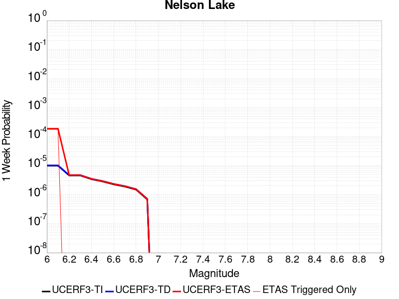 | 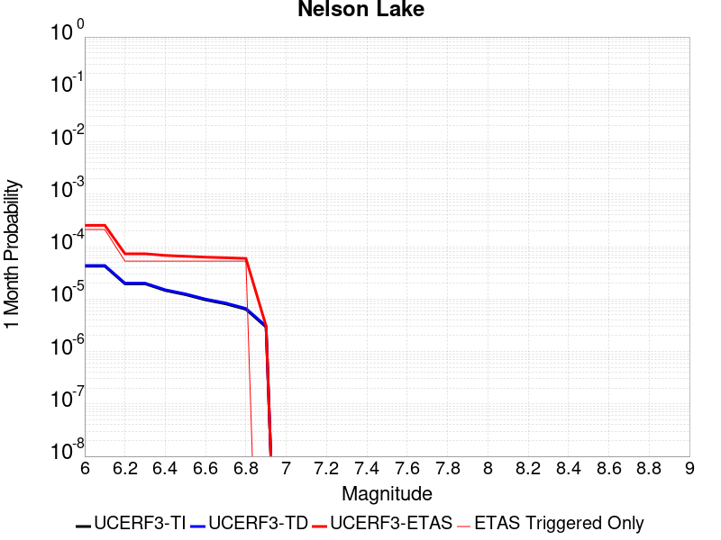 | 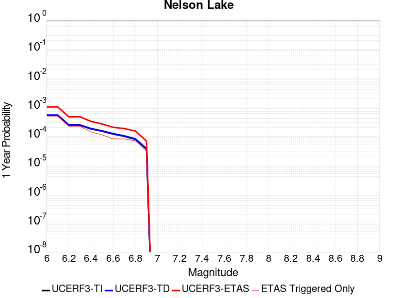 | 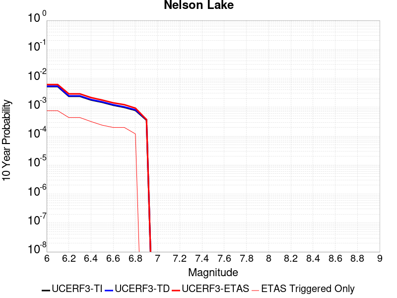 |

| Magnitude | 1 wk TI Prob | 1 wk TD Prob | 1 wk ETAS Prob | 1 wk ETAS/TD Gain | 1 wk ETAS Triggered Only | 1 mo TI Prob | 1 mo TD Prob | 1 mo ETAS Prob | 1 mo ETAS/TD Gain | 1 mo ETAS Triggered Only | 1 yr TI Prob | 1 yr TD Prob | 1 yr ETAS Prob | 1 yr ETAS/TD Gain | 1 yr ETAS Triggered Only | 10 yr TI Prob | 10 yr TD Prob | 10 yr ETAS Prob | 10 yr ETAS/TD Gain | 10 yr ETAS Triggered Only |
|-----|-----|-----|-----|-----|-----|-----|-----|-----|-----|-----|-----|-----|-----|-----|-----|-----|-----|-----|-----|-----|
| 6.0 | 9.913453E-6 | 1.0192248E-5 | 1.6919842E-4 | 16.600697 | 1.5900779E-4 | 4.2485535E-5 | 4.368039E-5 | 2.5568152E-4 | 5.8534627 | 2.1201039E-4 | 5.1713863E-4 | 5.316893E-4 | 9.025102E-4 | 1.6974391 | 3.710182E-4 | 0.0051593683 | 0.0053052 | 0.0060432996 | 1.1391276 | 7.420364E-4 |
| 6.1 | 9.913453E-6 | 1.0192248E-5 | 1.6919842E-4 | 16.600697 | 1.5900779E-4 | 4.2485535E-5 | 4.368039E-5 | 2.5568152E-4 | 5.8534627 | 2.1201039E-4 | 5.1713863E-4 | 5.316893E-4 | 9.025102E-4 | 1.6974391 | 3.710182E-4 | 0.0051593683 | 0.0053052 | 0.0060432996 | 1.1391276 | 7.420364E-4 |
| 6.2 | 4.5596407E-6 | 4.696309E-6 | 4.696309E-6 | 1.0 | 0.0 | 1.954117E-5 | 2.0126892E-5 | 7.312842E-5 | 3.633369 | 5.3002597E-5 | 2.3788778E-4 | 2.4501863E-4 | 3.5099784E-4 | 1.4325354 | 1.06005195E-4 | 0.0023763329 | 0.002447611 | 0.0028177209 | 1.1512128 | 3.710182E-4 |
| 6.3 | 4.5596407E-6 | 4.696309E-6 | 4.696309E-6 | 1.0 | 0.0 | 1.954117E-5 | 2.0126892E-5 | 7.312842E-5 | 3.633369 | 5.3002597E-5 | 2.3788778E-4 | 2.4501863E-4 | 3.5099784E-4 | 1.4325354 | 1.06005195E-4 | 0.0023763329 | 0.002447611 | 0.0028177209 | 1.1512128 | 3.710182E-4 |
| 6.4 | 3.4025713E-6 | 3.5098942E-6 | 3.5098942E-6 | 1.0 | 0.0 | 1.4582367E-5 | 1.5042322E-5 | 6.804412E-5 | 4.523512 | 5.3002597E-5 | 1.7752586E-4 | 1.8312573E-4 | 2.8911151E-4 | 1.5787597 | 1.06005195E-4 | 0.001773841 | 0.0018298312 | 0.0020943591 | 1.1445642 | 2.65013E-4 |
| 6.5 | 2.8352947E-6 | 2.9278535E-6 | 2.9278535E-6 | 1.0 | 0.0 | 1.2151207E-5 | 1.2547887E-5 | 6.554982E-5 | 5.2239723 | 5.3002597E-5 | 1.479309E-4 | 1.5276058E-4 | 2.5874958E-4 | 1.6938243 | 1.06005195E-4 | 0.0014783246 | 0.0015266296 | 0.001791238 | 1.1733285 | 2.65013E-4 |
| 6.6 | 2.251518E-6 | 2.3290654E-6 | 2.3290654E-6 | 1.0 | 0.0 | 9.649328E-6 | 9.981674E-6 | 6.2983745E-5 | 6.3099375 | 5.3002597E-5 | 1.1747423E-4 | 1.2152074E-4 | 2.2751305E-4 | 1.8722159 | 1.06005195E-4 | 0.0011741214 | 0.0012146046 | 0.0014792957 | 1.2179236 | 2.65013E-4 |
| 6.7 | 1.8911853E-6 | 1.9591378E-6 | 1.9591378E-6 | 1.0 | 0.0 | 8.105055E-6 | 8.396281E-6 | 6.139843E-5 | 7.312575 | 5.3002597E-5 | 9.867457E-5 | 1.0222051E-4 | 2.0821487E-4 | 2.0369186 | 1.06005195E-4 | 9.863076E-4 | 0.0010217924 | 0.0012865346 | 1.2590959 | 2.65013E-4 |
| 6.8 | 1.4874814E-6 | 1.543829E-6 | 1.543829E-6 | 1.0 | 0.0 | 6.374905E-6 | 6.6163957E-6 | 5.9618644E-5 | 9.010743 | 5.3002597E-5 | 7.76117E-5 | 8.055216E-5 | 1.8654882E-4 | 2.315876 | 1.06005195E-4 | 7.75846E-4 | 8.0528075E-4 | 9.641605E-4 | 1.1972973 | 1.5900779E-4 |
| 6.9 | 6.835972E-7 | 7.13992E-7 | 7.13992E-7 | 1.0 | 0.0 | 2.9296991E-6 | 3.0599638E-6 | 3.0599638E-6 | 1.0 | 0.0 | 3.56685E-5 | 3.725474E-5 | 3.725474E-5 | 1.0 | 0.0 | 3.5662777E-4 | 3.7251622E-4 | 3.7251622E-4 | 1.0 | 0.0 |

## San Andreas (Mojave N)
*[(top)](#table-of-contents)*

| 1 Week | 1 Month | 1 Year | 10 Year |
|-----|-----|-----|-----|
| 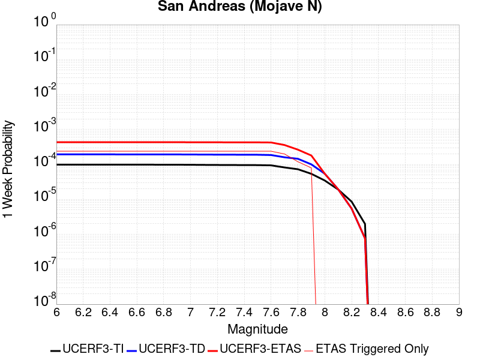 | 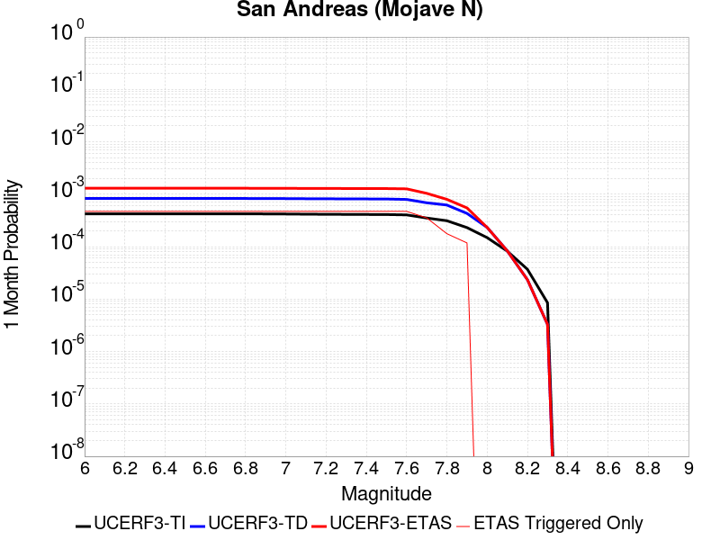 | 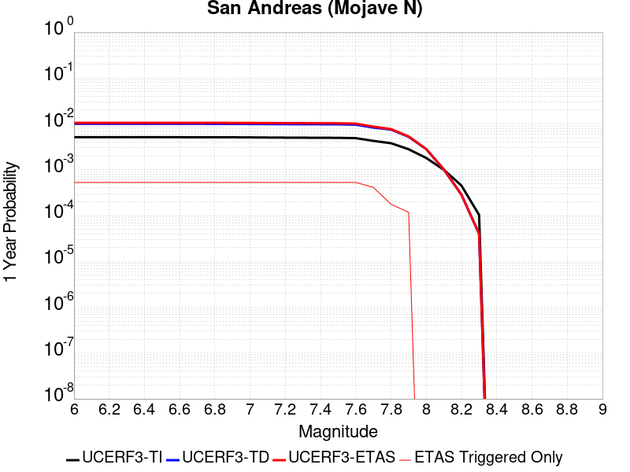 | 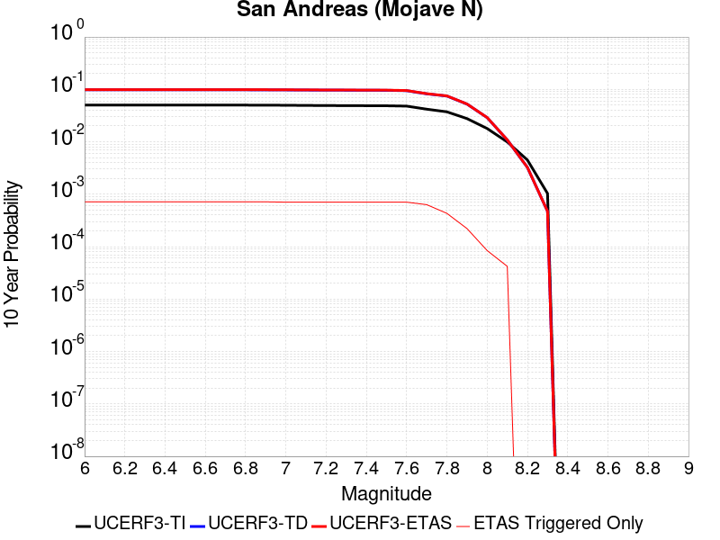 |

| Magnitude | 1 wk TI Prob | 1 wk TD Prob | 1 wk ETAS Prob | 1 wk ETAS/TD Gain | 1 wk ETAS Triggered Only | 1 mo TI Prob | 1 mo TD Prob | 1 mo ETAS Prob | 1 mo ETAS/TD Gain | 1 mo ETAS Triggered Only | 1 yr TI Prob | 1 yr TD Prob | 1 yr ETAS Prob | 1 yr ETAS/TD Gain | 1 yr ETAS Triggered Only | 10 yr TI Prob | 10 yr TD Prob | 10 yr ETAS Prob | 10 yr ETAS/TD Gain | 10 yr ETAS Triggered Only |
|-----|-----|-----|-----|-----|-----|-----|-----|-----|-----|-----|-----|-----|-----|-----|-----|-----|-----|-----|-----|-----|
| 6.0 | 9.877682E-5 | 1.9398969E-4 | 4.5895125E-4 | 2.365854 | 2.65013E-4 | 4.2326056E-4 | 8.3111966E-4 | 0.001254788 | 1.5097562 | 4.2402078E-4 | 0.0051410277 | 0.010072061 | 0.01054428 | 1.0468841 | 4.7702336E-4 | 0.05023708 | 0.09830668 | 0.09907135 | 1.0077784 | 8.4804156E-4 |
| 6.1 | 9.877682E-5 | 1.9398969E-4 | 4.5895125E-4 | 2.365854 | 2.65013E-4 | 4.2326056E-4 | 8.3111966E-4 | 0.001254788 | 1.5097562 | 4.2402078E-4 | 0.0051410277 | 0.010072061 | 0.01054428 | 1.0468841 | 4.7702336E-4 | 0.05023708 | 0.09830668 | 0.09907135 | 1.0077784 | 8.4804156E-4 |
| 6.2 | 9.877682E-5 | 1.9398969E-4 | 4.5895125E-4 | 2.365854 | 2.65013E-4 | 4.2326056E-4 | 8.3111966E-4 | 0.001254788 | 1.5097562 | 4.2402078E-4 | 0.0051410277 | 0.010072061 | 0.01054428 | 1.0468841 | 4.7702336E-4 | 0.05023708 | 0.09830668 | 0.09907135 | 1.0077784 | 8.4804156E-4 |
| 6.3 | 9.877682E-5 | 1.9398969E-4 | 4.5895125E-4 | 2.365854 | 2.65013E-4 | 4.2326056E-4 | 8.3111966E-4 | 0.001254788 | 1.5097562 | 4.2402078E-4 | 0.0051410277 | 0.010072061 | 0.01054428 | 1.0468841 | 4.7702336E-4 | 0.05023708 | 0.09830668 | 0.09907135 | 1.0077784 | 8.4804156E-4 |
| 6.4 | 9.877682E-5 | 1.9398969E-4 | 4.5895125E-4 | 2.365854 | 2.65013E-4 | 4.2326056E-4 | 8.3111966E-4 | 0.001254788 | 1.5097562 | 4.2402078E-4 | 0.0051410277 | 0.010072061 | 0.01054428 | 1.0468841 | 4.7702336E-4 | 0.05023708 | 0.09830668 | 0.09907135 | 1.0077784 | 8.4804156E-4 |
| 6.5 | 9.861474E-5 | 1.9372735E-4 | 4.58689E-4 | 2.367704 | 2.65013E-4 | 4.2256617E-4 | 8.299961E-4 | 0.001253665 | 1.5104468 | 4.2402078E-4 | 0.0051326132 | 0.010058507 | 0.010530733 | 1.0469478 | 4.7702336E-4 | 0.050156746 | 0.098184474 | 0.09894925 | 1.0077891 | 8.4804156E-4 |
| 6.6 | 9.861474E-5 | 1.9372735E-4 | 4.58689E-4 | 2.367704 | 2.65013E-4 | 4.2256617E-4 | 8.299961E-4 | 0.001253665 | 1.5104468 | 4.2402078E-4 | 0.0051326132 | 0.010058507 | 0.010530733 | 1.0469478 | 4.7702336E-4 | 0.050156746 | 0.098184474 | 0.09894925 | 1.0077891 | 8.4804156E-4 |
| 6.7 | 9.8552715E-5 | 1.9362688E-4 | 4.5858856E-4 | 2.3684137 | 2.65013E-4 | 4.223004E-4 | 8.295658E-4 | 0.0012532348 | 1.5107118 | 4.2402078E-4 | 0.0051293927 | 0.010053317 | 0.010525545 | 1.0469723 | 4.7702336E-4 | 0.050125998 | 0.09813766 | 0.09890248 | 1.0077933 | 8.4804156E-4 |
| 6.8 | 9.8464974E-5 | 1.9347853E-4 | 4.5844025E-4 | 2.3694632 | 2.65013E-4 | 4.219245E-4 | 8.2893035E-4 | 0.0012525996 | 1.5111036 | 4.2402078E-4 | 0.0051248376 | 0.010045652 | 0.010517883 | 1.0470085 | 4.7702336E-4 | 0.05008251 | 0.098067686 | 0.09883256 | 1.0077995 | 8.4804156E-4 |
| 6.9 | 9.825824E-5 | 1.9315863E-4 | 4.5812043E-4 | 2.3717315 | 2.65013E-4 | 4.2103877E-4 | 8.2756026E-4 | 0.0012512301 | 1.5119505 | 4.2402078E-4 | 0.0051141046 | 0.010029125 | 0.010501364 | 1.0470868 | 4.7702336E-4 | 0.049980022 | 0.09791679 | 0.09868179 | 1.0078127 | 8.4804156E-4 |
| 7.0 | 9.781462E-5 | 1.924723E-4 | 4.5743427E-4 | 2.3766239 | 2.65013E-4 | 4.1913814E-4 | 8.246208E-4 | 0.0012482919 | 1.5137769 | 4.2402078E-4 | 0.005091073 | 0.009993665 | 0.010465921 | 1.0472555 | 4.7702336E-4 | 0.04976007 | 0.09759319 | 0.09835847 | 1.0078415 | 8.4804156E-4 |
| 7.1 | 9.7121134E-5 | 1.9148945E-4 | 4.564517E-4 | 2.383691 | 2.65013E-4 | 4.1616702E-4 | 8.2041114E-4 | 0.0012440841 | 1.5164154 | 4.2402078E-4 | 0.005055068 | 0.009942883 | 0.010415163 | 1.0474993 | 4.7702336E-4 | 0.04941613 | 0.09712971 | 0.097895384 | 1.007883 | 8.4804156E-4 |
| 7.2 | 9.663819E-5 | 1.9079732E-4 | 4.5575976E-4 | 2.3887115 | 2.65013E-4 | 4.1409794E-4 | 8.1744674E-4 | 0.001241121 | 1.5182896 | 4.2402078E-4 | 0.0050299936 | 0.00990712 | 0.010379417 | 1.0476725 | 4.7702336E-4 | 0.049176537 | 0.09680298 | 0.09756893 | 1.0079124 | 8.4804156E-4 |
| 7.3 | 9.6277574E-5 | 1.9032248E-4 | 4.5528502E-4 | 2.3921769 | 2.65013E-4 | 4.125529E-4 | 8.1541296E-4 | 0.001239088 | 1.5195833 | 4.2402078E-4 | 0.0050112694 | 0.009882583 | 0.010354892 | 1.0477921 | 4.7702336E-4 | 0.04899759 | 0.09657645 | 0.09734259 | 1.007933 | 8.4804156E-4 |
| 7.4 | 9.593308E-5 | 1.8972032E-4 | 4.5468303E-4 | 2.3965964 | 2.65013E-4 | 4.1107697E-4 | 8.128339E-4 | 0.00123651 | 1.5212333 | 4.2402078E-4 | 0.0049933824 | 0.009851467 | 0.010323791 | 1.0479445 | 4.7702336E-4 | 0.04882661 | 0.096294634 | 0.097061016 | 1.0079587 | 8.4804156E-4 |
| 7.5 | 9.561707E-5 | 1.8918114E-4 | 4.54144E-4 | 2.4005775 | 2.65013E-4 | 4.0972308E-4 | 8.105246E-4 | 0.0012342017 | 1.5227196 | 4.2402078E-4 | 0.0049769743 | 0.009823605 | 0.010295943 | 1.0480819 | 4.7702336E-4 | 0.048669744 | 0.09604082 | 0.09680742 | 1.007982 | 8.4804156E-4 |
| 7.6 | 9.418194E-5 | 1.8570402E-4 | 4.506678E-4 | 2.426807 | 2.65013E-4 | 4.0357444E-4 | 7.956318E-4 | 0.0012193152 | 1.532512 | 4.2402078E-4 | 0.004902454 | 0.009643905 | 0.010116328 | 1.0489867 | 4.7702336E-4 | 0.047957025 | 0.0944232 | 0.09519116 | 1.0081333 | 8.4804156E-4 |
| 7.7 | 8.202141E-5 | 1.6019761E-4 | 3.7217402E-4 | 2.3232183 | 2.1201039E-4 | 3.51473E-4 | 6.863806E-4 | 0.0010041778 | 1.4630045 | 3.1801558E-4 | 0.00427079 | 0.00832472 | 0.00869265 | 1.0441972 | 3.710182E-4 | 0.04189639 | 0.08222524 | 0.082857616 | 1.0076908 | 6.8903377E-4 |
| 7.8 | 7.2859846E-5 | 1.4515074E-4 | 3.0413546E-4 | 2.0953076 | 1.5900779E-4 | 3.1221908E-4 | 6.2192633E-4 | 7.808353E-4 | 1.2555108 | 1.5900779E-4 | 0.003794643 | 0.007545706 | 0.007703514 | 1.0209136 | 1.5900779E-4 | 0.037304975 | 0.07471838 | 0.07511072 | 1.0052509 | 4.2402078E-4 |
| 7.9 | 5.3874453E-5 | 1.0044695E-4 | 2.064415E-4 | 2.0552292 | 1.06005195E-4 | 2.3087008E-4 | 4.3041594E-4 | 5.363755E-4 | 1.2461795 | 1.06005195E-4 | 0.0028072202 | 0.005227734 | 0.0053331847 | 1.0201714 | 1.06005195E-4 | 0.02772022 | 0.052419845 | 0.052620742 | 1.0038325 | 2.1201039E-4 |
| 8.0 | 3.468538E-5 | 5.4254586E-5 | 5.4254586E-5 | 1.0 | 0.0 | 1.4864317E-4 | 2.3249893E-4 | 2.3249893E-4 | 1.0 | 0.0 | 0.0018082283 | 0.002827002 | 0.002827002 | 1.0 | 0.0 | 0.017935853 | 0.028944723 | 0.028944723 | 1.0 | 0.0 |
| 8.1 | 1.9152367E-5 | 1.9399953E-5 | 1.9399953E-5 | 1.0 | 0.0 | 8.207899E-5 | 8.314001E-5 | 8.314001E-5 | 1.0 | 0.0 | 9.988535E-4 | 0.0010117602 | 0.0010117602 | 1.0 | 0.0 | 0.009943757 | 0.01085485 | 0.01085485 | 1.0 | 0.0 |
| 8.2 | 8.643924E-6 | 5.4738607E-6 | 5.4738607E-6 | 1.0 | 0.0 | 3.704486E-5 | 2.3459192E-5 | 2.3459192E-5 | 1.0 | 0.0 | 4.5092785E-4 | 2.855783E-4 | 2.855783E-4 | 1.0 | 0.0 | 0.0045001395 | 0.0032481598 | 0.0032481598 | 1.0 | 0.0 |
| 8.3 | 1.983087E-6 | 7.658221E-7 | 7.658221E-7 | 1.0 | 0.0 | 8.498917E-6 | 3.2820906E-6 | 3.2820906E-6 | 1.0 | 0.0 | 1.034694E-4 | 3.9958737E-5 | 3.9958737E-5 | 1.0 | 0.0 | 0.0010342124 | 4.7187202E-4 | 4.7187202E-4 | 1.0 | 0.0 |

## San Andreas (Mojave S)
*[(top)](#table-of-contents)*

| 1 Week | 1 Month | 1 Year | 10 Year |
|-----|-----|-----|-----|
| 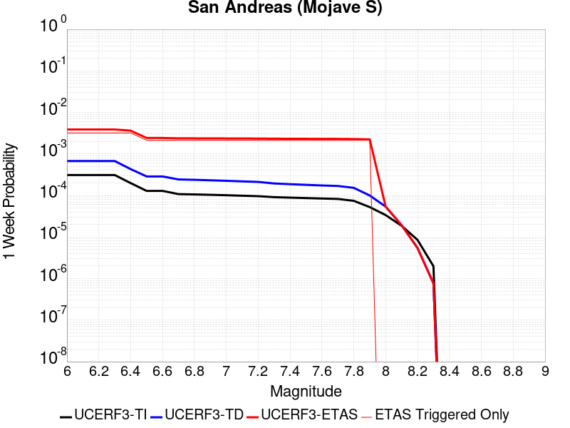 | 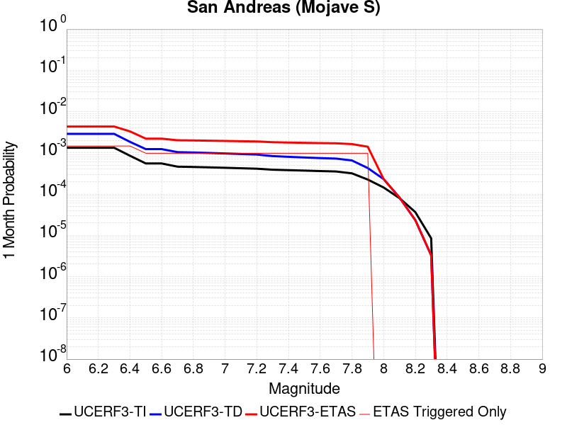 | 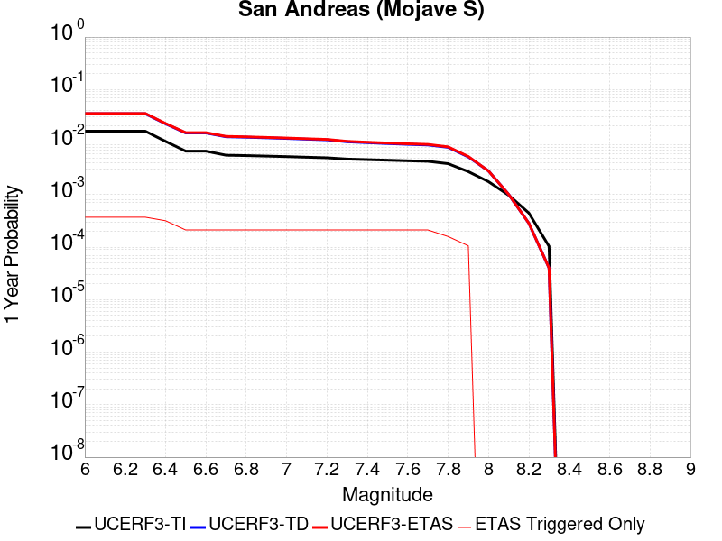 | 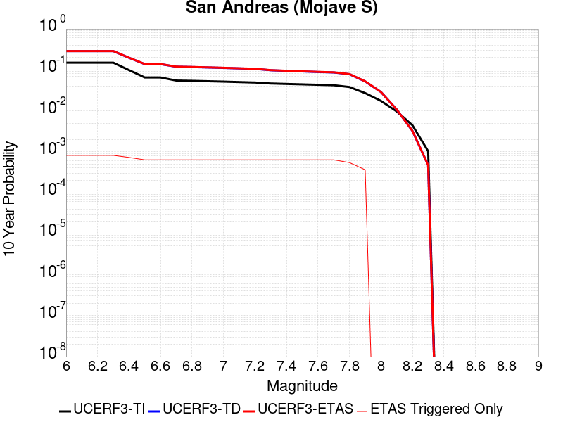 |

| Magnitude | 1 wk TI Prob | 1 wk TD Prob | 1 wk ETAS Prob | 1 wk ETAS/TD Gain | 1 wk ETAS Triggered Only | 1 mo TI Prob | 1 mo TD Prob | 1 mo ETAS Prob | 1 mo ETAS/TD Gain | 1 mo ETAS Triggered Only | 1 yr TI Prob | 1 yr TD Prob | 1 yr ETAS Prob | 1 yr ETAS/TD Gain | 1 yr ETAS Triggered Only | 10 yr TI Prob | 10 yr TD Prob | 10 yr ETAS Prob | 10 yr ETAS/TD Gain | 10 yr ETAS Triggered Only |
|-----|-----|-----|-----|-----|-----|-----|-----|-----|-----|-----|-----|-----|-----|-----|-----|-----|-----|-----|-----|-----|
| 6.0 | 3.1064058E-4 | 6.74589E-4 | 9.923901E-4 | 1.4711032 | 3.1801558E-4 | 0.0013306376 | 0.0028880206 | 0.0032051178 | 1.1097974 | 3.1801558E-4 | 0.016080605 | 0.03462137 | 0.03497954 | 1.0103455 | 3.710182E-4 | 0.1496549 | 0.286598 | 0.28708956 | 1.0017152 | 6.8903377E-4 |
| 6.1 | 3.1064058E-4 | 6.74589E-4 | 9.923901E-4 | 1.4711032 | 3.1801558E-4 | 0.0013306376 | 0.0028880206 | 0.0032051178 | 1.1097974 | 3.1801558E-4 | 0.016080605 | 0.03462137 | 0.03497954 | 1.0103455 | 3.710182E-4 | 0.1496549 | 0.286598 | 0.28708956 | 1.0017152 | 6.8903377E-4 |
| 6.2 | 3.1064058E-4 | 6.74589E-4 | 9.923901E-4 | 1.4711032 | 3.1801558E-4 | 0.0013306376 | 0.0028880206 | 0.0032051178 | 1.1097974 | 3.1801558E-4 | 0.016080605 | 0.03462137 | 0.03497954 | 1.0103455 | 3.710182E-4 | 0.1496549 | 0.286598 | 0.28708956 | 1.0017152 | 6.8903377E-4 |
| 6.3 | 3.1064058E-4 | 6.74589E-4 | 9.923901E-4 | 1.4711032 | 3.1801558E-4 | 0.0013306376 | 0.0028880206 | 0.0032051178 | 1.1097974 | 3.1801558E-4 | 0.016080605 | 0.03462137 | 0.03497954 | 1.0103455 | 3.710182E-4 | 0.1496549 | 0.286598 | 0.28708956 | 1.0017152 | 6.8903377E-4 |
| 6.4 | 1.9872203E-4 | 4.317752E-4 | 7.4965344E-4 | 1.7362125 | 3.1801558E-4 | 8.5138786E-4 | 0.001849181 | 0.0021666086 | 1.1716584 | 3.1801558E-4 | 0.010316478 | 0.022287503 | 0.02259843 | 1.0139508 | 3.1801558E-4 | 0.098504856 | 0.19699045 | 0.19745861 | 1.0023767 | 5.830286E-4 |
| 6.5 | 1.291105E-4 | 2.875093E-4 | 4.994587E-4 | 1.7371917 | 2.1201039E-4 | 5.5321335E-4 | 0.0012316036 | 0.0014433528 | 1.1719297 | 2.1201039E-4 | 0.006714592 | 0.014892505 | 0.015101357 | 1.014024 | 2.1201039E-4 | 0.065152965 | 0.13802715 | 0.13843833 | 1.002979 | 4.7702336E-4 |
| 6.6 | 1.291105E-4 | 2.875093E-4 | 4.994587E-4 | 1.7371917 | 2.1201039E-4 | 5.5321335E-4 | 0.0012316036 | 0.0014433528 | 1.1719297 | 2.1201039E-4 | 0.006714592 | 0.014892505 | 0.015101357 | 1.014024 | 2.1201039E-4 | 0.065152965 | 0.13802715 | 0.13843833 | 1.002979 | 4.7702336E-4 |
| 6.7 | 1.08001186E-4 | 2.4332175E-4 | 4.5528053E-4 | 1.8711051 | 2.1201039E-4 | 4.6278012E-4 | 0.0010423913 | 0.0012541807 | 1.2031765 | 2.1201039E-4 | 0.0056198016 | 0.012617563 | 0.012826898 | 1.0165908 | 2.1201039E-4 | 0.054797906 | 0.119169496 | 0.11958967 | 1.0035259 | 4.7702336E-4 |
| 6.8 | 1.0624356E-4 | 2.3849847E-4 | 4.504583E-4 | 1.8887261 | 2.1201039E-4 | 4.5525006E-4 | 0.0010217364 | 0.0012335301 | 1.207288 | 2.1201039E-4 | 0.0055285925 | 0.012368962 | 0.0125783505 | 1.0169286 | 2.1201039E-4 | 0.053930566 | 0.117118634 | 0.11753979 | 1.003596 | 4.7702336E-4 |
| 6.9 | 1.0393785E-4 | 2.3220196E-4 | 4.4416313E-4 | 1.9128311 | 2.1201039E-4 | 4.4537184E-4 | 9.947722E-4 | 0.0012065717 | 1.2129126 | 2.1201039E-4 | 0.0054089287 | 0.012044343 | 0.0122538 | 1.0173905 | 2.1201039E-4 | 0.05279156 | 0.11441608 | 0.11483852 | 1.0036922 | 4.7702336E-4 |
| 7.0 | 1.0155622E-4 | 2.258978E-4 | 4.378603E-4 | 1.9383115 | 2.1201039E-4 | 4.3516833E-4 | 9.6777466E-4 | 0.0011795799 | 1.218858 | 2.1201039E-4 | 0.005285311 | 0.011719226 | 0.011928751 | 1.0178788 | 2.1201039E-4 | 0.05161361 | 0.111676484 | 0.112100236 | 1.0037944 | 4.7702336E-4 |
| 7.1 | 9.885595E-5 | 2.1878199E-4 | 4.30746E-4 | 1.9688365 | 2.1201039E-4 | 4.2359953E-4 | 9.373005E-4 | 0.0011491122 | 1.2259805 | 2.1201039E-4 | 0.0051451353 | 0.011352123 | 0.011561726 | 1.0184639 | 2.1201039E-4 | 0.05027629 | 0.10856094 | 0.10898618 | 1.003917 | 4.7702336E-4 |
| 7.2 | 9.6411415E-5 | 2.1241202E-4 | 4.243774E-4 | 1.9978971 | 2.1201039E-4 | 4.1312634E-4 | 9.1001997E-4 | 0.0011218374 | 1.2327614 | 2.1201039E-4 | 0.005018219 | 0.011023389 | 0.0112330625 | 1.0190208 | 2.1201039E-4 | 0.049064007 | 0.10575075 | 0.10617733 | 1.0040338 | 4.7702336E-4 |
| 7.3 | 9.1180635E-5 | 1.9469624E-4 | 4.0666535E-4 | 2.088717 | 2.1201039E-4 | 3.907156E-4 | 8.3414576E-4 | 0.0010459793 | 1.2539526 | 2.1201039E-4 | 0.004746591 | 0.010108546 | 0.010318413 | 1.0207614 | 2.1201039E-4 | 0.046464786 | 0.097944014 | 0.098374315 | 1.0043933 | 4.7702336E-4 |
| 7.4 | 8.887388E-5 | 1.8718264E-4 | 3.9915336E-4 | 2.1324272 | 2.1201039E-4 | 3.8083247E-4 | 8.019648E-4 | 0.0010138052 | 1.2641517 | 2.1201039E-4 | 0.0046267817 | 0.009720306 | 0.009930256 | 1.021599 | 2.1201039E-4 | 0.045316286 | 0.094579056 | 0.095010966 | 1.0045667 | 4.7702336E-4 |
| 7.5 | 8.6750515E-5 | 1.804986E-4 | 3.924707E-4 | 2.1743698 | 2.1201039E-4 | 3.7173493E-4 | 7.7333616E-4 | 9.851826E-4 | 1.2739383 | 2.1201039E-4 | 0.004516484 | 0.009374807 | 0.009584829 | 1.0224029 | 2.1201039E-4 | 0.04425787 | 0.091542855 | 0.09197621 | 1.0047339 | 4.7702336E-4 |
| 7.6 | 8.453092E-5 | 1.7437496E-4 | 3.8634837E-4 | 2.2156184 | 2.1201039E-4 | 3.6222505E-4 | 7.4710726E-4 | 9.589593E-4 | 1.283563 | 2.1201039E-4 | 0.0044011753 | 0.009058169 | 0.00926826 | 1.0231935 | 2.1201039E-4 | 0.04315024 | 0.08870201 | 0.08913672 | 1.0049008 | 4.7702336E-4 |
| 7.7 | 8.259102E-5 | 1.6959656E-4 | 3.81571E-4 | 2.2498746 | 2.1201039E-4 | 3.539135E-4 | 7.2664E-4 | 9.384963E-4 | 1.2915561 | 2.1201039E-4 | 0.004300386 | 0.008811024 | 0.009021167 | 1.02385 | 2.1201039E-4 | 0.042181134 | 0.08645291 | 0.08688869 | 1.0050406 | 4.7702336E-4 |
| 7.8 | 7.444844E-5 | 1.5282084E-4 | 3.1180432E-4 | 2.040326 | 1.5900779E-4 | 3.1902574E-4 | 6.5478205E-4 | 8.1368577E-4 | 1.2426817 | 1.5900779E-4 | 0.0038772223 | 0.007942881 | 0.008100626 | 1.0198599 | 1.5900779E-4 | 0.03810269 | 0.07828439 | 0.07867522 | 1.0049924 | 4.2402078E-4 |
| 7.9 | 5.2586525E-5 | 1.0005448E-4 | 2.0604907E-4 | 2.0593688 | 1.06005195E-4 | 2.2535135E-4 | 4.2873443E-4 | 5.346942E-4 | 1.2471454 | 1.06005195E-4 | 0.0027402006 | 0.00520736 | 0.005312813 | 1.0202508 | 1.06005195E-4 | 0.027066574 | 0.0521955 | 0.052396446 | 1.0038499 | 2.1201039E-4 |
| 8.0 | 3.379877E-5 | 5.4068532E-5 | 5.4068532E-5 | 1.0 | 0.0 | 1.4484383E-4 | 2.317017E-4 | 2.317017E-4 | 1.0 | 0.0 | 0.0017620471 | 0.0028173209 | 0.0028173209 | 1.0 | 0.0 | 0.017481409 | 0.028832143 | 0.028832143 | 1.0 | 0.0 |
| 8.1 | 1.8668277E-5 | 1.9306746E-5 | 1.9306746E-5 | 1.0 | 0.0 | 8.000444E-5 | 8.2740575E-5 | 8.2740575E-5 | 1.0 | 0.0 | 9.736188E-4 | 0.0010069016 | 0.0010069016 | 1.0 | 0.0 | 0.009693642 | 0.0107975025 | 0.0107975025 | 1.0 | 0.0 |
| 8.2 | 8.541571E-6 | 5.4598204E-6 | 5.4598204E-6 | 1.0 | 0.0 | 3.660622E-5 | 2.3399021E-5 | 2.3399021E-5 | 1.0 | 0.0 | 4.455896E-4 | 2.8484594E-4 | 2.8484594E-4 | 1.0 | 0.0 | 0.0044469717 | 0.0032402598 | 0.0032402598 | 1.0 | 0.0 |
| 8.3 | 1.983087E-6 | 7.658221E-7 | 7.658221E-7 | 1.0 | 0.0 | 8.498917E-6 | 3.2820906E-6 | 3.2820906E-6 | 1.0 | 0.0 | 1.034694E-4 | 3.9958737E-5 | 3.9958737E-5 | 1.0 | 0.0 | 0.0010342124 | 4.7187202E-4 | 4.7187202E-4 | 1.0 | 0.0 |

## Lenwood-Lockhart-Old Woman Springs
*[(top)](#table-of-contents)*

| 1 Week | 1 Month | 1 Year | 10 Year |
|-----|-----|-----|-----|
| 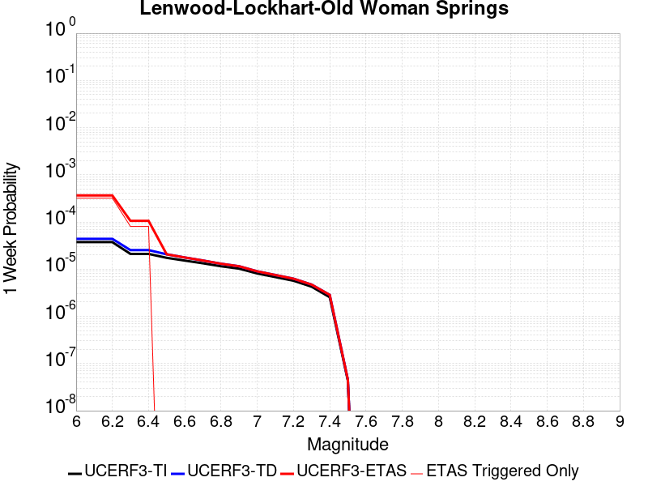 | 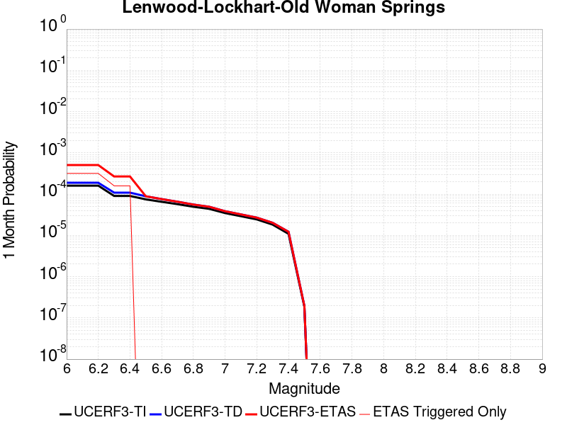 | 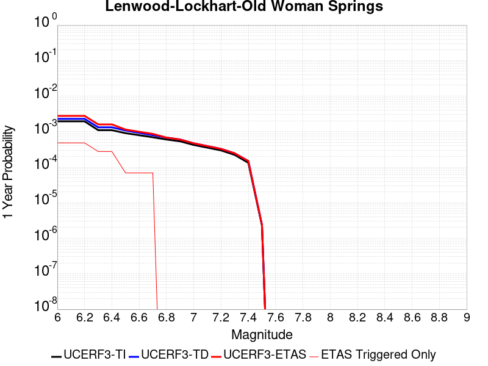 | 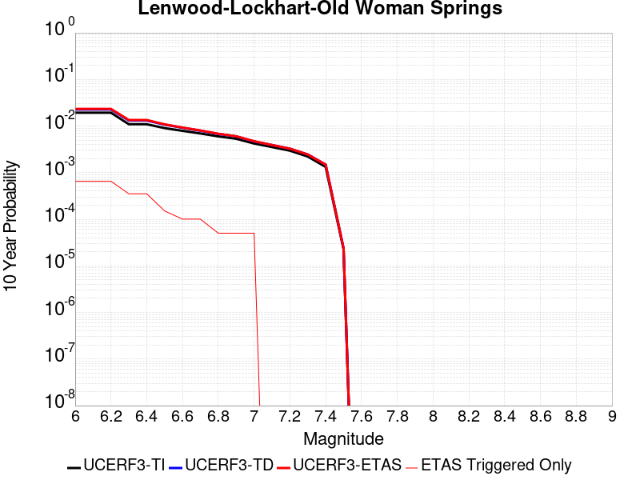 |

| Magnitude | 1 wk TI Prob | 1 wk TD Prob | 1 wk ETAS Prob | 1 wk ETAS/TD Gain | 1 wk ETAS Triggered Only | 1 mo TI Prob | 1 mo TD Prob | 1 mo ETAS Prob | 1 mo ETAS/TD Gain | 1 mo ETAS Triggered Only | 1 yr TI Prob | 1 yr TD Prob | 1 yr ETAS Prob | 1 yr ETAS/TD Gain | 1 yr ETAS Triggered Only | 10 yr TI Prob | 10 yr TD Prob | 10 yr ETAS Prob | 10 yr ETAS/TD Gain | 10 yr ETAS Triggered Only |
|-----|-----|-----|-----|-----|-----|-----|-----|-----|-----|-----|-----|-----|-----|-----|-----|-----|-----|-----|-----|-----|
| 6.0 | 3.744542E-5 | 4.396243E-5 | 2.559635E-4 | 5.822324 | 2.1201039E-4 | 1.604705E-4 | 1.8839778E-4 | 5.0635345E-4 | 2.6876826 | 3.1801558E-4 | 0.0019519776 | 0.0022915022 | 0.0027145513 | 1.1846166 | 4.2402078E-4 | 0.019349206 | 0.02269674 | 0.023318337 | 1.027387 | 6.3603115E-4 |
| 6.1 | 3.744542E-5 | 4.396243E-5 | 2.559635E-4 | 5.822324 | 2.1201039E-4 | 1.604705E-4 | 1.8839778E-4 | 5.0635345E-4 | 2.6876826 | 3.1801558E-4 | 0.0019519776 | 0.0022915022 | 0.0027145513 | 1.1846166 | 4.2402078E-4 | 0.019349206 | 0.02269674 | 0.023318337 | 1.027387 | 6.3603115E-4 |
| 6.2 | 3.744542E-5 | 4.396243E-5 | 2.559635E-4 | 5.822324 | 2.1201039E-4 | 1.604705E-4 | 1.8839778E-4 | 5.0635345E-4 | 2.6876826 | 3.1801558E-4 | 0.0019519776 | 0.0022915022 | 0.0027145513 | 1.1846166 | 4.2402078E-4 | 0.019349206 | 0.02269674 | 0.023318337 | 1.027387 | 6.3603115E-4 |
| 6.3 | 2.1079984E-5 | 2.5353402E-5 | 7.835466E-5 | 3.0904987 | 5.3002597E-5 | 9.0339665E-5 | 1.0865302E-4 | 2.6764354E-4 | 2.4632866 | 1.5900779E-4 | 0.0010993304 | 0.0013220677 | 0.0015337978 | 1.1601508 | 2.1201039E-4 | 0.010939079 | 0.013144241 | 0.013458076 | 1.0238763 | 3.1801558E-4 |
| 6.4 | 2.1079984E-5 | 2.5353402E-5 | 7.835466E-5 | 3.0904987 | 5.3002597E-5 | 9.0339665E-5 | 1.0865302E-4 | 2.6764354E-4 | 2.4632866 | 1.5900779E-4 | 0.0010993304 | 0.0013220677 | 0.0015337978 | 1.1601508 | 2.1201039E-4 | 0.010939079 | 0.013144241 | 0.013458076 | 1.0238763 | 3.1801558E-4 |
| 6.5 | 1.7397282E-5 | 2.0662384E-5 | 2.0662384E-5 | 1.0 | 0.0 | 7.455765E-5 | 8.8550136E-5 | 8.8550136E-5 | 1.0 | 0.0 | 9.073613E-4 | 0.0010775764 | 0.001130522 | 1.0491339 | 5.3002597E-5 | 0.009036654 | 0.010724808 | 0.01088211 | 1.0146672 | 1.5900779E-4 |
| 6.6 | 1.52050325E-5 | 1.7679673E-5 | 1.7679673E-5 | 1.0 | 0.0 | 6.51628E-5 | 7.576787E-5 | 7.576787E-5 | 1.0 | 0.0 | 7.9306826E-4 | 9.220913E-4 | 9.75045E-4 | 1.0574279 | 5.3002597E-5 | 0.007902439 | 0.009183516 | 0.009288547 | 1.0114369 | 1.06005195E-4 |
| 6.7 | 1.332523E-5 | 1.5263984E-5 | 1.5263984E-5 | 1.0 | 0.0 | 5.7106878E-5 | 6.541547E-5 | 6.541547E-5 | 1.0 | 0.0 | 6.950544E-4 | 7.9614815E-4 | 8.4910856E-4 | 1.0665208 | 5.3002597E-5 | 0.006928845 | 0.00793359 | 0.008038754 | 1.0132556 | 1.06005195E-4 |
| 6.8 | 1.1525329E-5 | 1.30309645E-5 | 1.30309645E-5 | 1.0 | 0.0 | 4.9393333E-5 | 5.584582E-5 | 5.584582E-5 | 1.0 | 0.0 | 6.011979E-4 | 6.79715E-4 | 6.79715E-4 | 1.0 | 0.0 | 0.00599574 | 0.0067768116 | 0.006829455 | 1.0077682 | 5.3002597E-5 |
| 6.9 | 1.0253909E-5 | 1.1514427E-5 | 1.1514427E-5 | 1.0 | 0.0 | 4.3944583E-5 | 4.9346632E-5 | 4.9346632E-5 | 1.0 | 0.0 | 5.3489394E-4 | 6.006332E-4 | 6.006332E-4 | 1.0 | 0.0 | 0.0053360825 | 0.005990478 | 0.006043163 | 1.0087948 | 5.3002597E-5 |
| 7.0 | 8.104563E-6 | 8.99127E-6 | 8.99127E-6 | 1.0 | 0.0 | 3.4733377E-5 | 3.853346E-5 | 3.853346E-5 | 1.0 | 0.0 | 4.2279682E-4 | 4.690463E-4 | 4.690463E-4 | 1.0 | 0.0 | 0.0042199334 | 0.0046808114 | 0.0047335657 | 1.0112704 | 5.3002597E-5 |
| 7.1 | 6.7986157E-6 | 7.515809E-6 | 7.515809E-6 | 1.0 | 0.0 | 2.91366E-5 | 3.2210224E-5 | 3.2210224E-5 | 1.0 | 0.0 | 3.5468035E-4 | 3.9209108E-4 | 3.9209108E-4 | 1.0 | 0.0 | 0.003541148 | 0.003914209 | 0.003914209 | 1.0 | 0.0 |
| 7.2 | 5.6893327E-6 | 6.2800086E-6 | 6.2800086E-6 | 1.0 | 0.0 | 2.4382627E-5 | 2.6914056E-5 | 2.6914056E-5 | 1.0 | 0.0 | 2.9681803E-4 | 3.2763137E-4 | 3.2763137E-4 | 1.0 | 0.0 | 0.002964219 | 0.003271682 | 0.003271682 | 1.0 | 0.0 |
| 7.3 | 4.253348E-6 | 4.706907E-6 | 4.706907E-6 | 1.0 | 0.0 | 1.8228506E-5 | 2.0172314E-5 | 2.0172314E-5 | 1.0 | 0.0 | 2.2190946E-4 | 2.4557207E-4 | 2.4557207E-4 | 1.0 | 0.0 | 0.00221688 | 0.002453188 | 0.002453188 | 1.0 | 0.0 |
| 7.4 | 2.5448119E-6 | 2.8520433E-6 | 2.8520433E-6 | 1.0 | 0.0 | 1.0906291E-5 | 1.2222995E-5 | 1.2222995E-5 | 1.0 | 0.0 | 1.3277601E-4 | 1.4880644E-4 | 1.4880644E-4 | 1.0 | 0.0 | 0.001326967 | 0.0014872303 | 0.0014872303 | 1.0 | 0.0 |
| 7.5 | 4.3706837E-8 | 4.5629037E-8 | 4.5629037E-8 | 1.0 | 0.0 | 1.8731501E-7 | 1.9555301E-7 | 1.9555301E-7 | 1.0 | 0.0 | 2.2805577E-6 | 2.380856E-6 | 2.380856E-6 | 1.0 | 0.0 | 2.2805343E-5 | 2.3808358E-5 | 2.3808358E-5 | 1.0 | 0.0 |

## San Andreas (San Bernardino N)
*[(top)](#table-of-contents)*

| 1 Week | 1 Month | 1 Year | 10 Year |
|-----|-----|-----|-----|
| 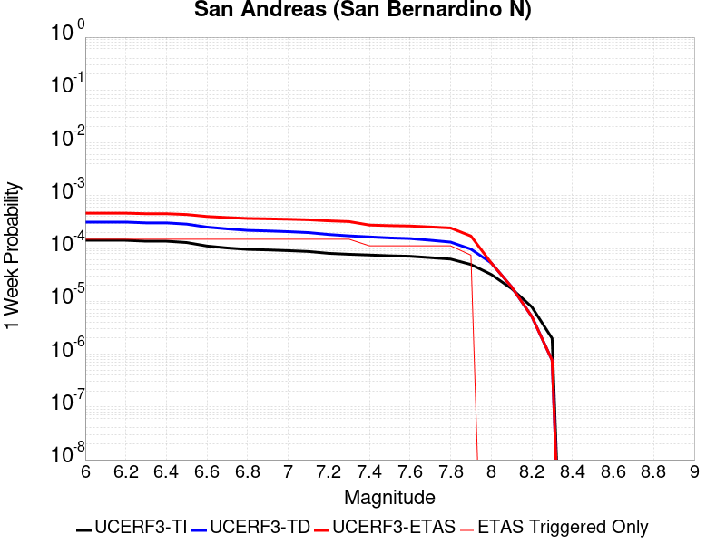 | 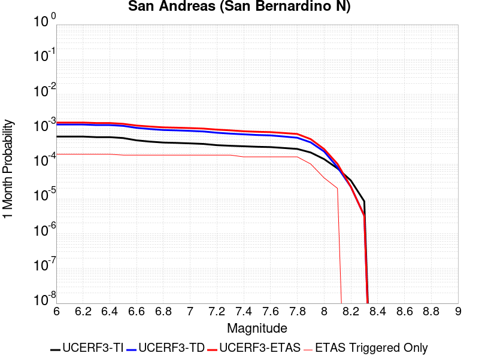 | 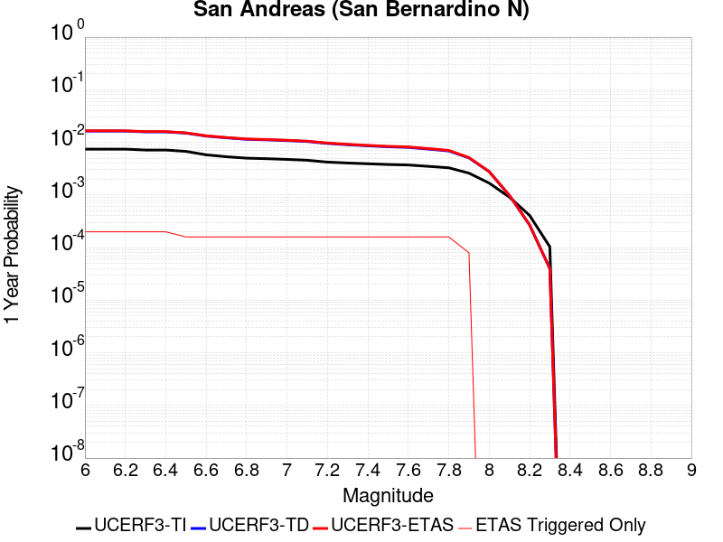 | 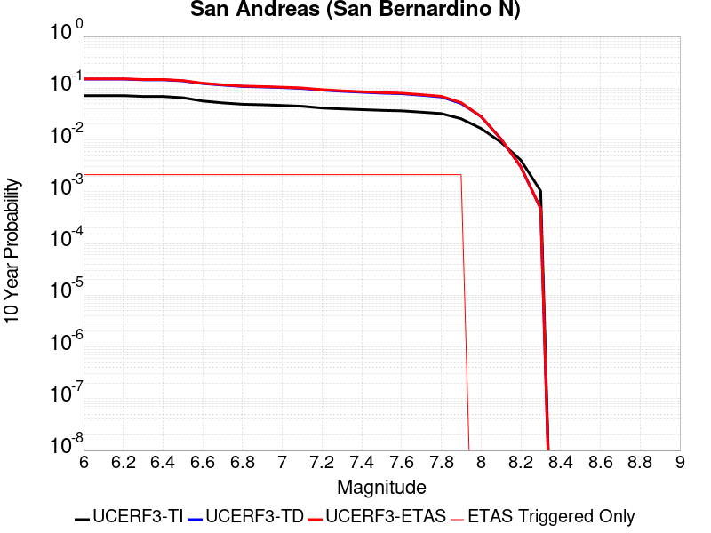 |

| Magnitude | 1 wk TI Prob | 1 wk TD Prob | 1 wk ETAS Prob | 1 wk ETAS/TD Gain | 1 wk ETAS Triggered Only | 1 mo TI Prob | 1 mo TD Prob | 1 mo ETAS Prob | 1 mo ETAS/TD Gain | 1 mo ETAS Triggered Only | 1 yr TI Prob | 1 yr TD Prob | 1 yr ETAS Prob | 1 yr ETAS/TD Gain | 1 yr ETAS Triggered Only | 10 yr TI Prob | 10 yr TD Prob | 10 yr ETAS Prob | 10 yr ETAS/TD Gain | 10 yr ETAS Triggered Only |
|-----|-----|-----|-----|-----|-----|-----|-----|-----|-----|-----|-----|-----|-----|-----|-----|-----|-----|-----|-----|-----|
| 6.0 | 1.4273766E-4 | 3.160502E-4 | 4.7500772E-4 | 1.5029503 | 1.5900779E-4 | 6.115894E-4 | 0.0013538037 | 0.001565527 | 1.1563915 | 2.1201039E-4 | 0.0074207084 | 0.016359491 | 0.016568033 | 1.0127474 | 2.1201039E-4 | 0.07177748 | 0.1502609 | 0.1506212 | 1.0023979 | 4.2402078E-4 |
| 6.1 | 1.4273766E-4 | 3.160502E-4 | 4.7500772E-4 | 1.5029503 | 1.5900779E-4 | 6.115894E-4 | 0.0013538037 | 0.001565527 | 1.1563915 | 2.1201039E-4 | 0.0074207084 | 0.016359491 | 0.016568033 | 1.0127474 | 2.1201039E-4 | 0.07177748 | 0.1502609 | 0.1506212 | 1.0023979 | 4.2402078E-4 |
| 6.2 | 1.4273766E-4 | 3.160502E-4 | 4.7500772E-4 | 1.5029503 | 1.5900779E-4 | 6.115894E-4 | 0.0013538037 | 0.001565527 | 1.1563915 | 2.1201039E-4 | 0.0074207084 | 0.016359491 | 0.016568033 | 1.0127474 | 2.1201039E-4 | 0.07177748 | 0.1502609 | 0.1506212 | 1.0023979 | 4.2402078E-4 |
| 6.3 | 1.3730655E-4 | 3.050988E-4 | 4.640581E-4 | 1.5210092 | 1.5900779E-4 | 5.883239E-4 | 0.0013069167 | 0.0015186501 | 1.1620098 | 2.1201039E-4 | 0.0071393442 | 0.015797025 | 0.016005686 | 1.0132089 | 2.1201039E-4 | 0.06914291 | 0.14556077 | 0.14592308 | 1.002489 | 4.2402078E-4 |
| 6.4 | 1.3730655E-4 | 3.050988E-4 | 4.640581E-4 | 1.5210092 | 1.5900779E-4 | 5.883239E-4 | 0.0013069167 | 0.0015186501 | 1.1620098 | 2.1201039E-4 | 0.0071393442 | 0.015797025 | 0.016005686 | 1.0132089 | 2.1201039E-4 | 0.06914291 | 0.14556077 | 0.14592308 | 1.002489 | 4.2402078E-4 |
| 6.5 | 1.2942807E-4 | 2.8924362E-4 | 4.4820542E-4 | 1.5495776 | 1.5900779E-4 | 5.545738E-4 | 0.0012390317 | 0.0013978425 | 1.1281734 | 1.5900779E-4 | 0.0067310524 | 0.014982116 | 0.015138742 | 1.0104542 | 1.5900779E-4 | 0.06530788 | 0.13870342 | 0.13902298 | 1.0023038 | 3.710182E-4 |
| 6.6 | 1.1125901E-4 | 2.53633E-4 | 4.126005E-4 | 1.6267617 | 1.5900779E-4 | 4.767372E-4 | 0.0010865482 | 0.0012453832 | 1.1461831 | 1.5900779E-4 | 0.005788839 | 0.013149117 | 0.013306034 | 1.0119337 | 1.5900779E-4 | 0.056403454 | 0.122993305 | 0.123318695 | 1.0026456 | 3.710182E-4 |
| 6.7 | 1.02209575E-4 | 2.3498294E-4 | 3.9395338E-4 | 1.676519 | 1.5900779E-4 | 4.3796748E-4 | 0.0010066825 | 0.0011655302 | 1.1577933 | 1.5900779E-4 | 0.0053192247 | 0.012187905 | 0.012344974 | 1.0128874 | 1.5900779E-4 | 0.051936906 | 0.11478492 | 0.115113355 | 1.0028613 | 3.710182E-4 |
| 6.8 | 9.610582E-5 | 2.2024135E-4 | 3.7921412E-4 | 1.7218117 | 1.5900779E-4 | 4.1181705E-4 | 9.435507E-4 | 0.0011024085 | 1.1683617 | 1.5900779E-4 | 0.0050023515 | 0.011427486 | 0.011584677 | 1.0137554 | 1.5900779E-4 | 0.048912346 | 0.10818693 | 0.10851781 | 1.0030584 | 3.710182E-4 |
| 6.9 | 9.3877505E-5 | 2.1479696E-4 | 3.737706E-4 | 1.7401112 | 1.5900779E-4 | 4.0227012E-4 | 9.202343E-4 | 0.0010790958 | 1.1726315 | 1.5900779E-4 | 0.0048866454 | 0.011146543 | 0.011303779 | 1.0141062 | 1.5900779E-4 | 0.04780577 | 0.10577726 | 0.10610904 | 1.0031365 | 3.710182E-4 |
| 7.0 | 9.1019785E-5 | 2.080665E-4 | 3.670412E-4 | 1.7640572 | 1.5900779E-4 | 3.900265E-4 | 8.9140947E-4 | 0.0010502755 | 1.178219 | 1.5900779E-4 | 0.0047382377 | 0.010799129 | 0.01095642 | 1.0145651 | 1.5900779E-4 | 0.046384744 | 0.102747776 | 0.10308067 | 1.00324 | 3.710182E-4 |
| 7.1 | 8.771155E-5 | 1.9981233E-4 | 3.5878835E-4 | 1.7956266 | 1.5900779E-4 | 3.758525E-4 | 8.560581E-4 | 0.0010149297 | 1.1855851 | 1.5900779E-4 | 0.0045664064 | 0.010372897 | 0.010530255 | 1.0151701 | 1.5900779E-4 | 0.044737056 | 0.099059336 | 0.099393606 | 1.0033743 | 3.710182E-4 |
| 7.2 | 8.0830236E-5 | 1.8386859E-4 | 3.4284714E-4 | 1.8646314 | 1.5900779E-4 | 3.4636928E-4 | 7.877704E-4 | 9.466529E-4 | 1.2016864 | 1.5900779E-4 | 0.0042088944 | 0.009549032 | 0.009706521 | 1.0164927 | 1.5900779E-4 | 0.041300658 | 0.091790274 | 0.092127234 | 1.003671 | 3.710182E-4 |
| 7.3 | 7.7668235E-5 | 1.7330446E-4 | 3.322847E-4 | 1.9173465 | 1.5900779E-4 | 3.328214E-4 | 7.4252207E-4 | 9.014118E-4 | 1.2139865 | 1.5900779E-4 | 0.0040445733 | 0.009002813 | 0.009160389 | 1.017503 | 1.5900779E-4 | 0.03971748 | 0.08705745 | 0.08739617 | 1.0038908 | 3.710182E-4 |
| 7.4 | 7.520177E-5 | 1.65506E-4 | 3.2448748E-4 | 1.9605783 | 1.5900779E-4 | 3.2225347E-4 | 7.0911867E-4 | 8.680137E-4 | 1.224074 | 1.5900779E-4 | 0.0039163795 | 0.00859941 | 0.00875705 | 1.0183315 | 1.5900779E-4 | 0.038480744 | 0.08351379 | 0.08385382 | 1.0040716 | 3.710182E-4 |
| 7.5 | 7.274697E-5 | 1.5838286E-4 | 3.1736545E-4 | 2.0037868 | 1.5900779E-4 | 3.1173544E-4 | 6.7860715E-4 | 8.37507E-4 | 1.2341559 | 1.5900779E-4 | 0.003788775 | 0.0082308 | 0.008388499 | 1.0191597 | 1.5900779E-4 | 0.03724827 | 0.08023059 | 0.080571845 | 1.0042534 | 3.710182E-4 |
| 7.6 | 7.1185845E-5 | 1.5408162E-4 | 3.130649E-4 | 2.0318122 | 1.5900779E-4 | 3.0504653E-4 | 6.6018273E-4 | 8.190855E-4 | 1.2406952 | 1.5900779E-4 | 0.0037076178 | 0.008008154 | 0.0081658885 | 1.0196967 | 1.5900779E-4 | 0.036463667 | 0.0782203 | 0.0785623 | 1.0043722 | 3.710182E-4 |
| 7.7 | 6.709961E-5 | 1.4317075E-4 | 3.0215576E-4 | 2.1104574 | 1.5900779E-4 | 2.8753807E-4 | 6.1344466E-4 | 7.7235495E-4 | 1.2590457 | 1.5900779E-4 | 0.003495157 | 0.007443151 | 0.007600975 | 1.021204 | 1.5900779E-4 | 0.034406938 | 0.07304912 | 0.07339304 | 1.004708 | 3.710182E-4 |
| 7.8 | 6.300812E-5 | 1.3201238E-4 | 2.909992E-4 | 2.2043324 | 1.5900779E-4 | 2.7000686E-4 | 5.656447E-4 | 7.2456256E-4 | 1.28095 | 1.5900779E-4 | 0.0032823787 | 0.0068650073 | 0.0070229233 | 1.0230031 | 1.5900779E-4 | 0.032343175 | 0.06770821 | 0.06805411 | 1.0051086 | 3.710182E-4 |
| 7.9 | 4.983037E-5 | 9.722561E-5 | 2.032205E-4 | 2.0901952 | 1.06005195E-4 | 2.1354125E-4 | 4.1661464E-4 | 5.225757E-4 | 1.2543383 | 1.06005195E-4 | 0.0025967648 | 0.0050604967 | 0.0051659653 | 1.0208416 | 1.06005195E-4 | 0.025666296 | 0.05064454 | 0.050845813 | 1.0039742 | 2.1201039E-4 |
| 8.0 | 3.2211527E-5 | 5.329913E-5 | 5.329913E-5 | 1.0 | 0.0 | 1.380421E-4 | 2.2840484E-4 | 2.2840484E-4 | 1.0 | 0.0 | 0.0016793669 | 0.0027772845 | 0.0027772845 | 1.0 | 0.0 | 0.016667323 | 0.028358717 | 0.028358717 | 1.0 | 0.0 |
| 8.1 | 1.743376E-5 | 1.8821896E-5 | 1.8821896E-5 | 1.0 | 0.0 | 7.471398E-5 | 8.066278E-5 | 8.066278E-5 | 1.0 | 0.0 | 9.0926304E-4 | 9.816275E-4 | 9.816275E-4 | 1.0 | 0.0 | 0.009055517 | 0.01048279 | 0.01048279 | 1.0 | 0.0 |
| 8.2 | 7.831616E-6 | 5.1541824E-6 | 5.1541824E-6 | 1.0 | 0.0 | 3.3563636E-5 | 2.2089165E-5 | 2.2089165E-5 | 1.0 | 0.0 | 4.0856065E-4 | 2.6890248E-4 | 2.6890248E-4 | 1.0 | 0.0 | 0.004078103 | 0.0030413123 | 0.0030413123 | 1.0 | 0.0 |
| 8.3 | 1.983087E-6 | 7.658221E-7 | 7.658221E-7 | 1.0 | 0.0 | 8.498917E-6 | 3.2820906E-6 | 3.2820906E-6 | 1.0 | 0.0 | 1.034694E-4 | 3.9958737E-5 | 3.9958737E-5 | 1.0 | 0.0 | 0.0010342124 | 4.7187202E-4 | 4.7187202E-4 | 1.0 | 0.0 |

## Towne Pass
*[(top)](#table-of-contents)*

| 1 Week | 1 Month | 1 Year | 10 Year |
|-----|-----|-----|-----|
| 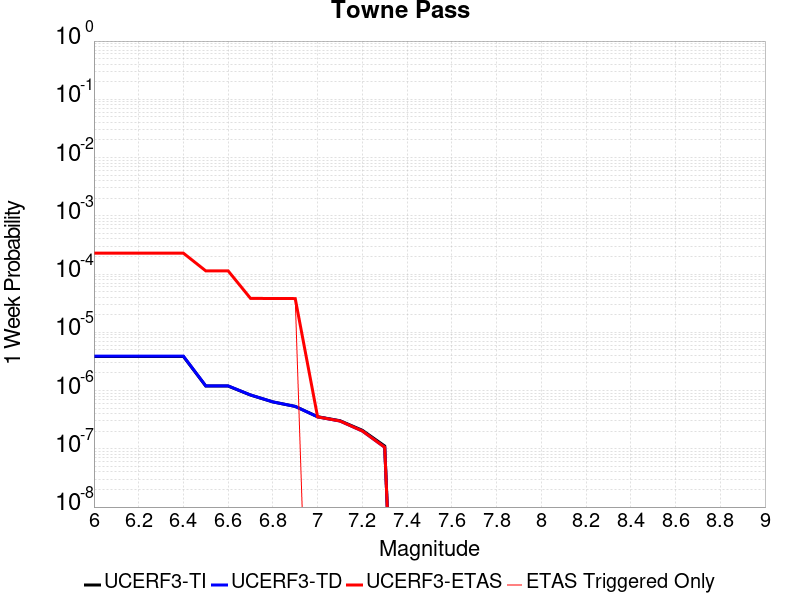 | 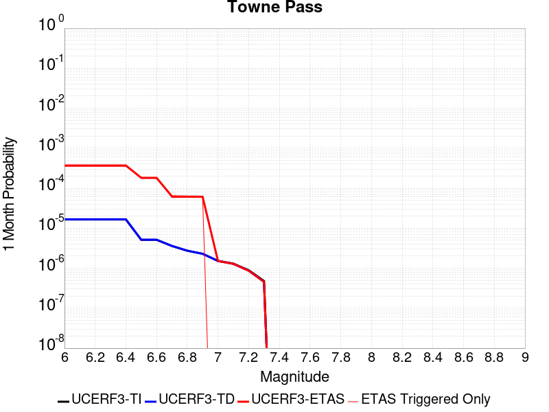 |  | 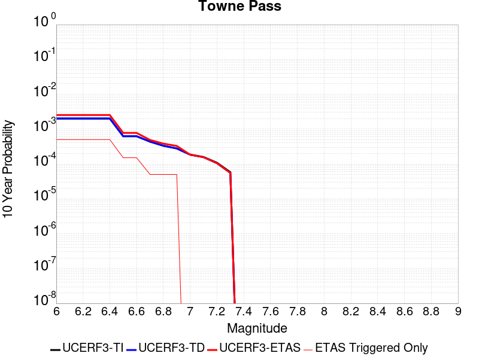 |

| Magnitude | 1 wk TI Prob | 1 wk TD Prob | 1 wk ETAS Prob | 1 wk ETAS/TD Gain | 1 wk ETAS Triggered Only | 1 mo TI Prob | 1 mo TD Prob | 1 mo ETAS Prob | 1 mo ETAS/TD Gain | 1 mo ETAS Triggered Only | 1 yr TI Prob | 1 yr TD Prob | 1 yr ETAS Prob | 1 yr ETAS/TD Gain | 1 yr ETAS Triggered Only | 10 yr TI Prob | 10 yr TD Prob | 10 yr ETAS Prob | 10 yr ETAS/TD Gain | 10 yr ETAS Triggered Only |
|-----|-----|-----|-----|-----|-----|-----|-----|-----|-----|-----|-----|-----|-----|-----|-----|-----|-----|-----|-----|-----|
| 6.0 | 3.849728E-6 | 3.8945395E-6 | 3.2190888E-4 | 82.65646 | 3.1801558E-4 | 1.649873E-5 | 1.6690803E-5 | 3.3470106E-4 | 20.053024 | 3.1801558E-4 | 2.0085352E-4 | 2.0319594E-4 | 5.741387E-4 | 2.8255422 | 3.710182E-4 | 0.0020067208 | 0.0020305307 | 0.0025594803 | 1.2604983 | 5.30026E-4 |
| 6.1 | 3.849728E-6 | 3.8945395E-6 | 3.2190888E-4 | 82.65646 | 3.1801558E-4 | 1.649873E-5 | 1.6690803E-5 | 3.3470106E-4 | 20.053024 | 3.1801558E-4 | 2.0085352E-4 | 2.0319594E-4 | 5.741387E-4 | 2.8255422 | 3.710182E-4 | 0.0020067208 | 0.0020305307 | 0.0025594803 | 1.2604983 | 5.30026E-4 |
| 6.2 | 3.849728E-6 | 3.8945395E-6 | 3.2190888E-4 | 82.65646 | 3.1801558E-4 | 1.649873E-5 | 1.6690803E-5 | 3.3470106E-4 | 20.053024 | 3.1801558E-4 | 2.0085352E-4 | 2.0319594E-4 | 5.741387E-4 | 2.8255422 | 3.710182E-4 | 0.0020067208 | 0.0020305307 | 0.0025594803 | 1.2604983 | 5.30026E-4 |
| 6.3 | 3.849728E-6 | 3.8945395E-6 | 3.2190888E-4 | 82.65646 | 3.1801558E-4 | 1.649873E-5 | 1.6690803E-5 | 3.3470106E-4 | 20.053024 | 3.1801558E-4 | 2.0085352E-4 | 2.0319594E-4 | 5.741387E-4 | 2.8255422 | 3.710182E-4 | 0.0020067208 | 0.0020305307 | 0.0025594803 | 1.2604983 | 5.30026E-4 |
| 6.4 | 3.849728E-6 | 3.8945395E-6 | 3.2190888E-4 | 82.65646 | 3.1801558E-4 | 1.649873E-5 | 1.6690803E-5 | 3.3470106E-4 | 20.053024 | 3.1801558E-4 | 2.0085352E-4 | 2.0319594E-4 | 5.741387E-4 | 2.8255422 | 3.710182E-4 | 0.0020067208 | 0.0020305307 | 0.0025594803 | 1.2604983 | 5.30026E-4 |
| 6.5 | 1.1953545E-6 | 1.2030514E-6 | 1.6021065E-4 | 133.17026 | 1.5900779E-4 | 5.1229376E-6 | 5.155925E-6 | 1.6416289E-4 | 31.83966 | 1.5900779E-4 | 6.236998E-5 | 6.2771695E-5 | 2.217695E-4 | 3.5329537 | 1.5900779E-4 | 6.235248E-4 | 6.275514E-4 | 7.8645936E-4 | 1.2532191 | 1.5900779E-4 |
| 6.6 | 1.1953545E-6 | 1.2030514E-6 | 1.6021065E-4 | 133.17026 | 1.5900779E-4 | 5.1229376E-6 | 5.155925E-6 | 1.6416289E-4 | 31.83966 | 1.5900779E-4 | 6.236998E-5 | 6.2771695E-5 | 2.217695E-4 | 3.5329537 | 1.5900779E-4 | 6.235248E-4 | 6.275514E-4 | 7.8645936E-4 | 1.2532191 | 1.5900779E-4 |
| 6.7 | 8.375951E-7 | 8.410665E-7 | 5.3843618E-5 | 64.018265 | 5.3002597E-5 | 3.5896885E-6 | 3.604566E-6 | 5.6606972E-5 | 15.704241 | 5.3002597E-5 | 4.370358E-5 | 4.3884767E-5 | 9.6885036E-5 | 2.2077146 | 5.3002597E-5 | 4.3694986E-4 | 4.387667E-4 | 4.9174606E-4 | 1.120746 | 5.3002597E-5 |
| 6.8 | 6.38041E-7 | 6.3921516E-7 | 5.364178E-5 | 83.91819 | 5.3002597E-5 | 2.7344586E-6 | 2.7394908E-6 | 5.5741944E-5 | 20.347555 | 5.3002597E-5 | 3.3291526E-5 | 3.335283E-5 | 8.635366E-5 | 2.5890954 | 5.3002597E-5 | 3.3286537E-4 | 3.3348205E-4 | 3.8646697E-4 | 1.1588839 | 5.3002597E-5 |
| 6.9 | 5.3460053E-7 | 5.345329E-7 | 5.35371E-5 | 100.1568 | 5.3002597E-5 | 2.2911431E-6 | 2.2908532E-6 | 5.529333E-5 | 24.136564 | 5.3002597E-5 | 2.789431E-5 | 2.7890816E-5 | 8.0891936E-5 | 2.9003072 | 5.3002597E-5 | 2.789081E-4 | 2.7887648E-4 | 3.3186428E-4 | 1.1900046 | 5.3002597E-5 |
| 7.0 | 3.557783E-7 | 3.532419E-7 | 3.532419E-7 | 1.0 | 0.0 | 1.5247632E-6 | 1.5138929E-6 | 1.5138929E-6 | 1.0 | 0.0 | 1.8563835E-5 | 1.84315E-5 | 1.84315E-5 | 1.0 | 0.0 | 1.8562283E-4 | 1.8430054E-4 | 1.8430054E-4 | 1.0 | 0.0 |
| 7.1 | 3.037942E-7 | 3.0002184E-7 | 3.0002184E-7 | 1.0 | 0.0 | 1.3019744E-6 | 1.2858072E-6 | 1.2858072E-6 | 1.0 | 0.0 | 1.5851423E-5 | 1.56546E-5 | 1.56546E-5 | 1.0 | 0.0 | 1.5850292E-4 | 1.5653571E-4 | 1.5653571E-4 | 1.0 | 0.0 |
| 7.2 | 2.0808248E-7 | 2.0217661E-7 | 2.0217661E-7 | 1.0 | 0.0 | 8.917818E-7 | 8.664709E-7 | 8.664709E-7 | 1.0 | 0.0 | 1.0857389E-5 | 1.0549237E-5 | 1.0549237E-5 | 1.0 | 0.0 | 1.0856859E-4 | 1.0548782E-4 | 1.0548782E-4 | 1.0 | 0.0 |
| 7.3 | 1.1162073E-7 | 1.0636875E-7 | 1.0636875E-7 | 1.0 | 0.0 | 4.7837443E-7 | 4.5586603E-7 | 4.5586603E-7 | 1.0 | 0.0 | 5.8241935E-6 | 5.550157E-6 | 5.550157E-6 | 1.0 | 0.0 | 5.8240406E-5 | 5.5500383E-5 | 5.5500383E-5 | 1.0 | 0.0 |

## Bicycle Lake
*[(top)](#table-of-contents)*

| 1 Week | 1 Month | 1 Year | 10 Year |
|-----|-----|-----|-----|
| 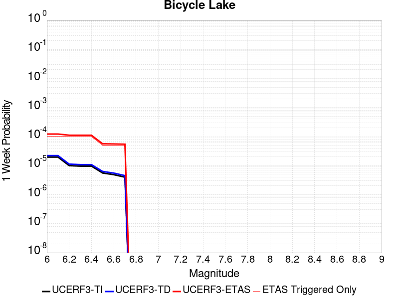 | 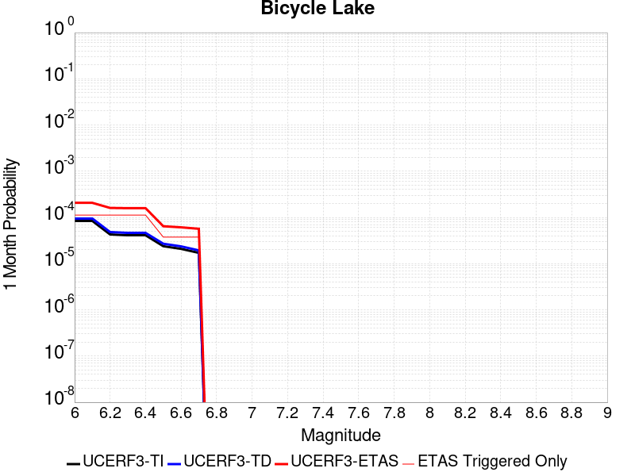 | 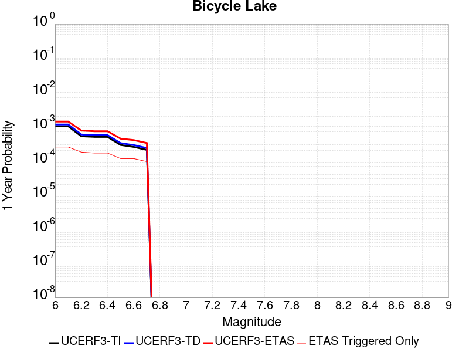 | 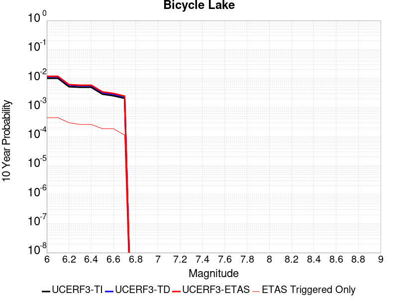 |

| Magnitude | 1 wk TI Prob | 1 wk TD Prob | 1 wk ETAS Prob | 1 wk ETAS/TD Gain | 1 wk ETAS Triggered Only | 1 mo TI Prob | 1 mo TD Prob | 1 mo ETAS Prob | 1 mo ETAS/TD Gain | 1 mo ETAS Triggered Only | 1 yr TI Prob | 1 yr TD Prob | 1 yr ETAS Prob | 1 yr ETAS/TD Gain | 1 yr ETAS Triggered Only | 10 yr TI Prob | 10 yr TD Prob | 10 yr ETAS Prob | 10 yr ETAS/TD Gain | 10 yr ETAS Triggered Only |
|-----|-----|-----|-----|-----|-----|-----|-----|-----|-----|-----|-----|-----|-----|-----|-----|-----|-----|-----|-----|-----|
| 6.0 | 1.9621975E-5 | 2.2097003E-5 | 1.2809985E-4 | 5.7971597 | 1.06005195E-4 | 8.4091465E-5 | 9.469877E-5 | 2.0069392E-4 | 2.1192875 | 1.06005195E-4 | 0.0010233327 | 0.0011524827 | 0.0013113072 | 1.1378108 | 1.5900779E-4 | 0.01018633 | 0.011478369 | 0.011949917 | 1.0410814 | 4.7702336E-4 |
| 6.1 | 1.9621975E-5 | 2.2097003E-5 | 1.2809985E-4 | 5.7971597 | 1.06005195E-4 | 8.4091465E-5 | 9.469877E-5 | 2.0069392E-4 | 2.1192875 | 1.06005195E-4 | 0.0010233327 | 0.0011524827 | 0.0013113072 | 1.1378108 | 1.5900779E-4 | 0.01018633 | 0.011478369 | 0.011949917 | 1.0410814 | 4.7702336E-4 |
| 6.2 | 9.9971285E-6 | 1.1255602E-5 | 1.172596E-4 | 10.417889 | 1.06005195E-4 | 4.2844134E-5 | 4.8237693E-5 | 1.5423777E-4 | 3.1974533 | 1.06005195E-4 | 5.2150246E-4 | 5.871877E-4 | 7.4610213E-4 | 1.2706366 | 1.5900779E-4 | 0.0052028033 | 0.0058614668 | 0.0061776186 | 1.0539373 | 3.1801558E-4 |
| 6.3 | 9.589428E-6 | 1.079831E-5 | 1.1680236E-4 | 10.816726 | 1.06005195E-4 | 4.10969E-5 | 4.6277943E-5 | 1.5227823E-4 | 3.2905142 | 1.06005195E-4 | 5.002399E-4 | 5.6334015E-4 | 6.6928566E-4 | 1.1880666 | 1.06005195E-4 | 0.0049911533 | 0.005624211 | 0.0058877333 | 1.046855 | 2.65013E-4 |
| 6.4 | 9.589428E-6 | 1.079831E-5 | 1.1680236E-4 | 10.816726 | 1.06005195E-4 | 4.10969E-5 | 4.6277943E-5 | 1.5227823E-4 | 3.2905142 | 1.06005195E-4 | 5.002399E-4 | 5.6334015E-4 | 6.6928566E-4 | 1.1880666 | 1.06005195E-4 | 0.0049911533 | 0.005624211 | 0.0058877333 | 1.046855 | 2.65013E-4 |
| 6.5 | 5.557707E-6 | 6.2855797E-6 | 5.9287842E-5 | 9.432359 | 5.3002597E-5 | 2.3818526E-5 | 2.693807E-5 | 7.9939244E-5 | 2.967519 | 5.3002597E-5 | 2.8995197E-4 | 3.2794854E-4 | 3.8093375E-4 | 1.1615657 | 5.3002597E-5 | 0.0028957394 | 0.003277282 | 0.0034885975 | 1.0644789 | 2.1201039E-4 |
| 6.6 | 4.8742945E-6 | 5.5132705E-6 | 5.8515576E-5 | 10.613587 | 5.3002597E-5 | 2.0889667E-5 | 2.3628236E-5 | 7.662958E-5 | 3.243136 | 5.3002597E-5 | 2.54302E-4 | 2.87662E-4 | 3.4064933E-4 | 1.1842 | 5.3002597E-5 | 0.002540112 | 0.0028754652 | 0.0030868659 | 1.0735188 | 2.1201039E-4 |
| 6.7 | 3.991108E-6 | 4.5158945E-6 | 5.7518253E-5 | 12.736846 | 5.3002597E-5 | 1.7104636E-5 | 1.9353833E-5 | 7.2355404E-5 | 3.7385569 | 5.3002597E-5 | 2.0822904E-4 | 2.3563292E-4 | 2.8862304E-4 | 1.2248842 | 5.3002597E-5 | 0.0020803404 | 0.0023563292 | 0.0025149623 | 1.0673221 | 1.5900779E-4 |

## Paradise
*[(top)](#table-of-contents)*

| 1 Week | 1 Month | 1 Year | 10 Year |
|-----|-----|-----|-----|
| 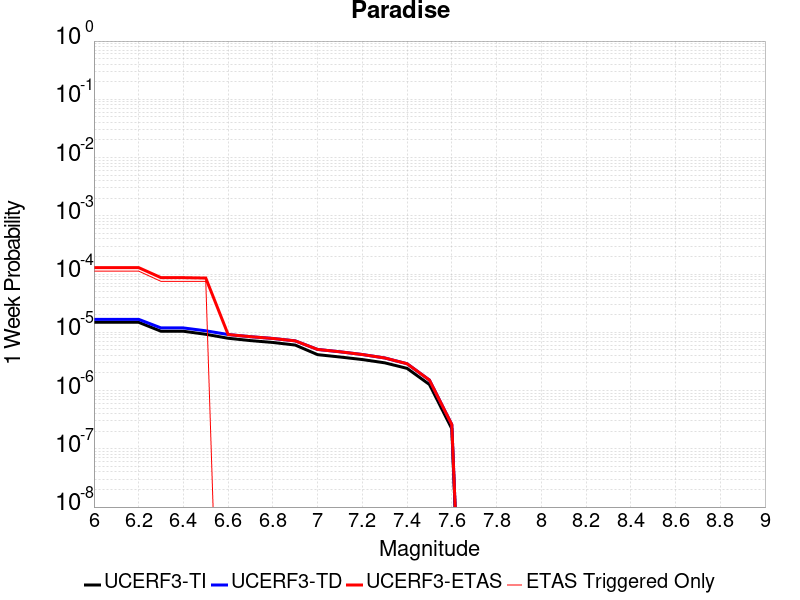 | 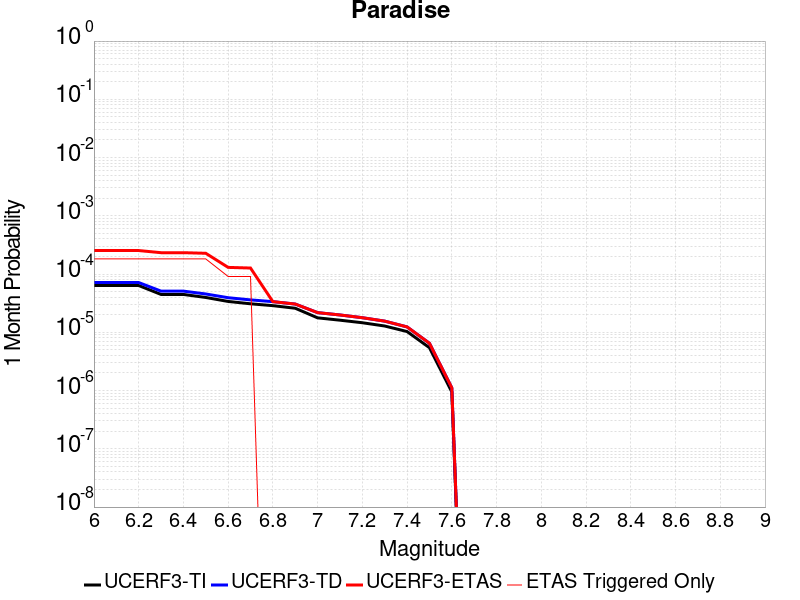 | 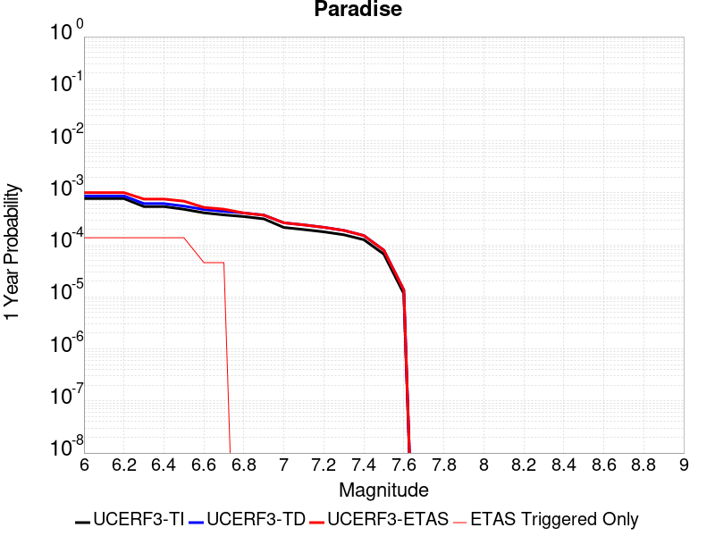 | 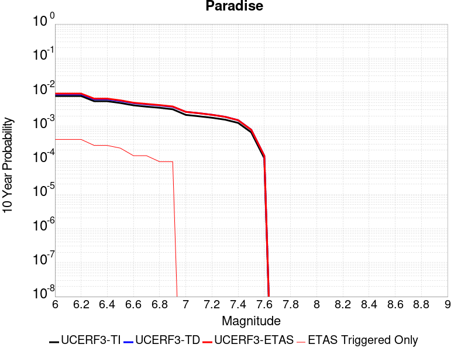 |

| Magnitude | 1 wk TI Prob | 1 wk TD Prob | 1 wk ETAS Prob | 1 wk ETAS/TD Gain | 1 wk ETAS Triggered Only | 1 mo TI Prob | 1 mo TD Prob | 1 mo ETAS Prob | 1 mo ETAS/TD Gain | 1 mo ETAS Triggered Only | 1 yr TI Prob | 1 yr TD Prob | 1 yr ETAS Prob | 1 yr ETAS/TD Gain | 1 yr ETAS Triggered Only | 10 yr TI Prob | 10 yr TD Prob | 10 yr ETAS Prob | 10 yr ETAS/TD Gain | 10 yr ETAS Triggered Only |
|-----|-----|-----|-----|-----|-----|-----|-----|-----|-----|-----|-----|-----|-----|-----|-----|-----|-----|-----|-----|-----|
| 6.0 | 1.4851273E-5 | 1.669466E-5 | 1.2269808E-4 | 7.349541 | 1.06005195E-4 | 6.364676E-5 | 7.154671E-5 | 2.3054313E-4 | 3.2222743 | 1.5900779E-4 | 7.7462377E-4 | 8.707567E-4 | 0.001029626 | 1.1824497 | 1.5900779E-4 | 0.0077192914 | 0.008675828 | 0.009148712 | 1.0545061 | 4.7702336E-4 |
| 6.1 | 1.4851273E-5 | 1.669466E-5 | 1.2269808E-4 | 7.349541 | 1.06005195E-4 | 6.364676E-5 | 7.154671E-5 | 2.3054313E-4 | 3.2222743 | 1.5900779E-4 | 7.7462377E-4 | 8.707567E-4 | 0.001029626 | 1.1824497 | 1.5900779E-4 | 0.0077192914 | 0.008675828 | 0.009148712 | 1.0545061 | 4.7702336E-4 |
| 6.2 | 1.4851273E-5 | 1.669466E-5 | 1.2269808E-4 | 7.349541 | 1.06005195E-4 | 6.364676E-5 | 7.154671E-5 | 2.3054313E-4 | 3.2222743 | 1.5900779E-4 | 7.7462377E-4 | 8.707567E-4 | 0.001029626 | 1.1824497 | 1.5900779E-4 | 0.0077192914 | 0.008675828 | 0.009148712 | 1.0545061 | 4.7702336E-4 |
| 6.3 | 1.0426831E-5 | 1.1888599E-5 | 1.1789253E-4 | 9.916436 | 1.06005195E-4 | 4.4685654E-5 | 5.0950177E-5 | 2.0994987E-4 | 4.12069 | 1.5900779E-4 | 5.43912E-4 | 6.201478E-4 | 7.79057E-4 | 1.2562441 | 1.5900779E-4 | 0.0054258266 | 0.0061847805 | 0.006500829 | 1.0511011 | 3.1801558E-4 |
| 6.4 | 1.0426831E-5 | 1.1888599E-5 | 1.1789253E-4 | 9.916436 | 1.06005195E-4 | 4.4685654E-5 | 5.0950177E-5 | 2.0994987E-4 | 4.12069 | 1.5900779E-4 | 5.43912E-4 | 6.201478E-4 | 7.79057E-4 | 1.2562441 | 1.5900779E-4 | 0.0054258266 | 0.0061847805 | 0.006500829 | 1.0511011 | 3.1801558E-4 |
| 6.5 | 9.25027E-6 | 1.061994E-5 | 1.1662401E-4 | 10.9816065 | 1.06005195E-4 | 3.964341E-5 | 4.5513265E-5 | 2.0451382E-4 | 4.4934993 | 1.5900779E-4 | 4.8255164E-4 | 5.5398804E-4 | 7.1290776E-4 | 1.2868649 | 1.5900779E-4 | 0.0048150513 | 0.0055265697 | 0.0057901177 | 1.0476875 | 2.65013E-4 |
| 6.6 | 7.904275E-6 | 9.159509E-6 | 9.159509E-6 | 1.0 | 0.0 | 3.3875025E-5 | 3.925447E-5 | 9.225499E-5 | 2.3501778 | 5.3002597E-5 | 4.1235037E-4 | 4.7782232E-4 | 5.307996E-4 | 1.1108723 | 5.3002597E-5 | 0.0041158604 | 0.0047683464 | 0.004926596 | 1.0331875 | 1.5900779E-4 |
| 6.7 | 7.2061953E-6 | 8.407234E-6 | 8.407234E-6 | 1.0 | 0.0 | 3.088333E-5 | 3.6030528E-5 | 8.9031215E-5 | 2.470994 | 5.3002597E-5 | 3.7593965E-4 | 4.3858704E-4 | 4.915664E-4 | 1.1207955 | 5.3002597E-5 | 0.003753043 | 0.0043775835 | 0.0045358953 | 1.0361642 | 1.5900779E-4 |
| 6.8 | 6.6948724E-6 | 7.842153E-6 | 7.842153E-6 | 1.0 | 0.0 | 2.8691995E-5 | 3.3608812E-5 | 3.3608812E-5 | 1.0 | 0.0 | 3.4926904E-4 | 4.0911406E-4 | 4.0911406E-4 | 1.0 | 0.0 | 0.003487206 | 0.0040839664 | 0.004189539 | 1.0258504 | 1.06005195E-4 |
| 6.9 | 6.0421025E-6 | 7.1306094E-6 | 7.1306094E-6 | 1.0 | 0.0 | 2.5894467E-5 | 3.0559415E-5 | 3.0559415E-5 | 1.0 | 0.0 | 3.1521954E-4 | 3.7200077E-4 | 3.7200077E-4 | 1.0 | 0.0 | 0.0031477278 | 0.0037141186 | 0.0038197301 | 1.0284351 | 1.06005195E-4 |
| 7.0 | 4.134091E-6 | 5.080301E-6 | 5.080301E-6 | 1.0 | 0.0 | 1.7717413E-5 | 2.1772545E-5 | 2.1772545E-5 | 1.0 | 0.0 | 2.1568815E-4 | 2.6505004E-4 | 2.6505004E-4 | 1.0 | 0.0 | 0.0021547892 | 0.002647492 | 0.002647492 | 1.0 | 0.0 |
| 7.1 | 3.7674888E-6 | 4.6318623E-6 | 4.6318623E-6 | 1.0 | 0.0 | 1.6146281E-5 | 1.9850695E-5 | 1.9850695E-5 | 1.0 | 0.0 | 1.9656324E-4 | 2.4165693E-4 | 2.4165693E-4 | 1.0 | 0.0 | 0.0019638946 | 0.0024140922 | 0.0024140922 | 1.0 | 0.0 |
| 7.2 | 3.4065345E-6 | 4.156717E-6 | 4.156717E-6 | 1.0 | 0.0 | 1.4599351E-5 | 1.7814387E-5 | 1.7814387E-5 | 1.0 | 0.0 | 1.777326E-4 | 2.1687007E-4 | 2.1687007E-4 | 1.0 | 0.0 | 0.0017759053 | 0.0021667324 | 0.0021667324 | 1.0 | 0.0 |
| 7.3 | 2.9934936E-6 | 3.6293113E-6 | 3.6293113E-6 | 1.0 | 0.0 | 1.2829195E-5 | 1.5554107E-5 | 1.5554107E-5 | 1.0 | 0.0 | 1.5618425E-4 | 1.8935627E-4 | 1.8935627E-4 | 1.0 | 0.0 | 0.0015607453 | 0.0018920946 | 0.0018920946 | 1.0 | 0.0 |
| 7.4 | 2.4049796E-6 | 2.8889801E-6 | 2.8889801E-6 | 1.0 | 0.0 | 1.0307015E-5 | 1.2381293E-5 | 1.2381293E-5 | 1.0 | 0.0 | 1.2548068E-4 | 1.5073326E-4 | 1.5073326E-4 | 1.0 | 0.0 | 0.0012540985 | 0.0015064516 | 0.0015064516 | 1.0 | 0.0 |
| 7.5 | 1.2710091E-6 | 1.5134664E-6 | 1.5134664E-6 | 1.0 | 0.0 | 5.44717E-6 | 6.486275E-6 | 6.486275E-6 | 1.0 | 0.0 | 6.631728E-5 | 7.896879E-5 | 7.896879E-5 | 1.0 | 0.0 | 6.6297496E-4 | 7.8952993E-4 | 7.8952993E-4 | 1.0 | 0.0 |
| 7.6 | 2.21172E-7 | 2.603958E-7 | 2.603958E-7 | 1.0 | 0.0 | 9.478797E-7 | 1.1159817E-6 | 1.1159817E-6 | 1.0 | 0.0 | 1.1540374E-5 | 1.3587022E-5 | 1.3587022E-5 | 1.0 | 0.0 | 1.1539775E-4 | 1.3586473E-4 | 1.3586473E-4 | 1.0 | 0.0 |

## Garlic Springs
*[(top)](#table-of-contents)*

| 1 Week | 1 Month | 1 Year | 10 Year |
|-----|-----|-----|-----|
| 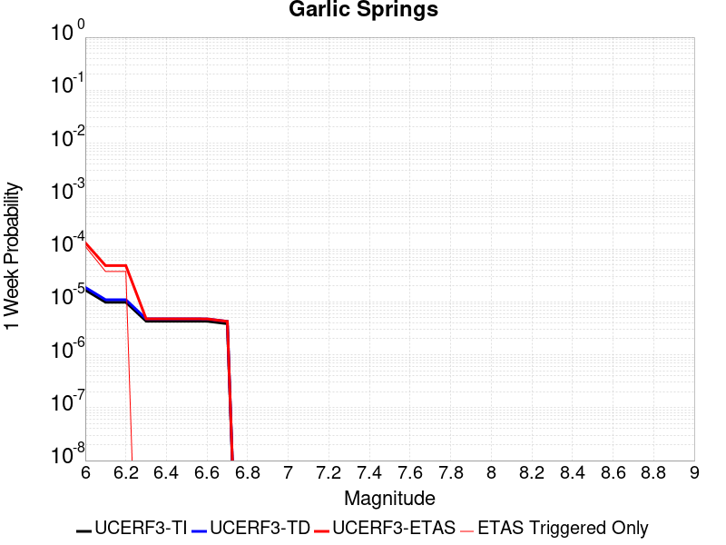 | 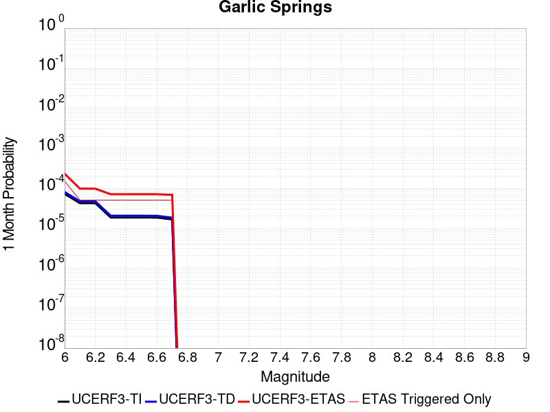 | 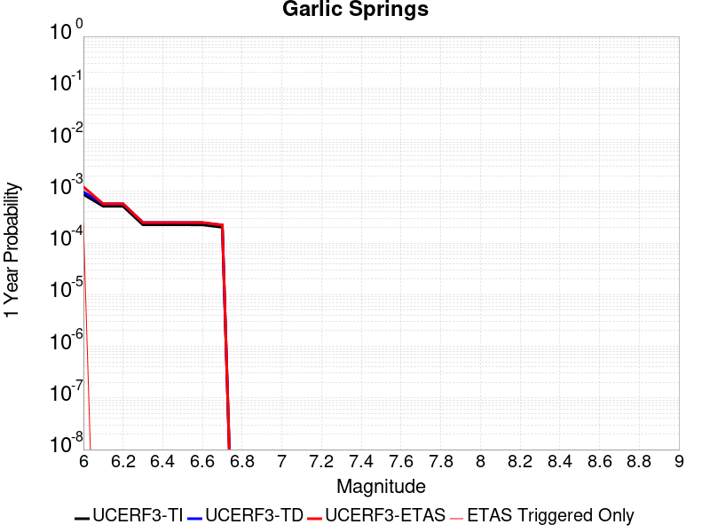 | 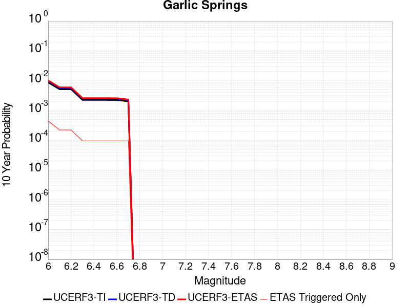 |

| Magnitude | 1 wk TI Prob | 1 wk TD Prob | 1 wk ETAS Prob | 1 wk ETAS/TD Gain | 1 wk ETAS Triggered Only | 1 mo TI Prob | 1 mo TD Prob | 1 mo ETAS Prob | 1 mo ETAS/TD Gain | 1 mo ETAS Triggered Only | 1 yr TI Prob | 1 yr TD Prob | 1 yr ETAS Prob | 1 yr ETAS/TD Gain | 1 yr ETAS Triggered Only | 10 yr TI Prob | 10 yr TD Prob | 10 yr ETAS Prob | 10 yr ETAS/TD Gain | 10 yr ETAS Triggered Only |
|-----|-----|-----|-----|-----|-----|-----|-----|-----|-----|-----|-----|-----|-----|-----|-----|-----|-----|-----|-----|-----|
| 6.0 | 1.6760017E-5 | 1.8776773E-5 | 1.2477998E-4 | 6.6454434 | 1.06005195E-4 | 7.182667E-5 | 8.047006E-5 | 2.3946505E-4 | 2.975828 | 1.5900779E-4 | 8.7413884E-4 | 9.794E-4 | 0.0012971042 | 1.3243865 | 3.1801558E-4 | 0.008707083 | 0.009762381 | 0.010182263 | 1.0430101 | 4.2402078E-4 |
| 6.1 | 9.852767E-6 | 1.0973554E-5 | 1.0973554E-5 | 1.0 | 0.0 | 4.222546E-5 | 4.702907E-5 | 1.00029174E-4 | 2.1269648 | 5.3002597E-5 | 5.139737E-4 | 5.724994E-4 | 6.254717E-4 | 1.092528 | 5.3002597E-5 | 0.005127866 | 0.005717204 | 0.005769904 | 1.0092177 | 5.3002597E-5 |
| 6.2 | 9.852767E-6 | 1.0973554E-5 | 1.0973554E-5 | 1.0 | 0.0 | 4.222546E-5 | 4.702907E-5 | 1.00029174E-4 | 2.1269648 | 5.3002597E-5 | 5.139737E-4 | 5.724994E-4 | 6.254717E-4 | 1.092528 | 5.3002597E-5 | 0.005127866 | 0.005717204 | 0.005769904 | 1.0092177 | 5.3002597E-5 |
| 6.3 | 4.3167724E-6 | 4.778015E-6 | 4.778015E-6 | 1.0 | 0.0 | 1.8500323E-5 | 2.0477177E-5 | 7.347869E-5 | 3.5883212 | 5.3002597E-5 | 2.2521814E-4 | 2.4930414E-4 | 3.022935E-4 | 1.2125492 | 5.3002597E-5 | 0.0022499003 | 0.0024925028 | 0.0025453733 | 1.0212119 | 5.3002597E-5 |
| 6.4 | 4.3167724E-6 | 4.778015E-6 | 4.778015E-6 | 1.0 | 0.0 | 1.8500323E-5 | 2.0477177E-5 | 7.347869E-5 | 3.5883212 | 5.3002597E-5 | 2.2521814E-4 | 2.4930414E-4 | 3.022935E-4 | 1.2125492 | 5.3002597E-5 | 0.0022499003 | 0.0024925028 | 0.0025453733 | 1.0212119 | 5.3002597E-5 |
| 6.5 | 4.3167724E-6 | 4.778015E-6 | 4.778015E-6 | 1.0 | 0.0 | 1.8500323E-5 | 2.0477177E-5 | 7.347869E-5 | 3.5883212 | 5.3002597E-5 | 2.2521814E-4 | 2.4930414E-4 | 3.022935E-4 | 1.2125492 | 5.3002597E-5 | 0.0022499003 | 0.0024925028 | 0.0025453733 | 1.0212119 | 5.3002597E-5 |
| 6.6 | 4.301311E-6 | 4.7608837E-6 | 4.7608837E-6 | 1.0 | 0.0 | 1.8434059E-5 | 2.0403757E-5 | 7.3405274E-5 | 3.5976353 | 5.3002597E-5 | 2.2441156E-4 | 2.4841045E-4 | 3.0139988E-4 | 1.213314 | 5.3002597E-5 | 0.0022418506 | 0.002483586 | 0.002536457 | 1.0212882 | 5.3002597E-5 |
| 6.7 | 3.8599724E-6 | 4.2710476E-6 | 4.2710476E-6 | 1.0 | 0.0 | 1.6542634E-5 | 1.830449E-5 | 7.1306116E-5 | 3.8955534 | 5.3002597E-5 | 2.0138794E-4 | 2.2285717E-4 | 2.7584797E-4 | 1.2377791 | 5.3002597E-5 | 0.0020120554 | 0.0022285716 | 0.0022814563 | 1.0237302 | 5.3002597E-5 |

## Death Valley (Black Mtns Frontal)
*[(top)](#table-of-contents)*

| 1 Week | 1 Month | 1 Year | 10 Year |
|-----|-----|-----|-----|
| 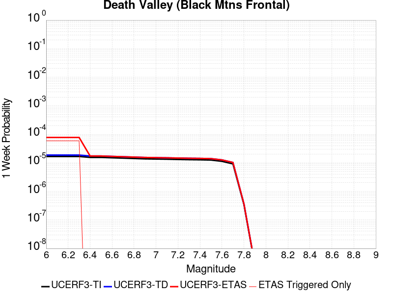 | 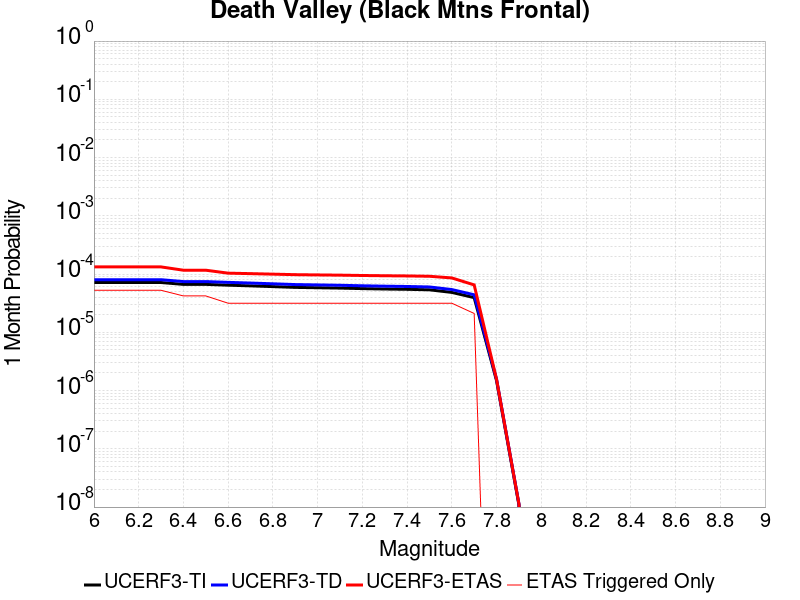 | 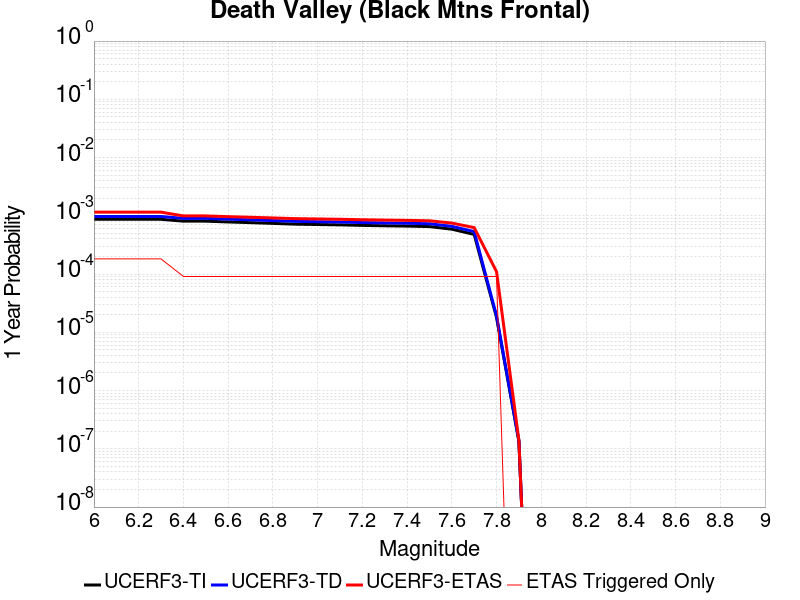 | 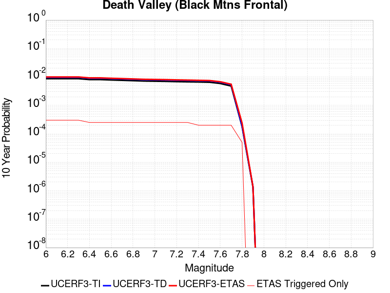 |

| Magnitude | 1 wk TI Prob | 1 wk TD Prob | 1 wk ETAS Prob | 1 wk ETAS/TD Gain | 1 wk ETAS Triggered Only | 1 mo TI Prob | 1 mo TD Prob | 1 mo ETAS Prob | 1 mo ETAS/TD Gain | 1 mo ETAS Triggered Only | 1 yr TI Prob | 1 yr TD Prob | 1 yr ETAS Prob | 1 yr ETAS/TD Gain | 1 yr ETAS Triggered Only | 10 yr TI Prob | 10 yr TD Prob | 10 yr ETAS Prob | 10 yr ETAS/TD Gain | 10 yr ETAS Triggered Only |
|-----|-----|-----|-----|-----|-----|-----|-----|-----|-----|-----|-----|-----|-----|-----|-----|-----|-----|-----|-----|-----|
| 6.0 | 1.6707214E-5 | 1.867021E-5 | 7.167182E-5 | 3.838833 | 5.3002597E-5 | 7.160038E-5 | 8.0012775E-5 | 1.3301113E-4 | 1.6623737 | 5.3002597E-5 | 8.71386E-4 | 9.737278E-4 | 0.0011855317 | 1.2175187 | 2.1201039E-4 | 0.00867977 | 0.009695467 | 0.010010399 | 1.0324824 | 3.1801558E-4 |
| 6.1 | 1.6707214E-5 | 1.867021E-5 | 7.167182E-5 | 3.838833 | 5.3002597E-5 | 7.160038E-5 | 8.0012775E-5 | 1.3301113E-4 | 1.6623737 | 5.3002597E-5 | 8.71386E-4 | 9.737278E-4 | 0.0011855317 | 1.2175187 | 2.1201039E-4 | 0.00867977 | 0.009695467 | 0.010010399 | 1.0324824 | 3.1801558E-4 |
| 6.2 | 1.6707214E-5 | 1.867021E-5 | 7.167182E-5 | 3.838833 | 5.3002597E-5 | 7.160038E-5 | 8.0012775E-5 | 1.3301113E-4 | 1.6623737 | 5.3002597E-5 | 8.71386E-4 | 9.737278E-4 | 0.0011855317 | 1.2175187 | 2.1201039E-4 | 0.00867977 | 0.009695467 | 0.010010399 | 1.0324824 | 3.1801558E-4 |
| 6.3 | 1.6707214E-5 | 1.867021E-5 | 7.167182E-5 | 3.838833 | 5.3002597E-5 | 7.160038E-5 | 8.0012775E-5 | 1.3301113E-4 | 1.6623737 | 5.3002597E-5 | 8.71386E-4 | 9.737278E-4 | 0.0011855317 | 1.2175187 | 2.1201039E-4 | 0.00867977 | 0.009695467 | 0.010010399 | 1.0324824 | 3.1801558E-4 |
| 6.4 | 1.5515609E-5 | 1.733816E-5 | 1.733816E-5 | 1.0 | 0.0 | 6.649377E-5 | 7.430431E-5 | 7.430431E-5 | 1.0 | 0.0 | 8.0926094E-4 | 9.0428564E-4 | 0.0010631497 | 1.175679 | 1.5900779E-4 | 0.008063202 | 0.009006744 | 0.009269371 | 1.0291588 | 2.65013E-4 |
| 6.5 | 1.5515609E-5 | 1.733816E-5 | 1.733816E-5 | 1.0 | 0.0 | 6.649377E-5 | 7.430431E-5 | 7.430431E-5 | 1.0 | 0.0 | 8.0926094E-4 | 9.0428564E-4 | 0.0010631497 | 1.175679 | 1.5900779E-4 | 0.008063202 | 0.009006744 | 0.009269371 | 1.0291588 | 2.65013E-4 |
| 6.6 | 1.5041828E-5 | 1.6809092E-5 | 1.6809092E-5 | 1.0 | 0.0 | 6.4463384E-5 | 7.203701E-5 | 7.203701E-5 | 1.0 | 0.0 | 7.8455906E-4 | 8.767036E-4 | 0.0010355719 | 1.1812111 | 1.5900779E-4 | 0.00781795 | 0.008733105 | 0.008995804 | 1.0300808 | 2.65013E-4 |
| 6.7 | 1.4634985E-5 | 1.6355965E-5 | 1.6355965E-5 | 1.0 | 0.0 | 6.271985E-5 | 7.009514E-5 | 7.009514E-5 | 1.0 | 0.0 | 7.6334673E-4 | 8.5307995E-4 | 0.0010119521 | 1.1862336 | 1.5900779E-4 | 0.007607299 | 0.008498689 | 0.00876145 | 1.0309178 | 2.65013E-4 |
| 6.8 | 1.4209158E-5 | 1.5881998E-5 | 1.5881998E-5 | 1.0 | 0.0 | 6.089497E-5 | 6.806396E-5 | 6.806396E-5 | 1.0 | 0.0 | 7.4114406E-4 | 8.283693E-4 | 9.872454E-4 | 1.1917938 | 1.5900779E-4 | 0.007386771 | 0.00825343 | 0.008516256 | 1.0318444 | 2.65013E-4 |
| 6.9 | 1.3780098E-5 | 1.5404545E-5 | 1.5404545E-5 | 1.0 | 0.0 | 5.9056227E-5 | 6.6017834E-5 | 6.6017834E-5 | 1.0 | 0.0 | 7.1877235E-4 | 8.034762E-4 | 9.623562E-4 | 1.1977408 | 1.5900779E-4 | 0.0071645193 | 0.008006307 | 0.008269199 | 1.0328355 | 2.65013E-4 |
| 7.0 | 1.3585064E-5 | 1.5188108E-5 | 1.5188108E-5 | 1.0 | 0.0 | 5.8220405E-5 | 6.5090295E-5 | 6.5090295E-5 | 1.0 | 0.0 | 7.086029E-4 | 7.9219165E-4 | 9.510735E-4 | 1.2005599 | 1.5900779E-4 | 0.007063476 | 0.007894269 | 0.00815719 | 1.0333053 | 2.65013E-4 |
| 7.1 | 1.3398601E-5 | 1.4981292E-5 | 1.4981292E-5 | 1.0 | 0.0 | 5.742131E-5 | 6.420399E-5 | 6.420399E-5 | 1.0 | 0.0 | 6.9888023E-4 | 7.814087E-4 | 9.402922E-4 | 1.2033297 | 1.5900779E-4 | 0.0069668638 | 0.0077871997 | 0.008050148 | 1.0337669 | 2.65013E-4 |
| 7.2 | 1.3126312E-5 | 1.4679515E-5 | 1.4679515E-5 | 1.0 | 0.0 | 5.6254412E-5 | 6.2910716E-5 | 6.2910716E-5 | 1.0 | 0.0 | 6.846822E-4 | 7.656743E-4 | 9.245603E-4 | 1.2075113 | 1.5900779E-4 | 0.006825765 | 0.007630946 | 0.007893937 | 1.0344638 | 2.65013E-4 |
| 7.3 | 1.2922429E-5 | 1.4453743E-5 | 1.4453743E-5 | 1.0 | 0.0 | 5.5380664E-5 | 6.194317E-5 | 6.194317E-5 | 1.0 | 0.0 | 6.74051E-4 | 7.5390254E-4 | 9.127905E-4 | 1.2107539 | 1.5900779E-4 | 0.006720101 | 0.007514031 | 0.0077770525 | 1.035004 | 2.65013E-4 |
| 7.4 | 1.2768878E-5 | 1.4283726E-5 | 1.4283726E-5 | 1.0 | 0.0 | 5.4722615E-5 | 6.121456E-5 | 6.121456E-5 | 1.0 | 0.0 | 6.660441E-4 | 7.4503786E-4 | 8.509641E-4 | 1.1421756 | 1.06005195E-4 | 0.0066405144 | 0.00742598 | 0.0076364162 | 1.0283378 | 2.1201039E-4 |
| 7.5 | 1.2521929E-5 | 1.401197E-5 | 1.401197E-5 | 1.0 | 0.0 | 5.366431E-5 | 6.004995E-5 | 6.004995E-5 | 1.0 | 0.0 | 6.531671E-4 | 7.308683E-4 | 8.3679607E-4 | 1.144934 | 1.06005195E-4 | 0.006512506 | 0.007285223 | 0.0074956883 | 1.0288894 | 2.1201039E-4 |
| 7.6 | 1.1301089E-5 | 1.2648108E-5 | 1.2648108E-5 | 1.0 | 0.0 | 4.8432343E-5 | 5.4205084E-5 | 5.4205084E-5 | 1.0 | 0.0 | 5.895042E-4 | 6.5975235E-4 | 7.656876E-4 | 1.1605682 | 1.06005195E-4 | 0.0058794282 | 0.006578489 | 0.006789105 | 1.0320158 | 2.1201039E-4 |
| 7.7 | 9.189108E-6 | 1.02833255E-5 | 1.02833255E-5 | 1.0 | 0.0 | 3.93813E-5 | 4.407068E-5 | 4.407068E-5 | 1.0 | 0.0 | 4.7936183E-4 | 5.364335E-4 | 6.423818E-4 | 1.1975051 | 1.06005195E-4 | 0.004783291 | 0.005351897 | 0.0055627725 | 1.039402 | 2.1201039E-4 |
| 7.8 | 3.4586725E-7 | 3.648256E-7 | 3.648256E-7 | 1.0 | 0.0 | 1.4822873E-6 | 1.5635374E-6 | 1.5635374E-6 | 1.0 | 0.0 | 1.80467E-5 | 1.9035906E-5 | 7.2037496E-5 | 3.7842956 | 5.3002597E-5 | 1.8045233E-4 | 1.903432E-4 | 2.433357E-4 | 1.2784051 | 5.3002597E-5 |
| 7.9 | 2.5591178E-9 | 2.6696687E-9 | 2.6696687E-9 | 1.0 | 0.0 | 1.0967647E-8 | 1.1441437E-8 | 1.1441437E-8 | 1.0 | 0.0 | 1.335311E-7 | 1.392995E-7 | 1.392995E-7 | 1.0 | 0.0 | 1.3353102E-6 | 1.3929949E-6 | 1.3929949E-6 | 1.0 | 0.0 |

## Death Valley (Fish Lake Valley)
*[(top)](#table-of-contents)*

| 1 Week | 1 Month | 1 Year | 10 Year |
|-----|-----|-----|-----|
| 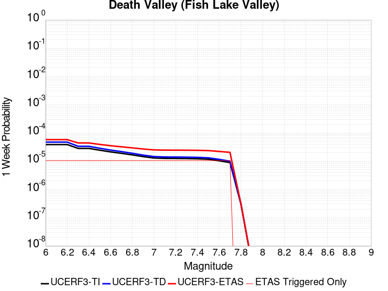 | 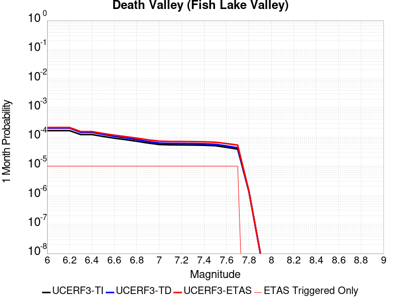 | 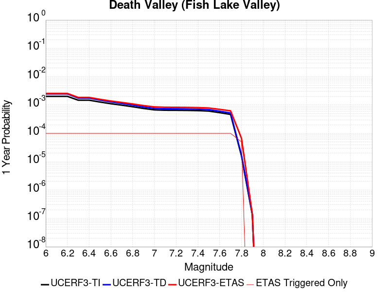 | 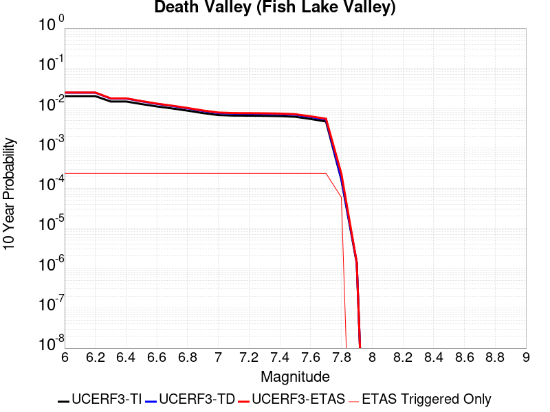 |

| Magnitude | 1 wk TI Prob | 1 wk TD Prob | 1 wk ETAS Prob | 1 wk ETAS/TD Gain | 1 wk ETAS Triggered Only | 1 mo TI Prob | 1 mo TD Prob | 1 mo ETAS Prob | 1 mo ETAS/TD Gain | 1 mo ETAS Triggered Only | 1 yr TI Prob | 1 yr TD Prob | 1 yr ETAS Prob | 1 yr ETAS/TD Gain | 1 yr ETAS Triggered Only | 10 yr TI Prob | 10 yr TD Prob | 10 yr ETAS Prob | 10 yr ETAS/TD Gain | 10 yr ETAS Triggered Only |
|-----|-----|-----|-----|-----|-----|-----|-----|-----|-----|-----|-----|-----|-----|-----|-----|-----|-----|-----|-----|-----|
| 6.0 | 3.872328E-5 | 4.7267185E-5 | 4.7267185E-5 | 1.0 | 0.0 | 1.6594635E-4 | 2.0255962E-4 | 2.0255962E-4 | 1.0 | 0.0 | 0.0020185246 | 0.00246352 | 0.002569264 | 1.0429239 | 1.06005195E-4 | 0.02000288 | 0.02438804 | 0.02459488 | 1.0084811 | 2.1201039E-4 |
| 6.1 | 3.872328E-5 | 4.7267185E-5 | 4.7267185E-5 | 1.0 | 0.0 | 1.6594635E-4 | 2.0255962E-4 | 2.0255962E-4 | 1.0 | 0.0 | 0.0020185246 | 0.00246352 | 0.002569264 | 1.0429239 | 1.06005195E-4 | 0.02000288 | 0.02438804 | 0.02459488 | 1.0084811 | 2.1201039E-4 |
| 6.2 | 3.872328E-5 | 4.7267185E-5 | 4.7267185E-5 | 1.0 | 0.0 | 1.6594635E-4 | 2.0255962E-4 | 2.0255962E-4 | 1.0 | 0.0 | 0.0020185246 | 0.00246352 | 0.002569264 | 1.0429239 | 1.06005195E-4 | 0.02000288 | 0.02438804 | 0.02459488 | 1.0084811 | 2.1201039E-4 |
| 6.3 | 2.8356371E-5 | 3.3609682E-5 | 3.3609682E-5 | 1.0 | 0.0 | 1.2152165E-4 | 1.4403398E-4 | 1.4403398E-4 | 1.0 | 0.0 | 0.0014785219 | 0.0017522823 | 0.0018581017 | 1.0603895 | 1.06005195E-4 | 0.014687235 | 0.017391697 | 0.01760002 | 1.0119783 | 2.1201039E-4 |
| 6.4 | 2.8356371E-5 | 3.3609682E-5 | 3.3609682E-5 | 1.0 | 0.0 | 1.2152165E-4 | 1.4403398E-4 | 1.4403398E-4 | 1.0 | 0.0 | 0.0014785219 | 0.0017522823 | 0.0018581017 | 1.0603895 | 1.06005195E-4 | 0.014687235 | 0.017391697 | 0.01760002 | 1.0119783 | 2.1201039E-4 |
| 6.5 | 2.4448687E-5 | 2.8607421E-5 | 2.8607421E-5 | 1.0 | 0.0 | 1.0477588E-4 | 1.2259776E-4 | 1.2259776E-4 | 1.0 | 0.0 | 0.0012748998 | 0.0014916563 | 0.0015975033 | 1.0709594 | 1.06005195E-4 | 0.012676105 | 0.01482131 | 0.015030177 | 1.0140924 | 2.1201039E-4 |
| 6.6 | 2.1298161E-5 | 2.465998E-5 | 2.465998E-5 | 1.0 | 0.0 | 9.127464E-5 | 1.0568153E-4 | 1.0568153E-4 | 1.0 | 0.0 | 0.0011107022 | 0.001285947 | 0.001391816 | 1.0823276 | 1.06005195E-4 | 0.011051672 | 0.012788472 | 0.012997771 | 1.0163662 | 2.1201039E-4 |
| 6.7 | 1.8959729E-5 | 2.1780937E-5 | 2.1780937E-5 | 1.0 | 0.0 | 8.125345E-5 | 9.334368E-5 | 9.334368E-5 | 1.0 | 0.0 | 9.888117E-4 | 0.0011358924 | 0.0012417772 | 1.0932173 | 1.06005195E-4 | 0.009844234 | 0.0113035245 | 0.011513139 | 1.0185441 | 2.1201039E-4 |
| 6.8 | 1.6691629E-5 | 1.901828E-5 | 1.901828E-5 | 1.0 | 0.0 | 7.153359E-5 | 8.150447E-5 | 8.150447E-5 | 1.0 | 0.0 | 8.7057345E-4 | 9.918819E-4 | 0.001097782 | 1.1067668 | 1.06005195E-4 | 0.008671708 | 0.009876307 | 0.0100862235 | 1.0212545 | 2.1201039E-4 |
| 6.9 | 1.450505E-5 | 1.6389482E-5 | 1.6389482E-5 | 1.0 | 0.0 | 6.216302E-5 | 7.02388E-5 | 7.02388E-5 | 1.0 | 0.0 | 7.5657194E-4 | 8.5483067E-4 | 9.607452E-4 | 1.1239012 | 1.06005195E-4 | 0.007540013 | 0.008516356 | 0.008726561 | 1.0246825 | 2.1201039E-4 |
| 7.0 | 1.2940855E-5 | 1.4537924E-5 | 1.4537924E-5 | 1.0 | 0.0 | 5.545963E-5 | 6.230393E-5 | 6.230393E-5 | 1.0 | 0.0 | 6.750118E-4 | 7.5829215E-4 | 8.64217E-4 | 1.1396886 | 1.06005195E-4 | 0.006729651 | 0.007557665 | 0.007768073 | 1.0278404 | 2.1201039E-4 |
| 7.1 | 1.2544658E-5 | 1.4078161E-5 | 1.4078161E-5 | 1.0 | 0.0 | 5.3761712E-5 | 6.0333616E-5 | 6.0333616E-5 | 1.0 | 0.0 | 6.5435225E-4 | 7.343198E-4 | 8.4024714E-4 | 1.1442523 | 1.06005195E-4 | 0.006524288 | 0.007319527 | 0.0075299856 | 1.028753 | 2.1201039E-4 |
| 7.2 | 1.2489416E-5 | 1.4015628E-5 | 1.4015628E-5 | 1.0 | 0.0 | 5.3524967E-5 | 6.0065628E-5 | 6.0065628E-5 | 1.0 | 0.0 | 6.514716E-4 | 7.3105923E-4 | 8.3698693E-4 | 1.1448961 | 1.06005195E-4 | 0.006495651 | 0.007287136 | 0.007497601 | 1.0288818 | 2.1201039E-4 |
| 7.3 | 1.2368307E-5 | 1.3879767E-5 | 1.3879767E-5 | 1.0 | 0.0 | 5.3005948E-5 | 5.948339E-5 | 5.948339E-5 | 1.0 | 0.0 | 6.451563E-4 | 7.2397524E-4 | 8.299037E-4 | 1.146315 | 1.06005195E-4 | 0.0064328653 | 0.0072167586 | 0.007427239 | 1.0291655 | 2.1201039E-4 |
| 7.4 | 1.2161707E-5 | 1.3647823E-5 | 1.3647823E-5 | 1.0 | 0.0 | 5.212056E-5 | 5.8489393E-5 | 5.8489393E-5 | 1.0 | 0.0 | 6.3438306E-4 | 7.1188126E-4 | 8.17811E-4 | 1.1488025 | 1.06005195E-4 | 0.006325751 | 0.0070965975 | 0.0073071034 | 1.029663 | 2.1201039E-4 |
| 7.5 | 1.1707948E-5 | 1.3145472E-5 | 1.3145472E-5 | 1.0 | 0.0 | 5.0175953E-5 | 5.633655E-5 | 5.633655E-5 | 1.0 | 0.0 | 6.10721E-4 | 6.8568724E-4 | 7.9161976E-4 | 1.154491 | 1.06005195E-4 | 0.0060904534 | 0.006836299 | 0.0070468597 | 1.0308005 | 2.1201039E-4 |
| 7.6 | 1.0319538E-5 | 1.1579585E-5 | 1.1579585E-5 | 1.0 | 0.0 | 4.4225842E-5 | 4.9625876E-5 | 4.9625876E-5 | 1.0 | 0.0 | 5.383166E-4 | 6.040327E-4 | 7.0997386E-4 | 1.1753898 | 1.06005195E-4 | 0.0053701443 | 0.0060244408 | 0.006235174 | 1.0349797 | 2.1201039E-4 |
| 7.7 | 8.937764E-6 | 1.0022746E-5 | 1.0022746E-5 | 1.0 | 0.0 | 3.830414E-5 | 4.295395E-5 | 4.295395E-5 | 1.0 | 0.0 | 4.6625308E-4 | 5.228439E-4 | 6.2879367E-4 | 1.2026414 | 1.06005195E-4 | 0.0046527605 | 0.0052166474 | 0.005427552 | 1.0404291 | 2.1201039E-4 |
| 7.8 | 3.108007E-7 | 3.284649E-7 | 3.284649E-7 | 1.0 | 0.0 | 1.3320023E-6 | 1.407706E-6 | 1.407706E-6 | 1.0 | 0.0 | 1.6217007E-5 | 1.713869E-5 | 7.014038E-5 | 4.092517 | 5.3002597E-5 | 1.6215823E-4 | 1.7137405E-4 | 2.2436757E-4 | 1.3092272 | 5.3002597E-5 |
| 7.9 | 2.5591178E-9 | 2.6696687E-9 | 2.6696687E-9 | 1.0 | 0.0 | 1.0967647E-8 | 1.1441437E-8 | 1.1441437E-8 | 1.0 | 0.0 | 1.335311E-7 | 1.392995E-7 | 1.392995E-7 | 1.0 | 0.0 | 1.3353102E-6 | 1.3929949E-6 | 1.3929949E-6 | 1.0 | 0.0 |

## San Andreas (San Bernardino S)
*[(top)](#table-of-contents)*

| 1 Week | 1 Month | 1 Year | 10 Year |
|-----|-----|-----|-----|
| 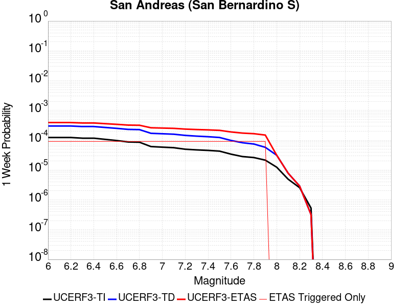 | 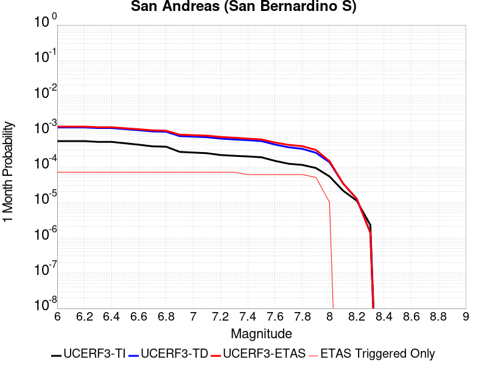 | 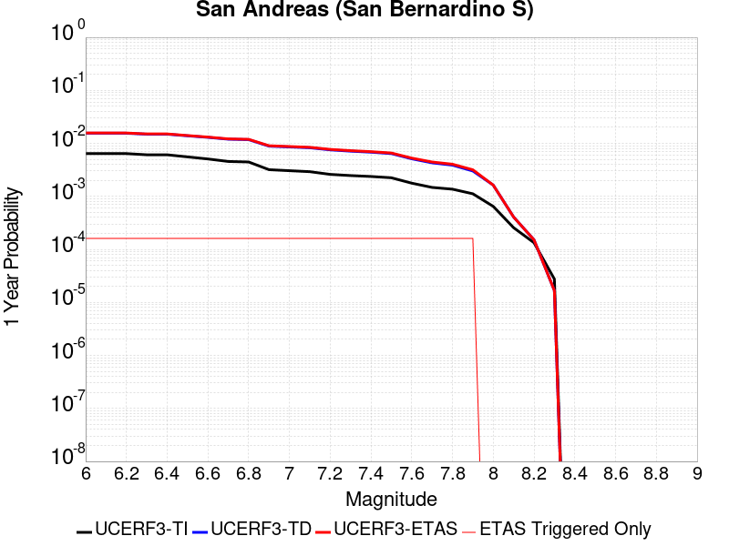 | 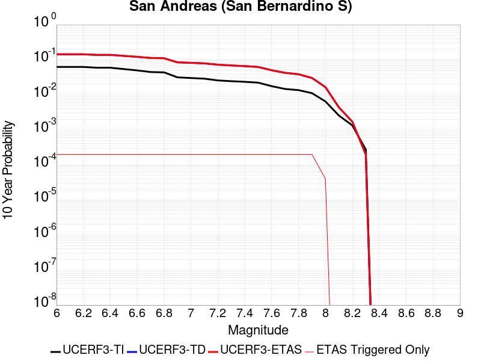 |

| Magnitude | 1 wk TI Prob | 1 wk TD Prob | 1 wk ETAS Prob | 1 wk ETAS/TD Gain | 1 wk ETAS Triggered Only | 1 mo TI Prob | 1 mo TD Prob | 1 mo ETAS Prob | 1 mo ETAS/TD Gain | 1 mo ETAS Triggered Only | 1 yr TI Prob | 1 yr TD Prob | 1 yr ETAS Prob | 1 yr ETAS/TD Gain | 1 yr ETAS Triggered Only | 10 yr TI Prob | 10 yr TD Prob | 10 yr ETAS Prob | 10 yr ETAS/TD Gain | 10 yr ETAS Triggered Only |
|-----|-----|-----|-----|-----|-----|-----|-----|-----|-----|-----|-----|-----|-----|-----|-----|-----|-----|-----|-----|-----|
| 6.0 | 1.2336002E-4 | 3.0003127E-4 | 4.0600466E-4 | 1.3532078 | 1.06005195E-4 | 5.2857865E-4 | 0.0012852408 | 0.0013911097 | 1.0823729 | 1.06005195E-4 | 0.006416472 | 0.015540493 | 0.01564485 | 1.0067152 | 1.06005195E-4 | 0.06234337 | 0.14283332 | 0.14301506 | 1.0012723 | 2.1201039E-4 |
| 6.1 | 1.2336002E-4 | 3.0003127E-4 | 4.0600466E-4 | 1.3532078 | 1.06005195E-4 | 5.2857865E-4 | 0.0012852408 | 0.0013911097 | 1.0823729 | 1.06005195E-4 | 0.006416472 | 0.015540493 | 0.01564485 | 1.0067152 | 1.06005195E-4 | 0.06234337 | 0.14283332 | 0.14301506 | 1.0012723 | 2.1201039E-4 |
| 6.2 | 1.2336002E-4 | 3.0003127E-4 | 4.0600466E-4 | 1.3532078 | 1.06005195E-4 | 5.2857865E-4 | 0.0012852408 | 0.0013911097 | 1.0823729 | 1.06005195E-4 | 0.006416472 | 0.015540493 | 0.01564485 | 1.0067152 | 1.06005195E-4 | 0.06234337 | 0.14283332 | 0.14301506 | 1.0012723 | 2.1201039E-4 |
| 6.3 | 1.1712257E-4 | 2.879145E-4 | 3.9388918E-4 | 1.3680769 | 1.06005195E-4 | 5.018573E-4 | 0.0012333614 | 0.0013392359 | 1.0858423 | 1.06005195E-4 | 0.006093008 | 0.014917629 | 0.015022053 | 1.0070001 | 1.06005195E-4 | 0.059286322 | 0.1375418 | 0.13772465 | 1.0013294 | 2.1201039E-4 |
| 6.4 | 1.1712257E-4 | 2.879145E-4 | 3.9388918E-4 | 1.3680769 | 1.06005195E-4 | 5.018573E-4 | 0.0012333614 | 0.0013392359 | 1.0858423 | 1.06005195E-4 | 0.006093008 | 0.014917629 | 0.015022053 | 1.0070001 | 1.06005195E-4 | 0.059286322 | 0.1375418 | 0.13772465 | 1.0013294 | 2.1201039E-4 |
| 6.5 | 1.0689076E-4 | 2.6804334E-4 | 3.740201E-4 | 1.3953718 | 1.06005195E-4 | 4.5802278E-4 | 0.0011482761 | 0.0012541596 | 1.0922108 | 1.06005195E-4 | 0.0055621783 | 0.013895263 | 0.013999795 | 1.0075228 | 1.06005195E-4 | 0.05425003 | 0.12878914 | 0.12897386 | 1.0014342 | 2.1201039E-4 |
| 6.6 | 9.7648895E-5 | 2.5049172E-4 | 3.5647035E-4 | 1.4230825 | 1.06005195E-4 | 4.1842813E-4 | 0.0010731178 | 0.0011790092 | 1.0986764 | 1.06005195E-4 | 0.005082469 | 0.012991305 | 0.013095934 | 1.0080537 | 1.06005195E-4 | 0.049677886 | 0.12094915 | 0.12113552 | 1.0015409 | 2.1201039E-4 |
| 6.7 | 8.757013E-5 | 2.3119988E-4 | 3.3718057E-4 | 1.4583942 | 1.06005195E-4 | 3.7524657E-4 | 9.905027E-4 | 0.0010964029 | 1.1069156 | 1.06005195E-4 | 0.00455906 | 0.011996774 | 0.012101507 | 1.0087302 | 1.06005195E-4 | 0.04466656 | 0.11225749 | 0.1124457 | 1.0016766 | 2.1201039E-4 |
| 6.8 | 8.562978E-5 | 2.2679876E-4 | 3.3277992E-4 | 1.4672916 | 1.06005195E-4 | 3.6693315E-4 | 9.7165484E-4 | 0.001077557 | 1.1089916 | 1.06005195E-4 | 0.004458263 | 0.011769796 | 0.011874553 | 1.0089005 | 1.06005195E-4 | 0.043698758 | 0.11026781 | 0.110456444 | 1.0017107 | 2.1201039E-4 |
| 6.9 | 6.124075E-5 | 1.7064936E-4 | 2.7663645E-4 | 1.6210812 | 1.06005195E-4 | 2.6243398E-4 | 7.311502E-4 | 8.370779E-4 | 1.1448781 | 1.06005195E-4 | 0.0031904527 | 0.008865628 | 0.008970694 | 1.0118508 | 1.06005195E-4 | 0.031450346 | 0.08417915 | 0.08437331 | 1.0023066 | 2.1201039E-4 |
| 7.0 | 5.8598747E-5 | 1.6493963E-4 | 2.7092735E-4 | 1.6425849 | 1.06005195E-4 | 2.5111332E-4 | 7.0669345E-4 | 8.126237E-4 | 1.1498957 | 1.06005195E-4 | 0.0030530186 | 0.008570245 | 0.0086753415 | 1.012263 | 1.06005195E-4 | 0.03011414 | 0.08149692 | 0.081691645 | 1.0023894 | 2.1201039E-4 |
| 7.1 | 5.613814E-5 | 1.5912524E-4 | 2.6511354E-4 | 1.6660687 | 1.06005195E-4 | 2.4056983E-4 | 6.817878E-4 | 7.877207E-4 | 1.1553752 | 1.06005195E-4 | 0.0029250039 | 0.008269355 | 0.008374483 | 1.0127131 | 1.06005195E-4 | 0.028868021 | 0.07879588 | 0.07899118 | 1.0024786 | 2.1201039E-4 |
| 7.2 | 4.991222E-5 | 1.4519015E-4 | 2.5117994E-4 | 1.7300068 | 1.06005195E-4 | 2.1389198E-4 | 6.220955E-4 | 7.2803476E-4 | 1.1702942 | 1.06005195E-4 | 0.002601025 | 0.007547813 | 0.007653018 | 1.0139384 | 1.06005195E-4 | 0.025707912 | 0.072249845 | 0.07244654 | 1.0027224 | 2.1201039E-4 |
| 7.3 | 4.7410045E-5 | 1.371324E-4 | 2.4312307E-4 | 1.7729075 | 1.06005195E-4 | 2.0317009E-4 | 5.875783E-4 | 6.935212E-4 | 1.1803043 | 1.06005195E-4 | 0.0024707897 | 0.007130386 | 0.0072356355 | 1.0147607 | 1.06005195E-4 | 0.024434982 | 0.06853227 | 0.06872975 | 1.0028815 | 2.1201039E-4 |
| 7.4 | 4.5556746E-5 | 1.3121162E-4 | 2.3720291E-4 | 1.8077888 | 1.06005195E-4 | 1.952286E-4 | 5.6221464E-4 | 6.681602E-4 | 1.1884433 | 1.06005195E-4 | 0.002374317 | 0.006823559 | 0.0069288407 | 1.0154291 | 1.06005195E-4 | 0.023491086 | 0.06578475 | 0.06598281 | 1.0030107 | 2.1201039E-4 |
| 7.5 | 4.3084514E-5 | 1.2356513E-4 | 2.2955723E-4 | 1.8577832 | 1.06005195E-4 | 1.8463485E-4 | 5.2945764E-4 | 6.3540676E-4 | 1.2001086 | 1.06005195E-4 | 0.0022456115 | 0.006427166 | 0.0065324903 | 1.0163873 | 1.06005195E-4 | 0.022230545 | 0.062185578 | 0.062384404 | 1.0031973 | 2.1201039E-4 |
| 7.6 | 3.408608E-5 | 9.834847E-5 | 2.0434323E-4 | 2.077747 | 1.06005195E-4 | 1.4607502E-4 | 4.2142547E-4 | 5.27386E-4 | 1.2514336 | 1.06005195E-4 | 0.0017770125 | 0.00511881 | 0.0052242726 | 1.020603 | 1.06005195E-4 | 0.017628696 | 0.050017312 | 0.05021872 | 1.0040268 | 2.1201039E-4 |
| 7.7 | 2.8315713E-5 | 8.2480474E-5 | 1.8847693E-4 | 2.2851095 | 1.06005195E-4 | 1.2134742E-4 | 3.534399E-4 | 4.5940763E-4 | 1.2998183 | 1.06005195E-4 | 0.0014764034 | 0.004294649 | 0.0044001993 | 1.024577 | 1.06005195E-4 | 0.01466633 | 0.04226858 | 0.042471632 | 1.0048038 | 2.1201039E-4 |
| 7.8 | 2.6222975E-5 | 7.462497E-5 | 1.8062226E-4 | 2.4203997 | 1.06005195E-4 | 1.1237934E-4 | 3.1978212E-4 | 4.2575342E-4 | 1.331386 | 1.06005195E-4 | 0.0013673597 | 0.003886403 | 0.0039919964 | 1.02717 | 1.06005195E-4 | 0.013589768 | 0.038434092 | 0.038637955 | 1.0053042 | 2.1201039E-4 |
| 7.9 | 2.1469694E-5 | 5.7873713E-5 | 1.6387277E-4 | 2.831558 | 1.06005195E-4 | 9.200973E-5 | 2.4800663E-4 | 3.5398552E-4 | 1.4273229 | 1.06005195E-4 | 0.0011196428 | 0.003015303 | 0.0031209886 | 1.0350497 | 1.06005195E-4 | 0.011140184 | 0.03014987 | 0.030355487 | 1.0068198 | 2.1201039E-4 |
| 8.0 | 1.2420249E-5 | 3.1316227E-5 | 3.1316227E-5 | 1.0 | 0.0 | 5.322855E-5 | 1.342055E-4 | 1.342055E-4 | 1.0 | 0.0 | 6.478649E-4 | 0.0016327285 | 0.0016327285 | 1.0 | 0.0 | 0.0064597935 | 0.01652123 | 0.01652123 | 1.0 | 0.0 |
| 8.1 | 4.9197724E-6 | 7.82136E-6 | 7.82136E-6 | 1.0 | 0.0 | 2.1084568E-5 | 3.3519682E-5 | 3.3519682E-5 | 1.0 | 0.0 | 2.566744E-4 | 4.0802584E-4 | 4.0802584E-4 | 1.0 | 0.0 | 0.002563781 | 0.004383873 | 0.004383873 | 1.0 | 0.0 |
| 8.2 | 2.5634774E-6 | 2.9062624E-6 | 2.9062624E-6 | 1.0 | 0.0 | 1.0986286E-5 | 1.2455351E-5 | 1.2455351E-5 | 1.0 | 0.0 | 1.3374983E-4 | 1.5163339E-4 | 1.5163339E-4 | 1.0 | 0.0 | 0.0013366934 | 0.001704734 | 0.001704734 | 1.0 | 0.0 |
| 8.3 | 5.2850464E-7 | 3.2082596E-7 | 3.2082596E-7 | 1.0 | 0.0 | 2.2650179E-6 | 1.3749678E-6 | 1.3749678E-6 | 1.0 | 0.0 | 2.7576245E-5 | 1.6740116E-5 | 1.6740116E-5 | 1.0 | 0.0 | 2.7572823E-4 | 1.9866871E-4 | 1.9866871E-4 | 1.0 | 0.0 |

## Death Valley (No)
*[(top)](#table-of-contents)*

| 1 Week | 1 Month | 1 Year | 10 Year |
|-----|-----|-----|-----|
|  | 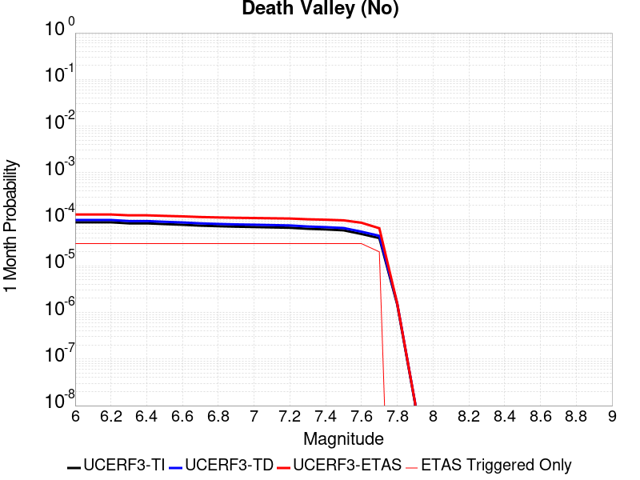 | 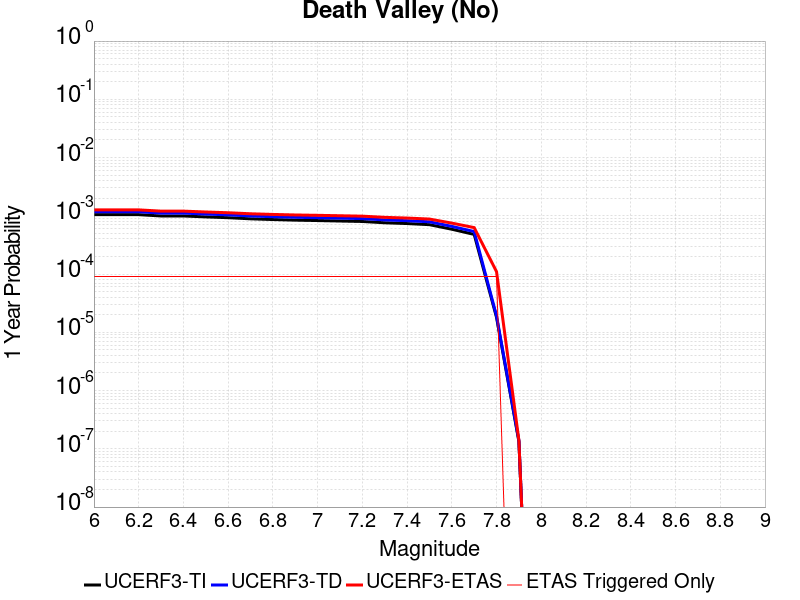 | 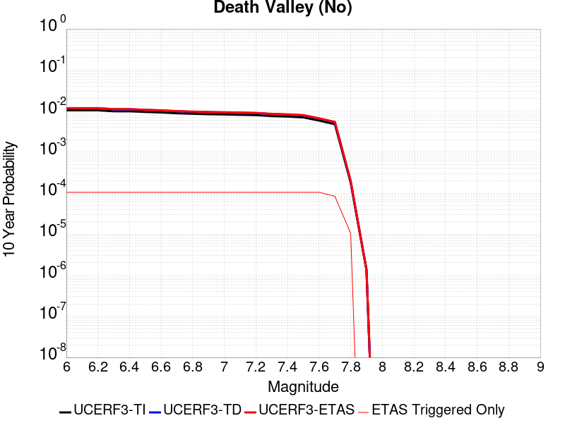 |

| Magnitude | 1 wk TI Prob | 1 wk TD Prob | 1 wk ETAS Prob | 1 wk ETAS/TD Gain | 1 wk ETAS Triggered Only | 1 mo TI Prob | 1 mo TD Prob | 1 mo ETAS Prob | 1 mo ETAS/TD Gain | 1 mo ETAS Triggered Only | 1 yr TI Prob | 1 yr TD Prob | 1 yr ETAS Prob | 1 yr ETAS/TD Gain | 1 yr ETAS Triggered Only | 10 yr TI Prob | 10 yr TD Prob | 10 yr ETAS Prob | 10 yr ETAS/TD Gain | 10 yr ETAS Triggered Only |
|-----|-----|-----|-----|-----|-----|-----|-----|-----|-----|-----|-----|-----|-----|-----|-----|-----|-----|-----|-----|-----|
| 6.0 | 2.0074807E-5 | 2.2500011E-5 | 2.2500011E-5 | 1.0 | 0.0 | 8.603206E-5 | 9.6425094E-5 | 9.6425094E-5 | 1.0 | 0.0 | 0.001046937 | 0.0011733507 | 0.0012792315 | 1.090238 | 1.06005195E-4 | 0.010420183 | 0.011672469 | 0.011882004 | 1.0179513 | 2.1201039E-4 |
| 6.1 | 2.0074807E-5 | 2.2500011E-5 | 2.2500011E-5 | 1.0 | 0.0 | 8.603206E-5 | 9.6425094E-5 | 9.6425094E-5 | 1.0 | 0.0 | 0.001046937 | 0.0011733507 | 0.0012792315 | 1.090238 | 1.06005195E-4 | 0.010420183 | 0.011672469 | 0.011882004 | 1.0179513 | 2.1201039E-4 |
| 6.2 | 2.0074807E-5 | 2.2500011E-5 | 2.2500011E-5 | 1.0 | 0.0 | 8.603206E-5 | 9.6425094E-5 | 9.6425094E-5 | 1.0 | 0.0 | 0.001046937 | 0.0011733507 | 0.0012792315 | 1.090238 | 1.06005195E-4 | 0.010420183 | 0.011672469 | 0.011882004 | 1.0179513 | 2.1201039E-4 |
| 6.3 | 1.9050609E-5 | 2.1336878E-5 | 2.1336878E-5 | 1.0 | 0.0 | 8.164292E-5 | 9.14406E-5 | 9.14406E-5 | 1.0 | 0.0 | 9.935491E-4 | 0.0011127274 | 0.0012186148 | 1.0951601 | 1.06005195E-4 | 0.009891188 | 0.011072383 | 0.011282046 | 1.0189357 | 2.1201039E-4 |
| 6.4 | 1.9050609E-5 | 2.1336878E-5 | 2.1336878E-5 | 1.0 | 0.0 | 8.164292E-5 | 9.14406E-5 | 9.14406E-5 | 1.0 | 0.0 | 9.935491E-4 | 0.0011127274 | 0.0012186148 | 1.0951601 | 1.06005195E-4 | 0.009891188 | 0.011072383 | 0.011282046 | 1.0189357 | 2.1201039E-4 |
| 6.5 | 1.8367004E-5 | 2.0560943E-5 | 2.0560943E-5 | 1.0 | 0.0 | 7.8713354E-5 | 8.811538E-5 | 8.811538E-5 | 1.0 | 0.0 | 9.5791375E-4 | 0.0010722834 | 0.0011781749 | 1.0987533 | 1.06005195E-4 | 0.009537951 | 0.010671882 | 0.01088163 | 1.0196543 | 2.1201039E-4 |
| 6.6 | 1.779439E-5 | 1.9910865E-5 | 1.9910865E-5 | 1.0 | 0.0 | 7.625944E-5 | 8.532952E-5 | 8.532952E-5 | 1.0 | 0.0 | 9.280632E-4 | 0.0010383982 | 0.0011442933 | 1.1019793 | 1.06005195E-4 | 0.009241969 | 0.01033622 | 0.010546039 | 1.0202994 | 2.1201039E-4 |
| 6.7 | 1.7025437E-5 | 1.9043366E-5 | 1.9043366E-5 | 1.0 | 0.0 | 7.296412E-5 | 8.16119E-5 | 8.16119E-5 | 1.0 | 0.0 | 8.87976E-4 | 9.931781E-4 | 0.0010990781 | 1.1066273 | 1.06005195E-4 | 0.008844362 | 0.009888114 | 0.010098028 | 1.0212289 | 2.1201039E-4 |
| 6.8 | 1.6545107E-5 | 1.8512486E-5 | 1.8512486E-5 | 1.0 | 0.0 | 7.090568E-5 | 7.933685E-5 | 7.933685E-5 | 1.0 | 0.0 | 8.629347E-4 | 9.655042E-4 | 0.0010714071 | 1.1096866 | 1.06005195E-4 | 0.008595915 | 0.009613798 | 0.00982377 | 1.0218407 | 2.1201039E-4 |
| 6.9 | 1.615478E-5 | 1.8087536E-5 | 1.8087536E-5 | 1.0 | 0.0 | 6.9232934E-5 | 7.7515746E-5 | 7.7515746E-5 | 1.0 | 0.0 | 8.4258494E-4 | 9.4335165E-4 | 0.0010492568 | 1.1122649 | 1.06005195E-4 | 0.008393973 | 0.009394166 | 0.009604184 | 1.0223563 | 2.1201039E-4 |
| 7.0 | 1.5894311E-5 | 1.7805492E-5 | 1.7805492E-5 | 1.0 | 0.0 | 6.81167E-5 | 7.630706E-5 | 7.630706E-5 | 1.0 | 0.0 | 8.2900526E-4 | 9.286485E-4 | 0.0010345553 | 1.114044 | 1.06005195E-4 | 0.008259195 | 0.0092483675 | 0.009458417 | 1.0227121 | 2.1201039E-4 |
| 7.1 | 1.5602263E-5 | 1.7483448E-5 | 1.7483448E-5 | 1.0 | 0.0 | 6.6865134E-5 | 7.492694E-5 | 7.492694E-5 | 1.0 | 0.0 | 8.137789E-4 | 9.118598E-4 | 0.0010177683 | 1.1161456 | 1.06005195E-4 | 0.008108052 | 0.009081865 | 0.00929195 | 1.0231323 | 2.1201039E-4 |
| 7.2 | 1.5323829E-5 | 1.7170574E-5 | 1.7170574E-5 | 1.0 | 0.0 | 6.56719E-5 | 7.358614E-5 | 7.358614E-5 | 1.0 | 0.0 | 7.99262E-4 | 8.95549E-4 | 0.0010014593 | 1.1182629 | 1.06005195E-4 | 0.007963934 | 0.008920078 | 0.009130198 | 1.0235558 | 2.1201039E-4 |
| 7.3 | 1.4556212E-5 | 1.6302403E-5 | 1.6302403E-5 | 1.0 | 0.0 | 6.238227E-5 | 6.98656E-5 | 6.98656E-5 | 1.0 | 0.0 | 7.592395E-4 | 8.502876E-4 | 9.562027E-4 | 1.1245638 | 1.06005195E-4 | 0.0075665074 | 0.008470987 | 0.008681201 | 1.0248158 | 2.1201039E-4 |
| 7.4 | 1.411725E-5 | 1.580791E-5 | 1.580791E-5 | 1.0 | 0.0 | 6.0501097E-5 | 6.7746456E-5 | 6.7746456E-5 | 1.0 | 0.0 | 7.363519E-4 | 8.245068E-4 | 9.304246E-4 | 1.128462 | 1.06005195E-4 | 0.0073391674 | 0.008215112 | 0.008425381 | 1.0255953 | 2.1201039E-4 |
| 7.5 | 1.3503312E-5 | 1.512624E-5 | 1.512624E-5 | 1.0 | 0.0 | 5.7870053E-5 | 6.4825166E-5 | 6.4825166E-5 | 1.0 | 0.0 | 7.043401E-4 | 7.889664E-4 | 8.9488795E-4 | 1.1342536 | 1.06005195E-4 | 0.007021119 | 0.007862279 | 0.008072623 | 1.0267535 | 2.1201039E-4 |
| 7.6 | 1.1279839E-5 | 1.2626287E-5 | 1.2626287E-5 | 1.0 | 0.0 | 4.834127E-5 | 5.4111566E-5 | 5.4111566E-5 | 1.0 | 0.0 | 5.88396E-4 | 6.5861444E-4 | 7.645498E-4 | 1.1608458 | 1.06005195E-4 | 0.005868405 | 0.006567178 | 0.006777796 | 1.0320714 | 2.1201039E-4 |
| 7.7 | 9.189108E-6 | 1.02833255E-5 | 1.02833255E-5 | 1.0 | 0.0 | 3.93813E-5 | 4.407068E-5 | 4.407068E-5 | 1.0 | 0.0 | 4.7936183E-4 | 5.364335E-4 | 6.423818E-4 | 1.1975051 | 1.06005195E-4 | 0.004783291 | 0.005351897 | 0.0055627725 | 1.039402 | 2.1201039E-4 |
| 7.8 | 3.4586725E-7 | 3.648256E-7 | 3.648256E-7 | 1.0 | 0.0 | 1.4822873E-6 | 1.5635374E-6 | 1.5635374E-6 | 1.0 | 0.0 | 1.80467E-5 | 1.9035906E-5 | 7.2037496E-5 | 3.7842956 | 5.3002597E-5 | 1.8045233E-4 | 1.903432E-4 | 2.433357E-4 | 1.2784051 | 5.3002597E-5 |
| 7.9 | 2.5591178E-9 | 2.6696687E-9 | 2.6696687E-9 | 1.0 | 0.0 | 1.0967647E-8 | 1.1441437E-8 | 1.1441437E-8 | 1.0 | 0.0 | 1.335311E-7 | 1.392995E-7 | 1.392995E-7 | 1.0 | 0.0 | 1.3353102E-6 | 1.3929949E-6 | 1.3929949E-6 | 1.0 | 0.0 |

## Baker
*[(top)](#table-of-contents)*

| 1 Week | 1 Month | 1 Year | 10 Year |
|-----|-----|-----|-----|
| 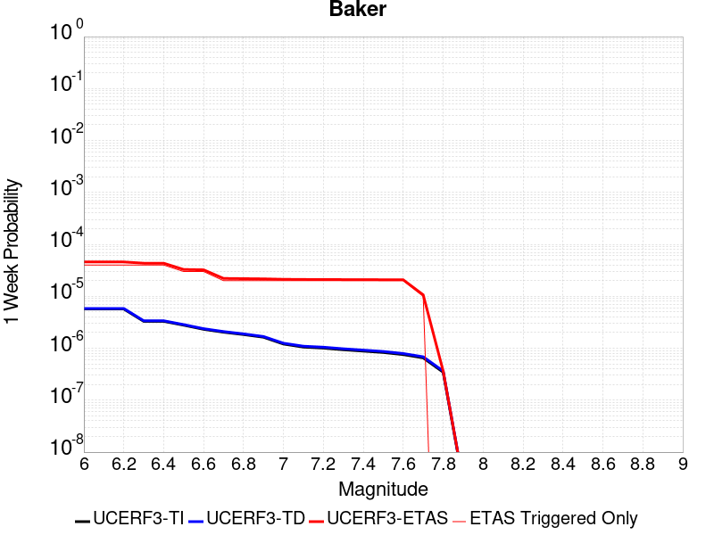 | 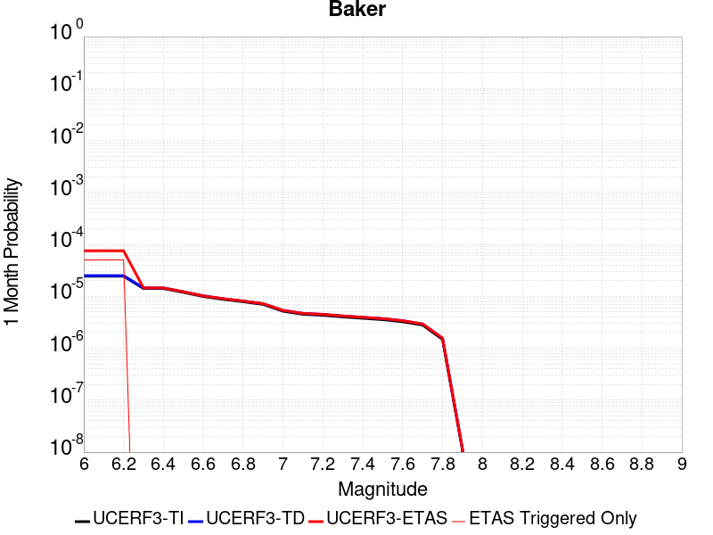 | 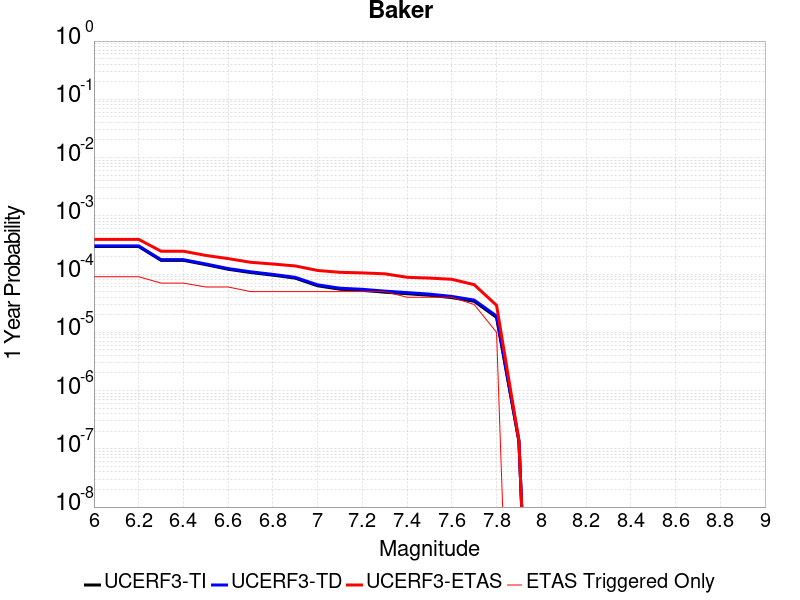 | 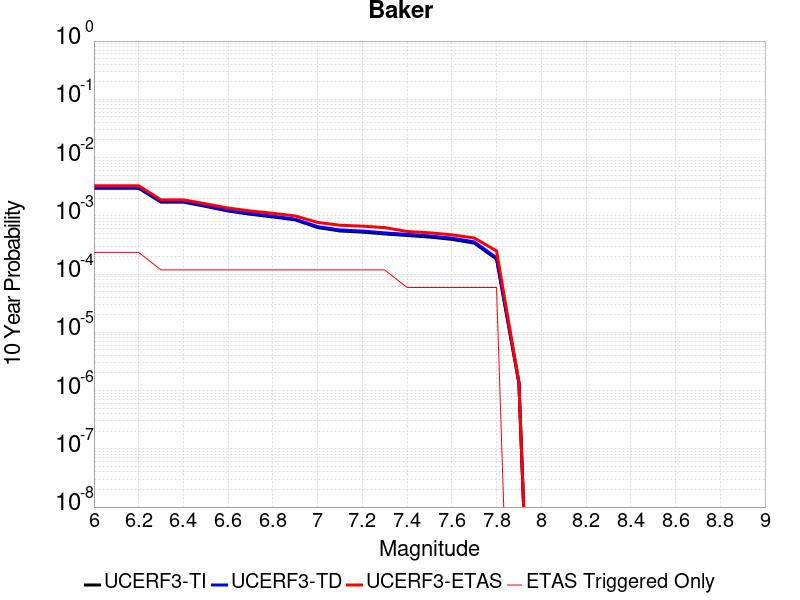 |

| Magnitude | 1 wk TI Prob | 1 wk TD Prob | 1 wk ETAS Prob | 1 wk ETAS/TD Gain | 1 wk ETAS Triggered Only | 1 mo TI Prob | 1 mo TD Prob | 1 mo ETAS Prob | 1 mo ETAS/TD Gain | 1 mo ETAS Triggered Only | 1 yr TI Prob | 1 yr TD Prob | 1 yr ETAS Prob | 1 yr ETAS/TD Gain | 1 yr ETAS Triggered Only | 10 yr TI Prob | 10 yr TD Prob | 10 yr ETAS Prob | 10 yr ETAS/TD Gain | 10 yr ETAS Triggered Only |
|-----|-----|-----|-----|-----|-----|-----|-----|-----|-----|-----|-----|-----|-----|-----|-----|-----|-----|-----|-----|-----|
| 6.0 | 5.695525E-6 | 5.8348332E-6 | 5.8348332E-6 | 1.0 | 0.0 | 2.4409164E-5 | 2.5006211E-5 | 7.8007484E-5 | 3.1195242 | 5.3002597E-5 | 2.9714106E-4 | 3.044121E-4 | 4.6337149E-4 | 1.5221848 | 1.5900779E-4 | 0.0029674405 | 0.0030403468 | 0.0032517125 | 1.0695204 | 2.1201039E-4 |
| 6.1 | 5.695525E-6 | 5.8348332E-6 | 5.8348332E-6 | 1.0 | 0.0 | 2.4409164E-5 | 2.5006211E-5 | 7.8007484E-5 | 3.1195242 | 5.3002597E-5 | 2.9714106E-4 | 3.044121E-4 | 4.6337149E-4 | 1.5221848 | 1.5900779E-4 | 0.0029674405 | 0.0030403468 | 0.0032517125 | 1.0695204 | 2.1201039E-4 |
| 6.2 | 5.695525E-6 | 5.8348332E-6 | 5.8348332E-6 | 1.0 | 0.0 | 2.4409164E-5 | 2.5006211E-5 | 7.8007484E-5 | 3.1195242 | 5.3002597E-5 | 2.9714106E-4 | 3.044121E-4 | 4.6337149E-4 | 1.5221848 | 1.5900779E-4 | 0.0029674405 | 0.0030403468 | 0.0032517125 | 1.0695204 | 2.1201039E-4 |
| 6.3 | 3.2995713E-6 | 3.3836648E-6 | 3.3836648E-6 | 1.0 | 0.0 | 1.4140943E-5 | 1.4501343E-5 | 1.4501343E-5 | 1.0 | 0.0 | 1.7215237E-4 | 1.7654001E-4 | 2.8252648E-4 | 1.6003538 | 1.06005195E-4 | 0.0017201907 | 0.0017640449 | 0.001869863 | 1.0599861 | 1.06005195E-4 |
| 6.4 | 3.2995713E-6 | 3.3836648E-6 | 3.3836648E-6 | 1.0 | 0.0 | 1.4140943E-5 | 1.4501343E-5 | 1.4501343E-5 | 1.0 | 0.0 | 1.7215237E-4 | 1.7654001E-4 | 2.8252648E-4 | 1.6003538 | 1.06005195E-4 | 0.0017201907 | 0.0017640449 | 0.001869863 | 1.0599861 | 1.06005195E-4 |
| 6.5 | 2.782202E-6 | 2.8558384E-6 | 2.8558384E-6 | 1.0 | 0.0 | 1.1923668E-5 | 1.2239252E-5 | 1.2239252E-5 | 1.0 | 0.0 | 1.4516099E-4 | 1.4900303E-4 | 2.5499242E-4 | 1.7113237 | 1.06005195E-4 | 0.001450662 | 0.001489064 | 0.0015949113 | 1.0710832 | 1.06005195E-4 |
| 6.6 | 2.3163404E-6 | 2.3809182E-6 | 2.3809182E-6 | 1.0 | 0.0 | 9.927136E-6 | 1.0203897E-5 | 1.0203897E-5 | 1.0 | 0.0 | 1.20856166E-4 | 1.2422555E-4 | 2.3021759E-4 | 1.8532224 | 1.06005195E-4 | 0.0012079047 | 0.0012415814 | 0.001347455 | 1.0852731 | 1.06005195E-4 |
| 6.7 | 2.037056E-6 | 2.0964987E-6 | 2.0964987E-6 | 1.0 | 0.0 | 8.7302105E-6 | 8.984965E-6 | 8.984965E-6 | 1.0 | 0.0 | 1.0628513E-4 | 1.09386616E-4 | 2.1538022E-4 | 1.9689814 | 1.06005195E-4 | 0.0010623431 | 0.0010933438 | 0.0011992332 | 1.0968491 | 1.06005195E-4 |
| 6.8 | 1.8356744E-6 | 1.8915271E-6 | 1.8915271E-6 | 1.0 | 0.0 | 7.867153E-6 | 8.10652E-6 | 8.10652E-6 | 1.0 | 0.0 | 9.577837E-5 | 9.869256E-5 | 2.0468728E-4 | 2.0739892 | 1.06005195E-4 | 9.57371E-4 | 9.865012E-4 | 0.0010924018 | 1.1073498 | 1.06005195E-4 |
| 6.9 | 1.6310546E-6 | 1.6832057E-6 | 1.6832057E-6 | 1.0 | 0.0 | 6.9902153E-6 | 7.2137195E-6 | 7.2137195E-6 | 1.0 | 0.0 | 8.510255E-5 | 8.782361E-5 | 1.9381949E-4 | 2.2069178 | 1.06005195E-4 | 8.5069967E-4 | 8.779003E-4 | 9.838124E-4 | 1.1206425 | 1.06005195E-4 |
| 7.0 | 1.2058036E-6 | 1.2508652E-6 | 1.2508652E-6 | 1.0 | 0.0 | 5.1677193E-6 | 5.3608405E-6 | 5.3608405E-6 | 1.0 | 0.0 | 6.291517E-5 | 6.52663E-5 | 1.7126458E-4 | 2.624089 | 1.06005195E-4 | 6.289736E-4 | 6.5247365E-4 | 7.584097E-4 | 1.1623607 | 1.06005195E-4 |
| 7.1 | 1.052382E-6 | 1.0951596E-6 | 1.0951596E-6 | 1.0 | 0.0 | 4.5102006E-6 | 4.693533E-6 | 4.693533E-6 | 1.0 | 0.0 | 5.491031E-5 | 5.7142275E-5 | 1.631414E-4 | 2.8550038 | 1.06005195E-4 | 5.4896745E-4 | 5.712767E-4 | 6.7722134E-4 | 1.1854525 | 1.06005195E-4 |
| 7.2 | 1.0067454E-6 | 1.0487698E-6 | 1.0487698E-6 | 1.0 | 0.0 | 4.3146156E-6 | 4.4947205E-6 | 4.4947205E-6 | 1.0 | 0.0 | 5.252918E-5 | 5.4721855E-5 | 1.6072125E-4 | 2.9370577 | 1.06005195E-4 | 5.251676E-4 | 5.4708467E-4 | 6.5303186E-4 | 1.1936578 | 1.06005195E-4 |
| 7.3 | 9.3596316E-7 | 9.767712E-7 | 9.767712E-7 | 1.0 | 0.0 | 4.0112645E-6 | 4.1861554E-6 | 4.1861554E-6 | 1.0 | 0.0 | 4.8836053E-5 | 5.096526E-5 | 1.5696505E-4 | 3.079844 | 1.06005195E-4 | 4.8825322E-4 | 5.095365E-4 | 6.154877E-4 | 1.2079364 | 1.06005195E-4 |
| 7.4 | 8.8117395E-7 | 9.207652E-7 | 9.207652E-7 | 1.0 | 0.0 | 3.7764542E-6 | 3.9461306E-6 | 3.9461306E-6 | 1.0 | 0.0 | 4.5977362E-5 | 4.804309E-5 | 1.01043144E-4 | 2.1031773 | 5.3002597E-5 | 4.596785E-4 | 4.803278E-4 | 5.3330493E-4 | 1.1102937 | 5.3002597E-5 |
| 7.5 | 8.292386E-7 | 8.674585E-7 | 8.674585E-7 | 1.0 | 0.0 | 3.5538749E-6 | 3.717674E-6 | 3.717674E-6 | 1.0 | 0.0 | 4.326757E-5 | 4.526175E-5 | 9.8261946E-5 | 2.1709712 | 5.3002597E-5 | 4.3259145E-4 | 4.5252603E-4 | 5.0550466E-4 | 1.117073 | 5.3002597E-5 |
| 7.6 | 7.553842E-7 | 7.9144604E-7 | 7.9144604E-7 | 1.0 | 0.0 | 3.2373566E-6 | 3.3919073E-6 | 3.3919073E-6 | 1.0 | 0.0 | 3.9414106E-5 | 4.1295694E-5 | 9.4296105E-5 | 2.2834365 | 5.3002597E-5 | 3.9407116E-4 | 4.128809E-4 | 4.6586164E-4 | 1.1283196 | 5.3002597E-5 |
| 7.7 | 6.5285366E-7 | 6.8527874E-7 | 6.8527874E-7 | 1.0 | 0.0 | 2.797941E-6 | 2.9369057E-6 | 2.9369057E-6 | 1.0 | 0.0 | 3.40644E-5 | 3.5756246E-5 | 8.875695E-5 | 2.482278 | 5.3002597E-5 | 3.405918E-4 | 3.575056E-4 | 4.1048924E-4 | 1.1482037 | 5.3002597E-5 |
| 7.8 | 3.4586725E-7 | 3.648256E-7 | 3.648256E-7 | 1.0 | 0.0 | 1.4822873E-6 | 1.5635374E-6 | 1.5635374E-6 | 1.0 | 0.0 | 1.80467E-5 | 1.9035906E-5 | 7.2037496E-5 | 3.7842956 | 5.3002597E-5 | 1.8045233E-4 | 1.903432E-4 | 2.433357E-4 | 1.2784051 | 5.3002597E-5 |
| 7.9 | 2.5591178E-9 | 2.6696687E-9 | 2.6696687E-9 | 1.0 | 0.0 | 1.0967647E-8 | 1.1441437E-8 | 1.1441437E-8 | 1.0 | 0.0 | 1.335311E-7 | 1.392995E-7 | 1.392995E-7 | 1.0 | 0.0 | 1.3353102E-6 | 1.3929949E-6 | 1.3929949E-6 | 1.0 | 0.0 |

## Coyote Lake
*[(top)](#table-of-contents)*

| 1 Week | 1 Month | 1 Year | 10 Year |
|-----|-----|-----|-----|
| 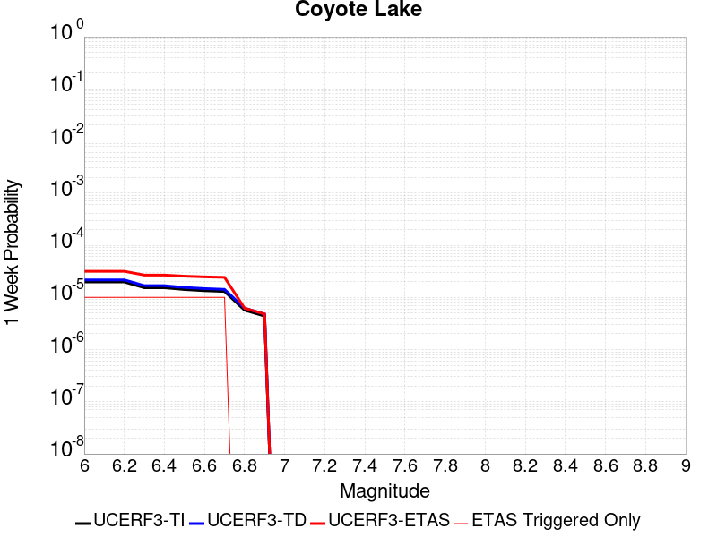 | 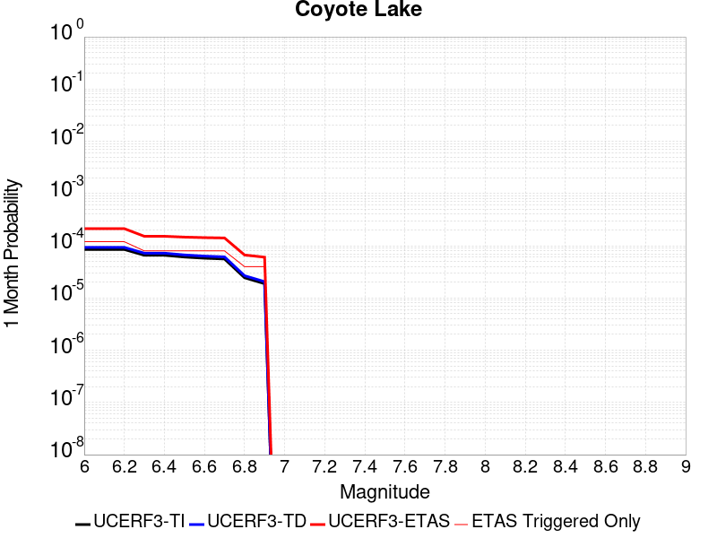 | 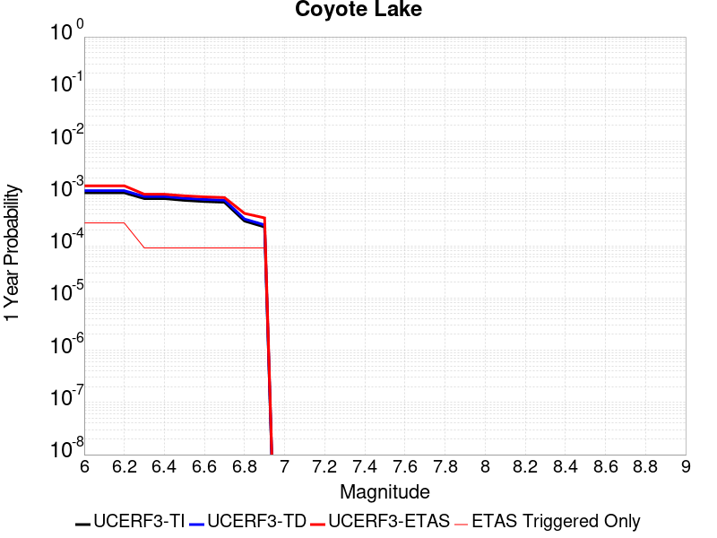 | 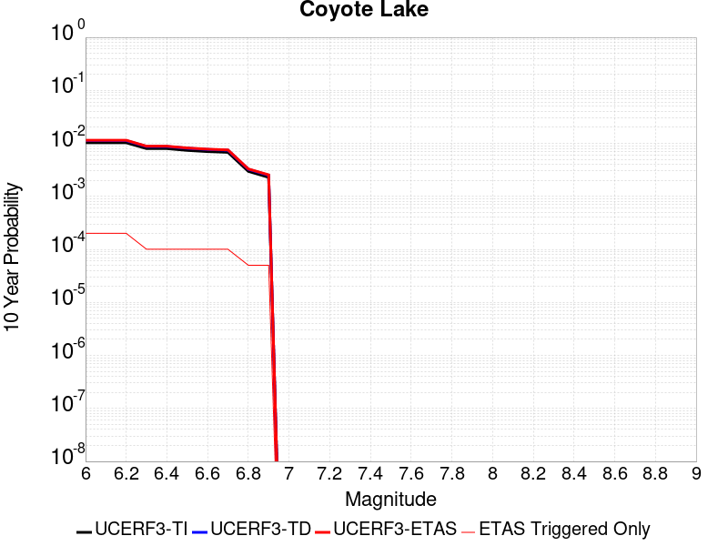 |

| Magnitude | 1 wk TI Prob | 1 wk TD Prob | 1 wk ETAS Prob | 1 wk ETAS/TD Gain | 1 wk ETAS Triggered Only | 1 mo TI Prob | 1 mo TD Prob | 1 mo ETAS Prob | 1 mo ETAS/TD Gain | 1 mo ETAS Triggered Only | 1 yr TI Prob | 1 yr TD Prob | 1 yr ETAS Prob | 1 yr ETAS/TD Gain | 1 yr ETAS Triggered Only | 10 yr TI Prob | 10 yr TD Prob | 10 yr ETAS Prob | 10 yr ETAS/TD Gain | 10 yr ETAS Triggered Only |
|-----|-----|-----|-----|-----|-----|-----|-----|-----|-----|-----|-----|-----|-----|-----|-----|-----|-----|-----|-----|-----|
| 6.0 | 1.980352E-5 | 2.170669E-5 | 2.170669E-5 | 1.0 | 0.0 | 8.486947E-5 | 9.302576E-5 | 2.5201877E-4 | 2.7091289 | 1.5900779E-4 | 0.0010327959 | 0.0011320722 | 0.0013438425 | 1.1870644 | 2.1201039E-4 | 0.010280091 | 0.01127023 | 0.01147985 | 1.0185995 | 2.1201039E-4 |
| 6.1 | 1.980352E-5 | 2.170669E-5 | 2.170669E-5 | 1.0 | 0.0 | 8.486947E-5 | 9.302576E-5 | 2.5201877E-4 | 2.7091289 | 1.5900779E-4 | 0.0010327959 | 0.0011320722 | 0.0013438425 | 1.1870644 | 2.1201039E-4 | 0.010280091 | 0.01127023 | 0.01147985 | 1.0185995 | 2.1201039E-4 |
| 6.2 | 1.980352E-5 | 2.170669E-5 | 2.170669E-5 | 1.0 | 0.0 | 8.486947E-5 | 9.302576E-5 | 2.5201877E-4 | 2.7091289 | 1.5900779E-4 | 0.0010327959 | 0.0011320722 | 0.0013438425 | 1.1870644 | 2.1201039E-4 | 0.010280091 | 0.01127023 | 0.01147985 | 1.0185995 | 2.1201039E-4 |
| 6.3 | 1.5344787E-5 | 1.6820626E-5 | 1.6820626E-5 | 1.0 | 0.0 | 6.576172E-5 | 7.2086754E-5 | 1.780843E-4 | 2.4704165 | 1.06005195E-4 | 8.003548E-4 | 8.77364E-4 | 9.832762E-4 | 1.1207163 | 1.06005195E-4 | 0.007974784 | 0.008745047 | 0.008850125 | 1.0120157 | 1.06005195E-4 |
| 6.4 | 1.5344787E-5 | 1.6820626E-5 | 1.6820626E-5 | 1.0 | 0.0 | 6.576172E-5 | 7.2086754E-5 | 1.780843E-4 | 2.4704165 | 1.06005195E-4 | 8.003548E-4 | 8.77364E-4 | 9.832762E-4 | 1.1207163 | 1.06005195E-4 | 0.007974784 | 0.008745047 | 0.008850125 | 1.0120157 | 1.06005195E-4 |
| 6.5 | 1.4189697E-5 | 1.5557947E-5 | 1.5557947E-5 | 1.0 | 0.0 | 6.081157E-5 | 6.667555E-5 | 1.7267368E-4 | 2.58976 | 1.06005195E-4 | 7.401293E-4 | 8.115328E-4 | 9.17452E-4 | 1.1305174 | 1.06005195E-4 | 0.0073766913 | 0.008091635 | 0.008196782 | 1.0129945 | 1.06005195E-4 |
| 6.6 | 1.3469301E-5 | 1.4771539E-5 | 1.4771539E-5 | 1.0 | 0.0 | 5.7724297E-5 | 6.33054E-5 | 1.6930388E-4 | 2.674399 | 1.06005195E-4 | 7.025667E-4 | 7.7053066E-4 | 8.7645417E-4 | 1.1374682 | 1.06005195E-4 | 0.0070034964 | 0.0076844944 | 0.007789685 | 1.0136887 | 1.06005195E-4 |
| 6.7 | 1.3027966E-5 | 1.4281708E-5 | 1.4281708E-5 | 1.0 | 0.0 | 5.5832945E-5 | 6.120622E-5 | 1.6720493E-4 | 2.731829 | 1.06005195E-4 | 6.7955407E-4 | 7.449907E-4 | 8.5091696E-4 | 1.1421846 | 1.06005195E-4 | 0.006774798 | 0.0074308095 | 0.007536027 | 1.0141597 | 1.06005195E-4 |
| 6.8 | 5.695434E-6 | 6.2244026E-6 | 6.2244026E-6 | 1.0 | 0.0 | 2.4408775E-5 | 2.6675907E-5 | 7.967709E-5 | 2.986856 | 5.3002597E-5 | 2.971363E-4 | 3.2476074E-4 | 3.7774612E-4 | 1.1631521 | 5.3002597E-5 | 0.0029673933 | 0.0032458024 | 0.003298633 | 1.0162766 | 5.3002597E-5 |
| 6.9 | 4.385688E-6 | 4.7930434E-6 | 4.7930434E-6 | 1.0 | 0.0 | 1.879567E-5 | 2.0541615E-5 | 7.3543124E-5 | 3.5802016 | 5.3002597E-5 | 2.2881327E-4 | 2.5009416E-4 | 3.030835E-4 | 1.2118776 | 5.3002597E-5 | 0.002285778 | 0.0025009417 | 0.0025538118 | 1.0211401 | 5.3002597E-5 |

## Red Pass
*[(top)](#table-of-contents)*

| 1 Week | 1 Month | 1 Year | 10 Year |
|-----|-----|-----|-----|
| 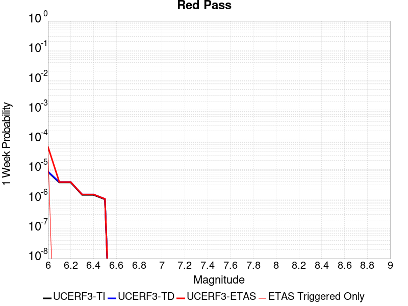 | 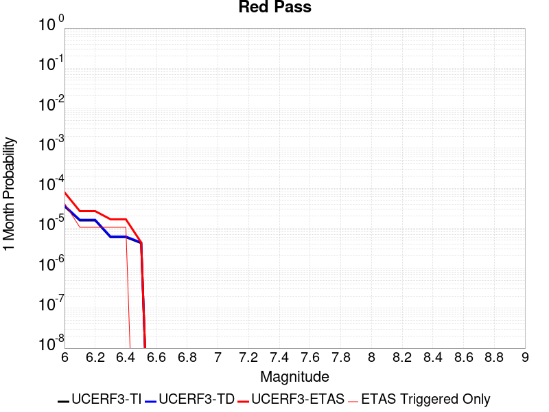 | 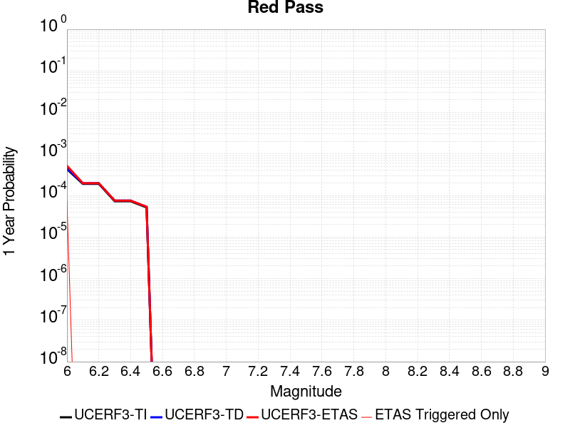 | 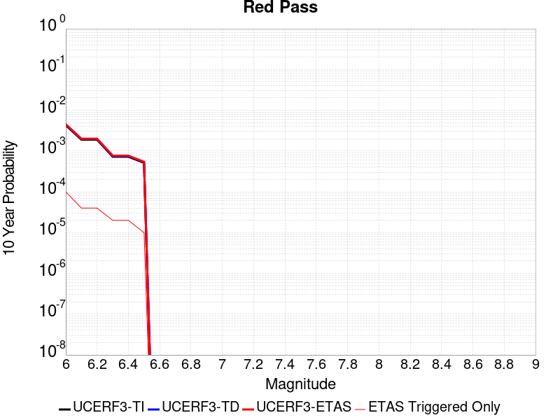 |

| Magnitude | 1 wk TI Prob | 1 wk TD Prob | 1 wk ETAS Prob | 1 wk ETAS/TD Gain | 1 wk ETAS Triggered Only | 1 mo TI Prob | 1 mo TD Prob | 1 mo ETAS Prob | 1 mo ETAS/TD Gain | 1 mo ETAS Triggered Only | 1 yr TI Prob | 1 yr TD Prob | 1 yr ETAS Prob | 1 yr ETAS/TD Gain | 1 yr ETAS Triggered Only | 10 yr TI Prob | 10 yr TD Prob | 10 yr ETAS Prob | 10 yr ETAS/TD Gain | 10 yr ETAS Triggered Only |
|-----|-----|-----|-----|-----|-----|-----|-----|-----|-----|-----|-----|-----|-----|-----|-----|-----|-----|-----|-----|-----|
| 6.0 | 8.258278E-6 | 8.5512565E-6 | 6.15534E-5 | 7.19817 | 5.3002597E-5 | 3.539214E-5 | 3.664783E-5 | 8.9648485E-5 | 2.4462154 | 5.3002597E-5 | 4.308141E-4 | 4.4611385E-4 | 5.520717E-4 | 1.2375132 | 1.06005195E-4 | 0.0042997985 | 0.004453941 | 0.00461224 | 1.0355414 | 1.5900779E-4 |
| 6.1 | 3.649988E-6 | 3.7753127E-6 | 3.7753127E-6 | 1.0 | 0.0 | 1.5642712E-5 | 1.6179838E-5 | 1.6179838E-5 | 1.0 | 0.0 | 1.9043336E-4 | 1.9697649E-4 | 1.9697649E-4 | 1.0 | 0.0 | 0.0019027026 | 0.0019684862 | 0.0019684862 | 1.0 | 0.0 |
| 6.2 | 3.649988E-6 | 3.7753127E-6 | 3.7753127E-6 | 1.0 | 0.0 | 1.5642712E-5 | 1.6179838E-5 | 1.6179838E-5 | 1.0 | 0.0 | 1.9043336E-4 | 1.9697649E-4 | 1.9697649E-4 | 1.0 | 0.0 | 0.0019027026 | 0.0019684862 | 0.0019684862 | 1.0 | 0.0 |
| 6.3 | 1.3924937E-6 | 1.4411153E-6 | 1.4411153E-6 | 1.0 | 0.0 | 5.9678164E-6 | 6.1762016E-6 | 6.1762016E-6 | 1.0 | 0.0 | 7.265574E-5 | 7.5194075E-5 | 7.5194075E-5 | 1.0 | 0.0 | 7.263199E-4 | 7.518251E-4 | 7.518251E-4 | 1.0 | 0.0 |
| 6.4 | 1.3924937E-6 | 1.4411153E-6 | 1.4411153E-6 | 1.0 | 0.0 | 5.9678164E-6 | 6.1762016E-6 | 6.1762016E-6 | 1.0 | 0.0 | 7.265574E-5 | 7.5194075E-5 | 7.5194075E-5 | 1.0 | 0.0 | 7.263199E-4 | 7.518251E-4 | 7.518251E-4 | 1.0 | 0.0 |
| 6.5 | 9.876812E-7 | 1.0221903E-6 | 1.0221903E-6 | 1.0 | 0.0 | 4.2329125E-6 | 4.3808154E-6 | 4.3808154E-6 | 1.0 | 0.0 | 5.153449E-5 | 5.333643E-5 | 5.333643E-5 | 1.0 | 0.0 | 5.1522546E-4 | 5.3336425E-4 | 5.3336425E-4 | 1.0 | 0.0 |

## Santa Rosa Island
*[(top)](#table-of-contents)*

| 1 Week | 1 Month | 1 Year | 10 Year |
|-----|-----|-----|-----|
|  | 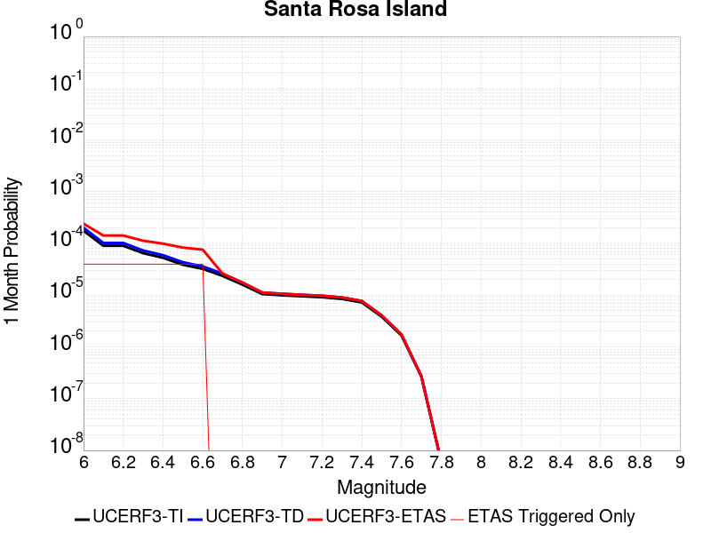 | 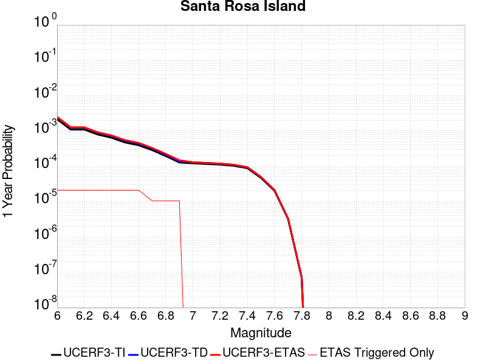 | 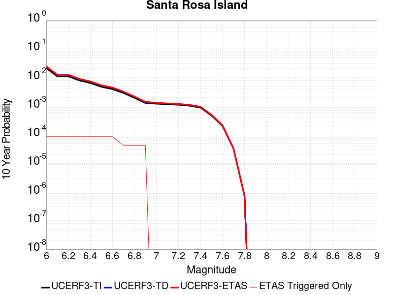 |

| Magnitude | 1 wk TI Prob | 1 wk TD Prob | 1 wk ETAS Prob | 1 wk ETAS/TD Gain | 1 wk ETAS Triggered Only | 1 mo TI Prob | 1 mo TD Prob | 1 mo ETAS Prob | 1 mo ETAS/TD Gain | 1 mo ETAS Triggered Only | 1 yr TI Prob | 1 yr TD Prob | 1 yr ETAS Prob | 1 yr ETAS/TD Gain | 1 yr ETAS Triggered Only | 10 yr TI Prob | 10 yr TD Prob | 10 yr ETAS Prob | 10 yr ETAS/TD Gain | 10 yr ETAS Triggered Only |
|-----|-----|-----|-----|-----|-----|-----|-----|-----|-----|-----|-----|-----|-----|-----|-----|-----|-----|-----|-----|-----|
| 6.0 | 4.1143165E-5 | 4.709095E-5 | 4.709095E-5 | 1.0 | 0.0 | 1.7631594E-4 | 2.0180386E-4 | 2.5479577E-4 | 1.2625911 | 5.3002597E-5 | 0.002144533 | 0.0024543905 | 0.0025601354 | 1.043084 | 1.06005195E-4 | 0.021239553 | 0.024293458 | 0.024396887 | 1.0042576 | 1.06005195E-4 |
| 6.1 | 2.1061249E-5 | 2.3864874E-5 | 2.3864874E-5 | 1.0 | 0.0 | 9.0259375E-5 | 1.02274185E-4 | 1.5527137E-4 | 1.5181872 | 5.3002597E-5 | 0.0010983539 | 0.0012445059 | 0.0013503792 | 1.0850725 | 1.06005195E-4 | 0.01092941 | 0.012378404 | 0.012483098 | 1.0084577 | 1.06005195E-4 |
| 6.2 | 2.1061249E-5 | 2.3864874E-5 | 2.3864874E-5 | 1.0 | 0.0 | 9.0259375E-5 | 1.02274185E-4 | 1.5527137E-4 | 1.5181872 | 5.3002597E-5 | 0.0010983539 | 0.0012445059 | 0.0013503792 | 1.0850725 | 1.06005195E-4 | 0.01092941 | 0.012378404 | 0.012483098 | 1.0084577 | 1.06005195E-4 |
| 6.3 | 1.5158236E-5 | 1.707436E-5 | 1.707436E-5 | 1.0 | 0.0 | 6.496225E-5 | 7.317385E-5 | 1.2617257E-4 | 1.724285 | 5.3002597E-5 | 7.906284E-4 | 8.9053944E-4 | 9.964502E-4 | 1.1189288 | 1.06005195E-4 | 0.007878214 | 0.008870959 | 0.008976025 | 1.0118437 | 1.06005195E-4 |
| 6.4 | 1.2341918E-5 | 1.3852871E-5 | 1.3852871E-5 | 1.0 | 0.0 | 5.2892858E-5 | 5.9368143E-5 | 1.1236759E-4 | 1.8927255 | 5.3002597E-5 | 6.437803E-4 | 7.225755E-4 | 8.2850415E-4 | 1.1465987 | 1.06005195E-4 | 0.006419184 | 0.0072030975 | 0.0073083392 | 1.0146106 | 1.06005195E-4 |
| 6.5 | 9.061158E-6 | 1.0116999E-5 | 1.0116999E-5 | 1.0 | 0.0 | 3.883296E-5 | 4.335788E-5 | 9.635818E-5 | 2.2223914 | 5.3002597E-5 | 4.726887E-4 | 5.277596E-4 | 6.337089E-4 | 1.2007529 | 1.06005195E-4 | 0.004716845 | 0.005265601 | 0.005371048 | 1.0200256 | 1.06005195E-4 |
| 6.6 | 7.5461685E-6 | 8.400708E-6 | 8.400708E-6 | 1.0 | 0.0 | 3.2340322E-5 | 3.6002562E-5 | 8.900325E-5 | 2.4721365 | 5.3002597E-5 | 3.936723E-4 | 4.382473E-4 | 5.4420606E-4 | 1.2417784 | 1.06005195E-4 | 0.003929756 | 0.0043742605 | 0.0044798017 | 1.0241278 | 1.06005195E-4 |
| 6.7 | 5.5023775E-6 | 6.087363E-6 | 6.087363E-6 | 1.0 | 0.0 | 2.3581404E-5 | 2.6088457E-5 | 2.6088457E-5 | 1.0 | 0.0 | 2.8706578E-4 | 3.175839E-4 | 3.7056967E-4 | 1.1668402 | 5.3002597E-5 | 0.0028669522 | 0.0031716223 | 0.003224457 | 1.0166585 | 5.3002597E-5 |
| 6.8 | 3.7351679E-6 | 4.08313E-6 | 4.08313E-6 | 1.0 | 0.0 | 1.6007763E-5 | 1.7499025E-5 | 1.7499025E-5 | 1.0 | 0.0 | 1.948771E-4 | 2.130323E-4 | 2.6602362E-4 | 1.2487477 | 5.3002597E-5 | 0.0019470629 | 0.002128526 | 0.002181416 | 1.0248481 | 5.3002597E-5 |
| 6.9 | 2.456366E-6 | 2.6292655E-6 | 2.6292655E-6 | 1.0 | 0.0 | 1.0527241E-5 | 1.1268233E-5 | 1.1268233E-5 | 1.0 | 0.0 | 1.2816161E-4 | 1.3718211E-4 | 1.9017745E-4 | 1.3863137 | 5.3002597E-5 | 0.0012808773 | 0.0013709773 | 0.0014239072 | 1.0386075 | 5.3002597E-5 |
| 7.0 | 2.3245157E-6 | 2.4827737E-6 | 2.4827737E-6 | 1.0 | 0.0 | 9.962172E-6 | 1.0640416E-5 | 1.0640416E-5 | 1.0 | 0.0 | 1.2128269E-4 | 1.2953937E-4 | 1.2953937E-4 | 1.0 | 0.0 | 0.0012121652 | 0.0012946409 | 0.0012946409 | 1.0 | 0.0 |
| 7.1 | 2.2248344E-6 | 2.3732457E-6 | 2.3732457E-6 | 1.0 | 0.0 | 9.53497E-6 | 1.0171014E-5 | 1.0171014E-5 | 1.0 | 0.0 | 1.1608207E-4 | 1.2382507E-4 | 1.2382507E-4 | 1.0 | 0.0 | 0.0011602144 | 0.0012375627 | 0.0012375627 | 1.0 | 0.0 |
| 7.2 | 2.1350402E-6 | 2.2761499E-6 | 2.2761499E-6 | 1.0 | 0.0 | 9.150141E-6 | 9.754892E-6 | 9.754892E-6 | 1.0 | 0.0 | 1.1139726E-4 | 1.1875935E-4 | 1.1875935E-4 | 1.0 | 0.0 | 0.0011134144 | 0.0011869607 | 0.0011869607 | 1.0 | 0.0 |
| 7.3 | 1.9793572E-6 | 2.1087153E-6 | 2.1087153E-6 | 1.0 | 0.0 | 8.482932E-6 | 9.0373205E-6 | 9.0373205E-6 | 1.0 | 0.0 | 1.032748E-4 | 1.1002384E-4 | 1.1002384E-4 | 1.0 | 0.0 | 0.0010322682 | 0.0010996955 | 0.0010996955 | 1.0 | 0.0 |
| 7.4 | 1.6951194E-6 | 1.8045702E-6 | 1.8045702E-6 | 1.0 | 0.0 | 7.264777E-6 | 7.733849E-6 | 7.733849E-6 | 1.0 | 0.0 | 8.844508E-5 | 9.415556E-5 | 9.415556E-5 | 1.0 | 0.0 | 8.840988E-4 | 9.411584E-4 | 9.411584E-4 | 1.0 | 0.0 |
| 7.5 | 8.987207E-7 | 9.5121993E-7 | 9.5121993E-7 | 1.0 | 0.0 | 3.8516546E-6 | 4.0766504E-6 | 4.0766504E-6 | 1.0 | 0.0 | 4.6892885E-5 | 4.96321E-5 | 4.96321E-5 | 1.0 | 0.0 | 4.688299E-4 | 4.9621135E-4 | 4.9621135E-4 | 1.0 | 0.0 |
| 7.6 | 3.8783037E-7 | 4.052927E-7 | 4.052927E-7 | 1.0 | 0.0 | 1.6621291E-6 | 1.7369675E-6 | 1.7369675E-6 | 1.0 | 0.0 | 2.0236233E-5 | 2.1147382E-5 | 2.1147382E-5 | 1.0 | 0.0 | 2.023439E-4 | 2.1145435E-4 | 2.1145435E-4 | 1.0 | 0.0 |
| 7.7 | 6.181804E-8 | 6.339029E-8 | 6.339029E-8 | 1.0 | 0.0 | 2.6493444E-7 | 2.7167263E-7 | 2.7167263E-7 | 1.0 | 0.0 | 3.225572E-6 | 3.3076094E-6 | 3.3076094E-6 | 1.0 | 0.0 | 3.225525E-5 | 3.307561E-5 | 3.307561E-5 | 1.0 | 0.0 |
| 7.8 | 1.3704449E-9 | 1.3964147E-9 | 1.3964147E-9 | 1.0 | 0.0 | 5.873335E-9 | 5.984634E-9 | 5.984634E-9 | 1.0 | 0.0 | 7.1507856E-8 | 7.286292E-8 | 7.286292E-8 | 1.0 | 0.0 | 7.1507833E-7 | 7.28629E-7 | 7.28629E-7 | 1.0 | 0.0 |

## Elsinore (Glen Ivy) rev
*[(top)](#table-of-contents)*

| 1 Week | 1 Month | 1 Year | 10 Year |
|-----|-----|-----|-----|
| 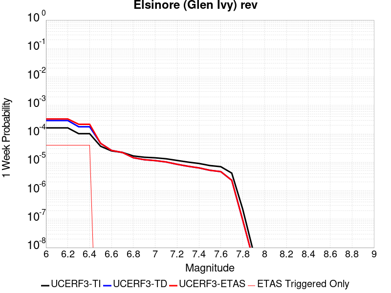 | 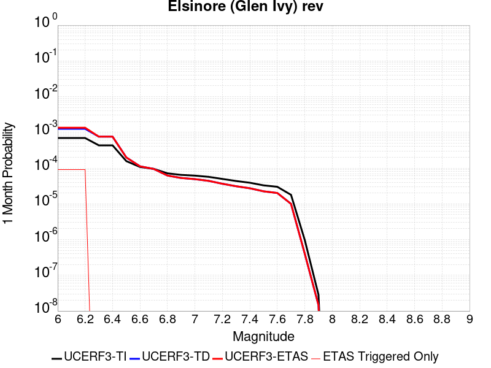 | 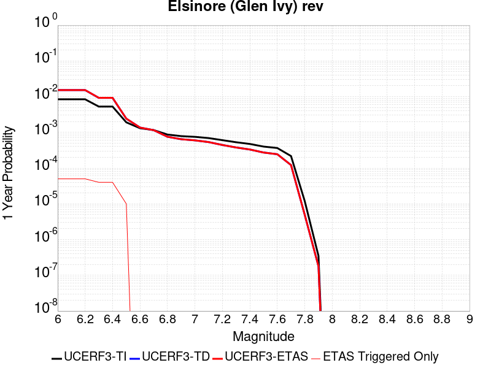 | 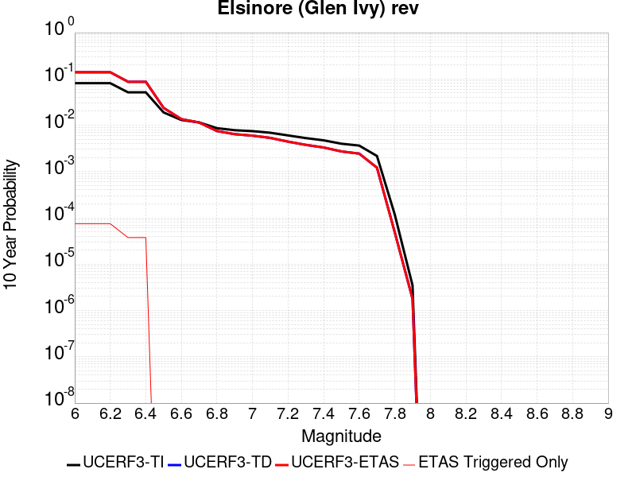 |

| Magnitude | 1 wk TI Prob | 1 wk TD Prob | 1 wk ETAS Prob | 1 wk ETAS/TD Gain | 1 wk ETAS Triggered Only | 1 mo TI Prob | 1 mo TD Prob | 1 mo ETAS Prob | 1 mo ETAS/TD Gain | 1 mo ETAS Triggered Only | 1 yr TI Prob | 1 yr TD Prob | 1 yr ETAS Prob | 1 yr ETAS/TD Gain | 1 yr ETAS Triggered Only | 10 yr TI Prob | 10 yr TD Prob | 10 yr ETAS Prob | 10 yr ETAS/TD Gain | 10 yr ETAS Triggered Only |
|-----|-----|-----|-----|-----|-----|-----|-----|-----|-----|-----|-----|-----|-----|-----|-----|-----|-----|-----|-----|-----|
| 6.0 | 1.6204086E-4 | 2.9360445E-4 | 3.465915E-4 | 1.1804708 | 5.3002597E-5 | 6.94276E-4 | 0.0012578527 | 0.0013637245 | 1.0841687 | 1.06005195E-4 | 0.008420097 | 0.01523435 | 0.01533874 | 1.0068523 | 1.06005195E-4 | 0.081081145 | 0.139691 | 0.13978219 | 1.0006529 | 1.06005195E-4 |
| 6.1 | 1.6204086E-4 | 2.9360445E-4 | 3.465915E-4 | 1.1804708 | 5.3002597E-5 | 6.94276E-4 | 0.0012578527 | 0.0013637245 | 1.0841687 | 1.06005195E-4 | 0.008420097 | 0.01523435 | 0.01533874 | 1.0068523 | 1.06005195E-4 | 0.081081145 | 0.139691 | 0.13978219 | 1.0006529 | 1.06005195E-4 |
| 6.2 | 1.6204086E-4 | 2.9360445E-4 | 3.465915E-4 | 1.1804708 | 5.3002597E-5 | 6.94276E-4 | 0.0012578527 | 0.0013637245 | 1.0841687 | 1.06005195E-4 | 0.008420097 | 0.01523435 | 0.01533874 | 1.0068523 | 1.06005195E-4 | 0.081081145 | 0.139691 | 0.13978219 | 1.0006529 | 1.06005195E-4 |
| 6.3 | 1.0111737E-4 | 1.7703307E-4 | 2.3002629E-4 | 1.2993407 | 5.3002597E-5 | 4.332882E-4 | 7.586092E-4 | 8.115716E-4 | 1.0698152 | 5.3002597E-5 | 0.005262531 | 0.009217643 | 0.009270157 | 1.0056971 | 5.3002597E-5 | 0.0513964 | 0.087018766 | 0.08706715 | 1.0005561 | 5.3002597E-5 |
| 6.4 | 1.0111737E-4 | 1.7703307E-4 | 2.3002629E-4 | 1.2993407 | 5.3002597E-5 | 4.332882E-4 | 7.586092E-4 | 8.115716E-4 | 1.0698152 | 5.3002597E-5 | 0.005262531 | 0.009217643 | 0.009270157 | 1.0056971 | 5.3002597E-5 | 0.0513964 | 0.087018766 | 0.08706715 | 1.0005561 | 5.3002597E-5 |
| 6.5 | 3.6624708E-5 | 4.639072E-5 | 4.639072E-5 | 1.0 | 0.0 | 1.569536E-4 | 1.9880426E-4 | 1.9880426E-4 | 1.0 | 0.0 | 0.001909235 | 0.002418118 | 0.002418118 | 1.0 | 0.0 | 0.01892915 | 0.023739774 | 0.023739774 | 1.0 | 0.0 |
| 6.6 | 2.5051324E-5 | 2.6147469E-5 | 2.6147469E-5 | 1.0 | 0.0 | 1.073584E-4 | 1.1205602E-4 | 1.1205602E-4 | 1.0 | 0.0 | 0.0013063047 | 0.0013634728 | 0.0013634728 | 1.0 | 0.0 | 0.012986525 | 0.01356449 | 0.01356449 | 1.0 | 0.0 |
| 6.7 | 2.2189772E-5 | 2.2072634E-5 | 2.2072634E-5 | 1.0 | 0.0 | 9.509556E-5 | 9.459378E-5 | 9.459378E-5 | 1.0 | 0.0 | 0.0011571734 | 0.0011511071 | 0.0011511071 | 1.0 | 0.0 | 0.011511663 | 0.011465305 | 0.011465305 | 1.0 | 0.0 |
| 6.8 | 1.6654378E-5 | 1.443758E-5 | 1.443758E-5 | 1.0 | 0.0 | 7.137396E-5 | 6.18739E-5 | 6.18739E-5 | 1.0 | 0.0 | 8.686314E-4 | 7.530596E-4 | 7.530596E-4 | 1.0 | 0.0 | 0.008652439 | 0.0075104153 | 0.0075104153 | 1.0 | 0.0 |
| 6.9 | 1.5042909E-5 | 1.2331914E-5 | 1.2331914E-5 | 1.0 | 0.0 | 6.446802E-5 | 5.285001E-5 | 5.285001E-5 | 1.0 | 0.0 | 7.8461546E-4 | 6.4326206E-4 | 6.4326206E-4 | 1.0 | 0.0 | 0.007818509 | 0.006418224 | 0.006418224 | 1.0 | 0.0 |
| 7.0 | 1.4361385E-5 | 1.1451223E-5 | 1.1451223E-5 | 1.0 | 0.0 | 6.154734E-5 | 4.9075763E-5 | 4.9075763E-5 | 1.0 | 0.0 | 7.490812E-4 | 5.973365E-4 | 5.973365E-4 | 1.0 | 0.0 | 0.007465612 | 0.005961301 | 0.005961301 | 1.0 | 0.0 |
| 7.1 | 1.3265571E-5 | 1.0244836E-5 | 1.0244836E-5 | 1.0 | 0.0 | 5.6851208E-5 | 4.390571E-5 | 4.390571E-5 | 1.0 | 0.0 | 6.919436E-4 | 5.3442345E-4 | 5.3442345E-4 | 1.0 | 0.0 | 0.006897931 | 0.0053347396 | 0.0053347396 | 1.0 | 0.0 |
| 7.2 | 1.1596403E-5 | 8.504992E-6 | 8.504992E-6 | 1.0 | 0.0 | 4.9697923E-5 | 3.6449466E-5 | 3.6449466E-5 | 1.0 | 0.0 | 6.049042E-4 | 4.436836E-4 | 4.436836E-4 | 1.0 | 0.0 | 0.006032603 | 0.004429393 | 0.004429393 | 1.0 | 0.0 |
| 7.3 | 1.0150827E-5 | 7.2386983E-6 | 7.2386983E-6 | 1.0 | 0.0 | 4.3502816E-5 | 3.102263E-5 | 3.102263E-5 | 1.0 | 0.0 | 5.2951806E-4 | 3.7763652E-4 | 3.7763652E-4 | 1.0 | 0.0 | 0.005282581 | 0.0037703344 | 0.0037703344 | 1.0 | 0.0 |
| 7.4 | 9.080705E-6 | 6.3524662E-6 | 6.3524662E-6 | 1.0 | 0.0 | 3.8916725E-5 | 2.7224578E-5 | 2.7224578E-5 | 1.0 | 0.0 | 4.7370812E-4 | 3.3141018E-4 | 3.3141018E-4 | 1.0 | 0.0 | 0.004726996 | 0.0033093104 | 0.0033093104 | 1.0 | 0.0 |
| 7.5 | 7.671649E-6 | 5.22559E-6 | 5.22559E-6 | 1.0 | 0.0 | 3.287808E-5 | 2.2395201E-5 | 2.2395201E-5 | 1.0 | 0.0 | 4.0021708E-4 | 2.726287E-4 | 2.726287E-4 | 1.0 | 0.0 | 0.0039949706 | 0.0027230675 | 0.0027230675 | 1.0 | 0.0 |
| 7.6 | 6.990086E-6 | 4.687506E-6 | 4.687506E-6 | 1.0 | 0.0 | 2.9957167E-5 | 2.0089165E-5 | 2.0089165E-5 | 1.0 | 0.0 | 3.6466747E-4 | 2.4455928E-4 | 2.4455928E-4 | 1.0 | 0.0 | 0.0036406964 | 0.002443018 | 0.002443018 | 1.0 | 0.0 |
| 7.7 | 4.163505E-6 | 2.3295113E-6 | 2.3295113E-6 | 1.0 | 0.0 | 1.7843471E-5 | 9.983586E-6 | 9.983586E-6 | 1.0 | 0.0 | 2.172226E-4 | 1.2154412E-4 | 1.2154412E-4 | 1.0 | 0.0 | 0.0021701038 | 0.0012148495 | 0.0012148495 | 1.0 | 0.0 |
| 7.8 | 2.2692414E-7 | 9.385374E-8 | 9.385374E-8 | 1.0 | 0.0 | 9.725317E-7 | 4.0223028E-7 | 4.0223028E-7 | 1.0 | 0.0 | 1.1840509E-5 | 4.897146E-6 | 4.897146E-6 | 1.0 | 0.0 | 1.1839878E-4 | 4.897071E-5 | 4.897071E-5 | 1.0 | 0.0 |
| 7.9 | 6.676829E-9 | 3.439828E-9 | 3.439828E-9 | 1.0 | 0.0 | 2.861498E-8 | 1.47421195E-8 | 1.47421195E-8 | 1.0 | 0.0 | 3.4838732E-7 | 1.7948528E-7 | 1.7948528E-7 | 1.0 | 0.0 | 3.4838679E-6 | 1.7948516E-6 | 1.7948516E-6 | 1.0 | 0.0 |

## Helendale-So Lockhart
*[(top)](#table-of-contents)*

| 1 Week | 1 Month | 1 Year | 10 Year |
|-----|-----|-----|-----|
| 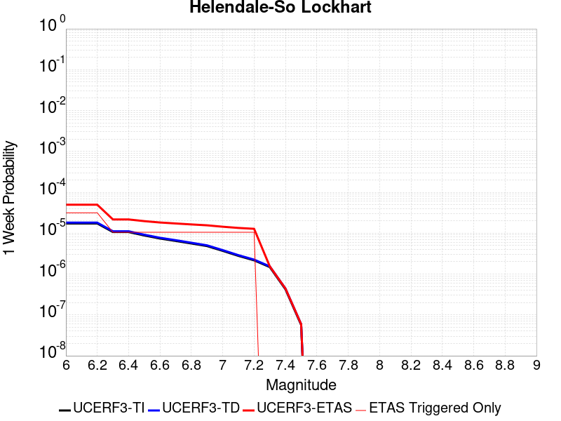 | 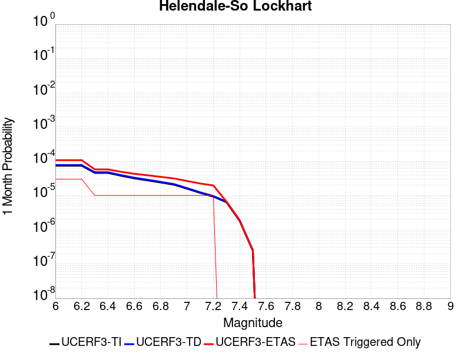 | 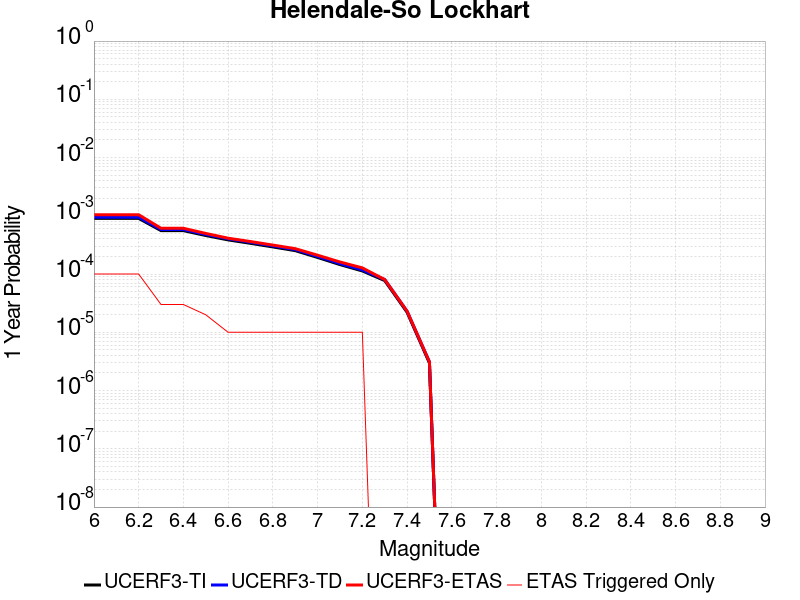 | 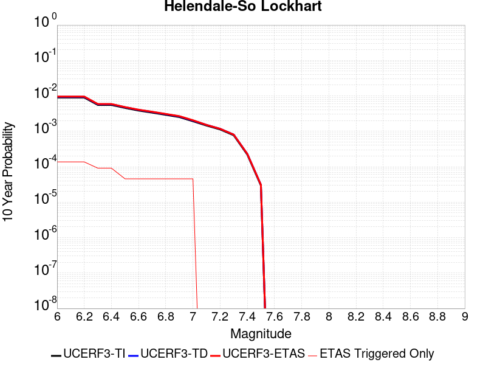 |

| Magnitude | 1 wk TI Prob | 1 wk TD Prob | 1 wk ETAS Prob | 1 wk ETAS/TD Gain | 1 wk ETAS Triggered Only | 1 mo TI Prob | 1 mo TD Prob | 1 mo ETAS Prob | 1 mo ETAS/TD Gain | 1 mo ETAS Triggered Only | 1 yr TI Prob | 1 yr TD Prob | 1 yr ETAS Prob | 1 yr ETAS/TD Gain | 1 yr ETAS Triggered Only | 10 yr TI Prob | 10 yr TD Prob | 10 yr ETAS Prob | 10 yr ETAS/TD Gain | 10 yr ETAS Triggered Only |
|-----|-----|-----|-----|-----|-----|-----|-----|-----|-----|-----|-----|-----|-----|-----|-----|-----|-----|-----|-----|-----|
| 6.0 | 1.7296055E-5 | 1.8103707E-5 | 1.8103707E-5 | 1.0 | 0.0 | 7.412385E-5 | 7.758512E-5 | 7.758512E-5 | 1.0 | 0.0 | 9.0208417E-4 | 9.442103E-4 | 9.971628E-4 | 1.0560813 | 5.3002597E-5 | 0.008984311 | 0.009404104 | 0.009509113 | 1.0111662 | 1.06005195E-4 |
| 6.1 | 1.7296055E-5 | 1.8103707E-5 | 1.8103707E-5 | 1.0 | 0.0 | 7.412385E-5 | 7.758512E-5 | 7.758512E-5 | 1.0 | 0.0 | 9.0208417E-4 | 9.442103E-4 | 9.971628E-4 | 1.0560813 | 5.3002597E-5 | 0.008984311 | 0.009404104 | 0.009509113 | 1.0111662 | 1.06005195E-4 |
| 6.2 | 1.7296055E-5 | 1.8103707E-5 | 1.8103707E-5 | 1.0 | 0.0 | 7.412385E-5 | 7.758512E-5 | 7.758512E-5 | 1.0 | 0.0 | 9.0208417E-4 | 9.442103E-4 | 9.971628E-4 | 1.0560813 | 5.3002597E-5 | 0.008984311 | 0.009404104 | 0.009509113 | 1.0111662 | 1.06005195E-4 |
| 6.3 | 1.0669118E-5 | 1.1135411E-5 | 1.1135411E-5 | 1.0 | 0.0 | 4.5723988E-5 | 4.7722333E-5 | 4.7722333E-5 | 1.0 | 0.0 | 5.5654737E-4 | 5.8086734E-4 | 5.8086734E-4 | 1.0 | 0.0 | 0.0055515557 | 0.0057937866 | 0.0058464822 | 1.0090952 | 5.3002597E-5 |
| 6.4 | 1.0669118E-5 | 1.1135411E-5 | 1.1135411E-5 | 1.0 | 0.0 | 4.5723988E-5 | 4.7722333E-5 | 4.7722333E-5 | 1.0 | 0.0 | 5.5654737E-4 | 5.8086734E-4 | 5.8086734E-4 | 1.0 | 0.0 | 0.0055515557 | 0.0057937866 | 0.0058464822 | 1.0090952 | 5.3002597E-5 |
| 6.5 | 8.790038E-6 | 9.170186E-6 | 9.170186E-6 | 1.0 | 0.0 | 3.767105E-5 | 3.9300216E-5 | 3.9300216E-5 | 1.0 | 0.0 | 4.585485E-4 | 4.783766E-4 | 4.783766E-4 | 1.0 | 0.0 | 0.0045760344 | 0.004773633 | 0.0048263823 | 1.0110502 | 5.3002597E-5 |
| 6.6 | 7.396949E-6 | 7.715528E-6 | 7.715528E-6 | 1.0 | 0.0 | 3.1700827E-5 | 3.3066135E-5 | 3.3066135E-5 | 1.0 | 0.0 | 3.858892E-4 | 4.0250685E-4 | 4.0250685E-4 | 1.0 | 0.0 | 0.003852198 | 0.0040178853 | 0.004070675 | 1.0131387 | 5.3002597E-5 |
| 6.7 | 6.4600285E-6 | 6.7380233E-6 | 6.7380233E-6 | 1.0 | 0.0 | 2.7685543E-5 | 2.8876928E-5 | 2.8876928E-5 | 1.0 | 0.0 | 3.3701936E-4 | 3.5152066E-4 | 3.5152066E-4 | 1.0 | 0.0 | 0.0033650869 | 0.003509728 | 0.0035625445 | 1.0150486 | 5.3002597E-5 |
| 6.8 | 5.600104E-6 | 5.836003E-6 | 5.836003E-6 | 1.0 | 0.0 | 2.4000226E-5 | 2.5011204E-5 | 2.5011204E-5 | 1.0 | 0.0 | 2.9216358E-4 | 3.0446946E-4 | 3.0446946E-4 | 1.0 | 0.0 | 0.0029177975 | 0.0030405847 | 0.003093426 | 1.0173787 | 5.3002597E-5 |
| 6.9 | 4.839122E-6 | 5.039504E-6 | 5.039504E-6 | 1.0 | 0.0 | 2.0738931E-5 | 2.1597696E-5 | 2.1597696E-5 | 1.0 | 0.0 | 2.5246723E-4 | 2.629207E-4 | 2.629207E-4 | 1.0 | 0.0 | 0.002521806 | 0.0026261439 | 0.0026790074 | 1.0201297 | 5.3002597E-5 |
| 7.0 | 3.6937633E-6 | 3.845204E-6 | 3.845204E-6 | 1.0 | 0.0 | 1.5830317E-5 | 1.6479342E-5 | 1.6479342E-5 | 1.0 | 0.0 | 1.9271708E-4 | 2.0061784E-4 | 2.0061784E-4 | 1.0 | 0.0 | 0.0019255003 | 0.0020043987 | 0.002057295 | 1.0263902 | 5.3002597E-5 |
| 7.1 | 2.7858857E-6 | 2.8978507E-6 | 2.8978507E-6 | 1.0 | 0.0 | 1.1939455E-5 | 1.2419302E-5 | 1.2419302E-5 | 1.0 | 0.0 | 1.4535317E-4 | 1.5119473E-4 | 1.5119473E-4 | 1.0 | 0.0 | 0.0014525814 | 0.0015109401 | 0.0015109401 | 1.0 | 0.0 |
| 7.2 | 2.1672065E-6 | 2.2540103E-6 | 2.2540103E-6 | 1.0 | 0.0 | 9.2879945E-6 | 9.66001E-6 | 9.66001E-6 | 1.0 | 0.0 | 1.1307546E-4 | 1.1760445E-4 | 1.1760445E-4 | 1.0 | 0.0 | 0.0011301794 | 0.0011754404 | 0.0011754404 | 1.0 | 0.0 |
| 7.3 | 1.4823496E-6 | 1.5422086E-6 | 1.5422086E-6 | 1.0 | 0.0 | 6.3529114E-6 | 6.6094494E-6 | 6.6094494E-6 | 1.0 | 0.0 | 7.734395E-5 | 8.046723E-5 | 8.046723E-5 | 1.0 | 0.0 | 7.731704E-4 | 8.04396E-4 | 8.04396E-4 | 1.0 | 0.0 |
| 7.4 | 4.2321457E-7 | 4.4108717E-7 | 4.4108717E-7 | 1.0 | 0.0 | 1.8137755E-6 | 1.8903725E-6 | 1.8903725E-6 | 1.0 | 0.0 | 2.2082493E-5 | 2.3015087E-5 | 2.3015087E-5 | 1.0 | 0.0 | 2.2080299E-4 | 2.3013157E-4 | 2.3013157E-4 | 1.0 | 0.0 |
| 7.5 | 5.6942316E-8 | 5.9415576E-8 | 5.9415576E-8 | 1.0 | 0.0 | 2.440385E-7 | 2.5463817E-7 | 2.5463817E-7 | 1.0 | 0.0 | 2.9711643E-6 | 3.1002162E-6 | 3.1002162E-6 | 1.0 | 0.0 | 2.9711247E-5 | 3.1001808E-5 | 3.1001808E-5 | 1.0 | 0.0 |

## Big Pine (East)
*[(top)](#table-of-contents)*

| 1 Week | 1 Month | 1 Year | 10 Year |
|-----|-----|-----|-----|
| 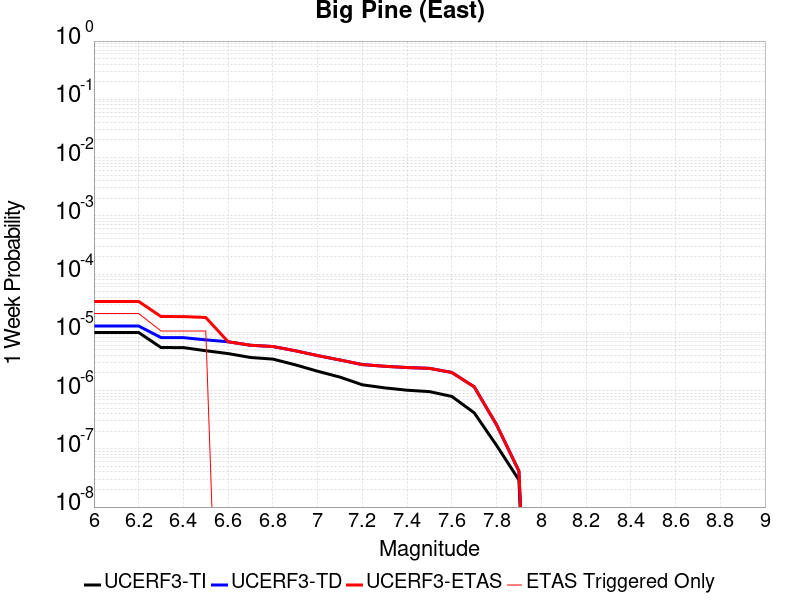 | 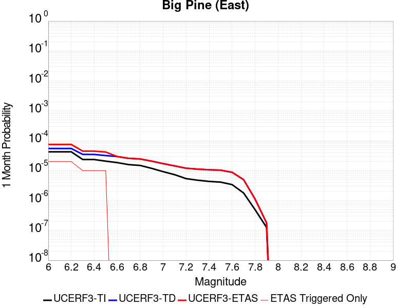 | 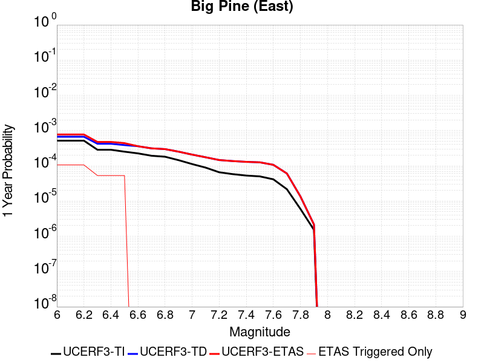 | 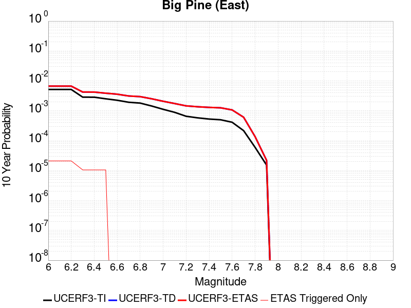 |

| Magnitude | 1 wk TI Prob | 1 wk TD Prob | 1 wk ETAS Prob | 1 wk ETAS/TD Gain | 1 wk ETAS Triggered Only | 1 mo TI Prob | 1 mo TD Prob | 1 mo ETAS Prob | 1 mo ETAS/TD Gain | 1 mo ETAS Triggered Only | 1 yr TI Prob | 1 yr TD Prob | 1 yr ETAS Prob | 1 yr ETAS/TD Gain | 1 yr ETAS Triggered Only | 10 yr TI Prob | 10 yr TD Prob | 10 yr ETAS Prob | 10 yr ETAS/TD Gain | 10 yr ETAS Triggered Only |
|-----|-----|-----|-----|-----|-----|-----|-----|-----|-----|-----|-----|-----|-----|-----|-----|-----|-----|-----|-----|-----|
| 6.0 | 9.916913E-6 | 1.2816734E-5 | 1.1882057E-4 | 9.270737 | 1.06005195E-4 | 4.250036E-5 | 5.4927827E-5 | 1.609272E-4 | 2.9297936 | 1.06005195E-4 | 5.173191E-4 | 6.6856324E-4 | 7.744975E-4 | 1.1584507 | 1.06005195E-4 | 0.0051611643 | 0.0066703134 | 0.0067756115 | 1.015786 | 1.06005195E-4 |
| 6.1 | 9.916913E-6 | 1.2816734E-5 | 1.1882057E-4 | 9.270737 | 1.06005195E-4 | 4.250036E-5 | 5.4927827E-5 | 1.609272E-4 | 2.9297936 | 1.06005195E-4 | 5.173191E-4 | 6.6856324E-4 | 7.744975E-4 | 1.1584507 | 1.06005195E-4 | 0.0051611643 | 0.0066703134 | 0.0067756115 | 1.015786 | 1.06005195E-4 |
| 6.2 | 9.916913E-6 | 1.2816734E-5 | 1.1882057E-4 | 9.270737 | 1.06005195E-4 | 4.250036E-5 | 5.4927827E-5 | 1.609272E-4 | 2.9297936 | 1.06005195E-4 | 5.173191E-4 | 6.6856324E-4 | 7.744975E-4 | 1.1584507 | 1.06005195E-4 | 0.0051611643 | 0.0066703134 | 0.0067756115 | 1.015786 | 1.06005195E-4 |
| 6.3 | 5.479711E-6 | 8.112708E-6 | 6.111488E-5 | 7.533227 | 5.3002597E-5 | 2.3484265E-5 | 3.4768305E-5 | 8.776906E-5 | 2.5243986 | 5.3002597E-5 | 2.858834E-4 | 4.2322508E-4 | 4.7620526E-4 | 1.125182 | 5.3002597E-5 | 0.0028551589 | 0.0042271195 | 0.004279898 | 1.0124857 | 5.3002597E-5 |
| 6.4 | 5.465009E-6 | 8.097002E-6 | 6.109917E-5 | 7.5459003 | 5.3002597E-5 | 2.3421257E-5 | 3.470099E-5 | 8.770175E-5 | 2.5273557 | 5.3002597E-5 | 2.851165E-4 | 4.224059E-4 | 4.753861E-4 | 1.1254249 | 5.3002597E-5 | 0.0028475097 | 0.0042189583 | 0.0042717373 | 1.01251 | 5.3002597E-5 |
| 6.5 | 4.826767E-6 | 7.4220593E-6 | 6.0424263E-5 | 8.141172 | 5.3002597E-5 | 2.068598E-5 | 3.1808453E-5 | 8.480936E-5 | 2.6662524 | 5.3002597E-5 | 2.518227E-4 | 3.8720187E-4 | 4.4018394E-4 | 1.1368332 | 5.3002597E-5 | 0.0025153751 | 0.0038681594 | 0.003920957 | 1.0136492 | 5.3002597E-5 |
| 6.6 | 4.3146847E-6 | 6.881996E-6 | 6.881996E-6 | 1.0 | 0.0 | 1.8491375E-5 | 2.949395E-5 | 2.949395E-5 | 1.0 | 0.0 | 2.2510924E-4 | 3.590321E-4 | 3.590321E-4 | 1.0 | 0.0 | 0.0022488134 | 0.0035873752 | 0.0035873752 | 1.0 | 0.0 |
| 6.7 | 3.6968106E-6 | 5.995246E-6 | 5.995246E-6 | 1.0 | 0.0 | 1.5843378E-5 | 2.5693666E-5 | 2.5693666E-5 | 1.0 | 0.0 | 1.9287605E-4 | 3.12777E-4 | 3.12777E-4 | 1.0 | 0.0 | 0.0019270873 | 0.0031261323 | 0.0031261323 | 1.0 | 0.0 |
| 6.8 | 3.4671132E-6 | 5.7019565E-6 | 5.7019565E-6 | 1.0 | 0.0 | 1.4858972E-5 | 2.4436735E-5 | 2.4436735E-5 | 1.0 | 0.0 | 1.8089297E-4 | 2.9747808E-4 | 2.9747808E-4 | 1.0 | 0.0 | 0.0018074579 | 0.0029735544 | 0.0029735544 | 1.0 | 0.0 |
| 6.9 | 2.7686972E-6 | 4.8250195E-6 | 4.8250195E-6 | 1.0 | 0.0 | 1.1865792E-5 | 2.0678495E-5 | 2.0678495E-5 | 1.0 | 0.0 | 1.4445644E-4 | 2.5173233E-4 | 2.5173233E-4 | 1.0 | 0.0 | 0.0014436257 | 0.0025171598 | 0.0025171598 | 1.0 | 0.0 |
| 7.0 | 2.1472624E-6 | 3.9848555E-6 | 3.9848555E-6 | 1.0 | 0.0 | 9.20252E-6 | 1.7077842E-5 | 1.7077842E-5 | 1.0 | 0.0 | 1.12034926E-4 | 2.0790343E-4 | 2.0790343E-4 | 1.0 | 0.0 | 0.0011197845 | 0.002079745 | 0.002079745 | 1.0 | 0.0 |
| 7.1 | 1.7018335E-6 | 3.3447075E-6 | 3.3447075E-6 | 1.0 | 0.0 | 7.293552E-6 | 1.4334384E-5 | 1.4334384E-5 | 1.0 | 0.0 | 8.879537E-5 | 1.745075E-4 | 1.745075E-4 | 1.0 | 0.0 | 8.87599E-4 | 0.0017463288 | 0.0017463288 | 1.0 | 0.0 |
| 7.2 | 1.25603E-6 | 2.794325E-6 | 2.794325E-6 | 1.0 | 0.0 | 5.3829745E-6 | 1.1975625E-5 | 1.1975625E-5 | 1.0 | 0.0 | 6.553574E-5 | 1.457937E-4 | 1.457937E-4 | 1.0 | 0.0 | 6.551642E-4 | 0.0014595803 | 0.0014595803 | 1.0 | 0.0 |
| 7.3 | 1.112297E-6 | 2.6101818E-6 | 2.6101818E-6 | 1.0 | 0.0 | 4.7669787E-6 | 1.11864465E-5 | 1.11864465E-5 | 1.0 | 0.0 | 5.803642E-5 | 1.3618669E-4 | 1.3618669E-4 | 1.0 | 0.0 | 5.802127E-4 | 0.0013634646 | 0.0013634646 | 1.0 | 0.0 |
| 7.4 | 1.0137181E-6 | 2.483348E-6 | 2.483348E-6 | 1.0 | 0.0 | 4.3444993E-6 | 1.0642877E-5 | 1.0642877E-5 | 1.0 | 0.0 | 5.2892992E-5 | 1.2956954E-4 | 1.2956954E-4 | 1.0 | 0.0 | 5.288041E-4 | 0.0012971561 | 0.0012971561 | 1.0 | 0.0 |
| 7.5 | 9.598608E-7 | 2.4070087E-6 | 2.4070087E-6 | 1.0 | 0.0 | 4.1136827E-6 | 1.0315712E-5 | 1.0315712E-5 | 1.0 | 0.0 | 5.0082934E-5 | 1.2558677E-4 | 1.2558677E-4 | 1.0 | 0.0 | 5.007165E-4 | 0.001257182 | 0.001257182 | 1.0 | 0.0 |
| 7.6 | 7.929459E-7 | 2.0447355E-6 | 2.0447355E-6 | 1.0 | 0.0 | 3.3983351E-6 | 8.763124E-6 | 8.763124E-6 | 1.0 | 0.0 | 4.1373947E-5 | 1.06685984E-4 | 1.06685984E-4 | 1.0 | 0.0 | 4.1366243E-4 | 0.0010684599 | 0.0010684599 | 1.0 | 0.0 |
| 7.7 | 4.155788E-7 | 1.1604716E-6 | 1.1604716E-6 | 1.0 | 0.0 | 1.7810507E-6 | 4.9734404E-6 | 4.9734404E-6 | 1.0 | 0.0 | 2.1684076E-5 | 6.054999E-5 | 6.054999E-5 | 1.0 | 0.0 | 2.1681961E-4 | 6.0852885E-4 | 6.0852885E-4 | 1.0 | 0.0 |
| 7.8 | 1.14666925E-7 | 2.5918186E-7 | 2.5918186E-7 | 1.0 | 0.0 | 4.914296E-7 | 1.110779E-6 | 1.110779E-6 | 1.0 | 0.0 | 5.9831386E-6 | 1.3523654E-5 | 1.3523654E-5 | 1.0 | 0.0 | 5.9829777E-5 | 1.3633117E-4 | 1.3633117E-4 | 1.0 | 0.0 |
| 7.9 | 2.9231824E-8 | 4.1460694E-8 | 4.1460694E-8 | 1.0 | 0.0 | 1.2527924E-7 | 1.7768868E-7 | 1.7768868E-7 | 1.0 | 0.0 | 1.5252737E-6 | 2.1633577E-6 | 2.1633577E-6 | 1.0 | 0.0 | 1.5252632E-5 | 2.1966041E-5 | 2.1966041E-5 | 1.0 | 0.0 |

## Brawley (Seismic Zone) alt 1
*[(top)](#table-of-contents)*

| 1 Week | 1 Month | 1 Year | 10 Year |
|-----|-----|-----|-----|
| 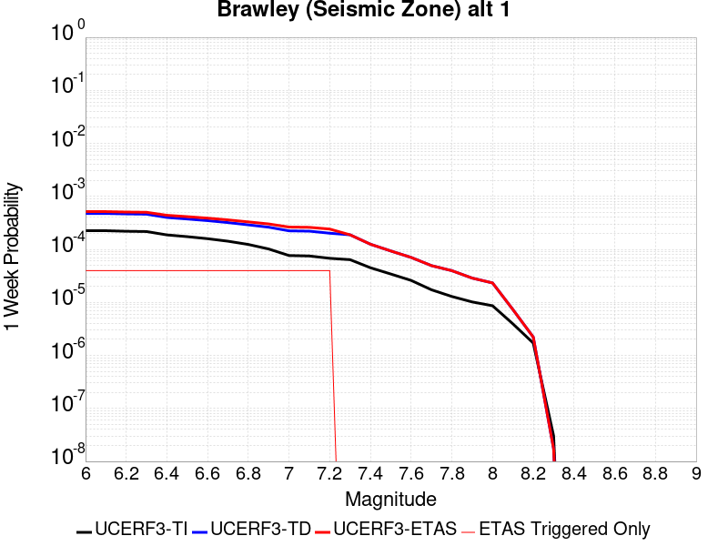 | 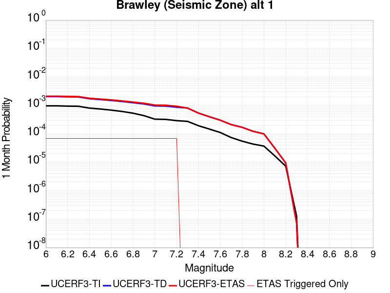 | 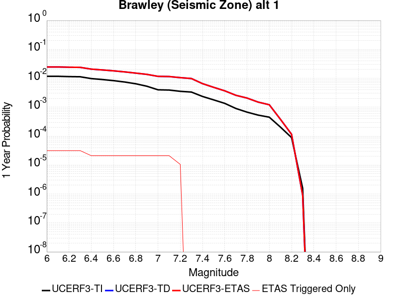 | 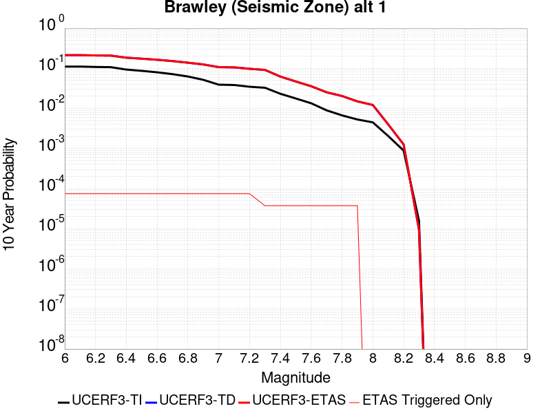 |

| Magnitude | 1 wk TI Prob | 1 wk TD Prob | 1 wk ETAS Prob | 1 wk ETAS/TD Gain | 1 wk ETAS Triggered Only | 1 mo TI Prob | 1 mo TD Prob | 1 mo ETAS Prob | 1 mo ETAS/TD Gain | 1 mo ETAS Triggered Only | 1 yr TI Prob | 1 yr TD Prob | 1 yr ETAS Prob | 1 yr ETAS/TD Gain | 1 yr ETAS Triggered Only | 10 yr TI Prob | 10 yr TD Prob | 10 yr ETAS Prob | 10 yr ETAS/TD Gain | 10 yr ETAS Triggered Only |
|-----|-----|-----|-----|-----|-----|-----|-----|-----|-----|-----|-----|-----|-----|-----|-----|-----|-----|-----|-----|-----|
| 6.0 | 2.2521618E-4 | 4.7625226E-4 | 5.292296E-4 | 1.111238 | 5.3002597E-5 | 9.6485513E-4 | 0.0020395215 | 0.0020924162 | 1.0259348 | 5.3002597E-5 | 0.011683988 | 0.024542542 | 0.024594244 | 1.0021067 | 5.3002597E-5 | 0.11088423 | 0.21347483 | 0.2135582 | 1.0003905 | 1.06005195E-4 |
| 6.1 | 2.2521618E-4 | 4.7625226E-4 | 5.292296E-4 | 1.111238 | 5.3002597E-5 | 9.6485513E-4 | 0.0020395215 | 0.0020924162 | 1.0259348 | 5.3002597E-5 | 0.011683988 | 0.024542542 | 0.024594244 | 1.0021067 | 5.3002597E-5 | 0.11088423 | 0.21347483 | 0.2135582 | 1.0003905 | 1.06005195E-4 |
| 6.2 | 2.198148E-4 | 4.6709873E-4 | 5.2007654E-4 | 1.1134189 | 5.3002597E-5 | 9.417233E-4 | 0.0020003526 | 0.0020532492 | 1.0264436 | 5.3002597E-5 | 0.011405343 | 0.024076827 | 0.024128553 | 1.0021484 | 5.3002597E-5 | 0.10837428 | 0.20991138 | 0.20999514 | 1.000399 | 1.06005195E-4 |
| 6.3 | 2.1704129E-4 | 4.6145564E-4 | 5.144338E-4 | 1.1148065 | 5.3002597E-5 | 9.298453E-4 | 0.0019762046 | 0.0020291025 | 1.0267674 | 5.3002597E-5 | 0.011262234 | 0.023789987 | 0.023841728 | 1.002175 | 5.3002597E-5 | 0.107082725 | 0.2078023 | 0.20788628 | 1.0004041 | 1.06005195E-4 |
| 6.4 | 1.876142E-4 | 4.0037738E-4 | 4.5335875E-4 | 1.1323286 | 5.3002597E-5 | 8.038131E-4 | 0.001714789 | 0.0017677007 | 1.0308561 | 5.3002597E-5 | 0.00974259 | 0.02067674 | 0.020728646 | 1.0025104 | 5.3002597E-5 | 0.093263686 | 0.18455231 | 0.18463875 | 1.0004684 | 1.06005195E-4 |
| 6.5 | 1.7390939E-4 | 3.746997E-4 | 4.2768245E-4 | 1.1414006 | 5.3002597E-5 | 7.45113E-4 | 0.0016048797 | 0.0016577973 | 1.0329729 | 5.3002597E-5 | 0.009034078 | 0.019365085 | 0.019417062 | 1.002684 | 5.3002597E-5 | 0.086755216 | 0.17437433 | 0.17446184 | 1.0005019 | 1.06005195E-4 |
| 6.6 | 1.591791E-4 | 3.4884937E-4 | 4.0183347E-4 | 1.1518825 | 5.3002597E-5 | 6.8201777E-4 | 0.0014942222 | 0.0015471455 | 1.0354187 | 5.3002597E-5 | 0.008271996 | 0.018041968 | 0.018094014 | 1.0028847 | 5.3002597E-5 | 0.07970774 | 0.16378246 | 0.16387111 | 1.0005412 | 1.06005195E-4 |
| 6.7 | 1.4268003E-4 | 3.2051268E-4 | 3.734983E-4 | 1.1653152 | 5.3002597E-5 | 6.1134255E-4 | 0.0013729108 | 0.0014258407 | 1.038553 | 5.3002597E-5 | 0.007417723 | 0.016589044 | 0.016641166 | 1.003142 | 5.3002597E-5 | 0.07174956 | 0.15190692 | 0.15199682 | 1.0005919 | 1.06005195E-4 |
| 6.8 | 1.239713E-4 | 2.904694E-4 | 3.4345663E-4 | 1.1824192 | 5.3002597E-5 | 5.3119735E-4 | 0.0012442812 | 0.0012972178 | 1.042544 | 5.3002597E-5 | 0.0064481674 | 0.015045324 | 0.01509753 | 1.0034698 | 5.3002597E-5 | 0.06264243 | 0.13835184 | 0.13844319 | 1.0006602 | 1.06005195E-4 |
| 6.9 | 1.0180238E-4 | 2.624795E-4 | 3.1546818E-4 | 1.2018775 | 5.3002597E-5 | 4.3622297E-4 | 0.0011244314 | 0.0011773744 | 1.0470842 | 5.3002597E-5 | 0.005298089 | 0.013605019 | 0.013657301 | 1.0038428 | 5.3002597E-5 | 0.05173543 | 0.124936566 | 0.12502933 | 1.0007424 | 1.06005195E-4 |
| 7.0 | 7.6619996E-5 | 2.2393082E-4 | 2.7692155E-4 | 1.2366388 | 5.3002597E-5 | 3.283301E-4 | 9.593537E-4 | 0.0010123055 | 1.0551952 | 5.3002597E-5 | 0.0039900932 | 0.011618287 | 0.011670674 | 1.004509 | 5.3002597E-5 | 0.039192066 | 0.1072422 | 0.107336834 | 1.0008825 | 1.06005195E-4 |
| 7.1 | 7.5127435E-5 | 2.2076255E-4 | 2.7375345E-4 | 1.2400358 | 5.3002597E-5 | 3.2193496E-4 | 9.457853E-4 | 9.987378E-4 | 1.0559878 | 5.3002597E-5 | 0.0039125155 | 0.01145484 | 0.011507236 | 1.0045741 | 5.3002597E-5 | 0.038443442 | 0.10580618 | 0.105900966 | 1.0008959 | 1.06005195E-4 |
| 7.2 | 6.788582E-5 | 2.0204009E-4 | 2.5503198E-4 | 1.262284 | 5.3002597E-5 | 2.9090676E-4 | 8.6560176E-4 | 9.185585E-4 | 1.061179 | 5.3002597E-5 | 0.0035360386 | 0.010488416 | 0.010540863 | 1.0050005 | 5.3002597E-5 | 0.034803 | 0.097476505 | 0.09757218 | 1.0009815 | 1.06005195E-4 |
| 7.3 | 6.399602E-5 | 1.8835113E-4 | 1.8835113E-4 | 1.0 | 0.0 | 2.7423984E-4 | 8.0697227E-4 | 8.0697227E-4 | 1.0 | 0.0 | 0.0033337586 | 0.009781217 | 0.009781217 | 1.0 | 0.0 | 0.03284188 | 0.09137183 | 0.09141999 | 1.000527 | 5.3002597E-5 |
| 7.4 | 4.506759E-5 | 1.2526519E-4 | 1.2526519E-4 | 1.0 | 0.0 | 1.9313251E-4 | 5.367412E-4 | 5.367412E-4 | 1.0 | 0.0 | 0.0023488526 | 0.006515418 | 0.006515418 | 1.0 | 0.0 | 0.023241805 | 0.062352248 | 0.062401947 | 1.000797 | 5.3002597E-5 |
| 7.5 | 3.43289E-5 | 9.334972E-5 | 9.334972E-5 | 1.0 | 0.0 | 1.4711556E-4 | 4.0000922E-4 | 4.0000922E-4 | 1.0 | 0.0 | 0.0017896603 | 0.004859299 | 0.004859299 | 1.0 | 0.0 | 0.01775316 | 0.04705323 | 0.047103737 | 1.0010735 | 5.3002597E-5 |
| 7.6 | 2.5980507E-5 | 7.0527196E-5 | 7.0527196E-5 | 1.0 | 0.0 | 1.1134028E-4 | 3.022245E-4 | 3.022245E-4 | 1.0 | 0.0 | 0.001354725 | 0.0036733993 | 0.0036733993 | 1.0 | 0.0 | 0.013464959 | 0.035839107 | 0.03589021 | 1.0014259 | 5.3002597E-5 |
| 7.7 | 1.7292105E-5 | 4.940404E-5 | 4.940404E-5 | 1.0 | 0.0 | 7.4106916E-5 | 2.1171445E-4 | 2.1171445E-4 | 1.0 | 0.0 | 9.018782E-4 | 0.0025745821 | 0.0025745821 | 1.0 | 0.0 | 0.008982267 | 0.025288915 | 0.025340578 | 1.0020429 | 5.3002597E-5 |
| 7.8 | 1.2927471E-5 | 3.9690432E-5 | 3.9690432E-5 | 1.0 | 0.0 | 5.5402274E-5 | 1.7009077E-4 | 1.7009077E-4 | 1.0 | 0.0 | 6.743139E-4 | 0.002068891 | 0.002068891 | 1.0 | 0.0 | 0.0067227143 | 0.020430436 | 0.020482356 | 1.0025413 | 5.3002597E-5 |
| 7.9 | 1.0200774E-5 | 2.8743396E-5 | 2.8743396E-5 | 1.0 | 0.0 | 4.371687E-5 | 1.2318017E-4 | 1.2318017E-4 | 1.0 | 0.0 | 5.321229E-4 | 0.001498688 | 0.001498688 | 1.0 | 0.0 | 0.005308505 | 0.014990583 | 0.015042791 | 1.0034827 | 5.3002597E-5 |
| 8.0 | 8.650396E-6 | 2.3275401E-5 | 2.3275401E-5 | 1.0 | 0.0 | 3.70726E-5 | 9.974791E-5 | 9.974791E-5 | 1.0 | 0.0 | 4.5126543E-4 | 0.0012137551 | 0.0012137551 | 1.0 | 0.0 | 0.0045035016 | 0.012210181 | 0.012210181 | 1.0 | 0.0 |
| 8.1 | 3.9368224E-6 | 7.3271426E-6 | 7.3271426E-6 | 1.0 | 0.0 | 1.6871985E-5 | 3.1401665E-5 | 3.1401665E-5 | 1.0 | 0.0 | 2.0539707E-4 | 3.822483E-4 | 3.822483E-4 | 1.0 | 0.0 | 0.0020520731 | 0.004000768 | 0.004000768 | 1.0 | 0.0 |
| 8.2 | 1.7101195E-6 | 2.2175473E-6 | 2.2175473E-6 | 1.0 | 0.0 | 7.329063E-6 | 9.50374E-6 | 9.50374E-6 | 1.0 | 0.0 | 8.922769E-5 | 1.1570192E-4 | 1.1570192E-4 | 1.0 | 0.0 | 8.9191867E-4 | 0.0012665088 | 0.0012665088 | 1.0 | 0.0 |
| 8.3 | 3.0346666E-8 | 1.72124E-8 | 1.72124E-8 | 1.0 | 0.0 | 1.3005713E-7 | 7.3767424E-8 | 7.3767424E-8 | 1.0 | 0.0 | 1.5834444E-6 | 8.9811834E-7 | 8.9811834E-7 | 1.0 | 0.0 | 1.5834332E-5 | 9.365885E-6 | 9.365885E-6 | 1.0 | 0.0 |

## San Andreas (San Gorgonio Pass-Garnet HIll)
*[(top)](#table-of-contents)*

| 1 Week | 1 Month | 1 Year | 10 Year |
|-----|-----|-----|-----|
| 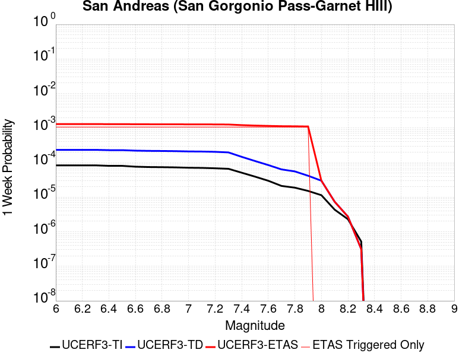 | 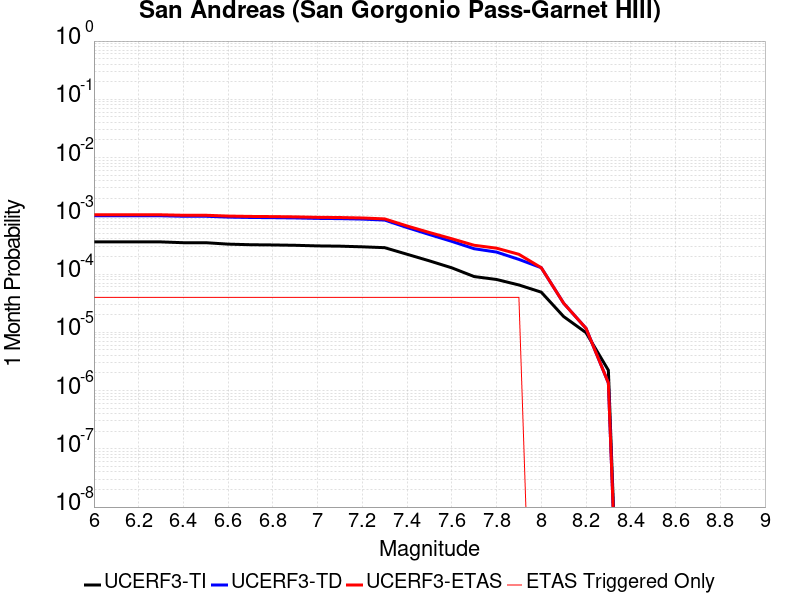 | 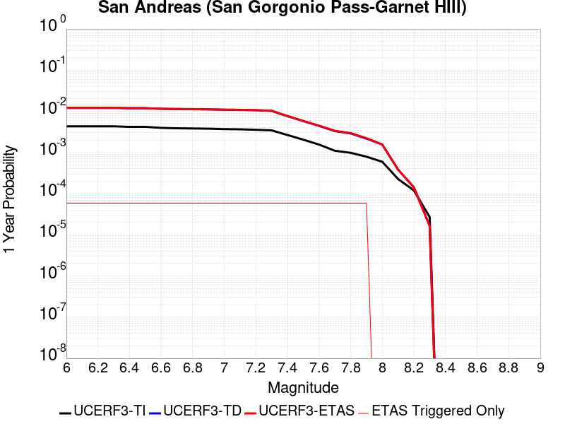 | 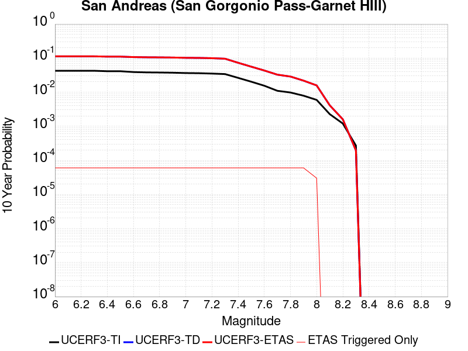 |

| Magnitude | 1 wk TI Prob | 1 wk TD Prob | 1 wk ETAS Prob | 1 wk ETAS/TD Gain | 1 wk ETAS Triggered Only | 1 mo TI Prob | 1 mo TD Prob | 1 mo ETAS Prob | 1 mo ETAS/TD Gain | 1 mo ETAS Triggered Only | 1 yr TI Prob | 1 yr TD Prob | 1 yr ETAS Prob | 1 yr ETAS/TD Gain | 1 yr ETAS Triggered Only | 10 yr TI Prob | 10 yr TD Prob | 10 yr ETAS Prob | 10 yr ETAS/TD Gain | 10 yr ETAS Triggered Only |
|-----|-----|-----|-----|-----|-----|-----|-----|-----|-----|-----|-----|-----|-----|-----|-----|-----|-----|-----|-----|-----|
| 6.0 | 8.31567E-5 | 2.3376173E-4 | 2.8675195E-4 | 1.2266847 | 5.3002597E-5 | 3.5633717E-4 | 0.0010014536 | 0.0010544031 | 1.0528727 | 5.3002597E-5 | 0.004329778 | 0.012124644 | 0.0121770045 | 1.0043185 | 5.3002597E-5 | 0.042463828 | 0.11255409 | 0.11264816 | 1.0008358 | 1.06005195E-4 |
| 6.1 | 8.31567E-5 | 2.3376173E-4 | 2.8675195E-4 | 1.2266847 | 5.3002597E-5 | 3.5633717E-4 | 0.0010014536 | 0.0010544031 | 1.0528727 | 5.3002597E-5 | 0.004329778 | 0.012124644 | 0.0121770045 | 1.0043185 | 5.3002597E-5 | 0.042463828 | 0.11255409 | 0.11264816 | 1.0008358 | 1.06005195E-4 |
| 6.2 | 8.31567E-5 | 2.3376173E-4 | 2.8675195E-4 | 1.2266847 | 5.3002597E-5 | 3.5633717E-4 | 0.0010014536 | 0.0010544031 | 1.0528727 | 5.3002597E-5 | 0.004329778 | 0.012124644 | 0.0121770045 | 1.0043185 | 5.3002597E-5 | 0.042463828 | 0.11255409 | 0.11264816 | 1.0008358 | 1.06005195E-4 |
| 6.3 | 8.31567E-5 | 2.3376173E-4 | 2.8675195E-4 | 1.2266847 | 5.3002597E-5 | 3.5633717E-4 | 0.0010014536 | 0.0010544031 | 1.0528727 | 5.3002597E-5 | 0.004329778 | 0.012124644 | 0.0121770045 | 1.0043185 | 5.3002597E-5 | 0.042463828 | 0.11255409 | 0.11264816 | 1.0008358 | 1.06005195E-4 |
| 6.4 | 8.059055E-5 | 2.2934518E-4 | 2.8233562E-4 | 1.2310511 | 5.3002597E-5 | 3.4534236E-4 | 9.825402E-4 | 0.0010354907 | 1.0538914 | 5.3002597E-5 | 0.0041964394 | 0.011896912 | 0.011949284 | 1.0044022 | 5.3002597E-5 | 0.041180745 | 0.11053528 | 0.110629566 | 1.0008531 | 1.06005195E-4 |
| 6.5 | 8.059055E-5 | 2.2934518E-4 | 2.8233562E-4 | 1.2310511 | 5.3002597E-5 | 3.4534236E-4 | 9.825402E-4 | 0.0010354907 | 1.0538914 | 5.3002597E-5 | 0.0041964394 | 0.011896912 | 0.011949284 | 1.0044022 | 5.3002597E-5 | 0.041180745 | 0.11053528 | 0.110629566 | 1.0008531 | 1.06005195E-4 |
| 6.6 | 7.619237E-5 | 2.2178894E-4 | 2.7477977E-4 | 1.2389246 | 5.3002597E-5 | 3.2649786E-4 | 9.5018005E-4 | 0.0010031323 | 1.0557287 | 5.3002597E-5 | 0.0039678677 | 0.011507631 | 0.011560024 | 1.0045528 | 5.3002597E-5 | 0.03897764 | 0.1070719 | 0.10716655 | 1.000884 | 1.06005195E-4 |
| 6.7 | 7.440636E-5 | 2.1854721E-4 | 2.7153824E-4 | 1.2424694 | 5.3002597E-5 | 3.188454E-4 | 9.36297E-4 | 9.892499E-4 | 1.0565557 | 5.3002597E-5 | 0.0038750346 | 0.0113403695 | 0.011392771 | 1.0046208 | 5.3002597E-5 | 0.038081564 | 0.10558031 | 0.10567512 | 1.000898 | 1.06005195E-4 |
| 6.8 | 7.3735864E-5 | 2.1701894E-4 | 2.7001003E-4 | 1.2441772 | 5.3002597E-5 | 3.1597257E-4 | 9.2975196E-4 | 9.827053E-4 | 1.0569543 | 5.3002597E-5 | 0.0038401815 | 0.011261511 | 0.011313916 | 1.0046536 | 5.3002597E-5 | 0.03774495 | 0.104881845 | 0.10497673 | 1.0009047 | 1.06005195E-4 |
| 6.9 | 7.27575E-5 | 2.1470869E-4 | 2.676999E-4 | 1.2468052 | 5.3002597E-5 | 3.117806E-4 | 9.198579E-4 | 9.728117E-4 | 1.0575675 | 5.3002597E-5 | 0.003789323 | 0.011142288 | 0.0111947 | 1.0047039 | 5.3002597E-5 | 0.037253562 | 0.103829734 | 0.10392474 | 1.0009149 | 1.06005195E-4 |
| 7.0 | 7.102591E-5 | 2.1054916E-4 | 2.635406E-4 | 1.251682 | 5.3002597E-5 | 3.0436125E-4 | 9.020437E-4 | 9.549985E-4 | 1.0587053 | 5.3002597E-5 | 0.003699303 | 0.010927594 | 0.0109800175 | 1.0047973 | 5.3002597E-5 | 0.03638325 | 0.1019319 | 0.1020271 | 1.000934 | 1.06005195E-4 |
| 7.1 | 7.028513E-5 | 2.0890564E-4 | 2.6189716E-4 | 1.2536625 | 5.3002597E-5 | 3.0118722E-4 | 8.950049E-4 | 9.4796007E-4 | 1.0591675 | 5.3002597E-5 | 0.0036607897 | 0.010842753 | 0.0108951805 | 1.0048352 | 5.3002597E-5 | 0.036010686 | 0.10117493 | 0.101270206 | 1.0009418 | 1.06005195E-4 |
| 7.2 | 6.8498244E-5 | 2.0498442E-4 | 2.5797615E-4 | 1.258516 | 5.3002597E-5 | 2.9353087E-4 | 8.782111E-4 | 9.3116716E-4 | 1.0602999 | 5.3002597E-5 | 0.003567883 | 0.010640301 | 0.01069274 | 1.0049284 | 5.3002597E-5 | 0.035111405 | 0.099366926 | 0.0994624 | 1.0009608 | 1.06005195E-4 |
| 7.3 | 6.622592E-5 | 1.9725891E-4 | 2.5025106E-4 | 1.2686425 | 5.3002597E-5 | 2.8379448E-4 | 8.4512355E-4 | 8.980814E-4 | 1.0626628 | 5.3002597E-5 | 0.0034497243 | 0.010241316 | 0.010293776 | 1.0051224 | 5.3002597E-5 | 0.033966612 | 0.09586389 | 0.09595974 | 1.0009998 | 1.06005195E-4 |
| 7.4 | 5.1050705E-5 | 1.468621E-4 | 1.9985692E-4 | 1.3608474 | 5.3002597E-5 | 2.1877038E-4 | 6.292581E-4 | 6.822274E-4 | 1.0841773 | 5.3002597E-5 | 0.002660276 | 0.0076344977 | 0.007687096 | 1.0068895 | 5.3002597E-5 | 0.02628654 | 0.07285113 | 0.07294941 | 1.0013491 | 1.06005195E-4 |
| 7.5 | 3.9302922E-5 | 1.1129282E-4 | 1.6428952E-4 | 1.4761915 | 5.3002597E-5 | 1.6843023E-4 | 4.768824E-4 | 5.298597E-4 | 1.111091 | 5.3002597E-5 | 0.0020487092 | 0.005790656 | 0.0058433516 | 1.0091001 | 5.3002597E-5 | 0.020299247 | 0.05600702 | 0.056107085 | 1.0017867 | 1.06005195E-4 |
| 7.6 | 2.9851626E-5 | 8.494473E-5 | 1.3794283E-4 | 1.6239127 | 5.3002597E-5 | 1.2792926E-4 | 3.6399817E-4 | 4.1698146E-4 | 1.1455593 | 5.3002597E-5 | 0.0015564259 | 0.0044226977 | 0.004475466 | 1.0119312 | 5.3002597E-5 | 0.0154556995 | 0.043191496 | 0.04329292 | 1.0023483 | 1.06005195E-4 |
| 7.7 | 2.1135214E-5 | 6.352455E-5 | 1.1652378E-4 | 1.834311 | 5.3002597E-5 | 9.0576345E-5 | 2.7221968E-4 | 3.2520786E-4 | 1.1946522 | 5.3002597E-5 | 0.0011022091 | 0.0033092434 | 0.0033620705 | 1.0159636 | 5.3002597E-5 | 0.010967582 | 0.03258059 | 0.03268314 | 1.0031476 | 1.06005195E-4 |
| 7.8 | 1.883379E-5 | 5.56362E-5 | 1.08635846E-4 | 1.9526109 | 5.3002597E-5 | 8.0713755E-5 | 2.3841907E-4 | 2.9140903E-4 | 1.2222556 | 5.3002597E-5 | 9.822468E-4 | 0.0028988915 | 0.0029517405 | 1.0182308 | 5.3002597E-5 | 0.0097791655 | 0.02869336 | 0.028796323 | 1.0035884 | 1.06005195E-4 |
| 7.9 | 1.5156185E-5 | 4.165507E-5 | 9.465546E-5 | 2.2723634 | 5.3002597E-5 | 6.495346E-5 | 1.7850952E-4 | 2.3150265E-4 | 1.2968645 | 5.3002597E-5 | 7.9052144E-4 | 0.0021711884 | 0.002224076 | 1.0243587 | 5.3002597E-5 | 0.007877152 | 0.021757882 | 0.021861581 | 1.004766 | 1.06005195E-4 |
| 8.0 | 1.1405907E-5 | 2.9971703E-5 | 2.9971703E-5 | 1.0 | 0.0 | 4.8881542E-5 | 1.2844383E-4 | 1.2844383E-4 | 1.0 | 0.0 | 5.9497025E-4 | 0.001562683 | 0.001562683 | 1.0 | 0.0 | 0.005933798 | 0.015771678 | 0.015771678 | 1.0 | 0.0 |
| 8.1 | 4.3511436E-6 | 7.36832E-6 | 7.36832E-6 | 1.0 | 0.0 | 1.8647626E-5 | 3.1578133E-5 | 3.1578133E-5 | 1.0 | 0.0 | 2.2701119E-4 | 3.8439606E-4 | 3.8439606E-4 | 1.0 | 0.0 | 0.0022677942 | 0.004115886 | 0.004115886 | 1.0 | 0.0 |
| 8.2 | 2.3042528E-6 | 2.7325216E-6 | 2.7325216E-6 | 1.0 | 0.0 | 9.875332E-6 | 1.1710755E-5 | 1.1710755E-5 | 1.0 | 0.0 | 1.2022553E-4 | 1.4256914E-4 | 1.4256914E-4 | 1.0 | 0.0 | 0.0012016051 | 0.0015977593 | 0.0015977593 | 1.0 | 0.0 |
| 8.3 | 5.202968E-7 | 3.1592276E-7 | 3.1592276E-7 | 1.0 | 0.0 | 2.2298414E-6 | 1.3539541E-6 | 1.3539541E-6 | 1.0 | 0.0 | 2.714798E-5 | 1.6484279E-5 | 1.6484279E-5 | 1.0 | 0.0 | 2.7144665E-4 | 1.9559723E-4 | 1.9559723E-4 | 1.0 | 0.0 |

## Lost Hills
*[(top)](#table-of-contents)*

| 1 Week | 1 Month | 1 Year | 10 Year |
|-----|-----|-----|-----|
| 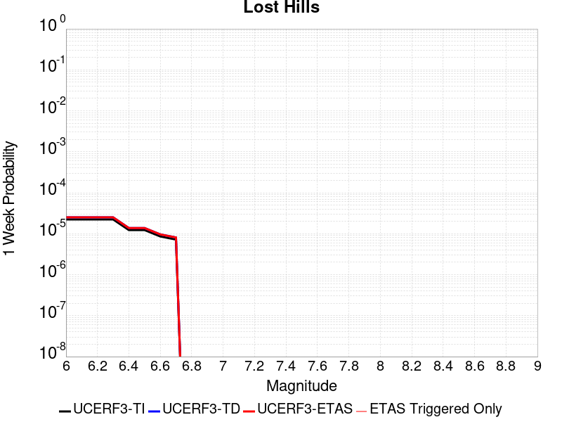 |  | 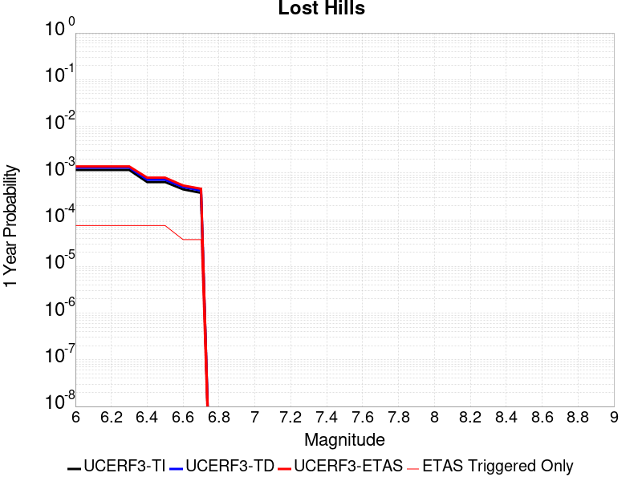 | 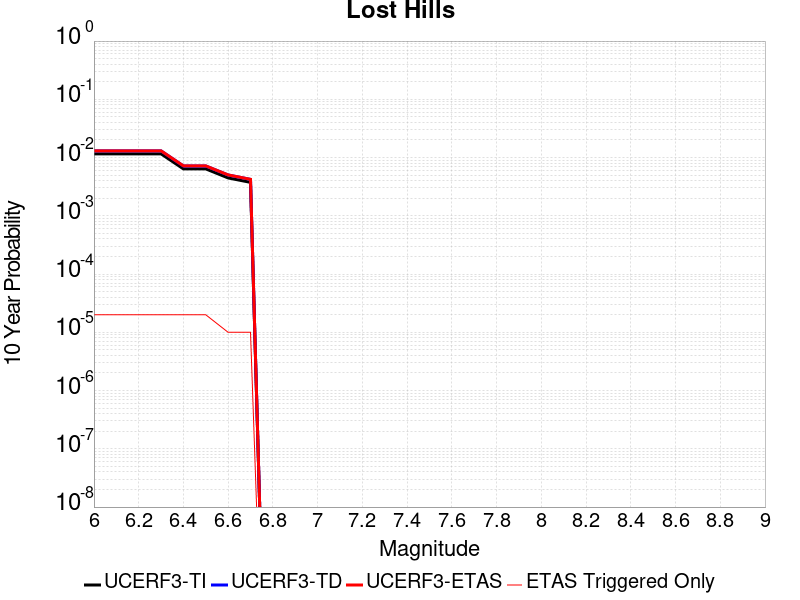 |

| Magnitude | 1 wk TI Prob | 1 wk TD Prob | 1 wk ETAS Prob | 1 wk ETAS/TD Gain | 1 wk ETAS Triggered Only | 1 mo TI Prob | 1 mo TD Prob | 1 mo ETAS Prob | 1 mo ETAS/TD Gain | 1 mo ETAS Triggered Only | 1 yr TI Prob | 1 yr TD Prob | 1 yr ETAS Prob | 1 yr ETAS/TD Gain | 1 yr ETAS Triggered Only | 10 yr TI Prob | 10 yr TD Prob | 10 yr ETAS Prob | 10 yr ETAS/TD Gain | 10 yr ETAS Triggered Only |
|-----|-----|-----|-----|-----|-----|-----|-----|-----|-----|-----|-----|-----|-----|-----|-----|-----|-----|-----|-----|-----|
| 6.0 | 2.233523E-5 | 2.51065E-5 | 7.810777E-5 | 3.1110575 | 5.3002597E-5 | 9.571891E-5 | 1.0759579E-4 | 1.6059268E-4 | 1.4925555 | 5.3002597E-5 | 0.0011647546 | 0.0013093597 | 0.001415226 | 1.0808536 | 1.06005195E-4 | 0.011586686 | 0.013033048 | 0.013137671 | 1.0080276 | 1.06005195E-4 |
| 6.1 | 2.233523E-5 | 2.51065E-5 | 7.810777E-5 | 3.1110575 | 5.3002597E-5 | 9.571891E-5 | 1.0759579E-4 | 1.6059268E-4 | 1.4925555 | 5.3002597E-5 | 0.0011647546 | 0.0013093597 | 0.001415226 | 1.0808536 | 1.06005195E-4 | 0.011586686 | 0.013033048 | 0.013137671 | 1.0080276 | 1.06005195E-4 |
| 6.2 | 2.233523E-5 | 2.51065E-5 | 7.810777E-5 | 3.1110575 | 5.3002597E-5 | 9.571891E-5 | 1.0759579E-4 | 1.6059268E-4 | 1.4925555 | 5.3002597E-5 | 0.0011647546 | 0.0013093597 | 0.001415226 | 1.0808536 | 1.06005195E-4 | 0.011586686 | 0.013033048 | 0.013137671 | 1.0080276 | 1.06005195E-4 |
| 6.3 | 2.233523E-5 | 2.51065E-5 | 7.810777E-5 | 3.1110575 | 5.3002597E-5 | 9.571891E-5 | 1.0759579E-4 | 1.6059268E-4 | 1.4925555 | 5.3002597E-5 | 0.0011647546 | 0.0013093597 | 0.001415226 | 1.0808536 | 1.06005195E-4 | 0.011586686 | 0.013033048 | 0.013137671 | 1.0080276 | 1.06005195E-4 |
| 6.4 | 1.2288092E-5 | 1.3781063E-5 | 6.678293E-5 | 4.8459926 | 5.3002597E-5 | 5.2662188E-5 | 5.906089E-5 | 1.12060356E-4 | 1.89737 | 5.3002597E-5 | 6.409735E-4 | 7.189229E-4 | 8.2485186E-4 | 1.147344 | 1.06005195E-4 | 0.006391279 | 0.0071751773 | 0.007280422 | 1.0146679 | 1.06005195E-4 |
| 6.5 | 1.2288092E-5 | 1.3781063E-5 | 6.678293E-5 | 4.8459926 | 5.3002597E-5 | 5.2662188E-5 | 5.906089E-5 | 1.12060356E-4 | 1.89737 | 5.3002597E-5 | 6.409735E-4 | 7.189229E-4 | 8.2485186E-4 | 1.147344 | 1.06005195E-4 | 0.006391279 | 0.0071751773 | 0.007280422 | 1.0146679 | 1.06005195E-4 |
| 6.6 | 8.58281E-6 | 9.633739E-6 | 6.263582E-5 | 6.501715 | 5.3002597E-5 | 3.6782953E-5 | 4.1287265E-5 | 9.428767E-5 | 2.2836986 | 5.3002597E-5 | 4.4774043E-4 | 5.0263974E-4 | 5.556157E-4 | 1.1053954 | 5.3002597E-5 | 0.0044683935 | 0.005023189 | 0.005075925 | 1.0104985 | 5.3002597E-5 |
| 6.7 | 7.205685E-6 | 8.0882755E-6 | 6.1090446E-5 | 7.552963 | 5.3002597E-5 | 3.088114E-5 | 3.4664037E-5 | 8.76648E-5 | 2.528984 | 5.3002597E-5 | 3.7591302E-4 | 4.2203465E-4 | 4.7501488E-4 | 1.1255352 | 5.3002597E-5 | 0.0037527776 | 0.0042203465 | 0.0042731254 | 1.0125058 | 5.3002597E-5 |

## San Pedro Basin
*[(top)](#table-of-contents)*

| 1 Week | 1 Month | 1 Year | 10 Year |
|-----|-----|-----|-----|
| 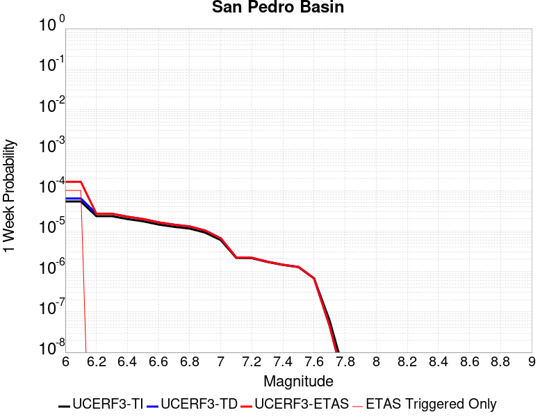 | 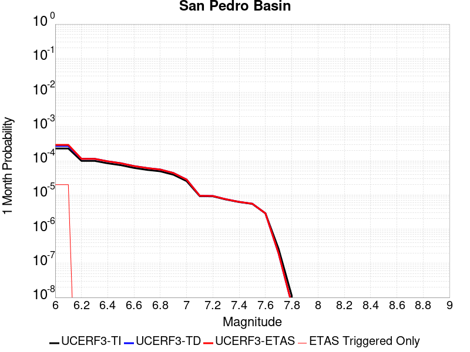 | 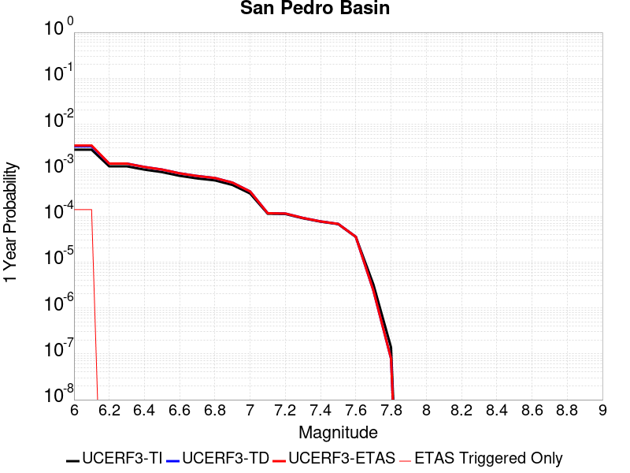 | 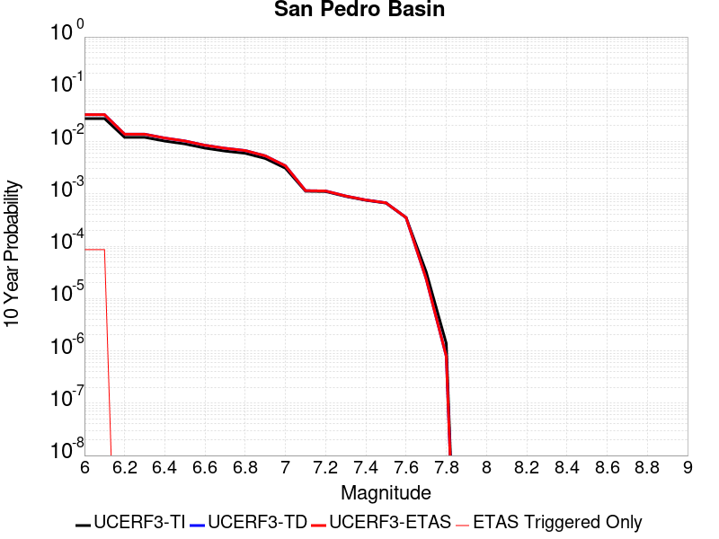 |

| Magnitude | 1 wk TI Prob | 1 wk TD Prob | 1 wk ETAS Prob | 1 wk ETAS/TD Gain | 1 wk ETAS Triggered Only | 1 mo TI Prob | 1 mo TD Prob | 1 mo ETAS Prob | 1 mo ETAS/TD Gain | 1 mo ETAS Triggered Only | 1 yr TI Prob | 1 yr TD Prob | 1 yr ETAS Prob | 1 yr ETAS/TD Gain | 1 yr ETAS Triggered Only | 10 yr TI Prob | 10 yr TD Prob | 10 yr ETAS Prob | 10 yr ETAS/TD Gain | 10 yr ETAS Triggered Only |
|-----|-----|-----|-----|-----|-----|-----|-----|-----|-----|-----|-----|-----|-----|-----|-----|-----|-----|-----|-----|-----|
| 6.0 | 5.3449043E-5 | 6.336922E-5 | 1.6936769E-4 | 2.6727123 | 1.06005195E-4 | 2.2904722E-4 | 2.7155754E-4 | 3.7753396E-4 | 1.3902539 | 1.06005195E-4 | 0.0027850836 | 0.0033018088 | 0.003407464 | 1.0319992 | 1.06005195E-4 | 0.027504366 | 0.03258929 | 0.03269184 | 1.0031468 | 1.06005195E-4 |
| 6.1 | 5.3449043E-5 | 6.336922E-5 | 1.6936769E-4 | 2.6727123 | 1.06005195E-4 | 2.2904722E-4 | 2.7155754E-4 | 3.7753396E-4 | 1.3902539 | 1.06005195E-4 | 0.0027850836 | 0.0033018088 | 0.003407464 | 1.0319992 | 1.06005195E-4 | 0.027504366 | 0.03258929 | 0.03269184 | 1.0031468 | 1.06005195E-4 |
| 6.2 | 2.3189454E-5 | 2.6642689E-5 | 2.6642689E-5 | 1.0 | 0.0 | 9.9379584E-5 | 1.1417822E-4 | 1.1417822E-4 | 1.0 | 0.0 | 0.0012092749 | 0.0013892808 | 0.0013892808 | 1.0 | 0.0 | 0.012027155 | 0.013810828 | 0.013810828 | 1.0 | 0.0 |
| 6.3 | 2.3189454E-5 | 2.6642689E-5 | 2.6642689E-5 | 1.0 | 0.0 | 9.9379584E-5 | 1.1417822E-4 | 1.1417822E-4 | 1.0 | 0.0 | 0.0012092749 | 0.0013892808 | 0.0013892808 | 1.0 | 0.0 | 0.012027155 | 0.013810828 | 0.013810828 | 1.0 | 0.0 |
| 6.4 | 1.966056E-5 | 2.2463326E-5 | 2.2463326E-5 | 1.0 | 0.0 | 8.425682E-5 | 9.626807E-5 | 9.626807E-5 | 1.0 | 0.0 | 0.001025344 | 0.0011714738 | 0.0011714738 | 1.0 | 0.0 | 0.010206259 | 0.011657071 | 0.011657071 | 1.0 | 0.0 |
| 6.5 | 1.7342953E-5 | 1.9745074E-5 | 1.9745074E-5 | 1.0 | 0.0 | 7.4324824E-5 | 8.4619205E-5 | 8.4619205E-5 | 1.0 | 0.0 | 9.04529E-4 | 0.0010297889 | 0.0010297889 | 1.0 | 0.0 | 0.009008561 | 0.010253892 | 0.010253892 | 1.0 | 0.0 |
| 6.6 | 1.439804E-5 | 1.6322656E-5 | 1.6322656E-5 | 1.0 | 0.0 | 6.170443E-5 | 6.995254E-5 | 6.995254E-5 | 1.0 | 0.0 | 7.509924E-4 | 8.5137156E-4 | 8.5137156E-4 | 1.0 | 0.0 | 0.0074845953 | 0.008484301 | 0.008484301 | 1.0 | 0.0 |
| 6.7 | 1.2634884E-5 | 1.4285245E-5 | 1.4285245E-5 | 1.0 | 0.0 | 5.414838E-5 | 6.122122E-5 | 6.122122E-5 | 1.0 | 0.0 | 6.590571E-4 | 7.4514386E-4 | 7.4514386E-4 | 1.0 | 0.0 | 0.006571059 | 0.0074294745 | 0.0074294745 | 1.0 | 0.0 |
| 6.8 | 1.146091E-5 | 1.2933146E-5 | 1.2933146E-5 | 1.0 | 0.0 | 4.911726E-5 | 5.5426757E-5 | 5.5426757E-5 | 1.0 | 0.0 | 5.9783855E-4 | 6.746416E-4 | 6.746416E-4 | 1.0 | 0.0 | 0.0059623276 | 0.006728875 | 0.006728875 | 1.0 | 0.0 |
| 6.9 | 9.109035E-6 | 1.0234976E-5 | 1.0234976E-5 | 1.0 | 0.0 | 3.9038136E-5 | 4.3863605E-5 | 4.3863605E-5 | 1.0 | 0.0 | 4.7518566E-4 | 5.339365E-4 | 5.339365E-4 | 1.0 | 0.0 | 0.0047417083 | 0.0053292904 | 0.0053292904 | 1.0 | 0.0 |
| 7.0 | 5.9351028E-6 | 6.583943E-6 | 6.583943E-6 | 1.0 | 0.0 | 2.5435906E-5 | 2.8216728E-5 | 2.8216728E-5 | 1.0 | 0.0 | 3.0963816E-4 | 3.4350812E-4 | 3.4350812E-4 | 1.0 | 0.0 | 0.0030920706 | 0.0034320883 | 0.0034320883 | 1.0 | 0.0 |
| 7.1 | 2.1557585E-6 | 2.2096456E-6 | 2.2096456E-6 | 1.0 | 0.0 | 9.238933E-6 | 9.469876E-6 | 9.469876E-6 | 1.0 | 0.0 | 1.1247819E-4 | 1.152898E-4 | 1.152898E-4 | 1.0 | 0.0 | 0.0011242128 | 0.0011523152 | 0.0011523152 | 1.0 | 0.0 |
| 7.2 | 2.1251979E-6 | 2.1779917E-6 | 2.1779917E-6 | 1.0 | 0.0 | 9.107958E-6 | 9.334219E-6 | 9.334219E-6 | 1.0 | 0.0 | 1.1088375E-4 | 1.13638336E-4 | 1.13638336E-4 | 1.0 | 0.0 | 0.0011082845 | 0.0011358176 | 0.0011358176 | 1.0 | 0.0 |
| 7.3 | 1.7145798E-6 | 1.7442856E-6 | 1.7442856E-6 | 1.0 | 0.0 | 7.3481783E-6 | 7.4754885E-6 | 7.4754885E-6 | 1.0 | 0.0 | 8.94604E-5 | 9.101036E-5 | 9.101036E-5 | 1.0 | 0.0 | 8.9424395E-4 | 9.0974005E-4 | 9.0974005E-4 | 1.0 | 0.0 |
| 7.4 | 1.4467993E-6 | 1.4641852E-6 | 1.4641852E-6 | 1.0 | 0.0 | 6.200554E-6 | 6.2750646E-6 | 6.2750646E-6 | 1.0 | 0.0 | 7.548913E-5 | 7.639631E-5 | 7.639631E-5 | 1.0 | 0.0 | 7.546349E-4 | 7.6370774E-4 | 7.6370774E-4 | 1.0 | 0.0 |
| 7.5 | 1.2803735E-6 | 1.2931483E-6 | 1.2931483E-6 | 1.0 | 0.0 | 5.487303E-6 | 5.542053E-6 | 5.542053E-6 | 1.0 | 0.0 | 6.680587E-5 | 6.747247E-5 | 6.747247E-5 | 1.0 | 0.0 | 6.678579E-4 | 6.7452696E-4 | 6.7452696E-4 | 1.0 | 0.0 |
| 7.6 | 6.755009E-7 | 6.7694583E-7 | 6.7694583E-7 | 1.0 | 0.0 | 2.8950008E-6 | 2.9011935E-6 | 2.9011935E-6 | 1.0 | 0.0 | 3.5246063E-5 | 3.532152E-5 | 3.532152E-5 | 1.0 | 0.0 | 3.5240475E-4 | 3.5316474E-4 | 3.5316474E-4 | 1.0 | 0.0 |
| 7.7 | 6.211885E-8 | 4.5699466E-8 | 4.5699466E-8 | 1.0 | 0.0 | 2.6622362E-7 | 1.9585484E-7 | 1.9585484E-7 | 1.0 | 0.0 | 3.2412677E-6 | 2.3845303E-6 | 2.3845303E-6 | 1.0 | 0.0 | 3.2412205E-5 | 2.3845067E-5 | 2.3845067E-5 | 1.0 | 0.0 |
| 7.8 | 2.6580573E-9 | 1.5138059E-9 | 1.5138059E-9 | 1.0 | 0.0 | 1.1391674E-8 | 6.4877392E-9 | 6.4877392E-9 | 1.0 | 0.0 | 1.3869362E-7 | 7.898823E-8 | 7.898823E-8 | 1.0 | 0.0 | 1.3869354E-6 | 7.898823E-7 | 7.898823E-7 | 1.0 | 0.0 |

## San Andreas (Coachella) rev
*[(top)](#table-of-contents)*

| 1 Week | 1 Month | 1 Year | 10 Year |
|-----|-----|-----|-----|
| 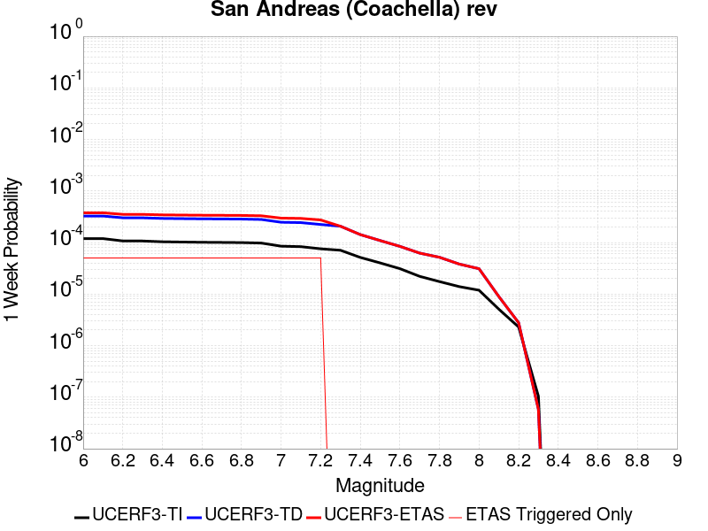 | 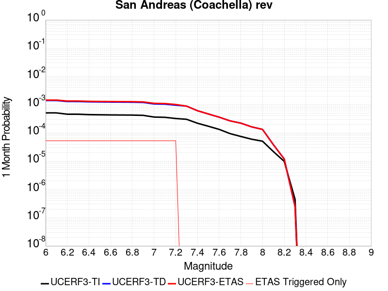 | 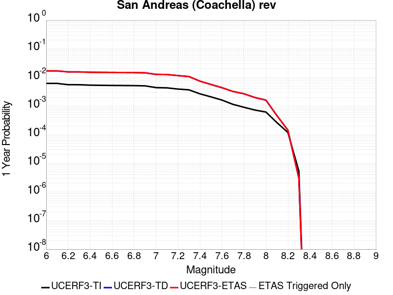 | 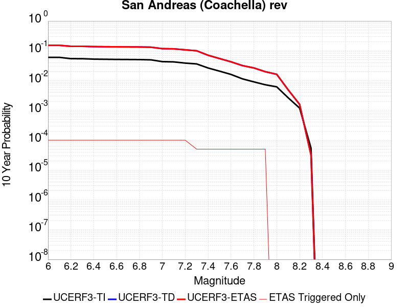 |

| Magnitude | 1 wk TI Prob | 1 wk TD Prob | 1 wk ETAS Prob | 1 wk ETAS/TD Gain | 1 wk ETAS Triggered Only | 1 mo TI Prob | 1 mo TD Prob | 1 mo ETAS Prob | 1 mo ETAS/TD Gain | 1 mo ETAS Triggered Only | 1 yr TI Prob | 1 yr TD Prob | 1 yr ETAS Prob | 1 yr ETAS/TD Gain | 1 yr ETAS Triggered Only | 10 yr TI Prob | 10 yr TD Prob | 10 yr ETAS Prob | 10 yr ETAS/TD Gain | 10 yr ETAS Triggered Only |
|-----|-----|-----|-----|-----|-----|-----|-----|-----|-----|-----|-----|-----|-----|-----|-----|-----|-----|-----|-----|-----|
| 6.0 | 1.1925945E-4 | 3.2723017E-4 | 3.802154E-4 | 1.1619204 | 5.3002597E-5 | 5.110118E-4 | 0.001401666 | 0.0014545943 | 1.037761 | 5.3002597E-5 | 0.0062038354 | 0.016933087 | 0.016985193 | 1.0030771 | 5.3002597E-5 | 0.060334753 | 0.15262908 | 0.15271892 | 1.0005885 | 1.06005195E-4 |
| 6.1 | 1.1925945E-4 | 3.2723017E-4 | 3.802154E-4 | 1.1619204 | 5.3002597E-5 | 5.110118E-4 | 0.001401666 | 0.0014545943 | 1.037761 | 5.3002597E-5 | 0.0062038354 | 0.016933087 | 0.016985193 | 1.0030771 | 5.3002597E-5 | 0.060334753 | 0.15262908 | 0.15271892 | 1.0005885 | 1.06005195E-4 |
| 6.2 | 1.07432395E-4 | 3.0223778E-4 | 3.5522436E-4 | 1.1753142 | 5.3002597E-5 | 4.603433E-4 | 0.0012946657 | 0.0013475998 | 1.0408862 | 5.3002597E-5 | 0.005590286 | 0.01564973 | 0.015701905 | 1.0033338 | 5.3002597E-5 | 0.05451731 | 0.1417999 | 0.14189087 | 1.0006416 | 1.06005195E-4 |
| 6.3 | 1.0718766E-4 | 3.0169083E-4 | 3.5467744E-4 | 1.1756321 | 5.3002597E-5 | 4.592948E-4 | 0.001292324 | 0.0013452581 | 1.0409604 | 5.3002597E-5 | 0.005577586 | 0.01562163 | 0.015673805 | 1.0033399 | 5.3002597E-5 | 0.054396555 | 0.14156814 | 0.14165914 | 1.0006428 | 1.06005195E-4 |
| 6.4 | 1.0355944E-4 | 2.9377177E-4 | 3.4675878E-4 | 1.1803681 | 5.3002597E-5 | 4.4375064E-4 | 0.0012584183 | 0.0013113542 | 1.0420654 | 5.3002597E-5 | 0.0053892885 | 0.015214663 | 0.01526686 | 1.0034306 | 5.3002597E-5 | 0.052604496 | 0.13812812 | 0.13821948 | 1.0006615 | 1.06005195E-4 |
| 6.5 | 1.0227914E-4 | 2.909661E-4 | 3.439533E-4 | 1.1821077 | 5.3002597E-5 | 4.382655E-4 | 0.0012464056 | 0.0012993421 | 1.0424714 | 5.3002597E-5 | 0.0053228354 | 0.015070442 | 0.015122646 | 1.003464 | 5.3002597E-5 | 0.051971316 | 0.13690725 | 0.13699874 | 1.0006683 | 1.06005195E-4 |
| 6.6 | 1.0116757E-4 | 2.8862362E-4 | 3.4161092E-4 | 1.1835861 | 5.3002597E-5 | 4.3350324E-4 | 0.0012363759 | 0.001289313 | 1.0428163 | 5.3002597E-5 | 0.0052651367 | 0.014950012 | 0.015002222 | 1.0034924 | 5.3002597E-5 | 0.051421247 | 0.1358854 | 0.135977 | 1.0006741 | 1.06005195E-4 |
| 6.7 | 1.0050676E-4 | 2.8720926E-4 | 3.4019662E-4 | 1.1844904 | 5.3002597E-5 | 4.3067214E-4 | 0.0012303201 | 0.0012832575 | 1.0430273 | 5.3002597E-5 | 0.005230834 | 0.014877291 | 0.014929505 | 1.0035096 | 5.3002597E-5 | 0.051094085 | 0.1352701 | 0.13536178 | 1.0006777 | 1.06005195E-4 |
| 6.8 | 9.976819E-5 | 2.8524583E-4 | 3.382333E-4 | 1.1857607 | 5.3002597E-5 | 4.2750788E-4 | 0.0012219134 | 0.0012748512 | 1.0433238 | 5.3002597E-5 | 0.0051924936 | 0.014776332 | 0.0148285525 | 1.003534 | 5.3002597E-5 | 0.050728295 | 0.13442177 | 0.13451353 | 1.0006826 | 1.06005195E-4 |
| 6.9 | 9.77719E-5 | 2.8021506E-4 | 3.332028E-4 | 1.1890967 | 5.3002597E-5 | 4.1895514E-4 | 0.0012003728 | 0.0012533119 | 1.0441021 | 5.3002597E-5 | 0.0050888555 | 0.014517602 | 0.014569835 | 1.003598 | 5.3002597E-5 | 0.049738888 | 0.13225023 | 0.13234222 | 1.0006956 | 1.06005195E-4 |
| 7.0 | 8.500761E-5 | 2.4756166E-4 | 3.0055112E-4 | 1.2140455 | 5.3002597E-5 | 3.6426744E-4 | 0.0010605503 | 0.0011134967 | 1.0499235 | 5.3002597E-5 | 0.0044259406 | 0.012836529 | 0.012888851 | 1.004076 | 5.3002597E-5 | 0.04338823 | 0.11810792 | 0.11820141 | 1.0007915 | 1.06005195E-4 |
| 7.1 | 8.319876E-5 | 2.4358921E-4 | 2.965789E-4 | 1.217537 | 5.3002597E-5 | 3.5651738E-4 | 0.0010435393 | 0.0010964866 | 1.0507382 | 5.3002597E-5 | 0.004331963 | 0.01263184 | 0.012684173 | 1.004143 | 5.3002597E-5 | 0.042484846 | 0.11632819 | 0.11642186 | 1.0008053 | 1.06005195E-4 |
| 7.2 | 7.563917E-5 | 2.2407399E-4 | 2.770647E-4 | 1.2364876 | 5.3002597E-5 | 3.2412758E-4 | 9.599667E-4 | 0.0010129184 | 1.0551599 | 5.3002597E-5 | 0.0039391145 | 0.01162565 | 0.011678037 | 1.0045061 | 5.3002597E-5 | 0.03870018 | 0.10773429 | 0.10782888 | 1.000878 | 1.06005195E-4 |
| 7.3 | 7.082985E-5 | 2.0723743E-4 | 2.0723743E-4 | 1.0 | 0.0 | 3.0352117E-4 | 8.87861E-4 | 8.87861E-4 | 1.0 | 0.0 | 0.0036891096 | 0.010756755 | 0.010756755 | 1.0 | 0.0 | 0.03628465 | 0.10025747 | 0.10030516 | 1.0004756 | 5.3002597E-5 |
| 7.4 | 5.146215E-5 | 1.4271007E-4 | 1.4271007E-4 | 1.0 | 0.0 | 2.2053342E-4 | 6.1147206E-4 | 6.1147206E-4 | 1.0 | 0.0 | 0.0026816884 | 0.007419449 | 0.007419449 | 1.0 | 0.0 | 0.02649557 | 0.070837796 | 0.070887044 | 1.0006952 | 5.3002597E-5 |
| 7.5 | 4.0285166E-5 | 1.0941066E-4 | 1.0941066E-4 | 1.0 | 0.0 | 1.7263928E-4 | 4.688189E-4 | 4.688189E-4 | 1.0 | 0.0 | 0.002099857 | 0.005693001 | 0.005693001 | 1.0 | 0.0 | 0.020801254 | 0.055008773 | 0.05505886 | 1.0009105 | 5.3002597E-5 |
| 7.6 | 3.1168736E-5 | 8.438435E-5 | 8.438435E-5 | 1.0 | 0.0 | 1.3357346E-4 | 3.6159722E-4 | 3.6159722E-4 | 1.0 | 0.0 | 0.0016250437 | 0.004393586 | 0.004393586 | 1.0 | 0.0 | 0.016132116 | 0.04280791 | 0.042858645 | 1.0011852 | 5.3002597E-5 |
| 7.7 | 2.2100989E-5 | 6.2383384E-5 | 6.2383384E-5 | 1.0 | 0.0 | 9.4715084E-5 | 2.6733E-4 | 2.6733E-4 | 1.0 | 0.0 | 0.001152546 | 0.0032498916 | 0.0032498916 | 1.0 | 0.0 | 0.011465867 | 0.031898305 | 0.031949617 | 1.0016086 | 5.3002597E-5 |
| 7.8 | 1.7484861E-5 | 5.1792E-5 | 5.1792E-5 | 1.0 | 0.0 | 7.493296E-5 | 2.2194686E-4 | 2.2194686E-4 | 1.0 | 0.0 | 9.1192697E-4 | 0.0026988573 | 0.0026988573 | 1.0 | 0.0 | 0.009081938 | 0.026638424 | 0.026690014 | 1.0019367 | 5.3002597E-5 |
| 7.9 | 1.3967285E-5 | 3.8219507E-5 | 3.8219507E-5 | 1.0 | 0.0 | 5.985842E-5 | 1.6378761E-4 | 1.6378761E-4 | 1.0 | 0.0 | 7.2853256E-4 | 0.0019922915 | 0.0019922915 | 1.0 | 0.0 | 0.0072614877 | 0.01990803 | 0.019959977 | 1.0026094 | 5.3002597E-5 |
| 8.0 | 1.1887396E-5 | 3.10626E-5 | 3.10626E-5 | 1.0 | 0.0 | 5.094499E-5 | 1.3311864E-4 | 1.3311864E-4 | 1.0 | 0.0 | 6.200787E-4 | 0.0016195155 | 0.0016195155 | 1.0 | 0.0 | 0.006183513 | 0.016278049 | 0.016278049 | 1.0 | 0.0 |
| 8.1 | 5.100864E-6 | 8.972364E-6 | 8.972364E-6 | 1.0 | 0.0 | 2.1860664E-5 | 3.8452425E-5 | 3.8452425E-5 | 1.0 | 0.0 | 2.6612106E-4 | 4.680578E-4 | 4.680578E-4 | 1.0 | 0.0 | 0.002658026 | 0.004917206 | 0.004917206 | 1.0 | 0.0 |
| 8.2 | 2.3004484E-6 | 2.7860247E-6 | 2.7860247E-6 | 1.0 | 0.0 | 9.859027E-6 | 1.1940051E-5 | 1.1940051E-5 | 1.0 | 0.0 | 1.2002704E-4 | 1.4536046E-4 | 1.4536046E-4 | 1.0 | 0.0 | 0.0011996223 | 0.0015971722 | 0.0015971722 | 1.0 | 0.0 |
| 8.3 | 1.0424446E-7 | 5.814984E-8 | 5.814984E-8 | 1.0 | 0.0 | 4.4676187E-7 | 2.4921357E-7 | 2.4921357E-7 | 1.0 | 0.0 | 5.439312E-6 | 3.0341714E-6 | 3.0341714E-6 | 1.0 | 0.0 | 5.4391792E-5 | 3.1900923E-5 | 3.1900923E-5 | 1.0 | 0.0 |

## San Andreas (Parkfield)
*[(top)](#table-of-contents)*

| 1 Week | 1 Month | 1 Year | 10 Year |
|-----|-----|-----|-----|
| 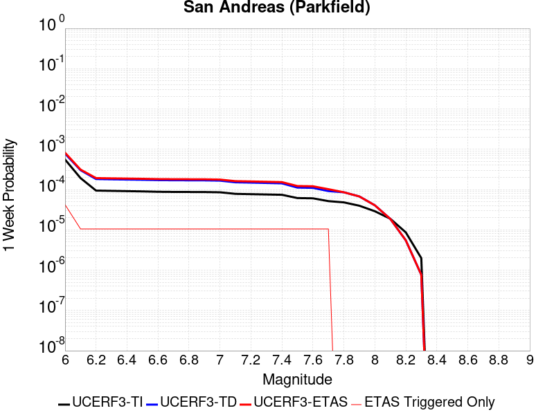 | 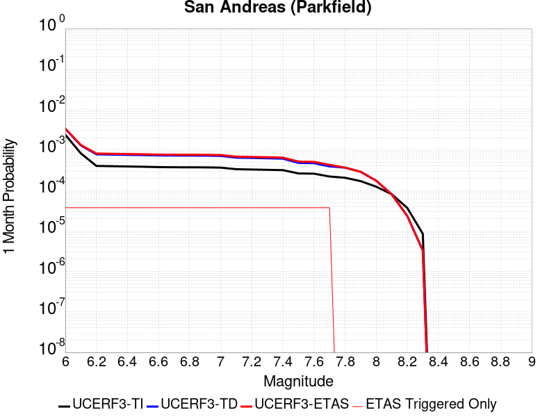 | 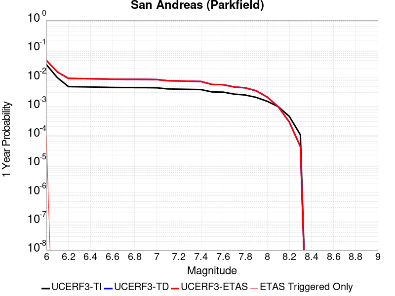 | 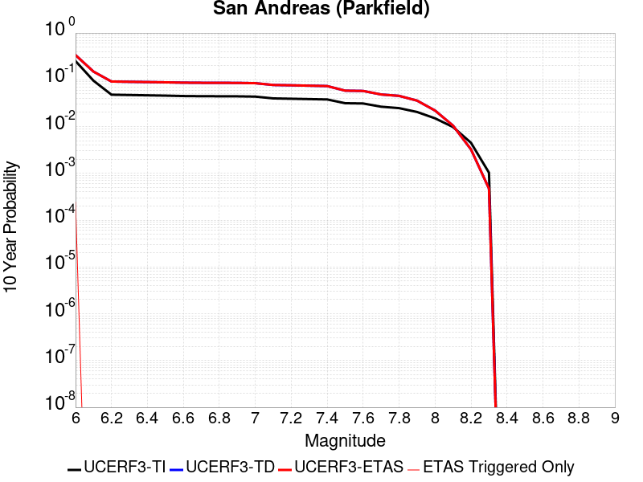 |

| Magnitude | 1 wk TI Prob | 1 wk TD Prob | 1 wk ETAS Prob | 1 wk ETAS/TD Gain | 1 wk ETAS Triggered Only | 1 mo TI Prob | 1 mo TD Prob | 1 mo ETAS Prob | 1 mo ETAS/TD Gain | 1 mo ETAS Triggered Only | 1 yr TI Prob | 1 yr TD Prob | 1 yr ETAS Prob | 1 yr ETAS/TD Gain | 1 yr ETAS Triggered Only | 10 yr TI Prob | 10 yr TD Prob | 10 yr ETAS Prob | 10 yr ETAS/TD Gain | 10 yr ETAS Triggered Only |
|-----|-----|-----|-----|-----|-----|-----|-----|-----|-----|-----|-----|-----|-----|-----|-----|-----|-----|-----|-----|-----|
| 6.0 | 5.556969E-4 | 7.776195E-4 | 7.776195E-4 | 1.0 | 0.0 | 0.0023793848 | 0.003328946 | 0.003328946 | 1.0 | 0.0 | 0.028586963 | 0.04018152 | 0.040232394 | 1.0012661 | 5.3002597E-5 | 0.25176284 | 0.33713356 | 0.3372038 | 1.0002084 | 1.06005195E-4 |
| 6.1 | 1.925858E-4 | 3.027076E-4 | 3.027076E-4 | 1.0 | 0.0 | 8.2510663E-4 | 0.001296767 | 0.001296767 | 1.0 | 0.0 | 0.0099994885 | 0.01577525 | 0.01577525 | 1.0 | 0.0 | 0.095613256 | 0.14970991 | 0.14970991 | 1.0 | 0.0 |
| 6.2 | 9.4306815E-5 | 1.824128E-4 | 1.824128E-4 | 1.0 | 0.0 | 4.0410945E-4 | 7.8153616E-4 | 7.8153616E-4 | 1.0 | 0.0 | 0.0049089384 | 0.009473897 | 0.009473897 | 1.0 | 0.0 | 0.048019063 | 0.09184752 | 0.09184752 | 1.0 | 0.0 |
| 6.3 | 9.283051E-5 | 1.793781E-4 | 1.793781E-4 | 1.0 | 0.0 | 3.9778434E-4 | 7.68538E-4 | 7.68538E-4 | 1.0 | 0.0 | 0.0048322747 | 0.009317007 | 0.009317007 | 1.0 | 0.0 | 0.047285385 | 0.09050047 | 0.09050047 | 1.0 | 0.0 |
| 6.4 | 9.138826E-5 | 1.7700029E-4 | 1.7700029E-4 | 1.0 | 0.0 | 3.916052E-4 | 7.5835333E-4 | 7.5835333E-4 | 1.0 | 0.0 | 0.0047573745 | 0.009194063 | 0.009194063 | 1.0 | 0.0 | 0.046568092 | 0.089402735 | 0.089402735 | 1.0 | 0.0 |
| 6.5 | 9.000255E-5 | 1.7458084E-4 | 1.7458084E-4 | 1.0 | 0.0 | 3.8566816E-4 | 7.479902E-4 | 7.479902E-4 | 1.0 | 0.0 | 0.0046854047 | 0.00906896 | 0.00906896 | 1.0 | 0.0 | 0.045878403 | 0.08828856 | 0.08828856 | 1.0 | 0.0 |
| 6.6 | 8.8109264E-5 | 1.7139279E-4 | 1.7139279E-4 | 1.0 | 0.0 | 3.7755648E-4 | 7.343349E-4 | 7.343349E-4 | 1.0 | 0.0 | 0.0045870654 | 0.008904092 | 0.008904092 | 1.0 | 0.0 | 0.04493529 | 0.08682025 | 0.08682025 | 1.0 | 0.0 |
| 6.7 | 8.738073E-5 | 1.7006363E-4 | 1.7006363E-4 | 1.0 | 0.0 | 3.7443507E-4 | 7.286417E-4 | 7.286417E-4 | 1.0 | 0.0 | 0.0045492216 | 0.008835384 | 0.008835384 | 1.0 | 0.0 | 0.04457213 | 0.08622064 | 0.08622064 | 1.0 | 0.0 |
| 6.8 | 8.710195E-5 | 1.695187E-4 | 1.695187E-4 | 1.0 | 0.0 | 3.7324068E-4 | 7.263075E-4 | 7.263075E-4 | 1.0 | 0.0 | 0.0045347405 | 0.008807203 | 0.008807203 | 1.0 | 0.0 | 0.04443313 | 0.085968256 | 0.085968256 | 1.0 | 0.0 |
| 6.9 | 8.6801556E-5 | 1.6892828E-4 | 1.6892828E-4 | 1.0 | 0.0 | 3.7195362E-4 | 7.237786E-4 | 7.237786E-4 | 1.0 | 0.0 | 0.0045191357 | 0.008776662 | 0.008776662 | 1.0 | 0.0 | 0.044283327 | 0.08569433 | 0.08569433 | 1.0 | 0.0 |
| 7.0 | 8.5571606E-5 | 1.6645678E-4 | 1.6645678E-4 | 1.0 | 0.0 | 3.6668387E-4 | 7.131923E-4 | 7.131923E-4 | 1.0 | 0.0 | 0.004455241 | 0.008648803 | 0.008648803 | 1.0 | 0.0 | 0.043669727 | 0.08454277 | 0.08454277 | 1.0 | 0.0 |
| 7.1 | 7.82589E-5 | 1.5126738E-4 | 1.5126738E-4 | 1.0 | 0.0 | 3.3535215E-4 | 6.4812845E-4 | 6.4812845E-4 | 1.0 | 0.0 | 0.0040752706 | 0.007862584 | 0.007862584 | 1.0 | 0.0 | 0.040013418 | 0.07745491 | 0.07745491 | 1.0 | 0.0 |
| 7.2 | 7.690929E-5 | 1.4864003E-4 | 1.4864003E-4 | 1.0 | 0.0 | 3.2956956E-4 | 6.368739E-4 | 6.368739E-4 | 1.0 | 0.0 | 0.004005129 | 0.007726539 | 0.007726539 | 1.0 | 0.0 | 0.0393371 | 0.0762281 | 0.0762281 | 1.0 | 0.0 |
| 7.3 | 7.5543794E-5 | 1.4560606E-4 | 1.4560606E-4 | 1.0 | 0.0 | 3.2371894E-4 | 6.2387745E-4 | 6.2387745E-4 | 1.0 | 0.0 | 0.003934157 | 0.007569417 | 0.007569417 | 1.0 | 0.0 | 0.038652334 | 0.07479123 | 0.07479123 | 1.0 | 0.0 |
| 7.4 | 7.4214564E-5 | 1.4261607E-4 | 1.4261607E-4 | 1.0 | 0.0 | 3.1802364E-4 | 6.110693E-4 | 6.110693E-4 | 1.0 | 0.0 | 0.003865065 | 0.0074145487 | 0.0074145487 | 1.0 | 0.0 | 0.03798529 | 0.07336518 | 0.07336518 | 1.0 | 0.0 |
| 7.5 | 6.149578E-5 | 1.11895584E-4 | 1.11895584E-4 | 1.0 | 0.0 | 2.6352672E-4 | 4.7946448E-4 | 4.7946448E-4 | 1.0 | 0.0 | 0.0032037178 | 0.0058218874 | 0.0058218874 | 1.0 | 0.0 | 0.03157923 | 0.05855221 | 0.05855221 | 1.0 | 0.0 |
| 7.6 | 6.0643448E-5 | 1.10182256E-4 | 1.10182256E-4 | 1.0 | 0.0 | 2.598746E-4 | 4.7212432E-4 | 4.7212432E-4 | 1.0 | 0.0 | 0.0031593828 | 0.005732995 | 0.005732995 | 1.0 | 0.0 | 0.031148417 | 0.057713263 | 0.057713263 | 1.0 | 0.0 |
| 7.7 | 5.1652263E-5 | 9.173663E-5 | 9.173663E-5 | 1.0 | 0.0 | 2.2134806E-4 | 3.9309775E-4 | 3.9309775E-4 | 1.0 | 0.0 | 0.002691582 | 0.0047754725 | 0.0047754725 | 1.0 | 0.0 | 0.026592141 | 0.048531387 | 0.048531387 | 1.0 | 0.0 |
| 7.8 | 4.8090482E-5 | 8.558682E-5 | 8.558682E-5 | 1.0 | 0.0 | 2.060858E-4 | 3.6674913E-4 | 3.6674913E-4 | 1.0 | 0.0 | 0.0025062072 | 0.0044560367 | 0.0044560367 | 1.0 | 0.0 | 0.024781305 | 0.045297977 | 0.045297977 | 1.0 | 0.0 |
| 7.9 | 3.970278E-5 | 6.749683E-5 | 6.749683E-5 | 1.0 | 0.0 | 1.7014367E-4 | 2.8924007E-4 | 2.8924007E-4 | 1.0 | 0.0 | 0.002069531 | 0.0035158154 | 0.0035158154 | 1.0 | 0.0 | 0.020503636 | 0.03587781 | 0.03587781 | 1.0 | 0.0 |
| 8.0 | 2.8982335E-5 | 4.0693238E-5 | 4.0693238E-5 | 1.0 | 0.0 | 1.2420409E-4 | 1.7438793E-4 | 1.7438793E-4 | 1.0 | 0.0 | 0.0015111357 | 0.0021211067 | 0.0021211067 | 1.0 | 0.0 | 0.015009012 | 0.022008339 | 0.022008339 | 1.0 | 0.0 |
| 8.1 | 1.8836186E-5 | 1.8678496E-5 | 1.8678496E-5 | 1.0 | 0.0 | 8.0724014E-5 | 8.0048245E-5 | 8.0048245E-5 | 1.0 | 0.0 | 9.823717E-4 | 9.7415224E-4 | 9.7415224E-4 | 1.0 | 0.0 | 0.009780403 | 0.010486731 | 0.010486731 | 1.0 | 0.0 |
| 8.2 | 8.643924E-6 | 5.4738607E-6 | 5.4738607E-6 | 1.0 | 0.0 | 3.704486E-5 | 2.3459192E-5 | 2.3459192E-5 | 1.0 | 0.0 | 4.5092785E-4 | 2.855783E-4 | 2.855783E-4 | 1.0 | 0.0 | 0.0045001395 | 0.0032481598 | 0.0032481598 | 1.0 | 0.0 |
| 8.3 | 1.983087E-6 | 7.658221E-7 | 7.658221E-7 | 1.0 | 0.0 | 8.498917E-6 | 3.2820906E-6 | 3.2820906E-6 | 1.0 | 0.0 | 1.034694E-4 | 3.9958737E-5 | 3.9958737E-5 | 1.0 | 0.0 | 0.0010342124 | 4.7187202E-4 | 4.7187202E-4 | 1.0 | 0.0 |

## Santa Cruz Catalina Ridge alt1
*[(top)](#table-of-contents)*

| 1 Week | 1 Month | 1 Year | 10 Year |
|-----|-----|-----|-----|
| 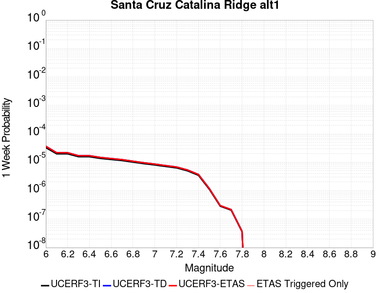 | 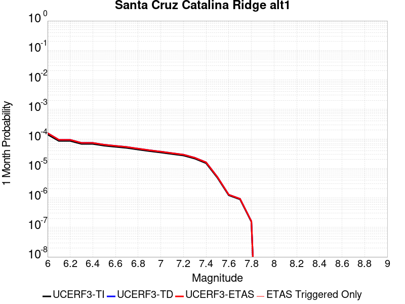 | 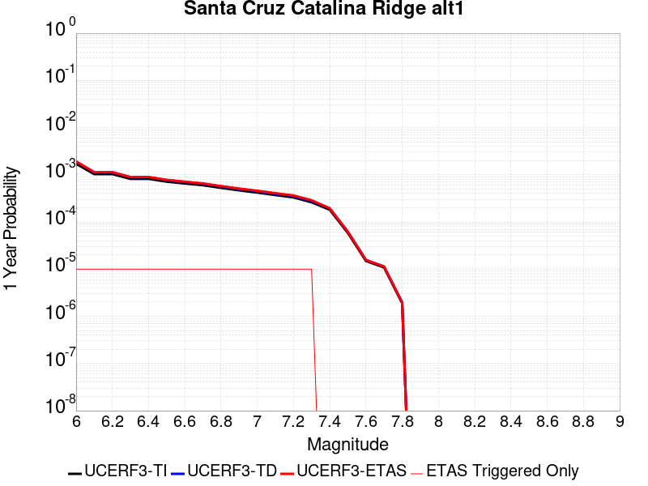 | 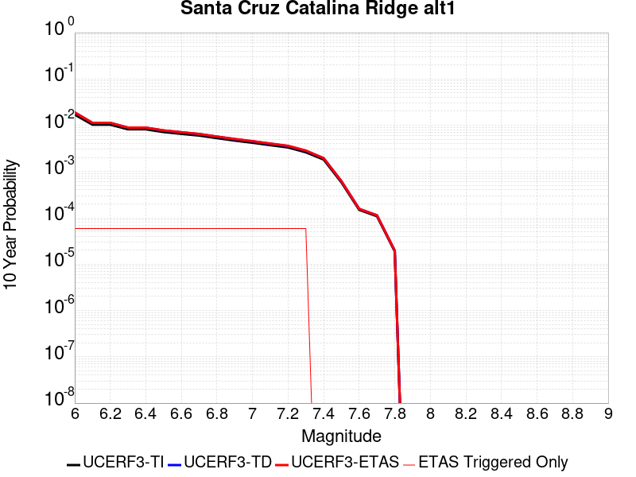 |

| Magnitude | 1 wk TI Prob | 1 wk TD Prob | 1 wk ETAS Prob | 1 wk ETAS/TD Gain | 1 wk ETAS Triggered Only | 1 mo TI Prob | 1 mo TD Prob | 1 mo ETAS Prob | 1 mo ETAS/TD Gain | 1 mo ETAS Triggered Only | 1 yr TI Prob | 1 yr TD Prob | 1 yr ETAS Prob | 1 yr ETAS/TD Gain | 1 yr ETAS Triggered Only | 10 yr TI Prob | 10 yr TD Prob | 10 yr ETAS Prob | 10 yr ETAS/TD Gain | 10 yr ETAS Triggered Only |
|-----|-----|-----|-----|-----|-----|-----|-----|-----|-----|-----|-----|-----|-----|-----|-----|-----|-----|-----|-----|-----|
| 6.0 | 3.2833184E-5 | 3.6558286E-5 | 3.6558286E-5 | 1.0 | 0.0 | 1.4070606E-4 | 1.566699E-4 | 1.566699E-4 | 1.0 | 0.0 | 0.00171175 | 0.0019059537 | 0.0019588552 | 1.027756 | 5.3002597E-5 | 0.016986247 | 0.018912971 | 0.018964972 | 1.0027494 | 5.3002597E-5 |
| 6.1 | 1.9835548E-5 | 2.165945E-5 | 2.165945E-5 | 1.0 | 0.0 | 8.500672E-5 | 9.282303E-5 | 9.282303E-5 | 1.0 | 0.0 | 0.0010344655 | 0.0011295547 | 0.0011824974 | 1.0468705 | 5.3002597E-5 | 0.010296632 | 0.011240268 | 0.011292675 | 1.0046624 | 5.3002597E-5 |
| 6.2 | 1.9835548E-5 | 2.165945E-5 | 2.165945E-5 | 1.0 | 0.0 | 8.500672E-5 | 9.282303E-5 | 9.282303E-5 | 1.0 | 0.0 | 0.0010344655 | 0.0011295547 | 0.0011824974 | 1.0468705 | 5.3002597E-5 | 0.010296632 | 0.011240268 | 0.011292675 | 1.0046624 | 5.3002597E-5 |
| 6.3 | 1.5728183E-5 | 1.7033912E-5 | 1.7033912E-5 | 1.0 | 0.0 | 6.7404755E-5 | 7.300047E-5 | 7.300047E-5 | 1.0 | 0.0 | 8.2034385E-4 | 8.884244E-4 | 9.413799E-4 | 1.0596061 | 5.3002597E-5 | 0.008173222 | 0.008849408 | 0.008901941 | 1.0059364 | 5.3002597E-5 |
| 6.4 | 1.5728183E-5 | 1.7033912E-5 | 1.7033912E-5 | 1.0 | 0.0 | 6.7404755E-5 | 7.300047E-5 | 7.300047E-5 | 1.0 | 0.0 | 8.2034385E-4 | 8.884244E-4 | 9.413799E-4 | 1.0596061 | 5.3002597E-5 | 0.008173222 | 0.008849408 | 0.008901941 | 1.0059364 | 5.3002597E-5 |
| 6.5 | 1.3707734E-5 | 1.479449E-5 | 1.479449E-5 | 1.0 | 0.0 | 5.8746107E-5 | 6.340344E-5 | 6.340344E-5 | 1.0 | 0.0 | 7.1499916E-4 | 7.71667E-4 | 8.246287E-4 | 1.0686328 | 5.3002597E-5 | 0.0071270303 | 0.007690273 | 0.0077428683 | 1.0068392 | 5.3002597E-5 |
| 6.6 | 1.2539813E-5 | 1.3510192E-5 | 1.3510192E-5 | 1.0 | 0.0 | 5.3740947E-5 | 5.789955E-5 | 5.789955E-5 | 1.0 | 0.0 | 6.540996E-4 | 7.047017E-4 | 7.5766694E-4 | 1.0751598 | 5.3002597E-5 | 0.0065217763 | 0.007024974 | 0.007077604 | 1.0074918 | 5.3002597E-5 |
| 6.7 | 1.1504083E-5 | 1.237735E-5 | 1.237735E-5 | 1.0 | 0.0 | 4.930228E-5 | 5.3044718E-5 | 5.3044718E-5 | 1.0 | 0.0 | 6.0008996E-4 | 6.4563006E-4 | 6.9859845E-4 | 1.0820414 | 5.3002597E-5 | 0.005984721 | 0.006437773 | 0.0064904345 | 1.00818 | 5.3002597E-5 |
| 6.8 | 1.012739E-5 | 1.087705E-5 | 1.087705E-5 | 1.0 | 0.0 | 4.340238E-5 | 4.6615103E-5 | 4.6615103E-5 | 1.0 | 0.0 | 5.282958E-4 | 5.673926E-4 | 6.2036514E-4 | 1.0933614 | 5.3002597E-5 | 0.0052704164 | 0.0056596086 | 0.0057123112 | 1.009312 | 5.3002597E-5 |
| 6.9 | 8.9607865E-6 | 9.609099E-6 | 9.609099E-6 | 1.0 | 0.0 | 3.8402806E-5 | 4.1181207E-5 | 4.1181207E-5 | 1.0 | 0.0 | 4.6745385E-4 | 5.012669E-4 | 5.542429E-4 | 1.1056843 | 5.3002597E-5 | 0.0046647177 | 0.005001482 | 0.0050542196 | 1.0105444 | 5.3002597E-5 |
| 7.0 | 8.046829E-6 | 8.61973E-6 | 8.61973E-6 | 1.0 | 0.0 | 3.4485955E-5 | 3.694118E-5 | 3.694118E-5 | 1.0 | 0.0 | 4.1978562E-4 | 4.4966684E-4 | 5.026456E-4 | 1.1178178 | 5.3002597E-5 | 0.004189935 | 0.0044876602 | 0.0045404253 | 1.0117577 | 5.3002597E-5 |
| 7.1 | 7.136131E-6 | 7.637642E-6 | 7.637642E-6 | 1.0 | 0.0 | 3.0583058E-5 | 3.2732343E-5 | 3.2732343E-5 | 1.0 | 0.0 | 3.7228514E-4 | 3.984441E-4 | 4.5142559E-4 | 1.1329709 | 5.3002597E-5 | 0.0037166206 | 0.0039773737 | 0.0040301657 | 1.013273 | 5.3002597E-5 |
| 7.2 | 6.362014E-6 | 6.8049458E-6 | 6.8049458E-6 | 1.0 | 0.0 | 2.726549E-5 | 2.9163732E-5 | 2.9163732E-5 | 1.0 | 0.0 | 3.3190678E-4 | 3.5501123E-4 | 4.0799502E-4 | 1.1492454 | 5.3002597E-5 | 0.0033141149 | 0.0035445094 | 0.0035973242 | 1.0149004 | 5.3002597E-5 |
| 7.3 | 5.004101E-6 | 5.351705E-6 | 5.351705E-6 | 1.0 | 0.0 | 2.1445969E-5 | 2.2935681E-5 | 2.2935681E-5 | 1.0 | 0.0 | 2.6107338E-4 | 2.7920667E-4 | 3.3219447E-4 | 1.1897799 | 5.3002597E-5 | 0.002607669 | 0.0027886136 | 0.0028414682 | 1.0189538 | 5.3002597E-5 |
| 7.4 | 3.4901443E-6 | 3.7320456E-6 | 3.7320456E-6 | 1.0 | 0.0 | 1.4957676E-5 | 1.5994385E-5 | 1.5994385E-5 | 1.0 | 0.0 | 1.8209449E-4 | 1.9471462E-4 | 1.9471462E-4 | 1.0 | 0.0 | 0.0018194534 | 0.0019454787 | 0.0019454787 | 1.0 | 0.0 |
| 7.5 | 1.1215045E-6 | 1.1893851E-6 | 1.1893851E-6 | 1.0 | 0.0 | 4.806439E-6 | 5.097355E-6 | 5.097355E-6 | 1.0 | 0.0 | 5.851682E-5 | 6.205856E-5 | 6.205856E-5 | 1.0 | 0.0 | 5.850142E-4 | 6.204154E-4 | 6.204154E-4 | 1.0 | 0.0 |
| 7.6 | 2.8599047E-7 | 2.9951954E-7 | 2.9951954E-7 | 1.0 | 0.0 | 1.2256729E-6 | 1.2836546E-6 | 1.2836546E-6 | 1.0 | 0.0 | 1.4922465E-5 | 1.5628384E-5 | 1.5628384E-5 | 1.0 | 0.0 | 1.4921463E-4 | 1.5627299E-4 | 1.5627299E-4 | 1.0 | 0.0 |
| 7.7 | 2.0781519E-7 | 2.1744296E-7 | 2.1744296E-7 | 1.0 | 0.0 | 8.906362E-7 | 9.3189806E-7 | 9.3189806E-7 | 1.0 | 0.0 | 1.08434415E-5 | 1.1345801E-5 | 1.1345801E-5 | 1.0 | 0.0 | 1.0842913E-4 | 1.1345231E-4 | 1.1345231E-4 | 1.0 | 0.0 |
| 7.8 | 3.614776E-8 | 3.7640977E-8 | 3.7640977E-8 | 1.0 | 0.0 | 1.5491896E-7 | 1.6131847E-7 | 1.6131847E-7 | 1.0 | 0.0 | 1.8861368E-6 | 1.9640506E-6 | 1.9640506E-6 | 1.0 | 0.0 | 1.8861208E-5 | 1.9640345E-5 | 1.9640345E-5 | 1.0 | 0.0 |

## Kern Canyon (Lake Isabella) 2011
*[(top)](#table-of-contents)*

| 1 Week | 1 Month | 1 Year | 10 Year |
|-----|-----|-----|-----|
| 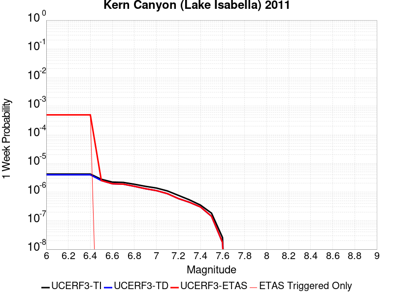 | 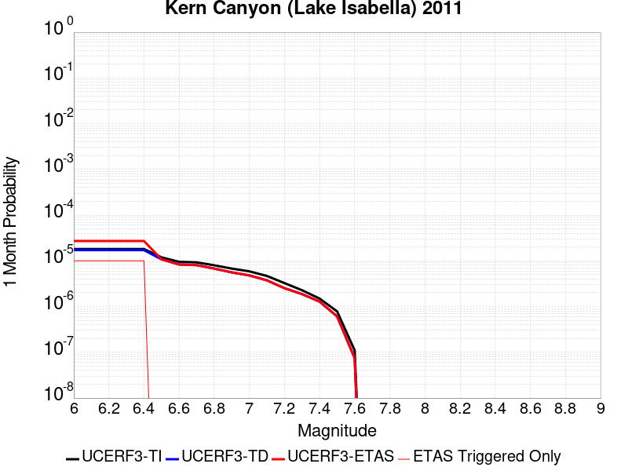 | 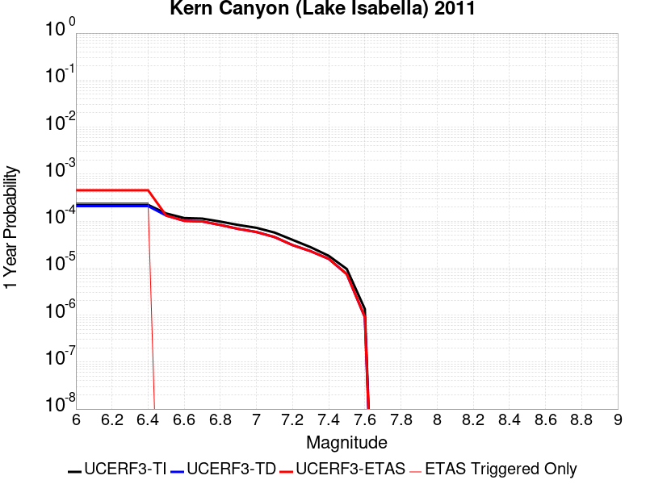 | 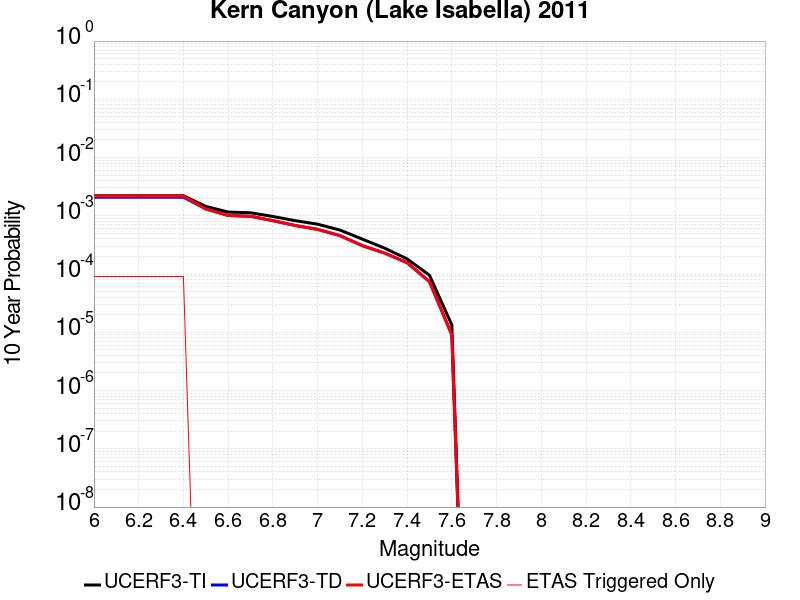 |

| Magnitude | 1 wk TI Prob | 1 wk TD Prob | 1 wk ETAS Prob | 1 wk ETAS/TD Gain | 1 wk ETAS Triggered Only | 1 mo TI Prob | 1 mo TD Prob | 1 mo ETAS Prob | 1 mo ETAS/TD Gain | 1 mo ETAS Triggered Only | 1 yr TI Prob | 1 yr TD Prob | 1 yr ETAS Prob | 1 yr ETAS/TD Gain | 1 yr ETAS Triggered Only | 10 yr TI Prob | 10 yr TD Prob | 10 yr ETAS Prob | 10 yr ETAS/TD Gain | 10 yr ETAS Triggered Only |
|-----|-----|-----|-----|-----|-----|-----|-----|-----|-----|-----|-----|-----|-----|-----|-----|-----|-----|-----|-----|-----|
| 6.0 | 4.2387383E-6 | 4.001636E-6 | 5.700402E-5 | 14.245178 | 5.3002597E-5 | 1.8165894E-5 | 1.7149767E-5 | 7.015146E-5 | 4.0905194 | 5.3002597E-5 | 2.2114732E-4 | 2.0878029E-4 | 2.617718E-4 | 1.2538148 | 5.3002597E-5 | 0.0022092736 | 0.0020860252 | 0.0021389173 | 1.0253555 | 5.3002597E-5 |
| 6.1 | 4.2387383E-6 | 4.001636E-6 | 5.700402E-5 | 14.245178 | 5.3002597E-5 | 1.8165894E-5 | 1.7149767E-5 | 7.015146E-5 | 4.0905194 | 5.3002597E-5 | 2.2114732E-4 | 2.0878029E-4 | 2.617718E-4 | 1.2538148 | 5.3002597E-5 | 0.0022092736 | 0.0020860252 | 0.0021389173 | 1.0253555 | 5.3002597E-5 |
| 6.2 | 4.2387383E-6 | 4.001636E-6 | 5.700402E-5 | 14.245178 | 5.3002597E-5 | 1.8165894E-5 | 1.7149767E-5 | 7.015146E-5 | 4.0905194 | 5.3002597E-5 | 2.2114732E-4 | 2.0878029E-4 | 2.617718E-4 | 1.2538148 | 5.3002597E-5 | 0.0022092736 | 0.0020860252 | 0.0021389173 | 1.0253555 | 5.3002597E-5 |
| 6.3 | 4.2387383E-6 | 4.001636E-6 | 5.700402E-5 | 14.245178 | 5.3002597E-5 | 1.8165894E-5 | 1.7149767E-5 | 7.015146E-5 | 4.0905194 | 5.3002597E-5 | 2.2114732E-4 | 2.0878029E-4 | 2.617718E-4 | 1.2538148 | 5.3002597E-5 | 0.0022092736 | 0.0020860252 | 0.0021389173 | 1.0253555 | 5.3002597E-5 |
| 6.4 | 4.2387383E-6 | 4.001636E-6 | 5.700402E-5 | 14.245178 | 5.3002597E-5 | 1.8165894E-5 | 1.7149767E-5 | 7.015146E-5 | 4.0905194 | 5.3002597E-5 | 2.2114732E-4 | 2.0878029E-4 | 2.617718E-4 | 1.2538148 | 5.3002597E-5 | 0.0022092736 | 0.0020860252 | 0.0021389173 | 1.0253555 | 5.3002597E-5 |
| 6.5 | 2.7857532E-6 | 2.5178654E-6 | 2.5178654E-6 | 1.0 | 0.0 | 1.1938888E-5 | 1.0790809E-5 | 1.0790809E-5 | 1.0 | 0.0 | 1.4534626E-4 | 1.313705E-4 | 1.313705E-4 | 1.0 | 0.0 | 0.0014525123 | 0.0013129612 | 0.0013129612 | 1.0 | 0.0 |
| 6.6 | 2.2233348E-6 | 1.9441222E-6 | 1.9441222E-6 | 1.0 | 0.0 | 9.528543E-6 | 8.331926E-6 | 8.331926E-6 | 1.0 | 0.0 | 1.1600384E-4 | 1.0143657E-4 | 1.0143657E-4 | 1.0 | 0.0 | 0.001159433 | 0.0010139113 | 0.0010139113 | 1.0 | 0.0 |
| 6.7 | 2.1635126E-6 | 1.8835024E-6 | 1.8835024E-6 | 1.0 | 0.0 | 9.272164E-6 | 8.072128E-6 | 8.072128E-6 | 1.0 | 0.0 | 1.1288274E-4 | 9.827381E-5 | 9.827381E-5 | 1.0 | 0.0 | 0.0011282542 | 9.823117E-4 | 9.823117E-4 | 1.0 | 0.0 |
| 6.8 | 1.8685711E-6 | 1.5831414E-6 | 1.5831414E-6 | 1.0 | 0.0 | 8.008137E-6 | 6.7848746E-6 | 6.7848746E-6 | 1.0 | 0.0 | 9.74947E-5 | 8.260277E-5 | 8.260277E-5 | 1.0 | 0.0 | 9.745194E-4 | 8.2572555E-4 | 8.2572555E-4 | 1.0 | 0.0 |
| 6.9 | 1.5815071E-6 | 1.3064919E-6 | 1.3064919E-6 | 1.0 | 0.0 | 6.77787E-6 | 5.599239E-6 | 5.599239E-6 | 1.0 | 0.0 | 8.251744E-5 | 6.816863E-5 | 6.816863E-5 | 1.0 | 0.0 | 8.248681E-4 | 6.8147987E-4 | 6.8147987E-4 | 1.0 | 0.0 |
| 7.0 | 1.3772564E-6 | 1.121071E-6 | 1.121071E-6 | 1.0 | 0.0 | 5.9025137E-6 | 4.8045813E-6 | 4.8045813E-6 | 1.0 | 0.0 | 7.186073E-5 | 5.8494225E-5 | 5.8494225E-5 | 1.0 | 0.0 | 7.18375E-4 | 5.8479037E-4 | 5.8479037E-4 | 1.0 | 0.0 |
| 7.1 | 1.0916998E-6 | 8.763771E-7 | 8.763771E-7 | 1.0 | 0.0 | 4.678705E-6 | 3.7558964E-6 | 3.7558964E-6 | 1.0 | 0.0 | 5.6961744E-5 | 4.5727094E-5 | 4.5727094E-5 | 1.0 | 0.0 | 5.6947145E-4 | 4.571782E-4 | 4.571782E-4 | 1.0 | 0.0 |
| 7.2 | 7.6277024E-7 | 5.90145E-7 | 5.90145E-7 | 1.0 | 0.0 | 3.2690114E-6 | 2.5291904E-6 | 2.5291904E-6 | 1.0 | 0.0 | 3.9799485E-5 | 3.0792464E-5 | 3.0792464E-5 | 1.0 | 0.0 | 3.9792358E-4 | 3.0788258E-4 | 3.0788258E-4 | 1.0 | 0.0 |
| 7.3 | 5.3265916E-7 | 4.3824386E-7 | 4.3824386E-7 | 1.0 | 0.0 | 2.282823E-6 | 1.8781866E-6 | 1.8781866E-6 | 1.0 | 0.0 | 2.7793016E-5 | 2.2866687E-5 | 2.2866687E-5 | 1.0 | 0.0 | 2.778954E-4 | 2.2864371E-4 | 2.2864371E-4 | 1.0 | 0.0 |
| 7.4 | 3.4946007E-7 | 3.006569E-7 | 3.006569E-7 | 1.0 | 0.0 | 1.497685E-6 | 1.2885289E-6 | 1.2885289E-6 | 1.0 | 0.0 | 1.8234163E-5 | 1.5687729E-5 | 1.5687729E-5 | 1.0 | 0.0 | 1.8232666E-4 | 1.5686643E-4 | 1.5686643E-4 | 1.0 | 0.0 |
| 7.5 | 1.8317026E-7 | 1.42448E-7 | 1.42448E-7 | 1.0 | 0.0 | 7.850152E-7 | 6.104913E-7 | 6.104913E-7 | 1.0 | 0.0 | 9.557518E-6 | 7.432707E-6 | 7.432707E-6 | 1.0 | 0.0 | 9.5571064E-5 | 7.4324664E-5 | 7.4324664E-5 | 1.0 | 0.0 |
| 7.6 | 2.572245E-8 | 1.7352539E-8 | 1.7352539E-8 | 1.0 | 0.0 | 1.10239064E-7 | 7.436802E-8 | 7.436802E-8 | 1.0 | 0.0 | 1.3421597E-6 | 9.0543034E-7 | 9.0543034E-7 | 1.0 | 0.0 | 1.3421517E-5 | 9.054272E-6 | 9.054272E-6 | 1.0 | 0.0 |

## White Mountains
*[(top)](#table-of-contents)*

| 1 Week | 1 Month | 1 Year | 10 Year |
|-----|-----|-----|-----|
| 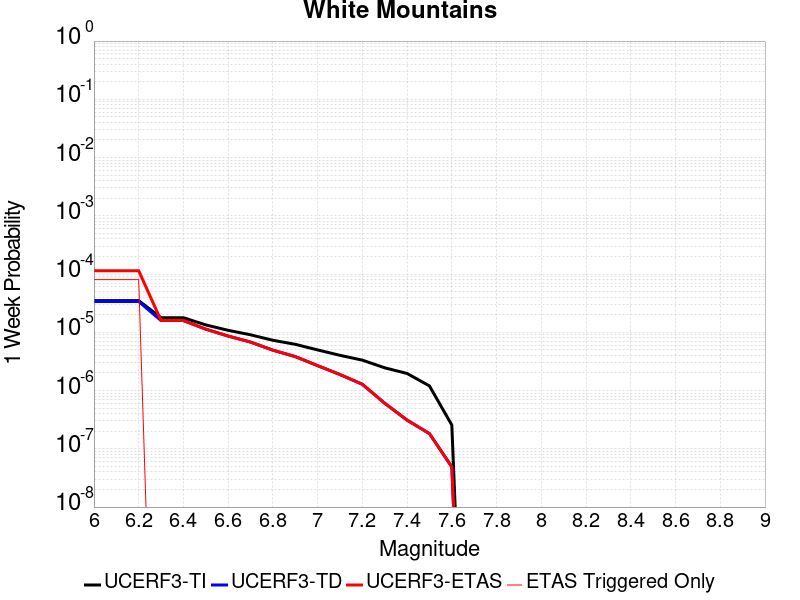 | 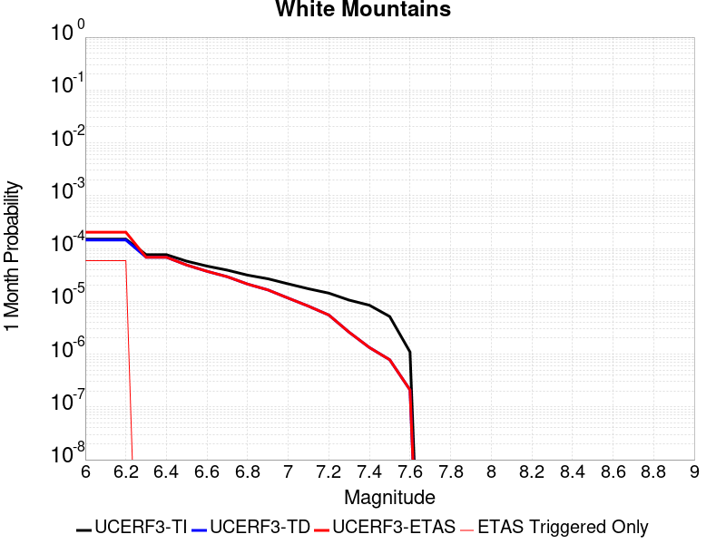 | 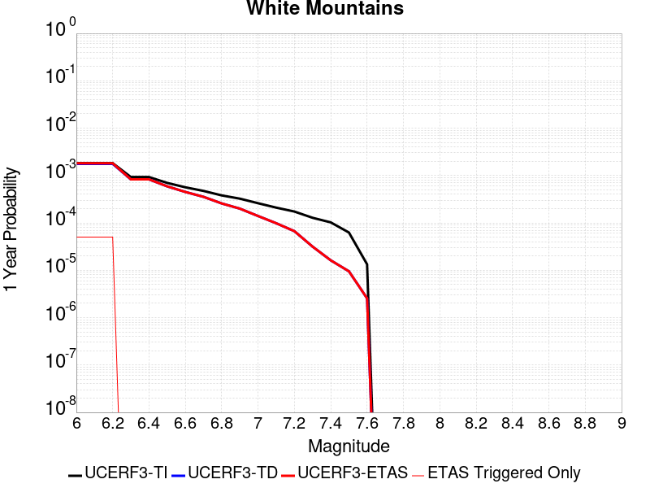 | 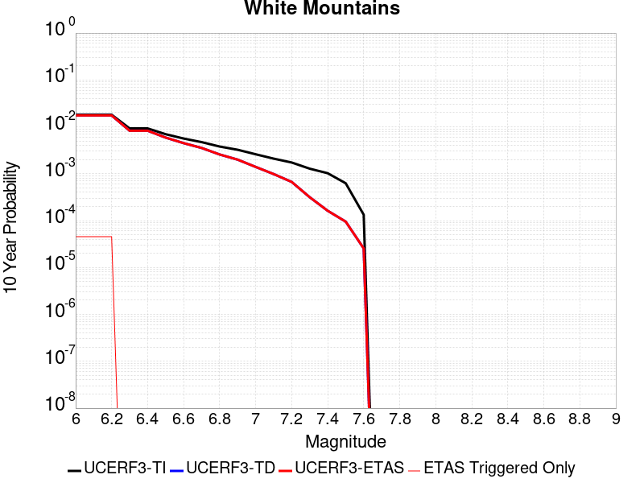 |

| Magnitude | 1 wk TI Prob | 1 wk TD Prob | 1 wk ETAS Prob | 1 wk ETAS/TD Gain | 1 wk ETAS Triggered Only | 1 mo TI Prob | 1 mo TD Prob | 1 mo ETAS Prob | 1 mo ETAS/TD Gain | 1 mo ETAS Triggered Only | 1 yr TI Prob | 1 yr TD Prob | 1 yr ETAS Prob | 1 yr ETAS/TD Gain | 1 yr ETAS Triggered Only | 10 yr TI Prob | 10 yr TD Prob | 10 yr ETAS Prob | 10 yr ETAS/TD Gain | 10 yr ETAS Triggered Only |
|-----|-----|-----|-----|-----|-----|-----|-----|-----|-----|-----|-----|-----|-----|-----|-----|-----|-----|-----|-----|-----|
| 6.0 | 3.503579E-5 | 3.3783974E-5 | 8.6784785E-5 | 2.568815 | 5.3002597E-5 | 1.5014476E-4 | 1.4478111E-4 | 1.9777604E-4 | 1.3660347 | 5.3002597E-5 | 0.0018264796 | 0.0017614056 | 0.0018143149 | 1.0300381 | 5.3002597E-5 | 0.018115403 | 0.017486779 | 0.017538855 | 1.002978 | 5.3002597E-5 |
| 6.1 | 3.503579E-5 | 3.3783974E-5 | 8.6784785E-5 | 2.568815 | 5.3002597E-5 | 1.5014476E-4 | 1.4478111E-4 | 1.9777604E-4 | 1.3660347 | 5.3002597E-5 | 0.0018264796 | 0.0017614056 | 0.0018143149 | 1.0300381 | 5.3002597E-5 | 0.018115403 | 0.017486779 | 0.017538855 | 1.002978 | 5.3002597E-5 |
| 6.2 | 3.503579E-5 | 3.3783974E-5 | 8.6784785E-5 | 2.568815 | 5.3002597E-5 | 1.5014476E-4 | 1.4478111E-4 | 1.9777604E-4 | 1.3660347 | 5.3002597E-5 | 0.0018264796 | 0.0017614056 | 0.0018143149 | 1.0300381 | 5.3002597E-5 | 0.018115403 | 0.017486779 | 0.017538855 | 1.002978 | 5.3002597E-5 |
| 6.3 | 1.7818425E-5 | 1.591604E-5 | 1.591604E-5 | 1.0 | 0.0 | 7.636245E-5 | 6.8209905E-5 | 6.8209905E-5 | 1.0 | 0.0 | 9.293162E-4 | 8.301534E-4 | 8.301534E-4 | 1.0 | 0.0 | 0.009254395 | 0.008271982 | 0.008271982 | 1.0 | 0.0 |
| 6.4 | 1.7818425E-5 | 1.591604E-5 | 1.591604E-5 | 1.0 | 0.0 | 7.636245E-5 | 6.8209905E-5 | 6.8209905E-5 | 1.0 | 0.0 | 9.293162E-4 | 8.301534E-4 | 8.301534E-4 | 1.0 | 0.0 | 0.009254395 | 0.008271982 | 0.008271982 | 1.0 | 0.0 |
| 6.5 | 1.3397557E-5 | 1.1336246E-5 | 1.1336246E-5 | 1.0 | 0.0 | 5.741684E-5 | 4.8583046E-5 | 4.8583046E-5 | 1.0 | 0.0 | 6.988258E-4 | 5.91345E-4 | 5.91345E-4 | 1.0 | 0.0 | 0.006966323 | 0.0058984202 | 0.0058984202 | 1.0 | 0.0 |
| 6.6 | 1.0818695E-5 | 8.6253485E-6 | 8.6253485E-6 | 1.0 | 0.0 | 4.6365014E-5 | 3.696528E-5 | 3.696528E-5 | 1.0 | 0.0 | 5.6434784E-4 | 4.4996373E-4 | 4.4996373E-4 | 1.0 | 0.0 | 0.005629168 | 0.004490963 | 0.004490963 | 1.0 | 0.0 |
| 6.7 | 9.067908E-6 | 6.8024283E-6 | 6.8024283E-6 | 1.0 | 0.0 | 3.8861883E-5 | 2.9152956E-5 | 2.9152956E-5 | 1.0 | 0.0 | 4.7304068E-4 | 3.5488262E-4 | 3.5488262E-4 | 1.0 | 0.0 | 0.00472035 | 0.003543476 | 0.003543476 | 1.0 | 0.0 |
| 6.8 | 7.295947E-6 | 4.9363807E-6 | 4.9363807E-6 | 1.0 | 0.0 | 3.126797E-5 | 2.1155753E-5 | 2.1155753E-5 | 1.0 | 0.0 | 3.8062103E-4 | 2.5754198E-4 | 2.5754198E-4 | 1.0 | 0.0 | 0.0037996976 | 0.002572548 | 0.002572548 | 1.0 | 0.0 |
| 6.9 | 6.2243444E-6 | 3.8322046E-6 | 3.8322046E-6 | 1.0 | 0.0 | 2.6675489E-5 | 1.6423633E-5 | 1.6423633E-5 | 1.0 | 0.0 | 3.2472567E-4 | 1.9993992E-4 | 1.9993992E-4 | 1.0 | 0.0 | 0.0032425157 | 0.0019976532 | 0.0019976532 | 1.0 | 0.0 |
| 7.0 | 4.9878413E-6 | 2.679527E-6 | 2.679527E-6 | 1.0 | 0.0 | 2.1376287E-5 | 1.1483638E-5 | 1.1483638E-5 | 1.0 | 0.0 | 2.602252E-4 | 1.3980459E-4 | 1.3980459E-4 | 1.0 | 0.0 | 0.002599207 | 0.0013971926 | 0.0013971926 | 1.0 | 0.0 |
| 7.1 | 4.0252844E-6 | 1.8857509E-6 | 1.8857509E-6 | 1.0 | 0.0 | 1.7251105E-5 | 8.081765E-6 | 8.081765E-6 | 1.0 | 0.0 | 2.1001195E-4 | 9.8391174E-5 | 9.8391174E-5 | 1.0 | 0.0 | 0.0020981359 | 9.83489E-4 | 9.83489E-4 | 1.0 | 0.0 |
| 7.2 | 3.3284066E-6 | 1.281958E-6 | 1.281958E-6 | 1.0 | 0.0 | 1.4264522E-5 | 5.4940947E-6 | 5.4940947E-6 | 1.0 | 0.0 | 1.736567E-4 | 6.688865E-5 | 6.688865E-5 | 1.0 | 0.0 | 0.0017352107 | 6.6869525E-4 | 6.6869525E-4 | 1.0 | 0.0 |
| 7.3 | 2.458226E-6 | 6.0571654E-7 | 6.0571654E-7 | 1.0 | 0.0 | 1.0535211E-5 | 2.5959255E-6 | 2.5959255E-6 | 1.0 | 0.0 | 1.2825865E-4 | 3.1604974E-5 | 3.1604974E-5 | 1.0 | 0.0 | 0.0012818464 | 3.1600855E-4 | 3.1600855E-4 | 1.0 | 0.0 |
| 7.4 | 1.965953E-6 | 3.1088828E-7 | 3.1088828E-7 | 1.0 | 0.0 | 8.425486E-6 | 1.3323777E-6 | 1.3323777E-6 | 1.0 | 0.0 | 1.0257547E-4 | 1.6221578E-5 | 1.6221578E-5 | 1.0 | 0.0 | 0.0010252813 | 1.6220407E-4 | 1.6220407E-4 | 1.0 | 0.0 |
| 7.5 | 1.2014192E-6 | 1.8243925E-7 | 1.8243925E-7 | 1.0 | 0.0 | 5.148929E-6 | 7.8188225E-7 | 7.8188225E-7 | 1.0 | 0.0 | 6.2686406E-5 | 9.519375E-6 | 9.519375E-6 | 1.0 | 0.0 | 6.266873E-4 | 9.518977E-5 | 9.518977E-5 | 1.0 | 0.0 |
| 7.6 | 2.5612175E-7 | 4.894561E-8 | 4.894561E-8 | 1.0 | 0.0 | 1.0976642E-6 | 2.0976687E-7 | 2.0976687E-7 | 1.0 | 0.0 | 1.3363979E-5 | 2.553909E-6 | 2.553909E-6 | 1.0 | 0.0 | 1.3363175E-4 | 2.5538833E-5 | 2.5538833E-5 | 1.0 | 0.0 |

## Santa Cruz Island
*[(top)](#table-of-contents)*

| 1 Week | 1 Month | 1 Year | 10 Year |
|-----|-----|-----|-----|
|  | 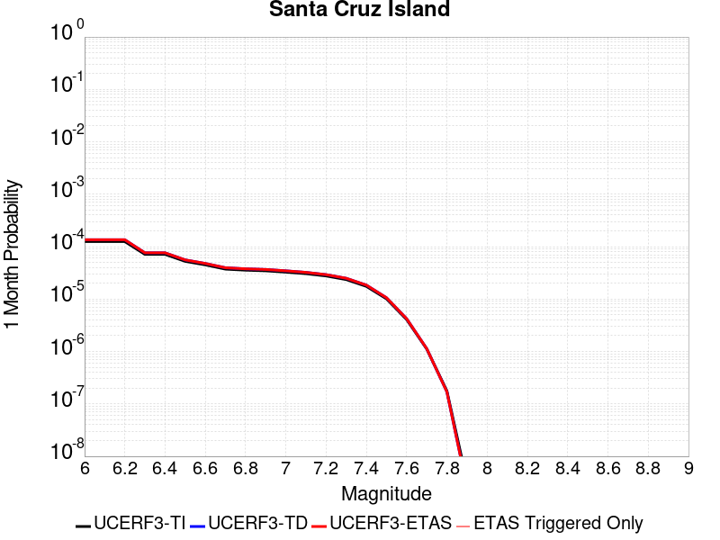 | 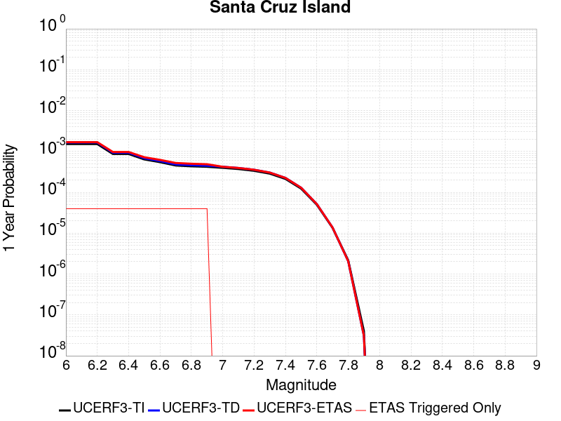 | 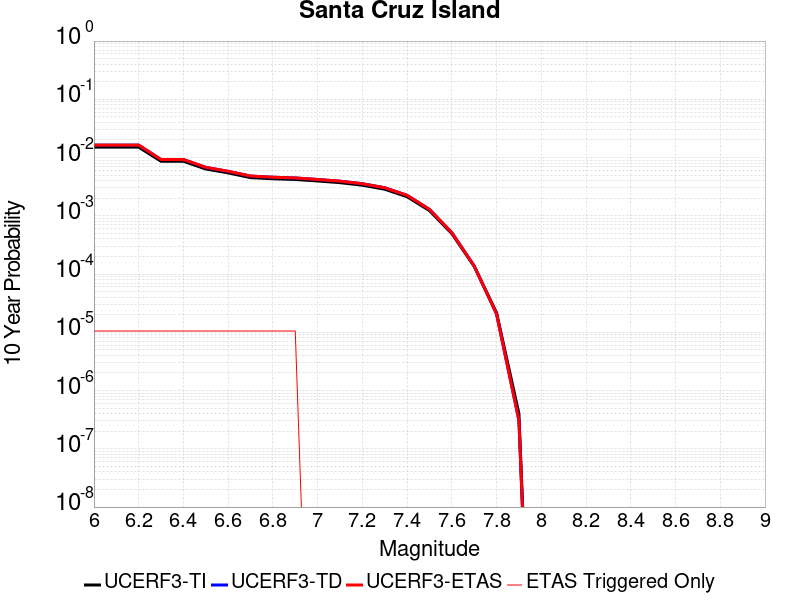 |

| Magnitude | 1 wk TI Prob | 1 wk TD Prob | 1 wk ETAS Prob | 1 wk ETAS/TD Gain | 1 wk ETAS Triggered Only | 1 mo TI Prob | 1 mo TD Prob | 1 mo ETAS Prob | 1 mo ETAS/TD Gain | 1 mo ETAS Triggered Only | 1 yr TI Prob | 1 yr TD Prob | 1 yr ETAS Prob | 1 yr ETAS/TD Gain | 1 yr ETAS Triggered Only | 10 yr TI Prob | 10 yr TD Prob | 10 yr ETAS Prob | 10 yr ETAS/TD Gain | 10 yr ETAS Triggered Only |
|-----|-----|-----|-----|-----|-----|-----|-----|-----|-----|-----|-----|-----|-----|-----|-----|-----|-----|-----|-----|-----|
| 6.0 | 2.9164563E-5 | 3.1599673E-5 | 3.1599673E-5 | 1.0 | 0.0 | 1.2498499E-4 | 1.3542091E-4 | 1.3542091E-4 | 1.0 | 0.0 | 0.0015206301 | 0.0016476389 | 0.0017005542 | 1.0321158 | 5.3002597E-5 | 0.015102667 | 0.016367963 | 0.016420098 | 1.0031852 | 5.3002597E-5 |
| 6.1 | 2.9164563E-5 | 3.1599673E-5 | 3.1599673E-5 | 1.0 | 0.0 | 1.2498499E-4 | 1.3542091E-4 | 1.3542091E-4 | 1.0 | 0.0 | 0.0015206301 | 0.0016476389 | 0.0017005542 | 1.0321158 | 5.3002597E-5 | 0.015102667 | 0.016367963 | 0.016420098 | 1.0031852 | 5.3002597E-5 |
| 6.2 | 2.9164563E-5 | 3.1599673E-5 | 3.1599673E-5 | 1.0 | 0.0 | 1.2498499E-4 | 1.3542091E-4 | 1.3542091E-4 | 1.0 | 0.0 | 0.0015206301 | 0.0016476389 | 0.0017005542 | 1.0321158 | 5.3002597E-5 | 0.015102667 | 0.016367963 | 0.016420098 | 1.0031852 | 5.3002597E-5 |
| 6.3 | 1.6635553E-5 | 1.7804325E-5 | 1.7804325E-5 | 1.0 | 0.0 | 7.1293274E-5 | 7.630212E-5 | 7.630212E-5 | 1.0 | 0.0 | 8.6765E-4 | 9.286006E-4 | 9.81554E-4 | 1.057025 | 5.3002597E-5 | 0.008642701 | 0.009249076 | 0.009301589 | 1.0056776 | 5.3002597E-5 |
| 6.4 | 1.6635553E-5 | 1.7804325E-5 | 1.7804325E-5 | 1.0 | 0.0 | 7.1293274E-5 | 7.630212E-5 | 7.630212E-5 | 1.0 | 0.0 | 8.6765E-4 | 9.286006E-4 | 9.81554E-4 | 1.057025 | 5.3002597E-5 | 0.008642701 | 0.009249076 | 0.009301589 | 1.0056776 | 5.3002597E-5 |
| 6.5 | 1.2238748E-5 | 1.3042973E-5 | 1.3042973E-5 | 1.0 | 0.0 | 5.2450723E-5 | 5.5897275E-5 | 5.5897275E-5 | 1.0 | 0.0 | 6.3840044E-4 | 6.803405E-4 | 7.333071E-4 | 1.077853 | 5.3002597E-5 | 0.0063656955 | 0.006782976 | 0.006835619 | 1.007761 | 5.3002597E-5 |
| 6.6 | 1.0489767E-5 | 1.1156617E-5 | 1.1156617E-5 | 1.0 | 0.0 | 4.495537E-5 | 4.7813206E-5 | 4.7813206E-5 | 1.0 | 0.0 | 5.4719415E-4 | 5.8197253E-4 | 6.349443E-4 | 1.0910211 | 5.3002597E-5 | 0.005458487 | 0.005804726 | 0.0058574206 | 1.0090779 | 5.3002597E-5 |
| 6.7 | 8.699222E-6 | 9.236766E-6 | 9.236766E-6 | 1.0 | 0.0 | 3.7281847E-5 | 3.9585546E-5 | 3.9585546E-5 | 1.0 | 0.0 | 4.5381195E-4 | 4.8184796E-4 | 5.34825E-4 | 1.1099455 | 5.3002597E-5 | 0.0045288634 | 0.0048081 | 0.0048608477 | 1.0109706 | 5.3002597E-5 |
| 6.8 | 8.307732E-6 | 8.816889E-6 | 8.816889E-6 | 1.0 | 0.0 | 3.560408E-5 | 3.7786125E-5 | 3.7786125E-5 | 1.0 | 0.0 | 4.3339343E-4 | 4.5994937E-4 | 5.129276E-4 | 1.1151828 | 5.3002597E-5 | 0.004325492 | 0.0045900275 | 0.004642787 | 1.0114943 | 5.3002597E-5 |
| 6.9 | 8.073121E-6 | 8.564924E-6 | 8.564924E-6 | 1.0 | 0.0 | 3.459863E-5 | 3.6706308E-5 | 3.6706308E-5 | 1.0 | 0.0 | 4.2115687E-4 | 4.4680806E-4 | 4.99787E-4 | 1.118572 | 5.3002597E-5 | 0.004203596 | 0.0044591487 | 0.0045119147 | 1.0118333 | 5.3002597E-5 |
| 7.0 | 7.617019E-6 | 8.074651E-6 | 8.074651E-6 | 1.0 | 0.0 | 3.264396E-5 | 3.460519E-5 | 3.460519E-5 | 1.0 | 0.0 | 3.9736772E-4 | 4.2123714E-4 | 4.2123714E-4 | 1.0 | 0.0 | 0.003966579 | 0.0042044343 | 0.0042044343 | 1.0 | 0.0 |
| 7.1 | 7.1224836E-6 | 7.5457756E-6 | 7.5457756E-6 | 1.0 | 0.0 | 3.052457E-5 | 3.2338638E-5 | 3.2338638E-5 | 1.0 | 0.0 | 3.715733E-4 | 3.9365215E-4 | 3.9365215E-4 | 1.0 | 0.0 | 0.003709526 | 0.0039295917 | 0.0039295917 | 1.0 | 0.0 |
| 7.2 | 6.441115E-6 | 6.827372E-6 | 6.827372E-6 | 1.0 | 0.0 | 2.7604487E-5 | 2.925984E-5 | 2.925984E-5 | 1.0 | 0.0 | 3.360328E-4 | 3.5618054E-4 | 3.5618054E-4 | 1.0 | 0.0 | 0.0033552512 | 0.003556125 | 0.003556125 | 1.0 | 0.0 |
| 7.3 | 5.494274E-6 | 5.819985E-6 | 5.819985E-6 | 1.0 | 0.0 | 2.3546674E-5 | 2.4942556E-5 | 2.4942556E-5 | 1.0 | 0.0 | 2.8664304E-4 | 3.0363348E-4 | 3.0363348E-4 | 1.0 | 0.0 | 0.002862736 | 0.0030322094 | 0.0030322094 | 1.0 | 0.0 |
| 7.4 | 4.0802624E-6 | 4.3122495E-6 | 4.3122495E-6 | 1.0 | 0.0 | 1.7486722E-5 | 1.8480938E-5 | 1.8480938E-5 | 1.0 | 0.0 | 2.1288003E-4 | 2.2498227E-4 | 2.2498227E-4 | 1.0 | 0.0 | 0.0021267622 | 0.002247554 | 0.002247554 | 1.0 | 0.0 |
| 7.5 | 2.3584746E-6 | 2.475306E-6 | 2.475306E-6 | 1.0 | 0.0 | 1.0107709E-5 | 1.0608412E-5 | 1.0608412E-5 | 1.0 | 0.0 | 1.2305441E-4 | 1.291498E-4 | 1.291498E-4 | 1.0 | 0.0 | 0.0012298629 | 0.0012907526 | 0.0012907526 | 1.0 | 0.0 |
| 7.6 | 9.4981914E-7 | 9.860919E-7 | 9.860919E-7 | 1.0 | 0.0 | 4.0706473E-6 | 4.2261013E-6 | 4.2261013E-6 | 1.0 | 0.0 | 4.9559E-5 | 5.145158E-5 | 5.145158E-5 | 1.0 | 0.0 | 4.954795E-4 | 5.14398E-4 | 5.14398E-4 | 1.0 | 0.0 |
| 7.7 | 2.6013532E-7 | 2.641658E-7 | 2.641658E-7 | 1.0 | 0.0 | 1.1148652E-6 | 1.1321387E-6 | 1.1321387E-6 | 1.0 | 0.0 | 1.3573399E-5 | 1.3783702E-5 | 1.3783702E-5 | 1.0 | 0.0 | 1.357257E-4 | 1.3782854E-4 | 1.3782854E-4 | 1.0 | 0.0 |
| 7.8 | 4.1522263E-8 | 3.965676E-8 | 3.965676E-8 | 1.0 | 0.0 | 1.7795254E-7 | 1.6995754E-7 | 1.6995754E-7 | 1.0 | 0.0 | 2.16657E-6 | 2.0692314E-6 | 2.0692314E-6 | 1.0 | 0.0 | 2.1665488E-5 | 2.0692141E-5 | 2.0692141E-5 | 1.0 | 0.0 |
| 7.9 | 7.7242046E-10 | 5.946812E-10 | 5.946812E-10 | 1.0 | 0.0 | 3.3103735E-9 | 2.5486335E-9 | 2.5486335E-9 | 1.0 | 0.0 | 4.0303796E-8 | 3.1029614E-8 | 3.1029614E-8 | 1.0 | 0.0 | 4.030379E-7 | 3.102961E-7 | 3.102961E-7 | 1.0 | 0.0 |

## Great Valley 03a Dunnigan Hills
*[(top)](#table-of-contents)*

| 1 Week | 1 Month | 1 Year | 10 Year |
|-----|-----|-----|-----|
| 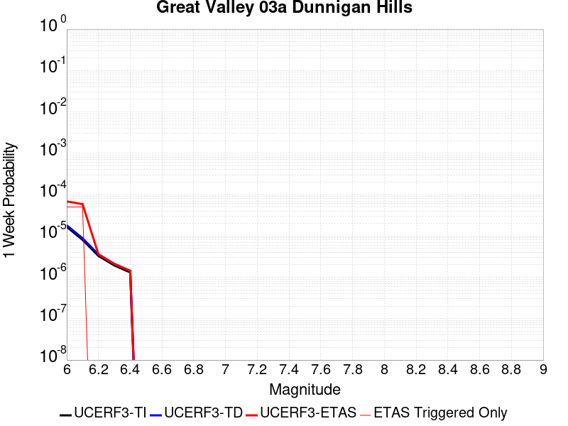 | 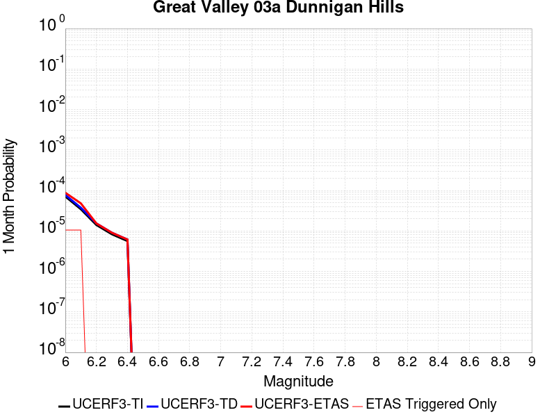 | 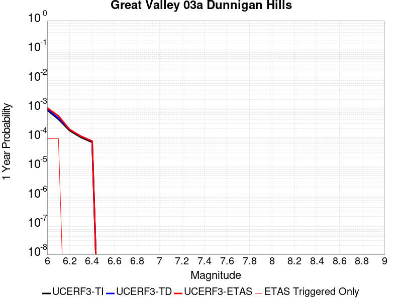 | 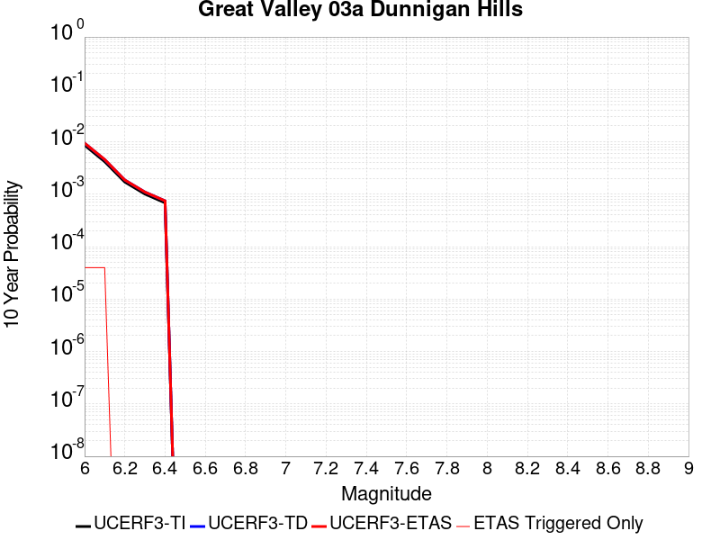 |

| Magnitude | 1 wk TI Prob | 1 wk TD Prob | 1 wk ETAS Prob | 1 wk ETAS/TD Gain | 1 wk ETAS Triggered Only | 1 mo TI Prob | 1 mo TD Prob | 1 mo ETAS Prob | 1 mo ETAS/TD Gain | 1 mo ETAS Triggered Only | 1 yr TI Prob | 1 yr TD Prob | 1 yr ETAS Prob | 1 yr ETAS/TD Gain | 1 yr ETAS Triggered Only | 10 yr TI Prob | 10 yr TD Prob | 10 yr ETAS Prob | 10 yr ETAS/TD Gain | 10 yr ETAS Triggered Only |
|-----|-----|-----|-----|-----|-----|-----|-----|-----|-----|-----|-----|-----|-----|-----|-----|-----|-----|-----|-----|-----|
| 6.0 | 1.6591328E-5 | 1.810791E-5 | 7.110955E-5 | 3.9269881 | 5.3002597E-5 | 7.110376E-5 | 7.760341E-5 | 1.306019E-4 | 1.6829401 | 5.3002597E-5 | 8.6534437E-4 | 9.444811E-4 | 9.974337E-4 | 1.0560652 | 5.3002597E-5 | 0.008619824 | 0.009411503 | 0.009464006 | 1.0055786 | 5.3002597E-5 |
| 6.1 | 8.041125E-6 | 8.769705E-6 | 6.177184E-5 | 7.0437756 | 5.3002597E-5 | 3.4461507E-5 | 3.7584025E-5 | 9.058463E-5 | 2.4101896 | 5.3002597E-5 | 4.194881E-4 | 4.5750974E-4 | 5.104881E-4 | 1.1157972 | 5.3002597E-5 | 0.004186971 | 0.004567676 | 0.0046204366 | 1.0115508 | 5.3002597E-5 |
| 6.2 | 3.2807004E-6 | 3.5795601E-6 | 3.5795601E-6 | 1.0 | 0.0 | 1.4060069E-5 | 1.5340906E-5 | 1.5340906E-5 | 1.0 | 0.0 | 1.7116789E-4 | 1.8676367E-4 | 1.8676367E-4 | 1.0 | 0.0 | 0.0017103611 | 0.0018664751 | 0.0018664751 | 1.0 | 0.0 |
| 6.3 | 1.9339366E-6 | 2.1103756E-6 | 2.1103756E-6 | 1.0 | 0.0 | 8.288273E-6 | 9.044452E-6 | 9.044452E-6 | 1.0 | 0.0 | 1.00905054E-4 | 1.10113484E-4 | 1.10113484E-4 | 1.0 | 0.0 | 0.0010085925 | 0.0011008692 | 0.0011008692 | 1.0 | 0.0 |
| 6.4 | 1.3142635E-6 | 1.4339831E-6 | 1.4339831E-6 | 1.0 | 0.0 | 5.6325457E-6 | 6.145642E-6 | 6.145642E-6 | 1.0 | 0.0 | 6.857408E-5 | 7.482319E-5 | 7.482319E-5 | 1.0 | 0.0 | 6.8552926E-4 | 7.4823195E-4 | 7.4823195E-4 | 1.0 | 0.0 |

## Eureka Peak
*[(top)](#table-of-contents)*

| 1 Week | 1 Month | 1 Year | 10 Year |
|-----|-----|-----|-----|
|  | 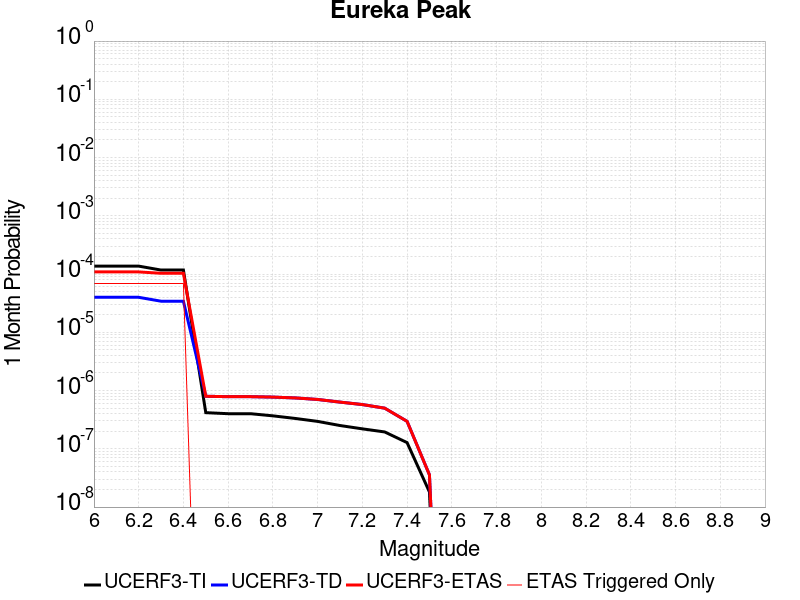 | 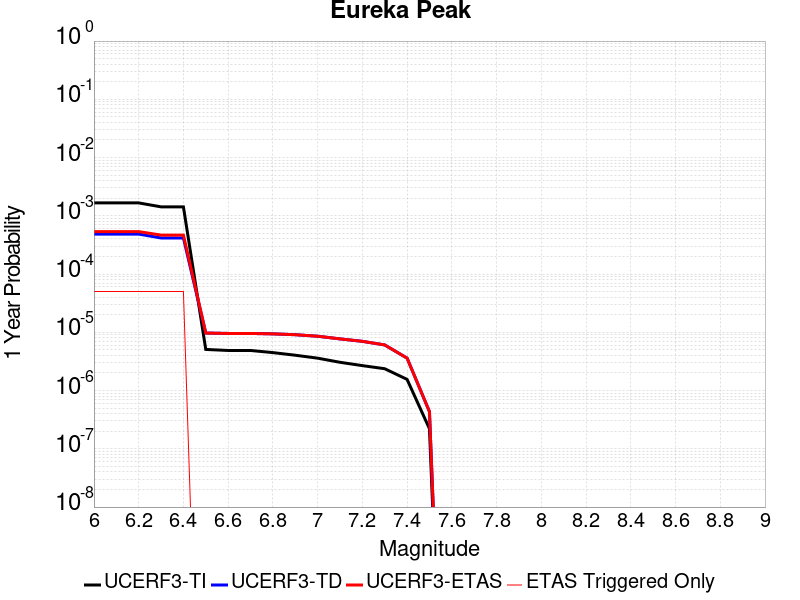 | 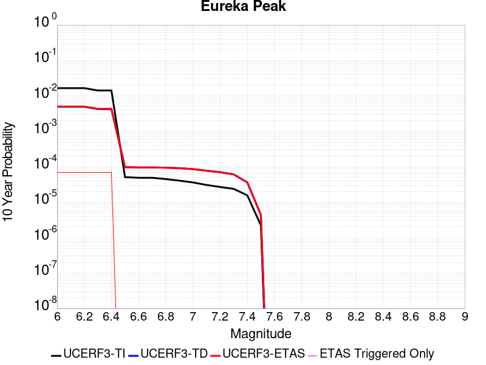 |

| Magnitude | 1 wk TI Prob | 1 wk TD Prob | 1 wk ETAS Prob | 1 wk ETAS/TD Gain | 1 wk ETAS Triggered Only | 1 mo TI Prob | 1 mo TD Prob | 1 mo ETAS Prob | 1 mo ETAS/TD Gain | 1 mo ETAS Triggered Only | 1 yr TI Prob | 1 yr TD Prob | 1 yr ETAS Prob | 1 yr ETAS/TD Gain | 1 yr ETAS Triggered Only | 10 yr TI Prob | 10 yr TD Prob | 10 yr ETAS Prob | 10 yr ETAS/TD Gain | 10 yr ETAS Triggered Only |
|-----|-----|-----|-----|-----|-----|-----|-----|-----|-----|-----|-----|-----|-----|-----|-----|-----|-----|-----|-----|-----|
| 6.0 | 3.1949054E-5 | 9.310349E-6 | 6.231245E-5 | 6.692816 | 5.3002597E-5 | 1.3691733E-4 | 3.9901326E-5 | 9.290181E-5 | 2.3282888 | 5.3002597E-5 | 0.0016656938 | 4.8576848E-4 | 5.387453E-4 | 1.1090578 | 5.3002597E-5 | 0.016532637 | 0.004924774 | 0.004977516 | 1.0107094 | 5.3002597E-5 |
| 6.1 | 3.1949054E-5 | 9.310349E-6 | 6.231245E-5 | 6.692816 | 5.3002597E-5 | 1.3691733E-4 | 3.9901326E-5 | 9.290181E-5 | 2.3282888 | 5.3002597E-5 | 0.0016656938 | 4.8576848E-4 | 5.387453E-4 | 1.1090578 | 5.3002597E-5 | 0.016532637 | 0.004924774 | 0.004977516 | 1.0107094 | 5.3002597E-5 |
| 6.2 | 3.1949054E-5 | 9.310349E-6 | 6.231245E-5 | 6.692816 | 5.3002597E-5 | 1.3691733E-4 | 3.9901326E-5 | 9.290181E-5 | 2.3282888 | 5.3002597E-5 | 0.0016656938 | 4.8576848E-4 | 5.387453E-4 | 1.1090578 | 5.3002597E-5 | 0.016532637 | 0.004924774 | 0.004977516 | 1.0107094 | 5.3002597E-5 |
| 6.3 | 2.7339745E-5 | 7.980512E-6 | 6.0982686E-5 | 7.64145 | 5.3002597E-5 | 1.1716507E-4 | 3.4202174E-5 | 8.7202956E-5 | 2.549632 | 5.3002597E-5 | 0.0014255513 | 4.164078E-4 | 4.6938832E-4 | 1.1272323 | 5.3002597E-5 | 0.0141644105 | 0.004228261 | 0.0042810393 | 1.0124823 | 5.3002597E-5 |
| 6.4 | 2.7339745E-5 | 7.980512E-6 | 6.0982686E-5 | 7.64145 | 5.3002597E-5 | 1.1716507E-4 | 3.4202174E-5 | 8.7202956E-5 | 2.549632 | 5.3002597E-5 | 0.0014255513 | 4.164078E-4 | 4.6938832E-4 | 1.1272323 | 5.3002597E-5 | 0.0141644105 | 0.004228261 | 0.0042810393 | 1.0124823 | 5.3002597E-5 |
| 6.5 | 9.738388E-8 | 1.8618802E-7 | 1.8618802E-7 | 1.0 | 0.0 | 4.1735944E-7 | 7.979484E-7 | 7.979484E-7 | 1.0 | 0.0 | 5.081339E-6 | 9.71498E-6 | 9.71498E-6 | 1.0 | 0.0 | 5.0812232E-5 | 9.7145625E-5 | 9.7145625E-5 | 1.0 | 0.0 |
| 6.6 | 9.3495956E-8 | 1.8327636E-7 | 1.8327636E-7 | 1.0 | 0.0 | 4.0069688E-7 | 7.8546987E-7 | 7.8546987E-7 | 1.0 | 0.0 | 4.8784736E-6 | 9.563055E-6 | 9.563055E-6 | 1.0 | 0.0 | 4.8783666E-5 | 9.5626514E-5 | 9.5626514E-5 | 1.0 | 0.0 |
| 6.7 | 9.3495956E-8 | 1.8327636E-7 | 1.8327636E-7 | 1.0 | 0.0 | 4.0069688E-7 | 7.8546987E-7 | 7.8546987E-7 | 1.0 | 0.0 | 4.8784736E-6 | 9.563055E-6 | 9.563055E-6 | 1.0 | 0.0 | 4.8783666E-5 | 9.5626514E-5 | 9.5626514E-5 | 1.0 | 0.0 |
| 6.8 | 8.591428E-8 | 1.8020607E-7 | 1.8020607E-7 | 1.0 | 0.0 | 3.68204E-7 | 7.723115E-7 | 7.723115E-7 | 1.0 | 0.0 | 4.4828744E-6 | 9.402853E-6 | 9.402853E-6 | 1.0 | 0.0 | 4.482784E-5 | 9.4024625E-5 | 9.4024625E-5 | 1.0 | 0.0 |
| 6.9 | 7.749723E-8 | 1.7438616E-7 | 1.7438616E-7 | 1.0 | 0.0 | 3.3213098E-7 | 7.473691E-7 | 7.473691E-7 | 1.0 | 0.0 | 4.043687E-6 | 9.099182E-6 | 9.099182E-6 | 1.0 | 0.0 | 4.0436134E-5 | 9.0988164E-5 | 9.0988164E-5 | 1.0 | 0.0 |
| 7.0 | 6.897872E-8 | 1.6414864E-7 | 1.6414864E-7 | 1.0 | 0.0 | 2.9562307E-7 | 7.0349404E-7 | 7.0349404E-7 | 1.0 | 0.0 | 3.5992048E-6 | 8.565007E-6 | 8.565007E-6 | 1.0 | 0.0 | 3.5991467E-5 | 8.564684E-5 | 8.564684E-5 | 1.0 | 0.0 |
| 7.1 | 5.859318E-8 | 1.4786792E-7 | 1.4786792E-7 | 1.0 | 0.0 | 2.5111362E-7 | 6.3371954E-7 | 6.3371954E-7 | 1.0 | 0.0 | 3.057304E-6 | 7.715508E-6 | 7.715508E-6 | 1.0 | 0.0 | 3.0572617E-5 | 7.715247E-5 | 7.715247E-5 | 1.0 | 0.0 |
| 7.2 | 5.1375338E-8 | 1.3420691E-7 | 1.3420691E-7 | 1.0 | 0.0 | 2.2018E-7 | 5.7517235E-7 | 5.7517235E-7 | 1.0 | 0.0 | 2.680688E-6 | 7.0027013E-6 | 7.0027013E-6 | 1.0 | 0.0 | 2.6806558E-5 | 7.0024864E-5 | 7.0024864E-5 | 1.0 | 0.0 |
| 7.3 | 4.5441396E-8 | 1.1635977E-7 | 1.1635977E-7 | 1.0 | 0.0 | 1.9474882E-7 | 4.9868464E-7 | 4.9868464E-7 | 1.0 | 0.0 | 2.3710643E-6 | 6.071469E-6 | 6.071469E-6 | 1.0 | 0.0 | 2.371039E-5 | 6.0713086E-5 | 6.0713086E-5 | 1.0 | 0.0 |
| 7.4 | 2.981918E-8 | 6.9110754E-8 | 6.9110754E-8 | 1.0 | 0.0 | 1.2779647E-7 | 2.9618892E-7 | 2.9618892E-7 | 1.0 | 0.0 | 1.5559209E-6 | 3.6060947E-6 | 3.6060947E-6 | 1.0 | 0.0 | 1.55591E-5 | 3.6060403E-5 | 3.6060403E-5 | 1.0 | 0.0 |
| 7.5 | 4.24214E-9 | 8.342036E-9 | 8.342036E-9 | 1.0 | 0.0 | 1.81806E-8 | 3.5751587E-8 | 3.5751587E-8 | 1.0 | 0.0 | 2.213488E-7 | 4.3527552E-7 | 4.3527552E-7 | 1.0 | 0.0 | 2.2134857E-6 | 4.352753E-6 | 4.352753E-6 | 1.0 | 0.0 |

## Davis Creek
*[(top)](#table-of-contents)*

| 1 Week | 1 Month | 1 Year | 10 Year |
|-----|-----|-----|-----|
| 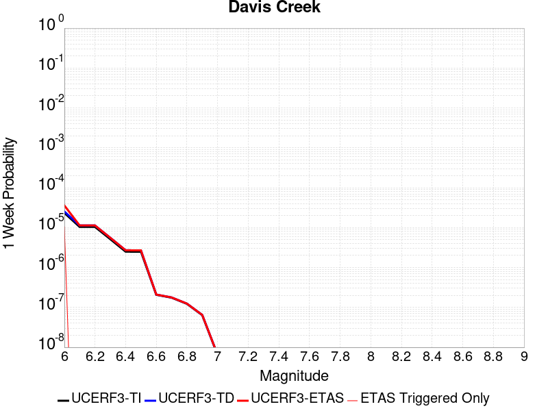 | 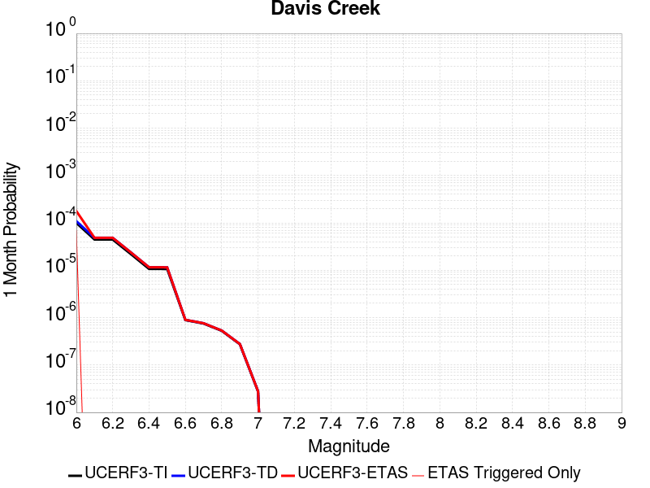 | 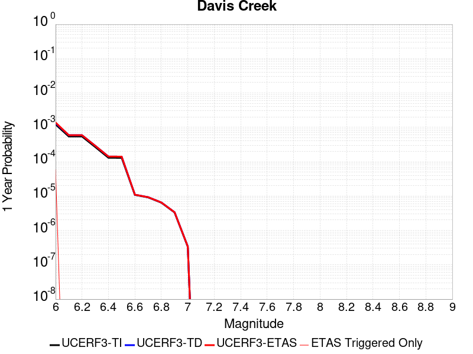 | 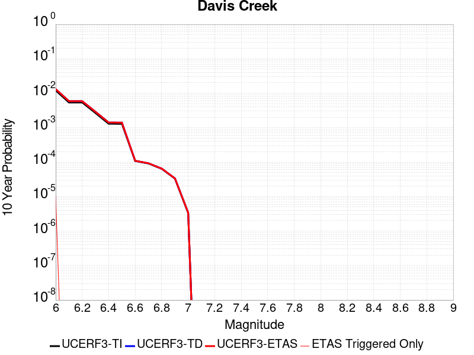 |

| Magnitude | 1 wk TI Prob | 1 wk TD Prob | 1 wk ETAS Prob | 1 wk ETAS/TD Gain | 1 wk ETAS Triggered Only | 1 mo TI Prob | 1 mo TD Prob | 1 mo ETAS Prob | 1 mo ETAS/TD Gain | 1 mo ETAS Triggered Only | 1 yr TI Prob | 1 yr TD Prob | 1 yr ETAS Prob | 1 yr ETAS/TD Gain | 1 yr ETAS Triggered Only | 10 yr TI Prob | 10 yr TD Prob | 10 yr ETAS Prob | 10 yr ETAS/TD Gain | 10 yr ETAS Triggered Only |
|-----|-----|-----|-----|-----|-----|-----|-----|-----|-----|-----|-----|-----|-----|-----|-----|-----|-----|-----|-----|-----|
| 6.0 | 2.331472E-5 | 2.5417152E-5 | 7.84184E-5 | 3.0852551 | 5.3002597E-5 | 9.99164E-5 | 1.08926775E-4 | 1.619236E-4 | 1.4865363 | 5.3002597E-5 | 0.0012158032 | 0.0013254952 | 0.0013784275 | 1.039934 | 5.3002597E-5 | 0.01209173 | 0.013187673 | 0.013239976 | 1.0039661 | 5.3002597E-5 |
| 6.1 | 1.0407654E-5 | 1.131696E-5 | 1.131696E-5 | 1.0 | 0.0 | 4.4603472E-5 | 4.8500508E-5 | 4.8500508E-5 | 1.0 | 0.0 | 5.4291193E-4 | 5.9036084E-4 | 5.9036084E-4 | 1.0 | 0.0 | 0.0054158745 | 0.0058905976 | 0.0058905976 | 1.0 | 0.0 |
| 6.2 | 1.0407654E-5 | 1.131696E-5 | 1.131696E-5 | 1.0 | 0.0 | 4.4603472E-5 | 4.8500508E-5 | 4.8500508E-5 | 1.0 | 0.0 | 5.4291193E-4 | 5.9036084E-4 | 5.9036084E-4 | 1.0 | 0.0 | 0.0054158745 | 0.0058905976 | 0.0058905976 | 1.0 | 0.0 |
| 6.3 | 5.1323277E-6 | 5.568543E-6 | 5.568543E-6 | 1.0 | 0.0 | 2.1995505E-5 | 2.3865015E-5 | 2.3865015E-5 | 1.0 | 0.0 | 2.6776237E-4 | 2.9052646E-4 | 2.9052646E-4 | 1.0 | 0.0 | 0.0026743996 | 0.0029023124 | 0.0029023124 | 1.0 | 0.0 |
| 6.4 | 2.4985154E-6 | 2.704532E-6 | 2.704532E-6 | 1.0 | 0.0 | 1.07078795E-5 | 1.1590821E-5 | 1.1590821E-5 | 1.0 | 0.0 | 1.3036063E-4 | 1.4111272E-4 | 1.4111272E-4 | 1.0 | 0.0 | 0.0013028418 | 0.001410586 | 0.001410586 | 1.0 | 0.0 |
| 6.5 | 2.4846438E-6 | 2.6904663E-6 | 2.6904663E-6 | 1.0 | 0.0 | 1.064843E-5 | 1.1530539E-5 | 1.1530539E-5 | 1.0 | 0.0 | 1.2963692E-4 | 1.4037889E-4 | 1.4037889E-4 | 1.0 | 0.0 | 0.0012956132 | 0.0014032569 | 0.0014032569 | 1.0 | 0.0 |
| 6.6 | 2.072566E-7 | 2.1018079E-7 | 2.1018079E-7 | 1.0 | 0.0 | 8.882423E-7 | 9.007745E-7 | 9.007745E-7 | 1.0 | 0.0 | 1.0814296E-5 | 1.0966876E-5 | 1.0966876E-5 | 1.0 | 0.0 | 1.081377E-4 | 1.0966354E-4 | 1.0966354E-4 | 1.0 | 0.0 |
| 6.7 | 1.7544528E-7 | 1.7790819E-7 | 1.7790819E-7 | 1.0 | 0.0 | 7.5190815E-7 | 7.6246346E-7 | 7.6246346E-7 | 1.0 | 0.0 | 9.154443E-6 | 9.282955E-6 | 9.282955E-6 | 1.0 | 0.0 | 9.1540656E-5 | 9.282582E-5 | 9.282582E-5 | 1.0 | 0.0 |
| 6.8 | 1.2320395E-7 | 1.2481134E-7 | 1.2481134E-7 | 1.0 | 0.0 | 5.280168E-7 | 5.349056E-7 | 5.349056E-7 | 1.0 | 0.0 | 6.428586E-6 | 6.5124573E-6 | 6.5124573E-6 | 1.0 | 0.0 | 6.4284E-5 | 6.512278E-5 | 6.512278E-5 | 1.0 | 0.0 |
| 6.9 | 6.399997E-8 | 6.486056E-8 | 6.486056E-8 | 1.0 | 0.0 | 2.7428555E-7 | 2.7797378E-7 | 2.7797378E-7 | 1.0 | 0.0 | 3.3394215E-6 | 3.3843262E-6 | 3.3843262E-6 | 1.0 | 0.0 | 3.3393713E-5 | 3.384281E-5 | 3.384281E-5 | 1.0 | 0.0 |
| 7.0 | 6.4455685E-9 | 6.5352617E-9 | 6.5352617E-9 | 1.0 | 0.0 | 2.7623864E-8 | 2.8008264E-8 | 2.8008264E-8 | 1.0 | 0.0 | 3.3632048E-7 | 3.4100063E-7 | 3.4100063E-7 | 1.0 | 0.0 | 3.3631998E-6 | 3.4100062E-6 | 3.4100062E-6 | 1.0 | 0.0 |

## San Andreas (Big Bend)
*[(top)](#table-of-contents)*

| 1 Week | 1 Month | 1 Year | 10 Year |
|-----|-----|-----|-----|
| 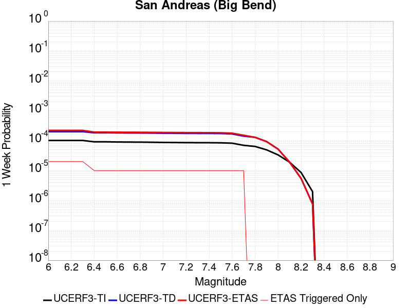 | 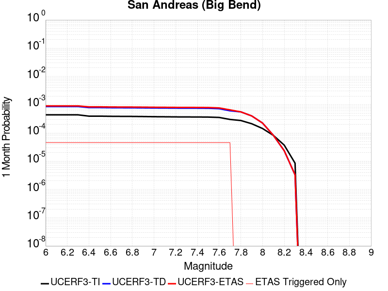 |  | 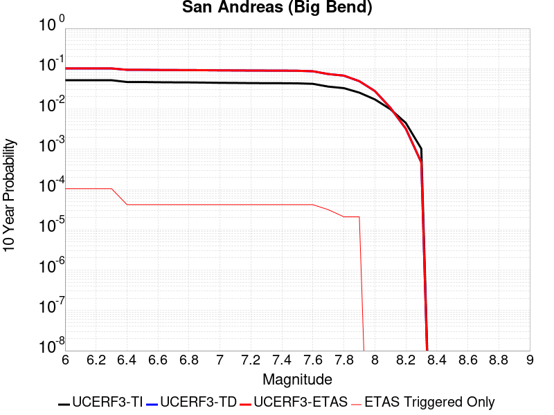 |

| Magnitude | 1 wk TI Prob | 1 wk TD Prob | 1 wk ETAS Prob | 1 wk ETAS/TD Gain | 1 wk ETAS Triggered Only | 1 mo TI Prob | 1 mo TD Prob | 1 mo ETAS Prob | 1 mo ETAS/TD Gain | 1 mo ETAS Triggered Only | 1 yr TI Prob | 1 yr TD Prob | 1 yr ETAS Prob | 1 yr ETAS/TD Gain | 1 yr ETAS Triggered Only | 10 yr TI Prob | 10 yr TD Prob | 10 yr ETAS Prob | 10 yr ETAS/TD Gain | 10 yr ETAS Triggered Only |
|-----|-----|-----|-----|-----|-----|-----|-----|-----|-----|-----|-----|-----|-----|-----|-----|-----|-----|-----|-----|-----|
| 6.0 | 1.0179969E-4 | 2.0070563E-4 | 2.0070563E-4 | 1.0 | 0.0 | 4.362114E-4 | 8.598845E-4 | 8.598845E-4 | 1.0 | 0.0 | 0.0052979486 | 0.010419123 | 0.010419123 | 1.0 | 0.0 | 0.051734097 | 0.10144164 | 0.10148927 | 1.0004694 | 5.3002597E-5 |
| 6.1 | 1.0179969E-4 | 2.0070563E-4 | 2.0070563E-4 | 1.0 | 0.0 | 4.362114E-4 | 8.598845E-4 | 8.598845E-4 | 1.0 | 0.0 | 0.0052979486 | 0.010419123 | 0.010419123 | 1.0 | 0.0 | 0.051734097 | 0.10144164 | 0.10148927 | 1.0004694 | 5.3002597E-5 |
| 6.2 | 1.0179969E-4 | 2.0070563E-4 | 2.0070563E-4 | 1.0 | 0.0 | 4.362114E-4 | 8.598845E-4 | 8.598845E-4 | 1.0 | 0.0 | 0.0052979486 | 0.010419123 | 0.010419123 | 1.0 | 0.0 | 0.051734097 | 0.10144164 | 0.10148927 | 1.0004694 | 5.3002597E-5 |
| 6.3 | 1.0179969E-4 | 2.0070563E-4 | 2.0070563E-4 | 1.0 | 0.0 | 4.362114E-4 | 8.598845E-4 | 8.598845E-4 | 1.0 | 0.0 | 0.0052979486 | 0.010419123 | 0.010419123 | 1.0 | 0.0 | 0.051734097 | 0.10144164 | 0.10148927 | 1.0004694 | 5.3002597E-5 |
| 6.4 | 9.1639464E-5 | 1.842787E-4 | 1.842787E-4 | 1.0 | 0.0 | 3.9268145E-4 | 7.89527E-4 | 7.89527E-4 | 1.0 | 0.0 | 0.0047704205 | 0.009570243 | 0.009570243 | 1.0 | 0.0 | 0.046693064 | 0.09376797 | 0.093816005 | 1.0005122 | 5.3002597E-5 |
| 6.5 | 9.1639464E-5 | 1.842787E-4 | 1.842787E-4 | 1.0 | 0.0 | 3.9268145E-4 | 7.89527E-4 | 7.89527E-4 | 1.0 | 0.0 | 0.0047704205 | 0.009570243 | 0.009570243 | 1.0 | 0.0 | 0.046693064 | 0.09376797 | 0.093816005 | 1.0005122 | 5.3002597E-5 |
| 6.6 | 9.042622E-5 | 1.8234932E-4 | 1.8234932E-4 | 1.0 | 0.0 | 3.8748336E-4 | 7.812632E-4 | 7.812632E-4 | 1.0 | 0.0 | 0.0047074095 | 0.009470508 | 0.009470508 | 1.0 | 0.0 | 0.046089325 | 0.09286199 | 0.092910066 | 1.0005177 | 5.3002597E-5 |
| 6.7 | 8.9836685E-5 | 1.814927E-4 | 1.814927E-4 | 1.0 | 0.0 | 3.8495753E-4 | 7.7759416E-4 | 7.7759416E-4 | 1.0 | 0.0 | 0.00467679 | 0.009426224 | 0.009426224 | 1.0 | 0.0 | 0.045795817 | 0.09245627 | 0.09250437 | 1.0005202 | 5.3002597E-5 |
| 6.8 | 8.9471854E-5 | 1.8096055E-4 | 1.8096055E-4 | 1.0 | 0.0 | 3.8339442E-4 | 7.7531487E-4 | 7.7531487E-4 | 1.0 | 0.0 | 0.004657841 | 0.009398713 | 0.009398713 | 1.0 | 0.0 | 0.04561414 | 0.092203476 | 0.09225159 | 1.0005219 | 5.3002597E-5 |
| 6.9 | 8.858234E-5 | 1.797803E-4 | 1.797803E-4 | 1.0 | 0.0 | 3.7958333E-4 | 7.7025965E-4 | 7.7025965E-4 | 1.0 | 0.0 | 0.004611638 | 0.009337694 | 0.009337694 | 1.0 | 0.0 | 0.04517103 | 0.0916436 | 0.09169175 | 1.0005254 | 5.3002597E-5 |
| 7.0 | 8.7433385E-5 | 1.7816834E-4 | 1.7816834E-4 | 1.0 | 0.0 | 3.746607E-4 | 7.633553E-4 | 7.633553E-4 | 1.0 | 0.0 | 0.004551957 | 0.009254351 | 0.009254351 | 1.0 | 0.0 | 0.044598386 | 0.090878054 | 0.090926245 | 1.0005302 | 5.3002597E-5 |
| 7.1 | 8.684964E-5 | 1.7728789E-4 | 1.7728789E-4 | 1.0 | 0.0 | 3.7215967E-4 | 7.595842E-4 | 7.595842E-4 | 1.0 | 0.0 | 0.0045216335 | 0.009208827 | 0.009208827 | 1.0 | 0.0 | 0.04430731 | 0.09045961 | 0.09050782 | 1.0005329 | 5.3002597E-5 |
| 7.2 | 8.606521E-5 | 1.7619408E-4 | 1.7619408E-4 | 1.0 | 0.0 | 3.6879873E-4 | 7.548991E-4 | 7.548991E-4 | 1.0 | 0.0 | 0.0044808835 | 0.009152266 | 0.009152266 | 1.0 | 0.0 | 0.043916024 | 0.08994013 | 0.089988366 | 1.0005363 | 5.3002597E-5 |
| 7.3 | 8.568266E-5 | 1.7561417E-4 | 1.7561417E-4 | 1.0 | 0.0 | 3.6715972E-4 | 7.524153E-4 | 7.524153E-4 | 1.0 | 0.0 | 0.0044610105 | 0.0091222795 | 0.0091222795 | 1.0 | 0.0 | 0.043725148 | 0.0896613 | 0.08970955 | 1.0005381 | 5.3002597E-5 |
| 7.4 | 8.5432206E-5 | 1.7524007E-4 | 1.7524007E-4 | 1.0 | 0.0 | 3.6608664E-4 | 7.508129E-4 | 7.508129E-4 | 1.0 | 0.0 | 0.004447999 | 0.009102933 | 0.009102933 | 1.0 | 0.0 | 0.043600157 | 0.08948149 | 0.089529745 | 1.0005393 | 5.3002597E-5 |
| 7.5 | 8.4791965E-5 | 1.7393343E-4 | 1.7393343E-4 | 1.0 | 0.0 | 3.633435E-4 | 7.452162E-4 | 7.452162E-4 | 1.0 | 0.0 | 0.0044147377 | 0.009035361 | 0.009035361 | 1.0 | 0.0 | 0.043280575 | 0.08885915 | 0.08890744 | 1.0005435 | 5.3002597E-5 |
| 7.6 | 8.241105E-5 | 1.68388E-4 | 1.68388E-4 | 1.0 | 0.0 | 3.531424E-4 | 7.2146347E-4 | 7.2146347E-4 | 1.0 | 0.0 | 0.0042910352 | 0.0087485295 | 0.0087485295 | 1.0 | 0.0 | 0.042091176 | 0.086236194 | 0.08628462 | 1.0005616 | 5.3002597E-5 |
| 7.7 | 7.00432E-5 | 1.4203055E-4 | 1.4203055E-4 | 1.0 | 0.0 | 3.001506E-4 | 6.085604E-4 | 6.085604E-4 | 1.0 | 0.0 | 0.0036482112 | 0.0073840916 | 0.0073840916 | 1.0 | 0.0 | 0.035888977 | 0.07351081 | 0.07355992 | 1.000668 | 5.3002597E-5 |
| 7.8 | 6.415362E-5 | 1.2967631E-4 | 1.2967631E-4 | 1.0 | 0.0 | 2.749151E-4 | 5.5563723E-4 | 5.5563723E-4 | 1.0 | 0.0 | 0.0033419547 | 0.00674393 | 0.00674393 | 1.0 | 0.0 | 0.03292141 | 0.067246385 | 0.06729583 | 1.0007352 | 5.3002597E-5 |
| 7.9 | 4.939911E-5 | 9.340218E-5 | 9.340218E-5 | 1.0 | 0.0 | 2.116933E-4 | 4.0023366E-4 | 4.0023366E-4 | 1.0 | 0.0 | 0.0025743195 | 0.0048619667 | 0.0048619667 | 1.0 | 0.0 | 0.025447013 | 0.04891005 | 0.048960462 | 1.0010307 | 5.3002597E-5 |
| 8.0 | 3.344983E-5 | 5.222126E-5 | 5.222126E-5 | 1.0 | 0.0 | 1.4334853E-4 | 2.2378622E-4 | 2.2378622E-4 | 1.0 | 0.0 | 0.0017438711 | 0.0027211946 | 0.0027211946 | 1.0 | 0.0 | 0.017302496 | 0.027919443 | 0.027919443 | 1.0 | 0.0 |
| 8.1 | 1.9104898E-5 | 1.917038E-5 | 1.917038E-5 | 1.0 | 0.0 | 8.1875565E-5 | 8.215619E-5 | 8.215619E-5 | 1.0 | 0.0 | 9.963791E-4 | 9.997933E-4 | 9.997933E-4 | 1.0 | 0.0 | 0.009919235 | 0.010748395 | 0.010748395 | 1.0 | 0.0 |
| 8.2 | 8.643924E-6 | 5.4738607E-6 | 5.4738607E-6 | 1.0 | 0.0 | 3.704486E-5 | 2.3459192E-5 | 2.3459192E-5 | 1.0 | 0.0 | 4.5092785E-4 | 2.855783E-4 | 2.855783E-4 | 1.0 | 0.0 | 0.0045001395 | 0.0032481598 | 0.0032481598 | 1.0 | 0.0 |
| 8.3 | 1.983087E-6 | 7.658221E-7 | 7.658221E-7 | 1.0 | 0.0 | 8.498917E-6 | 3.2820906E-6 | 3.2820906E-6 | 1.0 | 0.0 | 1.034694E-4 | 3.9958737E-5 | 3.9958737E-5 | 1.0 | 0.0 | 0.0010342124 | 4.7187202E-4 | 4.7187202E-4 | 1.0 | 0.0 |

## Palos Verdes
*[(top)](#table-of-contents)*

| 1 Week | 1 Month | 1 Year | 10 Year |
|-----|-----|-----|-----|
| 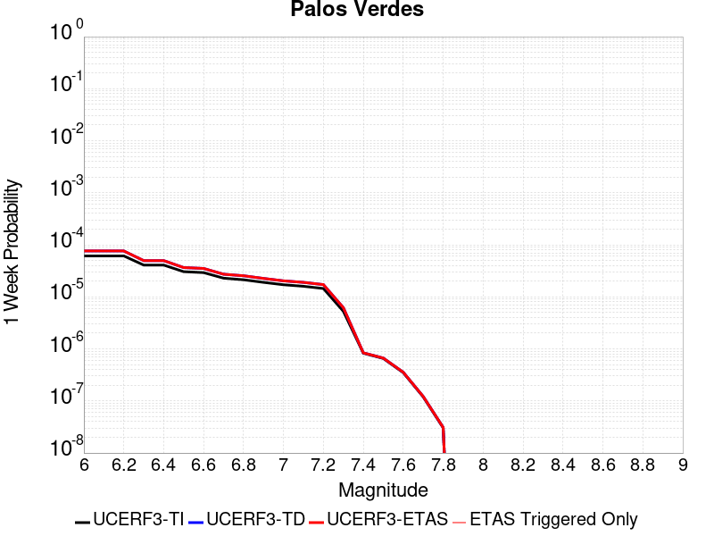 | 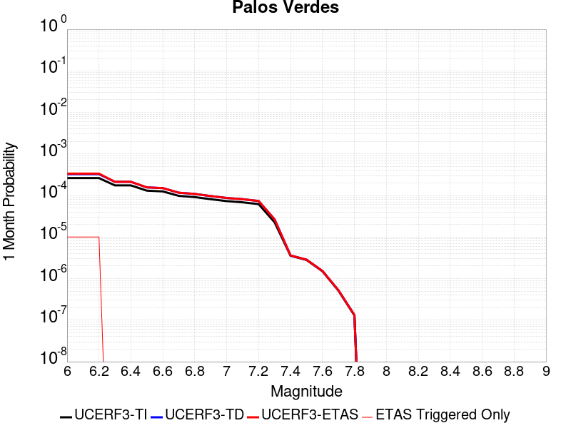 | 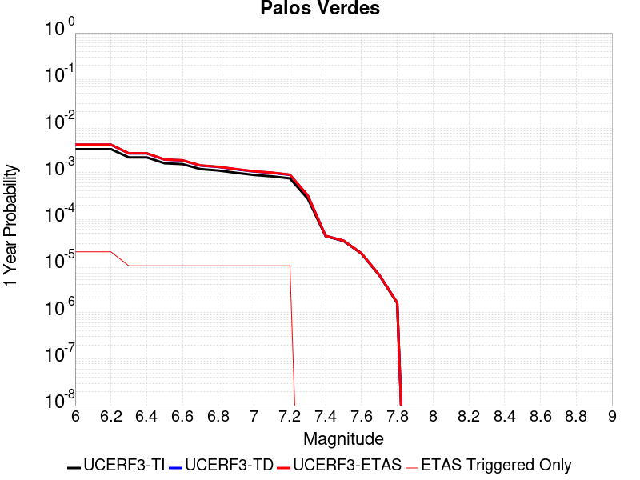 | 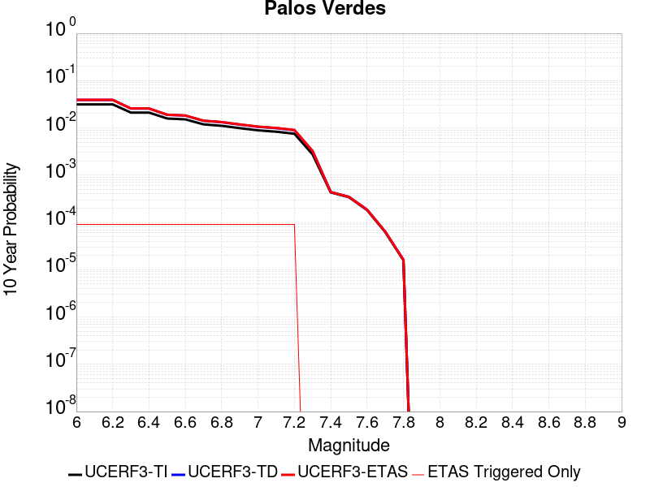 |

| Magnitude | 1 wk TI Prob | 1 wk TD Prob | 1 wk ETAS Prob | 1 wk ETAS/TD Gain | 1 wk ETAS Triggered Only | 1 mo TI Prob | 1 mo TD Prob | 1 mo ETAS Prob | 1 mo ETAS/TD Gain | 1 mo ETAS Triggered Only | 1 yr TI Prob | 1 yr TD Prob | 1 yr ETAS Prob | 1 yr ETAS/TD Gain | 1 yr ETAS Triggered Only | 10 yr TI Prob | 10 yr TD Prob | 10 yr ETAS Prob | 10 yr ETAS/TD Gain | 10 yr ETAS Triggered Only |
|-----|-----|-----|-----|-----|-----|-----|-----|-----|-----|-----|-----|-----|-----|-----|-----|-----|-----|-----|-----|-----|
| 6.0 | 6.126063E-5 | 7.622562E-5 | 7.622562E-5 | 1.0 | 0.0 | 2.6251914E-4 | 3.2664367E-4 | 3.2664367E-4 | 1.0 | 0.0 | 0.0031914865 | 0.003970149 | 0.004022941 | 1.0132973 | 5.3002597E-5 | 0.031460393 | 0.03904865 | 0.03909958 | 1.0013044 | 5.3002597E-5 |
| 6.1 | 6.126063E-5 | 7.622562E-5 | 7.622562E-5 | 1.0 | 0.0 | 2.6251914E-4 | 3.2664367E-4 | 3.2664367E-4 | 1.0 | 0.0 | 0.0031914865 | 0.003970149 | 0.004022941 | 1.0132973 | 5.3002597E-5 | 0.031460393 | 0.03904865 | 0.03909958 | 1.0013044 | 5.3002597E-5 |
| 6.2 | 6.126063E-5 | 7.622562E-5 | 7.622562E-5 | 1.0 | 0.0 | 2.6251914E-4 | 3.2664367E-4 | 3.2664367E-4 | 1.0 | 0.0 | 0.0031914865 | 0.003970149 | 0.004022941 | 1.0132973 | 5.3002597E-5 | 0.031460393 | 0.03904865 | 0.03909958 | 1.0013044 | 5.3002597E-5 |
| 6.3 | 4.0838047E-5 | 4.9749142E-5 | 4.9749142E-5 | 1.0 | 0.0 | 1.7500846E-4 | 2.1319446E-4 | 2.1319446E-4 | 1.0 | 0.0 | 0.0021286458 | 0.0025927671 | 0.0026456323 | 1.0203894 | 5.3002597E-5 | 0.021083709 | 0.025646534 | 0.025698178 | 1.0020137 | 5.3002597E-5 |
| 6.4 | 4.0838047E-5 | 4.9749142E-5 | 4.9749142E-5 | 1.0 | 0.0 | 1.7500846E-4 | 2.1319446E-4 | 2.1319446E-4 | 1.0 | 0.0 | 0.0021286458 | 0.0025927671 | 0.0026456323 | 1.0203894 | 5.3002597E-5 | 0.021083709 | 0.025646534 | 0.025698178 | 1.0020137 | 5.3002597E-5 |
| 6.5 | 3.0512005E-5 | 3.656143E-5 | 3.656143E-5 | 1.0 | 0.0 | 1.3075917E-4 | 1.5668309E-4 | 1.5668309E-4 | 1.0 | 0.0 | 0.0015908304 | 0.0019060666 | 0.0019589681 | 1.0277543 | 5.3002597E-5 | 0.015794903 | 0.018909054 | 0.018961055 | 1.00275 | 5.3002597E-5 |
| 6.6 | 2.9255087E-5 | 3.515423E-5 | 3.515423E-5 | 1.0 | 0.0 | 1.2537291E-4 | 1.5065294E-4 | 1.5065294E-4 | 1.0 | 0.0 | 0.0015253464 | 0.001832773 | 0.0018856784 | 1.0288663 | 5.3002597E-5 | 0.015149189 | 0.018188128 | 0.018240167 | 1.0028611 | 5.3002597E-5 |
| 6.7 | 2.287198E-5 | 2.7248137E-5 | 2.7248137E-5 | 1.0 | 0.0 | 9.801909E-5 | 1.1677302E-4 | 1.1677302E-4 | 1.0 | 0.0 | 0.001192729 | 0.001420876 | 0.0014738033 | 1.0372498 | 5.3002597E-5 | 0.011863477 | 0.014127145 | 0.014179399 | 1.0036988 | 5.3002597E-5 |
| 6.8 | 2.1325764E-5 | 2.5431746E-5 | 2.5431746E-5 | 1.0 | 0.0 | 9.139293E-5 | 1.0898915E-4 | 1.0898915E-4 | 1.0 | 0.0 | 0.001112141 | 0.0013262255 | 0.0013791578 | 1.039912 | 5.3002597E-5 | 0.011065915 | 0.013192143 | 0.013244446 | 1.0039648 | 5.3002597E-5 |
| 6.9 | 1.9009392E-5 | 2.2613433E-5 | 2.2613433E-5 | 1.0 | 0.0 | 8.1466285E-5 | 9.69116E-5 | 9.69116E-5 | 1.0 | 0.0 | 9.914007E-4 | 0.0011793474 | 0.0012322875 | 1.0448893 | 5.3002597E-5 | 0.009869894 | 0.0117395725 | 0.011791953 | 1.0044619 | 5.3002597E-5 |
| 7.0 | 1.7098473E-5 | 2.0319252E-5 | 2.0319252E-5 | 1.0 | 0.0 | 7.3277115E-5 | 8.708009E-5 | 8.708009E-5 | 1.0 | 0.0 | 8.917837E-4 | 0.0010597695 | 0.001112716 | 1.0499604 | 5.3002597E-5 | 0.008882134 | 0.010555593 | 0.010608036 | 1.0049683 | 5.3002597E-5 |
| 7.1 | 1.5982785E-5 | 1.8994664E-5 | 1.8994664E-5 | 1.0 | 0.0 | 6.849585E-5 | 8.140364E-5 | 8.140364E-5 | 1.0 | 0.0 | 8.336179E-4 | 9.907234E-4 | 0.0010436735 | 1.0534459 | 5.3002597E-5 | 0.008304977 | 0.00987143 | 0.009923909 | 1.0053163 | 5.3002597E-5 |
| 7.2 | 1.4468002E-5 | 1.719715E-5 | 1.719715E-5 | 1.0 | 0.0 | 6.200425E-5 | 7.370046E-5 | 7.370046E-5 | 1.0 | 0.0 | 7.546402E-4 | 8.9701766E-4 | 9.499727E-4 | 1.0590346 | 5.3002597E-5 | 0.007520827 | 0.008942238 | 0.008994767 | 1.0058742 | 5.3002597E-5 |
| 7.3 | 5.288233E-6 | 6.203645E-6 | 6.203645E-6 | 1.0 | 0.0 | 2.2663658E-5 | 2.6586977E-5 | 2.6586977E-5 | 1.0 | 0.0 | 2.7589512E-4 | 3.2368326E-4 | 3.2368326E-4 | 1.0 | 0.0 | 0.0027555283 | 0.0032355408 | 0.0032355408 | 1.0 | 0.0 |
| 7.4 | 8.279556E-7 | 8.4083433E-7 | 8.4083433E-7 | 1.0 | 0.0 | 3.5483763E-6 | 3.603571E-6 | 3.603571E-6 | 1.0 | 0.0 | 4.3200624E-5 | 4.3872667E-5 | 4.3872667E-5 | 1.0 | 0.0 | 4.3192226E-4 | 4.386473E-4 | 4.386473E-4 | 1.0 | 0.0 |
| 7.5 | 6.559831E-7 | 6.667226E-7 | 6.667226E-7 | 1.0 | 0.0 | 2.8113532E-6 | 2.8573797E-6 | 2.8573797E-6 | 1.0 | 0.0 | 3.4227687E-5 | 3.478811E-5 | 3.478811E-5 | 1.0 | 0.0 | 3.4222414E-4 | 3.478333E-4 | 3.478333E-4 | 1.0 | 0.0 |
| 7.6 | 3.5018968E-7 | 3.5620013E-7 | 3.5620013E-7 | 1.0 | 0.0 | 1.500812E-6 | 1.5265713E-6 | 1.5265713E-6 | 1.0 | 0.0 | 1.8272232E-5 | 1.8585893E-5 | 1.8585893E-5 | 1.0 | 0.0 | 1.8270731E-4 | 1.85848E-4 | 1.85848E-4 | 1.0 | 0.0 |
| 7.7 | 1.1986104E-7 | 1.219837E-7 | 1.219837E-7 | 1.0 | 0.0 | 5.1369005E-7 | 5.227872E-7 | 5.227872E-7 | 1.0 | 0.0 | 6.2541585E-6 | 6.3649163E-6 | 6.3649163E-6 | 1.0 | 0.0 | 6.2539824E-5 | 6.364738E-5 | 6.364738E-5 | 1.0 | 0.0 |
| 7.8 | 3.0445005E-8 | 3.1027568E-8 | 3.1027568E-8 | 1.0 | 0.0 | 1.3047858E-7 | 1.3297529E-7 | 1.3297529E-7 | 1.0 | 0.0 | 1.5885756E-6 | 1.6189731E-6 | 1.6189731E-6 | 1.0 | 0.0 | 1.5885644E-5 | 1.6189633E-5 | 1.6189633E-5 | 1.0 | 0.0 |

## Channel Islands Thrust
*[(top)](#table-of-contents)*

| 1 Week | 1 Month | 1 Year | 10 Year |
|-----|-----|-----|-----|
|  | 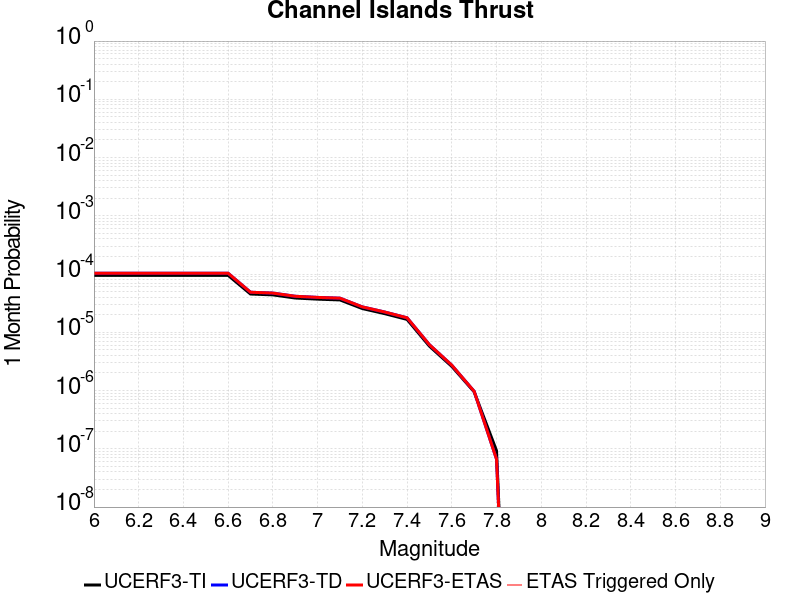 | 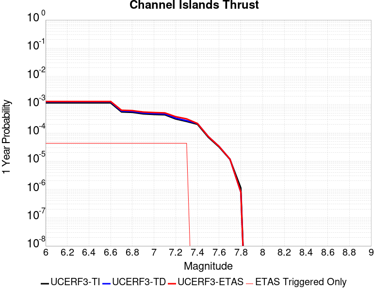 |  |

| Magnitude | 1 wk TI Prob | 1 wk TD Prob | 1 wk ETAS Prob | 1 wk ETAS/TD Gain | 1 wk ETAS Triggered Only | 1 mo TI Prob | 1 mo TD Prob | 1 mo ETAS Prob | 1 mo ETAS/TD Gain | 1 mo ETAS Triggered Only | 1 yr TI Prob | 1 yr TD Prob | 1 yr ETAS Prob | 1 yr ETAS/TD Gain | 1 yr ETAS Triggered Only | 10 yr TI Prob | 10 yr TD Prob | 10 yr ETAS Prob | 10 yr ETAS/TD Gain | 10 yr ETAS Triggered Only |
|-----|-----|-----|-----|-----|-----|-----|-----|-----|-----|-----|-----|-----|-----|-----|-----|-----|-----|-----|-----|-----|
| 6.0 | 2.2156251E-5 | 2.4091965E-5 | 2.4091965E-5 | 1.0 | 0.0 | 9.495191E-5 | 1.03247796E-4 | 1.03247796E-4 | 1.0 | 0.0 | 0.0011554264 | 0.0012564235 | 0.0013093596 | 1.0421323 | 5.3002597E-5 | 0.011494373 | 0.012503792 | 0.012556131 | 1.0041859 | 5.3002597E-5 |
| 6.1 | 2.2156251E-5 | 2.4091965E-5 | 2.4091965E-5 | 1.0 | 0.0 | 9.495191E-5 | 1.03247796E-4 | 1.03247796E-4 | 1.0 | 0.0 | 0.0011554264 | 0.0012564235 | 0.0013093596 | 1.0421323 | 5.3002597E-5 | 0.011494373 | 0.012503792 | 0.012556131 | 1.0041859 | 5.3002597E-5 |
| 6.2 | 2.2156251E-5 | 2.4091965E-5 | 2.4091965E-5 | 1.0 | 0.0 | 9.495191E-5 | 1.03247796E-4 | 1.03247796E-4 | 1.0 | 0.0 | 0.0011554264 | 0.0012564235 | 0.0013093596 | 1.0421323 | 5.3002597E-5 | 0.011494373 | 0.012503792 | 0.012556131 | 1.0041859 | 5.3002597E-5 |
| 6.3 | 2.2156251E-5 | 2.4091965E-5 | 2.4091965E-5 | 1.0 | 0.0 | 9.495191E-5 | 1.03247796E-4 | 1.03247796E-4 | 1.0 | 0.0 | 0.0011554264 | 0.0012564235 | 0.0013093596 | 1.0421323 | 5.3002597E-5 | 0.011494373 | 0.012503792 | 0.012556131 | 1.0041859 | 5.3002597E-5 |
| 6.4 | 2.2156251E-5 | 2.4091965E-5 | 2.4091965E-5 | 1.0 | 0.0 | 9.495191E-5 | 1.03247796E-4 | 1.03247796E-4 | 1.0 | 0.0 | 0.0011554264 | 0.0012564235 | 0.0013093596 | 1.0421323 | 5.3002597E-5 | 0.011494373 | 0.012503792 | 0.012556131 | 1.0041859 | 5.3002597E-5 |
| 6.5 | 2.2156251E-5 | 2.4091965E-5 | 2.4091965E-5 | 1.0 | 0.0 | 9.495191E-5 | 1.03247796E-4 | 1.03247796E-4 | 1.0 | 0.0 | 0.0011554264 | 0.0012564235 | 0.0013093596 | 1.0421323 | 5.3002597E-5 | 0.011494373 | 0.012503792 | 0.012556131 | 1.0041859 | 5.3002597E-5 |
| 6.6 | 2.2156251E-5 | 2.4091965E-5 | 2.4091965E-5 | 1.0 | 0.0 | 9.495191E-5 | 1.03247796E-4 | 1.03247796E-4 | 1.0 | 0.0 | 0.0011554264 | 0.0012564235 | 0.0013093596 | 1.0421323 | 5.3002597E-5 | 0.011494373 | 0.012503792 | 0.012556131 | 1.0041859 | 5.3002597E-5 |
| 6.7 | 1.0601296E-5 | 1.1379521E-5 | 1.1379521E-5 | 1.0 | 0.0 | 4.5433335E-5 | 4.8768492E-5 | 4.8768492E-5 | 1.0 | 0.0 | 5.5301044E-4 | 5.935995E-4 | 6.4657064E-4 | 1.0892372 | 5.3002597E-5 | 0.005516363 | 0.0059206416 | 0.0059733302 | 1.0088992 | 5.3002597E-5 |
| 6.8 | 1.0246747E-5 | 1.0996647E-5 | 1.0996647E-5 | 1.0 | 0.0 | 4.391389E-5 | 4.712766E-5 | 4.712766E-5 | 1.0 | 0.0 | 5.345204E-4 | 5.73633E-4 | 6.2660524E-4 | 1.0923451 | 5.3002597E-5 | 0.0053323656 | 0.0057220133 | 0.0057747127 | 1.0092099 | 5.3002597E-5 |
| 6.9 | 9.049551E-6 | 9.6996255E-6 | 9.6996255E-6 | 1.0 | 0.0 | 3.878322E-5 | 4.1569183E-5 | 4.1569183E-5 | 1.0 | 0.0 | 4.7208337E-4 | 5.059914E-4 | 5.589672E-4 | 1.104697 | 5.3002597E-5 | 0.0047108172 | 0.0050488105 | 0.0051015452 | 1.010445 | 5.3002597E-5 |
| 7.0 | 8.6542195E-6 | 9.274585E-6 | 9.274585E-6 | 1.0 | 0.0 | 3.7088983E-5 | 3.974764E-5 | 3.974764E-5 | 1.0 | 0.0 | 4.5146482E-4 | 4.8382411E-4 | 5.3680106E-4 | 1.1094964 | 5.3002597E-5 | 0.004505487 | 0.0048281197 | 0.0048808665 | 1.0109249 | 5.3002597E-5 |
| 7.1 | 8.391028E-6 | 8.992907E-6 | 8.992907E-6 | 1.0 | 0.0 | 3.5961057E-5 | 3.8540486E-5 | 3.8540486E-5 | 1.0 | 0.0 | 4.3773788E-4 | 4.6913346E-4 | 5.221112E-4 | 1.1129268 | 5.3002597E-5 | 0.004368766 | 0.004681841 | 0.004734596 | 1.0112679 | 5.3002597E-5 |
| 7.2 | 5.965188E-6 | 6.3716834E-6 | 6.3716834E-6 | 1.0 | 0.0 | 2.556484E-5 | 2.7306933E-5 | 2.7306933E-5 | 1.0 | 0.0 | 3.1120746E-4 | 3.3241173E-4 | 3.853967E-4 | 1.1593957 | 5.3002597E-5 | 0.00310772 | 0.0033192032 | 0.0033720299 | 1.0159155 | 5.3002597E-5 |
| 7.3 | 4.877518E-6 | 5.205997E-6 | 5.205997E-6 | 1.0 | 0.0 | 2.0903482E-5 | 2.2311227E-5 | 2.2311227E-5 | 1.0 | 0.0 | 2.5447016E-4 | 2.7160576E-4 | 3.2459397E-4 | 1.1950923 | 5.3002597E-5 | 0.0025417898 | 0.0027127846 | 0.0027656434 | 1.0194851 | 5.3002597E-5 |
| 7.4 | 3.8829853E-6 | 4.1418552E-6 | 4.1418552E-6 | 1.0 | 0.0 | 1.664126E-5 | 1.775069E-5 | 1.775069E-5 | 1.0 | 0.0 | 2.0258849E-4 | 2.1609363E-4 | 2.1609363E-4 | 1.0 | 0.0 | 0.002024039 | 0.0021588767 | 0.0021588767 | 1.0 | 0.0 |
| 7.5 | 1.3489616E-6 | 1.4277878E-6 | 1.4277878E-6 | 1.0 | 0.0 | 5.7812517E-6 | 6.1190767E-6 | 6.1190767E-6 | 1.0 | 0.0 | 7.038446E-5 | 7.449725E-5 | 7.449725E-5 | 1.0 | 0.0 | 7.036218E-4 | 7.4472674E-4 | 7.4472674E-4 | 1.0 | 0.0 |
| 7.6 | 6.058192E-7 | 6.353767E-7 | 6.353767E-7 | 1.0 | 0.0 | 2.5963652E-6 | 2.7230403E-6 | 2.7230403E-6 | 1.0 | 0.0 | 3.161029E-5 | 3.3152526E-5 | 3.3152526E-5 | 1.0 | 0.0 | 3.1605794E-4 | 3.3147744E-4 | 3.3147744E-4 | 1.0 | 0.0 |
| 7.7 | 2.2170494E-7 | 2.2607867E-7 | 2.2607867E-7 | 1.0 | 0.0 | 9.5016367E-7 | 9.689082E-7 | 9.689082E-7 | 1.0 | 0.0 | 1.1568181E-5 | 1.17964055E-5 | 1.17964055E-5 | 1.0 | 0.0 | 1.1567579E-4 | 1.1795891E-4 | 1.1795891E-4 | 1.0 | 0.0 |
| 7.8 | 2.1613102E-8 | 1.546666E-8 | 1.546666E-8 | 1.0 | 0.0 | 9.262757E-8 | 6.6285686E-8 | 6.6285686E-8 | 1.0 | 0.0 | 1.1277401E-6 | 8.0702796E-7 | 8.0702796E-7 | 1.0 | 0.0 | 1.1277344E-5 | 8.070258E-6 | 8.070258E-6 | 1.0 | 0.0 |

## Channel Islands Western Deep Ramp
*[(top)](#table-of-contents)*

| 1 Week | 1 Month | 1 Year | 10 Year |
|-----|-----|-----|-----|
| 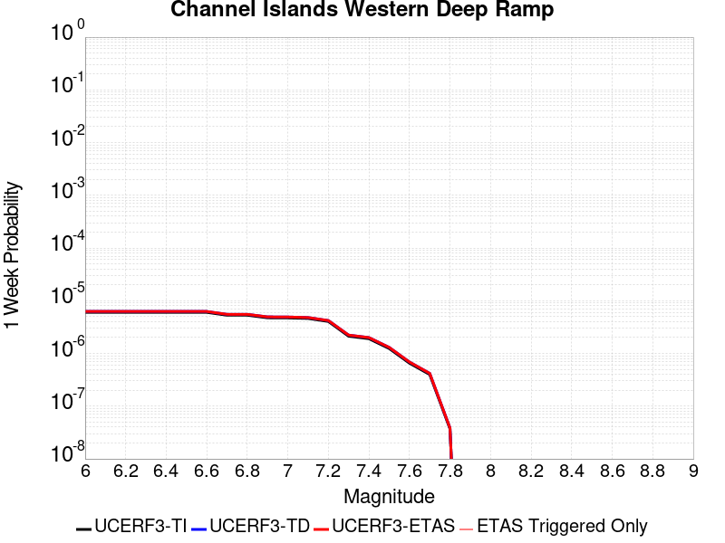 | 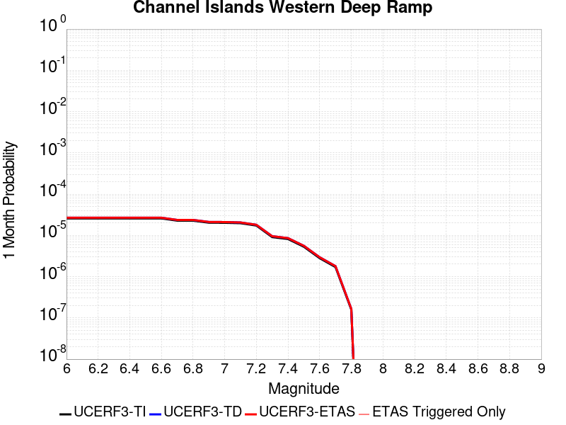 | 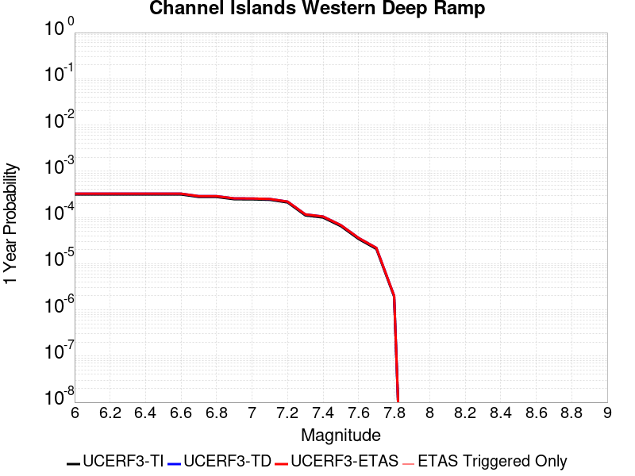 | 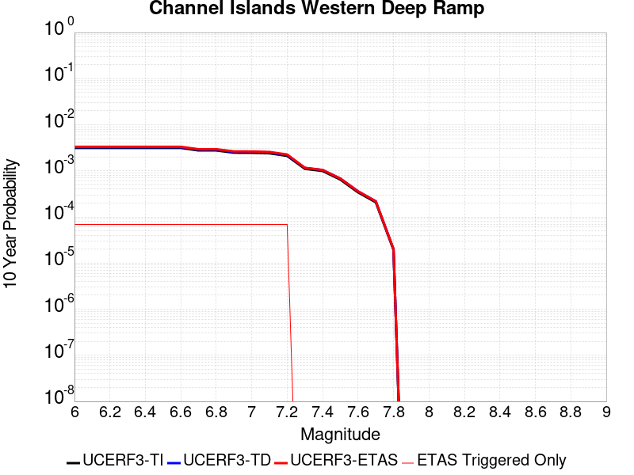 |

| Magnitude | 1 wk TI Prob | 1 wk TD Prob | 1 wk ETAS Prob | 1 wk ETAS/TD Gain | 1 wk ETAS Triggered Only | 1 mo TI Prob | 1 mo TD Prob | 1 mo ETAS Prob | 1 mo ETAS/TD Gain | 1 mo ETAS Triggered Only | 1 yr TI Prob | 1 yr TD Prob | 1 yr ETAS Prob | 1 yr ETAS/TD Gain | 1 yr ETAS Triggered Only | 10 yr TI Prob | 10 yr TD Prob | 10 yr ETAS Prob | 10 yr ETAS/TD Gain | 10 yr ETAS Triggered Only |
|-----|-----|-----|-----|-----|-----|-----|-----|-----|-----|-----|-----|-----|-----|-----|-----|-----|-----|-----|-----|-----|
| 6.0 | 6.0213506E-6 | 6.254862E-6 | 6.254862E-6 | 1.0 | 0.0 | 2.5805533E-5 | 2.6806301E-5 | 2.6806301E-5 | 1.0 | 0.0 | 3.1413708E-4 | 3.263223E-4 | 3.263223E-4 | 1.0 | 0.0 | 0.0031369338 | 0.003258873 | 0.0033117027 | 1.016211 | 5.3002597E-5 |
| 6.1 | 6.0213506E-6 | 6.254862E-6 | 6.254862E-6 | 1.0 | 0.0 | 2.5805533E-5 | 2.6806301E-5 | 2.6806301E-5 | 1.0 | 0.0 | 3.1413708E-4 | 3.263223E-4 | 3.263223E-4 | 1.0 | 0.0 | 0.0031369338 | 0.003258873 | 0.0033117027 | 1.016211 | 5.3002597E-5 |
| 6.2 | 6.0213506E-6 | 6.254862E-6 | 6.254862E-6 | 1.0 | 0.0 | 2.5805533E-5 | 2.6806301E-5 | 2.6806301E-5 | 1.0 | 0.0 | 3.1413708E-4 | 3.263223E-4 | 3.263223E-4 | 1.0 | 0.0 | 0.0031369338 | 0.003258873 | 0.0033117027 | 1.016211 | 5.3002597E-5 |
| 6.3 | 6.0213506E-6 | 6.254862E-6 | 6.254862E-6 | 1.0 | 0.0 | 2.5805533E-5 | 2.6806301E-5 | 2.6806301E-5 | 1.0 | 0.0 | 3.1413708E-4 | 3.263223E-4 | 3.263223E-4 | 1.0 | 0.0 | 0.0031369338 | 0.003258873 | 0.0033117027 | 1.016211 | 5.3002597E-5 |
| 6.4 | 6.0213506E-6 | 6.254862E-6 | 6.254862E-6 | 1.0 | 0.0 | 2.5805533E-5 | 2.6806301E-5 | 2.6806301E-5 | 1.0 | 0.0 | 3.1413708E-4 | 3.263223E-4 | 3.263223E-4 | 1.0 | 0.0 | 0.0031369338 | 0.003258873 | 0.0033117027 | 1.016211 | 5.3002597E-5 |
| 6.5 | 6.0213506E-6 | 6.254862E-6 | 6.254862E-6 | 1.0 | 0.0 | 2.5805533E-5 | 2.6806301E-5 | 2.6806301E-5 | 1.0 | 0.0 | 3.1413708E-4 | 3.263223E-4 | 3.263223E-4 | 1.0 | 0.0 | 0.0031369338 | 0.003258873 | 0.0033117027 | 1.016211 | 5.3002597E-5 |
| 6.6 | 6.0213506E-6 | 6.254862E-6 | 6.254862E-6 | 1.0 | 0.0 | 2.5805533E-5 | 2.6806301E-5 | 2.6806301E-5 | 1.0 | 0.0 | 3.1413708E-4 | 3.263223E-4 | 3.263223E-4 | 1.0 | 0.0 | 0.0031369338 | 0.003258873 | 0.0033117027 | 1.016211 | 5.3002597E-5 |
| 6.7 | 5.313309E-6 | 5.5252344E-6 | 5.5252344E-6 | 1.0 | 0.0 | 2.2771126E-5 | 2.3679384E-5 | 2.3679384E-5 | 1.0 | 0.0 | 2.772032E-4 | 2.8826247E-4 | 2.8826247E-4 | 1.0 | 0.0 | 0.0027685766 | 0.0028792885 | 0.0029321385 | 1.0183553 | 5.3002597E-5 |
| 6.8 | 5.313309E-6 | 5.5252344E-6 | 5.5252344E-6 | 1.0 | 0.0 | 2.2771126E-5 | 2.3679384E-5 | 2.3679384E-5 | 1.0 | 0.0 | 2.772032E-4 | 2.8826247E-4 | 2.8826247E-4 | 1.0 | 0.0 | 0.0027685766 | 0.0028792885 | 0.0029321385 | 1.0183553 | 5.3002597E-5 |
| 6.9 | 4.744377E-6 | 4.9394253E-6 | 4.9394253E-6 | 1.0 | 0.0 | 2.0332885E-5 | 2.1168813E-5 | 2.1168813E-5 | 1.0 | 0.0 | 2.4752476E-4 | 2.5770356E-4 | 2.5770356E-4 | 1.0 | 0.0 | 0.0024724922 | 0.0025744147 | 0.0026272808 | 1.0205352 | 5.3002597E-5 |
| 7.0 | 4.722209E-6 | 4.916468E-6 | 4.916468E-6 | 1.0 | 0.0 | 2.0237881E-5 | 2.1070427E-5 | 2.1070427E-5 | 1.0 | 0.0 | 2.4636835E-4 | 2.5650597E-4 | 2.5650597E-4 | 1.0 | 0.0 | 0.002460954 | 0.0025624665 | 0.0026153333 | 1.0206312 | 5.3002597E-5 |
| 7.1 | 4.611174E-6 | 4.8014035E-6 | 4.8014035E-6 | 1.0 | 0.0 | 1.9762025E-5 | 2.0577303E-5 | 2.0577303E-5 | 1.0 | 0.0 | 2.4057609E-4 | 2.505036E-4 | 2.505036E-4 | 1.0 | 0.0 | 0.002403158 | 0.0025025792 | 0.002555449 | 1.0211262 | 5.3002597E-5 |
| 7.2 | 4.043994E-6 | 4.212022E-6 | 4.212022E-6 | 1.0 | 0.0 | 1.7331287E-5 | 1.8051418E-5 | 1.8051418E-5 | 1.0 | 0.0 | 2.10988E-4 | 2.1975742E-4 | 2.1975742E-4 | 1.0 | 0.0 | 0.002107878 | 0.0021957518 | 0.002248638 | 1.0240856 | 5.3002597E-5 |
| 7.3 | 2.1233036E-6 | 2.2297845E-6 | 2.2297845E-6 | 1.0 | 0.0 | 9.099841E-6 | 9.5561845E-6 | 9.5561845E-6 | 1.0 | 0.0 | 1.1078493E-4 | 1.1634039E-4 | 1.1634039E-4 | 1.0 | 0.0 | 0.0011072971 | 0.0011628004 | 0.0011628004 | 1.0 | 0.0 |
| 7.4 | 1.9051884E-6 | 2.0014945E-6 | 2.0014945E-6 | 1.0 | 0.0 | 8.165067E-6 | 8.577806E-6 | 8.577806E-6 | 1.0 | 0.0 | 9.940516E-5 | 1.0442983E-4 | 1.0442983E-4 | 1.0 | 0.0 | 9.93607E-4 | 0.001043813 | 0.001043813 | 1.0 | 0.0 |
| 7.5 | 1.2408497E-6 | 1.3038822E-6 | 1.3038822E-6 | 1.0 | 0.0 | 5.317916E-6 | 5.5880546E-6 | 5.5880546E-6 | 1.0 | 0.0 | 6.4743705E-5 | 6.803246E-5 | 6.803246E-5 | 1.0 | 0.0 | 6.4724847E-4 | 6.801185E-4 | 6.801185E-4 | 1.0 | 0.0 |
| 7.6 | 6.5440025E-7 | 6.886708E-7 | 6.886708E-7 | 1.0 | 0.0 | 2.8045695E-6 | 2.951443E-6 | 2.951443E-6 | 1.0 | 0.0 | 3.4145098E-5 | 3.593324E-5 | 3.593324E-5 | 1.0 | 0.0 | 3.4139853E-4 | 3.5927573E-4 | 3.5927573E-4 | 1.0 | 0.0 |
| 7.7 | 3.985963E-7 | 4.193073E-7 | 4.193073E-7 | 1.0 | 0.0 | 1.7082689E-6 | 1.7970301E-6 | 1.7970301E-6 | 1.0 | 0.0 | 2.0797976E-5 | 2.1878634E-5 | 2.1878634E-5 | 1.0 | 0.0 | 2.0796029E-4 | 2.1876597E-4 | 2.1876597E-4 | 1.0 | 0.0 |
| 7.8 | 3.706329E-8 | 3.8591754E-8 | 3.8591754E-8 | 1.0 | 0.0 | 1.5884267E-7 | 1.6539322E-7 | 1.6539322E-7 | 1.0 | 0.0 | 1.9339077E-6 | 2.0136606E-6 | 2.0136606E-6 | 1.0 | 0.0 | 1.933891E-5 | 2.0136436E-5 | 2.0136436E-5 | 1.0 | 0.0 |

## Imperial
*[(top)](#table-of-contents)*

| 1 Week | 1 Month | 1 Year | 10 Year |
|-----|-----|-----|-----|
| 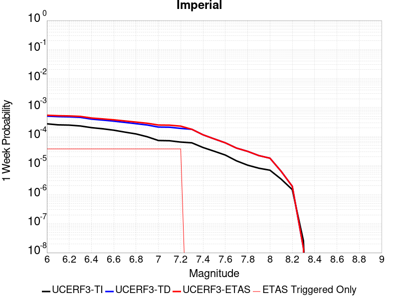 | 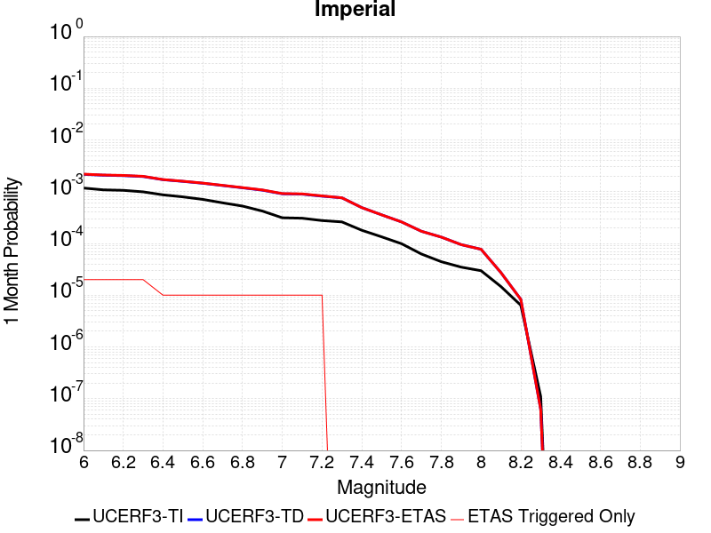 | 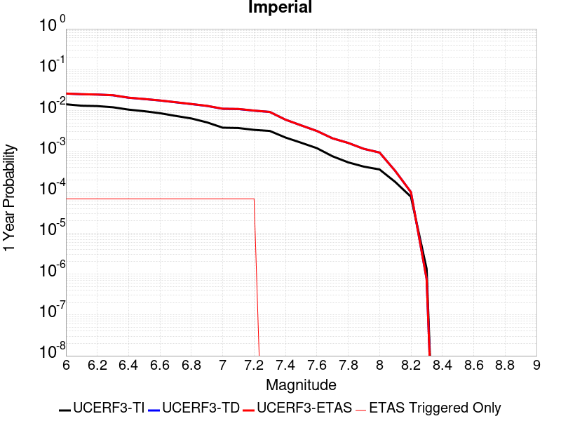 | 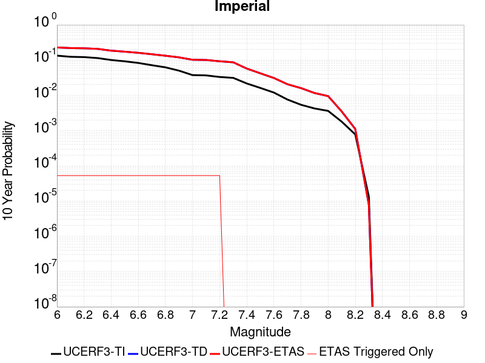 |

| Magnitude | 1 wk TI Prob | 1 wk TD Prob | 1 wk ETAS Prob | 1 wk ETAS/TD Gain | 1 wk ETAS Triggered Only | 1 mo TI Prob | 1 mo TD Prob | 1 mo ETAS Prob | 1 mo ETAS/TD Gain | 1 mo ETAS Triggered Only | 1 yr TI Prob | 1 yr TD Prob | 1 yr ETAS Prob | 1 yr ETAS/TD Gain | 1 yr ETAS Triggered Only | 10 yr TI Prob | 10 yr TD Prob | 10 yr ETAS Prob | 10 yr ETAS/TD Gain | 10 yr ETAS Triggered Only |
|-----|-----|-----|-----|-----|-----|-----|-----|-----|-----|-----|-----|-----|-----|-----|-----|-----|-----|-----|-----|-----|
| 6.0 | 2.7496446E-4 | 5.054469E-4 | 5.584227E-4 | 1.1048099 | 5.3002597E-5 | 0.0011778869 | 0.002164442 | 0.0022173298 | 1.0244349 | 5.3002597E-5 | 0.0142467655 | 0.026034584 | 0.026086206 | 1.0019828 | 5.3002597E-5 | 0.13367249 | 0.22801645 | 0.22805737 | 1.0001794 | 5.3002597E-5 |
| 6.1 | 2.5356023E-4 | 4.864905E-4 | 5.3946726E-4 | 1.1088959 | 5.3002597E-5 | 0.001086234 | 0.0020833316 | 0.0021362237 | 1.0253882 | 5.3002597E-5 | 0.013144928 | 0.02506727 | 0.025118943 | 1.0020614 | 5.3002597E-5 | 0.123940155 | 0.21945325 | 0.21949461 | 1.0001885 | 5.3002597E-5 |
| 6.2 | 2.4820742E-4 | 4.7744514E-4 | 5.3042243E-4 | 1.11096 | 5.3002597E-5 | 0.0010633124 | 0.0020446267 | 0.002097521 | 1.0258698 | 5.3002597E-5 | 0.01286919 | 0.024607308 | 0.024659008 | 1.002101 | 5.3002597E-5 | 0.12148927 | 0.21595894 | 0.2160005 | 1.0001924 | 5.3002597E-5 |
| 6.3 | 2.3205351E-4 | 4.588303E-4 | 5.1180855E-4 | 1.1154637 | 5.3002597E-5 | 9.94136E-4 | 0.0019649705 | 0.002017869 | 1.0269207 | 5.3002597E-5 | 0.012036599 | 0.023657534 | 0.023709282 | 1.0021874 | 5.3002597E-5 | 0.11405133 | 0.20790851 | 0.20795049 | 1.000202 | 5.3002597E-5 |
| 6.4 | 2.0304754E-4 | 3.9869116E-4 | 4.5167265E-4 | 1.1328884 | 5.3002597E-5 | 8.6991355E-4 | 0.0017075721 | 0.0017604842 | 1.0309868 | 5.3002597E-5 | 0.010539869 | 0.020591887 | 0.020643799 | 1.0025209 | 5.3002597E-5 | 0.100537635 | 0.18504018 | 0.18508337 | 1.0002334 | 5.3002597E-5 |
| 6.5 | 1.854992E-4 | 3.6981583E-4 | 4.2279882E-4 | 1.1432686 | 5.3002597E-5 | 7.9475436E-4 | 0.0015839747 | 0.0016368933 | 1.0334088 | 5.3002597E-5 | 0.009633281 | 0.01911576 | 0.019167751 | 1.0027198 | 5.3002597E-5 | 0.0922623 | 0.17327131 | 0.17331514 | 1.0002528 | 5.3002597E-5 |
| 6.6 | 1.6586106E-4 | 3.4027954E-4 | 3.9326408E-4 | 1.1557089 | 5.3002597E-5 | 7.106394E-4 | 0.0014575359 | 0.0015104612 | 1.0363115 | 5.3002597E-5 | 0.008617763 | 0.017602775 | 0.017654845 | 1.002958 | 5.3002597E-5 | 0.08291132 | 0.16074891 | 0.1607934 | 1.0002767 | 5.3002597E-5 |
| 6.7 | 1.4224656E-4 | 3.0760013E-4 | 3.6058642E-4 | 1.1722571 | 5.3002597E-5 | 6.094856E-4 | 0.0013176284 | 0.0013705612 | 1.0401727 | 5.3002597E-5 | 0.0073952693 | 0.01592603 | 0.015978187 | 1.003275 | 5.3002597E-5 | 0.07153955 | 0.14645793 | 0.14650317 | 1.0003089 | 5.3002597E-5 |
| 6.8 | 1.2317259E-4 | 2.7784536E-4 | 3.3083325E-4 | 1.19071 | 5.3002597E-5 | 5.2777573E-4 | 0.0011902286 | 0.0012431681 | 1.0444784 | 5.3002597E-5 | 0.0064067547 | 0.014396132 | 0.014448372 | 1.0036287 | 5.3002597E-5 | 0.06225166 | 0.13291098 | 0.13295694 | 1.0003458 | 5.3002597E-5 |
| 6.9 | 9.859898E-5 | 2.500792E-4 | 3.0306855E-4 | 1.2118902 | 5.3002597E-5 | 4.2249862E-4 | 0.001071332 | 0.0011242778 | 1.0494206 | 5.3002597E-5 | 0.0051317946 | 0.012966422 | 0.013018738 | 1.0040346 | 5.3002597E-5 | 0.05014893 | 0.11938127 | 0.11942795 | 1.000391 | 5.3002597E-5 |
| 7.0 | 7.3191884E-5 | 2.1260617E-4 | 2.655975E-4 | 1.2492465 | 5.3002597E-5 | 3.136418E-4 | 9.108543E-4 | 9.638086E-4 | 1.0581369 | 5.3002597E-5 | 0.003811904 | 0.011033948 | 0.011086366 | 1.0047506 | 5.3002597E-5 | 0.037471764 | 0.10204036 | 0.10208795 | 1.0004665 | 5.3002597E-5 |
| 7.1 | 7.1760296E-5 | 2.0961992E-4 | 2.626114E-4 | 1.252798 | 5.3002597E-5 | 3.0750787E-4 | 8.980649E-4 | 9.5101993E-4 | 1.0589657 | 5.3002597E-5 | 0.003737482 | 0.0108798025 | 0.0109322285 | 1.0048187 | 5.3002597E-5 | 0.03675245 | 0.10067689 | 0.100724556 | 1.0004735 | 5.3002597E-5 |
| 7.2 | 6.46614E-5 | 1.913056E-4 | 2.4429805E-4 | 1.2770042 | 5.3002597E-5 | 2.7709085E-4 | 8.1962656E-4 | 8.725857E-4 | 1.0646138 | 5.3002597E-5 | 0.0033683628 | 0.009933916 | 0.009986392 | 1.0052825 | 5.3002597E-5 | 0.033177625 | 0.09248428 | 0.09253238 | 1.0005201 | 5.3002597E-5 |
| 7.3 | 6.088115E-5 | 1.7802432E-4 | 1.7802432E-4 | 1.0 | 0.0 | 2.6089314E-4 | 7.6274114E-4 | 7.6274114E-4 | 1.0 | 0.0 | 0.0031717476 | 0.009247407 | 0.009247407 | 1.0 | 0.0 | 0.031268585 | 0.08653566 | 0.08653566 | 1.0 | 0.0 |
| 7.4 | 4.199346E-5 | 1.1507733E-4 | 1.1507733E-4 | 1.0 | 0.0 | 1.7995955E-4 | 4.930962E-4 | 4.930962E-4 | 1.0 | 0.0 | 0.0021888057 | 0.00598709 | 0.00598709 | 1.0 | 0.0 | 0.02167372 | 0.057428524 | 0.057428524 | 1.0 | 0.0 |
| 7.5 | 3.130448E-5 | 8.332899E-5 | 8.332899E-5 | 1.0 | 0.0 | 1.3415517E-4 | 3.5707568E-4 | 3.5707568E-4 | 1.0 | 0.0 | 0.0016321153 | 0.00433879 | 0.00433879 | 1.0 | 0.0 | 0.016201803 | 0.042130288 | 0.042130288 | 1.0 | 0.0 |
| 7.6 | 2.3074248E-5 | 6.0841397E-5 | 6.0841397E-5 | 1.0 | 0.0 | 9.888588E-5 | 2.607229E-4 | 2.607229E-4 | 1.0 | 0.0 | 0.0012032706 | 0.0031697042 | 0.0031697042 | 1.0 | 0.0 | 0.011967761 | 0.03102491 | 0.03102491 | 1.0 | 0.0 |
| 7.7 | 1.45864815E-5 | 4.0122002E-5 | 4.0122002E-5 | 1.0 | 0.0 | 6.2511994E-5 | 1.7194013E-4 | 1.7194013E-4 | 1.0 | 0.0 | 7.608177E-4 | 0.0020913668 | 0.0020913668 | 1.0 | 0.0 | 0.007582182 | 0.020626526 | 0.020626526 | 1.0 | 0.0 |
| 7.8 | 1.0352979E-5 | 3.0958607E-5 | 3.0958607E-5 | 1.0 | 0.0 | 4.4369157E-5 | 1.3267301E-4 | 1.3267301E-4 | 1.0 | 0.0 | 5.400606E-4 | 0.0016140995 | 0.0016140995 | 1.0 | 0.0 | 0.0053875 | 0.016015781 | 0.016015781 | 1.0 | 0.0 |
| 7.9 | 8.137906E-6 | 2.214726E-5 | 2.214726E-5 | 1.0 | 0.0 | 3.4876273E-5 | 9.491338E-5 | 9.491338E-5 | 1.0 | 0.0 | 4.2453592E-4 | 0.0011549587 | 0.0011549587 | 1.0 | 0.0 | 0.004237258 | 0.011617044 | 0.011617044 | 1.0 | 0.0 |
| 8.0 | 6.93792E-6 | 1.800718E-5 | 1.800718E-5 | 1.0 | 0.0 | 2.9733603E-5 | 7.717135E-5 | 7.717135E-5 | 1.0 | 0.0 | 3.6194647E-4 | 9.39157E-4 | 9.39157E-4 | 1.0 | 0.0 | 0.0036135751 | 0.009500807 | 0.009500807 | 1.0 | 0.0 |
| 8.1 | 3.4286315E-6 | 6.3791363E-6 | 6.3791363E-6 | 1.0 | 0.0 | 1.4694053E-5 | 2.7338869E-5 | 2.7338869E-5 | 1.0 | 0.0 | 1.7888541E-4 | 3.328E-4 | 3.328E-4 | 1.0 | 0.0 | 0.0017874148 | 0.0034856654 | 0.0034856654 | 1.0 | 0.0 |
| 8.2 | 1.4906886E-6 | 1.936376E-6 | 1.936376E-6 | 1.0 | 0.0 | 6.3886496E-6 | 8.298728E-6 | 8.298728E-6 | 1.0 | 0.0 | 7.7779034E-5 | 1.0103236E-4 | 1.0103236E-4 | 1.0 | 0.0 | 7.775182E-4 | 0.001107385 | 0.001107385 | 1.0 | 0.0 |
| 8.3 | 2.5758007E-8 | 1.449717E-8 | 1.449717E-8 | 1.0 | 0.0 | 1.10391454E-7 | 6.2130724E-8 | 6.2130724E-8 | 1.0 | 0.0 | 1.3440151E-6 | 7.564416E-7 | 7.564416E-7 | 1.0 | 0.0 | 1.344007E-5 | 7.8862E-6 | 7.8862E-6 | 1.0 | 0.0 |

## Kern Canyon (South Kern) 2011
*[(top)](#table-of-contents)*

| 1 Week | 1 Month | 1 Year | 10 Year |
|-----|-----|-----|-----|
| 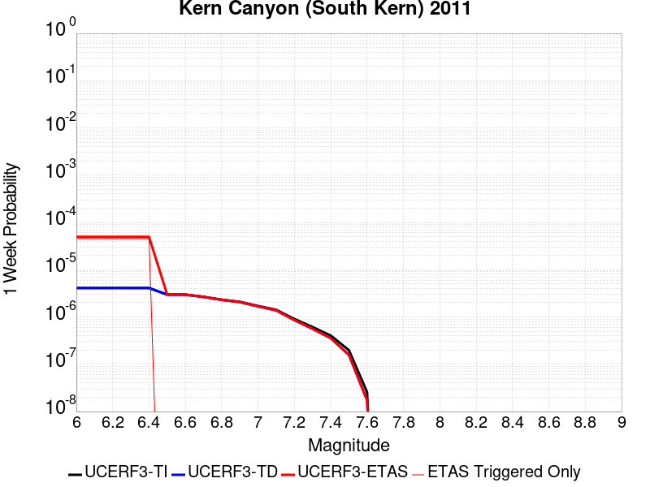 | 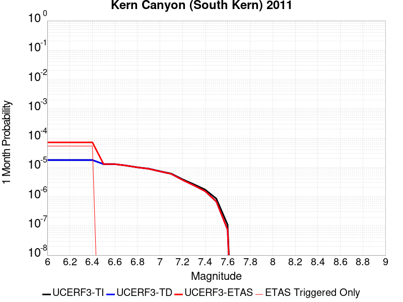 | 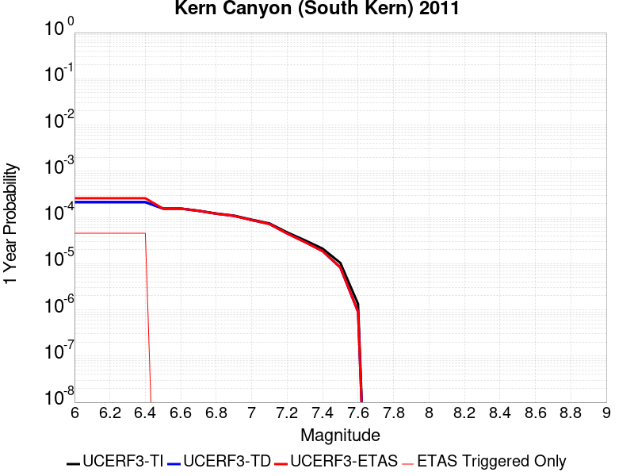 | 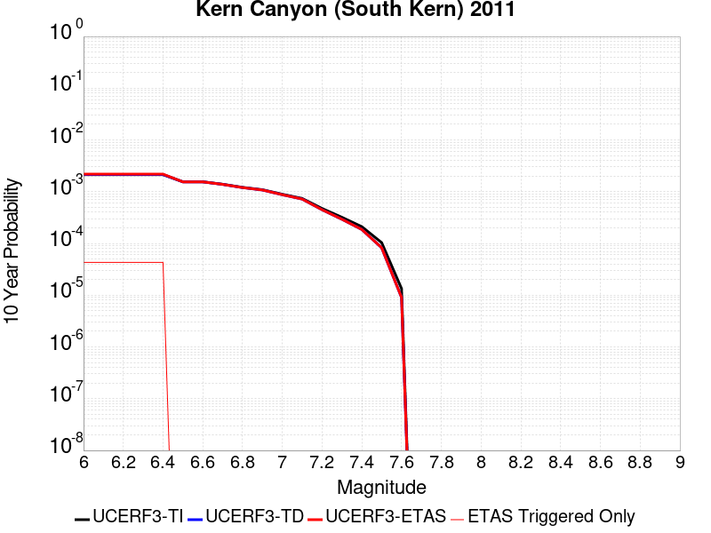 |

| Magnitude | 1 wk TI Prob | 1 wk TD Prob | 1 wk ETAS Prob | 1 wk ETAS/TD Gain | 1 wk ETAS Triggered Only | 1 mo TI Prob | 1 mo TD Prob | 1 mo ETAS Prob | 1 mo ETAS/TD Gain | 1 mo ETAS Triggered Only | 1 yr TI Prob | 1 yr TD Prob | 1 yr ETAS Prob | 1 yr ETAS/TD Gain | 1 yr ETAS Triggered Only | 10 yr TI Prob | 10 yr TD Prob | 10 yr ETAS Prob | 10 yr ETAS/TD Gain | 10 yr ETAS Triggered Only |
|-----|-----|-----|-----|-----|-----|-----|-----|-----|-----|-----|-----|-----|-----|-----|-----|-----|-----|-----|-----|-----|
| 6.0 | 4.105075E-6 | 4.1137246E-6 | 5.7116104E-5 | 13.88428 | 5.3002597E-5 | 1.7593058E-5 | 1.7630131E-5 | 7.0631795E-5 | 4.0063114 | 5.3002597E-5 | 2.1417443E-4 | 2.1462636E-4 | 2.6761758E-4 | 1.2468998 | 5.3002597E-5 | 0.0021396813 | 0.0021442545 | 0.0021971436 | 1.0246655 | 5.3002597E-5 |
| 6.1 | 4.105075E-6 | 4.1137246E-6 | 5.7116104E-5 | 13.88428 | 5.3002597E-5 | 1.7593058E-5 | 1.7630131E-5 | 7.0631795E-5 | 4.0063114 | 5.3002597E-5 | 2.1417443E-4 | 2.1462636E-4 | 2.6761758E-4 | 1.2468998 | 5.3002597E-5 | 0.0021396813 | 0.0021442545 | 0.0021971436 | 1.0246655 | 5.3002597E-5 |
| 6.2 | 4.105075E-6 | 4.1137246E-6 | 5.7116104E-5 | 13.88428 | 5.3002597E-5 | 1.7593058E-5 | 1.7630131E-5 | 7.0631795E-5 | 4.0063114 | 5.3002597E-5 | 2.1417443E-4 | 2.1462636E-4 | 2.6761758E-4 | 1.2468998 | 5.3002597E-5 | 0.0021396813 | 0.0021442545 | 0.0021971436 | 1.0246655 | 5.3002597E-5 |
| 6.3 | 4.105075E-6 | 4.1137246E-6 | 5.7116104E-5 | 13.88428 | 5.3002597E-5 | 1.7593058E-5 | 1.7630131E-5 | 7.0631795E-5 | 4.0063114 | 5.3002597E-5 | 2.1417443E-4 | 2.1462636E-4 | 2.6761758E-4 | 1.2468998 | 5.3002597E-5 | 0.0021396813 | 0.0021442545 | 0.0021971436 | 1.0246655 | 5.3002597E-5 |
| 6.4 | 4.105075E-6 | 4.1137246E-6 | 5.7116104E-5 | 13.88428 | 5.3002597E-5 | 1.7593058E-5 | 1.7630131E-5 | 7.0631795E-5 | 4.0063114 | 5.3002597E-5 | 2.1417443E-4 | 2.1462636E-4 | 2.6761758E-4 | 1.2468998 | 5.3002597E-5 | 0.0021396813 | 0.0021442545 | 0.0021971436 | 1.0246655 | 5.3002597E-5 |
| 6.5 | 2.9849807E-6 | 2.9731532E-6 | 2.9731532E-6 | 1.0 | 0.0 | 1.2792712E-5 | 1.27420235E-5 | 1.27420235E-5 | 1.0 | 0.0 | 1.5574014E-4 | 1.5512324E-4 | 1.5512324E-4 | 1.0 | 0.0 | 0.0015563103 | 0.0015501648 | 0.0015501648 | 1.0 | 0.0 |
| 6.6 | 2.9849807E-6 | 2.9731532E-6 | 2.9731532E-6 | 1.0 | 0.0 | 1.2792712E-5 | 1.27420235E-5 | 1.27420235E-5 | 1.0 | 0.0 | 1.5574014E-4 | 1.5512324E-4 | 1.5512324E-4 | 1.0 | 0.0 | 0.0015563103 | 0.0015501648 | 0.0015501648 | 1.0 | 0.0 |
| 6.7 | 2.6756725E-6 | 2.6582195E-6 | 2.6582195E-6 | 1.0 | 0.0 | 1.1467117E-5 | 1.139232E-5 | 1.139232E-5 | 1.0 | 0.0 | 1.396032E-4 | 1.3869278E-4 | 1.3869278E-4 | 1.0 | 0.0 | 0.0013951553 | 0.0013860731 | 0.0013860731 | 1.0 | 0.0 |
| 6.8 | 2.3283721E-6 | 2.3047776E-6 | 2.3047776E-6 | 1.0 | 0.0 | 9.9787E-6 | 9.877582E-6 | 9.877582E-6 | 1.0 | 0.0 | 1.214839E-4 | 1.2025299E-4 | 1.2025299E-4 | 1.0 | 0.0 | 0.001214175 | 0.0012018867 | 0.0012018867 | 1.0 | 0.0 |
| 6.9 | 2.0972677E-6 | 2.06964E-6 | 2.06964E-6 | 1.0 | 0.0 | 8.988259E-6 | 8.869856E-6 | 8.869856E-6 | 1.0 | 0.0 | 1.0942656E-4 | 1.079852E-4 | 1.079852E-4 | 1.0 | 0.0 | 0.0010937268 | 0.0010793331 | 0.0010793331 | 1.0 | 0.0 |
| 7.0 | 1.7132242E-6 | 1.6787027E-6 | 1.6787027E-6 | 1.0 | 0.0 | 7.3423685E-6 | 7.1944205E-6 | 7.1944205E-6 | 1.0 | 0.0 | 8.938967E-5 | 8.758859E-5 | 8.758859E-5 | 1.0 | 0.0 | 8.935372E-4 | 8.755445E-4 | 8.755445E-4 | 1.0 | 0.0 |
| 7.1 | 1.4215541E-6 | 1.3815744E-6 | 1.3815744E-6 | 1.0 | 0.0 | 6.0923603E-6 | 5.92102E-6 | 5.92102E-6 | 1.0 | 0.0 | 7.417196E-5 | 7.208606E-5 | 7.208606E-5 | 1.0 | 0.0 | 7.414721E-4 | 7.2062947E-4 | 7.2062947E-4 | 1.0 | 0.0 |
| 7.2 | 9.097853E-7 | 8.6037704E-7 | 8.6037704E-7 | 1.0 | 0.0 | 3.899074E-6 | 3.687325E-6 | 3.687325E-6 | 1.0 | 0.0 | 4.7470192E-5 | 4.489227E-5 | 4.489227E-5 | 1.0 | 0.0 | 4.7460053E-4 | 4.488331E-4 | 4.488331E-4 | 1.0 | 0.0 |
| 7.3 | 6.144169E-7 | 5.628203E-7 | 5.628203E-7 | 1.0 | 0.0 | 2.6332125E-6 | 2.4120848E-6 | 2.4120848E-6 | 1.0 | 0.0 | 3.205889E-5 | 2.9366742E-5 | 2.9366742E-5 | 1.0 | 0.0 | 3.2054266E-4 | 2.9362913E-4 | 2.9362913E-4 | 1.0 | 0.0 |
| 7.4 | 4.049844E-7 | 3.5728291E-7 | 3.5728291E-7 | 1.0 | 0.0 | 1.7356463E-6 | 1.5312115E-6 | 1.5312115E-6 | 1.0 | 0.0 | 2.1131287E-5 | 1.8642344E-5 | 1.8642344E-5 | 1.0 | 0.0 | 2.1129279E-4 | 1.8640806E-4 | 1.8640806E-4 | 1.0 | 0.0 |
| 7.5 | 1.9871162E-7 | 1.5830427E-7 | 1.5830427E-7 | 1.0 | 0.0 | 8.5162094E-7 | 6.784467E-7 | 6.784467E-7 | 1.0 | 0.0 | 1.0368436E-5 | 8.260059E-6 | 8.260059E-6 | 1.0 | 0.0 | 1.0367952E-4 | 8.25976E-5 | 8.25976E-5 | 1.0 | 0.0 |
| 7.6 | 2.572245E-8 | 1.7352539E-8 | 1.7352539E-8 | 1.0 | 0.0 | 1.10239064E-7 | 7.436802E-8 | 7.436802E-8 | 1.0 | 0.0 | 1.3421597E-6 | 9.0543034E-7 | 9.0543034E-7 | 1.0 | 0.0 | 1.3421517E-5 | 9.054272E-6 | 9.054272E-6 | 1.0 | 0.0 |

## West Tahoe
*[(top)](#table-of-contents)*

| 1 Week | 1 Month | 1 Year | 10 Year |
|-----|-----|-----|-----|
| 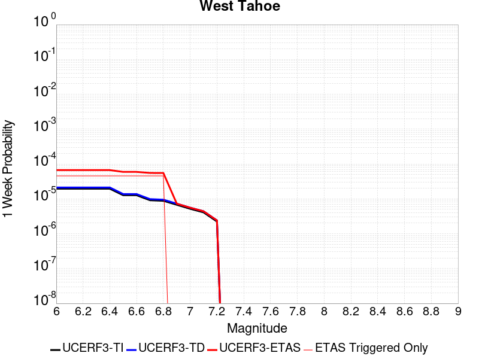 | 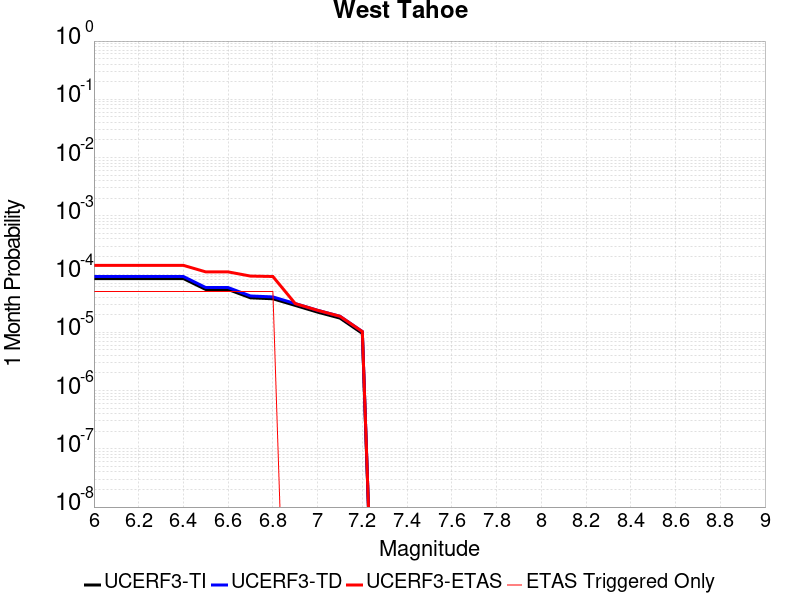 | 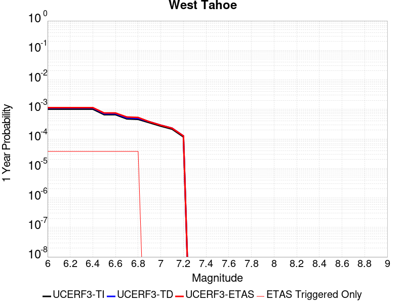 | 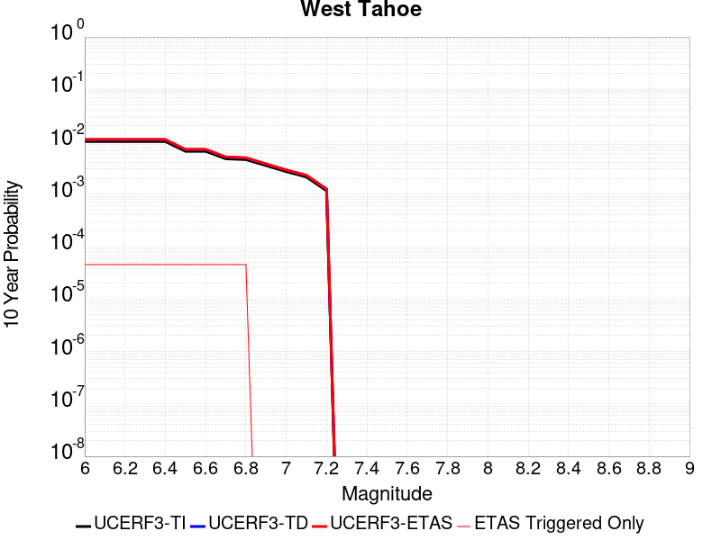 |

| Magnitude | 1 wk TI Prob | 1 wk TD Prob | 1 wk ETAS Prob | 1 wk ETAS/TD Gain | 1 wk ETAS Triggered Only | 1 mo TI Prob | 1 mo TD Prob | 1 mo ETAS Prob | 1 mo ETAS/TD Gain | 1 mo ETAS Triggered Only | 1 yr TI Prob | 1 yr TD Prob | 1 yr ETAS Prob | 1 yr ETAS/TD Gain | 1 yr ETAS Triggered Only | 10 yr TI Prob | 10 yr TD Prob | 10 yr ETAS Prob | 10 yr ETAS/TD Gain | 10 yr ETAS Triggered Only |
|-----|-----|-----|-----|-----|-----|-----|-----|-----|-----|-----|-----|-----|-----|-----|-----|-----|-----|-----|-----|-----|
| 6.0 | 1.952444E-5 | 2.1183121E-5 | 7.4184594E-5 | 3.5020616 | 5.3002597E-5 | 8.367348E-5 | 9.0781956E-5 | 1.4377975E-4 | 1.5837921 | 5.3002597E-5 | 0.0010182485 | 0.0011047646 | 0.0011577087 | 1.0479233 | 5.3002597E-5 | 0.010135954 | 0.010998211 | 0.01105063 | 1.0047662 | 5.3002597E-5 |
| 6.1 | 1.952444E-5 | 2.1183121E-5 | 7.4184594E-5 | 3.5020616 | 5.3002597E-5 | 8.367348E-5 | 9.0781956E-5 | 1.4377975E-4 | 1.5837921 | 5.3002597E-5 | 0.0010182485 | 0.0011047646 | 0.0011577087 | 1.0479233 | 5.3002597E-5 | 0.010135954 | 0.010998211 | 0.01105063 | 1.0047662 | 5.3002597E-5 |
| 6.2 | 1.952444E-5 | 2.1183121E-5 | 7.4184594E-5 | 3.5020616 | 5.3002597E-5 | 8.367348E-5 | 9.0781956E-5 | 1.4377975E-4 | 1.5837921 | 5.3002597E-5 | 0.0010182485 | 0.0011047646 | 0.0011577087 | 1.0479233 | 5.3002597E-5 | 0.010135954 | 0.010998211 | 0.01105063 | 1.0047662 | 5.3002597E-5 |
| 6.3 | 1.952444E-5 | 2.1183121E-5 | 7.4184594E-5 | 3.5020616 | 5.3002597E-5 | 8.367348E-5 | 9.0781956E-5 | 1.4377975E-4 | 1.5837921 | 5.3002597E-5 | 0.0010182485 | 0.0011047646 | 0.0011577087 | 1.0479233 | 5.3002597E-5 | 0.010135954 | 0.010998211 | 0.01105063 | 1.0047662 | 5.3002597E-5 |
| 6.4 | 1.952444E-5 | 2.1183121E-5 | 7.4184594E-5 | 3.5020616 | 5.3002597E-5 | 8.367348E-5 | 9.0781956E-5 | 1.4377975E-4 | 1.5837921 | 5.3002597E-5 | 0.0010182485 | 0.0011047646 | 0.0011577087 | 1.0479233 | 5.3002597E-5 | 0.010135954 | 0.010998211 | 0.01105063 | 1.0047662 | 5.3002597E-5 |
| 6.5 | 1.2685271E-5 | 1.3690598E-5 | 6.669247E-5 | 4.8714066 | 5.3002597E-5 | 5.4364315E-5 | 5.867277E-5 | 1.11672256E-4 | 1.9033064 | 5.3002597E-5 | 6.616845E-4 | 7.141233E-4 | 7.6708803E-4 | 1.0741675 | 5.3002597E-5 | 0.0065971776 | 0.0071199345 | 0.00717256 | 1.0073912 | 5.3002597E-5 |
| 6.6 | 1.2685271E-5 | 1.3690598E-5 | 6.669247E-5 | 4.8714066 | 5.3002597E-5 | 5.4364315E-5 | 5.867277E-5 | 1.11672256E-4 | 1.9033064 | 5.3002597E-5 | 6.616845E-4 | 7.141233E-4 | 7.6708803E-4 | 1.0741675 | 5.3002597E-5 | 0.0065971776 | 0.0071199345 | 0.00717256 | 1.0073912 | 5.3002597E-5 |
| 6.7 | 9.117886E-6 | 9.809826E-6 | 6.28119E-5 | 6.4029574 | 5.3002597E-5 | 3.9076072E-5 | 4.2041476E-5 | 9.504185E-5 | 2.2606685 | 5.3002597E-5 | 4.756473E-4 | 5.1174196E-4 | 5.6471745E-4 | 1.1035199 | 5.3002597E-5 | 0.0047463053 | 0.005106353 | 0.005159085 | 1.0103267 | 5.3002597E-5 |
| 6.8 | 8.786828E-6 | 9.457844E-6 | 6.245994E-5 | 6.604036 | 5.3002597E-5 | 3.7657293E-5 | 4.0533025E-5 | 9.3533476E-5 | 2.3075867 | 5.3002597E-5 | 4.5838108E-4 | 4.933849E-4 | 5.463613E-4 | 1.1073735 | 5.3002597E-5 | 0.0045743673 | 0.004923596 | 0.004976338 | 1.010712 | 5.3002597E-5 |
| 6.9 | 6.7562123E-6 | 7.263794E-6 | 7.263794E-6 | 1.0 | 0.0 | 2.8954875E-5 | 3.1130203E-5 | 3.1130203E-5 | 1.0 | 0.0 | 3.5246857E-4 | 3.7894904E-4 | 3.7894904E-4 | 1.0 | 0.0 | 0.0035191004 | 0.0037835005 | 0.0037835005 | 1.0 | 0.0 |
| 7.0 | 5.1792854E-6 | 5.567327E-6 | 5.567327E-6 | 1.0 | 0.0 | 2.2196748E-5 | 2.3859777E-5 | 2.3859777E-5 | 1.0 | 0.0 | 2.702119E-4 | 2.9045786E-4 | 2.9045786E-4 | 1.0 | 0.0 | 0.0026988357 | 0.0029011576 | 0.0029011576 | 1.0 | 0.0 |
| 7.1 | 4.090765E-6 | 4.3974137E-6 | 4.3974137E-6 | 1.0 | 0.0 | 1.7531731E-5 | 1.8845942E-5 | 1.8845942E-5 | 1.0 | 0.0 | 2.134279E-4 | 2.2942858E-4 | 2.2942858E-4 | 1.0 | 0.0 | 0.0021322304 | 0.0022922517 | 0.0022922517 | 1.0 | 0.0 |
| 7.2 | 2.2356758E-6 | 2.4023636E-6 | 2.4023636E-6 | 1.0 | 0.0 | 9.581432E-6 | 1.0295814E-5 | 1.0295814E-5 | 1.0 | 0.0 | 1.1664769E-4 | 1.2534621E-4 | 1.2534621E-4 | 1.0 | 0.0 | 0.0011658648 | 0.001252941 | 0.001252941 | 1.0 | 0.0 |

## San Gabriel
*[(top)](#table-of-contents)*

| 1 Week | 1 Month | 1 Year | 10 Year |
|-----|-----|-----|-----|
| 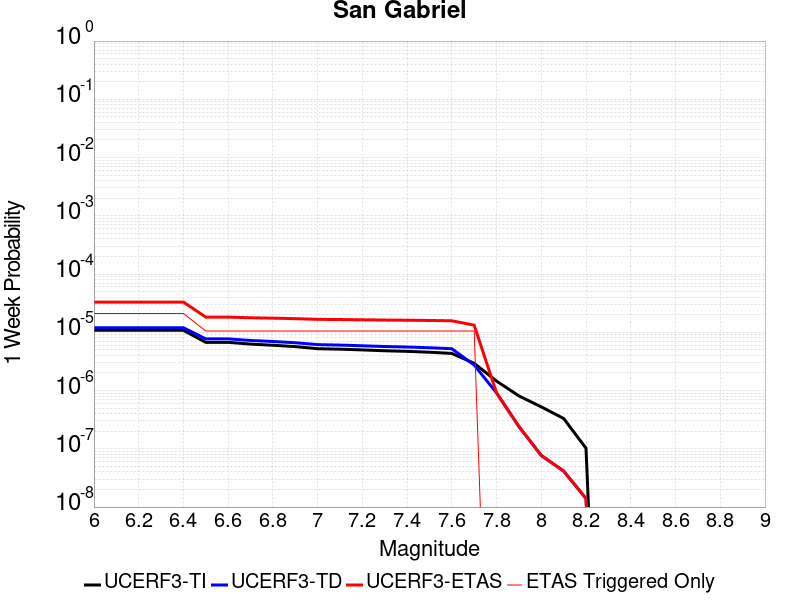 | 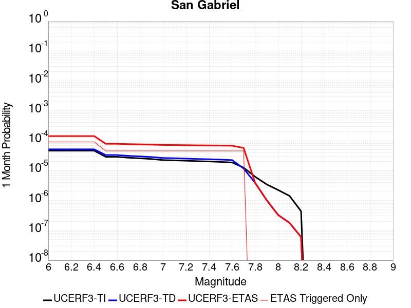 | 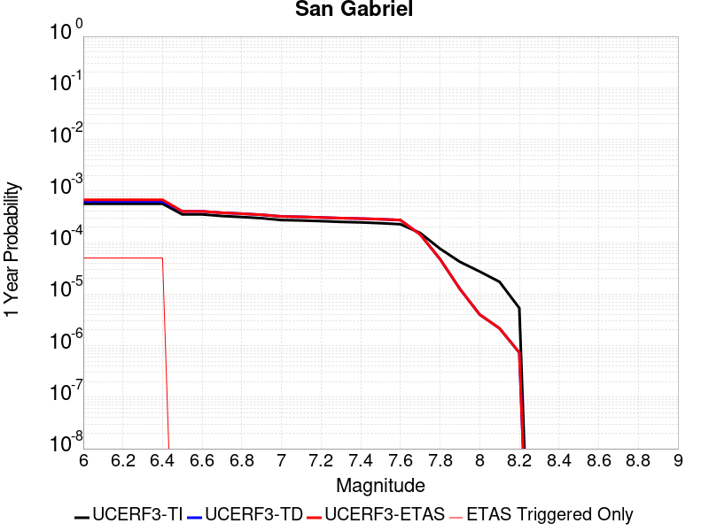 | 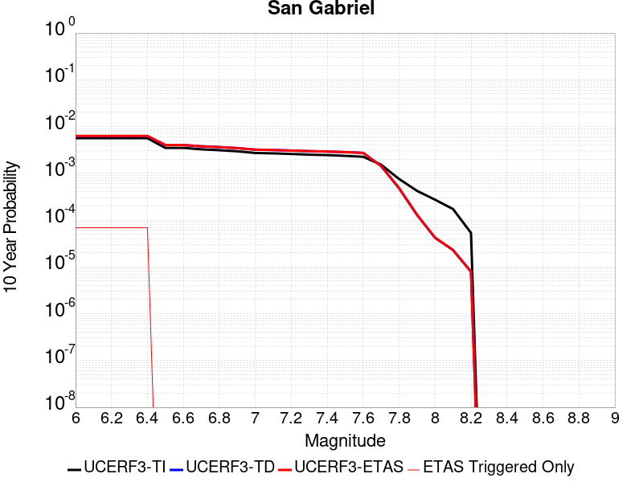 |

| Magnitude | 1 wk TI Prob | 1 wk TD Prob | 1 wk ETAS Prob | 1 wk ETAS/TD Gain | 1 wk ETAS Triggered Only | 1 mo TI Prob | 1 mo TD Prob | 1 mo ETAS Prob | 1 mo ETAS/TD Gain | 1 mo ETAS Triggered Only | 1 yr TI Prob | 1 yr TD Prob | 1 yr ETAS Prob | 1 yr ETAS/TD Gain | 1 yr ETAS Triggered Only | 10 yr TI Prob | 10 yr TD Prob | 10 yr ETAS Prob | 10 yr ETAS/TD Gain | 10 yr ETAS Triggered Only |
|-----|-----|-----|-----|-----|-----|-----|-----|-----|-----|-----|-----|-----|-----|-----|-----|-----|-----|-----|-----|-----|
| 6.0 | 1.083775E-5 | 1.1984758E-5 | 6.498672E-5 | 5.422447 | 5.3002597E-5 | 4.6446676E-5 | 5.13623E-5 | 1.0436218E-4 | 2.0318828 | 5.3002597E-5 | 5.653415E-4 | 6.251679E-4 | 6.781374E-4 | 1.0847284 | 5.3002597E-5 | 0.0056390543 | 0.0062461873 | 0.0062988587 | 1.0084326 | 5.3002597E-5 |
| 6.1 | 1.083775E-5 | 1.1984758E-5 | 6.498672E-5 | 5.422447 | 5.3002597E-5 | 4.6446676E-5 | 5.13623E-5 | 1.0436218E-4 | 2.0318828 | 5.3002597E-5 | 5.653415E-4 | 6.251679E-4 | 6.781374E-4 | 1.0847284 | 5.3002597E-5 | 0.0056390543 | 0.0062461873 | 0.0062988587 | 1.0084326 | 5.3002597E-5 |
| 6.2 | 1.083775E-5 | 1.1984758E-5 | 6.498672E-5 | 5.422447 | 5.3002597E-5 | 4.6446676E-5 | 5.13623E-5 | 1.0436218E-4 | 2.0318828 | 5.3002597E-5 | 5.653415E-4 | 6.251679E-4 | 6.781374E-4 | 1.0847284 | 5.3002597E-5 | 0.0056390543 | 0.0062461873 | 0.0062988587 | 1.0084326 | 5.3002597E-5 |
| 6.3 | 1.083775E-5 | 1.1984758E-5 | 6.498672E-5 | 5.422447 | 5.3002597E-5 | 4.6446676E-5 | 5.13623E-5 | 1.0436218E-4 | 2.0318828 | 5.3002597E-5 | 5.653415E-4 | 6.251679E-4 | 6.781374E-4 | 1.0847284 | 5.3002597E-5 | 0.0056390543 | 0.0062461873 | 0.0062988587 | 1.0084326 | 5.3002597E-5 |
| 6.4 | 1.083775E-5 | 1.1984758E-5 | 6.498672E-5 | 5.422447 | 5.3002597E-5 | 4.6446676E-5 | 5.13623E-5 | 1.0436218E-4 | 2.0318828 | 5.3002597E-5 | 5.653415E-4 | 6.251679E-4 | 6.781374E-4 | 1.0847284 | 5.3002597E-5 | 0.0056390543 | 0.0062461873 | 0.0062988587 | 1.0084326 | 5.3002597E-5 |
| 6.5 | 6.7317824E-6 | 7.7165205E-6 | 7.7165205E-6 | 1.0 | 0.0 | 2.8850178E-5 | 3.3070388E-5 | 3.3070388E-5 | 1.0 | 0.0 | 3.511943E-4 | 4.0255862E-4 | 4.0255862E-4 | 1.0 | 0.0 | 0.003506398 | 0.0040293895 | 0.0040293895 | 1.0 | 0.0 |
| 6.6 | 6.7317824E-6 | 7.7165205E-6 | 7.7165205E-6 | 1.0 | 0.0 | 2.8850178E-5 | 3.3070388E-5 | 3.3070388E-5 | 1.0 | 0.0 | 3.511943E-4 | 4.0255862E-4 | 4.0255862E-4 | 1.0 | 0.0 | 0.003506398 | 0.0040293895 | 0.0040293895 | 1.0 | 0.0 |
| 6.7 | 6.274881E-6 | 7.2454404E-6 | 7.2454404E-6 | 1.0 | 0.0 | 2.6892068E-5 | 3.1051524E-5 | 3.1051524E-5 | 1.0 | 0.0 | 3.2736175E-4 | 3.779877E-4 | 3.779877E-4 | 1.0 | 0.0 | 0.0032687993 | 0.0037845364 | 0.0037845364 | 1.0 | 0.0 |
| 6.8 | 5.996209E-6 | 6.958161E-6 | 6.958161E-6 | 1.0 | 0.0 | 2.5697784E-5 | 2.9820354E-5 | 2.9820354E-5 | 1.0 | 0.0 | 3.128256E-4 | 3.6300326E-4 | 3.6300326E-4 | 1.0 | 0.0 | 0.003123856 | 0.0036351893 | 0.0036351893 | 1.0 | 0.0 |
| 6.9 | 5.686331E-6 | 6.623209E-6 | 6.623209E-6 | 1.0 | 0.0 | 2.4369761E-5 | 2.8384879E-5 | 2.8384879E-5 | 1.0 | 0.0 | 2.9666146E-4 | 3.45532E-4 | 3.45532E-4 | 1.0 | 0.0 | 0.0029626573 | 0.0034610324 | 0.0034610324 | 1.0 | 0.0 |
| 7.0 | 5.2329838E-6 | 6.147093E-6 | 6.147093E-6 | 1.0 | 0.0 | 2.242688E-5 | 2.6344422E-5 | 2.6344422E-5 | 1.0 | 0.0 | 2.7301308E-4 | 3.2069688E-4 | 3.2069688E-4 | 1.0 | 0.0 | 0.002726779 | 0.0032134135 | 0.0032134135 | 1.0 | 0.0 |
| 7.1 | 5.135671E-6 | 6.03722E-6 | 6.03722E-6 | 1.0 | 0.0 | 2.2009834E-5 | 2.5873547E-5 | 2.5873547E-5 | 1.0 | 0.0 | 2.6793676E-4 | 3.1496567E-4 | 3.1496567E-4 | 1.0 | 0.0 | 0.0026761394 | 0.0031562652 | 0.0031562652 | 1.0 | 0.0 |
| 7.2 | 4.989062E-6 | 5.8706023E-6 | 5.8706023E-6 | 1.0 | 0.0 | 2.1381518E-5 | 2.5159485E-5 | 2.5159485E-5 | 1.0 | 0.0 | 2.6028889E-4 | 3.0627442E-4 | 3.0627442E-4 | 1.0 | 0.0 | 0.0025998424 | 0.003069596 | 0.003069596 | 1.0 | 0.0 |
| 7.3 | 4.8219395E-6 | 5.7021575E-6 | 5.7021575E-6 | 1.0 | 0.0 | 2.0665291E-5 | 2.4437593E-5 | 2.4437593E-5 | 1.0 | 0.0 | 2.5157086E-4 | 2.9748783E-4 | 2.9748783E-4 | 1.0 | 0.0 | 0.0025128627 | 0.0029819692 | 0.0029819692 | 1.0 | 0.0 |
| 7.4 | 4.7118383E-6 | 5.590718E-6 | 5.590718E-6 | 1.0 | 0.0 | 2.0193436E-5 | 2.3960005E-5 | 2.3960005E-5 | 1.0 | 0.0 | 2.4582737E-4 | 2.9167475E-4 | 2.9167475E-4 | 1.0 | 0.0 | 0.002455556 | 0.0029239913 | 0.0029239913 | 1.0 | 0.0 |
| 7.5 | 4.5506545E-6 | 5.4360885E-6 | 5.4360885E-6 | 1.0 | 0.0 | 1.9502659E-5 | 2.3297318E-5 | 2.3297318E-5 | 1.0 | 0.0 | 2.37419E-4 | 2.8360868E-4 | 2.8360868E-4 | 1.0 | 0.0 | 0.002371655 | 0.0028435385 | 0.0028435385 | 1.0 | 0.0 |
| 7.6 | 4.343636E-6 | 5.2289724E-6 | 5.2289724E-6 | 1.0 | 0.0 | 1.861545E-5 | 2.2409693E-5 | 2.2409693E-5 | 1.0 | 0.0 | 2.2661954E-4 | 2.728046E-4 | 2.728046E-4 | 1.0 | 0.0 | 0.0022638857 | 0.0027357598 | 0.0027357598 | 1.0 | 0.0 |
| 7.7 | 2.936235E-6 | 2.7437704E-6 | 2.7437704E-6 | 1.0 | 0.0 | 1.2583803E-5 | 1.1758963E-5 | 1.1758963E-5 | 1.0 | 0.0 | 1.5319703E-4 | 1.4315601E-4 | 1.4315601E-4 | 1.0 | 0.0 | 0.0015309147 | 0.0014379307 | 0.0014379307 | 1.0 | 0.0 |
| 7.8 | 1.4541639E-6 | 9.122594E-7 | 9.122594E-7 | 1.0 | 0.0 | 6.232116E-6 | 3.909677E-6 | 3.909677E-6 | 1.0 | 0.0 | 7.587337E-5 | 4.7599282E-5 | 4.7599282E-5 | 1.0 | 0.0 | 7.584747E-4 | 4.80793E-4 | 4.80793E-4 | 1.0 | 0.0 |
| 7.9 | 8.098958E-7 | 2.4170984E-7 | 2.4170984E-7 | 1.0 | 0.0 | 3.4709774E-6 | 1.0358989E-6 | 1.0358989E-6 | 1.0 | 0.0 | 4.225833E-5 | 1.2611996E-5 | 1.2611996E-5 | 1.0 | 0.0 | 4.2250296E-4 | 1.2919492E-4 | 1.2919492E-4 | 1.0 | 0.0 |
| 8.0 | 5.2473234E-7 | 7.677202E-8 | 7.677202E-8 | 1.0 | 0.0 | 2.248851E-6 | 3.290229E-7 | 3.290229E-7 | 1.0 | 0.0 | 2.7379416E-5 | 4.005846E-6 | 4.005846E-6 | 1.0 | 0.0 | 2.7376044E-4 | 4.2180836E-5 | 4.2180836E-5 | 1.0 | 0.0 |
| 8.1 | 3.3162388E-7 | 4.1485006E-8 | 4.1485006E-8 | 1.0 | 0.0 | 1.4212444E-6 | 1.7779287E-7 | 1.7779287E-7 | 1.0 | 0.0 | 1.7303513E-5 | 2.164626E-6 | 2.164626E-6 | 1.0 | 0.0 | 1.7302166E-4 | 2.295942E-5 | 2.295942E-5 | 1.0 | 0.0 |
| 8.2 | 1.0235345E-7 | 1.4039964E-8 | 1.4039964E-8 | 1.0 | 0.0 | 4.3865757E-7 | 6.0171274E-8 | 6.0171274E-8 | 1.0 | 0.0 | 5.340643E-6 | 7.3258497E-7 | 7.3258497E-7 | 1.0 | 0.0 | 5.3405143E-5 | 7.925429E-6 | 7.925429E-6 | 1.0 | 0.0 |

## Cleghorn Lake
*[(top)](#table-of-contents)*

| 1 Week | 1 Month | 1 Year | 10 Year |
|-----|-----|-----|-----|
| 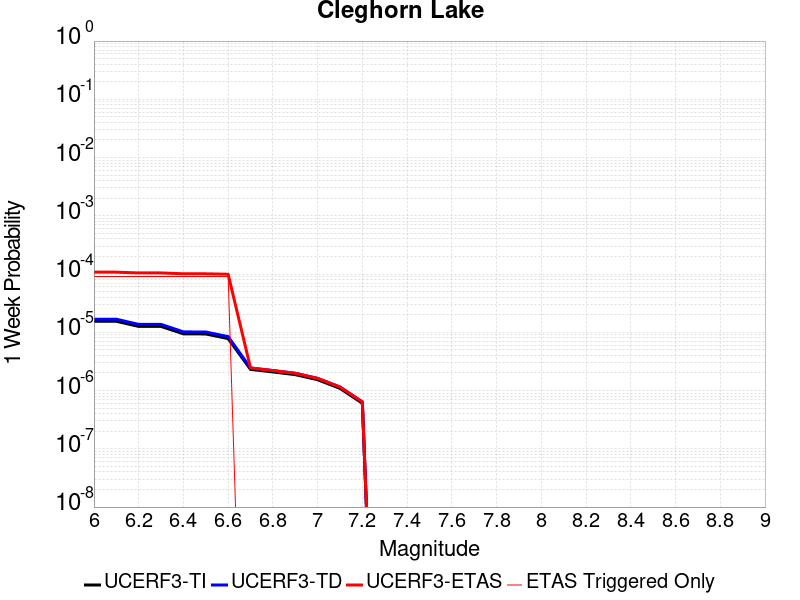 | 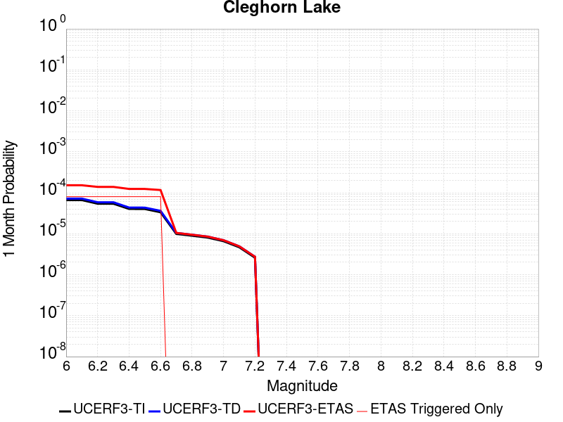 | 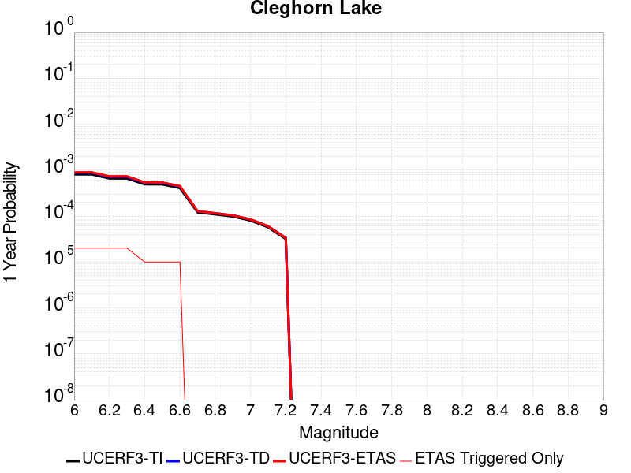 | 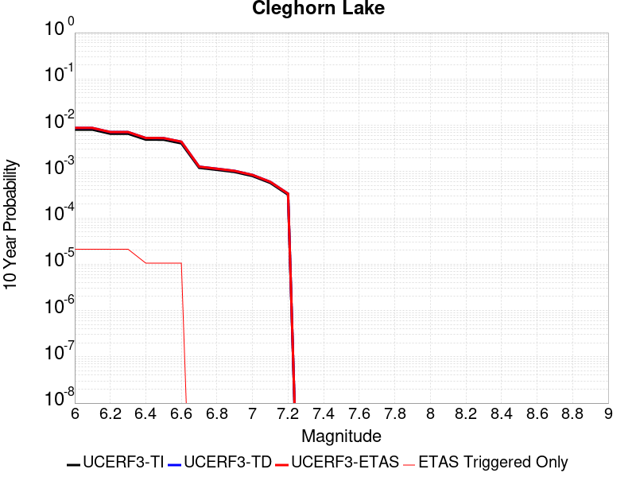 |

| Magnitude | 1 wk TI Prob | 1 wk TD Prob | 1 wk ETAS Prob | 1 wk ETAS/TD Gain | 1 wk ETAS Triggered Only | 1 mo TI Prob | 1 mo TD Prob | 1 mo ETAS Prob | 1 mo ETAS/TD Gain | 1 mo ETAS Triggered Only | 1 yr TI Prob | 1 yr TD Prob | 1 yr ETAS Prob | 1 yr ETAS/TD Gain | 1 yr ETAS Triggered Only | 10 yr TI Prob | 10 yr TD Prob | 10 yr ETAS Prob | 10 yr ETAS/TD Gain | 10 yr ETAS Triggered Only |
|-----|-----|-----|-----|-----|-----|-----|-----|-----|-----|-----|-----|-----|-----|-----|-----|-----|-----|-----|-----|-----|
| 6.0 | 1.5467183E-5 | 1.6794165E-5 | 6.9795875E-5 | 4.1559596 | 5.3002597E-5 | 6.6286244E-5 | 7.1973314E-5 | 1.249721E-4 | 1.7363671 | 5.3002597E-5 | 8.067362E-4 | 8.7597774E-4 | 9.289339E-4 | 1.0604538 | 5.3002597E-5 | 0.008038137 | 0.008730675 | 0.008783216 | 1.0060178 | 5.3002597E-5 |
| 6.1 | 1.5467183E-5 | 1.6794165E-5 | 6.9795875E-5 | 4.1559596 | 5.3002597E-5 | 6.6286244E-5 | 7.1973314E-5 | 1.249721E-4 | 1.7363671 | 5.3002597E-5 | 8.067362E-4 | 8.7597774E-4 | 9.289339E-4 | 1.0604538 | 5.3002597E-5 | 0.008038137 | 0.008730675 | 0.008783216 | 1.0060178 | 5.3002597E-5 |
| 6.2 | 1.2624631E-5 | 1.3681514E-5 | 6.668339E-5 | 4.873977 | 5.3002597E-5 | 5.410444E-5 | 5.8634017E-5 | 1.11633504E-4 | 1.9039035 | 5.3002597E-5 | 6.585225E-4 | 7.13684E-4 | 7.666488E-4 | 1.0742131 | 5.3002597E-5 | 0.0065657445 | 0.007118716 | 0.007171341 | 1.0073925 | 5.3002597E-5 |
| 6.3 | 1.2624631E-5 | 1.3681514E-5 | 6.668339E-5 | 4.873977 | 5.3002597E-5 | 5.410444E-5 | 5.8634017E-5 | 1.11633504E-4 | 1.9039035 | 5.3002597E-5 | 6.585225E-4 | 7.13684E-4 | 7.666488E-4 | 1.0742131 | 5.3002597E-5 | 0.0065657445 | 0.007118716 | 0.007171341 | 1.0073925 | 5.3002597E-5 |
| 6.4 | 9.417684E-6 | 1.0170096E-5 | 6.3172156E-5 | 6.2115593 | 5.3002597E-5 | 4.036088E-5 | 4.3585627E-5 | 9.6585914E-5 | 2.2160037 | 5.3002597E-5 | 4.912829E-4 | 5.305669E-4 | 5.835414E-4 | 1.099845 | 5.3002597E-5 | 0.004901982 | 0.005297038 | 0.0053497595 | 1.009953 | 5.3002597E-5 |
| 6.5 | 9.368219E-6 | 1.0117523E-5 | 6.311958E-5 | 6.2386403 | 5.3002597E-5 | 4.014889E-5 | 4.3360324E-5 | 9.636062E-5 | 2.2223225 | 5.3002597E-5 | 4.8870314E-4 | 5.2782515E-4 | 5.8079977E-4 | 1.100364 | 5.3002597E-5 | 0.004876298 | 0.00526975 | 0.0053224736 | 1.0100049 | 5.3002597E-5 |
| 6.6 | 7.803798E-6 | 8.4418125E-6 | 6.144396E-5 | 7.2785273 | 5.3002597E-5 | 3.3444423E-5 | 3.617892E-5 | 8.91796E-5 | 2.4649603 | 5.3002597E-5 | 4.0710976E-4 | 4.4042926E-4 | 4.934085E-4 | 1.12029 | 5.3002597E-5 | 0.0040636472 | 0.0043994808 | 0.00445225 | 1.0119945 | 5.3002597E-5 |
| 6.7 | 2.3108669E-6 | 2.44383E-6 | 2.44383E-6 | 1.0 | 0.0 | 9.903678E-6 | 1.0473515E-5 | 1.0473515E-5 | 1.0 | 0.0 | 1.205706E-4 | 1.2750778E-4 | 1.2750778E-4 | 1.0 | 0.0 | 0.001205052 | 0.0012743649 | 0.0012743649 | 1.0 | 0.0 |
| 6.8 | 2.0882828E-6 | 2.2062789E-6 | 2.2062789E-6 | 1.0 | 0.0 | 8.949753E-6 | 9.455448E-6 | 9.455448E-6 | 1.0 | 0.0 | 1.08957785E-4 | 1.1511416E-4 | 1.1511416E-4 | 1.0 | 0.0 | 0.0010890438 | 0.0011505622 | 0.0011505622 | 1.0 | 0.0 |
| 6.9 | 1.876935E-6 | 1.9810482E-6 | 1.9810482E-6 | 1.0 | 0.0 | 8.043982E-6 | 8.490179E-6 | 8.490179E-6 | 1.0 | 0.0 | 9.7931086E-5 | 1.0336319E-4 | 1.0336319E-4 | 1.0 | 0.0 | 9.788794E-4 | 0.0010331671 | 0.0010331671 | 1.0 | 0.0 |
| 7.0 | 1.5357559E-6 | 1.6202783E-6 | 1.6202783E-6 | 1.0 | 0.0 | 6.5817944E-6 | 6.944032E-6 | 6.944032E-6 | 1.0 | 0.0 | 8.01304E-5 | 8.4540436E-5 | 8.4540436E-5 | 1.0 | 0.0 | 8.010151E-4 | 8.4509526E-4 | 8.4509526E-4 | 1.0 | 0.0 |
| 7.1 | 1.0905424E-6 | 1.1497604E-6 | 1.1497604E-6 | 1.0 | 0.0 | 4.6737446E-6 | 4.9275354E-6 | 4.9275354E-6 | 1.0 | 0.0 | 5.6901354E-5 | 5.999119E-5 | 5.999119E-5 | 1.0 | 0.0 | 5.6886784E-4 | 5.9975975E-4 | 5.9975975E-4 | 1.0 | 0.0 |
| 7.2 | 6.06668E-7 | 6.387269E-7 | 6.387269E-7 | 1.0 | 0.0 | 2.600003E-6 | 2.7373983E-6 | 2.7373983E-6 | 1.0 | 0.0 | 3.1654577E-5 | 3.3327386E-5 | 3.3327386E-5 | 1.0 | 0.0 | 3.1650066E-4 | 3.332307E-4 | 3.332307E-4 | 1.0 | 0.0 |

## Independence rev 2011
*[(top)](#table-of-contents)*

| 1 Week | 1 Month | 1 Year | 10 Year |
|-----|-----|-----|-----|
| 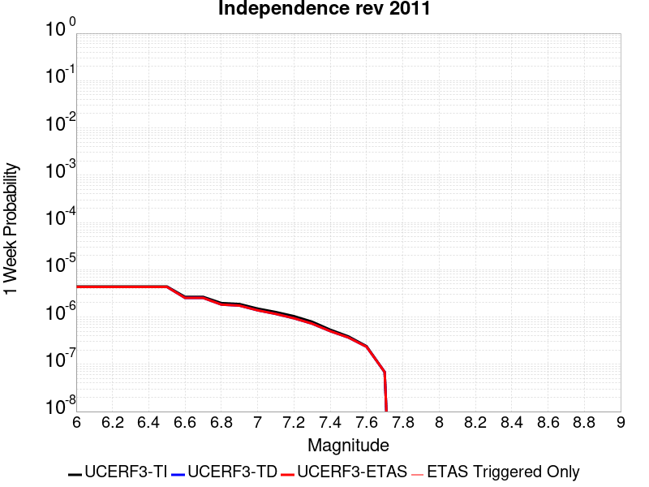 | 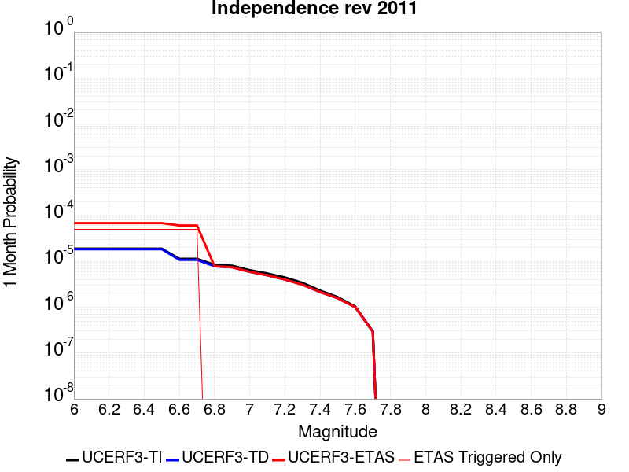 | 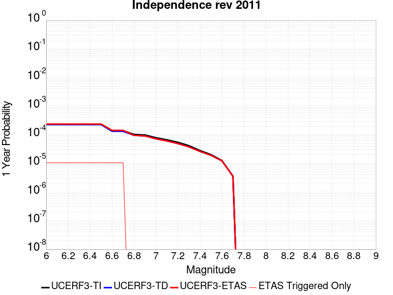 | 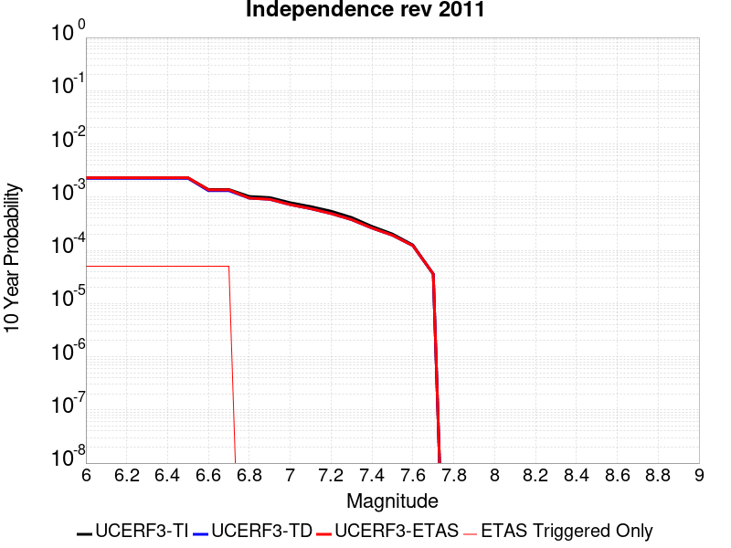 |

| Magnitude | 1 wk TI Prob | 1 wk TD Prob | 1 wk ETAS Prob | 1 wk ETAS/TD Gain | 1 wk ETAS Triggered Only | 1 mo TI Prob | 1 mo TD Prob | 1 mo ETAS Prob | 1 mo ETAS/TD Gain | 1 mo ETAS Triggered Only | 1 yr TI Prob | 1 yr TD Prob | 1 yr ETAS Prob | 1 yr ETAS/TD Gain | 1 yr ETAS Triggered Only | 10 yr TI Prob | 10 yr TD Prob | 10 yr ETAS Prob | 10 yr ETAS/TD Gain | 10 yr ETAS Triggered Only |
|-----|-----|-----|-----|-----|-----|-----|-----|-----|-----|-----|-----|-----|-----|-----|-----|-----|-----|-----|-----|-----|
| 6.0 | 4.422171E-6 | 4.3262235E-6 | 4.3262235E-6 | 1.0 | 0.0 | 1.8952025E-5 | 1.8540843E-5 | 7.1542454E-5 | 3.8586411 | 5.3002597E-5 | 2.3071647E-4 | 2.2571435E-4 | 2.7870497E-4 | 1.2347685 | 5.3002597E-5 | 0.0023047708 | 0.0022551445 | 0.0023080276 | 1.02345 | 5.3002597E-5 |
| 6.1 | 4.422171E-6 | 4.3262235E-6 | 4.3262235E-6 | 1.0 | 0.0 | 1.8952025E-5 | 1.8540843E-5 | 7.1542454E-5 | 3.8586411 | 5.3002597E-5 | 2.3071647E-4 | 2.2571435E-4 | 2.7870497E-4 | 1.2347685 | 5.3002597E-5 | 0.0023047708 | 0.0022551445 | 0.0023080276 | 1.02345 | 5.3002597E-5 |
| 6.2 | 4.422171E-6 | 4.3262235E-6 | 4.3262235E-6 | 1.0 | 0.0 | 1.8952025E-5 | 1.8540843E-5 | 7.1542454E-5 | 3.8586411 | 5.3002597E-5 | 2.3071647E-4 | 2.2571435E-4 | 2.7870497E-4 | 1.2347685 | 5.3002597E-5 | 0.0023047708 | 0.0022551445 | 0.0023080276 | 1.02345 | 5.3002597E-5 |
| 6.3 | 4.422171E-6 | 4.3262235E-6 | 4.3262235E-6 | 1.0 | 0.0 | 1.8952025E-5 | 1.8540843E-5 | 7.1542454E-5 | 3.8586411 | 5.3002597E-5 | 2.3071647E-4 | 2.2571435E-4 | 2.7870497E-4 | 1.2347685 | 5.3002597E-5 | 0.0023047708 | 0.0022551445 | 0.0023080276 | 1.02345 | 5.3002597E-5 |
| 6.4 | 4.422171E-6 | 4.3262235E-6 | 4.3262235E-6 | 1.0 | 0.0 | 1.8952025E-5 | 1.8540843E-5 | 7.1542454E-5 | 3.8586411 | 5.3002597E-5 | 2.3071647E-4 | 2.2571435E-4 | 2.7870497E-4 | 1.2347685 | 5.3002597E-5 | 0.0023047708 | 0.0022551445 | 0.0023080276 | 1.02345 | 5.3002597E-5 |
| 6.5 | 4.422171E-6 | 4.3262235E-6 | 4.3262235E-6 | 1.0 | 0.0 | 1.8952025E-5 | 1.8540843E-5 | 7.1542454E-5 | 3.8586411 | 5.3002597E-5 | 2.3071647E-4 | 2.2571435E-4 | 2.7870497E-4 | 1.2347685 | 5.3002597E-5 | 0.0023047708 | 0.0022551445 | 0.0023080276 | 1.02345 | 5.3002597E-5 |
| 6.6 | 2.663744E-6 | 2.5319835E-6 | 2.5319835E-6 | 1.0 | 0.0 | 1.1415996E-5 | 1.0851315E-5 | 6.385334E-5 | 5.884387 | 5.3002597E-5 | 1.3898089E-4 | 1.3210725E-4 | 1.8510284E-4 | 1.4011558 | 5.3002597E-5 | 0.0013889399 | 0.0013203353 | 0.001373268 | 1.0400903 | 5.3002597E-5 |
| 6.7 | 2.663744E-6 | 2.5319835E-6 | 2.5319835E-6 | 1.0 | 0.0 | 1.1415996E-5 | 1.0851315E-5 | 6.385334E-5 | 5.884387 | 5.3002597E-5 | 1.3898089E-4 | 1.3210725E-4 | 1.8510284E-4 | 1.4011558 | 5.3002597E-5 | 0.0013889399 | 0.0013203353 | 0.001373268 | 1.0400903 | 5.3002597E-5 |
| 6.8 | 1.9716529E-6 | 1.8322561E-6 | 1.8322561E-6 | 1.0 | 0.0 | 8.449913E-6 | 7.852504E-6 | 7.852504E-6 | 1.0 | 0.0 | 1.0287284E-4 | 9.560016E-5 | 9.560016E-5 | 1.0 | 0.0 | 0.0010282523 | 9.5560326E-4 | 9.5560326E-4 | 1.0 | 0.0 |
| 6.9 | 1.8788617E-6 | 1.742997E-6 | 1.742997E-6 | 1.0 | 0.0 | 8.0522395E-6 | 7.469967E-6 | 7.469967E-6 | 1.0 | 0.0 | 9.80316E-5 | 9.094317E-5 | 9.094317E-5 | 1.0 | 0.0 | 9.798837E-4 | 9.090716E-4 | 9.090716E-4 | 1.0 | 0.0 |
| 7.0 | 1.5045488E-6 | 1.3849485E-6 | 1.3849485E-6 | 1.0 | 0.0 | 6.44805E-6 | 5.9354807E-6 | 5.9354807E-6 | 1.0 | 0.0 | 7.8502184E-5 | 7.226213E-5 | 7.226213E-5 | 1.0 | 0.0 | 7.8474457E-4 | 7.223915E-4 | 7.223915E-4 | 1.0 | 0.0 |
| 7.1 | 1.272341E-6 | 1.162508E-6 | 1.162508E-6 | 1.0 | 0.0 | 5.4528787E-6 | 4.9821683E-6 | 4.9821683E-6 | 1.0 | 0.0 | 6.6386776E-5 | 6.0656243E-5 | 6.0656243E-5 | 1.0 | 0.0 | 6.636695E-4 | 6.064001E-4 | 6.064001E-4 | 1.0 | 0.0 |
| 7.2 | 1.0416892E-6 | 9.4098664E-7 | 9.4098664E-7 | 1.0 | 0.0 | 4.464375E-6 | 4.0327936E-6 | 4.0327936E-6 | 1.0 | 0.0 | 5.4352407E-5 | 4.9098177E-5 | 4.9098177E-5 | 1.0 | 0.0 | 5.4339116E-4 | 4.9087516E-4 | 4.9087516E-4 | 1.0 | 0.0 |
| 7.3 | 7.9450155E-7 | 7.234991E-7 | 7.234991E-7 | 1.0 | 0.0 | 3.4050022E-6 | 3.100707E-6 | 3.100707E-6 | 1.0 | 0.0 | 4.1455114E-5 | 3.7750466E-5 | 3.7750466E-5 | 1.0 | 0.0 | 4.144738E-4 | 3.7744164E-4 | 3.7744164E-4 | 1.0 | 0.0 |
| 7.4 | 5.3893444E-7 | 5.019506E-7 | 5.019506E-7 | 1.0 | 0.0 | 2.309717E-6 | 2.151215E-6 | 2.151215E-6 | 1.0 | 0.0 | 2.8120441E-5 | 2.6190733E-5 | 2.6190733E-5 | 1.0 | 0.0 | 2.8116882E-4 | 2.618769E-4 | 2.618769E-4 | 1.0 | 0.0 |
| 7.5 | 3.8852085E-7 | 3.6825497E-7 | 3.6825497E-7 | 1.0 | 0.0 | 1.6650882E-6 | 1.5782347E-6 | 1.5782347E-6 | 1.0 | 0.0 | 2.027226E-5 | 1.921484E-5 | 1.921484E-5 | 1.0 | 0.0 | 2.0270412E-4 | 1.9213199E-4 | 1.9213199E-4 | 1.0 | 0.0 |
| 7.6 | 2.414929E-7 | 2.3457528E-7 | 2.3457528E-7 | 1.0 | 0.0 | 1.0349692E-6 | 1.0053222E-6 | 1.0053222E-6 | 1.0 | 0.0 | 1.2600677E-5 | 1.2239731E-5 | 1.2239731E-5 | 1.0 | 0.0 | 1.2599962E-4 | 1.2239069E-4 | 1.2239069E-4 | 1.0 | 0.0 |
| 7.7 | 6.8298014E-8 | 6.858965E-8 | 6.858965E-8 | 1.0 | 0.0 | 2.9270575E-7 | 2.9395562E-7 | 2.9395562E-7 | 1.0 | 0.0 | 3.5636867E-6 | 3.5789042E-6 | 3.5789042E-6 | 1.0 | 0.0 | 3.5636294E-5 | 3.5788515E-5 | 3.5788515E-5 | 1.0 | 0.0 |

## San Jacinto (San Bernardino)
*[(top)](#table-of-contents)*

| 1 Week | 1 Month | 1 Year | 10 Year |
|-----|-----|-----|-----|
| 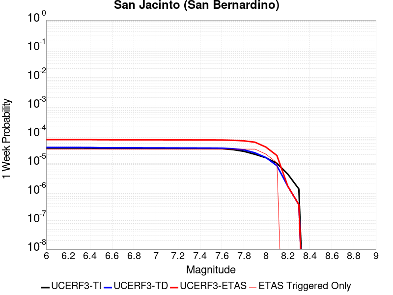 | 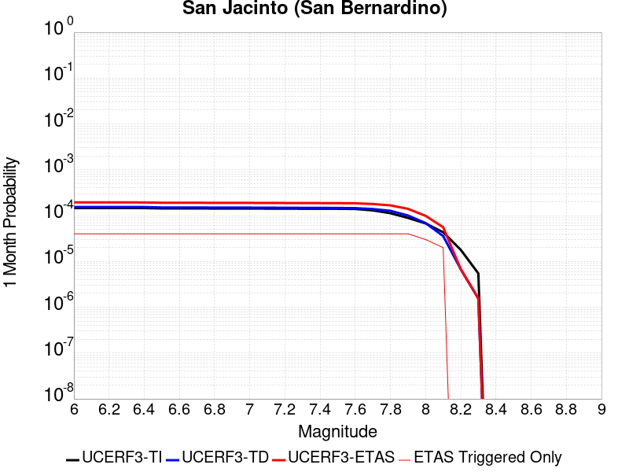 | 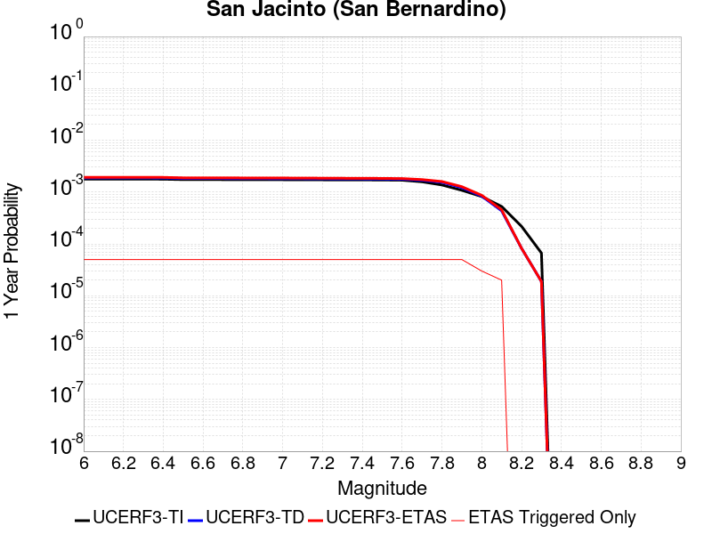 | 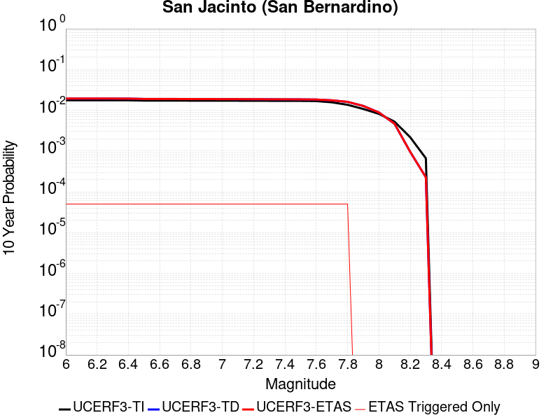 |

| Magnitude | 1 wk TI Prob | 1 wk TD Prob | 1 wk ETAS Prob | 1 wk ETAS/TD Gain | 1 wk ETAS Triggered Only | 1 mo TI Prob | 1 mo TD Prob | 1 mo ETAS Prob | 1 mo ETAS/TD Gain | 1 mo ETAS Triggered Only | 1 yr TI Prob | 1 yr TD Prob | 1 yr ETAS Prob | 1 yr ETAS/TD Gain | 1 yr ETAS Triggered Only | 10 yr TI Prob | 10 yr TD Prob | 10 yr ETAS Prob | 10 yr ETAS/TD Gain | 10 yr ETAS Triggered Only |
|-----|-----|-----|-----|-----|-----|-----|-----|-----|-----|-----|-----|-----|-----|-----|-----|-----|-----|-----|-----|-----|
| 6.0 | 3.409352E-5 | 3.597972E-5 | 3.597972E-5 | 1.0 | 0.0 | 1.461069E-4 | 1.541897E-4 | 1.541897E-4 | 1.0 | 0.0 | 0.0017774 | 0.0018756451 | 0.0018756451 | 1.0 | 0.0 | 0.01763251 | 0.019346429 | 0.019398406 | 1.0026866 | 5.3002597E-5 |
| 6.1 | 3.409352E-5 | 3.597972E-5 | 3.597972E-5 | 1.0 | 0.0 | 1.461069E-4 | 1.541897E-4 | 1.541897E-4 | 1.0 | 0.0 | 0.0017774 | 0.0018756451 | 0.0018756451 | 1.0 | 0.0 | 0.01763251 | 0.019346429 | 0.019398406 | 1.0026866 | 5.3002597E-5 |
| 6.2 | 3.409352E-5 | 3.597972E-5 | 3.597972E-5 | 1.0 | 0.0 | 1.461069E-4 | 1.541897E-4 | 1.541897E-4 | 1.0 | 0.0 | 0.0017774 | 0.0018756451 | 0.0018756451 | 1.0 | 0.0 | 0.01763251 | 0.019346429 | 0.019398406 | 1.0026866 | 5.3002597E-5 |
| 6.3 | 3.409352E-5 | 3.597972E-5 | 3.597972E-5 | 1.0 | 0.0 | 1.461069E-4 | 1.541897E-4 | 1.541897E-4 | 1.0 | 0.0 | 0.0017774 | 0.0018756451 | 0.0018756451 | 1.0 | 0.0 | 0.01763251 | 0.019346429 | 0.019398406 | 1.0026866 | 5.3002597E-5 |
| 6.4 | 3.400795E-5 | 3.5872385E-5 | 3.5872385E-5 | 1.0 | 0.0 | 1.4574021E-4 | 1.5372974E-4 | 1.5372974E-4 | 1.0 | 0.0 | 0.0017729428 | 0.0018700549 | 0.0018700549 | 1.0 | 0.0 | 0.017588645 | 0.01929151 | 0.01934349 | 1.0026945 | 5.3002597E-5 |
| 6.5 | 3.341482E-5 | 3.5133027E-5 | 3.5133027E-5 | 1.0 | 0.0 | 1.4319851E-4 | 1.5056143E-4 | 1.5056143E-4 | 1.0 | 0.0 | 0.0017420477 | 0.0018315457 | 0.0018315457 | 1.0 | 0.0 | 0.017284546 | 0.018913053 | 0.018965052 | 1.0027494 | 5.3002597E-5 |
| 6.6 | 3.3364955E-5 | 3.5070247E-5 | 3.5070247E-5 | 1.0 | 0.0 | 1.4298483E-4 | 1.5029241E-4 | 1.5029241E-4 | 1.0 | 0.0 | 0.0017394501 | 0.0018282757 | 0.0018282757 | 1.0 | 0.0 | 0.017258976 | 0.018880919 | 0.01893292 | 1.0027542 | 5.3002597E-5 |
| 6.7 | 3.335922E-5 | 3.506002E-5 | 3.506002E-5 | 1.0 | 0.0 | 1.4296026E-4 | 1.5024858E-4 | 1.5024858E-4 | 1.0 | 0.0 | 0.0017391514 | 0.0018277431 | 0.0018277431 | 1.0 | 0.0 | 0.017256035 | 0.018875709 | 0.018927712 | 1.0027549 | 5.3002597E-5 |
| 6.8 | 3.327683E-5 | 3.495409E-5 | 3.495409E-5 | 1.0 | 0.0 | 1.4260718E-4 | 1.4979464E-4 | 1.4979464E-4 | 1.0 | 0.0 | 0.0017348597 | 0.0018222256 | 0.0018222256 | 1.0 | 0.0 | 0.017213784 | 0.018821482 | 0.018873487 | 1.002763 | 5.3002597E-5 |
| 6.9 | 3.3235785E-5 | 3.489504E-5 | 3.489504E-5 | 1.0 | 0.0 | 1.4243131E-4 | 1.4954162E-4 | 1.4954162E-4 | 1.0 | 0.0 | 0.0017327217 | 0.0018191502 | 0.0018191502 | 1.0 | 0.0 | 0.017192734 | 0.01879135 | 0.018843357 | 1.0027676 | 5.3002597E-5 |
| 7.0 | 3.3197095E-5 | 3.4834975E-5 | 3.4834975E-5 | 1.0 | 0.0 | 1.422655E-4 | 1.4928421E-4 | 1.4928421E-4 | 1.0 | 0.0 | 0.0017307063 | 0.0018160215 | 0.0018160215 | 1.0 | 0.0 | 0.017172894 | 0.018760728 | 0.018812736 | 1.0027722 | 5.3002597E-5 |
| 7.1 | 3.3129716E-5 | 3.4715187E-5 | 3.4715187E-5 | 1.0 | 0.0 | 1.4197677E-4 | 1.487709E-4 | 1.487709E-4 | 1.0 | 0.0 | 0.0017271966 | 0.0018097822 | 0.0018097822 | 1.0 | 0.0 | 0.017138338 | 0.018699808 | 0.018751819 | 1.0027814 | 5.3002597E-5 |
| 7.2 | 3.3034008E-5 | 3.4582634E-5 | 3.4582634E-5 | 1.0 | 0.0 | 1.4156665E-4 | 1.4820287E-4 | 1.4820287E-4 | 1.0 | 0.0 | 0.0017222111 | 0.0018028781 | 0.0018028781 | 1.0 | 0.0 | 0.017089253 | 0.018632201 | 0.018684216 | 1.0027916 | 5.3002597E-5 |
| 7.3 | 3.2956614E-5 | 3.4450393E-5 | 3.4450393E-5 | 1.0 | 0.0 | 1.4123498E-4 | 1.476362E-4 | 1.476362E-4 | 1.0 | 0.0 | 0.0017181796 | 0.0017959902 | 0.0017959902 | 1.0 | 0.0 | 0.017049557 | 0.018564949 | 0.018616969 | 1.002802 | 5.3002597E-5 |
| 7.4 | 3.2915937E-5 | 3.437212E-5 | 3.437212E-5 | 1.0 | 0.0 | 1.4106068E-4 | 1.4730077E-4 | 1.4730077E-4 | 1.0 | 0.0 | 0.0017160608 | 0.0017919131 | 0.0017919131 | 1.0 | 0.0 | 0.017028693 | 0.01852523 | 0.01857725 | 1.0028081 | 5.3002597E-5 |
| 7.5 | 3.281791E-5 | 3.4237073E-5 | 3.4237073E-5 | 1.0 | 0.0 | 1.406406E-4 | 1.4672207E-4 | 1.4672207E-4 | 1.0 | 0.0 | 0.0017109542 | 0.0017848789 | 0.0017848789 | 1.0 | 0.0 | 0.016978411 | 0.018456137 | 0.018508162 | 1.0028188 | 5.3002597E-5 |
| 7.6 | 3.2521442E-5 | 3.3962282E-5 | 3.3962282E-5 | 1.0 | 0.0 | 1.3937015E-4 | 1.4554452E-4 | 1.4554452E-4 | 1.0 | 0.0 | 0.0016955109 | 0.0017705658 | 0.0017705658 | 1.0 | 0.0 | 0.016826328 | 0.018313898 | 0.01836593 | 1.0028411 | 5.3002597E-5 |
| 7.7 | 3.0287873E-5 | 3.2449603E-5 | 3.2449603E-5 | 1.0 | 0.0 | 1.297987E-4 | 1.3906232E-4 | 1.3906232E-4 | 1.0 | 0.0 | 0.0015791537 | 0.00169177 | 0.00169177 | 1.0 | 0.0 | 0.01567979 | 0.017526472 | 0.017578546 | 1.0029712 | 5.3002597E-5 |
| 7.8 | 2.6316151E-5 | 2.9660547E-5 | 2.9660547E-5 | 1.0 | 0.0 | 1.1277862E-4 | 1.2711044E-4 | 1.2711044E-4 | 1.0 | 0.0 | 0.0013722149 | 0.001546472 | 0.001546472 | 1.0 | 0.0 | 0.013637724 | 0.016068073 | 0.016120223 | 1.0032456 | 5.3002597E-5 |
| 7.9 | 2.0761147E-5 | 2.341544E-5 | 2.341544E-5 | 1.0 | 0.0 | 8.897331E-5 | 1.0034803E-4 | 1.0034803E-4 | 1.0 | 0.0 | 0.0010827117 | 0.0012210533 | 0.0012210533 | 1.0 | 0.0 | 0.010774517 | 0.012791798 | 0.012791798 | 1.0 | 0.0 |
| 8.0 | 1.5738568E-5 | 1.6031558E-5 | 1.6031558E-5 | 1.0 | 0.0 | 6.744926E-5 | 6.8704874E-5 | 6.8704874E-5 | 1.0 | 0.0 | 8.2088535E-4 | 8.361615E-4 | 8.361615E-4 | 1.0 | 0.0 | 0.008178596 | 0.008864859 | 0.008864859 | 1.0 | 0.0 |
| 8.1 | 1.0105832E-5 | 8.329329E-6 | 8.329329E-6 | 1.0 | 0.0 | 4.3309992E-5 | 3.5696637E-5 | 3.5696637E-5 | 1.0 | 0.0 | 5.2717153E-4 | 4.3452042E-4 | 4.3452042E-4 | 1.0 | 0.0 | 0.005259227 | 0.0046766037 | 0.0046766037 | 1.0 | 0.0 |
| 8.2 | 4.189207E-6 | 1.5781004E-6 | 1.5781004E-6 | 1.0 | 0.0 | 1.7953622E-5 | 6.76327E-6 | 6.76327E-6 | 1.0 | 0.0 | 2.1856341E-4 | 8.233973E-5 | 8.233973E-5 | 1.0 | 0.0 | 0.0021834858 | 9.5639535E-4 | 9.5639535E-4 | 1.0 | 0.0 |
| 8.3 | 1.2758221E-6 | 3.6140935E-7 | 3.6140935E-7 | 1.0 | 0.0 | 5.4677976E-6 | 1.5488963E-6 | 1.5488963E-6 | 1.0 | 0.0 | 6.65684E-5 | 1.8857654E-5 | 1.8857654E-5 | 1.0 | 0.0 | 6.6548464E-4 | 2.2746001E-4 | 2.2746001E-4 | 1.0 | 0.0 |

