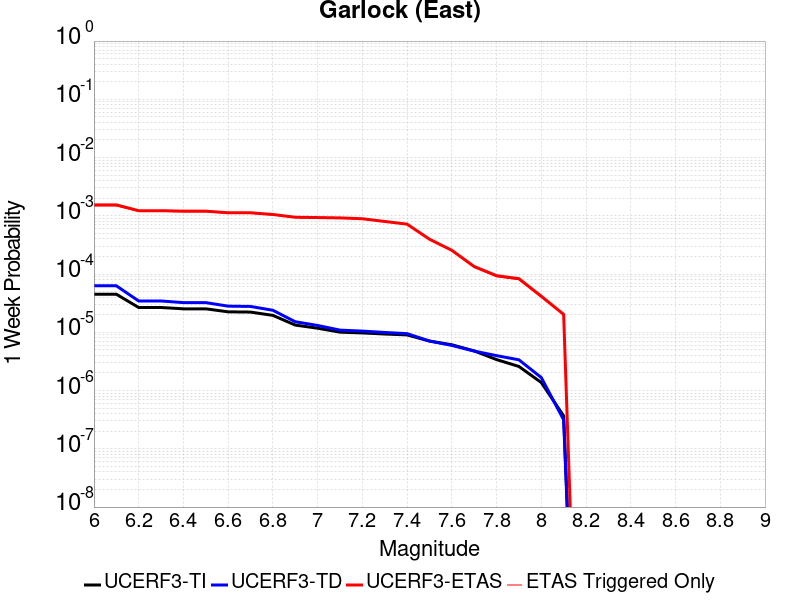
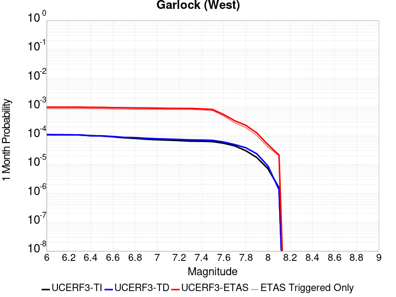
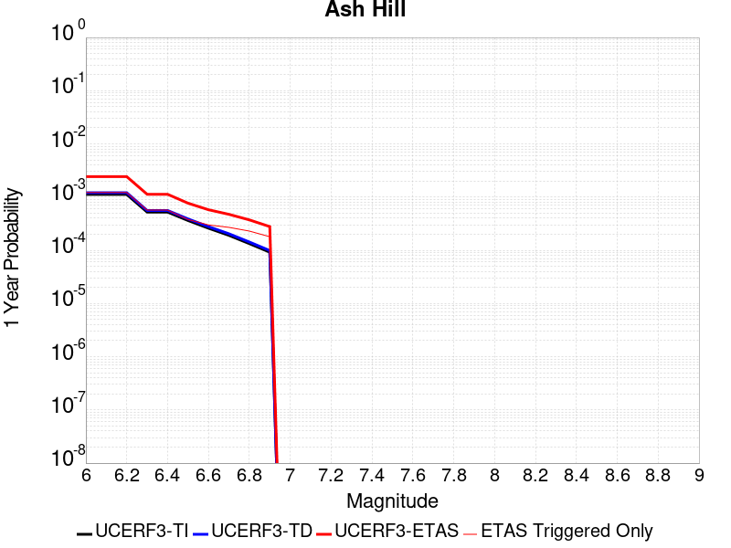
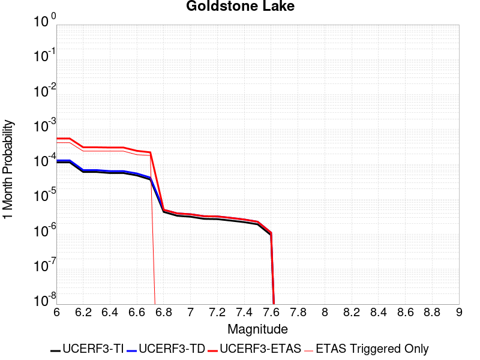
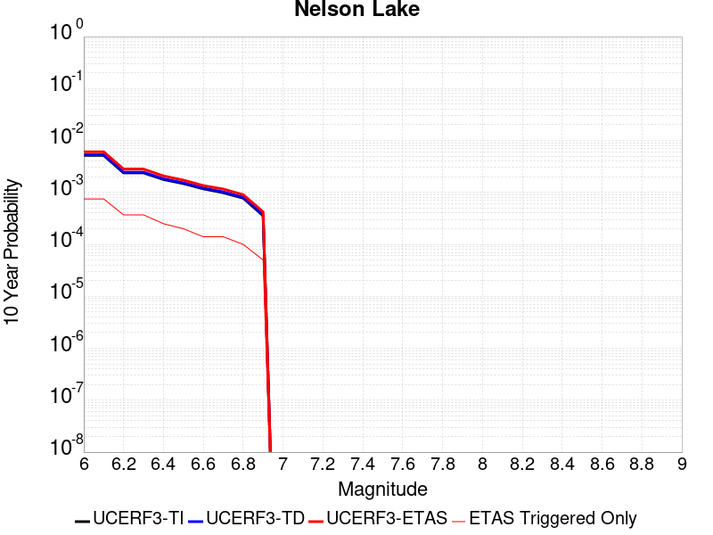
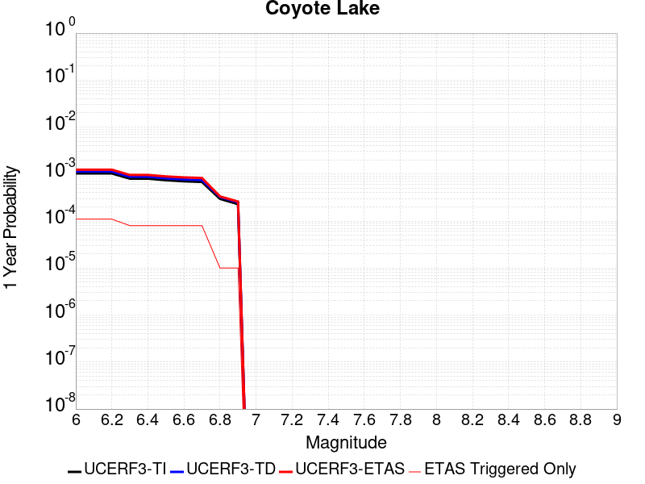
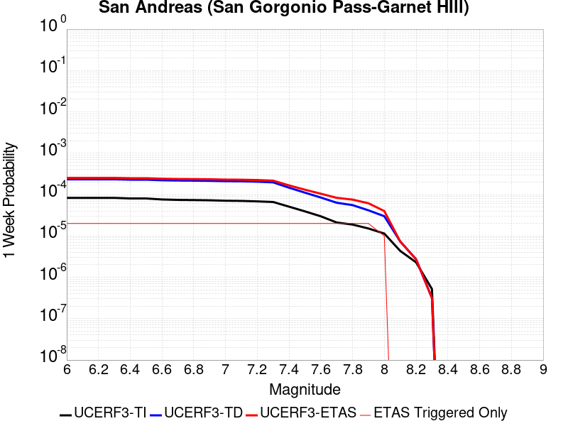
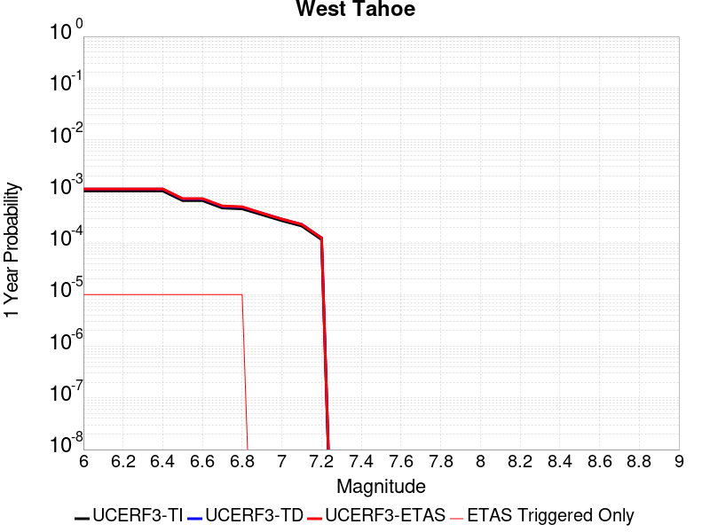
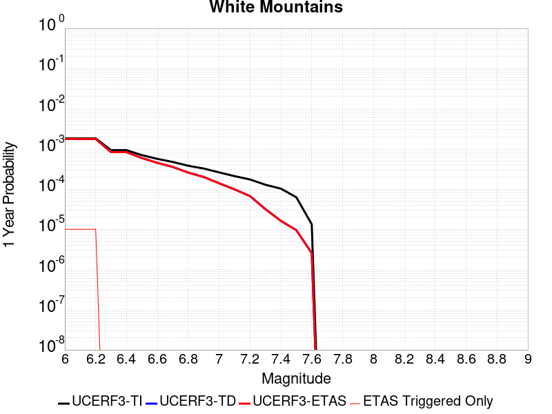
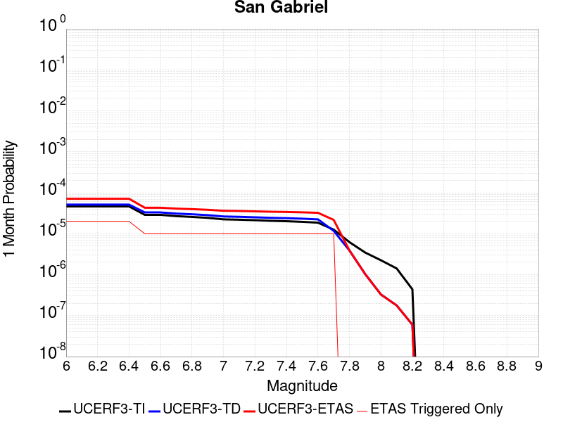

# Parent Section Magnitude-Probability Distributions

Only fault sections with at least one triggered aftershock are plotted. Sections are sorted by total supraseismogenic trigger rate (decreasing)

## Table Of Contents

* [Garlock (Central)](#garlock-central)
* [Tank Canyon](#tank-canyon)
* [Owl Lake](#owl-lake)
* [Garlock (East)](#garlock-east)
* [Little Lake](#little-lake)
* [Panamint Valley](#panamint-valley)
* [Blackwater](#blackwater)
* [Hunter Mountain-Saline Valley](#hunter-mountain-saline-valley)
* [Garlock (West)](#garlock-west)
* [Gravel Hills-Harper Lk](#gravel-hills-harper-lk)
* [Ash Hill](#ash-hill)
* [Airport Lake](#airport-lake)
* [Goldstone Lake](#goldstone-lake)
* [McLean Lake](#mclean-lake)
* [So Sierra Nevada](#so-sierra-nevada)
* [Coyote Canyon](#coyote-canyon)
* [Death Valley (So)](#death-valley-so)
* [San Andreas (Mojave N)](#san-andreas-mojave-n)
* [Nelson Lake](#nelson-lake)
* [San Andreas (Mojave S)](#san-andreas-mojave-s)
* [Lenwood-Lockhart-Old Woman Springs](#lenwood-lockhart-old-woman-springs)
* [San Andreas (San Bernardino N)](#san-andreas-san-bernardino-n)
* [Bicycle Lake](#bicycle-lake)
* [Towne Pass](#towne-pass)
* [Garlic Springs](#garlic-springs)
* [Paradise](#paradise)
* [Death Valley (Black Mtns Frontal)](#death-valley-black-mtns-frontal)
* [Coyote Lake](#coyote-lake)
* [Death Valley (Fish Lake Valley)](#death-valley-fish-lake-valley)
* [Death Valley (No)](#death-valley-no)
* [Baker](#baker)
* [San Andreas (San Bernardino S)](#san-andreas-san-bernardino-s)
* [Red Pass](#red-pass)
* [Helendale-So Lockhart](#helendale-so-lockhart)
* [Elsinore (Glen Ivy) rev](#elsinore-glen-ivy-rev)
* [Santa Rosa Island](#santa-rosa-island)
* [San Andreas (Coachella) rev](#san-andreas-coachella-rev)
* [Big Pine (East)](#big-pine-east)
* [Lost Hills](#lost-hills)
* [San Pedro Basin](#san-pedro-basin)
* [San Andreas (Parkfield)](#san-andreas-parkfield)
* [Brawley (Seismic Zone) alt 1](#brawley-seismic-zone-alt-1)
* [San Andreas (San Gorgonio Pass-Garnet HIll)](#san-andreas-san-gorgonio-pass-garnet-hill)
* [San Andreas (Big Bend)](#san-andreas-big-bend)
* [Santa Cruz Catalina Ridge alt1](#santa-cruz-catalina-ridge-alt1)
* [Imperial](#imperial)
* [Davis Creek](#davis-creek)
* [Great Valley 03a Dunnigan Hills](#great-valley-03a-dunnigan-hills)
* [Eureka Peak](#eureka-peak)
* [Kern Canyon (South Kern) 2011](#kern-canyon-south-kern-2011)
* [Independence rev 2011](#independence-rev-2011)
* [West Tahoe](#west-tahoe)
* [San Jacinto (San Bernardino)](#san-jacinto-san-bernardino)
* [Kern Canyon (Lake Isabella) 2011](#kern-canyon-lake-isabella-2011)
* [Santa Cruz Island](#santa-cruz-island)
* [Palos Verdes](#palos-verdes)
* [Channel Islands Thrust](#channel-islands-thrust)
* [Channel Islands Western Deep Ramp](#channel-islands-western-deep-ramp)
* [White Mountains](#white-mountains)
* [San Gabriel](#san-gabriel)
* [Cleghorn Lake](#cleghorn-lake)

## Garlock (Central)
*[(top)](#table-of-contents)*

| 1 Week | 1 Month | 1 Year | 10 Year |
|-----|-----|-----|-----|
|  |  |  |  |

| Magnitude | 1 wk TI Prob | 1 wk TD Prob | 1 wk ETAS Prob | 1 wk ETAS/TD Gain | 1 wk ETAS Triggered Only | 1 mo TI Prob | 1 mo TD Prob | 1 mo ETAS Prob | 1 mo ETAS/TD Gain | 1 mo ETAS Triggered Only | 1 yr TI Prob | 1 yr TD Prob | 1 yr ETAS Prob | 1 yr ETAS/TD Gain | 1 yr ETAS Triggered Only | 10 yr TI Prob | 10 yr TD Prob | 10 yr ETAS Prob | 10 yr ETAS/TD Gain | 10 yr ETAS Triggered Only |
|-----|-----|-----|-----|-----|-----|-----|-----|-----|-----|-----|-----|-----|-----|-----|-----|-----|-----|-----|-----|-----|
| 6.0 | 5.5131142E-5 | 7.024558E-5 | 0.007311012 | 104.07789 | 0.007241275 | 2.3625491E-4 | 3.0101812E-4 | 0.009500702 | 31.561893 | 0.009202454 | 0.0028726095 | 0.0036588025 | 0.017537234 | 4.7931623 | 0.013929398 | 0.028357591 | 0.03607921 | 0.053917028 | 1.4944072 | 0.018505482 |
| 6.1 | 5.5131142E-5 | 7.024558E-5 | 0.007311012 | 104.07789 | 0.007241275 | 2.3625491E-4 | 3.0101812E-4 | 0.009500702 | 31.561893 | 0.009202454 | 0.0028726095 | 0.0036588025 | 0.017537234 | 4.7931623 | 0.013929398 | 0.028357591 | 0.03607921 | 0.053917028 | 1.4944072 | 0.018505482 |
| 6.2 | 4.216245E-5 | 5.1660383E-5 | 0.004828644 | 93.46899 | 0.0047772303 | 1.806837E-4 | 2.2138303E-4 | 0.006656647 | 30.068462 | 0.0064366893 | 0.0021976046 | 0.0026920384 | 0.012471534 | 4.632747 | 0.0098058935 | 0.021759989 | 0.02668921 | 0.039170064 | 1.4676367 | 0.012823092 |
| 6.3 | 4.216245E-5 | 5.1660383E-5 | 0.004828644 | 93.46899 | 0.0047772303 | 1.806837E-4 | 2.2138303E-4 | 0.006656647 | 30.068462 | 0.0064366893 | 0.0021976046 | 0.0026920384 | 0.012471534 | 4.632747 | 0.0098058935 | 0.021759989 | 0.02668921 | 0.039170064 | 1.4676367 | 0.012823092 |
| 6.4 | 3.6858168E-5 | 4.4109474E-5 | 0.0037651563 | 85.35935 | 0.0037212109 | 1.5795401E-4 | 1.8902705E-4 | 0.005267017 | 27.863827 | 0.00507895 | 0.0019213937 | 0.0022990005 | 0.009924997 | 4.317092 | 0.0076435683 | 0.019048655 | 0.022848397 | 0.03272507 | 1.4322697 | 0.010107613 |
| 6.5 | 3.39199E-5 | 4.001704E-5 | 0.0034090867 | 85.19088 | 0.0033692045 | 1.453629E-4 | 1.7149044E-4 | 0.0047970675 | 27.972797 | 0.0046263705 | 0.0017683565 | 0.0020859186 | 0.008960817 | 4.2958612 | 0.0068892688 | 0.017543508 | 0.02075933 | 0.029770747 | 1.43409 | 0.009202454 |
| 6.6 | 3.3571985E-5 | 3.947123E-5 | 0.0034085426 | 86.35512 | 0.0033692045 | 1.4387199E-4 | 1.6915156E-4 | 0.004794739 | 28.345818 | 0.0046263705 | 0.0017502342 | 0.002057497 | 0.008932591 | 4.3414845 | 0.0068892688 | 0.017365133 | 0.020480646 | 0.029494628 | 1.4401219 | 0.009202454 |
| 6.7 | 3.2580007E-5 | 3.8087666E-5 | 0.0033065944 | 86.81536 | 0.0032686312 | 1.3962112E-4 | 1.6322276E-4 | 0.004688281 | 28.723207 | 0.004525797 | 0.0016985617 | 0.0019854472 | 0.008610104 | 4.3366065 | 0.006637836 | 0.016856372 | 0.019773284 | 0.028498022 | 1.4412386 | 0.008900735 |
| 6.8 | 3.2185937E-5 | 3.751489E-5 | 0.0033060235 | 88.12564 | 0.0032686312 | 1.3793244E-4 | 1.607683E-4 | 0.0046355594 | 28.833788 | 0.00447551 | 0.0016780337 | 0.0019556184 | 0.008480096 | 4.3362737 | 0.0065372624 | 0.016654192 | 0.019480087 | 0.027960898 | 1.435358 | 0.008649301 |
| 6.9 | 3.165394E-5 | 3.6719477E-5 | 0.0032549459 | 88.64358 | 0.0032183446 | 1.3565269E-4 | 1.5735981E-4 | 0.0045818873 | 29.117264 | 0.004425224 | 0.0016503202 | 0.0019141936 | 0.008388752 | 4.382395 | 0.0064869756 | 0.01638118 | 0.01907272 | 0.027458401 | 1.4396688 | 0.008548728 |
| 7.0 | 3.0903822E-5 | 3.5624747E-5 | 0.00320357 | 89.92541 | 0.0031680579 | 1.3243823E-4 | 1.5266867E-4 | 0.004476659 | 29.322708 | 0.0043246504 | 0.0016112428 | 0.0018571776 | 0.008181526 | 4.405355 | 0.0063361158 | 0.015996104 | 0.018511891 | 0.026704943 | 1.4425832 | 0.008347581 |
| 7.1 | 3.0069863E-5 | 3.439106E-5 | 0.0029509156 | 85.804726 | 0.0029166248 | 1.2886449E-4 | 1.4738206E-4 | 0.004219999 | 28.633059 | 0.0040732175 | 0.0015677959 | 0.0017929208 | 0.007716105 | 4.303651 | 0.0059338226 | 0.01556781 | 0.017879559 | 0.0256334 | 1.4336708 | 0.007895001 |
| 7.2 | 2.7957109E-5 | 3.1280466E-5 | 0.0025958186 | 82.98529 | 0.0025646184 | 1.1981068E-4 | 1.3405236E-4 | 0.0036536448 | 27.255356 | 0.0035200643 | 0.0014577188 | 0.0016308852 | 0.006952575 | 4.2630687 | 0.0053303833 | 0.014481937 | 0.016283188 | 0.023010809 | 1.4131637 | 0.006838982 |
| 7.3 | 2.4519275E-5 | 2.6713868E-5 | 0.0018369843 | 68.7652 | 0.0018103188 | 1.0507837E-4 | 1.1448306E-4 | 0.0026788078 | 23.399162 | 0.0025646184 | 0.0012785783 | 0.0013929547 | 0.005159199 | 3.7037807 | 0.0037714976 | 0.012712469 | 0.013927576 | 0.018737445 | 1.3453485 | 0.0048778034 |
| 7.4 | 2.3225532E-5 | 2.5198491E-5 | 0.001734901 | 68.849396 | 0.0017097455 | 9.95342E-5 | 1.07989144E-4 | 0.002521487 | 23.349447 | 0.0024137583 | 0.0012111551 | 0.0013139893 | 0.004829428 | 3.675394 | 0.0035200643 | 0.012045753 | 0.013145258 | 0.017611561 | 1.3397654 | 0.004525797 |
| 7.5 | 2.097765E-5 | 2.2482824E-5 | 0.0013801914 | 61.388702 | 0.0013577391 | 8.9901114E-5 | 9.635147E-5 | 0.0020573412 | 21.352463 | 0.0019611786 | 0.0010939965 | 0.0011724597 | 0.0039349818 | 3.3561766 | 0.002765765 | 0.010886264 | 0.01173992 | 0.015367748 | 1.3090165 | 0.0036709243 |
| 7.6 | 1.511254E-5 | 1.5990528E-5 | 7.70278E-4 | 48.170887 | 7.542995E-4 | 6.476642E-5 | 6.852908E-5 | 0.0011747592 | 17.142492 | 0.001106306 | 7.882459E-4 | 8.3403E-4 | 0.0025423495 | 3.0482712 | 0.0017097455 | 0.007854558 | 0.008383143 | 0.010876397 | 1.2974128 | 0.0025143316 |
| 7.7 | 9.934069E-6 | 1.0678047E-5 | 2.1182244E-4 | 19.837189 | 2.0114654E-4 | 4.2573887E-5 | 4.576226E-5 | 3.4746825E-4 | 7.5929003 | 3.017198E-4 | 5.182138E-4 | 5.5701344E-4 | 9.5908245E-4 | 1.72183 | 4.0229308E-4 | 0.00517007 | 0.0056272964 | 0.006277344 | 1.1155168 | 6.537262E-4 |
| 7.8 | 6.7562896E-6 | 8.427841E-6 | 1.5928647E-4 | 18.900034 | 1.508599E-4 | 2.8955206E-5 | 3.6118818E-5 | 1.8697327E-4 | 5.1766167 | 1.508599E-4 | 3.5247262E-4 | 4.3965803E-4 | 5.904516E-4 | 1.3429792 | 1.508599E-4 | 0.0035191406 | 0.0044463384 | 0.0047967797 | 1.0788157 | 3.5200643E-4 |
| 7.9 | 3.975453E-6 | 5.3706585E-6 | 1.05943385E-4 | 19.72633 | 1.0057327E-4 | 1.7037546E-5 | 2.3016906E-5 | 1.2358786E-4 | 5.3694386 | 1.0057327E-4 | 2.0741238E-4 | 2.801949E-4 | 3.8073998E-4 | 1.3588399 | 1.0057327E-4 | 0.002072189 | 0.002833435 | 0.0029838677 | 1.0530919 | 1.508599E-4 |
| 8.0 | 1.6729537E-6 | 2.0773857E-6 | 2.0773857E-6 | 1.0 | 0.0 | 7.169782E-6 | 8.903051E-6 | 8.903051E-6 | 1.0 | 0.0 | 8.7288594E-5 | 1.08389286E-4 | 1.08389286E-4 | 1.0 | 0.0 | 8.7254314E-4 | 0.0010968668 | 0.0010968668 | 1.0 | 0.0 |
| 8.1 | 3.6733252E-7 | 3.148811E-7 | 3.148811E-7 | 1.0 | 0.0 | 1.5742813E-6 | 1.3494899E-6 | 1.3494899E-6 | 1.0 | 0.0 | 1.9166706E-5 | 1.6429933E-5 | 1.6429933E-5 | 1.0 | 0.0 | 1.9165053E-4 | 1.6637788E-4 | 1.6637788E-4 | 1.0 | 0.0 |

## Tank Canyon
*[(top)](#table-of-contents)*

| 1 Week | 1 Month | 1 Year | 10 Year |
|-----|-----|-----|-----|
|  |  |  |  |

| Magnitude | 1 wk TI Prob | 1 wk TD Prob | 1 wk ETAS Prob | 1 wk ETAS/TD Gain | 1 wk ETAS Triggered Only | 1 mo TI Prob | 1 mo TD Prob | 1 mo ETAS Prob | 1 mo ETAS/TD Gain | 1 mo ETAS Triggered Only | 1 yr TI Prob | 1 yr TD Prob | 1 yr ETAS Prob | 1 yr ETAS/TD Gain | 1 yr ETAS Triggered Only | 10 yr TI Prob | 10 yr TD Prob | 10 yr ETAS Prob | 10 yr ETAS/TD Gain | 10 yr ETAS Triggered Only |
|-----|-----|-----|-----|-----|-----|-----|-----|-----|-----|-----|-----|-----|-----|-----|-----|-----|-----|-----|-----|-----|
| 6.0 | 4.8284557E-5 | 5.7964517E-5 | 0.0057903086 | 99.89402 | 0.0057326765 | 2.0691741E-4 | 2.4839956E-4 | 0.007990617 | 32.168407 | 0.0077441414 | 0.0025163088 | 0.0030207448 | 0.014752272 | 4.883654 | 0.011767073 | 0.02488006 | 0.029863482 | 0.045084372 | 1.5096823 | 0.015689429 |
| 6.1 | 1.7796336E-5 | 2.0873225E-5 | 0.001982011 | 94.95471 | 0.0019611786 | 7.626778E-5 | 8.945383E-5 | 0.0026538428 | 29.667177 | 0.0025646184 | 9.281647E-4 | 0.0010885935 | 0.005056913 | 4.645364 | 0.003972644 | 0.009242975 | 0.010836697 | 0.016606733 | 1.5324534 | 0.0058332495 |
| 6.2 | 1.7796336E-5 | 2.0873225E-5 | 0.001982011 | 94.95471 | 0.0019611786 | 7.626778E-5 | 8.945383E-5 | 0.0026538428 | 29.667177 | 0.0025646184 | 9.281647E-4 | 0.0010885935 | 0.005056913 | 4.645364 | 0.003972644 | 0.009242975 | 0.010836697 | 0.016606733 | 1.5324534 | 0.0058332495 |
| 6.3 | 1.3515912E-5 | 1.57595E-5 | 0.0013734772 | 87.15233 | 0.0013577391 | 5.792405E-5 | 6.7539106E-5 | 0.0019783021 | 29.29121 | 0.0019108921 | 7.049971E-4 | 8.220024E-4 | 0.0037362298 | 4.545278 | 0.0029166248 | 0.007027647 | 0.008192232 | 0.012431579 | 1.5174838 | 0.004274364 |
| 6.4 | 1.0870146E-5 | 1.2617973E-5 | 9.6805196E-4 | 76.720085 | 9.5544604E-4 | 4.658551E-5 | 5.407601E-5 | 0.0013111739 | 24.246868 | 0.0012571658 | 5.67031E-4 | 6.581944E-4 | 0.0027185893 | 4.1303744 | 0.002061752 | 0.005655863 | 0.006564466 | 0.009561857 | 1.4566087 | 0.003017198 |
| 6.5 | 7.964826E-6 | 9.196063E-6 | 5.623439E-4 | 61.150513 | 5.53153E-4 | 3.4134522E-5 | 3.941116E-5 | 8.9425023E-4 | 22.690279 | 8.5487275E-4 | 4.1550855E-4 | 4.797359E-4 | 0.0018368236 | 3.8288226 | 0.0013577391 | 0.0041473247 | 0.0047883047 | 0.0068401843 | 1.428519 | 0.002061752 |
| 6.6 | 6.6317E-6 | 7.6122747E-6 | 4.6018854E-4 | 60.453484 | 4.525797E-4 | 2.8421264E-5 | 3.2623677E-5 | 7.868986E-4 | 24.120474 | 7.542995E-4 | 3.4597394E-4 | 3.9713003E-4 | 0.0015029967 | 3.7846463 | 0.001106306 | 0.0034543579 | 0.0039653555 | 0.0054679723 | 1.3789363 | 0.001508599 |
| 6.7 | 4.793663E-6 | 5.430772E-6 | 1.5628985E-4 | 28.778572 | 1.508599E-4 | 2.0544108E-5 | 2.3274553E-5 | 2.7470186E-4 | 11.80267 | 2.5143317E-4 | 2.500958E-4 | 2.8333522E-4 | 6.855143E-4 | 2.4194462 | 4.0229308E-4 | 0.0024981452 | 0.0028304325 | 0.0034321642 | 1.2125936 | 6.034396E-4 |
| 6.8 | 4.382823E-6 | 4.969245E-6 | 1.558284E-4 | 31.358566 | 1.508599E-4 | 1.8783392E-5 | 2.1296615E-5 | 2.7272443E-4 | 12.805999 | 2.5143317E-4 | 2.286638E-4 | 2.5925972E-4 | 6.1117485E-4 | 2.3573847 | 3.5200643E-4 | 0.0022842865 | 0.0025902467 | 0.0031419669 | 1.2129991 | 5.53153E-4 |
| 6.9 | 2.729601E-6 | 3.0735362E-6 | 5.3360014E-5 | 17.361115 | 5.0286635E-5 | 1.1698237E-5 | 1.3172238E-5 | 1.6403015E-4 | 12.452717 | 1.508599E-4 | 1.4241673E-4 | 1.6036142E-4 | 3.6147572E-4 | 2.2541313 | 2.0114654E-4 | 0.001423255 | 0.0016026229 | 0.0019038592 | 1.1879646 | 3.017198E-4 |
| 7.0 | 1.8987357E-6 | 2.1269361E-6 | 2.1269361E-6 | 1.0 | 0.0 | 8.137413E-6 | 9.1154125E-6 | 5.9401587E-5 | 6.51661 | 5.0286635E-5 | 9.90685E-5 | 1.1097519E-4 | 2.1153729E-4 | 1.9061675 | 1.0057327E-4 | 9.902435E-4 | 0.0011092664 | 0.0012097281 | 1.0905659 | 1.0057327E-4 |
| 7.1 | 1.4928986E-6 | 1.6641251E-6 | 1.6641251E-6 | 1.0 | 0.0 | 6.398121E-6 | 7.1319487E-6 | 5.7418223E-5 | 8.050846 | 5.0286635E-5 | 7.789434E-5 | 8.682861E-5 | 1.8739313E-4 | 2.158196 | 1.0057327E-4 | 7.786704E-4 | 8.680047E-4 | 9.684906E-4 | 1.1157666 | 1.0057327E-4 |
| 7.2 | 1.069082E-6 | 1.182856E-6 | 1.182856E-6 | 1.0 | 0.0 | 4.581772E-6 | 5.0693757E-6 | 5.0693757E-6 | 1.0 | 0.0 | 5.5781646E-5 | 6.1718434E-5 | 1.12001966E-4 | 1.8147247 | 5.0286635E-5 | 5.576765E-4 | 6.1706523E-4 | 6.673208E-4 | 1.081443 | 5.0286635E-5 |
| 7.3 | 8.776551E-7 | 9.769996E-7 | 9.769996E-7 | 1.0 | 0.0 | 3.7613736E-6 | 4.187137E-6 | 4.187137E-6 | 1.0 | 0.0 | 4.579376E-5 | 5.097772E-5 | 1.01261794E-4 | 1.9863931 | 5.0286635E-5 | 4.5784327E-4 | 5.097113E-4 | 5.599723E-4 | 1.0986068 | 5.0286635E-5 |
| 7.4 | 7.55721E-7 | 8.5102363E-7 | 8.5102363E-7 | 1.0 | 0.0 | 3.2388E-6 | 3.647242E-6 | 3.647242E-6 | 1.0 | 0.0 | 3.9431678E-5 | 4.4404784E-5 | 9.468919E-5 | 2.1324096 | 5.0286635E-5 | 3.942468E-4 | 4.4401E-4 | 4.942743E-4 | 1.1132053 | 5.0286635E-5 |
| 7.5 | 5.587665E-7 | 6.305613E-7 | 6.305613E-7 | 1.0 | 0.0 | 2.3947114E-6 | 2.7024057E-6 | 2.7024057E-6 | 1.0 | 0.0 | 2.915522E-5 | 3.290179E-5 | 8.3186766E-5 | 2.5283358 | 5.0286635E-5 | 2.9151395E-4 | 3.2901787E-4 | 3.79288E-4 | 1.1527883 | 5.0286635E-5 |

## Owl Lake
*[(top)](#table-of-contents)*

| 1 Week | 1 Month | 1 Year | 10 Year |
|-----|-----|-----|-----|
|  |  |  |  |

| Magnitude | 1 wk TI Prob | 1 wk TD Prob | 1 wk ETAS Prob | 1 wk ETAS/TD Gain | 1 wk ETAS Triggered Only | 1 mo TI Prob | 1 mo TD Prob | 1 mo ETAS Prob | 1 mo ETAS/TD Gain | 1 mo ETAS Triggered Only | 1 yr TI Prob | 1 yr TD Prob | 1 yr ETAS Prob | 1 yr ETAS/TD Gain | 1 yr ETAS Triggered Only | 10 yr TI Prob | 10 yr TD Prob | 10 yr ETAS Prob | 10 yr ETAS/TD Gain | 10 yr ETAS Triggered Only |
|-----|-----|-----|-----|-----|-----|-----|-----|-----|-----|-----|-----|-----|-----|-----|-----|-----|-----|-----|-----|-----|
| 6.0 | 5.0320643E-5 | 6.635748E-5 | 0.0020274061 | 30.552786 | 0.0019611786 | 2.1564208E-4 | 2.843645E-4 | 0.0032001599 | 11.253725 | 0.0029166248 | 0.0026222812 | 0.0034577043 | 0.007817514 | 2.2608972 | 0.004374937 | 0.02591553 | 0.0341404 | 0.040648755 | 1.1906351 | 0.006738409 |
| 6.1 | 5.0320643E-5 | 6.635748E-5 | 0.0020274061 | 30.552786 | 0.0019611786 | 2.1564208E-4 | 2.843645E-4 | 0.0032001599 | 11.253725 | 0.0029166248 | 0.0026222812 | 0.0034577043 | 0.007817514 | 2.2608972 | 0.004374937 | 0.02591553 | 0.0341404 | 0.040648755 | 1.1906351 | 0.006738409 |
| 6.2 | 2.4125871E-5 | 3.0980704E-5 | 0.0014389629 | 46.447067 | 0.0014080257 | 1.0339249E-4 | 1.3276885E-4 | 0.0021942472 | 16.526821 | 0.002061752 | 0.0012580766 | 0.0016154221 | 0.004728157 | 2.9268863 | 0.0031177714 | 0.012509781 | 0.016070297 | 0.020523364 | 1.2770991 | 0.004525797 |
| 6.3 | 1.7433485E-5 | 2.2355249E-5 | 0.001178922 | 52.7358 | 0.0011565926 | 7.471279E-5 | 9.580558E-5 | 0.0018053873 | 18.844282 | 0.0017097455 | 9.0924866E-4 | 0.0011659606 | 0.0036773607 | 3.1539323 | 0.0025143316 | 0.009055373 | 0.011628761 | 0.015256996 | 1.3120054 | 0.0036709243 |
| 6.4 | 1.7433485E-5 | 2.2355249E-5 | 0.001178922 | 52.7358 | 0.0011565926 | 7.471279E-5 | 9.580558E-5 | 0.0018053873 | 18.844282 | 0.0017097455 | 9.0924866E-4 | 0.0011659606 | 0.0036773607 | 3.1539323 | 0.0025143316 | 0.009055373 | 0.011628761 | 0.015256996 | 1.3120054 | 0.0036709243 |
| 6.5 | 1.5182742E-5 | 1.9428902E-5 | 0.0011257133 | 57.940144 | 0.001106306 | 6.506727E-5 | 8.326492E-5 | 0.0017425857 | 20.92821 | 0.001659459 | 7.919061E-4 | 0.0010134302 | 0.0032740354 | 3.230647 | 0.0022628985 | 0.0078909 | 0.010118305 | 0.013353863 | 1.3197727 | 0.0032686312 |
| 6.6 | 6.7271576E-6 | 8.547201E-6 | 9.639851E-4 | 112.783714 | 9.5544604E-4 | 2.8830356E-5 | 3.663038E-5 | 0.0014446046 | 39.437336 | 0.0014080257 | 3.5095305E-4 | 4.4588925E-4 | 0.0022554009 | 5.0582085 | 0.0018103188 | 0.0035039932 | 0.0044677295 | 0.0070709516 | 1.5826724 | 0.002614905 |
| 6.7 | 6.682835E-6 | 8.4796475E-6 | 9.639176E-4 | 113.674255 | 9.5544604E-4 | 2.8640408E-5 | 3.6340873E-5 | 0.0014443154 | 39.743557 | 0.0014080257 | 3.4864116E-4 | 4.4236594E-4 | 0.002251884 | 5.0905457 | 0.0018103188 | 0.003480947 | 0.004432656 | 0.0070359698 | 1.5873034 | 0.002614905 |
| 6.8 | 6.5774975E-6 | 8.326121E-6 | 9.637642E-4 | 115.75188 | 9.5544604E-4 | 2.8188972E-5 | 3.5682922E-5 | 0.0014436584 | 40.457966 | 0.0014080257 | 3.4314668E-4 | 4.343586E-4 | 0.0022438911 | 5.1659875 | 0.0018103188 | 0.0034261728 | 0.0043528024 | 0.006956325 | 1.5981257 | 0.002614905 |
| 6.9 | 6.363419E-6 | 7.999298E-6 | 9.634377E-4 | 120.440285 | 9.5544604E-4 | 2.727151E-5 | 3.4282286E-5 | 0.0014422598 | 42.070118 | 0.0014080257 | 3.3198006E-4 | 4.1731246E-4 | 0.0022268759 | 5.336231 | 0.0018103188 | 0.0033148455 | 0.004182795 | 0.0067867623 | 1.6225424 | 0.002614905 |
| 7.0 | 6.1342453E-6 | 7.631501E-6 | 9.6307026E-4 | 126.1967 | 9.5544604E-4 | 2.6289357E-5 | 3.2706055E-5 | 0.0014406857 | 44.04951 | 0.0014080257 | 3.2002592E-4 | 3.9812896E-4 | 0.002207727 | 5.545256 | 0.0018103188 | 0.0031956544 | 0.00399149 | 0.006595958 | 1.652505 | 0.002614905 |
| 7.1 | 5.842926E-6 | 7.1420604E-6 | 9.6258125E-4 | 134.77641 | 9.5544604E-4 | 2.504087E-5 | 3.0608502E-5 | 0.0014385912 | 46.999725 | 0.0014080257 | 3.0482994E-4 | 3.7260022E-4 | 0.0021822446 | 5.856799 | 0.0018103188 | 0.0030441214 | 0.0037369546 | 0.0062919892 | 1.6837211 | 0.0025646184 |
| 7.2 | 4.77173E-6 | 5.3583467E-6 | 7.0936745E-4 | 132.38551 | 7.0401287E-4 | 2.045011E-5 | 2.2964163E-5 | 9.2810276E-4 | 40.415268 | 9.051594E-4 | 2.4895166E-4 | 2.7955687E-4 | 0.0015363713 | 5.495738 | 0.0012571658 | 0.0024867293 | 0.002808574 | 0.0045636627 | 1.624904 | 0.0017600321 |
| 7.3 | 3.0494948E-6 | 2.7103622E-6 | 1.5356985E-4 | 56.66027 | 1.508599E-4 | 1.3069198E-5 | 1.1615787E-5 | 2.1275999E-4 | 18.31645 | 2.0114654E-4 | 1.5910587E-4 | 1.4141318E-4 | 3.928108E-4 | 2.7777522 | 2.5143317E-4 | 0.0015899199 | 0.0014231888 | 0.0018751244 | 1.3175514 | 4.525797E-4 |
| 7.4 | 2.7263884E-6 | 2.3055816E-6 | 1.5316514E-4 | 66.43232 | 1.508599E-4 | 1.1684469E-5 | 9.881027E-6 | 2.1102557E-4 | 21.356644 | 2.0114654E-4 | 1.4224913E-4 | 1.20294964E-4 | 3.7169788E-4 | 3.0898874 | 2.5143317E-4 | 0.0014215811 | 0.0012111744 | 0.0016632059 | 1.3732176 | 4.525797E-4 |
| 7.5 | 2.6090431E-6 | 2.1655203E-6 | 1.5302509E-4 | 70.66435 | 1.508599E-4 | 1.1181565E-5 | 9.280769E-6 | 2.1042544E-4 | 22.673277 | 2.0114654E-4 | 1.3612706E-4 | 1.129876E-4 | 3.6439236E-4 | 3.2250652 | 2.5143317E-4 | 0.001360437 | 0.0011379321 | 0.0015899967 | 1.3972687 | 4.525797E-4 |
| 7.6 | 2.3008756E-6 | 1.872704E-6 | 1.0244578E-4 | 54.70474 | 1.0057327E-4 | 9.860858E-6 | 8.025851E-6 | 1.5888455E-4 | 19.796598 | 1.508599E-4 | 1.20049335E-4 | 9.771043E-5 | 2.9883732E-4 | 3.0583973 | 2.0114654E-4 | 0.001199845 | 9.849465E-4 | 0.0012863692 | 1.3060294 | 3.017198E-4 |
| 7.7 | 1.7184348E-6 | 1.3418345E-6 | 1.3418345E-6 | 1.0 | 0.0 | 7.3646997E-6 | 5.750707E-6 | 5.750707E-6 | 1.0 | 0.0 | 8.966153E-5 | 7.001265E-5 | 7.001265E-5 | 1.0 | 0.0 | 8.962536E-4 | 7.077913E-4 | 7.580423E-4 | 1.070997 | 5.0286635E-5 |
| 7.8 | 8.4612907E-7 | 8.4052675E-7 | 8.4052675E-7 | 1.0 | 0.0 | 3.6262625E-6 | 3.6022527E-6 | 3.6022527E-6 | 1.0 | 0.0 | 4.4148852E-5 | 4.3856566E-5 | 4.3856566E-5 | 1.0 | 0.0 | 4.414008E-4 | 4.4395277E-4 | 4.942171E-4 | 1.11322 | 5.0286635E-5 |
| 7.9 | 2.716738E-7 | 3.767845E-7 | 3.767845E-7 | 1.0 | 0.0 | 1.1643157E-6 | 1.6147899E-6 | 1.6147899E-6 | 1.0 | 0.0 | 1.4175452E-5 | 1.96599E-5 | 1.96599E-5 | 1.0 | 0.0 | 1.4174548E-4 | 1.9835318E-4 | 1.9835318E-4 | 1.0 | 0.0 |
| 8.0 | 2.1995428E-8 | 3.38465E-8 | 3.38465E-8 | 1.0 | 0.0 | 9.426611E-8 | 1.4505643E-7 | 1.4505643E-7 | 1.0 | 0.0 | 1.1476893E-6 | 1.7660612E-6 | 1.7660612E-6 | 1.0 | 0.0 | 1.14768345E-5 | 1.796186E-5 | 1.796186E-5 | 1.0 | 0.0 |

## Garlock (East)
*[(top)](#table-of-contents)*

| 1 Week | 1 Month | 1 Year | 10 Year |
|-----|-----|-----|-----|
|  |  |  |  |

| Magnitude | 1 wk TI Prob | 1 wk TD Prob | 1 wk ETAS Prob | 1 wk ETAS/TD Gain | 1 wk ETAS Triggered Only | 1 mo TI Prob | 1 mo TD Prob | 1 mo ETAS Prob | 1 mo ETAS/TD Gain | 1 mo ETAS Triggered Only | 1 yr TI Prob | 1 yr TD Prob | 1 yr ETAS Prob | 1 yr ETAS/TD Gain | 1 yr ETAS Triggered Only | 10 yr TI Prob | 10 yr TD Prob | 10 yr ETAS Prob | 10 yr ETAS/TD Gain | 10 yr ETAS Triggered Only |
|-----|-----|-----|-----|-----|-----|-----|-----|-----|-----|-----|-----|-----|-----|-----|-----|-----|-----|-----|-----|-----|
| 6.0 | 4.5092507E-5 | 6.290254E-5 | 0.0013199893 | 20.984674 | 0.0012571658 | 1.9323928E-4 | 2.6955697E-4 | 0.002179934 | 8.087099 | 0.0019108921 | 0.0023501497 | 0.003277363 | 0.006384916 | 1.9481871 | 0.0031177714 | 0.023254504 | 0.032351483 | 0.036974166 | 1.1428893 | 0.0047772303 |
| 6.1 | 4.5092507E-5 | 6.290254E-5 | 0.0013199893 | 20.984674 | 0.0012571658 | 1.9323928E-4 | 2.6955697E-4 | 0.002179934 | 8.087099 | 0.0019108921 | 0.0023501497 | 0.003277363 | 0.006384916 | 1.9481871 | 0.0031177714 | 0.023254504 | 0.032351483 | 0.036974166 | 1.1428893 | 0.0047772303 |
| 6.2 | 2.6674514E-5 | 3.450911E-5 | 0.001090492 | 31.600119 | 0.0010560193 | 1.1431433E-4 | 1.4788799E-4 | 0.0017065431 | 11.53943 | 0.0015588857 | 0.0013908884 | 0.0017990824 | 0.004409283 | 2.450851 | 0.002614905 | 0.01382215 | 0.01789001 | 0.021495262 | 1.2015232 | 0.0036709243 |
| 6.3 | 2.6674514E-5 | 3.450911E-5 | 0.001090492 | 31.600119 | 0.0010560193 | 1.1431433E-4 | 1.4788799E-4 | 0.0017065431 | 11.53943 | 0.0015588857 | 0.0013908884 | 0.0017990824 | 0.004409283 | 2.450851 | 0.002614905 | 0.01382215 | 0.01789001 | 0.021495262 | 1.2015232 | 0.0036709243 |
| 6.4 | 2.5312667E-5 | 3.233838E-5 | 0.0010883235 | 33.65424 | 0.0010560193 | 1.0847834E-4 | 1.3858585E-4 | 0.0016972554 | 12.246961 | 0.0015588857 | 0.0013199237 | 0.0016860063 | 0.0042965026 | 2.5483313 | 0.002614905 | 0.013121112 | 0.016778054 | 0.020387387 | 1.2151223 | 0.0036709243 |
| 6.5 | 2.5312667E-5 | 3.233838E-5 | 0.0010883235 | 33.65424 | 0.0010560193 | 1.0847834E-4 | 1.3858585E-4 | 0.0016972554 | 12.246961 | 0.0015588857 | 0.0013199237 | 0.0016860063 | 0.0042965026 | 2.5483313 | 0.002614905 | 0.013121112 | 0.016778054 | 0.020387387 | 1.2151223 | 0.0036709243 |
| 6.6 | 2.246556E-5 | 2.8133245E-5 | 0.0010338377 | 36.7479 | 0.0010057327 | 9.627742E-5 | 1.20565615E-4 | 0.0015787021 | 13.094133 | 0.0014583124 | 0.0011715472 | 0.0014669215 | 0.0039775646 | 2.711505 | 0.0025143316 | 0.011653901 | 0.014618388 | 0.017987892 | 1.2304976 | 0.003419491 |
| 6.7 | 2.2241198E-5 | 2.780299E-5 | 0.0010335078 | 37.17254 | 0.0010057327 | 9.531594E-5 | 1.1915036E-4 | 0.001577289 | 13.2378025 | 0.0014583124 | 0.0011598538 | 0.0014497138 | 0.0039604004 | 2.73185 | 0.0025143316 | 0.011538187 | 0.014448582 | 0.017818667 | 1.2332467 | 0.003419491 |
| 6.8 | 1.9528685E-5 | 2.3897695E-5 | 9.290355E-4 | 38.875523 | 9.051594E-4 | 8.369167E-5 | 1.02414786E-4 | 0.0014600148 | 14.255898 | 0.0013577391 | 0.0010184698 | 0.0012462065 | 0.003456061 | 2.7732651 | 0.002212612 | 0.010138147 | 0.012436173 | 0.015366187 | 1.2356042 | 0.0029669113 |
| 6.9 | 1.3318621E-5 | 1.5198458E-5 | 9.203441E-4 | 60.555096 | 9.051594E-4 | 5.7078556E-5 | 6.5134656E-5 | 0.001372502 | 21.071762 | 0.0013074524 | 6.9470983E-4 | 7.927316E-4 | 0.0029533426 | 3.7255266 | 0.0021623252 | 0.0069254204 | 0.007939667 | 0.010583698 | 1.3330153 | 0.0026651917 |
| 7.0 | 1.1760853E-5 | 1.31073775E-5 | 9.182549E-4 | 70.05634 | 9.051594E-4 | 5.0402683E-5 | 5.6173292E-5 | 0.0013132686 | 23.378878 | 0.0012571658 | 6.134799E-4 | 6.8370026E-4 | 0.0027942949 | 4.0870175 | 0.0021120387 | 0.0061178906 | 0.006856307 | 0.009453284 | 1.3787719 | 0.002614905 |
| 7.1 | 1.0064758E-5 | 1.0902532E-5 | 9.160521E-4 | 84.02195 | 9.051594E-4 | 4.3133965E-5 | 4.6724323E-5 | 0.0013038315 | 27.904768 | 0.0012571658 | 5.2502943E-4 | 5.6872366E-4 | 0.0026293031 | 4.6231647 | 0.002061752 | 0.005237907 | 0.0057127923 | 0.008162761 | 1.4288566 | 0.002464045 |
| 7.2 | 9.768808E-6 | 1.0498412E-5 | 9.156483E-4 | 87.2178 | 9.051594E-4 | 4.186565E-5 | 4.4992437E-5 | 0.0013021018 | 28.940458 | 0.0012571658 | 5.095951E-4 | 5.4764876E-4 | 0.0026082715 | 4.7626724 | 0.002061752 | 0.0050842804 | 0.00550306 | 0.007953545 | 1.4452951 | 0.002464045 |
| 7.3 | 9.344516E-6 | 9.94408E-6 | 8.145222E-4 | 81.91026 | 8.0458616E-4 | 4.004731E-5 | 4.2616808E-5 | 0.0011991601 | 28.138195 | 0.0011565926 | 4.8746695E-4 | 5.187396E-4 | 0.0024286404 | 4.6818104 | 0.0019108921 | 0.0048639905 | 0.0052147433 | 0.0074658417 | 1.4316796 | 0.0022628985 |
| 7.4 | 9.023491E-6 | 9.490282E-6 | 7.1349647E-4 | 75.1818 | 7.0401287E-4 | 3.867153E-5 | 4.067202E-5 | 0.0010463638 | 25.726871 | 0.0010057327 | 4.7072413E-4 | 4.950727E-4 | 0.00215371 | 4.350291 | 0.001659459 | 0.004697283 | 0.0049782004 | 0.0068795797 | 1.3819411 | 0.0019108921 |
| 7.5 | 7.081253E-6 | 7.0873343E-6 | 4.0937756E-4 | 57.761852 | 4.0229308E-4 | 3.0347876E-5 | 3.037394E-5 | 6.337952E-4 | 20.866413 | 6.034396E-4 | 3.6942272E-4 | 3.697407E-4 | 0.0013248335 | 3.583142 | 9.5544604E-4 | 0.003688092 | 0.0037241387 | 0.0048263245 | 1.2959573 | 0.001106306 |
| 7.6 | 6.116396E-6 | 5.958924E-6 | 2.0710425E-4 | 34.755314 | 2.0114654E-4 | 2.6212863E-5 | 2.5537996E-5 | 3.7753544E-4 | 14.783284 | 3.5200643E-4 | 3.1909486E-4 | 3.10881E-4 | 9.14133E-4 | 2.9404595 | 6.034396E-4 | 0.0031863707 | 0.003135588 | 0.0038875225 | 1.2398065 | 7.542995E-4 |
| 7.7 | 4.797145E-6 | 4.7569774E-6 | 1.0532977E-4 | 22.142162 | 1.0057327E-4 | 2.055903E-5 | 2.0386888E-5 | 2.2152932E-4 | 10.866265 | 2.0114654E-4 | 2.5027743E-4 | 2.4818222E-4 | 5.498271E-4 | 2.2154171 | 3.017198E-4 | 0.0024999576 | 0.0025091893 | 0.0028603124 | 1.1399349 | 3.5200643E-4 |
| 7.8 | 3.4028885E-6 | 3.9781908E-6 | 1.0455106E-4 | 26.281055 | 1.0057327E-4 | 1.4583726E-5 | 1.7049279E-5 | 1.1762083E-4 | 6.8988743 | 1.0057327E-4 | 1.775424E-4 | 2.0755526E-4 | 3.0810767E-4 | 1.4844608 | 1.0057327E-4 | 0.0017740062 | 0.0021010821 | 0.002201444 | 1.0477668 | 1.0057327E-4 |
| 7.9 | 2.5928412E-6 | 3.37222E-6 | 1.03945145E-4 | 30.823954 | 1.0057327E-4 | 1.1112129E-5 | 1.4452292E-5 | 1.1502411E-4 | 7.958884 | 1.0057327E-4 | 1.3528178E-4 | 1.759425E-4 | 2.764981E-4 | 1.5715252 | 1.0057327E-4 | 0.0013519945 | 0.0017811217 | 0.0018815158 | 1.0563657 | 1.0057327E-4 |
| 8.0 | 1.3743648E-6 | 1.6733709E-6 | 1.6733709E-6 | 1.0 | 0.0 | 5.8901214E-6 | 7.17157E-6 | 7.17157E-6 | 1.0 | 0.0 | 7.1709874E-5 | 8.731039E-5 | 8.731039E-5 | 1.0 | 0.0 | 7.1686733E-4 | 8.8366936E-4 | 8.8366936E-4 | 1.0 | 0.0 |
| 8.1 | 3.6733252E-7 | 3.148811E-7 | 3.148811E-7 | 1.0 | 0.0 | 1.5742813E-6 | 1.3494899E-6 | 1.3494899E-6 | 1.0 | 0.0 | 1.9166706E-5 | 1.6429933E-5 | 1.6429933E-5 | 1.0 | 0.0 | 1.9165053E-4 | 1.6637788E-4 | 1.6637788E-4 | 1.0 | 0.0 |

## Little Lake
*[(top)](#table-of-contents)*

| 1 Week | 1 Month | 1 Year | 10 Year |
|-----|-----|-----|-----|
|  |  |  |  |

| Magnitude | 1 wk TI Prob | 1 wk TD Prob | 1 wk ETAS Prob | 1 wk ETAS/TD Gain | 1 wk ETAS Triggered Only | 1 mo TI Prob | 1 mo TD Prob | 1 mo ETAS Prob | 1 mo ETAS/TD Gain | 1 mo ETAS Triggered Only | 1 yr TI Prob | 1 yr TD Prob | 1 yr ETAS Prob | 1 yr ETAS/TD Gain | 1 yr ETAS Triggered Only | 10 yr TI Prob | 10 yr TD Prob | 10 yr ETAS Prob | 10 yr ETAS/TD Gain | 10 yr ETAS Triggered Only |
|-----|-----|-----|-----|-----|-----|-----|-----|-----|-----|-----|-----|-----|-----|-----|-----|-----|-----|-----|-----|-----|
| 6.0 | 2.8424427E-5 | 3.1205633E-5 | 0.0024951738 | 79.95908 | 0.002464045 | 1.2181328E-4 | 1.3373232E-4 | 0.0032510867 | 24.310404 | 0.0031177714 | 0.0014820677 | 0.0016271081 | 0.0052920594 | 3.2524326 | 0.0036709243 | 0.014722223 | 0.016165355 | 0.021112729 | 1.3060479 | 0.005028663 |
| 6.1 | 2.8424427E-5 | 3.1205633E-5 | 0.0024951738 | 79.95908 | 0.002464045 | 1.2181328E-4 | 1.3373232E-4 | 0.0032510867 | 24.310404 | 0.0031177714 | 0.0014820677 | 0.0016271081 | 0.0052920594 | 3.2524326 | 0.0036709243 | 0.014722223 | 0.016165355 | 0.021112729 | 1.3060479 | 0.005028663 |
| 6.2 | 2.8424427E-5 | 3.1205633E-5 | 0.0024951738 | 79.95908 | 0.002464045 | 1.2181328E-4 | 1.3373232E-4 | 0.0032510867 | 24.310404 | 0.0031177714 | 0.0014820677 | 0.0016271081 | 0.0052920594 | 3.2524326 | 0.0036709243 | 0.014722223 | 0.016165355 | 0.021112729 | 1.3060479 | 0.005028663 |
| 6.3 | 1.48860645E-5 | 1.6081349E-5 | 0.0010720837 | 66.66628 | 0.0010560193 | 6.379586E-5 | 6.89184E-5 | 0.0012757145 | 18.510506 | 0.0012068792 | 7.7643775E-4 | 8.387868E-4 | 0.0022456315 | 2.6772377 | 0.0014080257 | 0.007737305 | 0.008359027 | 0.010503277 | 1.2565192 | 0.0021623252 |
| 6.4 | 1.48860645E-5 | 1.6081349E-5 | 0.0010720837 | 66.66628 | 0.0010560193 | 6.379586E-5 | 6.89184E-5 | 0.0012757145 | 18.510506 | 0.0012068792 | 7.7643775E-4 | 8.387868E-4 | 0.0022456315 | 2.6772377 | 0.0014080257 | 0.007737305 | 0.008359027 | 0.010503277 | 1.2565192 | 0.0021623252 |
| 6.5 | 1.2797581E-5 | 1.3765531E-5 | 0.0010194844 | 74.06067 | 0.0010057327 | 5.4845623E-5 | 5.899394E-5 | 0.001114951 | 18.899414 | 0.0010560193 | 6.675408E-4 | 7.180402E-4 | 0.0019240528 | 2.6795893 | 0.0012068792 | 0.006655392 | 0.0071597523 | 0.009007037 | 1.2580094 | 0.0018606054 |
| 6.6 | 9.661896E-6 | 1.02890135E-5 | 9.154391E-4 | 88.97249 | 9.051594E-4 | 4.1407468E-5 | 4.409512E-5 | 9.492146E-4 | 21.526524 | 9.051594E-4 | 5.040193E-4 | 5.3674204E-4 | 0.0015921945 | 2.9664054 | 0.0010560193 | 0.005028777 | 0.0053560617 | 0.00705665 | 1.3175071 | 0.0017097455 |
| 6.7 | 7.767871E-6 | 8.199668E-6 | 8.1277924E-4 | 99.12343 | 8.0458616E-4 | 3.329045E-5 | 3.5141038E-5 | 8.396989E-4 | 23.895107 | 8.0458616E-4 | 4.0523586E-4 | 4.2777188E-4 | 0.0012822789 | 2.9975765 | 8.5487275E-4 | 0.004044977 | 0.0042708362 | 0.0057229204 | 1.3399999 | 0.0014583124 |
| 6.8 | 6.4235196E-6 | 6.7357296E-6 | 4.0902608E-4 | 60.72484 | 4.0229308E-4 | 2.752908E-5 | 2.8867165E-5 | 4.3114863E-4 | 14.935607 | 4.0229308E-4 | 3.35115E-4 | 3.5141388E-4 | 8.038345E-4 | 2.2874296 | 4.525797E-4 | 0.003346101 | 0.0035098423 | 0.004512045 | 1.2855407 | 0.0010057327 |
| 6.9 | 3.1283696E-6 | 3.1121751E-6 | 2.5454458E-4 | 81.789925 | 2.5143317E-4 | 1.3407229E-5 | 1.33378335E-5 | 2.6476764E-4 | 19.850874 | 2.5143317E-4 | 1.6322079E-4 | 1.6237753E-4 | 4.1376989E-4 | 2.5481966 | 2.5143317E-4 | 0.0016310095 | 0.0016227373 | 0.0020243775 | 1.2475079 | 4.0229308E-4 |
| 7.0 | 2.290603E-6 | 2.2286777E-6 | 5.25152E-5 | 23.56339 | 5.0286635E-5 | 9.816834E-6 | 9.551446E-6 | 5.98376E-5 | 6.2647686 | 5.0286635E-5 | 1.19513395E-4 | 1.1628369E-4 | 1.6656448E-4 | 1.4323976 | 5.0286635E-5 | 0.0011944914 | 0.0011623306 | 0.001262787 | 1.0864266 | 1.0057327E-4 |
| 7.1 | 1.293693E-6 | 1.1776802E-6 | 1.1776802E-6 | 1.0 | 0.0 | 5.5443866E-6 | 5.0471954E-6 | 5.0471954E-6 | 1.0 | 0.0 | 6.750081E-5 | 6.144857E-5 | 6.144857E-5 | 1.0 | 0.0 | 6.7480316E-4 | 6.1438425E-4 | 6.6464E-4 | 1.0817986 | 5.0286635E-5 |
| 7.2 | 4.715842E-7 | 3.091774E-7 | 3.091774E-7 | 1.0 | 0.0 | 2.0210737E-6 | 1.3250453E-6 | 1.3250453E-6 | 1.0 | 0.0 | 2.4606294E-5 | 1.6132313E-5 | 1.6132313E-5 | 1.0 | 0.0 | 2.460357E-4 | 1.6131197E-4 | 1.6131197E-4 | 1.0 | 0.0 |
| 7.3 | 3.9430947E-7 | 2.309738E-7 | 2.309738E-7 | 1.0 | 0.0 | 1.6898966E-6 | 9.898873E-7 | 9.898873E-7 | 1.0 | 0.0 | 2.0574296E-5 | 1.20518125E-5 | 1.20518125E-5 | 1.0 | 0.0 | 2.0572392E-4 | 1.2051166E-4 | 1.2051166E-4 | 1.0 | 0.0 |
| 7.4 | 3.547123E-7 | 1.9679035E-7 | 1.9679035E-7 | 1.0 | 0.0 | 1.5201948E-6 | 8.4338694E-7 | 8.4338694E-7 | 1.0 | 0.0 | 1.8508214E-5 | 1.0268188E-5 | 1.0268188E-5 | 1.0 | 0.0 | 1.8506673E-4 | 1.026772E-4 | 1.026772E-4 | 1.0 | 0.0 |
| 7.5 | 2.6354266E-7 | 1.4423068E-7 | 1.4423068E-7 | 1.0 | 0.0 | 1.129468E-6 | 6.1813137E-7 | 6.1813137E-7 | 1.0 | 0.0 | 1.3751187E-5 | 7.5257235E-6 | 7.5257235E-6 | 1.0 | 0.0 | 1.3750336E-4 | 7.525474E-5 | 7.525474E-5 | 1.0 | 0.0 |
| 7.6 | 1.269913E-7 | 7.572526E-8 | 7.572526E-8 | 1.0 | 0.0 | 5.4424834E-7 | 3.245368E-7 | 3.245368E-7 | 1.0 | 0.0 | 6.6262032E-6 | 3.951229E-6 | 3.951229E-6 | 1.0 | 0.0 | 6.626006E-5 | 3.9511622E-5 | 3.9511622E-5 | 1.0 | 0.0 |

## Panamint Valley
*[(top)](#table-of-contents)*

| 1 Week | 1 Month | 1 Year | 10 Year |
|-----|-----|-----|-----|
|  |  |  |  |

| Magnitude | 1 wk TI Prob | 1 wk TD Prob | 1 wk ETAS Prob | 1 wk ETAS/TD Gain | 1 wk ETAS Triggered Only | 1 mo TI Prob | 1 mo TD Prob | 1 mo ETAS Prob | 1 mo ETAS/TD Gain | 1 mo ETAS Triggered Only | 1 yr TI Prob | 1 yr TD Prob | 1 yr ETAS Prob | 1 yr ETAS/TD Gain | 1 yr ETAS Triggered Only | 10 yr TI Prob | 10 yr TD Prob | 10 yr ETAS Prob | 10 yr ETAS/TD Gain | 10 yr ETAS Triggered Only |
|-----|-----|-----|-----|-----|-----|-----|-----|-----|-----|-----|-----|-----|-----|-----|-----|-----|-----|-----|-----|-----|
| 6.0 | 3.0211835E-5 | 3.398435E-5 | 0.0014419622 | 42.430183 | 0.0014080257 | 1.2947287E-4 | 1.4563925E-4 | 0.002207091 | 15.154506 | 0.002061752 | 0.0015751923 | 0.0017717453 | 0.005084783 | 2.8699288 | 0.003318918 | 0.015640736 | 0.017583055 | 0.02212808 | 1.2584889 | 0.0046263705 |
| 6.1 | 3.0211835E-5 | 3.398435E-5 | 0.0014419622 | 42.430183 | 0.0014080257 | 1.2947287E-4 | 1.4563925E-4 | 0.002207091 | 15.154506 | 0.002061752 | 0.0015751923 | 0.0017717453 | 0.005084783 | 2.8699288 | 0.003318918 | 0.015640736 | 0.017583055 | 0.02212808 | 1.2584889 | 0.0046263705 |
| 6.2 | 3.0211835E-5 | 3.398435E-5 | 0.0014419622 | 42.430183 | 0.0014080257 | 1.2947287E-4 | 1.4563925E-4 | 0.002207091 | 15.154506 | 0.002061752 | 0.0015751923 | 0.0017717453 | 0.005084783 | 2.8699288 | 0.003318918 | 0.015640736 | 0.017583055 | 0.02212808 | 1.2584889 | 0.0046263705 |
| 6.3 | 2.8573924E-5 | 3.2102525E-5 | 0.001440083 | 44.858868 | 0.0014080257 | 1.2245393E-4 | 1.3757516E-4 | 0.0021487637 | 15.618835 | 0.0020114654 | 0.001489857 | 0.0016737186 | 0.004836474 | 2.889658 | 0.0031680579 | 0.01479908 | 0.016617723 | 0.020919958 | 1.2588944 | 0.004374937 |
| 6.4 | 2.8573924E-5 | 3.2102525E-5 | 0.001440083 | 44.858868 | 0.0014080257 | 1.2245393E-4 | 1.3757516E-4 | 0.0021487637 | 15.618835 | 0.0020114654 | 0.001489857 | 0.0016737186 | 0.004836474 | 2.889658 | 0.0031680579 | 0.01479908 | 0.016617723 | 0.020919958 | 1.2588944 | 0.004374937 |
| 6.5 | 2.7468774E-5 | 3.0828287E-5 | 0.0014388106 | 46.67177 | 0.0014080257 | 1.1771801E-4 | 1.321147E-4 | 0.0021433143 | 16.223133 | 0.0020114654 | 0.0014322745 | 0.0016073369 | 0.004720097 | 2.9365945 | 0.0031177714 | 0.014230782 | 0.015963601 | 0.020219214 | 1.2665823 | 0.0043246504 |
| 6.6 | 2.6135967E-5 | 2.925234E-5 | 0.0013869518 | 47.41336 | 0.0013577391 | 1.1200648E-4 | 1.253613E-4 | 0.0020862941 | 16.64225 | 0.0019611786 | 0.0013628257 | 0.0015252318 | 0.0045880377 | 3.0080922 | 0.0030674846 | 0.013544982 | 0.0151539715 | 0.019314038 | 1.2745198 | 0.0042240773 |
| 6.7 | 2.4498746E-5 | 2.73412E-5 | 0.0013850431 | 50.657734 | 0.0013577391 | 1.04990395E-4 | 1.17171454E-4 | 0.0020781204 | 17.735723 | 0.0019611786 | 0.0012775084 | 0.0014256539 | 0.0044385507 | 3.1133435 | 0.003017198 | 0.012701893 | 0.014171205 | 0.018236274 | 1.2868541 | 0.004123504 |
| 6.8 | 2.2244329E-5 | 2.4935298E-5 | 0.0012317845 | 49.399223 | 0.0012068792 | 9.532935E-5 | 1.0686131E-4 | 0.0019169867 | 17.939014 | 0.0018103188 | 0.0011600169 | 0.0013002817 | 0.004012229 | 3.0856614 | 0.0027154782 | 0.011539802 | 0.012932454 | 0.016506268 | 1.2763447 | 0.0036206376 |
| 6.9 | 1.9902658E-5 | 2.229015E-5 | 0.0011285715 | 50.630947 | 0.001106306 | 8.529431E-5 | 9.552582E-5 | 0.001805108 | 18.896545 | 0.0017097455 | 0.0010379635 | 0.0011624249 | 0.0037240621 | 3.2037013 | 0.0025646184 | 0.010331288 | 0.011568548 | 0.01484907 | 1.2835726 | 0.003318918 |
| 7.0 | 1.8353881E-5 | 2.0566078E-5 | 0.001026278 | 49.901497 | 0.0010057327 | 7.865712E-5 | 8.813745E-5 | 0.0015966035 | 18.114927 | 0.001508599 | 9.5722964E-4 | 0.001072563 | 0.0032828017 | 3.0607078 | 0.002212612 | 0.009531168 | 0.010678793 | 0.013514522 | 1.2655478 | 0.0028663382 |
| 7.1 | 1.7667631E-5 | 1.9772506E-5 | 0.0010254853 | 51.864204 | 0.0010057327 | 7.571623E-5 | 8.473666E-5 | 0.0015932078 | 18.801872 | 0.001508599 | 9.2145515E-4 | 0.0010311981 | 0.0032415283 | 3.1434584 | 0.002212612 | 0.009176437 | 0.010269018 | 0.013105921 | 1.2762585 | 0.0028663382 |
| 7.2 | 1.6381597E-5 | 1.815815E-5 | 9.2330115E-4 | 50.84775 | 9.051594E-4 | 7.020495E-5 | 7.7818426E-5 | 0.0014354519 | 18.44617 | 0.0013577391 | 8.544101E-4 | 9.4704475E-4 | 0.003006844 | 3.1749756 | 0.002061752 | 0.008511325 | 0.009434741 | 0.011925351 | 1.2639828 | 0.0025143316 |
| 7.3 | 1.4520491E-5 | 1.5966394E-5 | 7.702539E-4 | 48.24219 | 7.542995E-4 | 6.222919E-5 | 6.84257E-5 | 0.0012249391 | 17.901741 | 0.0011565926 | 7.57377E-4 | 8.327807E-4 | 0.002440613 | 2.930679 | 0.0016091723 | 0.0075480095 | 0.008299708 | 0.010294479 | 1.2403423 | 0.0020114654 |
| 7.4 | 1.2852287E-5 | 1.4145337E-5 | 7.1814825E-4 | 50.769253 | 7.0401287E-4 | 5.5080065E-5 | 6.0621558E-5 | 0.0011668605 | 19.248276 | 0.001106306 | 6.7039346E-4 | 7.378333E-4 | 0.0022955688 | 3.1112294 | 0.0015588857 | 0.0066837464 | 0.0073567564 | 0.009303507 | 1.2646208 | 0.0019611786 |
| 7.5 | 1.1637851E-5 | 1.2836727E-5 | 7.1684056E-4 | 55.842937 | 7.0401287E-4 | 4.987555E-5 | 5.5013472E-5 | 0.0011612586 | 21.108622 | 0.001106306 | 6.070656E-4 | 6.6959887E-4 | 0.0022274407 | 3.32653 | 0.0015588857 | 0.006054099 | 0.0066787098 | 0.008626791 | 1.2916852 | 0.0019611786 |
| 7.6 | 3.0068115E-6 | 3.3330039E-6 | 3.5533827E-4 | 106.612015 | 3.5200643E-4 | 1.2886271E-5 | 1.42842655E-5 | 5.171434E-4 | 36.203712 | 5.0286634E-4 | 1.5687906E-4 | 1.7390434E-4 | 9.783505E-4 | 5.6257973 | 8.0458616E-4 | 0.0015676835 | 0.0017391219 | 0.002893703 | 1.6638874 | 0.0011565926 |

## Blackwater
*[(top)](#table-of-contents)*

| 1 Week | 1 Month | 1 Year | 10 Year |
|-----|-----|-----|-----|
|  |  |  |  |

| Magnitude | 1 wk TI Prob | 1 wk TD Prob | 1 wk ETAS Prob | 1 wk ETAS/TD Gain | 1 wk ETAS Triggered Only | 1 mo TI Prob | 1 mo TD Prob | 1 mo ETAS Prob | 1 mo ETAS/TD Gain | 1 mo ETAS Triggered Only | 1 yr TI Prob | 1 yr TD Prob | 1 yr ETAS Prob | 1 yr ETAS/TD Gain | 1 yr ETAS Triggered Only | 10 yr TI Prob | 10 yr TD Prob | 10 yr ETAS Prob | 10 yr ETAS/TD Gain | 10 yr ETAS Triggered Only |
|-----|-----|-----|-----|-----|-----|-----|-----|-----|-----|-----|-----|-----|-----|-----|-----|-----|-----|-----|-----|-----|
| 6.0 | 3.0708583E-5 | 3.309578E-5 | 9.885102E-4 | 29.868166 | 9.5544604E-4 | 1.3160157E-4 | 1.4183212E-4 | 0.0015496581 | 10.926003 | 0.0014080257 | 0.0016010714 | 0.001725575 | 0.0037335693 | 2.163667 | 0.0020114654 | 0.015895851 | 0.017135598 | 0.020298794 | 1.184598 | 0.0032183446 |
| 6.1 | 3.0708583E-5 | 3.309578E-5 | 9.885102E-4 | 29.868166 | 9.5544604E-4 | 1.3160157E-4 | 1.4183212E-4 | 0.0015496581 | 10.926003 | 0.0014080257 | 0.0016010714 | 0.001725575 | 0.0037335693 | 2.163667 | 0.0020114654 | 0.015895851 | 0.017135598 | 0.020298794 | 1.184598 | 0.0032183446 |
| 6.2 | 1.1707779E-5 | 1.2545098E-5 | 4.1483314E-4 | 33.06735 | 4.0229308E-4 | 5.017523E-5 | 5.376365E-5 | 7.0745475E-4 | 13.158607 | 6.537262E-4 | 6.107122E-4 | 6.543855E-4 | 0.0014584451 | 2.2287247 | 8.0458616E-4 | 0.006090366 | 0.006525557 | 0.007924395 | 1.214363 | 0.0014080257 |
| 6.3 | 1.1707779E-5 | 1.2545098E-5 | 4.1483314E-4 | 33.06735 | 4.0229308E-4 | 5.017523E-5 | 5.376365E-5 | 7.0745475E-4 | 13.158607 | 6.537262E-4 | 6.107122E-4 | 6.543855E-4 | 0.0014584451 | 2.2287247 | 8.0458616E-4 | 0.006090366 | 0.006525557 | 0.007924395 | 1.214363 | 0.0014080257 |
| 6.4 | 7.929244E-6 | 8.480082E-6 | 1.090525E-4 | 12.859839 | 1.0057327E-4 | 3.3982033E-5 | 3.6342728E-5 | 2.8776677E-4 | 7.918139 | 2.5143317E-4 | 4.136527E-4 | 4.423869E-4 | 7.942376E-4 | 1.7953461 | 3.5200643E-4 | 0.0041288356 | 0.004415468 | 0.005216501 | 1.1814153 | 8.0458616E-4 |
| 6.5 | 5.8832115E-6 | 6.2859795E-6 | 1.0685861E-4 | 16.999517 | 1.0057327E-4 | 2.521352E-5 | 2.6939648E-5 | 2.2808077E-4 | 8.46636 | 2.0114654E-4 | 3.0693135E-4 | 3.279434E-4 | 6.295642E-4 | 1.9197345 | 3.017198E-4 | 0.0030650778 | 0.0032748478 | 0.003926433 | 1.1989666 | 6.537262E-4 |
| 6.6 | 5.8832115E-6 | 6.2859795E-6 | 1.0685861E-4 | 16.999517 | 1.0057327E-4 | 2.521352E-5 | 2.6939648E-5 | 2.2808077E-4 | 8.46636 | 2.0114654E-4 | 3.0693135E-4 | 3.279434E-4 | 6.295642E-4 | 1.9197345 | 3.017198E-4 | 0.0030650778 | 0.0032748478 | 0.003926433 | 1.1989666 | 6.537262E-4 |
| 6.7 | 3.0715053E-6 | 3.2814603E-6 | 5.356793E-5 | 16.324419 | 5.0286635E-5 | 1.3163528E-5 | 1.4063332E-5 | 6.434926E-5 | 4.5756764 | 5.0286635E-5 | 1.6025416E-4 | 1.7120877E-4 | 3.2204285E-4 | 1.880995 | 1.508599E-4 | 0.0016013865 | 0.0017108832 | 0.0020120868 | 1.1760515 | 3.017198E-4 |
| 6.8 | 2.2722281E-6 | 2.4287492E-6 | 5.2715262E-5 | 21.704695 | 5.0286635E-5 | 9.738084E-6 | 1.0408889E-5 | 6.0694998E-5 | 5.8310738 | 5.0286635E-5 | 1.1855473E-4 | 1.2672177E-4 | 2.7756256E-4 | 2.1903305 | 1.508599E-4 | 0.001184915 | 0.0012665853 | 0.0015176999 | 1.1982611 | 2.5143317E-4 |
| 6.9 | 9.952399E-7 | 1.0653469E-6 | 5.1351926E-5 | 48.202072 | 5.0286635E-5 | 4.265307E-6 | 4.565767E-6 | 5.485217E-5 | 12.013791 | 5.0286635E-5 | 5.1928873E-5 | 5.5587312E-5 | 2.0643882E-4 | 3.7137759 | 1.508599E-4 | 5.191674E-4 | 5.5578473E-4 | 7.5681944E-4 | 1.3617133 | 2.0114654E-4 |
| 7.0 | 4.7385504E-7 | 5.07555E-7 | 5.07555E-7 | 1.0 | 0.0 | 2.0308057E-6 | 2.1752357E-6 | 2.1752357E-6 | 1.0 | 0.0 | 2.4724779E-5 | 2.6483494E-5 | 7.6768796E-5 | 2.8987412 | 5.0286635E-5 | 2.4722028E-4 | 2.6483493E-4 | 3.1510825E-4 | 1.1898289 | 5.0286635E-5 |

## Hunter Mountain-Saline Valley
*[(top)](#table-of-contents)*

| 1 Week | 1 Month | 1 Year | 10 Year |
|-----|-----|-----|-----|
|  |  |  |  |

| Magnitude | 1 wk TI Prob | 1 wk TD Prob | 1 wk ETAS Prob | 1 wk ETAS/TD Gain | 1 wk ETAS Triggered Only | 1 mo TI Prob | 1 mo TD Prob | 1 mo ETAS Prob | 1 mo ETAS/TD Gain | 1 mo ETAS Triggered Only | 1 yr TI Prob | 1 yr TD Prob | 1 yr ETAS Prob | 1 yr ETAS/TD Gain | 1 yr ETAS Triggered Only | 10 yr TI Prob | 10 yr TD Prob | 10 yr ETAS Prob | 10 yr ETAS/TD Gain | 10 yr ETAS Triggered Only |
|-----|-----|-----|-----|-----|-----|-----|-----|-----|-----|-----|-----|-----|-----|-----|-----|-----|-----|-----|-----|-----|
| 6.0 | 4.5103672E-5 | 5.4569828E-5 | 8.591121E-4 | 15.743353 | 8.0458616E-4 | 1.9328714E-4 | 2.3385094E-4 | 0.0014404479 | 6.159684 | 0.0012068792 | 0.002350731 | 0.002843498 | 0.004498238 | 1.5819383 | 0.001659459 | 0.023260195 | 0.028091714 | 0.030095547 | 1.0713319 | 0.002061752 |
| 6.1 | 4.5103672E-5 | 5.4569828E-5 | 8.591121E-4 | 15.743353 | 8.0458616E-4 | 1.9328714E-4 | 2.3385094E-4 | 0.0014404479 | 6.159684 | 0.0012068792 | 0.002350731 | 0.002843498 | 0.004498238 | 1.5819383 | 0.001659459 | 0.023260195 | 0.028091714 | 0.030095547 | 1.0713319 | 0.002061752 |
| 6.2 | 3.9363465E-5 | 4.7063084E-5 | 8.516114E-4 | 18.095102 | 8.0458616E-4 | 1.6868966E-4 | 2.0168422E-4 | 0.00140832 | 6.9827976 | 0.0012068792 | 0.002051862 | 0.002452803 | 0.0041081915 | 1.6748967 | 0.001659459 | 0.020330196 | 0.024273338 | 0.026285045 | 1.0828772 | 0.002061752 |
| 6.3 | 3.9363465E-5 | 4.7063084E-5 | 8.516114E-4 | 18.095102 | 8.0458616E-4 | 1.6868966E-4 | 2.0168422E-4 | 0.00140832 | 6.9827976 | 0.0012068792 | 0.002051862 | 0.002452803 | 0.0041081915 | 1.6748967 | 0.001659459 | 0.020330196 | 0.024273338 | 0.026285045 | 1.0828772 | 0.002061752 |
| 6.4 | 3.2311684E-5 | 3.7950776E-5 | 7.9222163E-4 | 20.874979 | 7.542995E-4 | 1.384713E-4 | 1.6263645E-4 | 0.0013190409 | 8.110365 | 0.0011565926 | 0.0016845843 | 0.0019783732 | 0.0035843619 | 1.8117723 | 0.0016091723 | 0.016718714 | 0.019616365 | 0.021588372 | 1.1005287 | 0.0020114654 |
| 6.5 | 3.2311684E-5 | 3.7950776E-5 | 7.9222163E-4 | 20.874979 | 7.542995E-4 | 1.384713E-4 | 1.6263645E-4 | 0.0013190409 | 8.110365 | 0.0011565926 | 0.0016845843 | 0.0019783732 | 0.0035843619 | 1.8117723 | 0.0016091723 | 0.016718714 | 0.019616365 | 0.021588372 | 1.1005287 | 0.0020114654 |
| 6.6 | 2.9305844E-5 | 3.418164E-5 | 7.8845536E-4 | 23.066631 | 7.542995E-4 | 1.2559042E-4 | 1.4648488E-4 | 0.0013029081 | 8.894488 | 0.0011565926 | 0.0015279909 | 0.0017820572 | 0.0033883618 | 1.9013766 | 0.0016091723 | 0.015175272 | 0.017685594 | 0.019661486 | 1.1117232 | 0.0020114654 |
| 6.7 | 2.7826512E-5 | 3.2344098E-5 | 7.866192E-4 | 24.320332 | 7.542995E-4 | 1.19251024E-4 | 1.3861054E-4 | 0.0012950428 | 9.343033 | 0.0011565926 | 0.0014509142 | 0.0016863372 | 0.003292796 | 1.952632 | 0.0016091723 | 0.014414776 | 0.016743096 | 0.018720882 | 1.1181256 | 0.0020114654 |
| 6.8 | 2.3389874E-5 | 2.6866572E-5 | 7.811458E-4 | 29.07501 | 7.542995E-4 | 1.0023846E-4 | 1.15137635E-4 | 0.001271597 | 11.0441475 | 0.0011565926 | 0.00121972 | 0.0014009465 | 0.0030078643 | 2.147023 | 0.0016091723 | 0.01213047 | 0.01392736 | 0.015910812 | 1.142414 | 0.0020114654 |
| 6.9 | 2.069209E-5 | 2.3569908E-5 | 7.778516E-4 | 33.001896 | 7.542995E-4 | 8.867737E-5 | 1.01010184E-4 | 0.001257486 | 12.4491005 | 0.0011565926 | 0.0010791123 | 0.0012291414 | 0.0028363357 | 2.307575 | 0.0016091723 | 0.010738871 | 0.01222846 | 0.014215328 | 1.162479 | 0.0020114654 |
| 7.0 | 1.7462342E-5 | 1.9633446E-5 | 7.739181E-4 | 39.418358 | 7.542995E-4 | 7.483646E-5 | 8.414075E-5 | 0.001240636 | 14.74477 | 0.0011565926 | 9.1075303E-4 | 0.0010239548 | 0.0026314794 | 2.5699174 | 0.0016091723 | 0.009070295 | 0.010196 | 0.0121869575 | 1.1952684 | 0.0020114654 |
| 7.1 | 1.4807709E-5 | 1.6441667E-5 | 7.7072874E-4 | 46.87656 | 7.542995E-4 | 6.3460066E-5 | 7.0462476E-5 | 0.0012269736 | 17.413149 | 0.0011565926 | 7.723524E-4 | 8.5755944E-4 | 0.0024653517 | 2.8748465 | 0.0016091723 | 0.007696735 | 0.008545489 | 0.0105397655 | 1.2333719 | 0.0020114654 |
| 7.2 | 1.4180048E-5 | 1.5698257E-5 | 7.699859E-4 | 49.049137 | 7.542995E-4 | 6.077022E-5 | 6.72766E-5 | 0.0012237914 | 18.190447 | 0.0011565926 | 7.396263E-4 | 8.18801E-4 | 0.0024266557 | 2.9636695 | 0.0016091723 | 0.0073716943 | 0.008160792 | 0.010155843 | 1.2444677 | 0.0020114654 |
| 7.3 | 1.3730402E-5 | 1.5171999E-5 | 7.6946005E-4 | 50.7158 | 7.542995E-4 | 5.8843252E-5 | 6.502132E-5 | 0.0012215386 | 18.786741 | 0.0011565926 | 7.161811E-4 | 7.913631E-4 | 0.002399262 | 3.031809 | 0.0016091723 | 0.007138774 | 0.007888383 | 0.009883981 | 1.2529794 | 0.0020114654 |
| 7.4 | 1.2810095E-5 | 1.4109204E-5 | 7.1811216E-4 | 50.896713 | 7.0401287E-4 | 5.489925E-5 | 6.0466708E-5 | 0.0011667057 | 19.295012 | 0.001106306 | 6.681934E-4 | 7.359493E-4 | 0.0022936878 | 3.1166382 | 0.0015588857 | 0.006661878 | 0.0073380154 | 0.009284803 | 1.2653016 | 0.0019611786 |
| 7.5 | 1.1595659E-5 | 1.2800594E-5 | 7.1680447E-4 | 55.99775 | 7.0401287E-4 | 4.9694736E-5 | 5.485862E-5 | 0.0011611038 | 21.165386 | 0.001106306 | 6.0486543E-4 | 6.677147E-4 | 0.0022255594 | 3.3330994 | 0.0015588857 | 0.006032217 | 0.0066599557 | 0.008608073 | 1.292512 | 0.0019611786 |
| 7.6 | 2.997694E-6 | 3.3251304E-6 | 3.5533038E-4 | 106.86209 | 3.5200643E-4 | 1.28471975E-5 | 1.4250522E-5 | 5.171097E-4 | 36.28707 | 5.0286634E-4 | 1.564034E-4 | 1.7349358E-4 | 9.779402E-4 | 5.636751 | 8.0458616E-4 | 0.0015629337 | 0.0017350167 | 0.0028896024 | 1.665461 | 0.0011565926 |

## Garlock (West)
*[(top)](#table-of-contents)*

| 1 Week | 1 Month | 1 Year | 10 Year |
|-----|-----|-----|-----|
|  |  |  |  |

| Magnitude | 1 wk TI Prob | 1 wk TD Prob | 1 wk ETAS Prob | 1 wk ETAS/TD Gain | 1 wk ETAS Triggered Only | 1 mo TI Prob | 1 mo TD Prob | 1 mo ETAS Prob | 1 mo ETAS/TD Gain | 1 mo ETAS Triggered Only | 1 yr TI Prob | 1 yr TD Prob | 1 yr ETAS Prob | 1 yr ETAS/TD Gain | 1 yr ETAS Triggered Only | 10 yr TI Prob | 10 yr TD Prob | 10 yr ETAS Prob | 10 yr ETAS/TD Gain | 10 yr ETAS Triggered Only |
|-----|-----|-----|-----|-----|-----|-----|-----|-----|-----|-----|-----|-----|-----|-----|-----|-----|-----|-----|-----|-----|
| 6.0 | 2.5181727E-5 | 2.5196328E-5 | 7.2919147E-4 | 28.940386 | 7.0401287E-4 | 1.0791722E-4 | 1.0797982E-4 | 0.0010633226 | 9.847421 | 9.5544604E-4 | 0.0013131002 | 0.0013138648 | 0.0027200407 | 2.070259 | 0.0014080257 | 0.013053683 | 0.0131414775 | 0.015076884 | 1.1472746 | 0.0019611786 |
| 6.1 | 2.5077732E-5 | 2.50974E-5 | 7.2909263E-4 | 29.050522 | 7.0401287E-4 | 1.0747157E-4 | 1.07555876E-4 | 0.0010628991 | 9.8822975 | 9.5544604E-4 | 0.001307681 | 0.0013087096 | 0.0027148926 | 2.0744805 | 0.0014080257 | 0.013000126 | 0.013090534 | 0.015026039 | 1.1478554 | 0.0019611786 |
| 6.2 | 2.494612E-5 | 2.497908E-5 | 7.2897435E-4 | 29.183395 | 7.0401287E-4 | 1.0690756E-4 | 1.0704882E-4 | 0.0010623926 | 9.924375 | 9.5544604E-4 | 0.0013008224 | 0.0013025437 | 0.0027087354 | 2.0795736 | 0.0014080257 | 0.012932341 | 0.013029599 | 0.014965224 | 1.148556 | 0.0019611786 |
| 6.3 | 2.4733758E-5 | 2.479845E-5 | 7.2879385E-4 | 29.388687 | 7.0401287E-4 | 1.0599751E-4 | 1.0627476E-4 | 0.0010616193 | 9.989383 | 9.5544604E-4 | 0.0012897556 | 0.0012931306 | 0.0026993356 | 2.0874424 | 0.0014080257 | 0.012822957 | 0.012936569 | 0.014872377 | 1.1496384 | 0.0019611786 |
| 6.4 | 2.3237335E-5 | 2.3177769E-5 | 7.2717434E-4 | 31.373785 | 7.0401287E-4 | 9.958477E-5 | 9.9329525E-5 | 0.0010546807 | 10.617997 | 9.5544604E-4 | 0.0012117702 | 0.0012086688 | 0.0026149927 | 2.1635313 | 0.0014080257 | 0.012051838 | 0.012101421 | 0.014038867 | 1.1601007 | 0.0019611786 |
| 6.5 | 2.2732203E-5 | 2.299234E-5 | 7.26989E-4 | 31.618748 | 7.0401287E-4 | 9.742009E-5 | 9.8534896E-5 | 0.0010538868 | 10.695569 | 9.5544604E-4 | 0.0011854442 | 0.0011990049 | 0.0026053425 | 2.1729205 | 0.0014080257 | 0.011791403 | 0.01200583 | 0.013943464 | 1.161391 | 0.0019611786 |
| 6.6 | 2.1319436E-5 | 2.177255E-5 | 7.257701E-4 | 33.33418 | 7.0401287E-4 | 9.136581E-5 | 9.33076E-5 | 0.0010486644 | 11.23879 | 9.5544604E-4 | 0.001111811 | 0.0011354303 | 0.0025418573 | 2.2386732 | 0.0014080257 | 0.011062649 | 0.011376739 | 0.013315605 | 1.1704237 | 0.0019611786 |
| 6.7 | 1.970802E-5 | 2.0392457E-5 | 7.2439096E-4 | 35.522495 | 7.0401287E-4 | 8.446021E-5 | 8.7393324E-5 | 0.0010427559 | 11.931757 | 9.5544604E-4 | 0.001027818 | 0.0010634961 | 0.0024700244 | 2.3225515 | 0.0014080257 | 0.010230771 | 0.010664482 | 0.012604745 | 1.181937 | 0.0019611786 |
| 6.8 | 1.8744462E-5 | 1.9900112E-5 | 7.23899E-4 | 36.37663 | 7.0401287E-4 | 8.033094E-5 | 8.528341E-5 | 0.001040648 | 12.202232 | 9.5544604E-4 | 9.775903E-4 | 0.0010378326 | 0.002444397 | 2.3552904 | 0.0014080257 | 0.009733009 | 0.010410271 | 0.012351032 | 1.1864277 | 0.0019611786 |
| 6.9 | 1.7559682E-5 | 1.8952487E-5 | 7.22952E-4 | 38.145496 | 7.0401287E-4 | 7.5253614E-5 | 8.1222424E-5 | 0.0010365909 | 12.762373 | 9.5544604E-4 | 9.158276E-4 | 9.884358E-4 | 0.00239507 | 2.423091 | 0.0014080257 | 0.0091206245 | 0.009920754 | 0.011862476 | 1.1957233 | 0.0019611786 |
| 7.0 | 1.6794445E-5 | 1.8215316E-5 | 7.222154E-4 | 39.648796 | 7.0401287E-4 | 7.197421E-5 | 7.806331E-5 | 0.0010334348 | 13.238418 | 9.5544604E-4 | 8.759337E-4 | 9.500078E-4 | 0.002356696 | 2.4807122 | 0.0014080257 | 0.008724891 | 0.009539667 | 0.011482136 | 1.2036203 | 0.0019611786 |
| 7.1 | 1.6337795E-5 | 1.771613E-5 | 7.2171655E-4 | 40.737823 | 7.0401287E-4 | 7.0017246E-5 | 7.5924065E-5 | 0.0010312976 | 13.583276 | 9.5544604E-4 | 8.521265E-4 | 9.2398486E-4 | 0.0023307095 | 2.5224543 | 0.0014080257 | 0.008488664 | 0.009281524 | 0.011224501 | 1.2093381 | 0.0019611786 |
| 7.2 | 1.5780008E-5 | 1.7164773E-5 | 7.2116556E-4 | 42.014275 | 7.0401287E-4 | 6.762685E-5 | 7.356125E-5 | 0.001028937 | 13.987487 | 9.5544604E-4 | 8.2304585E-4 | 8.952415E-4 | 0.0023020068 | 2.5713806 | 0.0014080257 | 0.008200042 | 0.008996368 | 0.010939904 | 1.2160355 | 0.0019611786 |
| 7.3 | 1.5058865E-5 | 1.6617856E-5 | 7.2061905E-4 | 43.36414 | 7.0401287E-4 | 6.45364E-5 | 7.121745E-5 | 0.0010265955 | 14.414943 | 9.5544604E-4 | 7.854473E-4 | 8.667287E-4 | 0.0022735342 | 2.6231208 | 0.0014080257 | 0.00782677 | 0.008713072 | 0.010657162 | 1.2231234 | 0.0019611786 |
| 7.4 | 1.4887923E-5 | 1.6453829E-5 | 7.2045514E-4 | 43.786472 | 7.0401287E-4 | 6.380382E-5 | 7.0514514E-5 | 0.0010258931 | 14.548681 | 9.5544604E-4 | 7.7653467E-4 | 8.5817726E-4 | 0.0022649947 | 2.6393087 | 0.0014080257 | 0.0077382675 | 0.008627934 | 0.010572192 | 1.2253445 | 0.0019611786 |
| 7.5 | 1.4509299E-5 | 1.6045851E-5 | 6.697616E-4 | 41.740482 | 6.537262E-4 | 6.218123E-5 | 6.876613E-5 | 9.738633E-4 | 14.161962 | 9.051594E-4 | 7.567935E-4 | 8.3690725E-4 | 0.0021432654 | 2.5609355 | 0.0013074524 | 0.0075422134 | 0.008416242 | 0.010261188 | 1.2192125 | 0.0018606054 |
| 7.6 | 1.2756717E-5 | 1.4049988E-5 | 4.163374E-4 | 29.632582 | 4.0229308E-4 | 5.4670498E-5 | 6.021285E-5 | 6.636161E-4 | 11.021172 | 6.034396E-4 | 6.6541E-4 | 7.328455E-4 | 0.0016373416 | 2.2342248 | 9.051594E-4 | 0.006634211 | 0.0073812436 | 0.0087289605 | 1.1825868 | 0.0013577391 |
| 7.7 | 1.0328985E-5 | 1.145975E-5 | 2.1260398E-4 | 18.552235 | 2.0114654E-4 | 4.4266326E-5 | 4.9112292E-5 | 3.5081728E-4 | 7.1431665 | 3.017198E-4 | 5.388092E-4 | 5.9777853E-4 | 9.998311E-4 | 1.6725779 | 4.0229308E-4 | 0.0053750467 | 0.0060380935 | 0.0066878726 | 1.1076133 | 6.537262E-4 |
| 7.8 | 7.0306583E-6 | 8.8989555E-6 | 1.5975752E-4 | 17.952389 | 1.508599E-4 | 3.0131043E-5 | 3.8137823E-5 | 1.8899197E-4 | 4.9554996 | 1.508599E-4 | 3.667837E-4 | 4.6422923E-4 | 6.150191E-4 | 1.3248177 | 1.508599E-4 | 0.003661789 | 0.0046949377 | 0.0050452915 | 1.0746237 | 3.5200643E-4 |
| 7.9 | 4.060633E-6 | 5.4650154E-6 | 1.0603773E-4 | 19.403008 | 1.0057327E-4 | 1.7402595E-5 | 2.3421284E-5 | 1.239922E-4 | 5.2939963 | 1.0057327E-4 | 2.11856E-4 | 2.8511693E-4 | 3.8566152E-4 | 1.3526434 | 1.0057327E-4 | 0.0021165414 | 0.0028840043 | 0.0030344292 | 1.0521584 | 1.508599E-4 |
| 8.0 | 1.6729537E-6 | 2.0773857E-6 | 2.0773857E-6 | 1.0 | 0.0 | 7.169782E-6 | 8.903051E-6 | 8.903051E-6 | 1.0 | 0.0 | 8.7288594E-5 | 1.08389286E-4 | 1.08389286E-4 | 1.0 | 0.0 | 8.7254314E-4 | 0.0010968668 | 0.0010968668 | 1.0 | 0.0 |
| 8.1 | 3.6733252E-7 | 3.148811E-7 | 3.148811E-7 | 1.0 | 0.0 | 1.5742813E-6 | 1.3494899E-6 | 1.3494899E-6 | 1.0 | 0.0 | 1.9166706E-5 | 1.6429933E-5 | 1.6429933E-5 | 1.0 | 0.0 | 1.9165053E-4 | 1.6637788E-4 | 1.6637788E-4 | 1.0 | 0.0 |

## Gravel Hills-Harper Lk
*[(top)](#table-of-contents)*

| 1 Week | 1 Month | 1 Year | 10 Year |
|-----|-----|-----|-----|
|  |  |  |  |

| Magnitude | 1 wk TI Prob | 1 wk TD Prob | 1 wk ETAS Prob | 1 wk ETAS/TD Gain | 1 wk ETAS Triggered Only | 1 mo TI Prob | 1 mo TD Prob | 1 mo ETAS Prob | 1 mo ETAS/TD Gain | 1 mo ETAS Triggered Only | 1 yr TI Prob | 1 yr TD Prob | 1 yr ETAS Prob | 1 yr ETAS/TD Gain | 1 yr ETAS Triggered Only | 10 yr TI Prob | 10 yr TD Prob | 10 yr ETAS Prob | 10 yr ETAS/TD Gain | 10 yr ETAS Triggered Only |
|-----|-----|-----|-----|-----|-----|-----|-----|-----|-----|-----|-----|-----|-----|-----|-----|-----|-----|-----|-----|-----|
| 6.0 | 3.0679566E-5 | 3.1464537E-5 | 0.0010874507 | 34.56115 | 0.0010560193 | 1.3147724E-4 | 1.3484228E-4 | 0.0013415588 | 9.949096 | 0.0012068792 | 0.0015995599 | 0.001640685 | 0.0030464006 | 1.8567858 | 0.0014080257 | 0.015880952 | 0.016307283 | 0.018187013 | 1.1152694 | 0.0019108921 |
| 6.1 | 3.0679566E-5 | 3.1464537E-5 | 0.0010874507 | 34.56115 | 0.0010560193 | 1.3147724E-4 | 1.3484228E-4 | 0.0013415588 | 9.949096 | 0.0012068792 | 0.0015995599 | 0.001640685 | 0.0030464006 | 1.8567858 | 0.0014080257 | 0.015880952 | 0.016307283 | 0.018187013 | 1.1152694 | 0.0019108921 |
| 6.2 | 1.514536E-5 | 1.3635169E-5 | 2.650649E-4 | 19.439796 | 2.5143317E-4 | 6.490707E-5 | 5.84352E-5 | 3.0985367E-4 | 5.302518 | 2.5143317E-4 | 7.8995706E-4 | 7.112282E-4 | 0.0010127334 | 1.423922 | 3.017198E-4 | 0.007871548 | 0.0070907213 | 0.007490162 | 1.0563328 | 4.0229308E-4 |
| 6.3 | 1.514536E-5 | 1.3635169E-5 | 2.650649E-4 | 19.439796 | 2.5143317E-4 | 6.490707E-5 | 5.84352E-5 | 3.0985367E-4 | 5.302518 | 2.5143317E-4 | 7.8995706E-4 | 7.112282E-4 | 0.0010127334 | 1.423922 | 3.017198E-4 | 0.007871548 | 0.0070907213 | 0.007490162 | 1.0563328 | 4.0229308E-4 |
| 6.4 | 1.2532521E-5 | 1.0689663E-5 | 2.1183405E-4 | 19.816717 | 2.0114654E-4 | 5.37097E-5 | 4.5812074E-5 | 2.469494E-4 | 5.390487 | 2.0114654E-4 | 6.537194E-4 | 5.576251E-4 | 8.0891803E-4 | 1.4506487 | 2.5143317E-4 | 0.0065179965 | 0.005562849 | 0.005912897 | 1.062926 | 3.5200643E-4 |
| 6.5 | 1.1094058E-5 | 9.083641E-6 | 1.0965599E-4 | 12.071811 | 1.0057327E-4 | 4.7545094E-5 | 3.8929335E-5 | 1.3949869E-4 | 3.5833824 | 1.0057327E-4 | 5.787078E-4 | 4.738656E-4 | 5.743912E-4 | 1.2121395 | 1.0057327E-4 | 0.0057720304 | 0.004728959 | 0.004929154 | 1.042334 | 2.0114654E-4 |
| 6.6 | 9.688328E-6 | 7.531677E-6 | 1.08104185E-4 | 14.353269 | 1.0057327E-4 | 4.1520743E-5 | 3.2278233E-5 | 1.3284825E-4 | 4.1157227 | 1.0057327E-4 | 5.053978E-4 | 3.9291914E-4 | 4.934529E-4 | 1.2558637 | 1.0057327E-4 | 0.0050424994 | 0.003922501 | 0.00402268 | 1.0255395 | 1.0057327E-4 |
| 6.7 | 8.974824E-6 | 6.749397E-6 | 5.7035693E-5 | 8.450487 | 5.0286635E-5 | 3.8462964E-5 | 2.892568E-5 | 7.921086E-5 | 2.738427 | 5.0286635E-5 | 4.6818596E-4 | 3.5211546E-4 | 4.0238438E-4 | 1.1427627 | 5.0286635E-5 | 0.004672008 | 0.0035157963 | 0.003565906 | 1.0142528 | 5.0286635E-5 |
| 6.8 | 7.4780046E-6 | 5.1161815E-6 | 5.5402557E-5 | 10.828889 | 5.0286635E-5 | 3.20482E-5 | 2.1926315E-5 | 7.221185E-5 | 3.2933872 | 5.0286635E-5 | 3.9011694E-4 | 2.669216E-4 | 3.171948E-4 | 1.1883445 | 5.0286635E-5 | 0.0038943281 | 0.002666148 | 0.0027163005 | 1.0188109 | 5.0286635E-5 |
| 6.9 | 6.3409307E-6 | 3.9074876E-6 | 3.9074876E-6 | 1.0 | 0.0 | 2.7175134E-5 | 1.6746273E-5 | 1.6746273E-5 | 1.0 | 0.0 | 3.3080703E-4 | 2.0386779E-4 | 2.0386779E-4 | 1.0 | 0.0 | 0.0033031502 | 0.0020369058 | 0.0020369058 | 1.0 | 0.0 |
| 7.0 | 5.1239335E-6 | 2.60585E-6 | 2.60585E-6 | 1.0 | 0.0 | 2.195953E-5 | 1.1167882E-5 | 1.1167882E-5 | 1.0 | 0.0 | 2.6732447E-4 | 1.3596074E-4 | 1.3596074E-4 | 1.0 | 0.0 | 0.0026700313 | 0.0013588008 | 0.0013588008 | 1.0 | 0.0 |
| 7.1 | 4.438899E-6 | 2.0984673E-6 | 2.0984673E-6 | 1.0 | 0.0 | 1.9023713E-5 | 8.993402E-6 | 8.993402E-6 | 1.0 | 0.0 | 2.315891E-4 | 1.0948939E-4 | 1.0948939E-4 | 1.0 | 0.0 | 0.002313479 | 0.0010943763 | 0.0010943763 | 1.0 | 0.0 |
| 7.2 | 3.50367E-6 | 1.2615677E-6 | 1.2615677E-6 | 1.0 | 0.0 | 1.5015643E-5 | 5.4067077E-6 | 5.4067077E-6 | 1.0 | 0.0 | 1.8280011E-4 | 6.5824766E-5 | 6.5824766E-5 | 1.0 | 0.0 | 0.0018264982 | 6.580609E-4 | 6.580609E-4 | 1.0 | 0.0 |
| 7.3 | 2.561638E-6 | 7.119129E-7 | 7.119129E-7 | 1.0 | 0.0 | 1.0978401E-5 | 3.0510516E-6 | 3.0510516E-6 | 1.0 | 0.0 | 1.3365384E-4 | 3.7145943E-5 | 3.7145943E-5 | 1.0 | 0.0 | 0.0013357349 | 3.7139934E-4 | 3.7139934E-4 | 1.0 | 0.0 |
| 7.4 | 2.0368864E-6 | 5.304814E-7 | 5.304814E-7 | 1.0 | 0.0 | 8.729483E-6 | 2.2734896E-6 | 2.2734896E-6 | 1.0 | 0.0 | 1.06276275E-4 | 2.7679389E-5 | 2.7679389E-5 | 1.0 | 0.0 | 0.0010622547 | 2.7675997E-4 | 2.7675997E-4 | 1.0 | 0.0 |
| 7.5 | 1.1681728E-6 | 3.6030443E-7 | 3.6030443E-7 | 1.0 | 0.0 | 5.0064455E-6 | 1.544161E-6 | 1.544161E-6 | 1.0 | 0.0 | 6.0951766E-5 | 1.8800003E-5 | 1.8800003E-5 | 1.0 | 0.0 | 6.093505E-4 | 1.879846E-4 | 1.879846E-4 | 1.0 | 0.0 |
| 7.6 | 1.3154387E-7 | 7.1197206E-8 | 7.1197206E-8 | 1.0 | 0.0 | 5.6375933E-7 | 3.0513087E-7 | 3.0513087E-7 | 1.0 | 0.0 | 6.863748E-6 | 3.7149634E-6 | 3.7149634E-6 | 1.0 | 0.0 | 6.863536E-5 | 3.714917E-5 | 3.714917E-5 | 1.0 | 0.0 |

## Ash Hill
*[(top)](#table-of-contents)*

| 1 Week | 1 Month | 1 Year | 10 Year |
|-----|-----|-----|-----|
|  |  |  |  |

| Magnitude | 1 wk TI Prob | 1 wk TD Prob | 1 wk ETAS Prob | 1 wk ETAS/TD Gain | 1 wk ETAS Triggered Only | 1 mo TI Prob | 1 mo TD Prob | 1 mo ETAS Prob | 1 mo ETAS/TD Gain | 1 mo ETAS Triggered Only | 1 yr TI Prob | 1 yr TD Prob | 1 yr ETAS Prob | 1 yr ETAS/TD Gain | 1 yr ETAS Triggered Only | 10 yr TI Prob | 10 yr TD Prob | 10 yr ETAS Prob | 10 yr ETAS/TD Gain | 10 yr ETAS Triggered Only |
|-----|-----|-----|-----|-----|-----|-----|-----|-----|-----|-----|-----|-----|-----|-----|-----|-----|-----|-----|-----|-----|
| 6.0 | 2.1545662E-5 | 2.31944E-5 | 5.2604906E-4 | 22.680004 | 5.0286634E-4 | 9.2335285E-5 | 9.940123E-5 | 8.5362577E-4 | 8.587678 | 7.542995E-4 | 0.0011236023 | 0.001209618 | 0.0024150375 | 1.9965289 | 0.0012068792 | 0.011179381 | 0.012038324 | 0.013677806 | 1.1361885 | 0.001659459 |
| 6.1 | 2.1545662E-5 | 2.31944E-5 | 5.2604906E-4 | 22.680004 | 5.0286634E-4 | 9.2335285E-5 | 9.940123E-5 | 8.5362577E-4 | 8.587678 | 7.542995E-4 | 0.0011236023 | 0.001209618 | 0.0024150375 | 1.9965289 | 0.0012068792 | 0.011179381 | 0.012038324 | 0.013677806 | 1.1361885 | 0.001659459 |
| 6.2 | 2.1545662E-5 | 2.31944E-5 | 5.2604906E-4 | 22.680004 | 5.0286634E-4 | 9.2335285E-5 | 9.940123E-5 | 8.5362577E-4 | 8.587678 | 7.542995E-4 | 0.0011236023 | 0.001209618 | 0.0024150375 | 1.9965289 | 0.0012068792 | 0.011179381 | 0.012038324 | 0.013677806 | 1.1361885 | 0.001659459 |
| 6.3 | 1.0025529E-5 | 1.0746914E-5 | 3.6274956E-4 | 33.753838 | 3.5200643E-4 | 4.2965847E-5 | 4.6057463E-5 | 5.489006E-4 | 11.917735 | 5.0286634E-4 | 5.229836E-4 | 5.606186E-4 | 0.0012642368 | 2.2550747 | 7.0401287E-4 | 0.005217545 | 0.0055933557 | 0.0063934415 | 1.1430422 | 8.0458616E-4 |
| 6.4 | 1.0025529E-5 | 1.0746914E-5 | 3.6274956E-4 | 33.753838 | 3.5200643E-4 | 4.2965847E-5 | 4.6057463E-5 | 5.489006E-4 | 11.917735 | 5.0286634E-4 | 5.229836E-4 | 5.606186E-4 | 0.0012642368 | 2.2550747 | 7.0401287E-4 | 0.005217545 | 0.0055933557 | 0.0063934415 | 1.1430422 | 8.0458616E-4 |
| 6.5 | 6.9617327E-6 | 7.45662E-6 | 2.588879E-4 | 34.719204 | 2.5143317E-4 | 2.9835655E-5 | 3.19566E-5 | 3.839518E-4 | 12.014789 | 3.5200643E-4 | 3.6318856E-4 | 3.8901082E-4 | 7.911474E-4 | 2.0337415 | 4.0229308E-4 | 0.0036259557 | 0.003884153 | 0.004385066 | 1.1289632 | 5.0286634E-4 |
| 6.6 | 4.9919777E-6 | 5.3466783E-6 | 2.0649214E-4 | 38.62064 | 2.0114654E-4 | 2.1394015E-5 | 2.2914171E-5 | 3.2462706E-4 | 14.167087 | 3.017198E-4 | 2.60441E-4 | 2.7895102E-4 | 6.308593E-4 | 2.2615414 | 3.5200643E-4 | 0.0026013597 | 0.0027866673 | 0.0031878394 | 1.1439612 | 4.0229308E-4 |
| 6.7 | 3.6630722E-6 | 3.924616E-6 | 2.0507036E-4 | 52.252335 | 2.0114654E-4 | 1.5698786E-5 | 1.6819708E-5 | 3.1853444E-4 | 18.938168 | 3.017198E-4 | 1.9111596E-4 | 2.0476643E-4 | 5.567008E-4 | 2.7187111 | 3.5200643E-4 | 0.0019095168 | 0.0020463406 | 0.0024478105 | 1.1961892 | 4.0229308E-4 |
| 6.8 | 2.5599613E-6 | 2.7449198E-6 | 2.038909E-4 | 74.279366 | 2.0114654E-4 | 1.0971216E-5 | 1.17639165E-5 | 3.1348018E-4 | 26.647602 | 3.017198E-4 | 1.3356637E-4 | 1.4322122E-4 | 4.951772E-4 | 3.4574294 | 3.5200643E-4 | 0.0013348613 | 0.0014317741 | 0.0018334913 | 1.2805729 | 4.0229308E-4 |
| 6.9 | 1.7684905E-6 | 1.896867E-6 | 1.5275649E-4 | 80.53094 | 1.508599E-4 | 7.579223E-6 | 8.12943E-6 | 2.5956056E-4 | 31.928505 | 2.5143317E-4 | 9.2273134E-5 | 9.897581E-5 | 4.0066574E-4 | 4.0481176 | 3.017198E-4 | 9.223483E-4 | 9.897582E-4 | 0.0013414162 | 1.355297 | 3.5200643E-4 |

## Airport Lake
*[(top)](#table-of-contents)*

| 1 Week | 1 Month | 1 Year | 10 Year |
|-----|-----|-----|-----|
|  |  |  |  |

| Magnitude | 1 wk TI Prob | 1 wk TD Prob | 1 wk ETAS Prob | 1 wk ETAS/TD Gain | 1 wk ETAS Triggered Only | 1 mo TI Prob | 1 mo TD Prob | 1 mo ETAS Prob | 1 mo ETAS/TD Gain | 1 mo ETAS Triggered Only | 1 yr TI Prob | 1 yr TD Prob | 1 yr ETAS Prob | 1 yr ETAS/TD Gain | 1 yr ETAS Triggered Only | 10 yr TI Prob | 10 yr TD Prob | 10 yr ETAS Prob | 10 yr ETAS/TD Gain | 10 yr ETAS Triggered Only |
|-----|-----|-----|-----|-----|-----|-----|-----|-----|-----|-----|-----|-----|-----|-----|-----|-----|-----|-----|-----|-----|
| 6.0 | 1.2387061E-5 | 1.3103137E-5 | 8.1767875E-4 | 62.403282 | 8.0458616E-4 | 5.3086325E-5 | 5.615525E-5 | 8.606962E-4 | 15.327084 | 8.0458616E-4 | 6.461343E-4 | 6.835041E-4 | 0.0015377926 | 2.2498658 | 8.5487275E-4 | 0.0064425888 | 0.0068168286 | 0.008315144 | 1.2197965 | 0.001508599 |
| 6.1 | 1.2387061E-5 | 1.3103137E-5 | 8.1767875E-4 | 62.403282 | 8.0458616E-4 | 5.3086325E-5 | 5.615525E-5 | 8.606962E-4 | 15.327084 | 8.0458616E-4 | 6.461343E-4 | 6.835041E-4 | 0.0015377926 | 2.2498658 | 8.5487275E-4 | 0.0064425888 | 0.0068168286 | 0.008315144 | 1.2197965 | 0.001508599 |
| 6.2 | 1.2387061E-5 | 1.3103137E-5 | 8.1767875E-4 | 62.403282 | 8.0458616E-4 | 5.3086325E-5 | 5.615525E-5 | 8.606962E-4 | 15.327084 | 8.0458616E-4 | 6.461343E-4 | 6.835041E-4 | 0.0015377926 | 2.2498658 | 8.5487275E-4 | 0.0064425888 | 0.0068168286 | 0.008315144 | 1.2197965 | 0.001508599 |
| 6.3 | 1.2387061E-5 | 1.3103137E-5 | 8.1767875E-4 | 62.403282 | 8.0458616E-4 | 5.3086325E-5 | 5.615525E-5 | 8.606962E-4 | 15.327084 | 8.0458616E-4 | 6.461343E-4 | 6.835041E-4 | 0.0015377926 | 2.2498658 | 8.5487275E-4 | 0.0064425888 | 0.0068168286 | 0.008315144 | 1.2197965 | 0.001508599 |
| 6.4 | 1.2387061E-5 | 1.3103137E-5 | 8.1767875E-4 | 62.403282 | 8.0458616E-4 | 5.3086325E-5 | 5.615525E-5 | 8.606962E-4 | 15.327084 | 8.0458616E-4 | 6.461343E-4 | 6.835041E-4 | 0.0015377926 | 2.2498658 | 8.5487275E-4 | 0.0064425888 | 0.0068168286 | 0.008315144 | 1.2197965 | 0.001508599 |
| 6.5 | 6.9922594E-6 | 7.384914E-6 | 7.113926E-4 | 96.33051 | 7.0401287E-4 | 2.996648E-5 | 3.1649277E-5 | 7.356399E-4 | 23.243496 | 7.0401287E-4 | 3.6478083E-4 | 3.8526725E-4 | 0.0010890089 | 2.8266323 | 7.0401287E-4 | 0.003641826 | 0.0038465308 | 0.0049986746 | 1.299528 | 0.0011565926 |
| 6.6 | 6.9922594E-6 | 7.384914E-6 | 7.113926E-4 | 96.33051 | 7.0401287E-4 | 2.996648E-5 | 3.1649277E-5 | 7.356399E-4 | 23.243496 | 7.0401287E-4 | 3.6478083E-4 | 3.8526725E-4 | 0.0010890089 | 2.8266323 | 7.0401287E-4 | 0.003641826 | 0.0038465308 | 0.0049986746 | 1.299528 | 0.0011565926 |
| 6.7 | 5.477277E-6 | 5.78606E-6 | 7.0979487E-4 | 122.67327 | 7.0401287E-4 | 2.3473833E-5 | 2.4797186E-5 | 7.287926E-4 | 29.390135 | 7.0401287E-4 | 2.8575645E-4 | 3.0186778E-4 | 0.0010056682 | 3.3314855 | 7.0401287E-4 | 0.0028538927 | 0.0030149613 | 0.0041179317 | 1.3658323 | 0.001106306 |
| 6.8 | 3.9950432E-6 | 4.219081E-6 | 3.5622405E-4 | 84.43167 | 3.5200643E-4 | 1.7121502E-5 | 1.8081664E-5 | 3.7008175E-4 | 20.467237 | 3.5200643E-4 | 2.0843433E-4 | 2.2012478E-4 | 5.720537E-4 | 2.5987701 | 3.5200643E-4 | 0.0020823893 | 0.0021993385 | 0.002901803 | 1.319398 | 7.0401287E-4 |
| 6.9 | 2.95695E-6 | 3.1230197E-6 | 2.545554E-4 | 81.509384 | 2.5143317E-4 | 1.2672582E-5 | 1.3384314E-5 | 2.6481412E-4 | 19.785408 | 2.5143317E-4 | 1.5427776E-4 | 1.629441E-4 | 4.143363E-4 | 2.5428126 | 2.5143317E-4 | 0.001541707 | 0.0016284687 | 0.0020301067 | 1.2466353 | 4.0229308E-4 |
| 7.0 | 1.456072E-6 | 1.5408096E-6 | 5.1827366E-5 | 33.63645 | 5.0286635E-5 | 6.2402937E-6 | 6.6034586E-6 | 5.688976E-5 | 8.615146 | 5.0286635E-5 | 7.597293E-5 | 8.0395155E-5 | 1.3067774E-4 | 1.6254431 | 5.0286635E-5 | 7.594696E-4 | 8.0375955E-4 | 9.04252E-4 | 1.125028 | 1.0057327E-4 |
| 7.1 | 6.995192E-7 | 7.4089627E-7 | 7.4089627E-7 | 1.0 | 0.0 | 2.997936E-6 | 3.1752697E-6 | 3.1752697E-6 | 1.0 | 0.0 | 3.649926E-5 | 3.865891E-5 | 3.865891E-5 | 1.0 | 0.0 | 3.6493264E-4 | 3.865891E-4 | 4.368563E-4 | 1.1300274 | 5.0286635E-5 |

## Goldstone Lake
*[(top)](#table-of-contents)*

| 1 Week | 1 Month | 1 Year | 10 Year |
|-----|-----|-----|-----|
|  |  |  |  |

| Magnitude | 1 wk TI Prob | 1 wk TD Prob | 1 wk ETAS Prob | 1 wk ETAS/TD Gain | 1 wk ETAS Triggered Only | 1 mo TI Prob | 1 mo TD Prob | 1 mo ETAS Prob | 1 mo ETAS/TD Gain | 1 mo ETAS Triggered Only | 1 yr TI Prob | 1 yr TD Prob | 1 yr ETAS Prob | 1 yr ETAS/TD Gain | 1 yr ETAS Triggered Only | 10 yr TI Prob | 10 yr TD Prob | 10 yr ETAS Prob | 10 yr ETAS/TD Gain | 10 yr ETAS Triggered Only |
|-----|-----|-----|-----|-----|-----|-----|-----|-----|-----|-----|-----|-----|-----|-----|-----|-----|-----|-----|-----|-----|
| 6.0 | 2.671352E-5 | 3.037598E-5 | 3.320866E-4 | 10.93254 | 3.017198E-4 | 1.1448149E-4 | 1.3017739E-4 | 5.8269815E-4 | 4.476186 | 4.525797E-4 | 0.001392921 | 0.0015839539 | 0.0022366445 | 1.4120643 | 6.537262E-4 | 0.013842222 | 0.01574614 | 0.01698351 | 1.0785824 | 0.0012571658 |
| 6.1 | 2.671352E-5 | 3.037598E-5 | 3.320866E-4 | 10.93254 | 3.017198E-4 | 1.1448149E-4 | 1.3017739E-4 | 5.8269815E-4 | 4.476186 | 4.525797E-4 | 0.001392921 | 0.0015839539 | 0.0022366445 | 1.4120643 | 6.537262E-4 | 0.013842222 | 0.01574614 | 0.01698351 | 1.0785824 | 0.0012571658 |
| 6.2 | 1.4197047E-5 | 1.609619E-5 | 2.1723949E-4 | 13.496329 | 2.0114654E-4 | 6.0843064E-5 | 6.89824E-5 | 4.2096456E-4 | 6.102492 | 3.5200643E-4 | 7.4051257E-4 | 8.396358E-4 | 0.0013420798 | 1.5984073 | 5.0286634E-4 | 0.007380498 | 0.008374331 | 0.009172179 | 1.0952731 | 8.0458616E-4 |
| 6.3 | 1.4197047E-5 | 1.609619E-5 | 2.1723949E-4 | 13.496329 | 2.0114654E-4 | 6.0843064E-5 | 6.89824E-5 | 4.2096456E-4 | 6.102492 | 3.5200643E-4 | 7.4051257E-4 | 8.396358E-4 | 0.0013420798 | 1.5984073 | 5.0286634E-4 | 0.007380498 | 0.008374331 | 0.009172179 | 1.0952731 | 8.0458616E-4 |
| 6.4 | 1.3238931E-5 | 1.5008409E-5 | 2.1615192E-4 | 14.402055 | 2.0114654E-4 | 5.6737044E-5 | 6.432072E-5 | 4.163045E-4 | 6.472324 | 3.5200643E-4 | 6.9055456E-4 | 7.829214E-4 | 0.0012853941 | 1.6417919 | 5.0286634E-4 | 0.006884126 | 0.007811257 | 0.008609558 | 1.1021988 | 8.0458616E-4 |
| 6.5 | 1.3238931E-5 | 1.5008409E-5 | 2.1615192E-4 | 14.402055 | 2.0114654E-4 | 5.6737044E-5 | 6.432072E-5 | 4.163045E-4 | 6.472324 | 3.5200643E-4 | 6.9055456E-4 | 7.829214E-4 | 0.0012853941 | 1.6417919 | 5.0286634E-4 | 0.006884126 | 0.007811257 | 0.008609558 | 1.1021988 | 8.0458616E-4 |
| 6.6 | 1.1328278E-5 | 1.2855122E-5 | 1.6371308E-4 | 12.735241 | 1.508599E-4 | 4.8548856E-5 | 5.5092758E-5 | 3.0651208E-4 | 5.563564 | 2.5143317E-4 | 5.90922E-4 | 6.706436E-4 | 9.72161E-4 | 1.4495941 | 3.017198E-4 | 0.0058935313 | 0.006695586 | 0.0071950853 | 1.0746013 | 5.0286634E-4 |
| 6.7 | 8.651175E-6 | 9.824532E-6 | 1.6068295E-4 | 16.355278 | 1.508599E-4 | 3.707594E-5 | 4.2104966E-5 | 2.9352756E-4 | 6.9713283 | 2.5143317E-4 | 4.5130608E-4 | 5.125979E-4 | 7.639022E-4 | 1.4902562 | 2.5143317E-4 | 0.0045039062 | 0.005123034 | 0.0054232082 | 1.058593 | 3.017198E-4 |
| 6.8 | 1.0215377E-6 | 1.1754685E-6 | 1.1754685E-6 | 1.0 | 0.0 | 4.378012E-6 | 5.0377125E-6 | 5.0377125E-6 | 1.0 | 0.0 | 5.3300988E-5 | 6.133254E-5 | 6.133254E-5 | 1.0 | 0.0 | 5.3288206E-4 | 6.131674E-4 | 6.131674E-4 | 1.0 | 0.0 |
| 6.9 | 7.9360774E-7 | 9.283384E-7 | 9.283384E-7 | 1.0 | 0.0 | 3.4011714E-6 | 3.9785873E-6 | 3.9785873E-6 | 1.0 | 0.0 | 4.1408475E-5 | 4.8438294E-5 | 4.8438294E-5 | 1.0 | 0.0 | 4.140076E-4 | 4.842844E-4 | 4.842844E-4 | 1.0 | 0.0 |
| 7.0 | 7.4382757E-7 | 8.747317E-7 | 8.747317E-7 | 1.0 | 0.0 | 3.1878285E-6 | 3.748845E-6 | 3.748845E-6 | 1.0 | 0.0 | 3.8811122E-5 | 4.56413E-5 | 4.56413E-5 | 1.0 | 0.0 | 3.8804344E-4 | 4.563259E-4 | 4.563259E-4 | 1.0 | 0.0 |
| 7.1 | 6.4709513E-7 | 7.71129E-7 | 7.71129E-7 | 1.0 | 0.0 | 2.773262E-6 | 3.304835E-6 | 3.304835E-6 | 1.0 | 0.0 | 3.376394E-5 | 4.023568E-5 | 4.023568E-5 | 1.0 | 0.0 | 3.375881E-4 | 4.0228994E-4 | 4.0228994E-4 | 1.0 | 0.0 |
| 7.2 | 6.356704E-7 | 7.5883503E-7 | 7.5883503E-7 | 1.0 | 0.0 | 2.7242988E-6 | 3.2521464E-6 | 3.2521464E-6 | 1.0 | 0.0 | 3.3167835E-5 | 3.9594222E-5 | 3.9594222E-5 | 1.0 | 0.0 | 3.3162883E-4 | 3.9587764E-4 | 3.9587764E-4 | 1.0 | 0.0 |
| 7.3 | 5.7695723E-7 | 6.896557E-7 | 6.896557E-7 | 1.0 | 0.0 | 2.4726714E-6 | 2.955664E-6 | 2.955664E-6 | 1.0 | 0.0 | 3.0104358E-5 | 3.5984674E-5 | 3.5984674E-5 | 1.0 | 0.0 | 3.0100282E-4 | 3.597942E-4 | 3.597942E-4 | 1.0 | 0.0 |
| 7.4 | 5.209647E-7 | 6.1935066E-7 | 6.1935066E-7 | 1.0 | 0.0 | 2.232704E-6 | 2.6543576E-6 | 2.6543576E-6 | 1.0 | 0.0 | 2.718283E-5 | 3.231638E-5 | 3.231638E-5 | 1.0 | 0.0 | 2.7179506E-4 | 3.2312237E-4 | 3.2312237E-4 | 1.0 | 0.0 |
| 7.5 | 4.512955E-7 | 5.348879E-7 | 5.348879E-7 | 1.0 | 0.0 | 1.934122E-6 | 2.292375E-6 | 2.292375E-6 | 1.0 | 0.0 | 2.3547682E-5 | 2.7909362E-5 | 2.7909362E-5 | 1.0 | 0.0 | 2.3545188E-4 | 2.7906388E-4 | 2.7906388E-4 | 1.0 | 0.0 |
| 7.6 | 2.21172E-7 | 2.603958E-7 | 2.603958E-7 | 1.0 | 0.0 | 9.478797E-7 | 1.1159817E-6 | 1.1159817E-6 | 1.0 | 0.0 | 1.1540374E-5 | 1.3587022E-5 | 1.3587022E-5 | 1.0 | 0.0 | 1.1539775E-4 | 1.3586473E-4 | 1.3586473E-4 | 1.0 | 0.0 |

## McLean Lake
*[(top)](#table-of-contents)*

| 1 Week | 1 Month | 1 Year | 10 Year |
|-----|-----|-----|-----|
|  |  |  |  |

| Magnitude | 1 wk TI Prob | 1 wk TD Prob | 1 wk ETAS Prob | 1 wk ETAS/TD Gain | 1 wk ETAS Triggered Only | 1 mo TI Prob | 1 mo TD Prob | 1 mo ETAS Prob | 1 mo ETAS/TD Gain | 1 mo ETAS Triggered Only | 1 yr TI Prob | 1 yr TD Prob | 1 yr ETAS Prob | 1 yr ETAS/TD Gain | 1 yr ETAS Triggered Only | 10 yr TI Prob | 10 yr TD Prob | 10 yr ETAS Prob | 10 yr ETAS/TD Gain | 10 yr ETAS Triggered Only |
|-----|-----|-----|-----|-----|-----|-----|-----|-----|-----|-----|-----|-----|-----|-----|-----|-----|-----|-----|-----|-----|
| 6.0 | 1.7360222E-5 | 1.8501594E-5 | 1.6935871E-4 | 9.153735 | 1.508599E-4 | 7.439883E-5 | 7.929042E-5 | 3.8098628E-4 | 4.804948 | 3.017198E-4 | 9.0542925E-4 | 9.6498185E-4 | 0.0016180773 | 1.6767955 | 6.537262E-4 | 0.009017491 | 0.009612758 | 0.010907642 | 1.1347047 | 0.0013074524 |
| 6.1 | 9.062689E-6 | 9.592179E-6 | 1.1016448E-4 | 11.484824 | 1.0057327E-4 | 3.8839516E-5 | 4.110874E-5 | 1.9196243E-4 | 4.669626 | 1.508599E-4 | 4.727685E-4 | 5.0039287E-4 | 9.527461E-4 | 1.9039962 | 4.525797E-4 | 0.0047176396 | 0.004993544 | 0.005844148 | 1.1703408 | 8.5487275E-4 |
| 6.2 | 9.062689E-6 | 9.592179E-6 | 1.1016448E-4 | 11.484824 | 1.0057327E-4 | 3.8839516E-5 | 4.110874E-5 | 1.9196243E-4 | 4.669626 | 1.508599E-4 | 4.727685E-4 | 5.0039287E-4 | 9.527461E-4 | 1.9039962 | 4.525797E-4 | 0.0047176396 | 0.004993544 | 0.005844148 | 1.1703408 | 8.5487275E-4 |
| 6.3 | 7.2575485E-6 | 7.667698E-6 | 1.08240194E-4 | 14.116387 | 1.0057327E-4 | 3.110341E-5 | 3.286119E-5 | 1.8371613E-4 | 5.590672 | 1.508599E-4 | 3.786182E-4 | 4.0001865E-4 | 7.5188425E-4 | 1.879623 | 3.5200643E-4 | 0.0037797375 | 0.003993691 | 0.004644806 | 1.163036 | 6.537262E-4 |
| 6.4 | 7.2575485E-6 | 7.667698E-6 | 1.08240194E-4 | 14.116387 | 1.0057327E-4 | 3.110341E-5 | 3.286119E-5 | 1.8371613E-4 | 5.590672 | 1.508599E-4 | 3.786182E-4 | 4.0001865E-4 | 7.5188425E-4 | 1.879623 | 3.5200643E-4 | 0.0037797375 | 0.003993691 | 0.004644806 | 1.163036 | 6.537262E-4 |
| 6.5 | 6.06582E-6 | 6.4038677E-6 | 1.0697649E-4 | 16.70498 | 1.0057327E-4 | 2.5996113E-5 | 2.7444894E-5 | 1.280154E-4 | 4.664452 | 1.0057327E-4 | 3.164567E-4 | 3.3409684E-4 | 6.3571584E-4 | 1.9027891 | 3.017198E-4 | 0.0031600643 | 0.0033365842 | 0.0038878915 | 1.1652311 | 5.53153E-4 |
| 6.6 | 5.598744E-6 | 5.9102535E-6 | 1.0648293E-4 | 18.016644 | 1.0057327E-4 | 2.3994397E-5 | 2.5329447E-5 | 1.2590017E-4 | 4.9705057 | 1.0057327E-4 | 2.9209262E-4 | 3.0834877E-4 | 6.0997554E-4 | 1.9782 | 3.017198E-4 | 0.0029170897 | 0.0030798386 | 0.003631288 | 1.1790514 | 5.53153E-4 |
| 6.7 | 5.246996E-6 | 5.539154E-6 | 1.0611187E-4 | 19.156693 | 1.0057327E-4 | 2.2486933E-5 | 2.373905E-5 | 1.2430993E-4 | 5.2365165 | 1.0057327E-4 | 2.73744E-4 | 2.8899097E-4 | 5.906236E-4 | 2.043744 | 3.017198E-4 | 0.0027340704 | 0.0028867754 | 0.0033380485 | 1.1563243 | 4.525797E-4 |
| 6.8 | 4.02324E-6 | 4.2468982E-6 | 5.4533317E-5 | 12.840741 | 5.0286635E-5 | 1.7242342E-5 | 1.8200899E-5 | 6.848662E-5 | 3.7628152 | 5.0286635E-5 | 2.099053E-4 | 2.2157936E-4 | 3.7240583E-4 | 1.6806883 | 1.508599E-4 | 0.0020970714 | 0.0022141687 | 0.002465045 | 1.1133051 | 2.5143317E-4 |
| 6.9 | 6.835972E-7 | 7.13992E-7 | 7.13992E-7 | 1.0 | 0.0 | 2.9296991E-6 | 3.0599638E-6 | 3.0599638E-6 | 1.0 | 0.0 | 3.56685E-5 | 3.725474E-5 | 3.725474E-5 | 1.0 | 0.0 | 3.5662777E-4 | 3.7251622E-4 | 3.7251622E-4 | 1.0 | 0.0 |

## So Sierra Nevada
*[(top)](#table-of-contents)*

| 1 Week | 1 Month | 1 Year | 10 Year |
|-----|-----|-----|-----|
|  |  |  |  |

| Magnitude | 1 wk TI Prob | 1 wk TD Prob | 1 wk ETAS Prob | 1 wk ETAS/TD Gain | 1 wk ETAS Triggered Only | 1 mo TI Prob | 1 mo TD Prob | 1 mo ETAS Prob | 1 mo ETAS/TD Gain | 1 mo ETAS Triggered Only | 1 yr TI Prob | 1 yr TD Prob | 1 yr ETAS Prob | 1 yr ETAS/TD Gain | 1 yr ETAS Triggered Only | 10 yr TI Prob | 10 yr TD Prob | 10 yr ETAS Prob | 10 yr ETAS/TD Gain | 10 yr ETAS Triggered Only |
|-----|-----|-----|-----|-----|-----|-----|-----|-----|-----|-----|-----|-----|-----|-----|-----|-----|-----|-----|-----|-----|
| 6.0 | 1.15488665E-5 | 1.1079626E-5 | 2.6251E-4 | 23.693039 | 2.5143317E-4 | 4.9494203E-5 | 4.748332E-5 | 3.491888E-4 | 7.353925 | 3.017198E-4 | 6.024253E-4 | 5.7796884E-4 | 0.0013318324 | 2.3043325 | 7.542995E-4 | 0.006007948 | 0.0057659256 | 0.006865853 | 1.1907634 | 0.001106306 |
| 6.1 | 1.15488665E-5 | 1.1079626E-5 | 2.6251E-4 | 23.693039 | 2.5143317E-4 | 4.9494203E-5 | 4.748332E-5 | 3.491888E-4 | 7.353925 | 3.017198E-4 | 6.024253E-4 | 5.7796884E-4 | 0.0013318324 | 2.3043325 | 7.542995E-4 | 0.006007948 | 0.0057659256 | 0.006865853 | 1.1907634 | 0.001106306 |
| 6.2 | 1.15488665E-5 | 1.1079626E-5 | 2.6251E-4 | 23.693039 | 2.5143317E-4 | 4.9494203E-5 | 4.748332E-5 | 3.491888E-4 | 7.353925 | 3.017198E-4 | 6.024253E-4 | 5.7796884E-4 | 0.0013318324 | 2.3043325 | 7.542995E-4 | 0.006007948 | 0.0057659256 | 0.006865853 | 1.1907634 | 0.001106306 |
| 6.3 | 1.15488665E-5 | 1.1079626E-5 | 2.6251E-4 | 23.693039 | 2.5143317E-4 | 4.9494203E-5 | 4.748332E-5 | 3.491888E-4 | 7.353925 | 3.017198E-4 | 6.024253E-4 | 5.7796884E-4 | 0.0013318324 | 2.3043325 | 7.542995E-4 | 0.006007948 | 0.0057659256 | 0.006865853 | 1.1907634 | 0.001106306 |
| 6.4 | 1.15488665E-5 | 1.1079626E-5 | 2.6251E-4 | 23.693039 | 2.5143317E-4 | 4.9494203E-5 | 4.748332E-5 | 3.491888E-4 | 7.353925 | 3.017198E-4 | 6.024253E-4 | 5.7796884E-4 | 0.0013318324 | 2.3043325 | 7.542995E-4 | 0.006007948 | 0.0057659256 | 0.006865853 | 1.1907634 | 0.001106306 |
| 6.5 | 1.15488665E-5 | 1.1079626E-5 | 2.6251E-4 | 23.693039 | 2.5143317E-4 | 4.9494203E-5 | 4.748332E-5 | 3.491888E-4 | 7.353925 | 3.017198E-4 | 6.024253E-4 | 5.7796884E-4 | 0.0013318324 | 2.3043325 | 7.542995E-4 | 0.006007948 | 0.0057659256 | 0.006865853 | 1.1907634 | 0.001106306 |
| 6.6 | 7.587044E-6 | 6.9356242E-6 | 1.075082E-4 | 15.500868 | 1.0057327E-4 | 3.2515498E-5 | 2.9723782E-5 | 1.3029407E-4 | 4.3834953 | 1.0057327E-4 | 3.9580427E-4 | 3.6182988E-4 | 6.131721E-4 | 1.694642 | 2.5143317E-4 | 0.003951 | 0.0036126992 | 0.0041137487 | 1.1386912 | 5.0286634E-4 |
| 6.7 | 7.587044E-6 | 6.9356242E-6 | 1.075082E-4 | 15.500868 | 1.0057327E-4 | 3.2515498E-5 | 2.9723782E-5 | 1.3029407E-4 | 4.3834953 | 1.0057327E-4 | 3.9580427E-4 | 3.6182988E-4 | 6.131721E-4 | 1.694642 | 2.5143317E-4 | 0.003951 | 0.0036126992 | 0.0041137487 | 1.1386912 | 5.0286634E-4 |
| 6.8 | 5.9026956E-6 | 5.179384E-6 | 1.0575213E-4 | 20.417898 | 1.0057327E-4 | 2.5297022E-5 | 2.2197177E-5 | 1.2276821E-4 | 5.5308027 | 1.0057327E-4 | 3.0794772E-4 | 2.702183E-4 | 4.7131046E-4 | 1.7441843 | 2.0114654E-4 | 0.0030752132 | 0.0026990133 | 0.002899617 | 1.0743248 | 2.0114654E-4 |
| 6.9 | 5.0118915E-6 | 4.2524175E-6 | 5.453884E-5 | 12.825372 | 5.0286635E-5 | 2.1479358E-5 | 1.8224524E-5 | 6.851024E-5 | 3.7592337 | 5.0286635E-5 | 2.614798E-4 | 2.218617E-4 | 3.2241267E-4 | 1.4532145 | 1.0057327E-4 | 0.0026117235 | 0.0022164746 | 0.002316825 | 1.0452747 | 1.0057327E-4 |
| 7.0 | 4.4924795E-6 | 3.7139105E-6 | 3.7139105E-6 | 1.0 | 0.0 | 1.925334E-5 | 1.5916665E-5 | 1.5916665E-5 | 1.0 | 0.0 | 2.3438422E-4 | 1.937688E-4 | 2.4404569E-4 | 1.2594684 | 5.0286635E-5 | 0.0023413717 | 0.0019360614 | 0.0019862507 | 1.0259234 | 5.0286635E-5 |
| 7.1 | 3.9118436E-6 | 3.111971E-6 | 3.111971E-6 | 1.0 | 0.0 | 1.6764936E-5 | 1.3336953E-5 | 1.3336953E-5 | 1.0 | 0.0 | 2.0409399E-4 | 1.6236588E-4 | 2.1264434E-4 | 1.3096615 | 5.0286635E-5 | 0.0020390663 | 0.0016225285 | 0.0016727336 | 1.0309424 | 5.0286635E-5 |
| 7.2 | 3.4200818E-6 | 2.6054481E-6 | 2.6054481E-6 | 1.0 | 0.0 | 1.4657411E-5 | 1.1166161E-5 | 1.1166161E-5 | 1.0 | 0.0 | 1.7843937E-4 | 1.3594003E-4 | 1.8621984E-4 | 1.3698674 | 5.0286635E-5 | 0.0017829615 | 0.0013586186 | 0.0014088369 | 1.0369627 | 5.0286635E-5 |
| 7.3 | 2.6593618E-6 | 1.828415E-6 | 1.828415E-6 | 1.0 | 0.0 | 1.13972155E-5 | 7.836042E-6 | 7.836042E-6 | 1.0 | 0.0 | 1.3875226E-4 | 9.539993E-5 | 9.539993E-5 | 1.0 | 0.0 | 0.0013866565 | 9.5361867E-4 | 9.5361867E-4 | 1.0 | 0.0 |
| 7.4 | 2.2577992E-6 | 1.4364332E-6 | 1.4364332E-6 | 1.0 | 0.0 | 9.676246E-6 | 6.156129E-6 | 6.156129E-6 | 1.0 | 0.0 | 1.1780193E-4 | 7.494855E-5 | 7.494855E-5 | 1.0 | 0.0 | 0.001177395 | 7.4925774E-4 | 7.4925774E-4 | 1.0 | 0.0 |
| 7.5 | 1.489319E-6 | 7.353898E-7 | 7.353898E-7 | 1.0 | 0.0 | 6.3827797E-6 | 3.1516668E-6 | 3.1516668E-6 | 1.0 | 0.0 | 7.770758E-5 | 3.8370872E-5 | 3.8370872E-5 | 1.0 | 0.0 | 7.7680405E-4 | 3.8364288E-4 | 3.8364288E-4 | 1.0 | 0.0 |
| 7.6 | 1.0680322E-6 | 4.6596273E-7 | 4.6596273E-7 | 1.0 | 0.0 | 4.577273E-6 | 1.9969816E-6 | 1.9969816E-6 | 1.0 | 0.0 | 5.5726876E-5 | 2.4312982E-5 | 2.4312982E-5 | 1.0 | 0.0 | 5.5712904E-4 | 2.4310348E-4 | 2.4310348E-4 | 1.0 | 0.0 |
| 7.7 | 5.509146E-7 | 1.5580342E-7 | 1.5580342E-7 | 1.0 | 0.0 | 2.3610605E-6 | 6.677288E-7 | 6.677288E-7 | 1.0 | 0.0 | 2.8745531E-5 | 8.129569E-6 | 8.129569E-6 | 1.0 | 0.0 | 2.8741814E-4 | 8.1292834E-5 | 8.1292834E-5 | 1.0 | 0.0 |

## Coyote Canyon
*[(top)](#table-of-contents)*

| 1 Week | 1 Month | 1 Year | 10 Year |
|-----|-----|-----|-----|
|  |  |  |  |

| Magnitude | 1 wk TI Prob | 1 wk TD Prob | 1 wk ETAS Prob | 1 wk ETAS/TD Gain | 1 wk ETAS Triggered Only | 1 mo TI Prob | 1 mo TD Prob | 1 mo ETAS Prob | 1 mo ETAS/TD Gain | 1 mo ETAS Triggered Only | 1 yr TI Prob | 1 yr TD Prob | 1 yr ETAS Prob | 1 yr ETAS/TD Gain | 1 yr ETAS Triggered Only | 10 yr TI Prob | 10 yr TD Prob | 10 yr ETAS Prob | 10 yr ETAS/TD Gain | 10 yr ETAS Triggered Only |
|-----|-----|-----|-----|-----|-----|-----|-----|-----|-----|-----|-----|-----|-----|-----|-----|-----|-----|-----|-----|-----|
| 6.0 | 3.5090034E-5 | 4.036416E-5 | 2.4150258E-4 | 5.983094 | 2.0114654E-4 | 1.503772E-4 | 1.7297924E-4 | 4.2436892E-4 | 2.4532938 | 2.5143317E-4 | 0.0018293047 | 0.0021042444 | 0.0025056908 | 1.1907794 | 4.0229308E-4 | 0.018143194 | 0.02086912 | 0.021804625 | 1.0448273 | 9.5544604E-4 |
| 6.1 | 3.5090034E-5 | 4.036416E-5 | 2.4150258E-4 | 5.983094 | 2.0114654E-4 | 1.503772E-4 | 1.7297924E-4 | 4.2436892E-4 | 2.4532938 | 2.5143317E-4 | 0.0018293047 | 0.0021042444 | 0.0025056908 | 1.1907794 | 4.0229308E-4 | 0.018143194 | 0.02086912 | 0.021804625 | 1.0448273 | 9.5544604E-4 |
| 6.2 | 1.841879E-5 | 2.1059714E-5 | 7.134529E-5 | 3.3877616 | 5.0286635E-5 | 7.8935285E-5 | 9.0253365E-5 | 1.4053546E-4 | 1.5571215 | 5.0286635E-5 | 9.606133E-4 | 0.0010983828 | 0.0011988456 | 1.0914643 | 1.0057327E-4 | 0.0095647145 | 0.010939625 | 0.011337518 | 1.0363716 | 4.0229308E-4 |
| 6.3 | 1.841879E-5 | 2.1059714E-5 | 7.134529E-5 | 3.3877616 | 5.0286635E-5 | 7.8935285E-5 | 9.0253365E-5 | 1.4053546E-4 | 1.5571215 | 5.0286635E-5 | 9.606133E-4 | 0.0010983828 | 0.0011988456 | 1.0914643 | 1.0057327E-4 | 0.0095647145 | 0.010939625 | 0.011337518 | 1.0363716 | 4.0229308E-4 |
| 6.4 | 1.712201E-5 | 1.9565137E-5 | 6.985079E-5 | 3.5701659 | 5.0286635E-5 | 7.337798E-5 | 8.384846E-5 | 1.3413088E-4 | 1.5996821 | 5.0286635E-5 | 8.930107E-4 | 0.0010204774 | 0.0011209481 | 1.0984546 | 1.0057327E-4 | 0.008894307 | 0.010167832 | 0.010566034 | 1.039163 | 4.0229308E-4 |
| 6.5 | 1.4744935E-5 | 1.6836908E-5 | 6.7122695E-5 | 3.9866402 | 5.0286635E-5 | 6.3191044E-5 | 7.2156705E-5 | 1.2243971E-4 | 1.6968584 | 5.0286635E-5 | 7.6907943E-4 | 8.782473E-4 | 9.787322E-4 | 1.1144153 | 1.0057327E-4 | 0.007664232 | 0.008756962 | 0.009155732 | 1.0455375 | 4.0229308E-4 |
| 6.6 | 1.2017839E-5 | 1.3724038E-5 | 6.400998E-5 | 4.664078 | 5.0286635E-5 | 5.150401E-5 | 5.8816477E-5 | 1.09100154E-4 | 1.854925 | 5.0286635E-5 | 6.268809E-4 | 7.1594387E-4 | 8.1644516E-4 | 1.1403759 | 1.0057327E-4 | 0.0062511545 | 0.0071450667 | 0.0075444854 | 1.0559013 | 4.0229308E-4 |
| 6.7 | 1.00956095E-5 | 1.1533472E-5 | 6.1819526E-5 | 5.3600097 | 5.0286635E-5 | 4.326618E-5 | 4.9428723E-5 | 9.971287E-5 | 2.0173063 | 5.0286635E-5 | 5.266384E-4 | 6.017155E-4 | 7.022283E-4 | 1.1670437 | 1.0057327E-4 | 0.005253921 | 0.0060093896 | 0.0063592806 | 1.0582241 | 3.5200643E-4 |

## Death Valley (So)
*[(top)](#table-of-contents)*

| 1 Week | 1 Month | 1 Year | 10 Year |
|-----|-----|-----|-----|
|  |  |  |  |

| Magnitude | 1 wk TI Prob | 1 wk TD Prob | 1 wk ETAS Prob | 1 wk ETAS/TD Gain | 1 wk ETAS Triggered Only | 1 mo TI Prob | 1 mo TD Prob | 1 mo ETAS Prob | 1 mo ETAS/TD Gain | 1 mo ETAS Triggered Only | 1 yr TI Prob | 1 yr TD Prob | 1 yr ETAS Prob | 1 yr ETAS/TD Gain | 1 yr ETAS Triggered Only | 10 yr TI Prob | 10 yr TD Prob | 10 yr ETAS Prob | 10 yr ETAS/TD Gain | 10 yr ETAS Triggered Only |
|-----|-----|-----|-----|-----|-----|-----|-----|-----|-----|-----|-----|-----|-----|-----|-----|-----|-----|-----|-----|-----|
| 6.0 | 2.0684236E-5 | 2.5617646E-5 | 7.590299E-5 | 2.9629183 | 5.0286635E-5 | 8.864371E-5 | 1.0978539E-4 | 2.6062873E-4 | 2.3739839 | 1.508599E-4 | 0.0010787029 | 0.0013358344 | 0.001838029 | 1.3759408 | 5.0286634E-4 | 0.010734817 | 0.0132813305 | 0.014174468 | 1.0672476 | 9.051594E-4 |
| 6.1 | 2.0684236E-5 | 2.5617646E-5 | 7.590299E-5 | 2.9629183 | 5.0286635E-5 | 8.864371E-5 | 1.0978539E-4 | 2.6062873E-4 | 2.3739839 | 1.508599E-4 | 0.0010787029 | 0.0013358344 | 0.001838029 | 1.3759408 | 5.0286634E-4 | 0.010734817 | 0.0132813305 | 0.014174468 | 1.0672476 | 9.051594E-4 |
| 6.2 | 2.0684236E-5 | 2.5617646E-5 | 7.590299E-5 | 2.9629183 | 5.0286635E-5 | 8.864371E-5 | 1.0978539E-4 | 2.6062873E-4 | 2.3739839 | 1.508599E-4 | 0.0010787029 | 0.0013358344 | 0.001838029 | 1.3759408 | 5.0286634E-4 | 0.010734817 | 0.0132813305 | 0.014174468 | 1.0672476 | 9.051594E-4 |
| 6.3 | 2.0240292E-5 | 2.5117732E-5 | 7.5403106E-5 | 3.001987 | 5.0286635E-5 | 8.6741224E-5 | 1.0764308E-4 | 2.5848675E-4 | 2.4013317 | 1.508599E-4 | 0.0010555626 | 0.0013097833 | 0.0017617702 | 1.3450853 | 4.525797E-4 | 0.010505628 | 0.013023891 | 0.01386763 | 1.0647839 | 8.5487275E-4 |
| 6.4 | 2.0240292E-5 | 2.5117732E-5 | 7.5403106E-5 | 3.001987 | 5.0286635E-5 | 8.6741224E-5 | 1.0764308E-4 | 2.5848675E-4 | 2.4013317 | 1.508599E-4 | 0.0010555626 | 0.0013097833 | 0.0017617702 | 1.3450853 | 4.525797E-4 | 0.010505628 | 0.013023891 | 0.01386763 | 1.0647839 | 8.5487275E-4 |
| 6.5 | 1.9962767E-5 | 2.4806986E-5 | 7.509237E-5 | 3.0270655 | 5.0286635E-5 | 8.55519E-5 | 1.0631142E-4 | 2.5715528E-4 | 2.4188867 | 1.508599E-4 | 0.0010410968 | 0.0012935897 | 0.001745584 | 1.3494109 | 4.525797E-4 | 0.010362327 | 0.012863837 | 0.013707713 | 1.0656006 | 8.5487275E-4 |
| 6.6 | 1.8937297E-5 | 2.3310844E-5 | 7.3596304E-5 | 3.1571703 | 5.0286635E-5 | 8.115732E-5 | 9.989987E-5 | 2.507447E-4 | 2.5099602 | 1.508599E-4 | 9.876423E-4 | 0.0012156168 | 0.0016676463 | 1.371852 | 4.525797E-4 | 0.009832645 | 0.012092726 | 0.012937261 | 1.0698383 | 8.5487275E-4 |
| 6.7 | 1.8621096E-5 | 2.2911487E-5 | 7.319697E-5 | 3.1947718 | 5.0286635E-5 | 7.980225E-5 | 9.818847E-5 | 2.4903356E-4 | 2.536281 | 1.508599E-4 | 9.711593E-4 | 0.0011948035 | 0.0016468425 | 1.3783375 | 4.525797E-4 | 0.009669261 | 0.011886842 | 0.012731553 | 1.0710627 | 8.5487275E-4 |
| 6.8 | 1.7830353E-5 | 2.1805576E-5 | 7.209111E-5 | 3.3060863 | 5.0286635E-5 | 7.641356E-5 | 9.34492E-5 | 1.9401306E-4 | 2.0761342 | 1.0057327E-4 | 9.29938E-4 | 0.0011371642 | 0.0015389997 | 1.3533664 | 4.0229308E-4 | 0.009260561 | 0.011316297 | 0.01206206 | 1.0659018 | 7.542995E-4 |
| 6.9 | 1.3135183E-5 | 1.5303862E-5 | 1.5303862E-5 | 1.0 | 0.0 | 5.6292425E-5 | 6.558636E-5 | 1.158697E-4 | 1.7666736 | 5.0286635E-5 | 6.8514474E-4 | 7.982279E-4 | 0.0010997069 | 1.3776853 | 3.017198E-4 | 0.006830362 | 0.007954616 | 0.008453482 | 1.0627141 | 5.0286634E-4 |
| 7.0 | 1.1507512E-5 | 1.315415E-5 | 1.315415E-5 | 1.0 | 0.0 | 4.9316975E-5 | 5.6373745E-5 | 5.6373745E-5 | 1.0 | 0.0 | 6.002687E-4 | 6.8614E-4 | 9.374006E-4 | 1.3661945 | 2.5143317E-4 | 0.0059864987 | 0.006840916 | 0.0072903996 | 1.0657052 | 4.525797E-4 |
| 7.1 | 9.715903E-6 | 1.0865243E-5 | 1.0865243E-5 | 1.0 | 0.0 | 4.1638916E-5 | 4.656452E-5 | 4.656452E-5 | 1.0 | 0.0 | 5.068359E-4 | 5.667798E-4 | 7.175542E-4 | 1.2660193 | 1.508599E-4 | 0.0050568148 | 0.0056537963 | 0.005903808 | 1.0442201 | 2.5143317E-4 |
| 7.2 | 9.233269E-6 | 1.0286278E-5 | 1.0286278E-5 | 1.0 | 0.0 | 3.9570554E-5 | 4.4083325E-5 | 4.4083325E-5 | 1.0 | 0.0 | 4.81665E-4 | 5.3658657E-4 | 6.873655E-4 | 1.2809966 | 1.508599E-4 | 0.0048062233 | 0.005353341 | 0.005603428 | 1.0467161 | 2.5143317E-4 |
| 7.3 | 8.8041315E-6 | 9.808134E-6 | 9.808134E-6 | 1.0 | 0.0 | 3.7731446E-5 | 4.2034208E-5 | 4.2034208E-5 | 1.0 | 0.0 | 4.592835E-4 | 5.116505E-4 | 6.624332E-4 | 1.2946987 | 1.508599E-4 | 0.0045833546 | 0.005105152 | 0.0053553013 | 1.0489994 | 2.5143317E-4 |
| 7.4 | 8.708749E-6 | 9.707145E-6 | 9.707145E-6 | 1.0 | 0.0 | 3.7322676E-5 | 4.160141E-5 | 4.160141E-5 | 1.0 | 0.0 | 4.5430884E-4 | 5.0638366E-4 | 6.06906E-4 | 1.1985103 | 1.0057327E-4 | 0.004533812 | 0.0050527244 | 0.0052528544 | 1.0396084 | 2.0114654E-4 |
| 7.5 | 8.612678E-6 | 9.604788E-6 | 9.604788E-6 | 1.0 | 0.0 | 3.6910955E-5 | 4.116275E-5 | 4.116275E-5 | 1.0 | 0.0 | 4.492982E-4 | 5.0104543E-4 | 6.015683E-4 | 1.2006263 | 1.0057327E-4 | 0.004483909 | 0.004999583 | 0.0051997243 | 1.0400316 | 2.0114654E-4 |
| 7.6 | 8.319024E-6 | 9.283887E-6 | 9.283887E-6 | 1.0 | 0.0 | 3.5652476E-5 | 3.9787505E-5 | 3.9787505E-5 | 1.0 | 0.0 | 4.3398244E-4 | 4.8430942E-4 | 5.8483396E-4 | 1.2075627 | 1.0057327E-4 | 0.0043313587 | 0.0048329635 | 0.0050331377 | 1.0414186 | 2.0114654E-4 |
| 7.7 | 7.4718328E-6 | 8.345144E-6 | 8.345144E-6 | 1.0 | 0.0 | 3.2021748E-5 | 3.5764435E-5 | 3.5764435E-5 | 1.0 | 0.0 | 3.8979502E-4 | 4.3534904E-4 | 5.358785E-4 | 1.230917 | 1.0057327E-4 | 0.00389112 | 0.004345367 | 0.0045456397 | 1.0460887 | 2.0114654E-4 |
| 7.8 | 3.4586725E-7 | 3.648256E-7 | 3.648256E-7 | 1.0 | 0.0 | 1.4822873E-6 | 1.5635374E-6 | 1.5635374E-6 | 1.0 | 0.0 | 1.80467E-5 | 1.9035906E-5 | 6.9321584E-5 | 3.6416225 | 5.0286635E-5 | 1.8045233E-4 | 1.903432E-4 | 2.4062025E-4 | 1.264139 | 5.0286635E-5 |
| 7.9 | 2.5591178E-9 | 2.6696687E-9 | 2.6696687E-9 | 1.0 | 0.0 | 1.0967647E-8 | 1.1441437E-8 | 1.1441437E-8 | 1.0 | 0.0 | 1.335311E-7 | 1.392995E-7 | 1.392995E-7 | 1.0 | 0.0 | 1.3353102E-6 | 1.3929949E-6 | 1.3929949E-6 | 1.0 | 0.0 |

## San Andreas (Mojave N)
*[(top)](#table-of-contents)*

| 1 Week | 1 Month | 1 Year | 10 Year |
|-----|-----|-----|-----|
|  |  |  |  |

| Magnitude | 1 wk TI Prob | 1 wk TD Prob | 1 wk ETAS Prob | 1 wk ETAS/TD Gain | 1 wk ETAS Triggered Only | 1 mo TI Prob | 1 mo TD Prob | 1 mo ETAS Prob | 1 mo ETAS/TD Gain | 1 mo ETAS Triggered Only | 1 yr TI Prob | 1 yr TD Prob | 1 yr ETAS Prob | 1 yr ETAS/TD Gain | 1 yr ETAS Triggered Only | 10 yr TI Prob | 10 yr TD Prob | 10 yr ETAS Prob | 10 yr ETAS/TD Gain | 10 yr ETAS Triggered Only |
|-----|-----|-----|-----|-----|-----|-----|-----|-----|-----|-----|-----|-----|-----|-----|-----|-----|-----|-----|-----|-----|
| 6.0 | 9.877682E-5 | 1.9398969E-4 | 4.4537408E-4 | 2.2958648 | 2.5143317E-4 | 4.2326056E-4 | 8.3111966E-4 | 0.0012330784 | 1.4836352 | 4.0229308E-4 | 0.0051410277 | 0.010072061 | 0.010569862 | 1.0494239 | 5.0286634E-4 | 0.05023708 | 0.09830668 | 0.099077515 | 1.0078411 | 8.5487275E-4 |
| 6.1 | 9.877682E-5 | 1.9398969E-4 | 4.4537408E-4 | 2.2958648 | 2.5143317E-4 | 4.2326056E-4 | 8.3111966E-4 | 0.0012330784 | 1.4836352 | 4.0229308E-4 | 0.0051410277 | 0.010072061 | 0.010569862 | 1.0494239 | 5.0286634E-4 | 0.05023708 | 0.09830668 | 0.099077515 | 1.0078411 | 8.5487275E-4 |
| 6.2 | 9.877682E-5 | 1.9398969E-4 | 4.4537408E-4 | 2.2958648 | 2.5143317E-4 | 4.2326056E-4 | 8.3111966E-4 | 0.0012330784 | 1.4836352 | 4.0229308E-4 | 0.0051410277 | 0.010072061 | 0.010569862 | 1.0494239 | 5.0286634E-4 | 0.05023708 | 0.09830668 | 0.099077515 | 1.0078411 | 8.5487275E-4 |
| 6.3 | 9.877682E-5 | 1.9398969E-4 | 4.4537408E-4 | 2.2958648 | 2.5143317E-4 | 4.2326056E-4 | 8.3111966E-4 | 0.0012330784 | 1.4836352 | 4.0229308E-4 | 0.0051410277 | 0.010072061 | 0.010569862 | 1.0494239 | 5.0286634E-4 | 0.05023708 | 0.09830668 | 0.099077515 | 1.0078411 | 8.5487275E-4 |
| 6.4 | 9.877682E-5 | 1.9398969E-4 | 4.4537408E-4 | 2.2958648 | 2.5143317E-4 | 4.2326056E-4 | 8.3111966E-4 | 0.0012330784 | 1.4836352 | 4.0229308E-4 | 0.0051410277 | 0.010072061 | 0.010569862 | 1.0494239 | 5.0286634E-4 | 0.05023708 | 0.09830668 | 0.099077515 | 1.0078411 | 8.5487275E-4 |
| 6.5 | 9.861474E-5 | 1.9372735E-4 | 4.451118E-4 | 2.2976198 | 2.5143317E-4 | 4.2256617E-4 | 8.299961E-4 | 0.0012319552 | 1.4842905 | 4.0229308E-4 | 0.0051326132 | 0.010058507 | 0.010556316 | 1.0494913 | 5.0286634E-4 | 0.050156746 | 0.098184474 | 0.098955415 | 1.007852 | 8.5487275E-4 |
| 6.6 | 9.861474E-5 | 1.9372735E-4 | 4.451118E-4 | 2.2976198 | 2.5143317E-4 | 4.2256617E-4 | 8.299961E-4 | 0.0012319552 | 1.4842905 | 4.0229308E-4 | 0.0051326132 | 0.010058507 | 0.010556316 | 1.0494913 | 5.0286634E-4 | 0.050156746 | 0.098184474 | 0.098955415 | 1.007852 | 8.5487275E-4 |
| 6.7 | 9.8552715E-5 | 1.9362688E-4 | 4.4501136E-4 | 2.2982934 | 2.5143317E-4 | 4.223004E-4 | 8.295658E-4 | 0.0012315251 | 1.4845419 | 4.0229308E-4 | 0.0051293927 | 0.010053317 | 0.010551128 | 1.049517 | 5.0286634E-4 | 0.050125998 | 0.09813766 | 0.09890864 | 1.0078561 | 8.5487275E-4 |
| 6.8 | 9.8464974E-5 | 1.9347853E-4 | 4.4486305E-4 | 2.299289 | 2.5143317E-4 | 4.219245E-4 | 8.2893035E-4 | 0.0012308899 | 1.4849136 | 4.0229308E-4 | 0.0051248376 | 0.010045652 | 0.010543467 | 1.0495553 | 5.0286634E-4 | 0.05008251 | 0.098067686 | 0.098838724 | 1.0078623 | 8.5487275E-4 |
| 6.9 | 9.825824E-5 | 1.9315863E-4 | 4.4454323E-4 | 2.3014412 | 2.5143317E-4 | 4.2103877E-4 | 8.2756026E-4 | 0.0012295204 | 1.485717 | 4.0229308E-4 | 0.0051141046 | 0.010029125 | 0.010526948 | 1.0496377 | 5.0286634E-4 | 0.049980022 | 0.09791679 | 0.098687954 | 1.0078757 | 8.5487275E-4 |
| 7.0 | 9.781462E-5 | 1.924723E-4 | 4.4385708E-4 | 2.3060827 | 2.5143317E-4 | 4.1913814E-4 | 8.246208E-4 | 0.0012265821 | 1.4874499 | 4.0229308E-4 | 0.005091073 | 0.009993665 | 0.010491506 | 1.0498157 | 5.0286634E-4 | 0.04976007 | 0.09759319 | 0.09836464 | 1.0079046 | 8.5487275E-4 |
| 7.1 | 9.7121134E-5 | 1.9148945E-4 | 4.4287447E-4 | 2.3127878 | 2.5143317E-4 | 4.1616702E-4 | 8.2041114E-4 | 0.0012223742 | 1.4899532 | 4.0229308E-4 | 0.005055068 | 0.009942883 | 0.010440749 | 1.0500727 | 5.0286634E-4 | 0.04941613 | 0.09712971 | 0.097901545 | 1.0079465 | 8.5487275E-4 |
| 7.2 | 9.663819E-5 | 1.9079732E-4 | 4.4218253E-4 | 2.317551 | 2.5143317E-4 | 4.1409794E-4 | 8.1744674E-4 | 0.001219411 | 1.4917314 | 4.0229308E-4 | 0.0050299936 | 0.00990712 | 0.010405004 | 1.0502552 | 5.0286634E-4 | 0.049176537 | 0.09680298 | 0.0975751 | 1.0079762 | 8.5487275E-4 |
| 7.3 | 9.6277574E-5 | 1.9032248E-4 | 4.417078E-4 | 2.320839 | 2.5143317E-4 | 4.125529E-4 | 8.1541296E-4 | 0.001217378 | 1.4929589 | 4.0229308E-4 | 0.0050112694 | 0.009882583 | 0.0103804795 | 1.0503812 | 5.0286634E-4 | 0.04899759 | 0.09657645 | 0.097348765 | 1.0079969 | 8.5487275E-4 |
| 7.4 | 9.593308E-5 | 1.8972032E-4 | 4.4110577E-4 | 2.325032 | 2.5143317E-4 | 4.1107697E-4 | 8.128339E-4 | 0.0012147999 | 1.4945242 | 4.0229308E-4 | 0.0049933824 | 0.009851467 | 0.010349379 | 1.050542 | 5.0286634E-4 | 0.04882661 | 0.096294634 | 0.09706719 | 1.0080228 | 8.5487275E-4 |
| 7.5 | 9.561707E-5 | 1.8918114E-4 | 4.4056674E-4 | 2.328809 | 2.5143317E-4 | 4.0972308E-4 | 8.105246E-4 | 0.0012124917 | 1.4959344 | 4.0229308E-4 | 0.0049769743 | 0.009823605 | 0.010321532 | 1.0506867 | 5.0286634E-4 | 0.048669744 | 0.09604082 | 0.0968136 | 1.0080463 | 8.5487275E-4 |
| 7.6 | 9.418194E-5 | 1.8570402E-4 | 4.370905E-4 | 2.3536942 | 2.5143317E-4 | 4.0357444E-4 | 7.956318E-4 | 0.0011976048 | 1.505225 | 4.0229308E-4 | 0.004902454 | 0.009643905 | 0.010141921 | 1.0516406 | 5.0286634E-4 | 0.047957025 | 0.0944232 | 0.09519735 | 1.0081987 | 8.5487275E-4 |
| 7.7 | 8.202141E-5 | 1.6019761E-4 | 3.6131192E-4 | 2.255414 | 2.0114654E-4 | 3.51473E-4 | 6.863806E-4 | 9.878933E-4 | 1.4392792 | 3.017198E-4 | 0.00427079 | 0.00832472 | 0.008723664 | 1.0479228 | 4.0229308E-4 | 0.04189639 | 0.08222524 | 0.08287136 | 1.007858 | 7.0401287E-4 |
| 7.8 | 7.2859846E-5 | 1.4515074E-4 | 2.9598875E-4 | 2.0391817 | 1.508599E-4 | 3.1221908E-4 | 6.2192633E-4 | 7.7269244E-4 | 1.2424179 | 1.508599E-4 | 0.003794643 | 0.007545706 | 0.0076954276 | 1.0198419 | 1.508599E-4 | 0.037304975 | 0.07471838 | 0.07509062 | 1.0049819 | 4.0229308E-4 |
| 7.9 | 5.3874453E-5 | 1.0044695E-4 | 2.0101012E-4 | 2.001157 | 1.0057327E-4 | 2.3087008E-4 | 4.3041594E-4 | 5.309459E-4 | 1.2335647 | 1.0057327E-4 | 0.0028072202 | 0.005227734 | 0.005327781 | 1.0191379 | 1.0057327E-4 | 0.02772022 | 0.052419845 | 0.05261045 | 1.0036361 | 2.0114654E-4 |
| 8.0 | 3.468538E-5 | 5.4254586E-5 | 5.4254586E-5 | 1.0 | 0.0 | 1.4864317E-4 | 2.3249893E-4 | 2.3249893E-4 | 1.0 | 0.0 | 0.0018082283 | 0.002827002 | 0.002827002 | 1.0 | 0.0 | 0.017935853 | 0.028944723 | 0.028944723 | 1.0 | 0.0 |
| 8.1 | 1.9152367E-5 | 1.9399953E-5 | 1.9399953E-5 | 1.0 | 0.0 | 8.207899E-5 | 8.314001E-5 | 8.314001E-5 | 1.0 | 0.0 | 9.988535E-4 | 0.0010117602 | 0.0010117602 | 1.0 | 0.0 | 0.009943757 | 0.01085485 | 0.01085485 | 1.0 | 0.0 |
| 8.2 | 8.643924E-6 | 5.4738607E-6 | 5.4738607E-6 | 1.0 | 0.0 | 3.704486E-5 | 2.3459192E-5 | 2.3459192E-5 | 1.0 | 0.0 | 4.5092785E-4 | 2.855783E-4 | 2.855783E-4 | 1.0 | 0.0 | 0.0045001395 | 0.0032481598 | 0.0032481598 | 1.0 | 0.0 |
| 8.3 | 1.983087E-6 | 7.658221E-7 | 7.658221E-7 | 1.0 | 0.0 | 8.498917E-6 | 3.2820906E-6 | 3.2820906E-6 | 1.0 | 0.0 | 1.034694E-4 | 3.9958737E-5 | 3.9958737E-5 | 1.0 | 0.0 | 0.0010342124 | 4.7187202E-4 | 4.7187202E-4 | 1.0 | 0.0 |

## Nelson Lake
*[(top)](#table-of-contents)*

| 1 Week | 1 Month | 1 Year | 10 Year |
|-----|-----|-----|-----|
|  |  |  |  |

| Magnitude | 1 wk TI Prob | 1 wk TD Prob | 1 wk ETAS Prob | 1 wk ETAS/TD Gain | 1 wk ETAS Triggered Only | 1 mo TI Prob | 1 mo TD Prob | 1 mo ETAS Prob | 1 mo ETAS/TD Gain | 1 mo ETAS Triggered Only | 1 yr TI Prob | 1 yr TD Prob | 1 yr ETAS Prob | 1 yr ETAS/TD Gain | 1 yr ETAS Triggered Only | 10 yr TI Prob | 10 yr TD Prob | 10 yr ETAS Prob | 10 yr ETAS/TD Gain | 10 yr ETAS Triggered Only |
|-----|-----|-----|-----|-----|-----|-----|-----|-----|-----|-----|-----|-----|-----|-----|-----|-----|-----|-----|-----|-----|
| 6.0 | 9.913453E-6 | 1.0192248E-5 | 1.6105062E-4 | 15.801285 | 1.508599E-4 | 4.2485535E-5 | 4.368039E-5 | 2.4481813E-4 | 5.604761 | 2.0114654E-4 | 5.1713863E-4 | 5.316893E-4 | 8.835086E-4 | 1.6617008 | 3.5200643E-4 | 0.0051593683 | 0.0053052 | 0.006005478 | 1.1319984 | 7.0401287E-4 |
| 6.1 | 9.913453E-6 | 1.0192248E-5 | 1.6105062E-4 | 15.801285 | 1.508599E-4 | 4.2485535E-5 | 4.368039E-5 | 2.4481813E-4 | 5.604761 | 2.0114654E-4 | 5.1713863E-4 | 5.316893E-4 | 8.835086E-4 | 1.6617008 | 3.5200643E-4 | 0.0051593683 | 0.0053052 | 0.006005478 | 1.1319984 | 7.0401287E-4 |
| 6.2 | 4.5596407E-6 | 4.696309E-6 | 4.696309E-6 | 1.0 | 0.0 | 1.954117E-5 | 2.0126892E-5 | 7.041251E-5 | 3.4984295 | 5.0286635E-5 | 2.3788778E-4 | 2.4501863E-4 | 3.4556724E-4 | 1.4103713 | 1.0057327E-4 | 0.0023763329 | 0.002447611 | 0.0027987557 | 1.1434643 | 3.5200643E-4 |
| 6.3 | 4.5596407E-6 | 4.696309E-6 | 4.696309E-6 | 1.0 | 0.0 | 1.954117E-5 | 2.0126892E-5 | 7.041251E-5 | 3.4984295 | 5.0286635E-5 | 2.3788778E-4 | 2.4501863E-4 | 3.4556724E-4 | 1.4103713 | 1.0057327E-4 | 0.0023763329 | 0.002447611 | 0.0027987557 | 1.1434643 | 3.5200643E-4 |
| 6.4 | 3.4025713E-6 | 3.5098942E-6 | 3.5098942E-6 | 1.0 | 0.0 | 1.4582367E-5 | 1.5042322E-5 | 6.53282E-5 | 4.34296 | 5.0286635E-5 | 1.7752586E-4 | 1.8312573E-4 | 2.8368057E-4 | 1.5491028 | 1.0057327E-4 | 0.001773841 | 0.0018298312 | 0.0020808042 | 1.1371564 | 2.5143317E-4 |
| 6.5 | 2.8352947E-6 | 2.9278535E-6 | 2.9278535E-6 | 1.0 | 0.0 | 1.2151207E-5 | 1.2547887E-5 | 6.283389E-5 | 5.0075274 | 5.0286635E-5 | 1.479309E-4 | 1.5276058E-4 | 2.533185E-4 | 1.6582713 | 1.0057327E-4 | 0.0014783246 | 0.0015266296 | 0.0017776788 | 1.1644468 | 2.5143317E-4 |
| 6.6 | 2.251518E-6 | 2.3290654E-6 | 2.3290654E-6 | 1.0 | 0.0 | 9.649328E-6 | 9.981674E-6 | 6.0267805E-5 | 6.0378456 | 5.0286635E-5 | 1.1747423E-4 | 1.2152074E-4 | 2.2208178E-4 | 1.8275217 | 1.0057327E-4 | 0.0011741214 | 0.0012146046 | 0.0014657323 | 1.2067568 | 2.5143317E-4 |
| 6.7 | 1.8911853E-6 | 1.9591378E-6 | 1.9591378E-6 | 1.0 | 0.0 | 8.105055E-6 | 8.396281E-6 | 5.8682494E-5 | 6.989105 | 5.0286635E-5 | 9.867457E-5 | 1.0222051E-4 | 2.027835E-4 | 1.9837848 | 1.0057327E-4 | 9.863076E-4 | 0.0010217924 | 0.0012729687 | 1.2458192 | 2.5143317E-4 |
| 6.8 | 1.4874814E-6 | 1.543829E-6 | 1.543829E-6 | 1.0 | 0.0 | 6.374905E-6 | 6.6163957E-6 | 5.6902696E-5 | 8.600256 | 5.0286635E-5 | 7.76117E-5 | 8.055216E-5 | 1.8111733E-4 | 2.2484477 | 1.0057327E-4 | 7.75846E-4 | 8.0528075E-4 | 9.5601915E-4 | 1.1871874 | 1.508599E-4 |
| 6.9 | 6.835972E-7 | 7.13992E-7 | 7.13992E-7 | 1.0 | 0.0 | 2.9296991E-6 | 3.0599638E-6 | 3.0599638E-6 | 1.0 | 0.0 | 3.56685E-5 | 3.725474E-5 | 3.725474E-5 | 1.0 | 0.0 | 3.5662777E-4 | 3.7251622E-4 | 3.7251622E-4 | 1.0 | 0.0 |

## San Andreas (Mojave S)
*[(top)](#table-of-contents)*

| 1 Week | 1 Month | 1 Year | 10 Year |
|-----|-----|-----|-----|
|  |  |  |  |

| Magnitude | 1 wk TI Prob | 1 wk TD Prob | 1 wk ETAS Prob | 1 wk ETAS/TD Gain | 1 wk ETAS Triggered Only | 1 mo TI Prob | 1 mo TD Prob | 1 mo ETAS Prob | 1 mo ETAS/TD Gain | 1 mo ETAS Triggered Only | 1 yr TI Prob | 1 yr TD Prob | 1 yr ETAS Prob | 1 yr ETAS/TD Gain | 1 yr ETAS Triggered Only | 10 yr TI Prob | 10 yr TD Prob | 10 yr ETAS Prob | 10 yr ETAS/TD Gain | 10 yr ETAS Triggered Only |
|-----|-----|-----|-----|-----|-----|-----|-----|-----|-----|-----|-----|-----|-----|-----|-----|-----|-----|-----|-----|-----|
| 6.0 | 3.1064058E-4 | 6.74589E-4 | 9.761053E-4 | 1.446963 | 3.017198E-4 | 0.0013306376 | 0.0028880206 | 0.0031888692 | 1.1041712 | 3.017198E-4 | 0.016080605 | 0.03462137 | 0.035009734 | 1.0112175 | 4.0229308E-4 | 0.1496549 | 0.286598 | 0.28710023 | 1.0017524 | 7.0401287E-4 |
| 6.1 | 3.1064058E-4 | 6.74589E-4 | 9.761053E-4 | 1.446963 | 3.017198E-4 | 0.0013306376 | 0.0028880206 | 0.0031888692 | 1.1041712 | 3.017198E-4 | 0.016080605 | 0.03462137 | 0.035009734 | 1.0112175 | 4.0229308E-4 | 0.1496549 | 0.286598 | 0.28710023 | 1.0017524 | 7.0401287E-4 |
| 6.2 | 3.1064058E-4 | 6.74589E-4 | 9.761053E-4 | 1.446963 | 3.017198E-4 | 0.0013306376 | 0.0028880206 | 0.0031888692 | 1.1041712 | 3.017198E-4 | 0.016080605 | 0.03462137 | 0.035009734 | 1.0112175 | 4.0229308E-4 | 0.1496549 | 0.286598 | 0.28710023 | 1.0017524 | 7.0401287E-4 |
| 6.3 | 3.1064058E-4 | 6.74589E-4 | 9.761053E-4 | 1.446963 | 3.017198E-4 | 0.0013306376 | 0.0028880206 | 0.0031888692 | 1.1041712 | 3.017198E-4 | 0.016080605 | 0.03462137 | 0.035009734 | 1.0112175 | 4.0229308E-4 | 0.1496549 | 0.286598 | 0.28710023 | 1.0017524 | 7.0401287E-4 |
| 6.4 | 1.9872203E-4 | 4.317752E-4 | 7.333647E-4 | 1.6984874 | 3.017198E-4 | 8.5138786E-4 | 0.001849181 | 0.0021503428 | 1.1628623 | 3.017198E-4 | 0.010316478 | 0.022287503 | 0.022631664 | 1.0154419 | 3.5200643E-4 | 0.098504856 | 0.19699045 | 0.197475 | 1.0024599 | 6.034396E-4 |
| 6.5 | 1.291105E-4 | 2.875093E-4 | 4.8859796E-4 | 1.6994164 | 2.0114654E-4 | 5.5321335E-4 | 0.0012316036 | 0.0014325024 | 1.1631197 | 2.0114654E-4 | 0.006714592 | 0.014892505 | 0.0151401935 | 1.0166317 | 2.5143317E-4 | 0.065152965 | 0.13802715 | 0.13846059 | 1.0031403 | 5.0286634E-4 |
| 6.6 | 1.291105E-4 | 2.875093E-4 | 4.8859796E-4 | 1.6994164 | 2.0114654E-4 | 5.5321335E-4 | 0.0012316036 | 0.0014325024 | 1.1631197 | 2.0114654E-4 | 0.006714592 | 0.014892505 | 0.0151401935 | 1.0166317 | 2.5143317E-4 | 0.065152965 | 0.13802715 | 0.13846059 | 1.0031403 | 5.0286634E-4 |
| 6.7 | 1.08001186E-4 | 2.4332175E-4 | 4.4441933E-4 | 1.8264679 | 2.0114654E-4 | 4.6278012E-4 | 0.0010423913 | 0.0012433282 | 1.1927652 | 2.0114654E-4 | 0.0056198016 | 0.012617563 | 0.012865824 | 1.0196759 | 2.5143317E-4 | 0.054797906 | 0.119169496 | 0.11961243 | 1.003717 | 5.0286634E-4 |
| 6.8 | 1.0624356E-4 | 2.3849847E-4 | 4.3959703E-4 | 1.843186 | 2.0114654E-4 | 4.5525006E-4 | 0.0010217364 | 0.0012226774 | 1.1966662 | 2.0114654E-4 | 0.0055285925 | 0.012368962 | 0.012617285 | 1.0200763 | 2.5143317E-4 | 0.053930566 | 0.117118634 | 0.11756261 | 1.0037907 | 5.0286634E-4 |
| 6.9 | 1.0393785E-4 | 2.3220196E-4 | 4.333018E-4 | 1.8660557 | 2.0114654E-4 | 4.4537184E-4 | 9.947722E-4 | 0.0011957187 | 1.2020025 | 2.0114654E-4 | 0.0054089287 | 0.012044343 | 0.012292748 | 1.0206242 | 2.5143317E-4 | 0.05279156 | 0.11441608 | 0.11486141 | 1.0038922 | 5.0286634E-4 |
| 7.0 | 1.0155622E-4 | 2.258978E-4 | 4.2699891E-4 | 1.8902304 | 2.0114654E-4 | 4.3516833E-4 | 9.6777466E-4 | 0.0011687265 | 1.2076433 | 2.0114654E-4 | 0.005285311 | 0.011719226 | 0.011967712 | 1.0212033 | 2.5143317E-4 | 0.05161361 | 0.111676484 | 0.11212319 | 1.0040001 | 5.0286634E-4 |
| 7.1 | 9.885595E-5 | 2.1878199E-4 | 4.198845E-4 | 1.9191914 | 2.0114654E-4 | 4.2359953E-4 | 9.373005E-4 | 0.0011382585 | 1.2144008 | 2.0114654E-4 | 0.0051451353 | 0.011352123 | 0.011600701 | 1.0218971 | 2.5143317E-4 | 0.05027629 | 0.10856094 | 0.109009214 | 1.0041293 | 5.0286634E-4 |
| 7.2 | 9.6411415E-5 | 2.1241202E-4 | 4.1351584E-4 | 1.9467628 | 2.0114654E-4 | 4.1312634E-4 | 9.1001997E-4 | 0.0011109834 | 1.2208341 | 2.0114654E-4 | 0.005018219 | 0.011023389 | 0.011272051 | 1.0225576 | 2.5143317E-4 | 0.049064007 | 0.10575075 | 0.106200434 | 1.0042523 | 5.0286634E-4 |
| 7.3 | 9.1180635E-5 | 1.9469624E-4 | 3.9580362E-4 | 2.032929 | 2.0114654E-4 | 3.907156E-4 | 8.3414576E-4 | 0.0010351245 | 1.2409396 | 2.0114654E-4 | 0.004746591 | 0.010108546 | 0.010357438 | 1.0246218 | 2.5143317E-4 | 0.046464786 | 0.097944014 | 0.09839763 | 1.0046314 | 5.0286634E-4 |
| 7.4 | 8.887388E-5 | 1.8718264E-4 | 3.8829152E-4 | 2.0743992 | 2.0114654E-4 | 3.8083247E-4 | 8.019648E-4 | 0.00100295 | 1.2506161 | 2.0114654E-4 | 0.0046267817 | 0.009720306 | 0.009969295 | 1.0256153 | 2.5143317E-4 | 0.045316286 | 0.094579056 | 0.09503437 | 1.004814 | 5.0286634E-4 |
| 7.5 | 8.6750515E-5 | 1.804986E-4 | 3.8160884E-4 | 2.1141927 | 2.0114654E-4 | 3.7173493E-4 | 7.7333616E-4 | 9.7432715E-4 | 1.2599012 | 2.0114654E-4 | 0.004516484 | 0.009374807 | 0.009623882 | 1.0265687 | 2.5143317E-4 | 0.04425787 | 0.091542855 | 0.09199969 | 1.0049903 | 5.0286634E-4 |
| 7.6 | 8.453092E-5 | 1.7437496E-4 | 3.7548642E-4 | 2.1533277 | 2.0114654E-4 | 3.6222505E-4 | 7.4710726E-4 | 9.4810355E-4 | 1.2690327 | 2.0114654E-4 | 0.0044011753 | 0.009058169 | 0.009307325 | 1.0275062 | 2.5143317E-4 | 0.04315024 | 0.08870201 | 0.08916027 | 1.0051663 | 5.0286634E-4 |
| 7.7 | 8.259102E-5 | 1.6959656E-4 | 3.70709E-4 | 2.1858284 | 2.0114654E-4 | 3.539135E-4 | 7.2664E-4 | 9.276404E-4 | 1.2766162 | 2.0114654E-4 | 0.004300386 | 0.008811024 | 0.009060242 | 1.0282848 | 2.5143317E-4 | 0.042181134 | 0.08645291 | 0.086912304 | 1.0053138 | 5.0286634E-4 |
| 7.8 | 7.444844E-5 | 1.5282084E-4 | 3.0365767E-4 | 1.9870175 | 1.508599E-4 | 3.1902574E-4 | 6.5478205E-4 | 8.055432E-4 | 1.2302463 | 1.508599E-4 | 0.0038772223 | 0.007942881 | 0.008092543 | 1.0188422 | 1.508599E-4 | 0.03810269 | 0.07828439 | 0.07865519 | 1.0047365 | 4.0229308E-4 |
| 7.9 | 5.2586525E-5 | 1.0005448E-4 | 2.0061768E-4 | 2.0050845 | 1.0057327E-4 | 2.2535135E-4 | 4.2873443E-4 | 5.2926457E-4 | 1.2344812 | 1.0057327E-4 | 0.0027402006 | 0.00520736 | 0.0053074094 | 1.0192131 | 1.0057327E-4 | 0.027066574 | 0.0521955 | 0.05238615 | 1.0036526 | 2.0114654E-4 |
| 8.0 | 3.379877E-5 | 5.4068532E-5 | 5.4068532E-5 | 1.0 | 0.0 | 1.4484383E-4 | 2.317017E-4 | 2.317017E-4 | 1.0 | 0.0 | 0.0017620471 | 0.0028173209 | 0.0028173209 | 1.0 | 0.0 | 0.017481409 | 0.028832143 | 0.028832143 | 1.0 | 0.0 |
| 8.1 | 1.8668277E-5 | 1.9306746E-5 | 1.9306746E-5 | 1.0 | 0.0 | 8.000444E-5 | 8.2740575E-5 | 8.2740575E-5 | 1.0 | 0.0 | 9.736188E-4 | 0.0010069016 | 0.0010069016 | 1.0 | 0.0 | 0.009693642 | 0.0107975025 | 0.0107975025 | 1.0 | 0.0 |
| 8.2 | 8.541571E-6 | 5.4598204E-6 | 5.4598204E-6 | 1.0 | 0.0 | 3.660622E-5 | 2.3399021E-5 | 2.3399021E-5 | 1.0 | 0.0 | 4.455896E-4 | 2.8484594E-4 | 2.8484594E-4 | 1.0 | 0.0 | 0.0044469717 | 0.0032402598 | 0.0032402598 | 1.0 | 0.0 |
| 8.3 | 1.983087E-6 | 7.658221E-7 | 7.658221E-7 | 1.0 | 0.0 | 8.498917E-6 | 3.2820906E-6 | 3.2820906E-6 | 1.0 | 0.0 | 1.034694E-4 | 3.9958737E-5 | 3.9958737E-5 | 1.0 | 0.0 | 0.0010342124 | 4.7187202E-4 | 4.7187202E-4 | 1.0 | 0.0 |

## Lenwood-Lockhart-Old Woman Springs
*[(top)](#table-of-contents)*

| 1 Week | 1 Month | 1 Year | 10 Year |
|-----|-----|-----|-----|
|  |  |  |  |

| Magnitude | 1 wk TI Prob | 1 wk TD Prob | 1 wk ETAS Prob | 1 wk ETAS/TD Gain | 1 wk ETAS Triggered Only | 1 mo TI Prob | 1 mo TD Prob | 1 mo ETAS Prob | 1 mo ETAS/TD Gain | 1 mo ETAS Triggered Only | 1 yr TI Prob | 1 yr TD Prob | 1 yr ETAS Prob | 1 yr ETAS/TD Gain | 1 yr ETAS Triggered Only | 10 yr TI Prob | 10 yr TD Prob | 10 yr ETAS Prob | 10 yr ETAS/TD Gain | 10 yr ETAS Triggered Only |
|-----|-----|-----|-----|-----|-----|-----|-----|-----|-----|-----|-----|-----|-----|-----|-----|-----|-----|-----|-----|-----|
| 6.0 | 3.744542E-5 | 4.396243E-5 | 2.4510012E-4 | 5.5752177 | 2.0114654E-4 | 1.604705E-4 | 1.8839778E-4 | 4.900607E-4 | 2.6012022 | 3.017198E-4 | 0.0019519776 | 0.0022915022 | 0.0026928734 | 1.1751564 | 4.0229308E-4 | 0.019349206 | 0.02269674 | 0.02333563 | 1.0281489 | 6.537262E-4 |
| 6.1 | 3.744542E-5 | 4.396243E-5 | 2.4510012E-4 | 5.5752177 | 2.0114654E-4 | 1.604705E-4 | 1.8839778E-4 | 4.900607E-4 | 2.6012022 | 3.017198E-4 | 0.0019519776 | 0.0022915022 | 0.0026928734 | 1.1751564 | 4.0229308E-4 | 0.019349206 | 0.02269674 | 0.02333563 | 1.0281489 | 6.537262E-4 |
| 6.2 | 3.744542E-5 | 4.396243E-5 | 2.4510012E-4 | 5.5752177 | 2.0114654E-4 | 1.604705E-4 | 1.8839778E-4 | 4.900607E-4 | 2.6012022 | 3.017198E-4 | 0.0019519776 | 0.0022915022 | 0.0026928734 | 1.1751564 | 4.0229308E-4 | 0.019349206 | 0.02269674 | 0.02333563 | 1.0281489 | 6.537262E-4 |
| 6.3 | 2.1079984E-5 | 2.5353402E-5 | 7.563876E-5 | 2.9833772 | 5.0286635E-5 | 9.0339665E-5 | 1.0865302E-4 | 2.5949653E-4 | 2.3883047 | 1.508599E-4 | 0.0010993304 | 0.0013220677 | 0.0015229484 | 1.1519443 | 2.0114654E-4 | 0.010939079 | 0.013144241 | 0.01349162 | 1.0264282 | 3.5200643E-4 |
| 6.4 | 2.1079984E-5 | 2.5353402E-5 | 7.563876E-5 | 2.9833772 | 5.0286635E-5 | 9.0339665E-5 | 1.0865302E-4 | 2.5949653E-4 | 2.3883047 | 1.508599E-4 | 0.0010993304 | 0.0013220677 | 0.0015229484 | 1.1519443 | 2.0114654E-4 | 0.010939079 | 0.013144241 | 0.01349162 | 1.0264282 | 3.5200643E-4 |
| 6.5 | 1.7397282E-5 | 2.0662384E-5 | 2.0662384E-5 | 1.0 | 0.0 | 7.455765E-5 | 8.8550136E-5 | 8.8550136E-5 | 1.0 | 0.0 | 9.073613E-4 | 0.0010775764 | 0.0011278089 | 1.0466161 | 5.0286635E-5 | 0.009036654 | 0.010724808 | 0.01087405 | 1.0139155 | 1.508599E-4 |
| 6.6 | 1.52050325E-5 | 1.7679673E-5 | 1.7679673E-5 | 1.0 | 0.0 | 6.51628E-5 | 7.576787E-5 | 7.576787E-5 | 1.0 | 0.0 | 7.9306826E-4 | 9.220913E-4 | 9.7233156E-4 | 1.0544851 | 5.0286635E-5 | 0.007902439 | 0.009183516 | 0.009283165 | 1.0108509 | 1.0057327E-4 |
| 6.7 | 1.332523E-5 | 1.5263984E-5 | 1.5263984E-5 | 1.0 | 0.0 | 5.7106878E-5 | 6.541547E-5 | 6.541547E-5 | 1.0 | 0.0 | 6.950544E-4 | 7.9614815E-4 | 8.4639475E-4 | 1.0631121 | 5.0286635E-5 | 0.006928845 | 0.00793359 | 0.008033365 | 1.0125763 | 1.0057327E-4 |
| 6.8 | 1.1525329E-5 | 1.30309645E-5 | 1.30309645E-5 | 1.0 | 0.0 | 4.9393333E-5 | 5.584582E-5 | 5.584582E-5 | 1.0 | 0.0 | 6.011979E-4 | 6.79715E-4 | 6.79715E-4 | 1.0 | 0.0 | 0.00599574 | 0.0067768116 | 0.0068267575 | 1.0073701 | 5.0286635E-5 |
| 6.9 | 1.0253909E-5 | 1.1514427E-5 | 1.1514427E-5 | 1.0 | 0.0 | 4.3944583E-5 | 4.9346632E-5 | 4.9346632E-5 | 1.0 | 0.0 | 5.3489394E-4 | 6.006332E-4 | 6.006332E-4 | 1.0 | 0.0 | 0.0053360825 | 0.005990478 | 0.0060404637 | 1.0083442 | 5.0286635E-5 |
| 7.0 | 8.104563E-6 | 8.99127E-6 | 8.99127E-6 | 1.0 | 0.0 | 3.4733377E-5 | 3.853346E-5 | 3.853346E-5 | 1.0 | 0.0 | 4.2279682E-4 | 4.690463E-4 | 4.690463E-4 | 1.0 | 0.0 | 0.0042199334 | 0.0046808114 | 0.0047308626 | 1.0106928 | 5.0286635E-5 |
| 7.1 | 6.7986157E-6 | 7.515809E-6 | 7.515809E-6 | 1.0 | 0.0 | 2.91366E-5 | 3.2210224E-5 | 3.2210224E-5 | 1.0 | 0.0 | 3.5468035E-4 | 3.9209108E-4 | 3.9209108E-4 | 1.0 | 0.0 | 0.003541148 | 0.003914209 | 0.003914209 | 1.0 | 0.0 |
| 7.2 | 5.6893327E-6 | 6.2800086E-6 | 6.2800086E-6 | 1.0 | 0.0 | 2.4382627E-5 | 2.6914056E-5 | 2.6914056E-5 | 1.0 | 0.0 | 2.9681803E-4 | 3.2763137E-4 | 3.2763137E-4 | 1.0 | 0.0 | 0.002964219 | 0.003271682 | 0.003271682 | 1.0 | 0.0 |
| 7.3 | 4.253348E-6 | 4.706907E-6 | 4.706907E-6 | 1.0 | 0.0 | 1.8228506E-5 | 2.0172314E-5 | 2.0172314E-5 | 1.0 | 0.0 | 2.2190946E-4 | 2.4557207E-4 | 2.4557207E-4 | 1.0 | 0.0 | 0.00221688 | 0.002453188 | 0.002453188 | 1.0 | 0.0 |
| 7.4 | 2.5448119E-6 | 2.8520433E-6 | 2.8520433E-6 | 1.0 | 0.0 | 1.0906291E-5 | 1.2222995E-5 | 1.2222995E-5 | 1.0 | 0.0 | 1.3277601E-4 | 1.4880644E-4 | 1.4880644E-4 | 1.0 | 0.0 | 0.001326967 | 0.0014872303 | 0.0014872303 | 1.0 | 0.0 |
| 7.5 | 4.3706837E-8 | 4.5629037E-8 | 4.5629037E-8 | 1.0 | 0.0 | 1.8731501E-7 | 1.9555301E-7 | 1.9555301E-7 | 1.0 | 0.0 | 2.2805577E-6 | 2.380856E-6 | 2.380856E-6 | 1.0 | 0.0 | 2.2805343E-5 | 2.3808358E-5 | 2.3808358E-5 | 1.0 | 0.0 |

## San Andreas (San Bernardino N)
*[(top)](#table-of-contents)*

| 1 Week | 1 Month | 1 Year | 10 Year |
|-----|-----|-----|-----|
|  |  |  |  |

| Magnitude | 1 wk TI Prob | 1 wk TD Prob | 1 wk ETAS Prob | 1 wk ETAS/TD Gain | 1 wk ETAS Triggered Only | 1 mo TI Prob | 1 mo TD Prob | 1 mo ETAS Prob | 1 mo ETAS/TD Gain | 1 mo ETAS Triggered Only | 1 yr TI Prob | 1 yr TD Prob | 1 yr ETAS Prob | 1 yr ETAS/TD Gain | 1 yr ETAS Triggered Only | 10 yr TI Prob | 10 yr TD Prob | 10 yr ETAS Prob | 10 yr ETAS/TD Gain | 10 yr ETAS Triggered Only |
|-----|-----|-----|-----|-----|-----|-----|-----|-----|-----|-----|-----|-----|-----|-----|-----|-----|-----|-----|-----|-----|
| 6.0 | 1.4273766E-4 | 3.160502E-4 | 4.6686243E-4 | 1.4771781 | 1.508599E-4 | 6.115894E-4 | 0.0013538037 | 0.0015546778 | 1.1483777 | 2.0114654E-4 | 0.0074207084 | 0.016359491 | 0.016557347 | 1.0120943 | 2.0114654E-4 | 0.07177748 | 0.1502609 | 0.15060274 | 1.002275 | 4.0229308E-4 |
| 6.1 | 1.4273766E-4 | 3.160502E-4 | 4.6686243E-4 | 1.4771781 | 1.508599E-4 | 6.115894E-4 | 0.0013538037 | 0.0015546778 | 1.1483777 | 2.0114654E-4 | 0.0074207084 | 0.016359491 | 0.016557347 | 1.0120943 | 2.0114654E-4 | 0.07177748 | 0.1502609 | 0.15060274 | 1.002275 | 4.0229308E-4 |
| 6.2 | 1.4273766E-4 | 3.160502E-4 | 4.6686243E-4 | 1.4771781 | 1.508599E-4 | 6.115894E-4 | 0.0013538037 | 0.0015546778 | 1.1483777 | 2.0114654E-4 | 0.0074207084 | 0.016359491 | 0.016557347 | 1.0120943 | 2.0114654E-4 | 0.07177748 | 0.1502609 | 0.15060274 | 1.002275 | 4.0229308E-4 |
| 6.3 | 1.3730655E-4 | 3.050988E-4 | 4.559127E-4 | 1.4943116 | 1.508599E-4 | 5.883239E-4 | 0.0013069167 | 0.0015078004 | 1.1537081 | 2.0114654E-4 | 0.0071393442 | 0.015797025 | 0.015994992 | 1.012532 | 2.0114654E-4 | 0.06914291 | 0.14556077 | 0.14590451 | 1.0023614 | 4.0229308E-4 |
| 6.4 | 1.3730655E-4 | 3.050988E-4 | 4.559127E-4 | 1.4943116 | 1.508599E-4 | 5.883239E-4 | 0.0013069167 | 0.0015078004 | 1.1537081 | 2.0114654E-4 | 0.0071393442 | 0.015797025 | 0.015994992 | 1.012532 | 2.0114654E-4 | 0.06914291 | 0.14556077 | 0.14590451 | 1.0023614 | 4.0229308E-4 |
| 6.5 | 1.2942807E-4 | 2.8924362E-4 | 4.4005987E-4 | 1.5214161 | 1.508599E-4 | 5.545738E-4 | 0.0012390317 | 0.0013897046 | 1.1216054 | 1.508599E-4 | 0.0067310524 | 0.014982116 | 0.015130716 | 1.0099185 | 1.508599E-4 | 0.06530788 | 0.13870342 | 0.13900661 | 1.0021858 | 3.5200643E-4 |
| 6.6 | 1.1125901E-4 | 2.53633E-4 | 4.0445465E-4 | 1.5946451 | 1.508599E-4 | 4.767372E-4 | 0.0010865482 | 0.0012372441 | 1.1386924 | 1.508599E-4 | 0.005788839 | 0.013149117 | 0.013297993 | 1.0113221 | 1.508599E-4 | 0.056403454 | 0.122993305 | 0.12330202 | 1.00251 | 3.5200643E-4 |
| 6.7 | 1.02209575E-4 | 2.3498294E-4 | 3.858074E-4 | 1.6418527 | 1.508599E-4 | 4.3796748E-4 | 0.0010066825 | 0.0011573905 | 1.1497076 | 1.508599E-4 | 0.0053192247 | 0.012187905 | 0.012336926 | 1.0122269 | 1.508599E-4 | 0.051936906 | 0.11478492 | 0.115096524 | 1.0027146 | 3.5200643E-4 |
| 6.8 | 9.610582E-5 | 2.2024135E-4 | 3.7106802E-4 | 1.6848246 | 1.508599E-4 | 4.1181705E-4 | 9.435507E-4 | 0.0010942683 | 1.1597345 | 1.508599E-4 | 0.0050023515 | 0.011427486 | 0.011576622 | 1.0130507 | 1.508599E-4 | 0.048912346 | 0.10818693 | 0.10850085 | 1.0029017 | 3.5200643E-4 |
| 6.9 | 9.3877505E-5 | 2.1479696E-4 | 3.6562447E-4 | 1.7021863 | 1.508599E-4 | 4.0227012E-4 | 9.202343E-4 | 0.0010709554 | 1.1637856 | 1.508599E-4 | 0.0048866454 | 0.011146543 | 0.011295721 | 1.0133834 | 1.508599E-4 | 0.04780577 | 0.10577726 | 0.106092036 | 1.0029758 | 3.5200643E-4 |
| 7.0 | 9.1019785E-5 | 2.080665E-4 | 3.5889502E-4 | 1.7249053 | 1.508599E-4 | 3.900265E-4 | 8.9140947E-4 | 0.001042135 | 1.1690866 | 1.508599E-4 | 0.0047382377 | 0.010799129 | 0.01094836 | 1.0138187 | 1.508599E-4 | 0.046384744 | 0.102747776 | 0.10306361 | 1.0030739 | 3.5200643E-4 |
| 7.1 | 8.771155E-5 | 1.9981233E-4 | 3.506421E-4 | 1.7548571 | 1.508599E-4 | 3.758525E-4 | 8.560581E-4 | 0.0010067888 | 1.1760753 | 1.508599E-4 | 0.0045664064 | 0.010372897 | 0.010522191 | 1.0143929 | 1.508599E-4 | 0.044737056 | 0.099059336 | 0.09937648 | 1.0032015 | 3.5200643E-4 |
| 7.2 | 8.0830236E-5 | 1.8386859E-4 | 3.3470074E-4 | 1.820326 | 1.508599E-4 | 3.4636928E-4 | 7.877704E-4 | 9.3851145E-4 | 1.1913515 | 1.508599E-4 | 0.0042088944 | 0.009549032 | 0.0096984515 | 1.0156475 | 1.508599E-4 | 0.041300658 | 0.091790274 | 0.09210997 | 1.0034829 | 3.5200643E-4 |
| 7.3 | 7.7668235E-5 | 1.7330446E-4 | 3.241382E-4 | 1.8703398 | 1.508599E-4 | 3.328214E-4 | 7.4252207E-4 | 8.9326996E-4 | 1.2030214 | 1.508599E-4 | 0.0040445733 | 0.009002813 | 0.009152315 | 1.0166061 | 1.508599E-4 | 0.03971748 | 0.08705745 | 0.08737881 | 1.0036913 | 3.5200643E-4 |
| 7.4 | 7.520177E-5 | 1.65506E-4 | 3.1634094E-4 | 1.9113563 | 1.508599E-4 | 3.2225347E-4 | 7.0911867E-4 | 8.598716E-4 | 1.212592 | 1.508599E-4 | 0.0039163795 | 0.00859941 | 0.008748973 | 1.0173922 | 1.508599E-4 | 0.038480744 | 0.08351379 | 0.0838364 | 1.003863 | 3.5200643E-4 |
| 7.5 | 7.274697E-5 | 1.5838286E-4 | 3.0921886E-4 | 1.9523506 | 1.508599E-4 | 3.1173544E-4 | 6.7860715E-4 | 8.2936464E-4 | 1.2221574 | 1.508599E-4 | 0.003788775 | 0.0082308 | 0.008380418 | 1.0181779 | 1.508599E-4 | 0.03724827 | 0.08023059 | 0.08055436 | 1.0040355 | 3.5200643E-4 |
| 7.6 | 7.1185845E-5 | 1.5408162E-4 | 3.0491827E-4 | 1.97894 | 1.508599E-4 | 3.0504653E-4 | 6.6018273E-4 | 8.10943E-4 | 1.2283615 | 1.508599E-4 | 0.0037076178 | 0.008008154 | 0.0081578065 | 1.0186874 | 1.508599E-4 | 0.036463667 | 0.0782203 | 0.07854477 | 1.0041482 | 3.5200643E-4 |
| 7.7 | 6.709961E-5 | 1.4317075E-4 | 2.9400905E-4 | 2.0535553 | 1.508599E-4 | 2.8753807E-4 | 6.1344466E-4 | 7.6421205E-4 | 1.2457718 | 1.508599E-4 | 0.003495157 | 0.007443151 | 0.007592888 | 1.0201174 | 1.508599E-4 | 0.034406938 | 0.07304912 | 0.07337541 | 1.0044668 | 3.5200643E-4 |
| 7.8 | 6.300812E-5 | 1.3201238E-4 | 2.8285236E-4 | 2.14262 | 1.508599E-4 | 2.7000686E-4 | 5.656447E-4 | 7.1641925E-4 | 1.2665535 | 1.508599E-4 | 0.0032823787 | 0.0068650073 | 0.0070148315 | 1.0218244 | 1.508599E-4 | 0.032343175 | 0.06770821 | 0.068036385 | 1.0048468 | 3.5200643E-4 |
| 7.9 | 4.983037E-5 | 9.722561E-5 | 1.977891E-4 | 2.0343313 | 1.0057327E-4 | 2.1354125E-4 | 4.1661464E-4 | 5.17146E-4 | 1.2413054 | 1.0057327E-4 | 0.0025967648 | 0.0050604967 | 0.0051605613 | 1.0197736 | 1.0057327E-4 | 0.025666296 | 0.05064454 | 0.050835498 | 1.0037706 | 2.0114654E-4 |
| 8.0 | 3.2211527E-5 | 5.329913E-5 | 5.329913E-5 | 1.0 | 0.0 | 1.380421E-4 | 2.2840484E-4 | 2.2840484E-4 | 1.0 | 0.0 | 0.0016793669 | 0.0027772845 | 0.0027772845 | 1.0 | 0.0 | 0.016667323 | 0.028358717 | 0.028358717 | 1.0 | 0.0 |
| 8.1 | 1.743376E-5 | 1.8821896E-5 | 1.8821896E-5 | 1.0 | 0.0 | 7.471398E-5 | 8.066278E-5 | 8.066278E-5 | 1.0 | 0.0 | 9.0926304E-4 | 9.816275E-4 | 9.816275E-4 | 1.0 | 0.0 | 0.009055517 | 0.01048279 | 0.01048279 | 1.0 | 0.0 |
| 8.2 | 7.831616E-6 | 5.1541824E-6 | 5.1541824E-6 | 1.0 | 0.0 | 3.3563636E-5 | 2.2089165E-5 | 2.2089165E-5 | 1.0 | 0.0 | 4.0856065E-4 | 2.6890248E-4 | 2.6890248E-4 | 1.0 | 0.0 | 0.004078103 | 0.0030413123 | 0.0030413123 | 1.0 | 0.0 |
| 8.3 | 1.983087E-6 | 7.658221E-7 | 7.658221E-7 | 1.0 | 0.0 | 8.498917E-6 | 3.2820906E-6 | 3.2820906E-6 | 1.0 | 0.0 | 1.034694E-4 | 3.9958737E-5 | 3.9958737E-5 | 1.0 | 0.0 | 0.0010342124 | 4.7187202E-4 | 4.7187202E-4 | 1.0 | 0.0 |

## Bicycle Lake
*[(top)](#table-of-contents)*

| 1 Week | 1 Month | 1 Year | 10 Year |
|-----|-----|-----|-----|
|  |  |  |  |

| Magnitude | 1 wk TI Prob | 1 wk TD Prob | 1 wk ETAS Prob | 1 wk ETAS/TD Gain | 1 wk ETAS Triggered Only | 1 mo TI Prob | 1 mo TD Prob | 1 mo ETAS Prob | 1 mo ETAS/TD Gain | 1 mo ETAS Triggered Only | 1 yr TI Prob | 1 yr TD Prob | 1 yr ETAS Prob | 1 yr ETAS/TD Gain | 1 yr ETAS Triggered Only | 10 yr TI Prob | 10 yr TD Prob | 10 yr ETAS Prob | 10 yr ETAS/TD Gain | 10 yr ETAS Triggered Only |
|-----|-----|-----|-----|-----|-----|-----|-----|-----|-----|-----|-----|-----|-----|-----|-----|-----|-----|-----|-----|-----|
| 6.0 | 1.9621975E-5 | 2.2097003E-5 | 1.2266805E-4 | 5.551343 | 1.0057327E-4 | 8.4091465E-5 | 9.469877E-5 | 1.9526252E-4 | 2.061933 | 1.0057327E-4 | 0.0010233327 | 0.0011524827 | 0.0013031687 | 1.1307491 | 1.508599E-4 | 0.01018633 | 0.011478369 | 0.0119754635 | 1.0433071 | 5.0286634E-4 |
| 6.1 | 1.9621975E-5 | 2.2097003E-5 | 1.2266805E-4 | 5.551343 | 1.0057327E-4 | 8.4091465E-5 | 9.469877E-5 | 1.9526252E-4 | 2.061933 | 1.0057327E-4 | 0.0010233327 | 0.0011524827 | 0.0013031687 | 1.1307491 | 1.508599E-4 | 0.01018633 | 0.011478369 | 0.0119754635 | 1.0433071 | 5.0286634E-4 |
| 6.2 | 9.9971285E-6 | 1.1255602E-5 | 1.11827736E-4 | 9.935296 | 1.0057327E-4 | 4.2844134E-5 | 4.8237693E-5 | 1.4880611E-4 | 3.0848513 | 1.0057327E-4 | 5.2150246E-4 | 5.871877E-4 | 7.37959E-4 | 1.2567686 | 1.508599E-4 | 0.0052028033 | 0.0058614668 | 0.0061614183 | 1.0511734 | 3.017198E-4 |
| 6.3 | 9.589428E-6 | 1.079831E-5 | 1.1137049E-4 | 10.313697 | 1.0057327E-4 | 4.10969E-5 | 4.6277943E-5 | 1.4684655E-4 | 3.1731436 | 1.0057327E-4 | 5.002399E-4 | 5.6334015E-4 | 6.6385674E-4 | 1.1784297 | 1.0057327E-4 | 0.0049911533 | 0.005624211 | 0.0058742296 | 1.0444541 | 2.5143317E-4 |
| 6.4 | 9.589428E-6 | 1.079831E-5 | 1.1137049E-4 | 10.313697 | 1.0057327E-4 | 4.10969E-5 | 4.6277943E-5 | 1.4684655E-4 | 3.1731436 | 1.0057327E-4 | 5.002399E-4 | 5.6334015E-4 | 6.6385674E-4 | 1.1784297 | 1.0057327E-4 | 0.0049911533 | 0.005624211 | 0.0058742296 | 1.0444541 | 2.5143317E-4 |
| 6.5 | 5.557707E-6 | 6.2855797E-6 | 5.65719E-5 | 9.000268 | 5.0286635E-5 | 2.3818526E-5 | 2.693807E-5 | 7.722335E-5 | 2.8666992 | 5.0286635E-5 | 2.8995197E-4 | 3.2794854E-4 | 3.7821868E-4 | 1.1532867 | 5.0286635E-5 | 0.0028957394 | 0.003277282 | 0.0034777692 | 1.0611749 | 2.0114654E-4 |
| 6.6 | 4.8742945E-6 | 5.5132705E-6 | 5.5799628E-5 | 10.120967 | 5.0286635E-5 | 2.0889667E-5 | 2.3628236E-5 | 7.391368E-5 | 3.128193 | 5.0286635E-5 | 2.54302E-4 | 2.87662E-4 | 3.3793415E-4 | 1.1747613 | 5.0286635E-5 | 0.002540112 | 0.0028754652 | 0.0030760332 | 1.0697515 | 2.0114654E-4 |
| 6.7 | 3.991108E-6 | 4.5158945E-6 | 5.48023E-5 | 12.135426 | 5.0286635E-5 | 1.7104636E-5 | 1.9353833E-5 | 6.963949E-5 | 3.5982275 | 5.0286635E-5 | 2.0822904E-4 | 2.3563292E-4 | 2.859077E-4 | 1.2133607 | 5.0286635E-5 | 0.0020803404 | 0.0023563292 | 0.0025068338 | 1.0638725 | 1.508599E-4 |

## Towne Pass
*[(top)](#table-of-contents)*

| 1 Week | 1 Month | 1 Year | 10 Year |
|-----|-----|-----|-----|
|  |  |  |  |

| Magnitude | 1 wk TI Prob | 1 wk TD Prob | 1 wk ETAS Prob | 1 wk ETAS/TD Gain | 1 wk ETAS Triggered Only | 1 mo TI Prob | 1 mo TD Prob | 1 mo ETAS Prob | 1 mo ETAS/TD Gain | 1 mo ETAS Triggered Only | 1 yr TI Prob | 1 yr TD Prob | 1 yr ETAS Prob | 1 yr ETAS/TD Gain | 1 yr ETAS Triggered Only | 10 yr TI Prob | 10 yr TD Prob | 10 yr ETAS Prob | 10 yr ETAS/TD Gain | 10 yr ETAS Triggered Only |
|-----|-----|-----|-----|-----|-----|-----|-----|-----|-----|-----|-----|-----|-----|-----|-----|-----|-----|-----|-----|-----|
| 6.0 | 3.849728E-6 | 3.8945395E-6 | 3.0561315E-4 | 78.47221 | 3.017198E-4 | 1.649873E-5 | 1.6690803E-5 | 3.1840557E-4 | 19.076708 | 3.017198E-4 | 2.0085352E-4 | 2.0319594E-4 | 5.551308E-4 | 2.7319977 | 3.5200643E-4 | 0.0020067208 | 0.0020305307 | 0.0025323757 | 1.2471498 | 5.0286634E-4 |
| 6.1 | 3.849728E-6 | 3.8945395E-6 | 3.0561315E-4 | 78.47221 | 3.017198E-4 | 1.649873E-5 | 1.6690803E-5 | 3.1840557E-4 | 19.076708 | 3.017198E-4 | 2.0085352E-4 | 2.0319594E-4 | 5.551308E-4 | 2.7319977 | 3.5200643E-4 | 0.0020067208 | 0.0020305307 | 0.0025323757 | 1.2471498 | 5.0286634E-4 |
| 6.2 | 3.849728E-6 | 3.8945395E-6 | 3.0561315E-4 | 78.47221 | 3.017198E-4 | 1.649873E-5 | 1.6690803E-5 | 3.1840557E-4 | 19.076708 | 3.017198E-4 | 2.0085352E-4 | 2.0319594E-4 | 5.551308E-4 | 2.7319977 | 3.5200643E-4 | 0.0020067208 | 0.0020305307 | 0.0025323757 | 1.2471498 | 5.0286634E-4 |
| 6.3 | 3.849728E-6 | 3.8945395E-6 | 3.0561315E-4 | 78.47221 | 3.017198E-4 | 1.649873E-5 | 1.6690803E-5 | 3.1840557E-4 | 19.076708 | 3.017198E-4 | 2.0085352E-4 | 2.0319594E-4 | 5.551308E-4 | 2.7319977 | 3.5200643E-4 | 0.0020067208 | 0.0020305307 | 0.0025323757 | 1.2471498 | 5.0286634E-4 |
| 6.4 | 3.849728E-6 | 3.8945395E-6 | 3.0561315E-4 | 78.47221 | 3.017198E-4 | 1.649873E-5 | 1.6690803E-5 | 3.1840557E-4 | 19.076708 | 3.017198E-4 | 2.0085352E-4 | 2.0319594E-4 | 5.551308E-4 | 2.7319977 | 3.5200643E-4 | 0.0020067208 | 0.0020305307 | 0.0025323757 | 1.2471498 | 5.0286634E-4 |
| 6.5 | 1.1953545E-6 | 1.2030514E-6 | 1.5206277E-4 | 126.397575 | 1.508599E-4 | 5.1229376E-6 | 5.155925E-6 | 1.5601504E-4 | 30.25937 | 1.508599E-4 | 6.236998E-5 | 6.2771695E-5 | 2.1362213E-4 | 3.40316 | 1.508599E-4 | 6.235248E-4 | 6.275514E-4 | 7.7831664E-4 | 1.2402437 | 1.508599E-4 |
| 6.6 | 1.1953545E-6 | 1.2030514E-6 | 1.5206277E-4 | 126.397575 | 1.508599E-4 | 5.1229376E-6 | 5.155925E-6 | 1.5601504E-4 | 30.25937 | 1.508599E-4 | 6.236998E-5 | 6.2771695E-5 | 2.1362213E-4 | 3.40316 | 1.508599E-4 | 6.235248E-4 | 6.275514E-4 | 7.7831664E-4 | 1.2402437 | 1.508599E-4 |
| 6.7 | 8.375951E-7 | 8.410665E-7 | 5.112766E-5 | 60.789078 | 5.0286635E-5 | 3.5896885E-6 | 3.604566E-6 | 5.3891017E-5 | 14.950765 | 5.0286635E-5 | 4.370358E-5 | 4.3884767E-5 | 9.416919E-5 | 2.1458287 | 5.0286635E-5 | 4.3694986E-4 | 4.387667E-4 | 4.8903126E-4 | 1.1145588 | 5.0286635E-5 |
| 6.8 | 6.38041E-7 | 6.3921516E-7 | 5.0925817E-5 | 79.66929 | 5.0286635E-5 | 2.7344586E-6 | 2.7394908E-6 | 5.3025986E-5 | 19.356146 | 5.0286635E-5 | 3.3291526E-5 | 3.335283E-5 | 8.363779E-5 | 2.5076668 | 5.0286635E-5 | 3.3286537E-4 | 3.3348205E-4 | 3.8375193E-4 | 1.1507423 | 5.0286635E-5 |
| 6.9 | 5.3460053E-7 | 5.345329E-7 | 5.082114E-5 | 95.0758 | 5.0286635E-5 | 2.2911431E-6 | 2.2908532E-6 | 5.2577372E-5 | 22.950998 | 5.0286635E-5 | 2.789431E-5 | 2.7890816E-5 | 7.817605E-5 | 2.8029315 | 5.0286635E-5 | 2.789081E-4 | 2.7887648E-4 | 3.2914907E-4 | 1.1802684 | 5.0286635E-5 |
| 7.0 | 3.557783E-7 | 3.532419E-7 | 3.532419E-7 | 1.0 | 0.0 | 1.5247632E-6 | 1.5138929E-6 | 1.5138929E-6 | 1.0 | 0.0 | 1.8563835E-5 | 1.84315E-5 | 1.84315E-5 | 1.0 | 0.0 | 1.8562283E-4 | 1.8430054E-4 | 1.8430054E-4 | 1.0 | 0.0 |
| 7.1 | 3.037942E-7 | 3.0002184E-7 | 3.0002184E-7 | 1.0 | 0.0 | 1.3019744E-6 | 1.2858072E-6 | 1.2858072E-6 | 1.0 | 0.0 | 1.5851423E-5 | 1.56546E-5 | 1.56546E-5 | 1.0 | 0.0 | 1.5850292E-4 | 1.5653571E-4 | 1.5653571E-4 | 1.0 | 0.0 |
| 7.2 | 2.0808248E-7 | 2.0217661E-7 | 2.0217661E-7 | 1.0 | 0.0 | 8.917818E-7 | 8.664709E-7 | 8.664709E-7 | 1.0 | 0.0 | 1.0857389E-5 | 1.0549237E-5 | 1.0549237E-5 | 1.0 | 0.0 | 1.0856859E-4 | 1.0548782E-4 | 1.0548782E-4 | 1.0 | 0.0 |
| 7.3 | 1.1162073E-7 | 1.0636875E-7 | 1.0636875E-7 | 1.0 | 0.0 | 4.7837443E-7 | 4.5586603E-7 | 4.5586603E-7 | 1.0 | 0.0 | 5.8241935E-6 | 5.550157E-6 | 5.550157E-6 | 1.0 | 0.0 | 5.8240406E-5 | 5.5500383E-5 | 5.5500383E-5 | 1.0 | 0.0 |

## Garlic Springs
*[(top)](#table-of-contents)*

| 1 Week | 1 Month | 1 Year | 10 Year |
|-----|-----|-----|-----|
|  |  |  |  |

| Magnitude | 1 wk TI Prob | 1 wk TD Prob | 1 wk ETAS Prob | 1 wk ETAS/TD Gain | 1 wk ETAS Triggered Only | 1 mo TI Prob | 1 mo TD Prob | 1 mo ETAS Prob | 1 mo ETAS/TD Gain | 1 mo ETAS Triggered Only | 1 yr TI Prob | 1 yr TD Prob | 1 yr ETAS Prob | 1 yr ETAS/TD Gain | 1 yr ETAS Triggered Only | 10 yr TI Prob | 10 yr TD Prob | 10 yr ETAS Prob | 10 yr ETAS/TD Gain | 10 yr ETAS Triggered Only |
|-----|-----|-----|-----|-----|-----|-----|-----|-----|-----|-----|-----|-----|-----|-----|-----|-----|-----|-----|-----|-----|
| 6.0 | 1.6760017E-5 | 1.8776773E-5 | 1.1934815E-4 | 6.356159 | 1.0057327E-4 | 7.182667E-5 | 8.047006E-5 | 2.3131783E-4 | 2.8745825 | 1.508599E-4 | 8.7413884E-4 | 9.794E-4 | 0.0012808243 | 1.3077643 | 3.017198E-4 | 0.008707083 | 0.009762381 | 0.010210543 | 1.045907 | 4.525797E-4 |
| 6.1 | 9.852767E-6 | 1.0973554E-5 | 1.0973554E-5 | 1.0 | 0.0 | 4.222546E-5 | 4.702907E-5 | 9.7313336E-5 | 2.0692167 | 5.0286635E-5 | 5.139737E-4 | 5.724994E-4 | 6.227573E-4 | 1.0877867 | 5.0286635E-5 | 0.005127866 | 0.005717204 | 0.0057672034 | 1.0087454 | 5.0286635E-5 |
| 6.2 | 9.852767E-6 | 1.0973554E-5 | 1.0973554E-5 | 1.0 | 0.0 | 4.222546E-5 | 4.702907E-5 | 9.7313336E-5 | 2.0692167 | 5.0286635E-5 | 5.139737E-4 | 5.724994E-4 | 6.227573E-4 | 1.0877867 | 5.0286635E-5 | 0.005127866 | 0.005717204 | 0.0057672034 | 1.0087454 | 5.0286635E-5 |
| 6.3 | 4.3167724E-6 | 4.778015E-6 | 4.778015E-6 | 1.0 | 0.0 | 1.8500323E-5 | 2.0477177E-5 | 7.076278E-5 | 3.4556904 | 5.0286635E-5 | 2.2521814E-4 | 2.4930414E-4 | 2.995782E-4 | 1.2016577 | 5.0286635E-5 | 0.0022499003 | 0.0024925028 | 0.002542664 | 1.0201249 | 5.0286635E-5 |
| 6.4 | 4.3167724E-6 | 4.778015E-6 | 4.778015E-6 | 1.0 | 0.0 | 1.8500323E-5 | 2.0477177E-5 | 7.076278E-5 | 3.4556904 | 5.0286635E-5 | 2.2521814E-4 | 2.4930414E-4 | 2.995782E-4 | 1.2016577 | 5.0286635E-5 | 0.0022499003 | 0.0024925028 | 0.002542664 | 1.0201249 | 5.0286635E-5 |
| 6.5 | 4.3167724E-6 | 4.778015E-6 | 4.778015E-6 | 1.0 | 0.0 | 1.8500323E-5 | 2.0477177E-5 | 7.076278E-5 | 3.4556904 | 5.0286635E-5 | 2.2521814E-4 | 2.4930414E-4 | 2.995782E-4 | 1.2016577 | 5.0286635E-5 | 0.0022499003 | 0.0024925028 | 0.002542664 | 1.0201249 | 5.0286635E-5 |
| 6.6 | 4.301311E-6 | 4.7608837E-6 | 4.7608837E-6 | 1.0 | 0.0 | 1.8434059E-5 | 2.0403757E-5 | 7.068936E-5 | 3.464527 | 5.0286635E-5 | 2.2441156E-4 | 2.4841045E-4 | 2.9868458E-4 | 1.2023834 | 5.0286635E-5 | 0.0022418506 | 0.002483586 | 0.0025337478 | 1.0201973 | 5.0286635E-5 |
| 6.7 | 3.8599724E-6 | 4.2710476E-6 | 4.2710476E-6 | 1.0 | 0.0 | 1.6542634E-5 | 1.830449E-5 | 6.8590205E-5 | 3.747179 | 5.0286635E-5 | 2.0138794E-4 | 2.2285717E-4 | 2.731326E-4 | 1.2255949 | 5.0286635E-5 | 0.0020120554 | 0.0022285716 | 0.0022787463 | 1.0225142 | 5.0286635E-5 |

## Paradise
*[(top)](#table-of-contents)*

| 1 Week | 1 Month | 1 Year | 10 Year |
|-----|-----|-----|-----|
|  |  |  |  |

| Magnitude | 1 wk TI Prob | 1 wk TD Prob | 1 wk ETAS Prob | 1 wk ETAS/TD Gain | 1 wk ETAS Triggered Only | 1 mo TI Prob | 1 mo TD Prob | 1 mo ETAS Prob | 1 mo ETAS/TD Gain | 1 mo ETAS Triggered Only | 1 yr TI Prob | 1 yr TD Prob | 1 yr ETAS Prob | 1 yr ETAS/TD Gain | 1 yr ETAS Triggered Only | 10 yr TI Prob | 10 yr TD Prob | 10 yr ETAS Prob | 10 yr ETAS/TD Gain | 10 yr ETAS Triggered Only |
|-----|-----|-----|-----|-----|-----|-----|-----|-----|-----|-----|-----|-----|-----|-----|-----|-----|-----|-----|-----|-----|
| 6.0 | 1.4851273E-5 | 1.669466E-5 | 1.17266245E-4 | 7.0241776 | 1.0057327E-4 | 6.364676E-5 | 7.154671E-5 | 2.2239581E-4 | 3.1084003 | 1.508599E-4 | 7.7462377E-4 | 8.707567E-4 | 0.0010214852 | 1.1731006 | 1.508599E-4 | 0.0077192914 | 0.008675828 | 0.00912448 | 1.051713 | 4.525797E-4 |
| 6.1 | 1.4851273E-5 | 1.669466E-5 | 1.17266245E-4 | 7.0241776 | 1.0057327E-4 | 6.364676E-5 | 7.154671E-5 | 2.2239581E-4 | 3.1084003 | 1.508599E-4 | 7.7462377E-4 | 8.707567E-4 | 0.0010214852 | 1.1731006 | 1.508599E-4 | 0.0077192914 | 0.008675828 | 0.00912448 | 1.051713 | 4.525797E-4 |
| 6.2 | 1.4851273E-5 | 1.669466E-5 | 1.17266245E-4 | 7.0241776 | 1.0057327E-4 | 6.364676E-5 | 7.154671E-5 | 2.2239581E-4 | 3.1084003 | 1.508599E-4 | 7.7462377E-4 | 8.707567E-4 | 0.0010214852 | 1.1731006 | 1.508599E-4 | 0.0077192914 | 0.008675828 | 0.00912448 | 1.051713 | 4.525797E-4 |
| 6.3 | 1.0426831E-5 | 1.1888599E-5 | 1.1246067E-4 | 9.459539 | 1.0057327E-4 | 4.4685654E-5 | 5.0950177E-5 | 2.018024E-4 | 3.9607792 | 1.508599E-4 | 5.43912E-4 | 6.201478E-4 | 7.7091414E-4 | 1.2431136 | 1.508599E-4 | 0.0054258266 | 0.0061847805 | 0.0064846342 | 1.0484825 | 3.017198E-4 |
| 6.4 | 1.0426831E-5 | 1.1888599E-5 | 1.1246067E-4 | 9.459539 | 1.0057327E-4 | 4.4685654E-5 | 5.0950177E-5 | 2.018024E-4 | 3.9607792 | 1.508599E-4 | 5.43912E-4 | 6.201478E-4 | 7.7091414E-4 | 1.2431136 | 1.508599E-4 | 0.0054258266 | 0.0061847805 | 0.0064846342 | 1.0484825 | 3.017198E-4 |
| 6.5 | 9.25027E-6 | 1.061994E-5 | 1.1119214E-4 | 10.470128 | 1.0057327E-4 | 3.964341E-5 | 4.5513265E-5 | 1.963663E-4 | 4.314485 | 1.508599E-4 | 4.8255164E-4 | 5.5398804E-4 | 7.0476433E-4 | 1.2721653 | 1.508599E-4 | 0.0048150513 | 0.0055265697 | 0.005776613 | 1.0452439 | 2.5143317E-4 |
| 6.6 | 7.904275E-6 | 9.159509E-6 | 9.159509E-6 | 1.0 | 0.0 | 3.3875025E-5 | 3.925447E-5 | 8.9539135E-5 | 2.2809918 | 5.0286635E-5 | 4.1235037E-4 | 4.7782232E-4 | 5.280849E-4 | 1.105191 | 5.0286635E-5 | 0.0041158604 | 0.0047683464 | 0.004918487 | 1.0314869 | 1.508599E-4 |
| 6.7 | 7.2061953E-6 | 8.407234E-6 | 8.407234E-6 | 1.0 | 0.0 | 3.088333E-5 | 3.6030528E-5 | 8.631535E-5 | 2.3956172 | 5.0286635E-5 | 3.7593965E-4 | 4.3858704E-4 | 4.888516E-4 | 1.1146057 | 5.0286635E-5 | 0.003753043 | 0.0043775835 | 0.004527783 | 1.034311 | 1.508599E-4 |
| 6.8 | 6.6948724E-6 | 7.842153E-6 | 7.842153E-6 | 1.0 | 0.0 | 2.8691995E-5 | 3.3608812E-5 | 3.3608812E-5 | 1.0 | 0.0 | 3.4926904E-4 | 4.0911406E-4 | 4.0911406E-4 | 1.0 | 0.0 | 0.003487206 | 0.0040839664 | 0.004184129 | 1.0245258 | 1.0057327E-4 |
| 6.9 | 6.0421025E-6 | 7.1306094E-6 | 7.1306094E-6 | 1.0 | 0.0 | 2.5894467E-5 | 3.0559415E-5 | 3.0559415E-5 | 1.0 | 0.0 | 3.1521954E-4 | 3.7200077E-4 | 3.7200077E-4 | 1.0 | 0.0 | 0.0031477278 | 0.0037141186 | 0.0038143185 | 1.026978 | 1.0057327E-4 |
| 7.0 | 4.134091E-6 | 5.080301E-6 | 5.080301E-6 | 1.0 | 0.0 | 1.7717413E-5 | 2.1772545E-5 | 2.1772545E-5 | 1.0 | 0.0 | 2.1568815E-4 | 2.6505004E-4 | 2.6505004E-4 | 1.0 | 0.0 | 0.0021547892 | 0.002647492 | 0.002647492 | 1.0 | 0.0 |
| 7.1 | 3.7674888E-6 | 4.6318623E-6 | 4.6318623E-6 | 1.0 | 0.0 | 1.6146281E-5 | 1.9850695E-5 | 1.9850695E-5 | 1.0 | 0.0 | 1.9656324E-4 | 2.4165693E-4 | 2.4165693E-4 | 1.0 | 0.0 | 0.0019638946 | 0.0024140922 | 0.0024140922 | 1.0 | 0.0 |
| 7.2 | 3.4065345E-6 | 4.156717E-6 | 4.156717E-6 | 1.0 | 0.0 | 1.4599351E-5 | 1.7814387E-5 | 1.7814387E-5 | 1.0 | 0.0 | 1.777326E-4 | 2.1687007E-4 | 2.1687007E-4 | 1.0 | 0.0 | 0.0017759053 | 0.0021667324 | 0.0021667324 | 1.0 | 0.0 |
| 7.3 | 2.9934936E-6 | 3.6293113E-6 | 3.6293113E-6 | 1.0 | 0.0 | 1.2829195E-5 | 1.5554107E-5 | 1.5554107E-5 | 1.0 | 0.0 | 1.5618425E-4 | 1.8935627E-4 | 1.8935627E-4 | 1.0 | 0.0 | 0.0015607453 | 0.0018920946 | 0.0018920946 | 1.0 | 0.0 |
| 7.4 | 2.4049796E-6 | 2.8889801E-6 | 2.8889801E-6 | 1.0 | 0.0 | 1.0307015E-5 | 1.2381293E-5 | 1.2381293E-5 | 1.0 | 0.0 | 1.2548068E-4 | 1.5073326E-4 | 1.5073326E-4 | 1.0 | 0.0 | 0.0012540985 | 0.0015064516 | 0.0015064516 | 1.0 | 0.0 |
| 7.5 | 1.2710091E-6 | 1.5134664E-6 | 1.5134664E-6 | 1.0 | 0.0 | 5.44717E-6 | 6.486275E-6 | 6.486275E-6 | 1.0 | 0.0 | 6.631728E-5 | 7.896879E-5 | 7.896879E-5 | 1.0 | 0.0 | 6.6297496E-4 | 7.8952993E-4 | 7.8952993E-4 | 1.0 | 0.0 |
| 7.6 | 2.21172E-7 | 2.603958E-7 | 2.603958E-7 | 1.0 | 0.0 | 9.478797E-7 | 1.1159817E-6 | 1.1159817E-6 | 1.0 | 0.0 | 1.1540374E-5 | 1.3587022E-5 | 1.3587022E-5 | 1.0 | 0.0 | 1.1539775E-4 | 1.3586473E-4 | 1.3586473E-4 | 1.0 | 0.0 |

## Death Valley (Black Mtns Frontal)
*[(top)](#table-of-contents)*

| 1 Week | 1 Month | 1 Year | 10 Year |
|-----|-----|-----|-----|
|  |  |  |  |

| Magnitude | 1 wk TI Prob | 1 wk TD Prob | 1 wk ETAS Prob | 1 wk ETAS/TD Gain | 1 wk ETAS Triggered Only | 1 mo TI Prob | 1 mo TD Prob | 1 mo ETAS Prob | 1 mo ETAS/TD Gain | 1 mo ETAS Triggered Only | 1 yr TI Prob | 1 yr TD Prob | 1 yr ETAS Prob | 1 yr ETAS/TD Gain | 1 yr ETAS Triggered Only | 10 yr TI Prob | 10 yr TD Prob | 10 yr ETAS Prob | 10 yr ETAS/TD Gain | 10 yr ETAS Triggered Only |
|-----|-----|-----|-----|-----|-----|-----|-----|-----|-----|-----|-----|-----|-----|-----|-----|-----|-----|-----|-----|-----|
| 6.0 | 1.6707214E-5 | 1.867021E-5 | 6.89559E-5 | 3.6933653 | 5.0286635E-5 | 7.160038E-5 | 8.0012775E-5 | 1.3029539E-4 | 1.6284323 | 5.0286635E-5 | 8.71386E-4 | 9.737278E-4 | 0.0011746784 | 1.2063725 | 2.0114654E-4 | 0.00867977 | 0.009695467 | 0.009994261 | 1.030818 | 3.017198E-4 |
| 6.1 | 1.6707214E-5 | 1.867021E-5 | 6.89559E-5 | 3.6933653 | 5.0286635E-5 | 7.160038E-5 | 8.0012775E-5 | 1.3029539E-4 | 1.6284323 | 5.0286635E-5 | 8.71386E-4 | 9.737278E-4 | 0.0011746784 | 1.2063725 | 2.0114654E-4 | 0.00867977 | 0.009695467 | 0.009994261 | 1.030818 | 3.017198E-4 |
| 6.2 | 1.6707214E-5 | 1.867021E-5 | 6.89559E-5 | 3.6933653 | 5.0286635E-5 | 7.160038E-5 | 8.0012775E-5 | 1.3029539E-4 | 1.6284323 | 5.0286635E-5 | 8.71386E-4 | 9.737278E-4 | 0.0011746784 | 1.2063725 | 2.0114654E-4 | 0.00867977 | 0.009695467 | 0.009994261 | 1.030818 | 3.017198E-4 |
| 6.3 | 1.6707214E-5 | 1.867021E-5 | 6.89559E-5 | 3.6933653 | 5.0286635E-5 | 7.160038E-5 | 8.0012775E-5 | 1.3029539E-4 | 1.6284323 | 5.0286635E-5 | 8.71386E-4 | 9.737278E-4 | 0.0011746784 | 1.2063725 | 2.0114654E-4 | 0.00867977 | 0.009695467 | 0.009994261 | 1.030818 | 3.017198E-4 |
| 6.4 | 1.5515609E-5 | 1.733816E-5 | 1.733816E-5 | 1.0 | 0.0 | 6.649377E-5 | 7.430431E-5 | 7.430431E-5 | 1.0 | 0.0 | 8.0926094E-4 | 9.0428564E-4 | 0.0010550091 | 1.1666769 | 1.508599E-4 | 0.008063202 | 0.009006744 | 0.009255913 | 1.0276647 | 2.5143317E-4 |
| 6.5 | 1.5515609E-5 | 1.733816E-5 | 1.733816E-5 | 1.0 | 0.0 | 6.649377E-5 | 7.430431E-5 | 7.430431E-5 | 1.0 | 0.0 | 8.0926094E-4 | 9.0428564E-4 | 0.0010550091 | 1.1666769 | 1.508599E-4 | 0.008063202 | 0.009006744 | 0.009255913 | 1.0276647 | 2.5143317E-4 |
| 6.6 | 1.5041828E-5 | 1.6809092E-5 | 1.6809092E-5 | 1.0 | 0.0 | 6.4463384E-5 | 7.203701E-5 | 7.203701E-5 | 1.0 | 0.0 | 7.8455906E-4 | 8.767036E-4 | 0.0010274312 | 1.1719254 | 1.508599E-4 | 0.00781795 | 0.008733105 | 0.008982343 | 1.0285394 | 2.5143317E-4 |
| 6.7 | 1.4634985E-5 | 1.6355965E-5 | 1.6355965E-5 | 1.0 | 0.0 | 6.271985E-5 | 7.009514E-5 | 7.009514E-5 | 1.0 | 0.0 | 7.6334673E-4 | 8.5307995E-4 | 0.0010038111 | 1.1766906 | 1.508599E-4 | 0.007607299 | 0.008498689 | 0.008747986 | 1.0293335 | 2.5143317E-4 |
| 6.8 | 1.4209158E-5 | 1.5881998E-5 | 1.5881998E-5 | 1.0 | 0.0 | 6.089497E-5 | 6.806396E-5 | 6.806396E-5 | 1.0 | 0.0 | 7.4114406E-4 | 8.283693E-4 | 9.791042E-4 | 1.1819658 | 1.508599E-4 | 0.007386771 | 0.00825343 | 0.008502789 | 1.0302126 | 2.5143317E-4 |
| 6.9 | 1.3780098E-5 | 1.5404545E-5 | 1.5404545E-5 | 1.0 | 0.0 | 5.9056227E-5 | 6.6017834E-5 | 6.6017834E-5 | 1.0 | 0.0 | 7.1877235E-4 | 8.034762E-4 | 9.542149E-4 | 1.1876081 | 1.508599E-4 | 0.0071645193 | 0.008006307 | 0.008255728 | 1.031153 | 2.5143317E-4 |
| 7.0 | 1.3585064E-5 | 1.5188108E-5 | 1.5188108E-5 | 1.0 | 0.0 | 5.8220405E-5 | 6.5090295E-5 | 6.5090295E-5 | 1.0 | 0.0 | 7.086029E-4 | 7.9219165E-4 | 9.429321E-4 | 1.1902827 | 1.508599E-4 | 0.007063476 | 0.007894269 | 0.008143717 | 1.0315987 | 2.5143317E-4 |
| 7.1 | 1.3398601E-5 | 1.4981292E-5 | 1.4981292E-5 | 1.0 | 0.0 | 5.742131E-5 | 6.420399E-5 | 6.420399E-5 | 1.0 | 0.0 | 6.9888023E-4 | 7.814087E-4 | 9.321507E-4 | 1.1929106 | 1.508599E-4 | 0.0069668638 | 0.0077871997 | 0.008036675 | 1.0320365 | 2.5143317E-4 |
| 7.2 | 1.3126312E-5 | 1.4679515E-5 | 1.4679515E-5 | 1.0 | 0.0 | 5.6254412E-5 | 6.2910716E-5 | 6.2910716E-5 | 1.0 | 0.0 | 6.846822E-4 | 7.656743E-4 | 9.164187E-4 | 1.196878 | 1.508599E-4 | 0.006825765 | 0.007630946 | 0.0078804605 | 1.0326977 | 2.5143317E-4 |
| 7.3 | 1.2922429E-5 | 1.4453743E-5 | 1.4453743E-5 | 1.0 | 0.0 | 5.5380664E-5 | 6.194317E-5 | 6.194317E-5 | 1.0 | 0.0 | 6.74051E-4 | 7.5390254E-4 | 9.0464874E-4 | 1.1999544 | 1.508599E-4 | 0.006720101 | 0.007514031 | 0.007763575 | 1.0332104 | 2.5143317E-4 |
| 7.4 | 1.2768878E-5 | 1.4283726E-5 | 1.4283726E-5 | 1.0 | 0.0 | 5.4722615E-5 | 6.121456E-5 | 6.121456E-5 | 1.0 | 0.0 | 6.660441E-4 | 7.4503786E-4 | 8.4553624E-4 | 1.1348902 | 1.0057327E-4 | 0.0066405144 | 0.00742598 | 0.007625633 | 1.0268857 | 2.0114654E-4 |
| 7.5 | 1.2521929E-5 | 1.401197E-5 | 1.401197E-5 | 1.0 | 0.0 | 5.366431E-5 | 6.004995E-5 | 6.004995E-5 | 1.0 | 0.0 | 6.531671E-4 | 7.308683E-4 | 8.313681E-4 | 1.1375073 | 1.0057327E-4 | 0.006512506 | 0.007285223 | 0.0074849036 | 1.0274091 | 2.0114654E-4 |
| 7.6 | 1.1301089E-5 | 1.2648108E-5 | 1.2648108E-5 | 1.0 | 0.0 | 4.8432343E-5 | 5.4205084E-5 | 5.4205084E-5 | 1.0 | 0.0 | 5.895042E-4 | 6.5975235E-4 | 7.602593E-4 | 1.1523404 | 1.0057327E-4 | 0.0058794282 | 0.006578489 | 0.006778313 | 1.0303752 | 2.0114654E-4 |
| 7.7 | 9.189108E-6 | 1.02833255E-5 | 1.02833255E-5 | 1.0 | 0.0 | 3.93813E-5 | 4.407068E-5 | 4.407068E-5 | 1.0 | 0.0 | 4.7936183E-4 | 5.364335E-4 | 6.3695275E-4 | 1.1873845 | 1.0057327E-4 | 0.004783291 | 0.005351897 | 0.005551967 | 1.037383 | 2.0114654E-4 |
| 7.8 | 3.4586725E-7 | 3.648256E-7 | 3.648256E-7 | 1.0 | 0.0 | 1.4822873E-6 | 1.5635374E-6 | 1.5635374E-6 | 1.0 | 0.0 | 1.80467E-5 | 1.9035906E-5 | 6.9321584E-5 | 3.6416225 | 5.0286635E-5 | 1.8045233E-4 | 1.903432E-4 | 2.4062025E-4 | 1.264139 | 5.0286635E-5 |
| 7.9 | 2.5591178E-9 | 2.6696687E-9 | 2.6696687E-9 | 1.0 | 0.0 | 1.0967647E-8 | 1.1441437E-8 | 1.1441437E-8 | 1.0 | 0.0 | 1.335311E-7 | 1.392995E-7 | 1.392995E-7 | 1.0 | 0.0 | 1.3353102E-6 | 1.3929949E-6 | 1.3929949E-6 | 1.0 | 0.0 |

## Coyote Lake
*[(top)](#table-of-contents)*

| 1 Week | 1 Month | 1 Year | 10 Year |
|-----|-----|-----|-----|
|  |  |  |  |

| Magnitude | 1 wk TI Prob | 1 wk TD Prob | 1 wk ETAS Prob | 1 wk ETAS/TD Gain | 1 wk ETAS Triggered Only | 1 mo TI Prob | 1 mo TD Prob | 1 mo ETAS Prob | 1 mo ETAS/TD Gain | 1 mo ETAS Triggered Only | 1 yr TI Prob | 1 yr TD Prob | 1 yr ETAS Prob | 1 yr ETAS/TD Gain | 1 yr ETAS Triggered Only | 10 yr TI Prob | 10 yr TD Prob | 10 yr ETAS Prob | 10 yr ETAS/TD Gain | 10 yr ETAS Triggered Only |
|-----|-----|-----|-----|-----|-----|-----|-----|-----|-----|-----|-----|-----|-----|-----|-----|-----|-----|-----|-----|-----|
| 6.0 | 1.980352E-5 | 2.170669E-5 | 2.170669E-5 | 1.0 | 0.0 | 8.486947E-5 | 9.302576E-5 | 2.4387162E-4 | 2.6215494 | 1.508599E-4 | 0.0010327959 | 0.0011320722 | 0.0013329909 | 1.1774788 | 2.0114654E-4 | 0.010280091 | 0.01127023 | 0.011469109 | 1.0176464 | 2.0114654E-4 |
| 6.1 | 1.980352E-5 | 2.170669E-5 | 2.170669E-5 | 1.0 | 0.0 | 8.486947E-5 | 9.302576E-5 | 2.4387162E-4 | 2.6215494 | 1.508599E-4 | 0.0010327959 | 0.0011320722 | 0.0013329909 | 1.1774788 | 2.0114654E-4 | 0.010280091 | 0.01127023 | 0.011469109 | 1.0176464 | 2.0114654E-4 |
| 6.2 | 1.980352E-5 | 2.170669E-5 | 2.170669E-5 | 1.0 | 0.0 | 8.486947E-5 | 9.302576E-5 | 2.4387162E-4 | 2.6215494 | 1.508599E-4 | 0.0010327959 | 0.0011320722 | 0.0013329909 | 1.1774788 | 2.0114654E-4 | 0.010280091 | 0.01127023 | 0.011469109 | 1.0176464 | 2.0114654E-4 |
| 6.3 | 1.5344787E-5 | 1.6820626E-5 | 1.6820626E-5 | 1.0 | 0.0 | 6.576172E-5 | 7.2086754E-5 | 1.7265277E-4 | 2.3950694 | 1.0057327E-4 | 8.003548E-4 | 8.77364E-4 | 9.77849E-4 | 1.1145306 | 1.0057327E-4 | 0.007974784 | 0.008745047 | 0.008844741 | 1.0114 | 1.0057327E-4 |
| 6.4 | 1.5344787E-5 | 1.6820626E-5 | 1.6820626E-5 | 1.0 | 0.0 | 6.576172E-5 | 7.2086754E-5 | 1.7265277E-4 | 2.3950694 | 1.0057327E-4 | 8.003548E-4 | 8.77364E-4 | 9.77849E-4 | 1.1145306 | 1.0057327E-4 | 0.007974784 | 0.008745047 | 0.008844741 | 1.0114 | 1.0057327E-4 |
| 6.5 | 1.4189697E-5 | 1.5557947E-5 | 1.5557947E-5 | 1.0 | 0.0 | 6.081157E-5 | 6.667555E-5 | 1.672421E-4 | 2.5082974 | 1.0057327E-4 | 7.401293E-4 | 8.115328E-4 | 9.1202446E-4 | 1.1238295 | 1.0057327E-4 | 0.0073766913 | 0.008091635 | 0.008191395 | 1.0123287 | 1.0057327E-4 |
| 6.6 | 1.3469301E-5 | 1.4771539E-5 | 1.4771539E-5 | 1.0 | 0.0 | 5.7724297E-5 | 6.33054E-5 | 1.638723E-4 | 2.5885992 | 1.0057327E-4 | 7.025667E-4 | 7.7053066E-4 | 8.710264E-4 | 1.1304241 | 1.0057327E-4 | 0.0070034964 | 0.0076844944 | 0.007784295 | 1.0129873 | 1.0057327E-4 |
| 6.7 | 1.3027966E-5 | 1.4281708E-5 | 1.4281708E-5 | 1.0 | 0.0 | 5.5832945E-5 | 6.120622E-5 | 1.6177334E-4 | 2.6430864 | 1.0057327E-4 | 6.7955407E-4 | 7.449907E-4 | 8.4548903E-4 | 1.1348988 | 1.0057327E-4 | 0.006774798 | 0.0074308095 | 0.0075306357 | 1.013434 | 1.0057327E-4 |
| 6.8 | 5.695434E-6 | 6.2244026E-6 | 6.2244026E-6 | 1.0 | 0.0 | 2.4408775E-5 | 2.6675907E-5 | 7.69612E-5 | 2.8850453 | 5.0286635E-5 | 2.971363E-4 | 3.2476074E-4 | 3.7503106E-4 | 1.1547918 | 5.0286635E-5 | 0.0029673933 | 0.0032458024 | 0.003295926 | 1.0154425 | 5.0286635E-5 |
| 6.9 | 4.385688E-6 | 4.7930434E-6 | 4.7930434E-6 | 1.0 | 0.0 | 1.879567E-5 | 2.0541615E-5 | 7.082721E-5 | 3.4479866 | 5.0286635E-5 | 2.2881327E-4 | 2.5009416E-4 | 3.003682E-4 | 1.2010205 | 5.0286635E-5 | 0.002285778 | 0.0025009417 | 0.0025511025 | 1.0200568 | 5.0286635E-5 |

## Death Valley (Fish Lake Valley)
*[(top)](#table-of-contents)*

| 1 Week | 1 Month | 1 Year | 10 Year |
|-----|-----|-----|-----|
|  |  |  |  |

| Magnitude | 1 wk TI Prob | 1 wk TD Prob | 1 wk ETAS Prob | 1 wk ETAS/TD Gain | 1 wk ETAS Triggered Only | 1 mo TI Prob | 1 mo TD Prob | 1 mo ETAS Prob | 1 mo ETAS/TD Gain | 1 mo ETAS Triggered Only | 1 yr TI Prob | 1 yr TD Prob | 1 yr ETAS Prob | 1 yr ETAS/TD Gain | 1 yr ETAS Triggered Only | 10 yr TI Prob | 10 yr TD Prob | 10 yr ETAS Prob | 10 yr ETAS/TD Gain | 10 yr ETAS Triggered Only |
|-----|-----|-----|-----|-----|-----|-----|-----|-----|-----|-----|-----|-----|-----|-----|-----|-----|-----|-----|-----|-----|
| 6.0 | 3.872328E-5 | 4.7267185E-5 | 4.7267185E-5 | 1.0 | 0.0 | 1.6594635E-4 | 2.0255962E-4 | 2.0255962E-4 | 1.0 | 0.0 | 0.0020185246 | 0.00246352 | 0.0025638454 | 1.0407244 | 1.0057327E-4 | 0.02000288 | 0.02438804 | 0.02458428 | 1.0080466 | 2.0114654E-4 |
| 6.1 | 3.872328E-5 | 4.7267185E-5 | 4.7267185E-5 | 1.0 | 0.0 | 1.6594635E-4 | 2.0255962E-4 | 2.0255962E-4 | 1.0 | 0.0 | 0.0020185246 | 0.00246352 | 0.0025638454 | 1.0407244 | 1.0057327E-4 | 0.02000288 | 0.02438804 | 0.02458428 | 1.0080466 | 2.0114654E-4 |
| 6.2 | 3.872328E-5 | 4.7267185E-5 | 4.7267185E-5 | 1.0 | 0.0 | 1.6594635E-4 | 2.0255962E-4 | 2.0255962E-4 | 1.0 | 0.0 | 0.0020185246 | 0.00246352 | 0.0025638454 | 1.0407244 | 1.0057327E-4 | 0.02000288 | 0.02438804 | 0.02458428 | 1.0080466 | 2.0114654E-4 |
| 6.3 | 2.8356371E-5 | 3.3609682E-5 | 3.3609682E-5 | 1.0 | 0.0 | 1.2152165E-4 | 1.4403398E-4 | 1.4403398E-4 | 1.0 | 0.0 | 0.0014785219 | 0.0017522823 | 0.0018526793 | 1.057295 | 1.0057327E-4 | 0.014687235 | 0.017391697 | 0.017589346 | 1.0113645 | 2.0114654E-4 |
| 6.4 | 2.8356371E-5 | 3.3609682E-5 | 3.3609682E-5 | 1.0 | 0.0 | 1.2152165E-4 | 1.4403398E-4 | 1.4403398E-4 | 1.0 | 0.0 | 0.0014785219 | 0.0017522823 | 0.0018526793 | 1.057295 | 1.0057327E-4 | 0.014687235 | 0.017391697 | 0.017589346 | 1.0113645 | 2.0114654E-4 |
| 6.5 | 2.4448687E-5 | 2.8607421E-5 | 2.8607421E-5 | 1.0 | 0.0 | 1.0477588E-4 | 1.2259776E-4 | 1.2259776E-4 | 1.0 | 0.0 | 0.0012748998 | 0.0014916563 | 0.0015920795 | 1.0673233 | 1.0057327E-4 | 0.012676105 | 0.01482131 | 0.015019475 | 1.0133703 | 2.0114654E-4 |
| 6.6 | 2.1298161E-5 | 2.465998E-5 | 2.465998E-5 | 1.0 | 0.0 | 9.127464E-5 | 1.0568153E-4 | 1.0568153E-4 | 1.0 | 0.0 | 0.0011107022 | 0.001285947 | 0.001386391 | 1.0781089 | 1.0057327E-4 | 0.011051672 | 0.012788472 | 0.012987046 | 1.0155276 | 2.0114654E-4 |
| 6.7 | 1.8959729E-5 | 2.1780937E-5 | 2.1780937E-5 | 1.0 | 0.0 | 8.125345E-5 | 9.334368E-5 | 9.334368E-5 | 1.0 | 0.0 | 9.888117E-4 | 0.0011358924 | 0.0012363514 | 1.0884407 | 1.0057327E-4 | 0.009844234 | 0.0113035245 | 0.011502398 | 1.0175939 | 2.0114654E-4 |
| 6.8 | 1.6691629E-5 | 1.901828E-5 | 1.901828E-5 | 1.0 | 0.0 | 7.153359E-5 | 8.150447E-5 | 8.150447E-5 | 1.0 | 0.0 | 8.7057345E-4 | 9.918819E-4 | 0.0010923555 | 1.1012958 | 1.0057327E-4 | 0.008671708 | 0.009876307 | 0.010075467 | 1.0201654 | 2.0114654E-4 |
| 6.9 | 1.450505E-5 | 1.6389482E-5 | 1.6389482E-5 | 1.0 | 0.0 | 6.216302E-5 | 7.02388E-5 | 7.02388E-5 | 1.0 | 0.0 | 7.5657194E-4 | 8.5483067E-4 | 9.553179E-4 | 1.1175523 | 1.0057327E-4 | 0.007540013 | 0.008516356 | 0.00871579 | 1.0234177 | 2.0114654E-4 |
| 7.0 | 1.2940855E-5 | 1.4537924E-5 | 1.4537924E-5 | 1.0 | 0.0 | 5.545963E-5 | 6.230393E-5 | 6.230393E-5 | 1.0 | 0.0 | 6.750118E-4 | 7.5829215E-4 | 8.587892E-4 | 1.1325307 | 1.0057327E-4 | 0.006729651 | 0.007557665 | 0.007757291 | 1.0264138 | 2.0114654E-4 |
| 7.1 | 1.2544658E-5 | 1.4078161E-5 | 1.4078161E-5 | 1.0 | 0.0 | 5.3761712E-5 | 6.0333616E-5 | 6.0333616E-5 | 1.0 | 0.0 | 6.5435225E-4 | 7.343198E-4 | 8.348192E-4 | 1.1368606 | 1.0057327E-4 | 0.006524288 | 0.007319527 | 0.0075192014 | 1.0272796 | 2.0114654E-4 |
| 7.2 | 1.2489416E-5 | 1.4015628E-5 | 1.4015628E-5 | 1.0 | 0.0 | 5.3524967E-5 | 6.0065628E-5 | 6.0065628E-5 | 1.0 | 0.0 | 6.514716E-4 | 7.3105923E-4 | 8.31559E-4 | 1.1374714 | 1.0057327E-4 | 0.006495651 | 0.007287136 | 0.0074868165 | 1.0274018 | 2.0114654E-4 |
| 7.3 | 1.2368307E-5 | 1.3879767E-5 | 1.3879767E-5 | 1.0 | 0.0 | 5.3005948E-5 | 5.948339E-5 | 5.948339E-5 | 1.0 | 0.0 | 6.451563E-4 | 7.2397524E-4 | 8.244757E-4 | 1.1388175 | 1.0057327E-4 | 0.0064328653 | 0.0072167586 | 0.007416453 | 1.027671 | 2.0114654E-4 |
| 7.4 | 1.2161707E-5 | 1.3647823E-5 | 1.3647823E-5 | 1.0 | 0.0 | 5.212056E-5 | 5.8489393E-5 | 5.8489393E-5 | 1.0 | 0.0 | 6.3438306E-4 | 7.1188126E-4 | 8.1238296E-4 | 1.1411775 | 1.0057327E-4 | 0.006325751 | 0.0070965975 | 0.0072963163 | 1.0281429 | 2.0114654E-4 |
| 7.5 | 1.1707948E-5 | 1.3145472E-5 | 1.3145472E-5 | 1.0 | 0.0 | 5.0175953E-5 | 5.633655E-5 | 5.633655E-5 | 1.0 | 0.0 | 6.10721E-4 | 6.8568724E-4 | 7.8619155E-4 | 1.1465746 | 1.0057327E-4 | 0.0060904534 | 0.006836299 | 0.0070360703 | 1.0292221 | 2.0114654E-4 |
| 7.6 | 1.0319538E-5 | 1.1579585E-5 | 1.1579585E-5 | 1.0 | 0.0 | 4.4225842E-5 | 4.9625876E-5 | 4.9625876E-5 | 1.0 | 0.0 | 5.383166E-4 | 6.040327E-4 | 7.0454524E-4 | 1.1664025 | 1.0057327E-4 | 0.0053701443 | 0.0060244408 | 0.0062243757 | 1.0331873 | 2.0114654E-4 |
| 7.7 | 8.937764E-6 | 1.0022746E-5 | 1.0022746E-5 | 1.0 | 0.0 | 3.830414E-5 | 4.295395E-5 | 4.295395E-5 | 1.0 | 0.0 | 4.6625308E-4 | 5.228439E-4 | 6.233646E-4 | 1.1922575 | 1.0057327E-4 | 0.0046527605 | 0.0052166474 | 0.0054167444 | 1.0383575 | 2.0114654E-4 |
| 7.8 | 3.108007E-7 | 3.284649E-7 | 3.284649E-7 | 1.0 | 0.0 | 1.3320023E-6 | 1.407706E-6 | 1.407706E-6 | 1.0 | 0.0 | 1.6217007E-5 | 1.713869E-5 | 6.742446E-5 | 3.93405 | 5.0286635E-5 | 1.6215823E-4 | 1.7137405E-4 | 2.2165207E-4 | 1.2933817 | 5.0286635E-5 |
| 7.9 | 2.5591178E-9 | 2.6696687E-9 | 2.6696687E-9 | 1.0 | 0.0 | 1.0967647E-8 | 1.1441437E-8 | 1.1441437E-8 | 1.0 | 0.0 | 1.335311E-7 | 1.392995E-7 | 1.392995E-7 | 1.0 | 0.0 | 1.3353102E-6 | 1.3929949E-6 | 1.3929949E-6 | 1.0 | 0.0 |

## Death Valley (No)
*[(top)](#table-of-contents)*

| 1 Week | 1 Month | 1 Year | 10 Year |
|-----|-----|-----|-----|
|  |  |  |  |

| Magnitude | 1 wk TI Prob | 1 wk TD Prob | 1 wk ETAS Prob | 1 wk ETAS/TD Gain | 1 wk ETAS Triggered Only | 1 mo TI Prob | 1 mo TD Prob | 1 mo ETAS Prob | 1 mo ETAS/TD Gain | 1 mo ETAS Triggered Only | 1 yr TI Prob | 1 yr TD Prob | 1 yr ETAS Prob | 1 yr ETAS/TD Gain | 1 yr ETAS Triggered Only | 10 yr TI Prob | 10 yr TD Prob | 10 yr ETAS Prob | 10 yr ETAS/TD Gain | 10 yr ETAS Triggered Only |
|-----|-----|-----|-----|-----|-----|-----|-----|-----|-----|-----|-----|-----|-----|-----|-----|-----|-----|-----|-----|-----|
| 6.0 | 2.0074807E-5 | 2.2500011E-5 | 2.2500011E-5 | 1.0 | 0.0 | 8.603206E-5 | 9.6425094E-5 | 9.6425094E-5 | 1.0 | 0.0 | 0.001046937 | 0.0011733507 | 0.001273806 | 1.085614 | 1.0057327E-4 | 0.010420183 | 0.011672469 | 0.011871267 | 1.0170314 | 2.0114654E-4 |
| 6.1 | 2.0074807E-5 | 2.2500011E-5 | 2.2500011E-5 | 1.0 | 0.0 | 8.603206E-5 | 9.6425094E-5 | 9.6425094E-5 | 1.0 | 0.0 | 0.001046937 | 0.0011733507 | 0.001273806 | 1.085614 | 1.0057327E-4 | 0.010420183 | 0.011672469 | 0.011871267 | 1.0170314 | 2.0114654E-4 |
| 6.2 | 2.0074807E-5 | 2.2500011E-5 | 2.2500011E-5 | 1.0 | 0.0 | 8.603206E-5 | 9.6425094E-5 | 9.6425094E-5 | 1.0 | 0.0 | 0.001046937 | 0.0011733507 | 0.001273806 | 1.085614 | 1.0057327E-4 | 0.010420183 | 0.011672469 | 0.011871267 | 1.0170314 | 2.0114654E-4 |
| 6.3 | 1.9050609E-5 | 2.1336878E-5 | 2.1336878E-5 | 1.0 | 0.0 | 8.164292E-5 | 9.14406E-5 | 9.14406E-5 | 1.0 | 0.0 | 9.935491E-4 | 0.0011127274 | 0.0012131889 | 1.0902839 | 1.0057327E-4 | 0.009891188 | 0.011072383 | 0.011271303 | 1.0179653 | 2.0114654E-4 |
| 6.4 | 1.9050609E-5 | 2.1336878E-5 | 2.1336878E-5 | 1.0 | 0.0 | 8.164292E-5 | 9.14406E-5 | 9.14406E-5 | 1.0 | 0.0 | 9.935491E-4 | 0.0011127274 | 0.0012131889 | 1.0902839 | 1.0057327E-4 | 0.009891188 | 0.011072383 | 0.011271303 | 1.0179653 | 2.0114654E-4 |
| 6.5 | 1.8367004E-5 | 2.0560943E-5 | 2.0560943E-5 | 1.0 | 0.0 | 7.8713354E-5 | 8.811538E-5 | 8.811538E-5 | 1.0 | 0.0 | 9.5791375E-4 | 0.0010722834 | 0.0011727489 | 1.093693 | 1.0057327E-4 | 0.009537951 | 0.010671882 | 0.010870881 | 1.0186471 | 2.0114654E-4 |
| 6.6 | 1.779439E-5 | 1.9910865E-5 | 1.9910865E-5 | 1.0 | 0.0 | 7.625944E-5 | 8.532952E-5 | 8.532952E-5 | 1.0 | 0.0 | 9.280632E-4 | 0.0010383982 | 0.001138867 | 1.0967537 | 1.0057327E-4 | 0.009241969 | 0.01033622 | 0.010535288 | 1.0192592 | 2.0114654E-4 |
| 6.7 | 1.7025437E-5 | 1.9043366E-5 | 1.9043366E-5 | 1.0 | 0.0 | 7.296412E-5 | 8.16119E-5 | 8.16119E-5 | 1.0 | 0.0 | 8.87976E-4 | 9.931781E-4 | 0.0010936515 | 1.1011635 | 1.0057327E-4 | 0.008844362 | 0.009888114 | 0.010087271 | 1.0201411 | 2.0114654E-4 |
| 6.8 | 1.6545107E-5 | 1.8512486E-5 | 1.8512486E-5 | 1.0 | 0.0 | 7.090568E-5 | 7.933685E-5 | 7.933685E-5 | 1.0 | 0.0 | 8.629347E-4 | 9.655042E-4 | 0.0010659804 | 1.104066 | 1.0057327E-4 | 0.008595915 | 0.009613798 | 0.009813011 | 1.0207216 | 2.0114654E-4 |
| 6.9 | 1.615478E-5 | 1.8087536E-5 | 1.8087536E-5 | 1.0 | 0.0 | 6.9232934E-5 | 7.7515746E-5 | 7.7515746E-5 | 1.0 | 0.0 | 8.4258494E-4 | 9.4335165E-4 | 0.0010438301 | 1.1065122 | 1.0057327E-4 | 0.008393973 | 0.009394166 | 0.0095934225 | 1.0212107 | 2.0114654E-4 |
| 7.0 | 1.5894311E-5 | 1.7805492E-5 | 1.7805492E-5 | 1.0 | 0.0 | 6.81167E-5 | 7.630706E-5 | 7.630706E-5 | 1.0 | 0.0 | 8.2900526E-4 | 9.286485E-4 | 0.0010291283 | 1.1082001 | 1.0057327E-4 | 0.008259195 | 0.0092483675 | 0.009447654 | 1.0215483 | 2.0114654E-4 |
| 7.1 | 1.5602263E-5 | 1.7483448E-5 | 1.7483448E-5 | 1.0 | 0.0 | 6.6865134E-5 | 7.492694E-5 | 7.492694E-5 | 1.0 | 0.0 | 8.137789E-4 | 9.118598E-4 | 0.0010123414 | 1.1101941 | 1.0057327E-4 | 0.008108052 | 0.009081865 | 0.0092811845 | 1.021947 | 2.0114654E-4 |
| 7.2 | 1.5323829E-5 | 1.7170574E-5 | 1.7170574E-5 | 1.0 | 0.0 | 6.56719E-5 | 7.358614E-5 | 7.358614E-5 | 1.0 | 0.0 | 7.99262E-4 | 8.95549E-4 | 9.960323E-4 | 1.1122029 | 1.0057327E-4 | 0.007963934 | 0.008920078 | 0.009119431 | 1.0223488 | 2.0114654E-4 |
| 7.3 | 1.4556212E-5 | 1.6302403E-5 | 1.6302403E-5 | 1.0 | 0.0 | 6.238227E-5 | 6.98656E-5 | 6.98656E-5 | 1.0 | 0.0 | 7.592395E-4 | 8.502876E-4 | 9.5077534E-4 | 1.1181809 | 1.0057327E-4 | 0.0075665074 | 0.008470987 | 0.00867043 | 1.0235442 | 2.0114654E-4 |
| 7.4 | 1.411725E-5 | 1.580791E-5 | 1.580791E-5 | 1.0 | 0.0 | 6.0501097E-5 | 6.7746456E-5 | 6.7746456E-5 | 1.0 | 0.0 | 7.363519E-4 | 8.245068E-4 | 9.2499715E-4 | 1.1218793 | 1.0057327E-4 | 0.0073391674 | 0.008215112 | 0.008414606 | 1.0242838 | 2.0114654E-4 |
| 7.5 | 1.3503312E-5 | 1.512624E-5 | 1.512624E-5 | 1.0 | 0.0 | 5.7870053E-5 | 6.4825166E-5 | 6.4825166E-5 | 1.0 | 0.0 | 7.043401E-4 | 7.889664E-4 | 8.894603E-4 | 1.1273742 | 1.0057327E-4 | 0.007021119 | 0.007862279 | 0.008061844 | 1.0253826 | 2.0114654E-4 |
| 7.6 | 1.1279839E-5 | 1.2626287E-5 | 1.2626287E-5 | 1.0 | 0.0 | 4.834127E-5 | 5.4111566E-5 | 5.4111566E-5 | 1.0 | 0.0 | 5.88396E-4 | 6.5861444E-4 | 7.591215E-4 | 1.1526037 | 1.0057327E-4 | 0.005868405 | 0.006567178 | 0.0067670033 | 1.0304279 | 2.0114654E-4 |
| 7.7 | 9.189108E-6 | 1.02833255E-5 | 1.02833255E-5 | 1.0 | 0.0 | 3.93813E-5 | 4.407068E-5 | 4.407068E-5 | 1.0 | 0.0 | 4.7936183E-4 | 5.364335E-4 | 6.3695275E-4 | 1.1873845 | 1.0057327E-4 | 0.004783291 | 0.005351897 | 0.005551967 | 1.037383 | 2.0114654E-4 |
| 7.8 | 3.4586725E-7 | 3.648256E-7 | 3.648256E-7 | 1.0 | 0.0 | 1.4822873E-6 | 1.5635374E-6 | 1.5635374E-6 | 1.0 | 0.0 | 1.80467E-5 | 1.9035906E-5 | 6.9321584E-5 | 3.6416225 | 5.0286635E-5 | 1.8045233E-4 | 1.903432E-4 | 2.4062025E-4 | 1.264139 | 5.0286635E-5 |
| 7.9 | 2.5591178E-9 | 2.6696687E-9 | 2.6696687E-9 | 1.0 | 0.0 | 1.0967647E-8 | 1.1441437E-8 | 1.1441437E-8 | 1.0 | 0.0 | 1.335311E-7 | 1.392995E-7 | 1.392995E-7 | 1.0 | 0.0 | 1.3353102E-6 | 1.3929949E-6 | 1.3929949E-6 | 1.0 | 0.0 |

## Baker
*[(top)](#table-of-contents)*

| 1 Week | 1 Month | 1 Year | 10 Year |
|-----|-----|-----|-----|
|  |  |  |  |

| Magnitude | 1 wk TI Prob | 1 wk TD Prob | 1 wk ETAS Prob | 1 wk ETAS/TD Gain | 1 wk ETAS Triggered Only | 1 mo TI Prob | 1 mo TD Prob | 1 mo ETAS Prob | 1 mo ETAS/TD Gain | 1 mo ETAS Triggered Only | 1 yr TI Prob | 1 yr TD Prob | 1 yr ETAS Prob | 1 yr ETAS/TD Gain | 1 yr ETAS Triggered Only | 10 yr TI Prob | 10 yr TD Prob | 10 yr ETAS Prob | 10 yr ETAS/TD Gain | 10 yr ETAS Triggered Only |
|-----|-----|-----|-----|-----|-----|-----|-----|-----|-----|-----|-----|-----|-----|-----|-----|-----|-----|-----|-----|-----|
| 6.0 | 5.695525E-6 | 5.8348332E-6 | 5.8348332E-6 | 1.0 | 0.0 | 2.4409164E-5 | 2.5006211E-5 | 7.529159E-5 | 3.0109155 | 5.0286635E-5 | 2.9714106E-4 | 3.044121E-4 | 4.5522608E-4 | 1.495427 | 1.508599E-4 | 0.0029674405 | 0.0030403468 | 0.0032408817 | 1.0659579 | 2.0114654E-4 |
| 6.1 | 5.695525E-6 | 5.8348332E-6 | 5.8348332E-6 | 1.0 | 0.0 | 2.4409164E-5 | 2.5006211E-5 | 7.529159E-5 | 3.0109155 | 5.0286635E-5 | 2.9714106E-4 | 3.044121E-4 | 4.5522608E-4 | 1.495427 | 1.508599E-4 | 0.0029674405 | 0.0030403468 | 0.0032408817 | 1.0659579 | 2.0114654E-4 |
| 6.2 | 5.695525E-6 | 5.8348332E-6 | 5.8348332E-6 | 1.0 | 0.0 | 2.4409164E-5 | 2.5006211E-5 | 7.529159E-5 | 3.0109155 | 5.0286635E-5 | 2.9714106E-4 | 3.044121E-4 | 4.5522608E-4 | 1.495427 | 1.508599E-4 | 0.0029674405 | 0.0030403468 | 0.0032408817 | 1.0659579 | 2.0114654E-4 |
| 6.3 | 3.2995713E-6 | 3.3836648E-6 | 3.3836648E-6 | 1.0 | 0.0 | 1.4140943E-5 | 1.4501343E-5 | 1.4501343E-5 | 1.0 | 0.0 | 1.7215237E-4 | 1.7654001E-4 | 2.7709553E-4 | 1.5695904 | 1.0057327E-4 | 0.0017201907 | 0.0017640449 | 0.0018644406 | 1.0569123 | 1.0057327E-4 |
| 6.4 | 3.2995713E-6 | 3.3836648E-6 | 3.3836648E-6 | 1.0 | 0.0 | 1.4140943E-5 | 1.4501343E-5 | 1.4501343E-5 | 1.0 | 0.0 | 1.7215237E-4 | 1.7654001E-4 | 2.7709553E-4 | 1.5695904 | 1.0057327E-4 | 0.0017201907 | 0.0017640449 | 0.0018644406 | 1.0569123 | 1.0057327E-4 |
| 6.5 | 2.782202E-6 | 2.8558384E-6 | 2.8558384E-6 | 1.0 | 0.0 | 1.1923668E-5 | 1.2239252E-5 | 1.2239252E-5 | 1.0 | 0.0 | 1.4516099E-4 | 1.4900303E-4 | 2.495613E-4 | 1.6748741 | 1.0057327E-4 | 0.001450662 | 0.001489064 | 0.0015894875 | 1.0674407 | 1.0057327E-4 |
| 6.6 | 2.3163404E-6 | 2.3809182E-6 | 2.3809182E-6 | 1.0 | 0.0 | 9.927136E-6 | 1.0203897E-5 | 1.0203897E-5 | 1.0 | 0.0 | 1.20856166E-4 | 1.2422555E-4 | 2.2478633E-4 | 1.8095015 | 1.0057327E-4 | 0.0012079047 | 0.0012415814 | 0.0013420298 | 1.0809036 | 1.0057327E-4 |
| 6.7 | 2.037056E-6 | 2.0964987E-6 | 2.0964987E-6 | 1.0 | 0.0 | 8.7302105E-6 | 8.984965E-6 | 8.984965E-6 | 1.0 | 0.0 | 1.0628513E-4 | 1.09386616E-4 | 2.0994888E-4 | 1.9193288 | 1.0057327E-4 | 0.0010623431 | 0.0010933438 | 0.0011938072 | 1.0918863 | 1.0057327E-4 |
| 6.8 | 1.8356744E-6 | 1.8915271E-6 | 1.8915271E-6 | 1.0 | 0.0 | 7.867153E-6 | 8.10652E-6 | 8.10652E-6 | 1.0 | 0.0 | 9.577837E-5 | 9.869256E-5 | 1.992559E-4 | 2.0189557 | 1.0057327E-4 | 9.57371E-4 | 9.865012E-4 | 0.0010869753 | 1.1018488 | 1.0057327E-4 |
| 6.9 | 1.6310546E-6 | 1.6832057E-6 | 1.6832057E-6 | 1.0 | 0.0 | 6.9902153E-6 | 7.2137195E-6 | 7.2137195E-6 | 1.0 | 0.0 | 8.510255E-5 | 8.782361E-5 | 1.8838805E-4 | 2.145073 | 1.0057327E-4 | 8.5069967E-4 | 8.779003E-4 | 9.783852E-4 | 1.1144606 | 1.0057327E-4 |
| 7.0 | 1.2058036E-6 | 1.2508652E-6 | 1.2508652E-6 | 1.0 | 0.0 | 5.1677193E-6 | 5.3608405E-6 | 5.3608405E-6 | 1.0 | 0.0 | 6.291517E-5 | 6.52663E-5 | 1.65833E-4 | 2.5408673 | 1.0057327E-4 | 6.289736E-4 | 6.5247365E-4 | 7.529813E-4 | 1.1540409 | 1.0057327E-4 |
| 7.1 | 1.052382E-6 | 1.0951596E-6 | 1.0951596E-6 | 1.0 | 0.0 | 4.5102006E-6 | 4.693533E-6 | 4.693533E-6 | 1.0 | 0.0 | 5.491031E-5 | 5.7142275E-5 | 1.577098E-4 | 2.7599494 | 1.0057327E-4 | 5.4896745E-4 | 5.712767E-4 | 6.717925E-4 | 1.1759495 | 1.0057327E-4 |
| 7.2 | 1.0067454E-6 | 1.0487698E-6 | 1.0487698E-6 | 1.0 | 0.0 | 4.3146156E-6 | 4.4947205E-6 | 4.4947205E-6 | 1.0 | 0.0 | 5.252918E-5 | 5.4721855E-5 | 1.5528961E-4 | 2.8377988 | 1.0057327E-4 | 5.251676E-4 | 5.4708467E-4 | 6.476029E-4 | 1.1837343 | 1.0057327E-4 |
| 7.3 | 9.3596316E-7 | 9.767712E-7 | 9.767712E-7 | 1.0 | 0.0 | 4.0112645E-6 | 4.1861554E-6 | 4.1861554E-6 | 1.0 | 0.0 | 4.8836053E-5 | 5.096526E-5 | 1.515334E-4 | 2.9732685 | 1.0057327E-4 | 4.8825322E-4 | 5.095365E-4 | 6.1005855E-4 | 1.1972812 | 1.0057327E-4 |
| 7.4 | 8.8117395E-7 | 9.207652E-7 | 9.207652E-7 | 1.0 | 0.0 | 3.7764542E-6 | 3.9461306E-6 | 3.9461306E-6 | 1.0 | 0.0 | 4.5977362E-5 | 4.804309E-5 | 9.8327306E-5 | 2.0466483 | 5.0286635E-5 | 4.596785E-4 | 4.803278E-4 | 5.305903E-4 | 1.104642 | 5.0286635E-5 |
| 7.5 | 8.292386E-7 | 8.674585E-7 | 8.674585E-7 | 1.0 | 0.0 | 3.5538749E-6 | 3.717674E-6 | 3.717674E-6 | 1.0 | 0.0 | 4.326757E-5 | 4.526175E-5 | 9.554611E-5 | 2.110968 | 5.0286635E-5 | 4.3259145E-4 | 4.5252603E-4 | 5.027899E-4 | 1.111074 | 5.0286635E-5 |
| 7.6 | 7.553842E-7 | 7.9144604E-7 | 7.9144604E-7 | 1.0 | 0.0 | 3.2373566E-6 | 3.3919073E-6 | 3.3919073E-6 | 1.0 | 0.0 | 3.9414106E-5 | 4.1295694E-5 | 9.158025E-5 | 2.2176707 | 5.0286635E-5 | 3.9407116E-4 | 4.128809E-4 | 4.631468E-4 | 1.1217443 | 5.0286635E-5 |
| 7.7 | 6.5285366E-7 | 6.8527874E-7 | 6.8527874E-7 | 1.0 | 0.0 | 2.797941E-6 | 2.9369057E-6 | 2.9369057E-6 | 1.0 | 0.0 | 3.40644E-5 | 3.5756246E-5 | 8.604108E-5 | 2.4063232 | 5.0286635E-5 | 3.405918E-4 | 3.575056E-4 | 4.0777426E-4 | 1.1406094 | 5.0286635E-5 |
| 7.8 | 3.4586725E-7 | 3.648256E-7 | 3.648256E-7 | 1.0 | 0.0 | 1.4822873E-6 | 1.5635374E-6 | 1.5635374E-6 | 1.0 | 0.0 | 1.80467E-5 | 1.9035906E-5 | 6.9321584E-5 | 3.6416225 | 5.0286635E-5 | 1.8045233E-4 | 1.903432E-4 | 2.4062025E-4 | 1.264139 | 5.0286635E-5 |
| 7.9 | 2.5591178E-9 | 2.6696687E-9 | 2.6696687E-9 | 1.0 | 0.0 | 1.0967647E-8 | 1.1441437E-8 | 1.1441437E-8 | 1.0 | 0.0 | 1.335311E-7 | 1.392995E-7 | 1.392995E-7 | 1.0 | 0.0 | 1.3353102E-6 | 1.3929949E-6 | 1.3929949E-6 | 1.0 | 0.0 |

## San Andreas (San Bernardino S)
*[(top)](#table-of-contents)*

| 1 Week | 1 Month | 1 Year | 10 Year |
|-----|-----|-----|-----|
|  |  |  |  |

| Magnitude | 1 wk TI Prob | 1 wk TD Prob | 1 wk ETAS Prob | 1 wk ETAS/TD Gain | 1 wk ETAS Triggered Only | 1 mo TI Prob | 1 mo TD Prob | 1 mo ETAS Prob | 1 mo ETAS/TD Gain | 1 mo ETAS Triggered Only | 1 yr TI Prob | 1 yr TD Prob | 1 yr ETAS Prob | 1 yr ETAS/TD Gain | 1 yr ETAS Triggered Only | 10 yr TI Prob | 10 yr TD Prob | 10 yr ETAS Prob | 10 yr ETAS/TD Gain | 10 yr ETAS Triggered Only |
|-----|-----|-----|-----|-----|-----|-----|-----|-----|-----|-----|-----|-----|-----|-----|-----|-----|-----|-----|-----|-----|
| 6.0 | 1.2336002E-4 | 3.0003127E-4 | 4.0057435E-4 | 1.3351088 | 1.0057327E-4 | 5.2857865E-4 | 0.0012852408 | 0.0013856847 | 1.078152 | 1.0057327E-4 | 0.006416472 | 0.015540493 | 0.015639503 | 1.0063711 | 1.0057327E-4 | 0.06234337 | 0.14283332 | 0.14300574 | 1.0012071 | 2.0114654E-4 |
| 6.1 | 1.2336002E-4 | 3.0003127E-4 | 4.0057435E-4 | 1.3351088 | 1.0057327E-4 | 5.2857865E-4 | 0.0012852408 | 0.0013856847 | 1.078152 | 1.0057327E-4 | 0.006416472 | 0.015540493 | 0.015639503 | 1.0063711 | 1.0057327E-4 | 0.06234337 | 0.14283332 | 0.14300574 | 1.0012071 | 2.0114654E-4 |
| 6.2 | 1.2336002E-4 | 3.0003127E-4 | 4.0057435E-4 | 1.3351088 | 1.0057327E-4 | 5.2857865E-4 | 0.0012852408 | 0.0013856847 | 1.078152 | 1.0057327E-4 | 0.006416472 | 0.015540493 | 0.015639503 | 1.0063711 | 1.0057327E-4 | 0.06234337 | 0.14283332 | 0.14300574 | 1.0012071 | 2.0114654E-4 |
| 6.3 | 1.1712257E-4 | 2.879145E-4 | 3.884588E-4 | 1.3492159 | 1.0057327E-4 | 5.018573E-4 | 0.0012333614 | 0.0013338106 | 1.0814434 | 1.0057327E-4 | 0.006093008 | 0.014917629 | 0.015016702 | 1.0066414 | 1.0057327E-4 | 0.059286322 | 0.1375418 | 0.13771528 | 1.0012612 | 2.0114654E-4 |
| 6.4 | 1.1712257E-4 | 2.879145E-4 | 3.884588E-4 | 1.3492159 | 1.0057327E-4 | 5.018573E-4 | 0.0012333614 | 0.0013338106 | 1.0814434 | 1.0057327E-4 | 0.006093008 | 0.014917629 | 0.015016702 | 1.0066414 | 1.0057327E-4 | 0.059286322 | 0.1375418 | 0.13771528 | 1.0012612 | 2.0114654E-4 |
| 6.5 | 1.0689076E-4 | 2.6804334E-4 | 3.6858962E-4 | 1.3751122 | 1.0057327E-4 | 4.5802278E-4 | 0.0011482761 | 0.001248734 | 1.0874858 | 1.0057327E-4 | 0.0055621783 | 0.013895263 | 0.013994439 | 1.0071374 | 1.0057327E-4 | 0.05425003 | 0.12878914 | 0.1289644 | 1.0013607 | 2.0114654E-4 |
| 6.6 | 9.7648895E-5 | 2.5049172E-4 | 3.5103978E-4 | 1.4014028 | 1.0057327E-4 | 4.1842813E-4 | 0.0010731178 | 0.0011735832 | 1.0936201 | 1.0057327E-4 | 0.005082469 | 0.012991305 | 0.013090572 | 1.007641 | 1.0057327E-4 | 0.049677886 | 0.12094915 | 0.12112597 | 1.0014619 | 2.0114654E-4 |
| 6.7 | 8.757013E-5 | 2.3119988E-4 | 3.317499E-4 | 1.4349052 | 1.0057327E-4 | 3.7524657E-4 | 9.905027E-4 | 0.0010909763 | 1.101437 | 1.0057327E-4 | 0.00455906 | 0.011996774 | 0.0120961405 | 1.0082828 | 1.0057327E-4 | 0.04466656 | 0.11225749 | 0.11243605 | 1.0015907 | 2.0114654E-4 |
| 6.8 | 8.562978E-5 | 2.2679876E-4 | 3.273492E-4 | 1.4433466 | 1.0057327E-4 | 3.6693315E-4 | 9.7165484E-4 | 0.0010721304 | 1.1034067 | 1.0057327E-4 | 0.004458263 | 0.011769796 | 0.011869185 | 1.0084444 | 1.0057327E-4 | 0.043698758 | 0.11026781 | 0.11044677 | 1.001623 | 2.0114654E-4 |
| 6.9 | 6.124075E-5 | 1.7064936E-4 | 2.7120547E-4 | 1.5892557 | 1.0057327E-4 | 2.6243398E-4 | 7.311502E-4 | 8.3165E-4 | 1.1374543 | 1.0057327E-4 | 0.0031904527 | 0.008865628 | 0.00896531 | 1.0112436 | 1.0057327E-4 | 0.031450346 | 0.08417915 | 0.084363356 | 1.0021883 | 2.0114654E-4 |
| 7.0 | 5.8598747E-5 | 1.6493963E-4 | 2.6549632E-4 | 1.6096575 | 1.0057327E-4 | 2.5111332E-4 | 7.0669345E-4 | 8.071956E-4 | 1.1422147 | 1.0057327E-4 | 0.0030530186 | 0.008570245 | 0.008669957 | 1.0116346 | 1.0057327E-4 | 0.03011414 | 0.08149692 | 0.08168167 | 1.002267 | 2.0114654E-4 |
| 7.1 | 5.613814E-5 | 1.5912524E-4 | 2.596825E-4 | 1.6319379 | 1.0057327E-4 | 2.4056983E-4 | 6.817878E-4 | 7.822925E-4 | 1.1474135 | 1.0057327E-4 | 0.0029250039 | 0.008269355 | 0.008369097 | 1.0120616 | 1.0057327E-4 | 0.028868021 | 0.07879588 | 0.078981176 | 1.0023516 | 2.0114654E-4 |
| 7.2 | 4.991222E-5 | 1.4519015E-4 | 2.4574882E-4 | 1.6925998 | 1.0057327E-4 | 2.1389198E-4 | 6.220955E-4 | 7.226062E-4 | 1.1615679 | 1.0057327E-4 | 0.002601025 | 0.007547813 | 0.007647627 | 1.0132242 | 1.0057327E-4 | 0.025707912 | 0.072249845 | 0.07243646 | 1.0025829 | 2.0114654E-4 |
| 7.3 | 4.7410045E-5 | 1.371324E-4 | 2.3769189E-4 | 1.7333021 | 1.0057327E-4 | 2.0317009E-4 | 5.875783E-4 | 6.8809243E-4 | 1.1710652 | 1.0057327E-4 | 0.0024707897 | 0.007130386 | 0.0072302422 | 1.0140043 | 1.0057327E-4 | 0.024434982 | 0.06853227 | 0.06871963 | 1.002734 | 2.0114654E-4 |
| 7.4 | 4.5556746E-5 | 1.3121162E-4 | 2.3177169E-4 | 1.766396 | 1.0057327E-4 | 1.952286E-4 | 5.6221464E-4 | 6.6273136E-4 | 1.1787871 | 1.0057327E-4 | 0.002374317 | 0.006823559 | 0.006923446 | 1.0146385 | 1.0057327E-4 | 0.023491086 | 0.06578475 | 0.06597266 | 1.0028565 | 2.0114654E-4 |
| 7.5 | 4.3084514E-5 | 1.2356513E-4 | 2.2412596E-4 | 1.8138286 | 1.0057327E-4 | 1.8463485E-4 | 5.2945764E-4 | 6.299777E-4 | 1.1898547 | 1.0057327E-4 | 0.0022456115 | 0.006427166 | 0.0065270932 | 1.0155476 | 1.0057327E-4 | 0.022230545 | 0.062185578 | 0.062374216 | 1.0030335 | 2.0114654E-4 |
| 7.6 | 3.408608E-5 | 9.834847E-5 | 1.9891185E-4 | 2.022521 | 1.0057327E-4 | 1.4607502E-4 | 4.2142547E-4 | 5.2195636E-4 | 1.2385496 | 1.0057327E-4 | 0.0017770125 | 0.00511881 | 0.005218868 | 1.0195472 | 1.0057327E-4 | 0.017628696 | 0.050017312 | 0.0502084 | 1.0038204 | 2.0114654E-4 |
| 7.7 | 2.8315713E-5 | 8.2480474E-5 | 1.8304544E-4 | 2.2192578 | 1.0057327E-4 | 1.2134742E-4 | 3.534399E-4 | 4.539776E-4 | 1.284455 | 1.0057327E-4 | 0.0014764034 | 0.004294649 | 0.0043947906 | 1.0233177 | 1.0057327E-4 | 0.01466633 | 0.04226858 | 0.042461228 | 1.0045576 | 2.0114654E-4 |
| 7.8 | 2.6222975E-5 | 7.462497E-5 | 1.7519074E-4 | 2.3476155 | 1.0057327E-4 | 1.1237934E-4 | 3.1978212E-4 | 4.2032322E-4 | 1.314405 | 1.0057327E-4 | 0.0013673597 | 0.003886403 | 0.0039865854 | 1.0257777 | 1.0057327E-4 | 0.013589768 | 0.038434092 | 0.03862751 | 1.0050324 | 2.0114654E-4 |
| 7.9 | 2.1469694E-5 | 5.7873713E-5 | 1.5844117E-4 | 2.7377052 | 1.0057327E-4 | 9.200973E-5 | 2.4800663E-4 | 3.4855495E-4 | 1.4054259 | 1.0057327E-4 | 0.0011196428 | 0.003015303 | 0.003115573 | 1.0332537 | 1.0057327E-4 | 0.011140184 | 0.03014987 | 0.03034495 | 1.0064704 | 2.0114654E-4 |
| 8.0 | 1.2420249E-5 | 3.1316227E-5 | 3.1316227E-5 | 1.0 | 0.0 | 5.322855E-5 | 1.342055E-4 | 1.342055E-4 | 1.0 | 0.0 | 6.478649E-4 | 0.0016327285 | 0.0016327285 | 1.0 | 0.0 | 0.0064597935 | 0.01652123 | 0.01652123 | 1.0 | 0.0 |
| 8.1 | 4.9197724E-6 | 7.82136E-6 | 7.82136E-6 | 1.0 | 0.0 | 2.1084568E-5 | 3.3519682E-5 | 3.3519682E-5 | 1.0 | 0.0 | 2.566744E-4 | 4.0802584E-4 | 4.0802584E-4 | 1.0 | 0.0 | 0.002563781 | 0.004383873 | 0.004383873 | 1.0 | 0.0 |
| 8.2 | 2.5634774E-6 | 2.9062624E-6 | 2.9062624E-6 | 1.0 | 0.0 | 1.0986286E-5 | 1.2455351E-5 | 1.2455351E-5 | 1.0 | 0.0 | 1.3374983E-4 | 1.5163339E-4 | 1.5163339E-4 | 1.0 | 0.0 | 0.0013366934 | 0.001704734 | 0.001704734 | 1.0 | 0.0 |
| 8.3 | 5.2850464E-7 | 3.2082596E-7 | 3.2082596E-7 | 1.0 | 0.0 | 2.2650179E-6 | 1.3749678E-6 | 1.3749678E-6 | 1.0 | 0.0 | 2.7576245E-5 | 1.6740116E-5 | 1.6740116E-5 | 1.0 | 0.0 | 2.7572823E-4 | 1.9866871E-4 | 1.9866871E-4 | 1.0 | 0.0 |

## Red Pass
*[(top)](#table-of-contents)*

| 1 Week | 1 Month | 1 Year | 10 Year |
|-----|-----|-----|-----|
|  |  |  |  |

| Magnitude | 1 wk TI Prob | 1 wk TD Prob | 1 wk ETAS Prob | 1 wk ETAS/TD Gain | 1 wk ETAS Triggered Only | 1 mo TI Prob | 1 mo TD Prob | 1 mo ETAS Prob | 1 mo ETAS/TD Gain | 1 mo ETAS Triggered Only | 1 yr TI Prob | 1 yr TD Prob | 1 yr ETAS Prob | 1 yr ETAS/TD Gain | 1 yr ETAS Triggered Only | 10 yr TI Prob | 10 yr TD Prob | 10 yr ETAS Prob | 10 yr ETAS/TD Gain | 10 yr ETAS Triggered Only |
|-----|-----|-----|-----|-----|-----|-----|-----|-----|-----|-----|-----|-----|-----|-----|-----|-----|-----|-----|-----|-----|
| 6.0 | 8.258278E-6 | 8.5512565E-6 | 5.883746E-5 | 6.880563 | 5.0286635E-5 | 3.539214E-5 | 3.664783E-5 | 8.693262E-5 | 2.3721082 | 5.0286635E-5 | 4.308141E-4 | 4.4611385E-4 | 5.4664223E-4 | 1.2253425 | 1.0057327E-4 | 0.0042997985 | 0.004453941 | 0.0046041287 | 1.0337203 | 1.508599E-4 |
| 6.1 | 3.649988E-6 | 3.7753127E-6 | 3.7753127E-6 | 1.0 | 0.0 | 1.5642712E-5 | 1.6179838E-5 | 1.6179838E-5 | 1.0 | 0.0 | 1.9043336E-4 | 1.9697649E-4 | 1.9697649E-4 | 1.0 | 0.0 | 0.0019027026 | 0.0019684862 | 0.0019684862 | 1.0 | 0.0 |
| 6.2 | 3.649988E-6 | 3.7753127E-6 | 3.7753127E-6 | 1.0 | 0.0 | 1.5642712E-5 | 1.6179838E-5 | 1.6179838E-5 | 1.0 | 0.0 | 1.9043336E-4 | 1.9697649E-4 | 1.9697649E-4 | 1.0 | 0.0 | 0.0019027026 | 0.0019684862 | 0.0019684862 | 1.0 | 0.0 |
| 6.3 | 1.3924937E-6 | 1.4411153E-6 | 1.4411153E-6 | 1.0 | 0.0 | 5.9678164E-6 | 6.1762016E-6 | 6.1762016E-6 | 1.0 | 0.0 | 7.265574E-5 | 7.5194075E-5 | 7.5194075E-5 | 1.0 | 0.0 | 7.263199E-4 | 7.518251E-4 | 7.518251E-4 | 1.0 | 0.0 |
| 6.4 | 1.3924937E-6 | 1.4411153E-6 | 1.4411153E-6 | 1.0 | 0.0 | 5.9678164E-6 | 6.1762016E-6 | 6.1762016E-6 | 1.0 | 0.0 | 7.265574E-5 | 7.5194075E-5 | 7.5194075E-5 | 1.0 | 0.0 | 7.263199E-4 | 7.518251E-4 | 7.518251E-4 | 1.0 | 0.0 |
| 6.5 | 9.876812E-7 | 1.0221903E-6 | 1.0221903E-6 | 1.0 | 0.0 | 4.2329125E-6 | 4.3808154E-6 | 4.3808154E-6 | 1.0 | 0.0 | 5.153449E-5 | 5.333643E-5 | 5.333643E-5 | 1.0 | 0.0 | 5.1522546E-4 | 5.3336425E-4 | 5.3336425E-4 | 1.0 | 0.0 |

## Helendale-So Lockhart
*[(top)](#table-of-contents)*

| 1 Week | 1 Month | 1 Year | 10 Year |
|-----|-----|-----|-----|
|  |  |  |  |

| Magnitude | 1 wk TI Prob | 1 wk TD Prob | 1 wk ETAS Prob | 1 wk ETAS/TD Gain | 1 wk ETAS Triggered Only | 1 mo TI Prob | 1 mo TD Prob | 1 mo ETAS Prob | 1 mo ETAS/TD Gain | 1 mo ETAS Triggered Only | 1 yr TI Prob | 1 yr TD Prob | 1 yr ETAS Prob | 1 yr ETAS/TD Gain | 1 yr ETAS Triggered Only | 10 yr TI Prob | 10 yr TD Prob | 10 yr ETAS Prob | 10 yr ETAS/TD Gain | 10 yr ETAS Triggered Only |
|-----|-----|-----|-----|-----|-----|-----|-----|-----|-----|-----|-----|-----|-----|-----|-----|-----|-----|-----|-----|-----|
| 6.0 | 1.7296055E-5 | 1.8103707E-5 | 1.8103707E-5 | 1.0 | 0.0 | 7.412385E-5 | 7.758512E-5 | 7.758512E-5 | 1.0 | 0.0 | 9.0208417E-4 | 9.442103E-4 | 0.0010446885 | 1.1064152 | 1.0057327E-4 | 0.008984311 | 0.009404104 | 0.009553546 | 1.0158911 | 1.508599E-4 |
| 6.1 | 1.7296055E-5 | 1.8103707E-5 | 1.8103707E-5 | 1.0 | 0.0 | 7.412385E-5 | 7.758512E-5 | 7.758512E-5 | 1.0 | 0.0 | 9.0208417E-4 | 9.442103E-4 | 0.0010446885 | 1.1064152 | 1.0057327E-4 | 0.008984311 | 0.009404104 | 0.009553546 | 1.0158911 | 1.508599E-4 |
| 6.2 | 1.7296055E-5 | 1.8103707E-5 | 1.8103707E-5 | 1.0 | 0.0 | 7.412385E-5 | 7.758512E-5 | 7.758512E-5 | 1.0 | 0.0 | 9.0208417E-4 | 9.442103E-4 | 0.0010446885 | 1.1064152 | 1.0057327E-4 | 0.008984311 | 0.009404104 | 0.009553546 | 1.0158911 | 1.508599E-4 |
| 6.3 | 1.0669118E-5 | 1.1135411E-5 | 1.1135411E-5 | 1.0 | 0.0 | 4.5723988E-5 | 4.7722333E-5 | 4.7722333E-5 | 1.0 | 0.0 | 5.5654737E-4 | 5.8086734E-4 | 6.3112477E-4 | 1.0865214 | 5.0286635E-5 | 0.0055515557 | 0.0057937866 | 0.0058937776 | 1.0172583 | 1.0057327E-4 |
| 6.4 | 1.0669118E-5 | 1.1135411E-5 | 1.1135411E-5 | 1.0 | 0.0 | 4.5723988E-5 | 4.7722333E-5 | 4.7722333E-5 | 1.0 | 0.0 | 5.5654737E-4 | 5.8086734E-4 | 6.3112477E-4 | 1.0865214 | 5.0286635E-5 | 0.0055515557 | 0.0057937866 | 0.0058937776 | 1.0172583 | 1.0057327E-4 |
| 6.5 | 8.790038E-6 | 9.170186E-6 | 9.170186E-6 | 1.0 | 0.0 | 3.767105E-5 | 3.9300216E-5 | 3.9300216E-5 | 1.0 | 0.0 | 4.585485E-4 | 4.783766E-4 | 4.783766E-4 | 1.0 | 0.0 | 0.0045760344 | 0.004773633 | 0.0048236796 | 1.010484 | 5.0286635E-5 |
| 6.6 | 7.396949E-6 | 7.715528E-6 | 7.715528E-6 | 1.0 | 0.0 | 3.1700827E-5 | 3.3066135E-5 | 3.3066135E-5 | 1.0 | 0.0 | 3.858892E-4 | 4.0250685E-4 | 4.0250685E-4 | 1.0 | 0.0 | 0.003852198 | 0.0040178853 | 0.00406797 | 1.0124654 | 5.0286635E-5 |
| 6.7 | 6.4600285E-6 | 6.7380233E-6 | 6.7380233E-6 | 1.0 | 0.0 | 2.7685543E-5 | 2.8876928E-5 | 2.8876928E-5 | 1.0 | 0.0 | 3.3701936E-4 | 3.5152066E-4 | 3.5152066E-4 | 1.0 | 0.0 | 0.0033650869 | 0.003509728 | 0.003559838 | 1.0142775 | 5.0286635E-5 |
| 6.8 | 5.600104E-6 | 5.836003E-6 | 5.836003E-6 | 1.0 | 0.0 | 2.4000226E-5 | 2.5011204E-5 | 2.5011204E-5 | 1.0 | 0.0 | 2.9216358E-4 | 3.0446946E-4 | 3.0446946E-4 | 1.0 | 0.0 | 0.0029177975 | 0.0030405847 | 0.0030907183 | 1.0164882 | 5.0286635E-5 |
| 6.9 | 4.839122E-6 | 5.039504E-6 | 5.039504E-6 | 1.0 | 0.0 | 2.0738931E-5 | 2.1597696E-5 | 2.1597696E-5 | 1.0 | 0.0 | 2.5246723E-4 | 2.629207E-4 | 2.629207E-4 | 1.0 | 0.0 | 0.002521806 | 0.0026261439 | 0.0026762984 | 1.0190982 | 5.0286635E-5 |
| 7.0 | 3.6937633E-6 | 3.845204E-6 | 3.845204E-6 | 1.0 | 0.0 | 1.5830317E-5 | 1.6479342E-5 | 1.6479342E-5 | 1.0 | 0.0 | 1.9271708E-4 | 2.0061784E-4 | 2.0061784E-4 | 1.0 | 0.0 | 0.0019255003 | 0.0020043987 | 0.0020545847 | 1.0250379 | 5.0286635E-5 |
| 7.1 | 2.7858857E-6 | 2.8978507E-6 | 2.8978507E-6 | 1.0 | 0.0 | 1.1939455E-5 | 1.2419302E-5 | 1.2419302E-5 | 1.0 | 0.0 | 1.4535317E-4 | 1.5119473E-4 | 1.5119473E-4 | 1.0 | 0.0 | 0.0014525814 | 0.0015109401 | 0.0015109401 | 1.0 | 0.0 |
| 7.2 | 2.1672065E-6 | 2.2540103E-6 | 2.2540103E-6 | 1.0 | 0.0 | 9.2879945E-6 | 9.66001E-6 | 9.66001E-6 | 1.0 | 0.0 | 1.1307546E-4 | 1.1760445E-4 | 1.1760445E-4 | 1.0 | 0.0 | 0.0011301794 | 0.0011754404 | 0.0011754404 | 1.0 | 0.0 |
| 7.3 | 1.4823496E-6 | 1.5422086E-6 | 1.5422086E-6 | 1.0 | 0.0 | 6.3529114E-6 | 6.6094494E-6 | 6.6094494E-6 | 1.0 | 0.0 | 7.734395E-5 | 8.046723E-5 | 8.046723E-5 | 1.0 | 0.0 | 7.731704E-4 | 8.04396E-4 | 8.04396E-4 | 1.0 | 0.0 |
| 7.4 | 4.2321457E-7 | 4.4108717E-7 | 4.4108717E-7 | 1.0 | 0.0 | 1.8137755E-6 | 1.8903725E-6 | 1.8903725E-6 | 1.0 | 0.0 | 2.2082493E-5 | 2.3015087E-5 | 2.3015087E-5 | 1.0 | 0.0 | 2.2080299E-4 | 2.3013157E-4 | 2.3013157E-4 | 1.0 | 0.0 |
| 7.5 | 5.6942316E-8 | 5.9415576E-8 | 5.9415576E-8 | 1.0 | 0.0 | 2.440385E-7 | 2.5463817E-7 | 2.5463817E-7 | 1.0 | 0.0 | 2.9711643E-6 | 3.1002162E-6 | 3.1002162E-6 | 1.0 | 0.0 | 2.9711247E-5 | 3.1001808E-5 | 3.1001808E-5 | 1.0 | 0.0 |

## Elsinore (Glen Ivy) rev
*[(top)](#table-of-contents)*

| 1 Week | 1 Month | 1 Year | 10 Year |
|-----|-----|-----|-----|
|  |  |  |  |

| Magnitude | 1 wk TI Prob | 1 wk TD Prob | 1 wk ETAS Prob | 1 wk ETAS/TD Gain | 1 wk ETAS Triggered Only | 1 mo TI Prob | 1 mo TD Prob | 1 mo ETAS Prob | 1 mo ETAS/TD Gain | 1 mo ETAS Triggered Only | 1 yr TI Prob | 1 yr TD Prob | 1 yr ETAS Prob | 1 yr ETAS/TD Gain | 1 yr ETAS Triggered Only | 10 yr TI Prob | 10 yr TD Prob | 10 yr ETAS Prob | 10 yr ETAS/TD Gain | 10 yr ETAS Triggered Only |
|-----|-----|-----|-----|-----|-----|-----|-----|-----|-----|-----|-----|-----|-----|-----|-----|-----|-----|-----|-----|-----|
| 6.0 | 1.6204086E-4 | 2.9360445E-4 | 3.438763E-4 | 1.1712232 | 5.0286635E-5 | 6.94276E-4 | 0.0012578527 | 0.0013582994 | 1.0798558 | 1.0057327E-4 | 0.008420097 | 0.01523435 | 0.015333391 | 1.0065012 | 1.0057327E-4 | 0.081081145 | 0.139691 | 0.13977751 | 1.0006194 | 1.0057327E-4 |
| 6.1 | 1.6204086E-4 | 2.9360445E-4 | 3.438763E-4 | 1.1712232 | 5.0286635E-5 | 6.94276E-4 | 0.0012578527 | 0.0013582994 | 1.0798558 | 1.0057327E-4 | 0.008420097 | 0.01523435 | 0.015333391 | 1.0065012 | 1.0057327E-4 | 0.081081145 | 0.139691 | 0.13977751 | 1.0006194 | 1.0057327E-4 |
| 6.2 | 1.6204086E-4 | 2.9360445E-4 | 3.438763E-4 | 1.1712232 | 5.0286635E-5 | 6.94276E-4 | 0.0012578527 | 0.0013582994 | 1.0798558 | 1.0057327E-4 | 0.008420097 | 0.01523435 | 0.015333391 | 1.0065012 | 1.0057327E-4 | 0.081081145 | 0.139691 | 0.13977751 | 1.0006194 | 1.0057327E-4 |
| 6.3 | 1.0111737E-4 | 1.7703307E-4 | 2.273108E-4 | 1.284002 | 5.0286635E-5 | 4.332882E-4 | 7.586092E-4 | 8.0885773E-4 | 1.0662377 | 5.0286635E-5 | 0.005262531 | 0.009217643 | 0.009267466 | 1.0054052 | 5.0286635E-5 | 0.0513964 | 0.087018766 | 0.087064676 | 1.0005276 | 5.0286635E-5 |
| 6.4 | 1.0111737E-4 | 1.7703307E-4 | 2.273108E-4 | 1.284002 | 5.0286635E-5 | 4.332882E-4 | 7.586092E-4 | 8.0885773E-4 | 1.0662377 | 5.0286635E-5 | 0.005262531 | 0.009217643 | 0.009267466 | 1.0054052 | 5.0286635E-5 | 0.0513964 | 0.087018766 | 0.087064676 | 1.0005276 | 5.0286635E-5 |
| 6.5 | 3.6624708E-5 | 4.639072E-5 | 4.639072E-5 | 1.0 | 0.0 | 1.569536E-4 | 1.9880426E-4 | 1.9880426E-4 | 1.0 | 0.0 | 0.001909235 | 0.002418118 | 0.002418118 | 1.0 | 0.0 | 0.01892915 | 0.023739774 | 0.023739774 | 1.0 | 0.0 |
| 6.6 | 2.5051324E-5 | 2.6147469E-5 | 2.6147469E-5 | 1.0 | 0.0 | 1.073584E-4 | 1.1205602E-4 | 1.1205602E-4 | 1.0 | 0.0 | 0.0013063047 | 0.0013634728 | 0.0013634728 | 1.0 | 0.0 | 0.012986525 | 0.01356449 | 0.01356449 | 1.0 | 0.0 |
| 6.7 | 2.2189772E-5 | 2.2072634E-5 | 2.2072634E-5 | 1.0 | 0.0 | 9.509556E-5 | 9.459378E-5 | 9.459378E-5 | 1.0 | 0.0 | 0.0011571734 | 0.0011511071 | 0.0011511071 | 1.0 | 0.0 | 0.011511663 | 0.011465305 | 0.011465305 | 1.0 | 0.0 |
| 6.8 | 1.6654378E-5 | 1.443758E-5 | 1.443758E-5 | 1.0 | 0.0 | 7.137396E-5 | 6.18739E-5 | 6.18739E-5 | 1.0 | 0.0 | 8.686314E-4 | 7.530596E-4 | 7.530596E-4 | 1.0 | 0.0 | 0.008652439 | 0.0075104153 | 0.0075104153 | 1.0 | 0.0 |
| 6.9 | 1.5042909E-5 | 1.2331914E-5 | 1.2331914E-5 | 1.0 | 0.0 | 6.446802E-5 | 5.285001E-5 | 5.285001E-5 | 1.0 | 0.0 | 7.8461546E-4 | 6.4326206E-4 | 6.4326206E-4 | 1.0 | 0.0 | 0.007818509 | 0.006418224 | 0.006418224 | 1.0 | 0.0 |
| 7.0 | 1.4361385E-5 | 1.1451223E-5 | 1.1451223E-5 | 1.0 | 0.0 | 6.154734E-5 | 4.9075763E-5 | 4.9075763E-5 | 1.0 | 0.0 | 7.490812E-4 | 5.973365E-4 | 5.973365E-4 | 1.0 | 0.0 | 0.007465612 | 0.005961301 | 0.005961301 | 1.0 | 0.0 |
| 7.1 | 1.3265571E-5 | 1.0244836E-5 | 1.0244836E-5 | 1.0 | 0.0 | 5.6851208E-5 | 4.390571E-5 | 4.390571E-5 | 1.0 | 0.0 | 6.919436E-4 | 5.3442345E-4 | 5.3442345E-4 | 1.0 | 0.0 | 0.006897931 | 0.0053347396 | 0.0053347396 | 1.0 | 0.0 |
| 7.2 | 1.1596403E-5 | 8.504992E-6 | 8.504992E-6 | 1.0 | 0.0 | 4.9697923E-5 | 3.6449466E-5 | 3.6449466E-5 | 1.0 | 0.0 | 6.049042E-4 | 4.436836E-4 | 4.436836E-4 | 1.0 | 0.0 | 0.006032603 | 0.004429393 | 0.004429393 | 1.0 | 0.0 |
| 7.3 | 1.0150827E-5 | 7.2386983E-6 | 7.2386983E-6 | 1.0 | 0.0 | 4.3502816E-5 | 3.102263E-5 | 3.102263E-5 | 1.0 | 0.0 | 5.2951806E-4 | 3.7763652E-4 | 3.7763652E-4 | 1.0 | 0.0 | 0.005282581 | 0.0037703344 | 0.0037703344 | 1.0 | 0.0 |
| 7.4 | 9.080705E-6 | 6.3524662E-6 | 6.3524662E-6 | 1.0 | 0.0 | 3.8916725E-5 | 2.7224578E-5 | 2.7224578E-5 | 1.0 | 0.0 | 4.7370812E-4 | 3.3141018E-4 | 3.3141018E-4 | 1.0 | 0.0 | 0.004726996 | 0.0033093104 | 0.0033093104 | 1.0 | 0.0 |
| 7.5 | 7.671649E-6 | 5.22559E-6 | 5.22559E-6 | 1.0 | 0.0 | 3.287808E-5 | 2.2395201E-5 | 2.2395201E-5 | 1.0 | 0.0 | 4.0021708E-4 | 2.726287E-4 | 2.726287E-4 | 1.0 | 0.0 | 0.0039949706 | 0.0027230675 | 0.0027230675 | 1.0 | 0.0 |
| 7.6 | 6.990086E-6 | 4.687506E-6 | 4.687506E-6 | 1.0 | 0.0 | 2.9957167E-5 | 2.0089165E-5 | 2.0089165E-5 | 1.0 | 0.0 | 3.6466747E-4 | 2.4455928E-4 | 2.4455928E-4 | 1.0 | 0.0 | 0.0036406964 | 0.002443018 | 0.002443018 | 1.0 | 0.0 |
| 7.7 | 4.163505E-6 | 2.3295113E-6 | 2.3295113E-6 | 1.0 | 0.0 | 1.7843471E-5 | 9.983586E-6 | 9.983586E-6 | 1.0 | 0.0 | 2.172226E-4 | 1.2154412E-4 | 1.2154412E-4 | 1.0 | 0.0 | 0.0021701038 | 0.0012148495 | 0.0012148495 | 1.0 | 0.0 |
| 7.8 | 2.2692414E-7 | 9.385374E-8 | 9.385374E-8 | 1.0 | 0.0 | 9.725317E-7 | 4.0223028E-7 | 4.0223028E-7 | 1.0 | 0.0 | 1.1840509E-5 | 4.897146E-6 | 4.897146E-6 | 1.0 | 0.0 | 1.1839878E-4 | 4.897071E-5 | 4.897071E-5 | 1.0 | 0.0 |
| 7.9 | 6.676829E-9 | 3.439828E-9 | 3.439828E-9 | 1.0 | 0.0 | 2.861498E-8 | 1.47421195E-8 | 1.47421195E-8 | 1.0 | 0.0 | 3.4838732E-7 | 1.7948528E-7 | 1.7948528E-7 | 1.0 | 0.0 | 3.4838679E-6 | 1.7948516E-6 | 1.7948516E-6 | 1.0 | 0.0 |

## Santa Rosa Island
*[(top)](#table-of-contents)*

| 1 Week | 1 Month | 1 Year | 10 Year |
|-----|-----|-----|-----|
|  |  |  |  |

| Magnitude | 1 wk TI Prob | 1 wk TD Prob | 1 wk ETAS Prob | 1 wk ETAS/TD Gain | 1 wk ETAS Triggered Only | 1 mo TI Prob | 1 mo TD Prob | 1 mo ETAS Prob | 1 mo ETAS/TD Gain | 1 mo ETAS Triggered Only | 1 yr TI Prob | 1 yr TD Prob | 1 yr ETAS Prob | 1 yr ETAS/TD Gain | 1 yr ETAS Triggered Only | 10 yr TI Prob | 10 yr TD Prob | 10 yr ETAS Prob | 10 yr ETAS/TD Gain | 10 yr ETAS Triggered Only |
|-----|-----|-----|-----|-----|-----|-----|-----|-----|-----|-----|-----|-----|-----|-----|-----|-----|-----|-----|-----|-----|
| 6.0 | 4.1143165E-5 | 4.709095E-5 | 4.709095E-5 | 1.0 | 0.0 | 1.7631594E-4 | 2.0180386E-4 | 2.5208035E-4 | 1.2491354 | 5.0286635E-5 | 0.002144533 | 0.0024543905 | 0.002554717 | 1.0408763 | 1.0057327E-4 | 0.021239553 | 0.024293458 | 0.024391588 | 1.0040394 | 1.0057327E-4 |
| 6.1 | 2.1061249E-5 | 2.3864874E-5 | 2.3864874E-5 | 1.0 | 0.0 | 9.0259375E-5 | 1.02274185E-4 | 1.5255567E-4 | 1.4916342 | 5.0286635E-5 | 0.0010983539 | 0.0012445059 | 0.001344954 | 1.0807133 | 1.0057327E-4 | 0.01092941 | 0.012378404 | 0.012477732 | 1.0080243 | 1.0057327E-4 |
| 6.2 | 2.1061249E-5 | 2.3864874E-5 | 2.3864874E-5 | 1.0 | 0.0 | 9.0259375E-5 | 1.02274185E-4 | 1.5255567E-4 | 1.4916342 | 5.0286635E-5 | 0.0010983539 | 0.0012445059 | 0.001344954 | 1.0807133 | 1.0057327E-4 | 0.01092941 | 0.012378404 | 0.012477732 | 1.0080243 | 1.0057327E-4 |
| 6.3 | 1.5158236E-5 | 1.707436E-5 | 1.707436E-5 | 1.0 | 0.0 | 6.496225E-5 | 7.317385E-5 | 1.234568E-4 | 1.6871711 | 5.0286635E-5 | 7.906284E-4 | 8.9053944E-4 | 9.910231E-4 | 1.1128347 | 1.0057327E-4 | 0.007878214 | 0.008870959 | 0.008970641 | 1.0112368 | 1.0057327E-4 |
| 6.4 | 1.2341918E-5 | 1.3852871E-5 | 1.3852871E-5 | 1.0 | 0.0 | 5.2892858E-5 | 5.9368143E-5 | 1.0965179E-4 | 1.8469803 | 5.0286635E-5 | 6.437803E-4 | 7.225755E-4 | 8.230761E-4 | 1.1390866 | 1.0057327E-4 | 0.006419184 | 0.0072030975 | 0.0073029464 | 1.0138619 | 1.0057327E-4 |
| 6.5 | 9.061158E-6 | 1.0116999E-5 | 1.0116999E-5 | 1.0 | 0.0 | 3.883296E-5 | 4.335788E-5 | 9.364233E-5 | 2.1597536 | 5.0286635E-5 | 4.726887E-4 | 5.277596E-4 | 6.282798E-4 | 1.1904658 | 1.0057327E-4 | 0.004716845 | 0.005265601 | 0.0053656446 | 1.0189995 | 1.0057327E-4 |
| 6.6 | 7.5461685E-6 | 8.400708E-6 | 8.400708E-6 | 1.0 | 0.0 | 3.2340322E-5 | 3.6002562E-5 | 8.6287386E-5 | 2.3967013 | 5.0286635E-5 | 3.936723E-4 | 4.382473E-4 | 5.387765E-4 | 1.2293892 | 1.0057327E-4 | 0.003929756 | 0.0043742605 | 0.0044743936 | 1.0228915 | 1.0057327E-4 |
| 6.7 | 5.5023775E-6 | 6.087363E-6 | 6.087363E-6 | 1.0 | 0.0 | 2.3581404E-5 | 2.6088457E-5 | 2.6088457E-5 | 1.0 | 0.0 | 2.8706578E-4 | 3.175839E-4 | 3.6785458E-4 | 1.158291 | 5.0286635E-5 | 0.0028669522 | 0.0031716223 | 0.0032217496 | 1.0158049 | 5.0286635E-5 |
| 6.8 | 3.7351679E-6 | 4.08313E-6 | 4.08313E-6 | 1.0 | 0.0 | 1.6007763E-5 | 1.7499025E-5 | 1.7499025E-5 | 1.0 | 0.0 | 1.948771E-4 | 2.130323E-4 | 2.6330823E-4 | 1.2360014 | 5.0286635E-5 | 0.0019470629 | 0.002128526 | 0.0021787055 | 1.0235748 | 5.0286635E-5 |
| 6.9 | 2.456366E-6 | 2.6292655E-6 | 2.6292655E-6 | 1.0 | 0.0 | 1.0527241E-5 | 1.1268233E-5 | 1.1268233E-5 | 1.0 | 0.0 | 1.2816161E-4 | 1.3718211E-4 | 1.8746186E-4 | 1.3665181 | 5.0286635E-5 | 0.0012808773 | 0.0013709773 | 0.001421195 | 1.0366291 | 5.0286635E-5 |
| 7.0 | 2.3245157E-6 | 2.4827737E-6 | 2.4827737E-6 | 1.0 | 0.0 | 9.962172E-6 | 1.0640416E-5 | 1.0640416E-5 | 1.0 | 0.0 | 1.2128269E-4 | 1.2953937E-4 | 1.2953937E-4 | 1.0 | 0.0 | 0.0012121652 | 0.0012946409 | 0.0012946409 | 1.0 | 0.0 |
| 7.1 | 2.2248344E-6 | 2.3732457E-6 | 2.3732457E-6 | 1.0 | 0.0 | 9.53497E-6 | 1.0171014E-5 | 1.0171014E-5 | 1.0 | 0.0 | 1.1608207E-4 | 1.2382507E-4 | 1.2382507E-4 | 1.0 | 0.0 | 0.0011602144 | 0.0012375627 | 0.0012375627 | 1.0 | 0.0 |
| 7.2 | 2.1350402E-6 | 2.2761499E-6 | 2.2761499E-6 | 1.0 | 0.0 | 9.150141E-6 | 9.754892E-6 | 9.754892E-6 | 1.0 | 0.0 | 1.1139726E-4 | 1.1875935E-4 | 1.1875935E-4 | 1.0 | 0.0 | 0.0011134144 | 0.0011869607 | 0.0011869607 | 1.0 | 0.0 |
| 7.3 | 1.9793572E-6 | 2.1087153E-6 | 2.1087153E-6 | 1.0 | 0.0 | 8.482932E-6 | 9.0373205E-6 | 9.0373205E-6 | 1.0 | 0.0 | 1.032748E-4 | 1.1002384E-4 | 1.1002384E-4 | 1.0 | 0.0 | 0.0010322682 | 0.0010996955 | 0.0010996955 | 1.0 | 0.0 |
| 7.4 | 1.6951194E-6 | 1.8045702E-6 | 1.8045702E-6 | 1.0 | 0.0 | 7.264777E-6 | 7.733849E-6 | 7.733849E-6 | 1.0 | 0.0 | 8.844508E-5 | 9.415556E-5 | 9.415556E-5 | 1.0 | 0.0 | 8.840988E-4 | 9.411584E-4 | 9.411584E-4 | 1.0 | 0.0 |
| 7.5 | 8.987207E-7 | 9.5121993E-7 | 9.5121993E-7 | 1.0 | 0.0 | 3.8516546E-6 | 4.0766504E-6 | 4.0766504E-6 | 1.0 | 0.0 | 4.6892885E-5 | 4.96321E-5 | 4.96321E-5 | 1.0 | 0.0 | 4.688299E-4 | 4.9621135E-4 | 4.9621135E-4 | 1.0 | 0.0 |
| 7.6 | 3.8783037E-7 | 4.052927E-7 | 4.052927E-7 | 1.0 | 0.0 | 1.6621291E-6 | 1.7369675E-6 | 1.7369675E-6 | 1.0 | 0.0 | 2.0236233E-5 | 2.1147382E-5 | 2.1147382E-5 | 1.0 | 0.0 | 2.023439E-4 | 2.1145435E-4 | 2.1145435E-4 | 1.0 | 0.0 |
| 7.7 | 6.181804E-8 | 6.339029E-8 | 6.339029E-8 | 1.0 | 0.0 | 2.6493444E-7 | 2.7167263E-7 | 2.7167263E-7 | 1.0 | 0.0 | 3.225572E-6 | 3.3076094E-6 | 3.3076094E-6 | 1.0 | 0.0 | 3.225525E-5 | 3.307561E-5 | 3.307561E-5 | 1.0 | 0.0 |
| 7.8 | 1.3704449E-9 | 1.3964147E-9 | 1.3964147E-9 | 1.0 | 0.0 | 5.873335E-9 | 5.984634E-9 | 5.984634E-9 | 1.0 | 0.0 | 7.1507856E-8 | 7.286292E-8 | 7.286292E-8 | 1.0 | 0.0 | 7.1507833E-7 | 7.28629E-7 | 7.28629E-7 | 1.0 | 0.0 |

## San Andreas (Coachella) rev
*[(top)](#table-of-contents)*

| 1 Week | 1 Month | 1 Year | 10 Year |
|-----|-----|-----|-----|
|  |  |  |  |

| Magnitude | 1 wk TI Prob | 1 wk TD Prob | 1 wk ETAS Prob | 1 wk ETAS/TD Gain | 1 wk ETAS Triggered Only | 1 mo TI Prob | 1 mo TD Prob | 1 mo ETAS Prob | 1 mo ETAS/TD Gain | 1 mo ETAS Triggered Only | 1 yr TI Prob | 1 yr TD Prob | 1 yr ETAS Prob | 1 yr ETAS/TD Gain | 1 yr ETAS Triggered Only | 10 yr TI Prob | 10 yr TD Prob | 10 yr ETAS Prob | 10 yr ETAS/TD Gain | 10 yr ETAS Triggered Only |
|-----|-----|-----|-----|-----|-----|-----|-----|-----|-----|-----|-----|-----|-----|-----|-----|-----|-----|-----|-----|-----|
| 6.0 | 1.1925945E-4 | 3.2723017E-4 | 3.7750034E-4 | 1.1536233 | 5.0286635E-5 | 5.110118E-4 | 0.001401666 | 0.0014518821 | 1.0358261 | 5.0286635E-5 | 0.0062038354 | 0.016933087 | 0.016982522 | 1.0029194 | 5.0286635E-5 | 0.060334753 | 0.15262908 | 0.15271431 | 1.0005584 | 1.0057327E-4 |
| 6.1 | 1.1925945E-4 | 3.2723017E-4 | 3.7750034E-4 | 1.1536233 | 5.0286635E-5 | 5.110118E-4 | 0.001401666 | 0.0014518821 | 1.0358261 | 5.0286635E-5 | 0.0062038354 | 0.016933087 | 0.016982522 | 1.0029194 | 5.0286635E-5 | 0.060334753 | 0.15262908 | 0.15271431 | 1.0005584 | 1.0057327E-4 |
| 6.2 | 1.07432395E-4 | 3.0223778E-4 | 3.525092E-4 | 1.1663307 | 5.0286635E-5 | 4.603433E-4 | 0.0012946657 | 0.0013448873 | 1.0387911 | 5.0286635E-5 | 0.005590286 | 0.01564973 | 0.01569923 | 1.003163 | 5.0286635E-5 | 0.05451731 | 0.1417999 | 0.1418862 | 1.0006087 | 1.0057327E-4 |
| 6.3 | 1.0718766E-4 | 3.0169083E-4 | 3.5196228E-4 | 1.1666324 | 5.0286635E-5 | 4.592948E-4 | 0.001292324 | 0.0013425457 | 1.0388615 | 5.0286635E-5 | 0.005577586 | 0.01562163 | 0.01567113 | 1.0031687 | 5.0286635E-5 | 0.054396555 | 0.14156814 | 0.14165448 | 1.0006099 | 1.0057327E-4 |
| 6.4 | 1.0355944E-4 | 2.9377177E-4 | 3.4404363E-4 | 1.1711255 | 5.0286635E-5 | 4.4375064E-4 | 0.0012584183 | 0.0013086416 | 1.03991 | 5.0286635E-5 | 0.0053892885 | 0.015214663 | 0.015264185 | 1.0032549 | 5.0286635E-5 | 0.052604496 | 0.13812812 | 0.1382148 | 1.0006275 | 1.0057327E-4 |
| 6.5 | 1.0227914E-4 | 2.909661E-4 | 3.412381E-4 | 1.1727761 | 5.0286635E-5 | 4.382655E-4 | 0.0012464056 | 0.0012966295 | 1.040295 | 5.0286635E-5 | 0.0053228354 | 0.015070442 | 0.015119971 | 1.0032865 | 5.0286635E-5 | 0.051971316 | 0.13690725 | 0.13699405 | 1.0006341 | 1.0057327E-4 |
| 6.6 | 1.0116757E-4 | 2.8862362E-4 | 3.3889574E-4 | 1.1741788 | 5.0286635E-5 | 4.3350324E-4 | 0.0012363759 | 0.0012866004 | 1.0406224 | 5.0286635E-5 | 0.0052651367 | 0.014950012 | 0.014999546 | 1.0033134 | 5.0286635E-5 | 0.051421247 | 0.1358854 | 0.1359723 | 1.0006396 | 1.0057327E-4 |
| 6.7 | 1.0050676E-4 | 2.8720926E-4 | 3.3748144E-4 | 1.1750368 | 5.0286635E-5 | 4.3067214E-4 | 0.0012303201 | 0.0012805448 | 1.0408225 | 5.0286635E-5 | 0.005230834 | 0.014877291 | 0.014926829 | 1.0033298 | 5.0286635E-5 | 0.051094085 | 0.1352701 | 0.13535707 | 1.0006429 | 1.0057327E-4 |
| 6.8 | 9.976819E-5 | 2.8524583E-4 | 3.3551813E-4 | 1.176242 | 5.0286635E-5 | 4.2750788E-4 | 0.0012219134 | 0.0012721386 | 1.0411037 | 5.0286635E-5 | 0.0051924936 | 0.014776332 | 0.014825876 | 1.0033529 | 5.0286635E-5 | 0.050728295 | 0.13442177 | 0.13450883 | 1.0006477 | 1.0057327E-4 |
| 6.9 | 9.77719E-5 | 2.8021506E-4 | 3.304876E-4 | 1.179407 | 5.0286635E-5 | 4.1895514E-4 | 0.0012003728 | 0.0012505992 | 1.0418422 | 5.0286635E-5 | 0.0050888555 | 0.014517602 | 0.014567158 | 1.0034136 | 5.0286635E-5 | 0.049738888 | 0.13225023 | 0.13233751 | 1.00066 | 1.0057327E-4 |
| 7.0 | 8.500761E-5 | 2.4756166E-4 | 2.9783582E-4 | 1.2030774 | 5.0286635E-5 | 3.6426744E-4 | 0.0010605503 | 0.0011107837 | 1.0473653 | 5.0286635E-5 | 0.0044259406 | 0.012836529 | 0.01288617 | 1.0038671 | 5.0286635E-5 | 0.04338823 | 0.11810792 | 0.11819662 | 1.000751 | 1.0057327E-4 |
| 7.1 | 8.319876E-5 | 2.4358921E-4 | 2.938636E-4 | 1.20639 | 5.0286635E-5 | 3.5651738E-4 | 0.0010435393 | 0.0010937735 | 1.0481383 | 5.0286635E-5 | 0.004331963 | 0.01263184 | 0.012681492 | 1.0039307 | 5.0286635E-5 | 0.042484846 | 0.11632819 | 0.116417065 | 1.000764 | 1.0057327E-4 |
| 7.2 | 7.563917E-5 | 2.2407399E-4 | 2.7434935E-4 | 1.2243695 | 5.0286635E-5 | 3.2412758E-4 | 9.599667E-4 | 0.001010205 | 1.0523335 | 5.0286635E-5 | 0.0039391145 | 0.01162565 | 0.011675352 | 1.0042752 | 5.0286635E-5 | 0.03870018 | 0.10773429 | 0.107824035 | 1.0008329 | 1.0057327E-4 |
| 7.3 | 7.082985E-5 | 2.0723743E-4 | 2.0723743E-4 | 1.0 | 0.0 | 3.0352117E-4 | 8.87861E-4 | 8.87861E-4 | 1.0 | 0.0 | 0.0036891096 | 0.010756755 | 0.010756755 | 1.0 | 0.0 | 0.03628465 | 0.10025747 | 0.10030272 | 1.0004513 | 5.0286635E-5 |
| 7.4 | 5.146215E-5 | 1.4271007E-4 | 1.4271007E-4 | 1.0 | 0.0 | 2.2053342E-4 | 6.1147206E-4 | 6.1147206E-4 | 1.0 | 0.0 | 0.0026816884 | 0.007419449 | 0.007419449 | 1.0 | 0.0 | 0.02649557 | 0.070837796 | 0.07088452 | 1.0006596 | 5.0286635E-5 |
| 7.5 | 4.0285166E-5 | 1.0941066E-4 | 1.0941066E-4 | 1.0 | 0.0 | 1.7263928E-4 | 4.688189E-4 | 4.688189E-4 | 1.0 | 0.0 | 0.002099857 | 0.005693001 | 0.005693001 | 1.0 | 0.0 | 0.020801254 | 0.055008773 | 0.055056293 | 1.0008639 | 5.0286635E-5 |
| 7.6 | 3.1168736E-5 | 8.438435E-5 | 8.438435E-5 | 1.0 | 0.0 | 1.3357346E-4 | 3.6159722E-4 | 3.6159722E-4 | 1.0 | 0.0 | 0.0016250437 | 0.004393586 | 0.004393586 | 1.0 | 0.0 | 0.016132116 | 0.04280791 | 0.042856045 | 1.0011244 | 5.0286635E-5 |
| 7.7 | 2.2100989E-5 | 6.2383384E-5 | 6.2383384E-5 | 1.0 | 0.0 | 9.4715084E-5 | 2.6733E-4 | 2.6733E-4 | 1.0 | 0.0 | 0.001152546 | 0.0032498916 | 0.0032498916 | 1.0 | 0.0 | 0.011465867 | 0.031898305 | 0.031946987 | 1.0015262 | 5.0286635E-5 |
| 7.8 | 1.7484861E-5 | 5.1792E-5 | 5.1792E-5 | 1.0 | 0.0 | 7.493296E-5 | 2.2194686E-4 | 2.2194686E-4 | 1.0 | 0.0 | 9.1192697E-4 | 0.0026988573 | 0.0026988573 | 1.0 | 0.0 | 0.009081938 | 0.026638424 | 0.02668737 | 1.0018375 | 5.0286635E-5 |
| 7.9 | 1.3967285E-5 | 3.8219507E-5 | 3.8219507E-5 | 1.0 | 0.0 | 5.985842E-5 | 1.6378761E-4 | 1.6378761E-4 | 1.0 | 0.0 | 7.2853256E-4 | 0.0019922915 | 0.0019922915 | 1.0 | 0.0 | 0.0072614877 | 0.01990803 | 0.019957315 | 1.0024756 | 5.0286635E-5 |
| 8.0 | 1.1887396E-5 | 3.10626E-5 | 3.10626E-5 | 1.0 | 0.0 | 5.094499E-5 | 1.3311864E-4 | 1.3311864E-4 | 1.0 | 0.0 | 6.200787E-4 | 0.0016195155 | 0.0016195155 | 1.0 | 0.0 | 0.006183513 | 0.016278049 | 0.016278049 | 1.0 | 0.0 |
| 8.1 | 5.100864E-6 | 8.972364E-6 | 8.972364E-6 | 1.0 | 0.0 | 2.1860664E-5 | 3.8452425E-5 | 3.8452425E-5 | 1.0 | 0.0 | 2.6612106E-4 | 4.680578E-4 | 4.680578E-4 | 1.0 | 0.0 | 0.002658026 | 0.004917206 | 0.004917206 | 1.0 | 0.0 |
| 8.2 | 2.3004484E-6 | 2.7860247E-6 | 2.7860247E-6 | 1.0 | 0.0 | 9.859027E-6 | 1.1940051E-5 | 1.1940051E-5 | 1.0 | 0.0 | 1.2002704E-4 | 1.4536046E-4 | 1.4536046E-4 | 1.0 | 0.0 | 0.0011996223 | 0.0015971722 | 0.0015971722 | 1.0 | 0.0 |
| 8.3 | 1.0424446E-7 | 5.814984E-8 | 5.814984E-8 | 1.0 | 0.0 | 4.4676187E-7 | 2.4921357E-7 | 2.4921357E-7 | 1.0 | 0.0 | 5.439312E-6 | 3.0341714E-6 | 3.0341714E-6 | 1.0 | 0.0 | 5.4391792E-5 | 3.1900923E-5 | 3.1900923E-5 | 1.0 | 0.0 |

## Big Pine (East)
*[(top)](#table-of-contents)*

| 1 Week | 1 Month | 1 Year | 10 Year |
|-----|-----|-----|-----|
|  |  |  |  |

| Magnitude | 1 wk TI Prob | 1 wk TD Prob | 1 wk ETAS Prob | 1 wk ETAS/TD Gain | 1 wk ETAS Triggered Only | 1 mo TI Prob | 1 mo TD Prob | 1 mo ETAS Prob | 1 mo ETAS/TD Gain | 1 mo ETAS Triggered Only | 1 yr TI Prob | 1 yr TD Prob | 1 yr ETAS Prob | 1 yr ETAS/TD Gain | 1 yr ETAS Triggered Only | 10 yr TI Prob | 10 yr TD Prob | 10 yr ETAS Prob | 10 yr ETAS/TD Gain | 10 yr ETAS Triggered Only |
|-----|-----|-----|-----|-----|-----|-----|-----|-----|-----|-----|-----|-----|-----|-----|-----|-----|-----|-----|-----|-----|
| 6.0 | 9.916913E-6 | 1.2816734E-5 | 1.1338871E-4 | 8.846928 | 1.0057327E-4 | 4.250036E-5 | 5.4927827E-5 | 1.5549557E-4 | 2.8309069 | 1.0057327E-4 | 5.173191E-4 | 6.6856324E-4 | 7.6906924E-4 | 1.1503314 | 1.0057327E-4 | 0.0051611643 | 0.0066703134 | 0.006770216 | 1.0149772 | 1.0057327E-4 |
| 6.1 | 9.916913E-6 | 1.2816734E-5 | 1.1338871E-4 | 8.846928 | 1.0057327E-4 | 4.250036E-5 | 5.4927827E-5 | 1.5549557E-4 | 2.8309069 | 1.0057327E-4 | 5.173191E-4 | 6.6856324E-4 | 7.6906924E-4 | 1.1503314 | 1.0057327E-4 | 0.0051611643 | 0.0066703134 | 0.006770216 | 1.0149772 | 1.0057327E-4 |
| 6.2 | 9.916913E-6 | 1.2816734E-5 | 1.1338871E-4 | 8.846928 | 1.0057327E-4 | 4.250036E-5 | 5.4927827E-5 | 1.5549557E-4 | 2.8309069 | 1.0057327E-4 | 5.173191E-4 | 6.6856324E-4 | 7.6906924E-4 | 1.1503314 | 1.0057327E-4 | 0.0051611643 | 0.0066703134 | 0.006770216 | 1.0149772 | 1.0057327E-4 |
| 6.3 | 5.479711E-6 | 8.112708E-6 | 5.8398935E-5 | 7.198451 | 5.0286635E-5 | 2.3484265E-5 | 3.4768305E-5 | 8.5053194E-5 | 2.4462852 | 5.0286635E-5 | 2.858834E-4 | 4.2322508E-4 | 4.7349045E-4 | 1.1187674 | 5.0286635E-5 | 0.0028551589 | 0.0042271195 | 0.0042771935 | 1.011846 | 5.0286635E-5 |
| 6.4 | 5.465009E-6 | 8.097002E-6 | 5.838323E-5 | 7.210475 | 5.0286635E-5 | 2.3421257E-5 | 3.470099E-5 | 8.4985884E-5 | 2.4490907 | 5.0286635E-5 | 2.851165E-4 | 4.224059E-4 | 4.7267127E-4 | 1.1189978 | 5.0286635E-5 | 0.0028475097 | 0.0042189583 | 0.004269033 | 1.011869 | 5.0286635E-5 |
| 6.5 | 4.826767E-6 | 7.4220593E-6 | 5.770832E-5 | 7.7752438 | 5.0286635E-5 | 2.068598E-5 | 3.1808453E-5 | 8.209349E-5 | 2.5808702 | 5.0286635E-5 | 2.518227E-4 | 3.8720187E-4 | 4.3746905E-4 | 1.1298215 | 5.0286635E-5 | 0.0025153751 | 0.0038681594 | 0.0039182515 | 1.0129498 | 5.0286635E-5 |
| 6.6 | 4.3146847E-6 | 6.881996E-6 | 6.881996E-6 | 1.0 | 0.0 | 1.8491375E-5 | 2.949395E-5 | 2.949395E-5 | 1.0 | 0.0 | 2.2510924E-4 | 3.590321E-4 | 3.590321E-4 | 1.0 | 0.0 | 0.0022488134 | 0.0035873752 | 0.0035873752 | 1.0 | 0.0 |
| 6.7 | 3.6968106E-6 | 5.995246E-6 | 5.995246E-6 | 1.0 | 0.0 | 1.5843378E-5 | 2.5693666E-5 | 2.5693666E-5 | 1.0 | 0.0 | 1.9287605E-4 | 3.12777E-4 | 3.12777E-4 | 1.0 | 0.0 | 0.0019270873 | 0.0031261323 | 0.0031261323 | 1.0 | 0.0 |
| 6.8 | 3.4671132E-6 | 5.7019565E-6 | 5.7019565E-6 | 1.0 | 0.0 | 1.4858972E-5 | 2.4436735E-5 | 2.4436735E-5 | 1.0 | 0.0 | 1.8089297E-4 | 2.9747808E-4 | 2.9747808E-4 | 1.0 | 0.0 | 0.0018074579 | 0.0029735544 | 0.0029735544 | 1.0 | 0.0 |
| 6.9 | 2.7686972E-6 | 4.8250195E-6 | 4.8250195E-6 | 1.0 | 0.0 | 1.1865792E-5 | 2.0678495E-5 | 2.0678495E-5 | 1.0 | 0.0 | 1.4445644E-4 | 2.5173233E-4 | 2.5173233E-4 | 1.0 | 0.0 | 0.0014436257 | 0.0025171598 | 0.0025171598 | 1.0 | 0.0 |
| 7.0 | 2.1472624E-6 | 3.9848555E-6 | 3.9848555E-6 | 1.0 | 0.0 | 9.20252E-6 | 1.7077842E-5 | 1.7077842E-5 | 1.0 | 0.0 | 1.12034926E-4 | 2.0790343E-4 | 2.0790343E-4 | 1.0 | 0.0 | 0.0011197845 | 0.002079745 | 0.002079745 | 1.0 | 0.0 |
| 7.1 | 1.7018335E-6 | 3.3447075E-6 | 3.3447075E-6 | 1.0 | 0.0 | 7.293552E-6 | 1.4334384E-5 | 1.4334384E-5 | 1.0 | 0.0 | 8.879537E-5 | 1.745075E-4 | 1.745075E-4 | 1.0 | 0.0 | 8.87599E-4 | 0.0017463288 | 0.0017463288 | 1.0 | 0.0 |
| 7.2 | 1.25603E-6 | 2.794325E-6 | 2.794325E-6 | 1.0 | 0.0 | 5.3829745E-6 | 1.1975625E-5 | 1.1975625E-5 | 1.0 | 0.0 | 6.553574E-5 | 1.457937E-4 | 1.457937E-4 | 1.0 | 0.0 | 6.551642E-4 | 0.0014595803 | 0.0014595803 | 1.0 | 0.0 |
| 7.3 | 1.112297E-6 | 2.6101818E-6 | 2.6101818E-6 | 1.0 | 0.0 | 4.7669787E-6 | 1.11864465E-5 | 1.11864465E-5 | 1.0 | 0.0 | 5.803642E-5 | 1.3618669E-4 | 1.3618669E-4 | 1.0 | 0.0 | 5.802127E-4 | 0.0013634646 | 0.0013634646 | 1.0 | 0.0 |
| 7.4 | 1.0137181E-6 | 2.483348E-6 | 2.483348E-6 | 1.0 | 0.0 | 4.3444993E-6 | 1.0642877E-5 | 1.0642877E-5 | 1.0 | 0.0 | 5.2892992E-5 | 1.2956954E-4 | 1.2956954E-4 | 1.0 | 0.0 | 5.288041E-4 | 0.0012971561 | 0.0012971561 | 1.0 | 0.0 |
| 7.5 | 9.598608E-7 | 2.4070087E-6 | 2.4070087E-6 | 1.0 | 0.0 | 4.1136827E-6 | 1.0315712E-5 | 1.0315712E-5 | 1.0 | 0.0 | 5.0082934E-5 | 1.2558677E-4 | 1.2558677E-4 | 1.0 | 0.0 | 5.007165E-4 | 0.001257182 | 0.001257182 | 1.0 | 0.0 |
| 7.6 | 7.929459E-7 | 2.0447355E-6 | 2.0447355E-6 | 1.0 | 0.0 | 3.3983351E-6 | 8.763124E-6 | 8.763124E-6 | 1.0 | 0.0 | 4.1373947E-5 | 1.06685984E-4 | 1.06685984E-4 | 1.0 | 0.0 | 4.1366243E-4 | 0.0010684599 | 0.0010684599 | 1.0 | 0.0 |
| 7.7 | 4.155788E-7 | 1.1604716E-6 | 1.1604716E-6 | 1.0 | 0.0 | 1.7810507E-6 | 4.9734404E-6 | 4.9734404E-6 | 1.0 | 0.0 | 2.1684076E-5 | 6.054999E-5 | 6.054999E-5 | 1.0 | 0.0 | 2.1681961E-4 | 6.0852885E-4 | 6.0852885E-4 | 1.0 | 0.0 |
| 7.8 | 1.14666925E-7 | 2.5918186E-7 | 2.5918186E-7 | 1.0 | 0.0 | 4.914296E-7 | 1.110779E-6 | 1.110779E-6 | 1.0 | 0.0 | 5.9831386E-6 | 1.3523654E-5 | 1.3523654E-5 | 1.0 | 0.0 | 5.9829777E-5 | 1.3633117E-4 | 1.3633117E-4 | 1.0 | 0.0 |
| 7.9 | 2.9231824E-8 | 4.1460694E-8 | 4.1460694E-8 | 1.0 | 0.0 | 1.2527924E-7 | 1.7768868E-7 | 1.7768868E-7 | 1.0 | 0.0 | 1.5252737E-6 | 2.1633577E-6 | 2.1633577E-6 | 1.0 | 0.0 | 1.5252632E-5 | 2.1966041E-5 | 2.1966041E-5 | 1.0 | 0.0 |

## Lost Hills
*[(top)](#table-of-contents)*

| 1 Week | 1 Month | 1 Year | 10 Year |
|-----|-----|-----|-----|
|  |  |  |  |

| Magnitude | 1 wk TI Prob | 1 wk TD Prob | 1 wk ETAS Prob | 1 wk ETAS/TD Gain | 1 wk ETAS Triggered Only | 1 mo TI Prob | 1 mo TD Prob | 1 mo ETAS Prob | 1 mo ETAS/TD Gain | 1 mo ETAS Triggered Only | 1 yr TI Prob | 1 yr TD Prob | 1 yr ETAS Prob | 1 yr ETAS/TD Gain | 1 yr ETAS Triggered Only | 10 yr TI Prob | 10 yr TD Prob | 10 yr ETAS Prob | 10 yr ETAS/TD Gain | 10 yr ETAS Triggered Only |
|-----|-----|-----|-----|-----|-----|-----|-----|-----|-----|-----|-----|-----|-----|-----|-----|-----|-----|-----|-----|-----|
| 6.0 | 2.233523E-5 | 2.51065E-5 | 7.539187E-5 | 3.0028827 | 5.0286635E-5 | 9.571891E-5 | 1.0759579E-4 | 1.5787702E-4 | 1.4673159 | 5.0286635E-5 | 0.0011647546 | 0.0013093597 | 0.0014098013 | 1.0767105 | 1.0057327E-4 | 0.011586686 | 0.013033048 | 0.0131323105 | 1.0076162 | 1.0057327E-4 |
| 6.1 | 2.233523E-5 | 2.51065E-5 | 7.539187E-5 | 3.0028827 | 5.0286635E-5 | 9.571891E-5 | 1.0759579E-4 | 1.5787702E-4 | 1.4673159 | 5.0286635E-5 | 0.0011647546 | 0.0013093597 | 0.0014098013 | 1.0767105 | 1.0057327E-4 | 0.011586686 | 0.013033048 | 0.0131323105 | 1.0076162 | 1.0057327E-4 |
| 6.2 | 2.233523E-5 | 2.51065E-5 | 7.539187E-5 | 3.0028827 | 5.0286635E-5 | 9.571891E-5 | 1.0759579E-4 | 1.5787702E-4 | 1.4673159 | 5.0286635E-5 | 0.0011647546 | 0.0013093597 | 0.0014098013 | 1.0767105 | 1.0057327E-4 | 0.011586686 | 0.013033048 | 0.0131323105 | 1.0076162 | 1.0057327E-4 |
| 6.3 | 2.233523E-5 | 2.51065E-5 | 7.539187E-5 | 3.0028827 | 5.0286635E-5 | 9.571891E-5 | 1.0759579E-4 | 1.5787702E-4 | 1.4673159 | 5.0286635E-5 | 0.0011647546 | 0.0013093597 | 0.0014098013 | 1.0767105 | 1.0057327E-4 | 0.011586686 | 0.013033048 | 0.0131323105 | 1.0076162 | 1.0057327E-4 |
| 6.4 | 1.2288092E-5 | 1.3781063E-5 | 6.4067004E-5 | 4.6489162 | 5.0286635E-5 | 5.2662188E-5 | 5.906089E-5 | 1.0934455E-4 | 1.8513868 | 5.0286635E-5 | 6.409735E-4 | 7.189229E-4 | 8.194239E-4 | 1.1397938 | 1.0057327E-4 | 0.006391279 | 0.0071751773 | 0.007275029 | 1.0139163 | 1.0057327E-4 |
| 6.5 | 1.2288092E-5 | 1.3781063E-5 | 6.4067004E-5 | 4.6489162 | 5.0286635E-5 | 5.2662188E-5 | 5.906089E-5 | 1.0934455E-4 | 1.8513868 | 5.0286635E-5 | 6.409735E-4 | 7.189229E-4 | 8.194239E-4 | 1.1397938 | 1.0057327E-4 | 0.006391279 | 0.0071751773 | 0.007275029 | 1.0139163 | 1.0057327E-4 |
| 6.6 | 8.58281E-6 | 9.633739E-6 | 5.9919887E-5 | 6.219796 | 5.0286635E-5 | 3.6782953E-5 | 4.1287265E-5 | 9.157183E-5 | 2.2179193 | 5.0286635E-5 | 4.4774043E-4 | 5.0263974E-4 | 5.529011E-4 | 1.0999948 | 5.0286635E-5 | 0.0044683935 | 0.005023189 | 0.005073223 | 1.0099607 | 5.0286635E-5 |
| 6.7 | 7.205685E-6 | 8.0882755E-6 | 5.8374502E-5 | 7.2171755 | 5.0286635E-5 | 3.088114E-5 | 3.4664037E-5 | 8.494893E-5 | 2.4506357 | 5.0286635E-5 | 3.7591302E-4 | 4.2203465E-4 | 4.7230007E-4 | 1.1191026 | 5.0286635E-5 | 0.0037527776 | 0.0042203465 | 0.004270421 | 1.011865 | 5.0286635E-5 |

## San Pedro Basin
*[(top)](#table-of-contents)*

| 1 Week | 1 Month | 1 Year | 10 Year |
|-----|-----|-----|-----|
|  |  |  |  |

| Magnitude | 1 wk TI Prob | 1 wk TD Prob | 1 wk ETAS Prob | 1 wk ETAS/TD Gain | 1 wk ETAS Triggered Only | 1 mo TI Prob | 1 mo TD Prob | 1 mo ETAS Prob | 1 mo ETAS/TD Gain | 1 mo ETAS Triggered Only | 1 yr TI Prob | 1 yr TD Prob | 1 yr ETAS Prob | 1 yr ETAS/TD Gain | 1 yr ETAS Triggered Only | 10 yr TI Prob | 10 yr TD Prob | 10 yr ETAS Prob | 10 yr ETAS/TD Gain | 10 yr ETAS Triggered Only |
|-----|-----|-----|-----|-----|-----|-----|-----|-----|-----|-----|-----|-----|-----|-----|-----|-----|-----|-----|-----|-----|
| 6.0 | 5.3449043E-5 | 6.336922E-5 | 1.6393611E-4 | 2.5869992 | 1.0057327E-4 | 2.2904722E-4 | 2.7155754E-4 | 3.721035E-4 | 1.3702565 | 1.0057327E-4 | 0.0027850836 | 0.0033018088 | 0.00340205 | 1.0303595 | 1.0057327E-4 | 0.027504366 | 0.03258929 | 0.032686587 | 1.0029855 | 1.0057327E-4 |
| 6.1 | 5.3449043E-5 | 6.336922E-5 | 1.6393611E-4 | 2.5869992 | 1.0057327E-4 | 2.2904722E-4 | 2.7155754E-4 | 3.721035E-4 | 1.3702565 | 1.0057327E-4 | 0.0027850836 | 0.0033018088 | 0.00340205 | 1.0303595 | 1.0057327E-4 | 0.027504366 | 0.03258929 | 0.032686587 | 1.0029855 | 1.0057327E-4 |
| 6.2 | 2.3189454E-5 | 2.6642689E-5 | 2.6642689E-5 | 1.0 | 0.0 | 9.9379584E-5 | 1.1417822E-4 | 1.1417822E-4 | 1.0 | 0.0 | 0.0012092749 | 0.0013892808 | 0.0013892808 | 1.0 | 0.0 | 0.012027155 | 0.013810828 | 0.013810828 | 1.0 | 0.0 |
| 6.3 | 2.3189454E-5 | 2.6642689E-5 | 2.6642689E-5 | 1.0 | 0.0 | 9.9379584E-5 | 1.1417822E-4 | 1.1417822E-4 | 1.0 | 0.0 | 0.0012092749 | 0.0013892808 | 0.0013892808 | 1.0 | 0.0 | 0.012027155 | 0.013810828 | 0.013810828 | 1.0 | 0.0 |
| 6.4 | 1.966056E-5 | 2.2463326E-5 | 2.2463326E-5 | 1.0 | 0.0 | 8.425682E-5 | 9.626807E-5 | 9.626807E-5 | 1.0 | 0.0 | 0.001025344 | 0.0011714738 | 0.0011714738 | 1.0 | 0.0 | 0.010206259 | 0.011657071 | 0.011657071 | 1.0 | 0.0 |
| 6.5 | 1.7342953E-5 | 1.9745074E-5 | 1.9745074E-5 | 1.0 | 0.0 | 7.4324824E-5 | 8.4619205E-5 | 8.4619205E-5 | 1.0 | 0.0 | 9.04529E-4 | 0.0010297889 | 0.0010297889 | 1.0 | 0.0 | 0.009008561 | 0.010253892 | 0.010253892 | 1.0 | 0.0 |
| 6.6 | 1.439804E-5 | 1.6322656E-5 | 1.6322656E-5 | 1.0 | 0.0 | 6.170443E-5 | 6.995254E-5 | 6.995254E-5 | 1.0 | 0.0 | 7.509924E-4 | 8.5137156E-4 | 8.5137156E-4 | 1.0 | 0.0 | 0.0074845953 | 0.008484301 | 0.008484301 | 1.0 | 0.0 |
| 6.7 | 1.2634884E-5 | 1.4285245E-5 | 1.4285245E-5 | 1.0 | 0.0 | 5.414838E-5 | 6.122122E-5 | 6.122122E-5 | 1.0 | 0.0 | 6.590571E-4 | 7.4514386E-4 | 7.4514386E-4 | 1.0 | 0.0 | 0.006571059 | 0.0074294745 | 0.0074294745 | 1.0 | 0.0 |
| 6.8 | 1.146091E-5 | 1.2933146E-5 | 1.2933146E-5 | 1.0 | 0.0 | 4.911726E-5 | 5.5426757E-5 | 5.5426757E-5 | 1.0 | 0.0 | 5.9783855E-4 | 6.746416E-4 | 6.746416E-4 | 1.0 | 0.0 | 0.0059623276 | 0.006728875 | 0.006728875 | 1.0 | 0.0 |
| 6.9 | 9.109035E-6 | 1.0234976E-5 | 1.0234976E-5 | 1.0 | 0.0 | 3.9038136E-5 | 4.3863605E-5 | 4.3863605E-5 | 1.0 | 0.0 | 4.7518566E-4 | 5.339365E-4 | 5.339365E-4 | 1.0 | 0.0 | 0.0047417083 | 0.0053292904 | 0.0053292904 | 1.0 | 0.0 |
| 7.0 | 5.9351028E-6 | 6.583943E-6 | 6.583943E-6 | 1.0 | 0.0 | 2.5435906E-5 | 2.8216728E-5 | 2.8216728E-5 | 1.0 | 0.0 | 3.0963816E-4 | 3.4350812E-4 | 3.4350812E-4 | 1.0 | 0.0 | 0.0030920706 | 0.0034320883 | 0.0034320883 | 1.0 | 0.0 |
| 7.1 | 2.1557585E-6 | 2.2096456E-6 | 2.2096456E-6 | 1.0 | 0.0 | 9.238933E-6 | 9.469876E-6 | 9.469876E-6 | 1.0 | 0.0 | 1.1247819E-4 | 1.152898E-4 | 1.152898E-4 | 1.0 | 0.0 | 0.0011242128 | 0.0011523152 | 0.0011523152 | 1.0 | 0.0 |
| 7.2 | 2.1251979E-6 | 2.1779917E-6 | 2.1779917E-6 | 1.0 | 0.0 | 9.107958E-6 | 9.334219E-6 | 9.334219E-6 | 1.0 | 0.0 | 1.1088375E-4 | 1.13638336E-4 | 1.13638336E-4 | 1.0 | 0.0 | 0.0011082845 | 0.0011358176 | 0.0011358176 | 1.0 | 0.0 |
| 7.3 | 1.7145798E-6 | 1.7442856E-6 | 1.7442856E-6 | 1.0 | 0.0 | 7.3481783E-6 | 7.4754885E-6 | 7.4754885E-6 | 1.0 | 0.0 | 8.94604E-5 | 9.101036E-5 | 9.101036E-5 | 1.0 | 0.0 | 8.9424395E-4 | 9.0974005E-4 | 9.0974005E-4 | 1.0 | 0.0 |
| 7.4 | 1.4467993E-6 | 1.4641852E-6 | 1.4641852E-6 | 1.0 | 0.0 | 6.200554E-6 | 6.2750646E-6 | 6.2750646E-6 | 1.0 | 0.0 | 7.548913E-5 | 7.639631E-5 | 7.639631E-5 | 1.0 | 0.0 | 7.546349E-4 | 7.6370774E-4 | 7.6370774E-4 | 1.0 | 0.0 |
| 7.5 | 1.2803735E-6 | 1.2931483E-6 | 1.2931483E-6 | 1.0 | 0.0 | 5.487303E-6 | 5.542053E-6 | 5.542053E-6 | 1.0 | 0.0 | 6.680587E-5 | 6.747247E-5 | 6.747247E-5 | 1.0 | 0.0 | 6.678579E-4 | 6.7452696E-4 | 6.7452696E-4 | 1.0 | 0.0 |
| 7.6 | 6.755009E-7 | 6.7694583E-7 | 6.7694583E-7 | 1.0 | 0.0 | 2.8950008E-6 | 2.9011935E-6 | 2.9011935E-6 | 1.0 | 0.0 | 3.5246063E-5 | 3.532152E-5 | 3.532152E-5 | 1.0 | 0.0 | 3.5240475E-4 | 3.5316474E-4 | 3.5316474E-4 | 1.0 | 0.0 |
| 7.7 | 6.211885E-8 | 4.5699466E-8 | 4.5699466E-8 | 1.0 | 0.0 | 2.6622362E-7 | 1.9585484E-7 | 1.9585484E-7 | 1.0 | 0.0 | 3.2412677E-6 | 2.3845303E-6 | 2.3845303E-6 | 1.0 | 0.0 | 3.2412205E-5 | 2.3845067E-5 | 2.3845067E-5 | 1.0 | 0.0 |
| 7.8 | 2.6580573E-9 | 1.5138059E-9 | 1.5138059E-9 | 1.0 | 0.0 | 1.1391674E-8 | 6.4877392E-9 | 6.4877392E-9 | 1.0 | 0.0 | 1.3869362E-7 | 7.898823E-8 | 7.898823E-8 | 1.0 | 0.0 | 1.3869354E-6 | 7.898823E-7 | 7.898823E-7 | 1.0 | 0.0 |

## San Andreas (Parkfield)
*[(top)](#table-of-contents)*

| 1 Week | 1 Month | 1 Year | 10 Year |
|-----|-----|-----|-----|
|  |  |  |  |

| Magnitude | 1 wk TI Prob | 1 wk TD Prob | 1 wk ETAS Prob | 1 wk ETAS/TD Gain | 1 wk ETAS Triggered Only | 1 mo TI Prob | 1 mo TD Prob | 1 mo ETAS Prob | 1 mo ETAS/TD Gain | 1 mo ETAS Triggered Only | 1 yr TI Prob | 1 yr TD Prob | 1 yr ETAS Prob | 1 yr ETAS/TD Gain | 1 yr ETAS Triggered Only | 10 yr TI Prob | 10 yr TD Prob | 10 yr ETAS Prob | 10 yr ETAS/TD Gain | 10 yr ETAS Triggered Only |
|-----|-----|-----|-----|-----|-----|-----|-----|-----|-----|-----|-----|-----|-----|-----|-----|-----|-----|-----|-----|-----|
| 6.0 | 5.556969E-4 | 7.776195E-4 | 7.776195E-4 | 1.0 | 0.0 | 0.0023793848 | 0.003328946 | 0.003328946 | 1.0 | 0.0 | 0.028586963 | 0.04018152 | 0.040229786 | 1.0012012 | 5.0286635E-5 | 0.25176284 | 0.33713356 | 0.33720022 | 1.0001978 | 1.0057327E-4 |
| 6.1 | 1.925858E-4 | 3.027076E-4 | 3.027076E-4 | 1.0 | 0.0 | 8.2510663E-4 | 0.001296767 | 0.001296767 | 1.0 | 0.0 | 0.0099994885 | 0.01577525 | 0.01577525 | 1.0 | 0.0 | 0.095613256 | 0.14970991 | 0.14970991 | 1.0 | 0.0 |
| 6.2 | 9.4306815E-5 | 1.824128E-4 | 1.824128E-4 | 1.0 | 0.0 | 4.0410945E-4 | 7.8153616E-4 | 7.8153616E-4 | 1.0 | 0.0 | 0.0049089384 | 0.009473897 | 0.009473897 | 1.0 | 0.0 | 0.048019063 | 0.09184752 | 0.09184752 | 1.0 | 0.0 |
| 6.3 | 9.283051E-5 | 1.793781E-4 | 1.793781E-4 | 1.0 | 0.0 | 3.9778434E-4 | 7.68538E-4 | 7.68538E-4 | 1.0 | 0.0 | 0.0048322747 | 0.009317007 | 0.009317007 | 1.0 | 0.0 | 0.047285385 | 0.09050047 | 0.09050047 | 1.0 | 0.0 |
| 6.4 | 9.138826E-5 | 1.7700029E-4 | 1.7700029E-4 | 1.0 | 0.0 | 3.916052E-4 | 7.5835333E-4 | 7.5835333E-4 | 1.0 | 0.0 | 0.0047573745 | 0.009194063 | 0.009194063 | 1.0 | 0.0 | 0.046568092 | 0.089402735 | 0.089402735 | 1.0 | 0.0 |
| 6.5 | 9.000255E-5 | 1.7458084E-4 | 1.7458084E-4 | 1.0 | 0.0 | 3.8566816E-4 | 7.479902E-4 | 7.479902E-4 | 1.0 | 0.0 | 0.0046854047 | 0.00906896 | 0.00906896 | 1.0 | 0.0 | 0.045878403 | 0.08828856 | 0.08828856 | 1.0 | 0.0 |
| 6.6 | 8.8109264E-5 | 1.7139279E-4 | 1.7139279E-4 | 1.0 | 0.0 | 3.7755648E-4 | 7.343349E-4 | 7.343349E-4 | 1.0 | 0.0 | 0.0045870654 | 0.008904092 | 0.008904092 | 1.0 | 0.0 | 0.04493529 | 0.08682025 | 0.08682025 | 1.0 | 0.0 |
| 6.7 | 8.738073E-5 | 1.7006363E-4 | 1.7006363E-4 | 1.0 | 0.0 | 3.7443507E-4 | 7.286417E-4 | 7.286417E-4 | 1.0 | 0.0 | 0.0045492216 | 0.008835384 | 0.008835384 | 1.0 | 0.0 | 0.04457213 | 0.08622064 | 0.08622064 | 1.0 | 0.0 |
| 6.8 | 8.710195E-5 | 1.695187E-4 | 1.695187E-4 | 1.0 | 0.0 | 3.7324068E-4 | 7.263075E-4 | 7.263075E-4 | 1.0 | 0.0 | 0.0045347405 | 0.008807203 | 0.008807203 | 1.0 | 0.0 | 0.04443313 | 0.085968256 | 0.085968256 | 1.0 | 0.0 |
| 6.9 | 8.6801556E-5 | 1.6892828E-4 | 1.6892828E-4 | 1.0 | 0.0 | 3.7195362E-4 | 7.237786E-4 | 7.237786E-4 | 1.0 | 0.0 | 0.0045191357 | 0.008776662 | 0.008776662 | 1.0 | 0.0 | 0.044283327 | 0.08569433 | 0.08569433 | 1.0 | 0.0 |
| 7.0 | 8.5571606E-5 | 1.6645678E-4 | 1.6645678E-4 | 1.0 | 0.0 | 3.6668387E-4 | 7.131923E-4 | 7.131923E-4 | 1.0 | 0.0 | 0.004455241 | 0.008648803 | 0.008648803 | 1.0 | 0.0 | 0.043669727 | 0.08454277 | 0.08454277 | 1.0 | 0.0 |
| 7.1 | 7.82589E-5 | 1.5126738E-4 | 1.5126738E-4 | 1.0 | 0.0 | 3.3535215E-4 | 6.4812845E-4 | 6.4812845E-4 | 1.0 | 0.0 | 0.0040752706 | 0.007862584 | 0.007862584 | 1.0 | 0.0 | 0.040013418 | 0.07745491 | 0.07745491 | 1.0 | 0.0 |
| 7.2 | 7.690929E-5 | 1.4864003E-4 | 1.4864003E-4 | 1.0 | 0.0 | 3.2956956E-4 | 6.368739E-4 | 6.368739E-4 | 1.0 | 0.0 | 0.004005129 | 0.007726539 | 0.007726539 | 1.0 | 0.0 | 0.0393371 | 0.0762281 | 0.0762281 | 1.0 | 0.0 |
| 7.3 | 7.5543794E-5 | 1.4560606E-4 | 1.4560606E-4 | 1.0 | 0.0 | 3.2371894E-4 | 6.2387745E-4 | 6.2387745E-4 | 1.0 | 0.0 | 0.003934157 | 0.007569417 | 0.007569417 | 1.0 | 0.0 | 0.038652334 | 0.07479123 | 0.07479123 | 1.0 | 0.0 |
| 7.4 | 7.4214564E-5 | 1.4261607E-4 | 1.4261607E-4 | 1.0 | 0.0 | 3.1802364E-4 | 6.110693E-4 | 6.110693E-4 | 1.0 | 0.0 | 0.003865065 | 0.0074145487 | 0.0074145487 | 1.0 | 0.0 | 0.03798529 | 0.07336518 | 0.07336518 | 1.0 | 0.0 |
| 7.5 | 6.149578E-5 | 1.11895584E-4 | 1.11895584E-4 | 1.0 | 0.0 | 2.6352672E-4 | 4.7946448E-4 | 4.7946448E-4 | 1.0 | 0.0 | 0.0032037178 | 0.0058218874 | 0.0058218874 | 1.0 | 0.0 | 0.03157923 | 0.05855221 | 0.05855221 | 1.0 | 0.0 |
| 7.6 | 6.0643448E-5 | 1.10182256E-4 | 1.10182256E-4 | 1.0 | 0.0 | 2.598746E-4 | 4.7212432E-4 | 4.7212432E-4 | 1.0 | 0.0 | 0.0031593828 | 0.005732995 | 0.005732995 | 1.0 | 0.0 | 0.031148417 | 0.057713263 | 0.057713263 | 1.0 | 0.0 |
| 7.7 | 5.1652263E-5 | 9.173663E-5 | 9.173663E-5 | 1.0 | 0.0 | 2.2134806E-4 | 3.9309775E-4 | 3.9309775E-4 | 1.0 | 0.0 | 0.002691582 | 0.0047754725 | 0.0047754725 | 1.0 | 0.0 | 0.026592141 | 0.048531387 | 0.048531387 | 1.0 | 0.0 |
| 7.8 | 4.8090482E-5 | 8.558682E-5 | 8.558682E-5 | 1.0 | 0.0 | 2.060858E-4 | 3.6674913E-4 | 3.6674913E-4 | 1.0 | 0.0 | 0.0025062072 | 0.0044560367 | 0.0044560367 | 1.0 | 0.0 | 0.024781305 | 0.045297977 | 0.045297977 | 1.0 | 0.0 |
| 7.9 | 3.970278E-5 | 6.749683E-5 | 6.749683E-5 | 1.0 | 0.0 | 1.7014367E-4 | 2.8924007E-4 | 2.8924007E-4 | 1.0 | 0.0 | 0.002069531 | 0.0035158154 | 0.0035158154 | 1.0 | 0.0 | 0.020503636 | 0.03587781 | 0.03587781 | 1.0 | 0.0 |
| 8.0 | 2.8982335E-5 | 4.0693238E-5 | 4.0693238E-5 | 1.0 | 0.0 | 1.2420409E-4 | 1.7438793E-4 | 1.7438793E-4 | 1.0 | 0.0 | 0.0015111357 | 0.0021211067 | 0.0021211067 | 1.0 | 0.0 | 0.015009012 | 0.022008339 | 0.022008339 | 1.0 | 0.0 |
| 8.1 | 1.8836186E-5 | 1.8678496E-5 | 1.8678496E-5 | 1.0 | 0.0 | 8.0724014E-5 | 8.0048245E-5 | 8.0048245E-5 | 1.0 | 0.0 | 9.823717E-4 | 9.7415224E-4 | 9.7415224E-4 | 1.0 | 0.0 | 0.009780403 | 0.010486731 | 0.010486731 | 1.0 | 0.0 |
| 8.2 | 8.643924E-6 | 5.4738607E-6 | 5.4738607E-6 | 1.0 | 0.0 | 3.704486E-5 | 2.3459192E-5 | 2.3459192E-5 | 1.0 | 0.0 | 4.5092785E-4 | 2.855783E-4 | 2.855783E-4 | 1.0 | 0.0 | 0.0045001395 | 0.0032481598 | 0.0032481598 | 1.0 | 0.0 |
| 8.3 | 1.983087E-6 | 7.658221E-7 | 7.658221E-7 | 1.0 | 0.0 | 8.498917E-6 | 3.2820906E-6 | 3.2820906E-6 | 1.0 | 0.0 | 1.034694E-4 | 3.9958737E-5 | 3.9958737E-5 | 1.0 | 0.0 | 0.0010342124 | 4.7187202E-4 | 4.7187202E-4 | 1.0 | 0.0 |

## Brawley (Seismic Zone) alt 1
*[(top)](#table-of-contents)*

| 1 Week | 1 Month | 1 Year | 10 Year |
|-----|-----|-----|-----|
|  |  |  |  |

| Magnitude | 1 wk TI Prob | 1 wk TD Prob | 1 wk ETAS Prob | 1 wk ETAS/TD Gain | 1 wk ETAS Triggered Only | 1 mo TI Prob | 1 mo TD Prob | 1 mo ETAS Prob | 1 mo ETAS/TD Gain | 1 mo ETAS Triggered Only | 1 yr TI Prob | 1 yr TD Prob | 1 yr ETAS Prob | 1 yr ETAS/TD Gain | 1 yr ETAS Triggered Only | 10 yr TI Prob | 10 yr TD Prob | 10 yr ETAS Prob | 10 yr ETAS/TD Gain | 10 yr ETAS Triggered Only |
|-----|-----|-----|-----|-----|-----|-----|-----|-----|-----|-----|-----|-----|-----|-----|-----|-----|-----|-----|-----|-----|
| 6.0 | 2.2521618E-4 | 4.7625226E-4 | 5.2651495E-4 | 1.1055379 | 5.0286635E-5 | 9.6485513E-4 | 0.0020395215 | 0.0020897056 | 1.0246058 | 5.0286635E-5 | 0.011683988 | 0.024542542 | 0.024591593 | 1.0019987 | 5.0286635E-5 | 0.11088423 | 0.21347483 | 0.21355394 | 1.0003705 | 1.0057327E-4 |
| 6.1 | 2.2521618E-4 | 4.7625226E-4 | 5.2651495E-4 | 1.1055379 | 5.0286635E-5 | 9.6485513E-4 | 0.0020395215 | 0.0020897056 | 1.0246058 | 5.0286635E-5 | 0.011683988 | 0.024542542 | 0.024591593 | 1.0019987 | 5.0286635E-5 | 0.11088423 | 0.21347483 | 0.21355394 | 1.0003705 | 1.0057327E-4 |
| 6.2 | 2.198148E-4 | 4.6709873E-4 | 5.1736186E-4 | 1.1076071 | 5.0286635E-5 | 9.417233E-4 | 0.0020003526 | 0.0020505385 | 1.0250885 | 5.0286635E-5 | 0.011405343 | 0.024076827 | 0.024125902 | 1.0020384 | 5.0286635E-5 | 0.10837428 | 0.20991138 | 0.20999084 | 1.0003786 | 1.0057327E-4 |
| 6.3 | 2.1704129E-4 | 4.6145564E-4 | 5.1171903E-4 | 1.1089237 | 5.0286635E-5 | 9.298453E-4 | 0.0019762046 | 0.002026392 | 1.0253958 | 5.0286635E-5 | 0.011262234 | 0.023789987 | 0.023839077 | 1.0020635 | 5.0286635E-5 | 0.107082725 | 0.2078023 | 0.20788197 | 1.0003834 | 1.0057327E-4 |
| 6.4 | 1.876142E-4 | 4.0037738E-4 | 4.5064386E-4 | 1.1255478 | 5.0286635E-5 | 8.038131E-4 | 0.001714789 | 0.0017649893 | 1.029275 | 5.0286635E-5 | 0.00974259 | 0.02067674 | 0.020725986 | 1.0023818 | 5.0286635E-5 | 0.093263686 | 0.18455231 | 0.18463433 | 1.0004444 | 1.0057327E-4 |
| 6.5 | 1.7390939E-4 | 3.746997E-4 | 4.249675E-4 | 1.1341549 | 5.0286635E-5 | 7.45113E-4 | 0.0016048797 | 0.0016550856 | 1.0312833 | 5.0286635E-5 | 0.009034078 | 0.019365085 | 0.019414399 | 1.0025464 | 5.0286635E-5 | 0.086755216 | 0.17437433 | 0.17445737 | 1.0004762 | 1.0057327E-4 |
| 6.6 | 1.591791E-4 | 3.4884937E-4 | 3.9911846E-4 | 1.1440997 | 5.0286635E-5 | 6.8201777E-4 | 0.0014942222 | 0.0015444336 | 1.0336038 | 5.0286635E-5 | 0.008271996 | 0.018041968 | 0.018091349 | 1.0027369 | 5.0286635E-5 | 0.07970774 | 0.16378246 | 0.16386656 | 1.0005134 | 1.0057327E-4 |
| 6.7 | 1.4268003E-4 | 3.2051268E-4 | 3.707832E-4 | 1.156844 | 5.0286635E-5 | 6.1134255E-4 | 0.0013729108 | 0.0014231284 | 1.0365775 | 5.0286635E-5 | 0.007417723 | 0.016589044 | 0.016638495 | 1.0029811 | 5.0286635E-5 | 0.07174956 | 0.15190692 | 0.15199222 | 1.0005615 | 1.0057327E-4 |
| 6.8 | 1.239713E-4 | 2.904694E-4 | 3.4074145E-4 | 1.1730716 | 5.0286635E-5 | 5.3119735E-4 | 0.0012442812 | 0.0012945052 | 1.0403639 | 5.0286635E-5 | 0.0064481674 | 0.015045324 | 0.015094855 | 1.0032921 | 5.0286635E-5 | 0.06264243 | 0.13835184 | 0.1384385 | 1.0006263 | 1.0057327E-4 |
| 6.9 | 1.0180238E-4 | 2.624795E-4 | 3.1275293E-4 | 1.1915329 | 5.0286635E-5 | 4.3622297E-4 | 0.0011244314 | 0.0011746616 | 1.0446715 | 5.0286635E-5 | 0.005298089 | 0.013605019 | 0.013654622 | 1.0036459 | 5.0286635E-5 | 0.05173543 | 0.124936566 | 0.12502457 | 1.0007044 | 1.0057327E-4 |
| 7.0 | 7.6619996E-5 | 2.2393082E-4 | 2.742062E-4 | 1.2245129 | 5.0286635E-5 | 3.283301E-4 | 9.593537E-4 | 0.0010095921 | 1.0523669 | 5.0286635E-5 | 0.0039900932 | 0.011618287 | 0.011667989 | 1.004278 | 5.0286635E-5 | 0.039192066 | 0.1072422 | 0.107331984 | 1.0008372 | 1.0057327E-4 |
| 7.1 | 7.5127435E-5 | 2.2076255E-4 | 2.710381E-4 | 1.2277358 | 5.0286635E-5 | 3.2193496E-4 | 9.457853E-4 | 9.960243E-4 | 1.053119 | 5.0286635E-5 | 0.0039125155 | 0.01145484 | 0.011504551 | 1.0043397 | 5.0286635E-5 | 0.038443442 | 0.10580618 | 0.10589611 | 1.00085 | 1.0057327E-4 |
| 7.2 | 6.788582E-5 | 2.0204009E-4 | 2.5231656E-4 | 1.248844 | 5.0286635E-5 | 2.9090676E-4 | 8.6560176E-4 | 9.1584487E-4 | 1.0580441 | 5.0286635E-5 | 0.0035360386 | 0.010488416 | 0.010538175 | 1.0047442 | 5.0286635E-5 | 0.034803 | 0.097476505 | 0.097567275 | 1.0009311 | 1.0057327E-4 |
| 7.3 | 6.399602E-5 | 1.8835113E-4 | 1.8835113E-4 | 1.0 | 0.0 | 2.7423984E-4 | 8.0697227E-4 | 8.0697227E-4 | 1.0 | 0.0 | 0.0033337586 | 0.009781217 | 0.009781217 | 1.0 | 0.0 | 0.03284188 | 0.09137183 | 0.091417514 | 1.0005001 | 5.0286635E-5 |
| 7.4 | 4.506759E-5 | 1.2526519E-4 | 1.2526519E-4 | 1.0 | 0.0 | 1.9313251E-4 | 5.367412E-4 | 5.367412E-4 | 1.0 | 0.0 | 0.0023488526 | 0.006515418 | 0.006515418 | 1.0 | 0.0 | 0.023241805 | 0.062352248 | 0.0623994 | 1.0007563 | 5.0286635E-5 |
| 7.5 | 3.43289E-5 | 9.334972E-5 | 9.334972E-5 | 1.0 | 0.0 | 1.4711556E-4 | 4.0000922E-4 | 4.0000922E-4 | 1.0 | 0.0 | 0.0017896603 | 0.004859299 | 0.004859299 | 1.0 | 0.0 | 0.01775316 | 0.04705323 | 0.04710115 | 1.0010184 | 5.0286635E-5 |
| 7.6 | 2.5980507E-5 | 7.0527196E-5 | 7.0527196E-5 | 1.0 | 0.0 | 1.1134028E-4 | 3.022245E-4 | 3.022245E-4 | 1.0 | 0.0 | 0.001354725 | 0.0036733993 | 0.0036733993 | 1.0 | 0.0 | 0.013464959 | 0.035839107 | 0.03588759 | 1.0013528 | 5.0286635E-5 |
| 7.7 | 1.7292105E-5 | 4.940404E-5 | 4.940404E-5 | 1.0 | 0.0 | 7.4106916E-5 | 2.1171445E-4 | 2.1171445E-4 | 1.0 | 0.0 | 9.018782E-4 | 0.0025745821 | 0.0025745821 | 1.0 | 0.0 | 0.008982267 | 0.025288915 | 0.02533793 | 1.0019382 | 5.0286635E-5 |
| 7.8 | 1.2927471E-5 | 3.9690432E-5 | 3.9690432E-5 | 1.0 | 0.0 | 5.5402274E-5 | 1.7009077E-4 | 1.7009077E-4 | 1.0 | 0.0 | 6.743139E-4 | 0.002068891 | 0.002068891 | 1.0 | 0.0 | 0.0067227143 | 0.020430436 | 0.020479696 | 1.0024111 | 5.0286635E-5 |
| 7.9 | 1.0200774E-5 | 2.8743396E-5 | 2.8743396E-5 | 1.0 | 0.0 | 4.371687E-5 | 1.2318017E-4 | 1.2318017E-4 | 1.0 | 0.0 | 5.321229E-4 | 0.001498688 | 0.001498688 | 1.0 | 0.0 | 0.005308505 | 0.014990583 | 0.015040115 | 1.0033042 | 5.0286635E-5 |
| 8.0 | 8.650396E-6 | 2.3275401E-5 | 2.3275401E-5 | 1.0 | 0.0 | 3.70726E-5 | 9.974791E-5 | 9.974791E-5 | 1.0 | 0.0 | 4.5126543E-4 | 0.0012137551 | 0.0012137551 | 1.0 | 0.0 | 0.0045035016 | 0.012210181 | 0.012210181 | 1.0 | 0.0 |
| 8.1 | 3.9368224E-6 | 7.3271426E-6 | 7.3271426E-6 | 1.0 | 0.0 | 1.6871985E-5 | 3.1401665E-5 | 3.1401665E-5 | 1.0 | 0.0 | 2.0539707E-4 | 3.822483E-4 | 3.822483E-4 | 1.0 | 0.0 | 0.0020520731 | 0.004000768 | 0.004000768 | 1.0 | 0.0 |
| 8.2 | 1.7101195E-6 | 2.2175473E-6 | 2.2175473E-6 | 1.0 | 0.0 | 7.329063E-6 | 9.50374E-6 | 9.50374E-6 | 1.0 | 0.0 | 8.922769E-5 | 1.1570192E-4 | 1.1570192E-4 | 1.0 | 0.0 | 8.9191867E-4 | 0.0012665088 | 0.0012665088 | 1.0 | 0.0 |
| 8.3 | 3.0346666E-8 | 1.72124E-8 | 1.72124E-8 | 1.0 | 0.0 | 1.3005713E-7 | 7.3767424E-8 | 7.3767424E-8 | 1.0 | 0.0 | 1.5834444E-6 | 8.9811834E-7 | 8.9811834E-7 | 1.0 | 0.0 | 1.5834332E-5 | 9.365885E-6 | 9.365885E-6 | 1.0 | 0.0 |

## San Andreas (San Gorgonio Pass-Garnet HIll)
*[(top)](#table-of-contents)*

| 1 Week | 1 Month | 1 Year | 10 Year |
|-----|-----|-----|-----|
|  |  |  |  |

| Magnitude | 1 wk TI Prob | 1 wk TD Prob | 1 wk ETAS Prob | 1 wk ETAS/TD Gain | 1 wk ETAS Triggered Only | 1 mo TI Prob | 1 mo TD Prob | 1 mo ETAS Prob | 1 mo ETAS/TD Gain | 1 mo ETAS Triggered Only | 1 yr TI Prob | 1 yr TD Prob | 1 yr ETAS Prob | 1 yr ETAS/TD Gain | 1 yr ETAS Triggered Only | 10 yr TI Prob | 10 yr TD Prob | 10 yr ETAS Prob | 10 yr ETAS/TD Gain | 10 yr ETAS Triggered Only |
|-----|-----|-----|-----|-----|-----|-----|-----|-----|-----|-----|-----|-----|-----|-----|-----|-----|-----|-----|-----|-----|
| 6.0 | 8.31567E-5 | 2.3376173E-4 | 2.8403662E-4 | 1.2150689 | 5.0286635E-5 | 3.5633717E-4 | 0.0010014536 | 0.0010516898 | 1.0501634 | 5.0286635E-5 | 0.004329778 | 0.012124644 | 0.012174321 | 1.0040972 | 5.0286635E-5 | 0.042463828 | 0.11255409 | 0.11264334 | 1.000793 | 1.0057327E-4 |
| 6.1 | 8.31567E-5 | 2.3376173E-4 | 2.8403662E-4 | 1.2150689 | 5.0286635E-5 | 3.5633717E-4 | 0.0010014536 | 0.0010516898 | 1.0501634 | 5.0286635E-5 | 0.004329778 | 0.012124644 | 0.012174321 | 1.0040972 | 5.0286635E-5 | 0.042463828 | 0.11255409 | 0.11264334 | 1.000793 | 1.0057327E-4 |
| 6.2 | 8.31567E-5 | 2.3376173E-4 | 2.8403662E-4 | 1.2150689 | 5.0286635E-5 | 3.5633717E-4 | 0.0010014536 | 0.0010516898 | 1.0501634 | 5.0286635E-5 | 0.004329778 | 0.012124644 | 0.012174321 | 1.0040972 | 5.0286635E-5 | 0.042463828 | 0.11255409 | 0.11264334 | 1.000793 | 1.0057327E-4 |
| 6.3 | 8.31567E-5 | 2.3376173E-4 | 2.8403662E-4 | 1.2150689 | 5.0286635E-5 | 3.5633717E-4 | 0.0010014536 | 0.0010516898 | 1.0501634 | 5.0286635E-5 | 0.004329778 | 0.012124644 | 0.012174321 | 1.0040972 | 5.0286635E-5 | 0.042463828 | 0.11255409 | 0.11264334 | 1.000793 | 1.0057327E-4 |
| 6.4 | 8.059055E-5 | 2.2934518E-4 | 2.796203E-4 | 1.2192115 | 5.0286635E-5 | 3.4534236E-4 | 9.825402E-4 | 0.0010327774 | 1.0511299 | 5.0286635E-5 | 0.0041964394 | 0.011896912 | 0.0119466 | 1.0041766 | 5.0286635E-5 | 0.041180745 | 0.11053528 | 0.11062474 | 1.0008093 | 1.0057327E-4 |
| 6.5 | 8.059055E-5 | 2.2934518E-4 | 2.796203E-4 | 1.2192115 | 5.0286635E-5 | 3.4534236E-4 | 9.825402E-4 | 0.0010327774 | 1.0511299 | 5.0286635E-5 | 0.0041964394 | 0.011896912 | 0.0119466 | 1.0041766 | 5.0286635E-5 | 0.041180745 | 0.11053528 | 0.11062474 | 1.0008093 | 1.0057327E-4 |
| 6.6 | 7.619237E-5 | 2.2178894E-4 | 2.720644E-4 | 1.2266816 | 5.0286635E-5 | 3.2649786E-4 | 9.5018005E-4 | 0.0010004189 | 1.052873 | 5.0286635E-5 | 0.0039678677 | 0.011507631 | 0.01155734 | 1.0043195 | 5.0286635E-5 | 0.03897764 | 0.1070719 | 0.1071617 | 1.0008388 | 1.0057327E-4 |
| 6.7 | 7.440636E-5 | 2.1854721E-4 | 2.6882286E-4 | 1.2300447 | 5.0286635E-5 | 3.188454E-4 | 9.36297E-4 | 9.865365E-4 | 1.0536577 | 5.0286635E-5 | 0.0038750346 | 0.0113403695 | 0.011390086 | 1.004384 | 5.0286635E-5 | 0.038081564 | 0.10558031 | 0.105670266 | 1.000852 | 1.0057327E-4 |
| 6.8 | 7.3735864E-5 | 2.1701894E-4 | 2.6729467E-4 | 1.2316651 | 5.0286635E-5 | 3.1597257E-4 | 9.2975196E-4 | 9.799919E-4 | 1.0540358 | 5.0286635E-5 | 0.0038401815 | 0.011261511 | 0.011311231 | 1.004415 | 5.0286635E-5 | 0.03774495 | 0.104881845 | 0.10497187 | 1.0008583 | 1.0057327E-4 |
| 6.9 | 7.27575E-5 | 2.1470869E-4 | 2.6498453E-4 | 1.2341584 | 5.0286635E-5 | 3.117806E-4 | 9.198579E-4 | 9.7009825E-4 | 1.0546175 | 5.0286635E-5 | 0.003789323 | 0.011142288 | 0.011192014 | 1.0044628 | 5.0286635E-5 | 0.037253562 | 0.103829734 | 0.10391986 | 1.0008681 | 1.0057327E-4 |
| 7.0 | 7.102591E-5 | 2.1054916E-4 | 2.608252E-4 | 1.2387853 | 5.0286635E-5 | 3.0436125E-4 | 9.020437E-4 | 9.5228496E-4 | 1.0556972 | 5.0286635E-5 | 0.003699303 | 0.010927594 | 0.010977332 | 1.0045515 | 5.0286635E-5 | 0.03638325 | 0.1019319 | 0.10202222 | 1.0008861 | 1.0057327E-4 |
| 7.1 | 7.028513E-5 | 2.0890564E-4 | 2.5918178E-4 | 1.2406642 | 5.0286635E-5 | 3.0118722E-4 | 8.950049E-4 | 9.4524655E-4 | 1.0561355 | 5.0286635E-5 | 0.0036607897 | 0.010842753 | 0.010892495 | 1.0045875 | 5.0286635E-5 | 0.036010686 | 0.10117493 | 0.101265326 | 1.0008935 | 1.0057327E-4 |
| 7.2 | 6.8498244E-5 | 2.0498442E-4 | 2.5526076E-4 | 1.2452691 | 5.0286635E-5 | 2.9353087E-4 | 8.782111E-4 | 9.284536E-4 | 1.05721 | 5.0286635E-5 | 0.003567883 | 0.010640301 | 0.010690053 | 1.0046757 | 5.0286635E-5 | 0.035111405 | 0.099366926 | 0.0994575 | 1.0009116 | 1.0057327E-4 |
| 7.3 | 6.622592E-5 | 1.9725891E-4 | 2.4753562E-4 | 1.2548767 | 5.0286635E-5 | 2.8379448E-4 | 8.4512355E-4 | 8.953677E-4 | 1.0594518 | 5.0286635E-5 | 0.0034497243 | 0.010241316 | 0.010291087 | 1.0048599 | 5.0286635E-5 | 0.033966612 | 0.09586389 | 0.09595483 | 1.0009485 | 1.0057327E-4 |
| 7.4 | 5.1050705E-5 | 1.468621E-4 | 1.9714136E-4 | 1.3423568 | 5.0286635E-5 | 2.1877038E-4 | 6.292581E-4 | 6.795131E-4 | 1.0798639 | 5.0286635E-5 | 0.002660276 | 0.0076344977 | 0.007684401 | 1.0065365 | 5.0286635E-5 | 0.02628654 | 0.07285113 | 0.07294437 | 1.00128 | 1.0057327E-4 |
| 7.5 | 3.9302922E-5 | 1.1129282E-4 | 1.6157386E-4 | 1.4517905 | 5.0286635E-5 | 1.6843023E-4 | 4.768824E-4 | 5.2714505E-4 | 1.1053984 | 5.0286635E-5 | 0.0020487092 | 0.005790656 | 0.005840651 | 1.0086339 | 5.0286635E-5 | 0.020299247 | 0.05600702 | 0.05610196 | 1.0016952 | 1.0057327E-4 |
| 7.6 | 2.9851626E-5 | 8.494473E-5 | 1.3522709E-4 | 1.5919421 | 5.0286635E-5 | 1.2792926E-4 | 3.6399817E-4 | 4.1426648E-4 | 1.1381005 | 5.0286635E-5 | 0.0015564259 | 0.0044226977 | 0.0044727623 | 1.0113199 | 5.0286635E-5 | 0.0154556995 | 0.043191496 | 0.043287724 | 1.002228 | 1.0057327E-4 |
| 7.7 | 2.1135214E-5 | 6.352455E-5 | 1.1380799E-4 | 1.7915591 | 5.0286635E-5 | 9.0576345E-5 | 2.7221968E-4 | 3.2249265E-4 | 1.1846778 | 5.0286635E-5 | 0.0011022091 | 0.0033092434 | 0.0033593634 | 1.0151455 | 5.0286635E-5 | 0.010967582 | 0.03258059 | 0.032677885 | 1.0029863 | 1.0057327E-4 |
| 7.8 | 1.883379E-5 | 5.56362E-5 | 1.0592004E-4 | 1.9037971 | 5.0286635E-5 | 8.0713755E-5 | 2.3841907E-4 | 2.8869373E-4 | 1.2108667 | 5.0286635E-5 | 9.822468E-4 | 0.0028988915 | 0.0029490325 | 1.0172966 | 5.0286635E-5 | 0.0097791655 | 0.02869336 | 0.028791048 | 1.0034045 | 1.0057327E-4 |
| 7.9 | 1.5156185E-5 | 4.165507E-5 | 9.193961E-5 | 2.207165 | 5.0286635E-5 | 6.495346E-5 | 1.7850952E-4 | 2.2878718E-4 | 1.2816526 | 5.0286635E-5 | 7.9052144E-4 | 0.0021711884 | 0.002221366 | 1.0231106 | 5.0286635E-5 | 0.007877152 | 0.021757882 | 0.021856269 | 1.0045218 | 1.0057327E-4 |
| 8.0 | 1.1405907E-5 | 2.9971703E-5 | 2.9971703E-5 | 1.0 | 0.0 | 4.8881542E-5 | 1.2844383E-4 | 1.2844383E-4 | 1.0 | 0.0 | 5.9497025E-4 | 0.001562683 | 0.001562683 | 1.0 | 0.0 | 0.005933798 | 0.015771678 | 0.015771678 | 1.0 | 0.0 |
| 8.1 | 4.3511436E-6 | 7.36832E-6 | 7.36832E-6 | 1.0 | 0.0 | 1.8647626E-5 | 3.1578133E-5 | 3.1578133E-5 | 1.0 | 0.0 | 2.2701119E-4 | 3.8439606E-4 | 3.8439606E-4 | 1.0 | 0.0 | 0.0022677942 | 0.004115886 | 0.004115886 | 1.0 | 0.0 |
| 8.2 | 2.3042528E-6 | 2.7325216E-6 | 2.7325216E-6 | 1.0 | 0.0 | 9.875332E-6 | 1.1710755E-5 | 1.1710755E-5 | 1.0 | 0.0 | 1.2022553E-4 | 1.4256914E-4 | 1.4256914E-4 | 1.0 | 0.0 | 0.0012016051 | 0.0015977593 | 0.0015977593 | 1.0 | 0.0 |
| 8.3 | 5.202968E-7 | 3.1592276E-7 | 3.1592276E-7 | 1.0 | 0.0 | 2.2298414E-6 | 1.3539541E-6 | 1.3539541E-6 | 1.0 | 0.0 | 2.714798E-5 | 1.6484279E-5 | 1.6484279E-5 | 1.0 | 0.0 | 2.7144665E-4 | 1.9559723E-4 | 1.9559723E-4 | 1.0 | 0.0 |

## San Andreas (Big Bend)
*[(top)](#table-of-contents)*

| 1 Week | 1 Month | 1 Year | 10 Year |
|-----|-----|-----|-----|
|  |  |  |  |

| Magnitude | 1 wk TI Prob | 1 wk TD Prob | 1 wk ETAS Prob | 1 wk ETAS/TD Gain | 1 wk ETAS Triggered Only | 1 mo TI Prob | 1 mo TD Prob | 1 mo ETAS Prob | 1 mo ETAS/TD Gain | 1 mo ETAS Triggered Only | 1 yr TI Prob | 1 yr TD Prob | 1 yr ETAS Prob | 1 yr ETAS/TD Gain | 1 yr ETAS Triggered Only | 10 yr TI Prob | 10 yr TD Prob | 10 yr ETAS Prob | 10 yr ETAS/TD Gain | 10 yr ETAS Triggered Only |
|-----|-----|-----|-----|-----|-----|-----|-----|-----|-----|-----|-----|-----|-----|-----|-----|-----|-----|-----|-----|-----|
| 6.0 | 1.0179969E-4 | 2.0070563E-4 | 2.0070563E-4 | 1.0 | 0.0 | 4.362114E-4 | 8.598845E-4 | 8.598845E-4 | 1.0 | 0.0 | 0.0052979486 | 0.010419123 | 0.010419123 | 1.0 | 0.0 | 0.051734097 | 0.10144164 | 0.101486824 | 1.0004455 | 5.0286635E-5 |
| 6.1 | 1.0179969E-4 | 2.0070563E-4 | 2.0070563E-4 | 1.0 | 0.0 | 4.362114E-4 | 8.598845E-4 | 8.598845E-4 | 1.0 | 0.0 | 0.0052979486 | 0.010419123 | 0.010419123 | 1.0 | 0.0 | 0.051734097 | 0.10144164 | 0.101486824 | 1.0004455 | 5.0286635E-5 |
| 6.2 | 1.0179969E-4 | 2.0070563E-4 | 2.0070563E-4 | 1.0 | 0.0 | 4.362114E-4 | 8.598845E-4 | 8.598845E-4 | 1.0 | 0.0 | 0.0052979486 | 0.010419123 | 0.010419123 | 1.0 | 0.0 | 0.051734097 | 0.10144164 | 0.101486824 | 1.0004455 | 5.0286635E-5 |
| 6.3 | 1.0179969E-4 | 2.0070563E-4 | 2.0070563E-4 | 1.0 | 0.0 | 4.362114E-4 | 8.598845E-4 | 8.598845E-4 | 1.0 | 0.0 | 0.0052979486 | 0.010419123 | 0.010419123 | 1.0 | 0.0 | 0.051734097 | 0.10144164 | 0.101486824 | 1.0004455 | 5.0286635E-5 |
| 6.4 | 9.1639464E-5 | 1.842787E-4 | 1.842787E-4 | 1.0 | 0.0 | 3.9268145E-4 | 7.89527E-4 | 7.89527E-4 | 1.0 | 0.0 | 0.0047704205 | 0.009570243 | 0.009570243 | 1.0 | 0.0 | 0.046693064 | 0.09376797 | 0.093813546 | 1.000486 | 5.0286635E-5 |
| 6.5 | 9.1639464E-5 | 1.842787E-4 | 1.842787E-4 | 1.0 | 0.0 | 3.9268145E-4 | 7.89527E-4 | 7.89527E-4 | 1.0 | 0.0 | 0.0047704205 | 0.009570243 | 0.009570243 | 1.0 | 0.0 | 0.046693064 | 0.09376797 | 0.093813546 | 1.000486 | 5.0286635E-5 |
| 6.6 | 9.042622E-5 | 1.8234932E-4 | 1.8234932E-4 | 1.0 | 0.0 | 3.8748336E-4 | 7.812632E-4 | 7.812632E-4 | 1.0 | 0.0 | 0.0047074095 | 0.009470508 | 0.009470508 | 1.0 | 0.0 | 0.046089325 | 0.09286199 | 0.09290761 | 1.0004913 | 5.0286635E-5 |
| 6.7 | 8.9836685E-5 | 1.814927E-4 | 1.814927E-4 | 1.0 | 0.0 | 3.8495753E-4 | 7.7759416E-4 | 7.7759416E-4 | 1.0 | 0.0 | 0.00467679 | 0.009426224 | 0.009426224 | 1.0 | 0.0 | 0.045795817 | 0.09245627 | 0.0925019 | 1.0004936 | 5.0286635E-5 |
| 6.8 | 8.9471854E-5 | 1.8096055E-4 | 1.8096055E-4 | 1.0 | 0.0 | 3.8339442E-4 | 7.7531487E-4 | 7.7531487E-4 | 1.0 | 0.0 | 0.004657841 | 0.009398713 | 0.009398713 | 1.0 | 0.0 | 0.04561414 | 0.092203476 | 0.092249125 | 1.0004951 | 5.0286635E-5 |
| 6.9 | 8.858234E-5 | 1.797803E-4 | 1.797803E-4 | 1.0 | 0.0 | 3.7958333E-4 | 7.7025965E-4 | 7.7025965E-4 | 1.0 | 0.0 | 0.004611638 | 0.009337694 | 0.009337694 | 1.0 | 0.0 | 0.04517103 | 0.0916436 | 0.09168928 | 1.0004984 | 5.0286635E-5 |
| 7.0 | 8.7433385E-5 | 1.7816834E-4 | 1.7816834E-4 | 1.0 | 0.0 | 3.746607E-4 | 7.633553E-4 | 7.633553E-4 | 1.0 | 0.0 | 0.004551957 | 0.009254351 | 0.009254351 | 1.0 | 0.0 | 0.044598386 | 0.090878054 | 0.09092377 | 1.0005031 | 5.0286635E-5 |
| 7.1 | 8.684964E-5 | 1.7728789E-4 | 1.7728789E-4 | 1.0 | 0.0 | 3.7215967E-4 | 7.595842E-4 | 7.595842E-4 | 1.0 | 0.0 | 0.0045216335 | 0.009208827 | 0.009208827 | 1.0 | 0.0 | 0.04430731 | 0.09045961 | 0.09050535 | 1.0005056 | 5.0286635E-5 |
| 7.2 | 8.606521E-5 | 1.7619408E-4 | 1.7619408E-4 | 1.0 | 0.0 | 3.6879873E-4 | 7.548991E-4 | 7.548991E-4 | 1.0 | 0.0 | 0.0044808835 | 0.009152266 | 0.009152266 | 1.0 | 0.0 | 0.043916024 | 0.08994013 | 0.08998589 | 1.0005088 | 5.0286635E-5 |
| 7.3 | 8.568266E-5 | 1.7561417E-4 | 1.7561417E-4 | 1.0 | 0.0 | 3.6715972E-4 | 7.524153E-4 | 7.524153E-4 | 1.0 | 0.0 | 0.0044610105 | 0.0091222795 | 0.0091222795 | 1.0 | 0.0 | 0.043725148 | 0.0896613 | 0.08970708 | 1.0005106 | 5.0286635E-5 |
| 7.4 | 8.5432206E-5 | 1.7524007E-4 | 1.7524007E-4 | 1.0 | 0.0 | 3.6608664E-4 | 7.508129E-4 | 7.508129E-4 | 1.0 | 0.0 | 0.004447999 | 0.009102933 | 0.009102933 | 1.0 | 0.0 | 0.043600157 | 0.08948149 | 0.08952727 | 1.0005116 | 5.0286635E-5 |
| 7.5 | 8.4791965E-5 | 1.7393343E-4 | 1.7393343E-4 | 1.0 | 0.0 | 3.633435E-4 | 7.452162E-4 | 7.452162E-4 | 1.0 | 0.0 | 0.0044147377 | 0.009035361 | 0.009035361 | 1.0 | 0.0 | 0.043280575 | 0.08885915 | 0.08890496 | 1.0005156 | 5.0286635E-5 |
| 7.6 | 8.241105E-5 | 1.68388E-4 | 1.68388E-4 | 1.0 | 0.0 | 3.531424E-4 | 7.2146347E-4 | 7.2146347E-4 | 1.0 | 0.0 | 0.0042910352 | 0.0087485295 | 0.0087485295 | 1.0 | 0.0 | 0.042091176 | 0.086236194 | 0.08628214 | 1.0005329 | 5.0286635E-5 |
| 7.7 | 7.00432E-5 | 1.4203055E-4 | 1.4203055E-4 | 1.0 | 0.0 | 3.001506E-4 | 6.085604E-4 | 6.085604E-4 | 1.0 | 0.0 | 0.0036482112 | 0.0073840916 | 0.0073840916 | 1.0 | 0.0 | 0.035888977 | 0.07351081 | 0.0735574 | 1.0006338 | 5.0286635E-5 |
| 7.8 | 6.415362E-5 | 1.2967631E-4 | 1.2967631E-4 | 1.0 | 0.0 | 2.749151E-4 | 5.5563723E-4 | 5.5563723E-4 | 1.0 | 0.0 | 0.0033419547 | 0.00674393 | 0.00674393 | 1.0 | 0.0 | 0.03292141 | 0.067246385 | 0.067293294 | 1.0006975 | 5.0286635E-5 |
| 7.9 | 4.939911E-5 | 9.340218E-5 | 9.340218E-5 | 1.0 | 0.0 | 2.116933E-4 | 4.0023366E-4 | 4.0023366E-4 | 1.0 | 0.0 | 0.0025743195 | 0.0048619667 | 0.0048619667 | 1.0 | 0.0 | 0.025447013 | 0.04891005 | 0.04895788 | 1.0009779 | 5.0286635E-5 |
| 8.0 | 3.344983E-5 | 5.222126E-5 | 5.222126E-5 | 1.0 | 0.0 | 1.4334853E-4 | 2.2378622E-4 | 2.2378622E-4 | 1.0 | 0.0 | 0.0017438711 | 0.0027211946 | 0.0027211946 | 1.0 | 0.0 | 0.017302496 | 0.027919443 | 0.027919443 | 1.0 | 0.0 |
| 8.1 | 1.9104898E-5 | 1.917038E-5 | 1.917038E-5 | 1.0 | 0.0 | 8.1875565E-5 | 8.215619E-5 | 8.215619E-5 | 1.0 | 0.0 | 9.963791E-4 | 9.997933E-4 | 9.997933E-4 | 1.0 | 0.0 | 0.009919235 | 0.010748395 | 0.010748395 | 1.0 | 0.0 |
| 8.2 | 8.643924E-6 | 5.4738607E-6 | 5.4738607E-6 | 1.0 | 0.0 | 3.704486E-5 | 2.3459192E-5 | 2.3459192E-5 | 1.0 | 0.0 | 4.5092785E-4 | 2.855783E-4 | 2.855783E-4 | 1.0 | 0.0 | 0.0045001395 | 0.0032481598 | 0.0032481598 | 1.0 | 0.0 |
| 8.3 | 1.983087E-6 | 7.658221E-7 | 7.658221E-7 | 1.0 | 0.0 | 8.498917E-6 | 3.2820906E-6 | 3.2820906E-6 | 1.0 | 0.0 | 1.034694E-4 | 3.9958737E-5 | 3.9958737E-5 | 1.0 | 0.0 | 0.0010342124 | 4.7187202E-4 | 4.7187202E-4 | 1.0 | 0.0 |

## Santa Cruz Catalina Ridge alt1
*[(top)](#table-of-contents)*

| 1 Week | 1 Month | 1 Year | 10 Year |
|-----|-----|-----|-----|
|  |  |  |  |

| Magnitude | 1 wk TI Prob | 1 wk TD Prob | 1 wk ETAS Prob | 1 wk ETAS/TD Gain | 1 wk ETAS Triggered Only | 1 mo TI Prob | 1 mo TD Prob | 1 mo ETAS Prob | 1 mo ETAS/TD Gain | 1 mo ETAS Triggered Only | 1 yr TI Prob | 1 yr TD Prob | 1 yr ETAS Prob | 1 yr ETAS/TD Gain | 1 yr ETAS Triggered Only | 10 yr TI Prob | 10 yr TD Prob | 10 yr ETAS Prob | 10 yr ETAS/TD Gain | 10 yr ETAS Triggered Only |
|-----|-----|-----|-----|-----|-----|-----|-----|-----|-----|-----|-----|-----|-----|-----|-----|-----|-----|-----|-----|-----|
| 6.0 | 3.2833184E-5 | 3.6558286E-5 | 3.6558286E-5 | 1.0 | 0.0 | 1.4070606E-4 | 1.566699E-4 | 1.566699E-4 | 1.0 | 0.0 | 0.00171175 | 0.0019059537 | 0.0019561446 | 1.0263337 | 5.0286635E-5 | 0.016986247 | 0.018912971 | 0.018962307 | 1.0026085 | 5.0286635E-5 |
| 6.1 | 1.9835548E-5 | 2.165945E-5 | 2.165945E-5 | 1.0 | 0.0 | 8.500672E-5 | 9.282303E-5 | 9.282303E-5 | 1.0 | 0.0 | 0.0010344655 | 0.0011295547 | 0.0011797845 | 1.0444688 | 5.0286635E-5 | 0.010296632 | 0.011240268 | 0.01128999 | 1.0044235 | 5.0286635E-5 |
| 6.2 | 1.9835548E-5 | 2.165945E-5 | 2.165945E-5 | 1.0 | 0.0 | 8.500672E-5 | 9.282303E-5 | 9.282303E-5 | 1.0 | 0.0 | 0.0010344655 | 0.0011295547 | 0.0011797845 | 1.0444688 | 5.0286635E-5 | 0.010296632 | 0.011240268 | 0.01128999 | 1.0044235 | 5.0286635E-5 |
| 6.3 | 1.5728183E-5 | 1.7033912E-5 | 1.7033912E-5 | 1.0 | 0.0 | 6.7404755E-5 | 7.300047E-5 | 7.300047E-5 | 1.0 | 0.0 | 8.2034385E-4 | 8.884244E-4 | 9.3866634E-4 | 1.0565517 | 5.0286635E-5 | 0.008173222 | 0.008849408 | 0.008899249 | 1.0056322 | 5.0286635E-5 |
| 6.4 | 1.5728183E-5 | 1.7033912E-5 | 1.7033912E-5 | 1.0 | 0.0 | 6.7404755E-5 | 7.300047E-5 | 7.300047E-5 | 1.0 | 0.0 | 8.2034385E-4 | 8.884244E-4 | 9.3866634E-4 | 1.0565517 | 5.0286635E-5 | 0.008173222 | 0.008849408 | 0.008899249 | 1.0056322 | 5.0286635E-5 |
| 6.5 | 1.3707734E-5 | 1.479449E-5 | 1.479449E-5 | 1.0 | 0.0 | 5.8746107E-5 | 6.340344E-5 | 6.340344E-5 | 1.0 | 0.0 | 7.1499916E-4 | 7.71667E-4 | 8.219148E-4 | 1.0651159 | 5.0286635E-5 | 0.0071270303 | 0.007690273 | 0.0077401735 | 1.0064887 | 5.0286635E-5 |
| 6.6 | 1.2539813E-5 | 1.3510192E-5 | 1.3510192E-5 | 1.0 | 0.0 | 5.3740947E-5 | 5.789955E-5 | 5.789955E-5 | 1.0 | 0.0 | 6.540996E-4 | 7.047017E-4 | 7.549529E-4 | 1.0713085 | 5.0286635E-5 | 0.0065217763 | 0.007024974 | 0.0070749074 | 1.007108 | 5.0286635E-5 |
| 6.7 | 1.1504083E-5 | 1.237735E-5 | 1.237735E-5 | 1.0 | 0.0 | 4.930228E-5 | 5.3044718E-5 | 5.3044718E-5 | 1.0 | 0.0 | 6.0008996E-4 | 6.4563006E-4 | 6.958842E-4 | 1.0778373 | 5.0286635E-5 | 0.005984721 | 0.006437773 | 0.006487736 | 1.0077609 | 5.0286635E-5 |
| 6.8 | 1.012739E-5 | 1.087705E-5 | 1.087705E-5 | 1.0 | 0.0 | 4.340238E-5 | 4.6615103E-5 | 4.6615103E-5 | 1.0 | 0.0 | 5.282958E-4 | 5.673926E-4 | 6.176507E-4 | 1.0885773 | 5.0286635E-5 | 0.0052704164 | 0.0056596086 | 0.0057096104 | 1.0088348 | 5.0286635E-5 |
| 6.9 | 8.9607865E-6 | 9.609099E-6 | 9.609099E-6 | 1.0 | 0.0 | 3.8402806E-5 | 4.1181207E-5 | 4.1181207E-5 | 1.0 | 0.0 | 4.6745385E-4 | 5.012669E-4 | 5.5152836E-4 | 1.1002688 | 5.0286635E-5 | 0.0046647177 | 0.005001482 | 0.0050515174 | 1.010004 | 5.0286635E-5 |
| 7.0 | 8.046829E-6 | 8.61973E-6 | 8.61973E-6 | 1.0 | 0.0 | 3.4485955E-5 | 3.694118E-5 | 3.694118E-5 | 1.0 | 0.0 | 4.1978562E-4 | 4.4966684E-4 | 4.999309E-4 | 1.1117805 | 5.0286635E-5 | 0.004189935 | 0.0044876602 | 0.004537721 | 1.0111552 | 5.0286635E-5 |
| 7.1 | 7.136131E-6 | 7.637642E-6 | 7.637642E-6 | 1.0 | 0.0 | 3.0583058E-5 | 3.2732343E-5 | 3.2732343E-5 | 1.0 | 0.0 | 3.7228514E-4 | 3.984441E-4 | 4.4871072E-4 | 1.1261572 | 5.0286635E-5 | 0.0037166206 | 0.0039773737 | 0.0040274602 | 1.0125929 | 5.0286635E-5 |
| 7.2 | 6.362014E-6 | 6.8049458E-6 | 6.8049458E-6 | 1.0 | 0.0 | 2.726549E-5 | 2.9163732E-5 | 2.9163732E-5 | 1.0 | 0.0 | 3.3190678E-4 | 3.5501123E-4 | 4.0528E-4 | 1.1415977 | 5.0286635E-5 | 0.0033141149 | 0.0035445094 | 0.0035946178 | 1.0141369 | 5.0286635E-5 |
| 7.3 | 5.004101E-6 | 5.351705E-6 | 5.351705E-6 | 1.0 | 0.0 | 2.1445969E-5 | 2.2935681E-5 | 2.2935681E-5 | 1.0 | 0.0 | 2.6107338E-4 | 2.7920667E-4 | 3.2947926E-4 | 1.1800551 | 5.0286635E-5 | 0.002607669 | 0.0027886136 | 0.00283876 | 1.0179826 | 5.0286635E-5 |
| 7.4 | 3.4901443E-6 | 3.7320456E-6 | 3.7320456E-6 | 1.0 | 0.0 | 1.4957676E-5 | 1.5994385E-5 | 1.5994385E-5 | 1.0 | 0.0 | 1.8209449E-4 | 1.9471462E-4 | 1.9471462E-4 | 1.0 | 0.0 | 0.0018194534 | 0.0019454787 | 0.0019454787 | 1.0 | 0.0 |
| 7.5 | 1.1215045E-6 | 1.1893851E-6 | 1.1893851E-6 | 1.0 | 0.0 | 4.806439E-6 | 5.097355E-6 | 5.097355E-6 | 1.0 | 0.0 | 5.851682E-5 | 6.205856E-5 | 6.205856E-5 | 1.0 | 0.0 | 5.850142E-4 | 6.204154E-4 | 6.204154E-4 | 1.0 | 0.0 |
| 7.6 | 2.8599047E-7 | 2.9951954E-7 | 2.9951954E-7 | 1.0 | 0.0 | 1.2256729E-6 | 1.2836546E-6 | 1.2836546E-6 | 1.0 | 0.0 | 1.4922465E-5 | 1.5628384E-5 | 1.5628384E-5 | 1.0 | 0.0 | 1.4921463E-4 | 1.5627299E-4 | 1.5627299E-4 | 1.0 | 0.0 |
| 7.7 | 2.0781519E-7 | 2.1744296E-7 | 2.1744296E-7 | 1.0 | 0.0 | 8.906362E-7 | 9.3189806E-7 | 9.3189806E-7 | 1.0 | 0.0 | 1.08434415E-5 | 1.1345801E-5 | 1.1345801E-5 | 1.0 | 0.0 | 1.0842913E-4 | 1.1345231E-4 | 1.1345231E-4 | 1.0 | 0.0 |
| 7.8 | 3.614776E-8 | 3.7640977E-8 | 3.7640977E-8 | 1.0 | 0.0 | 1.5491896E-7 | 1.6131847E-7 | 1.6131847E-7 | 1.0 | 0.0 | 1.8861368E-6 | 1.9640506E-6 | 1.9640506E-6 | 1.0 | 0.0 | 1.8861208E-5 | 1.9640345E-5 | 1.9640345E-5 | 1.0 | 0.0 |

## Imperial
*[(top)](#table-of-contents)*

| 1 Week | 1 Month | 1 Year | 10 Year |
|-----|-----|-----|-----|
|  |  |  |  |

| Magnitude | 1 wk TI Prob | 1 wk TD Prob | 1 wk ETAS Prob | 1 wk ETAS/TD Gain | 1 wk ETAS Triggered Only | 1 mo TI Prob | 1 mo TD Prob | 1 mo ETAS Prob | 1 mo ETAS/TD Gain | 1 mo ETAS Triggered Only | 1 yr TI Prob | 1 yr TD Prob | 1 yr ETAS Prob | 1 yr ETAS/TD Gain | 1 yr ETAS Triggered Only | 10 yr TI Prob | 10 yr TD Prob | 10 yr ETAS Prob | 10 yr ETAS/TD Gain | 10 yr ETAS Triggered Only |
|-----|-----|-----|-----|-----|-----|-----|-----|-----|-----|-----|-----|-----|-----|-----|-----|-----|-----|-----|-----|-----|
| 6.0 | 2.7496446E-4 | 5.054469E-4 | 5.5570813E-4 | 1.0994391 | 5.0286635E-5 | 0.0011778869 | 0.002164442 | 0.00221462 | 1.0231827 | 5.0286635E-5 | 0.0142467655 | 0.026034584 | 0.02608356 | 1.0018812 | 5.0286635E-5 | 0.13367249 | 0.22801645 | 0.22805527 | 1.0001702 | 5.0286635E-5 |
| 6.1 | 2.5356023E-4 | 4.864905E-4 | 5.3675263E-4 | 1.1033158 | 5.0286635E-5 | 0.001086234 | 0.0020833316 | 0.0021335133 | 1.0240873 | 5.0286635E-5 | 0.013144928 | 0.02506727 | 0.025116296 | 1.0019557 | 5.0286635E-5 | 0.123940155 | 0.21945325 | 0.2194925 | 1.0001788 | 5.0286635E-5 |
| 6.2 | 2.4820742E-4 | 4.7744514E-4 | 5.2770774E-4 | 1.1052741 | 5.0286635E-5 | 0.0010633124 | 0.0020446267 | 0.0020948106 | 1.0245442 | 5.0286635E-5 | 0.01286919 | 0.024607308 | 0.024656357 | 1.0019933 | 5.0286635E-5 | 0.12148927 | 0.21595894 | 0.21599837 | 1.0001825 | 5.0286635E-5 |
| 6.3 | 2.3205351E-4 | 4.588303E-4 | 5.0909386E-4 | 1.1095471 | 5.0286635E-5 | 9.94136E-4 | 0.0019649705 | 0.0020151583 | 1.0255413 | 5.0286635E-5 | 0.012036599 | 0.023657534 | 0.023706632 | 1.0020753 | 5.0286635E-5 | 0.11405133 | 0.20790851 | 0.20794834 | 1.0001916 | 5.0286635E-5 |
| 6.4 | 2.0304754E-4 | 3.9869116E-4 | 4.4895775E-4 | 1.126079 | 5.0286635E-5 | 8.6991355E-4 | 0.0017075721 | 0.0017577729 | 1.0293989 | 5.0286635E-5 | 0.010539869 | 0.020591887 | 0.020641139 | 1.0023918 | 5.0286635E-5 | 0.100537635 | 0.18504018 | 0.18508117 | 1.0002215 | 5.0286635E-5 |
| 6.5 | 1.854992E-4 | 3.6981583E-4 | 4.2008387E-4 | 1.1359272 | 5.0286635E-5 | 7.9475436E-4 | 0.0015839747 | 0.0016341816 | 1.0316968 | 5.0286635E-5 | 0.009633281 | 0.01911576 | 0.019165087 | 1.0025804 | 5.0286635E-5 | 0.0922623 | 0.17327131 | 0.17331289 | 1.00024 | 5.0286635E-5 |
| 6.6 | 1.6586106E-4 | 3.4027954E-4 | 3.9054904E-4 | 1.1477301 | 5.0286635E-5 | 7.106394E-4 | 0.0014575359 | 0.0015077492 | 1.0344509 | 5.0286635E-5 | 0.008617763 | 0.017602775 | 0.017652176 | 1.0028064 | 5.0286635E-5 | 0.08291132 | 0.16074891 | 0.16079111 | 1.0002625 | 5.0286635E-5 |
| 6.7 | 1.4224656E-4 | 3.0760013E-4 | 3.578713E-4 | 1.1634302 | 5.0286635E-5 | 6.094856E-4 | 0.0013176284 | 0.0013678488 | 1.0381142 | 5.0286635E-5 | 0.0073952693 | 0.01592603 | 0.015975514 | 1.0031072 | 5.0286635E-5 | 0.07153955 | 0.14645793 | 0.14650084 | 1.000293 | 5.0286635E-5 |
| 6.8 | 1.2317259E-4 | 2.7784536E-4 | 3.2811804E-4 | 1.1809375 | 5.0286635E-5 | 5.2777573E-4 | 0.0011902286 | 0.0012404554 | 1.0421993 | 5.0286635E-5 | 0.0064067547 | 0.014396132 | 0.014445694 | 1.0034428 | 5.0286635E-5 | 0.06225166 | 0.13291098 | 0.13295458 | 1.0003281 | 5.0286635E-5 |
| 6.9 | 9.859898E-5 | 2.500792E-4 | 3.0035328E-4 | 1.2010325 | 5.0286635E-5 | 4.2249862E-4 | 0.001071332 | 0.0011215648 | 1.0468881 | 5.0286635E-5 | 0.0051317946 | 0.012966422 | 0.013016056 | 1.0038279 | 5.0286635E-5 | 0.05014893 | 0.11938127 | 0.11942556 | 1.000371 | 5.0286635E-5 |
| 7.0 | 7.3191884E-5 | 2.1260617E-4 | 2.6288212E-4 | 1.2364745 | 5.0286635E-5 | 3.136418E-4 | 9.108543E-4 | 9.610951E-4 | 1.0551579 | 5.0286635E-5 | 0.003811904 | 0.011033948 | 0.01108368 | 1.0045072 | 5.0286635E-5 | 0.037471764 | 0.10204036 | 0.102085516 | 1.0004425 | 5.0286635E-5 |
| 7.1 | 7.1760296E-5 | 2.0961992E-4 | 2.59896E-4 | 1.2398441 | 5.0286635E-5 | 3.0750787E-4 | 8.980649E-4 | 9.483064E-4 | 1.0559441 | 5.0286635E-5 | 0.003737482 | 0.0108798025 | 0.010929543 | 1.0045717 | 5.0286635E-5 | 0.03675245 | 0.10067689 | 0.10072211 | 1.0004492 | 5.0286635E-5 |
| 7.2 | 6.46614E-5 | 1.913056E-4 | 2.4158262E-4 | 1.26281 | 5.0286635E-5 | 2.7709085E-4 | 8.1962656E-4 | 8.69872E-4 | 1.0613028 | 5.0286635E-5 | 0.0033683628 | 0.009933916 | 0.009983703 | 1.0050118 | 5.0286635E-5 | 0.033177625 | 0.09248428 | 0.09252992 | 1.0004934 | 5.0286635E-5 |
| 7.3 | 6.088115E-5 | 1.7802432E-4 | 1.7802432E-4 | 1.0 | 0.0 | 2.6089314E-4 | 7.6274114E-4 | 7.6274114E-4 | 1.0 | 0.0 | 0.0031717476 | 0.009247407 | 0.009247407 | 1.0 | 0.0 | 0.031268585 | 0.08653566 | 0.08653566 | 1.0 | 0.0 |
| 7.4 | 4.199346E-5 | 1.1507733E-4 | 1.1507733E-4 | 1.0 | 0.0 | 1.7995955E-4 | 4.930962E-4 | 4.930962E-4 | 1.0 | 0.0 | 0.0021888057 | 0.00598709 | 0.00598709 | 1.0 | 0.0 | 0.02167372 | 0.057428524 | 0.057428524 | 1.0 | 0.0 |
| 7.5 | 3.130448E-5 | 8.332899E-5 | 8.332899E-5 | 1.0 | 0.0 | 1.3415517E-4 | 3.5707568E-4 | 3.5707568E-4 | 1.0 | 0.0 | 0.0016321153 | 0.00433879 | 0.00433879 | 1.0 | 0.0 | 0.016201803 | 0.042130288 | 0.042130288 | 1.0 | 0.0 |
| 7.6 | 2.3074248E-5 | 6.0841397E-5 | 6.0841397E-5 | 1.0 | 0.0 | 9.888588E-5 | 2.607229E-4 | 2.607229E-4 | 1.0 | 0.0 | 0.0012032706 | 0.0031697042 | 0.0031697042 | 1.0 | 0.0 | 0.011967761 | 0.03102491 | 0.03102491 | 1.0 | 0.0 |
| 7.7 | 1.45864815E-5 | 4.0122002E-5 | 4.0122002E-5 | 1.0 | 0.0 | 6.2511994E-5 | 1.7194013E-4 | 1.7194013E-4 | 1.0 | 0.0 | 7.608177E-4 | 0.0020913668 | 0.0020913668 | 1.0 | 0.0 | 0.007582182 | 0.020626526 | 0.020626526 | 1.0 | 0.0 |
| 7.8 | 1.0352979E-5 | 3.0958607E-5 | 3.0958607E-5 | 1.0 | 0.0 | 4.4369157E-5 | 1.3267301E-4 | 1.3267301E-4 | 1.0 | 0.0 | 5.400606E-4 | 0.0016140995 | 0.0016140995 | 1.0 | 0.0 | 0.0053875 | 0.016015781 | 0.016015781 | 1.0 | 0.0 |
| 7.9 | 8.137906E-6 | 2.214726E-5 | 2.214726E-5 | 1.0 | 0.0 | 3.4876273E-5 | 9.491338E-5 | 9.491338E-5 | 1.0 | 0.0 | 4.2453592E-4 | 0.0011549587 | 0.0011549587 | 1.0 | 0.0 | 0.004237258 | 0.011617044 | 0.011617044 | 1.0 | 0.0 |
| 8.0 | 6.93792E-6 | 1.800718E-5 | 1.800718E-5 | 1.0 | 0.0 | 2.9733603E-5 | 7.717135E-5 | 7.717135E-5 | 1.0 | 0.0 | 3.6194647E-4 | 9.39157E-4 | 9.39157E-4 | 1.0 | 0.0 | 0.0036135751 | 0.009500807 | 0.009500807 | 1.0 | 0.0 |
| 8.1 | 3.4286315E-6 | 6.3791363E-6 | 6.3791363E-6 | 1.0 | 0.0 | 1.4694053E-5 | 2.7338869E-5 | 2.7338869E-5 | 1.0 | 0.0 | 1.7888541E-4 | 3.328E-4 | 3.328E-4 | 1.0 | 0.0 | 0.0017874148 | 0.0034856654 | 0.0034856654 | 1.0 | 0.0 |
| 8.2 | 1.4906886E-6 | 1.936376E-6 | 1.936376E-6 | 1.0 | 0.0 | 6.3886496E-6 | 8.298728E-6 | 8.298728E-6 | 1.0 | 0.0 | 7.7779034E-5 | 1.0103236E-4 | 1.0103236E-4 | 1.0 | 0.0 | 7.775182E-4 | 0.001107385 | 0.001107385 | 1.0 | 0.0 |
| 8.3 | 2.5758007E-8 | 1.449717E-8 | 1.449717E-8 | 1.0 | 0.0 | 1.10391454E-7 | 6.2130724E-8 | 6.2130724E-8 | 1.0 | 0.0 | 1.3440151E-6 | 7.564416E-7 | 7.564416E-7 | 1.0 | 0.0 | 1.344007E-5 | 7.8862E-6 | 7.8862E-6 | 1.0 | 0.0 |

## Davis Creek
*[(top)](#table-of-contents)*

| 1 Week | 1 Month | 1 Year | 10 Year |
|-----|-----|-----|-----|
|  |  |  |  |

| Magnitude | 1 wk TI Prob | 1 wk TD Prob | 1 wk ETAS Prob | 1 wk ETAS/TD Gain | 1 wk ETAS Triggered Only | 1 mo TI Prob | 1 mo TD Prob | 1 mo ETAS Prob | 1 mo ETAS/TD Gain | 1 mo ETAS Triggered Only | 1 yr TI Prob | 1 yr TD Prob | 1 yr ETAS Prob | 1 yr ETAS/TD Gain | 1 yr ETAS Triggered Only | 10 yr TI Prob | 10 yr TD Prob | 10 yr ETAS Prob | 10 yr ETAS/TD Gain | 10 yr ETAS Triggered Only |
|-----|-----|-----|-----|-----|-----|-----|-----|-----|-----|-----|-----|-----|-----|-----|-----|-----|-----|-----|-----|-----|
| 6.0 | 2.331472E-5 | 2.5417152E-5 | 7.5702505E-5 | 2.9784024 | 5.0286635E-5 | 9.99164E-5 | 1.08926775E-4 | 1.5920794E-4 | 1.4616051 | 5.0286635E-5 | 0.0012158032 | 0.0013254952 | 0.0013757151 | 1.0378877 | 5.0286635E-5 | 0.01209173 | 0.013187673 | 0.013237296 | 1.0037628 | 5.0286635E-5 |
| 6.1 | 1.0407654E-5 | 1.131696E-5 | 1.131696E-5 | 1.0 | 0.0 | 4.4603472E-5 | 4.8500508E-5 | 4.8500508E-5 | 1.0 | 0.0 | 5.4291193E-4 | 5.9036084E-4 | 5.9036084E-4 | 1.0 | 0.0 | 0.0054158745 | 0.0058905976 | 0.0058905976 | 1.0 | 0.0 |
| 6.2 | 1.0407654E-5 | 1.131696E-5 | 1.131696E-5 | 1.0 | 0.0 | 4.4603472E-5 | 4.8500508E-5 | 4.8500508E-5 | 1.0 | 0.0 | 5.4291193E-4 | 5.9036084E-4 | 5.9036084E-4 | 1.0 | 0.0 | 0.0054158745 | 0.0058905976 | 0.0058905976 | 1.0 | 0.0 |
| 6.3 | 5.1323277E-6 | 5.568543E-6 | 5.568543E-6 | 1.0 | 0.0 | 2.1995505E-5 | 2.3865015E-5 | 2.3865015E-5 | 1.0 | 0.0 | 2.6776237E-4 | 2.9052646E-4 | 2.9052646E-4 | 1.0 | 0.0 | 0.0026743996 | 0.0029023124 | 0.0029023124 | 1.0 | 0.0 |
| 6.4 | 2.4985154E-6 | 2.704532E-6 | 2.704532E-6 | 1.0 | 0.0 | 1.07078795E-5 | 1.1590821E-5 | 1.1590821E-5 | 1.0 | 0.0 | 1.3036063E-4 | 1.4111272E-4 | 1.4111272E-4 | 1.0 | 0.0 | 0.0013028418 | 0.001410586 | 0.001410586 | 1.0 | 0.0 |
| 6.5 | 2.4846438E-6 | 2.6904663E-6 | 2.6904663E-6 | 1.0 | 0.0 | 1.064843E-5 | 1.1530539E-5 | 1.1530539E-5 | 1.0 | 0.0 | 1.2963692E-4 | 1.4037889E-4 | 1.4037889E-4 | 1.0 | 0.0 | 0.0012956132 | 0.0014032569 | 0.0014032569 | 1.0 | 0.0 |
| 6.6 | 2.072566E-7 | 2.1018079E-7 | 2.1018079E-7 | 1.0 | 0.0 | 8.882423E-7 | 9.007745E-7 | 9.007745E-7 | 1.0 | 0.0 | 1.0814296E-5 | 1.0966876E-5 | 1.0966876E-5 | 1.0 | 0.0 | 1.081377E-4 | 1.0966354E-4 | 1.0966354E-4 | 1.0 | 0.0 |
| 6.7 | 1.7544528E-7 | 1.7790819E-7 | 1.7790819E-7 | 1.0 | 0.0 | 7.5190815E-7 | 7.6246346E-7 | 7.6246346E-7 | 1.0 | 0.0 | 9.154443E-6 | 9.282955E-6 | 9.282955E-6 | 1.0 | 0.0 | 9.1540656E-5 | 9.282582E-5 | 9.282582E-5 | 1.0 | 0.0 |
| 6.8 | 1.2320395E-7 | 1.2481134E-7 | 1.2481134E-7 | 1.0 | 0.0 | 5.280168E-7 | 5.349056E-7 | 5.349056E-7 | 1.0 | 0.0 | 6.428586E-6 | 6.5124573E-6 | 6.5124573E-6 | 1.0 | 0.0 | 6.4284E-5 | 6.512278E-5 | 6.512278E-5 | 1.0 | 0.0 |
| 6.9 | 6.399997E-8 | 6.486056E-8 | 6.486056E-8 | 1.0 | 0.0 | 2.7428555E-7 | 2.7797378E-7 | 2.7797378E-7 | 1.0 | 0.0 | 3.3394215E-6 | 3.3843262E-6 | 3.3843262E-6 | 1.0 | 0.0 | 3.3393713E-5 | 3.384281E-5 | 3.384281E-5 | 1.0 | 0.0 |
| 7.0 | 6.4455685E-9 | 6.5352617E-9 | 6.5352617E-9 | 1.0 | 0.0 | 2.7623864E-8 | 2.8008264E-8 | 2.8008264E-8 | 1.0 | 0.0 | 3.3632048E-7 | 3.4100063E-7 | 3.4100063E-7 | 1.0 | 0.0 | 3.3631998E-6 | 3.4100062E-6 | 3.4100062E-6 | 1.0 | 0.0 |

## Great Valley 03a Dunnigan Hills
*[(top)](#table-of-contents)*

| 1 Week | 1 Month | 1 Year | 10 Year |
|-----|-----|-----|-----|
|  |  |  |  |

| Magnitude | 1 wk TI Prob | 1 wk TD Prob | 1 wk ETAS Prob | 1 wk ETAS/TD Gain | 1 wk ETAS Triggered Only | 1 mo TI Prob | 1 mo TD Prob | 1 mo ETAS Prob | 1 mo ETAS/TD Gain | 1 mo ETAS Triggered Only | 1 yr TI Prob | 1 yr TD Prob | 1 yr ETAS Prob | 1 yr ETAS/TD Gain | 1 yr ETAS Triggered Only | 10 yr TI Prob | 10 yr TD Prob | 10 yr ETAS Prob | 10 yr ETAS/TD Gain | 10 yr ETAS Triggered Only |
|-----|-----|-----|-----|-----|-----|-----|-----|-----|-----|-----|-----|-----|-----|-----|-----|-----|-----|-----|-----|-----|
| 6.0 | 1.6591328E-5 | 1.810791E-5 | 6.839363E-5 | 3.777003 | 5.0286635E-5 | 7.110376E-5 | 7.760341E-5 | 1.2788615E-4 | 1.6479449 | 5.0286635E-5 | 8.6534437E-4 | 9.444811E-4 | 9.947203E-4 | 1.0531924 | 5.0286635E-5 | 0.008619824 | 0.009411503 | 0.009461315 | 1.0052928 | 5.0286635E-5 |
| 6.1 | 8.041125E-6 | 8.769705E-6 | 5.90559E-5 | 6.73408 | 5.0286635E-5 | 3.4461507E-5 | 3.7584025E-5 | 8.786877E-5 | 2.3379285 | 5.0286635E-5 | 4.194881E-4 | 4.5750974E-4 | 5.0777337E-4 | 1.1098635 | 5.0286635E-5 | 0.004186971 | 0.004567676 | 0.004617733 | 1.0109589 | 5.0286635E-5 |
| 6.2 | 3.2807004E-6 | 3.5795601E-6 | 3.5795601E-6 | 1.0 | 0.0 | 1.4060069E-5 | 1.5340906E-5 | 1.5340906E-5 | 1.0 | 0.0 | 1.7116789E-4 | 1.8676367E-4 | 1.8676367E-4 | 1.0 | 0.0 | 0.0017103611 | 0.0018664751 | 0.0018664751 | 1.0 | 0.0 |
| 6.3 | 1.9339366E-6 | 2.1103756E-6 | 2.1103756E-6 | 1.0 | 0.0 | 8.288273E-6 | 9.044452E-6 | 9.044452E-6 | 1.0 | 0.0 | 1.00905054E-4 | 1.10113484E-4 | 1.10113484E-4 | 1.0 | 0.0 | 0.0010085925 | 0.0011008692 | 0.0011008692 | 1.0 | 0.0 |
| 6.4 | 1.3142635E-6 | 1.4339831E-6 | 1.4339831E-6 | 1.0 | 0.0 | 5.6325457E-6 | 6.145642E-6 | 6.145642E-6 | 1.0 | 0.0 | 6.857408E-5 | 7.482319E-5 | 7.482319E-5 | 1.0 | 0.0 | 6.8552926E-4 | 7.4823195E-4 | 7.4823195E-4 | 1.0 | 0.0 |

## Eureka Peak
*[(top)](#table-of-contents)*

| 1 Week | 1 Month | 1 Year | 10 Year |
|-----|-----|-----|-----|
|  |  |  |  |

| Magnitude | 1 wk TI Prob | 1 wk TD Prob | 1 wk ETAS Prob | 1 wk ETAS/TD Gain | 1 wk ETAS Triggered Only | 1 mo TI Prob | 1 mo TD Prob | 1 mo ETAS Prob | 1 mo ETAS/TD Gain | 1 mo ETAS Triggered Only | 1 yr TI Prob | 1 yr TD Prob | 1 yr ETAS Prob | 1 yr ETAS/TD Gain | 1 yr ETAS Triggered Only | 10 yr TI Prob | 10 yr TD Prob | 10 yr ETAS Prob | 10 yr ETAS/TD Gain | 10 yr ETAS Triggered Only |
|-----|-----|-----|-----|-----|-----|-----|-----|-----|-----|-----|-----|-----|-----|-----|-----|-----|-----|-----|-----|-----|
| 6.0 | 3.1949054E-5 | 9.310349E-6 | 5.9596514E-5 | 6.401104 | 5.0286635E-5 | 1.3691733E-4 | 3.9901326E-5 | 9.018595E-5 | 2.2602243 | 5.0286635E-5 | 0.0016656938 | 4.8576848E-4 | 5.360307E-4 | 1.1034695 | 5.0286635E-5 | 0.016532637 | 0.004924774 | 0.004974813 | 1.0101607 | 5.0286635E-5 |
| 6.1 | 3.1949054E-5 | 9.310349E-6 | 5.9596514E-5 | 6.401104 | 5.0286635E-5 | 1.3691733E-4 | 3.9901326E-5 | 9.018595E-5 | 2.2602243 | 5.0286635E-5 | 0.0016656938 | 4.8576848E-4 | 5.360307E-4 | 1.1034695 | 5.0286635E-5 | 0.016532637 | 0.004924774 | 0.004974813 | 1.0101607 | 5.0286635E-5 |
| 6.2 | 3.1949054E-5 | 9.310349E-6 | 5.9596514E-5 | 6.401104 | 5.0286635E-5 | 1.3691733E-4 | 3.9901326E-5 | 9.018595E-5 | 2.2602243 | 5.0286635E-5 | 0.0016656938 | 4.8576848E-4 | 5.360307E-4 | 1.1034695 | 5.0286635E-5 | 0.016532637 | 0.004924774 | 0.004974813 | 1.0101607 | 5.0286635E-5 |
| 6.3 | 2.7339745E-5 | 7.980512E-6 | 5.8266745E-5 | 7.3011284 | 5.0286635E-5 | 1.1716507E-4 | 3.4202174E-5 | 8.448709E-5 | 2.4702256 | 5.0286635E-5 | 0.0014255513 | 4.164078E-4 | 4.6667352E-4 | 1.1207126 | 5.0286635E-5 | 0.0141644105 | 0.004228261 | 0.004278335 | 1.0118427 | 5.0286635E-5 |
| 6.4 | 2.7339745E-5 | 7.980512E-6 | 5.8266745E-5 | 7.3011284 | 5.0286635E-5 | 1.1716507E-4 | 3.4202174E-5 | 8.448709E-5 | 2.4702256 | 5.0286635E-5 | 0.0014255513 | 4.164078E-4 | 4.6667352E-4 | 1.1207126 | 5.0286635E-5 | 0.0141644105 | 0.004228261 | 0.004278335 | 1.0118427 | 5.0286635E-5 |
| 6.5 | 9.738388E-8 | 1.8618802E-7 | 1.8618802E-7 | 1.0 | 0.0 | 4.1735944E-7 | 7.979484E-7 | 7.979484E-7 | 1.0 | 0.0 | 5.081339E-6 | 9.71498E-6 | 9.71498E-6 | 1.0 | 0.0 | 5.0812232E-5 | 9.7145625E-5 | 9.7145625E-5 | 1.0 | 0.0 |
| 6.6 | 9.3495956E-8 | 1.8327636E-7 | 1.8327636E-7 | 1.0 | 0.0 | 4.0069688E-7 | 7.8546987E-7 | 7.8546987E-7 | 1.0 | 0.0 | 4.8784736E-6 | 9.563055E-6 | 9.563055E-6 | 1.0 | 0.0 | 4.8783666E-5 | 9.5626514E-5 | 9.5626514E-5 | 1.0 | 0.0 |
| 6.7 | 9.3495956E-8 | 1.8327636E-7 | 1.8327636E-7 | 1.0 | 0.0 | 4.0069688E-7 | 7.8546987E-7 | 7.8546987E-7 | 1.0 | 0.0 | 4.8784736E-6 | 9.563055E-6 | 9.563055E-6 | 1.0 | 0.0 | 4.8783666E-5 | 9.5626514E-5 | 9.5626514E-5 | 1.0 | 0.0 |
| 6.8 | 8.591428E-8 | 1.8020607E-7 | 1.8020607E-7 | 1.0 | 0.0 | 3.68204E-7 | 7.723115E-7 | 7.723115E-7 | 1.0 | 0.0 | 4.4828744E-6 | 9.402853E-6 | 9.402853E-6 | 1.0 | 0.0 | 4.482784E-5 | 9.4024625E-5 | 9.4024625E-5 | 1.0 | 0.0 |
| 6.9 | 7.749723E-8 | 1.7438616E-7 | 1.7438616E-7 | 1.0 | 0.0 | 3.3213098E-7 | 7.473691E-7 | 7.473691E-7 | 1.0 | 0.0 | 4.043687E-6 | 9.099182E-6 | 9.099182E-6 | 1.0 | 0.0 | 4.0436134E-5 | 9.0988164E-5 | 9.0988164E-5 | 1.0 | 0.0 |
| 7.0 | 6.897872E-8 | 1.6414864E-7 | 1.6414864E-7 | 1.0 | 0.0 | 2.9562307E-7 | 7.0349404E-7 | 7.0349404E-7 | 1.0 | 0.0 | 3.5992048E-6 | 8.565007E-6 | 8.565007E-6 | 1.0 | 0.0 | 3.5991467E-5 | 8.564684E-5 | 8.564684E-5 | 1.0 | 0.0 |
| 7.1 | 5.859318E-8 | 1.4786792E-7 | 1.4786792E-7 | 1.0 | 0.0 | 2.5111362E-7 | 6.3371954E-7 | 6.3371954E-7 | 1.0 | 0.0 | 3.057304E-6 | 7.715508E-6 | 7.715508E-6 | 1.0 | 0.0 | 3.0572617E-5 | 7.715247E-5 | 7.715247E-5 | 1.0 | 0.0 |
| 7.2 | 5.1375338E-8 | 1.3420691E-7 | 1.3420691E-7 | 1.0 | 0.0 | 2.2018E-7 | 5.7517235E-7 | 5.7517235E-7 | 1.0 | 0.0 | 2.680688E-6 | 7.0027013E-6 | 7.0027013E-6 | 1.0 | 0.0 | 2.6806558E-5 | 7.0024864E-5 | 7.0024864E-5 | 1.0 | 0.0 |
| 7.3 | 4.5441396E-8 | 1.1635977E-7 | 1.1635977E-7 | 1.0 | 0.0 | 1.9474882E-7 | 4.9868464E-7 | 4.9868464E-7 | 1.0 | 0.0 | 2.3710643E-6 | 6.071469E-6 | 6.071469E-6 | 1.0 | 0.0 | 2.371039E-5 | 6.0713086E-5 | 6.0713086E-5 | 1.0 | 0.0 |
| 7.4 | 2.981918E-8 | 6.9110754E-8 | 6.9110754E-8 | 1.0 | 0.0 | 1.2779647E-7 | 2.9618892E-7 | 2.9618892E-7 | 1.0 | 0.0 | 1.5559209E-6 | 3.6060947E-6 | 3.6060947E-6 | 1.0 | 0.0 | 1.55591E-5 | 3.6060403E-5 | 3.6060403E-5 | 1.0 | 0.0 |
| 7.5 | 4.24214E-9 | 8.342036E-9 | 8.342036E-9 | 1.0 | 0.0 | 1.81806E-8 | 3.5751587E-8 | 3.5751587E-8 | 1.0 | 0.0 | 2.213488E-7 | 4.3527552E-7 | 4.3527552E-7 | 1.0 | 0.0 | 2.2134857E-6 | 4.352753E-6 | 4.352753E-6 | 1.0 | 0.0 |

## Kern Canyon (South Kern) 2011
*[(top)](#table-of-contents)*

| 1 Week | 1 Month | 1 Year | 10 Year |
|-----|-----|-----|-----|
|  |  |  |  |

| Magnitude | 1 wk TI Prob | 1 wk TD Prob | 1 wk ETAS Prob | 1 wk ETAS/TD Gain | 1 wk ETAS Triggered Only | 1 mo TI Prob | 1 mo TD Prob | 1 mo ETAS Prob | 1 mo ETAS/TD Gain | 1 mo ETAS Triggered Only | 1 yr TI Prob | 1 yr TD Prob | 1 yr ETAS Prob | 1 yr ETAS/TD Gain | 1 yr ETAS Triggered Only | 10 yr TI Prob | 10 yr TD Prob | 10 yr ETAS Prob | 10 yr ETAS/TD Gain | 10 yr ETAS Triggered Only |
|-----|-----|-----|-----|-----|-----|-----|-----|-----|-----|-----|-----|-----|-----|-----|-----|-----|-----|-----|-----|-----|
| 6.0 | 4.105075E-6 | 4.1137246E-6 | 5.4400152E-5 | 13.224063 | 5.0286635E-5 | 1.7593058E-5 | 1.7630131E-5 | 6.791588E-5 | 3.8522615 | 5.0286635E-5 | 2.1417443E-4 | 2.1462636E-4 | 2.649022E-4 | 1.2342482 | 5.0286635E-5 | 0.0021396813 | 0.0021442545 | 0.0021944335 | 1.0234015 | 5.0286635E-5 |
| 6.1 | 4.105075E-6 | 4.1137246E-6 | 5.4400152E-5 | 13.224063 | 5.0286635E-5 | 1.7593058E-5 | 1.7630131E-5 | 6.791588E-5 | 3.8522615 | 5.0286635E-5 | 2.1417443E-4 | 2.1462636E-4 | 2.649022E-4 | 1.2342482 | 5.0286635E-5 | 0.0021396813 | 0.0021442545 | 0.0021944335 | 1.0234015 | 5.0286635E-5 |
| 6.2 | 4.105075E-6 | 4.1137246E-6 | 5.4400152E-5 | 13.224063 | 5.0286635E-5 | 1.7593058E-5 | 1.7630131E-5 | 6.791588E-5 | 3.8522615 | 5.0286635E-5 | 2.1417443E-4 | 2.1462636E-4 | 2.649022E-4 | 1.2342482 | 5.0286635E-5 | 0.0021396813 | 0.0021442545 | 0.0021944335 | 1.0234015 | 5.0286635E-5 |
| 6.3 | 4.105075E-6 | 4.1137246E-6 | 5.4400152E-5 | 13.224063 | 5.0286635E-5 | 1.7593058E-5 | 1.7630131E-5 | 6.791588E-5 | 3.8522615 | 5.0286635E-5 | 2.1417443E-4 | 2.1462636E-4 | 2.649022E-4 | 1.2342482 | 5.0286635E-5 | 0.0021396813 | 0.0021442545 | 0.0021944335 | 1.0234015 | 5.0286635E-5 |
| 6.4 | 4.105075E-6 | 4.1137246E-6 | 5.4400152E-5 | 13.224063 | 5.0286635E-5 | 1.7593058E-5 | 1.7630131E-5 | 6.791588E-5 | 3.8522615 | 5.0286635E-5 | 2.1417443E-4 | 2.1462636E-4 | 2.649022E-4 | 1.2342482 | 5.0286635E-5 | 0.0021396813 | 0.0021442545 | 0.0021944335 | 1.0234015 | 5.0286635E-5 |
| 6.5 | 2.9849807E-6 | 2.9731532E-6 | 2.9731532E-6 | 1.0 | 0.0 | 1.2792712E-5 | 1.27420235E-5 | 1.27420235E-5 | 1.0 | 0.0 | 1.5574014E-4 | 1.5512324E-4 | 1.5512324E-4 | 1.0 | 0.0 | 0.0015563103 | 0.0015501648 | 0.0015501648 | 1.0 | 0.0 |
| 6.6 | 2.9849807E-6 | 2.9731532E-6 | 2.9731532E-6 | 1.0 | 0.0 | 1.2792712E-5 | 1.27420235E-5 | 1.27420235E-5 | 1.0 | 0.0 | 1.5574014E-4 | 1.5512324E-4 | 1.5512324E-4 | 1.0 | 0.0 | 0.0015563103 | 0.0015501648 | 0.0015501648 | 1.0 | 0.0 |
| 6.7 | 2.6756725E-6 | 2.6582195E-6 | 2.6582195E-6 | 1.0 | 0.0 | 1.1467117E-5 | 1.139232E-5 | 1.139232E-5 | 1.0 | 0.0 | 1.396032E-4 | 1.3869278E-4 | 1.3869278E-4 | 1.0 | 0.0 | 0.0013951553 | 0.0013860731 | 0.0013860731 | 1.0 | 0.0 |
| 6.8 | 2.3283721E-6 | 2.3047776E-6 | 2.3047776E-6 | 1.0 | 0.0 | 9.9787E-6 | 9.877582E-6 | 9.877582E-6 | 1.0 | 0.0 | 1.214839E-4 | 1.2025299E-4 | 1.2025299E-4 | 1.0 | 0.0 | 0.001214175 | 0.0012018867 | 0.0012018867 | 1.0 | 0.0 |
| 6.9 | 2.0972677E-6 | 2.06964E-6 | 2.06964E-6 | 1.0 | 0.0 | 8.988259E-6 | 8.869856E-6 | 8.869856E-6 | 1.0 | 0.0 | 1.0942656E-4 | 1.079852E-4 | 1.079852E-4 | 1.0 | 0.0 | 0.0010937268 | 0.0010793331 | 0.0010793331 | 1.0 | 0.0 |
| 7.0 | 1.7132242E-6 | 1.6787027E-6 | 1.6787027E-6 | 1.0 | 0.0 | 7.3423685E-6 | 7.1944205E-6 | 7.1944205E-6 | 1.0 | 0.0 | 8.938967E-5 | 8.758859E-5 | 8.758859E-5 | 1.0 | 0.0 | 8.935372E-4 | 8.755445E-4 | 8.755445E-4 | 1.0 | 0.0 |
| 7.1 | 1.4215541E-6 | 1.3815744E-6 | 1.3815744E-6 | 1.0 | 0.0 | 6.0923603E-6 | 5.92102E-6 | 5.92102E-6 | 1.0 | 0.0 | 7.417196E-5 | 7.208606E-5 | 7.208606E-5 | 1.0 | 0.0 | 7.414721E-4 | 7.2062947E-4 | 7.2062947E-4 | 1.0 | 0.0 |
| 7.2 | 9.097853E-7 | 8.6037704E-7 | 8.6037704E-7 | 1.0 | 0.0 | 3.899074E-6 | 3.687325E-6 | 3.687325E-6 | 1.0 | 0.0 | 4.7470192E-5 | 4.489227E-5 | 4.489227E-5 | 1.0 | 0.0 | 4.7460053E-4 | 4.488331E-4 | 4.488331E-4 | 1.0 | 0.0 |
| 7.3 | 6.144169E-7 | 5.628203E-7 | 5.628203E-7 | 1.0 | 0.0 | 2.6332125E-6 | 2.4120848E-6 | 2.4120848E-6 | 1.0 | 0.0 | 3.205889E-5 | 2.9366742E-5 | 2.9366742E-5 | 1.0 | 0.0 | 3.2054266E-4 | 2.9362913E-4 | 2.9362913E-4 | 1.0 | 0.0 |
| 7.4 | 4.049844E-7 | 3.5728291E-7 | 3.5728291E-7 | 1.0 | 0.0 | 1.7356463E-6 | 1.5312115E-6 | 1.5312115E-6 | 1.0 | 0.0 | 2.1131287E-5 | 1.8642344E-5 | 1.8642344E-5 | 1.0 | 0.0 | 2.1129279E-4 | 1.8640806E-4 | 1.8640806E-4 | 1.0 | 0.0 |
| 7.5 | 1.9871162E-7 | 1.5830427E-7 | 1.5830427E-7 | 1.0 | 0.0 | 8.5162094E-7 | 6.784467E-7 | 6.784467E-7 | 1.0 | 0.0 | 1.0368436E-5 | 8.260059E-6 | 8.260059E-6 | 1.0 | 0.0 | 1.0367952E-4 | 8.25976E-5 | 8.25976E-5 | 1.0 | 0.0 |
| 7.6 | 2.572245E-8 | 1.7352539E-8 | 1.7352539E-8 | 1.0 | 0.0 | 1.10239064E-7 | 7.436802E-8 | 7.436802E-8 | 1.0 | 0.0 | 1.3421597E-6 | 9.0543034E-7 | 9.0543034E-7 | 1.0 | 0.0 | 1.3421517E-5 | 9.054272E-6 | 9.054272E-6 | 1.0 | 0.0 |

## Independence rev 2011
*[(top)](#table-of-contents)*

| 1 Week | 1 Month | 1 Year | 10 Year |
|-----|-----|-----|-----|
|  |  |  |  |

| Magnitude | 1 wk TI Prob | 1 wk TD Prob | 1 wk ETAS Prob | 1 wk ETAS/TD Gain | 1 wk ETAS Triggered Only | 1 mo TI Prob | 1 mo TD Prob | 1 mo ETAS Prob | 1 mo ETAS/TD Gain | 1 mo ETAS Triggered Only | 1 yr TI Prob | 1 yr TD Prob | 1 yr ETAS Prob | 1 yr ETAS/TD Gain | 1 yr ETAS Triggered Only | 10 yr TI Prob | 10 yr TD Prob | 10 yr ETAS Prob | 10 yr ETAS/TD Gain | 10 yr ETAS Triggered Only |
|-----|-----|-----|-----|-----|-----|-----|-----|-----|-----|-----|-----|-----|-----|-----|-----|-----|-----|-----|-----|-----|
| 6.0 | 4.422171E-6 | 4.3262235E-6 | 4.3262235E-6 | 1.0 | 0.0 | 1.8952025E-5 | 1.8540843E-5 | 6.882654E-5 | 3.7121584 | 5.0286635E-5 | 2.3071647E-4 | 2.2571435E-4 | 2.7598965E-4 | 1.2227385 | 5.0286635E-5 | 0.0023047708 | 0.0022551445 | 0.002305318 | 1.0222484 | 5.0286635E-5 |
| 6.1 | 4.422171E-6 | 4.3262235E-6 | 4.3262235E-6 | 1.0 | 0.0 | 1.8952025E-5 | 1.8540843E-5 | 6.882654E-5 | 3.7121584 | 5.0286635E-5 | 2.3071647E-4 | 2.2571435E-4 | 2.7598965E-4 | 1.2227385 | 5.0286635E-5 | 0.0023047708 | 0.0022551445 | 0.002305318 | 1.0222484 | 5.0286635E-5 |
| 6.2 | 4.422171E-6 | 4.3262235E-6 | 4.3262235E-6 | 1.0 | 0.0 | 1.8952025E-5 | 1.8540843E-5 | 6.882654E-5 | 3.7121584 | 5.0286635E-5 | 2.3071647E-4 | 2.2571435E-4 | 2.7598965E-4 | 1.2227385 | 5.0286635E-5 | 0.0023047708 | 0.0022551445 | 0.002305318 | 1.0222484 | 5.0286635E-5 |
| 6.3 | 4.422171E-6 | 4.3262235E-6 | 4.3262235E-6 | 1.0 | 0.0 | 1.8952025E-5 | 1.8540843E-5 | 6.882654E-5 | 3.7121584 | 5.0286635E-5 | 2.3071647E-4 | 2.2571435E-4 | 2.7598965E-4 | 1.2227385 | 5.0286635E-5 | 0.0023047708 | 0.0022551445 | 0.002305318 | 1.0222484 | 5.0286635E-5 |
| 6.4 | 4.422171E-6 | 4.3262235E-6 | 4.3262235E-6 | 1.0 | 0.0 | 1.8952025E-5 | 1.8540843E-5 | 6.882654E-5 | 3.7121584 | 5.0286635E-5 | 2.3071647E-4 | 2.2571435E-4 | 2.7598965E-4 | 1.2227385 | 5.0286635E-5 | 0.0023047708 | 0.0022551445 | 0.002305318 | 1.0222484 | 5.0286635E-5 |
| 6.5 | 4.422171E-6 | 4.3262235E-6 | 4.3262235E-6 | 1.0 | 0.0 | 1.8952025E-5 | 1.8540843E-5 | 6.882654E-5 | 3.7121584 | 5.0286635E-5 | 2.3071647E-4 | 2.2571435E-4 | 2.7598965E-4 | 1.2227385 | 5.0286635E-5 | 0.0023047708 | 0.0022551445 | 0.002305318 | 1.0222484 | 5.0286635E-5 |
| 6.6 | 2.663744E-6 | 2.5319835E-6 | 2.5319835E-6 | 1.0 | 0.0 | 1.1415996E-5 | 1.0851315E-5 | 6.1137405E-5 | 5.634101 | 5.0286635E-5 | 1.3898089E-4 | 1.3210725E-4 | 1.8238723E-4 | 1.3805999 | 5.0286635E-5 | 0.0013889399 | 0.0013203353 | 0.0013705556 | 1.038036 | 5.0286635E-5 |
| 6.7 | 2.663744E-6 | 2.5319835E-6 | 2.5319835E-6 | 1.0 | 0.0 | 1.1415996E-5 | 1.0851315E-5 | 6.1137405E-5 | 5.634101 | 5.0286635E-5 | 1.3898089E-4 | 1.3210725E-4 | 1.8238723E-4 | 1.3805999 | 5.0286635E-5 | 0.0013889399 | 0.0013203353 | 0.0013705556 | 1.038036 | 5.0286635E-5 |
| 6.8 | 1.9716529E-6 | 1.8322561E-6 | 1.8322561E-6 | 1.0 | 0.0 | 8.449913E-6 | 7.852504E-6 | 7.852504E-6 | 1.0 | 0.0 | 1.0287284E-4 | 9.560016E-5 | 9.560016E-5 | 1.0 | 0.0 | 0.0010282523 | 9.5560326E-4 | 9.5560326E-4 | 1.0 | 0.0 |
| 6.9 | 1.8788617E-6 | 1.742997E-6 | 1.742997E-6 | 1.0 | 0.0 | 8.0522395E-6 | 7.469967E-6 | 7.469967E-6 | 1.0 | 0.0 | 9.80316E-5 | 9.094317E-5 | 9.094317E-5 | 1.0 | 0.0 | 9.798837E-4 | 9.090716E-4 | 9.090716E-4 | 1.0 | 0.0 |
| 7.0 | 1.5045488E-6 | 1.3849485E-6 | 1.3849485E-6 | 1.0 | 0.0 | 6.44805E-6 | 5.9354807E-6 | 5.9354807E-6 | 1.0 | 0.0 | 7.8502184E-5 | 7.226213E-5 | 7.226213E-5 | 1.0 | 0.0 | 7.8474457E-4 | 7.223915E-4 | 7.223915E-4 | 1.0 | 0.0 |
| 7.1 | 1.272341E-6 | 1.162508E-6 | 1.162508E-6 | 1.0 | 0.0 | 5.4528787E-6 | 4.9821683E-6 | 4.9821683E-6 | 1.0 | 0.0 | 6.6386776E-5 | 6.0656243E-5 | 6.0656243E-5 | 1.0 | 0.0 | 6.636695E-4 | 6.064001E-4 | 6.064001E-4 | 1.0 | 0.0 |
| 7.2 | 1.0416892E-6 | 9.4098664E-7 | 9.4098664E-7 | 1.0 | 0.0 | 4.464375E-6 | 4.0327936E-6 | 4.0327936E-6 | 1.0 | 0.0 | 5.4352407E-5 | 4.9098177E-5 | 4.9098177E-5 | 1.0 | 0.0 | 5.4339116E-4 | 4.9087516E-4 | 4.9087516E-4 | 1.0 | 0.0 |
| 7.3 | 7.9450155E-7 | 7.234991E-7 | 7.234991E-7 | 1.0 | 0.0 | 3.4050022E-6 | 3.100707E-6 | 3.100707E-6 | 1.0 | 0.0 | 4.1455114E-5 | 3.7750466E-5 | 3.7750466E-5 | 1.0 | 0.0 | 4.144738E-4 | 3.7744164E-4 | 3.7744164E-4 | 1.0 | 0.0 |
| 7.4 | 5.3893444E-7 | 5.019506E-7 | 5.019506E-7 | 1.0 | 0.0 | 2.309717E-6 | 2.151215E-6 | 2.151215E-6 | 1.0 | 0.0 | 2.8120441E-5 | 2.6190733E-5 | 2.6190733E-5 | 1.0 | 0.0 | 2.8116882E-4 | 2.618769E-4 | 2.618769E-4 | 1.0 | 0.0 |
| 7.5 | 3.8852085E-7 | 3.6825497E-7 | 3.6825497E-7 | 1.0 | 0.0 | 1.6650882E-6 | 1.5782347E-6 | 1.5782347E-6 | 1.0 | 0.0 | 2.027226E-5 | 1.921484E-5 | 1.921484E-5 | 1.0 | 0.0 | 2.0270412E-4 | 1.9213199E-4 | 1.9213199E-4 | 1.0 | 0.0 |
| 7.6 | 2.414929E-7 | 2.3457528E-7 | 2.3457528E-7 | 1.0 | 0.0 | 1.0349692E-6 | 1.0053222E-6 | 1.0053222E-6 | 1.0 | 0.0 | 1.2600677E-5 | 1.2239731E-5 | 1.2239731E-5 | 1.0 | 0.0 | 1.2599962E-4 | 1.2239069E-4 | 1.2239069E-4 | 1.0 | 0.0 |
| 7.7 | 6.8298014E-8 | 6.858965E-8 | 6.858965E-8 | 1.0 | 0.0 | 2.9270575E-7 | 2.9395562E-7 | 2.9395562E-7 | 1.0 | 0.0 | 3.5636867E-6 | 3.5789042E-6 | 3.5789042E-6 | 1.0 | 0.0 | 3.5636294E-5 | 3.5788515E-5 | 3.5788515E-5 | 1.0 | 0.0 |

## West Tahoe
*[(top)](#table-of-contents)*

| 1 Week | 1 Month | 1 Year | 10 Year |
|-----|-----|-----|-----|
|  |  |  |  |

| Magnitude | 1 wk TI Prob | 1 wk TD Prob | 1 wk ETAS Prob | 1 wk ETAS/TD Gain | 1 wk ETAS Triggered Only | 1 mo TI Prob | 1 mo TD Prob | 1 mo ETAS Prob | 1 mo ETAS/TD Gain | 1 mo ETAS Triggered Only | 1 yr TI Prob | 1 yr TD Prob | 1 yr ETAS Prob | 1 yr ETAS/TD Gain | 1 yr ETAS Triggered Only | 10 yr TI Prob | 10 yr TD Prob | 10 yr ETAS Prob | 10 yr ETAS/TD Gain | 10 yr ETAS Triggered Only |
|-----|-----|-----|-----|-----|-----|-----|-----|-----|-----|-----|-----|-----|-----|-----|-----|-----|-----|-----|-----|-----|
| 6.0 | 1.952444E-5 | 2.1183121E-5 | 7.146869E-5 | 3.3738506 | 5.0286635E-5 | 8.367348E-5 | 9.0781956E-5 | 1.4106403E-4 | 1.5538774 | 5.0286635E-5 | 0.0010182485 | 0.0011047646 | 0.0011549958 | 1.0454676 | 5.0286635E-5 | 0.010135954 | 0.010998211 | 0.011047944 | 1.004522 | 5.0286635E-5 |
| 6.1 | 1.952444E-5 | 2.1183121E-5 | 7.146869E-5 | 3.3738506 | 5.0286635E-5 | 8.367348E-5 | 9.0781956E-5 | 1.4106403E-4 | 1.5538774 | 5.0286635E-5 | 0.0010182485 | 0.0011047646 | 0.0011549958 | 1.0454676 | 5.0286635E-5 | 0.010135954 | 0.010998211 | 0.011047944 | 1.004522 | 5.0286635E-5 |
| 6.2 | 1.952444E-5 | 2.1183121E-5 | 7.146869E-5 | 3.3738506 | 5.0286635E-5 | 8.367348E-5 | 9.0781956E-5 | 1.4106403E-4 | 1.5538774 | 5.0286635E-5 | 0.0010182485 | 0.0011047646 | 0.0011549958 | 1.0454676 | 5.0286635E-5 | 0.010135954 | 0.010998211 | 0.011047944 | 1.004522 | 5.0286635E-5 |
| 6.3 | 1.952444E-5 | 2.1183121E-5 | 7.146869E-5 | 3.3738506 | 5.0286635E-5 | 8.367348E-5 | 9.0781956E-5 | 1.4106403E-4 | 1.5538774 | 5.0286635E-5 | 0.0010182485 | 0.0011047646 | 0.0011549958 | 1.0454676 | 5.0286635E-5 | 0.010135954 | 0.010998211 | 0.011047944 | 1.004522 | 5.0286635E-5 |
| 6.4 | 1.952444E-5 | 2.1183121E-5 | 7.146869E-5 | 3.3738506 | 5.0286635E-5 | 8.367348E-5 | 9.0781956E-5 | 1.4106403E-4 | 1.5538774 | 5.0286635E-5 | 0.0010182485 | 0.0011047646 | 0.0011549958 | 1.0454676 | 5.0286635E-5 | 0.010135954 | 0.010998211 | 0.011047944 | 1.004522 | 5.0286635E-5 |
| 6.5 | 1.2685271E-5 | 1.3690598E-5 | 6.397654E-5 | 4.6730275 | 5.0286635E-5 | 5.4364315E-5 | 5.867277E-5 | 1.08956454E-4 | 1.8570191 | 5.0286635E-5 | 6.616845E-4 | 7.141233E-4 | 7.6437404E-4 | 1.070367 | 5.0286635E-5 | 0.0065971776 | 0.0071199345 | 0.007169863 | 1.0070125 | 5.0286635E-5 |
| 6.6 | 1.2685271E-5 | 1.3690598E-5 | 6.397654E-5 | 4.6730275 | 5.0286635E-5 | 5.4364315E-5 | 5.867277E-5 | 1.08956454E-4 | 1.8570191 | 5.0286635E-5 | 6.616845E-4 | 7.141233E-4 | 7.6437404E-4 | 1.070367 | 5.0286635E-5 | 0.0065971776 | 0.0071199345 | 0.007169863 | 1.0070125 | 5.0286635E-5 |
| 6.7 | 9.117886E-6 | 9.809826E-6 | 6.009597E-5 | 6.1260986 | 5.0286635E-5 | 3.9076072E-5 | 4.2041476E-5 | 9.2325994E-5 | 2.1960692 | 5.0286635E-5 | 4.756473E-4 | 5.1174196E-4 | 5.620029E-4 | 1.0982153 | 5.0286635E-5 | 0.0047463053 | 0.005106353 | 0.005156383 | 1.0097976 | 5.0286635E-5 |
| 6.8 | 8.786828E-6 | 9.457844E-6 | 5.9744E-5 | 6.3168736 | 5.0286635E-5 | 3.7657293E-5 | 4.0533025E-5 | 9.081762E-5 | 2.2405834 | 5.0286635E-5 | 4.5838108E-4 | 4.933849E-4 | 5.436467E-4 | 1.1018714 | 5.0286635E-5 | 0.0045743673 | 0.004923596 | 0.004973635 | 1.0101631 | 5.0286635E-5 |
| 6.9 | 6.7562123E-6 | 7.263794E-6 | 7.263794E-6 | 1.0 | 0.0 | 2.8954875E-5 | 3.1130203E-5 | 3.1130203E-5 | 1.0 | 0.0 | 3.5246857E-4 | 3.7894904E-4 | 3.7894904E-4 | 1.0 | 0.0 | 0.0035191004 | 0.0037835005 | 0.0037835005 | 1.0 | 0.0 |
| 7.0 | 5.1792854E-6 | 5.567327E-6 | 5.567327E-6 | 1.0 | 0.0 | 2.2196748E-5 | 2.3859777E-5 | 2.3859777E-5 | 1.0 | 0.0 | 2.702119E-4 | 2.9045786E-4 | 2.9045786E-4 | 1.0 | 0.0 | 0.0026988357 | 0.0029011576 | 0.0029011576 | 1.0 | 0.0 |
| 7.1 | 4.090765E-6 | 4.3974137E-6 | 4.3974137E-6 | 1.0 | 0.0 | 1.7531731E-5 | 1.8845942E-5 | 1.8845942E-5 | 1.0 | 0.0 | 2.134279E-4 | 2.2942858E-4 | 2.2942858E-4 | 1.0 | 0.0 | 0.0021322304 | 0.0022922517 | 0.0022922517 | 1.0 | 0.0 |
| 7.2 | 2.2356758E-6 | 2.4023636E-6 | 2.4023636E-6 | 1.0 | 0.0 | 9.581432E-6 | 1.0295814E-5 | 1.0295814E-5 | 1.0 | 0.0 | 1.1664769E-4 | 1.2534621E-4 | 1.2534621E-4 | 1.0 | 0.0 | 0.0011658648 | 0.001252941 | 0.001252941 | 1.0 | 0.0 |

## San Jacinto (San Bernardino)
*[(top)](#table-of-contents)*

| 1 Week | 1 Month | 1 Year | 10 Year |
|-----|-----|-----|-----|
|  |  |  |  |

| Magnitude | 1 wk TI Prob | 1 wk TD Prob | 1 wk ETAS Prob | 1 wk ETAS/TD Gain | 1 wk ETAS Triggered Only | 1 mo TI Prob | 1 mo TD Prob | 1 mo ETAS Prob | 1 mo ETAS/TD Gain | 1 mo ETAS Triggered Only | 1 yr TI Prob | 1 yr TD Prob | 1 yr ETAS Prob | 1 yr ETAS/TD Gain | 1 yr ETAS Triggered Only | 10 yr TI Prob | 10 yr TD Prob | 10 yr ETAS Prob | 10 yr ETAS/TD Gain | 10 yr ETAS Triggered Only |
|-----|-----|-----|-----|-----|-----|-----|-----|-----|-----|-----|-----|-----|-----|-----|-----|-----|-----|-----|-----|-----|
| 6.0 | 3.409352E-5 | 3.597972E-5 | 3.597972E-5 | 1.0 | 0.0 | 1.461069E-4 | 1.541897E-4 | 1.541897E-4 | 1.0 | 0.0 | 0.0017774 | 0.0018756451 | 0.0018756451 | 1.0 | 0.0 | 0.01763251 | 0.019346429 | 0.019395743 | 1.0025489 | 5.0286635E-5 |
| 6.1 | 3.409352E-5 | 3.597972E-5 | 3.597972E-5 | 1.0 | 0.0 | 1.461069E-4 | 1.541897E-4 | 1.541897E-4 | 1.0 | 0.0 | 0.0017774 | 0.0018756451 | 0.0018756451 | 1.0 | 0.0 | 0.01763251 | 0.019346429 | 0.019395743 | 1.0025489 | 5.0286635E-5 |
| 6.2 | 3.409352E-5 | 3.597972E-5 | 3.597972E-5 | 1.0 | 0.0 | 1.461069E-4 | 1.541897E-4 | 1.541897E-4 | 1.0 | 0.0 | 0.0017774 | 0.0018756451 | 0.0018756451 | 1.0 | 0.0 | 0.01763251 | 0.019346429 | 0.019395743 | 1.0025489 | 5.0286635E-5 |
| 6.3 | 3.409352E-5 | 3.597972E-5 | 3.597972E-5 | 1.0 | 0.0 | 1.461069E-4 | 1.541897E-4 | 1.541897E-4 | 1.0 | 0.0 | 0.0017774 | 0.0018756451 | 0.0018756451 | 1.0 | 0.0 | 0.01763251 | 0.019346429 | 0.019395743 | 1.0025489 | 5.0286635E-5 |
| 6.4 | 3.400795E-5 | 3.5872385E-5 | 3.5872385E-5 | 1.0 | 0.0 | 1.4574021E-4 | 1.5372974E-4 | 1.5372974E-4 | 1.0 | 0.0 | 0.0017729428 | 0.0018700549 | 0.0018700549 | 1.0 | 0.0 | 0.017588645 | 0.01929151 | 0.019340826 | 1.0025564 | 5.0286635E-5 |
| 6.5 | 3.341482E-5 | 3.5133027E-5 | 3.5133027E-5 | 1.0 | 0.0 | 1.4319851E-4 | 1.5056143E-4 | 1.5056143E-4 | 1.0 | 0.0 | 0.0017420477 | 0.0018315457 | 0.0018315457 | 1.0 | 0.0 | 0.017284546 | 0.018913053 | 0.018962389 | 1.0026085 | 5.0286635E-5 |
| 6.6 | 3.3364955E-5 | 3.5070247E-5 | 3.5070247E-5 | 1.0 | 0.0 | 1.4298483E-4 | 1.5029241E-4 | 1.5029241E-4 | 1.0 | 0.0 | 0.0017394501 | 0.0018282757 | 0.0018282757 | 1.0 | 0.0 | 0.017258976 | 0.018880919 | 0.018930255 | 1.0026131 | 5.0286635E-5 |
| 6.7 | 3.335922E-5 | 3.506002E-5 | 3.506002E-5 | 1.0 | 0.0 | 1.4296026E-4 | 1.5024858E-4 | 1.5024858E-4 | 1.0 | 0.0 | 0.0017391514 | 0.0018277431 | 0.0018277431 | 1.0 | 0.0 | 0.017256035 | 0.018875709 | 0.018925047 | 1.0026138 | 5.0286635E-5 |
| 6.8 | 3.327683E-5 | 3.495409E-5 | 3.495409E-5 | 1.0 | 0.0 | 1.4260718E-4 | 1.4979464E-4 | 1.4979464E-4 | 1.0 | 0.0 | 0.0017348597 | 0.0018222256 | 0.0018222256 | 1.0 | 0.0 | 0.017213784 | 0.018821482 | 0.018870821 | 1.0026215 | 5.0286635E-5 |
| 6.9 | 3.3235785E-5 | 3.489504E-5 | 3.489504E-5 | 1.0 | 0.0 | 1.4243131E-4 | 1.4954162E-4 | 1.4954162E-4 | 1.0 | 0.0 | 0.0017327217 | 0.0018191502 | 0.0018191502 | 1.0 | 0.0 | 0.017192734 | 0.01879135 | 0.018840691 | 1.0026258 | 5.0286635E-5 |
| 7.0 | 3.3197095E-5 | 3.4834975E-5 | 3.4834975E-5 | 1.0 | 0.0 | 1.422655E-4 | 1.4928421E-4 | 1.4928421E-4 | 1.0 | 0.0 | 0.0017307063 | 0.0018160215 | 0.0018160215 | 1.0 | 0.0 | 0.017172894 | 0.018760728 | 0.018810071 | 1.0026301 | 5.0286635E-5 |
| 7.1 | 3.3129716E-5 | 3.4715187E-5 | 3.4715187E-5 | 1.0 | 0.0 | 1.4197677E-4 | 1.487709E-4 | 1.487709E-4 | 1.0 | 0.0 | 0.0017271966 | 0.0018097822 | 0.0018097822 | 1.0 | 0.0 | 0.017138338 | 0.018699808 | 0.018749153 | 1.0026388 | 5.0286635E-5 |
| 7.2 | 3.3034008E-5 | 3.4582634E-5 | 3.4582634E-5 | 1.0 | 0.0 | 1.4156665E-4 | 1.4820287E-4 | 1.4820287E-4 | 1.0 | 0.0 | 0.0017222111 | 0.0018028781 | 0.0018028781 | 1.0 | 0.0 | 0.017089253 | 0.018632201 | 0.01868155 | 1.0026486 | 5.0286635E-5 |
| 7.3 | 3.2956614E-5 | 3.4450393E-5 | 3.4450393E-5 | 1.0 | 0.0 | 1.4123498E-4 | 1.476362E-4 | 1.476362E-4 | 1.0 | 0.0 | 0.0017181796 | 0.0017959902 | 0.0017959902 | 1.0 | 0.0 | 0.017049557 | 0.018564949 | 0.018614301 | 1.0026584 | 5.0286635E-5 |
| 7.4 | 3.2915937E-5 | 3.437212E-5 | 3.437212E-5 | 1.0 | 0.0 | 1.4106068E-4 | 1.4730077E-4 | 1.4730077E-4 | 1.0 | 0.0 | 0.0017160608 | 0.0017919131 | 0.0017919131 | 1.0 | 0.0 | 0.017028693 | 0.01852523 | 0.018574584 | 1.0026642 | 5.0286635E-5 |
| 7.5 | 3.281791E-5 | 3.4237073E-5 | 3.4237073E-5 | 1.0 | 0.0 | 1.406406E-4 | 1.4672207E-4 | 1.4672207E-4 | 1.0 | 0.0 | 0.0017109542 | 0.0017848789 | 0.0017848789 | 1.0 | 0.0 | 0.016978411 | 0.018456137 | 0.018505495 | 1.0026743 | 5.0286635E-5 |
| 7.6 | 3.2521442E-5 | 3.3962282E-5 | 3.3962282E-5 | 1.0 | 0.0 | 1.3937015E-4 | 1.4554452E-4 | 1.4554452E-4 | 1.0 | 0.0 | 0.0016955109 | 0.0017705658 | 0.0017705658 | 1.0 | 0.0 | 0.016826328 | 0.018313898 | 0.018363263 | 1.0026956 | 5.0286635E-5 |
| 7.7 | 3.0287873E-5 | 3.2449603E-5 | 3.2449603E-5 | 1.0 | 0.0 | 1.297987E-4 | 1.3906232E-4 | 1.3906232E-4 | 1.0 | 0.0 | 0.0015791537 | 0.00169177 | 0.00169177 | 1.0 | 0.0 | 0.01567979 | 0.017526472 | 0.017575879 | 1.002819 | 5.0286635E-5 |
| 7.8 | 2.6316151E-5 | 2.9660547E-5 | 2.9660547E-5 | 1.0 | 0.0 | 1.1277862E-4 | 1.2711044E-4 | 1.2711044E-4 | 1.0 | 0.0 | 0.0013722149 | 0.001546472 | 0.001546472 | 1.0 | 0.0 | 0.013637724 | 0.016068073 | 0.01611755 | 1.0030793 | 5.0286635E-5 |
| 7.9 | 2.0761147E-5 | 2.341544E-5 | 2.341544E-5 | 1.0 | 0.0 | 8.897331E-5 | 1.0034803E-4 | 1.0034803E-4 | 1.0 | 0.0 | 0.0010827117 | 0.0012210533 | 0.0012210533 | 1.0 | 0.0 | 0.010774517 | 0.012791798 | 0.012791798 | 1.0 | 0.0 |
| 8.0 | 1.5738568E-5 | 1.6031558E-5 | 1.6031558E-5 | 1.0 | 0.0 | 6.744926E-5 | 6.8704874E-5 | 6.8704874E-5 | 1.0 | 0.0 | 8.2088535E-4 | 8.361615E-4 | 8.361615E-4 | 1.0 | 0.0 | 0.008178596 | 0.008864859 | 0.008864859 | 1.0 | 0.0 |
| 8.1 | 1.0105832E-5 | 8.329329E-6 | 8.329329E-6 | 1.0 | 0.0 | 4.3309992E-5 | 3.5696637E-5 | 3.5696637E-5 | 1.0 | 0.0 | 5.2717153E-4 | 4.3452042E-4 | 4.3452042E-4 | 1.0 | 0.0 | 0.005259227 | 0.0046766037 | 0.0046766037 | 1.0 | 0.0 |
| 8.2 | 4.189207E-6 | 1.5781004E-6 | 1.5781004E-6 | 1.0 | 0.0 | 1.7953622E-5 | 6.76327E-6 | 6.76327E-6 | 1.0 | 0.0 | 2.1856341E-4 | 8.233973E-5 | 8.233973E-5 | 1.0 | 0.0 | 0.0021834858 | 9.5639535E-4 | 9.5639535E-4 | 1.0 | 0.0 |
| 8.3 | 1.2758221E-6 | 3.6140935E-7 | 3.6140935E-7 | 1.0 | 0.0 | 5.4677976E-6 | 1.5488963E-6 | 1.5488963E-6 | 1.0 | 0.0 | 6.65684E-5 | 1.8857654E-5 | 1.8857654E-5 | 1.0 | 0.0 | 6.6548464E-4 | 2.2746001E-4 | 2.2746001E-4 | 1.0 | 0.0 |

## Kern Canyon (Lake Isabella) 2011
*[(top)](#table-of-contents)*

| 1 Week | 1 Month | 1 Year | 10 Year |
|-----|-----|-----|-----|
|  |  |  |  |

| Magnitude | 1 wk TI Prob | 1 wk TD Prob | 1 wk ETAS Prob | 1 wk ETAS/TD Gain | 1 wk ETAS Triggered Only | 1 mo TI Prob | 1 mo TD Prob | 1 mo ETAS Prob | 1 mo ETAS/TD Gain | 1 mo ETAS Triggered Only | 1 yr TI Prob | 1 yr TD Prob | 1 yr ETAS Prob | 1 yr ETAS/TD Gain | 1 yr ETAS Triggered Only | 10 yr TI Prob | 10 yr TD Prob | 10 yr ETAS Prob | 10 yr ETAS/TD Gain | 10 yr ETAS Triggered Only |
|-----|-----|-----|-----|-----|-----|-----|-----|-----|-----|-----|-----|-----|-----|-----|-----|-----|-----|-----|-----|-----|
| 6.0 | 4.2387383E-6 | 4.001636E-6 | 5.428807E-5 | 13.566467 | 5.0286635E-5 | 1.8165894E-5 | 1.7149767E-5 | 6.743554E-5 | 3.9321547 | 5.0286635E-5 | 2.2114732E-4 | 2.0878029E-4 | 2.5905643E-4 | 1.2408088 | 5.0286635E-5 | 0.0022092736 | 0.0020860252 | 0.002136207 | 1.0240562 | 5.0286635E-5 |
| 6.1 | 4.2387383E-6 | 4.001636E-6 | 5.428807E-5 | 13.566467 | 5.0286635E-5 | 1.8165894E-5 | 1.7149767E-5 | 6.743554E-5 | 3.9321547 | 5.0286635E-5 | 2.2114732E-4 | 2.0878029E-4 | 2.5905643E-4 | 1.2408088 | 5.0286635E-5 | 0.0022092736 | 0.0020860252 | 0.002136207 | 1.0240562 | 5.0286635E-5 |
| 6.2 | 4.2387383E-6 | 4.001636E-6 | 5.428807E-5 | 13.566467 | 5.0286635E-5 | 1.8165894E-5 | 1.7149767E-5 | 6.743554E-5 | 3.9321547 | 5.0286635E-5 | 2.2114732E-4 | 2.0878029E-4 | 2.5905643E-4 | 1.2408088 | 5.0286635E-5 | 0.0022092736 | 0.0020860252 | 0.002136207 | 1.0240562 | 5.0286635E-5 |
| 6.3 | 4.2387383E-6 | 4.001636E-6 | 5.428807E-5 | 13.566467 | 5.0286635E-5 | 1.8165894E-5 | 1.7149767E-5 | 6.743554E-5 | 3.9321547 | 5.0286635E-5 | 2.2114732E-4 | 2.0878029E-4 | 2.5905643E-4 | 1.2408088 | 5.0286635E-5 | 0.0022092736 | 0.0020860252 | 0.002136207 | 1.0240562 | 5.0286635E-5 |
| 6.4 | 4.2387383E-6 | 4.001636E-6 | 5.428807E-5 | 13.566467 | 5.0286635E-5 | 1.8165894E-5 | 1.7149767E-5 | 6.743554E-5 | 3.9321547 | 5.0286635E-5 | 2.2114732E-4 | 2.0878029E-4 | 2.5905643E-4 | 1.2408088 | 5.0286635E-5 | 0.0022092736 | 0.0020860252 | 0.002136207 | 1.0240562 | 5.0286635E-5 |
| 6.5 | 2.7857532E-6 | 2.5178654E-6 | 2.5178654E-6 | 1.0 | 0.0 | 1.1938888E-5 | 1.0790809E-5 | 1.0790809E-5 | 1.0 | 0.0 | 1.4534626E-4 | 1.313705E-4 | 1.313705E-4 | 1.0 | 0.0 | 0.0014525123 | 0.0013129612 | 0.0013129612 | 1.0 | 0.0 |
| 6.6 | 2.2233348E-6 | 1.9441222E-6 | 1.9441222E-6 | 1.0 | 0.0 | 9.528543E-6 | 8.331926E-6 | 8.331926E-6 | 1.0 | 0.0 | 1.1600384E-4 | 1.0143657E-4 | 1.0143657E-4 | 1.0 | 0.0 | 0.001159433 | 0.0010139113 | 0.0010139113 | 1.0 | 0.0 |
| 6.7 | 2.1635126E-6 | 1.8835024E-6 | 1.8835024E-6 | 1.0 | 0.0 | 9.272164E-6 | 8.072128E-6 | 8.072128E-6 | 1.0 | 0.0 | 1.1288274E-4 | 9.827381E-5 | 9.827381E-5 | 1.0 | 0.0 | 0.0011282542 | 9.823117E-4 | 9.823117E-4 | 1.0 | 0.0 |
| 6.8 | 1.8685711E-6 | 1.5831414E-6 | 1.5831414E-6 | 1.0 | 0.0 | 8.008137E-6 | 6.7848746E-6 | 6.7848746E-6 | 1.0 | 0.0 | 9.74947E-5 | 8.260277E-5 | 8.260277E-5 | 1.0 | 0.0 | 9.745194E-4 | 8.2572555E-4 | 8.2572555E-4 | 1.0 | 0.0 |
| 6.9 | 1.5815071E-6 | 1.3064919E-6 | 1.3064919E-6 | 1.0 | 0.0 | 6.77787E-6 | 5.599239E-6 | 5.599239E-6 | 1.0 | 0.0 | 8.251744E-5 | 6.816863E-5 | 6.816863E-5 | 1.0 | 0.0 | 8.248681E-4 | 6.8147987E-4 | 6.8147987E-4 | 1.0 | 0.0 |
| 7.0 | 1.3772564E-6 | 1.121071E-6 | 1.121071E-6 | 1.0 | 0.0 | 5.9025137E-6 | 4.8045813E-6 | 4.8045813E-6 | 1.0 | 0.0 | 7.186073E-5 | 5.8494225E-5 | 5.8494225E-5 | 1.0 | 0.0 | 7.18375E-4 | 5.8479037E-4 | 5.8479037E-4 | 1.0 | 0.0 |
| 7.1 | 1.0916998E-6 | 8.763771E-7 | 8.763771E-7 | 1.0 | 0.0 | 4.678705E-6 | 3.7558964E-6 | 3.7558964E-6 | 1.0 | 0.0 | 5.6961744E-5 | 4.5727094E-5 | 4.5727094E-5 | 1.0 | 0.0 | 5.6947145E-4 | 4.571782E-4 | 4.571782E-4 | 1.0 | 0.0 |
| 7.2 | 7.6277024E-7 | 5.90145E-7 | 5.90145E-7 | 1.0 | 0.0 | 3.2690114E-6 | 2.5291904E-6 | 2.5291904E-6 | 1.0 | 0.0 | 3.9799485E-5 | 3.0792464E-5 | 3.0792464E-5 | 1.0 | 0.0 | 3.9792358E-4 | 3.0788258E-4 | 3.0788258E-4 | 1.0 | 0.0 |
| 7.3 | 5.3265916E-7 | 4.3824386E-7 | 4.3824386E-7 | 1.0 | 0.0 | 2.282823E-6 | 1.8781866E-6 | 1.8781866E-6 | 1.0 | 0.0 | 2.7793016E-5 | 2.2866687E-5 | 2.2866687E-5 | 1.0 | 0.0 | 2.778954E-4 | 2.2864371E-4 | 2.2864371E-4 | 1.0 | 0.0 |
| 7.4 | 3.4946007E-7 | 3.006569E-7 | 3.006569E-7 | 1.0 | 0.0 | 1.497685E-6 | 1.2885289E-6 | 1.2885289E-6 | 1.0 | 0.0 | 1.8234163E-5 | 1.5687729E-5 | 1.5687729E-5 | 1.0 | 0.0 | 1.8232666E-4 | 1.5686643E-4 | 1.5686643E-4 | 1.0 | 0.0 |
| 7.5 | 1.8317026E-7 | 1.42448E-7 | 1.42448E-7 | 1.0 | 0.0 | 7.850152E-7 | 6.104913E-7 | 6.104913E-7 | 1.0 | 0.0 | 9.557518E-6 | 7.432707E-6 | 7.432707E-6 | 1.0 | 0.0 | 9.5571064E-5 | 7.4324664E-5 | 7.4324664E-5 | 1.0 | 0.0 |
| 7.6 | 2.572245E-8 | 1.7352539E-8 | 1.7352539E-8 | 1.0 | 0.0 | 1.10239064E-7 | 7.436802E-8 | 7.436802E-8 | 1.0 | 0.0 | 1.3421597E-6 | 9.0543034E-7 | 9.0543034E-7 | 1.0 | 0.0 | 1.3421517E-5 | 9.054272E-6 | 9.054272E-6 | 1.0 | 0.0 |

## Santa Cruz Island
*[(top)](#table-of-contents)*

| 1 Week | 1 Month | 1 Year | 10 Year |
|-----|-----|-----|-----|
|  |  |  |  |

| Magnitude | 1 wk TI Prob | 1 wk TD Prob | 1 wk ETAS Prob | 1 wk ETAS/TD Gain | 1 wk ETAS Triggered Only | 1 mo TI Prob | 1 mo TD Prob | 1 mo ETAS Prob | 1 mo ETAS/TD Gain | 1 mo ETAS Triggered Only | 1 yr TI Prob | 1 yr TD Prob | 1 yr ETAS Prob | 1 yr ETAS/TD Gain | 1 yr ETAS Triggered Only | 10 yr TI Prob | 10 yr TD Prob | 10 yr ETAS Prob | 10 yr ETAS/TD Gain | 10 yr ETAS Triggered Only |
|-----|-----|-----|-----|-----|-----|-----|-----|-----|-----|-----|-----|-----|-----|-----|-----|-----|-----|-----|-----|-----|
| 6.0 | 2.9164563E-5 | 3.1599673E-5 | 3.1599673E-5 | 1.0 | 0.0 | 1.2498499E-4 | 1.3542091E-4 | 1.3542091E-4 | 1.0 | 0.0 | 0.0015206301 | 0.0016476389 | 0.0016978426 | 1.0304701 | 5.0286635E-5 | 0.015102667 | 0.016367963 | 0.016417427 | 1.003022 | 5.0286635E-5 |
| 6.1 | 2.9164563E-5 | 3.1599673E-5 | 3.1599673E-5 | 1.0 | 0.0 | 1.2498499E-4 | 1.3542091E-4 | 1.3542091E-4 | 1.0 | 0.0 | 0.0015206301 | 0.0016476389 | 0.0016978426 | 1.0304701 | 5.0286635E-5 | 0.015102667 | 0.016367963 | 0.016417427 | 1.003022 | 5.0286635E-5 |
| 6.2 | 2.9164563E-5 | 3.1599673E-5 | 3.1599673E-5 | 1.0 | 0.0 | 1.2498499E-4 | 1.3542091E-4 | 1.3542091E-4 | 1.0 | 0.0 | 0.0015206301 | 0.0016476389 | 0.0016978426 | 1.0304701 | 5.0286635E-5 | 0.015102667 | 0.016367963 | 0.016417427 | 1.003022 | 5.0286635E-5 |
| 6.3 | 1.6635553E-5 | 1.7804325E-5 | 1.7804325E-5 | 1.0 | 0.0 | 7.1293274E-5 | 7.630212E-5 | 7.630212E-5 | 1.0 | 0.0 | 8.6765E-4 | 9.286006E-4 | 9.788405E-4 | 1.0541029 | 5.0286635E-5 | 0.008642701 | 0.009249076 | 0.009298897 | 1.0053866 | 5.0286635E-5 |
| 6.4 | 1.6635553E-5 | 1.7804325E-5 | 1.7804325E-5 | 1.0 | 0.0 | 7.1293274E-5 | 7.630212E-5 | 7.630212E-5 | 1.0 | 0.0 | 8.6765E-4 | 9.286006E-4 | 9.788405E-4 | 1.0541029 | 5.0286635E-5 | 0.008642701 | 0.009249076 | 0.009298897 | 1.0053866 | 5.0286635E-5 |
| 6.5 | 1.2238748E-5 | 1.3042973E-5 | 1.3042973E-5 | 1.0 | 0.0 | 5.2450723E-5 | 5.5897275E-5 | 5.5897275E-5 | 1.0 | 0.0 | 6.3840044E-4 | 6.803405E-4 | 7.3059293E-4 | 1.0738636 | 5.0286635E-5 | 0.0063656955 | 0.006782976 | 0.0068329214 | 1.0073633 | 5.0286635E-5 |
| 6.6 | 1.0489767E-5 | 1.1156617E-5 | 1.1156617E-5 | 1.0 | 0.0 | 4.495537E-5 | 4.7813206E-5 | 4.7813206E-5 | 1.0 | 0.0 | 5.4719415E-4 | 5.8197253E-4 | 6.322299E-4 | 1.086357 | 5.0286635E-5 | 0.005458487 | 0.005804726 | 0.0058547207 | 1.0086128 | 5.0286635E-5 |
| 6.7 | 8.699222E-6 | 9.236766E-6 | 9.236766E-6 | 1.0 | 0.0 | 3.7281847E-5 | 3.9585546E-5 | 3.9585546E-5 | 1.0 | 0.0 | 4.5381195E-4 | 4.8184796E-4 | 5.321104E-4 | 1.1043117 | 5.0286635E-5 | 0.0045288634 | 0.0048081 | 0.0048581446 | 1.0104084 | 5.0286635E-5 |
| 6.8 | 8.307732E-6 | 8.816889E-6 | 8.816889E-6 | 1.0 | 0.0 | 3.560408E-5 | 3.7786125E-5 | 3.7786125E-5 | 1.0 | 0.0 | 4.3339343E-4 | 4.5994937E-4 | 5.102129E-4 | 1.1092805 | 5.0286635E-5 | 0.004325492 | 0.0045900275 | 0.0046400833 | 1.0109054 | 5.0286635E-5 |
| 6.9 | 8.073121E-6 | 8.564924E-6 | 8.564924E-6 | 1.0 | 0.0 | 3.459863E-5 | 3.6706308E-5 | 3.6706308E-5 | 1.0 | 0.0 | 4.2115687E-4 | 4.4680806E-4 | 4.9707224E-4 | 1.1124961 | 5.0286635E-5 | 0.004203596 | 0.0044591487 | 0.004509211 | 1.0112269 | 5.0286635E-5 |
| 7.0 | 7.617019E-6 | 8.074651E-6 | 8.074651E-6 | 1.0 | 0.0 | 3.264396E-5 | 3.460519E-5 | 3.460519E-5 | 1.0 | 0.0 | 3.9736772E-4 | 4.2123714E-4 | 4.2123714E-4 | 1.0 | 0.0 | 0.003966579 | 0.0042044343 | 0.0042044343 | 1.0 | 0.0 |
| 7.1 | 7.1224836E-6 | 7.5457756E-6 | 7.5457756E-6 | 1.0 | 0.0 | 3.052457E-5 | 3.2338638E-5 | 3.2338638E-5 | 1.0 | 0.0 | 3.715733E-4 | 3.9365215E-4 | 3.9365215E-4 | 1.0 | 0.0 | 0.003709526 | 0.0039295917 | 0.0039295917 | 1.0 | 0.0 |
| 7.2 | 6.441115E-6 | 6.827372E-6 | 6.827372E-6 | 1.0 | 0.0 | 2.7604487E-5 | 2.925984E-5 | 2.925984E-5 | 1.0 | 0.0 | 3.360328E-4 | 3.5618054E-4 | 3.5618054E-4 | 1.0 | 0.0 | 0.0033552512 | 0.003556125 | 0.003556125 | 1.0 | 0.0 |
| 7.3 | 5.494274E-6 | 5.819985E-6 | 5.819985E-6 | 1.0 | 0.0 | 2.3546674E-5 | 2.4942556E-5 | 2.4942556E-5 | 1.0 | 0.0 | 2.8664304E-4 | 3.0363348E-4 | 3.0363348E-4 | 1.0 | 0.0 | 0.002862736 | 0.0030322094 | 0.0030322094 | 1.0 | 0.0 |
| 7.4 | 4.0802624E-6 | 4.3122495E-6 | 4.3122495E-6 | 1.0 | 0.0 | 1.7486722E-5 | 1.8480938E-5 | 1.8480938E-5 | 1.0 | 0.0 | 2.1288003E-4 | 2.2498227E-4 | 2.2498227E-4 | 1.0 | 0.0 | 0.0021267622 | 0.002247554 | 0.002247554 | 1.0 | 0.0 |
| 7.5 | 2.3584746E-6 | 2.475306E-6 | 2.475306E-6 | 1.0 | 0.0 | 1.0107709E-5 | 1.0608412E-5 | 1.0608412E-5 | 1.0 | 0.0 | 1.2305441E-4 | 1.291498E-4 | 1.291498E-4 | 1.0 | 0.0 | 0.0012298629 | 0.0012907526 | 0.0012907526 | 1.0 | 0.0 |
| 7.6 | 9.4981914E-7 | 9.860919E-7 | 9.860919E-7 | 1.0 | 0.0 | 4.0706473E-6 | 4.2261013E-6 | 4.2261013E-6 | 1.0 | 0.0 | 4.9559E-5 | 5.145158E-5 | 5.145158E-5 | 1.0 | 0.0 | 4.954795E-4 | 5.14398E-4 | 5.14398E-4 | 1.0 | 0.0 |
| 7.7 | 2.6013532E-7 | 2.641658E-7 | 2.641658E-7 | 1.0 | 0.0 | 1.1148652E-6 | 1.1321387E-6 | 1.1321387E-6 | 1.0 | 0.0 | 1.3573399E-5 | 1.3783702E-5 | 1.3783702E-5 | 1.0 | 0.0 | 1.357257E-4 | 1.3782854E-4 | 1.3782854E-4 | 1.0 | 0.0 |
| 7.8 | 4.1522263E-8 | 3.965676E-8 | 3.965676E-8 | 1.0 | 0.0 | 1.7795254E-7 | 1.6995754E-7 | 1.6995754E-7 | 1.0 | 0.0 | 2.16657E-6 | 2.0692314E-6 | 2.0692314E-6 | 1.0 | 0.0 | 2.1665488E-5 | 2.0692141E-5 | 2.0692141E-5 | 1.0 | 0.0 |
| 7.9 | 7.7242046E-10 | 5.946812E-10 | 5.946812E-10 | 1.0 | 0.0 | 3.3103735E-9 | 2.5486335E-9 | 2.5486335E-9 | 1.0 | 0.0 | 4.0303796E-8 | 3.1029614E-8 | 3.1029614E-8 | 1.0 | 0.0 | 4.030379E-7 | 3.102961E-7 | 3.102961E-7 | 1.0 | 0.0 |

## Palos Verdes
*[(top)](#table-of-contents)*

| 1 Week | 1 Month | 1 Year | 10 Year |
|-----|-----|-----|-----|
|  |  |  |  |

| Magnitude | 1 wk TI Prob | 1 wk TD Prob | 1 wk ETAS Prob | 1 wk ETAS/TD Gain | 1 wk ETAS Triggered Only | 1 mo TI Prob | 1 mo TD Prob | 1 mo ETAS Prob | 1 mo ETAS/TD Gain | 1 mo ETAS Triggered Only | 1 yr TI Prob | 1 yr TD Prob | 1 yr ETAS Prob | 1 yr ETAS/TD Gain | 1 yr ETAS Triggered Only | 10 yr TI Prob | 10 yr TD Prob | 10 yr ETAS Prob | 10 yr ETAS/TD Gain | 10 yr ETAS Triggered Only |
|-----|-----|-----|-----|-----|-----|-----|-----|-----|-----|-----|-----|-----|-----|-----|-----|-----|-----|-----|-----|-----|
| 6.0 | 6.126063E-5 | 7.622562E-5 | 7.622562E-5 | 1.0 | 0.0 | 2.6251914E-4 | 3.2664367E-4 | 3.2664367E-4 | 1.0 | 0.0 | 0.0031914865 | 0.003970149 | 0.004020236 | 1.0126159 | 5.0286635E-5 | 0.031460393 | 0.03904865 | 0.039096974 | 1.0012375 | 5.0286635E-5 |
| 6.1 | 6.126063E-5 | 7.622562E-5 | 7.622562E-5 | 1.0 | 0.0 | 2.6251914E-4 | 3.2664367E-4 | 3.2664367E-4 | 1.0 | 0.0 | 0.0031914865 | 0.003970149 | 0.004020236 | 1.0126159 | 5.0286635E-5 | 0.031460393 | 0.03904865 | 0.039096974 | 1.0012375 | 5.0286635E-5 |
| 6.2 | 6.126063E-5 | 7.622562E-5 | 7.622562E-5 | 1.0 | 0.0 | 2.6251914E-4 | 3.2664367E-4 | 3.2664367E-4 | 1.0 | 0.0 | 0.0031914865 | 0.003970149 | 0.004020236 | 1.0126159 | 5.0286635E-5 | 0.031460393 | 0.03904865 | 0.039096974 | 1.0012375 | 5.0286635E-5 |
| 6.3 | 4.0838047E-5 | 4.9749142E-5 | 4.9749142E-5 | 1.0 | 0.0 | 1.7500846E-4 | 2.1319446E-4 | 2.1319446E-4 | 1.0 | 0.0 | 0.0021286458 | 0.0025927671 | 0.0026429233 | 1.0193447 | 5.0286635E-5 | 0.021083709 | 0.025646534 | 0.02569553 | 1.0019104 | 5.0286635E-5 |
| 6.4 | 4.0838047E-5 | 4.9749142E-5 | 4.9749142E-5 | 1.0 | 0.0 | 1.7500846E-4 | 2.1319446E-4 | 2.1319446E-4 | 1.0 | 0.0 | 0.0021286458 | 0.0025927671 | 0.0026429233 | 1.0193447 | 5.0286635E-5 | 0.021083709 | 0.025646534 | 0.02569553 | 1.0019104 | 5.0286635E-5 |
| 6.5 | 3.0512005E-5 | 3.656143E-5 | 3.656143E-5 | 1.0 | 0.0 | 1.3075917E-4 | 1.5668309E-4 | 1.5668309E-4 | 1.0 | 0.0 | 0.0015908304 | 0.0019060666 | 0.0019562573 | 1.0263321 | 5.0286635E-5 | 0.015794903 | 0.018909054 | 0.01895839 | 1.0026091 | 5.0286635E-5 |
| 6.6 | 2.9255087E-5 | 3.515423E-5 | 3.515423E-5 | 1.0 | 0.0 | 1.2537291E-4 | 1.5065294E-4 | 1.5065294E-4 | 1.0 | 0.0 | 0.0015253464 | 0.001832773 | 0.0018829674 | 1.0273871 | 5.0286635E-5 | 0.015149189 | 0.018188128 | 0.0182375 | 1.0027145 | 5.0286635E-5 |
| 6.7 | 2.287198E-5 | 2.7248137E-5 | 2.7248137E-5 | 1.0 | 0.0 | 9.801909E-5 | 1.1677302E-4 | 1.1677302E-4 | 1.0 | 0.0 | 0.001192729 | 0.001420876 | 0.0014710912 | 1.035341 | 5.0286635E-5 | 0.011863477 | 0.014127145 | 0.014176722 | 1.0035093 | 5.0286635E-5 |
| 6.8 | 2.1325764E-5 | 2.5431746E-5 | 2.5431746E-5 | 1.0 | 0.0 | 9.139293E-5 | 1.0898915E-4 | 1.0898915E-4 | 1.0 | 0.0 | 0.001112141 | 0.0013262255 | 0.0013764454 | 1.0378668 | 5.0286635E-5 | 0.011065915 | 0.013192143 | 0.013241767 | 1.0037615 | 5.0286635E-5 |
| 6.9 | 1.9009392E-5 | 2.2613433E-5 | 2.2613433E-5 | 1.0 | 0.0 | 8.1466285E-5 | 9.69116E-5 | 9.69116E-5 | 1.0 | 0.0 | 9.914007E-4 | 0.0011793474 | 0.0012295748 | 1.0425891 | 5.0286635E-5 | 0.009869894 | 0.0117395725 | 0.011789269 | 1.0042332 | 5.0286635E-5 |
| 7.0 | 1.7098473E-5 | 2.0319252E-5 | 2.0319252E-5 | 1.0 | 0.0 | 7.3277115E-5 | 8.708009E-5 | 8.708009E-5 | 1.0 | 0.0 | 8.917837E-4 | 0.0010597695 | 0.001110003 | 1.0474002 | 5.0286635E-5 | 0.008882134 | 0.010555593 | 0.010605349 | 1.0047137 | 5.0286635E-5 |
| 7.1 | 1.5982785E-5 | 1.8994664E-5 | 1.8994664E-5 | 1.0 | 0.0 | 6.849585E-5 | 8.140364E-5 | 8.140364E-5 | 1.0 | 0.0 | 8.336179E-4 | 9.907234E-4 | 0.0010409602 | 1.0507072 | 5.0286635E-5 | 0.008304977 | 0.00987143 | 0.00992122 | 1.0050439 | 5.0286635E-5 |
| 7.2 | 1.4468002E-5 | 1.719715E-5 | 1.719715E-5 | 1.0 | 0.0 | 6.200425E-5 | 7.370046E-5 | 7.370046E-5 | 1.0 | 0.0 | 7.546402E-4 | 8.9701766E-4 | 9.472592E-4 | 1.0560095 | 5.0286635E-5 | 0.007520827 | 0.008942238 | 0.008992075 | 1.0055732 | 5.0286635E-5 |
| 7.3 | 5.288233E-6 | 6.203645E-6 | 6.203645E-6 | 1.0 | 0.0 | 2.2663658E-5 | 2.6586977E-5 | 2.6586977E-5 | 1.0 | 0.0 | 2.7589512E-4 | 3.2368326E-4 | 3.2368326E-4 | 1.0 | 0.0 | 0.0027555283 | 0.0032355408 | 0.0032355408 | 1.0 | 0.0 |
| 7.4 | 8.279556E-7 | 8.4083433E-7 | 8.4083433E-7 | 1.0 | 0.0 | 3.5483763E-6 | 3.603571E-6 | 3.603571E-6 | 1.0 | 0.0 | 4.3200624E-5 | 4.3872667E-5 | 4.3872667E-5 | 1.0 | 0.0 | 4.3192226E-4 | 4.386473E-4 | 4.386473E-4 | 1.0 | 0.0 |
| 7.5 | 6.559831E-7 | 6.667226E-7 | 6.667226E-7 | 1.0 | 0.0 | 2.8113532E-6 | 2.8573797E-6 | 2.8573797E-6 | 1.0 | 0.0 | 3.4227687E-5 | 3.478811E-5 | 3.478811E-5 | 1.0 | 0.0 | 3.4222414E-4 | 3.478333E-4 | 3.478333E-4 | 1.0 | 0.0 |
| 7.6 | 3.5018968E-7 | 3.5620013E-7 | 3.5620013E-7 | 1.0 | 0.0 | 1.500812E-6 | 1.5265713E-6 | 1.5265713E-6 | 1.0 | 0.0 | 1.8272232E-5 | 1.8585893E-5 | 1.8585893E-5 | 1.0 | 0.0 | 1.8270731E-4 | 1.85848E-4 | 1.85848E-4 | 1.0 | 0.0 |
| 7.7 | 1.1986104E-7 | 1.219837E-7 | 1.219837E-7 | 1.0 | 0.0 | 5.1369005E-7 | 5.227872E-7 | 5.227872E-7 | 1.0 | 0.0 | 6.2541585E-6 | 6.3649163E-6 | 6.3649163E-6 | 1.0 | 0.0 | 6.2539824E-5 | 6.364738E-5 | 6.364738E-5 | 1.0 | 0.0 |
| 7.8 | 3.0445005E-8 | 3.1027568E-8 | 3.1027568E-8 | 1.0 | 0.0 | 1.3047858E-7 | 1.3297529E-7 | 1.3297529E-7 | 1.0 | 0.0 | 1.5885756E-6 | 1.6189731E-6 | 1.6189731E-6 | 1.0 | 0.0 | 1.5885644E-5 | 1.6189633E-5 | 1.6189633E-5 | 1.0 | 0.0 |

## Channel Islands Thrust
*[(top)](#table-of-contents)*

| 1 Week | 1 Month | 1 Year | 10 Year |
|-----|-----|-----|-----|
|  |  |  |  |

| Magnitude | 1 wk TI Prob | 1 wk TD Prob | 1 wk ETAS Prob | 1 wk ETAS/TD Gain | 1 wk ETAS Triggered Only | 1 mo TI Prob | 1 mo TD Prob | 1 mo ETAS Prob | 1 mo ETAS/TD Gain | 1 mo ETAS Triggered Only | 1 yr TI Prob | 1 yr TD Prob | 1 yr ETAS Prob | 1 yr ETAS/TD Gain | 1 yr ETAS Triggered Only | 10 yr TI Prob | 10 yr TD Prob | 10 yr ETAS Prob | 10 yr ETAS/TD Gain | 10 yr ETAS Triggered Only |
|-----|-----|-----|-----|-----|-----|-----|-----|-----|-----|-----|-----|-----|-----|-----|-----|-----|-----|-----|-----|-----|
| 6.0 | 2.2156251E-5 | 2.4091965E-5 | 2.4091965E-5 | 1.0 | 0.0 | 9.495191E-5 | 1.03247796E-4 | 1.03247796E-4 | 1.0 | 0.0 | 0.0011554264 | 0.0012564235 | 0.001306647 | 1.0399734 | 5.0286635E-5 | 0.011494373 | 0.012503792 | 0.012553449 | 1.0039715 | 5.0286635E-5 |
| 6.1 | 2.2156251E-5 | 2.4091965E-5 | 2.4091965E-5 | 1.0 | 0.0 | 9.495191E-5 | 1.03247796E-4 | 1.03247796E-4 | 1.0 | 0.0 | 0.0011554264 | 0.0012564235 | 0.001306647 | 1.0399734 | 5.0286635E-5 | 0.011494373 | 0.012503792 | 0.012553449 | 1.0039715 | 5.0286635E-5 |
| 6.2 | 2.2156251E-5 | 2.4091965E-5 | 2.4091965E-5 | 1.0 | 0.0 | 9.495191E-5 | 1.03247796E-4 | 1.03247796E-4 | 1.0 | 0.0 | 0.0011554264 | 0.0012564235 | 0.001306647 | 1.0399734 | 5.0286635E-5 | 0.011494373 | 0.012503792 | 0.012553449 | 1.0039715 | 5.0286635E-5 |
| 6.3 | 2.2156251E-5 | 2.4091965E-5 | 2.4091965E-5 | 1.0 | 0.0 | 9.495191E-5 | 1.03247796E-4 | 1.03247796E-4 | 1.0 | 0.0 | 0.0011554264 | 0.0012564235 | 0.001306647 | 1.0399734 | 5.0286635E-5 | 0.011494373 | 0.012503792 | 0.012553449 | 1.0039715 | 5.0286635E-5 |
| 6.4 | 2.2156251E-5 | 2.4091965E-5 | 2.4091965E-5 | 1.0 | 0.0 | 9.495191E-5 | 1.03247796E-4 | 1.03247796E-4 | 1.0 | 0.0 | 0.0011554264 | 0.0012564235 | 0.001306647 | 1.0399734 | 5.0286635E-5 | 0.011494373 | 0.012503792 | 0.012553449 | 1.0039715 | 5.0286635E-5 |
| 6.5 | 2.2156251E-5 | 2.4091965E-5 | 2.4091965E-5 | 1.0 | 0.0 | 9.495191E-5 | 1.03247796E-4 | 1.03247796E-4 | 1.0 | 0.0 | 0.0011554264 | 0.0012564235 | 0.001306647 | 1.0399734 | 5.0286635E-5 | 0.011494373 | 0.012503792 | 0.012553449 | 1.0039715 | 5.0286635E-5 |
| 6.6 | 2.2156251E-5 | 2.4091965E-5 | 2.4091965E-5 | 1.0 | 0.0 | 9.495191E-5 | 1.03247796E-4 | 1.03247796E-4 | 1.0 | 0.0 | 0.0011554264 | 0.0012564235 | 0.001306647 | 1.0399734 | 5.0286635E-5 | 0.011494373 | 0.012503792 | 0.012553449 | 1.0039715 | 5.0286635E-5 |
| 6.7 | 1.0601296E-5 | 1.1379521E-5 | 1.1379521E-5 | 1.0 | 0.0 | 4.5433335E-5 | 4.8768492E-5 | 4.8768492E-5 | 1.0 | 0.0 | 5.5301044E-4 | 5.935995E-4 | 6.438563E-4 | 1.0846645 | 5.0286635E-5 | 0.005516363 | 0.0059206416 | 0.0059706303 | 1.0084431 | 5.0286635E-5 |
| 6.8 | 1.0246747E-5 | 1.0996647E-5 | 1.0996647E-5 | 1.0 | 0.0 | 4.391389E-5 | 4.712766E-5 | 4.712766E-5 | 1.0 | 0.0 | 5.345204E-4 | 5.73633E-4 | 6.2389084E-4 | 1.0876131 | 5.0286635E-5 | 0.0053323656 | 0.0057220133 | 0.0057720123 | 1.008738 | 5.0286635E-5 |
| 6.9 | 9.049551E-6 | 9.6996255E-6 | 9.6996255E-6 | 1.0 | 0.0 | 3.878322E-5 | 4.1569183E-5 | 4.1569183E-5 | 1.0 | 0.0 | 4.7208337E-4 | 5.059914E-4 | 5.562526E-4 | 1.0993321 | 5.0286635E-5 | 0.0047108172 | 0.0050488105 | 0.005098843 | 1.0099099 | 5.0286635E-5 |
| 7.0 | 8.6542195E-6 | 9.274585E-6 | 9.274585E-6 | 1.0 | 0.0 | 3.7088983E-5 | 3.974764E-5 | 3.974764E-5 | 1.0 | 0.0 | 4.5146482E-4 | 4.8382411E-4 | 5.3408643E-4 | 1.1038855 | 5.0286635E-5 | 0.004505487 | 0.0048281197 | 0.004878164 | 1.0103651 | 5.0286635E-5 |
| 7.1 | 8.391028E-6 | 8.992907E-6 | 8.992907E-6 | 1.0 | 0.0 | 3.5961057E-5 | 3.8540486E-5 | 3.8540486E-5 | 1.0 | 0.0 | 4.3773788E-4 | 4.6913346E-4 | 5.193965E-4 | 1.1071402 | 5.0286635E-5 | 0.004368766 | 0.004681841 | 0.0047318926 | 1.0106905 | 5.0286635E-5 |
| 7.2 | 5.965188E-6 | 6.3716834E-6 | 6.3716834E-6 | 1.0 | 0.0 | 2.556484E-5 | 2.7306933E-5 | 2.7306933E-5 | 1.0 | 0.0 | 3.1120746E-4 | 3.3241173E-4 | 3.8268164E-4 | 1.1512278 | 5.0286635E-5 | 0.00310772 | 0.0033192032 | 0.0033693227 | 1.0150999 | 5.0286635E-5 |
| 7.3 | 4.877518E-6 | 5.205997E-6 | 5.205997E-6 | 1.0 | 0.0 | 2.0903482E-5 | 2.2311227E-5 | 2.2311227E-5 | 1.0 | 0.0 | 2.5447016E-4 | 2.7160576E-4 | 3.2187876E-4 | 1.1850954 | 5.0286635E-5 | 0.0025417898 | 0.0027127846 | 0.0027629347 | 1.0184866 | 5.0286635E-5 |
| 7.4 | 3.8829853E-6 | 4.1418552E-6 | 4.1418552E-6 | 1.0 | 0.0 | 1.664126E-5 | 1.775069E-5 | 1.775069E-5 | 1.0 | 0.0 | 2.0258849E-4 | 2.1609363E-4 | 2.1609363E-4 | 1.0 | 0.0 | 0.002024039 | 0.0021588767 | 0.0021588767 | 1.0 | 0.0 |
| 7.5 | 1.3489616E-6 | 1.4277878E-6 | 1.4277878E-6 | 1.0 | 0.0 | 5.7812517E-6 | 6.1190767E-6 | 6.1190767E-6 | 1.0 | 0.0 | 7.038446E-5 | 7.449725E-5 | 7.449725E-5 | 1.0 | 0.0 | 7.036218E-4 | 7.4472674E-4 | 7.4472674E-4 | 1.0 | 0.0 |
| 7.6 | 6.058192E-7 | 6.353767E-7 | 6.353767E-7 | 1.0 | 0.0 | 2.5963652E-6 | 2.7230403E-6 | 2.7230403E-6 | 1.0 | 0.0 | 3.161029E-5 | 3.3152526E-5 | 3.3152526E-5 | 1.0 | 0.0 | 3.1605794E-4 | 3.3147744E-4 | 3.3147744E-4 | 1.0 | 0.0 |
| 7.7 | 2.2170494E-7 | 2.2607867E-7 | 2.2607867E-7 | 1.0 | 0.0 | 9.5016367E-7 | 9.689082E-7 | 9.689082E-7 | 1.0 | 0.0 | 1.1568181E-5 | 1.17964055E-5 | 1.17964055E-5 | 1.0 | 0.0 | 1.1567579E-4 | 1.1795891E-4 | 1.1795891E-4 | 1.0 | 0.0 |
| 7.8 | 2.1613102E-8 | 1.546666E-8 | 1.546666E-8 | 1.0 | 0.0 | 9.262757E-8 | 6.6285686E-8 | 6.6285686E-8 | 1.0 | 0.0 | 1.1277401E-6 | 8.0702796E-7 | 8.0702796E-7 | 1.0 | 0.0 | 1.1277344E-5 | 8.070258E-6 | 8.070258E-6 | 1.0 | 0.0 |

## Channel Islands Western Deep Ramp
*[(top)](#table-of-contents)*

| 1 Week | 1 Month | 1 Year | 10 Year |
|-----|-----|-----|-----|
|  |  |  |  |

| Magnitude | 1 wk TI Prob | 1 wk TD Prob | 1 wk ETAS Prob | 1 wk ETAS/TD Gain | 1 wk ETAS Triggered Only | 1 mo TI Prob | 1 mo TD Prob | 1 mo ETAS Prob | 1 mo ETAS/TD Gain | 1 mo ETAS Triggered Only | 1 yr TI Prob | 1 yr TD Prob | 1 yr ETAS Prob | 1 yr ETAS/TD Gain | 1 yr ETAS Triggered Only | 10 yr TI Prob | 10 yr TD Prob | 10 yr ETAS Prob | 10 yr ETAS/TD Gain | 10 yr ETAS Triggered Only |
|-----|-----|-----|-----|-----|-----|-----|-----|-----|-----|-----|-----|-----|-----|-----|-----|-----|-----|-----|-----|-----|
| 6.0 | 6.0213506E-6 | 6.254862E-6 | 6.254862E-6 | 1.0 | 0.0 | 2.5805533E-5 | 2.6806301E-5 | 2.6806301E-5 | 1.0 | 0.0 | 3.1413708E-4 | 3.263223E-4 | 3.263223E-4 | 1.0 | 0.0 | 0.0031369338 | 0.003258873 | 0.0033089956 | 1.0153804 | 5.0286635E-5 |
| 6.1 | 6.0213506E-6 | 6.254862E-6 | 6.254862E-6 | 1.0 | 0.0 | 2.5805533E-5 | 2.6806301E-5 | 2.6806301E-5 | 1.0 | 0.0 | 3.1413708E-4 | 3.263223E-4 | 3.263223E-4 | 1.0 | 0.0 | 0.0031369338 | 0.003258873 | 0.0033089956 | 1.0153804 | 5.0286635E-5 |
| 6.2 | 6.0213506E-6 | 6.254862E-6 | 6.254862E-6 | 1.0 | 0.0 | 2.5805533E-5 | 2.6806301E-5 | 2.6806301E-5 | 1.0 | 0.0 | 3.1413708E-4 | 3.263223E-4 | 3.263223E-4 | 1.0 | 0.0 | 0.0031369338 | 0.003258873 | 0.0033089956 | 1.0153804 | 5.0286635E-5 |
| 6.3 | 6.0213506E-6 | 6.254862E-6 | 6.254862E-6 | 1.0 | 0.0 | 2.5805533E-5 | 2.6806301E-5 | 2.6806301E-5 | 1.0 | 0.0 | 3.1413708E-4 | 3.263223E-4 | 3.263223E-4 | 1.0 | 0.0 | 0.0031369338 | 0.003258873 | 0.0033089956 | 1.0153804 | 5.0286635E-5 |
| 6.4 | 6.0213506E-6 | 6.254862E-6 | 6.254862E-6 | 1.0 | 0.0 | 2.5805533E-5 | 2.6806301E-5 | 2.6806301E-5 | 1.0 | 0.0 | 3.1413708E-4 | 3.263223E-4 | 3.263223E-4 | 1.0 | 0.0 | 0.0031369338 | 0.003258873 | 0.0033089956 | 1.0153804 | 5.0286635E-5 |
| 6.5 | 6.0213506E-6 | 6.254862E-6 | 6.254862E-6 | 1.0 | 0.0 | 2.5805533E-5 | 2.6806301E-5 | 2.6806301E-5 | 1.0 | 0.0 | 3.1413708E-4 | 3.263223E-4 | 3.263223E-4 | 1.0 | 0.0 | 0.0031369338 | 0.003258873 | 0.0033089956 | 1.0153804 | 5.0286635E-5 |
| 6.6 | 6.0213506E-6 | 6.254862E-6 | 6.254862E-6 | 1.0 | 0.0 | 2.5805533E-5 | 2.6806301E-5 | 2.6806301E-5 | 1.0 | 0.0 | 3.1413708E-4 | 3.263223E-4 | 3.263223E-4 | 1.0 | 0.0 | 0.0031369338 | 0.003258873 | 0.0033089956 | 1.0153804 | 5.0286635E-5 |
| 6.7 | 5.313309E-6 | 5.5252344E-6 | 5.5252344E-6 | 1.0 | 0.0 | 2.2771126E-5 | 2.3679384E-5 | 2.3679384E-5 | 1.0 | 0.0 | 2.772032E-4 | 2.8826247E-4 | 2.8826247E-4 | 1.0 | 0.0 | 0.0027685766 | 0.0028792885 | 0.0029294305 | 1.0174147 | 5.0286635E-5 |
| 6.8 | 5.313309E-6 | 5.5252344E-6 | 5.5252344E-6 | 1.0 | 0.0 | 2.2771126E-5 | 2.3679384E-5 | 2.3679384E-5 | 1.0 | 0.0 | 2.772032E-4 | 2.8826247E-4 | 2.8826247E-4 | 1.0 | 0.0 | 0.0027685766 | 0.0028792885 | 0.0029294305 | 1.0174147 | 5.0286635E-5 |
| 6.9 | 4.744377E-6 | 4.9394253E-6 | 4.9394253E-6 | 1.0 | 0.0 | 2.0332885E-5 | 2.1168813E-5 | 2.1168813E-5 | 1.0 | 0.0 | 2.4752476E-4 | 2.5770356E-4 | 2.5770356E-4 | 1.0 | 0.0 | 0.0024724922 | 0.0025744147 | 0.0026245718 | 1.019483 | 5.0286635E-5 |
| 7.0 | 4.722209E-6 | 4.916468E-6 | 4.916468E-6 | 1.0 | 0.0 | 2.0237881E-5 | 2.1070427E-5 | 2.1070427E-5 | 1.0 | 0.0 | 2.4636835E-4 | 2.5650597E-4 | 2.5650597E-4 | 1.0 | 0.0 | 0.002460954 | 0.0025624665 | 0.0026126243 | 1.019574 | 5.0286635E-5 |
| 7.1 | 4.611174E-6 | 4.8014035E-6 | 4.8014035E-6 | 1.0 | 0.0 | 1.9762025E-5 | 2.0577303E-5 | 2.0577303E-5 | 1.0 | 0.0 | 2.4057609E-4 | 2.505036E-4 | 2.505036E-4 | 1.0 | 0.0 | 0.002403158 | 0.0025025792 | 0.00255274 | 1.0200436 | 5.0286635E-5 |
| 7.2 | 4.043994E-6 | 4.212022E-6 | 4.212022E-6 | 1.0 | 0.0 | 1.7331287E-5 | 1.8051418E-5 | 1.8051418E-5 | 1.0 | 0.0 | 2.10988E-4 | 2.1975742E-4 | 2.1975742E-4 | 1.0 | 0.0 | 0.002107878 | 0.0021957518 | 0.002245928 | 1.0228515 | 5.0286635E-5 |
| 7.3 | 2.1233036E-6 | 2.2297845E-6 | 2.2297845E-6 | 1.0 | 0.0 | 9.099841E-6 | 9.5561845E-6 | 9.5561845E-6 | 1.0 | 0.0 | 1.1078493E-4 | 1.1634039E-4 | 1.1634039E-4 | 1.0 | 0.0 | 0.0011072971 | 0.0011628004 | 0.0011628004 | 1.0 | 0.0 |
| 7.4 | 1.9051884E-6 | 2.0014945E-6 | 2.0014945E-6 | 1.0 | 0.0 | 8.165067E-6 | 8.577806E-6 | 8.577806E-6 | 1.0 | 0.0 | 9.940516E-5 | 1.0442983E-4 | 1.0442983E-4 | 1.0 | 0.0 | 9.93607E-4 | 0.001043813 | 0.001043813 | 1.0 | 0.0 |
| 7.5 | 1.2408497E-6 | 1.3038822E-6 | 1.3038822E-6 | 1.0 | 0.0 | 5.317916E-6 | 5.5880546E-6 | 5.5880546E-6 | 1.0 | 0.0 | 6.4743705E-5 | 6.803246E-5 | 6.803246E-5 | 1.0 | 0.0 | 6.4724847E-4 | 6.801185E-4 | 6.801185E-4 | 1.0 | 0.0 |
| 7.6 | 6.5440025E-7 | 6.886708E-7 | 6.886708E-7 | 1.0 | 0.0 | 2.8045695E-6 | 2.951443E-6 | 2.951443E-6 | 1.0 | 0.0 | 3.4145098E-5 | 3.593324E-5 | 3.593324E-5 | 1.0 | 0.0 | 3.4139853E-4 | 3.5927573E-4 | 3.5927573E-4 | 1.0 | 0.0 |
| 7.7 | 3.985963E-7 | 4.193073E-7 | 4.193073E-7 | 1.0 | 0.0 | 1.7082689E-6 | 1.7970301E-6 | 1.7970301E-6 | 1.0 | 0.0 | 2.0797976E-5 | 2.1878634E-5 | 2.1878634E-5 | 1.0 | 0.0 | 2.0796029E-4 | 2.1876597E-4 | 2.1876597E-4 | 1.0 | 0.0 |
| 7.8 | 3.706329E-8 | 3.8591754E-8 | 3.8591754E-8 | 1.0 | 0.0 | 1.5884267E-7 | 1.6539322E-7 | 1.6539322E-7 | 1.0 | 0.0 | 1.9339077E-6 | 2.0136606E-6 | 2.0136606E-6 | 1.0 | 0.0 | 1.933891E-5 | 2.0136436E-5 | 2.0136436E-5 | 1.0 | 0.0 |

## White Mountains
*[(top)](#table-of-contents)*

| 1 Week | 1 Month | 1 Year | 10 Year |
|-----|-----|-----|-----|
|  |  |  |  |

| Magnitude | 1 wk TI Prob | 1 wk TD Prob | 1 wk ETAS Prob | 1 wk ETAS/TD Gain | 1 wk ETAS Triggered Only | 1 mo TI Prob | 1 mo TD Prob | 1 mo ETAS Prob | 1 mo ETAS/TD Gain | 1 mo ETAS Triggered Only | 1 yr TI Prob | 1 yr TD Prob | 1 yr ETAS Prob | 1 yr ETAS/TD Gain | 1 yr ETAS Triggered Only | 10 yr TI Prob | 10 yr TD Prob | 10 yr ETAS Prob | 10 yr ETAS/TD Gain | 10 yr ETAS Triggered Only |
|-----|-----|-----|-----|-----|-----|-----|-----|-----|-----|-----|-----|-----|-----|-----|-----|-----|-----|-----|-----|-----|
| 6.0 | 3.503579E-5 | 3.3783974E-5 | 8.406891E-5 | 2.4884257 | 5.0286635E-5 | 1.5014476E-4 | 1.4478111E-4 | 1.9506046E-4 | 1.3472784 | 5.0286635E-5 | 0.0018264796 | 0.0017614056 | 0.0018116037 | 1.0284989 | 5.0286635E-5 | 0.018115403 | 0.017486779 | 0.017536188 | 1.0028254 | 5.0286635E-5 |
| 6.1 | 3.503579E-5 | 3.3783974E-5 | 8.406891E-5 | 2.4884257 | 5.0286635E-5 | 1.5014476E-4 | 1.4478111E-4 | 1.9506046E-4 | 1.3472784 | 5.0286635E-5 | 0.0018264796 | 0.0017614056 | 0.0018116037 | 1.0284989 | 5.0286635E-5 | 0.018115403 | 0.017486779 | 0.017536188 | 1.0028254 | 5.0286635E-5 |
| 6.2 | 3.503579E-5 | 3.3783974E-5 | 8.406891E-5 | 2.4884257 | 5.0286635E-5 | 1.5014476E-4 | 1.4478111E-4 | 1.9506046E-4 | 1.3472784 | 5.0286635E-5 | 0.0018264796 | 0.0017614056 | 0.0018116037 | 1.0284989 | 5.0286635E-5 | 0.018115403 | 0.017486779 | 0.017536188 | 1.0028254 | 5.0286635E-5 |
| 6.3 | 1.7818425E-5 | 1.591604E-5 | 1.591604E-5 | 1.0 | 0.0 | 7.636245E-5 | 6.8209905E-5 | 6.8209905E-5 | 1.0 | 0.0 | 9.293162E-4 | 8.301534E-4 | 8.301534E-4 | 1.0 | 0.0 | 0.009254395 | 0.008271982 | 0.008271982 | 1.0 | 0.0 |
| 6.4 | 1.7818425E-5 | 1.591604E-5 | 1.591604E-5 | 1.0 | 0.0 | 7.636245E-5 | 6.8209905E-5 | 6.8209905E-5 | 1.0 | 0.0 | 9.293162E-4 | 8.301534E-4 | 8.301534E-4 | 1.0 | 0.0 | 0.009254395 | 0.008271982 | 0.008271982 | 1.0 | 0.0 |
| 6.5 | 1.3397557E-5 | 1.1336246E-5 | 1.1336246E-5 | 1.0 | 0.0 | 5.741684E-5 | 4.8583046E-5 | 4.8583046E-5 | 1.0 | 0.0 | 6.988258E-4 | 5.91345E-4 | 5.91345E-4 | 1.0 | 0.0 | 0.006966323 | 0.0058984202 | 0.0058984202 | 1.0 | 0.0 |
| 6.6 | 1.0818695E-5 | 8.6253485E-6 | 8.6253485E-6 | 1.0 | 0.0 | 4.6365014E-5 | 3.696528E-5 | 3.696528E-5 | 1.0 | 0.0 | 5.6434784E-4 | 4.4996373E-4 | 4.4996373E-4 | 1.0 | 0.0 | 0.005629168 | 0.004490963 | 0.004490963 | 1.0 | 0.0 |
| 6.7 | 9.067908E-6 | 6.8024283E-6 | 6.8024283E-6 | 1.0 | 0.0 | 3.8861883E-5 | 2.9152956E-5 | 2.9152956E-5 | 1.0 | 0.0 | 4.7304068E-4 | 3.5488262E-4 | 3.5488262E-4 | 1.0 | 0.0 | 0.00472035 | 0.003543476 | 0.003543476 | 1.0 | 0.0 |
| 6.8 | 7.295947E-6 | 4.9363807E-6 | 4.9363807E-6 | 1.0 | 0.0 | 3.126797E-5 | 2.1155753E-5 | 2.1155753E-5 | 1.0 | 0.0 | 3.8062103E-4 | 2.5754198E-4 | 2.5754198E-4 | 1.0 | 0.0 | 0.0037996976 | 0.002572548 | 0.002572548 | 1.0 | 0.0 |
| 6.9 | 6.2243444E-6 | 3.8322046E-6 | 3.8322046E-6 | 1.0 | 0.0 | 2.6675489E-5 | 1.6423633E-5 | 1.6423633E-5 | 1.0 | 0.0 | 3.2472567E-4 | 1.9993992E-4 | 1.9993992E-4 | 1.0 | 0.0 | 0.0032425157 | 0.0019976532 | 0.0019976532 | 1.0 | 0.0 |
| 7.0 | 4.9878413E-6 | 2.679527E-6 | 2.679527E-6 | 1.0 | 0.0 | 2.1376287E-5 | 1.1483638E-5 | 1.1483638E-5 | 1.0 | 0.0 | 2.602252E-4 | 1.3980459E-4 | 1.3980459E-4 | 1.0 | 0.0 | 0.002599207 | 0.0013971926 | 0.0013971926 | 1.0 | 0.0 |
| 7.1 | 4.0252844E-6 | 1.8857509E-6 | 1.8857509E-6 | 1.0 | 0.0 | 1.7251105E-5 | 8.081765E-6 | 8.081765E-6 | 1.0 | 0.0 | 2.1001195E-4 | 9.8391174E-5 | 9.8391174E-5 | 1.0 | 0.0 | 0.0020981359 | 9.83489E-4 | 9.83489E-4 | 1.0 | 0.0 |
| 7.2 | 3.3284066E-6 | 1.281958E-6 | 1.281958E-6 | 1.0 | 0.0 | 1.4264522E-5 | 5.4940947E-6 | 5.4940947E-6 | 1.0 | 0.0 | 1.736567E-4 | 6.688865E-5 | 6.688865E-5 | 1.0 | 0.0 | 0.0017352107 | 6.6869525E-4 | 6.6869525E-4 | 1.0 | 0.0 |
| 7.3 | 2.458226E-6 | 6.0571654E-7 | 6.0571654E-7 | 1.0 | 0.0 | 1.0535211E-5 | 2.5959255E-6 | 2.5959255E-6 | 1.0 | 0.0 | 1.2825865E-4 | 3.1604974E-5 | 3.1604974E-5 | 1.0 | 0.0 | 0.0012818464 | 3.1600855E-4 | 3.1600855E-4 | 1.0 | 0.0 |
| 7.4 | 1.965953E-6 | 3.1088828E-7 | 3.1088828E-7 | 1.0 | 0.0 | 8.425486E-6 | 1.3323777E-6 | 1.3323777E-6 | 1.0 | 0.0 | 1.0257547E-4 | 1.6221578E-5 | 1.6221578E-5 | 1.0 | 0.0 | 0.0010252813 | 1.6220407E-4 | 1.6220407E-4 | 1.0 | 0.0 |
| 7.5 | 1.2014192E-6 | 1.8243925E-7 | 1.8243925E-7 | 1.0 | 0.0 | 5.148929E-6 | 7.8188225E-7 | 7.8188225E-7 | 1.0 | 0.0 | 6.2686406E-5 | 9.519375E-6 | 9.519375E-6 | 1.0 | 0.0 | 6.266873E-4 | 9.518977E-5 | 9.518977E-5 | 1.0 | 0.0 |
| 7.6 | 2.5612175E-7 | 4.894561E-8 | 4.894561E-8 | 1.0 | 0.0 | 1.0976642E-6 | 2.0976687E-7 | 2.0976687E-7 | 1.0 | 0.0 | 1.3363979E-5 | 2.553909E-6 | 2.553909E-6 | 1.0 | 0.0 | 1.3363175E-4 | 2.5538833E-5 | 2.5538833E-5 | 1.0 | 0.0 |

## San Gabriel
*[(top)](#table-of-contents)*

| 1 Week | 1 Month | 1 Year | 10 Year |
|-----|-----|-----|-----|
|  |  |  |  |

| Magnitude | 1 wk TI Prob | 1 wk TD Prob | 1 wk ETAS Prob | 1 wk ETAS/TD Gain | 1 wk ETAS Triggered Only | 1 mo TI Prob | 1 mo TD Prob | 1 mo ETAS Prob | 1 mo ETAS/TD Gain | 1 mo ETAS Triggered Only | 1 yr TI Prob | 1 yr TD Prob | 1 yr ETAS Prob | 1 yr ETAS/TD Gain | 1 yr ETAS Triggered Only | 10 yr TI Prob | 10 yr TD Prob | 10 yr ETAS Prob | 10 yr ETAS/TD Gain | 10 yr ETAS Triggered Only |
|-----|-----|-----|-----|-----|-----|-----|-----|-----|-----|-----|-----|-----|-----|-----|-----|-----|-----|-----|-----|-----|
| 6.0 | 1.083775E-5 | 1.1984758E-5 | 6.227079E-5 | 5.195832 | 5.0286635E-5 | 4.6446676E-5 | 5.13623E-5 | 1.0164636E-4 | 1.9790069 | 5.0286635E-5 | 5.653415E-4 | 6.251679E-4 | 6.754231E-4 | 1.0803868 | 5.0286635E-5 | 0.0056390543 | 0.0062461873 | 0.0062961597 | 1.0080005 | 5.0286635E-5 |
| 6.1 | 1.083775E-5 | 1.1984758E-5 | 6.227079E-5 | 5.195832 | 5.0286635E-5 | 4.6446676E-5 | 5.13623E-5 | 1.0164636E-4 | 1.9790069 | 5.0286635E-5 | 5.653415E-4 | 6.251679E-4 | 6.754231E-4 | 1.0803868 | 5.0286635E-5 | 0.0056390543 | 0.0062461873 | 0.0062961597 | 1.0080005 | 5.0286635E-5 |
| 6.2 | 1.083775E-5 | 1.1984758E-5 | 6.227079E-5 | 5.195832 | 5.0286635E-5 | 4.6446676E-5 | 5.13623E-5 | 1.0164636E-4 | 1.9790069 | 5.0286635E-5 | 5.653415E-4 | 6.251679E-4 | 6.754231E-4 | 1.0803868 | 5.0286635E-5 | 0.0056390543 | 0.0062461873 | 0.0062961597 | 1.0080005 | 5.0286635E-5 |
| 6.3 | 1.083775E-5 | 1.1984758E-5 | 6.227079E-5 | 5.195832 | 5.0286635E-5 | 4.6446676E-5 | 5.13623E-5 | 1.0164636E-4 | 1.9790069 | 5.0286635E-5 | 5.653415E-4 | 6.251679E-4 | 6.754231E-4 | 1.0803868 | 5.0286635E-5 | 0.0056390543 | 0.0062461873 | 0.0062961597 | 1.0080005 | 5.0286635E-5 |
| 6.4 | 1.083775E-5 | 1.1984758E-5 | 6.227079E-5 | 5.195832 | 5.0286635E-5 | 4.6446676E-5 | 5.13623E-5 | 1.0164636E-4 | 1.9790069 | 5.0286635E-5 | 5.653415E-4 | 6.251679E-4 | 6.754231E-4 | 1.0803868 | 5.0286635E-5 | 0.0056390543 | 0.0062461873 | 0.0062961597 | 1.0080005 | 5.0286635E-5 |
| 6.5 | 6.7317824E-6 | 7.7165205E-6 | 7.7165205E-6 | 1.0 | 0.0 | 2.8850178E-5 | 3.3070388E-5 | 3.3070388E-5 | 1.0 | 0.0 | 3.511943E-4 | 4.0255862E-4 | 4.0255862E-4 | 1.0 | 0.0 | 0.003506398 | 0.0040293895 | 0.0040293895 | 1.0 | 0.0 |
| 6.6 | 6.7317824E-6 | 7.7165205E-6 | 7.7165205E-6 | 1.0 | 0.0 | 2.8850178E-5 | 3.3070388E-5 | 3.3070388E-5 | 1.0 | 0.0 | 3.511943E-4 | 4.0255862E-4 | 4.0255862E-4 | 1.0 | 0.0 | 0.003506398 | 0.0040293895 | 0.0040293895 | 1.0 | 0.0 |
| 6.7 | 6.274881E-6 | 7.2454404E-6 | 7.2454404E-6 | 1.0 | 0.0 | 2.6892068E-5 | 3.1051524E-5 | 3.1051524E-5 | 1.0 | 0.0 | 3.2736175E-4 | 3.779877E-4 | 3.779877E-4 | 1.0 | 0.0 | 0.0032687993 | 0.0037845364 | 0.0037845364 | 1.0 | 0.0 |
| 6.8 | 5.996209E-6 | 6.958161E-6 | 6.958161E-6 | 1.0 | 0.0 | 2.5697784E-5 | 2.9820354E-5 | 2.9820354E-5 | 1.0 | 0.0 | 3.128256E-4 | 3.6300326E-4 | 3.6300326E-4 | 1.0 | 0.0 | 0.003123856 | 0.0036351893 | 0.0036351893 | 1.0 | 0.0 |
| 6.9 | 5.686331E-6 | 6.623209E-6 | 6.623209E-6 | 1.0 | 0.0 | 2.4369761E-5 | 2.8384879E-5 | 2.8384879E-5 | 1.0 | 0.0 | 2.9666146E-4 | 3.45532E-4 | 3.45532E-4 | 1.0 | 0.0 | 0.0029626573 | 0.0034610324 | 0.0034610324 | 1.0 | 0.0 |
| 7.0 | 5.2329838E-6 | 6.147093E-6 | 6.147093E-6 | 1.0 | 0.0 | 2.242688E-5 | 2.6344422E-5 | 2.6344422E-5 | 1.0 | 0.0 | 2.7301308E-4 | 3.2069688E-4 | 3.2069688E-4 | 1.0 | 0.0 | 0.002726779 | 0.0032134135 | 0.0032134135 | 1.0 | 0.0 |
| 7.1 | 5.135671E-6 | 6.03722E-6 | 6.03722E-6 | 1.0 | 0.0 | 2.2009834E-5 | 2.5873547E-5 | 2.5873547E-5 | 1.0 | 0.0 | 2.6793676E-4 | 3.1496567E-4 | 3.1496567E-4 | 1.0 | 0.0 | 0.0026761394 | 0.0031562652 | 0.0031562652 | 1.0 | 0.0 |
| 7.2 | 4.989062E-6 | 5.8706023E-6 | 5.8706023E-6 | 1.0 | 0.0 | 2.1381518E-5 | 2.5159485E-5 | 2.5159485E-5 | 1.0 | 0.0 | 2.6028889E-4 | 3.0627442E-4 | 3.0627442E-4 | 1.0 | 0.0 | 0.0025998424 | 0.003069596 | 0.003069596 | 1.0 | 0.0 |
| 7.3 | 4.8219395E-6 | 5.7021575E-6 | 5.7021575E-6 | 1.0 | 0.0 | 2.0665291E-5 | 2.4437593E-5 | 2.4437593E-5 | 1.0 | 0.0 | 2.5157086E-4 | 2.9748783E-4 | 2.9748783E-4 | 1.0 | 0.0 | 0.0025128627 | 0.0029819692 | 0.0029819692 | 1.0 | 0.0 |
| 7.4 | 4.7118383E-6 | 5.590718E-6 | 5.590718E-6 | 1.0 | 0.0 | 2.0193436E-5 | 2.3960005E-5 | 2.3960005E-5 | 1.0 | 0.0 | 2.4582737E-4 | 2.9167475E-4 | 2.9167475E-4 | 1.0 | 0.0 | 0.002455556 | 0.0029239913 | 0.0029239913 | 1.0 | 0.0 |
| 7.5 | 4.5506545E-6 | 5.4360885E-6 | 5.4360885E-6 | 1.0 | 0.0 | 1.9502659E-5 | 2.3297318E-5 | 2.3297318E-5 | 1.0 | 0.0 | 2.37419E-4 | 2.8360868E-4 | 2.8360868E-4 | 1.0 | 0.0 | 0.002371655 | 0.0028435385 | 0.0028435385 | 1.0 | 0.0 |
| 7.6 | 4.343636E-6 | 5.2289724E-6 | 5.2289724E-6 | 1.0 | 0.0 | 1.861545E-5 | 2.2409693E-5 | 2.2409693E-5 | 1.0 | 0.0 | 2.2661954E-4 | 2.728046E-4 | 2.728046E-4 | 1.0 | 0.0 | 0.0022638857 | 0.0027357598 | 0.0027357598 | 1.0 | 0.0 |
| 7.7 | 2.936235E-6 | 2.7437704E-6 | 2.7437704E-6 | 1.0 | 0.0 | 1.2583803E-5 | 1.1758963E-5 | 1.1758963E-5 | 1.0 | 0.0 | 1.5319703E-4 | 1.4315601E-4 | 1.4315601E-4 | 1.0 | 0.0 | 0.0015309147 | 0.0014379307 | 0.0014379307 | 1.0 | 0.0 |
| 7.8 | 1.4541639E-6 | 9.122594E-7 | 9.122594E-7 | 1.0 | 0.0 | 6.232116E-6 | 3.909677E-6 | 3.909677E-6 | 1.0 | 0.0 | 7.587337E-5 | 4.7599282E-5 | 4.7599282E-5 | 1.0 | 0.0 | 7.584747E-4 | 4.80793E-4 | 4.80793E-4 | 1.0 | 0.0 |
| 7.9 | 8.098958E-7 | 2.4170984E-7 | 2.4170984E-7 | 1.0 | 0.0 | 3.4709774E-6 | 1.0358989E-6 | 1.0358989E-6 | 1.0 | 0.0 | 4.225833E-5 | 1.2611996E-5 | 1.2611996E-5 | 1.0 | 0.0 | 4.2250296E-4 | 1.2919492E-4 | 1.2919492E-4 | 1.0 | 0.0 |
| 8.0 | 5.2473234E-7 | 7.677202E-8 | 7.677202E-8 | 1.0 | 0.0 | 2.248851E-6 | 3.290229E-7 | 3.290229E-7 | 1.0 | 0.0 | 2.7379416E-5 | 4.005846E-6 | 4.005846E-6 | 1.0 | 0.0 | 2.7376044E-4 | 4.2180836E-5 | 4.2180836E-5 | 1.0 | 0.0 |
| 8.1 | 3.3162388E-7 | 4.1485006E-8 | 4.1485006E-8 | 1.0 | 0.0 | 1.4212444E-6 | 1.7779287E-7 | 1.7779287E-7 | 1.0 | 0.0 | 1.7303513E-5 | 2.164626E-6 | 2.164626E-6 | 1.0 | 0.0 | 1.7302166E-4 | 2.295942E-5 | 2.295942E-5 | 1.0 | 0.0 |
| 8.2 | 1.0235345E-7 | 1.4039964E-8 | 1.4039964E-8 | 1.0 | 0.0 | 4.3865757E-7 | 6.0171274E-8 | 6.0171274E-8 | 1.0 | 0.0 | 5.340643E-6 | 7.3258497E-7 | 7.3258497E-7 | 1.0 | 0.0 | 5.3405143E-5 | 7.925429E-6 | 7.925429E-6 | 1.0 | 0.0 |

## Cleghorn Lake
*[(top)](#table-of-contents)*

| 1 Week | 1 Month | 1 Year | 10 Year |
|-----|-----|-----|-----|
|  |  |  |  |

| Magnitude | 1 wk TI Prob | 1 wk TD Prob | 1 wk ETAS Prob | 1 wk ETAS/TD Gain | 1 wk ETAS Triggered Only | 1 mo TI Prob | 1 mo TD Prob | 1 mo ETAS Prob | 1 mo ETAS/TD Gain | 1 mo ETAS Triggered Only | 1 yr TI Prob | 1 yr TD Prob | 1 yr ETAS Prob | 1 yr ETAS/TD Gain | 1 yr ETAS Triggered Only | 10 yr TI Prob | 10 yr TD Prob | 10 yr ETAS Prob | 10 yr ETAS/TD Gain | 10 yr ETAS Triggered Only |
|-----|-----|-----|-----|-----|-----|-----|-----|-----|-----|-----|-----|-----|-----|-----|-----|-----|-----|-----|-----|-----|
| 6.0 | 1.5467183E-5 | 1.6794165E-5 | 6.7079956E-5 | 3.9942417 | 5.0286635E-5 | 6.6286244E-5 | 7.1973314E-5 | 1.2225633E-4 | 1.6986341 | 5.0286635E-5 | 8.067362E-4 | 8.7597774E-4 | 9.262203E-4 | 1.057356 | 5.0286635E-5 | 0.008038137 | 0.008730675 | 0.008780523 | 1.0057095 | 5.0286635E-5 |
| 6.1 | 1.5467183E-5 | 1.6794165E-5 | 6.7079956E-5 | 3.9942417 | 5.0286635E-5 | 6.6286244E-5 | 7.1973314E-5 | 1.2225633E-4 | 1.6986341 | 5.0286635E-5 | 8.067362E-4 | 8.7597774E-4 | 9.262203E-4 | 1.057356 | 5.0286635E-5 | 0.008038137 | 0.008730675 | 0.008780523 | 1.0057095 | 5.0286635E-5 |
| 6.2 | 1.2624631E-5 | 1.3681514E-5 | 6.396746E-5 | 4.6754665 | 5.0286635E-5 | 5.410444E-5 | 5.8634017E-5 | 1.089177E-4 | 1.8575855 | 5.0286635E-5 | 6.585225E-4 | 7.13684E-4 | 7.6393475E-4 | 1.0704104 | 5.0286635E-5 | 0.0065657445 | 0.007118716 | 0.0071686446 | 1.0070137 | 5.0286635E-5 |
| 6.3 | 1.2624631E-5 | 1.3681514E-5 | 6.396746E-5 | 4.6754665 | 5.0286635E-5 | 5.410444E-5 | 5.8634017E-5 | 1.089177E-4 | 1.8575855 | 5.0286635E-5 | 6.585225E-4 | 7.13684E-4 | 7.6393475E-4 | 1.0704104 | 5.0286635E-5 | 0.0065657445 | 0.007118716 | 0.0071686446 | 1.0070137 | 5.0286635E-5 |
| 6.4 | 9.417684E-6 | 1.0170096E-5 | 6.045622E-5 | 5.944508 | 5.0286635E-5 | 4.036088E-5 | 4.3585627E-5 | 9.387007E-5 | 2.1536932 | 5.0286635E-5 | 4.912829E-4 | 5.305669E-4 | 5.808269E-4 | 1.0947288 | 5.0286635E-5 | 0.004901982 | 0.005297038 | 0.005347058 | 1.009443 | 5.0286635E-5 |
| 6.5 | 9.368219E-6 | 1.0117523E-5 | 6.0403647E-5 | 5.9702015 | 5.0286635E-5 | 4.014889E-5 | 4.3360324E-5 | 9.3644776E-5 | 2.1596882 | 5.0286635E-5 | 4.8870314E-4 | 5.2782515E-4 | 5.7808525E-4 | 1.0952212 | 5.0286635E-5 | 0.004876298 | 0.00526975 | 0.005319772 | 1.0094923 | 5.0286635E-5 |
| 6.6 | 7.803798E-6 | 8.4418125E-6 | 5.8728023E-5 | 6.9568024 | 5.0286635E-5 | 3.3444423E-5 | 3.617892E-5 | 8.646373E-5 | 2.3898926 | 5.0286635E-5 | 4.0710976E-4 | 4.4042926E-4 | 4.906937E-4 | 1.1141261 | 5.0286635E-5 | 0.0040636472 | 0.0043994808 | 0.0044495463 | 1.0113798 | 5.0286635E-5 |
| 6.7 | 2.3108669E-6 | 2.44383E-6 | 2.44383E-6 | 1.0 | 0.0 | 9.903678E-6 | 1.0473515E-5 | 1.0473515E-5 | 1.0 | 0.0 | 1.205706E-4 | 1.2750778E-4 | 1.2750778E-4 | 1.0 | 0.0 | 0.001205052 | 0.0012743649 | 0.0012743649 | 1.0 | 0.0 |
| 6.8 | 2.0882828E-6 | 2.2062789E-6 | 2.2062789E-6 | 1.0 | 0.0 | 8.949753E-6 | 9.455448E-6 | 9.455448E-6 | 1.0 | 0.0 | 1.08957785E-4 | 1.1511416E-4 | 1.1511416E-4 | 1.0 | 0.0 | 0.0010890438 | 0.0011505622 | 0.0011505622 | 1.0 | 0.0 |
| 6.9 | 1.876935E-6 | 1.9810482E-6 | 1.9810482E-6 | 1.0 | 0.0 | 8.043982E-6 | 8.490179E-6 | 8.490179E-6 | 1.0 | 0.0 | 9.7931086E-5 | 1.0336319E-4 | 1.0336319E-4 | 1.0 | 0.0 | 9.788794E-4 | 0.0010331671 | 0.0010331671 | 1.0 | 0.0 |
| 7.0 | 1.5357559E-6 | 1.6202783E-6 | 1.6202783E-6 | 1.0 | 0.0 | 6.5817944E-6 | 6.944032E-6 | 6.944032E-6 | 1.0 | 0.0 | 8.01304E-5 | 8.4540436E-5 | 8.4540436E-5 | 1.0 | 0.0 | 8.010151E-4 | 8.4509526E-4 | 8.4509526E-4 | 1.0 | 0.0 |
| 7.1 | 1.0905424E-6 | 1.1497604E-6 | 1.1497604E-6 | 1.0 | 0.0 | 4.6737446E-6 | 4.9275354E-6 | 4.9275354E-6 | 1.0 | 0.0 | 5.6901354E-5 | 5.999119E-5 | 5.999119E-5 | 1.0 | 0.0 | 5.6886784E-4 | 5.9975975E-4 | 5.9975975E-4 | 1.0 | 0.0 |
| 7.2 | 6.06668E-7 | 6.387269E-7 | 6.387269E-7 | 1.0 | 0.0 | 2.600003E-6 | 2.7373983E-6 | 2.7373983E-6 | 1.0 | 0.0 | 3.1654577E-5 | 3.3327386E-5 | 3.3327386E-5 | 1.0 | 0.0 | 3.1650066E-4 | 3.332307E-4 | 3.332307E-4 | 1.0 | 0.0 |

