# Parent Section Magnitude-Probability Distributions

Only fault sections with at least one triggered aftershock are plotted. Sections are sorted by total supraseismogenic trigger rate (decreasing)

## Table Of Contents

* [Garlock (Central)](#garlock-central)
* [Tank Canyon](#tank-canyon)
* [Owl Lake](#owl-lake)
* [Garlock (East)](#garlock-east)
* [Little Lake](#little-lake)
* [Panamint Valley](#panamint-valley)
* [Blackwater](#blackwater)
* [Gravel Hills-Harper Lk](#gravel-hills-harper-lk)
* [Hunter Mountain-Saline Valley](#hunter-mountain-saline-valley)
* [Garlock (West)](#garlock-west)
* [Ash Hill](#ash-hill)
* [McLean Lake](#mclean-lake)
* [Goldstone Lake](#goldstone-lake)
* [Airport Lake](#airport-lake)
* [Coyote Canyon](#coyote-canyon)
* [Lenwood-Lockhart-Old Woman Springs](#lenwood-lockhart-old-woman-springs)
* [So Sierra Nevada](#so-sierra-nevada)
* [Nelson Lake](#nelson-lake)
* [Death Valley (So)](#death-valley-so)
* [San Andreas (Mojave S)](#san-andreas-mojave-s)
* [San Andreas (Mojave N)](#san-andreas-mojave-n)
* [Towne Pass](#towne-pass)
* [Bicycle Lake](#bicycle-lake)
* [San Andreas (San Bernardino N)](#san-andreas-san-bernardino-n)
* [Garlic Springs](#garlic-springs)
* [Paradise](#paradise)
* [Death Valley (Black Mtns Frontal)](#death-valley-black-mtns-frontal)
* [Coyote Lake](#coyote-lake)
* [Helendale-So Lockhart](#helendale-so-lockhart)
* [San Andreas (San Bernardino S)](#san-andreas-san-bernardino-s)
* [San Andreas (Big Bend)](#san-andreas-big-bend)
* [Baker](#baker)
* [Red Pass](#red-pass)
* [Death Valley (No)](#death-valley-no)
* [San Jacinto (San Bernardino)](#san-jacinto-san-bernardino)
* [Elsinore (Glen Ivy) rev](#elsinore-glen-ivy-rev)
* [San Andreas (Parkfield)](#san-andreas-parkfield)
* [Ludlow](#ludlow)
* [Cady](#cady)
* [San Andreas (Coachella) rev](#san-andreas-coachella-rev)
* [Death Valley (Fish Lake Valley)](#death-valley-fish-lake-valley)
* [San Jacinto (San Jacinto Valley) rev](#san-jacinto-san-jacinto-valley-rev)
* [San Andreas (San Gorgonio Pass-Garnet HIll)](#san-andreas-san-gorgonio-pass-garnet-hill)
* [San Andreas (Cholame) rev](#san-andreas-cholame-rev)
* [Manix-Afton Hills](#manix-afton-hills)
* [San Jacinto (Stepovers Combined)](#san-jacinto-stepovers-combined)
* [San Jacinto (Lytle Creek connector)](#san-jacinto-lytle-creek-connector)
* [San Andreas (Carrizo) rev](#san-andreas-carrizo-rev)
* [San Jacinto (Borrego)](#san-jacinto-borrego)
* [San Jacinto (Anza) rev](#san-jacinto-anza-rev)
* [San Diego Trough north alt1](#san-diego-trough-north-alt1)
* [San Jacinto (Coyote Creek)](#san-jacinto-coyote-creek)
* [Brawley (Seismic Zone) alt 1](#brawley-seismic-zone-alt-1)
* [White Wolf (Extension)](#white-wolf-extension)
* [Dry Mountain](#dry-mountain)
* [Tin Mountain](#tin-mountain)
* [Imperial](#imperial)
* [Pisgah-Bullion Mtn-Mesquite Lk](#pisgah-bullion-mtn-mesquite-lk)
* [Palos Verdes](#palos-verdes)
* [Oceanic - West Huasna](#oceanic---west-huasna)
* [Big Pine (East)](#big-pine-east)
* [West Napa 2011 CFM](#west-napa-2011-cfm)
* [San Pedro Basin](#san-pedro-basin)
* [Big Pine (Central)](#big-pine-central)
* [San Andreas (North Branch Mill Creek)](#san-andreas-north-branch-mill-creek)
* [Cleghorn](#cleghorn)
* [Santa Rosa Island](#santa-rosa-island)
* [Santa Ynez (West)](#santa-ynez-west)
* [Lake Isabella (Seismicity)](#lake-isabella-seismicity)
* [Lost Hills](#lost-hills)
* [San Andreas (Creeping Section) 2011 CFM](#san-andreas-creeping-section-2011-cfm)
* [San Diego Trough south](#san-diego-trough-south)
* [Great Valley 07 (Orestimba)](#great-valley-07-orestimba)
* [San Jacinto (Superstition Mtn)](#san-jacinto-superstition-mtn)
* [Pleito](#pleito)
* [Blue Cut](#blue-cut)
* [San Gabriel](#san-gabriel)
* [Cleghorn Lake](#cleghorn-lake)
* [Scodie Lineament](#scodie-lineament)
* [Santa Ynez (East)](#santa-ynez-east)
* [Mission Creek](#mission-creek)
* [Oak Ridge (Onshore)](#oak-ridge-onshore)
* [Mono Lake 2011 CFM](#mono-lake-2011-cfm)
* [Rose Canyon](#rose-canyon)
* [Kickapoo](#kickapoo)
* [Ortigalita (South)](#ortigalita-south)
* [Camp Rock 2011](#camp-rock-2011)
* [Laguna Salada](#laguna-salada)
* [Homestead Valley 2011](#homestead-valley-2011)
* [Davis Creek](#davis-creek)
* [Kern Canyon (South Kern) 2011](#kern-canyon-south-kern-2011)
* [Monterey Bay-Tularcitos](#monterey-bay-tularcitos)
* [Calico-Hidalgo](#calico-hidalgo)
* [Independence rev 2011](#independence-rev-2011)
* [Kern Canyon (Lake Isabella) 2011](#kern-canyon-lake-isabella-2011)
* [Morales (East)](#morales-east)
* [Great Valley 08 (Quinto)](#great-valley-08-quinto)
* [Owens Valley](#owens-valley)
* [Malibu Coast alt 1](#malibu-coast-alt-1)
* [Sierra Nevada  (No Extension)](#sierra-nevada--no-extension)
* [White Mountains](#white-mountains)
* [Rinconada 2011 CFM](#rinconada-2011-cfm)
* [Burnt Mtn](#burnt-mtn)
* [Elysian Park (Upper)](#elysian-park-upper)
* [Pinto Mtn](#pinto-mtn)
* [Deep Springs](#deep-springs)
* [Santa Cruz Catalina Ridge alt1](#santa-cruz-catalina-ridge-alt1)
* [Calaveras (So) 2011 CFM](#calaveras-so-2011-cfm)
* [Mission Ridge-Arroyo Parida-Santa Ana](#mission-ridge-arroyo-parida-santa-ana)
* [Johnson Valley (No) 2011 rev](#johnson-valley-no-2011-rev)
* [Great Valley 03a Dunnigan Hills](#great-valley-03a-dunnigan-hills)
* [Eureka Peak](#eureka-peak)
* [North Frontal  (East)](#north-frontal--east)
* [North Frontal  (West)](#north-frontal--west)
* [Almanor 2011 CFM](#almanor-2011-cfm)
* [West Tahoe](#west-tahoe)
* [Ventura-Pitas Point](#ventura-pitas-point)
* [Santa Cruz Island](#santa-cruz-island)
* [Channel Islands Thrust](#channel-islands-thrust)
* [Pine Mtn](#pine-mtn)
* [Santa Susana alt 1](#santa-susana-alt-1)
* [Channel Islands Western Deep Ramp](#channel-islands-western-deep-ramp)
* [Del Valle](#del-valle)
* [Santa Susana East (connector)](#santa-susana-east-connector)
* [Emerson-Copper Mtn 2011](#emerson-copper-mtn-2011)
* [Morales (West)](#morales-west)
* [San Jacinto (Clark) rev](#san-jacinto-clark-rev)
* [Ortigalita (North)](#ortigalita-north)

## Garlock (Central)
*[(top)](#table-of-contents)*

| 1 Week | 1 Month | 1 Year | 10 Year |
|-----|-----|-----|-----|
|  |  |  |  |

| Magnitude | 1 wk TI Prob | 1 wk TD Prob | 1 wk ETAS Prob | 1 wk ETAS/TD Gain | 1 wk ETAS Triggered Only | 1 mo TI Prob | 1 mo TD Prob | 1 mo ETAS Prob | 1 mo ETAS/TD Gain | 1 mo ETAS Triggered Only | 1 yr TI Prob | 1 yr TD Prob | 1 yr ETAS Prob | 1 yr ETAS/TD Gain | 1 yr ETAS Triggered Only | 10 yr TI Prob | 10 yr TD Prob | 10 yr ETAS Prob | 10 yr ETAS/TD Gain | 10 yr ETAS Triggered Only |
|-----|-----|-----|-----|-----|-----|-----|-----|-----|-----|-----|-----|-----|-----|-----|-----|-----|-----|-----|-----|-----|
| 6.0 | 5.5131142E-5 | 7.024558E-5 | 0.00683977 | 97.36939 | 0.00677 | 2.3625491E-4 | 3.0101812E-4 | 0.009368288 | 31.122005 | 0.00907 | 0.0028726095 | 0.0036588025 | 0.01728875 | 4.7252483 | 0.01368 | 0.028357591 | 0.03607921 | 0.0534587 | 1.4817038 | 0.01803 |
| 6.1 | 5.5131142E-5 | 7.024558E-5 | 0.00683977 | 97.36939 | 0.00677 | 2.3625491E-4 | 3.0101812E-4 | 0.009368288 | 31.122005 | 0.00907 | 0.0028726095 | 0.0036588025 | 0.01728875 | 4.7252483 | 0.01368 | 0.028357591 | 0.03607921 | 0.0534587 | 1.4817038 | 0.01803 |
| 6.2 | 4.216245E-5 | 5.1660383E-5 | 0.0046914206 | 90.81274 | 0.00464 | 1.806837E-4 | 2.2138303E-4 | 0.006519988 | 29.451166 | 0.0063 | 0.0021976046 | 0.0026920384 | 0.012176437 | 4.523129 | 0.00951 | 0.021759989 | 0.02668921 | 0.03896266 | 1.4598656 | 0.01261 |
| 6.3 | 4.216245E-5 | 5.1660383E-5 | 0.0046914206 | 90.81274 | 0.00464 | 1.806837E-4 | 2.2138303E-4 | 0.006519988 | 29.451166 | 0.0063 | 0.0021976046 | 0.0026920384 | 0.012176437 | 4.523129 | 0.00951 | 0.021759989 | 0.02668921 | 0.03896266 | 1.4598656 | 0.01261 |
| 6.4 | 3.6858168E-5 | 4.4109474E-5 | 0.0038739406 | 87.825584 | 0.00383 | 1.5795401E-4 | 1.8902705E-4 | 0.0053180573 | 28.133842 | 0.00513 | 0.0019213937 | 0.0022990005 | 0.009991275 | 4.3459215 | 0.00771 | 0.019048655 | 0.022848397 | 0.032893516 | 1.4396422 | 0.01028 |
| 6.5 | 3.39199E-5 | 4.001704E-5 | 0.0035198778 | 87.95948 | 0.00348 | 1.453629E-4 | 1.7149044E-4 | 0.004750705 | 27.702448 | 0.00458 | 0.0017683565 | 0.0020859186 | 0.008941588 | 4.286643 | 0.00687 | 0.017543508 | 0.02075933 | 0.02987606 | 1.4391631 | 0.00931 |
| 6.6 | 3.3571985E-5 | 3.947123E-5 | 0.003519334 | 89.162 | 0.00348 | 1.4387199E-4 | 1.6915156E-4 | 0.004748377 | 28.071728 | 0.00458 | 0.0017502342 | 0.002057497 | 0.0089133615 | 4.332139 | 0.00687 | 0.017365133 | 0.020480646 | 0.029599972 | 1.4452655 | 0.00931 |
| 6.7 | 3.2580007E-5 | 3.8087666E-5 | 0.0034279586 | 90.0018 | 0.00339 | 1.3962112E-4 | 1.6322276E-4 | 0.0045825015 | 28.075136 | 0.00442 | 0.0016985617 | 0.0019854472 | 0.008572344 | 4.317588 | 0.0066 | 0.016856372 | 0.019773284 | 0.028565917 | 1.4446723 | 0.00897 |
| 6.8 | 3.2185937E-5 | 3.751489E-5 | 0.0034073885 | 90.82764 | 0.00337 | 1.3793244E-4 | 1.607683E-4 | 0.0045200675 | 28.115414 | 0.00436 | 0.0016780337 | 0.0019556184 | 0.008432927 | 4.3121533 | 0.00649 | 0.016654192 | 0.019480087 | 0.02806944 | 1.44093 | 0.00876 |
| 6.9 | 3.165394E-5 | 3.6719477E-5 | 0.0033565976 | 91.41191 | 0.00332 | 1.3565269E-4 | 1.5735981E-4 | 0.004426688 | 28.130993 | 0.00427 | 0.0016503202 | 0.0019141936 | 0.008232077 | 4.3005457 | 0.00633 | 0.01638118 | 0.01907272 | 0.027479269 | 1.4407629 | 0.00857 |
| 7.0 | 3.0903822E-5 | 3.5624747E-5 | 0.0032455104 | 91.10269 | 0.00321 | 1.3243823E-4 | 1.5266867E-4 | 0.004282038 | 28.047916 | 0.00413 | 0.0016112428 | 0.0018571776 | 0.007955831 | 4.2838283 | 0.00611 | 0.015996104 | 0.018511891 | 0.026628798 | 1.4384699 | 0.00827 |
| 7.1 | 3.0069863E-5 | 3.439106E-5 | 0.003144284 | 91.42737 | 0.00311 | 1.2886449E-4 | 1.4738206E-4 | 0.0041467925 | 28.136347 | 0.004 | 0.0015677959 | 0.0017929208 | 0.0077122888 | 4.3015223 | 0.00593 | 0.01556781 | 0.017879559 | 0.025756164 | 1.440537 | 0.00802 |
| 7.2 | 2.7957109E-5 | 3.1280466E-5 | 0.0027111967 | 86.6738 | 0.00268 | 1.1981068E-4 | 1.3405236E-4 | 0.0035835898 | 26.732763 | 0.00345 | 0.0014577188 | 0.0016308852 | 0.006742535 | 4.1342793 | 0.00512 | 0.014481937 | 0.016283188 | 0.0229823 | 1.4114128 | 0.00681 |
| 7.3 | 2.4519275E-5 | 2.6713868E-5 | 0.0017966665 | 67.25595 | 0.00177 | 1.0507837E-4 | 1.1448306E-4 | 0.0024342174 | 21.262688 | 0.00232 | 0.0012785783 | 0.0013929547 | 0.004848135 | 3.4804685 | 0.00346 | 0.012712469 | 0.013927576 | 0.018542396 | 1.331344 | 0.00468 |
| 7.4 | 2.3225532E-5 | 2.5198491E-5 | 0.001635158 | 64.891106 | 0.00161 | 9.95342E-5 | 1.07989144E-4 | 0.0022277602 | 20.629482 | 0.00212 | 0.0012111551 | 0.0013139893 | 0.0044898107 | 3.4169312 | 0.00318 | 0.012045753 | 0.013145258 | 0.01733939 | 1.3190606 | 0.00425 |
| 7.5 | 2.097765E-5 | 2.2482824E-5 | 0.0012924543 | 57.486294 | 0.00127 | 8.9901114E-5 | 9.635147E-5 | 0.0017661905 | 18.330708 | 0.00167 | 0.0010939965 | 0.0011724597 | 0.0035596574 | 3.0360596 | 0.00239 | 0.010886264 | 0.01173992 | 0.014981413 | 1.2761086 | 0.00328 |
| 7.6 | 1.511254E-5 | 1.5990528E-5 | 8.559771E-4 | 53.530254 | 8.4E-4 | 6.476642E-5 | 6.852908E-5 | 0.0011484551 | 16.758654 | 0.00108 | 7.882459E-4 | 8.3403E-4 | 0.0023727457 | 2.8449163 | 0.00154 | 0.007854558 | 0.008383143 | 0.010544867 | 1.2578657 | 0.00218 |
| 7.7 | 9.934069E-6 | 1.0678047E-5 | 2.206758E-4 | 20.666307 | 2.1E-4 | 4.2573887E-5 | 4.576226E-5 | 3.2574945E-4 | 7.1182995 | 2.8E-4 | 5.182138E-4 | 5.5701344E-4 | 9.6678507E-4 | 1.7356584 | 4.1E-4 | 0.00517007 | 0.0056272964 | 0.006263695 | 1.1130913 | 6.4E-4 |
| 7.8 | 6.7562896E-6 | 8.427841E-6 | 1.5842657E-4 | 18.798004 | 1.5E-4 | 2.8955206E-5 | 3.6118818E-5 | 2.2611195E-4 | 6.260226 | 1.9E-4 | 3.5247262E-4 | 4.3965803E-4 | 7.0953934E-4 | 1.6138437 | 2.7E-4 | 0.0035191406 | 0.0044463384 | 0.0048843822 | 1.0985178 | 4.4E-4 |
| 7.9 | 3.975453E-6 | 5.3706585E-6 | 8.537023E-5 | 15.895673 | 8.0E-5 | 1.7037546E-5 | 2.3016906E-5 | 1.230146E-4 | 5.3445325 | 1.0E-4 | 2.0741238E-4 | 2.801949E-4 | 3.9016406E-4 | 1.3924739 | 1.1E-4 | 0.002072189 | 0.002833435 | 0.0030428402 | 1.073905 | 2.1E-4 |
| 8.0 | 1.6729537E-6 | 2.0773857E-6 | 4.2077303E-5 | 20.25493 | 4.0E-5 | 7.169782E-6 | 8.903051E-6 | 4.8902693E-5 | 5.4928017 | 4.0E-5 | 8.7288594E-5 | 1.08389286E-4 | 1.4838495E-4 | 1.3690002 | 4.0E-5 | 8.7254314E-4 | 0.0010968668 | 0.0011967571 | 1.0910687 | 1.0E-4 |
| 8.1 | 3.6733252E-7 | 3.148811E-7 | 2.0314876E-5 | 64.516014 | 2.0E-5 | 1.5742813E-6 | 1.3494899E-6 | 2.1349462E-5 | 15.8203945 | 2.0E-5 | 1.9166706E-5 | 1.6429933E-5 | 3.6429603E-5 | 2.2172706 | 2.0E-5 | 1.9165053E-4 | 1.6637788E-4 | 2.1636956E-4 | 1.3004707 | 5.0E-5 |

## Tank Canyon
*[(top)](#table-of-contents)*

| 1 Week | 1 Month | 1 Year | 10 Year |
|-----|-----|-----|-----|
|  |  |  |  |

| Magnitude | 1 wk TI Prob | 1 wk TD Prob | 1 wk ETAS Prob | 1 wk ETAS/TD Gain | 1 wk ETAS Triggered Only | 1 mo TI Prob | 1 mo TD Prob | 1 mo ETAS Prob | 1 mo ETAS/TD Gain | 1 mo ETAS Triggered Only | 1 yr TI Prob | 1 yr TD Prob | 1 yr ETAS Prob | 1 yr ETAS/TD Gain | 1 yr ETAS Triggered Only | 10 yr TI Prob | 10 yr TD Prob | 10 yr ETAS Prob | 10 yr ETAS/TD Gain | 10 yr ETAS Triggered Only |
|-----|-----|-----|-----|-----|-----|-----|-----|-----|-----|-----|-----|-----|-----|-----|-----|-----|-----|-----|-----|-----|
| 6.0 | 4.8284557E-5 | 5.7964517E-5 | 0.005567645 | 96.05264 | 0.00551 | 2.0691741E-4 | 2.4839956E-4 | 0.0075265914 | 30.300343 | 0.00728 | 0.0025163088 | 0.0030207448 | 0.013867879 | 4.590881 | 0.01088 | 0.02488006 | 0.029863482 | 0.04463866 | 1.4947574 | 0.01523 |
| 6.1 | 1.7796336E-5 | 2.0873225E-5 | 0.0019808323 | 94.89824 | 0.00196 | 7.626778E-5 | 8.945383E-5 | 0.0026492248 | 29.615555 | 0.00256 | 9.281647E-4 | 0.0010885935 | 0.004904435 | 4.5052953 | 0.00382 | 0.009242975 | 0.010836697 | 0.016474929 | 1.5202905 | 0.0057 |
| 6.2 | 1.7796336E-5 | 2.0873225E-5 | 0.0019808323 | 94.89824 | 0.00196 | 7.626778E-5 | 8.945383E-5 | 0.0026492248 | 29.615555 | 0.00256 | 9.281647E-4 | 0.0010885935 | 0.004904435 | 4.5052953 | 0.00382 | 0.009242975 | 0.010836697 | 0.016474929 | 1.5202905 | 0.0057 |
| 6.3 | 1.3515912E-5 | 1.57595E-5 | 0.0013957378 | 88.56484 | 0.00138 | 5.792405E-5 | 6.7539106E-5 | 0.0018874162 | 27.94553 | 0.00182 | 7.049971E-4 | 8.220024E-4 | 0.0035997173 | 4.379205 | 0.00278 | 0.007027647 | 0.008192232 | 0.012318152 | 1.5036381 | 0.00416 |
| 6.4 | 1.0870146E-5 | 1.2617973E-5 | 0.0010926044 | 86.59112 | 0.00108 | 4.658551E-5 | 5.407601E-5 | 0.0014440009 | 26.70317 | 0.00139 | 5.67031E-4 | 6.581944E-4 | 0.002776799 | 4.218813 | 0.00212 | 0.005655863 | 0.006564466 | 0.009733525 | 1.4827597 | 0.00319 |
| 6.5 | 7.964826E-6 | 9.196063E-6 | 6.5919006E-4 | 71.68178 | 6.5E-4 | 3.4134522E-5 | 3.941116E-5 | 9.093769E-4 | 23.074095 | 8.7E-4 | 4.1550855E-4 | 4.797359E-4 | 0.0017591219 | 3.6668546 | 0.00128 | 0.0041473247 | 0.0047883047 | 0.006709063 | 1.4011354 | 0.00193 |
| 6.6 | 6.6317E-6 | 7.6122747E-6 | 5.1760837E-4 | 67.996544 | 5.1E-4 | 2.8421264E-5 | 3.2623677E-5 | 7.4260053E-4 | 22.762623 | 7.1E-4 | 3.4597394E-4 | 3.9713003E-4 | 0.0014067289 | 3.5422378 | 0.00101 | 0.0034543579 | 0.0039653555 | 0.0054594073 | 1.3767763 | 0.0015 |
| 6.7 | 4.793663E-6 | 5.430772E-6 | 2.2542958E-4 | 41.509674 | 2.2E-4 | 2.0544108E-5 | 2.3274553E-5 | 3.3326735E-4 | 14.318957 | 3.1E-4 | 2.500958E-4 | 2.8333522E-4 | 7.731964E-4 | 2.7289102 | 4.9E-4 | 0.0024981452 | 0.0028304325 | 0.0035783097 | 1.2642272 | 7.5E-4 |
| 6.8 | 4.382823E-6 | 4.969245E-6 | 2.2496816E-4 | 45.2721 | 2.2E-4 | 1.8783392E-5 | 2.1296615E-5 | 3.2129022E-4 | 15.086446 | 3.0E-4 | 2.286638E-4 | 2.5925972E-4 | 7.0914306E-4 | 2.7352612 | 4.5E-4 | 0.0022842865 | 0.0025902467 | 0.0032784594 | 1.2656939 | 6.9E-4 |
| 6.9 | 2.729601E-6 | 3.0735362E-6 | 5.307338E-5 | 17.267857 | 5.0E-5 | 1.1698237E-5 | 1.3172238E-5 | 1.03171056E-4 | 7.832462 | 9.0E-5 | 1.4241673E-4 | 1.6036142E-4 | 3.2033576E-4 | 1.9975863 | 1.6E-4 | 0.001423255 | 0.0016026229 | 0.0018622063 | 1.1619741 | 2.6E-4 |
| 7.0 | 1.8987357E-6 | 2.1269361E-6 | 3.212687E-5 | 15.104767 | 3.0E-5 | 8.137413E-6 | 9.1154125E-6 | 5.911496E-5 | 6.4851656 | 5.0E-5 | 9.90685E-5 | 1.1097519E-4 | 2.0096521E-4 | 1.8109021 | 9.0E-5 | 9.902435E-4 | 0.0011092664 | 0.0012591 | 1.1350745 | 1.5E-4 |
| 7.1 | 1.4928986E-6 | 1.6641251E-6 | 2.1664091E-5 | 13.018307 | 2.0E-5 | 6.398121E-6 | 7.1319487E-6 | 4.7131663E-5 | 6.6085253 | 4.0E-5 | 7.789434E-5 | 8.682861E-5 | 1.468234E-4 | 1.6909565 | 6.0E-5 | 7.786704E-4 | 8.680047E-4 | 9.779092E-4 | 1.1266174 | 1.1E-4 |
| 7.2 | 1.069082E-6 | 1.182856E-6 | 1.1182844E-5 | 9.454104 | 1.0E-5 | 4.581772E-6 | 5.0693757E-6 | 2.5069274E-5 | 4.945239 | 2.0E-5 | 5.5781646E-5 | 6.1718434E-5 | 9.171658E-5 | 1.4860485 | 3.0E-5 | 5.576765E-4 | 6.1706523E-4 | 6.6703436E-4 | 1.0809788 | 5.0E-5 |
| 7.3 | 8.776551E-7 | 9.769996E-7 | 1.097699E-5 | 11.23541 | 1.0E-5 | 3.7613736E-6 | 4.187137E-6 | 1.4187095E-5 | 3.3882568 | 1.0E-5 | 4.579376E-5 | 5.097772E-5 | 7.0976705E-5 | 1.3923082 | 2.0E-5 | 4.5784327E-4 | 5.097113E-4 | 5.496909E-4 | 1.0784358 | 4.0E-5 |
| 7.4 | 7.55721E-7 | 8.5102363E-7 | 1.0851015E-5 | 12.750545 | 1.0E-5 | 3.2388E-6 | 3.647242E-6 | 1.3647205E-5 | 3.7417877 | 1.0E-5 | 3.9431678E-5 | 4.4404784E-5 | 6.4403896E-5 | 1.4503819 | 2.0E-5 | 3.942468E-4 | 4.4401E-4 | 4.7399665E-4 | 1.067536 | 3.0E-5 |
| 7.5 | 5.587665E-7 | 6.305613E-7 | 6.305613E-7 | 1.0 | 0.0 | 2.3947114E-6 | 2.7024057E-6 | 2.7024057E-6 | 1.0 | 0.0 | 2.915522E-5 | 3.290179E-5 | 4.2901458E-5 | 1.3039248 | 1.0E-5 | 2.9151395E-4 | 3.2901787E-4 | 3.390146E-4 | 1.0303835 | 1.0E-5 |

## Owl Lake
*[(top)](#table-of-contents)*

| 1 Week | 1 Month | 1 Year | 10 Year |
|-----|-----|-----|-----|
|  |  |  |  |

| Magnitude | 1 wk TI Prob | 1 wk TD Prob | 1 wk ETAS Prob | 1 wk ETAS/TD Gain | 1 wk ETAS Triggered Only | 1 mo TI Prob | 1 mo TD Prob | 1 mo ETAS Prob | 1 mo ETAS/TD Gain | 1 mo ETAS Triggered Only | 1 yr TI Prob | 1 yr TD Prob | 1 yr ETAS Prob | 1 yr ETAS/TD Gain | 1 yr ETAS Triggered Only | 10 yr TI Prob | 10 yr TD Prob | 10 yr ETAS Prob | 10 yr ETAS/TD Gain | 10 yr ETAS Triggered Only |
|-----|-----|-----|-----|-----|-----|-----|-----|-----|-----|-----|-----|-----|-----|-----|-----|-----|-----|-----|-----|-----|
| 6.0 | 5.0320643E-5 | 6.635748E-5 | 0.0022862102 | 34.452934 | 0.00222 | 2.1564208E-4 | 2.843645E-4 | 0.0033434944 | 11.757777 | 0.00306 | 0.0026222812 | 0.0034577043 | 0.008081661 | 2.3372908 | 0.00464 | 0.02591553 | 0.0341404 | 0.040727563 | 1.1929433 | 0.00682 |
| 6.1 | 5.0320643E-5 | 6.635748E-5 | 0.0022862102 | 34.452934 | 0.00222 | 2.1564208E-4 | 2.843645E-4 | 0.0033434944 | 11.757777 | 0.00306 | 0.0026222812 | 0.0034577043 | 0.008081661 | 2.3372908 | 0.00464 | 0.02591553 | 0.0341404 | 0.040727563 | 1.1929433 | 0.00682 |
| 6.2 | 2.4125871E-5 | 3.0980704E-5 | 0.0017509274 | 56.51671 | 0.00172 | 1.0339249E-4 | 1.3276885E-4 | 0.0024624595 | 18.546967 | 0.00233 | 0.0012580766 | 0.0016154221 | 0.005129736 | 3.175477 | 0.00352 | 0.012509781 | 0.016070297 | 0.020989945 | 1.306133 | 0.005 |
| 6.3 | 1.7433485E-5 | 2.2355249E-5 | 0.0015723206 | 70.3334 | 0.00155 | 7.471279E-5 | 9.580558E-5 | 0.0021156122 | 22.082348 | 0.00202 | 9.0924866E-4 | 0.0011659606 | 0.004202416 | 3.6042523 | 0.00304 | 0.009055373 | 0.011628761 | 0.015839223 | 1.3620731 | 0.00426 |
| 6.4 | 1.7433485E-5 | 2.2355249E-5 | 0.0015723206 | 70.3334 | 0.00155 | 7.471279E-5 | 9.580558E-5 | 0.0021156122 | 22.082348 | 0.00202 | 9.0924866E-4 | 0.0011659606 | 0.004202416 | 3.6042523 | 0.00304 | 0.009055373 | 0.011628761 | 0.015839223 | 1.3620731 | 0.00426 |
| 6.5 | 1.5182742E-5 | 1.9428902E-5 | 0.0014794006 | 76.14432 | 0.00146 | 6.506727E-5 | 8.326492E-5 | 0.0019631083 | 23.576656 | 0.00188 | 7.919061E-4 | 0.0010134302 | 0.0037906128 | 3.7403789 | 0.00278 | 0.0078909 | 0.010118305 | 0.013998641 | 1.3834966 | 0.00392 |
| 6.6 | 6.7271576E-6 | 8.547201E-6 | 0.0012185369 | 142.5656 | 0.00121 | 2.8830356E-5 | 3.663038E-5 | 0.0015465751 | 42.221104 | 0.00151 | 3.5095305E-4 | 4.4588925E-4 | 0.0025949306 | 5.819675 | 0.00215 | 0.0035039932 | 0.0044677295 | 0.00740455 | 1.6573406 | 0.00295 |
| 6.7 | 6.682835E-6 | 8.4796475E-6 | 0.0012184693 | 143.6934 | 0.00121 | 2.8640408E-5 | 3.6340873E-5 | 0.001546286 | 42.549503 | 0.00151 | 3.4864116E-4 | 4.4236594E-4 | 0.0025914148 | 5.8580794 | 0.00215 | 0.003480947 | 0.004432656 | 0.0073695797 | 1.6625652 | 0.00295 |
| 6.8 | 6.5774975E-6 | 8.326121E-6 | 0.001218316 | 146.32455 | 0.00121 | 2.8188972E-5 | 3.5682922E-5 | 0.001545629 | 43.31565 | 0.00151 | 3.4314668E-4 | 4.343586E-4 | 0.0025834248 | 5.947677 | 0.00215 | 0.0034261728 | 0.0043528024 | 0.007280005 | 1.672487 | 0.00294 |
| 6.9 | 6.363419E-6 | 7.999298E-6 | 0.0012179896 | 152.26207 | 0.00121 | 2.727151E-5 | 3.4282286E-5 | 0.0015142316 | 44.169506 | 0.00148 | 3.3198006E-4 | 4.1731246E-4 | 0.002526432 | 6.0540533 | 0.00211 | 0.0033148455 | 0.004182795 | 0.007070665 | 1.6904163 | 0.0029 |
| 7.0 | 6.1342453E-6 | 7.631501E-6 | 0.0012076224 | 158.24178 | 0.0012 | 2.6289357E-5 | 3.2706055E-5 | 0.001502658 | 45.944336 | 0.00147 | 3.2002592E-4 | 3.9812896E-4 | 0.002487297 | 6.247465 | 0.00209 | 0.0031956544 | 0.00399149 | 0.006850035 | 1.7161597 | 0.00287 |
| 7.1 | 5.842926E-6 | 7.1420604E-6 | 0.0012071335 | 169.01753 | 0.0012 | 2.504087E-5 | 3.0608502E-5 | 0.0015005635 | 49.024403 | 0.00147 | 3.0482994E-4 | 3.7260022E-4 | 0.0024618215 | 6.607139 | 0.00209 | 0.0030441214 | 0.0037369546 | 0.0065663415 | 1.7571372 | 0.00284 |
| 7.2 | 4.77173E-6 | 5.3583467E-6 | 8.6535374E-4 | 161.49641 | 8.6E-4 | 2.045011E-5 | 2.2964163E-5 | 0.0010429408 | 45.41601 | 0.00102 | 2.4895166E-4 | 2.7955687E-4 | 0.0017391487 | 6.221091 | 0.00146 | 0.0024867293 | 0.002808574 | 0.004763069 | 1.6959031 | 0.00196 |
| 7.3 | 3.0494948E-6 | 2.7103622E-6 | 1.5270995E-4 | 56.34301 | 1.5E-4 | 1.3069198E-5 | 1.1615787E-5 | 1.916137E-4 | 16.495972 | 1.8E-4 | 1.5910587E-4 | 1.4141318E-4 | 4.2137358E-4 | 2.9797332 | 2.8E-4 | 0.0015899199 | 0.0014231888 | 0.0018625626 | 1.3087249 | 4.4E-4 |
| 7.4 | 2.7263884E-6 | 2.3055816E-6 | 9.2305374E-5 | 40.035614 | 9.0E-5 | 1.1684469E-5 | 9.881027E-6 | 1.0988004E-4 | 11.120305 | 1.0E-4 | 1.4224913E-4 | 1.20294964E-4 | 2.902745E-4 | 2.413023 | 1.7E-4 | 0.0014215811 | 0.0012111744 | 0.0014808474 | 1.2226541 | 2.7E-4 |
| 7.5 | 2.6090431E-6 | 2.1655203E-6 | 9.2165326E-5 | 42.56036 | 9.0E-5 | 1.1181565E-5 | 9.280769E-6 | 1.0927984E-4 | 11.774869 | 1.0E-4 | 1.3612706E-4 | 1.129876E-4 | 2.829684E-4 | 2.50442 | 1.7E-4 | 0.001360437 | 0.0011379321 | 0.0013976363 | 1.2282246 | 2.6E-4 |
| 7.6 | 2.3008756E-6 | 1.872704E-6 | 6.187259E-5 | 33.039173 | 6.0E-5 | 9.860858E-6 | 8.025851E-6 | 7.802529E-5 | 9.721747 | 7.0E-5 | 1.20049335E-4 | 9.771043E-5 | 2.2769773E-4 | 2.3303318 | 1.3E-4 | 0.001199845 | 9.849465E-4 | 0.0011647693 | 1.182571 | 1.8E-4 |
| 7.7 | 1.7184348E-6 | 1.3418345E-6 | 2.1341808E-5 | 15.904948 | 2.0E-5 | 7.3646997E-6 | 5.750707E-6 | 2.575059E-5 | 4.4778132 | 2.0E-5 | 8.966153E-5 | 7.001265E-5 | 1.2000914E-4 | 1.7141067 | 5.0E-5 | 8.962536E-4 | 7.077913E-4 | 7.777417E-4 | 1.0988293 | 7.0E-5 |
| 7.8 | 8.4612907E-7 | 8.4052675E-7 | 2.084051E-5 | 24.794582 | 2.0E-5 | 3.6262625E-6 | 3.6022527E-6 | 2.360218E-5 | 6.552061 | 2.0E-5 | 4.4148852E-5 | 4.3856566E-5 | 8.3854815E-5 | 1.9120241 | 4.0E-5 | 4.414008E-4 | 4.4395277E-4 | 4.939306E-4 | 1.1125746 | 5.0E-5 |
| 7.9 | 2.716738E-7 | 3.767845E-7 | 3.767845E-7 | 1.0 | 0.0 | 1.1643157E-6 | 1.6147899E-6 | 1.6147899E-6 | 1.0 | 0.0 | 1.4175452E-5 | 1.96599E-5 | 1.96599E-5 | 1.0 | 0.0 | 1.4174548E-4 | 1.9835318E-4 | 1.9835318E-4 | 1.0 | 0.0 |
| 8.0 | 2.1995428E-8 | 3.38465E-8 | 3.38465E-8 | 1.0 | 0.0 | 9.426611E-8 | 1.4505643E-7 | 1.4505643E-7 | 1.0 | 0.0 | 1.1476893E-6 | 1.7660612E-6 | 1.7660612E-6 | 1.0 | 0.0 | 1.14768345E-5 | 1.796186E-5 | 1.796186E-5 | 1.0 | 0.0 |

## Garlock (East)
*[(top)](#table-of-contents)*

| 1 Week | 1 Month | 1 Year | 10 Year |
|-----|-----|-----|-----|
|  |  |  |  |

| Magnitude | 1 wk TI Prob | 1 wk TD Prob | 1 wk ETAS Prob | 1 wk ETAS/TD Gain | 1 wk ETAS Triggered Only | 1 mo TI Prob | 1 mo TD Prob | 1 mo ETAS Prob | 1 mo ETAS/TD Gain | 1 mo ETAS Triggered Only | 1 yr TI Prob | 1 yr TD Prob | 1 yr ETAS Prob | 1 yr ETAS/TD Gain | 1 yr ETAS Triggered Only | 10 yr TI Prob | 10 yr TD Prob | 10 yr ETAS Prob | 10 yr ETAS/TD Gain | 10 yr ETAS Triggered Only |
|-----|-----|-----|-----|-----|-----|-----|-----|-----|-----|-----|-----|-----|-----|-----|-----|-----|-----|-----|-----|-----|
| 6.0 | 4.5092507E-5 | 6.290254E-5 | 0.0015428094 | 24.526983 | 0.00148 | 1.9323928E-4 | 2.6955697E-4 | 0.0022890125 | 8.491757 | 0.00202 | 0.0023501497 | 0.003277363 | 0.006436974 | 1.964071 | 0.00317 | 0.023254504 | 0.032351483 | 0.03693814 | 1.1417757 | 0.00474 |
| 6.1 | 4.5092507E-5 | 6.290254E-5 | 0.0015428094 | 24.526983 | 0.00148 | 1.9323928E-4 | 2.6955697E-4 | 0.0022890125 | 8.491757 | 0.00202 | 0.0023501497 | 0.003277363 | 0.006436974 | 1.964071 | 0.00317 | 0.023254504 | 0.032351483 | 0.03693814 | 1.1417757 | 0.00474 |
| 6.2 | 2.6674514E-5 | 3.450911E-5 | 0.001224468 | 35.482456 | 0.00119 | 1.1431433E-4 | 1.4788799E-4 | 0.0016976588 | 11.479355 | 0.00155 | 0.0013908884 | 0.0017990824 | 0.0042247106 | 2.3482585 | 0.00243 | 0.01382215 | 0.01789001 | 0.021317575 | 1.1915909 | 0.00349 |
| 6.3 | 2.6674514E-5 | 3.450911E-5 | 0.001224468 | 35.482456 | 0.00119 | 1.1431433E-4 | 1.4788799E-4 | 0.0016976588 | 11.479355 | 0.00155 | 0.0013908884 | 0.0017990824 | 0.0042247106 | 2.3482585 | 0.00243 | 0.01382215 | 0.01789001 | 0.021317575 | 1.1915909 | 0.00349 |
| 6.4 | 2.5312667E-5 | 3.233838E-5 | 0.0012023005 | 37.178753 | 0.00117 | 1.0847834E-4 | 1.3858585E-4 | 0.0016683738 | 12.038558 | 0.00153 | 0.0013199237 | 0.0016860063 | 0.00408196 | 2.4210823 | 0.0024 | 0.013121112 | 0.016778054 | 0.020160336 | 1.2015897 | 0.00344 |
| 6.5 | 2.5312667E-5 | 3.233838E-5 | 0.0012023005 | 37.178753 | 0.00117 | 1.0847834E-4 | 1.3858585E-4 | 0.0016683738 | 12.038558 | 0.00153 | 0.0013199237 | 0.0016860063 | 0.00408196 | 2.4210823 | 0.0024 | 0.013121112 | 0.016778054 | 0.020160336 | 1.2015897 | 0.00344 |
| 6.6 | 2.246556E-5 | 2.8133245E-5 | 0.0011281023 | 40.09855 | 0.0011 | 9.627742E-5 | 1.20565615E-4 | 0.0015703908 | 13.025196 | 0.00145 | 0.0011715472 | 0.0014669215 | 0.0037236062 | 2.5383813 | 0.00226 | 0.011653901 | 0.014618388 | 0.017751902 | 1.2143543 | 0.00318 |
| 6.7 | 2.2241198E-5 | 2.780299E-5 | 0.0011277724 | 40.562992 | 0.0011 | 9.531594E-5 | 1.1915036E-4 | 0.0015689776 | 13.168048 | 0.00145 | 0.0011598538 | 0.0014497138 | 0.003696452 | 2.5497804 | 0.00225 | 0.011538187 | 0.014448582 | 0.017562924 | 1.2155466 | 0.00316 |
| 6.8 | 1.9528685E-5 | 2.3897695E-5 | 0.0010538731 | 44.099358 | 0.00103 | 8.369167E-5 | 1.02414786E-4 | 0.0014522765 | 14.18034 | 0.00135 | 0.0010184698 | 0.0012462065 | 0.0032936519 | 2.6429422 | 0.00205 | 0.010138147 | 0.012436173 | 0.015270481 | 1.2279084 | 0.00287 |
| 6.9 | 1.3318621E-5 | 1.5198458E-5 | 9.451843E-4 | 62.189487 | 9.3E-4 | 5.7078556E-5 | 6.5134656E-5 | 0.0012650565 | 19.422173 | 0.0012 | 6.9470983E-4 | 7.927316E-4 | 0.002621281 | 3.3066437 | 0.00183 | 0.0069254204 | 0.007939667 | 0.0104396595 | 1.3148737 | 0.00252 |
| 7.0 | 1.1760853E-5 | 1.31073775E-5 | 9.3309535E-4 | 71.18856 | 9.2E-4 | 5.0402683E-5 | 5.6173292E-5 | 0.001236107 | 22.005243 | 0.00118 | 6.134799E-4 | 6.8370026E-4 | 0.0024724763 | 3.6163163 | 0.00179 | 0.0061178906 | 0.006856307 | 0.00929944 | 1.3563337 | 0.00246 |
| 7.1 | 1.0064758E-5 | 1.0902532E-5 | 9.2089263E-4 | 84.465935 | 9.1E-4 | 4.3133965E-5 | 4.6724323E-5 | 0.0012166697 | 26.039322 | 0.00117 | 5.2502943E-4 | 5.6872366E-4 | 0.002307734 | 4.0577426 | 0.00174 | 0.005237907 | 0.0057127923 | 0.008029481 | 1.4055266 | 0.00233 |
| 7.2 | 9.768808E-6 | 1.0498412E-5 | 8.904892E-4 | 84.82132 | 8.8E-4 | 4.186565E-5 | 4.4992437E-5 | 0.0011849412 | 26.33645 | 0.00114 | 5.095951E-4 | 5.4764876E-4 | 0.0022567122 | 4.1207294 | 0.00171 | 0.0050842804 | 0.00550306 | 0.007780458 | 1.4138421 | 0.00229 |
| 7.3 | 9.344516E-6 | 9.94408E-6 | 7.9993624E-4 | 80.44346 | 7.9E-4 | 4.004731E-5 | 4.2616808E-5 | 0.0010925721 | 25.637115 | 0.00105 | 4.8746695E-4 | 5.187396E-4 | 0.00209792 | 4.0442643 | 0.00158 | 0.0048639905 | 0.0052147433 | 0.007333636 | 1.4063272 | 0.00213 |
| 7.4 | 9.023491E-6 | 9.490282E-6 | 7.1948353E-4 | 75.81267 | 7.1E-4 | 3.867153E-5 | 4.067202E-5 | 0.001000633 | 24.602491 | 9.6E-4 | 4.7072413E-4 | 4.950727E-4 | 0.00195435 | 3.947602 | 0.00146 | 0.004697283 | 0.0049782004 | 0.0069085425 | 1.3877591 | 0.00194 |
| 7.5 | 7.081253E-6 | 7.0873343E-6 | 3.9708457E-4 | 56.02735 | 3.9E-4 | 3.0347876E-5 | 3.037394E-5 | 5.603578E-4 | 18.448639 | 5.3E-4 | 3.6942272E-4 | 3.697407E-4 | 0.0010594856 | 2.8654826 | 6.9E-4 | 0.003688092 | 0.0037241387 | 0.0047204145 | 1.2675185 | 0.001 |
| 7.6 | 6.116396E-6 | 5.958924E-6 | 2.5595742E-4 | 42.953636 | 2.5E-4 | 2.6212863E-5 | 2.5537996E-5 | 3.455298E-4 | 13.530029 | 3.2E-4 | 3.1909486E-4 | 3.10881E-4 | 7.207535E-4 | 2.3184226 | 4.1E-4 | 0.0031863707 | 0.003135588 | 0.003753644 | 1.19711 | 6.2E-4 |
| 7.7 | 4.797145E-6 | 4.7569774E-6 | 1.3475635E-4 | 28.328148 | 1.3E-4 | 2.055903E-5 | 2.0386888E-5 | 2.1038302E-4 | 10.319526 | 1.9E-4 | 2.5027743E-4 | 2.4818222E-4 | 4.8812263E-4 | 1.9667915 | 2.4E-4 | 0.0024999576 | 0.0025091893 | 0.002858311 | 1.1391373 | 3.5E-4 |
| 7.8 | 3.4028885E-6 | 3.9781908E-6 | 9.397783E-5 | 23.623259 | 9.0E-5 | 1.4583726E-5 | 1.7049279E-5 | 1.3704723E-4 | 8.038301 | 1.2E-4 | 1.775424E-4 | 2.0755526E-4 | 3.4752622E-4 | 1.6743791 | 1.4E-4 | 0.0017740062 | 0.0021010821 | 0.0023106409 | 1.0997385 | 2.1E-4 |
| 7.9 | 2.5928412E-6 | 3.37222E-6 | 8.337195E-5 | 24.723166 | 8.0E-5 | 1.1112129E-5 | 1.4452292E-5 | 1.1445085E-4 | 7.919218 | 1.0E-4 | 1.3528178E-4 | 1.759425E-4 | 2.8592316E-4 | 1.6250943 | 1.1E-4 | 0.0013519945 | 0.0017811217 | 0.0019408367 | 1.089671 | 1.6E-4 |
| 8.0 | 1.3743648E-6 | 1.6733709E-6 | 4.1673306E-5 | 24.903807 | 4.0E-5 | 5.8901214E-6 | 7.17157E-6 | 4.7171285E-5 | 6.5775394 | 4.0E-5 | 7.1709874E-5 | 8.731039E-5 | 1.273069E-4 | 1.4580956 | 4.0E-5 | 7.1686733E-4 | 8.8366936E-4 | 9.6359866E-4 | 1.0904516 | 8.0E-5 |
| 8.1 | 3.6733252E-7 | 3.148811E-7 | 2.0314876E-5 | 64.516014 | 2.0E-5 | 1.5742813E-6 | 1.3494899E-6 | 2.1349462E-5 | 15.8203945 | 2.0E-5 | 1.9166706E-5 | 1.6429933E-5 | 3.6429603E-5 | 2.2172706 | 2.0E-5 | 1.9165053E-4 | 1.6637788E-4 | 2.1636956E-4 | 1.3004707 | 5.0E-5 |

## Little Lake
*[(top)](#table-of-contents)*

| 1 Week | 1 Month | 1 Year | 10 Year |
|-----|-----|-----|-----|
|  |  |  |  |

| Magnitude | 1 wk TI Prob | 1 wk TD Prob | 1 wk ETAS Prob | 1 wk ETAS/TD Gain | 1 wk ETAS Triggered Only | 1 mo TI Prob | 1 mo TD Prob | 1 mo ETAS Prob | 1 mo ETAS/TD Gain | 1 mo ETAS Triggered Only | 1 yr TI Prob | 1 yr TD Prob | 1 yr ETAS Prob | 1 yr ETAS/TD Gain | 1 yr ETAS Triggered Only | 10 yr TI Prob | 10 yr TD Prob | 10 yr ETAS Prob | 10 yr ETAS/TD Gain | 10 yr ETAS Triggered Only |
|-----|-----|-----|-----|-----|-----|-----|-----|-----|-----|-----|-----|-----|-----|-----|-----|-----|-----|-----|-----|-----|
| 6.0 | 2.8424427E-5 | 3.1205633E-5 | 0.001941146 | 62.20499 | 0.00191 | 1.2181328E-4 | 1.3373232E-4 | 0.0026134006 | 19.542027 | 0.00248 | 0.0014820677 | 0.0016271081 | 0.005191299 | 3.1905067 | 0.00357 | 0.014722223 | 0.016165355 | 0.0210255 | 1.3006518 | 0.00494 |
| 6.1 | 2.8424427E-5 | 3.1205633E-5 | 0.001941146 | 62.20499 | 0.00191 | 1.2181328E-4 | 1.3373232E-4 | 0.0026134006 | 19.542027 | 0.00248 | 0.0014820677 | 0.0016271081 | 0.005191299 | 3.1905067 | 0.00357 | 0.014722223 | 0.016165355 | 0.0210255 | 1.3006518 | 0.00494 |
| 6.2 | 2.8424427E-5 | 3.1205633E-5 | 0.001941146 | 62.20499 | 0.00191 | 1.2181328E-4 | 1.3373232E-4 | 0.0026134006 | 19.542027 | 0.00248 | 0.0014820677 | 0.0016271081 | 0.005191299 | 3.1905067 | 0.00357 | 0.014722223 | 0.016165355 | 0.0210255 | 1.3006518 | 0.00494 |
| 6.3 | 1.48860645E-5 | 1.6081349E-5 | 7.460696E-4 | 46.393475 | 7.3E-4 | 6.379586E-5 | 6.89184E-5 | 9.988543E-4 | 14.493289 | 9.3E-4 | 7.7643775E-4 | 8.387868E-4 | 0.0021776627 | 2.5962055 | 0.00134 | 0.007737305 | 0.008359027 | 0.010292727 | 1.2313308 | 0.00195 |
| 6.4 | 1.48860645E-5 | 1.6081349E-5 | 7.460696E-4 | 46.393475 | 7.3E-4 | 6.379586E-5 | 6.89184E-5 | 9.988543E-4 | 14.493289 | 9.3E-4 | 7.7643775E-4 | 8.387868E-4 | 0.0021776627 | 2.5962055 | 0.00134 | 0.007737305 | 0.008359027 | 0.010292727 | 1.2313308 | 0.00195 |
| 6.5 | 1.2797581E-5 | 1.3765531E-5 | 6.837563E-4 | 49.671627 | 6.7E-4 | 5.4845623E-5 | 5.899394E-5 | 8.989444E-4 | 15.23791 | 8.4E-4 | 6.675408E-4 | 7.180402E-4 | 0.0019071858 | 2.6560986 | 0.00119 | 0.006655392 | 0.0071597523 | 0.008877366 | 1.2398984 | 0.00173 |
| 6.6 | 9.661896E-6 | 1.02890135E-5 | 6.302826E-4 | 61.257828 | 6.2E-4 | 4.1407468E-5 | 4.409512E-5 | 7.9406204E-4 | 18.007935 | 7.5E-4 | 5.040193E-4 | 5.3674204E-4 | 0.0015861784 | 2.9551969 | 0.00105 | 0.005028777 | 0.0053560617 | 0.006927599 | 1.2934128 | 0.00158 |
| 6.7 | 7.767871E-6 | 8.199668E-6 | 5.5819517E-4 | 68.07533 | 5.5E-4 | 3.329045E-5 | 3.5141038E-5 | 6.9511787E-4 | 19.7808 | 6.6E-4 | 4.0523586E-4 | 4.2777188E-4 | 0.001357374 | 3.173126 | 9.3E-4 | 0.004044977 | 0.0042708362 | 0.005664857 | 1.3264047 | 0.0014 |
| 6.8 | 6.4235196E-6 | 6.7357296E-6 | 4.1673298E-4 | 61.86902 | 4.1E-4 | 2.752908E-5 | 2.8867165E-5 | 5.18853E-4 | 17.973812 | 4.9E-4 | 3.35115E-4 | 3.5141388E-4 | 0.0010611644 | 3.0196996 | 7.1E-4 | 0.003346101 | 0.0035098423 | 0.0046059815 | 1.3123044 | 0.0011 |
| 6.9 | 3.1283696E-6 | 3.1121751E-6 | 1.6311168E-4 | 52.410828 | 1.6E-4 | 1.3407229E-5 | 1.33378335E-5 | 2.033353E-4 | 15.245002 | 1.9E-4 | 1.6322079E-4 | 1.6237753E-4 | 4.623288E-4 | 2.8472462 | 3.0E-4 | 0.0016310095 | 0.0016227373 | 0.0020620232 | 1.2707068 | 4.4E-4 |
| 7.0 | 2.290603E-6 | 2.2286777E-6 | 7.222852E-5 | 32.40869 | 7.0E-5 | 9.816834E-6 | 9.551446E-6 | 8.955068E-5 | 9.375615 | 8.0E-5 | 1.19513395E-4 | 1.1628369E-4 | 2.6626626E-4 | 2.2897987 | 1.5E-4 | 0.0011944914 | 0.0011623306 | 0.0014120401 | 1.214835 | 2.5E-4 |
| 7.1 | 1.293693E-6 | 1.1776802E-6 | 5.117762E-5 | 43.456295 | 5.0E-5 | 5.5443866E-6 | 5.0471954E-6 | 6.5046894E-5 | 12.88773 | 6.0E-5 | 6.750081E-5 | 6.144857E-5 | 1.6144243E-4 | 2.6272771 | 1.0E-4 | 6.7480316E-4 | 6.1438425E-4 | 7.642921E-4 | 1.2439969 | 1.5E-4 |
| 7.2 | 4.715842E-7 | 3.091774E-7 | 3.091774E-7 | 1.0 | 0.0 | 2.0210737E-6 | 1.3250453E-6 | 1.3250453E-6 | 1.0 | 0.0 | 2.4606294E-5 | 1.6132313E-5 | 1.6132313E-5 | 1.0 | 0.0 | 2.460357E-4 | 1.6131197E-4 | 1.6131197E-4 | 1.0 | 0.0 |
| 7.3 | 3.9430947E-7 | 2.309738E-7 | 2.309738E-7 | 1.0 | 0.0 | 1.6898966E-6 | 9.898873E-7 | 9.898873E-7 | 1.0 | 0.0 | 2.0574296E-5 | 1.20518125E-5 | 1.20518125E-5 | 1.0 | 0.0 | 2.0572392E-4 | 1.2051166E-4 | 1.2051166E-4 | 1.0 | 0.0 |
| 7.4 | 3.547123E-7 | 1.9679035E-7 | 1.9679035E-7 | 1.0 | 0.0 | 1.5201948E-6 | 8.4338694E-7 | 8.4338694E-7 | 1.0 | 0.0 | 1.8508214E-5 | 1.0268188E-5 | 1.0268188E-5 | 1.0 | 0.0 | 1.8506673E-4 | 1.026772E-4 | 1.026772E-4 | 1.0 | 0.0 |
| 7.5 | 2.6354266E-7 | 1.4423068E-7 | 1.4423068E-7 | 1.0 | 0.0 | 1.129468E-6 | 6.1813137E-7 | 6.1813137E-7 | 1.0 | 0.0 | 1.3751187E-5 | 7.5257235E-6 | 7.5257235E-6 | 1.0 | 0.0 | 1.3750336E-4 | 7.525474E-5 | 7.525474E-5 | 1.0 | 0.0 |
| 7.6 | 1.269913E-7 | 7.572526E-8 | 7.572526E-8 | 1.0 | 0.0 | 5.4424834E-7 | 3.245368E-7 | 3.245368E-7 | 1.0 | 0.0 | 6.6262032E-6 | 3.951229E-6 | 3.951229E-6 | 1.0 | 0.0 | 6.626006E-5 | 3.9511622E-5 | 3.9511622E-5 | 1.0 | 0.0 |

## Panamint Valley
*[(top)](#table-of-contents)*

| 1 Week | 1 Month | 1 Year | 10 Year |
|-----|-----|-----|-----|
|  |  |  |  |

| Magnitude | 1 wk TI Prob | 1 wk TD Prob | 1 wk ETAS Prob | 1 wk ETAS/TD Gain | 1 wk ETAS Triggered Only | 1 mo TI Prob | 1 mo TD Prob | 1 mo ETAS Prob | 1 mo ETAS/TD Gain | 1 mo ETAS Triggered Only | 1 yr TI Prob | 1 yr TD Prob | 1 yr ETAS Prob | 1 yr ETAS/TD Gain | 1 yr ETAS Triggered Only | 10 yr TI Prob | 10 yr TD Prob | 10 yr ETAS Prob | 10 yr ETAS/TD Gain | 10 yr ETAS Triggered Only |
|-----|-----|-----|-----|-----|-----|-----|-----|-----|-----|-----|-----|-----|-----|-----|-----|-----|-----|-----|-----|-----|
| 6.0 | 3.0211835E-5 | 3.398435E-5 | 0.001483935 | 43.665245 | 0.00145 | 1.2947287E-4 | 1.4563925E-4 | 0.0021853421 | 15.005173 | 0.00204 | 0.0015751923 | 0.0017717453 | 0.0050259694 | 2.8367336 | 0.00326 | 0.015640736 | 0.017583055 | 0.022249535 | 1.2653965 | 0.00475 |
| 6.1 | 3.0211835E-5 | 3.398435E-5 | 0.001483935 | 43.665245 | 0.00145 | 1.2947287E-4 | 1.4563925E-4 | 0.0021853421 | 15.005173 | 0.00204 | 0.0015751923 | 0.0017717453 | 0.0050259694 | 2.8367336 | 0.00326 | 0.015640736 | 0.017583055 | 0.022249535 | 1.2653965 | 0.00475 |
| 6.2 | 3.0211835E-5 | 3.398435E-5 | 0.001483935 | 43.665245 | 0.00145 | 1.2947287E-4 | 1.4563925E-4 | 0.0021853421 | 15.005173 | 0.00204 | 0.0015751923 | 0.0017717453 | 0.0050259694 | 2.8367336 | 0.00326 | 0.015640736 | 0.017583055 | 0.022249535 | 1.2653965 | 0.00475 |
| 6.3 | 2.8573924E-5 | 3.2102525E-5 | 0.0014320576 | 44.608875 | 0.0014 | 1.2245393E-4 | 1.3757516E-4 | 0.002107304 | 15.317475 | 0.00197 | 0.001489857 | 0.0016737186 | 0.004778513 | 2.855028 | 0.00311 | 0.01479908 | 0.016617723 | 0.021042943 | 1.2662952 | 0.0045 |
| 6.4 | 2.8573924E-5 | 3.2102525E-5 | 0.0014320576 | 44.608875 | 0.0014 | 1.2245393E-4 | 1.3757516E-4 | 0.002107304 | 15.317475 | 0.00197 | 0.001489857 | 0.0016737186 | 0.004778513 | 2.855028 | 0.00311 | 0.01479908 | 0.016617723 | 0.021042943 | 1.2662952 | 0.0045 |
| 6.5 | 2.7468774E-5 | 3.0828287E-5 | 0.0013707869 | 44.465233 | 0.00134 | 1.1771801E-4 | 1.321147E-4 | 0.0020318637 | 15.379543 | 0.0019 | 0.0014322745 | 0.0016073369 | 0.004602515 | 2.8634412 | 0.003 | 0.014230782 | 0.015963601 | 0.02027368 | 1.2699941 | 0.00438 |
| 6.6 | 2.6135967E-5 | 2.925234E-5 | 0.0013292143 | 45.439587 | 0.0013 | 1.1200648E-4 | 1.253613E-4 | 0.0019651307 | 15.675736 | 0.00184 | 0.0013628257 | 0.0015252318 | 0.004430793 | 2.9049969 | 0.00291 | 0.013544982 | 0.0151539715 | 0.019290324 | 1.2729551 | 0.0042 |
| 6.7 | 2.4498746E-5 | 2.73412E-5 | 0.0012673073 | 46.351562 | 0.00124 | 1.04990395E-4 | 1.17171454E-4 | 0.0018669664 | 15.933629 | 0.00175 | 0.0012775084 | 0.0014256539 | 0.004181719 | 2.9331937 | 0.00276 | 0.012701893 | 0.014171205 | 0.018094804 | 1.2768712 | 0.00398 |
| 6.8 | 2.2244329E-5 | 2.4935298E-5 | 0.0012149056 | 48.72232 | 0.00119 | 9.532935E-5 | 1.0686131E-4 | 0.0017866818 | 16.719631 | 0.00168 | 0.0011600169 | 0.0013002817 | 0.003856953 | 2.966244 | 0.00256 | 0.011539802 | 0.012932454 | 0.016456285 | 1.2724797 | 0.00357 |
| 6.9 | 1.9902658E-5 | 2.229015E-5 | 0.001062267 | 47.656338 | 0.00104 | 8.529431E-5 | 9.552582E-5 | 0.0015653854 | 16.38704 | 0.00147 | 0.0010379635 | 0.0011624249 | 0.0034397745 | 2.959137 | 0.00228 | 0.010331288 | 0.011568548 | 0.014682107 | 1.26914 | 0.00315 |
| 7.0 | 1.8353881E-5 | 2.0566078E-5 | 0.0010005459 | 48.650303 | 9.8E-4 | 7.865712E-5 | 8.813745E-5 | 0.0014580167 | 16.542532 | 0.00137 | 9.5722964E-4 | 0.001072563 | 0.0031603214 | 2.9465137 | 0.00209 | 0.009531168 | 0.010678793 | 0.013537931 | 1.2677399 | 0.00289 |
| 7.1 | 1.7667631E-5 | 1.9772506E-5 | 9.797536E-4 | 49.551308 | 9.6E-4 | 7.571623E-5 | 8.473666E-5 | 0.0014246231 | 16.812359 | 0.00134 | 9.2145515E-4 | 0.0010311981 | 0.0030690944 | 2.9762414 | 0.00204 | 0.009176437 | 0.010269018 | 0.013069957 | 1.2727562 | 0.00283 |
| 7.2 | 1.6381597E-5 | 1.815815E-5 | 9.08142E-4 | 50.012913 | 8.9E-4 | 7.020495E-5 | 7.7818426E-5 | 0.0013177219 | 16.93329 | 0.00124 | 8.544101E-4 | 9.4704475E-4 | 0.0028152738 | 2.9726934 | 0.00187 | 0.008511325 | 0.009434741 | 0.011911154 | 1.2624781 | 0.0025 |
| 7.3 | 1.4520491E-5 | 1.5966394E-5 | 7.759543E-4 | 48.599216 | 7.6E-4 | 6.222919E-5 | 6.84257E-5 | 0.0010883559 | 15.90566 | 0.00102 | 7.57377E-4 | 8.327807E-4 | 0.0023315316 | 2.7996945 | 0.0015 | 0.0075480095 | 0.008299708 | 0.0102930255 | 1.2401671 | 0.00201 |
| 7.4 | 1.2852287E-5 | 1.4145337E-5 | 7.5413485E-4 | 53.313316 | 7.4E-4 | 5.5080065E-5 | 6.0621558E-5 | 0.0010605609 | 17.494781 | 0.001 | 6.7039346E-4 | 7.378333E-4 | 0.0022067488 | 2.99085 | 0.00147 | 0.0066837464 | 0.0073567564 | 0.009282485 | 1.2617632 | 0.00194 |
| 7.5 | 1.1637851E-5 | 1.2836727E-5 | 7.3282747E-4 | 57.088345 | 7.2E-4 | 4.987555E-5 | 5.5013472E-5 | 0.0010349596 | 18.812838 | 9.8E-4 | 6.070656E-4 | 6.6959887E-4 | 0.0020986414 | 3.134177 | 0.00143 | 0.006054099 | 0.0066787098 | 0.0085362205 | 1.2781242 | 0.00187 |
| 7.6 | 3.0068115E-6 | 3.3330039E-6 | 4.533315E-4 | 136.0129 | 4.5E-4 | 1.2886271E-5 | 1.42842655E-5 | 6.142757E-4 | 43.00366 | 6.0E-4 | 1.5687906E-4 | 1.7390434E-4 | 0.0010237566 | 5.8868947 | 8.5E-4 | 0.0015676835 | 0.0017391219 | 0.002857174 | 1.6428832 | 0.00112 |

## Blackwater
*[(top)](#table-of-contents)*

| 1 Week | 1 Month | 1 Year | 10 Year |
|-----|-----|-----|-----|
|  |  |  |  |

| Magnitude | 1 wk TI Prob | 1 wk TD Prob | 1 wk ETAS Prob | 1 wk ETAS/TD Gain | 1 wk ETAS Triggered Only | 1 mo TI Prob | 1 mo TD Prob | 1 mo ETAS Prob | 1 mo ETAS/TD Gain | 1 mo ETAS Triggered Only | 1 yr TI Prob | 1 yr TD Prob | 1 yr ETAS Prob | 1 yr ETAS/TD Gain | 1 yr ETAS Triggered Only | 10 yr TI Prob | 10 yr TD Prob | 10 yr ETAS Prob | 10 yr ETAS/TD Gain | 10 yr ETAS Triggered Only |
|-----|-----|-----|-----|-----|-----|-----|-----|-----|-----|-----|-----|-----|-----|-----|-----|-----|-----|-----|-----|-----|
| 6.0 | 3.0708583E-5 | 3.309578E-5 | 0.001083061 | 32.725048 | 0.00105 | 1.3160157E-4 | 1.4183212E-4 | 0.0015716293 | 11.080913 | 0.00143 | 0.0016010714 | 0.001725575 | 0.003712141 | 2.151249 | 0.00199 | 0.015895851 | 0.017135598 | 0.020074362 | 1.1715006 | 0.00299 |
| 6.1 | 3.0708583E-5 | 3.309578E-5 | 0.001083061 | 32.725048 | 0.00105 | 1.3160157E-4 | 1.4183212E-4 | 0.0015716293 | 11.080913 | 0.00143 | 0.0016010714 | 0.001725575 | 0.003712141 | 2.151249 | 0.00199 | 0.015895851 | 0.017135598 | 0.020074362 | 1.1715006 | 0.00299 |
| 6.2 | 1.1707779E-5 | 1.2545098E-5 | 3.8254046E-4 | 30.493221 | 3.7E-4 | 5.017523E-5 | 5.376365E-5 | 5.737357E-4 | 10.671442 | 5.2E-4 | 6.107122E-4 | 6.543855E-4 | 0.0013539274 | 2.069006 | 7.0E-4 | 0.006090366 | 0.006525557 | 0.0077177263 | 1.1826923 | 0.0012 |
| 6.3 | 1.1707779E-5 | 1.2545098E-5 | 3.8254046E-4 | 30.493221 | 3.7E-4 | 5.017523E-5 | 5.376365E-5 | 5.737357E-4 | 10.671442 | 5.2E-4 | 6.107122E-4 | 6.543855E-4 | 0.0013539274 | 2.069006 | 7.0E-4 | 0.006090366 | 0.006525557 | 0.0077177263 | 1.1826923 | 0.0012 |
| 6.4 | 7.929244E-6 | 8.480082E-6 | 2.1847831E-4 | 25.7637 | 2.1E-4 | 3.3982033E-5 | 3.6342728E-5 | 3.363318E-4 | 9.254447 | 3.0E-4 | 4.136527E-4 | 4.423869E-4 | 8.522055E-4 | 1.9263805 | 4.1E-4 | 0.0041288356 | 0.004415468 | 0.005182068 | 1.173617 | 7.7E-4 |
| 6.5 | 5.8832115E-6 | 6.2859795E-6 | 1.5628504E-4 | 24.86248 | 1.5E-4 | 2.521352E-5 | 2.6939648E-5 | 2.5693345E-4 | 9.537373 | 2.3E-4 | 3.0693135E-4 | 3.279434E-4 | 6.27845E-4 | 1.914492 | 3.0E-4 | 0.0030650778 | 0.0032748478 | 0.003842981 | 1.1734838 | 5.7E-4 |
| 6.6 | 5.8832115E-6 | 6.2859795E-6 | 1.5628504E-4 | 24.86248 | 1.5E-4 | 2.521352E-5 | 2.6939648E-5 | 2.5693345E-4 | 9.537373 | 2.3E-4 | 3.0693135E-4 | 3.279434E-4 | 6.27845E-4 | 1.914492 | 3.0E-4 | 0.0030650778 | 0.0032748478 | 0.003842981 | 1.1734838 | 5.7E-4 |
| 6.7 | 3.0715053E-6 | 3.2814603E-6 | 1.03281134E-4 | 31.474138 | 1.0E-4 | 1.3163528E-5 | 1.4063332E-5 | 1.3406164E-4 | 9.532709 | 1.2E-4 | 1.6025416E-4 | 1.7120877E-4 | 3.211831E-4 | 1.8759733 | 1.5E-4 | 0.0016013865 | 0.0017108832 | 0.0019804214 | 1.1575432 | 2.7E-4 |
| 6.8 | 2.2722281E-6 | 2.4287492E-6 | 7.242858E-5 | 29.82135 | 7.0E-5 | 9.738084E-6 | 1.0408889E-5 | 9.040806E-5 | 8.685658 | 8.0E-5 | 1.1855473E-4 | 1.2672177E-4 | 2.267091E-4 | 1.7890304 | 1.0E-4 | 0.001184915 | 0.0012665853 | 0.00143637 | 1.1340492 | 1.7E-4 |
| 6.9 | 9.952399E-7 | 1.0653469E-6 | 2.1065325E-5 | 19.773209 | 2.0E-5 | 4.265307E-6 | 4.565767E-6 | 2.4565676E-5 | 5.380405 | 2.0E-5 | 5.1928873E-5 | 5.5587312E-5 | 9.558509E-5 | 1.7195487 | 4.0E-5 | 5.191674E-4 | 5.5578473E-4 | 6.4573466E-4 | 1.1618432 | 9.0E-5 |
| 7.0 | 4.7385504E-7 | 5.07555E-7 | 5.07555E-7 | 1.0 | 0.0 | 2.0308057E-6 | 2.1752357E-6 | 2.1752357E-6 | 1.0 | 0.0 | 2.4724779E-5 | 2.6483494E-5 | 3.648323E-5 | 1.3775836 | 1.0E-5 | 2.4722028E-4 | 2.6483493E-4 | 2.8482964E-4 | 1.0754987 | 2.0E-5 |

## Gravel Hills-Harper Lk
*[(top)](#table-of-contents)*

| 1 Week | 1 Month | 1 Year | 10 Year |
|-----|-----|-----|-----|
|  |  |  |  |

| Magnitude | 1 wk TI Prob | 1 wk TD Prob | 1 wk ETAS Prob | 1 wk ETAS/TD Gain | 1 wk ETAS Triggered Only | 1 mo TI Prob | 1 mo TD Prob | 1 mo ETAS Prob | 1 mo ETAS/TD Gain | 1 mo ETAS Triggered Only | 1 yr TI Prob | 1 yr TD Prob | 1 yr ETAS Prob | 1 yr ETAS/TD Gain | 1 yr ETAS Triggered Only | 10 yr TI Prob | 10 yr TD Prob | 10 yr ETAS Prob | 10 yr ETAS/TD Gain | 10 yr ETAS Triggered Only |
|-----|-----|-----|-----|-----|-----|-----|-----|-----|-----|-----|-----|-----|-----|-----|-----|-----|-----|-----|-----|-----|
| 6.0 | 3.0679566E-5 | 3.1464537E-5 | 8.5143873E-4 | 27.060265 | 8.2E-4 | 1.3147724E-4 | 1.3484228E-4 | 0.0011747021 | 8.711675 | 0.00104 | 0.0015995599 | 0.001640685 | 0.0032180927 | 1.9614323 | 0.00158 | 0.015880952 | 0.016307283 | 0.01846157 | 1.1321058 | 0.00219 |
| 6.1 | 3.0679566E-5 | 3.1464537E-5 | 8.5143873E-4 | 27.060265 | 8.2E-4 | 1.3147724E-4 | 1.3484228E-4 | 0.0011747021 | 8.711675 | 0.00104 | 0.0015995599 | 0.001640685 | 0.0032180927 | 1.9614323 | 0.00158 | 0.015880952 | 0.016307283 | 0.01846157 | 1.1321058 | 0.00219 |
| 6.2 | 1.514536E-5 | 1.3635169E-5 | 2.236323E-4 | 16.401138 | 2.1E-4 | 6.490707E-5 | 5.84352E-5 | 2.8842175E-4 | 4.935754 | 2.3E-4 | 7.8995706E-4 | 7.112282E-4 | 0.0011009509 | 1.5479572 | 3.9E-4 | 0.007871548 | 0.0070907213 | 0.007666609 | 1.081217 | 5.8E-4 |
| 6.3 | 1.514536E-5 | 1.3635169E-5 | 2.236323E-4 | 16.401138 | 2.1E-4 | 6.490707E-5 | 5.84352E-5 | 2.8842175E-4 | 4.935754 | 2.3E-4 | 7.8995706E-4 | 7.112282E-4 | 0.0011009509 | 1.5479572 | 3.9E-4 | 0.007871548 | 0.0070907213 | 0.007666609 | 1.081217 | 5.8E-4 |
| 6.4 | 1.2532521E-5 | 1.0689663E-5 | 1.6068805E-4 | 15.032097 | 1.5E-4 | 5.37097E-5 | 4.5812074E-5 | 2.0580474E-4 | 4.492369 | 1.6E-4 | 6.537194E-4 | 5.576251E-4 | 8.574578E-4 | 1.5376959 | 3.0E-4 | 0.0065179965 | 0.005562849 | 0.005980512 | 1.0750809 | 4.2E-4 |
| 6.5 | 1.1094058E-5 | 9.083641E-6 | 1.09082735E-4 | 12.008701 | 1.0E-4 | 4.7545094E-5 | 3.8929335E-5 | 1.4892506E-4 | 3.825523 | 1.1E-4 | 5.787078E-4 | 4.738656E-4 | 6.6377554E-4 | 1.4007676 | 1.9E-4 | 0.0057720304 | 0.004728959 | 0.005007635 | 1.0589297 | 2.8E-4 |
| 6.6 | 9.688328E-6 | 7.531677E-6 | 7.753115E-5 | 10.294008 | 7.0E-5 | 4.1520743E-5 | 3.2278233E-5 | 1.1227565E-4 | 3.4783704 | 8.0E-5 | 5.053978E-4 | 3.9291914E-4 | 5.2286807E-4 | 1.3307269 | 1.3E-4 | 0.0050424994 | 0.003922501 | 0.004091834 | 1.0431697 | 1.7E-4 |
| 6.7 | 8.974824E-6 | 6.749397E-6 | 4.6749126E-5 | 6.926415 | 4.0E-5 | 3.8462964E-5 | 2.892568E-5 | 6.892452E-5 | 2.3828142 | 4.0E-5 | 4.6818596E-4 | 3.5211546E-4 | 4.1209432E-4 | 1.1703386 | 6.0E-5 | 0.004672008 | 0.0035157963 | 0.003595515 | 1.0226744 | 8.0E-5 |
| 6.8 | 7.4780046E-6 | 5.1161815E-6 | 3.5116027E-5 | 6.8637185 | 3.0E-5 | 3.20482E-5 | 2.1926315E-5 | 5.1925657E-5 | 2.3681889 | 3.0E-5 | 3.9011694E-4 | 2.669216E-4 | 2.9691358E-4 | 1.1123625 | 3.0E-5 | 0.0038943281 | 0.002666148 | 0.0027160146 | 1.0187037 | 5.0E-5 |
| 6.9 | 6.3409307E-6 | 3.9074876E-6 | 3.9074876E-6 | 1.0 | 0.0 | 2.7175134E-5 | 1.6746273E-5 | 1.6746273E-5 | 1.0 | 0.0 | 3.3080703E-4 | 2.0386779E-4 | 2.0386779E-4 | 1.0 | 0.0 | 0.0033031502 | 0.0020369058 | 0.0020468854 | 1.0048994 | 1.0E-5 |
| 7.0 | 5.1239335E-6 | 2.60585E-6 | 2.60585E-6 | 1.0 | 0.0 | 2.195953E-5 | 1.1167882E-5 | 1.1167882E-5 | 1.0 | 0.0 | 2.6732447E-4 | 1.3596074E-4 | 1.3596074E-4 | 1.0 | 0.0 | 0.0026700313 | 0.0013588008 | 0.0013687873 | 1.0073494 | 1.0E-5 |
| 7.1 | 4.438899E-6 | 2.0984673E-6 | 2.0984673E-6 | 1.0 | 0.0 | 1.9023713E-5 | 8.993402E-6 | 8.993402E-6 | 1.0 | 0.0 | 2.315891E-4 | 1.0948939E-4 | 1.0948939E-4 | 1.0 | 0.0 | 0.002313479 | 0.0010943763 | 0.0011043653 | 1.0091276 | 1.0E-5 |
| 7.2 | 3.50367E-6 | 1.2615677E-6 | 1.2615677E-6 | 1.0 | 0.0 | 1.5015643E-5 | 5.4067077E-6 | 5.4067077E-6 | 1.0 | 0.0 | 1.8280011E-4 | 6.5824766E-5 | 6.5824766E-5 | 1.0 | 0.0 | 0.0018264982 | 6.580609E-4 | 6.680543E-4 | 1.0151862 | 1.0E-5 |
| 7.3 | 2.561638E-6 | 7.119129E-7 | 7.119129E-7 | 1.0 | 0.0 | 1.0978401E-5 | 3.0510516E-6 | 3.0510516E-6 | 1.0 | 0.0 | 1.3365384E-4 | 3.7145943E-5 | 3.7145943E-5 | 1.0 | 0.0 | 0.0013357349 | 3.7139934E-4 | 3.813956E-4 | 1.0269152 | 1.0E-5 |
| 7.4 | 2.0368864E-6 | 5.304814E-7 | 5.304814E-7 | 1.0 | 0.0 | 8.729483E-6 | 2.2734896E-6 | 2.2734896E-6 | 1.0 | 0.0 | 1.06276275E-4 | 2.7679389E-5 | 2.7679389E-5 | 1.0 | 0.0 | 0.0010622547 | 2.7675997E-4 | 2.867572E-4 | 1.0361224 | 1.0E-5 |
| 7.5 | 1.1681728E-6 | 3.6030443E-7 | 3.6030443E-7 | 1.0 | 0.0 | 5.0064455E-6 | 1.544161E-6 | 1.544161E-6 | 1.0 | 0.0 | 6.0951766E-5 | 1.8800003E-5 | 1.8800003E-5 | 1.0 | 0.0 | 6.093505E-4 | 1.879846E-4 | 1.979827E-4 | 1.0531858 | 1.0E-5 |
| 7.6 | 1.3154387E-7 | 7.1197206E-8 | 7.1197206E-8 | 1.0 | 0.0 | 5.6375933E-7 | 3.0513087E-7 | 3.0513087E-7 | 1.0 | 0.0 | 6.863748E-6 | 3.7149634E-6 | 3.7149634E-6 | 1.0 | 0.0 | 6.863536E-5 | 3.714917E-5 | 3.714917E-5 | 1.0 | 0.0 |

## Hunter Mountain-Saline Valley
*[(top)](#table-of-contents)*

| 1 Week | 1 Month | 1 Year | 10 Year |
|-----|-----|-----|-----|
|  |  |  |  |

| Magnitude | 1 wk TI Prob | 1 wk TD Prob | 1 wk ETAS Prob | 1 wk ETAS/TD Gain | 1 wk ETAS Triggered Only | 1 mo TI Prob | 1 mo TD Prob | 1 mo ETAS Prob | 1 mo ETAS/TD Gain | 1 mo ETAS Triggered Only | 1 yr TI Prob | 1 yr TD Prob | 1 yr ETAS Prob | 1 yr ETAS/TD Gain | 1 yr ETAS Triggered Only | 10 yr TI Prob | 10 yr TD Prob | 10 yr ETAS Prob | 10 yr ETAS/TD Gain | 10 yr ETAS Triggered Only |
|-----|-----|-----|-----|-----|-----|-----|-----|-----|-----|-----|-----|-----|-----|-----|-----|-----|-----|-----|-----|-----|
| 6.0 | 4.5103672E-5 | 5.4569828E-5 | 8.3452725E-4 | 15.292833 | 7.8E-4 | 1.9328714E-4 | 2.3385094E-4 | 0.0012836054 | 5.48899 | 0.00105 | 0.002350731 | 0.002843498 | 0.0043890905 | 1.5435532 | 0.00155 | 0.023260195 | 0.028091714 | 0.030084126 | 1.0709252 | 0.00205 |
| 6.1 | 4.5103672E-5 | 5.4569828E-5 | 8.3452725E-4 | 15.292833 | 7.8E-4 | 1.9328714E-4 | 2.3385094E-4 | 0.0012836054 | 5.48899 | 0.00105 | 0.002350731 | 0.002843498 | 0.0043890905 | 1.5435532 | 0.00155 | 0.023260195 | 0.028091714 | 0.030084126 | 1.0709252 | 0.00205 |
| 6.2 | 3.9363465E-5 | 4.7063084E-5 | 8.170268E-4 | 17.360249 | 7.7E-4 | 1.6868966E-4 | 2.0168422E-4 | 0.0012414744 | 6.155536 | 0.00104 | 0.002051862 | 0.002452803 | 0.00397905 | 1.6222461 | 0.00153 | 0.020330196 | 0.024273338 | 0.026254063 | 1.0816009 | 0.00203 |
| 6.3 | 3.9363465E-5 | 4.7063084E-5 | 8.170268E-4 | 17.360249 | 7.7E-4 | 1.6868966E-4 | 2.0168422E-4 | 0.0012414744 | 6.155536 | 0.00104 | 0.002051862 | 0.002452803 | 0.00397905 | 1.6222461 | 0.00153 | 0.020330196 | 0.024273338 | 0.026254063 | 1.0816009 | 0.00203 |
| 6.4 | 3.2311684E-5 | 3.7950776E-5 | 7.979219E-4 | 21.02518 | 7.6E-4 | 1.384713E-4 | 1.6263645E-4 | 0.0011924689 | 7.3321137 | 0.00103 | 0.0016845843 | 0.0019783732 | 0.003495366 | 1.766788 | 0.00152 | 0.016718714 | 0.019616365 | 0.021596739 | 1.1009552 | 0.00202 |
| 6.5 | 3.2311684E-5 | 3.7950776E-5 | 7.979219E-4 | 21.02518 | 7.6E-4 | 1.384713E-4 | 1.6263645E-4 | 0.0011924689 | 7.3321137 | 0.00103 | 0.0016845843 | 0.0019783732 | 0.003495366 | 1.766788 | 0.00152 | 0.016718714 | 0.019616365 | 0.021596739 | 1.1009552 | 0.00202 |
| 6.6 | 2.9305844E-5 | 3.418164E-5 | 7.9415564E-4 | 23.233397 | 7.6E-4 | 1.2559042E-4 | 1.4648488E-4 | 0.001176334 | 8.030413 | 0.00103 | 0.0015279909 | 0.0017820572 | 0.0032993485 | 1.8514268 | 0.00152 | 0.015175272 | 0.017685594 | 0.01966987 | 1.1121973 | 0.00202 |
| 6.7 | 2.7826512E-5 | 3.2344098E-5 | 7.9231954E-4 | 24.496572 | 7.6E-4 | 1.19251024E-4 | 1.3861054E-4 | 0.0011684678 | 8.429862 | 0.00103 | 0.0014509142 | 0.0016863372 | 0.0032037739 | 1.8998418 | 0.00152 | 0.014414776 | 0.016743096 | 0.018729275 | 1.1186267 | 0.00202 |
| 6.8 | 2.3389874E-5 | 2.6866572E-5 | 7.8684615E-4 | 29.287182 | 7.6E-4 | 1.0023846E-4 | 1.15137635E-4 | 0.0011450191 | 9.944785 | 0.00103 | 0.00121972 | 0.0014009465 | 0.002908831 | 2.0763328 | 0.00151 | 0.01213047 | 0.01392736 | 0.015909366 | 1.1423103 | 0.00201 |
| 6.9 | 2.069209E-5 | 2.3569908E-5 | 7.83552E-4 | 33.243744 | 7.6E-4 | 8.867737E-5 | 1.01010184E-4 | 0.0011309062 | 11.195962 | 0.00103 | 0.0010791123 | 0.0012291414 | 0.0027372853 | 2.22699 | 0.00151 | 0.010738871 | 0.01222846 | 0.014204003 | 1.1615529 | 0.002 |
| 7.0 | 1.7462342E-5 | 1.9633446E-5 | 7.796185E-4 | 39.7087 | 7.6E-4 | 7.483646E-5 | 8.414075E-5 | 0.001104055 | 13.121525 | 0.00102 | 9.1075303E-4 | 0.0010239548 | 0.002522419 | 2.4634082 | 0.0015 | 0.009070295 | 0.010196 | 0.01216571 | 1.1931846 | 0.00199 |
| 7.1 | 1.4807709E-5 | 1.6441667E-5 | 7.6642935E-4 | 46.615063 | 7.5E-4 | 6.3460066E-5 | 7.0462476E-5 | 0.0010803913 | 15.332861 | 0.00101 | 7.723524E-4 | 8.5755944E-4 | 0.0023362902 | 2.7243478 | 0.00148 | 0.007696735 | 0.008545489 | 0.010498654 | 1.228561 | 0.00197 |
| 7.2 | 1.4180048E-5 | 1.5698257E-5 | 7.656865E-4 | 48.775257 | 7.5E-4 | 6.077022E-5 | 6.72766E-5 | 0.0010772087 | 16.011639 | 0.00101 | 7.396263E-4 | 8.18801E-4 | 0.002297589 | 2.806041 | 0.00148 | 0.0073716943 | 0.008160792 | 0.010114715 | 1.2394282 | 0.00197 |
| 7.3 | 1.3730402E-5 | 1.5171999E-5 | 7.651606E-4 | 50.432423 | 7.5E-4 | 5.8843252E-5 | 6.502132E-5 | 0.0010749557 | 16.532356 | 0.00101 | 7.161811E-4 | 7.913631E-4 | 0.002270192 | 2.8687108 | 0.00148 | 0.007138774 | 0.007888383 | 0.009842843 | 1.2477643 | 0.00197 |
| 7.4 | 1.2810095E-5 | 1.4109204E-5 | 7.5409876E-4 | 53.447292 | 7.4E-4 | 5.489925E-5 | 6.0466708E-5 | 0.0010604062 | 17.537027 | 0.001 | 6.681934E-4 | 7.359493E-4 | 0.0022048675 | 2.9959502 | 0.00147 | 0.006661878 | 0.0073380154 | 0.00926378 | 1.2624366 | 0.00194 |
| 7.5 | 1.1595659E-5 | 1.2800594E-5 | 7.327914E-4 | 57.24667 | 7.2E-4 | 4.9694736E-5 | 5.485862E-5 | 0.0010348049 | 18.863121 | 9.8E-4 | 6.0486543E-4 | 6.677147E-4 | 0.0020967599 | 3.1402032 | 0.00143 | 0.006032217 | 0.0066599557 | 0.008517502 | 1.2789127 | 0.00187 |
| 7.6 | 2.997694E-6 | 3.3251304E-6 | 4.5332362E-4 | 136.33258 | 4.5E-4 | 1.28471975E-5 | 1.4250522E-5 | 6.14242E-4 | 43.10312 | 6.0E-4 | 1.564034E-4 | 1.7349358E-4 | 0.0010233461 | 5.898467 | 8.5E-4 | 0.0015629337 | 0.0017350167 | 0.0028530734 | 1.6444069 | 0.00112 |

## Garlock (West)
*[(top)](#table-of-contents)*

| 1 Week | 1 Month | 1 Year | 10 Year |
|-----|-----|-----|-----|
|  |  |  |  |

| Magnitude | 1 wk TI Prob | 1 wk TD Prob | 1 wk ETAS Prob | 1 wk ETAS/TD Gain | 1 wk ETAS Triggered Only | 1 mo TI Prob | 1 mo TD Prob | 1 mo ETAS Prob | 1 mo ETAS/TD Gain | 1 mo ETAS Triggered Only | 1 yr TI Prob | 1 yr TD Prob | 1 yr ETAS Prob | 1 yr ETAS/TD Gain | 1 yr ETAS Triggered Only | 10 yr TI Prob | 10 yr TD Prob | 10 yr ETAS Prob | 10 yr ETAS/TD Gain | 10 yr ETAS Triggered Only |
|-----|-----|-----|-----|-----|-----|-----|-----|-----|-----|-----|-----|-----|-----|-----|-----|-----|-----|-----|-----|-----|
| 6.0 | 2.5181727E-5 | 2.5196328E-5 | 7.051792E-4 | 27.98738 | 6.8E-4 | 1.0791722E-4 | 1.0797982E-4 | 9.778859E-4 | 9.056191 | 8.7E-4 | 0.0013131002 | 0.0013138648 | 0.0025422487 | 1.9349394 | 0.00123 | 0.013053683 | 0.0131414775 | 0.014888218 | 1.132918 | 0.00177 |
| 6.1 | 2.5077732E-5 | 2.50974E-5 | 7.0508034E-4 | 28.09376 | 6.8E-4 | 1.0747157E-4 | 1.07555876E-4 | 9.774623E-4 | 9.087949 | 8.7E-4 | 0.001307681 | 0.0013087096 | 0.0025370999 | 1.9386271 | 0.00123 | 0.013000126 | 0.013090534 | 0.014837364 | 1.1334422 | 0.00177 |
| 6.2 | 2.494612E-5 | 2.497908E-5 | 7.049621E-4 | 28.222101 | 6.8E-4 | 1.0690756E-4 | 1.0704882E-4 | 9.769556E-4 | 9.126263 | 8.7E-4 | 0.0013008224 | 0.0013025437 | 0.0025309415 | 1.9430761 | 0.00123 | 0.012932341 | 0.013029599 | 0.014776536 | 1.1340746 | 0.00177 |
| 6.3 | 2.4733758E-5 | 2.479845E-5 | 7.0478156E-4 | 28.42039 | 6.8E-4 | 1.0599751E-4 | 1.0627476E-4 | 9.761823E-4 | 9.185457 | 8.7E-4 | 0.0012897556 | 0.0012931306 | 0.00252154 | 1.94995 | 0.00123 | 0.012822957 | 0.012936569 | 0.014683671 | 1.1350515 | 0.00177 |
| 6.4 | 2.3237335E-5 | 2.3177769E-5 | 6.9316226E-4 | 29.906342 | 6.7E-4 | 9.958477E-5 | 9.9329525E-5 | 9.592441E-4 | 9.65719 | 8.6E-4 | 0.0012117702 | 0.0012086688 | 0.0024271943 | 2.0081549 | 0.00122 | 0.012051838 | 0.012101421 | 0.013840123 | 1.1436775 | 0.00176 |
| 6.5 | 2.2732203E-5 | 2.299234E-5 | 6.9297693E-4 | 30.13947 | 6.7E-4 | 9.742009E-5 | 9.8534896E-5 | 9.5845014E-4 | 9.727013 | 8.6E-4 | 0.0011854442 | 0.0011990049 | 0.002417542 | 2.0162904 | 0.00122 | 0.011791403 | 0.01200583 | 0.0137447 | 1.1448355 | 0.00176 |
| 6.6 | 2.1319436E-5 | 2.177255E-5 | 6.8175816E-4 | 31.31274 | 6.6E-4 | 9.136581E-5 | 9.33076E-5 | 9.332292E-4 | 10.001642 | 8.4E-4 | 0.001111811 | 0.0011354303 | 0.0023340678 | 2.0556679 | 0.0012 | 0.011062649 | 0.011376739 | 0.013096943 | 1.1512036 | 0.00174 |
| 6.7 | 1.970802E-5 | 2.0392457E-5 | 6.80379E-4 | 33.36425 | 6.6E-4 | 8.446021E-5 | 8.7393324E-5 | 9.273199E-4 | 10.610878 | 8.4E-4 | 0.001027818 | 0.0010634961 | 0.0022622198 | 2.1271539 | 0.0012 | 0.010230771 | 0.010664482 | 0.012385925 | 1.1614184 | 0.00174 |
| 6.8 | 1.8744462E-5 | 1.9900112E-5 | 6.698872E-4 | 33.662483 | 6.5E-4 | 8.033094E-5 | 8.528341E-5 | 9.152126E-4 | 10.731426 | 8.3E-4 | 9.775903E-4 | 0.0010378326 | 0.0022265976 | 2.1454303 | 0.00119 | 0.009733009 | 0.010410271 | 0.01212226 | 1.1644521 | 0.00173 |
| 6.9 | 1.7559682E-5 | 1.8952487E-5 | 6.689402E-4 | 35.29564 | 6.5E-4 | 7.5253614E-5 | 8.1222424E-5 | 9.11155E-4 | 11.218023 | 8.3E-4 | 9.158276E-4 | 9.884358E-4 | 0.0021772597 | 2.2027323 | 0.00119 | 0.0091206245 | 0.009920754 | 0.011633591 | 1.1726519 | 0.00173 |
| 7.0 | 1.6794445E-5 | 1.8215316E-5 | 6.582037E-4 | 36.13463 | 6.4E-4 | 7.197421E-5 | 7.806331E-5 | 8.979993E-4 | 11.503474 | 8.2E-4 | 8.759337E-4 | 9.500078E-4 | 0.0021288868 | 2.240915 | 0.00118 | 0.008724891 | 0.009539667 | 0.011243259 | 1.1785798 | 0.00172 |
| 7.1 | 1.6337795E-5 | 1.771613E-5 | 6.577048E-4 | 37.124634 | 6.4E-4 | 7.0017246E-5 | 7.5924065E-5 | 8.8586257E-4 | 11.667744 | 8.1E-4 | 8.521265E-4 | 9.2398486E-4 | 0.0020929037 | 2.2650845 | 0.00117 | 0.008488664 | 0.009281524 | 0.010975653 | 1.182527 | 0.00171 |
| 7.2 | 1.5780008E-5 | 1.7164773E-5 | 6.571538E-4 | 38.285023 | 6.4E-4 | 6.762685E-5 | 7.356125E-5 | 8.8350166E-4 | 12.010422 | 8.1E-4 | 8.2304585E-4 | 8.952415E-4 | 0.002054203 | 2.2945797 | 0.00116 | 0.008200042 | 0.008996368 | 0.010681074 | 1.1872652 | 0.0017 |
| 7.3 | 1.5058865E-5 | 1.6617856E-5 | 6.566072E-4 | 39.51215 | 6.4E-4 | 6.45364E-5 | 7.121745E-5 | 8.8115974E-4 | 12.3728075 | 8.1E-4 | 7.854473E-4 | 8.667287E-4 | 0.0020257232 | 2.3372056 | 0.00116 | 0.00782677 | 0.008713072 | 0.010398259 | 1.1934091 | 0.0017 |
| 7.4 | 1.4887923E-5 | 1.6453829E-5 | 6.364436E-4 | 38.680576 | 6.2E-4 | 6.380382E-5 | 7.0514514E-5 | 8.504595E-4 | 12.060773 | 7.8E-4 | 7.7653467E-4 | 8.5817726E-4 | 0.0019672248 | 2.292329 | 0.00111 | 0.0077382675 | 0.008627934 | 0.010253784 | 1.1884403 | 0.00164 |
| 7.5 | 1.4509299E-5 | 1.6045851E-5 | 5.9603655E-4 | 37.145832 | 5.8E-4 | 6.218123E-5 | 6.876613E-5 | 8.0871524E-4 | 11.760371 | 7.4E-4 | 7.567935E-4 | 8.3690725E-4 | 0.0018760369 | 2.2416306 | 0.00104 | 0.0075422134 | 0.008416242 | 0.009953197 | 1.1826177 | 0.00155 |
| 7.6 | 1.2756717E-5 | 1.4049988E-5 | 4.0404452E-4 | 28.75764 | 3.9E-4 | 5.4670498E-5 | 6.021285E-5 | 5.40184E-4 | 8.971241 | 4.8E-4 | 6.6541E-4 | 7.328455E-4 | 0.0014223398 | 1.9408454 | 6.9E-4 | 0.006634211 | 0.0073812436 | 0.008433419 | 1.1425472 | 0.00106 |
| 7.7 | 1.0328985E-5 | 1.145975E-5 | 2.2145735E-4 | 19.324797 | 2.1E-4 | 4.4266326E-5 | 4.9112292E-5 | 3.2909855E-4 | 6.7009406 | 2.8E-4 | 5.388092E-4 | 5.9777853E-4 | 0.0010075334 | 1.6854627 | 4.1E-4 | 0.0053750467 | 0.0060380935 | 0.006674229 | 1.1053537 | 6.4E-4 |
| 7.8 | 7.0306583E-6 | 8.8989555E-6 | 1.5889762E-4 | 17.85576 | 1.5E-4 | 3.0131043E-5 | 3.8137823E-5 | 2.2813058E-4 | 5.981741 | 1.9E-4 | 3.667837E-4 | 4.6422923E-4 | 7.341039E-4 | 1.5813392 | 2.7E-4 | 0.003661789 | 0.0046949377 | 0.005132872 | 1.0932779 | 4.4E-4 |
| 7.9 | 4.060633E-6 | 5.4650154E-6 | 8.546458E-5 | 15.638489 | 8.0E-5 | 1.7402595E-5 | 2.3421284E-5 | 1.2341894E-4 | 5.2695208 | 1.0E-4 | 2.11856E-4 | 2.8511693E-4 | 3.9508555E-4 | 1.3856966 | 1.1E-4 | 0.0021165414 | 0.0028840043 | 0.0030933986 | 1.0726054 | 2.1E-4 |
| 8.0 | 1.6729537E-6 | 2.0773857E-6 | 4.2077303E-5 | 20.25493 | 4.0E-5 | 7.169782E-6 | 8.903051E-6 | 4.8902693E-5 | 5.4928017 | 4.0E-5 | 8.7288594E-5 | 1.08389286E-4 | 1.4838495E-4 | 1.3690002 | 4.0E-5 | 8.7254314E-4 | 0.0010968668 | 0.0011967571 | 1.0910687 | 1.0E-4 |
| 8.1 | 3.6733252E-7 | 3.148811E-7 | 2.0314876E-5 | 64.516014 | 2.0E-5 | 1.5742813E-6 | 1.3494899E-6 | 2.1349462E-5 | 15.8203945 | 2.0E-5 | 1.9166706E-5 | 1.6429933E-5 | 3.6429603E-5 | 2.2172706 | 2.0E-5 | 1.9165053E-4 | 1.6637788E-4 | 2.1636956E-4 | 1.3004707 | 5.0E-5 |

## Ash Hill
*[(top)](#table-of-contents)*

| 1 Week | 1 Month | 1 Year | 10 Year |
|-----|-----|-----|-----|
|  |  |  |  |

| Magnitude | 1 wk TI Prob | 1 wk TD Prob | 1 wk ETAS Prob | 1 wk ETAS/TD Gain | 1 wk ETAS Triggered Only | 1 mo TI Prob | 1 mo TD Prob | 1 mo ETAS Prob | 1 mo ETAS/TD Gain | 1 mo ETAS Triggered Only | 1 yr TI Prob | 1 yr TD Prob | 1 yr ETAS Prob | 1 yr ETAS/TD Gain | 1 yr ETAS Triggered Only | 10 yr TI Prob | 10 yr TD Prob | 10 yr ETAS Prob | 10 yr ETAS/TD Gain | 10 yr ETAS Triggered Only |
|-----|-----|-----|-----|-----|-----|-----|-----|-----|-----|-----|-----|-----|-----|-----|-----|-----|-----|-----|-----|-----|
| 6.0 | 2.1545662E-5 | 2.31944E-5 | 5.031833E-4 | 21.694172 | 4.8E-4 | 9.2335285E-5 | 9.940123E-5 | 7.9933164E-4 | 8.041466 | 7.0E-4 | 0.0011236023 | 0.001209618 | 0.0024281424 | 2.0073628 | 0.00122 | 0.011179381 | 0.012038324 | 0.0136981 | 1.1378744 | 0.00168 |
| 6.1 | 2.1545662E-5 | 2.31944E-5 | 5.031833E-4 | 21.694172 | 4.8E-4 | 9.2335285E-5 | 9.940123E-5 | 7.9933164E-4 | 8.041466 | 7.0E-4 | 0.0011236023 | 0.001209618 | 0.0024281424 | 2.0073628 | 0.00122 | 0.011179381 | 0.012038324 | 0.0136981 | 1.1378744 | 0.00168 |
| 6.2 | 2.1545662E-5 | 2.31944E-5 | 5.031833E-4 | 21.694172 | 4.8E-4 | 9.2335285E-5 | 9.940123E-5 | 7.9933164E-4 | 8.041466 | 7.0E-4 | 0.0011236023 | 0.001209618 | 0.0024281424 | 2.0073628 | 0.00122 | 0.011179381 | 0.012038324 | 0.0136981 | 1.1378744 | 0.00168 |
| 6.3 | 1.0025529E-5 | 1.0746914E-5 | 2.3074455E-4 | 21.470774 | 2.2E-4 | 4.2965847E-5 | 4.6057463E-5 | 4.0604087E-4 | 8.815963 | 3.6E-4 | 5.229836E-4 | 5.606186E-4 | 0.0011302991 | 2.016164 | 5.7E-4 | 0.005217545 | 0.0055933557 | 0.0063391607 | 1.1333376 | 7.5E-4 |
| 6.4 | 1.0025529E-5 | 1.0746914E-5 | 2.3074455E-4 | 21.470774 | 2.2E-4 | 4.2965847E-5 | 4.6057463E-5 | 4.0604087E-4 | 8.815963 | 3.6E-4 | 5.229836E-4 | 5.606186E-4 | 0.0011302991 | 2.016164 | 5.7E-4 | 0.005217545 | 0.0055933557 | 0.0063391607 | 1.1333376 | 7.5E-4 |
| 6.5 | 6.9617327E-6 | 7.45662E-6 | 1.6745542E-4 | 22.457283 | 1.6E-4 | 2.9835655E-5 | 3.19566E-5 | 3.0194796E-4 | 9.4486885 | 2.7E-4 | 3.6318856E-4 | 3.8901082E-4 | 7.68863E-4 | 1.9764566 | 3.8E-4 | 0.0036259557 | 0.003884153 | 0.00437225 | 1.1256636 | 4.9E-4 |
| 6.6 | 4.9919777E-6 | 5.3466783E-6 | 1.2534604E-4 | 23.443722 | 1.2E-4 | 2.1394015E-5 | 2.2914171E-5 | 2.4290913E-4 | 10.600825 | 2.2E-4 | 2.60441E-4 | 2.7895102E-4 | 5.7886733E-4 | 2.0751576 | 3.0E-4 | 0.0026013597 | 0.0027866673 | 0.0031456642 | 1.1288266 | 3.6E-4 |
| 6.7 | 3.6630722E-6 | 3.924616E-6 | 1.2392414E-4 | 31.576118 | 1.2E-4 | 1.5698786E-5 | 1.6819708E-5 | 2.1681635E-4 | 12.890614 | 2.0E-4 | 1.9111596E-4 | 2.0476643E-4 | 4.7471115E-4 | 2.3183055 | 2.7E-4 | 0.0019095168 | 0.0020463406 | 0.0023656858 | 1.1560566 | 3.2E-4 |
| 6.8 | 2.5599613E-6 | 2.7449198E-6 | 1.0274465E-4 | 37.430836 | 1.0E-4 | 1.0971216E-5 | 1.17639165E-5 | 1.8176192E-4 | 15.450799 | 1.7E-4 | 1.3356637E-4 | 1.4322122E-4 | 3.731883E-4 | 2.6056774 | 2.3E-4 | 0.0013348613 | 0.0014317741 | 0.0017013876 | 1.1883073 | 2.7E-4 |
| 6.9 | 1.7684905E-6 | 1.896867E-6 | 8.189672E-5 | 43.174725 | 8.0E-5 | 7.579223E-6 | 8.12943E-6 | 1.481283E-4 | 18.22124 | 1.4E-4 | 9.2273134E-5 | 9.897581E-5 | 2.78958E-4 | 2.8184462 | 1.8E-4 | 9.223483E-4 | 9.897582E-4 | 0.0011895602 | 1.2018696 | 2.0E-4 |

## McLean Lake
*[(top)](#table-of-contents)*

| 1 Week | 1 Month | 1 Year | 10 Year |
|-----|-----|-----|-----|
|  |  |  |  |

| Magnitude | 1 wk TI Prob | 1 wk TD Prob | 1 wk ETAS Prob | 1 wk ETAS/TD Gain | 1 wk ETAS Triggered Only | 1 mo TI Prob | 1 mo TD Prob | 1 mo ETAS Prob | 1 mo ETAS/TD Gain | 1 mo ETAS Triggered Only | 1 yr TI Prob | 1 yr TD Prob | 1 yr ETAS Prob | 1 yr ETAS/TD Gain | 1 yr ETAS Triggered Only | 10 yr TI Prob | 10 yr TD Prob | 10 yr ETAS Prob | 10 yr ETAS/TD Gain | 10 yr ETAS Triggered Only |
|-----|-----|-----|-----|-----|-----|-----|-----|-----|-----|-----|-----|-----|-----|-----|-----|-----|-----|-----|-----|-----|
| 6.0 | 1.7360222E-5 | 1.8501594E-5 | 2.784968E-4 | 15.052583 | 2.6E-4 | 7.439883E-5 | 7.929042E-5 | 5.3925393E-4 | 6.8009977 | 4.6E-4 | 9.0542925E-4 | 9.6498185E-4 | 0.0018541231 | 1.9214071 | 8.9E-4 | 0.009017491 | 0.009612758 | 0.011068627 | 1.1514518 | 0.00147 |
| 6.1 | 9.062689E-6 | 9.592179E-6 | 1.5959074E-4 | 16.63759 | 1.5E-4 | 3.8839516E-5 | 4.110874E-5 | 3.0109804E-4 | 7.3244295 | 2.6E-4 | 4.727685E-4 | 5.0039287E-4 | 0.0010701076 | 2.138535 | 5.7E-4 | 0.0047176396 | 0.004993544 | 0.0058591994 | 1.173355 | 8.7E-4 |
| 6.2 | 9.062689E-6 | 9.592179E-6 | 1.5959074E-4 | 16.63759 | 1.5E-4 | 3.8839516E-5 | 4.110874E-5 | 3.0109804E-4 | 7.3244295 | 2.6E-4 | 4.727685E-4 | 5.0039287E-4 | 0.0010701076 | 2.138535 | 5.7E-4 | 0.0047176396 | 0.004993544 | 0.0058591994 | 1.173355 | 8.7E-4 |
| 6.3 | 7.2575485E-6 | 7.667698E-6 | 1.2766678E-4 | 16.64995 | 1.2E-4 | 3.110341E-5 | 3.286119E-5 | 2.3285461E-4 | 7.086007 | 2.0E-4 | 3.786182E-4 | 4.0001865E-4 | 8.0985465E-4 | 2.0245423 | 4.1E-4 | 0.0037797375 | 0.003993691 | 0.0046311347 | 1.1596128 | 6.4E-4 |
| 6.4 | 7.2575485E-6 | 7.667698E-6 | 1.2766678E-4 | 16.64995 | 1.2E-4 | 3.110341E-5 | 3.286119E-5 | 2.3285461E-4 | 7.086007 | 2.0E-4 | 3.786182E-4 | 4.0001865E-4 | 8.0985465E-4 | 2.0245423 | 4.1E-4 | 0.0037797375 | 0.003993691 | 0.0046311347 | 1.1596128 | 6.4E-4 |
| 6.5 | 6.06582E-6 | 6.4038677E-6 | 1.16403164E-4 | 18.17701 | 1.1E-4 | 2.5996113E-5 | 2.7444894E-5 | 1.9744023E-4 | 7.1940603 | 1.7E-4 | 3.164567E-4 | 3.3409684E-4 | 7.0397323E-4 | 2.1070933 | 3.7E-4 | 0.0031600643 | 0.0033365842 | 0.003914649 | 1.1732504 | 5.8E-4 |
| 6.6 | 5.598744E-6 | 5.9102535E-6 | 1.0590966E-4 | 17.919647 | 1.0E-4 | 2.3994397E-5 | 2.5329447E-5 | 1.8532539E-4 | 7.3165984 | 1.6E-4 | 2.9209262E-4 | 3.0834877E-4 | 6.5824087E-4 | 2.1347282 | 3.5E-4 | 0.0029170897 | 0.0030798386 | 0.0036181754 | 1.1747938 | 5.4E-4 |
| 6.7 | 5.246996E-6 | 5.539154E-6 | 1.055386E-4 | 19.0532 | 1.0E-4 | 2.2486933E-5 | 2.373905E-5 | 1.8373525E-4 | 7.7397895 | 1.6E-4 | 2.73744E-4 | 2.8899097E-4 | 6.388898E-4 | 2.2107606 | 3.5E-4 | 0.0027340704 | 0.0028867754 | 0.0033953032 | 1.1761577 | 5.1E-4 |
| 6.8 | 4.02324E-6 | 4.2468982E-6 | 8.424656E-5 | 19.837198 | 8.0E-5 | 1.7242342E-5 | 1.8200899E-5 | 1.1819908E-4 | 6.4941344 | 1.0E-4 | 2.099053E-4 | 2.2157936E-4 | 4.7152396E-4 | 2.1280138 | 2.5E-4 | 0.0020970714 | 0.0022141687 | 0.0025833494 | 1.1667356 | 3.7E-4 |
| 6.9 | 6.835972E-7 | 7.13992E-7 | 2.0713978E-5 | 29.0115 | 2.0E-5 | 2.9296991E-6 | 3.0599638E-6 | 2.3059903E-5 | 7.536005 | 2.0E-5 | 3.56685E-5 | 3.725474E-5 | 6.7253626E-5 | 1.8052366 | 3.0E-5 | 3.5662777E-4 | 3.7251622E-4 | 4.224976E-4 | 1.1341723 | 5.0E-5 |

## Goldstone Lake
*[(top)](#table-of-contents)*

| 1 Week | 1 Month | 1 Year | 10 Year |
|-----|-----|-----|-----|
| 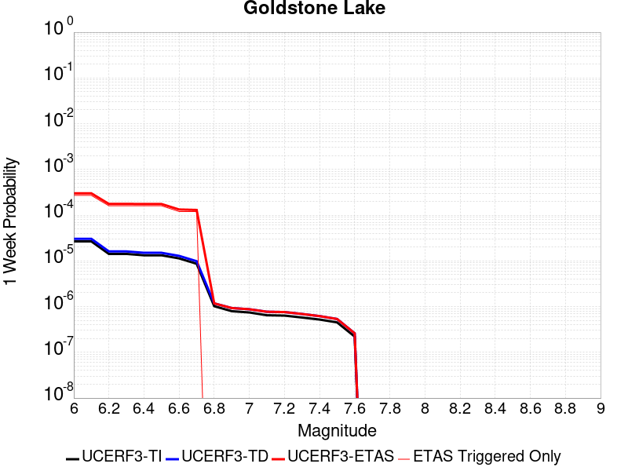 |  | 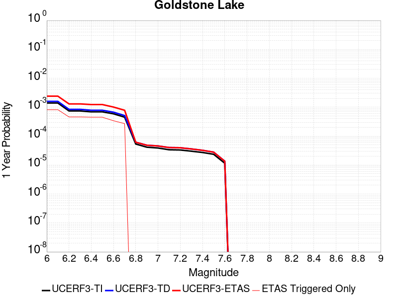 |  |

| Magnitude | 1 wk TI Prob | 1 wk TD Prob | 1 wk ETAS Prob | 1 wk ETAS/TD Gain | 1 wk ETAS Triggered Only | 1 mo TI Prob | 1 mo TD Prob | 1 mo ETAS Prob | 1 mo ETAS/TD Gain | 1 mo ETAS Triggered Only | 1 yr TI Prob | 1 yr TD Prob | 1 yr ETAS Prob | 1 yr ETAS/TD Gain | 1 yr ETAS Triggered Only | 10 yr TI Prob | 10 yr TD Prob | 10 yr ETAS Prob | 10 yr ETAS/TD Gain | 10 yr ETAS Triggered Only |
|-----|-----|-----|-----|-----|-----|-----|-----|-----|-----|-----|-----|-----|-----|-----|-----|-----|-----|-----|-----|-----|
| 6.0 | 2.671352E-5 | 3.037598E-5 | 3.0036777E-4 | 9.888331 | 2.7E-4 | 1.1448149E-4 | 1.3017739E-4 | 5.501227E-4 | 4.225947 | 4.2E-4 | 0.001392921 | 0.0015839539 | 0.002402655 | 1.5168718 | 8.2E-4 | 0.013842222 | 0.01574614 | 0.017055199 | 1.0831351 | 0.00133 |
| 6.1 | 2.671352E-5 | 3.037598E-5 | 3.0036777E-4 | 9.888331 | 2.7E-4 | 1.1448149E-4 | 1.3017739E-4 | 5.501227E-4 | 4.225947 | 4.2E-4 | 0.001392921 | 0.0015839539 | 0.002402655 | 1.5168718 | 8.2E-4 | 0.013842222 | 0.01574614 | 0.017055199 | 1.0831351 | 0.00133 |
| 6.2 | 1.4197047E-5 | 1.609619E-5 | 1.7609361E-4 | 10.940081 | 1.6E-4 | 6.0843064E-5 | 6.89824E-5 | 3.0896586E-4 | 4.478908 | 2.4E-4 | 7.4051257E-4 | 8.396358E-4 | 0.0012992496 | 1.5473965 | 4.6E-4 | 0.007380498 | 0.008374331 | 0.009118049 | 1.0888094 | 7.5E-4 |
| 6.3 | 1.4197047E-5 | 1.609619E-5 | 1.7609361E-4 | 10.940081 | 1.6E-4 | 6.0843064E-5 | 6.89824E-5 | 3.0896586E-4 | 4.478908 | 2.4E-4 | 7.4051257E-4 | 8.396358E-4 | 0.0012992496 | 1.5473965 | 4.6E-4 | 0.007380498 | 0.008374331 | 0.009118049 | 1.0888094 | 7.5E-4 |
| 6.4 | 1.3238931E-5 | 1.5008409E-5 | 1.75006E-4 | 11.66053 | 1.6E-4 | 5.6737044E-5 | 6.432072E-5 | 3.043053E-4 | 4.7310615 | 2.4E-4 | 6.9055456E-4 | 7.829214E-4 | 0.0012325691 | 1.5743203 | 4.5E-4 | 0.006884126 | 0.007811257 | 0.008525633 | 1.0914546 | 7.2E-4 |
| 6.5 | 1.3238931E-5 | 1.5008409E-5 | 1.75006E-4 | 11.66053 | 1.6E-4 | 5.6737044E-5 | 6.432072E-5 | 3.043053E-4 | 4.7310615 | 2.4E-4 | 6.9055456E-4 | 7.829214E-4 | 0.0012325691 | 1.5743203 | 4.5E-4 | 0.006884126 | 0.007811257 | 0.008525633 | 1.0914546 | 7.2E-4 |
| 6.6 | 1.1328278E-5 | 1.2855122E-5 | 1.3285357E-4 | 10.334681 | 1.2E-4 | 4.8548856E-5 | 5.5092758E-5 | 2.4508228E-4 | 4.4485393 | 1.9E-4 | 5.90922E-4 | 6.706436E-4 | 0.0010104156 | 1.5066357 | 3.4E-4 | 0.0058935313 | 0.006695586 | 0.0072617694 | 1.0845608 | 5.7E-4 |
| 6.7 | 8.651175E-6 | 9.824532E-6 | 1.2982335E-4 | 13.214203 | 1.2E-4 | 3.707594E-5 | 4.2104966E-5 | 2.2209738E-4 | 5.27485 | 1.8E-4 | 4.5130608E-4 | 5.125979E-4 | 7.824595E-4 | 1.5264586 | 2.7E-4 | 0.0045039062 | 0.005123034 | 0.005530934 | 1.0796207 | 4.1E-4 |
| 6.8 | 1.0215377E-6 | 1.1754685E-6 | 1.1754685E-6 | 1.0 | 0.0 | 4.378012E-6 | 5.0377125E-6 | 5.0377125E-6 | 1.0 | 0.0 | 5.3300988E-5 | 6.133254E-5 | 6.133254E-5 | 1.0 | 0.0 | 5.3288206E-4 | 6.131674E-4 | 6.131674E-4 | 1.0 | 0.0 |
| 6.9 | 7.9360774E-7 | 9.283384E-7 | 9.283384E-7 | 1.0 | 0.0 | 3.4011714E-6 | 3.9785873E-6 | 3.9785873E-6 | 1.0 | 0.0 | 4.1408475E-5 | 4.8438294E-5 | 4.8438294E-5 | 1.0 | 0.0 | 4.140076E-4 | 4.842844E-4 | 4.842844E-4 | 1.0 | 0.0 |
| 7.0 | 7.4382757E-7 | 8.747317E-7 | 8.747317E-7 | 1.0 | 0.0 | 3.1878285E-6 | 3.748845E-6 | 3.748845E-6 | 1.0 | 0.0 | 3.8811122E-5 | 4.56413E-5 | 4.56413E-5 | 1.0 | 0.0 | 3.8804344E-4 | 4.563259E-4 | 4.563259E-4 | 1.0 | 0.0 |
| 7.1 | 6.4709513E-7 | 7.71129E-7 | 7.71129E-7 | 1.0 | 0.0 | 2.773262E-6 | 3.304835E-6 | 3.304835E-6 | 1.0 | 0.0 | 3.376394E-5 | 4.023568E-5 | 4.023568E-5 | 1.0 | 0.0 | 3.375881E-4 | 4.0228994E-4 | 4.0228994E-4 | 1.0 | 0.0 |
| 7.2 | 6.356704E-7 | 7.5883503E-7 | 7.5883503E-7 | 1.0 | 0.0 | 2.7242988E-6 | 3.2521464E-6 | 3.2521464E-6 | 1.0 | 0.0 | 3.3167835E-5 | 3.9594222E-5 | 3.9594222E-5 | 1.0 | 0.0 | 3.3162883E-4 | 3.9587764E-4 | 3.9587764E-4 | 1.0 | 0.0 |
| 7.3 | 5.7695723E-7 | 6.896557E-7 | 6.896557E-7 | 1.0 | 0.0 | 2.4726714E-6 | 2.955664E-6 | 2.955664E-6 | 1.0 | 0.0 | 3.0104358E-5 | 3.5984674E-5 | 3.5984674E-5 | 1.0 | 0.0 | 3.0100282E-4 | 3.597942E-4 | 3.597942E-4 | 1.0 | 0.0 |
| 7.4 | 5.209647E-7 | 6.1935066E-7 | 6.1935066E-7 | 1.0 | 0.0 | 2.232704E-6 | 2.6543576E-6 | 2.6543576E-6 | 1.0 | 0.0 | 2.718283E-5 | 3.231638E-5 | 3.231638E-5 | 1.0 | 0.0 | 2.7179506E-4 | 3.2312237E-4 | 3.2312237E-4 | 1.0 | 0.0 |
| 7.5 | 4.512955E-7 | 5.348879E-7 | 5.348879E-7 | 1.0 | 0.0 | 1.934122E-6 | 2.292375E-6 | 2.292375E-6 | 1.0 | 0.0 | 2.3547682E-5 | 2.7909362E-5 | 2.7909362E-5 | 1.0 | 0.0 | 2.3545188E-4 | 2.7906388E-4 | 2.7906388E-4 | 1.0 | 0.0 |
| 7.6 | 2.21172E-7 | 2.603958E-7 | 2.603958E-7 | 1.0 | 0.0 | 9.478797E-7 | 1.1159817E-6 | 1.1159817E-6 | 1.0 | 0.0 | 1.1540374E-5 | 1.3587022E-5 | 1.3587022E-5 | 1.0 | 0.0 | 1.1539775E-4 | 1.3586473E-4 | 1.3586473E-4 | 1.0 | 0.0 |

## Airport Lake
*[(top)](#table-of-contents)*

| 1 Week | 1 Month | 1 Year | 10 Year |
|-----|-----|-----|-----|
|  |  |  |  |

| Magnitude | 1 wk TI Prob | 1 wk TD Prob | 1 wk ETAS Prob | 1 wk ETAS/TD Gain | 1 wk ETAS Triggered Only | 1 mo TI Prob | 1 mo TD Prob | 1 mo ETAS Prob | 1 mo ETAS/TD Gain | 1 mo ETAS Triggered Only | 1 yr TI Prob | 1 yr TD Prob | 1 yr ETAS Prob | 1 yr ETAS/TD Gain | 1 yr ETAS Triggered Only | 10 yr TI Prob | 10 yr TD Prob | 10 yr ETAS Prob | 10 yr ETAS/TD Gain | 10 yr ETAS Triggered Only |
|-----|-----|-----|-----|-----|-----|-----|-----|-----|-----|-----|-----|-----|-----|-----|-----|-----|-----|-----|-----|-----|
| 6.0 | 1.2387061E-5 | 1.3103137E-5 | 5.430962E-4 | 41.4478 | 5.3E-4 | 5.3086325E-5 | 5.615525E-5 | 7.2611764E-4 | 12.930538 | 6.7E-4 | 6.461343E-4 | 6.835041E-4 | 0.0016228616 | 2.374326 | 9.4E-4 | 0.0064425888 | 0.0068168286 | 0.008256945 | 1.2112589 | 0.00145 |
| 6.1 | 1.2387061E-5 | 1.3103137E-5 | 5.430962E-4 | 41.4478 | 5.3E-4 | 5.3086325E-5 | 5.615525E-5 | 7.2611764E-4 | 12.930538 | 6.7E-4 | 6.461343E-4 | 6.835041E-4 | 0.0016228616 | 2.374326 | 9.4E-4 | 0.0064425888 | 0.0068168286 | 0.008256945 | 1.2112589 | 0.00145 |
| 6.2 | 1.2387061E-5 | 1.3103137E-5 | 5.430962E-4 | 41.4478 | 5.3E-4 | 5.3086325E-5 | 5.615525E-5 | 7.2611764E-4 | 12.930538 | 6.7E-4 | 6.461343E-4 | 6.835041E-4 | 0.0016228616 | 2.374326 | 9.4E-4 | 0.0064425888 | 0.0068168286 | 0.008256945 | 1.2112589 | 0.00145 |
| 6.3 | 1.2387061E-5 | 1.3103137E-5 | 5.430962E-4 | 41.4478 | 5.3E-4 | 5.3086325E-5 | 5.615525E-5 | 7.2611764E-4 | 12.930538 | 6.7E-4 | 6.461343E-4 | 6.835041E-4 | 0.0016228616 | 2.374326 | 9.4E-4 | 0.0064425888 | 0.0068168286 | 0.008256945 | 1.2112589 | 0.00145 |
| 6.4 | 1.2387061E-5 | 1.3103137E-5 | 5.430962E-4 | 41.4478 | 5.3E-4 | 5.3086325E-5 | 5.615525E-5 | 7.2611764E-4 | 12.930538 | 6.7E-4 | 6.461343E-4 | 6.835041E-4 | 0.0016228616 | 2.374326 | 9.4E-4 | 0.0064425888 | 0.0068168286 | 0.008256945 | 1.2112589 | 0.00145 |
| 6.5 | 6.9922594E-6 | 7.384914E-6 | 4.3738174E-4 | 59.22638 | 4.3E-4 | 2.996648E-5 | 3.1649277E-5 | 5.716322E-4 | 18.06146 | 5.4E-4 | 3.6478083E-4 | 3.8526725E-4 | 0.0011049899 | 2.8681126 | 7.2E-4 | 0.003641826 | 0.0038465308 | 0.004932338 | 1.2822822 | 0.00109 |
| 6.6 | 6.9922594E-6 | 7.384914E-6 | 4.3738174E-4 | 59.22638 | 4.3E-4 | 2.996648E-5 | 3.1649277E-5 | 5.716322E-4 | 18.06146 | 5.4E-4 | 3.6478083E-4 | 3.8526725E-4 | 0.0011049899 | 2.8681126 | 7.2E-4 | 0.003641826 | 0.0038465308 | 0.004932338 | 1.2822822 | 0.00109 |
| 6.7 | 5.477277E-6 | 5.78606E-6 | 3.8578387E-4 | 66.67471 | 3.8E-4 | 2.3473833E-5 | 2.4797186E-5 | 5.1478506E-4 | 20.759817 | 4.9E-4 | 2.8575645E-4 | 3.0186778E-4 | 9.5167157E-4 | 3.1526105 | 6.5E-4 | 0.0028538927 | 0.0030149613 | 0.003982037 | 1.3207588 | 9.7E-4 |
| 6.8 | 3.9950432E-6 | 4.219081E-6 | 2.64218E-4 | 62.62454 | 2.6E-4 | 1.7121502E-5 | 1.8081664E-5 | 3.5807551E-4 | 19.803238 | 3.4E-4 | 2.0843433E-4 | 2.2012478E-4 | 6.800235E-4 | 3.0892637 | 4.6E-4 | 0.0020823893 | 0.0021993385 | 0.002907777 | 1.3221143 | 7.1E-4 |
| 6.9 | 2.95695E-6 | 3.1230197E-6 | 1.9312243E-4 | 61.838364 | 1.9E-4 | 1.2672582E-5 | 1.3384314E-5 | 2.4338123E-4 | 18.184065 | 2.3E-4 | 1.5427776E-4 | 1.629441E-4 | 4.928903E-4 | 3.0249045 | 3.3E-4 | 0.001541707 | 0.0016284687 | 0.0021276544 | 1.3065369 | 5.0E-4 |
| 7.0 | 1.456072E-6 | 1.5408096E-6 | 7.15407E-5 | 46.43059 | 7.0E-5 | 6.2402937E-6 | 6.6034586E-6 | 8.660293E-5 | 13.114783 | 8.0E-5 | 7.597293E-5 | 8.0395155E-5 | 2.203839E-4 | 2.7412586 | 1.4E-4 | 7.594696E-4 | 8.0375955E-4 | 0.0010335747 | 1.2859253 | 2.3E-4 |
| 7.1 | 6.995192E-7 | 7.4089627E-7 | 5.074086E-5 | 68.48578 | 5.0E-5 | 2.997936E-6 | 3.1752697E-6 | 6.317508E-5 | 19.895973 | 6.0E-5 | 3.649926E-5 | 3.865891E-5 | 1.3865504E-4 | 3.5866258 | 1.0E-4 | 3.6493264E-4 | 3.865891E-4 | 5.26535E-4 | 1.3620017 | 1.4E-4 |

## Coyote Canyon
*[(top)](#table-of-contents)*

| 1 Week | 1 Month | 1 Year | 10 Year |
|-----|-----|-----|-----|
|  |  |  |  |

| Magnitude | 1 wk TI Prob | 1 wk TD Prob | 1 wk ETAS Prob | 1 wk ETAS/TD Gain | 1 wk ETAS Triggered Only | 1 mo TI Prob | 1 mo TD Prob | 1 mo ETAS Prob | 1 mo ETAS/TD Gain | 1 mo ETAS Triggered Only | 1 yr TI Prob | 1 yr TD Prob | 1 yr ETAS Prob | 1 yr ETAS/TD Gain | 1 yr ETAS Triggered Only | 10 yr TI Prob | 10 yr TD Prob | 10 yr ETAS Prob | 10 yr ETAS/TD Gain | 10 yr ETAS Triggered Only |
|-----|-----|-----|-----|-----|-----|-----|-----|-----|-----|-----|-----|-----|-----|-----|-----|-----|-----|-----|-----|-----|
| 6.0 | 3.5090034E-5 | 4.036416E-5 | 1.803585E-4 | 4.468283 | 1.4E-4 | 1.503772E-4 | 1.7297924E-4 | 3.929412E-4 | 2.2716088 | 2.2E-4 | 0.0018293047 | 0.0021042444 | 0.0025732552 | 1.2228881 | 4.7E-4 | 0.018143194 | 0.02086912 | 0.02170138 | 1.03988 | 8.5E-4 |
| 6.1 | 3.5090034E-5 | 4.036416E-5 | 1.803585E-4 | 4.468283 | 1.4E-4 | 1.503772E-4 | 1.7297924E-4 | 3.929412E-4 | 2.2716088 | 2.2E-4 | 0.0018293047 | 0.0021042444 | 0.0025732552 | 1.2228881 | 4.7E-4 | 0.018143194 | 0.02086912 | 0.02170138 | 1.03988 | 8.5E-4 |
| 6.2 | 1.841879E-5 | 2.1059714E-5 | 9.105824E-5 | 4.323812 | 7.0E-5 | 7.8935285E-5 | 9.0253365E-5 | 2.3024072E-4 | 2.5510488 | 1.4E-4 | 9.606133E-4 | 0.0010983828 | 0.0013580972 | 1.2364516 | 2.6E-4 | 0.0095647145 | 0.010939625 | 0.011404484 | 1.0424931 | 4.7E-4 |
| 6.3 | 1.841879E-5 | 2.1059714E-5 | 9.105824E-5 | 4.323812 | 7.0E-5 | 7.8935285E-5 | 9.0253365E-5 | 2.3024072E-4 | 2.5510488 | 1.4E-4 | 9.606133E-4 | 0.0010983828 | 0.0013580972 | 1.2364516 | 2.6E-4 | 0.0095647145 | 0.010939625 | 0.011404484 | 1.0424931 | 4.7E-4 |
| 6.4 | 1.712201E-5 | 1.9565137E-5 | 7.9563964E-5 | 4.0666194 | 6.0E-5 | 7.337798E-5 | 8.384846E-5 | 2.1383756E-4 | 2.550286 | 1.3E-4 | 8.930107E-4 | 0.0010204774 | 0.0012702224 | 1.2447333 | 2.5E-4 | 0.008894307 | 0.010167832 | 0.010613256 | 1.0438073 | 4.5E-4 |
| 6.5 | 1.4744935E-5 | 1.6836908E-5 | 7.6835895E-5 | 4.5635395 | 6.0E-5 | 6.3191044E-5 | 7.2156705E-5 | 1.9214804E-4 | 2.6629272 | 1.2E-4 | 7.6907943E-4 | 8.782473E-4 | 0.0011080453 | 1.2616552 | 2.3E-4 | 0.007664232 | 0.008756962 | 0.009183195 | 1.0486737 | 4.3E-4 |
| 6.6 | 1.2017839E-5 | 1.3724038E-5 | 7.372321E-5 | 5.3718314 | 6.0E-5 | 5.150401E-5 | 5.8816477E-5 | 1.7880942E-4 | 3.0401247 | 1.2E-4 | 6.268809E-4 | 7.1594387E-4 | 9.457792E-4 | 1.3210242 | 2.3E-4 | 0.0062511545 | 0.0071450667 | 0.007552137 | 1.0569723 | 4.1E-4 |
| 6.7 | 1.00956095E-5 | 1.1533472E-5 | 6.15329E-5 | 5.335158 | 5.0E-5 | 4.326618E-5 | 4.9428723E-5 | 1.5942329E-4 | 3.2253168 | 1.1E-4 | 5.266384E-4 | 6.017155E-4 | 7.916012E-4 | 1.3155738 | 1.9E-4 | 0.005253921 | 0.0060093896 | 0.0063572866 | 1.0578922 | 3.5E-4 |

## Lenwood-Lockhart-Old Woman Springs
*[(top)](#table-of-contents)*

| 1 Week | 1 Month | 1 Year | 10 Year |
|-----|-----|-----|-----|
|  |  |  |  |

| Magnitude | 1 wk TI Prob | 1 wk TD Prob | 1 wk ETAS Prob | 1 wk ETAS/TD Gain | 1 wk ETAS Triggered Only | 1 mo TI Prob | 1 mo TD Prob | 1 mo ETAS Prob | 1 mo ETAS/TD Gain | 1 mo ETAS Triggered Only | 1 yr TI Prob | 1 yr TD Prob | 1 yr ETAS Prob | 1 yr ETAS/TD Gain | 1 yr ETAS Triggered Only | 10 yr TI Prob | 10 yr TD Prob | 10 yr ETAS Prob | 10 yr ETAS/TD Gain | 10 yr ETAS Triggered Only |
|-----|-----|-----|-----|-----|-----|-----|-----|-----|-----|-----|-----|-----|-----|-----|-----|-----|-----|-----|-----|-----|
| 6.0 | 3.744542E-5 | 4.396243E-5 | 3.7394793E-4 | 8.50608 | 3.3E-4 | 1.604705E-4 | 1.8839778E-4 | 6.1831676E-4 | 3.2819748 | 4.3E-4 | 0.0019519776 | 0.0022915022 | 0.0029200586 | 1.2742988 | 6.3E-4 | 0.019349206 | 0.02269674 | 0.023566542 | 1.0383227 | 8.9E-4 |
| 6.1 | 3.744542E-5 | 4.396243E-5 | 3.7394793E-4 | 8.50608 | 3.3E-4 | 1.604705E-4 | 1.8839778E-4 | 6.1831676E-4 | 3.2819748 | 4.3E-4 | 0.0019519776 | 0.0022915022 | 0.0029200586 | 1.2742988 | 6.3E-4 | 0.019349206 | 0.02269674 | 0.023566542 | 1.0383227 | 8.9E-4 |
| 6.2 | 3.744542E-5 | 4.396243E-5 | 3.7394793E-4 | 8.50608 | 3.3E-4 | 1.604705E-4 | 1.8839778E-4 | 6.1831676E-4 | 3.2819748 | 4.3E-4 | 0.0019519776 | 0.0022915022 | 0.0029200586 | 1.2742988 | 6.3E-4 | 0.019349206 | 0.02269674 | 0.023566542 | 1.0383227 | 8.9E-4 |
| 6.3 | 2.1079984E-5 | 2.5353402E-5 | 1.0535137E-4 | 4.1553154 | 8.0E-5 | 9.0339665E-5 | 1.0865302E-4 | 2.1864107E-4 | 2.0122871 | 1.1E-4 | 0.0010993304 | 0.0013220677 | 0.0015218033 | 1.1510782 | 2.0E-4 | 0.010939079 | 0.013144241 | 0.013450166 | 1.0232744 | 3.1E-4 |
| 6.4 | 2.1079984E-5 | 2.5353402E-5 | 1.0535137E-4 | 4.1553154 | 8.0E-5 | 9.0339665E-5 | 1.0865302E-4 | 2.1864107E-4 | 2.0122871 | 1.1E-4 | 0.0010993304 | 0.0013220677 | 0.0015218033 | 1.1510782 | 2.0E-4 | 0.010939079 | 0.013144241 | 0.013450166 | 1.0232744 | 3.1E-4 |
| 6.5 | 1.7397282E-5 | 2.0662384E-5 | 8.066114E-5 | 3.9037673 | 6.0E-5 | 7.455765E-5 | 8.8550136E-5 | 1.5854395E-4 | 1.7904426 | 7.0E-5 | 9.073613E-4 | 0.0010775764 | 0.0012274148 | 1.1390512 | 1.5E-4 | 0.009036654 | 0.010724808 | 0.010952341 | 1.0212156 | 2.3E-4 |
| 6.6 | 1.52050325E-5 | 1.7679673E-5 | 7.767861E-5 | 4.393668 | 6.0E-5 | 6.51628E-5 | 7.576787E-5 | 1.4576256E-4 | 1.9238045 | 7.0E-5 | 7.9306826E-4 | 9.220913E-4 | 0.0010419807 | 1.130019 | 1.2E-4 | 0.007902439 | 0.009183516 | 0.009371771 | 1.0204992 | 1.9E-4 |
| 6.7 | 1.332523E-5 | 1.5263984E-5 | 4.5263525E-5 | 2.9653807 | 3.0E-5 | 5.7106878E-5 | 6.541547E-5 | 1.0541285E-4 | 1.6114361 | 4.0E-5 | 6.950544E-4 | 7.9614815E-4 | 8.561004E-4 | 1.0753028 | 6.0E-5 | 0.006928845 | 0.00793359 | 0.008062558 | 1.016256 | 1.3E-4 |
| 6.8 | 1.1525329E-5 | 1.30309645E-5 | 4.3030574E-5 | 3.3021786 | 3.0E-5 | 4.9393333E-5 | 5.584582E-5 | 9.5843585E-5 | 1.7162178 | 4.0E-5 | 6.011979E-4 | 6.79715E-4 | 7.29681E-4 | 1.0735103 | 5.0E-5 | 0.00599574 | 0.0067768116 | 0.0068959985 | 1.0175874 | 1.2E-4 |
| 6.9 | 1.0253909E-5 | 1.1514427E-5 | 3.1514195E-5 | 2.7369313 | 2.0E-5 | 4.3944583E-5 | 4.9346632E-5 | 7.934515E-5 | 1.6079142 | 3.0E-5 | 5.3489394E-4 | 6.006332E-4 | 6.306152E-4 | 1.0499173 | 3.0E-5 | 0.0053360825 | 0.005990478 | 0.0060699987 | 1.0132746 | 8.0E-5 |
| 7.0 | 8.104563E-6 | 8.99127E-6 | 2.8991091E-5 | 3.2243598 | 2.0E-5 | 3.4733377E-5 | 3.853346E-5 | 6.85323E-5 | 1.7785141 | 3.0E-5 | 4.2279682E-4 | 4.690463E-4 | 4.9903226E-4 | 1.0639296 | 3.0E-5 | 0.0042199334 | 0.0046808114 | 0.0047504837 | 1.0148847 | 7.0E-5 |
| 7.1 | 6.7986157E-6 | 7.515809E-6 | 2.7515658E-5 | 3.6610374 | 2.0E-5 | 2.91366E-5 | 3.2210224E-5 | 5.220958E-5 | 1.6209009 | 2.0E-5 | 3.5468035E-4 | 3.9209108E-4 | 4.1208323E-4 | 1.0509886 | 2.0E-5 | 0.003541148 | 0.003914209 | 0.0039540525 | 1.0101792 | 4.0E-5 |
| 7.2 | 5.6893327E-6 | 6.2800086E-6 | 2.6279882E-5 | 4.184689 | 2.0E-5 | 2.4382627E-5 | 2.6914056E-5 | 4.691352E-5 | 1.7430861 | 2.0E-5 | 2.9681803E-4 | 3.2763137E-4 | 3.476248E-4 | 1.0610242 | 2.0E-5 | 0.002964219 | 0.003271682 | 0.003311551 | 1.0121862 | 4.0E-5 |
| 7.3 | 4.253348E-6 | 4.706907E-6 | 4.706907E-6 | 1.0 | 0.0 | 1.8228506E-5 | 2.0172314E-5 | 2.0172314E-5 | 1.0 | 0.0 | 2.2190946E-4 | 2.4557207E-4 | 2.4557207E-4 | 1.0 | 0.0 | 0.00221688 | 0.002453188 | 0.0024631636 | 1.0040663 | 1.0E-5 |
| 7.4 | 2.5448119E-6 | 2.8520433E-6 | 2.8520433E-6 | 1.0 | 0.0 | 1.0906291E-5 | 1.2222995E-5 | 1.2222995E-5 | 1.0 | 0.0 | 1.3277601E-4 | 1.4880644E-4 | 1.4880644E-4 | 1.0 | 0.0 | 0.001326967 | 0.0014872303 | 0.0014872303 | 1.0 | 0.0 |
| 7.5 | 4.3706837E-8 | 4.5629037E-8 | 4.5629037E-8 | 1.0 | 0.0 | 1.8731501E-7 | 1.9555301E-7 | 1.9555301E-7 | 1.0 | 0.0 | 2.2805577E-6 | 2.380856E-6 | 2.380856E-6 | 1.0 | 0.0 | 2.2805343E-5 | 2.3808358E-5 | 2.3808358E-5 | 1.0 | 0.0 |

## So Sierra Nevada
*[(top)](#table-of-contents)*

| 1 Week | 1 Month | 1 Year | 10 Year |
|-----|-----|-----|-----|
|  |  |  |  |

| Magnitude | 1 wk TI Prob | 1 wk TD Prob | 1 wk ETAS Prob | 1 wk ETAS/TD Gain | 1 wk ETAS Triggered Only | 1 mo TI Prob | 1 mo TD Prob | 1 mo ETAS Prob | 1 mo ETAS/TD Gain | 1 mo ETAS Triggered Only | 1 yr TI Prob | 1 yr TD Prob | 1 yr ETAS Prob | 1 yr ETAS/TD Gain | 1 yr ETAS Triggered Only | 10 yr TI Prob | 10 yr TD Prob | 10 yr ETAS Prob | 10 yr ETAS/TD Gain | 10 yr ETAS Triggered Only |
|-----|-----|-----|-----|-----|-----|-----|-----|-----|-----|-----|-----|-----|-----|-----|-----|-----|-----|-----|-----|-----|
| 6.0 | 1.15488665E-5 | 1.1079626E-5 | 2.310772E-4 | 20.856045 | 2.2E-4 | 4.9494203E-5 | 4.748332E-5 | 3.7746766E-4 | 7.9494786 | 3.3E-4 | 6.024253E-4 | 5.7796884E-4 | 0.0011676279 | 2.0202262 | 5.9E-4 | 0.006007948 | 0.0057659256 | 0.0066507943 | 1.153465 | 8.9E-4 |
| 6.1 | 1.15488665E-5 | 1.1079626E-5 | 2.310772E-4 | 20.856045 | 2.2E-4 | 4.9494203E-5 | 4.748332E-5 | 3.7746766E-4 | 7.9494786 | 3.3E-4 | 6.024253E-4 | 5.7796884E-4 | 0.0011676279 | 2.0202262 | 5.9E-4 | 0.006007948 | 0.0057659256 | 0.0066507943 | 1.153465 | 8.9E-4 |
| 6.2 | 1.15488665E-5 | 1.1079626E-5 | 2.310772E-4 | 20.856045 | 2.2E-4 | 4.9494203E-5 | 4.748332E-5 | 3.7746766E-4 | 7.9494786 | 3.3E-4 | 6.024253E-4 | 5.7796884E-4 | 0.0011676279 | 2.0202262 | 5.9E-4 | 0.006007948 | 0.0057659256 | 0.0066507943 | 1.153465 | 8.9E-4 |
| 6.3 | 1.15488665E-5 | 1.1079626E-5 | 2.310772E-4 | 20.856045 | 2.2E-4 | 4.9494203E-5 | 4.748332E-5 | 3.7746766E-4 | 7.9494786 | 3.3E-4 | 6.024253E-4 | 5.7796884E-4 | 0.0011676279 | 2.0202262 | 5.9E-4 | 0.006007948 | 0.0057659256 | 0.0066507943 | 1.153465 | 8.9E-4 |
| 6.4 | 1.15488665E-5 | 1.1079626E-5 | 2.310772E-4 | 20.856045 | 2.2E-4 | 4.9494203E-5 | 4.748332E-5 | 3.7746766E-4 | 7.9494786 | 3.3E-4 | 6.024253E-4 | 5.7796884E-4 | 0.0011676279 | 2.0202262 | 5.9E-4 | 0.006007948 | 0.0057659256 | 0.0066507943 | 1.153465 | 8.9E-4 |
| 6.5 | 1.15488665E-5 | 1.1079626E-5 | 2.310772E-4 | 20.856045 | 2.2E-4 | 4.9494203E-5 | 4.748332E-5 | 3.7746766E-4 | 7.9494786 | 3.3E-4 | 6.024253E-4 | 5.7796884E-4 | 0.0011676279 | 2.0202262 | 5.9E-4 | 0.006007948 | 0.0057659256 | 0.0066507943 | 1.153465 | 8.9E-4 |
| 6.6 | 7.587044E-6 | 6.9356242E-6 | 1.2693478E-4 | 18.301855 | 1.2E-4 | 3.2515498E-5 | 2.9723782E-5 | 2.0971843E-4 | 7.055577 | 1.8E-4 | 3.9580427E-4 | 3.6182988E-4 | 6.3173217E-4 | 1.745937 | 2.7E-4 | 0.003951 | 0.0036126992 | 0.0040112543 | 1.1103206 | 4.0E-4 |
| 6.7 | 7.587044E-6 | 6.9356242E-6 | 1.2693478E-4 | 18.301855 | 1.2E-4 | 3.2515498E-5 | 2.9723782E-5 | 2.0971843E-4 | 7.055577 | 1.8E-4 | 3.9580427E-4 | 3.6182988E-4 | 6.3173217E-4 | 1.745937 | 2.7E-4 | 0.003951 | 0.0036126992 | 0.0040112543 | 1.1103206 | 4.0E-4 |
| 6.8 | 5.9026956E-6 | 5.179384E-6 | 6.5179076E-5 | 12.58433 | 6.0E-5 | 2.5297022E-5 | 2.2197177E-5 | 1.1219518E-4 | 5.0544796 | 9.0E-5 | 3.0794772E-4 | 2.702183E-4 | 4.2017776E-4 | 1.5549568 | 1.5E-4 | 0.0030752132 | 0.0026990133 | 0.0028885005 | 1.070206 | 1.9E-4 |
| 6.9 | 5.0118915E-6 | 4.2524175E-6 | 5.4252207E-5 | 12.757968 | 5.0E-5 | 2.1479358E-5 | 1.8224524E-5 | 8.822325E-5 | 4.8409085 | 7.0E-5 | 2.614798E-4 | 2.218617E-4 | 3.4183508E-4 | 1.5407574 | 1.2E-4 | 0.0026117235 | 0.0022164746 | 0.0023561644 | 1.0630233 | 1.4E-4 |
| 7.0 | 4.4924795E-6 | 3.7139105E-6 | 3.3713797E-5 | 9.077709 | 3.0E-5 | 1.925334E-5 | 1.5916665E-5 | 5.591603E-5 | 3.5130491 | 4.0E-5 | 2.3438422E-4 | 1.937688E-4 | 2.8375137E-4 | 1.4643811 | 9.0E-5 | 0.0023413717 | 0.0019360614 | 0.0020458484 | 1.0567064 | 1.1E-4 |
| 7.1 | 3.9118436E-6 | 3.111971E-6 | 2.3111908E-5 | 7.426775 | 2.0E-5 | 1.6764936E-5 | 1.3336953E-5 | 4.3336553E-5 | 3.2493594 | 3.0E-5 | 2.0409399E-4 | 1.6236588E-4 | 2.323545E-4 | 1.4310551 | 7.0E-5 | 0.0020390663 | 0.0016225285 | 0.0017023988 | 1.0492258 | 8.0E-5 |
| 7.2 | 3.4200818E-6 | 2.6054481E-6 | 2.2605396E-5 | 8.676203 | 2.0E-5 | 1.4657411E-5 | 1.1166161E-5 | 4.1165826E-5 | 3.6866586 | 3.0E-5 | 1.7843937E-4 | 1.3594003E-4 | 2.0593053E-4 | 1.5148629 | 7.0E-5 | 0.0017829615 | 0.0013586186 | 0.0014285235 | 1.0514529 | 7.0E-5 |
| 7.3 | 2.6593618E-6 | 1.828415E-6 | 1.828415E-6 | 1.0 | 0.0 | 1.13972155E-5 | 7.836042E-6 | 7.836042E-6 | 1.0 | 0.0 | 1.3875226E-4 | 9.539993E-5 | 1.1539802E-4 | 1.2096238 | 2.0E-5 | 0.0013866565 | 9.5361867E-4 | 9.735996E-4 | 1.0209527 | 2.0E-5 |
| 7.4 | 2.2577992E-6 | 1.4364332E-6 | 1.4364332E-6 | 1.0 | 0.0 | 9.676246E-6 | 6.156129E-6 | 6.156129E-6 | 1.0 | 0.0 | 1.1780193E-4 | 7.494855E-5 | 9.494705E-5 | 1.2668297 | 2.0E-5 | 0.001177395 | 7.4925774E-4 | 7.6924276E-4 | 1.0266731 | 2.0E-5 |
| 7.5 | 1.489319E-6 | 7.353898E-7 | 7.353898E-7 | 1.0 | 0.0 | 6.3827797E-6 | 3.1516668E-6 | 3.1516668E-6 | 1.0 | 0.0 | 7.770758E-5 | 3.8370872E-5 | 4.8370486E-5 | 1.2606044 | 1.0E-5 | 7.7680405E-4 | 3.8364288E-4 | 3.9363906E-4 | 1.0260559 | 1.0E-5 |
| 7.6 | 1.0680322E-6 | 4.6596273E-7 | 4.6596273E-7 | 1.0 | 0.0 | 4.577273E-6 | 1.9969816E-6 | 1.9969816E-6 | 1.0 | 0.0 | 5.5726876E-5 | 2.4312982E-5 | 3.431274E-5 | 1.4112929 | 1.0E-5 | 5.5712904E-4 | 2.4310348E-4 | 2.5310105E-4 | 1.0411247 | 1.0E-5 |
| 7.7 | 5.509146E-7 | 1.5580342E-7 | 1.5580342E-7 | 1.0 | 0.0 | 2.3610605E-6 | 6.677288E-7 | 6.677288E-7 | 1.0 | 0.0 | 2.8745531E-5 | 8.129569E-6 | 8.129569E-6 | 1.0 | 0.0 | 2.8741814E-4 | 8.1292834E-5 | 8.1292834E-5 | 1.0 | 0.0 |

## Nelson Lake
*[(top)](#table-of-contents)*

| 1 Week | 1 Month | 1 Year | 10 Year |
|-----|-----|-----|-----|
|  |  |  |  |

| Magnitude | 1 wk TI Prob | 1 wk TD Prob | 1 wk ETAS Prob | 1 wk ETAS/TD Gain | 1 wk ETAS Triggered Only | 1 mo TI Prob | 1 mo TD Prob | 1 mo ETAS Prob | 1 mo ETAS/TD Gain | 1 mo ETAS Triggered Only | 1 yr TI Prob | 1 yr TD Prob | 1 yr ETAS Prob | 1 yr ETAS/TD Gain | 1 yr ETAS Triggered Only | 10 yr TI Prob | 10 yr TD Prob | 10 yr ETAS Prob | 10 yr ETAS/TD Gain | 10 yr ETAS Triggered Only |
|-----|-----|-----|-----|-----|-----|-----|-----|-----|-----|-----|-----|-----|-----|-----|-----|-----|-----|-----|-----|-----|
| 6.0 | 9.913453E-6 | 1.0192248E-5 | 1.7019061E-4 | 16.698046 | 1.6E-4 | 4.2485535E-5 | 4.368039E-5 | 2.5367123E-4 | 5.8074393 | 2.1E-4 | 5.1713863E-4 | 5.316893E-4 | 0.0010214287 | 1.9211009 | 4.9E-4 | 0.0051593683 | 0.0053052 | 0.006051221 | 1.1406207 | 7.5E-4 |
| 6.1 | 9.913453E-6 | 1.0192248E-5 | 1.7019061E-4 | 16.698046 | 1.6E-4 | 4.2485535E-5 | 4.368039E-5 | 2.5367123E-4 | 5.8074393 | 2.1E-4 | 5.1713863E-4 | 5.316893E-4 | 0.0010214287 | 1.9211009 | 4.9E-4 | 0.0051593683 | 0.0053052 | 0.006051221 | 1.1406207 | 7.5E-4 |
| 6.2 | 4.5596407E-6 | 4.696309E-6 | 4.469612E-5 | 9.517286 | 4.0E-5 | 1.954117E-5 | 2.0126892E-5 | 9.012548E-5 | 4.477864 | 7.0E-5 | 2.3788778E-4 | 2.4501863E-4 | 4.6496472E-4 | 1.897671 | 2.2E-4 | 0.0023763329 | 0.002447611 | 0.0028167053 | 1.1507978 | 3.7E-4 |
| 6.3 | 4.5596407E-6 | 4.696309E-6 | 4.469612E-5 | 9.517286 | 4.0E-5 | 1.954117E-5 | 2.0126892E-5 | 9.012548E-5 | 4.477864 | 7.0E-5 | 2.3788778E-4 | 2.4501863E-4 | 4.6496472E-4 | 1.897671 | 2.2E-4 | 0.0023763329 | 0.002447611 | 0.0028167053 | 1.1507978 | 3.7E-4 |
| 6.4 | 3.4025713E-6 | 3.5098942E-6 | 2.3509823E-5 | 6.6981573 | 2.0E-5 | 1.4582367E-5 | 1.5042322E-5 | 5.504172E-5 | 3.659124 | 4.0E-5 | 1.7752586E-4 | 1.8312573E-4 | 3.2310007E-4 | 1.7643621 | 1.4E-4 | 0.001773841 | 0.0018298312 | 0.0020793737 | 1.1363746 | 2.5E-4 |
| 6.5 | 2.8352947E-6 | 2.9278535E-6 | 2.2927796E-5 | 7.8309226 | 2.0E-5 | 1.2151207E-5 | 1.2547887E-5 | 5.2547384E-5 | 4.1877475 | 4.0E-5 | 1.479309E-4 | 1.5276058E-4 | 2.6274376E-4 | 1.7199711 | 1.1E-4 | 0.0014783246 | 0.0015266296 | 0.0017263242 | 1.1308075 | 2.0E-4 |
| 6.6 | 2.251518E-6 | 2.3290654E-6 | 2.2329019E-5 | 9.587115 | 2.0E-5 | 9.649328E-6 | 9.981674E-6 | 3.9981376E-5 | 4.005478 | 3.0E-5 | 1.1747423E-4 | 1.2152074E-4 | 2.0151101E-4 | 1.6582439 | 8.0E-5 | 0.0011741214 | 0.0012146046 | 0.0013544345 | 1.1151239 | 1.4E-4 |
| 6.7 | 1.8911853E-6 | 1.9591378E-6 | 2.1959098E-5 | 11.208552 | 2.0E-5 | 8.105055E-6 | 8.396281E-6 | 3.839603E-5 | 4.5729804 | 3.0E-5 | 9.867457E-5 | 1.0222051E-4 | 1.8221233E-4 | 1.7825418 | 8.0E-5 | 9.863076E-4 | 0.0010217924 | 0.0011616494 | 1.1368741 | 1.4E-4 |
| 6.8 | 1.4874814E-6 | 1.543829E-6 | 2.1543798E-5 | 13.954783 | 2.0E-5 | 6.374905E-6 | 6.6163957E-6 | 3.66162E-5 | 5.5341606 | 3.0E-5 | 7.76117E-5 | 8.055216E-5 | 1.5054652E-4 | 1.8689321 | 7.0E-5 | 7.75846E-4 | 8.0528075E-4 | 9.052002E-4 | 1.1240803 | 1.0E-4 |
| 6.9 | 6.835972E-7 | 7.13992E-7 | 2.0713978E-5 | 29.0115 | 2.0E-5 | 2.9296991E-6 | 3.0599638E-6 | 2.3059903E-5 | 7.536005 | 2.0E-5 | 3.56685E-5 | 3.725474E-5 | 6.7253626E-5 | 1.8052366 | 3.0E-5 | 3.5662777E-4 | 3.7251622E-4 | 4.224976E-4 | 1.1341723 | 5.0E-5 |

## Death Valley (So)
*[(top)](#table-of-contents)*

| 1 Week | 1 Month | 1 Year | 10 Year |
|-----|-----|-----|-----|
|  |  |  | 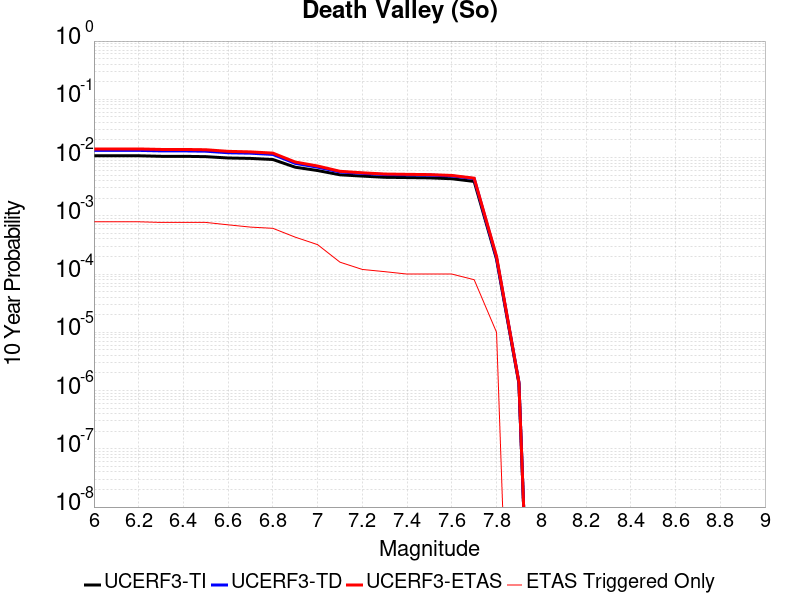 |

| Magnitude | 1 wk TI Prob | 1 wk TD Prob | 1 wk ETAS Prob | 1 wk ETAS/TD Gain | 1 wk ETAS Triggered Only | 1 mo TI Prob | 1 mo TD Prob | 1 mo ETAS Prob | 1 mo ETAS/TD Gain | 1 mo ETAS Triggered Only | 1 yr TI Prob | 1 yr TD Prob | 1 yr ETAS Prob | 1 yr ETAS/TD Gain | 1 yr ETAS Triggered Only | 10 yr TI Prob | 10 yr TD Prob | 10 yr ETAS Prob | 10 yr ETAS/TD Gain | 10 yr ETAS Triggered Only |
|-----|-----|-----|-----|-----|-----|-----|-----|-----|-----|-----|-----|-----|-----|-----|-----|-----|-----|-----|-----|-----|
| 6.0 | 2.0684236E-5 | 2.5617646E-5 | 1.9561329E-4 | 7.635881 | 1.7E-4 | 8.864371E-5 | 1.0978539E-4 | 3.2976124E-4 | 3.0036898 | 2.2E-4 | 0.0010787029 | 0.0013358344 | 0.0017852333 | 1.3364182 | 4.5E-4 | 0.010734817 | 0.0132813305 | 0.014060838 | 1.058692 | 7.9E-4 |
| 6.1 | 2.0684236E-5 | 2.5617646E-5 | 1.9561329E-4 | 7.635881 | 1.7E-4 | 8.864371E-5 | 1.0978539E-4 | 3.2976124E-4 | 3.0036898 | 2.2E-4 | 0.0010787029 | 0.0013358344 | 0.0017852333 | 1.3364182 | 4.5E-4 | 0.010734817 | 0.0132813305 | 0.014060838 | 1.058692 | 7.9E-4 |
| 6.2 | 2.0684236E-5 | 2.5617646E-5 | 1.9561329E-4 | 7.635881 | 1.7E-4 | 8.864371E-5 | 1.0978539E-4 | 3.2976124E-4 | 3.0036898 | 2.2E-4 | 0.0010787029 | 0.0013358344 | 0.0017852333 | 1.3364182 | 4.5E-4 | 0.010734817 | 0.0132813305 | 0.014060838 | 1.058692 | 7.9E-4 |
| 6.3 | 2.0240292E-5 | 2.5117732E-5 | 1.8511372E-4 | 7.3698416 | 1.6E-4 | 8.6741224E-5 | 1.0764308E-4 | 3.1762046E-4 | 2.950682 | 2.1E-4 | 0.0010555626 | 0.0013097833 | 0.0017392201 | 1.3278686 | 4.3E-4 | 0.010505628 | 0.013023891 | 0.013783862 | 1.0583521 | 7.7E-4 |
| 6.4 | 2.0240292E-5 | 2.5117732E-5 | 1.8511372E-4 | 7.3698416 | 1.6E-4 | 8.6741224E-5 | 1.0764308E-4 | 3.1762046E-4 | 2.950682 | 2.1E-4 | 0.0010555626 | 0.0013097833 | 0.0017392201 | 1.3278686 | 4.3E-4 | 0.010505628 | 0.013023891 | 0.013783862 | 1.0583521 | 7.7E-4 |
| 6.5 | 1.9962767E-5 | 2.4806986E-5 | 1.8480302E-4 | 7.449636 | 1.6E-4 | 8.55519E-5 | 1.0631142E-4 | 3.1628908E-4 | 2.9751186 | 2.1E-4 | 0.0010410968 | 0.0012935897 | 0.0017230335 | 1.3319783 | 4.3E-4 | 0.010362327 | 0.012863837 | 0.013623932 | 1.0590878 | 7.7E-4 |
| 6.6 | 1.8937297E-5 | 2.3310844E-5 | 1.6330757E-4 | 7.0056486 | 1.4E-4 | 8.115732E-5 | 9.989987E-5 | 2.7988188E-4 | 2.801624 | 1.8E-4 | 9.876423E-4 | 0.0012156168 | 0.001585167 | 1.3040022 | 3.7E-4 | 0.009832645 | 0.012092726 | 0.012784261 | 1.057186 | 7.0E-4 |
| 6.7 | 1.8621096E-5 | 2.2911487E-5 | 1.5290851E-4 | 6.67388 | 1.3E-4 | 7.980225E-5 | 9.818847E-5 | 2.6817177E-4 | 2.7311943 | 1.7E-4 | 9.711593E-4 | 0.0011948035 | 0.0015443853 | 1.2925851 | 3.5E-4 | 0.009669261 | 0.011886842 | 0.012519235 | 1.0532011 | 6.4E-4 |
| 6.8 | 1.7830353E-5 | 2.1805576E-5 | 1.5180274E-4 | 6.961648 | 1.3E-4 | 7.641356E-5 | 9.34492E-5 | 2.5343423E-4 | 2.7120001 | 1.6E-4 | 9.29938E-4 | 0.0011371642 | 0.0014667889 | 1.2898656 | 3.3E-4 | 0.009260561 | 0.011316297 | 0.011919393 | 1.0532945 | 6.1E-4 |
| 6.9 | 1.3135183E-5 | 1.5303862E-5 | 8.530279E-5 | 5.573939 | 7.0E-5 | 5.6292425E-5 | 6.558636E-5 | 1.5558046E-4 | 2.3721464 | 9.0E-5 | 6.8514474E-4 | 7.982279E-4 | 0.0010180523 | 1.2753905 | 2.2E-4 | 0.006830362 | 0.007954616 | 0.008381195 | 1.0536267 | 4.3E-4 |
| 7.0 | 1.1507512E-5 | 1.315415E-5 | 7.315336E-5 | 5.561238 | 6.0E-5 | 4.9316975E-5 | 5.6373745E-5 | 1.2636979E-4 | 2.2416427 | 7.0E-5 | 6.002687E-4 | 6.8614E-4 | 8.660165E-4 | 1.2621572 | 1.8E-4 | 0.0059864987 | 0.006840916 | 0.007158727 | 1.0464574 | 3.2E-4 |
| 7.1 | 9.715903E-6 | 1.0865243E-5 | 6.08647E-5 | 5.60178 | 5.0E-5 | 4.1638916E-5 | 4.656452E-5 | 1.06561725E-4 | 2.2884748 | 6.0E-5 | 5.068359E-4 | 5.667798E-4 | 6.7671743E-4 | 1.1939689 | 1.1E-4 | 0.0050568148 | 0.0056537963 | 0.0058128918 | 1.0281396 | 1.6E-4 |
| 7.2 | 9.233269E-6 | 1.0286278E-5 | 5.0285867E-5 | 4.888636 | 4.0E-5 | 3.9570554E-5 | 4.4083325E-5 | 8.408156E-5 | 1.9073325 | 4.0E-5 | 4.81665E-4 | 5.3658657E-4 | 6.1654364E-4 | 1.1490105 | 8.0E-5 | 0.0048062233 | 0.005353341 | 0.0054726982 | 1.022296 | 1.2E-4 |
| 7.3 | 8.8041315E-6 | 9.808134E-6 | 3.980784E-5 | 4.0586557 | 3.0E-5 | 3.7731446E-5 | 4.2034208E-5 | 7.203295E-5 | 1.7136744 | 3.0E-5 | 4.592835E-4 | 5.116505E-4 | 5.816147E-4 | 1.1367421 | 7.0E-5 | 0.0045833546 | 0.005105152 | 0.00521459 | 1.0214368 | 1.1E-4 |
| 7.4 | 8.708749E-6 | 9.707145E-6 | 3.9706854E-5 | 4.090477 | 3.0E-5 | 3.7322676E-5 | 4.160141E-5 | 7.160016E-5 | 1.7210994 | 3.0E-5 | 4.5430884E-4 | 5.0638366E-4 | 5.6635326E-4 | 1.1184273 | 6.0E-5 | 0.004533812 | 0.0050527244 | 0.005152219 | 1.0196913 | 1.0E-4 |
| 7.5 | 8.612678E-6 | 9.604788E-6 | 3.96045E-5 | 4.123412 | 3.0E-5 | 3.6910955E-5 | 4.116275E-5 | 7.1161514E-5 | 1.7287843 | 3.0E-5 | 4.492982E-4 | 5.0104543E-4 | 5.610154E-4 | 1.1196896 | 6.0E-5 | 0.004483909 | 0.004999583 | 0.0050990833 | 1.0199016 | 1.0E-4 |
| 7.6 | 8.319024E-6 | 9.283887E-6 | 3.928361E-5 | 4.2313747 | 3.0E-5 | 3.5652476E-5 | 3.9787505E-5 | 6.9786314E-5 | 1.7539755 | 3.0E-5 | 4.3398244E-4 | 4.8430942E-4 | 5.4428034E-4 | 1.1238277 | 6.0E-5 | 0.0043313587 | 0.0048329635 | 0.00493248 | 1.0205913 | 1.0E-4 |
| 7.7 | 7.4718328E-6 | 8.345144E-6 | 2.8344977E-5 | 3.3965833 | 2.0E-5 | 3.2021748E-5 | 3.5764435E-5 | 5.5763718E-5 | 1.5591948 | 2.0E-5 | 3.8979502E-4 | 4.3534904E-4 | 4.8532727E-4 | 1.1148003 | 5.0E-5 | 0.00389112 | 0.004345367 | 0.0044250195 | 1.0183305 | 8.0E-5 |
| 7.8 | 3.4586725E-7 | 3.648256E-7 | 3.648256E-7 | 1.0 | 0.0 | 1.4822873E-6 | 1.5635374E-6 | 1.5635374E-6 | 1.0 | 0.0 | 1.80467E-5 | 1.9035906E-5 | 2.9035715E-5 | 1.525313 | 1.0E-5 | 1.8045233E-4 | 1.903432E-4 | 2.003413E-4 | 1.0525267 | 1.0E-5 |
| 7.9 | 2.5591178E-9 | 2.6696687E-9 | 2.6696687E-9 | 1.0 | 0.0 | 1.0967647E-8 | 1.1441437E-8 | 1.1441437E-8 | 1.0 | 0.0 | 1.335311E-7 | 1.392995E-7 | 1.392995E-7 | 1.0 | 0.0 | 1.3353102E-6 | 1.3929949E-6 | 1.3929949E-6 | 1.0 | 0.0 |

## San Andreas (Mojave S)
*[(top)](#table-of-contents)*

| 1 Week | 1 Month | 1 Year | 10 Year |
|-----|-----|-----|-----|
|  |  |  |  |

| Magnitude | 1 wk TI Prob | 1 wk TD Prob | 1 wk ETAS Prob | 1 wk ETAS/TD Gain | 1 wk ETAS Triggered Only | 1 mo TI Prob | 1 mo TD Prob | 1 mo ETAS Prob | 1 mo ETAS/TD Gain | 1 mo ETAS Triggered Only | 1 yr TI Prob | 1 yr TD Prob | 1 yr ETAS Prob | 1 yr ETAS/TD Gain | 1 yr ETAS Triggered Only | 10 yr TI Prob | 10 yr TD Prob | 10 yr ETAS Prob | 10 yr ETAS/TD Gain | 10 yr ETAS Triggered Only |
|-----|-----|-----|-----|-----|-----|-----|-----|-----|-----|-----|-----|-----|-----|-----|-----|-----|-----|-----|-----|-----|
| 6.0 | 3.1064058E-4 | 6.74589E-4 | 9.643934E-4 | 1.4296014 | 2.9E-4 | 0.0013306376 | 0.0028880206 | 0.00323701 | 1.1208403 | 3.5E-4 | 0.016080605 | 0.03462137 | 0.035123367 | 1.0144997 | 5.2E-4 | 0.1496549 | 0.286598 | 0.2871616 | 1.0019665 | 7.9E-4 |
| 6.1 | 3.1064058E-4 | 6.74589E-4 | 9.643934E-4 | 1.4296014 | 2.9E-4 | 0.0013306376 | 0.0028880206 | 0.00323701 | 1.1208403 | 3.5E-4 | 0.016080605 | 0.03462137 | 0.035123367 | 1.0144997 | 5.2E-4 | 0.1496549 | 0.286598 | 0.2871616 | 1.0019665 | 7.9E-4 |
| 6.2 | 3.1064058E-4 | 6.74589E-4 | 9.643934E-4 | 1.4296014 | 2.9E-4 | 0.0013306376 | 0.0028880206 | 0.00323701 | 1.1208403 | 3.5E-4 | 0.016080605 | 0.03462137 | 0.035123367 | 1.0144997 | 5.2E-4 | 0.1496549 | 0.286598 | 0.2871616 | 1.0019665 | 7.9E-4 |
| 6.3 | 3.1064058E-4 | 6.74589E-4 | 9.643934E-4 | 1.4296014 | 2.9E-4 | 0.0013306376 | 0.0028880206 | 0.00323701 | 1.1208403 | 3.5E-4 | 0.016080605 | 0.03462137 | 0.035123367 | 1.0144997 | 5.2E-4 | 0.1496549 | 0.286598 | 0.2871616 | 1.0019665 | 7.9E-4 |
| 6.4 | 1.9872203E-4 | 4.317752E-4 | 6.716716E-4 | 1.5556048 | 2.4E-4 | 8.5138786E-4 | 0.001849181 | 0.0021486264 | 1.161934 | 3.0E-4 | 0.010316478 | 0.022287503 | 0.022727473 | 1.0197407 | 4.5E-4 | 0.098504856 | 0.19699045 | 0.19755255 | 1.0028535 | 7.0E-4 |
| 6.5 | 1.291105E-4 | 2.875093E-4 | 4.874518E-4 | 1.6954297 | 2.0E-4 | 5.5321335E-4 | 0.0012316036 | 0.0014812957 | 1.2027375 | 2.5E-4 | 0.006714592 | 0.014892505 | 0.015266845 | 1.0251362 | 3.8E-4 | 0.065152965 | 0.13802715 | 0.13855295 | 1.0038095 | 6.1E-4 |
| 6.6 | 1.291105E-4 | 2.875093E-4 | 4.874518E-4 | 1.6954297 | 2.0E-4 | 5.5321335E-4 | 0.0012316036 | 0.0014812957 | 1.2027375 | 2.5E-4 | 0.006714592 | 0.014892505 | 0.015266845 | 1.0251362 | 3.8E-4 | 0.065152965 | 0.13802715 | 0.13855295 | 1.0038095 | 6.1E-4 |
| 6.7 | 1.08001186E-4 | 2.4332175E-4 | 4.332755E-4 | 1.7806691 | 1.9E-4 | 4.6278012E-4 | 0.0010423913 | 0.0012821411 | 1.2299998 | 2.4E-4 | 0.0056198016 | 0.012617563 | 0.012973021 | 1.0281717 | 3.6E-4 | 0.054797906 | 0.119169496 | 0.11968919 | 1.0043609 | 5.9E-4 |
| 6.8 | 1.0624356E-4 | 2.3849847E-4 | 4.2845315E-4 | 1.7964609 | 1.9E-4 | 4.5525006E-4 | 0.0010217364 | 0.0012614912 | 1.2346543 | 2.4E-4 | 0.0055285925 | 0.012368962 | 0.012714634 | 1.0279466 | 3.5E-4 | 0.053930566 | 0.117118634 | 0.117630705 | 1.0043722 | 5.8E-4 |
| 6.9 | 1.0393785E-4 | 2.3220196E-4 | 4.2215784E-4 | 1.8180631 | 1.9E-4 | 4.4537184E-4 | 9.947722E-4 | 0.0012345335 | 1.2410213 | 2.4E-4 | 0.0054089287 | 0.012044343 | 0.012390128 | 1.0287093 | 3.5E-4 | 0.05279156 | 0.11441608 | 0.11492971 | 1.0044892 | 5.8E-4 |
| 7.0 | 1.0155622E-4 | 2.258978E-4 | 4.0585714E-4 | 1.7966405 | 1.8E-4 | 4.3516833E-4 | 9.6777466E-4 | 0.0011975521 | 1.2374287 | 2.3E-4 | 0.005285311 | 0.011719226 | 0.0120552415 | 1.0286721 | 3.4E-4 | 0.05161361 | 0.111676484 | 0.112173945 | 1.0044545 | 5.6E-4 |
| 7.1 | 9.885595E-5 | 2.1878199E-4 | 3.9874262E-4 | 1.8225569 | 1.8E-4 | 4.2359953E-4 | 9.373005E-4 | 0.0011670849 | 1.2451556 | 2.3E-4 | 0.0051451353 | 0.011352123 | 0.011688263 | 1.0296104 | 3.4E-4 | 0.05027629 | 0.10856094 | 0.109060146 | 1.0045984 | 5.6E-4 |
| 7.2 | 9.6411415E-5 | 2.1241202E-4 | 3.923738E-4 | 1.8472297 | 1.8E-4 | 4.1312634E-4 | 9.1001997E-4 | 0.0011398107 | 1.2525117 | 2.3E-4 | 0.005018219 | 0.011023389 | 0.011359641 | 1.0305035 | 3.4E-4 | 0.049064007 | 0.10575075 | 0.10625153 | 1.0047355 | 5.6E-4 |
| 7.3 | 9.1180635E-5 | 1.9469624E-4 | 3.746612E-4 | 1.924337 | 1.8E-4 | 3.907156E-4 | 8.3414576E-4 | 0.0010639539 | 1.2755011 | 2.3E-4 | 0.004746591 | 0.010108546 | 0.01044511 | 1.0332949 | 3.4E-4 | 0.046464786 | 0.097944014 | 0.09844916 | 1.0051576 | 5.6E-4 |
| 7.4 | 8.887388E-5 | 1.8718264E-4 | 3.5715083E-4 | 1.9080338 | 1.7E-4 | 3.8083247E-4 | 8.019648E-4 | 0.0010117964 | 1.2616469 | 2.1E-4 | 0.0046267817 | 0.009720306 | 0.010037196 | 1.0326008 | 3.2E-4 | 0.045316286 | 0.094579056 | 0.095067985 | 1.0051695 | 5.4E-4 |
| 7.5 | 8.6750515E-5 | 1.804986E-4 | 3.5046792E-4 | 1.9416655 | 1.7E-4 | 3.7173493E-4 | 7.7333616E-4 | 9.831737E-4 | 1.2713407 | 2.1E-4 | 0.004516484 | 0.009374807 | 0.0096918065 | 1.0338141 | 3.2E-4 | 0.04425787 | 0.091542855 | 0.09203342 | 1.0053589 | 5.4E-4 |
| 7.6 | 8.453092E-5 | 1.7437496E-4 | 3.4434532E-4 | 1.9747406 | 1.7E-4 | 3.6222505E-4 | 7.4710726E-4 | 9.5695036E-4 | 1.2808741 | 2.1E-4 | 0.0044011753 | 0.009058169 | 0.00937527 | 1.0350072 | 3.2E-4 | 0.04315024 | 0.08870201 | 0.089194104 | 1.0055478 | 5.4E-4 |
| 7.7 | 8.259102E-5 | 1.6959656E-4 | 3.3956775E-4 | 2.0022087 | 1.7E-4 | 3.539135E-4 | 7.2664E-4 | 9.364874E-4 | 1.2887914 | 2.1E-4 | 0.004300386 | 0.008811024 | 0.009128205 | 1.0359981 | 3.2E-4 | 0.042181134 | 0.08645291 | 0.08694623 | 1.0057062 | 5.4E-4 |
| 7.8 | 7.444844E-5 | 1.5282084E-4 | 3.027979E-4 | 1.9813915 | 1.5E-4 | 3.1902574E-4 | 6.5478205E-4 | 8.4465765E-4 | 1.2899829 | 1.9E-4 | 0.0038772223 | 0.007942881 | 0.008210736 | 1.0337228 | 2.7E-4 | 0.03810269 | 0.07828439 | 0.07870838 | 1.005416 | 4.6E-4 |
| 7.9 | 5.2586525E-5 | 1.0005448E-4 | 1.8004647E-4 | 1.7994844 | 8.0E-5 | 2.2535135E-4 | 4.2873443E-4 | 5.2869157E-4 | 1.2331446 | 1.0E-4 | 0.0027402006 | 0.00520736 | 0.005316787 | 1.021014 | 1.1E-4 | 0.027066574 | 0.0521955 | 0.052413497 | 1.0041765 | 2.3E-4 |
| 8.0 | 3.379877E-5 | 5.4068532E-5 | 9.406637E-5 | 1.7397618 | 4.0E-5 | 1.4484383E-4 | 2.317017E-4 | 2.7169244E-4 | 1.1725957 | 4.0E-5 | 0.0017620471 | 0.0028173209 | 0.0028572083 | 1.0141579 | 4.0E-5 | 0.017481409 | 0.028832143 | 0.028929261 | 1.0033684 | 1.0E-4 |
| 8.1 | 1.8668277E-5 | 1.9306746E-5 | 3.930636E-5 | 2.0358875 | 2.0E-5 | 8.000444E-5 | 8.2740575E-5 | 1.02738915E-4 | 1.2416993 | 2.0E-5 | 9.736188E-4 | 0.0010069016 | 0.0010268814 | 1.0198429 | 2.0E-5 | 0.009693642 | 0.0107975025 | 0.010846962 | 1.0045807 | 5.0E-5 |
| 8.2 | 8.541571E-6 | 5.4598204E-6 | 5.4598204E-6 | 1.0 | 0.0 | 3.660622E-5 | 2.3399021E-5 | 2.3399021E-5 | 1.0 | 0.0 | 4.455896E-4 | 2.8484594E-4 | 2.8484594E-4 | 1.0 | 0.0 | 0.0044469717 | 0.0032402598 | 0.0032402598 | 1.0 | 0.0 |
| 8.3 | 1.983087E-6 | 7.658221E-7 | 7.658221E-7 | 1.0 | 0.0 | 8.498917E-6 | 3.2820906E-6 | 3.2820906E-6 | 1.0 | 0.0 | 1.034694E-4 | 3.9958737E-5 | 3.9958737E-5 | 1.0 | 0.0 | 0.0010342124 | 4.7187202E-4 | 4.7187202E-4 | 1.0 | 0.0 |

## San Andreas (Mojave N)
*[(top)](#table-of-contents)*

| 1 Week | 1 Month | 1 Year | 10 Year |
|-----|-----|-----|-----|
|  |  |  |  |

| Magnitude | 1 wk TI Prob | 1 wk TD Prob | 1 wk ETAS Prob | 1 wk ETAS/TD Gain | 1 wk ETAS Triggered Only | 1 mo TI Prob | 1 mo TD Prob | 1 mo ETAS Prob | 1 mo ETAS/TD Gain | 1 mo ETAS Triggered Only | 1 yr TI Prob | 1 yr TD Prob | 1 yr ETAS Prob | 1 yr ETAS/TD Gain | 1 yr ETAS Triggered Only | 10 yr TI Prob | 10 yr TD Prob | 10 yr ETAS Prob | 10 yr ETAS/TD Gain | 10 yr ETAS Triggered Only |
|-----|-----|-----|-----|-----|-----|-----|-----|-----|-----|-----|-----|-----|-----|-----|-----|-----|-----|-----|-----|-----|
| 6.0 | 9.877682E-5 | 1.9398969E-4 | 4.5393925E-4 | 2.3400176 | 2.6E-4 | 4.2326056E-4 | 8.3111966E-4 | 0.0011708371 | 1.4087467 | 3.4E-4 | 0.0051410277 | 0.010072061 | 0.010547226 | 1.0471766 | 4.8E-4 | 0.05023708 | 0.09830668 | 0.09898295 | 1.0068792 | 7.5E-4 |
| 6.1 | 9.877682E-5 | 1.9398969E-4 | 4.5393925E-4 | 2.3400176 | 2.6E-4 | 4.2326056E-4 | 8.3111966E-4 | 0.0011708371 | 1.4087467 | 3.4E-4 | 0.0051410277 | 0.010072061 | 0.010547226 | 1.0471766 | 4.8E-4 | 0.05023708 | 0.09830668 | 0.09898295 | 1.0068792 | 7.5E-4 |
| 6.2 | 9.877682E-5 | 1.9398969E-4 | 4.5393925E-4 | 2.3400176 | 2.6E-4 | 4.2326056E-4 | 8.3111966E-4 | 0.0011708371 | 1.4087467 | 3.4E-4 | 0.0051410277 | 0.010072061 | 0.010547226 | 1.0471766 | 4.8E-4 | 0.05023708 | 0.09830668 | 0.09898295 | 1.0068792 | 7.5E-4 |
| 6.3 | 9.877682E-5 | 1.9398969E-4 | 4.5393925E-4 | 2.3400176 | 2.6E-4 | 4.2326056E-4 | 8.3111966E-4 | 0.0011708371 | 1.4087467 | 3.4E-4 | 0.0051410277 | 0.010072061 | 0.010547226 | 1.0471766 | 4.8E-4 | 0.05023708 | 0.09830668 | 0.09898295 | 1.0068792 | 7.5E-4 |
| 6.4 | 9.877682E-5 | 1.9398969E-4 | 4.5393925E-4 | 2.3400176 | 2.6E-4 | 4.2326056E-4 | 8.3111966E-4 | 0.0011708371 | 1.4087467 | 3.4E-4 | 0.0051410277 | 0.010072061 | 0.010547226 | 1.0471766 | 4.8E-4 | 0.05023708 | 0.09830668 | 0.09898295 | 1.0068792 | 7.5E-4 |
| 6.5 | 9.861474E-5 | 1.9372735E-4 | 4.53677E-4 | 2.3418324 | 2.6E-4 | 4.2256617E-4 | 8.299961E-4 | 0.0011697139 | 1.4093004 | 3.4E-4 | 0.0051326132 | 0.010058507 | 0.010533679 | 1.0472409 | 4.8E-4 | 0.050156746 | 0.098184474 | 0.09886084 | 1.0068886 | 7.5E-4 |
| 6.6 | 9.861474E-5 | 1.9372735E-4 | 4.53677E-4 | 2.3418324 | 2.6E-4 | 4.2256617E-4 | 8.299961E-4 | 0.0011697139 | 1.4093004 | 3.4E-4 | 0.0051326132 | 0.010058507 | 0.010533679 | 1.0472409 | 4.8E-4 | 0.050156746 | 0.098184474 | 0.09886084 | 1.0068886 | 7.5E-4 |
| 6.7 | 9.8552715E-5 | 1.9362688E-4 | 4.5357653E-4 | 2.3425288 | 2.6E-4 | 4.223004E-4 | 8.295658E-4 | 0.0011692838 | 1.409513 | 3.4E-4 | 0.0051293927 | 0.010053317 | 0.010528492 | 1.0472654 | 4.8E-4 | 0.050125998 | 0.09813766 | 0.09881406 | 1.0068923 | 7.5E-4 |
| 6.8 | 9.8464974E-5 | 1.9347853E-4 | 4.5342822E-4 | 2.3435583 | 2.6E-4 | 4.219245E-4 | 8.2893035E-4 | 0.0011686485 | 1.4098271 | 3.4E-4 | 0.0051248376 | 0.010045652 | 0.01052083 | 1.0473019 | 4.8E-4 | 0.05008251 | 0.098067686 | 0.09874414 | 1.0068978 | 7.5E-4 |
| 6.9 | 9.825824E-5 | 1.9315863E-4 | 4.531084E-4 | 2.345784 | 2.6E-4 | 4.2103877E-4 | 8.2756026E-4 | 0.0011672789 | 1.4105062 | 3.4E-4 | 0.0051141046 | 0.010029125 | 0.010504311 | 1.0473806 | 4.8E-4 | 0.049980022 | 0.09791679 | 0.098593354 | 1.0069096 | 7.5E-4 |
| 7.0 | 9.781462E-5 | 1.924723E-4 | 4.5242227E-4 | 2.3505836 | 2.6E-4 | 4.1913814E-4 | 8.246208E-4 | 0.0011643404 | 1.4119707 | 3.4E-4 | 0.005091073 | 0.009993665 | 0.010468869 | 1.0475504 | 4.8E-4 | 0.04976007 | 0.09759319 | 0.09826097 | 1.0068425 | 7.4E-4 |
| 7.1 | 9.7121134E-5 | 1.9148945E-4 | 4.5143967E-4 | 2.357517 | 2.6E-4 | 4.1616702E-4 | 8.2041114E-4 | 0.0011601322 | 1.4140863 | 3.4E-4 | 0.005055068 | 0.009942883 | 0.01041811 | 1.0477958 | 4.8E-4 | 0.04941613 | 0.09712971 | 0.09779783 | 1.0068787 | 7.4E-4 |
| 7.2 | 9.663819E-5 | 1.9079732E-4 | 4.5074773E-4 | 2.3624425 | 2.6E-4 | 4.1409794E-4 | 8.1744674E-4 | 0.0011571689 | 1.4155892 | 3.4E-4 | 0.0050299936 | 0.00990712 | 0.0103823645 | 1.04797 | 4.8E-4 | 0.049176537 | 0.09680298 | 0.09747135 | 1.0069044 | 7.4E-4 |
| 7.3 | 9.6277574E-5 | 1.9032248E-4 | 4.50273E-4 | 2.3658423 | 2.6E-4 | 4.125529E-4 | 8.1541296E-4 | 0.0011551357 | 1.4166266 | 3.4E-4 | 0.0050112694 | 0.009882583 | 0.010357839 | 1.0480903 | 4.8E-4 | 0.04899759 | 0.09657645 | 0.097244985 | 1.0069224 | 7.4E-4 |
| 7.4 | 9.593308E-5 | 1.8972032E-4 | 4.4967097E-4 | 2.3701785 | 2.6E-4 | 4.1107697E-4 | 8.128339E-4 | 0.0011525576 | 1.4179497 | 3.4E-4 | 0.0049933824 | 0.009851467 | 0.0103267385 | 1.0482438 | 4.8E-4 | 0.04882661 | 0.096294634 | 0.096963376 | 1.0069448 | 7.4E-4 |
| 7.5 | 9.561707E-5 | 1.8918114E-4 | 4.4913197E-4 | 2.3740842 | 2.6E-4 | 4.0972308E-4 | 8.105246E-4 | 0.001150249 | 1.4191414 | 3.4E-4 | 0.0049769743 | 0.009823605 | 0.01029889 | 1.0483819 | 4.8E-4 | 0.048669744 | 0.09604082 | 0.09670975 | 1.006965 | 7.4E-4 |
| 7.6 | 9.418194E-5 | 1.8570402E-4 | 4.4565575E-4 | 2.3998175 | 2.6E-4 | 4.0357444E-4 | 7.956318E-4 | 0.0011353613 | 1.4269934 | 3.4E-4 | 0.004902454 | 0.009643905 | 0.010119275 | 1.0492923 | 4.8E-4 | 0.047957025 | 0.0944232 | 0.09509332 | 1.007097 | 7.4E-4 |
| 7.7 | 8.202141E-5 | 1.6019761E-4 | 3.8016235E-4 | 2.3730838 | 2.2E-4 | 3.51473E-4 | 6.863806E-4 | 9.7618153E-4 | 1.4222162 | 2.9E-4 | 0.00427079 | 0.00832472 | 0.008741224 | 1.0500321 | 4.2E-4 | 0.04189639 | 0.08222524 | 0.082840145 | 1.0074784 | 6.7E-4 |
| 7.8 | 7.2859846E-5 | 1.4515074E-4 | 2.9512896E-4 | 2.0332584 | 1.5E-4 | 3.1221908E-4 | 6.2192633E-4 | 8.118082E-4 | 1.3053124 | 1.9E-4 | 0.003794643 | 0.007545706 | 0.007813669 | 1.035512 | 2.7E-4 | 0.037304975 | 0.07471838 | 0.07514401 | 1.0056964 | 4.6E-4 |
| 7.9 | 5.3874453E-5 | 1.0044695E-4 | 1.8043892E-4 | 1.7963603 | 8.0E-5 | 2.3087008E-4 | 4.3041594E-4 | 5.303729E-4 | 1.2322334 | 1.0E-4 | 0.0028072202 | 0.005227734 | 0.0053371587 | 1.0209316 | 1.1E-4 | 0.02772022 | 0.052419845 | 0.05263779 | 1.0041577 | 2.3E-4 |
| 8.0 | 3.468538E-5 | 5.4254586E-5 | 9.425241E-5 | 1.7372248 | 4.0E-5 | 1.4864317E-4 | 2.3249893E-4 | 2.7248965E-4 | 1.1720037 | 4.0E-5 | 0.0018082283 | 0.002827002 | 0.002866889 | 1.0141093 | 4.0E-5 | 0.017935853 | 0.028944723 | 0.029041829 | 1.0033549 | 1.0E-4 |
| 8.1 | 1.9152367E-5 | 1.9399953E-5 | 3.9399565E-5 | 2.0309103 | 2.0E-5 | 8.207899E-5 | 8.314001E-5 | 1.0313835E-4 | 1.2405381 | 2.0E-5 | 9.988535E-4 | 0.0010117602 | 0.00103174 | 1.0197475 | 2.0E-5 | 0.009943757 | 0.01085485 | 0.010904307 | 1.0045562 | 5.0E-5 |
| 8.2 | 8.643924E-6 | 5.4738607E-6 | 5.4738607E-6 | 1.0 | 0.0 | 3.704486E-5 | 2.3459192E-5 | 2.3459192E-5 | 1.0 | 0.0 | 4.5092785E-4 | 2.855783E-4 | 2.855783E-4 | 1.0 | 0.0 | 0.0045001395 | 0.0032481598 | 0.0032481598 | 1.0 | 0.0 |
| 8.3 | 1.983087E-6 | 7.658221E-7 | 7.658221E-7 | 1.0 | 0.0 | 8.498917E-6 | 3.2820906E-6 | 3.2820906E-6 | 1.0 | 0.0 | 1.034694E-4 | 3.9958737E-5 | 3.9958737E-5 | 1.0 | 0.0 | 0.0010342124 | 4.7187202E-4 | 4.7187202E-4 | 1.0 | 0.0 |

## Towne Pass
*[(top)](#table-of-contents)*

| 1 Week | 1 Month | 1 Year | 10 Year |
|-----|-----|-----|-----|
|  |  |  |  |

| Magnitude | 1 wk TI Prob | 1 wk TD Prob | 1 wk ETAS Prob | 1 wk ETAS/TD Gain | 1 wk ETAS Triggered Only | 1 mo TI Prob | 1 mo TD Prob | 1 mo ETAS Prob | 1 mo ETAS/TD Gain | 1 mo ETAS Triggered Only | 1 yr TI Prob | 1 yr TD Prob | 1 yr ETAS Prob | 1 yr ETAS/TD Gain | 1 yr ETAS Triggered Only | 10 yr TI Prob | 10 yr TD Prob | 10 yr ETAS Prob | 10 yr ETAS/TD Gain | 10 yr ETAS Triggered Only |
|-----|-----|-----|-----|-----|-----|-----|-----|-----|-----|-----|-----|-----|-----|-----|-----|-----|-----|-----|-----|-----|
| 6.0 | 3.849728E-6 | 3.8945395E-6 | 1.5389395E-4 | 39.515312 | 1.5E-4 | 1.649873E-5 | 1.6690803E-5 | 2.3668713E-4 | 14.180692 | 2.2E-4 | 2.0085352E-4 | 2.0319594E-4 | 5.331289E-4 | 2.6237183 | 3.3E-4 | 0.0020067208 | 0.0020305307 | 0.0025694342 | 1.2654003 | 5.4E-4 |
| 6.1 | 3.849728E-6 | 3.8945395E-6 | 1.5389395E-4 | 39.515312 | 1.5E-4 | 1.649873E-5 | 1.6690803E-5 | 2.3668713E-4 | 14.180692 | 2.2E-4 | 2.0085352E-4 | 2.0319594E-4 | 5.331289E-4 | 2.6237183 | 3.3E-4 | 0.0020067208 | 0.0020305307 | 0.0025694342 | 1.2654003 | 5.4E-4 |
| 6.2 | 3.849728E-6 | 3.8945395E-6 | 1.5389395E-4 | 39.515312 | 1.5E-4 | 1.649873E-5 | 1.6690803E-5 | 2.3668713E-4 | 14.180692 | 2.2E-4 | 2.0085352E-4 | 2.0319594E-4 | 5.331289E-4 | 2.6237183 | 3.3E-4 | 0.0020067208 | 0.0020305307 | 0.0025694342 | 1.2654003 | 5.4E-4 |
| 6.3 | 3.849728E-6 | 3.8945395E-6 | 1.5389395E-4 | 39.515312 | 1.5E-4 | 1.649873E-5 | 1.6690803E-5 | 2.3668713E-4 | 14.180692 | 2.2E-4 | 2.0085352E-4 | 2.0319594E-4 | 5.331289E-4 | 2.6237183 | 3.3E-4 | 0.0020067208 | 0.0020305307 | 0.0025694342 | 1.2654003 | 5.4E-4 |
| 6.4 | 3.849728E-6 | 3.8945395E-6 | 1.5389395E-4 | 39.515312 | 1.5E-4 | 1.649873E-5 | 1.6690803E-5 | 2.3668713E-4 | 14.180692 | 2.2E-4 | 2.0085352E-4 | 2.0319594E-4 | 5.331289E-4 | 2.6237183 | 3.3E-4 | 0.0020067208 | 0.0020305307 | 0.0025694342 | 1.2654003 | 5.4E-4 |
| 6.5 | 1.1953545E-6 | 1.2030514E-6 | 4.1203002E-5 | 34.24875 | 4.0E-5 | 5.1229376E-6 | 5.155925E-6 | 4.5155717E-5 | 8.758025 | 4.0E-5 | 6.236998E-5 | 6.2771695E-5 | 1.0276918E-4 | 1.6371899 | 4.0E-5 | 6.235248E-4 | 6.275514E-4 | 6.8751373E-4 | 1.0955497 | 6.0E-5 |
| 6.6 | 1.1953545E-6 | 1.2030514E-6 | 4.1203002E-5 | 34.24875 | 4.0E-5 | 5.1229376E-6 | 5.155925E-6 | 4.5155717E-5 | 8.758025 | 4.0E-5 | 6.236998E-5 | 6.2771695E-5 | 1.0276918E-4 | 1.6371899 | 4.0E-5 | 6.235248E-4 | 6.275514E-4 | 6.8751373E-4 | 1.0955497 | 6.0E-5 |
| 6.7 | 8.375951E-7 | 8.410665E-7 | 2.084105E-5 | 24.779312 | 2.0E-5 | 3.5896885E-6 | 3.604566E-6 | 2.3604494E-5 | 6.548498 | 2.0E-5 | 4.370358E-5 | 4.3884767E-5 | 6.388389E-5 | 1.455719 | 2.0E-5 | 4.3694986E-4 | 4.387667E-4 | 4.6875354E-4 | 1.0683435 | 3.0E-5 |
| 6.8 | 6.38041E-7 | 6.3921516E-7 | 2.0639203E-5 | 32.28835 | 2.0E-5 | 2.7344586E-6 | 2.7394908E-6 | 2.2739436E-5 | 8.300607 | 2.0E-5 | 3.3291526E-5 | 3.335283E-5 | 5.3352163E-5 | 1.5996293 | 2.0E-5 | 3.3286537E-4 | 3.3348205E-4 | 3.6347206E-4 | 1.0899298 | 3.0E-5 |
| 6.9 | 5.3460053E-7 | 5.345329E-7 | 2.0534522E-5 | 38.41583 | 2.0E-5 | 2.2911431E-6 | 2.2908532E-6 | 2.2290807E-5 | 9.730351 | 2.0E-5 | 2.789431E-5 | 2.7890816E-5 | 4.789026E-5 | 1.7170619 | 2.0E-5 | 2.789081E-4 | 2.7887648E-4 | 3.088681E-4 | 1.1075445 | 3.0E-5 |
| 7.0 | 3.557783E-7 | 3.532419E-7 | 3.532419E-7 | 1.0 | 0.0 | 1.5247632E-6 | 1.5138929E-6 | 1.5138929E-6 | 1.0 | 0.0 | 1.8563835E-5 | 1.84315E-5 | 1.84315E-5 | 1.0 | 0.0 | 1.8562283E-4 | 1.8430054E-4 | 1.8430054E-4 | 1.0 | 0.0 |
| 7.1 | 3.037942E-7 | 3.0002184E-7 | 3.0002184E-7 | 1.0 | 0.0 | 1.3019744E-6 | 1.2858072E-6 | 1.2858072E-6 | 1.0 | 0.0 | 1.5851423E-5 | 1.56546E-5 | 1.56546E-5 | 1.0 | 0.0 | 1.5850292E-4 | 1.5653571E-4 | 1.5653571E-4 | 1.0 | 0.0 |
| 7.2 | 2.0808248E-7 | 2.0217661E-7 | 2.0217661E-7 | 1.0 | 0.0 | 8.917818E-7 | 8.664709E-7 | 8.664709E-7 | 1.0 | 0.0 | 1.0857389E-5 | 1.0549237E-5 | 1.0549237E-5 | 1.0 | 0.0 | 1.0856859E-4 | 1.0548782E-4 | 1.0548782E-4 | 1.0 | 0.0 |
| 7.3 | 1.1162073E-7 | 1.0636875E-7 | 1.0636875E-7 | 1.0 | 0.0 | 4.7837443E-7 | 4.5586603E-7 | 4.5586603E-7 | 1.0 | 0.0 | 5.8241935E-6 | 5.550157E-6 | 5.550157E-6 | 1.0 | 0.0 | 5.8240406E-5 | 5.5500383E-5 | 5.5500383E-5 | 1.0 | 0.0 |

## Bicycle Lake
*[(top)](#table-of-contents)*

| 1 Week | 1 Month | 1 Year | 10 Year |
|-----|-----|-----|-----|
|  |  |  |  |

| Magnitude | 1 wk TI Prob | 1 wk TD Prob | 1 wk ETAS Prob | 1 wk ETAS/TD Gain | 1 wk ETAS Triggered Only | 1 mo TI Prob | 1 mo TD Prob | 1 mo ETAS Prob | 1 mo ETAS/TD Gain | 1 mo ETAS Triggered Only | 1 yr TI Prob | 1 yr TD Prob | 1 yr ETAS Prob | 1 yr ETAS/TD Gain | 1 yr ETAS Triggered Only | 10 yr TI Prob | 10 yr TD Prob | 10 yr ETAS Prob | 10 yr ETAS/TD Gain | 10 yr ETAS Triggered Only |
|-----|-----|-----|-----|-----|-----|-----|-----|-----|-----|-----|-----|-----|-----|-----|-----|-----|-----|-----|-----|-----|
| 6.0 | 1.9621975E-5 | 2.2097003E-5 | 9.2095455E-5 | 4.1677804 | 7.0E-5 | 8.4091465E-5 | 9.469877E-5 | 2.146874E-4 | 2.267056 | 1.2E-4 | 0.0010233327 | 0.0011524827 | 0.0014021945 | 1.216673 | 2.5E-4 | 0.01018633 | 0.011478369 | 0.011933089 | 1.0396154 | 4.6E-4 |
| 6.1 | 1.9621975E-5 | 2.2097003E-5 | 9.2095455E-5 | 4.1677804 | 7.0E-5 | 8.4091465E-5 | 9.469877E-5 | 2.146874E-4 | 2.267056 | 1.2E-4 | 0.0010233327 | 0.0011524827 | 0.0014021945 | 1.216673 | 2.5E-4 | 0.01018633 | 0.011478369 | 0.011933089 | 1.0396154 | 4.6E-4 |
| 6.2 | 9.9971285E-6 | 1.1255602E-5 | 7.125493E-5 | 6.330619 | 6.0E-5 | 4.2844134E-5 | 4.8237693E-5 | 1.4823287E-4 | 3.0729675 | 1.0E-4 | 5.2150246E-4 | 5.871877E-4 | 7.67082E-4 | 1.306366 | 1.8E-4 | 0.0052028033 | 0.0058614668 | 0.006129884 | 1.0457935 | 2.7E-4 |
| 6.3 | 9.589428E-6 | 1.079831E-5 | 7.0797665E-5 | 6.556365 | 6.0E-5 | 4.10969E-5 | 4.6277943E-5 | 1.4627332E-4 | 3.1607566 | 1.0E-4 | 5.002399E-4 | 5.6334015E-4 | 7.332444E-4 | 1.3016015 | 1.7E-4 | 0.0049911533 | 0.005624211 | 0.0058827484 | 1.0459687 | 2.6E-4 |
| 6.4 | 9.589428E-6 | 1.079831E-5 | 7.0797665E-5 | 6.556365 | 6.0E-5 | 4.10969E-5 | 4.6277943E-5 | 1.4627332E-4 | 3.1607566 | 1.0E-4 | 5.002399E-4 | 5.6334015E-4 | 7.332444E-4 | 1.3016015 | 1.7E-4 | 0.0049911533 | 0.005624211 | 0.0058827484 | 1.0459687 | 2.6E-4 |
| 6.5 | 5.557707E-6 | 6.2855797E-6 | 4.6285328E-5 | 7.363733 | 4.0E-5 | 2.3818526E-5 | 2.693807E-5 | 8.693645E-5 | 3.2272708 | 6.0E-5 | 2.8995197E-4 | 3.2794854E-4 | 4.3791247E-4 | 1.3353084 | 1.1E-4 | 0.0028957394 | 0.003277282 | 0.003446725 | 1.0517023 | 1.7E-4 |
| 6.6 | 4.8742945E-6 | 5.5132705E-6 | 4.551305E-5 | 8.255181 | 4.0E-5 | 2.0889667E-5 | 2.3628236E-5 | 8.3626815E-5 | 3.5392747 | 6.0E-5 | 2.54302E-4 | 2.87662E-4 | 3.9763036E-4 | 1.3822832 | 1.1E-4 | 0.002540112 | 0.0028754652 | 0.0030449764 | 1.0589509 | 1.7E-4 |
| 6.7 | 3.991108E-6 | 4.5158945E-6 | 3.451576E-5 | 7.6431723 | 3.0E-5 | 1.7104636E-5 | 1.9353833E-5 | 6.9352864E-5 | 3.5834174 | 5.0E-5 | 2.0822904E-4 | 2.3563292E-4 | 3.256117E-4 | 1.38186 | 9.0E-5 | 0.0020803404 | 0.0023563292 | 0.002486023 | 1.0550406 | 1.3E-4 |

## San Andreas (San Bernardino N)
*[(top)](#table-of-contents)*

| 1 Week | 1 Month | 1 Year | 10 Year |
|-----|-----|-----|-----|
|  |  |  |  |

| Magnitude | 1 wk TI Prob | 1 wk TD Prob | 1 wk ETAS Prob | 1 wk ETAS/TD Gain | 1 wk ETAS Triggered Only | 1 mo TI Prob | 1 mo TD Prob | 1 mo ETAS Prob | 1 mo ETAS/TD Gain | 1 mo ETAS Triggered Only | 1 yr TI Prob | 1 yr TD Prob | 1 yr ETAS Prob | 1 yr ETAS/TD Gain | 1 yr ETAS Triggered Only | 10 yr TI Prob | 10 yr TD Prob | 10 yr ETAS Prob | 10 yr ETAS/TD Gain | 10 yr ETAS Triggered Only |
|-----|-----|-----|-----|-----|-----|-----|-----|-----|-----|-----|-----|-----|-----|-----|-----|-----|-----|-----|-----|-----|
| 6.0 | 1.4273766E-4 | 3.160502E-4 | 4.5600595E-4 | 1.4428276 | 1.4E-4 | 6.115894E-4 | 0.0013538037 | 0.0015435464 | 1.1401553 | 1.9E-4 | 0.0074207084 | 0.016359491 | 0.016595565 | 1.0144304 | 2.4E-4 | 0.07177748 | 0.1502609 | 0.1505923 | 1.0022055 | 3.9E-4 |
| 6.1 | 1.4273766E-4 | 3.160502E-4 | 4.5600595E-4 | 1.4428276 | 1.4E-4 | 6.115894E-4 | 0.0013538037 | 0.0015435464 | 1.1401553 | 1.9E-4 | 0.0074207084 | 0.016359491 | 0.016595565 | 1.0144304 | 2.4E-4 | 0.07177748 | 0.1502609 | 0.1505923 | 1.0022055 | 3.9E-4 |
| 6.2 | 1.4273766E-4 | 3.160502E-4 | 4.5600595E-4 | 1.4428276 | 1.4E-4 | 6.115894E-4 | 0.0013538037 | 0.0015435464 | 1.1401553 | 1.9E-4 | 0.0074207084 | 0.016359491 | 0.016595565 | 1.0144304 | 2.4E-4 | 0.07177748 | 0.1502609 | 0.1505923 | 1.0022055 | 3.9E-4 |
| 6.3 | 1.3730655E-4 | 3.050988E-4 | 4.450561E-4 | 1.4587277 | 1.4E-4 | 5.883239E-4 | 0.0013069167 | 0.0014966684 | 1.1451904 | 1.9E-4 | 0.0071393442 | 0.015797025 | 0.016033232 | 1.0149528 | 2.4E-4 | 0.06914291 | 0.14556077 | 0.145894 | 1.0022893 | 3.9E-4 |
| 6.4 | 1.3730655E-4 | 3.050988E-4 | 4.450561E-4 | 1.4587277 | 1.4E-4 | 5.883239E-4 | 0.0013069167 | 0.0014966684 | 1.1451904 | 1.9E-4 | 0.0071393442 | 0.015797025 | 0.016033232 | 1.0149528 | 2.4E-4 | 0.06914291 | 0.14556077 | 0.145894 | 1.0022893 | 3.9E-4 |
| 6.5 | 1.2942807E-4 | 2.8924362E-4 | 4.2920312E-4 | 1.4838811 | 1.4E-4 | 5.545738E-4 | 0.0012390317 | 0.0014188087 | 1.1450948 | 1.8E-4 | 0.0067310524 | 0.014982116 | 0.01519882 | 1.0144641 | 2.2E-4 | 0.06530788 | 0.13870342 | 0.13902211 | 1.0022975 | 3.7E-4 |
| 6.6 | 1.1125901E-4 | 2.53633E-4 | 3.935975E-4 | 1.5518386 | 1.4E-4 | 4.767372E-4 | 0.0010865482 | 0.0012663526 | 1.1654823 | 1.8E-4 | 0.005788839 | 0.013149117 | 0.013366224 | 1.0165112 | 2.2E-4 | 0.056403454 | 0.122993305 | 0.1233178 | 1.0026383 | 3.7E-4 |
| 6.7 | 1.02209575E-4 | 2.3498294E-4 | 3.7495006E-4 | 1.5956479 | 1.4E-4 | 4.3796748E-4 | 0.0010066825 | 0.0011865012 | 1.1786251 | 1.8E-4 | 0.0053192247 | 0.012187905 | 0.012405223 | 1.0178307 | 2.2E-4 | 0.051936906 | 0.11478492 | 0.1151036 | 1.0027763 | 3.6E-4 |
| 6.8 | 9.610582E-5 | 2.2024135E-4 | 3.602105E-4 | 1.6355263 | 1.4E-4 | 4.1181705E-4 | 9.435507E-4 | 0.0011233808 | 1.1905887 | 1.8E-4 | 0.0050023515 | 0.011427486 | 0.011644972 | 1.0190319 | 2.2E-4 | 0.048912346 | 0.10818693 | 0.10850798 | 1.0029676 | 3.6E-4 |
| 6.9 | 9.3877505E-5 | 2.1479696E-4 | 3.547669E-4 | 1.6516383 | 1.4E-4 | 4.0227012E-4 | 9.202343E-4 | 0.0011000687 | 1.1954224 | 1.8E-4 | 0.0048866454 | 0.011146543 | 0.01136409 | 1.0195171 | 2.2E-4 | 0.04780577 | 0.10577726 | 0.10609919 | 1.0030434 | 3.6E-4 |
| 7.0 | 9.1019785E-5 | 2.080665E-4 | 3.4803737E-4 | 1.6727217 | 1.4E-4 | 3.900265E-4 | 8.9140947E-4 | 0.001071249 | 1.2017474 | 1.8E-4 | 0.0047382377 | 0.010799129 | 0.011016753 | 1.020152 | 2.2E-4 | 0.046384744 | 0.102747776 | 0.10307078 | 1.0031437 | 3.6E-4 |
| 7.1 | 8.771155E-5 | 1.9981233E-4 | 3.3978437E-4 | 1.7005174 | 1.4E-4 | 3.758525E-4 | 8.560581E-4 | 0.0010359039 | 1.2100861 | 1.8E-4 | 0.0045664064 | 0.010372897 | 0.010590615 | 1.0209891 | 2.2E-4 | 0.044737056 | 0.099059336 | 0.099383675 | 1.0032742 | 3.6E-4 |
| 7.2 | 8.0830236E-5 | 1.8386859E-4 | 3.2384283E-4 | 1.7612734 | 1.4E-4 | 3.4636928E-4 | 7.877704E-4 | 9.676286E-4 | 1.228313 | 1.8E-4 | 0.0042088944 | 0.009549032 | 0.009766932 | 1.022819 | 2.2E-4 | 0.041300658 | 0.091790274 | 0.09211723 | 1.003562 | 3.6E-4 |
| 7.3 | 7.7668235E-5 | 1.7330446E-4 | 3.132802E-4 | 1.8076869 | 1.4E-4 | 3.328214E-4 | 7.4252207E-4 | 9.223884E-4 | 1.2422371 | 1.8E-4 | 0.0040445733 | 0.009002813 | 0.009220833 | 1.0242168 | 2.2E-4 | 0.03971748 | 0.08705745 | 0.08738611 | 1.0037752 | 3.6E-4 |
| 7.4 | 7.520177E-5 | 1.65506E-4 | 2.954845E-4 | 1.7853401 | 1.3E-4 | 3.2225347E-4 | 7.0911867E-4 | 8.690052E-4 | 1.2254722 | 1.6E-4 | 0.0039163795 | 0.00859941 | 0.00879769 | 1.0230575 | 2.0E-4 | 0.038480744 | 0.08351379 | 0.083825395 | 1.0037311 | 3.4E-4 |
| 7.5 | 7.274697E-5 | 1.5838286E-4 | 2.8836227E-4 | 1.820666 | 1.3E-4 | 3.1173544E-4 | 6.7860715E-4 | 8.384985E-4 | 1.235617 | 1.6E-4 | 0.003788775 | 0.0082308 | 0.008429154 | 1.024099 | 2.0E-4 | 0.03724827 | 0.08023059 | 0.08054332 | 1.0038978 | 3.4E-4 |
| 7.6 | 7.1185845E-5 | 1.5408162E-4 | 2.840616E-4 | 1.8435787 | 1.3E-4 | 3.0504653E-4 | 6.6018273E-4 | 8.200771E-4 | 1.2421972 | 1.6E-4 | 0.0037076178 | 0.008008154 | 0.008206553 | 1.0247746 | 2.0E-4 | 0.036463667 | 0.0782203 | 0.07853371 | 1.0040067 | 3.4E-4 |
| 7.7 | 6.709961E-5 | 1.4317075E-4 | 2.7315214E-4 | 1.9078767 | 1.3E-4 | 2.8753807E-4 | 6.1344466E-4 | 7.733465E-4 | 1.2606622 | 1.6E-4 | 0.003495157 | 0.007443151 | 0.0076416624 | 1.0266703 | 2.0E-4 | 0.034406938 | 0.07304912 | 0.07336429 | 1.0043144 | 3.4E-4 |
| 7.8 | 6.300812E-5 | 1.3201238E-4 | 2.619952E-4 | 1.984626 | 1.3E-4 | 2.7000686E-4 | 5.656447E-4 | 7.255542E-4 | 1.282703 | 1.6E-4 | 0.0032823787 | 0.0068650073 | 0.007063634 | 1.0289333 | 2.0E-4 | 0.032343175 | 0.06770821 | 0.068025194 | 1.0046816 | 3.4E-4 |
| 7.9 | 4.983037E-5 | 9.722561E-5 | 1.7721784E-4 | 1.8227485 | 8.0E-5 | 2.1354125E-4 | 4.1661464E-4 | 5.1657297E-4 | 1.2399299 | 1.0E-4 | 0.0025967648 | 0.0050604967 | 0.00516994 | 1.021627 | 1.1E-4 | 0.025666296 | 0.05064454 | 0.05086289 | 1.0043114 | 2.3E-4 |
| 8.0 | 3.2211527E-5 | 5.329913E-5 | 9.329699E-5 | 1.7504413 | 4.0E-5 | 1.380421E-4 | 2.2840484E-4 | 2.683957E-4 | 1.1750877 | 4.0E-5 | 0.0016793669 | 0.0027772845 | 0.0028171735 | 1.0143626 | 4.0E-5 | 0.016667323 | 0.028358717 | 0.028455881 | 1.0034262 | 1.0E-4 |
| 8.1 | 1.743376E-5 | 1.8821896E-5 | 3.882152E-5 | 2.0625722 | 2.0E-5 | 7.471398E-5 | 8.066278E-5 | 1.0066117E-4 | 1.2479259 | 2.0E-5 | 9.0926304E-4 | 9.816275E-4 | 0.0010016079 | 1.0203543 | 2.0E-5 | 0.009055517 | 0.01048279 | 0.010532266 | 1.0047197 | 5.0E-5 |
| 8.2 | 7.831616E-6 | 5.1541824E-6 | 5.1541824E-6 | 1.0 | 0.0 | 3.3563636E-5 | 2.2089165E-5 | 2.2089165E-5 | 1.0 | 0.0 | 4.0856065E-4 | 2.6890248E-4 | 2.6890248E-4 | 1.0 | 0.0 | 0.004078103 | 0.0030413123 | 0.0030413123 | 1.0 | 0.0 |
| 8.3 | 1.983087E-6 | 7.658221E-7 | 7.658221E-7 | 1.0 | 0.0 | 8.498917E-6 | 3.2820906E-6 | 3.2820906E-6 | 1.0 | 0.0 | 1.034694E-4 | 3.9958737E-5 | 3.9958737E-5 | 1.0 | 0.0 | 0.0010342124 | 4.7187202E-4 | 4.7187202E-4 | 1.0 | 0.0 |

## Garlic Springs
*[(top)](#table-of-contents)*

| 1 Week | 1 Month | 1 Year | 10 Year |
|-----|-----|-----|-----|
|  |  |  |  |

| Magnitude | 1 wk TI Prob | 1 wk TD Prob | 1 wk ETAS Prob | 1 wk ETAS/TD Gain | 1 wk ETAS Triggered Only | 1 mo TI Prob | 1 mo TD Prob | 1 mo ETAS Prob | 1 mo ETAS/TD Gain | 1 mo ETAS Triggered Only | 1 yr TI Prob | 1 yr TD Prob | 1 yr ETAS Prob | 1 yr ETAS/TD Gain | 1 yr ETAS Triggered Only | 10 yr TI Prob | 10 yr TD Prob | 10 yr ETAS Prob | 10 yr ETAS/TD Gain | 10 yr ETAS Triggered Only |
|-----|-----|-----|-----|-----|-----|-----|-----|-----|-----|-----|-----|-----|-----|-----|-----|-----|-----|-----|-----|-----|
| 6.0 | 1.6760017E-5 | 1.8776773E-5 | 6.877584E-5 | 3.6628146 | 5.0E-5 | 7.182667E-5 | 8.047006E-5 | 1.8046201E-4 | 2.2425983 | 1.0E-4 | 8.7413884E-4 | 9.794E-4 | 0.0012890964 | 1.3162103 | 3.1E-4 | 0.008707083 | 0.009762381 | 0.010188184 | 1.0436167 | 4.3E-4 |
| 6.1 | 9.852767E-6 | 1.0973554E-5 | 4.0973224E-5 | 3.7338154 | 3.0E-5 | 4.222546E-5 | 4.702907E-5 | 1.17025775E-4 | 2.4883711 | 7.0E-5 | 5.139737E-4 | 5.724994E-4 | 7.2241353E-4 | 1.2618589 | 1.5E-4 | 0.005127866 | 0.005717204 | 0.0059359465 | 1.0382603 | 2.2E-4 |
| 6.2 | 9.852767E-6 | 1.0973554E-5 | 4.0973224E-5 | 3.7338154 | 3.0E-5 | 4.222546E-5 | 4.702907E-5 | 1.17025775E-4 | 2.4883711 | 7.0E-5 | 5.139737E-4 | 5.724994E-4 | 7.2241353E-4 | 1.2618589 | 1.5E-4 | 0.005127866 | 0.005717204 | 0.0059359465 | 1.0382603 | 2.2E-4 |
| 6.3 | 4.3167724E-6 | 4.778015E-6 | 1.4777967E-5 | 3.0929093 | 1.0E-5 | 1.8500323E-5 | 2.0477177E-5 | 5.0476563E-5 | 2.4650156 | 3.0E-5 | 2.2521814E-4 | 2.4930414E-4 | 2.9929166E-4 | 1.2005082 | 5.0E-5 | 0.0022499003 | 0.0024925028 | 0.0025822786 | 1.0360183 | 9.0E-5 |
| 6.4 | 4.3167724E-6 | 4.778015E-6 | 1.4777967E-5 | 3.0929093 | 1.0E-5 | 1.8500323E-5 | 2.0477177E-5 | 5.0476563E-5 | 2.4650156 | 3.0E-5 | 2.2521814E-4 | 2.4930414E-4 | 2.9929166E-4 | 1.2005082 | 5.0E-5 | 0.0022499003 | 0.0024925028 | 0.0025822786 | 1.0360183 | 9.0E-5 |
| 6.5 | 4.3167724E-6 | 4.778015E-6 | 1.4777967E-5 | 3.0929093 | 1.0E-5 | 1.8500323E-5 | 2.0477177E-5 | 5.0476563E-5 | 2.4650156 | 3.0E-5 | 2.2521814E-4 | 2.4930414E-4 | 2.9929166E-4 | 1.2005082 | 5.0E-5 | 0.0022499003 | 0.0024925028 | 0.0025822786 | 1.0360183 | 9.0E-5 |
| 6.6 | 4.301311E-6 | 4.7608837E-6 | 1.4760836E-5 | 3.1004405 | 1.0E-5 | 1.8434059E-5 | 2.0403757E-5 | 5.0403145E-5 | 2.4702876 | 3.0E-5 | 2.2441156E-4 | 2.4841045E-4 | 2.9839802E-4 | 1.2012298 | 5.0E-5 | 0.0022418506 | 0.002483586 | 0.0025733626 | 1.036148 | 9.0E-5 |
| 6.7 | 3.8599724E-6 | 4.2710476E-6 | 1.4271005E-5 | 3.3413358 | 1.0E-5 | 1.6542634E-5 | 1.830449E-5 | 4.830394E-5 | 2.6389122 | 3.0E-5 | 2.0138794E-4 | 2.2285717E-4 | 2.7284602E-4 | 1.224309 | 5.0E-5 | 0.0020120554 | 0.0022285716 | 0.002318371 | 1.0402946 | 9.0E-5 |

## Paradise
*[(top)](#table-of-contents)*

| 1 Week | 1 Month | 1 Year | 10 Year |
|-----|-----|-----|-----|
|  |  | 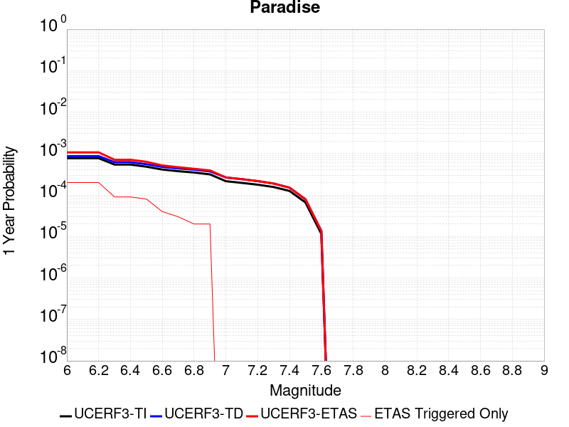 |  |

| Magnitude | 1 wk TI Prob | 1 wk TD Prob | 1 wk ETAS Prob | 1 wk ETAS/TD Gain | 1 wk ETAS Triggered Only | 1 mo TI Prob | 1 mo TD Prob | 1 mo ETAS Prob | 1 mo ETAS/TD Gain | 1 mo ETAS Triggered Only | 1 yr TI Prob | 1 yr TD Prob | 1 yr ETAS Prob | 1 yr ETAS/TD Gain | 1 yr ETAS Triggered Only | 10 yr TI Prob | 10 yr TD Prob | 10 yr ETAS Prob | 10 yr ETAS/TD Gain | 10 yr ETAS Triggered Only |
|-----|-----|-----|-----|-----|-----|-----|-----|-----|-----|-----|-----|-----|-----|-----|-----|-----|-----|-----|-----|-----|
| 6.0 | 1.4851273E-5 | 1.669466E-5 | 7.669366E-5 | 4.593904 | 6.0E-5 | 6.364676E-5 | 7.154671E-5 | 1.7153955E-4 | 2.3975883 | 1.0E-4 | 7.7462377E-4 | 8.707567E-4 | 0.0010705825 | 1.2294853 | 2.0E-4 | 0.0077192914 | 0.008675828 | 0.009062444 | 1.0445625 | 3.9E-4 |
| 6.1 | 1.4851273E-5 | 1.669466E-5 | 7.669366E-5 | 4.593904 | 6.0E-5 | 6.364676E-5 | 7.154671E-5 | 1.7153955E-4 | 2.3975883 | 1.0E-4 | 7.7462377E-4 | 8.707567E-4 | 0.0010705825 | 1.2294853 | 2.0E-4 | 0.0077192914 | 0.008675828 | 0.009062444 | 1.0445625 | 3.9E-4 |
| 6.2 | 1.4851273E-5 | 1.669466E-5 | 7.669366E-5 | 4.593904 | 6.0E-5 | 6.364676E-5 | 7.154671E-5 | 1.7153955E-4 | 2.3975883 | 1.0E-4 | 7.7462377E-4 | 8.707567E-4 | 0.0010705825 | 1.2294853 | 2.0E-4 | 0.0077192914 | 0.008675828 | 0.009062444 | 1.0445625 | 3.9E-4 |
| 6.3 | 1.0426831E-5 | 1.1888599E-5 | 4.188824E-5 | 3.523396 | 3.0E-5 | 4.4685654E-5 | 5.0950177E-5 | 9.094814E-5 | 1.7850407 | 4.0E-5 | 5.43912E-4 | 6.201478E-4 | 7.1009196E-4 | 1.1450367 | 9.0E-5 | 0.0054258266 | 0.0061847805 | 0.006363667 | 1.0289237 | 1.8E-4 |
| 6.4 | 1.0426831E-5 | 1.1888599E-5 | 4.188824E-5 | 3.523396 | 3.0E-5 | 4.4685654E-5 | 5.0950177E-5 | 9.094814E-5 | 1.7850407 | 4.0E-5 | 5.43912E-4 | 6.201478E-4 | 7.1009196E-4 | 1.1450367 | 9.0E-5 | 0.0054258266 | 0.0061847805 | 0.006363667 | 1.0289237 | 1.8E-4 |
| 6.5 | 9.25027E-6 | 1.061994E-5 | 4.0619623E-5 | 3.8248446 | 3.0E-5 | 3.964341E-5 | 4.5513265E-5 | 8.551145E-5 | 1.8788246 | 4.0E-5 | 4.8255164E-4 | 5.5398804E-4 | 6.339437E-4 | 1.1443274 | 8.0E-5 | 0.0048150513 | 0.0055265697 | 0.005655851 | 1.0233927 | 1.3E-4 |
| 6.6 | 7.904275E-6 | 9.159509E-6 | 9.159509E-6 | 1.0 | 0.0 | 3.3875025E-5 | 3.925447E-5 | 4.925408E-5 | 1.2547381 | 1.0E-5 | 4.1235037E-4 | 4.7782232E-4 | 5.178032E-4 | 1.0836731 | 4.0E-5 | 0.0041158604 | 0.0047683464 | 0.0048479647 | 1.0166973 | 8.0E-5 |
| 6.7 | 7.2061953E-6 | 8.407234E-6 | 8.407234E-6 | 1.0 | 0.0 | 3.088333E-5 | 3.6030528E-5 | 4.6030167E-5 | 1.2775325 | 1.0E-5 | 3.7593965E-4 | 4.3858704E-4 | 4.6857388E-4 | 1.0683714 | 3.0E-5 | 0.003753043 | 0.0043775835 | 0.004447277 | 1.0159205 | 7.0E-5 |
| 6.8 | 6.6948724E-6 | 7.842153E-6 | 7.842153E-6 | 1.0 | 0.0 | 2.8691995E-5 | 3.3608812E-5 | 3.3608812E-5 | 1.0 | 0.0 | 3.4926904E-4 | 4.0911406E-4 | 4.2910586E-4 | 1.0488662 | 2.0E-5 | 0.003487206 | 0.0040839664 | 0.004123803 | 1.0097544 | 4.0E-5 |
| 6.9 | 6.0421025E-6 | 7.1306094E-6 | 7.1306094E-6 | 1.0 | 0.0 | 2.5894467E-5 | 3.0559415E-5 | 3.0559415E-5 | 1.0 | 0.0 | 3.1521954E-4 | 3.7200077E-4 | 3.9199332E-4 | 1.0537434 | 2.0E-5 | 0.0031477278 | 0.0037141186 | 0.0037539701 | 1.0107297 | 4.0E-5 |
| 7.0 | 4.134091E-6 | 5.080301E-6 | 5.080301E-6 | 1.0 | 0.0 | 1.7717413E-5 | 2.1772545E-5 | 2.1772545E-5 | 1.0 | 0.0 | 2.1568815E-4 | 2.6505004E-4 | 2.6505004E-4 | 1.0 | 0.0 | 0.0021547892 | 0.002647492 | 0.002647492 | 1.0 | 0.0 |
| 7.1 | 3.7674888E-6 | 4.6318623E-6 | 4.6318623E-6 | 1.0 | 0.0 | 1.6146281E-5 | 1.9850695E-5 | 1.9850695E-5 | 1.0 | 0.0 | 1.9656324E-4 | 2.4165693E-4 | 2.4165693E-4 | 1.0 | 0.0 | 0.0019638946 | 0.0024140922 | 0.0024140922 | 1.0 | 0.0 |
| 7.2 | 3.4065345E-6 | 4.156717E-6 | 4.156717E-6 | 1.0 | 0.0 | 1.4599351E-5 | 1.7814387E-5 | 1.7814387E-5 | 1.0 | 0.0 | 1.777326E-4 | 2.1687007E-4 | 2.1687007E-4 | 1.0 | 0.0 | 0.0017759053 | 0.0021667324 | 0.0021667324 | 1.0 | 0.0 |
| 7.3 | 2.9934936E-6 | 3.6293113E-6 | 3.6293113E-6 | 1.0 | 0.0 | 1.2829195E-5 | 1.5554107E-5 | 1.5554107E-5 | 1.0 | 0.0 | 1.5618425E-4 | 1.8935627E-4 | 1.8935627E-4 | 1.0 | 0.0 | 0.0015607453 | 0.0018920946 | 0.0018920946 | 1.0 | 0.0 |
| 7.4 | 2.4049796E-6 | 2.8889801E-6 | 2.8889801E-6 | 1.0 | 0.0 | 1.0307015E-5 | 1.2381293E-5 | 1.2381293E-5 | 1.0 | 0.0 | 1.2548068E-4 | 1.5073326E-4 | 1.5073326E-4 | 1.0 | 0.0 | 0.0012540985 | 0.0015064516 | 0.0015064516 | 1.0 | 0.0 |
| 7.5 | 1.2710091E-6 | 1.5134664E-6 | 1.5134664E-6 | 1.0 | 0.0 | 5.44717E-6 | 6.486275E-6 | 6.486275E-6 | 1.0 | 0.0 | 6.631728E-5 | 7.896879E-5 | 7.896879E-5 | 1.0 | 0.0 | 6.6297496E-4 | 7.8952993E-4 | 7.8952993E-4 | 1.0 | 0.0 |
| 7.6 | 2.21172E-7 | 2.603958E-7 | 2.603958E-7 | 1.0 | 0.0 | 9.478797E-7 | 1.1159817E-6 | 1.1159817E-6 | 1.0 | 0.0 | 1.1540374E-5 | 1.3587022E-5 | 1.3587022E-5 | 1.0 | 0.0 | 1.1539775E-4 | 1.3586473E-4 | 1.3586473E-4 | 1.0 | 0.0 |

## Death Valley (Black Mtns Frontal)
*[(top)](#table-of-contents)*

| 1 Week | 1 Month | 1 Year | 10 Year |
|-----|-----|-----|-----|
|  |  |  |  |

| Magnitude | 1 wk TI Prob | 1 wk TD Prob | 1 wk ETAS Prob | 1 wk ETAS/TD Gain | 1 wk ETAS Triggered Only | 1 mo TI Prob | 1 mo TD Prob | 1 mo ETAS Prob | 1 mo ETAS/TD Gain | 1 mo ETAS Triggered Only | 1 yr TI Prob | 1 yr TD Prob | 1 yr ETAS Prob | 1 yr ETAS/TD Gain | 1 yr ETAS Triggered Only | 10 yr TI Prob | 10 yr TD Prob | 10 yr ETAS Prob | 10 yr ETAS/TD Gain | 10 yr ETAS Triggered Only |
|-----|-----|-----|-----|-----|-----|-----|-----|-----|-----|-----|-----|-----|-----|-----|-----|-----|-----|-----|-----|-----|
| 6.0 | 1.6707214E-5 | 1.867021E-5 | 6.866927E-5 | 3.678013 | 5.0E-5 | 7.160038E-5 | 8.0012775E-5 | 1.3000878E-4 | 1.6248503 | 5.0E-5 | 8.71386E-4 | 9.737278E-4 | 0.0010736304 | 1.1025981 | 1.0E-4 | 0.00867977 | 0.009695467 | 0.0098836245 | 1.0194068 | 1.9E-4 |
| 6.1 | 1.6707214E-5 | 1.867021E-5 | 6.866927E-5 | 3.678013 | 5.0E-5 | 7.160038E-5 | 8.0012775E-5 | 1.3000878E-4 | 1.6248503 | 5.0E-5 | 8.71386E-4 | 9.737278E-4 | 0.0010736304 | 1.1025981 | 1.0E-4 | 0.00867977 | 0.009695467 | 0.0098836245 | 1.0194068 | 1.9E-4 |
| 6.2 | 1.6707214E-5 | 1.867021E-5 | 6.866927E-5 | 3.678013 | 5.0E-5 | 7.160038E-5 | 8.0012775E-5 | 1.3000878E-4 | 1.6248503 | 5.0E-5 | 8.71386E-4 | 9.737278E-4 | 0.0010736304 | 1.1025981 | 1.0E-4 | 0.00867977 | 0.009695467 | 0.0098836245 | 1.0194068 | 1.9E-4 |
| 6.3 | 1.6707214E-5 | 1.867021E-5 | 6.866927E-5 | 3.678013 | 5.0E-5 | 7.160038E-5 | 8.0012775E-5 | 1.3000878E-4 | 1.6248503 | 5.0E-5 | 8.71386E-4 | 9.737278E-4 | 0.0010736304 | 1.1025981 | 1.0E-4 | 0.00867977 | 0.009695467 | 0.0098836245 | 1.0194068 | 1.9E-4 |
| 6.4 | 1.5515609E-5 | 1.733816E-5 | 5.7337464E-5 | 3.30701 | 4.0E-5 | 6.649377E-5 | 7.430431E-5 | 1.1430134E-4 | 1.5382868 | 4.0E-5 | 8.0926094E-4 | 9.0428564E-4 | 9.942043E-4 | 1.099436 | 9.0E-5 | 0.008063202 | 0.009006744 | 0.009185123 | 1.0198051 | 1.8E-4 |
| 6.5 | 1.5515609E-5 | 1.733816E-5 | 5.7337464E-5 | 3.30701 | 4.0E-5 | 6.649377E-5 | 7.430431E-5 | 1.1430134E-4 | 1.5382868 | 4.0E-5 | 8.0926094E-4 | 9.0428564E-4 | 9.942043E-4 | 1.099436 | 9.0E-5 | 0.008063202 | 0.009006744 | 0.009185123 | 1.0198051 | 1.8E-4 |
| 6.6 | 1.5041828E-5 | 1.6809092E-5 | 4.680859E-5 | 2.7847185 | 3.0E-5 | 6.4463384E-5 | 7.203701E-5 | 1.0203485E-4 | 1.4164226 | 3.0E-5 | 7.8455906E-4 | 8.767036E-4 | 9.566334E-4 | 1.0911709 | 8.0E-5 | 0.00781795 | 0.008733105 | 0.00890162 | 1.0192962 | 1.7E-4 |
| 6.7 | 1.4634985E-5 | 1.6355965E-5 | 4.6355475E-5 | 2.8341632 | 3.0E-5 | 6.271985E-5 | 7.009514E-5 | 1.00093035E-4 | 1.4279597 | 3.0E-5 | 7.6334673E-4 | 8.5307995E-4 | 9.330117E-4 | 1.0936978 | 8.0E-5 | 0.007607299 | 0.008498689 | 0.008647414 | 1.0174998 | 1.5E-4 |
| 6.8 | 1.4209158E-5 | 1.5881998E-5 | 4.588152E-5 | 2.8889012 | 3.0E-5 | 6.089497E-5 | 6.806396E-5 | 9.8061915E-5 | 1.4407319 | 3.0E-5 | 7.4114406E-4 | 8.283693E-4 | 9.08303E-4 | 1.0964953 | 8.0E-5 | 0.007386771 | 0.00825343 | 0.008402192 | 1.0180242 | 1.5E-4 |
| 6.9 | 1.3780098E-5 | 1.5404545E-5 | 4.5404082E-5 | 2.9474473 | 3.0E-5 | 5.9056227E-5 | 6.6017834E-5 | 9.601586E-5 | 1.4543927 | 3.0E-5 | 7.1877235E-4 | 8.034762E-4 | 8.8341197E-4 | 1.0994873 | 8.0E-5 | 0.0071645193 | 0.008006307 | 0.008155107 | 1.0185852 | 1.5E-4 |
| 7.0 | 1.3585064E-5 | 1.5188108E-5 | 4.518765E-5 | 2.9751997 | 3.0E-5 | 5.8220405E-5 | 6.5090295E-5 | 9.508834E-5 | 1.4608682 | 3.0E-5 | 7.086029E-4 | 7.9219165E-4 | 8.721283E-4 | 1.1009057 | 8.0E-5 | 0.007063476 | 0.007894269 | 0.008033164 | 1.0175943 | 1.4E-4 |
| 7.1 | 1.3398601E-5 | 1.4981292E-5 | 4.4980843E-5 | 3.0024674 | 3.0E-5 | 5.742131E-5 | 6.420399E-5 | 9.420206E-5 | 1.4672307 | 3.0E-5 | 6.9888023E-4 | 7.814087E-4 | 8.6134614E-4 | 1.1022992 | 8.0E-5 | 0.0069668638 | 0.0077871997 | 0.007916187 | 1.016564 | 1.3E-4 |
| 7.2 | 1.3126312E-5 | 1.4679515E-5 | 4.4679073E-5 | 3.0436344 | 3.0E-5 | 5.6254412E-5 | 6.2910716E-5 | 9.290883E-5 | 1.4768363 | 3.0E-5 | 6.846822E-4 | 7.656743E-4 | 8.356207E-4 | 1.0913527 | 7.0E-5 | 0.006825765 | 0.007630946 | 0.0077401064 | 1.014305 | 1.1E-4 |
| 7.3 | 1.2922429E-5 | 1.4453743E-5 | 4.4453307E-5 | 3.075557 | 3.0E-5 | 5.5380664E-5 | 6.194317E-5 | 9.1941314E-5 | 1.4842849 | 3.0E-5 | 6.74051E-4 | 7.5390254E-4 | 8.238498E-4 | 1.0927802 | 7.0E-5 | 0.006720101 | 0.007514031 | 0.0076232045 | 1.0145292 | 1.1E-4 |
| 7.4 | 1.2768878E-5 | 1.4283726E-5 | 4.4283297E-5 | 3.1002624 | 3.0E-5 | 5.4722615E-5 | 6.121456E-5 | 9.121273E-5 | 1.4900495 | 3.0E-5 | 6.660441E-4 | 7.4503786E-4 | 8.049932E-4 | 1.0804728 | 6.0E-5 | 0.0066405144 | 0.00742598 | 0.0075252373 | 1.0133662 | 1.0E-4 |
| 7.5 | 1.2521929E-5 | 1.401197E-5 | 4.401155E-5 | 3.1409965 | 3.0E-5 | 5.366431E-5 | 6.004995E-5 | 9.004815E-5 | 1.499554 | 3.0E-5 | 6.531671E-4 | 7.308683E-4 | 7.908245E-4 | 1.0820341 | 6.0E-5 | 0.006512506 | 0.007285223 | 0.007384494 | 1.0136265 | 1.0E-4 |
| 7.6 | 1.1301089E-5 | 1.2648108E-5 | 4.264773E-5 | 3.3718662 | 3.0E-5 | 4.8432343E-5 | 5.4205084E-5 | 8.420346E-5 | 1.5534236 | 3.0E-5 | 5.895042E-4 | 6.5975235E-4 | 7.1971276E-4 | 1.0908833 | 6.0E-5 | 0.0058794282 | 0.006578489 | 0.0066778315 | 1.0151011 | 1.0E-4 |
| 7.7 | 9.189108E-6 | 1.02833255E-5 | 3.028312E-5 | 2.9448762 | 2.0E-5 | 3.93813E-5 | 4.407068E-5 | 6.40698E-5 | 1.4537965 | 2.0E-5 | 4.7936183E-4 | 5.364335E-4 | 5.864066E-4 | 1.0931582 | 5.0E-5 | 0.004783291 | 0.005351897 | 0.0054314686 | 1.014868 | 8.0E-5 |
| 7.8 | 3.4586725E-7 | 3.648256E-7 | 3.648256E-7 | 1.0 | 0.0 | 1.4822873E-6 | 1.5635374E-6 | 1.5635374E-6 | 1.0 | 0.0 | 1.80467E-5 | 1.9035906E-5 | 2.9035715E-5 | 1.525313 | 1.0E-5 | 1.8045233E-4 | 1.903432E-4 | 2.003413E-4 | 1.0525267 | 1.0E-5 |
| 7.9 | 2.5591178E-9 | 2.6696687E-9 | 2.6696687E-9 | 1.0 | 0.0 | 1.0967647E-8 | 1.1441437E-8 | 1.1441437E-8 | 1.0 | 0.0 | 1.335311E-7 | 1.392995E-7 | 1.392995E-7 | 1.0 | 0.0 | 1.3353102E-6 | 1.3929949E-6 | 1.3929949E-6 | 1.0 | 0.0 |

## Coyote Lake
*[(top)](#table-of-contents)*

| 1 Week | 1 Month | 1 Year | 10 Year |
|-----|-----|-----|-----|
|  |  |  |  |

| Magnitude | 1 wk TI Prob | 1 wk TD Prob | 1 wk ETAS Prob | 1 wk ETAS/TD Gain | 1 wk ETAS Triggered Only | 1 mo TI Prob | 1 mo TD Prob | 1 mo ETAS Prob | 1 mo ETAS/TD Gain | 1 mo ETAS Triggered Only | 1 yr TI Prob | 1 yr TD Prob | 1 yr ETAS Prob | 1 yr ETAS/TD Gain | 1 yr ETAS Triggered Only | 10 yr TI Prob | 10 yr TD Prob | 10 yr ETAS Prob | 10 yr ETAS/TD Gain | 10 yr ETAS Triggered Only |
|-----|-----|-----|-----|-----|-----|-----|-----|-----|-----|-----|-----|-----|-----|-----|-----|-----|-----|-----|-----|-----|
| 6.0 | 1.980352E-5 | 2.170669E-5 | 3.1706473E-5 | 1.4606775 | 1.0E-5 | 8.486947E-5 | 9.302576E-5 | 1.4302111E-4 | 1.5374355 | 5.0E-5 | 0.0010327959 | 0.0011320722 | 0.0012419476 | 1.097057 | 1.1E-4 | 0.010280091 | 0.01127023 | 0.011448201 | 1.0157913 | 1.8E-4 |
| 6.1 | 1.980352E-5 | 2.170669E-5 | 3.1706473E-5 | 1.4606775 | 1.0E-5 | 8.486947E-5 | 9.302576E-5 | 1.4302111E-4 | 1.5374355 | 5.0E-5 | 0.0010327959 | 0.0011320722 | 0.0012419476 | 1.097057 | 1.1E-4 | 0.010280091 | 0.01127023 | 0.011448201 | 1.0157913 | 1.8E-4 |
| 6.2 | 1.980352E-5 | 2.170669E-5 | 3.1706473E-5 | 1.4606775 | 1.0E-5 | 8.486947E-5 | 9.302576E-5 | 1.4302111E-4 | 1.5374355 | 5.0E-5 | 0.0010327959 | 0.0011320722 | 0.0012419476 | 1.097057 | 1.1E-4 | 0.010280091 | 0.01127023 | 0.011448201 | 1.0157913 | 1.8E-4 |
| 6.3 | 1.5344787E-5 | 1.6820626E-5 | 2.6820459E-5 | 1.5944982 | 1.0E-5 | 6.576172E-5 | 7.2086754E-5 | 1.12083864E-4 | 1.554847 | 4.0E-5 | 8.003548E-4 | 8.77364E-4 | 9.572938E-4 | 1.0911022 | 8.0E-5 | 0.007974784 | 0.008745047 | 0.00887391 | 1.0147356 | 1.3E-4 |
| 6.4 | 1.5344787E-5 | 1.6820626E-5 | 2.6820459E-5 | 1.5944982 | 1.0E-5 | 6.576172E-5 | 7.2086754E-5 | 1.12083864E-4 | 1.554847 | 4.0E-5 | 8.003548E-4 | 8.77364E-4 | 9.572938E-4 | 1.0911022 | 8.0E-5 | 0.007974784 | 0.008745047 | 0.00887391 | 1.0147356 | 1.3E-4 |
| 6.5 | 1.4189697E-5 | 1.5557947E-5 | 2.555779E-5 | 1.6427484 | 1.0E-5 | 6.081157E-5 | 6.667555E-5 | 1.0667289E-4 | 1.5998801 | 4.0E-5 | 7.401293E-4 | 8.115328E-4 | 8.9146785E-4 | 1.098499 | 8.0E-5 | 0.0073766913 | 0.008091635 | 0.008220583 | 1.015936 | 1.3E-4 |
| 6.6 | 1.3469301E-5 | 1.4771539E-5 | 2.4771392E-5 | 1.6769675 | 1.0E-5 | 5.7724297E-5 | 6.33054E-5 | 1.0330287E-4 | 1.6318177 | 4.0E-5 | 7.025667E-4 | 7.7053066E-4 | 8.50469E-4 | 1.1037445 | 8.0E-5 | 0.0070034964 | 0.0076844944 | 0.007813496 | 1.0167872 | 1.3E-4 |
| 6.7 | 1.3027966E-5 | 1.4281708E-5 | 2.4281566E-5 | 1.7001864 | 1.0E-5 | 5.5832945E-5 | 6.120622E-5 | 1.01203776E-4 | 1.6534883 | 4.0E-5 | 6.7955407E-4 | 7.449907E-4 | 8.2493114E-4 | 1.1073039 | 8.0E-5 | 0.006774798 | 0.0074308095 | 0.007559844 | 1.0173647 | 1.3E-4 |
| 6.8 | 5.695434E-6 | 6.2244026E-6 | 6.2244026E-6 | 1.0 | 0.0 | 2.4408775E-5 | 2.6675907E-5 | 3.667564E-5 | 1.3748602 | 1.0E-5 | 2.971363E-4 | 3.2476074E-4 | 3.347575E-4 | 1.0307819 | 1.0E-5 | 0.0029673933 | 0.0032458024 | 0.0032557698 | 1.003071 | 1.0E-5 |
| 6.9 | 4.385688E-6 | 4.7930434E-6 | 4.7930434E-6 | 1.0 | 0.0 | 1.879567E-5 | 2.0541615E-5 | 3.054141E-5 | 1.4868066 | 1.0E-5 | 2.2881327E-4 | 2.5009416E-4 | 2.6009165E-4 | 1.0399749 | 1.0E-5 | 0.002285778 | 0.0025009417 | 0.0025109167 | 1.0039885 | 1.0E-5 |

## Helendale-So Lockhart
*[(top)](#table-of-contents)*

| 1 Week | 1 Month | 1 Year | 10 Year |
|-----|-----|-----|-----|
|  |  |  |  |

| Magnitude | 1 wk TI Prob | 1 wk TD Prob | 1 wk ETAS Prob | 1 wk ETAS/TD Gain | 1 wk ETAS Triggered Only | 1 mo TI Prob | 1 mo TD Prob | 1 mo ETAS Prob | 1 mo ETAS/TD Gain | 1 mo ETAS Triggered Only | 1 yr TI Prob | 1 yr TD Prob | 1 yr ETAS Prob | 1 yr ETAS/TD Gain | 1 yr ETAS Triggered Only | 10 yr TI Prob | 10 yr TD Prob | 10 yr ETAS Prob | 10 yr ETAS/TD Gain | 10 yr ETAS Triggered Only |
|-----|-----|-----|-----|-----|-----|-----|-----|-----|-----|-----|-----|-----|-----|-----|-----|-----|-----|-----|-----|-----|
| 6.0 | 1.7296055E-5 | 1.8103707E-5 | 4.8103164E-5 | 2.6570892 | 3.0E-5 | 7.412385E-5 | 7.758512E-5 | 1.075828E-4 | 1.3866421 | 3.0E-5 | 9.0208417E-4 | 9.442103E-4 | 0.0010441159 | 1.1058086 | 1.0E-4 | 0.008984311 | 0.009404104 | 0.009572506 | 1.0179073 | 1.7E-4 |
| 6.1 | 1.7296055E-5 | 1.8103707E-5 | 4.8103164E-5 | 2.6570892 | 3.0E-5 | 7.412385E-5 | 7.758512E-5 | 1.075828E-4 | 1.3866421 | 3.0E-5 | 9.0208417E-4 | 9.442103E-4 | 0.0010441159 | 1.1058086 | 1.0E-4 | 0.008984311 | 0.009404104 | 0.009572506 | 1.0179073 | 1.7E-4 |
| 6.2 | 1.7296055E-5 | 1.8103707E-5 | 4.8103164E-5 | 2.6570892 | 3.0E-5 | 7.412385E-5 | 7.758512E-5 | 1.075828E-4 | 1.3866421 | 3.0E-5 | 9.0208417E-4 | 9.442103E-4 | 0.0010441159 | 1.1058086 | 1.0E-4 | 0.008984311 | 0.009404104 | 0.009572506 | 1.0179073 | 1.7E-4 |
| 6.3 | 1.0669118E-5 | 1.1135411E-5 | 2.11353E-5 | 1.898026 | 1.0E-5 | 4.5723988E-5 | 4.7722333E-5 | 5.7721856E-5 | 1.2095355 | 1.0E-5 | 5.5654737E-4 | 5.8086734E-4 | 6.108499E-4 | 1.0516169 | 3.0E-5 | 0.0055515557 | 0.0057937866 | 0.005863381 | 1.0120119 | 7.0E-5 |
| 6.4 | 1.0669118E-5 | 1.1135411E-5 | 2.11353E-5 | 1.898026 | 1.0E-5 | 4.5723988E-5 | 4.7722333E-5 | 5.7721856E-5 | 1.2095355 | 1.0E-5 | 5.5654737E-4 | 5.8086734E-4 | 6.108499E-4 | 1.0516169 | 3.0E-5 | 0.0055515557 | 0.0057937866 | 0.005863381 | 1.0120119 | 7.0E-5 |
| 6.5 | 8.790038E-6 | 9.170186E-6 | 1.9170095E-5 | 2.0904803 | 1.0E-5 | 3.767105E-5 | 3.9300216E-5 | 4.9299822E-5 | 1.2544415 | 1.0E-5 | 4.585485E-4 | 4.783766E-4 | 4.9836707E-4 | 1.0417881 | 2.0E-5 | 0.0045760344 | 0.004773633 | 0.004823394 | 1.0104243 | 5.0E-5 |
| 6.6 | 7.396949E-6 | 7.715528E-6 | 1.771545E-5 | 2.2960775 | 1.0E-5 | 3.1700827E-5 | 3.3066135E-5 | 4.3065804E-5 | 1.3024142 | 1.0E-5 | 3.858892E-4 | 4.0250685E-4 | 4.1250282E-4 | 1.0248343 | 1.0E-5 | 0.003852198 | 0.0040178853 | 0.0040577245 | 1.0099155 | 4.0E-5 |
| 6.7 | 6.4600285E-6 | 6.7380233E-6 | 1.6737957E-5 | 2.4841049 | 1.0E-5 | 2.7685543E-5 | 2.8876928E-5 | 3.887664E-5 | 1.3462873 | 1.0E-5 | 3.3701936E-4 | 3.5152066E-4 | 3.6151713E-4 | 1.0284379 | 1.0E-5 | 0.0033650869 | 0.003509728 | 0.0035495874 | 1.011357 | 4.0E-5 |
| 6.8 | 5.600104E-6 | 5.836003E-6 | 1.5835945E-5 | 2.7134917 | 1.0E-5 | 2.4000226E-5 | 2.5011204E-5 | 3.5010955E-5 | 1.3998108 | 1.0E-5 | 2.9216358E-4 | 3.0446946E-4 | 3.1446642E-4 | 1.032834 | 1.0E-5 | 0.0029177975 | 0.0030405847 | 0.003080463 | 1.0131154 | 4.0E-5 |
| 6.9 | 4.839122E-6 | 5.039504E-6 | 1.50394535E-5 | 2.9843123 | 1.0E-5 | 2.0738931E-5 | 2.1597696E-5 | 3.159748E-5 | 1.4630023 | 1.0E-5 | 2.5246723E-4 | 2.629207E-4 | 2.7291806E-4 | 1.0380243 | 1.0E-5 | 0.002521806 | 0.0026261439 | 0.0026560652 | 1.0113935 | 3.0E-5 |
| 7.0 | 3.6937633E-6 | 3.845204E-6 | 1.3845165E-5 | 3.6006324 | 1.0E-5 | 1.5830317E-5 | 1.6479342E-5 | 2.6479178E-5 | 1.6068103 | 1.0E-5 | 1.9271708E-4 | 2.0061784E-4 | 2.1061584E-4 | 1.049836 | 1.0E-5 | 0.0019255003 | 0.0020043987 | 0.0020343387 | 1.014937 | 3.0E-5 |
| 7.1 | 2.7858857E-6 | 2.8978507E-6 | 1.2897822E-5 | 4.4508233 | 1.0E-5 | 1.1939455E-5 | 1.2419302E-5 | 2.2419177E-5 | 1.8051882 | 1.0E-5 | 1.4535317E-4 | 1.5119473E-4 | 1.6119321E-4 | 1.0661299 | 1.0E-5 | 0.0014525814 | 0.0015109401 | 0.0015309099 | 1.0132167 | 2.0E-5 |
| 7.2 | 2.1672065E-6 | 2.2540103E-6 | 1.2253988E-5 | 5.436527 | 1.0E-5 | 9.2879945E-6 | 9.66001E-6 | 1.9659914E-5 | 2.0351856 | 1.0E-5 | 1.1307546E-4 | 1.1760445E-4 | 1.2760329E-4 | 1.0850208 | 1.0E-5 | 0.0011301794 | 0.0011754404 | 0.0011954169 | 1.016995 | 2.0E-5 |
| 7.3 | 1.4823496E-6 | 1.5422086E-6 | 1.5422086E-6 | 1.0 | 0.0 | 6.3529114E-6 | 6.6094494E-6 | 6.6094494E-6 | 1.0 | 0.0 | 7.734395E-5 | 8.046723E-5 | 8.046723E-5 | 1.0 | 0.0 | 7.731704E-4 | 8.04396E-4 | 8.14388E-4 | 1.0124217 | 1.0E-5 |
| 7.4 | 4.2321457E-7 | 4.4108717E-7 | 4.4108717E-7 | 1.0 | 0.0 | 1.8137755E-6 | 1.8903725E-6 | 1.8903725E-6 | 1.0 | 0.0 | 2.2082493E-5 | 2.3015087E-5 | 2.3015087E-5 | 1.0 | 0.0 | 2.2080299E-4 | 2.3013157E-4 | 2.3013157E-4 | 1.0 | 0.0 |
| 7.5 | 5.6942316E-8 | 5.9415576E-8 | 5.9415576E-8 | 1.0 | 0.0 | 2.440385E-7 | 2.5463817E-7 | 2.5463817E-7 | 1.0 | 0.0 | 2.9711643E-6 | 3.1002162E-6 | 3.1002162E-6 | 1.0 | 0.0 | 2.9711247E-5 | 3.1001808E-5 | 3.1001808E-5 | 1.0 | 0.0 |

## San Andreas (San Bernardino S)
*[(top)](#table-of-contents)*

| 1 Week | 1 Month | 1 Year | 10 Year |
|-----|-----|-----|-----|
|  |  |  |  |

| Magnitude | 1 wk TI Prob | 1 wk TD Prob | 1 wk ETAS Prob | 1 wk ETAS/TD Gain | 1 wk ETAS Triggered Only | 1 mo TI Prob | 1 mo TD Prob | 1 mo ETAS Prob | 1 mo ETAS/TD Gain | 1 mo ETAS Triggered Only | 1 yr TI Prob | 1 yr TD Prob | 1 yr ETAS Prob | 1 yr ETAS/TD Gain | 1 yr ETAS Triggered Only | 10 yr TI Prob | 10 yr TD Prob | 10 yr ETAS Prob | 10 yr ETAS/TD Gain | 10 yr ETAS Triggered Only |
|-----|-----|-----|-----|-----|-----|-----|-----|-----|-----|-----|-----|-----|-----|-----|-----|-----|-----|-----|-----|-----|
| 6.0 | 1.2336002E-4 | 3.0003127E-4 | 3.500163E-4 | 1.1665993 | 5.0E-5 | 5.2857865E-4 | 0.0012852408 | 0.0013551508 | 1.0543945 | 7.0E-5 | 0.006416472 | 0.015540493 | 0.015609405 | 1.0044343 | 7.0E-5 | 0.06234337 | 0.14283332 | 0.14294475 | 1.0007801 | 1.3E-4 |
| 6.1 | 1.2336002E-4 | 3.0003127E-4 | 3.500163E-4 | 1.1665993 | 5.0E-5 | 5.2857865E-4 | 0.0012852408 | 0.0013551508 | 1.0543945 | 7.0E-5 | 0.006416472 | 0.015540493 | 0.015609405 | 1.0044343 | 7.0E-5 | 0.06234337 | 0.14283332 | 0.14294475 | 1.0007801 | 1.3E-4 |
| 6.2 | 1.2336002E-4 | 3.0003127E-4 | 3.500163E-4 | 1.1665993 | 5.0E-5 | 5.2857865E-4 | 0.0012852408 | 0.0013551508 | 1.0543945 | 7.0E-5 | 0.006416472 | 0.015540493 | 0.015609405 | 1.0044343 | 7.0E-5 | 0.06234337 | 0.14283332 | 0.14294475 | 1.0007801 | 1.3E-4 |
| 6.3 | 1.1712257E-4 | 2.879145E-4 | 3.379001E-4 | 1.1736127 | 5.0E-5 | 5.018573E-4 | 0.0012333614 | 0.0013032751 | 1.0566854 | 7.0E-5 | 0.006093008 | 0.014917629 | 0.014986585 | 1.0046225 | 7.0E-5 | 0.059286322 | 0.1375418 | 0.13765392 | 1.0008152 | 1.3E-4 |
| 6.4 | 1.1712257E-4 | 2.879145E-4 | 3.379001E-4 | 1.1736127 | 5.0E-5 | 5.018573E-4 | 0.0012333614 | 0.0013032751 | 1.0566854 | 7.0E-5 | 0.006093008 | 0.014917629 | 0.014986585 | 1.0046225 | 7.0E-5 | 0.059286322 | 0.1375418 | 0.13765392 | 1.0008152 | 1.3E-4 |
| 6.5 | 1.0689076E-4 | 2.6804334E-4 | 3.1802992E-4 | 1.186487 | 5.0E-5 | 4.5802278E-4 | 0.0011482761 | 0.0012181958 | 1.0608909 | 7.0E-5 | 0.0055621783 | 0.013895263 | 0.01396429 | 1.0049677 | 7.0E-5 | 0.05425003 | 0.12878914 | 0.1289024 | 1.0008794 | 1.3E-4 |
| 6.6 | 9.7648895E-5 | 2.5049172E-4 | 3.0047918E-4 | 1.1995574 | 5.0E-5 | 4.1842813E-4 | 0.0010731178 | 0.0011430427 | 1.0651605 | 7.0E-5 | 0.005082469 | 0.012991305 | 0.013060397 | 1.0053182 | 7.0E-5 | 0.049677886 | 0.12094915 | 0.121063426 | 1.0009449 | 1.3E-4 |
| 6.7 | 8.757013E-5 | 2.3119988E-4 | 2.8118832E-4 | 1.2162131 | 5.0E-5 | 3.7524657E-4 | 9.905027E-4 | 0.0010604333 | 1.0706012 | 7.0E-5 | 0.00455906 | 0.011996774 | 0.012065934 | 1.005765 | 7.0E-5 | 0.04466656 | 0.11225749 | 0.11237289 | 1.0010281 | 1.3E-4 |
| 6.8 | 8.562978E-5 | 2.2679876E-4 | 2.767874E-4 | 1.2204098 | 5.0E-5 | 3.6693315E-4 | 9.7165484E-4 | 0.0010415867 | 1.071972 | 7.0E-5 | 0.004458263 | 0.011769796 | 0.011838972 | 1.0058774 | 7.0E-5 | 0.043698758 | 0.11026781 | 0.11038347 | 1.0010489 | 1.3E-4 |
| 6.9 | 6.124075E-5 | 1.7064936E-4 | 2.2064082E-4 | 1.2929485 | 5.0E-5 | 2.6243398E-4 | 7.311502E-4 | 8.0109906E-4 | 1.0956695 | 7.0E-5 | 0.0031904527 | 0.008865628 | 0.008935007 | 1.0078256 | 7.0E-5 | 0.031450346 | 0.08417915 | 0.084289044 | 1.0013056 | 1.2E-4 |
| 7.0 | 5.8598747E-5 | 1.6493963E-4 | 2.1493138E-4 | 1.3030912 | 5.0E-5 | 2.5111332E-4 | 7.0669345E-4 | 7.76644E-4 | 1.0989828 | 7.0E-5 | 0.0030530186 | 0.008570245 | 0.008639645 | 1.0080978 | 7.0E-5 | 0.03011414 | 0.08149692 | 0.08160713 | 1.0013524 | 1.2E-4 |
| 7.1 | 5.613814E-5 | 1.5912524E-4 | 2.0911728E-4 | 1.314168 | 5.0E-5 | 2.4056983E-4 | 6.817878E-4 | 7.5174007E-4 | 1.1026013 | 7.0E-5 | 0.0029250039 | 0.008269355 | 0.0083387755 | 1.008395 | 7.0E-5 | 0.028868021 | 0.07879588 | 0.078906424 | 1.001403 | 1.2E-4 |
| 7.2 | 4.991222E-5 | 1.4519015E-4 | 1.9518289E-4 | 1.344326 | 5.0E-5 | 2.1389198E-4 | 6.220955E-4 | 6.9205195E-4 | 1.1124529 | 7.0E-5 | 0.002601025 | 0.007547813 | 0.0076172845 | 1.0092043 | 7.0E-5 | 0.025707912 | 0.072249845 | 0.07236117 | 1.0015409 | 1.2E-4 |
| 7.3 | 4.7410045E-5 | 1.371324E-4 | 1.8712555E-4 | 1.3645611 | 5.0E-5 | 2.0317009E-4 | 5.875783E-4 | 6.5753714E-4 | 1.119063 | 7.0E-5 | 0.0024707897 | 0.007130386 | 0.0071998867 | 1.0097471 | 7.0E-5 | 0.024434982 | 0.06853227 | 0.06864405 | 1.001631 | 1.2E-4 |
| 7.4 | 4.5556746E-5 | 1.3121162E-4 | 1.7120637E-4 | 1.304811 | 4.0E-5 | 1.952286E-4 | 5.6221464E-4 | 6.2218093E-4 | 1.1066608 | 6.0E-5 | 0.002374317 | 0.006823559 | 0.0068831495 | 1.008733 | 6.0E-5 | 0.023491086 | 0.06578475 | 0.06588751 | 1.0015621 | 1.1E-4 |
| 7.5 | 4.3084514E-5 | 1.2356513E-4 | 1.635602E-4 | 1.3236759 | 4.0E-5 | 1.8463485E-4 | 5.2945764E-4 | 5.894259E-4 | 1.1132635 | 6.0E-5 | 0.0022456115 | 0.006427166 | 0.0064867805 | 1.0092753 | 6.0E-5 | 0.022230545 | 0.062185578 | 0.062288735 | 1.0016589 | 1.1E-4 |
| 7.6 | 3.408608E-5 | 9.834847E-5 | 1.3834453E-4 | 1.406677 | 4.0E-5 | 1.4607502E-4 | 4.2142547E-4 | 4.8140017E-4 | 1.142314 | 6.0E-5 | 0.0017770125 | 0.00511881 | 0.0051785028 | 1.0116615 | 6.0E-5 | 0.017628696 | 0.050017312 | 0.05012181 | 1.0020893 | 1.1E-4 |
| 7.7 | 2.8315713E-5 | 8.2480474E-5 | 1.2247717E-4 | 1.4849232 | 4.0E-5 | 1.2134742E-4 | 3.534399E-4 | 4.134187E-4 | 1.1697001 | 6.0E-5 | 0.0014764034 | 0.004294649 | 0.0043543917 | 1.0139109 | 6.0E-5 | 0.01466633 | 0.04226858 | 0.042373933 | 1.0024924 | 1.1E-4 |
| 7.8 | 2.6222975E-5 | 7.462497E-5 | 1.1462199E-4 | 1.5359735 | 4.0E-5 | 1.1237934E-4 | 3.1978212E-4 | 3.7976293E-4 | 1.1875677 | 6.0E-5 | 0.0013673597 | 0.003886403 | 0.0039461697 | 1.0153785 | 6.0E-5 | 0.013589768 | 0.038434092 | 0.038539864 | 1.0027521 | 1.1E-4 |
| 7.9 | 2.1469694E-5 | 5.7873713E-5 | 8.787197E-5 | 1.5183401 | 3.0E-5 | 9.200973E-5 | 2.4800663E-4 | 2.9799424E-4 | 1.2015575 | 5.0E-5 | 0.0011196428 | 0.003015303 | 0.0030651523 | 1.0165321 | 5.0E-5 | 0.011140184 | 0.03014987 | 0.030246854 | 1.0032167 | 1.0E-4 |
| 8.0 | 1.2420249E-5 | 3.1316227E-5 | 4.1315914E-5 | 1.3193133 | 1.0E-5 | 5.322855E-5 | 1.342055E-4 | 1.4420417E-4 | 1.0745026 | 1.0E-5 | 6.478649E-4 | 0.0016327285 | 0.0016427122 | 1.0061147 | 1.0E-5 | 0.0064597935 | 0.01652123 | 0.016550735 | 1.0017859 | 3.0E-5 |
| 8.1 | 4.9197724E-6 | 7.82136E-6 | 7.82136E-6 | 1.0 | 0.0 | 2.1084568E-5 | 3.3519682E-5 | 3.3519682E-5 | 1.0 | 0.0 | 2.566744E-4 | 4.0802584E-4 | 4.0802584E-4 | 1.0 | 0.0 | 0.002563781 | 0.004383873 | 0.004383873 | 1.0 | 0.0 |
| 8.2 | 2.5634774E-6 | 2.9062624E-6 | 2.9062624E-6 | 1.0 | 0.0 | 1.0986286E-5 | 1.2455351E-5 | 1.2455351E-5 | 1.0 | 0.0 | 1.3374983E-4 | 1.5163339E-4 | 1.5163339E-4 | 1.0 | 0.0 | 0.0013366934 | 0.001704734 | 0.001704734 | 1.0 | 0.0 |
| 8.3 | 5.2850464E-7 | 3.2082596E-7 | 3.2082596E-7 | 1.0 | 0.0 | 2.2650179E-6 | 1.3749678E-6 | 1.3749678E-6 | 1.0 | 0.0 | 2.7576245E-5 | 1.6740116E-5 | 1.6740116E-5 | 1.0 | 0.0 | 2.7572823E-4 | 1.9866871E-4 | 1.9866871E-4 | 1.0 | 0.0 |

## San Andreas (Big Bend)
*[(top)](#table-of-contents)*

| 1 Week | 1 Month | 1 Year | 10 Year |
|-----|-----|-----|-----|
|  |  |  |  |

| Magnitude | 1 wk TI Prob | 1 wk TD Prob | 1 wk ETAS Prob | 1 wk ETAS/TD Gain | 1 wk ETAS Triggered Only | 1 mo TI Prob | 1 mo TD Prob | 1 mo ETAS Prob | 1 mo ETAS/TD Gain | 1 mo ETAS Triggered Only | 1 yr TI Prob | 1 yr TD Prob | 1 yr ETAS Prob | 1 yr ETAS/TD Gain | 1 yr ETAS Triggered Only | 10 yr TI Prob | 10 yr TD Prob | 10 yr ETAS Prob | 10 yr ETAS/TD Gain | 10 yr ETAS Triggered Only |
|-----|-----|-----|-----|-----|-----|-----|-----|-----|-----|-----|-----|-----|-----|-----|-----|-----|-----|-----|-----|-----|
| 6.0 | 1.0179969E-4 | 2.0070563E-4 | 2.2070162E-4 | 1.0996284 | 2.0E-5 | 4.362114E-4 | 8.598845E-4 | 8.7986724E-4 | 1.0232389 | 2.0E-5 | 0.0052979486 | 0.010419123 | 0.010448811 | 1.0028493 | 3.0E-5 | 0.051734097 | 0.10144164 | 0.10154048 | 1.0009744 | 1.1E-4 |
| 6.1 | 1.0179969E-4 | 2.0070563E-4 | 2.2070162E-4 | 1.0996284 | 2.0E-5 | 4.362114E-4 | 8.598845E-4 | 8.7986724E-4 | 1.0232389 | 2.0E-5 | 0.0052979486 | 0.010419123 | 0.010448811 | 1.0028493 | 3.0E-5 | 0.051734097 | 0.10144164 | 0.10154048 | 1.0009744 | 1.1E-4 |
| 6.2 | 1.0179969E-4 | 2.0070563E-4 | 2.2070162E-4 | 1.0996284 | 2.0E-5 | 4.362114E-4 | 8.598845E-4 | 8.7986724E-4 | 1.0232389 | 2.0E-5 | 0.0052979486 | 0.010419123 | 0.010448811 | 1.0028493 | 3.0E-5 | 0.051734097 | 0.10144164 | 0.10154048 | 1.0009744 | 1.1E-4 |
| 6.3 | 1.0179969E-4 | 2.0070563E-4 | 2.2070162E-4 | 1.0996284 | 2.0E-5 | 4.362114E-4 | 8.598845E-4 | 8.7986724E-4 | 1.0232389 | 2.0E-5 | 0.0052979486 | 0.010419123 | 0.010448811 | 1.0028493 | 3.0E-5 | 0.051734097 | 0.10144164 | 0.10154048 | 1.0009744 | 1.1E-4 |
| 6.4 | 9.1639464E-5 | 1.842787E-4 | 1.9427686E-4 | 1.0542556 | 1.0E-5 | 3.9268145E-4 | 7.89527E-4 | 7.995191E-4 | 1.0126559 | 1.0E-5 | 0.0047704205 | 0.009570243 | 0.009580147 | 1.0010349 | 1.0E-5 | 0.046693064 | 0.09376797 | 0.093804225 | 1.0003866 | 4.0E-5 |
| 6.5 | 9.1639464E-5 | 1.842787E-4 | 1.9427686E-4 | 1.0542556 | 1.0E-5 | 3.9268145E-4 | 7.89527E-4 | 7.995191E-4 | 1.0126559 | 1.0E-5 | 0.0047704205 | 0.009570243 | 0.009580147 | 1.0010349 | 1.0E-5 | 0.046693064 | 0.09376797 | 0.093804225 | 1.0003866 | 4.0E-5 |
| 6.6 | 9.042622E-5 | 1.8234932E-4 | 1.9234749E-4 | 1.0548298 | 1.0E-5 | 3.8748336E-4 | 7.812632E-4 | 7.9125544E-4 | 1.0127897 | 1.0E-5 | 0.0047074095 | 0.009470508 | 0.009480413 | 1.001046 | 1.0E-5 | 0.046089325 | 0.09286199 | 0.09289827 | 1.0003908 | 4.0E-5 |
| 6.7 | 8.9836685E-5 | 1.814927E-4 | 1.9149088E-4 | 1.0550886 | 1.0E-5 | 3.8495753E-4 | 7.7759416E-4 | 7.875864E-4 | 1.0128502 | 1.0E-5 | 0.00467679 | 0.009426224 | 0.00943613 | 1.0010508 | 1.0E-5 | 0.045795817 | 0.09245627 | 0.092492566 | 1.0003927 | 4.0E-5 |
| 6.8 | 8.9471854E-5 | 1.8096055E-4 | 1.9095873E-4 | 1.0552506 | 1.0E-5 | 3.8339442E-4 | 7.7531487E-4 | 7.853071E-4 | 1.012888 | 1.0E-5 | 0.004657841 | 0.009398713 | 0.009408619 | 1.0010539 | 1.0E-5 | 0.04561414 | 0.092203476 | 0.09223979 | 1.0003939 | 4.0E-5 |
| 6.9 | 8.858234E-5 | 1.797803E-4 | 1.897785E-4 | 1.0556134 | 1.0E-5 | 3.7958333E-4 | 7.7025965E-4 | 7.80252E-4 | 1.0129726 | 1.0E-5 | 0.004611638 | 0.009337694 | 0.009347601 | 1.001061 | 1.0E-5 | 0.04517103 | 0.0916436 | 0.09167994 | 1.0003965 | 4.0E-5 |
| 7.0 | 8.7433385E-5 | 1.7816834E-4 | 1.8816655E-4 | 1.0561167 | 1.0E-5 | 3.746607E-4 | 7.633553E-4 | 7.733477E-4 | 1.01309 | 1.0E-5 | 0.004551957 | 0.009254351 | 0.009264259 | 1.0010706 | 1.0E-5 | 0.044598386 | 0.090878054 | 0.09091442 | 1.0004002 | 4.0E-5 |
| 7.1 | 8.684964E-5 | 1.7728789E-4 | 1.8728612E-4 | 1.0563954 | 1.0E-5 | 3.7215967E-4 | 7.595842E-4 | 7.6957664E-4 | 1.0131551 | 1.0E-5 | 0.0045216335 | 0.009208827 | 0.009218735 | 1.0010759 | 1.0E-5 | 0.04430731 | 0.09045961 | 0.09049599 | 1.0004022 | 4.0E-5 |
| 7.2 | 8.606521E-5 | 1.7619408E-4 | 1.8619231E-4 | 1.0567456 | 1.0E-5 | 3.6879873E-4 | 7.548991E-4 | 7.6489156E-4 | 1.0132368 | 1.0E-5 | 0.0044808835 | 0.009152266 | 0.0091621755 | 1.0010827 | 1.0E-5 | 0.043916024 | 0.08994013 | 0.08997653 | 1.0004047 | 4.0E-5 |
| 7.3 | 8.568266E-5 | 1.7561417E-4 | 1.8561241E-4 | 1.056933 | 1.0E-5 | 3.6715972E-4 | 7.524153E-4 | 7.624077E-4 | 1.0132805 | 1.0E-5 | 0.0044610105 | 0.0091222795 | 0.009132188 | 1.0010862 | 1.0E-5 | 0.043725148 | 0.0896613 | 0.08969771 | 1.0004061 | 4.0E-5 |
| 7.4 | 8.5432206E-5 | 1.7524007E-4 | 1.8523831E-4 | 1.0570545 | 1.0E-5 | 3.6608664E-4 | 7.508129E-4 | 7.608054E-4 | 1.0133089 | 1.0E-5 | 0.004447999 | 0.009102933 | 0.009112842 | 1.0010885 | 1.0E-5 | 0.043600157 | 0.08948149 | 0.08951791 | 1.000407 | 4.0E-5 |
| 7.5 | 8.4791965E-5 | 1.7393343E-4 | 1.8393168E-4 | 1.0574833 | 1.0E-5 | 3.633435E-4 | 7.452162E-4 | 7.552087E-4 | 1.0134089 | 1.0E-5 | 0.0044147377 | 0.009035361 | 0.00904527 | 1.0010967 | 1.0E-5 | 0.043280575 | 0.08885915 | 0.08889559 | 1.0004102 | 4.0E-5 |
| 7.6 | 8.241105E-5 | 1.68388E-4 | 1.7838631E-4 | 1.0593766 | 1.0E-5 | 3.531424E-4 | 7.2146347E-4 | 7.314562E-4 | 1.0138507 | 1.0E-5 | 0.0042910352 | 0.0087485295 | 0.008758442 | 1.0011331 | 1.0E-5 | 0.042091176 | 0.086236194 | 0.08627274 | 1.0004238 | 4.0E-5 |
| 7.7 | 7.00432E-5 | 1.4203055E-4 | 1.5202913E-4 | 1.0703974 | 1.0E-5 | 3.001506E-4 | 6.085604E-4 | 6.185543E-4 | 1.0164223 | 1.0E-5 | 0.0036482112 | 0.0073840916 | 0.0073940177 | 1.0013442 | 1.0E-5 | 0.035888977 | 0.07351081 | 0.0735386 | 1.0003781 | 3.0E-5 |
| 7.8 | 6.415362E-5 | 1.2967631E-4 | 1.2967631E-4 | 1.0 | 0.0 | 2.749151E-4 | 5.5563723E-4 | 5.5563723E-4 | 1.0 | 0.0 | 0.0033419547 | 0.00674393 | 0.00674393 | 1.0 | 0.0 | 0.03292141 | 0.067246385 | 0.06726504 | 1.0002774 | 2.0E-5 |
| 7.9 | 4.939911E-5 | 9.340218E-5 | 9.340218E-5 | 1.0 | 0.0 | 2.116933E-4 | 4.0023366E-4 | 4.0023366E-4 | 1.0 | 0.0 | 0.0025743195 | 0.0048619667 | 0.0048619667 | 1.0 | 0.0 | 0.025447013 | 0.04891005 | 0.048929077 | 1.0003889 | 2.0E-5 |
| 8.0 | 3.344983E-5 | 5.222126E-5 | 5.222126E-5 | 1.0 | 0.0 | 1.4334853E-4 | 2.2378622E-4 | 2.2378622E-4 | 1.0 | 0.0 | 0.0017438711 | 0.0027211946 | 0.0027211946 | 1.0 | 0.0 | 0.017302496 | 0.027919443 | 0.027919443 | 1.0 | 0.0 |
| 8.1 | 1.9104898E-5 | 1.917038E-5 | 1.917038E-5 | 1.0 | 0.0 | 8.1875565E-5 | 8.215619E-5 | 8.215619E-5 | 1.0 | 0.0 | 9.963791E-4 | 9.997933E-4 | 9.997933E-4 | 1.0 | 0.0 | 0.009919235 | 0.010748395 | 0.010748395 | 1.0 | 0.0 |
| 8.2 | 8.643924E-6 | 5.4738607E-6 | 5.4738607E-6 | 1.0 | 0.0 | 3.704486E-5 | 2.3459192E-5 | 2.3459192E-5 | 1.0 | 0.0 | 4.5092785E-4 | 2.855783E-4 | 2.855783E-4 | 1.0 | 0.0 | 0.0045001395 | 0.0032481598 | 0.0032481598 | 1.0 | 0.0 |
| 8.3 | 1.983087E-6 | 7.658221E-7 | 7.658221E-7 | 1.0 | 0.0 | 8.498917E-6 | 3.2820906E-6 | 3.2820906E-6 | 1.0 | 0.0 | 1.034694E-4 | 3.9958737E-5 | 3.9958737E-5 | 1.0 | 0.0 | 0.0010342124 | 4.7187202E-4 | 4.7187202E-4 | 1.0 | 0.0 |

## Baker
*[(top)](#table-of-contents)*

| 1 Week | 1 Month | 1 Year | 10 Year |
|-----|-----|-----|-----|
|  |  |  |  |

| Magnitude | 1 wk TI Prob | 1 wk TD Prob | 1 wk ETAS Prob | 1 wk ETAS/TD Gain | 1 wk ETAS Triggered Only | 1 mo TI Prob | 1 mo TD Prob | 1 mo ETAS Prob | 1 mo ETAS/TD Gain | 1 mo ETAS Triggered Only | 1 yr TI Prob | 1 yr TD Prob | 1 yr ETAS Prob | 1 yr ETAS/TD Gain | 1 yr ETAS Triggered Only | 10 yr TI Prob | 10 yr TD Prob | 10 yr ETAS Prob | 10 yr ETAS/TD Gain | 10 yr ETAS Triggered Only |
|-----|-----|-----|-----|-----|-----|-----|-----|-----|-----|-----|-----|-----|-----|-----|-----|-----|-----|-----|-----|-----|
| 6.0 | 5.695525E-6 | 5.8348332E-6 | 4.58346E-5 | 7.85534 | 4.0E-5 | 2.4409164E-5 | 2.5006211E-5 | 7.500496E-5 | 2.9994533 | 5.0E-5 | 2.9714106E-4 | 3.044121E-4 | 3.943847E-4 | 1.2955618 | 9.0E-5 | 0.0029674405 | 0.0030403468 | 0.0031500123 | 1.0360701 | 1.1E-4 |
| 6.1 | 5.695525E-6 | 5.8348332E-6 | 4.58346E-5 | 7.85534 | 4.0E-5 | 2.4409164E-5 | 2.5006211E-5 | 7.500496E-5 | 2.9994533 | 5.0E-5 | 2.9714106E-4 | 3.044121E-4 | 3.943847E-4 | 1.2955618 | 9.0E-5 | 0.0029674405 | 0.0030403468 | 0.0031500123 | 1.0360701 | 1.1E-4 |
| 6.2 | 5.695525E-6 | 5.8348332E-6 | 4.58346E-5 | 7.85534 | 4.0E-5 | 2.4409164E-5 | 2.5006211E-5 | 7.500496E-5 | 2.9994533 | 5.0E-5 | 2.9714106E-4 | 3.044121E-4 | 3.943847E-4 | 1.2955618 | 9.0E-5 | 0.0029674405 | 0.0030403468 | 0.0031500123 | 1.0360701 | 1.1E-4 |
| 6.3 | 3.2995713E-6 | 3.3836648E-6 | 4.338353E-5 | 12.821462 | 4.0E-5 | 1.4140943E-5 | 1.4501343E-5 | 5.4500764E-5 | 3.7583253 | 4.0E-5 | 1.7215237E-4 | 1.7654001E-4 | 2.4652766E-4 | 1.3964406 | 7.0E-5 | 0.0017201907 | 0.0017640449 | 0.0018439037 | 1.0452703 | 8.0E-5 |
| 6.4 | 3.2995713E-6 | 3.3836648E-6 | 4.338353E-5 | 12.821462 | 4.0E-5 | 1.4140943E-5 | 1.4501343E-5 | 5.4500764E-5 | 3.7583253 | 4.0E-5 | 1.7215237E-4 | 1.7654001E-4 | 2.4652766E-4 | 1.3964406 | 7.0E-5 | 0.0017201907 | 0.0017640449 | 0.0018439037 | 1.0452703 | 8.0E-5 |
| 6.5 | 2.782202E-6 | 2.8558384E-6 | 3.2855754E-5 | 11.504766 | 3.0E-5 | 1.1923668E-5 | 1.2239252E-5 | 4.2238884E-5 | 3.4511 | 3.0E-5 | 1.4516099E-4 | 1.4900303E-4 | 2.089941E-4 | 1.4026164 | 6.0E-5 | 0.001450662 | 0.001489064 | 0.0015589598 | 1.0469394 | 7.0E-5 |
| 6.6 | 2.3163404E-6 | 2.3809182E-6 | 3.2380845E-5 | 13.600151 | 3.0E-5 | 9.927136E-6 | 1.0203897E-5 | 4.020359E-5 | 3.9400234 | 3.0E-5 | 1.20856166E-4 | 1.2422555E-4 | 1.8421811E-4 | 1.4829324 | 6.0E-5 | 0.0012079047 | 0.0012415814 | 0.0013114945 | 1.0563097 | 7.0E-5 |
| 6.7 | 2.037056E-6 | 2.0964987E-6 | 2.2096458E-5 | 10.539695 | 2.0E-5 | 8.7302105E-6 | 8.984965E-6 | 2.8984785E-5 | 3.225921 | 2.0E-5 | 1.0628513E-4 | 1.09386616E-4 | 1.5938115E-4 | 1.4570442 | 5.0E-5 | 0.0010623431 | 0.0010933438 | 0.0011432893 | 1.0456812 | 5.0E-5 |
| 6.8 | 1.8356744E-6 | 1.8915271E-6 | 2.189149E-5 | 11.573447 | 2.0E-5 | 7.867153E-6 | 8.10652E-6 | 2.8106359E-5 | 3.4671297 | 2.0E-5 | 9.577837E-5 | 9.869256E-5 | 1.4868763E-4 | 1.5065738 | 5.0E-5 | 9.57371E-4 | 9.865012E-4 | 0.0010364519 | 1.0506341 | 5.0E-5 |
| 6.9 | 1.6310546E-6 | 1.6832057E-6 | 2.1683172E-5 | 12.882069 | 2.0E-5 | 6.9902153E-6 | 7.2137195E-6 | 2.7213575E-5 | 3.7724748 | 2.0E-5 | 8.510255E-5 | 8.782361E-5 | 1.3781922E-4 | 1.569273 | 5.0E-5 | 8.5069967E-4 | 8.779003E-4 | 9.278564E-4 | 1.0569041 | 5.0E-5 |
| 7.0 | 1.2058036E-6 | 1.2508652E-6 | 2.125084E-5 | 16.988913 | 2.0E-5 | 5.1677193E-6 | 5.3608405E-6 | 2.5360732E-5 | 4.730738 | 2.0E-5 | 6.291517E-5 | 6.52663E-5 | 1.15263036E-4 | 1.7660421 | 5.0E-5 | 6.289736E-4 | 6.5247365E-4 | 7.0244103E-4 | 1.0765815 | 5.0E-5 |
| 7.1 | 1.052382E-6 | 1.0951596E-6 | 2.1095138E-5 | 19.262157 | 2.0E-5 | 4.5102006E-6 | 4.693533E-6 | 2.469344E-5 | 5.2611623 | 2.0E-5 | 5.491031E-5 | 5.7142275E-5 | 1.07139414E-4 | 1.8749589 | 5.0E-5 | 5.4896745E-4 | 5.712767E-4 | 6.2124815E-4 | 1.0874733 | 5.0E-5 |
| 7.2 | 1.0067454E-6 | 1.0487698E-6 | 2.1048749E-5 | 20.06994 | 2.0E-5 | 4.3146156E-6 | 4.4947205E-6 | 2.4494631E-5 | 5.449645 | 2.0E-5 | 5.252918E-5 | 5.4721855E-5 | 1.0471912E-4 | 1.9136617 | 5.0E-5 | 5.251676E-4 | 5.4708467E-4 | 5.9705734E-4 | 1.0913435 | 5.0E-5 |
| 7.3 | 9.3596316E-7 | 9.767712E-7 | 2.0976751E-5 | 21.475605 | 2.0E-5 | 4.0112645E-6 | 4.1861554E-6 | 2.4186073E-5 | 5.777633 | 2.0E-5 | 4.8836053E-5 | 5.096526E-5 | 1.0096271E-4 | 1.9810104 | 5.0E-5 | 4.8825322E-4 | 5.095365E-4 | 5.59511E-4 | 1.0980784 | 5.0E-5 |
| 7.4 | 8.8117395E-7 | 9.207652E-7 | 2.0920746E-5 | 22.721045 | 2.0E-5 | 3.7764542E-6 | 3.9461306E-6 | 2.3946051E-5 | 6.068236 | 2.0E-5 | 4.5977362E-5 | 4.804309E-5 | 8.804117E-5 | 1.8325459 | 4.0E-5 | 4.596785E-4 | 4.803278E-4 | 5.2030856E-4 | 1.0832365 | 4.0E-5 |
| 7.5 | 8.292386E-7 | 8.674585E-7 | 2.0867441E-5 | 24.055838 | 2.0E-5 | 3.5538749E-6 | 3.717674E-6 | 2.37176E-5 | 6.379688 | 2.0E-5 | 4.326757E-5 | 4.526175E-5 | 8.525994E-5 | 1.8837085 | 4.0E-5 | 4.3259145E-4 | 4.5252603E-4 | 4.9250794E-4 | 1.0883527 | 4.0E-5 |
| 7.6 | 7.553842E-7 | 7.9144604E-7 | 2.079143E-5 | 26.27018 | 2.0E-5 | 3.2373566E-6 | 3.3919073E-6 | 2.339184E-5 | 6.8963675 | 2.0E-5 | 3.9414106E-5 | 4.1295694E-5 | 8.129404E-5 | 1.968584 | 4.0E-5 | 3.9407116E-4 | 4.128809E-4 | 4.528644E-4 | 1.0968403 | 4.0E-5 |
| 7.7 | 6.5285366E-7 | 6.8527874E-7 | 1.0685272E-5 | 15.592591 | 1.0E-5 | 2.797941E-6 | 2.9369057E-6 | 1.2936876E-5 | 4.4049344 | 1.0E-5 | 3.40644E-5 | 3.5756246E-5 | 6.575517E-5 | 1.8389843 | 3.0E-5 | 3.405918E-4 | 3.575056E-4 | 3.874949E-4 | 1.0838847 | 3.0E-5 |
| 7.8 | 3.4586725E-7 | 3.648256E-7 | 3.648256E-7 | 1.0 | 0.0 | 1.4822873E-6 | 1.5635374E-6 | 1.5635374E-6 | 1.0 | 0.0 | 1.80467E-5 | 1.9035906E-5 | 2.9035715E-5 | 1.525313 | 1.0E-5 | 1.8045233E-4 | 1.903432E-4 | 2.003413E-4 | 1.0525267 | 1.0E-5 |
| 7.9 | 2.5591178E-9 | 2.6696687E-9 | 2.6696687E-9 | 1.0 | 0.0 | 1.0967647E-8 | 1.1441437E-8 | 1.1441437E-8 | 1.0 | 0.0 | 1.335311E-7 | 1.392995E-7 | 1.392995E-7 | 1.0 | 0.0 | 1.3353102E-6 | 1.3929949E-6 | 1.3929949E-6 | 1.0 | 0.0 |

## Red Pass
*[(top)](#table-of-contents)*

| 1 Week | 1 Month | 1 Year | 10 Year |
|-----|-----|-----|-----|
|  |  |  |  |

| Magnitude | 1 wk TI Prob | 1 wk TD Prob | 1 wk ETAS Prob | 1 wk ETAS/TD Gain | 1 wk ETAS Triggered Only | 1 mo TI Prob | 1 mo TD Prob | 1 mo ETAS Prob | 1 mo ETAS/TD Gain | 1 mo ETAS Triggered Only | 1 yr TI Prob | 1 yr TD Prob | 1 yr ETAS Prob | 1 yr ETAS/TD Gain | 1 yr ETAS Triggered Only | 10 yr TI Prob | 10 yr TD Prob | 10 yr ETAS Prob | 10 yr ETAS/TD Gain | 10 yr ETAS Triggered Only |
|-----|-----|-----|-----|-----|-----|-----|-----|-----|-----|-----|-----|-----|-----|-----|-----|-----|-----|-----|-----|-----|
| 6.0 | 8.258278E-6 | 8.5512565E-6 | 3.8551E-5 | 4.5082264 | 3.0E-5 | 3.539214E-5 | 3.664783E-5 | 7.664636E-5 | 2.0914297 | 4.0E-5 | 4.308141E-4 | 4.4611385E-4 | 5.060871E-4 | 1.1344348 | 6.0E-5 | 0.0042997985 | 0.004453941 | 0.0045534954 | 1.022352 | 1.0E-4 |
| 6.1 | 3.649988E-6 | 3.7753127E-6 | 1.3775275E-5 | 3.6487772 | 1.0E-5 | 1.5642712E-5 | 1.6179838E-5 | 2.6179676E-5 | 1.6180432 | 1.0E-5 | 1.9043336E-4 | 1.9697649E-4 | 2.0697451E-4 | 1.0507575 | 1.0E-5 | 0.0019027026 | 0.0019684862 | 0.0020084074 | 1.0202802 | 4.0E-5 |
| 6.2 | 3.649988E-6 | 3.7753127E-6 | 1.3775275E-5 | 3.6487772 | 1.0E-5 | 1.5642712E-5 | 1.6179838E-5 | 2.6179676E-5 | 1.6180432 | 1.0E-5 | 1.9043336E-4 | 1.9697649E-4 | 2.0697451E-4 | 1.0507575 | 1.0E-5 | 0.0019027026 | 0.0019684862 | 0.0020084074 | 1.0202802 | 4.0E-5 |
| 6.3 | 1.3924937E-6 | 1.4411153E-6 | 1.14411005E-5 | 7.93906 | 1.0E-5 | 5.9678164E-6 | 6.1762016E-6 | 1.617614E-5 | 2.6191082 | 1.0E-5 | 7.265574E-5 | 7.5194075E-5 | 8.519332E-5 | 1.1329792 | 1.0E-5 | 7.263199E-4 | 7.518251E-4 | 7.7181007E-4 | 1.0265819 | 2.0E-5 |
| 6.4 | 1.3924937E-6 | 1.4411153E-6 | 1.14411005E-5 | 7.93906 | 1.0E-5 | 5.9678164E-6 | 6.1762016E-6 | 1.617614E-5 | 2.6191082 | 1.0E-5 | 7.265574E-5 | 7.5194075E-5 | 8.519332E-5 | 1.1329792 | 1.0E-5 | 7.263199E-4 | 7.518251E-4 | 7.7181007E-4 | 1.0265819 | 2.0E-5 |
| 6.5 | 9.876812E-7 | 1.0221903E-6 | 1.0221903E-6 | 1.0 | 0.0 | 4.2329125E-6 | 4.3808154E-6 | 4.3808154E-6 | 1.0 | 0.0 | 5.153449E-5 | 5.333643E-5 | 5.333643E-5 | 1.0 | 0.0 | 5.1522546E-4 | 5.3336425E-4 | 5.4335897E-4 | 1.0187389 | 1.0E-5 |

## Death Valley (No)
*[(top)](#table-of-contents)*

| 1 Week | 1 Month | 1 Year | 10 Year |
|-----|-----|-----|-----|
| 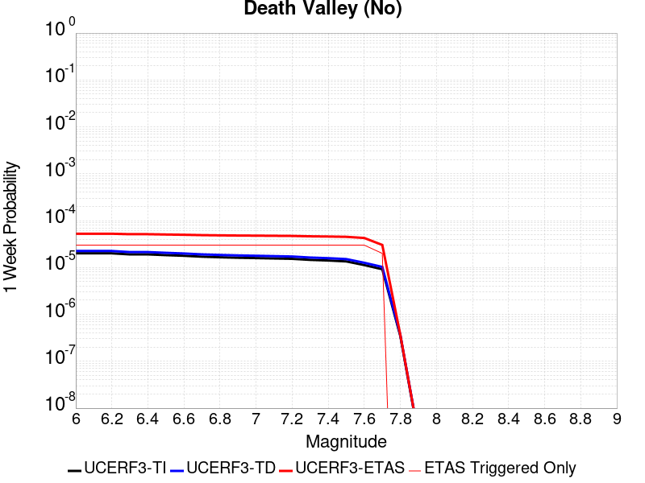 |  | 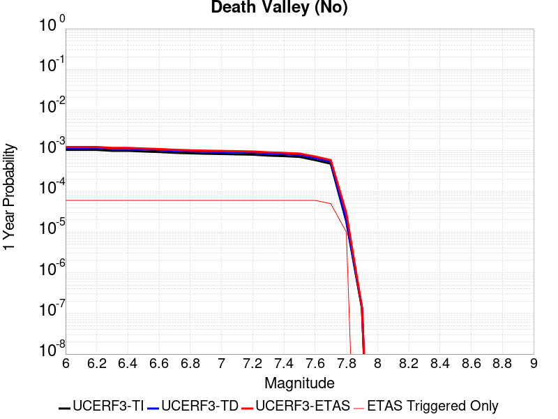 |  |

| Magnitude | 1 wk TI Prob | 1 wk TD Prob | 1 wk ETAS Prob | 1 wk ETAS/TD Gain | 1 wk ETAS Triggered Only | 1 mo TI Prob | 1 mo TD Prob | 1 mo ETAS Prob | 1 mo ETAS/TD Gain | 1 mo ETAS Triggered Only | 1 yr TI Prob | 1 yr TD Prob | 1 yr ETAS Prob | 1 yr ETAS/TD Gain | 1 yr ETAS Triggered Only | 10 yr TI Prob | 10 yr TD Prob | 10 yr ETAS Prob | 10 yr ETAS/TD Gain | 10 yr ETAS Triggered Only |
|-----|-----|-----|-----|-----|-----|-----|-----|-----|-----|-----|-----|-----|-----|-----|-----|-----|-----|-----|-----|-----|
| 6.0 | 2.0074807E-5 | 2.2500011E-5 | 5.2499334E-5 | 2.3333027 | 3.0E-5 | 8.603206E-5 | 9.6425094E-5 | 1.2642221E-4 | 1.3110924 | 3.0E-5 | 0.001046937 | 0.0011733507 | 0.0012332803 | 1.0510756 | 6.0E-5 | 0.010420183 | 0.011672469 | 0.011771302 | 1.0084672 | 1.0E-4 |
| 6.1 | 2.0074807E-5 | 2.2500011E-5 | 5.2499334E-5 | 2.3333027 | 3.0E-5 | 8.603206E-5 | 9.6425094E-5 | 1.2642221E-4 | 1.3110924 | 3.0E-5 | 0.001046937 | 0.0011733507 | 0.0012332803 | 1.0510756 | 6.0E-5 | 0.010420183 | 0.011672469 | 0.011771302 | 1.0084672 | 1.0E-4 |
| 6.2 | 2.0074807E-5 | 2.2500011E-5 | 5.2499334E-5 | 2.3333027 | 3.0E-5 | 8.603206E-5 | 9.6425094E-5 | 1.2642221E-4 | 1.3110924 | 3.0E-5 | 0.001046937 | 0.0011733507 | 0.0012332803 | 1.0510756 | 6.0E-5 | 0.010420183 | 0.011672469 | 0.011771302 | 1.0084672 | 1.0E-4 |
| 6.3 | 1.9050609E-5 | 2.1336878E-5 | 5.133624E-5 | 2.4059863 | 3.0E-5 | 8.164292E-5 | 9.14406E-5 | 1.2143786E-4 | 1.3280518 | 3.0E-5 | 9.935491E-4 | 0.0011127274 | 0.0011726607 | 1.0538616 | 6.0E-5 | 0.009891188 | 0.011072383 | 0.011171276 | 1.0089315 | 1.0E-4 |
| 6.4 | 1.9050609E-5 | 2.1336878E-5 | 5.133624E-5 | 2.4059863 | 3.0E-5 | 8.164292E-5 | 9.14406E-5 | 1.2143786E-4 | 1.3280518 | 3.0E-5 | 9.935491E-4 | 0.0011127274 | 0.0011726607 | 1.0538616 | 6.0E-5 | 0.009891188 | 0.011072383 | 0.011171276 | 1.0089315 | 1.0E-4 |
| 6.5 | 1.8367004E-5 | 2.0560943E-5 | 5.0560328E-5 | 2.459047 | 3.0E-5 | 7.8713354E-5 | 8.811538E-5 | 1.18112745E-4 | 1.3404326 | 3.0E-5 | 9.5791375E-4 | 0.0010722834 | 0.0011322191 | 1.0558953 | 6.0E-5 | 0.009537951 | 0.010671882 | 0.0107708145 | 1.0092704 | 1.0E-4 |
| 6.6 | 1.779439E-5 | 1.9910865E-5 | 4.9910268E-5 | 2.506685 | 3.0E-5 | 7.625944E-5 | 8.532952E-5 | 1.1532696E-4 | 1.3515482 | 3.0E-5 | 9.280632E-4 | 0.0010383982 | 0.0010983358 | 1.0577213 | 6.0E-5 | 0.009241969 | 0.01033622 | 0.010435186 | 1.0095748 | 1.0E-4 |
| 6.7 | 1.7025437E-5 | 1.9043366E-5 | 4.9042792E-5 | 2.575322 | 3.0E-5 | 7.296412E-5 | 8.16119E-5 | 1.1160946E-4 | 1.3675635 | 3.0E-5 | 8.87976E-4 | 9.931781E-4 | 0.0010531186 | 1.0603521 | 6.0E-5 | 0.008844362 | 0.009888114 | 0.009987125 | 1.0100131 | 1.0E-4 |
| 6.8 | 1.6545107E-5 | 1.8512486E-5 | 4.851193E-5 | 2.620498 | 3.0E-5 | 7.090568E-5 | 7.933685E-5 | 1.0933447E-4 | 1.3781044 | 3.0E-5 | 8.629347E-4 | 9.655042E-4 | 0.0010254462 | 1.0620837 | 6.0E-5 | 0.008595915 | 0.009613798 | 0.009712837 | 1.0103017 | 1.0E-4 |
| 6.9 | 1.615478E-5 | 1.8087536E-5 | 4.8086993E-5 | 2.6585708 | 3.0E-5 | 6.9232934E-5 | 7.7515746E-5 | 1.0751342E-4 | 1.3869882 | 3.0E-5 | 8.4258494E-4 | 9.4335165E-4 | 0.0010032951 | 1.063543 | 6.0E-5 | 0.008393973 | 0.009394166 | 0.009493226 | 1.0105449 | 1.0E-4 |
| 7.0 | 1.5894311E-5 | 1.7805492E-5 | 4.780496E-5 | 2.6848433 | 3.0E-5 | 6.81167E-5 | 7.630706E-5 | 1.0630477E-4 | 1.3931184 | 3.0E-5 | 8.2900526E-4 | 9.286485E-4 | 9.885927E-4 | 1.06455 | 6.0E-5 | 0.008259195 | 0.0092483675 | 0.0093474435 | 1.0107127 | 1.0E-4 |
| 7.1 | 1.5602263E-5 | 1.7483448E-5 | 4.748292E-5 | 2.7158787 | 3.0E-5 | 6.6865134E-5 | 7.492694E-5 | 1.0492469E-4 | 1.40036 | 3.0E-5 | 8.137789E-4 | 9.118598E-4 | 9.718051E-4 | 1.0657396 | 6.0E-5 | 0.008108052 | 0.009081865 | 0.0091809565 | 1.010911 | 1.0E-4 |
| 7.2 | 1.5323829E-5 | 1.7170574E-5 | 4.717006E-5 | 2.7471452 | 3.0E-5 | 6.56719E-5 | 7.358614E-5 | 1.0358393E-4 | 1.4076555 | 3.0E-5 | 7.99262E-4 | 8.95549E-4 | 9.554953E-4 | 1.066938 | 6.0E-5 | 0.007963934 | 0.008920078 | 0.009019186 | 1.0111107 | 1.0E-4 |
| 7.3 | 1.4556212E-5 | 1.6302403E-5 | 4.6301913E-5 | 2.8401895 | 3.0E-5 | 6.238227E-5 | 6.98656E-5 | 9.986351E-5 | 1.4293659 | 3.0E-5 | 7.592395E-4 | 8.502876E-4 | 9.102366E-4 | 1.0705043 | 6.0E-5 | 0.0075665074 | 0.008470987 | 0.00857014 | 1.011705 | 1.0E-4 |
| 7.4 | 1.411725E-5 | 1.580791E-5 | 4.5807436E-5 | 2.8977542 | 3.0E-5 | 6.0501097E-5 | 6.7746456E-5 | 9.774442E-5 | 1.4427975 | 3.0E-5 | 7.363519E-4 | 8.245068E-4 | 8.844573E-4 | 1.0727108 | 6.0E-5 | 0.0073391674 | 0.008215112 | 0.00831429 | 1.0120727 | 1.0E-4 |
| 7.5 | 1.3503312E-5 | 1.512624E-5 | 4.5125787E-5 | 2.9832785 | 3.0E-5 | 5.7870053E-5 | 6.4825166E-5 | 9.482322E-5 | 1.4627532 | 3.0E-5 | 7.043401E-4 | 7.889664E-4 | 8.489191E-4 | 1.0759889 | 6.0E-5 | 0.007021119 | 0.007862279 | 0.007961493 | 1.0126189 | 1.0E-4 |
| 7.6 | 1.1279839E-5 | 1.2626287E-5 | 4.2625907E-5 | 3.3759656 | 3.0E-5 | 4.834127E-5 | 5.4111566E-5 | 8.410994E-5 | 1.5543802 | 3.0E-5 | 5.88396E-4 | 6.5861444E-4 | 7.18575E-4 | 1.0910404 | 6.0E-5 | 0.005868405 | 0.006567178 | 0.006666521 | 1.0151272 | 1.0E-4 |
| 7.7 | 9.189108E-6 | 1.02833255E-5 | 3.028312E-5 | 2.9448762 | 2.0E-5 | 3.93813E-5 | 4.407068E-5 | 6.40698E-5 | 1.4537965 | 2.0E-5 | 4.7936183E-4 | 5.364335E-4 | 5.864066E-4 | 1.0931582 | 5.0E-5 | 0.004783291 | 0.005351897 | 0.0054314686 | 1.014868 | 8.0E-5 |
| 7.8 | 3.4586725E-7 | 3.648256E-7 | 3.648256E-7 | 1.0 | 0.0 | 1.4822873E-6 | 1.5635374E-6 | 1.5635374E-6 | 1.0 | 0.0 | 1.80467E-5 | 1.9035906E-5 | 2.9035715E-5 | 1.525313 | 1.0E-5 | 1.8045233E-4 | 1.903432E-4 | 2.003413E-4 | 1.0525267 | 1.0E-5 |
| 7.9 | 2.5591178E-9 | 2.6696687E-9 | 2.6696687E-9 | 1.0 | 0.0 | 1.0967647E-8 | 1.1441437E-8 | 1.1441437E-8 | 1.0 | 0.0 | 1.335311E-7 | 1.392995E-7 | 1.392995E-7 | 1.0 | 0.0 | 1.3353102E-6 | 1.3929949E-6 | 1.3929949E-6 | 1.0 | 0.0 |

## San Jacinto (San Bernardino)
*[(top)](#table-of-contents)*

| 1 Week | 1 Month | 1 Year | 10 Year |
|-----|-----|-----|-----|
|  | 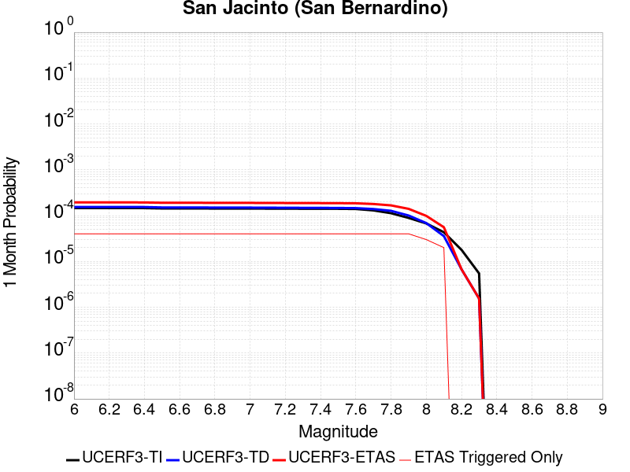 |  |  |

| Magnitude | 1 wk TI Prob | 1 wk TD Prob | 1 wk ETAS Prob | 1 wk ETAS/TD Gain | 1 wk ETAS Triggered Only | 1 mo TI Prob | 1 mo TD Prob | 1 mo ETAS Prob | 1 mo ETAS/TD Gain | 1 mo ETAS Triggered Only | 1 yr TI Prob | 1 yr TD Prob | 1 yr ETAS Prob | 1 yr ETAS/TD Gain | 1 yr ETAS Triggered Only | 10 yr TI Prob | 10 yr TD Prob | 10 yr ETAS Prob | 10 yr ETAS/TD Gain | 10 yr ETAS Triggered Only |
|-----|-----|-----|-----|-----|-----|-----|-----|-----|-----|-----|-----|-----|-----|-----|-----|-----|-----|-----|-----|-----|
| 6.0 | 3.409352E-5 | 3.597972E-5 | 7.5978285E-5 | 2.1116974 | 4.0E-5 | 1.461069E-4 | 1.541897E-4 | 1.9418354E-4 | 1.2593807 | 4.0E-5 | 0.0017774 | 0.0018756451 | 0.0019255513 | 1.0266075 | 5.0E-5 | 0.01763251 | 0.019346429 | 0.019444494 | 1.0050689 | 1.0E-4 |
| 6.1 | 3.409352E-5 | 3.597972E-5 | 7.5978285E-5 | 2.1116974 | 4.0E-5 | 1.461069E-4 | 1.541897E-4 | 1.9418354E-4 | 1.2593807 | 4.0E-5 | 0.0017774 | 0.0018756451 | 0.0019255513 | 1.0266075 | 5.0E-5 | 0.01763251 | 0.019346429 | 0.019444494 | 1.0050689 | 1.0E-4 |
| 6.2 | 3.409352E-5 | 3.597972E-5 | 7.5978285E-5 | 2.1116974 | 4.0E-5 | 1.461069E-4 | 1.541897E-4 | 1.9418354E-4 | 1.2593807 | 4.0E-5 | 0.0017774 | 0.0018756451 | 0.0019255513 | 1.0266075 | 5.0E-5 | 0.01763251 | 0.019346429 | 0.019444494 | 1.0050689 | 1.0E-4 |
| 6.3 | 3.409352E-5 | 3.597972E-5 | 7.5978285E-5 | 2.1116974 | 4.0E-5 | 1.461069E-4 | 1.541897E-4 | 1.9418354E-4 | 1.2593807 | 4.0E-5 | 0.0017774 | 0.0018756451 | 0.0019255513 | 1.0266075 | 5.0E-5 | 0.01763251 | 0.019346429 | 0.019444494 | 1.0050689 | 1.0E-4 |
| 6.4 | 3.400795E-5 | 3.5872385E-5 | 7.587095E-5 | 2.1150239 | 4.0E-5 | 1.4574021E-4 | 1.5372974E-4 | 1.937236E-4 | 1.2601569 | 4.0E-5 | 0.0017729428 | 0.0018700549 | 0.0019199614 | 1.0266871 | 5.0E-5 | 0.017588645 | 0.01929151 | 0.019389581 | 1.0050837 | 1.0E-4 |
| 6.5 | 3.341482E-5 | 3.5133027E-5 | 7.5131626E-5 | 2.1384897 | 4.0E-5 | 1.4319851E-4 | 1.5056143E-4 | 1.9055541E-4 | 1.2656323 | 4.0E-5 | 0.0017420477 | 0.0018315457 | 0.0018814541 | 1.0272493 | 5.0E-5 | 0.017284546 | 0.018913053 | 0.019011162 | 1.0051874 | 1.0E-4 |
| 6.6 | 3.3364955E-5 | 3.5070247E-5 | 7.506884E-5 | 2.140528 | 4.0E-5 | 1.4298483E-4 | 1.5029241E-4 | 1.902864E-4 | 1.2661078 | 4.0E-5 | 0.0017394501 | 0.0018282757 | 0.0018781844 | 1.0272982 | 5.0E-5 | 0.017258976 | 0.018880919 | 0.01897903 | 1.0051963 | 1.0E-4 |
| 6.7 | 3.335922E-5 | 3.506002E-5 | 7.505862E-5 | 2.1408606 | 4.0E-5 | 1.4296026E-4 | 1.5024858E-4 | 1.9024257E-4 | 1.2661854 | 4.0E-5 | 0.0017391514 | 0.0018277431 | 0.0018776518 | 1.0273062 | 5.0E-5 | 0.017256035 | 0.018875709 | 0.018973822 | 1.0051978 | 1.0E-4 |
| 6.8 | 3.327683E-5 | 3.495409E-5 | 7.495269E-5 | 2.1443183 | 4.0E-5 | 1.4260718E-4 | 1.4979464E-4 | 1.8978865E-4 | 1.2669922 | 4.0E-5 | 0.0017348597 | 0.0018222256 | 0.0018721345 | 1.0273889 | 5.0E-5 | 0.017213784 | 0.018821482 | 0.018919598 | 1.005213 | 1.0E-4 |
| 6.9 | 3.3235785E-5 | 3.489504E-5 | 7.489364E-5 | 2.1462545 | 4.0E-5 | 1.4243131E-4 | 1.4954162E-4 | 1.8953564E-4 | 1.267444 | 4.0E-5 | 0.0017327217 | 0.0018191502 | 0.0018690593 | 1.0274353 | 5.0E-5 | 0.017192734 | 0.01879135 | 0.018889472 | 1.0052216 | 1.0E-4 |
| 7.0 | 3.3197095E-5 | 3.4834975E-5 | 7.483358E-5 | 2.1482313 | 4.0E-5 | 1.422655E-4 | 1.4928421E-4 | 1.8927823E-4 | 1.2679052 | 4.0E-5 | 0.0017307063 | 0.0018160215 | 0.0018659306 | 1.0274827 | 5.0E-5 | 0.017172894 | 0.018760728 | 0.018858852 | 1.0052303 | 1.0E-4 |
| 7.1 | 3.3129716E-5 | 3.4715187E-5 | 7.47138E-5 | 2.1521935 | 4.0E-5 | 1.4197677E-4 | 1.487709E-4 | 1.8876494E-4 | 1.2688298 | 4.0E-5 | 0.0017271966 | 0.0018097822 | 0.0018596917 | 1.0275776 | 5.0E-5 | 0.017138338 | 0.018699808 | 0.018797938 | 1.0052476 | 1.0E-4 |
| 7.2 | 3.3034008E-5 | 3.4582634E-5 | 7.458125E-5 | 2.15661 | 4.0E-5 | 1.4156665E-4 | 1.4820287E-4 | 1.8819695E-4 | 1.2698603 | 4.0E-5 | 0.0017222111 | 0.0018028781 | 0.001852788 | 1.0276834 | 5.0E-5 | 0.017089253 | 0.018632201 | 0.018730337 | 1.005267 | 1.0E-4 |
| 7.3 | 3.2956614E-5 | 3.4450393E-5 | 7.444902E-5 | 2.1610498 | 4.0E-5 | 1.4123498E-4 | 1.476362E-4 | 1.8763028E-4 | 1.2708963 | 4.0E-5 | 0.0017181796 | 0.0017959902 | 0.0018459004 | 1.0277898 | 5.0E-5 | 0.017049557 | 0.018564949 | 0.018663093 | 1.0052865 | 1.0E-4 |
| 7.4 | 3.2915937E-5 | 3.437212E-5 | 7.437074E-5 | 2.163694 | 4.0E-5 | 1.4106068E-4 | 1.4730077E-4 | 1.8729488E-4 | 1.2715132 | 4.0E-5 | 0.0017160608 | 0.0017919131 | 0.0018418235 | 1.0278531 | 5.0E-5 | 0.017028693 | 0.01852523 | 0.018623376 | 1.005298 | 1.0E-4 |
| 7.5 | 3.281791E-5 | 3.4237073E-5 | 7.42357E-5 | 2.1682842 | 4.0E-5 | 1.406406E-4 | 1.4672207E-4 | 1.8671619E-4 | 1.2725843 | 4.0E-5 | 0.0017109542 | 0.0017848789 | 0.0018347896 | 1.0279632 | 5.0E-5 | 0.016978411 | 0.018456137 | 0.01855429 | 1.0053183 | 1.0E-4 |
| 7.6 | 3.2521442E-5 | 3.3962282E-5 | 7.3960924E-5 | 2.1777372 | 4.0E-5 | 1.3937015E-4 | 1.4554452E-4 | 1.855387E-4 | 1.27479 | 4.0E-5 | 0.0016955109 | 0.0017705658 | 0.0018204772 | 1.0281895 | 5.0E-5 | 0.016826328 | 0.018313898 | 0.018412067 | 1.0053604 | 1.0E-4 |
| 7.7 | 3.0287873E-5 | 3.2449603E-5 | 7.24483E-5 | 2.2326407 | 4.0E-5 | 1.297987E-4 | 1.3906232E-4 | 1.7905676E-4 | 1.2876009 | 4.0E-5 | 0.0015791537 | 0.00169177 | 0.0017416854 | 1.0295049 | 5.0E-5 | 0.01567979 | 0.017526472 | 0.017624719 | 1.0056057 | 1.0E-4 |
| 7.8 | 2.6316151E-5 | 2.9660547E-5 | 6.965936E-5 | 2.348553 | 4.0E-5 | 1.1277862E-4 | 1.2711044E-4 | 1.6710536E-4 | 1.314647 | 4.0E-5 | 0.0013722149 | 0.001546472 | 0.0015963947 | 1.0322816 | 5.0E-5 | 0.013637724 | 0.016068073 | 0.016166465 | 1.0061235 | 1.0E-4 |
| 7.9 | 2.0761147E-5 | 2.341544E-5 | 6.34145E-5 | 2.7082345 | 4.0E-5 | 8.897331E-5 | 1.0034803E-4 | 1.4034401E-4 | 1.3985727 | 4.0E-5 | 0.0010827117 | 0.0012210533 | 0.0012709923 | 1.0408982 | 5.0E-5 | 0.010774517 | 0.012791798 | 0.012880648 | 1.0069457 | 9.0E-5 |
| 8.0 | 1.5738568E-5 | 1.6031558E-5 | 4.6031077E-5 | 2.871279 | 3.0E-5 | 6.744926E-5 | 6.8704874E-5 | 9.870281E-5 | 1.4366202 | 3.0E-5 | 8.2088535E-4 | 8.361615E-4 | 8.661364E-4 | 1.0358483 | 3.0E-5 | 0.008178596 | 0.008864859 | 0.008914416 | 1.0055902 | 5.0E-5 |
| 8.1 | 1.0105832E-5 | 8.329329E-6 | 2.8329163E-5 | 3.4011338 | 2.0E-5 | 4.3309992E-5 | 3.5696637E-5 | 5.5695924E-5 | 1.5602568 | 2.0E-5 | 5.2717153E-4 | 4.3452042E-4 | 4.5451173E-4 | 1.0460078 | 2.0E-5 | 0.005259227 | 0.0046766037 | 0.004716417 | 1.0085132 | 4.0E-5 |
| 8.2 | 4.189207E-6 | 1.5781004E-6 | 1.5781004E-6 | 1.0 | 0.0 | 1.7953622E-5 | 6.76327E-6 | 6.76327E-6 | 1.0 | 0.0 | 2.1856341E-4 | 8.233973E-5 | 8.233973E-5 | 1.0 | 0.0 | 0.0021834858 | 9.5639535E-4 | 9.5639535E-4 | 1.0 | 0.0 |
| 8.3 | 1.2758221E-6 | 3.6140935E-7 | 3.6140935E-7 | 1.0 | 0.0 | 5.4677976E-6 | 1.5488963E-6 | 1.5488963E-6 | 1.0 | 0.0 | 6.65684E-5 | 1.8857654E-5 | 1.8857654E-5 | 1.0 | 0.0 | 6.6548464E-4 | 2.2746001E-4 | 2.2746001E-4 | 1.0 | 0.0 |

## Elsinore (Glen Ivy) rev
*[(top)](#table-of-contents)*

| 1 Week | 1 Month | 1 Year | 10 Year |
|-----|-----|-----|-----|
| 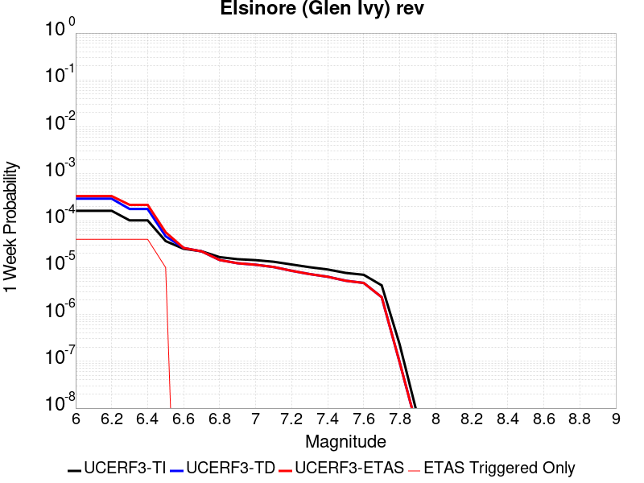 |  |  |  |

| Magnitude | 1 wk TI Prob | 1 wk TD Prob | 1 wk ETAS Prob | 1 wk ETAS/TD Gain | 1 wk ETAS Triggered Only | 1 mo TI Prob | 1 mo TD Prob | 1 mo ETAS Prob | 1 mo ETAS/TD Gain | 1 mo ETAS Triggered Only | 1 yr TI Prob | 1 yr TD Prob | 1 yr ETAS Prob | 1 yr ETAS/TD Gain | 1 yr ETAS Triggered Only | 10 yr TI Prob | 10 yr TD Prob | 10 yr ETAS Prob | 10 yr ETAS/TD Gain | 10 yr ETAS Triggered Only |
|-----|-----|-----|-----|-----|-----|-----|-----|-----|-----|-----|-----|-----|-----|-----|-----|-----|-----|-----|-----|-----|
| 6.0 | 1.6204086E-4 | 2.9360445E-4 | 3.335927E-4 | 1.1361977 | 4.0E-5 | 6.94276E-4 | 0.0012578527 | 0.0013077897 | 1.0397003 | 5.0E-5 | 0.008420097 | 0.01523435 | 0.015283588 | 1.003232 | 5.0E-5 | 0.081081145 | 0.139691 | 0.13975121 | 1.0004311 | 7.0E-5 |
| 6.1 | 1.6204086E-4 | 2.9360445E-4 | 3.335927E-4 | 1.1361977 | 4.0E-5 | 6.94276E-4 | 0.0012578527 | 0.0013077897 | 1.0397003 | 5.0E-5 | 0.008420097 | 0.01523435 | 0.015283588 | 1.003232 | 5.0E-5 | 0.081081145 | 0.139691 | 0.13975121 | 1.0004311 | 7.0E-5 |
| 6.2 | 1.6204086E-4 | 2.9360445E-4 | 3.335927E-4 | 1.1361977 | 4.0E-5 | 6.94276E-4 | 0.0012578527 | 0.0013077897 | 1.0397003 | 5.0E-5 | 0.008420097 | 0.01523435 | 0.015283588 | 1.003232 | 5.0E-5 | 0.081081145 | 0.139691 | 0.13975121 | 1.0004311 | 7.0E-5 |
| 6.3 | 1.0111737E-4 | 1.7703307E-4 | 2.1702598E-4 | 1.2259065 | 4.0E-5 | 4.332882E-4 | 7.586092E-4 | 7.985789E-4 | 1.0526881 | 4.0E-5 | 0.005262531 | 0.009217643 | 0.009257275 | 1.0042995 | 4.0E-5 | 0.0513964 | 0.087018766 | 0.087064415 | 1.0005246 | 5.0E-5 |
| 6.4 | 1.0111737E-4 | 1.7703307E-4 | 2.1702598E-4 | 1.2259065 | 4.0E-5 | 4.332882E-4 | 7.586092E-4 | 7.985789E-4 | 1.0526881 | 4.0E-5 | 0.005262531 | 0.009217643 | 0.009257275 | 1.0042995 | 4.0E-5 | 0.0513964 | 0.087018766 | 0.087064415 | 1.0005246 | 5.0E-5 |
| 6.5 | 3.6624708E-5 | 4.639072E-5 | 5.6390254E-5 | 1.2155503 | 1.0E-5 | 1.569536E-4 | 1.9880426E-4 | 2.0880227E-4 | 1.0502907 | 1.0E-5 | 0.001909235 | 0.002418118 | 0.002428094 | 1.0041255 | 1.0E-5 | 0.01892915 | 0.023739774 | 0.023749536 | 1.0004113 | 1.0E-5 |
| 6.6 | 2.5051324E-5 | 2.6147469E-5 | 2.6147469E-5 | 1.0 | 0.0 | 1.073584E-4 | 1.1205602E-4 | 1.1205602E-4 | 1.0 | 0.0 | 0.0013063047 | 0.0013634728 | 0.0013634728 | 1.0 | 0.0 | 0.012986525 | 0.01356449 | 0.01356449 | 1.0 | 0.0 |
| 6.7 | 2.2189772E-5 | 2.2072634E-5 | 2.2072634E-5 | 1.0 | 0.0 | 9.509556E-5 | 9.459378E-5 | 9.459378E-5 | 1.0 | 0.0 | 0.0011571734 | 0.0011511071 | 0.0011511071 | 1.0 | 0.0 | 0.011511663 | 0.011465305 | 0.011465305 | 1.0 | 0.0 |
| 6.8 | 1.6654378E-5 | 1.443758E-5 | 1.443758E-5 | 1.0 | 0.0 | 7.137396E-5 | 6.18739E-5 | 6.18739E-5 | 1.0 | 0.0 | 8.686314E-4 | 7.530596E-4 | 7.530596E-4 | 1.0 | 0.0 | 0.008652439 | 0.0075104153 | 0.0075104153 | 1.0 | 0.0 |
| 6.9 | 1.5042909E-5 | 1.2331914E-5 | 1.2331914E-5 | 1.0 | 0.0 | 6.446802E-5 | 5.285001E-5 | 5.285001E-5 | 1.0 | 0.0 | 7.8461546E-4 | 6.4326206E-4 | 6.4326206E-4 | 1.0 | 0.0 | 0.007818509 | 0.006418224 | 0.006418224 | 1.0 | 0.0 |
| 7.0 | 1.4361385E-5 | 1.1451223E-5 | 1.1451223E-5 | 1.0 | 0.0 | 6.154734E-5 | 4.9075763E-5 | 4.9075763E-5 | 1.0 | 0.0 | 7.490812E-4 | 5.973365E-4 | 5.973365E-4 | 1.0 | 0.0 | 0.007465612 | 0.005961301 | 0.005961301 | 1.0 | 0.0 |
| 7.1 | 1.3265571E-5 | 1.0244836E-5 | 1.0244836E-5 | 1.0 | 0.0 | 5.6851208E-5 | 4.390571E-5 | 4.390571E-5 | 1.0 | 0.0 | 6.919436E-4 | 5.3442345E-4 | 5.3442345E-4 | 1.0 | 0.0 | 0.006897931 | 0.0053347396 | 0.0053347396 | 1.0 | 0.0 |
| 7.2 | 1.1596403E-5 | 8.504992E-6 | 8.504992E-6 | 1.0 | 0.0 | 4.9697923E-5 | 3.6449466E-5 | 3.6449466E-5 | 1.0 | 0.0 | 6.049042E-4 | 4.436836E-4 | 4.436836E-4 | 1.0 | 0.0 | 0.006032603 | 0.004429393 | 0.004429393 | 1.0 | 0.0 |
| 7.3 | 1.0150827E-5 | 7.2386983E-6 | 7.2386983E-6 | 1.0 | 0.0 | 4.3502816E-5 | 3.102263E-5 | 3.102263E-5 | 1.0 | 0.0 | 5.2951806E-4 | 3.7763652E-4 | 3.7763652E-4 | 1.0 | 0.0 | 0.005282581 | 0.0037703344 | 0.0037703344 | 1.0 | 0.0 |
| 7.4 | 9.080705E-6 | 6.3524662E-6 | 6.3524662E-6 | 1.0 | 0.0 | 3.8916725E-5 | 2.7224578E-5 | 2.7224578E-5 | 1.0 | 0.0 | 4.7370812E-4 | 3.3141018E-4 | 3.3141018E-4 | 1.0 | 0.0 | 0.004726996 | 0.0033093104 | 0.0033093104 | 1.0 | 0.0 |
| 7.5 | 7.671649E-6 | 5.22559E-6 | 5.22559E-6 | 1.0 | 0.0 | 3.287808E-5 | 2.2395201E-5 | 2.2395201E-5 | 1.0 | 0.0 | 4.0021708E-4 | 2.726287E-4 | 2.726287E-4 | 1.0 | 0.0 | 0.0039949706 | 0.0027230675 | 0.0027230675 | 1.0 | 0.0 |
| 7.6 | 6.990086E-6 | 4.687506E-6 | 4.687506E-6 | 1.0 | 0.0 | 2.9957167E-5 | 2.0089165E-5 | 2.0089165E-5 | 1.0 | 0.0 | 3.6466747E-4 | 2.4455928E-4 | 2.4455928E-4 | 1.0 | 0.0 | 0.0036406964 | 0.002443018 | 0.002443018 | 1.0 | 0.0 |
| 7.7 | 4.163505E-6 | 2.3295113E-6 | 2.3295113E-6 | 1.0 | 0.0 | 1.7843471E-5 | 9.983586E-6 | 9.983586E-6 | 1.0 | 0.0 | 2.172226E-4 | 1.2154412E-4 | 1.2154412E-4 | 1.0 | 0.0 | 0.0021701038 | 0.0012148495 | 0.0012148495 | 1.0 | 0.0 |
| 7.8 | 2.2692414E-7 | 9.385374E-8 | 9.385374E-8 | 1.0 | 0.0 | 9.725317E-7 | 4.0223028E-7 | 4.0223028E-7 | 1.0 | 0.0 | 1.1840509E-5 | 4.897146E-6 | 4.897146E-6 | 1.0 | 0.0 | 1.1839878E-4 | 4.897071E-5 | 4.897071E-5 | 1.0 | 0.0 |
| 7.9 | 6.676829E-9 | 3.439828E-9 | 3.439828E-9 | 1.0 | 0.0 | 2.861498E-8 | 1.47421195E-8 | 1.47421195E-8 | 1.0 | 0.0 | 3.4838732E-7 | 1.7948528E-7 | 1.7948528E-7 | 1.0 | 0.0 | 3.4838679E-6 | 1.7948516E-6 | 1.7948516E-6 | 1.0 | 0.0 |

## San Andreas (Parkfield)
*[(top)](#table-of-contents)*

| 1 Week | 1 Month | 1 Year | 10 Year |
|-----|-----|-----|-----|
|  |  |  |  |

| Magnitude | 1 wk TI Prob | 1 wk TD Prob | 1 wk ETAS Prob | 1 wk ETAS/TD Gain | 1 wk ETAS Triggered Only | 1 mo TI Prob | 1 mo TD Prob | 1 mo ETAS Prob | 1 mo ETAS/TD Gain | 1 mo ETAS Triggered Only | 1 yr TI Prob | 1 yr TD Prob | 1 yr ETAS Prob | 1 yr ETAS/TD Gain | 1 yr ETAS Triggered Only | 10 yr TI Prob | 10 yr TD Prob | 10 yr ETAS Prob | 10 yr ETAS/TD Gain | 10 yr ETAS Triggered Only |
|-----|-----|-----|-----|-----|-----|-----|-----|-----|-----|-----|-----|-----|-----|-----|-----|-----|-----|-----|-----|-----|
| 6.0 | 5.556969E-4 | 7.776195E-4 | 8.175884E-4 | 1.051399 | 4.0E-5 | 0.0023793848 | 0.003328946 | 0.0033787794 | 1.0149698 | 5.0E-5 | 0.028586963 | 0.04018152 | 0.040248707 | 1.0016721 | 7.0E-5 | 0.25176284 | 0.33713356 | 0.33719322 | 1.0001769 | 9.0E-5 |
| 6.1 | 1.925858E-4 | 3.027076E-4 | 3.1270456E-4 | 1.0330251 | 1.0E-5 | 8.2510663E-4 | 0.001296767 | 0.0013067541 | 1.0077015 | 1.0E-5 | 0.0099994885 | 0.01577525 | 0.015785092 | 1.000624 | 1.0E-5 | 0.095613256 | 0.14970991 | 0.1497184 | 1.0000567 | 1.0E-5 |
| 6.2 | 9.4306815E-5 | 1.824128E-4 | 1.9241097E-4 | 1.0548108 | 1.0E-5 | 4.0410945E-4 | 7.8153616E-4 | 7.915283E-4 | 1.0127853 | 1.0E-5 | 0.0049089384 | 0.009473897 | 0.009483802 | 1.0010456 | 1.0E-5 | 0.048019063 | 0.09184752 | 0.0918566 | 1.0000988 | 1.0E-5 |
| 6.3 | 9.283051E-5 | 1.793781E-4 | 1.893763E-4 | 1.0557382 | 1.0E-5 | 3.9778434E-4 | 7.68538E-4 | 7.7853026E-4 | 1.0130017 | 1.0E-5 | 0.0048322747 | 0.009317007 | 0.009326914 | 1.0010633 | 1.0E-5 | 0.047285385 | 0.09050047 | 0.09050956 | 1.0001005 | 1.0E-5 |
| 6.4 | 9.138826E-5 | 1.7700029E-4 | 1.8699853E-4 | 1.0564871 | 1.0E-5 | 3.916052E-4 | 7.5835333E-4 | 7.683458E-4 | 1.0131764 | 1.0E-5 | 0.0047573745 | 0.009194063 | 0.009203971 | 1.0010777 | 1.0E-5 | 0.046568092 | 0.089402735 | 0.08941184 | 1.0001018 | 1.0E-5 |
| 6.5 | 9.000255E-5 | 1.7458084E-4 | 1.8457908E-4 | 1.05727 | 1.0E-5 | 3.8566816E-4 | 7.479902E-4 | 7.579827E-4 | 1.0133592 | 1.0E-5 | 0.0046854047 | 0.00906896 | 0.00907887 | 1.0010927 | 1.0E-5 | 0.045878403 | 0.08828856 | 0.08829767 | 1.0001032 | 1.0E-5 |
| 6.6 | 8.8109264E-5 | 1.7139279E-4 | 1.8139108E-4 | 1.0583355 | 1.0E-5 | 3.7755648E-4 | 7.343349E-4 | 7.4432755E-4 | 1.0136077 | 1.0E-5 | 0.0045870654 | 0.008904092 | 0.008914003 | 1.001113 | 1.0E-5 | 0.04493529 | 0.08682025 | 0.08682939 | 1.0001051 | 1.0E-5 |
| 6.7 | 8.738073E-5 | 1.7006363E-4 | 1.8006194E-4 | 1.0587915 | 1.0E-5 | 3.7443507E-4 | 7.286417E-4 | 7.3863444E-4 | 1.0137142 | 1.0E-5 | 0.0045492216 | 0.008835384 | 0.008845295 | 1.0011218 | 1.0E-5 | 0.04457213 | 0.08622064 | 0.08622977 | 1.000106 | 1.0E-5 |
| 6.8 | 8.710195E-5 | 1.695187E-4 | 1.79517E-4 | 1.0589806 | 1.0E-5 | 3.7324068E-4 | 7.263075E-4 | 7.3630025E-4 | 1.0137583 | 1.0E-5 | 0.0045347405 | 0.008807203 | 0.008817115 | 1.0011255 | 1.0E-5 | 0.04443313 | 0.085968256 | 0.08597739 | 1.0001063 | 1.0E-5 |
| 6.9 | 8.6801556E-5 | 1.6892828E-4 | 1.7892658E-4 | 1.0591867 | 1.0E-5 | 3.7195362E-4 | 7.237786E-4 | 7.3377136E-4 | 1.0138063 | 1.0E-5 | 0.0045191357 | 0.008776662 | 0.008786574 | 1.0011294 | 1.0E-5 | 0.044283327 | 0.08569433 | 0.08570347 | 1.0001067 | 1.0E-5 |
| 7.0 | 8.5571606E-5 | 1.6645678E-4 | 1.7645511E-4 | 1.0600656 | 1.0E-5 | 3.6668387E-4 | 7.131923E-4 | 7.2318513E-4 | 1.0140115 | 1.0E-5 | 0.004455241 | 0.008648803 | 0.008658716 | 1.0011462 | 1.0E-5 | 0.043669727 | 0.08454277 | 0.08455192 | 1.0001082 | 1.0E-5 |
| 7.1 | 7.82589E-5 | 1.5126738E-4 | 1.6126587E-4 | 1.0660981 | 1.0E-5 | 3.3535215E-4 | 6.4812845E-4 | 6.5812195E-4 | 1.015419 | 1.0E-5 | 0.0040752706 | 0.007862584 | 0.007872505 | 1.0012618 | 1.0E-5 | 0.040013418 | 0.07745491 | 0.07746413 | 1.0001191 | 1.0E-5 |
| 7.2 | 7.690929E-5 | 1.4864003E-4 | 1.5863853E-4 | 1.0672666 | 1.0E-5 | 3.2956956E-4 | 6.368739E-4 | 6.468675E-4 | 1.0156916 | 1.0E-5 | 0.004005129 | 0.007726539 | 0.0077364612 | 1.0012842 | 1.0E-5 | 0.0393371 | 0.0762281 | 0.076237336 | 1.0001212 | 1.0E-5 |
| 7.3 | 7.5543794E-5 | 1.4560606E-4 | 1.556046E-4 | 1.0686685 | 1.0E-5 | 3.2371894E-4 | 6.2387745E-4 | 6.3387124E-4 | 1.0160187 | 1.0E-5 | 0.003934157 | 0.007569417 | 0.007579341 | 1.0013111 | 1.0E-5 | 0.038652334 | 0.07479123 | 0.074800484 | 1.0001237 | 1.0E-5 |
| 7.4 | 7.4214564E-5 | 1.4261607E-4 | 1.5261465E-4 | 1.0701083 | 1.0E-5 | 3.1802364E-4 | 6.110693E-4 | 6.210632E-4 | 1.0163548 | 1.0E-5 | 0.003865065 | 0.0074145487 | 0.0074244747 | 1.0013387 | 1.0E-5 | 0.03798529 | 0.07336518 | 0.07337445 | 1.0001264 | 1.0E-5 |
| 7.5 | 6.149578E-5 | 1.11895584E-4 | 1.2189447E-4 | 1.089359 | 1.0E-5 | 2.6352672E-4 | 4.7946448E-4 | 4.8945966E-4 | 1.0208466 | 1.0E-5 | 0.0032037178 | 0.0058218874 | 0.0058318293 | 1.0017077 | 1.0E-5 | 0.03157923 | 0.05855221 | 0.058561623 | 1.0001608 | 1.0E-5 |
| 7.6 | 6.0643448E-5 | 1.10182256E-4 | 1.20181154E-4 | 1.0907487 | 1.0E-5 | 2.598746E-4 | 4.7212432E-4 | 4.821196E-4 | 1.0211709 | 1.0E-5 | 0.0031593828 | 0.005732995 | 0.0057429373 | 1.0017343 | 1.0E-5 | 0.031148417 | 0.057713263 | 0.057722684 | 1.0001633 | 1.0E-5 |
| 7.7 | 5.1652263E-5 | 9.173663E-5 | 1.0173571E-4 | 1.1089977 | 1.0E-5 | 2.2134806E-4 | 3.9309775E-4 | 4.0309384E-4 | 1.025429 | 1.0E-5 | 0.002691582 | 0.0047754725 | 0.004785425 | 1.002084 | 1.0E-5 | 0.026592141 | 0.048531387 | 0.0485409 | 1.0001961 | 1.0E-5 |
| 7.8 | 4.8090482E-5 | 8.558682E-5 | 8.558682E-5 | 1.0 | 0.0 | 2.060858E-4 | 3.6674913E-4 | 3.6674913E-4 | 1.0 | 0.0 | 0.0025062072 | 0.0044560367 | 0.0044560367 | 1.0 | 0.0 | 0.024781305 | 0.045297977 | 0.045297977 | 1.0 | 0.0 |
| 7.9 | 3.970278E-5 | 6.749683E-5 | 6.749683E-5 | 1.0 | 0.0 | 1.7014367E-4 | 2.8924007E-4 | 2.8924007E-4 | 1.0 | 0.0 | 0.002069531 | 0.0035158154 | 0.0035158154 | 1.0 | 0.0 | 0.020503636 | 0.03587781 | 0.03587781 | 1.0 | 0.0 |
| 8.0 | 2.8982335E-5 | 4.0693238E-5 | 4.0693238E-5 | 1.0 | 0.0 | 1.2420409E-4 | 1.7438793E-4 | 1.7438793E-4 | 1.0 | 0.0 | 0.0015111357 | 0.0021211067 | 0.0021211067 | 1.0 | 0.0 | 0.015009012 | 0.022008339 | 0.022008339 | 1.0 | 0.0 |
| 8.1 | 1.8836186E-5 | 1.8678496E-5 | 1.8678496E-5 | 1.0 | 0.0 | 8.0724014E-5 | 8.0048245E-5 | 8.0048245E-5 | 1.0 | 0.0 | 9.823717E-4 | 9.7415224E-4 | 9.7415224E-4 | 1.0 | 0.0 | 0.009780403 | 0.010486731 | 0.010486731 | 1.0 | 0.0 |
| 8.2 | 8.643924E-6 | 5.4738607E-6 | 5.4738607E-6 | 1.0 | 0.0 | 3.704486E-5 | 2.3459192E-5 | 2.3459192E-5 | 1.0 | 0.0 | 4.5092785E-4 | 2.855783E-4 | 2.855783E-4 | 1.0 | 0.0 | 0.0045001395 | 0.0032481598 | 0.0032481598 | 1.0 | 0.0 |
| 8.3 | 1.983087E-6 | 7.658221E-7 | 7.658221E-7 | 1.0 | 0.0 | 8.498917E-6 | 3.2820906E-6 | 3.2820906E-6 | 1.0 | 0.0 | 1.034694E-4 | 3.9958737E-5 | 3.9958737E-5 | 1.0 | 0.0 | 0.0010342124 | 4.7187202E-4 | 4.7187202E-4 | 1.0 | 0.0 |

## Ludlow
*[(top)](#table-of-contents)*

| 1 Week | 1 Month | 1 Year | 10 Year |
|-----|-----|-----|-----|
|  | 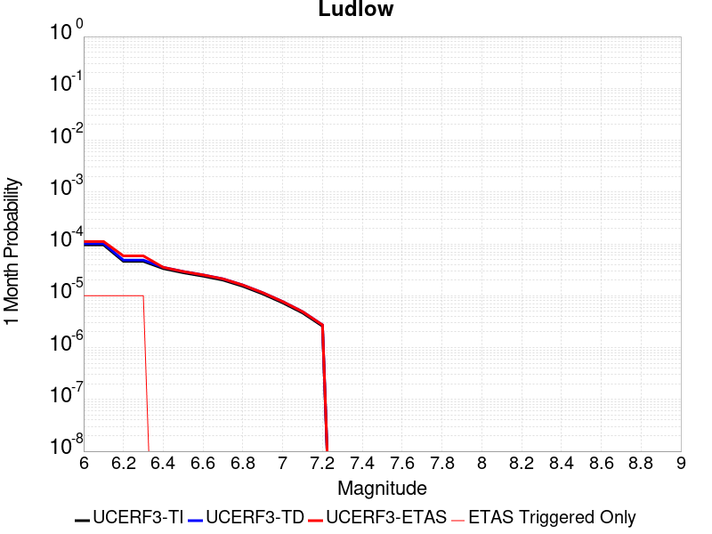 |  | 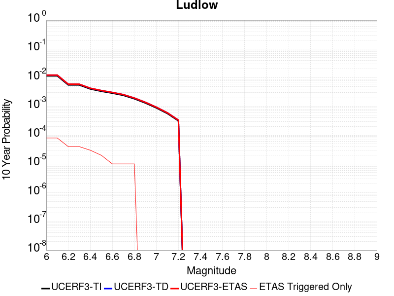 |

| Magnitude | 1 wk TI Prob | 1 wk TD Prob | 1 wk ETAS Prob | 1 wk ETAS/TD Gain | 1 wk ETAS Triggered Only | 1 mo TI Prob | 1 mo TD Prob | 1 mo ETAS Prob | 1 mo ETAS/TD Gain | 1 mo ETAS Triggered Only | 1 yr TI Prob | 1 yr TD Prob | 1 yr ETAS Prob | 1 yr ETAS/TD Gain | 1 yr ETAS Triggered Only | 10 yr TI Prob | 10 yr TD Prob | 10 yr ETAS Prob | 10 yr ETAS/TD Gain | 10 yr ETAS Triggered Only |
|-----|-----|-----|-----|-----|-----|-----|-----|-----|-----|-----|-----|-----|-----|-----|-----|-----|-----|-----|-----|-----|
| 6.0 | 2.2407607E-5 | 2.3657218E-5 | 3.3656983E-5 | 1.422694 | 1.0E-5 | 9.602906E-5 | 1.0138439E-4 | 1.1138337E-4 | 1.0986245 | 1.0E-5 | 0.0011685267 | 0.0012337001 | 0.0012836384 | 1.0404785 | 5.0E-5 | 0.011624013 | 0.012273024 | 0.012352042 | 1.0064384 | 8.0E-5 |
| 6.1 | 2.2407607E-5 | 2.3657218E-5 | 3.3656983E-5 | 1.422694 | 1.0E-5 | 9.602906E-5 | 1.0138439E-4 | 1.1138337E-4 | 1.0986245 | 1.0E-5 | 0.0011685267 | 0.0012337001 | 0.0012836384 | 1.0404785 | 5.0E-5 | 0.011624013 | 0.012273024 | 0.012352042 | 1.0064384 | 8.0E-5 |
| 6.2 | 1.0781252E-5 | 1.1365647E-5 | 2.1365533E-5 | 1.8798343 | 1.0E-5 | 4.620455E-5 | 4.870903E-5 | 5.870854E-5 | 1.2052908 | 1.0E-5 | 5.623952E-4 | 5.928751E-4 | 6.128632E-4 | 1.0337139 | 2.0E-5 | 0.00560974 | 0.0059133526 | 0.0059531163 | 1.0067244 | 4.0E-5 |
| 6.3 | 1.0781252E-5 | 1.1365647E-5 | 2.1365533E-5 | 1.8798343 | 1.0E-5 | 4.620455E-5 | 4.870903E-5 | 5.870854E-5 | 1.2052908 | 1.0E-5 | 5.623952E-4 | 5.928751E-4 | 6.128632E-4 | 1.0337139 | 2.0E-5 | 0.00560974 | 0.0059133526 | 0.0059531163 | 1.0067244 | 4.0E-5 |
| 6.4 | 7.814439E-6 | 8.237717E-6 | 8.237717E-6 | 1.0 | 0.0 | 3.3490025E-5 | 3.530403E-5 | 3.530403E-5 | 1.0 | 0.0 | 4.0766477E-4 | 4.297432E-4 | 4.397389E-4 | 1.0232598 | 1.0E-5 | 0.0040691774 | 0.0042892685 | 0.0043191398 | 1.0069642 | 3.0E-5 |
| 6.5 | 6.4986366E-6 | 6.85091E-6 | 6.85091E-6 | 1.0 | 0.0 | 2.7851002E-5 | 2.9360717E-5 | 2.9360717E-5 | 1.0 | 0.0 | 3.390332E-4 | 3.57409E-4 | 3.57409E-4 | 1.0 | 0.0 | 0.003385164 | 0.003568438 | 0.0035883668 | 1.0055847 | 2.0E-5 |
| 6.6 | 5.582177E-6 | 5.885997E-6 | 5.885997E-6 | 1.0 | 0.0 | 2.3923398E-5 | 2.5225461E-5 | 2.5225461E-5 | 1.0 | 0.0 | 2.9122844E-4 | 3.0707743E-4 | 3.0707743E-4 | 1.0 | 0.0 | 0.0029084706 | 0.0030666045 | 0.0030765738 | 1.003251 | 1.0E-5 |
| 6.7 | 4.6858763E-6 | 4.9404202E-6 | 4.9404202E-6 | 1.0 | 0.0 | 2.0082172E-5 | 2.117306E-5 | 2.117306E-5 | 1.0 | 0.0 | 2.4447302E-4 | 2.5775208E-4 | 2.5775208E-4 | 1.0 | 0.0 | 0.0024420423 | 0.0025745875 | 0.002584562 | 1.0038741 | 1.0E-5 |
| 6.8 | 3.5584908E-6 | 3.7520128E-6 | 3.7520128E-6 | 1.0 | 0.0 | 1.5250586E-5 | 1.607996E-5 | 1.607996E-5 | 1.0 | 0.0 | 1.8566006E-4 | 1.9575632E-4 | 1.9575632E-4 | 1.0 | 0.0 | 0.0018550502 | 0.0019558799 | 0.0019658604 | 1.0051028 | 1.0E-5 |
| 6.9 | 2.532834E-6 | 2.6709995E-6 | 2.6709995E-6 | 1.0 | 0.0 | 1.0854958E-5 | 1.1447092E-5 | 1.1447092E-5 | 1.0 | 0.0 | 1.3215111E-4 | 1.3935972E-4 | 1.3935972E-4 | 1.0 | 0.0 | 0.0013207254 | 0.0013927508 | 0.0013927508 | 1.0 | 0.0 |
| 7.0 | 1.7083285E-6 | 1.8019413E-6 | 1.8019413E-6 | 1.0 | 0.0 | 7.3213873E-6 | 7.722583E-6 | 7.722583E-6 | 1.0 | 0.0 | 8.913424E-5 | 9.4018564E-5 | 9.4018564E-5 | 1.0 | 0.0 | 8.9098496E-4 | 9.3980436E-4 | 9.3980436E-4 | 1.0 | 0.0 |
| 7.1 | 1.0905424E-6 | 1.1497604E-6 | 1.1497604E-6 | 1.0 | 0.0 | 4.6737446E-6 | 4.9275354E-6 | 4.9275354E-6 | 1.0 | 0.0 | 5.6901354E-5 | 5.999119E-5 | 5.999119E-5 | 1.0 | 0.0 | 5.6886784E-4 | 5.9975975E-4 | 5.9975975E-4 | 1.0 | 0.0 |
| 7.2 | 6.06668E-7 | 6.387269E-7 | 6.387269E-7 | 1.0 | 0.0 | 2.600003E-6 | 2.7373983E-6 | 2.7373983E-6 | 1.0 | 0.0 | 3.1654577E-5 | 3.3327386E-5 | 3.3327386E-5 | 1.0 | 0.0 | 3.1650066E-4 | 3.332307E-4 | 3.332307E-4 | 1.0 | 0.0 |

## Cady
*[(top)](#table-of-contents)*

| 1 Week | 1 Month | 1 Year | 10 Year |
|-----|-----|-----|-----|
|  |  |  |  |

| Magnitude | 1 wk TI Prob | 1 wk TD Prob | 1 wk ETAS Prob | 1 wk ETAS/TD Gain | 1 wk ETAS Triggered Only | 1 mo TI Prob | 1 mo TD Prob | 1 mo ETAS Prob | 1 mo ETAS/TD Gain | 1 mo ETAS Triggered Only | 1 yr TI Prob | 1 yr TD Prob | 1 yr ETAS Prob | 1 yr ETAS/TD Gain | 1 yr ETAS Triggered Only | 10 yr TI Prob | 10 yr TD Prob | 10 yr ETAS Prob | 10 yr ETAS/TD Gain | 10 yr ETAS Triggered Only |
|-----|-----|-----|-----|-----|-----|-----|-----|-----|-----|-----|-----|-----|-----|-----|-----|-----|-----|-----|-----|-----|
| 6.0 | 1.9892565E-5 | 2.1858672E-5 | 4.1858235E-5 | 1.9149487 | 2.0E-5 | 8.525106E-5 | 9.367717E-5 | 1.2367436E-4 | 1.3202188 | 3.0E-5 | 0.0010374374 | 0.0011400137 | 0.0011999453 | 1.0525709 | 6.0E-5 | 0.010326075 | 0.011350671 | 0.0114297625 | 1.006968 | 8.0E-5 |
| 6.1 | 1.9892565E-5 | 2.1858672E-5 | 4.1858235E-5 | 1.9149487 | 2.0E-5 | 8.525106E-5 | 9.367717E-5 | 1.2367436E-4 | 1.3202188 | 3.0E-5 | 0.0010374374 | 0.0011400137 | 0.0011999453 | 1.0525709 | 6.0E-5 | 0.010326075 | 0.011350671 | 0.0114297625 | 1.006968 | 8.0E-5 |
| 6.2 | 1.9892565E-5 | 2.1858672E-5 | 4.1858235E-5 | 1.9149487 | 2.0E-5 | 8.525106E-5 | 9.367717E-5 | 1.2367436E-4 | 1.3202188 | 3.0E-5 | 0.0010374374 | 0.0011400137 | 0.0011999453 | 1.0525709 | 6.0E-5 | 0.010326075 | 0.011350671 | 0.0114297625 | 1.006968 | 8.0E-5 |
| 6.3 | 1.1117327E-5 | 1.2176552E-5 | 3.217631E-5 | 2.642481 | 2.0E-5 | 4.764482E-5 | 5.2184358E-5 | 8.218279E-5 | 1.5748549 | 3.0E-5 | 5.7992124E-4 | 6.3519087E-4 | 6.851591E-4 | 1.0786664 | 5.0E-5 | 0.0057841022 | 0.0063368594 | 0.006396479 | 1.0094084 | 6.0E-5 |
| 6.4 | 1.1117327E-5 | 1.2176552E-5 | 3.217631E-5 | 2.642481 | 2.0E-5 | 4.764482E-5 | 5.2184358E-5 | 8.218279E-5 | 1.5748549 | 3.0E-5 | 5.7992124E-4 | 6.3519087E-4 | 6.851591E-4 | 1.0786664 | 5.0E-5 | 0.0057841022 | 0.0063368594 | 0.006396479 | 1.0094084 | 6.0E-5 |
| 6.5 | 6.103093E-6 | 6.672004E-6 | 6.672004E-6 | 1.0 | 0.0 | 2.615585E-5 | 2.859406E-5 | 2.859406E-5 | 1.0 | 0.0 | 3.1840094E-4 | 3.4808964E-4 | 3.5808617E-4 | 1.0287182 | 1.0E-5 | 0.0031794512 | 0.003476678 | 0.0034966085 | 1.0057327 | 2.0E-5 |
| 6.6 | 5.817237E-6 | 6.3656425E-6 | 6.3656425E-6 | 1.0 | 0.0 | 2.4930776E-5 | 2.728111E-5 | 2.728111E-5 | 1.0 | 0.0 | 3.034899E-4 | 3.3210934E-4 | 3.42106E-4 | 1.0301006 | 1.0E-5 | 0.0030307577 | 0.0033173522 | 0.003337286 | 1.0060089 | 2.0E-5 |
| 6.7 | 4.8846314E-6 | 5.3405547E-6 | 5.3405547E-6 | 1.0 | 0.0 | 2.0933967E-5 | 2.2887958E-5 | 2.2887958E-5 | 1.0 | 0.0 | 2.5484123E-4 | 2.7863705E-4 | 2.8863424E-4 | 1.035879 | 1.0E-5 | 0.0025454918 | 0.0027840321 | 0.0028039764 | 1.0071639 | 2.0E-5 |
| 6.8 | 1.7788773E-6 | 1.9399033E-6 | 1.9399033E-6 | 1.0 | 0.0 | 7.6237375E-6 | 8.313854E-6 | 8.313854E-6 | 1.0 | 0.0 | 9.281505E-5 | 1.01218044E-4 | 1.01218044E-4 | 1.0 | 0.0 | 9.2776294E-4 | 0.0010118741 | 0.0010118741 | 1.0 | 0.0 |
| 6.9 | 7.5455404E-7 | 8.29707E-7 | 8.29707E-7 | 1.0 | 0.0 | 3.233799E-6 | 3.5558842E-6 | 3.5558842E-6 | 1.0 | 0.0 | 3.937079E-5 | 4.3292366E-5 | 4.3292366E-5 | 1.0 | 0.0 | 3.9363815E-4 | 4.3287227E-4 | 4.3287227E-4 | 1.0 | 0.0 |
| 7.0 | 6.8578805E-7 | 7.541796E-7 | 7.541796E-7 | 1.0 | 0.0 | 2.9390883E-6 | 3.2321961E-6 | 3.2321961E-6 | 1.0 | 0.0 | 3.578281E-5 | 3.935161E-5 | 3.935161E-5 | 1.0 | 0.0 | 3.577705E-4 | 3.9347887E-4 | 3.9347887E-4 | 1.0 | 0.0 |

## San Andreas (Coachella) rev
*[(top)](#table-of-contents)*

| 1 Week | 1 Month | 1 Year | 10 Year |
|-----|-----|-----|-----|
|  |  |  |  |

| Magnitude | 1 wk TI Prob | 1 wk TD Prob | 1 wk ETAS Prob | 1 wk ETAS/TD Gain | 1 wk ETAS Triggered Only | 1 mo TI Prob | 1 mo TD Prob | 1 mo ETAS Prob | 1 mo ETAS/TD Gain | 1 mo ETAS Triggered Only | 1 yr TI Prob | 1 yr TD Prob | 1 yr ETAS Prob | 1 yr ETAS/TD Gain | 1 yr ETAS Triggered Only | 10 yr TI Prob | 10 yr TD Prob | 10 yr ETAS Prob | 10 yr ETAS/TD Gain | 10 yr ETAS Triggered Only |
|-----|-----|-----|-----|-----|-----|-----|-----|-----|-----|-----|-----|-----|-----|-----|-----|-----|-----|-----|-----|-----|
| 6.0 | 1.1925945E-4 | 3.2723017E-4 | 3.372269E-4 | 1.0305495 | 1.0E-5 | 5.110118E-4 | 0.001401666 | 0.001411652 | 1.0071244 | 1.0E-5 | 0.0062038354 | 0.016933087 | 0.01695275 | 1.0011611 | 2.0E-5 | 0.060334753 | 0.15262908 | 0.15269688 | 1.0004442 | 8.0E-5 |
| 6.1 | 1.1925945E-4 | 3.2723017E-4 | 3.372269E-4 | 1.0305495 | 1.0E-5 | 5.110118E-4 | 0.001401666 | 0.001411652 | 1.0071244 | 1.0E-5 | 0.0062038354 | 0.016933087 | 0.01695275 | 1.0011611 | 2.0E-5 | 0.060334753 | 0.15262908 | 0.15269688 | 1.0004442 | 8.0E-5 |
| 6.2 | 1.07432395E-4 | 3.0223778E-4 | 3.1223477E-4 | 1.0330765 | 1.0E-5 | 4.603433E-4 | 0.0012946657 | 0.0013046528 | 1.007714 | 1.0E-5 | 0.005590286 | 0.01564973 | 0.015669418 | 1.001258 | 2.0E-5 | 0.05451731 | 0.1417999 | 0.14186855 | 1.0004842 | 8.0E-5 |
| 6.3 | 1.0718766E-4 | 3.0169083E-4 | 3.1168782E-4 | 1.0331365 | 1.0E-5 | 4.592948E-4 | 0.001292324 | 0.0013023111 | 1.007728 | 1.0E-5 | 0.005577586 | 0.01562163 | 0.015641317 | 1.0012603 | 2.0E-5 | 0.054396555 | 0.14156814 | 0.14163682 | 1.0004851 | 8.0E-5 |
| 6.4 | 1.0355944E-4 | 2.9377177E-4 | 3.0376881E-4 | 1.0340301 | 1.0E-5 | 4.4375064E-4 | 0.0012584183 | 0.0012684057 | 1.0079365 | 1.0E-5 | 0.0053892885 | 0.015214663 | 0.015234359 | 1.0012945 | 2.0E-5 | 0.052604496 | 0.13812812 | 0.13819706 | 1.0004991 | 8.0E-5 |
| 6.5 | 1.0227914E-4 | 2.909661E-4 | 3.009632E-4 | 1.0343583 | 1.0E-5 | 4.382655E-4 | 0.0012464056 | 0.0012563932 | 1.0080131 | 1.0E-5 | 0.0053228354 | 0.015070442 | 0.0150901405 | 1.0013071 | 2.0E-5 | 0.051971316 | 0.13690725 | 0.1369763 | 1.0005044 | 8.0E-5 |
| 6.6 | 1.0116757E-4 | 2.8862362E-4 | 2.9862073E-4 | 1.0346372 | 1.0E-5 | 4.3350324E-4 | 0.0012363759 | 0.0012463635 | 1.0080781 | 1.0E-5 | 0.0052651367 | 0.014950012 | 0.014969713 | 1.0013177 | 2.0E-5 | 0.051421247 | 0.1358854 | 0.13595453 | 1.0005088 | 8.0E-5 |
| 6.7 | 1.0050676E-4 | 2.8720926E-4 | 2.972064E-4 | 1.0348078 | 1.0E-5 | 4.3067214E-4 | 0.0012303201 | 0.0012403078 | 1.0081179 | 1.0E-5 | 0.005230834 | 0.014877291 | 0.0148969935 | 1.0013243 | 2.0E-5 | 0.051094085 | 0.1352701 | 0.13533063 | 1.0004475 | 7.0E-5 |
| 6.8 | 9.976819E-5 | 2.8524583E-4 | 2.95243E-4 | 1.0350475 | 1.0E-5 | 4.2750788E-4 | 0.0012219134 | 0.0012319011 | 1.008174 | 1.0E-5 | 0.0051924936 | 0.014776332 | 0.014796037 | 1.0013335 | 2.0E-5 | 0.050728295 | 0.13442177 | 0.13448237 | 1.0004507 | 7.0E-5 |
| 6.9 | 9.77719E-5 | 2.8021506E-4 | 2.9021225E-4 | 1.0356768 | 1.0E-5 | 4.1895514E-4 | 0.0012003728 | 0.0012103608 | 1.0083207 | 1.0E-5 | 0.0050888555 | 0.014517602 | 0.014537311 | 1.0013577 | 2.0E-5 | 0.049738888 | 0.13225023 | 0.13231097 | 1.0004593 | 7.0E-5 |
| 7.0 | 8.500761E-5 | 2.4756166E-4 | 2.5755918E-4 | 1.0403839 | 1.0E-5 | 3.6426744E-4 | 0.0010605503 | 0.0010705397 | 1.0094191 | 1.0E-5 | 0.0044259406 | 0.012836529 | 0.012856272 | 1.001538 | 2.0E-5 | 0.04338823 | 0.11810792 | 0.11816966 | 1.0005227 | 7.0E-5 |
| 7.1 | 8.319876E-5 | 2.4358921E-4 | 2.5358677E-4 | 1.0410427 | 1.0E-5 | 3.5651738E-4 | 0.0010435393 | 0.0010535289 | 1.0095727 | 1.0E-5 | 0.004331963 | 0.01263184 | 0.012651587 | 1.0015633 | 2.0E-5 | 0.042484846 | 0.11632819 | 0.11639005 | 1.0005318 | 7.0E-5 |
| 7.2 | 7.563917E-5 | 2.2407399E-4 | 2.3407173E-4 | 1.0446181 | 1.0E-5 | 3.2412758E-4 | 9.599667E-4 | 9.699571E-4 | 1.010407 | 1.0E-5 | 0.0039391145 | 0.01162565 | 0.011635534 | 1.0008502 | 1.0E-5 | 0.03870018 | 0.10773429 | 0.10778783 | 1.000497 | 6.0E-5 |
| 7.3 | 7.082985E-5 | 2.0723743E-4 | 2.0723743E-4 | 1.0 | 0.0 | 3.0352117E-4 | 8.87861E-4 | 8.87861E-4 | 1.0 | 0.0 | 0.0036891096 | 0.010756755 | 0.010756755 | 1.0 | 0.0 | 0.03628465 | 0.10025747 | 0.100302465 | 1.0004487 | 5.0E-5 |
| 7.4 | 5.146215E-5 | 1.4271007E-4 | 1.4271007E-4 | 1.0 | 0.0 | 2.2053342E-4 | 6.1147206E-4 | 6.1147206E-4 | 1.0 | 0.0 | 0.0026816884 | 0.007419449 | 0.007419449 | 1.0 | 0.0 | 0.02649557 | 0.070837796 | 0.07088425 | 1.0006559 | 5.0E-5 |
| 7.5 | 4.0285166E-5 | 1.0941066E-4 | 1.0941066E-4 | 1.0 | 0.0 | 1.7263928E-4 | 4.688189E-4 | 4.688189E-4 | 1.0 | 0.0 | 0.002099857 | 0.005693001 | 0.005693001 | 1.0 | 0.0 | 0.020801254 | 0.055008773 | 0.05505602 | 1.0008589 | 5.0E-5 |
| 7.6 | 3.1168736E-5 | 8.438435E-5 | 8.438435E-5 | 1.0 | 0.0 | 1.3357346E-4 | 3.6159722E-4 | 3.6159722E-4 | 1.0 | 0.0 | 0.0016250437 | 0.004393586 | 0.004393586 | 1.0 | 0.0 | 0.016132116 | 0.04280791 | 0.04285577 | 1.0011181 | 5.0E-5 |
| 7.7 | 2.2100989E-5 | 6.2383384E-5 | 6.2383384E-5 | 1.0 | 0.0 | 9.4715084E-5 | 2.6733E-4 | 2.6733E-4 | 1.0 | 0.0 | 0.001152546 | 0.0032498916 | 0.0032498916 | 1.0 | 0.0 | 0.011465867 | 0.031898305 | 0.03194671 | 1.0015175 | 5.0E-5 |
| 7.8 | 1.7484861E-5 | 5.1792E-5 | 5.1792E-5 | 1.0 | 0.0 | 7.493296E-5 | 2.2194686E-4 | 2.2194686E-4 | 1.0 | 0.0 | 9.1192697E-4 | 0.0026988573 | 0.0026988573 | 1.0 | 0.0 | 0.009081938 | 0.026638424 | 0.026687091 | 1.001827 | 5.0E-5 |
| 7.9 | 1.3967285E-5 | 3.8219507E-5 | 3.8219507E-5 | 1.0 | 0.0 | 5.985842E-5 | 1.6378761E-4 | 1.6378761E-4 | 1.0 | 0.0 | 7.2853256E-4 | 0.0019922915 | 0.0019922915 | 1.0 | 0.0 | 0.0072614877 | 0.01990803 | 0.019957034 | 1.0024616 | 5.0E-5 |
| 8.0 | 1.1887396E-5 | 3.10626E-5 | 3.10626E-5 | 1.0 | 0.0 | 5.094499E-5 | 1.3311864E-4 | 1.3311864E-4 | 1.0 | 0.0 | 6.200787E-4 | 0.0016195155 | 0.0016195155 | 1.0 | 0.0 | 0.006183513 | 0.016278049 | 0.0163174 | 1.0024173 | 4.0E-5 |
| 8.1 | 5.100864E-6 | 8.972364E-6 | 8.972364E-6 | 1.0 | 0.0 | 2.1860664E-5 | 3.8452425E-5 | 3.8452425E-5 | 1.0 | 0.0 | 2.6612106E-4 | 4.680578E-4 | 4.680578E-4 | 1.0 | 0.0 | 0.002658026 | 0.004917206 | 0.0049271565 | 1.0020237 | 1.0E-5 |
| 8.2 | 2.3004484E-6 | 2.7860247E-6 | 2.7860247E-6 | 1.0 | 0.0 | 9.859027E-6 | 1.1940051E-5 | 1.1940051E-5 | 1.0 | 0.0 | 1.2002704E-4 | 1.4536046E-4 | 1.4536046E-4 | 1.0 | 0.0 | 0.0011996223 | 0.0015971722 | 0.0015971722 | 1.0 | 0.0 |
| 8.3 | 1.0424446E-7 | 5.814984E-8 | 5.814984E-8 | 1.0 | 0.0 | 4.4676187E-7 | 2.4921357E-7 | 2.4921357E-7 | 1.0 | 0.0 | 5.439312E-6 | 3.0341714E-6 | 3.0341714E-6 | 1.0 | 0.0 | 5.4391792E-5 | 3.1900923E-5 | 3.1900923E-5 | 1.0 | 0.0 |

## Death Valley (Fish Lake Valley)
*[(top)](#table-of-contents)*

| 1 Week | 1 Month | 1 Year | 10 Year |
|-----|-----|-----|-----|
|  |  |  |  |

| Magnitude | 1 wk TI Prob | 1 wk TD Prob | 1 wk ETAS Prob | 1 wk ETAS/TD Gain | 1 wk ETAS Triggered Only | 1 mo TI Prob | 1 mo TD Prob | 1 mo ETAS Prob | 1 mo ETAS/TD Gain | 1 mo ETAS Triggered Only | 1 yr TI Prob | 1 yr TD Prob | 1 yr ETAS Prob | 1 yr ETAS/TD Gain | 1 yr ETAS Triggered Only | 10 yr TI Prob | 10 yr TD Prob | 10 yr ETAS Prob | 10 yr ETAS/TD Gain | 10 yr ETAS Triggered Only |
|-----|-----|-----|-----|-----|-----|-----|-----|-----|-----|-----|-----|-----|-----|-----|-----|-----|-----|-----|-----|-----|
| 6.0 | 3.872328E-5 | 4.7267185E-5 | 5.7266712E-5 | 1.2115532 | 1.0E-5 | 1.6594635E-4 | 2.0255962E-4 | 2.125576E-4 | 1.0493581 | 1.0E-5 | 0.0020185246 | 0.00246352 | 0.002493446 | 1.0121477 | 3.0E-5 | 0.02000288 | 0.02438804 | 0.024446577 | 1.0024003 | 6.0E-5 |
| 6.1 | 3.872328E-5 | 4.7267185E-5 | 5.7266712E-5 | 1.2115532 | 1.0E-5 | 1.6594635E-4 | 2.0255962E-4 | 2.125576E-4 | 1.0493581 | 1.0E-5 | 0.0020185246 | 0.00246352 | 0.002493446 | 1.0121477 | 3.0E-5 | 0.02000288 | 0.02438804 | 0.024446577 | 1.0024003 | 6.0E-5 |
| 6.2 | 3.872328E-5 | 4.7267185E-5 | 5.7266712E-5 | 1.2115532 | 1.0E-5 | 1.6594635E-4 | 2.0255962E-4 | 2.125576E-4 | 1.0493581 | 1.0E-5 | 0.0020185246 | 0.00246352 | 0.002493446 | 1.0121477 | 3.0E-5 | 0.02000288 | 0.02438804 | 0.024446577 | 1.0024003 | 6.0E-5 |
| 6.3 | 2.8356371E-5 | 3.3609682E-5 | 4.3609347E-5 | 1.2975233 | 1.0E-5 | 1.2152165E-4 | 1.4403398E-4 | 1.5403255E-4 | 1.0694181 | 1.0E-5 | 0.0014785219 | 0.0017522823 | 0.0017822298 | 1.0170906 | 3.0E-5 | 0.014687235 | 0.017391697 | 0.017450653 | 1.00339 | 6.0E-5 |
| 6.4 | 2.8356371E-5 | 3.3609682E-5 | 4.3609347E-5 | 1.2975233 | 1.0E-5 | 1.2152165E-4 | 1.4403398E-4 | 1.5403255E-4 | 1.0694181 | 1.0E-5 | 0.0014785219 | 0.0017522823 | 0.0017822298 | 1.0170906 | 3.0E-5 | 0.014687235 | 0.017391697 | 0.017450653 | 1.00339 | 6.0E-5 |
| 6.5 | 2.4448687E-5 | 2.8607421E-5 | 3.8607133E-5 | 1.3495497 | 1.0E-5 | 1.0477588E-4 | 1.2259776E-4 | 1.3259653E-4 | 1.0815575 | 1.0E-5 | 0.0012748998 | 0.0014916563 | 0.0015216115 | 1.0200819 | 3.0E-5 | 0.012676105 | 0.01482131 | 0.01488042 | 1.0039883 | 6.0E-5 |
| 6.6 | 2.1298161E-5 | 2.465998E-5 | 3.4659734E-5 | 1.4055053 | 1.0E-5 | 9.127464E-5 | 1.0568153E-4 | 1.1568048E-4 | 1.0946139 | 1.0E-5 | 0.0011107022 | 0.001285947 | 0.0013159085 | 1.0232991 | 3.0E-5 | 0.011051672 | 0.012788472 | 0.012847704 | 1.0046318 | 6.0E-5 |
| 6.7 | 1.8959729E-5 | 2.1780937E-5 | 3.178072E-5 | 1.459107 | 1.0E-5 | 8.125345E-5 | 9.334368E-5 | 1.0334275E-4 | 1.107121 | 1.0E-5 | 9.888117E-4 | 0.0011358924 | 0.0011658584 | 1.0263809 | 3.0E-5 | 0.009844234 | 0.0113035245 | 0.011362847 | 1.0052481 | 6.0E-5 |
| 6.8 | 1.6691629E-5 | 1.901828E-5 | 2.901809E-5 | 1.5257999 | 1.0E-5 | 7.153359E-5 | 8.150447E-5 | 9.150365E-5 | 1.1226827 | 1.0E-5 | 8.7057345E-4 | 9.918819E-4 | 0.0010218523 | 1.0302155 | 3.0E-5 | 0.008671708 | 0.009876307 | 0.009935714 | 1.0060152 | 6.0E-5 |
| 6.9 | 1.450505E-5 | 1.6389482E-5 | 2.6389318E-5 | 1.6101373 | 1.0E-5 | 6.216302E-5 | 7.02388E-5 | 8.02381E-5 | 1.1423614 | 1.0E-5 | 7.5657194E-4 | 8.5483067E-4 | 8.84805E-4 | 1.0350647 | 3.0E-5 | 0.007540013 | 0.008516356 | 0.0085758455 | 1.0069853 | 6.0E-5 |
| 7.0 | 1.2940855E-5 | 1.4537924E-5 | 2.4537778E-5 | 1.6878462 | 1.0E-5 | 5.545963E-5 | 6.230393E-5 | 7.230331E-5 | 1.1604935 | 1.0E-5 | 6.750118E-4 | 7.5829215E-4 | 7.8826945E-4 | 1.0395325 | 3.0E-5 | 0.006729651 | 0.007557665 | 0.0076172114 | 1.007879 | 6.0E-5 |
| 7.1 | 1.2544658E-5 | 1.4078161E-5 | 2.4078021E-5 | 1.71031 | 1.0E-5 | 5.3761712E-5 | 6.0333616E-5 | 7.033301E-5 | 1.1657351 | 1.0E-5 | 6.5435225E-4 | 7.343198E-4 | 7.642978E-4 | 1.0408242 | 3.0E-5 | 0.006524288 | 0.007319527 | 0.007379088 | 1.0081372 | 6.0E-5 |
| 7.2 | 1.2489416E-5 | 1.4015628E-5 | 2.4015488E-5 | 1.7134793 | 1.0E-5 | 5.3524967E-5 | 6.0065628E-5 | 7.006503E-5 | 1.1664746 | 1.0E-5 | 6.514716E-4 | 7.3105923E-4 | 7.610373E-4 | 1.0410063 | 3.0E-5 | 0.006495651 | 0.007287136 | 0.0073466985 | 1.0081737 | 6.0E-5 |
| 7.3 | 1.2368307E-5 | 1.3879767E-5 | 2.387963E-5 | 1.7204632 | 1.0E-5 | 5.3005948E-5 | 5.948339E-5 | 6.94828E-5 | 1.1681042 | 1.0E-5 | 6.451563E-4 | 7.2397524E-4 | 7.539535E-4 | 1.0414078 | 3.0E-5 | 0.0064328653 | 0.0072167586 | 0.0072763255 | 1.0082539 | 6.0E-5 |
| 7.4 | 1.2161707E-5 | 1.3647823E-5 | 2.3647686E-5 | 1.7327076 | 1.0E-5 | 5.212056E-5 | 5.8489393E-5 | 6.848881E-5 | 1.1709611 | 1.0E-5 | 6.3438306E-4 | 7.1188126E-4 | 7.418599E-4 | 1.0421119 | 3.0E-5 | 0.006325751 | 0.0070965975 | 0.007156172 | 1.0083947 | 6.0E-5 |
| 7.5 | 1.1707948E-5 | 1.3145472E-5 | 2.3145341E-5 | 1.7607082 | 1.0E-5 | 5.0175953E-5 | 5.633655E-5 | 6.633599E-5 | 1.1774946 | 1.0E-5 | 6.10721E-4 | 6.8568724E-4 | 7.156667E-4 | 1.0437217 | 3.0E-5 | 0.0060904534 | 0.006836299 | 0.0068958886 | 1.0087167 | 6.0E-5 |
| 7.6 | 1.0319538E-5 | 1.1579585E-5 | 2.1579468E-5 | 1.8635788 | 1.0E-5 | 4.4225842E-5 | 4.9625876E-5 | 5.962538E-5 | 1.2014978 | 1.0E-5 | 5.383166E-4 | 6.040327E-4 | 6.340146E-4 | 1.0496361 | 3.0E-5 | 0.0053701443 | 0.0060244408 | 0.0060840794 | 1.0098994 | 6.0E-5 |
| 7.7 | 8.937764E-6 | 1.0022746E-5 | 2.0022646E-5 | 1.9977205 | 1.0E-5 | 3.830414E-5 | 4.295395E-5 | 5.295352E-5 | 1.2327975 | 1.0E-5 | 4.6625308E-4 | 5.228439E-4 | 5.528282E-4 | 1.0573485 | 3.0E-5 | 0.0046527605 | 0.0052166474 | 0.0052763345 | 1.0114416 | 6.0E-5 |
| 7.8 | 3.108007E-7 | 3.284649E-7 | 3.284649E-7 | 1.0 | 0.0 | 1.3320023E-6 | 1.407706E-6 | 1.407706E-6 | 1.0 | 0.0 | 1.6217007E-5 | 1.713869E-5 | 2.7138518E-5 | 1.5834652 | 1.0E-5 | 1.6215823E-4 | 1.7137405E-4 | 1.8137234E-4 | 1.0583419 | 1.0E-5 |
| 7.9 | 2.5591178E-9 | 2.6696687E-9 | 2.6696687E-9 | 1.0 | 0.0 | 1.0967647E-8 | 1.1441437E-8 | 1.1441437E-8 | 1.0 | 0.0 | 1.335311E-7 | 1.392995E-7 | 1.392995E-7 | 1.0 | 0.0 | 1.3353102E-6 | 1.3929949E-6 | 1.3929949E-6 | 1.0 | 0.0 |

## San Jacinto (San Jacinto Valley) rev
*[(top)](#table-of-contents)*

| 1 Week | 1 Month | 1 Year | 10 Year |
|-----|-----|-----|-----|
|  |  |  |  |

| Magnitude | 1 wk TI Prob | 1 wk TD Prob | 1 wk ETAS Prob | 1 wk ETAS/TD Gain | 1 wk ETAS Triggered Only | 1 mo TI Prob | 1 mo TD Prob | 1 mo ETAS Prob | 1 mo ETAS/TD Gain | 1 mo ETAS Triggered Only | 1 yr TI Prob | 1 yr TD Prob | 1 yr ETAS Prob | 1 yr ETAS/TD Gain | 1 yr ETAS Triggered Only | 10 yr TI Prob | 10 yr TD Prob | 10 yr ETAS Prob | 10 yr ETAS/TD Gain | 10 yr ETAS Triggered Only |
|-----|-----|-----|-----|-----|-----|-----|-----|-----|-----|-----|-----|-----|-----|-----|-----|-----|-----|-----|-----|-----|
| 6.0 | 3.652694E-5 | 3.4395853E-5 | 6.439482E-5 | 1.8721682 | 3.0E-5 | 1.5653463E-4 | 1.4740248E-4 | 1.7739805E-4 | 1.2034944 | 3.0E-5 | 0.0019041431 | 0.0017931493 | 0.0018230955 | 1.0167004 | 3.0E-5 | 0.018879099 | 0.018523198 | 0.018582087 | 1.0031792 | 6.0E-5 |
| 6.1 | 3.652694E-5 | 3.4395853E-5 | 6.439482E-5 | 1.8721682 | 3.0E-5 | 1.5653463E-4 | 1.4740248E-4 | 1.7739805E-4 | 1.2034944 | 3.0E-5 | 0.0019041431 | 0.0017931493 | 0.0018230955 | 1.0167004 | 3.0E-5 | 0.018879099 | 0.018523198 | 0.018582087 | 1.0031792 | 6.0E-5 |
| 6.2 | 3.652694E-5 | 3.4395853E-5 | 6.439482E-5 | 1.8721682 | 3.0E-5 | 1.5653463E-4 | 1.4740248E-4 | 1.7739805E-4 | 1.2034944 | 3.0E-5 | 0.0019041431 | 0.0017931493 | 0.0018230955 | 1.0167004 | 3.0E-5 | 0.018879099 | 0.018523198 | 0.018582087 | 1.0031792 | 6.0E-5 |
| 6.3 | 3.652694E-5 | 3.4395853E-5 | 6.439482E-5 | 1.8721682 | 3.0E-5 | 1.5653463E-4 | 1.4740248E-4 | 1.7739805E-4 | 1.2034944 | 3.0E-5 | 0.0019041431 | 0.0017931493 | 0.0018230955 | 1.0167004 | 3.0E-5 | 0.018879099 | 0.018523198 | 0.018582087 | 1.0031792 | 6.0E-5 |
| 6.4 | 3.646941E-5 | 3.431743E-5 | 6.43164E-5 | 1.8741614 | 3.0E-5 | 1.5628811E-4 | 1.4706641E-4 | 1.77062E-4 | 1.2039595 | 3.0E-5 | 0.0019011468 | 0.001789065 | 0.0018190113 | 1.0167385 | 3.0E-5 | 0.018849645 | 0.01848308 | 0.018541971 | 1.0031862 | 6.0E-5 |
| 6.5 | 3.646941E-5 | 3.431743E-5 | 6.43164E-5 | 1.8741614 | 3.0E-5 | 1.5628811E-4 | 1.4706641E-4 | 1.77062E-4 | 1.2039595 | 3.0E-5 | 0.0019011468 | 0.001789065 | 0.0018190113 | 1.0167385 | 3.0E-5 | 0.018849645 | 0.01848308 | 0.018541971 | 1.0031862 | 6.0E-5 |
| 6.6 | 3.6442503E-5 | 3.4280816E-5 | 6.427979E-5 | 1.875095 | 3.0E-5 | 1.561728E-4 | 1.4690952E-4 | 1.7690512E-4 | 1.2041774 | 3.0E-5 | 0.0018997455 | 0.0017871578 | 0.0018171043 | 1.0167564 | 3.0E-5 | 0.018835869 | 0.01846435 | 0.01852324 | 1.0031896 | 6.0E-5 |
| 6.7 | 3.6432113E-5 | 3.4266388E-5 | 6.426536E-5 | 1.8754635 | 3.0E-5 | 1.5612828E-4 | 1.4684768E-4 | 1.7684328E-4 | 1.2042633 | 3.0E-5 | 0.0018992044 | 0.0017864066 | 0.0018163531 | 1.0167634 | 3.0E-5 | 0.018830549 | 0.018456973 | 0.018515864 | 1.0031908 | 6.0E-5 |
| 6.8 | 3.6409598E-5 | 3.4235443E-5 | 6.423442E-5 | 1.8762548 | 3.0E-5 | 1.560318E-4 | 1.4671509E-4 | 1.7671069E-4 | 1.204448 | 3.0E-5 | 0.0018980318 | 0.0017847948 | 0.0018147413 | 1.0167787 | 3.0E-5 | 0.018819023 | 0.018441128 | 0.01850002 | 1.0031936 | 6.0E-5 |
| 6.9 | 3.638078E-5 | 3.4195866E-5 | 6.419484E-5 | 1.877269 | 3.0E-5 | 1.5590832E-4 | 1.465455E-4 | 1.765411E-4 | 1.2046846 | 3.0E-5 | 0.0018965311 | 0.0017827335 | 0.0018126799 | 1.0167981 | 3.0E-5 | 0.018804269 | 0.018420862 | 0.018479755 | 1.0031972 | 6.0E-5 |
| 7.0 | 3.6294874E-5 | 3.4077882E-5 | 6.407686E-5 | 1.8803064 | 3.0E-5 | 1.5554018E-4 | 1.460399E-4 | 1.7603552E-4 | 1.2053933 | 3.0E-5 | 0.0018920569 | 0.0017765884 | 0.0018065352 | 1.0168563 | 3.0E-5 | 0.018760284 | 0.018360443 | 0.018419342 | 1.0032079 | 6.0E-5 |
| 7.1 | 3.6260717E-5 | 3.4034165E-5 | 6.403314E-5 | 1.8814372 | 3.0E-5 | 1.5539382E-4 | 1.4585257E-4 | 1.758482E-4 | 1.2056571 | 3.0E-5 | 0.001890278 | 0.0017743113 | 0.0018042581 | 1.016878 | 3.0E-5 | 0.018742796 | 0.018338045 | 0.018396944 | 1.0032119 | 6.0E-5 |
| 7.2 | 3.6210204E-5 | 3.3968383E-5 | 6.396737E-5 | 1.8831441 | 3.0E-5 | 1.5517735E-4 | 1.4557068E-4 | 1.7556631E-4 | 1.2060554 | 3.0E-5 | 0.001887647 | 0.001770885 | 0.0018008319 | 1.0169107 | 3.0E-5 | 0.01871693 | 0.018304324 | 0.018363226 | 1.0032179 | 6.0E-5 |
| 7.3 | 3.6119454E-5 | 3.385667E-5 | 6.385566E-5 | 1.8860582 | 3.0E-5 | 1.5478847E-4 | 1.4509197E-4 | 1.7508761E-4 | 1.2067354 | 3.0E-5 | 0.0018829206 | 0.0017650661 | 0.0017950131 | 1.0169666 | 3.0E-5 | 0.018670462 | 0.018246878 | 0.018305784 | 1.0032282 | 6.0E-5 |
| 7.4 | 3.607848E-5 | 3.38042E-5 | 6.3803185E-5 | 1.8874336 | 3.0E-5 | 1.5461289E-4 | 1.4486712E-4 | 1.7486277E-4 | 1.2070563 | 3.0E-5 | 0.0018807866 | 0.001762333 | 0.0017922801 | 1.0169929 | 3.0E-5 | 0.018649481 | 0.018219888 | 0.018278794 | 1.0032331 | 6.0E-5 |
| 7.5 | 3.5856774E-5 | 3.361402E-5 | 6.3613006E-5 | 1.8924549 | 3.0E-5 | 1.5366284E-4 | 1.4405213E-4 | 1.7404782E-4 | 1.208228 | 3.0E-5 | 0.0018692396 | 0.0017524265 | 0.001782374 | 1.0170891 | 3.0E-5 | 0.018535944 | 0.018121008 | 0.018179921 | 1.0032511 | 6.0E-5 |
| 7.6 | 3.286655E-5 | 3.213729E-5 | 6.213633E-5 | 1.933465 | 3.0E-5 | 1.4084904E-4 | 1.3772398E-4 | 1.6771986E-4 | 1.217797 | 3.0E-5 | 0.001713488 | 0.0016755019 | 0.0017054516 | 1.0178751 | 3.0E-5 | 0.017003361 | 0.01734083 | 0.01739979 | 1.0034001 | 6.0E-5 |
| 7.7 | 2.8882527E-5 | 2.9233452E-5 | 5.9232574E-5 | 2.0261917 | 3.0E-5 | 1.237764E-4 | 1.252802E-4 | 1.5527644E-4 | 1.2394332 | 3.0E-5 | 0.0015059357 | 0.0015242205 | 0.0015541747 | 1.0196522 | 3.0E-5 | 0.014957713 | 0.01582899 | 0.015888039 | 1.0037305 | 6.0E-5 |
| 7.8 | 2.4950225E-5 | 2.6524469E-5 | 5.6523673E-5 | 2.1310012 | 3.0E-5 | 1.0692515E-4 | 1.1367135E-4 | 1.4366793E-4 | 1.2638887 | 3.0E-5 | 0.0013010362 | 0.0013830708 | 0.0014130294 | 1.0216608 | 3.0E-5 | 0.012934455 | 0.014410337 | 0.014469473 | 1.0041037 | 6.0E-5 |
| 7.9 | 1.9881603E-5 | 2.150498E-5 | 5.1504336E-5 | 2.3949957 | 3.0E-5 | 8.520408E-5 | 9.2160946E-5 | 1.2215819E-4 | 1.3254875 | 3.0E-5 | 0.001036866 | 0.0011214828 | 0.0011514492 | 1.0267203 | 3.0E-5 | 0.010320415 | 0.011775744 | 0.011835037 | 1.0050352 | 6.0E-5 |
| 8.0 | 1.563292E-5 | 1.5935346E-5 | 4.5934867E-5 | 2.8825774 | 3.0E-5 | 6.6996516E-5 | 6.829255E-5 | 9.8290504E-5 | 1.4392565 | 3.0E-5 | 8.153773E-4 | 8.311453E-4 | 8.611204E-4 | 1.0360647 | 3.0E-5 | 0.00812392 | 0.008809454 | 0.008859013 | 1.0056257 | 5.0E-5 |
| 8.1 | 1.0045313E-5 | 8.300641E-6 | 2.8300474E-5 | 3.4094326 | 2.0E-5 | 4.305063E-5 | 3.5573692E-5 | 5.557298E-5 | 1.5621933 | 2.0E-5 | 5.2401534E-4 | 4.3302414E-4 | 4.5301547E-4 | 1.0461668 | 2.0E-5 | 0.0052278144 | 0.0046584895 | 0.004698303 | 1.0085465 | 4.0E-5 |
| 8.2 | 4.1554413E-6 | 1.565228E-6 | 1.565228E-6 | 1.0 | 0.0 | 1.7808914E-5 | 6.708103E-6 | 6.708103E-6 | 1.0 | 0.0 | 2.1680194E-4 | 8.166812E-5 | 8.166812E-5 | 1.0 | 0.0 | 0.0021659054 | 9.481009E-4 | 9.481009E-4 | 1.0 | 0.0 |
| 8.3 | 1.2758221E-6 | 3.6140935E-7 | 3.6140935E-7 | 1.0 | 0.0 | 5.4677976E-6 | 1.5488963E-6 | 1.5488963E-6 | 1.0 | 0.0 | 6.65684E-5 | 1.8857654E-5 | 1.8857654E-5 | 1.0 | 0.0 | 6.6548464E-4 | 2.2746001E-4 | 2.2746001E-4 | 1.0 | 0.0 |

## San Andreas (San Gorgonio Pass-Garnet HIll)
*[(top)](#table-of-contents)*

| 1 Week | 1 Month | 1 Year | 10 Year |
|-----|-----|-----|-----|
|  |  |  |  |

| Magnitude | 1 wk TI Prob | 1 wk TD Prob | 1 wk ETAS Prob | 1 wk ETAS/TD Gain | 1 wk ETAS Triggered Only | 1 mo TI Prob | 1 mo TD Prob | 1 mo ETAS Prob | 1 mo ETAS/TD Gain | 1 mo ETAS Triggered Only | 1 yr TI Prob | 1 yr TD Prob | 1 yr ETAS Prob | 1 yr ETAS/TD Gain | 1 yr ETAS Triggered Only | 10 yr TI Prob | 10 yr TD Prob | 10 yr ETAS Prob | 10 yr ETAS/TD Gain | 10 yr ETAS Triggered Only |
|-----|-----|-----|-----|-----|-----|-----|-----|-----|-----|-----|-----|-----|-----|-----|-----|-----|-----|-----|-----|-----|
| 6.0 | 8.31567E-5 | 2.3376173E-4 | 2.5375705E-4 | 1.0855372 | 2.0E-5 | 3.5633717E-4 | 0.0010014536 | 0.0010214336 | 1.019951 | 2.0E-5 | 0.004329778 | 0.012124644 | 0.012144402 | 1.0016296 | 2.0E-5 | 0.042463828 | 0.11255409 | 0.11260734 | 1.000473 | 6.0E-5 |
| 6.1 | 8.31567E-5 | 2.3376173E-4 | 2.5375705E-4 | 1.0855372 | 2.0E-5 | 3.5633717E-4 | 0.0010014536 | 0.0010214336 | 1.019951 | 2.0E-5 | 0.004329778 | 0.012124644 | 0.012144402 | 1.0016296 | 2.0E-5 | 0.042463828 | 0.11255409 | 0.11260734 | 1.000473 | 6.0E-5 |
| 6.2 | 8.31567E-5 | 2.3376173E-4 | 2.5375705E-4 | 1.0855372 | 2.0E-5 | 3.5633717E-4 | 0.0010014536 | 0.0010214336 | 1.019951 | 2.0E-5 | 0.004329778 | 0.012124644 | 0.012144402 | 1.0016296 | 2.0E-5 | 0.042463828 | 0.11255409 | 0.11260734 | 1.000473 | 6.0E-5 |
| 6.3 | 8.31567E-5 | 2.3376173E-4 | 2.5375705E-4 | 1.0855372 | 2.0E-5 | 3.5633717E-4 | 0.0010014536 | 0.0010214336 | 1.019951 | 2.0E-5 | 0.004329778 | 0.012124644 | 0.012144402 | 1.0016296 | 2.0E-5 | 0.042463828 | 0.11255409 | 0.11260734 | 1.000473 | 6.0E-5 |
| 6.4 | 8.059055E-5 | 2.2934518E-4 | 2.493406E-4 | 1.0871848 | 2.0E-5 | 3.4534236E-4 | 9.825402E-4 | 0.0010025206 | 1.0203354 | 2.0E-5 | 0.0041964394 | 0.011896912 | 0.011916674 | 1.0016611 | 2.0E-5 | 0.041180745 | 0.11053528 | 0.11058865 | 1.0004828 | 6.0E-5 |
| 6.5 | 8.059055E-5 | 2.2934518E-4 | 2.493406E-4 | 1.0871848 | 2.0E-5 | 3.4534236E-4 | 9.825402E-4 | 0.0010025206 | 1.0203354 | 2.0E-5 | 0.0041964394 | 0.011896912 | 0.011916674 | 1.0016611 | 2.0E-5 | 0.041180745 | 0.11053528 | 0.11058865 | 1.0004828 | 6.0E-5 |
| 6.6 | 7.619237E-5 | 2.2178894E-4 | 2.417845E-4 | 1.0901558 | 2.0E-5 | 3.2649786E-4 | 9.5018005E-4 | 9.7016105E-4 | 1.0210286 | 2.0E-5 | 0.0039678677 | 0.011507631 | 0.011527401 | 1.0017179 | 2.0E-5 | 0.03897764 | 0.1070719 | 0.10712547 | 1.0005003 | 6.0E-5 |
| 6.7 | 7.440636E-5 | 2.1854721E-4 | 2.3854285E-4 | 1.0914934 | 2.0E-5 | 3.188454E-4 | 9.36297E-4 | 9.5627824E-4 | 1.0213407 | 2.0E-5 | 0.0038750346 | 0.0113403695 | 0.011360143 | 1.0017436 | 2.0E-5 | 0.038081564 | 0.10558031 | 0.105633974 | 1.0005083 | 6.0E-5 |
| 6.8 | 7.3735864E-5 | 2.1701894E-4 | 2.3701461E-4 | 1.0921378 | 2.0E-5 | 3.1597257E-4 | 9.2975196E-4 | 9.4973337E-4 | 1.0214912 | 2.0E-5 | 0.0038401815 | 0.011261511 | 0.011281285 | 1.001756 | 2.0E-5 | 0.03774495 | 0.104881845 | 0.10493555 | 1.0005121 | 6.0E-5 |
| 6.9 | 7.27575E-5 | 2.1470869E-4 | 2.3470439E-4 | 1.0931295 | 2.0E-5 | 3.117806E-4 | 9.198579E-4 | 9.3983946E-4 | 1.0217224 | 2.0E-5 | 0.003789323 | 0.011142288 | 0.011162065 | 1.0017749 | 2.0E-5 | 0.037253562 | 0.103829734 | 0.103883505 | 1.0005178 | 6.0E-5 |
| 7.0 | 7.102591E-5 | 2.1054916E-4 | 2.3054495E-4 | 1.0949697 | 2.0E-5 | 3.0436125E-4 | 9.020437E-4 | 9.2202565E-4 | 1.0221518 | 2.0E-5 | 0.003699303 | 0.010927594 | 0.010947376 | 1.0018102 | 2.0E-5 | 0.03638325 | 0.1019319 | 0.10198579 | 1.0005286 | 6.0E-5 |
| 7.1 | 7.028513E-5 | 2.0890564E-4 | 2.2890145E-4 | 1.095717 | 2.0E-5 | 3.0118722E-4 | 8.950049E-4 | 9.14987E-4 | 1.0223262 | 2.0E-5 | 0.0036607897 | 0.010842753 | 0.010862536 | 1.0018245 | 2.0E-5 | 0.036010686 | 0.10117493 | 0.101228856 | 1.000533 | 6.0E-5 |
| 7.2 | 6.8498244E-5 | 2.0498442E-4 | 2.2498032E-4 | 1.0975484 | 2.0E-5 | 2.9353087E-4 | 8.782111E-4 | 8.9819357E-4 | 1.0227536 | 2.0E-5 | 0.003567883 | 0.010640301 | 0.010660089 | 1.0018597 | 2.0E-5 | 0.035111405 | 0.099366926 | 0.099420965 | 1.0005438 | 6.0E-5 |
| 7.3 | 6.622592E-5 | 1.9725891E-4 | 2.1725496E-4 | 1.1013696 | 2.0E-5 | 2.8379448E-4 | 8.4512355E-4 | 8.6510665E-4 | 1.0236452 | 2.0E-5 | 0.0034497243 | 0.010241316 | 0.010261111 | 1.0019329 | 2.0E-5 | 0.033966612 | 0.09586389 | 0.09591814 | 1.0005659 | 6.0E-5 |
| 7.4 | 5.1050705E-5 | 1.468621E-4 | 1.6685917E-4 | 1.1361622 | 2.0E-5 | 2.1877038E-4 | 6.292581E-4 | 6.492455E-4 | 1.0317634 | 2.0E-5 | 0.002660276 | 0.0076344977 | 0.007654345 | 1.0025997 | 2.0E-5 | 0.02628654 | 0.07285113 | 0.072906755 | 1.0007637 | 6.0E-5 |
| 7.5 | 3.9302922E-5 | 1.1129282E-4 | 1.312906E-4 | 1.1796861 | 2.0E-5 | 1.6843023E-4 | 4.768824E-4 | 4.968728E-4 | 1.0419191 | 2.0E-5 | 0.0020487092 | 0.005790656 | 0.00581054 | 1.0034338 | 2.0E-5 | 0.020299247 | 0.05600702 | 0.05606366 | 1.0010113 | 6.0E-5 |
| 7.6 | 2.9851626E-5 | 8.494473E-5 | 1.0494303E-4 | 1.2354273 | 2.0E-5 | 1.2792926E-4 | 3.6399817E-4 | 3.8399087E-4 | 1.0549253 | 2.0E-5 | 0.0015564259 | 0.0044226977 | 0.0044426094 | 1.0045022 | 2.0E-5 | 0.0154556995 | 0.043191496 | 0.043248903 | 1.0013292 | 6.0E-5 |
| 7.7 | 2.1135214E-5 | 6.352455E-5 | 8.352328E-5 | 1.3148189 | 2.0E-5 | 9.0576345E-5 | 2.7221968E-4 | 2.9221424E-4 | 1.0734501 | 2.0E-5 | 0.0011022091 | 0.0033092434 | 0.0033291772 | 1.0060236 | 2.0E-5 | 0.010967582 | 0.03258059 | 0.032638635 | 1.0017816 | 6.0E-5 |
| 7.8 | 1.883379E-5 | 5.56362E-5 | 7.5635086E-5 | 1.3594582 | 2.0E-5 | 8.0713755E-5 | 2.3841907E-4 | 2.584143E-4 | 1.0838659 | 2.0E-5 | 9.822468E-4 | 0.0028988915 | 0.0029188336 | 1.0068792 | 2.0E-5 | 0.0097791655 | 0.02869336 | 0.028751638 | 1.0020311 | 6.0E-5 |
| 7.9 | 1.5156185E-5 | 4.165507E-5 | 6.165424E-5 | 1.4801136 | 2.0E-5 | 6.495346E-5 | 1.7850952E-4 | 1.9850595E-4 | 1.1120188 | 2.0E-5 | 7.9052144E-4 | 0.0021711884 | 0.002191145 | 1.0091915 | 2.0E-5 | 0.007877152 | 0.021757882 | 0.021816578 | 1.0026976 | 6.0E-5 |
| 8.0 | 1.1405907E-5 | 2.9971703E-5 | 3.9971404E-5 | 1.3336381 | 1.0E-5 | 4.8881542E-5 | 1.2844383E-4 | 1.3844256E-4 | 1.0778451 | 1.0E-5 | 5.9497025E-4 | 0.001562683 | 0.0015726674 | 1.0063893 | 1.0E-5 | 0.005933798 | 0.015771678 | 0.015801204 | 1.0018722 | 3.0E-5 |
| 8.1 | 4.3511436E-6 | 7.36832E-6 | 7.36832E-6 | 1.0 | 0.0 | 1.8647626E-5 | 3.1578133E-5 | 3.1578133E-5 | 1.0 | 0.0 | 2.2701119E-4 | 3.8439606E-4 | 3.8439606E-4 | 1.0 | 0.0 | 0.0022677942 | 0.004115886 | 0.004115886 | 1.0 | 0.0 |
| 8.2 | 2.3042528E-6 | 2.7325216E-6 | 2.7325216E-6 | 1.0 | 0.0 | 9.875332E-6 | 1.1710755E-5 | 1.1710755E-5 | 1.0 | 0.0 | 1.2022553E-4 | 1.4256914E-4 | 1.4256914E-4 | 1.0 | 0.0 | 0.0012016051 | 0.0015977593 | 0.0015977593 | 1.0 | 0.0 |
| 8.3 | 5.202968E-7 | 3.1592276E-7 | 3.1592276E-7 | 1.0 | 0.0 | 2.2298414E-6 | 1.3539541E-6 | 1.3539541E-6 | 1.0 | 0.0 | 2.714798E-5 | 1.6484279E-5 | 1.6484279E-5 | 1.0 | 0.0 | 2.7144665E-4 | 1.9559723E-4 | 1.9559723E-4 | 1.0 | 0.0 |

## San Andreas (Cholame) rev
*[(top)](#table-of-contents)*

| 1 Week | 1 Month | 1 Year | 10 Year |
|-----|-----|-----|-----|
|  |  |  |  |

| Magnitude | 1 wk TI Prob | 1 wk TD Prob | 1 wk ETAS Prob | 1 wk ETAS/TD Gain | 1 wk ETAS Triggered Only | 1 mo TI Prob | 1 mo TD Prob | 1 mo ETAS Prob | 1 mo ETAS/TD Gain | 1 mo ETAS Triggered Only | 1 yr TI Prob | 1 yr TD Prob | 1 yr ETAS Prob | 1 yr ETAS/TD Gain | 1 yr ETAS Triggered Only | 10 yr TI Prob | 10 yr TD Prob | 10 yr ETAS Prob | 10 yr ETAS/TD Gain | 10 yr ETAS Triggered Only |
|-----|-----|-----|-----|-----|-----|-----|-----|-----|-----|-----|-----|-----|-----|-----|-----|-----|-----|-----|-----|-----|
| 6.0 | 1.2302514E-4 | 2.520236E-4 | 2.7201857E-4 | 1.0793376 | 2.0E-5 | 5.27144E-4 | 0.0010796557 | 0.0011196125 | 1.0370089 | 4.0E-5 | 0.0063991086 | 0.013066091 | 0.013105568 | 1.0030214 | 4.0E-5 | 0.06217949 | 0.124382704 | 0.124435246 | 1.0004224 | 6.0E-5 |
| 6.1 | 1.2302514E-4 | 2.520236E-4 | 2.7201857E-4 | 1.0793376 | 2.0E-5 | 5.27144E-4 | 0.0010796557 | 0.0011196125 | 1.0370089 | 4.0E-5 | 0.0063991086 | 0.013066091 | 0.013105568 | 1.0030214 | 4.0E-5 | 0.06217949 | 0.124382704 | 0.124435246 | 1.0004224 | 6.0E-5 |
| 6.2 | 1.2203569E-4 | 2.501916E-4 | 2.701866E-4 | 1.0799187 | 2.0E-5 | 5.2290526E-4 | 0.0010718107 | 0.0011117678 | 1.03728 | 4.0E-5 | 0.006347804 | 0.012971719 | 0.013011199 | 1.0030437 | 4.0E-5 | 0.061695136 | 0.123568885 | 0.12362147 | 1.0004256 | 6.0E-5 |
| 6.3 | 1.2142645E-4 | 2.4905134E-4 | 2.6904634E-4 | 1.0802847 | 2.0E-5 | 5.202953E-4 | 0.0010669279 | 0.0011068853 | 1.0374508 | 4.0E-5 | 0.006316212 | 0.012912977 | 0.01295246 | 1.0030577 | 4.0E-5 | 0.06139677 | 0.12306301 | 0.12311563 | 1.0004276 | 6.0E-5 |
| 6.4 | 1.1865206E-4 | 2.4410691E-4 | 2.64102E-4 | 1.0819113 | 2.0E-5 | 5.0840975E-4 | 0.0010457546 | 0.0010757232 | 1.0286574 | 3.0E-5 | 0.006172335 | 0.012658212 | 0.012687832 | 1.00234 | 3.0E-5 | 0.060036868 | 0.120855816 | 0.120899774 | 1.0003637 | 5.0E-5 |
| 6.5 | 1.17443946E-4 | 2.4204017E-4 | 2.6203535E-4 | 1.082611 | 2.0E-5 | 5.032341E-4 | 0.0010369042 | 0.0010668731 | 1.0289023 | 3.0E-5 | 0.006109677 | 0.012551703 | 0.012581326 | 1.0023601 | 3.0E-5 | 0.059444077 | 0.11993009 | 0.11997409 | 1.0003669 | 5.0E-5 |
| 6.6 | 1.13579066E-4 | 2.3513076E-4 | 2.5512604E-4 | 1.085039 | 2.0E-5 | 4.866766E-4 | 0.0010073156 | 0.0010372853 | 1.0297521 | 3.0E-5 | 0.0059092017 | 0.012195546 | 0.01222518 | 1.00243 | 3.0E-5 | 0.057545185 | 0.11684424 | 0.1168884 | 1.0003779 | 5.0E-5 |
| 6.7 | 1.1271412E-4 | 2.3357396E-4 | 2.5356928E-4 | 1.085606 | 2.0E-5 | 4.829711E-4 | 0.0010006487 | 0.0010306187 | 1.0299505 | 3.0E-5 | 0.005864331 | 0.012115283 | 0.0121449195 | 1.0024462 | 3.0E-5 | 0.057119697 | 0.116147816 | 0.11619201 | 1.0003805 | 5.0E-5 |
| 6.8 | 1.1217975E-4 | 2.3245826E-4 | 2.524536E-4 | 1.0860169 | 2.0E-5 | 4.8068175E-4 | 9.958708E-4 | 0.001025841 | 1.0300944 | 3.0E-5 | 0.005836608 | 0.012057758 | 0.012087395 | 1.002458 | 3.0E-5 | 0.056856725 | 0.11564609 | 0.1156903 | 1.0003823 | 5.0E-5 |
| 6.9 | 1.1146753E-4 | 2.309458E-4 | 2.509412E-4 | 1.0865804 | 2.0E-5 | 4.7763053E-4 | 9.893938E-4 | 0.0010193641 | 1.0302916 | 3.0E-5 | 0.0057996577 | 0.01197977 | 0.012009411 | 1.0024742 | 3.0E-5 | 0.056506127 | 0.11496652 | 0.115010776 | 1.0003849 | 5.0E-5 |
| 7.0 | 1.0965793E-4 | 2.2717941E-4 | 2.4717484E-4 | 1.0880162 | 2.0E-5 | 4.698779E-4 | 9.732642E-4 | 0.001003235 | 1.0307941 | 3.0E-5 | 0.005705768 | 0.011785533 | 0.01181518 | 1.0025154 | 3.0E-5 | 0.055614736 | 0.113268144 | 0.113312475 | 1.0003915 | 5.0E-5 |
| 7.1 | 9.927982E-5 | 2.0537146E-4 | 2.2536734E-4 | 1.0973645 | 2.0E-5 | 4.2541555E-4 | 8.798675E-4 | 9.098411E-4 | 1.0340661 | 3.0E-5 | 0.0051671406 | 0.0106600635 | 0.010689743 | 1.0027843 | 3.0E-5 | 0.05048634 | 0.10336296 | 0.1034078 | 1.0004337 | 5.0E-5 |
| 7.2 | 9.696786E-5 | 2.0041419E-4 | 2.1041218E-4 | 1.0498867 | 1.0E-5 | 4.1551032E-4 | 8.586362E-4 | 8.786191E-4 | 1.0232728 | 2.0E-5 | 0.00504711 | 0.010404069 | 0.010423861 | 1.0019023 | 2.0E-5 | 0.04934009 | 0.101101 | 0.10113695 | 1.0003556 | 4.0E-5 |
| 7.3 | 9.4727984E-5 | 1.9470732E-4 | 2.0470537E-4 | 1.0513492 | 1.0E-5 | 4.0591392E-4 | 8.3419407E-4 | 8.441857E-4 | 1.0119777 | 1.0E-5 | 0.0049308087 | 0.010109286 | 0.010119184 | 1.0009792 | 1.0E-5 | 0.048228268 | 0.09847201 | 0.09849905 | 1.0002747 | 3.0E-5 |
| 7.4 | 9.220358E-5 | 1.8841372E-4 | 1.9841184E-4 | 1.0530647 | 1.0E-5 | 3.9509835E-4 | 8.072384E-4 | 8.172303E-4 | 1.0123779 | 1.0E-5 | 0.004799717 | 0.009784087 | 0.009793988 | 1.0010121 | 1.0E-5 | 0.046973653 | 0.0955501 | 0.09557723 | 1.000284 | 3.0E-5 |
| 7.5 | 7.71631E-5 | 1.5176479E-4 | 1.6176327E-4 | 1.0658815 | 1.0E-5 | 3.306571E-4 | 6.5025856E-4 | 6.6025206E-4 | 1.0153685 | 1.0E-5 | 0.0040183207 | 0.007888231 | 0.007898152 | 1.0012577 | 1.0E-5 | 0.03946433 | 0.078278646 | 0.078306295 | 1.0003532 | 3.0E-5 |
| 7.6 | 7.5634416E-5 | 1.483597E-4 | 1.5835822E-4 | 1.0673938 | 1.0E-5 | 3.241072E-4 | 6.3567254E-4 | 6.456662E-4 | 1.0157213 | 1.0E-5 | 0.0039388672 | 0.007711917 | 0.00772184 | 1.0012867 | 1.0E-5 | 0.038697794 | 0.076642126 | 0.07666983 | 1.0003614 | 3.0E-5 |
| 7.7 | 6.3783E-5 | 1.2357405E-4 | 1.3357282E-4 | 1.0809132 | 1.0E-5 | 2.7332708E-4 | 5.294956E-4 | 5.394903E-4 | 1.018876 | 1.0E-5 | 0.0033226798 | 0.00642758 | 0.006437516 | 1.0015458 | 1.0E-5 | 0.032734364 | 0.064534284 | 0.06455299 | 1.0002899 | 2.0E-5 |
| 7.8 | 5.863422E-5 | 1.1414911E-4 | 1.1414911E-4 | 1.0 | 0.0 | 2.512653E-4 | 4.891188E-4 | 4.891188E-4 | 1.0 | 0.0 | 0.003054864 | 0.005938782 | 0.005938782 | 1.0 | 0.0 | 0.030132094 | 0.059653696 | 0.0596631 | 1.0001576 | 1.0E-5 |
| 7.9 | 4.595283E-5 | 8.425456E-5 | 8.425456E-5 | 1.0 | 0.0 | 1.9692584E-4 | 3.6104105E-4 | 3.6104105E-4 | 1.0 | 0.0 | 0.0023949358 | 0.0043868218 | 0.0043868218 | 1.0 | 0.0 | 0.023692891 | 0.044357877 | 0.044367436 | 1.0002154 | 1.0E-5 |
| 8.0 | 3.2950178E-5 | 5.076746E-5 | 5.076746E-5 | 1.0 | 0.0 | 1.412074E-4 | 2.1755669E-4 | 2.1755669E-4 | 1.0 | 0.0 | 0.0017178444 | 0.002645537 | 0.002645537 | 1.0 | 0.0 | 0.017046256 | 0.027177438 | 0.027177438 | 1.0 | 0.0 |
| 8.1 | 1.9177472E-5 | 1.9182458E-5 | 1.9182458E-5 | 1.0 | 0.0 | 8.218658E-5 | 8.220795E-5 | 8.220795E-5 | 1.0 | 0.0 | 0.0010001622 | 0.0010004229 | 0.0010004229 | 1.0 | 0.0 | 0.009956728 | 0.010756734 | 0.010756734 | 1.0 | 0.0 |
| 8.2 | 8.643924E-6 | 5.4738607E-6 | 5.4738607E-6 | 1.0 | 0.0 | 3.704486E-5 | 2.3459192E-5 | 2.3459192E-5 | 1.0 | 0.0 | 4.5092785E-4 | 2.855783E-4 | 2.855783E-4 | 1.0 | 0.0 | 0.0045001395 | 0.0032481598 | 0.0032481598 | 1.0 | 0.0 |
| 8.3 | 1.983087E-6 | 7.658221E-7 | 7.658221E-7 | 1.0 | 0.0 | 8.498917E-6 | 3.2820906E-6 | 3.2820906E-6 | 1.0 | 0.0 | 1.034694E-4 | 3.9958737E-5 | 3.9958737E-5 | 1.0 | 0.0 | 0.0010342124 | 4.7187202E-4 | 4.7187202E-4 | 1.0 | 0.0 |

## Manix-Afton Hills
*[(top)](#table-of-contents)*

| 1 Week | 1 Month | 1 Year | 10 Year |
|-----|-----|-----|-----|
| 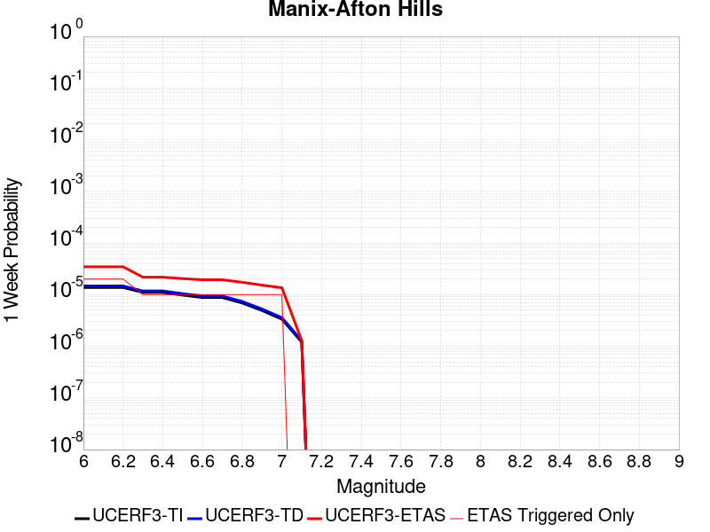 |  |  |  |

| Magnitude | 1 wk TI Prob | 1 wk TD Prob | 1 wk ETAS Prob | 1 wk ETAS/TD Gain | 1 wk ETAS Triggered Only | 1 mo TI Prob | 1 mo TD Prob | 1 mo ETAS Prob | 1 mo ETAS/TD Gain | 1 mo ETAS Triggered Only | 1 yr TI Prob | 1 yr TD Prob | 1 yr ETAS Prob | 1 yr ETAS/TD Gain | 1 yr ETAS Triggered Only | 10 yr TI Prob | 10 yr TD Prob | 10 yr ETAS Prob | 10 yr ETAS/TD Gain | 10 yr ETAS Triggered Only |
|-----|-----|-----|-----|-----|-----|-----|-----|-----|-----|-----|-----|-----|-----|-----|-----|-----|-----|-----|-----|-----|
| 6.0 | 1.3783202E-5 | 1.4711063E-5 | 3.471077E-5 | 2.3595011 | 2.0E-5 | 5.906953E-5 | 6.304599E-5 | 9.30441E-5 | 1.4758132 | 3.0E-5 | 7.189342E-4 | 7.673321E-4 | 8.073014E-4 | 1.0520886 | 4.0E-5 | 0.0071661277 | 0.007648582 | 0.0076981997 | 1.0064871 | 5.0E-5 |
| 6.1 | 1.3783202E-5 | 1.4711063E-5 | 3.471077E-5 | 2.3595011 | 2.0E-5 | 5.906953E-5 | 6.304599E-5 | 9.30441E-5 | 1.4758132 | 3.0E-5 | 7.189342E-4 | 7.673321E-4 | 8.073014E-4 | 1.0520886 | 4.0E-5 | 0.0071661277 | 0.007648582 | 0.0076981997 | 1.0064871 | 5.0E-5 |
| 6.2 | 1.3783202E-5 | 1.4711063E-5 | 3.471077E-5 | 2.3595011 | 2.0E-5 | 5.906953E-5 | 6.304599E-5 | 9.30441E-5 | 1.4758132 | 3.0E-5 | 7.189342E-4 | 7.673321E-4 | 8.073014E-4 | 1.0520886 | 4.0E-5 | 0.0071661277 | 0.007648582 | 0.0076981997 | 1.0064871 | 5.0E-5 |
| 6.3 | 1.10494875E-5 | 1.1793114E-5 | 2.1792997E-5 | 1.8479425 | 1.0E-5 | 4.7354086E-5 | 5.0541E-5 | 7.053999E-5 | 1.3956983 | 2.0E-5 | 5.763835E-4 | 6.151733E-4 | 6.4515485E-4 | 1.0487367 | 3.0E-5 | 0.005748908 | 0.0061357445 | 0.006175499 | 1.0064791 | 4.0E-5 |
| 6.4 | 1.10494875E-5 | 1.1793114E-5 | 2.1792997E-5 | 1.8479425 | 1.0E-5 | 4.7354086E-5 | 5.0541E-5 | 7.053999E-5 | 1.3956983 | 2.0E-5 | 5.763835E-4 | 6.151733E-4 | 6.4515485E-4 | 1.0487367 | 3.0E-5 | 0.005748908 | 0.0061357445 | 0.006175499 | 1.0064791 | 4.0E-5 |
| 6.5 | 9.788949E-6 | 1.04543005E-5 | 2.0454196E-5 | 1.9565341 | 1.0E-5 | 4.1951964E-5 | 4.480343E-5 | 6.480253E-5 | 1.4463744 | 2.0E-5 | 5.1064545E-4 | 5.453545E-4 | 5.7533814E-4 | 1.05498 | 3.0E-5 | 0.0050947363 | 0.0054410887 | 0.005480871 | 1.0073115 | 4.0E-5 |
| 6.6 | 8.810006E-6 | 9.413611E-6 | 1.9413517E-5 | 2.0622816 | 1.0E-5 | 3.775662E-5 | 4.034347E-5 | 6.0342667E-5 | 1.4957231 | 2.0E-5 | 4.5958988E-4 | 4.9108E-4 | 5.2106526E-4 | 1.0610598 | 3.0E-5 | 0.0045864056 | 0.0049008303 | 0.004940634 | 1.0081218 | 4.0E-5 |
| 6.7 | 8.80128E-6 | 9.404091E-6 | 1.9403997E-5 | 2.063357 | 1.0E-5 | 3.7719226E-5 | 4.0302675E-5 | 6.0301867E-5 | 1.496225 | 2.0E-5 | 4.591348E-4 | 4.905835E-4 | 5.2056875E-4 | 1.0611217 | 3.0E-5 | 0.004581874 | 0.004895887 | 0.004935691 | 1.0081301 | 4.0E-5 |
| 6.8 | 6.8994877E-6 | 7.3800625E-6 | 1.7379989E-5 | 2.3549922 | 1.0E-5 | 2.9568899E-5 | 3.16285E-5 | 5.1627867E-5 | 1.6323211 | 2.0E-5 | 3.5994186E-4 | 3.850171E-4 | 4.1500558E-4 | 1.0778886 | 3.0E-5 | 0.003593594 | 0.0038443056 | 0.003884152 | 1.010365 | 4.0E-5 |
| 6.9 | 4.9328037E-6 | 5.270952E-6 | 1.52709E-5 | 2.8971806 | 1.0E-5 | 2.1140417E-5 | 2.2589633E-5 | 4.258918E-5 | 1.8853419 | 2.0E-5 | 2.5735417E-4 | 2.7500023E-4 | 2.9499474E-4 | 1.0727072 | 2.0E-5 | 0.0025705635 | 0.0027472044 | 0.002777122 | 1.0108902 | 3.0E-5 |
| 7.0 | 3.347973E-6 | 3.590023E-6 | 1.3589987E-5 | 3.7854874 | 1.0E-5 | 1.4348378E-5 | 1.5385745E-5 | 3.5385438E-5 | 2.2998846 | 2.0E-5 | 1.746775E-4 | 1.8730946E-4 | 2.0730571E-4 | 1.1067551 | 2.0E-5 | 0.0017454025 | 0.0018719183 | 0.0018918809 | 1.0106642 | 2.0E-5 |
| 7.1 | 1.2073567E-6 | 1.2934796E-6 | 1.2934796E-6 | 1.0 | 0.0 | 5.1743755E-6 | 5.543481E-6 | 5.543481E-6 | 1.0 | 0.0 | 6.29962E-5 | 6.7491426E-5 | 6.7491426E-5 | 1.0 | 0.0 | 6.297835E-4 | 6.7486946E-4 | 6.7486946E-4 | 1.0 | 0.0 |

## San Jacinto (Stepovers Combined)
*[(top)](#table-of-contents)*

| 1 Week | 1 Month | 1 Year | 10 Year |
|-----|-----|-----|-----|
|  |  |  |  |

| Magnitude | 1 wk TI Prob | 1 wk TD Prob | 1 wk ETAS Prob | 1 wk ETAS/TD Gain | 1 wk ETAS Triggered Only | 1 mo TI Prob | 1 mo TD Prob | 1 mo ETAS Prob | 1 mo ETAS/TD Gain | 1 mo ETAS Triggered Only | 1 yr TI Prob | 1 yr TD Prob | 1 yr ETAS Prob | 1 yr ETAS/TD Gain | 1 yr ETAS Triggered Only | 10 yr TI Prob | 10 yr TD Prob | 10 yr ETAS Prob | 10 yr ETAS/TD Gain | 10 yr ETAS Triggered Only |
|-----|-----|-----|-----|-----|-----|-----|-----|-----|-----|-----|-----|-----|-----|-----|-----|-----|-----|-----|-----|-----|
| 6.0 | 4.0667746E-5 | 3.5266257E-5 | 6.52652E-5 | 1.8506415 | 3.0E-5 | 1.742787E-4 | 1.5113236E-4 | 1.8112783E-4 | 1.1984715 | 3.0E-5 | 0.0021197782 | 0.0018384842 | 0.0018784107 | 1.0217171 | 4.0E-5 | 0.020996714 | 0.018983515 | 0.019042375 | 1.0031006 | 6.0E-5 |
| 6.1 | 4.0667746E-5 | 3.5266257E-5 | 6.52652E-5 | 1.8506415 | 3.0E-5 | 1.742787E-4 | 1.5113236E-4 | 1.8112783E-4 | 1.1984715 | 3.0E-5 | 0.0021197782 | 0.0018384842 | 0.0018784107 | 1.0217171 | 4.0E-5 | 0.020996714 | 0.018983515 | 0.019042375 | 1.0031006 | 6.0E-5 |
| 6.2 | 4.0667746E-5 | 3.5266257E-5 | 6.52652E-5 | 1.8506415 | 3.0E-5 | 1.742787E-4 | 1.5113236E-4 | 1.8112783E-4 | 1.1984715 | 3.0E-5 | 0.0021197782 | 0.0018384842 | 0.0018784107 | 1.0217171 | 4.0E-5 | 0.020996714 | 0.018983515 | 0.019042375 | 1.0031006 | 6.0E-5 |
| 6.3 | 4.0667746E-5 | 3.5266257E-5 | 6.52652E-5 | 1.8506415 | 3.0E-5 | 1.742787E-4 | 1.5113236E-4 | 1.8112783E-4 | 1.1984715 | 3.0E-5 | 0.0021197782 | 0.0018384842 | 0.0018784107 | 1.0217171 | 4.0E-5 | 0.020996714 | 0.018983515 | 0.019042375 | 1.0031006 | 6.0E-5 |
| 6.4 | 4.0577226E-5 | 3.513816E-5 | 6.513711E-5 | 1.8537427 | 3.0E-5 | 1.738908E-4 | 1.5058344E-4 | 1.8057892E-4 | 1.1991951 | 3.0E-5 | 0.0021150648 | 0.001831814 | 0.0018717407 | 1.0217962 | 4.0E-5 | 0.020950472 | 0.018918084 | 0.01897695 | 1.0031116 | 6.0E-5 |
| 6.5 | 4.0577226E-5 | 3.513816E-5 | 6.513711E-5 | 1.8537427 | 3.0E-5 | 1.738908E-4 | 1.5058344E-4 | 1.8057892E-4 | 1.1991951 | 3.0E-5 | 0.0021150648 | 0.001831814 | 0.0018717407 | 1.0217962 | 4.0E-5 | 0.020950472 | 0.018918084 | 0.01897695 | 1.0031116 | 6.0E-5 |
| 6.6 | 4.053861E-5 | 3.5083507E-5 | 6.508245E-5 | 1.8550726 | 3.0E-5 | 1.7372532E-4 | 1.5034924E-4 | 1.8034472E-4 | 1.1995054 | 3.0E-5 | 0.0021130538 | 0.0018289674 | 0.0018688942 | 1.0218303 | 4.0E-5 | 0.020930743 | 0.018890161 | 0.018949028 | 1.0031163 | 6.0E-5 |
| 6.7 | 4.0516545E-5 | 3.5052573E-5 | 6.505152E-5 | 1.8558272 | 3.0E-5 | 1.7363077E-4 | 1.5021669E-4 | 1.8021217E-4 | 1.1996815 | 3.0E-5 | 0.002111905 | 0.0018273568 | 0.0018672836 | 1.0218495 | 4.0E-5 | 0.020919468 | 0.018874358 | 0.018933225 | 1.0031189 | 6.0E-5 |
| 6.8 | 4.049434E-5 | 3.5024135E-5 | 6.502309E-5 | 1.8565222 | 3.0E-5 | 1.7353562E-4 | 1.5009483E-4 | 1.8009031E-4 | 1.1998436 | 3.0E-5 | 0.0021107488 | 0.0018258755 | 0.0018658024 | 1.0218673 | 4.0E-5 | 0.020908125 | 0.018859772 | 0.01891864 | 1.0031214 | 6.0E-5 |
| 6.9 | 4.046386E-5 | 3.4986697E-5 | 6.4985645E-5 | 1.8574388 | 3.0E-5 | 1.73405E-4 | 1.4993439E-4 | 1.7992989E-4 | 1.2000575 | 3.0E-5 | 0.0021091616 | 0.0018239255 | 0.0018638526 | 1.0218908 | 4.0E-5 | 0.020892553 | 0.018840544 | 0.018899415 | 1.0031246 | 6.0E-5 |
| 7.0 | 4.036382E-5 | 3.4867266E-5 | 6.486622E-5 | 1.8603759 | 3.0E-5 | 1.7297632E-4 | 1.494226E-4 | 1.7941812E-4 | 1.2007428 | 3.0E-5 | 0.0021039525 | 0.0018177053 | 0.0018576327 | 1.0219657 | 4.0E-5 | 0.02084144 | 0.01877916 | 0.018838033 | 1.0031351 | 6.0E-5 |
| 7.1 | 4.0343282E-5 | 3.484573E-5 | 6.484468E-5 | 1.8609077 | 3.0E-5 | 1.7288832E-4 | 1.493303E-4 | 1.7932583E-4 | 1.2008669 | 3.0E-5 | 0.002102883 | 0.0018165836 | 0.001856511 | 1.0219793 | 4.0E-5 | 0.020830948 | 0.018768037 | 0.018826911 | 1.0031369 | 6.0E-5 |
| 7.2 | 4.0257353E-5 | 3.4750232E-5 | 6.474919E-5 | 1.8632736 | 3.0E-5 | 1.725201E-4 | 1.4892107E-4 | 1.7891661E-4 | 1.201419 | 3.0E-5 | 0.0020984085 | 0.0018116096 | 0.001851537 | 1.0220398 | 4.0E-5 | 0.020787042 | 0.018718777 | 0.018777654 | 1.0031453 | 6.0E-5 |
| 7.3 | 3.9940667E-5 | 3.4577894E-5 | 6.457685E-5 | 1.8675764 | 3.0E-5 | 1.7116306E-4 | 1.4818257E-4 | 1.7817812E-4 | 1.202423 | 3.0E-5 | 0.0020819185 | 0.0018026332 | 0.0018425611 | 1.0221498 | 4.0E-5 | 0.020625217 | 0.018627413 | 0.018686295 | 1.0031611 | 6.0E-5 |
| 7.4 | 3.9721202E-5 | 3.4463315E-5 | 6.446228E-5 | 1.8704609 | 3.0E-5 | 1.7022261E-4 | 1.4769158E-4 | 1.7768715E-4 | 1.203096 | 3.0E-5 | 0.0020704903 | 0.0017966651 | 0.0018365933 | 1.0222235 | 4.0E-5 | 0.020513052 | 0.01856655 | 0.018625436 | 1.0031716 | 6.0E-5 |
| 7.5 | 3.7036873E-5 | 3.353082E-5 | 6.352982E-5 | 1.8946692 | 3.0E-5 | 1.5871979E-4 | 1.4369562E-4 | 1.7369131E-4 | 1.2087446 | 3.0E-5 | 0.0019307006 | 0.0017480933 | 0.0017880234 | 1.022842 | 4.0E-5 | 0.019140124 | 0.018068153 | 0.018127069 | 1.0032607 | 6.0E-5 |
| 7.6 | 3.2940967E-5 | 3.1311945E-5 | 6.131101E-5 | 1.9580708 | 3.0E-5 | 1.4116794E-4 | 1.3418717E-4 | 1.6418315E-4 | 1.2235383 | 3.0E-5 | 0.0017173645 | 0.0016325067 | 0.0016724414 | 1.0244622 | 4.0E-5 | 0.01704153 | 0.016901208 | 0.016960194 | 1.0034901 | 6.0E-5 |
| 7.7 | 2.8236149E-5 | 2.7881175E-5 | 5.7880337E-5 | 2.075965 | 3.0E-5 | 1.2100645E-4 | 1.1948528E-4 | 1.494817E-4 | 1.2510469 | 3.0E-5 | 0.0014722579 | 0.0014537636 | 0.00148372 | 1.020606 | 3.0E-5 | 0.014625421 | 0.015113685 | 0.01516293 | 1.0032582 | 5.0E-5 |
| 7.8 | 2.4329287E-5 | 2.5204929E-5 | 5.520417E-5 | 2.1902134 | 3.0E-5 | 1.042642E-4 | 1.08016655E-4 | 1.3801342E-4 | 1.277705 | 3.0E-5 | 0.0012686774 | 0.0013143102 | 0.0013442708 | 1.0227957 | 3.0E-5 | 0.012614589 | 0.013711039 | 0.013760353 | 1.0035967 | 5.0E-5 |
| 7.9 | 1.9370926E-5 | 2.0419093E-5 | 5.041848E-5 | 2.4691832 | 3.0E-5 | 8.301561E-5 | 8.750747E-5 | 1.17504846E-4 | 1.3427979 | 3.0E-5 | 0.0010102465 | 0.0010648834 | 0.0010948515 | 1.0281421 | 3.0E-5 | 0.0100566605 | 0.011198251 | 0.011247691 | 1.004415 | 5.0E-5 |
| 8.0 | 1.5583017E-5 | 1.5884476E-5 | 4.5884E-5 | 2.8886065 | 3.0E-5 | 6.6782646E-5 | 6.807455E-5 | 9.807251E-5 | 1.4406633 | 3.0E-5 | 8.127754E-4 | 8.284932E-4 | 8.5846835E-4 | 1.0361803 | 3.0E-5 | 0.008098091 | 0.008780761 | 0.008830322 | 1.0056443 | 5.0E-5 |
| 8.1 | 1.0024873E-5 | 8.291244E-6 | 2.8291079E-5 | 3.4121633 | 2.0E-5 | 4.2963035E-5 | 3.5533423E-5 | 5.553271E-5 | 1.5628303 | 2.0E-5 | 5.229494E-4 | 4.3253406E-4 | 4.525254E-4 | 1.0462191 | 2.0E-5 | 0.0052172043 | 0.0046527875 | 0.0046926015 | 1.008557 | 4.0E-5 |
| 8.2 | 4.142796E-6 | 1.5606732E-6 | 1.5606732E-6 | 1.0 | 0.0 | 1.775472E-5 | 6.6885823E-6 | 6.6885823E-6 | 1.0 | 0.0 | 2.1614227E-4 | 8.143048E-5 | 8.143048E-5 | 1.0 | 0.0 | 0.0021593217 | 9.452761E-4 | 9.452761E-4 | 1.0 | 0.0 |
| 8.3 | 1.2750878E-6 | 3.6112328E-7 | 3.6112328E-7 | 1.0 | 0.0 | 5.4646503E-6 | 1.5476703E-6 | 1.5476703E-6 | 1.0 | 0.0 | 6.653009E-5 | 1.8842728E-5 | 1.8842728E-5 | 1.0 | 0.0 | 6.6510175E-4 | 2.2728964E-4 | 2.2728964E-4 | 1.0 | 0.0 |

## San Jacinto (Lytle Creek connector)
*[(top)](#table-of-contents)*

| 1 Week | 1 Month | 1 Year | 10 Year |
|-----|-----|-----|-----|
|  | 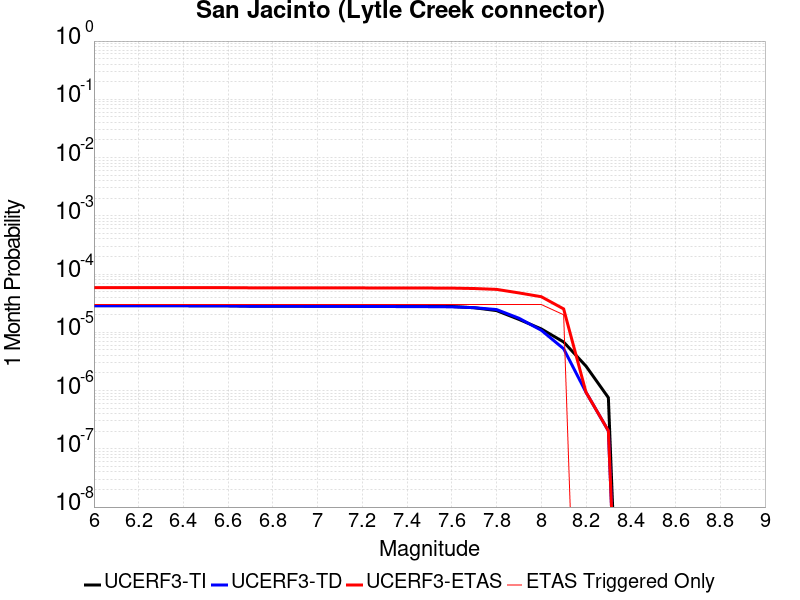 | 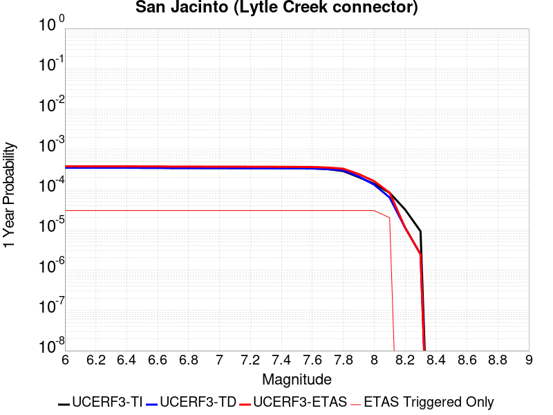 |  |

| Magnitude | 1 wk TI Prob | 1 wk TD Prob | 1 wk ETAS Prob | 1 wk ETAS/TD Gain | 1 wk ETAS Triggered Only | 1 mo TI Prob | 1 mo TD Prob | 1 mo ETAS Prob | 1 mo ETAS/TD Gain | 1 mo ETAS Triggered Only | 1 yr TI Prob | 1 yr TD Prob | 1 yr ETAS Prob | 1 yr ETAS/TD Gain | 1 yr ETAS Triggered Only | 10 yr TI Prob | 10 yr TD Prob | 10 yr ETAS Prob | 10 yr ETAS/TD Gain | 10 yr ETAS Triggered Only |
|-----|-----|-----|-----|-----|-----|-----|-----|-----|-----|-----|-----|-----|-----|-----|-----|-----|-----|-----|-----|-----|
| 6.0 | 6.693995E-6 | 6.6596795E-6 | 3.665948E-5 | 5.5046916 | 3.0E-5 | 2.8688235E-5 | 2.8541172E-5 | 5.8540314E-5 | 2.051083 | 3.0E-5 | 3.492233E-4 | 3.4743344E-4 | 3.77423E-4 | 1.0863174 | 3.0E-5 | 0.00348675 | 0.0035491067 | 0.0035989292 | 1.0140381 | 5.0E-5 |
| 6.1 | 6.693995E-6 | 6.6596795E-6 | 3.665948E-5 | 5.5046916 | 3.0E-5 | 2.8688235E-5 | 2.8541172E-5 | 5.8540314E-5 | 2.051083 | 3.0E-5 | 3.492233E-4 | 3.4743344E-4 | 3.77423E-4 | 1.0863174 | 3.0E-5 | 0.00348675 | 0.0035491067 | 0.0035989292 | 1.0140381 | 5.0E-5 |
| 6.2 | 6.693995E-6 | 6.6596795E-6 | 3.665948E-5 | 5.5046916 | 3.0E-5 | 2.8688235E-5 | 2.8541172E-5 | 5.8540314E-5 | 2.051083 | 3.0E-5 | 3.492233E-4 | 3.4743344E-4 | 3.77423E-4 | 1.0863174 | 3.0E-5 | 0.00348675 | 0.0035491067 | 0.0035989292 | 1.0140381 | 5.0E-5 |
| 6.3 | 6.693995E-6 | 6.6596795E-6 | 3.665948E-5 | 5.5046916 | 3.0E-5 | 2.8688235E-5 | 2.8541172E-5 | 5.8540314E-5 | 2.051083 | 3.0E-5 | 3.492233E-4 | 3.4743344E-4 | 3.77423E-4 | 1.0863174 | 3.0E-5 | 0.00348675 | 0.0035491067 | 0.0035989292 | 1.0140381 | 5.0E-5 |
| 6.4 | 6.693995E-6 | 6.6596795E-6 | 3.665948E-5 | 5.5046916 | 3.0E-5 | 2.8688235E-5 | 2.8541172E-5 | 5.8540314E-5 | 2.051083 | 3.0E-5 | 3.492233E-4 | 3.4743344E-4 | 3.77423E-4 | 1.0863174 | 3.0E-5 | 0.00348675 | 0.0035491067 | 0.0035989292 | 1.0140381 | 5.0E-5 |
| 6.5 | 6.6561875E-6 | 6.6198977E-6 | 3.66197E-5 | 5.531762 | 3.0E-5 | 2.8526205E-5 | 2.8370681E-5 | 5.836983E-5 | 2.0573997 | 3.0E-5 | 3.472512E-4 | 3.4535836E-4 | 3.7534803E-4 | 1.0868363 | 3.0E-5 | 0.0034670907 | 0.003528422 | 0.0035782456 | 1.0141207 | 5.0E-5 |
| 6.6 | 6.6561875E-6 | 6.6198977E-6 | 3.66197E-5 | 5.531762 | 3.0E-5 | 2.8526205E-5 | 2.8370681E-5 | 5.836983E-5 | 2.0573997 | 3.0E-5 | 3.472512E-4 | 3.4535836E-4 | 3.7534803E-4 | 1.0868363 | 3.0E-5 | 0.0034670907 | 0.003528422 | 0.0035782456 | 1.0141207 | 5.0E-5 |
| 6.7 | 6.5802237E-6 | 6.5390745E-6 | 3.6538877E-5 | 5.587775 | 3.0E-5 | 2.8200653E-5 | 2.8024304E-5 | 5.8023463E-5 | 2.0704694 | 3.0E-5 | 3.4328885E-4 | 3.4114256E-4 | 3.711323E-4 | 1.0879098 | 3.0E-5 | 0.0034275902 | 0.0034863965 | 0.0035362223 | 1.0142914 | 5.0E-5 |
| 6.8 | 6.575632E-6 | 6.533564E-6 | 3.653337E-5 | 5.591645 | 3.0E-5 | 2.8180975E-5 | 2.8000688E-5 | 5.799985E-5 | 2.0713723 | 3.0E-5 | 3.4304935E-4 | 3.4085513E-4 | 3.708449E-4 | 1.087984 | 3.0E-5 | 0.0034252026 | 0.0034835313 | 0.0035333573 | 1.0143032 | 5.0E-5 |
| 6.9 | 6.570433E-6 | 6.5249583E-6 | 3.652476E-5 | 5.5977006 | 3.0E-5 | 2.8158694E-5 | 2.7963808E-5 | 5.7962967E-5 | 2.0727854 | 3.0E-5 | 3.4277816E-4 | 3.4040623E-4 | 3.7039604E-4 | 1.0881 | 3.0E-5 | 0.0034224992 | 0.0034790565 | 0.0035288825 | 1.0143217 | 5.0E-5 |
| 7.0 | 6.5643826E-6 | 6.5150793E-6 | 3.6514884E-5 | 5.604672 | 3.0E-5 | 2.8132765E-5 | 2.7921471E-5 | 5.792063E-5 | 2.0744119 | 3.0E-5 | 3.424626E-4 | 3.3989095E-4 | 3.6988076E-4 | 1.0882336 | 3.0E-5 | 0.0034193532 | 0.0034739198 | 0.003523746 | 1.0143429 | 5.0E-5 |
| 7.1 | 6.557402E-6 | 6.5037916E-6 | 3.6503596E-5 | 5.612664 | 3.0E-5 | 2.8102848E-5 | 2.7873095E-5 | 5.7872257E-5 | 2.0762768 | 3.0E-5 | 3.4209844E-4 | 3.3930215E-4 | 3.6929199E-4 | 1.0883868 | 3.0E-5 | 0.0034157229 | 0.0034680513 | 0.0035178778 | 1.0143673 | 5.0E-5 |
| 7.2 | 6.546394E-6 | 6.485758E-6 | 3.6485562E-5 | 5.625489 | 3.0E-5 | 2.8055672E-5 | 2.7795812E-5 | 5.7794976E-5 | 2.0792694 | 3.0E-5 | 3.4152428E-4 | 3.383615E-4 | 3.6835138E-4 | 1.0886326 | 3.0E-5 | 0.0034099987 | 0.0034586787 | 0.0035085056 | 1.0144064 | 5.0E-5 |
| 7.3 | 6.5364216E-6 | 6.4665446E-6 | 3.646635E-5 | 5.6392326 | 3.0E-5 | 2.8012933E-5 | 2.7713468E-5 | 5.7712637E-5 | 2.0824761 | 3.0E-5 | 3.4100408E-4 | 3.3735932E-4 | 3.673492E-4 | 1.0888959 | 3.0E-5 | 0.003404813 | 0.0034487005 | 0.0034985282 | 1.0144482 | 5.0E-5 |
| 7.4 | 6.5269523E-6 | 6.447632E-6 | 3.644744E-5 | 5.652841 | 3.0E-5 | 2.7972354E-5 | 2.7632417E-5 | 5.7631587E-5 | 2.0856514 | 3.0E-5 | 3.4051016E-4 | 3.3637282E-4 | 3.663627E-4 | 1.0891567 | 3.0E-5 | 0.0033998888 | 0.0034388828 | 0.0034887108 | 1.0144897 | 5.0E-5 |
| 7.5 | 6.5111835E-6 | 6.423907E-6 | 3.6423713E-5 | 5.6700253 | 3.0E-5 | 2.7904773E-5 | 2.753074E-5 | 5.7529913E-5 | 2.0896611 | 3.0E-5 | 3.3968766E-4 | 3.3513526E-4 | 3.6512522E-4 | 1.0894861 | 3.0E-5 | 0.0033916887 | 0.0034265562 | 0.0034763848 | 1.0145419 | 5.0E-5 |
| 7.6 | 6.4768806E-6 | 6.3830166E-6 | 3.6382826E-5 | 5.699942 | 3.0E-5 | 2.7757764E-5 | 2.73555E-5 | 5.735468E-5 | 2.0966415 | 3.0E-5 | 3.3789838E-4 | 3.330024E-4 | 3.629924E-4 | 1.0900594 | 3.0E-5 | 0.0033738504 | 0.0034052888 | 0.0034551185 | 1.014633 | 5.0E-5 |
| 7.7 | 6.1655364E-6 | 6.1755063E-6 | 3.6175323E-5 | 5.857871 | 3.0E-5 | 2.642346E-5 | 2.6466189E-5 | 5.6465393E-5 | 2.1334918 | 3.0E-5 | 3.2165812E-4 | 3.2217827E-4 | 3.521686E-4 | 1.0930861 | 3.0E-5 | 0.0032119295 | 0.0032969064 | 0.0033467417 | 1.0151157 | 5.0E-5 |
| 7.8 | 5.5043524E-6 | 5.736582E-6 | 3.573641E-5 | 6.229565 | 3.0E-5 | 2.3589868E-5 | 2.4585119E-5 | 5.4584383E-5 | 2.2202203 | 3.0E-5 | 2.871688E-4 | 2.9928278E-4 | 3.292738E-4 | 1.1002096 | 3.0E-5 | 0.0028679797 | 0.0030670157 | 0.0031168624 | 1.0162525 | 5.0E-5 |
| 7.9 | 3.889249E-6 | 4.076342E-6 | 3.407622E-5 | 8.359509 | 3.0E-5 | 1.6668104E-5 | 1.7469922E-5 | 4.7469395E-5 | 2.7172072 | 3.0E-5 | 2.0291525E-4 | 2.1267557E-4 | 2.426692E-4 | 1.14103 | 3.0E-5 | 0.0020273007 | 0.0021941126 | 0.002244003 | 1.0227382 | 5.0E-5 |
| 8.0 | 2.668535E-6 | 2.5312252E-6 | 3.253115E-5 | 12.851938 | 3.0E-5 | 1.1436528E-5 | 1.0848063E-5 | 4.0847735E-5 | 3.7654407 | 3.0E-5 | 1.3923083E-4 | 1.3206719E-4 | 1.6206322E-4 | 1.2271271 | 3.0E-5 | 0.0013914363 | 0.0013756427 | 0.001425574 | 1.0362966 | 5.0E-5 |
| 8.1 | 1.5911459E-6 | 1.2185061E-6 | 2.1218482E-5 | 17.41352 | 2.0E-5 | 6.8191785E-6 | 5.2221585E-6 | 2.5222054E-5 | 4.829814 | 2.0E-5 | 8.3020335E-5 | 6.357795E-5 | 8.357668E-5 | 1.3145545 | 2.0E-5 | 8.298933E-4 | 6.692392E-4 | 7.0921244E-4 | 1.0597293 | 4.0E-5 |
| 8.2 | 6.1294963E-7 | 2.1807648E-7 | 2.1807648E-7 | 1.0 | 0.0 | 2.6269242E-6 | 9.346131E-7 | 9.346131E-7 | 1.0 | 0.0 | 3.1982334E-5 | 1.1378856E-5 | 1.1378856E-5 | 1.0 | 0.0 | 3.1977732E-4 | 1.2781945E-4 | 1.2781945E-4 | 1.0 | 0.0 |
| 8.3 | 1.762871E-7 | 4.753523E-8 | 4.753523E-8 | 1.0 | 0.0 | 7.5551594E-7 | 2.037224E-7 | 2.037224E-7 | 1.0 | 0.0 | 9.1983675E-6 | 2.4803173E-6 | 2.4803173E-6 | 1.0 | 0.0 | 9.197987E-5 | 2.8680868E-5 | 2.8680868E-5 | 1.0 | 0.0 |

## San Andreas (Carrizo) rev
*[(top)](#table-of-contents)*

| 1 Week | 1 Month | 1 Year | 10 Year |
|-----|-----|-----|-----|
|  |  |  |  |

| Magnitude | 1 wk TI Prob | 1 wk TD Prob | 1 wk ETAS Prob | 1 wk ETAS/TD Gain | 1 wk ETAS Triggered Only | 1 mo TI Prob | 1 mo TD Prob | 1 mo ETAS Prob | 1 mo ETAS/TD Gain | 1 mo ETAS Triggered Only | 1 yr TI Prob | 1 yr TD Prob | 1 yr ETAS Prob | 1 yr ETAS/TD Gain | 1 yr ETAS Triggered Only | 10 yr TI Prob | 10 yr TD Prob | 10 yr ETAS Prob | 10 yr ETAS/TD Gain | 10 yr ETAS Triggered Only |
|-----|-----|-----|-----|-----|-----|-----|-----|-----|-----|-----|-----|-----|-----|-----|-----|-----|-----|-----|-----|-----|
| 6.0 | 1.1674632E-4 | 2.4321114E-4 | 2.6320628E-4 | 1.082213 | 2.0E-5 | 5.002454E-4 | 0.0010419186 | 0.0010718874 | 1.028763 | 3.0E-5 | 0.006073493 | 0.01261206 | 0.012641681 | 1.0023487 | 3.0E-5 | 0.0591016 | 0.12060616 | 0.12065013 | 1.0003645 | 5.0E-5 |
| 6.1 | 1.1674632E-4 | 2.4321114E-4 | 2.6320628E-4 | 1.082213 | 2.0E-5 | 5.002454E-4 | 0.0010419186 | 0.0010718874 | 1.028763 | 3.0E-5 | 0.006073493 | 0.01261206 | 0.012641681 | 1.0023487 | 3.0E-5 | 0.0591016 | 0.12060616 | 0.12065013 | 1.0003645 | 5.0E-5 |
| 6.2 | 1.1674632E-4 | 2.4321114E-4 | 2.6320628E-4 | 1.082213 | 2.0E-5 | 5.002454E-4 | 0.0010419186 | 0.0010718874 | 1.028763 | 3.0E-5 | 0.006073493 | 0.01261206 | 0.012641681 | 1.0023487 | 3.0E-5 | 0.0591016 | 0.12060616 | 0.12065013 | 1.0003645 | 5.0E-5 |
| 6.3 | 1.1674632E-4 | 2.4321114E-4 | 2.6320628E-4 | 1.082213 | 2.0E-5 | 5.002454E-4 | 0.0010419186 | 0.0010718874 | 1.028763 | 3.0E-5 | 0.006073493 | 0.01261206 | 0.012641681 | 1.0023487 | 3.0E-5 | 0.0591016 | 0.12060616 | 0.12065013 | 1.0003645 | 5.0E-5 |
| 6.4 | 1.1674632E-4 | 2.4321114E-4 | 2.6320628E-4 | 1.082213 | 2.0E-5 | 5.002454E-4 | 0.0010419186 | 0.0010718874 | 1.028763 | 3.0E-5 | 0.006073493 | 0.01261206 | 0.012641681 | 1.0023487 | 3.0E-5 | 0.0591016 | 0.12060616 | 0.12065013 | 1.0003645 | 5.0E-5 |
| 6.5 | 1.13136164E-4 | 2.3641133E-4 | 2.564066E-4 | 1.0845783 | 2.0E-5 | 4.847792E-4 | 0.0010127996 | 0.0010427692 | 1.0295908 | 3.0E-5 | 0.0058862255 | 0.012261566 | 0.012291198 | 1.0024166 | 3.0E-5 | 0.057327334 | 0.11757754 | 0.11762166 | 1.0003753 | 5.0E-5 |
| 6.6 | 1.13136164E-4 | 2.3641133E-4 | 2.564066E-4 | 1.0845783 | 2.0E-5 | 4.847792E-4 | 0.0010127996 | 0.0010427692 | 1.0295908 | 3.0E-5 | 0.0058862255 | 0.012261566 | 0.012291198 | 1.0024166 | 3.0E-5 | 0.057327334 | 0.11757754 | 0.11762166 | 1.0003753 | 5.0E-5 |
| 6.7 | 1.1149675E-4 | 2.3332359E-4 | 2.5331893E-4 | 1.0856979 | 2.0E-5 | 4.777557E-4 | 9.995765E-4 | 0.0010295466 | 1.0299827 | 3.0E-5 | 0.0058011734 | 0.012102372 | 0.0121320095 | 1.0024488 | 3.0E-5 | 0.05652051 | 0.11619909 | 0.11624328 | 1.0003803 | 5.0E-5 |
| 6.8 | 1.1103589E-4 | 2.323452E-4 | 2.5234057E-4 | 1.0860589 | 2.0E-5 | 4.7578133E-4 | 9.953866E-4 | 0.0010253568 | 1.030109 | 3.0E-5 | 0.005777263 | 0.012051926 | 0.012081564 | 1.0024593 | 3.0E-5 | 0.056293584 | 0.115759395 | 0.11580361 | 1.000382 | 5.0E-5 |
| 6.9 | 1.1053259E-4 | 2.3126906E-4 | 2.5126443E-4 | 1.0864594 | 2.0E-5 | 4.7362508E-4 | 9.907781E-4 | 0.0010207484 | 1.0302492 | 3.0E-5 | 0.0057511497 | 0.011996436 | 0.012026076 | 1.0024707 | 3.0E-5 | 0.05604569 | 0.1152756 | 0.11531983 | 1.0003837 | 5.0E-5 |
| 7.0 | 1.1005377E-4 | 2.3027751E-4 | 2.502729E-4 | 1.0868317 | 2.0E-5 | 4.7157376E-4 | 9.865318E-4 | 0.0010165023 | 1.0303795 | 3.0E-5 | 0.0057263062 | 0.011945305 | 0.0119749475 | 1.0024815 | 3.0E-5 | 0.055809796 | 0.11482792 | 0.11487218 | 1.0003854 | 5.0E-5 |
| 7.1 | 1.0308142E-4 | 2.1537494E-4 | 2.3537062E-4 | 1.0928413 | 2.0E-5 | 4.417027E-4 | 9.2270994E-4 | 9.526822E-4 | 1.032483 | 3.0E-5 | 0.0053644776 | 0.011176443 | 0.011206107 | 1.0026542 | 3.0E-5 | 0.052368138 | 0.10808435 | 0.10812895 | 1.0004126 | 5.0E-5 |
| 7.2 | 1.0027479E-4 | 2.0945404E-4 | 2.1945195E-4 | 1.0477332 | 1.0E-5 | 4.296783E-4 | 8.973524E-4 | 9.1733446E-4 | 1.0222678 | 2.0E-5 | 0.0052187922 | 0.010870834 | 0.010890617 | 1.0018197 | 2.0E-5 | 0.050979212 | 0.10538838 | 0.105424166 | 1.0003395 | 4.0E-5 |
| 7.3 | 9.816942E-5 | 2.0420653E-4 | 2.142045E-4 | 1.04896 | 1.0E-5 | 4.2065824E-4 | 8.748783E-4 | 8.848696E-4 | 1.0114201 | 1.0E-5 | 0.005109493 | 0.010599907 | 0.010609801 | 1.0009334 | 1.0E-5 | 0.049935985 | 0.10297221 | 0.10299912 | 1.0002613 | 3.0E-5 |
| 7.4 | 9.5634205E-5 | 1.9790219E-4 | 2.0790022E-4 | 1.0505201 | 1.0E-5 | 4.0979648E-4 | 8.478775E-4 | 8.5786905E-4 | 1.0117842 | 1.0E-5 | 0.0049778637 | 0.010274311 | 0.010284208 | 1.0009633 | 1.0E-5 | 0.048678253 | 0.10005864 | 0.10008564 | 1.0002698 | 3.0E-5 |
| 7.5 | 8.052417E-5 | 1.611105E-4 | 1.7110888E-4 | 1.0620592 | 1.0E-5 | 3.4505792E-4 | 6.90291E-4 | 7.002841E-4 | 1.0144767 | 1.0E-5 | 0.0041929903 | 0.008371988 | 0.008381904 | 1.0011845 | 1.0E-5 | 0.04114753 | 0.08280355 | 0.08283106 | 1.0003324 | 3.0E-5 |
| 7.6 | 7.897024E-5 | 1.5764312E-4 | 1.6764154E-4 | 1.0634245 | 1.0E-5 | 3.384E-4 | 6.754386E-4 | 6.854319E-4 | 1.0147952 | 1.0E-5 | 0.0041122385 | 0.008192535 | 0.008202452 | 1.0012106 | 1.0E-5 | 0.040369697 | 0.08114483 | 0.0811724 | 1.0003397 | 3.0E-5 |
| 7.7 | 6.707427E-5 | 1.3274715E-4 | 1.4274582E-4 | 1.0753212 | 1.0E-5 | 2.8742946E-4 | 5.6879234E-4 | 5.7878665E-4 | 1.0175711 | 1.0E-5 | 0.003493839 | 0.0069030905 | 0.0069130217 | 1.0014386 | 1.0E-5 | 0.034394164 | 0.06904176 | 0.06906038 | 1.0002697 | 2.0E-5 |
| 7.8 | 6.147705E-5 | 1.219623E-4 | 1.219623E-4 | 1.0 | 0.0 | 2.6344648E-4 | 5.225909E-4 | 5.225909E-4 | 1.0 | 0.0 | 0.0032027436 | 0.0063440073 | 0.0063440073 | 1.0 | 0.0 | 0.031569764 | 0.06350883 | 0.0635182 | 1.0001475 | 1.0E-5 |
| 7.9 | 4.7636717E-5 | 8.8788634E-5 | 8.8788634E-5 | 1.0 | 0.0 | 2.0414138E-4 | 3.8046725E-4 | 3.8046725E-4 | 1.0 | 0.0 | 0.0024825884 | 0.004622358 | 0.004622358 | 1.0 | 0.0 | 0.024550365 | 0.04662383 | 0.046633363 | 1.0002044 | 1.0E-5 |
| 8.0 | 3.3554235E-5 | 5.213132E-5 | 5.213132E-5 | 1.0 | 0.0 | 1.4379594E-4 | 2.2340081E-4 | 2.2340081E-4 | 1.0 | 0.0 | 0.0017493097 | 0.002716514 | 0.002716514 | 1.0 | 0.0 | 0.017356034 | 0.027878206 | 0.027878206 | 1.0 | 0.0 |
| 8.1 | 1.9175432E-5 | 1.918229E-5 | 1.918229E-5 | 1.0 | 0.0 | 8.217783E-5 | 8.2207225E-5 | 8.2207225E-5 | 1.0 | 0.0 | 0.0010000558 | 0.001000414 | 0.001000414 | 1.0 | 0.0 | 0.009955673 | 0.010756618 | 0.010756618 | 1.0 | 0.0 |
| 8.2 | 8.643924E-6 | 5.4738607E-6 | 5.4738607E-6 | 1.0 | 0.0 | 3.704486E-5 | 2.3459192E-5 | 2.3459192E-5 | 1.0 | 0.0 | 4.5092785E-4 | 2.855783E-4 | 2.855783E-4 | 1.0 | 0.0 | 0.0045001395 | 0.0032481598 | 0.0032481598 | 1.0 | 0.0 |
| 8.3 | 1.983087E-6 | 7.658221E-7 | 7.658221E-7 | 1.0 | 0.0 | 8.498917E-6 | 3.2820906E-6 | 3.2820906E-6 | 1.0 | 0.0 | 1.034694E-4 | 3.9958737E-5 | 3.9958737E-5 | 1.0 | 0.0 | 0.0010342124 | 4.7187202E-4 | 4.7187202E-4 | 1.0 | 0.0 |

## San Jacinto (Borrego)
*[(top)](#table-of-contents)*

| 1 Week | 1 Month | 1 Year | 10 Year |
|-----|-----|-----|-----|
|  |  | 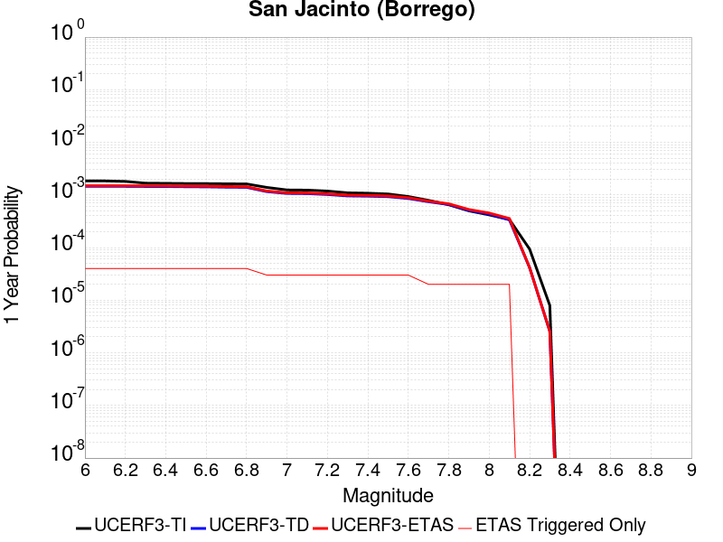 |  |

| Magnitude | 1 wk TI Prob | 1 wk TD Prob | 1 wk ETAS Prob | 1 wk ETAS/TD Gain | 1 wk ETAS Triggered Only | 1 mo TI Prob | 1 mo TD Prob | 1 mo ETAS Prob | 1 mo ETAS/TD Gain | 1 mo ETAS Triggered Only | 1 yr TI Prob | 1 yr TD Prob | 1 yr ETAS Prob | 1 yr ETAS/TD Gain | 1 yr ETAS Triggered Only | 10 yr TI Prob | 10 yr TD Prob | 10 yr ETAS Prob | 10 yr ETAS/TD Gain | 10 yr ETAS Triggered Only |
|-----|-----|-----|-----|-----|-----|-----|-----|-----|-----|-----|-----|-----|-----|-----|-----|-----|-----|-----|-----|-----|
| 6.0 | 3.543992E-5 | 2.7924942E-5 | 4.7924383E-5 | 1.7161856 | 2.0E-5 | 1.5187653E-4 | 1.19672906E-4 | 1.4966931E-4 | 1.2506533 | 3.0E-5 | 0.0018475284 | 0.001456056 | 0.0014959978 | 1.0274315 | 4.0E-5 | 0.018322436 | 0.014868831 | 0.014918088 | 1.0033127 | 5.0E-5 |
| 6.1 | 3.542281E-5 | 2.7924942E-5 | 4.7924383E-5 | 1.7161856 | 2.0E-5 | 1.5180321E-4 | 1.19672906E-4 | 1.4966931E-4 | 1.2506533 | 3.0E-5 | 0.0018466372 | 0.001456056 | 0.0014959978 | 1.0274315 | 4.0E-5 | 0.018313672 | 0.014868831 | 0.014918088 | 1.0033127 | 5.0E-5 |
| 6.2 | 3.4688688E-5 | 2.7924942E-5 | 4.7924383E-5 | 1.7161856 | 2.0E-5 | 1.4865733E-4 | 1.196729E-4 | 1.4966931E-4 | 1.2506533 | 3.0E-5 | 0.0018084005 | 0.001456056 | 0.0014959978 | 1.0274315 | 4.0E-5 | 0.017937548 | 0.014868831 | 0.014918088 | 1.0033127 | 5.0E-5 |
| 6.3 | 3.2087122E-5 | 2.7770295E-5 | 4.776974E-5 | 1.720174 | 2.0E-5 | 1.3750899E-4 | 1.1901019E-4 | 1.4900662E-4 | 1.2520492 | 3.0E-5 | 0.0016728862 | 0.0014479982 | 0.0014879403 | 1.0275843 | 4.0E-5 | 0.016603488 | 0.014789867 | 0.014839128 | 1.0033307 | 5.0E-5 |
| 6.4 | 3.1828724E-5 | 2.7737282E-5 | 4.773673E-5 | 1.7210312 | 2.0E-5 | 1.364017E-4 | 1.1886872E-4 | 1.4886515E-4 | 1.2523493 | 3.0E-5 | 0.0016594254 | 0.0014462781 | 0.0014862203 | 1.0276172 | 4.0E-5 | 0.016470885 | 0.014772946 | 0.014822207 | 1.0033345 | 5.0E-5 |
| 6.5 | 3.1563577E-5 | 2.7477005E-5 | 4.7476453E-5 | 1.7278614 | 2.0E-5 | 1.3526545E-4 | 1.1775334E-4 | 1.4774982E-4 | 1.2547399 | 3.0E-5 | 0.0016456128 | 0.0014327163 | 0.001472659 | 1.027879 | 4.0E-5 | 0.0163348 | 0.014639534 | 0.014688802 | 1.0033654 | 5.0E-5 |
| 6.6 | 3.1467625E-5 | 2.732123E-5 | 4.7320682E-5 | 1.7320114 | 2.0E-5 | 1.3485427E-4 | 1.170858E-4 | 1.4708229E-4 | 1.2561923 | 3.0E-5 | 0.0016406142 | 0.0014245997 | 0.0014645426 | 1.028038 | 4.0E-5 | 0.016285548 | 0.014559781 | 0.014609053 | 1.0033841 | 5.0E-5 |
| 6.7 | 3.1223695E-5 | 2.6939251E-5 | 4.6938712E-5 | 1.7423911 | 2.0E-5 | 1.3380898E-4 | 1.1544889E-4 | 1.4544543E-4 | 1.2598252 | 3.0E-5 | 0.0016279068 | 0.0014046961 | 0.00144464 | 1.028436 | 4.0E-5 | 0.01616033 | 0.014364153 | 0.014413435 | 1.0034308 | 5.0E-5 |
| 6.8 | 3.1015585E-5 | 2.6760263E-5 | 4.6759727E-5 | 1.7473569 | 2.0E-5 | 1.3291716E-4 | 1.1468186E-4 | 1.4467843E-4 | 1.2615632 | 3.0E-5 | 0.001617065 | 0.0013953695 | 0.0014353137 | 1.0286262 | 4.0E-5 | 0.016053487 | 0.014271434 | 0.014320721 | 1.0034535 | 5.0E-5 |
| 6.9 | 2.6641965E-5 | 2.2182778E-5 | 4.2182335E-5 | 1.9015803 | 2.0E-5 | 1.1417485E-4 | 9.50656E-5 | 1.150637E-4 | 1.210361 | 2.0E-5 | 0.0013891924 | 0.0011568131 | 0.0011867784 | 1.0259033 | 3.0E-5 | 0.0138054015 | 0.011881672 | 0.011921196 | 1.0033265 | 4.0E-5 |
| 7.0 | 2.3854353E-5 | 2.0477606E-5 | 4.0477196E-5 | 1.9766567 | 2.0E-5 | 1.02228936E-4 | 8.775823E-5 | 1.07756474E-4 | 1.2278788 | 2.0E-5 | 0.0012439266 | 0.0010679353 | 0.0010979032 | 1.0280616 | 3.0E-5 | 0.012369866 | 0.01098206 | 0.011021621 | 1.0036023 | 4.0E-5 |
| 7.1 | 2.3672901E-5 | 2.0314093E-5 | 4.0313687E-5 | 1.984518 | 2.0E-5 | 1.0145135E-4 | 8.705752E-5 | 1.0705577E-4 | 1.2297132 | 2.0E-5 | 0.0012344702 | 0.0010594124 | 0.0010893806 | 1.0282875 | 3.0E-5 | 0.0122763505 | 0.010897236 | 0.0109368 | 1.0036306 | 4.0E-5 |
| 7.2 | 2.2717244E-5 | 1.9541487E-5 | 3.9541097E-5 | 2.0234435 | 2.0E-5 | 9.735599E-5 | 8.3746556E-5 | 1.0374488E-4 | 1.2387958 | 2.0E-5 | 0.0011846646 | 0.0010191398 | 0.0010491092 | 1.0294065 | 3.0E-5 | 0.01178369 | 0.0104946075 | 0.010534188 | 1.0037714 | 4.0E-5 |
| 7.3 | 2.1016205E-5 | 1.838314E-5 | 3.8382772E-5 | 2.0879335 | 2.0E-5 | 9.006634E-5 | 7.878251E-5 | 9.878094E-5 | 1.2538434 | 2.0E-5 | 0.001096006 | 9.587571E-4 | 9.887284E-4 | 1.0312605 | 3.0E-5 | 0.010906163 | 0.0098902425 | 0.009929846 | 1.0040044 | 4.0E-5 |
| 7.4 | 2.0683625E-5 | 1.8185665E-5 | 3.8185302E-5 | 2.0997474 | 2.0E-5 | 8.86411E-5 | 7.7936245E-5 | 9.793469E-5 | 1.2566 | 2.0E-5 | 0.001078671 | 9.484628E-4 | 9.784343E-4 | 1.0316001 | 3.0E-5 | 0.010734501 | 0.009786969 | 0.009826578 | 1.004047 | 4.0E-5 |
| 7.5 | 1.9993966E-5 | 1.7780703E-5 | 3.7780348E-5 | 2.124795 | 2.0E-5 | 8.568561E-5 | 7.62008E-5 | 9.619928E-5 | 1.2624444 | 2.0E-5 | 0.001042723 | 9.273519E-4 | 9.573241E-4 | 1.0323201 | 3.0E-5 | 0.010378438 | 0.009573898 | 0.009613515 | 1.004138 | 4.0E-5 |
| 7.6 | 1.788966E-5 | 1.6433954E-5 | 3.6433627E-5 | 2.2169726 | 2.0E-5 | 7.666772E-5 | 7.042934E-5 | 9.042793E-5 | 1.2839526 | 2.0E-5 | 9.3302975E-4 | 8.571416E-4 | 8.871159E-4 | 1.03497 | 3.0E-5 | 0.00929122 | 0.008865787 | 0.008905432 | 1.0044718 | 4.0E-5 |
| 7.7 | 1.5125781E-5 | 1.42360805E-5 | 3.4235796E-5 | 2.404861 | 2.0E-5 | 6.4823165E-5 | 6.1010353E-5 | 8.100913E-5 | 1.3277932 | 2.0E-5 | 7.889362E-4 | 7.4254867E-4 | 7.6253386E-4 | 1.0269142 | 2.0E-5 | 0.007861412 | 0.0077135246 | 0.007743293 | 1.0038593 | 3.0E-5 |
| 7.8 | 1.250089E-5 | 1.2629247E-5 | 3.2628996E-5 | 2.5836058 | 2.0E-5 | 5.3574146E-5 | 5.4124226E-5 | 7.412314E-5 | 1.3695003 | 2.0E-5 | 6.5207E-4 | 6.5876386E-4 | 6.787507E-4 | 1.0303398 | 2.0E-5 | 0.006501599 | 0.006867107 | 0.006896901 | 1.0043386 | 3.0E-5 |
| 7.9 | 9.561E-6 | 9.753499E-6 | 2.9753304E-5 | 3.0505261 | 2.0E-5 | 4.0975072E-5 | 4.1800045E-5 | 6.1799205E-5 | 1.4784484 | 2.0E-5 | 4.987573E-4 | 5.0879724E-4 | 5.287871E-4 | 1.0392884 | 2.0E-5 | 0.0049763937 | 0.0053517586 | 0.0053815977 | 1.0055757 | 3.0E-5 |
| 8.0 | 8.01699E-6 | 8.2924635E-6 | 2.8292297E-5 | 3.4118085 | 2.0E-5 | 3.4358076E-5 | 3.5538647E-5 | 5.5537937E-5 | 1.5627476 | 2.0E-5 | 4.1822926E-4 | 4.3259765E-4 | 4.52589E-4 | 1.0462123 | 2.0E-5 | 0.0041744304 | 0.0045728353 | 0.004602698 | 1.0065305 | 3.0E-5 |
| 8.1 | 6.541947E-6 | 6.461414E-6 | 2.6461285E-5 | 4.095278 | 2.0E-5 | 2.8036617E-5 | 2.7691483E-5 | 4.769093E-5 | 1.7222238 | 2.0E-5 | 3.4129233E-4 | 3.3709218E-4 | 3.5708543E-4 | 1.0593109 | 2.0E-5 | 0.0034076865 | 0.0035802647 | 0.0036101574 | 1.0083493 | 3.0E-5 |
| 8.2 | 1.7968189E-6 | 7.9698475E-7 | 7.9698475E-7 | 1.0 | 0.0 | 7.70063E-6 | 3.4156444E-6 | 3.4156444E-6 | 1.0 | 0.0 | 9.3751136E-5 | 4.1584703E-5 | 4.1584703E-5 | 1.0 | 0.0 | 9.371159E-4 | 4.7112198E-4 | 4.7112198E-4 | 1.0 | 0.0 |
| 8.3 | 1.5167889E-7 | 4.896641E-8 | 4.896641E-8 | 1.0 | 0.0 | 6.500522E-7 | 2.0985603E-7 | 2.0985603E-7 | 1.0 | 0.0 | 7.9143565E-6 | 2.5549946E-6 | 2.5549946E-6 | 1.0 | 0.0 | 7.914075E-5 | 2.9688901E-5 | 2.9688901E-5 | 1.0 | 0.0 |

## San Jacinto (Anza) rev
*[(top)](#table-of-contents)*

| 1 Week | 1 Month | 1 Year | 10 Year |
|-----|-----|-----|-----|
|  |  | 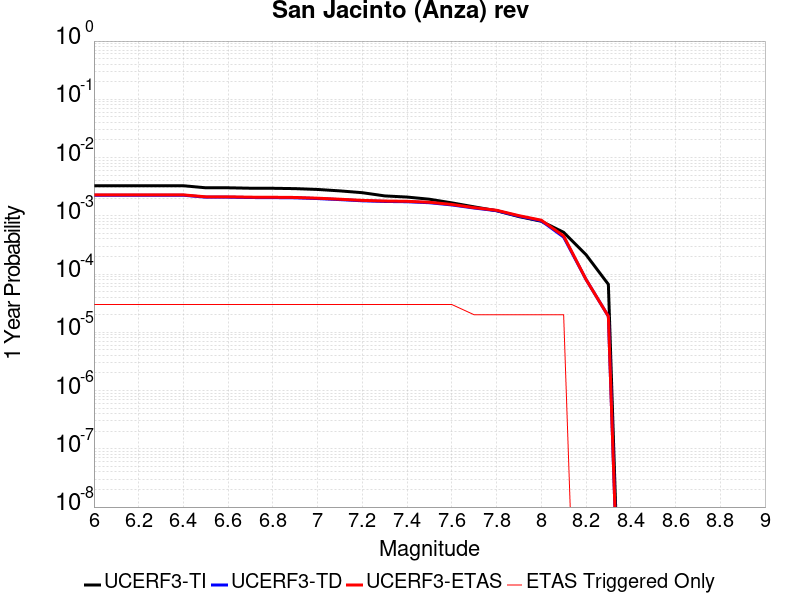 |  |

| Magnitude | 1 wk TI Prob | 1 wk TD Prob | 1 wk ETAS Prob | 1 wk ETAS/TD Gain | 1 wk ETAS Triggered Only | 1 mo TI Prob | 1 mo TD Prob | 1 mo ETAS Prob | 1 mo ETAS/TD Gain | 1 mo ETAS Triggered Only | 1 yr TI Prob | 1 yr TD Prob | 1 yr ETAS Prob | 1 yr ETAS/TD Gain | 1 yr ETAS Triggered Only | 10 yr TI Prob | 10 yr TD Prob | 10 yr ETAS Prob | 10 yr ETAS/TD Gain | 10 yr ETAS Triggered Only |
|-----|-----|-----|-----|-----|-----|-----|-----|-----|-----|-----|-----|-----|-----|-----|-----|-----|-----|-----|-----|-----|
| 6.0 | 6.3015636E-5 | 4.329564E-5 | 6.329477E-5 | 1.4619203 | 2.0E-5 | 2.7003905E-4 | 1.8553961E-4 | 2.0553591E-4 | 1.1077737 | 2.0E-5 | 0.0032827691 | 0.0022566165 | 0.0022865487 | 1.0132643 | 3.0E-5 | 0.032346968 | 0.023292562 | 0.023341399 | 1.0020967 | 5.0E-5 |
| 6.1 | 6.3015636E-5 | 4.329564E-5 | 6.329477E-5 | 1.4619203 | 2.0E-5 | 2.7003905E-4 | 1.8553961E-4 | 2.0553591E-4 | 1.1077737 | 2.0E-5 | 0.0032827691 | 0.0022566165 | 0.0022865487 | 1.0132643 | 3.0E-5 | 0.032346968 | 0.023292562 | 0.023341399 | 1.0020967 | 5.0E-5 |
| 6.2 | 6.3015636E-5 | 4.329564E-5 | 6.329477E-5 | 1.4619203 | 2.0E-5 | 2.7003905E-4 | 1.8553961E-4 | 2.0553591E-4 | 1.1077737 | 2.0E-5 | 0.0032827691 | 0.0022566165 | 0.0022865487 | 1.0132643 | 3.0E-5 | 0.032346968 | 0.023292562 | 0.023341399 | 1.0020967 | 5.0E-5 |
| 6.3 | 6.3015636E-5 | 4.329564E-5 | 6.329477E-5 | 1.4619203 | 2.0E-5 | 2.7003905E-4 | 1.8553961E-4 | 2.0553591E-4 | 1.1077737 | 2.0E-5 | 0.0032827691 | 0.0022566165 | 0.0022865487 | 1.0132643 | 3.0E-5 | 0.032346968 | 0.023292562 | 0.023341399 | 1.0020967 | 5.0E-5 |
| 6.4 | 6.3015636E-5 | 4.329564E-5 | 6.329477E-5 | 1.4619203 | 2.0E-5 | 2.7003905E-4 | 1.8553961E-4 | 2.0553591E-4 | 1.1077737 | 2.0E-5 | 0.0032827691 | 0.0022566165 | 0.0022865487 | 1.0132643 | 3.0E-5 | 0.032346968 | 0.023292562 | 0.023341399 | 1.0020967 | 5.0E-5 |
| 6.5 | 5.811017E-5 | 4.007568E-5 | 6.007488E-5 | 1.4990358 | 2.0E-5 | 2.4901982E-4 | 1.7174163E-4 | 1.917382E-4 | 1.116434 | 2.0E-5 | 0.0030276014 | 0.002088955 | 0.0021188923 | 1.0143312 | 3.0E-5 | 0.02986684 | 0.021590188 | 0.021639109 | 1.0022658 | 5.0E-5 |
| 6.6 | 5.811017E-5 | 4.007568E-5 | 6.007488E-5 | 1.4990358 | 2.0E-5 | 2.4901982E-4 | 1.7174163E-4 | 1.917382E-4 | 1.116434 | 2.0E-5 | 0.0030276014 | 0.002088955 | 0.0021188923 | 1.0143312 | 3.0E-5 | 0.02986684 | 0.021590188 | 0.021639109 | 1.0022658 | 5.0E-5 |
| 6.7 | 5.712442E-5 | 3.9498424E-5 | 5.9497634E-5 | 1.5063293 | 2.0E-5 | 2.4479596E-4 | 1.6926801E-4 | 1.8926463E-4 | 1.1181358 | 2.0E-5 | 0.0029763177 | 0.0020588955 | 0.0020888338 | 1.0145409 | 3.0E-5 | 0.029367693 | 0.02128203 | 0.021330966 | 1.0022994 | 5.0E-5 |
| 6.8 | 5.6967532E-5 | 3.935485E-5 | 5.9354064E-5 | 1.5081766 | 2.0E-5 | 2.4412372E-4 | 1.6865278E-4 | 1.886494E-4 | 1.1185669 | 2.0E-5 | 0.0029681553 | 0.0020514193 | 0.0020813579 | 1.0145941 | 3.0E-5 | 0.029288229 | 0.021206751 | 0.021255692 | 1.0023078 | 5.0E-5 |
| 6.9 | 5.6211324E-5 | 3.9059665E-5 | 5.9058886E-5 | 1.5120171 | 2.0E-5 | 2.4088343E-4 | 1.6738786E-4 | 1.8738452E-4 | 1.119463 | 2.0E-5 | 0.0029288116 | 0.0020360479 | 0.0020659866 | 1.0147045 | 3.0E-5 | 0.028905109 | 0.021046195 | 0.021095144 | 1.0023258 | 5.0E-5 |
| 7.0 | 5.4383527E-5 | 3.7920276E-5 | 5.791952E-5 | 1.5274023 | 2.0E-5 | 2.3305144E-4 | 1.6250537E-4 | 1.8250212E-4 | 1.1230528 | 2.0E-5 | 0.0028337094 | 0.0019767124 | 0.002006653 | 1.0151467 | 3.0E-5 | 0.027978465 | 0.020437196 | 0.020486174 | 1.0023965 | 5.0E-5 |
| 7.1 | 5.1393665E-5 | 3.6383335E-5 | 5.6382607E-5 | 1.5496823 | 2.0E-5 | 2.2023996E-4 | 1.5591929E-4 | 1.7591617E-4 | 1.1282516 | 2.0E-5 | 0.0026781242 | 0.0018966687 | 0.0019266118 | 1.0157872 | 3.0E-5 | 0.026460782 | 0.019610861 | 0.01965988 | 1.0024996 | 5.0E-5 |
| 7.2 | 4.785222E-5 | 3.4735345E-5 | 5.473465E-5 | 1.5757624 | 2.0E-5 | 2.0506482E-4 | 1.4885729E-4 | 1.6885431E-4 | 1.1343368 | 2.0E-5 | 0.0024938055 | 0.0018108344 | 0.0018407801 | 1.016537 | 3.0E-5 | 0.024660049 | 0.018725628 | 0.018774692 | 1.0026201 | 5.0E-5 |
| 7.3 | 4.2143256E-5 | 3.382991E-5 | 5.3829233E-5 | 1.5911728 | 2.0E-5 | 1.8060145E-4 | 1.4497728E-4 | 1.6497438E-4 | 1.1379327 | 2.0E-5 | 0.002196605 | 0.0017636728 | 0.00179362 | 1.0169799 | 3.0E-5 | 0.02175019 | 0.018233923 | 0.018283011 | 1.0026921 | 5.0E-5 |
| 7.4 | 4.0264713E-5 | 3.3468146E-5 | 5.346748E-5 | 1.5975631 | 2.0E-5 | 1.7255165E-4 | 1.4342705E-4 | 1.6342418E-4 | 1.1394237 | 2.0E-5 | 0.002098792 | 0.0017448291 | 0.0017747767 | 1.0171636 | 3.0E-5 | 0.020790804 | 0.01803853 | 0.018087627 | 1.0027218 | 5.0E-5 |
| 7.5 | 3.694492E-5 | 3.218225E-5 | 5.2181607E-5 | 1.6214405 | 2.0E-5 | 1.5832575E-4 | 1.3791666E-4 | 1.579139E-4 | 1.1449951 | 2.0E-5 | 0.0019259118 | 0.0016778451 | 0.0017077948 | 1.01785 | 3.0E-5 | 0.01909306 | 0.017355029 | 0.017404161 | 1.002831 | 5.0E-5 |
| 7.6 | 3.200565E-5 | 2.949823E-5 | 4.9497638E-5 | 1.6779869 | 2.0E-5 | 1.3715986E-4 | 1.2641487E-4 | 1.4641233E-4 | 1.1581893 | 2.0E-5 | 0.001668642 | 0.0015380166 | 0.0015679705 | 1.0194757 | 3.0E-5 | 0.01656168 | 0.015943231 | 0.015992435 | 1.0030861 | 5.0E-5 |
| 7.7 | 2.731642E-5 | 2.6090234E-5 | 4.6089714E-5 | 1.7665503 | 2.0E-5 | 1.1706512E-4 | 1.1181051E-4 | 1.3180826E-4 | 1.1788541 | 2.0E-5 | 0.001424336 | 0.0013604438 | 0.0013804166 | 1.0146811 | 2.0E-5 | 0.014152412 | 0.014165673 | 0.0142051065 | 1.0027838 | 4.0E-5 |
| 7.8 | 2.3466424E-5 | 2.3502365E-5 | 4.3501896E-5 | 1.8509581 | 2.0E-5 | 1.0056651E-4 | 1.0072054E-4 | 1.2071853E-4 | 1.1985493 | 2.0E-5 | 0.0012237094 | 0.0012255836 | 0.0012455591 | 1.0162988 | 2.0E-5 | 0.012169928 | 0.012807612 | 0.0128471 | 1.0030831 | 4.0E-5 |
| 7.9 | 1.8611925E-5 | 1.89059E-5 | 3.890552E-5 | 2.0578508 | 2.0E-5 | 7.9762955E-5 | 8.102277E-5 | 1.01021156E-4 | 1.2468241 | 2.0E-5 | 9.7068126E-4 | 9.860066E-4 | 0.0010059868 | 1.0202638 | 2.0E-5 | 0.0096645225 | 0.010392662 | 0.010432246 | 1.0038089 | 4.0E-5 |
| 8.0 | 1.5460775E-5 | 1.5738988E-5 | 3.573867E-5 | 2.2707098 | 2.0E-5 | 6.6258784E-5 | 6.745106E-5 | 8.744971E-5 | 1.2964913 | 2.0E-5 | 8.0640207E-4 | 8.2090794E-4 | 8.4089156E-4 | 1.0243433 | 2.0E-5 | 0.008034821 | 0.008701843 | 0.008741495 | 1.0045568 | 4.0E-5 |
| 8.1 | 9.983884E-6 | 8.268797E-6 | 2.826863E-5 | 3.4187117 | 2.0E-5 | 4.2787375E-5 | 3.543722E-5 | 5.543651E-5 | 1.5643584 | 2.0E-5 | 5.2081177E-4 | 4.3136327E-4 | 4.5135463E-4 | 1.0463446 | 2.0E-5 | 0.0051959283 | 0.0046394016 | 0.004679216 | 1.0085818 | 4.0E-5 |
| 8.2 | 4.1226E-6 | 1.5526499E-6 | 1.5526499E-6 | 1.0 | 0.0 | 1.7668166E-5 | 6.654197E-6 | 6.654197E-6 | 1.0 | 0.0 | 2.1508869E-4 | 8.1011865E-5 | 8.1011865E-5 | 1.0 | 0.0 | 0.0021488064 | 9.40314E-4 | 9.40314E-4 | 1.0 | 0.0 |
| 8.3 | 1.2750878E-6 | 3.6112328E-7 | 3.6112328E-7 | 1.0 | 0.0 | 5.4646503E-6 | 1.5476703E-6 | 1.5476703E-6 | 1.0 | 0.0 | 6.653009E-5 | 1.8842728E-5 | 1.8842728E-5 | 1.0 | 0.0 | 6.6510175E-4 | 2.2728964E-4 | 2.2728964E-4 | 1.0 | 0.0 |

## San Diego Trough north alt1
*[(top)](#table-of-contents)*

| 1 Week | 1 Month | 1 Year | 10 Year |
|-----|-----|-----|-----|
|  |  |  |  |

| Magnitude | 1 wk TI Prob | 1 wk TD Prob | 1 wk ETAS Prob | 1 wk ETAS/TD Gain | 1 wk ETAS Triggered Only | 1 mo TI Prob | 1 mo TD Prob | 1 mo ETAS Prob | 1 mo ETAS/TD Gain | 1 mo ETAS Triggered Only | 1 yr TI Prob | 1 yr TD Prob | 1 yr ETAS Prob | 1 yr ETAS/TD Gain | 1 yr ETAS Triggered Only | 10 yr TI Prob | 10 yr TD Prob | 10 yr ETAS Prob | 10 yr ETAS/TD Gain | 10 yr ETAS Triggered Only |
|-----|-----|-----|-----|-----|-----|-----|-----|-----|-----|-----|-----|-----|-----|-----|-----|-----|-----|-----|-----|-----|
| 6.0 | 7.329252E-5 | 8.8210436E-5 | 9.820955E-5 | 1.1133553 | 1.0E-5 | 3.14073E-4 | 3.779936E-4 | 3.9798603E-4 | 1.0528909 | 2.0E-5 | 0.0038171355 | 0.004593001 | 0.0046129096 | 1.0043344 | 2.0E-5 | 0.03752231 | 0.04504475 | 0.045073397 | 1.000636 | 3.0E-5 |
| 6.1 | 3.7940346E-5 | 4.488478E-5 | 4.488478E-5 | 1.0 | 0.0 | 1.6259136E-4 | 1.923497E-4 | 2.0234779E-4 | 1.0519786 | 1.0E-5 | 0.0019777524 | 0.0023394316 | 0.002349408 | 1.0042646 | 1.0E-5 | 0.019602431 | 0.023156574 | 0.023166342 | 1.0004219 | 1.0E-5 |
| 6.2 | 2.8645263E-5 | 3.3296634E-5 | 3.3296634E-5 | 1.0 | 0.0 | 1.2275964E-4 | 1.4269221E-4 | 1.5269079E-4 | 1.0700709 | 1.0E-5 | 0.0014935739 | 0.0017359114 | 0.001745894 | 1.0057507 | 1.0E-5 | 0.0148357535 | 0.017226173 | 0.017236 | 1.0005705 | 1.0E-5 |
| 6.3 | 2.8645263E-5 | 3.3296634E-5 | 3.3296634E-5 | 1.0 | 0.0 | 1.2275964E-4 | 1.4269221E-4 | 1.5269079E-4 | 1.0700709 | 1.0E-5 | 0.0014935739 | 0.0017359114 | 0.001745894 | 1.0057507 | 1.0E-5 | 0.0148357535 | 0.017226173 | 0.017236 | 1.0005705 | 1.0E-5 |
| 6.4 | 2.2204576E-5 | 2.5448218E-5 | 2.5448218E-5 | 1.0 | 0.0 | 9.5159E-5 | 1.0905929E-4 | 1.190582E-4 | 1.0916833 | 1.0E-5 | 0.001157945 | 0.0013269981 | 0.0013369848 | 1.0075258 | 1.0E-5 | 0.011519298 | 0.013191903 | 0.013201771 | 1.000748 | 1.0E-5 |
| 6.5 | 2.1004838E-5 | 2.40246E-5 | 2.40246E-5 | 1.0 | 0.0 | 9.0017624E-5 | 1.0295857E-4 | 1.1295754E-4 | 1.0971165 | 1.0E-5 | 0.0010954136 | 0.001252809 | 0.0012627965 | 1.0079721 | 1.0E-5 | 0.010900296 | 0.0124585405 | 0.012468416 | 1.0007926 | 1.0E-5 |
| 6.6 | 1.820557E-5 | 2.070471E-5 | 2.070471E-5 | 1.0 | 0.0 | 7.802154E-5 | 8.873148E-5 | 9.87306E-5 | 1.1126896 | 1.0E-5 | 9.4949827E-4 | 0.0010797759 | 0.0010897651 | 1.0092512 | 1.0E-5 | 0.009454516 | 0.010745965 | 0.010755857 | 1.0009205 | 1.0E-5 |
| 6.7 | 1.5884485E-5 | 1.7983582E-5 | 1.7983582E-5 | 1.0 | 0.0 | 6.807459E-5 | 7.707023E-5 | 8.7069464E-5 | 1.1297418 | 1.0E-5 | 8.284929E-4 | 9.379289E-4 | 9.4791956E-4 | 1.0106518 | 1.0E-5 | 0.008254109 | 0.00934007 | 0.009349977 | 1.0010606 | 1.0E-5 |
| 6.8 | 1.4331171E-5 | 1.6201007E-5 | 1.6201007E-5 | 1.0 | 0.0 | 6.141786E-5 | 6.943105E-5 | 7.943036E-5 | 1.1440178 | 1.0E-5 | 7.4750587E-4 | 8.4499724E-4 | 8.549888E-4 | 1.0118244 | 1.0E-5 | 0.0074499645 | 0.008418109 | 0.008428025 | 1.0011779 | 1.0E-5 |
| 6.9 | 1.2574203E-5 | 1.4205785E-5 | 1.4205785E-5 | 1.0 | 0.0 | 5.3888325E-5 | 6.0880524E-5 | 7.087991E-5 | 1.1642461 | 1.0E-5 | 6.558929E-4 | 7.409697E-4 | 7.509623E-4 | 1.0134858 | 1.0E-5 | 0.0065396037 | 0.0073851775 | 0.007395104 | 1.0013441 | 1.0E-5 |
| 7.0 | 1.0883844E-5 | 1.2289219E-5 | 1.2289219E-5 | 1.0 | 0.0 | 4.664421E-5 | 5.2667023E-5 | 6.26665E-5 | 1.1898621 | 1.0E-5 | 5.677453E-4 | 6.4103334E-4 | 6.510269E-4 | 1.0155898 | 1.0E-5 | 0.00566297 | 0.0063919704 | 0.0064019067 | 1.0015545 | 1.0E-5 |
| 7.1 | 9.393088E-6 | 1.0606983E-5 | 1.0606983E-5 | 1.0 | 0.0 | 4.025547E-5 | 4.545771E-5 | 5.5457258E-5 | 1.2199746 | 1.0E-5 | 4.900001E-4 | 5.533079E-4 | 5.633023E-4 | 1.0180631 | 1.0E-5 | 0.0048892107 | 0.005519399 | 0.0055293436 | 1.0018018 | 1.0E-5 |
| 7.2 | 8.190791E-6 | 9.258593E-6 | 9.258593E-6 | 1.0 | 0.0 | 3.510292E-5 | 3.9679086E-5 | 3.9679086E-5 | 1.0 | 0.0 | 4.2729423E-4 | 4.8298645E-4 | 4.8298645E-4 | 1.0 | 0.0 | 0.0042647356 | 0.0048194476 | 0.0048194476 | 1.0 | 0.0 |
| 7.3 | 6.268162E-6 | 7.089691E-6 | 7.089691E-6 | 1.0 | 0.0 | 2.6863276E-5 | 3.0384037E-5 | 3.0384037E-5 | 1.0 | 0.0 | 3.2701128E-4 | 3.6986326E-4 | 3.6986326E-4 | 1.0 | 0.0 | 0.003265305 | 0.0036925229 | 0.0036925229 | 1.0 | 0.0 |
| 7.4 | 4.985186E-6 | 5.6426616E-6 | 5.6426616E-6 | 1.0 | 0.0 | 2.1364907E-5 | 2.4182613E-5 | 2.4182613E-5 | 1.0 | 0.0 | 2.600867E-4 | 2.9438394E-4 | 2.9438394E-4 | 1.0 | 0.0 | 0.002597825 | 0.002939981 | 0.002939981 | 1.0 | 0.0 |
| 7.5 | 1.7489613E-6 | 1.969671E-6 | 1.969671E-6 | 1.0 | 0.0 | 7.495527E-6 | 8.441422E-6 | 8.441422E-6 | 1.0 | 0.0 | 9.125422E-5 | 1.02769685E-4 | 1.02769685E-4 | 1.0 | 0.0 | 9.1216754E-4 | 0.0010272437 | 0.0010272437 | 1.0 | 0.0 |
| 7.6 | 1.6988751E-7 | 1.7533809E-7 | 1.7533809E-7 | 1.0 | 0.0 | 7.2808916E-7 | 7.5144874E-7 | 7.5144874E-7 | 1.0 | 0.0 | 8.864449E-6 | 9.148852E-6 | 9.148852E-6 | 1.0 | 0.0 | 8.8640954E-5 | 9.148495E-5 | 9.148495E-5 | 1.0 | 0.0 |

## San Jacinto (Coyote Creek)
*[(top)](#table-of-contents)*

| 1 Week | 1 Month | 1 Year | 10 Year |
|-----|-----|-----|-----|
| 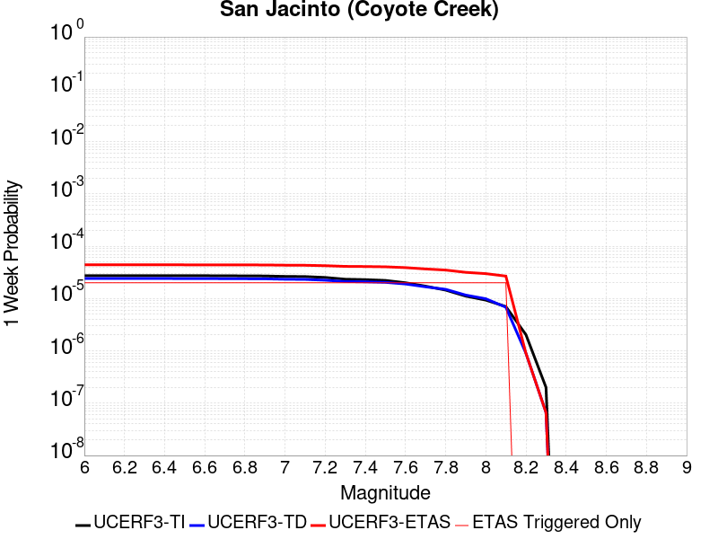 |  | 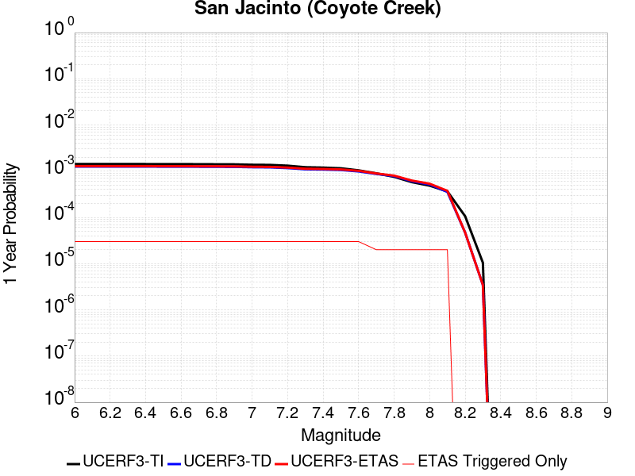 | 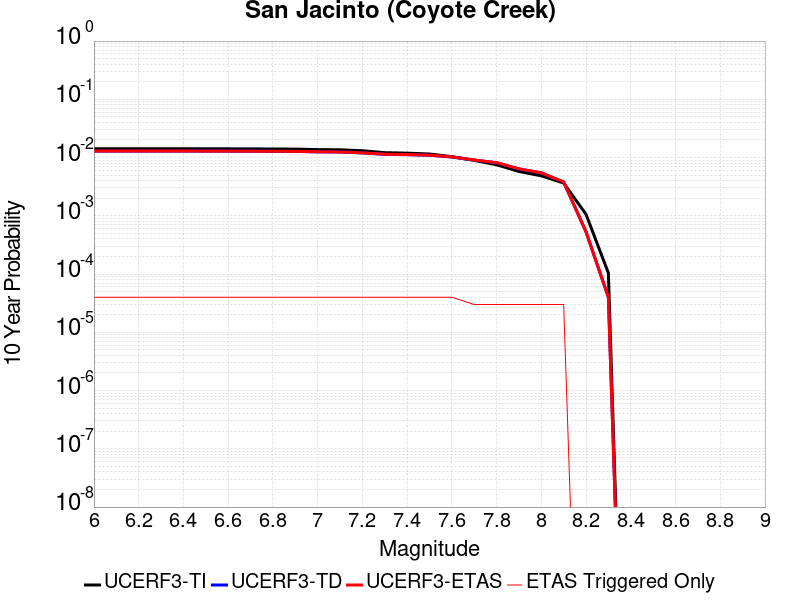 |

| Magnitude | 1 wk TI Prob | 1 wk TD Prob | 1 wk ETAS Prob | 1 wk ETAS/TD Gain | 1 wk ETAS Triggered Only | 1 mo TI Prob | 1 mo TD Prob | 1 mo ETAS Prob | 1 mo ETAS/TD Gain | 1 mo ETAS Triggered Only | 1 yr TI Prob | 1 yr TD Prob | 1 yr ETAS Prob | 1 yr ETAS/TD Gain | 1 yr ETAS Triggered Only | 10 yr TI Prob | 10 yr TD Prob | 10 yr ETAS Prob | 10 yr ETAS/TD Gain | 10 yr ETAS Triggered Only |
|-----|-----|-----|-----|-----|-----|-----|-----|-----|-----|-----|-----|-----|-----|-----|-----|-----|-----|-----|-----|-----|
| 6.0 | 2.7374346E-5 | 2.4143557E-5 | 4.4143075E-5 | 1.8283584 | 2.0E-5 | 1.1731335E-4 | 1.03468294E-4 | 1.2346623E-4 | 1.1932759 | 2.0E-5 | 0.0014273542 | 0.0012590011 | 0.0012889634 | 1.0237985 | 3.0E-5 | 0.01418221 | 0.012927456 | 0.012966938 | 1.0030541 | 4.0E-5 |
| 6.1 | 2.7374346E-5 | 2.4143557E-5 | 4.4143075E-5 | 1.8283584 | 2.0E-5 | 1.1731335E-4 | 1.03468294E-4 | 1.2346623E-4 | 1.1932759 | 2.0E-5 | 0.0014273542 | 0.0012590011 | 0.0012889634 | 1.0237985 | 3.0E-5 | 0.01418221 | 0.012927456 | 0.012966938 | 1.0030541 | 4.0E-5 |
| 6.2 | 2.7374346E-5 | 2.4143557E-5 | 4.4143075E-5 | 1.8283584 | 2.0E-5 | 1.1731335E-4 | 1.03468294E-4 | 1.2346623E-4 | 1.1932759 | 2.0E-5 | 0.0014273542 | 0.0012590011 | 0.0012889634 | 1.0237985 | 3.0E-5 | 0.01418221 | 0.012927456 | 0.012966938 | 1.0030541 | 4.0E-5 |
| 6.3 | 2.7374346E-5 | 2.4143557E-5 | 4.4143075E-5 | 1.8283584 | 2.0E-5 | 1.1731335E-4 | 1.03468294E-4 | 1.2346623E-4 | 1.1932759 | 2.0E-5 | 0.0014273542 | 0.0012590011 | 0.0012889634 | 1.0237985 | 3.0E-5 | 0.01418221 | 0.012927456 | 0.012966938 | 1.0030541 | 4.0E-5 |
| 6.4 | 2.7374346E-5 | 2.4143557E-5 | 4.4143075E-5 | 1.8283584 | 2.0E-5 | 1.1731335E-4 | 1.03468294E-4 | 1.2346623E-4 | 1.1932759 | 2.0E-5 | 0.0014273542 | 0.0012590011 | 0.0012889634 | 1.0237985 | 3.0E-5 | 0.01418221 | 0.012927456 | 0.012966938 | 1.0030541 | 4.0E-5 |
| 6.5 | 2.7282445E-5 | 2.4029636E-5 | 4.4029155E-5 | 1.8322855 | 2.0E-5 | 1.16919524E-4 | 1.02980106E-4 | 1.2297805E-4 | 1.1941923 | 2.0E-5 | 0.0014225657 | 0.0012530643 | 0.0012830266 | 1.0239114 | 3.0E-5 | 0.014134934 | 0.012868783 | 0.012908269 | 1.0030683 | 4.0E-5 |
| 6.6 | 2.7282445E-5 | 2.4029636E-5 | 4.4029155E-5 | 1.8322855 | 2.0E-5 | 1.16919524E-4 | 1.02980106E-4 | 1.2297805E-4 | 1.1941923 | 2.0E-5 | 0.0014225657 | 0.0012530643 | 0.0012830266 | 1.0239114 | 3.0E-5 | 0.014134934 | 0.012868783 | 0.012908269 | 1.0030683 | 4.0E-5 |
| 6.7 | 2.7216198E-5 | 2.3954757E-5 | 4.395428E-5 | 1.8348873 | 2.0E-5 | 1.1663563E-4 | 1.0265922E-4 | 1.2265716E-4 | 1.1947993 | 2.0E-5 | 0.0014191137 | 0.001249162 | 0.0012791245 | 1.0239861 | 3.0E-5 | 0.014100855 | 0.012830195 | 0.012869682 | 1.0030776 | 4.0E-5 |
| 6.8 | 2.7078617E-5 | 2.3871975E-5 | 4.3871496E-5 | 1.8377825 | 2.0E-5 | 1.1604605E-4 | 1.0230447E-4 | 1.2230242E-4 | 1.1954749 | 2.0E-5 | 0.001411945 | 0.0012448479 | 0.0012748105 | 1.0240693 | 3.0E-5 | 0.014030075 | 0.012787337 | 0.012826826 | 1.0030881 | 4.0E-5 |
| 6.9 | 2.6982952E-5 | 2.3791488E-5 | 4.3791013E-5 | 1.8406168 | 2.0E-5 | 1.15636096E-4 | 1.0195955E-4 | 1.21957506E-4 | 1.1961362 | 2.0E-5 | 0.0014069602 | 0.0012406532 | 0.0012706161 | 1.0241508 | 3.0E-5 | 0.013980856 | 0.012745653 | 0.012785144 | 1.0030984 | 4.0E-5 |
| 7.0 | 2.6449972E-5 | 2.3368513E-5 | 4.3368047E-5 | 1.8558325 | 2.0E-5 | 1.1335209E-4 | 1.0014694E-4 | 1.2014494E-4 | 1.1996865 | 2.0E-5 | 0.001379188 | 0.0012186096 | 0.0012485731 | 1.0245882 | 3.0E-5 | 0.0137065975 | 0.012527018 | 0.012566516 | 1.0031531 | 4.0E-5 |
| 7.1 | 2.6257849E-5 | 2.3194552E-5 | 4.319409E-5 | 1.8622514 | 2.0E-5 | 1.1252879E-4 | 9.9401455E-5 | 1.1939946E-4 | 1.2011843 | 2.0E-5 | 0.0013691769 | 0.0012095434 | 0.0012395071 | 1.0247728 | 3.0E-5 | 0.013607717 | 0.012436883 | 0.012476386 | 1.0031762 | 4.0E-5 |
| 7.2 | 2.5270041E-5 | 2.238933E-5 | 4.238888E-5 | 1.8932626 | 2.0E-5 | 1.0829568E-4 | 9.595075E-5 | 1.1594884E-4 | 1.2084203 | 2.0E-5 | 0.0013177024 | 0.0011675768 | 0.0011975417 | 1.0256642 | 3.0E-5 | 0.013099162 | 0.012017925 | 0.012057444 | 1.0032884 | 4.0E-5 |
| 7.3 | 2.339701E-5 | 2.1121201E-5 | 4.1120777E-5 | 1.9468958 | 2.0E-5 | 1.0026905E-4 | 9.05163E-5 | 1.1051449E-4 | 1.2209346 | 2.0E-5 | 0.001220092 | 0.0011014809 | 0.0011314478 | 1.0272061 | 3.0E-5 | 0.012134149 | 0.011356855 | 0.0113964 | 1.0034821 | 4.0E-5 |
| 7.4 | 2.296333E-5 | 2.0851561E-5 | 4.0851144E-5 | 1.9591408 | 2.0E-5 | 9.841056E-5 | 8.936079E-5 | 1.09359E-4 | 1.2237918 | 2.0E-5 | 0.0011974899 | 0.0010874267 | 0.001117394 | 1.0275581 | 3.0E-5 | 0.011910575 | 0.011215971 | 0.011255522 | 1.0035263 | 4.0E-5 |
| 7.5 | 2.2188895E-5 | 2.03745E-5 | 4.0374092E-5 | 1.9815992 | 2.0E-5 | 9.50918E-5 | 8.731637E-5 | 1.0731463E-4 | 1.2290322 | 2.0E-5 | 0.0011571277 | 0.0010625605 | 0.0010925286 | 1.0282037 | 3.0E-5 | 0.011511209 | 0.010965596 | 0.011005158 | 1.0036077 | 4.0E-5 |
| 7.6 | 2.0013189E-5 | 1.8960805E-5 | 3.8960425E-5 | 2.0547876 | 2.0E-5 | 8.5767984E-5 | 8.125807E-5 | 1.01256446E-4 | 1.2461094 | 2.0E-5 | 0.001043725 | 9.888698E-4 | 0.0010188401 | 1.0303077 | 3.0E-5 | 0.010388365 | 0.010223619 | 0.01026321 | 1.0038725 | 4.0E-5 |
| 7.7 | 1.7230794E-5 | 1.674219E-5 | 3.6741854E-5 | 2.194567 | 2.0E-5 | 7.384417E-5 | 7.175027E-5 | 9.1748836E-5 | 1.2787246 | 2.0E-5 | 8.986819E-4 | 8.7321026E-4 | 8.931928E-4 | 1.022884 | 2.0E-5 | 0.008950562 | 0.009062162 | 0.0090918895 | 1.0032805 | 3.0E-5 |
| 7.8 | 1.4478809E-5 | 1.4989509E-5 | 3.498921E-5 | 2.3342464 | 2.0E-5 | 6.205057E-5 | 6.4239175E-5 | 8.423789E-5 | 1.3113165 | 2.0E-5 | 7.552038E-4 | 7.81832E-4 | 8.018163E-4 | 1.025561 | 2.0E-5 | 0.0075264242 | 0.008140619 | 0.008170375 | 1.0036552 | 3.0E-5 |
| 7.9 | 1.1114467E-5 | 1.164379E-5 | 3.1643558E-5 | 2.717634 | 2.0E-5 | 4.7632562E-5 | 4.9901002E-5 | 6.990001E-5 | 1.4007735 | 2.0E-5 | 5.797721E-4 | 6.073759E-4 | 6.273638E-4 | 1.0329086 | 2.0E-5 | 0.0057826187 | 0.0063796355 | 0.0064094444 | 1.0046724 | 3.0E-5 |
| 8.0 | 9.327402E-6 | 9.897987E-6 | 2.989779E-5 | 3.0205927 | 2.0E-5 | 3.9973966E-5 | 4.241926E-5 | 6.241841E-5 | 1.4714639 | 2.0E-5 | 4.8657437E-4 | 5.163326E-4 | 5.363223E-4 | 1.0387148 | 2.0E-5 | 0.0048551033 | 0.0054493384 | 0.0054791747 | 1.0054753 | 3.0E-5 |
| 8.1 | 7.0235833E-6 | 6.826621E-6 | 2.6826485E-5 | 3.9296873 | 2.0E-5 | 3.0100724E-5 | 2.925662E-5 | 4.9256036E-5 | 1.683586 | 2.0E-5 | 3.664147E-4 | 3.5614165E-4 | 3.7613453E-4 | 1.0561374 | 2.0E-5 | 0.003658111 | 0.003787139 | 0.0038170256 | 1.0078915 | 3.0E-5 |
| 8.2 | 2.0358202E-6 | 8.9928193E-7 | 8.9928193E-7 | 1.0 | 0.0 | 8.724915E-6 | 3.8540597E-6 | 3.8540597E-6 | 1.0 | 0.0 | 1.06220665E-4 | 4.6922192E-5 | 4.6922192E-5 | 1.0 | 0.0 | 0.001061699 | 5.3244614E-4 | 5.3244614E-4 | 1.0 | 0.0 |
| 8.3 | 2.0051264E-7 | 6.615823E-8 | 6.615823E-8 | 1.0 | 0.0 | 8.5933965E-7 | 2.8353526E-7 | 2.8353526E-7 | 1.0 | 0.0 | 1.046241E-5 | 3.4520367E-6 | 3.4520367E-6 | 1.0 | 0.0 | 1.0461917E-4 | 4.01306E-5 | 4.01306E-5 | 1.0 | 0.0 |

## Brawley (Seismic Zone) alt 1
*[(top)](#table-of-contents)*

| 1 Week | 1 Month | 1 Year | 10 Year |
|-----|-----|-----|-----|
|  |  |  |  |

| Magnitude | 1 wk TI Prob | 1 wk TD Prob | 1 wk ETAS Prob | 1 wk ETAS/TD Gain | 1 wk ETAS Triggered Only | 1 mo TI Prob | 1 mo TD Prob | 1 mo ETAS Prob | 1 mo ETAS/TD Gain | 1 mo ETAS Triggered Only | 1 yr TI Prob | 1 yr TD Prob | 1 yr ETAS Prob | 1 yr ETAS/TD Gain | 1 yr ETAS Triggered Only | 10 yr TI Prob | 10 yr TD Prob | 10 yr ETAS Prob | 10 yr ETAS/TD Gain | 10 yr ETAS Triggered Only |
|-----|-----|-----|-----|-----|-----|-----|-----|-----|-----|-----|-----|-----|-----|-----|-----|-----|-----|-----|-----|-----|
| 6.0 | 2.2521618E-4 | 4.7625226E-4 | 4.8624747E-4 | 1.0209873 | 1.0E-5 | 9.6485513E-4 | 0.0020395215 | 0.0020594809 | 1.0097862 | 2.0E-5 | 0.011683988 | 0.024542542 | 0.024571804 | 1.0011923 | 3.0E-5 | 0.11088423 | 0.21347483 | 0.2135063 | 1.0001473 | 4.0E-5 |
| 6.1 | 2.2521618E-4 | 4.7625226E-4 | 4.8624747E-4 | 1.0209873 | 1.0E-5 | 9.6485513E-4 | 0.0020395215 | 0.0020594809 | 1.0097862 | 2.0E-5 | 0.011683988 | 0.024542542 | 0.024571804 | 1.0011923 | 3.0E-5 | 0.11088423 | 0.21347483 | 0.2135063 | 1.0001473 | 4.0E-5 |
| 6.2 | 2.198148E-4 | 4.6709873E-4 | 4.7709406E-4 | 1.0213988 | 1.0E-5 | 9.417233E-4 | 0.0020003526 | 0.0020203125 | 1.0099783 | 2.0E-5 | 0.011405343 | 0.024076827 | 0.024106104 | 1.001216 | 3.0E-5 | 0.10837428 | 0.20991138 | 0.20994298 | 1.0001506 | 4.0E-5 |
| 6.3 | 2.1704129E-4 | 4.6145564E-4 | 4.71451E-4 | 1.0216606 | 1.0E-5 | 9.298453E-4 | 0.0019762046 | 0.0019961651 | 1.0101004 | 2.0E-5 | 0.011262234 | 0.023789987 | 0.023819273 | 1.0012311 | 3.0E-5 | 0.107082725 | 0.2078023 | 0.20783399 | 1.0001525 | 4.0E-5 |
| 6.4 | 1.876142E-4 | 4.0037738E-4 | 4.1037338E-4 | 1.0249665 | 1.0E-5 | 8.038131E-4 | 0.001714789 | 0.0017247718 | 1.0058216 | 1.0E-5 | 0.00974259 | 0.02067674 | 0.020696325 | 1.0009472 | 2.0E-5 | 0.093263686 | 0.18455231 | 0.18457678 | 1.0001326 | 3.0E-5 |
| 6.5 | 1.7390939E-4 | 3.746997E-4 | 3.8469594E-4 | 1.0266781 | 1.0E-5 | 7.45113E-4 | 0.0016048797 | 0.0016148636 | 1.006221 | 1.0E-5 | 0.009034078 | 0.019365085 | 0.019384699 | 1.0010128 | 2.0E-5 | 0.086755216 | 0.17437433 | 0.1743991 | 1.0001421 | 3.0E-5 |
| 6.6 | 1.591791E-4 | 3.4884937E-4 | 3.588459E-4 | 1.0286556 | 1.0E-5 | 6.8201777E-4 | 0.0014942222 | 0.0015042073 | 1.0066824 | 1.0E-5 | 0.008271996 | 0.018041968 | 0.018061608 | 1.0010885 | 2.0E-5 | 0.07970774 | 0.16378246 | 0.16380754 | 1.0001532 | 3.0E-5 |
| 6.7 | 1.4268003E-4 | 3.2051268E-4 | 3.3050947E-4 | 1.03119 | 1.0E-5 | 6.1134255E-4 | 0.0013729108 | 0.0013828971 | 1.0072738 | 1.0E-5 | 0.007417723 | 0.016589044 | 0.016608711 | 1.0011857 | 2.0E-5 | 0.07174956 | 0.15190692 | 0.15193237 | 1.0001675 | 3.0E-5 |
| 6.8 | 1.239713E-4 | 2.904694E-4 | 3.0046652E-4 | 1.034417 | 1.0E-5 | 5.3119735E-4 | 0.0012442812 | 0.0012542687 | 1.0080267 | 1.0E-5 | 0.0064481674 | 0.015045324 | 0.015065024 | 1.0013093 | 2.0E-5 | 0.06264243 | 0.13835184 | 0.1383777 | 1.0001868 | 3.0E-5 |
| 6.9 | 1.0180238E-4 | 2.624795E-4 | 2.7247687E-4 | 1.0380882 | 1.0E-5 | 4.3622297E-4 | 0.0011244314 | 0.0011344202 | 1.0088834 | 1.0E-5 | 0.005298089 | 0.013605019 | 0.013624747 | 1.0014501 | 2.0E-5 | 0.05173543 | 0.124936566 | 0.124962814 | 1.0002102 | 3.0E-5 |
| 7.0 | 7.6619996E-5 | 2.2393082E-4 | 2.3392857E-4 | 1.0446466 | 1.0E-5 | 3.283301E-4 | 9.593537E-4 | 9.693441E-4 | 1.0104136 | 1.0E-5 | 0.0039900932 | 0.011618287 | 0.011638055 | 1.0017015 | 2.0E-5 | 0.039192066 | 0.1072422 | 0.10726898 | 1.0002497 | 3.0E-5 |
| 7.1 | 7.5127435E-5 | 2.2076255E-4 | 2.3076034E-4 | 1.0452875 | 1.0E-5 | 3.2193496E-4 | 9.457853E-4 | 9.5577585E-4 | 1.0105633 | 1.0E-5 | 0.0039125155 | 0.01145484 | 0.011474611 | 1.001726 | 2.0E-5 | 0.038443442 | 0.10580618 | 0.105833 | 1.0002536 | 3.0E-5 |
| 7.2 | 6.788582E-5 | 2.0204009E-4 | 2.1203807E-4 | 1.0494851 | 1.0E-5 | 2.9090676E-4 | 8.6560176E-4 | 8.755931E-4 | 1.0115427 | 1.0E-5 | 0.0035360386 | 0.010488416 | 0.010498311 | 1.0009434 | 1.0E-5 | 0.034803 | 0.097476505 | 0.09749456 | 1.0001851 | 2.0E-5 |
| 7.3 | 6.399602E-5 | 1.8835113E-4 | 1.8835113E-4 | 1.0 | 0.0 | 2.7423984E-4 | 8.0697227E-4 | 8.0697227E-4 | 1.0 | 0.0 | 0.0033337586 | 0.009781217 | 0.009781217 | 1.0 | 0.0 | 0.03284188 | 0.09137183 | 0.09138091 | 1.0000994 | 1.0E-5 |
| 7.4 | 4.506759E-5 | 1.2526519E-4 | 1.2526519E-4 | 1.0 | 0.0 | 1.9313251E-4 | 5.367412E-4 | 5.367412E-4 | 1.0 | 0.0 | 0.0023488526 | 0.006515418 | 0.006515418 | 1.0 | 0.0 | 0.023241805 | 0.062352248 | 0.062361624 | 1.0001503 | 1.0E-5 |
| 7.5 | 3.43289E-5 | 9.334972E-5 | 9.334972E-5 | 1.0 | 0.0 | 1.4711556E-4 | 4.0000922E-4 | 4.0000922E-4 | 1.0 | 0.0 | 0.0017896603 | 0.004859299 | 0.004859299 | 1.0 | 0.0 | 0.01775316 | 0.04705323 | 0.04706276 | 1.0002025 | 1.0E-5 |
| 7.6 | 2.5980507E-5 | 7.0527196E-5 | 7.0527196E-5 | 1.0 | 0.0 | 1.1134028E-4 | 3.022245E-4 | 3.022245E-4 | 1.0 | 0.0 | 0.001354725 | 0.0036733993 | 0.0036733993 | 1.0 | 0.0 | 0.013464959 | 0.035839107 | 0.035848748 | 1.000269 | 1.0E-5 |
| 7.7 | 1.7292105E-5 | 4.940404E-5 | 4.940404E-5 | 1.0 | 0.0 | 7.4106916E-5 | 2.1171445E-4 | 2.1171445E-4 | 1.0 | 0.0 | 9.018782E-4 | 0.0025745821 | 0.0025745821 | 1.0 | 0.0 | 0.008982267 | 0.025288915 | 0.025298662 | 1.0003854 | 1.0E-5 |
| 7.8 | 1.2927471E-5 | 3.9690432E-5 | 3.9690432E-5 | 1.0 | 0.0 | 5.5402274E-5 | 1.7009077E-4 | 1.7009077E-4 | 1.0 | 0.0 | 6.743139E-4 | 0.002068891 | 0.002068891 | 1.0 | 0.0 | 0.0067227143 | 0.020430436 | 0.020440232 | 1.0004795 | 1.0E-5 |
| 7.9 | 1.0200774E-5 | 2.8743396E-5 | 2.8743396E-5 | 1.0 | 0.0 | 4.371687E-5 | 1.2318017E-4 | 1.2318017E-4 | 1.0 | 0.0 | 5.321229E-4 | 0.001498688 | 0.001498688 | 1.0 | 0.0 | 0.005308505 | 0.014990583 | 0.015000434 | 1.0006571 | 1.0E-5 |
| 8.0 | 8.650396E-6 | 2.3275401E-5 | 2.3275401E-5 | 1.0 | 0.0 | 3.70726E-5 | 9.974791E-5 | 9.974791E-5 | 1.0 | 0.0 | 4.5126543E-4 | 0.0012137551 | 0.0012137551 | 1.0 | 0.0 | 0.0045035016 | 0.012210181 | 0.012210181 | 1.0 | 0.0 |
| 8.1 | 3.9368224E-6 | 7.3271426E-6 | 7.3271426E-6 | 1.0 | 0.0 | 1.6871985E-5 | 3.1401665E-5 | 3.1401665E-5 | 1.0 | 0.0 | 2.0539707E-4 | 3.822483E-4 | 3.822483E-4 | 1.0 | 0.0 | 0.0020520731 | 0.004000768 | 0.004000768 | 1.0 | 0.0 |
| 8.2 | 1.7101195E-6 | 2.2175473E-6 | 2.2175473E-6 | 1.0 | 0.0 | 7.329063E-6 | 9.50374E-6 | 9.50374E-6 | 1.0 | 0.0 | 8.922769E-5 | 1.1570192E-4 | 1.1570192E-4 | 1.0 | 0.0 | 8.9191867E-4 | 0.0012665088 | 0.0012665088 | 1.0 | 0.0 |
| 8.3 | 3.0346666E-8 | 1.72124E-8 | 1.72124E-8 | 1.0 | 0.0 | 1.3005713E-7 | 7.3767424E-8 | 7.3767424E-8 | 1.0 | 0.0 | 1.5834444E-6 | 8.9811834E-7 | 8.9811834E-7 | 1.0 | 0.0 | 1.5834332E-5 | 9.365885E-6 | 9.365885E-6 | 1.0 | 0.0 |

## White Wolf (Extension)
*[(top)](#table-of-contents)*

| 1 Week | 1 Month | 1 Year | 10 Year |
|-----|-----|-----|-----|
| 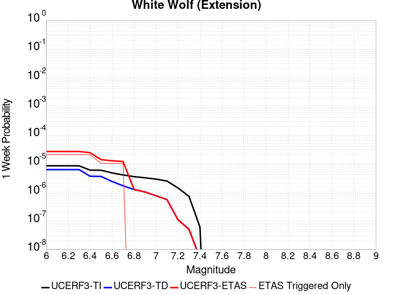 |  |  |  |

| Magnitude | 1 wk TI Prob | 1 wk TD Prob | 1 wk ETAS Prob | 1 wk ETAS/TD Gain | 1 wk ETAS Triggered Only | 1 mo TI Prob | 1 mo TD Prob | 1 mo ETAS Prob | 1 mo ETAS/TD Gain | 1 mo ETAS Triggered Only | 1 yr TI Prob | 1 yr TD Prob | 1 yr ETAS Prob | 1 yr ETAS/TD Gain | 1 yr ETAS Triggered Only | 10 yr TI Prob | 10 yr TD Prob | 10 yr ETAS Prob | 10 yr ETAS/TD Gain | 10 yr ETAS Triggered Only |
|-----|-----|-----|-----|-----|-----|-----|-----|-----|-----|-----|-----|-----|-----|-----|-----|-----|-----|-----|-----|-----|
| 6.0 | 8.222555E-6 | 6.0666575E-6 | 2.6066537E-5 | 4.296688 | 2.0E-5 | 3.5239045E-5 | 2.599974E-5 | 4.599922E-5 | 1.7692184 | 2.0E-5 | 4.289509E-4 | 3.1650747E-4 | 3.4649798E-4 | 1.0947545 | 3.0E-5 | 0.0042812387 | 0.0031612187 | 0.0032010924 | 1.0126133 | 4.0E-5 |
| 6.1 | 8.222555E-6 | 6.0666575E-6 | 2.6066537E-5 | 4.296688 | 2.0E-5 | 3.5239045E-5 | 2.599974E-5 | 4.599922E-5 | 1.7692184 | 2.0E-5 | 4.289509E-4 | 3.1650747E-4 | 3.4649798E-4 | 1.0947545 | 3.0E-5 | 0.0042812387 | 0.0031612187 | 0.0032010924 | 1.0126133 | 4.0E-5 |
| 6.2 | 8.222555E-6 | 6.0666575E-6 | 2.6066537E-5 | 4.296688 | 2.0E-5 | 3.5239045E-5 | 2.599974E-5 | 4.599922E-5 | 1.7692184 | 2.0E-5 | 4.289509E-4 | 3.1650747E-4 | 3.4649798E-4 | 1.0947545 | 3.0E-5 | 0.0042812387 | 0.0031612187 | 0.0032010924 | 1.0126133 | 4.0E-5 |
| 6.3 | 8.222555E-6 | 6.0666575E-6 | 2.6066537E-5 | 4.296688 | 2.0E-5 | 3.5239045E-5 | 2.599974E-5 | 4.599922E-5 | 1.7692184 | 2.0E-5 | 4.289509E-4 | 3.1650747E-4 | 3.4649798E-4 | 1.0947545 | 3.0E-5 | 0.0042812387 | 0.0031612187 | 0.0032010924 | 1.0126133 | 4.0E-5 |
| 6.4 | 5.821773E-6 | 3.5571713E-6 | 2.35571E-5 | 6.6224246 | 2.0E-5 | 2.4950215E-5 | 1.52449375E-5 | 3.5244633E-5 | 2.3118908 | 2.0E-5 | 3.0372653E-4 | 1.855924E-4 | 2.0558869E-4 | 1.107743 | 2.0E-5 | 0.0030331176 | 0.0018544825 | 0.0018744454 | 1.0107647 | 2.0E-5 |
| 6.5 | 5.766023E-6 | 3.4991056E-6 | 1.34990705E-5 | 3.8578632 | 1.0E-5 | 2.4711293E-5 | 1.4996087E-5 | 2.4995938E-5 | 1.6668307 | 1.0E-5 | 3.0081844E-4 | 1.8256316E-4 | 1.9256133E-4 | 1.0547656 | 1.0E-5 | 0.0030041158 | 0.00182424 | 0.0018342218 | 1.0054717 | 1.0E-5 |
| 6.6 | 4.643576E-6 | 2.3326204E-6 | 1.2332597E-5 | 5.2870145 | 1.0E-5 | 1.9900888E-5 | 9.996908E-6 | 1.9996809E-5 | 2.0002992 | 1.0E-5 | 2.4226638E-4 | 1.2170599E-4 | 1.3170477E-4 | 1.0821552 | 1.0E-5 | 0.0024200242 | 0.0012164358 | 0.0012264237 | 1.0082108 | 1.0E-5 |
| 6.7 | 3.9529173E-6 | 1.6483448E-6 | 1.1648328E-5 | 7.066682 | 1.0E-5 | 1.6940963E-5 | 7.064317E-6 | 1.7064245E-5 | 2.415555 | 1.0E-5 | 2.0623671E-4 | 8.6004846E-5 | 9.600399E-5 | 1.1162626 | 1.0E-5 | 0.002060454 | 8.5973414E-4 | 8.6972554E-4 | 1.0116215 | 1.0E-5 |
| 6.8 | 3.4377522E-6 | 1.2245212E-6 | 1.2245212E-6 | 1.0 | 0.0 | 1.473314E-5 | 5.247938E-6 | 5.247938E-6 | 1.0 | 0.0 | 1.7936122E-4 | 6.3891865E-5 | 6.3891865E-5 | 1.0 | 0.0 | 0.0017921652 | 6.3874404E-4 | 6.3874404E-4 | 1.0 | 0.0 |
| 6.9 | 3.1367306E-6 | 1.0033762E-6 | 1.0033762E-6 | 1.0 | 0.0 | 1.3443062E-5 | 4.300177E-6 | 4.300177E-6 | 1.0 | 0.0 | 1.63657E-4 | 5.2353473E-5 | 5.2353473E-5 | 1.0 | 0.0 | 0.0016353652 | 5.2341906E-4 | 5.2341906E-4 | 1.0 | 0.0 |
| 7.0 | 2.8298145E-6 | 7.4286453E-7 | 7.4286453E-7 | 1.0 | 0.0 | 1.2127721E-5 | 3.1837017E-6 | 3.1837017E-6 | 1.0 | 0.0 | 1.47645E-4 | 3.876093E-5 | 3.876093E-5 | 1.0 | 0.0 | 0.0014754693 | 3.8754666E-4 | 3.8754666E-4 | 1.0 | 0.0 |
| 7.1 | 2.4091064E-6 | 5.422737E-7 | 5.422737E-7 | 1.0 | 0.0 | 1.03247E-5 | 2.3240282E-6 | 2.3240282E-6 | 1.0 | 0.0 | 1.2569598E-4 | 2.8294719E-5 | 2.8294719E-5 | 1.0 | 0.0 | 0.001256249 | 2.829152E-4 | 2.829152E-4 | 1.0 | 0.0 |
| 7.2 | 1.3875518E-6 | 1.0742987E-7 | 1.0742987E-7 | 1.0 | 0.0 | 5.9466374E-6 | 4.6041367E-7 | 4.6041367E-7 | 1.0 | 0.0 | 7.23979E-5 | 5.6055233E-6 | 5.6055233E-6 | 1.0 | 0.0 | 7.2374323E-4 | 5.605393E-5 | 5.605393E-5 | 1.0 | 0.0 |
| 7.3 | 7.056077E-7 | 5.0019906E-8 | 5.0019906E-8 | 1.0 | 0.0 | 3.0240296E-6 | 2.14371E-7 | 2.14371E-7 | 1.0 | 0.0 | 3.681694E-5 | 2.6099644E-6 | 2.6099644E-6 | 1.0 | 0.0 | 3.681084E-4 | 2.6099384E-5 | 2.6099384E-5 | 1.0 | 0.0 |
| 7.4 | 5.9334678E-8 | 4.868311E-9 | 4.868311E-9 | 1.0 | 0.0 | 2.5429145E-7 | 2.0864192E-8 | 2.0864192E-8 | 1.0 | 0.0 | 3.095994E-6 | 2.540215E-7 | 2.540215E-7 | 1.0 | 0.0 | 3.095951E-5 | 2.5402135E-6 | 2.5402135E-6 | 1.0 | 0.0 |

## Dry Mountain
*[(top)](#table-of-contents)*

| 1 Week | 1 Month | 1 Year | 10 Year |
|-----|-----|-----|-----|
|  |  | 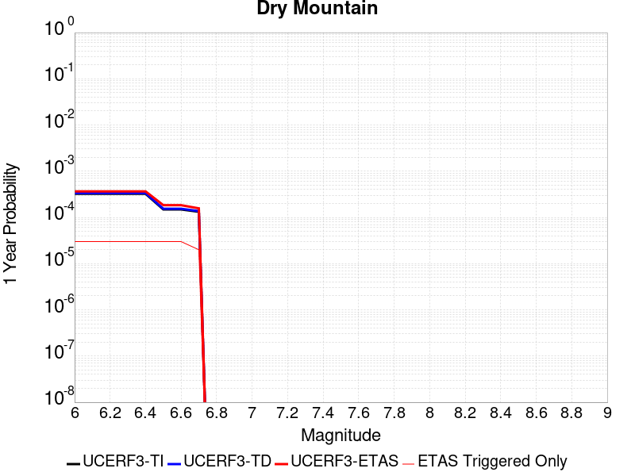 |  |

| Magnitude | 1 wk TI Prob | 1 wk TD Prob | 1 wk ETAS Prob | 1 wk ETAS/TD Gain | 1 wk ETAS Triggered Only | 1 mo TI Prob | 1 mo TD Prob | 1 mo ETAS Prob | 1 mo ETAS/TD Gain | 1 mo ETAS Triggered Only | 1 yr TI Prob | 1 yr TD Prob | 1 yr ETAS Prob | 1 yr ETAS/TD Gain | 1 yr ETAS Triggered Only | 10 yr TI Prob | 10 yr TD Prob | 10 yr ETAS Prob | 10 yr ETAS/TD Gain | 10 yr ETAS Triggered Only |
|-----|-----|-----|-----|-----|-----|-----|-----|-----|-----|-----|-----|-----|-----|-----|-----|-----|-----|-----|-----|-----|
| 6.0 | 6.222801E-6 | 6.4393753E-6 | 3.643918E-5 | 5.658807 | 3.0E-5 | 2.6668875E-5 | 2.759712E-5 | 5.759629E-5 | 2.08704 | 3.0E-5 | 3.2464517E-4 | 3.3595905E-4 | 3.6594897E-4 | 1.0892665 | 3.0E-5 | 0.0032417132 | 0.0033560738 | 0.0033959395 | 1.0118787 | 4.0E-5 |
| 6.1 | 6.222801E-6 | 6.4393753E-6 | 3.643918E-5 | 5.658807 | 3.0E-5 | 2.6668875E-5 | 2.759712E-5 | 5.759629E-5 | 2.08704 | 3.0E-5 | 3.2464517E-4 | 3.3595905E-4 | 3.6594897E-4 | 1.0892665 | 3.0E-5 | 0.0032417132 | 0.0033560738 | 0.0033959395 | 1.0118787 | 4.0E-5 |
| 6.2 | 6.222801E-6 | 6.4393753E-6 | 3.643918E-5 | 5.658807 | 3.0E-5 | 2.6668875E-5 | 2.759712E-5 | 5.759629E-5 | 2.08704 | 3.0E-5 | 3.2464517E-4 | 3.3595905E-4 | 3.6594897E-4 | 1.0892665 | 3.0E-5 | 0.0032417132 | 0.0033560738 | 0.0033959395 | 1.0118787 | 4.0E-5 |
| 6.3 | 6.222801E-6 | 6.4393753E-6 | 3.643918E-5 | 5.658807 | 3.0E-5 | 2.6668875E-5 | 2.759712E-5 | 5.759629E-5 | 2.08704 | 3.0E-5 | 3.2464517E-4 | 3.3595905E-4 | 3.6594897E-4 | 1.0892665 | 3.0E-5 | 0.0032417132 | 0.0033560738 | 0.0033959395 | 1.0118787 | 4.0E-5 |
| 6.4 | 6.222801E-6 | 6.4393753E-6 | 3.643918E-5 | 5.658807 | 3.0E-5 | 2.6668875E-5 | 2.759712E-5 | 5.759629E-5 | 2.08704 | 3.0E-5 | 3.2464517E-4 | 3.3595905E-4 | 3.6594897E-4 | 1.0892665 | 3.0E-5 | 0.0032417132 | 0.0033560738 | 0.0033959395 | 1.0118787 | 4.0E-5 |
| 6.5 | 2.8528623E-6 | 2.9521657E-6 | 3.2952077E-5 | 11.162002 | 3.0E-5 | 1.22264955E-5 | 1.2652126E-5 | 4.2651747E-5 | 3.371113 | 3.0E-5 | 1.4884741E-4 | 1.5403745E-4 | 1.8403283E-4 | 1.1947278 | 3.0E-5 | 0.0014874774 | 0.0015401602 | 0.0015701139 | 1.0194485 | 3.0E-5 |
| 6.6 | 2.8528623E-6 | 2.9521657E-6 | 3.2952077E-5 | 11.162002 | 3.0E-5 | 1.22264955E-5 | 1.2652126E-5 | 4.2651747E-5 | 3.371113 | 3.0E-5 | 1.4884741E-4 | 1.5403745E-4 | 1.8403283E-4 | 1.1947278 | 3.0E-5 | 0.0014874774 | 0.0015401602 | 0.0015701139 | 1.0194485 | 3.0E-5 |
| 6.7 | 2.541E-6 | 2.6293555E-6 | 2.2629303E-5 | 8.606407 | 2.0E-5 | 1.0889954E-5 | 1.1268666E-5 | 3.1268442E-5 | 2.774813 | 2.0E-5 | 1.3257713E-4 | 1.3719601E-4 | 1.5719327E-4 | 1.1457568 | 2.0E-5 | 0.0013249806 | 0.0013719602 | 0.0013919327 | 1.0145577 | 2.0E-5 |

## Tin Mountain
*[(top)](#table-of-contents)*

| 1 Week | 1 Month | 1 Year | 10 Year |
|-----|-----|-----|-----|
|  |  |  |  |

| Magnitude | 1 wk TI Prob | 1 wk TD Prob | 1 wk ETAS Prob | 1 wk ETAS/TD Gain | 1 wk ETAS Triggered Only | 1 mo TI Prob | 1 mo TD Prob | 1 mo ETAS Prob | 1 mo ETAS/TD Gain | 1 mo ETAS Triggered Only | 1 yr TI Prob | 1 yr TD Prob | 1 yr ETAS Prob | 1 yr ETAS/TD Gain | 1 yr ETAS Triggered Only | 10 yr TI Prob | 10 yr TD Prob | 10 yr ETAS Prob | 10 yr ETAS/TD Gain | 10 yr ETAS Triggered Only |
|-----|-----|-----|-----|-----|-----|-----|-----|-----|-----|-----|-----|-----|-----|-----|-----|-----|-----|-----|-----|-----|
| 6.0 | 4.083776E-6 | 4.181534E-6 | 1.4181493E-5 | 3.3914568 | 1.0E-5 | 1.750178E-5 | 1.7920758E-5 | 3.79204E-5 | 2.1160042 | 2.0E-5 | 2.1306332E-4 | 2.181671E-4 | 2.3816274E-4 | 1.0916529 | 2.0E-5 | 0.0021285915 | 0.002179895 | 0.0022098296 | 1.0137321 | 3.0E-5 |
| 6.1 | 4.083776E-6 | 4.181534E-6 | 1.4181493E-5 | 3.3914568 | 1.0E-5 | 1.750178E-5 | 1.7920758E-5 | 3.79204E-5 | 2.1160042 | 2.0E-5 | 2.1306332E-4 | 2.181671E-4 | 2.3816274E-4 | 1.0916529 | 2.0E-5 | 0.0021285915 | 0.002179895 | 0.0022098296 | 1.0137321 | 3.0E-5 |
| 6.2 | 4.083776E-6 | 4.181534E-6 | 1.4181493E-5 | 3.3914568 | 1.0E-5 | 1.750178E-5 | 1.7920758E-5 | 3.79204E-5 | 2.1160042 | 2.0E-5 | 2.1306332E-4 | 2.181671E-4 | 2.3816274E-4 | 1.0916529 | 2.0E-5 | 0.0021285915 | 0.002179895 | 0.0022098296 | 1.0137321 | 3.0E-5 |
| 6.3 | 4.083776E-6 | 4.181534E-6 | 1.4181493E-5 | 3.3914568 | 1.0E-5 | 1.750178E-5 | 1.7920758E-5 | 3.79204E-5 | 2.1160042 | 2.0E-5 | 2.1306332E-4 | 2.181671E-4 | 2.3816274E-4 | 1.0916529 | 2.0E-5 | 0.0021285915 | 0.002179895 | 0.0022098296 | 1.0137321 | 3.0E-5 |
| 6.4 | 4.083776E-6 | 4.181534E-6 | 1.4181493E-5 | 3.3914568 | 1.0E-5 | 1.750178E-5 | 1.7920758E-5 | 3.79204E-5 | 2.1160042 | 2.0E-5 | 2.1306332E-4 | 2.181671E-4 | 2.3816274E-4 | 1.0916529 | 2.0E-5 | 0.0021285915 | 0.002179895 | 0.0022098296 | 1.0137321 | 3.0E-5 |
| 6.5 | 2.3143427E-6 | 2.3731554E-6 | 2.3731554E-6 | 1.0 | 0.0 | 9.9185745E-6 | 1.0170631E-5 | 1.0170631E-5 | 1.0 | 0.0 | 1.2075195E-4 | 1.2382117E-4 | 1.2382117E-4 | 1.0 | 0.0 | 0.0012068636 | 0.0012375978 | 0.0012475854 | 1.0080701 | 1.0E-5 |
| 6.6 | 2.3143427E-6 | 2.3731554E-6 | 2.3731554E-6 | 1.0 | 0.0 | 9.9185745E-6 | 1.0170631E-5 | 1.0170631E-5 | 1.0 | 0.0 | 1.2075195E-4 | 1.2382117E-4 | 1.2382117E-4 | 1.0 | 0.0 | 0.0012068636 | 0.0012375978 | 0.0012475854 | 1.0080701 | 1.0E-5 |
| 6.7 | 1.7029532E-6 | 1.7497902E-6 | 1.7497902E-6 | 1.0 | 0.0 | 7.2983503E-6 | 7.499082E-6 | 7.499082E-6 | 1.0 | 0.0 | 8.885379E-5 | 9.129804E-5 | 9.129804E-5 | 1.0 | 0.0 | 8.881827E-4 | 9.1265794E-4 | 9.226488E-4 | 1.010947 | 1.0E-5 |
| 6.8 | 1.2914646E-6 | 1.3299368E-6 | 1.3299368E-6 | 1.0 | 0.0 | 5.534837E-6 | 5.699719E-6 | 5.699719E-6 | 1.0 | 0.0 | 6.738455E-5 | 6.9392314E-5 | 6.9392314E-5 | 1.0 | 0.0 | 6.736412E-4 | 6.937498E-4 | 7.0374284E-4 | 1.0144044 | 1.0E-5 |
| 6.9 | 5.8708974E-7 | 6.116987E-7 | 6.116987E-7 | 1.0 | 0.0 | 2.5160964E-6 | 2.6215635E-6 | 2.6215635E-6 | 1.0 | 0.0 | 3.0633044E-5 | 3.191711E-5 | 3.191711E-5 | 1.0 | 0.0 | 3.0628822E-4 | 3.1912935E-4 | 3.1912935E-4 | 1.0 | 0.0 |
| 7.0 | 4.6248786E-7 | 4.8320095E-7 | 4.8320095E-7 | 1.0 | 0.0 | 1.9820893E-6 | 2.0708599E-6 | 2.0708599E-6 | 1.0 | 0.0 | 2.413167E-5 | 2.5212465E-5 | 2.5212465E-5 | 1.0 | 0.0 | 2.412905E-4 | 2.5209974E-4 | 2.5209974E-4 | 1.0 | 0.0 |
| 7.1 | 3.804606E-7 | 3.9871418E-7 | 3.9871418E-7 | 1.0 | 0.0 | 1.6305444E-6 | 1.7087742E-6 | 1.7087742E-6 | 1.0 | 0.0 | 1.9851697E-5 | 2.0804162E-5 | 2.0804162E-5 | 1.0 | 0.0 | 1.9849923E-4 | 2.0802549E-4 | 2.0802549E-4 | 1.0 | 0.0 |
| 7.2 | 3.5864858E-7 | 3.7616815E-7 | 3.7616815E-7 | 1.0 | 0.0 | 1.5370645E-6 | 1.6121484E-6 | 1.6121484E-6 | 1.0 | 0.0 | 1.87136E-5 | 1.9627763E-5 | 1.9627763E-5 | 1.0 | 0.0 | 1.8712023E-4 | 1.9626362E-4 | 1.9626362E-4 | 1.0 | 0.0 |
| 7.3 | 3.342063E-7 | 3.5063425E-7 | 3.5063425E-7 | 1.0 | 0.0 | 1.4323119E-6 | 1.5027176E-6 | 1.5027176E-6 | 1.0 | 0.0 | 1.7438259E-5 | 1.8295466E-5 | 1.8295466E-5 | 1.0 | 0.0 | 1.743689E-4 | 1.8294291E-4 | 1.8294291E-4 | 1.0 | 0.0 |
| 7.4 | 2.971242E-7 | 3.1165777E-7 | 3.1165777E-7 | 1.0 | 0.0 | 1.2733886E-6 | 1.3356756E-6 | 1.3356756E-6 | 1.0 | 0.0 | 1.5503398E-5 | 1.6261763E-5 | 1.6261763E-5 | 1.0 | 0.0 | 1.5502315E-4 | 1.6260901E-4 | 1.6260901E-4 | 1.0 | 0.0 |
| 7.5 | 1.4326713E-7 | 1.5012505E-7 | 1.5012505E-7 | 1.0 | 0.0 | 6.140018E-7 | 6.433931E-7 | 6.433931E-7 | 1.0 | 0.0 | 7.4754466E-6 | 7.8333105E-6 | 7.8333105E-6 | 1.0 | 0.0 | 7.475195E-5 | 7.8333105E-5 | 7.8333105E-5 | 1.0 | 0.0 |

## Imperial
*[(top)](#table-of-contents)*

| 1 Week | 1 Month | 1 Year | 10 Year |
|-----|-----|-----|-----|
|  |  |  |  |

| Magnitude | 1 wk TI Prob | 1 wk TD Prob | 1 wk ETAS Prob | 1 wk ETAS/TD Gain | 1 wk ETAS Triggered Only | 1 mo TI Prob | 1 mo TD Prob | 1 mo ETAS Prob | 1 mo ETAS/TD Gain | 1 mo ETAS Triggered Only | 1 yr TI Prob | 1 yr TD Prob | 1 yr ETAS Prob | 1 yr ETAS/TD Gain | 1 yr ETAS Triggered Only | 10 yr TI Prob | 10 yr TD Prob | 10 yr ETAS Prob | 10 yr ETAS/TD Gain | 10 yr ETAS Triggered Only |
|-----|-----|-----|-----|-----|-----|-----|-----|-----|-----|-----|-----|-----|-----|-----|-----|-----|-----|-----|-----|-----|
| 6.0 | 2.7496446E-4 | 5.054469E-4 | 5.154419E-4 | 1.0197744 | 1.0E-5 | 0.0011778869 | 0.002164442 | 0.0021843987 | 1.0092202 | 2.0E-5 | 0.0142467655 | 0.026034584 | 0.026063802 | 1.0011224 | 3.0E-5 | 0.13367249 | 0.22801645 | 0.2280396 | 1.0001016 | 3.0E-5 |
| 6.1 | 2.5356023E-4 | 4.864905E-4 | 4.964856E-4 | 1.0205454 | 1.0E-5 | 0.001086234 | 0.0020833316 | 0.0021032898 | 1.00958 | 2.0E-5 | 0.013144928 | 0.02506727 | 0.025096517 | 1.0011668 | 3.0E-5 | 0.123940155 | 0.21945325 | 0.21947666 | 1.0001067 | 3.0E-5 |
| 6.2 | 2.4820742E-4 | 4.7744514E-4 | 4.8744035E-4 | 1.0209348 | 1.0E-5 | 0.0010633124 | 0.0020446267 | 0.002064586 | 1.0097617 | 2.0E-5 | 0.01286919 | 0.024607308 | 0.02463657 | 1.0011891 | 3.0E-5 | 0.12148927 | 0.21595894 | 0.21598247 | 1.000109 | 3.0E-5 |
| 6.3 | 2.3205351E-4 | 4.588303E-4 | 4.6882572E-4 | 1.0217845 | 1.0E-5 | 9.94136E-4 | 0.0019649705 | 0.0019849313 | 1.0101583 | 2.0E-5 | 0.012036599 | 0.023657534 | 0.023686824 | 1.0012381 | 3.0E-5 | 0.11405133 | 0.20790851 | 0.20793228 | 1.0001143 | 3.0E-5 |
| 6.4 | 2.0304754E-4 | 3.9869116E-4 | 4.086872E-4 | 1.0250721 | 1.0E-5 | 8.6991355E-4 | 0.0017075721 | 0.0017175551 | 1.0058463 | 1.0E-5 | 0.010539869 | 0.020591887 | 0.020611474 | 1.0009513 | 2.0E-5 | 0.100537635 | 0.18504018 | 0.18505648 | 1.0000881 | 2.0E-5 |
| 6.5 | 1.854992E-4 | 3.6981583E-4 | 3.7981215E-4 | 1.0270305 | 1.0E-5 | 7.9475436E-4 | 0.0015839747 | 0.0015939588 | 1.0063032 | 1.0E-5 | 0.009633281 | 0.01911576 | 0.019135378 | 1.0010263 | 2.0E-5 | 0.0922623 | 0.17327131 | 0.17328785 | 1.0000954 | 2.0E-5 |
| 6.6 | 1.6586106E-4 | 3.4027954E-4 | 3.5027612E-4 | 1.0293776 | 1.0E-5 | 7.106394E-4 | 0.0014575359 | 0.0014675213 | 1.0068508 | 1.0E-5 | 0.008617763 | 0.017602775 | 0.017622422 | 1.0011162 | 2.0E-5 | 0.08291132 | 0.16074891 | 0.16076571 | 1.0001044 | 2.0E-5 |
| 6.7 | 1.4224656E-4 | 3.0760013E-4 | 3.1759706E-4 | 1.0324998 | 1.0E-5 | 6.094856E-4 | 0.0013176284 | 0.0013276152 | 1.0075794 | 1.0E-5 | 0.0073952693 | 0.01592603 | 0.01594571 | 1.0012358 | 2.0E-5 | 0.07153955 | 0.14645793 | 0.146475 | 1.0001166 | 2.0E-5 |
| 6.8 | 1.2317259E-4 | 2.7784536E-4 | 2.878426E-4 | 1.0359813 | 1.0E-5 | 5.2777573E-4 | 0.0011902286 | 0.0012002167 | 1.0083917 | 1.0E-5 | 0.0064067547 | 0.014396132 | 0.014415843 | 1.0013692 | 2.0E-5 | 0.06225166 | 0.13291098 | 0.13292833 | 1.0001305 | 2.0E-5 |
| 6.9 | 9.859898E-5 | 2.500792E-4 | 2.6007672E-4 | 1.0399773 | 1.0E-5 | 4.2249862E-4 | 0.001071332 | 0.0010813214 | 1.0093242 | 1.0E-5 | 0.0051317946 | 0.012966422 | 0.012986163 | 1.0015224 | 2.0E-5 | 0.05014893 | 0.11938127 | 0.119398884 | 1.0001476 | 2.0E-5 |
| 7.0 | 7.3191884E-5 | 2.1260617E-4 | 2.2260404E-4 | 1.0470253 | 1.0E-5 | 3.136418E-4 | 9.108543E-4 | 9.208452E-4 | 1.0109687 | 1.0E-5 | 0.003811904 | 0.011033948 | 0.011053727 | 1.0017926 | 2.0E-5 | 0.037471764 | 0.10204036 | 0.10205832 | 1.000176 | 2.0E-5 |
| 7.1 | 7.1760296E-5 | 2.0961992E-4 | 2.1961782E-4 | 1.0476954 | 1.0E-5 | 3.0750787E-4 | 8.980649E-4 | 9.08056E-4 | 1.0111251 | 1.0E-5 | 0.003737482 | 0.0108798025 | 0.010899585 | 1.0018183 | 2.0E-5 | 0.03675245 | 0.10067689 | 0.10069487 | 1.0001787 | 2.0E-5 |
| 7.2 | 6.46614E-5 | 1.913056E-4 | 2.0130369E-4 | 1.0522624 | 1.0E-5 | 2.7709085E-4 | 8.1962656E-4 | 8.2961837E-4 | 1.0121907 | 1.0E-5 | 0.0033683628 | 0.009933916 | 0.009943817 | 1.0009967 | 1.0E-5 | 0.033177625 | 0.09248428 | 0.09249336 | 1.0000981 | 1.0E-5 |
| 7.3 | 6.088115E-5 | 1.7802432E-4 | 1.7802432E-4 | 1.0 | 0.0 | 2.6089314E-4 | 7.6274114E-4 | 7.6274114E-4 | 1.0 | 0.0 | 0.0031717476 | 0.009247407 | 0.009247407 | 1.0 | 0.0 | 0.031268585 | 0.08653566 | 0.08653566 | 1.0 | 0.0 |
| 7.4 | 4.199346E-5 | 1.1507733E-4 | 1.1507733E-4 | 1.0 | 0.0 | 1.7995955E-4 | 4.930962E-4 | 4.930962E-4 | 1.0 | 0.0 | 0.0021888057 | 0.00598709 | 0.00598709 | 1.0 | 0.0 | 0.02167372 | 0.057428524 | 0.057428524 | 1.0 | 0.0 |
| 7.5 | 3.130448E-5 | 8.332899E-5 | 8.332899E-5 | 1.0 | 0.0 | 1.3415517E-4 | 3.5707568E-4 | 3.5707568E-4 | 1.0 | 0.0 | 0.0016321153 | 0.00433879 | 0.00433879 | 1.0 | 0.0 | 0.016201803 | 0.042130288 | 0.042130288 | 1.0 | 0.0 |
| 7.6 | 2.3074248E-5 | 6.0841397E-5 | 6.0841397E-5 | 1.0 | 0.0 | 9.888588E-5 | 2.607229E-4 | 2.607229E-4 | 1.0 | 0.0 | 0.0012032706 | 0.0031697042 | 0.0031697042 | 1.0 | 0.0 | 0.011967761 | 0.03102491 | 0.03102491 | 1.0 | 0.0 |
| 7.7 | 1.45864815E-5 | 4.0122002E-5 | 4.0122002E-5 | 1.0 | 0.0 | 6.2511994E-5 | 1.7194013E-4 | 1.7194013E-4 | 1.0 | 0.0 | 7.608177E-4 | 0.0020913668 | 0.0020913668 | 1.0 | 0.0 | 0.007582182 | 0.020626526 | 0.020626526 | 1.0 | 0.0 |
| 7.8 | 1.0352979E-5 | 3.0958607E-5 | 3.0958607E-5 | 1.0 | 0.0 | 4.4369157E-5 | 1.3267301E-4 | 1.3267301E-4 | 1.0 | 0.0 | 5.400606E-4 | 0.0016140995 | 0.0016140995 | 1.0 | 0.0 | 0.0053875 | 0.016015781 | 0.016015781 | 1.0 | 0.0 |
| 7.9 | 8.137906E-6 | 2.214726E-5 | 2.214726E-5 | 1.0 | 0.0 | 3.4876273E-5 | 9.491338E-5 | 9.491338E-5 | 1.0 | 0.0 | 4.2453592E-4 | 0.0011549587 | 0.0011549587 | 1.0 | 0.0 | 0.004237258 | 0.011617044 | 0.011617044 | 1.0 | 0.0 |
| 8.0 | 6.93792E-6 | 1.800718E-5 | 1.800718E-5 | 1.0 | 0.0 | 2.9733603E-5 | 7.717135E-5 | 7.717135E-5 | 1.0 | 0.0 | 3.6194647E-4 | 9.39157E-4 | 9.39157E-4 | 1.0 | 0.0 | 0.0036135751 | 0.009500807 | 0.009500807 | 1.0 | 0.0 |
| 8.1 | 3.4286315E-6 | 6.3791363E-6 | 6.3791363E-6 | 1.0 | 0.0 | 1.4694053E-5 | 2.7338869E-5 | 2.7338869E-5 | 1.0 | 0.0 | 1.7888541E-4 | 3.328E-4 | 3.328E-4 | 1.0 | 0.0 | 0.0017874148 | 0.0034856654 | 0.0034856654 | 1.0 | 0.0 |
| 8.2 | 1.4906886E-6 | 1.936376E-6 | 1.936376E-6 | 1.0 | 0.0 | 6.3886496E-6 | 8.298728E-6 | 8.298728E-6 | 1.0 | 0.0 | 7.7779034E-5 | 1.0103236E-4 | 1.0103236E-4 | 1.0 | 0.0 | 7.775182E-4 | 0.001107385 | 0.001107385 | 1.0 | 0.0 |
| 8.3 | 2.5758007E-8 | 1.449717E-8 | 1.449717E-8 | 1.0 | 0.0 | 1.10391454E-7 | 6.2130724E-8 | 6.2130724E-8 | 1.0 | 0.0 | 1.3440151E-6 | 7.564416E-7 | 7.564416E-7 | 1.0 | 0.0 | 1.344007E-5 | 7.8862E-6 | 7.8862E-6 | 1.0 | 0.0 |

## Pisgah-Bullion Mtn-Mesquite Lk
*[(top)](#table-of-contents)*

| 1 Week | 1 Month | 1 Year | 10 Year |
|-----|-----|-----|-----|
|  | 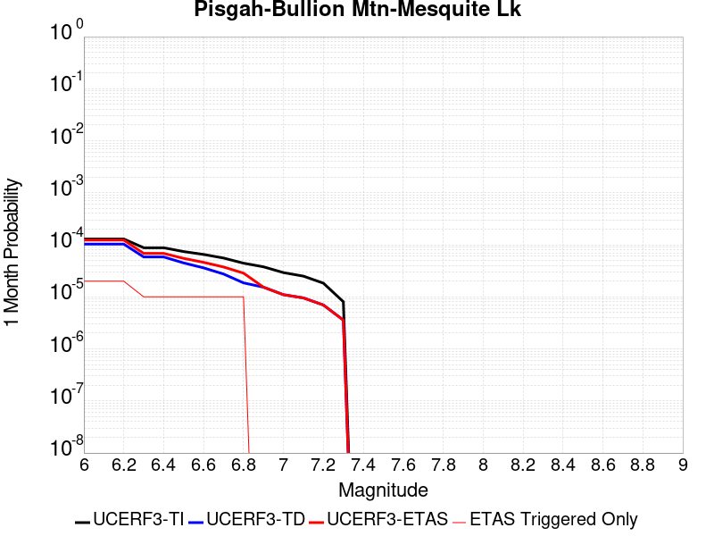 |  |  |

| Magnitude | 1 wk TI Prob | 1 wk TD Prob | 1 wk ETAS Prob | 1 wk ETAS/TD Gain | 1 wk ETAS Triggered Only | 1 mo TI Prob | 1 mo TD Prob | 1 mo ETAS Prob | 1 mo ETAS/TD Gain | 1 mo ETAS Triggered Only | 1 yr TI Prob | 1 yr TD Prob | 1 yr ETAS Prob | 1 yr ETAS/TD Gain | 1 yr ETAS Triggered Only | 10 yr TI Prob | 10 yr TD Prob | 10 yr ETAS Prob | 10 yr ETAS/TD Gain | 10 yr ETAS Triggered Only |
|-----|-----|-----|-----|-----|-----|-----|-----|-----|-----|-----|-----|-----|-----|-----|-----|-----|-----|-----|-----|-----|
| 6.0 | 3.0240792E-5 | 2.4091038E-5 | 3.4090797E-5 | 1.4150821 | 1.0E-5 | 1.2959696E-4 | 1.0324379E-4 | 1.2324173E-4 | 1.1936963 | 2.0E-5 | 0.0015767008 | 0.0012563687 | 0.0012763436 | 1.015899 | 2.0E-5 | 0.015655609 | 0.012502681 | 0.012532306 | 1.0023695 | 3.0E-5 |
| 6.1 | 3.0240792E-5 | 2.4091038E-5 | 3.4090797E-5 | 1.4150821 | 1.0E-5 | 1.2959696E-4 | 1.0324379E-4 | 1.2324173E-4 | 1.1936963 | 2.0E-5 | 0.0015767008 | 0.0012563687 | 0.0012763436 | 1.015899 | 2.0E-5 | 0.015655609 | 0.012502681 | 0.012532306 | 1.0023695 | 3.0E-5 |
| 6.2 | 3.0240792E-5 | 2.4091038E-5 | 3.4090797E-5 | 1.4150821 | 1.0E-5 | 1.2959696E-4 | 1.0324379E-4 | 1.2324173E-4 | 1.1936963 | 2.0E-5 | 0.0015767008 | 0.0012563687 | 0.0012763436 | 1.015899 | 2.0E-5 | 0.015655609 | 0.012502681 | 0.012532306 | 1.0023695 | 3.0E-5 |
| 6.3 | 2.0498217E-5 | 1.3638032E-5 | 2.3637896E-5 | 1.7332336 | 1.0E-5 | 8.784654E-5 | 5.844749E-5 | 6.8446905E-5 | 1.1710837 | 1.0E-5 | 0.0010690069 | 7.1138213E-4 | 7.21375E-4 | 1.0140471 | 1.0E-5 | 0.01063879 | 0.007092675 | 0.0071026045 | 1.0013999 | 1.0E-5 |
| 6.4 | 2.0498217E-5 | 1.3638032E-5 | 2.3637896E-5 | 1.7332336 | 1.0E-5 | 8.784654E-5 | 5.844749E-5 | 6.8446905E-5 | 1.1710837 | 1.0E-5 | 0.0010690069 | 7.1138213E-4 | 7.21375E-4 | 1.0140471 | 1.0E-5 | 0.01063879 | 0.007092675 | 0.0071026045 | 1.0013999 | 1.0E-5 |
| 6.5 | 1.7316182E-5 | 1.0477016E-5 | 2.0476911E-5 | 1.9544603 | 1.0E-5 | 7.42101E-5 | 4.490078E-5 | 5.490033E-5 | 1.2227033 | 1.0E-5 | 9.0313336E-4 | 5.4653984E-4 | 5.565344E-4 | 1.018287 | 1.0E-5 | 0.008994718 | 0.005452953 | 0.0054628984 | 1.0018239 | 1.0E-5 |
| 6.6 | 1.5251077E-5 | 8.414252E-6 | 1.8414168E-5 | 2.1884499 | 1.0E-5 | 6.536012E-5 | 3.606062E-5 | 4.606026E-5 | 1.2773008 | 1.0E-5 | 7.9546886E-4 | 4.3895686E-4 | 4.4895246E-4 | 1.0227712 | 1.0E-5 | 0.007926274 | 0.004381615 | 0.0043915715 | 1.0022722 | 1.0E-5 |
| 6.7 | 1.2997425E-5 | 6.411481E-6 | 1.6411417E-5 | 2.5596921 | 1.0E-5 | 5.570206E-5 | 2.7477512E-5 | 3.747724E-5 | 1.3639239 | 1.0E-5 | 6.7796157E-4 | 3.34492E-4 | 3.4448868E-4 | 1.0298861 | 1.0E-5 | 0.0067589693 | 0.0033403458 | 0.0033503124 | 1.0029837 | 1.0E-5 |
| 6.8 | 1.035386E-5 | 4.3332066E-6 | 1.4333164E-5 | 3.3077497 | 1.0E-5 | 4.437293E-5 | 1.8570758E-5 | 2.8570572E-5 | 1.538471 | 1.0E-5 | 5.401065E-4 | 2.260764E-4 | 2.3607413E-4 | 1.0442228 | 1.0E-5 | 0.0053879567 | 0.0022585508 | 0.0022685283 | 1.0044177 | 1.0E-5 |
| 6.9 | 8.816252E-6 | 3.580627E-6 | 3.580627E-6 | 1.0 | 0.0 | 3.778339E-5 | 1.5345457E-5 | 1.5345457E-5 | 1.0 | 0.0 | 4.5991567E-4 | 1.8681551E-4 | 1.8681551E-4 | 1.0 | 0.0 | 0.00458965 | 0.0018666431 | 0.0018666431 | 1.0 | 0.0 |
| 7.0 | 6.8232207E-6 | 2.567576E-6 | 2.567576E-6 | 1.0 | 0.0 | 2.9242048E-5 | 1.1003853E-5 | 1.1003853E-5 | 1.0 | 0.0 | 3.5596377E-4 | 1.3396399E-4 | 1.3396399E-4 | 1.0 | 0.0 | 0.0035539411 | 0.0013388634 | 0.0013388634 | 1.0 | 0.0 |
| 7.1 | 5.837013E-6 | 2.227373E-6 | 2.227373E-6 | 1.0 | 0.0 | 2.501553E-5 | 9.545851E-6 | 9.545851E-6 | 1.0 | 0.0 | 3.045215E-4 | 1.16214826E-4 | 1.16214826E-4 | 1.0 | 0.0 | 0.0030410455 | 0.0011615696 | 0.0011615696 | 1.0 | 0.0 |
| 7.2 | 4.278052E-6 | 1.627566E-6 | 1.627566E-6 | 1.0 | 0.0 | 1.833438E-5 | 6.9752655E-6 | 6.9752655E-6 | 1.0 | 0.0 | 2.231982E-4 | 8.4920786E-5 | 8.4920786E-5 | 1.0 | 0.0 | 0.0022297418 | 8.489065E-4 | 8.489065E-4 | 1.0 | 0.0 |
| 7.3 | 1.8803692E-6 | 8.344903E-7 | 8.344903E-7 | 1.0 | 0.0 | 8.0587E-6 | 3.576383E-6 | 3.576383E-6 | 1.0 | 0.0 | 9.811026E-5 | 4.354174E-5 | 4.354174E-5 | 1.0 | 0.0 | 9.806695E-4 | 4.3534656E-4 | 4.3534656E-4 | 1.0 | 0.0 |

## Palos Verdes
*[(top)](#table-of-contents)*

| 1 Week | 1 Month | 1 Year | 10 Year |
|-----|-----|-----|-----|
|  |  |  |  |

| Magnitude | 1 wk TI Prob | 1 wk TD Prob | 1 wk ETAS Prob | 1 wk ETAS/TD Gain | 1 wk ETAS Triggered Only | 1 mo TI Prob | 1 mo TD Prob | 1 mo ETAS Prob | 1 mo ETAS/TD Gain | 1 mo ETAS Triggered Only | 1 yr TI Prob | 1 yr TD Prob | 1 yr ETAS Prob | 1 yr ETAS/TD Gain | 1 yr ETAS Triggered Only | 10 yr TI Prob | 10 yr TD Prob | 10 yr ETAS Prob | 10 yr ETAS/TD Gain | 10 yr ETAS Triggered Only |
|-----|-----|-----|-----|-----|-----|-----|-----|-----|-----|-----|-----|-----|-----|-----|-----|-----|-----|-----|-----|-----|
| 6.0 | 6.126063E-5 | 7.622562E-5 | 7.622562E-5 | 1.0 | 0.0 | 2.6251914E-4 | 3.2664367E-4 | 3.366404E-4 | 1.0306044 | 1.0E-5 | 0.0031914865 | 0.003970149 | 0.0039900695 | 1.0050176 | 2.0E-5 | 0.031460393 | 0.03904865 | 0.03907748 | 1.0007383 | 3.0E-5 |
| 6.1 | 6.126063E-5 | 7.622562E-5 | 7.622562E-5 | 1.0 | 0.0 | 2.6251914E-4 | 3.2664367E-4 | 3.366404E-4 | 1.0306044 | 1.0E-5 | 0.0031914865 | 0.003970149 | 0.0039900695 | 1.0050176 | 2.0E-5 | 0.031460393 | 0.03904865 | 0.03907748 | 1.0007383 | 3.0E-5 |
| 6.2 | 6.126063E-5 | 7.622562E-5 | 7.622562E-5 | 1.0 | 0.0 | 2.6251914E-4 | 3.2664367E-4 | 3.366404E-4 | 1.0306044 | 1.0E-5 | 0.0031914865 | 0.003970149 | 0.0039900695 | 1.0050176 | 2.0E-5 | 0.031460393 | 0.03904865 | 0.03907748 | 1.0007383 | 3.0E-5 |
| 6.3 | 4.0838047E-5 | 4.9749142E-5 | 4.9749142E-5 | 1.0 | 0.0 | 1.7500846E-4 | 2.1319446E-4 | 2.1319446E-4 | 1.0 | 0.0 | 0.0021286458 | 0.0025927671 | 0.0026027411 | 1.0038469 | 1.0E-5 | 0.021083709 | 0.025646534 | 0.02566602 | 1.0007598 | 2.0E-5 |
| 6.4 | 4.0838047E-5 | 4.9749142E-5 | 4.9749142E-5 | 1.0 | 0.0 | 1.7500846E-4 | 2.1319446E-4 | 2.1319446E-4 | 1.0 | 0.0 | 0.0021286458 | 0.0025927671 | 0.0026027411 | 1.0038469 | 1.0E-5 | 0.021083709 | 0.025646534 | 0.02566602 | 1.0007598 | 2.0E-5 |
| 6.5 | 3.0512005E-5 | 3.656143E-5 | 3.656143E-5 | 1.0 | 0.0 | 1.3075917E-4 | 1.5668309E-4 | 1.5668309E-4 | 1.0 | 0.0 | 0.0015908304 | 0.0019060666 | 0.0019160474 | 1.0052364 | 1.0E-5 | 0.015794903 | 0.018909054 | 0.018918864 | 1.0005188 | 1.0E-5 |
| 6.6 | 2.9255087E-5 | 3.515423E-5 | 3.515423E-5 | 1.0 | 0.0 | 1.2537291E-4 | 1.5065294E-4 | 1.5065294E-4 | 1.0 | 0.0 | 0.0015253464 | 0.001832773 | 0.0018427547 | 1.0054462 | 1.0E-5 | 0.015149189 | 0.018188128 | 0.018197946 | 1.0005398 | 1.0E-5 |
| 6.7 | 2.287198E-5 | 2.7248137E-5 | 2.7248137E-5 | 1.0 | 0.0 | 9.801909E-5 | 1.1677302E-4 | 1.1677302E-4 | 1.0 | 0.0 | 0.001192729 | 0.001420876 | 0.0014308619 | 1.0070279 | 1.0E-5 | 0.011863477 | 0.014127145 | 0.014137004 | 1.0006979 | 1.0E-5 |
| 6.8 | 2.1325764E-5 | 2.5431746E-5 | 2.5431746E-5 | 1.0 | 0.0 | 9.139293E-5 | 1.0898915E-4 | 1.0898915E-4 | 1.0 | 0.0 | 0.001112141 | 0.0013262255 | 0.0013362122 | 1.0075302 | 1.0E-5 | 0.011065915 | 0.013192143 | 0.013202012 | 1.000748 | 1.0E-5 |
| 6.9 | 1.9009392E-5 | 2.2613433E-5 | 2.2613433E-5 | 1.0 | 0.0 | 8.1466285E-5 | 9.69116E-5 | 9.69116E-5 | 1.0 | 0.0 | 9.914007E-4 | 0.0011793474 | 0.0011893357 | 1.0084692 | 1.0E-5 | 0.009869894 | 0.0117395725 | 0.011749456 | 1.0008419 | 1.0E-5 |
| 7.0 | 1.7098473E-5 | 2.0319252E-5 | 2.0319252E-5 | 1.0 | 0.0 | 7.3277115E-5 | 8.708009E-5 | 8.708009E-5 | 1.0 | 0.0 | 8.917837E-4 | 0.0010597695 | 0.001069759 | 1.009426 | 1.0E-5 | 0.008882134 | 0.010555593 | 0.010565488 | 1.0009373 | 1.0E-5 |
| 7.1 | 1.5982785E-5 | 1.8994664E-5 | 1.8994664E-5 | 1.0 | 0.0 | 6.849585E-5 | 8.140364E-5 | 8.140364E-5 | 1.0 | 0.0 | 8.336179E-4 | 9.907234E-4 | 0.0010007134 | 1.0100837 | 1.0E-5 | 0.008304977 | 0.00987143 | 0.009881331 | 1.001003 | 1.0E-5 |
| 7.2 | 1.4468002E-5 | 1.719715E-5 | 1.719715E-5 | 1.0 | 0.0 | 6.200425E-5 | 7.370046E-5 | 7.370046E-5 | 1.0 | 0.0 | 7.546402E-4 | 8.9701766E-4 | 9.070087E-4 | 1.0111381 | 1.0E-5 | 0.007520827 | 0.008942238 | 0.008952149 | 1.0011083 | 1.0E-5 |
| 7.3 | 5.288233E-6 | 6.203645E-6 | 6.203645E-6 | 1.0 | 0.0 | 2.2663658E-5 | 2.6586977E-5 | 2.6586977E-5 | 1.0 | 0.0 | 2.7589512E-4 | 3.2368326E-4 | 3.2368326E-4 | 1.0 | 0.0 | 0.0027555283 | 0.0032355408 | 0.0032355408 | 1.0 | 0.0 |
| 7.4 | 8.279556E-7 | 8.4083433E-7 | 8.4083433E-7 | 1.0 | 0.0 | 3.5483763E-6 | 3.603571E-6 | 3.603571E-6 | 1.0 | 0.0 | 4.3200624E-5 | 4.3872667E-5 | 4.3872667E-5 | 1.0 | 0.0 | 4.3192226E-4 | 4.386473E-4 | 4.386473E-4 | 1.0 | 0.0 |
| 7.5 | 6.559831E-7 | 6.667226E-7 | 6.667226E-7 | 1.0 | 0.0 | 2.8113532E-6 | 2.8573797E-6 | 2.8573797E-6 | 1.0 | 0.0 | 3.4227687E-5 | 3.478811E-5 | 3.478811E-5 | 1.0 | 0.0 | 3.4222414E-4 | 3.478333E-4 | 3.478333E-4 | 1.0 | 0.0 |
| 7.6 | 3.5018968E-7 | 3.5620013E-7 | 3.5620013E-7 | 1.0 | 0.0 | 1.500812E-6 | 1.5265713E-6 | 1.5265713E-6 | 1.0 | 0.0 | 1.8272232E-5 | 1.8585893E-5 | 1.8585893E-5 | 1.0 | 0.0 | 1.8270731E-4 | 1.85848E-4 | 1.85848E-4 | 1.0 | 0.0 |
| 7.7 | 1.1986104E-7 | 1.219837E-7 | 1.219837E-7 | 1.0 | 0.0 | 5.1369005E-7 | 5.227872E-7 | 5.227872E-7 | 1.0 | 0.0 | 6.2541585E-6 | 6.3649163E-6 | 6.3649163E-6 | 1.0 | 0.0 | 6.2539824E-5 | 6.364738E-5 | 6.364738E-5 | 1.0 | 0.0 |
| 7.8 | 3.0445005E-8 | 3.1027568E-8 | 3.1027568E-8 | 1.0 | 0.0 | 1.3047858E-7 | 1.3297529E-7 | 1.3297529E-7 | 1.0 | 0.0 | 1.5885756E-6 | 1.6189731E-6 | 1.6189731E-6 | 1.0 | 0.0 | 1.5885644E-5 | 1.6189633E-5 | 1.6189633E-5 | 1.0 | 0.0 |

## Oceanic - West Huasna
*[(top)](#table-of-contents)*

| 1 Week | 1 Month | 1 Year | 10 Year |
|-----|-----|-----|-----|
|  |  |  |  |

| Magnitude | 1 wk TI Prob | 1 wk TD Prob | 1 wk ETAS Prob | 1 wk ETAS/TD Gain | 1 wk ETAS Triggered Only | 1 mo TI Prob | 1 mo TD Prob | 1 mo ETAS Prob | 1 mo ETAS/TD Gain | 1 mo ETAS Triggered Only | 1 yr TI Prob | 1 yr TD Prob | 1 yr ETAS Prob | 1 yr ETAS/TD Gain | 1 yr ETAS Triggered Only | 10 yr TI Prob | 10 yr TD Prob | 10 yr ETAS Prob | 10 yr ETAS/TD Gain | 10 yr ETAS Triggered Only |
|-----|-----|-----|-----|-----|-----|-----|-----|-----|-----|-----|-----|-----|-----|-----|-----|-----|-----|-----|-----|-----|
| 6.0 | 3.195567E-5 | 2.7926753E-5 | 3.7926475E-5 | 1.3580695 | 1.0E-5 | 1.3694567E-4 | 1.1968084E-4 | 1.2967964E-4 | 1.0835456 | 1.0E-5 | 0.0016660384 | 0.0014561834 | 0.0014761543 | 1.0137146 | 2.0E-5 | 0.016536033 | 0.014470968 | 0.014490679 | 1.0013621 | 2.0E-5 |
| 6.1 | 2.1156782E-5 | 1.7573395E-5 | 2.7573218E-5 | 1.5690321 | 1.0E-5 | 9.066878E-5 | 7.5312426E-5 | 8.531167E-5 | 1.1327702 | 1.0E-5 | 0.0011033333 | 9.1655244E-4 | 9.3653414E-4 | 1.0218009 | 2.0E-5 | 0.010978713 | 0.009128731 | 0.009148548 | 1.0021709 | 2.0E-5 |
| 6.2 | 1.6195117E-5 | 1.3327071E-5 | 2.3326938E-5 | 1.7503424 | 1.0E-5 | 6.9405796E-5 | 5.7114787E-5 | 6.711421E-5 | 1.175076 | 1.0E-5 | 8.44688E-4 | 6.9515326E-4 | 7.151393E-4 | 1.0287507 | 2.0E-5 | 0.008414844 | 0.006930081 | 0.0069499426 | 1.0028659 | 2.0E-5 |
| 6.3 | 1.3559345E-5 | 1.1179067E-5 | 2.1178956E-5 | 1.8945191 | 1.0E-5 | 5.811018E-5 | 4.7909412E-5 | 5.7908932E-5 | 1.2087172 | 1.0E-5 | 7.072618E-4 | 5.831419E-4 | 6.0313026E-4 | 1.034277 | 2.0E-5 | 0.0070501505 | 0.0058162357 | 0.0058361194 | 1.0034187 | 2.0E-5 |
| 6.4 | 1.2120619E-5 | 1.0000905E-5 | 1.0000905E-5 | 1.0 | 0.0 | 5.1944477E-5 | 4.2860316E-5 | 4.2860316E-5 | 1.0 | 0.0 | 6.322405E-4 | 5.216999E-4 | 5.316947E-4 | 1.0191581 | 1.0E-5 | 0.006304447 | 0.005204819 | 0.0052147675 | 1.0019113 | 1.0E-5 |
| 6.5 | 1.13511915E-5 | 9.367402E-6 | 9.367402E-6 | 1.0 | 0.0 | 4.8647056E-5 | 4.014539E-5 | 4.014539E-5 | 1.0 | 0.0 | 5.9211696E-4 | 4.8866094E-4 | 4.9865607E-4 | 1.020454 | 1.0E-5 | 0.0059054173 | 0.0048759235 | 0.0048858747 | 1.0020409 | 1.0E-5 |
| 6.6 | 9.850605E-6 | 8.135348E-6 | 8.135348E-6 | 1.0 | 0.0 | 4.2216197E-5 | 3.4865312E-5 | 3.4865312E-5 | 1.0 | 0.0 | 5.1386096E-4 | 4.2440274E-4 | 4.2440274E-4 | 1.0 | 0.0 | 0.0051267436 | 0.0042359545 | 0.0042359545 | 1.0 | 0.0 |
| 6.7 | 8.8558645E-6 | 7.318364E-6 | 7.318364E-6 | 1.0 | 0.0 | 3.7953152E-5 | 3.136404E-5 | 3.136404E-5 | 1.0 | 0.0 | 4.6198163E-4 | 3.8179048E-4 | 3.8179048E-4 | 1.0 | 0.0 | 0.004610224 | 0.003811371 | 0.003811371 | 1.0 | 0.0 |
| 6.8 | 7.67136E-6 | 6.3916887E-6 | 6.3916887E-6 | 1.0 | 0.0 | 3.2876844E-5 | 2.7392665E-5 | 2.7392665E-5 | 1.0 | 0.0 | 4.0020206E-4 | 3.334548E-4 | 3.334548E-4 | 1.0 | 0.0 | 0.003994821 | 0.0033295657 | 0.0033295657 | 1.0 | 0.0 |
| 6.9 | 6.534529E-6 | 5.458264E-6 | 5.458264E-6 | 1.0 | 0.0 | 2.8004823E-5 | 2.339235E-5 | 2.339235E-5 | 1.0 | 0.0 | 3.4090536E-4 | 2.8476477E-4 | 2.8476477E-4 | 1.0 | 0.0 | 0.0034038287 | 0.0028440156 | 0.0028440156 | 1.0 | 0.0 |
| 7.0 | 5.460525E-6 | 4.569887E-6 | 4.569887E-6 | 1.0 | 0.0 | 2.3402039E-5 | 1.9585083E-5 | 1.9585083E-5 | 1.0 | 0.0 | 2.8488258E-4 | 2.384224E-4 | 2.384224E-4 | 1.0 | 0.0 | 0.0028451765 | 0.00238168 | 0.00238168 | 1.0 | 0.0 |
| 7.1 | 4.4825083E-6 | 3.752379E-6 | 3.752379E-6 | 1.0 | 0.0 | 1.9210609E-5 | 1.6081525E-5 | 1.6081525E-5 | 1.0 | 0.0 | 2.3386406E-4 | 1.9577508E-4 | 1.9577508E-4 | 1.0 | 0.0 | 0.002336181 | 0.001956038 | 0.001956038 | 1.0 | 0.0 |
| 7.2 | 2.821708E-6 | 2.4248707E-6 | 2.4248707E-6 | 1.0 | 0.0 | 1.2092979E-5 | 1.0392262E-5 | 1.0392262E-5 | 1.0 | 0.0 | 1.4722206E-4 | 1.2651845E-4 | 1.2651845E-4 | 1.0 | 0.0 | 0.0014712457 | 0.0012644667 | 0.0012644667 | 1.0 | 0.0 |
| 7.3 | 2.0644757E-6 | 1.768679E-6 | 1.768679E-6 | 1.0 | 0.0 | 8.847723E-6 | 7.580031E-6 | 7.580031E-6 | 1.0 | 0.0 | 1.0771569E-4 | 9.228297E-5 | 9.228297E-5 | 1.0 | 0.0 | 0.001076635 | 9.2244823E-4 | 9.2244823E-4 | 1.0 | 0.0 |
| 7.4 | 1.6980367E-6 | 1.4379273E-6 | 1.4379273E-6 | 1.0 | 0.0 | 7.27728E-6 | 6.1625306E-6 | 6.1625306E-6 | 1.0 | 0.0 | 8.8597284E-5 | 7.502623E-5 | 7.502623E-5 | 1.0 | 0.0 | 8.8561967E-4 | 7.500106E-4 | 7.500106E-4 | 1.0 | 0.0 |
| 7.5 | 1.3637683E-6 | 1.1302018E-6 | 1.1302018E-6 | 1.0 | 0.0 | 5.844708E-6 | 4.8437128E-6 | 4.8437128E-6 | 1.0 | 0.0 | 7.1156996E-5 | 5.897061E-5 | 5.897061E-5 | 1.0 | 0.0 | 7.1134215E-4 | 5.895511E-4 | 5.895511E-4 | 1.0 | 0.0 |
| 7.6 | 9.802994E-7 | 7.676632E-7 | 7.676632E-7 | 1.0 | 0.0 | 4.2012766E-6 | 3.2899811E-6 | 3.2899811E-6 | 1.0 | 0.0 | 5.1149345E-5 | 4.0054783E-5 | 4.0054783E-5 | 1.0 | 0.0 | 5.113757E-4 | 4.0047706E-4 | 4.0047706E-4 | 1.0 | 0.0 |
| 7.7 | 5.986191E-7 | 4.004442E-7 | 4.004442E-7 | 1.0 | 0.0 | 2.5655079E-6 | 1.7161883E-6 | 1.7161883E-6 | 1.0 | 0.0 | 3.1234613E-5 | 2.0894393E-5 | 2.0894393E-5 | 1.0 | 0.0 | 3.123022E-4 | 2.0892563E-4 | 2.0892563E-4 | 1.0 | 0.0 |
| 7.8 | 2.9189815E-7 | 1.5285478E-7 | 1.5285478E-7 | 1.0 | 0.0 | 1.2509914E-6 | 6.550917E-7 | 6.550917E-7 | 1.0 | 0.0 | 1.5230714E-5 | 7.975713E-6 | 7.975713E-6 | 1.0 | 0.0 | 1.522967E-4 | 7.975558E-5 | 7.975558E-5 | 1.0 | 0.0 |
| 7.9 | 1.2057845E-7 | 4.6210737E-8 | 4.6210737E-8 | 1.0 | 0.0 | 5.1676466E-7 | 1.98046E-7 | 1.98046E-7 | 1.0 | 0.0 | 6.2915915E-6 | 2.4112073E-6 | 2.4112073E-6 | 1.0 | 0.0 | 6.2914136E-5 | 2.4113115E-5 | 2.4113115E-5 | 1.0 | 0.0 |
| 8.0 | 3.3806387E-9 | 9.01072E-10 | 9.01072E-10 | 1.0 | 0.0 | 1.4488451E-8 | 3.8617367E-9 | 3.8617367E-9 | 1.0 | 0.0 | 1.7639688E-7 | 4.701664E-8 | 4.701664E-8 | 1.0 | 0.0 | 1.7639674E-6 | 4.7126008E-7 | 4.7126008E-7 | 1.0 | 0.0 |

## Big Pine (East)
*[(top)](#table-of-contents)*

| 1 Week | 1 Month | 1 Year | 10 Year |
|-----|-----|-----|-----|
|  |  |  |  |

| Magnitude | 1 wk TI Prob | 1 wk TD Prob | 1 wk ETAS Prob | 1 wk ETAS/TD Gain | 1 wk ETAS Triggered Only | 1 mo TI Prob | 1 mo TD Prob | 1 mo ETAS Prob | 1 mo ETAS/TD Gain | 1 mo ETAS Triggered Only | 1 yr TI Prob | 1 yr TD Prob | 1 yr ETAS Prob | 1 yr ETAS/TD Gain | 1 yr ETAS Triggered Only | 10 yr TI Prob | 10 yr TD Prob | 10 yr ETAS Prob | 10 yr ETAS/TD Gain | 10 yr ETAS Triggered Only |
|-----|-----|-----|-----|-----|-----|-----|-----|-----|-----|-----|-----|-----|-----|-----|-----|-----|-----|-----|-----|-----|
| 6.0 | 9.916913E-6 | 1.2816734E-5 | 3.281648E-5 | 2.56044 | 2.0E-5 | 4.250036E-5 | 5.4927827E-5 | 7.492673E-5 | 1.3640941 | 2.0E-5 | 5.173191E-4 | 6.6856324E-4 | 6.8854983E-4 | 1.029895 | 2.0E-5 | 0.0051611643 | 0.0066703134 | 0.00669018 | 1.0029783 | 2.0E-5 |
| 6.1 | 9.916913E-6 | 1.2816734E-5 | 3.281648E-5 | 2.56044 | 2.0E-5 | 4.250036E-5 | 5.4927827E-5 | 7.492673E-5 | 1.3640941 | 2.0E-5 | 5.173191E-4 | 6.6856324E-4 | 6.8854983E-4 | 1.029895 | 2.0E-5 | 0.0051611643 | 0.0066703134 | 0.00669018 | 1.0029783 | 2.0E-5 |
| 6.2 | 9.916913E-6 | 1.2816734E-5 | 3.281648E-5 | 2.56044 | 2.0E-5 | 4.250036E-5 | 5.4927827E-5 | 7.492673E-5 | 1.3640941 | 2.0E-5 | 5.173191E-4 | 6.6856324E-4 | 6.8854983E-4 | 1.029895 | 2.0E-5 | 0.0051611643 | 0.0066703134 | 0.00669018 | 1.0029783 | 2.0E-5 |
| 6.3 | 5.479711E-6 | 8.112708E-6 | 1.8112627E-5 | 2.232624 | 1.0E-5 | 2.3484265E-5 | 3.4768305E-5 | 4.4767956E-5 | 1.2876083 | 1.0E-5 | 2.858834E-4 | 4.2322508E-4 | 4.3322085E-4 | 1.0236181 | 1.0E-5 | 0.0028551589 | 0.0042271195 | 0.004237077 | 1.0023557 | 1.0E-5 |
| 6.4 | 5.465009E-6 | 8.097002E-6 | 1.8096922E-5 | 2.235015 | 1.0E-5 | 2.3421257E-5 | 3.470099E-5 | 4.4700646E-5 | 1.2881662 | 1.0E-5 | 2.851165E-4 | 4.224059E-4 | 4.3240166E-4 | 1.0236639 | 1.0E-5 | 0.0028475097 | 0.0042189583 | 0.0042289165 | 1.0023602 | 1.0E-5 |
| 6.5 | 4.826767E-6 | 7.4220593E-6 | 1.7421986E-5 | 2.347325 | 1.0E-5 | 2.068598E-5 | 3.1808453E-5 | 4.1808136E-5 | 1.3143718 | 1.0E-5 | 2.518227E-4 | 3.8720187E-4 | 3.97198E-4 | 1.0258163 | 1.0E-5 | 0.0025153751 | 0.0038681594 | 0.0038781206 | 1.0025752 | 1.0E-5 |
| 6.6 | 4.3146847E-6 | 6.881996E-6 | 6.881996E-6 | 1.0 | 0.0 | 1.8491375E-5 | 2.949395E-5 | 2.949395E-5 | 1.0 | 0.0 | 2.2510924E-4 | 3.590321E-4 | 3.590321E-4 | 1.0 | 0.0 | 0.0022488134 | 0.0035873752 | 0.0035873752 | 1.0 | 0.0 |
| 6.7 | 3.6968106E-6 | 5.995246E-6 | 5.995246E-6 | 1.0 | 0.0 | 1.5843378E-5 | 2.5693666E-5 | 2.5693666E-5 | 1.0 | 0.0 | 1.9287605E-4 | 3.12777E-4 | 3.12777E-4 | 1.0 | 0.0 | 0.0019270873 | 0.0031261323 | 0.0031261323 | 1.0 | 0.0 |
| 6.8 | 3.4671132E-6 | 5.7019565E-6 | 5.7019565E-6 | 1.0 | 0.0 | 1.4858972E-5 | 2.4436735E-5 | 2.4436735E-5 | 1.0 | 0.0 | 1.8089297E-4 | 2.9747808E-4 | 2.9747808E-4 | 1.0 | 0.0 | 0.0018074579 | 0.0029735544 | 0.0029735544 | 1.0 | 0.0 |
| 6.9 | 2.7686972E-6 | 4.8250195E-6 | 4.8250195E-6 | 1.0 | 0.0 | 1.1865792E-5 | 2.0678495E-5 | 2.0678495E-5 | 1.0 | 0.0 | 1.4445644E-4 | 2.5173233E-4 | 2.5173233E-4 | 1.0 | 0.0 | 0.0014436257 | 0.0025171598 | 0.0025171598 | 1.0 | 0.0 |
| 7.0 | 2.1472624E-6 | 3.9848555E-6 | 3.9848555E-6 | 1.0 | 0.0 | 9.20252E-6 | 1.7077842E-5 | 1.7077842E-5 | 1.0 | 0.0 | 1.12034926E-4 | 2.0790343E-4 | 2.0790343E-4 | 1.0 | 0.0 | 0.0011197845 | 0.002079745 | 0.002079745 | 1.0 | 0.0 |
| 7.1 | 1.7018335E-6 | 3.3447075E-6 | 3.3447075E-6 | 1.0 | 0.0 | 7.293552E-6 | 1.4334384E-5 | 1.4334384E-5 | 1.0 | 0.0 | 8.879537E-5 | 1.745075E-4 | 1.745075E-4 | 1.0 | 0.0 | 8.87599E-4 | 0.0017463288 | 0.0017463288 | 1.0 | 0.0 |
| 7.2 | 1.25603E-6 | 2.794325E-6 | 2.794325E-6 | 1.0 | 0.0 | 5.3829745E-6 | 1.1975625E-5 | 1.1975625E-5 | 1.0 | 0.0 | 6.553574E-5 | 1.457937E-4 | 1.457937E-4 | 1.0 | 0.0 | 6.551642E-4 | 0.0014595803 | 0.0014595803 | 1.0 | 0.0 |
| 7.3 | 1.112297E-6 | 2.6101818E-6 | 2.6101818E-6 | 1.0 | 0.0 | 4.7669787E-6 | 1.11864465E-5 | 1.11864465E-5 | 1.0 | 0.0 | 5.803642E-5 | 1.3618669E-4 | 1.3618669E-4 | 1.0 | 0.0 | 5.802127E-4 | 0.0013634646 | 0.0013634646 | 1.0 | 0.0 |
| 7.4 | 1.0137181E-6 | 2.483348E-6 | 2.483348E-6 | 1.0 | 0.0 | 4.3444993E-6 | 1.0642877E-5 | 1.0642877E-5 | 1.0 | 0.0 | 5.2892992E-5 | 1.2956954E-4 | 1.2956954E-4 | 1.0 | 0.0 | 5.288041E-4 | 0.0012971561 | 0.0012971561 | 1.0 | 0.0 |
| 7.5 | 9.598608E-7 | 2.4070087E-6 | 2.4070087E-6 | 1.0 | 0.0 | 4.1136827E-6 | 1.0315712E-5 | 1.0315712E-5 | 1.0 | 0.0 | 5.0082934E-5 | 1.2558677E-4 | 1.2558677E-4 | 1.0 | 0.0 | 5.007165E-4 | 0.001257182 | 0.001257182 | 1.0 | 0.0 |
| 7.6 | 7.929459E-7 | 2.0447355E-6 | 2.0447355E-6 | 1.0 | 0.0 | 3.3983351E-6 | 8.763124E-6 | 8.763124E-6 | 1.0 | 0.0 | 4.1373947E-5 | 1.06685984E-4 | 1.06685984E-4 | 1.0 | 0.0 | 4.1366243E-4 | 0.0010684599 | 0.0010684599 | 1.0 | 0.0 |
| 7.7 | 4.155788E-7 | 1.1604716E-6 | 1.1604716E-6 | 1.0 | 0.0 | 1.7810507E-6 | 4.9734404E-6 | 4.9734404E-6 | 1.0 | 0.0 | 2.1684076E-5 | 6.054999E-5 | 6.054999E-5 | 1.0 | 0.0 | 2.1681961E-4 | 6.0852885E-4 | 6.0852885E-4 | 1.0 | 0.0 |
| 7.8 | 1.14666925E-7 | 2.5918186E-7 | 2.5918186E-7 | 1.0 | 0.0 | 4.914296E-7 | 1.110779E-6 | 1.110779E-6 | 1.0 | 0.0 | 5.9831386E-6 | 1.3523654E-5 | 1.3523654E-5 | 1.0 | 0.0 | 5.9829777E-5 | 1.3633117E-4 | 1.3633117E-4 | 1.0 | 0.0 |
| 7.9 | 2.9231824E-8 | 4.1460694E-8 | 4.1460694E-8 | 1.0 | 0.0 | 1.2527924E-7 | 1.7768868E-7 | 1.7768868E-7 | 1.0 | 0.0 | 1.5252737E-6 | 2.1633577E-6 | 2.1633577E-6 | 1.0 | 0.0 | 1.5252632E-5 | 2.1966041E-5 | 2.1966041E-5 | 1.0 | 0.0 |

## West Napa 2011 CFM
*[(top)](#table-of-contents)*

| 1 Week | 1 Month | 1 Year | 10 Year |
|-----|-----|-----|-----|
| 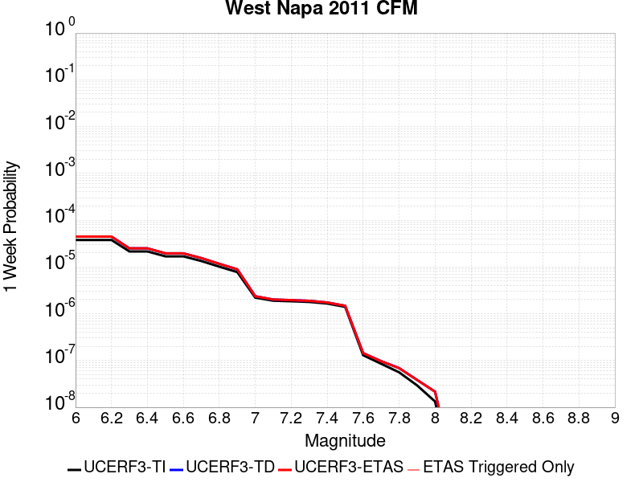 |  |  |  |

| Magnitude | 1 wk TI Prob | 1 wk TD Prob | 1 wk ETAS Prob | 1 wk ETAS/TD Gain | 1 wk ETAS Triggered Only | 1 mo TI Prob | 1 mo TD Prob | 1 mo ETAS Prob | 1 mo ETAS/TD Gain | 1 mo ETAS Triggered Only | 1 yr TI Prob | 1 yr TD Prob | 1 yr ETAS Prob | 1 yr ETAS/TD Gain | 1 yr ETAS Triggered Only | 10 yr TI Prob | 10 yr TD Prob | 10 yr ETAS Prob | 10 yr ETAS/TD Gain | 10 yr ETAS Triggered Only |
|-----|-----|-----|-----|-----|-----|-----|-----|-----|-----|-----|-----|-----|-----|-----|-----|-----|-----|-----|-----|-----|
| 6.0 | 3.773104E-5 | 4.4528217E-5 | 4.4528217E-5 | 1.0 | 0.0 | 1.6169442E-4 | 1.9082306E-4 | 1.9082306E-4 | 1.0 | 0.0 | 0.001966852 | 0.0023211127 | 0.0023310895 | 1.0042983 | 1.0E-5 | 0.019495348 | 0.023002127 | 0.023011897 | 1.0004247 | 1.0E-5 |
| 6.1 | 3.773104E-5 | 4.4528217E-5 | 4.4528217E-5 | 1.0 | 0.0 | 1.6169442E-4 | 1.9082306E-4 | 1.9082306E-4 | 1.0 | 0.0 | 0.001966852 | 0.0023211127 | 0.0023310895 | 1.0042983 | 1.0E-5 | 0.019495348 | 0.023002127 | 0.023011897 | 1.0004247 | 1.0E-5 |
| 6.2 | 3.773104E-5 | 4.4528217E-5 | 4.4528217E-5 | 1.0 | 0.0 | 1.6169442E-4 | 1.9082306E-4 | 1.9082306E-4 | 1.0 | 0.0 | 0.001966852 | 0.0023211127 | 0.0023310895 | 1.0042983 | 1.0E-5 | 0.019495348 | 0.023002127 | 0.023011897 | 1.0004247 | 1.0E-5 |
| 6.3 | 2.147964E-5 | 2.4986914E-5 | 2.4986914E-5 | 1.0 | 0.0 | 9.2052345E-5 | 1.07082895E-4 | 1.07082895E-4 | 1.0 | 0.0 | 0.001120161 | 0.0013030461 | 0.0013130332 | 1.0076643 | 1.0E-5 | 0.011145315 | 0.012964673 | 0.0129745435 | 1.0007613 | 1.0E-5 |
| 6.4 | 2.147964E-5 | 2.4986914E-5 | 2.4986914E-5 | 1.0 | 0.0 | 9.2052345E-5 | 1.07082895E-4 | 1.07082895E-4 | 1.0 | 0.0 | 0.001120161 | 0.0013030461 | 0.0013130332 | 1.0076643 | 1.0E-5 | 0.011145315 | 0.012964673 | 0.0129745435 | 1.0007613 | 1.0E-5 |
| 6.5 | 1.688201E-5 | 1.9547248E-5 | 1.9547248E-5 | 1.0 | 0.0 | 7.234947E-5 | 8.3771636E-5 | 8.3771636E-5 | 1.0 | 0.0 | 8.804988E-4 | 0.001019515 | 0.001019515 | 1.0 | 0.0 | 0.008770182 | 0.010157047 | 0.010157047 | 1.0 | 0.0 |
| 6.6 | 1.6846381E-5 | 1.950694E-5 | 1.950694E-5 | 1.0 | 0.0 | 7.219678E-5 | 8.3598905E-5 | 8.3598905E-5 | 1.0 | 0.0 | 8.7864127E-4 | 0.0010174139 | 0.0010174139 | 1.0 | 0.0 | 0.008751754 | 0.010136228 | 0.010136228 | 1.0 | 0.0 |
| 6.7 | 1.3396501E-5 | 1.5467574E-5 | 1.5467574E-5 | 1.0 | 0.0 | 5.7412315E-5 | 6.628828E-5 | 6.628828E-5 | 1.0 | 0.0 | 6.9877075E-4 | 8.068244E-4 | 8.068244E-4 | 1.0 | 0.0 | 0.0069657755 | 0.008046677 | 0.008046677 | 1.0 | 0.0 |
| 6.8 | 1.0139058E-5 | 1.1672086E-5 | 1.1672086E-5 | 1.0 | 0.0 | 4.3452383E-5 | 5.002258E-5 | 5.002258E-5 | 1.0 | 0.0 | 5.289043E-4 | 6.089102E-4 | 6.089102E-4 | 1.0 | 0.0 | 0.005276473 | 0.0060793394 | 0.0060793394 | 1.0 | 0.0 |
| 6.9 | 7.761281E-6 | 8.890642E-6 | 8.890642E-6 | 1.0 | 0.0 | 3.326221E-5 | 3.8102484E-5 | 3.8102484E-5 | 1.0 | 0.0 | 4.0489217E-4 | 4.638504E-4 | 4.638504E-4 | 1.0 | 0.0 | 0.0040415525 | 0.004635336 | 0.004635336 | 1.0 | 0.0 |
| 7.0 | 2.2109202E-6 | 2.3665818E-6 | 2.3665818E-6 | 1.0 | 0.0 | 9.475338E-6 | 1.0142454E-5 | 1.0142454E-5 | 1.0 | 0.0 | 1.1535613E-4 | 1.2347747E-4 | 1.2347747E-4 | 1.0 | 0.0 | 0.0011529627 | 0.0012355743 | 0.0012355743 | 1.0 | 0.0 |
| 7.1 | 1.9008926E-6 | 2.0132718E-6 | 2.0132718E-6 | 1.0 | 0.0 | 8.146657E-6 | 8.62828E-6 | 8.62828E-6 | 1.0 | 0.0 | 9.918104E-5 | 1.05044266E-4 | 1.05044266E-4 | 1.0 | 0.0 | 9.913679E-4 | 0.0010514269 | 0.0010514269 | 1.0 | 0.0 |
| 7.2 | 1.8495944E-6 | 1.9560787E-6 | 1.9560787E-6 | 1.0 | 0.0 | 7.926808E-6 | 8.383168E-6 | 8.383168E-6 | 1.0 | 0.0 | 9.650462E-5 | 1.02060316E-4 | 1.02060316E-4 | 1.0 | 0.0 | 9.6462725E-4 | 0.0010216151 | 0.0010216151 | 1.0 | 0.0 |
| 7.3 | 1.7883189E-6 | 1.8880417E-6 | 1.8880417E-6 | 1.0 | 0.0 | 7.664201E-6 | 8.0915825E-6 | 8.0915825E-6 | 1.0 | 0.0 | 9.330765E-5 | 9.851059E-5 | 9.851059E-5 | 1.0 | 0.0 | 9.3268487E-4 | 9.861497E-4 | 9.861497E-4 | 1.0 | 0.0 |
| 7.4 | 1.6520572E-6 | 1.7414653E-6 | 1.7414653E-6 | 1.0 | 0.0 | 7.0802257E-6 | 7.4634017E-6 | 7.4634017E-6 | 1.0 | 0.0 | 8.6198335E-5 | 9.0863155E-5 | 9.0863155E-5 | 1.0 | 0.0 | 8.616491E-4 | 9.097363E-4 | 9.097363E-4 | 1.0 | 0.0 |
| 7.5 | 1.4040345E-6 | 1.4799898E-6 | 1.4799898E-6 | 1.0 | 0.0 | 6.0172765E-6 | 6.342798E-6 | 6.342798E-6 | 1.0 | 0.0 | 7.325788E-5 | 7.722085E-5 | 7.722085E-5 | 1.0 | 0.0 | 7.3233736E-4 | 7.7338476E-4 | 7.7338476E-4 | 1.0 | 0.0 |
| 7.6 | 1.3013842E-7 | 1.4414782E-7 | 1.4414782E-7 | 1.0 | 0.0 | 5.57736E-7 | 6.177762E-7 | 6.177762E-7 | 1.0 | 0.0 | 6.790414E-6 | 7.5213993E-6 | 7.5213993E-6 | 1.0 | 0.0 | 6.790207E-5 | 7.614268E-5 | 7.614268E-5 | 1.0 | 0.0 |
| 7.7 | 8.541512E-8 | 9.7155365E-8 | 9.7155365E-8 | 1.0 | 0.0 | 3.6606474E-7 | 4.1638006E-7 | 4.1638006E-7 | 1.0 | 0.0 | 4.456829E-6 | 5.0694152E-6 | 5.0694152E-6 | 1.0 | 0.0 | 4.4567398E-5 | 5.1598905E-5 | 5.1598905E-5 | 1.0 | 0.0 |
| 7.8 | 5.6074793E-8 | 6.8946925E-8 | 6.8946925E-8 | 1.0 | 0.0 | 2.403205E-7 | 2.9548679E-7 | 2.9548679E-7 | 1.0 | 0.0 | 2.9258983E-6 | 3.5975456E-6 | 3.5975456E-6 | 1.0 | 0.0 | 2.9258597E-5 | 3.681096E-5 | 3.681096E-5 | 1.0 | 0.0 |
| 7.9 | 2.9475839E-8 | 3.8562206E-8 | 3.8562206E-8 | 1.0 | 0.0 | 1.2632502E-7 | 1.652666E-7 | 1.652666E-7 | 1.0 | 0.0 | 1.538006E-6 | 2.0121188E-6 | 2.0121188E-6 | 1.0 | 0.0 | 1.5379954E-5 | 2.0663898E-5 | 2.0663898E-5 | 1.0 | 0.0 |
| 8.0 | 1.3337122E-8 | 2.1629E-8 | 2.1629E-8 | 1.0 | 0.0 | 5.7159088E-8 | 9.269572E-8 | 9.269572E-8 | 1.0 | 0.0 | 6.959117E-7 | 1.1285698E-6 | 1.1285698E-6 | 1.0 | 0.0 | 6.959095E-6 | 1.1644474E-5 | 1.1644474E-5 | 1.0 | 0.0 |
| 8.1 | 2.6589986E-10 | 4.861076E-10 | 4.861076E-10 | 1.0 | 0.0 | 1.1395708E-9 | 2.0833186E-9 | 2.0833186E-9 | 1.0 | 0.0 | 1.3874274E-8 | 2.5364402E-8 | 2.5364402E-8 | 1.0 | 0.0 | 1.3874273E-7 | 2.6033496E-7 | 2.6033496E-7 | 1.0 | 0.0 |

## San Pedro Basin
*[(top)](#table-of-contents)*

| 1 Week | 1 Month | 1 Year | 10 Year |
|-----|-----|-----|-----|
|  |  |  |  |

| Magnitude | 1 wk TI Prob | 1 wk TD Prob | 1 wk ETAS Prob | 1 wk ETAS/TD Gain | 1 wk ETAS Triggered Only | 1 mo TI Prob | 1 mo TD Prob | 1 mo ETAS Prob | 1 mo ETAS/TD Gain | 1 mo ETAS Triggered Only | 1 yr TI Prob | 1 yr TD Prob | 1 yr ETAS Prob | 1 yr ETAS/TD Gain | 1 yr ETAS Triggered Only | 10 yr TI Prob | 10 yr TD Prob | 10 yr ETAS Prob | 10 yr ETAS/TD Gain | 10 yr ETAS Triggered Only |
|-----|-----|-----|-----|-----|-----|-----|-----|-----|-----|-----|-----|-----|-----|-----|-----|-----|-----|-----|-----|-----|
| 6.0 | 5.3449043E-5 | 6.336922E-5 | 8.336795E-5 | 1.3155906 | 2.0E-5 | 2.2904722E-4 | 2.7155754E-4 | 2.9155213E-4 | 1.0736293 | 2.0E-5 | 0.0027850836 | 0.0033018088 | 0.0033217426 | 1.0060372 | 2.0E-5 | 0.027504366 | 0.03258929 | 0.03260864 | 1.0005937 | 2.0E-5 |
| 6.1 | 5.3449043E-5 | 6.336922E-5 | 8.336795E-5 | 1.3155906 | 2.0E-5 | 2.2904722E-4 | 2.7155754E-4 | 2.9155213E-4 | 1.0736293 | 2.0E-5 | 0.0027850836 | 0.0033018088 | 0.0033217426 | 1.0060372 | 2.0E-5 | 0.027504366 | 0.03258929 | 0.03260864 | 1.0005937 | 2.0E-5 |
| 6.2 | 2.3189454E-5 | 2.6642689E-5 | 2.6642689E-5 | 1.0 | 0.0 | 9.9379584E-5 | 1.1417822E-4 | 1.1417822E-4 | 1.0 | 0.0 | 0.0012092749 | 0.0013892808 | 0.0013892808 | 1.0 | 0.0 | 0.012027155 | 0.013810828 | 0.013810828 | 1.0 | 0.0 |
| 6.3 | 2.3189454E-5 | 2.6642689E-5 | 2.6642689E-5 | 1.0 | 0.0 | 9.9379584E-5 | 1.1417822E-4 | 1.1417822E-4 | 1.0 | 0.0 | 0.0012092749 | 0.0013892808 | 0.0013892808 | 1.0 | 0.0 | 0.012027155 | 0.013810828 | 0.013810828 | 1.0 | 0.0 |
| 6.4 | 1.966056E-5 | 2.2463326E-5 | 2.2463326E-5 | 1.0 | 0.0 | 8.425682E-5 | 9.626807E-5 | 9.626807E-5 | 1.0 | 0.0 | 0.001025344 | 0.0011714738 | 0.0011714738 | 1.0 | 0.0 | 0.010206259 | 0.011657071 | 0.011657071 | 1.0 | 0.0 |
| 6.5 | 1.7342953E-5 | 1.9745074E-5 | 1.9745074E-5 | 1.0 | 0.0 | 7.4324824E-5 | 8.4619205E-5 | 8.4619205E-5 | 1.0 | 0.0 | 9.04529E-4 | 0.0010297889 | 0.0010297889 | 1.0 | 0.0 | 0.009008561 | 0.010253892 | 0.010253892 | 1.0 | 0.0 |
| 6.6 | 1.439804E-5 | 1.6322656E-5 | 1.6322656E-5 | 1.0 | 0.0 | 6.170443E-5 | 6.995254E-5 | 6.995254E-5 | 1.0 | 0.0 | 7.509924E-4 | 8.5137156E-4 | 8.5137156E-4 | 1.0 | 0.0 | 0.0074845953 | 0.008484301 | 0.008484301 | 1.0 | 0.0 |
| 6.7 | 1.2634884E-5 | 1.4285245E-5 | 1.4285245E-5 | 1.0 | 0.0 | 5.414838E-5 | 6.122122E-5 | 6.122122E-5 | 1.0 | 0.0 | 6.590571E-4 | 7.4514386E-4 | 7.4514386E-4 | 1.0 | 0.0 | 0.006571059 | 0.0074294745 | 0.0074294745 | 1.0 | 0.0 |
| 6.8 | 1.146091E-5 | 1.2933146E-5 | 1.2933146E-5 | 1.0 | 0.0 | 4.911726E-5 | 5.5426757E-5 | 5.5426757E-5 | 1.0 | 0.0 | 5.9783855E-4 | 6.746416E-4 | 6.746416E-4 | 1.0 | 0.0 | 0.0059623276 | 0.006728875 | 0.006728875 | 1.0 | 0.0 |
| 6.9 | 9.109035E-6 | 1.0234976E-5 | 1.0234976E-5 | 1.0 | 0.0 | 3.9038136E-5 | 4.3863605E-5 | 4.3863605E-5 | 1.0 | 0.0 | 4.7518566E-4 | 5.339365E-4 | 5.339365E-4 | 1.0 | 0.0 | 0.0047417083 | 0.0053292904 | 0.0053292904 | 1.0 | 0.0 |
| 7.0 | 5.9351028E-6 | 6.583943E-6 | 6.583943E-6 | 1.0 | 0.0 | 2.5435906E-5 | 2.8216728E-5 | 2.8216728E-5 | 1.0 | 0.0 | 3.0963816E-4 | 3.4350812E-4 | 3.4350812E-4 | 1.0 | 0.0 | 0.0030920706 | 0.0034320883 | 0.0034320883 | 1.0 | 0.0 |
| 7.1 | 2.1557585E-6 | 2.2096456E-6 | 2.2096456E-6 | 1.0 | 0.0 | 9.238933E-6 | 9.469876E-6 | 9.469876E-6 | 1.0 | 0.0 | 1.1247819E-4 | 1.152898E-4 | 1.152898E-4 | 1.0 | 0.0 | 0.0011242128 | 0.0011523152 | 0.0011523152 | 1.0 | 0.0 |
| 7.2 | 2.1251979E-6 | 2.1779917E-6 | 2.1779917E-6 | 1.0 | 0.0 | 9.107958E-6 | 9.334219E-6 | 9.334219E-6 | 1.0 | 0.0 | 1.1088375E-4 | 1.13638336E-4 | 1.13638336E-4 | 1.0 | 0.0 | 0.0011082845 | 0.0011358176 | 0.0011358176 | 1.0 | 0.0 |
| 7.3 | 1.7145798E-6 | 1.7442856E-6 | 1.7442856E-6 | 1.0 | 0.0 | 7.3481783E-6 | 7.4754885E-6 | 7.4754885E-6 | 1.0 | 0.0 | 8.94604E-5 | 9.101036E-5 | 9.101036E-5 | 1.0 | 0.0 | 8.9424395E-4 | 9.0974005E-4 | 9.0974005E-4 | 1.0 | 0.0 |
| 7.4 | 1.4467993E-6 | 1.4641852E-6 | 1.4641852E-6 | 1.0 | 0.0 | 6.200554E-6 | 6.2750646E-6 | 6.2750646E-6 | 1.0 | 0.0 | 7.548913E-5 | 7.639631E-5 | 7.639631E-5 | 1.0 | 0.0 | 7.546349E-4 | 7.6370774E-4 | 7.6370774E-4 | 1.0 | 0.0 |
| 7.5 | 1.2803735E-6 | 1.2931483E-6 | 1.2931483E-6 | 1.0 | 0.0 | 5.487303E-6 | 5.542053E-6 | 5.542053E-6 | 1.0 | 0.0 | 6.680587E-5 | 6.747247E-5 | 6.747247E-5 | 1.0 | 0.0 | 6.678579E-4 | 6.7452696E-4 | 6.7452696E-4 | 1.0 | 0.0 |
| 7.6 | 6.755009E-7 | 6.7694583E-7 | 6.7694583E-7 | 1.0 | 0.0 | 2.8950008E-6 | 2.9011935E-6 | 2.9011935E-6 | 1.0 | 0.0 | 3.5246063E-5 | 3.532152E-5 | 3.532152E-5 | 1.0 | 0.0 | 3.5240475E-4 | 3.5316474E-4 | 3.5316474E-4 | 1.0 | 0.0 |
| 7.7 | 6.211885E-8 | 4.5699466E-8 | 4.5699466E-8 | 1.0 | 0.0 | 2.6622362E-7 | 1.9585484E-7 | 1.9585484E-7 | 1.0 | 0.0 | 3.2412677E-6 | 2.3845303E-6 | 2.3845303E-6 | 1.0 | 0.0 | 3.2412205E-5 | 2.3845067E-5 | 2.3845067E-5 | 1.0 | 0.0 |
| 7.8 | 2.6580573E-9 | 1.5138059E-9 | 1.5138059E-9 | 1.0 | 0.0 | 1.1391674E-8 | 6.4877392E-9 | 6.4877392E-9 | 1.0 | 0.0 | 1.3869362E-7 | 7.898823E-8 | 7.898823E-8 | 1.0 | 0.0 | 1.3869354E-6 | 7.898823E-7 | 7.898823E-7 | 1.0 | 0.0 |

## Big Pine (Central)
*[(top)](#table-of-contents)*

| 1 Week | 1 Month | 1 Year | 10 Year |
|-----|-----|-----|-----|
|  |  | 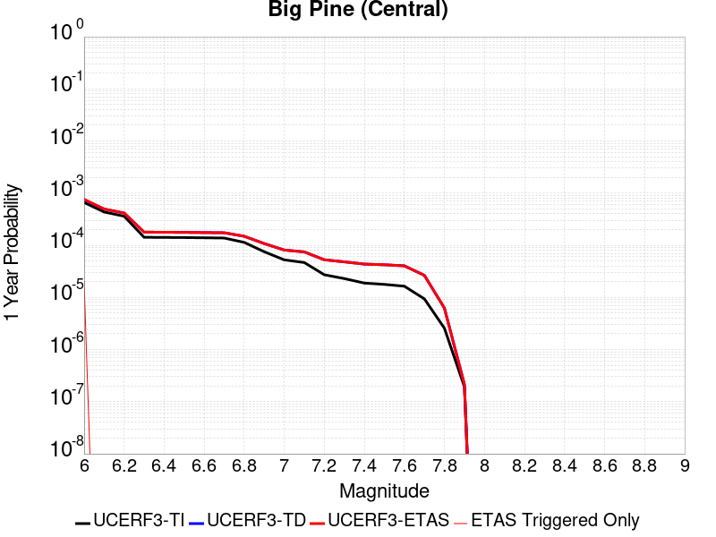 | 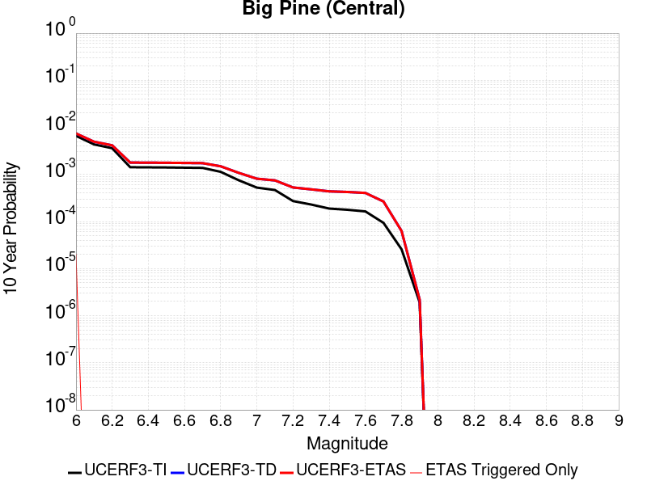 |

| Magnitude | 1 wk TI Prob | 1 wk TD Prob | 1 wk ETAS Prob | 1 wk ETAS/TD Gain | 1 wk ETAS Triggered Only | 1 mo TI Prob | 1 mo TD Prob | 1 mo ETAS Prob | 1 mo ETAS/TD Gain | 1 mo ETAS Triggered Only | 1 yr TI Prob | 1 yr TD Prob | 1 yr ETAS Prob | 1 yr ETAS/TD Gain | 1 yr ETAS Triggered Only | 10 yr TI Prob | 10 yr TD Prob | 10 yr ETAS Prob | 10 yr ETAS/TD Gain | 10 yr ETAS Triggered Only |
|-----|-----|-----|-----|-----|-----|-----|-----|-----|-----|-----|-----|-----|-----|-----|-----|-----|-----|-----|-----|-----|
| 6.0 | 1.2706755E-5 | 1.4250431E-5 | 1.4250431E-5 | 1.0 | 0.0 | 5.4456385E-5 | 6.107205E-5 | 6.107205E-5 | 1.0 | 0.0 | 6.628048E-4 | 7.433351E-4 | 7.6332025E-4 | 1.0268857 | 2.0E-5 | 0.006608314 | 0.007413517 | 0.007433369 | 1.0026778 | 2.0E-5 |
| 6.1 | 8.342579E-6 | 9.510675E-6 | 9.510675E-6 | 1.0 | 0.0 | 3.5753423E-5 | 4.075952E-5 | 4.075952E-5 | 1.0 | 0.0 | 4.3521097E-4 | 4.9615593E-4 | 4.9615593E-4 | 1.0 | 0.0 | 0.0043435963 | 0.004954038 | 0.004954038 | 1.0 | 0.0 |
| 6.2 | 6.923899E-6 | 7.967064E-6 | 7.967064E-6 | 1.0 | 0.0 | 2.9673516E-5 | 3.4144225E-5 | 3.4144225E-5 | 1.0 | 0.0 | 3.6121515E-4 | 4.1564586E-4 | 4.1564586E-4 | 1.0 | 0.0 | 0.003606286 | 0.0041519944 | 0.0041519944 | 1.0 | 0.0 |
| 6.3 | 2.728396E-6 | 3.424218E-6 | 3.424218E-6 | 1.0 | 0.0 | 1.1693074E-5 | 1.4675143E-5 | 1.4675143E-5 | 1.0 | 0.0 | 1.4235388E-4 | 1.7865608E-4 | 1.7865608E-4 | 1.0 | 0.0 | 0.0014226272 | 0.0017866332 | 0.0017866332 | 1.0 | 0.0 |
| 6.4 | 2.7136944E-6 | 3.4085115E-6 | 3.4085115E-6 | 1.0 | 0.0 | 1.1630066E-5 | 1.4607829E-5 | 1.4607829E-5 | 1.0 | 0.0 | 1.4158686E-4 | 1.7783667E-4 | 1.7783667E-4 | 1.0 | 0.0 | 0.0014149669 | 0.0017784522 | 0.0017784522 | 1.0 | 0.0 |
| 6.5 | 2.6971882E-6 | 3.3908566E-6 | 3.3908566E-6 | 1.0 | 0.0 | 1.1559327E-5 | 1.45321665E-5 | 1.45321665E-5 | 1.0 | 0.0 | 1.4072572E-4 | 1.7691562E-4 | 1.7691562E-4 | 1.0 | 0.0 | 0.0014063664 | 0.0017692564 | 0.0017692564 | 1.0 | 0.0 |
| 6.6 | 2.669092E-6 | 3.3608771E-6 | 3.3608771E-6 | 1.0 | 0.0 | 1.1438916E-5 | 1.4403684E-5 | 1.4403684E-5 | 1.0 | 0.0 | 1.3925991E-4 | 1.7535161E-4 | 1.7535161E-4 | 1.0 | 0.0 | 0.0013917267 | 0.0017536411 | 0.0017536411 | 1.0 | 0.0 |
| 6.7 | 2.6408059E-6 | 3.3309027E-6 | 3.3309027E-6 | 1.0 | 0.0 | 1.1317691E-5 | 1.4275224E-5 | 1.4275224E-5 | 1.0 | 0.0 | 1.3778417E-4 | 1.7378786E-4 | 1.7378786E-4 | 1.0 | 0.0 | 0.0013769877 | 0.001738028 | 0.001738028 | 1.0 | 0.0 |
| 6.8 | 2.1786943E-6 | 2.8543604E-6 | 2.8543604E-6 | 1.0 | 0.0 | 9.337228E-6 | 1.223292E-5 | 1.223292E-5 | 1.0 | 0.0 | 1.1367482E-4 | 1.4892635E-4 | 1.4892635E-4 | 1.0 | 0.0 | 0.0011361669 | 0.0014897605 | 0.0014897605 | 1.0 | 0.0 |
| 6.9 | 1.4411696E-6 | 2.0684301E-6 | 2.0684301E-6 | 1.0 | 0.0 | 6.1764263E-6 | 8.864672E-6 | 8.864672E-6 | 1.0 | 0.0 | 7.51954E-5 | 1.0792231E-4 | 1.0792231E-4 | 1.0 | 0.0 | 7.5169955E-4 | 0.0010801493 | 0.0010801493 | 1.0 | 0.0 |
| 7.0 | 1.0073411E-6 | 1.5541993E-6 | 1.5541993E-6 | 1.0 | 0.0 | 4.317169E-6 | 6.6608386E-6 | 6.6608386E-6 | 1.0 | 0.0 | 5.2560266E-5 | 8.109284E-5 | 8.109284E-5 | 1.0 | 0.0 | 5.2547833E-4 | 8.1207167E-4 | 8.1207167E-4 | 1.0 | 0.0 |
| 7.1 | 8.947104E-7 | 1.4301887E-6 | 1.4301887E-6 | 1.0 | 0.0 | 3.834468E-6 | 6.1293663E-6 | 6.1293663E-6 | 1.0 | 0.0 | 4.6683643E-5 | 7.462263E-5 | 7.462263E-5 | 1.0 | 0.0 | 4.6673836E-4 | 7.4741466E-4 | 7.4741466E-4 | 1.0 | 0.0 |
| 7.2 | 5.215166E-7 | 1.0111112E-6 | 1.0111112E-6 | 1.0 | 0.0 | 2.2350691E-6 | 4.3333266E-6 | 4.3333266E-6 | 1.0 | 0.0 | 2.7211627E-5 | 5.275702E-5 | 5.275702E-5 | 1.0 | 0.0 | 2.7208295E-4 | 5.288737E-4 | 5.288737E-4 | 1.0 | 0.0 |
| 7.3 | 4.4024807E-7 | 9.219039E-7 | 9.219039E-7 | 1.0 | 0.0 | 1.8867761E-6 | 3.951011E-6 | 3.951011E-6 | 1.0 | 0.0 | 2.2971257E-5 | 4.8102538E-5 | 4.8102538E-5 | 1.0 | 0.0 | 2.2968883E-4 | 4.823499E-4 | 4.823499E-4 | 1.0 | 0.0 |
| 7.4 | 3.6130905E-7 | 8.35799E-7 | 8.35799E-7 | 1.0 | 0.0 | 1.5484665E-6 | 3.5819912E-6 | 3.5819912E-6 | 1.0 | 0.0 | 1.8852415E-5 | 4.3609907E-5 | 4.3609907E-5 | 1.0 | 0.0 | 1.8850817E-4 | 4.3743252E-4 | 4.3743252E-4 | 1.0 | 0.0 |
| 7.5 | 3.408184E-7 | 8.1076263E-7 | 8.1076263E-7 | 1.0 | 0.0 | 1.4606494E-6 | 3.4746924E-6 | 3.4746924E-6 | 1.0 | 0.0 | 1.7783263E-5 | 4.23036E-5 | 4.23036E-5 | 1.0 | 0.0 | 1.778184E-4 | 4.2435306E-4 | 4.2435306E-4 | 1.0 | 0.0 |
| 7.6 | 3.1428627E-7 | 7.731098E-7 | 7.731098E-7 | 1.0 | 0.0 | 1.3469405E-6 | 3.3133235E-6 | 3.3133235E-6 | 1.0 | 0.0 | 1.6398877E-5 | 4.0339008E-5 | 4.0339008E-5 | 1.0 | 0.0 | 1.6397667E-4 | 4.0468544E-4 | 4.0468544E-4 | 1.0 | 0.0 |
| 7.7 | 1.7972785E-7 | 5.0773684E-7 | 5.0773684E-7 | 1.0 | 0.0 | 7.70262E-7 | 2.1760131E-6 | 2.1760131E-6 | 1.0 | 0.0 | 9.377899E-6 | 2.649265E-5 | 2.649265E-5 | 1.0 | 0.0 | 9.377503E-5 | 2.6627042E-4 | 2.6627042E-4 | 1.0 | 0.0 |
| 7.8 | 4.9230927E-8 | 1.1979883E-7 | 1.1979883E-7 | 1.0 | 0.0 | 2.1098968E-7 | 5.1342346E-7 | 5.1342346E-7 | 1.0 | 0.0 | 2.5687964E-6 | 6.2509143E-6 | 6.2509143E-6 | 1.0 | 0.0 | 2.5687666E-5 | 6.2949504E-5 | 6.2949504E-5 | 1.0 | 0.0 |
| 7.9 | 3.6805972E-9 | 4.1049364E-9 | 4.1049364E-9 | 1.0 | 0.0 | 1.5773987E-8 | 1.7592585E-8 | 1.7592585E-8 | 1.0 | 0.0 | 1.9204828E-7 | 2.141897E-7 | 2.141897E-7 | 1.0 | 0.0 | 1.920481E-6 | 2.1898745E-6 | 2.1898745E-6 | 1.0 | 0.0 |

## San Andreas (North Branch Mill Creek)
*[(top)](#table-of-contents)*

| 1 Week | 1 Month | 1 Year | 10 Year |
|-----|-----|-----|-----|
|  |  |  |  |

| Magnitude | 1 wk TI Prob | 1 wk TD Prob | 1 wk ETAS Prob | 1 wk ETAS/TD Gain | 1 wk ETAS Triggered Only | 1 mo TI Prob | 1 mo TD Prob | 1 mo ETAS Prob | 1 mo ETAS/TD Gain | 1 mo ETAS Triggered Only | 1 yr TI Prob | 1 yr TD Prob | 1 yr ETAS Prob | 1 yr ETAS/TD Gain | 1 yr ETAS Triggered Only | 10 yr TI Prob | 10 yr TD Prob | 10 yr ETAS Prob | 10 yr ETAS/TD Gain | 10 yr ETAS Triggered Only |
|-----|-----|-----|-----|-----|-----|-----|-----|-----|-----|-----|-----|-----|-----|-----|-----|-----|-----|-----|-----|-----|
| 6.0 | 1.3461156E-5 | 2.3498513E-5 | 2.3498513E-5 | 1.0 | 0.0 | 5.7689394E-5 | 1.0070404E-4 | 1.0070404E-4 | 1.0 | 0.0 | 7.02142E-4 | 0.0012253855 | 0.0012253855 | 1.0 | 0.0 | 0.0069992766 | 0.012228863 | 0.0122486185 | 1.0016155 | 2.0E-5 |
| 6.1 | 1.3461156E-5 | 2.3498513E-5 | 2.3498513E-5 | 1.0 | 0.0 | 5.7689394E-5 | 1.0070404E-4 | 1.0070404E-4 | 1.0 | 0.0 | 7.02142E-4 | 0.0012253855 | 0.0012253855 | 1.0 | 0.0 | 0.0069992766 | 0.012228863 | 0.0122486185 | 1.0016155 | 2.0E-5 |
| 6.2 | 1.3461156E-5 | 2.3498513E-5 | 2.3498513E-5 | 1.0 | 0.0 | 5.7689394E-5 | 1.0070404E-4 | 1.0070404E-4 | 1.0 | 0.0 | 7.02142E-4 | 0.0012253855 | 0.0012253855 | 1.0 | 0.0 | 0.0069992766 | 0.012228863 | 0.0122486185 | 1.0016155 | 2.0E-5 |
| 6.3 | 1.3461156E-5 | 2.3498513E-5 | 2.3498513E-5 | 1.0 | 0.0 | 5.7689394E-5 | 1.0070404E-4 | 1.0070404E-4 | 1.0 | 0.0 | 7.02142E-4 | 0.0012253855 | 0.0012253855 | 1.0 | 0.0 | 0.0069992766 | 0.012228863 | 0.0122486185 | 1.0016155 | 2.0E-5 |
| 6.4 | 1.3461156E-5 | 2.3498513E-5 | 2.3498513E-5 | 1.0 | 0.0 | 5.7689394E-5 | 1.0070404E-4 | 1.0070404E-4 | 1.0 | 0.0 | 7.02142E-4 | 0.0012253855 | 0.0012253855 | 1.0 | 0.0 | 0.0069992766 | 0.012228863 | 0.0122486185 | 1.0016155 | 2.0E-5 |
| 6.5 | 1.3450706E-5 | 2.3487471E-5 | 2.3487471E-5 | 1.0 | 0.0 | 5.764461E-5 | 1.0065673E-4 | 1.0065673E-4 | 1.0 | 0.0 | 7.0159714E-4 | 0.00122481 | 0.00122481 | 1.0 | 0.0 | 0.006993862 | 0.012223173 | 0.012242928 | 1.0016162 | 2.0E-5 |
| 6.6 | 1.3074523E-5 | 2.3101755E-5 | 2.3101755E-5 | 1.0 | 0.0 | 5.6032466E-5 | 9.900379E-5 | 9.900379E-5 | 1.0 | 0.0 | 6.8198174E-4 | 0.0012047078 | 0.0012047078 | 1.0 | 0.0 | 0.006798926 | 0.012024338 | 0.012044097 | 1.0016433 | 2.0E-5 |
| 6.7 | 1.3050216E-5 | 2.3077053E-5 | 2.3077053E-5 | 1.0 | 0.0 | 5.59283E-5 | 9.889792E-5 | 9.889792E-5 | 1.0 | 0.0 | 6.8071426E-4 | 0.0012034203 | 0.0012034203 | 1.0 | 0.0 | 0.0067863287 | 0.0120116025 | 0.012031362 | 1.0016451 | 2.0E-5 |
| 6.8 | 1.29049395E-5 | 2.2925462E-5 | 2.2925462E-5 | 1.0 | 0.0 | 5.530571E-5 | 9.8248296E-5 | 9.8248296E-5 | 1.0 | 0.0 | 6.73139E-4 | 0.0011955198 | 0.0011955198 | 1.0 | 0.0 | 0.0067110364 | 0.011933448 | 0.0119532095 | 1.0016559 | 2.0E-5 |
| 6.9 | 1.2867369E-5 | 2.2884866E-5 | 2.2884866E-5 | 1.0 | 0.0 | 5.51447E-5 | 9.807433E-5 | 9.807433E-5 | 1.0 | 0.0 | 6.711799E-4 | 0.0011934041 | 0.0011934041 | 1.0 | 0.0 | 0.006691564 | 0.011912517 | 0.011932279 | 1.0016589 | 2.0E-5 |
| 7.0 | 1.2495996E-5 | 2.2284956E-5 | 2.2284956E-5 | 1.0 | 0.0 | 5.3553173E-5 | 9.550347E-5 | 9.550347E-5 | 1.0 | 0.0 | 6.518148E-4 | 0.0011621374 | 0.0011621374 | 1.0 | 0.0 | 0.0064990623 | 0.011603127 | 0.011622895 | 1.0017036 | 2.0E-5 |
| 7.1 | 1.2452067E-5 | 2.223003E-5 | 2.223003E-5 | 1.0 | 0.0 | 5.3364907E-5 | 9.5268086E-5 | 9.5268086E-5 | 1.0 | 0.0 | 6.4952404E-4 | 0.0011592746 | 0.0011592746 | 1.0 | 0.0 | 0.0064762887 | 0.011574798 | 0.0115945665 | 1.0017079 | 2.0E-5 |
| 7.2 | 1.2002777E-5 | 2.1608601E-5 | 2.1608601E-5 | 1.0 | 0.0 | 5.143946E-5 | 9.260502E-5 | 9.260502E-5 | 1.0 | 0.0 | 6.2609545E-4 | 0.0011268856 | 0.0011268856 | 1.0 | 0.0 | 0.006243344 | 0.011254225 | 0.011274 | 1.0017571 | 2.0E-5 |
| 7.3 | 1.1923425E-5 | 2.1478432E-5 | 2.1478432E-5 | 1.0 | 0.0 | 5.109939E-5 | 9.2047194E-5 | 9.2047194E-5 | 1.0 | 0.0 | 6.219575E-4 | 0.0011201011 | 0.0011201011 | 1.0 | 0.0 | 0.0062021962 | 0.0111870915 | 0.011206868 | 1.0017678 | 2.0E-5 |
| 7.4 | 1.16105175E-5 | 2.0852425E-5 | 2.0852425E-5 | 1.0 | 0.0 | 4.975841E-5 | 8.936449E-5 | 8.936449E-5 | 1.0 | 0.0 | 6.0564023E-4 | 0.0010874722 | 0.0010874722 | 1.0 | 0.0 | 0.006039923 | 0.010864706 | 0.010884489 | 1.0018208 | 2.0E-5 |
| 7.5 | 1.1037265E-5 | 1.9552606E-5 | 1.9552606E-5 | 1.0 | 0.0 | 4.7301706E-5 | 8.3794206E-5 | 8.3794206E-5 | 1.0 | 0.0 | 5.757461E-4 | 0.0010197192 | 0.0010197192 | 1.0 | 0.0 | 0.005742567 | 0.010194231 | 0.010214027 | 1.0019419 | 2.0E-5 |
| 7.6 | 1.0720915E-5 | 1.8994535E-5 | 1.8994535E-5 | 1.0 | 0.0 | 4.5945973E-5 | 8.140262E-5 | 8.140262E-5 | 1.0 | 0.0 | 5.592486E-4 | 9.906285E-4 | 9.906285E-4 | 1.0 | 0.0 | 0.005578433 | 0.009905963 | 0.009925765 | 1.001999 | 2.0E-5 |
| 7.7 | 9.276279E-6 | 1.6440426E-5 | 1.6440426E-5 | 1.0 | 0.0 | 3.9754876E-5 | 7.045708E-5 | 7.045708E-5 | 1.0 | 0.0 | 4.839081E-4 | 8.5747894E-4 | 8.5747894E-4 | 1.0 | 0.0 | 0.0048285574 | 0.008585413 | 0.008605242 | 1.0023096 | 2.0E-5 |
| 7.8 | 5.8346777E-6 | 1.1154021E-5 | 1.1154021E-5 | 1.0 | 0.0 | 2.5005522E-5 | 4.780207E-5 | 4.780207E-5 | 1.0 | 0.0 | 3.043997E-4 | 5.8183493E-4 | 5.8183493E-4 | 1.0 | 0.0 | 0.0030398308 | 0.005846416 | 0.005866299 | 1.0034009 | 2.0E-5 |
| 7.9 | 4.690204E-6 | 8.508266E-6 | 8.508266E-6 | 1.0 | 0.0 | 2.0100719E-5 | 3.6463487E-5 | 3.6463487E-5 | 1.0 | 0.0 | 2.4469878E-4 | 4.4385262E-4 | 4.4385262E-4 | 1.0 | 0.0 | 0.002444295 | 0.004470321 | 0.0044902316 | 1.0044539 | 2.0E-5 |
| 8.0 | 2.9570454E-6 | 4.8464412E-6 | 4.8464412E-6 | 1.0 | 0.0 | 1.267299E-5 | 2.0770298E-5 | 2.0770298E-5 | 1.0 | 0.0 | 1.5428272E-4 | 2.5284904E-4 | 2.5284904E-4 | 1.0 | 0.0 | 0.0015417566 | 0.0025493812 | 0.0025693304 | 1.007825 | 2.0E-5 |
| 8.1 | 1.6376824E-6 | 2.1966277E-6 | 2.1966277E-6 | 1.0 | 0.0 | 7.01862E-6 | 9.414084E-6 | 9.414084E-6 | 1.0 | 0.0 | 8.544835E-5 | 1.1461046E-4 | 1.1461046E-4 | 1.0 | 0.0 | 8.54155E-4 | 0.0011605195 | 0.0011705079 | 1.0086068 | 1.0E-5 |
| 8.2 | 6.9631557E-7 | 4.5351916E-7 | 4.5351916E-7 | 1.0 | 0.0 | 2.984206E-6 | 1.943652E-6 | 1.943652E-6 | 1.0 | 0.0 | 3.63321E-5 | 2.366371E-5 | 2.366371E-5 | 1.0 | 0.0 | 3.6326164E-4 | 2.4511237E-4 | 2.4511237E-4 | 1.0 | 0.0 |
| 8.3 | 1.7876137E-7 | 8.358693E-8 | 8.358693E-8 | 1.0 | 0.0 | 7.661199E-7 | 3.5822964E-7 | 3.5822964E-7 | 1.0 | 0.0 | 9.32747E-6 | 4.3614377E-6 | 4.3614377E-6 | 1.0 | 0.0 | 9.3270784E-5 | 4.580799E-5 | 4.580799E-5 | 1.0 | 0.0 |

## Cleghorn
*[(top)](#table-of-contents)*

| 1 Week | 1 Month | 1 Year | 10 Year |
|-----|-----|-----|-----|
|  |  |  |  |

| Magnitude | 1 wk TI Prob | 1 wk TD Prob | 1 wk ETAS Prob | 1 wk ETAS/TD Gain | 1 wk ETAS Triggered Only | 1 mo TI Prob | 1 mo TD Prob | 1 mo ETAS Prob | 1 mo ETAS/TD Gain | 1 mo ETAS Triggered Only | 1 yr TI Prob | 1 yr TD Prob | 1 yr ETAS Prob | 1 yr ETAS/TD Gain | 1 yr ETAS Triggered Only | 10 yr TI Prob | 10 yr TD Prob | 10 yr ETAS Prob | 10 yr ETAS/TD Gain | 10 yr ETAS Triggered Only |
|-----|-----|-----|-----|-----|-----|-----|-----|-----|-----|-----|-----|-----|-----|-----|-----|-----|-----|-----|-----|-----|
| 6.0 | 7.9267165E-6 | 9.831383E-6 | 9.831383E-6 | 1.0 | 0.0 | 3.39712E-5 | 4.2133877E-5 | 4.2133877E-5 | 1.0 | 0.0 | 4.1352084E-4 | 5.1286985E-4 | 5.1286985E-4 | 1.0 | 0.0 | 0.004127522 | 0.0051319767 | 0.005151874 | 1.0038772 | 2.0E-5 |
| 6.1 | 7.9267165E-6 | 9.831383E-6 | 9.831383E-6 | 1.0 | 0.0 | 3.39712E-5 | 4.2133877E-5 | 4.2133877E-5 | 1.0 | 0.0 | 4.1352084E-4 | 5.1286985E-4 | 5.1286985E-4 | 1.0 | 0.0 | 0.004127522 | 0.0051319767 | 0.005151874 | 1.0038772 | 2.0E-5 |
| 6.2 | 7.9267165E-6 | 9.831383E-6 | 9.831383E-6 | 1.0 | 0.0 | 3.39712E-5 | 4.2133877E-5 | 4.2133877E-5 | 1.0 | 0.0 | 4.1352084E-4 | 5.1286985E-4 | 5.1286985E-4 | 1.0 | 0.0 | 0.004127522 | 0.0051319767 | 0.005151874 | 1.0038772 | 2.0E-5 |
| 6.3 | 7.9267165E-6 | 9.831383E-6 | 9.831383E-6 | 1.0 | 0.0 | 3.39712E-5 | 4.2133877E-5 | 4.2133877E-5 | 1.0 | 0.0 | 4.1352084E-4 | 5.1286985E-4 | 5.1286985E-4 | 1.0 | 0.0 | 0.004127522 | 0.0051319767 | 0.005151874 | 1.0038772 | 2.0E-5 |
| 6.4 | 4.3445207E-6 | 6.091248E-6 | 6.091248E-6 | 1.0 | 0.0 | 1.8619241E-5 | 2.6105094E-5 | 2.6105094E-5 | 1.0 | 0.0 | 2.2666567E-4 | 3.1778417E-4 | 3.1778417E-4 | 1.0 | 0.0 | 0.0022643462 | 0.003187489 | 0.003197457 | 1.0031272 | 1.0E-5 |
| 6.5 | 4.3445207E-6 | 6.091248E-6 | 6.091248E-6 | 1.0 | 0.0 | 1.8619241E-5 | 2.6105094E-5 | 2.6105094E-5 | 1.0 | 0.0 | 2.2666567E-4 | 3.1778417E-4 | 3.1778417E-4 | 1.0 | 0.0 | 0.0022643462 | 0.003187489 | 0.003197457 | 1.0031272 | 1.0E-5 |
| 6.6 | 4.040109E-6 | 5.7736565E-6 | 5.7736565E-6 | 1.0 | 0.0 | 1.7314638E-5 | 2.4744011E-5 | 2.4744011E-5 | 1.0 | 0.0 | 2.1078532E-4 | 3.0121763E-4 | 3.0121763E-4 | 1.0 | 0.0 | 0.002105855 | 0.003022279 | 0.0030322487 | 1.0032988 | 1.0E-5 |
| 6.7 | 3.3632055E-6 | 5.067154E-6 | 5.067154E-6 | 1.0 | 0.0 | 1.4413658E-5 | 2.1716196E-5 | 2.1716196E-5 | 1.0 | 0.0 | 1.7547216E-4 | 2.6436293E-4 | 2.6436293E-4 | 1.0 | 0.0 | 0.0017533366 | 0.0026546135 | 0.0026546135 | 1.0 | 0.0 |
| 6.8 | 3.2902772E-6 | 4.989062E-6 | 4.989062E-6 | 1.0 | 0.0 | 1.4101111E-5 | 2.138152E-5 | 2.138152E-5 | 1.0 | 0.0 | 1.716675E-4 | 2.6028923E-4 | 2.6028923E-4 | 1.0 | 0.0 | 0.0017153495 | 0.0026139724 | 0.0026139724 | 1.0 | 0.0 |
| 6.9 | 3.031547E-6 | 4.690826E-6 | 4.690826E-6 | 1.0 | 0.0 | 1.299228E-5 | 2.0103385E-5 | 2.0103385E-5 | 1.0 | 0.0 | 1.5816953E-4 | 2.447315E-4 | 2.447315E-4 | 1.0 | 0.0 | 0.00158057 | 0.0024587465 | 0.0024587465 | 1.0 | 0.0 |
| 7.0 | 2.8259715E-6 | 4.3703994E-6 | 4.3703994E-6 | 1.0 | 0.0 | 1.211125E-5 | 1.873015E-5 | 1.873015E-5 | 1.0 | 0.0 | 1.4744449E-4 | 2.2801595E-4 | 2.2801595E-4 | 1.0 | 0.0 | 0.001473467 | 0.0022919455 | 0.0022919455 | 1.0 | 0.0 |
| 7.1 | 2.5962665E-6 | 4.0656228E-6 | 4.0656228E-6 | 1.0 | 0.0 | 1.1126809E-5 | 1.7423981E-5 | 1.7423981E-5 | 1.0 | 0.0 | 1.3546048E-4 | 2.1211655E-4 | 2.1211655E-4 | 1.0 | 0.0 | 0.0013537793 | 0.0021332712 | 0.0021332712 | 1.0 | 0.0 |
| 7.2 | 2.3247253E-6 | 3.6761817E-6 | 3.6761817E-6 | 1.0 | 0.0 | 9.96307E-6 | 1.575497E-5 | 1.575497E-5 | 1.0 | 0.0 | 1.21293626E-4 | 1.9180006E-4 | 1.9180006E-4 | 1.0 | 0.0 | 0.0012122744 | 0.001930497 | 0.001930497 | 1.0 | 0.0 |
| 7.3 | 2.056928E-6 | 3.2349144E-6 | 3.2349144E-6 | 1.0 | 0.0 | 8.815376E-6 | 1.3863846E-5 | 1.3863846E-5 | 1.0 | 0.0 | 1.0732192E-4 | 1.6877941E-4 | 1.6877941E-4 | 1.0 | 0.0 | 0.001072701 | 0.0017007304 | 0.0017007304 | 1.0 | 0.0 |
| 7.4 | 1.8055999E-6 | 2.8253314E-6 | 2.8253314E-6 | 1.0 | 0.0 | 7.738263E-6 | 1.2108509E-5 | 1.2108509E-5 | 1.0 | 0.0 | 9.4209274E-5 | 1.4741125E-4 | 1.4741125E-4 | 1.0 | 0.0 | 9.4169343E-4 | 0.0014874903 | 0.0014874903 | 1.0 | 0.0 |
| 7.5 | 1.4683443E-6 | 2.4245787E-6 | 2.4245787E-6 | 1.0 | 0.0 | 6.292889E-6 | 1.0391011E-5 | 1.0391011E-5 | 1.0 | 0.0 | 7.661323E-5 | 1.265033E-4 | 1.265033E-4 | 1.0 | 0.0 | 7.658682E-4 | 0.0012787108 | 0.0012787108 | 1.0 | 0.0 |
| 7.6 | 9.804088E-7 | 1.9000983E-6 | 1.9000983E-6 | 1.0 | 0.0 | 4.201745E-6 | 8.143254E-6 | 8.143254E-6 | 1.0 | 0.0 | 5.1155046E-5 | 9.9139645E-5 | 9.9139645E-5 | 1.0 | 0.0 | 5.114327E-4 | 0.0010053867 | 0.0010053867 | 1.0 | 0.0 |
| 7.7 | 7.3434086E-7 | 1.6282488E-6 | 1.6282488E-6 | 1.0 | 0.0 | 3.1471714E-6 | 6.9781904E-6 | 6.9781904E-6 | 1.0 | 0.0 | 3.831614E-5 | 8.4956184E-5 | 8.4956184E-5 | 1.0 | 0.0 | 3.8309532E-4 | 8.637035E-4 | 8.637035E-4 | 1.0 | 0.0 |
| 7.8 | 6.434184E-7 | 1.5218448E-6 | 1.5218448E-6 | 1.0 | 0.0 | 2.7575045E-6 | 6.5221757E-6 | 6.5221757E-6 | 1.0 | 0.0 | 3.35721E-5 | 7.940462E-5 | 7.940462E-5 | 1.0 | 0.0 | 3.3567028E-4 | 8.078874E-4 | 8.078874E-4 | 1.0 | 0.0 |
| 7.9 | 3.4943926E-7 | 7.573584E-7 | 7.573584E-7 | 1.0 | 0.0 | 1.497596E-6 | 3.2458177E-6 | 3.2458177E-6 | 1.0 | 0.0 | 1.8233079E-5 | 3.9517123E-5 | 3.9517123E-5 | 1.0 | 0.0 | 1.8231584E-4 | 4.0396556E-4 | 4.0396556E-4 | 1.0 | 0.0 |
| 8.0 | 6.717524E-8 | 5.8377715E-8 | 5.8377715E-8 | 1.0 | 0.0 | 2.8789387E-7 | 2.501902E-7 | 2.501902E-7 | 1.0 | 0.0 | 3.505102E-6 | 3.0460612E-6 | 3.0460612E-6 | 1.0 | 0.0 | 3.5050467E-5 | 3.2729393E-5 | 3.2729393E-5 | 1.0 | 0.0 |
| 8.1 | 3.1984914E-8 | 1.2952653E-8 | 1.2952653E-8 | 1.0 | 0.0 | 1.370782E-7 | 5.551137E-8 | 5.551137E-8 | 1.0 | 0.0 | 1.6689258E-6 | 6.7585074E-7 | 6.7585074E-7 | 1.0 | 0.0 | 1.6689133E-5 | 7.742598E-6 | 7.742598E-6 | 1.0 | 0.0 |
| 8.2 | 1.21887656E-8 | 3.6484704E-9 | 3.6484704E-9 | 1.0 | 0.0 | 5.2237567E-8 | 1.5636301E-8 | 1.5636301E-8 | 1.0 | 0.0 | 6.359922E-7 | 1.9037195E-7 | 1.9037195E-7 | 1.0 | 0.0 | 6.3599036E-6 | 2.246485E-6 | 2.246485E-6 | 1.0 | 0.0 |

## Santa Rosa Island
*[(top)](#table-of-contents)*

| 1 Week | 1 Month | 1 Year | 10 Year |
|-----|-----|-----|-----|
| 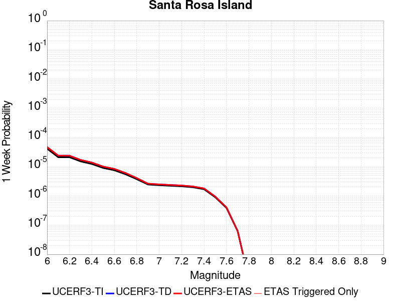 |  |  |  |

| Magnitude | 1 wk TI Prob | 1 wk TD Prob | 1 wk ETAS Prob | 1 wk ETAS/TD Gain | 1 wk ETAS Triggered Only | 1 mo TI Prob | 1 mo TD Prob | 1 mo ETAS Prob | 1 mo ETAS/TD Gain | 1 mo ETAS Triggered Only | 1 yr TI Prob | 1 yr TD Prob | 1 yr ETAS Prob | 1 yr ETAS/TD Gain | 1 yr ETAS Triggered Only | 10 yr TI Prob | 10 yr TD Prob | 10 yr ETAS Prob | 10 yr ETAS/TD Gain | 10 yr ETAS Triggered Only |
|-----|-----|-----|-----|-----|-----|-----|-----|-----|-----|-----|-----|-----|-----|-----|-----|-----|-----|-----|-----|-----|
| 6.0 | 4.1143165E-5 | 4.709095E-5 | 4.709095E-5 | 1.0 | 0.0 | 1.7631594E-4 | 2.0180386E-4 | 2.1180185E-4 | 1.049543 | 1.0E-5 | 0.002144533 | 0.0024543905 | 0.0024743413 | 1.0081286 | 2.0E-5 | 0.021239553 | 0.024293458 | 0.024312971 | 1.0008032 | 2.0E-5 |
| 6.1 | 2.1061249E-5 | 2.3864874E-5 | 2.3864874E-5 | 1.0 | 0.0 | 9.0259375E-5 | 1.02274185E-4 | 1.1227316E-4 | 1.0977664 | 1.0E-5 | 0.0010983539 | 0.0012445059 | 0.001264481 | 1.0160506 | 2.0E-5 | 0.01092941 | 0.012378404 | 0.012398156 | 1.0015957 | 2.0E-5 |
| 6.2 | 2.1061249E-5 | 2.3864874E-5 | 2.3864874E-5 | 1.0 | 0.0 | 9.0259375E-5 | 1.02274185E-4 | 1.1227316E-4 | 1.0977664 | 1.0E-5 | 0.0010983539 | 0.0012445059 | 0.001264481 | 1.0160506 | 2.0E-5 | 0.01092941 | 0.012378404 | 0.012398156 | 1.0015957 | 2.0E-5 |
| 6.3 | 1.5158236E-5 | 1.707436E-5 | 1.707436E-5 | 1.0 | 0.0 | 6.496225E-5 | 7.317385E-5 | 8.3173116E-5 | 1.1366508 | 1.0E-5 | 7.906284E-4 | 8.9053944E-4 | 9.105216E-4 | 1.0224383 | 2.0E-5 | 0.007878214 | 0.008870959 | 0.0088907825 | 1.0022346 | 2.0E-5 |
| 6.4 | 1.2341918E-5 | 1.3852871E-5 | 1.3852871E-5 | 1.0 | 0.0 | 5.2892858E-5 | 5.9368143E-5 | 6.936755E-5 | 1.1684306 | 1.0E-5 | 6.437803E-4 | 7.225755E-4 | 7.425611E-4 | 1.0276588 | 2.0E-5 | 0.006419184 | 0.0072030975 | 0.0072229537 | 1.0027566 | 2.0E-5 |
| 6.5 | 9.061158E-6 | 1.0116999E-5 | 1.0116999E-5 | 1.0 | 0.0 | 3.883296E-5 | 4.335788E-5 | 5.3357446E-5 | 1.2306286 | 1.0E-5 | 4.726887E-4 | 5.277596E-4 | 5.477491E-4 | 1.037876 | 2.0E-5 | 0.004716845 | 0.005265601 | 0.0052854954 | 1.0037782 | 2.0E-5 |
| 6.6 | 7.5461685E-6 | 8.400708E-6 | 8.400708E-6 | 1.0 | 0.0 | 3.2340322E-5 | 3.6002562E-5 | 4.6002202E-5 | 1.277748 | 1.0E-5 | 3.936723E-4 | 4.382473E-4 | 4.5823856E-4 | 1.0456164 | 2.0E-5 | 0.003929756 | 0.0043742605 | 0.0043941727 | 1.0045522 | 2.0E-5 |
| 6.7 | 5.5023775E-6 | 6.087363E-6 | 6.087363E-6 | 1.0 | 0.0 | 2.3581404E-5 | 2.6088457E-5 | 2.6088457E-5 | 1.0 | 0.0 | 2.8706578E-4 | 3.175839E-4 | 3.2758075E-4 | 1.0314777 | 1.0E-5 | 0.0028669522 | 0.0031716223 | 0.0031815907 | 1.003143 | 1.0E-5 |
| 6.8 | 3.7351679E-6 | 4.08313E-6 | 4.08313E-6 | 1.0 | 0.0 | 1.6007763E-5 | 1.7499025E-5 | 1.7499025E-5 | 1.0 | 0.0 | 1.948771E-4 | 2.130323E-4 | 2.2303018E-4 | 1.0469313 | 1.0E-5 | 0.0019470629 | 0.002128526 | 0.0021385048 | 1.0046881 | 1.0E-5 |
| 6.9 | 2.456366E-6 | 2.6292655E-6 | 2.6292655E-6 | 1.0 | 0.0 | 1.0527241E-5 | 1.1268233E-5 | 1.1268233E-5 | 1.0 | 0.0 | 1.2816161E-4 | 1.3718211E-4 | 1.4718075E-4 | 1.0728858 | 1.0E-5 | 0.0012808773 | 0.0013709773 | 0.0013809636 | 1.007284 | 1.0E-5 |
| 7.0 | 2.3245157E-6 | 2.4827737E-6 | 2.4827737E-6 | 1.0 | 0.0 | 9.962172E-6 | 1.0640416E-5 | 1.0640416E-5 | 1.0 | 0.0 | 1.2128269E-4 | 1.2953937E-4 | 1.2953937E-4 | 1.0 | 0.0 | 0.0012121652 | 0.0012946409 | 0.0012946409 | 1.0 | 0.0 |
| 7.1 | 2.2248344E-6 | 2.3732457E-6 | 2.3732457E-6 | 1.0 | 0.0 | 9.53497E-6 | 1.0171014E-5 | 1.0171014E-5 | 1.0 | 0.0 | 1.1608207E-4 | 1.2382507E-4 | 1.2382507E-4 | 1.0 | 0.0 | 0.0011602144 | 0.0012375627 | 0.0012375627 | 1.0 | 0.0 |
| 7.2 | 2.1350402E-6 | 2.2761499E-6 | 2.2761499E-6 | 1.0 | 0.0 | 9.150141E-6 | 9.754892E-6 | 9.754892E-6 | 1.0 | 0.0 | 1.1139726E-4 | 1.1875935E-4 | 1.1875935E-4 | 1.0 | 0.0 | 0.0011134144 | 0.0011869607 | 0.0011869607 | 1.0 | 0.0 |
| 7.3 | 1.9793572E-6 | 2.1087153E-6 | 2.1087153E-6 | 1.0 | 0.0 | 8.482932E-6 | 9.0373205E-6 | 9.0373205E-6 | 1.0 | 0.0 | 1.032748E-4 | 1.1002384E-4 | 1.1002384E-4 | 1.0 | 0.0 | 0.0010322682 | 0.0010996955 | 0.0010996955 | 1.0 | 0.0 |
| 7.4 | 1.6951194E-6 | 1.8045702E-6 | 1.8045702E-6 | 1.0 | 0.0 | 7.264777E-6 | 7.733849E-6 | 7.733849E-6 | 1.0 | 0.0 | 8.844508E-5 | 9.415556E-5 | 9.415556E-5 | 1.0 | 0.0 | 8.840988E-4 | 9.411584E-4 | 9.411584E-4 | 1.0 | 0.0 |
| 7.5 | 8.987207E-7 | 9.5121993E-7 | 9.5121993E-7 | 1.0 | 0.0 | 3.8516546E-6 | 4.0766504E-6 | 4.0766504E-6 | 1.0 | 0.0 | 4.6892885E-5 | 4.96321E-5 | 4.96321E-5 | 1.0 | 0.0 | 4.688299E-4 | 4.9621135E-4 | 4.9621135E-4 | 1.0 | 0.0 |
| 7.6 | 3.8783037E-7 | 4.052927E-7 | 4.052927E-7 | 1.0 | 0.0 | 1.6621291E-6 | 1.7369675E-6 | 1.7369675E-6 | 1.0 | 0.0 | 2.0236233E-5 | 2.1147382E-5 | 2.1147382E-5 | 1.0 | 0.0 | 2.023439E-4 | 2.1145435E-4 | 2.1145435E-4 | 1.0 | 0.0 |
| 7.7 | 6.181804E-8 | 6.339029E-8 | 6.339029E-8 | 1.0 | 0.0 | 2.6493444E-7 | 2.7167263E-7 | 2.7167263E-7 | 1.0 | 0.0 | 3.225572E-6 | 3.3076094E-6 | 3.3076094E-6 | 1.0 | 0.0 | 3.225525E-5 | 3.307561E-5 | 3.307561E-5 | 1.0 | 0.0 |
| 7.8 | 1.3704449E-9 | 1.3964147E-9 | 1.3964147E-9 | 1.0 | 0.0 | 5.873335E-9 | 5.984634E-9 | 5.984634E-9 | 1.0 | 0.0 | 7.1507856E-8 | 7.286292E-8 | 7.286292E-8 | 1.0 | 0.0 | 7.1507833E-7 | 7.28629E-7 | 7.28629E-7 | 1.0 | 0.0 |

## Santa Ynez (West)
*[(top)](#table-of-contents)*

| 1 Week | 1 Month | 1 Year | 10 Year |
|-----|-----|-----|-----|
|  | 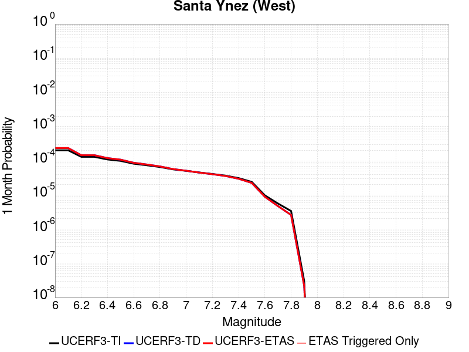 |  |  |

| Magnitude | 1 wk TI Prob | 1 wk TD Prob | 1 wk ETAS Prob | 1 wk ETAS/TD Gain | 1 wk ETAS Triggered Only | 1 mo TI Prob | 1 mo TD Prob | 1 mo ETAS Prob | 1 mo ETAS/TD Gain | 1 mo ETAS Triggered Only | 1 yr TI Prob | 1 yr TD Prob | 1 yr ETAS Prob | 1 yr ETAS/TD Gain | 1 yr ETAS Triggered Only | 10 yr TI Prob | 10 yr TD Prob | 10 yr ETAS Prob | 10 yr ETAS/TD Gain | 10 yr ETAS Triggered Only |
|-----|-----|-----|-----|-----|-----|-----|-----|-----|-----|-----|-----|-----|-----|-----|-----|-----|-----|-----|-----|-----|
| 6.0 | 4.7352758E-5 | 5.497185E-5 | 5.497185E-5 | 1.0 | 0.0 | 2.0292461E-4 | 2.3557404E-4 | 2.3557404E-4 | 1.0 | 0.0 | 0.0024678076 | 0.0028645147 | 0.002874486 | 1.003481 | 1.0E-5 | 0.024405818 | 0.02830428 | 0.028313998 | 1.0003433 | 1.0E-5 |
| 6.1 | 4.7352758E-5 | 5.497185E-5 | 5.497185E-5 | 1.0 | 0.0 | 2.0292461E-4 | 2.3557404E-4 | 2.3557404E-4 | 1.0 | 0.0 | 0.0024678076 | 0.0028645147 | 0.002874486 | 1.003481 | 1.0E-5 | 0.024405818 | 0.02830428 | 0.028313998 | 1.0003433 | 1.0E-5 |
| 6.2 | 3.0415853E-5 | 3.3924975E-5 | 3.3924975E-5 | 1.0 | 0.0 | 1.3034715E-4 | 1.4538487E-4 | 1.4538487E-4 | 1.0 | 0.0 | 0.0015858212 | 0.001768659 | 0.001768659 | 1.0 | 0.0 | 0.015745522 | 0.017549738 | 0.017549738 | 1.0 | 0.0 |
| 6.3 | 3.0415853E-5 | 3.3924975E-5 | 3.3924975E-5 | 1.0 | 0.0 | 1.3034715E-4 | 1.4538487E-4 | 1.4538487E-4 | 1.0 | 0.0 | 0.0015858212 | 0.001768659 | 0.001768659 | 1.0 | 0.0 | 0.015745522 | 0.017549738 | 0.017549738 | 1.0 | 0.0 |
| 6.4 | 2.5452082E-5 | 2.7912321E-5 | 2.7912321E-5 | 1.0 | 0.0 | 1.09075794E-4 | 1.1961886E-4 | 1.1961886E-4 | 1.0 | 0.0 | 0.0013271887 | 0.0014554035 | 0.0014554035 | 1.0 | 0.0 | 0.013192902 | 0.0144609 | 0.0144609 | 1.0 | 0.0 |
| 6.5 | 2.3143784E-5 | 2.512817E-5 | 2.512817E-5 | 1.0 | 0.0 | 9.9183875E-5 | 1.076878E-4 | 1.076878E-4 | 1.0 | 0.0 | 0.0012068948 | 0.0013103223 | 0.0013103223 | 1.0 | 0.0 | 0.012003611 | 0.013027636 | 0.013027636 | 1.0 | 0.0 |
| 6.6 | 1.9118515E-5 | 2.0354279E-5 | 2.0354279E-5 | 1.0 | 0.0 | 8.193392E-5 | 8.722975E-5 | 8.722975E-5 | 1.0 | 0.0 | 9.97089E-4 | 0.0010615127 | 0.0010615127 | 1.0 | 0.0 | 0.00992627 | 0.010565333 | 0.010565333 | 1.0 | 0.0 |
| 6.7 | 1.722807E-5 | 1.8146295E-5 | 1.8146295E-5 | 1.0 | 0.0 | 7.3832496E-5 | 7.776755E-5 | 7.776755E-5 | 1.0 | 0.0 | 8.985399E-4 | 9.4641425E-4 | 9.4641425E-4 | 1.0 | 0.0 | 0.008949154 | 0.009424483 | 0.009424483 | 1.0 | 0.0 |
| 6.8 | 1.5317364E-5 | 1.5926444E-5 | 1.5926444E-5 | 1.0 | 0.0 | 6.56442E-5 | 6.825442E-5 | 6.825442E-5 | 1.0 | 0.0 | 7.98925E-4 | 8.306851E-4 | 8.306851E-4 | 1.0 | 0.0 | 0.007960589 | 0.0082762875 | 0.0082762875 | 1.0 | 0.0 |
| 6.9 | 1.3071226E-5 | 1.3329593E-5 | 1.3329593E-5 | 1.0 | 0.0 | 5.6018336E-5 | 5.7125588E-5 | 5.7125588E-5 | 1.0 | 0.0 | 6.8180985E-4 | 6.9528434E-4 | 6.9528434E-4 | 1.0 | 0.0 | 0.0067972173 | 0.006931351 | 0.006931351 | 1.0 | 0.0 |
| 7.0 | 1.1836986E-5 | 1.1932755E-5 | 1.1932755E-5 | 1.0 | 0.0 | 5.0728955E-5 | 5.113939E-5 | 5.113939E-5 | 1.0 | 0.0 | 6.1745E-4 | 6.2244583E-4 | 6.2244583E-4 | 1.0 | 0.0 | 0.006157372 | 0.0062072175 | 0.0062072175 | 1.0 | 0.0 |
| 7.1 | 1.0597169E-5 | 1.054218E-5 | 1.054218E-5 | 1.0 | 0.0 | 4.541565E-5 | 4.5179993E-5 | 4.5179993E-5 | 1.0 | 0.0 | 5.5279525E-4 | 5.499287E-4 | 5.499287E-4 | 1.0 | 0.0 | 0.0055142213 | 0.00548581 | 0.00548581 | 1.0 | 0.0 |
| 7.2 | 9.59113E-6 | 9.459124E-6 | 9.459124E-6 | 1.0 | 0.0 | 4.11042E-5 | 4.053848E-5 | 4.053848E-5 | 1.0 | 0.0 | 5.0032866E-4 | 4.934453E-4 | 4.934453E-4 | 1.0 | 0.0 | 0.004992037 | 0.004923615 | 0.004923615 | 1.0 | 0.0 |
| 7.3 | 8.586084E-6 | 8.379566E-6 | 8.379566E-6 | 1.0 | 0.0 | 3.679698E-5 | 3.5911937E-5 | 3.5911937E-5 | 1.0 | 0.0 | 4.4791115E-4 | 4.3714116E-4 | 4.3714116E-4 | 1.0 | 0.0 | 0.004470094 | 0.004362924 | 0.004362924 | 1.0 | 0.0 |
| 7.4 | 7.2622997E-6 | 6.9515286E-6 | 6.9515286E-6 | 1.0 | 0.0 | 3.112377E-5 | 2.979193E-5 | 2.979193E-5 | 1.0 | 0.0 | 3.78866E-4 | 3.6265736E-4 | 3.6265736E-4 | 1.0 | 0.0 | 0.0037822074 | 0.0036207556 | 0.0036207556 | 1.0 | 0.0 |
| 7.5 | 5.627296E-6 | 5.2515775E-6 | 5.2515775E-6 | 1.0 | 0.0 | 2.411676E-5 | 2.250657E-5 | 2.250657E-5 | 1.0 | 0.0 | 2.9358198E-4 | 2.7398375E-4 | 2.7398375E-4 | 1.0 | 0.0 | 0.0029319443 | 0.0027365317 | 0.0027365317 | 1.0 | 0.0 |
| 7.6 | 2.265244E-6 | 2.0608593E-6 | 2.0608593E-6 | 1.0 | 0.0 | 9.708152E-6 | 8.832224E-6 | 8.832224E-6 | 1.0 | 0.0 | 1.18190335E-4 | 1.0752711E-4 | 1.0752711E-4 | 1.0 | 0.0 | 0.001181275 | 0.0010747594 | 0.0010747594 | 1.0 | 0.0 |
| 7.7 | 1.3099874E-6 | 1.1016234E-6 | 1.1016234E-6 | 1.0 | 0.0 | 5.61422E-6 | 4.7212347E-6 | 4.7212347E-6 | 1.0 | 0.0 | 6.8350986E-5 | 5.747954E-5 | 5.747954E-5 | 1.0 | 0.0 | 6.832996E-4 | 5.7464914E-4 | 5.7464914E-4 | 1.0 | 0.0 |
| 7.8 | 7.903951E-7 | 6.071132E-7 | 6.071132E-7 | 1.0 | 0.0 | 3.3874032E-6 | 2.601911E-6 | 2.601911E-6 | 1.0 | 0.0 | 4.1240855E-5 | 3.167782E-5 | 3.167782E-5 | 1.0 | 0.0 | 4.12332E-4 | 3.1673437E-4 | 3.1673437E-4 | 1.0 | 0.0 |
| 7.9 | 7.0753297E-9 | 5.0899414E-9 | 5.0899414E-9 | 1.0 | 0.0 | 3.032284E-8 | 2.1814033E-8 | 2.1814033E-8 | 1.0 | 0.0 | 3.6918053E-7 | 2.6558584E-7 | 2.6558584E-7 | 1.0 | 0.0 | 3.691799E-6 | 2.6558562E-6 | 2.6558562E-6 | 1.0 | 0.0 |

## Lake Isabella (Seismicity)
*[(top)](#table-of-contents)*

| 1 Week | 1 Month | 1 Year | 10 Year |
|-----|-----|-----|-----|
|  | 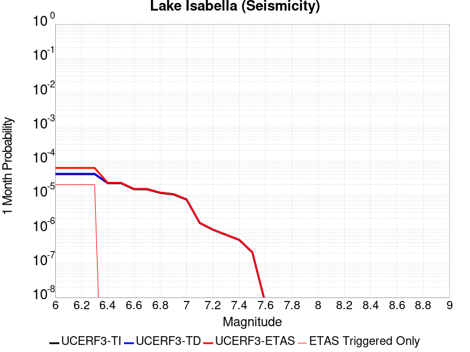 |  |  |

| Magnitude | 1 wk TI Prob | 1 wk TD Prob | 1 wk ETAS Prob | 1 wk ETAS/TD Gain | 1 wk ETAS Triggered Only | 1 mo TI Prob | 1 mo TD Prob | 1 mo ETAS Prob | 1 mo ETAS/TD Gain | 1 mo ETAS Triggered Only | 1 yr TI Prob | 1 yr TD Prob | 1 yr ETAS Prob | 1 yr ETAS/TD Gain | 1 yr ETAS Triggered Only | 10 yr TI Prob | 10 yr TD Prob | 10 yr ETAS Prob | 10 yr ETAS/TD Gain | 10 yr ETAS Triggered Only |
|-----|-----|-----|-----|-----|-----|-----|-----|-----|-----|-----|-----|-----|-----|-----|-----|-----|-----|-----|-----|-----|
| 6.0 | 9.431637E-6 | 9.741643E-6 | 2.9741448E-5 | 3.0530217 | 2.0E-5 | 4.0420677E-5 | 4.1749303E-5 | 6.174847E-5 | 1.4790299 | 2.0E-5 | 4.920106E-4 | 5.081923E-4 | 5.2818214E-4 | 1.0393351 | 2.0E-5 | 0.004909227 | 0.0050715944 | 0.005091493 | 1.0039235 | 2.0E-5 |
| 6.1 | 9.431637E-6 | 9.741643E-6 | 2.9741448E-5 | 3.0530217 | 2.0E-5 | 4.0420677E-5 | 4.1749303E-5 | 6.174847E-5 | 1.4790299 | 2.0E-5 | 4.920106E-4 | 5.081923E-4 | 5.2818214E-4 | 1.0393351 | 2.0E-5 | 0.004909227 | 0.0050715944 | 0.005091493 | 1.0039235 | 2.0E-5 |
| 6.2 | 9.431637E-6 | 9.741643E-6 | 2.9741448E-5 | 3.0530217 | 2.0E-5 | 4.0420677E-5 | 4.1749303E-5 | 6.174847E-5 | 1.4790299 | 2.0E-5 | 4.920106E-4 | 5.081923E-4 | 5.2818214E-4 | 1.0393351 | 2.0E-5 | 0.004909227 | 0.0050715944 | 0.005091493 | 1.0039235 | 2.0E-5 |
| 6.3 | 9.431637E-6 | 9.741643E-6 | 2.9741448E-5 | 3.0530217 | 2.0E-5 | 4.0420677E-5 | 4.1749303E-5 | 6.174847E-5 | 1.4790299 | 2.0E-5 | 4.920106E-4 | 5.081923E-4 | 5.2818214E-4 | 1.0393351 | 2.0E-5 | 0.004909227 | 0.0050715944 | 0.005091493 | 1.0039235 | 2.0E-5 |
| 6.4 | 5.144063E-6 | 5.3000717E-6 | 5.3000717E-6 | 1.0 | 0.0 | 2.2045799E-5 | 2.2714416E-5 | 2.2714416E-5 | 1.0 | 0.0 | 2.6837454E-4 | 2.7651637E-4 | 2.7651637E-4 | 1.0 | 0.0 | 0.0026805066 | 0.0027620634 | 0.0027620634 | 1.0 | 0.0 |
| 6.5 | 5.144063E-6 | 5.3000717E-6 | 5.3000717E-6 | 1.0 | 0.0 | 2.2045799E-5 | 2.2714416E-5 | 2.2714416E-5 | 1.0 | 0.0 | 2.6837454E-4 | 2.7651637E-4 | 2.7651637E-4 | 1.0 | 0.0 | 0.0026805066 | 0.0027620634 | 0.0027620634 | 1.0 | 0.0 |
| 6.6 | 3.4009804E-6 | 3.4987834E-6 | 3.4987834E-6 | 1.0 | 0.0 | 1.4575549E-5 | 1.4994709E-5 | 1.4994709E-5 | 1.0 | 0.0 | 1.7744285E-4 | 1.825469E-4 | 1.825469E-4 | 1.0 | 0.0 | 0.0017730123 | 0.0018241272 | 0.0018241272 | 1.0 | 0.0 |
| 6.7 | 3.3880428E-6 | 3.48565E-6 | 3.48565E-6 | 1.0 | 0.0 | 1.4520103E-5 | 1.4938424E-5 | 1.4938424E-5 | 1.0 | 0.0 | 1.767679E-4 | 1.8186173E-4 | 1.8186173E-4 | 1.0 | 0.0 | 0.0017662736 | 0.0018172868 | 0.0018172868 | 1.0 | 0.0 |
| 6.8 | 2.6582E-6 | 2.733698E-6 | 2.733698E-6 | 1.0 | 0.0 | 1.1392236E-5 | 1.1715804E-5 | 1.1715804E-5 | 1.0 | 0.0 | 1.3869164E-4 | 1.4263192E-4 | 1.4263192E-4 | 1.0 | 0.0 | 0.0013860512 | 0.0014255359 | 0.0014255359 | 1.0 | 0.0 |
| 6.9 | 2.406011E-6 | 2.474327E-6 | 2.474327E-6 | 1.0 | 0.0 | 1.0311434E-5 | 1.0604223E-5 | 1.0604223E-5 | 1.0 | 0.0 | 1.2553448E-4 | 1.2910008E-4 | 1.2910008E-4 | 1.0 | 0.0 | 0.0012546359 | 0.0012903805 | 0.0012903805 | 1.0 | 0.0 |
| 7.0 | 1.6953097E-6 | 1.7429359E-6 | 1.7429359E-6 | 1.0 | 0.0 | 7.265593E-6 | 7.4697095E-6 | 7.4697095E-6 | 1.0 | 0.0 | 8.8455E-5 | 9.0940965E-5 | 9.0940965E-5 | 1.0 | 0.0 | 8.84198E-4 | 9.091403E-4 | 9.091403E-4 | 1.0 | 0.0 |
| 7.1 | 3.5013824E-7 | 3.5714805E-7 | 3.5714805E-7 | 1.0 | 0.0 | 1.5005916E-6 | 1.5306335E-6 | 1.5306335E-6 | 1.0 | 0.0 | 1.826955E-5 | 1.8635306E-5 | 1.8635306E-5 | 1.0 | 0.0 | 1.8268047E-4 | 1.863377E-4 | 1.863377E-4 | 1.0 | 0.0 |
| 7.2 | 2.2321095E-7 | 2.2750562E-7 | 2.2750562E-7 | 1.0 | 0.0 | 9.56618E-7 | 9.750237E-7 | 9.750237E-7 | 1.0 | 0.0 | 1.1646762E-5 | 1.187085E-5 | 1.187085E-5 | 1.0 | 0.0 | 1.1646151E-4 | 1.18702264E-4 | 1.18702264E-4 | 1.0 | 0.0 |
| 7.3 | 1.5760406E-7 | 1.6060915E-7 | 1.6060915E-7 | 1.0 | 0.0 | 6.7544585E-7 | 6.883247E-7 | 6.883247E-7 | 1.0 | 0.0 | 8.223522E-6 | 8.380322E-6 | 8.380322E-6 | 1.0 | 0.0 | 8.2232174E-5 | 8.380012E-5 | 8.380012E-5 | 1.0 | 0.0 |
| 7.4 | 1.1216497E-7 | 1.14317004E-7 | 1.14317004E-7 | 1.0 | 0.0 | 4.8070694E-7 | 4.899299E-7 | 4.899299E-7 | 1.0 | 0.0 | 5.852591E-6 | 5.964881E-6 | 5.964881E-6 | 1.0 | 0.0 | 5.8524372E-5 | 5.9647253E-5 | 5.9647253E-5 | 1.0 | 0.0 |
| 7.5 | 4.885185E-8 | 4.978771E-8 | 4.978771E-8 | 1.0 | 0.0 | 2.0936506E-7 | 2.133759E-7 | 2.133759E-7 | 1.0 | 0.0 | 2.5490165E-6 | 2.5978486E-6 | 2.5978486E-6 | 1.0 | 0.0 | 2.5489873E-5 | 2.5978201E-5 | 2.5978201E-5 | 1.0 | 0.0 |
| 7.6 | 1.504641E-9 | 1.5317896E-9 | 1.5317896E-9 | 1.0 | 0.0 | 6.4484613E-9 | 6.5648122E-9 | 6.5648122E-9 | 1.0 | 0.0 | 7.851001E-8 | 7.992659E-8 | 7.992659E-8 | 1.0 | 0.0 | 7.8509987E-7 | 7.992659E-7 | 7.992659E-7 | 1.0 | 0.0 |

## Lost Hills
*[(top)](#table-of-contents)*

| 1 Week | 1 Month | 1 Year | 10 Year |
|-----|-----|-----|-----|
|  |  |  |  |

| Magnitude | 1 wk TI Prob | 1 wk TD Prob | 1 wk ETAS Prob | 1 wk ETAS/TD Gain | 1 wk ETAS Triggered Only | 1 mo TI Prob | 1 mo TD Prob | 1 mo ETAS Prob | 1 mo ETAS/TD Gain | 1 mo ETAS Triggered Only | 1 yr TI Prob | 1 yr TD Prob | 1 yr ETAS Prob | 1 yr ETAS/TD Gain | 1 yr ETAS Triggered Only | 10 yr TI Prob | 10 yr TD Prob | 10 yr ETAS Prob | 10 yr ETAS/TD Gain | 10 yr ETAS Triggered Only |
|-----|-----|-----|-----|-----|-----|-----|-----|-----|-----|-----|-----|-----|-----|-----|-----|-----|-----|-----|-----|-----|
| 6.0 | 2.233523E-5 | 2.51065E-5 | 3.5106248E-5 | 1.3982933 | 1.0E-5 | 9.571891E-5 | 1.0759579E-4 | 1.1759472E-4 | 1.0929304 | 1.0E-5 | 0.0011647546 | 0.0013093597 | 0.0013293335 | 1.0152546 | 2.0E-5 | 0.011586686 | 0.013033048 | 0.013052788 | 1.0015146 | 2.0E-5 |
| 6.1 | 2.233523E-5 | 2.51065E-5 | 3.5106248E-5 | 1.3982933 | 1.0E-5 | 9.571891E-5 | 1.0759579E-4 | 1.1759472E-4 | 1.0929304 | 1.0E-5 | 0.0011647546 | 0.0013093597 | 0.0013293335 | 1.0152546 | 2.0E-5 | 0.011586686 | 0.013033048 | 0.013052788 | 1.0015146 | 2.0E-5 |
| 6.2 | 2.233523E-5 | 2.51065E-5 | 3.5106248E-5 | 1.3982933 | 1.0E-5 | 9.571891E-5 | 1.0759579E-4 | 1.1759472E-4 | 1.0929304 | 1.0E-5 | 0.0011647546 | 0.0013093597 | 0.0013293335 | 1.0152546 | 2.0E-5 | 0.011586686 | 0.013033048 | 0.013052788 | 1.0015146 | 2.0E-5 |
| 6.3 | 2.233523E-5 | 2.51065E-5 | 3.5106248E-5 | 1.3982933 | 1.0E-5 | 9.571891E-5 | 1.0759579E-4 | 1.1759472E-4 | 1.0929304 | 1.0E-5 | 0.0011647546 | 0.0013093597 | 0.0013293335 | 1.0152546 | 2.0E-5 | 0.011586686 | 0.013033048 | 0.013052788 | 1.0015146 | 2.0E-5 |
| 6.4 | 1.2288092E-5 | 1.3781063E-5 | 2.3780925E-5 | 1.7256235 | 1.0E-5 | 5.2662188E-5 | 5.906089E-5 | 6.90603E-5 | 1.1693068 | 1.0E-5 | 6.409735E-4 | 7.189229E-4 | 7.3890854E-4 | 1.0277994 | 2.0E-5 | 0.006391279 | 0.0071751773 | 0.007195034 | 1.0027674 | 2.0E-5 |
| 6.5 | 1.2288092E-5 | 1.3781063E-5 | 2.3780925E-5 | 1.7256235 | 1.0E-5 | 5.2662188E-5 | 5.906089E-5 | 6.90603E-5 | 1.1693068 | 1.0E-5 | 6.409735E-4 | 7.189229E-4 | 7.3890854E-4 | 1.0277994 | 2.0E-5 | 0.006391279 | 0.0071751773 | 0.007195034 | 1.0027674 | 2.0E-5 |
| 6.6 | 8.58281E-6 | 9.633739E-6 | 1.9633642E-5 | 2.0380087 | 1.0E-5 | 3.6782953E-5 | 4.1287265E-5 | 5.1286854E-5 | 1.2421955 | 1.0E-5 | 4.4774043E-4 | 5.0263974E-4 | 5.126347E-4 | 1.019885 | 1.0E-5 | 0.0044683935 | 0.005023189 | 0.0050331387 | 1.0019808 | 1.0E-5 |
| 6.7 | 7.205685E-6 | 8.0882755E-6 | 1.8088194E-5 | 2.2363474 | 1.0E-5 | 3.088114E-5 | 3.4664037E-5 | 4.466369E-5 | 1.2884734 | 1.0E-5 | 3.7591302E-4 | 4.2203465E-4 | 4.3203044E-4 | 1.0236847 | 1.0E-5 | 0.0037527776 | 0.0042203465 | 0.004230304 | 1.0023595 | 1.0E-5 |

## San Andreas (Creeping Section) 2011 CFM
*[(top)](#table-of-contents)*

| 1 Week | 1 Month | 1 Year | 10 Year |
|-----|-----|-----|-----|
|  |  |  |  |

| Magnitude | 1 wk TI Prob | 1 wk TD Prob | 1 wk ETAS Prob | 1 wk ETAS/TD Gain | 1 wk ETAS Triggered Only | 1 mo TI Prob | 1 mo TD Prob | 1 mo ETAS Prob | 1 mo ETAS/TD Gain | 1 mo ETAS Triggered Only | 1 yr TI Prob | 1 yr TD Prob | 1 yr ETAS Prob | 1 yr ETAS/TD Gain | 1 yr ETAS Triggered Only | 10 yr TI Prob | 10 yr TD Prob | 10 yr ETAS Prob | 10 yr ETAS/TD Gain | 10 yr ETAS Triggered Only |
|-----|-----|-----|-----|-----|-----|-----|-----|-----|-----|-----|-----|-----|-----|-----|-----|-----|-----|-----|-----|-----|
| 6.0 | 5.986481E-4 | 0.0012286972 | 0.001238685 | 1.0081286 | 1.0E-5 | 0.0025631124 | 0.00524696 | 0.0052569075 | 1.0018959 | 1.0E-5 | 0.030762846 | 0.061202604 | 0.06122138 | 1.0003067 | 2.0E-5 | 0.26835477 | 0.42592302 | 0.4259345 | 1.000027 | 2.0E-5 |
| 6.1 | 5.015945E-4 | 0.0010229645 | 0.0010329542 | 1.0097655 | 1.0E-5 | 0.00214792 | 0.004369588 | 0.0043795444 | 1.0022786 | 1.0E-5 | 0.025839351 | 0.051246066 | 0.05126504 | 1.0003703 | 2.0E-5 | 0.23032776 | 0.37284485 | 0.3728574 | 1.0000336 | 2.0E-5 |
| 6.2 | 4.073338E-4 | 8.115361E-4 | 8.2152797E-4 | 1.0123123 | 1.0E-5 | 0.0017445484 | 0.003468385 | 0.0034783504 | 1.0028732 | 1.0E-5 | 0.021034058 | 0.040931217 | 0.040940806 | 1.0002344 | 1.0E-5 | 0.19150782 | 0.31302088 | 0.31302777 | 1.0000219 | 1.0E-5 |
| 6.3 | 3.464099E-4 | 6.745419E-4 | 6.845352E-4 | 1.0148149 | 1.0E-5 | 0.0014837692 | 0.002883343 | 0.0028933142 | 1.0034581 | 1.0E-5 | 0.017915873 | 0.034187317 | 0.034196973 | 1.0002825 | 1.0E-5 | 0.16538359 | 0.2713031 | 0.27131036 | 1.0000268 | 1.0E-5 |
| 6.4 | 2.935057E-4 | 5.551342E-4 | 5.6512863E-4 | 1.0180037 | 1.0E-5 | 0.0012572751 | 0.002372886 | 0.0023828624 | 1.0042043 | 1.0E-5 | 0.015200248 | 0.028262215 | 0.028271932 | 1.0003438 | 1.0E-5 | 0.14201577 | 0.23297104 | 0.23297872 | 1.0000329 | 1.0E-5 |
| 6.5 | 2.3409708E-4 | 4.2130658E-4 | 4.3130235E-4 | 1.0237256 | 1.0E-5 | 0.0010028875 | 0.0018018549 | 0.001811837 | 1.0055399 | 1.0E-5 | 0.012141965 | 0.021585694 | 0.021595476 | 1.0004532 | 1.0E-5 | 0.11499573 | 0.18680891 | 0.18681705 | 1.0000435 | 1.0E-5 |
| 6.6 | 1.5842178E-4 | 2.5067228E-4 | 2.6066977E-4 | 1.0398828 | 1.0E-5 | 6.7877385E-4 | 0.0010738597 | 0.001083849 | 1.0093023 | 1.0E-5 | 0.0082328 | 0.012994494 | 0.013004364 | 1.0007596 | 1.0E-5 | 0.07934396 | 0.1231311 | 0.12313986 | 1.0000712 | 1.0E-5 |
| 6.7 | 1.5616413E-4 | 2.4603796E-4 | 2.560355E-4 | 1.0406342 | 1.0E-5 | 6.691031E-4 | 0.0010540152 | 0.0010640047 | 1.0094775 | 1.0E-5 | 0.0081159435 | 0.012756367 | 0.012766239 | 1.0007739 | 1.0E-5 | 0.0782586 | 0.12115822 | 0.121167004 | 1.0000725 | 1.0E-5 |
| 6.8 | 1.5538467E-4 | 2.442769E-4 | 2.5427446E-4 | 1.0409272 | 1.0E-5 | 6.6576427E-4 | 0.0010464739 | 0.0010564635 | 1.0095459 | 1.0E-5 | 0.008075596 | 0.012665753 | 0.012675626 | 1.0007795 | 1.0E-5 | 0.07788358 | 0.12038911 | 0.12039791 | 1.0000731 | 1.0E-5 |
| 6.9 | 1.5153569E-4 | 2.3536953E-4 | 2.4536718E-4 | 1.0424764 | 1.0E-5 | 6.49277E-4 | 0.0010083386 | 0.0010183286 | 1.0099072 | 1.0E-5 | 0.007876333 | 0.012207948 | 0.012217826 | 1.0008092 | 1.0E-5 | 0.07602952 | 0.11645927 | 0.11646811 | 1.0000758 | 1.0E-5 |
| 7.0 | 1.4588932E-4 | 2.239424E-4 | 2.3394015E-4 | 1.0446444 | 1.0E-5 | 6.250901E-4 | 9.594021E-4 | 9.693925E-4 | 1.0104132 | 1.0E-5 | 0.0075839474 | 0.011618658 | 0.011628542 | 1.0008507 | 1.0E-5 | 0.073302895 | 0.11130563 | 0.11131452 | 1.0000799 | 1.0E-5 |
| 7.1 | 1.1565079E-4 | 1.6279978E-4 | 1.7279816E-4 | 1.0614152 | 1.0E-5 | 4.955521E-4 | 6.9752766E-4 | 7.075207E-4 | 1.0143263 | 1.0E-5 | 0.006016669 | 0.008459533 | 0.008469448 | 1.0011721 | 1.0E-5 | 0.058563538 | 0.08365876 | 0.08366793 | 1.0001096 | 1.0E-5 |
| 7.2 | 1.0393792E-4 | 1.4614112E-4 | 1.5613966E-4 | 1.068417 | 1.0E-5 | 4.4537216E-4 | 6.261695E-4 | 6.361633E-4 | 1.0159601 | 1.0E-5 | 0.005408933 | 0.007597135 | 0.007607059 | 1.0013063 | 1.0E-5 | 0.052791595 | 0.075609244 | 0.07561849 | 1.0001223 | 1.0E-5 |
| 7.3 | 9.332884E-5 | 1.277942E-4 | 1.3779293E-4 | 1.0782408 | 1.0E-5 | 3.999194E-4 | 5.475752E-4 | 5.5756967E-4 | 1.0182524 | 1.0E-5 | 0.0048581534 | 0.006646483 | 0.0066564167 | 1.0014945 | 1.0E-5 | 0.047533102 | 0.06647413 | 0.06648347 | 1.0001404 | 1.0E-5 |
| 7.4 | 8.670252E-5 | 1.1701832E-4 | 1.2701715E-4 | 1.0854467 | 1.0E-5 | 3.715293E-4 | 5.0141127E-4 | 5.114063E-4 | 1.0199337 | 1.0E-5 | 0.004513991 | 0.0060877153 | 0.0060976543 | 1.0016327 | 1.0E-5 | 0.044233937 | 0.061143413 | 0.0611528 | 1.0001535 | 1.0E-5 |
| 7.5 | 7.3036405E-5 | 9.004733E-5 | 1.0004643E-4 | 1.1110427 | 1.0E-5 | 3.129756E-4 | 3.8586016E-4 | 3.958563E-4 | 1.0259061 | 1.0E-5 | 0.0038038217 | 0.0046877493 | 0.0046977024 | 1.0021232 | 1.0E-5 | 0.03739367 | 0.047871016 | 0.047880538 | 1.0001988 | 1.0E-5 |
| 7.6 | 6.3935775E-5 | 8.279309E-5 | 9.279227E-5 | 1.1207731 | 1.0E-5 | 2.7398168E-4 | 3.5477936E-4 | 3.6477583E-4 | 1.0281765 | 1.0E-5 | 0.0033306254 | 0.0043109027 | 0.0043208594 | 1.0023097 | 1.0E-5 | 0.032811474 | 0.04398585 | 0.04399541 | 1.0002173 | 1.0E-5 |
| 7.7 | 5.5050095E-5 | 6.66093E-5 | 7.660863E-5 | 1.1501192 | 1.0E-5 | 2.3590765E-4 | 2.854372E-4 | 2.9543435E-4 | 1.0350239 | 1.0E-5 | 0.0028683927 | 0.0034696644 | 0.0034796298 | 1.0028721 | 1.0E-5 | 0.0283165 | 0.035791222 | 0.035800863 | 1.0002694 | 1.0E-5 |
| 7.8 | 5.027131E-5 | 6.1620405E-5 | 6.1620405E-5 | 1.0 | 0.0 | 2.1543067E-4 | 2.640607E-4 | 2.640607E-4 | 1.0 | 0.0 | 0.0026197135 | 0.0032102033 | 0.0032102033 | 1.0 | 0.0 | 0.025890453 | 0.03312217 | 0.03312217 | 1.0 | 0.0 |
| 7.9 | 3.7271806E-5 | 5.0218474E-5 | 5.0218474E-5 | 1.0 | 0.0 | 1.5972654E-4 | 2.1520429E-4 | 2.1520429E-4 | 1.0 | 0.0 | 0.0019429359 | 0.002616966 | 0.002616966 | 1.0 | 0.0 | 0.019260362 | 0.027063787 | 0.027063787 | 1.0 | 0.0 |
| 8.0 | 2.7310243E-5 | 3.1424468E-5 | 3.1424468E-5 | 1.0 | 0.0 | 1.17038646E-4 | 1.3466935E-4 | 1.3466935E-4 | 1.0 | 0.0 | 0.0014240141 | 0.0016383671 | 0.0016383671 | 1.0 | 0.0 | 0.014149235 | 0.017211871 | 0.017211871 | 1.0 | 0.0 |
| 8.1 | 1.7940547E-5 | 1.7398293E-5 | 1.7398293E-5 | 1.0 | 0.0 | 7.688579E-5 | 7.456199E-5 | 7.456199E-5 | 1.0 | 0.0 | 9.3568244E-4 | 9.074147E-4 | 9.074147E-4 | 1.0 | 0.0 | 0.009317525 | 0.009797759 | 0.009797759 | 1.0 | 0.0 |
| 8.2 | 8.643924E-6 | 5.4738607E-6 | 5.4738607E-6 | 1.0 | 0.0 | 3.704486E-5 | 2.3459192E-5 | 2.3459192E-5 | 1.0 | 0.0 | 4.5092785E-4 | 2.855783E-4 | 2.855783E-4 | 1.0 | 0.0 | 0.0045001395 | 0.0032481598 | 0.0032481598 | 1.0 | 0.0 |
| 8.3 | 1.983087E-6 | 7.658221E-7 | 7.658221E-7 | 1.0 | 0.0 | 8.498917E-6 | 3.2820906E-6 | 3.2820906E-6 | 1.0 | 0.0 | 1.034694E-4 | 3.9958737E-5 | 3.9958737E-5 | 1.0 | 0.0 | 0.0010342124 | 4.7187202E-4 | 4.7187202E-4 | 1.0 | 0.0 |

## San Diego Trough south
*[(top)](#table-of-contents)*

| 1 Week | 1 Month | 1 Year | 10 Year |
|-----|-----|-----|-----|
| 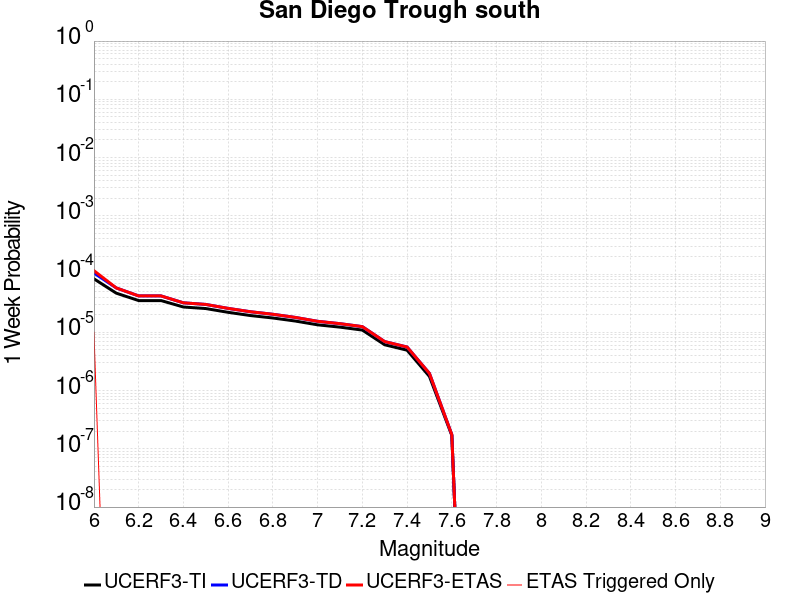 | 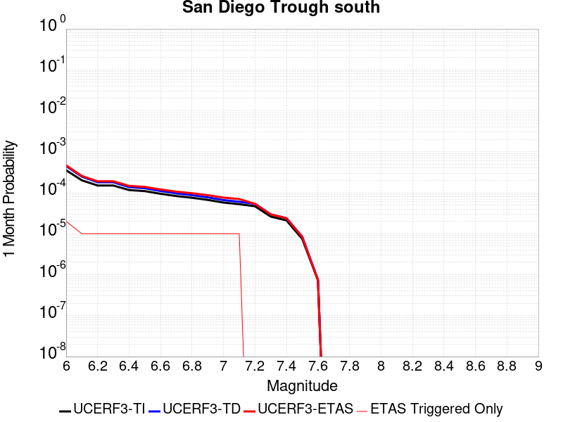 |  | 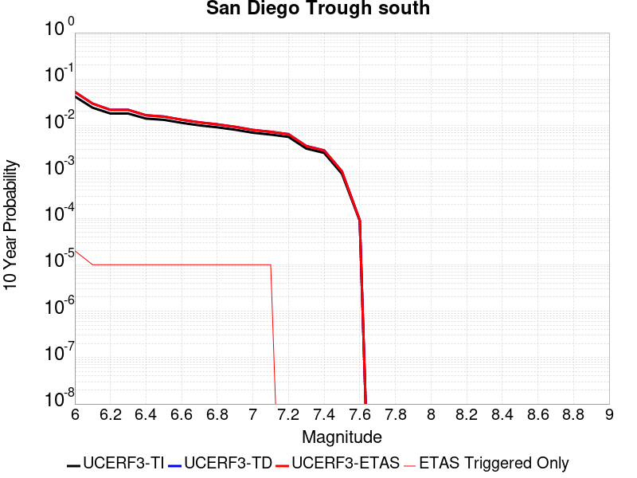 |

| Magnitude | 1 wk TI Prob | 1 wk TD Prob | 1 wk ETAS Prob | 1 wk ETAS/TD Gain | 1 wk ETAS Triggered Only | 1 mo TI Prob | 1 mo TD Prob | 1 mo ETAS Prob | 1 mo ETAS/TD Gain | 1 mo ETAS Triggered Only | 1 yr TI Prob | 1 yr TD Prob | 1 yr ETAS Prob | 1 yr ETAS/TD Gain | 1 yr ETAS Triggered Only | 10 yr TI Prob | 10 yr TD Prob | 10 yr ETAS Prob | 10 yr ETAS/TD Gain | 10 yr ETAS Triggered Only |
|-----|-----|-----|-----|-----|-----|-----|-----|-----|-----|-----|-----|-----|-----|-----|-----|-----|-----|-----|-----|-----|
| 6.0 | 8.279495E-5 | 1.04240564E-4 | 1.1423952E-4 | 1.095922 | 1.0E-5 | 3.5478722E-4 | 4.4667354E-4 | 4.666646E-4 | 1.0447555 | 2.0E-5 | 0.004310982 | 0.0054255757 | 0.0054454673 | 1.0036663 | 2.0E-5 | 0.042283054 | 0.052991867 | 0.053010806 | 1.0003574 | 2.0E-5 |
| 6.1 | 4.6961468E-5 | 5.7729074E-5 | 5.7729074E-5 | 1.0 | 0.0 | 2.0124791E-4 | 2.4738783E-4 | 2.5738537E-4 | 1.0404123 | 1.0E-5 | 0.00244744 | 0.0030079577 | 0.0030179275 | 1.0033145 | 1.0E-5 | 0.024206603 | 0.029679285 | 0.02968899 | 1.000327 | 1.0E-5 |
| 6.2 | 3.5079658E-5 | 4.2141306E-5 | 4.2141306E-5 | 1.0 | 0.0 | 1.5033272E-4 | 1.8059336E-4 | 1.9059156E-4 | 1.055363 | 1.0E-5 | 0.0018287642 | 0.002196551 | 0.002206529 | 1.0045426 | 1.0E-5 | 0.018137876 | 0.021751001 | 0.021760784 | 1.0004498 | 1.0E-5 |
| 6.3 | 3.5079658E-5 | 4.2141306E-5 | 4.2141306E-5 | 1.0 | 0.0 | 1.5033272E-4 | 1.8059336E-4 | 1.9059156E-4 | 1.055363 | 1.0E-5 | 0.0018287642 | 0.002196551 | 0.002206529 | 1.0045426 | 1.0E-5 | 0.018137876 | 0.021751001 | 0.021760784 | 1.0004498 | 1.0E-5 |
| 6.4 | 2.7196904E-5 | 3.208701E-5 | 3.208701E-5 | 1.0 | 0.0 | 1.16552954E-4 | 1.375086E-4 | 1.4750722E-4 | 1.0727128 | 1.0E-5 | 0.0014181085 | 0.0016728961 | 0.0016828793 | 1.0059676 | 1.0E-5 | 0.014090929 | 0.016604563 | 0.016614398 | 1.0005922 | 1.0E-5 |
| 6.5 | 2.5584688E-5 | 3.0101497E-5 | 3.0101497E-5 | 1.0 | 0.0 | 1.0964406E-4 | 1.2900012E-4 | 1.3899883E-4 | 1.0775093 | 1.0E-5 | 0.0013340989 | 0.001569458 | 0.0015794424 | 1.0063616 | 1.0E-5 | 0.013261181 | 0.015585241 | 0.015595085 | 1.0006317 | 1.0E-5 |
| 6.6 | 2.2034688E-5 | 2.5742622E-5 | 2.5742622E-5 | 1.0 | 0.0 | 9.443096E-5 | 1.1032091E-4 | 1.20319804E-4 | 1.0906347 | 1.0E-5 | 0.0011490905 | 0.0013423363 | 0.0013523229 | 1.0074397 | 1.0E-5 | 0.011431668 | 0.013343258 | 0.013353124 | 1.0007395 | 1.0E-5 |
| 6.7 | 1.9394853E-5 | 2.2541662E-5 | 2.2541662E-5 | 1.0 | 0.0 | 8.311815E-5 | 9.660358E-5 | 1.0660261E-4 | 1.1035058 | 1.0E-5 | 0.0010114936 | 0.0011755192 | 0.0011855074 | 1.0084969 | 1.0E-5 | 0.01006902 | 0.011693715 | 0.011703598 | 1.0008452 | 1.0E-5 |
| 6.8 | 1.7615313E-5 | 2.0403097E-5 | 2.0403097E-5 | 1.0 | 0.0 | 7.549201E-5 | 8.743893E-5 | 9.743806E-5 | 1.1143556 | 1.0E-5 | 9.1872766E-4 | 0.0010640534 | 0.0010740428 | 1.009388 | 1.0E-5 | 0.009149387 | 0.010590154 | 0.010600047 | 1.0009342 | 1.0E-5 |
| 6.9 | 1.5621423E-5 | 1.802604E-5 | 1.802604E-5 | 1.0 | 0.0 | 6.6947236E-5 | 7.725219E-5 | 8.725142E-5 | 1.1294361 | 1.0E-5 | 8.147778E-4 | 9.4014313E-4 | 9.501337E-4 | 1.0106267 | 1.0E-5 | 0.008117969 | 0.009362103 | 0.00937201 | 1.0010581 | 1.0E-5 |
| 7.0 | 1.3444376E-5 | 1.5448028E-5 | 1.5448028E-5 | 1.0 | 0.0 | 5.7617483E-5 | 6.6204164E-5 | 7.6203505E-5 | 1.1510379 | 1.0E-5 | 7.0126704E-4 | 8.057404E-4 | 8.1573235E-4 | 1.012401 | 1.0E-5 | 0.006990582 | 0.008028523 | 0.008038443 | 1.0012356 | 1.0E-5 |
| 7.1 | 1.2268361E-5 | 1.4072974E-5 | 1.4072974E-5 | 1.0 | 0.0 | 5.2577634E-5 | 6.031137E-5 | 7.0310765E-5 | 1.1657962 | 1.0E-5 | 6.399447E-4 | 7.3404616E-4 | 7.4403884E-4 | 1.0136131 | 1.0E-5 | 0.0063810493 | 0.0073165204 | 0.0073264474 | 1.0013567 | 1.0E-5 |
| 7.2 | 1.0922655E-5 | 1.2513514E-5 | 1.2513514E-5 | 1.0 | 0.0 | 4.681054E-5 | 5.3628257E-5 | 5.3628257E-5 | 1.0 | 0.0 | 5.697693E-4 | 6.52731E-4 | 6.52731E-4 | 1.0 | 0.0 | 0.0056831064 | 0.0065084184 | 0.0065084184 | 1.0 | 0.0 |
| 7.3 | 6.1106753E-6 | 6.9289E-6 | 6.9289E-6 | 1.0 | 0.0 | 2.6188345E-5 | 2.969495E-5 | 2.969495E-5 | 1.0 | 0.0 | 3.1879646E-4 | 3.6147644E-4 | 3.6147644E-4 | 1.0 | 0.0 | 0.0031833951 | 0.00360893 | 0.00360893 | 1.0 | 0.0 |
| 7.4 | 4.933187E-6 | 5.5895325E-6 | 5.5895325E-6 | 1.0 | 0.0 | 2.114206E-5 | 2.3954923E-5 | 2.3954923E-5 | 1.0 | 0.0 | 2.5737417E-4 | 2.9161252E-4 | 2.9161252E-4 | 1.0 | 0.0 | 0.002570763 | 0.00291234 | 0.00291234 | 1.0 | 0.0 |
| 7.5 | 1.7489613E-6 | 1.969671E-6 | 1.969671E-6 | 1.0 | 0.0 | 7.495527E-6 | 8.441422E-6 | 8.441422E-6 | 1.0 | 0.0 | 9.125422E-5 | 1.02769685E-4 | 1.02769685E-4 | 1.0 | 0.0 | 9.1216754E-4 | 0.0010272437 | 0.0010272437 | 1.0 | 0.0 |
| 7.6 | 1.6988751E-7 | 1.7533809E-7 | 1.7533809E-7 | 1.0 | 0.0 | 7.2808916E-7 | 7.5144874E-7 | 7.5144874E-7 | 1.0 | 0.0 | 8.864449E-6 | 9.148852E-6 | 9.148852E-6 | 1.0 | 0.0 | 8.8640954E-5 | 9.148495E-5 | 9.148495E-5 | 1.0 | 0.0 |

## Great Valley 07 (Orestimba)
*[(top)](#table-of-contents)*

| 1 Week | 1 Month | 1 Year | 10 Year |
|-----|-----|-----|-----|
|  |  |  |  |

| Magnitude | 1 wk TI Prob | 1 wk TD Prob | 1 wk ETAS Prob | 1 wk ETAS/TD Gain | 1 wk ETAS Triggered Only | 1 mo TI Prob | 1 mo TD Prob | 1 mo ETAS Prob | 1 mo ETAS/TD Gain | 1 mo ETAS Triggered Only | 1 yr TI Prob | 1 yr TD Prob | 1 yr ETAS Prob | 1 yr ETAS/TD Gain | 1 yr ETAS Triggered Only | 10 yr TI Prob | 10 yr TD Prob | 10 yr ETAS Prob | 10 yr ETAS/TD Gain | 10 yr ETAS Triggered Only |
|-----|-----|-----|-----|-----|-----|-----|-----|-----|-----|-----|-----|-----|-----|-----|-----|-----|-----|-----|-----|-----|
| 6.0 | 2.9687902E-5 | 3.275741E-5 | 3.275741E-5 | 1.0 | 0.0 | 1.2722766E-4 | 1.4038174E-4 | 1.5038034E-4 | 1.0712243 | 1.0E-5 | 0.0015478961 | 0.0017078797 | 0.0017278455 | 1.0116904 | 2.0E-5 | 0.015371585 | 0.016955089 | 0.01697475 | 1.0011595 | 2.0E-5 |
| 6.1 | 2.9687902E-5 | 3.275741E-5 | 3.275741E-5 | 1.0 | 0.0 | 1.2722766E-4 | 1.4038174E-4 | 1.5038034E-4 | 1.0712243 | 1.0E-5 | 0.0015478961 | 0.0017078797 | 0.0017278455 | 1.0116904 | 2.0E-5 | 0.015371585 | 0.016955089 | 0.01697475 | 1.0011595 | 2.0E-5 |
| 6.2 | 1.9231524E-5 | 2.1159109E-5 | 2.1159109E-5 | 1.0 | 0.0 | 8.2418206E-5 | 9.067888E-5 | 1.0067797E-4 | 1.1102693 | 1.0E-5 | 0.0010029797 | 0.0011034793 | 0.0011234572 | 1.0181044 | 2.0E-5 | 0.00998465 | 0.010982411 | 0.011002191 | 1.0018011 | 2.0E-5 |
| 6.3 | 1.324766E-5 | 1.45484955E-5 | 1.45484955E-5 | 1.0 | 0.0 | 5.6774446E-5 | 6.234925E-5 | 7.234863E-5 | 1.1603768 | 1.0E-5 | 6.910097E-4 | 7.58847E-4 | 7.788318E-4 | 1.0263357 | 2.0E-5 | 0.006888649 | 0.007563504 | 0.0075833527 | 1.0026243 | 2.0E-5 |
| 6.4 | 7.818645E-6 | 8.572818E-6 | 8.572818E-6 | 1.0 | 0.0 | 3.3508048E-5 | 3.674015E-5 | 3.674015E-5 | 1.0 | 0.0 | 4.078841E-4 | 4.4722288E-4 | 4.572184E-4 | 1.0223502 | 1.0E-5 | 0.004071363 | 0.0044635693 | 0.0044735246 | 1.0022304 | 1.0E-5 |
| 6.5 | 5.3076565E-6 | 5.8177857E-6 | 5.8177857E-6 | 1.0 | 0.0 | 2.27469E-5 | 2.4933142E-5 | 2.4933142E-5 | 1.0 | 0.0 | 2.7690834E-4 | 3.0352082E-4 | 3.1351778E-4 | 1.0329367 | 1.0E-5 | 0.0027656353 | 0.0030312722 | 0.0030412418 | 1.003289 | 1.0E-5 |
| 6.6 | 3.6003578E-6 | 3.9484853E-6 | 3.9484853E-6 | 1.0 | 0.0 | 1.5430012E-5 | 1.6921978E-5 | 1.6921978E-5 | 1.0 | 0.0 | 1.8784421E-4 | 2.0600717E-4 | 2.1600511E-4 | 1.048532 | 1.0E-5 | 0.0018768552 | 0.002058316 | 0.0020682956 | 1.0048484 | 1.0E-5 |
| 6.7 | 2.5361826E-6 | 2.7834608E-6 | 2.7834608E-6 | 1.0 | 0.0 | 1.0869308E-5 | 1.192907E-5 | 1.192907E-5 | 1.0 | 0.0 | 1.3232579E-4 | 1.4522807E-4 | 1.5522662E-4 | 1.0688472 | 1.0E-5 | 0.0013224703 | 0.0014514616 | 0.0014614471 | 1.0068796 | 1.0E-5 |
| 6.8 | 1.2115831E-6 | 1.3313763E-6 | 1.3313763E-6 | 1.0 | 0.0 | 5.1924885E-6 | 5.7058915E-6 | 5.7058915E-6 | 1.0 | 0.0 | 6.3216714E-5 | 6.9467984E-5 | 6.9467984E-5 | 1.0 | 0.0 | 6.3198735E-4 | 6.945578E-4 | 6.945578E-4 | 1.0 | 0.0 |

## San Jacinto (Superstition Mtn)
*[(top)](#table-of-contents)*

| 1 Week | 1 Month | 1 Year | 10 Year |
|-----|-----|-----|-----|
| 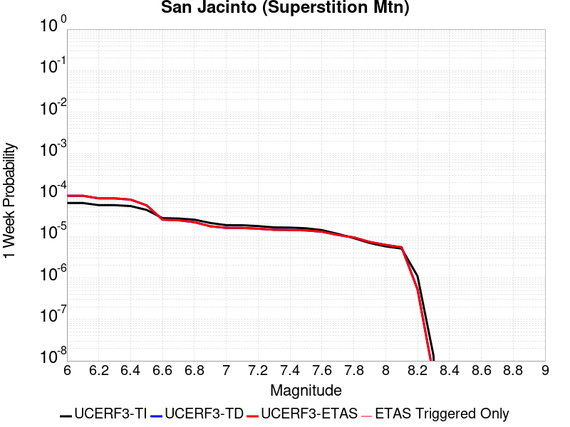 |  |  |  |

| Magnitude | 1 wk TI Prob | 1 wk TD Prob | 1 wk ETAS Prob | 1 wk ETAS/TD Gain | 1 wk ETAS Triggered Only | 1 mo TI Prob | 1 mo TD Prob | 1 mo ETAS Prob | 1 mo ETAS/TD Gain | 1 mo ETAS Triggered Only | 1 yr TI Prob | 1 yr TD Prob | 1 yr ETAS Prob | 1 yr ETAS/TD Gain | 1 yr ETAS Triggered Only | 10 yr TI Prob | 10 yr TD Prob | 10 yr ETAS Prob | 10 yr ETAS/TD Gain | 10 yr ETAS Triggered Only |
|-----|-----|-----|-----|-----|-----|-----|-----|-----|-----|-----|-----|-----|-----|-----|-----|-----|-----|-----|-----|-----|
| 6.0 | 6.4193904E-5 | 9.59922E-5 | 9.59922E-5 | 1.0 | 0.0 | 2.7508775E-4 | 4.1134006E-4 | 4.2133595E-4 | 1.0243008 | 1.0E-5 | 0.0033440501 | 0.0049980166 | 0.0050179167 | 1.0039816 | 2.0E-5 | 0.03294174 | 0.048823282 | 0.048842307 | 1.0003897 | 2.0E-5 |
| 6.1 | 6.4193904E-5 | 9.59922E-5 | 9.59922E-5 | 1.0 | 0.0 | 2.7508775E-4 | 4.1134006E-4 | 4.2133595E-4 | 1.0243008 | 1.0E-5 | 0.0033440501 | 0.0049980166 | 0.0050179167 | 1.0039816 | 2.0E-5 | 0.03294174 | 0.048823282 | 0.048842307 | 1.0003897 | 2.0E-5 |
| 6.2 | 5.7023593E-5 | 8.31431E-5 | 8.31431E-5 | 1.0 | 0.0 | 2.4436394E-4 | 3.5628834E-4 | 3.6628477E-4 | 1.0280571 | 1.0E-5 | 0.002971072 | 0.004330826 | 0.004350739 | 1.004598 | 2.0E-5 | 0.029316625 | 0.042503368 | 0.042522516 | 1.0004505 | 2.0E-5 |
| 6.3 | 5.6940098E-5 | 8.298847E-5 | 8.298847E-5 | 1.0 | 0.0 | 2.4400617E-4 | 3.556258E-4 | 3.6562223E-4 | 1.0281094 | 1.0E-5 | 0.002966728 | 0.0043227915 | 0.004342705 | 1.0046066 | 2.0E-5 | 0.029274331 | 0.04242662 | 0.04244577 | 1.0004514 | 2.0E-5 |
| 6.4 | 5.4171585E-5 | 7.7482255E-5 | 7.7482255E-5 | 1.0 | 0.0 | 2.3214328E-4 | 3.3203384E-4 | 3.4203051E-4 | 1.0301074 | 1.0E-5 | 0.0028226813 | 0.0040366673 | 0.0040565864 | 1.0049345 | 2.0E-5 | 0.02787096 | 0.039715875 | 0.03973508 | 1.0004836 | 2.0E-5 |
| 6.5 | 4.375144E-5 | 5.642006E-5 | 5.642006E-5 | 1.0 | 0.0 | 1.874927E-4 | 2.4178448E-4 | 2.5178207E-4 | 1.0413492 | 1.0E-5 | 0.0022803338 | 0.0029409279 | 0.002960869 | 1.0067806 | 2.0E-5 | 0.022570757 | 0.029236156 | 0.02925557 | 1.0006641 | 2.0E-5 |
| 6.6 | 2.772192E-5 | 2.548715E-5 | 2.548715E-5 | 1.0 | 0.0 | 1.1880282E-4 | 1.0922618E-4 | 1.1922509E-4 | 1.0915432 | 1.0E-5 | 0.0014454646 | 0.0013290369 | 0.0013490103 | 1.0150285 | 2.0E-5 | 0.014360986 | 0.013539865 | 0.013559594 | 1.0014571 | 2.0E-5 |
| 6.7 | 2.7124124E-5 | 2.4698185E-5 | 2.4698185E-5 | 1.0 | 0.0 | 1.1624106E-4 | 1.0584518E-4 | 1.1584412E-4 | 1.0944676 | 1.0E-5 | 0.0014143161 | 0.0012879225 | 0.0013078967 | 1.0155089 | 2.0E-5 | 0.014053487 | 0.01313332 | 0.013153058 | 1.0015029 | 2.0E-5 |
| 6.8 | 2.5475807E-5 | 2.2163289E-5 | 2.2163289E-5 | 1.0 | 0.0 | 1.0917746E-4 | 9.498213E-5 | 1.0498118E-4 | 1.105273 | 1.0E-5 | 0.001328425 | 0.0011558059 | 0.0011757829 | 1.0172839 | 2.0E-5 | 0.0132051185 | 0.011821573 | 0.011841336 | 1.0016718 | 2.0E-5 |
| 6.9 | 2.1162023E-5 | 1.7625163E-5 | 1.7625163E-5 | 1.0 | 0.0 | 9.069123E-5 | 7.553425E-5 | 7.553425E-5 | 1.0 | 0.0 | 0.0011036064 | 9.1924524E-4 | 9.2923606E-4 | 1.0108685 | 1.0E-5 | 0.010981417 | 0.0094463155 | 0.009456221 | 1.0010486 | 1.0E-5 |
| 7.0 | 1.8754288E-5 | 1.6160528E-5 | 1.6160528E-5 | 1.0 | 0.0 | 8.037304E-5 | 6.925758E-5 | 6.925758E-5 | 1.0 | 0.0 | 9.781026E-4 | 8.4288727E-4 | 8.5287885E-4 | 1.0118539 | 1.0E-5 | 0.009738087 | 0.008669503 | 0.008679417 | 1.0011435 | 1.0E-5 |
| 7.1 | 1.8678527E-5 | 1.608567E-5 | 1.608567E-5 | 1.0 | 0.0 | 8.0048376E-5 | 6.893678E-5 | 6.893678E-5 | 1.0 | 0.0 | 9.7415317E-4 | 8.389846E-4 | 8.489762E-4 | 1.0119091 | 1.0E-5 | 0.009698939 | 0.00863046 | 0.008640374 | 1.0011487 | 1.0E-5 |
| 7.2 | 1.7804578E-5 | 1.5380261E-5 | 1.5380261E-5 | 1.0 | 0.0 | 7.6303106E-5 | 6.591375E-5 | 6.591375E-5 | 1.0 | 0.0 | 9.285943E-4 | 8.0220675E-4 | 8.1219873E-4 | 1.0124556 | 1.0E-5 | 0.009247236 | 0.008261779 | 0.008271696 | 1.0012004 | 1.0E-5 |
| 7.3 | 1.6583685E-5 | 1.4529381E-5 | 1.4529381E-5 | 1.0 | 0.0 | 7.1070994E-5 | 6.22673E-5 | 6.22673E-5 | 1.0 | 0.0 | 8.649459E-4 | 7.5784273E-4 | 7.678351E-4 | 1.0131854 | 1.0E-5 | 0.00861587 | 0.007817097 | 0.007827019 | 1.0012692 | 1.0E-5 |
| 7.4 | 1.6387552E-5 | 1.4394269E-5 | 1.4394269E-5 | 1.0 | 0.0 | 7.023047E-5 | 6.1688275E-5 | 6.1688275E-5 | 1.0 | 0.0 | 8.5472054E-4 | 7.507979E-4 | 7.607904E-4 | 1.0133091 | 1.0E-5 | 0.008514405 | 0.0077464804 | 0.0077564027 | 1.0012809 | 1.0E-5 |
| 7.5 | 1.5790754E-5 | 1.4034967E-5 | 1.4034967E-5 | 1.0 | 0.0 | 6.767291E-5 | 6.0148483E-5 | 6.0148483E-5 | 1.0 | 0.0 | 8.236062E-4 | 7.320637E-4 | 7.420564E-4 | 1.0136501 | 1.0E-5 | 0.008205604 | 0.007557049 | 0.0075669736 | 1.0013132 | 1.0E-5 |
| 7.6 | 1.4248672E-5 | 1.3053964E-5 | 1.3053964E-5 | 1.0 | 0.0 | 6.106431E-5 | 5.594437E-5 | 5.594437E-5 | 1.0 | 0.0 | 7.432043E-4 | 6.809116E-4 | 6.909048E-4 | 1.0146762 | 1.0E-5 | 0.007407237 | 0.007039651 | 0.00704958 | 1.0014105 | 1.0E-5 |
| 7.7 | 1.15449975E-5 | 1.0902751E-5 | 1.0902751E-5 | 1.0 | 0.0 | 4.947762E-5 | 4.672524E-5 | 4.672524E-5 | 1.0 | 0.0 | 6.022235E-4 | 5.687321E-4 | 5.687321E-4 | 1.0 | 0.0 | 0.006005941 | 0.0059096953 | 0.0059096953 | 1.0 | 0.0 |
| 7.8 | 9.1391985E-6 | 9.5134055E-6 | 9.5134055E-6 | 1.0 | 0.0 | 3.9167408E-5 | 4.0771105E-5 | 4.0771105E-5 | 1.0 | 0.0 | 4.767588E-4 | 4.962757E-4 | 4.962757E-4 | 1.0 | 0.0 | 0.0047573727 | 0.005176218 | 0.005176218 | 1.0 | 0.0 |
| 7.9 | 6.973017E-6 | 7.381383E-6 | 7.381383E-6 | 1.0 | 0.0 | 2.9884017E-5 | 3.1634117E-5 | 3.1634117E-5 | 1.0 | 0.0 | 3.6377716E-4 | 3.8507784E-4 | 3.8507784E-4 | 1.0 | 0.0 | 0.0036318225 | 0.0040513766 | 0.0040513766 | 1.0 | 0.0 |
| 8.0 | 5.7638235E-6 | 6.259245E-6 | 6.259245E-6 | 1.0 | 0.0 | 2.4701867E-5 | 2.6825062E-5 | 2.6825062E-5 | 1.0 | 0.0 | 3.0070372E-4 | 3.265467E-4 | 3.265467E-4 | 1.0 | 0.0 | 0.0030029714 | 0.003453067 | 0.003453067 | 1.0 | 0.0 |
| 8.1 | 5.1124434E-6 | 5.4950096E-6 | 5.4950096E-6 | 1.0 | 0.0 | 2.1910288E-5 | 2.3549832E-5 | 2.3549832E-5 | 1.0 | 0.0 | 2.6672508E-4 | 2.8668196E-4 | 2.8668196E-4 | 1.0 | 0.0 | 0.0026640517 | 0.0030399875 | 0.0030399875 | 1.0 | 0.0 |
| 8.2 | 1.1075938E-6 | 5.335603E-7 | 5.335603E-7 | 1.0 | 0.0 | 4.7468216E-6 | 2.286685E-6 | 2.286685E-6 | 1.0 | 0.0 | 5.779102E-5 | 2.7840057E-5 | 2.7840057E-5 | 1.0 | 0.0 | 5.777599E-4 | 3.1341249E-4 | 3.1341249E-4 | 1.0 | 0.0 |
| 8.3 | 1.3584393E-8 | 4.472914E-9 | 4.472914E-9 | 1.0 | 0.0 | 5.8218827E-8 | 1.9169631E-8 | 1.9169631E-8 | 1.0 | 0.0 | 7.0881396E-7 | 2.3339027E-7 | 2.3339027E-7 | 1.0 | 0.0 | 7.0881174E-6 | 2.615787E-6 | 2.615787E-6 | 1.0 | 0.0 |

## Pleito
*[(top)](#table-of-contents)*

| 1 Week | 1 Month | 1 Year | 10 Year |
|-----|-----|-----|-----|
|  |  |  |  |

| Magnitude | 1 wk TI Prob | 1 wk TD Prob | 1 wk ETAS Prob | 1 wk ETAS/TD Gain | 1 wk ETAS Triggered Only | 1 mo TI Prob | 1 mo TD Prob | 1 mo ETAS Prob | 1 mo ETAS/TD Gain | 1 mo ETAS Triggered Only | 1 yr TI Prob | 1 yr TD Prob | 1 yr ETAS Prob | 1 yr ETAS/TD Gain | 1 yr ETAS Triggered Only | 10 yr TI Prob | 10 yr TD Prob | 10 yr ETAS Prob | 10 yr ETAS/TD Gain | 10 yr ETAS Triggered Only |
|-----|-----|-----|-----|-----|-----|-----|-----|-----|-----|-----|-----|-----|-----|-----|-----|-----|-----|-----|-----|-----|
| 6.0 | 1.6763008E-5 | 2.47625E-5 | 2.47625E-5 | 1.0 | 0.0 | 7.183948E-5 | 1.0612109E-4 | 1.0612109E-4 | 1.0 | 0.0 | 8.742947E-4 | 0.0012913306 | 0.0012913306 | 1.0 | 0.0 | 0.00870863 | 0.012953214 | 0.012972956 | 1.001524 | 2.0E-5 |
| 6.1 | 1.6763008E-5 | 2.47625E-5 | 2.47625E-5 | 1.0 | 0.0 | 7.183948E-5 | 1.0612109E-4 | 1.0612109E-4 | 1.0 | 0.0 | 8.742947E-4 | 0.0012913306 | 0.0012913306 | 1.0 | 0.0 | 0.00870863 | 0.012953214 | 0.012972956 | 1.001524 | 2.0E-5 |
| 6.2 | 1.6763008E-5 | 2.47625E-5 | 2.47625E-5 | 1.0 | 0.0 | 7.183948E-5 | 1.0612109E-4 | 1.0612109E-4 | 1.0 | 0.0 | 8.742947E-4 | 0.0012913306 | 0.0012913306 | 1.0 | 0.0 | 0.00870863 | 0.012953214 | 0.012972956 | 1.001524 | 2.0E-5 |
| 6.3 | 1.6763008E-5 | 2.47625E-5 | 2.47625E-5 | 1.0 | 0.0 | 7.183948E-5 | 1.0612109E-4 | 1.0612109E-4 | 1.0 | 0.0 | 8.742947E-4 | 0.0012913306 | 0.0012913306 | 1.0 | 0.0 | 0.00870863 | 0.012953214 | 0.012972956 | 1.001524 | 2.0E-5 |
| 6.4 | 1.6763008E-5 | 2.47625E-5 | 2.47625E-5 | 1.0 | 0.0 | 7.183948E-5 | 1.0612109E-4 | 1.0612109E-4 | 1.0 | 0.0 | 8.742947E-4 | 0.0012913306 | 0.0012913306 | 1.0 | 0.0 | 0.00870863 | 0.012953214 | 0.012972956 | 1.001524 | 2.0E-5 |
| 6.5 | 1.6763008E-5 | 2.47625E-5 | 2.47625E-5 | 1.0 | 0.0 | 7.183948E-5 | 1.0612109E-4 | 1.0612109E-4 | 1.0 | 0.0 | 8.742947E-4 | 0.0012913306 | 0.0012913306 | 1.0 | 0.0 | 0.00870863 | 0.012953214 | 0.012972956 | 1.001524 | 2.0E-5 |
| 6.6 | 9.910213E-6 | 1.7213306E-5 | 1.7213306E-5 | 1.0 | 0.0 | 4.247165E-5 | 7.3769246E-5 | 7.3769246E-5 | 1.0 | 0.0 | 5.169696E-4 | 8.977742E-4 | 8.977742E-4 | 1.0 | 0.0 | 0.0051576863 | 0.009050034 | 0.009050034 | 1.0 | 0.0 |
| 6.7 | 9.910213E-6 | 1.7213306E-5 | 1.7213306E-5 | 1.0 | 0.0 | 4.247165E-5 | 7.3769246E-5 | 7.3769246E-5 | 1.0 | 0.0 | 5.169696E-4 | 8.977742E-4 | 8.977742E-4 | 1.0 | 0.0 | 0.0051576863 | 0.009050034 | 0.009050034 | 1.0 | 0.0 |
| 6.8 | 8.300162E-6 | 1.5472919E-5 | 1.5472919E-5 | 1.0 | 0.0 | 3.557164E-5 | 6.631083E-5 | 6.631083E-5 | 1.0 | 0.0 | 4.3299864E-4 | 8.070367E-4 | 8.070367E-4 | 1.0 | 0.0 | 0.004321559 | 0.008149472 | 0.008149472 | 1.0 | 0.0 |
| 6.9 | 8.183114E-6 | 1.5344134E-5 | 1.5344134E-5 | 1.0 | 0.0 | 3.5070017E-5 | 6.5758926E-5 | 6.5758926E-5 | 1.0 | 0.0 | 4.2689382E-4 | 8.003222E-4 | 8.003222E-4 | 1.0 | 0.0 | 0.0042607468 | 0.008082817 | 0.008082817 | 1.0 | 0.0 |
| 7.0 | 7.1748823E-6 | 1.4131142E-5 | 1.4131142E-5 | 1.0 | 0.0 | 3.0749135E-5 | 6.0560636E-5 | 6.0560636E-5 | 1.0 | 0.0 | 3.743064E-4 | 7.370768E-4 | 7.370768E-4 | 1.0 | 0.0 | 0.0037367654 | 0.007454281 | 0.007454281 | 1.0 | 0.0 |
| 7.1 | 7.1671807E-6 | 1.4121513E-5 | 1.4121513E-5 | 1.0 | 0.0 | 3.0716128E-5 | 6.051937E-5 | 6.051937E-5 | 1.0 | 0.0 | 3.7390468E-4 | 7.3657476E-4 | 7.3657476E-4 | 1.0 | 0.0 | 0.0037327618 | 0.007449294 | 0.007449294 | 1.0 | 0.0 |
| 7.2 | 7.0649667E-6 | 1.3968809E-5 | 1.3968809E-5 | 1.0 | 0.0 | 3.0278077E-5 | 5.9864953E-5 | 5.9864953E-5 | 1.0 | 0.0 | 3.6857324E-4 | 7.286126E-4 | 7.286126E-4 | 1.0 | 0.0 | 0.0036796255 | 0.0073700533 | 0.0073700533 | 1.0 | 0.0 |
| 7.3 | 7.02082E-6 | 1.3912267E-5 | 1.3912267E-5 | 1.0 | 0.0 | 3.008888E-5 | 5.962264E-5 | 5.962264E-5 | 1.0 | 0.0 | 3.6627054E-4 | 7.256644E-4 | 7.256644E-4 | 1.0 | 0.0 | 0.0036566744 | 0.007340554 | 0.007340554 | 1.0 | 0.0 |
| 7.4 | 6.987146E-6 | 1.387183E-5 | 1.387183E-5 | 1.0 | 0.0 | 2.9944567E-5 | 5.9449347E-5 | 5.9449347E-5 | 1.0 | 0.0 | 3.6451413E-4 | 7.235559E-4 | 7.235559E-4 | 1.0 | 0.0 | 0.0036391679 | 0.0073194904 | 0.0073194904 | 1.0 | 0.0 |
| 7.5 | 6.9494554E-6 | 1.3828736E-5 | 1.3828736E-5 | 1.0 | 0.0 | 2.9783041E-5 | 5.926467E-5 | 5.926467E-5 | 1.0 | 0.0 | 3.625482E-4 | 7.21309E-4 | 7.21309E-4 | 1.0 | 0.0 | 0.0036195726 | 0.007297119 | 0.007297119 | 1.0 | 0.0 |
| 7.6 | 6.92694E-6 | 1.3787852E-5 | 1.3787852E-5 | 1.0 | 0.0 | 2.9686547E-5 | 5.908946E-5 | 5.908946E-5 | 1.0 | 0.0 | 3.6137376E-4 | 7.1917725E-4 | 7.1917725E-4 | 1.0 | 0.0 | 0.0036078666 | 0.0072758733 | 0.0072758733 | 1.0 | 0.0 |
| 7.7 | 6.395867E-6 | 1.26669875E-5 | 1.26669875E-5 | 1.0 | 0.0 | 2.741057E-5 | 5.4285963E-5 | 5.4285963E-5 | 1.0 | 0.0 | 3.336726E-4 | 6.607315E-4 | 6.607315E-4 | 1.0 | 0.0 | 0.0033317201 | 0.006694559 | 0.006694559 | 1.0 | 0.0 |
| 7.8 | 5.8664327E-6 | 1.1534736E-5 | 1.1534736E-5 | 1.0 | 0.0 | 2.5141611E-5 | 4.943365E-5 | 4.943365E-5 | 1.0 | 0.0 | 3.060561E-4 | 6.016887E-4 | 6.016887E-4 | 1.0 | 0.0 | 0.0030563495 | 0.0061000953 | 0.0061000953 | 1.0 | 0.0 |
| 7.9 | 3.7167474E-6 | 7.1134045E-6 | 7.1134045E-6 | 1.0 | 0.0 | 1.592882E-5 | 3.0485664E-5 | 3.0485664E-5 | 1.0 | 0.0 | 1.9391612E-4 | 3.7109992E-4 | 3.7109992E-4 | 1.0 | 0.0 | 0.0019374699 | 0.0037671442 | 0.0037671442 | 1.0 | 0.0 |
| 8.0 | 1.0903841E-6 | 1.2877897E-6 | 1.2877897E-6 | 1.0 | 0.0 | 4.6730665E-6 | 5.519087E-6 | 5.519087E-6 | 1.0 | 0.0 | 5.68931E-5 | 6.719283E-5 | 6.719283E-5 | 1.0 | 0.0 | 5.6878536E-4 | 6.941163E-4 | 6.941163E-4 | 1.0 | 0.0 |
| 8.1 | 2.6894583E-7 | 1.1057816E-7 | 1.1057816E-7 | 1.0 | 0.0 | 1.1526245E-6 | 4.739063E-7 | 4.739063E-7 | 1.0 | 0.0 | 1.4033113E-5 | 5.7697944E-6 | 5.7697944E-6 | 1.0 | 0.0 | 1.4032227E-4 | 6.455498E-5 | 6.455498E-5 | 1.0 | 0.0 |
| 8.2 | 5.2967013E-9 | 2.4572189E-9 | 2.4572189E-9 | 1.0 | 0.0 | 2.2700148E-8 | 1.0530939E-8 | 1.0530939E-8 | 1.0 | 0.0 | 2.7637427E-7 | 1.2821418E-7 | 1.2821418E-7 | 1.0 | 0.0 | 2.7637393E-6 | 1.4589409E-6 | 1.4589409E-6 | 1.0 | 0.0 |

## Blue Cut
*[(top)](#table-of-contents)*

| 1 Week | 1 Month | 1 Year | 10 Year |
|-----|-----|-----|-----|
|  |  | 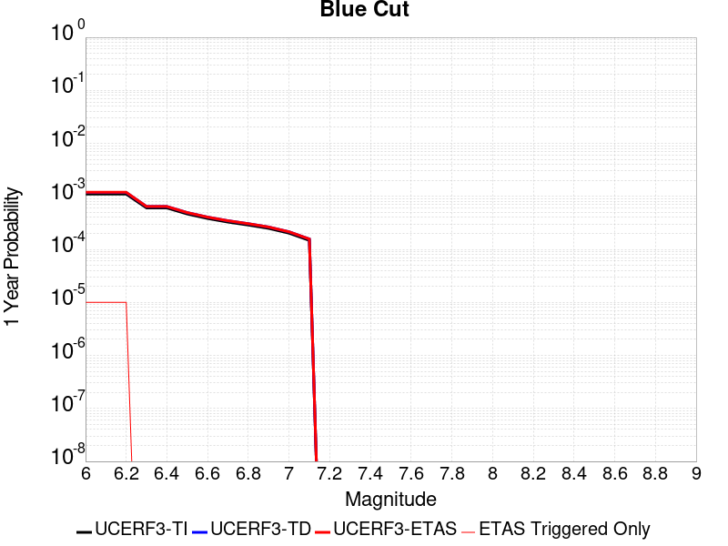 |  |

| Magnitude | 1 wk TI Prob | 1 wk TD Prob | 1 wk ETAS Prob | 1 wk ETAS/TD Gain | 1 wk ETAS Triggered Only | 1 mo TI Prob | 1 mo TD Prob | 1 mo ETAS Prob | 1 mo ETAS/TD Gain | 1 mo ETAS Triggered Only | 1 yr TI Prob | 1 yr TD Prob | 1 yr ETAS Prob | 1 yr ETAS/TD Gain | 1 yr ETAS Triggered Only | 10 yr TI Prob | 10 yr TD Prob | 10 yr ETAS Prob | 10 yr ETAS/TD Gain | 10 yr ETAS Triggered Only |
|-----|-----|-----|-----|-----|-----|-----|-----|-----|-----|-----|-----|-----|-----|-----|-----|-----|-----|-----|-----|-----|
| 6.0 | 2.1227985E-5 | 2.2719532E-5 | 2.2719532E-5 | 1.0 | 0.0 | 9.097391E-5 | 9.7366115E-5 | 9.7366115E-5 | 1.0 | 0.0 | 0.0011070445 | 0.0011848459 | 0.001194834 | 1.0084299 | 1.0E-5 | 0.011015458 | 0.01179113 | 0.011810894 | 1.0016762 | 2.0E-5 |
| 6.1 | 2.1227985E-5 | 2.2719532E-5 | 2.2719532E-5 | 1.0 | 0.0 | 9.097391E-5 | 9.7366115E-5 | 9.7366115E-5 | 1.0 | 0.0 | 0.0011070445 | 0.0011848459 | 0.001194834 | 1.0084299 | 1.0E-5 | 0.011015458 | 0.01179113 | 0.011810894 | 1.0016762 | 2.0E-5 |
| 6.2 | 2.1227985E-5 | 2.2719532E-5 | 2.2719532E-5 | 1.0 | 0.0 | 9.097391E-5 | 9.7366115E-5 | 9.7366115E-5 | 1.0 | 0.0 | 0.0011070445 | 0.0011848459 | 0.001194834 | 1.0084299 | 1.0E-5 | 0.011015458 | 0.01179113 | 0.011810894 | 1.0016762 | 2.0E-5 |
| 6.3 | 1.1613981E-5 | 1.2353521E-5 | 1.2353521E-5 | 1.0 | 0.0 | 4.9773254E-5 | 5.2942658E-5 | 5.2942658E-5 | 1.0 | 0.0 | 6.0582085E-4 | 6.443987E-4 | 6.443987E-4 | 1.0 | 0.0 | 0.0060417196 | 0.006426548 | 0.006436484 | 1.001546 | 1.0E-5 |
| 6.4 | 1.1613981E-5 | 1.2353521E-5 | 1.2353521E-5 | 1.0 | 0.0 | 4.9773254E-5 | 5.2942658E-5 | 5.2942658E-5 | 1.0 | 0.0 | 6.0582085E-4 | 6.443987E-4 | 6.443987E-4 | 1.0 | 0.0 | 0.0060417196 | 0.006426548 | 0.006436484 | 1.001546 | 1.0E-5 |
| 6.5 | 8.931326E-6 | 9.481584E-6 | 9.481584E-6 | 1.0 | 0.0 | 3.8276554E-5 | 4.063478E-5 | 4.063478E-5 | 1.0 | 0.0 | 4.6591737E-4 | 4.946253E-4 | 4.946253E-4 | 1.0 | 0.0 | 0.0046494175 | 0.004936153 | 0.004946104 | 1.0020158 | 1.0E-5 |
| 6.6 | 7.345353E-6 | 7.790267E-6 | 7.790267E-6 | 1.0 | 0.0 | 3.1479703E-5 | 3.3386474E-5 | 3.3386474E-5 | 1.0 | 0.0 | 3.83198E-4 | 4.0641252E-4 | 4.0641252E-4 | 1.0 | 0.0 | 0.0038253788 | 0.004057484 | 0.004067444 | 1.0024546 | 1.0E-5 |
| 6.7 | 6.2775666E-6 | 6.6551383E-6 | 6.6551383E-6 | 1.0 | 0.0 | 2.690358E-5 | 2.8521752E-5 | 2.8521752E-5 | 1.0 | 0.0 | 3.2750185E-4 | 3.4720454E-4 | 3.4720454E-4 | 1.0 | 0.0 | 0.0032701963 | 0.0034673614 | 0.0034773268 | 1.002874 | 1.0E-5 |
| 6.8 | 5.5234095E-6 | 5.855102E-6 | 5.855102E-6 | 1.0 | 0.0 | 2.367154E-5 | 2.5093093E-5 | 2.5093093E-5 | 1.0 | 0.0 | 2.8816288E-4 | 3.0547287E-4 | 3.0547287E-4 | 1.0 | 0.0 | 0.002877895 | 0.0030512456 | 0.0030612152 | 1.0032674 | 1.0E-5 |
| 6.9 | 4.7780054E-6 | 5.0654126E-6 | 5.0654126E-6 | 1.0 | 0.0 | 2.0477004E-5 | 2.1708769E-5 | 2.1708769E-5 | 1.0 | 0.0 | 2.4927902E-4 | 2.6427925E-4 | 2.6427925E-4 | 1.0 | 0.0 | 0.0024899957 | 0.0026403419 | 0.0026503154 | 1.0037774 | 1.0E-5 |
| 7.0 | 3.883171E-6 | 4.1184803E-6 | 4.1184803E-6 | 1.0 | 0.0 | 1.6642054E-5 | 1.765055E-5 | 1.765055E-5 | 1.0 | 0.0 | 2.0259817E-4 | 2.1488115E-4 | 2.1488115E-4 | 1.0 | 0.0 | 0.0020241356 | 0.0021474094 | 0.0021573878 | 1.0046468 | 1.0E-5 |
| 7.1 | 2.8358215E-6 | 3.009711E-6 | 3.009711E-6 | 1.0 | 0.0 | 1.2153464E-5 | 1.2898735E-5 | 1.2898735E-5 | 1.0 | 0.0 | 1.4795837E-4 | 1.5703736E-4 | 1.5703736E-4 | 1.0 | 0.0 | 0.001478599 | 0.001569909 | 0.001569909 | 1.0 | 0.0 |

## San Gabriel
*[(top)](#table-of-contents)*

| 1 Week | 1 Month | 1 Year | 10 Year |
|-----|-----|-----|-----|
|  |  |  |  |

| Magnitude | 1 wk TI Prob | 1 wk TD Prob | 1 wk ETAS Prob | 1 wk ETAS/TD Gain | 1 wk ETAS Triggered Only | 1 mo TI Prob | 1 mo TD Prob | 1 mo ETAS Prob | 1 mo ETAS/TD Gain | 1 mo ETAS Triggered Only | 1 yr TI Prob | 1 yr TD Prob | 1 yr ETAS Prob | 1 yr ETAS/TD Gain | 1 yr ETAS Triggered Only | 10 yr TI Prob | 10 yr TD Prob | 10 yr ETAS Prob | 10 yr ETAS/TD Gain | 10 yr ETAS Triggered Only |
|-----|-----|-----|-----|-----|-----|-----|-----|-----|-----|-----|-----|-----|-----|-----|-----|-----|-----|-----|-----|-----|
| 6.0 | 1.083775E-5 | 1.1984758E-5 | 3.198452E-5 | 2.6687663 | 2.0E-5 | 4.6446676E-5 | 5.13623E-5 | 7.1361275E-5 | 1.3893707 | 2.0E-5 | 5.653415E-4 | 6.251679E-4 | 6.4515544E-4 | 1.0319715 | 2.0E-5 | 0.0056390543 | 0.0062461873 | 0.006266062 | 1.0031819 | 2.0E-5 |
| 6.1 | 1.083775E-5 | 1.1984758E-5 | 3.198452E-5 | 2.6687663 | 2.0E-5 | 4.6446676E-5 | 5.13623E-5 | 7.1361275E-5 | 1.3893707 | 2.0E-5 | 5.653415E-4 | 6.251679E-4 | 6.4515544E-4 | 1.0319715 | 2.0E-5 | 0.0056390543 | 0.0062461873 | 0.006266062 | 1.0031819 | 2.0E-5 |
| 6.2 | 1.083775E-5 | 1.1984758E-5 | 3.198452E-5 | 2.6687663 | 2.0E-5 | 4.6446676E-5 | 5.13623E-5 | 7.1361275E-5 | 1.3893707 | 2.0E-5 | 5.653415E-4 | 6.251679E-4 | 6.4515544E-4 | 1.0319715 | 2.0E-5 | 0.0056390543 | 0.0062461873 | 0.006266062 | 1.0031819 | 2.0E-5 |
| 6.3 | 1.083775E-5 | 1.1984758E-5 | 3.198452E-5 | 2.6687663 | 2.0E-5 | 4.6446676E-5 | 5.13623E-5 | 7.1361275E-5 | 1.3893707 | 2.0E-5 | 5.653415E-4 | 6.251679E-4 | 6.4515544E-4 | 1.0319715 | 2.0E-5 | 0.0056390543 | 0.0062461873 | 0.006266062 | 1.0031819 | 2.0E-5 |
| 6.4 | 1.083775E-5 | 1.1984758E-5 | 3.198452E-5 | 2.6687663 | 2.0E-5 | 4.6446676E-5 | 5.13623E-5 | 7.1361275E-5 | 1.3893707 | 2.0E-5 | 5.653415E-4 | 6.251679E-4 | 6.4515544E-4 | 1.0319715 | 2.0E-5 | 0.0056390543 | 0.0062461873 | 0.006266062 | 1.0031819 | 2.0E-5 |
| 6.5 | 6.7317824E-6 | 7.7165205E-6 | 1.7716444E-5 | 2.2959108 | 1.0E-5 | 2.8850178E-5 | 3.3070388E-5 | 4.3070057E-5 | 1.3023753 | 1.0E-5 | 3.511943E-4 | 4.0255862E-4 | 4.125546E-4 | 1.024831 | 1.0E-5 | 0.003506398 | 0.0040293895 | 0.004039349 | 1.0024718 | 1.0E-5 |
| 6.6 | 6.7317824E-6 | 7.7165205E-6 | 1.7716444E-5 | 2.2959108 | 1.0E-5 | 2.8850178E-5 | 3.3070388E-5 | 4.3070057E-5 | 1.3023753 | 1.0E-5 | 3.511943E-4 | 4.0255862E-4 | 4.125546E-4 | 1.024831 | 1.0E-5 | 0.003506398 | 0.0040293895 | 0.004039349 | 1.0024718 | 1.0E-5 |
| 6.7 | 6.274881E-6 | 7.2454404E-6 | 1.7245367E-5 | 2.3801682 | 1.0E-5 | 2.6892068E-5 | 3.1051524E-5 | 4.1051215E-5 | 1.3220354 | 1.0E-5 | 3.2736175E-4 | 3.779877E-4 | 3.8798392E-4 | 1.0264459 | 1.0E-5 | 0.0032687993 | 0.0037845364 | 0.0037944985 | 1.0026324 | 1.0E-5 |
| 6.8 | 5.996209E-6 | 6.958161E-6 | 1.695809E-5 | 2.4371514 | 1.0E-5 | 2.5697784E-5 | 2.9820354E-5 | 3.9820057E-5 | 1.3353314 | 1.0E-5 | 3.128256E-4 | 3.6300326E-4 | 3.7299964E-4 | 1.027538 | 1.0E-5 | 0.003123856 | 0.0036351893 | 0.003645153 | 1.0027409 | 1.0E-5 |
| 6.9 | 5.686331E-6 | 6.623209E-6 | 1.6623144E-5 | 2.5098321 | 1.0E-5 | 2.4369761E-5 | 2.8384879E-5 | 3.8384595E-5 | 1.3522903 | 1.0E-5 | 2.9666146E-4 | 3.45532E-4 | 3.5552855E-4 | 1.0289309 | 1.0E-5 | 0.0029626573 | 0.0034610324 | 0.0034709978 | 1.0028793 | 1.0E-5 |
| 7.0 | 5.2329838E-6 | 6.147093E-6 | 1.614703E-5 | 2.6267753 | 1.0E-5 | 2.242688E-5 | 2.6344422E-5 | 3.6344158E-5 | 1.379577 | 1.0E-5 | 2.7301308E-4 | 3.2069688E-4 | 3.306937E-4 | 1.031172 | 1.0E-5 | 0.002726779 | 0.0032134135 | 0.0032233815 | 1.003102 | 1.0E-5 |
| 7.1 | 5.135671E-6 | 6.03722E-6 | 1.603716E-5 | 2.6563816 | 1.0E-5 | 2.2009834E-5 | 2.5873547E-5 | 3.587329E-5 | 1.3864851 | 1.0E-5 | 2.6793676E-4 | 3.1496567E-4 | 3.2496252E-4 | 1.0317395 | 1.0E-5 | 0.0026761394 | 0.0031562652 | 0.003166234 | 1.0031583 | 1.0E-5 |
| 7.2 | 4.989062E-6 | 5.8706023E-6 | 1.5870542E-5 | 2.7033927 | 1.0E-5 | 2.1381518E-5 | 2.5159485E-5 | 3.515923E-5 | 1.3974544 | 1.0E-5 | 2.6028889E-4 | 3.0627442E-4 | 3.1627135E-4 | 1.0326405 | 1.0E-5 | 0.0025998424 | 0.003069596 | 0.0030795652 | 1.0032477 | 1.0E-5 |
| 7.3 | 4.8219395E-6 | 5.7021575E-6 | 1.57021E-5 | 2.7537122 | 1.0E-5 | 2.0665291E-5 | 2.4437593E-5 | 3.443735E-5 | 1.4091955 | 1.0E-5 | 2.5157086E-4 | 2.9748783E-4 | 3.0748485E-4 | 1.0336049 | 1.0E-5 | 0.0025128627 | 0.0029819692 | 0.0029919392 | 1.0033435 | 1.0E-5 |
| 7.4 | 4.7118383E-6 | 5.590718E-6 | 1.5590662E-5 | 2.7886689 | 1.0E-5 | 2.0193436E-5 | 2.3960005E-5 | 3.3959765E-5 | 1.4173522 | 1.0E-5 | 2.4582737E-4 | 2.9167475E-4 | 3.0167185E-4 | 1.0342748 | 1.0E-5 | 0.002455556 | 0.0029239913 | 0.002933962 | 1.00341 | 1.0E-5 |
| 7.5 | 4.5506545E-6 | 5.4360885E-6 | 1.5436035E-5 | 2.8395479 | 1.0E-5 | 1.9502659E-5 | 2.3297318E-5 | 3.3297085E-5 | 1.4292239 | 1.0E-5 | 2.37419E-4 | 2.8360868E-4 | 2.9360584E-4 | 1.0352498 | 1.0E-5 | 0.002371655 | 0.0028435385 | 0.0028535102 | 1.0035068 | 1.0E-5 |
| 7.6 | 4.343636E-6 | 5.2289724E-6 | 1.522892E-5 | 2.9124117 | 1.0E-5 | 1.861545E-5 | 2.2409693E-5 | 3.240947E-5 | 1.4462255 | 1.0E-5 | 2.2661954E-4 | 2.728046E-4 | 2.828019E-4 | 1.0366462 | 1.0E-5 | 0.0022638857 | 0.0027357598 | 0.0027457324 | 1.0036453 | 1.0E-5 |
| 7.7 | 2.936235E-6 | 2.7437704E-6 | 1.2743743E-5 | 4.64461 | 1.0E-5 | 1.2583803E-5 | 1.1758963E-5 | 2.1758846E-5 | 1.8504051 | 1.0E-5 | 1.5319703E-4 | 1.4315601E-4 | 1.5315457E-4 | 1.0698439 | 1.0E-5 | 0.0015309147 | 0.0014379307 | 0.0014479164 | 1.0069444 | 1.0E-5 |
| 7.8 | 1.4541639E-6 | 9.122594E-7 | 9.122594E-7 | 1.0 | 0.0 | 6.232116E-6 | 3.909677E-6 | 3.909677E-6 | 1.0 | 0.0 | 7.587337E-5 | 4.7599282E-5 | 4.7599282E-5 | 1.0 | 0.0 | 7.584747E-4 | 4.80793E-4 | 4.80793E-4 | 1.0 | 0.0 |
| 7.9 | 8.098958E-7 | 2.4170984E-7 | 2.4170984E-7 | 1.0 | 0.0 | 3.4709774E-6 | 1.0358989E-6 | 1.0358989E-6 | 1.0 | 0.0 | 4.225833E-5 | 1.2611996E-5 | 1.2611996E-5 | 1.0 | 0.0 | 4.2250296E-4 | 1.2919492E-4 | 1.2919492E-4 | 1.0 | 0.0 |
| 8.0 | 5.2473234E-7 | 7.677202E-8 | 7.677202E-8 | 1.0 | 0.0 | 2.248851E-6 | 3.290229E-7 | 3.290229E-7 | 1.0 | 0.0 | 2.7379416E-5 | 4.005846E-6 | 4.005846E-6 | 1.0 | 0.0 | 2.7376044E-4 | 4.2180836E-5 | 4.2180836E-5 | 1.0 | 0.0 |
| 8.1 | 3.3162388E-7 | 4.1485006E-8 | 4.1485006E-8 | 1.0 | 0.0 | 1.4212444E-6 | 1.7779287E-7 | 1.7779287E-7 | 1.0 | 0.0 | 1.7303513E-5 | 2.164626E-6 | 2.164626E-6 | 1.0 | 0.0 | 1.7302166E-4 | 2.295942E-5 | 2.295942E-5 | 1.0 | 0.0 |
| 8.2 | 1.0235345E-7 | 1.4039964E-8 | 1.4039964E-8 | 1.0 | 0.0 | 4.3865757E-7 | 6.0171274E-8 | 6.0171274E-8 | 1.0 | 0.0 | 5.340643E-6 | 7.3258497E-7 | 7.3258497E-7 | 1.0 | 0.0 | 5.3405143E-5 | 7.925429E-6 | 7.925429E-6 | 1.0 | 0.0 |

## Cleghorn Lake
*[(top)](#table-of-contents)*

| 1 Week | 1 Month | 1 Year | 10 Year |
|-----|-----|-----|-----|
|  |  |  |  |

| Magnitude | 1 wk TI Prob | 1 wk TD Prob | 1 wk ETAS Prob | 1 wk ETAS/TD Gain | 1 wk ETAS Triggered Only | 1 mo TI Prob | 1 mo TD Prob | 1 mo ETAS Prob | 1 mo ETAS/TD Gain | 1 mo ETAS Triggered Only | 1 yr TI Prob | 1 yr TD Prob | 1 yr ETAS Prob | 1 yr ETAS/TD Gain | 1 yr ETAS Triggered Only | 10 yr TI Prob | 10 yr TD Prob | 10 yr ETAS Prob | 10 yr ETAS/TD Gain | 10 yr ETAS Triggered Only |
|-----|-----|-----|-----|-----|-----|-----|-----|-----|-----|-----|-----|-----|-----|-----|-----|-----|-----|-----|-----|-----|
| 6.0 | 1.5467183E-5 | 1.6794165E-5 | 3.679383E-5 | 2.1908698 | 2.0E-5 | 6.6286244E-5 | 7.1973314E-5 | 9.197188E-5 | 1.2778608 | 2.0E-5 | 8.067362E-4 | 8.7597774E-4 | 8.959602E-4 | 1.0228117 | 2.0E-5 | 0.008038137 | 0.008730675 | 0.008750501 | 1.0022708 | 2.0E-5 |
| 6.1 | 1.5467183E-5 | 1.6794165E-5 | 3.679383E-5 | 2.1908698 | 2.0E-5 | 6.6286244E-5 | 7.1973314E-5 | 9.197188E-5 | 1.2778608 | 2.0E-5 | 8.067362E-4 | 8.7597774E-4 | 8.959602E-4 | 1.0228117 | 2.0E-5 | 0.008038137 | 0.008730675 | 0.008750501 | 1.0022708 | 2.0E-5 |
| 6.2 | 1.2624631E-5 | 1.3681514E-5 | 3.368124E-5 | 2.4618065 | 2.0E-5 | 5.410444E-5 | 5.8634017E-5 | 7.8632846E-5 | 1.3410789 | 2.0E-5 | 6.585225E-4 | 7.13684E-4 | 7.3366973E-4 | 1.0280036 | 2.0E-5 | 0.0065657445 | 0.007118716 | 0.0071385736 | 1.0027895 | 2.0E-5 |
| 6.3 | 1.2624631E-5 | 1.3681514E-5 | 3.368124E-5 | 2.4618065 | 2.0E-5 | 5.410444E-5 | 5.8634017E-5 | 7.8632846E-5 | 1.3410789 | 2.0E-5 | 6.585225E-4 | 7.13684E-4 | 7.3366973E-4 | 1.0280036 | 2.0E-5 | 0.0065657445 | 0.007118716 | 0.0071385736 | 1.0027895 | 2.0E-5 |
| 6.4 | 9.417684E-6 | 1.0170096E-5 | 2.0169995E-5 | 1.9832649 | 1.0E-5 | 4.036088E-5 | 4.3585627E-5 | 5.3585194E-5 | 1.2294234 | 1.0E-5 | 4.912829E-4 | 5.305669E-4 | 5.405616E-4 | 1.0188378 | 1.0E-5 | 0.004901982 | 0.005297038 | 0.0053069848 | 1.0018779 | 1.0E-5 |
| 6.5 | 9.368219E-6 | 1.0117523E-5 | 2.011742E-5 | 1.9883742 | 1.0E-5 | 4.014889E-5 | 4.3360324E-5 | 5.3359887E-5 | 1.2306156 | 1.0E-5 | 4.8870314E-4 | 5.2782515E-4 | 5.3781987E-4 | 1.0189357 | 1.0E-5 | 0.004876298 | 0.00526975 | 0.0052796975 | 1.0018877 | 1.0E-5 |
| 6.6 | 7.803798E-6 | 8.4418125E-6 | 1.8441728E-5 | 2.1845698 | 1.0E-5 | 3.3444423E-5 | 3.617892E-5 | 4.6178557E-5 | 1.276394 | 1.0E-5 | 4.0710976E-4 | 4.4042926E-4 | 4.5042485E-4 | 1.0226951 | 1.0E-5 | 0.0040636472 | 0.0043994808 | 0.0044094366 | 1.002263 | 1.0E-5 |
| 6.7 | 2.3108669E-6 | 2.44383E-6 | 2.44383E-6 | 1.0 | 0.0 | 9.903678E-6 | 1.0473515E-5 | 1.0473515E-5 | 1.0 | 0.0 | 1.205706E-4 | 1.2750778E-4 | 1.2750778E-4 | 1.0 | 0.0 | 0.001205052 | 0.0012743649 | 0.0012743649 | 1.0 | 0.0 |
| 6.8 | 2.0882828E-6 | 2.2062789E-6 | 2.2062789E-6 | 1.0 | 0.0 | 8.949753E-6 | 9.455448E-6 | 9.455448E-6 | 1.0 | 0.0 | 1.08957785E-4 | 1.1511416E-4 | 1.1511416E-4 | 1.0 | 0.0 | 0.0010890438 | 0.0011505622 | 0.0011505622 | 1.0 | 0.0 |
| 6.9 | 1.876935E-6 | 1.9810482E-6 | 1.9810482E-6 | 1.0 | 0.0 | 8.043982E-6 | 8.490179E-6 | 8.490179E-6 | 1.0 | 0.0 | 9.7931086E-5 | 1.0336319E-4 | 1.0336319E-4 | 1.0 | 0.0 | 9.788794E-4 | 0.0010331671 | 0.0010331671 | 1.0 | 0.0 |
| 7.0 | 1.5357559E-6 | 1.6202783E-6 | 1.6202783E-6 | 1.0 | 0.0 | 6.5817944E-6 | 6.944032E-6 | 6.944032E-6 | 1.0 | 0.0 | 8.01304E-5 | 8.4540436E-5 | 8.4540436E-5 | 1.0 | 0.0 | 8.010151E-4 | 8.4509526E-4 | 8.4509526E-4 | 1.0 | 0.0 |
| 7.1 | 1.0905424E-6 | 1.1497604E-6 | 1.1497604E-6 | 1.0 | 0.0 | 4.6737446E-6 | 4.9275354E-6 | 4.9275354E-6 | 1.0 | 0.0 | 5.6901354E-5 | 5.999119E-5 | 5.999119E-5 | 1.0 | 0.0 | 5.6886784E-4 | 5.9975975E-4 | 5.9975975E-4 | 1.0 | 0.0 |
| 7.2 | 6.06668E-7 | 6.387269E-7 | 6.387269E-7 | 1.0 | 0.0 | 2.600003E-6 | 2.7373983E-6 | 2.7373983E-6 | 1.0 | 0.0 | 3.1654577E-5 | 3.3327386E-5 | 3.3327386E-5 | 1.0 | 0.0 | 3.1650066E-4 | 3.332307E-4 | 3.332307E-4 | 1.0 | 0.0 |

## Scodie Lineament
*[(top)](#table-of-contents)*

| 1 Week | 1 Month | 1 Year | 10 Year |
|-----|-----|-----|-----|
|  |  | 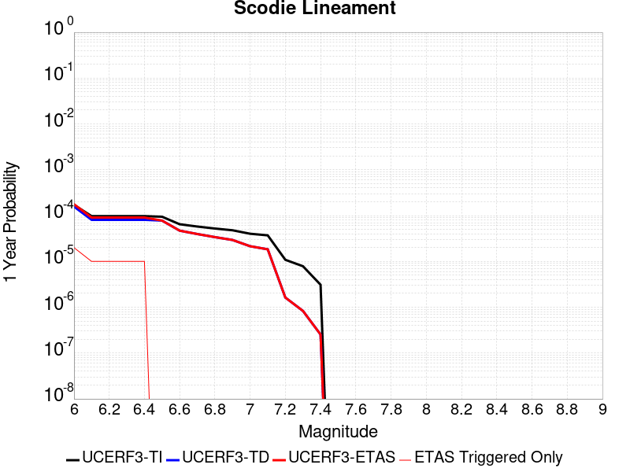 |  |

| Magnitude | 1 wk TI Prob | 1 wk TD Prob | 1 wk ETAS Prob | 1 wk ETAS/TD Gain | 1 wk ETAS Triggered Only | 1 mo TI Prob | 1 mo TD Prob | 1 mo ETAS Prob | 1 mo ETAS/TD Gain | 1 mo ETAS Triggered Only | 1 yr TI Prob | 1 yr TD Prob | 1 yr ETAS Prob | 1 yr ETAS/TD Gain | 1 yr ETAS Triggered Only | 10 yr TI Prob | 10 yr TD Prob | 10 yr ETAS Prob | 10 yr ETAS/TD Gain | 10 yr ETAS Triggered Only |
|-----|-----|-----|-----|-----|-----|-----|-----|-----|-----|-----|-----|-----|-----|-----|-----|-----|-----|-----|-----|-----|
| 6.0 | 3.2919327E-6 | 3.0133394E-6 | 1.3013309E-5 | 4.3185673 | 1.0E-5 | 1.4108206E-5 | 1.2914265E-5 | 2.2914137E-5 | 1.7743275 | 1.0E-5 | 1.7175387E-4 | 1.5722301E-4 | 1.7721987E-4 | 1.1271878 | 2.0E-5 | 0.0017162118 | 0.0015714294 | 0.001591398 | 1.0127072 | 2.0E-5 |
| 6.1 | 1.8663811E-6 | 1.5490481E-6 | 1.1549033E-5 | 7.4555674 | 1.0E-5 | 7.998751E-6 | 6.638764E-6 | 1.6638698E-5 | 2.5062945 | 1.0E-5 | 9.738045E-5 | 8.0824444E-5 | 9.082364E-5 | 1.1237149 | 1.0E-5 | 9.7337784E-4 | 8.0799934E-4 | 8.179912E-4 | 1.0123663 | 1.0E-5 |
| 6.2 | 1.8663811E-6 | 1.5490481E-6 | 1.1549033E-5 | 7.4555674 | 1.0E-5 | 7.998751E-6 | 6.638764E-6 | 1.6638698E-5 | 2.5062945 | 1.0E-5 | 9.738045E-5 | 8.0824444E-5 | 9.082364E-5 | 1.1237149 | 1.0E-5 | 9.7337784E-4 | 8.0799934E-4 | 8.179912E-4 | 1.0123663 | 1.0E-5 |
| 6.3 | 1.8663811E-6 | 1.5490481E-6 | 1.1549033E-5 | 7.4555674 | 1.0E-5 | 7.998751E-6 | 6.638764E-6 | 1.6638698E-5 | 2.5062945 | 1.0E-5 | 9.738045E-5 | 8.0824444E-5 | 9.082364E-5 | 1.1237149 | 1.0E-5 | 9.7337784E-4 | 8.0799934E-4 | 8.179912E-4 | 1.0123663 | 1.0E-5 |
| 6.4 | 1.8663811E-6 | 1.5490481E-6 | 1.1549033E-5 | 7.4555674 | 1.0E-5 | 7.998751E-6 | 6.638764E-6 | 1.6638698E-5 | 2.5062945 | 1.0E-5 | 9.738045E-5 | 8.0824444E-5 | 9.082364E-5 | 1.1237149 | 1.0E-5 | 9.7337784E-4 | 8.0799934E-4 | 8.179912E-4 | 1.0123663 | 1.0E-5 |
| 6.5 | 1.8106311E-6 | 1.4909822E-6 | 1.4909822E-6 | 1.0 | 0.0 | 7.759824E-6 | 6.389911E-6 | 6.389911E-6 | 1.0 | 0.0 | 9.447177E-5 | 7.779488E-5 | 7.779488E-5 | 1.0 | 0.0 | 9.4431615E-4 | 7.777252E-4 | 7.777252E-4 | 1.0 | 0.0 |
| 6.6 | 1.2414679E-6 | 8.9975464E-7 | 8.9975464E-7 | 1.0 | 0.0 | 5.320566E-6 | 3.856086E-6 | 3.856086E-6 | 1.0 | 0.0 | 6.477596E-5 | 4.6946923E-5 | 4.6946923E-5 | 1.0 | 0.0 | 6.475708E-4 | 4.6937872E-4 | 4.6937872E-4 | 1.0 | 0.0 |
| 6.7 | 1.1062215E-6 | 7.594301E-7 | 7.594301E-7 | 1.0 | 0.0 | 4.7409408E-6 | 3.2546968E-6 | 3.2546968E-6 | 1.0 | 0.0 | 5.7719422E-5 | 3.9625284E-5 | 3.9625284E-5 | 1.0 | 0.0 | 5.770443E-4 | 3.9618916E-4 | 3.9618916E-4 | 1.0 | 0.0 |
| 6.8 | 1.0006736E-6 | 6.5003877E-7 | 6.5003877E-7 | 1.0 | 0.0 | 4.288594E-6 | 2.785878E-6 | 2.785878E-6 | 1.0 | 0.0 | 5.221238E-5 | 3.3917597E-5 | 3.3917597E-5 | 1.0 | 0.0 | 5.220012E-4 | 3.391303E-4 | 3.391303E-4 | 1.0 | 0.0 |
| 6.9 | 9.167364E-7 | 5.631617E-7 | 5.631617E-7 | 1.0 | 0.0 | 3.9288643E-6 | 2.4135481E-6 | 2.4135481E-6 | 1.0 | 0.0 | 4.7832873E-5 | 2.938461E-5 | 2.938461E-5 | 1.0 | 0.0 | 4.782258E-4 | 2.9381292E-4 | 2.9381292E-4 | 1.0 | 0.0 |
| 7.0 | 7.6987664E-7 | 4.1133762E-7 | 4.1133762E-7 | 1.0 | 0.0 | 3.2994672E-6 | 1.7628746E-6 | 1.7628746E-6 | 1.0 | 0.0 | 4.0170275E-5 | 2.1462827E-5 | 2.1462827E-5 | 1.0 | 0.0 | 4.0163012E-4 | 2.1461138E-4 | 2.1461138E-4 | 1.0 | 0.0 |
| 7.1 | 7.1038727E-7 | 3.521143E-7 | 3.521143E-7 | 1.0 | 0.0 | 3.0445133E-6 | 1.5090607E-6 | 1.5090607E-6 | 1.0 | 0.0 | 3.706632E-5 | 1.8372695E-5 | 1.8372695E-5 | 1.0 | 0.0 | 3.7060137E-4 | 1.8371525E-4 | 1.8371525E-4 | 1.0 | 0.0 |
| 7.2 | 2.0799602E-7 | 3.1186687E-8 | 3.1186687E-8 | 1.0 | 0.0 | 8.914113E-7 | 1.3365722E-7 | 1.3365722E-7 | 1.0 | 0.0 | 1.0852878E-5 | 1.6272755E-6 | 1.6272755E-6 | 1.0 | 0.0 | 1.08523476E-4 | 1.6272643E-5 | 1.6272643E-5 | 1.0 | 0.0 |
| 7.3 | 1.5048182E-7 | 1.5945583E-8 | 1.5945583E-8 | 1.0 | 0.0 | 6.449219E-7 | 6.833821E-8 | 6.833821E-8 | 1.0 | 0.0 | 7.851896E-6 | 8.320174E-7 | 8.320174E-7 | 1.0 | 0.0 | 7.851618E-5 | 8.320146E-6 | 8.320146E-6 | 1.0 | 0.0 |
| 7.4 | 5.9334678E-8 | 4.868311E-9 | 4.868311E-9 | 1.0 | 0.0 | 2.5429145E-7 | 2.0864192E-8 | 2.0864192E-8 | 1.0 | 0.0 | 3.095994E-6 | 2.540215E-7 | 2.540215E-7 | 1.0 | 0.0 | 3.095951E-5 | 2.5402135E-6 | 2.5402135E-6 | 1.0 | 0.0 |

## Santa Ynez (East)
*[(top)](#table-of-contents)*

| 1 Week | 1 Month | 1 Year | 10 Year |
|-----|-----|-----|-----|
|  |  |  |  |

| Magnitude | 1 wk TI Prob | 1 wk TD Prob | 1 wk ETAS Prob | 1 wk ETAS/TD Gain | 1 wk ETAS Triggered Only | 1 mo TI Prob | 1 mo TD Prob | 1 mo ETAS Prob | 1 mo ETAS/TD Gain | 1 mo ETAS Triggered Only | 1 yr TI Prob | 1 yr TD Prob | 1 yr ETAS Prob | 1 yr ETAS/TD Gain | 1 yr ETAS Triggered Only | 10 yr TI Prob | 10 yr TD Prob | 10 yr ETAS Prob | 10 yr ETAS/TD Gain | 10 yr ETAS Triggered Only |
|-----|-----|-----|-----|-----|-----|-----|-----|-----|-----|-----|-----|-----|-----|-----|-----|-----|-----|-----|-----|-----|
| 6.0 | 3.2269712E-5 | 3.6750334E-5 | 4.6749967E-5 | 1.2720964 | 1.0E-5 | 1.3829143E-4 | 1.5749525E-4 | 1.6749366E-4 | 1.063484 | 1.0E-5 | 0.0016823979 | 0.0019164077 | 0.0019263886 | 1.0052081 | 1.0E-5 | 0.016697178 | 0.019056354 | 0.019066164 | 1.0005147 | 1.0E-5 |
| 6.1 | 3.2269712E-5 | 3.6750334E-5 | 4.6749967E-5 | 1.2720964 | 1.0E-5 | 1.3829143E-4 | 1.5749525E-4 | 1.6749366E-4 | 1.063484 | 1.0E-5 | 0.0016823979 | 0.0019164077 | 0.0019263886 | 1.0052081 | 1.0E-5 | 0.016697178 | 0.019056354 | 0.019066164 | 1.0005147 | 1.0E-5 |
| 6.2 | 3.2269712E-5 | 3.6750334E-5 | 4.6749967E-5 | 1.2720964 | 1.0E-5 | 1.3829143E-4 | 1.5749525E-4 | 1.6749366E-4 | 1.063484 | 1.0E-5 | 0.0016823979 | 0.0019164077 | 0.0019263886 | 1.0052081 | 1.0E-5 | 0.016697178 | 0.019056354 | 0.019066164 | 1.0005147 | 1.0E-5 |
| 6.3 | 3.2269712E-5 | 3.6750334E-5 | 4.6749967E-5 | 1.2720964 | 1.0E-5 | 1.3829143E-4 | 1.5749525E-4 | 1.6749366E-4 | 1.063484 | 1.0E-5 | 0.0016823979 | 0.0019164077 | 0.0019263886 | 1.0052081 | 1.0E-5 | 0.016697178 | 0.019056354 | 0.019066164 | 1.0005147 | 1.0E-5 |
| 6.4 | 1.4404779E-5 | 1.4849345E-5 | 1.4849345E-5 | 1.0 | 0.0 | 6.1733306E-5 | 6.363852E-5 | 6.363852E-5 | 1.0 | 0.0 | 7.513438E-4 | 7.7452866E-4 | 7.7452866E-4 | 1.0 | 0.0 | 0.0074880854 | 0.0077188425 | 0.0077188425 | 1.0 | 0.0 |
| 6.5 | 1.4404779E-5 | 1.4849345E-5 | 1.4849345E-5 | 1.0 | 0.0 | 6.1733306E-5 | 6.363852E-5 | 6.363852E-5 | 1.0 | 0.0 | 7.513438E-4 | 7.7452866E-4 | 7.7452866E-4 | 1.0 | 0.0 | 0.0074880854 | 0.0077188425 | 0.0077188425 | 1.0 | 0.0 |
| 6.6 | 1.280208E-5 | 1.3011917E-5 | 1.3011917E-5 | 1.0 | 0.0 | 5.4864904E-5 | 5.5764176E-5 | 5.5764176E-5 | 1.0 | 0.0 | 6.6777546E-4 | 6.7871914E-4 | 6.7871914E-4 | 1.0 | 0.0 | 0.006657724 | 0.0067666727 | 0.0067666727 | 1.0 | 0.0 |
| 6.7 | 1.2457027E-5 | 1.26284385E-5 | 1.26284385E-5 | 1.0 | 0.0 | 5.3386164E-5 | 5.4120766E-5 | 5.4120766E-5 | 1.0 | 0.0 | 6.497827E-4 | 6.5872277E-4 | 6.5872277E-4 | 1.0 | 0.0 | 0.00647886 | 0.0065678996 | 0.0065678996 | 1.0 | 0.0 |
| 6.8 | 1.2095134E-5 | 1.2230887E-5 | 1.2230887E-5 | 1.0 | 0.0 | 5.1835254E-5 | 5.241704E-5 | 5.241704E-5 | 1.0 | 0.0 | 6.309115E-4 | 6.379922E-4 | 6.379922E-4 | 1.0 | 0.0 | 0.0062912325 | 0.006361794 | 0.006361794 | 1.0 | 0.0 |
| 6.9 | 1.1104036E-5 | 1.1157322E-5 | 1.1157322E-5 | 1.0 | 0.0 | 4.758786E-5 | 4.7816222E-5 | 4.7816222E-5 | 1.0 | 0.0 | 5.7922816E-4 | 5.820083E-4 | 5.820083E-4 | 1.0 | 0.0 | 0.005777207 | 0.0058049858 | 0.0058049858 | 1.0 | 0.0 |
| 7.0 | 1.0577444E-5 | 1.0581656E-5 | 1.0581656E-5 | 1.0 | 0.0 | 4.5331115E-5 | 4.534917E-5 | 4.534917E-5 | 1.0 | 0.0 | 5.5176654E-4 | 5.519875E-4 | 5.519875E-4 | 1.0 | 0.0 | 0.0055039856 | 0.0055063027 | 0.0055063027 | 1.0 | 0.0 |
| 7.1 | 1.0021775E-5 | 9.980964E-6 | 9.980964E-6 | 1.0 | 0.0 | 4.294976E-5 | 4.2774867E-5 | 4.2774867E-5 | 1.0 | 0.0 | 5.2278786E-4 | 5.206607E-4 | 5.206607E-4 | 1.0 | 0.0 | 0.0052155964 | 0.0051945415 | 0.0051945415 | 1.0 | 0.0 |
| 7.2 | 8.874109E-6 | 8.748773E-6 | 8.748773E-6 | 1.0 | 0.0 | 3.8031343E-5 | 3.749421E-5 | 3.749421E-5 | 1.0 | 0.0 | 4.629332E-4 | 4.5639748E-4 | 4.5639748E-4 | 1.0 | 0.0 | 0.0046197 | 0.0045547197 | 0.0045547197 | 1.0 | 0.0 |
| 7.3 | 7.5504267E-6 | 7.505101E-6 | 7.505101E-6 | 1.0 | 0.0 | 3.235857E-5 | 3.2164327E-5 | 3.2164327E-5 | 1.0 | 0.0 | 3.9389438E-4 | 3.9153136E-4 | 3.9153136E-4 | 1.0 | 0.0 | 0.0039319694 | 0.0039085224 | 0.0039085224 | 1.0 | 0.0 |
| 7.4 | 6.309394E-6 | 6.1831424E-6 | 6.1831424E-6 | 1.0 | 0.0 | 2.703998E-5 | 2.6498918E-5 | 2.6498918E-5 | 1.0 | 0.0 | 3.2916202E-4 | 3.225775E-4 | 3.225775E-4 | 1.0 | 0.0 | 0.003286749 | 0.00322119 | 0.00322119 | 1.0 | 0.0 |
| 7.5 | 4.6103073E-6 | 4.440881E-6 | 4.440881E-6 | 1.0 | 0.0 | 1.975831E-5 | 1.9032213E-5 | 1.9032213E-5 | 1.0 | 0.0 | 2.4053088E-4 | 2.3169327E-4 | 2.3169327E-4 | 1.0 | 0.0 | 0.002402707 | 0.0023145864 | 0.0023145864 | 1.0 | 0.0 |
| 7.6 | 1.2858658E-6 | 1.3008154E-6 | 1.3008154E-6 | 1.0 | 0.0 | 5.5108417E-6 | 5.5749115E-6 | 5.5749115E-6 | 1.0 | 0.0 | 6.7092435E-5 | 6.7872505E-5 | 6.7872505E-5 | 1.0 | 0.0 | 6.707218E-4 | 6.785246E-4 | 6.785246E-4 | 1.0 | 0.0 |
| 7.7 | 5.3302307E-7 | 5.61213E-7 | 5.61213E-7 | 1.0 | 0.0 | 2.2843826E-6 | 2.4051967E-6 | 2.4051967E-6 | 1.0 | 0.0 | 2.7812002E-5 | 2.9282912E-5 | 2.9282912E-5 | 1.0 | 0.0 | 2.7808524E-4 | 2.927941E-4 | 2.927941E-4 | 1.0 | 0.0 |
| 7.8 | 4.613933E-8 | 4.8030046E-8 | 4.8030046E-8 | 1.0 | 0.0 | 1.9773998E-7 | 2.0584304E-7 | 2.0584304E-7 | 1.0 | 0.0 | 2.4074816E-6 | 2.506136E-6 | 2.506136E-6 | 1.0 | 0.0 | 2.4074554E-5 | 2.5061088E-5 | 2.5061088E-5 | 1.0 | 0.0 |

## Mission Creek
*[(top)](#table-of-contents)*

| 1 Week | 1 Month | 1 Year | 10 Year |
|-----|-----|-----|-----|
|  |  |  |  |

| Magnitude | 1 wk TI Prob | 1 wk TD Prob | 1 wk ETAS Prob | 1 wk ETAS/TD Gain | 1 wk ETAS Triggered Only | 1 mo TI Prob | 1 mo TD Prob | 1 mo ETAS Prob | 1 mo ETAS/TD Gain | 1 mo ETAS Triggered Only | 1 yr TI Prob | 1 yr TD Prob | 1 yr ETAS Prob | 1 yr ETAS/TD Gain | 1 yr ETAS Triggered Only | 10 yr TI Prob | 10 yr TD Prob | 10 yr ETAS Prob | 10 yr ETAS/TD Gain | 10 yr ETAS Triggered Only |
|-----|-----|-----|-----|-----|-----|-----|-----|-----|-----|-----|-----|-----|-----|-----|-----|-----|-----|-----|-----|-----|
| 6.0 | 1.1549387E-5 | 1.63219E-5 | 1.63219E-5 | 1.0 | 0.0 | 4.9496433E-5 | 6.994921E-5 | 7.9948506E-5 | 1.1429509 | 1.0E-5 | 6.0245243E-4 | 8.513139E-4 | 8.6130534E-4 | 1.0117365 | 1.0E-5 | 0.006008218 | 0.00850976 | 0.008519675 | 1.0011652 | 1.0E-5 |
| 6.1 | 1.1549387E-5 | 1.63219E-5 | 1.63219E-5 | 1.0 | 0.0 | 4.9496433E-5 | 6.994921E-5 | 7.9948506E-5 | 1.1429509 | 1.0E-5 | 6.0245243E-4 | 8.513139E-4 | 8.6130534E-4 | 1.0117365 | 1.0E-5 | 0.006008218 | 0.00850976 | 0.008519675 | 1.0011652 | 1.0E-5 |
| 6.2 | 1.1549387E-5 | 1.63219E-5 | 1.63219E-5 | 1.0 | 0.0 | 4.9496433E-5 | 6.994921E-5 | 7.9948506E-5 | 1.1429509 | 1.0E-5 | 6.0245243E-4 | 8.513139E-4 | 8.6130534E-4 | 1.0117365 | 1.0E-5 | 0.006008218 | 0.00850976 | 0.008519675 | 1.0011652 | 1.0E-5 |
| 6.3 | 1.1549387E-5 | 1.63219E-5 | 1.63219E-5 | 1.0 | 0.0 | 4.9496433E-5 | 6.994921E-5 | 7.9948506E-5 | 1.1429509 | 1.0E-5 | 6.0245243E-4 | 8.513139E-4 | 8.6130534E-4 | 1.0117365 | 1.0E-5 | 0.006008218 | 0.00850976 | 0.008519675 | 1.0011652 | 1.0E-5 |
| 6.4 | 1.1549387E-5 | 1.63219E-5 | 1.63219E-5 | 1.0 | 0.0 | 4.9496433E-5 | 6.994921E-5 | 7.9948506E-5 | 1.1429509 | 1.0E-5 | 6.0245243E-4 | 8.513139E-4 | 8.6130534E-4 | 1.0117365 | 1.0E-5 | 0.006008218 | 0.00850976 | 0.008519675 | 1.0011652 | 1.0E-5 |
| 6.5 | 1.1549387E-5 | 1.63219E-5 | 1.63219E-5 | 1.0 | 0.0 | 4.9496433E-5 | 6.994921E-5 | 7.9948506E-5 | 1.1429509 | 1.0E-5 | 6.0245243E-4 | 8.513139E-4 | 8.6130534E-4 | 1.0117365 | 1.0E-5 | 0.006008218 | 0.00850976 | 0.008519675 | 1.0011652 | 1.0E-5 |
| 6.6 | 9.202681E-6 | 1.384518E-5 | 1.384518E-5 | 1.0 | 0.0 | 3.9439463E-5 | 5.9335187E-5 | 6.9334594E-5 | 1.168524 | 1.0E-5 | 4.800697E-4 | 7.2217546E-4 | 7.3216826E-4 | 1.0138371 | 1.0E-5 | 0.004790339 | 0.007226945 | 0.007236873 | 1.0013738 | 1.0E-5 |
| 6.7 | 9.019164E-6 | 1.365085E-5 | 1.365085E-5 | 1.0 | 0.0 | 3.8652986E-5 | 5.850238E-5 | 6.8501795E-5 | 1.1709232 | 1.0E-5 | 4.7049852E-4 | 7.120427E-4 | 7.220356E-4 | 1.0140342 | 1.0E-5 | 0.004695036 | 0.0071262694 | 0.007136198 | 1.0013933 | 1.0E-5 |
| 6.8 | 8.673558E-6 | 1.3272961E-5 | 1.3272961E-5 | 1.0 | 0.0 | 3.717186E-5 | 5.688293E-5 | 6.688236E-5 | 1.1757897 | 1.0E-5 | 4.524734E-4 | 6.9233845E-4 | 7.0233154E-4 | 1.0144339 | 1.0E-5 | 0.0045155324 | 0.006930458 | 0.0069403886 | 1.0014329 | 1.0E-5 |
| 6.9 | 7.002255E-6 | 1.1477195E-5 | 1.1477195E-5 | 1.0 | 0.0 | 3.000932E-5 | 4.918709E-5 | 5.9186597E-5 | 1.2032954 | 1.0E-5 | 3.653022E-4 | 5.986951E-4 | 6.086891E-4 | 1.016693 | 1.0E-5 | 0.0036470229 | 0.005999283 | 0.006009223 | 1.0016569 | 1.0E-5 |
| 7.0 | 5.84644E-6 | 9.674542E-6 | 9.674542E-6 | 1.0 | 0.0 | 2.5055931E-5 | 4.1461688E-5 | 5.1461273E-5 | 1.2411765 | 1.0E-5 | 3.0501327E-4 | 5.046837E-4 | 5.1467866E-4 | 1.0198044 | 1.0E-5 | 0.0030459496 | 0.0050636297 | 0.005073579 | 1.0019649 | 1.0E-5 |
| 7.1 | 5.54703E-6 | 9.329019E-6 | 9.329019E-6 | 1.0 | 0.0 | 2.377277E-5 | 3.998092E-5 | 4.9980525E-5 | 1.2501093 | 1.0E-5 | 2.8939504E-4 | 4.8666348E-4 | 4.966586E-4 | 1.0205381 | 1.0E-5 | 0.0028901845 | 0.004884225 | 0.004894176 | 1.0020374 | 1.0E-5 |
| 7.2 | 4.384709E-6 | 7.681153E-6 | 7.681153E-6 | 1.0 | 0.0 | 1.8791474E-5 | 3.2918833E-5 | 4.2918506E-5 | 1.3037674 | 1.0E-5 | 2.2876218E-4 | 4.0071676E-4 | 4.1071273E-4 | 1.0249453 | 1.0E-5 | 0.0022852682 | 0.004028154 | 0.0040381136 | 1.0024725 | 1.0E-5 |
| 7.3 | 3.7888456E-6 | 6.915043E-6 | 6.915043E-6 | 1.0 | 0.0 | 1.623781E-5 | 2.963558E-5 | 3.9635284E-5 | 1.3374223 | 1.0E-5 | 1.9767738E-4 | 3.607568E-4 | 3.707532E-4 | 1.0277095 | 1.0E-5 | 0.0019750162 | 0.0036299077 | 0.0036398715 | 1.0027449 | 1.0E-5 |
| 7.4 | 2.1982462E-6 | 5.0233793E-6 | 5.0233793E-6 | 1.0 | 0.0 | 9.421021E-6 | 2.1528593E-5 | 3.1528376E-5 | 1.4644885 | 1.0E-5 | 1.1469489E-4 | 2.6207927E-4 | 2.7207666E-4 | 1.0381464 | 1.0E-5 | 0.0011463572 | 0.0026456832 | 0.0026556568 | 1.0037698 | 1.0E-5 |
| 7.5 | 2.051923E-6 | 4.61463E-6 | 4.61463E-6 | 1.0 | 0.0 | 8.793926E-6 | 1.9776837E-5 | 2.9776638E-5 | 1.505632 | 1.0E-5 | 1.0706078E-4 | 2.4075652E-4 | 2.5075412E-4 | 1.0415257 | 1.0E-5 | 0.0010700922 | 0.0024333464 | 0.002443322 | 1.0040996 | 1.0E-5 |
| 7.6 | 1.8733427E-6 | 4.123002E-6 | 4.123002E-6 | 1.0 | 0.0 | 8.028587E-6 | 1.7669889E-5 | 2.7669712E-5 | 1.5659245 | 1.0E-5 | 9.774366E-5 | 2.1510974E-4 | 2.251076E-4 | 1.0464779 | 1.0E-5 | 9.770069E-4 | 0.002177891 | 0.0021878695 | 1.0045816 | 1.0E-5 |
| 7.7 | 1.8411953E-6 | 4.0426794E-6 | 4.0426794E-6 | 1.0 | 0.0 | 7.890813E-6 | 1.7325654E-5 | 2.7325481E-5 | 1.5771688 | 1.0E-5 | 9.606641E-5 | 2.1091949E-4 | 2.2091738E-4 | 1.0474014 | 1.0E-5 | 9.6024893E-4 | 0.0021361776 | 0.0021461563 | 1.0046712 | 1.0E-5 |
| 7.8 | 1.7194251E-6 | 3.7100826E-6 | 3.7100826E-6 | 1.0 | 0.0 | 7.368944E-6 | 1.5900257E-5 | 2.5900099E-5 | 1.6289107 | 1.0E-5 | 8.97132E-5 | 1.9356851E-4 | 2.0356658E-4 | 1.0516512 | 1.0E-5 | 8.967699E-4 | 0.0019621777 | 0.001972158 | 1.0050864 | 1.0E-5 |
| 7.9 | 1.4035052E-6 | 2.9497803E-6 | 2.9497803E-6 | 1.0 | 0.0 | 6.0150082E-6 | 1.26418545E-5 | 2.2641729E-5 | 1.7910131 | 1.0E-5 | 7.3230265E-5 | 1.5390378E-4 | 1.6390224E-4 | 1.0649657 | 1.0E-5 | 7.3206134E-4 | 0.0015629655 | 0.0015729498 | 1.0063881 | 1.0E-5 |
| 8.0 | 3.9318823E-7 | 5.5278343E-7 | 5.5278343E-7 | 1.0 | 0.0 | 1.6850913E-6 | 2.3690698E-6 | 2.3690698E-6 | 1.0 | 0.0 | 2.0515794E-5 | 2.8843047E-5 | 2.8843047E-5 | 1.0 | 0.0 | 2.0513899E-4 | 2.98954E-4 | 2.98954E-4 | 1.0 | 0.0 |
| 8.1 | 1.596793E-7 | 1.1377612E-7 | 1.1377612E-7 | 1.0 | 0.0 | 6.8433974E-7 | 4.876118E-7 | 4.876118E-7 | 1.0 | 0.0 | 8.331805E-6 | 5.9366585E-6 | 5.9366585E-6 | 1.0 | 0.0 | 8.331492E-5 | 6.548667E-5 | 6.548667E-5 | 1.0 | 0.0 |
| 8.2 | 4.9003038E-8 | 2.543886E-8 | 2.543886E-8 | 1.0 | 0.0 | 2.10013E-7 | 1.0902368E-7 | 1.0902368E-7 | 1.0 | 0.0 | 2.5569052E-6 | 1.3273626E-6 | 1.3273626E-6 | 1.0 | 0.0 | 2.556876E-5 | 1.495299E-5 | 1.495299E-5 | 1.0 | 0.0 |

## Oak Ridge (Onshore)
*[(top)](#table-of-contents)*

| 1 Week | 1 Month | 1 Year | 10 Year |
|-----|-----|-----|-----|
|  |  | 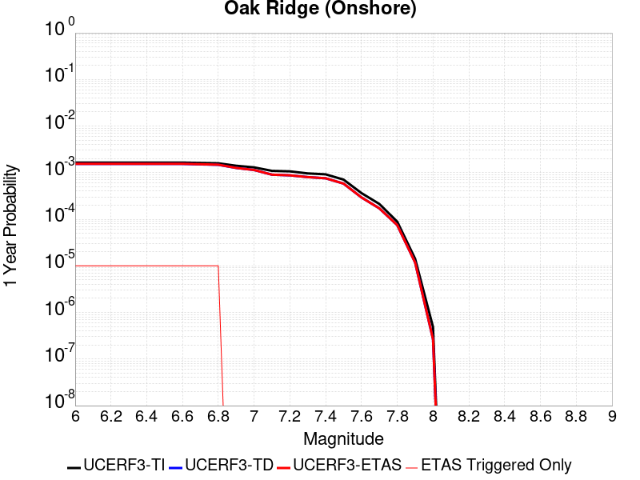 |  |

| Magnitude | 1 wk TI Prob | 1 wk TD Prob | 1 wk ETAS Prob | 1 wk ETAS/TD Gain | 1 wk ETAS Triggered Only | 1 mo TI Prob | 1 mo TD Prob | 1 mo ETAS Prob | 1 mo ETAS/TD Gain | 1 mo ETAS Triggered Only | 1 yr TI Prob | 1 yr TD Prob | 1 yr ETAS Prob | 1 yr ETAS/TD Gain | 1 yr ETAS Triggered Only | 10 yr TI Prob | 10 yr TD Prob | 10 yr ETAS Prob | 10 yr ETAS/TD Gain | 10 yr ETAS Triggered Only |
|-----|-----|-----|-----|-----|-----|-----|-----|-----|-----|-----|-----|-----|-----|-----|-----|-----|-----|-----|-----|-----|
| 6.0 | 3.155064E-5 | 2.9525878E-5 | 3.952558E-5 | 1.338676 | 1.0E-5 | 1.3521002E-4 | 1.2653354E-4 | 1.3653228E-4 | 1.0790204 | 1.0E-5 | 0.001644939 | 0.0015394954 | 0.00154948 | 1.0064856 | 1.0E-5 | 0.01632816 | 0.015292809 | 0.015302656 | 1.0006438 | 1.0E-5 |
| 6.1 | 3.155064E-5 | 2.9525878E-5 | 3.952558E-5 | 1.338676 | 1.0E-5 | 1.3521002E-4 | 1.2653354E-4 | 1.3653228E-4 | 1.0790204 | 1.0E-5 | 0.001644939 | 0.0015394954 | 0.00154948 | 1.0064856 | 1.0E-5 | 0.01632816 | 0.015292809 | 0.015302656 | 1.0006438 | 1.0E-5 |
| 6.2 | 3.155064E-5 | 2.9525878E-5 | 3.952558E-5 | 1.338676 | 1.0E-5 | 1.3521002E-4 | 1.2653354E-4 | 1.3653228E-4 | 1.0790204 | 1.0E-5 | 0.001644939 | 0.0015394954 | 0.00154948 | 1.0064856 | 1.0E-5 | 0.01632816 | 0.015292809 | 0.015302656 | 1.0006438 | 1.0E-5 |
| 6.3 | 3.155064E-5 | 2.9525878E-5 | 3.952558E-5 | 1.338676 | 1.0E-5 | 1.3521002E-4 | 1.2653354E-4 | 1.3653228E-4 | 1.0790204 | 1.0E-5 | 0.001644939 | 0.0015394954 | 0.00154948 | 1.0064856 | 1.0E-5 | 0.01632816 | 0.015292809 | 0.015302656 | 1.0006438 | 1.0E-5 |
| 6.4 | 3.155064E-5 | 2.9525878E-5 | 3.952558E-5 | 1.338676 | 1.0E-5 | 1.3521002E-4 | 1.2653354E-4 | 1.3653228E-4 | 1.0790204 | 1.0E-5 | 0.001644939 | 0.0015394954 | 0.00154948 | 1.0064856 | 1.0E-5 | 0.01632816 | 0.015292809 | 0.015302656 | 1.0006438 | 1.0E-5 |
| 6.5 | 3.155064E-5 | 2.9525878E-5 | 3.952558E-5 | 1.338676 | 1.0E-5 | 1.3521002E-4 | 1.2653354E-4 | 1.3653228E-4 | 1.0790204 | 1.0E-5 | 0.001644939 | 0.0015394954 | 0.00154948 | 1.0064856 | 1.0E-5 | 0.01632816 | 0.015292809 | 0.015302656 | 1.0006438 | 1.0E-5 |
| 6.6 | 3.155064E-5 | 2.9525878E-5 | 3.952558E-5 | 1.338676 | 1.0E-5 | 1.3521002E-4 | 1.2653354E-4 | 1.3653228E-4 | 1.0790204 | 1.0E-5 | 0.001644939 | 0.0015394954 | 0.00154948 | 1.0064856 | 1.0E-5 | 0.01632816 | 0.015292809 | 0.015302656 | 1.0006438 | 1.0E-5 |
| 6.7 | 3.098897E-5 | 2.886408E-5 | 3.8863793E-5 | 1.3464414 | 1.0E-5 | 1.328031E-4 | 1.2369755E-4 | 1.3369632E-4 | 1.0808324 | 1.0E-5 | 0.0016156785 | 0.001505015 | 0.0015149999 | 1.0066345 | 1.0E-5 | 0.016039822 | 0.014952665 | 0.014962516 | 1.0006588 | 1.0E-5 |
| 6.8 | 3.0449872E-5 | 2.8239281E-5 | 3.8239E-5 | 1.3541067 | 1.0E-5 | 1.3049292E-4 | 1.21020086E-4 | 1.3101888E-4 | 1.0826209 | 1.0E-5 | 0.0015875935 | 0.0014724609 | 0.0014824462 | 1.0067813 | 1.0E-5 | 0.015762992 | 0.014631415 | 0.014641269 | 1.0006734 | 1.0E-5 |
| 6.9 | 2.697928E-5 | 2.42197E-5 | 2.42197E-5 | 1.0 | 0.0 | 1.15620365E-4 | 1.037947E-4 | 1.037947E-4 | 1.0 | 0.0 | 0.0014067689 | 0.0012629895 | 0.0012629895 | 1.0 | 0.0 | 0.0139789665 | 0.012560831 | 0.012560831 | 1.0 | 0.0 |
| 7.0 | 2.4893961E-5 | 2.1861977E-5 | 2.1861977E-5 | 1.0 | 0.0 | 1.0668404E-4 | 9.369092E-5 | 9.369092E-5 | 1.0 | 0.0 | 0.0012981043 | 0.0011401077 | 0.0011401077 | 1.0 | 0.0 | 0.012905477 | 0.011344872 | 0.011344872 | 1.0 | 0.0 |
| 7.1 | 2.0945363E-5 | 1.735444E-5 | 1.735444E-5 | 1.0 | 0.0 | 8.976275E-5 | 7.4374075E-5 | 7.4374075E-5 | 1.0 | 0.0 | 0.0010923136 | 9.0513297E-4 | 9.0513297E-4 | 1.0 | 0.0 | 0.0108696 | 0.009015398 | 0.009015398 | 1.0 | 0.0 |
| 7.2 | 2.0439404E-5 | 1.6809377E-5 | 1.6809377E-5 | 1.0 | 0.0 | 8.7594504E-5 | 7.203823E-5 | 7.203823E-5 | 1.0 | 0.0 | 0.0010659413 | 8.767172E-4 | 8.767172E-4 | 1.0 | 0.0 | 0.010608427 | 0.008733503 | 0.008733503 | 1.0 | 0.0 |
| 7.3 | 1.8463334E-5 | 1.5381771E-5 | 1.5381771E-5 | 1.0 | 0.0 | 7.912617E-5 | 6.5920234E-5 | 6.5920234E-5 | 1.0 | 0.0 | 9.6293533E-4 | 8.0228766E-4 | 8.0228766E-4 | 1.0 | 0.0 | 0.009587734 | 0.007994777 | 0.007994777 | 1.0 | 0.0 |
| 7.4 | 1.763139E-5 | 1.4516804E-5 | 1.4516804E-5 | 1.0 | 0.0 | 7.556091E-5 | 6.221341E-5 | 6.221341E-5 | 1.0 | 0.0 | 9.1956573E-4 | 7.57189E-4 | 7.57189E-4 | 1.0 | 0.0 | 0.009157699 | 0.007546895 | 0.007546895 | 1.0 | 0.0 |
| 7.5 | 1.3594944E-5 | 1.1163331E-5 | 1.1163331E-5 | 1.0 | 0.0 | 5.8262744E-5 | 4.7841982E-5 | 4.7841982E-5 | 1.0 | 0.0 | 7.0911803E-4 | 5.82323E-4 | 5.82323E-4 | 1.0 | 0.0 | 0.007068595 | 0.0058082426 | 0.0058082426 | 1.0 | 0.0 |
| 7.6 | 6.9889534E-6 | 5.636704E-6 | 5.636704E-6 | 1.0 | 0.0 | 2.9952313E-5 | 2.4157081E-5 | 2.4157081E-5 | 1.0 | 0.0 | 3.646084E-4 | 2.940732E-4 | 2.940732E-4 | 1.0 | 0.0 | 0.0036401073 | 0.0029368843 | 0.0029368843 | 1.0 | 0.0 |
| 7.7 | 4.0824193E-6 | 3.2832515E-6 | 3.2832515E-6 | 1.0 | 0.0 | 1.7495966E-5 | 1.40710035E-5 | 1.40710035E-5 | 1.0 | 0.0 | 2.1299256E-4 | 1.7130113E-4 | 1.7130113E-4 | 1.0 | 0.0 | 0.0021278851 | 0.0017117043 | 0.0017117043 | 1.0 | 0.0 |
| 7.8 | 1.7023609E-6 | 1.4370474E-6 | 1.4370474E-6 | 1.0 | 0.0 | 7.295812E-6 | 6.1587602E-6 | 6.1587602E-6 | 1.0 | 0.0 | 8.882289E-5 | 7.498035E-5 | 7.498035E-5 | 1.0 | 0.0 | 8.8787393E-4 | 7.495533E-4 | 7.495533E-4 | 1.0 | 0.0 |
| 7.9 | 2.721225E-7 | 2.2616453E-7 | 2.2616453E-7 | 1.0 | 0.0 | 1.1662388E-6 | 9.692762E-7 | 9.692762E-7 | 1.0 | 0.0 | 1.4198865E-5 | 1.1800877E-5 | 1.1800877E-5 | 1.0 | 0.0 | 1.4197957E-4 | 1.1800278E-4 | 1.1800278E-4 | 1.0 | 0.0 |
| 8.0 | 9.364255E-9 | 5.120615E-9 | 5.120615E-9 | 1.0 | 0.0 | 4.0132523E-8 | 2.1945494E-8 | 2.1945494E-8 | 1.0 | 0.0 | 4.8861335E-7 | 2.6718635E-7 | 2.6718635E-7 | 1.0 | 0.0 | 4.8861225E-6 | 2.6718606E-6 | 2.6718606E-6 | 1.0 | 0.0 |

## Mono Lake 2011 CFM
*[(top)](#table-of-contents)*

| 1 Week | 1 Month | 1 Year | 10 Year |
|-----|-----|-----|-----|
|  |  |  |  |

| Magnitude | 1 wk TI Prob | 1 wk TD Prob | 1 wk ETAS Prob | 1 wk ETAS/TD Gain | 1 wk ETAS Triggered Only | 1 mo TI Prob | 1 mo TD Prob | 1 mo ETAS Prob | 1 mo ETAS/TD Gain | 1 mo ETAS Triggered Only | 1 yr TI Prob | 1 yr TD Prob | 1 yr ETAS Prob | 1 yr ETAS/TD Gain | 1 yr ETAS Triggered Only | 10 yr TI Prob | 10 yr TD Prob | 10 yr ETAS Prob | 10 yr ETAS/TD Gain | 10 yr ETAS Triggered Only |
|-----|-----|-----|-----|-----|-----|-----|-----|-----|-----|-----|-----|-----|-----|-----|-----|-----|-----|-----|-----|-----|
| 6.0 | 2.0341662E-5 | 2.3828057E-5 | 2.3828057E-5 | 1.0 | 0.0 | 8.717564E-5 | 1.02119244E-4 | 1.02119244E-4 | 1.0 | 0.0 | 0.0010608466 | 0.0012431241 | 0.0012531118 | 1.0080342 | 1.0E-5 | 0.010557966 | 0.012413778 | 0.012423654 | 1.0007956 | 1.0E-5 |
| 6.1 | 2.0341662E-5 | 2.3828057E-5 | 2.3828057E-5 | 1.0 | 0.0 | 8.717564E-5 | 1.02119244E-4 | 1.02119244E-4 | 1.0 | 0.0 | 0.0010608466 | 0.0012431241 | 0.0012531118 | 1.0080342 | 1.0E-5 | 0.010557966 | 0.012413778 | 0.012423654 | 1.0007956 | 1.0E-5 |
| 6.2 | 2.0341662E-5 | 2.3828057E-5 | 2.3828057E-5 | 1.0 | 0.0 | 8.717564E-5 | 1.02119244E-4 | 1.02119244E-4 | 1.0 | 0.0 | 0.0010608466 | 0.0012431241 | 0.0012531118 | 1.0080342 | 1.0E-5 | 0.010557966 | 0.012413778 | 0.012423654 | 1.0007956 | 1.0E-5 |
| 6.3 | 2.0341662E-5 | 2.3828057E-5 | 2.3828057E-5 | 1.0 | 0.0 | 8.717564E-5 | 1.02119244E-4 | 1.02119244E-4 | 1.0 | 0.0 | 0.0010608466 | 0.0012431241 | 0.0012531118 | 1.0080342 | 1.0E-5 | 0.010557966 | 0.012413778 | 0.012423654 | 1.0007956 | 1.0E-5 |
| 6.4 | 1.749821E-5 | 2.0490892E-5 | 2.0490892E-5 | 1.0 | 0.0 | 7.499018E-5 | 8.781811E-5 | 8.781811E-5 | 1.0 | 0.0 | 9.1262296E-4 | 0.0010691854 | 0.0010791748 | 1.0093429 | 1.0E-5 | 0.009088841 | 0.010691816 | 0.010701709 | 1.0009253 | 1.0E-5 |
| 6.5 | 1.749821E-5 | 2.0490892E-5 | 2.0490892E-5 | 1.0 | 0.0 | 7.499018E-5 | 8.781811E-5 | 8.781811E-5 | 1.0 | 0.0 | 9.1262296E-4 | 0.0010691854 | 0.0010791748 | 1.0093429 | 1.0E-5 | 0.009088841 | 0.010691816 | 0.010701709 | 1.0009253 | 1.0E-5 |

## Rose Canyon
*[(top)](#table-of-contents)*

| 1 Week | 1 Month | 1 Year | 10 Year |
|-----|-----|-----|-----|
|  |  |  |  |

| Magnitude | 1 wk TI Prob | 1 wk TD Prob | 1 wk ETAS Prob | 1 wk ETAS/TD Gain | 1 wk ETAS Triggered Only | 1 mo TI Prob | 1 mo TD Prob | 1 mo ETAS Prob | 1 mo ETAS/TD Gain | 1 mo ETAS Triggered Only | 1 yr TI Prob | 1 yr TD Prob | 1 yr ETAS Prob | 1 yr ETAS/TD Gain | 1 yr ETAS Triggered Only | 10 yr TI Prob | 10 yr TD Prob | 10 yr ETAS Prob | 10 yr ETAS/TD Gain | 10 yr ETAS Triggered Only |
|-----|-----|-----|-----|-----|-----|-----|-----|-----|-----|-----|-----|-----|-----|-----|-----|-----|-----|-----|-----|-----|
| 6.0 | 4.5923203E-5 | 4.9713904E-5 | 4.9713904E-5 | 1.0 | 0.0 | 1.9679888E-4 | 2.1304355E-4 | 2.1304355E-4 | 1.0 | 0.0 | 0.0023933933 | 0.0025909187 | 0.0025909187 | 1.0 | 0.0 | 0.023677798 | 0.025639834 | 0.025649577 | 1.00038 | 1.0E-5 |
| 6.1 | 4.5923203E-5 | 4.9713904E-5 | 4.9713904E-5 | 1.0 | 0.0 | 1.9679888E-4 | 2.1304355E-4 | 2.1304355E-4 | 1.0 | 0.0 | 0.0023933933 | 0.0025909187 | 0.0025909187 | 1.0 | 0.0 | 0.023677798 | 0.025639834 | 0.025649577 | 1.00038 | 1.0E-5 |
| 6.2 | 2.8844734E-5 | 2.9668578E-5 | 2.9668578E-5 | 1.0 | 0.0 | 1.2361443E-4 | 1.2714505E-4 | 1.2714505E-4 | 1.0 | 0.0 | 0.0015039665 | 0.0015468865 | 0.0015468865 | 1.0 | 0.0 | 0.0149382865 | 0.015374203 | 0.015384049 | 1.0006404 | 1.0E-5 |
| 6.3 | 2.3171577E-5 | 2.3161147E-5 | 2.3161147E-5 | 1.0 | 0.0 | 9.9302975E-5 | 9.925836E-5 | 9.925836E-5 | 1.0 | 0.0 | 0.0012083431 | 0.0012078139 | 0.0012078139 | 1.0 | 0.0 | 0.012017938 | 0.01202239 | 0.0120322695 | 1.0008218 | 1.0E-5 |
| 6.4 | 2.0066604E-5 | 1.966695E-5 | 1.966695E-5 | 1.0 | 0.0 | 8.599689E-5 | 8.428426E-5 | 8.428426E-5 | 1.0 | 0.0 | 0.0010465092 | 0.0010256878 | 0.0010256878 | 1.0 | 0.0 | 0.010415946 | 0.0102175195 | 0.010227418 | 1.0009687 | 1.0E-5 |
| 6.5 | 1.776989E-5 | 1.7113744E-5 | 1.7113744E-5 | 1.0 | 0.0 | 7.615444E-5 | 7.334259E-5 | 7.334259E-5 | 1.0 | 0.0 | 9.267859E-4 | 8.9258724E-4 | 8.9258724E-4 | 1.0 | 0.0 | 0.009229303 | 0.008896178 | 0.008906089 | 1.0011141 | 1.0E-5 |
| 6.6 | 1.5227364E-5 | 1.4339211E-5 | 1.4339211E-5 | 1.0 | 0.0 | 6.52585E-5 | 6.1452345E-5 | 6.1452345E-5 | 1.0 | 0.0 | 7.942326E-4 | 7.4793067E-4 | 7.4793067E-4 | 1.0 | 0.0 | 0.007914 | 0.0074583334 | 0.007468259 | 1.0013307 | 1.0E-5 |
| 6.7 | 1.2703898E-5 | 1.1673238E-5 | 1.1673238E-5 | 1.0 | 0.0 | 5.4444143E-5 | 5.002723E-5 | 5.002723E-5 | 1.0 | 0.0 | 6.626558E-4 | 6.089155E-4 | 6.089155E-4 | 1.0 | 0.0 | 0.006606833 | 0.0060750674 | 0.0060850065 | 1.001636 | 1.0E-5 |
| 6.8 | 1.1554917E-5 | 1.06093075E-5 | 1.06093075E-5 | 1.0 | 0.0 | 4.9520135E-5 | 4.546769E-5 | 4.546769E-5 | 1.0 | 0.0 | 6.0274085E-4 | 5.5343256E-4 | 5.5343256E-4 | 1.0 | 0.0 | 0.0060110865 | 0.005522552 | 0.0055324966 | 1.0018008 | 1.0E-5 |
| 6.9 | 8.732078E-6 | 7.881339E-6 | 7.881339E-6 | 1.0 | 0.0 | 3.7422655E-5 | 3.377675E-5 | 3.377675E-5 | 1.0 | 0.0 | 4.5552556E-4 | 4.1115723E-4 | 4.1115723E-4 | 1.0 | 0.0 | 0.0045459294 | 0.004104799 | 0.004104799 | 1.0 | 0.0 |
| 7.0 | 5.9337494E-6 | 5.107476E-6 | 5.107476E-6 | 1.0 | 0.0 | 2.5430107E-5 | 2.1889E-5 | 2.1889E-5 | 1.0 | 0.0 | 3.0956755E-4 | 2.6646614E-4 | 2.6646614E-4 | 1.0 | 0.0 | 0.0030913667 | 0.002661482 | 0.002661482 | 1.0 | 0.0 |
| 7.1 | 5.013409E-6 | 4.177376E-6 | 4.177376E-6 | 1.0 | 0.0 | 2.1485863E-5 | 1.7902918E-5 | 1.7902918E-5 | 1.0 | 0.0 | 2.6155898E-4 | 2.1794632E-4 | 2.1794632E-4 | 1.0 | 0.0 | 0.0026125133 | 0.0021773374 | 0.0021773374 | 1.0 | 0.0 |
| 7.2 | 4.120763E-6 | 3.2821324E-6 | 3.2821324E-6 | 1.0 | 0.0 | 1.7660293E-5 | 1.4066206E-5 | 1.4066206E-5 | 1.0 | 0.0 | 2.1499286E-4 | 1.7124269E-4 | 1.7124269E-4 | 1.0 | 0.0 | 0.0021478499 | 0.001711117 | 0.001711117 | 1.0 | 0.0 |
| 7.3 | 3.2081239E-6 | 2.4405329E-6 | 2.4405329E-6 | 1.0 | 0.0 | 1.374903E-5 | 1.0459385E-5 | 1.0459385E-5 | 1.0 | 0.0 | 1.6738157E-4 | 1.2733563E-4 | 1.2733563E-4 | 1.0 | 0.0 | 0.0016725556 | 0.0012726337 | 0.0012726337 | 1.0 | 0.0 |
| 7.4 | 2.4194755E-6 | 1.76806E-6 | 1.76806E-6 | 1.0 | 0.0 | 1.0369139E-5 | 7.5773783E-6 | 7.5773783E-6 | 1.0 | 0.0 | 1.2623696E-4 | 9.2250724E-5 | 9.2250724E-5 | 1.0 | 0.0 | 0.0012616527 | 9.2212966E-4 | 9.2212966E-4 | 1.0 | 0.0 |
| 7.5 | 1.3842889E-6 | 9.3786053E-7 | 9.3786053E-7 | 1.0 | 0.0 | 5.9326535E-6 | 4.0193963E-6 | 4.0193963E-6 | 1.0 | 0.0 | 7.222766E-5 | 4.8935086E-5 | 4.8935086E-5 | 1.0 | 0.0 | 7.220419E-4 | 4.892466E-4 | 4.892466E-4 | 1.0 | 0.0 |
| 7.6 | 1.0021575E-6 | 6.411446E-7 | 6.411446E-7 | 1.0 | 0.0 | 4.2949537E-6 | 2.7477597E-6 | 2.7477597E-6 | 1.0 | 0.0 | 5.2289808E-5 | 3.345348E-5 | 3.345348E-5 | 1.0 | 0.0 | 5.2277505E-4 | 3.3448663E-4 | 3.3448663E-4 | 1.0 | 0.0 |
| 7.7 | 8.7620116E-8 | 6.449232E-8 | 6.449232E-8 | 1.0 | 0.0 | 3.7551473E-7 | 2.7639564E-7 | 2.7639564E-7 | 1.0 | 0.0 | 4.5718825E-6 | 3.365112E-6 | 3.365112E-6 | 1.0 | 0.0 | 4.5717883E-5 | 3.365064E-5 | 3.365064E-5 | 1.0 | 0.0 |

## Kickapoo
*[(top)](#table-of-contents)*

| 1 Week | 1 Month | 1 Year | 10 Year |
|-----|-----|-----|-----|
|  |  | 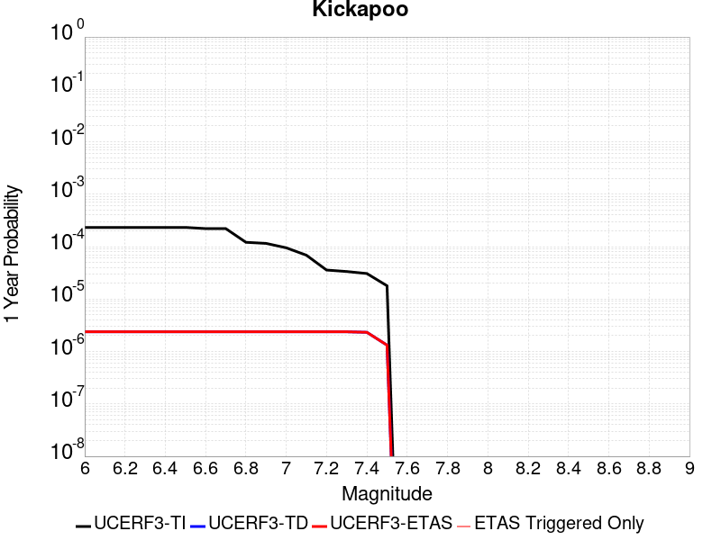 | 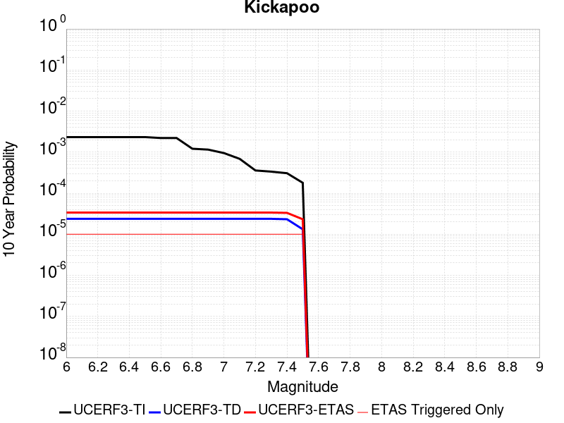 |

| Magnitude | 1 wk TI Prob | 1 wk TD Prob | 1 wk ETAS Prob | 1 wk ETAS/TD Gain | 1 wk ETAS Triggered Only | 1 mo TI Prob | 1 mo TD Prob | 1 mo ETAS Prob | 1 mo ETAS/TD Gain | 1 mo ETAS Triggered Only | 1 yr TI Prob | 1 yr TD Prob | 1 yr ETAS Prob | 1 yr ETAS/TD Gain | 1 yr ETAS Triggered Only | 10 yr TI Prob | 10 yr TD Prob | 10 yr ETAS Prob | 10 yr ETAS/TD Gain | 10 yr ETAS Triggered Only |
|-----|-----|-----|-----|-----|-----|-----|-----|-----|-----|-----|-----|-----|-----|-----|-----|-----|-----|-----|-----|-----|
| 6.0 | 4.4610633E-6 | 4.5597766E-8 | 4.5597766E-8 | 1.0 | 0.0 | 1.9118703E-5 | 1.9541899E-7 | 1.9541899E-7 | 1.0 | 0.0 | 2.3274534E-4 | 2.3792238E-6 | 2.3792238E-6 | 1.0 | 0.0 | 0.0023250172 | 2.3792012E-5 | 3.3791774E-5 | 1.4202992 | 1.0E-5 |
| 6.1 | 4.4610633E-6 | 4.5597766E-8 | 4.5597766E-8 | 1.0 | 0.0 | 1.9118703E-5 | 1.9541899E-7 | 1.9541899E-7 | 1.0 | 0.0 | 2.3274534E-4 | 2.3792238E-6 | 2.3792238E-6 | 1.0 | 0.0 | 0.0023250172 | 2.3792012E-5 | 3.3791774E-5 | 1.4202992 | 1.0E-5 |
| 6.2 | 4.4610633E-6 | 4.5597766E-8 | 4.5597766E-8 | 1.0 | 0.0 | 1.9118703E-5 | 1.9541899E-7 | 1.9541899E-7 | 1.0 | 0.0 | 2.3274534E-4 | 2.3792238E-6 | 2.3792238E-6 | 1.0 | 0.0 | 0.0023250172 | 2.3792012E-5 | 3.3791774E-5 | 1.4202992 | 1.0E-5 |
| 6.3 | 4.4610633E-6 | 4.5597766E-8 | 4.5597766E-8 | 1.0 | 0.0 | 1.9118703E-5 | 1.9541899E-7 | 1.9541899E-7 | 1.0 | 0.0 | 2.3274534E-4 | 2.3792238E-6 | 2.3792238E-6 | 1.0 | 0.0 | 0.0023250172 | 2.3792012E-5 | 3.3791774E-5 | 1.4202992 | 1.0E-5 |
| 6.4 | 4.4610633E-6 | 4.5597766E-8 | 4.5597766E-8 | 1.0 | 0.0 | 1.9118703E-5 | 1.9541899E-7 | 1.9541899E-7 | 1.0 | 0.0 | 2.3274534E-4 | 2.3792238E-6 | 2.3792238E-6 | 1.0 | 0.0 | 0.0023250172 | 2.3792012E-5 | 3.3791774E-5 | 1.4202992 | 1.0E-5 |
| 6.5 | 4.4610633E-6 | 4.5597766E-8 | 4.5597766E-8 | 1.0 | 0.0 | 1.9118703E-5 | 1.9541899E-7 | 1.9541899E-7 | 1.0 | 0.0 | 2.3274534E-4 | 2.3792238E-6 | 2.3792238E-6 | 1.0 | 0.0 | 0.0023250172 | 2.3792012E-5 | 3.3791774E-5 | 1.4202992 | 1.0E-5 |
| 6.6 | 4.236531E-6 | 4.5597766E-8 | 4.5597766E-8 | 1.0 | 0.0 | 1.8156434E-5 | 1.9541899E-7 | 1.9541899E-7 | 1.0 | 0.0 | 2.2103215E-4 | 2.3792238E-6 | 2.3792238E-6 | 1.0 | 0.0 | 0.0022081244 | 2.3792012E-5 | 3.3791774E-5 | 1.4202992 | 1.0E-5 |
| 6.7 | 4.236531E-6 | 4.5597766E-8 | 4.5597766E-8 | 1.0 | 0.0 | 1.8156434E-5 | 1.9541899E-7 | 1.9541899E-7 | 1.0 | 0.0 | 2.2103215E-4 | 2.3792238E-6 | 2.3792238E-6 | 1.0 | 0.0 | 0.0022081244 | 2.3792012E-5 | 3.3791774E-5 | 1.4202992 | 1.0E-5 |
| 6.8 | 2.3202913E-6 | 4.5597766E-8 | 4.5597766E-8 | 1.0 | 0.0 | 9.944068E-6 | 1.9541899E-7 | 1.9541899E-7 | 1.0 | 0.0 | 1.210623E-4 | 2.3792238E-6 | 2.3792238E-6 | 1.0 | 0.0 | 0.0012099637 | 2.3792012E-5 | 3.3791774E-5 | 1.4202992 | 1.0E-5 |
| 6.9 | 2.2111808E-6 | 4.5597766E-8 | 4.5597766E-8 | 1.0 | 0.0 | 9.4764555E-6 | 1.9541899E-7 | 1.9541899E-7 | 1.0 | 0.0 | 1.1536973E-4 | 2.3792238E-6 | 2.3792238E-6 | 1.0 | 0.0 | 0.0011530985 | 2.3792012E-5 | 3.3791774E-5 | 1.4202992 | 1.0E-5 |
| 7.0 | 1.8222031E-6 | 4.5597766E-8 | 4.5597766E-8 | 1.0 | 0.0 | 7.809419E-6 | 1.9541899E-7 | 1.9541899E-7 | 1.0 | 0.0 | 9.507552E-5 | 2.3792238E-6 | 2.3792238E-6 | 1.0 | 0.0 | 9.5034856E-4 | 2.3792012E-5 | 3.3791774E-5 | 1.4202992 | 1.0E-5 |
| 7.1 | 1.3163254E-6 | 4.5597766E-8 | 4.5597766E-8 | 1.0 | 0.0 | 5.6413824E-6 | 1.9541899E-7 | 1.9541899E-7 | 1.0 | 0.0 | 6.868167E-5 | 2.3792238E-6 | 2.3792238E-6 | 1.0 | 0.0 | 6.866045E-4 | 2.3792012E-5 | 3.3791774E-5 | 1.4202992 | 1.0E-5 |
| 7.2 | 6.8603634E-7 | 4.5596845E-8 | 4.5596845E-8 | 1.0 | 0.0 | 2.9401524E-6 | 1.9541504E-7 | 1.9541504E-7 | 1.0 | 0.0 | 3.579577E-5 | 2.3791758E-6 | 2.3791758E-6 | 1.0 | 0.0 | 3.5790002E-4 | 2.3791532E-5 | 3.3791293E-5 | 1.4203076 | 1.0E-5 |
| 7.3 | 6.4299127E-7 | 4.558063E-8 | 4.558063E-8 | 1.0 | 0.0 | 2.755674E-6 | 1.9534555E-7 | 1.9534555E-7 | 1.0 | 0.0 | 3.3549815E-5 | 2.3783298E-6 | 2.3783298E-6 | 1.0 | 0.0 | 3.354475E-4 | 2.3783072E-5 | 3.378283E-5 | 1.4204571 | 1.0E-5 |
| 7.4 | 5.8856347E-7 | 4.455648E-8 | 4.455648E-8 | 1.0 | 0.0 | 2.5224124E-6 | 1.9095633E-7 | 1.9095633E-7 | 1.0 | 0.0 | 3.070994E-5 | 2.324891E-6 | 2.324891E-6 | 1.0 | 0.0 | 3.0705697E-4 | 2.3248696E-5 | 3.3248463E-5 | 1.4301217 | 1.0E-5 |
| 7.5 | 3.435626E-7 | 2.535737E-8 | 2.535737E-8 | 1.0 | 0.0 | 1.4724103E-6 | 1.08674435E-7 | 1.08674435E-7 | 1.0 | 0.0 | 1.7926448E-5 | 1.3231106E-6 | 1.3231106E-6 | 1.0 | 0.0 | 1.7925001E-4 | 1.3231043E-5 | 2.3230912E-5 | 1.7557883 | 1.0E-5 |

## Ortigalita (South)
*[(top)](#table-of-contents)*

| 1 Week | 1 Month | 1 Year | 10 Year |
|-----|-----|-----|-----|
|  |  |  | 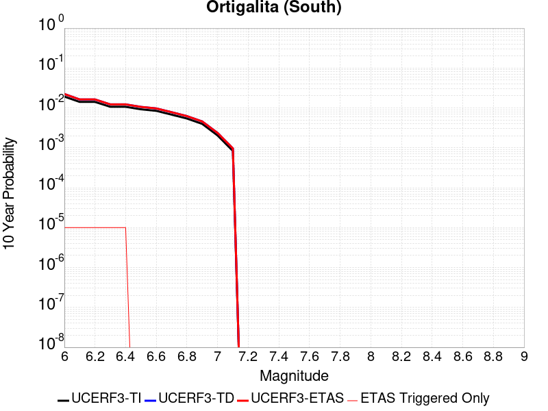 |

| Magnitude | 1 wk TI Prob | 1 wk TD Prob | 1 wk ETAS Prob | 1 wk ETAS/TD Gain | 1 wk ETAS Triggered Only | 1 mo TI Prob | 1 mo TD Prob | 1 mo ETAS Prob | 1 mo ETAS/TD Gain | 1 mo ETAS Triggered Only | 1 yr TI Prob | 1 yr TD Prob | 1 yr ETAS Prob | 1 yr ETAS/TD Gain | 1 yr ETAS Triggered Only | 10 yr TI Prob | 10 yr TD Prob | 10 yr ETAS Prob | 10 yr ETAS/TD Gain | 10 yr ETAS Triggered Only |
|-----|-----|-----|-----|-----|-----|-----|-----|-----|-----|-----|-----|-----|-----|-----|-----|-----|-----|-----|-----|-----|
| 6.0 | 3.72394E-5 | 4.325543E-5 | 4.325543E-5 | 1.0 | 0.0 | 1.5958765E-4 | 1.8536813E-4 | 1.8536813E-4 | 1.0 | 0.0 | 0.0019412481 | 0.0022546777 | 0.0022646552 | 1.0044252 | 1.0E-5 | 0.019243775 | 0.0223344 | 0.022344178 | 1.0004377 | 1.0E-5 |
| 6.1 | 2.7299884E-5 | 3.1491913E-5 | 3.1491913E-5 | 1.0 | 0.0 | 1.16994255E-4 | 1.3495867E-4 | 1.3495867E-4 | 1.0 | 0.0 | 0.0014234743 | 0.0016419389 | 0.0016519226 | 1.0060804 | 1.0E-5 | 0.014143906 | 0.016304003 | 0.016313842 | 1.0006033 | 1.0E-5 |
| 6.2 | 2.7299884E-5 | 3.1491913E-5 | 3.1491913E-5 | 1.0 | 0.0 | 1.16994255E-4 | 1.3495867E-4 | 1.3495867E-4 | 1.0 | 0.0 | 0.0014234743 | 0.0016419389 | 0.0016519226 | 1.0060804 | 1.0E-5 | 0.014143906 | 0.016304003 | 0.016313842 | 1.0006033 | 1.0E-5 |
| 6.3 | 2.0546433E-5 | 2.3631355E-5 | 2.3631355E-5 | 1.0 | 0.0 | 8.805317E-5 | 1.01273414E-4 | 1.01273414E-4 | 1.0 | 0.0 | 0.00107152 | 0.0012323253 | 0.0012423131 | 1.0081047 | 1.0E-5 | 0.010663681 | 0.012256981 | 0.0122668585 | 1.0008059 | 1.0E-5 |
| 6.4 | 2.0546433E-5 | 2.3631355E-5 | 2.3631355E-5 | 1.0 | 0.0 | 8.805317E-5 | 1.01273414E-4 | 1.01273414E-4 | 1.0 | 0.0 | 0.00107152 | 0.0012323253 | 0.0012423131 | 1.0081047 | 1.0E-5 | 0.010663681 | 0.012256981 | 0.0122668585 | 1.0008059 | 1.0E-5 |
| 6.5 | 1.7779594E-5 | 2.0446892E-5 | 2.0446892E-5 | 1.0 | 0.0 | 7.619603E-5 | 8.762667E-5 | 8.762667E-5 | 1.0 | 0.0 | 9.272918E-4 | 0.0010663462 | 0.0010663462 | 1.0 | 0.0 | 0.009234319 | 0.010613761 | 0.010613761 | 1.0 | 0.0 |
| 6.6 | 1.6272212E-5 | 1.8714893E-5 | 1.8714893E-5 | 1.0 | 0.0 | 6.973618E-5 | 8.0204285E-5 | 8.0204285E-5 | 1.0 | 0.0 | 8.487073E-4 | 9.760619E-4 | 9.760619E-4 | 1.0 | 0.0 | 0.008454733 | 0.009719051 | 0.009719051 | 1.0 | 0.0 |
| 6.7 | 1.3051484E-5 | 1.5038697E-5 | 1.5038697E-5 | 1.0 | 0.0 | 5.593373E-5 | 6.445002E-5 | 6.445002E-5 | 1.0 | 0.0 | 6.807804E-4 | 7.84406E-4 | 7.84406E-4 | 1.0 | 0.0 | 0.006786986 | 0.007817356 | 0.007817356 | 1.0 | 0.0 |
| 6.8 | 1.04277415E-5 | 1.19871875E-5 | 1.19871875E-5 | 1.0 | 0.0 | 4.4689557E-5 | 5.1372688E-5 | 5.1372688E-5 | 1.0 | 0.0 | 5.439595E-4 | 6.2529044E-4 | 6.2529044E-4 | 1.0 | 0.0 | 0.0054262993 | 0.006236065 | 0.006236065 | 1.0 | 0.0 |
| 6.9 | 7.639968E-6 | 8.791468E-6 | 8.791468E-6 | 1.0 | 0.0 | 3.274231E-5 | 3.7677208E-5 | 3.7677208E-5 | 1.0 | 0.0 | 3.9856473E-4 | 4.5862934E-4 | 4.5862934E-4 | 1.0 | 0.0 | 0.003978506 | 0.0045774146 | 0.0045774146 | 1.0 | 0.0 |
| 7.0 | 3.919831E-6 | 4.5333823E-6 | 4.5333823E-6 | 1.0 | 0.0 | 1.679917E-5 | 1.942865E-5 | 1.942865E-5 | 1.0 | 0.0 | 2.045107E-4 | 2.3652024E-4 | 2.3652024E-4 | 1.0 | 0.0 | 0.0020432258 | 0.0023628937 | 0.0023628937 | 1.0 | 0.0 |
| 7.1 | 1.6017933E-6 | 1.8570338E-6 | 1.8570338E-6 | 1.0 | 0.0 | 6.8648105E-6 | 7.958698E-6 | 7.958698E-6 | 1.0 | 0.0 | 8.357586E-5 | 9.6893906E-5 | 9.6893906E-5 | 1.0 | 0.0 | 8.3544437E-4 | 9.6862135E-4 | 9.6862135E-4 | 1.0 | 0.0 |

## Camp Rock 2011
*[(top)](#table-of-contents)*

| 1 Week | 1 Month | 1 Year | 10 Year |
|-----|-----|-----|-----|
|  | 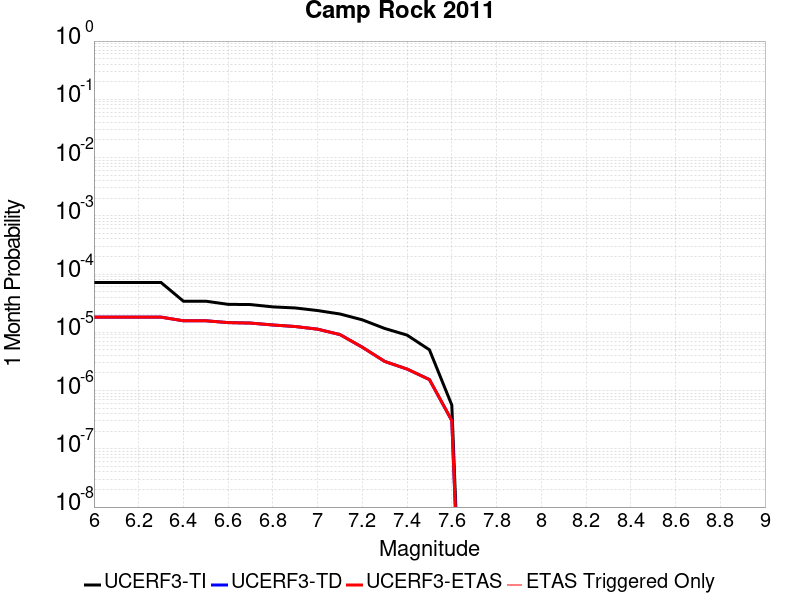 |  |  |

| Magnitude | 1 wk TI Prob | 1 wk TD Prob | 1 wk ETAS Prob | 1 wk ETAS/TD Gain | 1 wk ETAS Triggered Only | 1 mo TI Prob | 1 mo TD Prob | 1 mo ETAS Prob | 1 mo ETAS/TD Gain | 1 mo ETAS Triggered Only | 1 yr TI Prob | 1 yr TD Prob | 1 yr ETAS Prob | 1 yr ETAS/TD Gain | 1 yr ETAS Triggered Only | 10 yr TI Prob | 10 yr TD Prob | 10 yr ETAS Prob | 10 yr ETAS/TD Gain | 10 yr ETAS Triggered Only |
|-----|-----|-----|-----|-----|-----|-----|-----|-----|-----|-----|-----|-----|-----|-----|-----|-----|-----|-----|-----|-----|
| 6.0 | 1.6710783E-5 | 4.25025E-6 | 4.25025E-6 | 1.0 | 0.0 | 7.161568E-5 | 1.8215234E-5 | 1.8215234E-5 | 1.0 | 0.0 | 8.7157206E-4 | 2.2174843E-4 | 2.2174843E-4 | 1.0 | 0.0 | 0.008681616 | 0.0022153244 | 0.0022253024 | 1.004504 | 1.0E-5 |
| 6.1 | 1.6710783E-5 | 4.25025E-6 | 4.25025E-6 | 1.0 | 0.0 | 7.161568E-5 | 1.8215234E-5 | 1.8215234E-5 | 1.0 | 0.0 | 8.7157206E-4 | 2.2174843E-4 | 2.2174843E-4 | 1.0 | 0.0 | 0.008681616 | 0.0022153244 | 0.0022253024 | 1.004504 | 1.0E-5 |
| 6.2 | 1.6710783E-5 | 4.25025E-6 | 4.25025E-6 | 1.0 | 0.0 | 7.161568E-5 | 1.8215234E-5 | 1.8215234E-5 | 1.0 | 0.0 | 8.7157206E-4 | 2.2174843E-4 | 2.2174843E-4 | 1.0 | 0.0 | 0.008681616 | 0.0022153244 | 0.0022253024 | 1.004504 | 1.0E-5 |
| 6.3 | 1.6710783E-5 | 4.25025E-6 | 4.25025E-6 | 1.0 | 0.0 | 7.161568E-5 | 1.8215234E-5 | 1.8215234E-5 | 1.0 | 0.0 | 8.7157206E-4 | 2.2174843E-4 | 2.2174843E-4 | 1.0 | 0.0 | 0.008681616 | 0.0022153244 | 0.0022253024 | 1.004504 | 1.0E-5 |
| 6.4 | 7.982846E-6 | 3.6820795E-6 | 3.6820795E-6 | 1.0 | 0.0 | 3.421175E-5 | 1.5780248E-5 | 1.5780248E-5 | 1.0 | 0.0 | 4.1644843E-4 | 1.9210792E-4 | 1.9210792E-4 | 1.0 | 0.0 | 0.0041566887 | 0.0019194534 | 0.0019294342 | 1.0051998 | 1.0E-5 |
| 6.5 | 7.982846E-6 | 3.6820795E-6 | 3.6820795E-6 | 1.0 | 0.0 | 3.421175E-5 | 1.5780248E-5 | 1.5780248E-5 | 1.0 | 0.0 | 4.1644843E-4 | 1.9210792E-4 | 1.9210792E-4 | 1.0 | 0.0 | 0.0041566887 | 0.0019194534 | 0.0019294342 | 1.0051998 | 1.0E-5 |
| 6.6 | 7.048869E-6 | 3.4243487E-6 | 3.4243487E-6 | 1.0 | 0.0 | 3.0209088E-5 | 1.4675699E-5 | 1.4675699E-5 | 1.0 | 0.0 | 3.677336E-4 | 1.786623E-4 | 1.786623E-4 | 1.0 | 0.0 | 0.0036712566 | 0.0017852184 | 0.0017952005 | 1.0055915 | 1.0E-5 |
| 6.7 | 6.987307E-6 | 3.3623264E-6 | 3.3623264E-6 | 1.0 | 0.0 | 2.9945259E-5 | 1.4409892E-5 | 1.4409892E-5 | 1.0 | 0.0 | 3.6452254E-4 | 1.7542663E-4 | 1.7542663E-4 | 1.0 | 0.0 | 0.0036392517 | 0.0017529125 | 0.001762895 | 1.0056947 | 1.0E-5 |
| 6.8 | 6.3737602E-6 | 3.1178997E-6 | 3.1178997E-6 | 1.0 | 0.0 | 2.731583E-5 | 1.3362361E-5 | 1.3362361E-5 | 1.0 | 0.0 | 3.3251947E-4 | 1.6267489E-4 | 1.6267489E-4 | 1.0 | 0.0 | 0.0033202237 | 0.0016255867 | 0.0016355703 | 1.0061417 | 1.0E-5 |
| 6.9 | 6.112211E-6 | 2.933108E-6 | 2.933108E-6 | 1.0 | 0.0 | 2.6194928E-5 | 1.2570404E-5 | 1.2570404E-5 | 1.0 | 0.0 | 3.1887658E-4 | 1.530342E-4 | 1.530342E-4 | 1.0 | 0.0 | 0.003184194 | 0.001529316 | 0.0015393005 | 1.0065289 | 1.0E-5 |
| 7.0 | 5.5140117E-6 | 2.6419164E-6 | 2.6419164E-6 | 1.0 | 0.0 | 2.3631264E-5 | 1.13224505E-5 | 1.13224505E-5 | 1.0 | 0.0 | 2.8767265E-4 | 1.3784238E-4 | 1.3784238E-4 | 1.0 | 0.0 | 0.0028730053 | 0.001377594 | 0.0013875802 | 1.007249 | 1.0E-5 |
| 7.1 | 4.8151105E-6 | 2.1342648E-6 | 2.1342648E-6 | 1.0 | 0.0 | 2.0636026E-5 | 9.146818E-6 | 9.146818E-6 | 1.0 | 0.0 | 2.5121463E-4 | 1.1135704E-4 | 1.1135704E-4 | 1.0 | 0.0 | 0.0025093083 | 0.0011130343 | 0.0011230232 | 1.0089744 | 1.0E-5 |
| 7.2 | 3.818335E-6 | 1.2937384E-6 | 1.2937384E-6 | 1.0 | 0.0 | 1.6364189E-5 | 5.5445817E-6 | 5.5445817E-6 | 1.0 | 0.0 | 1.9921579E-4 | 6.750327E-5 | 6.750327E-5 | 1.0 | 0.0 | 0.0019903728 | 6.7483593E-4 | 6.8482914E-4 | 1.0148084 | 1.0E-5 |
| 7.3 | 2.7166698E-6 | 7.3835463E-7 | 7.3835463E-7 | 1.0 | 0.0 | 1.1642818E-5 | 3.1643733E-6 | 3.1643733E-6 | 1.0 | 0.0 | 1.4174209E-4 | 3.8525584E-5 | 3.8525584E-5 | 1.0 | 0.0 | 0.0014165172 | 3.8519106E-4 | 3.951872E-4 | 1.0259511 | 1.0E-5 |
| 7.4 | 2.0893426E-6 | 5.461814E-7 | 5.461814E-7 | 1.0 | 0.0 | 8.954295E-6 | 2.3407754E-6 | 2.3407754E-6 | 1.0 | 0.0 | 1.0901308E-4 | 2.8498573E-5 | 2.8498573E-5 | 1.0 | 0.0 | 0.0010895962 | 2.8494973E-4 | 2.9494686E-4 | 1.0350839 | 1.0E-5 |
| 7.5 | 1.1681728E-6 | 3.6030443E-7 | 3.6030443E-7 | 1.0 | 0.0 | 5.0064455E-6 | 1.544161E-6 | 1.544161E-6 | 1.0 | 0.0 | 6.0951766E-5 | 1.8800003E-5 | 1.8800003E-5 | 1.0 | 0.0 | 6.093505E-4 | 1.879846E-4 | 1.979827E-4 | 1.0531858 | 1.0E-5 |
| 7.6 | 1.3154387E-7 | 7.1197206E-8 | 7.1197206E-8 | 1.0 | 0.0 | 5.6375933E-7 | 3.0513087E-7 | 3.0513087E-7 | 1.0 | 0.0 | 6.863748E-6 | 3.7149634E-6 | 3.7149634E-6 | 1.0 | 0.0 | 6.863536E-5 | 3.714917E-5 | 3.714917E-5 | 1.0 | 0.0 |

## Laguna Salada
*[(top)](#table-of-contents)*

| 1 Week | 1 Month | 1 Year | 10 Year |
|-----|-----|-----|-----|
| 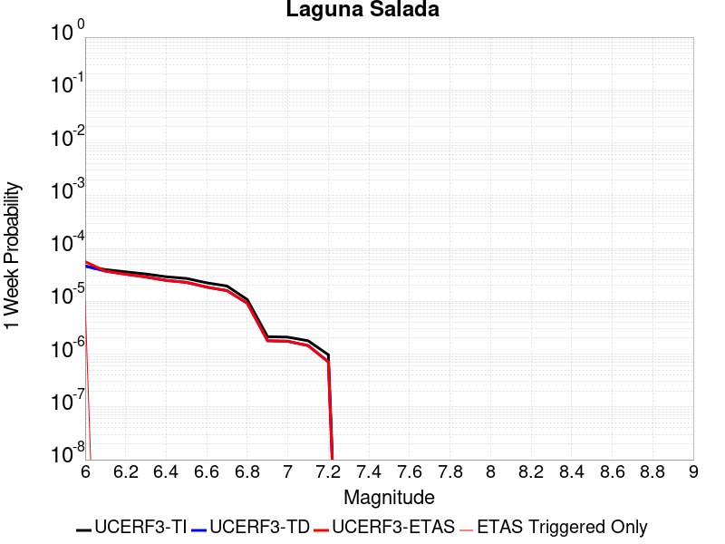 | 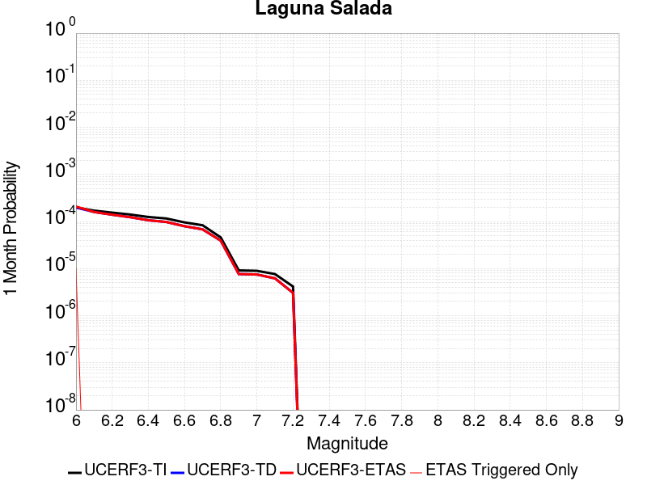 | 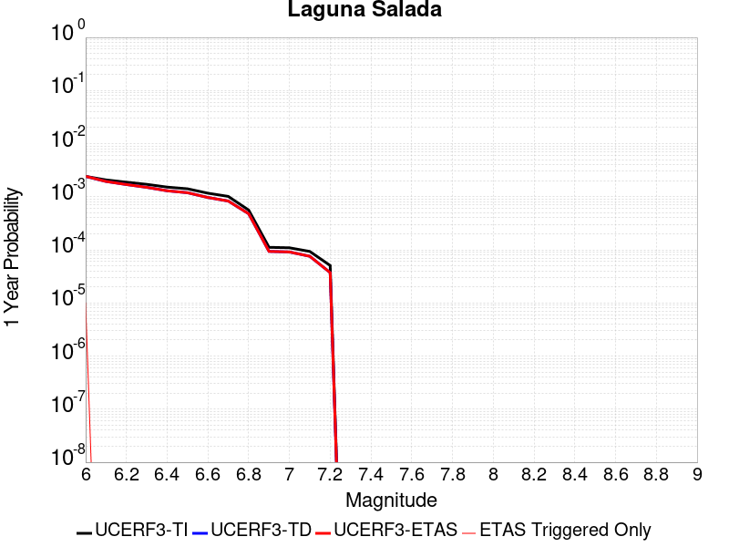 |  |

| Magnitude | 1 wk TI Prob | 1 wk TD Prob | 1 wk ETAS Prob | 1 wk ETAS/TD Gain | 1 wk ETAS Triggered Only | 1 mo TI Prob | 1 mo TD Prob | 1 mo ETAS Prob | 1 mo ETAS/TD Gain | 1 mo ETAS Triggered Only | 1 yr TI Prob | 1 yr TD Prob | 1 yr ETAS Prob | 1 yr ETAS/TD Gain | 1 yr ETAS Triggered Only | 10 yr TI Prob | 10 yr TD Prob | 10 yr ETAS Prob | 10 yr ETAS/TD Gain | 10 yr ETAS Triggered Only |
|-----|-----|-----|-----|-----|-----|-----|-----|-----|-----|-----|-----|-----|-----|-----|-----|-----|-----|-----|-----|-----|
| 6.0 | 4.6465593E-5 | 4.6346027E-5 | 5.634556E-5 | 1.2157582 | 1.0E-5 | 1.9912305E-4 | 1.9861167E-4 | 2.0860968E-4 | 1.0503395 | 1.0E-5 | 0.0024216278 | 0.0024154107 | 0.0024253866 | 1.0041301 | 1.0E-5 | 0.02395408 | 0.02397508 | 0.02398484 | 1.0004071 | 1.0E-5 |
| 6.1 | 3.982297E-5 | 3.7245856E-5 | 3.7245856E-5 | 1.0 | 0.0 | 1.706587E-4 | 1.5961601E-4 | 1.5961601E-4 | 1.0 | 0.0 | 0.0020757897 | 0.0019417155 | 0.0019417155 | 1.0 | 0.0 | 0.020565065 | 0.019331727 | 0.019331727 | 1.0 | 0.0 |
| 6.2 | 3.6067784E-5 | 3.2602456E-5 | 3.2602456E-5 | 1.0 | 0.0 | 1.5456705E-4 | 1.3971794E-4 | 1.3971794E-4 | 1.0 | 0.0 | 0.0018802295 | 0.0016998488 | 0.0016998488 | 1.0 | 0.0 | 0.018644003 | 0.016949508 | 0.016949508 | 1.0 | 0.0 |
| 6.3 | 3.2859112E-5 | 2.8849245E-5 | 2.8849245E-5 | 1.0 | 0.0 | 1.4081717E-4 | 1.2363432E-4 | 1.2363432E-4 | 1.0 | 0.0 | 0.0017131006 | 0.0015043096 | 0.0015043096 | 1.0 | 0.0 | 0.016999546 | 0.015018662 | 0.015018662 | 1.0 | 0.0 |
| 6.4 | 2.9132116E-5 | 2.4852798E-5 | 2.4852798E-5 | 1.0 | 0.0 | 1.2484594E-4 | 1.0650815E-4 | 1.0650815E-4 | 1.0 | 0.0 | 0.0015189396 | 0.0012960562 | 0.0012960562 | 1.0 | 0.0 | 0.015085992 | 0.012956176 | 0.012956176 | 1.0 | 0.0 |
| 6.5 | 2.7075037E-5 | 2.2825689E-5 | 2.2825689E-5 | 1.0 | 0.0 | 1.1603071E-4 | 9.782121E-5 | 9.782121E-5 | 1.0 | 0.0 | 0.0014117584 | 0.0011904109 | 0.0011904109 | 1.0 | 0.0 | 0.014028233 | 0.011907673 | 0.011907673 | 1.0 | 0.0 |
| 6.6 | 2.2367465E-5 | 1.8573406E-5 | 1.8573406E-5 | 1.0 | 0.0 | 9.5857045E-5 | 7.959835E-5 | 7.959835E-5 | 1.0 | 0.0 | 0.0011664346 | 9.687614E-4 | 9.687614E-4 | 1.0 | 0.0 | 0.011603311 | 0.00970213 | 0.00970213 | 1.0 | 0.0 |
| 6.7 | 1.9458053E-5 | 1.591414E-5 | 1.591414E-5 | 1.0 | 0.0 | 8.338899E-5 | 6.820213E-5 | 6.820213E-5 | 1.0 | 0.0 | 0.001014788 | 8.3012495E-4 | 8.3012495E-4 | 1.0 | 0.0 | 0.010101665 | 0.00832089 | 0.00832089 | 1.0 | 0.0 |
| 6.8 | 1.0767866E-5 | 9.1843E-6 | 9.1843E-6 | 1.0 | 0.0 | 4.614718E-5 | 3.936108E-5 | 3.936108E-5 | 1.0 | 0.0 | 5.6169706E-4 | 4.791844E-4 | 4.791844E-4 | 1.0 | 0.0 | 0.0056027942 | 0.004809667 | 0.004809667 | 1.0 | 0.0 |
| 6.9 | 2.1384765E-6 | 1.7913634E-6 | 1.7913634E-6 | 1.0 | 0.0 | 9.164866E-6 | 7.677251E-6 | 7.677251E-6 | 1.0 | 0.0 | 1.1157654E-4 | 9.3466915E-5 | 9.3466915E-5 | 1.0 | 0.0 | 0.0011152053 | 9.3431433E-4 | 9.3431433E-4 | 1.0 | 0.0 |
| 7.0 | 2.0952946E-6 | 1.7493005E-6 | 1.7493005E-6 | 1.0 | 0.0 | 8.979802E-6 | 7.496983E-6 | 7.496983E-6 | 1.0 | 0.0 | 1.0932361E-4 | 9.127233E-5 | 9.127233E-5 | 1.0 | 0.0 | 0.0010926984 | 9.1238663E-4 | 9.1238663E-4 | 1.0 | 0.0 |
| 7.1 | 1.7887576E-6 | 1.4500216E-6 | 1.4500216E-6 | 1.0 | 0.0 | 7.666081E-6 | 6.2143654E-6 | 6.2143654E-6 | 1.0 | 0.0 | 9.333054E-5 | 7.565758E-5 | 7.565758E-5 | 1.0 | 0.0 | 9.329135E-4 | 7.563486E-4 | 7.563486E-4 | 1.0 | 0.0 |
| 7.2 | 9.723109E-7 | 7.1355936E-7 | 7.1355936E-7 | 1.0 | 0.0 | 4.16704E-6 | 3.0581089E-6 | 3.0581089E-6 | 1.0 | 0.0 | 5.073253E-5 | 3.7232003E-5 | 3.7232003E-5 | 1.0 | 0.0 | 5.072095E-4 | 3.722739E-4 | 3.722739E-4 | 1.0 | 0.0 |

## Homestead Valley 2011
*[(top)](#table-of-contents)*

| 1 Week | 1 Month | 1 Year | 10 Year |
|-----|-----|-----|-----|
|  | 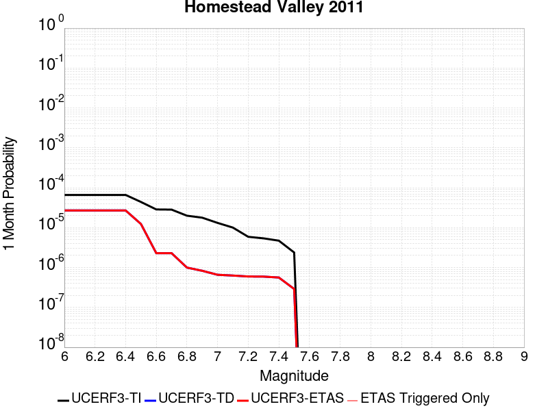 |  |  |

| Magnitude | 1 wk TI Prob | 1 wk TD Prob | 1 wk ETAS Prob | 1 wk ETAS/TD Gain | 1 wk ETAS Triggered Only | 1 mo TI Prob | 1 mo TD Prob | 1 mo ETAS Prob | 1 mo ETAS/TD Gain | 1 mo ETAS Triggered Only | 1 yr TI Prob | 1 yr TD Prob | 1 yr ETAS Prob | 1 yr ETAS/TD Gain | 1 yr ETAS Triggered Only | 10 yr TI Prob | 10 yr TD Prob | 10 yr ETAS Prob | 10 yr ETAS/TD Gain | 10 yr ETAS Triggered Only |
|-----|-----|-----|-----|-----|-----|-----|-----|-----|-----|-----|-----|-----|-----|-----|-----|-----|-----|-----|-----|-----|
| 6.0 | 1.539795E-5 | 6.286593E-6 | 6.286593E-6 | 1.0 | 0.0 | 6.5989545E-5 | 2.6942378E-5 | 2.6942378E-5 | 1.0 | 0.0 | 8.0312655E-4 | 3.279947E-4 | 3.279947E-4 | 1.0 | 0.0 | 0.008002302 | 0.003277127 | 0.003287094 | 1.0030415 | 1.0E-5 |
| 6.1 | 1.539795E-5 | 6.286593E-6 | 6.286593E-6 | 1.0 | 0.0 | 6.5989545E-5 | 2.6942378E-5 | 2.6942378E-5 | 1.0 | 0.0 | 8.0312655E-4 | 3.279947E-4 | 3.279947E-4 | 1.0 | 0.0 | 0.008002302 | 0.003277127 | 0.003287094 | 1.0030415 | 1.0E-5 |
| 6.2 | 1.539795E-5 | 6.286593E-6 | 6.286593E-6 | 1.0 | 0.0 | 6.5989545E-5 | 2.6942378E-5 | 2.6942378E-5 | 1.0 | 0.0 | 8.0312655E-4 | 3.279947E-4 | 3.279947E-4 | 1.0 | 0.0 | 0.008002302 | 0.003277127 | 0.003287094 | 1.0030415 | 1.0E-5 |
| 6.3 | 1.539795E-5 | 6.286593E-6 | 6.286593E-6 | 1.0 | 0.0 | 6.5989545E-5 | 2.6942378E-5 | 2.6942378E-5 | 1.0 | 0.0 | 8.0312655E-4 | 3.279947E-4 | 3.279947E-4 | 1.0 | 0.0 | 0.008002302 | 0.003277127 | 0.003287094 | 1.0030415 | 1.0E-5 |
| 6.4 | 1.539795E-5 | 6.286593E-6 | 6.286593E-6 | 1.0 | 0.0 | 6.5989545E-5 | 2.6942378E-5 | 2.6942378E-5 | 1.0 | 0.0 | 8.0312655E-4 | 3.279947E-4 | 3.279947E-4 | 1.0 | 0.0 | 0.008002302 | 0.003277127 | 0.003287094 | 1.0030415 | 1.0E-5 |
| 6.5 | 1.0265258E-5 | 2.8788425E-6 | 2.8788425E-6 | 1.0 | 0.0 | 4.3993223E-5 | 1.2337877E-5 | 1.2337877E-5 | 1.0 | 0.0 | 5.3548586E-4 | 1.5021025E-4 | 1.5021025E-4 | 1.0 | 0.0 | 0.005341973 | 0.0015017692 | 0.0015117541 | 1.0066488 | 1.0E-5 |
| 6.6 | 6.664671E-6 | 5.3481733E-7 | 5.3481733E-7 | 1.0 | 0.0 | 2.8562565E-5 | 2.292073E-6 | 2.292073E-6 | 1.0 | 0.0 | 3.476937E-4 | 2.790575E-5 | 2.790575E-5 | 1.0 | 0.0 | 0.003471502 | 2.790341E-4 | 2.890313E-4 | 1.0358279 | 1.0E-5 |
| 6.7 | 6.5954046E-6 | 5.3481733E-7 | 5.3481733E-7 | 1.0 | 0.0 | 2.8265715E-5 | 2.292073E-6 | 2.292073E-6 | 1.0 | 0.0 | 3.4408073E-4 | 2.790575E-5 | 2.790575E-5 | 1.0 | 0.0 | 0.0034354846 | 2.790341E-4 | 2.890313E-4 | 1.0358279 | 1.0E-5 |
| 6.8 | 4.648189E-6 | 2.326538E-7 | 2.326538E-7 | 1.0 | 0.0 | 1.9920659E-5 | 9.970873E-7 | 9.970873E-7 | 1.0 | 0.0 | 2.4250703E-4 | 1.2139476E-5 | 1.2139476E-5 | 1.0 | 0.0 | 0.0024224254 | 1.2138861E-4 | 1.313874E-4 | 1.08237 | 1.0E-5 |
| 6.9 | 4.1428534E-6 | 1.934439E-7 | 1.934439E-7 | 1.0 | 0.0 | 1.7754966E-5 | 8.29045E-7 | 8.29045E-7 | 1.0 | 0.0 | 2.1614527E-4 | 1.00935795E-5 | 1.00935795E-5 | 1.0 | 0.0 | 0.0021593515 | 1.0093151E-4 | 1.109305E-4 | 1.0990671 | 1.0E-5 |
| 7.0 | 3.0673707E-6 | 1.5367468E-7 | 1.5367468E-7 | 1.0 | 0.0 | 1.3145808E-5 | 6.5860564E-7 | 6.5860564E-7 | 1.0 | 0.0 | 1.6003846E-4 | 8.0184955E-6 | 8.0184955E-6 | 1.0 | 0.0 | 0.0015992324 | 8.018216E-5 | 9.018136E-5 | 1.124706 | 1.0E-5 |
| 7.1 | 2.340854E-6 | 1.4687535E-7 | 1.4687535E-7 | 1.0 | 0.0 | 1.0032193E-5 | 6.2946566E-7 | 6.2946566E-7 | 1.0 | 0.0 | 1.221351E-4 | 7.663718E-6 | 7.663718E-6 | 1.0 | 0.0 | 0.00122068 | 7.663464E-5 | 8.6633874E-5 | 1.1304793 | 1.0E-5 |
| 7.2 | 1.3754182E-6 | 1.3922522E-7 | 1.3922522E-7 | 1.0 | 0.0 | 5.8946357E-6 | 5.966794E-7 | 5.966794E-7 | 1.0 | 0.0 | 7.176483E-5 | 7.2645485E-6 | 7.2645485E-6 | 1.0 | 0.0 | 7.174166E-4 | 7.2643204E-5 | 8.264247E-5 | 1.1376492 | 1.0E-5 |
| 7.3 | 1.2573237E-6 | 1.3827035E-7 | 1.3827035E-7 | 1.0 | 0.0 | 5.388519E-6 | 5.925871E-7 | 5.925871E-7 | 1.0 | 0.0 | 6.560324E-5 | 7.214725E-6 | 7.214725E-6 | 1.0 | 0.0 | 6.558388E-4 | 7.2145E-5 | 8.214428E-5 | 1.1385998 | 1.0E-5 |
| 7.4 | 1.0994207E-6 | 1.3106003E-7 | 1.3106003E-7 | 1.0 | 0.0 | 4.7117946E-6 | 5.6168574E-7 | 5.6168574E-7 | 1.0 | 0.0 | 5.736459E-5 | 6.838503E-6 | 6.838503E-6 | 1.0 | 0.0 | 5.734978E-4 | 6.838302E-5 | 7.8382334E-5 | 1.1462251 | 1.0E-5 |
| 7.5 | 5.5569126E-7 | 6.772936E-8 | 6.772936E-8 | 1.0 | 0.0 | 2.3815317E-6 | 2.9026867E-7 | 2.9026867E-7 | 1.0 | 0.0 | 2.8994764E-5 | 3.5340158E-6 | 3.5340158E-6 | 1.0 | 0.0 | 2.899098E-4 | 3.533966E-5 | 4.5339308E-5 | 1.2829581 | 1.0E-5 |

## Davis Creek
*[(top)](#table-of-contents)*

| 1 Week | 1 Month | 1 Year | 10 Year |
|-----|-----|-----|-----|
|  |  |  |  |

| Magnitude | 1 wk TI Prob | 1 wk TD Prob | 1 wk ETAS Prob | 1 wk ETAS/TD Gain | 1 wk ETAS Triggered Only | 1 mo TI Prob | 1 mo TD Prob | 1 mo ETAS Prob | 1 mo ETAS/TD Gain | 1 mo ETAS Triggered Only | 1 yr TI Prob | 1 yr TD Prob | 1 yr ETAS Prob | 1 yr ETAS/TD Gain | 1 yr ETAS Triggered Only | 10 yr TI Prob | 10 yr TD Prob | 10 yr ETAS Prob | 10 yr ETAS/TD Gain | 10 yr ETAS Triggered Only |
|-----|-----|-----|-----|-----|-----|-----|-----|-----|-----|-----|-----|-----|-----|-----|-----|-----|-----|-----|-----|-----|
| 6.0 | 2.331472E-5 | 2.5417152E-5 | 3.54169E-5 | 1.3934251 | 1.0E-5 | 9.99164E-5 | 1.08926775E-4 | 1.1892569E-4 | 1.0917948 | 1.0E-5 | 0.0012158032 | 0.0013254952 | 0.0013354819 | 1.0075344 | 1.0E-5 | 0.01209173 | 0.013187673 | 0.01319754 | 1.0007483 | 1.0E-5 |
| 6.1 | 1.0407654E-5 | 1.131696E-5 | 1.131696E-5 | 1.0 | 0.0 | 4.4603472E-5 | 4.8500508E-5 | 4.8500508E-5 | 1.0 | 0.0 | 5.4291193E-4 | 5.9036084E-4 | 5.9036084E-4 | 1.0 | 0.0 | 0.0054158745 | 0.0058905976 | 0.0058905976 | 1.0 | 0.0 |
| 6.2 | 1.0407654E-5 | 1.131696E-5 | 1.131696E-5 | 1.0 | 0.0 | 4.4603472E-5 | 4.8500508E-5 | 4.8500508E-5 | 1.0 | 0.0 | 5.4291193E-4 | 5.9036084E-4 | 5.9036084E-4 | 1.0 | 0.0 | 0.0054158745 | 0.0058905976 | 0.0058905976 | 1.0 | 0.0 |
| 6.3 | 5.1323277E-6 | 5.568543E-6 | 5.568543E-6 | 1.0 | 0.0 | 2.1995505E-5 | 2.3865015E-5 | 2.3865015E-5 | 1.0 | 0.0 | 2.6776237E-4 | 2.9052646E-4 | 2.9052646E-4 | 1.0 | 0.0 | 0.0026743996 | 0.0029023124 | 0.0029023124 | 1.0 | 0.0 |
| 6.4 | 2.4985154E-6 | 2.704532E-6 | 2.704532E-6 | 1.0 | 0.0 | 1.07078795E-5 | 1.1590821E-5 | 1.1590821E-5 | 1.0 | 0.0 | 1.3036063E-4 | 1.4111272E-4 | 1.4111272E-4 | 1.0 | 0.0 | 0.0013028418 | 0.001410586 | 0.001410586 | 1.0 | 0.0 |
| 6.5 | 2.4846438E-6 | 2.6904663E-6 | 2.6904663E-6 | 1.0 | 0.0 | 1.064843E-5 | 1.1530539E-5 | 1.1530539E-5 | 1.0 | 0.0 | 1.2963692E-4 | 1.4037889E-4 | 1.4037889E-4 | 1.0 | 0.0 | 0.0012956132 | 0.0014032569 | 0.0014032569 | 1.0 | 0.0 |
| 6.6 | 2.072566E-7 | 2.1018079E-7 | 2.1018079E-7 | 1.0 | 0.0 | 8.882423E-7 | 9.007745E-7 | 9.007745E-7 | 1.0 | 0.0 | 1.0814296E-5 | 1.0966876E-5 | 1.0966876E-5 | 1.0 | 0.0 | 1.081377E-4 | 1.0966354E-4 | 1.0966354E-4 | 1.0 | 0.0 |
| 6.7 | 1.7544528E-7 | 1.7790819E-7 | 1.7790819E-7 | 1.0 | 0.0 | 7.5190815E-7 | 7.6246346E-7 | 7.6246346E-7 | 1.0 | 0.0 | 9.154443E-6 | 9.282955E-6 | 9.282955E-6 | 1.0 | 0.0 | 9.1540656E-5 | 9.282582E-5 | 9.282582E-5 | 1.0 | 0.0 |
| 6.8 | 1.2320395E-7 | 1.2481134E-7 | 1.2481134E-7 | 1.0 | 0.0 | 5.280168E-7 | 5.349056E-7 | 5.349056E-7 | 1.0 | 0.0 | 6.428586E-6 | 6.5124573E-6 | 6.5124573E-6 | 1.0 | 0.0 | 6.4284E-5 | 6.512278E-5 | 6.512278E-5 | 1.0 | 0.0 |
| 6.9 | 6.399997E-8 | 6.486056E-8 | 6.486056E-8 | 1.0 | 0.0 | 2.7428555E-7 | 2.7797378E-7 | 2.7797378E-7 | 1.0 | 0.0 | 3.3394215E-6 | 3.3843262E-6 | 3.3843262E-6 | 1.0 | 0.0 | 3.3393713E-5 | 3.384281E-5 | 3.384281E-5 | 1.0 | 0.0 |
| 7.0 | 6.4455685E-9 | 6.5352617E-9 | 6.5352617E-9 | 1.0 | 0.0 | 2.7623864E-8 | 2.8008264E-8 | 2.8008264E-8 | 1.0 | 0.0 | 3.3632048E-7 | 3.4100063E-7 | 3.4100063E-7 | 1.0 | 0.0 | 3.3631998E-6 | 3.4100062E-6 | 3.4100062E-6 | 1.0 | 0.0 |

## Kern Canyon (South Kern) 2011
*[(top)](#table-of-contents)*

| 1 Week | 1 Month | 1 Year | 10 Year |
|-----|-----|-----|-----|
|  |  |  |  |

| Magnitude | 1 wk TI Prob | 1 wk TD Prob | 1 wk ETAS Prob | 1 wk ETAS/TD Gain | 1 wk ETAS Triggered Only | 1 mo TI Prob | 1 mo TD Prob | 1 mo ETAS Prob | 1 mo ETAS/TD Gain | 1 mo ETAS Triggered Only | 1 yr TI Prob | 1 yr TD Prob | 1 yr ETAS Prob | 1 yr ETAS/TD Gain | 1 yr ETAS Triggered Only | 10 yr TI Prob | 10 yr TD Prob | 10 yr ETAS Prob | 10 yr ETAS/TD Gain | 10 yr ETAS Triggered Only |
|-----|-----|-----|-----|-----|-----|-----|-----|-----|-----|-----|-----|-----|-----|-----|-----|-----|-----|-----|-----|-----|
| 6.0 | 4.105075E-6 | 4.1137246E-6 | 1.4113683E-5 | 3.4308772 | 1.0E-5 | 1.7593058E-5 | 1.7630131E-5 | 2.7629956E-5 | 1.5672008 | 1.0E-5 | 2.1417443E-4 | 2.1462636E-4 | 2.2462421E-4 | 1.0465826 | 1.0E-5 | 0.0021396813 | 0.0021442545 | 0.0021542332 | 1.0046536 | 1.0E-5 |
| 6.1 | 4.105075E-6 | 4.1137246E-6 | 1.4113683E-5 | 3.4308772 | 1.0E-5 | 1.7593058E-5 | 1.7630131E-5 | 2.7629956E-5 | 1.5672008 | 1.0E-5 | 2.1417443E-4 | 2.1462636E-4 | 2.2462421E-4 | 1.0465826 | 1.0E-5 | 0.0021396813 | 0.0021442545 | 0.0021542332 | 1.0046536 | 1.0E-5 |
| 6.2 | 4.105075E-6 | 4.1137246E-6 | 1.4113683E-5 | 3.4308772 | 1.0E-5 | 1.7593058E-5 | 1.7630131E-5 | 2.7629956E-5 | 1.5672008 | 1.0E-5 | 2.1417443E-4 | 2.1462636E-4 | 2.2462421E-4 | 1.0465826 | 1.0E-5 | 0.0021396813 | 0.0021442545 | 0.0021542332 | 1.0046536 | 1.0E-5 |
| 6.3 | 4.105075E-6 | 4.1137246E-6 | 1.4113683E-5 | 3.4308772 | 1.0E-5 | 1.7593058E-5 | 1.7630131E-5 | 2.7629956E-5 | 1.5672008 | 1.0E-5 | 2.1417443E-4 | 2.1462636E-4 | 2.2462421E-4 | 1.0465826 | 1.0E-5 | 0.0021396813 | 0.0021442545 | 0.0021542332 | 1.0046536 | 1.0E-5 |
| 6.4 | 4.105075E-6 | 4.1137246E-6 | 1.4113683E-5 | 3.4308772 | 1.0E-5 | 1.7593058E-5 | 1.7630131E-5 | 2.7629956E-5 | 1.5672008 | 1.0E-5 | 2.1417443E-4 | 2.1462636E-4 | 2.2462421E-4 | 1.0465826 | 1.0E-5 | 0.0021396813 | 0.0021442545 | 0.0021542332 | 1.0046536 | 1.0E-5 |
| 6.5 | 2.9849807E-6 | 2.9731532E-6 | 2.9731532E-6 | 1.0 | 0.0 | 1.2792712E-5 | 1.27420235E-5 | 1.27420235E-5 | 1.0 | 0.0 | 1.5574014E-4 | 1.5512324E-4 | 1.5512324E-4 | 1.0 | 0.0 | 0.0015563103 | 0.0015501648 | 0.0015501648 | 1.0 | 0.0 |
| 6.6 | 2.9849807E-6 | 2.9731532E-6 | 2.9731532E-6 | 1.0 | 0.0 | 1.2792712E-5 | 1.27420235E-5 | 1.27420235E-5 | 1.0 | 0.0 | 1.5574014E-4 | 1.5512324E-4 | 1.5512324E-4 | 1.0 | 0.0 | 0.0015563103 | 0.0015501648 | 0.0015501648 | 1.0 | 0.0 |
| 6.7 | 2.6756725E-6 | 2.6582195E-6 | 2.6582195E-6 | 1.0 | 0.0 | 1.1467117E-5 | 1.139232E-5 | 1.139232E-5 | 1.0 | 0.0 | 1.396032E-4 | 1.3869278E-4 | 1.3869278E-4 | 1.0 | 0.0 | 0.0013951553 | 0.0013860731 | 0.0013860731 | 1.0 | 0.0 |
| 6.8 | 2.3283721E-6 | 2.3047776E-6 | 2.3047776E-6 | 1.0 | 0.0 | 9.9787E-6 | 9.877582E-6 | 9.877582E-6 | 1.0 | 0.0 | 1.214839E-4 | 1.2025299E-4 | 1.2025299E-4 | 1.0 | 0.0 | 0.001214175 | 0.0012018867 | 0.0012018867 | 1.0 | 0.0 |
| 6.9 | 2.0972677E-6 | 2.06964E-6 | 2.06964E-6 | 1.0 | 0.0 | 8.988259E-6 | 8.869856E-6 | 8.869856E-6 | 1.0 | 0.0 | 1.0942656E-4 | 1.079852E-4 | 1.079852E-4 | 1.0 | 0.0 | 0.0010937268 | 0.0010793331 | 0.0010793331 | 1.0 | 0.0 |
| 7.0 | 1.7132242E-6 | 1.6787027E-6 | 1.6787027E-6 | 1.0 | 0.0 | 7.3423685E-6 | 7.1944205E-6 | 7.1944205E-6 | 1.0 | 0.0 | 8.938967E-5 | 8.758859E-5 | 8.758859E-5 | 1.0 | 0.0 | 8.935372E-4 | 8.755445E-4 | 8.755445E-4 | 1.0 | 0.0 |
| 7.1 | 1.4215541E-6 | 1.3815744E-6 | 1.3815744E-6 | 1.0 | 0.0 | 6.0923603E-6 | 5.92102E-6 | 5.92102E-6 | 1.0 | 0.0 | 7.417196E-5 | 7.208606E-5 | 7.208606E-5 | 1.0 | 0.0 | 7.414721E-4 | 7.2062947E-4 | 7.2062947E-4 | 1.0 | 0.0 |
| 7.2 | 9.097853E-7 | 8.6037704E-7 | 8.6037704E-7 | 1.0 | 0.0 | 3.899074E-6 | 3.687325E-6 | 3.687325E-6 | 1.0 | 0.0 | 4.7470192E-5 | 4.489227E-5 | 4.489227E-5 | 1.0 | 0.0 | 4.7460053E-4 | 4.488331E-4 | 4.488331E-4 | 1.0 | 0.0 |
| 7.3 | 6.144169E-7 | 5.628203E-7 | 5.628203E-7 | 1.0 | 0.0 | 2.6332125E-6 | 2.4120848E-6 | 2.4120848E-6 | 1.0 | 0.0 | 3.205889E-5 | 2.9366742E-5 | 2.9366742E-5 | 1.0 | 0.0 | 3.2054266E-4 | 2.9362913E-4 | 2.9362913E-4 | 1.0 | 0.0 |
| 7.4 | 4.049844E-7 | 3.5728291E-7 | 3.5728291E-7 | 1.0 | 0.0 | 1.7356463E-6 | 1.5312115E-6 | 1.5312115E-6 | 1.0 | 0.0 | 2.1131287E-5 | 1.8642344E-5 | 1.8642344E-5 | 1.0 | 0.0 | 2.1129279E-4 | 1.8640806E-4 | 1.8640806E-4 | 1.0 | 0.0 |
| 7.5 | 1.9871162E-7 | 1.5830427E-7 | 1.5830427E-7 | 1.0 | 0.0 | 8.5162094E-7 | 6.784467E-7 | 6.784467E-7 | 1.0 | 0.0 | 1.0368436E-5 | 8.260059E-6 | 8.260059E-6 | 1.0 | 0.0 | 1.0367952E-4 | 8.25976E-5 | 8.25976E-5 | 1.0 | 0.0 |
| 7.6 | 2.572245E-8 | 1.7352539E-8 | 1.7352539E-8 | 1.0 | 0.0 | 1.10239064E-7 | 7.436802E-8 | 7.436802E-8 | 1.0 | 0.0 | 1.3421597E-6 | 9.0543034E-7 | 9.0543034E-7 | 1.0 | 0.0 | 1.3421517E-5 | 9.054272E-6 | 9.054272E-6 | 1.0 | 0.0 |

## Monterey Bay-Tularcitos
*[(top)](#table-of-contents)*

| 1 Week | 1 Month | 1 Year | 10 Year |
|-----|-----|-----|-----|
| 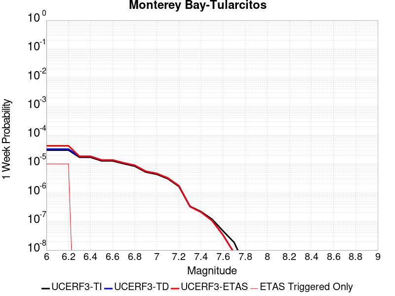 |  |  |  |

| Magnitude | 1 wk TI Prob | 1 wk TD Prob | 1 wk ETAS Prob | 1 wk ETAS/TD Gain | 1 wk ETAS Triggered Only | 1 mo TI Prob | 1 mo TD Prob | 1 mo ETAS Prob | 1 mo ETAS/TD Gain | 1 mo ETAS Triggered Only | 1 yr TI Prob | 1 yr TD Prob | 1 yr ETAS Prob | 1 yr ETAS/TD Gain | 1 yr ETAS Triggered Only | 10 yr TI Prob | 10 yr TD Prob | 10 yr ETAS Prob | 10 yr ETAS/TD Gain | 10 yr ETAS Triggered Only |
|-----|-----|-----|-----|-----|-----|-----|-----|-----|-----|-----|-----|-----|-----|-----|-----|-----|-----|-----|-----|-----|
| 6.0 | 3.0131365E-5 | 3.2798693E-5 | 4.2798365E-5 | 1.3048803 | 1.0E-5 | 1.2912804E-4 | 1.4055884E-4 | 1.5055743E-4 | 1.0711346 | 1.0E-5 | 0.001571 | 0.0017100661 | 0.0017200491 | 1.0058377 | 1.0E-5 | 0.015599402 | 0.016979877 | 0.016989706 | 1.0005789 | 1.0E-5 |
| 6.1 | 3.0131365E-5 | 3.2798693E-5 | 4.2798365E-5 | 1.3048803 | 1.0E-5 | 1.2912804E-4 | 1.4055884E-4 | 1.5055743E-4 | 1.0711346 | 1.0E-5 | 0.001571 | 0.0017100661 | 0.0017200491 | 1.0058377 | 1.0E-5 | 0.015599402 | 0.016979877 | 0.016989706 | 1.0005789 | 1.0E-5 |
| 6.2 | 3.0131365E-5 | 3.2798693E-5 | 4.2798365E-5 | 1.3048803 | 1.0E-5 | 1.2912804E-4 | 1.4055884E-4 | 1.5055743E-4 | 1.0711346 | 1.0E-5 | 0.001571 | 0.0017100661 | 0.0017200491 | 1.0058377 | 1.0E-5 | 0.015599402 | 0.016979877 | 0.016989706 | 1.0005789 | 1.0E-5 |
| 6.3 | 1.6998249E-5 | 1.8330758E-5 | 1.8330758E-5 | 1.0 | 0.0 | 7.28476E-5 | 7.8558136E-5 | 7.8558136E-5 | 1.0 | 0.0 | 8.865586E-4 | 9.560443E-4 | 9.560443E-4 | 1.0 | 0.0 | 0.0088303005 | 0.009521238 | 0.009521238 | 1.0 | 0.0 |
| 6.4 | 1.6998249E-5 | 1.8330758E-5 | 1.8330758E-5 | 1.0 | 0.0 | 7.28476E-5 | 7.8558136E-5 | 7.8558136E-5 | 1.0 | 0.0 | 8.865586E-4 | 9.560443E-4 | 9.560443E-4 | 1.0 | 0.0 | 0.0088303005 | 0.009521238 | 0.009521238 | 1.0 | 0.0 |
| 6.5 | 1.27470785E-5 | 1.3693285E-5 | 1.3693285E-5 | 1.0 | 0.0 | 5.4629192E-5 | 5.8684243E-5 | 5.8684243E-5 | 1.0 | 0.0 | 6.649074E-4 | 7.142568E-4 | 7.142568E-4 | 1.0 | 0.0 | 0.0066292146 | 0.0071206638 | 0.0071206638 | 1.0 | 0.0 |
| 6.6 | 1.2739422E-5 | 1.3685371E-5 | 1.3685371E-5 | 1.0 | 0.0 | 5.4596385E-5 | 5.8650334E-5 | 5.8650334E-5 | 1.0 | 0.0 | 6.645082E-4 | 7.138442E-4 | 7.138442E-4 | 1.0 | 0.0 | 0.0066252467 | 0.0071165645 | 0.0071165645 | 1.0 | 0.0 |
| 6.7 | 1.0160109E-5 | 1.0885733E-5 | 1.0885733E-5 | 1.0 | 0.0 | 4.35426E-5 | 4.6652345E-5 | 4.6652345E-5 | 1.0 | 0.0 | 5.300022E-4 | 5.6785136E-4 | 5.6785136E-4 | 1.0 | 0.0 | 0.005287399 | 0.005664715 | 0.005664715 | 1.0 | 0.0 |
| 6.8 | 8.349859E-6 | 8.9325695E-6 | 8.9325695E-6 | 1.0 | 0.0 | 3.578462E-5 | 3.828191E-5 | 3.828191E-5 | 1.0 | 0.0 | 4.3559066E-4 | 4.6598824E-4 | 4.6598824E-4 | 1.0 | 0.0 | 0.004347378 | 0.004650676 | 0.004650676 | 1.0 | 0.0 |
| 6.9 | 5.193639E-6 | 5.5364194E-6 | 5.5364194E-6 | 1.0 | 0.0 | 2.2258262E-5 | 2.3727314E-5 | 2.3727314E-5 | 1.0 | 0.0 | 2.7096065E-4 | 2.88845E-4 | 2.88845E-4 | 1.0 | 0.0 | 0.0027063051 | 0.0028850168 | 0.0028850168 | 1.0 | 0.0 |
| 7.0 | 4.359381E-6 | 4.643357E-6 | 4.643357E-6 | 1.0 | 0.0 | 1.8682927E-5 | 1.9899966E-5 | 1.9899966E-5 | 1.0 | 0.0 | 2.274409E-4 | 2.4225813E-4 | 2.4225813E-4 | 1.0 | 0.0 | 0.0022720827 | 0.0024202333 | 0.0024202333 | 1.0 | 0.0 |
| 7.1 | 3.0398533E-6 | 3.2310363E-6 | 3.2310363E-6 | 1.0 | 0.0 | 1.3027877E-5 | 1.384724E-5 | 1.384724E-5 | 1.0 | 0.0 | 1.5860285E-4 | 1.6857972E-4 | 1.6857972E-4 | 1.0 | 0.0 | 0.001584897 | 0.001684776 | 0.001684776 | 1.0 | 0.0 |
| 7.2 | 1.642335E-6 | 1.7333119E-6 | 1.7333119E-6 | 1.0 | 0.0 | 7.0385595E-6 | 7.42847E-6 | 7.42847E-6 | 1.0 | 0.0 | 8.569109E-5 | 9.0439935E-5 | 9.0439935E-5 | 1.0 | 0.0 | 8.5658056E-4 | 9.04234E-4 | 9.04234E-4 | 1.0 | 0.0 |
| 7.3 | 3.356842E-7 | 3.295232E-7 | 3.295232E-7 | 1.0 | 0.0 | 1.4386458E-6 | 1.4122415E-6 | 1.4122415E-6 | 1.0 | 0.0 | 1.7515373E-5 | 1.7193906E-5 | 1.7193906E-5 | 1.0 | 0.0 | 1.7513991E-4 | 1.7192586E-4 | 1.7192586E-4 | 1.0 | 0.0 |
| 7.4 | 2.1973483E-7 | 2.1006356E-7 | 2.1006356E-7 | 1.0 | 0.0 | 9.417204E-7 | 9.00272E-7 | 9.00272E-7 | 1.0 | 0.0 | 1.1465385E-5 | 1.0960757E-5 | 1.0960757E-5 | 1.0 | 0.0 | 1.1464794E-4 | 1.096022E-4 | 1.096022E-4 | 1.0 | 0.0 |
| 7.5 | 1.1944135E-7 | 1.06959945E-7 | 1.06959945E-7 | 1.0 | 0.0 | 5.118914E-7 | 4.5839968E-7 | 4.5839968E-7 | 1.0 | 0.0 | 6.23226E-6 | 5.581002E-6 | 5.581002E-6 | 1.0 | 0.0 | 6.2320854E-5 | 5.580863E-5 | 5.580863E-5 | 1.0 | 0.0 |
| 7.6 | 4.636058E-8 | 3.3364476E-8 | 3.3364476E-8 | 1.0 | 0.0 | 1.9868818E-7 | 1.429906E-7 | 1.429906E-7 | 1.0 | 0.0 | 2.419026E-6 | 1.7409092E-6 | 1.7409092E-6 | 1.0 | 0.0 | 2.4189996E-5 | 1.7408958E-5 | 1.7408958E-5 | 1.0 | 0.0 |
| 7.7 | 1.8588572E-8 | 8.003462E-9 | 8.003462E-9 | 1.0 | 0.0 | 7.9665305E-8 | 3.4300555E-8 | 3.4300555E-8 | 1.0 | 0.0 | 9.699246E-7 | 4.1760916E-7 | 4.1760916E-7 | 1.0 | 0.0 | 9.699204E-6 | 4.176084E-6 | 4.176084E-6 | 1.0 | 0.0 |
| 7.8 | 2.7960154E-9 | 7.6094686E-10 | 7.6094686E-10 | 1.0 | 0.0 | 1.1982923E-8 | 3.261201E-9 | 3.261201E-9 | 1.0 | 0.0 | 1.4589209E-7 | 3.970512E-8 | 3.970512E-8 | 1.0 | 0.0 | 1.4589199E-6 | 3.9705117E-7 | 3.9705117E-7 | 1.0 | 0.0 |

## Calico-Hidalgo
*[(top)](#table-of-contents)*

| 1 Week | 1 Month | 1 Year | 10 Year |
|-----|-----|-----|-----|
|  |  | 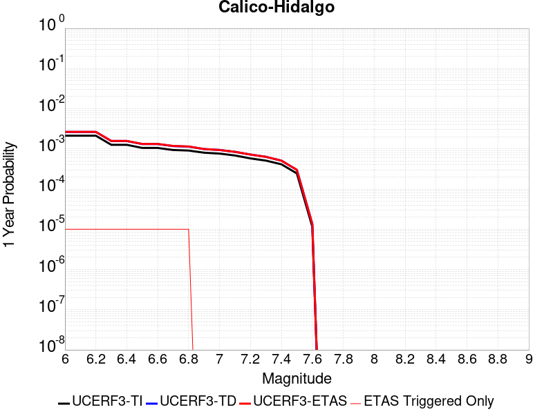 | 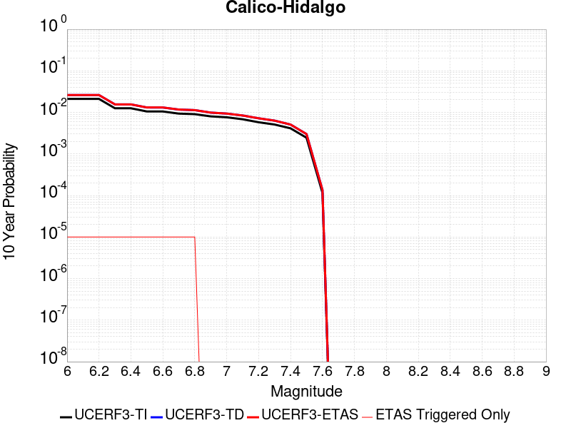 |

| Magnitude | 1 wk TI Prob | 1 wk TD Prob | 1 wk ETAS Prob | 1 wk ETAS/TD Gain | 1 wk ETAS Triggered Only | 1 mo TI Prob | 1 mo TD Prob | 1 mo ETAS Prob | 1 mo ETAS/TD Gain | 1 mo ETAS Triggered Only | 1 yr TI Prob | 1 yr TD Prob | 1 yr ETAS Prob | 1 yr ETAS/TD Gain | 1 yr ETAS Triggered Only | 10 yr TI Prob | 10 yr TD Prob | 10 yr ETAS Prob | 10 yr ETAS/TD Gain | 10 yr ETAS Triggered Only |
|-----|-----|-----|-----|-----|-----|-----|-----|-----|-----|-----|-----|-----|-----|-----|-----|-----|-----|-----|-----|-----|
| 6.0 | 4.0906612E-5 | 5.0703493E-5 | 6.0702987E-5 | 1.1972151 | 1.0E-5 | 1.7530227E-4 | 2.1728488E-4 | 2.272827E-4 | 1.0460125 | 1.0E-5 | 0.0021322158 | 0.002642638 | 0.0026526116 | 1.003774 | 1.0E-5 | 0.02111873 | 0.026152508 | 0.026162246 | 1.0003724 | 1.0E-5 |
| 6.1 | 4.0906612E-5 | 5.0703493E-5 | 6.0702987E-5 | 1.1972151 | 1.0E-5 | 1.7530227E-4 | 2.1728488E-4 | 2.272827E-4 | 1.0460125 | 1.0E-5 | 0.0021322158 | 0.002642638 | 0.0026526116 | 1.003774 | 1.0E-5 | 0.02111873 | 0.026152508 | 0.026162246 | 1.0003724 | 1.0E-5 |
| 6.2 | 4.0906612E-5 | 5.0703493E-5 | 6.0702987E-5 | 1.1972151 | 1.0E-5 | 1.7530227E-4 | 2.1728488E-4 | 2.272827E-4 | 1.0460125 | 1.0E-5 | 0.0021322158 | 0.002642638 | 0.0026526116 | 1.003774 | 1.0E-5 | 0.02111873 | 0.026152508 | 0.026162246 | 1.0003724 | 1.0E-5 |
| 6.3 | 2.4242801E-5 | 3.0090596E-5 | 4.0090294E-5 | 1.3323197 | 1.0E-5 | 1.0389358E-4 | 1.2895351E-4 | 1.3895222E-4 | 1.0775373 | 1.0E-5 | 0.0012641704 | 0.0015689114 | 0.0015788956 | 1.0063639 | 1.0E-5 | 0.01257003 | 0.015582023 | 0.015591867 | 1.0006318 | 1.0E-5 |
| 6.4 | 2.4242801E-5 | 3.0090596E-5 | 4.0090294E-5 | 1.3323197 | 1.0E-5 | 1.0389358E-4 | 1.2895351E-4 | 1.3895222E-4 | 1.0775373 | 1.0E-5 | 0.0012641704 | 0.0015689114 | 0.0015788956 | 1.0063639 | 1.0E-5 | 0.01257003 | 0.015582023 | 0.015591867 | 1.0006318 | 1.0E-5 |
| 6.5 | 2.0286952E-5 | 2.5315689E-5 | 3.5315436E-5 | 1.395002 | 1.0E-5 | 8.694118E-5 | 1.0849139E-4 | 1.1849031E-4 | 1.0921632 | 1.0E-5 | 0.0010579949 | 0.0013200995 | 0.0013300863 | 1.0075651 | 1.0E-5 | 0.010529719 | 0.0131245125 | 0.013134381 | 1.000752 | 1.0E-5 |
| 6.6 | 2.0269223E-5 | 2.5296638E-5 | 3.5296383E-5 | 1.3952994 | 1.0E-5 | 8.6865206E-5 | 1.0840975E-4 | 1.1840867E-4 | 1.0922326 | 1.0E-5 | 0.0010570707 | 0.0013191067 | 0.0013290935 | 1.0075709 | 1.0E-5 | 0.010520565 | 0.013114702 | 0.013124571 | 1.0007524 | 1.0E-5 |
| 6.7 | 1.799852E-5 | 2.254056E-5 | 3.2540334E-5 | 1.4436347 | 1.0E-5 | 7.713423E-5 | 9.65989E-5 | 1.0659794E-4 | 1.1035109 | 1.0E-5 | 9.3870464E-4 | 0.0011754717 | 0.0011854599 | 1.0084972 | 1.0E-5 | 0.009347493 | 0.011694153 | 0.011704036 | 1.0008451 | 1.0E-5 |
| 6.8 | 1.7458793E-5 | 2.1842081E-5 | 3.1841864E-5 | 1.4578218 | 1.0E-5 | 7.4821255E-5 | 9.3605646E-5 | 1.036047E-4 | 1.1068212 | 1.0E-5 | 9.10568E-4 | 0.0011390673 | 0.0011490559 | 1.0087692 | 1.0E-5 | 0.009068459 | 0.0113338735 | 0.0113437595 | 1.0008723 | 1.0E-5 |
| 6.9 | 1.542884E-5 | 1.9025894E-5 | 1.9025894E-5 | 1.0 | 0.0 | 6.612192E-5 | 8.153707E-5 | 8.153707E-5 | 1.0 | 0.0 | 8.04737E-4 | 9.92275E-4 | 9.92275E-4 | 1.0 | 0.0 | 0.008018291 | 0.0098798415 | 0.0098798415 | 1.0 | 0.0 |
| 7.0 | 1.468253E-5 | 1.8030569E-5 | 1.8030569E-5 | 1.0 | 0.0 | 6.292361E-5 | 7.727165E-5 | 7.727165E-5 | 1.0 | 0.0 | 7.658257E-4 | 9.403893E-4 | 9.403893E-4 | 1.0 | 0.0 | 0.0076319184 | 0.0093654655 | 0.0093654655 | 1.0 | 0.0 |
| 7.1 | 1.3139281E-5 | 1.6200916E-5 | 1.6200916E-5 | 1.0 | 0.0 | 5.6309986E-5 | 6.9430724E-5 | 6.9430724E-5 | 1.0 | 0.0 | 6.853584E-4 | 8.450038E-4 | 8.450038E-4 | 1.0 | 0.0 | 0.0068324856 | 0.008419205 | 0.008419205 | 1.0 | 0.0 |
| 7.2 | 1.1127404E-5 | 1.3866576E-5 | 1.3866576E-5 | 1.0 | 0.0 | 4.7688E-5 | 5.942689E-5 | 5.942689E-5 | 1.0 | 0.0 | 5.8044674E-4 | 7.232931E-4 | 7.232931E-4 | 1.0 | 0.0 | 0.0057893298 | 0.0072104977 | 0.0072104977 | 1.0 | 0.0 |
| 7.3 | 9.808154E-6 | 1.2176198E-5 | 1.2176198E-5 | 1.0 | 0.0 | 4.2034266E-5 | 5.218272E-5 | 5.218272E-5 | 1.0 | 0.0 | 5.11647E-4 | 6.351501E-4 | 6.351501E-4 | 1.0 | 0.0 | 0.0051047057 | 0.006334424 | 0.006334424 | 1.0 | 0.0 |
| 7.4 | 7.942452E-6 | 9.79213E-6 | 9.79213E-6 | 1.0 | 0.0 | 3.4038632E-5 | 4.1965654E-5 | 4.1965654E-5 | 1.0 | 0.0 | 4.1434157E-4 | 5.108215E-4 | 5.108215E-4 | 1.0 | 0.0 | 0.0041356985 | 0.0050974144 | 0.0050974144 | 1.0 | 0.0 |
| 7.5 | 4.7121216E-6 | 5.7728294E-6 | 5.7728294E-6 | 1.0 | 0.0 | 2.019465E-5 | 2.4740506E-5 | 2.4740506E-5 | 1.0 | 0.0 | 2.4584212E-4 | 3.011817E-4 | 3.011817E-4 | 1.0 | 0.0 | 0.0024557032 | 0.0030084874 | 0.0030084874 | 1.0 | 0.0 |
| 7.6 | 2.21172E-7 | 2.603958E-7 | 2.603958E-7 | 1.0 | 0.0 | 9.478797E-7 | 1.1159817E-6 | 1.1159817E-6 | 1.0 | 0.0 | 1.1540374E-5 | 1.3587022E-5 | 1.3587022E-5 | 1.0 | 0.0 | 1.1539775E-4 | 1.3586473E-4 | 1.3586473E-4 | 1.0 | 0.0 |

## Independence rev 2011
*[(top)](#table-of-contents)*

| 1 Week | 1 Month | 1 Year | 10 Year |
|-----|-----|-----|-----|
| 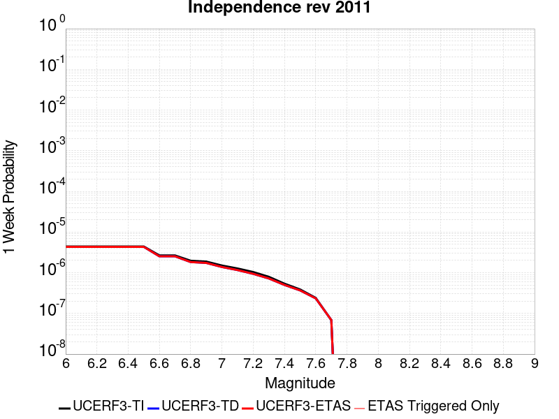 |  |  |  |

| Magnitude | 1 wk TI Prob | 1 wk TD Prob | 1 wk ETAS Prob | 1 wk ETAS/TD Gain | 1 wk ETAS Triggered Only | 1 mo TI Prob | 1 mo TD Prob | 1 mo ETAS Prob | 1 mo ETAS/TD Gain | 1 mo ETAS Triggered Only | 1 yr TI Prob | 1 yr TD Prob | 1 yr ETAS Prob | 1 yr ETAS/TD Gain | 1 yr ETAS Triggered Only | 10 yr TI Prob | 10 yr TD Prob | 10 yr ETAS Prob | 10 yr ETAS/TD Gain | 10 yr ETAS Triggered Only |
|-----|-----|-----|-----|-----|-----|-----|-----|-----|-----|-----|-----|-----|-----|-----|-----|-----|-----|-----|-----|-----|
| 6.0 | 4.422171E-6 | 4.3262235E-6 | 4.3262235E-6 | 1.0 | 0.0 | 1.8952025E-5 | 1.8540843E-5 | 2.8540657E-5 | 1.5393398 | 1.0E-5 | 2.3071647E-4 | 2.2571435E-4 | 2.357121E-4 | 1.0442938 | 1.0E-5 | 0.0023047708 | 0.0022551445 | 0.002265122 | 1.0044243 | 1.0E-5 |
| 6.1 | 4.422171E-6 | 4.3262235E-6 | 4.3262235E-6 | 1.0 | 0.0 | 1.8952025E-5 | 1.8540843E-5 | 2.8540657E-5 | 1.5393398 | 1.0E-5 | 2.3071647E-4 | 2.2571435E-4 | 2.357121E-4 | 1.0442938 | 1.0E-5 | 0.0023047708 | 0.0022551445 | 0.002265122 | 1.0044243 | 1.0E-5 |
| 6.2 | 4.422171E-6 | 4.3262235E-6 | 4.3262235E-6 | 1.0 | 0.0 | 1.8952025E-5 | 1.8540843E-5 | 2.8540657E-5 | 1.5393398 | 1.0E-5 | 2.3071647E-4 | 2.2571435E-4 | 2.357121E-4 | 1.0442938 | 1.0E-5 | 0.0023047708 | 0.0022551445 | 0.002265122 | 1.0044243 | 1.0E-5 |
| 6.3 | 4.422171E-6 | 4.3262235E-6 | 4.3262235E-6 | 1.0 | 0.0 | 1.8952025E-5 | 1.8540843E-5 | 2.8540657E-5 | 1.5393398 | 1.0E-5 | 2.3071647E-4 | 2.2571435E-4 | 2.357121E-4 | 1.0442938 | 1.0E-5 | 0.0023047708 | 0.0022551445 | 0.002265122 | 1.0044243 | 1.0E-5 |
| 6.4 | 4.422171E-6 | 4.3262235E-6 | 4.3262235E-6 | 1.0 | 0.0 | 1.8952025E-5 | 1.8540843E-5 | 2.8540657E-5 | 1.5393398 | 1.0E-5 | 2.3071647E-4 | 2.2571435E-4 | 2.357121E-4 | 1.0442938 | 1.0E-5 | 0.0023047708 | 0.0022551445 | 0.002265122 | 1.0044243 | 1.0E-5 |
| 6.5 | 4.422171E-6 | 4.3262235E-6 | 4.3262235E-6 | 1.0 | 0.0 | 1.8952025E-5 | 1.8540843E-5 | 2.8540657E-5 | 1.5393398 | 1.0E-5 | 2.3071647E-4 | 2.2571435E-4 | 2.357121E-4 | 1.0442938 | 1.0E-5 | 0.0023047708 | 0.0022551445 | 0.002265122 | 1.0044243 | 1.0E-5 |
| 6.6 | 2.663744E-6 | 2.5319835E-6 | 2.5319835E-6 | 1.0 | 0.0 | 1.1415996E-5 | 1.0851315E-5 | 2.0851207E-5 | 1.9215373 | 1.0E-5 | 1.3898089E-4 | 1.3210725E-4 | 1.4210593E-4 | 1.0756861 | 1.0E-5 | 0.0013889399 | 0.0013203353 | 0.0013303221 | 1.0075638 | 1.0E-5 |
| 6.7 | 2.663744E-6 | 2.5319835E-6 | 2.5319835E-6 | 1.0 | 0.0 | 1.1415996E-5 | 1.0851315E-5 | 2.0851207E-5 | 1.9215373 | 1.0E-5 | 1.3898089E-4 | 1.3210725E-4 | 1.4210593E-4 | 1.0756861 | 1.0E-5 | 0.0013889399 | 0.0013203353 | 0.0013303221 | 1.0075638 | 1.0E-5 |
| 6.8 | 1.9716529E-6 | 1.8322561E-6 | 1.8322561E-6 | 1.0 | 0.0 | 8.449913E-6 | 7.852504E-6 | 7.852504E-6 | 1.0 | 0.0 | 1.0287284E-4 | 9.560016E-5 | 9.560016E-5 | 1.0 | 0.0 | 0.0010282523 | 9.5560326E-4 | 9.5560326E-4 | 1.0 | 0.0 |
| 6.9 | 1.8788617E-6 | 1.742997E-6 | 1.742997E-6 | 1.0 | 0.0 | 8.0522395E-6 | 7.469967E-6 | 7.469967E-6 | 1.0 | 0.0 | 9.80316E-5 | 9.094317E-5 | 9.094317E-5 | 1.0 | 0.0 | 9.798837E-4 | 9.090716E-4 | 9.090716E-4 | 1.0 | 0.0 |
| 7.0 | 1.5045488E-6 | 1.3849485E-6 | 1.3849485E-6 | 1.0 | 0.0 | 6.44805E-6 | 5.9354807E-6 | 5.9354807E-6 | 1.0 | 0.0 | 7.8502184E-5 | 7.226213E-5 | 7.226213E-5 | 1.0 | 0.0 | 7.8474457E-4 | 7.223915E-4 | 7.223915E-4 | 1.0 | 0.0 |
| 7.1 | 1.272341E-6 | 1.162508E-6 | 1.162508E-6 | 1.0 | 0.0 | 5.4528787E-6 | 4.9821683E-6 | 4.9821683E-6 | 1.0 | 0.0 | 6.6386776E-5 | 6.0656243E-5 | 6.0656243E-5 | 1.0 | 0.0 | 6.636695E-4 | 6.064001E-4 | 6.064001E-4 | 1.0 | 0.0 |
| 7.2 | 1.0416892E-6 | 9.4098664E-7 | 9.4098664E-7 | 1.0 | 0.0 | 4.464375E-6 | 4.0327936E-6 | 4.0327936E-6 | 1.0 | 0.0 | 5.4352407E-5 | 4.9098177E-5 | 4.9098177E-5 | 1.0 | 0.0 | 5.4339116E-4 | 4.9087516E-4 | 4.9087516E-4 | 1.0 | 0.0 |
| 7.3 | 7.9450155E-7 | 7.234991E-7 | 7.234991E-7 | 1.0 | 0.0 | 3.4050022E-6 | 3.100707E-6 | 3.100707E-6 | 1.0 | 0.0 | 4.1455114E-5 | 3.7750466E-5 | 3.7750466E-5 | 1.0 | 0.0 | 4.144738E-4 | 3.7744164E-4 | 3.7744164E-4 | 1.0 | 0.0 |
| 7.4 | 5.3893444E-7 | 5.019506E-7 | 5.019506E-7 | 1.0 | 0.0 | 2.309717E-6 | 2.151215E-6 | 2.151215E-6 | 1.0 | 0.0 | 2.8120441E-5 | 2.6190733E-5 | 2.6190733E-5 | 1.0 | 0.0 | 2.8116882E-4 | 2.618769E-4 | 2.618769E-4 | 1.0 | 0.0 |
| 7.5 | 3.8852085E-7 | 3.6825497E-7 | 3.6825497E-7 | 1.0 | 0.0 | 1.6650882E-6 | 1.5782347E-6 | 1.5782347E-6 | 1.0 | 0.0 | 2.027226E-5 | 1.921484E-5 | 1.921484E-5 | 1.0 | 0.0 | 2.0270412E-4 | 1.9213199E-4 | 1.9213199E-4 | 1.0 | 0.0 |
| 7.6 | 2.414929E-7 | 2.3457528E-7 | 2.3457528E-7 | 1.0 | 0.0 | 1.0349692E-6 | 1.0053222E-6 | 1.0053222E-6 | 1.0 | 0.0 | 1.2600677E-5 | 1.2239731E-5 | 1.2239731E-5 | 1.0 | 0.0 | 1.2599962E-4 | 1.2239069E-4 | 1.2239069E-4 | 1.0 | 0.0 |
| 7.7 | 6.8298014E-8 | 6.858965E-8 | 6.858965E-8 | 1.0 | 0.0 | 2.9270575E-7 | 2.9395562E-7 | 2.9395562E-7 | 1.0 | 0.0 | 3.5636867E-6 | 3.5789042E-6 | 3.5789042E-6 | 1.0 | 0.0 | 3.5636294E-5 | 3.5788515E-5 | 3.5788515E-5 | 1.0 | 0.0 |

## Kern Canyon (Lake Isabella) 2011
*[(top)](#table-of-contents)*

| 1 Week | 1 Month | 1 Year | 10 Year |
|-----|-----|-----|-----|
|  |  |  |  |

| Magnitude | 1 wk TI Prob | 1 wk TD Prob | 1 wk ETAS Prob | 1 wk ETAS/TD Gain | 1 wk ETAS Triggered Only | 1 mo TI Prob | 1 mo TD Prob | 1 mo ETAS Prob | 1 mo ETAS/TD Gain | 1 mo ETAS Triggered Only | 1 yr TI Prob | 1 yr TD Prob | 1 yr ETAS Prob | 1 yr ETAS/TD Gain | 1 yr ETAS Triggered Only | 10 yr TI Prob | 10 yr TD Prob | 10 yr ETAS Prob | 10 yr ETAS/TD Gain | 10 yr ETAS Triggered Only |
|-----|-----|-----|-----|-----|-----|-----|-----|-----|-----|-----|-----|-----|-----|-----|-----|-----|-----|-----|-----|-----|
| 6.0 | 4.2387383E-6 | 4.001636E-6 | 1.4001596E-5 | 3.4989676 | 1.0E-5 | 1.8165894E-5 | 1.7149767E-5 | 2.7149596E-5 | 1.5830883 | 1.0E-5 | 2.2114732E-4 | 2.0878029E-4 | 2.187782E-4 | 1.0478872 | 1.0E-5 | 0.0022092736 | 0.0020860252 | 0.0020960043 | 1.0047837 | 1.0E-5 |
| 6.1 | 4.2387383E-6 | 4.001636E-6 | 1.4001596E-5 | 3.4989676 | 1.0E-5 | 1.8165894E-5 | 1.7149767E-5 | 2.7149596E-5 | 1.5830883 | 1.0E-5 | 2.2114732E-4 | 2.0878029E-4 | 2.187782E-4 | 1.0478872 | 1.0E-5 | 0.0022092736 | 0.0020860252 | 0.0020960043 | 1.0047837 | 1.0E-5 |
| 6.2 | 4.2387383E-6 | 4.001636E-6 | 1.4001596E-5 | 3.4989676 | 1.0E-5 | 1.8165894E-5 | 1.7149767E-5 | 2.7149596E-5 | 1.5830883 | 1.0E-5 | 2.2114732E-4 | 2.0878029E-4 | 2.187782E-4 | 1.0478872 | 1.0E-5 | 0.0022092736 | 0.0020860252 | 0.0020960043 | 1.0047837 | 1.0E-5 |
| 6.3 | 4.2387383E-6 | 4.001636E-6 | 1.4001596E-5 | 3.4989676 | 1.0E-5 | 1.8165894E-5 | 1.7149767E-5 | 2.7149596E-5 | 1.5830883 | 1.0E-5 | 2.2114732E-4 | 2.0878029E-4 | 2.187782E-4 | 1.0478872 | 1.0E-5 | 0.0022092736 | 0.0020860252 | 0.0020960043 | 1.0047837 | 1.0E-5 |
| 6.4 | 4.2387383E-6 | 4.001636E-6 | 1.4001596E-5 | 3.4989676 | 1.0E-5 | 1.8165894E-5 | 1.7149767E-5 | 2.7149596E-5 | 1.5830883 | 1.0E-5 | 2.2114732E-4 | 2.0878029E-4 | 2.187782E-4 | 1.0478872 | 1.0E-5 | 0.0022092736 | 0.0020860252 | 0.0020960043 | 1.0047837 | 1.0E-5 |
| 6.5 | 2.7857532E-6 | 2.5178654E-6 | 2.5178654E-6 | 1.0 | 0.0 | 1.1938888E-5 | 1.0790809E-5 | 1.0790809E-5 | 1.0 | 0.0 | 1.4534626E-4 | 1.313705E-4 | 1.313705E-4 | 1.0 | 0.0 | 0.0014525123 | 0.0013129612 | 0.0013129612 | 1.0 | 0.0 |
| 6.6 | 2.2233348E-6 | 1.9441222E-6 | 1.9441222E-6 | 1.0 | 0.0 | 9.528543E-6 | 8.331926E-6 | 8.331926E-6 | 1.0 | 0.0 | 1.1600384E-4 | 1.0143657E-4 | 1.0143657E-4 | 1.0 | 0.0 | 0.001159433 | 0.0010139113 | 0.0010139113 | 1.0 | 0.0 |
| 6.7 | 2.1635126E-6 | 1.8835024E-6 | 1.8835024E-6 | 1.0 | 0.0 | 9.272164E-6 | 8.072128E-6 | 8.072128E-6 | 1.0 | 0.0 | 1.1288274E-4 | 9.827381E-5 | 9.827381E-5 | 1.0 | 0.0 | 0.0011282542 | 9.823117E-4 | 9.823117E-4 | 1.0 | 0.0 |
| 6.8 | 1.8685711E-6 | 1.5831414E-6 | 1.5831414E-6 | 1.0 | 0.0 | 8.008137E-6 | 6.7848746E-6 | 6.7848746E-6 | 1.0 | 0.0 | 9.74947E-5 | 8.260277E-5 | 8.260277E-5 | 1.0 | 0.0 | 9.745194E-4 | 8.2572555E-4 | 8.2572555E-4 | 1.0 | 0.0 |
| 6.9 | 1.5815071E-6 | 1.3064919E-6 | 1.3064919E-6 | 1.0 | 0.0 | 6.77787E-6 | 5.599239E-6 | 5.599239E-6 | 1.0 | 0.0 | 8.251744E-5 | 6.816863E-5 | 6.816863E-5 | 1.0 | 0.0 | 8.248681E-4 | 6.8147987E-4 | 6.8147987E-4 | 1.0 | 0.0 |
| 7.0 | 1.3772564E-6 | 1.121071E-6 | 1.121071E-6 | 1.0 | 0.0 | 5.9025137E-6 | 4.8045813E-6 | 4.8045813E-6 | 1.0 | 0.0 | 7.186073E-5 | 5.8494225E-5 | 5.8494225E-5 | 1.0 | 0.0 | 7.18375E-4 | 5.8479037E-4 | 5.8479037E-4 | 1.0 | 0.0 |
| 7.1 | 1.0916998E-6 | 8.763771E-7 | 8.763771E-7 | 1.0 | 0.0 | 4.678705E-6 | 3.7558964E-6 | 3.7558964E-6 | 1.0 | 0.0 | 5.6961744E-5 | 4.5727094E-5 | 4.5727094E-5 | 1.0 | 0.0 | 5.6947145E-4 | 4.571782E-4 | 4.571782E-4 | 1.0 | 0.0 |
| 7.2 | 7.6277024E-7 | 5.90145E-7 | 5.90145E-7 | 1.0 | 0.0 | 3.2690114E-6 | 2.5291904E-6 | 2.5291904E-6 | 1.0 | 0.0 | 3.9799485E-5 | 3.0792464E-5 | 3.0792464E-5 | 1.0 | 0.0 | 3.9792358E-4 | 3.0788258E-4 | 3.0788258E-4 | 1.0 | 0.0 |
| 7.3 | 5.3265916E-7 | 4.3824386E-7 | 4.3824386E-7 | 1.0 | 0.0 | 2.282823E-6 | 1.8781866E-6 | 1.8781866E-6 | 1.0 | 0.0 | 2.7793016E-5 | 2.2866687E-5 | 2.2866687E-5 | 1.0 | 0.0 | 2.778954E-4 | 2.2864371E-4 | 2.2864371E-4 | 1.0 | 0.0 |
| 7.4 | 3.4946007E-7 | 3.006569E-7 | 3.006569E-7 | 1.0 | 0.0 | 1.497685E-6 | 1.2885289E-6 | 1.2885289E-6 | 1.0 | 0.0 | 1.8234163E-5 | 1.5687729E-5 | 1.5687729E-5 | 1.0 | 0.0 | 1.8232666E-4 | 1.5686643E-4 | 1.5686643E-4 | 1.0 | 0.0 |
| 7.5 | 1.8317026E-7 | 1.42448E-7 | 1.42448E-7 | 1.0 | 0.0 | 7.850152E-7 | 6.104913E-7 | 6.104913E-7 | 1.0 | 0.0 | 9.557518E-6 | 7.432707E-6 | 7.432707E-6 | 1.0 | 0.0 | 9.5571064E-5 | 7.4324664E-5 | 7.4324664E-5 | 1.0 | 0.0 |
| 7.6 | 2.572245E-8 | 1.7352539E-8 | 1.7352539E-8 | 1.0 | 0.0 | 1.10239064E-7 | 7.436802E-8 | 7.436802E-8 | 1.0 | 0.0 | 1.3421597E-6 | 9.0543034E-7 | 9.0543034E-7 | 1.0 | 0.0 | 1.3421517E-5 | 9.054272E-6 | 9.054272E-6 | 1.0 | 0.0 |

## Morales (East)
*[(top)](#table-of-contents)*

| 1 Week | 1 Month | 1 Year | 10 Year |
|-----|-----|-----|-----|
|  | 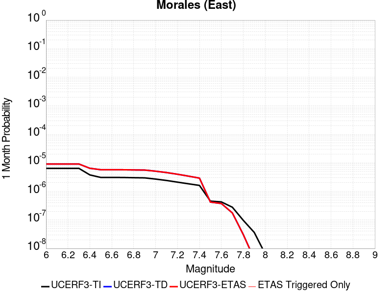 |  | 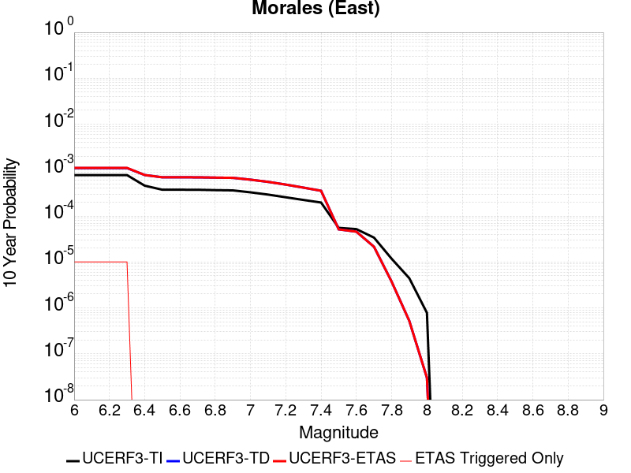 |

| Magnitude | 1 wk TI Prob | 1 wk TD Prob | 1 wk ETAS Prob | 1 wk ETAS/TD Gain | 1 wk ETAS Triggered Only | 1 mo TI Prob | 1 mo TD Prob | 1 mo ETAS Prob | 1 mo ETAS/TD Gain | 1 mo ETAS Triggered Only | 1 yr TI Prob | 1 yr TD Prob | 1 yr ETAS Prob | 1 yr ETAS/TD Gain | 1 yr ETAS Triggered Only | 10 yr TI Prob | 10 yr TD Prob | 10 yr ETAS Prob | 10 yr ETAS/TD Gain | 10 yr ETAS Triggered Only |
|-----|-----|-----|-----|-----|-----|-----|-----|-----|-----|-----|-----|-----|-----|-----|-----|-----|-----|-----|-----|-----|
| 6.0 | 1.4942771E-6 | 2.12341E-6 | 2.12341E-6 | 1.0 | 0.0 | 6.404029E-6 | 9.1003E-6 | 9.1003E-6 | 1.0 | 0.0 | 7.7966266E-5 | 1.1079111E-4 | 1.2079E-4 | 1.0902499 | 1.0E-5 | 7.793892E-4 | 0.0011074184 | 0.0011174075 | 1.00902 | 1.0E-5 |
| 6.1 | 1.4942771E-6 | 2.12341E-6 | 2.12341E-6 | 1.0 | 0.0 | 6.404029E-6 | 9.1003E-6 | 9.1003E-6 | 1.0 | 0.0 | 7.7966266E-5 | 1.1079111E-4 | 1.2079E-4 | 1.0902499 | 1.0E-5 | 7.793892E-4 | 0.0011074184 | 0.0011174075 | 1.00902 | 1.0E-5 |
| 6.2 | 1.4942771E-6 | 2.12341E-6 | 2.12341E-6 | 1.0 | 0.0 | 6.404029E-6 | 9.1003E-6 | 9.1003E-6 | 1.0 | 0.0 | 7.7966266E-5 | 1.1079111E-4 | 1.2079E-4 | 1.0902499 | 1.0E-5 | 7.793892E-4 | 0.0011074184 | 0.0011174075 | 1.00902 | 1.0E-5 |
| 6.3 | 1.4942771E-6 | 2.12341E-6 | 2.12341E-6 | 1.0 | 0.0 | 6.404029E-6 | 9.1003E-6 | 9.1003E-6 | 1.0 | 0.0 | 7.7966266E-5 | 1.1079111E-4 | 1.2079E-4 | 1.0902499 | 1.0E-5 | 7.793892E-4 | 0.0011074184 | 0.0011174075 | 1.00902 | 1.0E-5 |
| 6.4 | 8.798845E-7 | 1.5022043E-6 | 1.5022043E-6 | 1.0 | 0.0 | 3.7709283E-6 | 6.4380033E-6 | 6.4380033E-6 | 1.0 | 0.0 | 4.5910085E-5 | 7.8379984E-5 | 7.8379984E-5 | 1.0 | 0.0 | 4.59006E-4 | 7.835368E-4 | 7.835368E-4 | 1.0 | 0.0 |
| 6.5 | 7.1751725E-7 | 1.3383542E-6 | 1.3383542E-6 | 1.0 | 0.0 | 3.0750705E-6 | 5.7357915E-6 | 5.7357915E-6 | 1.0 | 0.0 | 3.7438338E-5 | 6.98311E-5 | 6.98311E-5 | 1.0 | 0.0 | 3.743203E-4 | 6.9810177E-4 | 6.9810177E-4 | 1.0 | 0.0 |
| 6.6 | 7.1751725E-7 | 1.3383542E-6 | 1.3383542E-6 | 1.0 | 0.0 | 3.0750705E-6 | 5.7357915E-6 | 5.7357915E-6 | 1.0 | 0.0 | 3.7438338E-5 | 6.98311E-5 | 6.98311E-5 | 1.0 | 0.0 | 3.743203E-4 | 6.9810177E-4 | 6.9810177E-4 | 1.0 | 0.0 |
| 6.7 | 7.159057E-7 | 1.3358203E-6 | 1.3358203E-6 | 1.0 | 0.0 | 3.0681638E-6 | 5.724932E-6 | 5.724932E-6 | 1.0 | 0.0 | 3.7354253E-5 | 6.9698894E-5 | 6.9698894E-5 | 1.0 | 0.0 | 3.7347974E-4 | 6.967805E-4 | 6.967805E-4 | 1.0 | 0.0 |
| 6.8 | 7.032203E-7 | 1.3173761E-6 | 1.3173761E-6 | 1.0 | 0.0 | 3.0137978E-6 | 5.6458857E-6 | 5.6458857E-6 | 1.0 | 0.0 | 3.669237E-5 | 6.873657E-5 | 6.873657E-5 | 1.0 | 0.0 | 3.6686313E-4 | 6.871632E-4 | 6.871632E-4 | 1.0 | 0.0 |
| 6.9 | 6.941549E-7 | 1.3024384E-6 | 1.3024384E-6 | 1.0 | 0.0 | 2.974946E-6 | 5.5818673E-6 | 5.5818673E-6 | 1.0 | 0.0 | 3.6219368E-5 | 6.795719E-5 | 6.795719E-5 | 1.0 | 0.0 | 3.6213463E-4 | 6.7937415E-4 | 6.7937415E-4 | 1.0 | 0.0 |
| 7.0 | 6.2932247E-7 | 1.1876751E-6 | 1.1876751E-6 | 1.0 | 0.0 | 2.6970936E-6 | 5.0900267E-6 | 5.0900267E-6 | 1.0 | 0.0 | 3.283662E-5 | 6.196938E-5 | 6.196938E-5 | 1.0 | 0.0 | 3.283177E-4 | 6.1952986E-4 | 6.1952986E-4 | 1.0 | 0.0 |
| 7.1 | 5.6200963E-7 | 1.0639756E-6 | 1.0639756E-6 | 1.0 | 0.0 | 2.4086105E-6 | 4.5598877E-6 | 4.5598877E-6 | 1.0 | 0.0 | 2.9324437E-5 | 5.5515262E-5 | 5.5515262E-5 | 1.0 | 0.0 | 2.9320567E-4 | 5.5502116E-4 | 5.5502116E-4 | 1.0 | 0.0 |
| 7.2 | 4.91044E-7 | 9.285128E-7 | 9.285128E-7 | 1.0 | 0.0 | 2.1044725E-6 | 3.979335E-6 | 3.979335E-6 | 1.0 | 0.0 | 2.5621652E-5 | 4.8447364E-5 | 4.8447364E-5 | 1.0 | 0.0 | 2.56187E-4 | 4.8437432E-4 | 4.8437432E-4 | 1.0 | 0.0 |
| 7.3 | 4.2978448E-7 | 7.973458E-7 | 7.973458E-7 | 1.0 | 0.0 | 1.8419321E-6 | 3.4171921E-6 | 3.4171921E-6 | 1.0 | 0.0 | 2.2425293E-5 | 4.160355E-5 | 4.160355E-5 | 1.0 | 0.0 | 2.242303E-4 | 4.1596327E-4 | 4.1596327E-4 | 1.0 | 0.0 |
| 7.4 | 3.774317E-7 | 6.8062724E-7 | 6.8062724E-7 | 1.0 | 0.0 | 1.6175634E-6 | 2.916971E-6 | 2.916971E-6 | 1.0 | 0.0 | 1.9693656E-5 | 3.551357E-5 | 3.551357E-5 | 1.0 | 0.0 | 1.969191E-4 | 3.5508422E-4 | 3.5508422E-4 | 1.0 | 0.0 |
| 7.5 | 1.0603232E-7 | 9.839962E-8 | 9.839962E-8 | 1.0 | 0.0 | 4.5442414E-7 | 4.2171257E-7 | 4.2171257E-7 | 1.0 | 0.0 | 5.5326E-6 | 5.1343386E-6 | 5.1343386E-6 | 1.0 | 0.0 | 5.532462E-5 | 5.134477E-5 | 5.134477E-5 | 1.0 | 0.0 |
| 7.6 | 9.960384E-8 | 8.754474E-8 | 8.754474E-8 | 1.0 | 0.0 | 4.2687353E-7 | 3.751917E-7 | 3.751917E-7 | 1.0 | 0.0 | 5.197173E-6 | 4.5679494E-6 | 4.5679494E-6 | 1.0 | 0.0 | 5.1970514E-5 | 4.568112E-5 | 4.568112E-5 | 1.0 | 0.0 |
| 7.7 | 6.499468E-8 | 4.1033744E-8 | 4.1033744E-8 | 1.0 | 0.0 | 2.785486E-7 | 1.7585889E-7 | 1.7585889E-7 | 1.0 | 0.0 | 3.3913238E-6 | 2.14108E-6 | 2.14108E-6 | 1.0 | 0.0 | 3.3912722E-5 | 2.141315E-5 | 2.141315E-5 | 1.0 | 0.0 |
| 7.8 | 2.2517119E-8 | 7.1302737E-9 | 7.1302737E-9 | 1.0 | 0.0 | 9.6501935E-8 | 3.055832E-8 | 3.055832E-8 | 1.0 | 0.0 | 1.1749105E-6 | 3.7204745E-7 | 3.7204745E-7 | 1.0 | 0.0 | 1.1749043E-5 | 3.7230056E-6 | 3.7230056E-6 | 1.0 | 0.0 |
| 7.9 | 8.493023E-9 | 9.967877E-10 | 9.967877E-10 | 1.0 | 0.0 | 3.639867E-8 | 4.2719512E-9 | 4.2719512E-9 | 1.0 | 0.0 | 4.4315374E-7 | 5.2010996E-8 | 5.2010996E-8 | 1.0 | 0.0 | 4.4315284E-6 | 5.2221407E-7 | 5.2221407E-7 | 1.0 | 0.0 |
| 8.0 | 1.4971842E-9 | 5.5433436E-11 | 5.5433436E-11 | 1.0 | 0.0 | 6.4165038E-9 | 2.3757252E-10 | 2.3757252E-10 | 1.0 | 0.0 | 7.812093E-8 | 2.8924485E-9 | 2.8924485E-9 | 1.0 | 0.0 | 7.81209E-7 | 3.0179773E-8 | 3.0179773E-8 | 1.0 | 0.0 |

## Great Valley 08 (Quinto)
*[(top)](#table-of-contents)*

| 1 Week | 1 Month | 1 Year | 10 Year |
|-----|-----|-----|-----|
| 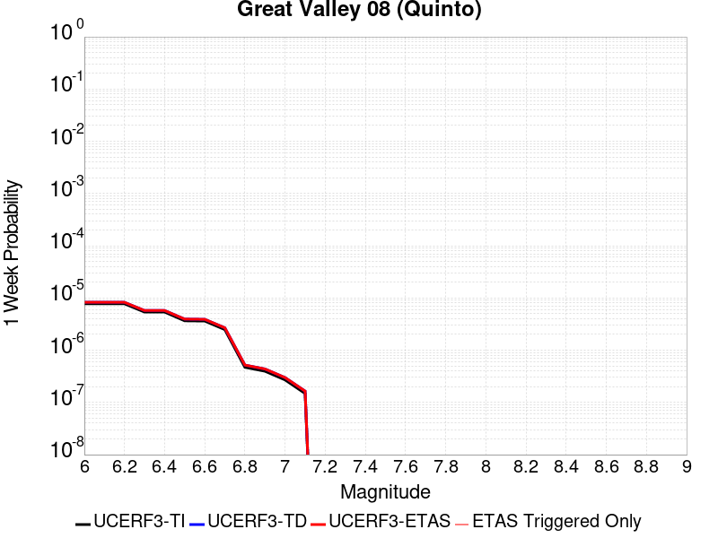 |  |  | 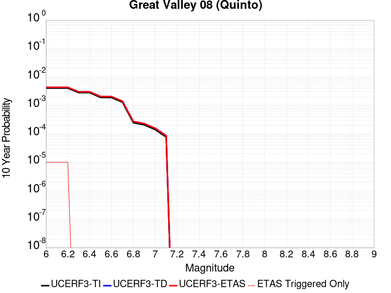 |

| Magnitude | 1 wk TI Prob | 1 wk TD Prob | 1 wk ETAS Prob | 1 wk ETAS/TD Gain | 1 wk ETAS Triggered Only | 1 mo TI Prob | 1 mo TD Prob | 1 mo ETAS Prob | 1 mo ETAS/TD Gain | 1 mo ETAS Triggered Only | 1 yr TI Prob | 1 yr TD Prob | 1 yr ETAS Prob | 1 yr ETAS/TD Gain | 1 yr ETAS Triggered Only | 10 yr TI Prob | 10 yr TD Prob | 10 yr ETAS Prob | 10 yr ETAS/TD Gain | 10 yr ETAS Triggered Only |
|-----|-----|-----|-----|-----|-----|-----|-----|-----|-----|-----|-----|-----|-----|-----|-----|-----|-----|-----|-----|-----|
| 6.0 | 7.737697E-6 | 8.253023E-6 | 8.253023E-6 | 1.0 | 0.0 | 3.3161137E-5 | 3.5369725E-5 | 3.5369725E-5 | 1.0 | 0.0 | 4.0366207E-4 | 4.305602E-4 | 4.405559E-4 | 1.0232155 | 1.0E-5 | 0.004029296 | 0.004299113 | 0.00430907 | 1.0023161 | 1.0E-5 |
| 6.1 | 7.737697E-6 | 8.253023E-6 | 8.253023E-6 | 1.0 | 0.0 | 3.3161137E-5 | 3.5369725E-5 | 3.5369725E-5 | 1.0 | 0.0 | 4.0366207E-4 | 4.305602E-4 | 4.405559E-4 | 1.0232155 | 1.0E-5 | 0.004029296 | 0.004299113 | 0.00430907 | 1.0023161 | 1.0E-5 |
| 6.2 | 7.737697E-6 | 8.253023E-6 | 8.253023E-6 | 1.0 | 0.0 | 3.3161137E-5 | 3.5369725E-5 | 3.5369725E-5 | 1.0 | 0.0 | 4.0366207E-4 | 4.305602E-4 | 4.405559E-4 | 1.0232155 | 1.0E-5 | 0.004029296 | 0.004299113 | 0.00430907 | 1.0023161 | 1.0E-5 |
| 6.3 | 5.374012E-6 | 5.7505627E-6 | 5.7505627E-6 | 1.0 | 0.0 | 2.3031276E-5 | 2.46451E-5 | 2.46451E-5 | 1.0 | 0.0 | 2.803697E-4 | 3.000239E-4 | 3.000239E-4 | 1.0 | 0.0 | 0.0028001624 | 0.002997282 | 0.002997282 | 1.0 | 0.0 |
| 6.4 | 5.374012E-6 | 5.7505627E-6 | 5.7505627E-6 | 1.0 | 0.0 | 2.3031276E-5 | 2.46451E-5 | 2.46451E-5 | 1.0 | 0.0 | 2.803697E-4 | 3.000239E-4 | 3.000239E-4 | 1.0 | 0.0 | 0.0028001624 | 0.002997282 | 0.002997282 | 1.0 | 0.0 |
| 6.5 | 3.65427E-6 | 3.9413158E-6 | 3.9413158E-6 | 1.0 | 0.0 | 1.5661062E-5 | 1.6891283E-5 | 1.6891283E-5 | 1.0 | 0.0 | 1.9065675E-4 | 2.0563902E-4 | 2.0563902E-4 | 1.0 | 0.0 | 0.0019049325 | 0.0020551789 | 0.0020551789 | 1.0 | 0.0 |
| 6.6 | 3.6143538E-6 | 3.898502E-6 | 3.898502E-6 | 1.0 | 0.0 | 1.5489995E-5 | 1.67078E-5 | 1.67078E-5 | 1.0 | 0.0 | 1.8857437E-4 | 2.0340552E-4 | 2.0340552E-4 | 1.0 | 0.0 | 0.0018841444 | 0.002032885 | 0.002032885 | 1.0 | 0.0 |
| 6.7 | 2.4821015E-6 | 2.6857008E-6 | 2.6857008E-6 | 1.0 | 0.0 | 1.0637535E-5 | 1.15101275E-5 | 1.15101275E-5 | 1.0 | 0.0 | 1.2950429E-4 | 1.4013246E-4 | 1.4013246E-4 | 1.0 | 0.0 | 0.0012942884 | 0.0014009958 | 0.0014009958 | 1.0 | 0.0 |
| 6.8 | 4.7110538E-7 | 5.1930067E-7 | 5.1930067E-7 | 1.0 | 0.0 | 2.0190216E-6 | 2.2255724E-6 | 2.2255724E-6 | 1.0 | 0.0 | 2.458131E-5 | 2.7096026E-5 | 2.7096026E-5 | 1.0 | 0.0 | 2.457859E-4 | 2.7092904E-4 | 2.7092904E-4 | 1.0 | 0.0 |
| 6.9 | 3.958685E-7 | 4.3703332E-7 | 4.3703332E-7 | 1.0 | 0.0 | 1.6965782E-6 | 1.8729986E-6 | 1.8729986E-6 | 1.0 | 0.0 | 2.0655643E-5 | 2.2803537E-5 | 2.2803537E-5 | 1.0 | 0.0 | 2.0653724E-4 | 2.2801358E-4 | 2.2801358E-4 | 1.0 | 0.0 |
| 7.0 | 2.70294E-7 | 2.9919923E-7 | 2.9919923E-7 | 1.0 | 0.0 | 1.1584025E-6 | 1.2822819E-6 | 1.2822819E-6 | 1.0 | 0.0 | 1.4103458E-5 | 1.5611682E-5 | 1.5611682E-5 | 1.0 | 0.0 | 1.4102564E-4 | 1.5610714E-4 | 1.5610714E-4 | 1.0 | 0.0 |
| 7.1 | 1.4828602E-7 | 1.6469059E-7 | 1.6469059E-7 | 1.0 | 0.0 | 6.3551136E-7 | 7.0581666E-7 | 7.0581666E-7 | 1.0 | 0.0 | 7.737323E-6 | 8.593292E-6 | 8.593292E-6 | 1.0 | 0.0 | 7.737054E-5 | 8.59304E-5 | 8.59304E-5 | 1.0 | 0.0 |

## Owens Valley
*[(top)](#table-of-contents)*

| 1 Week | 1 Month | 1 Year | 10 Year |
|-----|-----|-----|-----|
|  |  | 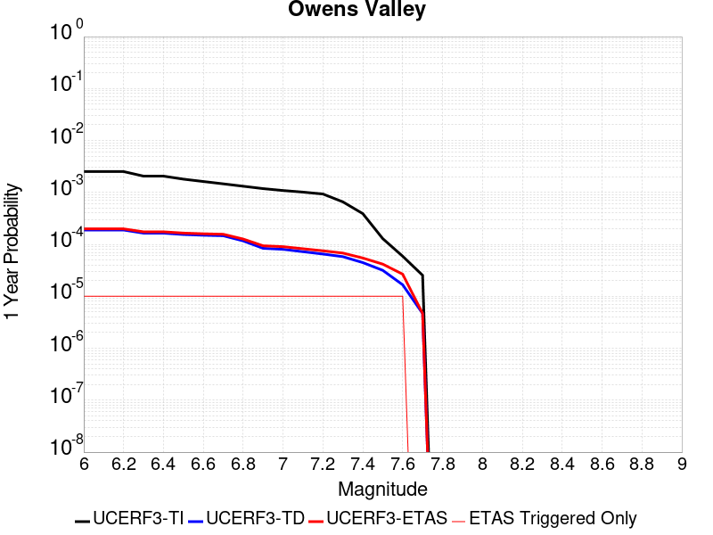 |  |

| Magnitude | 1 wk TI Prob | 1 wk TD Prob | 1 wk ETAS Prob | 1 wk ETAS/TD Gain | 1 wk ETAS Triggered Only | 1 mo TI Prob | 1 mo TD Prob | 1 mo ETAS Prob | 1 mo ETAS/TD Gain | 1 mo ETAS Triggered Only | 1 yr TI Prob | 1 yr TD Prob | 1 yr ETAS Prob | 1 yr ETAS/TD Gain | 1 yr ETAS Triggered Only | 10 yr TI Prob | 10 yr TD Prob | 10 yr ETAS Prob | 10 yr ETAS/TD Gain | 10 yr ETAS Triggered Only |
|-----|-----|-----|-----|-----|-----|-----|-----|-----|-----|-----|-----|-----|-----|-----|-----|-----|-----|-----|-----|-----|
| 6.0 | 4.83821E-5 | 3.6264003E-6 | 3.6264003E-6 | 1.0 | 0.0 | 2.0733538E-4 | 1.554163E-5 | 1.554163E-5 | 1.0 | 0.0 | 0.002521386 | 1.8920389E-4 | 1.99202E-4 | 1.0528431 | 1.0E-5 | 0.024929691 | 0.0019249251 | 0.0019349059 | 1.005185 | 1.0E-5 |
| 6.1 | 4.83821E-5 | 3.6264003E-6 | 3.6264003E-6 | 1.0 | 0.0 | 2.0733538E-4 | 1.554163E-5 | 1.554163E-5 | 1.0 | 0.0 | 0.002521386 | 1.8920389E-4 | 1.99202E-4 | 1.0528431 | 1.0E-5 | 0.024929691 | 0.0019249251 | 0.0019349059 | 1.005185 | 1.0E-5 |
| 6.2 | 4.83821E-5 | 3.6264003E-6 | 3.6264003E-6 | 1.0 | 0.0 | 2.0733538E-4 | 1.554163E-5 | 1.554163E-5 | 1.0 | 0.0 | 0.002521386 | 1.8920389E-4 | 1.99202E-4 | 1.0528431 | 1.0E-5 | 0.024929691 | 0.0019249251 | 0.0019349059 | 1.005185 | 1.0E-5 |
| 6.3 | 3.953008E-5 | 3.1553045E-6 | 3.1553045E-6 | 1.0 | 0.0 | 1.6940363E-4 | 1.3522667E-5 | 1.3522667E-5 | 1.0 | 0.0 | 0.002060538 | 1.6462678E-4 | 1.7462512E-4 | 1.0607334 | 1.0E-5 | 0.020415364 | 0.0016591517 | 0.0016691352 | 1.0060172 | 1.0E-5 |
| 6.4 | 3.953008E-5 | 3.1553045E-6 | 3.1553045E-6 | 1.0 | 0.0 | 1.6940363E-4 | 1.3522667E-5 | 1.3522667E-5 | 1.0 | 0.0 | 0.002060538 | 1.6462678E-4 | 1.7462512E-4 | 1.0607334 | 1.0E-5 | 0.020415364 | 0.0016591517 | 0.0016691352 | 1.0060172 | 1.0E-5 |
| 6.5 | 3.457342E-5 | 2.9715377E-6 | 2.9715377E-6 | 1.0 | 0.0 | 1.4816338E-4 | 1.2735103E-5 | 1.2735103E-5 | 1.0 | 0.0 | 0.0018023965 | 1.5503954E-4 | 1.65038E-4 | 1.0644897 | 1.0E-5 | 0.017878477 | 0.0015556873 | 0.0015656716 | 1.006418 | 1.0E-5 |
| 6.6 | 3.1127765E-5 | 2.874452E-6 | 2.874452E-6 | 1.0 | 0.0 | 1.3339789E-4 | 1.2319027E-5 | 1.2319027E-5 | 1.0 | 0.0 | 0.0016229092 | 1.4997451E-4 | 1.5997302E-4 | 1.066668 | 1.0E-5 | 0.016111081 | 0.0015012339 | 0.001511219 | 1.0066512 | 1.0E-5 |
| 6.7 | 2.806885E-5 | 2.8103827E-6 | 2.8103827E-6 | 1.0 | 0.0 | 1.2028952E-4 | 1.2044446E-5 | 1.2044446E-5 | 1.0 | 0.0 | 0.001463541 | 1.4663194E-4 | 1.5663047E-4 | 1.068188 | 1.0E-5 | 0.014539397 | 0.001465735 | 0.0014757203 | 1.0068126 | 1.0E-5 |
| 6.8 | 2.524524E-5 | 2.2353422E-6 | 2.2353422E-6 | 1.0 | 0.0 | 1.0818939E-4 | 9.580004E-6 | 9.580004E-6 | 1.0 | 0.0 | 0.0013164099 | 1.1663061E-4 | 1.2662944E-4 | 1.0857308 | 1.0E-5 | 0.01308639 | 0.0011659673 | 0.0011759556 | 1.0085666 | 1.0E-5 |
| 6.9 | 2.2704568E-5 | 1.6081486E-6 | 1.6081486E-6 | 1.0 | 0.0 | 9.730166E-5 | 6.8920476E-6 | 6.8920476E-6 | 1.0 | 0.0 | 0.0011840039 | 8.3907464E-5 | 9.390663E-5 | 1.1191689 | 1.0E-5 | 0.011777153 | 8.389696E-4 | 8.489612E-4 | 1.0119094 | 1.0E-5 |
| 7.0 | 2.0871712E-5 | 1.5395268E-6 | 1.5395268E-6 | 1.0 | 0.0 | 8.944713E-5 | 6.5979552E-6 | 6.5979552E-6 | 1.0 | 0.0 | 0.0010884746 | 8.032716E-5 | 9.032636E-5 | 1.1244808 | 1.0E-5 | 0.010831586 | 8.031529E-4 | 8.1314484E-4 | 1.0124409 | 1.0E-5 |
| 7.1 | 1.944928E-5 | 1.386402E-6 | 1.386402E-6 | 1.0 | 0.0 | 8.335139E-5 | 5.9417093E-6 | 5.9417093E-6 | 1.0 | 0.0 | 0.0010143308 | 7.233792E-5 | 8.2337196E-5 | 1.1382301 | 1.0E-5 | 0.010097133 | 7.2330143E-4 | 7.3329423E-4 | 1.0138155 | 1.0E-5 |
| 7.2 | 1.7876306E-5 | 1.2489002E-6 | 1.2489002E-6 | 1.0 | 0.0 | 7.6610486E-5 | 5.3524186E-6 | 5.3524186E-6 | 1.0 | 0.0 | 9.3233347E-4 | 6.516375E-5 | 7.51631E-5 | 1.1534495 | 1.0E-5 | 0.009284316 | 6.515837E-4 | 6.615772E-4 | 1.0153372 | 1.0E-5 |
| 7.3 | 1.2618672E-5 | 1.1115079E-6 | 1.1115079E-6 | 1.0 | 0.0 | 5.40789E-5 | 4.7635967E-6 | 4.7635967E-6 | 1.0 | 0.0 | 6.582117E-4 | 5.7995258E-5 | 6.7994675E-5 | 1.1724179 | 1.0E-5 | 0.0065626553 | 5.799336E-4 | 5.899278E-4 | 1.0172334 | 1.0E-5 |
| 7.4 | 7.4874442E-6 | 8.548535E-7 | 8.548535E-7 | 1.0 | 0.0 | 3.208865E-5 | 3.663653E-6 | 3.663653E-6 | 1.0 | 0.0 | 3.906093E-4 | 4.4604065E-5 | 5.4603617E-5 | 1.2241849 | 1.0E-5 | 0.003899234 | 4.4604312E-4 | 4.5603866E-4 | 1.0224093 | 1.0E-5 |
| 7.5 | 2.4734156E-6 | 6.0685437E-7 | 6.0685437E-7 | 1.0 | 0.0 | 1.060031E-5 | 2.6008017E-6 | 2.6008017E-6 | 1.0 | 0.0 | 1.2905113E-4 | 3.1664305E-5 | 4.166399E-5 | 1.315803 | 1.0E-5 | 0.0012897621 | 3.1659825E-4 | 3.265951E-4 | 1.0315758 | 1.0E-5 |
| 7.6 | 1.1328841E-6 | 3.196495E-7 | 3.196495E-7 | 1.0 | 0.0 | 4.8552088E-6 | 1.3699258E-6 | 1.3699258E-6 | 1.0 | 0.0 | 5.9110564E-5 | 1.6678721E-5 | 2.6678554E-5 | 1.5995563 | 1.0E-5 | 5.9094845E-4 | 1.6677487E-4 | 1.767732E-4 | 1.0599511 | 1.0E-5 |
| 7.7 | 4.8613185E-7 | 8.9645496E-8 | 8.9645496E-8 | 1.0 | 0.0 | 2.0834207E-6 | 3.8419492E-7 | 3.8419492E-7 | 1.0 | 0.0 | 2.536535E-5 | 4.677564E-6 | 4.677564E-6 | 1.0 | 0.0 | 2.5362454E-4 | 4.677472E-5 | 4.677472E-5 | 1.0 | 0.0 |

## Malibu Coast alt 1
*[(top)](#table-of-contents)*

| 1 Week | 1 Month | 1 Year | 10 Year |
|-----|-----|-----|-----|
| 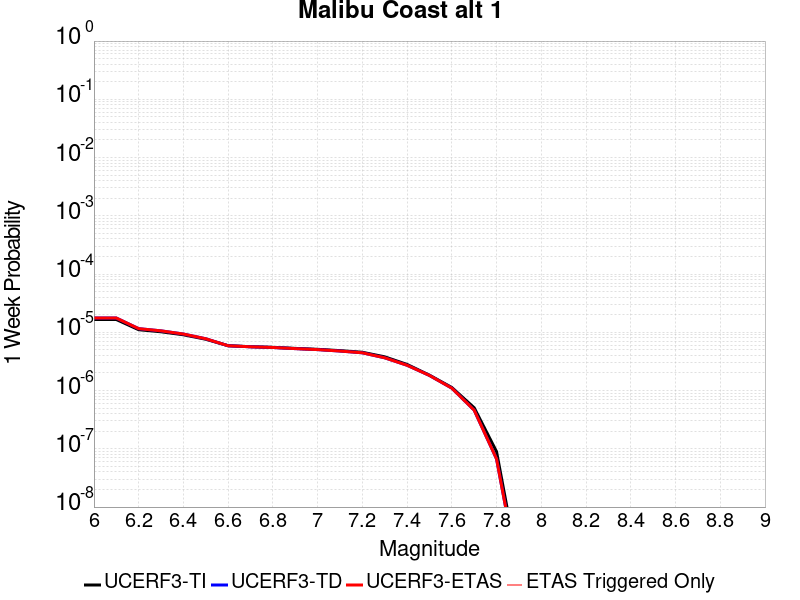 |  |  | 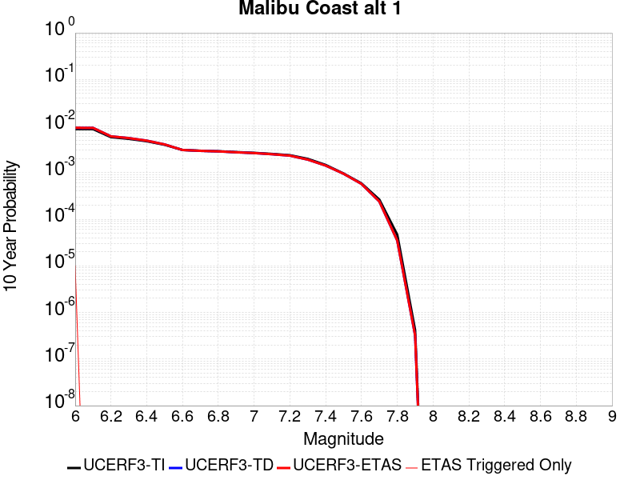 |

| Magnitude | 1 wk TI Prob | 1 wk TD Prob | 1 wk ETAS Prob | 1 wk ETAS/TD Gain | 1 wk ETAS Triggered Only | 1 mo TI Prob | 1 mo TD Prob | 1 mo ETAS Prob | 1 mo ETAS/TD Gain | 1 mo ETAS Triggered Only | 1 yr TI Prob | 1 yr TD Prob | 1 yr ETAS Prob | 1 yr ETAS/TD Gain | 1 yr ETAS Triggered Only | 10 yr TI Prob | 10 yr TD Prob | 10 yr ETAS Prob | 10 yr ETAS/TD Gain | 10 yr ETAS Triggered Only |
|-----|-----|-----|-----|-----|-----|-----|-----|-----|-----|-----|-----|-----|-----|-----|-----|-----|-----|-----|-----|-----|
| 6.0 | 1.6572556E-5 | 1.7598026E-5 | 1.7598026E-5 | 1.0 | 0.0 | 7.102331E-5 | 7.541804E-5 | 8.541728E-5 | 1.1325843 | 1.0E-5 | 8.6436566E-4 | 9.178467E-4 | 9.278375E-4 | 1.0108851 | 1.0E-5 | 0.0086101135 | 0.009142492 | 0.0091524 | 1.0010839 | 1.0E-5 |
| 6.1 | 1.6572556E-5 | 1.7598026E-5 | 1.7598026E-5 | 1.0 | 0.0 | 7.102331E-5 | 7.541804E-5 | 7.541804E-5 | 1.0 | 0.0 | 8.6436566E-4 | 9.178467E-4 | 9.178467E-4 | 1.0 | 0.0 | 0.0086101135 | 0.009142492 | 0.009142492 | 1.0 | 0.0 |
| 6.2 | 1.1085717E-5 | 1.1557123E-5 | 1.1557123E-5 | 1.0 | 0.0 | 4.750935E-5 | 4.9529604E-5 | 4.9529604E-5 | 1.0 | 0.0 | 5.782728E-4 | 6.0285965E-4 | 6.0285965E-4 | 1.0 | 0.0 | 0.0057677035 | 0.006012613 | 0.006012613 | 1.0 | 0.0 |
| 6.3 | 1.0208568E-5 | 1.0592215E-5 | 1.0592215E-5 | 1.0 | 0.0 | 4.375027E-5 | 4.5394438E-5 | 4.5394438E-5 | 1.0 | 0.0 | 5.325294E-4 | 5.5254006E-4 | 5.5254006E-4 | 1.0 | 0.0 | 0.0053125503 | 0.0055119703 | 0.0055119703 | 1.0 | 0.0 |
| 6.4 | 9.0682315E-6 | 9.342619E-6 | 9.342619E-6 | 1.0 | 0.0 | 3.8863272E-5 | 4.003919E-5 | 4.003919E-5 | 1.0 | 0.0 | 4.730576E-4 | 4.8737015E-4 | 4.8737015E-4 | 1.0 | 0.0 | 0.0047205184 | 0.004863227 | 0.004863227 | 1.0 | 0.0 |
| 6.5 | 7.605796E-6 | 7.748573E-6 | 7.748573E-6 | 1.0 | 0.0 | 3.259586E-5 | 3.3207754E-5 | 3.3207754E-5 | 1.0 | 0.0 | 3.9678233E-4 | 4.0423073E-4 | 4.0423073E-4 | 1.0 | 0.0 | 0.0039607463 | 0.004035092 | 0.004035092 | 1.0 | 0.0 |
| 6.6 | 5.889873E-6 | 5.8795285E-6 | 5.8795285E-6 | 1.0 | 0.0 | 2.5242069E-5 | 2.5197736E-5 | 2.5197736E-5 | 1.0 | 0.0 | 3.0727885E-4 | 3.0673936E-4 | 3.0673936E-4 | 1.0 | 0.0 | 0.003068543 | 0.0030631723 | 0.0030631723 | 1.0 | 0.0 |
| 6.7 | 5.66586E-6 | 5.6416316E-6 | 5.6416316E-6 | 1.0 | 0.0 | 2.428203E-5 | 2.4178196E-5 | 2.4178196E-5 | 1.0 | 0.0 | 2.955936E-4 | 2.9432986E-4 | 2.9432986E-4 | 1.0 | 0.0 | 0.0029520073 | 0.0029394126 | 0.0029394126 | 1.0 | 0.0 |
| 6.8 | 5.521556E-6 | 5.489417E-6 | 5.489417E-6 | 1.0 | 0.0 | 2.3663597E-5 | 2.3525863E-5 | 2.3525863E-5 | 1.0 | 0.0 | 2.880662E-4 | 2.863898E-4 | 2.863898E-4 | 1.0 | 0.0 | 0.0028769306 | 0.0028602192 | 0.0028602192 | 1.0 | 0.0 |
| 6.9 | 5.29752E-6 | 5.249922E-6 | 5.249922E-6 | 1.0 | 0.0 | 2.270346E-5 | 2.2499473E-5 | 2.2499473E-5 | 1.0 | 0.0 | 2.7637955E-4 | 2.7389673E-4 | 2.7389673E-4 | 1.0 | 0.0 | 0.0027603607 | 0.002735602 | 0.002735602 | 1.0 | 0.0 |
| 7.0 | 5.106743E-6 | 5.0476697E-6 | 5.0476697E-6 | 1.0 | 0.0 | 2.1885859E-5 | 2.1632692E-5 | 2.1632692E-5 | 1.0 | 0.0 | 2.6642776E-4 | 2.6334627E-4 | 2.6334627E-4 | 1.0 | 0.0 | 0.0026610855 | 0.0026303516 | 0.0026303516 | 1.0 | 0.0 |
| 7.1 | 4.8469647E-6 | 4.7703647E-6 | 4.7703647E-6 | 1.0 | 0.0 | 2.0772539E-5 | 2.044426E-5 | 2.044426E-5 | 1.0 | 0.0 | 2.528763E-4 | 2.488805E-4 | 2.488805E-4 | 1.0 | 0.0 | 0.0025258875 | 0.002486026 | 0.002486026 | 1.0 | 0.0 |
| 7.2 | 4.545514E-6 | 4.448186E-6 | 4.448186E-6 | 1.0 | 0.0 | 1.9480629E-5 | 1.9063515E-5 | 1.9063515E-5 | 1.0 | 0.0 | 2.3715083E-4 | 2.3207364E-4 | 2.3207364E-4 | 1.0 | 0.0 | 0.0023689792 | 0.0023183203 | 0.0023183203 | 1.0 | 0.0 |
| 7.3 | 3.794097E-6 | 3.6519286E-6 | 3.6519286E-6 | 1.0 | 0.0 | 1.6260314E-5 | 1.5651029E-5 | 1.5651029E-5 | 1.0 | 0.0 | 1.9795135E-4 | 1.9053466E-4 | 1.9053466E-4 | 1.0 | 0.0 | 0.001977751 | 0.0019037176 | 0.0019037176 | 1.0 | 0.0 |
| 7.4 | 2.808217E-6 | 2.7190722E-6 | 2.7190722E-6 | 1.0 | 0.0 | 1.203516E-5 | 1.1653115E-5 | 1.1653115E-5 | 1.0 | 0.0 | 1.4651821E-4 | 1.4186747E-4 | 1.4186747E-4 | 1.0 | 0.0 | 0.0014642165 | 0.0014177717 | 0.0014177717 | 1.0 | 0.0 |
| 7.5 | 1.83809E-6 | 1.8190659E-6 | 1.8190659E-6 | 1.0 | 0.0 | 7.877505E-6 | 7.795974E-6 | 7.795974E-6 | 1.0 | 0.0 | 9.59044E-5 | 9.491186E-5 | 9.491186E-5 | 1.0 | 0.0 | 9.5863023E-4 | 9.487153E-4 | 9.487153E-4 | 1.0 | 0.0 |
| 7.6 | 1.1292672E-6 | 1.1001425E-6 | 1.1001425E-6 | 1.0 | 0.0 | 4.839708E-6 | 4.7148883E-6 | 4.7148883E-6 | 1.0 | 0.0 | 5.8921847E-5 | 5.7402267E-5 | 5.7402267E-5 | 1.0 | 0.0 | 5.890623E-4 | 5.73876E-4 | 5.73876E-4 | 1.0 | 0.0 |
| 7.7 | 5.065272E-7 | 4.6091404E-7 | 4.6091404E-7 | 1.0 | 0.0 | 2.170829E-6 | 1.9753445E-6 | 1.9753445E-6 | 1.0 | 0.0 | 2.6429525E-5 | 2.4049565E-5 | 2.4049565E-5 | 1.0 | 0.0 | 2.642638E-4 | 2.4047075E-4 | 2.4047075E-4 | 1.0 | 0.0 |
| 7.8 | 8.952991E-8 | 6.707833E-8 | 6.707833E-8 | 1.0 | 0.0 | 3.8369956E-7 | 2.8747854E-7 | 2.8747854E-7 | 1.0 | 0.0 | 4.671532E-6 | 3.5000458E-6 | 3.5000458E-6 | 1.0 | 0.0 | 4.671434E-5 | 3.4999925E-5 | 3.4999925E-5 | 1.0 | 0.0 |
| 7.9 | 8.007447E-10 | 6.160872E-10 | 6.160872E-10 | 1.0 | 0.0 | 3.4317629E-9 | 2.6403733E-9 | 2.6403733E-9 | 1.0 | 0.0 | 4.1781714E-8 | 3.2146545E-8 | 3.2146545E-8 | 1.0 | 0.0 | 4.1781706E-7 | 3.214654E-7 | 3.214654E-7 | 1.0 | 0.0 |

## Sierra Nevada  (No Extension)
*[(top)](#table-of-contents)*

| 1 Week | 1 Month | 1 Year | 10 Year |
|-----|-----|-----|-----|
|  |  |  |  |

| Magnitude | 1 wk TI Prob | 1 wk TD Prob | 1 wk ETAS Prob | 1 wk ETAS/TD Gain | 1 wk ETAS Triggered Only | 1 mo TI Prob | 1 mo TD Prob | 1 mo ETAS Prob | 1 mo ETAS/TD Gain | 1 mo ETAS Triggered Only | 1 yr TI Prob | 1 yr TD Prob | 1 yr ETAS Prob | 1 yr ETAS/TD Gain | 1 yr ETAS Triggered Only | 10 yr TI Prob | 10 yr TD Prob | 10 yr ETAS Prob | 10 yr ETAS/TD Gain | 10 yr ETAS Triggered Only |
|-----|-----|-----|-----|-----|-----|-----|-----|-----|-----|-----|-----|-----|-----|-----|-----|-----|-----|-----|-----|-----|
| 6.0 | 7.7690465E-6 | 6.9763096E-6 | 6.9763096E-6 | 1.0 | 0.0 | 3.329549E-5 | 2.9898329E-5 | 2.9898329E-5 | 1.0 | 0.0 | 4.0529718E-4 | 3.639872E-4 | 3.7398355E-4 | 1.0274634 | 1.0E-5 | 0.004045588 | 0.0036374263 | 0.0036473898 | 1.0027392 | 1.0E-5 |
| 6.1 | 7.7690465E-6 | 6.9763096E-6 | 6.9763096E-6 | 1.0 | 0.0 | 3.329549E-5 | 2.9898329E-5 | 2.9898329E-5 | 1.0 | 0.0 | 4.0529718E-4 | 3.639872E-4 | 3.7398355E-4 | 1.0274634 | 1.0E-5 | 0.004045588 | 0.0036374263 | 0.0036473898 | 1.0027392 | 1.0E-5 |
| 6.2 | 7.7690465E-6 | 6.9763096E-6 | 6.9763096E-6 | 1.0 | 0.0 | 3.329549E-5 | 2.9898329E-5 | 2.9898329E-5 | 1.0 | 0.0 | 4.0529718E-4 | 3.639872E-4 | 3.7398355E-4 | 1.0274634 | 1.0E-5 | 0.004045588 | 0.0036374263 | 0.0036473898 | 1.0027392 | 1.0E-5 |
| 6.3 | 7.7690465E-6 | 6.9763096E-6 | 6.9763096E-6 | 1.0 | 0.0 | 3.329549E-5 | 2.9898329E-5 | 2.9898329E-5 | 1.0 | 0.0 | 4.0529718E-4 | 3.639872E-4 | 3.7398355E-4 | 1.0274634 | 1.0E-5 | 0.004045588 | 0.0036374263 | 0.0036473898 | 1.0027392 | 1.0E-5 |
| 6.4 | 7.7690465E-6 | 6.9763096E-6 | 6.9763096E-6 | 1.0 | 0.0 | 3.329549E-5 | 2.9898329E-5 | 2.9898329E-5 | 1.0 | 0.0 | 4.0529718E-4 | 3.639872E-4 | 3.7398355E-4 | 1.0274634 | 1.0E-5 | 0.004045588 | 0.0036374263 | 0.0036473898 | 1.0027392 | 1.0E-5 |
| 6.5 | 7.7690465E-6 | 6.9763096E-6 | 6.9763096E-6 | 1.0 | 0.0 | 3.329549E-5 | 2.9898329E-5 | 2.9898329E-5 | 1.0 | 0.0 | 4.0529718E-4 | 3.639872E-4 | 3.7398355E-4 | 1.0274634 | 1.0E-5 | 0.004045588 | 0.0036374263 | 0.0036473898 | 1.0027392 | 1.0E-5 |
| 6.6 | 2.653E-6 | 1.6148484E-6 | 1.6148484E-6 | 1.0 | 0.0 | 1.136995E-5 | 6.920761E-6 | 6.920761E-6 | 1.0 | 0.0 | 1.3842035E-4 | 8.4257044E-5 | 9.42562E-5 | 1.1186744 | 1.0E-5 | 0.0013833415 | 8.422544E-4 | 8.5224595E-4 | 1.0118629 | 1.0E-5 |
| 6.7 | 2.5902466E-6 | 1.5501821E-6 | 1.5501821E-6 | 1.0 | 0.0 | 1.11010095E-5 | 6.6436205E-6 | 6.6436205E-6 | 1.0 | 0.0 | 1.351464E-4 | 8.088311E-5 | 9.08823E-5 | 1.1236252 | 1.0E-5 | 0.0013506424 | 8.085397E-4 | 8.185316E-4 | 1.012358 | 1.0E-5 |
| 6.8 | 2.5853892E-6 | 1.5469824E-6 | 1.5469824E-6 | 1.0 | 0.0 | 1.1080193E-5 | 6.6299076E-6 | 6.6299076E-6 | 1.0 | 0.0 | 1.34893E-4 | 8.071616E-5 | 9.071536E-5 | 1.1238809 | 1.0E-5 | 0.0013481114 | 8.0687145E-4 | 8.168634E-4 | 1.0123836 | 1.0E-5 |
| 6.9 | 2.458257E-6 | 1.4220567E-6 | 1.4220567E-6 | 1.0 | 0.0 | 1.0535345E-5 | 6.0945144E-6 | 6.0945144E-6 | 1.0 | 0.0 | 1.2826028E-4 | 7.419821E-5 | 8.419746E-5 | 1.1347642 | 1.0E-5 | 0.0012818627 | 7.417363E-4 | 7.517289E-4 | 1.0134718 | 1.0E-5 |
| 7.0 | 2.4341468E-6 | 1.3990206E-6 | 1.3990206E-6 | 1.0 | 0.0 | 1.0432016E-5 | 5.995789E-6 | 5.995789E-6 | 1.0 | 0.0 | 1.270024E-4 | 7.29963E-5 | 8.299557E-5 | 1.1369833 | 1.0E-5 | 0.0012692984 | 7.297252E-4 | 7.3971786E-4 | 1.0136938 | 1.0E-5 |
| 7.1 | 2.3652476E-6 | 1.3339702E-6 | 1.3339702E-6 | 1.0 | 0.0 | 1.0136736E-5 | 5.7170028E-6 | 5.7170028E-6 | 1.0 | 0.0 | 1.2340778E-4 | 6.9602305E-5 | 7.960161E-5 | 1.1436634 | 1.0E-5 | 0.0012333926 | 6.9580675E-4 | 7.057998E-4 | 1.0143619 | 1.0E-5 |
| 7.2 | 2.272158E-6 | 1.250277E-6 | 1.250277E-6 | 1.0 | 0.0 | 9.737784E-6 | 5.3583194E-6 | 5.3583194E-6 | 1.0 | 0.0 | 1.1855107E-4 | 6.52356E-5 | 7.5234944E-5 | 1.1532805 | 1.0E-5 | 0.0011848784 | 6.52166E-4 | 6.6215947E-4 | 1.0153235 | 1.0E-5 |
| 7.3 | 2.1382127E-6 | 1.1419653E-6 | 1.1419653E-6 | 1.0 | 0.0 | 9.163737E-6 | 4.8941283E-6 | 4.8941283E-6 | 1.0 | 0.0 | 1.1156279E-4 | 5.9584392E-5 | 6.9583795E-5 | 1.1678191 | 1.0E-5 | 0.001115068 | 5.956853E-4 | 6.056794E-4 | 1.0167774 | 1.0E-5 |
| 7.4 | 1.9048055E-6 | 9.575195E-7 | 9.575195E-7 | 1.0 | 0.0 | 8.163426E-6 | 4.1036487E-6 | 4.1036487E-6 | 1.0 | 0.0 | 9.9385186E-5 | 4.996079E-5 | 5.9960286E-5 | 1.200147 | 1.0E-5 | 9.934074E-4 | 4.9949624E-4 | 5.0949125E-4 | 1.0200101 | 1.0E-5 |
| 7.5 | 1.5373403E-6 | 7.5600025E-7 | 7.5600025E-7 | 1.0 | 0.0 | 6.5885843E-6 | 3.239997E-6 | 3.239997E-6 | 1.0 | 0.0 | 8.021306E-5 | 3.9446255E-5 | 4.944586E-5 | 1.2534995 | 1.0E-5 | 8.0184115E-4 | 3.9439302E-4 | 4.0438908E-4 | 1.0253454 | 1.0E-5 |
| 7.6 | 1.0680322E-6 | 4.6596273E-7 | 4.6596273E-7 | 1.0 | 0.0 | 4.577273E-6 | 1.9969816E-6 | 1.9969816E-6 | 1.0 | 0.0 | 5.5726876E-5 | 2.4312982E-5 | 3.431274E-5 | 1.4112929 | 1.0E-5 | 5.5712904E-4 | 2.4310348E-4 | 2.5310105E-4 | 1.0411247 | 1.0E-5 |
| 7.7 | 5.509146E-7 | 1.5580342E-7 | 1.5580342E-7 | 1.0 | 0.0 | 2.3610605E-6 | 6.677288E-7 | 6.677288E-7 | 1.0 | 0.0 | 2.8745531E-5 | 8.129569E-6 | 8.129569E-6 | 1.0 | 0.0 | 2.8741814E-4 | 8.1292834E-5 | 8.1292834E-5 | 1.0 | 0.0 |

## White Mountains
*[(top)](#table-of-contents)*

| 1 Week | 1 Month | 1 Year | 10 Year |
|-----|-----|-----|-----|
|  |  |  |  |

| Magnitude | 1 wk TI Prob | 1 wk TD Prob | 1 wk ETAS Prob | 1 wk ETAS/TD Gain | 1 wk ETAS Triggered Only | 1 mo TI Prob | 1 mo TD Prob | 1 mo ETAS Prob | 1 mo ETAS/TD Gain | 1 mo ETAS Triggered Only | 1 yr TI Prob | 1 yr TD Prob | 1 yr ETAS Prob | 1 yr ETAS/TD Gain | 1 yr ETAS Triggered Only | 10 yr TI Prob | 10 yr TD Prob | 10 yr ETAS Prob | 10 yr ETAS/TD Gain | 10 yr ETAS Triggered Only |
|-----|-----|-----|-----|-----|-----|-----|-----|-----|-----|-----|-----|-----|-----|-----|-----|-----|-----|-----|-----|-----|
| 6.0 | 3.503579E-5 | 3.3783974E-5 | 4.378364E-5 | 1.2959883 | 1.0E-5 | 1.5014476E-4 | 1.4478111E-4 | 1.5477967E-4 | 1.0690597 | 1.0E-5 | 0.0018264796 | 0.0017614056 | 0.001771388 | 1.0056673 | 1.0E-5 | 0.018115403 | 0.017486779 | 0.017496604 | 1.0005618 | 1.0E-5 |
| 6.1 | 3.503579E-5 | 3.3783974E-5 | 4.378364E-5 | 1.2959883 | 1.0E-5 | 1.5014476E-4 | 1.4478111E-4 | 1.5477967E-4 | 1.0690597 | 1.0E-5 | 0.0018264796 | 0.0017614056 | 0.001771388 | 1.0056673 | 1.0E-5 | 0.018115403 | 0.017486779 | 0.017496604 | 1.0005618 | 1.0E-5 |
| 6.2 | 3.503579E-5 | 3.3783974E-5 | 4.378364E-5 | 1.2959883 | 1.0E-5 | 1.5014476E-4 | 1.4478111E-4 | 1.5477967E-4 | 1.0690597 | 1.0E-5 | 0.0018264796 | 0.0017614056 | 0.001771388 | 1.0056673 | 1.0E-5 | 0.018115403 | 0.017486779 | 0.017496604 | 1.0005618 | 1.0E-5 |
| 6.3 | 1.7818425E-5 | 1.591604E-5 | 1.591604E-5 | 1.0 | 0.0 | 7.636245E-5 | 6.8209905E-5 | 6.8209905E-5 | 1.0 | 0.0 | 9.293162E-4 | 8.301534E-4 | 8.301534E-4 | 1.0 | 0.0 | 0.009254395 | 0.008271982 | 0.008271982 | 1.0 | 0.0 |
| 6.4 | 1.7818425E-5 | 1.591604E-5 | 1.591604E-5 | 1.0 | 0.0 | 7.636245E-5 | 6.8209905E-5 | 6.8209905E-5 | 1.0 | 0.0 | 9.293162E-4 | 8.301534E-4 | 8.301534E-4 | 1.0 | 0.0 | 0.009254395 | 0.008271982 | 0.008271982 | 1.0 | 0.0 |
| 6.5 | 1.3397557E-5 | 1.1336246E-5 | 1.1336246E-5 | 1.0 | 0.0 | 5.741684E-5 | 4.8583046E-5 | 4.8583046E-5 | 1.0 | 0.0 | 6.988258E-4 | 5.91345E-4 | 5.91345E-4 | 1.0 | 0.0 | 0.006966323 | 0.0058984202 | 0.0058984202 | 1.0 | 0.0 |
| 6.6 | 1.0818695E-5 | 8.6253485E-6 | 8.6253485E-6 | 1.0 | 0.0 | 4.6365014E-5 | 3.696528E-5 | 3.696528E-5 | 1.0 | 0.0 | 5.6434784E-4 | 4.4996373E-4 | 4.4996373E-4 | 1.0 | 0.0 | 0.005629168 | 0.004490963 | 0.004490963 | 1.0 | 0.0 |
| 6.7 | 9.067908E-6 | 6.8024283E-6 | 6.8024283E-6 | 1.0 | 0.0 | 3.8861883E-5 | 2.9152956E-5 | 2.9152956E-5 | 1.0 | 0.0 | 4.7304068E-4 | 3.5488262E-4 | 3.5488262E-4 | 1.0 | 0.0 | 0.00472035 | 0.003543476 | 0.003543476 | 1.0 | 0.0 |
| 6.8 | 7.295947E-6 | 4.9363807E-6 | 4.9363807E-6 | 1.0 | 0.0 | 3.126797E-5 | 2.1155753E-5 | 2.1155753E-5 | 1.0 | 0.0 | 3.8062103E-4 | 2.5754198E-4 | 2.5754198E-4 | 1.0 | 0.0 | 0.0037996976 | 0.002572548 | 0.002572548 | 1.0 | 0.0 |
| 6.9 | 6.2243444E-6 | 3.8322046E-6 | 3.8322046E-6 | 1.0 | 0.0 | 2.6675489E-5 | 1.6423633E-5 | 1.6423633E-5 | 1.0 | 0.0 | 3.2472567E-4 | 1.9993992E-4 | 1.9993992E-4 | 1.0 | 0.0 | 0.0032425157 | 0.0019976532 | 0.0019976532 | 1.0 | 0.0 |
| 7.0 | 4.9878413E-6 | 2.679527E-6 | 2.679527E-6 | 1.0 | 0.0 | 2.1376287E-5 | 1.1483638E-5 | 1.1483638E-5 | 1.0 | 0.0 | 2.602252E-4 | 1.3980459E-4 | 1.3980459E-4 | 1.0 | 0.0 | 0.002599207 | 0.0013971926 | 0.0013971926 | 1.0 | 0.0 |
| 7.1 | 4.0252844E-6 | 1.8857509E-6 | 1.8857509E-6 | 1.0 | 0.0 | 1.7251105E-5 | 8.081765E-6 | 8.081765E-6 | 1.0 | 0.0 | 2.1001195E-4 | 9.8391174E-5 | 9.8391174E-5 | 1.0 | 0.0 | 0.0020981359 | 9.83489E-4 | 9.83489E-4 | 1.0 | 0.0 |
| 7.2 | 3.3284066E-6 | 1.281958E-6 | 1.281958E-6 | 1.0 | 0.0 | 1.4264522E-5 | 5.4940947E-6 | 5.4940947E-6 | 1.0 | 0.0 | 1.736567E-4 | 6.688865E-5 | 6.688865E-5 | 1.0 | 0.0 | 0.0017352107 | 6.6869525E-4 | 6.6869525E-4 | 1.0 | 0.0 |
| 7.3 | 2.458226E-6 | 6.0571654E-7 | 6.0571654E-7 | 1.0 | 0.0 | 1.0535211E-5 | 2.5959255E-6 | 2.5959255E-6 | 1.0 | 0.0 | 1.2825865E-4 | 3.1604974E-5 | 3.1604974E-5 | 1.0 | 0.0 | 0.0012818464 | 3.1600855E-4 | 3.1600855E-4 | 1.0 | 0.0 |
| 7.4 | 1.965953E-6 | 3.1088828E-7 | 3.1088828E-7 | 1.0 | 0.0 | 8.425486E-6 | 1.3323777E-6 | 1.3323777E-6 | 1.0 | 0.0 | 1.0257547E-4 | 1.6221578E-5 | 1.6221578E-5 | 1.0 | 0.0 | 0.0010252813 | 1.6220407E-4 | 1.6220407E-4 | 1.0 | 0.0 |
| 7.5 | 1.2014192E-6 | 1.8243925E-7 | 1.8243925E-7 | 1.0 | 0.0 | 5.148929E-6 | 7.8188225E-7 | 7.8188225E-7 | 1.0 | 0.0 | 6.2686406E-5 | 9.519375E-6 | 9.519375E-6 | 1.0 | 0.0 | 6.266873E-4 | 9.518977E-5 | 9.518977E-5 | 1.0 | 0.0 |
| 7.6 | 2.5612175E-7 | 4.894561E-8 | 4.894561E-8 | 1.0 | 0.0 | 1.0976642E-6 | 2.0976687E-7 | 2.0976687E-7 | 1.0 | 0.0 | 1.3363979E-5 | 2.553909E-6 | 2.553909E-6 | 1.0 | 0.0 | 1.3363175E-4 | 2.5538833E-5 | 2.5538833E-5 | 1.0 | 0.0 |

## Rinconada 2011 CFM
*[(top)](#table-of-contents)*

| 1 Week | 1 Month | 1 Year | 10 Year |
|-----|-----|-----|-----|
| 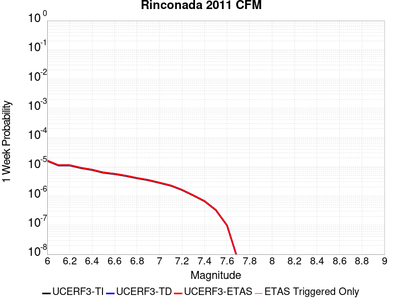 |  |  |  |

| Magnitude | 1 wk TI Prob | 1 wk TD Prob | 1 wk ETAS Prob | 1 wk ETAS/TD Gain | 1 wk ETAS Triggered Only | 1 mo TI Prob | 1 mo TD Prob | 1 mo ETAS Prob | 1 mo ETAS/TD Gain | 1 mo ETAS Triggered Only | 1 yr TI Prob | 1 yr TD Prob | 1 yr ETAS Prob | 1 yr ETAS/TD Gain | 1 yr ETAS Triggered Only | 10 yr TI Prob | 10 yr TD Prob | 10 yr ETAS Prob | 10 yr ETAS/TD Gain | 10 yr ETAS Triggered Only |
|-----|-----|-----|-----|-----|-----|-----|-----|-----|-----|-----|-----|-----|-----|-----|-----|-----|-----|-----|-----|-----|
| 6.0 | 1.5752368E-5 | 1.6274702E-5 | 1.6274702E-5 | 1.0 | 0.0 | 6.75084E-5 | 6.974687E-5 | 6.974687E-5 | 1.0 | 0.0 | 8.2160486E-4 | 8.4884046E-4 | 8.58832E-4 | 1.0117707 | 1.0E-5 | 0.008185739 | 0.008456362 | 0.008466278 | 1.0011725 | 1.0E-5 |
| 6.1 | 1.0966133E-5 | 1.1323019E-5 | 1.1323019E-5 | 1.0 | 0.0 | 4.6996865E-5 | 4.8526326E-5 | 4.8526326E-5 | 1.0 | 0.0 | 5.720366E-4 | 5.906486E-4 | 5.906486E-4 | 1.0 | 0.0 | 0.0057056635 | 0.0058908835 | 0.0058908835 | 1.0 | 0.0 |
| 6.2 | 1.0966133E-5 | 1.1323019E-5 | 1.1323019E-5 | 1.0 | 0.0 | 4.6996865E-5 | 4.8526326E-5 | 4.8526326E-5 | 1.0 | 0.0 | 5.720366E-4 | 5.906486E-4 | 5.906486E-4 | 1.0 | 0.0 | 0.0057056635 | 0.0058908835 | 0.0058908835 | 1.0 | 0.0 |
| 6.3 | 8.926149E-6 | 9.212764E-6 | 9.212764E-6 | 1.0 | 0.0 | 3.8254362E-5 | 3.948268E-5 | 3.948268E-5 | 1.0 | 0.0 | 4.6564735E-4 | 4.805959E-4 | 4.805959E-4 | 1.0 | 0.0 | 0.0046467283 | 0.0047956104 | 0.0047956104 | 1.0 | 0.0 |
| 6.4 | 7.676955E-6 | 7.920184E-6 | 7.920184E-6 | 1.0 | 0.0 | 3.290082E-5 | 3.3943204E-5 | 3.3943204E-5 | 1.0 | 0.0 | 4.0049385E-4 | 4.1318033E-4 | 4.1318033E-4 | 1.0 | 0.0 | 0.0039977287 | 0.004124148 | 0.004124148 | 1.0 | 0.0 |
| 6.5 | 6.1671026E-6 | 6.3589496E-6 | 6.3589496E-6 | 1.0 | 0.0 | 2.6430173E-5 | 2.7252356E-5 | 2.7252356E-5 | 1.0 | 0.0 | 3.2173982E-4 | 3.31747E-4 | 3.31747E-4 | 1.0 | 0.0 | 0.003212744 | 0.0033125298 | 0.0033125298 | 1.0 | 0.0 |
| 6.6 | 5.553456E-6 | 5.7248076E-6 | 5.7248076E-6 | 1.0 | 0.0 | 2.3800309E-5 | 2.453466E-5 | 2.453466E-5 | 1.0 | 0.0 | 2.897302E-4 | 2.986686E-4 | 2.986686E-4 | 1.0 | 0.0 | 0.0028935277 | 0.0029826807 | 0.0029826807 | 1.0 | 0.0 |
| 6.7 | 4.787857E-6 | 4.9333053E-6 | 4.9333053E-6 | 1.0 | 0.0 | 2.0519226E-5 | 2.1142567E-5 | 2.1142567E-5 | 1.0 | 0.0 | 2.4979294E-4 | 2.5738036E-4 | 2.5738036E-4 | 1.0 | 0.0 | 0.0024951235 | 0.0025708287 | 0.0025708287 | 1.0 | 0.0 |
| 6.8 | 3.9955166E-6 | 4.1134726E-6 | 4.1134726E-6 | 1.0 | 0.0 | 1.7123532E-5 | 1.762905E-5 | 1.762905E-5 | 1.0 | 0.0 | 2.0845905E-4 | 2.1461258E-4 | 2.1461258E-4 | 1.0 | 0.0 | 0.002082636 | 0.0021440568 | 0.0021440568 | 1.0 | 0.0 |
| 6.9 | 3.4250072E-6 | 3.5224436E-6 | 3.5224436E-6 | 1.0 | 0.0 | 1.46785205E-5 | 1.50961E-5 | 1.50961E-5 | 1.0 | 0.0 | 1.7869633E-4 | 1.8377953E-4 | 1.8377953E-4 | 1.0 | 0.0 | 0.001785527 | 0.0018362779 | 0.0018362779 | 1.0 | 0.0 |
| 7.0 | 2.7712713E-6 | 2.8466977E-6 | 2.8466977E-6 | 1.0 | 0.0 | 1.1876823E-5 | 1.22000765E-5 | 1.22000765E-5 | 1.0 | 0.0 | 1.4459073E-4 | 1.4852583E-4 | 1.4852583E-4 | 1.0 | 0.0 | 0.0014449668 | 0.0014842671 | 0.0014842671 | 1.0 | 0.0 |
| 7.1 | 2.227358E-6 | 2.2856968E-6 | 2.2856968E-6 | 1.0 | 0.0 | 9.545785E-6 | 9.795806E-6 | 9.795806E-6 | 1.0 | 0.0 | 1.16213734E-4 | 1.1925743E-4 | 1.1925743E-4 | 1.0 | 0.0 | 0.0011615298 | 0.0011919354 | 0.0011919354 | 1.0 | 0.0 |
| 7.2 | 1.581796E-6 | 1.6209E-6 | 1.6209E-6 | 1.0 | 0.0 | 6.779108E-6 | 6.946696E-6 | 6.946696E-6 | 1.0 | 0.0 | 8.253252E-5 | 8.457275E-5 | 8.457275E-5 | 1.0 | 0.0 | 8.250187E-4 | 8.4540615E-4 | 8.4540615E-4 | 1.0 | 0.0 |
| 7.3 | 1.0306567E-6 | 1.054647E-6 | 1.054647E-6 | 1.0 | 0.0 | 4.4170924E-6 | 4.5199076E-6 | 4.5199076E-6 | 1.0 | 0.0 | 5.3776774E-5 | 5.502849E-5 | 5.502849E-5 | 1.0 | 0.0 | 5.376376E-4 | 5.501489E-4 | 5.501489E-4 | 1.0 | 0.0 |
| 7.4 | 6.535541E-7 | 6.6827374E-7 | 6.6827374E-7 | 1.0 | 0.0 | 2.800943E-6 | 2.8640272E-6 | 2.8640272E-6 | 1.0 | 0.0 | 3.4100947E-5 | 3.4868972E-5 | 3.4868972E-5 | 1.0 | 0.0 | 3.4095717E-4 | 3.4863513E-4 | 3.4863513E-4 | 1.0 | 0.0 |
| 7.5 | 3.2656962E-7 | 3.3316664E-7 | 3.3316664E-7 | 1.0 | 0.0 | 1.3995833E-6 | 1.4278562E-6 | 1.4278562E-6 | 1.0 | 0.0 | 1.7039794E-5 | 1.738401E-5 | 1.738401E-5 | 1.0 | 0.0 | 1.7038487E-4 | 1.7382656E-4 | 1.7382656E-4 | 1.0 | 0.0 |
| 7.6 | 9.754343E-8 | 9.820984E-8 | 9.820984E-8 | 1.0 | 0.0 | 4.180432E-7 | 4.2089923E-7 | 4.2089923E-7 | 1.0 | 0.0 | 5.089664E-6 | 5.124436E-6 | 5.124436E-6 | 1.0 | 0.0 | 5.0895473E-5 | 5.124319E-5 | 5.124319E-5 | 1.0 | 0.0 |
| 7.7 | 6.0001453E-9 | 5.849038E-9 | 5.849038E-9 | 1.0 | 0.0 | 2.5714908E-8 | 2.5067308E-8 | 2.5067308E-8 | 1.0 | 0.0 | 3.1307894E-7 | 3.0519442E-7 | 3.0519442E-7 | 1.0 | 0.0 | 3.1307852E-6 | 3.0519402E-6 | 3.0519402E-6 | 1.0 | 0.0 |
| 7.8 | 7.400003E-11 | 7.4654394E-11 | 7.4654394E-11 | 1.0 | 0.0 | 3.171432E-10 | 3.1994762E-10 | 3.1994762E-10 | 1.0 | 0.0 | 3.861218E-9 | 3.8953623E-9 | 3.8953623E-9 | 1.0 | 0.0 | 3.861218E-8 | 3.8953623E-8 | 3.8953623E-8 | 1.0 | 0.0 |

## Burnt Mtn
*[(top)](#table-of-contents)*

| 1 Week | 1 Month | 1 Year | 10 Year |
|-----|-----|-----|-----|
|  |  |  |  |

| Magnitude | 1 wk TI Prob | 1 wk TD Prob | 1 wk ETAS Prob | 1 wk ETAS/TD Gain | 1 wk ETAS Triggered Only | 1 mo TI Prob | 1 mo TD Prob | 1 mo ETAS Prob | 1 mo ETAS/TD Gain | 1 mo ETAS Triggered Only | 1 yr TI Prob | 1 yr TD Prob | 1 yr ETAS Prob | 1 yr ETAS/TD Gain | 1 yr ETAS Triggered Only | 10 yr TI Prob | 10 yr TD Prob | 10 yr ETAS Prob | 10 yr ETAS/TD Gain | 10 yr ETAS Triggered Only |
|-----|-----|-----|-----|-----|-----|-----|-----|-----|-----|-----|-----|-----|-----|-----|-----|-----|-----|-----|-----|-----|
| 6.0 | 1.5673151E-5 | 1.1749373E-5 | 1.1749373E-5 | 1.0 | 0.0 | 6.716892E-5 | 5.035421E-5 | 5.035421E-5 | 1.0 | 0.0 | 8.1747473E-4 | 6.130189E-4 | 6.2301283E-4 | 1.0163027 | 1.0E-5 | 0.008144741 | 0.00612592 | 0.0061358586 | 1.0016224 | 1.0E-5 |
| 6.1 | 1.5673151E-5 | 1.1749373E-5 | 1.1749373E-5 | 1.0 | 0.0 | 6.716892E-5 | 5.035421E-5 | 5.035421E-5 | 1.0 | 0.0 | 8.1747473E-4 | 6.130189E-4 | 6.2301283E-4 | 1.0163027 | 1.0E-5 | 0.008144741 | 0.00612592 | 0.0061358586 | 1.0016224 | 1.0E-5 |
| 6.2 | 1.5673151E-5 | 1.1749373E-5 | 1.1749373E-5 | 1.0 | 0.0 | 6.716892E-5 | 5.035421E-5 | 5.035421E-5 | 1.0 | 0.0 | 8.1747473E-4 | 6.130189E-4 | 6.2301283E-4 | 1.0163027 | 1.0E-5 | 0.008144741 | 0.00612592 | 0.0061358586 | 1.0016224 | 1.0E-5 |
| 6.3 | 1.5673151E-5 | 1.1749373E-5 | 1.1749373E-5 | 1.0 | 0.0 | 6.716892E-5 | 5.035421E-5 | 5.035421E-5 | 1.0 | 0.0 | 8.1747473E-4 | 6.130189E-4 | 6.2301283E-4 | 1.0163027 | 1.0E-5 | 0.008144741 | 0.00612592 | 0.0061358586 | 1.0016224 | 1.0E-5 |
| 6.4 | 1.5673151E-5 | 1.1749373E-5 | 1.1749373E-5 | 1.0 | 0.0 | 6.716892E-5 | 5.035421E-5 | 5.035421E-5 | 1.0 | 0.0 | 8.1747473E-4 | 6.130189E-4 | 6.2301283E-4 | 1.0163027 | 1.0E-5 | 0.008144741 | 0.00612592 | 0.0061358586 | 1.0016224 | 1.0E-5 |
| 6.5 | 1.36191375E-5 | 1.0078271E-5 | 1.0078271E-5 | 1.0 | 0.0 | 5.8366426E-5 | 4.319259E-5 | 4.319259E-5 | 1.0 | 0.0 | 7.103795E-4 | 5.258698E-4 | 5.358645E-4 | 1.0190061 | 1.0E-5 | 0.0070811296 | 0.005258698 | 0.0052686455 | 1.0018916 | 1.0E-5 |

## Elysian Park (Upper)
*[(top)](#table-of-contents)*

| 1 Week | 1 Month | 1 Year | 10 Year |
|-----|-----|-----|-----|
|  |  |  |  |

| Magnitude | 1 wk TI Prob | 1 wk TD Prob | 1 wk ETAS Prob | 1 wk ETAS/TD Gain | 1 wk ETAS Triggered Only | 1 mo TI Prob | 1 mo TD Prob | 1 mo ETAS Prob | 1 mo ETAS/TD Gain | 1 mo ETAS Triggered Only | 1 yr TI Prob | 1 yr TD Prob | 1 yr ETAS Prob | 1 yr ETAS/TD Gain | 1 yr ETAS Triggered Only | 10 yr TI Prob | 10 yr TD Prob | 10 yr ETAS Prob | 10 yr ETAS/TD Gain | 10 yr ETAS Triggered Only |
|-----|-----|-----|-----|-----|-----|-----|-----|-----|-----|-----|-----|-----|-----|-----|-----|-----|-----|-----|-----|-----|
| 6.0 | 3.1876025E-5 | 3.7035312E-5 | 3.7035312E-5 | 1.0 | 0.0 | 1.3660437E-4 | 1.5871585E-4 | 1.5871585E-4 | 1.0 | 0.0 | 0.0016618895 | 0.0019310972 | 0.0019410779 | 1.0051684 | 1.0E-5 | 0.016495159 | 0.01918968 | 0.019199489 | 1.0005112 | 1.0E-5 |
| 6.1 | 3.1876025E-5 | 3.7035312E-5 | 3.7035312E-5 | 1.0 | 0.0 | 1.3660437E-4 | 1.5871585E-4 | 1.5871585E-4 | 1.0 | 0.0 | 0.0016618895 | 0.0019310972 | 0.0019410779 | 1.0051684 | 1.0E-5 | 0.016495159 | 0.01918968 | 0.019199489 | 1.0005112 | 1.0E-5 |
| 6.2 | 3.1876025E-5 | 3.7035312E-5 | 3.7035312E-5 | 1.0 | 0.0 | 1.3660437E-4 | 1.5871585E-4 | 1.5871585E-4 | 1.0 | 0.0 | 0.0016618895 | 0.0019310972 | 0.0019410779 | 1.0051684 | 1.0E-5 | 0.016495159 | 0.01918968 | 0.019199489 | 1.0005112 | 1.0E-5 |
| 6.3 | 3.1876025E-5 | 3.7035312E-5 | 3.7035312E-5 | 1.0 | 0.0 | 1.3660437E-4 | 1.5871585E-4 | 1.5871585E-4 | 1.0 | 0.0 | 0.0016618895 | 0.0019310972 | 0.0019410779 | 1.0051684 | 1.0E-5 | 0.016495159 | 0.01918968 | 0.019199489 | 1.0005112 | 1.0E-5 |
| 6.4 | 1.9273462E-5 | 2.1202171E-5 | 2.1202171E-5 | 1.0 | 0.0 | 8.259794E-5 | 9.086426E-5 | 9.086426E-5 | 1.0 | 0.0 | 0.001005166 | 0.0011058843 | 0.0011158733 | 1.0090325 | 1.0E-5 | 0.010006315 | 0.011020675 | 0.011030565 | 1.0008974 | 1.0E-5 |
| 6.5 | 1.9273462E-5 | 2.1202171E-5 | 2.1202171E-5 | 1.0 | 0.0 | 8.259794E-5 | 9.086426E-5 | 9.086426E-5 | 1.0 | 0.0 | 0.001005166 | 0.0011058843 | 0.0011158733 | 1.0090325 | 1.0E-5 | 0.010006315 | 0.011020675 | 0.011030565 | 1.0008974 | 1.0E-5 |
| 6.6 | 9.813258E-6 | 9.665572E-6 | 9.665572E-6 | 1.0 | 0.0 | 4.205614E-5 | 4.1423264E-5 | 4.1423264E-5 | 1.0 | 0.0 | 5.119132E-4 | 5.042188E-4 | 5.042188E-4 | 1.0 | 0.0 | 0.005107356 | 0.005031471 | 0.005031471 | 1.0 | 0.0 |
| 6.7 | 9.801478E-6 | 9.653142E-6 | 9.653142E-6 | 1.0 | 0.0 | 4.2005657E-5 | 4.1369993E-5 | 4.1369993E-5 | 1.0 | 0.0 | 5.112989E-4 | 5.035705E-4 | 5.035705E-4 | 1.0 | 0.0 | 0.0051012407 | 0.005025018 | 0.005025018 | 1.0 | 0.0 |
| 6.8 | 8.102489E-6 | 7.772984E-6 | 7.772984E-6 | 1.0 | 0.0 | 3.4724493E-5 | 3.331239E-5 | 3.331239E-5 | 1.0 | 0.0 | 4.2268867E-4 | 4.0550783E-4 | 4.0550783E-4 | 1.0 | 0.0 | 0.004218856 | 0.004048173 | 0.004048173 | 1.0 | 0.0 |
| 6.9 | 6.08275E-6 | 5.481439E-6 | 5.481439E-6 | 1.0 | 0.0 | 2.6068668E-5 | 2.3491673E-5 | 2.3491673E-5 | 1.0 | 0.0 | 3.173398E-4 | 2.8597435E-4 | 2.8597435E-4 | 1.0 | 0.0 | 0.0031688702 | 0.0028561412 | 0.0028561412 | 1.0 | 0.0 |
| 7.0 | 5.5995934E-6 | 4.982769E-6 | 4.982769E-6 | 1.0 | 0.0 | 2.3998036E-5 | 2.1354552E-5 | 2.1354552E-5 | 1.0 | 0.0 | 2.9213692E-4 | 2.5996132E-4 | 2.5996132E-4 | 1.0 | 0.0 | 0.0029175316 | 0.0025966396 | 0.0025966396 | 1.0 | 0.0 |
| 7.1 | 4.709881E-6 | 4.0873924E-6 | 4.0873924E-6 | 1.0 | 0.0 | 2.0185047E-5 | 1.751728E-5 | 1.751728E-5 | 1.0 | 0.0 | 2.4572524E-4 | 2.1325242E-4 | 2.1325242E-4 | 1.0 | 0.0 | 0.002454537 | 0.0021305194 | 0.0021305194 | 1.0 | 0.0 |
| 7.2 | 3.6063436E-6 | 2.977948E-6 | 2.977948E-6 | 1.0 | 0.0 | 1.5455667E-5 | 1.2762573E-5 | 1.2762573E-5 | 1.0 | 0.0 | 1.881565E-4 | 1.5537335E-4 | 1.5537335E-4 | 1.0 | 0.0 | 0.0018799726 | 0.0015526584 | 0.0015526584 | 1.0 | 0.0 |
| 7.3 | 2.471135E-6 | 2.095457E-6 | 2.095457E-6 | 1.0 | 0.0 | 1.0590536E-5 | 8.9805E-6 | 8.9805E-6 | 1.0 | 0.0 | 1.2893214E-4 | 1.0933217E-4 | 1.0933217E-4 | 1.0 | 0.0 | 0.0012885736 | 0.001092791 | 0.001092791 | 1.0 | 0.0 |
| 7.4 | 1.163943E-6 | 1.0275068E-6 | 1.0275068E-6 | 1.0 | 0.0 | 4.988318E-6 | 4.403593E-6 | 4.403593E-6 | 1.0 | 0.0 | 6.0731076E-5 | 5.3612457E-5 | 5.3612457E-5 | 1.0 | 0.0 | 6.071448E-4 | 5.359982E-4 | 5.359982E-4 | 1.0 | 0.0 |
| 7.5 | 4.99459E-7 | 4.9175924E-7 | 4.9175924E-7 | 1.0 | 0.0 | 2.140537E-6 | 2.107538E-6 | 2.107538E-6 | 1.0 | 0.0 | 2.6060725E-5 | 2.5658988E-5 | 2.5658988E-5 | 1.0 | 0.0 | 2.605767E-4 | 2.5656182E-4 | 2.5656182E-4 | 1.0 | 0.0 |
| 7.6 | 2.4667852E-7 | 2.4778268E-7 | 2.4778268E-7 | 1.0 | 0.0 | 1.0571932E-6 | 1.0619254E-6 | 1.0619254E-6 | 1.0 | 0.0 | 1.2871251E-5 | 1.2928869E-5 | 1.2928869E-5 | 1.0 | 0.0 | 1.2870505E-4 | 1.2928153E-4 | 1.2928153E-4 | 1.0 | 0.0 |
| 7.7 | 8.2312795E-8 | 7.3864086E-8 | 7.3864086E-8 | 1.0 | 0.0 | 3.527691E-7 | 3.1656032E-7 | 3.1656032E-7 | 1.0 | 0.0 | 4.294955E-6 | 3.854116E-6 | 3.854116E-6 | 1.0 | 0.0 | 4.2948723E-5 | 3.854061E-5 | 3.854061E-5 | 1.0 | 0.0 |
| 7.8 | 2.7819295E-8 | 1.7565762E-8 | 1.7565762E-8 | 1.0 | 0.0 | 1.1922555E-7 | 7.528184E-8 | 7.528184E-8 | 1.0 | 0.0 | 1.45157E-6 | 9.1655613E-7 | 9.1655613E-7 | 1.0 | 0.0 | 1.45156055E-5 | 9.165538E-6 | 9.165538E-6 | 1.0 | 0.0 |

## Pinto Mtn
*[(top)](#table-of-contents)*

| 1 Week | 1 Month | 1 Year | 10 Year |
|-----|-----|-----|-----|
|  |  |  |  |

| Magnitude | 1 wk TI Prob | 1 wk TD Prob | 1 wk ETAS Prob | 1 wk ETAS/TD Gain | 1 wk ETAS Triggered Only | 1 mo TI Prob | 1 mo TD Prob | 1 mo ETAS Prob | 1 mo ETAS/TD Gain | 1 mo ETAS Triggered Only | 1 yr TI Prob | 1 yr TD Prob | 1 yr ETAS Prob | 1 yr ETAS/TD Gain | 1 yr ETAS Triggered Only | 10 yr TI Prob | 10 yr TD Prob | 10 yr ETAS Prob | 10 yr ETAS/TD Gain | 10 yr ETAS Triggered Only |
|-----|-----|-----|-----|-----|-----|-----|-----|-----|-----|-----|-----|-----|-----|-----|-----|-----|-----|-----|-----|-----|
| 6.0 | 4.4194956E-5 | 4.7853297E-5 | 4.7853297E-5 | 1.0 | 0.0 | 1.893932E-4 | 2.0507036E-4 | 2.1506831E-4 | 1.0487537 | 1.0E-5 | 0.0023034236 | 0.0024940374 | 0.0025040123 | 1.0039996 | 1.0E-5 | 0.022796938 | 0.02467798 | 0.024687734 | 1.0003952 | 1.0E-5 |
| 6.1 | 4.4194956E-5 | 4.7853297E-5 | 4.7853297E-5 | 1.0 | 0.0 | 1.893932E-4 | 2.0507036E-4 | 2.1506831E-4 | 1.0487537 | 1.0E-5 | 0.0023034236 | 0.0024940374 | 0.0025040123 | 1.0039996 | 1.0E-5 | 0.022796938 | 0.02467798 | 0.024687734 | 1.0003952 | 1.0E-5 |
| 6.2 | 4.4194956E-5 | 4.7853297E-5 | 4.7853297E-5 | 1.0 | 0.0 | 1.893932E-4 | 2.0507036E-4 | 2.1506831E-4 | 1.0487537 | 1.0E-5 | 0.0023034236 | 0.0024940374 | 0.0025040123 | 1.0039996 | 1.0E-5 | 0.022796938 | 0.02467798 | 0.024687734 | 1.0003952 | 1.0E-5 |
| 6.3 | 4.4194956E-5 | 4.7853297E-5 | 4.7853297E-5 | 1.0 | 0.0 | 1.893932E-4 | 2.0507036E-4 | 2.1506831E-4 | 1.0487537 | 1.0E-5 | 0.0023034236 | 0.0024940374 | 0.0025040123 | 1.0039996 | 1.0E-5 | 0.022796938 | 0.02467798 | 0.024687734 | 1.0003952 | 1.0E-5 |
| 6.4 | 3.729929E-5 | 3.9602906E-5 | 3.9602906E-5 | 1.0 | 0.0 | 1.5984432E-4 | 1.6971622E-4 | 1.7971452E-4 | 1.0589119 | 1.0E-5 | 0.0019443673 | 0.0020644304 | 0.0020744097 | 1.0048339 | 1.0E-5 | 0.019274427 | 0.020462546 | 0.020472342 | 1.0004787 | 1.0E-5 |
| 6.5 | 3.729929E-5 | 3.9602906E-5 | 3.9602906E-5 | 1.0 | 0.0 | 1.5984432E-4 | 1.6971622E-4 | 1.7971452E-4 | 1.0589119 | 1.0E-5 | 0.0019443673 | 0.0020644304 | 0.0020744097 | 1.0048339 | 1.0E-5 | 0.019274427 | 0.020462546 | 0.020472342 | 1.0004787 | 1.0E-5 |
| 6.6 | 3.0204548E-5 | 3.1205058E-5 | 3.1205058E-5 | 1.0 | 0.0 | 1.2944164E-4 | 1.337293E-4 | 1.337293E-4 | 1.0 | 0.0 | 0.0015748127 | 0.001626973 | 0.001626973 | 1.0 | 0.0 | 0.015636992 | 0.016154487 | 0.016154487 | 1.0 | 0.0 |
| 6.7 | 2.9857754E-5 | 3.0814444E-5 | 3.0814444E-5 | 1.0 | 0.0 | 1.2795553E-4 | 1.3205541E-4 | 1.3205541E-4 | 1.0 | 0.0 | 0.0015567453 | 0.0016066235 | 0.0016066235 | 1.0 | 0.0 | 0.015458848 | 0.015953926 | 0.015953926 | 1.0 | 0.0 |
| 6.8 | 2.4819734E-5 | 2.5009149E-5 | 2.5009149E-5 | 1.0 | 0.0 | 1.0636595E-4 | 1.0717779E-4 | 1.0717779E-4 | 1.0 | 0.0 | 0.0012942362 | 0.0013041301 | 0.0013041301 | 1.0 | 0.0 | 0.012867244 | 0.012967137 | 0.012967137 | 1.0 | 0.0 |
| 6.9 | 2.331124E-5 | 2.3337434E-5 | 2.3337434E-5 | 1.0 | 0.0 | 9.990149E-5 | 1.0001385E-4 | 1.0001385E-4 | 1.0 | 0.0 | 0.001215622 | 0.0012170088 | 0.0012170088 | 1.0 | 0.0 | 0.012089936 | 0.0121056335 | 0.0121056335 | 1.0 | 0.0 |
| 7.0 | 2.1818534E-5 | 2.1760567E-5 | 2.1760567E-5 | 1.0 | 0.0 | 9.3504656E-5 | 9.325635E-5 | 9.325635E-5 | 1.0 | 0.0 | 0.0011378246 | 0.0011348245 | 0.0011348245 | 1.0 | 0.0 | 0.011320163 | 0.011292398 | 0.011292398 | 1.0 | 0.0 |
| 7.1 | 2.066081E-5 | 2.0540216E-5 | 2.0540216E-5 | 1.0 | 0.0 | 8.854332E-5 | 8.802664E-5 | 8.802664E-5 | 1.0 | 0.0 | 0.0010774818 | 0.001071217 | 0.001071217 | 1.0 | 0.0 | 0.010722724 | 0.010662585 | 0.010662585 | 1.0 | 0.0 |
| 7.2 | 1.8990233E-5 | 1.9053505E-5 | 1.9053505E-5 | 1.0 | 0.0 | 8.138417E-5 | 8.165543E-5 | 8.165543E-5 | 1.0 | 0.0 | 9.904018E-4 | 9.937207E-4 | 9.937207E-4 | 1.0 | 0.0 | 0.009859995 | 0.0098947715 | 0.0098947715 | 1.0 | 0.0 |
| 7.3 | 1.3335872E-5 | 1.490619E-5 | 1.490619E-5 | 1.0 | 0.0 | 5.7152483E-5 | 6.388218E-5 | 6.388218E-5 | 1.0 | 0.0 | 6.956093E-4 | 7.7750074E-4 | 7.7750074E-4 | 1.0 | 0.0 | 0.006934359 | 0.0077491053 | 0.0077491053 | 1.0 | 0.0 |
| 7.4 | 9.414066E-6 | 1.1860438E-5 | 1.1860438E-5 | 1.0 | 0.0 | 4.0345374E-5 | 5.082951E-5 | 5.082951E-5 | 1.0 | 0.0 | 4.910942E-4 | 6.18683E-4 | 6.18683E-4 | 1.0 | 0.0 | 0.0049001034 | 0.006170554 | 0.006170554 | 1.0 | 0.0 |
| 7.5 | 7.2101157E-6 | 9.157725E-6 | 9.157725E-6 | 1.0 | 0.0 | 3.090013E-5 | 3.9246846E-5 | 3.9246846E-5 | 1.0 | 0.0 | 3.7614413E-4 | 4.7773338E-4 | 4.7773338E-4 | 1.0 | 0.0 | 0.0037550807 | 0.0047678393 | 0.0047678393 | 1.0 | 0.0 |
| 7.6 | 3.296375E-6 | 4.545156E-6 | 4.545156E-6 | 1.0 | 0.0 | 1.4127245E-5 | 1.9479103E-5 | 1.9479103E-5 | 1.0 | 0.0 | 1.7198564E-4 | 2.3713366E-4 | 2.3713366E-4 | 1.0 | 0.0 | 0.0017185259 | 0.0023689435 | 0.0023689435 | 1.0 | 0.0 |
| 7.7 | 2.5741092E-6 | 3.5840987E-6 | 3.5840987E-6 | 1.0 | 0.0 | 1.103185E-5 | 1.5360341E-5 | 1.5360341E-5 | 1.0 | 0.0 | 1.3430449E-4 | 1.8699742E-4 | 1.8699742E-4 | 1.0 | 0.0 | 0.0013422335 | 0.0018685305 | 0.0018685305 | 1.0 | 0.0 |

## Deep Springs
*[(top)](#table-of-contents)*

| 1 Week | 1 Month | 1 Year | 10 Year |
|-----|-----|-----|-----|
|  |  |  |  |

| Magnitude | 1 wk TI Prob | 1 wk TD Prob | 1 wk ETAS Prob | 1 wk ETAS/TD Gain | 1 wk ETAS Triggered Only | 1 mo TI Prob | 1 mo TD Prob | 1 mo ETAS Prob | 1 mo ETAS/TD Gain | 1 mo ETAS Triggered Only | 1 yr TI Prob | 1 yr TD Prob | 1 yr ETAS Prob | 1 yr ETAS/TD Gain | 1 yr ETAS Triggered Only | 10 yr TI Prob | 10 yr TD Prob | 10 yr ETAS Prob | 10 yr ETAS/TD Gain | 10 yr ETAS Triggered Only |
|-----|-----|-----|-----|-----|-----|-----|-----|-----|-----|-----|-----|-----|-----|-----|-----|-----|-----|-----|-----|-----|
| 6.0 | 1.9810619E-5 | 2.3112418E-5 | 2.3112418E-5 | 1.0 | 0.0 | 8.489989E-5 | 9.905232E-5 | 9.905232E-5 | 1.0 | 0.0 | 0.001033166 | 0.0012058025 | 0.0012157905 | 1.0082833 | 1.0E-5 | 0.010283757 | 0.012042372 | 0.012052251 | 1.0008204 | 1.0E-5 |
| 6.1 | 1.9810619E-5 | 2.3112418E-5 | 2.3112418E-5 | 1.0 | 0.0 | 8.489989E-5 | 9.905232E-5 | 9.905232E-5 | 1.0 | 0.0 | 0.001033166 | 0.0012058025 | 0.0012157905 | 1.0082833 | 1.0E-5 | 0.010283757 | 0.012042372 | 0.012052251 | 1.0008204 | 1.0E-5 |
| 6.2 | 1.9810619E-5 | 2.3112418E-5 | 2.3112418E-5 | 1.0 | 0.0 | 8.489989E-5 | 9.905232E-5 | 9.905232E-5 | 1.0 | 0.0 | 0.001033166 | 0.0012058025 | 0.0012157905 | 1.0082833 | 1.0E-5 | 0.010283757 | 0.012042372 | 0.012052251 | 1.0008204 | 1.0E-5 |
| 6.3 | 1.9810619E-5 | 2.3112418E-5 | 2.3112418E-5 | 1.0 | 0.0 | 8.489989E-5 | 9.905232E-5 | 9.905232E-5 | 1.0 | 0.0 | 0.001033166 | 0.0012058025 | 0.0012157905 | 1.0082833 | 1.0E-5 | 0.010283757 | 0.012042372 | 0.012052251 | 1.0008204 | 1.0E-5 |
| 6.4 | 1.9810619E-5 | 2.3112418E-5 | 2.3112418E-5 | 1.0 | 0.0 | 8.489989E-5 | 9.905232E-5 | 9.905232E-5 | 1.0 | 0.0 | 0.001033166 | 0.0012058025 | 0.0012157905 | 1.0082833 | 1.0E-5 | 0.010283757 | 0.012042372 | 0.012052251 | 1.0008204 | 1.0E-5 |
| 6.5 | 1.7190405E-5 | 2.0050467E-5 | 2.0050467E-5 | 1.0 | 0.0 | 7.367108E-5 | 8.593057E-5 | 8.593057E-5 | 1.0 | 0.0 | 8.9657627E-4 | 0.0010462047 | 0.0010462047 | 1.0 | 0.0 | 0.008929676 | 0.01046201 | 0.01046201 | 1.0 | 0.0 |
| 6.6 | 1.7190405E-5 | 2.0050467E-5 | 2.0050467E-5 | 1.0 | 0.0 | 7.367108E-5 | 8.593057E-5 | 8.593057E-5 | 1.0 | 0.0 | 8.9657627E-4 | 0.0010462047 | 0.0010462047 | 1.0 | 0.0 | 0.008929676 | 0.01046201 | 0.01046201 | 1.0 | 0.0 |

## Santa Cruz Catalina Ridge alt1
*[(top)](#table-of-contents)*

| 1 Week | 1 Month | 1 Year | 10 Year |
|-----|-----|-----|-----|
|  |  |  |  |

| Magnitude | 1 wk TI Prob | 1 wk TD Prob | 1 wk ETAS Prob | 1 wk ETAS/TD Gain | 1 wk ETAS Triggered Only | 1 mo TI Prob | 1 mo TD Prob | 1 mo ETAS Prob | 1 mo ETAS/TD Gain | 1 mo ETAS Triggered Only | 1 yr TI Prob | 1 yr TD Prob | 1 yr ETAS Prob | 1 yr ETAS/TD Gain | 1 yr ETAS Triggered Only | 10 yr TI Prob | 10 yr TD Prob | 10 yr ETAS Prob | 10 yr ETAS/TD Gain | 10 yr ETAS Triggered Only |
|-----|-----|-----|-----|-----|-----|-----|-----|-----|-----|-----|-----|-----|-----|-----|-----|-----|-----|-----|-----|-----|
| 6.0 | 3.2833184E-5 | 3.6558286E-5 | 3.6558286E-5 | 1.0 | 0.0 | 1.4070606E-4 | 1.566699E-4 | 1.566699E-4 | 1.0 | 0.0 | 0.00171175 | 0.0019059537 | 0.0019159346 | 1.0052367 | 1.0E-5 | 0.016986247 | 0.018912971 | 0.018922783 | 1.0005187 | 1.0E-5 |
| 6.1 | 1.9835548E-5 | 2.165945E-5 | 2.165945E-5 | 1.0 | 0.0 | 8.500672E-5 | 9.282303E-5 | 9.282303E-5 | 1.0 | 0.0 | 0.0010344655 | 0.0011295547 | 0.0011395434 | 1.0088431 | 1.0E-5 | 0.010296632 | 0.011240268 | 0.011250155 | 1.0008796 | 1.0E-5 |
| 6.2 | 1.9835548E-5 | 2.165945E-5 | 2.165945E-5 | 1.0 | 0.0 | 8.500672E-5 | 9.282303E-5 | 9.282303E-5 | 1.0 | 0.0 | 0.0010344655 | 0.0011295547 | 0.0011395434 | 1.0088431 | 1.0E-5 | 0.010296632 | 0.011240268 | 0.011250155 | 1.0008796 | 1.0E-5 |
| 6.3 | 1.5728183E-5 | 1.7033912E-5 | 1.7033912E-5 | 1.0 | 0.0 | 6.7404755E-5 | 7.300047E-5 | 7.300047E-5 | 1.0 | 0.0 | 8.2034385E-4 | 8.884244E-4 | 8.984155E-4 | 1.0112458 | 1.0E-5 | 0.008173222 | 0.008849408 | 0.008859319 | 1.00112 | 1.0E-5 |
| 6.4 | 1.5728183E-5 | 1.7033912E-5 | 1.7033912E-5 | 1.0 | 0.0 | 6.7404755E-5 | 7.300047E-5 | 7.300047E-5 | 1.0 | 0.0 | 8.2034385E-4 | 8.884244E-4 | 8.984155E-4 | 1.0112458 | 1.0E-5 | 0.008173222 | 0.008849408 | 0.008859319 | 1.00112 | 1.0E-5 |
| 6.5 | 1.3707734E-5 | 1.479449E-5 | 1.479449E-5 | 1.0 | 0.0 | 5.8746107E-5 | 6.340344E-5 | 6.340344E-5 | 1.0 | 0.0 | 7.1499916E-4 | 7.71667E-4 | 7.8165927E-4 | 1.012949 | 1.0E-5 | 0.0071270303 | 0.007690273 | 0.0077001965 | 1.0012903 | 1.0E-5 |
| 6.6 | 1.2539813E-5 | 1.3510192E-5 | 1.3510192E-5 | 1.0 | 0.0 | 5.3740947E-5 | 5.789955E-5 | 5.789955E-5 | 1.0 | 0.0 | 6.540996E-4 | 7.047017E-4 | 7.146947E-4 | 1.0141804 | 1.0E-5 | 0.0065217763 | 0.007024974 | 0.007034904 | 1.0014135 | 1.0E-5 |
| 6.7 | 1.1504083E-5 | 1.237735E-5 | 1.237735E-5 | 1.0 | 0.0 | 4.930228E-5 | 5.3044718E-5 | 5.3044718E-5 | 1.0 | 0.0 | 6.0008996E-4 | 6.4563006E-4 | 6.556236E-4 | 1.0154787 | 1.0E-5 | 0.005984721 | 0.006437773 | 0.0064477087 | 1.0015433 | 1.0E-5 |
| 6.8 | 1.012739E-5 | 1.087705E-5 | 1.087705E-5 | 1.0 | 0.0 | 4.340238E-5 | 4.6615103E-5 | 4.6615103E-5 | 1.0 | 0.0 | 5.282958E-4 | 5.673926E-4 | 5.7738693E-4 | 1.0176145 | 1.0E-5 | 0.0052704164 | 0.0056596086 | 0.005669552 | 1.0017569 | 1.0E-5 |
| 6.9 | 8.9607865E-6 | 9.609099E-6 | 9.609099E-6 | 1.0 | 0.0 | 3.8402806E-5 | 4.1181207E-5 | 4.1181207E-5 | 1.0 | 0.0 | 4.6745385E-4 | 5.012669E-4 | 5.112619E-4 | 1.0199394 | 1.0E-5 | 0.0046647177 | 0.005001482 | 0.005011432 | 1.0019894 | 1.0E-5 |
| 7.0 | 8.046829E-6 | 8.61973E-6 | 8.61973E-6 | 1.0 | 0.0 | 3.4485955E-5 | 3.694118E-5 | 3.694118E-5 | 1.0 | 0.0 | 4.1978562E-4 | 4.4966684E-4 | 4.5966235E-4 | 1.0222287 | 1.0E-5 | 0.004189935 | 0.0044876602 | 0.0044976156 | 1.0022184 | 1.0E-5 |
| 7.1 | 7.136131E-6 | 7.637642E-6 | 7.637642E-6 | 1.0 | 0.0 | 3.0583058E-5 | 3.2732343E-5 | 3.2732343E-5 | 1.0 | 0.0 | 3.7228514E-4 | 3.984441E-4 | 4.0844013E-4 | 1.0250876 | 1.0E-5 | 0.0037166206 | 0.0039773737 | 0.003987334 | 1.0025042 | 1.0E-5 |
| 7.2 | 6.362014E-6 | 6.8049458E-6 | 6.8049458E-6 | 1.0 | 0.0 | 2.726549E-5 | 2.9163732E-5 | 2.9163732E-5 | 1.0 | 0.0 | 3.3190678E-4 | 3.5501123E-4 | 3.6500767E-4 | 1.0281581 | 1.0E-5 | 0.0033141149 | 0.0035445094 | 0.003554474 | 1.0028113 | 1.0E-5 |
| 7.3 | 5.004101E-6 | 5.351705E-6 | 5.351705E-6 | 1.0 | 0.0 | 2.1445969E-5 | 2.2935681E-5 | 2.2935681E-5 | 1.0 | 0.0 | 2.6107338E-4 | 2.7920667E-4 | 2.8920386E-4 | 1.0358058 | 1.0E-5 | 0.002607669 | 0.0027886136 | 0.0027985855 | 1.003576 | 1.0E-5 |
| 7.4 | 3.4901443E-6 | 3.7320456E-6 | 3.7320456E-6 | 1.0 | 0.0 | 1.4957676E-5 | 1.5994385E-5 | 1.5994385E-5 | 1.0 | 0.0 | 1.8209449E-4 | 1.9471462E-4 | 1.9471462E-4 | 1.0 | 0.0 | 0.0018194534 | 0.0019454787 | 0.0019454787 | 1.0 | 0.0 |
| 7.5 | 1.1215045E-6 | 1.1893851E-6 | 1.1893851E-6 | 1.0 | 0.0 | 4.806439E-6 | 5.097355E-6 | 5.097355E-6 | 1.0 | 0.0 | 5.851682E-5 | 6.205856E-5 | 6.205856E-5 | 1.0 | 0.0 | 5.850142E-4 | 6.204154E-4 | 6.204154E-4 | 1.0 | 0.0 |
| 7.6 | 2.8599047E-7 | 2.9951954E-7 | 2.9951954E-7 | 1.0 | 0.0 | 1.2256729E-6 | 1.2836546E-6 | 1.2836546E-6 | 1.0 | 0.0 | 1.4922465E-5 | 1.5628384E-5 | 1.5628384E-5 | 1.0 | 0.0 | 1.4921463E-4 | 1.5627299E-4 | 1.5627299E-4 | 1.0 | 0.0 |
| 7.7 | 2.0781519E-7 | 2.1744296E-7 | 2.1744296E-7 | 1.0 | 0.0 | 8.906362E-7 | 9.3189806E-7 | 9.3189806E-7 | 1.0 | 0.0 | 1.08434415E-5 | 1.1345801E-5 | 1.1345801E-5 | 1.0 | 0.0 | 1.0842913E-4 | 1.1345231E-4 | 1.1345231E-4 | 1.0 | 0.0 |
| 7.8 | 3.614776E-8 | 3.7640977E-8 | 3.7640977E-8 | 1.0 | 0.0 | 1.5491896E-7 | 1.6131847E-7 | 1.6131847E-7 | 1.0 | 0.0 | 1.8861368E-6 | 1.9640506E-6 | 1.9640506E-6 | 1.0 | 0.0 | 1.8861208E-5 | 1.9640345E-5 | 1.9640345E-5 | 1.0 | 0.0 |

## Calaveras (So) 2011 CFM
*[(top)](#table-of-contents)*

| 1 Week | 1 Month | 1 Year | 10 Year |
|-----|-----|-----|-----|
|  |  |  |  |

| Magnitude | 1 wk TI Prob | 1 wk TD Prob | 1 wk ETAS Prob | 1 wk ETAS/TD Gain | 1 wk ETAS Triggered Only | 1 mo TI Prob | 1 mo TD Prob | 1 mo ETAS Prob | 1 mo ETAS/TD Gain | 1 mo ETAS Triggered Only | 1 yr TI Prob | 1 yr TD Prob | 1 yr ETAS Prob | 1 yr ETAS/TD Gain | 1 yr ETAS Triggered Only | 10 yr TI Prob | 10 yr TD Prob | 10 yr ETAS Prob | 10 yr ETAS/TD Gain | 10 yr ETAS Triggered Only |
|-----|-----|-----|-----|-----|-----|-----|-----|-----|-----|-----|-----|-----|-----|-----|-----|-----|-----|-----|-----|-----|
| 6.0 | 1.5950744E-4 | 3.0710758E-4 | 3.0710758E-4 | 1.0 | 0.0 | 6.834242E-4 | 0.0013155134 | 0.0013155134 | 1.0 | 0.0 | 0.00828899 | 0.015858818 | 0.015858818 | 1.0 | 0.0 | 0.079865426 | 0.14439851 | 0.14440706 | 1.0000592 | 1.0E-5 |
| 6.1 | 1.3584697E-4 | 2.6036007E-4 | 2.6036007E-4 | 1.0 | 0.0 | 5.8207137E-4 | 0.0011153528 | 0.0011153528 | 1.0 | 0.0 | 0.007063716 | 0.013461906 | 0.013461906 | 1.0 | 0.0 | 0.06843361 | 0.12402653 | 0.124035284 | 1.0000706 | 1.0E-5 |
| 6.2 | 1.14676266E-4 | 2.1725375E-4 | 2.1725375E-4 | 1.0 | 0.0 | 4.9137714E-4 | 9.307542E-4 | 9.307542E-4 | 1.0 | 0.0 | 0.0059661185 | 0.011245421 | 0.011245421 | 1.0 | 0.0 | 0.058084648 | 0.10501737 | 0.10502632 | 1.0000852 | 1.0E-5 |
| 6.3 | 8.691518E-5 | 1.5986769E-4 | 1.5986769E-4 | 1.0 | 0.0 | 3.7244044E-4 | 6.849467E-4 | 6.849467E-4 | 1.0 | 0.0 | 0.004525038 | 0.0083006825 | 0.0083006825 | 1.0 | 0.0 | 0.044339992 | 0.07933282 | 0.07933282 | 1.0 | 0.0 |
| 6.4 | 8.50982E-5 | 1.5693177E-4 | 1.5693177E-4 | 1.0 | 0.0 | 3.646556E-4 | 6.7237066E-4 | 6.7237066E-4 | 1.0 | 0.0 | 0.0044306475 | 0.008148721 | 0.008148721 | 1.0 | 0.0 | 0.04343345 | 0.077938974 | 0.077938974 | 1.0 | 0.0 |
| 6.5 | 8.4062965E-5 | 1.5517746E-4 | 1.5517746E-4 | 1.0 | 0.0 | 3.602201E-4 | 6.6485605E-4 | 6.6485605E-4 | 1.0 | 0.0 | 0.004376863 | 0.008057924 | 0.008057924 | 1.0 | 0.0 | 0.042916555 | 0.077110246 | 0.077110246 | 1.0 | 0.0 |
| 6.6 | 8.194716E-5 | 1.5153716E-4 | 1.5153716E-4 | 1.0 | 0.0 | 3.5115483E-4 | 6.4926257E-4 | 6.4926257E-4 | 1.0 | 0.0 | 0.0042669317 | 0.007869773 | 0.007869773 | 1.0 | 0.0 | 0.04185927 | 0.07539553 | 0.07539553 | 1.0 | 0.0 |
| 6.7 | 8.012326E-5 | 1.4821463E-4 | 1.4821463E-4 | 1.0 | 0.0 | 3.433402E-4 | 6.350302E-4 | 6.350302E-4 | 1.0 | 0.0 | 0.004172157 | 0.0076982686 | 0.0076982686 | 1.0 | 0.0 | 0.040946912 | 0.07383767 | 0.07383767 | 1.0 | 0.0 |
| 6.8 | 7.119773E-5 | 1.288018E-4 | 1.288018E-4 | 1.0 | 0.0 | 3.0509746E-4 | 5.5188267E-4 | 5.5188267E-4 | 1.0 | 0.0 | 0.0037082357 | 0.006695695 | 0.006695695 | 1.0 | 0.0 | 0.036469642 | 0.064682275 | 0.064682275 | 1.0 | 0.0 |
| 6.9 | 5.7343088E-5 | 9.9185636E-5 | 9.9185636E-5 | 1.0 | 0.0 | 2.4573295E-4 | 4.250125E-4 | 4.250125E-4 | 1.0 | 0.0 | 0.0029876942 | 0.005162333 | 0.005162333 | 1.0 | 0.0 | 0.02947844 | 0.050507538 | 0.050507538 | 1.0 | 0.0 |
| 7.0 | 4.8746577E-5 | 8.2844235E-5 | 8.2844235E-5 | 1.0 | 0.0 | 2.0889717E-4 | 3.5499875E-4 | 3.5499875E-4 | 1.0 | 0.0 | 0.0025403565 | 0.0043136105 | 0.0043136105 | 1.0 | 0.0 | 0.025115121 | 0.042483483 | 0.042483483 | 1.0 | 0.0 |
| 7.1 | 4.2998014E-5 | 7.264594E-5 | 7.264594E-5 | 1.0 | 0.0 | 1.8426418E-4 | 3.1130292E-4 | 3.1130292E-4 | 1.0 | 0.0 | 0.002241108 | 0.0037835862 | 0.0037835862 | 1.0 | 0.0 | 0.022186412 | 0.0374217 | 0.0374217 | 1.0 | 0.0 |
| 7.2 | 3.221292E-5 | 5.390257E-5 | 5.390257E-5 | 1.0 | 0.0 | 1.3804805E-4 | 2.3099071E-4 | 2.3099071E-4 | 1.0 | 0.0 | 0.0016794393 | 0.0028087131 | 0.0028087131 | 1.0 | 0.0 | 0.016668037 | 0.028034493 | 0.028034493 | 1.0 | 0.0 |
| 7.3 | 2.3756531E-5 | 3.946884E-5 | 3.946884E-5 | 1.0 | 0.0 | 1.0180973E-4 | 1.691413E-4 | 1.691413E-4 | 1.0 | 0.0 | 0.0012388286 | 0.0020573675 | 0.0020573675 | 1.0 | 0.0 | 0.012319452 | 0.020642038 | 0.020642038 | 1.0 | 0.0 |
| 7.4 | 1.5997684E-5 | 2.733813E-5 | 2.733813E-5 | 1.0 | 0.0 | 6.8559704E-5 | 1.1715816E-4 | 1.1715816E-4 | 1.0 | 0.0 | 8.343947E-4 | 0.0014254698 | 0.0014254698 | 1.0 | 0.0 | 0.008312687 | 0.0143752 | 0.0143752 | 1.0 | 0.0 |
| 7.5 | 1.3814293E-5 | 2.4779916E-5 | 2.4779916E-5 | 1.0 | 0.0 | 5.9202768E-5 | 1.0619533E-4 | 1.0619533E-4 | 1.0 | 0.0 | 7.205553E-4 | 0.0012921637 | 0.0012921637 | 1.0 | 0.0 | 0.007182234 | 0.013054431 | 0.013054431 | 1.0 | 0.0 |
| 7.6 | 8.817309E-6 | 1.642736E-5 | 1.642736E-5 | 1.0 | 0.0 | 3.7787922E-5 | 7.040108E-5 | 7.040108E-5 | 1.0 | 0.0 | 4.5997082E-4 | 8.567974E-4 | 8.567974E-4 | 1.0 | 0.0 | 0.004590199 | 0.008718628 | 0.008718628 | 1.0 | 0.0 |
| 7.7 | 4.0352206E-6 | 7.706098E-6 | 7.706098E-6 | 1.0 | 0.0 | 1.7293689E-5 | 3.3025717E-5 | 3.3025717E-5 | 1.0 | 0.0 | 2.1053031E-4 | 4.0201397E-4 | 4.0201397E-4 | 1.0 | 0.0 | 0.0021033096 | 0.004164605 | 0.004164605 | 1.0 | 0.0 |
| 7.8 | 3.413169E-6 | 6.786183E-6 | 6.786183E-6 | 1.0 | 0.0 | 1.4627784E-5 | 2.9083318E-5 | 2.9083318E-5 | 1.0 | 0.0 | 1.7807873E-4 | 3.5403192E-4 | 3.5403192E-4 | 1.0 | 0.0 | 0.0017793609 | 0.0036659774 | 0.0036659774 | 1.0 | 0.0 |
| 7.9 | 2.4740732E-6 | 5.2783053E-6 | 5.2783053E-6 | 1.0 | 0.0 | 1.06031275E-5 | 2.2621112E-5 | 2.2621112E-5 | 1.0 | 0.0 | 1.2908543E-4 | 2.753773E-4 | 2.753773E-4 | 1.0 | 0.0 | 0.0012901047 | 0.002834394 | 0.002834394 | 1.0 | 0.0 |
| 8.0 | 1.5231818E-6 | 3.2884188E-6 | 3.2884188E-6 | 1.0 | 0.0 | 6.527906E-6 | 1.4093148E-5 | 1.4093148E-5 | 1.0 | 0.0 | 7.9474354E-5 | 1.715706E-4 | 1.715706E-4 | 1.0 | 0.0 | 7.944594E-4 | 0.0017562305 | 0.0017562305 | 1.0 | 0.0 |
| 8.1 | 1.0104524E-6 | 2.0454734E-6 | 2.0454734E-6 | 1.0 | 0.0 | 4.330503E-6 | 8.766285E-6 | 8.766285E-6 | 1.0 | 0.0 | 5.2722597E-5 | 1.0672433E-4 | 1.0672433E-4 | 1.0 | 0.0 | 5.271009E-4 | 0.0010928321 | 0.0010928321 | 1.0 | 0.0 |

## Mission Ridge-Arroyo Parida-Santa Ana
*[(top)](#table-of-contents)*

| 1 Week | 1 Month | 1 Year | 10 Year |
|-----|-----|-----|-----|
|  |  |  | 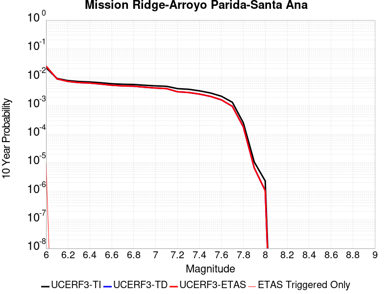 |

| Magnitude | 1 wk TI Prob | 1 wk TD Prob | 1 wk ETAS Prob | 1 wk ETAS/TD Gain | 1 wk ETAS Triggered Only | 1 mo TI Prob | 1 mo TD Prob | 1 mo ETAS Prob | 1 mo ETAS/TD Gain | 1 mo ETAS Triggered Only | 1 yr TI Prob | 1 yr TD Prob | 1 yr ETAS Prob | 1 yr ETAS/TD Gain | 1 yr ETAS Triggered Only | 10 yr TI Prob | 10 yr TD Prob | 10 yr ETAS Prob | 10 yr ETAS/TD Gain | 10 yr ETAS Triggered Only |
|-----|-----|-----|-----|-----|-----|-----|-----|-----|-----|-----|-----|-----|-----|-----|-----|-----|-----|-----|-----|-----|
| 6.0 | 4.169034E-5 | 4.7138004E-5 | 5.713753E-5 | 1.212133 | 1.0E-5 | 1.7866064E-4 | 2.0200922E-4 | 2.120072E-4 | 1.0494927 | 1.0E-5 | 0.0021730233 | 0.0024574373 | 0.0024674127 | 1.0040593 | 1.0E-5 | 0.021518968 | 0.024384484 | 0.02439424 | 1.0004001 | 1.0E-5 |
| 6.1 | 1.73813E-5 | 1.6854168E-5 | 1.6854168E-5 | 1.0 | 0.0 | 7.4489166E-5 | 7.2230214E-5 | 7.2230214E-5 | 1.0 | 0.0 | 9.065282E-4 | 8.7905885E-4 | 8.7905885E-4 | 1.0 | 0.0 | 0.009028391 | 0.008756958 | 0.008756958 | 1.0 | 0.0 |
| 6.2 | 1.4622182E-5 | 1.3673245E-5 | 1.3673245E-5 | 1.0 | 0.0 | 6.2664985E-5 | 5.859833E-5 | 5.859833E-5 | 1.0 | 0.0 | 7.6267915E-4 | 7.13205E-4 | 7.13205E-4 | 1.0 | 0.0 | 0.007600669 | 0.0071096043 | 0.0071096043 | 1.0 | 0.0 |
| 6.3 | 1.3552434E-5 | 1.248216E-5 | 1.248216E-5 | 1.0 | 0.0 | 5.8080568E-5 | 5.349389E-5 | 5.349389E-5 | 1.0 | 0.0 | 7.069015E-4 | 6.510967E-4 | 6.510967E-4 | 1.0 | 0.0 | 0.00704657 | 0.006492254 | 0.006492254 | 1.0 | 0.0 |
| 6.4 | 1.30977305E-5 | 1.1979117E-5 | 1.1979117E-5 | 1.0 | 0.0 | 5.613192E-5 | 5.133808E-5 | 5.133808E-5 | 1.0 | 0.0 | 6.831918E-4 | 6.248649E-4 | 6.248649E-4 | 1.0 | 0.0 | 0.006810953 | 0.006231424 | 0.006231424 | 1.0 | 0.0 |
| 6.5 | 1.225205E-5 | 1.1048766E-5 | 1.1048766E-5 | 1.0 | 0.0 | 5.2507727E-5 | 4.735101E-5 | 4.735101E-5 | 1.0 | 0.0 | 6.3909404E-4 | 5.763488E-4 | 5.763488E-4 | 1.0 | 0.0 | 0.006372592 | 0.00574885 | 0.00574885 | 1.0 | 0.0 |
| 6.6 | 1.1352241E-5 | 1.0063501E-5 | 1.0063501E-5 | 1.0 | 0.0 | 4.8651553E-5 | 4.3128588E-5 | 4.3128588E-5 | 1.0 | 0.0 | 5.921717E-4 | 5.2496616E-4 | 5.2496616E-4 | 1.0 | 0.0 | 0.0059059616 | 0.0052375067 | 0.0052375067 | 1.0 | 0.0 |
| 6.7 | 1.0864116E-5 | 9.516994E-6 | 9.516994E-6 | 1.0 | 0.0 | 4.6559664E-5 | 4.0786494E-5 | 4.0786494E-5 | 1.0 | 0.0 | 5.667165E-4 | 4.9646443E-4 | 4.9646443E-4 | 1.0 | 0.0 | 0.005652734 | 0.004953787 | 0.004953787 | 1.0 | 0.0 |
| 6.8 | 1.0666365E-5 | 9.299747E-6 | 9.299747E-6 | 1.0 | 0.0 | 4.571219E-5 | 3.985546E-5 | 3.985546E-5 | 1.0 | 0.0 | 5.564038E-4 | 4.851342E-4 | 4.851342E-4 | 1.0 | 0.0 | 0.005550127 | 0.0048409835 | 0.0048409835 | 1.0 | 0.0 |
| 6.9 | 1.0038665E-5 | 8.592016E-6 | 8.592016E-6 | 1.0 | 0.0 | 4.302214E-5 | 3.6822417E-5 | 3.6822417E-5 | 1.0 | 0.0 | 5.236687E-4 | 4.482225E-4 | 4.482225E-4 | 1.0 | 0.0 | 0.005224364 | 0.0044733956 | 0.0044733956 | 1.0 | 0.0 |
| 7.0 | 9.5379955E-6 | 8.025046E-6 | 8.025046E-6 | 1.0 | 0.0 | 4.0876483E-5 | 3.439261E-5 | 3.439261E-5 | 1.0 | 0.0 | 4.975576E-4 | 4.186513E-4 | 4.186513E-4 | 1.0 | 0.0 | 0.00496445 | 0.0041788258 | 0.0041788258 | 1.0 | 0.0 |
| 7.1 | 9.207389E-6 | 7.652349E-6 | 7.652349E-6 | 1.0 | 0.0 | 3.945964E-5 | 3.279538E-5 | 3.279538E-5 | 1.0 | 0.0 | 4.803152E-4 | 3.992123E-4 | 3.992123E-4 | 1.0 | 0.0 | 0.004792784 | 0.0039851475 | 0.0039851475 | 1.0 | 0.0 |
| 7.2 | 7.638091E-6 | 5.9310996E-6 | 5.9310996E-6 | 1.0 | 0.0 | 3.2734264E-5 | 2.5418753E-5 | 2.5418753E-5 | 1.0 | 0.0 | 3.984668E-4 | 3.0942968E-4 | 3.0942968E-4 | 1.0 | 0.0 | 0.0039775306 | 0.0030900452 | 0.0030900452 | 1.0 | 0.0 |
| 7.3 | 7.2500147E-6 | 5.596136E-6 | 5.596136E-6 | 1.0 | 0.0 | 3.1071122E-5 | 2.398322E-5 | 2.398322E-5 | 1.0 | 0.0 | 3.7822526E-4 | 2.9195688E-4 | 2.9195688E-4 | 1.0 | 0.0 | 0.0037758215 | 0.0029157887 | 0.0029157887 | 1.0 | 0.0 |
| 7.4 | 6.3899715E-6 | 4.9184823E-6 | 4.9184823E-6 | 1.0 | 0.0 | 2.7385306E-5 | 2.107904E-5 | 2.107904E-5 | 1.0 | 0.0 | 3.3336508E-4 | 2.5660728E-4 | 2.5660728E-4 | 1.0 | 0.0 | 0.0033286542 | 0.0025631543 | 0.0025631543 | 1.0 | 0.0 |
| 7.5 | 5.379025E-6 | 4.0838413E-6 | 4.0838413E-6 | 1.0 | 0.0 | 2.305276E-5 | 1.7502061E-5 | 1.7502061E-5 | 1.0 | 0.0 | 2.806312E-4 | 2.1306686E-4 | 2.1306686E-4 | 1.0 | 0.0 | 0.0028027708 | 0.0021286372 | 0.0021286372 | 1.0 | 0.0 |
| 7.6 | 4.1270696E-6 | 3.088336E-6 | 3.088336E-6 | 1.0 | 0.0 | 1.768732E-5 | 1.3235658E-5 | 1.3235658E-5 | 1.0 | 0.0 | 2.1532185E-4 | 1.611323E-4 | 1.611323E-4 | 1.0 | 0.0 | 0.0021511333 | 0.0016101628 | 0.0016101628 | 1.0 | 0.0 |
| 7.7 | 2.5406805E-6 | 1.8281963E-6 | 1.8281963E-6 | 1.0 | 0.0 | 1.0888585E-5 | 7.835104E-6 | 7.835104E-6 | 1.0 | 0.0 | 1.3256045E-4 | 9.538828E-5 | 9.538828E-5 | 1.0 | 0.0 | 0.0013248142 | 9.534795E-4 | 9.534795E-4 | 1.0 | 0.0 |
| 7.8 | 4.8608285E-7 | 3.509878E-7 | 3.509878E-7 | 1.0 | 0.0 | 2.0832106E-6 | 1.5042325E-6 | 1.5042325E-6 | 1.0 | 0.0 | 2.5362791E-5 | 1.8313878E-5 | 1.8313878E-5 | 1.0 | 0.0 | 2.5359896E-4 | 1.831238E-4 | 1.831238E-4 | 1.0 | 0.0 |
| 7.9 | 2.0472514E-8 | 1.268872E-8 | 1.268872E-8 | 1.0 | 0.0 | 8.7739345E-8 | 5.438023E-8 | 5.438023E-8 | 1.0 | 0.0 | 1.068226E-6 | 6.620791E-7 | 6.620791E-7 | 1.0 | 0.0 | 1.0682209E-5 | 6.6207726E-6 | 6.6207726E-6 | 1.0 | 0.0 |
| 8.0 | 4.443582E-9 | 2.0320927E-9 | 2.0320927E-9 | 1.0 | 0.0 | 1.9043922E-8 | 8.7089695E-9 | 8.7089695E-9 | 1.0 | 0.0 | 2.3185973E-7 | 1.060317E-7 | 1.060317E-7 | 1.0 | 0.0 | 2.3185949E-6 | 1.0603165E-6 | 1.0603165E-6 | 1.0 | 0.0 |

## Johnson Valley (No) 2011 rev
*[(top)](#table-of-contents)*

| 1 Week | 1 Month | 1 Year | 10 Year |
|-----|-----|-----|-----|
|  |  |  |  |

| Magnitude | 1 wk TI Prob | 1 wk TD Prob | 1 wk ETAS Prob | 1 wk ETAS/TD Gain | 1 wk ETAS Triggered Only | 1 mo TI Prob | 1 mo TD Prob | 1 mo ETAS Prob | 1 mo ETAS/TD Gain | 1 mo ETAS Triggered Only | 1 yr TI Prob | 1 yr TD Prob | 1 yr ETAS Prob | 1 yr ETAS/TD Gain | 1 yr ETAS Triggered Only | 10 yr TI Prob | 10 yr TD Prob | 10 yr ETAS Prob | 10 yr ETAS/TD Gain | 10 yr ETAS Triggered Only |
|-----|-----|-----|-----|-----|-----|-----|-----|-----|-----|-----|-----|-----|-----|-----|-----|-----|-----|-----|-----|-----|
| 6.0 | 2.577707E-5 | 1.2900895E-5 | 1.2900895E-5 | 1.0 | 0.0 | 1.1046848E-4 | 5.52886E-5 | 5.52886E-5 | 1.0 | 0.0 | 0.0013441239 | 6.7297055E-4 | 6.7297055E-4 | 1.0 | 0.0 | 0.013360229 | 0.006713235 | 0.006723168 | 1.0014796 | 1.0E-5 |
| 6.1 | 2.577707E-5 | 1.2900895E-5 | 1.2900895E-5 | 1.0 | 0.0 | 1.1046848E-4 | 5.52886E-5 | 5.52886E-5 | 1.0 | 0.0 | 0.0013441239 | 6.7297055E-4 | 6.7297055E-4 | 1.0 | 0.0 | 0.013360229 | 0.006713235 | 0.006723168 | 1.0014796 | 1.0E-5 |
| 6.2 | 2.577707E-5 | 1.2900895E-5 | 1.2900895E-5 | 1.0 | 0.0 | 1.1046848E-4 | 5.52886E-5 | 5.52886E-5 | 1.0 | 0.0 | 0.0013441239 | 6.7297055E-4 | 6.7297055E-4 | 1.0 | 0.0 | 0.013360229 | 0.006713235 | 0.006723168 | 1.0014796 | 1.0E-5 |
| 6.3 | 2.577707E-5 | 1.2900895E-5 | 1.2900895E-5 | 1.0 | 0.0 | 1.1046848E-4 | 5.52886E-5 | 5.52886E-5 | 1.0 | 0.0 | 0.0013441239 | 6.7297055E-4 | 6.7297055E-4 | 1.0 | 0.0 | 0.013360229 | 0.006713235 | 0.006723168 | 1.0014796 | 1.0E-5 |
| 6.4 | 1.5296591E-5 | 7.536715E-6 | 7.536715E-6 | 1.0 | 0.0 | 6.555518E-5 | 3.229991E-5 | 3.229991E-5 | 1.0 | 0.0 | 7.97842E-4 | 3.9319924E-4 | 3.9319924E-4 | 1.0 | 0.0 | 0.007949836 | 0.0039268765 | 0.0039368374 | 1.0025365 | 1.0E-5 |
| 6.5 | 1.5296591E-5 | 7.536715E-6 | 7.536715E-6 | 1.0 | 0.0 | 6.555518E-5 | 3.229991E-5 | 3.229991E-5 | 1.0 | 0.0 | 7.97842E-4 | 3.9319924E-4 | 3.9319924E-4 | 1.0 | 0.0 | 0.007949836 | 0.0039268765 | 0.0039368374 | 1.0025365 | 1.0E-5 |
| 6.6 | 1.3289383E-5 | 5.991708E-6 | 5.991708E-6 | 1.0 | 0.0 | 5.6953253E-5 | 2.5678592E-5 | 2.5678592E-5 | 1.0 | 0.0 | 6.9318525E-4 | 3.1260896E-4 | 3.1260896E-4 | 1.0 | 0.0 | 0.0069102696 | 0.0031233565 | 0.0031333254 | 1.0031917 | 1.0E-5 |
| 6.7 | 1.3289383E-5 | 5.991708E-6 | 5.991708E-6 | 1.0 | 0.0 | 5.6953253E-5 | 2.5678592E-5 | 2.5678592E-5 | 1.0 | 0.0 | 6.9318525E-4 | 3.1260896E-4 | 3.1260896E-4 | 1.0 | 0.0 | 0.0069102696 | 0.0031233565 | 0.0031333254 | 1.0031917 | 1.0E-5 |
| 6.8 | 8.330789E-6 | 2.9211749E-6 | 2.9211749E-6 | 1.0 | 0.0 | 3.570289E-5 | 1.2519293E-5 | 1.2519293E-5 | 1.0 | 0.0 | 4.34596E-4 | 1.5241744E-4 | 1.5241744E-4 | 1.0 | 0.0 | 0.0043374705 | 0.0015236889 | 0.0015336737 | 1.006553 | 1.0E-5 |
| 6.9 | 7.2359003E-6 | 2.3013124E-6 | 2.3013124E-6 | 1.0 | 0.0 | 3.1010633E-5 | 9.86276E-6 | 9.86276E-6 | 1.0 | 0.0 | 3.7748902E-4 | 1.2007781E-4 | 1.2007781E-4 | 1.0 | 0.0 | 0.0037684843 | 0.0012006522 | 0.0012106402 | 1.0083188 | 1.0E-5 |
| 7.0 | 6.5149957E-6 | 2.0884709E-6 | 2.0884709E-6 | 1.0 | 0.0 | 2.792111E-5 | 8.950588E-6 | 8.950588E-6 | 1.0 | 0.0 | 3.398865E-4 | 1.0897326E-4 | 1.0897326E-4 | 1.0 | 0.0 | 0.003393671 | 0.001089718 | 0.0010997071 | 1.0091667 | 1.0E-5 |
| 7.1 | 1.1662233E-6 | 2.8801654E-8 | 2.8801654E-8 | 1.0 | 0.0 | 4.9980904E-6 | 1.2343565E-7 | 1.2343565E-7 | 1.0 | 0.0 | 6.0850052E-5 | 1.5028284E-6 | 1.5028284E-6 | 1.0 | 0.0 | 6.083339E-4 | 1.5028198E-5 | 2.5028048E-5 | 1.6654058 | 1.0E-5 |
| 7.2 | 5.413881E-7 | 2.8801654E-8 | 2.8801654E-8 | 1.0 | 0.0 | 2.3202326E-6 | 1.2343565E-7 | 1.2343565E-7 | 1.0 | 0.0 | 2.8248465E-5 | 1.5028284E-6 | 1.5028284E-6 | 1.0 | 0.0 | 2.8244875E-4 | 1.5028198E-5 | 2.5028048E-5 | 1.6654058 | 1.0E-5 |
| 7.3 | 5.076821E-7 | 2.8801654E-8 | 2.8801654E-8 | 1.0 | 0.0 | 2.1757785E-6 | 1.2343565E-7 | 1.2343565E-7 | 1.0 | 0.0 | 2.648978E-5 | 1.5028282E-6 | 1.5028282E-6 | 1.0 | 0.0 | 2.6486625E-4 | 1.5028198E-5 | 2.5028048E-5 | 1.6654058 | 1.0E-5 |
| 7.4 | 4.7568687E-7 | 2.878358E-8 | 2.878358E-8 | 1.0 | 0.0 | 2.0386565E-6 | 1.2335819E-7 | 1.2335819E-7 | 1.0 | 0.0 | 2.482036E-5 | 1.5018852E-6 | 1.5018852E-6 | 1.0 | 0.0 | 2.4817587E-4 | 1.5018766E-5 | 2.5018617E-5 | 1.6658237 | 1.0E-5 |
| 7.5 | 3.435626E-7 | 2.535737E-8 | 2.535737E-8 | 1.0 | 0.0 | 1.4724103E-6 | 1.08674435E-7 | 1.08674435E-7 | 1.0 | 0.0 | 1.7926448E-5 | 1.3231106E-6 | 1.3231106E-6 | 1.0 | 0.0 | 1.7925001E-4 | 1.3231043E-5 | 2.3230912E-5 | 1.7557883 | 1.0E-5 |

## Great Valley 03a Dunnigan Hills
*[(top)](#table-of-contents)*

| 1 Week | 1 Month | 1 Year | 10 Year |
|-----|-----|-----|-----|
|  | 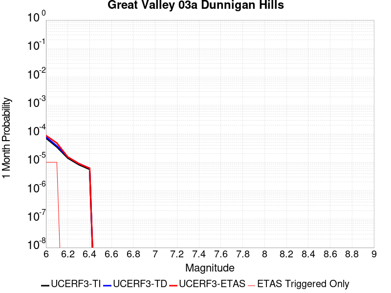 |  |  |

| Magnitude | 1 wk TI Prob | 1 wk TD Prob | 1 wk ETAS Prob | 1 wk ETAS/TD Gain | 1 wk ETAS Triggered Only | 1 mo TI Prob | 1 mo TD Prob | 1 mo ETAS Prob | 1 mo ETAS/TD Gain | 1 mo ETAS Triggered Only | 1 yr TI Prob | 1 yr TD Prob | 1 yr ETAS Prob | 1 yr ETAS/TD Gain | 1 yr ETAS Triggered Only | 10 yr TI Prob | 10 yr TD Prob | 10 yr ETAS Prob | 10 yr ETAS/TD Gain | 10 yr ETAS Triggered Only |
|-----|-----|-----|-----|-----|-----|-----|-----|-----|-----|-----|-----|-----|-----|-----|-----|-----|-----|-----|-----|-----|
| 6.0 | 1.6591328E-5 | 1.810791E-5 | 2.8107728E-5 | 1.5522349 | 1.0E-5 | 7.110376E-5 | 7.760341E-5 | 8.760263E-5 | 1.1288503 | 1.0E-5 | 8.6534437E-4 | 9.444811E-4 | 9.5447164E-4 | 1.0105778 | 1.0E-5 | 0.008619824 | 0.009411503 | 0.009421408 | 1.0010525 | 1.0E-5 |
| 6.1 | 8.041125E-6 | 8.769705E-6 | 1.8769617E-5 | 2.140279 | 1.0E-5 | 3.4461507E-5 | 3.7584025E-5 | 4.758365E-5 | 1.2660605 | 1.0E-5 | 4.194881E-4 | 4.5750974E-4 | 4.6750516E-4 | 1.0218475 | 1.0E-5 | 0.004186971 | 0.004567676 | 0.00457763 | 1.0021793 | 1.0E-5 |
| 6.2 | 3.2807004E-6 | 3.5795601E-6 | 3.5795601E-6 | 1.0 | 0.0 | 1.4060069E-5 | 1.5340906E-5 | 1.5340906E-5 | 1.0 | 0.0 | 1.7116789E-4 | 1.8676367E-4 | 1.8676367E-4 | 1.0 | 0.0 | 0.0017103611 | 0.0018664751 | 0.0018664751 | 1.0 | 0.0 |
| 6.3 | 1.9339366E-6 | 2.1103756E-6 | 2.1103756E-6 | 1.0 | 0.0 | 8.288273E-6 | 9.044452E-6 | 9.044452E-6 | 1.0 | 0.0 | 1.00905054E-4 | 1.10113484E-4 | 1.10113484E-4 | 1.0 | 0.0 | 0.0010085925 | 0.0011008692 | 0.0011008692 | 1.0 | 0.0 |
| 6.4 | 1.3142635E-6 | 1.4339831E-6 | 1.4339831E-6 | 1.0 | 0.0 | 5.6325457E-6 | 6.145642E-6 | 6.145642E-6 | 1.0 | 0.0 | 6.857408E-5 | 7.482319E-5 | 7.482319E-5 | 1.0 | 0.0 | 6.8552926E-4 | 7.4823195E-4 | 7.4823195E-4 | 1.0 | 0.0 |

## Eureka Peak
*[(top)](#table-of-contents)*

| 1 Week | 1 Month | 1 Year | 10 Year |
|-----|-----|-----|-----|
|  |  |  |  |

| Magnitude | 1 wk TI Prob | 1 wk TD Prob | 1 wk ETAS Prob | 1 wk ETAS/TD Gain | 1 wk ETAS Triggered Only | 1 mo TI Prob | 1 mo TD Prob | 1 mo ETAS Prob | 1 mo ETAS/TD Gain | 1 mo ETAS Triggered Only | 1 yr TI Prob | 1 yr TD Prob | 1 yr ETAS Prob | 1 yr ETAS/TD Gain | 1 yr ETAS Triggered Only | 10 yr TI Prob | 10 yr TD Prob | 10 yr ETAS Prob | 10 yr ETAS/TD Gain | 10 yr ETAS Triggered Only |
|-----|-----|-----|-----|-----|-----|-----|-----|-----|-----|-----|-----|-----|-----|-----|-----|-----|-----|-----|-----|-----|
| 6.0 | 3.1949054E-5 | 9.310349E-6 | 1.9310257E-5 | 2.0740635 | 1.0E-5 | 1.3691733E-4 | 3.9901326E-5 | 4.990093E-5 | 1.2506082 | 1.0E-5 | 0.0016656938 | 4.8576848E-4 | 4.957636E-4 | 1.0205759 | 1.0E-5 | 0.016532637 | 0.004924774 | 0.004934725 | 1.0020206 | 1.0E-5 |
| 6.1 | 3.1949054E-5 | 9.310349E-6 | 1.9310257E-5 | 2.0740635 | 1.0E-5 | 1.3691733E-4 | 3.9901326E-5 | 4.990093E-5 | 1.2506082 | 1.0E-5 | 0.0016656938 | 4.8576848E-4 | 4.957636E-4 | 1.0205759 | 1.0E-5 | 0.016532637 | 0.004924774 | 0.004934725 | 1.0020206 | 1.0E-5 |
| 6.2 | 3.1949054E-5 | 9.310349E-6 | 1.9310257E-5 | 2.0740635 | 1.0E-5 | 1.3691733E-4 | 3.9901326E-5 | 4.990093E-5 | 1.2506082 | 1.0E-5 | 0.0016656938 | 4.8576848E-4 | 4.957636E-4 | 1.0205759 | 1.0E-5 | 0.016532637 | 0.004924774 | 0.004934725 | 1.0020206 | 1.0E-5 |
| 6.3 | 2.7339745E-5 | 7.980512E-6 | 1.7980432E-5 | 2.2530425 | 1.0E-5 | 1.1716507E-4 | 3.4202174E-5 | 4.420183E-5 | 1.292369 | 1.0E-5 | 0.0014255513 | 4.164078E-4 | 4.2640365E-4 | 1.0240049 | 1.0E-5 | 0.0141644105 | 0.004228261 | 0.0042382185 | 1.002355 | 1.0E-5 |
| 6.4 | 2.7339745E-5 | 7.980512E-6 | 1.7980432E-5 | 2.2530425 | 1.0E-5 | 1.1716507E-4 | 3.4202174E-5 | 4.420183E-5 | 1.292369 | 1.0E-5 | 0.0014255513 | 4.164078E-4 | 4.2640365E-4 | 1.0240049 | 1.0E-5 | 0.0141644105 | 0.004228261 | 0.0042382185 | 1.002355 | 1.0E-5 |
| 6.5 | 9.738388E-8 | 1.8618802E-7 | 1.8618802E-7 | 1.0 | 0.0 | 4.1735944E-7 | 7.979484E-7 | 7.979484E-7 | 1.0 | 0.0 | 5.081339E-6 | 9.71498E-6 | 9.71498E-6 | 1.0 | 0.0 | 5.0812232E-5 | 9.7145625E-5 | 9.7145625E-5 | 1.0 | 0.0 |
| 6.6 | 9.3495956E-8 | 1.8327636E-7 | 1.8327636E-7 | 1.0 | 0.0 | 4.0069688E-7 | 7.8546987E-7 | 7.8546987E-7 | 1.0 | 0.0 | 4.8784736E-6 | 9.563055E-6 | 9.563055E-6 | 1.0 | 0.0 | 4.8783666E-5 | 9.5626514E-5 | 9.5626514E-5 | 1.0 | 0.0 |
| 6.7 | 9.3495956E-8 | 1.8327636E-7 | 1.8327636E-7 | 1.0 | 0.0 | 4.0069688E-7 | 7.8546987E-7 | 7.8546987E-7 | 1.0 | 0.0 | 4.8784736E-6 | 9.563055E-6 | 9.563055E-6 | 1.0 | 0.0 | 4.8783666E-5 | 9.5626514E-5 | 9.5626514E-5 | 1.0 | 0.0 |
| 6.8 | 8.591428E-8 | 1.8020607E-7 | 1.8020607E-7 | 1.0 | 0.0 | 3.68204E-7 | 7.723115E-7 | 7.723115E-7 | 1.0 | 0.0 | 4.4828744E-6 | 9.402853E-6 | 9.402853E-6 | 1.0 | 0.0 | 4.482784E-5 | 9.4024625E-5 | 9.4024625E-5 | 1.0 | 0.0 |
| 6.9 | 7.749723E-8 | 1.7438616E-7 | 1.7438616E-7 | 1.0 | 0.0 | 3.3213098E-7 | 7.473691E-7 | 7.473691E-7 | 1.0 | 0.0 | 4.043687E-6 | 9.099182E-6 | 9.099182E-6 | 1.0 | 0.0 | 4.0436134E-5 | 9.0988164E-5 | 9.0988164E-5 | 1.0 | 0.0 |
| 7.0 | 6.897872E-8 | 1.6414864E-7 | 1.6414864E-7 | 1.0 | 0.0 | 2.9562307E-7 | 7.0349404E-7 | 7.0349404E-7 | 1.0 | 0.0 | 3.5992048E-6 | 8.565007E-6 | 8.565007E-6 | 1.0 | 0.0 | 3.5991467E-5 | 8.564684E-5 | 8.564684E-5 | 1.0 | 0.0 |
| 7.1 | 5.859318E-8 | 1.4786792E-7 | 1.4786792E-7 | 1.0 | 0.0 | 2.5111362E-7 | 6.3371954E-7 | 6.3371954E-7 | 1.0 | 0.0 | 3.057304E-6 | 7.715508E-6 | 7.715508E-6 | 1.0 | 0.0 | 3.0572617E-5 | 7.715247E-5 | 7.715247E-5 | 1.0 | 0.0 |
| 7.2 | 5.1375338E-8 | 1.3420691E-7 | 1.3420691E-7 | 1.0 | 0.0 | 2.2018E-7 | 5.7517235E-7 | 5.7517235E-7 | 1.0 | 0.0 | 2.680688E-6 | 7.0027013E-6 | 7.0027013E-6 | 1.0 | 0.0 | 2.6806558E-5 | 7.0024864E-5 | 7.0024864E-5 | 1.0 | 0.0 |
| 7.3 | 4.5441396E-8 | 1.1635977E-7 | 1.1635977E-7 | 1.0 | 0.0 | 1.9474882E-7 | 4.9868464E-7 | 4.9868464E-7 | 1.0 | 0.0 | 2.3710643E-6 | 6.071469E-6 | 6.071469E-6 | 1.0 | 0.0 | 2.371039E-5 | 6.0713086E-5 | 6.0713086E-5 | 1.0 | 0.0 |
| 7.4 | 2.981918E-8 | 6.9110754E-8 | 6.9110754E-8 | 1.0 | 0.0 | 1.2779647E-7 | 2.9618892E-7 | 2.9618892E-7 | 1.0 | 0.0 | 1.5559209E-6 | 3.6060947E-6 | 3.6060947E-6 | 1.0 | 0.0 | 1.55591E-5 | 3.6060403E-5 | 3.6060403E-5 | 1.0 | 0.0 |
| 7.5 | 4.24214E-9 | 8.342036E-9 | 8.342036E-9 | 1.0 | 0.0 | 1.81806E-8 | 3.5751587E-8 | 3.5751587E-8 | 1.0 | 0.0 | 2.213488E-7 | 4.3527552E-7 | 4.3527552E-7 | 1.0 | 0.0 | 2.2134857E-6 | 4.352753E-6 | 4.352753E-6 | 1.0 | 0.0 |

## North Frontal  (East)
*[(top)](#table-of-contents)*

| 1 Week | 1 Month | 1 Year | 10 Year |
|-----|-----|-----|-----|
|  | 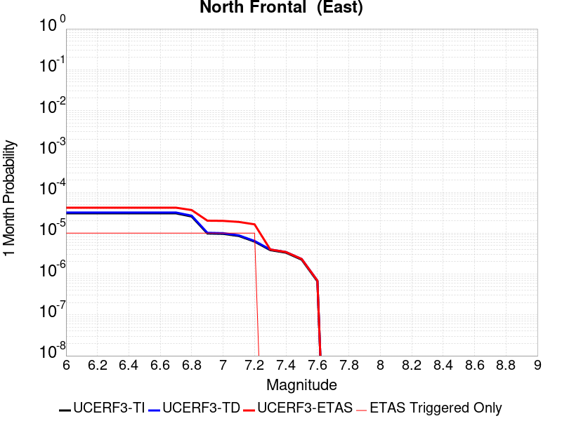 | 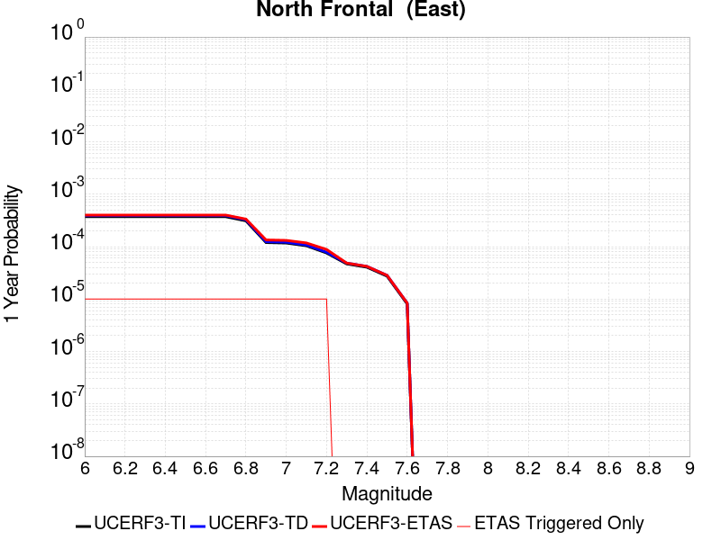 |  |

| Magnitude | 1 wk TI Prob | 1 wk TD Prob | 1 wk ETAS Prob | 1 wk ETAS/TD Gain | 1 wk ETAS Triggered Only | 1 mo TI Prob | 1 mo TD Prob | 1 mo ETAS Prob | 1 mo ETAS/TD Gain | 1 mo ETAS Triggered Only | 1 yr TI Prob | 1 yr TD Prob | 1 yr ETAS Prob | 1 yr ETAS/TD Gain | 1 yr ETAS Triggered Only | 10 yr TI Prob | 10 yr TD Prob | 10 yr ETAS Prob | 10 yr ETAS/TD Gain | 10 yr ETAS Triggered Only |
|-----|-----|-----|-----|-----|-----|-----|-----|-----|-----|-----|-----|-----|-----|-----|-----|-----|-----|-----|-----|-----|
| 6.0 | 7.135738E-6 | 7.477167E-6 | 7.477167E-6 | 1.0 | 0.0 | 3.0581377E-5 | 3.204472E-5 | 4.20444E-5 | 1.3120539 | 1.0E-5 | 3.7226462E-4 | 3.9009456E-4 | 4.0009068E-4 | 1.0256248 | 1.0E-5 | 0.0037164164 | 0.0038960557 | 0.003906017 | 1.0025567 | 1.0E-5 |
| 6.1 | 7.135738E-6 | 7.477167E-6 | 7.477167E-6 | 1.0 | 0.0 | 3.0581377E-5 | 3.204472E-5 | 4.20444E-5 | 1.3120539 | 1.0E-5 | 3.7226462E-4 | 3.9009456E-4 | 4.0009068E-4 | 1.0256248 | 1.0E-5 | 0.0037164164 | 0.0038960557 | 0.003906017 | 1.0025567 | 1.0E-5 |
| 6.2 | 7.135738E-6 | 7.477167E-6 | 7.477167E-6 | 1.0 | 0.0 | 3.0581377E-5 | 3.204472E-5 | 4.20444E-5 | 1.3120539 | 1.0E-5 | 3.7226462E-4 | 3.9009456E-4 | 4.0009068E-4 | 1.0256248 | 1.0E-5 | 0.0037164164 | 0.0038960557 | 0.003906017 | 1.0025567 | 1.0E-5 |
| 6.3 | 7.135738E-6 | 7.477167E-6 | 7.477167E-6 | 1.0 | 0.0 | 3.0581377E-5 | 3.204472E-5 | 4.20444E-5 | 1.3120539 | 1.0E-5 | 3.7226462E-4 | 3.9009456E-4 | 4.0009068E-4 | 1.0256248 | 1.0E-5 | 0.0037164164 | 0.0038960557 | 0.003906017 | 1.0025567 | 1.0E-5 |
| 6.4 | 7.135738E-6 | 7.477167E-6 | 7.477167E-6 | 1.0 | 0.0 | 3.0581377E-5 | 3.204472E-5 | 4.20444E-5 | 1.3120539 | 1.0E-5 | 3.7226462E-4 | 3.9009456E-4 | 4.0009068E-4 | 1.0256248 | 1.0E-5 | 0.0037164164 | 0.0038960557 | 0.003906017 | 1.0025567 | 1.0E-5 |
| 6.5 | 7.135738E-6 | 7.477167E-6 | 7.477167E-6 | 1.0 | 0.0 | 3.0581377E-5 | 3.204472E-5 | 4.20444E-5 | 1.3120539 | 1.0E-5 | 3.7226462E-4 | 3.9009456E-4 | 4.0009068E-4 | 1.0256248 | 1.0E-5 | 0.0037164164 | 0.0038960557 | 0.003906017 | 1.0025567 | 1.0E-5 |
| 6.6 | 7.135738E-6 | 7.477167E-6 | 7.477167E-6 | 1.0 | 0.0 | 3.0581377E-5 | 3.204472E-5 | 4.20444E-5 | 1.3120539 | 1.0E-5 | 3.7226462E-4 | 3.9009456E-4 | 4.0009068E-4 | 1.0256248 | 1.0E-5 | 0.0037164164 | 0.0038960557 | 0.003906017 | 1.0025567 | 1.0E-5 |
| 6.7 | 7.135738E-6 | 7.477167E-6 | 7.477167E-6 | 1.0 | 0.0 | 3.0581377E-5 | 3.204472E-5 | 4.20444E-5 | 1.3120539 | 1.0E-5 | 3.7226462E-4 | 3.9009456E-4 | 4.0009068E-4 | 1.0256248 | 1.0E-5 | 0.0037164164 | 0.0038960557 | 0.003906017 | 1.0025567 | 1.0E-5 |
| 6.8 | 5.959142E-6 | 6.2366753E-6 | 6.2366753E-6 | 1.0 | 0.0 | 2.553893E-5 | 2.6728436E-5 | 3.672817E-5 | 1.3741233 | 1.0E-5 | 3.108921E-4 | 3.253882E-4 | 3.3538492E-4 | 1.0307225 | 1.0E-5 | 0.0031045752 | 0.0032508906 | 0.0032608581 | 1.0030661 | 1.0E-5 |
| 6.9 | 2.2946929E-6 | 2.382458E-6 | 2.382458E-6 | 1.0 | 0.0 | 9.834361E-6 | 1.0210498E-5 | 2.0210395E-5 | 1.9793742 | 1.0E-5 | 1.1972676E-4 | 1.2430619E-4 | 1.3430494E-4 | 1.0804365 | 1.0E-5 | 0.0011966228 | 0.0012424131 | 0.0012524006 | 1.0080389 | 1.0E-5 |
| 7.0 | 2.2468673E-6 | 2.3321513E-6 | 2.3321513E-6 | 1.0 | 0.0 | 9.629396E-6 | 9.994899E-6 | 1.9994799E-5 | 2.0005004 | 1.0E-5 | 1.1723159E-4 | 1.2168157E-4 | 1.3168035E-4 | 1.0821717 | 1.0E-5 | 0.0011716976 | 0.0012161958 | 0.0012261836 | 1.0082123 | 1.0E-5 |
| 7.1 | 1.9921076E-6 | 2.0646012E-6 | 2.0646012E-6 | 1.0 | 0.0 | 8.537577E-6 | 8.848263E-6 | 1.8848175E-5 | 2.1301553 | 1.0E-5 | 1.0394004E-4 | 1.0772271E-4 | 1.1772164E-4 | 1.0928209 | 1.0E-5 | 0.0010389143 | 0.0010767477 | 0.0010867369 | 1.0092772 | 1.0E-5 |
| 7.2 | 1.4524545E-6 | 1.5045133E-6 | 1.5045133E-6 | 1.0 | 0.0 | 6.2247905E-6 | 6.4479E-6 | 1.6447835E-5 | 2.5508826 | 1.0E-5 | 7.5784184E-5 | 7.85006E-5 | 8.8499815E-5 | 1.1273775 | 1.0E-5 | 7.575835E-4 | 7.847532E-4 | 7.9474534E-4 | 1.0127329 | 1.0E-5 |
| 7.3 | 8.9802575E-7 | 9.308719E-7 | 9.308719E-7 | 1.0 | 0.0 | 3.848676E-6 | 3.9894453E-6 | 3.9894453E-6 | 1.0 | 0.0 | 4.685662E-5 | 4.857053E-5 | 4.857053E-5 | 1.0 | 0.0 | 4.6846745E-4 | 4.8561045E-4 | 4.8561045E-4 | 1.0 | 0.0 |
| 7.4 | 7.776139E-7 | 8.0604667E-7 | 8.0604667E-7 | 1.0 | 0.0 | 3.3326266E-6 | 3.4544819E-6 | 3.4544819E-6 | 1.0 | 0.0 | 4.0573974E-5 | 4.2057614E-5 | 4.2057614E-5 | 1.0 | 0.0 | 4.0566566E-4 | 4.205073E-4 | 4.205073E-4 | 1.0 | 0.0 |
| 7.5 | 5.244417E-7 | 5.441214E-7 | 5.441214E-7 | 1.0 | 0.0 | 2.2476054E-6 | 2.3319471E-6 | 2.3319471E-6 | 1.0 | 0.0 | 2.7364253E-5 | 2.8391152E-5 | 2.8391152E-5 | 1.0 | 0.0 | 2.7360884E-4 | 2.8388176E-4 | 2.8388176E-4 | 1.0 | 0.0 |
| 7.6 | 1.5489647E-7 | 1.6089487E-7 | 1.6089487E-7 | 1.0 | 0.0 | 6.6384183E-7 | 6.895494E-7 | 6.895494E-7 | 1.0 | 0.0 | 8.082245E-6 | 8.395252E-6 | 8.395252E-6 | 1.0 | 0.0 | 8.08195E-5 | 8.3951345E-5 | 8.3951345E-5 | 1.0 | 0.0 |

## North Frontal  (West)
*[(top)](#table-of-contents)*

| 1 Week | 1 Month | 1 Year | 10 Year |
|-----|-----|-----|-----|
|  |  |  |  |

| Magnitude | 1 wk TI Prob | 1 wk TD Prob | 1 wk ETAS Prob | 1 wk ETAS/TD Gain | 1 wk ETAS Triggered Only | 1 mo TI Prob | 1 mo TD Prob | 1 mo ETAS Prob | 1 mo ETAS/TD Gain | 1 mo ETAS Triggered Only | 1 yr TI Prob | 1 yr TD Prob | 1 yr ETAS Prob | 1 yr ETAS/TD Gain | 1 yr ETAS Triggered Only | 10 yr TI Prob | 10 yr TD Prob | 10 yr ETAS Prob | 10 yr ETAS/TD Gain | 10 yr ETAS Triggered Only |
|-----|-----|-----|-----|-----|-----|-----|-----|-----|-----|-----|-----|-----|-----|-----|-----|-----|-----|-----|-----|-----|
| 6.0 | 4.7316266E-6 | 4.852669E-6 | 4.852669E-6 | 1.0 | 0.0 | 2.0278241E-5 | 2.0796995E-5 | 3.0796786E-5 | 1.4808286 | 1.0E-5 | 2.4685962E-4 | 2.5317547E-4 | 2.6317293E-4 | 1.0394883 | 1.0E-5 | 0.0024658558 | 0.0025290165 | 0.0025389912 | 1.0039442 | 1.0E-5 |
| 6.1 | 4.7316266E-6 | 4.852669E-6 | 4.852669E-6 | 1.0 | 0.0 | 2.0278241E-5 | 2.0796995E-5 | 3.0796786E-5 | 1.4808286 | 1.0E-5 | 2.4685962E-4 | 2.5317547E-4 | 2.6317293E-4 | 1.0394883 | 1.0E-5 | 0.0024658558 | 0.0025290165 | 0.0025389912 | 1.0039442 | 1.0E-5 |
| 6.2 | 4.7316266E-6 | 4.852669E-6 | 4.852669E-6 | 1.0 | 0.0 | 2.0278241E-5 | 2.0796995E-5 | 3.0796786E-5 | 1.4808286 | 1.0E-5 | 2.4685962E-4 | 2.5317547E-4 | 2.6317293E-4 | 1.0394883 | 1.0E-5 | 0.0024658558 | 0.0025290165 | 0.0025389912 | 1.0039442 | 1.0E-5 |
| 6.3 | 4.7316266E-6 | 4.852669E-6 | 4.852669E-6 | 1.0 | 0.0 | 2.0278241E-5 | 2.0796995E-5 | 3.0796786E-5 | 1.4808286 | 1.0E-5 | 2.4685962E-4 | 2.5317547E-4 | 2.6317293E-4 | 1.0394883 | 1.0E-5 | 0.0024658558 | 0.0025290165 | 0.0025389912 | 1.0039442 | 1.0E-5 |
| 6.4 | 4.7316266E-6 | 4.852669E-6 | 4.852669E-6 | 1.0 | 0.0 | 2.0278241E-5 | 2.0796995E-5 | 3.0796786E-5 | 1.4808286 | 1.0E-5 | 2.4685962E-4 | 2.5317547E-4 | 2.6317293E-4 | 1.0394883 | 1.0E-5 | 0.0024658558 | 0.0025290165 | 0.0025389912 | 1.0039442 | 1.0E-5 |
| 6.5 | 4.7316266E-6 | 4.852669E-6 | 4.852669E-6 | 1.0 | 0.0 | 2.0278241E-5 | 2.0796995E-5 | 3.0796786E-5 | 1.4808286 | 1.0E-5 | 2.4685962E-4 | 2.5317547E-4 | 2.6317293E-4 | 1.0394883 | 1.0E-5 | 0.0024658558 | 0.0025290165 | 0.0025389912 | 1.0039442 | 1.0E-5 |
| 6.6 | 4.7316266E-6 | 4.852669E-6 | 4.852669E-6 | 1.0 | 0.0 | 2.0278241E-5 | 2.0796995E-5 | 3.0796786E-5 | 1.4808286 | 1.0E-5 | 2.4685962E-4 | 2.5317547E-4 | 2.6317293E-4 | 1.0394883 | 1.0E-5 | 0.0024658558 | 0.0025290165 | 0.0025389912 | 1.0039442 | 1.0E-5 |
| 6.7 | 3.5382777E-6 | 3.630883E-6 | 3.630883E-6 | 1.0 | 0.0 | 1.516396E-5 | 1.5560838E-5 | 2.5560683E-5 | 1.6426289 | 1.0E-5 | 1.8460557E-4 | 1.8943752E-4 | 1.9943563E-4 | 1.0527779 | 1.0E-5 | 0.0018445229 | 0.0018928373 | 0.0019028183 | 1.0052731 | 1.0E-5 |
| 6.8 | 3.5382777E-6 | 3.630883E-6 | 3.630883E-6 | 1.0 | 0.0 | 1.516396E-5 | 1.5560838E-5 | 2.5560683E-5 | 1.6426289 | 1.0E-5 | 1.8460557E-4 | 1.8943752E-4 | 1.9943563E-4 | 1.0527779 | 1.0E-5 | 0.0018445229 | 0.0018928373 | 0.0019028183 | 1.0052731 | 1.0E-5 |
| 6.9 | 3.0428037E-6 | 3.122758E-6 | 3.122758E-6 | 1.0 | 0.0 | 1.30405215E-5 | 1.3383184E-5 | 2.3383049E-5 | 1.7471963 | 1.0E-5 | 1.5875678E-4 | 1.6292876E-4 | 1.7292713E-4 | 1.0613666 | 1.0E-5 | 0.0015864341 | 0.0016281601 | 0.0016381439 | 1.0061319 | 1.0E-5 |
| 7.0 | 2.538778E-6 | 2.606088E-6 | 2.606088E-6 | 1.0 | 0.0 | 1.0880432E-5 | 1.1168903E-5 | 2.1168791E-5 | 1.895333 | 1.0E-5 | 1.324612E-4 | 1.3597339E-4 | 1.4597204E-4 | 1.0735338 | 1.0E-5 | 0.0013238228 | 0.0013589488 | 0.0013689351 | 1.0073487 | 1.0E-5 |
| 7.1 | 2.2418935E-6 | 2.301205E-6 | 2.301205E-6 | 1.0 | 0.0 | 9.60808E-6 | 9.862273E-6 | 1.9862175E-5 | 2.013955 | 1.0E-5 | 1.1697209E-4 | 1.2006701E-4 | 1.300658E-4 | 1.0832769 | 1.0E-5 | 0.0011691054 | 0.0012000652 | 0.0012100533 | 1.0083228 | 1.0E-5 |
| 7.2 | 1.6526745E-6 | 1.6924836E-6 | 1.6924836E-6 | 1.0 | 0.0 | 7.082872E-6 | 7.253482E-6 | 1.725341E-5 | 2.3786383 | 1.0E-5 | 8.623055E-5 | 8.8307825E-5 | 9.830694E-5 | 1.1132302 | 1.0E-5 | 8.61971E-4 | 8.8275236E-4 | 8.927435E-4 | 1.0113182 | 1.0E-5 |
| 7.3 | 1.0246019E-6 | 1.0442251E-6 | 1.0442251E-6 | 1.0 | 0.0 | 4.391144E-6 | 4.4752433E-6 | 4.4752433E-6 | 1.0 | 0.0 | 5.3460866E-5 | 5.448484E-5 | 5.448484E-5 | 1.0 | 0.0 | 5.344801E-4 | 5.447263E-4 | 5.447263E-4 | 1.0 | 0.0 |
| 7.4 | 8.9045164E-7 | 9.05655E-7 | 9.05655E-7 | 1.0 | 0.0 | 3.8162157E-6 | 3.8813732E-6 | 3.8813732E-6 | 1.0 | 0.0 | 4.646144E-5 | 4.7254805E-5 | 4.7254805E-5 | 1.0 | 0.0 | 4.6451724E-4 | 4.7245846E-4 | 4.7245846E-4 | 1.0 | 0.0 |
| 7.5 | 6.3357E-7 | 6.402694E-7 | 6.402694E-7 | 1.0 | 0.0 | 2.7152971E-6 | 2.7440092E-6 | 2.7440092E-6 | 1.0 | 0.0 | 3.305824E-5 | 3.340787E-5 | 3.340787E-5 | 1.0 | 0.0 | 3.3053322E-4 | 3.3403502E-4 | 3.3403502E-4 | 1.0 | 0.0 |
| 7.6 | 2.5087024E-7 | 2.4361074E-7 | 2.4361074E-7 | 1.0 | 0.0 | 1.0751578E-6 | 1.0440457E-6 | 1.0440457E-6 | 1.0 | 0.0 | 1.3089967E-5 | 1.2711203E-5 | 1.2711203E-5 | 1.0 | 0.0 | 1.3089196E-4 | 1.2710682E-4 | 1.2710682E-4 | 1.0 | 0.0 |
| 7.7 | 3.282987E-8 | 2.2874167E-8 | 2.2874167E-8 | 1.0 | 0.0 | 1.4069944E-7 | 9.803214E-8 | 9.803214E-8 | 1.0 | 0.0 | 1.7130144E-6 | 1.1935407E-6 | 1.1935407E-6 | 1.0 | 0.0 | 1.7130013E-5 | 1.1935352E-5 | 1.1935352E-5 | 1.0 | 0.0 |
| 7.8 | 8.77499E-9 | 5.681583E-9 | 5.681583E-9 | 1.0 | 0.0 | 3.7607098E-8 | 2.4349642E-8 | 2.4349642E-8 | 1.0 | 0.0 | 4.578663E-7 | 2.9645685E-7 | 2.9645685E-7 | 1.0 | 0.0 | 4.5786537E-6 | 2.964566E-6 | 2.964566E-6 | 1.0 | 0.0 |

## Almanor 2011 CFM
*[(top)](#table-of-contents)*

| 1 Week | 1 Month | 1 Year | 10 Year |
|-----|-----|-----|-----|
|  |  | 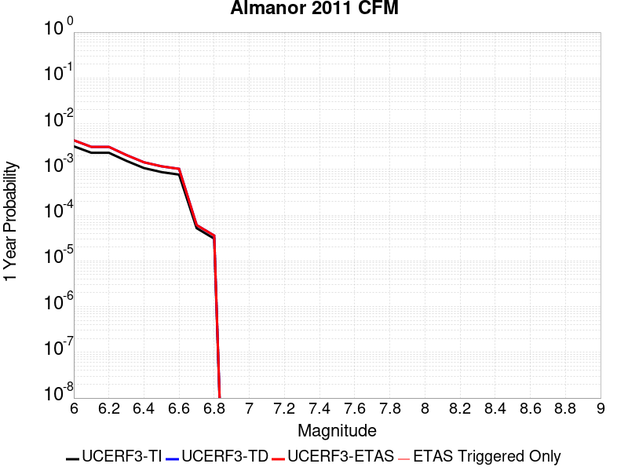 |  |

| Magnitude | 1 wk TI Prob | 1 wk TD Prob | 1 wk ETAS Prob | 1 wk ETAS/TD Gain | 1 wk ETAS Triggered Only | 1 mo TI Prob | 1 mo TD Prob | 1 mo ETAS Prob | 1 mo ETAS/TD Gain | 1 mo ETAS Triggered Only | 1 yr TI Prob | 1 yr TD Prob | 1 yr ETAS Prob | 1 yr ETAS/TD Gain | 1 yr ETAS Triggered Only | 10 yr TI Prob | 10 yr TD Prob | 10 yr ETAS Prob | 10 yr ETAS/TD Gain | 10 yr ETAS Triggered Only |
|-----|-----|-----|-----|-----|-----|-----|-----|-----|-----|-----|-----|-----|-----|-----|-----|-----|-----|-----|-----|-----|
| 6.0 | 6.1479834E-5 | 8.32779E-5 | 8.32779E-5 | 1.0 | 0.0 | 2.6345838E-4 | 3.5686235E-4 | 3.5686235E-4 | 1.0 | 0.0 | 0.0032028882 | 0.0043365774 | 0.0043365774 | 1.0 | 0.0 | 0.031571172 | 0.04258541 | 0.042594984 | 1.0002248 | 1.0E-5 |
| 6.1 | 4.4387216E-5 | 5.9769885E-5 | 5.9769885E-5 | 1.0 | 0.0 | 1.9021705E-4 | 2.561357E-4 | 2.561357E-4 | 1.0 | 0.0 | 0.0023134327 | 0.0031144004 | 0.0031144004 | 1.0 | 0.0 | 0.022894967 | 0.030754777 | 0.03076447 | 1.0003152 | 1.0E-5 |
| 6.2 | 4.4387216E-5 | 5.9769885E-5 | 5.9769885E-5 | 1.0 | 0.0 | 1.9021705E-4 | 2.561357E-4 | 2.561357E-4 | 1.0 | 0.0 | 0.0023134327 | 0.0031144004 | 0.0031144004 | 1.0 | 0.0 | 0.022894967 | 0.030754777 | 0.03076447 | 1.0003152 | 1.0E-5 |
| 6.3 | 2.9523822E-5 | 3.9546827E-5 | 3.9546827E-5 | 1.0 | 0.0 | 1.2652454E-4 | 1.6947828E-4 | 1.6947828E-4 | 1.0 | 0.0 | 0.0015393476 | 0.002061856 | 0.002061856 | 1.0 | 0.0 | 0.015287281 | 0.020460624 | 0.020460624 | 1.0 | 0.0 |
| 6.4 | 2.0512744E-5 | 2.7431366E-5 | 2.7431366E-5 | 1.0 | 0.0 | 8.79088E-5 | 1.1756013E-4 | 1.1756013E-4 | 1.0 | 0.0 | 0.001069764 | 0.0014307296 | 0.0014307296 | 1.0 | 0.0 | 0.010646289 | 0.014244295 | 0.014244295 | 1.0 | 0.0 |
| 6.5 | 1.6750226E-5 | 2.2391096E-5 | 2.2391096E-5 | 1.0 | 0.0 | 7.178471E-5 | 9.596065E-5 | 9.596065E-5 | 1.0 | 0.0 | 8.7362836E-4 | 0.0011680545 | 0.0011680545 | 1.0 | 0.0 | 0.008702018 | 0.011648942 | 0.011648942 | 1.0 | 0.0 |
| 6.6 | 1.4745303E-5 | 1.9707772E-5 | 1.9707772E-5 | 1.0 | 0.0 | 6.319262E-5 | 8.4461455E-5 | 8.4461455E-5 | 1.0 | 0.0 | 7.690986E-4 | 0.0010281889 | 0.0010281889 | 1.0 | 0.0 | 0.0076644225 | 0.010264887 | 0.010264887 | 1.0 | 0.0 |
| 6.7 | 9.951145E-7 | 1.1616295E-6 | 1.1616295E-6 | 1.0 | 0.0 | 4.26477E-6 | 4.9784035E-6 | 4.9784035E-6 | 1.0 | 0.0 | 5.1922336E-5 | 6.0610553E-5 | 6.0610553E-5 | 1.0 | 0.0 | 5.1910203E-4 | 6.0595747E-4 | 6.0595747E-4 | 1.0 | 0.0 |
| 6.8 | 5.866312E-7 | 6.8493534E-7 | 6.8493534E-7 | 1.0 | 0.0 | 2.5141312E-6 | 2.9354346E-6 | 2.9354346E-6 | 1.0 | 0.0 | 3.0609117E-5 | 3.5738463E-5 | 3.5738463E-5 | 1.0 | 0.0 | 3.06049E-4 | 3.5733997E-4 | 3.5733997E-4 | 1.0 | 0.0 |

## West Tahoe
*[(top)](#table-of-contents)*

| 1 Week | 1 Month | 1 Year | 10 Year |
|-----|-----|-----|-----|
|  |  |  |  |

| Magnitude | 1 wk TI Prob | 1 wk TD Prob | 1 wk ETAS Prob | 1 wk ETAS/TD Gain | 1 wk ETAS Triggered Only | 1 mo TI Prob | 1 mo TD Prob | 1 mo ETAS Prob | 1 mo ETAS/TD Gain | 1 mo ETAS Triggered Only | 1 yr TI Prob | 1 yr TD Prob | 1 yr ETAS Prob | 1 yr ETAS/TD Gain | 1 yr ETAS Triggered Only | 10 yr TI Prob | 10 yr TD Prob | 10 yr ETAS Prob | 10 yr ETAS/TD Gain | 10 yr ETAS Triggered Only |
|-----|-----|-----|-----|-----|-----|-----|-----|-----|-----|-----|-----|-----|-----|-----|-----|-----|-----|-----|-----|-----|
| 6.0 | 1.952444E-5 | 2.1183121E-5 | 3.118291E-5 | 1.4720639 | 1.0E-5 | 8.367348E-5 | 9.0781956E-5 | 1.0078105E-4 | 1.110144 | 1.0E-5 | 0.0010182485 | 0.0011047646 | 0.0011147537 | 1.0090417 | 1.0E-5 | 0.010135954 | 0.010998211 | 0.011008101 | 1.0008992 | 1.0E-5 |
| 6.1 | 1.952444E-5 | 2.1183121E-5 | 3.118291E-5 | 1.4720639 | 1.0E-5 | 8.367348E-5 | 9.0781956E-5 | 1.0078105E-4 | 1.110144 | 1.0E-5 | 0.0010182485 | 0.0011047646 | 0.0011147537 | 1.0090417 | 1.0E-5 | 0.010135954 | 0.010998211 | 0.011008101 | 1.0008992 | 1.0E-5 |
| 6.2 | 1.952444E-5 | 2.1183121E-5 | 3.118291E-5 | 1.4720639 | 1.0E-5 | 8.367348E-5 | 9.0781956E-5 | 1.0078105E-4 | 1.110144 | 1.0E-5 | 0.0010182485 | 0.0011047646 | 0.0011147537 | 1.0090417 | 1.0E-5 | 0.010135954 | 0.010998211 | 0.011008101 | 1.0008992 | 1.0E-5 |
| 6.3 | 1.952444E-5 | 2.1183121E-5 | 3.118291E-5 | 1.4720639 | 1.0E-5 | 8.367348E-5 | 9.0781956E-5 | 1.0078105E-4 | 1.110144 | 1.0E-5 | 0.0010182485 | 0.0011047646 | 0.0011147537 | 1.0090417 | 1.0E-5 | 0.010135954 | 0.010998211 | 0.011008101 | 1.0008992 | 1.0E-5 |
| 6.4 | 1.952444E-5 | 2.1183121E-5 | 3.118291E-5 | 1.4720639 | 1.0E-5 | 8.367348E-5 | 9.0781956E-5 | 1.0078105E-4 | 1.110144 | 1.0E-5 | 0.0010182485 | 0.0011047646 | 0.0011147537 | 1.0090417 | 1.0E-5 | 0.010135954 | 0.010998211 | 0.011008101 | 1.0008992 | 1.0E-5 |
| 6.5 | 1.2685271E-5 | 1.3690598E-5 | 2.3690462E-5 | 1.7304182 | 1.0E-5 | 5.4364315E-5 | 5.867277E-5 | 6.867218E-5 | 1.1704268 | 1.0E-5 | 6.616845E-4 | 7.141233E-4 | 7.2411617E-4 | 1.0139931 | 1.0E-5 | 0.0065971776 | 0.0071199345 | 0.0071298634 | 1.0013945 | 1.0E-5 |
| 6.6 | 1.2685271E-5 | 1.3690598E-5 | 2.3690462E-5 | 1.7304182 | 1.0E-5 | 5.4364315E-5 | 5.867277E-5 | 6.867218E-5 | 1.1704268 | 1.0E-5 | 6.616845E-4 | 7.141233E-4 | 7.2411617E-4 | 1.0139931 | 1.0E-5 | 0.0065971776 | 0.0071199345 | 0.0071298634 | 1.0013945 | 1.0E-5 |
| 6.7 | 9.117886E-6 | 9.809826E-6 | 1.9809728E-5 | 2.019376 | 1.0E-5 | 3.9076072E-5 | 4.2041476E-5 | 5.2041058E-5 | 1.2378503 | 1.0E-5 | 4.756473E-4 | 5.1174196E-4 | 5.2173686E-4 | 1.0195311 | 1.0E-5 | 0.0047463053 | 0.005106353 | 0.005116302 | 1.0019484 | 1.0E-5 |
| 6.8 | 8.786828E-6 | 9.457844E-6 | 1.945775E-5 | 2.0573134 | 1.0E-5 | 3.7657293E-5 | 4.0533025E-5 | 5.053262E-5 | 1.2467024 | 1.0E-5 | 4.5838108E-4 | 4.933849E-4 | 5.0337997E-4 | 1.0202582 | 1.0E-5 | 0.0045743673 | 0.004923596 | 0.0049335468 | 1.0020211 | 1.0E-5 |
| 6.9 | 6.7562123E-6 | 7.263794E-6 | 7.263794E-6 | 1.0 | 0.0 | 2.8954875E-5 | 3.1130203E-5 | 3.1130203E-5 | 1.0 | 0.0 | 3.5246857E-4 | 3.7894904E-4 | 3.7894904E-4 | 1.0 | 0.0 | 0.0035191004 | 0.0037835005 | 0.0037835005 | 1.0 | 0.0 |
| 7.0 | 5.1792854E-6 | 5.567327E-6 | 5.567327E-6 | 1.0 | 0.0 | 2.2196748E-5 | 2.3859777E-5 | 2.3859777E-5 | 1.0 | 0.0 | 2.702119E-4 | 2.9045786E-4 | 2.9045786E-4 | 1.0 | 0.0 | 0.0026988357 | 0.0029011576 | 0.0029011576 | 1.0 | 0.0 |
| 7.1 | 4.090765E-6 | 4.3974137E-6 | 4.3974137E-6 | 1.0 | 0.0 | 1.7531731E-5 | 1.8845942E-5 | 1.8845942E-5 | 1.0 | 0.0 | 2.134279E-4 | 2.2942858E-4 | 2.2942858E-4 | 1.0 | 0.0 | 0.0021322304 | 0.0022922517 | 0.0022922517 | 1.0 | 0.0 |
| 7.2 | 2.2356758E-6 | 2.4023636E-6 | 2.4023636E-6 | 1.0 | 0.0 | 9.581432E-6 | 1.0295814E-5 | 1.0295814E-5 | 1.0 | 0.0 | 1.1664769E-4 | 1.2534621E-4 | 1.2534621E-4 | 1.0 | 0.0 | 0.0011658648 | 0.001252941 | 0.001252941 | 1.0 | 0.0 |

## Ventura-Pitas Point
*[(top)](#table-of-contents)*

| 1 Week | 1 Month | 1 Year | 10 Year |
|-----|-----|-----|-----|
|  |  |  |  |

| Magnitude | 1 wk TI Prob | 1 wk TD Prob | 1 wk ETAS Prob | 1 wk ETAS/TD Gain | 1 wk ETAS Triggered Only | 1 mo TI Prob | 1 mo TD Prob | 1 mo ETAS Prob | 1 mo ETAS/TD Gain | 1 mo ETAS Triggered Only | 1 yr TI Prob | 1 yr TD Prob | 1 yr ETAS Prob | 1 yr ETAS/TD Gain | 1 yr ETAS Triggered Only | 10 yr TI Prob | 10 yr TD Prob | 10 yr ETAS Prob | 10 yr ETAS/TD Gain | 10 yr ETAS Triggered Only |
|-----|-----|-----|-----|-----|-----|-----|-----|-----|-----|-----|-----|-----|-----|-----|-----|-----|-----|-----|-----|-----|
| 6.0 | 3.3179622E-5 | 3.3735058E-5 | 4.3734723E-5 | 1.2964175 | 1.0E-5 | 1.4219063E-4 | 1.4457226E-4 | 1.5457082E-4 | 1.0691595 | 1.0E-5 | 0.0017297962 | 0.001759003 | 0.0017689855 | 1.0056751 | 1.0E-5 | 0.017163932 | 0.017476337 | 0.017486162 | 1.0005622 | 1.0E-5 |
| 6.1 | 3.3179622E-5 | 3.3735058E-5 | 4.3734723E-5 | 1.2964175 | 1.0E-5 | 1.4219063E-4 | 1.4457226E-4 | 1.5457082E-4 | 1.0691595 | 1.0E-5 | 0.0017297962 | 0.001759003 | 0.0017689855 | 1.0056751 | 1.0E-5 | 0.017163932 | 0.017476337 | 0.017486162 | 1.0005622 | 1.0E-5 |
| 6.2 | 3.3179622E-5 | 3.3735058E-5 | 4.3734723E-5 | 1.2964175 | 1.0E-5 | 1.4219063E-4 | 1.4457226E-4 | 1.5457082E-4 | 1.0691595 | 1.0E-5 | 0.0017297962 | 0.001759003 | 0.0017689855 | 1.0056751 | 1.0E-5 | 0.017163932 | 0.017476337 | 0.017486162 | 1.0005622 | 1.0E-5 |
| 6.3 | 3.3179622E-5 | 3.3735058E-5 | 4.3734723E-5 | 1.2964175 | 1.0E-5 | 1.4219063E-4 | 1.4457226E-4 | 1.5457082E-4 | 1.0691595 | 1.0E-5 | 0.0017297962 | 0.001759003 | 0.0017689855 | 1.0056751 | 1.0E-5 | 0.017163932 | 0.017476337 | 0.017486162 | 1.0005622 | 1.0E-5 |
| 6.4 | 1.8754668E-5 | 1.7019556E-5 | 1.7019556E-5 | 1.0 | 0.0 | 8.037467E-5 | 7.2939045E-5 | 7.2939045E-5 | 1.0 | 0.0 | 9.781223E-4 | 8.876942E-4 | 8.876942E-4 | 1.0 | 0.0 | 0.009738282 | 0.00884382 | 0.00884382 | 1.0 | 0.0 |
| 6.5 | 1.8754668E-5 | 1.7019556E-5 | 1.7019556E-5 | 1.0 | 0.0 | 8.037467E-5 | 7.2939045E-5 | 7.2939045E-5 | 1.0 | 0.0 | 9.781223E-4 | 8.876942E-4 | 8.876942E-4 | 1.0 | 0.0 | 0.009738282 | 0.00884382 | 0.00884382 | 1.0 | 0.0 |
| 6.6 | 1.4361558E-5 | 1.2122236E-5 | 1.2122236E-5 | 1.0 | 0.0 | 6.154808E-5 | 5.1951418E-5 | 5.1951418E-5 | 1.0 | 0.0 | 7.490902E-4 | 6.323272E-4 | 6.323272E-4 | 1.0 | 0.0 | 0.0074657016 | 0.006305537 | 0.006305537 | 1.0 | 0.0 |
| 6.7 | 1.4361558E-5 | 1.2122236E-5 | 1.2122236E-5 | 1.0 | 0.0 | 6.154808E-5 | 5.1951418E-5 | 5.1951418E-5 | 1.0 | 0.0 | 7.490902E-4 | 6.323272E-4 | 6.323272E-4 | 1.0 | 0.0 | 0.0074657016 | 0.006305537 | 0.006305537 | 1.0 | 0.0 |
| 6.8 | 1.3663846E-5 | 1.1344381E-5 | 1.1344381E-5 | 1.0 | 0.0 | 5.8558027E-5 | 4.8617883E-5 | 4.8617883E-5 | 1.0 | 0.0 | 7.127108E-4 | 5.917639E-4 | 5.917639E-4 | 1.0 | 0.0 | 0.007104293 | 0.005902097 | 0.005902097 | 1.0 | 0.0 |
| 6.9 | 1.3644157E-5 | 1.1322482E-5 | 1.1322482E-5 | 1.0 | 0.0 | 5.8473648E-5 | 4.852403E-5 | 4.852403E-5 | 1.0 | 0.0 | 7.116841E-4 | 5.9062184E-4 | 5.9062184E-4 | 1.0 | 0.0 | 0.007094092 | 0.0058907378 | 0.0058907378 | 1.0 | 0.0 |
| 7.0 | 1.3568845E-5 | 1.1242049E-5 | 1.1242049E-5 | 1.0 | 0.0 | 5.8150898E-5 | 4.8179332E-5 | 4.8179332E-5 | 1.0 | 0.0 | 7.077572E-4 | 5.864274E-4 | 5.864274E-4 | 1.0 | 0.0 | 0.007055073 | 0.0058490145 | 0.0058490145 | 1.0 | 0.0 |
| 7.1 | 1.306572E-5 | 1.0720505E-5 | 1.0720505E-5 | 1.0 | 0.0 | 5.599474E-5 | 4.5944224E-5 | 4.5944224E-5 | 1.0 | 0.0 | 6.815227E-4 | 5.5922923E-4 | 5.5922923E-4 | 1.0 | 0.0 | 0.0067943637 | 0.0055784243 | 0.0055784243 | 1.0 | 0.0 |
| 7.2 | 1.232604E-5 | 9.995112E-6 | 9.995112E-6 | 1.0 | 0.0 | 5.2824813E-5 | 4.28355E-5 | 4.28355E-5 | 1.0 | 0.0 | 6.429523E-4 | 5.213992E-4 | 5.213992E-4 | 1.0 | 0.0 | 0.0064109527 | 0.0052019507 | 0.0052019507 | 1.0 | 0.0 |
| 7.3 | 1.0917261E-5 | 8.843815E-6 | 8.843815E-6 | 1.0 | 0.0 | 4.678742E-5 | 3.7901522E-5 | 3.7901522E-5 | 1.0 | 0.0 | 5.69488E-4 | 4.6135488E-4 | 4.6135488E-4 | 1.0 | 0.0 | 0.0056803077 | 0.004604137 | 0.004604137 | 1.0 | 0.0 |
| 7.4 | 1.039959E-5 | 8.423539E-6 | 8.423539E-6 | 1.0 | 0.0 | 4.456891E-5 | 3.6100388E-5 | 3.6100388E-5 | 1.0 | 0.0 | 5.424914E-4 | 4.3943513E-4 | 4.3943513E-4 | 1.0 | 0.0 | 0.0054116896 | 0.0043858234 | 0.0043858234 | 1.0 | 0.0 |
| 7.5 | 9.015877E-6 | 7.297526E-6 | 7.297526E-6 | 1.0 | 0.0 | 3.86389E-5 | 3.1274743E-5 | 3.1274743E-5 | 1.0 | 0.0 | 4.7032707E-4 | 3.8070488E-4 | 3.8070488E-4 | 1.0 | 0.0 | 0.004693329 | 0.003800672 | 0.003800672 | 1.0 | 0.0 |
| 7.6 | 4.900162E-6 | 3.874108E-6 | 3.874108E-6 | 1.0 | 0.0 | 2.1000526E-5 | 1.6603217E-5 | 1.6603217E-5 | 1.0 | 0.0 | 2.556514E-4 | 2.0212553E-4 | 2.0212553E-4 | 1.0 | 0.0 | 0.0025535747 | 0.0020194307 | 0.0020194307 | 1.0 | 0.0 |
| 7.7 | 3.8850626E-6 | 3.1267248E-6 | 3.1267248E-6 | 1.0 | 0.0 | 1.6650163E-5 | 1.340018E-5 | 1.340018E-5 | 1.0 | 0.0 | 2.0269687E-4 | 1.6313508E-4 | 1.6313508E-4 | 1.0 | 0.0 | 0.002025121 | 0.0016301625 | 0.0016301625 | 1.0 | 0.0 |
| 7.8 | 2.4654719E-6 | 2.0298717E-6 | 2.0298717E-6 | 1.0 | 0.0 | 1.0566265E-5 | 8.699421E-6 | 8.699421E-6 | 1.0 | 0.0 | 1.2863669E-4 | 1.0591035E-4 | 1.0591035E-4 | 1.0 | 0.0 | 0.0012856225 | 0.0010586034 | 0.0010586034 | 1.0 | 0.0 |
| 7.9 | 4.095894E-7 | 3.276471E-7 | 3.276471E-7 | 1.0 | 0.0 | 1.7553821E-6 | 1.404201E-6 | 1.404201E-6 | 1.0 | 0.0 | 2.1371567E-5 | 1.7096016E-5 | 1.7096016E-5 | 1.0 | 0.0 | 2.1369511E-4 | 1.7094731E-4 | 1.7094731E-4 | 1.0 | 0.0 |
| 8.0 | 7.791402E-9 | 5.6834857E-9 | 5.6834857E-9 | 1.0 | 0.0 | 3.3391725E-8 | 2.4357796E-8 | 2.4357796E-8 | 1.0 | 0.0 | 4.0654416E-7 | 2.9655615E-7 | 2.9655615E-7 | 1.0 | 0.0 | 4.065434E-6 | 2.9655596E-6 | 2.9655596E-6 | 1.0 | 0.0 |

## Santa Cruz Island
*[(top)](#table-of-contents)*

| 1 Week | 1 Month | 1 Year | 10 Year |
|-----|-----|-----|-----|
|  |  |  |  |

| Magnitude | 1 wk TI Prob | 1 wk TD Prob | 1 wk ETAS Prob | 1 wk ETAS/TD Gain | 1 wk ETAS Triggered Only | 1 mo TI Prob | 1 mo TD Prob | 1 mo ETAS Prob | 1 mo ETAS/TD Gain | 1 mo ETAS Triggered Only | 1 yr TI Prob | 1 yr TD Prob | 1 yr ETAS Prob | 1 yr ETAS/TD Gain | 1 yr ETAS Triggered Only | 10 yr TI Prob | 10 yr TD Prob | 10 yr ETAS Prob | 10 yr ETAS/TD Gain | 10 yr ETAS Triggered Only |
|-----|-----|-----|-----|-----|-----|-----|-----|-----|-----|-----|-----|-----|-----|-----|-----|-----|-----|-----|-----|-----|
| 6.0 | 2.9164563E-5 | 3.1599673E-5 | 3.1599673E-5 | 1.0 | 0.0 | 1.2498499E-4 | 1.3542091E-4 | 1.3542091E-4 | 1.0 | 0.0 | 0.0015206301 | 0.0016476389 | 0.0016576224 | 1.0060593 | 1.0E-5 | 0.015102667 | 0.016367963 | 0.0163778 | 1.0006009 | 1.0E-5 |
| 6.1 | 2.9164563E-5 | 3.1599673E-5 | 3.1599673E-5 | 1.0 | 0.0 | 1.2498499E-4 | 1.3542091E-4 | 1.3542091E-4 | 1.0 | 0.0 | 0.0015206301 | 0.0016476389 | 0.0016576224 | 1.0060593 | 1.0E-5 | 0.015102667 | 0.016367963 | 0.0163778 | 1.0006009 | 1.0E-5 |
| 6.2 | 2.9164563E-5 | 3.1599673E-5 | 3.1599673E-5 | 1.0 | 0.0 | 1.2498499E-4 | 1.3542091E-4 | 1.3542091E-4 | 1.0 | 0.0 | 0.0015206301 | 0.0016476389 | 0.0016576224 | 1.0060593 | 1.0E-5 | 0.015102667 | 0.016367963 | 0.0163778 | 1.0006009 | 1.0E-5 |
| 6.3 | 1.6635553E-5 | 1.7804325E-5 | 1.7804325E-5 | 1.0 | 0.0 | 7.1293274E-5 | 7.630212E-5 | 7.630212E-5 | 1.0 | 0.0 | 8.6765E-4 | 9.286006E-4 | 9.385913E-4 | 1.0107589 | 1.0E-5 | 0.008642701 | 0.009249076 | 0.009258984 | 1.0010712 | 1.0E-5 |
| 6.4 | 1.6635553E-5 | 1.7804325E-5 | 1.7804325E-5 | 1.0 | 0.0 | 7.1293274E-5 | 7.630212E-5 | 7.630212E-5 | 1.0 | 0.0 | 8.6765E-4 | 9.286006E-4 | 9.385913E-4 | 1.0107589 | 1.0E-5 | 0.008642701 | 0.009249076 | 0.009258984 | 1.0010712 | 1.0E-5 |
| 6.5 | 1.2238748E-5 | 1.3042973E-5 | 1.3042973E-5 | 1.0 | 0.0 | 5.2450723E-5 | 5.5897275E-5 | 5.5897275E-5 | 1.0 | 0.0 | 6.3840044E-4 | 6.803405E-4 | 6.903337E-4 | 1.0146885 | 1.0E-5 | 0.0063656955 | 0.006782976 | 0.006792908 | 1.0014642 | 1.0E-5 |
| 6.6 | 1.0489767E-5 | 1.1156617E-5 | 1.1156617E-5 | 1.0 | 0.0 | 4.495537E-5 | 4.7813206E-5 | 4.7813206E-5 | 1.0 | 0.0 | 5.4719415E-4 | 5.8197253E-4 | 5.9196673E-4 | 1.0171729 | 1.0E-5 | 0.005458487 | 0.005804726 | 0.005814668 | 1.0017127 | 1.0E-5 |
| 6.7 | 8.699222E-6 | 9.236766E-6 | 9.236766E-6 | 1.0 | 0.0 | 3.7281847E-5 | 3.9585546E-5 | 3.9585546E-5 | 1.0 | 0.0 | 4.5381195E-4 | 4.8184796E-4 | 4.9184315E-4 | 1.0207435 | 1.0E-5 | 0.0045288634 | 0.0048081 | 0.0048180516 | 1.0020698 | 1.0E-5 |
| 6.8 | 8.307732E-6 | 8.816889E-6 | 8.816889E-6 | 1.0 | 0.0 | 3.560408E-5 | 3.7786125E-5 | 3.7786125E-5 | 1.0 | 0.0 | 4.3339343E-4 | 4.5994937E-4 | 4.699448E-4 | 1.0217315 | 1.0E-5 | 0.004325492 | 0.0045900275 | 0.004599982 | 1.0021687 | 1.0E-5 |
| 6.9 | 8.073121E-6 | 8.564924E-6 | 8.564924E-6 | 1.0 | 0.0 | 3.459863E-5 | 3.6706308E-5 | 3.6706308E-5 | 1.0 | 0.0 | 4.2115687E-4 | 4.4680806E-4 | 4.568036E-4 | 1.0223709 | 1.0E-5 | 0.004203596 | 0.0044591487 | 0.004469104 | 1.0022326 | 1.0E-5 |
| 7.0 | 7.617019E-6 | 8.074651E-6 | 8.074651E-6 | 1.0 | 0.0 | 3.264396E-5 | 3.460519E-5 | 3.460519E-5 | 1.0 | 0.0 | 3.9736772E-4 | 4.2123714E-4 | 4.2123714E-4 | 1.0 | 0.0 | 0.003966579 | 0.0042044343 | 0.0042044343 | 1.0 | 0.0 |
| 7.1 | 7.1224836E-6 | 7.5457756E-6 | 7.5457756E-6 | 1.0 | 0.0 | 3.052457E-5 | 3.2338638E-5 | 3.2338638E-5 | 1.0 | 0.0 | 3.715733E-4 | 3.9365215E-4 | 3.9365215E-4 | 1.0 | 0.0 | 0.003709526 | 0.0039295917 | 0.0039295917 | 1.0 | 0.0 |
| 7.2 | 6.441115E-6 | 6.827372E-6 | 6.827372E-6 | 1.0 | 0.0 | 2.7604487E-5 | 2.925984E-5 | 2.925984E-5 | 1.0 | 0.0 | 3.360328E-4 | 3.5618054E-4 | 3.5618054E-4 | 1.0 | 0.0 | 0.0033552512 | 0.003556125 | 0.003556125 | 1.0 | 0.0 |
| 7.3 | 5.494274E-6 | 5.819985E-6 | 5.819985E-6 | 1.0 | 0.0 | 2.3546674E-5 | 2.4942556E-5 | 2.4942556E-5 | 1.0 | 0.0 | 2.8664304E-4 | 3.0363348E-4 | 3.0363348E-4 | 1.0 | 0.0 | 0.002862736 | 0.0030322094 | 0.0030322094 | 1.0 | 0.0 |
| 7.4 | 4.0802624E-6 | 4.3122495E-6 | 4.3122495E-6 | 1.0 | 0.0 | 1.7486722E-5 | 1.8480938E-5 | 1.8480938E-5 | 1.0 | 0.0 | 2.1288003E-4 | 2.2498227E-4 | 2.2498227E-4 | 1.0 | 0.0 | 0.0021267622 | 0.002247554 | 0.002247554 | 1.0 | 0.0 |
| 7.5 | 2.3584746E-6 | 2.475306E-6 | 2.475306E-6 | 1.0 | 0.0 | 1.0107709E-5 | 1.0608412E-5 | 1.0608412E-5 | 1.0 | 0.0 | 1.2305441E-4 | 1.291498E-4 | 1.291498E-4 | 1.0 | 0.0 | 0.0012298629 | 0.0012907526 | 0.0012907526 | 1.0 | 0.0 |
| 7.6 | 9.4981914E-7 | 9.860919E-7 | 9.860919E-7 | 1.0 | 0.0 | 4.0706473E-6 | 4.2261013E-6 | 4.2261013E-6 | 1.0 | 0.0 | 4.9559E-5 | 5.145158E-5 | 5.145158E-5 | 1.0 | 0.0 | 4.954795E-4 | 5.14398E-4 | 5.14398E-4 | 1.0 | 0.0 |
| 7.7 | 2.6013532E-7 | 2.641658E-7 | 2.641658E-7 | 1.0 | 0.0 | 1.1148652E-6 | 1.1321387E-6 | 1.1321387E-6 | 1.0 | 0.0 | 1.3573399E-5 | 1.3783702E-5 | 1.3783702E-5 | 1.0 | 0.0 | 1.357257E-4 | 1.3782854E-4 | 1.3782854E-4 | 1.0 | 0.0 |
| 7.8 | 4.1522263E-8 | 3.965676E-8 | 3.965676E-8 | 1.0 | 0.0 | 1.7795254E-7 | 1.6995754E-7 | 1.6995754E-7 | 1.0 | 0.0 | 2.16657E-6 | 2.0692314E-6 | 2.0692314E-6 | 1.0 | 0.0 | 2.1665488E-5 | 2.0692141E-5 | 2.0692141E-5 | 1.0 | 0.0 |
| 7.9 | 7.7242046E-10 | 5.946812E-10 | 5.946812E-10 | 1.0 | 0.0 | 3.3103735E-9 | 2.5486335E-9 | 2.5486335E-9 | 1.0 | 0.0 | 4.0303796E-8 | 3.1029614E-8 | 3.1029614E-8 | 1.0 | 0.0 | 4.030379E-7 | 3.102961E-7 | 3.102961E-7 | 1.0 | 0.0 |

## Channel Islands Thrust
*[(top)](#table-of-contents)*

| 1 Week | 1 Month | 1 Year | 10 Year |
|-----|-----|-----|-----|
|  |  |  |  |

| Magnitude | 1 wk TI Prob | 1 wk TD Prob | 1 wk ETAS Prob | 1 wk ETAS/TD Gain | 1 wk ETAS Triggered Only | 1 mo TI Prob | 1 mo TD Prob | 1 mo ETAS Prob | 1 mo ETAS/TD Gain | 1 mo ETAS Triggered Only | 1 yr TI Prob | 1 yr TD Prob | 1 yr ETAS Prob | 1 yr ETAS/TD Gain | 1 yr ETAS Triggered Only | 10 yr TI Prob | 10 yr TD Prob | 10 yr ETAS Prob | 10 yr ETAS/TD Gain | 10 yr ETAS Triggered Only |
|-----|-----|-----|-----|-----|-----|-----|-----|-----|-----|-----|-----|-----|-----|-----|-----|-----|-----|-----|-----|-----|
| 6.0 | 2.2156251E-5 | 2.4091965E-5 | 2.4091965E-5 | 1.0 | 0.0 | 9.495191E-5 | 1.03247796E-4 | 1.03247796E-4 | 1.0 | 0.0 | 0.0011554264 | 0.0012564235 | 0.001266411 | 1.0079491 | 1.0E-5 | 0.011494373 | 0.012503792 | 0.012513666 | 1.0007898 | 1.0E-5 |
| 6.1 | 2.2156251E-5 | 2.4091965E-5 | 2.4091965E-5 | 1.0 | 0.0 | 9.495191E-5 | 1.03247796E-4 | 1.03247796E-4 | 1.0 | 0.0 | 0.0011554264 | 0.0012564235 | 0.001266411 | 1.0079491 | 1.0E-5 | 0.011494373 | 0.012503792 | 0.012513666 | 1.0007898 | 1.0E-5 |
| 6.2 | 2.2156251E-5 | 2.4091965E-5 | 2.4091965E-5 | 1.0 | 0.0 | 9.495191E-5 | 1.03247796E-4 | 1.03247796E-4 | 1.0 | 0.0 | 0.0011554264 | 0.0012564235 | 0.001266411 | 1.0079491 | 1.0E-5 | 0.011494373 | 0.012503792 | 0.012513666 | 1.0007898 | 1.0E-5 |
| 6.3 | 2.2156251E-5 | 2.4091965E-5 | 2.4091965E-5 | 1.0 | 0.0 | 9.495191E-5 | 1.03247796E-4 | 1.03247796E-4 | 1.0 | 0.0 | 0.0011554264 | 0.0012564235 | 0.001266411 | 1.0079491 | 1.0E-5 | 0.011494373 | 0.012503792 | 0.012513666 | 1.0007898 | 1.0E-5 |
| 6.4 | 2.2156251E-5 | 2.4091965E-5 | 2.4091965E-5 | 1.0 | 0.0 | 9.495191E-5 | 1.03247796E-4 | 1.03247796E-4 | 1.0 | 0.0 | 0.0011554264 | 0.0012564235 | 0.001266411 | 1.0079491 | 1.0E-5 | 0.011494373 | 0.012503792 | 0.012513666 | 1.0007898 | 1.0E-5 |
| 6.5 | 2.2156251E-5 | 2.4091965E-5 | 2.4091965E-5 | 1.0 | 0.0 | 9.495191E-5 | 1.03247796E-4 | 1.03247796E-4 | 1.0 | 0.0 | 0.0011554264 | 0.0012564235 | 0.001266411 | 1.0079491 | 1.0E-5 | 0.011494373 | 0.012503792 | 0.012513666 | 1.0007898 | 1.0E-5 |
| 6.6 | 2.2156251E-5 | 2.4091965E-5 | 2.4091965E-5 | 1.0 | 0.0 | 9.495191E-5 | 1.03247796E-4 | 1.03247796E-4 | 1.0 | 0.0 | 0.0011554264 | 0.0012564235 | 0.001266411 | 1.0079491 | 1.0E-5 | 0.011494373 | 0.012503792 | 0.012513666 | 1.0007898 | 1.0E-5 |
| 6.7 | 1.0601296E-5 | 1.1379521E-5 | 1.1379521E-5 | 1.0 | 0.0 | 4.5433335E-5 | 4.8768492E-5 | 4.8768492E-5 | 1.0 | 0.0 | 5.5301044E-4 | 5.935995E-4 | 6.035936E-4 | 1.0168364 | 1.0E-5 | 0.005516363 | 0.0059206416 | 0.0059305825 | 1.0016791 | 1.0E-5 |
| 6.8 | 1.0246747E-5 | 1.0996647E-5 | 1.0996647E-5 | 1.0 | 0.0 | 4.391389E-5 | 4.712766E-5 | 4.712766E-5 | 1.0 | 0.0 | 5.345204E-4 | 5.73633E-4 | 5.8362726E-4 | 1.0174228 | 1.0E-5 | 0.0053323656 | 0.0057220133 | 0.005731956 | 1.0017376 | 1.0E-5 |
| 6.9 | 9.049551E-6 | 9.6996255E-6 | 9.6996255E-6 | 1.0 | 0.0 | 3.878322E-5 | 4.1569183E-5 | 4.1569183E-5 | 1.0 | 0.0 | 4.7208337E-4 | 5.059914E-4 | 5.1598635E-4 | 1.0197532 | 1.0E-5 | 0.0047108172 | 0.0050488105 | 0.00505876 | 1.0019706 | 1.0E-5 |
| 7.0 | 8.6542195E-6 | 9.274585E-6 | 9.274585E-6 | 1.0 | 0.0 | 3.7088983E-5 | 3.974764E-5 | 3.974764E-5 | 1.0 | 0.0 | 4.5146482E-4 | 4.8382411E-4 | 4.938193E-4 | 1.0206586 | 1.0E-5 | 0.004505487 | 0.0048281197 | 0.0048380713 | 1.0020612 | 1.0E-5 |
| 7.1 | 8.391028E-6 | 8.992907E-6 | 8.992907E-6 | 1.0 | 0.0 | 3.5961057E-5 | 3.8540486E-5 | 3.8540486E-5 | 1.0 | 0.0 | 4.3773788E-4 | 4.6913346E-4 | 4.7912876E-4 | 1.0213059 | 1.0E-5 | 0.004368766 | 0.004681841 | 0.0046917945 | 1.0021259 | 1.0E-5 |
| 7.2 | 5.965188E-6 | 6.3716834E-6 | 6.3716834E-6 | 1.0 | 0.0 | 2.556484E-5 | 2.7306933E-5 | 2.7306933E-5 | 1.0 | 0.0 | 3.1120746E-4 | 3.3241173E-4 | 3.424084E-4 | 1.0300732 | 1.0E-5 | 0.00310772 | 0.0033192032 | 0.00332917 | 1.0030028 | 1.0E-5 |
| 7.3 | 4.877518E-6 | 5.205997E-6 | 5.205997E-6 | 1.0 | 0.0 | 2.0903482E-5 | 2.2311227E-5 | 2.2311227E-5 | 1.0 | 0.0 | 2.5447016E-4 | 2.7160576E-4 | 2.8160305E-4 | 1.036808 | 1.0E-5 | 0.0025417898 | 0.0027127846 | 0.0027227574 | 1.0036763 | 1.0E-5 |
| 7.4 | 3.8829853E-6 | 4.1418552E-6 | 4.1418552E-6 | 1.0 | 0.0 | 1.664126E-5 | 1.775069E-5 | 1.775069E-5 | 1.0 | 0.0 | 2.0258849E-4 | 2.1609363E-4 | 2.1609363E-4 | 1.0 | 0.0 | 0.002024039 | 0.0021588767 | 0.0021588767 | 1.0 | 0.0 |
| 7.5 | 1.3489616E-6 | 1.4277878E-6 | 1.4277878E-6 | 1.0 | 0.0 | 5.7812517E-6 | 6.1190767E-6 | 6.1190767E-6 | 1.0 | 0.0 | 7.038446E-5 | 7.449725E-5 | 7.449725E-5 | 1.0 | 0.0 | 7.036218E-4 | 7.4472674E-4 | 7.4472674E-4 | 1.0 | 0.0 |
| 7.6 | 6.058192E-7 | 6.353767E-7 | 6.353767E-7 | 1.0 | 0.0 | 2.5963652E-6 | 2.7230403E-6 | 2.7230403E-6 | 1.0 | 0.0 | 3.161029E-5 | 3.3152526E-5 | 3.3152526E-5 | 1.0 | 0.0 | 3.1605794E-4 | 3.3147744E-4 | 3.3147744E-4 | 1.0 | 0.0 |
| 7.7 | 2.2170494E-7 | 2.2607867E-7 | 2.2607867E-7 | 1.0 | 0.0 | 9.5016367E-7 | 9.689082E-7 | 9.689082E-7 | 1.0 | 0.0 | 1.1568181E-5 | 1.17964055E-5 | 1.17964055E-5 | 1.0 | 0.0 | 1.1567579E-4 | 1.1795891E-4 | 1.1795891E-4 | 1.0 | 0.0 |
| 7.8 | 2.1613102E-8 | 1.546666E-8 | 1.546666E-8 | 1.0 | 0.0 | 9.262757E-8 | 6.6285686E-8 | 6.6285686E-8 | 1.0 | 0.0 | 1.1277401E-6 | 8.0702796E-7 | 8.0702796E-7 | 1.0 | 0.0 | 1.1277344E-5 | 8.070258E-6 | 8.070258E-6 | 1.0 | 0.0 |

## Pine Mtn
*[(top)](#table-of-contents)*

| 1 Week | 1 Month | 1 Year | 10 Year |
|-----|-----|-----|-----|
|  | 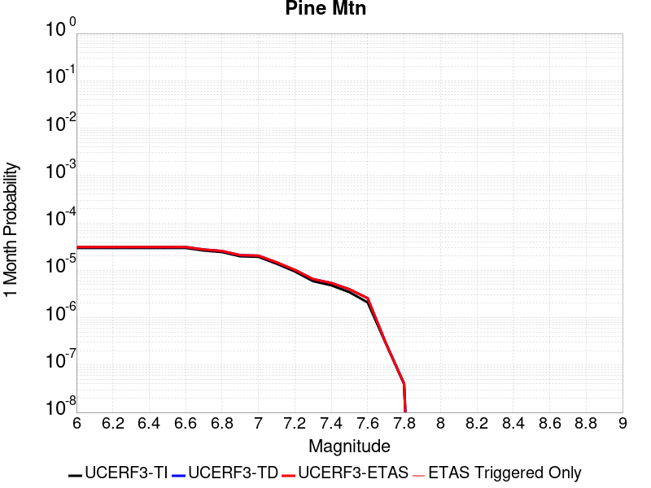 |  |  |

| Magnitude | 1 wk TI Prob | 1 wk TD Prob | 1 wk ETAS Prob | 1 wk ETAS/TD Gain | 1 wk ETAS Triggered Only | 1 mo TI Prob | 1 mo TD Prob | 1 mo ETAS Prob | 1 mo ETAS/TD Gain | 1 mo ETAS Triggered Only | 1 yr TI Prob | 1 yr TD Prob | 1 yr ETAS Prob | 1 yr ETAS/TD Gain | 1 yr ETAS Triggered Only | 10 yr TI Prob | 10 yr TD Prob | 10 yr ETAS Prob | 10 yr ETAS/TD Gain | 10 yr ETAS Triggered Only |
|-----|-----|-----|-----|-----|-----|-----|-----|-----|-----|-----|-----|-----|-----|-----|-----|-----|-----|-----|-----|-----|
| 6.0 | 6.894797E-6 | 7.2254406E-6 | 7.2254406E-6 | 1.0 | 0.0 | 2.9548795E-5 | 3.0965824E-5 | 3.0965824E-5 | 1.0 | 0.0 | 3.596972E-4 | 3.7694667E-4 | 3.869429E-4 | 1.026519 | 1.0E-5 | 0.0035911554 | 0.0037633702 | 0.0037733326 | 1.0026472 | 1.0E-5 |
| 6.1 | 6.894797E-6 | 7.2254406E-6 | 7.2254406E-6 | 1.0 | 0.0 | 2.9548795E-5 | 3.0965824E-5 | 3.0965824E-5 | 1.0 | 0.0 | 3.596972E-4 | 3.7694667E-4 | 3.869429E-4 | 1.026519 | 1.0E-5 | 0.0035911554 | 0.0037633702 | 0.0037733326 | 1.0026472 | 1.0E-5 |
| 6.2 | 6.894797E-6 | 7.2254406E-6 | 7.2254406E-6 | 1.0 | 0.0 | 2.9548795E-5 | 3.0965824E-5 | 3.0965824E-5 | 1.0 | 0.0 | 3.596972E-4 | 3.7694667E-4 | 3.869429E-4 | 1.026519 | 1.0E-5 | 0.0035911554 | 0.0037633702 | 0.0037733326 | 1.0026472 | 1.0E-5 |
| 6.3 | 6.894797E-6 | 7.2254406E-6 | 7.2254406E-6 | 1.0 | 0.0 | 2.9548795E-5 | 3.0965824E-5 | 3.0965824E-5 | 1.0 | 0.0 | 3.596972E-4 | 3.7694667E-4 | 3.869429E-4 | 1.026519 | 1.0E-5 | 0.0035911554 | 0.0037633702 | 0.0037733326 | 1.0026472 | 1.0E-5 |
| 6.4 | 6.894797E-6 | 7.2254406E-6 | 7.2254406E-6 | 1.0 | 0.0 | 2.9548795E-5 | 3.0965824E-5 | 3.0965824E-5 | 1.0 | 0.0 | 3.596972E-4 | 3.7694667E-4 | 3.869429E-4 | 1.026519 | 1.0E-5 | 0.0035911554 | 0.0037633702 | 0.0037733326 | 1.0026472 | 1.0E-5 |
| 6.5 | 6.894797E-6 | 7.2254406E-6 | 7.2254406E-6 | 1.0 | 0.0 | 2.9548795E-5 | 3.0965824E-5 | 3.0965824E-5 | 1.0 | 0.0 | 3.596972E-4 | 3.7694667E-4 | 3.869429E-4 | 1.026519 | 1.0E-5 | 0.0035911554 | 0.0037633702 | 0.0037733326 | 1.0026472 | 1.0E-5 |
| 6.6 | 6.894797E-6 | 7.2254406E-6 | 7.2254406E-6 | 1.0 | 0.0 | 2.9548795E-5 | 3.0965824E-5 | 3.0965824E-5 | 1.0 | 0.0 | 3.596972E-4 | 3.7694667E-4 | 3.869429E-4 | 1.026519 | 1.0E-5 | 0.0035911554 | 0.0037633702 | 0.0037733326 | 1.0026472 | 1.0E-5 |
| 6.7 | 6.0867933E-6 | 6.3970933E-6 | 6.3970933E-6 | 1.0 | 0.0 | 2.6085996E-5 | 2.7415837E-5 | 2.7415837E-5 | 1.0 | 0.0 | 3.1755073E-4 | 3.337389E-4 | 3.4373556E-4 | 1.0299536 | 1.0E-5 | 0.0031709734 | 0.003332596 | 0.0033425626 | 1.0029907 | 1.0E-5 |
| 6.8 | 5.6530425E-6 | 5.950576E-6 | 5.950576E-6 | 1.0 | 0.0 | 2.42271E-5 | 2.550223E-5 | 2.550223E-5 | 1.0 | 0.0 | 2.94925E-4 | 3.1044747E-4 | 3.2044438E-4 | 1.0322015 | 1.0E-5 | 0.002945339 | 0.0031003426 | 0.0031103117 | 1.0032154 | 1.0E-5 |
| 6.9 | 4.6015225E-6 | 4.8638153E-6 | 4.8638153E-6 | 1.0 | 0.0 | 1.9720663E-5 | 2.0844764E-5 | 2.0844764E-5 | 1.0 | 0.0 | 2.4007261E-4 | 2.537569E-4 | 2.6375437E-4 | 1.0393978 | 1.0E-5 | 0.0023981342 | 0.0025348158 | 0.0025447903 | 1.0039351 | 1.0E-5 |
| 7.0 | 4.4875965E-6 | 4.7474546E-6 | 4.7474546E-6 | 1.0 | 0.0 | 1.9232413E-5 | 2.0346082E-5 | 2.0346082E-5 | 1.0 | 0.0 | 2.3412947E-4 | 2.4768684E-4 | 2.5768438E-4 | 1.0403636 | 1.0E-5 | 0.0023388295 | 0.0024742517 | 0.002484227 | 1.0040317 | 1.0E-5 |
| 7.1 | 3.203907E-6 | 3.4293919E-6 | 3.4293919E-6 | 1.0 | 0.0 | 1.3730958E-5 | 1.4697314E-5 | 1.4697314E-5 | 1.0 | 0.0 | 1.6716159E-4 | 1.7892578E-4 | 1.7892578E-4 | 1.0 | 0.0 | 0.0016703589 | 0.0017878833 | 0.0017878833 | 1.0 | 0.0 |
| 7.2 | 2.2060601E-6 | 2.3784671E-6 | 2.3784671E-6 | 1.0 | 0.0 | 9.4545085E-6 | 1.0193393E-5 | 1.0193393E-5 | 1.0 | 0.0 | 1.15102564E-4 | 1.2409795E-4 | 1.2409795E-4 | 1.0 | 0.0 | 0.0011504296 | 0.0012403313 | 0.0012403313 | 1.0 | 0.0 |
| 7.3 | 1.3765207E-6 | 1.5216351E-6 | 1.5216351E-6 | 1.0 | 0.0 | 5.899361E-6 | 6.521277E-6 | 6.521277E-6 | 1.0 | 0.0 | 7.182235E-5 | 7.939375E-5 | 7.939375E-5 | 1.0 | 0.0 | 7.1799144E-4 | 7.9366297E-4 | 7.9366297E-4 | 1.0 | 0.0 |
| 7.4 | 1.1245983E-6 | 1.2586958E-6 | 1.2586958E-6 | 1.0 | 0.0 | 4.819698E-6 | 5.3944E-6 | 5.3944E-6 | 1.0 | 0.0 | 5.8678244E-5 | 6.5674925E-5 | 6.5674925E-5 | 1.0 | 0.0 | 5.866275E-4 | 6.5656344E-4 | 6.5656344E-4 | 1.0 | 0.0 |
| 7.5 | 8.031682E-7 | 9.276842E-7 | 9.276842E-7 | 1.0 | 0.0 | 3.4421448E-6 | 3.975784E-6 | 3.975784E-6 | 1.0 | 0.0 | 4.1907308E-5 | 4.840416E-5 | 4.840416E-5 | 1.0 | 0.0 | 4.1899405E-4 | 4.8394292E-4 | 4.8394292E-4 | 1.0 | 0.0 |
| 7.6 | 4.8953444E-7 | 6.0029123E-7 | 6.0029123E-7 | 1.0 | 0.0 | 2.098003E-6 | 2.5726742E-6 | 2.5726742E-6 | 1.0 | 0.0 | 2.5542888E-5 | 3.132191E-5 | 3.132191E-5 | 1.0 | 0.0 | 2.5539953E-4 | 3.131798E-4 | 3.131798E-4 | 1.0 | 0.0 |
| 7.7 | 6.634529E-8 | 6.7888216E-8 | 6.7888216E-8 | 1.0 | 0.0 | 2.843369E-7 | 2.9094946E-7 | 2.9094946E-7 | 1.0 | 0.0 | 3.4617963E-6 | 3.5423045E-6 | 3.5423045E-6 | 1.0 | 0.0 | 3.4617424E-5 | 3.5422527E-5 | 3.5422527E-5 | 1.0 | 0.0 |
| 7.8 | 9.235578E-9 | 9.488559E-9 | 9.488559E-9 | 1.0 | 0.0 | 3.9581046E-8 | 4.0665252E-8 | 4.0665252E-8 | 1.0 | 0.0 | 4.818991E-7 | 4.9509936E-7 | 4.9509936E-7 | 1.0 | 0.0 | 4.8189804E-6 | 4.950984E-6 | 4.950984E-6 | 1.0 | 0.0 |

## Santa Susana alt 1
*[(top)](#table-of-contents)*

| 1 Week | 1 Month | 1 Year | 10 Year |
|-----|-----|-----|-----|
|  |  |  |  |

| Magnitude | 1 wk TI Prob | 1 wk TD Prob | 1 wk ETAS Prob | 1 wk ETAS/TD Gain | 1 wk ETAS Triggered Only | 1 mo TI Prob | 1 mo TD Prob | 1 mo ETAS Prob | 1 mo ETAS/TD Gain | 1 mo ETAS Triggered Only | 1 yr TI Prob | 1 yr TD Prob | 1 yr ETAS Prob | 1 yr ETAS/TD Gain | 1 yr ETAS Triggered Only | 10 yr TI Prob | 10 yr TD Prob | 10 yr ETAS Prob | 10 yr ETAS/TD Gain | 10 yr ETAS Triggered Only |
|-----|-----|-----|-----|-----|-----|-----|-----|-----|-----|-----|-----|-----|-----|-----|-----|-----|-----|-----|-----|-----|
| 6.0 | 2.674877E-5 | 2.7197899E-5 | 2.7197899E-5 | 1.0 | 0.0 | 1.1463255E-4 | 1.1655786E-4 | 1.1655786E-4 | 1.0 | 0.0 | 0.0013947578 | 0.0014182818 | 0.0014282676 | 1.0070407 | 1.0E-5 | 0.013860362 | 0.014104064 | 0.014113923 | 1.000699 | 1.0E-5 |
| 6.1 | 2.674877E-5 | 2.7197899E-5 | 2.7197899E-5 | 1.0 | 0.0 | 1.1463255E-4 | 1.1655786E-4 | 1.1655786E-4 | 1.0 | 0.0 | 0.0013947578 | 0.0014182818 | 0.0014282676 | 1.0070407 | 1.0E-5 | 0.013860362 | 0.014104064 | 0.014113923 | 1.000699 | 1.0E-5 |
| 6.2 | 2.674877E-5 | 2.7197899E-5 | 2.7197899E-5 | 1.0 | 0.0 | 1.1463255E-4 | 1.1655786E-4 | 1.1655786E-4 | 1.0 | 0.0 | 0.0013947578 | 0.0014182818 | 0.0014282676 | 1.0070407 | 1.0E-5 | 0.013860362 | 0.014104064 | 0.014113923 | 1.000699 | 1.0E-5 |
| 6.3 | 2.674877E-5 | 2.7197899E-5 | 2.7197899E-5 | 1.0 | 0.0 | 1.1463255E-4 | 1.1655786E-4 | 1.1655786E-4 | 1.0 | 0.0 | 0.0013947578 | 0.0014182818 | 0.0014282676 | 1.0070407 | 1.0E-5 | 0.013860362 | 0.014104064 | 0.014113923 | 1.000699 | 1.0E-5 |
| 6.4 | 2.674877E-5 | 2.7197899E-5 | 2.7197899E-5 | 1.0 | 0.0 | 1.1463255E-4 | 1.1655786E-4 | 1.1655786E-4 | 1.0 | 0.0 | 0.0013947578 | 0.0014182818 | 0.0014282676 | 1.0070407 | 1.0E-5 | 0.013860362 | 0.014104064 | 0.014113923 | 1.000699 | 1.0E-5 |
| 6.5 | 2.674877E-5 | 2.7197899E-5 | 2.7197899E-5 | 1.0 | 0.0 | 1.1463255E-4 | 1.1655786E-4 | 1.1655786E-4 | 1.0 | 0.0 | 0.0013947578 | 0.0014182818 | 0.0014282676 | 1.0070407 | 1.0E-5 | 0.013860362 | 0.014104064 | 0.014113923 | 1.000699 | 1.0E-5 |
| 6.6 | 2.6647976E-5 | 2.7074237E-5 | 2.7074237E-5 | 1.0 | 0.0 | 1.14200615E-4 | 1.1602793E-4 | 1.1602793E-4 | 1.0 | 0.0 | 0.0013895056 | 0.0014118385 | 0.0014218243 | 1.0070729 | 1.0E-5 | 0.013808494 | 0.01404045 | 0.01405031 | 1.0007023 | 1.0E-5 |
| 6.7 | 2.6647976E-5 | 2.7074237E-5 | 2.7074237E-5 | 1.0 | 0.0 | 1.14200615E-4 | 1.1602793E-4 | 1.1602793E-4 | 1.0 | 0.0 | 0.0013895056 | 0.0014118385 | 0.0014218243 | 1.0070729 | 1.0E-5 | 0.013808494 | 0.01404045 | 0.01405031 | 1.0007023 | 1.0E-5 |
| 6.8 | 1.9073179E-5 | 1.7637223E-5 | 1.7637223E-5 | 1.0 | 0.0 | 8.1739636E-5 | 7.558601E-5 | 7.558601E-5 | 1.0 | 0.0 | 9.947256E-4 | 9.198893E-4 | 9.2988013E-4 | 1.0108609 | 1.0E-5 | 0.009902848 | 0.00916307 | 0.009172978 | 1.0010813 | 1.0E-5 |
| 6.9 | 1.9041876E-5 | 1.7619355E-5 | 1.7619355E-5 | 1.0 | 0.0 | 8.160549E-5 | 7.550944E-5 | 7.550944E-5 | 1.0 | 0.0 | 9.930939E-4 | 9.189578E-4 | 9.2894863E-4 | 1.0108719 | 1.0E-5 | 0.0098866755 | 0.009153832 | 0.00916374 | 1.0010824 | 1.0E-5 |
| 7.0 | 1.5917482E-5 | 1.3863826E-5 | 1.3863826E-5 | 1.0 | 0.0 | 6.8215995E-5 | 5.941507E-5 | 5.941507E-5 | 1.0 | 0.0 | 8.302132E-4 | 7.2314305E-4 | 7.331358E-4 | 1.0138185 | 1.0E-5 | 0.008271185 | 0.0072087944 | 0.0072187223 | 1.0013772 | 1.0E-5 |
| 7.1 | 1.577788E-5 | 1.3743834E-5 | 1.3743834E-5 | 1.0 | 0.0 | 6.761774E-5 | 5.8900838E-5 | 5.8900838E-5 | 1.0 | 0.0 | 8.2293496E-4 | 7.168864E-4 | 7.168864E-4 | 1.0 | 0.0 | 0.008198941 | 0.007146632 | 0.007146632 | 1.0 | 0.0 |
| 7.2 | 1.5416446E-5 | 1.3469907E-5 | 1.3469907E-5 | 1.0 | 0.0 | 6.606882E-5 | 5.772692E-5 | 5.772692E-5 | 1.0 | 0.0 | 8.0409093E-4 | 7.0260325E-4 | 7.0260325E-4 | 1.0 | 0.0 | 0.008011877 | 0.007004704 | 0.007004704 | 1.0 | 0.0 |
| 7.3 | 1.4534083E-5 | 1.2717845E-5 | 1.2717845E-5 | 1.0 | 0.0 | 6.228744E-5 | 5.4503937E-5 | 5.4503937E-5 | 1.0 | 0.0 | 7.580857E-4 | 6.633878E-4 | 6.633878E-4 | 1.0 | 0.0 | 0.007555048 | 0.0066149267 | 0.0066149267 | 1.0 | 0.0 |
| 7.4 | 1.2858995E-5 | 1.1229625E-5 | 1.1229625E-5 | 1.0 | 0.0 | 5.5108816E-5 | 4.8126098E-5 | 4.8126098E-5 | 1.0 | 0.0 | 6.7074323E-4 | 5.8578164E-4 | 5.8578164E-4 | 1.0 | 0.0 | 0.0066872234 | 0.005843151 | 0.005843151 | 1.0 | 0.0 |
| 7.5 | 8.827668E-6 | 7.805441E-6 | 7.805441E-6 | 1.0 | 0.0 | 3.7832317E-5 | 3.3451473E-5 | 3.3451473E-5 | 1.0 | 0.0 | 4.605111E-4 | 4.0719804E-4 | 4.0719804E-4 | 1.0 | 0.0 | 0.0045955796 | 0.004064768 | 0.004064768 | 1.0 | 0.0 |
| 7.6 | 3.2533426E-6 | 2.8719842E-6 | 2.8719842E-6 | 1.0 | 0.0 | 1.3942822E-5 | 1.2308447E-5 | 1.2308447E-5 | 1.0 | 0.0 | 1.6974064E-4 | 1.4984541E-4 | 1.4984541E-4 | 1.0 | 0.0 | 0.0016961104 | 0.0014974806 | 0.0014974806 | 1.0 | 0.0 |
| 7.7 | 1.2751709E-6 | 1.1491068E-6 | 1.1491068E-6 | 1.0 | 0.0 | 5.4650063E-6 | 4.9247346E-6 | 4.9247346E-6 | 1.0 | 0.0 | 6.653442E-5 | 5.995708E-5 | 5.995708E-5 | 1.0 | 0.0 | 6.6514505E-4 | 5.9941795E-4 | 5.9941795E-4 | 1.0 | 0.0 |
| 7.8 | 3.067544E-7 | 3.240038E-7 | 3.240038E-7 | 1.0 | 0.0 | 1.3146611E-6 | 1.3885871E-6 | 1.3885871E-6 | 1.0 | 0.0 | 1.600588E-5 | 1.6905926E-5 | 1.6905926E-5 | 1.0 | 0.0 | 1.6004729E-4 | 1.6904743E-4 | 1.6904743E-4 | 1.0 | 0.0 |
| 7.9 | 7.622999E-8 | 8.0879495E-8 | 8.0879495E-8 | 1.0 | 0.0 | 3.2669993E-7 | 3.466264E-7 | 3.466264E-7 | 1.0 | 0.0 | 3.977564E-6 | 4.22017E-6 | 4.22017E-6 | 1.0 | 0.0 | 3.977493E-5 | 4.220111E-5 | 4.220111E-5 | 1.0 | 0.0 |

## Channel Islands Western Deep Ramp
*[(top)](#table-of-contents)*

| 1 Week | 1 Month | 1 Year | 10 Year |
|-----|-----|-----|-----|
|  |  |  |  |

| Magnitude | 1 wk TI Prob | 1 wk TD Prob | 1 wk ETAS Prob | 1 wk ETAS/TD Gain | 1 wk ETAS Triggered Only | 1 mo TI Prob | 1 mo TD Prob | 1 mo ETAS Prob | 1 mo ETAS/TD Gain | 1 mo ETAS Triggered Only | 1 yr TI Prob | 1 yr TD Prob | 1 yr ETAS Prob | 1 yr ETAS/TD Gain | 1 yr ETAS Triggered Only | 10 yr TI Prob | 10 yr TD Prob | 10 yr ETAS Prob | 10 yr ETAS/TD Gain | 10 yr ETAS Triggered Only |
|-----|-----|-----|-----|-----|-----|-----|-----|-----|-----|-----|-----|-----|-----|-----|-----|-----|-----|-----|-----|-----|
| 6.0 | 6.0213506E-6 | 6.254862E-6 | 6.254862E-6 | 1.0 | 0.0 | 2.5805533E-5 | 2.6806301E-5 | 2.6806301E-5 | 1.0 | 0.0 | 3.1413708E-4 | 3.263223E-4 | 3.263223E-4 | 1.0 | 0.0 | 0.0031369338 | 0.003258873 | 0.0032688403 | 1.0030586 | 1.0E-5 |
| 6.1 | 6.0213506E-6 | 6.254862E-6 | 6.254862E-6 | 1.0 | 0.0 | 2.5805533E-5 | 2.6806301E-5 | 2.6806301E-5 | 1.0 | 0.0 | 3.1413708E-4 | 3.263223E-4 | 3.263223E-4 | 1.0 | 0.0 | 0.0031369338 | 0.003258873 | 0.0032688403 | 1.0030586 | 1.0E-5 |
| 6.2 | 6.0213506E-6 | 6.254862E-6 | 6.254862E-6 | 1.0 | 0.0 | 2.5805533E-5 | 2.6806301E-5 | 2.6806301E-5 | 1.0 | 0.0 | 3.1413708E-4 | 3.263223E-4 | 3.263223E-4 | 1.0 | 0.0 | 0.0031369338 | 0.003258873 | 0.0032688403 | 1.0030586 | 1.0E-5 |
| 6.3 | 6.0213506E-6 | 6.254862E-6 | 6.254862E-6 | 1.0 | 0.0 | 2.5805533E-5 | 2.6806301E-5 | 2.6806301E-5 | 1.0 | 0.0 | 3.1413708E-4 | 3.263223E-4 | 3.263223E-4 | 1.0 | 0.0 | 0.0031369338 | 0.003258873 | 0.0032688403 | 1.0030586 | 1.0E-5 |
| 6.4 | 6.0213506E-6 | 6.254862E-6 | 6.254862E-6 | 1.0 | 0.0 | 2.5805533E-5 | 2.6806301E-5 | 2.6806301E-5 | 1.0 | 0.0 | 3.1413708E-4 | 3.263223E-4 | 3.263223E-4 | 1.0 | 0.0 | 0.0031369338 | 0.003258873 | 0.0032688403 | 1.0030586 | 1.0E-5 |
| 6.5 | 6.0213506E-6 | 6.254862E-6 | 6.254862E-6 | 1.0 | 0.0 | 2.5805533E-5 | 2.6806301E-5 | 2.6806301E-5 | 1.0 | 0.0 | 3.1413708E-4 | 3.263223E-4 | 3.263223E-4 | 1.0 | 0.0 | 0.0031369338 | 0.003258873 | 0.0032688403 | 1.0030586 | 1.0E-5 |
| 6.6 | 6.0213506E-6 | 6.254862E-6 | 6.254862E-6 | 1.0 | 0.0 | 2.5805533E-5 | 2.6806301E-5 | 2.6806301E-5 | 1.0 | 0.0 | 3.1413708E-4 | 3.263223E-4 | 3.263223E-4 | 1.0 | 0.0 | 0.0031369338 | 0.003258873 | 0.0032688403 | 1.0030586 | 1.0E-5 |
| 6.7 | 5.313309E-6 | 5.5252344E-6 | 5.5252344E-6 | 1.0 | 0.0 | 2.2771126E-5 | 2.3679384E-5 | 2.3679384E-5 | 1.0 | 0.0 | 2.772032E-4 | 2.8826247E-4 | 2.8826247E-4 | 1.0 | 0.0 | 0.0027685766 | 0.0028792885 | 0.0028892597 | 1.003463 | 1.0E-5 |
| 6.8 | 5.313309E-6 | 5.5252344E-6 | 5.5252344E-6 | 1.0 | 0.0 | 2.2771126E-5 | 2.3679384E-5 | 2.3679384E-5 | 1.0 | 0.0 | 2.772032E-4 | 2.8826247E-4 | 2.8826247E-4 | 1.0 | 0.0 | 0.0027685766 | 0.0028792885 | 0.0028892597 | 1.003463 | 1.0E-5 |
| 6.9 | 4.744377E-6 | 4.9394253E-6 | 4.9394253E-6 | 1.0 | 0.0 | 2.0332885E-5 | 2.1168813E-5 | 2.1168813E-5 | 1.0 | 0.0 | 2.4752476E-4 | 2.5770356E-4 | 2.5770356E-4 | 1.0 | 0.0 | 0.0024724922 | 0.0025744147 | 0.002584389 | 1.0038744 | 1.0E-5 |
| 7.0 | 4.722209E-6 | 4.916468E-6 | 4.916468E-6 | 1.0 | 0.0 | 2.0237881E-5 | 2.1070427E-5 | 2.1070427E-5 | 1.0 | 0.0 | 2.4636835E-4 | 2.5650597E-4 | 2.5650597E-4 | 1.0 | 0.0 | 0.002460954 | 0.0025624665 | 0.0025724408 | 1.0038925 | 1.0E-5 |
| 7.1 | 4.611174E-6 | 4.8014035E-6 | 4.8014035E-6 | 1.0 | 0.0 | 1.9762025E-5 | 2.0577303E-5 | 2.0577303E-5 | 1.0 | 0.0 | 2.4057609E-4 | 2.505036E-4 | 2.505036E-4 | 1.0 | 0.0 | 0.002403158 | 0.0025025792 | 0.0025125542 | 1.0039859 | 1.0E-5 |
| 7.2 | 4.043994E-6 | 4.212022E-6 | 4.212022E-6 | 1.0 | 0.0 | 1.7331287E-5 | 1.8051418E-5 | 1.8051418E-5 | 1.0 | 0.0 | 2.10988E-4 | 2.1975742E-4 | 2.1975742E-4 | 1.0 | 0.0 | 0.002107878 | 0.0021957518 | 0.0022057297 | 1.0045443 | 1.0E-5 |
| 7.3 | 2.1233036E-6 | 2.2297845E-6 | 2.2297845E-6 | 1.0 | 0.0 | 9.099841E-6 | 9.5561845E-6 | 9.5561845E-6 | 1.0 | 0.0 | 1.1078493E-4 | 1.1634039E-4 | 1.1634039E-4 | 1.0 | 0.0 | 0.0011072971 | 0.0011628004 | 0.0011628004 | 1.0 | 0.0 |
| 7.4 | 1.9051884E-6 | 2.0014945E-6 | 2.0014945E-6 | 1.0 | 0.0 | 8.165067E-6 | 8.577806E-6 | 8.577806E-6 | 1.0 | 0.0 | 9.940516E-5 | 1.0442983E-4 | 1.0442983E-4 | 1.0 | 0.0 | 9.93607E-4 | 0.001043813 | 0.001043813 | 1.0 | 0.0 |
| 7.5 | 1.2408497E-6 | 1.3038822E-6 | 1.3038822E-6 | 1.0 | 0.0 | 5.317916E-6 | 5.5880546E-6 | 5.5880546E-6 | 1.0 | 0.0 | 6.4743705E-5 | 6.803246E-5 | 6.803246E-5 | 1.0 | 0.0 | 6.4724847E-4 | 6.801185E-4 | 6.801185E-4 | 1.0 | 0.0 |
| 7.6 | 6.5440025E-7 | 6.886708E-7 | 6.886708E-7 | 1.0 | 0.0 | 2.8045695E-6 | 2.951443E-6 | 2.951443E-6 | 1.0 | 0.0 | 3.4145098E-5 | 3.593324E-5 | 3.593324E-5 | 1.0 | 0.0 | 3.4139853E-4 | 3.5927573E-4 | 3.5927573E-4 | 1.0 | 0.0 |
| 7.7 | 3.985963E-7 | 4.193073E-7 | 4.193073E-7 | 1.0 | 0.0 | 1.7082689E-6 | 1.7970301E-6 | 1.7970301E-6 | 1.0 | 0.0 | 2.0797976E-5 | 2.1878634E-5 | 2.1878634E-5 | 1.0 | 0.0 | 2.0796029E-4 | 2.1876597E-4 | 2.1876597E-4 | 1.0 | 0.0 |
| 7.8 | 3.706329E-8 | 3.8591754E-8 | 3.8591754E-8 | 1.0 | 0.0 | 1.5884267E-7 | 1.6539322E-7 | 1.6539322E-7 | 1.0 | 0.0 | 1.9339077E-6 | 2.0136606E-6 | 2.0136606E-6 | 1.0 | 0.0 | 1.933891E-5 | 2.0136436E-5 | 2.0136436E-5 | 1.0 | 0.0 |

## Del Valle
*[(top)](#table-of-contents)*

| 1 Week | 1 Month | 1 Year | 10 Year |
|-----|-----|-----|-----|
| 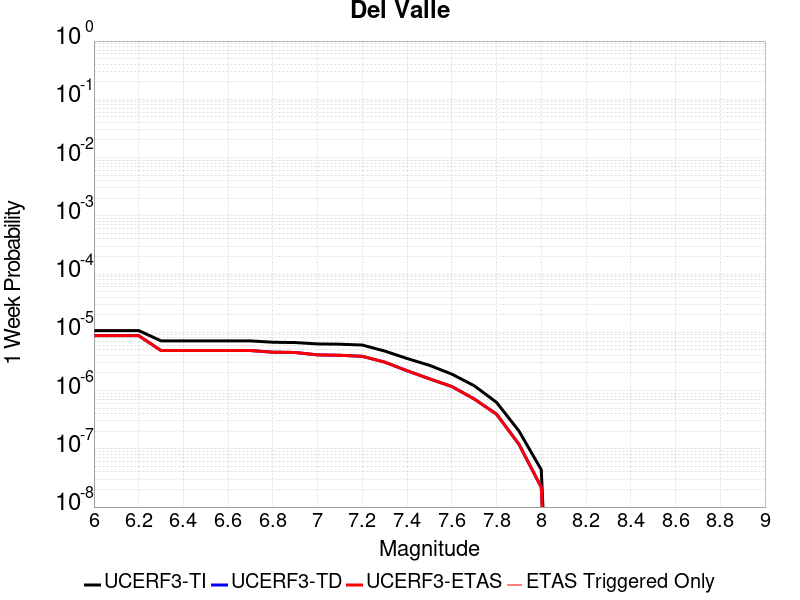 |  |  | 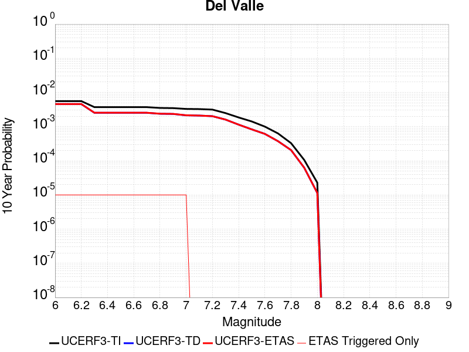 |

| Magnitude | 1 wk TI Prob | 1 wk TD Prob | 1 wk ETAS Prob | 1 wk ETAS/TD Gain | 1 wk ETAS Triggered Only | 1 mo TI Prob | 1 mo TD Prob | 1 mo ETAS Prob | 1 mo ETAS/TD Gain | 1 mo ETAS Triggered Only | 1 yr TI Prob | 1 yr TD Prob | 1 yr ETAS Prob | 1 yr ETAS/TD Gain | 1 yr ETAS Triggered Only | 10 yr TI Prob | 10 yr TD Prob | 10 yr ETAS Prob | 10 yr ETAS/TD Gain | 10 yr ETAS Triggered Only |
|-----|-----|-----|-----|-----|-----|-----|-----|-----|-----|-----|-----|-----|-----|-----|-----|-----|-----|-----|-----|-----|
| 6.0 | 1.0716125E-5 | 8.767848E-6 | 8.767848E-6 | 1.0 | 0.0 | 4.592544E-5 | 3.757606E-5 | 3.757606E-5 | 1.0 | 0.0 | 5.589988E-4 | 4.5741227E-4 | 4.674077E-4 | 1.0218521 | 1.0E-5 | 0.0055759475 | 0.0045666625 | 0.004576617 | 1.0021797 | 1.0E-5 |
| 6.1 | 1.0716125E-5 | 8.767848E-6 | 8.767848E-6 | 1.0 | 0.0 | 4.592544E-5 | 3.757606E-5 | 3.757606E-5 | 1.0 | 0.0 | 5.589988E-4 | 4.5741227E-4 | 4.674077E-4 | 1.0218521 | 1.0E-5 | 0.0055759475 | 0.0045666625 | 0.004576617 | 1.0021797 | 1.0E-5 |
| 6.2 | 1.0716125E-5 | 8.767848E-6 | 8.767848E-6 | 1.0 | 0.0 | 4.592544E-5 | 3.757606E-5 | 3.757606E-5 | 1.0 | 0.0 | 5.589988E-4 | 4.5741227E-4 | 4.674077E-4 | 1.0218521 | 1.0E-5 | 0.0055759475 | 0.0045666625 | 0.004576617 | 1.0021797 | 1.0E-5 |
| 6.3 | 7.1293784E-6 | 4.865798E-6 | 4.865798E-6 | 1.0 | 0.0 | 3.055412E-5 | 2.0853258E-5 | 2.0853258E-5 | 1.0 | 0.0 | 3.7193293E-4 | 2.5385956E-4 | 2.6385704E-4 | 1.0393819 | 1.0E-5 | 0.0037131102 | 0.0025357818 | 0.0025457563 | 1.0039335 | 1.0E-5 |
| 6.4 | 7.1293784E-6 | 4.865798E-6 | 4.865798E-6 | 1.0 | 0.0 | 3.055412E-5 | 2.0853258E-5 | 2.0853258E-5 | 1.0 | 0.0 | 3.7193293E-4 | 2.5385956E-4 | 2.6385704E-4 | 1.0393819 | 1.0E-5 | 0.0037131102 | 0.0025357818 | 0.0025457563 | 1.0039335 | 1.0E-5 |
| 6.5 | 7.1293784E-6 | 4.865798E-6 | 4.865798E-6 | 1.0 | 0.0 | 3.055412E-5 | 2.0853258E-5 | 2.0853258E-5 | 1.0 | 0.0 | 3.7193293E-4 | 2.5385956E-4 | 2.6385704E-4 | 1.0393819 | 1.0E-5 | 0.0037131102 | 0.0025357818 | 0.0025457563 | 1.0039335 | 1.0E-5 |
| 6.6 | 7.1293784E-6 | 4.865798E-6 | 4.865798E-6 | 1.0 | 0.0 | 3.055412E-5 | 2.0853258E-5 | 2.0853258E-5 | 1.0 | 0.0 | 3.7193293E-4 | 2.5385956E-4 | 2.6385704E-4 | 1.0393819 | 1.0E-5 | 0.0037131102 | 0.0025357818 | 0.0025457563 | 1.0039335 | 1.0E-5 |
| 6.7 | 7.12272E-6 | 4.8631737E-6 | 4.8631737E-6 | 1.0 | 0.0 | 3.0525585E-5 | 2.084201E-5 | 2.084201E-5 | 1.0 | 0.0 | 3.7158563E-4 | 2.5372265E-4 | 2.6372014E-4 | 1.0394031 | 1.0E-5 | 0.003709649 | 0.0025344158 | 0.0025443905 | 1.0039357 | 1.0E-5 |
| 6.8 | 6.7558703E-6 | 4.5593774E-6 | 4.5593774E-6 | 1.0 | 0.0 | 2.895341E-5 | 1.9540048E-5 | 1.9540048E-5 | 1.0 | 0.0 | 3.5245073E-4 | 2.3787473E-4 | 2.4787235E-4 | 1.0420289 | 1.0E-5 | 0.0035189227 | 0.0023762763 | 0.0023862526 | 1.0041983 | 1.0E-5 |
| 6.9 | 6.6700386E-6 | 4.502516E-6 | 4.502516E-6 | 1.0 | 0.0 | 2.8585566E-5 | 1.9296356E-5 | 1.9296356E-5 | 1.0 | 0.0 | 3.479737E-4 | 2.3490845E-4 | 2.4490608E-4 | 1.0425597 | 1.0E-5 | 0.003474293 | 0.0023466763 | 0.0023566529 | 1.0042514 | 1.0E-5 |
| 7.0 | 6.3181424E-6 | 4.098682E-6 | 4.098682E-6 | 1.0 | 0.0 | 2.7077473E-5 | 1.7565664E-5 | 1.7565664E-5 | 1.0 | 0.0 | 3.2961834E-4 | 2.1384138E-4 | 2.2383925E-4 | 1.0467536 | 1.0E-5 | 0.0032912986 | 0.002136411 | 0.0021463896 | 1.0046707 | 1.0E-5 |
| 7.1 | 6.248759E-6 | 4.0338737E-6 | 4.0338737E-6 | 1.0 | 0.0 | 2.678012E-5 | 1.7287917E-5 | 1.7287917E-5 | 1.0 | 0.0 | 3.2599916E-4 | 2.104605E-4 | 2.104605E-4 | 1.0 | 0.0 | 0.0032552136 | 0.0021026663 | 0.0021026663 | 1.0 | 0.0 |
| 7.2 | 6.0411944E-6 | 3.8698677E-6 | 3.8698677E-6 | 1.0 | 0.0 | 2.5890577E-5 | 1.6585045E-5 | 1.6585045E-5 | 1.0 | 0.0 | 3.1517216E-4 | 2.0190462E-4 | 2.0190462E-4 | 1.0 | 0.0 | 0.0031472554 | 0.0020172652 | 0.0020172652 | 1.0 | 0.0 |
| 7.3 | 4.7691183E-6 | 3.0781057E-6 | 3.0781057E-6 | 1.0 | 0.0 | 2.0438918E-5 | 1.3191816E-5 | 1.3191816E-5 | 1.0 | 0.0 | 2.488154E-4 | 1.6059873E-4 | 1.6059873E-4 | 1.0 | 0.0 | 0.00248537 | 0.0016048526 | 0.0016048526 | 1.0 | 0.0 |
| 7.4 | 3.5524722E-6 | 2.1893263E-6 | 2.1893263E-6 | 1.0 | 0.0 | 1.5224792E-5 | 9.382794E-6 | 9.382794E-6 | 1.0 | 0.0 | 1.8534607E-4 | 1.142296E-4 | 1.142296E-4 | 1.0 | 0.0 | 0.0018519156 | 0.0011417172 | 0.0011417172 | 1.0 | 0.0 |
| 7.5 | 2.7133442E-6 | 1.5916022E-6 | 1.5916022E-6 | 1.0 | 0.0 | 1.1628566E-5 | 6.821135E-6 | 6.821135E-6 | 1.0 | 0.0 | 1.415686E-4 | 8.304417E-5 | 8.304417E-5 | 1.0 | 0.0 | 0.0014147845 | 8.301333E-4 | 8.301333E-4 | 1.0 | 0.0 |
| 7.6 | 1.915338E-6 | 1.1739088E-6 | 1.1739088E-6 | 1.0 | 0.0 | 8.208566E-6 | 5.031028E-6 | 5.031028E-6 | 1.0 | 0.0 | 9.993471E-5 | 6.1251056E-5 | 6.1251056E-5 | 1.0 | 0.0 | 9.988978E-4 | 6.123427E-4 | 6.123427E-4 | 1.0 | 0.0 |
| 7.7 | 1.2120448E-6 | 7.180277E-7 | 7.180277E-7 | 1.0 | 0.0 | 5.194467E-6 | 3.077258E-6 | 3.077258E-6 | 1.0 | 0.0 | 6.3240805E-5 | 3.7464975E-5 | 3.7464975E-5 | 1.0 | 0.0 | 6.322281E-4 | 3.74587E-4 | 3.74587E-4 | 1.0 | 0.0 |
| 7.8 | 6.272381E-7 | 3.9325283E-7 | 3.9325283E-7 | 1.0 | 0.0 | 2.6881603E-6 | 1.6853683E-6 | 1.6853683E-6 | 1.0 | 0.0 | 3.272786E-5 | 2.0519166E-5 | 2.0519166E-5 | 1.0 | 0.0 | 3.272304E-4 | 2.0517288E-4 | 2.0517288E-4 | 1.0 | 0.0 |
| 7.9 | 2.0292627E-7 | 1.2004544E-7 | 1.2004544E-7 | 1.0 | 0.0 | 8.6968373E-7 | 5.144804E-7 | 5.144804E-7 | 1.0 | 0.0 | 1.0588348E-5 | 6.263781E-6 | 6.263781E-6 | 1.0 | 0.0 | 1.0587843E-4 | 6.263606E-5 | 6.263606E-5 | 1.0 | 0.0 |
| 8.0 | 4.374492E-8 | 2.1899407E-8 | 2.1899407E-8 | 1.0 | 0.0 | 1.8747821E-7 | 9.3854595E-8 | 9.3854595E-8 | 1.0 | 0.0 | 2.2825448E-6 | 1.1426791E-6 | 1.1426791E-6 | 1.0 | 0.0 | 2.2825214E-5 | 1.1426737E-5 | 1.1426737E-5 | 1.0 | 0.0 |

## Santa Susana East (connector)
*[(top)](#table-of-contents)*

| 1 Week | 1 Month | 1 Year | 10 Year |
|-----|-----|-----|-----|
| 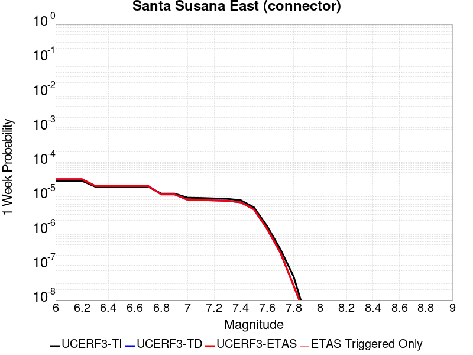 |  | 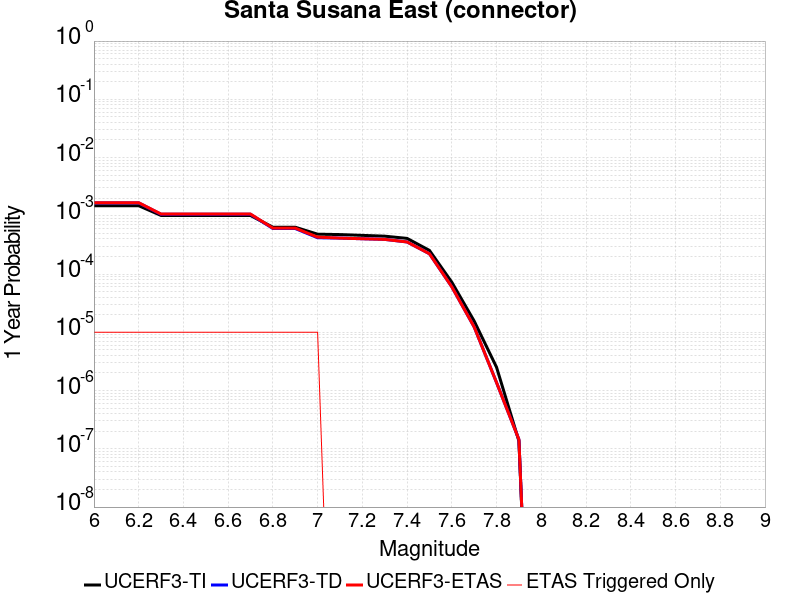 | 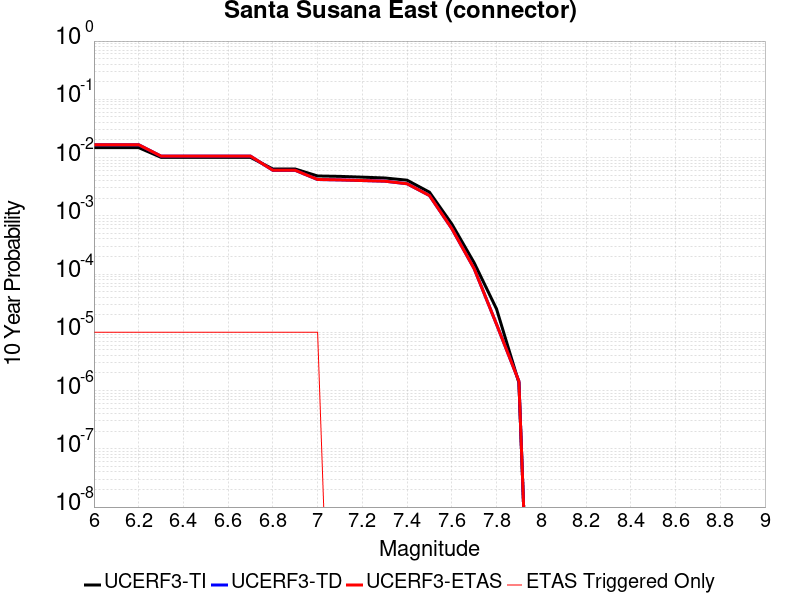 |

| Magnitude | 1 wk TI Prob | 1 wk TD Prob | 1 wk ETAS Prob | 1 wk ETAS/TD Gain | 1 wk ETAS Triggered Only | 1 mo TI Prob | 1 mo TD Prob | 1 mo ETAS Prob | 1 mo ETAS/TD Gain | 1 mo ETAS Triggered Only | 1 yr TI Prob | 1 yr TD Prob | 1 yr ETAS Prob | 1 yr ETAS/TD Gain | 1 yr ETAS Triggered Only | 10 yr TI Prob | 10 yr TD Prob | 10 yr ETAS Prob | 10 yr ETAS/TD Gain | 10 yr ETAS Triggered Only |
|-----|-----|-----|-----|-----|-----|-----|-----|-----|-----|-----|-----|-----|-----|-----|-----|-----|-----|-----|-----|-----|
| 6.0 | 2.858397E-5 | 3.2020725E-5 | 3.2020725E-5 | 1.0 | 0.0 | 1.2249697E-4 | 1.3722606E-4 | 1.3722606E-4 | 1.0 | 0.0 | 0.0014903803 | 0.0016697284 | 0.0016797117 | 1.005979 | 1.0E-5 | 0.014804244 | 0.016598959 | 0.016608791 | 1.0005925 | 1.0E-5 |
| 6.1 | 2.858397E-5 | 3.2020725E-5 | 3.2020725E-5 | 1.0 | 0.0 | 1.2249697E-4 | 1.3722606E-4 | 1.3722606E-4 | 1.0 | 0.0 | 0.0014903803 | 0.0016697284 | 0.0016797117 | 1.005979 | 1.0E-5 | 0.014804244 | 0.016598959 | 0.016608791 | 1.0005925 | 1.0E-5 |
| 6.2 | 2.858397E-5 | 3.2020725E-5 | 3.2020725E-5 | 1.0 | 0.0 | 1.2249697E-4 | 1.3722606E-4 | 1.3722606E-4 | 1.0 | 0.0 | 0.0014903803 | 0.0016697284 | 0.0016797117 | 1.005979 | 1.0E-5 | 0.014804244 | 0.016598959 | 0.016608791 | 1.0005925 | 1.0E-5 |
| 6.3 | 1.943582E-5 | 2.036708E-5 | 2.036708E-5 | 1.0 | 0.0 | 8.329371E-5 | 8.72852E-5 | 8.72852E-5 | 1.0 | 0.0 | 0.001013629 | 0.0010622914 | 0.0010722808 | 1.0094036 | 1.0E-5 | 0.010090181 | 0.010583567 | 0.010593461 | 1.0009348 | 1.0E-5 |
| 6.4 | 1.943582E-5 | 2.036708E-5 | 2.036708E-5 | 1.0 | 0.0 | 8.329371E-5 | 8.72852E-5 | 8.72852E-5 | 1.0 | 0.0 | 0.001013629 | 0.0010622914 | 0.0010722808 | 1.0094036 | 1.0E-5 | 0.010090181 | 0.010583567 | 0.010593461 | 1.0009348 | 1.0E-5 |
| 6.5 | 1.943582E-5 | 2.036708E-5 | 2.036708E-5 | 1.0 | 0.0 | 8.329371E-5 | 8.72852E-5 | 8.72852E-5 | 1.0 | 0.0 | 0.001013629 | 0.0010622914 | 0.0010722808 | 1.0094036 | 1.0E-5 | 0.010090181 | 0.010583567 | 0.010593461 | 1.0009348 | 1.0E-5 |
| 6.6 | 1.943582E-5 | 2.036708E-5 | 2.036708E-5 | 1.0 | 0.0 | 8.329371E-5 | 8.72852E-5 | 8.72852E-5 | 1.0 | 0.0 | 0.001013629 | 0.0010622914 | 0.0010722808 | 1.0094036 | 1.0E-5 | 0.010090181 | 0.010583567 | 0.010593461 | 1.0009348 | 1.0E-5 |
| 6.7 | 1.9404439E-5 | 2.0354502E-5 | 2.0354502E-5 | 1.0 | 0.0 | 8.3159226E-5 | 8.7231296E-5 | 8.7231296E-5 | 1.0 | 0.0 | 0.0010119933 | 0.0010616358 | 0.0010716252 | 1.0094094 | 1.0E-5 | 0.010073971 | 0.010577073 | 0.010586967 | 1.0009354 | 1.0E-5 |
| 6.8 | 1.2217526E-5 | 1.1592957E-5 | 1.1592957E-5 | 1.0 | 0.0 | 5.2359774E-5 | 4.968325E-5 | 4.968325E-5 | 1.0 | 0.0 | 6.372938E-4 | 6.0474256E-4 | 6.1473646E-4 | 1.016526 | 1.0E-5 | 0.0063546924 | 0.006033016 | 0.0060429554 | 1.0016476 | 1.0E-5 |
| 6.9 | 1.2217526E-5 | 1.1592957E-5 | 1.1592957E-5 | 1.0 | 0.0 | 5.2359774E-5 | 4.968325E-5 | 4.968325E-5 | 1.0 | 0.0 | 6.372938E-4 | 6.0474256E-4 | 6.1473646E-4 | 1.016526 | 1.0E-5 | 0.0063546924 | 0.006033016 | 0.0060429554 | 1.0016476 | 1.0E-5 |
| 7.0 | 9.276017E-6 | 8.059093E-6 | 8.059093E-6 | 1.0 | 0.0 | 3.9753755E-5 | 3.453853E-5 | 3.453853E-5 | 1.0 | 0.0 | 4.8389446E-4 | 4.204289E-4 | 4.304247E-4 | 1.0237752 | 1.0E-5 | 0.0048284214 | 0.0041970615 | 0.0042070197 | 1.0023726 | 1.0E-5 |
| 7.1 | 9.130355E-6 | 7.942266E-6 | 7.942266E-6 | 1.0 | 0.0 | 3.9129503E-5 | 3.4037857E-5 | 3.4037857E-5 | 1.0 | 0.0 | 4.7629757E-4 | 4.1433558E-4 | 4.1433558E-4 | 1.0 | 0.0 | 0.00475278 | 0.004136356 | 0.004136356 | 1.0 | 0.0 |
| 7.2 | 8.851015E-6 | 7.741425E-6 | 7.741425E-6 | 1.0 | 0.0 | 3.7932372E-5 | 3.3177133E-5 | 3.3177133E-5 | 1.0 | 0.0 | 4.6172875E-4 | 4.0386018E-4 | 4.0386018E-4 | 1.0 | 0.0 | 0.0046077054 | 0.004031985 | 0.004031985 | 1.0 | 0.0 |
| 7.3 | 8.573006E-6 | 7.550147E-6 | 7.550147E-6 | 1.0 | 0.0 | 3.6740938E-5 | 3.235739E-5 | 3.235739E-5 | 1.0 | 0.0 | 4.472291E-4 | 3.9388344E-4 | 3.9388344E-4 | 1.0 | 0.0 | 0.004463301 | 0.0039325706 | 0.0039325706 | 1.0 | 0.0 |
| 7.4 | 7.852282E-6 | 6.817671E-6 | 6.817671E-6 | 1.0 | 0.0 | 3.36522E-5 | 2.921828E-5 | 2.921828E-5 | 1.0 | 0.0 | 4.096385E-4 | 3.556775E-4 | 3.556775E-4 | 1.0 | 0.0 | 0.0040888423 | 0.003551747 | 0.003551747 | 1.0 | 0.0 |
| 7.5 | 4.8869324E-6 | 4.279046E-6 | 4.279046E-6 | 1.0 | 0.0 | 2.0943828E-5 | 1.833865E-5 | 1.833865E-5 | 1.0 | 0.0 | 2.5496128E-4 | 2.2325183E-4 | 2.2325183E-4 | 1.0 | 0.0 | 0.0025466895 | 0.0022304398 | 0.0022304398 | 1.0 | 0.0 |
| 7.6 | 1.3894544E-6 | 1.1568163E-6 | 1.1568163E-6 | 1.0 | 0.0 | 5.954791E-6 | 4.957776E-6 | 4.957776E-6 | 1.0 | 0.0 | 7.249717E-5 | 6.0359478E-5 | 6.0359478E-5 | 1.0 | 0.0 | 7.247352E-4 | 6.034526E-4 | 6.034526E-4 | 1.0 | 0.0 |
| 7.7 | 2.9924632E-7 | 2.3719208E-7 | 2.3719208E-7 | 1.0 | 0.0 | 1.2824837E-6 | 1.0165371E-6 | 1.0165371E-6 | 1.0 | 0.0 | 1.5614127E-5 | 1.2376277E-5 | 1.2376277E-5 | 1.0 | 0.0 | 1.5613029E-4 | 1.2375659E-4 | 1.2375659E-4 | 1.0 | 0.0 |
| 7.8 | 4.8188564E-8 | 2.6322772E-8 | 2.6322772E-8 | 1.0 | 0.0 | 2.065224E-7 | 1.1281187E-7 | 1.1281187E-7 | 1.0 | 0.0 | 2.5144072E-6 | 1.3734838E-6 | 1.3734838E-6 | 1.0 | 0.0 | 2.5143789E-5 | 1.3734761E-5 | 1.3734761E-5 | 1.0 | 0.0 |
| 7.9 | 2.6127251E-9 | 2.7681057E-9 | 2.7681057E-9 | 1.0 | 0.0 | 1.1197393E-8 | 1.186331E-8 | 1.186331E-8 | 1.0 | 0.0 | 1.3632825E-7 | 1.444358E-7 | 1.444358E-7 | 1.0 | 0.0 | 1.3632817E-6 | 1.4443581E-6 | 1.4443581E-6 | 1.0 | 0.0 |

## Emerson-Copper Mtn 2011
*[(top)](#table-of-contents)*

| 1 Week | 1 Month | 1 Year | 10 Year |
|-----|-----|-----|-----|
|  |  |  | 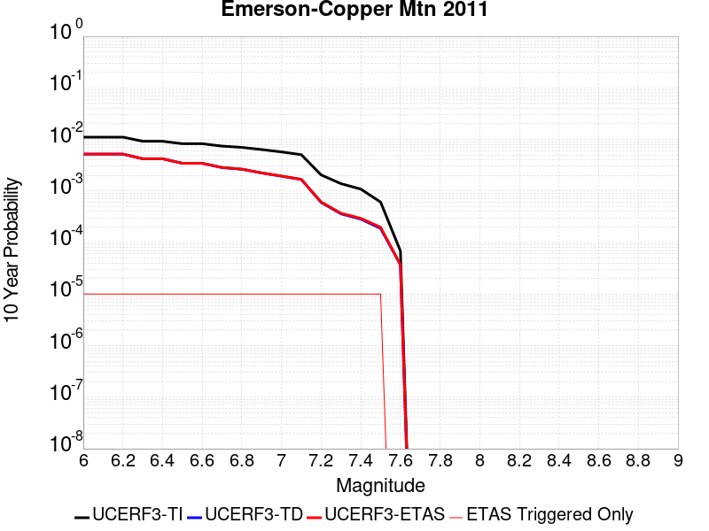 |

| Magnitude | 1 wk TI Prob | 1 wk TD Prob | 1 wk ETAS Prob | 1 wk ETAS/TD Gain | 1 wk ETAS Triggered Only | 1 mo TI Prob | 1 mo TD Prob | 1 mo ETAS Prob | 1 mo ETAS/TD Gain | 1 mo ETAS Triggered Only | 1 yr TI Prob | 1 yr TD Prob | 1 yr ETAS Prob | 1 yr ETAS/TD Gain | 1 yr ETAS Triggered Only | 10 yr TI Prob | 10 yr TD Prob | 10 yr ETAS Prob | 10 yr ETAS/TD Gain | 10 yr ETAS Triggered Only |
|-----|-----|-----|-----|-----|-----|-----|-----|-----|-----|-----|-----|-----|-----|-----|-----|-----|-----|-----|-----|-----|
| 6.0 | 2.1364202E-5 | 9.96808E-6 | 9.96808E-6 | 1.0 | 0.0 | 9.1557646E-5 | 4.2719694E-5 | 4.2719694E-5 | 1.0 | 0.0 | 0.0011141442 | 5.1999686E-4 | 5.1999686E-4 | 1.0 | 0.0 | 0.011085749 | 0.005188671 | 0.005198619 | 1.0019172 | 1.0E-5 |
| 6.1 | 2.1364202E-5 | 9.96808E-6 | 9.96808E-6 | 1.0 | 0.0 | 9.1557646E-5 | 4.2719694E-5 | 4.2719694E-5 | 1.0 | 0.0 | 0.0011141442 | 5.1999686E-4 | 5.1999686E-4 | 1.0 | 0.0 | 0.011085749 | 0.005188671 | 0.005198619 | 1.0019172 | 1.0E-5 |
| 6.2 | 2.1364202E-5 | 9.96808E-6 | 9.96808E-6 | 1.0 | 0.0 | 9.1557646E-5 | 4.2719694E-5 | 4.2719694E-5 | 1.0 | 0.0 | 0.0011141442 | 5.1999686E-4 | 5.1999686E-4 | 1.0 | 0.0 | 0.011085749 | 0.005188671 | 0.005198619 | 1.0019172 | 1.0E-5 |
| 6.3 | 1.7751237E-5 | 8.089199E-6 | 8.089199E-6 | 1.0 | 0.0 | 7.607452E-5 | 3.466757E-5 | 3.466757E-5 | 1.0 | 0.0 | 9.258136E-4 | 4.220022E-4 | 4.220022E-4 | 1.0 | 0.0 | 0.00921966 | 0.004212631 | 0.0042225886 | 1.0023638 | 1.0E-5 |
| 6.4 | 1.7751237E-5 | 8.089199E-6 | 8.089199E-6 | 1.0 | 0.0 | 7.607452E-5 | 3.466757E-5 | 3.466757E-5 | 1.0 | 0.0 | 9.258136E-4 | 4.220022E-4 | 4.220022E-4 | 1.0 | 0.0 | 0.00921966 | 0.004212631 | 0.0042225886 | 1.0023638 | 1.0E-5 |
| 6.5 | 1.5886664E-5 | 6.6037956E-6 | 6.6037956E-6 | 1.0 | 0.0 | 6.808392E-5 | 2.8301702E-5 | 2.8301702E-5 | 1.0 | 0.0 | 8.286065E-4 | 3.4452343E-4 | 3.4452343E-4 | 1.0 | 0.0 | 0.008255237 | 0.0034403573 | 0.003450323 | 1.0028967 | 1.0E-5 |
| 6.6 | 1.5886664E-5 | 6.6037956E-6 | 6.6037956E-6 | 1.0 | 0.0 | 6.808392E-5 | 2.8301702E-5 | 2.8301702E-5 | 1.0 | 0.0 | 8.286065E-4 | 3.4452343E-4 | 3.4452343E-4 | 1.0 | 0.0 | 0.008255237 | 0.0034403573 | 0.003450323 | 1.0028967 | 1.0E-5 |
| 6.7 | 1.428471E-5 | 5.470383E-6 | 5.470383E-6 | 1.0 | 0.0 | 6.121875E-5 | 2.3444309E-5 | 2.3444309E-5 | 1.0 | 0.0 | 7.450834E-4 | 2.85401E-4 | 2.85401E-4 | 1.0 | 0.0 | 0.007425902 | 0.0028507328 | 0.0028607042 | 1.0034978 | 1.0E-5 |
| 6.8 | 1.3490684E-5 | 5.07368E-6 | 5.07368E-6 | 1.0 | 0.0 | 5.7815934E-5 | 2.1744183E-5 | 2.1744183E-5 | 1.0 | 0.0 | 7.0368167E-4 | 2.6470714E-4 | 2.6470714E-4 | 1.0 | 0.0 | 0.007014576 | 0.0026442993 | 0.0026542728 | 1.0037717 | 1.0E-5 |
| 6.9 | 1.2235421E-5 | 4.28966E-6 | 4.28966E-6 | 1.0 | 0.0 | 5.2436466E-5 | 1.8384148E-5 | 1.8384148E-5 | 1.0 | 0.0 | 6.38227E-4 | 2.238076E-4 | 2.238076E-4 | 1.0 | 0.0 | 0.0063639707 | 0.0022361765 | 0.002246154 | 1.0044619 | 1.0E-5 |
| 7.0 | 1.1009851E-5 | 3.7189727E-6 | 3.7189727E-6 | 1.0 | 0.0 | 4.7184225E-5 | 1.5938376E-5 | 1.5938376E-5 | 1.0 | 0.0 | 5.743165E-4 | 1.9403589E-4 | 1.9403589E-4 | 1.0 | 0.0 | 0.005728345 | 0.0019390025 | 0.0019489832 | 1.0051473 | 1.0E-5 |
| 7.1 | 9.726373E-6 | 3.2117814E-6 | 3.2117814E-6 | 1.0 | 0.0 | 4.168379E-5 | 1.3764724E-5 | 1.3764724E-5 | 1.0 | 0.0 | 5.07382E-4 | 1.67576E-4 | 1.67576E-4 | 1.0 | 0.0 | 0.0050622504 | 0.0016748277 | 0.0016848108 | 1.0059608 | 1.0E-5 |
| 7.2 | 3.9335127E-6 | 1.1524743E-6 | 1.1524743E-6 | 1.0 | 0.0 | 1.6857803E-5 | 4.9391665E-6 | 4.9391665E-6 | 1.0 | 0.0 | 2.0522442E-4 | 6.0132756E-5 | 6.0132756E-5 | 1.0 | 0.0 | 0.00205035 | 6.0117076E-4 | 6.111648E-4 | 1.0166242 | 1.0E-5 |
| 7.3 | 2.661632E-6 | 6.9114736E-7 | 6.9114736E-7 | 1.0 | 0.0 | 1.14069435E-5 | 2.962057E-6 | 2.962057E-6 | 1.0 | 0.0 | 1.3887069E-4 | 3.6062454E-5 | 3.6062454E-5 | 1.0 | 0.0 | 0.0013878393 | 3.6056706E-4 | 3.7056347E-4 | 1.0277241 | 1.0E-5 |
| 7.4 | 2.0893426E-6 | 5.461814E-7 | 5.461814E-7 | 1.0 | 0.0 | 8.954295E-6 | 2.3407754E-6 | 2.3407754E-6 | 1.0 | 0.0 | 1.0901308E-4 | 2.8498573E-5 | 2.8498573E-5 | 1.0 | 0.0 | 0.0010895962 | 2.8494973E-4 | 2.9494686E-4 | 1.0350839 | 1.0E-5 |
| 7.5 | 1.1681728E-6 | 3.6030443E-7 | 3.6030443E-7 | 1.0 | 0.0 | 5.0064455E-6 | 1.544161E-6 | 1.544161E-6 | 1.0 | 0.0 | 6.0951766E-5 | 1.8800003E-5 | 1.8800003E-5 | 1.0 | 0.0 | 6.093505E-4 | 1.879846E-4 | 1.979827E-4 | 1.0531858 | 1.0E-5 |
| 7.6 | 1.3154387E-7 | 7.1197206E-8 | 7.1197206E-8 | 1.0 | 0.0 | 5.6375933E-7 | 3.0513087E-7 | 3.0513087E-7 | 1.0 | 0.0 | 6.863748E-6 | 3.7149634E-6 | 3.7149634E-6 | 1.0 | 0.0 | 6.863536E-5 | 3.714917E-5 | 3.714917E-5 | 1.0 | 0.0 |

## Morales (West)
*[(top)](#table-of-contents)*

| 1 Week | 1 Month | 1 Year | 10 Year |
|-----|-----|-----|-----|
|  |  |  |  |

| Magnitude | 1 wk TI Prob | 1 wk TD Prob | 1 wk ETAS Prob | 1 wk ETAS/TD Gain | 1 wk ETAS Triggered Only | 1 mo TI Prob | 1 mo TD Prob | 1 mo ETAS Prob | 1 mo ETAS/TD Gain | 1 mo ETAS Triggered Only | 1 yr TI Prob | 1 yr TD Prob | 1 yr ETAS Prob | 1 yr ETAS/TD Gain | 1 yr ETAS Triggered Only | 10 yr TI Prob | 10 yr TD Prob | 10 yr ETAS Prob | 10 yr ETAS/TD Gain | 10 yr ETAS Triggered Only |
|-----|-----|-----|-----|-----|-----|-----|-----|-----|-----|-----|-----|-----|-----|-----|-----|-----|-----|-----|-----|-----|
| 6.0 | 1.4027072E-6 | 1.479141E-6 | 1.479141E-6 | 1.0 | 0.0 | 6.0115885E-6 | 6.3391644E-6 | 6.3391644E-6 | 1.0 | 0.0 | 7.318863E-5 | 7.717729E-5 | 8.717652E-5 | 1.1295618 | 1.0E-5 | 7.316453E-4 | 7.7157345E-4 | 7.8156573E-4 | 1.0129505 | 1.0E-5 |
| 6.1 | 1.4027072E-6 | 1.479141E-6 | 1.479141E-6 | 1.0 | 0.0 | 6.0115885E-6 | 6.3391644E-6 | 6.3391644E-6 | 1.0 | 0.0 | 7.318863E-5 | 7.717729E-5 | 8.717652E-5 | 1.1295618 | 1.0E-5 | 7.316453E-4 | 7.7157345E-4 | 7.8156573E-4 | 1.0129505 | 1.0E-5 |
| 6.2 | 1.4027072E-6 | 1.479141E-6 | 1.479141E-6 | 1.0 | 0.0 | 6.0115885E-6 | 6.3391644E-6 | 6.3391644E-6 | 1.0 | 0.0 | 7.318863E-5 | 7.717729E-5 | 8.717652E-5 | 1.1295618 | 1.0E-5 | 7.316453E-4 | 7.7157345E-4 | 7.8156573E-4 | 1.0129505 | 1.0E-5 |
| 6.3 | 1.4027072E-6 | 1.479141E-6 | 1.479141E-6 | 1.0 | 0.0 | 6.0115885E-6 | 6.3391644E-6 | 6.3391644E-6 | 1.0 | 0.0 | 7.318863E-5 | 7.717729E-5 | 8.717652E-5 | 1.1295618 | 1.0E-5 | 7.316453E-4 | 7.7157345E-4 | 7.8156573E-4 | 1.0129505 | 1.0E-5 |
| 6.4 | 6.504502E-7 | 7.203718E-7 | 7.203718E-7 | 1.0 | 0.0 | 2.7876408E-6 | 3.0873043E-6 | 3.0873043E-6 | 1.0 | 0.0 | 3.3939E-5 | 3.758729E-5 | 3.758729E-5 | 1.0 | 0.0 | 3.3933815E-4 | 3.7581054E-4 | 3.7581054E-4 | 1.0 | 0.0 |
| 6.5 | 6.504502E-7 | 7.203718E-7 | 7.203718E-7 | 1.0 | 0.0 | 2.7876408E-6 | 3.0873043E-6 | 3.0873043E-6 | 1.0 | 0.0 | 3.3939E-5 | 3.758729E-5 | 3.758729E-5 | 1.0 | 0.0 | 3.3933815E-4 | 3.7581054E-4 | 3.7581054E-4 | 1.0 | 0.0 |
| 6.6 | 5.8056526E-7 | 6.4999784E-7 | 6.4999784E-7 | 1.0 | 0.0 | 2.4881344E-6 | 2.785702E-6 | 2.785702E-6 | 1.0 | 0.0 | 3.0292615E-5 | 3.3915403E-5 | 3.3915403E-5 | 1.0 | 0.0 | 3.0288487E-4 | 3.3910287E-4 | 3.3910287E-4 | 1.0 | 0.0 |
| 6.7 | 5.741448E-7 | 6.4352895E-7 | 6.4352895E-7 | 1.0 | 0.0 | 2.4606184E-6 | 2.7579783E-6 | 2.7579783E-6 | 1.0 | 0.0 | 2.9957617E-5 | 3.3577875E-5 | 3.3577875E-5 | 1.0 | 0.0 | 2.9953578E-4 | 3.3572863E-4 | 3.3572863E-4 | 1.0 | 0.0 |
| 6.8 | 5.299428E-7 | 5.8907443E-7 | 5.8907443E-7 | 1.0 | 0.0 | 2.2711813E-6 | 2.5246022E-6 | 2.5246022E-6 | 1.0 | 0.0 | 2.7651282E-5 | 3.0736603E-5 | 3.0736603E-5 | 1.0 | 0.0 | 2.7647841E-4 | 3.0732402E-4 | 3.0732402E-4 | 1.0 | 0.0 |
| 6.9 | 4.82394E-7 | 5.3415266E-7 | 5.3415266E-7 | 1.0 | 0.0 | 2.0674013E-6 | 2.2892236E-6 | 2.2892236E-6 | 1.0 | 0.0 | 2.517032E-5 | 2.7870947E-5 | 2.7870947E-5 | 1.0 | 0.0 | 2.516747E-4 | 2.786749E-4 | 2.786749E-4 | 1.0 | 0.0 |
| 7.0 | 4.3264512E-7 | 4.7597155E-7 | 4.7597155E-7 | 1.0 | 0.0 | 1.8541921E-6 | 2.0398766E-6 | 2.0398766E-6 | 1.0 | 0.0 | 2.2574555E-5 | 2.4835217E-5 | 2.4835217E-5 | 1.0 | 0.0 | 2.2572262E-4 | 2.4832474E-4 | 2.4832474E-4 | 1.0 | 0.0 |
| 7.1 | 3.7388565E-7 | 4.000246E-7 | 4.000246E-7 | 1.0 | 0.0 | 1.6023661E-6 | 1.71439E-6 | 1.71439E-6 | 1.0 | 0.0 | 1.9508632E-5 | 2.08725E-5 | 2.08725E-5 | 1.0 | 0.0 | 1.950692E-4 | 2.0870563E-4 | 2.0870563E-4 | 1.0 | 0.0 |
| 7.2 | 3.1592543E-7 | 3.319775E-7 | 3.319775E-7 | 1.0 | 0.0 | 1.3539654E-6 | 1.42276E-6 | 1.42276E-6 | 1.0 | 0.0 | 1.6484404E-5 | 1.7321965E-5 | 1.7321965E-5 | 1.0 | 0.0 | 1.6483181E-4 | 1.7320634E-4 | 1.7320634E-4 | 1.0 | 0.0 |
| 7.3 | 2.2677783E-7 | 2.1792783E-7 | 2.1792783E-7 | 1.0 | 0.0 | 9.719047E-7 | 9.339761E-7 | 9.339761E-7 | 1.0 | 0.0 | 1.1832874E-5 | 1.13711E-5 | 1.13711E-5 | 1.0 | 0.0 | 1.18322445E-4 | 1.1370523E-4 | 1.1370523E-4 | 1.0 | 0.0 |
| 7.4 | 1.2295531E-7 | 8.350286E-8 | 8.350286E-8 | 1.0 | 0.0 | 5.269512E-7 | 3.5786937E-7 | 3.5786937E-7 | 1.0 | 0.0 | 6.4156125E-6 | 4.357051E-6 | 4.357051E-6 | 1.0 | 0.0 | 6.415427E-5 | 4.356966E-5 | 4.356966E-5 | 1.0 | 0.0 |
| 7.5 | 9.9632544E-8 | 5.4427467E-8 | 5.4427467E-8 | 1.0 | 0.0 | 4.2699656E-7 | 2.3326055E-7 | 2.3326055E-7 | 1.0 | 0.0 | 5.198671E-6 | 2.8399436E-6 | 2.8399436E-6 | 1.0 | 0.0 | 5.198549E-5 | 2.8399078E-5 | 2.8399078E-5 | 1.0 | 0.0 |
| 7.6 | 8.125894E-8 | 3.5947004E-8 | 3.5947004E-8 | 1.0 | 0.0 | 3.4825257E-7 | 1.5405858E-7 | 1.5405858E-7 | 1.0 | 0.0 | 4.2399665E-6 | 1.8756616E-6 | 1.8756616E-6 | 1.0 | 0.0 | 4.2398857E-5 | 1.8756462E-5 | 1.8756462E-5 | 1.0 | 0.0 |
| 7.7 | 5.1810765E-8 | 1.1641282E-8 | 1.1641282E-8 | 1.0 | 0.0 | 2.2204613E-7 | 4.9891206E-8 | 4.9891206E-8 | 1.0 | 0.0 | 2.7034082E-6 | 6.0742525E-7 | 6.0742525E-7 | 1.0 | 0.0 | 2.7033753E-5 | 6.0742386E-6 | 6.0742386E-6 | 1.0 | 0.0 |
| 7.8 | 2.6315043E-8 | 2.3379152E-9 | 2.3379152E-9 | 1.0 | 0.0 | 1.1277875E-7 | 1.0019637E-8 | 1.0019637E-8 | 1.0 | 0.0 | 1.3730804E-6 | 1.2198906E-7 | 1.2198906E-7 | 1.0 | 0.0 | 1.3730719E-5 | 1.2198927E-6 | 1.2198927E-6 | 1.0 | 0.0 |
| 7.9 | 1.24281545E-8 | 4.2060355E-10 | 4.2060355E-10 | 1.0 | 0.0 | 5.3263516E-8 | 1.8025851E-9 | 1.8025851E-9 | 1.0 | 0.0 | 6.4848314E-7 | 2.194647E-8 | 2.194647E-8 | 1.0 | 0.0 | 6.4848123E-6 | 2.1946745E-7 | 2.1946745E-7 | 1.0 | 0.0 |
| 8.0 | 5.954214E-9 | 1.8503676E-10 | 1.8503676E-10 | 1.0 | 0.0 | 2.551806E-8 | 7.930142E-10 | 7.930142E-10 | 1.0 | 0.0 | 3.1068234E-7 | 9.654945E-9 | 9.654945E-9 | 1.0 | 0.0 | 3.1068191E-6 | 9.655223E-8 | 9.655223E-8 | 1.0 | 0.0 |
| 8.1 | 1.2586262E-9 | 8.344392E-11 | 8.344392E-11 | 1.0 | 0.0 | 5.3941123E-9 | 3.576165E-10 | 3.576165E-10 | 1.0 | 0.0 | 6.567332E-8 | 4.3539803E-9 | 4.3539803E-9 | 1.0 | 0.0 | 6.56733E-7 | 4.3542578E-8 | 4.3542578E-8 | 1.0 | 0.0 |

## San Jacinto (Clark) rev
*[(top)](#table-of-contents)*

| 1 Week | 1 Month | 1 Year | 10 Year |
|-----|-----|-----|-----|
|  |  |  |  |

| Magnitude | 1 wk TI Prob | 1 wk TD Prob | 1 wk ETAS Prob | 1 wk ETAS/TD Gain | 1 wk ETAS Triggered Only | 1 mo TI Prob | 1 mo TD Prob | 1 mo ETAS Prob | 1 mo ETAS/TD Gain | 1 mo ETAS Triggered Only | 1 yr TI Prob | 1 yr TD Prob | 1 yr ETAS Prob | 1 yr ETAS/TD Gain | 1 yr ETAS Triggered Only | 10 yr TI Prob | 10 yr TD Prob | 10 yr ETAS Prob | 10 yr ETAS/TD Gain | 10 yr ETAS Triggered Only |
|-----|-----|-----|-----|-----|-----|-----|-----|-----|-----|-----|-----|-----|-----|-----|-----|-----|-----|-----|-----|-----|
| 6.0 | 4.482615E-5 | 2.1148973E-5 | 2.1148973E-5 | 1.0 | 0.0 | 1.9209793E-4 | 9.063536E-5 | 9.063536E-5 | 1.0 | 0.0 | 0.0023362834 | 0.0011029361 | 0.0011029361 | 1.0 | 0.0 | 0.02311874 | 0.011501086 | 0.011510971 | 1.0008595 | 1.0E-5 |
| 6.1 | 4.482615E-5 | 2.1148973E-5 | 2.1148973E-5 | 1.0 | 0.0 | 1.9209793E-4 | 9.063536E-5 | 9.063536E-5 | 1.0 | 0.0 | 0.0023362834 | 0.0011029361 | 0.0011029361 | 1.0 | 0.0 | 0.02311874 | 0.011501086 | 0.011510971 | 1.0008595 | 1.0E-5 |
| 6.2 | 4.482615E-5 | 2.1148973E-5 | 2.1148973E-5 | 1.0 | 0.0 | 1.9209793E-4 | 9.063536E-5 | 9.063536E-5 | 1.0 | 0.0 | 0.0023362834 | 0.0011029361 | 0.0011029361 | 1.0 | 0.0 | 0.02311874 | 0.011501086 | 0.011510971 | 1.0008595 | 1.0E-5 |
| 6.3 | 4.482615E-5 | 2.1148973E-5 | 2.1148973E-5 | 1.0 | 0.0 | 1.9209793E-4 | 9.063536E-5 | 9.063536E-5 | 1.0 | 0.0 | 0.0023362834 | 0.0011029361 | 0.0011029361 | 1.0 | 0.0 | 0.02311874 | 0.011501086 | 0.011510971 | 1.0008595 | 1.0E-5 |
| 6.4 | 4.482615E-5 | 2.1148973E-5 | 2.1148973E-5 | 1.0 | 0.0 | 1.9209793E-4 | 9.063536E-5 | 9.063536E-5 | 1.0 | 0.0 | 0.0023362834 | 0.0011029361 | 0.0011029361 | 1.0 | 0.0 | 0.02311874 | 0.011501086 | 0.011510971 | 1.0008595 | 1.0E-5 |
| 6.5 | 3.7294863E-5 | 1.7351053E-5 | 1.7351053E-5 | 1.0 | 0.0 | 1.5982533E-4 | 7.435956E-5 | 7.435956E-5 | 1.0 | 0.0 | 0.0019441366 | 9.0495613E-4 | 9.0495613E-4 | 1.0 | 0.0 | 0.01927216 | 0.009491439 | 0.0095013445 | 1.0010436 | 1.0E-5 |
| 6.6 | 3.7294863E-5 | 1.7351053E-5 | 1.7351053E-5 | 1.0 | 0.0 | 1.5982533E-4 | 7.435956E-5 | 7.435956E-5 | 1.0 | 0.0 | 0.0019441366 | 9.0495613E-4 | 9.0495613E-4 | 1.0 | 0.0 | 0.01927216 | 0.009491439 | 0.0095013445 | 1.0010436 | 1.0E-5 |
| 6.7 | 3.6039248E-5 | 1.6599313E-5 | 1.6599313E-5 | 1.0 | 0.0 | 1.5444479E-4 | 7.1138E-5 | 7.1138E-5 | 1.0 | 0.0 | 0.0018787434 | 8.657651E-4 | 8.657651E-4 | 1.0 | 0.0 | 0.01862939 | 0.0090934 | 0.009103308 | 1.0010897 | 1.0E-5 |
| 6.8 | 3.5031844E-5 | 1.6227968E-5 | 1.6227968E-5 | 1.0 | 0.0 | 1.5012783E-4 | 6.954661E-5 | 6.954661E-5 | 1.0 | 0.0 | 0.0018262739 | 8.4640505E-4 | 8.4640505E-4 | 1.0 | 0.0 | 0.01811338 | 0.008893334 | 0.008903245 | 1.0011145 | 1.0E-5 |
| 6.9 | 3.435112E-5 | 1.6058235E-5 | 1.6058235E-5 | 1.0 | 0.0 | 1.4721078E-4 | 6.8819216E-5 | 6.8819216E-5 | 1.0 | 0.0 | 0.0017908178 | 8.3755597E-4 | 8.3755597E-4 | 1.0 | 0.0 | 0.017764548 | 0.008801554 | 0.008811466 | 1.0011262 | 1.0E-5 |
| 7.0 | 2.8959772E-5 | 1.4331922E-5 | 1.4331922E-5 | 1.0 | 0.0 | 1.241074E-4 | 6.1421095E-5 | 6.1421095E-5 | 1.0 | 0.0 | 0.0015099603 | 7.4754807E-4 | 7.4754807E-4 | 1.0 | 0.0 | 0.014997416 | 0.007865488 | 0.007875409 | 1.0012614 | 1.0E-5 |
| 7.1 | 2.6002877E-5 | 1.28242955E-5 | 1.28242955E-5 | 1.0 | 0.0 | 1.11436144E-4 | 5.496012E-5 | 5.496012E-5 | 1.0 | 0.0 | 0.0013558907 | 6.689362E-4 | 6.689362E-4 | 1.0 | 0.0 | 0.013476475 | 0.0070440206 | 0.0070539503 | 1.0014096 | 1.0E-5 |
| 7.2 | 2.2544838E-5 | 1.1257961E-5 | 1.1257961E-5 | 1.0 | 0.0 | 9.661716E-5 | 4.824752E-5 | 4.824752E-5 | 1.0 | 0.0 | 0.001175679 | 5.872566E-4 | 5.872566E-4 | 1.0 | 0.0 | 0.011694785 | 0.006190321 | 0.006200259 | 1.0016054 | 1.0E-5 |
| 7.3 | 1.75334E-5 | 1.0807203E-5 | 1.0807203E-5 | 1.0 | 0.0 | 7.514098E-5 | 4.631577E-5 | 4.631577E-5 | 1.0 | 0.0 | 9.144575E-4 | 5.6375E-4 | 5.6375E-4 | 1.0 | 0.0 | 0.009107036 | 0.0059313844 | 0.0059413253 | 1.001676 | 1.0E-5 |
| 7.4 | 1.5924552E-5 | 1.06070265E-5 | 1.06070265E-5 | 1.0 | 0.0 | 6.82463E-5 | 4.5457902E-5 | 4.5457902E-5 | 1.0 | 0.0 | 8.305819E-4 | 5.533108E-4 | 5.533108E-4 | 1.0 | 0.0 | 0.008274844 | 0.0058186566 | 0.0058285985 | 1.0017086 | 1.0E-5 |
| 7.5 | 1.3428931E-5 | 9.847458E-6 | 9.847458E-6 | 1.0 | 0.0 | 5.7551293E-5 | 4.2202715E-5 | 4.2202715E-5 | 1.0 | 0.0 | 7.004617E-4 | 5.13698E-4 | 5.13698E-4 | 1.0 | 0.0 | 0.006982579 | 0.00540425 | 0.0054141963 | 1.0018404 | 1.0E-5 |
| 7.6 | 1.0688787E-5 | 8.610701E-6 | 8.610701E-6 | 1.0 | 0.0 | 4.5808283E-5 | 3.6902486E-5 | 3.6902486E-5 | 1.0 | 0.0 | 5.5757316E-4 | 4.4919562E-4 | 4.4919562E-4 | 1.0 | 0.0 | 0.005561762 | 0.0047394587 | 0.0047494113 | 1.0021 | 1.0E-5 |
| 7.7 | 8.81236E-6 | 7.4671725E-6 | 7.4671725E-6 | 1.0 | 0.0 | 3.776671E-5 | 3.2001775E-5 | 3.2001775E-5 | 1.0 | 0.0 | 4.597127E-4 | 3.8955218E-4 | 3.8955218E-4 | 1.0 | 0.0 | 0.0045876284 | 0.004134198 | 0.004144157 | 1.0024089 | 1.0E-5 |
| 7.8 | 7.780431E-6 | 6.695772E-6 | 6.695772E-6 | 1.0 | 0.0 | 3.3344273E-5 | 2.8695851E-5 | 2.8695851E-5 | 1.0 | 0.0 | 4.0589093E-4 | 3.4931616E-4 | 3.4931616E-4 | 1.0 | 0.0 | 0.0040515037 | 0.0037223601 | 0.003732323 | 1.0026765 | 1.0E-5 |
| 7.9 | 6.5437994E-6 | 5.779629E-6 | 5.779629E-6 | 1.0 | 0.0 | 2.8044553E-5 | 2.4769604E-5 | 2.4769604E-5 | 1.0 | 0.0 | 3.4138895E-4 | 3.0152837E-4 | 3.0152837E-4 | 1.0 | 0.0 | 0.0034086495 | 0.0032340821 | 0.0032440498 | 1.003082 | 1.0E-5 |
| 8.0 | 5.4488164E-6 | 4.812673E-6 | 4.812673E-6 | 1.0 | 0.0 | 2.3351862E-5 | 2.0625579E-5 | 2.0625579E-5 | 1.0 | 0.0 | 2.8427184E-4 | 2.5108762E-4 | 2.5108762E-4 | 1.0 | 0.0 | 0.0028390845 | 0.0027104812 | 0.002720454 | 1.0036794 | 1.0E-5 |
| 8.1 | 2.8397242E-6 | 1.3667719E-6 | 1.3667719E-6 | 1.0 | 0.0 | 1.217019E-5 | 5.8575806E-6 | 5.8575806E-6 | 1.0 | 0.0 | 1.4816198E-4 | 7.131373E-5 | 7.131373E-5 | 1.0 | 0.0 | 0.0014806325 | 8.113878E-4 | 8.213797E-4 | 1.0123146 | 1.0E-5 |
| 8.2 | 2.030244E-6 | 6.317443E-7 | 6.317443E-7 | 1.0 | 0.0 | 8.701017E-6 | 2.7074727E-6 | 2.7074727E-6 | 1.0 | 0.0 | 1.05929736E-4 | 3.2962987E-5 | 3.2962987E-5 | 1.0 | 0.0 | 0.0010587925 | 3.9477667E-4 | 3.9477667E-4 | 1.0 | 0.0 |
| 8.3 | 1.0659804E-6 | 2.9242594E-7 | 2.9242594E-7 | 1.0 | 0.0 | 4.568479E-6 | 1.2532535E-6 | 1.2532535E-6 | 1.0 | 0.0 | 5.5619817E-5 | 1.5258258E-5 | 1.5258258E-5 | 1.0 | 0.0 | 5.5605895E-4 | 1.8561793E-4 | 1.8561793E-4 | 1.0 | 0.0 |

## Ortigalita (North)
*[(top)](#table-of-contents)*

| 1 Week | 1 Month | 1 Year | 10 Year |
|-----|-----|-----|-----|
|  |  |  | 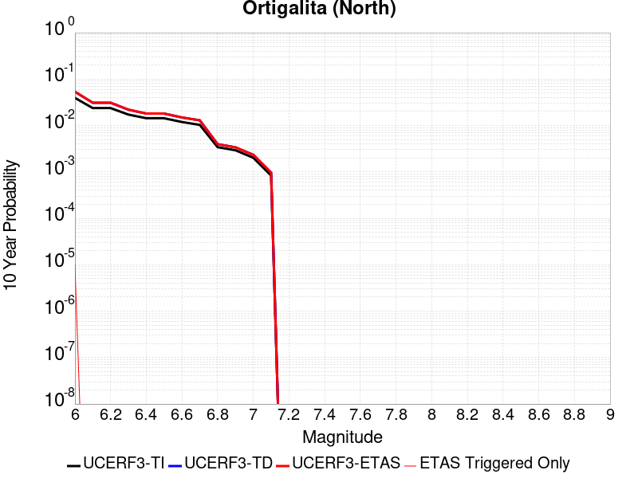 |

| Magnitude | 1 wk TI Prob | 1 wk TD Prob | 1 wk ETAS Prob | 1 wk ETAS/TD Gain | 1 wk ETAS Triggered Only | 1 mo TI Prob | 1 mo TD Prob | 1 mo ETAS Prob | 1 mo ETAS/TD Gain | 1 mo ETAS Triggered Only | 1 yr TI Prob | 1 yr TD Prob | 1 yr ETAS Prob | 1 yr ETAS/TD Gain | 1 yr ETAS Triggered Only | 10 yr TI Prob | 10 yr TD Prob | 10 yr ETAS Prob | 10 yr ETAS/TD Gain | 10 yr ETAS Triggered Only |
|-----|-----|-----|-----|-----|-----|-----|-----|-----|-----|-----|-----|-----|-----|-----|-----|-----|-----|-----|-----|-----|
| 6.0 | 7.711876E-5 | 1.0506391E-4 | 1.0506391E-4 | 1.0 | 0.0 | 3.3046713E-4 | 4.5020707E-4 | 4.5020707E-4 | 1.0 | 0.0 | 0.004016016 | 0.0054680775 | 0.0054780226 | 1.0018188 | 1.0E-5 | 0.039442103 | 0.053454336 | 0.0534638 | 1.000177 | 1.0E-5 |
| 6.1 | 4.607858E-5 | 6.0238694E-5 | 6.0238694E-5 | 1.0 | 0.0 | 1.9746469E-4 | 2.581431E-4 | 2.581431E-4 | 1.0 | 0.0 | 0.0024014818 | 0.003138735 | 0.003138735 | 1.0 | 0.0 | 0.023756953 | 0.030974828 | 0.030974828 | 1.0 | 0.0 |
| 6.2 | 4.607858E-5 | 6.0238694E-5 | 6.0238694E-5 | 1.0 | 0.0 | 1.9746469E-4 | 2.581431E-4 | 2.581431E-4 | 1.0 | 0.0 | 0.0024014818 | 0.003138735 | 0.003138735 | 1.0 | 0.0 | 0.023756953 | 0.030974828 | 0.030974828 | 1.0 | 0.0 |
| 6.3 | 3.327423E-5 | 4.2474803E-5 | 4.2474803E-5 | 1.0 | 0.0 | 1.4259605E-4 | 1.8202393E-4 | 1.8202393E-4 | 1.0 | 0.0 | 0.0017347244 | 0.0022141805 | 0.0022141805 | 1.0 | 0.0 | 0.017212452 | 0.021945486 | 0.021945486 | 1.0 | 0.0 |
| 6.4 | 2.7732503E-5 | 3.4998342E-5 | 3.4998342E-5 | 1.0 | 0.0 | 1.1884817E-4 | 1.4998578E-4 | 1.4998578E-4 | 1.0 | 0.0 | 0.001446016 | 0.0018247965 | 0.0018247965 | 1.0 | 0.0 | 0.014366428 | 0.018121095 | 0.018121095 | 1.0 | 0.0 |
| 6.5 | 2.7689714E-5 | 3.4948156E-5 | 3.4948156E-5 | 1.0 | 0.0 | 1.186648E-4 | 1.4977071E-4 | 1.4977071E-4 | 1.0 | 0.0 | 0.0014437864 | 0.0018221827 | 0.0018221827 | 1.0 | 0.0 | 0.014344421 | 0.018095383 | 0.018095383 | 1.0 | 0.0 |
| 6.6 | 2.2976905E-5 | 2.8718066E-5 | 2.8718066E-5 | 1.0 | 0.0 | 9.846873E-5 | 1.2307306E-4 | 1.2307306E-4 | 1.0 | 0.0 | 0.0011981975 | 0.0014976262 | 0.0014976262 | 1.0 | 0.0 | 0.011917574 | 0.014898595 | 0.014898595 | 1.0 | 0.0 |
| 6.7 | 1.9871539E-5 | 2.4904239E-5 | 2.4904239E-5 | 1.0 | 0.0 | 8.516096E-5 | 1.0672949E-4 | 1.0672949E-4 | 1.0 | 0.0 | 0.0010363415 | 0.0012989055 | 0.0012989055 | 1.0 | 0.0 | 0.010315218 | 0.01293683 | 0.01293683 | 1.0 | 0.0 |
| 6.8 | 6.5640475E-6 | 7.6054603E-6 | 7.6054603E-6 | 1.0 | 0.0 | 2.813133E-5 | 3.259444E-5 | 3.259444E-5 | 1.0 | 0.0 | 3.424451E-4 | 3.967679E-4 | 3.967679E-4 | 1.0 | 0.0 | 0.0034191788 | 0.0039608823 | 0.0039608823 | 1.0 | 0.0 |
| 6.9 | 5.6219683E-6 | 6.5018107E-6 | 6.5018107E-6 | 1.0 | 0.0 | 2.4093928E-5 | 2.7864618E-5 | 2.7864618E-5 | 1.0 | 0.0 | 2.933041E-4 | 3.392015E-4 | 3.392015E-4 | 1.0 | 0.0 | 0.0029291727 | 0.0033870947 | 0.0033870947 | 1.0 | 0.0 |
| 7.0 | 3.875591E-6 | 4.484736E-6 | 4.484736E-6 | 1.0 | 0.0 | 1.6609569E-5 | 1.9220168E-5 | 1.9220168E-5 | 1.0 | 0.0 | 2.0220275E-4 | 2.3398253E-4 | 2.3398253E-4 | 1.0 | 0.0 | 0.0020201886 | 0.00233757 | 0.00233757 | 1.0 | 0.0 |
| 7.1 | 1.6017933E-6 | 1.8570338E-6 | 1.8570338E-6 | 1.0 | 0.0 | 6.8648105E-6 | 7.958698E-6 | 7.958698E-6 | 1.0 | 0.0 | 8.357586E-5 | 9.6893906E-5 | 9.6893906E-5 | 1.0 | 0.0 | 8.3544437E-4 | 9.6862135E-4 | 9.6862135E-4 | 1.0 | 0.0 |

